LMDE 5 - Tested Hardware & Statistics (Desktops)
------------------------------------------------

A project to collect tested hardware configurations for LMDE 5.

Anyone can contribute to this report by the [hw-probe](https://github.com/linuxhw/hw-probe) tool:

    sudo -E hw-probe -all -upload

Please contribute! Especially if your hardware is rare.

Contents
--------

* [ Test Cases ](#test-cases)

* [ System ](#system)
  - [ Kernel                   ](#kernel)
  - [ Kernel Family            ](#kernel-family)
  - [ Kernel Major Ver.        ](#kernel-major-ver)
  - [ Arch                     ](#arch)
  - [ DE                       ](#de)
  - [ Display Server           ](#display-server)
  - [ Display Manager          ](#display-manager)
  - [ OS Lang                  ](#os-lang)
  - [ Boot Mode                ](#boot-mode)
  - [ Filesystem               ](#filesystem)
  - [ Part. scheme             ](#part-scheme)
  - [ Dual Boot with Linux/BSD ](#dual-boot-with-linuxbsd)
  - [ Dual Boot (Win)          ](#dual-boot-win)

* [ Board ](#board)
  - [ Vendor                   ](#vendor)
  - [ Model                    ](#model)
  - [ Model Family             ](#model-family)
  - [ MFG Year                 ](#mfg-year)
  - [ Form Factor              ](#form-factor)
  - [ Secure Boot              ](#secure-boot)
  - [ Coreboot                 ](#coreboot)
  - [ RAM Size                 ](#ram-size)
  - [ RAM Used                 ](#ram-used)
  - [ Total Drives             ](#total-drives)
  - [ Has CD-ROM               ](#has-cd-rom)
  - [ Has Ethernet             ](#has-ethernet)
  - [ Has WiFi                 ](#has-wifi)
  - [ Has Bluetooth            ](#has-bluetooth)

* [ Location ](#location)
  - [ Country                  ](#country)
  - [ City                     ](#city)

* [ Drives ](#drives)
  - [ Drive Vendor             ](#drive-vendor)
  - [ Drive Model              ](#drive-model)
  - [ HDD Vendor               ](#hdd-vendor)
  - [ SSD Vendor               ](#ssd-vendor)
  - [ Drive Kind               ](#drive-kind)
  - [ Drive Connector          ](#drive-connector)
  - [ Drive Size               ](#drive-size)
  - [ Space Total              ](#space-total)
  - [ Space Used               ](#space-used)
  - [ Malfunc. Drives          ](#malfunc-drives)
  - [ Malfunc. Drive Vendor    ](#malfunc-drive-vendor)
  - [ Malfunc. HDD Vendor      ](#malfunc-hdd-vendor)
  - [ Malfunc. Drive Kind      ](#malfunc-drive-kind)
  - [ Failed Drives            ](#failed-drives)
  - [ Failed Drive Vendor      ](#failed-drive-vendor)
  - [ Drive Status             ](#drive-status)

* [ Storage controller ](#storage-controller)
  - [ Storage Vendor           ](#storage-vendor)
  - [ Storage Model            ](#storage-model)
  - [ Storage Kind             ](#storage-kind)

* [ Processor ](#processor)
  - [ CPU Vendor               ](#cpu-vendor)
  - [ CPU Model                ](#cpu-model)
  - [ CPU Model Family         ](#cpu-model-family)
  - [ CPU Cores                ](#cpu-cores)
  - [ CPU Sockets              ](#cpu-sockets)
  - [ CPU Threads              ](#cpu-threads)
  - [ CPU Op-Modes             ](#cpu-op-modes)
  - [ CPU Microcode            ](#cpu-microcode)
  - [ CPU Microarch            ](#cpu-microarch)

* [ Graphics ](#graphics)
  - [ GPU Vendor               ](#gpu-vendor)
  - [ GPU Model                ](#gpu-model)
  - [ GPU Combo                ](#gpu-combo)
  - [ GPU Driver               ](#gpu-driver)
  - [ GPU Memory               ](#gpu-memory)

* [ Monitor ](#monitor)
  - [ Monitor Vendor           ](#monitor-vendor)
  - [ Monitor Model            ](#monitor-model)
  - [ Monitor Resolution       ](#monitor-resolution)
  - [ Monitor Diagonal         ](#monitor-diagonal)
  - [ Monitor Width            ](#monitor-width)
  - [ Aspect Ratio             ](#aspect-ratio)
  - [ Monitor Area             ](#monitor-area)
  - [ Pixel Density            ](#pixel-density)
  - [ Multiple Monitors        ](#multiple-monitors)

* [ Network ](#network)
  - [ Net Controller Vendor    ](#net-controller-vendor)
  - [ Net Controller Model     ](#net-controller-model)
  - [ Wireless Vendor          ](#wireless-vendor)
  - [ Wireless Model           ](#wireless-model)
  - [ Ethernet Vendor          ](#ethernet-vendor)
  - [ Ethernet Model           ](#ethernet-model)
  - [ Net Controller Kind      ](#net-controller-kind)
  - [ Used Controller          ](#used-controller)
  - [ NICs                     ](#nics)
  - [ IPv6                     ](#ipv6)

* [ Bluetooth ](#bluetooth)
  - [ Bluetooth Vendor         ](#bluetooth-vendor)
  - [ Bluetooth Model          ](#bluetooth-model)

* [ Sound ](#sound)
  - [ Sound Vendor             ](#sound-vendor)
  - [ Sound Model              ](#sound-model)

* [ Memory ](#memory)
  - [ Memory Vendor            ](#memory-vendor)
  - [ Memory Model             ](#memory-model)
  - [ Memory Kind              ](#memory-kind)
  - [ Memory Form Factor       ](#memory-form-factor)
  - [ Memory Size              ](#memory-size)
  - [ Memory Speed             ](#memory-speed)

* [ Printers & scanners ](#printers--scanners)
  - [ Printer Vendor           ](#printer-vendor)
  - [ Printer Model            ](#printer-model)
  - [ Scanner Vendor           ](#scanner-vendor)
  - [ Scanner Model            ](#scanner-model)

* [ Camera ](#camera)
  - [ Camera Vendor            ](#camera-vendor)
  - [ Camera Model             ](#camera-model)

* [ Security ](#security)
  - [ Fingerprint Vendor       ](#fingerprint-vendor)
  - [ Fingerprint Model        ](#fingerprint-model)
  - [ Chipcard Vendor          ](#chipcard-vendor)
  - [ Chipcard Model           ](#chipcard-model)

* [ Unsupported ](#unsupported)
  - [ Unsupported Devices      ](#unsupported-devices)
  - [ Unsupported Device Types ](#unsupported-device-types)

Test Cases
----------

Total: 324

| Vendor        | Model                       | Probe                                                      | Date         |
|---------------|-----------------------------|------------------------------------------------------------|--------------|
| ASUSTek       | H97-PLUS                    | [9a92ac1dae](https://linux-hardware.org/?probe=9a92ac1dae) | Nov 11, 2025 |
| Dell          | 0YXT71 A02                  | [d1f5f0d7ef](https://linux-hardware.org/?probe=d1f5f0d7ef) | Nov 03, 2025 |
| Dell          | 0GY6Y8 A02                  | [828cd03393](https://linux-hardware.org/?probe=828cd03393) | Aug 22, 2025 |
| Dell          | 0YXT71 A02                  | [3c43359304](https://linux-hardware.org/?probe=3c43359304) | Jun 14, 2025 |
| Gigabyte      | MZGLKAP-00                  | [8cc8191bd8](https://linux-hardware.org/?probe=8cc8191bd8) | May 04, 2025 |
| PLEXHD        | X79 Turbo                   | [a272242927](https://linux-hardware.org/?probe=a272242927) | Feb 18, 2025 |
| PLEXHD        | X79 Turbo                   | [52e126235e](https://linux-hardware.org/?probe=52e126235e) | Feb 18, 2025 |
| Intel         | B75                         | [836553e146](https://linux-hardware.org/?probe=836553e146) | Feb 01, 2025 |
| Login Info... | ISYNC ONE B75 V1            | [61c31eb3a0](https://linux-hardware.org/?probe=61c31eb3a0) | Feb 01, 2025 |
| Login Info... | ISYNC ONE B75 V1            | [afc02cd20d](https://linux-hardware.org/?probe=afc02cd20d) | Jan 31, 2025 |
| Acer          | Aspire XC600 v1.0           | [2f22befa4d](https://linux-hardware.org/?probe=2f22befa4d) | Jan 01, 2025 |
| Acer          | Aspire XC600 v1.0           | [cad98a7856](https://linux-hardware.org/?probe=cad98a7856) | Jan 01, 2025 |
| PLEXHD        | X79 Turbo                   | [e1891a209b](https://linux-hardware.org/?probe=e1891a209b) | Nov 22, 2024 |
| PLEXHD        | X79 Turbo                   | [898dc2c319](https://linux-hardware.org/?probe=898dc2c319) | Nov 04, 2024 |
| ASRock        | Z68M-ITX/HT                 | [ec4ca88b8b](https://linux-hardware.org/?probe=ec4ca88b8b) | Aug 01, 2024 |
| ASUSTek       | P5K SE                      | [b860e6df76](https://linux-hardware.org/?probe=b860e6df76) | Jul 24, 2024 |
| ASUSTek       | P5K SE                      | [6f0ebdcb04](https://linux-hardware.org/?probe=6f0ebdcb04) | Jul 24, 2024 |
| Dell          | 0YXT71 A02                  | [a0f01e0864](https://linux-hardware.org/?probe=a0f01e0864) | Jul 01, 2024 |
| Dell          | 0YXT71 A02                  | [ab3b880704](https://linux-hardware.org/?probe=ab3b880704) | May 28, 2024 |
| Dell          | 0YXT71 A02                  | [4da89e5d1d](https://linux-hardware.org/?probe=4da89e5d1d) | May 05, 2024 |
| Gigabyte      | GA-A75-D3H                  | [9fbe4e85f5](https://linux-hardware.org/?probe=9fbe4e85f5) | May 01, 2024 |
| Intel         | DQ77MK AAG39642-302         | [0e7e9ec585](https://linux-hardware.org/?probe=0e7e9ec585) | Apr 26, 2024 |
| Gigabyte      | GA-A75-D3H                  | [741937c8be](https://linux-hardware.org/?probe=741937c8be) | Apr 23, 2024 |
| Acer          | Veriton M480                | [c8ed2099cb](https://linux-hardware.org/?probe=c8ed2099cb) | Mar 02, 2024 |
| Gigabyte      | AB350M-Gaming 3-CF          | [0eb252845c](https://linux-hardware.org/?probe=0eb252845c) | Feb 24, 2024 |
| Gigabyte      | AB350M-Gaming 3-CF          | [70e8bb7037](https://linux-hardware.org/?probe=70e8bb7037) | Feb 23, 2024 |
| MSI           | B450M PRO-VDH MAX           | [373d3866b8](https://linux-hardware.org/?probe=373d3866b8) | Feb 20, 2024 |
| Sapphire      | PI-AM3RS760G2               | [ec094665df](https://linux-hardware.org/?probe=ec094665df) | Jan 09, 2024 |
| Apple         | Mac-F60DEB81FF30ACF6 Mac... | [e15da7350e](https://linux-hardware.org/?probe=e15da7350e) | Jan 07, 2024 |
| Sapphire      | PI-AM3RS760G2               | [b98b78a3df](https://linux-hardware.org/?probe=b98b78a3df) | Jan 05, 2024 |
| Sapphire      | PI-AM3RS760G2               | [243e9d1b27](https://linux-hardware.org/?probe=243e9d1b27) | Jan 02, 2024 |
| Intel         | B75                         | [df9a51de80](https://linux-hardware.org/?probe=df9a51de80) | Dec 30, 2023 |
| ASUSTek       | M4A89GTD-PRO/USB3           | [9362181823](https://linux-hardware.org/?probe=9362181823) | Dec 14, 2023 |
| Sapphire      | PI-AM3RS760G2               | [e2c79fa4d1](https://linux-hardware.org/?probe=e2c79fa4d1) | Dec 13, 2023 |
| Pegatron      | 2ACF                        | [d89c55cb89](https://linux-hardware.org/?probe=d89c55cb89) | Nov 24, 2023 |
| Acer          | Aspire TC-780               | [dbce2ba706](https://linux-hardware.org/?probe=dbce2ba706) | Nov 23, 2023 |
| Pegatron      | 2ADC                        | [683e6fe69e](https://linux-hardware.org/?probe=683e6fe69e) | Nov 20, 2023 |
| Pegatron      | 2ADC                        | [ff6ee5f1e5](https://linux-hardware.org/?probe=ff6ee5f1e5) | Nov 20, 2023 |
| Gigabyte      | AB350M-DS3H V2-CF           | [4f2229b9fa](https://linux-hardware.org/?probe=4f2229b9fa) | Oct 21, 2023 |
| Medion        | TJ4125                      | [626065ec1b](https://linux-hardware.org/?probe=626065ec1b) | Oct 03, 2023 |
| Gigabyte      | Q87M-D2H                    | [ee49b13b77](https://linux-hardware.org/?probe=ee49b13b77) | Oct 02, 2023 |
| MSI           | B550M PRO-VDH WIFI          | [bc2e88dd9c](https://linux-hardware.org/?probe=bc2e88dd9c) | Sep 30, 2023 |
| Gigabyte      | Q87M-D2H                    | [1d749b29ad](https://linux-hardware.org/?probe=1d749b29ad) | Sep 28, 2023 |
| Gigabyte      | Q87M-D2H                    | [8bdc8129ff](https://linux-hardware.org/?probe=8bdc8129ff) | Sep 25, 2023 |
| Gigabyte      | Q87M-D2H                    | [87cba2e3a2](https://linux-hardware.org/?probe=87cba2e3a2) | Sep 24, 2023 |
| Medion        | TJ4125                      | [434dd057a6](https://linux-hardware.org/?probe=434dd057a6) | Sep 23, 2023 |
| ASUSTek       | P8H61-M LX                  | [48a5b6b71d](https://linux-hardware.org/?probe=48a5b6b71d) | Sep 23, 2023 |
| HP            | 859C                        | [7de1553287](https://linux-hardware.org/?probe=7de1553287) | Sep 20, 2023 |
| Intel         | DG31PR AAD97573-206         | [da930461ec](https://linux-hardware.org/?probe=da930461ec) | Sep 18, 2023 |
| Intel         | X79                         | [e9a4f4dc51](https://linux-hardware.org/?probe=e9a4f4dc51) | Sep 13, 2023 |
| ASRock        | H110M-DVS R3.0              | [b0305f4ba4](https://linux-hardware.org/?probe=b0305f4ba4) | Sep 10, 2023 |
| Medion        | TJ4125                      | [80a4e5fbff](https://linux-hardware.org/?probe=80a4e5fbff) | Sep 09, 2023 |
| HP            | 859C                        | [c113eb162e](https://linux-hardware.org/?probe=c113eb162e) | Sep 09, 2023 |
| Gigabyte      | Q87M-D2H                    | [3389baa197](https://linux-hardware.org/?probe=3389baa197) | Sep 07, 2023 |
| Gigabyte      | Q87M-D2H                    | [f73f6d9301](https://linux-hardware.org/?probe=f73f6d9301) | Sep 05, 2023 |
| Gigabyte      | Q87M-D2H                    | [61c5e35c02](https://linux-hardware.org/?probe=61c5e35c02) | Sep 05, 2023 |
| Gigabyte      | Q87M-D2H                    | [f5e7afad66](https://linux-hardware.org/?probe=f5e7afad66) | Sep 04, 2023 |
| Medion        | TJ4125                      | [e2e111051c](https://linux-hardware.org/?probe=e2e111051c) | Sep 03, 2023 |
| ASUSTek       | G10DK                       | [d6b74ca876](https://linux-hardware.org/?probe=d6b74ca876) | Sep 03, 2023 |
| Gigabyte      | B450 AORUS M                | [e58d4f8405](https://linux-hardware.org/?probe=e58d4f8405) | Sep 03, 2023 |
| MSI           | B560M PRO-E                 | [17eed28ecb](https://linux-hardware.org/?probe=17eed28ecb) | Sep 02, 2023 |
| Acer          | Aspire X3400                | [62a78b2a16](https://linux-hardware.org/?probe=62a78b2a16) | Sep 01, 2023 |
| MSI           | B450 TOMAHAWK MAX II        | [f7a484830d](https://linux-hardware.org/?probe=f7a484830d) | Aug 30, 2023 |
| Dell          | 0D28YY A00                  | [9f2585c0aa](https://linux-hardware.org/?probe=9f2585c0aa) | Aug 29, 2023 |
| HP            | 859C                        | [978d715b29](https://linux-hardware.org/?probe=978d715b29) | Aug 25, 2023 |
| eMachines     | EL1852G                     | [68db025f09](https://linux-hardware.org/?probe=68db025f09) | Aug 25, 2023 |
| Pegatron      | 2ACF                        | [38f3df41d7](https://linux-hardware.org/?probe=38f3df41d7) | Aug 24, 2023 |
| eMachines     | EL1852G                     | [ea782989fd](https://linux-hardware.org/?probe=ea782989fd) | Aug 24, 2023 |
| HP            | 859C                        | [63f9e00825](https://linux-hardware.org/?probe=63f9e00825) | Aug 22, 2023 |
| Gigabyte      | AB350M-DS3H V2-CF           | [cce6cb2878](https://linux-hardware.org/?probe=cce6cb2878) | Aug 18, 2023 |
| Gigabyte      | AB350M-DS3H V2-CF           | [8803256d2e](https://linux-hardware.org/?probe=8803256d2e) | Aug 14, 2023 |
| Medion        | TJ4125                      | [e24dc34df5](https://linux-hardware.org/?probe=e24dc34df5) | Aug 13, 2023 |
| Gigabyte      | Q87M-D2H                    | [6289a9e628](https://linux-hardware.org/?probe=6289a9e628) | Aug 12, 2023 |
| HP            | 859C                        | [24dd090f2c](https://linux-hardware.org/?probe=24dd090f2c) | Aug 09, 2023 |
| ASRock        | B550M-ITX/ac                | [c86495f999](https://linux-hardware.org/?probe=c86495f999) | Aug 08, 2023 |
| ASUSTek       | ROG STRIX B450-F GAMING     | [7fe1ce642a](https://linux-hardware.org/?probe=7fe1ce642a) | Aug 08, 2023 |
| Gigabyte      | Q87M-D2H                    | [dbcb2c4a80](https://linux-hardware.org/?probe=dbcb2c4a80) | Aug 07, 2023 |
| Medion        | TJ4125                      | [e35dc275ce](https://linux-hardware.org/?probe=e35dc275ce) | Aug 06, 2023 |
| Medion        | TJ4125                      | [0adec5cb7e](https://linux-hardware.org/?probe=0adec5cb7e) | Aug 04, 2023 |
| Gigabyte      | Q87M-D2H                    | [d3df0e8ee1](https://linux-hardware.org/?probe=d3df0e8ee1) | Aug 04, 2023 |
| Gigabyte      | Q87M-D2H                    | [37725aaff8](https://linux-hardware.org/?probe=37725aaff8) | Aug 03, 2023 |
| Intel         | X79                         | [051316466a](https://linux-hardware.org/?probe=051316466a) | Aug 01, 2023 |
| Gigabyte      | AB350M-DS3H V2-CF           | [1bcc28bd33](https://linux-hardware.org/?probe=1bcc28bd33) | Jul 29, 2023 |
| Apple         | Mac-F221BEC8                | [12932af713](https://linux-hardware.org/?probe=12932af713) | Jul 29, 2023 |
| Medion        | TJ4125                      | [0882778c0a](https://linux-hardware.org/?probe=0882778c0a) | Jul 28, 2023 |
| Gigabyte      | Q87M-D2H                    | [374c405364](https://linux-hardware.org/?probe=374c405364) | Jul 26, 2023 |
| ASUSTek       | PRIME A320M-K               | [199fe99179](https://linux-hardware.org/?probe=199fe99179) | Jul 25, 2023 |
| Gigabyte      | Q87M-D2H                    | [7aaa099507](https://linux-hardware.org/?probe=7aaa099507) | Jul 24, 2023 |
| Intel         | X79                         | [8037a9fc0e](https://linux-hardware.org/?probe=8037a9fc0e) | Jul 24, 2023 |
| Dell          | 00F82W A02                  | [53b13b667d](https://linux-hardware.org/?probe=53b13b667d) | Jul 16, 2023 |
| Dell          | 00F82W A02                  | [293fa24c88](https://linux-hardware.org/?probe=293fa24c88) | Jul 14, 2023 |
| Medion        | TJ4125                      | [88fb5ecc29](https://linux-hardware.org/?probe=88fb5ecc29) | Jul 09, 2023 |
| Medion        | TJ4125                      | [efa563ec1f](https://linux-hardware.org/?probe=efa563ec1f) | Jul 09, 2023 |
| Gigabyte      | Q87M-D2H                    | [d660aa6f35](https://linux-hardware.org/?probe=d660aa6f35) | Jul 09, 2023 |
| Gigabyte      | Q87M-D2H                    | [87872596c0](https://linux-hardware.org/?probe=87872596c0) | Jul 08, 2023 |
| Medion        | TJ4125                      | [38d2ffe2de](https://linux-hardware.org/?probe=38d2ffe2de) | Jul 08, 2023 |
| Medion        | TJ4125                      | [1de78b3365](https://linux-hardware.org/?probe=1de78b3365) | Jul 07, 2023 |
| Gigabyte      | B450M DS3H V2               | [919f65a256](https://linux-hardware.org/?probe=919f65a256) | Jul 05, 2023 |
| Gigabyte      | Q87M-D2H                    | [22a3b2defb](https://linux-hardware.org/?probe=22a3b2defb) | Jul 05, 2023 |
| Medion        | TJ4125                      | [8d8748e1dc](https://linux-hardware.org/?probe=8d8748e1dc) | Jul 02, 2023 |
| Gigabyte      | Q87M-D2H                    | [89c111d3ec](https://linux-hardware.org/?probe=89c111d3ec) | Jul 02, 2023 |
| Medion        | TJ4125                      | [e99bd03d75](https://linux-hardware.org/?probe=e99bd03d75) | Jul 01, 2023 |
| Gigabyte      | Q87M-D2H                    | [729fb2873e](https://linux-hardware.org/?probe=729fb2873e) | Jul 01, 2023 |
| Gigabyte      | Q87M-D2H                    | [633c55d4ba](https://linux-hardware.org/?probe=633c55d4ba) | Jun 30, 2023 |
| Medion        | TJ4125                      | [5cebe0a1d0](https://linux-hardware.org/?probe=5cebe0a1d0) | Jun 30, 2023 |
| Medion        | TJ4125                      | [327794cb1a](https://linux-hardware.org/?probe=327794cb1a) | Jun 30, 2023 |
| Gigabyte      | Q87M-D2H                    | [95e5472f48](https://linux-hardware.org/?probe=95e5472f48) | Jun 27, 2023 |
| Gigabyte      | Q87M-D2H                    | [67a44b0d84](https://linux-hardware.org/?probe=67a44b0d84) | Jun 20, 2023 |
| Intel         | X79                         | [8c50d3b5e8](https://linux-hardware.org/?probe=8c50d3b5e8) | Jun 20, 2023 |
| ASRock        | B450 Gaming K4              | [2344c78f90](https://linux-hardware.org/?probe=2344c78f90) | Jun 20, 2023 |
| Lenovo        | SHARKBAY NOK                | [0173559ed0](https://linux-hardware.org/?probe=0173559ed0) | Jun 19, 2023 |
| Medion        | TJ4125                      | [4c6aec7e33](https://linux-hardware.org/?probe=4c6aec7e33) | Jun 18, 2023 |
| Medion        | TJ4125                      | [fc102c077c](https://linux-hardware.org/?probe=fc102c077c) | Jun 16, 2023 |
| Gigabyte      | AB350M-DS3H V2-CF           | [64da6bc381](https://linux-hardware.org/?probe=64da6bc381) | Jun 14, 2023 |
| Gigabyte      | Q87M-D2H                    | [59b855f1a1](https://linux-hardware.org/?probe=59b855f1a1) | Jun 12, 2023 |
| Gigabyte      | Q87M-D2H                    | [56421d7b0f](https://linux-hardware.org/?probe=56421d7b0f) | Jun 09, 2023 |
| AZW           | GK mini                     | [d9d37cb11a](https://linux-hardware.org/?probe=d9d37cb11a) | Jun 08, 2023 |
| MSI           | X470 GAMING PLUS MAX        | [a8724dfd68](https://linux-hardware.org/?probe=a8724dfd68) | Jun 08, 2023 |
| MSI           | PRO B550M-VC WIFI           | [ac442da472](https://linux-hardware.org/?probe=ac442da472) | Jun 08, 2023 |
| Gigabyte      | Q87M-D2H                    | [05a3b3210a](https://linux-hardware.org/?probe=05a3b3210a) | Jun 06, 2023 |
| Gigabyte      | Q87M-D2H                    | [eeaf6dbd4c](https://linux-hardware.org/?probe=eeaf6dbd4c) | Jun 05, 2023 |
| Gigabyte      | F2A55M-DS2                  | [74b01a9071](https://linux-hardware.org/?probe=74b01a9071) | Jun 05, 2023 |
| Medion        | TJ4125                      | [3faed0102f](https://linux-hardware.org/?probe=3faed0102f) | Jun 04, 2023 |
| Gigabyte      | A520M S2H                   | [81caf6e8cf](https://linux-hardware.org/?probe=81caf6e8cf) | Jun 04, 2023 |
| Gigabyte      | A520M S2H                   | [0169222312](https://linux-hardware.org/?probe=0169222312) | Jun 03, 2023 |
| Intel         | B75                         | [2387f30645](https://linux-hardware.org/?probe=2387f30645) | Jun 03, 2023 |
| Medion        | TJ4125                      | [6244ae0e43](https://linux-hardware.org/?probe=6244ae0e43) | Jun 02, 2023 |
| Unknown       | X99                         | [0ffca5934a](https://linux-hardware.org/?probe=0ffca5934a) | Jun 02, 2023 |
| Intel         | DB85FL AAG89861-202         | [8ededa47e6](https://linux-hardware.org/?probe=8ededa47e6) | Jun 02, 2023 |
| Intel         | DB85FL AAG89861-202         | [7bd893ebe1](https://linux-hardware.org/?probe=7bd893ebe1) | Jun 02, 2023 |
| Gigabyte      | Q87M-D2H                    | [8f3525a119](https://linux-hardware.org/?probe=8f3525a119) | Jun 01, 2023 |
| Gigabyte      | Q87M-D2H                    | [7400ec0f1a](https://linux-hardware.org/?probe=7400ec0f1a) | May 31, 2023 |
| Gigabyte      | Q87M-D2H                    | [5e7eb5b41c](https://linux-hardware.org/?probe=5e7eb5b41c) | May 29, 2023 |
| ASUSTek       | ROG STRIX B450-F GAMING     | [bf6e9cf4d0](https://linux-hardware.org/?probe=bf6e9cf4d0) | May 26, 2023 |
| Gigabyte      | Q87M-D2H                    | [a3e5c89fe6](https://linux-hardware.org/?probe=a3e5c89fe6) | May 25, 2023 |
| Gigabyte      | Q87M-D2H                    | [3c82eec4d2](https://linux-hardware.org/?probe=3c82eec4d2) | May 23, 2023 |
| Gigabyte      | Q87M-D2H                    | [ee4eca623f](https://linux-hardware.org/?probe=ee4eca623f) | May 21, 2023 |
| MSI           | B350M BAZOOKA               | [49e536226c](https://linux-hardware.org/?probe=49e536226c) | May 19, 2023 |
| MSI           | B350M BAZOOKA               | [2abefd21ea](https://linux-hardware.org/?probe=2abefd21ea) | May 19, 2023 |
| Alienware     | 04VWF2 A00                  | [311799f80a](https://linux-hardware.org/?probe=311799f80a) | May 18, 2023 |
| Packard Be... | PT890-8237A                 | [b15e7cc105](https://linux-hardware.org/?probe=b15e7cc105) | May 18, 2023 |
| Gigabyte      | E2100N                      | [cce0e87f11](https://linux-hardware.org/?probe=cce0e87f11) | May 17, 2023 |
| Gigabyte      | Q87M-D2H                    | [98f104037a](https://linux-hardware.org/?probe=98f104037a) | May 15, 2023 |
| AZW           | MINI S                      | [72c9908514](https://linux-hardware.org/?probe=72c9908514) | May 14, 2023 |
| AZW           | MINI S                      | [788d932e58](https://linux-hardware.org/?probe=788d932e58) | May 14, 2023 |
| Gigabyte      | Q87M-D2H                    | [42db835c47](https://linux-hardware.org/?probe=42db835c47) | May 14, 2023 |
| Gigabyte      | Q87M-D2H                    | [3f4eafaf9c](https://linux-hardware.org/?probe=3f4eafaf9c) | May 13, 2023 |
| Medion        | TJ4125                      | [a0fcafbf70](https://linux-hardware.org/?probe=a0fcafbf70) | May 12, 2023 |
| Medion        | TJ4125                      | [4d7467c0bc](https://linux-hardware.org/?probe=4d7467c0bc) | May 12, 2023 |
| Gigabyte      | Q87M-D2H                    | [99c9764b7e](https://linux-hardware.org/?probe=99c9764b7e) | May 12, 2023 |
| Gigabyte      | Q87M-D2H                    | [a70e02af94](https://linux-hardware.org/?probe=a70e02af94) | May 09, 2023 |
| ASRock        | 775Dual-VSTA                | [89ccdd7262](https://linux-hardware.org/?probe=89ccdd7262) | May 08, 2023 |
| Gigabyte      | Q87M-D2H                    | [7d861acbd6](https://linux-hardware.org/?probe=7d861acbd6) | May 07, 2023 |
| Medion        | TJ4125                      | [583b49089e](https://linux-hardware.org/?probe=583b49089e) | May 07, 2023 |
| Medion        | TJ4125                      | [2255946fa5](https://linux-hardware.org/?probe=2255946fa5) | May 05, 2023 |
| ASRock        | B450M Pro4                  | [3c7546e88a](https://linux-hardware.org/?probe=3c7546e88a) | May 02, 2023 |
| Gigabyte      | Q87M-D2H                    | [ae586408c4](https://linux-hardware.org/?probe=ae586408c4) | May 02, 2023 |
| ASUSTek       | P7Q57-M DO                  | [897fc61b8c](https://linux-hardware.org/?probe=897fc61b8c) | Apr 30, 2023 |
| ASUSTek       | P7Q57-M DO                  | [4f502dcb59](https://linux-hardware.org/?probe=4f502dcb59) | Apr 30, 2023 |
| Gigabyte      | Q87M-D2H                    | [16279b3c8b](https://linux-hardware.org/?probe=16279b3c8b) | Apr 30, 2023 |
| Medion        | TJ4125                      | [ad46974b2a](https://linux-hardware.org/?probe=ad46974b2a) | Apr 29, 2023 |
| ASRock        | B450M Pro4                  | [7c8260664a](https://linux-hardware.org/?probe=7c8260664a) | Apr 29, 2023 |
| Medion        | TJ4125                      | [8f319cff50](https://linux-hardware.org/?probe=8f319cff50) | Apr 28, 2023 |
| ASRock        | B450M Pro4                  | [831cd8fa39](https://linux-hardware.org/?probe=831cd8fa39) | Apr 28, 2023 |
| Gigabyte      | Q87M-D2H                    | [6503ed5a4c](https://linux-hardware.org/?probe=6503ed5a4c) | Apr 28, 2023 |
| Gigabyte      | Q87M-D2H                    | [5827cd2604](https://linux-hardware.org/?probe=5827cd2604) | Apr 23, 2023 |
| Medion        | TJ4125                      | [faa241e4bc](https://linux-hardware.org/?probe=faa241e4bc) | Apr 23, 2023 |
| MSI           | MPG X570 GAMING PLUS        | [93a6cb1a8a](https://linux-hardware.org/?probe=93a6cb1a8a) | Apr 22, 2023 |
| Gigabyte      | A520M DS3H                  | [c4b35f2a05](https://linux-hardware.org/?probe=c4b35f2a05) | Apr 16, 2023 |
| Intel         | SHARKBAY                    | [3bb10a5574](https://linux-hardware.org/?probe=3bb10a5574) | Apr 12, 2023 |
| ASUSTek       | ROG STRIX B450-F GAMING     | [d6f8675bc9](https://linux-hardware.org/?probe=d6f8675bc9) | Apr 11, 2023 |
| Intel         | SHARKBAY                    | [4b50be64da](https://linux-hardware.org/?probe=4b50be64da) | Apr 11, 2023 |
| Gigabyte      | Q87M-D2H                    | [d041ee40cc](https://linux-hardware.org/?probe=d041ee40cc) | Apr 11, 2023 |
| Gigabyte      | Q87M-D2H                    | [2c83dbd3ef](https://linux-hardware.org/?probe=2c83dbd3ef) | Apr 08, 2023 |
| Dell          | 0KWVT8 A00                  | [d1e9eaed8b](https://linux-hardware.org/?probe=d1e9eaed8b) | Apr 08, 2023 |
| Dell          | 0KWVT8 A00                  | [82a96ca347](https://linux-hardware.org/?probe=82a96ca347) | Apr 08, 2023 |
| Gigabyte      | Q87M-D2H                    | [4552b7c999](https://linux-hardware.org/?probe=4552b7c999) | Apr 01, 2023 |
| Gigabyte      | Q87M-D2H                    | [b627db43dd](https://linux-hardware.org/?probe=b627db43dd) | Apr 01, 2023 |
| ASUSTek       | P7P55D                      | [b50f27ad05](https://linux-hardware.org/?probe=b50f27ad05) | Mar 31, 2023 |
| Dell          | 00F82W A02                  | [8bf22304e0](https://linux-hardware.org/?probe=8bf22304e0) | Mar 31, 2023 |
| ASUSTek       | P5GC-VM/SI                  | [b53d1202dc](https://linux-hardware.org/?probe=b53d1202dc) | Mar 28, 2023 |
| Gigabyte      | Q87M-D2H                    | [dd71be113d](https://linux-hardware.org/?probe=dd71be113d) | Mar 27, 2023 |
| ASUSTek       | P5GC-VM/SI                  | [e5cef530ff](https://linux-hardware.org/?probe=e5cef530ff) | Mar 27, 2023 |
| Gigabyte      | Q87M-D2H                    | [8690ae647e](https://linux-hardware.org/?probe=8690ae647e) | Mar 26, 2023 |
| BESSTAR Te... | TH50                        | [7165e2c0d0](https://linux-hardware.org/?probe=7165e2c0d0) | Mar 21, 2023 |
| Gigabyte      | A520M DS3H                  | [79104099a5](https://linux-hardware.org/?probe=79104099a5) | Mar 20, 2023 |
| Gigabyte      | Q87M-D2H                    | [fb5c67c585](https://linux-hardware.org/?probe=fb5c67c585) | Mar 19, 2023 |
| Gigabyte      | Q87M-D2H                    | [7051e25dc0](https://linux-hardware.org/?probe=7051e25dc0) | Mar 18, 2023 |
| ASRock        | B365M Pro4                  | [e237668eb2](https://linux-hardware.org/?probe=e237668eb2) | Mar 15, 2023 |
| ASUSTek       | ROG STRIX B450-F GAMING     | [29f50579db](https://linux-hardware.org/?probe=29f50579db) | Mar 15, 2023 |
| Gigabyte      | A320M-S2H-CF                | [bf2b5490ba](https://linux-hardware.org/?probe=bf2b5490ba) | Mar 15, 2023 |
| Gigabyte      | Z87X-OC Force-CF            | [17deac9c67](https://linux-hardware.org/?probe=17deac9c67) | Mar 12, 2023 |
| SiYW          | V200 Series                 | [7c3751c888](https://linux-hardware.org/?probe=7c3751c888) | Mar 11, 2023 |
| ASUSTek       | PRIME A320M-K               | [93875c7518](https://linux-hardware.org/?probe=93875c7518) | Mar 09, 2023 |
| MSI           | 970A-G46                    | [8c3d20fa95](https://linux-hardware.org/?probe=8c3d20fa95) | Mar 08, 2023 |
| Dell          | 096JG8 A01                  | [fddb284e37](https://linux-hardware.org/?probe=fddb284e37) | Mar 03, 2023 |
| Gigabyte      | Z590 GAMING X               | [d39a85e759](https://linux-hardware.org/?probe=d39a85e759) | Feb 24, 2023 |
| Medion        | MS-7800                     | [2f542347f9](https://linux-hardware.org/?probe=2f542347f9) | Feb 19, 2023 |
| Dell          | 0NK70N A03                  | [3da6e11665](https://linux-hardware.org/?probe=3da6e11665) | Feb 18, 2023 |
| ASUSTek       | P7P55D                      | [bcae3260be](https://linux-hardware.org/?probe=bcae3260be) | Feb 17, 2023 |
| Foxconn       | 2ABF                        | [2c98a8340f](https://linux-hardware.org/?probe=2c98a8340f) | Feb 17, 2023 |
| Dell          | 0MF24N A03                  | [e48d83d96d](https://linux-hardware.org/?probe=e48d83d96d) | Feb 15, 2023 |
| Gigabyte      | B450M S2H                   | [20bcead0e8](https://linux-hardware.org/?probe=20bcead0e8) | Feb 11, 2023 |
| HP            | 843C                        | [02ddbb64e8](https://linux-hardware.org/?probe=02ddbb64e8) | Feb 09, 2023 |
| Gigabyte      | B450 AORUS M                | [e96f495083](https://linux-hardware.org/?probe=e96f495083) | Feb 06, 2023 |
| ASUSTek       | M5A78L-M PLUS/USB3          | [4df21dd9fa](https://linux-hardware.org/?probe=4df21dd9fa) | Feb 05, 2023 |
| ASUSTek       | M5A78L-M PLUS/USB3          | [e42e3a74b4](https://linux-hardware.org/?probe=e42e3a74b4) | Feb 05, 2023 |
| ASUSTek       | P8H61-M LX R2.0             | [1985f76677](https://linux-hardware.org/?probe=1985f76677) | Feb 05, 2023 |
| Gigabyte      | B560 DS3H AC-Y1             | [6c094e2027](https://linux-hardware.org/?probe=6c094e2027) | Jan 31, 2023 |
| ASUSTek       | P7P55D                      | [981ae95b2a](https://linux-hardware.org/?probe=981ae95b2a) | Jan 31, 2023 |
| Gigabyte      | X570 AORUS ULTRA            | [40152faf5b](https://linux-hardware.org/?probe=40152faf5b) | Jan 28, 2023 |
| Intel         | H61M-DS2V                   | [0591a32a07](https://linux-hardware.org/?probe=0591a32a07) | Jan 25, 2023 |
| ASRock        | Z87 Pro3                    | [0ab0dbb821](https://linux-hardware.org/?probe=0ab0dbb821) | Jan 23, 2023 |
| Dell          | 0C27VV A01                  | [e43d24d2b6](https://linux-hardware.org/?probe=e43d24d2b6) | Jan 23, 2023 |
| ASUSTek       | M5A78L-M PLUS/USB3          | [76a4c34a41](https://linux-hardware.org/?probe=76a4c34a41) | Jan 21, 2023 |
| ASUSTek       | ROG CROSSHAIR VIII HERO     | [c5dd2e8482](https://linux-hardware.org/?probe=c5dd2e8482) | Jan 19, 2023 |
| Gigabyte      | H310M S2H                   | [9aec47cbf0](https://linux-hardware.org/?probe=9aec47cbf0) | Jan 12, 2023 |
| Gigabyte      | H310M S2H                   | [b3cccc4043](https://linux-hardware.org/?probe=b3cccc4043) | Jan 12, 2023 |
| ADVANSUS      | 945G                        | [3a9bdd2358](https://linux-hardware.org/?probe=3a9bdd2358) | Jan 12, 2023 |
| Gigabyte      | X470 AORUS ULTRA GAMING-... | [563d7aaba5](https://linux-hardware.org/?probe=563d7aaba5) | Jan 12, 2023 |
| ADVANSUS      | 945G                        | [db0f184e3f](https://linux-hardware.org/?probe=db0f184e3f) | Jan 11, 2023 |
| Intel         | B75                         | [ec08587a4a](https://linux-hardware.org/?probe=ec08587a4a) | Jan 09, 2023 |
| MSI           | FM2-A55M-E33                | [1ce8a2718b](https://linux-hardware.org/?probe=1ce8a2718b) | Jan 07, 2023 |
| Acer          | Aspire XC-780               | [66823871a5](https://linux-hardware.org/?probe=66823871a5) | Jan 07, 2023 |
| ASUSTek       | ROG STRIX Z490-H GAMING     | [12c1c0d9a0](https://linux-hardware.org/?probe=12c1c0d9a0) | Jan 01, 2023 |
| Fujitsu       | D3003-S2 S26361-D3003-S2    | [cb55beafca](https://linux-hardware.org/?probe=cb55beafca) | Dec 30, 2022 |
| Fujitsu       | D3003-S2 S26361-D3003-S2    | [938db016a2](https://linux-hardware.org/?probe=938db016a2) | Dec 30, 2022 |
| ASUSTek       | Z170M-PLUS                  | [6b61c9a811](https://linux-hardware.org/?probe=6b61c9a811) | Dec 28, 2022 |
| Gigabyte      | GA-970A-D3                  | [82b0efdce8](https://linux-hardware.org/?probe=82b0efdce8) | Dec 25, 2022 |
| ASUSTek       | PRIME B350M-A               | [b03e4717c0](https://linux-hardware.org/?probe=b03e4717c0) | Dec 22, 2022 |
| Dell          | 0C27VV A01                  | [91c790d54e](https://linux-hardware.org/?probe=91c790d54e) | Dec 18, 2022 |
| MSI           | PRO B660M-A DDR4            | [770334f093](https://linux-hardware.org/?probe=770334f093) | Dec 16, 2022 |
| Dell          | 0T1D10 A01                  | [6988ab07fe](https://linux-hardware.org/?probe=6988ab07fe) | Dec 12, 2022 |
| Dell          | 0T1D10 A01                  | [6ec6d4563d](https://linux-hardware.org/?probe=6ec6d4563d) | Dec 12, 2022 |
| ASUSTek       | LEUCITE3                    | [b29a792d69](https://linux-hardware.org/?probe=b29a792d69) | Dec 12, 2022 |
| ASUSTek       | PRIME B450-PLUS             | [e810c5c2eb](https://linux-hardware.org/?probe=e810c5c2eb) | Dec 08, 2022 |
| ASUSTek       | P7P55D                      | [a1d27bfc48](https://linux-hardware.org/?probe=a1d27bfc48) | Dec 04, 2022 |
| SiYW          | V200 Series                 | [c80a75c310](https://linux-hardware.org/?probe=c80a75c310) | Dec 03, 2022 |
| HP            | 8299                        | [8f6b89bf07](https://linux-hardware.org/?probe=8f6b89bf07) | Nov 25, 2022 |
| Gigabyte      | GA-78LMT-USB3               | [1ad4dcb28a](https://linux-hardware.org/?probe=1ad4dcb28a) | Nov 22, 2022 |
| Gigabyte      | B450 I AORUS PRO WIFI-CF    | [f2a00a7bb3](https://linux-hardware.org/?probe=f2a00a7bb3) | Nov 21, 2022 |
| MSI           | MAG X570S TOMAHAWK MAX W... | [d93b2b9778](https://linux-hardware.org/?probe=d93b2b9778) | Nov 21, 2022 |
| MSI           | A320M-A PRO MAX             | [486c850cd6](https://linux-hardware.org/?probe=486c850cd6) | Nov 20, 2022 |
| Dell          | 0C27VV A01                  | [5e87654e7a](https://linux-hardware.org/?probe=5e87654e7a) | Nov 14, 2022 |
| ASUSTek       | M5A78L-M PLUS/USB3          | [95f38cc8d9](https://linux-hardware.org/?probe=95f38cc8d9) | Nov 12, 2022 |
| Dell          | 0C27VV A01                  | [9e5c4960c3](https://linux-hardware.org/?probe=9e5c4960c3) | Nov 10, 2022 |
| Dell          | 0C27VV A01                  | [a8c3b285d0](https://linux-hardware.org/?probe=a8c3b285d0) | Nov 10, 2022 |
| Dell          | 0N826N A03                  | [2126bcff1e](https://linux-hardware.org/?probe=2126bcff1e) | Nov 06, 2022 |
| MSI           | A320M-A PRO MAX             | [774861eae7](https://linux-hardware.org/?probe=774861eae7) | Oct 21, 2022 |
| HP            | 8299                        | [2b4c3924e4](https://linux-hardware.org/?probe=2b4c3924e4) | Oct 20, 2022 |
| HP            | 8299                        | [bf86078a8f](https://linux-hardware.org/?probe=bf86078a8f) | Oct 18, 2022 |
| Samsung       | DT1234567890 SEC_SW_REVI... | [19d09fb082](https://linux-hardware.org/?probe=19d09fb082) | Oct 17, 2022 |
| Samsung       | DT1234567890 SEC_SW_REVI... | [9f3307c5d0](https://linux-hardware.org/?probe=9f3307c5d0) | Oct 17, 2022 |
| Dell          | 0D735T A00                  | [20d0bc0836](https://linux-hardware.org/?probe=20d0bc0836) | Oct 12, 2022 |
| MSI           | B550-A PRO                  | [0526dffee9](https://linux-hardware.org/?probe=0526dffee9) | Oct 11, 2022 |
| AZW           | MINI S                      | [c5be5052a0](https://linux-hardware.org/?probe=c5be5052a0) | Oct 09, 2022 |
| ASUSTek       | Maximus VI HERO             | [2ee3173d51](https://linux-hardware.org/?probe=2ee3173d51) | Oct 08, 2022 |
| MSI           | B550-A PRO                  | [de85238b42](https://linux-hardware.org/?probe=de85238b42) | Oct 05, 2022 |
| ASRock        | A320M-HDV R4.0              | [b340ade9c9](https://linux-hardware.org/?probe=b340ade9c9) | Oct 05, 2022 |
| ASUSTek       | ROG CROSSHAIR VIII HERO     | [bc6ad9af3e](https://linux-hardware.org/?probe=bc6ad9af3e) | Oct 03, 2022 |
| Fujitsu       | D3062-A1 S26361-D3062-A1    | [3915f19817](https://linux-hardware.org/?probe=3915f19817) | Oct 03, 2022 |
| Acer          | Aspire XC-1660G V:1.1       | [f7f5368662](https://linux-hardware.org/?probe=f7f5368662) | Sep 28, 2022 |
| Acer          | Aspire XC-1660G V:1.1       | [fb983c65ac](https://linux-hardware.org/?probe=fb983c65ac) | Sep 28, 2022 |
| Dell          | 082WXT A01                  | [7b1ea76e92](https://linux-hardware.org/?probe=7b1ea76e92) | Sep 26, 2022 |
| Dell          | 082WXT A01                  | [7c4445ad04](https://linux-hardware.org/?probe=7c4445ad04) | Sep 26, 2022 |
| Gateway       | DX4870                      | [fd5b76e786](https://linux-hardware.org/?probe=fd5b76e786) | Sep 22, 2022 |
| Digiboard     | NM70-TI                     | [84e21c8253](https://linux-hardware.org/?probe=84e21c8253) | Sep 21, 2022 |
| Dell          | 0XC837                      | [94ad27e346](https://linux-hardware.org/?probe=94ad27e346) | Sep 19, 2022 |
| MSI           | B360M MORTAR                | [cdcff8c15d](https://linux-hardware.org/?probe=cdcff8c15d) | Sep 18, 2022 |
| ASUSTek       | PRIME H610M-E D4            | [b8f2004ea5](https://linux-hardware.org/?probe=b8f2004ea5) | Sep 10, 2022 |
| Dell          | 0FJ030                      | [bf789b5c5f](https://linux-hardware.org/?probe=bf789b5c5f) | Sep 10, 2022 |
| MSI           | B450I GAMING PLUS AC        | [acbb191061](https://linux-hardware.org/?probe=acbb191061) | Sep 09, 2022 |
| Pegatron      | 2A9Eh                       | [2c7b59f70b](https://linux-hardware.org/?probe=2c7b59f70b) | Sep 08, 2022 |
| ASUSTek       | P8H77-V                     | [c92f578a36](https://linux-hardware.org/?probe=c92f578a36) | Sep 07, 2022 |
| ASUSTek       | ROG CROSSHAIR VIII HERO     | [9842cac1de](https://linux-hardware.org/?probe=9842cac1de) | Sep 04, 2022 |
| eMachines     | EL1352G                     | [2547a277f7](https://linux-hardware.org/?probe=2547a277f7) | Sep 04, 2022 |
| ASUSTek       | P5K-E                       | [632cd1e47d](https://linux-hardware.org/?probe=632cd1e47d) | Sep 03, 2022 |
| Dell          | 042P49 A00                  | [31efc1e75f](https://linux-hardware.org/?probe=31efc1e75f) | Sep 01, 2022 |
| ASUSTek       | P5QPL-AM                    | [38e6481a65](https://linux-hardware.org/?probe=38e6481a65) | Aug 30, 2022 |
| Gigabyte      | B450M DS3H-CF               | [afde42fb41](https://linux-hardware.org/?probe=afde42fb41) | Aug 28, 2022 |
| Gigabyte      | B450M DS3H-CF               | [6c1db95864](https://linux-hardware.org/?probe=6c1db95864) | Aug 28, 2022 |
| MSI           | Z170A GAMING PRO            | [f86bc78c33](https://linux-hardware.org/?probe=f86bc78c33) | Aug 27, 2022 |
| MSI           | B85I                        | [454972a062](https://linux-hardware.org/?probe=454972a062) | Aug 19, 2022 |
| Gigabyte      | H97-Gaming 3                | [2d464fc182](https://linux-hardware.org/?probe=2d464fc182) | Aug 10, 2022 |
| Gigabyte      | B85M-DS3H-A                 | [527a0607d8](https://linux-hardware.org/?probe=527a0607d8) | Aug 08, 2022 |
| ASRock        | H61M-DGS                    | [683cd6273f](https://linux-hardware.org/?probe=683cd6273f) | Jul 30, 2022 |
| Gigabyte      | B450 AORUS M                | [fdaa3bac93](https://linux-hardware.org/?probe=fdaa3bac93) | Jul 20, 2022 |
| HP            | 8433 11                     | [85ecad964d](https://linux-hardware.org/?probe=85ecad964d) | Jul 17, 2022 |
| HP            | 8433 11                     | [7f6ec63dc8](https://linux-hardware.org/?probe=7f6ec63dc8) | Jul 17, 2022 |
| ASUSTek       | BM6820_BM6620_BP6320-8      | [8d8c845646](https://linux-hardware.org/?probe=8d8c845646) | Jul 17, 2022 |
| Gigabyte      | B450 AORUS M                | [12e48a7c0a](https://linux-hardware.org/?probe=12e48a7c0a) | Jul 06, 2022 |
| ASUSTek       | P8H77-M PRO                 | [efc2332724](https://linux-hardware.org/?probe=efc2332724) | Jul 02, 2022 |
| Dell          | 0XR1GT A00                  | [0d72ab6a71](https://linux-hardware.org/?probe=0d72ab6a71) | Jun 24, 2022 |
| Lenovo        | 3731 NOK                    | [efd1e69f79](https://linux-hardware.org/?probe=efd1e69f79) | Jun 09, 2022 |
| Lenovo        | 3731 NOK                    | [1da6b9f6c0](https://linux-hardware.org/?probe=1da6b9f6c0) | Jun 09, 2022 |
| Dell          | 0XR1GT A00                  | [8c3fd28612](https://linux-hardware.org/?probe=8c3fd28612) | Jun 08, 2022 |
| MSI           | MPG Z390 GAMING PRO CARB... | [6f8785bd56](https://linux-hardware.org/?probe=6f8785bd56) | May 30, 2022 |
| Lenovo        | MAHOBAY                     | [ba204646ba](https://linux-hardware.org/?probe=ba204646ba) | May 25, 2022 |
| Acer          | Seawolf                     | [dccbcb7ef3](https://linux-hardware.org/?probe=dccbcb7ef3) | May 25, 2022 |
| Intel         | DQ77MK AAG39642-400         | [f694bcfbc5](https://linux-hardware.org/?probe=f694bcfbc5) | May 21, 2022 |
| MSI           | X470 GAMING PLUS MAX        | [63950495b3](https://linux-hardware.org/?probe=63950495b3) | May 15, 2022 |
| MSI           | 970A-G43 PLUS               | [399deea7b9](https://linux-hardware.org/?probe=399deea7b9) | May 15, 2022 |
| Gigabyte      | Z68A-D3H-B3                 | [1441dfb79e](https://linux-hardware.org/?probe=1441dfb79e) | May 07, 2022 |
| HP            | 158B                        | [a613debdee](https://linux-hardware.org/?probe=a613debdee) | May 06, 2022 |
| HP            | 158B                        | [21f9c188f3](https://linux-hardware.org/?probe=21f9c188f3) | May 06, 2022 |
| HP            | 339A                        | [d58b95ebb1](https://linux-hardware.org/?probe=d58b95ebb1) | May 05, 2022 |
| Gigabyte      | H110M-S2H-CF                | [c45a37ce5d](https://linux-hardware.org/?probe=c45a37ce5d) | May 01, 2022 |
| ASUSTek       | PRIME H610M-A D4            | [e9376d24f0](https://linux-hardware.org/?probe=e9376d24f0) | Apr 29, 2022 |
| ASRock        | A320M-DGS                   | [b7df060840](https://linux-hardware.org/?probe=b7df060840) | Apr 19, 2022 |
| ASRock        | A320M-DGS                   | [70fe08376f](https://linux-hardware.org/?probe=70fe08376f) | Apr 19, 2022 |
| Dell          | 0CU568 A00                  | [b544c48421](https://linux-hardware.org/?probe=b544c48421) | Apr 19, 2022 |
| Dell          | 0CU568 A00                  | [84f7029c22](https://linux-hardware.org/?probe=84f7029c22) | Apr 19, 2022 |
| ASUSTek       | PRIME B350M-A               | [ed40a9ddc1](https://linux-hardware.org/?probe=ed40a9ddc1) | Apr 12, 2022 |
| ASUSTek       | PRIME B350M-A               | [9a137f0540](https://linux-hardware.org/?probe=9a137f0540) | Apr 12, 2022 |
| MSI           | Z170A GAMING M5             | [8f2e10cbf3](https://linux-hardware.org/?probe=8f2e10cbf3) | Apr 12, 2022 |
| Lenovo        | 312A SDK0J40697 WIN 3305... | [2a33f087e6](https://linux-hardware.org/?probe=2a33f087e6) | Apr 11, 2022 |
| Lenovo        | 312A SDK0J40697 WIN 3305... | [05b9ec80c6](https://linux-hardware.org/?probe=05b9ec80c6) | Apr 11, 2022 |
| Acer          | WG43M                       | [c7cb6ee141](https://linux-hardware.org/?probe=c7cb6ee141) | Apr 08, 2022 |
| ASUSTek       | P5G41T-M LX3                | [28371c08c2](https://linux-hardware.org/?probe=28371c08c2) | Apr 08, 2022 |
| MSI           | X470 GAMING PLUS MAX        | [9f1a76acb8](https://linux-hardware.org/?probe=9f1a76acb8) | Apr 06, 2022 |
| MSI           | X470 GAMING PLUS MAX        | [18a4ba3137](https://linux-hardware.org/?probe=18a4ba3137) | Apr 06, 2022 |
| ASUSTek       | P6T                         | [5ed6ed355f](https://linux-hardware.org/?probe=5ed6ed355f) | Apr 04, 2022 |
| ASUSTek       | PRIME H510M-D               | [1e0a28c8f3](https://linux-hardware.org/?probe=1e0a28c8f3) | Mar 28, 2022 |
| HP            | 0AE8h C                     | [d3980b5b59](https://linux-hardware.org/?probe=d3980b5b59) | Mar 14, 2022 |

System
------

Kernel
------

Version of the Linux kernel

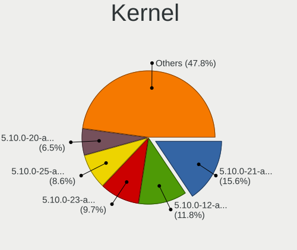

| Version                  | Desktops | Percent |
|--------------------------|----------|---------|
| 5.10.0-21-amd64          | 29       | 15.59%  |
| 5.10.0-12-amd64          | 22       | 11.83%  |
| 5.10.0-23-amd64          | 18       | 9.68%   |
| 5.10.0-25-amd64          | 16       | 8.6%    |
| 5.10.0-20-amd64          | 12       | 6.45%   |
| 5.10.0-17-amd64          | 11       | 5.91%   |
| 5.10.0-14-amd64          | 10       | 5.38%   |
| 5.10.0-13-amd64          | 10       | 5.38%   |
| 5.10.0-18-amd64          | 9        | 4.84%   |
| 5.10.0-19-amd64          | 8        | 4.3%    |
| 5.10.0-28-amd64          | 5        | 2.69%   |
| 5.10.0-22-amd64          | 5        | 2.69%   |
| 6.1.0-0.deb11.7-amd64    | 4        | 2.15%   |
| 5.10.0-33-amd64          | 4        | 2.15%   |
| 5.10.0-26-amd64          | 4        | 2.15%   |
| 5.10.0-15-amd64          | 3        | 1.61%   |
| 5.10.0-35-amd64          | 2        | 1.08%   |
| 5.10.0-16-amd64          | 2        | 1.08%   |
| 6.1.0-28-amd64           | 1        | 0.54%   |
| 6.1.0-23-amd64           | 1        | 0.54%   |
| 6.1.0-20-amd64           | 1        | 0.54%   |
| 6.1.0-13-amd64           | 1        | 0.54%   |
| 6.1.0-0.deb11.5-amd64    | 1        | 0.54%   |
| 6.0.2-x64v2-rt11-xanmod1 | 1        | 0.54%   |
| 5.19.0-0.deb11.2-amd64   | 1        | 0.54%   |
| 5.10.0-36-amd64          | 1        | 0.54%   |
| 5.10.0-34-amd64          | 1        | 0.54%   |
| 5.10.0-30-amd64          | 1        | 0.54%   |
| 5.10.0-24-amd64          | 1        | 0.54%   |
| 5.10.0-13-686            | 1        | 0.54%   |

Kernel Family
-------------

Linux kernel without a distro release

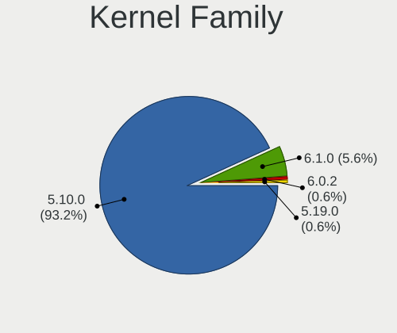

| Version | Desktops | Percent |
|---------|----------|---------|
| 5.10.0  | 150      | 93.17%  |
| 6.1.0   | 9        | 5.59%   |
| 6.0.2   | 1        | 0.62%   |
| 5.19.0  | 1        | 0.62%   |

Kernel Major Ver.
-----------------

Linux kernel major version

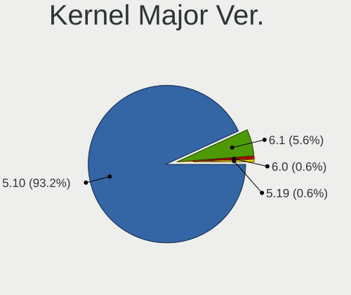

| Version | Desktops | Percent |
|---------|----------|---------|
| 5.10    | 150      | 93.17%  |
| 6.1     | 9        | 5.59%   |
| 6.0     | 1        | 0.62%   |
| 5.19    | 1        | 0.62%   |

Arch
----

OS architecture (x86_64, i586, etc.)

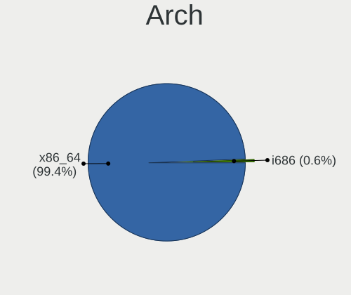

| Name   | Desktops | Percent |
|--------|----------|---------|
| x86_64 | 159      | 99.38%  |
| i686   | 1        | 0.63%   |

DE
--

Desktop Environment

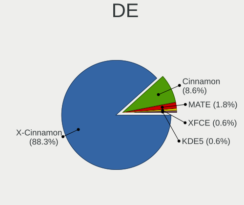

| Name       | Desktops | Percent |
|------------|----------|---------|
| X-Cinnamon | 144      | 88.34%  |
| Cinnamon   | 14       | 8.59%   |
| MATE       | 3        | 1.84%   |
| XFCE       | 1        | 0.61%   |
| KDE5       | 1        | 0.61%   |

Display Server
--------------

X11 or Wayland

| Name | Desktops | Percent |
|------|----------|---------|
| X11  | 160      | 100%    |

Display Manager
---------------

SDDM, LightDM, etc.

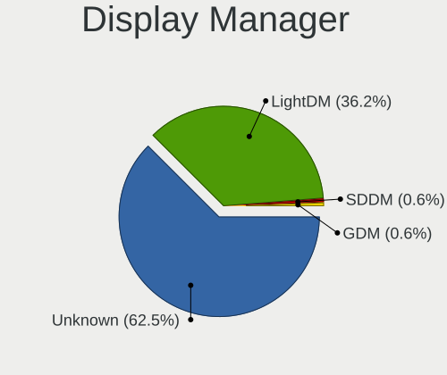

| Name    | Desktops | Percent |
|---------|----------|---------|
| Unknown | 100      | 62.5%   |
| LightDM | 58       | 36.25%  |
| SDDM    | 1        | 0.63%   |
| GDM     | 1        | 0.63%   |

OS Lang
-------

Language

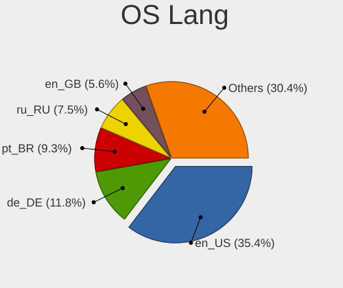

| Lang  | Desktops | Percent |
|-------|----------|---------|
| en_US | 57       | 35.4%   |
| de_DE | 19       | 11.8%   |
| pt_BR | 15       | 9.32%   |
| ru_RU | 12       | 7.45%   |
| en_GB | 9        | 5.59%   |
| it_IT | 8        | 4.97%   |
| fr_FR | 7        | 4.35%   |
| en_CA | 4        | 2.48%   |
| pl_PL | 3        | 1.86%   |
| es_ES | 3        | 1.86%   |
| en_AU | 3        | 1.86%   |
| sv_SE | 2        | 1.24%   |
| sk_SK | 2        | 1.24%   |
| ru_UA | 2        | 1.24%   |
| fr_CA | 2        | 1.24%   |
| de_AT | 2        | 1.24%   |
| it_CH | 1        | 0.62%   |
| hu_HU | 1        | 0.62%   |
| fr_BE | 1        | 0.62%   |
| es_PA | 1        | 0.62%   |
| es_NI | 1        | 0.62%   |
| es_BO | 1        | 0.62%   |
| es_AR | 1        | 0.62%   |
| en_ZA | 1        | 0.62%   |
| en_NZ | 1        | 0.62%   |
| cs_CZ | 1        | 0.62%   |
| ar_EG | 1        | 0.62%   |

Boot Mode
---------

EFI or BIOS

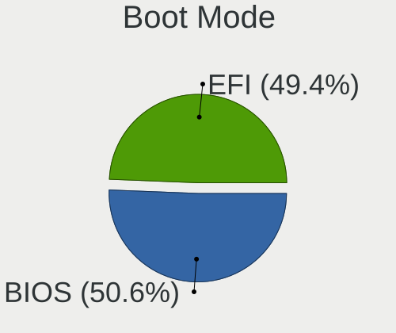

| Mode | Desktops | Percent |
|------|----------|---------|
| BIOS | 81       | 50.63%  |
| EFI  | 79       | 49.38%  |

Filesystem
----------

Type of filesystem

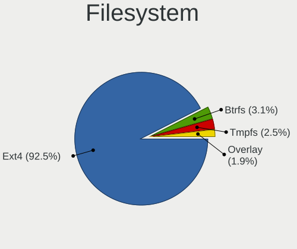

| Type    | Desktops | Percent |
|---------|----------|---------|
| Ext4    | 148      | 92.5%   |
| Btrfs   | 5        | 3.13%   |
| Tmpfs   | 4        | 2.5%    |
| Overlay | 3        | 1.88%   |

Part. scheme
------------

Scheme of partitioning

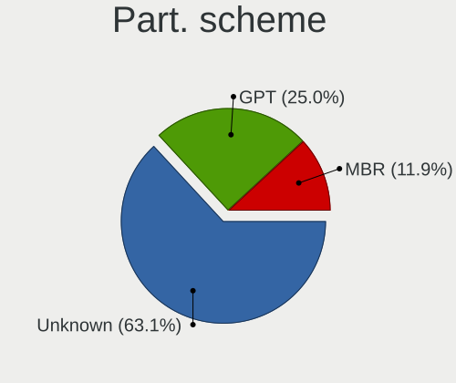

| Type    | Desktops | Percent |
|---------|----------|---------|
| Unknown | 101      | 63.13%  |
| GPT     | 40       | 25%     |
| MBR     | 19       | 11.88%  |

Dual Boot with Linux/BSD
------------------------

Hosting more than one Linux/BSD

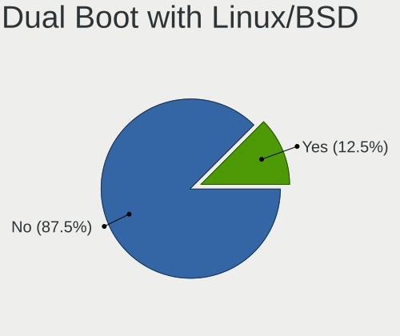

| Dual boot | Desktops | Percent |
|-----------|----------|---------|
| No        | 140      | 87.5%   |
| Yes       | 20       | 12.5%   |

Dual Boot (Win)
---------------

Hosting Linux and Windows

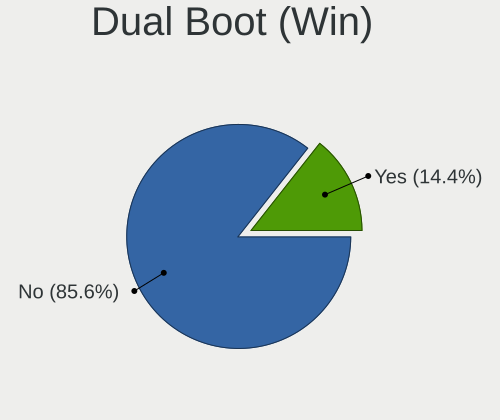

| Dual boot | Desktops | Percent |
|-----------|----------|---------|
| No        | 137      | 85.63%  |
| Yes       | 23       | 14.38%  |

Board
-----

Vendor
------

Motherboard manufacturer

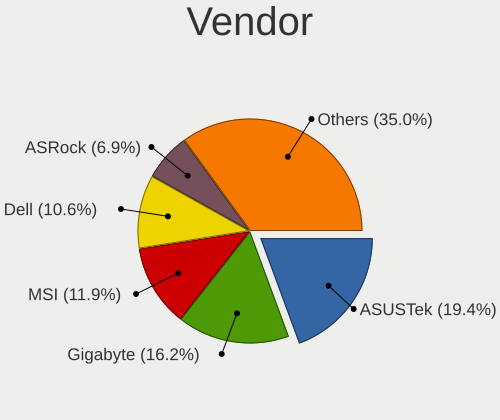

| Name                | Desktops | Percent |
|---------------------|----------|---------|
| ASUSTek Computer    | 31       | 19.38%  |
| Gigabyte Technology | 26       | 16.25%  |
| MSI                 | 19       | 11.88%  |
| Dell                | 17       | 10.63%  |
| ASRock              | 11       | 6.88%   |
| Intel               | 10       | 6.25%   |
| Hewlett-Packard     | 8        | 5%      |
| Acer                | 8        | 5%      |
| Lenovo              | 4        | 2.5%    |
| Pegatron            | 3        | 1.88%   |
| AZW                 | 3        | 1.88%   |
| Medion              | 2        | 1.25%   |
| Fujitsu             | 2        | 1.25%   |
| eMachines           | 2        | 1.25%   |
| Apple               | 2        | 1.25%   |
| SiYW                | 1        | 0.63%   |
| Sapphire            | 1        | 0.63%   |
| Samsung Electronics | 1        | 0.63%   |
| PLEXHD              | 1        | 0.63%   |
| Packard Bell        | 1        | 0.63%   |
| Login Informatica   | 1        | 0.63%   |
| Gateway             | 1        | 0.63%   |
| Foxconn             | 1        | 0.63%   |
| Digiboard           | 1        | 0.63%   |
| BESSTAR Tech        | 1        | 0.63%   |
| ADVANSUS            | 1        | 0.63%   |
| Unknown             | 1        | 0.63%   |

Model
-----

Motherboard model

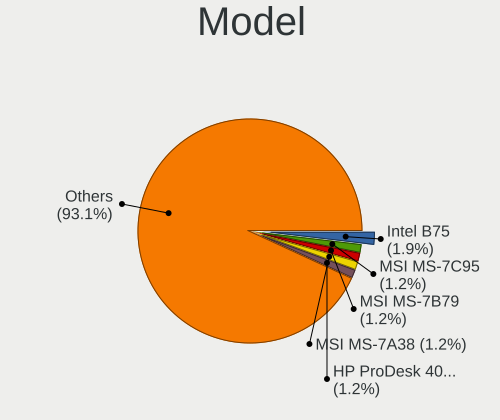

| Name                                | Desktops | Percent |
|-------------------------------------|----------|---------|
| Intel B75                           | 3        | 1.88%   |
| MSI MS-7C95                         | 2        | 1.25%   |
| MSI MS-7B79                         | 2        | 1.25%   |
| MSI MS-7A38                         | 2        | 1.25%   |
| HP ProDesk 400 G5 Desktop Mini      | 2        | 1.25%   |
| Gigabyte B450 AORUS M               | 2        | 1.25%   |
| Dell OptiPlex 7010                  | 2        | 1.25%   |
| AZW MINI S                          | 2        | 1.25%   |
| ASUS ROG STRIX B450-F GAMING        | 2        | 1.25%   |
| ASUS PRIME B350M-A                  | 2        | 1.25%   |
| ASUS PRIME A320M-K                  | 2        | 1.25%   |
| ASUS All Series                     | 2        | 1.25%   |
| SiYW V200 Series                    | 1        | 0.63%   |
| Sapphire PI-AM3RS760G2              | 1        | 0.63%   |
| Samsung DeskTop System              | 1        | 0.63%   |
| PLEXHD X79 Turbo                    | 1        | 0.63%   |
| Pegatron Pro 3015 Microtower PC     | 1        | 0.63%   |
| Pegatron p6-2143w                   | 1        | 0.63%   |
| Pegatron 520-1138c                  | 1        | 0.63%   |
| Packard Bell IMEDIA J9640           | 1        | 0.63%   |
| MSI MS-7D54                         | 1        | 0.63%   |
| MSI MS-7D22                         | 1        | 0.63%   |
| MSI MS-7C52                         | 1        | 0.63%   |
| MSI MS-7C02                         | 1        | 0.63%   |
| MSI MS-7B23                         | 1        | 0.63%   |
| MSI MS-7B17                         | 1        | 0.63%   |
| MSI MS-7A40                         | 1        | 0.63%   |
| MSI MS-7984                         | 1        | 0.63%   |
| MSI MS-7977                         | 1        | 0.63%   |
| MSI MS-7974                         | 1        | 0.63%   |
| MSI MS-7851                         | 1        | 0.63%   |
| MSI MS-7721                         | 1        | 0.63%   |
| MSI MS-7693                         | 1        | 0.63%   |
| Medion S23003                       | 1        | 0.63%   |
| Medion MS-7800                      | 1        | 0.63%   |
| Login Informatica ISYNC ONE B75 V1  | 1        | 0.63%   |
| Lenovo V55t-15ARE 11KJ0036TX        | 1        | 0.63%   |
| Lenovo ThinkCentre M92p 3238E9U     | 1        | 0.63%   |
| Lenovo ThinkCentre M720s 10SUS9KW00 | 1        | 0.63%   |
| Lenovo H530 10130                   | 1        | 0.63%   |

Model Family
------------

Motherboard model prefix

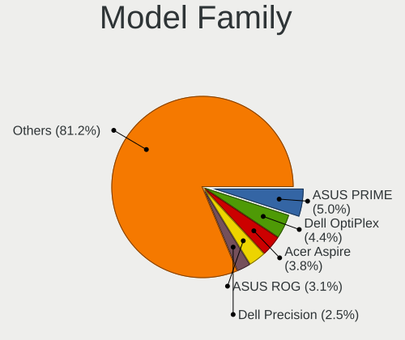

| Name                   | Desktops | Percent |
|------------------------|----------|---------|
| ASUS PRIME             | 8        | 5%      |
| Dell OptiPlex          | 7        | 4.38%   |
| Acer Aspire            | 6        | 3.75%   |
| ASUS ROG               | 5        | 3.13%   |
| Dell Precision         | 4        | 2.5%    |
| Intel B75              | 3        | 1.88%   |
| Gigabyte B450M         | 3        | 1.88%   |
| Gigabyte B450          | 3        | 1.88%   |
| MSI MS-7C95            | 2        | 1.25%   |
| MSI MS-7B79            | 2        | 1.25%   |
| MSI MS-7A38            | 2        | 1.25%   |
| Lenovo ThinkCentre     | 2        | 1.25%   |
| Intel DQ77MK           | 2        | 1.25%   |
| HP ProDesk             | 2        | 1.25%   |
| Gigabyte A520M         | 2        | 1.25%   |
| Dell Vostro            | 2        | 1.25%   |
| Dell Inspiron          | 2        | 1.25%   |
| AZW MINI               | 2        | 1.25%   |
| ASUS P8H61-M           | 2        | 1.25%   |
| ASUS All               | 2        | 1.25%   |
| Acer Veriton           | 2        | 1.25%   |
| SiYW V200              | 1        | 0.63%   |
| Sapphire PI-AM3RS760G2 | 1        | 0.63%   |
| Samsung DeskTop        | 1        | 0.63%   |
| PLEXHD X79             | 1        | 0.63%   |
| Pegatron Pro           | 1        | 0.63%   |
| Pegatron p6-2143w      | 1        | 0.63%   |
| Pegatron 520-1138c     | 1        | 0.63%   |
| Packard Bell IMEDIA    | 1        | 0.63%   |
| MSI MS-7D54            | 1        | 0.63%   |
| MSI MS-7D22            | 1        | 0.63%   |
| MSI MS-7C52            | 1        | 0.63%   |
| MSI MS-7C02            | 1        | 0.63%   |
| MSI MS-7B23            | 1        | 0.63%   |
| MSI MS-7B17            | 1        | 0.63%   |
| MSI MS-7A40            | 1        | 0.63%   |
| MSI MS-7984            | 1        | 0.63%   |
| MSI MS-7977            | 1        | 0.63%   |
| MSI MS-7974            | 1        | 0.63%   |
| MSI MS-7851            | 1        | 0.63%   |

MFG Year
--------

Motherboard manufacture year

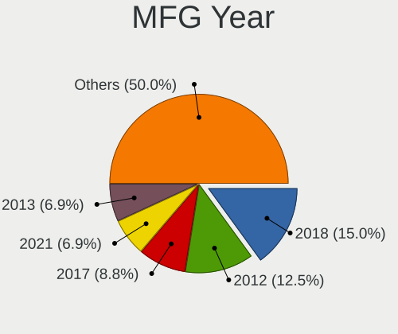

| Year | Desktops | Percent |
|------|----------|---------|
| 2018 | 24       | 15%     |
| 2012 | 20       | 12.5%   |
| 2017 | 14       | 8.75%   |
| 2021 | 11       | 6.88%   |
| 2013 | 11       | 6.88%   |
| 2019 | 10       | 6.25%   |
| 2011 | 10       | 6.25%   |
| 2009 | 10       | 6.25%   |
| 2020 | 8        | 5%      |
| 2022 | 7        | 4.38%   |
| 2016 | 7        | 4.38%   |
| 2015 | 7        | 4.38%   |
| 2010 | 6        | 3.75%   |
| 2007 | 5        | 3.13%   |
| 2014 | 4        | 2.5%    |
| 2006 | 4        | 2.5%    |
| 2008 | 2        | 1.25%   |

Form Factor
-----------

Physical design of the computer

| Name    | Desktops | Percent |
|---------|----------|---------|
| Desktop | 160      | 100%    |

Secure Boot
-----------

Enabled or disabled

| State    | Desktops | Percent |
|----------|----------|---------|
| Disabled | 158      | 98.14%  |
| Enabled  | 3        | 1.86%   |

Coreboot
--------

Have coreboot on board

| Used | Desktops | Percent |
|------|----------|---------|
| No   | 160      | 100%    |

RAM Size
--------

Total RAM memory

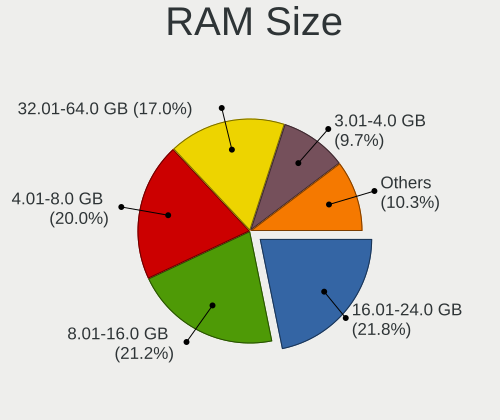

| Size in GB      | Desktops | Percent |
|-----------------|----------|---------|
| 16.01-24.0      | 36       | 21.82%  |
| 8.01-16.0       | 35       | 21.21%  |
| 4.01-8.0        | 33       | 20%     |
| 32.01-64.0      | 28       | 16.97%  |
| 3.01-4.0        | 16       | 9.7%    |
| 1.01-2.0        | 6        | 3.64%   |
| 24.01-32.0      | 5        | 3.03%   |
| 2.01-3.0        | 2        | 1.21%   |
| 64.01-256.0     | 2        | 1.21%   |
| More than 256.0 | 1        | 0.61%   |
| 0.51-1.0        | 1        | 0.61%   |

RAM Used
--------

Used RAM memory

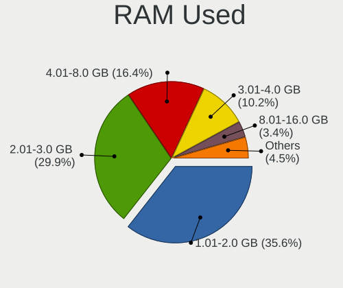

| Used GB    | Desktops | Percent |
|------------|----------|---------|
| 1.01-2.0   | 63       | 35.59%  |
| 2.01-3.0   | 53       | 29.94%  |
| 4.01-8.0   | 29       | 16.38%  |
| 3.01-4.0   | 18       | 10.17%  |
| 8.01-16.0  | 6        | 3.39%   |
| 0.51-1.0   | 6        | 3.39%   |
| 24.01-32.0 | 1        | 0.56%   |
| 16.01-24.0 | 1        | 0.56%   |

Total Drives
------------

Number of drives on board

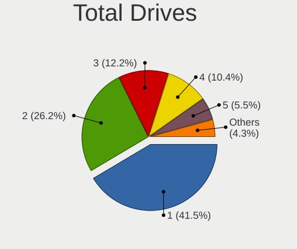

| Drives | Desktops | Percent |
|--------|----------|---------|
| 1      | 68       | 41.46%  |
| 2      | 43       | 26.22%  |
| 3      | 20       | 12.2%   |
| 4      | 17       | 10.37%  |
| 5      | 9        | 5.49%   |
| 6      | 5        | 3.05%   |
| 7      | 1        | 0.61%   |
| 0      | 1        | 0.61%   |

Has CD-ROM
----------

Has CD-ROM on board

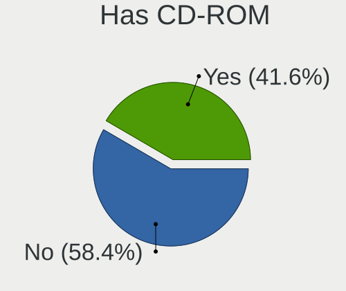

| Presented | Desktops | Percent |
|-----------|----------|---------|
| No        | 94       | 58.39%  |
| Yes       | 67       | 41.61%  |

Has Ethernet
------------

Has Ethernet on board

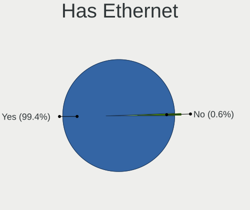

| Presented | Desktops | Percent |
|-----------|----------|---------|
| Yes       | 159      | 99.38%  |
| No        | 1        | 0.63%   |

Has WiFi
--------

Has WiFi module

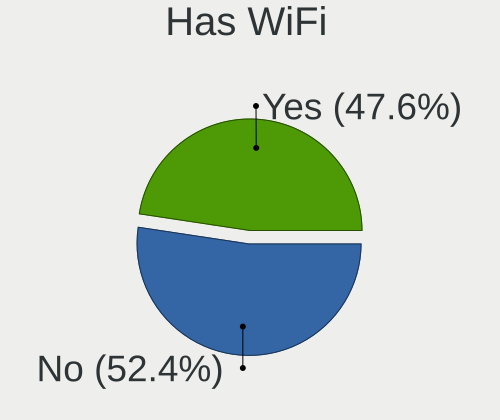

| Presented | Desktops | Percent |
|-----------|----------|---------|
| Yes       | 82       | 50%     |
| No        | 82       | 50%     |

Has Bluetooth
-------------

Has Bluetooth module

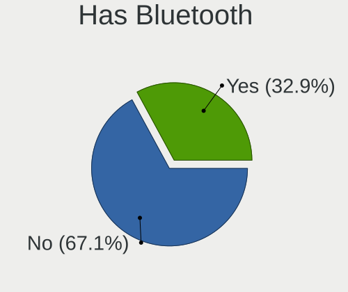

| Presented | Desktops | Percent |
|-----------|----------|---------|
| No        | 108      | 67.08%  |
| Yes       | 53       | 32.92%  |

Location
--------

Country
-------

Geographic location (country)

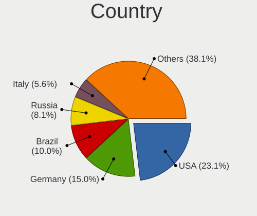

| Country      | Desktops | Percent |
|--------------|----------|---------|
| USA          | 37       | 23.13%  |
| Germany      | 24       | 15%     |
| Brazil       | 16       | 10%     |
| Russia       | 13       | 8.13%   |
| Italy        | 9        | 5.63%   |
| France       | 8        | 5%      |
| Canada       | 7        | 4.38%   |
| UK           | 5        | 3.13%   |
| Australia    | 4        | 2.5%    |
| Sweden       | 3        | 1.88%   |
| Spain        | 3        | 1.88%   |
| Poland       | 3        | 1.88%   |
| Ukraine      | 2        | 1.25%   |
| South Africa | 2        | 1.25%   |
| Slovakia     | 2        | 1.25%   |
| Netherlands  | 2        | 1.25%   |
| Mexico       | 2        | 1.25%   |
| Kazakhstan   | 2        | 1.25%   |
| Bolivia      | 2        | 1.25%   |
| Zambia       | 1        | 0.63%   |
| Venezuela    | 1        | 0.63%   |
| Turkey       | 1        | 0.63%   |
| Switzerland  | 1        | 0.63%   |
| Panama       | 1        | 0.63%   |
| Nicaragua    | 1        | 0.63%   |
| New Zealand  | 1        | 0.63%   |
| Latvia       | 1        | 0.63%   |
| Indonesia    | 1        | 0.63%   |
| India        | 1        | 0.63%   |
| Hungary      | 1        | 0.63%   |
| Belgium      | 1        | 0.63%   |
| Austria      | 1        | 0.63%   |
| Argentina    | 1        | 0.63%   |

City
----

Geographic location (city)

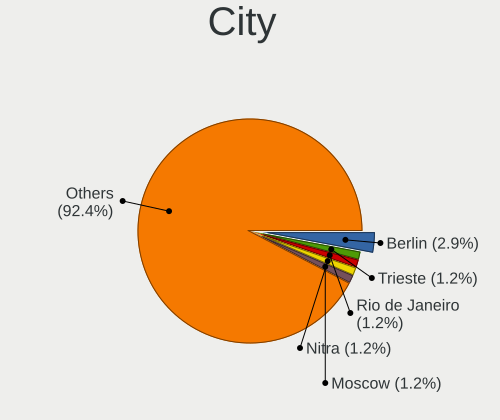

| City                  | Desktops | Percent |
|-----------------------|----------|---------|
| Berlin                | 5        | 2.94%   |
| Trieste               | 2        | 1.18%   |
| Rio de Janeiro        | 2        | 1.18%   |
| Nitra                 | 2        | 1.18%   |
| Moscow                | 2        | 1.18%   |
| Montreal              | 2        | 1.18%   |
| Melbourne             | 2        | 1.18%   |
| Frankfurt am Main     | 2        | 1.18%   |
| Delligsen             | 2        | 1.18%   |
| Columbia City         | 2        | 1.18%   |
| Belém                | 2        | 1.18%   |
| Barueri               | 2        | 1.18%   |
| Witzenhausen          | 1        | 0.59%   |
| Washington            | 1        | 0.59%   |
| Volta Redonda         | 1        | 0.59%   |
| Volgograd             | 1        | 0.59%   |
| Vitória da Conquista | 1        | 0.59%   |
| Vincennes             | 1        | 0.59%   |
| Vicente Guerrero      | 1        | 0.59%   |
| Veszprém             | 1        | 0.59%   |
| Varese                | 1        | 0.59%   |
| Ulyanovsk             | 1        | 0.59%   |
| Udine                 | 1        | 0.59%   |
| Toulon                | 1        | 0.59%   |
| Toronto               | 1        | 0.59%   |
| Tomsk                 | 1        | 0.59%   |
| Tolyatti              | 1        | 0.59%   |
| Toledo                | 1        | 0.59%   |
| Toccoa                | 1        | 0.59%   |
| Tacoma                | 1        | 0.59%   |
| Sydney                | 1        | 0.59%   |
| Stockelsdorf          | 1        | 0.59%   |
| Stockbridge           | 1        | 0.59%   |
| Spruce Grove          | 1        | 0.59%   |
| Sollentuna            | 1        | 0.59%   |
| Solingen              | 1        | 0.59%   |
| Semey                 | 1        | 0.59%   |
| Secaucus              | 1        | 0.59%   |
| Schwelm               | 1        | 0.59%   |
| Schruns               | 1        | 0.59%   |

Drives
------

Drive Vendor
------------

Hard drive vendors

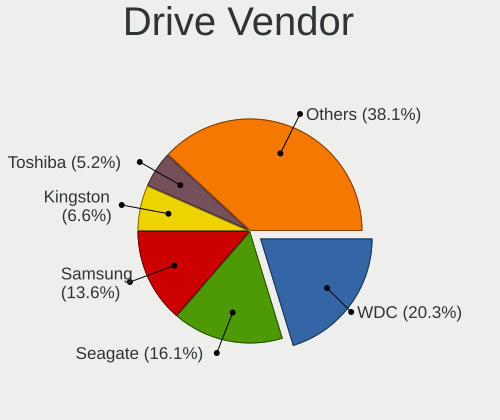

| Vendor              | Desktops | Drives | Percent |
|---------------------|----------|--------|---------|
| WDC                 | 58       | 112    | 20.28%  |
| Seagate             | 46       | 71     | 16.08%  |
| Samsung Electronics | 39       | 78     | 13.64%  |
| Kingston            | 19       | 34     | 6.64%   |
| Toshiba             | 15       | 17     | 5.24%   |
| Crucial             | 12       | 14     | 4.2%    |
| Sandisk             | 11       | 12     | 3.85%   |
| Hitachi             | 9        | 12     | 3.15%   |
| China               | 5        | 6      | 1.75%   |
| SK hynix            | 4        | 5      | 1.4%    |
| Silicon Motion      | 4        | 6      | 1.4%    |
| A-DATA Technology   | 4        | 4      | 1.4%    |
| Unknown             | 3        | 3      | 1.05%   |
| SPCC                | 3        | 4      | 1.05%   |
| GOODRAM             | 3        | 3      | 1.05%   |
| ADATA Technology    | 3        | 6      | 1.05%   |
| Unknown             | 3        | 7      | 1.05%   |
| Transcend           | 2        | 3      | 0.7%    |
| PNY                 | 2        | 3      | 0.7%    |
| Phison              | 2        | 7      | 0.7%    |
| Patriot             | 2        | 3      | 0.7%    |
| OCZ                 | 2        | 2      | 0.7%    |
| Micron Technology   | 2        | 2      | 0.7%    |
| Intenso             | 2        | 2      | 0.7%    |
| Apple               | 2        | 2      | 0.7%    |
| Apacer              | 2        | 2      | 0.7%    |
| XrayDisk            | 1        | 2      | 0.35%   |
| WALRAM              | 1        | 1      | 0.35%   |
| Vaseky              | 1        | 4      | 0.35%   |
| V-GeN               | 1        | 1      | 0.35%   |
| Timetec             | 1        | 1      | 0.35%   |
| TGT                 | 1        | 1      | 0.35%   |
| Team                | 1        | 1      | 0.35%   |
| TakeMS              | 1        | 1      | 0.35%   |
| T-FORCE             | 1        | 1      | 0.35%   |
| SD                  | 1        | 1      | 0.35%   |
| PNY USB             | 1        | 1      | 0.35%   |
| Phison Electronics  | 1        | 1      | 0.35%   |
| OCZ-VERTEX          | 1        | 1      | 0.35%   |
| NGFF                | 1        | 1      | 0.35%   |

Drive Model
-----------

Hard drive models

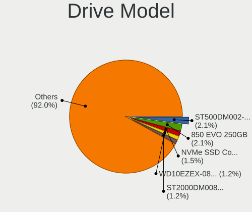

| Model                                                              | Desktops | Percent |
|--------------------------------------------------------------------|----------|---------|
| Seagate ST500DM002-1BD142 500GB                                    | 7        | 2.07%   |
| Samsung SSD 850 EVO 250GB                                          | 7        | 2.07%   |
| Samsung NVMe SSD Controller SM981/PM981/PM983 1TB                  | 5        | 1.48%   |
| WDC WD10EZEX-08WN4A0 1TB                                           | 4        | 1.18%   |
| Seagate ST2000DM008-2FR102 2TB                                     | 4        | 1.18%   |
| Kingston SA400S37240G 240GB SSD                                    | 4        | 1.18%   |
| Kingston SA400S37120G 120GB SSD                                    | 4        | 1.18%   |
| Silicon Motion SM2262/SM2262EN SSD Controller 960GB                | 3        | 0.89%   |
| Samsung SSD 970 EVO 500GB                                          | 3        | 0.89%   |
| Samsung SSD 850 EVO 500GB                                          | 3        | 0.89%   |
| Kingston SA400S37480G 480GB SSD                                    | 3        | 0.89%   |
| Crucial CT480BX500SSD1 480GB                                       | 3        | 0.89%   |
| Unknown                                                            | 3        | 0.89%   |
| WDC WD800BEVS-00UST0 80GB                                          | 2        | 0.59%   |
| WDC WD3003FZEX-00Z4SA0 3TB                                         | 2        | 0.59%   |
| WDC WD10JPVX-75JC3T0 1TB                                           | 2        | 0.59%   |
| WDC WD10EZEX-00BN5A0 1TB                                           | 2        | 0.59%   |
| Unknown SD/MMC/MS PRO 2GB                                          | 2        | 0.59%   |
| Toshiba HDWD110 1TB                                                | 2        | 0.59%   |
| Seagate ST3320418AS 320GB                                          | 2        | 0.59%   |
| Seagate ST3250318AS 250GB                                          | 2        | 0.59%   |
| Seagate ST2000LX001-1RG174 2TB                                     | 2        | 0.59%   |
| Seagate ST1000LM048-2E7172 1TB                                     | 2        | 0.59%   |
| Seagate ST1000DM003-1ER162 1TB                                     | 2        | 0.59%   |
| Seagate ST1000DM003-1CH162 1TB                                     | 2        | 0.59%   |
| Sandisk WD Blue SN550 NVMe SSD 1024GB                              | 2        | 0.59%   |
| SanDisk SSD PLUS 240GB                                             | 2        | 0.59%   |
| Samsung SSD 980 PRO 1TB                                            | 2        | 0.59%   |
| Samsung SSD 870 QVO 2TB                                            | 2        | 0.59%   |
| Samsung SSD 870 QVO 1TB                                            | 2        | 0.59%   |
| Samsung SSD 870 EVO 2TB                                            | 2        | 0.59%   |
| Samsung SM963 2.5" NVMe PCIe SSD 250GB                             | 2        | 0.59%   |
| Samsung NVMe SSD Drive 500GB                                       | 2        | 0.59%   |
| Samsung HD204UI 2TB                                                | 2        | 0.59%   |
| Intenso External USB 3.0 500GB                                     | 2        | 0.59%   |
| Hitachi HDP725050GLA360 500GB                                      | 2        | 0.59%   |
| ADATA XPG SX8200 Pro PCIe Gen3x4 M.2 2280 Solid State Drive 1024GB | 2        | 0.59%   |
| XrayDisk 480GB                                                     | 1        | 0.3%    |
| XrayDisk 1TB                                                       | 1        | 0.3%    |
| WDC WUH721414ALE6L1 14TB                                           | 1        | 0.3%    |

HDD Vendor
----------

Hard disk drive vendors

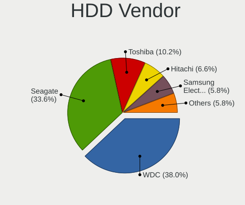

| Vendor              | Desktops | Drives | Percent |
|---------------------|----------|--------|---------|
| WDC                 | 52       | 98     | 37.96%  |
| Seagate             | 46       | 70     | 33.58%  |
| Toshiba             | 14       | 16     | 10.22%  |
| Hitachi             | 9        | 12     | 6.57%   |
| Samsung Electronics | 8        | 14     | 5.84%   |
| Unknown             | 2        | 2      | 1.46%   |
| Intenso             | 2        | 2      | 1.46%   |
| HGST                | 1        | 1      | 0.73%   |
| ASMT                | 1        | 2      | 0.73%   |
| ASMedia             | 1        | 1      | 0.73%   |
| Apple               | 1        | 1      | 0.73%   |

SSD Vendor
----------

Solid state drive vendors

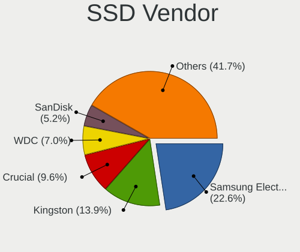

| Vendor              | Desktops | Drives | Percent |
|---------------------|----------|--------|---------|
| Samsung Electronics | 26       | 40     | 22.61%  |
| Kingston            | 16       | 31     | 13.91%  |
| Crucial             | 11       | 13     | 9.57%   |
| WDC                 | 8        | 13     | 6.96%   |
| SanDisk             | 6        | 6      | 5.22%   |
| China               | 5        | 6      | 4.35%   |
| A-DATA Technology   | 4        | 4      | 3.48%   |
| SPCC                | 3        | 4      | 2.61%   |
| GOODRAM             | 3        | 3      | 2.61%   |
| Transcend           | 2        | 3      | 1.74%   |
| SK hynix            | 2        | 2      | 1.74%   |
| PNY                 | 2        | 3      | 1.74%   |
| Patriot             | 2        | 3      | 1.74%   |
| OCZ                 | 2        | 2      | 1.74%   |
| Apacer              | 2        | 2      | 1.74%   |
| Unknown             | 2        | 6      | 1.74%   |
| Vaseky              | 1        | 4      | 0.87%   |
| V-GeN               | 1        | 1      | 0.87%   |
| Toshiba             | 1        | 1      | 0.87%   |
| Team                | 1        | 1      | 0.87%   |
| TakeMS              | 1        | 1      | 0.87%   |
| T-FORCE             | 1        | 1      | 0.87%   |
| SD                  | 1        | 1      | 0.87%   |
| PNY USB             | 1        | 1      | 0.87%   |
| Phison              | 1        | 6      | 0.87%   |
| OCZ-VERTEX          | 1        | 1      | 0.87%   |
| NGFF                | 1        | 1      | 0.87%   |
| Netac               | 1        | 1      | 0.87%   |
| Micron Technology   | 1        | 1      | 0.87%   |
| LITEONIT            | 1        | 1      | 0.87%   |
| Hewlett-Packard     | 1        | 1      | 0.87%   |
| Gigabyte Technology | 1        | 2      | 0.87%   |
| Dahua               | 1        | 1      | 0.87%   |
| Apple               | 1        | 1      | 0.87%   |
| 2.5''               | 1        | 1      | 0.87%   |

Drive Kind
----------

HDD or SSD

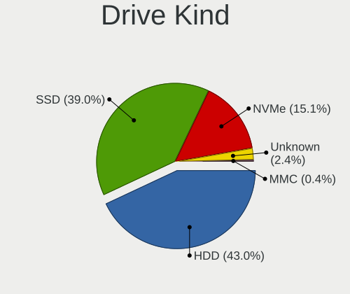

| Kind    | Desktops | Drives | Percent |
|---------|----------|--------|---------|
| HDD     | 108      | 219    | 43.03%  |
| SSD     | 98       | 169    | 39.04%  |
| NVMe    | 38       | 58     | 15.14%  |
| Unknown | 6        | 7      | 2.39%   |
| MMC     | 1        | 1      | 0.4%    |

Drive Connector
---------------

SATA, SAS, NVMe, etc.

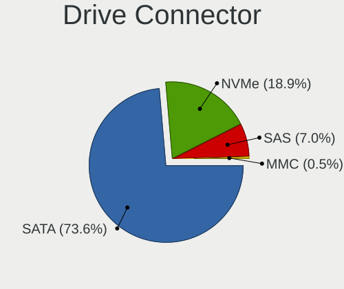

| Type | Desktops | Drives | Percent |
|------|----------|--------|---------|
| SATA | 148      | 375    | 73.63%  |
| NVMe | 38       | 58     | 18.91%  |
| SAS  | 14       | 20     | 6.97%   |
| MMC  | 1        | 1      | 0.5%    |

Drive Size
----------

Size of hard drive

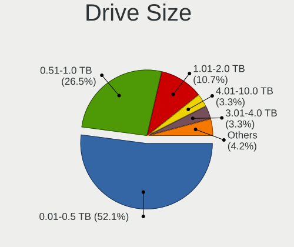

| Size in TB | Desktops | Drives | Percent |
|------------|----------|--------|---------|
| 0.01-0.5   | 112      | 221    | 52.09%  |
| 0.51-1.0   | 57       | 96     | 26.51%  |
| 1.01-2.0   | 23       | 32     | 10.7%   |
| 3.01-4.0   | 7        | 10     | 3.26%   |
| 2.01-3.0   | 7        | 15     | 3.26%   |
| 4.01-10.0  | 7        | 12     | 3.26%   |
| 10.01-20.0 | 2        | 2      | 0.93%   |

Space Total
-----------

Amount of disk space available on the file system

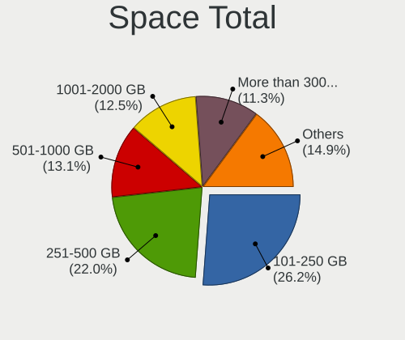

| Size in GB     | Desktops | Percent |
|----------------|----------|---------|
| 101-250        | 44       | 26.19%  |
| 251-500        | 37       | 22.02%  |
| 501-1000       | 22       | 13.1%   |
| 1001-2000      | 21       | 12.5%   |
| More than 3000 | 19       | 11.31%  |
| 2001-3000      | 8        | 4.76%   |
| 51-100         | 8        | 4.76%   |
| 1-20           | 7        | 4.17%   |
| 21-50          | 2        | 1.19%   |

Space Used
----------

Amount of used disk space

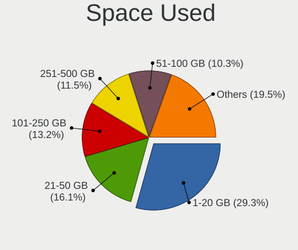

| Used GB        | Desktops | Percent |
|----------------|----------|---------|
| 1-20           | 51       | 29.31%  |
| 21-50          | 28       | 16.09%  |
| 101-250        | 23       | 13.22%  |
| 251-500        | 20       | 11.49%  |
| 51-100         | 18       | 10.34%  |
| 1001-2000      | 12       | 6.9%    |
| 501-1000       | 11       | 6.32%   |
| More than 3000 | 6        | 3.45%   |
| 2001-3000      | 5        | 2.87%   |

Malfunc. Drives
---------------

Drive models with a malfunction

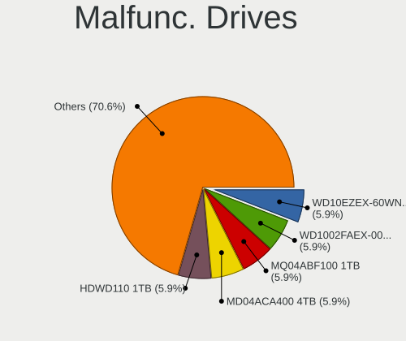

| Model                               | Desktops | Drives | Percent |
|-------------------------------------|----------|--------|---------|
| WDC WD10EZEX-60WN4A0 1TB            | 1        | 1      | 5.88%   |
| WDC WD1002FAEX-00Y9A0 1TB           | 1        | 1      | 5.88%   |
| Toshiba MQ04ABF100 1TB              | 1        | 1      | 5.88%   |
| Toshiba MD04ACA400 4TB              | 1        | 1      | 5.88%   |
| Toshiba HDWD110 1TB                 | 1        | 1      | 5.88%   |
| Seagate ST500LT012-1DG142 500GB     | 1        | 1      | 5.88%   |
| Seagate ST500DM002-1BD142 500GB     | 1        | 1      | 5.88%   |
| Seagate ST3250318AS 250GB           | 1        | 1      | 5.88%   |
| Seagate ST2000DX001-1CM164 2TB      | 1        | 1      | 5.88%   |
| Seagate ST1000LM048-2E7172 1TB      | 1        | 1      | 5.88%   |
| Seagate ST1000DM003-9YN162 1TB      | 1        | 1      | 5.88%   |
| SanDisk SSD PLUS 240GB              | 1        | 1      | 5.88%   |
| Samsung Electronics SSD 980 500GB   | 1        | 1      | 5.88%   |
| Samsung Electronics SSD 870 EVO 2TB | 1        | 1      | 5.88%   |
| Samsung Electronics HD153WI 1TB     | 1        | 1      | 5.88%   |
| Hitachi HDS721010KLA330 1TB         | 1        | 1      | 5.88%   |
| Hitachi HDP725050GLA360 500GB       | 1        | 1      | 5.88%   |

Malfunc. Drive Vendor
---------------------

Vendors of faulty drives

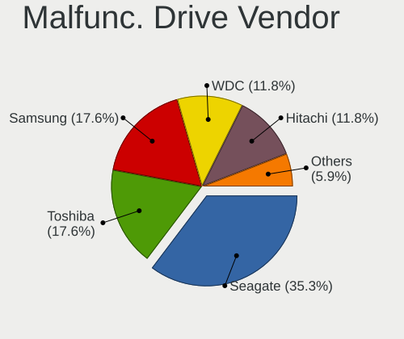

| Vendor              | Desktops | Drives | Percent |
|---------------------|----------|--------|---------|
| Seagate             | 6        | 6      | 35.29%  |
| Toshiba             | 3        | 3      | 17.65%  |
| Samsung Electronics | 3        | 3      | 17.65%  |
| WDC                 | 2        | 2      | 11.76%  |
| Hitachi             | 2        | 2      | 11.76%  |
| SanDisk             | 1        | 1      | 5.88%   |

Malfunc. HDD Vendor
-------------------

Vendors of faulty HDD drives

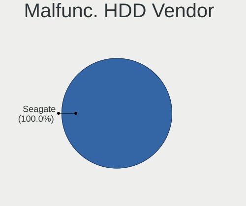

| Vendor              | Desktops | Drives | Percent |
|---------------------|----------|--------|---------|
| Seagate             | 6        | 6      | 42.86%  |
| Toshiba             | 3        | 3      | 21.43%  |
| WDC                 | 2        | 2      | 14.29%  |
| Hitachi             | 2        | 2      | 14.29%  |
| Samsung Electronics | 1        | 1      | 7.14%   |

Malfunc. Drive Kind
-------------------

Kinds of faulty drives

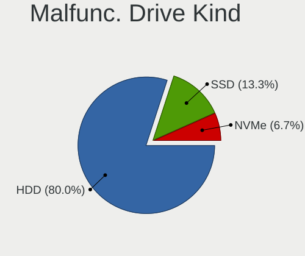

| Kind | Desktops | Drives | Percent |
|------|----------|--------|---------|
| HDD  | 12       | 14     | 80%     |
| SSD  | 2        | 2      | 13.33%  |
| NVMe | 1        | 1      | 6.67%   |

Failed Drives
-------------

Failed drive models

Zero info for selected period =(

Failed Drive Vendor
-------------------

Failed drive vendors

Zero info for selected period =(

Drive Status
------------

Number of failed and malfunc. drives

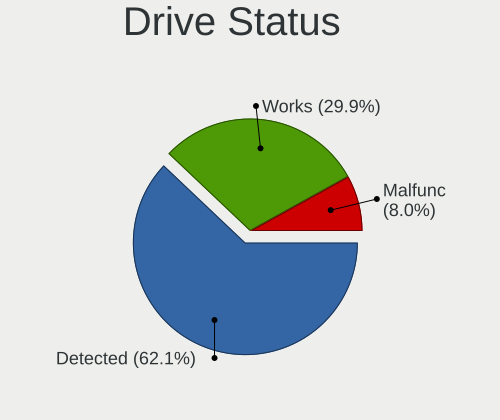

| Status   | Desktops | Drives | Percent |
|----------|----------|--------|---------|
| Detected | 108      | 300    | 62.07%  |
| Works    | 52       | 137    | 29.89%  |
| Malfunc  | 14       | 17     | 8.05%   |

Storage controller
------------------

Storage Vendor
--------------

Storage controller vendors

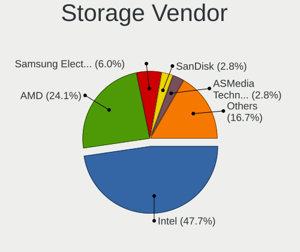

| Vendor                      | Desktops | Percent |
|-----------------------------|----------|---------|
| Intel                       | 103      | 47.69%  |
| AMD                         | 52       | 24.07%  |
| Samsung Electronics         | 13       | 6.02%   |
| SanDisk                     | 6        | 2.78%   |
| ASMedia Technology          | 6        | 2.78%   |
| Silicon Motion              | 5        | 2.31%   |
| JMicron Technology          | 5        | 2.31%   |
| Phison Electronics          | 3        | 1.39%   |
| Nvidia                      | 3        | 1.39%   |
| Marvell Technology Group    | 3        | 1.39%   |
| Kingston Technology Company | 3        | 1.39%   |
| Broadcom / LSI              | 3        | 1.39%   |
| ADATA Technology            | 3        | 1.39%   |
| VIA Technologies            | 2        | 0.93%   |
| SK hynix                    | 2        | 0.93%   |
| Micron/Crucial Technology   | 2        | 0.93%   |
| Micron Technology           | 1        | 0.46%   |
| LSI Logic / Symbios Logic   | 1        | 0.46%   |

Storage Model
-------------

Storage controller models

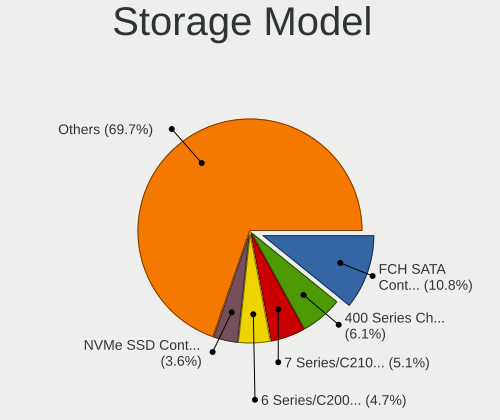

| Model                                                                                   | Desktops | Percent |
|-----------------------------------------------------------------------------------------|----------|---------|
| AMD FCH SATA Controller [AHCI mode]                                                     | 30       | 10.83%  |
| AMD 400 Series Chipset SATA Controller                                                  | 17       | 6.14%   |
| Intel 7 Series/C210 Series Chipset Family 6-port SATA Controller [AHCI mode]            | 14       | 5.05%   |
| Intel 6 Series/C200 Series Chipset Family 6 port Desktop SATA AHCI Controller           | 13       | 4.69%   |
| Samsung NVMe SSD Controller SM981/PM981/PM983                                           | 10       | 3.61%   |
| Intel 8 Series/C220 Series Chipset Family 6-port SATA Controller 1 [AHCI mode]          | 10       | 3.61%   |
| Intel Q170/Q150/B150/H170/H110/Z170/CM236 Chipset SATA Controller [AHCI Mode]           | 8        | 2.89%   |
| Intel 82801G (ICH7 Family) IDE Controller                                               | 8        | 2.89%   |
| Intel NM10/ICH7 Family SATA Controller [IDE mode]                                       | 6        | 2.17%   |
| Intel Cannon Lake PCH SATA AHCI Controller                                              | 6        | 2.17%   |
| AMD A320 Chipset SATA Controller [AHCI mode]                                            | 6        | 2.17%   |
| AMD 500 Series Chipset SATA Controller                                                  | 6        | 2.17%   |
| AMD 300 Series Chipset SATA Controller                                                  | 6        | 2.17%   |
| ASMedia ASM1061/ASM1062 Serial ATA Controller                                           | 5        | 1.81%   |
| Intel SATA Controller [RAID mode]                                                       | 4        | 1.44%   |
| Intel 6 Series/C200 Series Chipset Family Desktop SATA Controller (IDE mode, ports 4-5) | 4        | 1.44%   |
| Intel 6 Series/C200 Series Chipset Family Desktop SATA Controller (IDE mode, ports 0-3) | 4        | 1.44%   |
| Intel 500 Series Chipset Family SATA AHCI Controller                                    | 4        | 1.44%   |
| AMD SB7x0/SB8x0/SB9x0 SATA Controller [AHCI mode]                                       | 4        | 1.44%   |
| AMD SB7x0/SB8x0/SB9x0 IDE Controller                                                    | 4        | 1.44%   |
| Silicon Motion SM2262/SM2262EN SSD Controller                                           | 3        | 1.08%   |
| JMicron JMB363 SATA/IDE Controller                                                      | 3        | 1.08%   |
| Intel Celeron/Pentium Silver Processor SATA Controller                                  | 3        | 1.08%   |
| Intel C600/X79 series chipset IDE-r Controller                                          | 3        | 1.08%   |
| Intel C600/X79 series chipset 6-Port SATA AHCI Controller                               | 3        | 1.08%   |
| Intel 82801JI (ICH10 Family) SATA AHCI Controller                                       | 3        | 1.08%   |
| Intel 5 Series/3400 Series Chipset 6 port SATA AHCI Controller                          | 3        | 1.08%   |
| AMD SB7x0/SB8x0/SB9x0 SATA Controller [IDE mode]                                        | 3        | 1.08%   |
| VIA VT82C586A/B/VT82C686/A/B/VT823x/A/C PIPC Bus Master IDE                             | 2        | 0.72%   |
| Silicon Motion SM2263EN/SM2263XT (DRAM-less) NVMe SSD Controllers                       | 2        | 0.72%   |
| SanDisk Ultra 3D / WD PC SN530, IX SN530, Blue SN550 NVMe SSD (DRAM-less)               | 2        | 0.72%   |
| Samsung NVMe SSD Controller PM9A1/PM9A3/980PRO                                          | 2        | 0.72%   |
| Samsung NVMe SSD Controller 980 (DRAM-less)                                             | 2        | 0.72%   |
| Phison PS5013-E13 PCIe3 NVMe Controller (DRAM-less)                                     | 2        | 0.72%   |
| Nvidia MCP78S [GeForce 8200] AHCI Controller                                            | 2        | 0.72%   |
| Marvell Group 88SE9230 PCIe 2.0 x2 4-port SATA 6 Gb/s RAID Controller                   | 2        | 0.72%   |
| Intel Volume Management Device NVMe RAID Controller                                     | 2        | 0.72%   |
| Intel NM10/ICH7 Family SATA Controller [AHCI mode]                                      | 2        | 0.72%   |
| Intel Jasper Lake SATA AHCI Controller                                                  | 2        | 0.72%   |
| Intel Alder Lake-S PCH SATA Controller [AHCI Mode]                                      | 2        | 0.72%   |

Storage Kind
------------

Kind of storage controller (IDE, SATA, NVMe, SAS, ...)

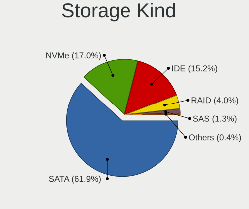

| Kind | Desktops | Percent |
|------|----------|---------|
| SATA | 138      | 61.88%  |
| NVMe | 38       | 17.04%  |
| IDE  | 34       | 15.25%  |
| RAID | 9        | 4.04%   |
| SAS  | 3        | 1.35%   |
| SCSI | 1        | 0.45%   |

Processor
---------

CPU Vendor
----------

Processor vendors

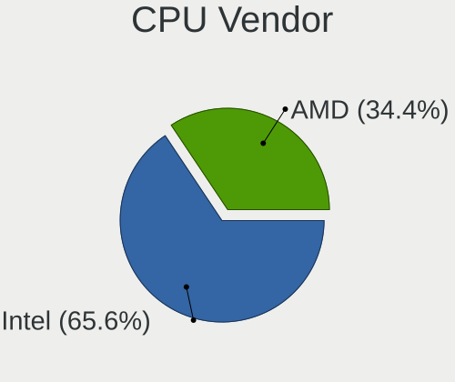

| Vendor | Desktops | Percent |
|--------|----------|---------|
| Intel  | 105      | 65.63%  |
| AMD    | 55       | 34.38%  |

CPU Model
---------

Processor models

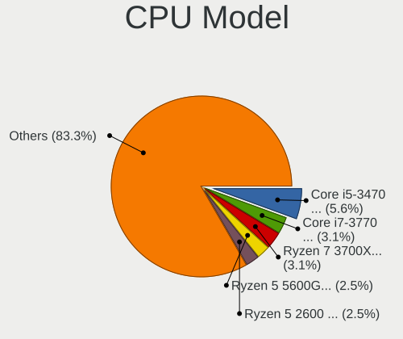

| Model                                       | Desktops | Percent |
|---------------------------------------------|----------|---------|
| Intel Core i5-3470 CPU @ 3.20GHz            | 9        | 5.56%   |
| Intel Core i7-3770 CPU @ 3.40GHz            | 5        | 3.09%   |
| AMD Ryzen 7 3700X 8-Core Processor          | 5        | 3.09%   |
| AMD Ryzen 5 5600G with Radeon Graphics      | 4        | 2.47%   |
| AMD Ryzen 5 2600 Six-Core Processor         | 4        | 2.47%   |
| AMD Ryzen 3 3200G with Radeon Vega Graphics | 4        | 2.47%   |
| Intel Core i7-9700K CPU @ 3.60GHz           | 3        | 1.85%   |
| Intel Core i7-2600 CPU @ 3.40GHz            | 3        | 1.85%   |
| Intel Xeon CPU E5-2697 v2 @ 2.70GHz         | 2        | 1.23%   |
| Intel Xeon CPU E5-2687W 0 @ 3.10GHz         | 2        | 1.23%   |
| Intel Pentium Dual-Core CPU E5700 @ 3.00GHz | 2        | 1.23%   |
| Intel Pentium Dual CPU E2180 @ 2.00GHz      | 2        | 1.23%   |
| Intel Pentium CPU G645 @ 2.90GHz            | 2        | 1.23%   |
| Intel Core i5-9500T CPU @ 2.20GHz           | 2        | 1.23%   |
| Intel Core i5-7400 CPU @ 3.00GHz            | 2        | 1.23%   |
| Intel Core i5-6600K CPU @ 3.50GHz           | 2        | 1.23%   |
| Intel Core i5-4460 CPU @ 3.20GHz            | 2        | 1.23%   |
| Intel Core 2 Duo CPU E4500 @ 2.20GHz        | 2        | 1.23%   |
| Intel Celeron N5095 @ 2.00GHz               | 2        | 1.23%   |
| Intel Celeron J4125 CPU @ 2.00GHz           | 2        | 1.23%   |
| AMD Ryzen 7 2700 Eight-Core Processor       | 2        | 1.23%   |
| AMD Ryzen 5 5600X 6-Core Processor          | 2        | 1.23%   |
| AMD Ryzen 5 3400G with Radeon Vega Graphics | 2        | 1.23%   |
| AMD Ryzen 5 3350G with Radeon Vega Graphics | 2        | 1.23%   |
| AMD Ryzen 3 2200G with Radeon Vega Graphics | 2        | 1.23%   |
| AMD FX-4300 Quad-Core Processor             | 2        | 1.23%   |
| Intel Xeon CPU X5680 @ 3.33GHz              | 1        | 0.62%   |
| Intel Xeon CPU X5675 @ 3.07GHz              | 1        | 0.62%   |
| Intel Xeon CPU X5570 @ 2.93GHz              | 1        | 0.62%   |
| Intel Xeon CPU E5450 @ 3.00GHz              | 1        | 0.62%   |
| Intel Xeon CPU E5-2689 0 @ 2.60GHz          | 1        | 0.62%   |
| Intel Xeon CPU E5-2687W v2 @ 3.40GHz        | 1        | 0.62%   |
| Intel Xeon CPU E5-2670 0 @ 2.60GHz          | 1        | 0.62%   |
| Intel Xeon CPU E5-2660 v3 @ 2.60GHz         | 1        | 0.62%   |
| Intel Xeon CPU E5-2640 0 @ 2.50GHz          | 1        | 0.62%   |
| Intel Xeon CPU E3-1241 v3 @ 3.50GHz         | 1        | 0.62%   |
| Intel Xeon CPU 3.40GHz                      | 1        | 0.62%   |
| Intel Pentium Gold G7400                    | 1        | 0.62%   |
| Intel Pentium Gold G5400 CPU @ 3.70GHz      | 1        | 0.62%   |
| Intel Pentium Dual-Core CPU E6600 @ 3.06GHz | 1        | 0.62%   |

CPU Model Family
----------------

Processor model prefix

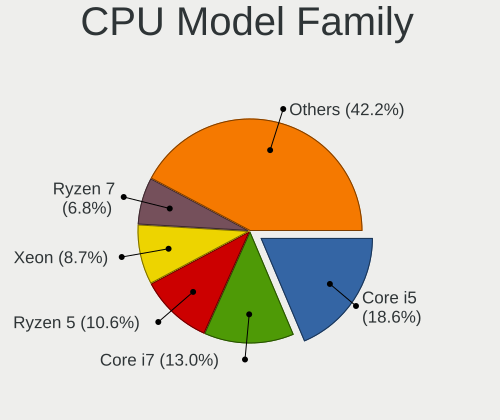

| Model                   | Desktops | Percent |
|-------------------------|----------|---------|
| Intel Core i5           | 30       | 18.63%  |
| Intel Core i7           | 21       | 13.04%  |
| AMD Ryzen 5             | 17       | 10.56%  |
| Intel Xeon              | 14       | 8.7%    |
| AMD Ryzen 7             | 11       | 6.83%   |
| Intel Core i3           | 8        | 4.97%   |
| AMD Ryzen 3             | 8        | 4.97%   |
| Intel Celeron           | 6        | 3.73%   |
| Other                   | 5        | 3.11%   |
| Intel Pentium           | 4        | 2.48%   |
| Intel Core 2 Quad       | 4        | 2.48%   |
| Intel Core 2 Duo        | 4        | 2.48%   |
| Intel Pentium Dual-Core | 3        | 1.86%   |
| AMD FX                  | 3        | 1.86%   |
| AMD Athlon II X2        | 3        | 1.86%   |
| Intel Pentium Gold      | 2        | 1.24%   |
| Intel Pentium Dual      | 2        | 1.24%   |
| Intel Pentium D         | 2        | 1.24%   |
| AMD Phenom II X6        | 2        | 1.24%   |
| AMD Athlon              | 2        | 1.24%   |
| AMD A8                  | 2        | 1.24%   |
| AMD A4                  | 2        | 1.24%   |
| Intel Core 2            | 1        | 0.62%   |
| AMD Ryzen 9             | 1        | 0.62%   |
| AMD Phenom II X4        | 1        | 0.62%   |
| AMD G                   | 1        | 0.62%   |
| AMD E1                  | 1        | 0.62%   |
| AMD A6                  | 1        | 0.62%   |

CPU Cores
---------

Number of processor cores

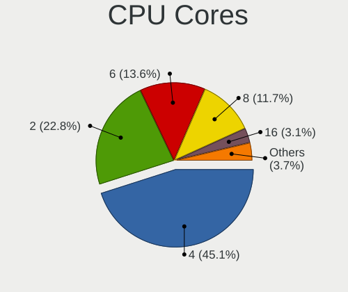

| Number | Desktops | Percent |
|--------|----------|---------|
| 4      | 73       | 45.06%  |
| 2      | 37       | 22.84%  |
| 6      | 22       | 13.58%  |
| 8      | 19       | 11.73%  |
| 16     | 5        | 3.09%   |
| 1      | 3        | 1.85%   |
| 12     | 2        | 1.23%   |
| 10     | 1        | 0.62%   |

CPU Sockets
-----------

Number of sockets

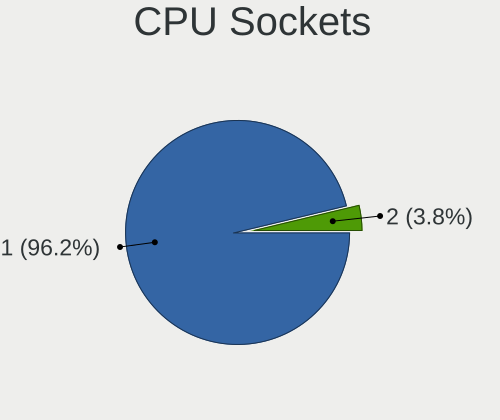

| Number | Desktops | Percent |
|--------|----------|---------|
| 1      | 154      | 96.25%  |
| 2      | 6        | 3.75%   |

CPU Threads
-----------

Threads per core (Hyper-Threading)

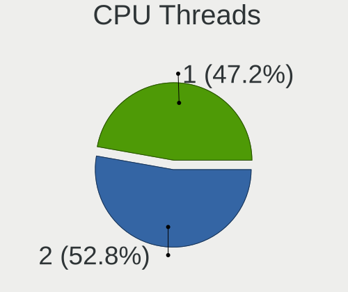

| Number | Desktops | Percent |
|--------|----------|---------|
| 2      | 85       | 52.8%   |
| 1      | 76       | 47.2%   |

CPU Op-Modes
------------

CPU Operation Modes (32-bit, 64-bit)

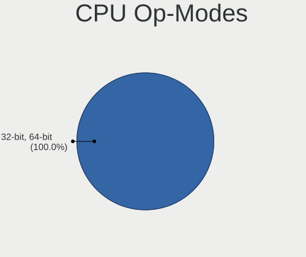

| Op mode        | Desktops | Percent |
|----------------|----------|---------|
| 32-bit, 64-bit | 160      | 100%    |

CPU Microcode
-------------

Microcode number

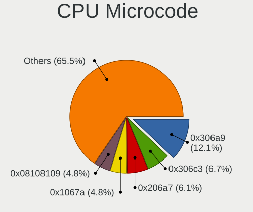

| Number     | Desktops | Percent |
|------------|----------|---------|
| 0x306a9    | 20       | 12.12%  |
| 0x306c3    | 11       | 6.67%   |
| 0x206a7    | 10       | 6.06%   |
| 0x1067a    | 8        | 4.85%   |
| 0x08108109 | 8        | 4.85%   |
| Unknown    | 7        | 4.24%   |
| 0x506e3    | 6        | 3.64%   |
| 0x0800820d | 6        | 3.64%   |
| 0x08701021 | 5        | 3.03%   |
| 0x906ea    | 4        | 2.42%   |
| 0x206d7    | 4        | 2.42%   |
| 0x0a50000d | 4        | 2.42%   |
| 0xa0671    | 3        | 1.82%   |
| 0x906ed    | 3        | 1.82%   |
| 0x906e9    | 3        | 1.82%   |
| 0x6fd      | 3        | 1.82%   |
| 0x08701030 | 3        | 1.82%   |
| 0x010000c8 | 3        | 1.82%   |
| 0xa0653    | 2        | 1.21%   |
| 0x906c0    | 2        | 1.21%   |
| 0x90675    | 2        | 1.21%   |
| 0x706a8    | 2        | 1.21%   |
| 0x306e4    | 2        | 1.21%   |
| 0x206c2    | 2        | 1.21%   |
| 0x20655    | 2        | 1.21%   |
| 0x106e5    | 2        | 1.21%   |
| 0x0a201016 | 2        | 1.21%   |
| 0x08101016 | 2        | 1.21%   |
| 0x0810100b | 2        | 1.21%   |
| 0x08001138 | 2        | 1.21%   |
| 0x06001119 | 2        | 1.21%   |
| 0x06000852 | 2        | 1.21%   |
| 0x03000027 | 2        | 1.21%   |
| 0xf65      | 1        | 0.61%   |
| 0xf47      | 1        | 0.61%   |
| 0xf43      | 1        | 0.61%   |
| 0xa0655    | 1        | 0.61%   |
| 0x806ea    | 1        | 0.61%   |
| 0x806c2    | 1        | 0.61%   |
| 0x706a1    | 1        | 0.61%   |

CPU Microarch
-------------

Microarchitecture

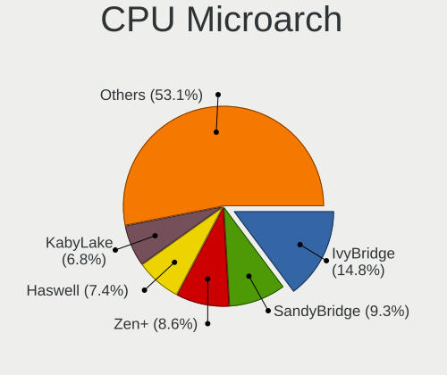

| Name          | Desktops | Percent |
|---------------|----------|---------|
| IvyBridge     | 24       | 14.81%  |
| SandyBridge   | 15       | 9.26%   |
| Zen+          | 14       | 8.64%   |
| Haswell       | 12       | 7.41%   |
| KabyLake      | 11       | 6.79%   |
| Zen 3         | 9        | 5.56%   |
| Zen           | 9        | 5.56%   |
| Penryn        | 9        | 5.56%   |
| Zen 2         | 7        | 4.32%   |
| Skylake       | 6        | 3.7%    |
| K10           | 6        | 3.7%    |
| Core          | 6        | 3.7%    |
| Piledriver    | 5        | 3.09%   |
| Unknown       | 5        | 3.09%   |
| Westmere      | 4        | 2.47%   |
| NetBurst      | 3        | 1.85%   |
| Nehalem       | 3        | 1.85%   |
| Goldmont plus | 3        | 1.85%   |
| CometLake     | 3        | 1.85%   |
| Tremont       | 2        | 1.23%   |
| K10 Llano     | 2        | 1.23%   |
| TigerLake     | 1        | 0.62%   |
| Jaguar        | 1        | 0.62%   |
| Bulldozer     | 1        | 0.62%   |
| Bobcat        | 1        | 0.62%   |

Graphics
--------

GPU Vendor
----------

Vendors of graphics cards

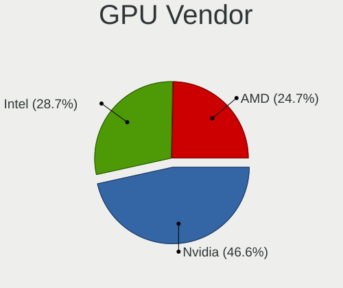

| Vendor | Desktops | Percent |
|--------|----------|---------|
| Nvidia | 81       | 46.55%  |
| Intel  | 50       | 28.74%  |
| AMD    | 43       | 24.71%  |

GPU Model
---------

Graphics card models

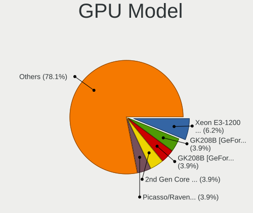

| Model                                                                       | Desktops | Percent |
|-----------------------------------------------------------------------------|----------|---------|
| Intel Xeon E3-1200 v2/3rd Gen Core processor Graphics Controller            | 11       | 6.18%   |
| Nvidia GK208B [GeForce GT 730]                                              | 7        | 3.93%   |
| Nvidia GK208B [GeForce GT 710]                                              | 7        | 3.93%   |
| Intel 2nd Generation Core Processor Family Integrated Graphics Controller   | 7        | 3.93%   |
| AMD Picasso/Raven 2 [Radeon Vega Series / Radeon Vega Mobile Series]        | 7        | 3.93%   |
| Nvidia GT218 [GeForce 210]                                                  | 5        | 2.81%   |
| AMD Cezanne [Radeon Vega Series / Radeon Vega Mobile Series]                | 5        | 2.81%   |
| Nvidia GP108 [GeForce GT 1030]                                              | 4        | 2.25%   |
| Nvidia GM204 [GeForce GTX 970]                                              | 4        | 2.25%   |
| Intel Xeon E3-1200 v3/4th Gen Core Processor Integrated Graphics Controller | 4        | 2.25%   |
| Intel IvyBridge GT2 [HD Graphics 4000]                                      | 4        | 2.25%   |
| AMD Ellesmere [Radeon RX 470/480/570/570X/580/580X/590]                     | 4        | 2.25%   |
| Nvidia GM206 [GeForce GTX 960]                                              | 3        | 1.69%   |
| Nvidia GK104 [GeForce GTX 760]                                              | 3        | 1.69%   |
| Intel GeminiLake [UHD Graphics 600]                                         | 3        | 1.69%   |
| Intel CoffeeLake-S GT2 [UHD Graphics 630]                                   | 3        | 1.69%   |
| AMD Raven Ridge [Radeon Vega Series / Radeon Vega Mobile Series]            | 3        | 1.69%   |
| Nvidia TU117 [GeForce GTX 1650]                                             | 2        | 1.12%   |
| Nvidia GP107 [GeForce GTX 1050]                                             | 2        | 1.12%   |
| Nvidia GF114 [GeForce GTX 560 Ti]                                           | 2        | 1.12%   |
| Intel Skylake-S GT2 [HD Graphics 530]                                       | 2        | 1.12%   |
| Intel JasperLake [UHD Graphics]                                             | 2        | 1.12%   |
| Intel 4th Generation Core Processor Family Integrated Graphics Controller   | 2        | 1.12%   |
| Intel 4 Series Chipset Integrated Graphics Controller                       | 2        | 1.12%   |
| AMD Trinity 2 [Radeon HD 7480D]                                             | 2        | 1.12%   |
| AMD RS780L [Radeon 3000]                                                    | 2        | 1.12%   |
| AMD Oland [Radeon HD 8570 / R5 430 OEM / R7 240/340 / Radeon 520 OEM]       | 2        | 1.12%   |
| Nvidia TU116 [GeForce GTX 1660]                                             | 1        | 0.56%   |
| Nvidia TU116 [GeForce GTX 1660 Ti]                                          | 1        | 0.56%   |
| Nvidia TU116 [GeForce GTX 1660 SUPER]                                       | 1        | 0.56%   |
| Nvidia TU116 [GeForce GTX 1650 SUPER]                                       | 1        | 0.56%   |
| Nvidia TU106 [GeForce RTX 2060 Rev. A]                                      | 1        | 0.56%   |
| Nvidia TU106 [GeForce RTX 2060 12GB]                                        | 1        | 0.56%   |
| Nvidia TU106 [GeForce GTX 1650]                                             | 1        | 0.56%   |
| Nvidia TU104 [GeForce RTX 2080 SUPER]                                       | 1        | 0.56%   |
| Nvidia GT218 [GeForce 8400 GS Rev. 3]                                       | 1        | 0.56%   |
| Nvidia GT216 [GeForce GT 220]                                               | 1        | 0.56%   |
| Nvidia GP107GL [Quadro P620]                                                | 1        | 0.56%   |
| Nvidia GP106 [GeForce GTX 1060 6GB]                                         | 1        | 0.56%   |
| Nvidia GP106 [GeForce GTX 1060 3GB]                                         | 1        | 0.56%   |

GPU Combo
---------

Combinations of graphics cards

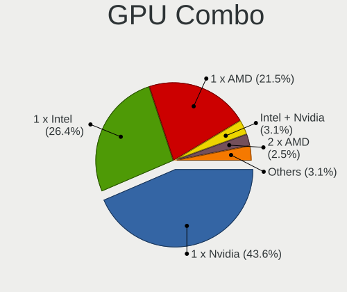

| Name           | Desktops | Percent |
|----------------|----------|---------|
| 1 x Nvidia     | 71       | 43.56%  |
| 1 x Intel      | 43       | 26.38%  |
| 1 x AMD        | 35       | 21.47%  |
| Intel + Nvidia | 5        | 3.07%   |
| 2 x AMD        | 4        | 2.45%   |
| AMD + Nvidia   | 3        | 1.84%   |
| 2 x Nvidia     | 1        | 0.61%   |
| Intel + AMD    | 1        | 0.61%   |

GPU Driver
----------

Free vs proprietary

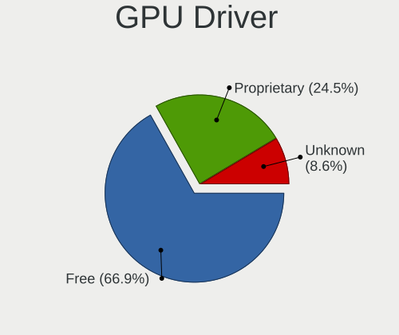

| Driver      | Desktops | Percent |
|-------------|----------|---------|
| Free        | 109      | 66.87%  |
| Proprietary | 40       | 24.54%  |
| Unknown     | 14       | 8.59%   |

GPU Memory
----------

Total video memory

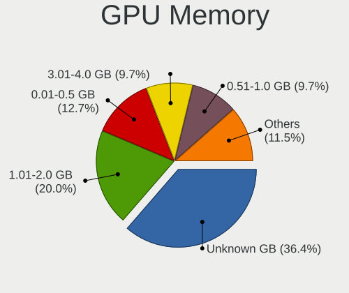

| Size in GB | Desktops | Percent |
|------------|----------|---------|
| Unknown    | 60       | 36.36%  |
| 1.01-2.0   | 33       | 20%     |
| 0.01-0.5   | 21       | 12.73%  |
| 3.01-4.0   | 16       | 9.7%    |
| 0.51-1.0   | 16       | 9.7%    |
| 7.01-8.0   | 8        | 4.85%   |
| 5.01-6.0   | 6        | 3.64%   |
| 8.01-16.0  | 3        | 1.82%   |
| 2.01-3.0   | 1        | 0.61%   |
| 16.01-24.0 | 1        | 0.61%   |

Monitor
-------

Monitor Vendor
--------------

Monitor vendors

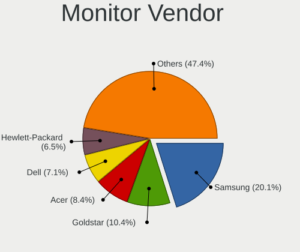

| Vendor               | Desktops | Percent |
|----------------------|----------|---------|
| Samsung Electronics  | 31       | 20.13%  |
| Goldstar             | 16       | 10.39%  |
| Acer                 | 13       | 8.44%   |
| Dell                 | 11       | 7.14%   |
| Hewlett-Packard      | 10       | 6.49%   |
| Philips              | 9        | 5.84%   |
| BenQ                 | 8        | 5.19%   |
| Unknown              | 5        | 3.25%   |
| AOC                  | 5        | 3.25%   |
| Ancor Communications | 5        | 3.25%   |
| Sony                 | 4        | 2.6%    |
| ASUSTek Computer     | 4        | 2.6%    |
| ViewSonic            | 2        | 1.3%    |
| Iiyama               | 2        | 1.3%    |
| HUAWEI               | 2        | 1.3%    |
| HPN                  | 2        | 1.3%    |
| HannStar             | 2        | 1.3%    |
| Fujitsu Siemens      | 2        | 1.3%    |
| ___                  | 1        | 0.65%   |
| Unknown (XXX)        | 1        | 0.65%   |
| Toshiba              | 1        | 0.65%   |
| Targa                | 1        | 0.65%   |
| SKY                  | 1        | 0.65%   |
| PLN                  | 1        | 0.65%   |
| Pioneer              | 1        | 0.65%   |
| Nixeus               | 1        | 0.65%   |
| NEC Computers        | 1        | 0.65%   |
| MStar                | 1        | 0.65%   |
| MSI                  | 1        | 0.65%   |
| Medion               | 1        | 0.65%   |
| Lenovo Group Limited | 1        | 0.65%   |
| Lenovo               | 1        | 0.65%   |
| Insignia             | 1        | 0.65%   |
| Idek Iiyama          | 1        | 0.65%   |
| Hitachi              | 1        | 0.65%   |
| DENON                | 1        | 0.65%   |
| AUS                  | 1        | 0.65%   |
| Apple                | 1        | 0.65%   |
| Unknown              | 1        | 0.65%   |

Monitor Model
-------------

Monitor models

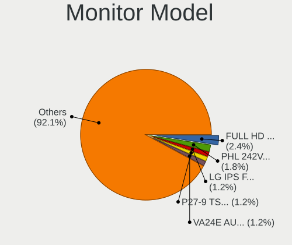

| Model                                                                 | Desktops | Percent |
|-----------------------------------------------------------------------|----------|---------|
| Goldstar FULL HD GSM5B55 1920x1080 480x270mm 21.7-inch                | 4        | 2.42%   |
| Philips PHL 242V8 PHLC219 1920x1080 527x296mm 23.8-inch               | 3        | 1.82%   |
| Goldstar LG IPS FULLHD GSM5AB8 1920x1080 480x270mm 21.7-inch          | 2        | 1.21%   |
| Fujitsu Siemens P27-9 TS QHD FUS08D5 2560x1440 597x336mm 27.0-inch    | 2        | 1.21%   |
| ASUSTek Computer VA24E AUS24D1 1920x1080 527x296mm 23.8-inch          | 2        | 1.21%   |
| ___ LCD TV ___0101 1360x768                                           | 1        | 0.61%   |
| ViewSonic VX3276-FHD VSCE735 1920x1080 698x393mm 31.5-inch            | 1        | 0.61%   |
| ViewSonic VG2230wm-EU VSCA21E 1680x1050 474x296mm 22.0-inch           | 1        | 0.61%   |
| Unknown LCDTV14 0101 1360x768 1600x900mm 72.3-inch                    | 1        | 0.61%   |
| Unknown LCD Monitor SAMSUNG 3840x2160                                 | 1        | 0.61%   |
| Unknown LCD Monitor SAMSUNG 1366x768                                  | 1        | 0.61%   |
| Unknown LCD Monitor SAMSUNG                                           | 1        | 0.61%   |
| Unknown LCD Monitor Dell SE2717H/HX 1920x1080                         | 1        | 0.61%   |
| Unknown (XXX) Union TV XXX2841 1920x1080 1209x680mm 54.6-inch         | 1        | 0.61%   |
| Toshiba LCD Monitor TV 1920x1080                                      | 1        | 0.61%   |
| Targa LCD Monitor LCD TV                                              | 1        | 0.61%   |
| Sony TV SNY8E01 1360x768                                              | 1        | 0.61%   |
| Sony TV SNY8701 1440x900                                              | 1        | 0.61%   |
| Sony LCD Monitor TV 3840x1080                                         | 1        | 0.61%   |
| Sony LCD Monitor TV  *00 1920x1080                                    | 1        | 0.61%   |
| SKY TV SKY1502 3840x2160 1150x650mm 52.0-inch                         | 1        | 0.61%   |
| SKY Toshiba TV SKY1402 3840x2160 708x398mm 32.0-inch                  | 1        | 0.61%   |
| SKY Skyworth TV SKY1502 3840x2160 708x398mm 32.0-inch                 | 1        | 0.61%   |
| Samsung Electronics SyncMaster SAM05C8 1920x1080 521x293mm 23.5-inch  | 1        | 0.61%   |
| Samsung Electronics SyncMaster SAM0420 1680x1050 474x296mm 22.0-inch  | 1        | 0.61%   |
| Samsung Electronics SyncMaster SAM03D0 1440x900 410x257mm 19.1-inch   | 1        | 0.61%   |
| Samsung Electronics SyncMaster SAM02AD 1440x900 410x257mm 19.1-inch   | 1        | 0.61%   |
| Samsung Electronics SyncMaster SAM0259 1280x1024 376x301mm 19.0-inch  | 1        | 0.61%   |
| Samsung Electronics SyncMaster SAM01AD 1600x1200 408x306mm 20.1-inch  | 1        | 0.61%   |
| Samsung Electronics SyncMaster SAM0022 1280x1024 312x234mm 15.4-inch  | 1        | 0.61%   |
| Samsung Electronics SMT24A550 SAM07B5 1920x1080 531x299mm 24.0-inch   | 1        | 0.61%   |
| Samsung Electronics SMFX2490HD SAM074A 1920x1080 531x299mm 24.0-inch  | 1        | 0.61%   |
| Samsung Electronics SME1920N SAM06A3 1366x768 410x230mm 18.5-inch     | 1        | 0.61%   |
| Samsung Electronics SMBX1950N SAM0716 1366x768 410x230mm 18.5-inch    | 1        | 0.61%   |
| Samsung Electronics SMB2340 SAM0691 1920x1080 510x290mm 23.1-inch     | 1        | 0.61%   |
| Samsung Electronics SMB2330H SAM064A 1920x1080 509x286mm 23.0-inch    | 1        | 0.61%   |
| Samsung Electronics SA300/SA350 SAM0794 1920x1080 521x293mm 23.5-inch | 1        | 0.61%   |
| Samsung Electronics SA300/SA350 SAM078B 1600x900 443x249mm 20.0-inch  | 1        | 0.61%   |
| Samsung Electronics SA300/SA350 SAM0788 1366x768 410x230mm 18.5-inch  | 1        | 0.61%   |
| Samsung Electronics S24D590 SAM0B47 1920x1080 521x293mm 23.5-inch     | 1        | 0.61%   |

Monitor Resolution
------------------

Monitor screen resolution

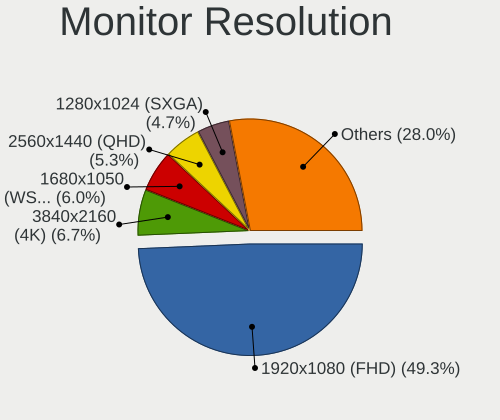

| Resolution         | Desktops | Percent |
|--------------------|----------|---------|
| 1920x1080 (FHD)    | 74       | 49.33%  |
| 3840x2160 (4K)     | 10       | 6.67%   |
| 1680x1050 (WSXGA+) | 9        | 6%      |
| 2560x1440 (QHD)    | 8        | 5.33%   |
| 1280x1024 (SXGA)   | 7        | 4.67%   |
| 1600x900 (HD+)     | 6        | 4%      |
| 1440x900 (WXGA+)   | 6        | 4%      |
| 2560x1080          | 5        | 3.33%   |
| 1366x768 (WXGA)    | 5        | 3.33%   |
| Unknown            | 4        | 2.67%   |
| 3440x1440          | 3        | 2%      |
| 1920x1200 (WUXGA)  | 3        | 2%      |
| 1360x768           | 3        | 2%      |
| 3840x1080          | 2        | 1.33%   |
| 4480x1440          | 1        | 0.67%   |
| 3040x1050          | 1        | 0.67%   |
| 1600x1200          | 1        | 0.67%   |
| 1280x768           | 1        | 0.67%   |
| 1024x768 (XGA)     | 1        | 0.67%   |

Monitor Diagonal
----------------

Diagonal size in inches

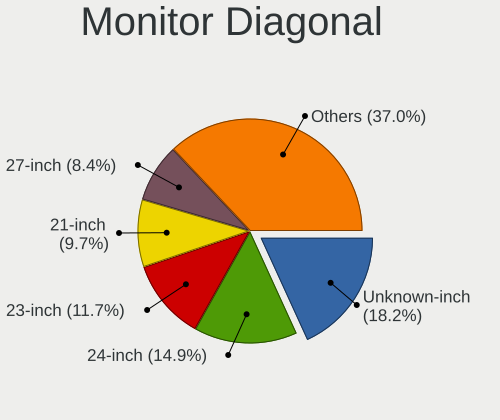

| Inches  | Desktops | Percent |
|---------|----------|---------|
| Unknown | 28       | 18.18%  |
| 24      | 23       | 14.94%  |
| 23      | 18       | 11.69%  |
| 21      | 15       | 9.74%   |
| 27      | 13       | 8.44%   |
| 31      | 7        | 4.55%   |
| 20      | 7        | 4.55%   |
| 19      | 7        | 4.55%   |
| 22      | 6        | 3.9%    |
| 18      | 6        | 3.9%    |
| 34      | 5        | 3.25%   |
| 72      | 4        | 2.6%    |
| 52      | 2        | 1.3%    |
| 32      | 2        | 1.3%    |
| 25      | 2        | 1.3%    |
| 17      | 2        | 1.3%    |
| 15      | 2        | 1.3%    |
| 64      | 1        | 0.65%   |
| 63      | 1        | 0.65%   |
| 54      | 1        | 0.65%   |
| 40      | 1        | 0.65%   |
| 28      | 1        | 0.65%   |

Monitor Width
-------------

Physical width

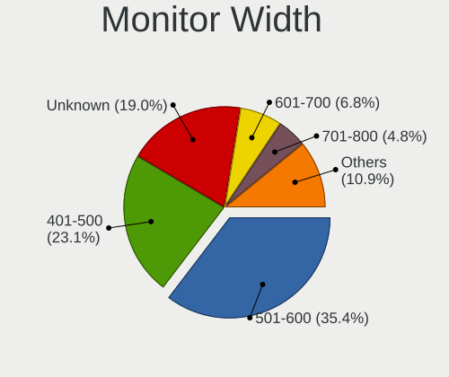

| Width in mm | Desktops | Percent |
|-------------|----------|---------|
| 501-600     | 52       | 35.37%  |
| 401-500     | 34       | 23.13%  |
| Unknown     | 28       | 19.05%  |
| 601-700     | 10       | 6.8%    |
| 701-800     | 7        | 4.76%   |
| 301-350     | 4        | 2.72%   |
| 1501-2000   | 4        | 2.72%   |
| 1001-1500   | 4        | 2.72%   |
| 351-400     | 3        | 2.04%   |
| 801-900     | 1        | 0.68%   |

Aspect Ratio
------------

Proportional relationship between the width and the height

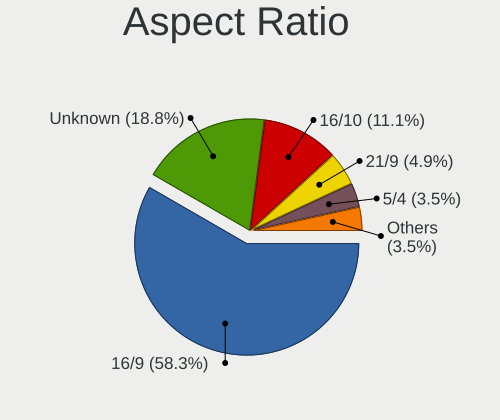

| Ratio   | Desktops | Percent |
|---------|----------|---------|
| 16/9    | 84       | 58.33%  |
| Unknown | 27       | 18.75%  |
| 16/10   | 16       | 11.11%  |
| 21/9    | 7        | 4.86%   |
| 5/4     | 5        | 3.47%   |
| 4/3     | 4        | 2.78%   |
| 3/2     | 1        | 0.69%   |

Monitor Area
------------

Area in inch²

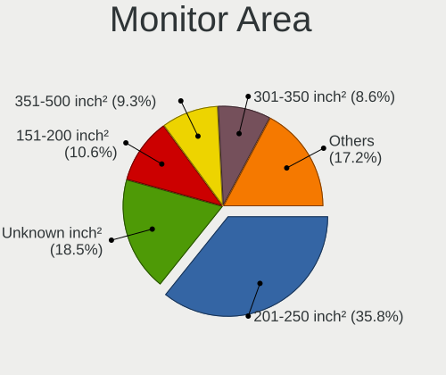

| Area in inch² | Desktops | Percent |
|----------------|----------|---------|
| 201-250        | 54       | 35.76%  |
| Unknown        | 28       | 18.54%  |
| 151-200        | 16       | 10.6%   |
| 351-500        | 14       | 9.27%   |
| 301-350        | 13       | 8.61%   |
| More than 1000 | 8        | 5.3%    |
| 251-300        | 8        | 5.3%    |
| 141-150        | 7        | 4.64%   |
| 111-120        | 1        | 0.66%   |
| 101-110        | 1        | 0.66%   |
| 501-1000       | 1        | 0.66%   |

Pixel Density
-------------

Pixels per inch

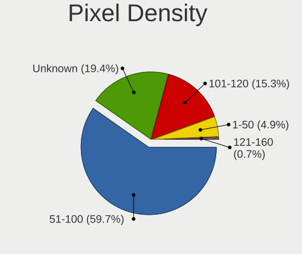

| Density | Desktops | Percent |
|---------|----------|---------|
| 51-100  | 86       | 59.72%  |
| Unknown | 28       | 19.44%  |
| 101-120 | 22       | 15.28%  |
| 1-50    | 7        | 4.86%   |
| 121-160 | 1        | 0.69%   |

Multiple Monitors
-----------------

Total monitors connected

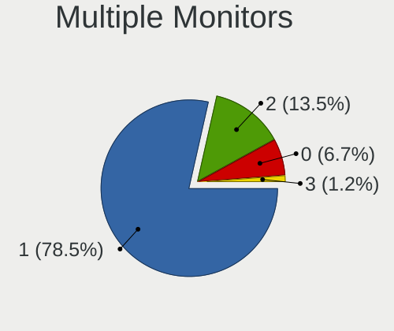

| Total | Desktops | Percent |
|-------|----------|---------|
| 1     | 128      | 78.53%  |
| 2     | 22       | 13.5%   |
| 0     | 11       | 6.75%   |
| 3     | 2        | 1.23%   |

Network
-------

Net Controller Vendor
---------------------

Controller vendors

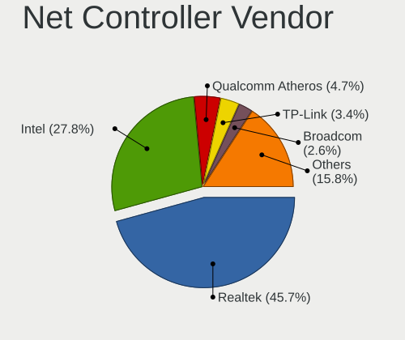

| Vendor                     | Desktops | Percent |
|----------------------------|----------|---------|
| Realtek Semiconductor      | 107      | 45.73%  |
| Intel                      | 65       | 27.78%  |
| Qualcomm Atheros           | 11       | 4.7%    |
| TP-Link                    | 8        | 3.42%   |
| Broadcom                   | 6        | 2.56%   |
| Ralink Technology          | 5        | 2.14%   |
| Nvidia                     | 3        | 1.28%   |
| NetGear                    | 3        | 1.28%   |
| Marvell Technology Group   | 3        | 1.28%   |
| VIA Technologies           | 2        | 0.85%   |
| Tenda                      | 2        | 0.85%   |
| Samsung Electronics        | 2        | 0.85%   |
| Ralink                     | 2        | 0.85%   |
| MediaTek                   | 2        | 0.85%   |
| Huawei Technologies        | 2        | 0.85%   |
| Belkin Components          | 2        | 0.85%   |
| ASUSTek Computer           | 2        | 0.85%   |
| ZTE WCDMA Technologies MSM | 1        | 0.43%   |
| Qualcomm                   | 1        | 0.43%   |
| Microsoft                  | 1        | 0.43%   |
| Mercucys                   | 1        | 0.43%   |
| IMC Networks               | 1        | 0.43%   |
| HTC (High Tech Computer)   | 1        | 0.43%   |
| ADMtek                     | 1        | 0.43%   |

Net Controller Model
--------------------

Controller models

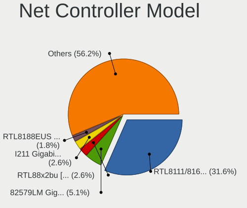

| Model                                                                  | Desktops | Percent |
|------------------------------------------------------------------------|----------|---------|
| Realtek RTL8111/8168/8211/8411 PCI Express Gigabit Ethernet Controller | 86       | 31.62%  |
| Intel 82579LM Gigabit Network Connection (Lewisville)                  | 14       | 5.15%   |
| Realtek RTL88x2bu [AC1200 Techkey]                                     | 7        | 2.57%   |
| Intel I211 Gigabit Network Connection                                  | 7        | 2.57%   |
| Realtek RTL8188EUS 802.11n Wireless Network Adapter                    | 5        | 1.84%   |
| Intel Wireless 3165                                                    | 5        | 1.84%   |
| Intel Dual Band Wireless-AC 3168NGW [Stone Peak]                       | 5        | 1.84%   |
| Realtek RTL8188FTV 802.11b/g/n 1T1R 2.4G WLAN Adapter                  | 4        | 1.47%   |
| Realtek RTL810xE PCI Express Fast Ethernet controller                  | 4        | 1.47%   |
| Intel Ethernet Connection I217-V                                       | 4        | 1.47%   |
| TP-Link TL-WN722N v2/v3 [Realtek RTL8188EUS]                           | 3        | 1.1%    |
| Realtek RTL8822CE 802.11ac PCIe Wireless Network Adapter               | 3        | 1.1%    |
| Realtek RTL8125 2.5GbE Controller                                      | 3        | 1.1%    |
| Realtek 802.11ac NIC                                                   | 3        | 1.1%    |
| Ralink RT2870/RT3070 Wireless Adapter                                  | 3        | 1.1%    |
| Intel Wi-Fi 6 AX200                                                    | 3        | 1.1%    |
| Intel Ethernet Connection (7) I219-V                                   | 3        | 1.1%    |
| Intel Ethernet Connection (2) I219-V                                   | 3        | 1.1%    |
| Intel 82579V Gigabit Network Connection                                | 3        | 1.1%    |
| Intel 82574L Gigabit Network Connection                                | 3        | 1.1%    |
| Tenda U12                                                              | 2        | 0.74%   |
| Samsung Galaxy series, misc. (tethering mode)                          | 2        | 0.74%   |
| Realtek RTL8192EE PCIe Wireless Network Adapter                        | 2        | 0.74%   |
| Realtek RTL8187 Wireless Adapter                                       | 2        | 0.74%   |
| Realtek RTL8111/8168/8411 PCI Express Gigabit Ethernet Controller      | 2        | 0.74%   |
| Ralink RT2561/RT61 802.11g PCI                                         | 2        | 0.74%   |
| Qualcomm Atheros Attansic L1 Gigabit Ethernet                          | 2        | 0.74%   |
| Qualcomm Atheros AR9485 Wireless Network Adapter                       | 2        | 0.74%   |
| Qualcomm Atheros AR9462 Wireless Network Adapter                       | 2        | 0.74%   |
| Nvidia MCP77 Ethernet                                                  | 2        | 0.74%   |
| MediaTek MT7921K (RZ608) Wi-Fi 6E 80MHz                                | 2        | 0.74%   |
| Intel Wireless 8260                                                    | 2        | 0.74%   |
| Intel Wi-Fi 6E(802.11ax) AX210/AX1675* 2x2 [Typhoon Peak]              | 2        | 0.74%   |
| Intel Wi-Fi 5(802.11ac) Wireless-AC 9x6x [Thunder Peak]                | 2        | 0.74%   |
| Intel I210 Gigabit Network Connection                                  | 2        | 0.74%   |
| Intel Ethernet Controller I225-V                                       | 2        | 0.74%   |
| Intel 82573L Gigabit Ethernet Controller                               | 2        | 0.74%   |
| Huawei FOA-LX9                                                         | 2        | 0.74%   |
| ZTE WCDMA MSM K3806-Z                                                  | 1        | 0.37%   |
| VIA VT6105/VT6106S [Rhine-III]                                         | 1        | 0.37%   |

Wireless Vendor
---------------

Wireless vendors

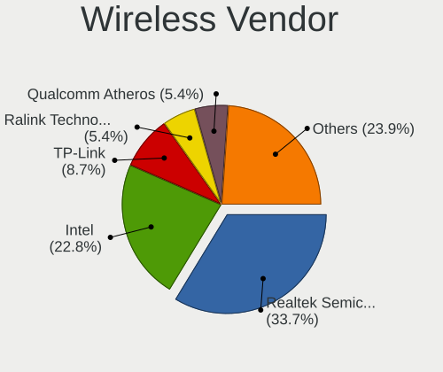

| Vendor                     | Desktops | Percent |
|----------------------------|----------|---------|
| Realtek Semiconductor      | 31       | 33.7%   |
| Intel                      | 21       | 22.83%  |
| TP-Link                    | 8        | 8.7%    |
| Ralink Technology          | 5        | 5.43%   |
| Qualcomm Atheros           | 5        | 5.43%   |
| Broadcom                   | 4        | 4.35%   |
| NetGear                    | 3        | 3.26%   |
| Tenda                      | 2        | 2.17%   |
| Ralink                     | 2        | 2.17%   |
| MediaTek                   | 2        | 2.17%   |
| Belkin Components          | 2        | 2.17%   |
| ASUSTek Computer           | 2        | 2.17%   |
| ZTE WCDMA Technologies MSM | 1        | 1.09%   |
| Microsoft                  | 1        | 1.09%   |
| Mercucys                   | 1        | 1.09%   |
| Marvell Technology Group   | 1        | 1.09%   |
| IMC Networks               | 1        | 1.09%   |

Wireless Model
--------------

Wireless models

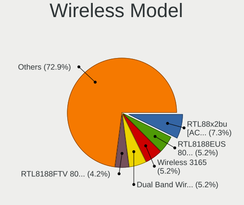

| Model                                                                                         | Desktops | Percent |
|-----------------------------------------------------------------------------------------------|----------|---------|
| Realtek RTL88x2bu [AC1200 Techkey]                                                            | 7        | 7.29%   |
| Realtek RTL8188EUS 802.11n Wireless Network Adapter                                           | 5        | 5.21%   |
| Intel Wireless 3165                                                                           | 5        | 5.21%   |
| Intel Dual Band Wireless-AC 3168NGW [Stone Peak]                                              | 5        | 5.21%   |
| Realtek RTL8188FTV 802.11b/g/n 1T1R 2.4G WLAN Adapter                                         | 4        | 4.17%   |
| TP-Link TL-WN722N v2/v3 [Realtek RTL8188EUS]                                                  | 3        | 3.13%   |
| Realtek RTL8822CE 802.11ac PCIe Wireless Network Adapter                                      | 3        | 3.13%   |
| Realtek 802.11ac NIC                                                                          | 3        | 3.13%   |
| Ralink RT2870/RT3070 Wireless Adapter                                                         | 3        | 3.13%   |
| Intel Wi-Fi 6 AX200                                                                           | 3        | 3.13%   |
| Tenda U12                                                                                     | 2        | 2.08%   |
| Realtek RTL8192EE PCIe Wireless Network Adapter                                               | 2        | 2.08%   |
| Realtek RTL8187 Wireless Adapter                                                              | 2        | 2.08%   |
| Ralink RT2561/RT61 802.11g PCI                                                                | 2        | 2.08%   |
| Qualcomm Atheros AR9485 Wireless Network Adapter                                              | 2        | 2.08%   |
| Qualcomm Atheros AR9462 Wireless Network Adapter                                              | 2        | 2.08%   |
| MediaTek MT7921K (RZ608) Wi-Fi 6E 80MHz                                                       | 2        | 2.08%   |
| Intel Wireless 8260                                                                           | 2        | 2.08%   |
| Intel Wi-Fi 6E(802.11ax) AX210/AX1675* 2x2 [Typhoon Peak]                                     | 2        | 2.08%   |
| Intel Wi-Fi 5(802.11ac) Wireless-AC 9x6x [Thunder Peak]                                       | 2        | 2.08%   |
| ZTE WCDMA MSM K3806-Z                                                                         | 1        | 1.04%   |
| TP-Link TL-WN821N v5/v6 [RTL8192EU]                                                           | 1        | 1.04%   |
| TP-Link RTL8812AU Archer T4U 802.11ac                                                         | 1        | 1.04%   |
| TP-Link Archer T2U PLUS [RTL8821AU]                                                           | 1        | 1.04%   |
| TP-Link 802.11ac WLAN Adapter                                                                 | 1        | 1.04%   |
| TP-Link 802.11ac NIC                                                                          | 1        | 1.04%   |
| Realtek RTL8821CE 802.11ac PCIe Wireless Network Adapter                                      | 1        | 1.04%   |
| Realtek RTL8812AE 802.11ac PCIe Wireless Network Adapter                                      | 1        | 1.04%   |
| Realtek RTL8192EU 802.11b/g/n WLAN Adapter                                                    | 1        | 1.04%   |
| Realtek RTL8192CU 802.11n WLAN Adapter                                                        | 1        | 1.04%   |
| Realtek RTL8192CE PCIe Wireless Network Adapter                                               | 1        | 1.04%   |
| Realtek RTL8188SU 802.11n WLAN Adapter                                                        | 1        | 1.04%   |
| Realtek RTL8188EE Wireless Network Adapter                                                    | 1        | 1.04%   |
| Realtek Realtek 8812AU/8821AU 802.11ac WLAN Adapter [USB Wireless Dual-Band Adapter 2.4/5Ghz] | 1        | 1.04%   |
| Ralink RT5370 Wireless Adapter                                                                | 1        | 1.04%   |
| Ralink MT7601U Wireless Adapter                                                               | 1        | 1.04%   |
| Qualcomm Atheros AR5413/AR5414 Wireless Network Adapter [AR5006X(S) 802.11abg]                | 1        | 1.04%   |
| NetGear WG111v2 54 Mbps Wireless [RealTek RTL8187L]                                           | 1        | 1.04%   |
| NetGear A6210                                                                                 | 1        | 1.04%   |
| NetGear A6150                                                                                 | 1        | 1.04%   |

Ethernet Vendor
---------------

Ethernet vendors

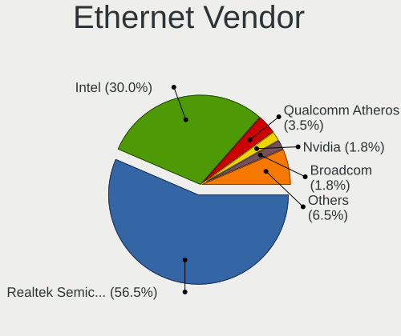

| Vendor                   | Desktops | Percent |
|--------------------------|----------|---------|
| Realtek Semiconductor    | 96       | 56.47%  |
| Intel                    | 51       | 30%     |
| Qualcomm Atheros         | 6        | 3.53%   |
| Nvidia                   | 3        | 1.76%   |
| Broadcom                 | 3        | 1.76%   |
| VIA Technologies         | 2        | 1.18%   |
| Samsung Electronics      | 2        | 1.18%   |
| Marvell Technology Group | 2        | 1.18%   |
| Huawei Technologies      | 2        | 1.18%   |
| Qualcomm                 | 1        | 0.59%   |
| HTC (High Tech Computer) | 1        | 0.59%   |
| ADMtek                   | 1        | 0.59%   |

Ethernet Model
--------------

Ethernet models

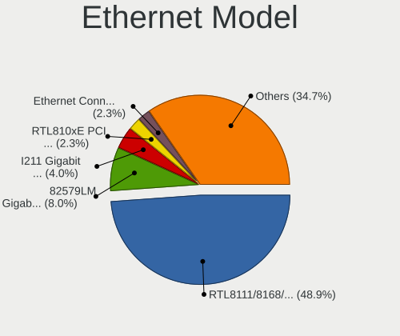

| Model                                                                  | Desktops | Percent |
|------------------------------------------------------------------------|----------|---------|
| Realtek RTL8111/8168/8211/8411 PCI Express Gigabit Ethernet Controller | 86       | 48.86%  |
| Intel 82579LM Gigabit Network Connection (Lewisville)                  | 14       | 7.95%   |
| Intel I211 Gigabit Network Connection                                  | 7        | 3.98%   |
| Realtek RTL810xE PCI Express Fast Ethernet controller                  | 4        | 2.27%   |
| Intel Ethernet Connection I217-V                                       | 4        | 2.27%   |
| Realtek RTL8125 2.5GbE Controller                                      | 3        | 1.7%    |
| Intel Ethernet Connection (7) I219-V                                   | 3        | 1.7%    |
| Intel Ethernet Connection (2) I219-V                                   | 3        | 1.7%    |
| Intel 82579V Gigabit Network Connection                                | 3        | 1.7%    |
| Intel 82574L Gigabit Network Connection                                | 3        | 1.7%    |
| Samsung Galaxy series, misc. (tethering mode)                          | 2        | 1.14%   |
| Realtek RTL8111/8168/8411 PCI Express Gigabit Ethernet Controller      | 2        | 1.14%   |
| Qualcomm Atheros Attansic L1 Gigabit Ethernet                          | 2        | 1.14%   |
| Nvidia MCP77 Ethernet                                                  | 2        | 1.14%   |
| Intel I210 Gigabit Network Connection                                  | 2        | 1.14%   |
| Intel Ethernet Controller I225-V                                       | 2        | 1.14%   |
| Intel 82573L Gigabit Ethernet Controller                               | 2        | 1.14%   |
| Huawei FOA-LX9                                                         | 2        | 1.14%   |
| VIA VT6105/VT6106S [Rhine-III]                                         | 1        | 0.57%   |
| VIA VT6102/VT6103 [Rhine-II]                                           | 1        | 0.57%   |
| Realtek RTL8169 PCI Gigabit Ethernet Controller                        | 1        | 0.57%   |
| Realtek RTL-8100/8101L/8139 PCI Fast Ethernet Adapter                  | 1        | 0.57%   |
| Qualcomm MDM9207-MTP _SN:DA633261                                      | 1        | 0.57%   |
| Qualcomm Atheros Killer E2400 Gigabit Ethernet Controller              | 1        | 0.57%   |
| Qualcomm Atheros AR8161 Gigabit Ethernet                               | 1        | 0.57%   |
| Qualcomm Atheros AR8151 v2.0 Gigabit Ethernet                          | 1        | 0.57%   |
| Qualcomm Atheros AR8121/AR8113/AR8114 Gigabit or Fast Ethernet         | 1        | 0.57%   |
| Nvidia MCP61 Ethernet                                                  | 1        | 0.57%   |
| Marvell Group 88E8071 PCI-E Gigabit Ethernet Controller                | 1        | 0.57%   |
| Marvell Group 88E8056 PCI-E Gigabit Ethernet Controller                | 1        | 0.57%   |
| Intel NM10/ICH7 Family LAN Controller                                  | 1        | 0.57%   |
| Intel I210 Gigabit Fiber Network Connection                            | 1        | 0.57%   |
| Intel Ethernet Connection I217-LM                                      | 1        | 0.57%   |
| Intel Ethernet Connection (5) I219-LM                                  | 1        | 0.57%   |
| Intel Ethernet Connection (2) I219-LM                                  | 1        | 0.57%   |
| Intel Ethernet Connection (17) I219-V                                  | 1        | 0.57%   |
| Intel Ethernet Connection (14) I219-V                                  | 1        | 0.57%   |
| Intel Ethernet Connection (10) I219-V                                  | 1        | 0.57%   |
| Intel 82578DM Gigabit Network Connection                               | 1        | 0.57%   |
| Intel 82567V-2 Gigabit Network Connection                              | 1        | 0.57%   |

Net Controller Kind
-------------------

Ethernet, WiFi or modem

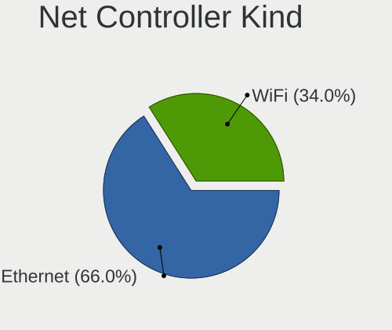

| Kind     | Desktops | Percent |
|----------|----------|---------|
| Ethernet | 159      | 65.98%  |
| WiFi     | 82       | 34.02%  |

Used Controller
---------------

Currently used network controller

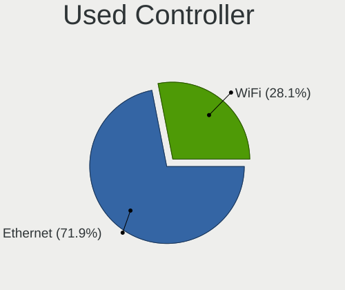

| Kind     | Desktops | Percent |
|----------|----------|---------|
| Ethernet | 123      | 71.93%  |
| WiFi     | 48       | 28.07%  |

NICs
----

Total network controllers on board

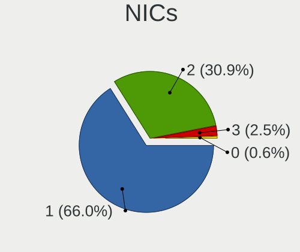

| Total | Desktops | Percent |
|-------|----------|---------|
| 1     | 107      | 66.05%  |
| 2     | 50       | 30.86%  |
| 3     | 4        | 2.47%   |
| 0     | 1        | 0.62%   |

IPv6
----

IPv6 vs IPv4

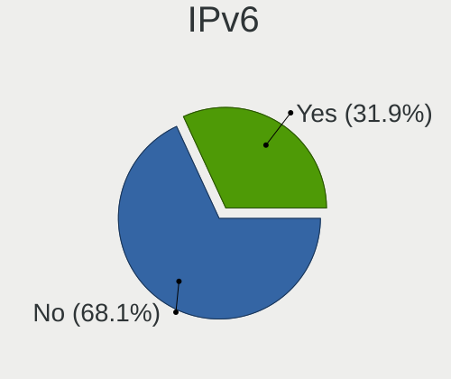

| Used | Desktops | Percent |
|------|----------|---------|
| No   | 111      | 68.1%   |
| Yes  | 52       | 31.9%   |

Bluetooth
---------

Bluetooth Vendor
----------------

Controller vendors

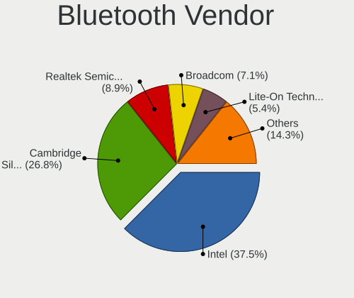

| Vendor                  | Desktops | Percent |
|-------------------------|----------|---------|
| Intel                   | 21       | 37.5%   |
| Cambridge Silicon Radio | 15       | 26.79%  |
| Realtek Semiconductor   | 5        | 8.93%   |
| Broadcom                | 4        | 7.14%   |
| Lite-On Technology      | 3        | 5.36%   |
| MediaTek                | 2        | 3.57%   |
| Apple                   | 2        | 3.57%   |
| SiW                     | 1        | 1.79%   |
| Dynex                   | 1        | 1.79%   |
| Dell                    | 1        | 1.79%   |
| Unknown                 | 1        | 1.79%   |

Bluetooth Model
---------------

Controller models

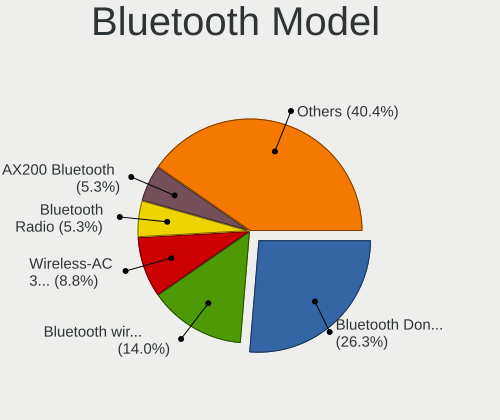

| Model                                                    | Desktops | Percent |
|----------------------------------------------------------|----------|---------|
| Cambridge Silicon Radio Bluetooth Dongle (HCI mode)      | 15       | 26.32%  |
| Intel Bluetooth wireless interface                       | 8        | 14.04%  |
| Intel Wireless-AC 3168 Bluetooth                         | 5        | 8.77%   |
| Realtek Bluetooth Radio                                  | 3        | 5.26%   |
| Intel AX200 Bluetooth                                    | 3        | 5.26%   |
| MediaTek Wireless_Device                                 | 2        | 3.51%   |
| Lite-On Bluetooth Device                                 | 2        | 3.51%   |
| Intel Wireless-AC 9260 Bluetooth Adapter                 | 2        | 3.51%   |
| Intel AX210 Bluetooth                                    | 2        | 3.51%   |
| Broadcom BCM20702A0 Bluetooth 4.0                        | 2        | 3.51%   |
| SiW SiW                                                  | 1        | 1.75%   |
| Realtek  Bluetooth 4.2 Adapter                           | 1        | 1.75%   |
| Realtek 802.11ac WLAN Adapter                            | 1        | 1.75%   |
| Lite-On Bluetooth Radio                                  | 1        | 1.75%   |
| Intel Bluetooth 9460/9560 Jefferson Peak (JfP)           | 1        | 1.75%   |
| Intel AX201 Bluetooth                                    | 1        | 1.75%   |
| Dynex Bluetooth 4.0 Adapter [Broadcom, 1.12, BCM20702A0] | 1        | 1.75%   |
| Dell BT Mini-Receiver                                    | 1        | 1.75%   |
| Broadcom HP Bluethunder                                  | 1        | 1.75%   |
| Broadcom Bluetooth 3.0 USB Dongle                        | 1        | 1.75%   |
| Apple Built-in Bluetooth 2.0+EDR HCI                     | 1        | 1.75%   |
| Apple Bluetooth Host Controller                          | 1        | 1.75%   |
| Unknown                                                  | 1        | 1.75%   |

Sound
-----

Sound Vendor
------------

Sound card vendors

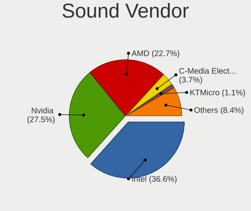

| Vendor                               | Desktops | Percent |
|--------------------------------------|----------|---------|
| Intel                                | 100      | 36.63%  |
| Nvidia                               | 75       | 27.47%  |
| AMD                                  | 62       | 22.71%  |
| C-Media Electronics                  | 10       | 3.66%   |
| KTMicro                              | 3        | 1.1%    |
| VIA Technologies                     | 2        | 0.73%   |
| Thesycon Systemsoftware & Consulting | 2        | 0.73%   |
| Texas Instruments                    | 2        | 0.73%   |
| Plantronics                          | 2        | 0.73%   |
| Logitech                             | 2        | 0.73%   |
| JMTek                                | 2        | 0.73%   |
| Turtle Beach                         | 1        | 0.37%   |
| Sony                                 | 1        | 0.37%   |
| SAVITECH                             | 1        | 0.37%   |
| Razer USA                            | 1        | 0.37%   |
| QinHeng Electronics                  | 1        | 0.37%   |
| Native Instruments                   | 1        | 0.37%   |
| Micro Star International             | 1        | 0.37%   |
| GN Netcom                            | 1        | 0.37%   |
| Generalplus Technology               | 1        | 0.37%   |
| Creative Technology                  | 1        | 0.37%   |
| Apple                                | 1        | 0.37%   |

Sound Model
-----------

Sound card models

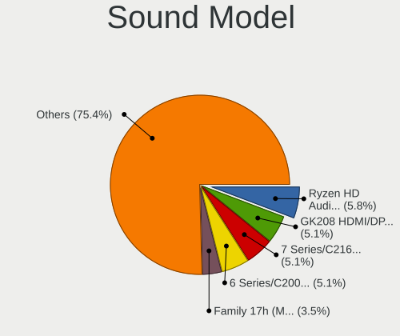

| Model                                                                      | Desktops | Percent |
|----------------------------------------------------------------------------|----------|---------|
| AMD Ryzen HD Audio Controller                                              | 18       | 5.75%   |
| Nvidia GK208 HDMI/DP Audio Controller                                      | 16       | 5.11%   |
| Intel 7 Series/C216 Chipset Family High Definition Audio Controller        | 16       | 5.11%   |
| Intel 6 Series/C200 Series Chipset Family High Definition Audio Controller | 16       | 5.11%   |
| AMD Family 17h (Models 00h-0fh) HD Audio Controller                        | 11       | 3.51%   |
| AMD Starship/Matisse HD Audio Controller                                   | 10       | 3.19%   |
| AMD Raven/Raven2/Fenghuang HDMI/DP Audio Controller                        | 10       | 3.19%   |
| Intel 8 Series/C220 Series Chipset High Definition Audio Controller        | 9        | 2.88%   |
| Intel NM10/ICH7 Family High Definition Audio Controller                    | 8        | 2.56%   |
| Intel 100 Series/C230 Series Chipset Family HD Audio Controller            | 7        | 2.24%   |
| AMD SBx00 Azalia (Intel HDA)                                               | 7        | 2.24%   |
| Nvidia High Definition Audio Controller                                    | 6        | 1.92%   |
| Intel Xeon E3-1200 v3/4th Gen Core Processor HD Audio Controller           | 6        | 1.92%   |
| Intel Cannon Lake PCH cAVS                                                 | 6        | 1.92%   |
| AMD Renoir/Cezanne HDMI/DP Audio Controller                                | 6        | 1.92%   |
| AMD FCH Azalia Controller                                                  | 6        | 1.92%   |
| Nvidia GM204 High Definition Audio Controller                              | 5        | 1.6%    |
| Intel C600/X79 series chipset High Definition Audio Controller             | 5        | 1.6%    |
| Intel 82801JI (ICH10 Family) HD Audio Controller                           | 5        | 1.6%    |
| Nvidia TU116 High Definition Audio Controller                              | 4        | 1.28%   |
| Nvidia GP108 High Definition Audio Controller                              | 4        | 1.28%   |
| Nvidia GM206 High Definition Audio Controller                              | 4        | 1.28%   |
| Intel 82801I (ICH9 Family) HD Audio Controller                             | 4        | 1.28%   |
| AMD Ellesmere HDMI Audio [Radeon RX 470/480 / 570/580/590]                 | 4        | 1.28%   |
| Nvidia TU106 High Definition Audio Controller                              | 3        | 0.96%   |
| Nvidia GP107GL High Definition Audio Controller                            | 3        | 0.96%   |
| Nvidia GM107 High Definition Audio Controller [GeForce 940MX]              | 3        | 0.96%   |
| Nvidia GK104 HDMI Audio Controller                                         | 3        | 0.96%   |
| Nvidia GA102 High Definition Audio Controller                              | 3        | 0.96%   |
| Intel Tiger Lake-H HD Audio Controller                                     | 3        | 0.96%   |
| Intel Celeron/Pentium Silver Processor High Definition Audio               | 3        | 0.96%   |
| Intel 5 Series/3400 Series Chipset High Definition Audio                   | 3        | 0.96%   |
| AMD Oland/Hainan/Cape Verde/Pitcairn HDMI Audio [Radeon HD 7000 Series]    | 3        | 0.96%   |
| AMD Baffin HDMI/DP Audio [Radeon RX 550 640SP / RX 560/560X]               | 3        | 0.96%   |
| VIA Technologies VX900/VT8xxx High Definition Audio Controller             | 2        | 0.64%   |
| Thesycon Systemsoftware & Consulting E30                                   | 2        | 0.64%   |
| Nvidia TU107 GeForce GTX 1650 High Definition Audio Controller             | 2        | 0.64%   |
| Nvidia MCP72XE/MCP72P/MCP78U/MCP78S High Definition Audio                  | 2        | 0.64%   |
| Nvidia GP106 High Definition Audio Controller                              | 2        | 0.64%   |
| Nvidia GK106 HDMI Audio Controller                                         | 2        | 0.64%   |

Memory
------

Memory Vendor
-------------

Memory module vendors

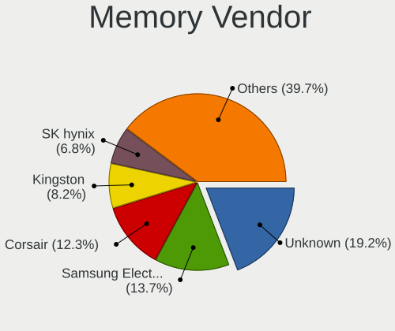

| Vendor              | Desktops | Percent |
|---------------------|----------|---------|
| Unknown             | 14       | 19.18%  |
| Samsung Electronics | 10       | 13.7%   |
| Corsair             | 9        | 12.33%  |
| Kingston            | 6        | 8.22%   |
| SK hynix            | 5        | 6.85%   |
| Micron Technology   | 5        | 6.85%   |
| Crucial             | 4        | 5.48%   |
| G.Skill             | 3        | 4.11%   |
| Team                | 2        | 2.74%   |
| GeIL                | 2        | 2.74%   |
| Elpida              | 2        | 2.74%   |
| A-DATA Technology   | 2        | 2.74%   |
| Unknown (ABCD)      | 1        | 1.37%   |
| Toshiba             | 1        | 1.37%   |
| Smart               | 1        | 1.37%   |
| Patriot             | 1        | 1.37%   |
| Nanya Technology    | 1        | 1.37%   |
| KLEVV               | 1        | 1.37%   |
| CSX                 | 1        | 1.37%   |
| AVEXIR              | 1        | 1.37%   |
| Unknown             | 1        | 1.37%   |

Memory Model
------------

Memory module models

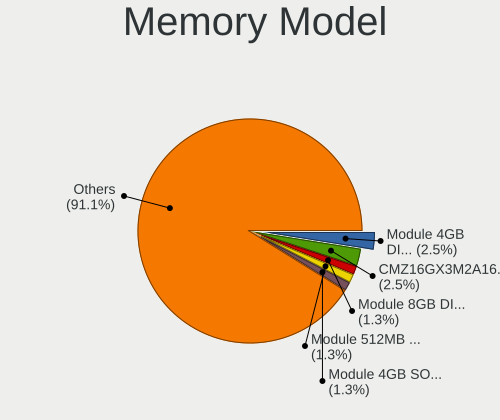

| Model                                                          | Desktops | Percent |
|----------------------------------------------------------------|----------|---------|
| Unknown RAM Module 4GB DIMM DDR3                               | 2        | 2.53%   |
| Corsair RAM CMZ16GX3M2A1600C10 8GB DIMM DDR3 1600MT/s          | 2        | 2.53%   |
| Unknown RAM Module 8GB DIMM 1333MT/s                           | 1        | 1.27%   |
| Unknown RAM Module 512MB DIMM DDR2 266MT/s                     | 1        | 1.27%   |
| Unknown RAM Module 4GB SODIMM DDR4 2400MT/s                    | 1        | 1.27%   |
| Unknown RAM Module 4GB DIMM DDR3 1066MT/s                      | 1        | 1.27%   |
| Unknown RAM Module 4GB DIMM 1333MT/s                           | 1        | 1.27%   |
| Unknown RAM Module 2GB DIMM DDR3 1066MT/s                      | 1        | 1.27%   |
| Unknown RAM Module 2GB DIMM DDR2 667MT/s                       | 1        | 1.27%   |
| Unknown RAM Module 2GB DIMM 1333MT/s                           | 1        | 1.27%   |
| Unknown RAM Module 1GB DIMM DDR2 533MT/s                       | 1        | 1.27%   |
| Unknown RAM Module 1GB DIMM DDR2 266MT/s                       | 1        | 1.27%   |
| Unknown RAM Module 16MB DIMM 667MT/s                           | 1        | 1.27%   |
| Unknown RAM Module 16GB DIMM DDR4 3200MT/s                     | 1        | 1.27%   |
| Unknown RAM Module 16GB DIMM DDR4 2400MT/s                     | 1        | 1.27%   |
| Unknown RAM DDR4 NB 8G 2400 8192MB SODIMM DDR4 2667MT/s        | 1        | 1.27%   |
| Unknown RAM D4 8G 8GB DIMM DDR4 2666MT/s                       | 1        | 1.27%   |
| Unknown (ABCD) RAM 123456789012345678 2GB DIMM LPDDR4 2133MT/s | 1        | 1.27%   |
| Toshiba RAM 9905711-015.A00G 4GB SODIMM DDR4 2400MT/s          | 1        | 1.27%   |
| Team RAM TEAMGROUP-UD4-3600 16GB DIMM DDR4 3600MT/s            | 1        | 1.27%   |
| Team RAM TEAMGROUP-UD3-1600 8GB DIMM DDR3 1866MT/s             | 1        | 1.27%   |
| Smart RAM SH564128FJ8NWRNSQR 4GB SODIMM DDR3 1600MT/s          | 1        | 1.27%   |
| SK hynix RAM Module 8GB DIMM DDR3 1333MT/s                     | 1        | 1.27%   |
| SK hynix RAM Module 2GB DIMM 1067MT/s                          | 1        | 1.27%   |
| SK hynix RAM HMT451U6AFR8C-PB 4GB DIMM DDR3 1600MT/s           | 1        | 1.27%   |
| SK hynix RAM HMA81GU6CJR8N-VK 8GiB DIMM DDR4 2667MT/s          | 1        | 1.27%   |
| SK hynix RAM HKNNNFBMAVAR-NEH 2GB Row Of Chips LPDDR4 3200MT/s | 1        | 1.27%   |
| Samsung RAM Module 8GB DIMM DDR4 2400MT/s                      | 1        | 1.27%   |
| Samsung RAM Module 4GB DIMM DDR4 2400MT/s                      | 1        | 1.27%   |
| Samsung RAM M471B5173QH0-YK0 4GB SODIMM DDR3 1600MT/s          | 1        | 1.27%   |
| Samsung RAM M471B2873FHS-CH9 1GB SODIMM DDR3 1333MT/s          | 1        | 1.27%   |
| Samsung RAM M393B5270DH0-YH9 4GB DIMM DDR3 1333MT/s            | 1        | 1.27%   |
| Samsung RAM M393B2G70DB0-CMA 16GB DIMM DDR3 1867MT/s           | 1        | 1.27%   |
| Samsung RAM M393B1G70QH0-CMA 8GB DIMM DDR3 1600MT/s            | 1        | 1.27%   |
| Samsung RAM M393B1G70BH0-YK0 8GB DIMM DDR3 1600MT/s            | 1        | 1.27%   |
| Samsung RAM M378B5673FH0 2GB DIMM DDR3 1333MT/s                | 1        | 1.27%   |
| Samsung RAM M378A5143DB0-CPB 4GB DIMM DDR4 2400MT/s            | 1        | 1.27%   |
| Samsung RAM M378A2K43CB1-CTD 16GB DIMM DDR4 3200MT/s           | 1        | 1.27%   |
| Patriot RAM 1600EL Series 4GB DIMM DDR3 1600MT/s               | 1        | 1.27%   |
| Nanya RAM NT1GT64U8HB0BY-3C 1GB DIMM DDR2 667MT/s              | 1        | 1.27%   |

Memory Kind
-----------

Memory module kinds

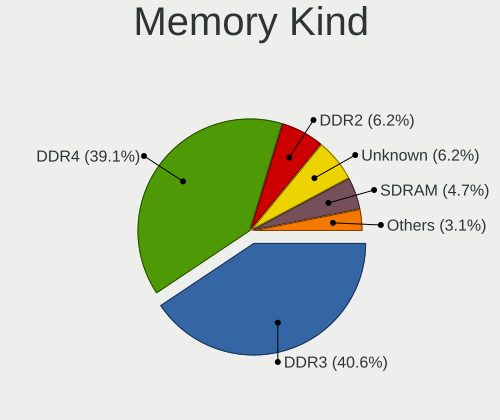

| Kind    | Desktops | Percent |
|---------|----------|---------|
| DDR3    | 26       | 40.63%  |
| DDR4    | 25       | 39.06%  |
| DDR2    | 4        | 6.25%   |
| Unknown | 4        | 6.25%   |
| SDRAM   | 3        | 4.69%   |
| LPDDR4  | 2        | 3.13%   |

Memory Form Factor
------------------

Physical design of the memory module

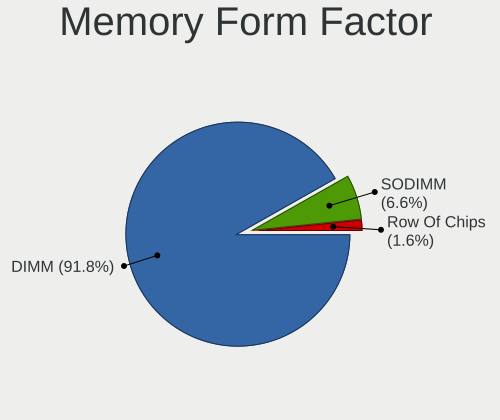

| Name         | Desktops | Percent |
|--------------|----------|---------|
| DIMM         | 56       | 91.8%   |
| SODIMM       | 4        | 6.56%   |
| Row Of Chips | 1        | 1.64%   |

Memory Size
-----------

Memory module size

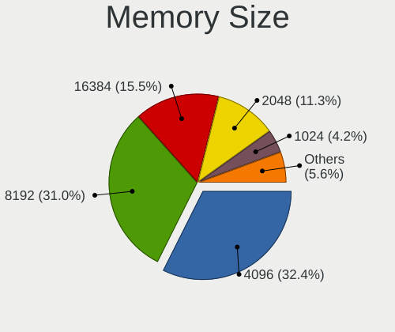

| Size  | Desktops | Percent |
|-------|----------|---------|
| 4096  | 23       | 32.39%  |
| 8192  | 22       | 30.99%  |
| 16384 | 11       | 15.49%  |
| 2048  | 8        | 11.27%  |
| 1024  | 3        | 4.23%   |
| 32768 | 2        | 2.82%   |
| 512   | 1        | 1.41%   |
| 16    | 1        | 1.41%   |

Memory Speed
------------

Memory module speed

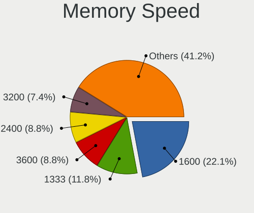

| Speed   | Desktops | Percent |
|---------|----------|---------|
| 1600    | 15       | 22.06%  |
| 1333    | 8        | 11.76%  |
| 3600    | 6        | 8.82%   |
| 2400    | 6        | 8.82%   |
| 3200    | 5        | 7.35%   |
| 2667    | 5        | 7.35%   |
| 1866    | 4        | 5.88%   |
| 2133    | 3        | 4.41%   |
| 667     | 3        | 4.41%   |
| 3733    | 2        | 2.94%   |
| Unknown | 2        | 2.94%   |
| 2666    | 1        | 1.47%   |
| 1867    | 1        | 1.47%   |
| 1800    | 1        | 1.47%   |
| 1334    | 1        | 1.47%   |
| 1067    | 1        | 1.47%   |
| 1066    | 1        | 1.47%   |
| 800     | 1        | 1.47%   |
| 533     | 1        | 1.47%   |
| 266     | 1        | 1.47%   |

Printers & scanners
-------------------

Printer Vendor
--------------

Printer device vendors

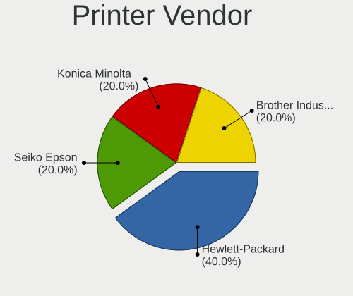

| Vendor              | Desktops | Percent |
|---------------------|----------|---------|
| Hewlett-Packard     | 2        | 28.57%  |
| Seiko Epson         | 1        | 14.29%  |
| QinHeng Electronics | 1        | 14.29%  |
| Prolific Technology | 1        | 14.29%  |
| Konica Minolta      | 1        | 14.29%  |
| Brother Industries  | 1        | 14.29%  |

Printer Model
-------------

Printer device models

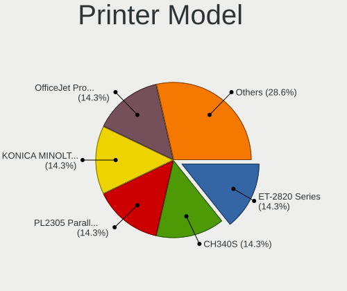

| Model                             | Desktops | Percent |
|-----------------------------------|----------|---------|
| Seiko Epson ET-2820 Series        | 1        | 14.29%  |
| QinHeng CH340S                    | 1        | 14.29%  |
| Prolific PL2305 Parallel Port     | 1        | 14.29%  |
| Konica Minolta KONICA MINOLTA 185 | 1        | 14.29%  |
| HP OfficeJet Pro 8730             | 1        | 14.29%  |
| HP DeskJet 2130 series            | 1        | 14.29%  |
| Brother MFC-L2685DW               | 1        | 14.29%  |

Scanner Vendor
--------------

Scanner device vendors

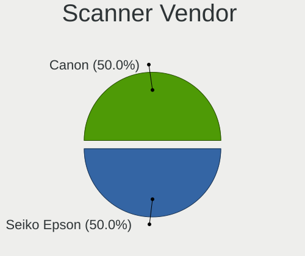

| Vendor      | Desktops | Percent |
|-------------|----------|---------|
| Canon       | 3        | 75%     |
| Seiko Epson | 1        | 25%     |

Scanner Model
-------------

Scanner device models

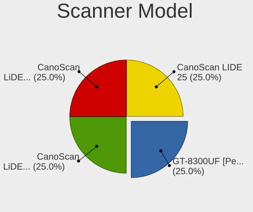

| Model                                         | Desktops | Percent |
|-----------------------------------------------|----------|---------|
| Seiko Epson GT-8300UF [Perfection 1660 PHOTO] | 1        | 25%     |
| Canon CanoScan LIDE 25                        | 1        | 25%     |
| Canon CanoScan LiDE 210                       | 1        | 25%     |
| Canon CanoScan LiDE 110                       | 1        | 25%     |

Camera
------

Camera Vendor
-------------

Camera device vendors

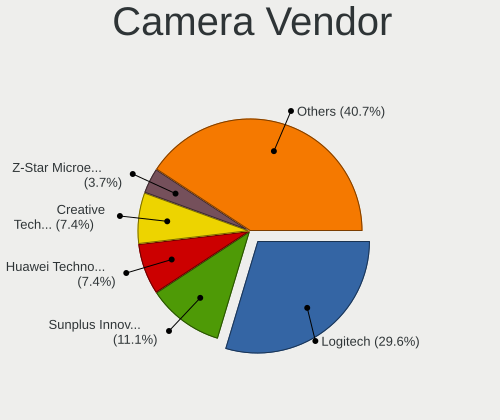

| Vendor                        | Desktops | Percent |
|-------------------------------|----------|---------|
| Logitech                      | 8        | 29.63%  |
| Sunplus Innovation Technology | 3        | 11.11%  |
| Huawei Technologies           | 2        | 7.41%   |
| Creative Technology           | 2        | 7.41%   |
| Z-Star Microelectronics       | 1        | 3.7%    |
| Samsung Electronics           | 1        | 3.7%    |
| Razer USA                     | 1        | 3.7%    |
| Pixart Imaging                | 1        | 3.7%    |
| OmniVision Technologies       | 1        | 3.7%    |
| Microsoft                     | 1        | 3.7%    |
| Microdia                      | 1        | 3.7%    |
| MacroSilicon                  | 1        | 3.7%    |
| Chicony Electronics           | 1        | 3.7%    |
| ARC International             | 1        | 3.7%    |
| Apple                         | 1        | 3.7%    |
| Alcor Micro                   | 1        | 3.7%    |

Camera Model
------------

Camera device models

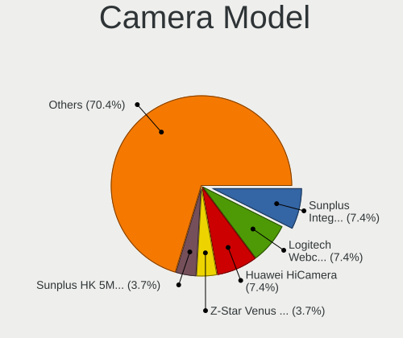

| Model                                          | Desktops | Percent |
|------------------------------------------------|----------|---------|
| Sunplus Integrated Camera                      | 2        | 7.41%   |
| Logitech Webcam C270                           | 2        | 7.41%   |
| Huawei HiCamera                                | 2        | 7.41%   |
| Z-Star Venus USB2.0 Camera                     | 1        | 3.7%    |
| Sunplus HK 5M WebCAM                           | 1        | 3.7%    |
| Samsung Galaxy series, misc. (MTP mode)        | 1        | 3.7%    |
| Razer USA Gaming Webcam [Kiyo]                 | 1        | 3.7%    |
| Pixart Imaging GE 1.3 MP MiniCam Pro           | 1        | 3.7%    |
| OmniVision Integrated Webcam for Dell XPS 2010 | 1        | 3.7%    |
| Microsoft LifeCam HD-3000                      | 1        | 3.7%    |
| Microdia Integrated Camera                     | 1        | 3.7%    |
| MacroSilicon USB Video                         | 1        | 3.7%    |
| Logitech Webcam C210                           | 1        | 3.7%    |
| Logitech Webcam B500                           | 1        | 3.7%    |
| Logitech StreamCam                             | 1        | 3.7%    |
| Logitech QuickCam Communicate Deluxe/S7500     | 1        | 3.7%    |
| Logitech Logitech Webcam C925e                 | 1        | 3.7%    |
| Logitech Logi Webcam C920e                     | 1        | 3.7%    |
| Creative VF0610 Live! Cam Socialize HD         | 1        | 3.7%    |
| Creative Live! Cam Sync HD [VF0770]            | 1        | 3.7%    |
| Chicony HP High Definition 1MP Webcam          | 1        | 3.7%    |
| ARC International Camera                       | 1        | 3.7%    |
| Apple iSight in LED Cinema Display             | 1        | 3.7%    |
| Alcor Micro USB 2.0 PC Camera                  | 1        | 3.7%    |

Security
--------

Fingerprint Vendor
------------------

Fingerprint sensor vendors

Zero info for selected period =(

Fingerprint Model
-----------------

Fingerprint sensor models

Zero info for selected period =(

Chipcard Vendor
---------------

Chipcard module vendors

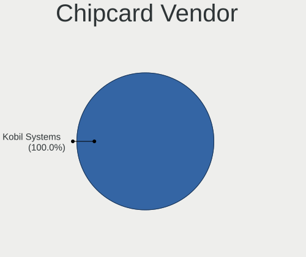

| Vendor        | Desktops | Percent |
|---------------|----------|---------|
| Kobil Systems | 1        | 100%    |

Chipcard Model
--------------

Chipcard module models

| Model                              | Desktops | Percent |
|------------------------------------|----------|---------|
| Kobil Systems KOBIL Class 3 Reader | 1        | 100%    |

Unsupported
-----------

Unsupported Devices
-------------------

Total unsupported devices on board

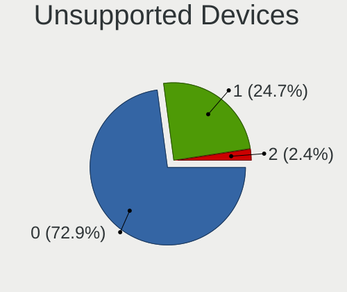

| Total | Desktops | Percent |
|-------|----------|---------|
| 0     | 121      | 72.89%  |
| 1     | 41       | 24.7%   |
| 2     | 4        | 2.41%   |

Unsupported Device Types
------------------------

Types of unsupported devices

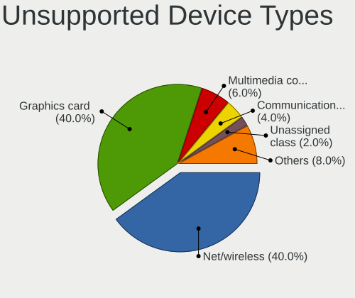

| Type                     | Desktops | Percent |
|--------------------------|----------|---------|
| Net/wireless             | 20       | 40%     |
| Graphics card            | 20       | 40%     |
| Multimedia controller    | 3        | 6%      |
| Communication controller | 2        | 4%      |
| Unassigned class         | 1        | 2%      |
| Storage/raid             | 1        | 2%      |
| Sound                    | 1        | 2%      |
| Chipcard                 | 1        | 2%      |
| Camera                   | 1        | 2%      |

