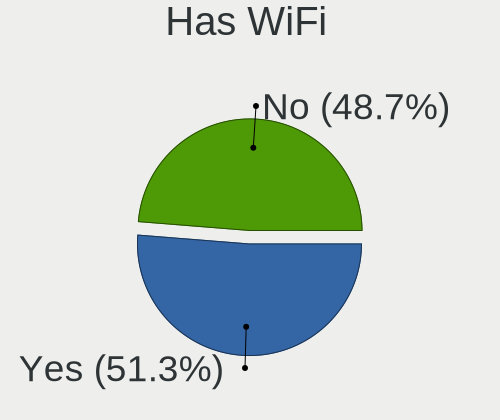
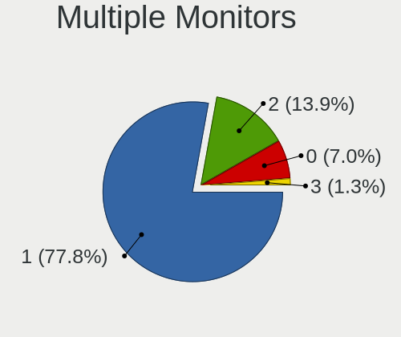
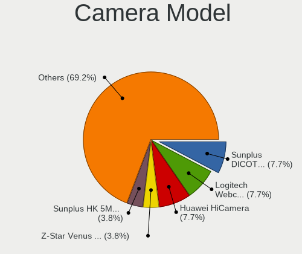

LMDE 5 - Tested Hardware & Statistics (Desktops)
------------------------------------------------

A project to collect tested hardware configurations for LMDE 5.

Anyone can contribute to this report by the [hw-probe](https://github.com/linuxhw/hw-probe) tool:

    sudo -E hw-probe -all -upload

Please contribute! Especially if your hardware is rare.

Contents
--------

* [ Test Cases ](#test-cases)

* [ System ](#system)
  - [ Kernel                   ](#kernel)
  - [ Kernel Family            ](#kernel-family)
  - [ Kernel Major Ver.        ](#kernel-major-ver)
  - [ Arch                     ](#arch)
  - [ DE                       ](#de)
  - [ Display Server           ](#display-server)
  - [ Display Manager          ](#display-manager)
  - [ OS Lang                  ](#os-lang)
  - [ Boot Mode                ](#boot-mode)
  - [ Filesystem               ](#filesystem)
  - [ Part. scheme             ](#part-scheme)
  - [ Dual Boot with Linux/BSD ](#dual-boot-with-linuxbsd)
  - [ Dual Boot (Win)          ](#dual-boot-win)

* [ Board ](#board)
  - [ Vendor                   ](#vendor)
  - [ Model                    ](#model)
  - [ Model Family             ](#model-family)
  - [ MFG Year                 ](#mfg-year)
  - [ Form Factor              ](#form-factor)
  - [ Secure Boot              ](#secure-boot)
  - [ Coreboot                 ](#coreboot)
  - [ RAM Size                 ](#ram-size)
  - [ RAM Used                 ](#ram-used)
  - [ Total Drives             ](#total-drives)
  - [ Has CD-ROM               ](#has-cd-rom)
  - [ Has Ethernet             ](#has-ethernet)
  - [ Has WiFi                 ](#has-wifi)
  - [ Has Bluetooth            ](#has-bluetooth)

* [ Location ](#location)
  - [ Country                  ](#country)
  - [ City                     ](#city)

* [ Drives ](#drives)
  - [ Drive Vendor             ](#drive-vendor)
  - [ Drive Model              ](#drive-model)
  - [ HDD Vendor               ](#hdd-vendor)
  - [ SSD Vendor               ](#ssd-vendor)
  - [ Drive Kind               ](#drive-kind)
  - [ Drive Connector          ](#drive-connector)
  - [ Drive Size               ](#drive-size)
  - [ Space Total              ](#space-total)
  - [ Space Used               ](#space-used)
  - [ Malfunc. Drives          ](#malfunc-drives)
  - [ Malfunc. Drive Vendor    ](#malfunc-drive-vendor)
  - [ Malfunc. HDD Vendor      ](#malfunc-hdd-vendor)
  - [ Malfunc. Drive Kind      ](#malfunc-drive-kind)
  - [ Failed Drives            ](#failed-drives)
  - [ Failed Drive Vendor      ](#failed-drive-vendor)
  - [ Drive Status             ](#drive-status)

* [ Storage controller ](#storage-controller)
  - [ Storage Vendor           ](#storage-vendor)
  - [ Storage Model            ](#storage-model)
  - [ Storage Kind             ](#storage-kind)

* [ Processor ](#processor)
  - [ CPU Vendor               ](#cpu-vendor)
  - [ CPU Model                ](#cpu-model)
  - [ CPU Model Family         ](#cpu-model-family)
  - [ CPU Cores                ](#cpu-cores)
  - [ CPU Sockets              ](#cpu-sockets)
  - [ CPU Threads              ](#cpu-threads)
  - [ CPU Op-Modes             ](#cpu-op-modes)
  - [ CPU Microcode            ](#cpu-microcode)
  - [ CPU Microarch            ](#cpu-microarch)

* [ Graphics ](#graphics)
  - [ GPU Vendor               ](#gpu-vendor)
  - [ GPU Model                ](#gpu-model)
  - [ GPU Combo                ](#gpu-combo)
  - [ GPU Driver               ](#gpu-driver)
  - [ GPU Memory               ](#gpu-memory)

* [ Monitor ](#monitor)
  - [ Monitor Vendor           ](#monitor-vendor)
  - [ Monitor Model            ](#monitor-model)
  - [ Monitor Resolution       ](#monitor-resolution)
  - [ Monitor Diagonal         ](#monitor-diagonal)
  - [ Monitor Width            ](#monitor-width)
  - [ Aspect Ratio             ](#aspect-ratio)
  - [ Monitor Area             ](#monitor-area)
  - [ Pixel Density            ](#pixel-density)
  - [ Multiple Monitors        ](#multiple-monitors)

* [ Network ](#network)
  - [ Net Controller Vendor    ](#net-controller-vendor)
  - [ Net Controller Model     ](#net-controller-model)
  - [ Wireless Vendor          ](#wireless-vendor)
  - [ Wireless Model           ](#wireless-model)
  - [ Ethernet Vendor          ](#ethernet-vendor)
  - [ Ethernet Model           ](#ethernet-model)
  - [ Net Controller Kind      ](#net-controller-kind)
  - [ Used Controller          ](#used-controller)
  - [ NICs                     ](#nics)
  - [ IPv6                     ](#ipv6)

* [ Bluetooth ](#bluetooth)
  - [ Bluetooth Vendor         ](#bluetooth-vendor)
  - [ Bluetooth Model          ](#bluetooth-model)

* [ Sound ](#sound)
  - [ Sound Vendor             ](#sound-vendor)
  - [ Sound Model              ](#sound-model)

* [ Memory ](#memory)
  - [ Memory Vendor            ](#memory-vendor)
  - [ Memory Model             ](#memory-model)
  - [ Memory Kind              ](#memory-kind)
  - [ Memory Form Factor       ](#memory-form-factor)
  - [ Memory Size              ](#memory-size)
  - [ Memory Speed             ](#memory-speed)

* [ Printers & scanners ](#printers--scanners)
  - [ Printer Vendor           ](#printer-vendor)
  - [ Printer Model            ](#printer-model)
  - [ Scanner Vendor           ](#scanner-vendor)
  - [ Scanner Model            ](#scanner-model)

* [ Camera ](#camera)
  - [ Camera Vendor            ](#camera-vendor)
  - [ Camera Model             ](#camera-model)

* [ Security ](#security)
  - [ Fingerprint Vendor       ](#fingerprint-vendor)
  - [ Fingerprint Model        ](#fingerprint-model)
  - [ Chipcard Vendor          ](#chipcard-vendor)
  - [ Chipcard Model           ](#chipcard-model)

* [ Unsupported ](#unsupported)
  - [ Unsupported Devices      ](#unsupported-devices)
  - [ Unsupported Device Types ](#unsupported-device-types)

Test Cases
----------

Total: 251

| Vendor        | Model                       | Probe                                                      | Date         |
|---------------|-----------------------------|------------------------------------------------------------|--------------|
| HP            | 859C                        | [24dd090f2c](https://linux-hardware.org/?probe=24dd090f2c) | Aug 09, 2023 |
| ASRock        | B550M-ITX/ac                | [c86495f999](https://linux-hardware.org/?probe=c86495f999) | Aug 08, 2023 |
| ASUSTek       | ROG STRIX B450-F GAMING     | [7fe1ce642a](https://linux-hardware.org/?probe=7fe1ce642a) | Aug 08, 2023 |
| Gigabyte      | Q87M-D2H                    | [dbcb2c4a80](https://linux-hardware.org/?probe=dbcb2c4a80) | Aug 07, 2023 |
| Medion        | TJ4125                      | [e35dc275ce](https://linux-hardware.org/?probe=e35dc275ce) | Aug 06, 2023 |
| Medion        | TJ4125                      | [0adec5cb7e](https://linux-hardware.org/?probe=0adec5cb7e) | Aug 04, 2023 |
| Gigabyte      | Q87M-D2H                    | [d3df0e8ee1](https://linux-hardware.org/?probe=d3df0e8ee1) | Aug 04, 2023 |
| Gigabyte      | Q87M-D2H                    | [37725aaff8](https://linux-hardware.org/?probe=37725aaff8) | Aug 03, 2023 |
| Intel         | X79                         | [051316466a](https://linux-hardware.org/?probe=051316466a) | Aug 01, 2023 |
| Gigabyte      | AB350M-DS3H V2-CF           | [1bcc28bd33](https://linux-hardware.org/?probe=1bcc28bd33) | Jul 29, 2023 |
| Apple         | Mac-F221BEC8                | [12932af713](https://linux-hardware.org/?probe=12932af713) | Jul 29, 2023 |
| Medion        | TJ4125                      | [0882778c0a](https://linux-hardware.org/?probe=0882778c0a) | Jul 28, 2023 |
| Gigabyte      | Q87M-D2H                    | [374c405364](https://linux-hardware.org/?probe=374c405364) | Jul 26, 2023 |
| ASUSTek       | PRIME A320M-K               | [199fe99179](https://linux-hardware.org/?probe=199fe99179) | Jul 25, 2023 |
| Gigabyte      | Q87M-D2H                    | [7aaa099507](https://linux-hardware.org/?probe=7aaa099507) | Jul 24, 2023 |
| Intel         | X79                         | [8037a9fc0e](https://linux-hardware.org/?probe=8037a9fc0e) | Jul 24, 2023 |
| Dell          | 00F82W A02                  | [53b13b667d](https://linux-hardware.org/?probe=53b13b667d) | Jul 16, 2023 |
| Dell          | 00F82W A02                  | [293fa24c88](https://linux-hardware.org/?probe=293fa24c88) | Jul 14, 2023 |
| Medion        | TJ4125                      | [88fb5ecc29](https://linux-hardware.org/?probe=88fb5ecc29) | Jul 09, 2023 |
| Medion        | TJ4125                      | [efa563ec1f](https://linux-hardware.org/?probe=efa563ec1f) | Jul 09, 2023 |
| Gigabyte      | Q87M-D2H                    | [d660aa6f35](https://linux-hardware.org/?probe=d660aa6f35) | Jul 09, 2023 |
| Gigabyte      | Q87M-D2H                    | [87872596c0](https://linux-hardware.org/?probe=87872596c0) | Jul 08, 2023 |
| Medion        | TJ4125                      | [38d2ffe2de](https://linux-hardware.org/?probe=38d2ffe2de) | Jul 08, 2023 |
| Medion        | TJ4125                      | [1de78b3365](https://linux-hardware.org/?probe=1de78b3365) | Jul 07, 2023 |
| Gigabyte      | B450M DS3H V2               | [919f65a256](https://linux-hardware.org/?probe=919f65a256) | Jul 05, 2023 |
| Gigabyte      | Q87M-D2H                    | [22a3b2defb](https://linux-hardware.org/?probe=22a3b2defb) | Jul 05, 2023 |
| Medion        | TJ4125                      | [8d8748e1dc](https://linux-hardware.org/?probe=8d8748e1dc) | Jul 02, 2023 |
| Gigabyte      | Q87M-D2H                    | [89c111d3ec](https://linux-hardware.org/?probe=89c111d3ec) | Jul 02, 2023 |
| Medion        | TJ4125                      | [e99bd03d75](https://linux-hardware.org/?probe=e99bd03d75) | Jul 01, 2023 |
| Gigabyte      | Q87M-D2H                    | [729fb2873e](https://linux-hardware.org/?probe=729fb2873e) | Jul 01, 2023 |
| Gigabyte      | Q87M-D2H                    | [633c55d4ba](https://linux-hardware.org/?probe=633c55d4ba) | Jun 30, 2023 |
| Medion        | TJ4125                      | [5cebe0a1d0](https://linux-hardware.org/?probe=5cebe0a1d0) | Jun 30, 2023 |
| Medion        | TJ4125                      | [327794cb1a](https://linux-hardware.org/?probe=327794cb1a) | Jun 30, 2023 |
| Gigabyte      | Q87M-D2H                    | [95e5472f48](https://linux-hardware.org/?probe=95e5472f48) | Jun 27, 2023 |
| Gigabyte      | Q87M-D2H                    | [67a44b0d84](https://linux-hardware.org/?probe=67a44b0d84) | Jun 20, 2023 |
| Intel         | X79                         | [8c50d3b5e8](https://linux-hardware.org/?probe=8c50d3b5e8) | Jun 20, 2023 |
| ASRock        | B450 Gaming K4              | [2344c78f90](https://linux-hardware.org/?probe=2344c78f90) | Jun 20, 2023 |
| Lenovo        | SHARKBAY NOK                | [0173559ed0](https://linux-hardware.org/?probe=0173559ed0) | Jun 19, 2023 |
| Medion        | TJ4125                      | [4c6aec7e33](https://linux-hardware.org/?probe=4c6aec7e33) | Jun 18, 2023 |
| Medion        | TJ4125                      | [fc102c077c](https://linux-hardware.org/?probe=fc102c077c) | Jun 16, 2023 |
| Gigabyte      | AB350M-DS3H V2-CF           | [64da6bc381](https://linux-hardware.org/?probe=64da6bc381) | Jun 14, 2023 |
| Gigabyte      | Q87M-D2H                    | [59b855f1a1](https://linux-hardware.org/?probe=59b855f1a1) | Jun 12, 2023 |
| Gigabyte      | Q87M-D2H                    | [56421d7b0f](https://linux-hardware.org/?probe=56421d7b0f) | Jun 09, 2023 |
| AZW           | GK mini                     | [d9d37cb11a](https://linux-hardware.org/?probe=d9d37cb11a) | Jun 08, 2023 |
| MSI           | X470 GAMING PLUS MAX        | [a8724dfd68](https://linux-hardware.org/?probe=a8724dfd68) | Jun 08, 2023 |
| MSI           | PRO B550M-VC WIFI           | [ac442da472](https://linux-hardware.org/?probe=ac442da472) | Jun 08, 2023 |
| Gigabyte      | Q87M-D2H                    | [05a3b3210a](https://linux-hardware.org/?probe=05a3b3210a) | Jun 06, 2023 |
| Gigabyte      | Q87M-D2H                    | [eeaf6dbd4c](https://linux-hardware.org/?probe=eeaf6dbd4c) | Jun 05, 2023 |
| Gigabyte      | F2A55M-DS2                  | [74b01a9071](https://linux-hardware.org/?probe=74b01a9071) | Jun 05, 2023 |
| Medion        | TJ4125                      | [3faed0102f](https://linux-hardware.org/?probe=3faed0102f) | Jun 04, 2023 |
| Gigabyte      | A520M S2H                   | [81caf6e8cf](https://linux-hardware.org/?probe=81caf6e8cf) | Jun 04, 2023 |
| Gigabyte      | A520M S2H                   | [0169222312](https://linux-hardware.org/?probe=0169222312) | Jun 03, 2023 |
| Intel         | B75                         | [2387f30645](https://linux-hardware.org/?probe=2387f30645) | Jun 03, 2023 |
| Medion        | TJ4125                      | [6244ae0e43](https://linux-hardware.org/?probe=6244ae0e43) | Jun 02, 2023 |
| Unknown       | X99                         | [0ffca5934a](https://linux-hardware.org/?probe=0ffca5934a) | Jun 02, 2023 |
| Intel         | DB85FL AAG89861-202         | [8ededa47e6](https://linux-hardware.org/?probe=8ededa47e6) | Jun 02, 2023 |
| Intel         | DB85FL AAG89861-202         | [7bd893ebe1](https://linux-hardware.org/?probe=7bd893ebe1) | Jun 02, 2023 |
| Gigabyte      | Q87M-D2H                    | [8f3525a119](https://linux-hardware.org/?probe=8f3525a119) | Jun 01, 2023 |
| Gigabyte      | Q87M-D2H                    | [7400ec0f1a](https://linux-hardware.org/?probe=7400ec0f1a) | May 31, 2023 |
| Gigabyte      | Q87M-D2H                    | [5e7eb5b41c](https://linux-hardware.org/?probe=5e7eb5b41c) | May 29, 2023 |
| ASUSTek       | ROG STRIX B450-F GAMING     | [bf6e9cf4d0](https://linux-hardware.org/?probe=bf6e9cf4d0) | May 26, 2023 |
| Gigabyte      | Q87M-D2H                    | [a3e5c89fe6](https://linux-hardware.org/?probe=a3e5c89fe6) | May 25, 2023 |
| Gigabyte      | Q87M-D2H                    | [3c82eec4d2](https://linux-hardware.org/?probe=3c82eec4d2) | May 23, 2023 |
| Gigabyte      | Q87M-D2H                    | [ee4eca623f](https://linux-hardware.org/?probe=ee4eca623f) | May 21, 2023 |
| MSI           | B350M BAZOOKA               | [49e536226c](https://linux-hardware.org/?probe=49e536226c) | May 19, 2023 |
| MSI           | B350M BAZOOKA               | [2abefd21ea](https://linux-hardware.org/?probe=2abefd21ea) | May 19, 2023 |
| Alienware     | 04VWF2 A00                  | [311799f80a](https://linux-hardware.org/?probe=311799f80a) | May 18, 2023 |
| Packard Be... | PT890-8237A                 | [b15e7cc105](https://linux-hardware.org/?probe=b15e7cc105) | May 18, 2023 |
| Gigabyte      | E2100N                      | [cce0e87f11](https://linux-hardware.org/?probe=cce0e87f11) | May 17, 2023 |
| Gigabyte      | Q87M-D2H                    | [98f104037a](https://linux-hardware.org/?probe=98f104037a) | May 15, 2023 |
| AZW           | MINI S                      | [72c9908514](https://linux-hardware.org/?probe=72c9908514) | May 14, 2023 |
| AZW           | MINI S                      | [788d932e58](https://linux-hardware.org/?probe=788d932e58) | May 14, 2023 |
| Gigabyte      | Q87M-D2H                    | [42db835c47](https://linux-hardware.org/?probe=42db835c47) | May 14, 2023 |
| Gigabyte      | Q87M-D2H                    | [3f4eafaf9c](https://linux-hardware.org/?probe=3f4eafaf9c) | May 13, 2023 |
| Medion        | TJ4125                      | [a0fcafbf70](https://linux-hardware.org/?probe=a0fcafbf70) | May 12, 2023 |
| Medion        | TJ4125                      | [4d7467c0bc](https://linux-hardware.org/?probe=4d7467c0bc) | May 12, 2023 |
| Gigabyte      | Q87M-D2H                    | [99c9764b7e](https://linux-hardware.org/?probe=99c9764b7e) | May 12, 2023 |
| Gigabyte      | Q87M-D2H                    | [a70e02af94](https://linux-hardware.org/?probe=a70e02af94) | May 09, 2023 |
| ASRock        | 775Dual-VSTA                | [89ccdd7262](https://linux-hardware.org/?probe=89ccdd7262) | May 08, 2023 |
| Gigabyte      | Q87M-D2H                    | [7d861acbd6](https://linux-hardware.org/?probe=7d861acbd6) | May 07, 2023 |
| Medion        | TJ4125                      | [583b49089e](https://linux-hardware.org/?probe=583b49089e) | May 07, 2023 |
| Medion        | TJ4125                      | [2255946fa5](https://linux-hardware.org/?probe=2255946fa5) | May 05, 2023 |
| ASRock        | B450M Pro4                  | [3c7546e88a](https://linux-hardware.org/?probe=3c7546e88a) | May 02, 2023 |
| Gigabyte      | Q87M-D2H                    | [ae586408c4](https://linux-hardware.org/?probe=ae586408c4) | May 02, 2023 |
| ASUSTek       | P7Q57-M DO                  | [897fc61b8c](https://linux-hardware.org/?probe=897fc61b8c) | Apr 30, 2023 |
| ASUSTek       | P7Q57-M DO                  | [4f502dcb59](https://linux-hardware.org/?probe=4f502dcb59) | Apr 30, 2023 |
| Gigabyte      | Q87M-D2H                    | [16279b3c8b](https://linux-hardware.org/?probe=16279b3c8b) | Apr 30, 2023 |
| Medion        | TJ4125                      | [ad46974b2a](https://linux-hardware.org/?probe=ad46974b2a) | Apr 29, 2023 |
| ASRock        | B450M Pro4                  | [7c8260664a](https://linux-hardware.org/?probe=7c8260664a) | Apr 29, 2023 |
| Medion        | TJ4125                      | [8f319cff50](https://linux-hardware.org/?probe=8f319cff50) | Apr 28, 2023 |
| ASRock        | B450M Pro4                  | [831cd8fa39](https://linux-hardware.org/?probe=831cd8fa39) | Apr 28, 2023 |
| Gigabyte      | Q87M-D2H                    | [6503ed5a4c](https://linux-hardware.org/?probe=6503ed5a4c) | Apr 28, 2023 |
| Gigabyte      | Q87M-D2H                    | [5827cd2604](https://linux-hardware.org/?probe=5827cd2604) | Apr 23, 2023 |
| Medion        | TJ4125                      | [faa241e4bc](https://linux-hardware.org/?probe=faa241e4bc) | Apr 23, 2023 |
| MSI           | MPG X570 GAMING PLUS        | [93a6cb1a8a](https://linux-hardware.org/?probe=93a6cb1a8a) | Apr 22, 2023 |
| Gigabyte      | A520M DS3H                  | [c4b35f2a05](https://linux-hardware.org/?probe=c4b35f2a05) | Apr 16, 2023 |
| Intel         | SHARKBAY                    | [3bb10a5574](https://linux-hardware.org/?probe=3bb10a5574) | Apr 12, 2023 |
| ASUSTek       | ROG STRIX B450-F GAMING     | [d6f8675bc9](https://linux-hardware.org/?probe=d6f8675bc9) | Apr 11, 2023 |
| Intel         | SHARKBAY                    | [4b50be64da](https://linux-hardware.org/?probe=4b50be64da) | Apr 11, 2023 |
| Gigabyte      | Q87M-D2H                    | [d041ee40cc](https://linux-hardware.org/?probe=d041ee40cc) | Apr 11, 2023 |
| Gigabyte      | Q87M-D2H                    | [2c83dbd3ef](https://linux-hardware.org/?probe=2c83dbd3ef) | Apr 08, 2023 |
| Dell          | 0KWVT8 A00                  | [d1e9eaed8b](https://linux-hardware.org/?probe=d1e9eaed8b) | Apr 08, 2023 |
| Dell          | 0KWVT8 A00                  | [82a96ca347](https://linux-hardware.org/?probe=82a96ca347) | Apr 08, 2023 |
| Gigabyte      | Q87M-D2H                    | [4552b7c999](https://linux-hardware.org/?probe=4552b7c999) | Apr 01, 2023 |
| Gigabyte      | Q87M-D2H                    | [b627db43dd](https://linux-hardware.org/?probe=b627db43dd) | Apr 01, 2023 |
| ASUSTek       | P7P55D                      | [b50f27ad05](https://linux-hardware.org/?probe=b50f27ad05) | Mar 31, 2023 |
| Dell          | 00F82W A02                  | [8bf22304e0](https://linux-hardware.org/?probe=8bf22304e0) | Mar 31, 2023 |
| ASUSTek       | P5GC-VM/SI                  | [b53d1202dc](https://linux-hardware.org/?probe=b53d1202dc) | Mar 28, 2023 |
| Gigabyte      | Q87M-D2H                    | [dd71be113d](https://linux-hardware.org/?probe=dd71be113d) | Mar 27, 2023 |
| ASUSTek       | P5GC-VM/SI                  | [e5cef530ff](https://linux-hardware.org/?probe=e5cef530ff) | Mar 27, 2023 |
| Gigabyte      | Q87M-D2H                    | [8690ae647e](https://linux-hardware.org/?probe=8690ae647e) | Mar 26, 2023 |
| BESSTAR Te... | TH50                        | [7165e2c0d0](https://linux-hardware.org/?probe=7165e2c0d0) | Mar 21, 2023 |
| Gigabyte      | A520M DS3H                  | [79104099a5](https://linux-hardware.org/?probe=79104099a5) | Mar 20, 2023 |
| Gigabyte      | Q87M-D2H                    | [fb5c67c585](https://linux-hardware.org/?probe=fb5c67c585) | Mar 19, 2023 |
| Gigabyte      | Q87M-D2H                    | [7051e25dc0](https://linux-hardware.org/?probe=7051e25dc0) | Mar 18, 2023 |
| ASRock        | B365M Pro4                  | [e237668eb2](https://linux-hardware.org/?probe=e237668eb2) | Mar 15, 2023 |
| ASUSTek       | ROG STRIX B450-F GAMING     | [29f50579db](https://linux-hardware.org/?probe=29f50579db) | Mar 15, 2023 |
| Gigabyte      | A320M-S2H-CF                | [bf2b5490ba](https://linux-hardware.org/?probe=bf2b5490ba) | Mar 15, 2023 |
| Gigabyte      | Z87X-OC Force-CF            | [17deac9c67](https://linux-hardware.org/?probe=17deac9c67) | Mar 12, 2023 |
| SiYW          | V200 Series                 | [7c3751c888](https://linux-hardware.org/?probe=7c3751c888) | Mar 11, 2023 |
| ASUSTek       | PRIME A320M-K               | [93875c7518](https://linux-hardware.org/?probe=93875c7518) | Mar 09, 2023 |
| MSI           | 970A-G46                    | [8c3d20fa95](https://linux-hardware.org/?probe=8c3d20fa95) | Mar 08, 2023 |
| Dell          | 096JG8 A01                  | [fddb284e37](https://linux-hardware.org/?probe=fddb284e37) | Mar 03, 2023 |
| Gigabyte      | Z590 GAMING X               | [d39a85e759](https://linux-hardware.org/?probe=d39a85e759) | Feb 24, 2023 |
| Medion        | MS-7800                     | [2f542347f9](https://linux-hardware.org/?probe=2f542347f9) | Feb 19, 2023 |
| Dell          | 0NK70N A03                  | [3da6e11665](https://linux-hardware.org/?probe=3da6e11665) | Feb 18, 2023 |
| ASUSTek       | P7P55D                      | [bcae3260be](https://linux-hardware.org/?probe=bcae3260be) | Feb 17, 2023 |
| Foxconn       | 2ABF                        | [2c98a8340f](https://linux-hardware.org/?probe=2c98a8340f) | Feb 17, 2023 |
| Dell          | 0MF24N A03                  | [e48d83d96d](https://linux-hardware.org/?probe=e48d83d96d) | Feb 15, 2023 |
| Gigabyte      | B450M S2H                   | [20bcead0e8](https://linux-hardware.org/?probe=20bcead0e8) | Feb 11, 2023 |
| HP            | 843C                        | [02ddbb64e8](https://linux-hardware.org/?probe=02ddbb64e8) | Feb 09, 2023 |
| Gigabyte      | B450 AORUS M                | [e96f495083](https://linux-hardware.org/?probe=e96f495083) | Feb 06, 2023 |
| ASUSTek       | M5A78L-M PLUS/USB3          | [4df21dd9fa](https://linux-hardware.org/?probe=4df21dd9fa) | Feb 05, 2023 |
| ASUSTek       | M5A78L-M PLUS/USB3          | [e42e3a74b4](https://linux-hardware.org/?probe=e42e3a74b4) | Feb 05, 2023 |
| ASUSTek       | P8H61-M LX R2.0             | [1985f76677](https://linux-hardware.org/?probe=1985f76677) | Feb 05, 2023 |
| Gigabyte      | B560 DS3H AC-Y1             | [6c094e2027](https://linux-hardware.org/?probe=6c094e2027) | Jan 31, 2023 |
| ASUSTek       | P7P55D                      | [981ae95b2a](https://linux-hardware.org/?probe=981ae95b2a) | Jan 31, 2023 |
| Gigabyte      | X570 AORUS ULTRA            | [40152faf5b](https://linux-hardware.org/?probe=40152faf5b) | Jan 28, 2023 |
| Intel         | H61M-DS2V                   | [0591a32a07](https://linux-hardware.org/?probe=0591a32a07) | Jan 25, 2023 |
| ASRock        | Z87 Pro3                    | [0ab0dbb821](https://linux-hardware.org/?probe=0ab0dbb821) | Jan 23, 2023 |
| Dell          | 0C27VV A01                  | [e43d24d2b6](https://linux-hardware.org/?probe=e43d24d2b6) | Jan 23, 2023 |
| ASUSTek       | M5A78L-M PLUS/USB3          | [76a4c34a41](https://linux-hardware.org/?probe=76a4c34a41) | Jan 21, 2023 |
| ASUSTek       | ROG CROSSHAIR VIII HERO     | [c5dd2e8482](https://linux-hardware.org/?probe=c5dd2e8482) | Jan 19, 2023 |
| Gigabyte      | H310M S2H                   | [9aec47cbf0](https://linux-hardware.org/?probe=9aec47cbf0) | Jan 12, 2023 |
| Gigabyte      | H310M S2H                   | [b3cccc4043](https://linux-hardware.org/?probe=b3cccc4043) | Jan 12, 2023 |
| ADVANSUS      | 945G                        | [3a9bdd2358](https://linux-hardware.org/?probe=3a9bdd2358) | Jan 12, 2023 |
| Gigabyte      | X470 AORUS ULTRA GAMING-... | [563d7aaba5](https://linux-hardware.org/?probe=563d7aaba5) | Jan 12, 2023 |
| ADVANSUS      | 945G                        | [db0f184e3f](https://linux-hardware.org/?probe=db0f184e3f) | Jan 11, 2023 |
| Intel         | B75                         | [ec08587a4a](https://linux-hardware.org/?probe=ec08587a4a) | Jan 09, 2023 |
| MSI           | FM2-A55M-E33                | [1ce8a2718b](https://linux-hardware.org/?probe=1ce8a2718b) | Jan 07, 2023 |
| Acer          | Aspire XC-780               | [66823871a5](https://linux-hardware.org/?probe=66823871a5) | Jan 07, 2023 |
| ASUSTek       | ROG STRIX Z490-H GAMING     | [12c1c0d9a0](https://linux-hardware.org/?probe=12c1c0d9a0) | Jan 01, 2023 |
| Fujitsu       | D3003-S2 S26361-D3003-S2    | [cb55beafca](https://linux-hardware.org/?probe=cb55beafca) | Dec 30, 2022 |
| Fujitsu       | D3003-S2 S26361-D3003-S2    | [938db016a2](https://linux-hardware.org/?probe=938db016a2) | Dec 30, 2022 |
| ASUSTek       | Z170M-PLUS                  | [6b61c9a811](https://linux-hardware.org/?probe=6b61c9a811) | Dec 28, 2022 |
| Gigabyte      | GA-970A-D3                  | [82b0efdce8](https://linux-hardware.org/?probe=82b0efdce8) | Dec 25, 2022 |
| ASUSTek       | PRIME B350M-A               | [b03e4717c0](https://linux-hardware.org/?probe=b03e4717c0) | Dec 22, 2022 |
| Dell          | 0C27VV A01                  | [91c790d54e](https://linux-hardware.org/?probe=91c790d54e) | Dec 18, 2022 |
| MSI           | PRO B660M-A DDR4            | [770334f093](https://linux-hardware.org/?probe=770334f093) | Dec 16, 2022 |
| Dell          | 0T1D10 A01                  | [6988ab07fe](https://linux-hardware.org/?probe=6988ab07fe) | Dec 12, 2022 |
| Dell          | 0T1D10 A01                  | [6ec6d4563d](https://linux-hardware.org/?probe=6ec6d4563d) | Dec 12, 2022 |
| ASUSTek       | LEUCITE3                    | [b29a792d69](https://linux-hardware.org/?probe=b29a792d69) | Dec 12, 2022 |
| ASUSTek       | PRIME B450-PLUS             | [e810c5c2eb](https://linux-hardware.org/?probe=e810c5c2eb) | Dec 08, 2022 |
| ASUSTek       | P7P55D                      | [a1d27bfc48](https://linux-hardware.org/?probe=a1d27bfc48) | Dec 04, 2022 |
| SiYW          | V200 Series                 | [c80a75c310](https://linux-hardware.org/?probe=c80a75c310) | Dec 03, 2022 |
| HP            | 8299                        | [8f6b89bf07](https://linux-hardware.org/?probe=8f6b89bf07) | Nov 25, 2022 |
| Gigabyte      | GA-78LMT-USB3               | [1ad4dcb28a](https://linux-hardware.org/?probe=1ad4dcb28a) | Nov 22, 2022 |
| Gigabyte      | B450 I AORUS PRO WIFI-CF    | [f2a00a7bb3](https://linux-hardware.org/?probe=f2a00a7bb3) | Nov 21, 2022 |
| MSI           | MAG X570S TOMAHAWK MAX W... | [d93b2b9778](https://linux-hardware.org/?probe=d93b2b9778) | Nov 21, 2022 |
| MSI           | A320M-A PRO MAX             | [486c850cd6](https://linux-hardware.org/?probe=486c850cd6) | Nov 20, 2022 |
| Dell          | 0C27VV A01                  | [5e87654e7a](https://linux-hardware.org/?probe=5e87654e7a) | Nov 14, 2022 |
| ASUSTek       | M5A78L-M PLUS/USB3          | [95f38cc8d9](https://linux-hardware.org/?probe=95f38cc8d9) | Nov 12, 2022 |
| Dell          | 0C27VV A01                  | [9e5c4960c3](https://linux-hardware.org/?probe=9e5c4960c3) | Nov 10, 2022 |
| Dell          | 0C27VV A01                  | [a8c3b285d0](https://linux-hardware.org/?probe=a8c3b285d0) | Nov 10, 2022 |
| Dell          | 0N826N A03                  | [2126bcff1e](https://linux-hardware.org/?probe=2126bcff1e) | Nov 06, 2022 |
| MSI           | A320M-A PRO MAX             | [774861eae7](https://linux-hardware.org/?probe=774861eae7) | Oct 21, 2022 |
| HP            | 8299                        | [2b4c3924e4](https://linux-hardware.org/?probe=2b4c3924e4) | Oct 20, 2022 |
| HP            | 8299                        | [bf86078a8f](https://linux-hardware.org/?probe=bf86078a8f) | Oct 18, 2022 |
| Samsung       | DT1234567890 SEC_SW_REVI... | [19d09fb082](https://linux-hardware.org/?probe=19d09fb082) | Oct 17, 2022 |
| Samsung       | DT1234567890 SEC_SW_REVI... | [9f3307c5d0](https://linux-hardware.org/?probe=9f3307c5d0) | Oct 17, 2022 |
| Dell          | 0D735T A00                  | [20d0bc0836](https://linux-hardware.org/?probe=20d0bc0836) | Oct 12, 2022 |
| MSI           | B550-A PRO                  | [0526dffee9](https://linux-hardware.org/?probe=0526dffee9) | Oct 11, 2022 |
| AZW           | MINI S                      | [c5be5052a0](https://linux-hardware.org/?probe=c5be5052a0) | Oct 09, 2022 |
| ASUSTek       | Maximus VI HERO             | [2ee3173d51](https://linux-hardware.org/?probe=2ee3173d51) | Oct 08, 2022 |
| MSI           | B550-A PRO                  | [de85238b42](https://linux-hardware.org/?probe=de85238b42) | Oct 05, 2022 |
| ASRock        | A320M-HDV R4.0              | [b340ade9c9](https://linux-hardware.org/?probe=b340ade9c9) | Oct 05, 2022 |
| ASUSTek       | ROG CROSSHAIR VIII HERO     | [bc6ad9af3e](https://linux-hardware.org/?probe=bc6ad9af3e) | Oct 03, 2022 |
| Fujitsu       | D3062-A1 S26361-D3062-A1    | [3915f19817](https://linux-hardware.org/?probe=3915f19817) | Oct 03, 2022 |
| Acer          | Aspire XC-1660G V:1.1       | [f7f5368662](https://linux-hardware.org/?probe=f7f5368662) | Sep 28, 2022 |
| Acer          | Aspire XC-1660G V:1.1       | [fb983c65ac](https://linux-hardware.org/?probe=fb983c65ac) | Sep 28, 2022 |
| Dell          | 082WXT A01                  | [7b1ea76e92](https://linux-hardware.org/?probe=7b1ea76e92) | Sep 26, 2022 |
| Dell          | 082WXT A01                  | [7c4445ad04](https://linux-hardware.org/?probe=7c4445ad04) | Sep 26, 2022 |
| Gateway       | DX4870                      | [fd5b76e786](https://linux-hardware.org/?probe=fd5b76e786) | Sep 22, 2022 |
| Digiboard     | NM70-TI                     | [84e21c8253](https://linux-hardware.org/?probe=84e21c8253) | Sep 21, 2022 |
| Dell          | 0XC837                      | [94ad27e346](https://linux-hardware.org/?probe=94ad27e346) | Sep 19, 2022 |
| MSI           | B360M MORTAR                | [cdcff8c15d](https://linux-hardware.org/?probe=cdcff8c15d) | Sep 18, 2022 |
| ASUSTek       | PRIME H610M-E D4            | [b8f2004ea5](https://linux-hardware.org/?probe=b8f2004ea5) | Sep 10, 2022 |
| Dell          | 0FJ030                      | [bf789b5c5f](https://linux-hardware.org/?probe=bf789b5c5f) | Sep 10, 2022 |
| MSI           | B450I GAMING PLUS AC        | [acbb191061](https://linux-hardware.org/?probe=acbb191061) | Sep 09, 2022 |
| Pegatron      | 2A9Eh                       | [2c7b59f70b](https://linux-hardware.org/?probe=2c7b59f70b) | Sep 08, 2022 |
| ASUSTek       | P8H77-V                     | [c92f578a36](https://linux-hardware.org/?probe=c92f578a36) | Sep 07, 2022 |
| ASUSTek       | ROG CROSSHAIR VIII HERO     | [9842cac1de](https://linux-hardware.org/?probe=9842cac1de) | Sep 04, 2022 |
| eMachines     | EL1352G                     | [2547a277f7](https://linux-hardware.org/?probe=2547a277f7) | Sep 04, 2022 |
| ASUSTek       | P5K-E                       | [632cd1e47d](https://linux-hardware.org/?probe=632cd1e47d) | Sep 03, 2022 |
| Dell          | 042P49 A00                  | [31efc1e75f](https://linux-hardware.org/?probe=31efc1e75f) | Sep 01, 2022 |
| ASUSTek       | P5QPL-AM                    | [38e6481a65](https://linux-hardware.org/?probe=38e6481a65) | Aug 30, 2022 |
| Gigabyte      | B450M DS3H-CF               | [afde42fb41](https://linux-hardware.org/?probe=afde42fb41) | Aug 28, 2022 |
| Gigabyte      | B450M DS3H-CF               | [6c1db95864](https://linux-hardware.org/?probe=6c1db95864) | Aug 28, 2022 |
| MSI           | Z170A GAMING PRO            | [f86bc78c33](https://linux-hardware.org/?probe=f86bc78c33) | Aug 27, 2022 |
| MSI           | B85I                        | [454972a062](https://linux-hardware.org/?probe=454972a062) | Aug 19, 2022 |
| Gigabyte      | H97-Gaming 3                | [2d464fc182](https://linux-hardware.org/?probe=2d464fc182) | Aug 10, 2022 |
| Gigabyte      | B85M-DS3H-A                 | [527a0607d8](https://linux-hardware.org/?probe=527a0607d8) | Aug 08, 2022 |
| ASRock        | H61M-DGS                    | [683cd6273f](https://linux-hardware.org/?probe=683cd6273f) | Jul 30, 2022 |
| Gigabyte      | B450 AORUS M                | [fdaa3bac93](https://linux-hardware.org/?probe=fdaa3bac93) | Jul 20, 2022 |
| HP            | 8433 11                     | [85ecad964d](https://linux-hardware.org/?probe=85ecad964d) | Jul 17, 2022 |
| HP            | 8433 11                     | [7f6ec63dc8](https://linux-hardware.org/?probe=7f6ec63dc8) | Jul 17, 2022 |
| ASUSTek       | BM6820_BM6620_BP6320-8      | [8d8c845646](https://linux-hardware.org/?probe=8d8c845646) | Jul 17, 2022 |
| Gigabyte      | B450 AORUS M                | [12e48a7c0a](https://linux-hardware.org/?probe=12e48a7c0a) | Jul 06, 2022 |
| ASUSTek       | P8H77-M PRO                 | [efc2332724](https://linux-hardware.org/?probe=efc2332724) | Jul 02, 2022 |
| Dell          | 0XR1GT A00                  | [0d72ab6a71](https://linux-hardware.org/?probe=0d72ab6a71) | Jun 24, 2022 |
| Lenovo        | 3731 NOK                    | [efd1e69f79](https://linux-hardware.org/?probe=efd1e69f79) | Jun 09, 2022 |
| Lenovo        | 3731 NOK                    | [1da6b9f6c0](https://linux-hardware.org/?probe=1da6b9f6c0) | Jun 09, 2022 |
| Dell          | 0XR1GT A00                  | [8c3fd28612](https://linux-hardware.org/?probe=8c3fd28612) | Jun 08, 2022 |
| MSI           | MPG Z390 GAMING PRO CARB... | [6f8785bd56](https://linux-hardware.org/?probe=6f8785bd56) | May 30, 2022 |
| Lenovo        | MAHOBAY                     | [ba204646ba](https://linux-hardware.org/?probe=ba204646ba) | May 25, 2022 |
| Acer          | Seawolf                     | [dccbcb7ef3](https://linux-hardware.org/?probe=dccbcb7ef3) | May 25, 2022 |
| Intel         | DQ77MK AAG39642-400         | [f694bcfbc5](https://linux-hardware.org/?probe=f694bcfbc5) | May 21, 2022 |
| MSI           | X470 GAMING PLUS MAX        | [63950495b3](https://linux-hardware.org/?probe=63950495b3) | May 15, 2022 |
| MSI           | 970A-G43 PLUS               | [399deea7b9](https://linux-hardware.org/?probe=399deea7b9) | May 15, 2022 |
| Gigabyte      | Z68A-D3H-B3                 | [1441dfb79e](https://linux-hardware.org/?probe=1441dfb79e) | May 07, 2022 |
| HP            | 158B                        | [a613debdee](https://linux-hardware.org/?probe=a613debdee) | May 06, 2022 |
| HP            | 158B                        | [21f9c188f3](https://linux-hardware.org/?probe=21f9c188f3) | May 06, 2022 |
| HP            | 339A                        | [d58b95ebb1](https://linux-hardware.org/?probe=d58b95ebb1) | May 05, 2022 |
| Gigabyte      | H110M-S2H-CF                | [c45a37ce5d](https://linux-hardware.org/?probe=c45a37ce5d) | May 01, 2022 |
| ASUSTek       | PRIME H610M-A D4            | [e9376d24f0](https://linux-hardware.org/?probe=e9376d24f0) | Apr 29, 2022 |
| ASRock        | A320M-DGS                   | [b7df060840](https://linux-hardware.org/?probe=b7df060840) | Apr 19, 2022 |
| ASRock        | A320M-DGS                   | [70fe08376f](https://linux-hardware.org/?probe=70fe08376f) | Apr 19, 2022 |
| Dell          | 0CU568 A00                  | [b544c48421](https://linux-hardware.org/?probe=b544c48421) | Apr 19, 2022 |
| Dell          | 0CU568 A00                  | [84f7029c22](https://linux-hardware.org/?probe=84f7029c22) | Apr 19, 2022 |
| ASUSTek       | PRIME B350M-A               | [ed40a9ddc1](https://linux-hardware.org/?probe=ed40a9ddc1) | Apr 12, 2022 |
| ASUSTek       | PRIME B350M-A               | [9a137f0540](https://linux-hardware.org/?probe=9a137f0540) | Apr 12, 2022 |
| MSI           | Z170A GAMING M5             | [8f2e10cbf3](https://linux-hardware.org/?probe=8f2e10cbf3) | Apr 12, 2022 |
| Lenovo        | 312A SDK0J40697 WIN 3305... | [2a33f087e6](https://linux-hardware.org/?probe=2a33f087e6) | Apr 11, 2022 |
| Lenovo        | 312A SDK0J40697 WIN 3305... | [05b9ec80c6](https://linux-hardware.org/?probe=05b9ec80c6) | Apr 11, 2022 |
| Acer          | WG43M                       | [c7cb6ee141](https://linux-hardware.org/?probe=c7cb6ee141) | Apr 08, 2022 |
| ASUSTek       | P5G41T-M LX3                | [28371c08c2](https://linux-hardware.org/?probe=28371c08c2) | Apr 08, 2022 |
| MSI           | X470 GAMING PLUS MAX        | [9f1a76acb8](https://linux-hardware.org/?probe=9f1a76acb8) | Apr 06, 2022 |
| MSI           | X470 GAMING PLUS MAX        | [18a4ba3137](https://linux-hardware.org/?probe=18a4ba3137) | Apr 06, 2022 |
| ASUSTek       | P6T                         | [5ed6ed355f](https://linux-hardware.org/?probe=5ed6ed355f) | Apr 04, 2022 |
| ASUSTek       | PRIME H510M-D               | [1e0a28c8f3](https://linux-hardware.org/?probe=1e0a28c8f3) | Mar 28, 2022 |
| HP            | 0AE8h C                     | [d3980b5b59](https://linux-hardware.org/?probe=d3980b5b59) | Mar 14, 2022 |

System
------

Kernel
------

Version of the Linux kernel

| Version                  | Desktops | Percent |
|--------------------------|----------|---------|
| 5.10.0-21-amd64          | 28       | 19.31%  |
| 5.10.0-12-amd64          | 21       | 14.48%  |
| 5.10.0-23-amd64          | 18       | 12.41%  |
| 5.10.0-20-amd64          | 12       | 8.28%   |
| 5.10.0-17-amd64          | 11       | 7.59%   |
| 5.10.0-14-amd64          | 10       | 6.9%    |
| 5.10.0-13-amd64          | 10       | 6.9%    |
| 5.10.0-18-amd64          | 9        | 6.21%   |
| 5.10.0-19-amd64          | 8        | 5.52%   |
| 5.10.0-22-amd64          | 5        | 3.45%   |
| 6.1.0-0.deb11.7-amd64    | 4        | 2.76%   |
| 5.10.0-15-amd64          | 3        | 2.07%   |
| 5.10.0-16-amd64          | 2        | 1.38%   |
| 6.1.0-0.deb11.5-amd64    | 1        | 0.69%   |
| 6.0.2-x64v2-rt11-xanmod1 | 1        | 0.69%   |
| 5.19.0-0.deb11.2-amd64   | 1        | 0.69%   |
| 5.10.0-13-686            | 1        | 0.69%   |

Kernel Family
-------------

Linux kernel without a distro release

| Version | Desktops | Percent |
|---------|----------|---------|
| 5.10.0  | 123      | 94.62%  |
| 6.1.0   | 5        | 3.85%   |
| 6.0.2   | 1        | 0.77%   |
| 5.19.0  | 1        | 0.77%   |

Kernel Major Ver.
-----------------

Linux kernel major version

| Version | Desktops | Percent |
|---------|----------|---------|
| 5.10    | 123      | 94.62%  |
| 6.1     | 5        | 3.85%   |
| 6.0     | 1        | 0.77%   |
| 5.19    | 1        | 0.77%   |

Arch
----

OS architecture (x86_64, i586, etc.)

| Name   | Desktops | Percent |
|--------|----------|---------|
| x86_64 | 128      | 99.22%  |
| i686   | 1        | 0.78%   |

DE
--

Desktop Environment

| Name       | Desktops | Percent |
|------------|----------|---------|
| X-Cinnamon | 114      | 87.69%  |
| Cinnamon   | 11       | 8.46%   |
| MATE       | 3        | 2.31%   |
| XFCE       | 1        | 0.77%   |
| KDE5       | 1        | 0.77%   |

Display Server
--------------

X11 or Wayland

| Name | Desktops | Percent |
|------|----------|---------|
| X11  | 129      | 100%    |

Display Manager
---------------

SDDM, LightDM, etc.

| Name    | Desktops | Percent |
|---------|----------|---------|
| Unknown | 82       | 63.57%  |
| LightDM | 45       | 34.88%  |
| SDDM    | 1        | 0.78%   |
| GDM     | 1        | 0.78%   |

OS Lang
-------

Language

| Lang  | Desktops | Percent |
|-------|----------|---------|
| en_US | 46       | 35.66%  |
| de_DE | 17       | 13.18%  |
| pt_BR | 13       | 10.08%  |
| ru_RU | 8        | 6.2%    |
| it_IT | 6        | 4.65%   |
| fr_FR | 6        | 4.65%   |
| en_GB | 6        | 4.65%   |
| es_ES | 3        | 2.33%   |
| en_CA | 3        | 2.33%   |
| sv_SE | 2        | 1.55%   |
| ru_UA | 2        | 1.55%   |
| pl_PL | 2        | 1.55%   |
| fr_CA | 2        | 1.55%   |
| en_AU | 2        | 1.55%   |
| sk_SK | 1        | 0.78%   |
| it_CH | 1        | 0.78%   |
| fr_BE | 1        | 0.78%   |
| es_PA | 1        | 0.78%   |
| es_NI | 1        | 0.78%   |
| es_BO | 1        | 0.78%   |
| es_AR | 1        | 0.78%   |
| en_ZA | 1        | 0.78%   |
| de_AT | 1        | 0.78%   |
| cs_CZ | 1        | 0.78%   |
| ar_EG | 1        | 0.78%   |

Boot Mode
---------

EFI or BIOS

| Mode | Desktops | Percent |
|------|----------|---------|
| EFI  | 65       | 50.39%  |
| BIOS | 64       | 49.61%  |

Filesystem
----------

Type of filesystem

| Type    | Desktops | Percent |
|---------|----------|---------|
| Ext4    | 119      | 92.25%  |
| Tmpfs   | 4        | 3.1%    |
| Overlay | 3        | 2.33%   |
| Btrfs   | 3        | 2.33%   |

Part. scheme
------------

Scheme of partitioning

| Type    | Desktops | Percent |
|---------|----------|---------|
| Unknown | 83       | 64.34%  |
| GPT     | 31       | 24.03%  |
| MBR     | 15       | 11.63%  |

Dual Boot with Linux/BSD
------------------------

Hosting more than one Linux/BSD

| Dual boot | Desktops | Percent |
|-----------|----------|---------|
| No        | 111      | 86.05%  |
| Yes       | 18       | 13.95%  |

Dual Boot (Win)
---------------

Hosting Linux and Windows

| Dual boot | Desktops | Percent |
|-----------|----------|---------|
| No        | 109      | 84.5%   |
| Yes       | 20       | 15.5%   |

Board
-----

Vendor
------

Motherboard manufacturer

| Name                | Desktops | Percent |
|---------------------|----------|---------|
| ASUSTek Computer    | 27       | 20.93%  |
| Gigabyte Technology | 23       | 17.83%  |
| MSI                 | 15       | 11.63%  |
| Dell                | 14       | 10.85%  |
| ASRock              | 9        | 6.98%   |
| Intel               | 7        | 5.43%   |
| Hewlett-Packard     | 7        | 5.43%   |
| Lenovo              | 4        | 3.1%    |
| Acer                | 4        | 3.1%    |
| AZW                 | 3        | 2.33%   |
| Medion              | 2        | 1.55%   |
| Fujitsu             | 2        | 1.55%   |
| SiYW                | 1        | 0.78%   |
| Samsung Electronics | 1        | 0.78%   |
| Pegatron            | 1        | 0.78%   |
| Packard Bell        | 1        | 0.78%   |
| Gateway             | 1        | 0.78%   |
| Foxconn             | 1        | 0.78%   |
| eMachines           | 1        | 0.78%   |
| Digiboard           | 1        | 0.78%   |
| BESSTAR Tech        | 1        | 0.78%   |
| Apple               | 1        | 0.78%   |
| ADVANSUS            | 1        | 0.78%   |
| Unknown             | 1        | 0.78%   |

Model
-----

Motherboard model

| Name                                | Desktops | Percent |
|-------------------------------------|----------|---------|
| MSI MS-7B79                         | 2        | 1.55%   |
| Intel B75                           | 2        | 1.55%   |
| Gigabyte B450 AORUS M               | 2        | 1.55%   |
| AZW MINI S                          | 2        | 1.55%   |
| ASUS ROG STRIX B450-F GAMING        | 2        | 1.55%   |
| ASUS PRIME B350M-A                  | 2        | 1.55%   |
| ASUS PRIME A320M-K                  | 2        | 1.55%   |
| SiYW V200 Series                    | 1        | 0.78%   |
| Samsung DeskTop System              | 1        | 0.78%   |
| Pegatron Pro 3015 Microtower PC     | 1        | 0.78%   |
| Packard Bell IMEDIA J9640           | 1        | 0.78%   |
| MSI MS-7D54                         | 1        | 0.78%   |
| MSI MS-7C95                         | 1        | 0.78%   |
| MSI MS-7C52                         | 1        | 0.78%   |
| MSI MS-7B23                         | 1        | 0.78%   |
| MSI MS-7B17                         | 1        | 0.78%   |
| MSI MS-7A40                         | 1        | 0.78%   |
| MSI MS-7A38                         | 1        | 0.78%   |
| MSI MS-7984                         | 1        | 0.78%   |
| MSI MS-7977                         | 1        | 0.78%   |
| MSI MS-7974                         | 1        | 0.78%   |
| MSI MS-7851                         | 1        | 0.78%   |
| MSI MS-7721                         | 1        | 0.78%   |
| MSI MS-7693                         | 1        | 0.78%   |
| Medion S23003                       | 1        | 0.78%   |
| Medion MS-7800                      | 1        | 0.78%   |
| Lenovo V55t-15ARE 11KJ0036TX        | 1        | 0.78%   |
| Lenovo ThinkCentre M92p 3238E9U     | 1        | 0.78%   |
| Lenovo ThinkCentre M720s 10SUS9KW00 | 1        | 0.78%   |
| Lenovo H530 10130                   | 1        | 0.78%   |
| Intel X79                           | 1        | 0.78%   |
| Intel SHARKBAY                      | 1        | 0.78%   |
| Intel H61M-DS2V                     | 1        | 0.78%   |
| Intel DQ77MK AAG39642-400           | 1        | 0.78%   |
| Intel DB85FL AAG89861-202           | 1        | 0.78%   |
| HP Z820 Workstation                 | 1        | 0.78%   |
| HP Z600 Workstation                 | 1        | 0.78%   |
| HP ProDesk 400 G5 Desktop Mini      | 1        | 0.78%   |
| HP Pavilion Desktop 590-p0xxx       | 1        | 0.78%   |
| HP EliteDesk 800 G3 SFF             | 1        | 0.78%   |

Model Family
------------

Motherboard model prefix

| Name                | Desktops | Percent |
|---------------------|----------|---------|
| ASUS PRIME          | 8        | 6.2%    |
| Dell Precision      | 4        | 3.1%    |
| Dell OptiPlex       | 4        | 3.1%    |
| ASUS ROG            | 4        | 3.1%    |
| Gigabyte B450M      | 3        | 2.33%   |
| Gigabyte B450       | 3        | 2.33%   |
| Acer Aspire         | 3        | 2.33%   |
| MSI MS-7B79         | 2        | 1.55%   |
| Lenovo ThinkCentre  | 2        | 1.55%   |
| Intel B75           | 2        | 1.55%   |
| Gigabyte A520M      | 2        | 1.55%   |
| Dell Vostro         | 2        | 1.55%   |
| Dell Inspiron       | 2        | 1.55%   |
| AZW MINI            | 2        | 1.55%   |
| SiYW V200           | 1        | 0.78%   |
| Samsung DeskTop     | 1        | 0.78%   |
| Pegatron Pro        | 1        | 0.78%   |
| Packard Bell IMEDIA | 1        | 0.78%   |
| MSI MS-7D54         | 1        | 0.78%   |
| MSI MS-7C95         | 1        | 0.78%   |
| MSI MS-7C52         | 1        | 0.78%   |
| MSI MS-7B23         | 1        | 0.78%   |
| MSI MS-7B17         | 1        | 0.78%   |
| MSI MS-7A40         | 1        | 0.78%   |
| MSI MS-7A38         | 1        | 0.78%   |
| MSI MS-7984         | 1        | 0.78%   |
| MSI MS-7977         | 1        | 0.78%   |
| MSI MS-7974         | 1        | 0.78%   |
| MSI MS-7851         | 1        | 0.78%   |
| MSI MS-7721         | 1        | 0.78%   |
| MSI MS-7693         | 1        | 0.78%   |
| Medion S23003       | 1        | 0.78%   |
| Medion MS-7800      | 1        | 0.78%   |
| Lenovo V55t-15ARE   | 1        | 0.78%   |
| Lenovo H530         | 1        | 0.78%   |
| Intel X79           | 1        | 0.78%   |
| Intel SHARKBAY      | 1        | 0.78%   |
| Intel H61M-DS2V     | 1        | 0.78%   |
| Intel DQ77MK        | 1        | 0.78%   |
| Intel DB85FL        | 1        | 0.78%   |

MFG Year
--------

Motherboard manufacture year

| Year | Desktops | Percent |
|------|----------|---------|
| 2018 | 26       | 20.16%  |
| 2012 | 16       | 12.4%   |
| 2021 | 9        | 6.98%   |
| 2017 | 9        | 6.98%   |
| 2019 | 7        | 5.43%   |
| 2015 | 7        | 5.43%   |
| 2013 | 7        | 5.43%   |
| 2009 | 7        | 5.43%   |
| 2022 | 6        | 4.65%   |
| 2020 | 6        | 4.65%   |
| 2010 | 6        | 4.65%   |
| 2016 | 5        | 3.88%   |
| 2011 | 5        | 3.88%   |
| 2014 | 4        | 3.1%    |
| 2007 | 4        | 3.1%    |
| 2006 | 4        | 3.1%    |
| 2008 | 1        | 0.78%   |

Form Factor
-----------

Physical design of the computer

| Name    | Desktops | Percent |
|---------|----------|---------|
| Desktop | 129      | 100%    |

Secure Boot
-----------

Enabled or disabled

| State    | Desktops | Percent |
|----------|----------|---------|
| Disabled | 127      | 97.69%  |
| Enabled  | 3        | 2.31%   |

Coreboot
--------

Have coreboot on board

| Used | Desktops | Percent |
|------|----------|---------|
| No   | 129      | 100%    |

RAM Size
--------

Total RAM memory

| Size in GB      | Desktops | Percent |
|-----------------|----------|---------|
| 16.01-24.0      | 32       | 23.88%  |
| 8.01-16.0       | 26       | 19.4%   |
| 32.01-64.0      | 25       | 18.66%  |
| 4.01-8.0        | 23       | 17.16%  |
| 3.01-4.0        | 12       | 8.96%   |
| 1.01-2.0        | 6        | 4.48%   |
| 24.01-32.0      | 5        | 3.73%   |
| 64.01-256.0     | 2        | 1.49%   |
| More than 256.0 | 1        | 0.75%   |
| 2.01-3.0        | 1        | 0.75%   |
| 0.51-1.0        | 1        | 0.75%   |

RAM Used
--------

Used RAM memory

| Used GB    | Desktops | Percent |
|------------|----------|---------|
| 1.01-2.0   | 51       | 36.17%  |
| 2.01-3.0   | 39       | 27.66%  |
| 4.01-8.0   | 21       | 14.89%  |
| 3.01-4.0   | 17       | 12.06%  |
| 0.51-1.0   | 6        | 4.26%   |
| 8.01-16.0  | 5        | 3.55%   |
| 24.01-32.0 | 1        | 0.71%   |
| 16.01-24.0 | 1        | 0.71%   |

Total Drives
------------

Number of drives on board

| Drives | Desktops | Percent |
|--------|----------|---------|
| 1      | 55       | 41.67%  |
| 2      | 32       | 24.24%  |
| 3      | 18       | 13.64%  |
| 4      | 12       | 9.09%   |
| 5      | 9        | 6.82%   |
| 6      | 5        | 3.79%   |
| 7      | 1        | 0.76%   |

Has CD-ROM
----------

Has CD-ROM on board

| Presented | Desktops | Percent |
|-----------|----------|---------|
| No        | 78       | 60%     |
| Yes       | 52       | 40%     |

Has Ethernet
------------

Has Ethernet on board

| Presented | Desktops | Percent |
|-----------|----------|---------|
| Yes       | 128      | 99.22%  |
| No        | 1        | 0.78%   |

Has WiFi
--------

Has WiFi module

| Presented | Desktops | Percent |
|-----------|----------|---------|
| No        | 67       | 51.15%  |
| Yes       | 64       | 48.85%  |

Has Bluetooth
-------------

Has Bluetooth module

| Presented | Desktops | Percent |
|-----------|----------|---------|
| No        | 88       | 68.22%  |
| Yes       | 41       | 31.78%  |

Location
--------

Country
-------

Geographic location (country)

| Country      | Desktops | Percent |
|--------------|----------|---------|
| USA          | 31       | 24.03%  |
| Germany      | 20       | 15.5%   |
| Brazil       | 14       | 10.85%  |
| Russia       | 10       | 7.75%   |
| Italy        | 8        | 6.2%    |
| France       | 7        | 5.43%   |
| Canada       | 6        | 4.65%   |
| UK           | 4        | 3.1%    |
| Sweden       | 3        | 2.33%   |
| Spain        | 3        | 2.33%   |
| Australia    | 3        | 2.33%   |
| Ukraine      | 2        | 1.55%   |
| South Africa | 2        | 1.55%   |
| Poland       | 2        | 1.55%   |
| Bolivia      | 2        | 1.55%   |
| Venezuela    | 1        | 0.78%   |
| Turkey       | 1        | 0.78%   |
| Slovakia     | 1        | 0.78%   |
| Panama       | 1        | 0.78%   |
| Nicaragua    | 1        | 0.78%   |
| Netherlands  | 1        | 0.78%   |
| Mexico       | 1        | 0.78%   |
| Latvia       | 1        | 0.78%   |
| Kazakhstan   | 1        | 0.78%   |
| Belgium      | 1        | 0.78%   |
| Austria      | 1        | 0.78%   |
| Argentina    | 1        | 0.78%   |

City
----

Geographic location (city)

| City                     | Desktops | Percent |
|--------------------------|----------|---------|
| Berlin                   | 4        | 2.96%   |
| Rio de Janeiro           | 2        | 1.48%   |
| Montreal                 | 2        | 1.48%   |
| Melbourne                | 2        | 1.48%   |
| Frankfurt am Main        | 2        | 1.48%   |
| Delligsen                | 2        | 1.48%   |
| Columbia City            | 2        | 1.48%   |
| Belm                   | 2        | 1.48%   |
| Witzenhausen             | 1        | 0.74%   |
| Washington               | 1        | 0.74%   |
| Volta Redonda            | 1        | 0.74%   |
| Volgograd                | 1        | 0.74%   |
| Vitria da Conquista    | 1        | 0.74%   |
| Vincennes                | 1        | 0.74%   |
| Vicente Guerrero         | 1        | 0.74%   |
| Varese                   | 1        | 0.74%   |
| Ulyanovsk                | 1        | 0.74%   |
| Trieste                  | 1        | 0.74%   |
| Toronto                  | 1        | 0.74%   |
| Tolyatti                 | 1        | 0.74%   |
| Toledo                   | 1        | 0.74%   |
| Toccoa                   | 1        | 0.74%   |
| Tacoma                   | 1        | 0.74%   |
| Stockelsdorf             | 1        | 0.74%   |
| Stockbridge              | 1        | 0.74%   |
| Spruce Grove             | 1        | 0.74%   |
| Sollentuna               | 1        | 0.74%   |
| Solingen                 | 1        | 0.74%   |
| Schwelm                  | 1        | 0.74%   |
| Schruns                  | 1        | 0.74%   |
| Sao Loureno            | 1        | 0.74%   |
| Santa Luzia              | 1        | 0.74%   |
| Santa Ana                | 1        | 0.74%   |
| Sant Feliu de Llobregat  | 1        | 0.74%   |
| San Miguel De Abona      | 1        | 0.74%   |
| San Antonio de Los Altos | 1        | 0.74%   |
| San Antonio              | 1        | 0.74%   |
| Rome                     | 1        | 0.74%   |
| Riga                     | 1        | 0.74%   |
| Rho                      | 1        | 0.74%   |

Drives
------

Drive Vendor
------------

Hard drive vendors

| Vendor                    | Desktops | Drives | Percent |
|---------------------------|----------|--------|---------|
| WDC                       | 48       | 90     | 20.51%  |
| Seagate                   | 37       | 55     | 15.81%  |
| Samsung Electronics       | 32       | 64     | 13.68%  |
| Kingston                  | 18       | 28     | 7.69%   |
| Toshiba                   | 13       | 15     | 5.56%   |
| Crucial                   | 12       | 14     | 5.13%   |
| SanDisk                   | 8        | 8      | 3.42%   |
| Hitachi                   | 7        | 8      | 2.99%   |
| SK hynix                  | 4        | 5      | 1.71%   |
| China                     | 4        | 5      | 1.71%   |
| SPCC                      | 3        | 4      | 1.28%   |
| Silicon Motion            | 3        | 4      | 1.28%   |
| ADATA Technology          | 3        | 4      | 1.28%   |
| A-DATA Technology         | 3        | 3      | 1.28%   |
| PNY                       | 2        | 2      | 0.85%   |
| Phison                    | 2        | 6      | 0.85%   |
| Patriot                   | 2        | 2      | 0.85%   |
| Apple                     | 2        | 2      | 0.85%   |
| Unknown                   | 2        | 5      | 0.85%   |
| XrayDisk                  | 1        | 2      | 0.43%   |
| WALRAM                    | 1        | 1      | 0.43%   |
| Vaseky                    | 1        | 3      | 0.43%   |
| Unknown                   | 1        | 1      | 0.43%   |
| Transcend                 | 1        | 2      | 0.43%   |
| TGT                       | 1        | 1      | 0.43%   |
| Team                      | 1        | 1      | 0.43%   |
| TakeMS                    | 1        | 1      | 0.43%   |
| T-FORCE                   | 1        | 1      | 0.43%   |
| SD                        | 1        | 1      | 0.43%   |
| Phison Electronics        | 1        | 1      | 0.43%   |
| OCZ-VERTEX                | 1        | 1      | 0.43%   |
| OCZ                       | 1        | 1      | 0.43%   |
| NGFF                      | 1        | 1      | 0.43%   |
| Netac                     | 1        | 1      | 0.43%   |
| Micron/Crucial Technology | 1        | 2      | 0.43%   |
| Micron Technology         | 1        | 1      | 0.43%   |
| LITEONIT                  | 1        | 1      | 0.43%   |
| Intenso                   | 1        | 1      | 0.43%   |
| Intel                     | 1        | 1      | 0.43%   |
| Hewlett-Packard           | 1        | 1      | 0.43%   |

Drive Model
-----------

Hard drive models

| Model                                                              | Desktops | Percent |
|--------------------------------------------------------------------|----------|---------|
| Samsung SSD 850 EVO 250GB                                          | 6        | 2.15%   |
| Samsung NVMe SSD Controller SM981/PM981/PM983 500GB                | 4        | 1.43%   |
| Kingston SA400S37240G 240GB SSD                                    | 4        | 1.43%   |
| Kingston SA400S37120G 120GB SSD                                    | 4        | 1.43%   |
| WDC WD10EZEX-08WN4A0 1TB                                           | 3        | 1.08%   |
| Silicon Motion SM2262/SM2262EN SSD Controller 512GB                | 3        | 1.08%   |
| Seagate ST500DM002-1BD142 500GB                                    | 3        | 1.08%   |
| Seagate ST2000DM008-2FR102 2TB                                     | 3        | 1.08%   |
| Samsung SSD 970 EVO 500GB                                          | 3        | 1.08%   |
| Samsung SSD 850 EVO 500GB                                          | 3        | 1.08%   |
| Kingston SA400S37480G 480GB SSD                                    | 3        | 1.08%   |
| Crucial CT480BX500SSD1 480GB                                       | 3        | 1.08%   |
| WDC WD3003FZEX-00Z4SA0 3TB                                         | 2        | 0.72%   |
| WDC WD10JPVX-75JC3T0 1TB                                           | 2        | 0.72%   |
| Toshiba HDWD110 1TB                                                | 2        | 0.72%   |
| Seagate ST3320418AS 320GB                                          | 2        | 0.72%   |
| Seagate ST3250318AS 250GB                                          | 2        | 0.72%   |
| Seagate ST1000LM048-2E7172 1TB                                     | 2        | 0.72%   |
| Seagate ST1000DM003-1ER162 1TB                                     | 2        | 0.72%   |
| Seagate ST1000DM003-1CH162 1TB                                     | 2        | 0.72%   |
| Samsung SSD 980 PRO 1TB                                            | 2        | 0.72%   |
| Samsung SSD 870 QVO 1TB                                            | 2        | 0.72%   |
| Samsung SM963 2.5" NVMe PCIe SSD 250GB                             | 2        | 0.72%   |
| Samsung NVMe SSD Drive 500GB                                       | 2        | 0.72%   |
| ADATA XPG SX8200 Pro PCIe Gen3x4 M.2 2280 Solid State Drive 1024GB | 2        | 0.72%   |
| Unknown                                                            | 2        | 0.72%   |
| XrayDisk 480GB                                                     | 1        | 0.36%   |
| XrayDisk 1TB                                                       | 1        | 0.36%   |
| WDC WUH721414ALE6L1 14TB                                           | 1        | 0.36%   |
| WDC WDS500G2B0B-00YS70 500GB SSD                                   | 1        | 0.36%   |
| WDC WDS500G2B0A-00SM50 500GB SSD                                   | 1        | 0.36%   |
| WDC WDS250G2B0A-00SM50 250GB SSD                                   | 1        | 0.36%   |
| WDC WDS240G2G0A-00JH30 240GB SSD                                   | 1        | 0.36%   |
| WDC WD80EFZZ-68BTXN0 8TB                                           | 1        | 0.36%   |
| WDC WD80EFAX-68KNBN0 8TB                                           | 1        | 0.36%   |
| WDC WD60EZAZ-00ZGHB0 6TB                                           | 1        | 0.36%   |
| WDC WD60EFAX-68SHWN0 6TB                                           | 1        | 0.36%   |
| WDC WD5000LUCX-63HWNY0 500GB                                       | 1        | 0.36%   |
| WDC WD5000LPSX-08A6W 500GB                                         | 1        | 0.36%   |
| WDC WD5000LPLX-00ZNTT0 500GB                                       | 1        | 0.36%   |

HDD Vendor
----------

Hard disk drive vendors

| Vendor              | Desktops | Drives | Percent |
|---------------------|----------|--------|---------|
| WDC                 | 45       | 85     | 39.82%  |
| Seagate             | 37       | 54     | 32.74%  |
| Toshiba             | 12       | 14     | 10.62%  |
| Samsung Electronics | 7        | 10     | 6.19%   |
| Hitachi             | 7        | 8      | 6.19%   |
| Unknown             | 1        | 1      | 0.88%   |
| Intenso             | 1        | 1      | 0.88%   |
| ASMT                | 1        | 2      | 0.88%   |
| ASMedia             | 1        | 1      | 0.88%   |
| Apple               | 1        | 1      | 0.88%   |

SSD Vendor
----------

Solid state drive vendors

| Vendor              | Desktops | Drives | Percent |
|---------------------|----------|--------|---------|
| Samsung Electronics | 20       | 31     | 21.74%  |
| Kingston            | 15       | 25     | 16.3%   |
| Crucial             | 11       | 13     | 11.96%  |
| SanDisk             | 5        | 5      | 5.43%   |
| WDC                 | 4        | 5      | 4.35%   |
| China               | 4        | 5      | 4.35%   |
| SPCC                | 3        | 4      | 3.26%   |
| A-DATA Technology   | 3        | 3      | 3.26%   |
| SK hynix            | 2        | 2      | 2.17%   |
| PNY                 | 2        | 2      | 2.17%   |
| Patriot             | 2        | 2      | 2.17%   |
| Vaseky              | 1        | 3      | 1.09%   |
| Transcend           | 1        | 2      | 1.09%   |
| Toshiba             | 1        | 1      | 1.09%   |
| Team                | 1        | 1      | 1.09%   |
| TakeMS              | 1        | 1      | 1.09%   |
| T-FORCE             | 1        | 1      | 1.09%   |
| SD                  | 1        | 1      | 1.09%   |
| Phison              | 1        | 5      | 1.09%   |
| OCZ-VERTEX          | 1        | 1      | 1.09%   |
| OCZ                 | 1        | 1      | 1.09%   |
| NGFF                | 1        | 1      | 1.09%   |
| Netac               | 1        | 1      | 1.09%   |
| Micron Technology   | 1        | 1      | 1.09%   |
| LITEONIT            | 1        | 1      | 1.09%   |
| Hewlett-Packard     | 1        | 1      | 1.09%   |
| GOODRAM             | 1        | 1      | 1.09%   |
| Gigabyte Technology | 1        | 2      | 1.09%   |
| Apple               | 1        | 1      | 1.09%   |
| Apacer              | 1        | 1      | 1.09%   |
| 2.5''               | 1        | 1      | 1.09%   |
| Unknown             | 1        | 2      | 1.09%   |

Drive Kind
----------

HDD or SSD

| Kind    | Desktops | Drives | Percent |
|---------|----------|--------|---------|
| HDD     | 89       | 177    | 43.84%  |
| SSD     | 77       | 127    | 37.93%  |
| NVMe    | 31       | 47     | 15.27%  |
| Unknown | 6        | 9      | 2.96%   |

Drive Connector
---------------

SATA, SAS, NVMe, etc.

| Type | Desktops | Drives | Percent |
|------|----------|--------|---------|
| SATA | 122      | 299    | 74.85%  |
| NVMe | 31       | 47     | 19.02%  |
| SAS  | 10       | 14     | 6.13%   |

Drive Size
----------

Size of hard drive

| Size in TB | Desktops | Drives | Percent |
|------------|----------|--------|---------|
| 0.01-0.5   | 93       | 172    | 52.54%  |
| 0.51-1.0   | 47       | 76     | 26.55%  |
| 1.01-2.0   | 16       | 20     | 9.04%   |
| 4.01-10.0  | 7        | 11     | 3.95%   |
| 3.01-4.0   | 6        | 11     | 3.39%   |
| 2.01-3.0   | 6        | 12     | 3.39%   |
| 10.01-20.0 | 2        | 2      | 1.13%   |

Space Total
-----------

Amount of disk space available on the file system

| Size in GB     | Desktops | Percent |
|----------------|----------|---------|
| 101-250        | 35       | 25.93%  |
| 251-500        | 30       | 22.22%  |
| 501-1000       | 19       | 14.07%  |
| 1001-2000      | 18       | 13.33%  |
| More than 3000 | 12       | 8.89%   |
| 2001-3000      | 7        | 5.19%   |
| 1-20           | 7        | 5.19%   |
| 51-100         | 5        | 3.7%    |
| 21-50          | 2        | 1.48%   |

Space Used
----------

Amount of used disk space

| Used GB        | Desktops | Percent |
|----------------|----------|---------|
| 1-20           | 45       | 32.61%  |
| 21-50          | 22       | 15.94%  |
| 101-250        | 18       | 13.04%  |
| 251-500        | 15       | 10.87%  |
| 51-100         | 14       | 10.14%  |
| 501-1000       | 9        | 6.52%   |
| 1001-2000      | 8        | 5.8%    |
| More than 3000 | 4        | 2.9%    |
| 2001-3000      | 3        | 2.17%   |

Malfunc. Drives
---------------

Drive models with a malfunction

| Model                             | Desktops | Drives | Percent |
|-----------------------------------|----------|--------|---------|
| WDC WD10EZEX-60WN4A0 1TB          | 1        | 1      | 8.33%   |
| WDC WD1002FAEX-00Y9A0 1TB         | 1        | 1      | 8.33%   |
| Toshiba MQ04ABF100 1TB            | 1        | 1      | 8.33%   |
| Toshiba HDWD110 1TB               | 1        | 1      | 8.33%   |
| Seagate ST500LT012-1DG142 500GB   | 1        | 1      | 8.33%   |
| Seagate ST500DM002-1BD142 500GB   | 1        | 1      | 8.33%   |
| Seagate ST3250318AS 250GB         | 1        | 1      | 8.33%   |
| Seagate ST2000DX001-1CM164 2TB    | 1        | 1      | 8.33%   |
| Seagate ST1000LM048-2E7172 1TB    | 1        | 1      | 8.33%   |
| Samsung Electronics SSD 980 500GB | 1        | 1      | 8.33%   |
| Samsung Electronics HD153WI 1TB   | 1        | 1      | 8.33%   |
| Hitachi HDS721010KLA330 1TB       | 1        | 1      | 8.33%   |

Malfunc. Drive Vendor
---------------------

Vendors of faulty drives

| Vendor              | Desktops | Drives | Percent |
|---------------------|----------|--------|---------|
| Seagate             | 5        | 5      | 41.67%  |
| WDC                 | 2        | 2      | 16.67%  |
| Toshiba             | 2        | 2      | 16.67%  |
| Samsung Electronics | 2        | 2      | 16.67%  |
| Hitachi             | 1        | 1      | 8.33%   |

Malfunc. HDD Vendor
-------------------

Vendors of faulty HDD drives

| Vendor              | Desktops | Drives | Percent |
|---------------------|----------|--------|---------|
| Seagate             | 5        | 5      | 45.45%  |
| WDC                 | 2        | 2      | 18.18%  |
| Toshiba             | 2        | 2      | 18.18%  |
| Samsung Electronics | 1        | 1      | 9.09%   |
| Hitachi             | 1        | 1      | 9.09%   |

Malfunc. Drive Kind
-------------------

Kinds of faulty drives

| Kind | Desktops | Drives | Percent |
|------|----------|--------|---------|
| HDD  | 10       | 11     | 90.91%  |
| NVMe | 1        | 1      | 9.09%   |

Failed Drives
-------------

Failed drive models

Zero info for selected period =(

Failed Drive Vendor
-------------------

Failed drive vendors

Zero info for selected period =(

Drive Status
------------

Number of failed and malfunc. drives

| Status   | Desktops | Drives | Percent |
|----------|----------|--------|---------|
| Detected | 89       | 228    | 62.68%  |
| Works    | 43       | 120    | 30.28%  |
| Malfunc  | 10       | 12     | 7.04%   |

Storage controller
------------------

Storage Vendor
--------------

Storage controller vendors

| Vendor                      | Desktops | Percent |
|-----------------------------|----------|---------|
| Intel                       | 82       | 46.33%  |
| AMD                         | 44       | 24.86%  |
| Samsung Electronics         | 12       | 6.78%   |
| JMicron Technology          | 5        | 2.82%   |
| ASMedia Technology          | 5        | 2.82%   |
| Silicon Motion              | 3        | 1.69%   |
| SanDisk                     | 3        | 1.69%   |
| Phison Electronics          | 3        | 1.69%   |
| Kingston Technology Company | 3        | 1.69%   |
| Broadcom / LSI              | 3        | 1.69%   |
| ADATA Technology            | 3        | 1.69%   |
| VIA Technologies            | 2        | 1.13%   |
| SK hynix                    | 2        | 1.13%   |
| Nvidia                      | 2        | 1.13%   |
| Micron/Crucial Technology   | 2        | 1.13%   |
| Marvell Technology Group    | 2        | 1.13%   |
| LSI Logic / Symbios Logic   | 1        | 0.56%   |

Storage Model
-------------

Storage controller models

| Model                                                                                   | Desktops | Percent |
|-----------------------------------------------------------------------------------------|----------|---------|
| AMD FCH SATA Controller [AHCI mode]                                                     | 26       | 11.35%  |
| AMD 400 Series Chipset SATA Controller                                                  | 15       | 6.55%   |
| Intel 8 Series/C220 Series Chipset Family 6-port SATA Controller 1 [AHCI mode]          | 10       | 4.37%   |
| Samsung NVMe SSD Controller SM981/PM981/PM983                                           | 9        | 3.93%   |
| Intel 7 Series/C210 Series Chipset Family 6-port SATA Controller [AHCI mode]            | 9        | 3.93%   |
| Intel 6 Series/C200 Series Chipset Family 6 port Desktop SATA AHCI Controller           | 8        | 3.49%   |
| Intel Q170/Q150/B150/H170/H110/Z170/CM236 Chipset SATA Controller [AHCI Mode]           | 6        | 2.62%   |
| Intel 82801G (ICH7 Family) IDE Controller                                               | 6        | 2.62%   |
| AMD FCH SATA Controller D                                                               | 6        | 2.62%   |
| Intel Cannon Lake PCH SATA AHCI Controller                                              | 5        | 2.18%   |
| AMD 300 Series Chipset SATA Controller                                                  | 5        | 2.18%   |
| Intel NM10/ICH7 Family SATA Controller [IDE mode]                                       | 4        | 1.75%   |
| ASMedia ASM1062 Serial ATA Controller                                                   | 4        | 1.75%   |
| AMD 500 Series Chipset SATA Controller                                                  | 4        | 1.75%   |
| Silicon Motion SM2262/SM2262EN SSD Controller                                           | 3        | 1.31%   |
| JMicron JMB363 SATA/IDE Controller                                                      | 3        | 1.31%   |
| Intel C600/X79 series chipset IDE-r Controller                                          | 3        | 1.31%   |
| Intel C600/X79 series chipset 6-Port SATA AHCI Controller                               | 3        | 1.31%   |
| Intel 82801JI (ICH10 Family) SATA AHCI Controller                                       | 3        | 1.31%   |
| Intel 6 Series/C200 Series Chipset Family Desktop SATA Controller (IDE mode, ports 4-5) | 3        | 1.31%   |
| Intel 6 Series/C200 Series Chipset Family Desktop SATA Controller (IDE mode, ports 0-3) | 3        | 1.31%   |
| Intel 500 Series Chipset Family SATA AHCI Controller                                    | 3        | 1.31%   |
| Intel 5 Series/3400 Series Chipset 6 port SATA AHCI Controller                          | 3        | 1.31%   |
| AMD SB7x0/SB8x0/SB9x0 SATA Controller [IDE mode]                                        | 3        | 1.31%   |
| AMD SB7x0/SB8x0/SB9x0 SATA Controller [AHCI mode]                                       | 3        | 1.31%   |
| AMD SB7x0/SB8x0/SB9x0 IDE Controller                                                    | 3        | 1.31%   |
| VIA VT82C586A/B/VT82C686/A/B/VT823x/A/C PIPC Bus Master IDE                             | 2        | 0.87%   |
| Samsung NVMe SSD Controller PM9A1/PM9A3/980PRO                                          | 2        | 0.87%   |
| Samsung NVMe SSD Controller 980                                                         | 2        | 0.87%   |
| Phison PS5013 E13 NVMe Controller                                                       | 2        | 0.87%   |
| Intel Volume Management Device NVMe RAID Controller                                     | 2        | 0.87%   |
| Intel SATA Controller [RAID mode]                                                       | 2        | 0.87%   |
| Intel NM10/ICH7 Family SATA Controller [AHCI mode]                                      | 2        | 0.87%   |
| Intel Jasper Lake SATA AHCI Controller                                                  | 2        | 0.87%   |
| Intel Celeron/Pentium Silver Processor SATA Controller                                  | 2        | 0.87%   |
| Intel Alder Lake-S PCH SATA Controller [AHCI Mode]                                      | 2        | 0.87%   |
| Intel 82801IR/IO/IH (ICH9R/DO/DH) 6 port SATA Controller [AHCI mode]                    | 2        | 0.87%   |
| Intel 200 Series PCH SATA controller [AHCI mode]                                        | 2        | 0.87%   |
| Broadcom / LSI SAS2308 PCI-Express Fusion-MPT SAS-2                                     | 2        | 0.87%   |
| ADATA XPG SX8200 Pro PCIe Gen3x4 M.2 2280 Solid State Drive                             | 2        | 0.87%   |

Storage Kind
------------

Kind of storage controller (IDE, SATA, NVMe, SAS, ...)

| Kind | Desktops | Percent |
|------|----------|---------|
| SATA | 113      | 61.41%  |
| NVMe | 31       | 16.85%  |
| IDE  | 28       | 15.22%  |
| RAID | 8        | 4.35%   |
| SAS  | 3        | 1.63%   |
| SCSI | 1        | 0.54%   |

Processor
---------

CPU Vendor
----------

Processor vendors

| Vendor | Desktops | Percent |
|--------|----------|---------|
| Intel  | 83       | 64.34%  |
| AMD    | 46       | 35.66%  |

CPU Model
---------

Processor models

| Model                                       | Desktops | Percent |
|---------------------------------------------|----------|---------|
| Intel Core i5-3470 CPU @ 3.20GHz            | 6        | 4.58%   |
| AMD Ryzen 7 3700X 8-Core Processor          | 5        | 3.82%   |
| AMD Ryzen 5 5600G with Radeon Graphics      | 4        | 3.05%   |
| AMD Ryzen 5 2600 Six-Core Processor         | 4        | 3.05%   |
| Intel Core i7-9700K CPU @ 3.60GHz           | 3        | 2.29%   |
| Intel Core i7-3770 CPU @ 3.40GHz            | 3        | 2.29%   |
| AMD Ryzen 3 3200G with Radeon Vega Graphics | 3        | 2.29%   |
| Intel Xeon CPU E5-2687W 0 @ 3.10GHz         | 2        | 1.53%   |
| Intel Pentium Dual-Core CPU E5700 @ 3.00GHz | 2        | 1.53%   |
| Intel Pentium CPU G645 @ 2.90GHz            | 2        | 1.53%   |
| Intel Core i7-2600 CPU @ 3.40GHz            | 2        | 1.53%   |
| Intel Core i5-6600K CPU @ 3.50GHz           | 2        | 1.53%   |
| Intel Core 2 Duo CPU E4500 @ 2.20GHz        | 2        | 1.53%   |
| Intel Celeron N5095 @ 2.00GHz               | 2        | 1.53%   |
| Intel Celeron J4125 CPU @ 2.00GHz           | 2        | 1.53%   |
| AMD Ryzen 7 2700 Eight-Core Processor       | 2        | 1.53%   |
| AMD Ryzen 5 3350G with Radeon Vega Graphics | 2        | 1.53%   |
| AMD Ryzen 3 2200G with Radeon Vega Graphics | 2        | 1.53%   |
| AMD FX-4300 Quad-Core Processor             | 2        | 1.53%   |
| Intel Xeon CPU X5680 @ 3.33GHz              | 1        | 0.76%   |
| Intel Xeon CPU X5675 @ 3.07GHz              | 1        | 0.76%   |
| Intel Xeon CPU X5570 @ 2.93GHz              | 1        | 0.76%   |
| Intel Xeon CPU E5-2697 v2 @ 2.70GHz         | 1        | 0.76%   |
| Intel Xeon CPU E5-2689 0 @ 2.60GHz          | 1        | 0.76%   |
| Intel Xeon CPU E5-2687W v2 @ 3.40GHz        | 1        | 0.76%   |
| Intel Xeon CPU E5-2670 0 @ 2.60GHz          | 1        | 0.76%   |
| Intel Xeon CPU E5-2660 v3 @ 2.60GHz         | 1        | 0.76%   |
| Intel Xeon CPU E3-1241 v3 @ 3.50GHz         | 1        | 0.76%   |
| Intel Xeon CPU 3.40GHz                      | 1        | 0.76%   |
| Intel Pentium Gold G7400                    | 1        | 0.76%   |
| Intel Pentium Gold G5400 CPU @ 3.70GHz      | 1        | 0.76%   |
| Intel Pentium Dual CPU E2180 @ 2.00GHz      | 1        | 0.76%   |
| Intel Pentium D CPU 3.40GHz                 | 1        | 0.76%   |
| Intel Pentium D CPU 2.80GHz                 | 1        | 0.76%   |
| Intel Pentium CPU G630 @ 2.70GHz            | 1        | 0.76%   |
| Intel Pentium CPU G4400 @ 3.30GHz           | 1        | 0.76%   |
| Intel Core i7-8650U CPU @ 1.90GHz           | 1        | 0.76%   |
| Intel Core i7-7700 CPU @ 3.60GHz            | 1        | 0.76%   |
| Intel Core i7-6700K CPU @ 4.00GHz           | 1        | 0.76%   |
| Intel Core i7-4790K CPU @ 4.00GHz           | 1        | 0.76%   |

CPU Model Family
----------------

Processor model prefix

| Model                   | Desktops | Percent |
|-------------------------|----------|---------|
| Intel Core i5           | 19       | 14.62%  |
| Intel Core i7           | 18       | 13.85%  |
| AMD Ryzen 5             | 14       | 10.77%  |
| Intel Xeon              | 11       | 8.46%   |
| AMD Ryzen 7             | 11       | 8.46%   |
| Intel Core i3           | 7        | 5.38%   |
| AMD Ryzen 3             | 6        | 4.62%   |
| Other                   | 5        | 3.85%   |
| Intel Celeron           | 5        | 3.85%   |
| Intel Pentium           | 4        | 3.08%   |
| Intel Core 2 Duo        | 4        | 3.08%   |
| Intel Core 2 Quad       | 3        | 2.31%   |
| AMD FX                  | 3        | 2.31%   |
| Intel Pentium Gold      | 2        | 1.54%   |
| Intel Pentium Dual-Core | 2        | 1.54%   |
| Intel Pentium D         | 2        | 1.54%   |
| AMD Athlon II X2        | 2        | 1.54%   |
| AMD Athlon              | 2        | 1.54%   |
| AMD A4                  | 2        | 1.54%   |
| Intel Pentium Dual      | 1        | 0.77%   |
| Intel Core 2            | 1        | 0.77%   |
| AMD Ryzen 9             | 1        | 0.77%   |
| AMD Phenom II X6        | 1        | 0.77%   |
| AMD Phenom II X4        | 1        | 0.77%   |
| AMD G                   | 1        | 0.77%   |
| AMD E1                  | 1        | 0.77%   |
| AMD A8                  | 1        | 0.77%   |

CPU Cores
---------

Number of processor cores

| Number | Desktops | Percent |
|--------|----------|---------|
| 4      | 53       | 40.46%  |
| 2      | 34       | 25.95%  |
| 8      | 19       | 14.5%   |
| 6      | 16       | 12.21%  |
| 16     | 5        | 3.82%   |
| 1      | 2        | 1.53%   |
| 12     | 1        | 0.76%   |
| 10     | 1        | 0.76%   |

CPU Sockets
-----------

Number of sockets

| Number | Desktops | Percent |
|--------|----------|---------|
| 1      | 123      | 95.35%  |
| 2      | 6        | 4.65%   |

CPU Threads
-----------

Threads per core (Hyper-Threading)

| Number | Desktops | Percent |
|--------|----------|---------|
| 2      | 75       | 57.69%  |
| 1      | 55       | 42.31%  |

CPU Op-Modes
------------

CPU Operation Modes (32-bit, 64-bit)

| Op mode        | Desktops | Percent |
|----------------|----------|---------|
| 32-bit, 64-bit | 129      | 100%    |

CPU Microcode
-------------

Microcode number

| Number     | Desktops | Percent |
|------------|----------|---------|
| 0x306a9    | 12       | 9.02%   |
| 0x306c3    | 10       | 7.52%   |
| 0x206a7    | 8        | 6.02%   |
| 0x08108109 | 6        | 4.51%   |
| 0x0800820d | 6        | 4.51%   |
| 0x506e3    | 5        | 3.76%   |
| 0x1067a    | 5        | 3.76%   |
| 0x08701021 | 5        | 3.76%   |
| 0x0a50000d | 4        | 3.01%   |
| Unknown    | 4        | 3.01%   |
| 0xa0671    | 3        | 2.26%   |
| 0x906ed    | 3        | 2.26%   |
| 0x906ea    | 3        | 2.26%   |
| 0x6fd      | 3        | 2.26%   |
| 0x206d7    | 3        | 2.26%   |
| 0x08701030 | 3        | 2.26%   |
| 0x906e9    | 2        | 1.5%    |
| 0x906c0    | 2        | 1.5%    |
| 0x90675    | 2        | 1.5%    |
| 0x706a8    | 2        | 1.5%    |
| 0x306e4    | 2        | 1.5%    |
| 0x206c2    | 2        | 1.5%    |
| 0x20655    | 2        | 1.5%    |
| 0x106e5    | 2        | 1.5%    |
| 0x08101016 | 2        | 1.5%    |
| 0x0810100b | 2        | 1.5%    |
| 0x08001138 | 2        | 1.5%    |
| 0x06001119 | 2        | 1.5%    |
| 0x06000852 | 2        | 1.5%    |
| 0x010000c8 | 2        | 1.5%    |
| 0xf65      | 1        | 0.75%   |
| 0xf47      | 1        | 0.75%   |
| 0xf43      | 1        | 0.75%   |
| 0xa0655    | 1        | 0.75%   |
| 0xa0653    | 1        | 0.75%   |
| 0x806ea    | 1        | 0.75%   |
| 0x806c2    | 1        | 0.75%   |
| 0x6fb      | 1        | 0.75%   |
| 0x6f2      | 1        | 0.75%   |
| 0x306f2    | 1        | 0.75%   |

CPU Microarch
-------------

Microarchitecture

| Name          | Desktops | Percent |
|---------------|----------|---------|
| IvyBridge     | 15       | 11.45%  |
| Zen+          | 12       | 9.16%   |
| SandyBridge   | 12       | 9.16%   |
| Haswell       | 11       | 8.4%    |
| KabyLake      | 9        | 6.87%   |
| Zen           | 8        | 6.11%   |
| Zen 3         | 7        | 5.34%   |
| Zen 2         | 7        | 5.34%   |
| Penryn        | 6        | 4.58%   |
| Skylake       | 5        | 3.82%   |
| Piledriver    | 5        | 3.82%   |
| Core          | 5        | 3.82%   |
| Unknown       | 5        | 3.82%   |
| Westmere      | 4        | 3.05%   |
| K10           | 4        | 3.05%   |
| NetBurst      | 3        | 2.29%   |
| Nehalem       | 3        | 2.29%   |
| Tremont       | 2        | 1.53%   |
| Goldmont plus | 2        | 1.53%   |
| CometLake     | 2        | 1.53%   |
| TigerLake     | 1        | 0.76%   |
| Jaguar        | 1        | 0.76%   |
| Bulldozer     | 1        | 0.76%   |
| Bobcat        | 1        | 0.76%   |

Graphics
--------

GPU Vendor
----------

Vendors of graphics cards

| Vendor | Desktops | Percent |
|--------|----------|---------|
| Nvidia | 69       | 48.94%  |
| Intel  | 37       | 26.24%  |
| AMD    | 35       | 24.82%  |

GPU Model
---------

Graphics card models

| Model                                                                       | Desktops | Percent |
|-----------------------------------------------------------------------------|----------|---------|
| Nvidia GK208B [GeForce GT 730]                                              | 6        | 4.17%   |
| Nvidia GK208B [GeForce GT 710]                                              | 6        | 4.17%   |
| Intel 2nd Generation Core Processor Family Integrated Graphics Controller   | 6        | 4.17%   |
| AMD Picasso/Raven 2 [Radeon Vega Series / Radeon Vega Mobile Series]        | 6        | 4.17%   |
| Nvidia GT218 [GeForce 210]                                                  | 5        | 3.47%   |
| Intel Xeon E3-1200 v2/3rd Gen Core processor Graphics Controller            | 5        | 3.47%   |
| AMD Cezanne [Radeon Vega Series / Radeon Vega Mobile Series]                | 5        | 3.47%   |
| Nvidia GP108 [GeForce GT 1030]                                              | 4        | 2.78%   |
| Nvidia GM204 [GeForce GTX 970]                                              | 4        | 2.78%   |
| AMD Ellesmere [Radeon RX 470/480/570/570X/580/580X/590]                     | 4        | 2.78%   |
| Nvidia GM206 [GeForce GTX 960]                                              | 3        | 2.08%   |
| Nvidia GK104 [GeForce GTX 760]                                              | 3        | 2.08%   |
| Intel Xeon E3-1200 v3/4th Gen Core Processor Integrated Graphics Controller | 3        | 2.08%   |
| AMD Raven Ridge [Radeon Vega Series / Radeon Vega Mobile Series]            | 3        | 2.08%   |
| Nvidia GP107 [GeForce GTX 1050]                                             | 2        | 1.39%   |
| Intel JasperLake [UHD Graphics]                                             | 2        | 1.39%   |
| Intel IvyBridge GT2 [HD Graphics 4000]                                      | 2        | 1.39%   |
| Intel HD Graphics 530                                                       | 2        | 1.39%   |
| Intel GeminiLake [UHD Graphics 600]                                         | 2        | 1.39%   |
| Intel CoffeeLake-S GT2 [UHD Graphics 630]                                   | 2        | 1.39%   |
| Intel 4th Generation Core Processor Family Integrated Graphics Controller   | 2        | 1.39%   |
| AMD Trinity 2 [Radeon HD 7480D]                                             | 2        | 1.39%   |
| Nvidia TU117 [GeForce GTX 1650]                                             | 1        | 0.69%   |
| Nvidia TU116 [GeForce GTX 1660]                                             | 1        | 0.69%   |
| Nvidia TU116 [GeForce GTX 1660 Ti]                                          | 1        | 0.69%   |
| Nvidia TU116 [GeForce GTX 1660 SUPER]                                       | 1        | 0.69%   |
| Nvidia TU116 [GeForce GTX 1650 SUPER]                                       | 1        | 0.69%   |
| Nvidia TU106 [GeForce RTX 2060 Rev. A]                                      | 1        | 0.69%   |
| Nvidia TU106 [GeForce RTX 2060 12GB]                                        | 1        | 0.69%   |
| Nvidia TU106 [GeForce GTX 1650]                                             | 1        | 0.69%   |
| Nvidia TU104 [GeForce RTX 2080 SUPER]                                       | 1        | 0.69%   |
| Nvidia GT218 [GeForce 8400 GS Rev. 3]                                       | 1        | 0.69%   |
| Nvidia GP107GL [Quadro P620]                                                | 1        | 0.69%   |
| Nvidia GP106 [GeForce GTX 1060 6GB]                                         | 1        | 0.69%   |
| Nvidia GP106 [GeForce GTX 1060 3GB]                                         | 1        | 0.69%   |
| Nvidia GP104 [GeForce GTX 1070]                                             | 1        | 0.69%   |
| Nvidia GM206 [GeForce GTX 950]                                              | 1        | 0.69%   |
| Nvidia GM200 [GeForce GTX 980 Ti]                                           | 1        | 0.69%   |
| Nvidia GM107GL [Quadro K620]                                                | 1        | 0.69%   |
| Nvidia GM107GL [Quadro K2200]                                               | 1        | 0.69%   |

GPU Combo
---------

Combinations of graphics cards

| Name           | Desktops | Percent |
|----------------|----------|---------|
| 1 x Nvidia     | 63       | 47.73%  |
| 1 x Intel      | 31       | 23.48%  |
| 1 x AMD        | 28       | 21.21%  |
| 2 x AMD        | 3        | 2.27%   |
| Intel + Nvidia | 3        | 2.27%   |
| AMD + Nvidia   | 3        | 2.27%   |
| Intel + AMD    | 1        | 0.76%   |

GPU Driver
----------

Free vs proprietary

| Driver      | Desktops | Percent |
|-------------|----------|---------|
| Free        | 87       | 66.41%  |
| Proprietary | 32       | 24.43%  |
| Unknown     | 12       | 9.16%   |

GPU Memory
----------

Total video memory

| Size in GB | Desktops | Percent |
|------------|----------|---------|
| Unknown    | 42       | 31.82%  |
| 1.01-2.0   | 29       | 21.97%  |
| 0.01-0.5   | 17       | 12.88%  |
| 3.01-4.0   | 15       | 11.36%  |
| 0.51-1.0   | 12       | 9.09%   |
| 7.01-8.0   | 7        | 5.3%    |
| 5.01-6.0   | 6        | 4.55%   |
| 8.01-16.0  | 2        | 1.52%   |
| 2.01-3.0   | 1        | 0.76%   |
| 16.01-24.0 | 1        | 0.76%   |

Monitor
-------

Monitor Vendor
--------------

Monitor vendors

| Vendor               | Desktops | Percent |
|----------------------|----------|---------|
| Samsung Electronics  | 24       | 19.83%  |
| Goldstar             | 13       | 10.74%  |
| Acer                 | 10       | 8.26%   |
| Dell                 | 9        | 7.44%   |
| Hewlett-Packard      | 8        | 6.61%   |
| Philips              | 7        | 5.79%   |
| BenQ                 | 7        | 5.79%   |
| Unknown              | 5        | 4.13%   |
| Sony                 | 4        | 3.31%   |
| AOC                  | 4        | 3.31%   |
| Ancor Communications | 4        | 3.31%   |
| ViewSonic            | 2        | 1.65%   |
| Iiyama               | 2        | 1.65%   |
| ASUSTek Computer     | 2        | 1.65%   |
| ___                  | 1        | 0.83%   |
| Unknown (XXX)        | 1        | 0.83%   |
| SKY                  | 1        | 0.83%   |
| PLN                  | 1        | 0.83%   |
| Pioneer              | 1        | 0.83%   |
| Nixeus               | 1        | 0.83%   |
| NEC Computers        | 1        | 0.83%   |
| MSI                  | 1        | 0.83%   |
| Medion               | 1        | 0.83%   |
| Lenovo Group Limited | 1        | 0.83%   |
| Lenovo               | 1        | 0.83%   |
| Insignia             | 1        | 0.83%   |
| Idek Iiyama          | 1        | 0.83%   |
| HUAWEI               | 1        | 0.83%   |
| HPN                  | 1        | 0.83%   |
| HannStar             | 1        | 0.83%   |
| Fujitsu Siemens      | 1        | 0.83%   |
| DENON                | 1        | 0.83%   |
| AUS                  | 1        | 0.83%   |
| Unknown              | 1        | 0.83%   |

Monitor Model
-------------

Monitor models

| Model                                                                | Desktops | Percent |
|----------------------------------------------------------------------|----------|---------|
| Philips PHL 242V8 PHLC219 1920x1080 527x296mm 23.8-inch              | 3        | 2.29%   |
| Goldstar FULL HD GSM5B55 1920x1080 480x270mm 21.7-inch               | 3        | 2.29%   |
| Goldstar LG IPS FULLHD GSM5AB8 1920x1080 480x270mm 21.7-inch         | 2        | 1.53%   |
| ___ LCDTV16 ___0101 1920x1080                                        | 1        | 0.76%   |
| ViewSonic VX3276-FHD VSCE735 1920x1080 698x393mm 31.5-inch           | 1        | 0.76%   |
| ViewSonic VG2230wm VSCA21E 1680x1050 474x296mm 22.0-inch             | 1        | 0.76%   |
| Unknown LCDTV14 0101 1360x768 1600x900mm 72.3-inch                   | 1        | 0.76%   |
| Unknown LCD Monitor SAMSUNG 3840x2160                                | 1        | 0.76%   |
| Unknown LCD Monitor SAMSUNG 1366x768                                 | 1        | 0.76%   |
| Unknown LCD Monitor SAMSUNG                                          | 1        | 0.76%   |
| Unknown LCD Monitor Dell SE2717H/HX 1920x1080                        | 1        | 0.76%   |
| Unknown (XXX) Union TV XXX2841 1920x1080 1209x680mm 54.6-inch        | 1        | 0.76%   |
| Sony TV SNY8E01 1360x768                                             | 1        | 0.76%   |
| Sony TV SNY8701 1440x900                                             | 1        | 0.76%   |
| Sony LCD Monitor TV 3840x1080                                        | 1        | 0.76%   |
| Sony LCD Monitor TV  *00 1920x1080                                   | 1        | 0.76%   |
| SKY TV SKY1502 3840x2160 708x398mm 32.0-inch                         | 1        | 0.76%   |
| SKY TV SKY1502 3840x2160 1150x650mm 52.0-inch                        | 1        | 0.76%   |
| SKY Toshiba TV SKY1402 3840x2160 708x398mm 32.0-inch                 | 1        | 0.76%   |
| Samsung Electronics SyncMaster SAM05C8 1920x1080 520x290mm 23.4-inch | 1        | 0.76%   |
| Samsung Electronics SyncMaster SAM03D0 1440x900 410x257mm 19.1-inch  | 1        | 0.76%   |
| Samsung Electronics SyncMaster SAM0259 1280x1024 376x301mm 19.0-inch | 1        | 0.76%   |
| Samsung Electronics SyncMaster SAM01AD 1600x1200 408x306mm 20.1-inch | 1        | 0.76%   |
| Samsung Electronics SyncMaster SAM0022 1280x1024 312x234mm 15.4-inch | 1        | 0.76%   |
| Samsung Electronics SMT24A550 SAM07B5 1920x1080 531x299mm 24.0-inch  | 1        | 0.76%   |
| Samsung Electronics SMFX2490HD SAM074A 1920x1080 530x300mm 24.0-inch | 1        | 0.76%   |
| Samsung Electronics SME1920N SAM06A3 1366x768 410x230mm 18.5-inch    | 1        | 0.76%   |
| Samsung Electronics SMBX1950N SAM0716 1366x768 410x230mm 18.5-inch   | 1        | 0.76%   |
| Samsung Electronics SMB2330H SAM064A 1920x1080 509x286mm 23.0-inch   | 1        | 0.76%   |
| Samsung Electronics SA300/SA350 SAM078B 1600x900 443x249mm 20.0-inch | 1        | 0.76%   |
| Samsung Electronics SA300/SA350 SAM0788 1366x768 410x230mm 18.5-inch | 1        | 0.76%   |
| Samsung Electronics S24D590 SAM0B47 1920x1080 521x293mm 23.5-inch    | 1        | 0.76%   |
| Samsung Electronics S24B370 SAM08DD 1920x1080 531x299mm 24.0-inch    | 1        | 0.76%   |
| Samsung Electronics S22F350 SAM0D1B 1920x1080 477x268mm 21.5-inch    | 1        | 0.76%   |
| Samsung Electronics S22F350 SAM0D1A 1920x1080 477x268mm 21.5-inch    | 1        | 0.76%   |
| Samsung Electronics S22D300 SAM0B3F 1920x1080 480x270mm 21.7-inch    | 1        | 0.76%   |
| Samsung Electronics S22B300 SAM08A9 1600x900 443x249mm 20.0-inch     | 1        | 0.76%   |
| Samsung Electronics LF22T35 SAM707B 1920x1080 477x268mm 21.5-inch    | 1        | 0.76%   |
| Samsung Electronics LCD Monitor SyncMaster 1680x1050                 | 1        | 0.76%   |
| Samsung Electronics LCD Monitor SMBX2331 1920x1080                   | 1        | 0.76%   |

Monitor Resolution
------------------

Monitor screen resolution

| Resolution         | Desktops | Percent |
|--------------------|----------|---------|
| 1920x1080 (FHD)    | 55       | 47.01%  |
| 1680x1050 (WSXGA+) | 8        | 6.84%   |
| 3840x2160 (4K)     | 7        | 5.98%   |
| 2560x1440 (QHD)    | 6        | 5.13%   |
| 1600x900 (HD+)     | 5        | 4.27%   |
| 1366x768 (WXGA)    | 5        | 4.27%   |
| 1280x1024 (SXGA)   | 5        | 4.27%   |
| 3440x1440          | 4        | 3.42%   |
| 2560x1080          | 4        | 3.42%   |
| 1920x1200 (WUXGA)  | 3        | 2.56%   |
| 1440x900 (WXGA+)   | 3        | 2.56%   |
| 1360x768           | 3        | 2.56%   |
| Unknown            | 3        | 2.56%   |
| 3840x1080          | 2        | 1.71%   |
| 4480x1440          | 1        | 0.85%   |
| 1600x1200          | 1        | 0.85%   |
| 1280x768           | 1        | 0.85%   |
| 1024x768 (XGA)     | 1        | 0.85%   |

Monitor Diagonal
----------------

Diagonal size in inches

| Inches  | Desktops | Percent |
|---------|----------|---------|
| Unknown | 24       | 19.67%  |
| 24      | 18       | 14.75%  |
| 21      | 15       | 12.3%   |
| 27      | 11       | 9.02%   |
| 23      | 10       | 8.2%    |
| 20      | 6        | 4.92%   |
| 34      | 5        | 4.1%    |
| 22      | 5        | 4.1%    |
| 18      | 5        | 4.1%    |
| 72      | 4        | 3.28%   |
| 19      | 4        | 3.28%   |
| 31      | 3        | 2.46%   |
| 32      | 2        | 1.64%   |
| 25      | 2        | 1.64%   |
| 15      | 2        | 1.64%   |
| 64      | 1        | 0.82%   |
| 54      | 1        | 0.82%   |
| 52      | 1        | 0.82%   |
| 40      | 1        | 0.82%   |
| 28      | 1        | 0.82%   |
| 17      | 1        | 0.82%   |

Monitor Width
-------------

Physical width

| Width in mm | Desktops | Percent |
|-------------|----------|---------|
| 501-600     | 38       | 32.76%  |
| 401-500     | 29       | 25%     |
| Unknown     | 24       | 20.69%  |
| 701-800     | 7        | 6.03%   |
| 601-700     | 6        | 5.17%   |
| 1501-2000   | 4        | 3.45%   |
| 301-350     | 3        | 2.59%   |
| 351-400     | 2        | 1.72%   |
| 1001-1500   | 2        | 1.72%   |
| 801-900     | 1        | 0.86%   |

Aspect Ratio
------------

Proportional relationship between the width and the height

| Ratio   | Desktops | Percent |
|---------|----------|---------|
| 16/9    | 62       | 55.36%  |
| Unknown | 23       | 20.54%  |
| 16/10   | 13       | 11.61%  |
| 21/9    | 7        | 6.25%   |
| 4/3     | 4        | 3.57%   |
| 5/4     | 3        | 2.68%   |

Monitor Area
------------

Area in inch

| Area in inch | Desktops | Percent |
|----------------|----------|---------|
| 201-250        | 40       | 33.9%   |
| Unknown        | 24       | 20.34%  |
| 301-350        | 11       | 9.32%   |
| 351-500        | 10       | 8.47%   |
| 151-200        | 10       | 8.47%   |
| 251-300        | 8        | 6.78%   |
| More than 1000 | 6        | 5.08%   |
| 141-150        | 6        | 5.08%   |
| 111-120        | 1        | 0.85%   |
| 101-110        | 1        | 0.85%   |
| 501-1000       | 1        | 0.85%   |

Pixel Density
-------------

Pixels per inch

| Density | Desktops | Percent |
|---------|----------|---------|
| 51-100  | 65       | 56.52%  |
| Unknown | 24       | 20.87%  |
| 101-120 | 20       | 17.39%  |
| 1-50    | 5        | 4.35%   |
| 121-160 | 1        | 0.87%   |

Multiple Monitors
-----------------

Total monitors connected

| Total | Desktops | Percent |
|-------|----------|---------|
| 1     | 100      | 76.34%  |
| 2     | 19       | 14.5%   |
| 0     | 10       | 7.63%   |
| 3     | 2        | 1.53%   |

Network
-------

Net Controller Vendor
---------------------

Controller vendors

| Vendor                   | Desktops | Percent |
|--------------------------|----------|---------|
| Realtek Semiconductor    | 82       | 44.32%  |
| Intel                    | 56       | 30.27%  |
| Qualcomm Atheros         | 10       | 5.41%   |
| TP-Link                  | 5        | 2.7%    |
| Ralink Technology        | 4        | 2.16%   |
| Broadcom                 | 4        | 2.16%   |
| NetGear                  | 3        | 1.62%   |
| Samsung Electronics      | 2        | 1.08%   |
| Ralink                   | 2        | 1.08%   |
| Nvidia                   | 2        | 1.08%   |
| MediaTek                 | 2        | 1.08%   |
| Marvell Technology Group | 2        | 1.08%   |
| Huawei Technologies      | 2        | 1.08%   |
| VIA Technologies         | 1        | 0.54%   |
| Tenda                    | 1        | 0.54%   |
| Qualcomm                 | 1        | 0.54%   |
| Microsoft                | 1        | 0.54%   |
| Mercucys                 | 1        | 0.54%   |
| IMC Networks             | 1        | 0.54%   |
| HTC (High Tech Computer) | 1        | 0.54%   |
| Belkin Components        | 1        | 0.54%   |
| ASUSTek Computer         | 1        | 0.54%   |

Net Controller Model
--------------------

Controller models

| Model                                                             | Desktops | Percent |
|-------------------------------------------------------------------|----------|---------|
| Realtek RTL8111/8168/8411 PCI Express Gigabit Ethernet Controller | 65       | 30.09%  |
| Intel 82579LM Gigabit Network Connection (Lewisville)             | 10       | 4.63%   |
| Intel I211 Gigabit Network Connection                             | 7        | 3.24%   |
| Realtek RTL88x2bu [AC1200 Techkey]                                | 5        | 2.31%   |
| Realtek RTL8188EUS 802.11n Wireless Network Adapter               | 5        | 2.31%   |
| Intel Wireless 3165                                               | 5        | 2.31%   |
| Realtek RTL810xE PCI Express Fast Ethernet controller             | 4        | 1.85%   |
| Intel Ethernet Connection I217-V                                  | 4        | 1.85%   |
| Realtek RTL8188FTV 802.11b/g/n 1T1R 2.4G WLAN Adapter             | 3        | 1.39%   |
| Realtek RTL8125 2.5GbE Controller                                 | 3        | 1.39%   |
| Realtek 802.11ac NIC                                              | 3        | 1.39%   |
| Ralink RT2870/RT3070 Wireless Adapter                             | 3        | 1.39%   |
| Intel Ethernet Connection (7) I219-V                              | 3        | 1.39%   |
| Intel Ethernet Connection (2) I219-V                              | 3        | 1.39%   |
| Intel Dual Band Wireless-AC 3168NGW [Stone Peak]                  | 3        | 1.39%   |
| Intel 82574L Gigabit Network Connection                           | 3        | 1.39%   |
| TP-Link TL-WN722N v2/v3 [Realtek RTL8188EUS]                      | 2        | 0.93%   |
| Samsung Galaxy series, misc. (tethering mode)                     | 2        | 0.93%   |
| Realtek RTL8187 Wireless Adapter                                  | 2        | 0.93%   |
| Ralink RT2561/RT61 802.11g PCI                                    | 2        | 0.93%   |
| Qualcomm Atheros AR9485 Wireless Network Adapter                  | 2        | 0.93%   |
| Qualcomm Atheros AR9462 Wireless Network Adapter                  | 2        | 0.93%   |
| MediaTek MT7921K (RZ608) Wi-Fi 6E 80MHz                           | 2        | 0.93%   |
| Intel Wireless-AC 9260                                            | 2        | 0.93%   |
| Intel Wireless 8260                                               | 2        | 0.93%   |
| Intel Wi-Fi 6 AX200                                               | 2        | 0.93%   |
| Intel I210 Gigabit Network Connection                             | 2        | 0.93%   |
| Intel Ethernet Controller I225-V                                  | 2        | 0.93%   |
| Intel 82579V Gigabit Network Connection                           | 2        | 0.93%   |
| Intel 82573L Gigabit Ethernet Controller                          | 2        | 0.93%   |
| Huawei WLZ-AN00                                                   | 2        | 0.93%   |
| VIA VT6102/VT6103 [Rhine-II]                                      | 1        | 0.46%   |
| TP-Link TL-WN821N v5/v6 [RTL8192EU]                               | 1        | 0.46%   |
| TP-Link RTL8812AU Archer T4U 802.11ac                             | 1        | 0.46%   |
| TP-Link 802.11ac WLAN Adapter                                     | 1        | 0.46%   |
| Tenda U12                                                         | 1        | 0.46%   |
| Realtek RTL8821CE 802.11ac PCIe Wireless Network Adapter          | 1        | 0.46%   |
| Realtek RTL8812AE 802.11ac PCIe Wireless Network Adapter          | 1        | 0.46%   |
| Realtek RTL8192EU 802.11b/g/n WLAN Adapter                        | 1        | 0.46%   |
| Realtek RTL8192EE PCIe Wireless Network Adapter                   | 1        | 0.46%   |

Wireless Vendor
---------------

Wireless vendors

| Vendor                   | Desktops | Percent |
|--------------------------|----------|---------|
| Realtek Semiconductor    | 24       | 33.8%   |
| Intel                    | 18       | 25.35%  |
| TP-Link                  | 5        | 7.04%   |
| Qualcomm Atheros         | 5        | 7.04%   |
| Ralink Technology        | 4        | 5.63%   |
| NetGear                  | 3        | 4.23%   |
| Ralink                   | 2        | 2.82%   |
| MediaTek                 | 2        | 2.82%   |
| Broadcom                 | 2        | 2.82%   |
| Microsoft                | 1        | 1.41%   |
| Mercucys                 | 1        | 1.41%   |
| Marvell Technology Group | 1        | 1.41%   |
| IMC Networks             | 1        | 1.41%   |
| Belkin Components        | 1        | 1.41%   |
| ASUSTek Computer         | 1        | 1.41%   |

Wireless Model
--------------

Wireless models

| Model                                                                                         | Desktops | Percent |
|-----------------------------------------------------------------------------------------------|----------|---------|
| Realtek RTL88x2bu [AC1200 Techkey]                                                            | 5        | 6.76%   |
| Realtek RTL8188EUS 802.11n Wireless Network Adapter                                           | 5        | 6.76%   |
| Intel Wireless 3165                                                                           | 5        | 6.76%   |
| Realtek RTL8188FTV 802.11b/g/n 1T1R 2.4G WLAN Adapter                                         | 3        | 4.05%   |
| Realtek 802.11ac NIC                                                                          | 3        | 4.05%   |
| Ralink RT2870/RT3070 Wireless Adapter                                                         | 3        | 4.05%   |
| Intel Dual Band Wireless-AC 3168NGW [Stone Peak]                                              | 3        | 4.05%   |
| TP-Link TL-WN722N v2/v3 [Realtek RTL8188EUS]                                                  | 2        | 2.7%    |
| Realtek RTL8187 Wireless Adapter                                                              | 2        | 2.7%    |
| Ralink RT2561/RT61 802.11g PCI                                                                | 2        | 2.7%    |
| Qualcomm Atheros AR9485 Wireless Network Adapter                                              | 2        | 2.7%    |
| Qualcomm Atheros AR9462 Wireless Network Adapter                                              | 2        | 2.7%    |
| MediaTek MT7921K (RZ608) Wi-Fi 6E 80MHz                                                       | 2        | 2.7%    |
| Intel Wireless-AC 9260                                                                        | 2        | 2.7%    |
| Intel Wireless 8260                                                                           | 2        | 2.7%    |
| Intel Wi-Fi 6 AX200                                                                           | 2        | 2.7%    |
| TP-Link TL-WN821N v5/v6 [RTL8192EU]                                                           | 1        | 1.35%   |
| TP-Link RTL8812AU Archer T4U 802.11ac                                                         | 1        | 1.35%   |
| TP-Link 802.11ac WLAN Adapter                                                                 | 1        | 1.35%   |
| Realtek RTL8821CE 802.11ac PCIe Wireless Network Adapter                                      | 1        | 1.35%   |
| Realtek RTL8812AE 802.11ac PCIe Wireless Network Adapter                                      | 1        | 1.35%   |
| Realtek RTL8192EU 802.11b/g/n WLAN Adapter                                                    | 1        | 1.35%   |
| Realtek RTL8192EE PCIe Wireless Network Adapter                                               | 1        | 1.35%   |
| Realtek RTL8192CU 802.11n WLAN Adapter                                                        | 1        | 1.35%   |
| Realtek RTL8192CE PCIe Wireless Network Adapter                                               | 1        | 1.35%   |
| Realtek RTL8188SU 802.11n WLAN Adapter                                                        | 1        | 1.35%   |
| Realtek RTL8188EE Wireless Network Adapter                                                    | 1        | 1.35%   |
| Realtek Realtek 8812AU/8821AU 802.11ac WLAN Adapter [USB Wireless Dual-Band Adapter 2.4/5Ghz] | 1        | 1.35%   |
| Ralink RT5370 Wireless Adapter                                                                | 1        | 1.35%   |
| Qualcomm Atheros AR5413/AR5414 Wireless Network Adapter [AR5006X(S) 802.11abg]                | 1        | 1.35%   |
| NetGear WG111v2 54 Mbps Wireless [RealTek RTL8187L]                                           | 1        | 1.35%   |
| NetGear A6210                                                                                 | 1        | 1.35%   |
| NetGear A6150                                                                                 | 1        | 1.35%   |
| Microsoft Xbox Wireless Adapter for Windows                                                   | 1        | 1.35%   |
| Mercucys MW300UM RTL8192EU wifi                                                               | 1        | 1.35%   |
| Marvell Group 88w8335 [Libertas] 802.11b/g Wireless                                           | 1        | 1.35%   |
| Intel Wireless 7265                                                                           | 1        | 1.35%   |
| Intel Wi-Fi 6 AX210/AX211/AX411 160MHz                                                        | 1        | 1.35%   |
| Intel Tiger Lake PCH CNVi WiFi                                                                | 1        | 1.35%   |
| Intel Cannon Lake PCH CNVi WiFi                                                               | 1        | 1.35%   |

Ethernet Vendor
---------------

Ethernet vendors

| Vendor                   | Desktops | Percent |
|--------------------------|----------|---------|
| Realtek Semiconductor    | 74       | 54.01%  |
| Intel                    | 45       | 32.85%  |
| Qualcomm Atheros         | 5        | 3.65%   |
| Samsung Electronics      | 2        | 1.46%   |
| Nvidia                   | 2        | 1.46%   |
| Huawei Technologies      | 2        | 1.46%   |
| Broadcom                 | 2        | 1.46%   |
| VIA Technologies         | 1        | 0.73%   |
| Tenda                    | 1        | 0.73%   |
| Qualcomm                 | 1        | 0.73%   |
| Marvell Technology Group | 1        | 0.73%   |
| HTC (High Tech Computer) | 1        | 0.73%   |

Ethernet Model
--------------

Ethernet models

| Model                                                             | Desktops | Percent |
|-------------------------------------------------------------------|----------|---------|
| Realtek RTL8111/8168/8411 PCI Express Gigabit Ethernet Controller | 65       | 45.77%  |
| Intel 82579LM Gigabit Network Connection (Lewisville)             | 10       | 7.04%   |
| Intel I211 Gigabit Network Connection                             | 7        | 4.93%   |
| Realtek RTL810xE PCI Express Fast Ethernet controller             | 4        | 2.82%   |
| Intel Ethernet Connection I217-V                                  | 4        | 2.82%   |
| Realtek RTL8125 2.5GbE Controller                                 | 3        | 2.11%   |
| Intel Ethernet Connection (7) I219-V                              | 3        | 2.11%   |
| Intel Ethernet Connection (2) I219-V                              | 3        | 2.11%   |
| Intel 82574L Gigabit Network Connection                           | 3        | 2.11%   |
| Samsung Galaxy series, misc. (tethering mode)                     | 2        | 1.41%   |
| Intel I210 Gigabit Network Connection                             | 2        | 1.41%   |
| Intel Ethernet Controller I225-V                                  | 2        | 1.41%   |
| Intel 82579V Gigabit Network Connection                           | 2        | 1.41%   |
| Intel 82573L Gigabit Ethernet Controller                          | 2        | 1.41%   |
| Huawei WLZ-AN00                                                   | 2        | 1.41%   |
| VIA VT6102/VT6103 [Rhine-II]                                      | 1        | 0.7%    |
| Tenda U12                                                         | 1        | 0.7%    |
| Realtek RTL8169 PCI Gigabit Ethernet Controller                   | 1        | 0.7%    |
| Realtek RTL-8100/8101L/8139 PCI Fast Ethernet Adapter             | 1        | 0.7%    |
| Qualcomm MDM9207-MTP _SN:A962C7E3                                 | 1        | 0.7%    |
| Qualcomm Atheros Killer E2400 Gigabit Ethernet Controller         | 1        | 0.7%    |
| Qualcomm Atheros Attansic L1 Gigabit Ethernet                     | 1        | 0.7%    |
| Qualcomm Atheros AR8161 Gigabit Ethernet                          | 1        | 0.7%    |
| Qualcomm Atheros AR8151 v2.0 Gigabit Ethernet                     | 1        | 0.7%    |
| Qualcomm Atheros AR8121/AR8113/AR8114 Gigabit or Fast Ethernet    | 1        | 0.7%    |
| Nvidia MCP77 Ethernet                                             | 1        | 0.7%    |
| Nvidia MCP61 Ethernet                                             | 1        | 0.7%    |
| Marvell Group 88E8056 PCI-E Gigabit Ethernet Controller           | 1        | 0.7%    |
| Intel NM10/ICH7 Family LAN Controller                             | 1        | 0.7%    |
| Intel I210 Gigabit Fiber Network Connection                       | 1        | 0.7%    |
| Intel Ethernet Connection I217-LM                                 | 1        | 0.7%    |
| Intel Ethernet Connection (5) I219-LM                             | 1        | 0.7%    |
| Intel Ethernet Connection (2) I219-LM                             | 1        | 0.7%    |
| Intel Ethernet Connection (17) I219-V                             | 1        | 0.7%    |
| Intel Ethernet Connection (14) I219-V                             | 1        | 0.7%    |
| Intel 82578DM Gigabit Network Connection                          | 1        | 0.7%    |
| Intel 82567V-2 Gigabit Network Connection                         | 1        | 0.7%    |
| Intel 82567LM-3 Gigabit Network Connection                        | 1        | 0.7%    |
| Intel 82566DC-2 Gigabit Network Connection                        | 1        | 0.7%    |
| Intel 82545GM Gigabit Ethernet Controller                         | 1        | 0.7%    |

Net Controller Kind
-------------------

Ethernet, WiFi or modem

| Kind     | Desktops | Percent |
|----------|----------|---------|
| Ethernet | 128      | 66.67%  |
| WiFi     | 64       | 33.33%  |

Used Controller
---------------

Currently used network controller

| Kind     | Desktops | Percent |
|----------|----------|---------|
| Ethernet | 101      | 74.26%  |
| WiFi     | 35       | 25.74%  |

NICs
----

Total network controllers on board

| Total | Desktops | Percent |
|-------|----------|---------|
| 1     | 85       | 65.89%  |
| 2     | 40       | 31.01%  |
| 3     | 3        | 2.33%   |
| 0     | 1        | 0.78%   |

IPv6
----

IPv6 vs IPv4

| Used | Desktops | Percent |
|------|----------|---------|
| No   | 92       | 69.7%   |
| Yes  | 40       | 30.3%   |

Bluetooth
---------

Bluetooth Vendor
----------------

Controller vendors

| Vendor                  | Desktops | Percent |
|-------------------------|----------|---------|
| Intel                   | 18       | 42.86%  |
| Cambridge Silicon Radio | 10       | 23.81%  |
| Realtek Semiconductor   | 4        | 9.52%   |
| MediaTek                | 2        | 4.76%   |
| Lite-On Technology      | 2        | 4.76%   |
| Broadcom                | 2        | 4.76%   |
| ISSC                    | 1        | 2.38%   |
| Dynex                   | 1        | 2.38%   |
| Dell                    | 1        | 2.38%   |
| Apple                   | 1        | 2.38%   |

Bluetooth Model
---------------

Controller models

| Model                                                    | Desktops | Percent |
|----------------------------------------------------------|----------|---------|
| Cambridge Silicon Radio Bluetooth Dongle (HCI mode)      | 10       | 23.81%  |
| Intel Bluetooth wireless interface                       | 8        | 19.05%  |
| Realtek Bluetooth Radio                                  | 3        | 7.14%   |
| Intel Wireless-AC 3168 Bluetooth                         | 3        | 7.14%   |
| MediaTek Wireless_Device                                 | 2        | 4.76%   |
| Lite-On Bluetooth Device                                 | 2        | 4.76%   |
| Intel Wireless-AC 9260 Bluetooth Adapter                 | 2        | 4.76%   |
| Intel AX200 Bluetooth                                    | 2        | 4.76%   |
| Broadcom BCM20702A0 Bluetooth 4.0                        | 2        | 4.76%   |
| Realtek  Bluetooth 4.2 Adapter                           | 1        | 2.38%   |
| ISSC Bluetooth Device                                    | 1        | 2.38%   |
| Intel Bluetooth 9460/9560 Jefferson Peak (JfP)           | 1        | 2.38%   |
| Intel AX210 Bluetooth                                    | 1        | 2.38%   |
| Intel AX201 Bluetooth                                    | 1        | 2.38%   |
| Dynex Bluetooth 4.0 Adapter [Broadcom, 1.12, BCM20702A0] | 1        | 2.38%   |
| Dell BT Mini-Receiver                                    | 1        | 2.38%   |
| Apple Built-in Bluetooth 2.0+EDR HCI                     | 1        | 2.38%   |

Sound
-----

Sound Vendor
------------

Sound card vendors

| Vendor                               | Desktops | Percent |
|--------------------------------------|----------|---------|
| Intel                                | 78       | 35.78%  |
| Nvidia                               | 63       | 28.9%   |
| AMD                                  | 51       | 23.39%  |
| C-Media Electronics                  | 7        | 3.21%   |
| VIA Technologies                     | 2        | 0.92%   |
| Thesycon Systemsoftware & Consulting | 2        | 0.92%   |
| KTMicro                              | 2        | 0.92%   |
| JMTek                                | 2        | 0.92%   |
| Turtle Beach                         | 1        | 0.46%   |
| Texas Instruments                    | 1        | 0.46%   |
| Sony                                 | 1        | 0.46%   |
| QinHeng Electronics                  | 1        | 0.46%   |
| Native Instruments                   | 1        | 0.46%   |
| Micro Star International             | 1        | 0.46%   |
| Logitech                             | 1        | 0.46%   |
| GN Netcom                            | 1        | 0.46%   |
| Generalplus Technology               | 1        | 0.46%   |
| FUXIN                                | 1        | 0.46%   |
| Creative Technology                  | 1        | 0.46%   |

Sound Model
-----------

Sound card models

| Model                                                                      | Desktops | Percent |
|----------------------------------------------------------------------------|----------|---------|
| AMD Family 17h/19h HD Audio Controller                                     | 16       | 6.32%   |
| Nvidia GK208 HDMI/DP Audio Controller                                      | 13       | 5.14%   |
| Intel 7 Series/C216 Chipset Family High Definition Audio Controller        | 11       | 4.35%   |
| Intel 6 Series/C200 Series Chipset Family High Definition Audio Controller | 10       | 3.95%   |
| AMD Family 17h (Models 00h-0fh) HD Audio Controller                        | 10       | 3.95%   |
| Intel 8 Series/C220 Series Chipset High Definition Audio Controller        | 9        | 3.56%   |
| AMD Raven/Raven2/Fenghuang HDMI/DP Audio Controller                        | 9        | 3.56%   |
| AMD Starship/Matisse HD Audio Controller                                   | 8        | 3.16%   |
| Nvidia High Definition Audio Controller                                    | 6        | 2.37%   |
| Intel NM10/ICH7 Family High Definition Audio Controller                    | 6        | 2.37%   |
| AMD SBx00 Azalia (Intel HDA)                                               | 6        | 2.37%   |
| AMD Renoir Radeon High Definition Audio Controller                         | 6        | 2.37%   |
| Intel Xeon E3-1200 v3/4th Gen Core Processor HD Audio Controller           | 5        | 1.98%   |
| Intel Cannon Lake PCH cAVS                                                 | 5        | 1.98%   |
| Intel 100 Series/C230 Series Chipset Family HD Audio Controller            | 5        | 1.98%   |
| Nvidia TU116 High Definition Audio Controller                              | 4        | 1.58%   |
| Nvidia GP108 High Definition Audio Controller                              | 4        | 1.58%   |
| Nvidia GM206 High Definition Audio Controller                              | 4        | 1.58%   |
| Nvidia GM204 High Definition Audio Controller                              | 4        | 1.58%   |
| Intel C600/X79 series chipset High Definition Audio Controller             | 4        | 1.58%   |
| Intel 82801JI (ICH10 Family) HD Audio Controller                           | 4        | 1.58%   |
| AMD FCH Azalia Controller                                                  | 4        | 1.58%   |
| AMD Ellesmere HDMI Audio [Radeon RX 470/480 / 570/580/590]                 | 4        | 1.58%   |
| Nvidia TU106 High Definition Audio Controller                              | 3        | 1.19%   |
| Nvidia GP107GL High Definition Audio Controller                            | 3        | 1.19%   |
| Nvidia GM107 High Definition Audio Controller [GeForce 940MX]              | 3        | 1.19%   |
| Nvidia GK104 HDMI Audio Controller                                         | 3        | 1.19%   |
| Nvidia GA102 High Definition Audio Controller                              | 3        | 1.19%   |
| Intel Tiger Lake-H HD Audio Controller                                     | 3        | 1.19%   |
| Intel 82801I (ICH9 Family) HD Audio Controller                             | 3        | 1.19%   |
| Intel 5 Series/3400 Series Chipset High Definition Audio                   | 3        | 1.19%   |
| AMD Baffin HDMI/DP Audio [Radeon RX 550 640SP / RX 560/560X]               | 3        | 1.19%   |
| VIA Technologies VX900/VT8xxx High Definition Audio Controller             | 2        | 0.79%   |
| Thesycon Systemsoftware & Consulting D10                                   | 2        | 0.79%   |
| Nvidia GP106 High Definition Audio Controller                              | 2        | 0.79%   |
| Nvidia GK106 HDMI Audio Controller                                         | 2        | 0.79%   |
| KTMicro KT USB Audio                                                       | 2        | 0.79%   |
| Intel Jasper Lake HD Audio                                                 | 2        | 0.79%   |
| Intel Celeron/Pentium Silver Processor High Definition Audio               | 2        | 0.79%   |
| Intel Alder Lake-S HD Audio Controller                                     | 2        | 0.79%   |

Memory
------

Memory Vendor
-------------

Memory module vendors

| Vendor              | Desktops | Percent |
|---------------------|----------|---------|
| Unknown             | 10       | 17.24%  |
| Samsung Electronics | 10       | 17.24%  |
| Corsair             | 7        | 12.07%  |
| Micron Technology   | 5        | 8.62%   |
| Kingston            | 5        | 8.62%   |
| SK hynix            | 4        | 6.9%    |
| G.Skill             | 3        | 5.17%   |
| Crucial             | 3        | 5.17%   |
| Team                | 2        | 3.45%   |
| Unknown (ABCD)      | 1        | 1.72%   |
| Smart               | 1        | 1.72%   |
| Nanya Technology    | 1        | 1.72%   |
| KLEVV               | 1        | 1.72%   |
| GeIL                | 1        | 1.72%   |
| Elpida              | 1        | 1.72%   |
| AVEXIR              | 1        | 1.72%   |
| A-DATA Technology   | 1        | 1.72%   |
| Unknown             | 1        | 1.72%   |

Memory Model
------------

Memory module models

| Model                                                             | Desktops | Percent |
|-------------------------------------------------------------------|----------|---------|
| Corsair RAM CMZ16GX3M2A1600C10 8GB DIMM DDR3 1600MT/s             | 2        | 3.17%   |
| Unknown RAM Module 8GB DIMM 1333MT/s                              | 1        | 1.59%   |
| Unknown RAM Module 512MB DIMM DDR2 266MT/s                        | 1        | 1.59%   |
| Unknown RAM Module 4GB DIMM DDR3 1066MT/s                         | 1        | 1.59%   |
| Unknown RAM Module 4GB DIMM 1333MT/s                              | 1        | 1.59%   |
| Unknown RAM Module 2GB DIMM DDR3 1066MT/s                         | 1        | 1.59%   |
| Unknown RAM Module 2GB DIMM DDR2 667MT/s                          | 1        | 1.59%   |
| Unknown RAM Module 2GB DIMM 1333MT/s                              | 1        | 1.59%   |
| Unknown RAM Module 1GB DIMM DDR2 533MT/s                          | 1        | 1.59%   |
| Unknown RAM Module 1GB DIMM DDR2 266MT/s                          | 1        | 1.59%   |
| Unknown RAM Module 16GB DIMM DDR4 3200MT/s                        | 1        | 1.59%   |
| Unknown RAM Module 16GB DIMM DDR4 2400MT/s                        | 1        | 1.59%   |
| Unknown RAM DDR4 NB 8G 2400 8192MB SODIMM DDR4 2667MT/s           | 1        | 1.59%   |
| Unknown RAM D4 8G 8GB DIMM DDR4 2666MT/s                          | 1        | 1.59%   |
| Unknown (ABCD) RAM 123456789012345678 1536MB DIMM LPDDR4 2400MT/s | 1        | 1.59%   |
| Team RAM TEAMGROUP-UD4-3600 8GB DIMM DDR4 3600MT/s                | 1        | 1.59%   |
| Team RAM TEAMGROUP-UD3-1600 8GB DIMM DDR3 1600MT/s                | 1        | 1.59%   |
| Smart RAM SH564128FJ8NWRNSQR 4GB SODIMM DDR3 1600MT/s             | 1        | 1.59%   |
| SK hynix RAM Module 8GB DIMM DDR3 1333MT/s                        | 1        | 1.59%   |
| SK hynix RAM HMT451U6AFR8C-PB 4GB DIMM DDR3 1600MT/s              | 1        | 1.59%   |
| SK hynix RAM HMA81GU6CJR8N-VK 8GB DIMM DDR4 2667MT/s              | 1        | 1.59%   |
| SK hynix RAM HKNNNFBMAVAR-NEH 2GB Row Of Chips LPDDR4 3200MT/s    | 1        | 1.59%   |
| Samsung RAM Module 8GB DIMM DDR4 2400MT/s                         | 1        | 1.59%   |
| Samsung RAM Module 4GB DIMM DDR4 2400MT/s                         | 1        | 1.59%   |
| Samsung RAM M471B5173QH0-YK0 4096MB SODIMM DDR3 1600MT/s          | 1        | 1.59%   |
| Samsung RAM M471B2873FHS-CH9 1GB SODIMM DDR3 1334MT/s             | 1        | 1.59%   |
| Samsung RAM M393B5270DH0-YH9 4GB DIMM DDR3 1333MT/s               | 1        | 1.59%   |
| Samsung RAM M393B2G70DB0-CMA 16GB DIMM DDR3 1867MT/s              | 1        | 1.59%   |
| Samsung RAM M393B1G70QH0-CMA 8GB DIMM DDR3 1600MT/s               | 1        | 1.59%   |
| Samsung RAM M393B1G70BH0-YK0 8GB DIMM DDR3 1600MT/s               | 1        | 1.59%   |
| Samsung RAM M378B5673FH0 2GB DIMM DDR3 1333MT/s                   | 1        | 1.59%   |
| Samsung RAM M378A5143DB0-CPB 4GB DIMM DDR4 2400MT/s               | 1        | 1.59%   |
| Samsung RAM M378A2K43CB1-CTD 16384MB DIMM DDR4 3200MT/s           | 1        | 1.59%   |
| Nanya RAM NT1GT64U8HB0BY-3C 1GB DIMM DDR2 667MT/s                 | 1        | 1.59%   |
| Micron RAM DDR4 8GB 2666MHz 8GB DIMM DDR4 2666MT/s                | 1        | 1.59%   |
| Micron RAM 36JSF2G72PZ-1G9E1 16GB DIMM DDR3 1866MT/s              | 1        | 1.59%   |
| Micron RAM 18KSF1G72PZ-1G4E1 8GB DIMM DDR3 1333MT/s               | 1        | 1.59%   |
| Micron RAM 18JSF1G72PZ-1G9E1 8GB DIMM DDR3 1866MT/s               | 1        | 1.59%   |
| Micron RAM 16JTF51264AZ-1G6M1 4GB DIMM DDR3 1600MT/s              | 1        | 1.59%   |
| KLEVV RAM KD48GU880-36A180C 8GB DIMM DDR4 3600MT/s                | 1        | 1.59%   |

Memory Kind
-----------

Memory module kinds

| Kind    | Desktops | Percent |
|---------|----------|---------|
| DDR4    | 22       | 44.9%   |
| DDR3    | 17       | 34.69%  |
| DDR2    | 4        | 8.16%   |
| SDRAM   | 2        | 4.08%   |
| LPDDR4  | 2        | 4.08%   |
| Unknown | 2        | 4.08%   |

Memory Form Factor
------------------

Physical design of the memory module

| Name         | Desktops | Percent |
|--------------|----------|---------|
| DIMM         | 44       | 91.67%  |
| SODIMM       | 3        | 6.25%   |
| Row Of Chips | 1        | 2.08%   |

Memory Size
-----------

Memory module size

| Size  | Desktops | Percent |
|-------|----------|---------|
| 8192  | 19       | 33.93%  |
| 4096  | 14       | 25%     |
| 16384 | 10       | 17.86%  |
| 2048  | 7        | 12.5%   |
| 1024  | 3        | 5.36%   |
| 32768 | 2        | 3.57%   |
| 512   | 1        | 1.79%   |

Memory Speed
------------

Memory module speed

| Speed | Desktops | Percent |
|-------|----------|---------|
| 1600  | 11       | 20.37%  |
| 1333  | 7        | 12.96%  |
| 3600  | 5        | 9.26%   |
| 3200  | 5        | 9.26%   |
| 2400  | 5        | 9.26%   |
| 2667  | 4        | 7.41%   |
| 2133  | 3        | 5.56%   |
| 1866  | 2        | 3.7%    |
| 667   | 2        | 3.7%    |
| 3733  | 1        | 1.85%   |
| 3533  | 1        | 1.85%   |
| 2666  | 1        | 1.85%   |
| 1867  | 1        | 1.85%   |
| 1800  | 1        | 1.85%   |
| 1334  | 1        | 1.85%   |
| 1066  | 1        | 1.85%   |
| 800   | 1        | 1.85%   |
| 533   | 1        | 1.85%   |
| 266   | 1        | 1.85%   |

Printers & scanners
-------------------

Printer Vendor
--------------

Printer device vendors

| Vendor             | Desktops | Percent |
|--------------------|----------|---------|
| Hewlett-Packard    | 2        | 40%     |
| Seiko Epson        | 1        | 20%     |
| Konica Minolta     | 1        | 20%     |
| Brother Industries | 1        | 20%     |

Printer Model
-------------

Printer device models

| Model                      | Desktops | Percent |
|----------------------------|----------|---------|
| Seiko Epson ET-2820 Series | 1        | 20%     |
| Konica Minolta 185         | 1        | 20%     |
| HP OfficeJet Pro 8730      | 1        | 20%     |
| HP DeskJet 2130 series     | 1        | 20%     |
| Brother MFC-L2685DW        | 1        | 20%     |

Scanner Vendor
--------------

Scanner device vendors

| Vendor | Desktops | Percent |
|--------|----------|---------|
| Canon  | 1        | 100%    |

Scanner Model
-------------

Scanner device models

| Model                   | Desktops | Percent |
|-------------------------|----------|---------|
| Canon CanoScan LiDE 110 | 1        | 100%    |

Camera
------

Camera Vendor
-------------

Camera device vendors

| Vendor                        | Desktops | Percent |
|-------------------------------|----------|---------|
| Logitech                      | 7        | 33.33%  |
| Sunplus Innovation Technology | 3        | 14.29%  |
| Huawei Technologies           | 2        | 9.52%   |
| Creative Technology           | 2        | 9.52%   |
| Z-Star Microelectronics       | 1        | 4.76%   |
| Samsung Electronics           | 1        | 4.76%   |
| Pixart Imaging                | 1        | 4.76%   |
| OmniVision Technologies       | 1        | 4.76%   |
| MacroSilicon                  | 1        | 4.76%   |
| ARC International             | 1        | 4.76%   |
| Alcor Micro                   | 1        | 4.76%   |

Camera Model
------------

Camera device models

| Model                                          | Desktops | Percent |
|------------------------------------------------|----------|---------|
| Sunplus 1080P Webcam                           | 2        | 9.52%   |
| Logitech Webcam C270                           | 2        | 9.52%   |
| Huawei HiCamera                                | 2        | 9.52%   |
| Z-Star Venus USB2.0 Camera                     | 1        | 4.76%   |
| Sunplus USB Camera                             | 1        | 4.76%   |
| Samsung Galaxy series, misc. (MTP mode)        | 1        | 4.76%   |
| Pixart Imaging GE 1.3 MP MiniCam Pro           | 1        | 4.76%   |
| OmniVision Integrated Webcam for Dell XPS 2010 | 1        | 4.76%   |
| MacroSilicon USB Video                         | 1        | 4.76%   |
| Logitech Webcam C925e                          | 1        | 4.76%   |
| Logitech Webcam C210                           | 1        | 4.76%   |
| Logitech Webcam B500                           | 1        | 4.76%   |
| Logitech QuickCam Communicate Deluxe/S7500     | 1        | 4.76%   |
| Logitech Logi Webcam C920e                     | 1        | 4.76%   |
| Creative VF0610 Live! Cam Socialize HD         | 1        | 4.76%   |
| Creative Live! Cam Sync HD [VF0770]            | 1        | 4.76%   |
| ARC International Camera                       | 1        | 4.76%   |
| Alcor Micro USB 5.0M AF Camera                 | 1        | 4.76%   |

Security
--------

Fingerprint Vendor
------------------

Fingerprint sensor vendors

Zero info for selected period =(

Fingerprint Model
-----------------

Fingerprint sensor models

Zero info for selected period =(

Chipcard Vendor
---------------

Chipcard module vendors

Zero info for selected period =(

Chipcard Model
--------------

Chipcard module models

Zero info for selected period =(

Unsupported
-----------

Unsupported Devices
-------------------

Total unsupported devices on board

| Total | Desktops | Percent |
|-------|----------|---------|
| 0     | 95       | 71.43%  |
| 1     | 35       | 26.32%  |
| 2     | 3        | 2.26%   |

Unsupported Device Types
------------------------

Types of unsupported devices

| Type                     | Desktops | Percent |
|--------------------------|----------|---------|
| Net/wireless             | 17       | 39.53%  |
| Graphics card            | 17       | 39.53%  |
| Multimedia controller    | 3        | 6.98%   |
| Communication controller | 2        | 4.65%   |
| Unassigned class         | 1        | 2.33%   |
| Storage/raid             | 1        | 2.33%   |
| Sound                    | 1        | 2.33%   |
| Camera                   | 1        | 2.33%   |

