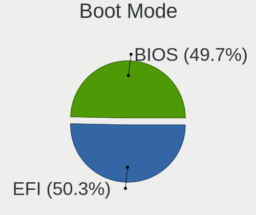
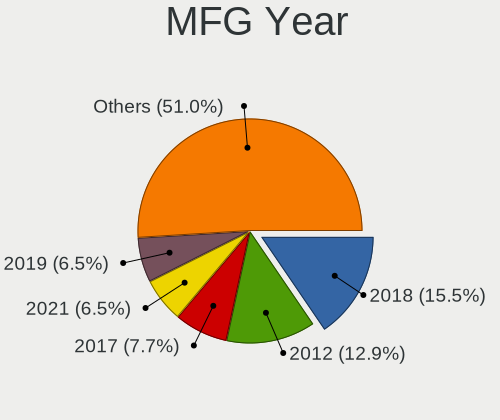
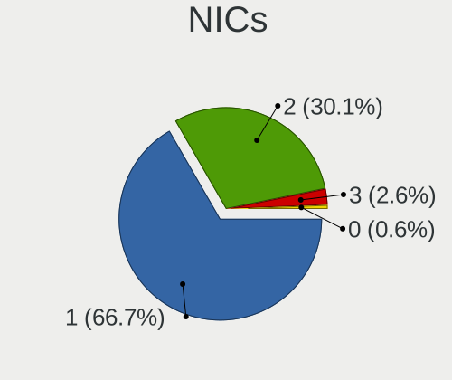
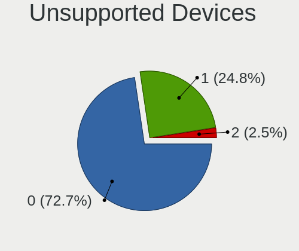

LMDE 5 - Tested Hardware & Statistics (Desktops)
------------------------------------------------

A project to collect tested hardware configurations for LMDE 5.

Anyone can contribute to this report by the [hw-probe](https://github.com/linuxhw/hw-probe) tool:

    sudo -E hw-probe -all -upload

Please contribute! Especially if your hardware is rare.

Contents
--------

* [ Test Cases ](#test-cases)

* [ System ](#system)
  - [ Kernel                   ](#kernel)
  - [ Kernel Family            ](#kernel-family)
  - [ Kernel Major Ver.        ](#kernel-major-ver)
  - [ Arch                     ](#arch)
  - [ DE                       ](#de)
  - [ Display Server           ](#display-server)
  - [ Display Manager          ](#display-manager)
  - [ OS Lang                  ](#os-lang)
  - [ Boot Mode                ](#boot-mode)
  - [ Filesystem               ](#filesystem)
  - [ Part. scheme             ](#part-scheme)
  - [ Dual Boot with Linux/BSD ](#dual-boot-with-linuxbsd)
  - [ Dual Boot (Win)          ](#dual-boot-win)

* [ Board ](#board)
  - [ Vendor                   ](#vendor)
  - [ Model                    ](#model)
  - [ Model Family             ](#model-family)
  - [ MFG Year                 ](#mfg-year)
  - [ Form Factor              ](#form-factor)
  - [ Secure Boot              ](#secure-boot)
  - [ Coreboot                 ](#coreboot)
  - [ RAM Size                 ](#ram-size)
  - [ RAM Used                 ](#ram-used)
  - [ Total Drives             ](#total-drives)
  - [ Has CD-ROM               ](#has-cd-rom)
  - [ Has Ethernet             ](#has-ethernet)
  - [ Has WiFi                 ](#has-wifi)
  - [ Has Bluetooth            ](#has-bluetooth)

* [ Location ](#location)
  - [ Country                  ](#country)
  - [ City                     ](#city)

* [ Drives ](#drives)
  - [ Drive Vendor             ](#drive-vendor)
  - [ Drive Model              ](#drive-model)
  - [ HDD Vendor               ](#hdd-vendor)
  - [ SSD Vendor               ](#ssd-vendor)
  - [ Drive Kind               ](#drive-kind)
  - [ Drive Connector          ](#drive-connector)
  - [ Drive Size               ](#drive-size)
  - [ Space Total              ](#space-total)
  - [ Space Used               ](#space-used)
  - [ Malfunc. Drives          ](#malfunc-drives)
  - [ Malfunc. Drive Vendor    ](#malfunc-drive-vendor)
  - [ Malfunc. HDD Vendor      ](#malfunc-hdd-vendor)
  - [ Malfunc. Drive Kind      ](#malfunc-drive-kind)
  - [ Failed Drives            ](#failed-drives)
  - [ Failed Drive Vendor      ](#failed-drive-vendor)
  - [ Drive Status             ](#drive-status)

* [ Storage controller ](#storage-controller)
  - [ Storage Vendor           ](#storage-vendor)
  - [ Storage Model            ](#storage-model)
  - [ Storage Kind             ](#storage-kind)

* [ Processor ](#processor)
  - [ CPU Vendor               ](#cpu-vendor)
  - [ CPU Model                ](#cpu-model)
  - [ CPU Model Family         ](#cpu-model-family)
  - [ CPU Cores                ](#cpu-cores)
  - [ CPU Sockets              ](#cpu-sockets)
  - [ CPU Threads              ](#cpu-threads)
  - [ CPU Op-Modes             ](#cpu-op-modes)
  - [ CPU Microcode            ](#cpu-microcode)
  - [ CPU Microarch            ](#cpu-microarch)

* [ Graphics ](#graphics)
  - [ GPU Vendor               ](#gpu-vendor)
  - [ GPU Model                ](#gpu-model)
  - [ GPU Combo                ](#gpu-combo)
  - [ GPU Driver               ](#gpu-driver)
  - [ GPU Memory               ](#gpu-memory)

* [ Monitor ](#monitor)
  - [ Monitor Vendor           ](#monitor-vendor)
  - [ Monitor Model            ](#monitor-model)
  - [ Monitor Resolution       ](#monitor-resolution)
  - [ Monitor Diagonal         ](#monitor-diagonal)
  - [ Monitor Width            ](#monitor-width)
  - [ Aspect Ratio             ](#aspect-ratio)
  - [ Monitor Area             ](#monitor-area)
  - [ Pixel Density            ](#pixel-density)
  - [ Multiple Monitors        ](#multiple-monitors)

* [ Network ](#network)
  - [ Net Controller Vendor    ](#net-controller-vendor)
  - [ Net Controller Model     ](#net-controller-model)
  - [ Wireless Vendor          ](#wireless-vendor)
  - [ Wireless Model           ](#wireless-model)
  - [ Ethernet Vendor          ](#ethernet-vendor)
  - [ Ethernet Model           ](#ethernet-model)
  - [ Net Controller Kind      ](#net-controller-kind)
  - [ Used Controller          ](#used-controller)
  - [ NICs                     ](#nics)
  - [ IPv6                     ](#ipv6)

* [ Bluetooth ](#bluetooth)
  - [ Bluetooth Vendor         ](#bluetooth-vendor)
  - [ Bluetooth Model          ](#bluetooth-model)

* [ Sound ](#sound)
  - [ Sound Vendor             ](#sound-vendor)
  - [ Sound Model              ](#sound-model)

* [ Memory ](#memory)
  - [ Memory Vendor            ](#memory-vendor)
  - [ Memory Model             ](#memory-model)
  - [ Memory Kind              ](#memory-kind)
  - [ Memory Form Factor       ](#memory-form-factor)
  - [ Memory Size              ](#memory-size)
  - [ Memory Speed             ](#memory-speed)

* [ Printers & scanners ](#printers--scanners)
  - [ Printer Vendor           ](#printer-vendor)
  - [ Printer Model            ](#printer-model)
  - [ Scanner Vendor           ](#scanner-vendor)
  - [ Scanner Model            ](#scanner-model)

* [ Camera ](#camera)
  - [ Camera Vendor            ](#camera-vendor)
  - [ Camera Model             ](#camera-model)

* [ Security ](#security)
  - [ Fingerprint Vendor       ](#fingerprint-vendor)
  - [ Fingerprint Model        ](#fingerprint-model)
  - [ Chipcard Vendor          ](#chipcard-vendor)
  - [ Chipcard Model           ](#chipcard-model)

* [ Unsupported ](#unsupported)
  - [ Unsupported Devices      ](#unsupported-devices)
  - [ Unsupported Device Types ](#unsupported-device-types)

Test Cases
----------

Total: 76

| Vendor    | Model                       | Probe                                                      | Date         |
|-----------|-----------------------------|------------------------------------------------------------|--------------|
| MSI       | A320M-A PRO MAX             | [774861eae7](https://linux-hardware.org/?probe=774861eae7) | Oct 21, 2022 |
| HP        | 8299                        | [2b4c3924e4](https://linux-hardware.org/?probe=2b4c3924e4) | Oct 20, 2022 |
| HP        | 8299                        | [bf86078a8f](https://linux-hardware.org/?probe=bf86078a8f) | Oct 18, 2022 |
| Samsung   | DT1234567890 SEC_SW_REVI... | [19d09fb082](https://linux-hardware.org/?probe=19d09fb082) | Oct 17, 2022 |
| Samsung   | DT1234567890 SEC_SW_REVI... | [9f3307c5d0](https://linux-hardware.org/?probe=9f3307c5d0) | Oct 17, 2022 |
| Dell      | 0D735T A00                  | [20d0bc0836](https://linux-hardware.org/?probe=20d0bc0836) | Oct 12, 2022 |
| MSI       | B550-A PRO                  | [0526dffee9](https://linux-hardware.org/?probe=0526dffee9) | Oct 11, 2022 |
| AZW       | MINI S                      | [c5be5052a0](https://linux-hardware.org/?probe=c5be5052a0) | Oct 09, 2022 |
| ASUSTek   | Maximus VI HERO             | [2ee3173d51](https://linux-hardware.org/?probe=2ee3173d51) | Oct 08, 2022 |
| MSI       | B550-A PRO                  | [de85238b42](https://linux-hardware.org/?probe=de85238b42) | Oct 05, 2022 |
| ASRock    | A320M-HDV R4.0              | [b340ade9c9](https://linux-hardware.org/?probe=b340ade9c9) | Oct 05, 2022 |
| ASUSTek   | ROG CROSSHAIR VIII HERO     | [bc6ad9af3e](https://linux-hardware.org/?probe=bc6ad9af3e) | Oct 03, 2022 |
| Fujitsu   | D3062-A1 S26361-D3062-A1    | [3915f19817](https://linux-hardware.org/?probe=3915f19817) | Oct 03, 2022 |
| Acer      | Aspire XC-1660G V:1.1       | [f7f5368662](https://linux-hardware.org/?probe=f7f5368662) | Sep 28, 2022 |
| Acer      | Aspire XC-1660G V:1.1       | [fb983c65ac](https://linux-hardware.org/?probe=fb983c65ac) | Sep 28, 2022 |
| Dell      | 082WXT A01                  | [7b1ea76e92](https://linux-hardware.org/?probe=7b1ea76e92) | Sep 26, 2022 |
| Dell      | 082WXT A01                  | [7c4445ad04](https://linux-hardware.org/?probe=7c4445ad04) | Sep 26, 2022 |
| Gateway   | DX4870                      | [fd5b76e786](https://linux-hardware.org/?probe=fd5b76e786) | Sep 22, 2022 |
| Digiboard | NM70-TI                     | [84e21c8253](https://linux-hardware.org/?probe=84e21c8253) | Sep 21, 2022 |
| Dell      | 0XC837                      | [94ad27e346](https://linux-hardware.org/?probe=94ad27e346) | Sep 19, 2022 |
| MSI       | B360M MORTAR                | [cdcff8c15d](https://linux-hardware.org/?probe=cdcff8c15d) | Sep 18, 2022 |
| ASUSTek   | PRIME H610M-E D4            | [b8f2004ea5](https://linux-hardware.org/?probe=b8f2004ea5) | Sep 10, 2022 |
| Dell      | 0FJ030                      | [bf789b5c5f](https://linux-hardware.org/?probe=bf789b5c5f) | Sep 10, 2022 |
| MSI       | B450I GAMING PLUS AC        | [acbb191061](https://linux-hardware.org/?probe=acbb191061) | Sep 09, 2022 |
| Pegatron  | 2A9Eh                       | [2c7b59f70b](https://linux-hardware.org/?probe=2c7b59f70b) | Sep 08, 2022 |
| ASUSTek   | P8H77-V                     | [c92f578a36](https://linux-hardware.org/?probe=c92f578a36) | Sep 07, 2022 |
| ASUSTek   | ROG CROSSHAIR VIII HERO     | [9842cac1de](https://linux-hardware.org/?probe=9842cac1de) | Sep 04, 2022 |
| eMachines | EL1352G                     | [2547a277f7](https://linux-hardware.org/?probe=2547a277f7) | Sep 04, 2022 |
| ASUSTek   | P5K-E                       | [632cd1e47d](https://linux-hardware.org/?probe=632cd1e47d) | Sep 03, 2022 |
| Dell      | 042P49 A00                  | [31efc1e75f](https://linux-hardware.org/?probe=31efc1e75f) | Sep 01, 2022 |
| ASUSTek   | P5QPL-AM                    | [38e6481a65](https://linux-hardware.org/?probe=38e6481a65) | Aug 30, 2022 |
| Gigabyte  | B450M DS3H-CF               | [afde42fb41](https://linux-hardware.org/?probe=afde42fb41) | Aug 28, 2022 |
| Gigabyte  | B450M DS3H-CF               | [6c1db95864](https://linux-hardware.org/?probe=6c1db95864) | Aug 28, 2022 |
| MSI       | Z170A GAMING PRO            | [f86bc78c33](https://linux-hardware.org/?probe=f86bc78c33) | Aug 27, 2022 |
| MSI       | B85I                        | [454972a062](https://linux-hardware.org/?probe=454972a062) | Aug 19, 2022 |
| Gigabyte  | H97-Gaming 3                | [2d464fc182](https://linux-hardware.org/?probe=2d464fc182) | Aug 10, 2022 |
| Gigabyte  | B85M-DS3H-A                 | [527a0607d8](https://linux-hardware.org/?probe=527a0607d8) | Aug 08, 2022 |
| ASRock    | H61M-DGS                    | [683cd6273f](https://linux-hardware.org/?probe=683cd6273f) | Jul 30, 2022 |
| Gigabyte  | B450 AORUS M                | [fdaa3bac93](https://linux-hardware.org/?probe=fdaa3bac93) | Jul 20, 2022 |
| HP        | 8433 11                     | [85ecad964d](https://linux-hardware.org/?probe=85ecad964d) | Jul 17, 2022 |
| HP        | 8433 11                     | [7f6ec63dc8](https://linux-hardware.org/?probe=7f6ec63dc8) | Jul 17, 2022 |
| ASUSTek   | BM6820_BM6620_BP6320-8      | [8d8c845646](https://linux-hardware.org/?probe=8d8c845646) | Jul 17, 2022 |
| Gigabyte  | B450 AORUS M                | [12e48a7c0a](https://linux-hardware.org/?probe=12e48a7c0a) | Jul 06, 2022 |
| ASUSTek   | P8H77-M PRO                 | [efc2332724](https://linux-hardware.org/?probe=efc2332724) | Jul 02, 2022 |
| Dell      | 0XR1GT A00                  | [0d72ab6a71](https://linux-hardware.org/?probe=0d72ab6a71) | Jun 24, 2022 |
| Lenovo    | 3731 NOK                    | [efd1e69f79](https://linux-hardware.org/?probe=efd1e69f79) | Jun 09, 2022 |
| Lenovo    | 3731 NOK                    | [1da6b9f6c0](https://linux-hardware.org/?probe=1da6b9f6c0) | Jun 09, 2022 |
| Dell      | 0XR1GT A00                  | [8c3fd28612](https://linux-hardware.org/?probe=8c3fd28612) | Jun 08, 2022 |
| MSI       | MPG Z390 GAMING PRO CARB... | [6f8785bd56](https://linux-hardware.org/?probe=6f8785bd56) | May 30, 2022 |
| Lenovo    | MAHOBAY                     | [ba204646ba](https://linux-hardware.org/?probe=ba204646ba) | May 25, 2022 |
| Acer      | Seawolf                     | [dccbcb7ef3](https://linux-hardware.org/?probe=dccbcb7ef3) | May 25, 2022 |
| Intel     | DQ77MK AAG39642-400         | [f694bcfbc5](https://linux-hardware.org/?probe=f694bcfbc5) | May 21, 2022 |
| MSI       | X470 GAMING PLUS MAX        | [63950495b3](https://linux-hardware.org/?probe=63950495b3) | May 15, 2022 |
| MSI       | 970A-G43 PLUS               | [399deea7b9](https://linux-hardware.org/?probe=399deea7b9) | May 15, 2022 |
| Gigabyte  | Z68A-D3H-B3                 | [1441dfb79e](https://linux-hardware.org/?probe=1441dfb79e) | May 07, 2022 |
| HP        | 158B                        | [a613debdee](https://linux-hardware.org/?probe=a613debdee) | May 06, 2022 |
| HP        | 158B                        | [21f9c188f3](https://linux-hardware.org/?probe=21f9c188f3) | May 06, 2022 |
| HP        | 339A                        | [d58b95ebb1](https://linux-hardware.org/?probe=d58b95ebb1) | May 05, 2022 |
| Gigabyte  | H110M-S2H-CF                | [c45a37ce5d](https://linux-hardware.org/?probe=c45a37ce5d) | May 01, 2022 |
| ASUSTek   | PRIME H610M-A D4            | [e9376d24f0](https://linux-hardware.org/?probe=e9376d24f0) | Apr 29, 2022 |
| ASRock    | A320M-DGS                   | [b7df060840](https://linux-hardware.org/?probe=b7df060840) | Apr 19, 2022 |
| ASRock    | A320M-DGS                   | [70fe08376f](https://linux-hardware.org/?probe=70fe08376f) | Apr 19, 2022 |
| Dell      | 0CU568 A00                  | [b544c48421](https://linux-hardware.org/?probe=b544c48421) | Apr 19, 2022 |
| Dell      | 0CU568 A00                  | [84f7029c22](https://linux-hardware.org/?probe=84f7029c22) | Apr 19, 2022 |
| ASUSTek   | PRIME B350M-A               | [ed40a9ddc1](https://linux-hardware.org/?probe=ed40a9ddc1) | Apr 12, 2022 |
| ASUSTek   | PRIME B350M-A               | [9a137f0540](https://linux-hardware.org/?probe=9a137f0540) | Apr 12, 2022 |
| MSI       | Z170A GAMING M5             | [8f2e10cbf3](https://linux-hardware.org/?probe=8f2e10cbf3) | Apr 12, 2022 |
| Lenovo    | 312A SDK0J40697 WIN 3305... | [2a33f087e6](https://linux-hardware.org/?probe=2a33f087e6) | Apr 11, 2022 |
| Lenovo    | 312A SDK0J40697 WIN 3305... | [05b9ec80c6](https://linux-hardware.org/?probe=05b9ec80c6) | Apr 11, 2022 |
| Acer      | WG43M                       | [c7cb6ee141](https://linux-hardware.org/?probe=c7cb6ee141) | Apr 08, 2022 |
| ASUSTek   | P5G41T-M LX3                | [28371c08c2](https://linux-hardware.org/?probe=28371c08c2) | Apr 08, 2022 |
| MSI       | X470 GAMING PLUS MAX        | [9f1a76acb8](https://linux-hardware.org/?probe=9f1a76acb8) | Apr 06, 2022 |
| MSI       | X470 GAMING PLUS MAX        | [18a4ba3137](https://linux-hardware.org/?probe=18a4ba3137) | Apr 06, 2022 |
| ASUSTek   | P6T                         | [5ed6ed355f](https://linux-hardware.org/?probe=5ed6ed355f) | Apr 04, 2022 |
| ASUSTek   | PRIME H510M-D               | [1e0a28c8f3](https://linux-hardware.org/?probe=1e0a28c8f3) | Mar 28, 2022 |
| HP        | 0AE8h C                     | [d3980b5b59](https://linux-hardware.org/?probe=d3980b5b59) | Mar 14, 2022 |

System
------

Kernel
------

Version of the Linux kernel

| Version                  | Desktops | Percent |
|--------------------------|----------|---------|
| 5.10.0-12-amd64          | 12       | 20.69%  |
| 5.10.0-17-amd64          | 11       | 18.97%  |
| 5.10.0-14-amd64          | 10       | 17.24%  |
| 5.10.0-13-amd64          | 10       | 17.24%  |
| 5.10.0-18-amd64          | 9        | 15.52%  |
| 5.10.0-16-amd64          | 2        | 3.45%   |
| 5.10.0-15-amd64          | 2        | 3.45%   |
| 6.0.2-x64v2-rt11-xanmod1 | 1        | 1.72%   |
| 5.10.0-13-686            | 1        | 1.72%   |

Kernel Family
-------------

Linux kernel without a distro release

| Version | Desktops | Percent |
|---------|----------|---------|
| 5.10.0  | 55       | 98.21%  |
| 6.0.2   | 1        | 1.79%   |

Kernel Major Ver.
-----------------

Linux kernel major version

| Version | Desktops | Percent |
|---------|----------|---------|
| 5.10    | 55       | 98.21%  |
| 6.0     | 1        | 1.79%   |

Arch
----

OS architecture (x86_64, i586, etc.)

| Name   | Desktops | Percent |
|--------|----------|---------|
| x86_64 | 55       | 98.21%  |
| i686   | 1        | 1.79%   |

DE
--

Desktop Environment

| Name       | Desktops | Percent |
|------------|----------|---------|
| X-Cinnamon | 51       | 91.07%  |
| Cinnamon   | 3        | 5.36%   |
| XFCE       | 1        | 1.79%   |
| MATE       | 1        | 1.79%   |

Display Server
--------------

X11 or Wayland

| Name | Desktops | Percent |
|------|----------|---------|
| X11  | 56       | 100%    |

Display Manager
---------------

SDDM, LightDM, etc.

| Name    | Desktops | Percent |
|---------|----------|---------|
| Unknown | 40       | 71.43%  |
| LightDM | 16       | 28.57%  |

OS Lang
-------

Language

| Lang  | Desktops | Percent |
|-------|----------|---------|
| en_US | 22       | 39.29%  |
| ru_RU | 5        | 8.93%   |
| pt_BR | 4        | 7.14%   |
| de_DE | 4        | 7.14%   |
| fr_FR | 3        | 5.36%   |
| pl_PL | 2        | 3.57%   |
| it_IT | 2        | 3.57%   |
| es_ES | 2        | 3.57%   |
| en_GB | 2        | 3.57%   |
| en_CA | 2        | 3.57%   |
| sv_SE | 1        | 1.79%   |
| sk_SK | 1        | 1.79%   |
| it_CH | 1        | 1.79%   |
| fr_CA | 1        | 1.79%   |
| es_NI | 1        | 1.79%   |
| en_AU | 1        | 1.79%   |
| de_AT | 1        | 1.79%   |
| ar_EG | 1        | 1.79%   |

Boot Mode
---------

EFI or BIOS

| Mode | Desktops | Percent |
|------|----------|---------|
| BIOS | 32       | 57.14%  |
| EFI  | 24       | 42.86%  |

Filesystem
----------

Type of filesystem

| Type    | Desktops | Percent |
|---------|----------|---------|
| Ext4    | 52       | 92.86%  |
| Tmpfs   | 2        | 3.57%   |
| Overlay | 1        | 1.79%   |
| Btrfs   | 1        | 1.79%   |

Part. scheme
------------

Scheme of partitioning

| Type    | Desktops | Percent |
|---------|----------|---------|
| Unknown | 41       | 73.21%  |
| GPT     | 9        | 16.07%  |
| MBR     | 6        | 10.71%  |

Dual Boot with Linux/BSD
------------------------

Hosting more than one Linux/BSD

| Dual boot | Desktops | Percent |
|-----------|----------|---------|
| No        | 51       | 91.07%  |
| Yes       | 5        | 8.93%   |

Dual Boot (Win)
---------------

Hosting Linux and Windows

| Dual boot | Desktops | Percent |
|-----------|----------|---------|
| No        | 51       | 91.07%  |
| Yes       | 5        | 8.93%   |

Board
-----

Vendor
------

Motherboard manufacturer

| Name                | Desktops | Percent |
|---------------------|----------|---------|
| ASUSTek Computer    | 13       | 23.21%  |
| MSI                 | 9        | 16.07%  |
| Dell                | 7        | 12.5%   |
| Hewlett-Packard     | 5        | 8.93%   |
| Gigabyte Technology | 5        | 8.93%   |
| Lenovo              | 3        | 5.36%   |
| ASRock              | 3        | 5.36%   |
| Acer                | 3        | 5.36%   |
| Samsung Electronics | 1        | 1.79%   |
| Pegatron            | 1        | 1.79%   |
| Intel               | 1        | 1.79%   |
| Gateway             | 1        | 1.79%   |
| Fujitsu             | 1        | 1.79%   |
| eMachines           | 1        | 1.79%   |
| Digiboard           | 1        | 1.79%   |
| AZW                 | 1        | 1.79%   |

Model
-----

Motherboard model

| Name                                | Desktops | Percent |
|-------------------------------------|----------|---------|
| Samsung DeskTop System              | 1        | 1.79%   |
| Pegatron Pro 3015 Microtower PC     | 1        | 1.79%   |
| MSI MS-7C52                         | 1        | 1.79%   |
| MSI MS-7B79                         | 1        | 1.79%   |
| MSI MS-7B23                         | 1        | 1.79%   |
| MSI MS-7B17                         | 1        | 1.79%   |
| MSI MS-7A40                         | 1        | 1.79%   |
| MSI MS-7984                         | 1        | 1.79%   |
| MSI MS-7977                         | 1        | 1.79%   |
| MSI MS-7974                         | 1        | 1.79%   |
| MSI MS-7851                         | 1        | 1.79%   |
| Lenovo V55t-15ARE 11KJ0036TX        | 1        | 1.79%   |
| Lenovo ThinkCentre M92p 3238E9U     | 1        | 1.79%   |
| Lenovo ThinkCentre M720s 10SUS9KW00 | 1        | 1.79%   |
| Intel DQ77MK AAG39642-400           | 1        | 1.79%   |
| HP Z820 Workstation                 | 1        | 1.79%   |
| HP Z600 Workstation                 | 1        | 1.79%   |
| HP Pavilion Desktop 590-p0xxx       | 1        | 1.79%   |
| HP EliteDesk 800 G3 SFF             | 1        | 1.79%   |
| HP Compaq Pro 6300 SFF              | 1        | 1.79%   |
| Gigabyte Z68A-D3H-B3                | 1        | 1.79%   |
| Gigabyte H110M-S2H                  | 1        | 1.79%   |
| Gigabyte B85M-DS3H-A                | 1        | 1.79%   |
| Gigabyte B450M DS3H                 | 1        | 1.79%   |
| Gigabyte B450 AORUS M               | 1        | 1.79%   |
| Gateway DX4870                      | 1        | 1.79%   |
| Fujitsu CELSIUS W410                | 1        | 1.79%   |
| eMachines EL1352G                   | 1        | 1.79%   |
| Digiboard NM70-TI                   | 1        | 1.79%   |
| Dell XPS A2010                      | 1        | 1.79%   |
| Dell Vostro 430                     | 1        | 1.79%   |
| Dell Precision WorkStation 670      | 1        | 1.79%   |
| Dell Precision T7600                | 1        | 1.79%   |
| Dell OptiPlex 3010                  | 1        | 1.79%   |
| Dell Inspiron 660                   | 1        | 1.79%   |
| Dell DXP051                         | 1        | 1.79%   |
| AZW MINI S                          | 1        | 1.79%   |
| ASUS ROG CROSSHAIR VIII HERO        | 1        | 1.79%   |
| ASUS PRIME H610M-E D4               | 1        | 1.79%   |
| ASUS PRIME H610M-A D4               | 1        | 1.79%   |

Model Family
------------

Motherboard model prefix

| Name                 | Desktops | Percent |
|----------------------|----------|---------|
| ASUS PRIME           | 4        | 7.14%   |
| Lenovo ThinkCentre   | 2        | 3.57%   |
| Dell Precision       | 2        | 3.57%   |
| Acer Aspire          | 2        | 3.57%   |
| Samsung DeskTop      | 1        | 1.79%   |
| Pegatron Pro         | 1        | 1.79%   |
| MSI MS-7C52          | 1        | 1.79%   |
| MSI MS-7B79          | 1        | 1.79%   |
| MSI MS-7B23          | 1        | 1.79%   |
| MSI MS-7B17          | 1        | 1.79%   |
| MSI MS-7A40          | 1        | 1.79%   |
| MSI MS-7984          | 1        | 1.79%   |
| MSI MS-7977          | 1        | 1.79%   |
| MSI MS-7974          | 1        | 1.79%   |
| MSI MS-7851          | 1        | 1.79%   |
| Lenovo V55t-15ARE    | 1        | 1.79%   |
| Intel DQ77MK         | 1        | 1.79%   |
| HP Z820              | 1        | 1.79%   |
| HP Z600              | 1        | 1.79%   |
| HP Pavilion          | 1        | 1.79%   |
| HP EliteDesk         | 1        | 1.79%   |
| HP Compaq            | 1        | 1.79%   |
| Gigabyte Z68A-D3H-B3 | 1        | 1.79%   |
| Gigabyte H110M-S2H   | 1        | 1.79%   |
| Gigabyte B85M-DS3H-A | 1        | 1.79%   |
| Gigabyte B450M       | 1        | 1.79%   |
| Gigabyte B450        | 1        | 1.79%   |
| Gateway DX4870       | 1        | 1.79%   |
| Fujitsu CELSIUS      | 1        | 1.79%   |
| eMachines EL1352G    | 1        | 1.79%   |
| Digiboard NM70-TI    | 1        | 1.79%   |
| Dell XPS             | 1        | 1.79%   |
| Dell Vostro          | 1        | 1.79%   |
| Dell OptiPlex        | 1        | 1.79%   |
| Dell Inspiron        | 1        | 1.79%   |
| Dell DXP051          | 1        | 1.79%   |
| AZW MINI             | 1        | 1.79%   |
| ASUS ROG             | 1        | 1.79%   |
| ASUS P8H77-V         | 1        | 1.79%   |
| ASUS P8H77-M         | 1        | 1.79%   |

MFG Year
--------

Motherboard manufacture year

| Year | Desktops | Percent |
|------|----------|---------|
| 2012 | 10       | 17.86%  |
| 2018 | 9        | 16.07%  |
| 2015 | 5        | 8.93%   |
| 2017 | 4        | 7.14%   |
| 2009 | 4        | 7.14%   |
| 2022 | 3        | 5.36%   |
| 2021 | 3        | 5.36%   |
| 2019 | 3        | 5.36%   |
| 2010 | 3        | 5.36%   |
| 2013 | 2        | 3.57%   |
| 2011 | 2        | 3.57%   |
| 2007 | 2        | 3.57%   |
| 2006 | 2        | 3.57%   |
| 2020 | 1        | 1.79%   |
| 2016 | 1        | 1.79%   |
| 2014 | 1        | 1.79%   |
| 2008 | 1        | 1.79%   |

Form Factor
-----------

Physical design of the computer

| Name    | Desktops | Percent |
|---------|----------|---------|
| Desktop | 56       | 100%    |

Secure Boot
-----------

Enabled or disabled

| State    | Desktops | Percent |
|----------|----------|---------|
| Disabled | 56       | 98.25%  |
| Enabled  | 1        | 1.75%   |

Coreboot
--------

Have coreboot on board

| Used | Desktops | Percent |
|------|----------|---------|
| No   | 56       | 100%    |

RAM Size
--------

Total RAM memory

| Size in GB  | Desktops | Percent |
|-------------|----------|---------|
| 16.01-24.0  | 13       | 22.81%  |
| 8.01-16.0   | 13       | 22.81%  |
| 4.01-8.0    | 12       | 21.05%  |
| 32.01-64.0  | 6        | 10.53%  |
| 3.01-4.0    | 6        | 10.53%  |
| 24.01-32.0  | 3        | 5.26%   |
| 1.01-2.0    | 3        | 5.26%   |
| 64.01-256.0 | 1        | 1.75%   |

RAM Used
--------

Used RAM memory

| Used GB   | Desktops | Percent |
|-----------|----------|---------|
| 1.01-2.0  | 21       | 36.84%  |
| 2.01-3.0  | 18       | 31.58%  |
| 4.01-8.0  | 7        | 12.28%  |
| 3.01-4.0  | 7        | 12.28%  |
| 8.01-16.0 | 2        | 3.51%   |
| 0.51-1.0  | 2        | 3.51%   |

Total Drives
------------

Number of drives on board

| Drives | Desktops | Percent |
|--------|----------|---------|
| 1      | 27       | 48.21%  |
| 3      | 11       | 19.64%  |
| 2      | 11       | 19.64%  |
| 4      | 5        | 8.93%   |
| 6      | 1        | 1.79%   |
| 5      | 1        | 1.79%   |

Has CD-ROM
----------

Has CD-ROM on board

| Presented | Desktops | Percent |
|-----------|----------|---------|
| Yes       | 28       | 50%     |
| No        | 28       | 50%     |

Has Ethernet
------------

Has Ethernet on board

| Presented | Desktops | Percent |
|-----------|----------|---------|
| Yes       | 56       | 100%    |

Has WiFi
--------

Has WiFi module

| Presented | Desktops | Percent |
|-----------|----------|---------|
| No        | 33       | 58.93%  |
| Yes       | 23       | 41.07%  |

Has Bluetooth
-------------

Has Bluetooth module

| Presented | Desktops | Percent |
|-----------|----------|---------|
| No        | 42       | 75%     |
| Yes       | 14       | 25%     |

Location
--------

Country
-------

Geographic location (country)

| Country   | Desktops | Percent |
|-----------|----------|---------|
| USA       | 14       | 25%     |
| Russia    | 6        | 10.71%  |
| Brazil    | 5        | 8.93%   |
| Italy     | 4        | 7.14%   |
| France    | 4        | 7.14%   |
| Germany   | 3        | 5.36%   |
| Canada    | 3        | 5.36%   |
| UK        | 2        | 3.57%   |
| Sweden    | 2        | 3.57%   |
| Spain     | 2        | 3.57%   |
| Poland    | 2        | 3.57%   |
| Australia | 2        | 3.57%   |
| Venezuela | 1        | 1.79%   |
| Turkey    | 1        | 1.79%   |
| Slovakia  | 1        | 1.79%   |
| Nicaragua | 1        | 1.79%   |
| Mexico    | 1        | 1.79%   |
| Latvia    | 1        | 1.79%   |
| Austria   | 1        | 1.79%   |

City
----

Geographic location (city)

| City                     | Desktops | Percent |
|--------------------------|----------|---------|
| Melbourne                | 2        | 3.51%   |
| Volta Redonda            | 1        | 1.75%   |
| Vitória da Conquista    | 1        | 1.75%   |
| Vincennes                | 1        | 1.75%   |
| Vicente Guerrero         | 1        | 1.75%   |
| Ulyanovsk                | 1        | 1.75%   |
| Trieste                  | 1        | 1.75%   |
| Tolyatti                 | 1        | 1.75%   |
| Toledo                   | 1        | 1.75%   |
| Toccoa                   | 1        | 1.75%   |
| Tacoma                   | 1        | 1.75%   |
| Stockbridge              | 1        | 1.75%   |
| Spruce Grove             | 1        | 1.75%   |
| Sollentuna               | 1        | 1.75%   |
| Schruns                  | 1        | 1.75%   |
| Sant Feliu de Llobregat  | 1        | 1.75%   |
| San Antonio de Los Altos | 1        | 1.75%   |
| San Antonio              | 1        | 1.75%   |
| Rome                     | 1        | 1.75%   |
| Riga                     | 1        | 1.75%   |
| Reynoldsburg             | 1        | 1.75%   |
| Rennes                   | 1        | 1.75%   |
| Queensbury               | 1        | 1.75%   |
| Prestatyn                | 1        | 1.75%   |
| Porto Uniao              | 1        | 1.75%   |
| Porto Alegre             | 1        | 1.75%   |
| Piaseczno                | 1        | 1.75%   |
| Pensacola                | 1        | 1.75%   |
| Orekhovo-Zuyevo          | 1        | 1.75%   |
| North Manchester         | 1        | 1.75%   |
| Nitra                    | 1        | 1.75%   |
| National City            | 1        | 1.75%   |
| Naples                   | 1        | 1.75%   |
| Moscow                   | 1        | 1.75%   |
| Montreal                 | 1        | 1.75%   |
| Milan                    | 1        | 1.75%   |
| Managua                  | 1        | 1.75%   |
| Madrid                   | 1        | 1.75%   |
| London                   | 1        | 1.75%   |
| Krasnodar                | 1        | 1.75%   |

Drives
------

Drive Vendor
------------

Hard drive vendors

| Vendor              | Desktops | Drives | Percent |
|---------------------|----------|--------|---------|
| WDC                 | 17       | 27     | 19.32%  |
| Seagate             | 16       | 20     | 18.18%  |
| Samsung Electronics | 12       | 24     | 13.64%  |
| Kingston            | 6        | 6      | 6.82%   |
| Crucial             | 6        | 6      | 6.82%   |
| Toshiba             | 5        | 5      | 5.68%   |
| SanDisk             | 4        | 4      | 4.55%   |
| Hitachi             | 4        | 5      | 4.55%   |
| SK hynix            | 2        | 2      | 2.27%   |
| A-DATA Technology   | 2        | 2      | 2.27%   |
| XrayDisk            | 1        | 2      | 1.14%   |
| Transcend           | 1        | 2      | 1.14%   |
| Phison Electronics  | 1        | 1      | 1.14%   |
| OCZ-VERTEX          | 1        | 1      | 1.14%   |
| Netac               | 1        | 1      | 1.14%   |
| Intel               | 1        | 1      | 1.14%   |
| Hewlett-Packard     | 1        | 1      | 1.14%   |
| GOODRAM             | 1        | 1      | 1.14%   |
| China               | 1        | 1      | 1.14%   |
| BR                  | 1        | 1      | 1.14%   |
| ASMedia             | 1        | 1      | 1.14%   |
| Apple               | 1        | 1      | 1.14%   |
| 2.5''               | 1        | 1      | 1.14%   |
| Unknown             | 1        | 1      | 1.14%   |

Drive Model
-----------

Hard drive models

| Model                                   | Desktops | Percent |
|-----------------------------------------|----------|---------|
| Samsung SSD 850 EVO 250GB               | 4        | 3.88%   |
| Crucial CT480BX500SSD1 480GB            | 3        | 2.91%   |
| WDC WD10EZEX-08WN4A0 1TB                | 2        | 1.94%   |
| Seagate ST3320418AS 320GB               | 2        | 1.94%   |
| Seagate ST2000DM008-2FR102 2TB          | 2        | 1.94%   |
| Seagate ST1000DM003-1CH162 1TB          | 2        | 1.94%   |
| Samsung SSD 850 EVO 500GB               | 2        | 1.94%   |
| Samsung NVMe SSD Drive 500GB            | 2        | 1.94%   |
| Samsung NVMe SSD Drive 250GB            | 2        | 1.94%   |
| Kingston SA400S37240G 240GB SSD         | 2        | 1.94%   |
| XrayDisk 480GB                          | 1        | 0.97%   |
| XrayDisk 1TB                            | 1        | 0.97%   |
| WDC WD60EZAZ-00ZGHB0 6TB                | 1        | 0.97%   |
| WDC WD5000LPSX-08A6W 500GB              | 1        | 0.97%   |
| WDC WD5000AZLX-08K2TA0 500GB            | 1        | 0.97%   |
| WDC WD5000AAKX-75U6AA0 500GB            | 1        | 0.97%   |
| WDC WD5000AAKX-22ERMA0 500GB            | 1        | 0.97%   |
| WDC WD40EZAZ-00SF3B0 4TB                | 1        | 0.97%   |
| WDC WD3200AAJS-22B4A0 320GB             | 1        | 0.97%   |
| WDC WD30EFRX-68EUZN0 3TB                | 1        | 0.97%   |
| WDC WD3003FZEX-00Z4SA0 3TB              | 1        | 0.97%   |
| WDC WD20SPZX-00UA7T0 2TB                | 1        | 0.97%   |
| WDC WD1600HLHX-60JJPV1 160GB            | 1        | 0.97%   |
| WDC WD1600AAJS-07PSA0 160GB             | 1        | 0.97%   |
| WDC WD10JPVX-75JC3T0 1TB                | 1        | 0.97%   |
| WDC WD10EZEX-22BN5A0 1TB                | 1        | 0.97%   |
| WDC WD10EFRX-68JCSN0 1TB                | 1        | 0.97%   |
| WDC WD10EFRX-68FYTN0 1TB                | 1        | 0.97%   |
| WDC WD10EAVS-00D7B0 1TB                 | 1        | 0.97%   |
| WDC WD1003FZEX-00MK2A0 1TB              | 1        | 0.97%   |
| WDC WD1002FAEX-00Z3A0 1TB               | 1        | 0.97%   |
| Transcend TS480GSSD220S 480GB           | 1        | 0.97%   |
| Transcend TS240GSSD220S 240GB           | 1        | 0.97%   |
| Toshiba THNSNJ128GCSU 128GB SSD         | 1        | 0.97%   |
| Toshiba MK3275GSX 320GB                 | 1        | 0.97%   |
| Toshiba HDWD110 1TB                     | 1        | 0.97%   |
| Toshiba DT01ACA200 2TB                  | 1        | 0.97%   |
| Toshiba DT01ACA050 500GB                | 1        | 0.97%   |
| SK hynix HFS256G32MND-3310A 256GB SSD   | 1        | 0.97%   |
| SK hynix BC511 HFM256GDJTNI-82A0A 256GB | 1        | 0.97%   |

HDD Vendor
----------

Hard disk drive vendors

| Vendor              | Desktops | Drives | Percent |
|---------------------|----------|--------|---------|
| WDC                 | 17       | 27     | 38.64%  |
| Seagate             | 16       | 20     | 36.36%  |
| Toshiba             | 4        | 4      | 9.09%   |
| Hitachi             | 4        | 5      | 9.09%   |
| Samsung Electronics | 2        | 2      | 4.55%   |
| ASMedia             | 1        | 1      | 2.27%   |

SSD Vendor
----------

Solid state drive vendors

| Vendor              | Desktops | Drives | Percent |
|---------------------|----------|--------|---------|
| Samsung Electronics | 7        | 12     | 20.59%  |
| Crucial             | 6        | 6      | 17.65%  |
| Kingston            | 5        | 5      | 14.71%  |
| SanDisk             | 3        | 3      | 8.82%   |
| A-DATA Technology   | 2        | 2      | 5.88%   |
| Transcend           | 1        | 2      | 2.94%   |
| Toshiba             | 1        | 1      | 2.94%   |
| SK hynix            | 1        | 1      | 2.94%   |
| OCZ-VERTEX          | 1        | 1      | 2.94%   |
| Netac               | 1        | 1      | 2.94%   |
| Hewlett-Packard     | 1        | 1      | 2.94%   |
| GOODRAM             | 1        | 1      | 2.94%   |
| China               | 1        | 1      | 2.94%   |
| Apple               | 1        | 1      | 2.94%   |
| 2.5''               | 1        | 1      | 2.94%   |
| Unknown             | 1        | 1      | 2.94%   |

Drive Kind
----------

HDD or SSD

| Kind    | Desktops | Drives | Percent |
|---------|----------|--------|---------|
| HDD     | 39       | 59     | 47.56%  |
| SSD     | 31       | 40     | 37.8%   |
| NVMe    | 10       | 15     | 12.2%   |
| Unknown | 2        | 3      | 2.44%   |

Drive Connector
---------------

SATA, SAS, NVMe, etc.

| Type | Desktops | Drives | Percent |
|------|----------|--------|---------|
| SATA | 54       | 98     | 80.6%   |
| NVMe | 10       | 15     | 14.93%  |
| SAS  | 3        | 4      | 4.48%   |

Drive Size
----------

Size of hard drive

| Size in TB | Desktops | Drives | Percent |
|------------|----------|--------|---------|
| 0.01-0.5   | 43       | 62     | 62.32%  |
| 0.51-1.0   | 14       | 21     | 20.29%  |
| 1.01-2.0   | 7        | 8      | 10.14%  |
| 2.01-3.0   | 2        | 5      | 2.9%    |
| 4.01-10.0  | 2        | 2      | 2.9%    |
| 3.01-4.0   | 1        | 1      | 1.45%   |

Space Total
-----------

Amount of disk space available on the file system

| Size in GB     | Desktops | Percent |
|----------------|----------|---------|
| 251-500        | 13       | 23.21%  |
| 101-250        | 12       | 21.43%  |
| 1001-2000      | 10       | 17.86%  |
| 501-1000       | 6        | 10.71%  |
| More than 3000 | 4        | 7.14%   |
| 2001-3000      | 4        | 7.14%   |
| 1-20           | 3        | 5.36%   |
| 51-100         | 3        | 5.36%   |
| 21-50          | 1        | 1.79%   |

Space Used
----------

Amount of used disk space

| Used GB   | Desktops | Percent |
|-----------|----------|---------|
| 1-20      | 20       | 35.09%  |
| 21-50     | 11       | 19.3%   |
| 251-500   | 6        | 10.53%  |
| 501-1000  | 6        | 10.53%  |
| 1001-2000 | 5        | 8.77%   |
| 51-100    | 5        | 8.77%   |
| 101-250   | 3        | 5.26%   |
| 2001-3000 | 1        | 1.75%   |

Malfunc. Drives
---------------

Drive models with a malfunction

| Model                           | Desktops | Drives | Percent |
|---------------------------------|----------|--------|---------|
| Seagate ST500LT012-1DG142 500GB | 1        | 1      | 50%     |
| Seagate ST3250318AS 250GB       | 1        | 1      | 50%     |

Malfunc. Drive Vendor
---------------------

Vendors of faulty drives

| Vendor  | Desktops | Drives | Percent |
|---------|----------|--------|---------|
| Seagate | 2        | 2      | 100%    |

Malfunc. HDD Vendor
-------------------

Vendors of faulty HDD drives

| Vendor  | Desktops | Drives | Percent |
|---------|----------|--------|---------|
| Seagate | 2        | 2      | 100%    |

Malfunc. Drive Kind
-------------------

Kinds of faulty drives

| Kind | Desktops | Drives | Percent |
|------|----------|--------|---------|
| HDD  | 2        | 2      | 100%    |

Failed Drives
-------------

Failed drive models

Zero info for selected period =(

Failed Drive Vendor
-------------------

Failed drive vendors

Zero info for selected period =(

Drive Status
------------

Number of failed and malfunc. drives

| Status   | Desktops | Drives | Percent |
|----------|----------|--------|---------|
| Detected | 42       | 86     | 71.19%  |
| Works    | 15       | 29     | 25.42%  |
| Malfunc  | 2        | 2      | 3.39%   |

Storage controller
------------------

Storage Vendor
--------------

Storage controller vendors

| Vendor                      | Desktops | Percent |
|-----------------------------|----------|---------|
| Intel                       | 43       | 57.33%  |
| AMD                         | 12       | 16%     |
| Samsung Electronics         | 5        | 6.67%   |
| ASMedia Technology          | 3        | 4%      |
| Nvidia                      | 2        | 2.67%   |
| JMicron Technology          | 2        | 2.67%   |
| Broadcom / LSI              | 2        | 2.67%   |
| SK hynix                    | 1        | 1.33%   |
| SanDisk                     | 1        | 1.33%   |
| Phison Electronics          | 1        | 1.33%   |
| Marvell Technology Group    | 1        | 1.33%   |
| LSI Logic / Symbios Logic   | 1        | 1.33%   |
| Kingston Technology Company | 1        | 1.33%   |

Storage Model
-------------

Storage controller models

| Model                                                                                   | Desktops | Percent |
|-----------------------------------------------------------------------------------------|----------|---------|
| AMD FCH SATA Controller [AHCI mode]                                                     | 9        | 9.28%   |
| Intel 7 Series/C210 Series Chipset Family 6-port SATA Controller [AHCI mode]            | 6        | 6.19%   |
| Intel 6 Series/C200 Series Chipset Family 6 port Desktop SATA AHCI Controller           | 5        | 5.15%   |
| Samsung NVMe SSD Controller SM981/PM981/PM983                                           | 4        | 4.12%   |
| AMD 400 Series Chipset SATA Controller                                                  | 4        | 4.12%   |
| Intel Q170/Q150/B150/H170/H110/Z170/CM236 Chipset SATA Controller [AHCI Mode]           | 3        | 3.09%   |
| Intel Cannon Lake PCH SATA AHCI Controller                                              | 3        | 3.09%   |
| Intel 82801G (ICH7 Family) IDE Controller                                               | 3        | 3.09%   |
| Intel 8 Series/C220 Series Chipset Family 6-port SATA Controller 1 [AHCI mode]          | 3        | 3.09%   |
| ASMedia ASM1062 Serial ATA Controller                                                   | 3        | 3.09%   |
| AMD FCH SATA Controller D                                                               | 3        | 3.09%   |
| JMicron JMB363 SATA/IDE Controller                                                      | 2        | 2.06%   |
| Intel Volume Management Device NVMe RAID Controller                                     | 2        | 2.06%   |
| Intel NM10/ICH7 Family SATA Controller [IDE mode]                                       | 2        | 2.06%   |
| Intel Alder Lake-S PCH SATA Controller [AHCI Mode]                                      | 2        | 2.06%   |
| Intel 82801JI (ICH10 Family) SATA AHCI Controller                                       | 2        | 2.06%   |
| Intel 82801IR/IO/IH (ICH9R/DO/DH) 6 port SATA Controller [AHCI mode]                    | 2        | 2.06%   |
| Intel 6 Series/C200 Series Chipset Family Desktop SATA Controller (IDE mode, ports 4-5) | 2        | 2.06%   |
| Intel 6 Series/C200 Series Chipset Family Desktop SATA Controller (IDE mode, ports 0-3) | 2        | 2.06%   |
| Intel 500 Series Chipset Family SATA AHCI Controller                                    | 2        | 2.06%   |
| AMD 300 Series Chipset SATA Controller                                                  | 2        | 2.06%   |
| SK hynix BC511                                                                          | 1        | 1.03%   |
| SanDisk WD Blue SN550 NVMe SSD                                                          | 1        | 1.03%   |
| Samsung NVMe SSD Controller SM961/PM961/SM963                                           | 1        | 1.03%   |
| Samsung NVMe SSD Controller PM9A1/PM9A3/980PRO                                          | 1        | 1.03%   |
| Phison PS5013 E13 NVMe Controller                                                       | 1        | 1.03%   |
| Nvidia MCP78S [GeForce 8200] AHCI Controller                                            | 1        | 1.03%   |
| Nvidia MCP61 SATA Controller                                                            | 1        | 1.03%   |
| Nvidia MCP61 IDE                                                                        | 1        | 1.03%   |
| Marvell Group 88SE9172 SATA III 6Gb/s RAID Controller                                   | 1        | 1.03%   |
| LSI Logic / Symbios Logic MegaRAID SAS 2008 [Falcon]                                    | 1        | 1.03%   |
| Kingston Company Company Non-Volatile memory controller                                 | 1        | 1.03%   |
| Intel SSD 600P Series                                                                   | 1        | 1.03%   |
| Intel NM10/ICH7 Family SATA Controller [AHCI mode]                                      | 1        | 1.03%   |
| Intel Jasper Lake SATA AHCI Controller                                                  | 1        | 1.03%   |
| Intel C602 chipset 4-Port SATA Storage Control Unit                                     | 1        | 1.03%   |
| Intel C600/X79 series chipset SATA RAID Controller                                      | 1        | 1.03%   |
| Intel C600/X79 series chipset IDE-r Controller                                          | 1        | 1.03%   |
| Intel C600/X79 series chipset 6-Port SATA AHCI Controller                               | 1        | 1.03%   |
| Intel 82801JI (ICH10 Family) 4 port SATA IDE Controller #1                              | 1        | 1.03%   |

Storage Kind
------------

Kind of storage controller (IDE, SATA, NVMe, SAS, ...)

| Kind | Desktops | Percent |
|------|----------|---------|
| SATA | 48       | 62.34%  |
| IDE  | 13       | 16.88%  |
| NVMe | 10       | 12.99%  |
| RAID | 4        | 5.19%   |
| SAS  | 1        | 1.3%    |
| SCSI | 1        | 1.3%    |

Processor
---------

CPU Vendor
----------

Processor vendors

| Vendor | Desktops | Percent |
|--------|----------|---------|
| Intel  | 42       | 75%     |
| AMD    | 14       | 25%     |

CPU Model
---------

Processor models

| Model                                       | Desktops | Percent |
|---------------------------------------------|----------|---------|
| Intel Core i5-3470 CPU @ 3.20GHz            | 4        | 7.14%   |
| Intel Xeon CPU E5-2687W 0 @ 3.10GHz         | 2        | 3.57%   |
| Intel Pentium Dual-Core CPU E5700 @ 3.00GHz | 2        | 3.57%   |
| Intel Pentium CPU G645 @ 2.90GHz            | 2        | 3.57%   |
| Intel Core i7-9700K CPU @ 3.60GHz           | 2        | 3.57%   |
| Intel Core i7-3770 CPU @ 3.40GHz            | 2        | 3.57%   |
| Intel Core i7-2600 CPU @ 3.40GHz            | 2        | 3.57%   |
| AMD Ryzen 5 3350G with Radeon Vega Graphics | 2        | 3.57%   |
| AMD Ryzen 3 3200G with Radeon Vega Graphics | 2        | 3.57%   |
| AMD Ryzen 3 2200G with Radeon Vega Graphics | 2        | 3.57%   |
| Intel Xeon CPU X5675 @ 3.07GHz              | 1        | 1.79%   |
| Intel Xeon CPU X5570 @ 2.93GHz              | 1        | 1.79%   |
| Intel Xeon CPU E3-1241 v3 @ 3.50GHz         | 1        | 1.79%   |
| Intel Xeon CPU 3.40GHz                      | 1        | 1.79%   |
| Intel Pentium Gold G7400                    | 1        | 1.79%   |
| Intel Pentium D CPU 3.40GHz                 | 1        | 1.79%   |
| Intel Pentium CPU G4400 @ 3.30GHz           | 1        | 1.79%   |
| Intel Core i7-7700 CPU @ 3.60GHz            | 1        | 1.79%   |
| Intel Core i7-6700K CPU @ 4.00GHz           | 1        | 1.79%   |
| Intel Core i7-4770K CPU @ 3.50GHz           | 1        | 1.79%   |
| Intel Core i7 CPU 860 @ 2.80GHz             | 1        | 1.79%   |
| Intel Core i5-8400 CPU @ 2.80GHz            | 1        | 1.79%   |
| Intel Core i5-6600K CPU @ 3.50GHz           | 1        | 1.79%   |
| Intel Core i5-3470S CPU @ 2.90GHz           | 1        | 1.79%   |
| Intel Core i5-3330 CPU @ 3.00GHz            | 1        | 1.79%   |
| Intel Core i5-2400 CPU @ 3.10GHz            | 1        | 1.79%   |
| Intel Core i5-10400 CPU @ 2.90GHz           | 1        | 1.79%   |
| Intel Core i3-4340 CPU @ 3.60GHz            | 1        | 1.79%   |
| Intel Core i3-3220 CPU @ 3.30GHz            | 1        | 1.79%   |
| Intel Core 2 Quad CPU Q9550 @ 2.83GHz       | 1        | 1.79%   |
| Intel Core 2 Duo CPU E4500 @ 2.20GHz        | 1        | 1.79%   |
| Intel Core 2 CPU 4300 @ 1.80GHz             | 1        | 1.79%   |
| Intel Celeron N5095 @ 2.00GHz               | 1        | 1.79%   |
| Intel Celeron CPU 847 @ 1.10GHz             | 1        | 1.79%   |
| Intel 12th Gen Core i3-12100F               | 1        | 1.79%   |
| Intel 11th Gen Core i5-11400 @ 2.60GHz      | 1        | 1.79%   |
| AMD Ryzen 7 3700X 8-Core Processor          | 1        | 1.79%   |
| AMD Ryzen 7 1700 Eight-Core Processor       | 1        | 1.79%   |
| AMD Ryzen 5 5600G with Radeon Graphics      | 1        | 1.79%   |
| AMD Ryzen 5 3400G with Radeon Vega Graphics | 1        | 1.79%   |

CPU Model Family
----------------

Processor model prefix

| Model                   | Desktops | Percent |
|-------------------------|----------|---------|
| Intel Core i7           | 10       | 17.86%  |
| Intel Core i5           | 10       | 17.86%  |
| Intel Xeon              | 6        | 10.71%  |
| AMD Ryzen 5             | 4        | 7.14%   |
| AMD Ryzen 3             | 4        | 7.14%   |
| Intel Pentium           | 3        | 5.36%   |
| Other                   | 2        | 3.57%   |
| Intel Pentium Dual-Core | 2        | 3.57%   |
| Intel Core i3           | 2        | 3.57%   |
| Intel Celeron           | 2        | 3.57%   |
| AMD Ryzen 7             | 2        | 3.57%   |
| AMD Athlon II X2        | 2        | 3.57%   |
| Intel Pentium Gold      | 1        | 1.79%   |
| Intel Pentium D         | 1        | 1.79%   |
| Intel Core 2 Quad       | 1        | 1.79%   |
| Intel Core 2 Duo        | 1        | 1.79%   |
| Intel Core 2            | 1        | 1.79%   |
| AMD FX                  | 1        | 1.79%   |
| AMD Athlon              | 1        | 1.79%   |

CPU Cores
---------

Number of processor cores

| Number | Desktops | Percent |
|--------|----------|---------|
| 4      | 27       | 48.21%  |
| 2      | 17       | 30.36%  |
| 8      | 5        | 8.93%   |
| 6      | 5        | 8.93%   |
| 16     | 2        | 3.57%   |

CPU Sockets
-----------

Number of sockets

| Number | Desktops | Percent |
|--------|----------|---------|
| 1      | 52       | 92.86%  |
| 2      | 4        | 7.14%   |

CPU Threads
-----------

Threads per core (Hyper-Threading)

| Number | Desktops | Percent |
|--------|----------|---------|
| 1      | 29       | 51.79%  |
| 2      | 27       | 48.21%  |

CPU Op-Modes
------------

CPU Operation Modes (32-bit, 64-bit)

| Op mode        | Desktops | Percent |
|----------------|----------|---------|
| 32-bit, 64-bit | 56       | 100%    |

CPU Microcode
-------------

Microcode number

| Number     | Desktops | Percent |
|------------|----------|---------|
| 0x306a9    | 8        | 14.29%  |
| 0x206a7    | 6        | 10.71%  |
| 0x08108109 | 5        | 8.93%   |
| 0x506e3    | 3        | 5.36%   |
| 0x306c3    | 3        | 5.36%   |
| 0x1067a    | 3        | 5.36%   |
| 0x906ed    | 2        | 3.57%   |
| 0x90675    | 2        | 3.57%   |
| 0x206d7    | 2        | 3.57%   |
| 0x08101016 | 2        | 3.57%   |
| Unknown    | 2        | 3.57%   |
| 0xf65      | 1        | 1.79%   |
| 0xf43      | 1        | 1.79%   |
| 0xa0671    | 1        | 1.79%   |
| 0xa0653    | 1        | 1.79%   |
| 0x906ea    | 1        | 1.79%   |
| 0x906e9    | 1        | 1.79%   |
| 0x906c0    | 1        | 1.79%   |
| 0x6fd      | 1        | 1.79%   |
| 0x6f2      | 1        | 1.79%   |
| 0x206c2    | 1        | 1.79%   |
| 0x106e5    | 1        | 1.79%   |
| 0x106a5    | 1        | 1.79%   |
| 0x0a50000b | 1        | 1.79%   |
| 0x08701021 | 1        | 1.79%   |
| 0x0810100b | 1        | 1.79%   |
| 0x08001137 | 1        | 1.79%   |
| 0x06000852 | 1        | 1.79%   |
| 0x010000c8 | 1        | 1.79%   |

CPU Microarch
-------------

Microarchitecture

| Name        | Desktops | Percent |
|-------------|----------|---------|
| IvyBridge   | 9        | 16.07%  |
| SandyBridge | 8        | 14.29%  |
| Zen+        | 5        | 8.93%   |
| Zen         | 4        | 7.14%   |
| KabyLake    | 4        | 7.14%   |
| Skylake     | 3        | 5.36%   |
| Penryn      | 3        | 5.36%   |
| Haswell     | 3        | 5.36%   |
| Unknown     | 3        | 5.36%   |
| NetBurst    | 2        | 3.57%   |
| Nehalem     | 2        | 3.57%   |
| K10         | 2        | 3.57%   |
| Core        | 2        | 3.57%   |
| Zen 3       | 1        | 1.79%   |
| Zen 2       | 1        | 1.79%   |
| Westmere    | 1        | 1.79%   |
| Tremont     | 1        | 1.79%   |
| Piledriver  | 1        | 1.79%   |
| CometLake   | 1        | 1.79%   |

Graphics
--------

GPU Vendor
----------

Vendors of graphics cards

| Vendor | Desktops | Percent |
|--------|----------|---------|
| Nvidia | 32       | 52.46%  |
| Intel  | 16       | 26.23%  |
| AMD    | 13       | 21.31%  |

GPU Model
---------

Graphics card models

| Model                                                                       | Desktops | Percent |
|-----------------------------------------------------------------------------|----------|---------|
| AMD Picasso/Raven 2 [Radeon Vega Series / Radeon Vega Mobile Series]        | 5        | 8.06%   |
| Nvidia GT218 [GeForce 210]                                                  | 4        | 6.45%   |
| Nvidia GK208B [GeForce GT 730]                                              | 4        | 6.45%   |
| Intel 2nd Generation Core Processor Family Integrated Graphics Controller   | 4        | 6.45%   |
| Nvidia GM204 [GeForce GTX 970]                                              | 3        | 4.84%   |
| Intel Xeon E3-1200 v2/3rd Gen Core processor Graphics Controller            | 3        | 4.84%   |
| AMD Raven Ridge [Radeon Vega Series / Radeon Vega Mobile Series]            | 3        | 4.84%   |
| Nvidia GP108 [GeForce GT 1030]                                              | 2        | 3.23%   |
| Nvidia GM206 [GeForce GTX 960]                                              | 2        | 3.23%   |
| Nvidia GK208B [GeForce GT 710]                                              | 2        | 3.23%   |
| Nvidia TU116 [GeForce GTX 1660 SUPER]                                       | 1        | 1.61%   |
| Nvidia TU116 [GeForce GTX 1650 SUPER]                                       | 1        | 1.61%   |
| Nvidia GT218 [GeForce 8400 GS Rev. 3]                                       | 1        | 1.61%   |
| Nvidia GP107 [GeForce GTX 1050]                                             | 1        | 1.61%   |
| Nvidia GM107GL [Quadro K620]                                                | 1        | 1.61%   |
| Nvidia GM107 [GeForce GTX 750 Ti]                                           | 1        | 1.61%   |
| Nvidia GK107 [GeForce GT 640]                                               | 1        | 1.61%   |
| Nvidia GK106 [GeForce GTX 650 Ti]                                           | 1        | 1.61%   |
| Nvidia GK104 [GeForce GTX 760]                                              | 1        | 1.61%   |
| Nvidia GF119 [NVS 310]                                                      | 1        | 1.61%   |
| Nvidia GF116 [GeForce GTX 550 Ti]                                           | 1        | 1.61%   |
| Nvidia GF114 [GeForce GTX 560 Ti]                                           | 1        | 1.61%   |
| Nvidia G92 [GeForce 8800 GT]                                                | 1        | 1.61%   |
| Nvidia G72 [GeForce 7300 LE]                                                | 1        | 1.61%   |
| Nvidia C78 [GeForce 9100]                                                   | 1        | 1.61%   |
| Intel Xeon E3-1200 v3/4th Gen Core Processor Integrated Graphics Controller | 1        | 1.61%   |
| Intel VGA compatible controller                                             | 1        | 1.61%   |
| Intel RocketLake-S GT1 [UHD Graphics 730]                                   | 1        | 1.61%   |
| Intel JasperLake [UHD Graphics]                                             | 1        | 1.61%   |
| Intel HD Graphics 630                                                       | 1        | 1.61%   |
| Intel CometLake-S GT2 [UHD Graphics 630]                                    | 1        | 1.61%   |
| Intel CoffeeLake-S GT2 [UHD Graphics 630]                                   | 1        | 1.61%   |
| Intel 82G33/G31 Express Integrated Graphics Controller                      | 1        | 1.61%   |
| Intel 4 Series Chipset Integrated Graphics Controller                       | 1        | 1.61%   |
| AMD RV710 [Radeon HD 4350/4550]                                             | 1        | 1.61%   |
| AMD Oland [Radeon HD 8570 / R5 430 OEM / R7 240/340 / Radeon 520 OEM]       | 1        | 1.61%   |
| AMD Lexa XT [Radeon PRO WX 3200]                                            | 1        | 1.61%   |
| AMD Cezanne                                                                 | 1        | 1.61%   |
| AMD Barts PRO [Radeon HD 6850]                                              | 1        | 1.61%   |
| AMD Baffin [Radeon RX 550 640SP / RX 560/560X]                              | 1        | 1.61%   |

GPU Combo
---------

Combinations of graphics cards

| Name           | Desktops | Percent |
|----------------|----------|---------|
| 1 x Nvidia     | 29       | 50.88%  |
| 1 x Intel      | 14       | 24.56%  |
| 1 x AMD        | 9        | 15.79%  |
| AMD + Nvidia   | 3        | 5.26%   |
| 2 x AMD        | 1        | 1.75%   |
| Intel + Nvidia | 1        | 1.75%   |

GPU Driver
----------

Free vs proprietary

| Driver      | Desktops | Percent |
|-------------|----------|---------|
| Free        | 36       | 64.29%  |
| Proprietary | 13       | 23.21%  |
| Unknown     | 7        | 12.5%   |

GPU Memory
----------

Total video memory

| Size in GB | Desktops | Percent |
|------------|----------|---------|
| Unknown    | 19       | 33.93%  |
| 1.01-2.0   | 14       | 25%     |
| 3.01-4.0   | 9        | 16.07%  |
| 0.01-0.5   | 8        | 14.29%  |
| 0.51-1.0   | 5        | 8.93%   |
| 5.01-6.0   | 1        | 1.79%   |

Monitor
-------

Monitor Vendor
--------------

Monitor vendors

| Vendor               | Desktops | Percent |
|----------------------|----------|---------|
| Samsung Electronics  | 8        | 15.69%  |
| Hewlett-Packard      | 6        | 11.76%  |
| BenQ                 | 6        | 11.76%  |
| Philips              | 4        | 7.84%   |
| Goldstar             | 4        | 7.84%   |
| Unknown              | 3        | 5.88%   |
| Dell                 | 3        | 5.88%   |
| Ancor Communications | 3        | 5.88%   |
| Acer                 | 3        | 5.88%   |
| AOC                  | 2        | 3.92%   |
| ___                  | 1        | 1.96%   |
| ViewSonic            | 1        | 1.96%   |
| Sony                 | 1        | 1.96%   |
| PLN                  | 1        | 1.96%   |
| Medion               | 1        | 1.96%   |
| Lenovo Group Limited | 1        | 1.96%   |
| Lenovo               | 1        | 1.96%   |
| Iiyama               | 1        | 1.96%   |
| ASUSTek Computer     | 1        | 1.96%   |

Monitor Model
-------------

Monitor models

| Model                                                                | Desktops | Percent |
|----------------------------------------------------------------------|----------|---------|
| ___ LCD TV ___0101 1366x768                                          | 1        | 1.85%   |
| ViewSonic VG2230wm VSCA21E 1680x1050 474x296mm 22.0-inch             | 1        | 1.85%   |
| Unknown LCDTV14 0101 1360x768 1600x900mm 72.3-inch                   | 1        | 1.85%   |
| Unknown LCD Monitor SAMSUNG 1366x768                                 | 1        | 1.85%   |
| Unknown LCD Monitor SAMSUNG                                          | 1        | 1.85%   |
| Sony LCD Monitor TV 3840x1080                                        | 1        | 1.85%   |
| Samsung Electronics SyncMaster SAM0259 1280x1024 380x300mm 19.1-inch | 1        | 1.85%   |
| Samsung Electronics SMB2330H SAM064A 1920x1080 509x286mm 23.0-inch   | 1        | 1.85%   |
| Samsung Electronics S22D300 SAM0B3F 1920x1080 477x268mm 21.5-inch    | 1        | 1.85%   |
| Samsung Electronics LCD Monitor SyncMaster 1680x1050                 | 1        | 1.85%   |
| Samsung Electronics LCD Monitor SMBX2331 1920x1080                   | 1        | 1.85%   |
| Samsung Electronics LCD Monitor S27R65 3840x1080                     | 1        | 1.85%   |
| Samsung Electronics LCD Monitor S27R65                               | 1        | 1.85%   |
| Samsung Electronics LCD Monitor C27F390                              | 1        | 1.85%   |
| Samsung Electronics LC24RG50 SAM0F90 1920x1080 532x304mm 24.1-inch   | 1        | 1.85%   |
| PLN LCD Monitor PXL2790MW 1920x1080                                  | 1        | 1.85%   |
| Philips PHL BDM3270 PHL08E7 2560x1440 708x398mm 32.0-inch            | 1        | 1.85%   |
| Philips PHL 242V8 PHLC219 1920x1080 527x296mm 23.8-inch              | 1        | 1.85%   |
| Philips LCD Monitor PHL 242V8 1920x1080                              | 1        | 1.85%   |
| Philips 244E PHLC036 1920x1080 521x293mm 23.5-inch                   | 1        | 1.85%   |
| Medion MD20328 MED3942 1600x900 462x272mm 21.1-inch                  | 1        | 1.85%   |
| Lenovo Group Limited LCD Monitor LEN G32qc-10 4480x1440              | 1        | 1.85%   |
| Lenovo C24-20 LEN62A8 1920x1080 527x296mm 23.8-inch                  | 1        | 1.85%   |
| Iiyama PL2792H IVM664F 1920x1080 600x340mm 27.2-inch                 | 1        | 1.85%   |
| Hewlett-Packard w2216 HWP280B 1680x1050 465x291mm 21.6-inch          | 1        | 1.85%   |
| Hewlett-Packard W2072a HWP3000 1600x900 443x249mm 20.0-inch          | 1        | 1.85%   |
| Hewlett-Packard LE1901w HWP2842 1440x900 410x256mm 19.0-inch         | 1        | 1.85%   |
| Hewlett-Packard E232 HWP327B 1920x1080 509x286mm 23.0-inch           | 1        | 1.85%   |
| Hewlett-Packard E232 HWP327A 1920x1080 509x286mm 23.0-inch           | 1        | 1.85%   |
| Hewlett-Packard E232 HWP3279 1920x1080 509x286mm 23.0-inch           | 1        | 1.85%   |
| Hewlett-Packard 27f HPN354B 1920x1080 598x336mm 27.0-inch            | 1        | 1.85%   |
| Hewlett-Packard 24y HPN3504 1920x1080 530x300mm 24.0-inch            | 1        | 1.85%   |
| Goldstar LG ULTRAWIDE GSM7770 2560x1080 800x340mm 34.2-inch          | 1        | 1.85%   |
| Goldstar IPS FULLHD GSM5AB8 1920x1080 480x270mm 21.7-inch            | 1        | 1.85%   |
| Goldstar FULL HD GSM5B55 1920x1080 480x270mm 21.7-inch               | 1        | 1.85%   |
| Goldstar 27GL850 GSM5B7F 2560x1440 597x336mm 27.0-inch               | 1        | 1.85%   |
| Dell E228WFP DELD015 1680x1050 473x296mm 22.0-inch                   | 1        | 1.85%   |
| Dell E178WFP DELD016 1440x900 370x230mm 17.2-inch                    | 1        | 1.85%   |
| Dell 2007WFP DELA019 1680x1050 434x270mm 20.1-inch                   | 1        | 1.85%   |
| BenQ PD2500Q BNQ802A 2560x1440 553x311mm 25.0-inch                   | 1        | 1.85%   |

Monitor Resolution
------------------

Monitor screen resolution

| Resolution         | Desktops | Percent |
|--------------------|----------|---------|
| 1920x1080 (FHD)    | 23       | 47.92%  |
| 1680x1050 (WSXGA+) | 6        | 12.5%   |
| 1600x900 (HD+)     | 3        | 6.25%   |
| Unknown            | 3        | 6.25%   |
| 3840x1080          | 2        | 4.17%   |
| 2560x1440 (QHD)    | 2        | 4.17%   |
| 2560x1080          | 2        | 4.17%   |
| 1440x900 (WXGA+)   | 2        | 4.17%   |
| 1366x768 (WXGA)    | 2        | 4.17%   |
| 4480x1440          | 1        | 2.08%   |
| 3840x2160 (4K)     | 1        | 2.08%   |
| 1280x1024 (SXGA)   | 1        | 2.08%   |

Monitor Diagonal
----------------

Diagonal size in inches

| Inches  | Desktops | Percent |
|---------|----------|---------|
| Unknown | 12       | 25%     |
| 21      | 7        | 14.58%  |
| 24      | 6        | 12.5%   |
| 27      | 4        | 8.33%   |
| 23      | 4        | 8.33%   |
| 22      | 3        | 6.25%   |
| 20      | 3        | 6.25%   |
| 19      | 2        | 4.17%   |
| 72      | 1        | 2.08%   |
| 34      | 1        | 2.08%   |
| 32      | 1        | 2.08%   |
| 28      | 1        | 2.08%   |
| 25      | 1        | 2.08%   |
| 18      | 1        | 2.08%   |
| 17      | 1        | 2.08%   |

Monitor Width
-------------

Physical width

| Width in mm | Desktops | Percent |
|-------------|----------|---------|
| 501-600     | 14       | 31.11%  |
| 401-500     | 13       | 28.89%  |
| Unknown     | 12       | 26.67%  |
| 701-800     | 2        | 4.44%   |
| 351-400     | 2        | 4.44%   |
| 601-700     | 1        | 2.22%   |
| 1501-2000   | 1        | 2.22%   |

Aspect Ratio
------------

Proportional relationship between the width and the height

| Ratio   | Desktops | Percent |
|---------|----------|---------|
| 16/9    | 22       | 51.16%  |
| Unknown | 12       | 27.91%  |
| 16/10   | 6        | 13.95%  |
| 21/9    | 2        | 4.65%   |
| 5/4     | 1        | 2.33%   |

Monitor Area
------------

Area in inch²

| Area in inch² | Desktops | Percent |
|----------------|----------|---------|
| 201-250        | 18       | 38.3%   |
| Unknown        | 12       | 25.53%  |
| 151-200        | 5        | 10.64%  |
| 301-350        | 4        | 8.51%   |
| 251-300        | 3        | 6.38%   |
| 351-500        | 2        | 4.26%   |
| More than 1000 | 1        | 2.13%   |
| 141-150        | 1        | 2.13%   |
| 131-140        | 1        | 2.13%   |

Pixel Density
-------------

Pixels per inch

| Density | Desktops | Percent |
|---------|----------|---------|
| 51-100  | 26       | 57.78%  |
| Unknown | 12       | 26.67%  |
| 101-120 | 6        | 13.33%  |
| 1-50    | 1        | 2.22%   |

Multiple Monitors
-----------------

Total monitors connected

| Total | Desktops | Percent |
|-------|----------|---------|
| 1     | 41       | 73.21%  |
| 2     | 7        | 12.5%   |
| 0     | 6        | 10.71%  |
| 3     | 2        | 3.57%   |

Network
-------

Net Controller Vendor
---------------------

Controller vendors

| Vendor                   | Desktops | Percent |
|--------------------------|----------|---------|
| Realtek Semiconductor    | 31       | 39.24%  |
| Intel                    | 26       | 32.91%  |
| Qualcomm Atheros         | 6        | 7.59%   |
| Ralink Technology        | 3        | 3.8%    |
| Broadcom                 | 3        | 3.8%    |
| Samsung Electronics      | 2        | 2.53%   |
| Nvidia                   | 2        | 2.53%   |
| TP-Link                  | 1        | 1.27%   |
| NetGear                  | 1        | 1.27%   |
| Mercucys                 | 1        | 1.27%   |
| Marvell Technology Group | 1        | 1.27%   |
| Huawei Technologies      | 1        | 1.27%   |
| Belkin Components        | 1        | 1.27%   |

Net Controller Model
--------------------

Controller models

| Model                                                             | Desktops | Percent |
|-------------------------------------------------------------------|----------|---------|
| Realtek RTL8111/8168/8411 PCI Express Gigabit Ethernet Controller | 25       | 27.47%  |
| Intel 82579LM Gigabit Network Connection (Lewisville)             | 7        | 7.69%   |
| Ralink RT2870/RT3070 Wireless Adapter                             | 3        | 3.3%    |
| Intel Ethernet Connection (7) I219-V                              | 3        | 3.3%    |
| Samsung Galaxy series, misc. (tethering mode)                     | 2        | 2.2%    |
| Realtek RTL8188EUS 802.11n Wireless Network Adapter               | 2        | 2.2%    |
| Intel 82579V Gigabit Network Connection                           | 2        | 2.2%    |
| Intel 82574L Gigabit Network Connection                           | 2        | 2.2%    |
| TP-Link TL-WN722N v2/v3 [Realtek RTL8188EUS]                      | 1        | 1.1%    |
| Realtek RTL88x2bu [AC1200 Techkey]                                | 1        | 1.1%    |
| Realtek RTL8821CE 802.11ac PCIe Wireless Network Adapter          | 1        | 1.1%    |
| Realtek RTL8812AE 802.11ac PCIe Wireless Network Adapter          | 1        | 1.1%    |
| Realtek RTL8192CE PCIe Wireless Network Adapter                   | 1        | 1.1%    |
| Realtek RTL8188SU 802.11n WLAN Adapter                            | 1        | 1.1%    |
| Realtek RTL8188FTV 802.11b/g/n 1T1R 2.4G WLAN Adapter             | 1        | 1.1%    |
| Realtek RTL8187 Wireless Adapter                                  | 1        | 1.1%    |
| Realtek RTL8169 PCI Gigabit Ethernet Controller                   | 1        | 1.1%    |
| Realtek RTL8125 2.5GbE Controller                                 | 1        | 1.1%    |
| Realtek 802.11ac WLAN Adapter                                     | 1        | 1.1%    |
| Realtek 802.11ac NIC                                              | 1        | 1.1%    |
| Qualcomm Atheros Killer E2400 Gigabit Ethernet Controller         | 1        | 1.1%    |
| Qualcomm Atheros AR9485 Wireless Network Adapter                  | 1        | 1.1%    |
| Qualcomm Atheros AR9462 Wireless Network Adapter                  | 1        | 1.1%    |
| Qualcomm Atheros AR8161 Gigabit Ethernet                          | 1        | 1.1%    |
| Qualcomm Atheros AR8151 v2.0 Gigabit Ethernet                     | 1        | 1.1%    |
| Qualcomm Atheros AR8121/AR8113/AR8114 Gigabit or Fast Ethernet    | 1        | 1.1%    |
| Nvidia MCP77 Ethernet                                             | 1        | 1.1%    |
| Nvidia MCP61 Ethernet                                             | 1        | 1.1%    |
| NetGear A6150                                                     | 1        | 1.1%    |
| Mercucys MW300UM RTL8192EU wifi                                   | 1        | 1.1%    |
| Marvell Group 88E8056 PCI-E Gigabit Ethernet Controller           | 1        | 1.1%    |
| Intel Wireless-AC 9260                                            | 1        | 1.1%    |
| Intel Wireless 3165                                               | 1        | 1.1%    |
| Intel Wi-Fi 6 AX200                                               | 1        | 1.1%    |
| Intel Tiger Lake PCH CNVi WiFi                                    | 1        | 1.1%    |
| Intel I211 Gigabit Network Connection                             | 1        | 1.1%    |
| Intel I210 Gigabit Fiber Network Connection                       | 1        | 1.1%    |
| Intel Ethernet Connection I217-V                                  | 1        | 1.1%    |
| Intel Ethernet Connection (5) I219-LM                             | 1        | 1.1%    |
| Intel Ethernet Connection (2) I219-V                              | 1        | 1.1%    |

Wireless Vendor
---------------

Wireless vendors

| Vendor                | Desktops | Percent |
|-----------------------|----------|---------|
| Realtek Semiconductor | 10       | 38.46%  |
| Intel                 | 6        | 23.08%  |
| Ralink Technology     | 3        | 11.54%  |
| Qualcomm Atheros      | 2        | 7.69%   |
| TP-Link               | 1        | 3.85%   |
| NetGear               | 1        | 3.85%   |
| Mercucys              | 1        | 3.85%   |
| Broadcom              | 1        | 3.85%   |
| Belkin Components     | 1        | 3.85%   |

Wireless Model
--------------

Wireless models

| Model                                                                       | Desktops | Percent |
|-----------------------------------------------------------------------------|----------|---------|
| Ralink RT2870/RT3070 Wireless Adapter                                       | 3        | 11.11%  |
| Realtek RTL8188EUS 802.11n Wireless Network Adapter                         | 2        | 7.41%   |
| TP-Link TL-WN722N v2/v3 [Realtek RTL8188EUS]                                | 1        | 3.7%    |
| Realtek RTL88x2bu [AC1200 Techkey]                                          | 1        | 3.7%    |
| Realtek RTL8821CE 802.11ac PCIe Wireless Network Adapter                    | 1        | 3.7%    |
| Realtek RTL8812AE 802.11ac PCIe Wireless Network Adapter                    | 1        | 3.7%    |
| Realtek RTL8192CE PCIe Wireless Network Adapter                             | 1        | 3.7%    |
| Realtek RTL8188SU 802.11n WLAN Adapter                                      | 1        | 3.7%    |
| Realtek RTL8188FTV 802.11b/g/n 1T1R 2.4G WLAN Adapter                       | 1        | 3.7%    |
| Realtek RTL8187 Wireless Adapter                                            | 1        | 3.7%    |
| Realtek 802.11ac WLAN Adapter                                               | 1        | 3.7%    |
| Realtek 802.11ac NIC                                                        | 1        | 3.7%    |
| Qualcomm Atheros AR9485 Wireless Network Adapter                            | 1        | 3.7%    |
| Qualcomm Atheros AR9462 Wireless Network Adapter                            | 1        | 3.7%    |
| NetGear A6150                                                               | 1        | 3.7%    |
| Mercucys MW300UM RTL8192EU wifi                                             | 1        | 3.7%    |
| Intel Wireless-AC 9260                                                      | 1        | 3.7%    |
| Intel Wireless 3165                                                         | 1        | 3.7%    |
| Intel Wi-Fi 6 AX200                                                         | 1        | 3.7%    |
| Intel Tiger Lake PCH CNVi WiFi                                              | 1        | 3.7%    |
| Intel Dual Band Wireless-AC 3168NGW [Stone Peak]                            | 1        | 3.7%    |
| Intel Cannon Lake PCH CNVi WiFi                                             | 1        | 3.7%    |
| Broadcom BCM4321 802.11a/b/g/n                                              | 1        | 3.7%    |
| Belkin Components F9L1101v2 802.11abgn Wireless Adapter [Realtek RTL8192DU] | 1        | 3.7%    |

Ethernet Vendor
---------------

Ethernet vendors

| Vendor                   | Desktops | Percent |
|--------------------------|----------|---------|
| Realtek Semiconductor    | 27       | 44.26%  |
| Intel                    | 22       | 36.07%  |
| Qualcomm Atheros         | 4        | 6.56%   |
| Samsung Electronics      | 2        | 3.28%   |
| Nvidia                   | 2        | 3.28%   |
| Broadcom                 | 2        | 3.28%   |
| Marvell Technology Group | 1        | 1.64%   |
| Huawei Technologies      | 1        | 1.64%   |

Ethernet Model
--------------

Ethernet models

| Model                                                             | Desktops | Percent |
|-------------------------------------------------------------------|----------|---------|
| Realtek RTL8111/8168/8411 PCI Express Gigabit Ethernet Controller | 25       | 39.06%  |
| Intel 82579LM Gigabit Network Connection (Lewisville)             | 7        | 10.94%  |
| Intel Ethernet Connection (7) I219-V                              | 3        | 4.69%   |
| Samsung Galaxy series, misc. (tethering mode)                     | 2        | 3.13%   |
| Intel 82579V Gigabit Network Connection                           | 2        | 3.13%   |
| Intel 82574L Gigabit Network Connection                           | 2        | 3.13%   |
| Realtek RTL8169 PCI Gigabit Ethernet Controller                   | 1        | 1.56%   |
| Realtek RTL8125 2.5GbE Controller                                 | 1        | 1.56%   |
| Qualcomm Atheros Killer E2400 Gigabit Ethernet Controller         | 1        | 1.56%   |
| Qualcomm Atheros AR8161 Gigabit Ethernet                          | 1        | 1.56%   |
| Qualcomm Atheros AR8151 v2.0 Gigabit Ethernet                     | 1        | 1.56%   |
| Qualcomm Atheros AR8121/AR8113/AR8114 Gigabit or Fast Ethernet    | 1        | 1.56%   |
| Nvidia MCP77 Ethernet                                             | 1        | 1.56%   |
| Nvidia MCP61 Ethernet                                             | 1        | 1.56%   |
| Marvell Group 88E8056 PCI-E Gigabit Ethernet Controller           | 1        | 1.56%   |
| Intel I211 Gigabit Network Connection                             | 1        | 1.56%   |
| Intel I210 Gigabit Fiber Network Connection                       | 1        | 1.56%   |
| Intel Ethernet Connection I217-V                                  | 1        | 1.56%   |
| Intel Ethernet Connection (5) I219-LM                             | 1        | 1.56%   |
| Intel Ethernet Connection (2) I219-V                              | 1        | 1.56%   |
| Intel Ethernet Connection (17) I219-V                             | 1        | 1.56%   |
| Intel Ethernet Connection (14) I219-V                             | 1        | 1.56%   |
| Intel 82573L Gigabit Ethernet Controller                          | 1        | 1.56%   |
| Intel 82567V-2 Gigabit Network Connection                         | 1        | 1.56%   |
| Intel 82566DC-2 Gigabit Network Connection                        | 1        | 1.56%   |
| Intel 82545GM Gigabit Ethernet Controller                         | 1        | 1.56%   |
| Huawei LYA-L09                                                    | 1        | 1.56%   |
| Broadcom NetXtreme BCM5764M Gigabit Ethernet PCIe                 | 1        | 1.56%   |
| Broadcom NetLink BCM57780 Gigabit Ethernet PCIe                   | 1        | 1.56%   |

Net Controller Kind
-------------------

Ethernet, WiFi or modem

| Kind     | Desktops | Percent |
|----------|----------|---------|
| Ethernet | 56       | 70.89%  |
| WiFi     | 23       | 29.11%  |

Used Controller
---------------

Currently used network controller

| Kind     | Desktops | Percent |
|----------|----------|---------|
| Ethernet | 47       | 81.03%  |
| WiFi     | 11       | 18.97%  |

NICs
----

Total network controllers on board

| Total | Desktops | Percent |
|-------|----------|---------|
| 1     | 40       | 71.43%  |
| 2     | 16       | 28.57%  |

IPv6
----

IPv6 vs IPv4

| Used | Desktops | Percent |
|------|----------|---------|
| No   | 47       | 82.46%  |
| Yes  | 10       | 17.54%  |

Bluetooth
---------

Bluetooth Vendor
----------------

Controller vendors

| Vendor                  | Desktops | Percent |
|-------------------------|----------|---------|
| Intel                   | 6        | 40%     |
| Cambridge Silicon Radio | 4        | 26.67%  |
| Realtek Semiconductor   | 2        | 13.33%  |
| Lite-On Technology      | 1        | 6.67%   |
| Dell                    | 1        | 6.67%   |
| Broadcom                | 1        | 6.67%   |

Bluetooth Model
---------------

Controller models

| Model                                               | Desktops | Percent |
|-----------------------------------------------------|----------|---------|
| Cambridge Silicon Radio Bluetooth Dongle (HCI mode) | 4        | 26.67%  |
| Realtek  Bluetooth 4.2 Adapter                      | 1        | 6.67%   |
| Realtek Bluetooth Radio                             | 1        | 6.67%   |
| Lite-On Bluetooth Device                            | 1        | 6.67%   |
| Intel Wireless-AC 9260 Bluetooth Adapter            | 1        | 6.67%   |
| Intel Wireless-AC 3168 Bluetooth                    | 1        | 6.67%   |
| Intel Bluetooth wireless interface                  | 1        | 6.67%   |
| Intel Bluetooth 9460/9560 Jefferson Peak (JfP)      | 1        | 6.67%   |
| Intel AX201 Bluetooth                               | 1        | 6.67%   |
| Intel AX200 Bluetooth                               | 1        | 6.67%   |
| Dell BT Mini-Receiver                               | 1        | 6.67%   |
| Broadcom BCM92045B3 ROM                             | 1        | 6.67%   |

Sound
-----

Sound Vendor
------------

Sound card vendors

| Vendor              | Desktops | Percent |
|---------------------|----------|---------|
| Intel               | 40       | 44.94%  |
| Nvidia              | 30       | 33.71%  |
| AMD                 | 15       | 16.85%  |
| C-Media Electronics | 3        | 3.37%   |
| JMTek               | 1        | 1.12%   |

Sound Model
-----------

Sound card models

| Model                                                                      | Desktops | Percent |
|----------------------------------------------------------------------------|----------|---------|
| AMD Family 17h/19h HD Audio Controller                                     | 9        | 8.82%   |
| Intel 7 Series/C216 Chipset Family High Definition Audio Controller        | 8        | 7.84%   |
| AMD Raven/Raven2/Fenghuang HDMI/DP Audio Controller                        | 8        | 7.84%   |
| Nvidia GK208 HDMI/DP Audio Controller                                      | 6        | 5.88%   |
| Intel 6 Series/C200 Series Chipset Family High Definition Audio Controller | 6        | 5.88%   |
| Nvidia High Definition Audio Controller                                    | 5        | 4.9%    |
| Nvidia GM204 High Definition Audio Controller                              | 3        | 2.94%   |
| Intel NM10/ICH7 Family High Definition Audio Controller                    | 3        | 2.94%   |
| Intel Cannon Lake PCH cAVS                                                 | 3        | 2.94%   |
| Intel 82801JI (ICH10 Family) HD Audio Controller                           | 3        | 2.94%   |
| Intel 8 Series/C220 Series Chipset High Definition Audio Controller        | 3        | 2.94%   |
| Nvidia TU116 High Definition Audio Controller                              | 2        | 1.96%   |
| Nvidia GP108 High Definition Audio Controller                              | 2        | 1.96%   |
| Nvidia GM206 High Definition Audio Controller                              | 2        | 1.96%   |
| Nvidia GM107 High Definition Audio Controller [GeForce 940MX]              | 2        | 1.96%   |
| Intel C600/X79 series chipset High Definition Audio Controller             | 2        | 1.96%   |
| Intel Alder Lake-S HD Audio Controller                                     | 2        | 1.96%   |
| Intel 82801I (ICH9 Family) HD Audio Controller                             | 2        | 1.96%   |
| Intel 100 Series/C230 Series Chipset Family HD Audio Controller            | 2        | 1.96%   |
| AMD Baffin HDMI/DP Audio [Radeon RX 550 640SP / RX 560/560X]               | 2        | 1.96%   |
| Nvidia MCP72XE/MCP72P/MCP78U/MCP78S High Definition Audio                  | 1        | 0.98%   |
| Nvidia MCP61 High Definition Audio                                         | 1        | 0.98%   |
| Nvidia GP107GL High Definition Audio Controller                            | 1        | 0.98%   |
| Nvidia GK107 HDMI Audio Controller                                         | 1        | 0.98%   |
| Nvidia GK106 HDMI Audio Controller                                         | 1        | 0.98%   |
| Nvidia GK104 HDMI Audio Controller                                         | 1        | 0.98%   |
| Nvidia GF119 HDMI Audio Controller                                         | 1        | 0.98%   |
| Nvidia GF116 High Definition Audio Controller                              | 1        | 0.98%   |
| Nvidia GF114 HDMI Audio Controller                                         | 1        | 0.98%   |
| JMTek USB PnP Audio Device                                                 | 1        | 0.98%   |
| Intel Xeon E3-1200 v3/4th Gen Core Processor HD Audio Controller           | 1        | 0.98%   |
| Intel Tiger Lake-H HD Audio Controller                                     | 1        | 0.98%   |
| Intel Jasper Lake HD Audio                                                 | 1        | 0.98%   |
| Intel Audio device                                                         | 1        | 0.98%   |
| Intel 82801EB/ER (ICH5/ICH5R) AC'97 Audio Controller                       | 1        | 0.98%   |
| Intel 5 Series/3400 Series Chipset High Definition Audio                   | 1        | 0.98%   |
| Intel 200 Series PCH HD Audio                                              | 1        | 0.98%   |
| C-Media Electronics REIYIN Audio                                           | 1        | 0.98%   |
| C-Media Electronics JLAB TALK GO MICROPHONE                                | 1        | 0.98%   |
| C-Media Electronics CM102-A+/102S+ Audio Controller                        | 1        | 0.98%   |

Memory
------

Memory Vendor
-------------

Memory module vendors

| Vendor              | Desktops | Percent |
|---------------------|----------|---------|
| Samsung Electronics | 5        | 27.78%  |
| Unknown             | 2        | 11.11%  |
| Micron Technology   | 2        | 11.11%  |
| Corsair             | 2        | 11.11%  |
| Smart               | 1        | 5.56%   |
| SK hynix            | 1        | 5.56%   |
| Nanya Technology    | 1        | 5.56%   |
| Kingston            | 1        | 5.56%   |
| G.Skill             | 1        | 5.56%   |
| Crucial             | 1        | 5.56%   |
| A-DATA Technology   | 1        | 5.56%   |

Memory Model
------------

Memory module models

| Model                                                 | Desktops | Percent |
|-------------------------------------------------------|----------|---------|
| Unknown RAM Module 2GB DIMM DDR2 667MT/s              | 1        | 5.26%   |
| Unknown RAM Module 2GB DIMM 1333MT/s                  | 1        | 5.26%   |
| Smart RAM SH564128FJ8NWRNSQR 4GB SODIMM DDR3 1600MT/s | 1        | 5.26%   |
| SK hynix RAM HMA81GU6CJR8N-VK 8GB DIMM DDR4 2666MT/s  | 1        | 5.26%   |
| Samsung RAM Module 8GB DIMM DDR4 2400MT/s             | 1        | 5.26%   |
| Samsung RAM M471B5173QH0-YK0 4GB SODIMM DDR3 1600MT/s | 1        | 5.26%   |
| Samsung RAM M471B2873FHS-CH9 1GB SODIMM DDR3 1334MT/s | 1        | 5.26%   |
| Samsung RAM M393B1G70QH0-CMA 8GB DIMM DDR3 1600MT/s   | 1        | 5.26%   |
| Samsung RAM M393B1G70BH0-YK0 8GB DIMM DDR3 1600MT/s   | 1        | 5.26%   |
| Samsung RAM M378A2K43CB1-CTD 16GB DIMM DDR4 2667MT/s  | 1        | 5.26%   |
| Nanya RAM NT1GT64U8HB0BY-3C 1GB DIMM DDR2 667MT/s     | 1        | 5.26%   |
| Micron RAM 18JSF1G72PZ-1G9E1 8GB DIMM DDR3 1866MT/s   | 1        | 5.26%   |
| Micron RAM 16JTF51264AZ-1G6M1 4GB DIMM DDR3 1600MT/s  | 1        | 5.26%   |
| Kingston RAM KF3200C16D4/8GX 8GB DIMM DDR4 3600MT/s   | 1        | 5.26%   |
| G.Skill RAM F4-3000C16-16GVRB 16GB DIMM DDR4 3200MT/s | 1        | 5.26%   |
| Crucial RAM CT51264BA160BJ.M8F 4GB DIMM DDR3 1600MT/s | 1        | 5.26%   |
| Corsair RAM VS2GB1333D4 2GB DIMM 1600MT/s             | 1        | 5.26%   |
| Corsair RAM CMZ16GX3M2A1600C10 8GB DIMM DDR3 1600MT/s | 1        | 5.26%   |
| A-DATA RAM DDR4 3200 16GB DIMM DDR4 3400MT/s          | 1        | 5.26%   |

Memory Kind
-----------

Memory module kinds

| Kind    | Desktops | Percent |
|---------|----------|---------|
| DDR3    | 7        | 43.75%  |
| DDR4    | 6        | 37.5%   |
| SDRAM   | 1        | 6.25%   |
| DDR2    | 1        | 6.25%   |
| Unknown | 1        | 6.25%   |

Memory Form Factor
------------------

Physical design of the memory module

| Name   | Desktops | Percent |
|--------|----------|---------|
| DIMM   | 14       | 87.5%   |
| SODIMM | 2        | 12.5%   |

Memory Size
-----------

Memory module size

| Size  | Desktops | Percent |
|-------|----------|---------|
| 8192  | 6        | 37.5%   |
| 4096  | 4        | 25%     |
| 16384 | 2        | 12.5%   |
| 2048  | 2        | 12.5%   |
| 32768 | 1        | 6.25%   |
| 1024  | 1        | 6.25%   |

Memory Speed
------------

Memory module speed

| Speed | Desktops | Percent |
|-------|----------|---------|
| 1600  | 6        | 35.29%  |
| 667   | 2        | 11.76%  |
| 3600  | 1        | 5.88%   |
| 3400  | 1        | 5.88%   |
| 3200  | 1        | 5.88%   |
| 2667  | 1        | 5.88%   |
| 2666  | 1        | 5.88%   |
| 2400  | 1        | 5.88%   |
| 1866  | 1        | 5.88%   |
| 1334  | 1        | 5.88%   |
| 1333  | 1        | 5.88%   |

Printers & scanners
-------------------

Printer Vendor
--------------

Printer device vendors

| Vendor             | Desktops | Percent |
|--------------------|----------|---------|
| Konica Minolta     | 1        | 33.33%  |
| Hewlett-Packard    | 1        | 33.33%  |
| Brother Industries | 1        | 33.33%  |

Printer Model
-------------

Printer device models

| Model                 | Desktops | Percent |
|-----------------------|----------|---------|
| Konica Minolta 185    | 1        | 33.33%  |
| HP OfficeJet Pro 8730 | 1        | 33.33%  |
| Brother MFC-L2685DW   | 1        | 33.33%  |

Scanner Vendor
--------------

Scanner device vendors

| Vendor | Desktops | Percent |
|--------|----------|---------|
| Canon  | 1        | 100%    |

Scanner Model
-------------

Scanner device models

| Model                   | Desktops | Percent |
|-------------------------|----------|---------|
| Canon CanoScan LiDE 110 | 1        | 100%    |

Camera
------

Camera Vendor
-------------

Camera device vendors

| Vendor                        | Desktops | Percent |
|-------------------------------|----------|---------|
| Logitech                      | 4        | 33.33%  |
| Z-Star Microelectronics       | 1        | 8.33%   |
| Sunplus Innovation Technology | 1        | 8.33%   |
| Pixart Imaging                | 1        | 8.33%   |
| OmniVision Technologies       | 1        | 8.33%   |
| MacroSilicon                  | 1        | 8.33%   |
| Creative Technology           | 1        | 8.33%   |
| ARC International             | 1        | 8.33%   |
| Alcor Micro                   | 1        | 8.33%   |

Camera Model
------------

Camera device models

| Model                                          | Desktops | Percent |
|------------------------------------------------|----------|---------|
| Z-Star Venus USB2.0 Camera                     | 1        | 8.33%   |
| Sunplus EKACOM-K30                             | 1        | 8.33%   |
| Pixart Imaging GE 1.3 MP MiniCam Pro           | 1        | 8.33%   |
| OmniVision Integrated Webcam for Dell XPS 2010 | 1        | 8.33%   |
| MacroSilicon USB Video                         | 1        | 8.33%   |
| Logitech Webcam C925e                          | 1        | 8.33%   |
| Logitech Webcam C270                           | 1        | 8.33%   |
| Logitech Webcam C210                           | 1        | 8.33%   |
| Logitech Logi Webcam C920e                     | 1        | 8.33%   |
| Creative Live! Cam Sync HD [VF0770]            | 1        | 8.33%   |
| ARC International Camera                       | 1        | 8.33%   |
| Alcor Micro USB 2.0 PC Camera                  | 1        | 8.33%   |

Security
--------

Fingerprint Vendor
------------------

Fingerprint sensor vendors

Zero info for selected period =(

Fingerprint Model
-----------------

Fingerprint sensor models

Zero info for selected period =(

Chipcard Vendor
---------------

Chipcard module vendors

Zero info for selected period =(

Chipcard Model
--------------

Chipcard module models

Zero info for selected period =(

Unsupported
-----------

Unsupported Devices
-------------------

Total unsupported devices on board

| Total | Desktops | Percent |
|-------|----------|---------|
| 0     | 40       | 70.18%  |
| 1     | 16       | 28.07%  |
| 2     | 1        | 1.75%   |

Unsupported Device Types
------------------------

Types of unsupported devices

| Type                  | Desktops | Percent |
|-----------------------|----------|---------|
| Graphics card         | 9        | 50%     |
| Net/wireless          | 6        | 33.33%  |
| Unassigned class      | 1        | 5.56%   |
| Multimedia controller | 1        | 5.56%   |
| Camera                | 1        | 5.56%   |

