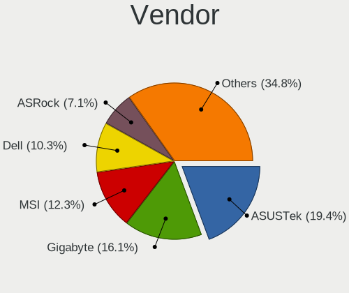
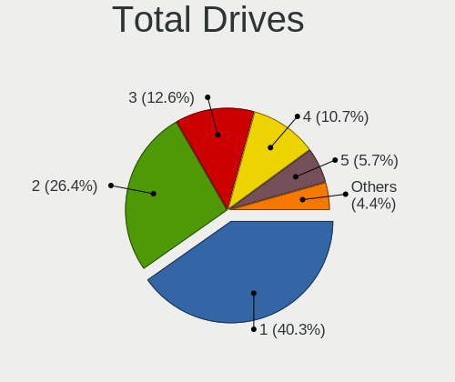
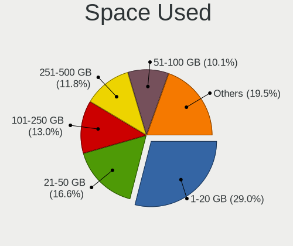
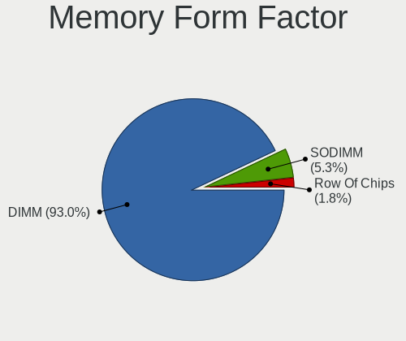

LMDE 5 - Tested Hardware & Statistics (Desktops)
------------------------------------------------

A project to collect tested hardware configurations for LMDE 5.

Anyone can contribute to this report by the [hw-probe](https://github.com/linuxhw/hw-probe) tool:

    sudo -E hw-probe -all -upload

Please contribute! Especially if your hardware is rare.

Contents
--------

* [ Test Cases ](#test-cases)

* [ System ](#system)
  - [ Kernel                   ](#kernel)
  - [ Kernel Family            ](#kernel-family)
  - [ Kernel Major Ver.        ](#kernel-major-ver)
  - [ Arch                     ](#arch)
  - [ DE                       ](#de)
  - [ Display Server           ](#display-server)
  - [ Display Manager          ](#display-manager)
  - [ OS Lang                  ](#os-lang)
  - [ Boot Mode                ](#boot-mode)
  - [ Filesystem               ](#filesystem)
  - [ Part. scheme             ](#part-scheme)
  - [ Dual Boot with Linux/BSD ](#dual-boot-with-linuxbsd)
  - [ Dual Boot (Win)          ](#dual-boot-win)

* [ Board ](#board)
  - [ Vendor                   ](#vendor)
  - [ Model                    ](#model)
  - [ Model Family             ](#model-family)
  - [ MFG Year                 ](#mfg-year)
  - [ Form Factor              ](#form-factor)
  - [ Secure Boot              ](#secure-boot)
  - [ Coreboot                 ](#coreboot)
  - [ RAM Size                 ](#ram-size)
  - [ RAM Used                 ](#ram-used)
  - [ Total Drives             ](#total-drives)
  - [ Has CD-ROM               ](#has-cd-rom)
  - [ Has Ethernet             ](#has-ethernet)
  - [ Has WiFi                 ](#has-wifi)
  - [ Has Bluetooth            ](#has-bluetooth)

* [ Location ](#location)
  - [ Country                  ](#country)
  - [ City                     ](#city)

* [ Drives ](#drives)
  - [ Drive Vendor             ](#drive-vendor)
  - [ Drive Model              ](#drive-model)
  - [ HDD Vendor               ](#hdd-vendor)
  - [ SSD Vendor               ](#ssd-vendor)
  - [ Drive Kind               ](#drive-kind)
  - [ Drive Connector          ](#drive-connector)
  - [ Drive Size               ](#drive-size)
  - [ Space Total              ](#space-total)
  - [ Space Used               ](#space-used)
  - [ Malfunc. Drives          ](#malfunc-drives)
  - [ Malfunc. Drive Vendor    ](#malfunc-drive-vendor)
  - [ Malfunc. HDD Vendor      ](#malfunc-hdd-vendor)
  - [ Malfunc. Drive Kind      ](#malfunc-drive-kind)
  - [ Failed Drives            ](#failed-drives)
  - [ Failed Drive Vendor      ](#failed-drive-vendor)
  - [ Drive Status             ](#drive-status)

* [ Storage controller ](#storage-controller)
  - [ Storage Vendor           ](#storage-vendor)
  - [ Storage Model            ](#storage-model)
  - [ Storage Kind             ](#storage-kind)

* [ Processor ](#processor)
  - [ CPU Vendor               ](#cpu-vendor)
  - [ CPU Model                ](#cpu-model)
  - [ CPU Model Family         ](#cpu-model-family)
  - [ CPU Cores                ](#cpu-cores)
  - [ CPU Sockets              ](#cpu-sockets)
  - [ CPU Threads              ](#cpu-threads)
  - [ CPU Op-Modes             ](#cpu-op-modes)
  - [ CPU Microcode            ](#cpu-microcode)
  - [ CPU Microarch            ](#cpu-microarch)

* [ Graphics ](#graphics)
  - [ GPU Vendor               ](#gpu-vendor)
  - [ GPU Model                ](#gpu-model)
  - [ GPU Combo                ](#gpu-combo)
  - [ GPU Driver               ](#gpu-driver)
  - [ GPU Memory               ](#gpu-memory)

* [ Monitor ](#monitor)
  - [ Monitor Vendor           ](#monitor-vendor)
  - [ Monitor Model            ](#monitor-model)
  - [ Monitor Resolution       ](#monitor-resolution)
  - [ Monitor Diagonal         ](#monitor-diagonal)
  - [ Monitor Width            ](#monitor-width)
  - [ Aspect Ratio             ](#aspect-ratio)
  - [ Monitor Area             ](#monitor-area)
  - [ Pixel Density            ](#pixel-density)
  - [ Multiple Monitors        ](#multiple-monitors)

* [ Network ](#network)
  - [ Net Controller Vendor    ](#net-controller-vendor)
  - [ Net Controller Model     ](#net-controller-model)
  - [ Wireless Vendor          ](#wireless-vendor)
  - [ Wireless Model           ](#wireless-model)
  - [ Ethernet Vendor          ](#ethernet-vendor)
  - [ Ethernet Model           ](#ethernet-model)
  - [ Net Controller Kind      ](#net-controller-kind)
  - [ Used Controller          ](#used-controller)
  - [ NICs                     ](#nics)
  - [ IPv6                     ](#ipv6)

* [ Bluetooth ](#bluetooth)
  - [ Bluetooth Vendor         ](#bluetooth-vendor)
  - [ Bluetooth Model          ](#bluetooth-model)

* [ Sound ](#sound)
  - [ Sound Vendor             ](#sound-vendor)
  - [ Sound Model              ](#sound-model)

* [ Memory ](#memory)
  - [ Memory Vendor            ](#memory-vendor)
  - [ Memory Model             ](#memory-model)
  - [ Memory Kind              ](#memory-kind)
  - [ Memory Form Factor       ](#memory-form-factor)
  - [ Memory Size              ](#memory-size)
  - [ Memory Speed             ](#memory-speed)

* [ Printers & scanners ](#printers--scanners)
  - [ Printer Vendor           ](#printer-vendor)
  - [ Printer Model            ](#printer-model)
  - [ Scanner Vendor           ](#scanner-vendor)
  - [ Scanner Model            ](#scanner-model)

* [ Camera ](#camera)
  - [ Camera Vendor            ](#camera-vendor)
  - [ Camera Model             ](#camera-model)

* [ Security ](#security)
  - [ Fingerprint Vendor       ](#fingerprint-vendor)
  - [ Fingerprint Model        ](#fingerprint-model)
  - [ Chipcard Vendor          ](#chipcard-vendor)
  - [ Chipcard Model           ](#chipcard-model)

* [ Unsupported ](#unsupported)
  - [ Unsupported Devices      ](#unsupported-devices)
  - [ Unsupported Device Types ](#unsupported-device-types)

Test Cases
----------

Total: 28

| Vendor   | Model                       | Probe                                                      | Date         |
|----------|-----------------------------|------------------------------------------------------------|--------------|
| MSI      | MPG Z390 GAMING PRO CARB... | [6f8785bd56](https://linux-hardware.org/?probe=6f8785bd56) | May 30, 2022 |
| Lenovo   | MAHOBAY                     | [ba204646ba](https://linux-hardware.org/?probe=ba204646ba) | May 25, 2022 |
| Acer     | Seawolf                     | [dccbcb7ef3](https://linux-hardware.org/?probe=dccbcb7ef3) | May 25, 2022 |
| Intel    | DQ77MK AAG39642-400         | [f694bcfbc5](https://linux-hardware.org/?probe=f694bcfbc5) | May 21, 2022 |
| MSI      | X470 GAMING PLUS MAX        | [63950495b3](https://linux-hardware.org/?probe=63950495b3) | May 15, 2022 |
| MSI      | 970A-G43 PLUS               | [399deea7b9](https://linux-hardware.org/?probe=399deea7b9) | May 15, 2022 |
| Gigabyte | Z68A-D3H-B3                 | [1441dfb79e](https://linux-hardware.org/?probe=1441dfb79e) | May 07, 2022 |
| HP       | 158B                        | [a613debdee](https://linux-hardware.org/?probe=a613debdee) | May 06, 2022 |
| HP       | 158B                        | [21f9c188f3](https://linux-hardware.org/?probe=21f9c188f3) | May 06, 2022 |
| HP       | 339A                        | [d58b95ebb1](https://linux-hardware.org/?probe=d58b95ebb1) | May 05, 2022 |
| Gigabyte | H110M-S2H-CF                | [c45a37ce5d](https://linux-hardware.org/?probe=c45a37ce5d) | May 01, 2022 |
| ASUSTek  | PRIME H610M-A D4            | [e9376d24f0](https://linux-hardware.org/?probe=e9376d24f0) | Apr 29, 2022 |
| ASRock   | A320M-DGS                   | [b7df060840](https://linux-hardware.org/?probe=b7df060840) | Apr 19, 2022 |
| ASRock   | A320M-DGS                   | [70fe08376f](https://linux-hardware.org/?probe=70fe08376f) | Apr 19, 2022 |
| Dell     | 0CU568 A00                  | [b544c48421](https://linux-hardware.org/?probe=b544c48421) | Apr 19, 2022 |
| Dell     | 0CU568 A00                  | [84f7029c22](https://linux-hardware.org/?probe=84f7029c22) | Apr 19, 2022 |
| ASUSTek  | PRIME B350M-A               | [ed40a9ddc1](https://linux-hardware.org/?probe=ed40a9ddc1) | Apr 12, 2022 |
| ASUSTek  | PRIME B350M-A               | [9a137f0540](https://linux-hardware.org/?probe=9a137f0540) | Apr 12, 2022 |
| MSI      | Z170A GAMING M5             | [8f2e10cbf3](https://linux-hardware.org/?probe=8f2e10cbf3) | Apr 12, 2022 |
| Lenovo   | 312A SDK0J40697 WIN 3305... | [2a33f087e6](https://linux-hardware.org/?probe=2a33f087e6) | Apr 11, 2022 |
| Lenovo   | 312A SDK0J40697 WIN 3305... | [05b9ec80c6](https://linux-hardware.org/?probe=05b9ec80c6) | Apr 11, 2022 |
| Acer     | WG43M                       | [c7cb6ee141](https://linux-hardware.org/?probe=c7cb6ee141) | Apr 08, 2022 |
| ASUSTek  | P5G41T-M LX3                | [28371c08c2](https://linux-hardware.org/?probe=28371c08c2) | Apr 08, 2022 |
| MSI      | X470 GAMING PLUS MAX        | [9f1a76acb8](https://linux-hardware.org/?probe=9f1a76acb8) | Apr 06, 2022 |
| MSI      | X470 GAMING PLUS MAX        | [18a4ba3137](https://linux-hardware.org/?probe=18a4ba3137) | Apr 06, 2022 |
| ASUSTek  | P6T                         | [5ed6ed355f](https://linux-hardware.org/?probe=5ed6ed355f) | Apr 04, 2022 |
| ASUSTek  | PRIME H510M-D               | [1e0a28c8f3](https://linux-hardware.org/?probe=1e0a28c8f3) | Mar 28, 2022 |
| HP       | 0AE8h C                     | [d3980b5b59](https://linux-hardware.org/?probe=d3980b5b59) | Mar 14, 2022 |

System
------

Kernel
------

Version of the Linux kernel

| Version         | Desktops | Percent |
|-----------------|----------|---------|
| 5.10.0-13-amd64 | 10       | 45.45%  |
| 5.10.0-14-amd64 | 8        | 36.36%  |
| 5.10.0-12-amd64 | 3        | 13.64%  |
| 5.10.0-13-686   | 1        | 4.55%   |

Kernel Family
-------------

Linux kernel without a distro release

| Version | Desktops | Percent |
|---------|----------|---------|
| 5.10.0  | 21       | 100%    |

Kernel Major Ver.
-----------------

Linux kernel major version

| Version | Desktops | Percent |
|---------|----------|---------|
| 5.10    | 21       | 100%    |

Arch
----

OS architecture (x86_64, i586, etc.)

| Name   | Desktops | Percent |
|--------|----------|---------|
| x86_64 | 20       | 95.24%  |
| i686   | 1        | 4.76%   |

DE
--

Desktop Environment

| Name       | Desktops | Percent |
|------------|----------|---------|
| X-Cinnamon | 18       | 85.71%  |
| XFCE       | 1        | 4.76%   |
| MATE       | 1        | 4.76%   |
| Cinnamon   | 1        | 4.76%   |

Display Server
--------------

X11 or Wayland

| Name | Desktops | Percent |
|------|----------|---------|
| X11  | 21       | 100%    |

Display Manager
---------------

SDDM, LightDM, etc.

| Name    | Desktops | Percent |
|---------|----------|---------|
| Unknown | 13       | 61.9%   |
| LightDM | 8        | 38.1%   |

OS Lang
-------

Language

| Lang  | Desktops | Percent |
|-------|----------|---------|
| en_US | 9        | 42.86%  |
| ru_RU | 2        | 9.52%   |
| es_ES | 2        | 9.52%   |
| de_DE | 2        | 9.52%   |
| pt_BR | 1        | 4.76%   |
| it_IT | 1        | 4.76%   |
| fr_CA | 1        | 4.76%   |
| en_GB | 1        | 4.76%   |
| en_CA | 1        | 4.76%   |
| en_AU | 1        | 4.76%   |

Boot Mode
---------

EFI or BIOS

| Mode | Desktops | Percent |
|------|----------|---------|
| BIOS | 12       | 57.14%  |
| EFI  | 9        | 42.86%  |

Filesystem
----------

Type of filesystem

| Type  | Desktops | Percent |
|-------|----------|---------|
| Ext4  | 20       | 95.24%  |
| Tmpfs | 1        | 4.76%   |

Part. scheme
------------

Scheme of partitioning

| Type    | Desktops | Percent |
|---------|----------|---------|
| Unknown | 13       | 61.9%   |
| GPT     | 5        | 23.81%  |
| MBR     | 3        | 14.29%  |

Dual Boot with Linux/BSD
------------------------

Hosting more than one Linux/BSD

| Dual boot | Desktops | Percent |
|-----------|----------|---------|
| No        | 18       | 85.71%  |
| Yes       | 3        | 14.29%  |

Dual Boot (Win)
---------------

Hosting Linux and Windows

| Dual boot | Desktops | Percent |
|-----------|----------|---------|
| No        | 17       | 80.95%  |
| Yes       | 4        | 19.05%  |

Board
-----

Vendor
------

Motherboard manufacturer

| Name                | Desktops | Percent |
|---------------------|----------|---------|
| ASUSTek Computer    | 5        | 23.81%  |
| MSI                 | 4        | 19.05%  |
| Hewlett-Packard     | 3        | 14.29%  |
| Lenovo              | 2        | 9.52%   |
| Gigabyte Technology | 2        | 9.52%   |
| Acer                | 2        | 9.52%   |
| Intel               | 1        | 4.76%   |
| Dell                | 1        | 4.76%   |
| ASRock              | 1        | 4.76%   |

Model
-----

Motherboard model

| Name                                | Desktops | Percent |
|-------------------------------------|----------|---------|
| MSI MS-7B79                         | 1        | 4.76%   |
| MSI MS-7B17                         | 1        | 4.76%   |
| MSI MS-7977                         | 1        | 4.76%   |
| MSI MS-7974                         | 1        | 4.76%   |
| Lenovo ThinkCentre M92p 3238E9U     | 1        | 4.76%   |
| Lenovo ThinkCentre M720s 10SUS9KW00 | 1        | 4.76%   |
| Intel DQ77MK AAG39642-400           | 1        | 4.76%   |
| HP Z820 Workstation                 | 1        | 4.76%   |
| HP Z600 Workstation                 | 1        | 4.76%   |
| HP Compaq Pro 6300 SFF              | 1        | 4.76%   |
| Gigabyte Z68A-D3H-B3                | 1        | 4.76%   |
| Gigabyte H110M-S2H                  | 1        | 4.76%   |
| Dell XPS A2010                      | 1        | 4.76%   |
| ASUS PRIME H610M-A D4               | 1        | 4.76%   |
| ASUS PRIME H510M-D                  | 1        | 4.76%   |
| ASUS PRIME B350M-A                  | 1        | 4.76%   |
| ASUS P6T                            | 1        | 4.76%   |
| ASUS P5G41T-M LX3                   | 1        | 4.76%   |
| ASRock A320M-DGS                    | 1        | 4.76%   |
| Acer Veriton L6610G                 | 1        | 4.76%   |
| Acer Aspire X3910                   | 1        | 4.76%   |

Model Family
------------

Motherboard model prefix

| Name                 | Desktops | Percent |
|----------------------|----------|---------|
| ASUS PRIME           | 3        | 14.29%  |
| Lenovo ThinkCentre   | 2        | 9.52%   |
| MSI MS-7B79          | 1        | 4.76%   |
| MSI MS-7B17          | 1        | 4.76%   |
| MSI MS-7977          | 1        | 4.76%   |
| MSI MS-7974          | 1        | 4.76%   |
| Intel DQ77MK         | 1        | 4.76%   |
| HP Z820              | 1        | 4.76%   |
| HP Z600              | 1        | 4.76%   |
| HP Compaq            | 1        | 4.76%   |
| Gigabyte Z68A-D3H-B3 | 1        | 4.76%   |
| Gigabyte H110M-S2H   | 1        | 4.76%   |
| Dell XPS             | 1        | 4.76%   |
| ASUS P6T             | 1        | 4.76%   |
| ASUS P5G41T-M        | 1        | 4.76%   |
| ASRock A320M-DGS     | 1        | 4.76%   |
| Acer Veriton         | 1        | 4.76%   |
| Acer Aspire          | 1        | 4.76%   |

MFG Year
--------

Motherboard manufacture year

| Year | Desktops | Percent |
|------|----------|---------|
| 2018 | 3        | 14.29%  |
| 2012 | 3        | 14.29%  |
| 2021 | 2        | 9.52%   |
| 2019 | 2        | 9.52%   |
| 2017 | 2        | 9.52%   |
| 2015 | 2        | 9.52%   |
| 2009 | 2        | 9.52%   |
| 2016 | 1        | 4.76%   |
| 2011 | 1        | 4.76%   |
| 2010 | 1        | 4.76%   |
| 2008 | 1        | 4.76%   |
| 2007 | 1        | 4.76%   |

Form Factor
-----------

Physical design of the computer

| Name    | Desktops | Percent |
|---------|----------|---------|
| Desktop | 21       | 100%    |

Secure Boot
-----------

Enabled or disabled

| State    | Desktops | Percent |
|----------|----------|---------|
| Disabled | 21       | 95.45%  |
| Enabled  | 1        | 4.55%   |

Coreboot
--------

Have coreboot on board

| Used | Desktops | Percent |
|------|----------|---------|
| No   | 21       | 100%    |

RAM Size
--------

Total RAM memory

| Size in GB | Desktops | Percent |
|------------|----------|---------|
| 16.01-24.0 | 6        | 27.27%  |
| 4.01-8.0   | 5        | 22.73%  |
| 32.01-64.0 | 4        | 18.18%  |
| 24.01-32.0 | 2        | 9.09%   |
| 1.01-2.0   | 2        | 9.09%   |
| 8.01-16.0  | 2        | 9.09%   |
| 3.01-4.0   | 1        | 4.55%   |

RAM Used
--------

Used RAM memory

| Used GB  | Desktops | Percent |
|----------|----------|---------|
| 2.01-3.0 | 9        | 42.86%  |
| 3.01-4.0 | 5        | 23.81%  |
| 1.01-2.0 | 5        | 23.81%  |
| 4.01-8.0 | 1        | 4.76%   |
| 0.51-1.0 | 1        | 4.76%   |

Total Drives
------------

Number of drives on board

| Drives | Desktops | Percent |
|--------|----------|---------|
| 1      | 10       | 47.62%  |
| 3      | 4        | 19.05%  |
| 4      | 3        | 14.29%  |
| 2      | 3        | 14.29%  |
| 6      | 1        | 4.76%   |

Has CD-ROM
----------

Has CD-ROM on board

| Presented | Desktops | Percent |
|-----------|----------|---------|
| Yes       | 11       | 52.38%  |
| No        | 10       | 47.62%  |

Has Ethernet
------------

Has Ethernet on board

| Presented | Desktops | Percent |
|-----------|----------|---------|
| Yes       | 21       | 100%    |

Has WiFi
--------

Has WiFi module

| Presented | Desktops | Percent |
|-----------|----------|---------|
| No        | 11       | 52.38%  |
| Yes       | 10       | 47.62%  |

Has Bluetooth
-------------

Has Bluetooth module

| Presented | Desktops | Percent |
|-----------|----------|---------|
| No        | 16       | 76.19%  |
| Yes       | 5        | 23.81%  |

Location
--------

Country
-------

Geographic location (country)

| Country   | Desktops | Percent |
|-----------|----------|---------|
| USA       | 4        | 19.05%  |
| Spain     | 2        | 9.52%   |
| Russia    | 2        | 9.52%   |
| Canada    | 2        | 9.52%   |
| Australia | 2        | 9.52%   |
| Venezuela | 1        | 4.76%   |
| UK        | 1        | 4.76%   |
| Sweden    | 1        | 4.76%   |
| Mexico    | 1        | 4.76%   |
| Latvia    | 1        | 4.76%   |
| Italy     | 1        | 4.76%   |
| Germany   | 1        | 4.76%   |
| France    | 1        | 4.76%   |
| Brazil    | 1        | 4.76%   |

City
----

Geographic location (city)

| City                     | Desktops | Percent |
|--------------------------|----------|---------|
| Melbourne                | 2        | 9.52%   |
| Vincennes                | 1        | 4.76%   |
| Vicente Guerrero         | 1        | 4.76%   |
| Trieste                  | 1        | 4.76%   |
| Toledo                   | 1        | 4.76%   |
| Stockbridge              | 1        | 4.76%   |
| Spruce Grove             | 1        | 4.76%   |
| Sant Feliu de Llobregat  | 1        | 4.76%   |
| San Antonio de Los Altos | 1        | 4.76%   |
| Riga                     | 1        | 4.76%   |
| Porto Alegre             | 1        | 4.76%   |
| National City            | 1        | 4.76%   |
| Moscow                   | 1        | 4.76%   |
| Montreal                 | 1        | 4.76%   |
| Madrid                   | 1        | 4.76%   |
| Hamburg                  | 1        | 4.76%   |
| Detroit                  | 1        | 4.76%   |
| Birmingham               | 1        | 4.76%   |
| Arkhangelsk              | 1        | 4.76%   |
| AElvdalen                | 1        | 4.76%   |

Drives
------

Drive Vendor
------------

Hard drive vendors

| Vendor              | Desktops | Drives | Percent |
|---------------------|----------|--------|---------|
| WDC                 | 6        | 14     | 17.14%  |
| Seagate             | 6        | 8      | 17.14%  |
| Samsung Electronics | 5        | 6      | 14.29%  |
| Kingston            | 4        | 4      | 11.43%  |
| Hitachi             | 3        | 4      | 8.57%   |
| Crucial             | 3        | 3      | 8.57%   |
| Toshiba             | 2        | 2      | 5.71%   |
| Transcend           | 1        | 2      | 2.86%   |
| SK Hynix            | 1        | 1      | 2.86%   |
| SanDisk             | 1        | 1      | 2.86%   |
| OCZ-VERTEX          | 1        | 1      | 2.86%   |
| Intel               | 1        | 1      | 2.86%   |
| A-DATA Technology   | 1        | 1      | 2.86%   |

Drive Model
-----------

Hard drive models

| Model                                 | Desktops | Percent |
|---------------------------------------|----------|---------|
| Seagate ST2000DM008-2FR102 2TB        | 2        | 5%      |
| Samsung SSD 850 EVO 250GB             | 2        | 5%      |
| Kingston SA400S37240G 240GB SSD       | 2        | 5%      |
| Crucial CT480BX500SSD1 480GB          | 2        | 5%      |
| WDC WD60EZAZ-00ZGHB0 6TB              | 1        | 2.5%    |
| WDC WD3200AAJS-22B4A0 320GB           | 1        | 2.5%    |
| WDC WD30EFRX-68EUZN0 3TB              | 1        | 2.5%    |
| WDC WD3003FZEX-00Z4SA0 3TB            | 1        | 2.5%    |
| WDC WD10EZEX-08WN4A0 1TB              | 1        | 2.5%    |
| WDC WD10EFRX-68JCSN0 1TB              | 1        | 2.5%    |
| WDC WD10EFRX-68FYTN0 1TB              | 1        | 2.5%    |
| WDC WD10EAVS-00D7B0 1TB               | 1        | 2.5%    |
| WDC WD1003FZEX-00MK2A0 1TB            | 1        | 2.5%    |
| Transcend TS480GSSD220S 480GB         | 1        | 2.5%    |
| Transcend TS240GSSD220S 240GB         | 1        | 2.5%    |
| Toshiba MK3275GSX 320GB               | 1        | 2.5%    |
| Toshiba DT01ACA050 500GB              | 1        | 2.5%    |
| SK Hynix HFS256G32MND-3310A 256GB SSD | 1        | 2.5%    |
| Seagate ST500LT012-1DG142 500GB       | 1        | 2.5%    |
| Seagate ST3250318AS 250GB             | 1        | 2.5%    |
| Seagate ST2000LM007-1R8174 2TB        | 1        | 2.5%    |
| Seagate ST1000LM048-2E7172 1TB        | 1        | 2.5%    |
| Seagate ST1000DM003-1CH162 1TB        | 1        | 2.5%    |
| SanDisk SDSSDA240G 240GB              | 1        | 2.5%    |
| Samsung SSD 970 EVO Plus 1TB          | 1        | 2.5%    |
| Samsung NVMe SSD Drive 1TB            | 1        | 2.5%    |
| Samsung MZMTE128HMGR-000MV 128GB SSD  | 1        | 2.5%    |
| OCZ-VERTEX PLUS R2 128GB SSD          | 1        | 2.5%    |
| Kingston SUV400S37120G 120GB SSD      | 1        | 2.5%    |
| Kingston SA400S37120G 120GB SSD       | 1        | 2.5%    |
| Intel SSDPEKKW256G7 256GB             | 1        | 2.5%    |
| Hitachi HDT725025VLA380 250GB         | 1        | 2.5%    |
| Hitachi HDS5C1032CLA382 320GB         | 1        | 2.5%    |
| Hitachi HDP725050GLA360 500GB         | 1        | 2.5%    |
| Crucial CT525MX300SSD1 528GB          | 1        | 2.5%    |
| A-DATA SU650 120GB SSD                | 1        | 2.5%    |

HDD Vendor
----------

Hard disk drive vendors

| Vendor  | Desktops | Drives | Percent |
|---------|----------|--------|---------|
| WDC     | 6        | 14     | 35.29%  |
| Seagate | 6        | 8      | 35.29%  |
| Hitachi | 3        | 4      | 17.65%  |
| Toshiba | 2        | 2      | 11.76%  |

SSD Vendor
----------

Solid state drive vendors

| Vendor              | Desktops | Drives | Percent |
|---------------------|----------|--------|---------|
| Kingston            | 4        | 4      | 26.67%  |
| Samsung Electronics | 3        | 3      | 20%     |
| Crucial             | 3        | 3      | 20%     |
| Transcend           | 1        | 2      | 6.67%   |
| SK Hynix            | 1        | 1      | 6.67%   |
| SanDisk             | 1        | 1      | 6.67%   |
| OCZ-VERTEX          | 1        | 1      | 6.67%   |
| A-DATA Technology   | 1        | 1      | 6.67%   |

Drive Kind
----------

HDD or SSD

| Kind | Desktops | Drives | Percent |
|------|----------|--------|---------|
| HDD  | 15       | 28     | 48.39%  |
| SSD  | 13       | 16     | 41.94%  |
| NVMe | 3        | 4      | 9.68%   |

Drive Connector
---------------

SATA, SAS, NVMe, etc.

| Type | Desktops | Drives | Percent |
|------|----------|--------|---------|
| SATA | 21       | 44     | 87.5%   |
| NVMe | 3        | 4      | 12.5%   |

Drive Size
----------

Size of hard drive

| Size in TB | Desktops | Drives | Percent |
|------------|----------|--------|---------|
| 0.01-0.5   | 16       | 24     | 59.26%  |
| 0.51-1.0   | 5        | 10     | 18.52%  |
| 1.01-2.0   | 3        | 4      | 11.11%  |
| 2.01-3.0   | 2        | 5      | 7.41%   |
| 4.01-10.0  | 1        | 1      | 3.7%    |

Space Total
-----------

Amount of disk space available on the file system

| Size in GB     | Desktops | Percent |
|----------------|----------|---------|
| 251-500        | 6        | 28.57%  |
| 101-250        | 4        | 19.05%  |
| 1001-2000      | 3        | 14.29%  |
| More than 3000 | 2        | 9.52%   |
| 1-20           | 2        | 9.52%   |
| 501-1000       | 2        | 9.52%   |
| 51-100         | 2        | 9.52%   |

Space Used
----------

Amount of used disk space

| Used GB   | Desktops | Percent |
|-----------|----------|---------|
| 1-20      | 9        | 40.91%  |
| 21-50     | 4        | 18.18%  |
| 101-250   | 3        | 13.64%  |
| 501-1000  | 2        | 9.09%   |
| 51-100    | 2        | 9.09%   |
| 251-500   | 1        | 4.55%   |
| 1001-2000 | 1        | 4.55%   |

Malfunc. Drives
---------------

Drive models with a malfunction

| Model                           | Desktops | Drives | Percent |
|---------------------------------|----------|--------|---------|
| Seagate ST500LT012-1DG142 500GB | 1        | 1      | 50%     |
| Seagate ST3250318AS 250GB       | 1        | 1      | 50%     |

Malfunc. Drive Vendor
---------------------

Vendors of faulty drives

| Vendor  | Desktops | Drives | Percent |
|---------|----------|--------|---------|
| Seagate | 2        | 2      | 100%    |

Malfunc. HDD Vendor
-------------------

Vendors of faulty HDD drives

| Vendor  | Desktops | Drives | Percent |
|---------|----------|--------|---------|
| Seagate | 2        | 2      | 100%    |

Malfunc. Drive Kind
-------------------

Kinds of faulty drives

| Kind | Desktops | Drives | Percent |
|------|----------|--------|---------|
| HDD  | 2        | 2      | 100%    |

Failed Drives
-------------

Failed drive models

Zero info for selected period =(

Failed Drive Vendor
-------------------

Failed drive vendors

Zero info for selected period =(

Drive Status
------------

Number of failed and malfunc. drives

| Status   | Desktops | Drives | Percent |
|----------|----------|--------|---------|
| Detected | 13       | 28     | 56.52%  |
| Works    | 8        | 18     | 34.78%  |
| Malfunc  | 2        | 2      | 8.7%    |

Storage controller
------------------

Storage Vendor
--------------

Storage controller vendors

| Vendor              | Desktops | Percent |
|---------------------|----------|---------|
| Intel               | 18       | 66.67%  |
| AMD                 | 4        | 14.81%  |
| Samsung Electronics | 2        | 7.41%   |
| JMicron Technology  | 1        | 3.7%    |
| Broadcom / LSI      | 1        | 3.7%    |
| ASMedia Technology  | 1        | 3.7%    |

Storage Model
-------------

Storage controller models

| Model                                                                                   | Desktops | Percent |
|-----------------------------------------------------------------------------------------|----------|---------|
| Intel 7 Series/C210 Series Chipset Family 6-port SATA Controller [AHCI mode]            | 3        | 8.33%   |
| Samsung NVMe SSD Controller SM981/PM981/PM983                                           | 2        | 5.56%   |
| Intel Q170/Q150/B150/H170/H110/Z170/CM236 Chipset SATA Controller [AHCI Mode]           | 2        | 5.56%   |
| Intel Cannon Lake PCH SATA AHCI Controller                                              | 2        | 5.56%   |
| Intel 82801JI (ICH10 Family) SATA AHCI Controller                                       | 2        | 5.56%   |
| AMD FCH SATA Controller [AHCI mode]                                                     | 2        | 5.56%   |
| JMicron JMB363 SATA/IDE Controller                                                      | 1        | 2.78%   |
| Intel Volume Management Device NVMe RAID Controller                                     | 1        | 2.78%   |
| Intel SSD 600P Series                                                                   | 1        | 2.78%   |
| Intel NM10/ICH7 Family SATA Controller [IDE mode]                                       | 1        | 2.78%   |
| Intel C602 chipset 4-Port SATA Storage Control Unit                                     | 1        | 2.78%   |
| Intel C600/X79 series chipset SATA RAID Controller                                      | 1        | 2.78%   |
| Intel C600/X79 series chipset IDE-r Controller                                          | 1        | 2.78%   |
| Intel Alder Lake-S PCH SATA Controller [AHCI Mode]                                      | 1        | 2.78%   |
| Intel 82801JI (ICH10 Family) 4 port SATA IDE Controller #1                              | 1        | 2.78%   |
| Intel 82801JI (ICH10 Family) 2 port SATA IDE Controller #2                              | 1        | 2.78%   |
| Intel 82801IR/IO/IH (ICH9R/DO/DH) 6 port SATA Controller [AHCI mode]                    | 1        | 2.78%   |
| Intel 82801G (ICH7 Family) IDE Controller                                               | 1        | 2.78%   |
| Intel 6 Series/C200 Series Chipset Family IDE-r Controller                              | 1        | 2.78%   |
| Intel 6 Series/C200 Series Chipset Family Desktop SATA Controller (IDE mode, ports 4-5) | 1        | 2.78%   |
| Intel 6 Series/C200 Series Chipset Family Desktop SATA Controller (IDE mode, ports 0-3) | 1        | 2.78%   |
| Intel 6 Series/C200 Series Chipset Family 6 port Desktop SATA AHCI Controller           | 1        | 2.78%   |
| Intel 500 Series Chipset Family SATA AHCI Controller                                    | 1        | 2.78%   |
| Broadcom / LSI SAS2308 PCI-Express Fusion-MPT SAS-2                                     | 1        | 2.78%   |
| ASMedia ASM1062 Serial ATA Controller                                                   | 1        | 2.78%   |
| AMD SB7x0/SB8x0/SB9x0 SATA Controller [AHCI mode]                                       | 1        | 2.78%   |
| AMD FCH SATA Controller D                                                               | 1        | 2.78%   |
| AMD 400 Series Chipset SATA Controller                                                  | 1        | 2.78%   |
| AMD 300 Series Chipset SATA Controller                                                  | 1        | 2.78%   |

Storage Kind
------------

Kind of storage controller (IDE, SATA, NVMe, SAS, ...)

| Kind | Desktops | Percent |
|------|----------|---------|
| SATA | 17       | 58.62%  |
| IDE  | 6        | 20.69%  |
| NVMe | 3        | 10.34%  |
| RAID | 2        | 6.9%    |
| SAS  | 1        | 3.45%   |

Processor
---------

CPU Vendor
----------

Processor vendors

| Vendor | Desktops | Percent |
|--------|----------|---------|
| Intel  | 17       | 80.95%  |
| AMD    | 4        | 19.05%  |

CPU Model
---------

Processor models

| Model                                       | Desktops | Percent |
|---------------------------------------------|----------|---------|
| Intel Pentium Dual-Core CPU E5700 @ 3.00GHz | 2        | 9.52%   |
| Intel Core i7-2600 CPU @ 3.40GHz            | 2        | 9.52%   |
| Intel Xeon CPU X5675 @ 3.07GHz              | 1        | 4.76%   |
| Intel Xeon CPU X5570 @ 2.93GHz              | 1        | 4.76%   |
| Intel Xeon CPU E5-2687W 0 @ 3.10GHz         | 1        | 4.76%   |
| Intel Pentium CPU G4400 @ 3.30GHz           | 1        | 4.76%   |
| Intel Core i7-9700K CPU @ 3.60GHz           | 1        | 4.76%   |
| Intel Core i7-6700K CPU @ 4.00GHz           | 1        | 4.76%   |
| Intel Core i7-3770 CPU @ 3.40GHz            | 1        | 4.76%   |
| Intel Core i5-8400 CPU @ 2.80GHz            | 1        | 4.76%   |
| Intel Core i5-3470S CPU @ 2.90GHz           | 1        | 4.76%   |
| Intel Core i5-3470 CPU @ 3.20GHz            | 1        | 4.76%   |
| Intel Core i5-10400 CPU @ 2.90GHz           | 1        | 4.76%   |
| Intel Core 2 Duo CPU E4500 @ 2.20GHz        | 1        | 4.76%   |
| Intel 12th Gen Core i3-12100F               | 1        | 4.76%   |
| AMD Ryzen 7 1700 Eight-Core Processor       | 1        | 4.76%   |
| AMD Ryzen 5 3400G with Radeon Vega Graphics | 1        | 4.76%   |
| AMD FX-4300 Quad-Core Processor             | 1        | 4.76%   |
| AMD Athlon 220GE with Radeon Vega Graphics  | 1        | 4.76%   |

CPU Model Family
----------------

Processor model prefix

| Model                   | Desktops | Percent |
|-------------------------|----------|---------|
| Intel Core i7           | 5        | 23.81%  |
| Intel Core i5           | 4        | 19.05%  |
| Intel Xeon              | 3        | 14.29%  |
| Intel Pentium Dual-Core | 2        | 9.52%   |
| Other                   | 1        | 4.76%   |
| Intel Pentium           | 1        | 4.76%   |
| Intel Core 2 Duo        | 1        | 4.76%   |
| AMD Ryzen 7             | 1        | 4.76%   |
| AMD Ryzen 5             | 1        | 4.76%   |
| AMD FX                  | 1        | 4.76%   |
| AMD Athlon              | 1        | 4.76%   |

CPU Cores
---------

Number of processor cores

| Number | Desktops | Percent |
|--------|----------|---------|
| 4      | 8        | 38.1%   |
| 2      | 6        | 28.57%  |
| 8      | 3        | 14.29%  |
| 6      | 3        | 14.29%  |
| 16     | 1        | 4.76%   |

CPU Sockets
-----------

Number of sockets

| Number | Desktops | Percent |
|--------|----------|---------|
| 1      | 19       | 90.48%  |
| 2      | 2        | 9.52%   |

CPU Threads
-----------

Threads per core (Hyper-Threading)

| Number | Desktops | Percent |
|--------|----------|---------|
| 2      | 12       | 57.14%  |
| 1      | 9        | 42.86%  |

CPU Op-Modes
------------

CPU Operation Modes (32-bit, 64-bit)

| Op mode        | Desktops | Percent |
|----------------|----------|---------|
| 32-bit, 64-bit | 21       | 100%    |

CPU Microcode
-------------

Microcode number

| Number     | Desktops | Percent |
|------------|----------|---------|
| 0x506e3    | 2        | 9.52%   |
| 0x306a9    | 2        | 9.52%   |
| 0x206a7    | 2        | 9.52%   |
| 0x1067a    | 2        | 9.52%   |
| 0xa0653    | 1        | 4.76%   |
| 0x906ed    | 1        | 4.76%   |
| 0x906ea    | 1        | 4.76%   |
| 0x90675    | 1        | 4.76%   |
| 0x6fd      | 1        | 4.76%   |
| 0x206d7    | 1        | 4.76%   |
| 0x206c2    | 1        | 4.76%   |
| 0x106a5    | 1        | 4.76%   |
| 0x08108109 | 1        | 4.76%   |
| 0x0810100b | 1        | 4.76%   |
| 0x08001137 | 1        | 4.76%   |
| 0x06000852 | 1        | 4.76%   |
| Unknown    | 1        | 4.76%   |

CPU Microarch
-------------

Microarchitecture

| Name        | Desktops | Percent |
|-------------|----------|---------|
| SandyBridge | 3        | 14.29%  |
| IvyBridge   | 3        | 14.29%  |
| Zen         | 2        | 9.52%   |
| Skylake     | 2        | 9.52%   |
| Penryn      | 2        | 9.52%   |
| KabyLake    | 2        | 9.52%   |
| Zen+        | 1        | 4.76%   |
| Westmere    | 1        | 4.76%   |
| Piledriver  | 1        | 4.76%   |
| Nehalem     | 1        | 4.76%   |
| Core        | 1        | 4.76%   |
| CometLake   | 1        | 4.76%   |
| Unknown     | 1        | 4.76%   |

Graphics
--------

GPU Vendor
----------

Vendors of graphics cards

| Vendor | Desktops | Percent |
|--------|----------|---------|
| Nvidia | 14       | 60.87%  |
| Intel  | 5        | 21.74%  |
| AMD    | 4        | 17.39%  |

GPU Model
---------

Graphics card models

| Model                                                                     | Desktops | Percent |
|---------------------------------------------------------------------------|----------|---------|
| Nvidia GT218 [GeForce 210]                                                | 3        | 12.5%   |
| Nvidia GK208B [GeForce GT 730]                                            | 2        | 8.33%   |
| Nvidia TU116 [GeForce GTX 1650 SUPER]                                     | 1        | 4.17%   |
| Nvidia GP108 [GeForce GT 1030]                                            | 1        | 4.17%   |
| Nvidia GM204 [GeForce GTX 970]                                            | 1        | 4.17%   |
| Nvidia GM107GL [Quadro K620]                                              | 1        | 4.17%   |
| Nvidia GM107 [GeForce GTX 750 Ti]                                         | 1        | 4.17%   |
| Nvidia GK208B [GeForce GT 710]                                            | 1        | 4.17%   |
| Nvidia GK106 [GeForce GTX 650 Ti]                                         | 1        | 4.17%   |
| Nvidia GF116 [GeForce GTX 550 Ti]                                         | 1        | 4.17%   |
| Nvidia GF114 [GeForce GTX 560 Ti]                                         | 1        | 4.17%   |
| Intel Xeon E3-1200 v2/3rd Gen Core processor Graphics Controller          | 1        | 4.17%   |
| Intel CometLake-S GT2 [UHD Graphics 630]                                  | 1        | 4.17%   |
| Intel CoffeeLake-S GT2 [UHD Graphics 630]                                 | 1        | 4.17%   |
| Intel 82G33/G31 Express Integrated Graphics Controller                    | 1        | 4.17%   |
| Intel 2nd Generation Core Processor Family Integrated Graphics Controller | 1        | 4.17%   |
| AMD Raven Ridge [Radeon Vega Series / Radeon Vega Mobile Series]          | 1        | 4.17%   |
| AMD Picasso/Raven 2 [Radeon Vega Series / Radeon Vega Mobile Series]      | 1        | 4.17%   |
| AMD Oland [Radeon HD 8570 / R5 430 OEM / R7 240/340 / Radeon 520 OEM]     | 1        | 4.17%   |
| AMD Lexa XT [Radeon PRO WX 3200]                                          | 1        | 4.17%   |
| AMD Baffin [Radeon RX 550 640SP / RX 560/560X]                            | 1        | 4.17%   |

GPU Combo
---------

Combinations of graphics cards

| Name         | Desktops | Percent |
|--------------|----------|---------|
| 1 x Nvidia   | 14       | 63.64%  |
| 1 x Intel    | 4        | 18.18%  |
| 1 x AMD      | 2        | 9.09%   |
| 2 x AMD      | 1        | 4.55%   |
| AMD + Nvidia | 1        | 4.55%   |

GPU Driver
----------

Free vs proprietary

| Driver      | Desktops | Percent |
|-------------|----------|---------|
| Free        | 16       | 76.19%  |
| Proprietary | 3        | 14.29%  |
| Unknown     | 2        | 9.52%   |

GPU Memory
----------

Total video memory

| Size in GB | Desktops | Percent |
|------------|----------|---------|
| 1.01-2.0   | 7        | 33.33%  |
| Unknown    | 6        | 28.57%  |
| 3.01-4.0   | 4        | 19.05%  |
| 0.51-1.0   | 3        | 14.29%  |
| 0.01-0.5   | 1        | 4.76%   |

Monitor
-------

Monitor Vendor
--------------

Monitor vendors

| Vendor               | Desktops | Percent |
|----------------------|----------|---------|
| Samsung Electronics  | 4        | 19.05%  |
| Philips              | 3        | 14.29%  |
| Ancor Communications | 3        | 14.29%  |
| Acer                 | 3        | 14.29%  |
| Hewlett-Packard      | 2        | 9.52%   |
| ___                  | 1        | 4.76%   |
| Unknown              | 1        | 4.76%   |
| Medion               | 1        | 4.76%   |
| Dell                 | 1        | 4.76%   |
| BenQ                 | 1        | 4.76%   |
| ASUSTek Computer     | 1        | 4.76%   |

Monitor Model
-------------

Monitor models

| Model                                                                 | Desktops | Percent |
|-----------------------------------------------------------------------|----------|---------|
| ___ LCDTV14 ___0101 1920x1080                                         | 1        | 4.35%   |
| Unknown LCDTV14 0101 1360x768 1600x900mm 72.3-inch                    | 1        | 4.35%   |
| Samsung Electronics SyncMaster SAM0259 1280x1024 380x300mm 19.1-inch  | 1        | 4.35%   |
| Samsung Electronics SMB2330H SAM064A 1920x1080 509x286mm 23.0-inch    | 1        | 4.35%   |
| Samsung Electronics S22D300 SAM0B3F 1920x1080 477x268mm 21.5-inch     | 1        | 4.35%   |
| Samsung Electronics LC24RG50 SAM0F90 1920x1080 532x304mm 24.1-inch    | 1        | 4.35%   |
| Philips PHL BDM3270 PHL08E7 2560x1440 708x398mm 32.0-inch             | 1        | 4.35%   |
| Philips PHL 242V8 PHLC219 1920x1080 527x296mm 23.8-inch               | 1        | 4.35%   |
| Philips LCD Monitor PHL 242V8 1920x1080                               | 1        | 4.35%   |
| Medion MD20328 MED3942 1600x900 462x272mm 21.1-inch                   | 1        | 4.35%   |
| Hewlett-Packard W2072a HWP3000 1600x900 443x249mm 20.0-inch           | 1        | 4.35%   |
| Hewlett-Packard E232 HWP327B 1920x1080 509x286mm 23.0-inch            | 1        | 4.35%   |
| Hewlett-Packard E232 HWP327A 1920x1080 509x286mm 23.0-inch            | 1        | 4.35%   |
| Hewlett-Packard E232 HWP3279 1920x1080 509x286mm 23.0-inch            | 1        | 4.35%   |
| Dell 2007WFP DELA019 1680x1050 434x270mm 20.1-inch                    | 1        | 4.35%   |
| BenQ GL2750H BNQ78AD 1920x1080 598x336mm 27.0-inch                    | 1        | 4.35%   |
| ASUSTek Computer VG245 AUS24A1 1920x1080 531x299mm 24.0-inch          | 1        | 4.35%   |
| Ancor Communications VW246 ACI24F2 1920x1080 531x299mm 24.0-inch      | 1        | 4.35%   |
| Ancor Communications VE228 ACI22FA 1920x1080 477x268mm 21.5-inch      | 1        | 4.35%   |
| Ancor Communications ASUS MX299 ACI2931 2560x1080 673x284mm 28.8-inch | 1        | 4.35%   |
| Acer V203HV ACR01D3 1600x900 443x249mm 20.0-inch                      | 1        | 4.35%   |
| Acer P223W ACR000E 1680x1050 474x296mm 22.0-inch                      | 1        | 4.35%   |
| Acer LCD Monitor S240HL 1920x1080                                     | 1        | 4.35%   |

Monitor Resolution
------------------

Monitor screen resolution

| Resolution         | Desktops | Percent |
|--------------------|----------|---------|
| 1920x1080 (FHD)    | 11       | 57.89%  |
| 1600x900 (HD+)     | 3        | 15.79%  |
| 1680x1050 (WSXGA+) | 2        | 10.53%  |
| 2560x1440 (QHD)    | 1        | 5.26%   |
| 2560x1080          | 1        | 5.26%   |
| 1280x1024 (SXGA)   | 1        | 5.26%   |

Monitor Diagonal
----------------

Diagonal size in inches

| Inches  | Desktops | Percent |
|---------|----------|---------|
| 24      | 5        | 23.81%  |
| 21      | 3        | 14.29%  |
| 20      | 3        | 14.29%  |
| 23      | 2        | 9.52%   |
| Unknown | 2        | 9.52%   |
| 72      | 1        | 4.76%   |
| 32      | 1        | 4.76%   |
| 28      | 1        | 4.76%   |
| 27      | 1        | 4.76%   |
| 22      | 1        | 4.76%   |
| 19      | 1        | 4.76%   |

Monitor Width
-------------

Physical width

| Width in mm | Desktops | Percent |
|-------------|----------|---------|
| 501-600     | 8        | 40%     |
| 401-500     | 6        | 30%     |
| Unknown     | 2        | 10%     |
| 701-800     | 1        | 5%      |
| 601-700     | 1        | 5%      |
| 351-400     | 1        | 5%      |
| 1501-2000   | 1        | 5%      |

Aspect Ratio
------------

Proportional relationship between the width and the height

| Ratio   | Desktops | Percent |
|---------|----------|---------|
| 16/9    | 13       | 68.42%  |
| 16/10   | 2        | 10.53%  |
| Unknown | 2        | 10.53%  |
| 5/4     | 1        | 5.26%   |
| 21/9    | 1        | 5.26%   |

Monitor Area
------------

Area in inch²

| Area in inch² | Desktops | Percent |
|----------------|----------|---------|
| 201-250        | 9        | 45%     |
| 151-200        | 4        | 20%     |
| 251-300        | 2        | 10%     |
| Unknown        | 2        | 10%     |
| More than 1000 | 1        | 5%      |
| 351-500        | 1        | 5%      |
| 301-350        | 1        | 5%      |

Pixel Density
-------------

Pixels per inch

| Density | Desktops | Percent |
|---------|----------|---------|
| 51-100  | 15       | 75%     |
| 101-120 | 2        | 10%     |
| Unknown | 2        | 10%     |
| 1-50    | 1        | 5%      |

Multiple Monitors
-----------------

Total monitors connected

| Total | Desktops | Percent |
|-------|----------|---------|
| 1     | 17       | 80.95%  |
| 3     | 2        | 9.52%   |
| 2     | 1        | 4.76%   |
| 0     | 1        | 4.76%   |

Network
-------

Net Controller Vendor
---------------------

Controller vendors

| Vendor                | Desktops | Percent |
|-----------------------|----------|---------|
| Intel                 | 12       | 41.38%  |
| Realtek Semiconductor | 9        | 31.03%  |
| Ralink Technology     | 2        | 6.9%    |
| Qualcomm Atheros      | 2        | 6.9%    |
| Broadcom              | 2        | 6.9%    |
| Samsung Electronics   | 1        | 3.45%   |
| Mercucys              | 1        | 3.45%   |

Net Controller Model
--------------------

Controller models

| Model                                                                                         | Desktops | Percent |
|-----------------------------------------------------------------------------------------------|----------|---------|
| Realtek RTL8111/8168/8411 PCI Express Gigabit Ethernet Controller                             | 7        | 18.42%  |
| Intel 82579LM Gigabit Network Connection (Lewisville)                                         | 5        | 13.16%  |
| Ralink RT2870/RT3070 Wireless Adapter                                                         | 2        | 5.26%   |
| Intel Ethernet Connection (7) I219-V                                                          | 2        | 5.26%   |
| Intel 82574L Gigabit Network Connection                                                       | 2        | 5.26%   |
| Samsung Galaxy series, misc. (tethering mode)                                                 | 1        | 2.63%   |
| Realtek RTL88x2bu [AC1200 Techkey]                                                            | 1        | 2.63%   |
| Realtek RTL8812AE 802.11ac PCIe Wireless Network Adapter                                      | 1        | 2.63%   |
| Realtek RTL8192CE PCIe Wireless Network Adapter                                               | 1        | 2.63%   |
| Realtek RTL8188SU 802.11n WLAN Adapter                                                        | 1        | 2.63%   |
| Realtek RTL8188EUS 802.11n Wireless Network Adapter                                           | 1        | 2.63%   |
| Realtek Realtek 8812AU/8821AU 802.11ac WLAN Adapter [USB Wireless Dual-Band Adapter 2.4/5Ghz] | 1        | 2.63%   |
| Realtek 802.11ac NIC                                                                          | 1        | 2.63%   |
| Qualcomm Atheros Killer E2400 Gigabit Ethernet Controller                                     | 1        | 2.63%   |
| Qualcomm Atheros AR8151 v2.0 Gigabit Ethernet                                                 | 1        | 2.63%   |
| Mercucys MW300UM RTL8192EU wifi                                                               | 1        | 2.63%   |
| Intel Wi-Fi 6 AX200                                                                           | 1        | 2.63%   |
| Intel I210 Gigabit Fiber Network Connection                                                   | 1        | 2.63%   |
| Intel Ethernet Connection (17) I219-V                                                         | 1        | 2.63%   |
| Intel Ethernet Connection (14) I219-V                                                         | 1        | 2.63%   |
| Intel Cannon Lake PCH CNVi WiFi                                                               | 1        | 2.63%   |
| Intel 82567V-2 Gigabit Network Connection                                                     | 1        | 2.63%   |
| Intel 82566DC-2 Gigabit Network Connection                                                    | 1        | 2.63%   |
| Broadcom NetXtreme BCM5764M Gigabit Ethernet PCIe                                             | 1        | 2.63%   |
| Broadcom BCM4321 802.11a/b/g/n                                                                | 1        | 2.63%   |

Wireless Vendor
---------------

Wireless vendors

| Vendor                | Desktops | Percent |
|-----------------------|----------|---------|
| Realtek Semiconductor | 6        | 50%     |
| Ralink Technology     | 2        | 16.67%  |
| Intel                 | 2        | 16.67%  |
| Mercucys              | 1        | 8.33%   |
| Broadcom              | 1        | 8.33%   |

Wireless Model
--------------

Wireless models

| Model                                                                                         | Desktops | Percent |
|-----------------------------------------------------------------------------------------------|----------|---------|
| Ralink RT2870/RT3070 Wireless Adapter                                                         | 2        | 15.38%  |
| Realtek RTL88x2bu [AC1200 Techkey]                                                            | 1        | 7.69%   |
| Realtek RTL8812AE 802.11ac PCIe Wireless Network Adapter                                      | 1        | 7.69%   |
| Realtek RTL8192CE PCIe Wireless Network Adapter                                               | 1        | 7.69%   |
| Realtek RTL8188SU 802.11n WLAN Adapter                                                        | 1        | 7.69%   |
| Realtek RTL8188EUS 802.11n Wireless Network Adapter                                           | 1        | 7.69%   |
| Realtek Realtek 8812AU/8821AU 802.11ac WLAN Adapter [USB Wireless Dual-Band Adapter 2.4/5Ghz] | 1        | 7.69%   |
| Realtek 802.11ac NIC                                                                          | 1        | 7.69%   |
| Mercucys MW300UM RTL8192EU wifi                                                               | 1        | 7.69%   |
| Intel Wi-Fi 6 AX200                                                                           | 1        | 7.69%   |
| Intel Cannon Lake PCH CNVi WiFi                                                               | 1        | 7.69%   |
| Broadcom BCM4321 802.11a/b/g/n                                                                | 1        | 7.69%   |

Ethernet Vendor
---------------

Ethernet vendors

| Vendor                | Desktops | Percent |
|-----------------------|----------|---------|
| Intel                 | 11       | 50%     |
| Realtek Semiconductor | 7        | 31.82%  |
| Qualcomm Atheros      | 2        | 9.09%   |
| Samsung Electronics   | 1        | 4.55%   |
| Broadcom              | 1        | 4.55%   |

Ethernet Model
--------------

Ethernet models

| Model                                                             | Desktops | Percent |
|-------------------------------------------------------------------|----------|---------|
| Realtek RTL8111/8168/8411 PCI Express Gigabit Ethernet Controller | 7        | 28%     |
| Intel 82579LM Gigabit Network Connection (Lewisville)             | 5        | 20%     |
| Intel Ethernet Connection (7) I219-V                              | 2        | 8%      |
| Intel 82574L Gigabit Network Connection                           | 2        | 8%      |
| Samsung Galaxy series, misc. (tethering mode)                     | 1        | 4%      |
| Qualcomm Atheros Killer E2400 Gigabit Ethernet Controller         | 1        | 4%      |
| Qualcomm Atheros AR8151 v2.0 Gigabit Ethernet                     | 1        | 4%      |
| Intel I210 Gigabit Fiber Network Connection                       | 1        | 4%      |
| Intel Ethernet Connection (17) I219-V                             | 1        | 4%      |
| Intel Ethernet Connection (14) I219-V                             | 1        | 4%      |
| Intel 82567V-2 Gigabit Network Connection                         | 1        | 4%      |
| Intel 82566DC-2 Gigabit Network Connection                        | 1        | 4%      |
| Broadcom NetXtreme BCM5764M Gigabit Ethernet PCIe                 | 1        | 4%      |

Net Controller Kind
-------------------

Ethernet, WiFi or modem

| Kind     | Desktops | Percent |
|----------|----------|---------|
| Ethernet | 21       | 67.74%  |
| WiFi     | 10       | 32.26%  |

Used Controller
---------------

Currently used network controller

| Kind     | Desktops | Percent |
|----------|----------|---------|
| Ethernet | 16       | 72.73%  |
| WiFi     | 6        | 27.27%  |

NICs
----

Total network controllers on board

| Total | Desktops | Percent |
|-------|----------|---------|
| 1     | 14       | 66.67%  |
| 2     | 7        | 33.33%  |

IPv6
----

IPv6 vs IPv4

| Used | Desktops | Percent |
|------|----------|---------|
| No   | 18       | 81.82%  |
| Yes  | 4        | 18.18%  |

Bluetooth
---------

Bluetooth Vendor
----------------

Controller vendors

| Vendor                  | Desktops | Percent |
|-------------------------|----------|---------|
| Intel                   | 2        | 33.33%  |
| Cambridge Silicon Radio | 2        | 33.33%  |
| Realtek Semiconductor   | 1        | 16.67%  |
| Dell                    | 1        | 16.67%  |

Bluetooth Model
---------------

Controller models

| Model                                               | Desktops | Percent |
|-----------------------------------------------------|----------|---------|
| Cambridge Silicon Radio Bluetooth Dongle (HCI mode) | 2        | 33.33%  |
| Realtek Bluetooth Radio                             | 1        | 16.67%  |
| Intel Bluetooth 9460/9560 Jefferson Peak (JfP)      | 1        | 16.67%  |
| Intel AX200 Bluetooth                               | 1        | 16.67%  |
| Dell BT Mini-Receiver                               | 1        | 16.67%  |

Sound
-----

Sound Vendor
------------

Sound card vendors

| Vendor              | Desktops | Percent |
|---------------------|----------|---------|
| Intel               | 16       | 43.24%  |
| Nvidia              | 14       | 37.84%  |
| AMD                 | 5        | 13.51%  |
| C-Media Electronics | 2        | 5.41%   |

Sound Model
-----------

Sound card models

| Model                                                                      | Desktops | Percent |
|----------------------------------------------------------------------------|----------|---------|
| Nvidia High Definition Audio Controller                                    | 3        | 7.32%   |
| Nvidia GK208 HDMI/DP Audio Controller                                      | 3        | 7.32%   |
| Intel 82801JI (ICH10 Family) HD Audio Controller                           | 3        | 7.32%   |
| Intel 7 Series/C216 Chipset Family High Definition Audio Controller        | 3        | 7.32%   |
| Nvidia GM107 High Definition Audio Controller [GeForce 940MX]              | 2        | 4.88%   |
| Intel Cannon Lake PCH cAVS                                                 | 2        | 4.88%   |
| Intel 100 Series/C230 Series Chipset Family HD Audio Controller            | 2        | 4.88%   |
| AMD Raven/Raven2/Fenghuang HDMI/DP Audio Controller                        | 2        | 4.88%   |
| AMD Family 17h/19h HD Audio Controller                                     | 2        | 4.88%   |
| AMD Baffin HDMI/DP Audio [Radeon RX 550 640SP / RX 560/560X]               | 2        | 4.88%   |
| Nvidia TU116 High Definition Audio Controller                              | 1        | 2.44%   |
| Nvidia GP108 High Definition Audio Controller                              | 1        | 2.44%   |
| Nvidia GM204 High Definition Audio Controller                              | 1        | 2.44%   |
| Nvidia GK106 HDMI Audio Controller                                         | 1        | 2.44%   |
| Nvidia GF116 High Definition Audio Controller                              | 1        | 2.44%   |
| Nvidia GF114 HDMI Audio Controller                                         | 1        | 2.44%   |
| Intel NM10/ICH7 Family High Definition Audio Controller                    | 1        | 2.44%   |
| Intel C600/X79 series chipset High Definition Audio Controller             | 1        | 2.44%   |
| Intel Audio device                                                         | 1        | 2.44%   |
| Intel Alder Lake-S HD Audio Controller                                     | 1        | 2.44%   |
| Intel 82801I (ICH9 Family) HD Audio Controller                             | 1        | 2.44%   |
| Intel 6 Series/C200 Series Chipset Family High Definition Audio Controller | 1        | 2.44%   |
| C-Media Electronics REIYIN Audio DA-02                                     | 1        | 2.44%   |
| C-Media Electronics CM102-A+/102S+ Audio Controller                        | 1        | 2.44%   |
| AMD SBx00 Azalia (Intel HDA)                                               | 1        | 2.44%   |
| AMD Oland/Hainan/Cape Verde/Pitcairn HDMI Audio [Radeon HD 7000 Series]    | 1        | 2.44%   |
| AMD Family 17h (Models 00h-0fh) HD Audio Controller                        | 1        | 2.44%   |

Memory
------

Memory Vendor
-------------

Memory module vendors

| Vendor              | Desktops | Percent |
|---------------------|----------|---------|
| Samsung Electronics | 2        | 20%     |
| Micron Technology   | 2        | 20%     |
| Unknown             | 1        | 10%     |
| Nanya Technology    | 1        | 10%     |
| G.Skill             | 1        | 10%     |
| Crucial             | 1        | 10%     |
| Corsair             | 1        | 10%     |
| A-DATA Technology   | 1        | 10%     |

Memory Model
------------

Memory module models

| Model                                                 | Desktops | Percent |
|-------------------------------------------------------|----------|---------|
| Unknown RAM Module 2GB DIMM 1333MT/s                  | 1        | 10%     |
| Samsung RAM M471B5173QH0-YK0 4GB SODIMM DDR3 1600MT/s | 1        | 10%     |
| Samsung RAM M378A2K43CB1-CTD 16GB DIMM DDR4 2667MT/s  | 1        | 10%     |
| Nanya RAM NT1GT64U8HB0BY-3C 1GB DIMM DDR2 667MT/s     | 1        | 10%     |
| Micron RAM 18JSF1G72PZ-1G9E1 8GB DIMM DDR3 1866MT/s   | 1        | 10%     |
| Micron RAM 16JTF51264AZ-1G6M1 4GB DIMM DDR3 1600MT/s  | 1        | 10%     |
| G.Skill RAM F4-3000C16-16GVRB 16GB DIMM DDR4 3200MT/s | 1        | 10%     |
| Crucial RAM CT51264BA160BJ.M8F 4GB DIMM DDR3 1600MT/s | 1        | 10%     |
| Corsair RAM CMZ16GX3M2A1600C10 8GB DIMM DDR3 1600MT/s | 1        | 10%     |
| A-DATA RAM DDR4 3200 8GB DIMM DDR4 3200MT/s           | 1        | 10%     |

Memory Kind
-----------

Memory module kinds

| Kind    | Desktops | Percent |
|---------|----------|---------|
| DDR3    | 4        | 44.44%  |
| DDR4    | 3        | 33.33%  |
| SDRAM   | 1        | 11.11%  |
| Unknown | 1        | 11.11%  |

Memory Form Factor
------------------

Physical design of the memory module

| Name   | Desktops | Percent |
|--------|----------|---------|
| DIMM   | 8        | 88.89%  |
| SODIMM | 1        | 11.11%  |

Memory Size
-----------

Memory module size

| Size  | Desktops | Percent |
|-------|----------|---------|
| 16384 | 2        | 22.22%  |
| 8192  | 2        | 22.22%  |
| 4096  | 2        | 22.22%  |
| 32768 | 1        | 11.11%  |
| 2048  | 1        | 11.11%  |
| 1024  | 1        | 11.11%  |

Memory Speed
------------

Memory module speed

| Speed | Desktops | Percent |
|-------|----------|---------|
| 1600  | 3        | 33.33%  |
| 3200  | 2        | 22.22%  |
| 2667  | 1        | 11.11%  |
| 1866  | 1        | 11.11%  |
| 1333  | 1        | 11.11%  |
| 667   | 1        | 11.11%  |

Printers & scanners
-------------------

Printer Vendor
--------------

Printer device vendors

| Vendor             | Desktops | Percent |
|--------------------|----------|---------|
| Konica Minolta     | 1        | 33.33%  |
| Hewlett-Packard    | 1        | 33.33%  |
| Brother Industries | 1        | 33.33%  |

Printer Model
-------------

Printer device models

| Model                 | Desktops | Percent |
|-----------------------|----------|---------|
| Konica Minolta 185    | 1        | 33.33%  |
| HP OfficeJet Pro 8730 | 1        | 33.33%  |
| Brother MFC-L2685DW   | 1        | 33.33%  |

Scanner Vendor
--------------

Scanner device vendors

| Vendor | Desktops | Percent |
|--------|----------|---------|
| Canon  | 1        | 100%    |

Scanner Model
-------------

Scanner device models

| Model                   | Desktops | Percent |
|-------------------------|----------|---------|
| Canon CanoScan LiDE 110 | 1        | 100%    |

Camera
------

Camera Vendor
-------------

Camera device vendors

| Vendor                  | Desktops | Percent |
|-------------------------|----------|---------|
| Logitech                | 2        | 40%     |
| OmniVision Technologies | 1        | 20%     |
| Creative Technology     | 1        | 20%     |
| ARC International       | 1        | 20%     |

Camera Model
------------

Camera device models

| Model                                          | Desktops | Percent |
|------------------------------------------------|----------|---------|
| OmniVision Integrated Webcam for Dell XPS 2010 | 1        | 20%     |
| Logitech Webcam C925e                          | 1        | 20%     |
| Logitech Webcam C210                           | 1        | 20%     |
| Creative Live! Cam Sync HD [VF0770]            | 1        | 20%     |
| ARC International Camera                       | 1        | 20%     |

Security
--------

Fingerprint Vendor
------------------

Fingerprint sensor vendors

Zero info for selected period =(

Fingerprint Model
-----------------

Fingerprint sensor models

Zero info for selected period =(

Chipcard Vendor
---------------

Chipcard module vendors

Zero info for selected period =(

Chipcard Model
--------------

Chipcard module models

Zero info for selected period =(

Unsupported
-----------

Unsupported Devices
-------------------

Total unsupported devices on board

| Total | Desktops | Percent |
|-------|----------|---------|
| 0     | 16       | 72.73%  |
| 1     | 6        | 27.27%  |

Unsupported Device Types
------------------------

Types of unsupported devices

| Type          | Desktops | Percent |
|---------------|----------|---------|
| Net/wireless  | 3        | 50%     |
| Graphics card | 2        | 33.33%  |
| Camera        | 1        | 16.67%  |

