LMDE 5 - Tested Hardware & Statistics (Desktops)
------------------------------------------------

A project to collect tested hardware configurations for LMDE 5.

Anyone can contribute to this report by the [hw-probe](https://github.com/linuxhw/hw-probe) tool:

    sudo -E hw-probe -all -upload

Please contribute! Especially if your hardware is rare.

Contents
--------

* [ Test Cases ](#test-cases)

* [ System ](#system)
  - [ Kernel                   ](#kernel)
  - [ Kernel Family            ](#kernel-family)
  - [ Kernel Major Ver.        ](#kernel-major-ver)
  - [ Arch                     ](#arch)
  - [ DE                       ](#de)
  - [ Display Server           ](#display-server)
  - [ Display Manager          ](#display-manager)
  - [ OS Lang                  ](#os-lang)
  - [ Boot Mode                ](#boot-mode)
  - [ Filesystem               ](#filesystem)
  - [ Part. scheme             ](#part-scheme)
  - [ Dual Boot with Linux/BSD ](#dual-boot-with-linuxbsd)
  - [ Dual Boot (Win)          ](#dual-boot-win)

* [ Board ](#board)
  - [ Vendor                   ](#vendor)
  - [ Model                    ](#model)
  - [ Model Family             ](#model-family)
  - [ MFG Year                 ](#mfg-year)
  - [ Form Factor              ](#form-factor)
  - [ Secure Boot              ](#secure-boot)
  - [ Coreboot                 ](#coreboot)
  - [ RAM Size                 ](#ram-size)
  - [ RAM Used                 ](#ram-used)
  - [ Total Drives             ](#total-drives)
  - [ Has CD-ROM               ](#has-cd-rom)
  - [ Has Ethernet             ](#has-ethernet)
  - [ Has WiFi                 ](#has-wifi)
  - [ Has Bluetooth            ](#has-bluetooth)

* [ Location ](#location)
  - [ Country                  ](#country)
  - [ City                     ](#city)

* [ Drives ](#drives)
  - [ Drive Vendor             ](#drive-vendor)
  - [ Drive Model              ](#drive-model)
  - [ HDD Vendor               ](#hdd-vendor)
  - [ SSD Vendor               ](#ssd-vendor)
  - [ Drive Kind               ](#drive-kind)
  - [ Drive Connector          ](#drive-connector)
  - [ Drive Size               ](#drive-size)
  - [ Space Total              ](#space-total)
  - [ Space Used               ](#space-used)
  - [ Malfunc. Drives          ](#malfunc-drives)
  - [ Malfunc. Drive Vendor    ](#malfunc-drive-vendor)
  - [ Malfunc. HDD Vendor      ](#malfunc-hdd-vendor)
  - [ Malfunc. Drive Kind      ](#malfunc-drive-kind)
  - [ Failed Drives            ](#failed-drives)
  - [ Failed Drive Vendor      ](#failed-drive-vendor)
  - [ Drive Status             ](#drive-status)

* [ Storage controller ](#storage-controller)
  - [ Storage Vendor           ](#storage-vendor)
  - [ Storage Model            ](#storage-model)
  - [ Storage Kind             ](#storage-kind)

* [ Processor ](#processor)
  - [ CPU Vendor               ](#cpu-vendor)
  - [ CPU Model                ](#cpu-model)
  - [ CPU Model Family         ](#cpu-model-family)
  - [ CPU Cores                ](#cpu-cores)
  - [ CPU Sockets              ](#cpu-sockets)
  - [ CPU Threads              ](#cpu-threads)
  - [ CPU Op-Modes             ](#cpu-op-modes)
  - [ CPU Microcode            ](#cpu-microcode)
  - [ CPU Microarch            ](#cpu-microarch)

* [ Graphics ](#graphics)
  - [ GPU Vendor               ](#gpu-vendor)
  - [ GPU Model                ](#gpu-model)
  - [ GPU Combo                ](#gpu-combo)
  - [ GPU Driver               ](#gpu-driver)
  - [ GPU Memory               ](#gpu-memory)

* [ Monitor ](#monitor)
  - [ Monitor Vendor           ](#monitor-vendor)
  - [ Monitor Model            ](#monitor-model)
  - [ Monitor Resolution       ](#monitor-resolution)
  - [ Monitor Diagonal         ](#monitor-diagonal)
  - [ Monitor Width            ](#monitor-width)
  - [ Aspect Ratio             ](#aspect-ratio)
  - [ Monitor Area             ](#monitor-area)
  - [ Pixel Density            ](#pixel-density)
  - [ Multiple Monitors        ](#multiple-monitors)

* [ Network ](#network)
  - [ Net Controller Vendor    ](#net-controller-vendor)
  - [ Net Controller Model     ](#net-controller-model)
  - [ Wireless Vendor          ](#wireless-vendor)
  - [ Wireless Model           ](#wireless-model)
  - [ Ethernet Vendor          ](#ethernet-vendor)
  - [ Ethernet Model           ](#ethernet-model)
  - [ Net Controller Kind      ](#net-controller-kind)
  - [ Used Controller          ](#used-controller)
  - [ NICs                     ](#nics)
  - [ IPv6                     ](#ipv6)

* [ Bluetooth ](#bluetooth)
  - [ Bluetooth Vendor         ](#bluetooth-vendor)
  - [ Bluetooth Model          ](#bluetooth-model)

* [ Sound ](#sound)
  - [ Sound Vendor             ](#sound-vendor)
  - [ Sound Model              ](#sound-model)

* [ Memory ](#memory)
  - [ Memory Vendor            ](#memory-vendor)
  - [ Memory Model             ](#memory-model)
  - [ Memory Kind              ](#memory-kind)
  - [ Memory Form Factor       ](#memory-form-factor)
  - [ Memory Size              ](#memory-size)
  - [ Memory Speed             ](#memory-speed)

* [ Printers & scanners ](#printers--scanners)
  - [ Printer Vendor           ](#printer-vendor)
  - [ Printer Model            ](#printer-model)
  - [ Scanner Vendor           ](#scanner-vendor)
  - [ Scanner Model            ](#scanner-model)

* [ Camera ](#camera)
  - [ Camera Vendor            ](#camera-vendor)
  - [ Camera Model             ](#camera-model)

* [ Security ](#security)
  - [ Fingerprint Vendor       ](#fingerprint-vendor)
  - [ Fingerprint Model        ](#fingerprint-model)
  - [ Chipcard Vendor          ](#chipcard-vendor)
  - [ Chipcard Model           ](#chipcard-model)

* [ Unsupported ](#unsupported)
  - [ Unsupported Devices      ](#unsupported-devices)
  - [ Unsupported Device Types ](#unsupported-device-types)

Test Cases
----------

Total: 17

| Vendor  | Model                       | Probe                                                      | Date         |
|---------|-----------------------------|------------------------------------------------------------|--------------|
| ASUSTek | PRIME H610M-A D4            | [e9376d24f0](https://linux-hardware.org/?probe=e9376d24f0) | Apr 29, 2022 |
| ASRock  | A320M-DGS                   | [b7df060840](https://linux-hardware.org/?probe=b7df060840) | Apr 19, 2022 |
| ASRock  | A320M-DGS                   | [70fe08376f](https://linux-hardware.org/?probe=70fe08376f) | Apr 19, 2022 |
| Dell    | 0CU568 A00                  | [b544c48421](https://linux-hardware.org/?probe=b544c48421) | Apr 19, 2022 |
| Dell    | 0CU568 A00                  | [84f7029c22](https://linux-hardware.org/?probe=84f7029c22) | Apr 19, 2022 |
| ASUSTek | PRIME B350M-A               | [ed40a9ddc1](https://linux-hardware.org/?probe=ed40a9ddc1) | Apr 12, 2022 |
| ASUSTek | PRIME B350M-A               | [9a137f0540](https://linux-hardware.org/?probe=9a137f0540) | Apr 12, 2022 |
| MSI     | Z170A GAMING M5             | [8f2e10cbf3](https://linux-hardware.org/?probe=8f2e10cbf3) | Apr 12, 2022 |
| Lenovo  | 312A SDK0J40697 WIN 3305... | [2a33f087e6](https://linux-hardware.org/?probe=2a33f087e6) | Apr 11, 2022 |
| Lenovo  | 312A SDK0J40697 WIN 3305... | [05b9ec80c6](https://linux-hardware.org/?probe=05b9ec80c6) | Apr 11, 2022 |
| Acer    | WG43M                       | [c7cb6ee141](https://linux-hardware.org/?probe=c7cb6ee141) | Apr 08, 2022 |
| ASUSTek | P5G41T-M LX3                | [28371c08c2](https://linux-hardware.org/?probe=28371c08c2) | Apr 08, 2022 |
| MSI     | X470 GAMING PLUS MAX        | [9f1a76acb8](https://linux-hardware.org/?probe=9f1a76acb8) | Apr 06, 2022 |
| MSI     | X470 GAMING PLUS MAX        | [18a4ba3137](https://linux-hardware.org/?probe=18a4ba3137) | Apr 06, 2022 |
| ASUSTek | P6T                         | [5ed6ed355f](https://linux-hardware.org/?probe=5ed6ed355f) | Apr 04, 2022 |
| ASUSTek | PRIME H510M-D               | [1e0a28c8f3](https://linux-hardware.org/?probe=1e0a28c8f3) | Mar 28, 2022 |
| HP      | 0AE8h C                     | [d3980b5b59](https://linux-hardware.org/?probe=d3980b5b59) | Mar 14, 2022 |

System
------

Kernel
------

Version of the Linux kernel

| Version         | Desktops | Percent |
|-----------------|----------|---------|
| 5.10.0-13-amd64 | 8        | 66.67%  |
| 5.10.0-12-amd64 | 3        | 25%     |
| 5.10.0-13-686   | 1        | 8.33%   |

Kernel Family
-------------

Linux kernel without a distro release

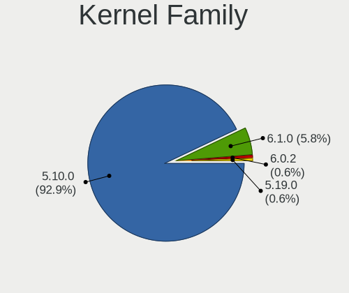

| Version | Desktops | Percent |
|---------|----------|---------|
| 5.10.0  | 12       | 100%    |

Kernel Major Ver.
-----------------

Linux kernel major version

| Version | Desktops | Percent |
|---------|----------|---------|
| 5.10    | 12       | 100%    |

Arch
----

OS architecture (x86_64, i586, etc.)

| Name   | Desktops | Percent |
|--------|----------|---------|
| x86_64 | 11       | 91.67%  |
| i686   | 1        | 8.33%   |

DE
--

Desktop Environment

| Name       | Desktops | Percent |
|------------|----------|---------|
| X-Cinnamon | 11       | 91.67%  |
| Cinnamon   | 1        | 8.33%   |

Display Server
--------------

X11 or Wayland

| Name | Desktops | Percent |
|------|----------|---------|
| X11  | 12       | 100%    |

Display Manager
---------------

SDDM, LightDM, etc.

| Name    | Desktops | Percent |
|---------|----------|---------|
| Unknown | 8        | 66.67%  |
| LightDM | 4        | 33.33%  |

OS Lang
-------

Language

| Lang  | Desktops | Percent |
|-------|----------|---------|
| en_US | 5        | 41.67%  |
| ru_RU | 2        | 16.67%  |
| de_DE | 2        | 16.67%  |
| pt_BR | 1        | 8.33%   |
| fr_CA | 1        | 8.33%   |
| es_ES | 1        | 8.33%   |

Boot Mode
---------

EFI or BIOS

| Mode | Desktops | Percent |
|------|----------|---------|
| BIOS | 6        | 50%     |
| EFI  | 6        | 50%     |

Filesystem
----------

Type of filesystem

| Type  | Desktops | Percent |
|-------|----------|---------|
| Ext4  | 11       | 91.67%  |
| Tmpfs | 1        | 8.33%   |

Part. scheme
------------

Scheme of partitioning

| Type    | Desktops | Percent |
|---------|----------|---------|
| Unknown | 8        | 66.67%  |
| MBR     | 2        | 16.67%  |
| GPT     | 2        | 16.67%  |

Dual Boot with Linux/BSD
------------------------

Hosting more than one Linux/BSD

| Dual boot | Desktops | Percent |
|-----------|----------|---------|
| No        | 11       | 91.67%  |
| Yes       | 1        | 8.33%   |

Dual Boot (Win)
---------------

Hosting Linux and Windows

| Dual boot | Desktops | Percent |
|-----------|----------|---------|
| No        | 9        | 75%     |
| Yes       | 3        | 25%     |

Board
-----

Vendor
------

Motherboard manufacturer

| Name             | Desktops | Percent |
|------------------|----------|---------|
| ASUSTek Computer | 5        | 41.67%  |
| MSI              | 2        | 16.67%  |
| Lenovo           | 1        | 8.33%   |
| Hewlett-Packard  | 1        | 8.33%   |
| Dell             | 1        | 8.33%   |
| ASRock           | 1        | 8.33%   |
| Acer             | 1        | 8.33%   |

Model
-----

Motherboard model

| Name                                | Desktops | Percent |
|-------------------------------------|----------|---------|
| MSI MS-7B79                         | 1        | 8.33%   |
| MSI MS-7977                         | 1        | 8.33%   |
| Lenovo ThinkCentre M720s 10SUS9KW00 | 1        | 8.33%   |
| HP Z600 Workstation                 | 1        | 8.33%   |
| Dell XPS A2010                      | 1        | 8.33%   |
| ASUS PRIME H610M-A D4               | 1        | 8.33%   |
| ASUS PRIME H510M-D                  | 1        | 8.33%   |
| ASUS PRIME B350M-A                  | 1        | 8.33%   |
| ASUS P6T                            | 1        | 8.33%   |
| ASUS P5G41T-M LX3                   | 1        | 8.33%   |
| ASRock A320M-DGS                    | 1        | 8.33%   |
| Acer Aspire X3910                   | 1        | 8.33%   |

Model Family
------------

Motherboard model prefix

| Name               | Desktops | Percent |
|--------------------|----------|---------|
| ASUS PRIME         | 3        | 25%     |
| MSI MS-7B79        | 1        | 8.33%   |
| MSI MS-7977        | 1        | 8.33%   |
| Lenovo ThinkCentre | 1        | 8.33%   |
| HP Z600            | 1        | 8.33%   |
| Dell XPS           | 1        | 8.33%   |
| ASUS P6T           | 1        | 8.33%   |
| ASUS P5G41T-M      | 1        | 8.33%   |
| ASRock A320M-DGS   | 1        | 8.33%   |
| Acer Aspire        | 1        | 8.33%   |

MFG Year
--------

Motherboard manufacture year

| Year | Desktops | Percent |
|------|----------|---------|
| 2010 | 3        | 25%     |
| 2021 | 2        | 16.67%  |
| 2019 | 2        | 16.67%  |
| 2017 | 2        | 16.67%  |
| 2015 | 1        | 8.33%   |
| 2008 | 1        | 8.33%   |
| 2007 | 1        | 8.33%   |

Form Factor
-----------

Physical design of the computer

| Name    | Desktops | Percent |
|---------|----------|---------|
| Desktop | 12       | 100%    |

Secure Boot
-----------

Enabled or disabled

| State    | Desktops | Percent |
|----------|----------|---------|
| Disabled | 11       | 91.67%  |
| Enabled  | 1        | 8.33%   |

Coreboot
--------

Have coreboot on board

| Used | Desktops | Percent |
|------|----------|---------|
| No   | 12       | 100%    |

RAM Size
--------

Total RAM memory

| Size in GB | Desktops | Percent |
|------------|----------|---------|
| 4.01-8.0   | 3        | 25%     |
| 32.01-64.0 | 2        | 16.67%  |
| 16.01-24.0 | 2        | 16.67%  |
| 1.01-2.0   | 2        | 16.67%  |
| 3.01-4.0   | 1        | 8.33%   |
| 24.01-32.0 | 1        | 8.33%   |
| 8.01-16.0  | 1        | 8.33%   |

RAM Used
--------

Used RAM memory

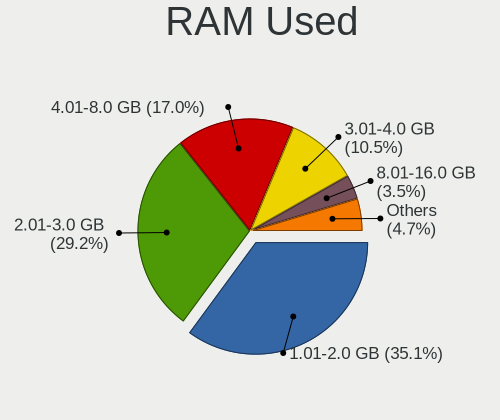

| Used GB  | Desktops | Percent |
|----------|----------|---------|
| 2.01-3.0 | 5        | 41.67%  |
| 1.01-2.0 | 4        | 33.33%  |
| 3.01-4.0 | 3        | 25%     |

Total Drives
------------

Number of drives on board

| Drives | Desktops | Percent |
|--------|----------|---------|
| 1      | 5        | 41.67%  |
| 2      | 3        | 25%     |
| 3      | 2        | 16.67%  |
| 6      | 1        | 8.33%   |
| 4      | 1        | 8.33%   |

Has CD-ROM
----------

Has CD-ROM on board

| Presented | Desktops | Percent |
|-----------|----------|---------|
| No        | 7        | 58.33%  |
| Yes       | 5        | 41.67%  |

Has Ethernet
------------

Has Ethernet on board

| Presented | Desktops | Percent |
|-----------|----------|---------|
| Yes       | 12       | 100%    |

Has WiFi
--------

Has WiFi module

| Presented | Desktops | Percent |
|-----------|----------|---------|
| No        | 7        | 58.33%  |
| Yes       | 5        | 41.67%  |

Has Bluetooth
-------------

Has Bluetooth module

| Presented | Desktops | Percent |
|-----------|----------|---------|
| No        | 10       | 83.33%  |
| Yes       | 2        | 16.67%  |

Location
--------

Country
-------

Geographic location (country)

| Country   | Desktops | Percent |
|-----------|----------|---------|
| USA       | 3        | 25%     |
| Venezuela | 1        | 8.33%   |
| Sweden    | 1        | 8.33%   |
| Spain     | 1        | 8.33%   |
| Russia    | 1        | 8.33%   |
| Latvia    | 1        | 8.33%   |
| Germany   | 1        | 8.33%   |
| France    | 1        | 8.33%   |
| Canada    | 1        | 8.33%   |
| Brazil    | 1        | 8.33%   |

City
----

Geographic location (city)

| City                     | Desktops | Percent |
|--------------------------|----------|---------|
| Vincennes                | 1        | 8.33%   |
| Toledo                   | 1        | 8.33%   |
| Stockbridge              | 1        | 8.33%   |
| San Antonio de Los Altos | 1        | 8.33%   |
| Riga                     | 1        | 8.33%   |
| Porto Alegre             | 1        | 8.33%   |
| National City            | 1        | 8.33%   |
| Montreal                 | 1        | 8.33%   |
| Madrid                   | 1        | 8.33%   |
| Hamburg                  | 1        | 8.33%   |
| Arkhangelsk              | 1        | 8.33%   |
| AElvdalen                | 1        | 8.33%   |

Drives
------

Drive Vendor
------------

Hard drive vendors

| Vendor              | Desktops | Drives | Percent |
|---------------------|----------|--------|---------|
| WDC                 | 4        | 10     | 21.05%  |
| Seagate             | 3        | 3      | 15.79%  |
| Kingston            | 3        | 3      | 15.79%  |
| Hitachi             | 3        | 4      | 15.79%  |
| Samsung Electronics | 2        | 2      | 10.53%  |
| Transcend           | 1        | 2      | 5.26%   |
| Toshiba             | 1        | 1      | 5.26%   |
| OCZ-VERTEX          | 1        | 1      | 5.26%   |
| Intel               | 1        | 1      | 5.26%   |

Drive Model
-----------

Hard drive models

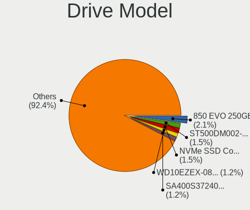

| Model                           | Desktops | Percent |
|---------------------------------|----------|---------|
| Seagate ST2000DM008-2FR102 2TB  | 2        | 8.7%    |
| Kingston SA400S37240G 240GB SSD | 2        | 8.7%    |
| WDC WD3200AAJS-22B4A0 320GB     | 1        | 4.35%   |
| WDC WD30EFRX-68EUZN0 3TB        | 1        | 4.35%   |
| WDC WD10EZEX-08WN4A0 1TB        | 1        | 4.35%   |
| WDC WD10EFRX-68JCSN0 1TB        | 1        | 4.35%   |
| WDC WD10EFRX-68FYTN0 1TB        | 1        | 4.35%   |
| WDC WD10EAVS-00D7B0 1TB         | 1        | 4.35%   |
| WDC WD1003FZEX-00MK2A0 1TB      | 1        | 4.35%   |
| Transcend TS480GSSD220S 480GB   | 1        | 4.35%   |
| Transcend TS240GSSD220S 240GB   | 1        | 4.35%   |
| Toshiba DT01ACA050 500GB        | 1        | 4.35%   |
| Seagate ST3250318AS 250GB       | 1        | 4.35%   |
| Samsung SSD 970 EVO Plus 1TB    | 1        | 4.35%   |
| Samsung SSD 850 EVO 250GB       | 1        | 4.35%   |
| OCZ-VERTEX PLUS R2 128GB SSD    | 1        | 4.35%   |
| Kingston SA400S37120G 120GB SSD | 1        | 4.35%   |
| Intel NVMe SSD Drive 256GB      | 1        | 4.35%   |
| Hitachi HDT725025VLA380 250GB   | 1        | 4.35%   |
| Hitachi HDS5C1032CLA382 320GB   | 1        | 4.35%   |
| Hitachi HDP725050GLA360 500GB   | 1        | 4.35%   |

HDD Vendor
----------

Hard disk drive vendors

| Vendor  | Desktops | Drives | Percent |
|---------|----------|--------|---------|
| WDC     | 4        | 10     | 36.36%  |
| Seagate | 3        | 3      | 27.27%  |
| Hitachi | 3        | 4      | 27.27%  |
| Toshiba | 1        | 1      | 9.09%   |

SSD Vendor
----------

Solid state drive vendors

| Vendor              | Desktops | Drives | Percent |
|---------------------|----------|--------|---------|
| Kingston            | 3        | 3      | 50%     |
| Transcend           | 1        | 2      | 16.67%  |
| Samsung Electronics | 1        | 1      | 16.67%  |
| OCZ-VERTEX          | 1        | 1      | 16.67%  |

Drive Kind
----------

HDD or SSD

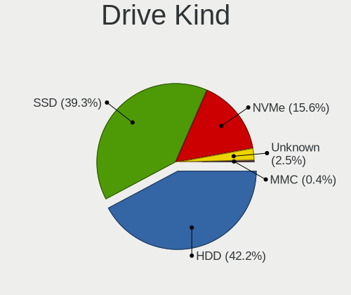

| Kind | Desktops | Drives | Percent |
|------|----------|--------|---------|
| HDD  | 9        | 18     | 52.94%  |
| SSD  | 6        | 7      | 35.29%  |
| NVMe | 2        | 2      | 11.76%  |

Drive Connector
---------------

SATA, SAS, NVMe, etc.

| Type | Desktops | Drives | Percent |
|------|----------|--------|---------|
| SATA | 12       | 25     | 85.71%  |
| NVMe | 2        | 2      | 14.29%  |

Drive Size
----------

Size of hard drive

| Size in TB | Desktops | Drives | Percent |
|------------|----------|--------|---------|
| 0.01-0.5   | 9        | 14     | 60%     |
| 0.51-1.0   | 3        | 7      | 20%     |
| 1.01-2.0   | 2        | 2      | 13.33%  |
| 2.01-3.0   | 1        | 2      | 6.67%   |

Space Total
-----------

Amount of disk space available on the file system

| Size in GB     | Desktops | Percent |
|----------------|----------|---------|
| 251-500        | 3        | 25%     |
| 101-250        | 3        | 25%     |
| 1001-2000      | 2        | 16.67%  |
| 1-20           | 2        | 16.67%  |
| More than 3000 | 1        | 8.33%   |
| 501-1000       | 1        | 8.33%   |

Space Used
----------

Amount of used disk space

| Used GB   | Desktops | Percent |
|-----------|----------|---------|
| 1-20      | 7        | 58.33%  |
| 101-250   | 2        | 16.67%  |
| 21-50     | 1        | 8.33%   |
| 1001-2000 | 1        | 8.33%   |
| 51-100    | 1        | 8.33%   |

Malfunc. Drives
---------------

Drive models with a malfunction

| Model                     | Desktops | Drives | Percent |
|---------------------------|----------|--------|---------|
| Seagate ST3250318AS 250GB | 1        | 1      | 100%    |

Malfunc. Drive Vendor
---------------------

Vendors of faulty drives

| Vendor  | Desktops | Drives | Percent |
|---------|----------|--------|---------|
| Seagate | 1        | 1      | 100%    |

Malfunc. HDD Vendor
-------------------

Vendors of faulty HDD drives

| Vendor  | Desktops | Drives | Percent |
|---------|----------|--------|---------|
| Seagate | 1        | 1      | 100%    |

Malfunc. Drive Kind
-------------------

Kinds of faulty drives

| Kind | Desktops | Drives | Percent |
|------|----------|--------|---------|
| HDD  | 1        | 1      | 100%    |

Failed Drives
-------------

Failed drive models

Zero info for selected period =(

Failed Drive Vendor
-------------------

Failed drive vendors

Zero info for selected period =(

Drive Status
------------

Number of failed and malfunc. drives

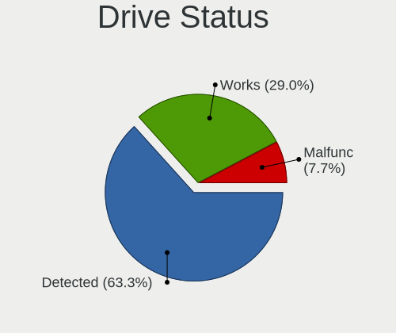

| Status   | Desktops | Drives | Percent |
|----------|----------|--------|---------|
| Detected | 8        | 19     | 61.54%  |
| Works    | 4        | 7      | 30.77%  |
| Malfunc  | 1        | 1      | 7.69%   |

Storage controller
------------------

Storage Vendor
--------------

Storage controller vendors

| Vendor              | Desktops | Percent |
|---------------------|----------|---------|
| Intel               | 10       | 66.67%  |
| AMD                 | 3        | 20%     |
| Samsung Electronics | 1        | 6.67%   |
| JMicron Technology  | 1        | 6.67%   |

Storage Model
-------------

Storage controller models

| Model                                                                         | Desktops | Percent |
|-------------------------------------------------------------------------------|----------|---------|
| Intel 82801JI (ICH10 Family) SATA AHCI Controller                             | 2        | 10%     |
| AMD FCH SATA Controller [AHCI mode]                                           | 2        | 10%     |
| Samsung NVMe SSD Controller SM981/PM981/PM983                                 | 1        | 5%      |
| JMicron JMB363 SATA/IDE Controller                                            | 1        | 5%      |
| Intel Volume Management Device NVMe RAID Controller                           | 1        | 5%      |
| Intel SSD 600P Series                                                         | 1        | 5%      |
| Intel Q170/Q150/B150/H170/H110/Z170/CM236 Chipset SATA Controller [AHCI Mode] | 1        | 5%      |
| Intel NM10/ICH7 Family SATA Controller [IDE mode]                             | 1        | 5%      |
| Intel Cannon Lake PCH SATA AHCI Controller                                    | 1        | 5%      |
| Intel Alder Lake-S PCH SATA Controller [AHCI Mode]                            | 1        | 5%      |
| Intel 82801JI (ICH10 Family) 4 port SATA IDE Controller #1                    | 1        | 5%      |
| Intel 82801JI (ICH10 Family) 2 port SATA IDE Controller #2                    | 1        | 5%      |
| Intel 82801IR/IO/IH (ICH9R/DO/DH) 6 port SATA Controller [AHCI mode]          | 1        | 5%      |
| Intel 82801G (ICH7 Family) IDE Controller                                     | 1        | 5%      |
| Intel 500 Series Chipset Family SATA AHCI Controller                          | 1        | 5%      |
| AMD FCH SATA Controller D                                                     | 1        | 5%      |
| AMD 400 Series Chipset SATA Controller                                        | 1        | 5%      |
| AMD 300 Series Chipset SATA Controller                                        | 1        | 5%      |

Storage Kind
------------

Kind of storage controller (IDE, SATA, NVMe, SAS, ...)

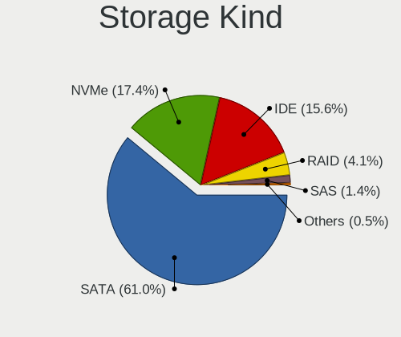

| Kind | Desktops | Percent |
|------|----------|---------|
| SATA | 10       | 62.5%   |
| IDE  | 3        | 18.75%  |
| NVMe | 2        | 12.5%   |
| RAID | 1        | 6.25%   |

Processor
---------

CPU Vendor
----------

Processor vendors

| Vendor | Desktops | Percent |
|--------|----------|---------|
| Intel  | 9        | 75%     |
| AMD    | 3        | 25%     |

CPU Model
---------

Processor models

| Model                                       | Desktops | Percent |
|---------------------------------------------|----------|---------|
| Intel Pentium Dual-Core CPU E5700 @ 3.00GHz | 2        | 16.67%  |
| Intel Xeon CPU X5675 @ 3.07GHz              | 1        | 8.33%   |
| Intel Xeon CPU X5570 @ 2.93GHz              | 1        | 8.33%   |
| Intel Core i7-6700K CPU @ 4.00GHz           | 1        | 8.33%   |
| Intel Core i5-8400 CPU @ 2.80GHz            | 1        | 8.33%   |
| Intel Core i5-10400 CPU @ 2.90GHz           | 1        | 8.33%   |
| Intel Core 2 Duo CPU E4500 @ 2.20GHz        | 1        | 8.33%   |
| Intel 12th Gen Core i3-12100F               | 1        | 8.33%   |
| AMD Ryzen 7 1700 Eight-Core Processor       | 1        | 8.33%   |
| AMD Ryzen 5 3400G with Radeon Vega Graphics | 1        | 8.33%   |
| AMD Athlon 220GE with Radeon Vega Graphics  | 1        | 8.33%   |

CPU Model Family
----------------

Processor model prefix

| Model                   | Desktops | Percent |
|-------------------------|----------|---------|
| Intel Xeon              | 2        | 16.67%  |
| Intel Pentium Dual-Core | 2        | 16.67%  |
| Intel Core i5           | 2        | 16.67%  |
| Other                   | 1        | 8.33%   |
| Intel Core i7           | 1        | 8.33%   |
| Intel Core 2 Duo        | 1        | 8.33%   |
| AMD Ryzen 7             | 1        | 8.33%   |
| AMD Ryzen 5             | 1        | 8.33%   |
| AMD Athlon              | 1        | 8.33%   |

CPU Cores
---------

Number of processor cores

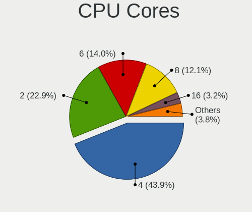

| Number | Desktops | Percent |
|--------|----------|---------|
| 2      | 4        | 33.33%  |
| 6      | 3        | 25%     |
| 4      | 3        | 25%     |
| 8      | 2        | 16.67%  |

CPU Sockets
-----------

Number of sockets

| Number | Desktops | Percent |
|--------|----------|---------|
| 1      | 11       | 91.67%  |
| 2      | 1        | 8.33%   |

CPU Threads
-----------

Threads per core (Hyper-Threading)

| Number | Desktops | Percent |
|--------|----------|---------|
| 2      | 7        | 58.33%  |
| 1      | 5        | 41.67%  |

CPU Op-Modes
------------

CPU Operation Modes (32-bit, 64-bit)

| Op mode        | Desktops | Percent |
|----------------|----------|---------|
| 32-bit, 64-bit | 12       | 100%    |

CPU Microcode
-------------

Microcode number

| Number     | Desktops | Percent |
|------------|----------|---------|
| 0x1067a    | 2        | 16.67%  |
| 0xa0653    | 1        | 8.33%   |
| 0x906ea    | 1        | 8.33%   |
| 0x90675    | 1        | 8.33%   |
| 0x6fd      | 1        | 8.33%   |
| 0x506e3    | 1        | 8.33%   |
| 0x206c2    | 1        | 8.33%   |
| 0x106a5    | 1        | 8.33%   |
| 0x08108109 | 1        | 8.33%   |
| 0x0810100b | 1        | 8.33%   |
| 0x08001137 | 1        | 8.33%   |

CPU Microarch
-------------

Microarchitecture

| Name      | Desktops | Percent |
|-----------|----------|---------|
| Zen       | 2        | 16.67%  |
| Penryn    | 2        | 16.67%  |
| Zen+      | 1        | 8.33%   |
| Westmere  | 1        | 8.33%   |
| Skylake   | 1        | 8.33%   |
| Nehalem   | 1        | 8.33%   |
| KabyLake  | 1        | 8.33%   |
| Core      | 1        | 8.33%   |
| CometLake | 1        | 8.33%   |
| Unknown   | 1        | 8.33%   |

Graphics
--------

GPU Vendor
----------

Vendors of graphics cards

| Vendor | Desktops | Percent |
|--------|----------|---------|
| Nvidia | 7        | 53.85%  |
| Intel  | 3        | 23.08%  |
| AMD    | 3        | 23.08%  |

GPU Model
---------

Graphics card models

| Model                                                                 | Desktops | Percent |
|-----------------------------------------------------------------------|----------|---------|
| Nvidia GT218 [GeForce 210]                                            | 2        | 14.29%  |
| Nvidia GP108 [GeForce GT 1030]                                        | 1        | 7.14%   |
| Nvidia GM204 [GeForce GTX 970]                                        | 1        | 7.14%   |
| Nvidia GK208B [GeForce GT 730]                                        | 1        | 7.14%   |
| Nvidia GK208B [GeForce GT 710]                                        | 1        | 7.14%   |
| Nvidia GF114 [GeForce GTX 560 Ti]                                     | 1        | 7.14%   |
| Intel CometLake-S GT2 [UHD Graphics 630]                              | 1        | 7.14%   |
| Intel CoffeeLake-S GT2 [UHD Graphics 630]                             | 1        | 7.14%   |
| Intel 82G33/G31 Express Integrated Graphics Controller                | 1        | 7.14%   |
| AMD Raven Ridge [Radeon Vega Series / Radeon Vega Mobile Series]      | 1        | 7.14%   |
| AMD Oland [Radeon HD 8570 / R5 430 OEM / R7 240/340 / Radeon 520 OEM] | 1        | 7.14%   |
| AMD Lexa XT [Radeon PRO WX 3200]                                      | 1        | 7.14%   |
| AMD Baffin [Radeon RX 550 640SP / RX 560/560X]                        | 1        | 7.14%   |

GPU Combo
---------

Combinations of graphics cards

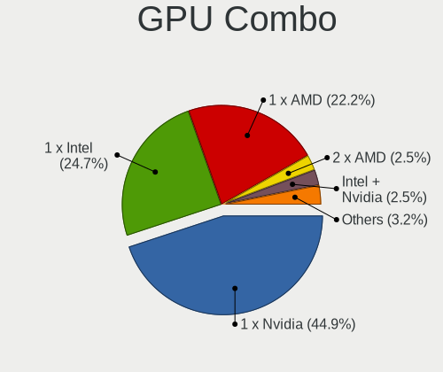

| Name       | Desktops | Percent |
|------------|----------|---------|
| 1 x Nvidia | 7        | 58.33%  |
| 1 x Intel  | 2        | 16.67%  |
| 1 x AMD    | 2        | 16.67%  |
| 2 x AMD    | 1        | 8.33%   |

GPU Driver
----------

Free vs proprietary

| Driver  | Desktops | Percent |
|---------|----------|---------|
| Free    | 10       | 83.33%  |
| Unknown | 2        | 16.67%  |

GPU Memory
----------

Total video memory

| Size in GB | Desktops | Percent |
|------------|----------|---------|
| 1.01-2.0   | 4        | 33.33%  |
| 3.01-4.0   | 3        | 25%     |
| Unknown    | 3        | 25%     |
| 0.51-1.0   | 1        | 8.33%   |
| 0.01-0.5   | 1        | 8.33%   |

Monitor
-------

Monitor Vendor
--------------

Monitor vendors

| Vendor               | Desktops | Percent |
|----------------------|----------|---------|
| Samsung Electronics  | 3        | 27.27%  |
| Hewlett-Packard      | 2        | 18.18%  |
| Acer                 | 2        | 18.18%  |
| Philips              | 1        | 9.09%   |
| Medion               | 1        | 9.09%   |
| Dell                 | 1        | 9.09%   |
| Ancor Communications | 1        | 9.09%   |

Monitor Model
-------------

Monitor models

| Model                                                                 | Desktops | Percent |
|-----------------------------------------------------------------------|----------|---------|
| Samsung Electronics SyncMaster SAM0259 1280x1024 380x300mm 19.1-inch  | 1        | 7.69%   |
| Samsung Electronics SMB2330H SAM064A 1920x1080 509x286mm 23.0-inch    | 1        | 7.69%   |
| Samsung Electronics LC24RG50 SAM0F90 1920x1080 532x304mm 24.1-inch    | 1        | 7.69%   |
| Philips PHL BDM3270 PHL08E7 2560x1440 708x398mm 32.0-inch             | 1        | 7.69%   |
| Medion MD20328 MED3942 1600x900 462x272mm 21.1-inch                   | 1        | 7.69%   |
| Hewlett-Packard W2072a HWP3000 1600x900 443x249mm 20.0-inch           | 1        | 7.69%   |
| Hewlett-Packard E232 HWP327B 1920x1080 509x286mm 23.0-inch            | 1        | 7.69%   |
| Hewlett-Packard E232 HWP327A 1920x1080 509x286mm 23.0-inch            | 1        | 7.69%   |
| Hewlett-Packard E232 HWP3279 1920x1080 509x286mm 23.0-inch            | 1        | 7.69%   |
| Dell 2007WFP DELA019 1680x1050 434x270mm 20.1-inch                    | 1        | 7.69%   |
| Ancor Communications ASUS MX299 ACI2931 2560x1080 673x284mm 28.8-inch | 1        | 7.69%   |
| Acer V203HV ACR01D3 1600x900 443x249mm 20.0-inch                      | 1        | 7.69%   |
| Acer P223WB ACR000E 1680x1050 473x296mm 22.0-inch                     | 1        | 7.69%   |

Monitor Resolution
------------------

Monitor screen resolution

| Resolution         | Desktops | Percent |
|--------------------|----------|---------|
| 1920x1080 (FHD)    | 3        | 27.27%  |
| 1600x900 (HD+)     | 3        | 27.27%  |
| 1680x1050 (WSXGA+) | 2        | 18.18%  |
| 2560x1440 (QHD)    | 1        | 9.09%   |
| 2560x1080          | 1        | 9.09%   |
| 1280x1024 (SXGA)   | 1        | 9.09%   |

Monitor Diagonal
----------------

Diagonal size in inches

| Inches | Desktops | Percent |
|--------|----------|---------|
| 20     | 3        | 27.27%  |
| 23     | 2        | 18.18%  |
| 32     | 1        | 9.09%   |
| 28     | 1        | 9.09%   |
| 24     | 1        | 9.09%   |
| 22     | 1        | 9.09%   |
| 21     | 1        | 9.09%   |
| 19     | 1        | 9.09%   |

Monitor Width
-------------

Physical width

| Width in mm | Desktops | Percent |
|-------------|----------|---------|
| 401-500     | 4        | 40%     |
| 501-600     | 3        | 30%     |
| 701-800     | 1        | 10%     |
| 601-700     | 1        | 10%     |
| 351-400     | 1        | 10%     |

Aspect Ratio
------------

Proportional relationship between the width and the height

| Ratio | Desktops | Percent |
|-------|----------|---------|
| 16/9  | 7        | 63.64%  |
| 16/10 | 2        | 18.18%  |
| 5/4   | 1        | 9.09%   |
| 21/9  | 1        | 9.09%   |

Monitor Area
------------

Area in inch²

| Area in inch² | Desktops | Percent |
|----------------|----------|---------|
| 151-200        | 4        | 40%     |
| 201-250        | 3        | 30%     |
| 251-300        | 2        | 20%     |
| 351-500        | 1        | 10%     |

Pixel Density
-------------

Pixels per inch

| Density | Desktops | Percent |
|---------|----------|---------|
| 51-100  | 10       | 100%    |

Multiple Monitors
-----------------

Total monitors connected

| Total | Desktops | Percent |
|-------|----------|---------|
| 1     | 9        | 75%     |
| 3     | 1        | 8.33%   |
| 2     | 1        | 8.33%   |
| 0     | 1        | 8.33%   |

Network
-------

Net Controller Vendor
---------------------

Controller vendors

| Vendor                | Desktops | Percent |
|-----------------------|----------|---------|
| Intel                 | 5        | 31.25%  |
| Realtek Semiconductor | 4        | 25%     |
| Ralink Technology     | 2        | 12.5%   |
| Qualcomm Atheros      | 2        | 12.5%   |
| Broadcom              | 2        | 12.5%   |
| Mercucys              | 1        | 6.25%   |

Net Controller Model
--------------------

Controller models

| Model                                                                                         | Desktops | Percent |
|-----------------------------------------------------------------------------------------------|----------|---------|
| Realtek RTL8111/8168/8411 PCI Express Gigabit Ethernet Controller                             | 4        | 20%     |
| Ralink RT2870/RT3070 Wireless Adapter                                                         | 2        | 10%     |
| Realtek RTL8192CE PCIe Wireless Network Adapter                                               | 1        | 5%      |
| Realtek Realtek 8812AU/8821AU 802.11ac WLAN Adapter [USB Wireless Dual-Band Adapter 2.4/5Ghz] | 1        | 5%      |
| Realtek 802.11ac NIC                                                                          | 1        | 5%      |
| Qualcomm Atheros Killer E2400 Gigabit Ethernet Controller                                     | 1        | 5%      |
| Qualcomm Atheros AR8151 v2.0 Gigabit Ethernet                                                 | 1        | 5%      |
| Mercucys MW300UM RTL8192EU wifi                                                               | 1        | 5%      |
| Intel I210 Gigabit Fiber Network Connection                                                   | 1        | 5%      |
| Intel Ethernet Connection (7) I219-V                                                          | 1        | 5%      |
| Intel Ethernet Connection (17) I219-V                                                         | 1        | 5%      |
| Intel Ethernet Connection (14) I219-V                                                         | 1        | 5%      |
| Intel 82567V-2 Gigabit Network Connection                                                     | 1        | 5%      |
| Intel 82566DC-2 Gigabit Network Connection                                                    | 1        | 5%      |
| Broadcom NetXtreme BCM5764M Gigabit Ethernet PCIe                                             | 1        | 5%      |
| Broadcom BCM4321 802.11a/b/g/n                                                                | 1        | 5%      |

Wireless Vendor
---------------

Wireless vendors

| Vendor                | Desktops | Percent |
|-----------------------|----------|---------|
| Realtek Semiconductor | 2        | 33.33%  |
| Ralink Technology     | 2        | 33.33%  |
| Mercucys              | 1        | 16.67%  |
| Broadcom              | 1        | 16.67%  |

Wireless Model
--------------

Wireless models

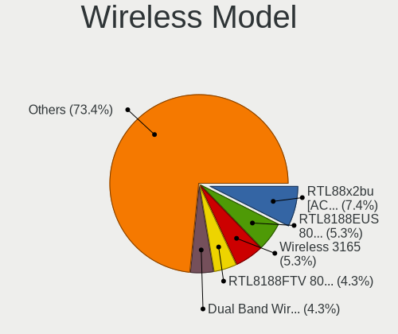

| Model                                                                                         | Desktops | Percent |
|-----------------------------------------------------------------------------------------------|----------|---------|
| Ralink RT2870/RT3070 Wireless Adapter                                                         | 2        | 28.57%  |
| Realtek RTL8192CE PCIe Wireless Network Adapter                                               | 1        | 14.29%  |
| Realtek Realtek 8812AU/8821AU 802.11ac WLAN Adapter [USB Wireless Dual-Band Adapter 2.4/5Ghz] | 1        | 14.29%  |
| Realtek 802.11ac NIC                                                                          | 1        | 14.29%  |
| Mercucys MW300UM RTL8192EU wifi                                                               | 1        | 14.29%  |
| Broadcom BCM4321 802.11a/b/g/n                                                                | 1        | 14.29%  |

Ethernet Vendor
---------------

Ethernet vendors

| Vendor                | Desktops | Percent |
|-----------------------|----------|---------|
| Intel                 | 5        | 41.67%  |
| Realtek Semiconductor | 4        | 33.33%  |
| Qualcomm Atheros      | 2        | 16.67%  |
| Broadcom              | 1        | 8.33%   |

Ethernet Model
--------------

Ethernet models

| Model                                                             | Desktops | Percent |
|-------------------------------------------------------------------|----------|---------|
| Realtek RTL8111/8168/8411 PCI Express Gigabit Ethernet Controller | 4        | 30.77%  |
| Qualcomm Atheros Killer E2400 Gigabit Ethernet Controller         | 1        | 7.69%   |
| Qualcomm Atheros AR8151 v2.0 Gigabit Ethernet                     | 1        | 7.69%   |
| Intel I210 Gigabit Fiber Network Connection                       | 1        | 7.69%   |
| Intel Ethernet Connection (7) I219-V                              | 1        | 7.69%   |
| Intel Ethernet Connection (17) I219-V                             | 1        | 7.69%   |
| Intel Ethernet Connection (14) I219-V                             | 1        | 7.69%   |
| Intel 82567V-2 Gigabit Network Connection                         | 1        | 7.69%   |
| Intel 82566DC-2 Gigabit Network Connection                        | 1        | 7.69%   |
| Broadcom NetXtreme BCM5764M Gigabit Ethernet PCIe                 | 1        | 7.69%   |

Net Controller Kind
-------------------

Ethernet, WiFi or modem

| Kind     | Desktops | Percent |
|----------|----------|---------|
| Ethernet | 12       | 70.59%  |
| WiFi     | 5        | 29.41%  |

Used Controller
---------------

Currently used network controller

| Kind     | Desktops | Percent |
|----------|----------|---------|
| Ethernet | 9        | 69.23%  |
| WiFi     | 4        | 30.77%  |

NICs
----

Total network controllers on board

| Total | Desktops | Percent |
|-------|----------|---------|
| 1     | 9        | 75%     |
| 2     | 3        | 25%     |

IPv6
----

IPv6 vs IPv4

| Used | Desktops | Percent |
|------|----------|---------|
| No   | 10       | 83.33%  |
| Yes  | 2        | 16.67%  |

Bluetooth
---------

Bluetooth Vendor
----------------

Controller vendors

| Vendor                | Desktops | Percent |
|-----------------------|----------|---------|
| Realtek Semiconductor | 1        | 50%     |
| Dell                  | 1        | 50%     |

Bluetooth Model
---------------

Controller models

| Model                   | Desktops | Percent |
|-------------------------|----------|---------|
| Realtek Bluetooth Radio | 1        | 50%     |
| Dell BT Mini-Receiver   | 1        | 50%     |

Sound
-----

Sound Vendor
------------

Sound card vendors

| Vendor | Desktops | Percent |
|--------|----------|---------|
| Intel  | 9        | 45%     |
| Nvidia | 7        | 35%     |
| AMD    | 4        | 20%     |

Sound Model
-----------

Sound card models

| Model                                                                   | Desktops | Percent |
|-------------------------------------------------------------------------|----------|---------|
| Intel 82801JI (ICH10 Family) HD Audio Controller                        | 3        | 13.04%  |
| Nvidia High Definition Audio Controller                                 | 2        | 8.7%    |
| Nvidia GK208 HDMI/DP Audio Controller                                   | 2        | 8.7%    |
| AMD Family 17h/19h HD Audio Controller                                  | 2        | 8.7%    |
| AMD Baffin HDMI/DP Audio [Radeon RX 550 640SP / RX 560/560X]            | 2        | 8.7%    |
| Nvidia GP108 High Definition Audio Controller                           | 1        | 4.35%   |
| Nvidia GM204 High Definition Audio Controller                           | 1        | 4.35%   |
| Nvidia GF114 HDMI Audio Controller                                      | 1        | 4.35%   |
| Intel NM10/ICH7 Family High Definition Audio Controller                 | 1        | 4.35%   |
| Intel Cannon Lake PCH cAVS                                              | 1        | 4.35%   |
| Intel Audio device                                                      | 1        | 4.35%   |
| Intel Alder Lake-S HD Audio Controller                                  | 1        | 4.35%   |
| Intel 82801I (ICH9 Family) HD Audio Controller                          | 1        | 4.35%   |
| Intel 100 Series/C230 Series Chipset Family HD Audio Controller         | 1        | 4.35%   |
| AMD Raven/Raven2/Fenghuang HDMI/DP Audio Controller                     | 1        | 4.35%   |
| AMD Oland/Hainan/Cape Verde/Pitcairn HDMI Audio [Radeon HD 7000 Series] | 1        | 4.35%   |
| AMD Family 17h (Models 00h-0fh) HD Audio Controller                     | 1        | 4.35%   |

Memory
------

Memory Vendor
-------------

Memory module vendors

| Vendor              | Desktops | Percent |
|---------------------|----------|---------|
| Unknown             | 1        | 20%     |
| Samsung Electronics | 1        | 20%     |
| Nanya Technology    | 1        | 20%     |
| G.Skill             | 1        | 20%     |
| A-DATA Technology   | 1        | 20%     |

Memory Model
------------

Memory module models

| Model                                                 | Desktops | Percent |
|-------------------------------------------------------|----------|---------|
| Unknown RAM Module 2GB DIMM 1333MT/s                  | 1        | 20%     |
| Samsung RAM M378A2K43CB1-CTD 16GB DIMM DDR4 2667MT/s  | 1        | 20%     |
| Nanya RAM NT1GT64U8HB0BY-3C 1024MB DIMM DDR2 667MT/s  | 1        | 20%     |
| G.Skill RAM F4-3000C16-16GVRB 16GB DIMM DDR4 3200MT/s | 1        | 20%     |
| A-DATA RAM DDR4 3200 16GB DIMM DDR4 3200MT/s          | 1        | 20%     |

Memory Kind
-----------

Memory module kinds

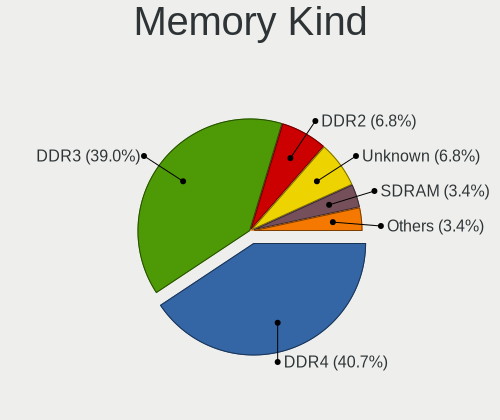

| Kind    | Desktops | Percent |
|---------|----------|---------|
| DDR4    | 3        | 60%     |
| SDRAM   | 1        | 20%     |
| Unknown | 1        | 20%     |

Memory Form Factor
------------------

Physical design of the memory module

| Name | Desktops | Percent |
|------|----------|---------|
| DIMM | 5        | 100%    |

Memory Size
-----------

Memory module size

| Size  | Desktops | Percent |
|-------|----------|---------|
| 16384 | 2        | 40%     |
| 32768 | 1        | 20%     |
| 2048  | 1        | 20%     |
| 1024  | 1        | 20%     |

Memory Speed
------------

Memory module speed

| Speed | Desktops | Percent |
|-------|----------|---------|
| 3200  | 2        | 40%     |
| 2667  | 1        | 20%     |
| 1333  | 1        | 20%     |
| 667   | 1        | 20%     |

Printers & scanners
-------------------

Printer Vendor
--------------

Printer device vendors

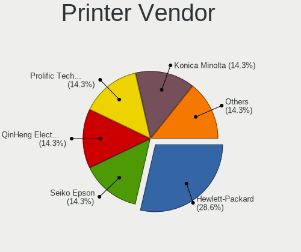

| Vendor             | Desktops | Percent |
|--------------------|----------|---------|
| Konica Minolta     | 1        | 33.33%  |
| Hewlett-Packard    | 1        | 33.33%  |
| Brother Industries | 1        | 33.33%  |

Printer Model
-------------

Printer device models

| Model                 | Desktops | Percent |
|-----------------------|----------|---------|
| Konica Minolta 185    | 1        | 33.33%  |
| HP OfficeJet Pro 8730 | 1        | 33.33%  |
| Brother MFC-L2685DW   | 1        | 33.33%  |

Scanner Vendor
--------------

Scanner device vendors

| Vendor | Desktops | Percent |
|--------|----------|---------|
| Canon  | 1        | 100%    |

Scanner Model
-------------

Scanner device models

| Model                   | Desktops | Percent |
|-------------------------|----------|---------|
| Canon CanoScan LiDE 110 | 1        | 100%    |

Camera
------

Camera Vendor
-------------

Camera device vendors

| Vendor                  | Desktops | Percent |
|-------------------------|----------|---------|
| Logitech                | 2        | 50%     |
| OmniVision Technologies | 1        | 25%     |
| ARC International       | 1        | 25%     |

Camera Model
------------

Camera device models

| Model                                          | Desktops | Percent |
|------------------------------------------------|----------|---------|
| OmniVision Integrated Webcam for Dell XPS 2010 | 1        | 25%     |
| Logitech Webcam C925e                          | 1        | 25%     |
| Logitech Webcam C210                           | 1        | 25%     |
| ARC International Camera                       | 1        | 25%     |

Security
--------

Fingerprint Vendor
------------------

Fingerprint sensor vendors

Zero info for selected period =(

Fingerprint Model
-----------------

Fingerprint sensor models

Zero info for selected period =(

Chipcard Vendor
---------------

Chipcard module vendors

Zero info for selected period =(

Chipcard Model
--------------

Chipcard module models

Zero info for selected period =(

Unsupported
-----------

Unsupported Devices
-------------------

Total unsupported devices on board

| Total | Desktops | Percent |
|-------|----------|---------|
| 1     | 6        | 50%     |
| 0     | 6        | 50%     |

Unsupported Device Types
------------------------

Types of unsupported devices

| Type          | Desktops | Percent |
|---------------|----------|---------|
| Net/wireless  | 3        | 50%     |
| Graphics card | 2        | 33.33%  |
| Camera        | 1        | 16.67%  |

