LMDE 5 - Tested Hardware & Statistics (Notebooks)
-------------------------------------------------

A project to collect tested hardware configurations for LMDE 5.

Anyone can contribute to this report by the [hw-probe](https://github.com/linuxhw/hw-probe) tool:

    sudo -E hw-probe -all -upload

Please contribute! Especially if your hardware is rare.

Contents
--------

* [ Test Cases ](#test-cases)

* [ System ](#system)
  - [ Kernel                   ](#kernel)
  - [ Kernel Family            ](#kernel-family)
  - [ Kernel Major Ver.        ](#kernel-major-ver)
  - [ Arch                     ](#arch)
  - [ DE                       ](#de)
  - [ Display Server           ](#display-server)
  - [ Display Manager          ](#display-manager)
  - [ OS Lang                  ](#os-lang)
  - [ Boot Mode                ](#boot-mode)
  - [ Filesystem               ](#filesystem)
  - [ Part. scheme             ](#part-scheme)
  - [ Dual Boot with Linux/BSD ](#dual-boot-with-linuxbsd)
  - [ Dual Boot (Win)          ](#dual-boot-win)

* [ Board ](#board)
  - [ Vendor                   ](#vendor)
  - [ Model                    ](#model)
  - [ Model Family             ](#model-family)
  - [ MFG Year                 ](#mfg-year)
  - [ Form Factor              ](#form-factor)
  - [ Secure Boot              ](#secure-boot)
  - [ Coreboot                 ](#coreboot)
  - [ RAM Size                 ](#ram-size)
  - [ RAM Used                 ](#ram-used)
  - [ Total Drives             ](#total-drives)
  - [ Has CD-ROM               ](#has-cd-rom)
  - [ Has Ethernet             ](#has-ethernet)
  - [ Has WiFi                 ](#has-wifi)
  - [ Has Bluetooth            ](#has-bluetooth)

* [ Location ](#location)
  - [ Country                  ](#country)
  - [ City                     ](#city)

* [ Drives ](#drives)
  - [ Drive Vendor             ](#drive-vendor)
  - [ Drive Model              ](#drive-model)
  - [ HDD Vendor               ](#hdd-vendor)
  - [ SSD Vendor               ](#ssd-vendor)
  - [ Drive Kind               ](#drive-kind)
  - [ Drive Connector          ](#drive-connector)
  - [ Drive Size               ](#drive-size)
  - [ Space Total              ](#space-total)
  - [ Space Used               ](#space-used)
  - [ Malfunc. Drives          ](#malfunc-drives)
  - [ Malfunc. Drive Vendor    ](#malfunc-drive-vendor)
  - [ Malfunc. HDD Vendor      ](#malfunc-hdd-vendor)
  - [ Malfunc. Drive Kind      ](#malfunc-drive-kind)
  - [ Failed Drives            ](#failed-drives)
  - [ Failed Drive Vendor      ](#failed-drive-vendor)
  - [ Drive Status             ](#drive-status)

* [ Storage controller ](#storage-controller)
  - [ Storage Vendor           ](#storage-vendor)
  - [ Storage Model            ](#storage-model)
  - [ Storage Kind             ](#storage-kind)

* [ Processor ](#processor)
  - [ CPU Vendor               ](#cpu-vendor)
  - [ CPU Model                ](#cpu-model)
  - [ CPU Model Family         ](#cpu-model-family)
  - [ CPU Cores                ](#cpu-cores)
  - [ CPU Sockets              ](#cpu-sockets)
  - [ CPU Threads              ](#cpu-threads)
  - [ CPU Op-Modes             ](#cpu-op-modes)
  - [ CPU Microcode            ](#cpu-microcode)
  - [ CPU Microarch            ](#cpu-microarch)

* [ Graphics ](#graphics)
  - [ GPU Vendor               ](#gpu-vendor)
  - [ GPU Model                ](#gpu-model)
  - [ GPU Combo                ](#gpu-combo)
  - [ GPU Driver               ](#gpu-driver)
  - [ GPU Memory               ](#gpu-memory)

* [ Monitor ](#monitor)
  - [ Monitor Vendor           ](#monitor-vendor)
  - [ Monitor Model            ](#monitor-model)
  - [ Monitor Resolution       ](#monitor-resolution)
  - [ Monitor Diagonal         ](#monitor-diagonal)
  - [ Monitor Width            ](#monitor-width)
  - [ Aspect Ratio             ](#aspect-ratio)
  - [ Monitor Area             ](#monitor-area)
  - [ Pixel Density            ](#pixel-density)
  - [ Multiple Monitors        ](#multiple-monitors)

* [ Network ](#network)
  - [ Net Controller Vendor    ](#net-controller-vendor)
  - [ Net Controller Model     ](#net-controller-model)
  - [ Wireless Vendor          ](#wireless-vendor)
  - [ Wireless Model           ](#wireless-model)
  - [ Ethernet Vendor          ](#ethernet-vendor)
  - [ Ethernet Model           ](#ethernet-model)
  - [ Net Controller Kind      ](#net-controller-kind)
  - [ Used Controller          ](#used-controller)
  - [ NICs                     ](#nics)
  - [ IPv6                     ](#ipv6)

* [ Bluetooth ](#bluetooth)
  - [ Bluetooth Vendor         ](#bluetooth-vendor)
  - [ Bluetooth Model          ](#bluetooth-model)

* [ Sound ](#sound)
  - [ Sound Vendor             ](#sound-vendor)
  - [ Sound Model              ](#sound-model)

* [ Memory ](#memory)
  - [ Memory Vendor            ](#memory-vendor)
  - [ Memory Model             ](#memory-model)
  - [ Memory Kind              ](#memory-kind)
  - [ Memory Form Factor       ](#memory-form-factor)
  - [ Memory Size              ](#memory-size)
  - [ Memory Speed             ](#memory-speed)

* [ Printers & scanners ](#printers--scanners)
  - [ Printer Vendor           ](#printer-vendor)
  - [ Printer Model            ](#printer-model)
  - [ Scanner Vendor           ](#scanner-vendor)
  - [ Scanner Model            ](#scanner-model)

* [ Camera ](#camera)
  - [ Camera Vendor            ](#camera-vendor)
  - [ Camera Model             ](#camera-model)

* [ Security ](#security)
  - [ Fingerprint Vendor       ](#fingerprint-vendor)
  - [ Fingerprint Model        ](#fingerprint-model)
  - [ Chipcard Vendor          ](#chipcard-vendor)
  - [ Chipcard Model           ](#chipcard-model)

* [ Unsupported ](#unsupported)
  - [ Unsupported Devices      ](#unsupported-devices)
  - [ Unsupported Device Types ](#unsupported-device-types)

Test Cases
----------

Total: 423

| Vendor        | Model                       | Probe                                                      | Date         |
|---------------|-----------------------------|------------------------------------------------------------|--------------|
| Lenovo        | ThinkPad T540p 20BE0060M... | [71296d9e0f](https://linux-hardware.org/?probe=71296d9e0f) | Feb 02, 2024 |
| Acer          | TravelMate 4220             | [73e17ddd6d](https://linux-hardware.org/?probe=73e17ddd6d) | Feb 01, 2024 |
| HP            | ZBook Fury 17.3 inch G8 ... | [65ddbd761c](https://linux-hardware.org/?probe=65ddbd761c) | Jan 02, 2024 |
| HP            | ProBook 650 G2              | [9936eed724](https://linux-hardware.org/?probe=9936eed724) | Dec 12, 2023 |
| Acer          | Aspire E5-575G              | [41d4402bf3](https://linux-hardware.org/?probe=41d4402bf3) | Nov 17, 2023 |
| Dell          | XPS 13 9360                 | [b9f38bd221](https://linux-hardware.org/?probe=b9f38bd221) | Nov 15, 2023 |
| HP            | 250 G8 Notebook PC          | [a2fbd58a8c](https://linux-hardware.org/?probe=a2fbd58a8c) | Nov 05, 2023 |
| Medion        | E6214                       | [65976063e7](https://linux-hardware.org/?probe=65976063e7) | Nov 04, 2023 |
| Multilaser    | PC13X                       | [1c6a314055](https://linux-hardware.org/?probe=1c6a314055) | Nov 03, 2023 |
| HP            | Pavilion dv7                | [c3e7ebfd20](https://linux-hardware.org/?probe=c3e7ebfd20) | Oct 23, 2023 |
| HP            | Pavilion Laptop 15-cw1xx... | [21a31e5298](https://linux-hardware.org/?probe=21a31e5298) | Oct 21, 2023 |
| HP            | Pavilion dv7                | [3379c8b4e7](https://linux-hardware.org/?probe=3379c8b4e7) | Oct 21, 2023 |
| Alienware     | m15                         | [9ac9acc336](https://linux-hardware.org/?probe=9ac9acc336) | Oct 12, 2023 |
| Alienware     | m15                         | [8b4a8c8fc9](https://linux-hardware.org/?probe=8b4a8c8fc9) | Oct 12, 2023 |
| Apple         | MacBookPro9,2               | [8008433230](https://linux-hardware.org/?probe=8008433230) | Oct 02, 2023 |
| Acer          | Aspire E1-572G              | [9fe3adb466](https://linux-hardware.org/?probe=9fe3adb466) | Sep 29, 2023 |
| Lenovo        | ThinkPad W541 20EGS24J00    | [e87c0e3c00](https://linux-hardware.org/?probe=e87c0e3c00) | Sep 27, 2023 |
| Lenovo        | ThinkPad T14 Gen 1 20S1S... | [b62d121676](https://linux-hardware.org/?probe=b62d121676) | Sep 26, 2023 |
| Dell          | Latitude 7390               | [7e142652b2](https://linux-hardware.org/?probe=7e142652b2) | Sep 25, 2023 |
| Acer          | Aspire A317-51G             | [16870a488b](https://linux-hardware.org/?probe=16870a488b) | Sep 24, 2023 |
| Lenovo        | ThinkPad Edge E430c 3365... | [74351c4243](https://linux-hardware.org/?probe=74351c4243) | Sep 23, 2023 |
| Toshiba       | Satellite P505              | [2b70bd8027](https://linux-hardware.org/?probe=2b70bd8027) | Sep 19, 2023 |
| Toshiba       | Satellite P505              | [a18f0420ac](https://linux-hardware.org/?probe=a18f0420ac) | Sep 18, 2023 |
| IGEL Techn... | M330C                       | [ba678c25e1](https://linux-hardware.org/?probe=ba678c25e1) | Sep 17, 2023 |
| IGEL Techn... | M330C                       | [b056244ce9](https://linux-hardware.org/?probe=b056244ce9) | Sep 17, 2023 |
| HP            | x2 210                      | [776f895eec](https://linux-hardware.org/?probe=776f895eec) | Sep 13, 2023 |
| Acer          | Aspire E1-572G              | [d508e799c4](https://linux-hardware.org/?probe=d508e799c4) | Sep 10, 2023 |
| Acer          | Aspire E1-572G              | [7b302f492e](https://linux-hardware.org/?probe=7b302f492e) | Sep 10, 2023 |
| Dell          | System Vostro 3750          | [00a11a78f5](https://linux-hardware.org/?probe=00a11a78f5) | Sep 09, 2023 |
| Dell          | Precision M4700             | [919035c3c7](https://linux-hardware.org/?probe=919035c3c7) | Sep 08, 2023 |
| Dell          | Precision M4700             | [2c666d6616](https://linux-hardware.org/?probe=2c666d6616) | Sep 07, 2023 |
| Lenovo        | ThinkPad T14 Gen 1 20S1S... | [1591677e7f](https://linux-hardware.org/?probe=1591677e7f) | Sep 07, 2023 |
| HP            | Laptop 14-dk1xxx            | [c7bea10745](https://linux-hardware.org/?probe=c7bea10745) | Sep 07, 2023 |
| Dell          | Precision M4700             | [3e354770b6](https://linux-hardware.org/?probe=3e354770b6) | Sep 06, 2023 |
| Lenovo        | IdeaPad 310-15ISK 80UH      | [0deab6fc8b](https://linux-hardware.org/?probe=0deab6fc8b) | Sep 06, 2023 |
| Lenovo        | IdeaPad 310-15ISK 80UH      | [479d5ea49e](https://linux-hardware.org/?probe=479d5ea49e) | Sep 06, 2023 |
| Lenovo        | 3000 N200 0769EGG           | [44fd3c6e60](https://linux-hardware.org/?probe=44fd3c6e60) | Sep 04, 2023 |
| Lenovo        | ThinkPad L390 20NR000FUS    | [b4d7adfb97](https://linux-hardware.org/?probe=b4d7adfb97) | Sep 01, 2023 |
| HP            | ENVY m6                     | [eea19d891e](https://linux-hardware.org/?probe=eea19d891e) | Aug 31, 2023 |
| Samsung       | 305E4A/305E5A/305E7A        | [decfff1e51](https://linux-hardware.org/?probe=decfff1e51) | Aug 25, 2023 |
| Dell          | XPS 13 9310                 | [e6c72eb614](https://linux-hardware.org/?probe=e6c72eb614) | Aug 24, 2023 |
| Lenovo        | ThinkPad P51s 20HCS0660Y    | [e5c40536c3](https://linux-hardware.org/?probe=e5c40536c3) | Aug 23, 2023 |
| Lenovo        | ThinkPad P51s 20HCS0660Y    | [0f2259e2b8](https://linux-hardware.org/?probe=0f2259e2b8) | Aug 22, 2023 |
| Positivo      | CHT14B                      | [28106aa94b](https://linux-hardware.org/?probe=28106aa94b) | Aug 19, 2023 |
| Gateway       | NE71B                       | [ba5e9df4ec](https://linux-hardware.org/?probe=ba5e9df4ec) | Aug 18, 2023 |
| Multilaser    | PC13X                       | [d79767b027](https://linux-hardware.org/?probe=d79767b027) | Aug 15, 2023 |
| Lenovo        | ThinkPad W520 4284CY1       | [61edf8f5ee](https://linux-hardware.org/?probe=61edf8f5ee) | Aug 14, 2023 |
| HP            | Laptop 15-da0xxx            | [0cb4da66e3](https://linux-hardware.org/?probe=0cb4da66e3) | Aug 07, 2023 |
| HP            | Notebook                    | [499fc30d3a](https://linux-hardware.org/?probe=499fc30d3a) | Aug 03, 2023 |
| GPU Compan... | GWTN156-5                   | [9d7e65fc0f](https://linux-hardware.org/?probe=9d7e65fc0f) | Jul 29, 2023 |
| Gateway       | NE71B                       | [341f524bc5](https://linux-hardware.org/?probe=341f524bc5) | Jul 26, 2023 |
| Lenovo        | IdeaPadFlex 14D 20333       | [65dfd39fb4](https://linux-hardware.org/?probe=65dfd39fb4) | Jul 21, 2023 |
| Lenovo        | IdeaPadFlex 14D 20333       | [f7fcf9f782](https://linux-hardware.org/?probe=f7fcf9f782) | Jul 21, 2023 |
| Teclast       | F6 Pro                      | [d9f3a038e0](https://linux-hardware.org/?probe=d9f3a038e0) | Jul 17, 2023 |
| Lenovo        | ThinkPad W530 2447CN4       | [670e470556](https://linux-hardware.org/?probe=670e470556) | Jul 16, 2023 |
| Dell          | Inspiron 1525               | [d63b2efc8b](https://linux-hardware.org/?probe=d63b2efc8b) | Jul 13, 2023 |
| Fujitsu Si... | AMILO Pa 1510               | [b51a760728](https://linux-hardware.org/?probe=b51a760728) | Jul 09, 2023 |
| Lenovo        | ThinkPad X240 20AMS3S919    | [63e13bb1f2](https://linux-hardware.org/?probe=63e13bb1f2) | Jul 08, 2023 |
| HP            | ZBook Fury 17.3 inch G8 ... | [bdc65d0c9f](https://linux-hardware.org/?probe=bdc65d0c9f) | Jul 05, 2023 |
| Lenovo        | IdeaPad 3 15ITL6 82H8       | [da20e0f159](https://linux-hardware.org/?probe=da20e0f159) | Jul 05, 2023 |
| Lenovo        | IdeaPad 3 15ITL6 82H8       | [d8113bbdf6](https://linux-hardware.org/?probe=d8113bbdf6) | Jul 05, 2023 |
| HP            | Laptop 15-da0xxx            | [703ae4bd0b](https://linux-hardware.org/?probe=703ae4bd0b) | Jun 30, 2023 |
| HP            | Laptop 15-da0xxx            | [bf3c982248](https://linux-hardware.org/?probe=bf3c982248) | Jun 30, 2023 |
| Acer          | Aspire xxxx                 | [67e8606837](https://linux-hardware.org/?probe=67e8606837) | Jun 29, 2023 |
| ASUSTek       | VivoBook_ASUSLaptop X515... | [4ae6c879aa](https://linux-hardware.org/?probe=4ae6c879aa) | Jun 22, 2023 |
| ASUSTek       | VivoBook_ASUSLaptop X515... | [888133764a](https://linux-hardware.org/?probe=888133764a) | Jun 21, 2023 |
| HP            | EliteBook 820 G2            | [d4f506e331](https://linux-hardware.org/?probe=d4f506e331) | Jun 21, 2023 |
| HP            | Compaq 15                   | [d89a75cb42](https://linux-hardware.org/?probe=d89a75cb42) | Jun 20, 2023 |
| HP            | ZBook Fury 17.3 inch G8 ... | [e6e1708182](https://linux-hardware.org/?probe=e6e1708182) | Jun 18, 2023 |
| HP            | Compaq 15                   | [a60f50ade5](https://linux-hardware.org/?probe=a60f50ade5) | Jun 18, 2023 |
| Medion        | E6214                       | [5547ea042f](https://linux-hardware.org/?probe=5547ea042f) | Jun 17, 2023 |
| Medion        | E6214                       | [98ddb6700a](https://linux-hardware.org/?probe=98ddb6700a) | Jun 17, 2023 |
| STONE COMP... | NOTCHA-286                  | [9536ebc16b](https://linux-hardware.org/?probe=9536ebc16b) | Jun 16, 2023 |
| STONE COMP... | NOTCHA-286                  | [00a14ade70](https://linux-hardware.org/?probe=00a14ade70) | Jun 16, 2023 |
| Lenovo        | IdeaPad Gaming 3 15ACH6 ... | [3eb12fd9bc](https://linux-hardware.org/?probe=3eb12fd9bc) | Jun 10, 2023 |
| Lenovo        | ThinkPad X270 W10DG 20K5... | [8a01610ae4](https://linux-hardware.org/?probe=8a01610ae4) | Jun 08, 2023 |
| Google        | Lick                        | [d220804cab](https://linux-hardware.org/?probe=d220804cab) | Jun 08, 2023 |
| Dell          | G5 5587                     | [909f234c06](https://linux-hardware.org/?probe=909f234c06) | Jun 06, 2023 |
| Acer          | Aspire 7745G                | [135ce50995](https://linux-hardware.org/?probe=135ce50995) | Jun 03, 2023 |
| Dell          | Inspiron N4030              | [1a01fbae46](https://linux-hardware.org/?probe=1a01fbae46) | Jun 02, 2023 |
| Alienware     | m15 Ryzen Ed. R5            | [ed1996aaeb](https://linux-hardware.org/?probe=ed1996aaeb) | May 30, 2023 |
| Alienware     | m15 Ryzen Ed. R5            | [3b8f9077db](https://linux-hardware.org/?probe=3b8f9077db) | May 30, 2023 |
| Lenovo        | G50-45 80E3                 | [013d065e72](https://linux-hardware.org/?probe=013d065e72) | May 29, 2023 |
| Framework     | Laptop                      | [cdc855ea4c](https://linux-hardware.org/?probe=cdc855ea4c) | May 26, 2023 |
| Lenovo        | ThinkPad E495 20NES0RS00    | [6f507e12bc](https://linux-hardware.org/?probe=6f507e12bc) | May 25, 2023 |
| Dell          | Latitude E6520              | [bb8bc9b8ae](https://linux-hardware.org/?probe=bb8bc9b8ae) | May 24, 2023 |
| Lenovo        | ThinkPad W541 20EGS24J00    | [d674d76da5](https://linux-hardware.org/?probe=d674d76da5) | May 24, 2023 |
| Lenovo        | ThinkPad W541 20EGS24J00    | [3b74b092c6](https://linux-hardware.org/?probe=3b74b092c6) | May 24, 2023 |
| Lenovo        | ThinkPad W520 4284CY1       | [91945b5bb5](https://linux-hardware.org/?probe=91945b5bb5) | May 23, 2023 |
| Timi          | RedmiBook 14-APCS           | [04d3c59d2c](https://linux-hardware.org/?probe=04d3c59d2c) | May 22, 2023 |
| Lenovo        | V15 G2 ALC 82KD             | [74274a1304](https://linux-hardware.org/?probe=74274a1304) | May 21, 2023 |
| Acer          | Aspire A515-56              | [feb9ed8589](https://linux-hardware.org/?probe=feb9ed8589) | May 19, 2023 |
| Acer          | Aspire A515-56              | [42d9eb5bf8](https://linux-hardware.org/?probe=42d9eb5bf8) | May 13, 2023 |
| Acer          | Aspire A515-56              | [7c946d461d](https://linux-hardware.org/?probe=7c946d461d) | May 13, 2023 |
| Lenovo        | ThinkPad Edge 02173BG       | [05f67c346b](https://linux-hardware.org/?probe=05f67c346b) | May 12, 2023 |
| Dell          | Latitude 7400               | [14de9baf53](https://linux-hardware.org/?probe=14de9baf53) | May 12, 2023 |
| AZW           | SEi                         | [4cd6ab54ba](https://linux-hardware.org/?probe=4cd6ab54ba) | May 08, 2023 |
| Medion        | E6214                       | [869c63244c](https://linux-hardware.org/?probe=869c63244c) | May 06, 2023 |
| Medion        | E6214                       | [64eeb6e165](https://linux-hardware.org/?probe=64eeb6e165) | May 06, 2023 |
| HP            | Compaq Presario CQ60        | [c8347acd5d](https://linux-hardware.org/?probe=c8347acd5d) | May 05, 2023 |
| Lenovo        | ThinkPad L470 W10DG 20JV... | [a15c5113a0](https://linux-hardware.org/?probe=a15c5113a0) | May 05, 2023 |
| Dell          | Latitude 7480               | [fd7043408f](https://linux-hardware.org/?probe=fd7043408f) | May 05, 2023 |
| Lenovo        | ThinkPad L470 W10DG 20JV... | [5b24260cc3](https://linux-hardware.org/?probe=5b24260cc3) | May 05, 2023 |
| HUAWEI        | NBLB-WAX9N                  | [3e42d222a0](https://linux-hardware.org/?probe=3e42d222a0) | May 02, 2023 |
| Dell          | Studio 1555                 | [4f9f0dc9bf](https://linux-hardware.org/?probe=4f9f0dc9bf) | May 01, 2023 |
| Lenovo        | 4068AGJ                     | [6a2c3207b5](https://linux-hardware.org/?probe=6a2c3207b5) | May 01, 2023 |
| HP            | Compaq 15                   | [0c65bb3d3c](https://linux-hardware.org/?probe=0c65bb3d3c) | May 01, 2023 |
| Medion        | E6214                       | [7bb9f39d76](https://linux-hardware.org/?probe=7bb9f39d76) | Apr 30, 2023 |
| Medion        | E6214                       | [39747632e6](https://linux-hardware.org/?probe=39747632e6) | Apr 30, 2023 |
| Toshiba       | Satellite C850-D8K          | [a27eb72e94](https://linux-hardware.org/?probe=a27eb72e94) | Apr 29, 2023 |
| HP            | 250 G7 Notebook PC          | [e5fe9aa407](https://linux-hardware.org/?probe=e5fe9aa407) | Apr 29, 2023 |
| Insyde        | CherryTrail                 | [73e11e9235](https://linux-hardware.org/?probe=73e11e9235) | Apr 29, 2023 |
| Toshiba       | Satellite C850-D8K          | [f2f50094ba](https://linux-hardware.org/?probe=f2f50094ba) | Apr 28, 2023 |
| ASUSTek       | Z550SA                      | [7c6c0c9599](https://linux-hardware.org/?probe=7c6c0c9599) | Apr 28, 2023 |
| GPU Compan... | GWTN156-5                   | [60d207eb63](https://linux-hardware.org/?probe=60d207eb63) | Apr 27, 2023 |
| GPU Compan... | GWTN156-5                   | [df6b1e8e17](https://linux-hardware.org/?probe=df6b1e8e17) | Apr 26, 2023 |
| GPU Compan... | GWTN156-5                   | [a22605adc9](https://linux-hardware.org/?probe=a22605adc9) | Apr 25, 2023 |
| Acer          | Aspire A515-56              | [a3a13c5cb1](https://linux-hardware.org/?probe=a3a13c5cb1) | Apr 24, 2023 |
| Acer          | Aspire A515-56              | [1d5b5dcfc7](https://linux-hardware.org/?probe=1d5b5dcfc7) | Apr 24, 2023 |
| LG Electro... | A530-T.BE76P1               | [8bb0353706](https://linux-hardware.org/?probe=8bb0353706) | Apr 22, 2023 |
| LG Electro... | A530-T.BE76P1               | [b699c8ed48](https://linux-hardware.org/?probe=b699c8ed48) | Apr 22, 2023 |
| LG Electro... | A530-T.BE76P1               | [f5c282ca6c](https://linux-hardware.org/?probe=f5c282ca6c) | Apr 22, 2023 |
| GPU Compan... | GWTN156-2BK                 | [3f172b49f2](https://linux-hardware.org/?probe=3f172b49f2) | Apr 21, 2023 |
| Lenovo        | ThinkPad T420 4180FP9       | [655c151267](https://linux-hardware.org/?probe=655c151267) | Apr 20, 2023 |
| Fujitsu Si... | AMILO Pro Edition V3505     | [ac404082b4](https://linux-hardware.org/?probe=ac404082b4) | Apr 18, 2023 |
| Apple         | MacBookPro9,2               | [9f2a7943c7](https://linux-hardware.org/?probe=9f2a7943c7) | Apr 17, 2023 |
| Gear          | Geranium                    | [5e67931961](https://linux-hardware.org/?probe=5e67931961) | Apr 17, 2023 |
| Gear          | Geranium                    | [fe70506e6c](https://linux-hardware.org/?probe=fe70506e6c) | Apr 17, 2023 |
| Medion        | E6214                       | [ff06e74c6d](https://linux-hardware.org/?probe=ff06e74c6d) | Apr 16, 2023 |
| Lenovo        | ThinkPad X270 W10DG 20K5... | [40ec2e0cba](https://linux-hardware.org/?probe=40ec2e0cba) | Apr 16, 2023 |
| Medion        | E6214                       | [ab33cd63b8](https://linux-hardware.org/?probe=ab33cd63b8) | Apr 16, 2023 |
| Apple         | MacBookPro11,1              | [12cb955c6f](https://linux-hardware.org/?probe=12cb955c6f) | Apr 15, 2023 |
| Unknown       | Unknown                     | [7bd7802e04](https://linux-hardware.org/?probe=7bd7802e04) | Apr 14, 2023 |
| HP            | ZBook 15 G4                 | [816bb7a55c](https://linux-hardware.org/?probe=816bb7a55c) | Apr 06, 2023 |
| Dell          | Precision M4800             | [9283851416](https://linux-hardware.org/?probe=9283851416) | Apr 06, 2023 |
| Kruger&Mat... | KM1406                      | [1b536904d4](https://linux-hardware.org/?probe=1b536904d4) | Apr 05, 2023 |
| GPU Compan... | GWTN156-2BK                 | [3ebdd0188a](https://linux-hardware.org/?probe=3ebdd0188a) | Apr 05, 2023 |
| HP            | 250 G7 Notebook PC          | [3995abb8b8](https://linux-hardware.org/?probe=3995abb8b8) | Apr 04, 2023 |
| Toshiba       | Satellite L300D             | [9d90029e27](https://linux-hardware.org/?probe=9d90029e27) | Apr 04, 2023 |
| Medion        | E6214                       | [79f326e572](https://linux-hardware.org/?probe=79f326e572) | Apr 01, 2023 |
| Medion        | E6214                       | [5766389c97](https://linux-hardware.org/?probe=5766389c97) | Apr 01, 2023 |
| Acer          | Aspire A514-53              | [4bb2babc0a](https://linux-hardware.org/?probe=4bb2babc0a) | Mar 31, 2023 |
| Medion        | E6214                       | [298e2f9c69](https://linux-hardware.org/?probe=298e2f9c69) | Mar 31, 2023 |
| HP            | Pavilion dm4                | [b7f2f9e2ab](https://linux-hardware.org/?probe=b7f2f9e2ab) | Mar 31, 2023 |
| Lenovo        | IdeaPad 100-14IBY 80MH      | [976d8a1a13](https://linux-hardware.org/?probe=976d8a1a13) | Mar 30, 2023 |
| HP            | Pavilion Notebook           | [3844e429b1](https://linux-hardware.org/?probe=3844e429b1) | Mar 30, 2023 |
| ASUSTek       | ZenBook UX333FA_UX333FA     | [e7e49e22ba](https://linux-hardware.org/?probe=e7e49e22ba) | Mar 30, 2023 |
| HP            | Pavilion Notebook           | [9cb1834208](https://linux-hardware.org/?probe=9cb1834208) | Mar 28, 2023 |
| Lenovo        | ThinkPad T14 Gen 3 21AJS... | [701b74ce3e](https://linux-hardware.org/?probe=701b74ce3e) | Mar 27, 2023 |
| Lenovo        | ThinkPad X230 Tablet 343... | [6ac9c53a7e](https://linux-hardware.org/?probe=6ac9c53a7e) | Mar 26, 2023 |
| Medion        | E6214                       | [8ff346be04](https://linux-hardware.org/?probe=8ff346be04) | Mar 26, 2023 |
| Haier         | S15                         | [497105206c](https://linux-hardware.org/?probe=497105206c) | Mar 25, 2023 |
| Acer          | Aspire E1-572G              | [ce4febfe16](https://linux-hardware.org/?probe=ce4febfe16) | Mar 25, 2023 |
| Haier         | S15                         | [083feb0355](https://linux-hardware.org/?probe=083feb0355) | Mar 25, 2023 |
| Toshiba       | Satellite Pro A50-C         | [2fe9003124](https://linux-hardware.org/?probe=2fe9003124) | Mar 24, 2023 |
| Toshiba       | Satellite Pro A50-C         | [95c5c45220](https://linux-hardware.org/?probe=95c5c45220) | Mar 24, 2023 |
| Star Labs     | StarBook                    | [b3957ad08f](https://linux-hardware.org/?probe=b3957ad08f) | Mar 22, 2023 |
| Dell          | Venue 11 Pro 7130 MS        | [2a3bb3e212](https://linux-hardware.org/?probe=2a3bb3e212) | Mar 18, 2023 |
| Dell          | Venue 11 Pro 7130 MS        | [56fab2cb17](https://linux-hardware.org/?probe=56fab2cb17) | Mar 18, 2023 |
| Lenovo        | IdeaPad 320-15AST 80XV      | [f7727e4bcb](https://linux-hardware.org/?probe=f7727e4bcb) | Mar 17, 2023 |
| Acer          | Swift SF314-51              | [b410a4c017](https://linux-hardware.org/?probe=b410a4c017) | Mar 14, 2023 |
| HP            | Pavilion dv6                | [f649c78020](https://linux-hardware.org/?probe=f649c78020) | Mar 13, 2023 |
| Lenovo        | ThinkPad X230 2325Y2S       | [7f15f7ce79](https://linux-hardware.org/?probe=7f15f7ce79) | Mar 12, 2023 |
| Dell          | Inspiron 5515               | [22dd14abae](https://linux-hardware.org/?probe=22dd14abae) | Mar 11, 2023 |
| Dynabook      | Satellite Pro C50-G         | [835785f6a7](https://linux-hardware.org/?probe=835785f6a7) | Mar 10, 2023 |
| Lenovo        | ThinkPad Z61m 9450HAG       | [5aa66edd35](https://linux-hardware.org/?probe=5aa66edd35) | Mar 04, 2023 |
| Acer          | Aspire 5732Z                | [bff68efdba](https://linux-hardware.org/?probe=bff68efdba) | Mar 03, 2023 |
| HP            | Pavilion Notebook           | [906cb4b50a](https://linux-hardware.org/?probe=906cb4b50a) | Mar 03, 2023 |
| HP            | Pavilion Notebook           | [2173dea5df](https://linux-hardware.org/?probe=2173dea5df) | Mar 02, 2023 |
| HIPER         | WORKBOOK                    | [85085220c9](https://linux-hardware.org/?probe=85085220c9) | Mar 01, 2023 |
| Toshiba       | Satellite L300              | [c1b163bee0](https://linux-hardware.org/?probe=c1b163bee0) | Feb 25, 2023 |
| Toshiba       | Satellite L300              | [76e5b62eec](https://linux-hardware.org/?probe=76e5b62eec) | Feb 25, 2023 |
| HP            | 2000                        | [2e234233cc](https://linux-hardware.org/?probe=2e234233cc) | Feb 25, 2023 |
| Lenovo        | ThinkPad X260 20F6S02A00    | [5ad40efe5c](https://linux-hardware.org/?probe=5ad40efe5c) | Feb 24, 2023 |
| HP            | 250 G8 Notebook PC          | [08d9bfbb41](https://linux-hardware.org/?probe=08d9bfbb41) | Feb 24, 2023 |
| Lenovo        | ThinkBook 14 G2 ARE 20VF    | [7acab84e04](https://linux-hardware.org/?probe=7acab84e04) | Feb 22, 2023 |
| Lenovo        | ThinkPad X260 20F6S02A00    | [aa5d23bc20](https://linux-hardware.org/?probe=aa5d23bc20) | Feb 19, 2023 |
| itel Mobil... | SPIRIT 2                    | [8c370ddf38](https://linux-hardware.org/?probe=8c370ddf38) | Feb 17, 2023 |
| Lenovo        | ThinkPad E15 Gen 3 20YG0... | [392442adfb](https://linux-hardware.org/?probe=392442adfb) | Feb 16, 2023 |
| Lenovo        | ThinkPad X260 20F6S02A00    | [da4802f871](https://linux-hardware.org/?probe=da4802f871) | Feb 12, 2023 |
| Compaq        | 420                         | [2028e7c97c](https://linux-hardware.org/?probe=2028e7c97c) | Feb 12, 2023 |
| HP            | ProBook 650 G2              | [b8854f5844](https://linux-hardware.org/?probe=b8854f5844) | Feb 12, 2023 |
| Star Labs     | StarBook                    | [08e31c8ad5](https://linux-hardware.org/?probe=08e31c8ad5) | Feb 10, 2023 |
| Dell          | Precision M4800             | [3f97bef125](https://linux-hardware.org/?probe=3f97bef125) | Feb 08, 2023 |
| Lenovo        | ThinkPad X260 20F6S02A00    | [3e0851346e](https://linux-hardware.org/?probe=3e0851346e) | Feb 08, 2023 |
| TUXEDO        | N8xxEZ                      | [680bdf5ada](https://linux-hardware.org/?probe=680bdf5ada) | Feb 07, 2023 |
| Lenovo        | ThinkPad X260 20F6S02A00    | [3301121a5c](https://linux-hardware.org/?probe=3301121a5c) | Feb 04, 2023 |
| Samsung       | RV415/RV515                 | [ea50188d5c](https://linux-hardware.org/?probe=ea50188d5c) | Jan 31, 2023 |
| Lenovo        | ThinkPad X270 W10DG 20K5... | [5e5231a159](https://linux-hardware.org/?probe=5e5231a159) | Jan 31, 2023 |
| Samsung       | RV415/RV515                 | [c5999dc406](https://linux-hardware.org/?probe=c5999dc406) | Jan 29, 2023 |
| Lenovo        | IdeaPad 320-15AST 80XV      | [a732875be3](https://linux-hardware.org/?probe=a732875be3) | Jan 29, 2023 |
| Acer          | Aspire 3810T                | [a7b93a7119](https://linux-hardware.org/?probe=a7b93a7119) | Jan 29, 2023 |
| Google        | Candy                       | [2b2368d61b](https://linux-hardware.org/?probe=2b2368d61b) | Jan 28, 2023 |
| Acer          | Aspire 3810T                | [c77f7df143](https://linux-hardware.org/?probe=c77f7df143) | Jan 27, 2023 |
| Kruger&Mat... | KM1406                      | [c944e8058f](https://linux-hardware.org/?probe=c944e8058f) | Jan 27, 2023 |
| Compaq        | 420                         | [9ed9e081c4](https://linux-hardware.org/?probe=9ed9e081c4) | Jan 24, 2023 |
| HP            | Laptop 15s-eq3xxx           | [b871955b27](https://linux-hardware.org/?probe=b871955b27) | Jan 23, 2023 |
| Toshiba       | Satellite L305              | [d1a0c1ddf7](https://linux-hardware.org/?probe=d1a0c1ddf7) | Jan 23, 2023 |
| Dell          | Precision 5520              | [f2b0c15a6d](https://linux-hardware.org/?probe=f2b0c15a6d) | Jan 22, 2023 |
| Dell          | Precision 5520              | [c202a2fa19](https://linux-hardware.org/?probe=c202a2fa19) | Jan 22, 2023 |
| Fujitsu       | M2010                       | [dec6151200](https://linux-hardware.org/?probe=dec6151200) | Jan 20, 2023 |
| Toshiba       | PORTEGE M780                | [cf65ef4cf0](https://linux-hardware.org/?probe=cf65ef4cf0) | Jan 20, 2023 |
| Google        | Candy                       | [f1609bed25](https://linux-hardware.org/?probe=f1609bed25) | Jan 16, 2023 |
| Toshiba       | PORTEGE Z30-B               | [4c5c663576](https://linux-hardware.org/?probe=4c5c663576) | Jan 14, 2023 |
| Lenovo        | B50-70 20384                | [0153a9926a](https://linux-hardware.org/?probe=0153a9926a) | Jan 13, 2023 |
| Lenovo        | B560                        | [e5a272b9c1](https://linux-hardware.org/?probe=e5a272b9c1) | Jan 13, 2023 |
| ASUSTek       | K54L                        | [5c67103146](https://linux-hardware.org/?probe=5c67103146) | Jan 09, 2023 |
| Fujitsu       | LIFEBOOK E736               | [96cf85d764](https://linux-hardware.org/?probe=96cf85d764) | Jan 08, 2023 |
| Dynabook      | Satellite Pro C50-G         | [978b828ce6](https://linux-hardware.org/?probe=978b828ce6) | Jan 08, 2023 |
| Chuwi         | GemiBook Pro                | [ed8c1ab25e](https://linux-hardware.org/?probe=ed8c1ab25e) | Jan 04, 2023 |
| Lenovo        | ThinkPad W541 20EGS24J00    | [fa19ac7348](https://linux-hardware.org/?probe=fa19ac7348) | Jan 03, 2023 |
| Fujitsu       | LIFEBOOK S751               | [5fbed33610](https://linux-hardware.org/?probe=5fbed33610) | Jan 03, 2023 |
| Dell          | Vostro 1700                 | [66199c3f54](https://linux-hardware.org/?probe=66199c3f54) | Jan 02, 2023 |
| Lenovo        | IdeaPad 3 15ITL6 82H8       | [fb967bb48d](https://linux-hardware.org/?probe=fb967bb48d) | Jan 01, 2023 |
| Google        | Ultima                      | [b389ad5a98](https://linux-hardware.org/?probe=b389ad5a98) | Dec 27, 2022 |
| Dell          | Latitude E5530 non-vPro     | [9a2f55886f](https://linux-hardware.org/?probe=9a2f55886f) | Dec 25, 2022 |
| HP            | EliteBook 8440p             | [571afe8b70](https://linux-hardware.org/?probe=571afe8b70) | Dec 24, 2022 |
| Fujitsu       | LIFEBOOK S751               | [f3dc3c0121](https://linux-hardware.org/?probe=f3dc3c0121) | Dec 22, 2022 |
| Lenovo        | ThinkPad T61 7661A16        | [bc0e60b586](https://linux-hardware.org/?probe=bc0e60b586) | Dec 21, 2022 |
| TUXEDO        | N8xxEZ                      | [2e8ecb2ca4](https://linux-hardware.org/?probe=2e8ecb2ca4) | Dec 20, 2022 |
| TUXEDO        | N8xxEZ                      | [1055ea57f9](https://linux-hardware.org/?probe=1055ea57f9) | Dec 20, 2022 |
| ASUSTek       | X550VC                      | [5d5f66f67a](https://linux-hardware.org/?probe=5d5f66f67a) | Dec 20, 2022 |
| Apple         | MacBookAir5,1               | [f80de6076d](https://linux-hardware.org/?probe=f80de6076d) | Dec 18, 2022 |
| HP            | Notebook                    | [ef017285ee](https://linux-hardware.org/?probe=ef017285ee) | Dec 18, 2022 |
| Dell          | Latitude E5530 non-vPro     | [917150ffce](https://linux-hardware.org/?probe=917150ffce) | Dec 18, 2022 |
| Apple         | MacBookPro13,3              | [26a498297f](https://linux-hardware.org/?probe=26a498297f) | Dec 16, 2022 |
| HP            | Stream Laptop 14-ax0XX      | [76e4dff90a](https://linux-hardware.org/?probe=76e4dff90a) | Dec 13, 2022 |
| HP            | Laptop 15s-fq2xxx           | [129c077e02](https://linux-hardware.org/?probe=129c077e02) | Dec 11, 2022 |
| Lenovo        | ThinkPad T520 4243W19       | [86064a54c0](https://linux-hardware.org/?probe=86064a54c0) | Dec 10, 2022 |
| Acer          | TravelMate 4070             | [8f9e4c0e26](https://linux-hardware.org/?probe=8f9e4c0e26) | Dec 10, 2022 |
| HP            | Madoo                       | [6a38e78ecf](https://linux-hardware.org/?probe=6a38e78ecf) | Dec 10, 2022 |
| HP            | 250 G8 Notebook PC          | [5a1593a360](https://linux-hardware.org/?probe=5a1593a360) | Dec 08, 2022 |
| HP            | Stream Laptop 14-ax0XX      | [6e40fd6fd3](https://linux-hardware.org/?probe=6e40fd6fd3) | Dec 08, 2022 |
| HP            | ZBook 15 G2                 | [83117100d0](https://linux-hardware.org/?probe=83117100d0) | Dec 08, 2022 |
| Acer          | TravelMate 4070             | [ec589662a2](https://linux-hardware.org/?probe=ec589662a2) | Dec 08, 2022 |
| Lenovo        | IdeaPad 3 15ITL6 82MD       | [7ef192d30d](https://linux-hardware.org/?probe=7ef192d30d) | Dec 06, 2022 |
| HP            | Stream Laptop 14-ax0XX      | [bb589ef99d](https://linux-hardware.org/?probe=bb589ef99d) | Dec 04, 2022 |
| Acer          | Aspire E1-570G              | [b41442c5a1](https://linux-hardware.org/?probe=b41442c5a1) | Dec 01, 2022 |
| Apple         | MacBook6,1                  | [b8145a2349](https://linux-hardware.org/?probe=b8145a2349) | Dec 01, 2022 |
| Acer          | Aspire E1-570G              | [bbb8e289a9](https://linux-hardware.org/?probe=bbb8e289a9) | Nov 29, 2022 |
| Acer          | Aspire E1-570G              | [def1faf044](https://linux-hardware.org/?probe=def1faf044) | Nov 28, 2022 |
| HP            | Mini 110-1100               | [8f28854dfa](https://linux-hardware.org/?probe=8f28854dfa) | Nov 28, 2022 |
| HP            | Victus by Gaming Laptop ... | [e1dcd6d119](https://linux-hardware.org/?probe=e1dcd6d119) | Nov 28, 2022 |
| HP            | EliteBook 820 G3            | [3ca3320525](https://linux-hardware.org/?probe=3ca3320525) | Nov 24, 2022 |
| Kruger&Mat... | KM1406                      | [d639be7513](https://linux-hardware.org/?probe=d639be7513) | Nov 23, 2022 |
| Kruger&Mat... | KM1406                      | [a7e0207e4b](https://linux-hardware.org/?probe=a7e0207e4b) | Nov 23, 2022 |
| Lenovo        | G500 20236                  | [2bfa796e90](https://linux-hardware.org/?probe=2bfa796e90) | Nov 23, 2022 |
| Lenovo        | G500 20236                  | [afcb386e71](https://linux-hardware.org/?probe=afcb386e71) | Nov 23, 2022 |
| Lenovo        | ThinkPad W510 43192PU       | [98fac29e02](https://linux-hardware.org/?probe=98fac29e02) | Nov 22, 2022 |
| Lenovo        | ThinkPad W510 43192PU       | [53882f751e](https://linux-hardware.org/?probe=53882f751e) | Nov 22, 2022 |
| Lenovo        | G580 20150                  | [3f043b96c0](https://linux-hardware.org/?probe=3f043b96c0) | Nov 19, 2022 |
| Dell          | G15 5510                    | [5d9d96d71e](https://linux-hardware.org/?probe=5d9d96d71e) | Nov 16, 2022 |
| HP            | Laptop 15-dw3xxx            | [e656990178](https://linux-hardware.org/?probe=e656990178) | Nov 16, 2022 |
| HP            | Laptop 14-cf3xxx            | [21d31ce6b0](https://linux-hardware.org/?probe=21d31ce6b0) | Nov 15, 2022 |
| Sony          | SVF1532W4E                  | [33d278cd7a](https://linux-hardware.org/?probe=33d278cd7a) | Nov 12, 2022 |
| ASUSTek       | K54LY                       | [721020a0fe](https://linux-hardware.org/?probe=721020a0fe) | Nov 11, 2022 |
| Lenovo        | ThinkBook 15 G2 ITL 20VE    | [b9f262d40b](https://linux-hardware.org/?probe=b9f262d40b) | Nov 10, 2022 |
| HP            | ProBook 650 G4              | [2aec71897b](https://linux-hardware.org/?probe=2aec71897b) | Nov 08, 2022 |
| HP            | EliteBook 850 G8 Noteboo... | [2e0c6e37a4](https://linux-hardware.org/?probe=2e0c6e37a4) | Nov 07, 2022 |
| HP            | Unknown                     | [fe07901ad1](https://linux-hardware.org/?probe=fe07901ad1) | Nov 06, 2022 |
| HP            | Unknown                     | [495b046a6b](https://linux-hardware.org/?probe=495b046a6b) | Nov 06, 2022 |
| Toshiba       | Satellite L855D             | [8ac5a3b401](https://linux-hardware.org/?probe=8ac5a3b401) | Nov 03, 2022 |
| Lenovo        | V145-15AST 81MT             | [077d7d4379](https://linux-hardware.org/?probe=077d7d4379) | Nov 03, 2022 |
| HP            | Pavilion dv6                | [ba31f00bbd](https://linux-hardware.org/?probe=ba31f00bbd) | Oct 31, 2022 |
| HP            | Laptop 15-dw3xxx            | [0c281b6b5e](https://linux-hardware.org/?probe=0c281b6b5e) | Oct 29, 2022 |
| Lenovo        | IdeaPad 3 15ADA05 81W1      | [c6031ce122](https://linux-hardware.org/?probe=c6031ce122) | Oct 28, 2022 |
| Unknown       | Unknown                     | [fcffee84e4](https://linux-hardware.org/?probe=fcffee84e4) | Oct 27, 2022 |
| HP            | Laptop 14-cf3xxx            | [a782c95632](https://linux-hardware.org/?probe=a782c95632) | Oct 25, 2022 |
| ASUSTek       | VivoBook_ASUSLaptop X571... | [7bf16d5a25](https://linux-hardware.org/?probe=7bf16d5a25) | Oct 25, 2022 |
| ASUSTek       | X510UQR                     | [c03f0f4b6a](https://linux-hardware.org/?probe=c03f0f4b6a) | Oct 24, 2022 |
| Lenovo        | Legion 5 Pro 16ACH6H 82J... | [3b8452c3c6](https://linux-hardware.org/?probe=3b8452c3c6) | Oct 21, 2022 |
| Lenovo        | IdeaPad 320-15IKB 80XL      | [a5d65724fa](https://linux-hardware.org/?probe=a5d65724fa) | Oct 21, 2022 |
| Dell          | XPS L701X                   | [53c5b7ea24](https://linux-hardware.org/?probe=53c5b7ea24) | Oct 18, 2022 |
| Toshiba       | Satellite L855D             | [09dcc1a805](https://linux-hardware.org/?probe=09dcc1a805) | Oct 18, 2022 |
| Toshiba       | Satellite L855D             | [ac86cf3035](https://linux-hardware.org/?probe=ac86cf3035) | Oct 18, 2022 |
| Lenovo        | IdeaPad S340-15APITouch ... | [aa65a51ac6](https://linux-hardware.org/?probe=aa65a51ac6) | Oct 18, 2022 |
| Sony          | SVF1532W4E                  | [e66750b690](https://linux-hardware.org/?probe=e66750b690) | Oct 18, 2022 |
| HP            | Laptop 14-cf3xxx            | [7664f462d0](https://linux-hardware.org/?probe=7664f462d0) | Oct 09, 2022 |
| ASUSTek       | VivoBook_ASUSLaptop X705... | [36ad4bb59b](https://linux-hardware.org/?probe=36ad4bb59b) | Oct 06, 2022 |
| Samsung       | 355V4C/356V4C/3445VC/354... | [e31e511d7b](https://linux-hardware.org/?probe=e31e511d7b) | Oct 04, 2022 |
| ASUSTek       | K54LY                       | [230a36c236](https://linux-hardware.org/?probe=230a36c236) | Oct 03, 2022 |
| Unknown       | Unknown                     | [b9486c47c1](https://linux-hardware.org/?probe=b9486c47c1) | Oct 01, 2022 |
| Dell          | Inspiron 5420               | [71f7e67ca7](https://linux-hardware.org/?probe=71f7e67ca7) | Oct 01, 2022 |
| Lenovo        | ThinkPad X270 W10DG 20K5... | [d277bf47ec](https://linux-hardware.org/?probe=d277bf47ec) | Sep 25, 2022 |
| Lenovo        | ThinkPad E15 Gen 4 21EES... | [fb7029173f](https://linux-hardware.org/?probe=fb7029173f) | Sep 25, 2022 |
| HP            | Laptop 14-cf3xxx            | [9386d6b529](https://linux-hardware.org/?probe=9386d6b529) | Sep 23, 2022 |
| HP            | Laptop 14-cf3xxx            | [3ba944192e](https://linux-hardware.org/?probe=3ba944192e) | Sep 22, 2022 |
| Medion        | P15648                      | [e3d7873a30](https://linux-hardware.org/?probe=e3d7873a30) | Sep 19, 2022 |
| HP            | EliteBook 850 G6            | [8b24c3dd3b](https://linux-hardware.org/?probe=8b24c3dd3b) | Sep 19, 2022 |
| ASUSTek       | ROG Strix G513RM_G513RM     | [6b15cc63cc](https://linux-hardware.org/?probe=6b15cc63cc) | Sep 17, 2022 |
| HP            | G72                         | [d00cd9a9bd](https://linux-hardware.org/?probe=d00cd9a9bd) | Sep 14, 2022 |
| Lenovo        | IdeaPad 320-15IKB 80XL      | [65ef8d235d](https://linux-hardware.org/?probe=65ef8d235d) | Sep 08, 2022 |
| Lenovo        | Yoga 2 11 20332             | [9b6635c1db](https://linux-hardware.org/?probe=9b6635c1db) | Sep 06, 2022 |
| Dell          | Latitude E6430              | [b8b0464d70](https://linux-hardware.org/?probe=b8b0464d70) | Sep 05, 2022 |
| Acer          | Aspire 5930                 | [db2b212059](https://linux-hardware.org/?probe=db2b212059) | Sep 03, 2022 |
| Acer          | Aspire F5-573G              | [98812c04d7](https://linux-hardware.org/?probe=98812c04d7) | Sep 03, 2022 |
| Acer          | Aspire F5-573G              | [6fe42dd16d](https://linux-hardware.org/?probe=6fe42dd16d) | Sep 03, 2022 |
| Lenovo        | G50-45 80E3                 | [8e05735fc7](https://linux-hardware.org/?probe=8e05735fc7) | Sep 02, 2022 |
| Lenovo        | ThinkPad T470 W10DG 20JM... | [9b23c4b82c](https://linux-hardware.org/?probe=9b23c4b82c) | Aug 30, 2022 |
| Dell          | Latitude E6330              | [eb89774723](https://linux-hardware.org/?probe=eb89774723) | Aug 29, 2022 |
| Lenovo        | G500 20236                  | [da93b01660](https://linux-hardware.org/?probe=da93b01660) | Aug 22, 2022 |
| HP            | ZBook Fury 17.3 inch G8 ... | [8b1d8459e2](https://linux-hardware.org/?probe=8b1d8459e2) | Aug 20, 2022 |
| Microtech     | ebookPro                    | [b6c6859a02](https://linux-hardware.org/?probe=b6c6859a02) | Aug 18, 2022 |
| Lenovo        | ThinkPad E14 Gen 2 20TAC... | [ee7cbda038](https://linux-hardware.org/?probe=ee7cbda038) | Aug 17, 2022 |
| Dell          | Vostro 5490                 | [3de3bd4b06](https://linux-hardware.org/?probe=3de3bd4b06) | Aug 15, 2022 |
| Dell          | Latitude E5540              | [7d8a8607f8](https://linux-hardware.org/?probe=7d8a8607f8) | Aug 13, 2022 |
| Acer          | Aspire 3820                 | [3b01398aeb](https://linux-hardware.org/?probe=3b01398aeb) | Aug 11, 2022 |
| HP            | Compaq Presario CQ71        | [68c8f97537](https://linux-hardware.org/?probe=68c8f97537) | Aug 11, 2022 |
| Wortmann      | TERRA_MOBILE_1713A          | [09f3eadbcf](https://linux-hardware.org/?probe=09f3eadbcf) | Aug 07, 2022 |
| Dynabook      | Satellite Pro C50-G         | [755f865912](https://linux-hardware.org/?probe=755f865912) | Aug 05, 2022 |
| Acer          | Aspire 3820                 | [5c3cec3fb9](https://linux-hardware.org/?probe=5c3cec3fb9) | Aug 03, 2022 |
| Acer          | Aspire 3820                 | [07f925d91c](https://linux-hardware.org/?probe=07f925d91c) | Aug 03, 2022 |
| Lenovo        | ThinkPad T470s 20HF0047U... | [dfe7ba57b8](https://linux-hardware.org/?probe=dfe7ba57b8) | Jul 31, 2022 |
| Framework     | Laptop                      | [426cf376b2](https://linux-hardware.org/?probe=426cf376b2) | Jul 30, 2022 |
| Dell          | Latitude E5540              | [67063fe669](https://linux-hardware.org/?probe=67063fe669) | Jul 30, 2022 |
| ASUSTek       | VivoBook_ASUSLaptop X515... | [21fc33de37](https://linux-hardware.org/?probe=21fc33de37) | Jul 28, 2022 |
| HP            | Laptop 15s-eq2xxx           | [0b664049a0](https://linux-hardware.org/?probe=0b664049a0) | Jul 28, 2022 |
| Microtech     | ebookPro                    | [12215b6984](https://linux-hardware.org/?probe=12215b6984) | Jul 27, 2022 |
| Lenovo        | ThinkPad T61 7661A16        | [df4af55b5b](https://linux-hardware.org/?probe=df4af55b5b) | Jul 26, 2022 |
| Lenovo        | ThinkPad T61 7661A16        | [892a11d89d](https://linux-hardware.org/?probe=892a11d89d) | Jul 26, 2022 |
| ASUSTek       | VivoBook E14 E402YA_L402... | [47420083a3](https://linux-hardware.org/?probe=47420083a3) | Jul 23, 2022 |
| Acer          | Aspire A315-21              | [1754eeae39](https://linux-hardware.org/?probe=1754eeae39) | Jul 21, 2022 |
| HP            | Laptop 15-dy2xxx            | [a05a04fae5](https://linux-hardware.org/?probe=a05a04fae5) | Jul 21, 2022 |
| HP            | Laptop 15-dy2xxx            | [67c590c532](https://linux-hardware.org/?probe=67c590c532) | Jul 20, 2022 |
| Apple         | MacBookPro14,1              | [786f399d7a](https://linux-hardware.org/?probe=786f399d7a) | Jul 19, 2022 |
| Apple         | MacBookPro14,1              | [19d55ade50](https://linux-hardware.org/?probe=19d55ade50) | Jul 19, 2022 |
| HP            | Laptop 14-dk1xxx            | [cf03561efa](https://linux-hardware.org/?probe=cf03561efa) | Jul 17, 2022 |
| Lenovo        | IdeaPad 3 15ADA05 81W1      | [3d9f189ad0](https://linux-hardware.org/?probe=3d9f189ad0) | Jul 13, 2022 |
| Google        | Akemi                       | [d4a36d2743](https://linux-hardware.org/?probe=d4a36d2743) | Jul 13, 2022 |
| MSI           | GL73 8SE                    | [b39d9f7404](https://linux-hardware.org/?probe=b39d9f7404) | Jul 11, 2022 |
| ASUSTek       | ROG Flow X13 GV301QE_GV3... | [24cd72e0bf](https://linux-hardware.org/?probe=24cd72e0bf) | Jul 08, 2022 |
| Apple         | MacBookPro11,1              | [9be78f4466](https://linux-hardware.org/?probe=9be78f4466) | Jul 07, 2022 |
| AMI           | T3 MRD                      | [bf634565fd](https://linux-hardware.org/?probe=bf634565fd) | Jul 02, 2022 |
| Sony          | SVE1512G1RW                 | [cf5ff8285e](https://linux-hardware.org/?probe=cf5ff8285e) | Jul 02, 2022 |
| HP            | Pavilion 17                 | [1efb06e77e](https://linux-hardware.org/?probe=1efb06e77e) | Jul 01, 2022 |
| HP            | Compaq 15                   | [fb14abab4d](https://linux-hardware.org/?probe=fb14abab4d) | Jun 30, 2022 |
| Framework     | Laptop                      | [61a6480a38](https://linux-hardware.org/?probe=61a6480a38) | Jun 30, 2022 |
| Dell          | Inspiron 5370               | [e848f3258c](https://linux-hardware.org/?probe=e848f3258c) | Jun 26, 2022 |
| Unknown       | Unknown                     | [a8b7e4a9fe](https://linux-hardware.org/?probe=a8b7e4a9fe) | Jun 26, 2022 |
| HP            | Laptop 15z-ef2xxx           | [f54df47fa0](https://linux-hardware.org/?probe=f54df47fa0) | Jun 25, 2022 |
| Dell          | Inspiron 3505               | [1eaa95f069](https://linux-hardware.org/?probe=1eaa95f069) | Jun 24, 2022 |
| HP            | Laptop 15z-ef2xxx           | [64e65ab80b](https://linux-hardware.org/?probe=64e65ab80b) | Jun 24, 2022 |
| HP            | Laptop 15z-ef2xxx           | [879d7a231f](https://linux-hardware.org/?probe=879d7a231f) | Jun 24, 2022 |
| Lenovo        | ThinkPad T450 20BUS0QT04    | [0c96d2bc24](https://linux-hardware.org/?probe=0c96d2bc24) | Jun 24, 2022 |
| HP            | Laptop 15-bw0xx             | [a55d01829f](https://linux-hardware.org/?probe=a55d01829f) | Jun 23, 2022 |
| HP            | EliteBook 8730w             | [14135356d6](https://linux-hardware.org/?probe=14135356d6) | Jun 20, 2022 |
| MSI           | U180                        | [7aa374e07e](https://linux-hardware.org/?probe=7aa374e07e) | Jun 20, 2022 |
| Acer          | Aspire 5930                 | [348ec06fd0](https://linux-hardware.org/?probe=348ec06fd0) | Jun 18, 2022 |
| ASUSTek       | 1005P                       | [4bd178fe29](https://linux-hardware.org/?probe=4bd178fe29) | Jun 14, 2022 |
| Apple         | MacBookPro14,1              | [88294cb5aa](https://linux-hardware.org/?probe=88294cb5aa) | Jun 12, 2022 |
| Apple         | MacBookPro14,1              | [281724432e](https://linux-hardware.org/?probe=281724432e) | Jun 12, 2022 |
| Acer          | Aspire One 522              | [7f4af0143d](https://linux-hardware.org/?probe=7f4af0143d) | Jun 11, 2022 |
| Apple         | MacBookAir6,1               | [f0883ab59b](https://linux-hardware.org/?probe=f0883ab59b) | Jun 10, 2022 |
| HP            | 255 G5 Notebook PC          | [519a18864f](https://linux-hardware.org/?probe=519a18864f) | Jun 09, 2022 |
| Sony          | SVE1713Y1RB                 | [4a1bc35dda](https://linux-hardware.org/?probe=4a1bc35dda) | Jun 09, 2022 |
| Lenovo        | Z50-70 20354                | [57582f68b6](https://linux-hardware.org/?probe=57582f68b6) | Jun 08, 2022 |
| Multilaser    | PC150                       | [ee0a35cc62](https://linux-hardware.org/?probe=ee0a35cc62) | Jun 08, 2022 |
| Lenovo        | Z50-70 20354                | [870233669c](https://linux-hardware.org/?probe=870233669c) | Jun 07, 2022 |
| Alienware     | 14                          | [7dabcbc673](https://linux-hardware.org/?probe=7dabcbc673) | Jun 07, 2022 |
| Acer          | Swift SF515-51T             | [1d0b1a1c50](https://linux-hardware.org/?probe=1d0b1a1c50) | May 31, 2022 |
| Lenovo        | Legion 5 15ACH6H 82JU       | [0e59a69b8d](https://linux-hardware.org/?probe=0e59a69b8d) | May 30, 2022 |
| HP            | Laptop 14-cf3xxx            | [9e4cd6dab4](https://linux-hardware.org/?probe=9e4cd6dab4) | May 25, 2022 |
| ASUSTek       | VivoBook_ASUSLaptop X512... | [67aa7158d3](https://linux-hardware.org/?probe=67aa7158d3) | May 24, 2022 |
| HP            | Laptop 14-df0xxx            | [94992083bc](https://linux-hardware.org/?probe=94992083bc) | May 24, 2022 |
| Acer          | Aspire One 522              | [0ac567a5cf](https://linux-hardware.org/?probe=0ac567a5cf) | May 21, 2022 |
| Lenovo        | IdeaPad 3 15ITL6 82H8       | [48c8683aa8](https://linux-hardware.org/?probe=48c8683aa8) | May 21, 2022 |
| Lenovo        | IdeaPad 3 15ITL6 82H8       | [8d30966279](https://linux-hardware.org/?probe=8d30966279) | May 20, 2022 |
| HP            | ZBook Fury 17.3 inch G8 ... | [8757941b52](https://linux-hardware.org/?probe=8757941b52) | May 17, 2022 |
| Acer          | Aspire V3-571G              | [91700e1cb8](https://linux-hardware.org/?probe=91700e1cb8) | May 16, 2022 |
| Dell          | XPS 13 9305                 | [e9310a7ede](https://linux-hardware.org/?probe=e9310a7ede) | May 15, 2022 |
| Dell          | XPS 13 9305                 | [3f8becd67d](https://linux-hardware.org/?probe=3f8becd67d) | May 15, 2022 |
| Dell          | Inspiron 5566               | [d01652f69f](https://linux-hardware.org/?probe=d01652f69f) | May 15, 2022 |
| Dell          | Inspiron 5559               | [4b0c466a88](https://linux-hardware.org/?probe=4b0c466a88) | May 15, 2022 |
| Howard Com... | R7X                         | [bc6d6a31eb](https://linux-hardware.org/?probe=bc6d6a31eb) | May 13, 2022 |
| HP            | Notebook                    | [200c1dabff](https://linux-hardware.org/?probe=200c1dabff) | May 09, 2022 |
| Lenovo        | IdeaPad 5 14ALC05 82LM      | [0d64940271](https://linux-hardware.org/?probe=0d64940271) | May 09, 2022 |
| HP            | ENVY 17                     | [a503de2c1f](https://linux-hardware.org/?probe=a503de2c1f) | May 08, 2022 |
| Apple         | MacBookAir7,2               | [54815db142](https://linux-hardware.org/?probe=54815db142) | May 07, 2022 |
| ASUSTek       | VivoBook E14 E402YA_L402... | [57e085245c](https://linux-hardware.org/?probe=57e085245c) | May 07, 2022 |
| Philco        | 10D                         | [d2f71d99cd](https://linux-hardware.org/?probe=d2f71d99cd) | May 05, 2022 |
| Philco        | 10D                         | [9882f4ca80](https://linux-hardware.org/?probe=9882f4ca80) | May 05, 2022 |
| Acer          | Aspire E1-532               | [a7305e2070](https://linux-hardware.org/?probe=a7305e2070) | May 04, 2022 |
| Lenovo        | ThinkPad T480 20L6S1RN00    | [eb55b73c5a](https://linux-hardware.org/?probe=eb55b73c5a) | May 03, 2022 |
| Toshiba       | Satellite M55               | [9d5733c6fc](https://linux-hardware.org/?probe=9d5733c6fc) | May 02, 2022 |
| HP            | Presario C500 (GF581UA#A... | [0e01914db4](https://linux-hardware.org/?probe=0e01914db4) | Apr 30, 2022 |
| HP            | EliteBook 840 G1            | [53bceed0aa](https://linux-hardware.org/?probe=53bceed0aa) | Apr 29, 2022 |
| Acer          | AOD270                      | [d0fae524f9](https://linux-hardware.org/?probe=d0fae524f9) | Apr 29, 2022 |
| Acer          | AOD270                      | [44d897bc15](https://linux-hardware.org/?probe=44d897bc15) | Apr 29, 2022 |
| Acer          | Aspire E5-553G              | [00a648bda6](https://linux-hardware.org/?probe=00a648bda6) | Apr 28, 2022 |
| Acer          | Aspire E5-553G              | [4646f6cd23](https://linux-hardware.org/?probe=4646f6cd23) | Apr 28, 2022 |
| HP            | ProBook 450 G8 Notebook ... | [ff8e46a260](https://linux-hardware.org/?probe=ff8e46a260) | Apr 27, 2022 |
| HP            | ProBook 450 G8 Notebook ... | [0a6534997e](https://linux-hardware.org/?probe=0a6534997e) | Apr 27, 2022 |
| Apple         | MacBookPro14,1              | [ce4f3d8ec8](https://linux-hardware.org/?probe=ce4f3d8ec8) | Apr 24, 2022 |
| Dixonsxp      | Unknown                     | [65e40dacf4](https://linux-hardware.org/?probe=65e40dacf4) | Apr 20, 2022 |
| Toshiba       | Satellite L455              | [7f0bad47af](https://linux-hardware.org/?probe=7f0bad47af) | Apr 19, 2022 |
| Toshiba       | Satellite L455              | [3a0c54144d](https://linux-hardware.org/?probe=3a0c54144d) | Apr 19, 2022 |
| Dell          | 0X574R                      | [6da5c2339f](https://linux-hardware.org/?probe=6da5c2339f) | Apr 18, 2022 |
| HP            | 14                          | [71f296bd93](https://linux-hardware.org/?probe=71f296bd93) | Apr 17, 2022 |
| Dell          | Latitude 3410               | [78396d572c](https://linux-hardware.org/?probe=78396d572c) | Apr 15, 2022 |
| ASUSTek       | N61Jv                       | [959c5f2238](https://linux-hardware.org/?probe=959c5f2238) | Apr 14, 2022 |
| Acer          | AOA110                      | [cba10fc182](https://linux-hardware.org/?probe=cba10fc182) | Apr 13, 2022 |
| Howard Com... | R7X                         | [e0f3701b1b](https://linux-hardware.org/?probe=e0f3701b1b) | Apr 12, 2022 |
| Howard Com... | R7X                         | [5885bbaa90](https://linux-hardware.org/?probe=5885bbaa90) | Apr 10, 2022 |
| Dell          | Vostro 3500                 | [5b1a24bf51](https://linux-hardware.org/?probe=5b1a24bf51) | Apr 10, 2022 |
| Dell          | Vostro 3500                 | [b2adbbe7d0](https://linux-hardware.org/?probe=b2adbbe7d0) | Apr 10, 2022 |
| Lenovo        | IdeaPad 5 15ARE05 81YQ      | [4d5998459b](https://linux-hardware.org/?probe=4d5998459b) | Apr 09, 2022 |
| HP            | Presario C500 (RY512EA#A... | [4ef049d490](https://linux-hardware.org/?probe=4ef049d490) | Apr 09, 2022 |
| Dell          | Inspiron 14 5410 2-in-1     | [613d6e7d3c](https://linux-hardware.org/?probe=613d6e7d3c) | Apr 07, 2022 |
| Dell          | Latitude 5511               | [2cb0a3e451](https://linux-hardware.org/?probe=2cb0a3e451) | Apr 06, 2022 |
| Dell          | Precision 7520              | [7404842400](https://linux-hardware.org/?probe=7404842400) | Apr 05, 2022 |
| LincPlus      | LINNCPLUS P1                | [22406313dc](https://linux-hardware.org/?probe=22406313dc) | Apr 02, 2022 |
| Toshiba       | Satellite L455              | [699e7d272d](https://linux-hardware.org/?probe=699e7d272d) | Apr 02, 2022 |
| HP            | Pavilion Laptop 15-eh1xx... | [387b77f172](https://linux-hardware.org/?probe=387b77f172) | Apr 01, 2022 |
| HP            | ProBook 6570b               | [0609df27fa](https://linux-hardware.org/?probe=0609df27fa) | Mar 31, 2022 |
| Packard Be... | DOT S                       | [85e7386152](https://linux-hardware.org/?probe=85e7386152) | Mar 28, 2022 |
| Packard Be... | DOT S                       | [edef12b9d5](https://linux-hardware.org/?probe=edef12b9d5) | Mar 28, 2022 |
| Lenovo        | IdeaPad 3 14ALC6 82KT       | [b2e70b8251](https://linux-hardware.org/?probe=b2e70b8251) | Mar 28, 2022 |
| Dell          | Latitude E6400              | [01815a09bb](https://linux-hardware.org/?probe=01815a09bb) | Mar 27, 2022 |
| Toshiba       | Satellite L455              | [90334cf68d](https://linux-hardware.org/?probe=90334cf68d) | Mar 26, 2022 |
| Dell          | Precision M4400             | [5172327d82](https://linux-hardware.org/?probe=5172327d82) | Mar 25, 2022 |
| Medion        | E6220                       | [e739ef27a1](https://linux-hardware.org/?probe=e739ef27a1) | Mar 24, 2022 |
| Acer          | Aspire 7745G                | [3f4c13ee47](https://linux-hardware.org/?probe=3f4c13ee47) | Mar 23, 2022 |
| HP            | 255 G7 Notebook PC          | [f8561c65dc](https://linux-hardware.org/?probe=f8561c65dc) | Mar 21, 2022 |

System
------

Kernel
------

Version of the Linux kernel

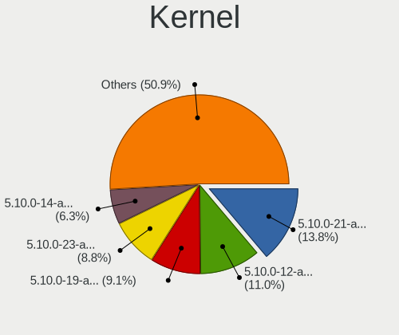

| Version                  | Notebooks | Percent |
|--------------------------|-----------|---------|
| 5.10.0-21-amd64          | 43        | 14.01%  |
| 5.10.0-12-amd64          | 35        | 11.4%   |
| 5.10.0-19-amd64          | 29        | 9.45%   |
| 5.10.0-23-amd64          | 28        | 9.12%   |
| 5.10.0-14-amd64          | 20        | 6.51%   |
| 5.10.0-20-amd64          | 17        | 5.54%   |
| 5.10.0-15-amd64          | 16        | 5.21%   |
| 5.10.0-25-amd64          | 15        | 4.89%   |
| 5.10.0-18-amd64          | 14        | 4.56%   |
| 5.10.0-13-amd64          | 14        | 4.56%   |
| 5.10.0-16-amd64          | 11        | 3.58%   |
| 5.10.0-17-amd64          | 9         | 2.93%   |
| 5.10.0-22-amd64          | 8         | 2.61%   |
| 5.10.0-13-686            | 5         | 1.63%   |
| 5.18.0-0.bpo.1-amd64     | 4         | 1.3%    |
| 5.16.0-0.bpo.4-amd64     | 4         | 1.3%    |
| 6.1.0-0.deb11.6-amd64    | 3         | 0.98%   |
| 5.10.0-24-amd64          | 3         | 0.98%   |
| 5.19.0-0.deb11.2-amd64   | 2         | 0.65%   |
| 5.10.0-26-amd64          | 2         | 0.65%   |
| 5.10.0-12-686            | 2         | 0.65%   |
| 6.1.11-x64v1-xanmod1     | 1         | 0.33%   |
| 6.1.0-15-amd64           | 1         | 0.33%   |
| 6.1.0-13-amd64           | 1         | 0.33%   |
| 6.1.0-0.deb11.9-amd64    | 1         | 0.33%   |
| 6.1.0-0.deb11.6-rt-amd64 | 1         | 0.33%   |
| 6.1.0-0.deb11.5-amd64    | 1         | 0.33%   |
| 5.19.10-xanmod1          | 1         | 0.33%   |
| 5.18.0-4-amd64           | 1         | 0.33%   |
| 5.18.0-3-amd64           | 1         | 0.33%   |
| 5.16.0-0.bpo.3-amd64     | 1         | 0.33%   |
| 5.15.78-xanmod1          | 1         | 0.33%   |
| 5.15.70-xanmod1          | 1         | 0.33%   |
| 5.15.0-0.bpo.3-amd64     | 1         | 0.33%   |
| 5.10.0-27-amd64          | 1         | 0.33%   |
| 5.10.0-27-686            | 1         | 0.33%   |
| 5.10.0-25-686            | 1         | 0.33%   |
| 5.10.0-22-686            | 1         | 0.33%   |
| 5.10.0-21-686            | 1         | 0.33%   |
| 5.10.0-20-686            | 1         | 0.33%   |

Kernel Family
-------------

Linux kernel without a distro release

| Version | Notebooks | Percent |
|---------|-----------|---------|
| 5.10.0  | 258       | 90.85%  |
| 6.1.0   | 8         | 2.82%   |
| 5.18.0  | 6         | 2.11%   |
| 5.16.0  | 4         | 1.41%   |
| 5.19.0  | 2         | 0.7%    |
| 6.1.11  | 1         | 0.35%   |
| 5.19.10 | 1         | 0.35%   |
| 5.15.78 | 1         | 0.35%   |
| 5.15.70 | 1         | 0.35%   |
| 5.15.0  | 1         | 0.35%   |
| 4.19.0  | 1         | 0.35%   |

Kernel Major Ver.
-----------------

Linux kernel major version

| Version | Notebooks | Percent |
|---------|-----------|---------|
| 5.10    | 258       | 91.17%  |
| 6.1     | 9         | 3.18%   |
| 5.18    | 6         | 2.12%   |
| 5.16    | 4         | 1.41%   |
| 5.19    | 3         | 1.06%   |
| 5.15    | 2         | 0.71%   |
| 4.19    | 1         | 0.35%   |

Arch
----

OS architecture (x86_64, i586, etc.)

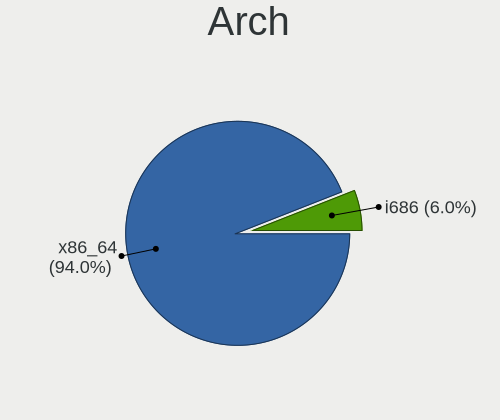

| Name   | Notebooks | Percent |
|--------|-----------|---------|
| x86_64 | 263       | 94.6%   |
| i686   | 15        | 5.4%    |

DE
--

Desktop Environment

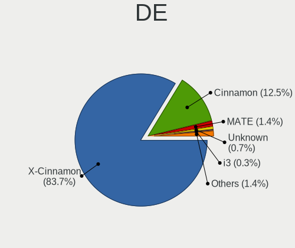

| Name       | Notebooks | Percent |
|------------|-----------|---------|
| X-Cinnamon | 238       | 84.7%   |
| Cinnamon   | 34        | 12.1%   |
| MATE       | 4         | 1.42%   |
| XFCE       | 1         | 0.36%   |
| i3         | 1         | 0.36%   |
| GNOME      | 1         | 0.36%   |
| awesome    | 1         | 0.36%   |
| Unknown    | 1         | 0.36%   |

Display Server
--------------

X11 or Wayland

| Name | Notebooks | Percent |
|------|-----------|---------|
| X11  | 278       | 100%    |

Display Manager
---------------

SDDM, LightDM, etc.

| Name    | Notebooks | Percent |
|---------|-----------|---------|
| Unknown | 155       | 55.16%  |
| LightDM | 125       | 44.48%  |
| GDM     | 1         | 0.36%   |

OS Lang
-------

Language

| Lang  | Notebooks | Percent |
|-------|-----------|---------|
| en_US | 95        | 33.93%  |
| de_DE | 42        | 15%     |
| ru_RU | 23        | 8.21%   |
| pt_BR | 20        | 7.14%   |
| en_GB | 15        | 5.36%   |
| it_IT | 12        | 4.29%   |
| pl_PL | 10        | 3.57%   |
| fr_FR | 9         | 3.21%   |
| es_ES | 6         | 2.14%   |
| es_MX | 4         | 1.43%   |
| tr_TR | 3         | 1.07%   |
| el_GR | 3         | 1.07%   |
| pt_PT | 2         | 0.71%   |
| ko_KR | 2         | 0.71%   |
| es_EC | 2         | 0.71%   |
| es_BO | 2         | 0.71%   |
| en_NZ | 2         | 0.71%   |
| en_IE | 2         | 0.71%   |
| da_DK | 2         | 0.71%   |
| cs_CZ | 2         | 0.71%   |
| zh_CN | 1         | 0.36%   |
| sv_SE | 1         | 0.36%   |
| sl_SI | 1         | 0.36%   |
| nn_NO | 1         | 0.36%   |
| nl_NL | 1         | 0.36%   |
| nl_AW | 1         | 0.36%   |
| ja_JP | 1         | 0.36%   |
| hu_HU | 1         | 0.36%   |
| fr_BE | 1         | 0.36%   |
| fi_FI | 1         | 0.36%   |
| es_VE | 1         | 0.36%   |
| es_PE | 1         | 0.36%   |
| es_CU | 1         | 0.36%   |
| es_CR | 1         | 0.36%   |
| es_CL | 1         | 0.36%   |
| es_AR | 1         | 0.36%   |
| en_SG | 1         | 0.36%   |
| en_IN | 1         | 0.36%   |
| en_CA | 1         | 0.36%   |
| en_AU | 1         | 0.36%   |

Boot Mode
---------

EFI or BIOS

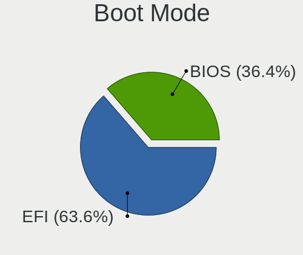

| Mode | Notebooks | Percent |
|------|-----------|---------|
| EFI  | 180       | 64.52%  |
| BIOS | 99        | 35.48%  |

Filesystem
----------

Type of filesystem

| Type    | Notebooks | Percent |
|---------|-----------|---------|
| Ext4    | 256       | 91.76%  |
| Overlay | 12        | 4.3%    |
| Btrfs   | 5         | 1.79%   |
| Tmpfs   | 4         | 1.43%   |
| Xfs     | 2         | 0.72%   |

Part. scheme
------------

Scheme of partitioning

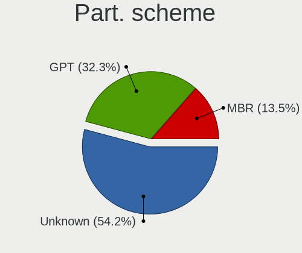

| Type    | Notebooks | Percent |
|---------|-----------|---------|
| Unknown | 154       | 54.8%   |
| GPT     | 91        | 32.38%  |
| MBR     | 36        | 12.81%  |

Dual Boot with Linux/BSD
------------------------

Hosting more than one Linux/BSD

| Dual boot | Notebooks | Percent |
|-----------|-----------|---------|
| No        | 260       | 92.86%  |
| Yes       | 20        | 7.14%   |

Dual Boot (Win)
---------------

Hosting Linux and Windows

| Dual boot | Notebooks | Percent |
|-----------|-----------|---------|
| No        | 241       | 86.07%  |
| Yes       | 39        | 13.93%  |

Board
-----

Vendor
------

Motherboard manufacturer

| Name                | Notebooks | Percent |
|---------------------|-----------|---------|
| Hewlett-Packard     | 61        | 21.94%  |
| Lenovo              | 57        | 20.5%   |
| Dell                | 39        | 14.03%  |
| Acer                | 25        | 8.99%   |
| ASUSTek Computer    | 16        | 5.76%   |
| Toshiba             | 11        | 3.96%   |
| Apple               | 10        | 3.6%    |
| Google              | 4         | 1.44%   |
| Sony                | 3         | 1.08%   |
| Samsung Electronics | 3         | 1.08%   |
| Medion              | 3         | 1.08%   |
| Fujitsu             | 3         | 1.08%   |
| Alienware           | 3         | 1.08%   |
| Unknown             | 3         | 1.08%   |
| Star Labs           | 2         | 0.72%   |
| Multilaser          | 2         | 0.72%   |
| MSI                 | 2         | 0.72%   |
| GPU Company         | 2         | 0.72%   |
| Fujitsu Siemens     | 2         | 0.72%   |
| Compaq              | 2         | 0.72%   |
| Wortmann AG         | 1         | 0.36%   |
| TUXEDO              | 1         | 0.36%   |
| Timi                | 1         | 0.36%   |
| Teclast             | 1         | 0.36%   |
| STONE COMPUTERS     | 1         | 0.36%   |
| Positivo            | 1         | 0.36%   |
| Philco              | 1         | 0.36%   |
| Packard Bell        | 1         | 0.36%   |
| Microtech           | 1         | 0.36%   |
| LincPlus            | 1         | 0.36%   |
| LG Electronics      | 1         | 0.36%   |
| Kruger&Matz         | 1         | 0.36%   |
| itel Mobile Limited | 1         | 0.36%   |
| Insyde              | 1         | 0.36%   |
| IGEL Technology     | 1         | 0.36%   |
| HUAWEI              | 1         | 0.36%   |
| Howard Computers    | 1         | 0.36%   |
| HIPER               | 1         | 0.36%   |
| Gear                | 1         | 0.36%   |
| Gateway             | 1         | 0.36%   |

Model
-----

Motherboard model

| Name                           | Notebooks | Percent |
|--------------------------------|-----------|---------|
| Unknown                        | 5         | 1.8%    |
| HP 250 G8 Notebook PC          | 3         | 1.08%   |
| Star Labs StarBook             | 2         | 0.72%   |
| Lenovo IdeaPad 3 15ITL6 82H8   | 2         | 0.72%   |
| Lenovo IdeaPad 3 15ADA05 81W1  | 2         | 0.72%   |
| Lenovo G500 20236              | 2         | 0.72%   |
| HP ProBook 650 G2              | 2         | 0.72%   |
| HP Pavilion Notebook           | 2         | 0.72%   |
| HP Pavilion dv6                | 2         | 0.72%   |
| HP Notebook                    | 2         | 0.72%   |
| HP Laptop 15z-ef2xxx           | 2         | 0.72%   |
| HP Laptop 15-dw3xxx            | 2         | 0.72%   |
| HP Laptop 14-dk1xxx            | 2         | 0.72%   |
| HP 250 G7 Notebook PC          | 2         | 0.72%   |
| Dell Latitude E6400            | 2         | 0.72%   |
| Dell Latitude E5540            | 2         | 0.72%   |
| Compaq 420                     | 2         | 0.72%   |
| Apple MacBookPro9,2            | 2         | 0.72%   |
| Apple MacBookPro11,1           | 2         | 0.72%   |
| Acer Aspire E1-570G            | 2         | 0.72%   |
| Acer Aspire 7745G              | 2         | 0.72%   |
| Acer Aspire 5930               | 2         | 0.72%   |
| Wortmann AG TERRA_MOBILE_1713A | 1         | 0.36%   |
| TUXEDO N8xxEZ                  | 1         | 0.36%   |
| Toshiba Satellite Pro A50-C    | 1         | 0.36%   |
| Toshiba Satellite P505         | 1         | 0.36%   |
| Toshiba Satellite M55          | 1         | 0.36%   |
| Toshiba Satellite L855D        | 1         | 0.36%   |
| Toshiba Satellite L455         | 1         | 0.36%   |
| Toshiba Satellite L305         | 1         | 0.36%   |
| Toshiba Satellite L300D        | 1         | 0.36%   |
| Toshiba Satellite L300         | 1         | 0.36%   |
| Toshiba Satellite C850-D8K     | 1         | 0.36%   |
| Toshiba PORTEGE Z30-B          | 1         | 0.36%   |
| Toshiba PORTEGE M780           | 1         | 0.36%   |
| Timi RedmiBook 14-APCS         | 1         | 0.36%   |
| Teclast F6 Pro                 | 1         | 0.36%   |
| STONE COMPUTERS NOTCHA-286     | 1         | 0.36%   |
| Sony SVF1532W4E                | 1         | 0.36%   |
| Sony SVE1713Y1RB               | 1         | 0.36%   |

Model Family
------------

Motherboard model prefix

| Name                       | Notebooks | Percent |
|----------------------------|-----------|---------|
| Lenovo ThinkPad            | 29        | 10.43%  |
| Acer Aspire                | 21        | 7.55%   |
| HP Laptop                  | 13        | 4.68%   |
| Dell Latitude              | 13        | 4.68%   |
| Lenovo IdeaPad             | 12        | 4.32%   |
| Toshiba Satellite          | 9         | 3.24%   |
| HP Pavilion                | 9         | 3.24%   |
| Dell Inspiron              | 9         | 3.24%   |
| HP EliteBook               | 7         | 2.52%   |
| ASUS VivoBook              | 6         | 2.16%   |
| HP ProBook                 | 5         | 1.8%    |
| HP 250                     | 5         | 1.8%    |
| Dell Precision             | 5         | 1.8%    |
| Unknown                    | 5         | 1.8%    |
| Dell XPS                   | 4         | 1.44%   |
| HP ZBook                   | 3         | 1.08%   |
| HP Compaq                  | 3         | 1.08%   |
| Dell Vostro                | 3         | 1.08%   |
| Toshiba PORTEGE            | 2         | 0.72%   |
| Star Labs StarBook         | 2         | 0.72%   |
| Lenovo ThinkBook           | 2         | 0.72%   |
| Lenovo Legion              | 2         | 0.72%   |
| Lenovo G500                | 2         | 0.72%   |
| HP Notebook                | 2         | 0.72%   |
| HP ENVY                    | 2         | 0.72%   |
| HP 255                     | 2         | 0.72%   |
| Fujitsu Siemens AMILO      | 2         | 0.72%   |
| Fujitsu LIFEBOOK           | 2         | 0.72%   |
| Compaq 420                 | 2         | 0.72%   |
| ASUS ROG                   | 2         | 0.72%   |
| Apple MacBookPro9          | 2         | 0.72%   |
| Apple MacBookPro11         | 2         | 0.72%   |
| Alienware m15              | 2         | 0.72%   |
| Acer TravelMate            | 2         | 0.72%   |
| Wortmann AG TERRA          | 1         | 0.36%   |
| TUXEDO N8xxEZ              | 1         | 0.36%   |
| Timi RedmiBook             | 1         | 0.36%   |
| Teclast F6                 | 1         | 0.36%   |
| STONE COMPUTERS NOTCHA-286 | 1         | 0.36%   |
| Sony SVF1532W4E            | 1         | 0.36%   |

MFG Year
--------

Motherboard manufacture year

| Year | Notebooks | Percent |
|------|-----------|---------|
| 2021 | 30        | 10.79%  |
| 2020 | 28        | 10.07%  |
| 2013 | 23        | 8.27%   |
| 2016 | 22        | 7.91%   |
| 2012 | 20        | 7.19%   |
| 2018 | 19        | 6.83%   |
| 2010 | 19        | 6.83%   |
| 2019 | 18        | 6.47%   |
| 2017 | 15        | 5.4%    |
| 2008 | 14        | 5.04%   |
| 2011 | 13        | 4.68%   |
| 2015 | 11        | 3.96%   |
| 2009 | 11        | 3.96%   |
| 2022 | 10        | 3.6%    |
| 2014 | 9         | 3.24%   |
| 2007 | 6         | 2.16%   |
| 2006 | 6         | 2.16%   |
| 2023 | 4         | 1.44%   |

Form Factor
-----------

Physical design of the computer

| Name     | Notebooks | Percent |
|----------|-----------|---------|
| Notebook | 278       | 100%    |

Secure Boot
-----------

Enabled or disabled

| State    | Notebooks | Percent |
|----------|-----------|---------|
| Disabled | 253       | 90.36%  |
| Enabled  | 27        | 9.64%   |

Coreboot
--------

Have coreboot on board

| Used | Notebooks | Percent |
|------|-----------|---------|
| No   | 271       | 97.48%  |
| Yes  | 7         | 2.52%   |

RAM Size
--------

Total RAM memory

| Size in GB  | Notebooks | Percent |
|-------------|-----------|---------|
| 4.01-8.0    | 77        | 27.6%   |
| 3.01-4.0    | 68        | 24.37%  |
| 16.01-24.0  | 43        | 15.41%  |
| 8.01-16.0   | 43        | 15.41%  |
| 1.01-2.0    | 18        | 6.45%   |
| 32.01-64.0  | 14        | 5.02%   |
| 2.01-3.0    | 10        | 3.58%   |
| 64.01-256.0 | 5         | 1.79%   |
| 0.51-1.0    | 1         | 0.36%   |

RAM Used
--------

Used RAM memory

| Used GB    | Notebooks | Percent |
|------------|-----------|---------|
| 1.01-2.0   | 123       | 41.28%  |
| 2.01-3.0   | 96        | 32.21%  |
| 3.01-4.0   | 31        | 10.4%   |
| 4.01-8.0   | 24        | 8.05%   |
| 0.51-1.0   | 17        | 5.7%    |
| 8.01-16.0  | 4         | 1.34%   |
| 32.01-64.0 | 1         | 0.34%   |
| 24.01-32.0 | 1         | 0.34%   |
| 16.01-24.0 | 1         | 0.34%   |

Total Drives
------------

Number of drives on board

| Drives | Notebooks | Percent |
|--------|-----------|---------|
| 1      | 212       | 74.65%  |
| 2      | 58        | 20.42%  |
| 3      | 10        | 3.52%   |
| 4      | 2         | 0.7%    |
| 0      | 2         | 0.7%    |

Has CD-ROM
----------

Has CD-ROM on board

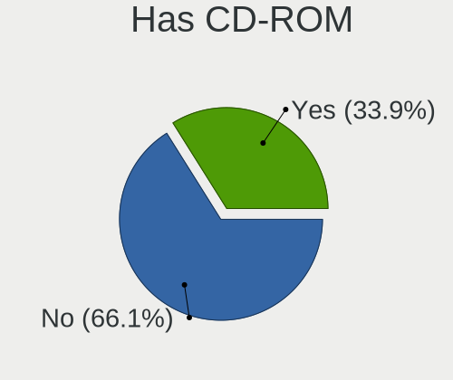

| Presented | Notebooks | Percent |
|-----------|-----------|---------|
| No        | 184       | 65.95%  |
| Yes       | 95        | 34.05%  |

Has Ethernet
------------

Has Ethernet on board

| Presented | Notebooks | Percent |
|-----------|-----------|---------|
| Yes       | 220       | 79.14%  |
| No        | 58        | 20.86%  |

Has WiFi
--------

Has WiFi module

| Presented | Notebooks | Percent |
|-----------|-----------|---------|
| Yes       | 271       | 97.48%  |
| No        | 7         | 2.52%   |

Has Bluetooth
-------------

Has Bluetooth module

| Presented | Notebooks | Percent |
|-----------|-----------|---------|
| Yes       | 194       | 69.53%  |
| No        | 85        | 30.47%  |

Location
--------

Country
-------

Geographic location (country)

| Country      | Notebooks | Percent |
|--------------|-----------|---------|
| USA          | 47        | 16.73%  |
| Germany      | 47        | 16.73%  |
| Russia       | 26        | 9.25%   |
| Italy        | 20        | 7.12%   |
| Brazil       | 20        | 7.12%   |
| Poland       | 13        | 4.63%   |
| UK           | 10        | 3.56%   |
| France       | 9         | 3.2%    |
| Spain        | 7         | 2.49%   |
| Mexico       | 5         | 1.78%   |
| Belarus      | 4         | 1.42%   |
| Turkey       | 3         | 1.07%   |
| Sweden       | 3         | 1.07%   |
| Portugal     | 3         | 1.07%   |
| Greece       | 3         | 1.07%   |
| Ecuador      | 3         | 1.07%   |
| Chile        | 3         | 1.07%   |
| Canada       | 3         | 1.07%   |
| Belgium      | 3         | 1.07%   |
| Australia    | 3         | 1.07%   |
| South Korea  | 2         | 0.71%   |
| Slovenia     | 2         | 0.71%   |
| Romania      | 2         | 0.71%   |
| Peru         | 2         | 0.71%   |
| Paraguay     | 2         | 0.71%   |
| New Zealand  | 2         | 0.71%   |
| Netherlands  | 2         | 0.71%   |
| Japan        | 2         | 0.71%   |
| Indonesia    | 2         | 0.71%   |
| Hungary      | 2         | 0.71%   |
| Finland      | 2         | 0.71%   |
| Denmark      | 2         | 0.71%   |
| Czechia      | 2         | 0.71%   |
| Bolivia      | 2         | 0.71%   |
| Austria      | 2         | 0.71%   |
| Vietnam      | 1         | 0.36%   |
| Venezuela    | 1         | 0.36%   |
| Serbia       | 1         | 0.36%   |
| Saudi Arabia | 1         | 0.36%   |
| Norway       | 1         | 0.36%   |

City
----

Geographic location (city)

| City                 | Notebooks | Percent |
|----------------------|-----------|---------|
| Moscow               | 7         | 2.39%   |
| Berlin               | 5         | 1.71%   |
| St Petersburg        | 4         | 1.37%   |
| Rome                 | 4         | 1.37%   |
| New York             | 3         | 1.02%   |
| Munich               | 3         | 1.02%   |
| Krakow               | 3         | 1.02%   |
| Wroclaw              | 2         | 0.68%   |
| Sydney               | 2         | 0.68%   |
| Santiago             | 2         | 0.68%   |
| San Jose             | 2         | 0.68%   |
| Rio de Janeiro       | 2         | 0.68%   |
| Oruro                | 2         | 0.68%   |
| Neasden              | 2         | 0.68%   |
| Milan                | 2         | 0.68%   |
| Miami                | 2         | 0.68%   |
| Malmo                | 2         | 0.68%   |
| Madrid               | 2         | 0.68%   |
| Lisbon               | 2         | 0.68%   |
| Lima                 | 2         | 0.68%   |
| Krefeld              | 2         | 0.68%   |
| Jakarta              | 2         | 0.68%   |
| Guayaquil            | 2         | 0.68%   |
| Freiburg im Breisgau | 2         | 0.68%   |
| Delligsen            | 2         | 0.68%   |
| Curitiba             | 2         | 0.68%   |
| Ciudad Jurez       | 2         | 0.68%   |
| Bremen               | 2         | 0.68%   |
| Bergamo              | 2         | 0.68%   |
| Auckland             | 2         | 0.68%   |
| Zenica               | 1         | 0.34%   |
| Zaragoza             | 1         | 0.34%   |
| Yekaterinburg        | 1         | 0.34%   |
| Woomin             | 1         | 0.34%   |
| Wiesloch             | 1         | 0.34%   |
| West Hartford        | 1         | 0.34%   |
| Weimar               | 1         | 0.34%   |
| Warsaw               | 1         | 0.34%   |
| Voronezh             | 1         | 0.34%   |
| Volos                | 1         | 0.34%   |

Drives
------

Drive Vendor
------------

Hard drive vendors

| Vendor                         | Notebooks | Drives | Percent |
|--------------------------------|-----------|--------|---------|
| Samsung Electronics            | 43        | 48     | 12.68%  |
| WDC                            | 36        | 41     | 10.62%  |
| Seagate                        | 31        | 36     | 9.14%   |
| Unknown                        | 24        | 37     | 7.08%   |
| Sandisk                        | 21        | 36     | 6.19%   |
| Toshiba                        | 16        | 17     | 4.72%   |
| Kingston                       | 16        | 20     | 4.72%   |
| SK hynix                       | 14        | 14     | 4.13%   |
| Intel                          | 12        | 13     | 3.54%   |
| Hitachi                        | 11        | 11     | 3.24%   |
| Crucial                        | 9         | 10     | 2.65%   |
| A-DATA Technology              | 8         | 9      | 2.36%   |
| Micron Technology              | 6         | 7      | 1.77%   |
| China                          | 6         | 7      | 1.77%   |
| Apple                          | 6         | 11     | 1.77%   |
| HGST                           | 5         | 10     | 1.47%   |
| PNY                            | 4         | 5      | 1.18%   |
| KingSpec                       | 4         | 4      | 1.18%   |
| Fujitsu                        | 4         | 4      | 1.18%   |
| Phison                         | 3         | 3      | 0.88%   |
| Patriot                        | 3         | 3      | 0.88%   |
| GOODRAM                        | 3         | 3      | 0.88%   |
| Unknown                        | 3         | 3      | 0.88%   |
| Transcend                      | 2         | 3      | 0.59%   |
| Team                           | 2         | 2      | 0.59%   |
| Star Drive                     | 2         | 2      | 0.59%   |
| SABRENT                        | 2         | 3      | 0.59%   |
| KIOXIA                         | 2         | 11     | 0.59%   |
| Intenso                        | 2         | 2      | 0.59%   |
| Fanxiang                       | 2         | 3      | 0.59%   |
| Emtec                          | 2         | 2      | 0.59%   |
| WINTEC                         | 1         | 1      | 0.29%   |
| WD MediaMax                    | 1         | 1      | 0.29%   |
| WALRAM                         | 1         | 1      | 0.29%   |
| Union Memory                   | 1         | 1      | 0.29%   |
| UMIS                           | 1         | 1      | 0.29%   |
| SSD PHIS                       | 1         | 1      | 0.29%   |
| SPCC                           | 1         | 1      | 0.29%   |
| Solid State Storage Technology | 1         | 1      | 0.29%   |
| Silicon Motion                 | 1         | 1      | 0.29%   |

Drive Model
-----------

Hard drive models

| Model                                       | Notebooks | Percent |
|---------------------------------------------|-----------|---------|
| Seagate ST1000LM035-1RK172 1TB              | 8         | 2.29%   |
| Samsung SSD 850 EVO 500GB                   | 4         | 1.15%   |
| Crucial CT1000BX500SSD1 1TB                 | 4         | 1.15%   |
| Unknown SD/MMC/MS PRO 256GB                 | 3         | 0.86%   |
| Unknown MMC Card  64GB                      | 3         | 0.86%   |
| Toshiba MQ04ABF100 1TB                      | 3         | 0.86%   |
| Seagate ST500LT012-1DG142 500GB             | 3         | 0.86%   |
| SanDisk NVMe SSD Drive 256GB                | 3         | 0.86%   |
| Kingston SA400S37480G 480GB SSD             | 3         | 0.86%   |
| Kingston SA400S37120G 120GB SSD             | 3         | 0.86%   |
| Unknown                                     | 3         | 0.86%   |
| WDC WD3200BPVT-22JJ5T0 320GB                | 2         | 0.57%   |
| WDC WD3200BEVT-60ZCT1 320GB                 | 2         | 0.57%   |
| WDC PC SN530 SDBPNPZ-256G-1006 256GB        | 2         | 0.57%   |
| Unknown SC128  128GB                        | 2         | 0.57%   |
| Unknown MMC Card  32GB                      | 2         | 0.57%   |
| Toshiba XG6 NVMe SSD Controller 256GB       | 2         | 0.57%   |
| Toshiba MQ01ABD100 1TB                      | 2         | 0.57%   |
| Star Drive PCIe SSD 480GB                   | 2         | 0.57%   |
| SK hynix BC501 NVMe Solid State Drive 512GB | 2         | 0.57%   |
| Seagate ST9250410AS 250GB                   | 2         | 0.57%   |
| Seagate ST9250315AS 250GB                   | 2         | 0.57%   |
| Seagate ST500LM012 HN-M500MBB 500GB         | 2         | 0.57%   |
| Sandisk WD Blue SN550 NVMe SSD 512GB        | 2         | 0.57%   |
| Samsung SSD 980 PRO 1TB                     | 2         | 0.57%   |
| Samsung SSD 980 1TB                         | 2         | 0.57%   |
| Samsung SSD 860 EVO 1TB                     | 2         | 0.57%   |
| Samsung SSD 840 EVO 250GB                   | 2         | 0.57%   |
| Samsung PM991a NVMe 512GB                   | 2         | 0.57%   |
| SABRENT Disk 500GB                          | 2         | 0.57%   |
| Patriot Burst 240GB SSD                     | 2         | 0.57%   |
| Micron NVMe SSD Drive 512GB                 | 2         | 0.57%   |
| KingSpec MT-128 128GB SSD                   | 2         | 0.57%   |
| Intel SSD 660P Series 1024GB                | 2         | 0.57%   |
| Fujitsu MHZ2160BH G2 160GB                  | 2         | 0.57%   |
| Crucial CT1000MX500SSD1 1TB                 | 2         | 0.57%   |
| Apple SSD SD0128F 121GB                     | 2         | 0.57%   |
| A-DATA SU800 256GB SSD                      | 2         | 0.57%   |
| A-DATA SU650 240GB SSD                      | 2         | 0.57%   |
| A-DATA ED600 1TB SSD                        | 2         | 0.57%   |

HDD Vendor
----------

Hard disk drive vendors

| Vendor              | Notebooks | Drives | Percent |
|---------------------|-----------|--------|---------|
| Seagate             | 31        | 36     | 33.7%   |
| WDC                 | 24        | 27     | 26.09%  |
| Hitachi             | 11        | 11     | 11.96%  |
| Toshiba             | 10        | 11     | 10.87%  |
| HGST                | 5         | 10     | 5.43%   |
| Fujitsu             | 4         | 4      | 4.35%   |
| Unknown             | 3         | 3      | 3.26%   |
| Samsung Electronics | 2         | 2      | 2.17%   |
| Intenso             | 1         | 1      | 1.09%   |
| Initio              | 1         | 1      | 1.09%   |

SSD Vendor
----------

Solid state drive vendors

| Vendor              | Notebooks | Drives | Percent |
|---------------------|-----------|--------|---------|
| Samsung Electronics | 19        | 23     | 15.2%   |
| Kingston            | 12        | 15     | 9.6%    |
| SanDisk             | 10        | 16     | 8%      |
| Crucial             | 9         | 10     | 7.2%    |
| A-DATA Technology   | 8         | 9      | 6.4%    |
| Intel               | 5         | 5      | 4%      |
| China               | 5         | 6      | 4%      |
| Apple               | 5         | 5      | 4%      |
| PNY                 | 4         | 5      | 3.2%    |
| KingSpec            | 4         | 4      | 3.2%    |
| WDC                 | 3         | 3      | 2.4%    |
| Patriot             | 3         | 3      | 2.4%    |
| GOODRAM             | 3         | 3      | 2.4%    |
| Transcend           | 2         | 3      | 1.6%    |
| Toshiba             | 2         | 2      | 1.6%    |
| Team                | 2         | 2      | 1.6%    |
| SABRENT             | 2         | 3      | 1.6%    |
| Emtec               | 2         | 2      | 1.6%    |
| Unknown             | 2         | 2      | 1.6%    |
| WINTEC              | 1         | 1      | 0.8%    |
| SSD PHIS            | 1         | 1      | 0.8%    |
| SPCC                | 1         | 1      | 0.8%    |
| SK hynix            | 1         | 1      | 0.8%    |
| SCCTS-603-001T      | 1         | 1      | 0.8%    |
| ORICO               | 1         | 1      | 0.8%    |
| Netac               | 1         | 1      | 0.8%    |
| Microtech           | 1         | 2      | 0.8%    |
| Micron Technology   | 1         | 1      | 0.8%    |
| LITEON              | 1         | 1      | 0.8%    |
| Lexar               | 1         | 1      | 0.8%    |
| KODAK               | 1         | 1      | 0.8%    |
| Intenso             | 1         | 1      | 0.8%    |
| HXY                 | 1         | 1      | 0.8%    |
| Hewlett-Packard     | 1         | 1      | 0.8%    |
| Hanye               | 1         | 1      | 0.8%    |
| Gigabyte Technology | 1         | 2      | 0.8%    |
| FORESEE             | 1         | 3      | 0.8%    |
| Fanxiang            | 1         | 2      | 0.8%    |
| Corsair             | 1         | 1      | 0.8%    |
| BHT                 | 1         | 2      | 0.8%    |

Drive Kind
----------

HDD or SSD

| Kind    | Notebooks | Drives | Percent |
|---------|-----------|--------|---------|
| SSD     | 116       | 150    | 36.02%  |
| HDD     | 89        | 106    | 27.64%  |
| NVMe    | 83        | 118    | 25.78%  |
| MMC     | 23        | 34     | 7.14%   |
| Unknown | 11        | 13     | 3.42%   |

Drive Connector
---------------

SATA, SAS, NVMe, etc.

| Type | Notebooks | Drives | Percent |
|------|-----------|--------|---------|
| SATA | 191       | 249    | 61.61%  |
| NVMe | 82        | 117    | 26.45%  |
| MMC  | 23        | 34     | 7.42%   |
| SAS  | 14        | 21     | 4.52%   |

Drive Size
----------

Size of hard drive

| Size in TB | Notebooks | Drives | Percent |
|------------|-----------|--------|---------|
| 0.01-0.5   | 146       | 184    | 73.37%  |
| 0.51-1.0   | 46        | 64     | 23.12%  |
| 1.01-2.0   | 4         | 5      | 2.01%   |
| 2.01-3.0   | 2         | 2      | 1.01%   |
| 4.01-10.0  | 1         | 1      | 0.5%    |

Space Total
-----------

Amount of disk space available on the file system

| Size in GB     | Notebooks | Percent |
|----------------|-----------|---------|
| 101-250        | 99        | 34.86%  |
| 251-500        | 77        | 27.11%  |
| 501-1000       | 38        | 13.38%  |
| 51-100         | 19        | 6.69%   |
| 1001-2000      | 17        | 5.99%   |
| 1-20           | 12        | 4.23%   |
| 21-50          | 11        | 3.87%   |
| 2001-3000      | 7         | 2.46%   |
| More than 3000 | 3         | 1.06%   |
| Unknown        | 1         | 0.35%   |

Space Used
----------

Amount of used disk space

| Used GB        | Notebooks | Percent |
|----------------|-----------|---------|
| 1-20           | 129       | 42.86%  |
| 21-50          | 63        | 20.93%  |
| 101-250        | 38        | 12.62%  |
| 51-100         | 38        | 12.62%  |
| 501-1000       | 14        | 4.65%   |
| 251-500        | 13        | 4.32%   |
| 1001-2000      | 3         | 1%      |
| More than 3000 | 1         | 0.33%   |
| 2001-3000      | 1         | 0.33%   |
| Unknown        | 1         | 0.33%   |

Malfunc. Drives
---------------

Drive models with a malfunction

| Model                                 | Notebooks | Drives | Percent |
|---------------------------------------|-----------|--------|---------|
| WINTEC 240GB SATA3 SF2281 SSD         | 1         | 1      | 4.35%   |
| WDC WD5000BEVT-22A0RT0 500GB          | 1         | 1      | 4.35%   |
| WDC WD3200BEVT-60ZCT1 320GB           | 1         | 1      | 4.35%   |
| WDC WD1600BEVT-22ZCT0 160GB           | 1         | 1      | 4.35%   |
| WDC WD1200BEVS-07LAT0 120GB           | 1         | 1      | 4.35%   |
| Toshiba THNSNF128GCSS 128GB SSD       | 1         | 1      | 4.35%   |
| SK hynix PC711 HFS512GDE9X073N 512GB  | 1         | 1      | 4.35%   |
| Seagate ST98823AS 80GB                | 1         | 1      | 4.35%   |
| Seagate ST9250315AS 250GB             | 1         | 1      | 4.35%   |
| Seagate ST500LT032-1E9142 500GB       | 1         | 1      | 4.35%   |
| Samsung Electronics SSD 980 PRO 1TB   | 1         | 1      | 4.35%   |
| Samsung Electronics SSD 970 EVO 500GB | 1         | 2      | 4.35%   |
| Samsung Electronics SSD 870 EVO 1TB   | 1         | 1      | 4.35%   |
| Samsung Electronics SSD 850 EVO 500GB | 1         | 1      | 4.35%   |
| Samsung Electronics HM160HC 160GB     | 1         | 1      | 4.35%   |
| Phison ES 512GB                       | 1         | 1      | 4.35%   |
| Intenso SSD 256GB                     | 1         | 1      | 4.35%   |
| Intel SSDSCKKF256G8 SATA 256GB        | 1         | 1      | 4.35%   |
| Intel SSDSC2CT240A3 240GB             | 1         | 1      | 4.35%   |
| Hitachi HTS547575A9E384 752GB         | 1         | 1      | 4.35%   |
| Hitachi HTS545050A7E380 500GB         | 1         | 1      | 4.35%   |
| Hitachi HTS541080G9AT00 80GB          | 1         | 1      | 4.35%   |
| HGST HTS545050A7E680 500GB            | 1         | 1      | 4.35%   |

Malfunc. Drive Vendor
---------------------

Vendors of faulty drives

| Vendor              | Notebooks | Drives | Percent |
|---------------------|-----------|--------|---------|
| Samsung Electronics | 5         | 6      | 22.73%  |
| WDC                 | 3         | 4      | 13.64%  |
| Seagate             | 3         | 3      | 13.64%  |
| Hitachi             | 3         | 3      | 13.64%  |
| Intel               | 2         | 2      | 9.09%   |
| WINTEC              | 1         | 1      | 4.55%   |
| Toshiba             | 1         | 1      | 4.55%   |
| SK hynix            | 1         | 1      | 4.55%   |
| Phison              | 1         | 1      | 4.55%   |
| Intenso             | 1         | 1      | 4.55%   |
| HGST                | 1         | 1      | 4.55%   |

Malfunc. HDD Vendor
-------------------

Vendors of faulty HDD drives

| Vendor              | Notebooks | Drives | Percent |
|---------------------|-----------|--------|---------|
| WDC                 | 3         | 4      | 27.27%  |
| Seagate             | 3         | 3      | 27.27%  |
| Hitachi             | 3         | 3      | 27.27%  |
| Samsung Electronics | 1         | 1      | 9.09%   |
| HGST                | 1         | 1      | 9.09%   |

Malfunc. Drive Kind
-------------------

Kinds of faulty drives

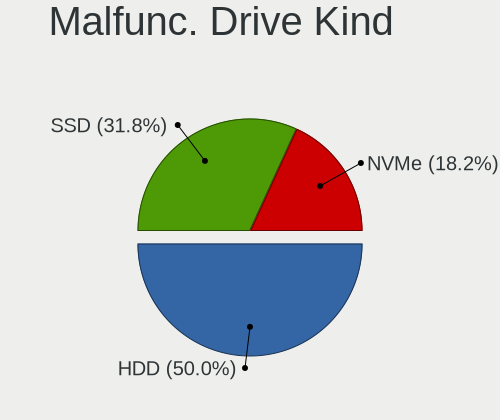

| Kind | Notebooks | Drives | Percent |
|------|-----------|--------|---------|
| HDD  | 11        | 12     | 50%     |
| SSD  | 7         | 7      | 31.82%  |
| NVMe | 4         | 5      | 18.18%  |

Failed Drives
-------------

Failed drive models

Zero info for selected period =(

Failed Drive Vendor
-------------------

Failed drive vendors

Zero info for selected period =(

Drive Status
------------

Number of failed and malfunc. drives

| Status   | Notebooks | Drives | Percent |
|----------|-----------|--------|---------|
| Detected | 177       | 255    | 58.61%  |
| Works    | 103       | 142    | 34.11%  |
| Malfunc  | 22        | 24     | 7.28%   |

Storage controller
------------------

Storage Vendor
--------------

Storage controller vendors

| Vendor                         | Notebooks | Percent |
|--------------------------------|-----------|---------|
| Intel                          | 190       | 60.13%  |
| AMD                            | 40        | 12.66%  |
| Samsung Electronics            | 24        | 7.59%   |
| SanDisk                        | 17        | 5.38%   |
| SK hynix                       | 12        | 3.8%    |
| Phison Electronics             | 6         | 1.9%    |
| Micron Technology              | 5         | 1.58%   |
| Toshiba America Info Systems   | 4         | 1.27%   |
| Kingston Technology Company    | 4         | 1.27%   |
| KIOXIA                         | 3         | 0.95%   |
| Union Memory (Shenzhen)        | 2         | 0.63%   |
| Marvell Technology Group       | 2         | 0.63%   |
| VIA Technologies               | 1         | 0.32%   |
| Solid State Storage Technology | 1         | 0.32%   |
| Silicon Motion                 | 1         | 0.32%   |
| Nvidia                         | 1         | 0.32%   |
| Micron/Crucial Technology      | 1         | 0.32%   |
| Apple                          | 1         | 0.32%   |
| ADATA Technology               | 1         | 0.32%   |

Storage Model
-------------

Storage controller models

| Model                                                                            | Notebooks | Percent |
|----------------------------------------------------------------------------------|-----------|---------|
| AMD FCH SATA Controller [AHCI mode]                                              | 34        | 9.8%    |
| Intel Sunrise Point-LP SATA Controller [AHCI mode]                               | 23        | 6.63%   |
| Intel 82801 Mobile SATA Controller [RAID mode]                                   | 20        | 5.76%   |
| Intel 7 Series Chipset Family 6-port SATA Controller [AHCI mode]                 | 20        | 5.76%   |
| Intel Volume Management Device NVMe RAID Controller                              | 15        | 4.32%   |
| Intel Tiger Lake-LP SATA Controller                                              | 12        | 3.46%   |
| Intel 5 Series/3400 Series Chipset 4 port SATA AHCI Controller                   | 12        | 3.46%   |
| Samsung NVMe SSD Controller 980 (DRAM-less)                                      | 11        | 3.17%   |
| Intel 82801IBM/IEM (ICH9M/ICH9M-E) 4 port SATA Controller [AHCI mode]            | 10        | 2.88%   |
| Intel 8 Series SATA Controller 1 [AHCI mode]                                     | 10        | 2.88%   |
| Intel 6 Series/C200 Series Chipset Family 6 port Mobile SATA AHCI Controller     | 10        | 2.88%   |
| Intel 82801G (ICH7 Family) IDE Controller                                        | 7         | 2.02%   |
| SK hynix Gold P31/BC711/PC711 NVMe Solid State Drive                             | 6         | 1.73%   |
| SanDisk Ultra 3D / WD Blue SN550 NVMe SSD                                        | 6         | 1.73%   |
| Intel Comet Lake SATA AHCI Controller                                            | 6         | 1.73%   |
| Intel 82801GBM/GHM (ICH7-M Family) SATA Controller [AHCI mode]                   | 6         | 1.73%   |
| Samsung NVMe SSD Controller SM981/PM981/PM983                                    | 5         | 1.44%   |
| Intel Atom/Celeron/Pentium Processor x5-E8000/J3xxx/N3xxx Series SATA Controller | 5         | 1.44%   |
| Intel 8 Series/C220 Series Chipset Family 6-port SATA Controller 1 [AHCI mode]   | 5         | 1.44%   |
| Phison PS5013-E13 PCIe3 NVMe Controller (DRAM-less)                              | 4         | 1.15%   |
| Intel SSD 660P Series                                                            | 4         | 1.15%   |
| Intel NM10/ICH7 Family SATA Controller [AHCI mode]                               | 4         | 1.15%   |
| Intel Celeron/Pentium Silver Processor SATA Controller                           | 4         | 1.15%   |
| Intel 82801HM/HEM (ICH8M/ICH8M-E) SATA Controller [AHCI mode]                    | 4         | 1.15%   |
| Intel 82801HM/HEM (ICH8M/ICH8M-E) IDE Controller                                 | 4         | 1.15%   |
| Intel 5 Series/3400 Series Chipset 6 port SATA AHCI Controller                   | 4         | 1.15%   |
| Toshiba America Info Systems XG6 NVMe SSD Controller                             | 3         | 0.86%   |
| SK hynix BC501 NVMe Solid State Drive                                            | 3         | 0.86%   |
| SanDisk PC SN530 NVMe SSD (DRAM-less)                                            | 3         | 0.86%   |
| Samsung NVMe SSD Controller PM9A1/PM9A3/980PRO                                   | 3         | 0.86%   |
| KIOXIA NVMe SSD Controller BG4 (DRAM-less)                                       | 3         | 0.86%   |
| Intel Wildcat Point-LP SATA Controller [AHCI Mode]                               | 3         | 0.86%   |
| Intel Q170/Q150/B150/H170/H110/Z170/CM236 Chipset SATA Controller [AHCI Mode]    | 3         | 0.86%   |
| Intel Cannon Lake Mobile PCH SATA AHCI Controller                                | 3         | 0.86%   |
| Intel Atom Processor E3800 Series SATA AHCI Controller                           | 3         | 0.86%   |
| AMD SB7x0/SB8x0/SB9x0 SATA Controller [AHCI mode]                                | 3         | 0.86%   |
| SK hynix BC511 NVMe SSD                                                          | 2         | 0.58%   |
| SanDisk IX SN530 NVMe SSD (DRAM-less)                                            | 2         | 0.58%   |
| SanDisk Extreme Pro / WD Black SN750 / PC SN730 / Red SN700 NVMe SSD             | 2         | 0.58%   |
| Samsung NVMe SSD Controller SM961/PM961/SM963                                    | 2         | 0.58%   |

Storage Kind
------------

Kind of storage controller (IDE, SATA, NVMe, SAS, ...)

| Kind | Notebooks | Percent |
|------|-----------|---------|
| SATA | 195       | 57.86%  |
| NVMe | 83        | 24.63%  |
| RAID | 36        | 10.68%  |
| IDE  | 23        | 6.82%   |

Processor
---------

CPU Vendor
----------

Processor vendors

| Vendor       | Notebooks | Percent |
|--------------|-----------|---------|
| Intel        | 223       | 80.22%  |
| AMD          | 54        | 19.42%  |
| CentaurHauls | 1         | 0.36%   |

CPU Model
---------

Processor models

| Model                                         | Notebooks | Percent |
|-----------------------------------------------|-----------|---------|
| Intel 11th Gen Core i5-1135G7 @ 2.40GHz       | 9         | 3.24%   |
| Intel Core i5-6200U CPU @ 2.30GHz             | 6         | 2.16%   |
| Intel Core i5-3230M CPU @ 2.60GHz             | 6         | 2.16%   |
| Intel Core i5-10210U CPU @ 1.60GHz            | 5         | 1.8%    |
| Intel 11th Gen Core i3-1115G4 @ 3.00GHz       | 5         | 1.8%    |
| AMD Ryzen 5 5500U with Radeon Graphics        | 5         | 1.8%    |
| Intel Core i7-7500U CPU @ 2.70GHz             | 4         | 1.44%   |
| Intel Core i5-8265U CPU @ 1.60GHz             | 4         | 1.44%   |
| Intel Core i3-1005G1 CPU @ 1.20GHz            | 4         | 1.44%   |
| Intel Atom x5-Z8350 CPU @ 1.44GHz             | 4         | 1.44%   |
| Intel Atom CPU N2600 @ 1.60GHz                | 4         | 1.44%   |
| Intel 11th Gen Core i7-1165G7 @ 2.80GHz       | 4         | 1.44%   |
| Intel Core i5-3320M CPU @ 2.60GHz             | 3         | 1.08%   |
| Intel Core i3-2310M CPU @ 2.10GHz             | 3         | 1.08%   |
| Intel Core 2 Duo CPU T6600 @ 2.20GHz          | 3         | 1.08%   |
| Intel Atom CPU N270 @ 1.60GHz                 | 3         | 1.08%   |
| AMD Ryzen 7 5700U with Radeon Graphics        | 3         | 1.08%   |
| AMD Ryzen 7 3700U with Radeon Vega Mobile Gfx | 3         | 1.08%   |
| AMD Ryzen 3 3250U with Radeon Graphics        | 3         | 1.08%   |
| Intel Pentium M processor 1.73GHz             | 2         | 0.72%   |
| Intel Pentium Dual-Core CPU T4300 @ 2.10GHz   | 2         | 0.72%   |
| Intel Pentium CPU P6000 @ 1.87GHz             | 2         | 0.72%   |
| Intel Pentium CPU N3700 @ 1.60GHz             | 2         | 0.72%   |
| Intel Core i7-9750H CPU @ 2.60GHz             | 2         | 0.72%   |
| Intel Core i7-8750H CPU @ 2.20GHz             | 2         | 0.72%   |
| Intel Core i7-7820HQ CPU @ 2.90GHz            | 2         | 0.72%   |
| Intel Core i7-7600U CPU @ 2.80GHz             | 2         | 0.72%   |
| Intel Core i7-6500U CPU @ 2.50GHz             | 2         | 0.72%   |
| Intel Core i7-4810MQ CPU @ 2.80GHz            | 2         | 0.72%   |
| Intel Core i7-3740QM CPU @ 2.70GHz            | 2         | 0.72%   |
| Intel Core i7-3632QM CPU @ 2.20GHz            | 2         | 0.72%   |
| Intel Core i7-3612QM CPU @ 2.10GHz            | 2         | 0.72%   |
| Intel Core i7-10510U CPU @ 1.80GHz            | 2         | 0.72%   |
| Intel Core i7 CPU Q 720 @ 1.60GHz             | 2         | 0.72%   |
| Intel Core i5-7200U CPU @ 2.50GHz             | 2         | 0.72%   |
| Intel Core i5-6300U CPU @ 2.40GHz             | 2         | 0.72%   |
| Intel Core i5-5200U CPU @ 2.20GHz             | 2         | 0.72%   |
| Intel Core i5-4300U CPU @ 1.90GHz             | 2         | 0.72%   |
| Intel Core i5-3210M CPU @ 2.50GHz             | 2         | 0.72%   |
| Intel Core i5 CPU M 450 @ 2.40GHz             | 2         | 0.72%   |

CPU Model Family
----------------

Processor model prefix

| Model                   | Notebooks | Percent |
|-------------------------|-----------|---------|
| Intel Core i5           | 60        | 21.58%  |
| Intel Core i7           | 41        | 14.75%  |
| Intel Core i3           | 28        | 10.07%  |
| Other                   | 25        | 8.99%   |
| Intel Celeron           | 14        | 5.04%   |
| Intel Atom              | 14        | 5.04%   |
| AMD Ryzen 5             | 14        | 5.04%   |
| Intel Core 2 Duo        | 13        | 4.68%   |
| Intel Pentium           | 10        | 3.6%    |
| AMD Ryzen 7             | 10        | 3.6%    |
| AMD Ryzen 3             | 5         | 1.8%    |
| AMD E1                  | 4         | 1.44%   |
| AMD A4                  | 4         | 1.44%   |
| Intel Pentium Silver    | 3         | 1.08%   |
| Intel Pentium Dual-Core | 3         | 1.08%   |
| Intel Genuine           | 3         | 1.08%   |
| AMD A10                 | 3         | 1.08%   |
| Intel Pentium M         | 2         | 0.72%   |
| Intel Core 2            | 2         | 0.72%   |
| Intel Celeron M         | 2         | 0.72%   |
| AMD Ryzen 9             | 2         | 0.72%   |
| AMD E2                  | 2         | 0.72%   |
| Intel Pentium Gold      | 1         | 0.36%   |
| Intel Pentium Dual      | 1         | 0.36%   |
| Intel Core m3           | 1         | 0.36%   |
| Intel Core i9           | 1         | 0.36%   |
| Intel Core 2 Extreme    | 1         | 0.36%   |
| CentaurHauls VIA Eden   | 1         | 0.36%   |
| AMD Turion 64 X2 Mobile | 1         | 0.36%   |
| AMD E                   | 1         | 0.36%   |
| AMD C-50                | 1         | 0.36%   |
| AMD Athlon II           | 1         | 0.36%   |
| AMD Athlon 64 X2        | 1         | 0.36%   |
| AMD Athlon              | 1         | 0.36%   |
| AMD A8                  | 1         | 0.36%   |
| AMD A6                  | 1         | 0.36%   |

CPU Cores
---------

Number of processor cores

| Number | Notebooks | Percent |
|--------|-----------|---------|
| 2      | 160       | 57.55%  |
| 4      | 80        | 28.78%  |
| 6      | 15        | 5.4%    |
| 8      | 11        | 3.96%   |
| 1      | 9         | 3.24%   |
| 12     | 2         | 0.72%   |
| 10     | 1         | 0.36%   |

CPU Sockets
-----------

Number of sockets

| Number | Notebooks | Percent |
|--------|-----------|---------|
| 1      | 278       | 100%    |

CPU Threads
-----------

Threads per core (Hyper-Threading)

| Number | Notebooks | Percent |
|--------|-----------|---------|
| 2      | 195       | 70.14%  |
| 1      | 83        | 29.86%  |

CPU Op-Modes
------------

CPU Operation Modes (32-bit, 64-bit)

| Op mode        | Notebooks | Percent |
|----------------|-----------|---------|
| 32-bit, 64-bit | 268       | 96.4%   |
| 32-bit         | 10        | 3.6%    |

CPU Microcode
-------------

Microcode number

| Number     | Notebooks | Percent |
|------------|-----------|---------|
| 0x306a9    | 22        | 7.8%    |
| 0x806c1    | 19        | 6.74%   |
| Unknown    | 17        | 6.03%   |
| 0x406e3    | 14        | 4.96%   |
| 0x206a7    | 14        | 4.96%   |
| 0x40651    | 13        | 4.61%   |
| 0x806ec    | 12        | 4.26%   |
| 0x806e9    | 10        | 3.55%   |
| 0x1067a    | 10        | 3.55%   |
| 0x08108109 | 10        | 3.55%   |
| 0x406c4    | 9         | 3.19%   |
| 0x08608103 | 9         | 3.19%   |
| 0x20655    | 8         | 2.84%   |
| 0x6fd      | 6         | 2.13%   |
| 0x306c3    | 6         | 2.13%   |
| 0x706e5    | 5         | 1.77%   |
| 0x906ea    | 4         | 1.42%   |
| 0x806ea    | 4         | 1.42%   |
| 0x30661    | 4         | 1.42%   |
| 0x20652    | 4         | 1.42%   |
| 0x106c2    | 4         | 1.42%   |
| 0x06006705 | 4         | 1.42%   |
| 0x706a8    | 3         | 1.06%   |
| 0x706a1    | 3         | 1.06%   |
| 0x6f6      | 3         | 1.06%   |
| 0x406c3    | 3         | 1.06%   |
| 0x306d4    | 3         | 1.06%   |
| 0x30678    | 3         | 1.06%   |
| 0x106e5    | 3         | 1.06%   |
| 0x10676    | 3         | 1.06%   |
| 0x0a50000d | 3         | 1.06%   |
| 0x0a50000c | 3         | 1.06%   |
| 0xa0652    | 2         | 0.71%   |
| 0x906e9    | 2         | 0.71%   |
| 0x906c0    | 2         | 0.71%   |
| 0x806eb    | 2         | 0.71%   |
| 0x6e8      | 2         | 0.71%   |
| 0x6d8      | 2         | 0.71%   |
| 0x506e3    | 2         | 0.71%   |
| 0x08600103 | 2         | 0.71%   |

CPU Microarch
-------------

Microarchitecture

| Name             | Notebooks | Percent |
|------------------|-----------|---------|
| KabyLake         | 40        | 14.34%  |
| IvyBridge        | 22        | 7.89%   |
| TigerLake        | 20        | 7.17%   |
| Haswell          | 19        | 6.81%   |
| Skylake          | 16        | 5.73%   |
| Silvermont       | 16        | 5.73%   |
| SandyBridge      | 14        | 5.02%   |
| Unknown          | 14        | 5.02%   |
| Westmere         | 13        | 4.66%   |
| Penryn           | 13        | 4.66%   |
| Zen+             | 12        | 4.3%    |
| Core             | 9         | 3.23%   |
| Bonnell          | 9         | 3.23%   |
| Zen 3            | 7         | 2.51%   |
| Excavator        | 7         | 2.51%   |
| Icelake          | 6         | 2.15%   |
| Goldmont plus    | 6         | 2.15%   |
| P6               | 5         | 1.79%   |
| Broadwell        | 4         | 1.43%   |
| Zen 2            | 3         | 1.08%   |
| Puma             | 3         | 1.08%   |
| Nehalem          | 3         | 1.08%   |
| Jaguar           | 3         | 1.08%   |
| Bobcat           | 3         | 1.08%   |
| Tremont          | 2         | 0.72%   |
| Piledriver       | 2         | 0.72%   |
| K8 Hammer        | 2         | 0.72%   |
| CometLake        | 2         | 0.72%   |
| K10 Llano        | 1         | 0.36%   |
| K10              | 1         | 0.36%   |
| Goldmont         | 1         | 0.36%   |
| Alderlake Hybrid | 1         | 0.36%   |

Graphics
--------

GPU Vendor
----------

Vendors of graphics cards

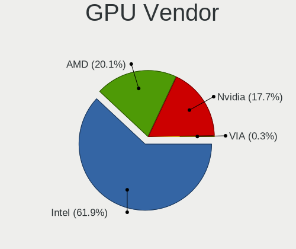

| Vendor           | Notebooks | Percent |
|------------------|-----------|---------|
| Intel            | 203       | 61.33%  |
| AMD              | 68        | 20.54%  |
| Nvidia           | 59        | 17.82%  |
| VIA Technologies | 1         | 0.3%    |

GPU Model
---------

Graphics card models

| Model                                                                                    | Notebooks | Percent |
|------------------------------------------------------------------------------------------|-----------|---------|
| Intel 3rd Gen Core processor Graphics Controller                                         | 21        | 6.03%   |
| Intel TigerLake-LP GT2 [Iris Xe Graphics]                                                | 14        | 4.02%   |
| Intel Skylake GT2 [HD Graphics 520]                                                      | 14        | 4.02%   |
| Intel Core Processor Integrated Graphics Controller                                      | 13        | 3.74%   |
| Intel 2nd Generation Core Processor Family Integrated Graphics Controller                | 13        | 3.74%   |
| Intel Haswell-ULT Integrated Graphics Controller                                         | 12        | 3.45%   |
| Intel Atom/Celeron/Pentium Processor x5-E8000/J3xxx/N3xxx Integrated Graphics Controller | 12        | 3.45%   |
| AMD Picasso/Raven 2 [Radeon Vega Series / Radeon Vega Mobile Series]                     | 12        | 3.45%   |
| Intel HD Graphics 620                                                                    | 10        | 2.87%   |
| Intel CometLake-U GT2 [UHD Graphics]                                                     | 9         | 2.59%   |
| AMD Lucienne                                                                             | 9         | 2.59%   |
| Intel Mobile 945GM/GMS/GME, 943/940GML Express Integrated Graphics Controller            | 8         | 2.3%    |
| Intel WhiskeyLake-U GT2 [UHD Graphics 620]                                               | 6         | 1.72%   |
| Intel Tiger Lake-LP GT2 [UHD Graphics G4]                                                | 6         | 1.72%   |
| Intel Mobile 4 Series Chipset Integrated Graphics Controller                             | 6         | 1.72%   |
| Intel CoffeeLake-H GT2 [UHD Graphics 630]                                                | 6         | 1.72%   |
| Nvidia TU117M [GeForce GTX 1650 Mobile / Max-Q]                                          | 5         | 1.44%   |
| Intel 4th Gen Core Processor Integrated Graphics Controller                              | 5         | 1.44%   |
| AMD Stoney [Radeon R2/R3/R4/R5 Graphics]                                                 | 5         | 1.44%   |
| Intel UHD Graphics 620                                                                   | 4         | 1.15%   |
| Intel Mobile 945GSE Express Integrated Graphics Controller                               | 4         | 1.15%   |
| Intel Mobile 945GM/GMS, 943/940GML Express Integrated Graphics Controller                | 4         | 1.15%   |
| Intel Iris Plus Graphics G1 (Ice Lake)                                                   | 4         | 1.15%   |
| Intel GeminiLake [UHD Graphics 600]                                                      | 4         | 1.15%   |
| Intel Atom Processor Z36xxx/Z37xxx Series Graphics & Display                             | 4         | 1.15%   |
| Intel Atom Processor D2xxx/N2xxx Integrated Graphics Controller                          | 4         | 1.15%   |
| Nvidia GK208M [GeForce GT 740M]                                                          | 3         | 0.86%   |
| Nvidia GA106M [GeForce RTX 3060 Mobile / Max-Q]                                          | 3         | 0.86%   |
| Intel Mobile GM965/GL960 Integrated Graphics Controller (secondary)                      | 3         | 0.86%   |
| Intel Mobile GM965/GL960 Integrated Graphics Controller (primary)                        | 3         | 0.86%   |
| Intel HD Graphics 5500                                                                   | 3         | 0.86%   |
| AMD Topaz XT [Radeon R7 M260/M265 / M340/M360 / M440/M445 / 530/535 / 620/625 Mobile]    | 3         | 0.86%   |
| AMD Renoir [Radeon RX Vega 6 (Ryzen 4000/5000 Mobile Series)]                            | 3         | 0.86%   |
| AMD Madison [Mobility Radeon HD 5650/5750 / 6530M/6550M]                                 | 3         | 0.86%   |
| AMD Cezanne [Radeon Vega Series / Radeon Vega Mobile Series]                             | 3         | 0.86%   |
| Nvidia GP108M [GeForce MX250]                                                            | 2         | 0.57%   |
| Nvidia GM108M [GeForce 940MX]                                                            | 2         | 0.57%   |
| Nvidia GM107GLM [Quadro M1200 Mobile]                                                    | 2         | 0.57%   |
| Nvidia GM107 [GeForce 940MX]                                                             | 2         | 0.57%   |
| Nvidia GK107GLM [Quadro K1000M]                                                          | 2         | 0.57%   |

GPU Combo
---------

Combinations of graphics cards

| Name           | Notebooks | Percent |
|----------------|-----------|---------|
| 1 x Intel      | 154       | 55.4%   |
| 1 x AMD        | 49        | 17.63%  |
| Intel + Nvidia | 40        | 14.39%  |
| 1 x Nvidia     | 14        | 5.04%   |
| Intel + AMD    | 8         | 2.88%   |
| 2 x AMD        | 6         | 2.16%   |
| AMD + Nvidia   | 5         | 1.8%    |
| Other          | 1         | 0.36%   |
| 1 x VIA        | 1         | 0.36%   |

GPU Driver
----------

Free vs proprietary

| Driver      | Notebooks | Percent |
|-------------|-----------|---------|
| Free        | 251       | 89.32%  |
| Proprietary | 20        | 7.12%   |
| Unknown     | 10        | 3.56%   |

GPU Memory
----------

Total video memory

| Size in GB | Notebooks | Percent |
|------------|-----------|---------|
| Unknown    | 179       | 63.48%  |
| 0.01-0.5   | 46        | 16.31%  |
| 1.01-2.0   | 35        | 12.41%  |
| 0.51-1.0   | 12        | 4.26%   |
| 3.01-4.0   | 7         | 2.48%   |
| 5.01-6.0   | 2         | 0.71%   |
| 2.01-3.0   | 1         | 0.35%   |

Monitor
-------

Monitor Vendor
--------------

Monitor vendors

| Vendor                  | Notebooks | Percent |
|-------------------------|-----------|---------|
| AU Optronics            | 55        | 18.9%   |
| LG Display              | 50        | 17.18%  |
| Chimei Innolux          | 40        | 13.75%  |
| BOE                     | 36        | 12.37%  |
| Samsung Electronics     | 21        | 7.22%   |
| Chi Mei Optoelectronics | 10        | 3.44%   |
| Apple                   | 10        | 3.44%   |
| Sharp                   | 7         | 2.41%   |
| InfoVision              | 7         | 2.41%   |
| PANDA                   | 6         | 2.06%   |
| LG Philips              | 5         | 1.72%   |
| Lenovo                  | 4         | 1.37%   |
| Goldstar                | 4         | 1.37%   |
| Dell                    | 4         | 1.37%   |
| SLD                     | 3         | 1.03%   |
| Quanta Display          | 3         | 1.03%   |
| HannStar                | 3         | 1.03%   |
| ViewSonic               | 2         | 0.69%   |
| Philips                 | 2         | 0.69%   |
| Panasonic               | 2         | 0.69%   |
| BenQ                    | 2         | 0.69%   |
| Acer                    | 2         | 0.69%   |
| Vestel Elektronik       | 1         | 0.34%   |
| TR_                     | 1         | 0.34%   |
| TFG                     | 1         | 0.34%   |
| Sony                    | 1         | 0.34%   |
| Sceptre Tech            | 1         | 0.34%   |
| Planar                  | 1         | 0.34%   |
| Packard Bell            | 1         | 0.34%   |
| Insignia                | 1         | 0.34%   |
| IBM                     | 1         | 0.34%   |
| HKC                     | 1         | 0.34%   |
| Hewlett-Packard         | 1         | 0.34%   |
| DENON                   | 1         | 0.34%   |
| CPT                     | 1         | 0.34%   |

Monitor Model
-------------

Monitor models

| Model                                                                    | Notebooks | Percent |
|--------------------------------------------------------------------------|-----------|---------|
| LG Display LCD Monitor LGD033A 1366x768 344x194mm 15.5-inch              | 4         | 1.37%   |
| Chimei Innolux LCD Monitor CMN15F5 1920x1080 344x193mm 15.5-inch         | 4         | 1.37%   |
| Chimei Innolux LCD Monitor CMN15DB 1366x768 344x193mm 15.5-inch          | 4         | 1.37%   |
| SLD LCD Monitor SLD003C 1366x768 309x173mm 13.9-inch                     | 3         | 1.02%   |
| Chimei Innolux LCD Monitor CMN15E7 1920x1080 344x193mm 15.5-inch         | 3         | 1.02%   |
| AU Optronics LCD Monitor AUO403D 1920x1080 309x174mm 14.0-inch           | 3         | 1.02%   |
| AU Optronics LCD Monitor AUO38ED 1920x1080 344x193mm 15.5-inch           | 3         | 1.02%   |
| AU Optronics LCD Monitor AUO3791 1920x1080 344x194mm 15.5-inch           | 3         | 1.02%   |
| AU Optronics LCD Monitor AUO21ED 1920x1080 344x193mm 15.5-inch           | 3         | 1.02%   |
| Samsung Electronics LCD Monitor SEC5441 1366x768 344x194mm 15.5-inch     | 2         | 0.68%   |
| Samsung Electronics LCD Monitor SEC3741 1366x768 309x174mm 14.0-inch     | 2         | 0.68%   |
| Quanta Display LCD Monitor QDS004B 1280x800 331x207mm 15.4-inch          | 2         | 0.68%   |
| Panasonic VVX14P048M00 MEI96A2 3000x2000 285x190mm 13.5-inch             | 2         | 0.68%   |
| LG Philips LCD Monitor LPL0140 1440x900 304x190mm 14.1-inch              | 2         | 0.68%   |
| LG Display LCD Monitor LGD046F 1920x1080 345x194mm 15.6-inch             | 2         | 0.68%   |
| LG Display LCD Monitor LGD032C 1920x1080 344x194mm 15.5-inch             | 2         | 0.68%   |
| LG Display LCD Monitor LGD02D8 1366x768 277x156mm 12.5-inch              | 2         | 0.68%   |
| InfoVision LCD Monitor IVO03F4 1366x768 344x193mm 15.5-inch              | 2         | 0.68%   |
| HannStar LCD Monitor HSD03E9 1024x600 220x129mm 10.0-inch                | 2         | 0.68%   |
| Chimei Innolux LCD Monitor CMN15CA 1366x768 344x193mm 15.5-inch          | 2         | 0.68%   |
| Chimei Innolux LCD Monitor CMN15BF 1366x768 344x193mm 15.5-inch          | 2         | 0.68%   |
| Chimei Innolux LCD Monitor CMN153B 1920x1080 344x193mm 15.5-inch         | 2         | 0.68%   |
| Chimei Innolux LCD Monitor CMN1526 1920x1080 344x193mm 15.5-inch         | 2         | 0.68%   |
| Chimei Innolux LCD Monitor CMN1469 1366x768 309x174mm 14.0-inch          | 2         | 0.68%   |
| Chi Mei Optoelectronics LCD Monitor CMO1711 1600x900 382x215mm 17.3-inch | 2         | 0.68%   |
| Chi Mei Optoelectronics LCD Monitor CMO15A2 1366x768 344x193mm 15.5-inch | 2         | 0.68%   |
| BOE LCD Monitor BOE06B3 1366x768 309x173mm 13.9-inch                     | 2         | 0.68%   |
| BOE LCD Monitor BOE0696 1366x768 309x173mm 13.9-inch                     | 2         | 0.68%   |
| BOE LCD Monitor BOE0687 1920x1080 344x193mm 15.5-inch                    | 2         | 0.68%   |
| AU Optronics LCD Monitor AUOE48D 1920x1080 344x194mm 15.5-inch           | 2         | 0.68%   |
| AU Optronics LCD Monitor AUO8174 1280x800 331x207mm 15.4-inch            | 2         | 0.68%   |
| AU Optronics LCD Monitor AUO45EC 1366x768 340x190mm 15.3-inch            | 2         | 0.68%   |
| AU Optronics LCD Monitor AUO32EC 1366x768 344x193mm 15.5-inch            | 2         | 0.68%   |
| Apple Color LCD APPA020 2560x1600 286x179mm 13.3-inch                    | 2         | 0.68%   |
| Apple Color LCD APP9CC7 1280x800 286x179mm 13.3-inch                     | 2         | 0.68%   |
| ViewSonic VX2703 SERIES VSCF62B 1920x1080 597x336mm 27.0-inch            | 1         | 0.34%   |
| ViewSonic VG2756-4K VSC553A 3840x2160 597x336mm 27.0-inch                | 1         | 0.34%   |
| Vestel Elektronik 32FHD_LCD_TV VES3700 1920x1080 700x400mm 31.7-inch     | 1         | 0.34%   |
| TR_ LCD Monitor TR_5511 1920x1080                                        | 1         | 0.34%   |
| TFG ELDFW406 TFG00C8 1920x1080 698x392mm 31.5-inch                       | 1         | 0.34%   |

Monitor Resolution
------------------

Monitor screen resolution

| Resolution         | Notebooks | Percent |
|--------------------|-----------|---------|
| 1920x1080 (FHD)    | 114       | 40.43%  |
| 1366x768 (WXGA)    | 94        | 33.33%  |
| 1600x900 (HD+)     | 15        | 5.32%   |
| 1280x800 (WXGA)    | 14        | 4.96%   |
| 3840x2160 (4K)     | 8         | 2.84%   |
| 1920x1200 (WUXGA)  | 7         | 2.48%   |
| 1024x600           | 6         | 2.13%   |
| 1440x900 (WXGA+)   | 5         | 1.77%   |
| 2880x1800          | 2         | 0.71%   |
| 2560x1600          | 2         | 0.71%   |
| 2560x1440 (QHD)    | 2         | 0.71%   |
| 1280x1024 (SXGA)   | 2         | 0.71%   |
| 3840x2400          | 1         | 0.35%   |
| 3200x1800 (QHD+)   | 1         | 0.35%   |
| 2560x1080          | 1         | 0.35%   |
| 2256x1504          | 1         | 0.35%   |
| 1680x945           | 1         | 0.35%   |
| 1680x1050 (WSXGA+) | 1         | 0.35%   |
| 1360x768           | 1         | 0.35%   |
| 1280x768           | 1         | 0.35%   |
| 1280x720 (HD)      | 1         | 0.35%   |
| 1024x768 (XGA)     | 1         | 0.35%   |
| 1024x576           | 1         | 0.35%   |

Monitor Diagonal
----------------

Diagonal size in inches

| Inches  | Notebooks | Percent |
|---------|-----------|---------|
| 15      | 137       | 46.76%  |
| 13      | 48        | 16.38%  |
| 14      | 29        | 9.9%    |
| 17      | 20        | 6.83%   |
| 24      | 9         | 3.07%   |
| 12      | 8         | 2.73%   |
| 10      | 8         | 2.73%   |
| 11      | 7         | 2.39%   |
| 27      | 6         | 2.05%   |
| Unknown | 4         | 1.37%   |
| 23      | 3         | 1.02%   |
| 21      | 3         | 1.02%   |
| 31      | 2         | 0.68%   |
| 18      | 2         | 0.68%   |
| 84      | 1         | 0.34%   |
| 72      | 1         | 0.34%   |
| 40      | 1         | 0.34%   |
| 34      | 1         | 0.34%   |
| 28      | 1         | 0.34%   |
| 16      | 1         | 0.34%   |
| 8       | 1         | 0.34%   |

Monitor Width
-------------

Physical width

| Width in mm | Notebooks | Percent |
|-------------|-----------|---------|
| 301-350     | 188       | 65.05%  |
| 201-300     | 46        | 15.92%  |
| 351-400     | 21        | 7.27%   |
| 501-600     | 16        | 5.54%   |
| 401-500     | 5         | 1.73%   |
| 601-700     | 4         | 1.38%   |
| Unknown     | 4         | 1.38%   |
| 1501-2000   | 2         | 0.69%   |
| 801-900     | 1         | 0.35%   |
| 701-800     | 1         | 0.35%   |
| 101-200     | 1         | 0.35%   |

Aspect Ratio
------------

Proportional relationship between the width and the height

| Ratio   | Notebooks | Percent |
|---------|-----------|---------|
| 16/9    | 231       | 84.93%  |
| 16/10   | 34        | 12.5%   |
| 5/4     | 2         | 0.74%   |
| Unknown | 2         | 0.74%   |
| 4/3     | 1         | 0.37%   |
| 3/2     | 1         | 0.37%   |
| 21/9    | 1         | 0.37%   |

Monitor Area
------------

Area in inch

| Area in inch | Notebooks | Percent |
|----------------|-----------|---------|
| 101-110        | 137       | 46.76%  |
| 81-90          | 58        | 19.8%   |
| 71-80          | 19        | 6.48%   |
| 121-130        | 13        | 4.44%   |
| 201-250        | 10        | 3.41%   |
| 61-70          | 8         | 2.73%   |
| 41-50          | 8         | 2.73%   |
| 51-60          | 7         | 2.39%   |
| 301-350        | 6         | 2.05%   |
| 131-140        | 5         | 1.71%   |
| 351-500        | 4         | 1.37%   |
| 251-300        | 4         | 1.37%   |
| 141-150        | 4         | 1.37%   |
| Unknown        | 4         | 1.37%   |
| More than 1000 | 2         | 0.68%   |
| 1-40           | 1         | 0.34%   |
| 151-200        | 1         | 0.34%   |
| 501-1000       | 1         | 0.34%   |
| 91-100         | 1         | 0.34%   |

Pixel Density
-------------

Pixels per inch

| Density       | Notebooks | Percent |
|---------------|-----------|---------|
| 121-160       | 118       | 40.69%  |
| 101-120       | 102       | 35.17%  |
| 51-100        | 41        | 14.14%  |
| 161-240       | 18        | 6.21%   |
| More than 240 | 6         | 2.07%   |
| Unknown       | 4         | 1.38%   |
| 1-50          | 1         | 0.34%   |

Multiple Monitors
-----------------

Total monitors connected

| Total | Notebooks | Percent |
|-------|-----------|---------|
| 1     | 245       | 86.88%  |
| 2     | 26        | 9.22%   |
| 0     | 10        | 3.55%   |
| 3     | 1         | 0.35%   |

Network
-------

Net Controller Vendor
---------------------

Controller vendors

| Vendor                            | Notebooks | Percent |
|-----------------------------------|-----------|---------|
| Realtek Semiconductor             | 140       | 33.57%  |
| Intel                             | 130       | 31.18%  |
| Qualcomm Atheros                  | 62        | 14.87%  |
| Broadcom                          | 33        | 7.91%   |
| Broadcom Limited                  | 10        | 2.4%    |
| MediaTek                          | 5         | 1.2%    |
| Marvell Technology Group          | 5         | 1.2%    |
| TP-Link                           | 4         | 0.96%   |
| Ralink                            | 3         | 0.72%   |
| Google                            | 3         | 0.72%   |
| Xiaomi                            | 2         | 0.48%   |
| Spreadtrum Communications         | 2         | 0.48%   |
| Ralink Technology                 | 2         | 0.48%   |
| Lenovo                            | 2         | 0.48%   |
| Ericsson Business Mobile Networks | 2         | 0.48%   |
| Edimax Technology                 | 2         | 0.48%   |
| Dell                              | 2         | 0.48%   |
| Sierra Wireless                   | 1         | 0.24%   |
| Samsung Electronics               | 1         | 0.24%   |
| Qualcomm Atheros Communications   | 1         | 0.24%   |
| OnePlus Technology (Shenzhen)     | 1         | 0.24%   |
| Nvidia                            | 1         | 0.24%   |
| JMicron Technology                | 1         | 0.24%   |
| Hewlett-Packard                   | 1         | 0.24%   |
| Davicom Semiconductor             | 1         | 0.24%   |

Net Controller Model
--------------------

Controller models

| Model                                                                  | Notebooks | Percent |
|------------------------------------------------------------------------|-----------|---------|
| Realtek RTL8111/8168/8211/8411 PCI Express Gigabit Ethernet Controller | 72        | 13.64%  |
| Realtek RTL810xE PCI Express Fast Ethernet controller                  | 27        | 5.11%   |
| Realtek RTL8821CE 802.11ac PCIe Wireless Network Adapter               | 21        | 3.98%   |
| Intel Wireless 8265 / 8275                                             | 12        | 2.27%   |
| Qualcomm Atheros AR9485 Wireless Network Adapter                       | 10        | 1.89%   |
| Intel Wi-Fi 6 AX200                                                    | 10        | 1.89%   |
| Intel 82579LM Gigabit Network Connection (Lewisville)                  | 10        | 1.89%   |
| Intel Wireless 8260                                                    | 9         | 1.7%    |
| Intel Wireless 3165                                                    | 9         | 1.7%    |
| Intel Wi-Fi 6 AX201                                                    | 9         | 1.7%    |
| Intel Centrino Advanced-N 6205 [Taylor Peak]                           | 9         | 1.7%    |
| Broadcom BCM4313 802.11bgn Wireless Network Adapter                    | 9         | 1.7%    |
| Qualcomm Atheros QCA9377 802.11ac Wireless Network Adapter             | 8         | 1.52%   |
| Qualcomm Atheros AR9285 Wireless Network Adapter (PCI-Express)         | 8         | 1.52%   |
| Intel Wireless 7260                                                    | 8         | 1.52%   |
| Realtek RTL8822CE 802.11ac PCIe Wireless Network Adapter               | 7         | 1.33%   |
| Realtek RTL8153 Gigabit Ethernet Adapter                               | 7         | 1.33%   |
| Intel Wireless 7265                                                    | 7         | 1.33%   |
| Intel Ethernet Connection I219-V                                       | 7         | 1.33%   |
| Intel Comet Lake PCH-LP CNVi WiFi                                      | 7         | 1.33%   |
| Qualcomm Atheros AR8131 Gigabit Ethernet                               | 6         | 1.14%   |
| Realtek RTL-8100/8101L/8139 PCI Fast Ethernet Adapter                  | 5         | 0.95%   |
| Qualcomm Atheros QCA9565 / AR9565 Wireless Network Adapter             | 5         | 0.95%   |
| Qualcomm Atheros AR8151 v2.0 Gigabit Ethernet                          | 5         | 0.95%   |
| Intel Wi-Fi 6E(802.11ax) AX210/AX1675* 2x2 [Typhoon Peak]              | 5         | 0.95%   |
| Realtek RTL8723BU 802.11b/g/n WLAN Adapter                             | 4         | 0.76%   |
| Realtek RTL8723BE PCIe Wireless Network Adapter                        | 4         | 0.76%   |
| Realtek RTL8188CE 802.11b/g/n WiFi Adapter                             | 4         | 0.76%   |
| Qualcomm Atheros AR9462 Wireless Network Adapter                       | 4         | 0.76%   |
| Qualcomm Atheros AR8151 v1.0 Gigabit Ethernet                          | 4         | 0.76%   |
| Intel WiFi Link 5100                                                   | 4         | 0.76%   |
| Intel PRO/Wireless 3945ABG [Golan] Network Connection                  | 4         | 0.76%   |
| Intel Ethernet Connection I217-LM                                      | 4         | 0.76%   |
| Intel Ethernet Connection (4) I219-LM                                  | 4         | 0.76%   |
| Intel Cannon Point-LP CNVi [Wireless-AC]                               | 4         | 0.76%   |
| Intel 82567LM Gigabit Network Connection                               | 4         | 0.76%   |
| Broadcom NetXtreme BCM57786 Gigabit Ethernet PCIe                      | 4         | 0.76%   |
| Broadcom Limited BCM4360 802.11ac Dual Band Wireless Network Adapter   | 4         | 0.76%   |
| Realtek RTL88x2bu [AC1200 Techkey]                                     | 3         | 0.57%   |
| Realtek RTL8852AE 802.11ax PCIe Wireless Network Adapter               | 3         | 0.57%   |

Wireless Vendor
---------------

Wireless vendors

| Vendor                            | Notebooks | Percent |
|-----------------------------------|-----------|---------|
| Intel                             | 126       | 43.9%   |
| Realtek Semiconductor             | 64        | 22.3%   |
| Qualcomm Atheros                  | 43        | 14.98%  |
| Broadcom                          | 27        | 9.41%   |
| Broadcom Limited                  | 7         | 2.44%   |
| TP-Link                           | 4         | 1.39%   |
| MediaTek                          | 4         | 1.39%   |
| Ralink                            | 3         | 1.05%   |
| Ralink Technology                 | 2         | 0.7%    |
| Edimax Technology                 | 2         | 0.7%    |
| Xiaomi                            | 1         | 0.35%   |
| Sierra Wireless                   | 1         | 0.35%   |
| Qualcomm Atheros Communications   | 1         | 0.35%   |
| Ericsson Business Mobile Networks | 1         | 0.35%   |
| Dell                              | 1         | 0.35%   |

Wireless Model
--------------

Wireless models

| Model                                                                   | Notebooks | Percent |
|-------------------------------------------------------------------------|-----------|---------|
| Realtek RTL8821CE 802.11ac PCIe Wireless Network Adapter                | 21        | 7.14%   |
| Intel Wireless 8265 / 8275                                              | 12        | 4.08%   |
| Qualcomm Atheros AR9485 Wireless Network Adapter                        | 10        | 3.4%    |
| Intel Wi-Fi 6 AX200                                                     | 10        | 3.4%    |
| Intel Wireless 8260                                                     | 9         | 3.06%   |
| Intel Wireless 3165                                                     | 9         | 3.06%   |
| Intel Wi-Fi 6 AX201                                                     | 9         | 3.06%   |
| Intel Centrino Advanced-N 6205 [Taylor Peak]                            | 9         | 3.06%   |
| Broadcom BCM4313 802.11bgn Wireless Network Adapter                     | 9         | 3.06%   |
| Qualcomm Atheros QCA9377 802.11ac Wireless Network Adapter              | 8         | 2.72%   |
| Qualcomm Atheros AR9285 Wireless Network Adapter (PCI-Express)          | 8         | 2.72%   |
| Intel Wireless 7260                                                     | 8         | 2.72%   |
| Realtek RTL8822CE 802.11ac PCIe Wireless Network Adapter                | 7         | 2.38%   |
| Intel Wireless 7265                                                     | 7         | 2.38%   |
| Intel Comet Lake PCH-LP CNVi WiFi                                       | 7         | 2.38%   |
| Qualcomm Atheros QCA9565 / AR9565 Wireless Network Adapter              | 5         | 1.7%    |
| Intel Wi-Fi 6E(802.11ax) AX210/AX1675* 2x2 [Typhoon Peak]               | 5         | 1.7%    |
| Realtek RTL8723BU 802.11b/g/n WLAN Adapter                              | 4         | 1.36%   |
| Realtek RTL8723BE PCIe Wireless Network Adapter                         | 4         | 1.36%   |
| Realtek RTL8188CE 802.11b/g/n WiFi Adapter                              | 4         | 1.36%   |
| Qualcomm Atheros AR9462 Wireless Network Adapter                        | 4         | 1.36%   |
| Intel WiFi Link 5100                                                    | 4         | 1.36%   |
| Intel PRO/Wireless 3945ABG [Golan] Network Connection                   | 4         | 1.36%   |
| Intel Cannon Point-LP CNVi [Wireless-AC]                                | 4         | 1.36%   |
| Broadcom Limited BCM4360 802.11ac Dual Band Wireless Network Adapter    | 4         | 1.36%   |
| Realtek RTL88x2bu [AC1200 Techkey]                                      | 3         | 1.02%   |
| Realtek RTL8852AE 802.11ax PCIe Wireless Network Adapter                | 3         | 1.02%   |
| Realtek RTL8191SEvB Wireless LAN Controller                             | 3         | 1.02%   |
| Realtek RTL8188EUS 802.11n Wireless Network Adapter                     | 3         | 1.02%   |
| Realtek RTL8187B Wireless Adapter                                       | 3         | 1.02%   |
| Qualcomm Atheros QCA6174 802.11ac Wireless Network Adapter              | 3         | 1.02%   |
| Qualcomm Atheros AR242x / AR542x Wireless Network Adapter (PCI-Express) | 3         | 1.02%   |
| Intel Ultimate N WiFi Link 5300                                         | 3         | 1.02%   |
| Intel Cannon Lake PCH CNVi WiFi                                         | 3         | 1.02%   |
| Broadcom BCM43225 802.11b/g/n                                           | 3         | 1.02%   |
| Broadcom BCM43142 802.11b/g/n                                           | 3         | 1.02%   |
| TP-Link Archer T2U PLUS [RTL8821AU]                                     | 2         | 0.68%   |
| Realtek RTL8822BE 802.11a/b/g/n/ac WiFi adapter                         | 2         | 0.68%   |
| Realtek RTL8821AE 802.11ac PCIe Wireless Network Adapter                | 2         | 0.68%   |
| Realtek RTL8192CU 802.11n WLAN Adapter                                  | 2         | 0.68%   |

Ethernet Vendor
---------------

Ethernet vendors

| Vendor                        | Notebooks | Percent |
|-------------------------------|-----------|---------|
| Realtek Semiconductor         | 115       | 50%     |
| Intel                         | 54        | 23.48%  |
| Qualcomm Atheros              | 29        | 12.61%  |
| Broadcom                      | 10        | 4.35%   |
| Marvell Technology Group      | 5         | 2.17%   |
| Google                        | 3         | 1.3%    |
| Broadcom Limited              | 3         | 1.3%    |
| Spreadtrum Communications     | 2         | 0.87%   |
| Xiaomi                        | 1         | 0.43%   |
| Samsung Electronics           | 1         | 0.43%   |
| OnePlus Technology (Shenzhen) | 1         | 0.43%   |
| Nvidia                        | 1         | 0.43%   |
| MediaTek                      | 1         | 0.43%   |
| Lenovo                        | 1         | 0.43%   |
| JMicron Technology            | 1         | 0.43%   |
| Hewlett-Packard               | 1         | 0.43%   |
| Davicom Semiconductor         | 1         | 0.43%   |

Ethernet Model
--------------

Ethernet models

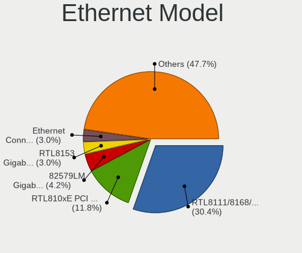

| Model                                                                  | Notebooks | Percent |
|------------------------------------------------------------------------|-----------|---------|
| Realtek RTL8111/8168/8211/8411 PCI Express Gigabit Ethernet Controller | 72        | 31.3%   |
| Realtek RTL810xE PCI Express Fast Ethernet controller                  | 27        | 11.74%  |
| Intel 82579LM Gigabit Network Connection (Lewisville)                  | 10        | 4.35%   |
| Realtek RTL8153 Gigabit Ethernet Adapter                               | 7         | 3.04%   |
| Intel Ethernet Connection I219-V                                       | 7         | 3.04%   |
| Qualcomm Atheros AR8131 Gigabit Ethernet                               | 6         | 2.61%   |
| Realtek RTL-8100/8101L/8139 PCI Fast Ethernet Adapter                  | 5         | 2.17%   |
| Qualcomm Atheros AR8151 v2.0 Gigabit Ethernet                          | 5         | 2.17%   |
| Qualcomm Atheros AR8151 v1.0 Gigabit Ethernet                          | 4         | 1.74%   |
| Intel Ethernet Connection I217-LM                                      | 4         | 1.74%   |
| Intel Ethernet Connection (4) I219-LM                                  | 4         | 1.74%   |
| Intel 82567LM Gigabit Network Connection                               | 4         | 1.74%   |
| Broadcom NetXtreme BCM57786 Gigabit Ethernet PCIe                      | 4         | 1.74%   |
| Qualcomm Atheros AR8162 Fast Ethernet                                  | 3         | 1.3%    |
| Qualcomm Atheros AR8132 Fast Ethernet                                  | 3         | 1.3%    |
| Intel Ethernet Connection I218-LM                                      | 3         | 1.3%    |
| Spreadtrum Unisoc Phone                                                | 2         | 0.87%   |
| Realtek RTL8152 Fast Ethernet Adapter                                  | 2         | 0.87%   |
| Realtek RTL8125 2.5GbE Controller                                      | 2         | 0.87%   |
| Qualcomm Atheros QCA8172 Fast Ethernet                                 | 2         | 0.87%   |
| Qualcomm Atheros Killer E2400 Gigabit Ethernet Controller              | 2         | 0.87%   |
| Qualcomm Atheros AR8152 v2.0 Fast Ethernet                             | 2         | 0.87%   |
| Marvell Group 88E8071 PCI-E Gigabit Ethernet Controller                | 2         | 0.87%   |
| Intel Ethernet Connection I219-LM                                      | 2         | 0.87%   |
| Intel Ethernet Connection (6) I219-V                                   | 2         | 0.87%   |
| Intel Ethernet Connection (4) I219-V                                   | 2         | 0.87%   |
| Intel Ethernet Connection (3) I218-LM                                  | 2         | 0.87%   |
| Intel 82579V Gigabit Network Connection                                | 2         | 0.87%   |
| Intel 82577LM Gigabit Network Connection                               | 2         | 0.87%   |
| Google Nexus/Pixel Device (tether)                                     | 2         | 0.87%   |
| Broadcom NetXtreme BCM57765 Gigabit Ethernet PCIe                      | 2         | 0.87%   |
| Xiaomi Mi/Redmi series (RNDIS)                                         | 1         | 0.43%   |
| Samsung Galaxy series, misc. (tethering mode)                          | 1         | 0.43%   |
| Qualcomm Atheros Killer E2500 Gigabit Ethernet Controller              | 1         | 0.43%   |
| Qualcomm Atheros Killer E220x Gigabit Ethernet Controller              | 1         | 0.43%   |
| OnePlus (Shenzhen) Android                                             | 1         | 0.43%   |
| Nvidia MCP79 Ethernet                                                  | 1         | 0.43%   |
| MediaTek moto e22                                                      | 1         | 0.43%   |
| Marvell Group 88E8055 PCI-E Gigabit Ethernet Controller                | 1         | 0.43%   |
| Marvell Group 88E8040 PCI-E Fast Ethernet Controller                   | 1         | 0.43%   |

Net Controller Kind
-------------------

Ethernet, WiFi or modem

| Kind     | Notebooks | Percent |
|----------|-----------|---------|
| WiFi     | 271       | 54.86%  |
| Ethernet | 219       | 44.33%  |
| Modem    | 4         | 0.81%   |

Used Controller
---------------

Currently used network controller

| Kind     | Notebooks | Percent |
|----------|-----------|---------|
| WiFi     | 210       | 72.66%  |
| Ethernet | 79        | 27.34%  |

NICs
----

Total network controllers on board

| Total | Notebooks | Percent |
|-------|-----------|---------|
| 2     | 200       | 71.94%  |
| 1     | 66        | 23.74%  |
| 0     | 11        | 3.96%   |
| 3     | 1         | 0.36%   |

IPv6
----

IPv6 vs IPv4

| Used | Notebooks | Percent |
|------|-----------|---------|
| No   | 191       | 67.73%  |
| Yes  | 91        | 32.27%  |

Bluetooth
---------

Bluetooth Vendor
----------------

Controller vendors

| Vendor                          | Notebooks | Percent |
|---------------------------------|-----------|---------|
| Intel                           | 87        | 45.08%  |
| Realtek Semiconductor           | 37        | 19.17%  |
| Qualcomm Atheros Communications | 11        | 5.7%    |
| Broadcom                        | 11        | 5.7%    |
| Lite-On Technology              | 10        | 5.18%   |
| Foxconn / Hon Hai               | 10        | 5.18%   |
| Apple                           | 8         | 4.15%   |
| IMC Networks                    | 4         | 2.07%   |
| Hewlett-Packard                 | 4         | 2.07%   |
| Dell                            | 4         | 2.07%   |
| Foxconn International           | 2         | 1.04%   |
| Cambridge Silicon Radio         | 2         | 1.04%   |
| Ralink                          | 1         | 0.52%   |
| Chicony Electronics             | 1         | 0.52%   |
| Askey Computer                  | 1         | 0.52%   |

Bluetooth Model
---------------

Controller models

| Model                                                       | Notebooks | Percent |
|-------------------------------------------------------------|-----------|---------|
| Intel Bluetooth wireless interface                          | 39        | 20.21%  |
| Realtek Bluetooth Radio                                     | 26        | 13.47%  |
| Intel Bluetooth 9460/9560 Jefferson Peak (JfP)              | 15        | 7.77%   |
| Intel AX201 Bluetooth                                       | 15        | 7.77%   |
| Realtek  Bluetooth 4.2 Adapter                              | 9         | 4.66%   |
| Intel AX200 Bluetooth                                       | 9         | 4.66%   |
| Qualcomm Atheros AR3012 Bluetooth 4.0                       | 5         | 2.59%   |
| Lite-On Qualcomm Atheros QCA9377 Bluetooth                  | 5         | 2.59%   |
| Qualcomm Atheros  Bluetooth Device                          | 4         | 2.07%   |
| Intel AX210 Bluetooth                                       | 4         | 2.07%   |
| Broadcom BCM2045B (BDC-2.1)                                 | 4         | 2.07%   |
| Apple Bluetooth USB Host Controller                         | 4         | 2.07%   |
| Intel Bluetooth Device                                      | 3         | 1.55%   |
| Foxconn / Hon Hai Wireless_Device                           | 3         | 1.55%   |
| Apple Bluetooth Host Controller                             | 3         | 1.55%   |
| Lite-On Bluetooth Device                                    | 2         | 1.04%   |
| Lite-On Atheros AR3012 Bluetooth                            | 2         | 1.04%   |
| Intel Wireless-AC 9260 Bluetooth Adapter                    | 2         | 1.04%   |
| IMC Networks Bluetooth Radio                                | 2         | 1.04%   |
| HP Broadcom 2070 Bluetooth Combo                            | 2         | 1.04%   |
| Foxconn International BCM43142A0 Bluetooth module           | 2         | 1.04%   |
| Foxconn / Hon Hai Bluetooth Device                          | 2         | 1.04%   |
| Foxconn / Hon Hai Acer Module                               | 2         | 1.04%   |
| Dell Wireless 370 Bluetooth Mini-card                       | 2         | 1.04%   |
| Cambridge Silicon Radio Bluetooth Dongle (HCI mode)         | 2         | 1.04%   |
| Broadcom BCM2070 Bluetooth 2.1 + EDR                        | 2         | 1.04%   |
| Broadcom BCM2045B (BDC-2) [Bluetooth Controller]            | 2         | 1.04%   |
| Realtek RTL8822BE Bluetooth 4.2 Adapter                     | 1         | 0.52%   |
| Realtek RTL8723B Bluetooth                                  | 1         | 0.52%   |
| Ralink RT3290 Bluetooth                                     | 1         | 0.52%   |
| Qualcomm Atheros QCA61x4 Bluetooth 4.0                      | 1         | 0.52%   |
| Qualcomm Atheros AR3011 Bluetooth                           | 1         | 0.52%   |
| Lite-On Wireless_Device                                     | 1         | 0.52%   |
| IMC Networks Bluetooth Device                               | 1         | 0.52%   |
| IMC Networks Atheros AR3012 Bluetooth 4.0 Adapter           | 1         | 0.52%   |
| HP Integrated Module with Bluetooth 2.1 Wireless technology | 1         | 0.52%   |
| HP Bluetooth 2.0 Interface [Broadcom BCM2045]               | 1         | 0.52%   |
| Foxconn / Hon Hai Bluetooth USB Host Controller             | 1         | 0.52%   |
| Foxconn / Hon Hai BCM43142A0                                | 1         | 0.52%   |
| Foxconn / Hon Hai Acer Bluetooth module                     | 1         | 0.52%   |

Sound
-----

Sound Vendor
------------

Sound card vendors

| Vendor                | Notebooks | Percent |
|-----------------------|-----------|---------|
| Intel                 | 216       | 66.67%  |
| AMD                   | 65        | 20.06%  |
| Nvidia                | 33        | 10.19%  |
| Texas Instruments     | 3         | 0.93%   |
| Yamaha                | 1         | 0.31%   |
| VIA Technologies      | 1         | 0.31%   |
| Realtek Semiconductor | 1         | 0.31%   |
| GN Netcom             | 1         | 0.31%   |
| CMX Systems           | 1         | 0.31%   |
| C-Media Electronics   | 1         | 0.31%   |
| Audioengine           | 1         | 0.31%   |

Sound Model
-----------

Sound card models

| Model                                                                                             | Notebooks | Percent |
|---------------------------------------------------------------------------------------------------|-----------|---------|
| AMD Family 17h/19h HD Audio Controller                                                            | 32        | 8.12%   |
| Intel Sunrise Point-LP HD Audio                                                                   | 30        | 7.61%   |
| Intel 7 Series/C216 Chipset Family High Definition Audio Controller                               | 25        | 6.35%   |
| Intel Tiger Lake-LP Smart Sound Technology Audio Controller                                       | 20        | 5.08%   |
| Intel 5 Series/3400 Series Chipset High Definition Audio                                          | 16        | 4.06%   |
| AMD Renoir Radeon High Definition Audio Controller                                                | 15        | 3.81%   |
| Intel NM10/ICH7 Family High Definition Audio Controller                                           | 14        | 3.55%   |
| Intel 82801I (ICH9 Family) HD Audio Controller                                                    | 14        | 3.55%   |
| Intel Haswell-ULT HD Audio Controller                                                             | 13        | 3.3%    |
| Intel 8 Series HD Audio Controller                                                                | 13        | 3.3%    |
| AMD Raven/Raven2/Fenghuang HDMI/DP Audio Controller                                               | 12        | 3.05%   |
| Intel 6 Series/C200 Series Chipset Family High Definition Audio Controller                        | 11        | 2.79%   |
| AMD FCH Azalia Controller                                                                         | 10        | 2.54%   |
| Intel Comet Lake PCH-LP cAVS                                                                      | 9         | 2.28%   |
| AMD Kabini HDMI/DP Audio                                                                          | 8         | 2.03%   |
| Intel Cannon Point-LP High Definition Audio Controller                                            | 7         | 1.78%   |
| Intel Atom/Celeron/Pentium Processor x5-E8000/J3xxx/N3xxx Series High Definition Audio Controller | 7         | 1.78%   |
| AMD Family 15h (Models 60h-6fh) Audio Controller                                                  | 7         | 1.78%   |
| Intel Celeron/Pentium Silver Processor High Definition Audio                                      | 6         | 1.52%   |
| Intel Cannon Lake PCH cAVS                                                                        | 6         | 1.52%   |
| Intel 8 Series/C220 Series Chipset High Definition Audio Controller                               | 6         | 1.52%   |
| Intel Xeon E3-1200 v3/4th Gen Core Processor HD Audio Controller                                  | 5         | 1.27%   |
| Intel Ice Lake-LP Smart Sound Technology Audio Controller                                         | 5         | 1.27%   |
| AMD High Definition Audio Controller                                                              | 5         | 1.27%   |
| Nvidia TU107 GeForce GTX 1650 High Definition Audio Controller                                    | 4         | 1.02%   |
| Nvidia GM107 High Definition Audio Controller [GeForce 940MX]                                     | 4         | 1.02%   |
| Nvidia GF108 High Definition Audio Controller                                                     | 4         | 1.02%   |
| Intel Wildcat Point-LP High Definition Audio Controller                                           | 4         | 1.02%   |
| Intel Broadwell-U Audio Controller                                                                | 4         | 1.02%   |
| Intel Atom Processor Z36xxx/Z37xxx Series High Definition Audio Controller                        | 4         | 1.02%   |
| Intel 82801H (ICH8 Family) HD Audio Controller                                                    | 4         | 1.02%   |
| AMD SBx00 Azalia (Intel HDA)                                                                      | 4         | 1.02%   |
| Nvidia GK107 HDMI Audio Controller                                                                | 3         | 0.76%   |
| Nvidia GK106 HDMI Audio Controller                                                                | 3         | 0.76%   |
| Nvidia GA106 High Definition Audio Controller                                                     | 3         | 0.76%   |
| Intel CM238 HD Audio Controller                                                                   | 3         | 0.76%   |
| Intel Alder Lake PCH-P High Definition Audio Controller                                           | 3         | 0.76%   |
| AMD Wrestler HDMI Audio                                                                           | 3         | 0.76%   |
| AMD Redwood HDMI Audio [Radeon HD 5000 Series]                                                    | 3         | 0.76%   |
| Nvidia GT216 HDMI Audio Controller                                                                | 2         | 0.51%   |

Memory
------

Memory Vendor
-------------

Memory module vendors

| Vendor                       | Notebooks | Percent |
|------------------------------|-----------|---------|
| Samsung Electronics          | 39        | 26.71%  |
| SK hynix                     | 30        | 20.55%  |
| Unknown                      | 19        | 13.01%  |
| Micron Technology            | 16        | 10.96%  |
| Kingston                     | 11        | 7.53%   |
| G.Skill                      | 5         | 3.42%   |
| Nanya Technology             | 3         | 2.05%   |
| Corsair                      | 3         | 2.05%   |
| A-DATA Technology            | 3         | 2.05%   |
| Unknown (ABCD)               | 2         | 1.37%   |
| Ramaxel Technology           | 2         | 1.37%   |
| GSkill                       | 2         | 1.37%   |
| Elpida                       | 2         | 1.37%   |
| Crucial                      | 2         | 1.37%   |
| Strontium                    | 1         | 0.68%   |
| PUSKILL                      | 1         | 0.68%   |
| Patriot Memory (PDP Systems) | 1         | 0.68%   |
| Lexar Co Limited             | 1         | 0.68%   |
| AMD                          | 1         | 0.68%   |
| 4ea5                         | 1         | 0.68%   |
| Unknown                      | 1         | 0.68%   |

Memory Model
------------

Memory module models

| Model                                                               | Notebooks | Percent |
|---------------------------------------------------------------------|-----------|---------|
| SK hynix RAM HMA851S6DJR6N-XN 4GB SODIMM DDR4 3200MT/s              | 3         | 1.86%   |
| Unknown RAM Module 8GB SODIMM DDR4 2400MT/s                         | 2         | 1.24%   |
| Unknown RAM Module 512MB SODIMM DDR2                                | 2         | 1.24%   |
| Unknown RAM Module 2GB SODIMM DDR2 533MT/s                          | 2         | 1.24%   |
| Unknown RAM Module 2GB Row Of Chips LPDDR4 4267MT/s                 | 2         | 1.24%   |
| Unknown RAM Module 1GB SODIMM DDR2                                  | 2         | 1.24%   |
| Unknown (ABCD) RAM 123456789012345678 2048MB SODIMM LPDDR4 2400MT/s | 2         | 1.24%   |
| SK hynix RAM Module 2GB SODIMM DDR3 1600MT/s                        | 2         | 1.24%   |
| SK hynix RAM HMAA1GS6CJR6N-XN 8GB SODIMM DDR4 3200MT/s              | 2         | 1.24%   |
| SK hynix RAM HMA81GS6JJR8N-VK 8GB SODIMM DDR4 2667MT/s              | 2         | 1.24%   |
| Samsung RAM Module 8GB SODIMM DDR4 2133MT/s                         | 2         | 1.24%   |
| Samsung RAM M471B5773CHS-CH9 2048MB SODIMM DDR3 4199MT/s            | 2         | 1.24%   |
| Samsung RAM M471B5273DH0-CK0 4GB SODIMM DDR3 1600MT/s               | 2         | 1.24%   |
| Samsung RAM M471B5273CH0-CK0 4GB SODIMM DDR3 1600MT/s               | 2         | 1.24%   |
| Samsung RAM M471B1G73DB0-YK0 8GB SODIMM DDR3 1600MT/s               | 2         | 1.24%   |
| Samsung RAM M471A5244CB0-CWE 4GB SODIMM DDR4 3200MT/s               | 2         | 1.24%   |
| Samsung RAM M471A2K43CB1-CRC 16GB SODIMM DDR4 2667MT/s              | 2         | 1.24%   |
| Samsung RAM M471A1K43EB1-CWE 8GB SODIMM DDR4 3200MT/s               | 2         | 1.24%   |
| Samsung RAM M471A1K43DB1-CTD 8GB SODIMM DDR4 2667MT/s               | 2         | 1.24%   |
| Samsung RAM M471A1K43CB1-CTD 8GB SODIMM DDR4 2667MT/s               | 2         | 1.24%   |
| Samsung RAM M471A1K43CB1-CRC 8GB SODIMM DDR4 2667MT/s               | 2         | 1.24%   |
| Micron RAM MT40A512M16TB-062E:R 4GB Row Of Chips DDR4 3200MT/s      | 2         | 1.24%   |
| GSkill RAM F4-3200C22-16GRS 16GB SODIMM DDR4 3200MT/s               | 2         | 1.24%   |
| G.Skill RAM F4-3200C22-32GRS 32GB SODIMM DDR4 3200MT/s              | 2         | 1.24%   |
| Unknown RAM Module 8GB SODIMM DDR4 2667MT/s                         | 1         | 0.62%   |
| Unknown RAM Module 8GB SODIMM DDR3                                  | 1         | 0.62%   |
| Unknown RAM Module 512MB SODIMM DDR2 533MT/s                        | 1         | 0.62%   |
| Unknown RAM Module 512MB SODIMM DDR                                 | 1         | 0.62%   |
| Unknown RAM Module 4GB SODIMM DDR4 2667MT/s                         | 1         | 0.62%   |
| Unknown RAM Module 2GB SODIMM SDRAM                                 | 1         | 0.62%   |
| Unknown RAM Module 2GB SODIMM DRAM                                  | 1         | 0.62%   |
| Unknown RAM Module 2GB SODIMM DDR3 1600MT/s                         | 1         | 0.62%   |
| Unknown RAM Module 2GB SODIMM DDR3 1066MT/s                         | 1         | 0.62%   |
| Unknown RAM Module 2GB SODIMM DDR2 667MT/s                          | 1         | 0.62%   |
| Unknown RAM Module 2GB SODIMM DDR2                                  | 1         | 0.62%   |
| Unknown RAM Module 1GB SODIMM DDR                                   | 1         | 0.62%   |
| Strontium RAM SRT4G86S0-H9H 4GB SODIMM DDR3 1067MT/s                | 1         | 0.62%   |
| SK hynix RAM Module 32GB SODIMM DDR4 3200MT/s                       | 1         | 0.62%   |
| SK hynix RAM Module 16GB SODIMM DDR4 2667MT/s                       | 1         | 0.62%   |
| SK hynix RAM Module 16GB SODIMM DDR4 2133MT/s                       | 1         | 0.62%   |

Memory Kind
-----------

Memory module kinds

| Kind   | Notebooks | Percent |
|--------|-----------|---------|
| DDR4   | 61        | 47.66%  |
| DDR3   | 43        | 33.59%  |
| DDR2   | 10        | 7.81%   |
| LPDDR4 | 5         | 3.91%   |
| SDRAM  | 4         | 3.13%   |
| LPDDR3 | 3         | 2.34%   |
| DRAM   | 1         | 0.78%   |
| DDR    | 1         | 0.78%   |

Memory Form Factor
------------------

Physical design of the memory module

| Name         | Notebooks | Percent |
|--------------|-----------|---------|
| SODIMM       | 120       | 92.31%  |
| Row Of Chips | 8         | 6.15%   |
| Unknown      | 2         | 1.54%   |

Memory Size
-----------

Memory module size

| Size  | Notebooks | Percent |
|-------|-----------|---------|
| 8192  | 49        | 34.51%  |
| 4096  | 34        | 23.94%  |
| 2048  | 29        | 20.42%  |
| 16384 | 17        | 11.97%  |
| 32768 | 5         | 3.52%   |
| 1024  | 4         | 2.82%   |
| 512   | 4         | 2.82%   |

Memory Speed
------------

Memory module speed

| Speed   | Notebooks | Percent |
|---------|-----------|---------|
| 3200    | 31        | 22.63%  |
| 1600    | 25        | 18.25%  |
| 2667    | 22        | 16.06%  |
| 2400    | 12        | 8.76%   |
| Unknown | 8         | 5.84%   |
| 1334    | 7         | 5.11%   |
| 2133    | 6         | 4.38%   |
| 1067    | 5         | 3.65%   |
| 1333    | 4         | 2.92%   |
| 667     | 4         | 2.92%   |
| 4267    | 2         | 1.46%   |
| 4199    | 2         | 1.46%   |
| 1867    | 2         | 1.46%   |
| 533     | 2         | 1.46%   |
| 3266    | 1         | 0.73%   |
| 2267    | 1         | 0.73%   |
| 2048    | 1         | 0.73%   |
| 1200    | 1         | 0.73%   |
| 1066    | 1         | 0.73%   |

Printers & scanners
-------------------

Printer Vendor
--------------

Printer device vendors

| Vendor          | Notebooks | Percent |
|-----------------|-----------|---------|
| Hewlett-Packard | 1         | 100%    |

Printer Model
-------------

Printer device models

| Model             | Notebooks | Percent |
|-------------------|-----------|---------|
| HP OfficeJet 6200 | 1         | 100%    |

Scanner Vendor
--------------

Scanner device vendors

Zero info for selected period =(

Scanner Model
-------------

Scanner device models

Zero info for selected period =(

Camera
------

Camera Vendor
-------------

Camera device vendors

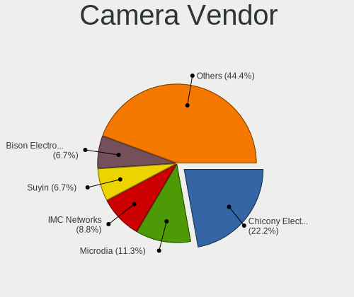

| Vendor                                 | Notebooks | Percent |
|----------------------------------------|-----------|---------|
| Chicony Electronics                    | 52        | 22.22%  |
| Microdia                               | 27        | 11.54%  |
| IMC Networks                           | 21        | 8.97%   |
| Suyin                                  | 16        | 6.84%   |
| Realtek Semiconductor                  | 15        | 6.41%   |
| Quanta                                 | 15        | 6.41%   |
| Bison Electronics                      | 15        | 6.41%   |
| Sunplus Innovation Technology          | 14        | 5.98%   |
| Luxvisions Innotech Limited            | 9         | 3.85%   |
| Cheng Uei Precision Industry (Foxlink) | 9         | 3.85%   |
| Alcor Micro                            | 7         | 2.99%   |
| Syntek                                 | 5         | 2.14%   |
| Apple                                  | 5         | 2.14%   |
| Acer                                   | 5         | 2.14%   |
| Silicon Motion                         | 3         | 1.28%   |
| Lite-On Technology                     | 3         | 1.28%   |
| Importek                               | 3         | 1.28%   |
| Lenovo                                 | 2         | 0.85%   |
| Z-Star Microelectronics                | 1         | 0.43%   |
| USB Camera                             | 1         | 0.43%   |
| Sunplus Technology                     | 1         | 0.43%   |
| OmniVision Technologies                | 1         | 0.43%   |
| Intel                                  | 1         | 0.43%   |
| eMPIA Technology                       | 1         | 0.43%   |
| Alpha Imaging Technology               | 1         | 0.43%   |
| ALi                                    | 1         | 0.43%   |

Camera Model
------------

Camera device models

| Model                                                          | Notebooks | Percent |
|----------------------------------------------------------------|-----------|---------|
| Chicony Integrated Camera                                      | 17        | 7.17%   |
| Microdia Integrated_Webcam_HD                                  | 15        | 6.33%   |
| Bison Integrated Camera                                        | 6         | 2.53%   |
| Luxvisions Innotech Limited HP TrueVision HD Camera            | 5         | 2.11%   |
| IMC Networks Integrated Camera                                 | 5         | 2.11%   |
| Chicony HD Webcam                                              | 5         | 2.11%   |
| Realtek USB Camera                                             | 4         | 1.69%   |
| Quanta HP TrueVision HD Camera                                 | 4         | 1.69%   |
| IMC Networks USB2.0 VGA UVC WebCam                             | 4         | 1.69%   |
| Chicony HP TrueVision HD Camera                                | 4         | 1.69%   |
| Alcor Micro USB 2.0 Camera                                     | 4         | 1.69%   |
| Syntek Integrated Camera                                       | 3         | 1.27%   |
| Suyin HP TrueVision HD                                         | 3         | 1.27%   |
| Sunplus HD WebCam                                              | 3         | 1.27%   |
| Realtek Lenovo EasyCamera                                      | 3         | 1.27%   |
| Realtek Integrated_Webcam_HD                                   | 3         | 1.27%   |
| Quanta HP Webcam                                               | 3         | 1.27%   |
| Microdia USB 2.0 Camera                                        | 3         | 1.27%   |
| Luxvisions Innotech Limited HP Wide Vision HD Camera           | 3         | 1.27%   |
| IMC Networks USB2.0 HD UVC WebCam                              | 3         | 1.27%   |
| Chicony HP HD Camera                                           | 3         | 1.27%   |
| Cheng Uei Precision Industry (Foxlink) HP TrueVision HD Camera | 3         | 1.27%   |
| Suyin HD WebCam                                                | 2         | 0.84%   |
| Suyin HD Video WebCam                                          | 2         | 0.84%   |
| Suyin Acer/Lenovo Webcam [CN0316]                              | 2         | 0.84%   |
| Sunplus Laptop_Integrated_Webcam_FHD                           | 2         | 0.84%   |
| Quanta VGA WebCam                                              | 2         | 0.84%   |
| Quanta HP HD Camera                                            | 2         | 0.84%   |
| Microdia Lenovo EasyCamera                                     | 2         | 0.84%   |
| Lite-On HP TrueVision HD Camera                                | 2         | 0.84%   |
| IMC Networks EasyCamera                                        | 2         | 0.84%   |
| Chicony USB2.0 Camera                                          | 2         | 0.84%   |
| Chicony TOSHIBA Web Camera - FHD                               | 2         | 0.84%   |
| Chicony Camera                                                 | 2         | 0.84%   |
| Chicony 1.3M Webcam                                            | 2         | 0.84%   |
| Cheng Uei Precision Industry (Foxlink) HP Webcam               | 2         | 0.84%   |
| Cheng Uei Precision Industry (Foxlink) HP Truevision HD        | 2         | 0.84%   |
| Bison USB2.0 Camera                                            | 2         | 0.84%   |
| Bison ThinkPad Integrated Camera                               | 2         | 0.84%   |
| Bison EasyCamera                                               | 2         | 0.84%   |

Security
--------

Fingerprint Vendor
------------------

Fingerprint sensor vendors

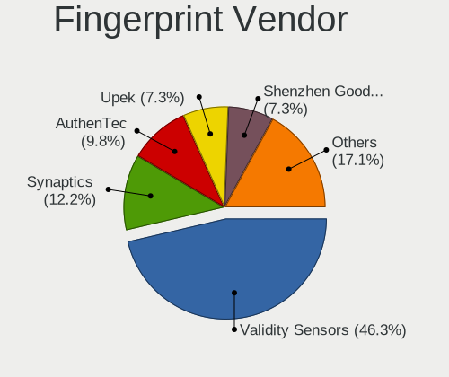

| Vendor                     | Notebooks | Percent |
|----------------------------|-----------|---------|
| Validity Sensors           | 18        | 45%     |
| Synaptics                  | 5         | 12.5%   |
| AuthenTec                  | 4         | 10%     |
| Upek                       | 3         | 7.5%    |
| Shenzhen Goodix Technology | 3         | 7.5%    |
| STMicroelectronics         | 2         | 5%      |
| Focal-systems.Corp         | 2         | 5%      |
| Microsoft                  | 1         | 2.5%    |
| LighTuning Technology      | 1         | 2.5%    |
| Elan Microelectronics      | 1         | 2.5%    |

Fingerprint Model
-----------------

Fingerprint sensor models

| Model                                                    | Notebooks | Percent |
|----------------------------------------------------------|-----------|---------|
| Validity Sensors VFS495 Fingerprint Reader               | 4         | 10%     |
| Validity Sensors Fingerprint scanner                     | 3         | 7.5%    |
| Upek Biometric Touchchip/Touchstrip Fingerprint Sensor   | 3         | 7.5%    |
| Validity Sensors VFS5011 Fingerprint Reader              | 2         | 5%      |
| Validity Sensors VFS301 Fingerprint Reader               | 2         | 5%      |
| Validity Sensors Synaptics WBDI                          | 2         | 5%      |
| Synaptics FS7604 Touch Fingerprint Sensor with PurePrint | 2         | 5%      |
| STMicroelectronics Fingerprint Reader                    | 2         | 5%      |
| Shenzhen Goodix  FingerPrint Device                      | 2         | 5%      |
| Focal-systems.Corp FT9201Fingerprint.                | 2         | 5%      |
| AuthenTec AES1600                                        | 2         | 5%      |
| Validity Sensors VFS491                                  | 1         | 2.5%    |
| Validity Sensors VFS451 Fingerprint Reader               | 1         | 2.5%    |
| Validity Sensors VFS Fingerprint sensor                  | 1         | 2.5%    |
| Validity Sensors VFS 5011 fingerprint sensor             | 1         | 2.5%    |
| Validity Sensors Swipe Fingerprint Sensor                | 1         | 2.5%    |
| Synaptics UWP WBDI Device                                | 1         | 2.5%    |
| Synaptics Prometheus MIS Touch Fingerprint Reader        | 1         | 2.5%    |
| Synaptics Metallica MOH Touch Fingerprint Reader         | 1         | 2.5%    |
| Shenzhen Goodix FingerPrint                              | 1         | 2.5%    |
| Microsoft Fingerprint Reader                             | 1         | 2.5%    |
| LighTuning Fingerprint Reader                            | 1         | 2.5%    |
| Elan ELAN:Fingerprint                                    | 1         | 2.5%    |
| AuthenTec Fingerprint Sensor                             | 1         | 2.5%    |
| AuthenTec AES2501 Fingerprint Sensor                     | 1         | 2.5%    |

Chipcard Vendor
---------------

Chipcard module vendors

| Vendor      | Notebooks | Percent |
|-------------|-----------|---------|
| Broadcom    | 10        | 55.56%  |
| Alcor Micro | 3         | 16.67%  |
| Upek        | 2         | 11.11%  |
| O2 Micro    | 2         | 11.11%  |
| Lenovo      | 1         | 5.56%   |

Chipcard Model
--------------

Chipcard module models

| Model                                                                        | Notebooks | Percent |
|------------------------------------------------------------------------------|-----------|---------|
| Broadcom BCM5880 Secure Applications Processor                               | 4         | 22.22%  |
| Broadcom 5880                                                                | 3         | 16.67%  |
| Alcor Micro AU9540 Smartcard Reader                                          | 3         | 16.67%  |
| Upek TouchChip Fingerprint Coprocessor (WBF advanced mode)                   | 2         | 11.11%  |
| O2 Micro OZ776 CCID Smartcard Reader                                         | 2         | 11.11%  |
| Broadcom 58200                                                               | 2         | 11.11%  |
| Lenovo Integrated Smart Card Reader                                          | 1         | 5.56%   |
| Broadcom BCM5880 Secure Applications Processor with fingerprint swipe sensor | 1         | 5.56%   |

Unsupported
-----------

Unsupported Devices
-------------------

Total unsupported devices on board

| Total | Notebooks | Percent |
|-------|-----------|---------|
| 0     | 179       | 62.59%  |
| 1     | 85        | 29.72%  |
| 2     | 19        | 6.64%   |
| 4     | 2         | 0.7%    |
| 3     | 1         | 0.35%   |

Unsupported Device Types
------------------------

Types of unsupported devices

| Type                     | Notebooks | Percent |
|--------------------------|-----------|---------|
| Fingerprint reader       | 39        | 29.1%   |
| Net/wireless             | 29        | 21.64%  |
| Graphics card            | 20        | 14.93%  |
| Chipcard                 | 17        | 12.69%  |
| Multimedia controller    | 16        | 11.94%  |
| Storage                  | 3         | 2.24%   |
| Bluetooth                | 3         | 2.24%   |
| Communication controller | 2         | 1.49%   |
| Modem                    | 1         | 0.75%   |
| Flash memory             | 1         | 0.75%   |
| Dvb card                 | 1         | 0.75%   |
| Card reader              | 1         | 0.75%   |
| Camera                   | 1         | 0.75%   |

