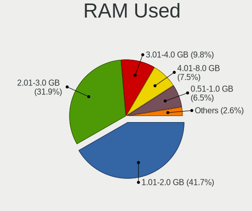
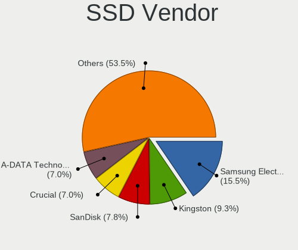
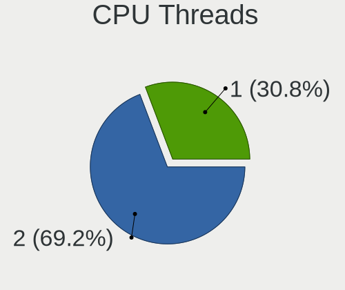
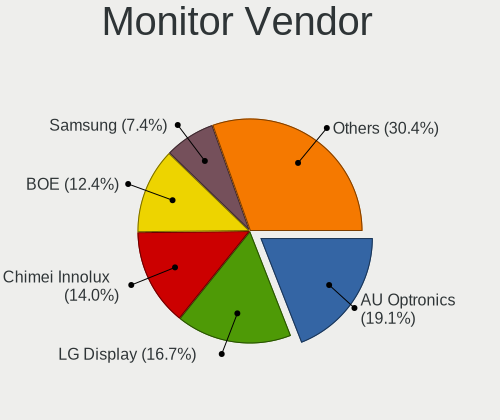

LMDE 5 - Tested Hardware & Statistics (Notebooks)
-------------------------------------------------

A project to collect tested hardware configurations for LMDE 5.

Anyone can contribute to this report by the [hw-probe](https://github.com/linuxhw/hw-probe) tool:

    sudo -E hw-probe -all -upload

Please contribute! Especially if your hardware is rare.

Contents
--------

* [ Test Cases ](#test-cases)

* [ System ](#system)
  - [ Kernel                   ](#kernel)
  - [ Kernel Family            ](#kernel-family)
  - [ Kernel Major Ver.        ](#kernel-major-ver)
  - [ Arch                     ](#arch)
  - [ DE                       ](#de)
  - [ Display Server           ](#display-server)
  - [ Display Manager          ](#display-manager)
  - [ OS Lang                  ](#os-lang)
  - [ Boot Mode                ](#boot-mode)
  - [ Filesystem               ](#filesystem)
  - [ Part. scheme             ](#part-scheme)
  - [ Dual Boot with Linux/BSD ](#dual-boot-with-linuxbsd)
  - [ Dual Boot (Win)          ](#dual-boot-win)

* [ Board ](#board)
  - [ Vendor                   ](#vendor)
  - [ Model                    ](#model)
  - [ Model Family             ](#model-family)
  - [ MFG Year                 ](#mfg-year)
  - [ Form Factor              ](#form-factor)
  - [ Secure Boot              ](#secure-boot)
  - [ Coreboot                 ](#coreboot)
  - [ RAM Size                 ](#ram-size)
  - [ RAM Used                 ](#ram-used)
  - [ Total Drives             ](#total-drives)
  - [ Has CD-ROM               ](#has-cd-rom)
  - [ Has Ethernet             ](#has-ethernet)
  - [ Has WiFi                 ](#has-wifi)
  - [ Has Bluetooth            ](#has-bluetooth)

* [ Location ](#location)
  - [ Country                  ](#country)
  - [ City                     ](#city)

* [ Drives ](#drives)
  - [ Drive Vendor             ](#drive-vendor)
  - [ Drive Model              ](#drive-model)
  - [ HDD Vendor               ](#hdd-vendor)
  - [ SSD Vendor               ](#ssd-vendor)
  - [ Drive Kind               ](#drive-kind)
  - [ Drive Connector          ](#drive-connector)
  - [ Drive Size               ](#drive-size)
  - [ Space Total              ](#space-total)
  - [ Space Used               ](#space-used)
  - [ Malfunc. Drives          ](#malfunc-drives)
  - [ Malfunc. Drive Vendor    ](#malfunc-drive-vendor)
  - [ Malfunc. HDD Vendor      ](#malfunc-hdd-vendor)
  - [ Malfunc. Drive Kind      ](#malfunc-drive-kind)
  - [ Failed Drives            ](#failed-drives)
  - [ Failed Drive Vendor      ](#failed-drive-vendor)
  - [ Drive Status             ](#drive-status)

* [ Storage controller ](#storage-controller)
  - [ Storage Vendor           ](#storage-vendor)
  - [ Storage Model            ](#storage-model)
  - [ Storage Kind             ](#storage-kind)

* [ Processor ](#processor)
  - [ CPU Vendor               ](#cpu-vendor)
  - [ CPU Model                ](#cpu-model)
  - [ CPU Model Family         ](#cpu-model-family)
  - [ CPU Cores                ](#cpu-cores)
  - [ CPU Sockets              ](#cpu-sockets)
  - [ CPU Threads              ](#cpu-threads)
  - [ CPU Op-Modes             ](#cpu-op-modes)
  - [ CPU Microcode            ](#cpu-microcode)
  - [ CPU Microarch            ](#cpu-microarch)

* [ Graphics ](#graphics)
  - [ GPU Vendor               ](#gpu-vendor)
  - [ GPU Model                ](#gpu-model)
  - [ GPU Combo                ](#gpu-combo)
  - [ GPU Driver               ](#gpu-driver)
  - [ GPU Memory               ](#gpu-memory)

* [ Monitor ](#monitor)
  - [ Monitor Vendor           ](#monitor-vendor)
  - [ Monitor Model            ](#monitor-model)
  - [ Monitor Resolution       ](#monitor-resolution)
  - [ Monitor Diagonal         ](#monitor-diagonal)
  - [ Monitor Width            ](#monitor-width)
  - [ Aspect Ratio             ](#aspect-ratio)
  - [ Monitor Area             ](#monitor-area)
  - [ Pixel Density            ](#pixel-density)
  - [ Multiple Monitors        ](#multiple-monitors)

* [ Network ](#network)
  - [ Net Controller Vendor    ](#net-controller-vendor)
  - [ Net Controller Model     ](#net-controller-model)
  - [ Wireless Vendor          ](#wireless-vendor)
  - [ Wireless Model           ](#wireless-model)
  - [ Ethernet Vendor          ](#ethernet-vendor)
  - [ Ethernet Model           ](#ethernet-model)
  - [ Net Controller Kind      ](#net-controller-kind)
  - [ Used Controller          ](#used-controller)
  - [ NICs                     ](#nics)
  - [ IPv6                     ](#ipv6)

* [ Bluetooth ](#bluetooth)
  - [ Bluetooth Vendor         ](#bluetooth-vendor)
  - [ Bluetooth Model          ](#bluetooth-model)

* [ Sound ](#sound)
  - [ Sound Vendor             ](#sound-vendor)
  - [ Sound Model              ](#sound-model)

* [ Memory ](#memory)
  - [ Memory Vendor            ](#memory-vendor)
  - [ Memory Model             ](#memory-model)
  - [ Memory Kind              ](#memory-kind)
  - [ Memory Form Factor       ](#memory-form-factor)
  - [ Memory Size              ](#memory-size)
  - [ Memory Speed             ](#memory-speed)

* [ Printers & scanners ](#printers--scanners)
  - [ Printer Vendor           ](#printer-vendor)
  - [ Printer Model            ](#printer-model)
  - [ Scanner Vendor           ](#scanner-vendor)
  - [ Scanner Model            ](#scanner-model)

* [ Camera ](#camera)
  - [ Camera Vendor            ](#camera-vendor)
  - [ Camera Model             ](#camera-model)

* [ Security ](#security)
  - [ Fingerprint Vendor       ](#fingerprint-vendor)
  - [ Fingerprint Model        ](#fingerprint-model)
  - [ Chipcard Vendor          ](#chipcard-vendor)
  - [ Chipcard Model           ](#chipcard-model)

* [ Unsupported ](#unsupported)
  - [ Unsupported Devices      ](#unsupported-devices)
  - [ Unsupported Device Types ](#unsupported-device-types)

Test Cases
----------

Total: 90

| Vendor        | Model                       | Probe                                                      | Date         |
|---------------|-----------------------------|------------------------------------------------------------|--------------|
| HP            | Pavilion 17                 | [1efb06e77e](https://linux-hardware.org/?probe=1efb06e77e) | Jul 01, 2022 |
| HP            | Compaq 15                   | [fb14abab4d](https://linux-hardware.org/?probe=fb14abab4d) | Jun 30, 2022 |
| Framework     | Laptop                      | [8a44001ebb](https://linux-hardware.org/?probe=8a44001ebb) | Jun 30, 2022 |
| Framework     | Laptop                      | [61a6480a38](https://linux-hardware.org/?probe=61a6480a38) | Jun 30, 2022 |
| Dell          | Inspiron 5370               | [e848f3258c](https://linux-hardware.org/?probe=e848f3258c) | Jun 26, 2022 |
| Unknown       | Unknown                     | [a8b7e4a9fe](https://linux-hardware.org/?probe=a8b7e4a9fe) | Jun 26, 2022 |
| HP            | Laptop 15z-ef2xxx           | [f54df47fa0](https://linux-hardware.org/?probe=f54df47fa0) | Jun 25, 2022 |
| Dell          | Inspiron 3505               | [1eaa95f069](https://linux-hardware.org/?probe=1eaa95f069) | Jun 24, 2022 |
| HP            | Laptop 15z-ef2xxx           | [64e65ab80b](https://linux-hardware.org/?probe=64e65ab80b) | Jun 24, 2022 |
| HP            | Laptop 15z-ef2xxx           | [879d7a231f](https://linux-hardware.org/?probe=879d7a231f) | Jun 24, 2022 |
| Lenovo        | ThinkPad T450 20BUS0QT04    | [0c96d2bc24](https://linux-hardware.org/?probe=0c96d2bc24) | Jun 24, 2022 |
| HP            | Laptop 15-bw0xx             | [a55d01829f](https://linux-hardware.org/?probe=a55d01829f) | Jun 23, 2022 |
| HP            | EliteBook 8730w             | [14135356d6](https://linux-hardware.org/?probe=14135356d6) | Jun 20, 2022 |
| MSI           | U180                        | [7aa374e07e](https://linux-hardware.org/?probe=7aa374e07e) | Jun 20, 2022 |
| Acer          | Aspire 5930                 | [348ec06fd0](https://linux-hardware.org/?probe=348ec06fd0) | Jun 18, 2022 |
| ASUSTek       | 1005P                       | [4bd178fe29](https://linux-hardware.org/?probe=4bd178fe29) | Jun 14, 2022 |
| Apple         | MacBookPro14,1              | [88294cb5aa](https://linux-hardware.org/?probe=88294cb5aa) | Jun 12, 2022 |
| Apple         | MacBookPro14,1              | [281724432e](https://linux-hardware.org/?probe=281724432e) | Jun 12, 2022 |
| Acer          | Aspire One 522              | [7f4af0143d](https://linux-hardware.org/?probe=7f4af0143d) | Jun 11, 2022 |
| Apple         | MacBookAir6,1               | [f0883ab59b](https://linux-hardware.org/?probe=f0883ab59b) | Jun 10, 2022 |
| HP            | 255 G5 Notebook PC          | [519a18864f](https://linux-hardware.org/?probe=519a18864f) | Jun 09, 2022 |
| Sony          | SVE1713Y1RB                 | [4a1bc35dda](https://linux-hardware.org/?probe=4a1bc35dda) | Jun 09, 2022 |
| Lenovo        | Z50-70 20354                | [57582f68b6](https://linux-hardware.org/?probe=57582f68b6) | Jun 08, 2022 |
| Multilaser    | PC150                       | [ee0a35cc62](https://linux-hardware.org/?probe=ee0a35cc62) | Jun 08, 2022 |
| Lenovo        | Z50-70 20354                | [870233669c](https://linux-hardware.org/?probe=870233669c) | Jun 07, 2022 |
| Alienware     | 14                          | [7dabcbc673](https://linux-hardware.org/?probe=7dabcbc673) | Jun 07, 2022 |
| Acer          | Swift SF515-51T             | [1d0b1a1c50](https://linux-hardware.org/?probe=1d0b1a1c50) | May 31, 2022 |
| Lenovo        | Legion 5 15ACH6H 82JU       | [0e59a69b8d](https://linux-hardware.org/?probe=0e59a69b8d) | May 30, 2022 |
| HP            | Laptop 14-cf3xxx            | [9e4cd6dab4](https://linux-hardware.org/?probe=9e4cd6dab4) | May 25, 2022 |
| ASUSTek       | VivoBook_ASUSLaptop X512... | [67aa7158d3](https://linux-hardware.org/?probe=67aa7158d3) | May 24, 2022 |
| HP            | Laptop 14-df0xxx            | [94992083bc](https://linux-hardware.org/?probe=94992083bc) | May 24, 2022 |
| Acer          | Aspire One 522              | [0ac567a5cf](https://linux-hardware.org/?probe=0ac567a5cf) | May 21, 2022 |
| Lenovo        | IdeaPad 3 15ITL6 82H8       | [48c8683aa8](https://linux-hardware.org/?probe=48c8683aa8) | May 21, 2022 |
| Lenovo        | IdeaPad 3 15ITL6 82H8       | [8d30966279](https://linux-hardware.org/?probe=8d30966279) | May 20, 2022 |
| HP            | ZBook Fury 17.3 inch G8 ... | [8757941b52](https://linux-hardware.org/?probe=8757941b52) | May 17, 2022 |
| Acer          | Aspire V3-571G              | [91700e1cb8](https://linux-hardware.org/?probe=91700e1cb8) | May 16, 2022 |
| Dell          | XPS 13 9305                 | [e9310a7ede](https://linux-hardware.org/?probe=e9310a7ede) | May 15, 2022 |
| Dell          | XPS 13 9305                 | [3f8becd67d](https://linux-hardware.org/?probe=3f8becd67d) | May 15, 2022 |
| Dell          | Inspiron 5566               | [d01652f69f](https://linux-hardware.org/?probe=d01652f69f) | May 15, 2022 |
| Dell          | Inspiron 5559               | [4b0c466a88](https://linux-hardware.org/?probe=4b0c466a88) | May 15, 2022 |
| Howard Com... | R7X                         | [bc6d6a31eb](https://linux-hardware.org/?probe=bc6d6a31eb) | May 13, 2022 |
| HP            | Notebook                    | [200c1dabff](https://linux-hardware.org/?probe=200c1dabff) | May 09, 2022 |
| Lenovo        | IdeaPad 5 14ALC05 82LM      | [0d64940271](https://linux-hardware.org/?probe=0d64940271) | May 09, 2022 |
| HP            | ENVY 17                     | [a503de2c1f](https://linux-hardware.org/?probe=a503de2c1f) | May 08, 2022 |
| Apple         | MacBookAir7,2               | [54815db142](https://linux-hardware.org/?probe=54815db142) | May 07, 2022 |
| ASUSTek       | VivoBook E14 E402YA_L402... | [57e085245c](https://linux-hardware.org/?probe=57e085245c) | May 07, 2022 |
| Philco        | 10D                         | [d2f71d99cd](https://linux-hardware.org/?probe=d2f71d99cd) | May 05, 2022 |
| Philco        | 10D                         | [9882f4ca80](https://linux-hardware.org/?probe=9882f4ca80) | May 05, 2022 |
| Acer          | Aspire E1-532               | [a7305e2070](https://linux-hardware.org/?probe=a7305e2070) | May 04, 2022 |
| Lenovo        | ThinkPad T480 20L6S1RN00    | [eb55b73c5a](https://linux-hardware.org/?probe=eb55b73c5a) | May 03, 2022 |
| Toshiba       | Satellite M55               | [9d5733c6fc](https://linux-hardware.org/?probe=9d5733c6fc) | May 02, 2022 |
| HP            | Presario C500 (GF581UA#A... | [0e01914db4](https://linux-hardware.org/?probe=0e01914db4) | Apr 30, 2022 |
| HP            | EliteBook 840 G1            | [53bceed0aa](https://linux-hardware.org/?probe=53bceed0aa) | Apr 29, 2022 |
| Acer          | AOD270                      | [d0fae524f9](https://linux-hardware.org/?probe=d0fae524f9) | Apr 29, 2022 |
| Acer          | AOD270                      | [44d897bc15](https://linux-hardware.org/?probe=44d897bc15) | Apr 29, 2022 |
| Acer          | Aspire E5-553G              | [00a648bda6](https://linux-hardware.org/?probe=00a648bda6) | Apr 28, 2022 |
| Acer          | Aspire E5-553G              | [4646f6cd23](https://linux-hardware.org/?probe=4646f6cd23) | Apr 28, 2022 |
| HP            | ProBook 450 G8 Notebook ... | [ff8e46a260](https://linux-hardware.org/?probe=ff8e46a260) | Apr 27, 2022 |
| HP            | ProBook 450 G8 Notebook ... | [0a6534997e](https://linux-hardware.org/?probe=0a6534997e) | Apr 27, 2022 |
| Apple         | MacBookPro14,1              | [ce4f3d8ec8](https://linux-hardware.org/?probe=ce4f3d8ec8) | Apr 24, 2022 |
| Dixonsxp      | Unknown                     | [65e40dacf4](https://linux-hardware.org/?probe=65e40dacf4) | Apr 20, 2022 |
| Toshiba       | Satellite L455              | [7f0bad47af](https://linux-hardware.org/?probe=7f0bad47af) | Apr 19, 2022 |
| Toshiba       | Satellite L455              | [3a0c54144d](https://linux-hardware.org/?probe=3a0c54144d) | Apr 19, 2022 |
| Dell          | 0X574R                      | [6da5c2339f](https://linux-hardware.org/?probe=6da5c2339f) | Apr 18, 2022 |
| HP            | 14                          | [71f296bd93](https://linux-hardware.org/?probe=71f296bd93) | Apr 17, 2022 |
| Dell          | Latitude 3410               | [78396d572c](https://linux-hardware.org/?probe=78396d572c) | Apr 15, 2022 |
| ASUSTek       | N61Jv                       | [959c5f2238](https://linux-hardware.org/?probe=959c5f2238) | Apr 14, 2022 |
| Acer          | AOA110                      | [cba10fc182](https://linux-hardware.org/?probe=cba10fc182) | Apr 13, 2022 |
| Howard Com... | R7X                         | [e0f3701b1b](https://linux-hardware.org/?probe=e0f3701b1b) | Apr 12, 2022 |
| Howard Com... | R7X                         | [5885bbaa90](https://linux-hardware.org/?probe=5885bbaa90) | Apr 10, 2022 |
| Dell          | Vostro 3500                 | [5b1a24bf51](https://linux-hardware.org/?probe=5b1a24bf51) | Apr 10, 2022 |
| Dell          | Vostro 3500                 | [b2adbbe7d0](https://linux-hardware.org/?probe=b2adbbe7d0) | Apr 10, 2022 |
| Lenovo        | IdeaPad 5 15ARE05 81YQ      | [4d5998459b](https://linux-hardware.org/?probe=4d5998459b) | Apr 09, 2022 |
| HP            | Presario C500 (RY512EA#A... | [4ef049d490](https://linux-hardware.org/?probe=4ef049d490) | Apr 09, 2022 |
| Dell          | Inspiron 14 5410 2-in-1     | [613d6e7d3c](https://linux-hardware.org/?probe=613d6e7d3c) | Apr 07, 2022 |
| Dell          | Latitude 5511               | [2cb0a3e451](https://linux-hardware.org/?probe=2cb0a3e451) | Apr 06, 2022 |
| Dell          | Precision 7520              | [7404842400](https://linux-hardware.org/?probe=7404842400) | Apr 05, 2022 |
| LincPlus      | LINNCPLUS P1                | [22406313dc](https://linux-hardware.org/?probe=22406313dc) | Apr 02, 2022 |
| Toshiba       | Satellite L455              | [699e7d272d](https://linux-hardware.org/?probe=699e7d272d) | Apr 02, 2022 |
| HP            | Pavilion Laptop 15-eh1xx... | [387b77f172](https://linux-hardware.org/?probe=387b77f172) | Apr 01, 2022 |
| HP            | ProBook 6570b               | [0609df27fa](https://linux-hardware.org/?probe=0609df27fa) | Mar 31, 2022 |
| Packard Be... | DOT S                       | [85e7386152](https://linux-hardware.org/?probe=85e7386152) | Mar 28, 2022 |
| Packard Be... | DOT S                       | [edef12b9d5](https://linux-hardware.org/?probe=edef12b9d5) | Mar 28, 2022 |
| Lenovo        | IdeaPad 3 14ALC6 82KT       | [b2e70b8251](https://linux-hardware.org/?probe=b2e70b8251) | Mar 28, 2022 |
| Dell          | Latitude E6400              | [01815a09bb](https://linux-hardware.org/?probe=01815a09bb) | Mar 27, 2022 |
| Toshiba       | Satellite L455              | [90334cf68d](https://linux-hardware.org/?probe=90334cf68d) | Mar 26, 2022 |
| Dell          | Precision M4400             | [5172327d82](https://linux-hardware.org/?probe=5172327d82) | Mar 25, 2022 |
| Medion        | E6220                       | [e739ef27a1](https://linux-hardware.org/?probe=e739ef27a1) | Mar 24, 2022 |
| Acer          | Aspire 7745G                | [3f4c13ee47](https://linux-hardware.org/?probe=3f4c13ee47) | Mar 23, 2022 |
| HP            | 255 G7 Notebook PC          | [f8561c65dc](https://linux-hardware.org/?probe=f8561c65dc) | Mar 21, 2022 |

System
------

Kernel
------

Version of the Linux kernel

| Version              | Notebooks | Percent |
|----------------------|-----------|---------|
| 5.10.0-14-amd64      | 19        | 27.14%  |
| 5.10.0-12-amd64      | 15        | 21.43%  |
| 5.10.0-13-amd64      | 14        | 20%     |
| 5.10.0-15-amd64      | 10        | 14.29%  |
| 5.10.0-13-686        | 5         | 7.14%   |
| 5.18.0-0.bpo.1-amd64 | 2         | 2.86%   |
| 5.16.0-0.bpo.4-amd64 | 2         | 2.86%   |
| 5.16.0-0.bpo.3-amd64 | 1         | 1.43%   |
| 5.15.0-0.bpo.3-amd64 | 1         | 1.43%   |
| 5.10.0-14-686        | 1         | 1.43%   |

Kernel Family
-------------

Linux kernel without a distro release

| Version | Notebooks | Percent |
|---------|-----------|---------|
| 5.10.0  | 62        | 91.18%  |
| 5.16.0  | 3         | 4.41%   |
| 5.18.0  | 2         | 2.94%   |
| 5.15.0  | 1         | 1.47%   |

Kernel Major Ver.
-----------------

Linux kernel major version

| Version | Notebooks | Percent |
|---------|-----------|---------|
| 5.10    | 62        | 91.18%  |
| 5.16    | 3         | 4.41%   |
| 5.18    | 2         | 2.94%   |
| 5.15    | 1         | 1.47%   |

Arch
----

OS architecture (x86_64, i586, etc.)

| Name   | Notebooks | Percent |
|--------|-----------|---------|
| x86_64 | 62        | 91.18%  |
| i686   | 6         | 8.82%   |

DE
--

Desktop Environment

| Name       | Notebooks | Percent |
|------------|-----------|---------|
| X-Cinnamon | 61        | 89.71%  |
| Cinnamon   | 6         | 8.82%   |
| Unknown    | 1         | 1.47%   |

Display Server
--------------

X11 or Wayland

| Name | Notebooks | Percent |
|------|-----------|---------|
| X11  | 68        | 100%    |

Display Manager
---------------

SDDM, LightDM, etc.

| Name    | Notebooks | Percent |
|---------|-----------|---------|
| Unknown | 42        | 61.76%  |
| LightDM | 26        | 38.24%  |

OS Lang
-------

Language

| Lang  | Notebooks | Percent |
|-------|-----------|---------|
| en_US | 29        | 42.65%  |
| pt_BR | 6         | 8.82%   |
| ru_RU | 5         | 7.35%   |
| de_DE | 5         | 7.35%   |
| en_GB | 4         | 5.88%   |
| fr_FR | 3         | 4.41%   |
| pl_PL | 2         | 2.94%   |
| es_MX | 2         | 2.94%   |
| es_BO | 2         | 2.94%   |
| pt_PT | 1         | 1.47%   |
| nl_AW | 1         | 1.47%   |
| ko_KR | 1         | 1.47%   |
| it_IT | 1         | 1.47%   |
| hu_HU | 1         | 1.47%   |
| es_PE | 1         | 1.47%   |
| es_ES | 1         | 1.47%   |
| es_EC | 1         | 1.47%   |
| en_IE | 1         | 1.47%   |
| en_CA | 1         | 1.47%   |

Boot Mode
---------

EFI or BIOS

| Mode | Notebooks | Percent |
|------|-----------|---------|
| EFI  | 43        | 63.24%  |
| BIOS | 25        | 36.76%  |

Filesystem
----------

Type of filesystem

| Type    | Notebooks | Percent |
|---------|-----------|---------|
| Ext4    | 63        | 92.65%  |
| Overlay | 4         | 5.88%   |
| Xfs     | 1         | 1.47%   |

Part. scheme
------------

Scheme of partitioning

| Type    | Notebooks | Percent |
|---------|-----------|---------|
| Unknown | 41        | 60.29%  |
| GPT     | 21        | 30.88%  |
| MBR     | 6         | 8.82%   |

Dual Boot with Linux/BSD
------------------------

Hosting more than one Linux/BSD

| Dual boot | Notebooks | Percent |
|-----------|-----------|---------|
| No        | 64        | 94.12%  |
| Yes       | 4         | 5.88%   |

Dual Boot (Win)
---------------

Hosting Linux and Windows

| Dual boot | Notebooks | Percent |
|-----------|-----------|---------|
| No        | 60        | 88.24%  |
| Yes       | 8         | 11.76%  |

Board
-----

Vendor
------

Motherboard manufacturer

| Name             | Notebooks | Percent |
|------------------|-----------|---------|
| Hewlett-Packard  | 19        | 27.94%  |
| Dell             | 13        | 19.12%  |
| Acer             | 8         | 11.76%  |
| Lenovo           | 7         | 10.29%  |
| ASUSTek Computer | 4         | 5.88%   |
| Apple            | 3         | 4.41%   |
| Toshiba          | 2         | 2.94%   |
| Sony             | 1         | 1.47%   |
| Philco           | 1         | 1.47%   |
| Packard Bell     | 1         | 1.47%   |
| Multilaser       | 1         | 1.47%   |
| MSI              | 1         | 1.47%   |
| Medion           | 1         | 1.47%   |
| LincPlus         | 1         | 1.47%   |
| Howard Computers | 1         | 1.47%   |
| Framework        | 1         | 1.47%   |
| Dixonsxp         | 1         | 1.47%   |
| Alienware        | 1         | 1.47%   |
| Unknown          | 1         | 1.47%   |

Model
-----

Motherboard model

| Name                                             | Notebooks | Percent |
|--------------------------------------------------|-----------|---------|
| HP Laptop 15z-ef2xxx                             | 2         | 2.94%   |
| Dell Latitude E6400                              | 2         | 2.94%   |
| Unknown                                          | 2         | 2.94%   |
| Toshiba Satellite M55                            | 1         | 1.47%   |
| Toshiba Satellite L455                           | 1         | 1.47%   |
| Sony SVE1713Y1RB                                 | 1         | 1.47%   |
| Philco 10D                                       | 1         | 1.47%   |
| Packard Bell DOT S                               | 1         | 1.47%   |
| Multilaser PC150                                 | 1         | 1.47%   |
| MSI U180                                         | 1         | 1.47%   |
| Medion E6220                                     | 1         | 1.47%   |
| LincPlus LINNCPLUS P1                            | 1         | 1.47%   |
| Lenovo Z50-70 20354                              | 1         | 1.47%   |
| Lenovo ThinkPad T480 20L6S1RN00                  | 1         | 1.47%   |
| Lenovo ThinkPad T450 20BUS0QT04                  | 1         | 1.47%   |
| Lenovo Legion 5 15ACH6H 82JU                     | 1         | 1.47%   |
| Lenovo IdeaPad 5 14ALC05 82LM                    | 1         | 1.47%   |
| Lenovo IdeaPad 3 15ITL6 82H8                     | 1         | 1.47%   |
| Lenovo IdeaPad 3 14ALC6 82KT                     | 1         | 1.47%   |
| Howard Computers R7X                             | 1         | 1.47%   |
| HP ZBook Fury 17.3 inch G8 Mobile Workstation PC | 1         | 1.47%   |
| HP ProBook 6570b                                 | 1         | 1.47%   |
| HP ProBook 450 G8 Notebook PC                    | 1         | 1.47%   |
| HP Presario C500 (GF581UA#ABA)                   | 1         | 1.47%   |
| HP Pavilion Laptop 15-eh1xxx                     | 1         | 1.47%   |
| HP Pavilion 17                                   | 1         | 1.47%   |
| HP Notebook                                      | 1         | 1.47%   |
| HP Laptop 15-bw0xx                               | 1         | 1.47%   |
| HP Laptop 14-df0xxx                              | 1         | 1.47%   |
| HP Laptop 14-cf3xxx                              | 1         | 1.47%   |
| HP ENVY 17                                       | 1         | 1.47%   |
| HP EliteBook 8730w                               | 1         | 1.47%   |
| HP EliteBook 840 G1                              | 1         | 1.47%   |
| HP Compaq 15                                     | 1         | 1.47%   |
| HP 255 G7 Notebook PC                            | 1         | 1.47%   |
| HP 255 G5 Notebook PC                            | 1         | 1.47%   |
| HP 14                                            | 1         | 1.47%   |
| Framework Laptop                                 | 1         | 1.47%   |
| Dell XPS 13 9305                                 | 1         | 1.47%   |
| Dell Vostro 3500                                 | 1         | 1.47%   |
| Dell Precision M4400                             | 1         | 1.47%   |
| Dell Precision 7520                              | 1         | 1.47%   |
| Dell Latitude 5511                               | 1         | 1.47%   |
| Dell Latitude 3410                               | 1         | 1.47%   |
| Dell Inspiron 5566                               | 1         | 1.47%   |
| Dell Inspiron 5559                               | 1         | 1.47%   |
| Dell Inspiron 5370                               | 1         | 1.47%   |
| Dell Inspiron 3505                               | 1         | 1.47%   |
| Dell Inspiron 14 5410 2-in-1                     | 1         | 1.47%   |
| ASUS VivoBook_ASUSLaptop X512DA_X512DA           | 1         | 1.47%   |
| ASUS VivoBook E14 E402YA_L402YA                  | 1         | 1.47%   |
| ASUS N61Jv                                       | 1         | 1.47%   |
| ASUS 1005P                                       | 1         | 1.47%   |
| Apple MacBookPro14,1                             | 1         | 1.47%   |
| Apple MacBookAir7,2                              | 1         | 1.47%   |
| Apple MacBookAir6,1                              | 1         | 1.47%   |
| Alienware 14                                     | 1         | 1.47%   |
| Acer Aspire V3-571G                              | 1         | 1.47%   |
| Acer Aspire One 522                              | 1         | 1.47%   |
| Acer Aspire E5-553G                              | 1         | 1.47%   |

Model Family
------------

Motherboard model prefix

| Name                 | Notebooks | Percent |
|----------------------|-----------|---------|
| Acer Aspire          | 6         | 8.82%   |
| HP Laptop            | 5         | 7.35%   |
| Dell Inspiron        | 5         | 7.35%   |
| Dell Latitude        | 4         | 5.88%   |
| Lenovo IdeaPad       | 3         | 4.41%   |
| Toshiba Satellite    | 2         | 2.94%   |
| Lenovo ThinkPad      | 2         | 2.94%   |
| HP ProBook           | 2         | 2.94%   |
| HP Pavilion          | 2         | 2.94%   |
| HP EliteBook         | 2         | 2.94%   |
| HP 255               | 2         | 2.94%   |
| Dell Precision       | 2         | 2.94%   |
| ASUS VivoBook        | 2         | 2.94%   |
| Unknown              | 2         | 2.94%   |
| Sony SVE1713Y1RB     | 1         | 1.47%   |
| Philco 10D           | 1         | 1.47%   |
| Packard Bell DOT     | 1         | 1.47%   |
| Multilaser PC150     | 1         | 1.47%   |
| MSI U180             | 1         | 1.47%   |
| Medion E6220         | 1         | 1.47%   |
| LincPlus LINNCPLUS   | 1         | 1.47%   |
| Lenovo Z50-70        | 1         | 1.47%   |
| Lenovo Legion        | 1         | 1.47%   |
| Howard Computers R7X | 1         | 1.47%   |
| HP ZBook             | 1         | 1.47%   |
| HP Presario          | 1         | 1.47%   |
| HP Notebook          | 1         | 1.47%   |
| HP ENVY              | 1         | 1.47%   |
| HP Compaq            | 1         | 1.47%   |
| HP 14                | 1         | 1.47%   |
| Framework Laptop     | 1         | 1.47%   |
| Dell XPS             | 1         | 1.47%   |
| Dell Vostro          | 1         | 1.47%   |
| ASUS N61Jv           | 1         | 1.47%   |
| ASUS 1005P           | 1         | 1.47%   |
| Apple MacBookPro14   | 1         | 1.47%   |
| Apple MacBookAir7    | 1         | 1.47%   |
| Apple MacBookAir6    | 1         | 1.47%   |
| Alienware 14         | 1         | 1.47%   |
| Acer AOD270          | 1         | 1.47%   |
| Acer AOA110          | 1         | 1.47%   |

MFG Year
--------

Motherboard manufacture year

| Year | Notebooks | Percent |
|------|-----------|---------|
| 2021 | 13        | 19.12%  |
| 2013 | 7         | 10.29%  |
| 2020 | 6         | 8.82%   |
| 2012 | 6         | 8.82%   |
| 2016 | 5         | 7.35%   |
| 2018 | 4         | 5.88%   |
| 2010 | 4         | 5.88%   |
| 2008 | 4         | 5.88%   |
| 2019 | 3         | 4.41%   |
| 2017 | 3         | 4.41%   |
| 2014 | 3         | 4.41%   |
| 2009 | 3         | 4.41%   |
| 2015 | 2         | 2.94%   |
| 2011 | 2         | 2.94%   |
| 2007 | 2         | 2.94%   |
| 2006 | 1         | 1.47%   |

Form Factor
-----------

Physical design of the computer

| Name     | Notebooks | Percent |
|----------|-----------|---------|
| Notebook | 68        | 100%    |

Secure Boot
-----------

Enabled or disabled

| State    | Notebooks | Percent |
|----------|-----------|---------|
| Disabled | 60        | 88.24%  |
| Enabled  | 8         | 11.76%  |

Coreboot
--------

Have coreboot on board

| Used | Notebooks | Percent |
|------|-----------|---------|
| No   | 68        | 100%    |

RAM Size
--------

Total RAM memory

| Size in GB  | Notebooks | Percent |
|-------------|-----------|---------|
| 4.01-8.0    | 20        | 29.41%  |
| 3.01-4.0    | 18        | 26.47%  |
| 8.01-16.0   | 9         | 13.24%  |
| 16.01-24.0  | 7         | 10.29%  |
| 1.01-2.0    | 7         | 10.29%  |
| 2.01-3.0    | 3         | 4.41%   |
| 32.01-64.0  | 2         | 2.94%   |
| 64.01-256.0 | 2         | 2.94%   |

RAM Used
--------

Used RAM memory

| Used GB  | Notebooks | Percent |
|----------|-----------|---------|
| 1.01-2.0 | 32        | 45.71%  |
| 2.01-3.0 | 22        | 31.43%  |
| 3.01-4.0 | 8         | 11.43%  |
| 0.51-1.0 | 5         | 7.14%   |
| 4.01-8.0 | 3         | 4.29%   |

Total Drives
------------

Number of drives on board

| Drives | Notebooks | Percent |
|--------|-----------|---------|
| 1      | 51        | 75%     |
| 2      | 15        | 22.06%  |
| 4      | 1         | 1.47%   |
| 3      | 1         | 1.47%   |

Has CD-ROM
----------

Has CD-ROM on board

| Presented | Notebooks | Percent |
|-----------|-----------|---------|
| No        | 47        | 69.12%  |
| Yes       | 21        | 30.88%  |

Has Ethernet
------------

Has Ethernet on board

| Presented | Notebooks | Percent |
|-----------|-----------|---------|
| Yes       | 54        | 79.41%  |
| No        | 14        | 20.59%  |

Has WiFi
--------

Has WiFi module

| Presented | Notebooks | Percent |
|-----------|-----------|---------|
| Yes       | 67        | 98.53%  |
| No        | 1         | 1.47%   |

Has Bluetooth
-------------

Has Bluetooth module

| Presented | Notebooks | Percent |
|-----------|-----------|---------|
| Yes       | 44        | 64.71%  |
| No        | 24        | 35.29%  |

Location
--------

Country
-------

Geographic location (country)

| Country     | Notebooks | Percent |
|-------------|-----------|---------|
| USA         | 13        | 19.12%  |
| UK          | 7         | 10.29%  |
| Russia      | 6         | 8.82%   |
| Germany     | 6         | 8.82%   |
| Brazil      | 6         | 8.82%   |
| Poland      | 4         | 5.88%   |
| France      | 3         | 4.41%   |
| Romania     | 2         | 2.94%   |
| Mexico      | 2         | 2.94%   |
| Chile       | 2         | 2.94%   |
| Canada      | 2         | 2.94%   |
| Bolivia     | 2         | 2.94%   |
| Spain       | 1         | 1.47%   |
| South Korea | 1         | 1.47%   |
| Portugal    | 1         | 1.47%   |
| Peru        | 1         | 1.47%   |
| Malaysia    | 1         | 1.47%   |
| Lithuania   | 1         | 1.47%   |
| Kenya       | 1         | 1.47%   |
| Italy       | 1         | 1.47%   |
| Hungary     | 1         | 1.47%   |
| Ecuador     | 1         | 1.47%   |
| Belgium     | 1         | 1.47%   |
| Belarus     | 1         | 1.47%   |
| Austria     | 1         | 1.47%   |

City
----

Geographic location (city)

| City                | Notebooks | Percent |
|---------------------|-----------|---------|
| Oruro               | 2         | 2.94%   |
| Neasden             | 2         | 2.94%   |
| Moscow              | 2         | 2.94%   |
| Wroclaw             | 1         | 1.47%   |
| Vilnius             | 1         | 1.47%   |
| Veurne              | 1         | 1.47%   |
| Vaslui              | 1         | 1.47%   |
| Uiwang              | 1         | 1.47%   |
| Tula                | 1         | 1.47%   |
| Troisdorf           | 1         | 1.47%   |
| Tipton              | 1         | 1.47%   |
| Spearfish           | 1         | 1.47%   |
| Scarborough         | 1         | 1.47%   |
| Saratov             | 1         | 1.47%   |
| Santiago            | 1         | 1.47%   |
| Rochester           | 1         | 1.47%   |
| Recife              | 1         | 1.47%   |
| Providencia         | 1         | 1.47%   |
| Petaling Jaya       | 1         | 1.47%   |
| Ordonnac            | 1         | 1.47%   |
| Nuremberg           | 1         | 1.47%   |
| Nairobi             | 1         | 1.47%   |
| Murphy              | 1         | 1.47%   |
| Mosonmagyaróvár   | 1         | 1.47%   |
| Monaca              | 1         | 1.47%   |
| Minsk               | 1         | 1.47%   |
| Mieuxce             | 1         | 1.47%   |
| Marrero             | 1         | 1.47%   |
| Mannheim            | 1         | 1.47%   |
| Mammoth Lakes       | 1         | 1.47%   |
| Londonderry         | 1         | 1.47%   |
| London              | 1         | 1.47%   |
| Lisbon              | 1         | 1.47%   |
| Limoges             | 1         | 1.47%   |
| Limburg an der Lahn | 1         | 1.47%   |
| Lima                | 1         | 1.47%   |
| Lebanon             | 1         | 1.47%   |
| Lawrenceville       | 1         | 1.47%   |
| Krakow              | 1         | 1.47%   |
| Knurow              | 1         | 1.47%   |
| Katowice            | 1         | 1.47%   |
| Ivanovo             | 1         | 1.47%   |
| Hollister           | 1         | 1.47%   |
| Hallwang            | 1         | 1.47%   |
| Glasgow             | 1         | 1.47%   |
| Everett             | 1         | 1.47%   |
| Darlington          | 1         | 1.47%   |
| Ciudad Juárez      | 1         | 1.47%   |
| Chihuahua City      | 1         | 1.47%   |
| Chicago             | 1         | 1.47%   |
| Campos Novos        | 1         | 1.47%   |
| Bryansk             | 1         | 1.47%   |
| Brescia             | 1         | 1.47%   |
| Branesti            | 1         | 1.47%   |
| Blairsville         | 1         | 1.47%   |
| Birigui             | 1         | 1.47%   |
| Berlin              | 1         | 1.47%   |
| Belém              | 1         | 1.47%   |
| Bandeirantes        | 1         | 1.47%   |
| Babahoyo            | 1         | 1.47%   |

Drives
------

Drive Vendor
------------

Hard drive vendors

| Vendor                         | Notebooks | Drives | Percent |
|--------------------------------|-----------|--------|---------|
| WDC                            | 12        | 12     | 14.46%  |
| Samsung Electronics            | 10        | 11     | 12.05%  |
| Seagate                        | 7         | 7      | 8.43%   |
| Unknown                        | 5         | 5      | 6.02%   |
| Toshiba                        | 5         | 6      | 6.02%   |
| Hitachi                        | 5         | 5      | 6.02%   |
| Kingston                       | 4         | 4      | 4.82%   |
| SanDisk                        | 3         | 3      | 3.61%   |
| Intel                          | 3         | 3      | 3.61%   |
| Apple                          | 3         | 6      | 3.61%   |
| Phison                         | 2         | 2      | 2.41%   |
| Patriot                        | 2         | 2      | 2.41%   |
| Micron Technology              | 2         | 2      | 2.41%   |
| HGST                           | 2         | 2      | 2.41%   |
| A-DATA Technology              | 2         | 2      | 2.41%   |
| Team                           | 1         | 1      | 1.2%    |
| Solid State Storage Technology | 1         | 1      | 1.2%    |
| SK hynix                       | 1         | 1      | 1.2%    |
| ShiJi                          | 1         | 1      | 1.2%    |
| SABRENT                        | 1         | 1      | 1.2%    |
| PNY                            | 1         | 1      | 1.2%    |
| Oyen                           | 1         | 1      | 1.2%    |
| ORICO                          | 1         | 1      | 1.2%    |
| Micron/Crucial Technology      | 1         | 2      | 1.2%    |
| LITEON                         | 1         | 1      | 1.2%    |
| KIOXIA                         | 1         | 2      | 1.2%    |
| KingSpec                       | 1         | 1      | 1.2%    |
| Initio                         | 1         | 1      | 1.2%    |
| China                          | 1         | 2      | 1.2%    |
| BHT                            | 1         | 1      | 1.2%    |
| Acer                           | 1         | 1      | 1.2%    |

Drive Model
-----------

Hard drive models

| Model                                    | Notebooks | Percent |
|------------------------------------------|-----------|---------|
| WDC WD3200BPVT-22JJ5T0 320GB             | 2         | 2.35%   |
| Unknown SD/MMC/MS PRO 128GB              | 2         | 2.35%   |
| Toshiba MQ01ABD100 1TB                   | 2         | 2.35%   |
| Seagate ST500LT012-1DG142 500GB          | 2         | 2.35%   |
| Samsung PM991a NVMe 512GB                | 2         | 2.35%   |
| Micron NVMe SSD Drive 512GB              | 2         | 2.35%   |
| Kingston SA400S37120G 120GB SSD          | 2         | 2.35%   |
| WDC WDS100T3X0C-00SJG0 1TB               | 1         | 1.18%   |
| WDC WDBNCE5000PNC 500GB SSD              | 1         | 1.18%   |
| WDC WD7500BPVT-22HXZT3 752GB             | 1         | 1.18%   |
| WDC WD5000BPVX-00JC3T0 500GB             | 1         | 1.18%   |
| WDC WD3200BEVT-22ZCT0 320GB              | 1         | 1.18%   |
| WDC WD30 EFRX-68EUZN0 3TB                | 1         | 1.18%   |
| WDC WD10JPVT-55A1YT0 1TB                 | 1         | 1.18%   |
| WDC PC SN530 SDBPNPZ-256G-1006 256GB     | 1         | 1.18%   |
| WDC PC SN530 SDBPMPZ-512G-1101 512GB     | 1         | 1.18%   |
| WDC PC SN530 NVMe 256GB                  | 1         | 1.18%   |
| Unknown USB DISK 3.2 1TB                 | 1         | 1.18%   |
| Unknown MMC Card  32GB                   | 1         | 1.18%   |
| Unknown Biwin  64GB                      | 1         | 1.18%   |
| Toshiba MQ04ABF100 1TB                   | 1         | 1.18%   |
| Toshiba MQ01ABF032 320GB                 | 1         | 1.18%   |
| Toshiba MK3252GSX 320GB                  | 1         | 1.18%   |
| Team T253X6512G 512GB SSD                | 1         | 1.18%   |
| Solid State Storage NVMe SSD Drive 256GB | 1         | 1.18%   |
| SK hynix BC511 HFM256GDJTNI-82A0A 256GB  | 1         | 1.18%   |
| ShiJi 256GB                              | 1         | 1.18%   |
| Seagate ST9250315AS 250GB                | 1         | 1.18%   |
| Seagate ST9160412ASG 160GB               | 1         | 1.18%   |
| Seagate ST320LM001 HN-M320MBB 320GB      | 1         | 1.18%   |
| Seagate ST2000LX001-1RG174 2TB           | 1         | 1.18%   |
| Seagate ST1000LM035-1RK172 1TB           | 1         | 1.18%   |
| SanDisk SSD PLUS 480GB                   | 1         | 1.18%   |
| SanDisk NVMe SSD Drive 256GB             | 1         | 1.18%   |
| SanDisk DF4064  64GB                     | 1         | 1.18%   |
| Samsung SSD 980 PRO 1TB                  | 1         | 1.18%   |
| Samsung SSD 980 1TB                      | 1         | 1.18%   |
| Samsung SSD 970 EVO Plus 1TB             | 1         | 1.18%   |
| Samsung SSD 870 QVO 8TB                  | 1         | 1.18%   |
| Samsung SSD 860 EVO 1TB                  | 1         | 1.18%   |
| Samsung SSD 850 EVO 500GB                | 1         | 1.18%   |
| Samsung SSD 850 EVO 120GB                | 1         | 1.18%   |
| Samsung NVMe SSD Drive 256GB             | 1         | 1.18%   |
| Samsung MZ7LN256HCHP-000L7 256GB SSD     | 1         | 1.18%   |
| SABRENT Disk 1TB                         | 1         | 1.18%   |
| PNY CS1311 480GB SSD                     | 1         | 1.18%   |
| Phison NVMe SSD Drive 256GB              | 1         | 1.18%   |
| Phison ES 512GB                          | 1         | 1.18%   |
| Patriot P210 512GB SSD                   | 1         | 1.18%   |
| Patriot Burst 240GB SSD                  | 1         | 1.18%   |
| Oyen MiniPro E31 5TB                     | 1         | 1.18%   |
| ORICO M200 1TB SSD                       | 1         | 1.18%   |
| Micron/Crucial NVMe SSD Drive 2TB        | 1         | 1.18%   |
| LITEON CV3-CE256-11 SATA 256GB SSD       | 1         | 1.18%   |
| KIOXIA KXG60PNV2T04 2TB                  | 1         | 1.18%   |
| Kingston SA400S37240G 240GB SSD          | 1         | 1.18%   |
| Kingston SA400M8240G 240GB SSD           | 1         | 1.18%   |
| KingSpec MT-128 128GB                    | 1         | 1.18%   |
| Intel SSDSCKKF256G8 SATA 256GB           | 1         | 1.18%   |
| Intel SSDSC2CW060A3 64GB                 | 1         | 1.18%   |

HDD Vendor
----------

Hard disk drive vendors

| Vendor  | Notebooks | Drives | Percent |
|---------|-----------|--------|---------|
| WDC     | 7         | 7      | 25%     |
| Seagate | 7         | 7      | 25%     |
| Toshiba | 5         | 6      | 17.86%  |
| Hitachi | 5         | 5      | 17.86%  |
| Unknown | 2         | 2      | 7.14%   |
| HGST    | 2         | 2      | 7.14%   |

SSD Vendor
----------

Solid state drive vendors

| Vendor              | Notebooks | Drives | Percent |
|---------------------|-----------|--------|---------|
| Samsung Electronics | 4         | 5      | 15.38%  |
| Kingston            | 4         | 4      | 15.38%  |
| Patriot             | 2         | 2      | 7.69%   |
| Intel               | 2         | 2      | 7.69%   |
| Apple               | 2         | 2      | 7.69%   |
| A-DATA Technology   | 2         | 2      | 7.69%   |
| WDC                 | 1         | 1      | 3.85%   |
| Team                | 1         | 1      | 3.85%   |
| SanDisk             | 1         | 1      | 3.85%   |
| PNY                 | 1         | 1      | 3.85%   |
| ORICO               | 1         | 1      | 3.85%   |
| LITEON              | 1         | 1      | 3.85%   |
| KingSpec            | 1         | 1      | 3.85%   |
| China               | 1         | 2      | 3.85%   |
| BHT                 | 1         | 1      | 3.85%   |
| Acer                | 1         | 1      | 3.85%   |

Drive Kind
----------

HDD or SSD

| Kind    | Notebooks | Drives | Percent |
|---------|-----------|--------|---------|
| HDD     | 26        | 29     | 33.33%  |
| SSD     | 24        | 28     | 30.77%  |
| NVMe    | 21        | 27     | 26.92%  |
| Unknown | 4         | 4      | 5.13%   |
| MMC     | 3         | 3      | 3.85%   |

Drive Connector
---------------

SATA, SAS, NVMe, etc.

| Type | Notebooks | Drives | Percent |
|------|-----------|--------|---------|
| SATA | 47        | 54     | 62.67%  |
| NVMe | 20        | 26     | 26.67%  |
| SAS  | 5         | 8      | 6.67%   |
| MMC  | 3         | 3      | 4%      |

Drive Size
----------

Size of hard drive

| Size in TB | Notebooks | Drives | Percent |
|------------|-----------|--------|---------|
| 0.01-0.5   | 37        | 41     | 71.15%  |
| 0.51-1.0   | 12        | 13     | 23.08%  |
| 2.01-3.0   | 1         | 1      | 1.92%   |
| 1.01-2.0   | 1         | 1      | 1.92%   |
| 4.01-10.0  | 1         | 1      | 1.92%   |

Space Total
-----------

Amount of disk space available on the file system

| Size in GB     | Notebooks | Percent |
|----------------|-----------|---------|
| 251-500        | 20        | 29.41%  |
| 101-250        | 18        | 26.47%  |
| 501-1000       | 8         | 11.76%  |
| 51-100         | 7         | 10.29%  |
| 21-50          | 5         | 7.35%   |
| 1001-2000      | 4         | 5.88%   |
| 1-20           | 4         | 5.88%   |
| More than 3000 | 1         | 1.47%   |
| 2001-3000      | 1         | 1.47%   |

Space Used
----------

Amount of used disk space

| Used GB   | Notebooks | Percent |
|-----------|-----------|---------|
| 1-20      | 40        | 57.14%  |
| 21-50     | 16        | 22.86%  |
| 51-100    | 5         | 7.14%   |
| 251-500   | 3         | 4.29%   |
| 101-250   | 3         | 4.29%   |
| 501-1000  | 2         | 2.86%   |
| 2001-3000 | 1         | 1.43%   |

Malfunc. Drives
---------------

Drive models with a malfunction

| Model                          | Notebooks | Drives | Percent |
|--------------------------------|-----------|--------|---------|
| Phison ES 512GB                | 1         | 1      | 25%     |
| Intel SSDSCKKF256G8 SATA 256GB | 1         | 1      | 25%     |
| Hitachi HTS547575A9E384 752GB  | 1         | 1      | 25%     |
| HGST HTS545050A7E680 500GB     | 1         | 1      | 25%     |

Malfunc. Drive Vendor
---------------------

Vendors of faulty drives

| Vendor  | Notebooks | Drives | Percent |
|---------|-----------|--------|---------|
| Phison  | 1         | 1      | 25%     |
| Intel   | 1         | 1      | 25%     |
| Hitachi | 1         | 1      | 25%     |
| HGST    | 1         | 1      | 25%     |

Malfunc. HDD Vendor
-------------------

Vendors of faulty HDD drives

| Vendor  | Notebooks | Drives | Percent |
|---------|-----------|--------|---------|
| Hitachi | 1         | 1      | 50%     |
| HGST    | 1         | 1      | 50%     |

Malfunc. Drive Kind
-------------------

Kinds of faulty drives

| Kind | Notebooks | Drives | Percent |
|------|-----------|--------|---------|
| HDD  | 2         | 2      | 50%     |
| NVMe | 1         | 1      | 25%     |
| SSD  | 1         | 1      | 25%     |

Failed Drives
-------------

Failed drive models

Zero info for selected period =(

Failed Drive Vendor
-------------------

Failed drive vendors

Zero info for selected period =(

Drive Status
------------

Number of failed and malfunc. drives

| Status   | Notebooks | Drives | Percent |
|----------|-----------|--------|---------|
| Detected | 44        | 59     | 61.11%  |
| Works    | 24        | 28     | 33.33%  |
| Malfunc  | 4         | 4      | 5.56%   |

Storage controller
------------------

Storage Vendor
--------------

Storage controller vendors

| Vendor                         | Notebooks | Percent |
|--------------------------------|-----------|---------|
| Intel                          | 44        | 54.32%  |
| AMD                            | 15        | 18.52%  |
| Samsung Electronics            | 7         | 8.64%   |
| SanDisk                        | 5         | 6.17%   |
| Phison Electronics             | 2         | 2.47%   |
| Micron Technology              | 2         | 2.47%   |
| Toshiba America Info Systems   | 1         | 1.23%   |
| Solid State Storage Technology | 1         | 1.23%   |
| SK hynix                       | 1         | 1.23%   |
| Micron/Crucial Technology      | 1         | 1.23%   |
| Marvell Technology Group       | 1         | 1.23%   |
| Apple                          | 1         | 1.23%   |

Storage Model
-------------

Storage controller models

| Model                                                                          | Notebooks | Percent |
|--------------------------------------------------------------------------------|-----------|---------|
| AMD FCH SATA Controller [AHCI mode]                                            | 13        | 15.12%  |
| Intel Sunrise Point-LP SATA Controller [AHCI mode]                             | 5         | 5.81%   |
| Samsung NVMe SSD Controller 980                                                | 4         | 4.65%   |
| Intel Volume Management Device NVMe RAID Controller                            | 4         | 4.65%   |
| Intel NM10/ICH7 Family SATA Controller [AHCI mode]                             | 4         | 4.65%   |
| Intel 82801 Mobile SATA Controller [RAID mode]                                 | 4         | 4.65%   |
| Intel 82801IBM/IEM (ICH9M/ICH9M-E) 4 port SATA Controller [AHCI mode]          | 3         | 3.49%   |
| Intel 8 Series SATA Controller 1 [AHCI mode]                                   | 3         | 3.49%   |
| Intel 7 Series Chipset Family 6-port SATA Controller [AHCI mode]               | 3         | 3.49%   |
| Intel 5 Series/3400 Series Chipset 4 port SATA AHCI Controller                 | 3         | 3.49%   |
| SanDisk WD Blue SN550 NVMe SSD                                                 | 2         | 2.33%   |
| SanDisk Non-Volatile memory controller                                         | 2         | 2.33%   |
| Phison PS5013 E13 NVMe Controller                                              | 2         | 2.33%   |
| Micron Non-Volatile memory controller                                          | 2         | 2.33%   |
| Intel Tiger Lake-LP SATA Controller [AHCI mode]                                | 2         | 2.33%   |
| Intel 82801GBM/GHM (ICH7-M Family) SATA Controller [AHCI mode]                 | 2         | 2.33%   |
| Intel 82801G (ICH7 Family) IDE Controller                                      | 2         | 2.33%   |
| Intel 8 Series/C220 Series Chipset Family 6-port SATA Controller 1 [AHCI mode] | 2         | 2.33%   |
| Toshiba America Info Systems XG6 NVMe SSD Controller                           | 1         | 1.16%   |
| Solid State Storage Non-Volatile memory controller                             | 1         | 1.16%   |
| SK hynix BC511                                                                 | 1         | 1.16%   |
| SanDisk WD Black SN750 / PC SN730 NVMe SSD                                     | 1         | 1.16%   |
| Samsung NVMe SSD Controller SM981/PM981/PM983                                  | 1         | 1.16%   |
| Samsung NVMe SSD Controller PM9A1/PM9A3/980PRO                                 | 1         | 1.16%   |
| Samsung Electronics SATA controller                                            | 1         | 1.16%   |
| Micron/Crucial NVMe Controller                                                 | 1         | 1.16%   |
| Marvell Group 88SS9183 PCIe SSD Controller                                     | 1         | 1.16%   |
| Intel Wildcat Point-LP SATA Controller [AHCI Mode]                             | 1         | 1.16%   |
| Intel SSD 660P Series                                                          | 1         | 1.16%   |
| Intel Q170/Q150/B150/H170/H110/Z170/CM236 Chipset SATA Controller [AHCI Mode]  | 1         | 1.16%   |
| Intel NM10/ICH7 Family SATA Controller [IDE mode]                              | 1         | 1.16%   |
| Intel Mobile 4 Series Chipset PT IDER Controller                               | 1         | 1.16%   |
| Intel Comet Lake SATA AHCI Controller                                          | 1         | 1.16%   |
| Intel Celeron/Pentium Silver Processor SATA Controller                         | 1         | 1.16%   |
| Intel Celeron N3350/Pentium N4200/Atom E3900 Series SATA AHCI Controller       | 1         | 1.16%   |
| Intel Atom Processor E3800 Series SATA AHCI Controller                         | 1         | 1.16%   |
| Intel 82801FBM (ICH6M) SATA Controller                                         | 1         | 1.16%   |
| Intel 400 Series Chipset Family SATA AHCI Controller                           | 1         | 1.16%   |
| Apple S3X NVMe Controller                                                      | 1         | 1.16%   |
| AMD SB7x0/SB8x0/SB9x0 SATA Controller [AHCI mode]                              | 1         | 1.16%   |
| AMD IXP SB4x0 Serial ATA Controller                                            | 1         | 1.16%   |
| AMD IXP SB4x0 IDE Controller                                                   | 1         | 1.16%   |

Storage Kind
------------

Kind of storage controller (IDE, SATA, NVMe, SAS, ...)

| Kind | Notebooks | Percent |
|------|-----------|---------|
| SATA | 50        | 59.52%  |
| NVMe | 20        | 23.81%  |
| RAID | 8         | 9.52%   |
| IDE  | 6         | 7.14%   |

Processor
---------

CPU Vendor
----------

Processor vendors

| Vendor | Notebooks | Percent |
|--------|-----------|---------|
| Intel  | 50        | 73.53%  |
| AMD    | 18        | 26.47%  |

CPU Model
---------

Processor models

| Model                                           | Notebooks | Percent |
|-------------------------------------------------|-----------|---------|
| Intel Atom CPU N2600 @ 1.60GHz                  | 4         | 5.88%   |
| AMD Ryzen 5 5500U with Radeon Graphics          | 4         | 5.88%   |
| Intel 11th Gen Core i7-1165G7 @ 2.80GHz         | 2         | 2.94%   |
| Intel 11th Gen Core i5-1135G7 @ 2.40GHz         | 2         | 2.94%   |
| Intel 11th Gen Core i3-1115G4 @ 3.00GHz         | 2         | 2.94%   |
| Intel Pentium Silver N5000 CPU @ 1.10GHz        | 1         | 1.47%   |
| Intel Pentium M processor 1.73GHz               | 1         | 1.47%   |
| Intel Pentium CPU P6000 @ 1.87GHz               | 1         | 1.47%   |
| Intel Core i7-6820HQ CPU @ 2.70GHz              | 1         | 1.47%   |
| Intel Core i7-6500U CPU @ 2.50GHz               | 1         | 1.47%   |
| Intel Core i7-4710MQ CPU @ 2.50GHz              | 1         | 1.47%   |
| Intel Core i7-4700MQ CPU @ 2.40GHz              | 1         | 1.47%   |
| Intel Core i7-3632QM CPU @ 2.20GHz              | 1         | 1.47%   |
| Intel Core i7 CPU Q 720 @ 1.60GHz               | 1         | 1.47%   |
| Intel Core i5-7360U CPU @ 2.30GHz               | 1         | 1.47%   |
| Intel Core i5-7300U CPU @ 2.60GHz               | 1         | 1.47%   |
| Intel Core i5-5300U CPU @ 2.30GHz               | 1         | 1.47%   |
| Intel Core i5-5250U CPU @ 1.60GHz               | 1         | 1.47%   |
| Intel Core i5-4300U CPU @ 1.90GHz               | 1         | 1.47%   |
| Intel Core i5-4260U CPU @ 1.40GHz               | 1         | 1.47%   |
| Intel Core i5-4210U CPU @ 1.70GHz               | 1         | 1.47%   |
| Intel Core i5-3230M CPU @ 2.60GHz               | 1         | 1.47%   |
| Intel Core i5-10300H CPU @ 2.50GHz              | 1         | 1.47%   |
| Intel Core i5-10210U CPU @ 1.60GHz              | 1         | 1.47%   |
| Intel Core i3-8130U CPU @ 2.20GHz               | 1         | 1.47%   |
| Intel Core i3-6100U CPU @ 2.30GHz               | 1         | 1.47%   |
| Intel Core i3-6006U CPU @ 2.00GHz               | 1         | 1.47%   |
| Intel Core i3-3110M CPU @ 2.40GHz               | 1         | 1.47%   |
| Intel Core i3-1005G1 CPU @ 1.20GHz              | 1         | 1.47%   |
| Intel Core i3 CPU M 330 @ 2.13GHz               | 1         | 1.47%   |
| Intel Core 2 Extreme CPU X9100 @ 3.06GHz        | 1         | 1.47%   |
| Intel Core 2 Duo CPU T7250 @ 2.00GHz            | 1         | 1.47%   |
| Intel Core 2 Duo CPU T5800 @ 2.00GHz            | 1         | 1.47%   |
| Intel Core 2 Duo CPU P8700 @ 2.53GHz            | 1         | 1.47%   |
| Intel Core 2 Duo CPU P8600 @ 2.40GHz            | 1         | 1.47%   |
| Intel Core 2 Duo CPU E8235 @ 2.80GHz            | 1         | 1.47%   |
| Intel Celeron N4020 CPU @ 1.10GHz               | 1         | 1.47%   |
| Intel Celeron M CPU 520 @ 1.60GHz               | 1         | 1.47%   |
| Intel Celeron M CPU 440 @ 1.86GHz               | 1         | 1.47%   |
| Intel Celeron CPU N3350 @ 1.10GHz               | 1         | 1.47%   |
| Intel Celeron CPU N2815 @ 1.86GHz               | 1         | 1.47%   |
| Intel Celeron 2955U @ 1.40GHz                   | 1         | 1.47%   |
| Intel Atom CPU N450 @ 1.66GHz                   | 1         | 1.47%   |
| Intel Atom CPU N270 @ 1.60GHz                   | 1         | 1.47%   |
| Intel 11th Gen Core i9-11950H @ 2.60GHz         | 1         | 1.47%   |
| AMD Ryzen 7 5800H with Radeon Graphics          | 1         | 1.47%   |
| AMD Ryzen 7 5700U with Radeon Graphics          | 1         | 1.47%   |
| AMD Ryzen 7 4800H with Radeon Graphics          | 1         | 1.47%   |
| AMD Ryzen 5 3500U with Radeon Vega Mobile Gfx   | 1         | 1.47%   |
| AMD Ryzen 5 3450U with Radeon Vega Mobile Gfx   | 1         | 1.47%   |
| AMD Ryzen 3 3200U with Radeon Vega Mobile Gfx   | 1         | 1.47%   |
| AMD E2-7110 APU with AMD Radeon R2 Graphics     | 1         | 1.47%   |
| AMD E2-7015 APU with AMD Radeon R2 Graphics     | 1         | 1.47%   |
| AMD E1-2500 APU with Radeon HD Graphics         | 1         | 1.47%   |
| AMD E1-2100 APU with Radeon HD Graphics         | 1         | 1.47%   |
| AMD C-50 Processor                              | 1         | 1.47%   |
| AMD A9-9420 RADEON R5, 5 COMPUTE CORES 2C+3G    | 1         | 1.47%   |
| AMD A4-9120e RADEON R3, 4 COMPUTE CORES 2C+2G   | 1         | 1.47%   |
| AMD A10-9600P RADEON R5, 10 COMPUTE CORES 4C+6G | 1         | 1.47%   |

CPU Model Family
----------------

Processor model prefix

| Model                | Notebooks | Percent |
|----------------------|-----------|---------|
| Intel Core i5        | 10        | 14.71%  |
| Other                | 8         | 11.76%  |
| Intel Core i7        | 6         | 8.82%   |
| Intel Core i3        | 6         | 8.82%   |
| Intel Atom           | 6         | 8.82%   |
| AMD Ryzen 5          | 6         | 8.82%   |
| Intel Core 2 Duo     | 5         | 7.35%   |
| Intel Celeron        | 4         | 5.88%   |
| AMD Ryzen 7          | 3         | 4.41%   |
| Intel Celeron M      | 2         | 2.94%   |
| AMD E2               | 2         | 2.94%   |
| AMD E1               | 2         | 2.94%   |
| Intel Pentium Silver | 1         | 1.47%   |
| Intel Pentium M      | 1         | 1.47%   |
| Intel Pentium        | 1         | 1.47%   |
| Intel Core 2 Extreme | 1         | 1.47%   |
| AMD Ryzen 3          | 1         | 1.47%   |
| AMD C-50             | 1         | 1.47%   |
| AMD A4               | 1         | 1.47%   |
| AMD A10              | 1         | 1.47%   |

CPU Cores
---------

Number of processor cores

| Number | Notebooks | Percent |
|--------|-----------|---------|
| 2      | 40        | 58.82%  |
| 4      | 15        | 22.06%  |
| 1      | 5         | 7.35%   |
| 8      | 4         | 5.88%   |
| 6      | 4         | 5.88%   |

CPU Sockets
-----------

Number of sockets

| Number | Notebooks | Percent |
|--------|-----------|---------|
| 1      | 68        | 100%    |

CPU Threads
-----------

Threads per core (Hyper-Threading)

| Number | Notebooks | Percent |
|--------|-----------|---------|
| 2      | 46        | 67.65%  |
| 1      | 22        | 32.35%  |

CPU Op-Modes
------------

CPU Operation Modes (32-bit, 64-bit)

| Op mode        | Notebooks | Percent |
|----------------|-----------|---------|
| 32-bit, 64-bit | 64        | 94.12%  |
| 32-bit         | 4         | 5.88%   |

CPU Microcode
-------------

Microcode number

| Number     | Notebooks | Percent |
|------------|-----------|---------|
| 0x806c1    | 6         | 8.82%   |
| 0x08608103 | 5         | 7.35%   |
| 0x40651    | 4         | 5.88%   |
| 0x30661    | 4         | 5.88%   |
| 0x406e3    | 3         | 4.41%   |
| 0x306a9    | 3         | 4.41%   |
| 0x806e9    | 2         | 2.94%   |
| 0x6fd      | 2         | 2.94%   |
| 0x306c3    | 2         | 2.94%   |
| 0x20652    | 2         | 2.94%   |
| 0x1067a    | 2         | 2.94%   |
| 0x10676    | 2         | 2.94%   |
| 0x08108109 | 2         | 2.94%   |
| Unknown    | 2         | 2.94%   |
| 0xa0652    | 1         | 1.47%   |
| 0x806ec    | 1         | 1.47%   |
| 0x806ea    | 1         | 1.47%   |
| 0x806d1    | 1         | 1.47%   |
| 0x706e5    | 1         | 1.47%   |
| 0x706a8    | 1         | 1.47%   |
| 0x706a1    | 1         | 1.47%   |
| 0x6f6      | 1         | 1.47%   |
| 0x6ec      | 1         | 1.47%   |
| 0x6d8      | 1         | 1.47%   |
| 0x506e3    | 1         | 1.47%   |
| 0x506c9    | 1         | 1.47%   |
| 0x306d4    | 1         | 1.47%   |
| 0x30673    | 1         | 1.47%   |
| 0x106e5    | 1         | 1.47%   |
| 0x106ca    | 1         | 1.47%   |
| 0x106c2    | 1         | 1.47%   |
| 0x08600103 | 1         | 1.47%   |
| 0x08108102 | 1         | 1.47%   |
| 0x07030106 | 1         | 1.47%   |
| 0x07030105 | 1         | 1.47%   |
| 0x07000110 | 1         | 1.47%   |
| 0x0700010f | 1         | 1.47%   |
| 0x06006705 | 1         | 1.47%   |
| 0x06006704 | 1         | 1.47%   |
| 0x0600611a | 1         | 1.47%   |
| 0x05000029 | 1         | 1.47%   |

CPU Microarch
-------------

Microarchitecture

| Name          | Notebooks | Percent |
|---------------|-----------|---------|
| TigerLake     | 6         | 8.82%   |
| Haswell       | 6         | 8.82%   |
| Bonnell       | 6         | 8.82%   |
| Unknown       | 5         | 7.35%   |
| Skylake       | 4         | 5.88%   |
| Penryn        | 4         | 5.88%   |
| KabyLake      | 4         | 5.88%   |
| Zen+          | 3         | 4.41%   |
| IvyBridge     | 3         | 4.41%   |
| Excavator     | 3         | 4.41%   |
| Core          | 3         | 4.41%   |
| Westmere      | 2         | 2.94%   |
| Puma          | 2         | 2.94%   |
| P6            | 2         | 2.94%   |
| Jaguar        | 2         | 2.94%   |
| Icelake       | 2         | 2.94%   |
| Goldmont plus | 2         | 2.94%   |
| Broadwell     | 2         | 2.94%   |
| Zen 3         | 1         | 1.47%   |
| Zen 2         | 1         | 1.47%   |
| Silvermont    | 1         | 1.47%   |
| Nehalem       | 1         | 1.47%   |
| Goldmont      | 1         | 1.47%   |
| CometLake     | 1         | 1.47%   |
| Bobcat        | 1         | 1.47%   |

Graphics
--------

GPU Vendor
----------

Vendors of graphics cards

| Vendor | Notebooks | Percent |
|--------|-----------|---------|
| Intel  | 41        | 54.67%  |
| AMD    | 21        | 28%     |
| Nvidia | 13        | 17.33%  |

GPU Model
---------

Graphics card models

| Model                                                                                 | Notebooks | Percent |
|---------------------------------------------------------------------------------------|-----------|---------|
| AMD Lucienne                                                                          | 5         | 6.41%   |
| Intel TigerLake-LP GT2 [Iris Xe Graphics]                                             | 4         | 5.13%   |
| Intel Haswell-ULT Integrated Graphics Controller                                      | 4         | 5.13%   |
| Intel Atom Processor D2xxx/N2xxx Integrated Graphics Controller                       | 4         | 5.13%   |
| Intel Skylake GT2 [HD Graphics 520]                                                   | 3         | 3.85%   |
| AMD Picasso/Raven 2 [Radeon Vega Series / Radeon Vega Mobile Series]                  | 3         | 3.85%   |
| Nvidia G98M [Quadro NVS 160M]                                                         | 2         | 2.56%   |
| Intel Tiger Lake UHD Graphics                                                         | 2         | 2.56%   |
| Intel Mobile 945GM/GMS/GME, 943/940GML Express Integrated Graphics Controller         | 2         | 2.56%   |
| Intel Core Processor Integrated Graphics Controller                                   | 2         | 2.56%   |
| Intel 4th Gen Core Processor Integrated Graphics Controller                           | 2         | 2.56%   |
| Intel 3rd Gen Core processor Graphics Controller                                      | 2         | 2.56%   |
| AMD Stoney [Radeon R2/R3/R4/R5 Graphics]                                              | 2         | 2.56%   |
| Nvidia GT216M [GeForce GT 325M]                                                       | 1         | 1.28%   |
| Nvidia GM108M [GeForce 840M]                                                          | 1         | 1.28%   |
| Nvidia GM107GLM [Quadro M1200 Mobile]                                                 | 1         | 1.28%   |
| Nvidia GK106M [GeForce GTX 765M]                                                      | 1         | 1.28%   |
| Nvidia GF117M [GeForce 610M/710M/810M/820M / GT 620M/625M/630M/720M]                  | 1         | 1.28%   |
| Nvidia GF108M [GeForce GT 620M/630M/635M/640M LE]                                     | 1         | 1.28%   |
| Nvidia GA107GLM [RTX A2000 Mobile]                                                    | 1         | 1.28%   |
| Nvidia GA106M [GeForce RTX 3060 Mobile / Max-Q]                                       | 1         | 1.28%   |
| Nvidia G96GLM [Quadro FX 1700M]                                                       | 1         | 1.28%   |
| Nvidia G96CM [GeForce 9600M GT]                                                       | 1         | 1.28%   |
| Nvidia G94GLM [Quadro FX 2700M]                                                       | 1         | 1.28%   |
| Intel UHD Graphics 620                                                                | 1         | 1.28%   |
| Intel Mobile 945GSE Express Integrated Graphics Controller                            | 1         | 1.28%   |
| Intel Mobile 945GM/GMS, 943/940GML Express Integrated Graphics Controller             | 1         | 1.28%   |
| Intel Mobile 915GM/GMS/910GML Express Graphics Controller                             | 1         | 1.28%   |
| Intel Mobile 4 Series Chipset Integrated Graphics Controller                          | 1         | 1.28%   |
| Intel Iris Plus Graphics G1 (Ice Lake)                                                | 1         | 1.28%   |
| Intel Iris Plus Graphics 640                                                          | 1         | 1.28%   |
| Intel HD Graphics 620                                                                 | 1         | 1.28%   |
| Intel HD Graphics 6000                                                                | 1         | 1.28%   |
| Intel HD Graphics 5500                                                                | 1         | 1.28%   |
| Intel HD Graphics 530                                                                 | 1         | 1.28%   |
| Intel HD Graphics 500                                                                 | 1         | 1.28%   |
| Intel GeminiLake [UHD Graphics 605]                                                   | 1         | 1.28%   |
| Intel GeminiLake [UHD Graphics 600]                                                   | 1         | 1.28%   |
| Intel CometLake-U GT2 [UHD Graphics]                                                  | 1         | 1.28%   |
| Intel CometLake-H GT2 [UHD Graphics]                                                  | 1         | 1.28%   |
| Intel Atom Processor Z36xxx/Z37xxx Series Graphics & Display                          | 1         | 1.28%   |
| Intel Atom Processor D4xx/D5xx/N4xx/N5xx Integrated Graphics Controller               | 1         | 1.28%   |
| AMD Wrestler [Radeon HD 6250]                                                         | 1         | 1.28%   |
| AMD Wani [Radeon R5/R6/R7 Graphics]                                                   | 1         | 1.28%   |
| AMD Topaz XT [Radeon R7 M260/M265 / M340/M360 / M440/M445 / 530/535 / 620/625 Mobile] | 1         | 1.28%   |
| AMD Thames [Radeon HD 7550M/7570M/7650M]                                              | 1         | 1.28%   |
| AMD Sun XT [Radeon HD 8670A/8670M/8690M / R5 M330 / M430 / Radeon 520 Mobile]         | 1         | 1.28%   |
| AMD Renoir                                                                            | 1         | 1.28%   |
| AMD RC410M [Mobility Radeon Xpress 200M]                                              | 1         | 1.28%   |
| AMD Mullins [Radeon R3 Graphics]                                                      | 1         | 1.28%   |
| AMD Mullins [Radeon R2 Graphics]                                                      | 1         | 1.28%   |
| AMD Madison [Mobility Radeon HD 5650/5750 / 6530M/6550M]                              | 1         | 1.28%   |
| AMD Kabini [Radeon HD 8240 / R3 Series]                                               | 1         | 1.28%   |
| AMD Kabini [Radeon HD 8210]                                                           | 1         | 1.28%   |

GPU Combo
---------

Combinations of graphics cards

| Name           | Notebooks | Percent |
|----------------|-----------|---------|
| 1 x Intel      | 34        | 50%     |
| 1 x AMD        | 19        | 27.94%  |
| 1 x Nvidia     | 7         | 10.29%  |
| Intel + Nvidia | 6         | 8.82%   |
| 2 x AMD        | 1         | 1.47%   |
| Intel + AMD    | 1         | 1.47%   |

GPU Driver
----------

Free vs proprietary

| Driver      | Notebooks | Percent |
|-------------|-----------|---------|
| Free        | 66        | 97.06%  |
| Proprietary | 1         | 1.47%   |
| Unknown     | 1         | 1.47%   |

GPU Memory
----------

Total video memory

| Size in GB | Notebooks | Percent |
|------------|-----------|---------|
| Unknown    | 36        | 52.94%  |
| 0.01-0.5   | 17        | 25%     |
| 1.01-2.0   | 8         | 11.76%  |
| 0.51-1.0   | 4         | 5.88%   |
| 3.01-4.0   | 2         | 2.94%   |
| 5.01-6.0   | 1         | 1.47%   |

Monitor
-------

Monitor Vendor
--------------

Monitor vendors

| Vendor                  | Notebooks | Percent |
|-------------------------|-----------|---------|
| AU Optronics            | 17        | 23.29%  |
| BOE                     | 11        | 15.07%  |
| Chimei Innolux          | 10        | 13.7%   |
| LG Display              | 9         | 12.33%  |
| Samsung Electronics     | 4         | 5.48%   |
| LG Philips              | 3         | 4.11%   |
| Apple                   | 3         | 4.11%   |
| PANDA                   | 2         | 2.74%   |
| InfoVision              | 2         | 2.74%   |
| HannStar                | 2         | 2.74%   |
| Dell                    | 2         | 2.74%   |
| TR_                     | 1         | 1.37%   |
| Sharp                   | 1         | 1.37%   |
| Quanta Display          | 1         | 1.37%   |
| Planar                  | 1         | 1.37%   |
| Insignia                | 1         | 1.37%   |
| Goldstar                | 1         | 1.37%   |
| DENON                   | 1         | 1.37%   |
| Chi Mei Optoelectronics | 1         | 1.37%   |

Monitor Model
-------------

Monitor models

| Model                                                                    | Notebooks | Percent |
|--------------------------------------------------------------------------|-----------|---------|
| LG Philips LCD Monitor LPL0140 1440x900 304x190mm 14.1-inch              | 2         | 2.7%    |
| InfoVision LCD Monitor IVO03F4 1024x600 223x125mm 10.1-inch              | 2         | 2.7%    |
| AU Optronics LCD Monitor AUO3791 1920x1080 344x194mm 15.5-inch           | 2         | 2.7%    |
| AU Optronics LCD Monitor AUO21ED 1920x1080 344x193mm 15.5-inch           | 2         | 2.7%    |
| TR_ LCD Monitor TR_5511 1366x768 518x333mm 24.2-inch                     | 1         | 1.35%   |
| Sharp LQ156M1JW01 SHP14C3 1920x1080 344x194mm 15.5-inch                  | 1         | 1.35%   |
| Samsung Electronics LCD Monitor SEC5443 1920x1200 331x207mm 15.4-inch    | 1         | 1.35%   |
| Samsung Electronics LCD Monitor SEC325A 1366x768 344x194mm 15.5-inch     | 1         | 1.35%   |
| Samsung Electronics LCD Monitor SDC3654 1600x900 382x215mm 17.3-inch     | 1         | 1.35%   |
| Samsung Electronics C27F390 SAM0D32 1920x1080 598x336mm 27.0-inch        | 1         | 1.35%   |
| Quanta Display LCD Monitor QDS004B 1280x800 331x207mm 15.4-inch          | 1         | 1.35%   |
| Planar PLL2210W PLN2210 1920x1080 476x268mm 21.5-inch                    | 1         | 1.35%   |
| PANDA LCD Monitor NCP0035 1920x1080 309x174mm 14.0-inch                  | 1         | 1.35%   |
| PANDA LC133LF2L03 NCP0015 1920x1080 294x165mm 13.3-inch                  | 1         | 1.35%   |
| LG Philips LCD Monitor LPL0001 1280x768 305x183mm 14.0-inch              | 1         | 1.35%   |
| LG Display LCD Monitor LGD3A01 1920x1200 367x230mm 17.1-inch             | 1         | 1.35%   |
| LG Display LCD Monitor LGD06FF 1920x1080 344x194mm 15.5-inch             | 1         | 1.35%   |
| LG Display LCD Monitor LGD069C 1920x1080 309x174mm 14.0-inch             | 1         | 1.35%   |
| LG Display LCD Monitor LGD068D 1920x1080 309x174mm 14.0-inch             | 1         | 1.35%   |
| LG Display LCD Monitor LGD064C 1920x1080 344x194mm 15.5-inch             | 1         | 1.35%   |
| LG Display LCD Monitor LGD04DA 1920x1080 344x194mm 15.5-inch             | 1         | 1.35%   |
| LG Display LCD Monitor LGD046F 1920x1080 344x194mm 15.5-inch             | 1         | 1.35%   |
| LG Display LCD Monitor LGD03FB 1920x1080 382x215mm 17.3-inch             | 1         | 1.35%   |
| LG Display LCD Monitor LGD03EA 1920x1080 309x174mm 14.0-inch             | 1         | 1.35%   |
| Insignia NS-32F202NA22 BBY3292 1920x1080 697x392mm 31.5-inch             | 1         | 1.35%   |
| HannStar LCD Monitor HSD03E9 1024x600 220x129mm 10.0-inch                | 1         | 1.35%   |
| HannStar HSD160PHW1 HSD0640 1366x768 353x199mm 16.0-inch                 | 1         | 1.35%   |
| Goldstar MX278M GSM57BF 1920x1080 598x336mm 27.0-inch                    | 1         | 1.35%   |
| DENON AVR DON005F 1920x1080                                              | 1         | 1.35%   |
| Dell U2415 DELA0B8 1920x1200 520x320mm 24.0-inch                         | 1         | 1.35%   |
| Dell S2721D DELA199 2560x1440 597x336mm 27.0-inch                        | 1         | 1.35%   |
| Dell P2219H DELA115 1920x1080 476x267mm 21.5-inch                        | 1         | 1.35%   |
| Chimei Innolux LCD Monitor CMN15F5 1920x1080 344x193mm 15.5-inch         | 1         | 1.35%   |
| Chimei Innolux LCD Monitor CMN15C6 1366x768 344x193mm 15.5-inch          | 1         | 1.35%   |
| Chimei Innolux LCD Monitor CMN15BF 1366x768 344x194mm 15.5-inch          | 1         | 1.35%   |
| Chimei Innolux LCD Monitor CMN14D6 1366x768 309x173mm 13.9-inch          | 1         | 1.35%   |
| Chimei Innolux LCD Monitor CMN14C3 1366x768 309x173mm 13.9-inch          | 1         | 1.35%   |
| Chimei Innolux LCD Monitor CMN14C0 1920x1080 308x173mm 13.9-inch         | 1         | 1.35%   |
| Chimei Innolux LCD Monitor CMN14A7 1920x1080 308x173mm 13.9-inch         | 1         | 1.35%   |
| Chimei Innolux LCD Monitor CMN14A1 1366x768 309x174mm 14.0-inch          | 1         | 1.35%   |
| Chimei Innolux LCD Monitor CMN1482 1600x900 309x174mm 14.0-inch          | 1         | 1.35%   |
| Chimei Innolux LCD Monitor CMN1375 1920x1080 293x165mm 13.2-inch         | 1         | 1.35%   |
| Chi Mei Optoelectronics LCD Monitor CMO1018 1024x600 222x125mm 10.0-inch | 1         | 1.35%   |
| BOE LCD Monitor BOE095F 2256x1504 285x190mm 13.5-inch                    | 1         | 1.35%   |
| BOE LCD Monitor BOE08E8 1920x1080 340x190mm 15.3-inch                    | 1         | 1.35%   |
| BOE LCD Monitor BOE08D7 1920x1080 309x174mm 14.0-inch                    | 1         | 1.35%   |
| BOE LCD Monitor BOE07C6 1366x768 309x173mm 13.9-inch                     | 1         | 1.35%   |
| BOE LCD Monitor BOE07B5 1366x768 309x173mm 13.9-inch                     | 1         | 1.35%   |
| BOE LCD Monitor BOE072B 1920x1080 309x173mm 13.9-inch                    | 1         | 1.35%   |
| BOE LCD Monitor BOE0713 1920x1080 344x193mm 15.5-inch                    | 1         | 1.35%   |
| BOE LCD Monitor BOE06A5 1366x768 344x194mm 15.5-inch                     | 1         | 1.35%   |
| BOE LCD Monitor BOE06A4 1366x768 344x194mm 15.5-inch                     | 1         | 1.35%   |
| BOE LCD Monitor BOE0687 1920x1080 344x193mm 15.5-inch                    | 1         | 1.35%   |
| BOE LCD Monitor BOE0671 1366x768 344x194mm 15.5-inch                     | 1         | 1.35%   |
| AU Optronics LCD Monitor AUO8174 1280x800 331x207mm 15.4-inch            | 1         | 1.35%   |
| AU Optronics LCD Monitor AUO71EC 1366x768 344x193mm 15.5-inch            | 1         | 1.35%   |
| AU Optronics LCD Monitor AUO61D2 1024x600 222x125mm 10.0-inch            | 1         | 1.35%   |
| AU Optronics LCD Monitor AUO5B2D 1920x1080 293x162mm 13.2-inch           | 1         | 1.35%   |
| AU Optronics LCD Monitor AUO45EC 1366x768 344x193mm 15.5-inch            | 1         | 1.35%   |
| AU Optronics LCD Monitor AUO32EC 1366x768 344x193mm 15.5-inch            | 1         | 1.35%   |

Monitor Resolution
------------------

Monitor screen resolution

| Resolution        | Notebooks | Percent |
|-------------------|-----------|---------|
| 1920x1080 (FHD)   | 28        | 40%     |
| 1366x768 (WXGA)   | 18        | 25.71%  |
| 1920x1200 (WUXGA) | 5         | 7.14%   |
| 1024x600          | 4         | 5.71%   |
| 1600x900 (HD+)    | 3         | 4.29%   |
| 1440x900 (WXGA+)  | 3         | 4.29%   |
| 1280x800 (WXGA)   | 3         | 4.29%   |
| 3840x2160 (4K)    | 1         | 1.43%   |
| 2880x1800         | 1         | 1.43%   |
| 2560x1440 (QHD)   | 1         | 1.43%   |
| 2256x1504         | 1         | 1.43%   |
| 1280x768          | 1         | 1.43%   |
| 1280x720 (HD)     | 1         | 1.43%   |

Monitor Diagonal
----------------

Diagonal size in inches

| Inches | Notebooks | Percent |
|--------|-----------|---------|
| 15     | 31        | 41.89%  |
| 13     | 13        | 17.57%  |
| 14     | 9         | 12.16%  |
| 17     | 5         | 6.76%   |
| 10     | 4         | 5.41%   |
| 27     | 3         | 4.05%   |
| 24     | 2         | 2.7%    |
| 21     | 2         | 2.7%    |
| 72     | 1         | 1.35%   |
| 31     | 1         | 1.35%   |
| 16     | 1         | 1.35%   |
| 11     | 1         | 1.35%   |
| 8      | 1         | 1.35%   |

Monitor Width
-------------

Physical width

| Width in mm | Notebooks | Percent |
|-------------|-----------|---------|
| 301-350     | 47        | 64.38%  |
| 201-300     | 11        | 15.07%  |
| 351-400     | 6         | 8.22%   |
| 501-600     | 4         | 5.48%   |
| 401-500     | 2         | 2.74%   |
| 601-700     | 1         | 1.37%   |
| 1501-2000   | 1         | 1.37%   |
| 101-200     | 1         | 1.37%   |

Aspect Ratio
------------

Proportional relationship between the width and the height

| Ratio | Notebooks | Percent |
|-------|-----------|---------|
| 16/9  | 55        | 82.09%  |
| 16/10 | 11        | 16.42%  |
| 3/2   | 1         | 1.49%   |

Monitor Area
------------

Area in inch²

| Area in inch² | Notebooks | Percent |
|----------------|-----------|---------|
| 101-110        | 31        | 41.89%  |
| 81-90          | 17        | 22.97%  |
| 71-80          | 5         | 6.76%   |
| 41-50          | 4         | 5.41%   |
| 301-350        | 3         | 4.05%   |
| 121-130        | 3         | 4.05%   |
| 251-300        | 2         | 2.7%    |
| 201-250        | 2         | 2.7%    |
| 131-140        | 2         | 2.7%    |
| More than 1000 | 1         | 1.35%   |
| 51-60          | 1         | 1.35%   |
| 351-500        | 1         | 1.35%   |
| 1-40           | 1         | 1.35%   |
| 91-100         | 1         | 1.35%   |

Pixel Density
-------------

Pixels per inch

| Density       | Notebooks | Percent |
|---------------|-----------|---------|
| 121-160       | 32        | 43.24%  |
| 101-120       | 27        | 36.49%  |
| 51-100        | 9         | 12.16%  |
| 161-240       | 4         | 5.41%   |
| More than 240 | 1         | 1.35%   |
| 1-50          | 1         | 1.35%   |

Multiple Monitors
-----------------

Total monitors connected

| Total | Notebooks | Percent |
|-------|-----------|---------|
| 1     | 60        | 88.24%  |
| 2     | 6         | 8.82%   |
| 3     | 1         | 1.47%   |
| 0     | 1         | 1.47%   |

Network
-------

Net Controller Vendor
---------------------

Controller vendors

| Vendor                        | Notebooks | Percent |
|-------------------------------|-----------|---------|
| Realtek Semiconductor         | 42        | 42.42%  |
| Intel                         | 25        | 25.25%  |
| Qualcomm Atheros              | 15        | 15.15%  |
| Broadcom                      | 8         | 8.08%   |
| Marvell Technology Group      | 2         | 2.02%   |
| Broadcom Limited              | 2         | 2.02%   |
| Xiaomi                        | 1         | 1.01%   |
| Ralink Technology             | 1         | 1.01%   |
| Ralink                        | 1         | 1.01%   |
| OnePlus Technology (Shenzhen) | 1         | 1.01%   |
| JMicron Technology            | 1         | 1.01%   |

Net Controller Model
--------------------

Controller models

| Model                                                             | Notebooks | Percent |
|-------------------------------------------------------------------|-----------|---------|
| Realtek RTL8111/8168/8411 PCI Express Gigabit Ethernet Controller | 15        | 11.63%  |
| Realtek RTL810xE PCI Express Fast Ethernet controller             | 11        | 8.53%   |
| Realtek RTL8821CE 802.11ac PCIe Wireless Network Adapter          | 7         | 5.43%   |
| Qualcomm Atheros AR9485 Wireless Network Adapter                  | 4         | 3.1%    |
| Intel 82567LM Gigabit Network Connection                          | 4         | 3.1%    |
| Qualcomm Atheros QCA9377 802.11ac Wireless Network Adapter        | 3         | 2.33%   |
| Qualcomm Atheros AR9285 Wireless Network Adapter (PCI-Express)    | 3         | 2.33%   |
| Intel Wireless 8265 / 8275                                        | 3         | 2.33%   |
| Intel Wireless 3165                                               | 3         | 2.33%   |
| Intel Ultimate N WiFi Link 5300                                   | 3         | 2.33%   |
| Realtek RTL8852AE 802.11ax PCIe Wireless Network Adapter          | 2         | 1.55%   |
| Realtek RTL8192CU 802.11n WLAN Adapter                            | 2         | 1.55%   |
| Realtek RTL8188CE 802.11b/g/n WiFi Adapter                        | 2         | 1.55%   |
| Realtek RTL8153 Gigabit Ethernet Adapter                          | 2         | 1.55%   |
| Realtek RTL-8100/8101L/8139 PCI Fast Ethernet Adapter             | 2         | 1.55%   |
| Qualcomm Atheros AR9462 Wireless Network Adapter                  | 2         | 1.55%   |
| Qualcomm Atheros AR8131 Gigabit Ethernet                          | 2         | 1.55%   |
| Intel Wireless 7260                                               | 2         | 1.55%   |
| Intel WiFi Link 5100                                              | 2         | 1.55%   |
| Intel Wi-Fi 6 AX201                                               | 2         | 1.55%   |
| Intel Wi-Fi 6 AX200                                               | 2         | 1.55%   |
| Broadcom Limited BCM4360 802.11ac Wireless Network Adapter        | 2         | 1.55%   |
| Broadcom BCM4313 802.11bgn Wireless Network Adapter               | 2         | 1.55%   |
| Xiaomi Mi/Redmi series (RNDIS)                                    | 1         | 0.78%   |
| Realtek RTL88x2bu [AC1200 Techkey]                                | 1         | 0.78%   |
| Realtek RTL8822CE 802.11ac PCIe Wireless Network Adapter          | 1         | 0.78%   |
| Realtek RTL8822BE 802.11a/b/g/n/ac WiFi adapter                   | 1         | 0.78%   |
| Realtek RTL8812AU 802.11a/b/g/n/ac 2T2R DB WLAN Adapter           | 1         | 0.78%   |
| Realtek RTL8811AU 802.11a/b/g/n/ac WLAN Adapter                   | 1         | 0.78%   |
| Realtek RTL8723DE Wireless Network Adapter                        | 1         | 0.78%   |
| Realtek RTL8723BU 802.11b/g/n WLAN Adapter                        | 1         | 0.78%   |
| Realtek RTL8723BE PCIe Wireless Network Adapter                   | 1         | 0.78%   |
| Realtek RTL8191SEvB Wireless LAN Controller                       | 1         | 0.78%   |
| Realtek RTL8188EE Wireless Network Adapter                        | 1         | 0.78%   |
| Realtek RTL8187B Wireless Adapter                                 | 1         | 0.78%   |
| Realtek RTL8152 Fast Ethernet Adapter                             | 1         | 0.78%   |
| Realtek 802.11n WLAN Adapter                                      | 1         | 0.78%   |
| Realtek 802.11ac NIC                                              | 1         | 0.78%   |
| Ralink RT5372 Wireless Adapter                                    | 1         | 0.78%   |
| Ralink RT2561/RT61 rev B 802.11g                                  | 1         | 0.78%   |
| Qualcomm Atheros QCA9565 / AR9565 Wireless Network Adapter        | 1         | 0.78%   |
| Qualcomm Atheros Killer E220x Gigabit Ethernet Controller         | 1         | 0.78%   |
| Qualcomm Atheros AR8152 v2.0 Fast Ethernet                        | 1         | 0.78%   |
| Qualcomm Atheros AR8151 v1.0 Gigabit Ethernet                     | 1         | 0.78%   |
| Qualcomm Atheros AR8132 Fast Ethernet                             | 1         | 0.78%   |
| OnePlus (Shenzhen) SM8150-MTP _SN:63F1CF71                        | 1         | 0.78%   |
| Marvell Group 88E8071 PCI-E Gigabit Ethernet Controller           | 1         | 0.78%   |
| Marvell Group 88E8036 PCI-E Fast Ethernet Controller              | 1         | 0.78%   |
| JMicron JMC250 PCI Express Gigabit Ethernet Controller            | 1         | 0.78%   |
| Intel Wireless 7265                                               | 1         | 0.78%   |
| Intel Wireless 3160                                               | 1         | 0.78%   |
| Intel Wi-Fi 6 AX210/AX211/AX411 160MHz                            | 1         | 0.78%   |
| Intel Tiger Lake PCH CNVi WiFi                                    | 1         | 0.78%   |
| Intel PRO/Wireless 2200BG [Calexico2] Network Connection          | 1         | 0.78%   |
| Intel Ethernet Connection I218-LM                                 | 1         | 0.78%   |
| Intel Ethernet Connection (5) I219-LM                             | 1         | 0.78%   |
| Intel Ethernet Connection (4) I219-LM                             | 1         | 0.78%   |
| Intel Ethernet Connection (3) I218-LM                             | 1         | 0.78%   |
| Intel Ethernet Connection (14) I219-LM                            | 1         | 0.78%   |
| Intel Ethernet Connection (11) I219-V                             | 1         | 0.78%   |

Wireless Vendor
---------------

Wireless vendors

| Vendor                | Notebooks | Percent |
|-----------------------|-----------|---------|
| Intel                 | 24        | 34.29%  |
| Realtek Semiconductor | 23        | 32.86%  |
| Qualcomm Atheros      | 13        | 18.57%  |
| Broadcom              | 6         | 8.57%   |
| Broadcom Limited      | 2         | 2.86%   |
| Ralink Technology     | 1         | 1.43%   |
| Ralink                | 1         | 1.43%   |

Wireless Model
--------------

Wireless models

| Model                                                          | Notebooks | Percent |
|----------------------------------------------------------------|-----------|---------|
| Realtek RTL8821CE 802.11ac PCIe Wireless Network Adapter       | 7         | 9.59%   |
| Qualcomm Atheros AR9485 Wireless Network Adapter               | 4         | 5.48%   |
| Qualcomm Atheros QCA9377 802.11ac Wireless Network Adapter     | 3         | 4.11%   |
| Qualcomm Atheros AR9285 Wireless Network Adapter (PCI-Express) | 3         | 4.11%   |
| Intel Wireless 8265 / 8275                                     | 3         | 4.11%   |
| Intel Wireless 3165                                            | 3         | 4.11%   |
| Intel Ultimate N WiFi Link 5300                                | 3         | 4.11%   |
| Realtek RTL8852AE 802.11ax PCIe Wireless Network Adapter       | 2         | 2.74%   |
| Realtek RTL8192CU 802.11n WLAN Adapter                         | 2         | 2.74%   |
| Realtek RTL8188CE 802.11b/g/n WiFi Adapter                     | 2         | 2.74%   |
| Qualcomm Atheros AR9462 Wireless Network Adapter               | 2         | 2.74%   |
| Intel Wireless 7260                                            | 2         | 2.74%   |
| Intel WiFi Link 5100                                           | 2         | 2.74%   |
| Intel Wi-Fi 6 AX201                                            | 2         | 2.74%   |
| Intel Wi-Fi 6 AX200                                            | 2         | 2.74%   |
| Broadcom Limited BCM4360 802.11ac Wireless Network Adapter     | 2         | 2.74%   |
| Broadcom BCM4313 802.11bgn Wireless Network Adapter            | 2         | 2.74%   |
| Realtek RTL88x2bu [AC1200 Techkey]                             | 1         | 1.37%   |
| Realtek RTL8822CE 802.11ac PCIe Wireless Network Adapter       | 1         | 1.37%   |
| Realtek RTL8822BE 802.11a/b/g/n/ac WiFi adapter                | 1         | 1.37%   |
| Realtek RTL8812AU 802.11a/b/g/n/ac 2T2R DB WLAN Adapter        | 1         | 1.37%   |
| Realtek RTL8811AU 802.11a/b/g/n/ac WLAN Adapter                | 1         | 1.37%   |
| Realtek RTL8723DE Wireless Network Adapter                     | 1         | 1.37%   |
| Realtek RTL8723BU 802.11b/g/n WLAN Adapter                     | 1         | 1.37%   |
| Realtek RTL8723BE PCIe Wireless Network Adapter                | 1         | 1.37%   |
| Realtek RTL8191SEvB Wireless LAN Controller                    | 1         | 1.37%   |
| Realtek RTL8188EE Wireless Network Adapter                     | 1         | 1.37%   |
| Realtek RTL8187B Wireless Adapter                              | 1         | 1.37%   |
| Realtek 802.11n WLAN Adapter                                   | 1         | 1.37%   |
| Realtek 802.11ac NIC                                           | 1         | 1.37%   |
| Ralink RT5372 Wireless Adapter                                 | 1         | 1.37%   |
| Ralink RT2561/RT61 rev B 802.11g                               | 1         | 1.37%   |
| Qualcomm Atheros QCA9565 / AR9565 Wireless Network Adapter     | 1         | 1.37%   |
| Intel Wireless 7265                                            | 1         | 1.37%   |
| Intel Wireless 3160                                            | 1         | 1.37%   |
| Intel Wi-Fi 6 AX210/AX211/AX411 160MHz                         | 1         | 1.37%   |
| Intel Tiger Lake PCH CNVi WiFi                                 | 1         | 1.37%   |
| Intel PRO/Wireless 2200BG [Calexico2] Network Connection       | 1         | 1.37%   |
| Intel Comet Lake PCH-LP CNVi WiFi                              | 1         | 1.37%   |
| Intel Comet Lake PCH CNVi WiFi                                 | 1         | 1.37%   |
| Broadcom BCM4350 802.11ac Wireless Network Adapter             | 1         | 1.37%   |
| Broadcom BCM43228 802.11a/b/g/n                                | 1         | 1.37%   |
| Broadcom BCM43225 802.11b/g/n                                  | 1         | 1.37%   |
| Broadcom BCM4311 802.11b/g WLAN                                | 1         | 1.37%   |

Ethernet Vendor
---------------

Ethernet vendors

| Vendor                        | Notebooks | Percent |
|-------------------------------|-----------|---------|
| Realtek Semiconductor         | 31        | 56.36%  |
| Intel                         | 11        | 20%     |
| Qualcomm Atheros              | 6         | 10.91%  |
| Marvell Technology Group      | 2         | 3.64%   |
| Broadcom                      | 2         | 3.64%   |
| Xiaomi                        | 1         | 1.82%   |
| OnePlus Technology (Shenzhen) | 1         | 1.82%   |
| JMicron Technology            | 1         | 1.82%   |

Ethernet Model
--------------

Ethernet models

| Model                                                             | Notebooks | Percent |
|-------------------------------------------------------------------|-----------|---------|
| Realtek RTL8111/8168/8411 PCI Express Gigabit Ethernet Controller | 15        | 27.27%  |
| Realtek RTL810xE PCI Express Fast Ethernet controller             | 11        | 20%     |
| Intel 82567LM Gigabit Network Connection                          | 4         | 7.27%   |
| Realtek RTL8153 Gigabit Ethernet Adapter                          | 2         | 3.64%   |
| Realtek RTL-8100/8101L/8139 PCI Fast Ethernet Adapter             | 2         | 3.64%   |
| Qualcomm Atheros AR8131 Gigabit Ethernet                          | 2         | 3.64%   |
| Xiaomi Mi/Redmi series (RNDIS)                                    | 1         | 1.82%   |
| Realtek RTL8152 Fast Ethernet Adapter                             | 1         | 1.82%   |
| Qualcomm Atheros Killer E220x Gigabit Ethernet Controller         | 1         | 1.82%   |
| Qualcomm Atheros AR8152 v2.0 Fast Ethernet                        | 1         | 1.82%   |
| Qualcomm Atheros AR8151 v1.0 Gigabit Ethernet                     | 1         | 1.82%   |
| Qualcomm Atheros AR8132 Fast Ethernet                             | 1         | 1.82%   |
| OnePlus (Shenzhen) SM8150-MTP _SN:63F1CF71                        | 1         | 1.82%   |
| Marvell Group 88E8071 PCI-E Gigabit Ethernet Controller           | 1         | 1.82%   |
| Marvell Group 88E8036 PCI-E Fast Ethernet Controller              | 1         | 1.82%   |
| JMicron JMC250 PCI Express Gigabit Ethernet Controller            | 1         | 1.82%   |
| Intel Ethernet Connection I218-LM                                 | 1         | 1.82%   |
| Intel Ethernet Connection (5) I219-LM                             | 1         | 1.82%   |
| Intel Ethernet Connection (4) I219-LM                             | 1         | 1.82%   |
| Intel Ethernet Connection (3) I218-LM                             | 1         | 1.82%   |
| Intel Ethernet Connection (14) I219-LM                            | 1         | 1.82%   |
| Intel Ethernet Connection (11) I219-V                             | 1         | 1.82%   |
| Intel 82579V Gigabit Network Connection                           | 1         | 1.82%   |
| Broadcom NetXtreme BCM57786 Gigabit Ethernet PCIe                 | 1         | 1.82%   |
| Broadcom NetLink BCM57785 Gigabit Ethernet PCIe                   | 1         | 1.82%   |

Net Controller Kind
-------------------

Ethernet, WiFi or modem

| Kind     | Notebooks | Percent |
|----------|-----------|---------|
| WiFi     | 67        | 55.37%  |
| Ethernet | 53        | 43.8%   |
| Modem    | 1         | 0.83%   |

Used Controller
---------------

Currently used network controller

| Kind     | Notebooks | Percent |
|----------|-----------|---------|
| WiFi     | 53        | 76.81%  |
| Ethernet | 16        | 23.19%  |

NICs
----

Total network controllers on board

| Total | Notebooks | Percent |
|-------|-----------|---------|
| 2     | 48        | 70.59%  |
| 1     | 17        | 25%     |
| 0     | 3         | 4.41%   |

IPv6
----

IPv6 vs IPv4

| Used | Notebooks | Percent |
|------|-----------|---------|
| No   | 47        | 69.12%  |
| Yes  | 21        | 30.88%  |

Bluetooth
---------

Bluetooth Vendor
----------------

Controller vendors

| Vendor                          | Notebooks | Percent |
|---------------------------------|-----------|---------|
| Intel                           | 18        | 40.91%  |
| Realtek Semiconductor           | 13        | 29.55%  |
| Qualcomm Atheros Communications | 3         | 6.82%   |
| Foxconn / Hon Hai               | 2         | 4.55%   |
| Dell                            | 2         | 4.55%   |
| Apple                           | 2         | 4.55%   |
| Lite-On Technology              | 1         | 2.27%   |
| IMC Networks                    | 1         | 2.27%   |
| Hewlett-Packard                 | 1         | 2.27%   |
| Broadcom                        | 1         | 2.27%   |

Bluetooth Model
---------------

Controller models

| Model                                          | Notebooks | Percent |
|------------------------------------------------|-----------|---------|
| Intel Bluetooth wireless interface             | 10        | 22.73%  |
| Realtek Bluetooth Radio                        | 8         | 18.18%  |
| Realtek  Bluetooth 4.2 Adapter                 | 4         | 9.09%   |
| Intel Bluetooth Device                         | 4         | 9.09%   |
| Qualcomm Atheros  Bluetooth Device             | 2         | 4.55%   |
| Intel AX200 Bluetooth                          | 2         | 4.55%   |
| Dell Wireless 370 Bluetooth Mini-card          | 2         | 4.55%   |
| Apple Bluetooth USB Host Controller            | 2         | 4.55%   |
| Realtek RTL8723B Bluetooth                     | 1         | 2.27%   |
| Qualcomm Atheros AR3012 Bluetooth 4.0          | 1         | 2.27%   |
| Lite-On Qualcomm Atheros QCA9377 Bluetooth     | 1         | 2.27%   |
| Intel Bluetooth 9460/9560 Jefferson Peak (JfP) | 1         | 2.27%   |
| Intel AX210 Bluetooth                          | 1         | 2.27%   |
| IMC Networks Bluetooth Device                  | 1         | 2.27%   |
| HP Bluetooth 2.0 Interface [Broadcom BCM2045]  | 1         | 2.27%   |
| Foxconn / Hon Hai Bluetooth Device             | 1         | 2.27%   |
| Foxconn / Hon Hai Acer Bluetooth module        | 1         | 2.27%   |
| Broadcom HP Portable SoftSailing               | 1         | 2.27%   |

Sound
-----

Sound Vendor
------------

Sound card vendors

| Vendor                | Notebooks | Percent |
|-----------------------|-----------|---------|
| Intel                 | 49        | 59.76%  |
| AMD                   | 21        | 25.61%  |
| Nvidia                | 6         | 7.32%   |
| Texas Instruments     | 2         | 2.44%   |
| Yamaha                | 1         | 1.22%   |
| Realtek Semiconductor | 1         | 1.22%   |
| GN Netcom             | 1         | 1.22%   |
| Audioengine           | 1         | 1.22%   |

Sound Model
-----------

Sound card models

| Model                                                                      | Notebooks | Percent |
|----------------------------------------------------------------------------|-----------|---------|
| AMD Family 17h/19h HD Audio Controller                                     | 10        | 9.35%   |
| Intel NM10/ICH7 Family High Definition Audio Controller                    | 7         | 6.54%   |
| Intel Tiger Lake-LP Smart Sound Technology Audio Controller                | 6         | 5.61%   |
| Intel Sunrise Point-LP HD Audio                                            | 6         | 5.61%   |
| Intel 82801I (ICH9 Family) HD Audio Controller                             | 6         | 5.61%   |
| AMD Renoir Radeon High Definition Audio Controller                         | 6         | 5.61%   |
| AMD Kabini HDMI/DP Audio                                                   | 5         | 4.67%   |
| Intel Haswell-ULT HD Audio Controller                                      | 4         | 3.74%   |
| Intel 8 Series HD Audio Controller                                         | 4         | 3.74%   |
| AMD FCH Azalia Controller                                                  | 4         | 3.74%   |
| Intel 7 Series/C216 Chipset Family High Definition Audio Controller        | 3         | 2.8%    |
| Intel 5 Series/3400 Series Chipset High Definition Audio                   | 3         | 2.8%    |
| AMD Raven/Raven2/Fenghuang HDMI/DP Audio Controller                        | 3         | 2.8%    |
| AMD Family 15h (Models 60h-6fh) Audio Controller                           | 3         | 2.8%    |
| Nvidia Audio device                                                        | 2         | 1.87%   |
| Intel Xeon E3-1200 v3/4th Gen Core Processor HD Audio Controller           | 2         | 1.87%   |
| Intel Wildcat Point-LP High Definition Audio Controller                    | 2         | 1.87%   |
| Intel Celeron/Pentium Silver Processor High Definition Audio               | 2         | 1.87%   |
| Intel Broadwell-U Audio Controller                                         | 2         | 1.87%   |
| Intel 8 Series/C220 Series Chipset High Definition Audio Controller        | 2         | 1.87%   |
| AMD High Definition Audio Controller                                       | 2         | 1.87%   |
| Yamaha Steinberg UR22mkII                                                  | 1         | 0.93%   |
| Texas Instruments PCM2704 16-bit stereo audio DAC                          | 1         | 0.93%   |
| Texas Instruments PCM2702 16-bit stereo audio DAC                          | 1         | 0.93%   |
| Realtek Semiconductor USB Audio                                            | 1         | 0.93%   |
| Nvidia GT216 HDMI Audio Controller                                         | 1         | 0.93%   |
| Nvidia GM107 High Definition Audio Controller [GeForce 940MX]              | 1         | 0.93%   |
| Nvidia GK106 HDMI Audio Controller                                         | 1         | 0.93%   |
| Nvidia GF108 High Definition Audio Controller                              | 1         | 0.93%   |
| Intel Tiger Lake-H HD Audio Controller                                     | 1         | 0.93%   |
| Intel Ice Lake-LP Smart Sound Technology Audio Controller                  | 1         | 0.93%   |
| Intel Comet Lake PCH-LP cAVS                                               | 1         | 0.93%   |
| Intel Comet Lake PCH cAVS                                                  | 1         | 0.93%   |
| Intel CM238 HD Audio Controller                                            | 1         | 0.93%   |
| Intel Celeron N3350/Pentium N4200/Atom E3900 Series Audio Cluster          | 1         | 0.93%   |
| Intel Atom Processor Z36xxx/Z37xxx Series High Definition Audio Controller | 1         | 0.93%   |
| Intel 82801FB/FBM/FR/FW/FRW (ICH6 Family) AC'97 Audio Controller           | 1         | 0.93%   |
| GN Netcom Jabra EVOLVE 20 MS                                               | 1         | 0.93%   |
| Audioengine D1 24-bit DAC                                                  | 1         | 0.93%   |
| AMD Wrestler HDMI Audio                                                    | 1         | 0.93%   |
| AMD Turks HDMI Audio [Radeon HD 6500/6600 / 6700M Series]                  | 1         | 0.93%   |
| AMD SBx00 Azalia (Intel HDA)                                               | 1         | 0.93%   |
| AMD Redwood HDMI Audio [Radeon HD 5000 Series]                             | 1         | 0.93%   |
| AMD IXP SB4x0 High Definition Audio Controller                             | 1         | 0.93%   |

Memory
------

Memory Vendor
-------------

Memory module vendors

| Vendor                       | Notebooks | Percent |
|------------------------------|-----------|---------|
| SK hynix                     | 8         | 29.63%  |
| Samsung Electronics          | 8         | 29.63%  |
| Unknown                      | 3         | 11.11%  |
| A-DATA Technology            | 2         | 7.41%   |
| Unknown (ABCD)               | 1         | 3.7%    |
| Patriot Memory (PDP Systems) | 1         | 3.7%    |
| Nanya Technology             | 1         | 3.7%    |
| Micron Technology            | 1         | 3.7%    |
| Kingston                     | 1         | 3.7%    |
| Corsair                      | 1         | 3.7%    |

Memory Model
------------

Memory module models

| Model                                                                    | Notebooks | Percent |
|--------------------------------------------------------------------------|-----------|---------|
| Samsung RAM M471B1G73DB0-YK0 8GB SODIMM DDR3 1600MT/s                    | 2         | 6.9%    |
| Unknown RAM Module 8GB SODIMM DDR4 2400MT/s                              | 1         | 3.45%   |
| Unknown RAM Module 512MB SODIMM DDR                                      | 1         | 3.45%   |
| Unknown RAM Module 2GB Row Of Chips LPDDR4 4267MT/s                      | 1         | 3.45%   |
| Unknown RAM Module 1GB SODIMM DDR                                        | 1         | 3.45%   |
| Unknown (ABCD) RAM 123456789012345678 2048MB SODIMM LPDDR4 2400MT/s      | 1         | 3.45%   |
| SK hynix RAM Module 32GB SODIMM DDR4 3200MT/s                            | 1         | 3.45%   |
| SK hynix RAM Module 2GB SODIMM DDR3 1600MT/s                             | 1         | 3.45%   |
| SK hynix RAM HMT451S6BFR8A-PB 4GB SODIMM DDR3 1600MT/s                   | 1         | 3.45%   |
| SK hynix RAM HMT351S6CFR8A-PB 4GB SODIMM DDR3 1600MT/s                   | 1         | 3.45%   |
| SK hynix RAM HMT325S6EFR8A-PB 2GB SODIMM DDR3 1600MT/s                   | 1         | 3.45%   |
| SK hynix RAM HMAA1GS6CJR6N-XN 8192MB SODIMM DDR4 3200MT/s                | 1         | 3.45%   |
| SK hynix RAM HMA851S6CJR6N-XN 4GB SODIMM DDR4 3200MT/s                   | 1         | 3.45%   |
| SK hynix RAM HMA81GS6CJR8N-XN 8GB SODIMM DDR4 3200MT/s                   | 1         | 3.45%   |
| Samsung RAM Module 2GB SODIMM DDR3 1600MT/s                              | 1         | 3.45%   |
| Samsung RAM M471B5773CHS-CH9 2GB SODIMM DDR3 4199MT/s                    | 1         | 3.45%   |
| Samsung RAM M471A5244CB0-CWE 4GB Row Of Chips DDR4 3200MT/s              | 1         | 3.45%   |
| Samsung RAM M471A5244CB0-CRC 4GB SODIMM DDR4 2667MT/s                    | 1         | 3.45%   |
| Samsung RAM M471A1K43EB1-CWE 8GB SODIMM DDR4 3200MT/s                    | 1         | 3.45%   |
| Samsung RAM M471A1K43DB1-CWE 8GB SODIMM DDR4 3200MT/s                    | 1         | 3.45%   |
| Samsung RAM M471A1G44AB0-CWE 8192MB SODIMM DDR4 3200MT/s                 | 1         | 3.45%   |
| Patriot Memory (PDP Systems) RAM PSD432G32002S 32GB SODIMM DDR4 3200MT/s | 1         | 3.45%   |
| Nanya RAM NT2GT64U8HD0BN-AD 2048MB SODIMM DDR2 2048MT/s                  | 1         | 3.45%   |
| Micron RAM CT102464BF160B.M16 8GB SODIMM DDR3 1600MT/s                   | 1         | 3.45%   |
| Kingston RAM KMKYF9-MIB 8192MB SODIMM DDR4 2400MT/s                      | 1         | 3.45%   |
| Corsair RAM CMSX32GX4M2A3200C22 16GB SODIMM DDR4 3200MT/s                | 1         | 3.45%   |
| A-DATA RAM Module 8GB SODIMM DDR4 1200MT/s                               | 1         | 3.45%   |
| A-DATA RAM AO1P32NC8T1-BBVS 8192MB SODIMM DDR4 3200MT/s                  | 1         | 3.45%   |

Memory Kind
-----------

Memory module kinds

| Kind   | Notebooks | Percent |
|--------|-----------|---------|
| DDR4   | 14        | 51.85%  |
| DDR3   | 8         | 29.63%  |
| SDRAM  | 2         | 7.41%   |
| LPDDR4 | 2         | 7.41%   |
| DDR    | 1         | 3.7%    |

Memory Form Factor
------------------

Physical design of the memory module

| Name         | Notebooks | Percent |
|--------------|-----------|---------|
| SODIMM       | 26        | 92.86%  |
| Row Of Chips | 2         | 7.14%   |

Memory Size
-----------

Memory module size

| Size  | Notebooks | Percent |
|-------|-----------|---------|
| 8192  | 12        | 41.38%  |
| 4096  | 6         | 20.69%  |
| 2048  | 6         | 20.69%  |
| 32768 | 2         | 6.9%    |
| 16384 | 1         | 3.45%   |
| 1024  | 1         | 3.45%   |
| 512   | 1         | 3.45%   |

Memory Speed
------------

Memory module speed

| Speed   | Notebooks | Percent |
|---------|-----------|---------|
| 3200    | 10        | 37.04%  |
| 1600    | 8         | 29.63%  |
| 2400    | 3         | 11.11%  |
| 4267    | 1         | 3.7%    |
| 4199    | 1         | 3.7%    |
| 2667    | 1         | 3.7%    |
| 2048    | 1         | 3.7%    |
| 1200    | 1         | 3.7%    |
| Unknown | 1         | 3.7%    |

Printers & scanners
-------------------

Printer Vendor
--------------

Printer device vendors

Zero info for selected period =(

Printer Model
-------------

Printer device models

Zero info for selected period =(

Scanner Vendor
--------------

Scanner device vendors

Zero info for selected period =(

Scanner Model
-------------

Scanner device models

Zero info for selected period =(

Camera
------

Camera Vendor
-------------

Camera device vendors

| Vendor                                 | Notebooks | Percent |
|----------------------------------------|-----------|---------|
| Microdia                               | 10        | 17.86%  |
| Chicony Electronics                    | 10        | 17.86%  |
| Suyin                                  | 6         | 10.71%  |
| IMC Networks                           | 6         | 10.71%  |
| Sunplus Innovation Technology          | 5         | 8.93%   |
| Realtek Semiconductor                  | 4         | 7.14%   |
| Quanta                                 | 4         | 7.14%   |
| Luxvisions Innotech Limited            | 2         | 3.57%   |
| Acer                                   | 2         | 3.57%   |
| Lite-On Technology                     | 1         | 1.79%   |
| Intel                                  | 1         | 1.79%   |
| icSpring                               | 1         | 1.79%   |
| Cheng Uei Precision Industry (Foxlink) | 1         | 1.79%   |
| Apple                                  | 1         | 1.79%   |
| ALi                                    | 1         | 1.79%   |
| Alcor Micro                            | 1         | 1.79%   |

Camera Model
------------

Camera device models

| Model                                                | Notebooks | Percent |
|------------------------------------------------------|-----------|---------|
| Microdia Integrated_Webcam_HD                        | 8         | 14.29%  |
| Suyin HP TrueVision HD                               | 2         | 3.57%   |
| Quanta HP TrueVision HD Camera                       | 2         | 3.57%   |
| IMC Networks Integrated Camera                       | 2         | 3.57%   |
| Chicony Integrated Camera                            | 2         | 3.57%   |
| Chicony HP Truevision HD camera                      | 2         | 3.57%   |
| Chicony HD Webcam                                    | 2         | 3.57%   |
| Suyin HD WebCam                                      | 1         | 1.79%   |
| Suyin Acer HD Crystal Eye webcam                     | 1         | 1.79%   |
| Suyin Acer CrystalEye Webcam                         | 1         | 1.79%   |
| Suyin 1.3M HD WebCam                                 | 1         | 1.79%   |
| Sunplus Laptop Integrated Webcam FHD                 | 1         | 1.79%   |
| Sunplus HP TrueVision HD Camera                      | 1         | 1.79%   |
| Sunplus HD WebCam                                    | 1         | 1.79%   |
| Sunplus Aukey-PC-LM1E Camera                         | 1         | 1.79%   |
| Sunplus 1.3M HD WebCam                               | 1         | 1.79%   |
| Realtek USB2.0 camera                                | 1         | 1.79%   |
| Realtek HP Truevision HD integrated webcam           | 1         | 1.79%   |
| Realtek HP Truevision HD                             | 1         | 1.79%   |
| Realtek HP "Truevision HD" laptop camera             | 1         | 1.79%   |
| Quanta HP Webcam                                     | 1         | 1.79%   |
| Quanta HP HD Camera                                  | 1         | 1.79%   |
| Microdia Lenovo EasyCamera                           | 1         | 1.79%   |
| Microdia Integrated Webcam HD                        | 1         | 1.79%   |
| Luxvisions Innotech Limited HP Wide Vision HD Camera | 1         | 1.79%   |
| Luxvisions Innotech Limited HP HD Camera             | 1         | 1.79%   |
| Lite-On HP TrueVision HD Camera                      | 1         | 1.79%   |
| Intel RealSense 3D Camera (Front F200)               | 1         | 1.79%   |
| IMC Networks USB2.0 VGA UVC WebCam                   | 1         | 1.79%   |
| IMC Networks USB2.0 HD UVC WebCam                    | 1         | 1.79%   |
| IMC Networks Integrated Webcam                       | 1         | 1.79%   |
| IMC Networks 2M Integrated Webcam                    | 1         | 1.79%   |
| icSpring camera                                      | 1         | 1.79%   |
| Chicony Integrated HP HD Webcam                      | 1         | 1.79%   |
| Chicony Integrated Camera (1280x720@30)              | 1         | 1.79%   |
| Chicony CKA7216                                      | 1         | 1.79%   |
| Chicony 1.3M Webcam                                  | 1         | 1.79%   |
| Cheng Uei Precision Industry (Foxlink) HP HD Webcam  | 1         | 1.79%   |
| Apple iPhone 5/5C/5S/6/SE                            | 1         | 1.79%   |
| ALi Gateway Webcam                                   | 1         | 1.79%   |
| Alcor Micro USB 2.0 Camera                           | 1         | 1.79%   |
| Acer USB2.0 Camera                                   | 1         | 1.79%   |
| Acer Integrated Camera                               | 1         | 1.79%   |

Security
--------

Fingerprint Vendor
------------------

Fingerprint sensor vendors

| Vendor                     | Notebooks | Percent |
|----------------------------|-----------|---------|
| Validity Sensors           | 3         | 50%     |
| Synaptics                  | 1         | 16.67%  |
| Shenzhen Goodix Technology | 1         | 16.67%  |
| Elan Microelectronics      | 1         | 16.67%  |

Fingerprint Model
-----------------

Fingerprint sensor models

| Model                                      | Notebooks | Percent |
|--------------------------------------------|-----------|---------|
| Validity Sensors VFS495 Fingerprint Reader | 1         | 16.67%  |
| Validity Sensors VFS491                    | 1         | 16.67%  |
| Validity Sensors Swipe Fingerprint Sensor  | 1         | 16.67%  |
| Shenzhen Goodix  Fingerprint Device        | 1         | 16.67%  |
| Elan ELAN:Fingerprint                      | 1         | 16.67%  |
| Unknown                                    | 1         | 16.67%  |

Chipcard Vendor
---------------

Chipcard module vendors

| Vendor   | Notebooks | Percent |
|----------|-----------|---------|
| Broadcom | 5         | 100%    |

Chipcard Model
--------------

Chipcard module models

| Model                                          | Notebooks | Percent |
|------------------------------------------------|-----------|---------|
| Broadcom BCM5880 Secure Applications Processor | 3         | 60%     |
| Broadcom 5880                                  | 1         | 20%     |
| Broadcom 58200                                 | 1         | 20%     |

Unsupported
-----------

Unsupported Devices
-------------------

Total unsupported devices on board

| Total | Notebooks | Percent |
|-------|-----------|---------|
| 0     | 48        | 69.57%  |
| 1     | 18        | 26.09%  |
| 2     | 3         | 4.35%   |

Unsupported Device Types
------------------------

Types of unsupported devices

| Type                  | Notebooks | Percent |
|-----------------------|-----------|---------|
| Net/wireless          | 6         | 24%     |
| Multimedia controller | 6         | 24%     |
| Fingerprint reader    | 5         | 20%     |
| Chipcard              | 5         | 20%     |
| Graphics card         | 2         | 8%      |
| Dvb card              | 1         | 4%      |

