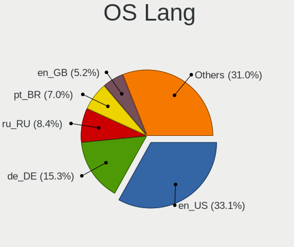
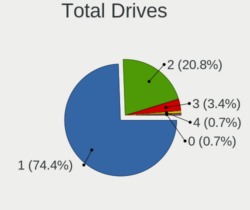
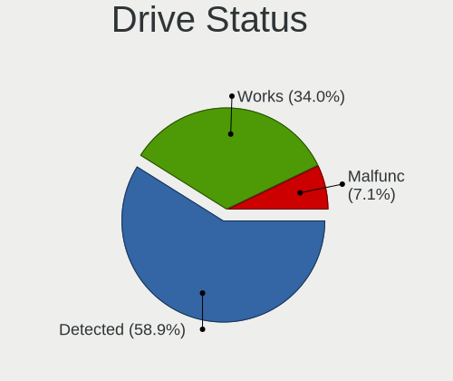
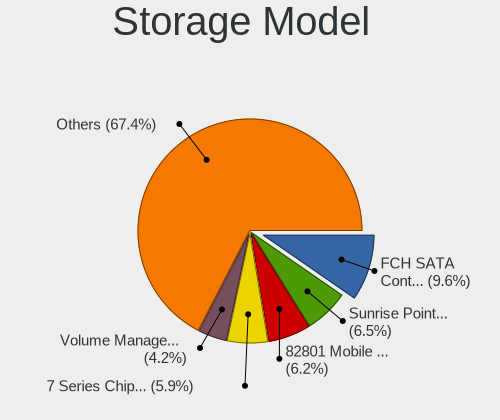
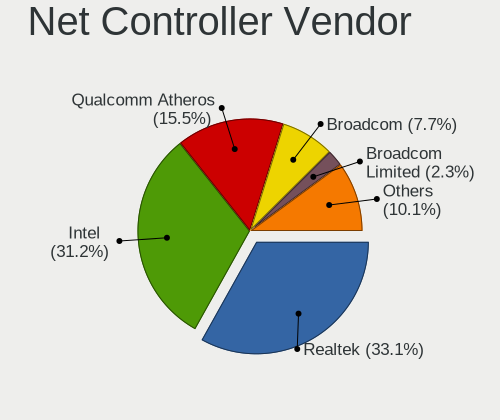
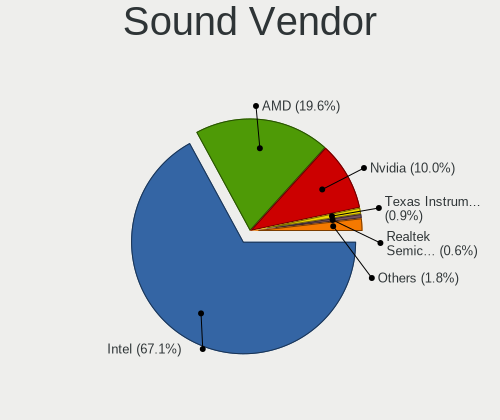

LMDE 5 - Tested Hardware & Statistics (Notebooks)
-------------------------------------------------

A project to collect tested hardware configurations for LMDE 5.

Anyone can contribute to this report by the [hw-probe](https://github.com/linuxhw/hw-probe) tool:

    sudo -E hw-probe -all -upload

Please contribute! Especially if your hardware is rare.

Contents
--------

* [ Test Cases ](#test-cases)

* [ System ](#system)
  - [ Kernel                   ](#kernel)
  - [ Kernel Family            ](#kernel-family)
  - [ Kernel Major Ver.        ](#kernel-major-ver)
  - [ Arch                     ](#arch)
  - [ DE                       ](#de)
  - [ Display Server           ](#display-server)
  - [ Display Manager          ](#display-manager)
  - [ OS Lang                  ](#os-lang)
  - [ Boot Mode                ](#boot-mode)
  - [ Filesystem               ](#filesystem)
  - [ Part. scheme             ](#part-scheme)
  - [ Dual Boot with Linux/BSD ](#dual-boot-with-linuxbsd)
  - [ Dual Boot (Win)          ](#dual-boot-win)

* [ Board ](#board)
  - [ Vendor                   ](#vendor)
  - [ Model                    ](#model)
  - [ Model Family             ](#model-family)
  - [ MFG Year                 ](#mfg-year)
  - [ Form Factor              ](#form-factor)
  - [ Secure Boot              ](#secure-boot)
  - [ Coreboot                 ](#coreboot)
  - [ RAM Size                 ](#ram-size)
  - [ RAM Used                 ](#ram-used)
  - [ Total Drives             ](#total-drives)
  - [ Has CD-ROM               ](#has-cd-rom)
  - [ Has Ethernet             ](#has-ethernet)
  - [ Has WiFi                 ](#has-wifi)
  - [ Has Bluetooth            ](#has-bluetooth)

* [ Location ](#location)
  - [ Country                  ](#country)
  - [ City                     ](#city)

* [ Drives ](#drives)
  - [ Drive Vendor             ](#drive-vendor)
  - [ Drive Model              ](#drive-model)
  - [ HDD Vendor               ](#hdd-vendor)
  - [ SSD Vendor               ](#ssd-vendor)
  - [ Drive Kind               ](#drive-kind)
  - [ Drive Connector          ](#drive-connector)
  - [ Drive Size               ](#drive-size)
  - [ Space Total              ](#space-total)
  - [ Space Used               ](#space-used)
  - [ Malfunc. Drives          ](#malfunc-drives)
  - [ Malfunc. Drive Vendor    ](#malfunc-drive-vendor)
  - [ Malfunc. HDD Vendor      ](#malfunc-hdd-vendor)
  - [ Malfunc. Drive Kind      ](#malfunc-drive-kind)
  - [ Failed Drives            ](#failed-drives)
  - [ Failed Drive Vendor      ](#failed-drive-vendor)
  - [ Drive Status             ](#drive-status)

* [ Storage controller ](#storage-controller)
  - [ Storage Vendor           ](#storage-vendor)
  - [ Storage Model            ](#storage-model)
  - [ Storage Kind             ](#storage-kind)

* [ Processor ](#processor)
  - [ CPU Vendor               ](#cpu-vendor)
  - [ CPU Model                ](#cpu-model)
  - [ CPU Model Family         ](#cpu-model-family)
  - [ CPU Cores                ](#cpu-cores)
  - [ CPU Sockets              ](#cpu-sockets)
  - [ CPU Threads              ](#cpu-threads)
  - [ CPU Op-Modes             ](#cpu-op-modes)
  - [ CPU Microcode            ](#cpu-microcode)
  - [ CPU Microarch            ](#cpu-microarch)

* [ Graphics ](#graphics)
  - [ GPU Vendor               ](#gpu-vendor)
  - [ GPU Model                ](#gpu-model)
  - [ GPU Combo                ](#gpu-combo)
  - [ GPU Driver               ](#gpu-driver)
  - [ GPU Memory               ](#gpu-memory)

* [ Monitor ](#monitor)
  - [ Monitor Vendor           ](#monitor-vendor)
  - [ Monitor Model            ](#monitor-model)
  - [ Monitor Resolution       ](#monitor-resolution)
  - [ Monitor Diagonal         ](#monitor-diagonal)
  - [ Monitor Width            ](#monitor-width)
  - [ Aspect Ratio             ](#aspect-ratio)
  - [ Monitor Area             ](#monitor-area)
  - [ Pixel Density            ](#pixel-density)
  - [ Multiple Monitors        ](#multiple-monitors)

* [ Network ](#network)
  - [ Net Controller Vendor    ](#net-controller-vendor)
  - [ Net Controller Model     ](#net-controller-model)
  - [ Wireless Vendor          ](#wireless-vendor)
  - [ Wireless Model           ](#wireless-model)
  - [ Ethernet Vendor          ](#ethernet-vendor)
  - [ Ethernet Model           ](#ethernet-model)
  - [ Net Controller Kind      ](#net-controller-kind)
  - [ Used Controller          ](#used-controller)
  - [ NICs                     ](#nics)
  - [ IPv6                     ](#ipv6)

* [ Bluetooth ](#bluetooth)
  - [ Bluetooth Vendor         ](#bluetooth-vendor)
  - [ Bluetooth Model          ](#bluetooth-model)

* [ Sound ](#sound)
  - [ Sound Vendor             ](#sound-vendor)
  - [ Sound Model              ](#sound-model)

* [ Memory ](#memory)
  - [ Memory Vendor            ](#memory-vendor)
  - [ Memory Model             ](#memory-model)
  - [ Memory Kind              ](#memory-kind)
  - [ Memory Form Factor       ](#memory-form-factor)
  - [ Memory Size              ](#memory-size)
  - [ Memory Speed             ](#memory-speed)

* [ Printers & scanners ](#printers--scanners)
  - [ Printer Vendor           ](#printer-vendor)
  - [ Printer Model            ](#printer-model)
  - [ Scanner Vendor           ](#scanner-vendor)
  - [ Scanner Model            ](#scanner-model)

* [ Camera ](#camera)
  - [ Camera Vendor            ](#camera-vendor)
  - [ Camera Model             ](#camera-model)

* [ Security ](#security)
  - [ Fingerprint Vendor       ](#fingerprint-vendor)
  - [ Fingerprint Model        ](#fingerprint-model)
  - [ Chipcard Vendor          ](#chipcard-vendor)
  - [ Chipcard Model           ](#chipcard-model)

* [ Unsupported ](#unsupported)
  - [ Unsupported Devices      ](#unsupported-devices)
  - [ Unsupported Device Types ](#unsupported-device-types)

Test Cases
----------

Total: 186

| Vendor        | Model                       | Probe                                                      | Date         |
|---------------|-----------------------------|------------------------------------------------------------|--------------|
| Acer          | Aspire E1-570G              | [b41442c5a1](https://linux-hardware.org/?probe=b41442c5a1) | Dec 01, 2022 |
| Apple         | MacBook6,1                  | [b8145a2349](https://linux-hardware.org/?probe=b8145a2349) | Dec 01, 2022 |
| Acer          | Aspire E1-570G              | [bbb8e289a9](https://linux-hardware.org/?probe=bbb8e289a9) | Nov 29, 2022 |
| Acer          | Aspire E1-570G              | [def1faf044](https://linux-hardware.org/?probe=def1faf044) | Nov 28, 2022 |
| HP            | Mini 110-1100               | [8f28854dfa](https://linux-hardware.org/?probe=8f28854dfa) | Nov 28, 2022 |
| HP            | Victus by Gaming Laptop ... | [e1dcd6d119](https://linux-hardware.org/?probe=e1dcd6d119) | Nov 28, 2022 |
| HP            | EliteBook 820 G3            | [3ca3320525](https://linux-hardware.org/?probe=3ca3320525) | Nov 24, 2022 |
| Kruger&Mat... | KM1406                      | [d639be7513](https://linux-hardware.org/?probe=d639be7513) | Nov 23, 2022 |
| Kruger&Mat... | KM1406                      | [a7e0207e4b](https://linux-hardware.org/?probe=a7e0207e4b) | Nov 23, 2022 |
| Lenovo        | G500 20236                  | [2bfa796e90](https://linux-hardware.org/?probe=2bfa796e90) | Nov 23, 2022 |
| Lenovo        | G500 20236                  | [afcb386e71](https://linux-hardware.org/?probe=afcb386e71) | Nov 23, 2022 |
| Lenovo        | ThinkPad W510 43192PU       | [98fac29e02](https://linux-hardware.org/?probe=98fac29e02) | Nov 22, 2022 |
| Lenovo        | ThinkPad W510 43192PU       | [53882f751e](https://linux-hardware.org/?probe=53882f751e) | Nov 22, 2022 |
| Lenovo        | G580 20150                  | [3f043b96c0](https://linux-hardware.org/?probe=3f043b96c0) | Nov 19, 2022 |
| Dell          | G15 5510                    | [5d9d96d71e](https://linux-hardware.org/?probe=5d9d96d71e) | Nov 16, 2022 |
| HP            | Laptop 15-dw3xxx            | [e656990178](https://linux-hardware.org/?probe=e656990178) | Nov 16, 2022 |
| HP            | Laptop 14-cf3xxx            | [21d31ce6b0](https://linux-hardware.org/?probe=21d31ce6b0) | Nov 15, 2022 |
| Sony          | SVF1532W4E                  | [33d278cd7a](https://linux-hardware.org/?probe=33d278cd7a) | Nov 12, 2022 |
| ASUSTek       | K54LY                       | [721020a0fe](https://linux-hardware.org/?probe=721020a0fe) | Nov 11, 2022 |
| Lenovo        | ThinkBook 15 G2 ITL 20VE    | [b9f262d40b](https://linux-hardware.org/?probe=b9f262d40b) | Nov 10, 2022 |
| HP            | ProBook 650 G4              | [2aec71897b](https://linux-hardware.org/?probe=2aec71897b) | Nov 08, 2022 |
| HP            | EliteBook 850 G8 Noteboo... | [2e0c6e37a4](https://linux-hardware.org/?probe=2e0c6e37a4) | Nov 07, 2022 |
| HP            | Unknown                     | [fe07901ad1](https://linux-hardware.org/?probe=fe07901ad1) | Nov 06, 2022 |
| HP            | Unknown                     | [495b046a6b](https://linux-hardware.org/?probe=495b046a6b) | Nov 06, 2022 |
| Toshiba       | Satellite L855D             | [8ac5a3b401](https://linux-hardware.org/?probe=8ac5a3b401) | Nov 03, 2022 |
| Lenovo        | V145-15AST 81MT             | [077d7d4379](https://linux-hardware.org/?probe=077d7d4379) | Nov 03, 2022 |
| HP            | Pavilion dv6                | [ba31f00bbd](https://linux-hardware.org/?probe=ba31f00bbd) | Oct 31, 2022 |
| HP            | Laptop 15-dw3xxx            | [0c281b6b5e](https://linux-hardware.org/?probe=0c281b6b5e) | Oct 29, 2022 |
| Lenovo        | IdeaPad 3 15ADA05 81W1      | [c6031ce122](https://linux-hardware.org/?probe=c6031ce122) | Oct 28, 2022 |
| Unknown       | Unknown                     | [fcffee84e4](https://linux-hardware.org/?probe=fcffee84e4) | Oct 27, 2022 |
| HP            | Laptop 14-cf3xxx            | [a782c95632](https://linux-hardware.org/?probe=a782c95632) | Oct 25, 2022 |
| ASUSTek       | VivoBook_ASUSLaptop X571... | [7bf16d5a25](https://linux-hardware.org/?probe=7bf16d5a25) | Oct 25, 2022 |
| ASUSTek       | X510UQR                     | [c03f0f4b6a](https://linux-hardware.org/?probe=c03f0f4b6a) | Oct 24, 2022 |
| Lenovo        | Legion 5 Pro 16ACH6H 82J... | [3b8452c3c6](https://linux-hardware.org/?probe=3b8452c3c6) | Oct 21, 2022 |
| Lenovo        | IdeaPad 320-15IKB 80XL      | [a5d65724fa](https://linux-hardware.org/?probe=a5d65724fa) | Oct 21, 2022 |
| Dell          | XPS L701X                   | [53c5b7ea24](https://linux-hardware.org/?probe=53c5b7ea24) | Oct 18, 2022 |
| Toshiba       | Satellite L855D             | [09dcc1a805](https://linux-hardware.org/?probe=09dcc1a805) | Oct 18, 2022 |
| Toshiba       | Satellite L855D             | [ac86cf3035](https://linux-hardware.org/?probe=ac86cf3035) | Oct 18, 2022 |
| Lenovo        | IdeaPad S340-15APITouch ... | [aa65a51ac6](https://linux-hardware.org/?probe=aa65a51ac6) | Oct 18, 2022 |
| Sony          | SVF1532W4E                  | [e66750b690](https://linux-hardware.org/?probe=e66750b690) | Oct 18, 2022 |
| HP            | Laptop 14-cf3xxx            | [7664f462d0](https://linux-hardware.org/?probe=7664f462d0) | Oct 09, 2022 |
| ASUSTek       | VivoBook_ASUSLaptop X705... | [36ad4bb59b](https://linux-hardware.org/?probe=36ad4bb59b) | Oct 06, 2022 |
| Samsung       | 355V4C/356V4C/3445VC/354... | [e31e511d7b](https://linux-hardware.org/?probe=e31e511d7b) | Oct 04, 2022 |
| ASUSTek       | K54LY                       | [230a36c236](https://linux-hardware.org/?probe=230a36c236) | Oct 03, 2022 |
| Unknown       | Unknown                     | [b9486c47c1](https://linux-hardware.org/?probe=b9486c47c1) | Oct 01, 2022 |
| Dell          | Inspiron 5420               | [71f7e67ca7](https://linux-hardware.org/?probe=71f7e67ca7) | Oct 01, 2022 |
| Lenovo        | ThinkPad X270 W10DG 20K5... | [d277bf47ec](https://linux-hardware.org/?probe=d277bf47ec) | Sep 25, 2022 |
| Lenovo        | ThinkPad E15 Gen 4 21EES... | [fb7029173f](https://linux-hardware.org/?probe=fb7029173f) | Sep 25, 2022 |
| HP            | Laptop 14-cf3xxx            | [9386d6b529](https://linux-hardware.org/?probe=9386d6b529) | Sep 23, 2022 |
| HP            | Laptop 14-cf3xxx            | [3ba944192e](https://linux-hardware.org/?probe=3ba944192e) | Sep 22, 2022 |
| Medion        | P15648                      | [e3d7873a30](https://linux-hardware.org/?probe=e3d7873a30) | Sep 19, 2022 |
| HP            | EliteBook 850 G6            | [8b24c3dd3b](https://linux-hardware.org/?probe=8b24c3dd3b) | Sep 19, 2022 |
| ASUSTek       | ROG Strix G513RM_G513RM     | [6b15cc63cc](https://linux-hardware.org/?probe=6b15cc63cc) | Sep 17, 2022 |
| HP            | G72                         | [d00cd9a9bd](https://linux-hardware.org/?probe=d00cd9a9bd) | Sep 14, 2022 |
| Lenovo        | IdeaPad 320-15IKB 80XL      | [65ef8d235d](https://linux-hardware.org/?probe=65ef8d235d) | Sep 08, 2022 |
| Lenovo        | Yoga 2 11 20332             | [9b6635c1db](https://linux-hardware.org/?probe=9b6635c1db) | Sep 06, 2022 |
| Dell          | Latitude E6430              | [b8b0464d70](https://linux-hardware.org/?probe=b8b0464d70) | Sep 05, 2022 |
| Acer          | Aspire 5930                 | [db2b212059](https://linux-hardware.org/?probe=db2b212059) | Sep 03, 2022 |
| Acer          | Aspire F5-573G              | [98812c04d7](https://linux-hardware.org/?probe=98812c04d7) | Sep 03, 2022 |
| Acer          | Aspire F5-573G              | [6fe42dd16d](https://linux-hardware.org/?probe=6fe42dd16d) | Sep 03, 2022 |
| Lenovo        | G50-45 80E3                 | [8e05735fc7](https://linux-hardware.org/?probe=8e05735fc7) | Sep 02, 2022 |
| Lenovo        | ThinkPad T470 W10DG 20JM... | [9b23c4b82c](https://linux-hardware.org/?probe=9b23c4b82c) | Aug 30, 2022 |
| Dell          | Latitude E6330              | [eb89774723](https://linux-hardware.org/?probe=eb89774723) | Aug 29, 2022 |
| Lenovo        | G500 20236                  | [da93b01660](https://linux-hardware.org/?probe=da93b01660) | Aug 22, 2022 |
| HP            | ZBook Fury 17.3 inch G8 ... | [8b1d8459e2](https://linux-hardware.org/?probe=8b1d8459e2) | Aug 20, 2022 |
| Microtech     | ebookPro                    | [b6c6859a02](https://linux-hardware.org/?probe=b6c6859a02) | Aug 18, 2022 |
| Lenovo        | ThinkPad E14 Gen 2 20TAC... | [ee7cbda038](https://linux-hardware.org/?probe=ee7cbda038) | Aug 17, 2022 |
| Dell          | Vostro 5490                 | [3de3bd4b06](https://linux-hardware.org/?probe=3de3bd4b06) | Aug 15, 2022 |
| Dell          | Latitude E5540              | [7d8a8607f8](https://linux-hardware.org/?probe=7d8a8607f8) | Aug 13, 2022 |
| Acer          | Aspire 3820                 | [3b01398aeb](https://linux-hardware.org/?probe=3b01398aeb) | Aug 11, 2022 |
| HP            | Compaq Presario CQ71        | [68c8f97537](https://linux-hardware.org/?probe=68c8f97537) | Aug 11, 2022 |
| Wortmann      | TERRA_MOBILE_1713A          | [09f3eadbcf](https://linux-hardware.org/?probe=09f3eadbcf) | Aug 07, 2022 |
| Dynabook      | Satellite Pro C50-G         | [755f865912](https://linux-hardware.org/?probe=755f865912) | Aug 05, 2022 |
| Acer          | Aspire 3820                 | [5c3cec3fb9](https://linux-hardware.org/?probe=5c3cec3fb9) | Aug 03, 2022 |
| Acer          | Aspire 3820                 | [07f925d91c](https://linux-hardware.org/?probe=07f925d91c) | Aug 03, 2022 |
| Lenovo        | ThinkPad T470s 20HF0047U... | [dfe7ba57b8](https://linux-hardware.org/?probe=dfe7ba57b8) | Jul 31, 2022 |
| Framework     | Laptop                      | [426cf376b2](https://linux-hardware.org/?probe=426cf376b2) | Jul 30, 2022 |
| Dell          | Latitude E5540              | [67063fe669](https://linux-hardware.org/?probe=67063fe669) | Jul 30, 2022 |
| ASUSTek       | VivoBook_ASUSLaptop X515... | [21fc33de37](https://linux-hardware.org/?probe=21fc33de37) | Jul 28, 2022 |
| HP            | Laptop 15s-eq2xxx           | [0b664049a0](https://linux-hardware.org/?probe=0b664049a0) | Jul 28, 2022 |
| Microtech     | ebookPro                    | [12215b6984](https://linux-hardware.org/?probe=12215b6984) | Jul 27, 2022 |
| Lenovo        | ThinkPad T61 7661A16        | [df4af55b5b](https://linux-hardware.org/?probe=df4af55b5b) | Jul 26, 2022 |
| Lenovo        | ThinkPad T61 7661A16        | [892a11d89d](https://linux-hardware.org/?probe=892a11d89d) | Jul 26, 2022 |
| ASUSTek       | VivoBook E14 E402YA_L402... | [47420083a3](https://linux-hardware.org/?probe=47420083a3) | Jul 23, 2022 |
| Acer          | Aspire A315-21              | [1754eeae39](https://linux-hardware.org/?probe=1754eeae39) | Jul 21, 2022 |
| HP            | Laptop 15-dy2xxx            | [a05a04fae5](https://linux-hardware.org/?probe=a05a04fae5) | Jul 21, 2022 |
| HP            | Laptop 15-dy2xxx            | [67c590c532](https://linux-hardware.org/?probe=67c590c532) | Jul 20, 2022 |
| Apple         | MacBookPro14,1              | [786f399d7a](https://linux-hardware.org/?probe=786f399d7a) | Jul 19, 2022 |
| Apple         | MacBookPro14,1              | [19d55ade50](https://linux-hardware.org/?probe=19d55ade50) | Jul 19, 2022 |
| HP            | Laptop 14-dk1xxx            | [cf03561efa](https://linux-hardware.org/?probe=cf03561efa) | Jul 17, 2022 |
| Lenovo        | IdeaPad 3 15ADA05 81W1      | [3d9f189ad0](https://linux-hardware.org/?probe=3d9f189ad0) | Jul 13, 2022 |
| Google        | Akemi                       | [d4a36d2743](https://linux-hardware.org/?probe=d4a36d2743) | Jul 13, 2022 |
| MSI           | GL73 8SE                    | [b39d9f7404](https://linux-hardware.org/?probe=b39d9f7404) | Jul 11, 2022 |
| ASUSTek       | ROG Flow X13 GV301QE_GV3... | [24cd72e0bf](https://linux-hardware.org/?probe=24cd72e0bf) | Jul 08, 2022 |
| Apple         | MacBookPro11,1              | [9be78f4466](https://linux-hardware.org/?probe=9be78f4466) | Jul 07, 2022 |
| AMI           | T3 MRD                      | [bf634565fd](https://linux-hardware.org/?probe=bf634565fd) | Jul 02, 2022 |
| Sony          | SVE1512G1RW                 | [cf5ff8285e](https://linux-hardware.org/?probe=cf5ff8285e) | Jul 02, 2022 |
| HP            | Pavilion 17                 | [1efb06e77e](https://linux-hardware.org/?probe=1efb06e77e) | Jul 01, 2022 |
| HP            | Compaq 15                   | [fb14abab4d](https://linux-hardware.org/?probe=fb14abab4d) | Jun 30, 2022 |
| Framework     | Laptop                      | [61a6480a38](https://linux-hardware.org/?probe=61a6480a38) | Jun 30, 2022 |
| Dell          | Inspiron 5370               | [e848f3258c](https://linux-hardware.org/?probe=e848f3258c) | Jun 26, 2022 |
| Unknown       | Unknown                     | [a8b7e4a9fe](https://linux-hardware.org/?probe=a8b7e4a9fe) | Jun 26, 2022 |
| HP            | Laptop 15z-ef2xxx           | [f54df47fa0](https://linux-hardware.org/?probe=f54df47fa0) | Jun 25, 2022 |
| Dell          | Inspiron 3505               | [1eaa95f069](https://linux-hardware.org/?probe=1eaa95f069) | Jun 24, 2022 |
| HP            | Laptop 15z-ef2xxx           | [64e65ab80b](https://linux-hardware.org/?probe=64e65ab80b) | Jun 24, 2022 |
| HP            | Laptop 15z-ef2xxx           | [879d7a231f](https://linux-hardware.org/?probe=879d7a231f) | Jun 24, 2022 |
| Lenovo        | ThinkPad T450 20BUS0QT04    | [0c96d2bc24](https://linux-hardware.org/?probe=0c96d2bc24) | Jun 24, 2022 |
| HP            | Laptop 15-bw0xx             | [a55d01829f](https://linux-hardware.org/?probe=a55d01829f) | Jun 23, 2022 |
| HP            | EliteBook 8730w             | [14135356d6](https://linux-hardware.org/?probe=14135356d6) | Jun 20, 2022 |
| MSI           | U180                        | [7aa374e07e](https://linux-hardware.org/?probe=7aa374e07e) | Jun 20, 2022 |
| Acer          | Aspire 5930                 | [348ec06fd0](https://linux-hardware.org/?probe=348ec06fd0) | Jun 18, 2022 |
| ASUSTek       | 1005P                       | [4bd178fe29](https://linux-hardware.org/?probe=4bd178fe29) | Jun 14, 2022 |
| Apple         | MacBookPro14,1              | [88294cb5aa](https://linux-hardware.org/?probe=88294cb5aa) | Jun 12, 2022 |
| Apple         | MacBookPro14,1              | [281724432e](https://linux-hardware.org/?probe=281724432e) | Jun 12, 2022 |
| Acer          | Aspire One 522              | [7f4af0143d](https://linux-hardware.org/?probe=7f4af0143d) | Jun 11, 2022 |
| Apple         | MacBookAir6,1               | [f0883ab59b](https://linux-hardware.org/?probe=f0883ab59b) | Jun 10, 2022 |
| HP            | 255 G5 Notebook PC          | [519a18864f](https://linux-hardware.org/?probe=519a18864f) | Jun 09, 2022 |
| Sony          | SVE1713Y1RB                 | [4a1bc35dda](https://linux-hardware.org/?probe=4a1bc35dda) | Jun 09, 2022 |
| Lenovo        | Z50-70 20354                | [57582f68b6](https://linux-hardware.org/?probe=57582f68b6) | Jun 08, 2022 |
| Multilaser    | PC150                       | [ee0a35cc62](https://linux-hardware.org/?probe=ee0a35cc62) | Jun 08, 2022 |
| Lenovo        | Z50-70 20354                | [870233669c](https://linux-hardware.org/?probe=870233669c) | Jun 07, 2022 |
| Alienware     | 14                          | [7dabcbc673](https://linux-hardware.org/?probe=7dabcbc673) | Jun 07, 2022 |
| Acer          | Swift SF515-51T             | [1d0b1a1c50](https://linux-hardware.org/?probe=1d0b1a1c50) | May 31, 2022 |
| Lenovo        | Legion 5 15ACH6H 82JU       | [0e59a69b8d](https://linux-hardware.org/?probe=0e59a69b8d) | May 30, 2022 |
| HP            | Laptop 14-cf3xxx            | [9e4cd6dab4](https://linux-hardware.org/?probe=9e4cd6dab4) | May 25, 2022 |
| ASUSTek       | VivoBook_ASUSLaptop X512... | [67aa7158d3](https://linux-hardware.org/?probe=67aa7158d3) | May 24, 2022 |
| HP            | Laptop 14-df0xxx            | [94992083bc](https://linux-hardware.org/?probe=94992083bc) | May 24, 2022 |
| Acer          | Aspire One 522              | [0ac567a5cf](https://linux-hardware.org/?probe=0ac567a5cf) | May 21, 2022 |
| Lenovo        | IdeaPad 3 15ITL6 82H8       | [48c8683aa8](https://linux-hardware.org/?probe=48c8683aa8) | May 21, 2022 |
| Lenovo        | IdeaPad 3 15ITL6 82H8       | [8d30966279](https://linux-hardware.org/?probe=8d30966279) | May 20, 2022 |
| HP            | ZBook Fury 17.3 inch G8 ... | [8757941b52](https://linux-hardware.org/?probe=8757941b52) | May 17, 2022 |
| Acer          | Aspire V3-571G              | [91700e1cb8](https://linux-hardware.org/?probe=91700e1cb8) | May 16, 2022 |
| Dell          | XPS 13 9305                 | [e9310a7ede](https://linux-hardware.org/?probe=e9310a7ede) | May 15, 2022 |
| Dell          | XPS 13 9305                 | [3f8becd67d](https://linux-hardware.org/?probe=3f8becd67d) | May 15, 2022 |
| Dell          | Inspiron 5566               | [d01652f69f](https://linux-hardware.org/?probe=d01652f69f) | May 15, 2022 |
| Dell          | Inspiron 5559               | [4b0c466a88](https://linux-hardware.org/?probe=4b0c466a88) | May 15, 2022 |
| Howard Com... | R7X                         | [bc6d6a31eb](https://linux-hardware.org/?probe=bc6d6a31eb) | May 13, 2022 |
| HP            | Notebook                    | [200c1dabff](https://linux-hardware.org/?probe=200c1dabff) | May 09, 2022 |
| Lenovo        | IdeaPad 5 14ALC05 82LM      | [0d64940271](https://linux-hardware.org/?probe=0d64940271) | May 09, 2022 |
| HP            | ENVY 17                     | [a503de2c1f](https://linux-hardware.org/?probe=a503de2c1f) | May 08, 2022 |
| Apple         | MacBookAir7,2               | [54815db142](https://linux-hardware.org/?probe=54815db142) | May 07, 2022 |
| ASUSTek       | VivoBook E14 E402YA_L402... | [57e085245c](https://linux-hardware.org/?probe=57e085245c) | May 07, 2022 |
| Philco        | 10D                         | [d2f71d99cd](https://linux-hardware.org/?probe=d2f71d99cd) | May 05, 2022 |
| Philco        | 10D                         | [9882f4ca80](https://linux-hardware.org/?probe=9882f4ca80) | May 05, 2022 |
| Acer          | Aspire E1-532               | [a7305e2070](https://linux-hardware.org/?probe=a7305e2070) | May 04, 2022 |
| Lenovo        | ThinkPad T480 20L6S1RN00    | [eb55b73c5a](https://linux-hardware.org/?probe=eb55b73c5a) | May 03, 2022 |
| Toshiba       | Satellite M55               | [9d5733c6fc](https://linux-hardware.org/?probe=9d5733c6fc) | May 02, 2022 |
| HP            | Presario C500 (GF581UA#A... | [0e01914db4](https://linux-hardware.org/?probe=0e01914db4) | Apr 30, 2022 |
| HP            | EliteBook 840 G1            | [53bceed0aa](https://linux-hardware.org/?probe=53bceed0aa) | Apr 29, 2022 |
| Acer          | AOD270                      | [d0fae524f9](https://linux-hardware.org/?probe=d0fae524f9) | Apr 29, 2022 |
| Acer          | AOD270                      | [44d897bc15](https://linux-hardware.org/?probe=44d897bc15) | Apr 29, 2022 |
| Acer          | Aspire E5-553G              | [00a648bda6](https://linux-hardware.org/?probe=00a648bda6) | Apr 28, 2022 |
| Acer          | Aspire E5-553G              | [4646f6cd23](https://linux-hardware.org/?probe=4646f6cd23) | Apr 28, 2022 |
| HP            | ProBook 450 G8 Notebook ... | [ff8e46a260](https://linux-hardware.org/?probe=ff8e46a260) | Apr 27, 2022 |
| HP            | ProBook 450 G8 Notebook ... | [0a6534997e](https://linux-hardware.org/?probe=0a6534997e) | Apr 27, 2022 |
| Apple         | MacBookPro14,1              | [ce4f3d8ec8](https://linux-hardware.org/?probe=ce4f3d8ec8) | Apr 24, 2022 |
| Dixonsxp      | Unknown                     | [65e40dacf4](https://linux-hardware.org/?probe=65e40dacf4) | Apr 20, 2022 |
| Toshiba       | Satellite L455              | [7f0bad47af](https://linux-hardware.org/?probe=7f0bad47af) | Apr 19, 2022 |
| Toshiba       | Satellite L455              | [3a0c54144d](https://linux-hardware.org/?probe=3a0c54144d) | Apr 19, 2022 |
| Dell          | 0X574R                      | [6da5c2339f](https://linux-hardware.org/?probe=6da5c2339f) | Apr 18, 2022 |
| HP            | 14                          | [71f296bd93](https://linux-hardware.org/?probe=71f296bd93) | Apr 17, 2022 |
| Dell          | Latitude 3410               | [78396d572c](https://linux-hardware.org/?probe=78396d572c) | Apr 15, 2022 |
| ASUSTek       | N61Jv                       | [959c5f2238](https://linux-hardware.org/?probe=959c5f2238) | Apr 14, 2022 |
| Acer          | AOA110                      | [cba10fc182](https://linux-hardware.org/?probe=cba10fc182) | Apr 13, 2022 |
| Howard Com... | R7X                         | [e0f3701b1b](https://linux-hardware.org/?probe=e0f3701b1b) | Apr 12, 2022 |
| Howard Com... | R7X                         | [5885bbaa90](https://linux-hardware.org/?probe=5885bbaa90) | Apr 10, 2022 |
| Dell          | Vostro 3500                 | [5b1a24bf51](https://linux-hardware.org/?probe=5b1a24bf51) | Apr 10, 2022 |
| Dell          | Vostro 3500                 | [b2adbbe7d0](https://linux-hardware.org/?probe=b2adbbe7d0) | Apr 10, 2022 |
| Lenovo        | IdeaPad 5 15ARE05 81YQ      | [4d5998459b](https://linux-hardware.org/?probe=4d5998459b) | Apr 09, 2022 |
| HP            | Presario C500 (RY512EA#A... | [4ef049d490](https://linux-hardware.org/?probe=4ef049d490) | Apr 09, 2022 |
| Dell          | Inspiron 14 5410 2-in-1     | [613d6e7d3c](https://linux-hardware.org/?probe=613d6e7d3c) | Apr 07, 2022 |
| Dell          | Latitude 5511               | [2cb0a3e451](https://linux-hardware.org/?probe=2cb0a3e451) | Apr 06, 2022 |
| Dell          | Precision 7520              | [7404842400](https://linux-hardware.org/?probe=7404842400) | Apr 05, 2022 |
| LincPlus      | LINNCPLUS P1                | [22406313dc](https://linux-hardware.org/?probe=22406313dc) | Apr 02, 2022 |
| Toshiba       | Satellite L455              | [699e7d272d](https://linux-hardware.org/?probe=699e7d272d) | Apr 02, 2022 |
| HP            | Pavilion Laptop 15-eh1xx... | [387b77f172](https://linux-hardware.org/?probe=387b77f172) | Apr 01, 2022 |
| HP            | ProBook 6570b               | [0609df27fa](https://linux-hardware.org/?probe=0609df27fa) | Mar 31, 2022 |
| Packard Be... | DOT S                       | [85e7386152](https://linux-hardware.org/?probe=85e7386152) | Mar 28, 2022 |
| Packard Be... | DOT S                       | [edef12b9d5](https://linux-hardware.org/?probe=edef12b9d5) | Mar 28, 2022 |
| Lenovo        | IdeaPad 3 14ALC6 82KT       | [b2e70b8251](https://linux-hardware.org/?probe=b2e70b8251) | Mar 28, 2022 |
| Dell          | Latitude E6400              | [01815a09bb](https://linux-hardware.org/?probe=01815a09bb) | Mar 27, 2022 |
| Toshiba       | Satellite L455              | [90334cf68d](https://linux-hardware.org/?probe=90334cf68d) | Mar 26, 2022 |
| Dell          | Precision M4400             | [5172327d82](https://linux-hardware.org/?probe=5172327d82) | Mar 25, 2022 |
| Medion        | E6220                       | [e739ef27a1](https://linux-hardware.org/?probe=e739ef27a1) | Mar 24, 2022 |
| Acer          | Aspire 7745G                | [3f4c13ee47](https://linux-hardware.org/?probe=3f4c13ee47) | Mar 23, 2022 |
| HP            | 255 G7 Notebook PC          | [f8561c65dc](https://linux-hardware.org/?probe=f8561c65dc) | Mar 21, 2022 |

System
------

Kernel
------

Version of the Linux kernel

| Version                | Notebooks | Percent |
|------------------------|-----------|---------|
| 5.10.0-12-amd64        | 23        | 15.54%  |
| 5.10.0-19-amd64        | 20        | 13.51%  |
| 5.10.0-14-amd64        | 20        | 13.51%  |
| 5.10.0-15-amd64        | 16        | 10.81%  |
| 5.10.0-13-amd64        | 14        | 9.46%   |
| 5.10.0-18-amd64        | 13        | 8.78%   |
| 5.10.0-16-amd64        | 11        | 7.43%   |
| 5.10.0-17-amd64        | 8         | 5.41%   |
| 5.10.0-13-686          | 5         | 3.38%   |
| 5.18.0-0.bpo.1-amd64   | 4         | 2.7%    |
| 5.16.0-0.bpo.4-amd64   | 3         | 2.03%   |
| 5.19.10-xanmod1        | 1         | 0.68%   |
| 5.19.0-0.deb11.2-amd64 | 1         | 0.68%   |
| 5.18.0-4-amd64         | 1         | 0.68%   |
| 5.18.0-3-amd64         | 1         | 0.68%   |
| 5.16.0-0.bpo.3-amd64   | 1         | 0.68%   |
| 5.15.78-xanmod1        | 1         | 0.68%   |
| 5.15.70-xanmod1        | 1         | 0.68%   |
| 5.15.0-0.bpo.3-amd64   | 1         | 0.68%   |
| 5.10.0-19-686          | 1         | 0.68%   |
| 5.10.0-17-686          | 1         | 0.68%   |
| 5.10.0-14-686          | 1         | 0.68%   |

Kernel Family
-------------

Linux kernel without a distro release

| Version | Notebooks | Percent |
|---------|-----------|---------|
| 5.10.0  | 127       | 90.07%  |
| 5.18.0  | 6         | 4.26%   |
| 5.16.0  | 3         | 2.13%   |
| 5.19.10 | 1         | 0.71%   |
| 5.19.0  | 1         | 0.71%   |
| 5.15.78 | 1         | 0.71%   |
| 5.15.70 | 1         | 0.71%   |
| 5.15.0  | 1         | 0.71%   |

Kernel Major Ver.
-----------------

Linux kernel major version

| Version | Notebooks | Percent |
|---------|-----------|---------|
| 5.10    | 127       | 90.71%  |
| 5.18    | 6         | 4.29%   |
| 5.16    | 3         | 2.14%   |
| 5.19    | 2         | 1.43%   |
| 5.15    | 2         | 1.43%   |

Arch
----

OS architecture (x86_64, i586, etc.)

| Name   | Notebooks | Percent |
|--------|-----------|---------|
| x86_64 | 129       | 94.16%  |
| i686   | 8         | 5.84%   |

DE
--

Desktop Environment

| Name       | Notebooks | Percent |
|------------|-----------|---------|
| X-Cinnamon | 125       | 90.58%  |
| Cinnamon   | 10        | 7.25%   |
| XFCE       | 1         | 0.72%   |
| MATE       | 1         | 0.72%   |
| Unknown    | 1         | 0.72%   |

Display Server
--------------

X11 or Wayland

| Name | Notebooks | Percent |
|------|-----------|---------|
| X11  | 137       | 100%    |

Display Manager
---------------

SDDM, LightDM, etc.

| Name    | Notebooks | Percent |
|---------|-----------|---------|
| Unknown | 82        | 58.99%  |
| LightDM | 57        | 41.01%  |

OS Lang
-------

Language

| Lang  | Notebooks | Percent |
|-------|-----------|---------|
| en_US | 48        | 34.78%  |
| de_DE | 19        | 13.77%  |
| ru_RU | 13        | 9.42%   |
| en_GB | 9         | 6.52%   |
| pt_BR | 8         | 5.8%    |
| fr_FR | 6         | 4.35%   |
| it_IT | 4         | 2.9%    |
| es_ES | 4         | 2.9%    |
| pl_PL | 3         | 2.17%   |
| es_MX | 3         | 2.17%   |
| ko_KR | 2         | 1.45%   |
| es_BO | 2         | 1.45%   |
| en_IE | 2         | 1.45%   |
| tr_TR | 1         | 0.72%   |
| pt_PT | 1         | 0.72%   |
| nn_NO | 1         | 0.72%   |
| nl_AW | 1         | 0.72%   |
| hu_HU | 1         | 0.72%   |
| fr_BE | 1         | 0.72%   |
| es_VE | 1         | 0.72%   |
| es_PE | 1         | 0.72%   |
| es_EC | 1         | 0.72%   |
| es_CR | 1         | 0.72%   |
| en_NZ | 1         | 0.72%   |
| en_IN | 1         | 0.72%   |
| en_CA | 1         | 0.72%   |
| da_DK | 1         | 0.72%   |
| cs_CZ | 1         | 0.72%   |

Boot Mode
---------

EFI or BIOS

| Mode | Notebooks | Percent |
|------|-----------|---------|
| EFI  | 93        | 67.39%  |
| BIOS | 45        | 32.61%  |

Filesystem
----------

Type of filesystem

| Type    | Notebooks | Percent |
|---------|-----------|---------|
| Ext4    | 126       | 91.97%  |
| Overlay | 5         | 3.65%   |
| Xfs     | 2         | 1.46%   |
| Tmpfs   | 2         | 1.46%   |
| Btrfs   | 2         | 1.46%   |

Part. scheme
------------

Scheme of partitioning

| Type    | Notebooks | Percent |
|---------|-----------|---------|
| Unknown | 81        | 58.27%  |
| GPT     | 47        | 33.81%  |
| MBR     | 11        | 7.91%   |

Dual Boot with Linux/BSD
------------------------

Hosting more than one Linux/BSD

| Dual boot | Notebooks | Percent |
|-----------|-----------|---------|
| No        | 130       | 94.2%   |
| Yes       | 8         | 5.8%    |

Dual Boot (Win)
---------------

Hosting Linux and Windows

| Dual boot | Notebooks | Percent |
|-----------|-----------|---------|
| No        | 125       | 91.24%  |
| Yes       | 12        | 8.76%   |

Board
-----

Vendor
------

Motherboard manufacturer

| Name                | Notebooks | Percent |
|---------------------|-----------|---------|
| Hewlett-Packard     | 34        | 24.82%  |
| Lenovo              | 25        | 18.25%  |
| Dell                | 21        | 15.33%  |
| Acer                | 14        | 10.22%  |
| ASUSTek Computer    | 11        | 8.03%   |
| Apple               | 5         | 3.65%   |
| Toshiba             | 3         | 2.19%   |
| Sony                | 3         | 2.19%   |
| MSI                 | 2         | 1.46%   |
| Medion              | 2         | 1.46%   |
| Unknown             | 2         | 1.46%   |
| Wortmann AG         | 1         | 0.73%   |
| Samsung Electronics | 1         | 0.73%   |
| Philco              | 1         | 0.73%   |
| Packard Bell        | 1         | 0.73%   |
| Multilaser          | 1         | 0.73%   |
| Microtech           | 1         | 0.73%   |
| LincPlus            | 1         | 0.73%   |
| Kruger&Matz         | 1         | 0.73%   |
| Howard Computers    | 1         | 0.73%   |
| Google              | 1         | 0.73%   |
| Framework           | 1         | 0.73%   |
| Dynabook            | 1         | 0.73%   |
| Dixonsxp            | 1         | 0.73%   |
| AMI                 | 1         | 0.73%   |
| Alienware           | 1         | 0.73%   |

Model
-----

Motherboard model

| Name                                  | Notebooks | Percent |
|---------------------------------------|-----------|---------|
| Unknown                               | 4         | 2.92%   |
| Lenovo IdeaPad 3 15ADA05 81W1         | 2         | 1.46%   |
| Lenovo G500 20236                     | 2         | 1.46%   |
| HP Laptop 15z-ef2xxx                  | 2         | 1.46%   |
| HP Laptop 15-dw3xxx                   | 2         | 1.46%   |
| Dell Latitude E6400                   | 2         | 1.46%   |
| Dell Latitude E5540                   | 2         | 1.46%   |
| Acer Aspire E1-570G                   | 2         | 1.46%   |
| Acer Aspire 5930                      | 2         | 1.46%   |
| Wortmann AG TERRA_MOBILE_1713A        | 1         | 0.73%   |
| Toshiba Satellite M55                 | 1         | 0.73%   |
| Toshiba Satellite L855D               | 1         | 0.73%   |
| Toshiba Satellite L455                | 1         | 0.73%   |
| Sony SVF1532W4E                       | 1         | 0.73%   |
| Sony SVE1713Y1RB                      | 1         | 0.73%   |
| Sony SVE1512G1RW                      | 1         | 0.73%   |
| Samsung 355V4C/356V4C/3445VC/3545VC   | 1         | 0.73%   |
| Philco 10D                            | 1         | 0.73%   |
| Packard Bell DOT S                    | 1         | 0.73%   |
| Multilaser PC150                      | 1         | 0.73%   |
| MSI U180                              | 1         | 0.73%   |
| MSI GL73 8SE                          | 1         | 0.73%   |
| Microtech ebookPro                    | 1         | 0.73%   |
| Medion P15648                         | 1         | 0.73%   |
| Medion E6220                          | 1         | 0.73%   |
| LincPlus LINNCPLUS P1                 | 1         | 0.73%   |
| Lenovo Z50-70 20354                   | 1         | 0.73%   |
| Lenovo Yoga 2 11 20332                | 1         | 0.73%   |
| Lenovo V145-15AST 81MT                | 1         | 0.73%   |
| Lenovo ThinkPad X270 W10DG 20K5S3HG00 | 1         | 0.73%   |
| Lenovo ThinkPad W510 43192PU          | 1         | 0.73%   |
| Lenovo ThinkPad T61 7661A16           | 1         | 0.73%   |
| Lenovo ThinkPad T480 20L6S1RN00       | 1         | 0.73%   |
| Lenovo ThinkPad T470s 20HF0047UK      | 1         | 0.73%   |
| Lenovo ThinkPad T470 W10DG 20JM000CUS | 1         | 0.73%   |
| Lenovo ThinkPad T450 20BUS0QT04       | 1         | 0.73%   |
| Lenovo ThinkPad E15 Gen 4 21EES00100  | 1         | 0.73%   |
| Lenovo ThinkPad E14 Gen 2 20TACTO1WW  | 1         | 0.73%   |
| Lenovo ThinkBook 15 G2 ITL 20VE       | 1         | 0.73%   |
| Lenovo Legion 5 Pro 16ACH6H 82JQ      | 1         | 0.73%   |

Model Family
------------

Motherboard model prefix

| Name               | Notebooks | Percent |
|--------------------|-----------|---------|
| Acer Aspire        | 12        | 8.76%   |
| HP Laptop          | 10        | 7.3%    |
| Lenovo ThinkPad    | 9         | 6.57%   |
| Dell Latitude      | 8         | 5.84%   |
| Lenovo IdeaPad     | 7         | 5.11%   |
| Dell Inspiron      | 6         | 4.38%   |
| HP EliteBook       | 5         | 3.65%   |
| ASUS VivoBook      | 5         | 3.65%   |
| Unknown            | 4         | 2.92%   |
| Toshiba Satellite  | 3         | 2.19%   |
| HP ProBook         | 3         | 2.19%   |
| HP Pavilion        | 3         | 2.19%   |
| Lenovo Legion      | 2         | 1.46%   |
| Lenovo G500        | 2         | 1.46%   |
| HP Compaq          | 2         | 1.46%   |
| HP 255             | 2         | 1.46%   |
| Dell XPS           | 2         | 1.46%   |
| Dell Vostro        | 2         | 1.46%   |
| Dell Precision     | 2         | 1.46%   |
| ASUS ROG           | 2         | 1.46%   |
| Wortmann AG TERRA  | 1         | 0.73%   |
| Sony SVF1532W4E    | 1         | 0.73%   |
| Sony SVE1713Y1RB   | 1         | 0.73%   |
| Sony SVE1512G1RW   | 1         | 0.73%   |
| Samsung 355V4C     | 1         | 0.73%   |
| Philco 10D         | 1         | 0.73%   |
| Packard Bell DOT   | 1         | 0.73%   |
| Multilaser PC150   | 1         | 0.73%   |
| MSI U180           | 1         | 0.73%   |
| MSI GL73           | 1         | 0.73%   |
| Microtech ebookPro | 1         | 0.73%   |
| Medion P15648      | 1         | 0.73%   |
| Medion E6220       | 1         | 0.73%   |
| LincPlus LINNCPLUS | 1         | 0.73%   |
| Lenovo Z50-70      | 1         | 0.73%   |
| Lenovo Yoga        | 1         | 0.73%   |
| Lenovo V145-15AST  | 1         | 0.73%   |
| Lenovo ThinkBook   | 1         | 0.73%   |
| Lenovo G580        | 1         | 0.73%   |
| Kruger&Matz KM1406 | 1         | 0.73%   |

MFG Year
--------

Motherboard manufacture year

| Year | Notebooks | Percent |
|------|-----------|---------|
| 2021 | 20        | 14.6%   |
| 2020 | 15        | 10.95%  |
| 2013 | 13        | 9.49%   |
| 2012 | 12        | 8.76%   |
| 2019 | 10        | 7.3%    |
| 2017 | 9         | 6.57%   |
| 2010 | 9         | 6.57%   |
| 2018 | 8         | 5.84%   |
| 2016 | 8         | 5.84%   |
| 2014 | 6         | 4.38%   |
| 2009 | 6         | 4.38%   |
| 2008 | 6         | 4.38%   |
| 2022 | 4         | 2.92%   |
| 2015 | 4         | 2.92%   |
| 2007 | 4         | 2.92%   |
| 2011 | 2         | 1.46%   |
| 2006 | 1         | 0.73%   |

Form Factor
-----------

Physical design of the computer

| Name     | Notebooks | Percent |
|----------|-----------|---------|
| Notebook | 137       | 100%    |

Secure Boot
-----------

Enabled or disabled

| State    | Notebooks | Percent |
|----------|-----------|---------|
| Disabled | 122       | 88.41%  |
| Enabled  | 16        | 11.59%  |

Coreboot
--------

Have coreboot on board

| Used | Notebooks | Percent |
|------|-----------|---------|
| No   | 136       | 99.27%  |
| Yes  | 1         | 0.73%   |

RAM Size
--------

Total RAM memory

| Size in GB  | Notebooks | Percent |
|-------------|-----------|---------|
| 4.01-8.0    | 43        | 31.39%  |
| 3.01-4.0    | 31        | 22.63%  |
| 16.01-24.0  | 21        | 15.33%  |
| 8.01-16.0   | 21        | 15.33%  |
| 1.01-2.0    | 8         | 5.84%   |
| 32.01-64.0  | 5         | 3.65%   |
| 2.01-3.0    | 5         | 3.65%   |
| 64.01-256.0 | 3         | 2.19%   |

RAM Used
--------

Used RAM memory

| Used GB    | Notebooks | Percent |
|------------|-----------|---------|
| 1.01-2.0   | 61        | 42.36%  |
| 2.01-3.0   | 49        | 34.03%  |
| 3.01-4.0   | 15        | 10.42%  |
| 4.01-8.0   | 10        | 6.94%   |
| 0.51-1.0   | 7         | 4.86%   |
| 32.01-64.0 | 1         | 0.69%   |
| 8.01-16.0  | 1         | 0.69%   |

Total Drives
------------

Number of drives on board

| Drives | Notebooks | Percent |
|--------|-----------|---------|
| 1      | 106       | 76.26%  |
| 2      | 29        | 20.86%  |
| 3      | 3         | 2.16%   |
| 4      | 1         | 0.72%   |

Has CD-ROM
----------

Has CD-ROM on board

| Presented | Notebooks | Percent |
|-----------|-----------|---------|
| No        | 92        | 67.15%  |
| Yes       | 45        | 32.85%  |

Has Ethernet
------------

Has Ethernet on board

| Presented | Notebooks | Percent |
|-----------|-----------|---------|
| Yes       | 108       | 78.83%  |
| No        | 29        | 21.17%  |

Has WiFi
--------

Has WiFi module

| Presented | Notebooks | Percent |
|-----------|-----------|---------|
| Yes       | 135       | 98.54%  |
| No        | 2         | 1.46%   |

Has Bluetooth
-------------

Has Bluetooth module

| Presented | Notebooks | Percent |
|-----------|-----------|---------|
| Yes       | 102       | 74.45%  |
| No        | 35        | 25.55%  |

Location
--------

Country
-------

Geographic location (country)

| Country     | Notebooks | Percent |
|-------------|-----------|---------|
| Germany     | 21        | 15.11%  |
| USA         | 20        | 14.39%  |
| Russia      | 15        | 10.79%  |
| Brazil      | 9         | 6.47%   |
| UK          | 8         | 5.76%   |
| Italy       | 7         | 5.04%   |
| France      | 7         | 5.04%   |
| Poland      | 5         | 3.6%    |
| Spain       | 4         | 2.88%   |
| Mexico      | 3         | 2.16%   |
| Canada      | 3         | 2.16%   |
| Belgium     | 3         | 2.16%   |
| South Korea | 2         | 1.44%   |
| Romania     | 2         | 1.44%   |
| Portugal    | 2         | 1.44%   |
| Hungary     | 2         | 1.44%   |
| Chile       | 2         | 1.44%   |
| Bolivia     | 2         | 1.44%   |
| Belarus     | 2         | 1.44%   |
| Vietnam     | 1         | 0.72%   |
| Venezuela   | 1         | 0.72%   |
| Turkey      | 1         | 0.72%   |
| Sweden      | 1         | 0.72%   |
| Slovenia    | 1         | 0.72%   |
| Peru        | 1         | 0.72%   |
| Paraguay    | 1         | 0.72%   |
| Norway      | 1         | 0.72%   |
| New Zealand | 1         | 0.72%   |
| Malaysia    | 1         | 0.72%   |
| Lithuania   | 1         | 0.72%   |
| Kenya       | 1         | 0.72%   |
| Ireland     | 1         | 0.72%   |
| India       | 1         | 0.72%   |
| Finland     | 1         | 0.72%   |
| Ecuador     | 1         | 0.72%   |
| Denmark     | 1         | 0.72%   |
| Czechia     | 1         | 0.72%   |
| Costa Rica  | 1         | 0.72%   |
| Austria     | 1         | 0.72%   |

City
----

Geographic location (city)

| City                 | Notebooks | Percent |
|----------------------|-----------|---------|
| Moscow               | 5         | 3.57%   |
| St Petersburg        | 2         | 1.43%   |
| Rome                 | 2         | 1.43%   |
| Oruro                | 2         | 1.43%   |
| Neasden              | 2         | 1.43%   |
| Krakow               | 2         | 1.43%   |
| Freiburg im Breisgau | 2         | 1.43%   |
| Berlin               | 2         | 1.43%   |
| Zaragoza             | 1         | 0.71%   |
| Wroclaw              | 1         | 0.71%   |
| Weimar               | 1         | 0.71%   |
| Voronezh             | 1         | 0.71%   |
| Vilshofen            | 1         | 0.71%   |
| Vilnius              | 1         | 0.71%   |
| Viggianello          | 1         | 0.71%   |
| Viet Tri             | 1         | 0.71%   |
| Veurne               | 1         | 0.71%   |
| Vaslui               | 1         | 0.71%   |
| Valsoyfjord          | 1         | 0.71%   |
| Uiwang               | 1         | 0.71%   |
| Turku                | 1         | 0.71%   |
| Tula                 | 1         | 0.71%   |
| Troisdorf            | 1         | 0.71%   |
| Toulouse             | 1         | 0.71%   |
| Toulon               | 1         | 0.71%   |
| Toronto              | 1         | 0.71%   |
| Tipton               | 1         | 0.71%   |
| Spearfish            | 1         | 0.71%   |
| Smolensk             | 1         | 0.71%   |
| Shrewsbury           | 1         | 0.71%   |
| Scarborough          | 1         | 0.71%   |
| Saratov              | 1         | 0.71%   |
| Sao Paulo            | 1         | 0.71%   |
| Santiago             | 1         | 0.71%   |
| San Jose             | 1         | 0.71%   |
| Rottenburg           | 1         | 0.71%   |
| Rochester            | 1         | 0.71%   |
| Recife               | 1         | 0.71%   |
| Providencia          | 1         | 0.71%   |
| Prague               | 1         | 0.71%   |

Drives
------

Drive Vendor
------------

Hard drive vendors

| Vendor                         | Notebooks | Drives | Percent |
|--------------------------------|-----------|--------|---------|
| WDC                            | 22        | 24     | 12.94%  |
| Seagate                        | 18        | 22     | 10.59%  |
| Samsung Electronics            | 16        | 17     | 9.41%   |
| SanDisk                        | 13        | 16     | 7.65%   |
| Unknown                        | 11        | 15     | 6.47%   |
| Kingston                       | 9         | 9      | 5.29%   |
| Hitachi                        | 7         | 7      | 4.12%   |
| Toshiba                        | 6         | 7      | 3.53%   |
| SK hynix                       | 6         | 6      | 3.53%   |
| Intel                          | 6         | 6      | 3.53%   |
| Micron Technology              | 5         | 5      | 2.94%   |
| PNY                            | 4         | 4      | 2.35%   |
| Crucial                        | 4         | 5      | 2.35%   |
| Apple                          | 4         | 9      | 2.35%   |
| Patriot                        | 3         | 3      | 1.76%   |
| China                          | 3         | 4      | 1.76%   |
| A-DATA Technology              | 3         | 4      | 1.76%   |
| Team                           | 2         | 2      | 1.18%   |
| Phison                         | 2         | 2      | 1.18%   |
| KIOXIA                         | 2         | 5      | 1.18%   |
| KingSpec                       | 2         | 2      | 1.18%   |
| HGST                           | 2         | 2      | 1.18%   |
| Union Memory                   | 1         | 1      | 0.59%   |
| UMIS                           | 1         | 1      | 0.59%   |
| SSD PHIS                       | 1         | 1      | 0.59%   |
| Solid State Storage Technology | 1         | 1      | 0.59%   |
| ShiJi                          | 1         | 1      | 0.59%   |
| SABRENT                        | 1         | 1      | 0.59%   |
| Oyen                           | 1         | 1      | 0.59%   |
| ORICO                          | 1         | 1      | 0.59%   |
| Microtech                      | 1         | 2      | 0.59%   |
| Micron/Crucial Technology      | 1         | 2      | 0.59%   |
| LITEON                         | 1         | 1      | 0.59%   |
| Initio                         | 1         | 1      | 0.59%   |
| HXY                            | 1         | 1      | 0.59%   |
| Gigabyte Technology            | 1         | 2      | 0.59%   |
| Fujitsu                        | 1         | 1      | 0.59%   |
| FORESEE                        | 1         | 1      | 0.59%   |
| Corsair                        | 1         | 1      | 0.59%   |
| BHT                            | 1         | 2      | 0.59%   |

Drive Model
-----------

Hard drive models

| Model                                | Notebooks | Percent |
|--------------------------------------|-----------|---------|
| Seagate ST1000LM035-1RK172 1TB       | 6         | 3.43%   |
| Unknown SD/MMC/MS PRO 8GB            | 3         | 1.71%   |
| Seagate ST500LT012-1DG142 500GB      | 3         | 1.71%   |
| SanDisk NVMe SSD Drive 256GB         | 3         | 1.71%   |
| Kingston SA400S37480G 480GB SSD      | 3         | 1.71%   |
| WDC WD3200BPVT-22JJ5T0 320GB         | 2         | 1.14%   |
| WDC WD3200BEVT-60ZCT1 320GB          | 2         | 1.14%   |
| WDC PC SN530 SDBPNPZ-256G-1006 256GB | 2         | 1.14%   |
| Unknown SC128  128GB                 | 2         | 1.14%   |
| Unknown MMC Card  64GB               | 2         | 1.14%   |
| Toshiba MQ01ABD100 1TB               | 2         | 1.14%   |
| Samsung SSD 980 1TB                  | 2         | 1.14%   |
| Samsung SSD 850 EVO 500GB            | 2         | 1.14%   |
| Samsung PM991a NVMe 512GB            | 2         | 1.14%   |
| Patriot Burst 240GB SSD              | 2         | 1.14%   |
| Micron NVMe SSD Drive 512GB          | 2         | 1.14%   |
| Kingston SA400S37120G 120GB SSD      | 2         | 1.14%   |
| Crucial CT1000MX500SSD1 1TB          | 2         | 1.14%   |
| Apple SSD SD0128F 121GB              | 2         | 1.14%   |
| WDC WDS240G2G0A-00JH30 240GB SSD     | 1         | 0.57%   |
| WDC WDS120G2G0B-00EPW0 120GB SSD     | 1         | 0.57%   |
| WDC WDS100T3X0C-00SJG0 1TB           | 1         | 0.57%   |
| WDC WDBNCE5000PNC 500GB SSD          | 1         | 0.57%   |
| WDC WD7500BPVT-22HXZT3 752GB         | 1         | 0.57%   |
| WDC WD5000LPVX-22V0TT0 500GB         | 1         | 0.57%   |
| WDC WD5000BPVX-00JC3T0 500GB         | 1         | 0.57%   |
| WDC WD5000BEVT-22A0RT0 500GB         | 1         | 0.57%   |
| WDC WD3200BEVT-60ZCT0 320GB          | 1         | 0.57%   |
| WDC WD3200BEVT-22ZCT0 320GB          | 1         | 0.57%   |
| WDC WD30 EFRX-68EUZN0 3TB            | 1         | 0.57%   |
| WDC WD1600BEVT-60ZCT1 160GB          | 1         | 0.57%   |
| WDC WD10SPZX-60Z10T1 1TB             | 1         | 0.57%   |
| WDC WD10JPVT-55A1YT0 1TB             | 1         | 0.57%   |
| WDC PC SN530 SDBPMPZ-512G-1101 512GB | 1         | 0.57%   |
| WDC PC SN530 NVMe 256GB              | 1         | 0.57%   |
| WDC PC SA530 SDASN8Y1T00 1024GB      | 1         | 0.57%   |
| Unknown USB DISK 3.2 1TB             | 1         | 0.57%   |
| Unknown SP32G  32GB                  | 1         | 0.57%   |
| Unknown MMC Card  32GB               | 1         | 0.57%   |
| Unknown Biwin  64GB                  | 1         | 0.57%   |

HDD Vendor
----------

Hard disk drive vendors

| Vendor  | Notebooks | Drives | Percent |
|---------|-----------|--------|---------|
| Seagate | 18        | 22     | 36%     |
| WDC     | 13        | 14     | 26%     |
| Hitachi | 7         | 7      | 14%     |
| Toshiba | 5         | 6      | 10%     |
| Unknown | 3         | 3      | 6%      |
| HGST    | 2         | 2      | 4%      |
| Initio  | 1         | 1      | 2%      |
| Fujitsu | 1         | 1      | 2%      |

SSD Vendor
----------

Solid state drive vendors

| Vendor              | Notebooks | Drives | Percent |
|---------------------|-----------|--------|---------|
| Kingston            | 8         | 8      | 13.33%  |
| Samsung Electronics | 6         | 7      | 10%     |
| SanDisk             | 4         | 4      | 6.67%   |
| PNY                 | 4         | 4      | 6.67%   |
| Crucial             | 4         | 5      | 6.67%   |
| WDC                 | 3         | 3      | 5%      |
| Patriot             | 3         | 3      | 5%      |
| Intel               | 3         | 3      | 5%      |
| China               | 3         | 4      | 5%      |
| Apple               | 3         | 3      | 5%      |
| A-DATA Technology   | 3         | 4      | 5%      |
| Team                | 2         | 2      | 3.33%   |
| KingSpec            | 2         | 2      | 3.33%   |
| SSD PHIS            | 1         | 1      | 1.67%   |
| ORICO               | 1         | 1      | 1.67%   |
| Microtech           | 1         | 2      | 1.67%   |
| Micron Technology   | 1         | 1      | 1.67%   |
| LITEON              | 1         | 1      | 1.67%   |
| HXY                 | 1         | 1      | 1.67%   |
| Gigabyte Technology | 1         | 2      | 1.67%   |
| FORESEE             | 1         | 1      | 1.67%   |
| Corsair             | 1         | 1      | 1.67%   |
| BHT                 | 1         | 2      | 1.67%   |
| Acer                | 1         | 1      | 1.67%   |
| Unknown             | 1         | 1      | 1.67%   |

Drive Kind
----------

HDD or SSD

| Kind    | Notebooks | Drives | Percent |
|---------|-----------|--------|---------|
| SSD     | 55        | 67     | 34.59%  |
| HDD     | 48        | 56     | 30.19%  |
| NVMe    | 44        | 61     | 27.67%  |
| MMC     | 8         | 11     | 5.03%   |
| Unknown | 4         | 5      | 2.52%   |

Drive Connector
---------------

SATA, SAS, NVMe, etc.

| Type | Notebooks | Drives | Percent |
|------|-----------|--------|---------|
| SATA | 93        | 117    | 61.59%  |
| NVMe | 43        | 60     | 28.48%  |
| MMC  | 8         | 11     | 5.3%    |
| SAS  | 7         | 12     | 4.64%   |

Drive Size
----------

Size of hard drive

| Size in TB | Notebooks | Drives | Percent |
|------------|-----------|--------|---------|
| 0.01-0.5   | 72        | 87     | 71.29%  |
| 0.51-1.0   | 26        | 33     | 25.74%  |
| 2.01-3.0   | 1         | 1      | 0.99%   |
| 1.01-2.0   | 1         | 1      | 0.99%   |
| 4.01-10.0  | 1         | 1      | 0.99%   |

Space Total
-----------

Amount of disk space available on the file system

| Size in GB     | Notebooks | Percent |
|----------------|-----------|---------|
| 101-250        | 47        | 33.57%  |
| 251-500        | 39        | 27.86%  |
| 501-1000       | 19        | 13.57%  |
| 51-100         | 10        | 7.14%   |
| 1001-2000      | 8         | 5.71%   |
| 21-50          | 7         | 5%      |
| 1-20           | 6         | 4.29%   |
| More than 3000 | 2         | 1.43%   |
| 2001-3000      | 2         | 1.43%   |

Space Used
----------

Amount of used disk space

| Used GB   | Notebooks | Percent |
|-----------|-----------|---------|
| 1-20      | 74        | 51.39%  |
| 21-50     | 26        | 18.06%  |
| 51-100    | 16        | 11.11%  |
| 101-250   | 14        | 9.72%   |
| 251-500   | 7         | 4.86%   |
| 501-1000  | 6         | 4.17%   |
| 2001-3000 | 1         | 0.69%   |

Malfunc. Drives
---------------

Drive models with a malfunction

| Model                                 | Notebooks | Drives | Percent |
|---------------------------------------|-----------|--------|---------|
| WDC WD5000BEVT-22A0RT0 500GB          | 1         | 1      | 11.11%  |
| WDC WD3200BEVT-60ZCT1 320GB           | 1         | 1      | 11.11%  |
| SK hynix PC711 HFS512GDE9X073N 512GB  | 1         | 1      | 11.11%  |
| Seagate ST500LT032-1E9142 500GB       | 1         | 1      | 11.11%  |
| Samsung Electronics SSD 850 EVO 500GB | 1         | 1      | 11.11%  |
| Phison ES 512GB                       | 1         | 1      | 11.11%  |
| Intel SSDSCKKF256G8 SATA 256GB        | 1         | 1      | 11.11%  |
| Hitachi HTS547575A9E384 752GB         | 1         | 1      | 11.11%  |
| HGST HTS545050A7E680 500GB            | 1         | 1      | 11.11%  |

Malfunc. Drive Vendor
---------------------

Vendors of faulty drives

| Vendor              | Notebooks | Drives | Percent |
|---------------------|-----------|--------|---------|
| WDC                 | 1         | 2      | 12.5%   |
| SK hynix            | 1         | 1      | 12.5%   |
| Seagate             | 1         | 1      | 12.5%   |
| Samsung Electronics | 1         | 1      | 12.5%   |
| Phison              | 1         | 1      | 12.5%   |
| Intel               | 1         | 1      | 12.5%   |
| Hitachi             | 1         | 1      | 12.5%   |
| HGST                | 1         | 1      | 12.5%   |

Malfunc. HDD Vendor
-------------------

Vendors of faulty HDD drives

| Vendor  | Notebooks | Drives | Percent |
|---------|-----------|--------|---------|
| WDC     | 1         | 2      | 25%     |
| Seagate | 1         | 1      | 25%     |
| Hitachi | 1         | 1      | 25%     |
| HGST    | 1         | 1      | 25%     |

Malfunc. Drive Kind
-------------------

Kinds of faulty drives

| Kind | Notebooks | Drives | Percent |
|------|-----------|--------|---------|
| HDD  | 4         | 5      | 50%     |
| NVMe | 2         | 2      | 25%     |
| SSD  | 2         | 2      | 25%     |

Failed Drives
-------------

Failed drive models

Zero info for selected period =(

Failed Drive Vendor
-------------------

Failed drive vendors

Zero info for selected period =(

Drive Status
------------

Number of failed and malfunc. drives

| Status   | Notebooks | Drives | Percent |
|----------|-----------|--------|---------|
| Detected | 89        | 126    | 59.73%  |
| Works    | 52        | 65     | 34.9%   |
| Malfunc  | 8         | 9      | 5.37%   |

Storage controller
------------------

Storage Vendor
--------------

Storage controller vendors

| Vendor                         | Notebooks | Percent |
|--------------------------------|-----------|---------|
| Intel                          | 92        | 56.1%   |
| AMD                            | 24        | 14.63%  |
| SanDisk                        | 12        | 7.32%   |
| Samsung Electronics            | 11        | 6.71%   |
| SK hynix                       | 6         | 3.66%   |
| Micron Technology              | 4         | 2.44%   |
| KIOXIA                         | 3         | 1.83%   |
| Union Memory (Shenzhen)        | 2         | 1.22%   |
| Phison Electronics             | 2         | 1.22%   |
| Marvell Technology Group       | 2         | 1.22%   |
| Toshiba America Info Systems   | 1         | 0.61%   |
| Solid State Storage Technology | 1         | 0.61%   |
| Nvidia                         | 1         | 0.61%   |
| Micron/Crucial Technology      | 1         | 0.61%   |
| Kingston Technology Company    | 1         | 0.61%   |
| Apple                          | 1         | 0.61%   |

Storage Model
-------------

Storage controller models

| Model                                                                          | Notebooks | Percent |
|--------------------------------------------------------------------------------|-----------|---------|
| AMD FCH SATA Controller [AHCI mode]                                            | 21        | 11.93%  |
| Intel Sunrise Point-LP SATA Controller [AHCI mode]                             | 11        | 6.25%   |
| Intel 82801 Mobile SATA Controller [RAID mode]                                 | 10        | 5.68%   |
| Intel 7 Series Chipset Family 6-port SATA Controller [AHCI mode]               | 10        | 5.68%   |
| Intel Volume Management Device NVMe RAID Controller                            | 9         | 5.11%   |
| SanDisk Non-Volatile memory controller                                         | 6         | 3.41%   |
| Samsung NVMe SSD Controller 980                                                | 6         | 3.41%   |
| Intel 8 Series SATA Controller 1 [AHCI mode]                                   | 6         | 3.41%   |
| SanDisk WD Blue SN550 NVMe SSD                                                 | 5         | 2.84%   |
| Intel Tiger Lake-LP SATA Controller                                            | 5         | 2.84%   |
| Intel 5 Series/3400 Series Chipset 4 port SATA AHCI Controller                 | 5         | 2.84%   |
| Micron Non-Volatile memory controller                                          | 4         | 2.27%   |
| Intel NM10/ICH7 Family SATA Controller [AHCI mode]                             | 4         | 2.27%   |
| Intel 82801IBM/IEM (ICH9M/ICH9M-E) 4 port SATA Controller [AHCI mode]          | 4         | 2.27%   |
| Intel 82801GBM/GHM (ICH7-M Family) SATA Controller [AHCI mode]                 | 4         | 2.27%   |
| SK hynix Gold P31/PC711 NVMe Solid State Drive                                 | 3         | 1.7%    |
| Samsung NVMe SSD Controller SM981/PM981/PM983                                  | 3         | 1.7%    |
| KIOXIA NVMe SSD Controller BG4                                                 | 3         | 1.7%    |
| Intel Comet Lake SATA AHCI Controller                                          | 3         | 1.7%    |
| Intel Celeron/Pentium Silver Processor SATA Controller                         | 3         | 1.7%    |
| Intel 82801G (ICH7 Family) IDE Controller                                      | 3         | 1.7%    |
| SK hynix BC501 NVMe Solid State Drive                                          | 2         | 1.14%   |
| Phison PS5013 E13 NVMe Controller                                              | 2         | 1.14%   |
| Marvell Group 88SS9183 PCIe SSD Controller                                     | 2         | 1.14%   |
| Intel SSD 660P Series                                                          | 2         | 1.14%   |
| Intel Atom Processor E3800 Series SATA AHCI Controller                         | 2         | 1.14%   |
| Intel 8 Series/C220 Series Chipset Family 6-port SATA Controller 1 [AHCI mode] | 2         | 1.14%   |
| Intel 5 Series/3400 Series Chipset 6 port SATA AHCI Controller                 | 2         | 1.14%   |
| AMD SB7x0/SB8x0/SB9x0 SATA Controller [AHCI mode]                              | 2         | 1.14%   |
| Union Memory (Shenzhen) Non-Volatile memory controller                         | 1         | 0.57%   |
| Union Memory (Shenzhen) AM630 PCIe 4.0 x4 NVMe SSD Controller                  | 1         | 0.57%   |
| Toshiba America Info Systems XG6 NVMe SSD Controller                           | 1         | 0.57%   |
| Solid State Storage Non-Volatile memory controller                             | 1         | 0.57%   |
| SK hynix BC511                                                                 | 1         | 0.57%   |
| SanDisk WD Black SN750 / PC SN730 NVMe SSD                                     | 1         | 0.57%   |
| Samsung NVMe SSD Controller PM9A1/PM9A3/980PRO                                 | 1         | 0.57%   |
| Samsung Electronics SATA controller                                            | 1         | 0.57%   |
| Nvidia MCP79 AHCI Controller                                                   | 1         | 0.57%   |
| Micron/Crucial NVMe Controller                                                 | 1         | 0.57%   |
| Kingston Company U-SNS8154P3 NVMe SSD                                          | 1         | 0.57%   |

Storage Kind
------------

Kind of storage controller (IDE, SATA, NVMe, SAS, ...)

| Kind | Notebooks | Percent |
|------|-----------|---------|
| SATA | 97        | 56.73%  |
| NVMe | 44        | 25.73%  |
| RAID | 20        | 11.7%   |
| IDE  | 10        | 5.85%   |

Processor
---------

CPU Vendor
----------

Processor vendors

| Vendor | Notebooks | Percent |
|--------|-----------|---------|
| Intel  | 104       | 75.91%  |
| AMD    | 33        | 24.09%  |

CPU Model
---------

Processor models

| Model                                       | Notebooks | Percent |
|---------------------------------------------|-----------|---------|
| Intel 11th Gen Core i5-1135G7 @ 2.40GHz     | 6         | 4.38%   |
| Intel Core i5-3230M CPU @ 2.60GHz           | 4         | 2.92%   |
| Intel Atom CPU N2600 @ 1.60GHz              | 4         | 2.92%   |
| AMD Ryzen 5 5500U with Radeon Graphics      | 4         | 2.92%   |
| Intel Core i5-10210U CPU @ 1.60GHz          | 3         | 2.19%   |
| Intel 11th Gen Core i7-1165G7 @ 2.80GHz     | 3         | 2.19%   |
| Intel Pentium CPU P6000 @ 1.87GHz           | 2         | 1.46%   |
| Intel Core i7-7500U CPU @ 2.70GHz           | 2         | 1.46%   |
| Intel Core i7-3612QM CPU @ 2.10GHz          | 2         | 1.46%   |
| Intel Core i7 CPU Q 720 @ 1.60GHz           | 2         | 1.46%   |
| Intel Core i5-6200U CPU @ 2.30GHz           | 2         | 1.46%   |
| Intel Core i3-1005G1 CPU @ 1.20GHz          | 2         | 1.46%   |
| Intel Celeron N4000 CPU @ 1.10GHz           | 2         | 1.46%   |
| Intel Atom CPU N270 @ 1.60GHz               | 2         | 1.46%   |
| Intel 11th Gen Core i3-1115G4 @ 3.00GHz     | 2         | 1.46%   |
| AMD Ryzen 7 5700U with Radeon Graphics      | 2         | 1.46%   |
| AMD Ryzen 5 5600H with Radeon Graphics      | 2         | 1.46%   |
| AMD Ryzen 3 3250U with Radeon Graphics      | 2         | 1.46%   |
| Intel Pentium Silver N5000 CPU @ 1.10GHz    | 1         | 0.73%   |
| Intel Pentium M processor 1.73GHz           | 1         | 0.73%   |
| Intel Pentium Gold 7505 @ 2.00GHz           | 1         | 0.73%   |
| Intel Pentium Dual-Core CPU T4300 @ 2.10GHz | 1         | 0.73%   |
| Intel Pentium CPU N3710 @ 1.60GHz           | 1         | 0.73%   |
| Intel Pentium CPU B980 @ 2.40GHz            | 1         | 0.73%   |
| Intel Core i9-9880H CPU @ 2.30GHz           | 1         | 0.73%   |
| Intel Core i7-9750H CPU @ 2.60GHz           | 1         | 0.73%   |
| Intel Core i7-8750H CPU @ 2.20GHz           | 1         | 0.73%   |
| Intel Core i7-8565U CPU @ 1.80GHz           | 1         | 0.73%   |
| Intel Core i7-8550U CPU @ 1.80GHz           | 1         | 0.73%   |
| Intel Core i7-6820HQ CPU @ 2.70GHz          | 1         | 0.73%   |
| Intel Core i7-6500U CPU @ 2.50GHz           | 1         | 0.73%   |
| Intel Core i7-4710MQ CPU @ 2.50GHz          | 1         | 0.73%   |
| Intel Core i7-4700MQ CPU @ 2.40GHz          | 1         | 0.73%   |
| Intel Core i7-3632QM CPU @ 2.20GHz          | 1         | 0.73%   |
| Intel Core i7-10510U CPU @ 1.80GHz          | 1         | 0.73%   |
| Intel Core i7 CPU Q 740 @ 1.73GHz           | 1         | 0.73%   |
| Intel Core i5-8265U CPU @ 1.60GHz           | 1         | 0.73%   |
| Intel Core i5-8250U CPU @ 1.60GHz           | 1         | 0.73%   |
| Intel Core i5-7360U CPU @ 2.30GHz           | 1         | 0.73%   |
| Intel Core i5-7300U CPU @ 2.60GHz           | 1         | 0.73%   |

CPU Model Family
----------------

Processor model prefix

| Model                   | Notebooks | Percent |
|-------------------------|-----------|---------|
| Intel Core i5           | 26        | 18.98%  |
| Intel Core i7           | 17        | 12.41%  |
| Other                   | 13        | 9.49%   |
| Intel Core i3           | 13        | 9.49%   |
| Intel Core 2 Duo        | 8         | 5.84%   |
| Intel Atom              | 8         | 5.84%   |
| AMD Ryzen 5             | 8         | 5.84%   |
| Intel Celeron           | 7         | 5.11%   |
| AMD Ryzen 7             | 7         | 5.11%   |
| Intel Pentium           | 4         | 2.92%   |
| AMD Ryzen 3             | 3         | 2.19%   |
| Intel Celeron M         | 2         | 1.46%   |
| AMD E2                  | 2         | 1.46%   |
| AMD E1                  | 2         | 1.46%   |
| AMD A4                  | 2         | 1.46%   |
| AMD A10                 | 2         | 1.46%   |
| Intel Pentium Silver    | 1         | 0.73%   |
| Intel Pentium M         | 1         | 0.73%   |
| Intel Pentium Gold      | 1         | 0.73%   |
| Intel Pentium Dual-Core | 1         | 0.73%   |
| Intel Core i9           | 1         | 0.73%   |
| Intel Core 2 Extreme    | 1         | 0.73%   |
| Intel Core 2            | 1         | 0.73%   |
| AMD Ryzen 9             | 1         | 0.73%   |
| AMD C-50                | 1         | 0.73%   |
| AMD Athlon II           | 1         | 0.73%   |
| AMD Athlon              | 1         | 0.73%   |
| AMD A8                  | 1         | 0.73%   |
| AMD A6                  | 1         | 0.73%   |

CPU Cores
---------

Number of processor cores

| Number | Notebooks | Percent |
|--------|-----------|---------|
| 2      | 78        | 56.93%  |
| 4      | 35        | 25.55%  |
| 8      | 9         | 6.57%   |
| 6      | 9         | 6.57%   |
| 1      | 6         | 4.38%   |

CPU Sockets
-----------

Number of sockets

| Number | Notebooks | Percent |
|--------|-----------|---------|
| 1      | 137       | 100%    |

CPU Threads
-----------

Threads per core (Hyper-Threading)

| Number | Notebooks | Percent |
|--------|-----------|---------|
| 2      | 99        | 72.26%  |
| 1      | 38        | 27.74%  |

CPU Op-Modes
------------

CPU Operation Modes (32-bit, 64-bit)

| Op mode        | Notebooks | Percent |
|----------------|-----------|---------|
| 32-bit, 64-bit | 132       | 96.35%  |
| 32-bit         | 5         | 3.65%   |

CPU Microcode
-------------

Microcode number

| Number     | Notebooks | Percent |
|------------|-----------|---------|
| 0x806c1    | 12        | 8.51%   |
| 0x306a9    | 11        | 7.8%    |
| 0x40651    | 8         | 5.67%   |
| 0x806ec    | 6         | 4.26%   |
| 0x406e3    | 6         | 4.26%   |
| 0x08608103 | 6         | 4.26%   |
| 0x08108109 | 6         | 4.26%   |
| Unknown    | 6         | 4.26%   |
| 0x806e9    | 5         | 3.55%   |
| 0x30661    | 4         | 2.84%   |
| 0x1067a    | 4         | 2.84%   |
| 0x806ea    | 3         | 2.13%   |
| 0x706a1    | 3         | 2.13%   |
| 0x6fd      | 3         | 2.13%   |
| 0x20652    | 3         | 2.13%   |
| 0x106e5    | 3         | 2.13%   |
| 0x10676    | 3         | 2.13%   |
| 0x0a50000c | 3         | 2.13%   |
| 0x06006705 | 3         | 2.13%   |
| 0xa0652    | 2         | 1.42%   |
| 0x906ea    | 2         | 1.42%   |
| 0x706e5    | 2         | 1.42%   |
| 0x6f6      | 2         | 1.42%   |
| 0x406c4    | 2         | 1.42%   |
| 0x306c3    | 2         | 1.42%   |
| 0x206a7    | 2         | 1.42%   |
| 0x106c2    | 2         | 1.42%   |
| 0x06001119 | 2         | 1.42%   |
| 0x906ed    | 1         | 0.71%   |
| 0x806eb    | 1         | 0.71%   |
| 0x806d1    | 1         | 0.71%   |
| 0x706a8    | 1         | 0.71%   |
| 0x6ec      | 1         | 0.71%   |
| 0x6d8      | 1         | 0.71%   |
| 0x506e3    | 1         | 0.71%   |
| 0x506c9    | 1         | 0.71%   |
| 0x306d4    | 1         | 0.71%   |
| 0x30678    | 1         | 0.71%   |
| 0x30673    | 1         | 0.71%   |
| 0x20655    | 1         | 0.71%   |

CPU Microarch
-------------

Microarchitecture

| Name          | Notebooks | Percent |
|---------------|-----------|---------|
| KabyLake      | 18        | 13.04%  |
| TigerLake     | 12        | 8.7%    |
| IvyBridge     | 11        | 7.97%   |
| Haswell       | 10        | 7.25%   |
| Unknown       | 8         | 5.8%    |
| Zen+          | 7         | 5.07%   |
| Skylake       | 7         | 5.07%   |
| Penryn        | 7         | 5.07%   |
| Bonnell       | 7         | 5.07%   |
| Zen 3         | 5         | 3.62%   |
| Excavator     | 5         | 3.62%   |
| Core          | 5         | 3.62%   |
| Westmere      | 4         | 2.9%    |
| Silvermont    | 4         | 2.9%    |
| Goldmont plus | 4         | 2.9%    |
| Nehalem       | 3         | 2.17%   |
| IceLake       | 3         | 2.17%   |
| SandyBridge   | 2         | 1.45%   |
| Puma          | 2         | 1.45%   |
| Piledriver    | 2         | 1.45%   |
| P6            | 2         | 1.45%   |
| Jaguar        | 2         | 1.45%   |
| CometLake     | 2         | 1.45%   |
| Broadwell     | 2         | 1.45%   |
| Zen 2         | 1         | 0.72%   |
| K10           | 1         | 0.72%   |
| Goldmont      | 1         | 0.72%   |
| Bobcat        | 1         | 0.72%   |

Graphics
--------

GPU Vendor
----------

Vendors of graphics cards

| Vendor | Notebooks | Percent |
|--------|-----------|---------|
| Intel  | 91        | 55.15%  |
| AMD    | 38        | 23.03%  |
| Nvidia | 36        | 21.82%  |

GPU Model
---------

Graphics card models

| Model                                                                                    | Notebooks | Percent |
|------------------------------------------------------------------------------------------|-----------|---------|
| Intel 3rd Gen Core processor Graphics Controller                                         | 10        | 5.78%   |
| Intel TigerLake-LP GT2 [Iris Xe Graphics]                                                | 9         | 5.2%    |
| Intel Haswell-ULT Integrated Graphics Controller                                         | 8         | 4.62%   |
| AMD Picasso/Raven 2 [Radeon Vega Series / Radeon Vega Mobile Series]                     | 7         | 4.05%   |
| Intel Skylake GT2 [HD Graphics 520]                                                      | 6         | 3.47%   |
| AMD Lucienne                                                                             | 6         | 3.47%   |
| Intel CometLake-U GT2 [UHD Graphics]                                                     | 5         | 2.89%   |
| Nvidia TU117M [GeForce GTX 1650 Mobile / Max-Q]                                          | 4         | 2.31%   |
| Intel Mobile 945GM/GMS/GME, 943/940GML Express Integrated Graphics Controller            | 4         | 2.31%   |
| Intel HD Graphics 620                                                                    | 4         | 2.31%   |
| Intel Core Processor Integrated Graphics Controller                                      | 4         | 2.31%   |
| Intel Atom Processor D2xxx/N2xxx Integrated Graphics Controller                          | 4         | 2.31%   |
| AMD Stoney [Radeon R2/R3/R4/R5 Graphics]                                                 | 4         | 2.31%   |
| Nvidia GK208M [GeForce GT 740M]                                                          | 3         | 1.73%   |
| Nvidia GA106M [GeForce RTX 3060 Mobile / Max-Q]                                          | 3         | 1.73%   |
| Intel UHD Graphics 620                                                                   | 3         | 1.73%   |
| Intel Tiger Lake-LP GT2 [UHD Graphics G4]                                                | 3         | 1.73%   |
| Intel Mobile 4 Series Chipset Integrated Graphics Controller                             | 3         | 1.73%   |
| Intel GeminiLake [UHD Graphics 600]                                                      | 3         | 1.73%   |
| Intel CoffeeLake-H GT2 [UHD Graphics 630]                                                | 3         | 1.73%   |
| AMD Madison [Mobility Radeon HD 5650/5750 / 6530M/6550M]                                 | 3         | 1.73%   |
| Nvidia GM108M [GeForce 940MX]                                                            | 2         | 1.16%   |
| Nvidia GF108M [GeForce GT 620M/630M/635M/640M LE]                                        | 2         | 1.16%   |
| Nvidia G98M [Quadro NVS 160M]                                                            | 2         | 1.16%   |
| Intel WhiskeyLake-U GT2 [UHD Graphics 620]                                               | 2         | 1.16%   |
| Intel Mobile 945GSE Express Integrated Graphics Controller                               | 2         | 1.16%   |
| Intel Mobile 945GM/GMS, 943/940GML Express Integrated Graphics Controller                | 2         | 1.16%   |
| Intel Iris Plus Graphics G1 (Ice Lake)                                                   | 2         | 1.16%   |
| Intel CometLake-H GT2 [UHD Graphics]                                                     | 2         | 1.16%   |
| Intel Atom/Celeron/Pentium Processor x5-E8000/J3xxx/N3xxx Integrated Graphics Controller | 2         | 1.16%   |
| Intel Atom Processor Z36xxx/Z37xxx Series Graphics & Display                             | 2         | 1.16%   |
| Intel 4th Gen Core Processor Integrated Graphics Controller                              | 2         | 1.16%   |
| AMD Cezanne [Radeon Vega Series / Radeon Vega Mobile Series]                             | 2         | 1.16%   |
| Nvidia TU117M [GeForce MX450]                                                            | 1         | 0.58%   |
| Nvidia TU106M [GeForce RTX 2060 Mobile]                                                  | 1         | 0.58%   |
| Nvidia GT216M [GeForce GT 325M]                                                          | 1         | 0.58%   |
| Nvidia GT216GLM [Quadro FX 880M]                                                         | 1         | 0.58%   |
| Nvidia GP108M [GeForce MX250]                                                            | 1         | 0.58%   |
| Nvidia GP108M [GeForce MX230]                                                            | 1         | 0.58%   |
| Nvidia GP107M [GeForce GTX 1050 Mobile]                                                  | 1         | 0.58%   |

GPU Combo
---------

Combinations of graphics cards

| Name           | Notebooks | Percent |
|----------------|-----------|---------|
| 1 x Intel      | 66        | 48.18%  |
| 1 x AMD        | 29        | 21.17%  |
| Intel + Nvidia | 22        | 16.06%  |
| 1 x Nvidia     | 11        | 8.03%   |
| 2 x AMD        | 3         | 2.19%   |
| Intel + AMD    | 3         | 2.19%   |
| AMD + Nvidia   | 3         | 2.19%   |

GPU Driver
----------

Free vs proprietary

| Driver      | Notebooks | Percent |
|-------------|-----------|---------|
| Free        | 126       | 90.65%  |
| Proprietary | 9         | 6.47%   |
| Unknown     | 4         | 2.88%   |

GPU Memory
----------

Total video memory

| Size in GB | Notebooks | Percent |
|------------|-----------|---------|
| Unknown    | 79        | 56.43%  |
| 0.01-0.5   | 28        | 20%     |
| 1.01-2.0   | 16        | 11.43%  |
| 0.51-1.0   | 8         | 5.71%   |
| 3.01-4.0   | 6         | 4.29%   |
| 5.01-6.0   | 2         | 1.43%   |
| 2.01-3.0   | 1         | 0.71%   |

Monitor
-------

Monitor Vendor
--------------

Monitor vendors

| Vendor                  | Notebooks | Percent |
|-------------------------|-----------|---------|
| AU Optronics            | 31        | 21.68%  |
| LG Display              | 23        | 16.08%  |
| Chimei Innolux          | 23        | 16.08%  |
| BOE                     | 19        | 13.29%  |
| Samsung Electronics     | 8         | 5.59%   |
| LG Philips              | 5         | 3.5%    |
| Apple                   | 5         | 3.5%    |
| InfoVision              | 4         | 2.8%    |
| HannStar                | 3         | 2.1%    |
| Goldstar                | 3         | 2.1%    |
| Chi Mei Optoelectronics | 3         | 2.1%    |
| Sharp                   | 2         | 1.4%    |
| PANDA                   | 2         | 1.4%    |
| Lenovo                  | 2         | 1.4%    |
| Dell                    | 2         | 1.4%    |
| Vestel Elektronik       | 1         | 0.7%    |
| TR_                     | 1         | 0.7%    |
| Quanta Display          | 1         | 0.7%    |
| Planar                  | 1         | 0.7%    |
| Philips                 | 1         | 0.7%    |
| Insignia                | 1         | 0.7%    |
| DENON                   | 1         | 0.7%    |
| Acer                    | 1         | 0.7%    |

Monitor Model
-------------

Monitor models

| Model                                                                  | Notebooks | Percent |
|------------------------------------------------------------------------|-----------|---------|
| LG Display LCD Monitor LGD033A 1366x768 344x194mm 15.5-inch            | 3         | 2.08%   |
| AU Optronics LCD Monitor AUO21ED 1920x1080 344x193mm 15.5-inch         | 3         | 2.08%   |
| LG Philips LCD Monitor LPL0140 1440x900 304x190mm 14.1-inch            | 2         | 1.39%   |
| LG Display LCD Monitor LGD046F 1920x1080 345x194mm 15.6-inch           | 2         | 1.39%   |
| InfoVision LCD Monitor IVO03F4 1920x1080 344x193mm 15.5-inch           | 2         | 1.39%   |
| HannStar HSD101PFW2 HSD03E9 1024x600 222x125mm 10.0-inch               | 2         | 1.39%   |
| Chimei Innolux LCD Monitor CMN15E7 1920x1080 344x193mm 15.5-inch       | 2         | 1.39%   |
| Chimei Innolux LCD Monitor CMN15DB 1366x768 344x193mm 15.5-inch        | 2         | 1.39%   |
| Chimei Innolux LCD Monitor CMN15BF 1366x768 344x194mm 15.5-inch        | 2         | 1.39%   |
| Chimei Innolux LCD Monitor CMN153B 1920x1080 344x193mm 15.5-inch       | 2         | 1.39%   |
| AU Optronics LCD Monitor AUO45EC 1366x768 344x193mm 15.5-inch          | 2         | 1.39%   |
| AU Optronics LCD Monitor AUO3791 1920x1080 344x194mm 15.5-inch         | 2         | 1.39%   |
| Vestel Elektronik 55UHD_LCD_TV VES3700 3840x2160 1872x1053mm 84.6-inch | 1         | 0.69%   |
| TR_ LCD Monitor TR_5511 1366x768 518x333mm 24.2-inch                   | 1         | 0.69%   |
| Sharp LQ156M1JW01 SHP14C3 1920x1080 344x194mm 15.5-inch                | 1         | 0.69%   |
| Sharp LQ134N1JW52 SHP151E 1920x1200 288x180mm 13.4-inch                | 1         | 0.69%   |
| Samsung Electronics SyncMaster SAM01B7 1280x1024 338x270mm 17.0-inch   | 1         | 0.69%   |
| Samsung Electronics LCD Monitor SEC5443 1920x1200 367x230mm 17.1-inch  | 1         | 0.69%   |
| Samsung Electronics LCD Monitor SEC5441 1366x768 344x194mm 15.5-inch   | 1         | 0.69%   |
| Samsung Electronics LCD Monitor SEC325A 1366x768 344x194mm 15.5-inch   | 1         | 0.69%   |
| Samsung Electronics LCD Monitor SEC3150 1366x768 344x193mm 15.5-inch   | 1         | 0.69%   |
| Samsung Electronics LCD Monitor SDC3654 1600x900 382x215mm 17.3-inch   | 1         | 0.69%   |
| Samsung Electronics LCD Monitor SAM0659 1920x1080                      | 1         | 0.69%   |
| Samsung Electronics C27F390 SAM0D32 1920x1080 598x336mm 27.0-inch      | 1         | 0.69%   |
| Quanta Display LCD Monitor QDS004B 1280x800 331x207mm 15.4-inch        | 1         | 0.69%   |
| Planar PLL2210W PLN2210 1920x1080 476x268mm 21.5-inch                  | 1         | 0.69%   |
| Philips PHL 241B7Q PHL0909 1920x1080 527x296mm 23.8-inch               | 1         | 0.69%   |
| PANDA LCD Monitor NCP0035 1920x1080 344x194mm 15.5-inch                | 1         | 0.69%   |
| PANDA LC133LF2L03 NCP0015 1920x1080 294x165mm 13.3-inch                | 1         | 0.69%   |
| LG Philips LCD Monitor LPL8D00 1280x800 304x190mm 14.1-inch            | 1         | 0.69%   |
| LG Philips LCD Monitor LPL3B01 1280x800 331x207mm 15.4-inch            | 1         | 0.69%   |
| LG Philips LCD Monitor LPL0001 1280x768 305x183mm 14.0-inch            | 1         | 0.69%   |
| LG Display LCD Monitor LGD3A01 1920x1200 367x230mm 17.1-inch           | 1         | 0.69%   |
| LG Display LCD Monitor LGD06FF 1920x1080 344x194mm 15.5-inch           | 1         | 0.69%   |
| LG Display LCD Monitor LGD069C 1920x1080 309x174mm 14.0-inch           | 1         | 0.69%   |
| LG Display LCD Monitor LGD068D 1920x1080 309x174mm 14.0-inch           | 1         | 0.69%   |
| LG Display LCD Monitor LGD064C 1920x1080 344x194mm 15.5-inch           | 1         | 0.69%   |
| LG Display LCD Monitor LGD05E5 1920x1080 344x194mm 15.5-inch           | 1         | 0.69%   |
| LG Display LCD Monitor LGD0573 1920x1080 344x194mm 15.5-inch           | 1         | 0.69%   |
| LG Display LCD Monitor LGD0563 1920x1080 344x194mm 15.5-inch           | 1         | 0.69%   |

Monitor Resolution
------------------

Monitor screen resolution

| Resolution        | Notebooks | Percent |
|-------------------|-----------|---------|
| 1920x1080 (FHD)   | 61        | 43.88%  |
| 1366x768 (WXGA)   | 39        | 28.06%  |
| 1920x1200 (WUXGA) | 7         | 5.04%   |
| 1600x900 (HD+)    | 7         | 5.04%   |
| 1280x800 (WXGA)   | 6         | 4.32%   |
| 1024x600          | 5         | 3.6%    |
| 1440x900 (WXGA+)  | 4         | 2.88%   |
| 3840x2160 (4K)    | 3         | 2.16%   |
| 2880x1800         | 1         | 0.72%   |
| 2560x1600         | 1         | 0.72%   |
| 2560x1440 (QHD)   | 1         | 0.72%   |
| 2256x1504         | 1         | 0.72%   |
| 1280x768          | 1         | 0.72%   |
| 1280x720 (HD)     | 1         | 0.72%   |
| 1280x1024 (SXGA)  | 1         | 0.72%   |

Monitor Diagonal
----------------

Diagonal size in inches

| Inches  | Notebooks | Percent |
|---------|-----------|---------|
| 15      | 68        | 47.22%  |
| 13      | 21        | 14.58%  |
| 14      | 16        | 11.11%  |
| 17      | 11        | 7.64%   |
| 24      | 5         | 3.47%   |
| 10      | 5         | 3.47%   |
| 27      | 3         | 2.08%   |
| 12      | 3         | 2.08%   |
| Unknown | 3         | 2.08%   |
| 21      | 2         | 1.39%   |
| 84      | 1         | 0.69%   |
| 72      | 1         | 0.69%   |
| 31      | 1         | 0.69%   |
| 23      | 1         | 0.69%   |
| 16      | 1         | 0.69%   |
| 11      | 1         | 0.69%   |
| 8       | 1         | 0.69%   |

Monitor Width
-------------

Physical width

| Width in mm | Notebooks | Percent |
|-------------|-----------|---------|
| 301-350     | 94        | 66.2%   |
| 201-300     | 19        | 13.38%  |
| 351-400     | 12        | 8.45%   |
| 501-600     | 8         | 5.63%   |
| Unknown     | 3         | 2.11%   |
| 401-500     | 2         | 1.41%   |
| 1501-2000   | 2         | 1.41%   |
| 601-700     | 1         | 0.7%    |
| 101-200     | 1         | 0.7%    |

Aspect Ratio
------------

Proportional relationship between the width and the height

| Ratio   | Notebooks | Percent |
|---------|-----------|---------|
| 16/9    | 112       | 83.58%  |
| 16/10   | 18        | 13.43%  |
| Unknown | 2         | 1.49%   |
| 5/4     | 1         | 0.75%   |
| 3/2     | 1         | 0.75%   |

Monitor Area
------------

Area in inch

| Area in inch | Notebooks | Percent |
|----------------|-----------|---------|
| 101-110        | 68        | 47.22%  |
| 81-90          | 28        | 19.44%  |
| 71-80          | 9         | 6.25%   |
| 121-130        | 7         | 4.86%   |
| 41-50          | 5         | 3.47%   |
| 201-250        | 5         | 3.47%   |
| 61-70          | 3         | 2.08%   |
| 301-350        | 3         | 2.08%   |
| 251-300        | 3         | 2.08%   |
| 131-140        | 3         | 2.08%   |
| Unknown        | 3         | 2.08%   |
| More than 1000 | 2         | 1.39%   |
| 51-60          | 1         | 0.69%   |
| 351-500        | 1         | 0.69%   |
| 1-40           | 1         | 0.69%   |
| 141-150        | 1         | 0.69%   |
| 91-100         | 1         | 0.69%   |

Pixel Density
-------------

Pixels per inch

| Density       | Notebooks | Percent |
|---------------|-----------|---------|
| 121-160       | 62        | 43.36%  |
| 101-120       | 51        | 35.66%  |
| 51-100        | 17        | 11.89%  |
| 161-240       | 8         | 5.59%   |
| Unknown       | 3         | 2.1%    |
| More than 240 | 1         | 0.7%    |
| 1-50          | 1         | 0.7%    |

Multiple Monitors
-----------------

Total monitors connected

| Total | Notebooks | Percent |
|-------|-----------|---------|
| 1     | 123       | 88.49%  |
| 2     | 11        | 7.91%   |
| 0     | 4         | 2.88%   |
| 3     | 1         | 0.72%   |

Network
-------

Net Controller Vendor
---------------------

Controller vendors

| Vendor                        | Notebooks | Percent |
|-------------------------------|-----------|---------|
| Realtek Semiconductor         | 75        | 35.71%  |
| Intel                         | 57        | 27.14%  |
| Qualcomm Atheros              | 33        | 15.71%  |
| Broadcom                      | 20        | 9.52%   |
| Broadcom Limited              | 4         | 1.9%    |
| Marvell Technology Group      | 3         | 1.43%   |
| Xiaomi                        | 2         | 0.95%   |
| TP-Link                       | 2         | 0.95%   |
| Ralink Technology             | 2         | 0.95%   |
| MediaTek                      | 2         | 0.95%   |
| Ralink                        | 1         | 0.48%   |
| OnePlus Technology (Shenzhen) | 1         | 0.48%   |
| Nvidia                        | 1         | 0.48%   |
| Lenovo                        | 1         | 0.48%   |
| JMicron Technology            | 1         | 0.48%   |
| Hewlett-Packard               | 1         | 0.48%   |
| Google                        | 1         | 0.48%   |
| Edimax Technology             | 1         | 0.48%   |
| Dell                          | 1         | 0.48%   |
| Davicom Semiconductor         | 1         | 0.48%   |

Net Controller Model
--------------------

Controller models

| Model                                                             | Notebooks | Percent |
|-------------------------------------------------------------------|-----------|---------|
| Realtek RTL8111/8168/8411 PCI Express Gigabit Ethernet Controller | 39        | 14.94%  |
| Realtek RTL8821CE 802.11ac PCIe Wireless Network Adapter          | 13        | 4.98%   |
| Realtek RTL810xE PCI Express Fast Ethernet controller             | 13        | 4.98%   |
| Qualcomm Atheros AR9485 Wireless Network Adapter                  | 7         | 2.68%   |
| Qualcomm Atheros AR9285 Wireless Network Adapter (PCI-Express)    | 6         | 2.3%    |
| Intel Wireless 8265 / 8275                                        | 6         | 2.3%    |
| Broadcom BCM4313 802.11bgn Wireless Network Adapter               | 6         | 2.3%    |
| Qualcomm Atheros QCA9377 802.11ac Wireless Network Adapter        | 5         | 1.92%   |
| Intel Wireless 3165                                               | 5         | 1.92%   |
| Intel Wi-Fi 6 AX201                                               | 5         | 1.92%   |
| Intel Comet Lake PCH-LP CNVi WiFi                                 | 5         | 1.92%   |
| Intel Wi-Fi 6 AX200                                               | 4         | 1.53%   |
| Intel 82567LM Gigabit Network Connection                          | 4         | 1.53%   |
| Realtek RTL8852AE 802.11ax PCIe Wireless Network Adapter          | 3         | 1.15%   |
| Realtek RTL8822CE 802.11ac PCIe Wireless Network Adapter          | 3         | 1.15%   |
| Realtek RTL8188CE 802.11b/g/n WiFi Adapter                        | 3         | 1.15%   |
| Realtek RTL8153 Gigabit Ethernet Adapter                          | 3         | 1.15%   |
| Qualcomm Atheros AR9462 Wireless Network Adapter                  | 3         | 1.15%   |
| Qualcomm Atheros AR8162 Fast Ethernet                             | 3         | 1.15%   |
| Intel Wireless 8260                                               | 3         | 1.15%   |
| Intel Wireless 7260                                               | 3         | 1.15%   |
| Intel WiFi Link 5100                                              | 3         | 1.15%   |
| Intel Ultimate N WiFi Link 5300                                   | 3         | 1.15%   |
| Broadcom NetXtreme BCM57786 Gigabit Ethernet PCIe                 | 3         | 1.15%   |
| Broadcom Limited BCM4360 802.11ac Wireless Network Adapter        | 3         | 1.15%   |
| Broadcom BCM43142 802.11b/g/n                                     | 3         | 1.15%   |
| Realtek RTL8822BE 802.11a/b/g/n/ac WiFi adapter                   | 2         | 0.77%   |
| Realtek RTL8723BU 802.11b/g/n WLAN Adapter                        | 2         | 0.77%   |
| Realtek RTL8192CU 802.11n WLAN Adapter                            | 2         | 0.77%   |
| Realtek RTL-8100/8101L/8139 PCI Fast Ethernet Adapter             | 2         | 0.77%   |
| Realtek 802.11n WLAN Adapter                                      | 2         | 0.77%   |
| Qualcomm Atheros QCA9565 / AR9565 Wireless Network Adapter        | 2         | 0.77%   |
| Qualcomm Atheros QCA8172 Fast Ethernet                            | 2         | 0.77%   |
| Qualcomm Atheros AR8151 v1.0 Gigabit Ethernet                     | 2         | 0.77%   |
| Qualcomm Atheros AR8132 Fast Ethernet                             | 2         | 0.77%   |
| Qualcomm Atheros AR8131 Gigabit Ethernet                          | 2         | 0.77%   |
| MediaTek MT7922 802.11ax PCI Express Wireless Network Adapter     | 2         | 0.77%   |
| Marvell Group 88E8071 PCI-E Gigabit Ethernet Controller           | 2         | 0.77%   |
| Intel Ethernet Connection I219-V                                  | 2         | 0.77%   |
| Intel Ethernet Connection I218-LM                                 | 2         | 0.77%   |

Wireless Vendor
---------------

Wireless vendors

| Vendor                | Notebooks | Percent |
|-----------------------|-----------|---------|
| Intel                 | 54        | 37.5%   |
| Realtek Semiconductor | 37        | 25.69%  |
| Qualcomm Atheros      | 24        | 16.67%  |
| Broadcom              | 15        | 10.42%  |
| Broadcom Limited      | 4         | 2.78%   |
| TP-Link               | 2         | 1.39%   |
| Ralink Technology     | 2         | 1.39%   |
| MediaTek              | 2         | 1.39%   |
| Xiaomi                | 1         | 0.69%   |
| Ralink                | 1         | 0.69%   |
| Hewlett-Packard       | 1         | 0.69%   |
| Edimax Technology     | 1         | 0.69%   |

Wireless Model
--------------

Wireless models

| Model                                                          | Notebooks | Percent |
|----------------------------------------------------------------|-----------|---------|
| Realtek RTL8821CE 802.11ac PCIe Wireless Network Adapter       | 13        | 8.78%   |
| Qualcomm Atheros AR9485 Wireless Network Adapter               | 7         | 4.73%   |
| Qualcomm Atheros AR9285 Wireless Network Adapter (PCI-Express) | 6         | 4.05%   |
| Intel Wireless 8265 / 8275                                     | 6         | 4.05%   |
| Broadcom BCM4313 802.11bgn Wireless Network Adapter            | 6         | 4.05%   |
| Qualcomm Atheros QCA9377 802.11ac Wireless Network Adapter     | 5         | 3.38%   |
| Intel Wireless 3165                                            | 5         | 3.38%   |
| Intel Wi-Fi 6 AX201                                            | 5         | 3.38%   |
| Intel Comet Lake PCH-LP CNVi WiFi                              | 5         | 3.38%   |
| Intel Wi-Fi 6 AX200                                            | 4         | 2.7%    |
| Realtek RTL8852AE 802.11ax PCIe Wireless Network Adapter       | 3         | 2.03%   |
| Realtek RTL8822CE 802.11ac PCIe Wireless Network Adapter       | 3         | 2.03%   |
| Realtek RTL8188CE 802.11b/g/n WiFi Adapter                     | 3         | 2.03%   |
| Qualcomm Atheros AR9462 Wireless Network Adapter               | 3         | 2.03%   |
| Intel Wireless 8260                                            | 3         | 2.03%   |
| Intel Wireless 7260                                            | 3         | 2.03%   |
| Intel WiFi Link 5100                                           | 3         | 2.03%   |
| Intel Ultimate N WiFi Link 5300                                | 3         | 2.03%   |
| Broadcom Limited BCM4360 802.11ac Wireless Network Adapter     | 3         | 2.03%   |
| Broadcom BCM43142 802.11b/g/n                                  | 3         | 2.03%   |
| Realtek RTL8822BE 802.11a/b/g/n/ac WiFi adapter                | 2         | 1.35%   |
| Realtek RTL8723BU 802.11b/g/n WLAN Adapter                     | 2         | 1.35%   |
| Realtek RTL8192CU 802.11n WLAN Adapter                         | 2         | 1.35%   |
| Realtek 802.11n WLAN Adapter                                   | 2         | 1.35%   |
| Qualcomm Atheros QCA9565 / AR9565 Wireless Network Adapter     | 2         | 1.35%   |
| MediaTek MT7922 802.11ax PCI Express Wireless Network Adapter  | 2         | 1.35%   |
| Intel Comet Lake PCH CNVi WiFi                                 | 2         | 1.35%   |
| Intel Centrino Advanced-N 6230 [Rainbow Peak]                  | 2         | 1.35%   |
| Intel Cannon Lake PCH CNVi WiFi                                | 2         | 1.35%   |
| Broadcom BCM43225 802.11b/g/n                                  | 2         | 1.35%   |
| Xiaomi MediaTek MT7601U [MI WiFi]                              | 1         | 0.68%   |
| TP-Link TL-WN821N v5/v6 [RTL8192EU]                            | 1         | 0.68%   |
| TP-Link Archer T2U PLUS [RTL8821AU]                            | 1         | 0.68%   |
| Realtek RTL88x2bu [AC1200 Techkey]                             | 1         | 0.68%   |
| Realtek RTL8821AE 802.11ac PCIe Wireless Network Adapter       | 1         | 0.68%   |
| Realtek RTL8812AU 802.11a/b/g/n/ac 2T2R DB WLAN Adapter        | 1         | 0.68%   |
| Realtek RTL8811AU 802.11a/b/g/n/ac WLAN Adapter                | 1         | 0.68%   |
| Realtek RTL8723DE Wireless Network Adapter                     | 1         | 0.68%   |
| Realtek RTL8723BE PCIe Wireless Network Adapter                | 1         | 0.68%   |
| Realtek RTL8191SEvB Wireless LAN Controller                    | 1         | 0.68%   |

Ethernet Vendor
---------------

Ethernet vendors

| Vendor                        | Notebooks | Percent |
|-------------------------------|-----------|---------|
| Realtek Semiconductor         | 59        | 53.15%  |
| Intel                         | 22        | 19.82%  |
| Qualcomm Atheros              | 15        | 13.51%  |
| Broadcom                      | 5         | 4.5%    |
| Marvell Technology Group      | 3         | 2.7%    |
| Xiaomi                        | 1         | 0.9%    |
| OnePlus Technology (Shenzhen) | 1         | 0.9%    |
| Nvidia                        | 1         | 0.9%    |
| Lenovo                        | 1         | 0.9%    |
| JMicron Technology            | 1         | 0.9%    |
| Google                        | 1         | 0.9%    |
| Davicom Semiconductor         | 1         | 0.9%    |

Ethernet Model
--------------

Ethernet models

| Model                                                             | Notebooks | Percent |
|-------------------------------------------------------------------|-----------|---------|
| Realtek RTL8111/8168/8411 PCI Express Gigabit Ethernet Controller | 39        | 35.14%  |
| Realtek RTL810xE PCI Express Fast Ethernet controller             | 13        | 11.71%  |
| Intel 82567LM Gigabit Network Connection                          | 4         | 3.6%    |
| Realtek RTL8153 Gigabit Ethernet Adapter                          | 3         | 2.7%    |
| Qualcomm Atheros AR8162 Fast Ethernet                             | 3         | 2.7%    |
| Broadcom NetXtreme BCM57786 Gigabit Ethernet PCIe                 | 3         | 2.7%    |
| Realtek RTL-8100/8101L/8139 PCI Fast Ethernet Adapter             | 2         | 1.8%    |
| Qualcomm Atheros QCA8172 Fast Ethernet                            | 2         | 1.8%    |
| Qualcomm Atheros AR8151 v1.0 Gigabit Ethernet                     | 2         | 1.8%    |
| Qualcomm Atheros AR8132 Fast Ethernet                             | 2         | 1.8%    |
| Qualcomm Atheros AR8131 Gigabit Ethernet                          | 2         | 1.8%    |
| Marvell Group 88E8071 PCI-E Gigabit Ethernet Controller           | 2         | 1.8%    |
| Intel Ethernet Connection I219-V                                  | 2         | 1.8%    |
| Intel Ethernet Connection I218-LM                                 | 2         | 1.8%    |
| Intel Ethernet Connection (4) I219-V                              | 2         | 1.8%    |
| Intel 82579LM Gigabit Network Connection (Lewisville)             | 2         | 1.8%    |
| Xiaomi Mi/Redmi series (RNDIS)                                    | 1         | 0.9%    |
| Realtek RTL8152 Fast Ethernet Adapter                             | 1         | 0.9%    |
| Realtek RTL8125 2.5GbE Controller                                 | 1         | 0.9%    |
| Qualcomm Atheros Killer E2400 Gigabit Ethernet Controller         | 1         | 0.9%    |
| Qualcomm Atheros Killer E220x Gigabit Ethernet Controller         | 1         | 0.9%    |
| Qualcomm Atheros AR8152 v2.0 Fast Ethernet                        | 1         | 0.9%    |
| Qualcomm Atheros AR8151 v2.0 Gigabit Ethernet                     | 1         | 0.9%    |
| OnePlus (Shenzhen) AC2003                                         | 1         | 0.9%    |
| Nvidia MCP79 Ethernet                                             | 1         | 0.9%    |
| Marvell Group 88E8036 PCI-E Fast Ethernet Controller              | 1         | 0.9%    |
| Lenovo ThinkPad Lan                                               | 1         | 0.9%    |
| JMicron JMC250 PCI Express Gigabit Ethernet Controller            | 1         | 0.9%    |
| Intel Ethernet Connection I219-LM                                 | 1         | 0.9%    |
| Intel Ethernet Connection (6) I219-V                              | 1         | 0.9%    |
| Intel Ethernet Connection (5) I219-LM                             | 1         | 0.9%    |
| Intel Ethernet Connection (4) I219-LM                             | 1         | 0.9%    |
| Intel Ethernet Connection (3) I218-LM                             | 1         | 0.9%    |
| Intel Ethernet Connection (14) I219-LM                            | 1         | 0.9%    |
| Intel Ethernet Connection (11) I219-V                             | 1         | 0.9%    |
| Intel 82579V Gigabit Network Connection                           | 1         | 0.9%    |
| Intel 82577LM Gigabit Network Connection                          | 1         | 0.9%    |
| Intel 82566MM Gigabit Network Connection                          | 1         | 0.9%    |
| Google Nexus/Pixel Device (tether)                                | 1         | 0.9%    |
| Davicom DM9621A USB To FastEther                                  | 1         | 0.9%    |

Net Controller Kind
-------------------

Ethernet, WiFi or modem

| Kind     | Notebooks | Percent |
|----------|-----------|---------|
| WiFi     | 135       | 55.33%  |
| Ethernet | 107       | 43.85%  |
| Modem    | 2         | 0.82%   |

Used Controller
---------------

Currently used network controller

| Kind     | Notebooks | Percent |
|----------|-----------|---------|
| WiFi     | 107       | 75.89%  |
| Ethernet | 34        | 24.11%  |

NICs
----

Total network controllers on board

| Total | Notebooks | Percent |
|-------|-----------|---------|
| 2     | 100       | 72.99%  |
| 1     | 32        | 23.36%  |
| 0     | 5         | 3.65%   |

IPv6
----

IPv6 vs IPv4

| Used | Notebooks | Percent |
|------|-----------|---------|
| No   | 96        | 70.07%  |
| Yes  | 41        | 29.93%  |

Bluetooth
---------

Bluetooth Vendor
----------------

Controller vendors

| Vendor                          | Notebooks | Percent |
|---------------------------------|-----------|---------|
| Intel                           | 42        | 40.78%  |
| Realtek Semiconductor           | 24        | 23.3%   |
| Foxconn / Hon Hai               | 7         | 6.8%    |
| Qualcomm Atheros Communications | 5         | 4.85%   |
| Lite-On Technology              | 5         | 4.85%   |
| Hewlett-Packard                 | 4         | 3.88%   |
| Broadcom                        | 4         | 3.88%   |
| Apple                           | 4         | 3.88%   |
| Dell                            | 3         | 2.91%   |
| IMC Networks                    | 2         | 1.94%   |
| Foxconn International           | 2         | 1.94%   |
| Cambridge Silicon Radio         | 1         | 0.97%   |

Bluetooth Model
---------------

Controller models

| Model                                                       | Notebooks | Percent |
|-------------------------------------------------------------|-----------|---------|
| Intel Bluetooth wireless interface                          | 18        | 17.48%  |
| Realtek Bluetooth Radio                                     | 17        | 16.5%   |
| Intel AX201 Bluetooth                                       | 10        | 9.71%   |
| Intel Bluetooth 9460/9560 Jefferson Peak (JfP)              | 7         | 6.8%    |
| Realtek  Bluetooth 4.2 Adapter                              | 5         | 4.85%   |
| Intel AX200 Bluetooth                                       | 4         | 3.88%   |
| Lite-On Qualcomm Atheros QCA9377 Bluetooth                  | 3         | 2.91%   |
| Qualcomm Atheros  Bluetooth Device                          | 2         | 1.94%   |
| Qualcomm Atheros AR3012 Bluetooth 4.0                       | 2         | 1.94%   |
| Intel Centrino Advanced-N 6230 Bluetooth adapter            | 2         | 1.94%   |
| HP Broadcom 2070 Bluetooth Combo                            | 2         | 1.94%   |
| Foxconn International BCM43142A0 Bluetooth module           | 2         | 1.94%   |
| Foxconn / Hon Hai Wireless_Device                           | 2         | 1.94%   |
| Dell Wireless 370 Bluetooth Mini-card                       | 2         | 1.94%   |
| Apple Bluetooth USB Host Controller                         | 2         | 1.94%   |
| Apple Bluetooth Host Controller                             | 2         | 1.94%   |
| Realtek RTL8821A Bluetooth                                  | 1         | 0.97%   |
| Realtek RTL8723B Bluetooth                                  | 1         | 0.97%   |
| Qualcomm Atheros QCA61x4 Bluetooth 4.0                      | 1         | 0.97%   |
| Lite-On Bluetooth Device                                    | 1         | 0.97%   |
| Lite-On Atheros AR3012 Bluetooth                            | 1         | 0.97%   |
| Intel AX210 Bluetooth                                       | 1         | 0.97%   |
| IMC Networks Bluetooth Radio                                | 1         | 0.97%   |
| IMC Networks Bluetooth Device                               | 1         | 0.97%   |
| HP Integrated Module with Bluetooth 2.1 Wireless technology | 1         | 0.97%   |
| HP Bluetooth 2.0 Interface [Broadcom BCM2045]               | 1         | 0.97%   |
| Foxconn / Hon Hai Bluetooth USB Host Controller             | 1         | 0.97%   |
| Foxconn / Hon Hai Bluetooth Device                          | 1         | 0.97%   |
| Foxconn / Hon Hai BCM43142A0                                | 1         | 0.97%   |
| Foxconn / Hon Hai Acer Module                               | 1         | 0.97%   |
| Foxconn / Hon Hai Acer Bluetooth module                     | 1         | 0.97%   |
| Dell BCM20702A0 Bluetooth Module                            | 1         | 0.97%   |
| Cambridge Silicon Radio Bluetooth Dongle (HCI mode)         | 1         | 0.97%   |
| Broadcom HP Portable SoftSailing                            | 1         | 0.97%   |
| Broadcom BCM2070 Bluetooth 2.1 + EDR                        | 1         | 0.97%   |
| Broadcom BCM2045B (BDC-2.1)                                 | 1         | 0.97%   |
| Broadcom BCM2045B (BDC-2) [Bluetooth Controller]            | 1         | 0.97%   |

Sound
-----

Sound Vendor
------------

Sound card vendors

| Vendor                | Notebooks | Percent |
|-----------------------|-----------|---------|
| Intel                 | 101       | 61.59%  |
| AMD                   | 39        | 23.78%  |
| Nvidia                | 18        | 10.98%  |
| Texas Instruments     | 2         | 1.22%   |
| Yamaha                | 1         | 0.61%   |
| Realtek Semiconductor | 1         | 0.61%   |
| GN Netcom             | 1         | 0.61%   |
| Audioengine           | 1         | 0.61%   |

Sound Model
-----------

Sound card models

| Model                                                                      | Notebooks | Percent |
|----------------------------------------------------------------------------|-----------|---------|
| AMD Family 17h/19h HD Audio Controller                                     | 20        | 9.71%   |
| Intel Sunrise Point-LP HD Audio                                            | 14        | 6.8%    |
| Intel Tiger Lake-LP Smart Sound Technology Audio Controller                | 12        | 5.83%   |
| Intel 7 Series/C216 Chipset Family High Definition Audio Controller        | 12        | 5.83%   |
| AMD Renoir Radeon High Definition Audio Controller                         | 10        | 4.85%   |
| Intel NM10/ICH7 Family High Definition Audio Controller                    | 9         | 4.37%   |
| Intel Haswell-ULT HD Audio Controller                                      | 8         | 3.88%   |
| Intel 82801I (ICH9 Family) HD Audio Controller                             | 8         | 3.88%   |
| Intel 8 Series HD Audio Controller                                         | 8         | 3.88%   |
| Intel 5 Series/3400 Series Chipset High Definition Audio                   | 7         | 3.4%    |
| AMD Raven/Raven2/Fenghuang HDMI/DP Audio Controller                        | 7         | 3.4%    |
| AMD FCH Azalia Controller                                                  | 6         | 2.91%   |
| Intel Comet Lake PCH-LP cAVS                                               | 5         | 2.43%   |
| AMD Kabini HDMI/DP Audio                                                   | 5         | 2.43%   |
| AMD Family 15h (Models 60h-6fh) Audio Controller                           | 5         | 2.43%   |
| Intel Celeron/Pentium Silver Processor High Definition Audio               | 4         | 1.94%   |
| AMD High Definition Audio Controller                                       | 4         | 1.94%   |
| Nvidia TU107 GeForce GTX 1650 High Definition Audio Controller             | 3         | 1.46%   |
| Nvidia GF108 High Definition Audio Controller                              | 3         | 1.46%   |
| Nvidia GA106 High Definition Audio Controller                              | 3         | 1.46%   |
| Intel Cannon Lake PCH cAVS                                                 | 3         | 1.46%   |
| AMD Redwood HDMI Audio [Radeon HD 5000 Series]                             | 3         | 1.46%   |
| Nvidia GT216 HDMI Audio Controller                                         | 2         | 0.97%   |
| Nvidia GM107 High Definition Audio Controller [GeForce 940MX]              | 2         | 0.97%   |
| Intel Xeon E3-1200 v3/4th Gen Core Processor HD Audio Controller           | 2         | 0.97%   |
| Intel Wildcat Point-LP High Definition Audio Controller                    | 2         | 0.97%   |
| Intel Ice Lake-LP Smart Sound Technology Audio Controller                  | 2         | 0.97%   |
| Intel Comet Lake PCH cAVS                                                  | 2         | 0.97%   |
| Intel Cannon Point-LP High Definition Audio Controller                     | 2         | 0.97%   |
| Intel Broadwell-U Audio Controller                                         | 2         | 0.97%   |
| Intel Atom Processor Z36xxx/Z37xxx Series High Definition Audio Controller | 2         | 0.97%   |
| Intel 8 Series/C220 Series Chipset High Definition Audio Controller        | 2         | 0.97%   |
| AMD Trinity HDMI Audio Controller                                          | 2         | 0.97%   |
| AMD SBx00 Azalia (Intel HDA)                                               | 2         | 0.97%   |
| Yamaha Steinberg UR22mkII                                                  | 1         | 0.49%   |
| Texas Instruments PCM2704 16-bit stereo audio DAC                          | 1         | 0.49%   |
| Texas Instruments PCM2702 16-bit stereo audio DAC                          | 1         | 0.49%   |
| Realtek Semiconductor USB Audio                                            | 1         | 0.49%   |
| Nvidia TU106 High Definition Audio Controller                              | 1         | 0.49%   |
| Nvidia MCP79 High Definition Audio                                         | 1         | 0.49%   |

Memory
------

Memory Vendor
-------------

Memory module vendors

| Vendor                       | Notebooks | Percent |
|------------------------------|-----------|---------|
| Samsung Electronics          | 20        | 30.77%  |
| SK hynix                     | 17        | 26.15%  |
| Unknown                      | 9         | 13.85%  |
| Kingston                     | 4         | 6.15%   |
| Micron Technology            | 3         | 4.62%   |
| Unknown (ABCD)               | 2         | 3.08%   |
| Nanya Technology             | 2         | 3.08%   |
| A-DATA Technology            | 2         | 3.08%   |
| Ramaxel Technology           | 1         | 1.54%   |
| Patriot Memory (PDP Systems) | 1         | 1.54%   |
| G.Skill                      | 1         | 1.54%   |
| Crucial                      | 1         | 1.54%   |
| Corsair                      | 1         | 1.54%   |
| Unknown                      | 1         | 1.54%   |

Memory Model
------------

Memory module models

| Model                                                            | Notebooks | Percent |
|------------------------------------------------------------------|-----------|---------|
| Unknown RAM Module 8GB SODIMM DDR4 2400MT/s                      | 2         | 2.94%   |
| Unknown (ABCD) RAM 123456789012345678 2GB SODIMM LPDDR4 2400MT/s | 2         | 2.94%   |
| SK hynix RAM HMAA1GS6CJR6N-XN 8GB SODIMM DDR4 3200MT/s           | 2         | 2.94%   |
| Samsung RAM M471B1G73DB0-YK0 8GB SODIMM DDR3 1600MT/s            | 2         | 2.94%   |
| Samsung RAM M471A1K43EB1-CWE 8GB SODIMM DDR4 3200MT/s            | 2         | 2.94%   |
| Unknown RAM Module 8GB SODIMM DDR4 2667MT/s                      | 1         | 1.47%   |
| Unknown RAM Module 8GB SODIMM DDR3                               | 1         | 1.47%   |
| Unknown RAM Module 512MB SODIMM DDR                              | 1         | 1.47%   |
| Unknown RAM Module 4GB SODIMM DDR4 2667MT/s                      | 1         | 1.47%   |
| Unknown RAM Module 2GB SODIMM SDRAM                              | 1         | 1.47%   |
| Unknown RAM Module 2GB SODIMM DDR2 667MT/s                       | 1         | 1.47%   |
| Unknown RAM Module 2GB Row Of Chips LPDDR4 4267MT/s              | 1         | 1.47%   |
| Unknown RAM Module 1GB SODIMM DDR                                | 1         | 1.47%   |
| SK hynix RAM Module 32GB SODIMM DDR4 3200MT/s                    | 1         | 1.47%   |
| SK hynix RAM Module 2GB SODIMM DDR3 1600MT/s                     | 1         | 1.47%   |
| SK hynix RAM Module 16GB SODIMM DDR4 2667MT/s                    | 1         | 1.47%   |
| SK hynix RAM HYMP125S64CP8-Y5 2GB SODIMM DDR2 667MT/s            | 1         | 1.47%   |
| SK hynix RAM HMT451S6MFR8A-PB 4GB SODIMM DDR3 1600MT/s           | 1         | 1.47%   |
| SK hynix RAM HMT451S6BFR8A-PB 4GB SODIMM DDR3 1600MT/s           | 1         | 1.47%   |
| SK hynix RAM HMT425S6AFR6A-H9 2GB SODIMM DDR3 1333MT/s           | 1         | 1.47%   |
| SK hynix RAM HMT351S6CFR8A-PB 4GB SODIMM DDR3 1600MT/s           | 1         | 1.47%   |
| SK hynix RAM HMT325S6EFR8A-PB 2GB SODIMM DDR3 1600MT/s           | 1         | 1.47%   |
| SK hynix RAM HMA851S6DJR6N-XN 4GB SODIMM DDR4 3200MT/s           | 1         | 1.47%   |
| SK hynix RAM HMA851S6CJR6N-XN 4GB SODIMM DDR4 3200MT/s           | 1         | 1.47%   |
| SK hynix RAM HMA81GS6JJR8N-VK 8GB SODIMM DDR4 2667MT/s           | 1         | 1.47%   |
| SK hynix RAM HMA81GS6CJR8N-XN 8GB SODIMM DDR4 3200MT/s           | 1         | 1.47%   |
| SK hynix RAM HMA81GS6AFR8N-UH 8GB SODIMM DDR4 2667MT/s           | 1         | 1.47%   |
| SK hynix RAM HMA81GS6AFR8N-UH 8GB SODIMM DDR4 2400MT/s           | 1         | 1.47%   |
| Samsung RAM Module 32GB SODIMM DDR4 3200MT/s                     | 1         | 1.47%   |
| Samsung RAM Module 2GB SODIMM DDR3 1600MT/s                      | 1         | 1.47%   |
| Samsung RAM M471B5773DH0-CK0 2GB SODIMM DDR3 1600MT/s            | 1         | 1.47%   |
| Samsung RAM M471B5773CHS-CH9 2048MB SODIMM DDR3 4199MT/s         | 1         | 1.47%   |
| Samsung RAM M471B5273DH0-CK0 4GB SODIMM DDR3 1600MT/s            | 1         | 1.47%   |
| Samsung RAM M471B5173QH0-YK0 4GB SODIMM DDR3 1600MT/s            | 1         | 1.47%   |
| Samsung RAM M471B5173DB0-YK0 4096MB SODIMM DDR3 1600MT/s         | 1         | 1.47%   |
| Samsung RAM M471A5244CB0-CWE 4GB Row Of Chips DDR4 3200MT/s      | 1         | 1.47%   |
| Samsung RAM M471A5244CB0-CWE 4096MB SODIMM DDR4 3200MT/s         | 1         | 1.47%   |
| Samsung RAM M471A5244CB0-CTD 4GB SODIMM DDR4 3266MT/s            | 1         | 1.47%   |
| Samsung RAM M471A5244CB0-CRC 4GB SODIMM DDR4 2667MT/s            | 1         | 1.47%   |
| Samsung RAM M471A1K43DB1-CWE 8192MB SODIMM DDR4 3200MT/s         | 1         | 1.47%   |

Memory Kind
-----------

Memory module kinds

| Kind   | Notebooks | Percent |
|--------|-----------|---------|
| DDR4   | 32        | 54.24%  |
| DDR3   | 18        | 30.51%  |
| SDRAM  | 3         | 5.08%   |
| LPDDR4 | 3         | 5.08%   |
| DDR2   | 2         | 3.39%   |
| DDR    | 1         | 1.69%   |

Memory Form Factor
------------------

Physical design of the memory module

| Name         | Notebooks | Percent |
|--------------|-----------|---------|
| SODIMM       | 58        | 96.67%  |
| Row Of Chips | 2         | 3.33%   |

Memory Size
-----------

Memory module size

| Size  | Notebooks | Percent |
|-------|-----------|---------|
| 8192  | 26        | 40%     |
| 4096  | 16        | 24.62%  |
| 2048  | 12        | 18.46%  |
| 16384 | 6         | 9.23%   |
| 32768 | 3         | 4.62%   |
| 1024  | 1         | 1.54%   |
| 512   | 1         | 1.54%   |

Memory Speed
------------

Memory module speed

| Speed   | Notebooks | Percent |
|---------|-----------|---------|
| 3200    | 17        | 27.87%  |
| 1600    | 14        | 22.95%  |
| 2667    | 10        | 16.39%  |
| 2400    | 6         | 9.84%   |
| Unknown | 3         | 4.92%   |
| 667     | 2         | 3.28%   |
| 4267    | 1         | 1.64%   |
| 4199    | 1         | 1.64%   |
| 3266    | 1         | 1.64%   |
| 2267    | 1         | 1.64%   |
| 2048    | 1         | 1.64%   |
| 1334    | 1         | 1.64%   |
| 1333    | 1         | 1.64%   |
| 1200    | 1         | 1.64%   |
| 1067    | 1         | 1.64%   |

Printers & scanners
-------------------

Printer Vendor
--------------

Printer device vendors

Zero info for selected period =(

Printer Model
-------------

Printer device models

Zero info for selected period =(

Scanner Vendor
--------------

Scanner device vendors

Zero info for selected period =(

Scanner Model
-------------

Scanner device models

Zero info for selected period =(

Camera
------

Camera Vendor
-------------

Camera device vendors

| Vendor                                 | Notebooks | Percent |
|----------------------------------------|-----------|---------|
| Chicony Electronics                    | 23        | 19.49%  |
| IMC Networks                           | 15        | 12.71%  |
| Microdia                               | 14        | 11.86%  |
| Acer                                   | 11        | 9.32%   |
| Suyin                                  | 9         | 7.63%   |
| Quanta                                 | 9         | 7.63%   |
| Sunplus Innovation Technology          | 7         | 5.93%   |
| Realtek Semiconductor                  | 7         | 5.93%   |
| Luxvisions Innotech Limited            | 4         | 3.39%   |
| Alcor Micro                            | 3         | 2.54%   |
| Lenovo                                 | 2         | 1.69%   |
| Importek                               | 2         | 1.69%   |
| Cheng Uei Precision Industry (Foxlink) | 2         | 1.69%   |
| Apple                                  | 2         | 1.69%   |
| Z-Star Microelectronics                | 1         | 0.85%   |
| USB Camera                             | 1         | 0.85%   |
| Syntek                                 | 1         | 0.85%   |
| Silicon Motion                         | 1         | 0.85%   |
| Lite-On Technology                     | 1         | 0.85%   |
| Intel                                  | 1         | 0.85%   |
| DJKANA19IDX53W                         | 1         | 0.85%   |
| ALi                                    | 1         | 0.85%   |

Camera Model
------------

Camera device models

| Model                                               | Notebooks | Percent |
|-----------------------------------------------------|-----------|---------|
| Microdia Integrated_Webcam_HD                       | 9         | 7.63%   |
| Chicony Integrated Camera                           | 6         | 5.08%   |
| Acer Integrated Camera                              | 5         | 4.24%   |
| Chicony HD WebCam                                   | 4         | 3.39%   |
| Sunplus HD WebCam                                   | 3         | 2.54%   |
| Quanta HP TrueVision HD Camera                      | 3         | 2.54%   |
| IMC Networks USB2.0 VGA UVC WebCam                  | 3         | 2.54%   |
| IMC Networks USB2.0 HD UVC WebCam                   | 3         | 2.54%   |
| IMC Networks Integrated Camera                      | 3         | 2.54%   |
| Chicony HP TrueVision HD Camera                     | 3         | 2.54%   |
| Suyin HP TrueVision HD                              | 2         | 1.69%   |
| Suyin HD Video WebCam                               | 2         | 1.69%   |
| Realtek Lenovo EasyCamera                           | 2         | 1.69%   |
| Quanta HP Webcam                                    | 2         | 1.69%   |
| Quanta HP HD Camera                                 | 2         | 1.69%   |
| Luxvisions Innotech Limited HP TrueVision HD Camera | 2         | 1.69%   |
| IMC Networks EasyCamera                             | 2         | 1.69%   |
| Chicony HP HD Camera                                | 2         | 1.69%   |
| Alcor Micro USB 2.0 Camera                          | 2         | 1.69%   |
| Acer USB2.0 Camera                                  | 2         | 1.69%   |
| Z-Star WebCam SC-03FFL11739P                        | 1         | 0.85%   |
| USB Camera USB Camera                               | 1         | 0.85%   |
| Syntek Integrated Camera                            | 1         | 0.85%   |
| Suyin HP Webcam-101                                 | 1         | 0.85%   |
| Suyin HD WebCam                                     | 1         | 0.85%   |
| Suyin Acer/Lenovo Webcam [CN0316]                   | 1         | 0.85%   |
| Suyin Acer CrystalEye Webcam                        | 1         | 0.85%   |
| Suyin 1.3M HD WebCam                                | 1         | 0.85%   |
| Sunplus Laptop Integrated Webcam FHD                | 1         | 0.85%   |
| Sunplus HP TrueVision HD Camera                     | 1         | 0.85%   |
| Sunplus Aukey-PC-LM1E Camera                        | 1         | 0.85%   |
| Sunplus 1.3M HD WebCam                              | 1         | 0.85%   |
| Silicon Motion 300k Pixel Camera                    | 1         | 0.85%   |
| Realtek USB Camera                                  | 1         | 0.85%   |
| Realtek Integrated_Webcam_HD                        | 1         | 0.85%   |
| Realtek HP Truevision HD integrated webcam          | 1         | 0.85%   |
| Realtek HP Truevision HD                            | 1         | 0.85%   |
| Realtek HP "Truevision HD" laptop camera            | 1         | 0.85%   |
| Quanta VGA WebCam                                   | 1         | 0.85%   |
| Quanta Laptop_Integrated_Webcam_2HDM                | 1         | 0.85%   |

Security
--------

Fingerprint Vendor
------------------

Fingerprint sensor vendors

| Vendor                     | Notebooks | Percent |
|----------------------------|-----------|---------|
| Validity Sensors           | 8         | 44.44%  |
| Synaptics                  | 2         | 11.11%  |
| Shenzhen Goodix Technology | 2         | 11.11%  |
| AuthenTec                  | 2         | 11.11%  |
| Upek                       | 1         | 5.56%   |
| STMicroelectronics         | 1         | 5.56%   |
| Focal-systems.Corp         | 1         | 5.56%   |
| Elan Microelectronics      | 1         | 5.56%   |

Fingerprint Model
-----------------

Fingerprint sensor models

| Model                                                  | Notebooks | Percent |
|--------------------------------------------------------|-----------|---------|
| Validity Sensors VFS495 Fingerprint Reader             | 3         | 16.67%  |
| Validity Sensors Synaptics WBDI                        | 2         | 11.11%  |
| Shenzhen Goodix  FingerPrint Device                    | 2         | 11.11%  |
| Unknown                                                | 2         | 11.11%  |
| Validity Sensors VFS491                                | 1         | 5.56%   |
| Validity Sensors VFS301 Fingerprint Reader             | 1         | 5.56%   |
| Validity Sensors Swipe Fingerprint Sensor              | 1         | 5.56%   |
| Upek Biometric Touchchip/Touchstrip Fingerprint Sensor | 1         | 5.56%   |
| STMicroelectronics Fingerprint Reader                  | 1         | 5.56%   |
| Focal-systems.Corp FT9201Fingerprint.                  | 1         | 5.56%   |
| Elan ELAN:Fingerprint                                  | 1         | 5.56%   |
| AuthenTec AES2501 Fingerprint Sensor                   | 1         | 5.56%   |
| AuthenTec AES1600                                      | 1         | 5.56%   |

Chipcard Vendor
---------------

Chipcard module vendors

| Vendor      | Notebooks | Percent |
|-------------|-----------|---------|
| Broadcom    | 5         | 71.43%  |
| Lenovo      | 1         | 14.29%  |
| Alcor Micro | 1         | 14.29%  |

Chipcard Model
--------------

Chipcard module models

| Model                                          | Notebooks | Percent |
|------------------------------------------------|-----------|---------|
| Broadcom BCM5880 Secure Applications Processor | 3         | 42.86%  |
| Lenovo Integrated Smart Card Reader            | 1         | 14.29%  |
| Broadcom 5880                                  | 1         | 14.29%  |
| Broadcom 58200                                 | 1         | 14.29%  |
| Alcor Micro AU9540 Smartcard Reader            | 1         | 14.29%  |

Unsupported
-----------

Unsupported Devices
-------------------

Total unsupported devices on board

| Total | Notebooks | Percent |
|-------|-----------|---------|
| 0     | 88        | 62.86%  |
| 1     | 43        | 30.71%  |
| 2     | 7         | 5%      |
| 4     | 1         | 0.71%   |
| 3     | 1         | 0.71%   |

Unsupported Device Types
------------------------

Types of unsupported devices

| Type                     | Notebooks | Percent |
|--------------------------|-----------|---------|
| Net/wireless             | 17        | 26.98%  |
| Fingerprint reader       | 17        | 26.98%  |
| Multimedia controller    | 12        | 19.05%  |
| Graphics card            | 8         | 12.7%   |
| Chipcard                 | 6         | 9.52%   |
| Dvb card                 | 1         | 1.59%   |
| Communication controller | 1         | 1.59%   |
| Card reader              | 1         | 1.59%   |

