LMDE 6 - Tested Hardware & Statistics
-------------------------------------

A project to collect tested hardware configurations for LMDE 6.

Anyone can contribute to this report by the [hw-probe](https://github.com/linuxhw/hw-probe) tool:

    sudo -E hw-probe -all -upload

Please contribute! Especially if your hardware is rare.

This is a report for all computer types. See also reports for [desktops](/Dist/LMDE_6/Desktop/README.md) and [notebooks](/Dist/LMDE_6/Notebook/README.md).

Contents
--------

* [ Test Cases ](#test-cases)

* [ System ](#system)
  - [ Kernel                   ](#kernel)
  - [ Kernel Family            ](#kernel-family)
  - [ Kernel Major Ver.        ](#kernel-major-ver)
  - [ Arch                     ](#arch)
  - [ DE                       ](#de)
  - [ Display Server           ](#display-server)
  - [ Display Manager          ](#display-manager)
  - [ OS Lang                  ](#os-lang)
  - [ Boot Mode                ](#boot-mode)
  - [ Filesystem               ](#filesystem)
  - [ Part. scheme             ](#part-scheme)
  - [ Dual Boot with Linux/BSD ](#dual-boot-with-linuxbsd)
  - [ Dual Boot (Win)          ](#dual-boot-win)

* [ Board ](#board)
  - [ Vendor                   ](#vendor)
  - [ Model                    ](#model)
  - [ Model Family             ](#model-family)
  - [ MFG Year                 ](#mfg-year)
  - [ Form Factor              ](#form-factor)
  - [ Secure Boot              ](#secure-boot)
  - [ Coreboot                 ](#coreboot)
  - [ RAM Size                 ](#ram-size)
  - [ RAM Used                 ](#ram-used)
  - [ Total Drives             ](#total-drives)
  - [ Has CD-ROM               ](#has-cd-rom)
  - [ Has Ethernet             ](#has-ethernet)
  - [ Has WiFi                 ](#has-wifi)
  - [ Has Bluetooth            ](#has-bluetooth)

* [ Location ](#location)
  - [ Country                  ](#country)
  - [ City                     ](#city)

* [ Drives ](#drives)
  - [ Drive Vendor             ](#drive-vendor)
  - [ Drive Model              ](#drive-model)
  - [ HDD Vendor               ](#hdd-vendor)
  - [ SSD Vendor               ](#ssd-vendor)
  - [ Drive Kind               ](#drive-kind)
  - [ Drive Connector          ](#drive-connector)
  - [ Drive Size               ](#drive-size)
  - [ Space Total              ](#space-total)
  - [ Space Used               ](#space-used)
  - [ Malfunc. Drives          ](#malfunc-drives)
  - [ Malfunc. Drive Vendor    ](#malfunc-drive-vendor)
  - [ Malfunc. HDD Vendor      ](#malfunc-hdd-vendor)
  - [ Malfunc. Drive Kind      ](#malfunc-drive-kind)
  - [ Failed Drives            ](#failed-drives)
  - [ Failed Drive Vendor      ](#failed-drive-vendor)
  - [ Drive Status             ](#drive-status)

* [ Storage controller ](#storage-controller)
  - [ Storage Vendor           ](#storage-vendor)
  - [ Storage Model            ](#storage-model)
  - [ Storage Kind             ](#storage-kind)

* [ Processor ](#processor)
  - [ CPU Vendor               ](#cpu-vendor)
  - [ CPU Model                ](#cpu-model)
  - [ CPU Model Family         ](#cpu-model-family)
  - [ CPU Cores                ](#cpu-cores)
  - [ CPU Sockets              ](#cpu-sockets)
  - [ CPU Threads              ](#cpu-threads)
  - [ CPU Op-Modes             ](#cpu-op-modes)
  - [ CPU Microcode            ](#cpu-microcode)
  - [ CPU Microarch            ](#cpu-microarch)

* [ Graphics ](#graphics)
  - [ GPU Vendor               ](#gpu-vendor)
  - [ GPU Model                ](#gpu-model)
  - [ GPU Combo                ](#gpu-combo)
  - [ GPU Driver               ](#gpu-driver)
  - [ GPU Memory               ](#gpu-memory)

* [ Monitor ](#monitor)
  - [ Monitor Vendor           ](#monitor-vendor)
  - [ Monitor Model            ](#monitor-model)
  - [ Monitor Resolution       ](#monitor-resolution)
  - [ Monitor Diagonal         ](#monitor-diagonal)
  - [ Monitor Width            ](#monitor-width)
  - [ Aspect Ratio             ](#aspect-ratio)
  - [ Monitor Area             ](#monitor-area)
  - [ Pixel Density            ](#pixel-density)
  - [ Multiple Monitors        ](#multiple-monitors)

* [ Network ](#network)
  - [ Net Controller Vendor    ](#net-controller-vendor)
  - [ Net Controller Model     ](#net-controller-model)
  - [ Wireless Vendor          ](#wireless-vendor)
  - [ Wireless Model           ](#wireless-model)
  - [ Ethernet Vendor          ](#ethernet-vendor)
  - [ Ethernet Model           ](#ethernet-model)
  - [ Net Controller Kind      ](#net-controller-kind)
  - [ Used Controller          ](#used-controller)
  - [ NICs                     ](#nics)
  - [ IPv6                     ](#ipv6)

* [ Bluetooth ](#bluetooth)
  - [ Bluetooth Vendor         ](#bluetooth-vendor)
  - [ Bluetooth Model          ](#bluetooth-model)

* [ Sound ](#sound)
  - [ Sound Vendor             ](#sound-vendor)
  - [ Sound Model              ](#sound-model)

* [ Memory ](#memory)
  - [ Memory Vendor            ](#memory-vendor)
  - [ Memory Model             ](#memory-model)
  - [ Memory Kind              ](#memory-kind)
  - [ Memory Form Factor       ](#memory-form-factor)
  - [ Memory Size              ](#memory-size)
  - [ Memory Speed             ](#memory-speed)

* [ Printers & scanners ](#printers--scanners)
  - [ Printer Vendor           ](#printer-vendor)
  - [ Printer Model            ](#printer-model)
  - [ Scanner Vendor           ](#scanner-vendor)
  - [ Scanner Model            ](#scanner-model)

* [ Camera ](#camera)
  - [ Camera Vendor            ](#camera-vendor)
  - [ Camera Model             ](#camera-model)

* [ Security ](#security)
  - [ Fingerprint Vendor       ](#fingerprint-vendor)
  - [ Fingerprint Model        ](#fingerprint-model)
  - [ Chipcard Vendor          ](#chipcard-vendor)
  - [ Chipcard Model           ](#chipcard-model)

* [ Unsupported ](#unsupported)
  - [ Unsupported Devices      ](#unsupported-devices)
  - [ Unsupported Device Types ](#unsupported-device-types)

Test Cases
----------

Total: 407

| Vendor        | Model                       | Form-Factor | Probe                                                      | Date         |
|---------------|-----------------------------|-------------|------------------------------------------------------------|--------------|
| ASUSTek       | PRIME B250M-C               | Desktop     | [0a6d61d9f6](https://linux-hardware.org/?probe=0a6d61d9f6) | May 09, 2024 |
| GEEKOM        | Mini Air12                  | Server      | [c02c2be45e](https://linux-hardware.org/?probe=c02c2be45e) | May 08, 2024 |
| Acer          | Aspire AL14-31P             | Notebook    | [fc4db570af](https://linux-hardware.org/?probe=fc4db570af) | May 08, 2024 |
| ASUSTek       | P5Q SE2                     | Desktop     | [cf126cd087](https://linux-hardware.org/?probe=cf126cd087) | May 08, 2024 |
| PELADN        | WI-6                        | Desktop     | [73069ab9f5](https://linux-hardware.org/?probe=73069ab9f5) | May 07, 2024 |
| ASUSTek       | TUF Gaming B550-PLUS WIF... | Desktop     | [9176ad5eb1](https://linux-hardware.org/?probe=9176ad5eb1) | May 04, 2024 |
| Dell          | 0V0D45 A01                  | All in one  | [8ac266bc9b](https://linux-hardware.org/?probe=8ac266bc9b) | May 03, 2024 |
| HP            | Laptop 15-dy2xxx            | Notebook    | [2837d61bc4](https://linux-hardware.org/?probe=2837d61bc4) | May 03, 2024 |
| ASUSTek       | M5A99X EVO                  | Desktop     | [9d375acdb0](https://linux-hardware.org/?probe=9d375acdb0) | May 03, 2024 |
| Apple         | Mac-27ADBB7B4CEE8E61 iMa... | All in one  | [1ae07ba421](https://linux-hardware.org/?probe=1ae07ba421) | May 01, 2024 |
| HP            | Compaq 6730s                | Notebook    | [ab6d479788](https://linux-hardware.org/?probe=ab6d479788) | May 01, 2024 |
| ASUSTek       | H81-PLUS                    | Desktop     | [efe7c01899](https://linux-hardware.org/?probe=efe7c01899) | May 01, 2024 |
| ASUSTek       | H81-PLUS                    | Desktop     | [512660cdbc](https://linux-hardware.org/?probe=512660cdbc) | May 01, 2024 |
| Unknown       | Unknown                     | Notebook    | [a677f40065](https://linux-hardware.org/?probe=a677f40065) | Apr 30, 2024 |
| HP            | ProBook 450 G1              | Notebook    | [5f5030ef83](https://linux-hardware.org/?probe=5f5030ef83) | Apr 29, 2024 |
| Medion        | TJ4125                      | Desktop     | [5107c56945](https://linux-hardware.org/?probe=5107c56945) | Apr 29, 2024 |
| Fujitsu       | D3171-A1 S26361-D3171-A1    | Desktop     | [a52ce5dea5](https://linux-hardware.org/?probe=a52ce5dea5) | Apr 27, 2024 |
| ASUSTek       | VivoBook_ASUSLaptop X150... | Notebook    | [bc0e0ae6b8](https://linux-hardware.org/?probe=bc0e0ae6b8) | Apr 25, 2024 |
| ASUSTek       | X541UVK                     | Notebook    | [422fd329a8](https://linux-hardware.org/?probe=422fd329a8) | Apr 25, 2024 |
| Pegatron      | 2A94                        | Desktop     | [3673d4e290](https://linux-hardware.org/?probe=3673d4e290) | Apr 25, 2024 |
| Lenovo        | V15 G4 IAH 83FS             | Notebook    | [b922fc6d5e](https://linux-hardware.org/?probe=b922fc6d5e) | Apr 24, 2024 |
| Acer          | TravelMate 4070             | Notebook    | [99e797eb28](https://linux-hardware.org/?probe=99e797eb28) | Apr 23, 2024 |
| Samsung       | N150P/N210P/N220P           | Notebook    | [b7a4824162](https://linux-hardware.org/?probe=b7a4824162) | Apr 23, 2024 |
| HP            | 8876 11                     | Desktop     | [b15b96ee62](https://linux-hardware.org/?probe=b15b96ee62) | Apr 23, 2024 |
| AMI           | Intel                       | Desktop     | [7f5a03f6a3](https://linux-hardware.org/?probe=7f5a03f6a3) | Apr 23, 2024 |
| Unknown       | Unknown                     | Desktop     | [2be166cff9](https://linux-hardware.org/?probe=2be166cff9) | Apr 22, 2024 |
| Unknown       | Unknown                     | Desktop     | [9bce7f48fb](https://linux-hardware.org/?probe=9bce7f48fb) | Apr 22, 2024 |
| Packard Be... | EasyNote_MX45               | Notebook    | [2af5864c3c](https://linux-hardware.org/?probe=2af5864c3c) | Apr 22, 2024 |
| ASUSTek       | PRIME B250M-C               | Desktop     | [46d23f3585](https://linux-hardware.org/?probe=46d23f3585) | Apr 21, 2024 |
| HP            | 1495                        | Desktop     | [0eb85fb716](https://linux-hardware.org/?probe=0eb85fb716) | Apr 20, 2024 |
| Apple         | MacBookAir7,2               | Notebook    | [4aabe77962](https://linux-hardware.org/?probe=4aabe77962) | Apr 20, 2024 |
| HP            | 1495                        | Desktop     | [f3b383fe91](https://linux-hardware.org/?probe=f3b383fe91) | Apr 20, 2024 |
| Acer          | Aspire E1-571G              | Notebook    | [cfb1f06070](https://linux-hardware.org/?probe=cfb1f06070) | Apr 20, 2024 |
| ASUSTek       | T101HA                      | Tablet      | [703372f7ac](https://linux-hardware.org/?probe=703372f7ac) | Apr 19, 2024 |
| Medion        | E6214                       | Notebook    | [fef41424b0](https://linux-hardware.org/?probe=fef41424b0) | Apr 19, 2024 |
| Lenovo        | ThinkPad X140e 20BLS0040... | Notebook    | [028ee7ca9d](https://linux-hardware.org/?probe=028ee7ca9d) | Apr 19, 2024 |
| Medion        | E6214                       | Notebook    | [f6e648f8a4](https://linux-hardware.org/?probe=f6e648f8a4) | Apr 19, 2024 |
| Gigabyte      | AB350M-DS3H V2-CF           | Desktop     | [7cfe6d651b](https://linux-hardware.org/?probe=7cfe6d651b) | Apr 18, 2024 |
| Medion        | TJ4125                      | Desktop     | [283e08c36b](https://linux-hardware.org/?probe=283e08c36b) | Apr 18, 2024 |
| MSI           | MAG Z790 TOMAHAWK WIFI      | Desktop     | [0bf4de97cf](https://linux-hardware.org/?probe=0bf4de97cf) | Apr 17, 2024 |
| Acer          | Aspire E1-572G              | Notebook    | [39e93654ec](https://linux-hardware.org/?probe=39e93654ec) | Apr 13, 2024 |
| Acer          | Aspire E1-572G              | Notebook    | [562a3aa8fe](https://linux-hardware.org/?probe=562a3aa8fe) | Apr 13, 2024 |
| MSI           | MPG B550 GAMING PLUS        | Desktop     | [a996f7b2e9](https://linux-hardware.org/?probe=a996f7b2e9) | Apr 12, 2024 |
| GMKtec        | M5 Pro                      | Mini pc     | [1545f1ad9f](https://linux-hardware.org/?probe=1545f1ad9f) | Apr 11, 2024 |
| ASUSTek       | PN53-G                      | Mini pc     | [d3be5bf008](https://linux-hardware.org/?probe=d3be5bf008) | Apr 10, 2024 |
| HP            | EliteBook 840 G3            | Notebook    | [cbc8162b5a](https://linux-hardware.org/?probe=cbc8162b5a) | Apr 10, 2024 |
| Gigabyte      | Q87M-D2H                    | Desktop     | [3d748511c8](https://linux-hardware.org/?probe=3d748511c8) | Apr 08, 2024 |
| ASUSTek       | G752VSK                     | Notebook    | [49116bb834](https://linux-hardware.org/?probe=49116bb834) | Apr 08, 2024 |
| Dell          | Latitude E7250              | Notebook    | [3979d6a4a1](https://linux-hardware.org/?probe=3979d6a4a1) | Apr 07, 2024 |
| PELADN        | WI-6                        | Desktop     | [16b9fe150d](https://linux-hardware.org/?probe=16b9fe150d) | Apr 07, 2024 |
| Google        | Voxel                       | Notebook    | [5242e65363](https://linux-hardware.org/?probe=5242e65363) | Apr 06, 2024 |
| Medion        | E6214                       | Notebook    | [5ddeb441b9](https://linux-hardware.org/?probe=5ddeb441b9) | Apr 06, 2024 |
| Medion        | E6214                       | Notebook    | [20d0838443](https://linux-hardware.org/?probe=20d0838443) | Apr 06, 2024 |
| PELADN        | WI-6                        | Desktop     | [e3e158c12c](https://linux-hardware.org/?probe=e3e158c12c) | Apr 05, 2024 |
| Medion        | TJ4125                      | Desktop     | [9d159ef9de](https://linux-hardware.org/?probe=9d159ef9de) | Apr 04, 2024 |
| Medion        | TJ4125                      | Desktop     | [3133554055](https://linux-hardware.org/?probe=3133554055) | Apr 04, 2024 |
| ASUSTek       | PRIME Z370-P II             | Desktop     | [e075d81601](https://linux-hardware.org/?probe=e075d81601) | Apr 04, 2024 |
| HP            | Laptop 15-dw1xxx            | Notebook    | [43a27413f2](https://linux-hardware.org/?probe=43a27413f2) | Mar 31, 2024 |
| AZW           | SER V2.0                    | Mini pc     | [1dd2fa7d48](https://linux-hardware.org/?probe=1dd2fa7d48) | Mar 31, 2024 |
| HP            | Pavilion 15                 | Notebook    | [69bc35a5b1](https://linux-hardware.org/?probe=69bc35a5b1) | Mar 30, 2024 |
| HP            | Pavilion 15                 | Notebook    | [69293f7635](https://linux-hardware.org/?probe=69293f7635) | Mar 30, 2024 |
| Quanta        | 2AC7 011                    | Desktop     | [ee7988e621](https://linux-hardware.org/?probe=ee7988e621) | Mar 29, 2024 |
| Lenovo        | V15 G4 IAH 83FS             | Notebook    | [ec668db660](https://linux-hardware.org/?probe=ec668db660) | Mar 28, 2024 |
| ASRock        | J3455-ITX                   | Desktop     | [a0f0f8fc52](https://linux-hardware.org/?probe=a0f0f8fc52) | Mar 26, 2024 |
| Gigabyte      | Q87M-D2H                    | Desktop     | [14cbf1cf7d](https://linux-hardware.org/?probe=14cbf1cf7d) | Mar 25, 2024 |
| ASUSTek       | VivoBook_ASUSLaptop X150... | Notebook    | [0cee79fd45](https://linux-hardware.org/?probe=0cee79fd45) | Mar 24, 2024 |
| PELADN        | WI-6                        | Desktop     | [76b4088a9e](https://linux-hardware.org/?probe=76b4088a9e) | Mar 23, 2024 |
| Lenovo        | 500w Gen 3 82J3             | Convertible | [e88e880d21](https://linux-hardware.org/?probe=e88e880d21) | Mar 23, 2024 |
| Samsung       | N150P/N210P/N220P           | Notebook    | [153847bfc0](https://linux-hardware.org/?probe=153847bfc0) | Mar 23, 2024 |
| Lenovo        | 500w Gen 3 82J3             | Convertible | [c5e27f31fa](https://linux-hardware.org/?probe=c5e27f31fa) | Mar 23, 2024 |
| HP            | ProBook 470 G0              | Notebook    | [7947b2c132](https://linux-hardware.org/?probe=7947b2c132) | Mar 22, 2024 |
| Fujitsu       | D3161-A1 S26361-D3161-A1    | Desktop     | [07889f98fc](https://linux-hardware.org/?probe=07889f98fc) | Mar 22, 2024 |
| ASUSTek       | K30BF_M32BF_A_F_K31BF_6     | Desktop     | [dfa8ff45b7](https://linux-hardware.org/?probe=dfa8ff45b7) | Mar 21, 2024 |
| ASUSTek       | K30BF_M32BF_A_F_K31BF_6     | Desktop     | [5c0de1313b](https://linux-hardware.org/?probe=5c0de1313b) | Mar 21, 2024 |
| Lenovo        | IdeaPad Pro 5 16IRH8 83A... | Notebook    | [a4c78f511d](https://linux-hardware.org/?probe=a4c78f511d) | Mar 21, 2024 |
| Apple         | MacBookAir4,2               | Notebook    | [3d42d3e1f9](https://linux-hardware.org/?probe=3d42d3e1f9) | Mar 19, 2024 |
| Gigabyte      | Z170-HD3P-CF                | Desktop     | [230ed44a0f](https://linux-hardware.org/?probe=230ed44a0f) | Mar 18, 2024 |
| Dell          | Inspiron 3585               | Notebook    | [2378788f88](https://linux-hardware.org/?probe=2378788f88) | Mar 18, 2024 |
| Lenovo        | IdeaPad U160 08946JG        | Notebook    | [62adedc3dc](https://linux-hardware.org/?probe=62adedc3dc) | Mar 17, 2024 |
| HUAWEI        | CREM-WXX9                   | Notebook    | [d1f4d3e711](https://linux-hardware.org/?probe=d1f4d3e711) | Mar 16, 2024 |
| ASUSTek       | VivoBook_ASUSLaptop X509... | Notebook    | [25c1a0e7d3](https://linux-hardware.org/?probe=25c1a0e7d3) | Mar 16, 2024 |
| ASUSTek       | T103HAF                     | Tablet      | [cae2c37148](https://linux-hardware.org/?probe=cae2c37148) | Mar 14, 2024 |
| ASUSTek       | PRIME B450M-A II            | Desktop     | [e5bf526b80](https://linux-hardware.org/?probe=e5bf526b80) | Mar 13, 2024 |
| Lenovo        | IdeaPad U160 08946JG        | Notebook    | [0d6bea90e0](https://linux-hardware.org/?probe=0d6bea90e0) | Mar 11, 2024 |
| Unknown       | G31T-M7                     | Desktop     | [1bf4ded8e3](https://linux-hardware.org/?probe=1bf4ded8e3) | Mar 09, 2024 |
| ASUSTek       | VivoBook_ASUSLaptop X515... | Notebook    | [1dda71290f](https://linux-hardware.org/?probe=1dda71290f) | Mar 08, 2024 |
| ASUSTek       | M3702WFA                    | All in one  | [9d1db96cef](https://linux-hardware.org/?probe=9d1db96cef) | Mar 07, 2024 |
| Monster       | TULPAR T7 V20.3             | Notebook    | [df8b4e385a](https://linux-hardware.org/?probe=df8b4e385a) | Mar 06, 2024 |
| Clevo         | W240HU/W250HUQ              | Notebook    | [b4f3b9c879](https://linux-hardware.org/?probe=b4f3b9c879) | Mar 06, 2024 |
| HP            | EliteBook 845 G8 Noteboo... | Notebook    | [5f7a226ed8](https://linux-hardware.org/?probe=5f7a226ed8) | Mar 06, 2024 |
| Acer          | Aspire 5570Z                | Notebook    | [16e46c8657](https://linux-hardware.org/?probe=16e46c8657) | Mar 05, 2024 |
| Acer          | Aspire 5570Z                | Notebook    | [4471c4987a](https://linux-hardware.org/?probe=4471c4987a) | Mar 05, 2024 |
| ASUSTek       | ASUS BR1100CKA BR1100CKA... | Notebook    | [fc21a2b0e2](https://linux-hardware.org/?probe=fc21a2b0e2) | Mar 04, 2024 |
| ASUSTek       | T101HA                      | Tablet      | [08453be623](https://linux-hardware.org/?probe=08453be623) | Feb 28, 2024 |
| ASUSTek       | T101HA                      | Tablet      | [8bb6693e8a](https://linux-hardware.org/?probe=8bb6693e8a) | Feb 28, 2024 |
| HP            | EliteBook 8470p             | Notebook    | [d67a754532](https://linux-hardware.org/?probe=d67a754532) | Feb 27, 2024 |
| Lenovo        | ThinkPad T480 20L6S2CB00    | Notebook    | [eff836bcb1](https://linux-hardware.org/?probe=eff836bcb1) | Feb 27, 2024 |
| Lenovo        | ThinkPad T480 20L6S2CB00    | Notebook    | [a78eb227db](https://linux-hardware.org/?probe=a78eb227db) | Feb 26, 2024 |
| Dell          | Vostro 1510                 | Notebook    | [c2b1496073](https://linux-hardware.org/?probe=c2b1496073) | Feb 24, 2024 |
| HUAWEI        | CREM-WXX9                   | Notebook    | [9f6a95d5b4](https://linux-hardware.org/?probe=9f6a95d5b4) | Feb 23, 2024 |
| HP            | EliteBook 845 14 inch G1... | Notebook    | [dad4fdcceb](https://linux-hardware.org/?probe=dad4fdcceb) | Feb 22, 2024 |
| ASUSTek       | ZenBook UX434FL_UX434FL     | Notebook    | [309bc99f27](https://linux-hardware.org/?probe=309bc99f27) | Feb 22, 2024 |
| Apple         | MacBookPro5,1               | Notebook    | [6bbe163c4b](https://linux-hardware.org/?probe=6bbe163c4b) | Feb 21, 2024 |
| Gigabyte      | A320M-H-CF                  | Desktop     | [954a5c5822](https://linux-hardware.org/?probe=954a5c5822) | Feb 20, 2024 |
| Gigabyte      | Q87M-D2H                    | Desktop     | [54eb218a18](https://linux-hardware.org/?probe=54eb218a18) | Feb 20, 2024 |
| HP            | ZBook Fury 17.3 inch G8 ... | Notebook    | [383bb58584](https://linux-hardware.org/?probe=383bb58584) | Feb 20, 2024 |
| Lenovo        | ThinkPad E470 20H2S00500    | Notebook    | [3c24c9be66](https://linux-hardware.org/?probe=3c24c9be66) | Feb 20, 2024 |
| MSI           | Z370-A PRO                  | Desktop     | [3715fac015](https://linux-hardware.org/?probe=3715fac015) | Feb 20, 2024 |
| Gigabyte      | AB350M-DS3H V2-CF           | Desktop     | [29958a239f](https://linux-hardware.org/?probe=29958a239f) | Feb 19, 2024 |
| MSI           | Z170A SLI PLUS              | Desktop     | [5dff40d28c](https://linux-hardware.org/?probe=5dff40d28c) | Feb 19, 2024 |
| ASRock        | B760M Pro RS/D4             | Desktop     | [f0f36877ea](https://linux-hardware.org/?probe=f0f36877ea) | Feb 19, 2024 |
| Fujitsu       | LIFEBOOK A530               | Notebook    | [5cc2223e2a](https://linux-hardware.org/?probe=5cc2223e2a) | Feb 18, 2024 |
| Dell          | XPS 13 9310                 | Notebook    | [0867cf376f](https://linux-hardware.org/?probe=0867cf376f) | Feb 18, 2024 |
| Gigabyte      | Q87M-D2H                    | Desktop     | [741292eb40](https://linux-hardware.org/?probe=741292eb40) | Feb 18, 2024 |
| HP            | Pavilion 15                 | Notebook    | [55af31fd66](https://linux-hardware.org/?probe=55af31fd66) | Feb 17, 2024 |
| Gigabyte      | B560M D3H                   | Desktop     | [dd40636963](https://linux-hardware.org/?probe=dd40636963) | Feb 17, 2024 |
| HP            | Pavilion 15                 | Notebook    | [7dbe71cc73](https://linux-hardware.org/?probe=7dbe71cc73) | Feb 17, 2024 |
| ASUSTek       | BU201LA                     | Notebook    | [7d7e9ee7df](https://linux-hardware.org/?probe=7d7e9ee7df) | Feb 14, 2024 |
| ASUSTek       | BU201LA                     | Notebook    | [420cd60b3b](https://linux-hardware.org/?probe=420cd60b3b) | Feb 14, 2024 |
| Acer          | Aspire A315-44P             | Notebook    | [ffb90b8b62](https://linux-hardware.org/?probe=ffb90b8b62) | Feb 13, 2024 |
| ASUSTek       | K52JU                       | Notebook    | [d9ff2db026](https://linux-hardware.org/?probe=d9ff2db026) | Feb 13, 2024 |
| ASUSTek       | K52JU                       | Notebook    | [15af146ca8](https://linux-hardware.org/?probe=15af146ca8) | Feb 13, 2024 |
| Inventec      | VXC Class A02               | Desktop     | [f5467a7fcc](https://linux-hardware.org/?probe=f5467a7fcc) | Feb 12, 2024 |
| Samsung       | N150P/N210P/N220P           | Notebook    | [042003f9b0](https://linux-hardware.org/?probe=042003f9b0) | Feb 12, 2024 |
| Fujitsu       | D3041-A1 S26361-D3041-A1    | Desktop     | [b342dc33d2](https://linux-hardware.org/?probe=b342dc33d2) | Feb 11, 2024 |
| Toshiba       | Satellite A135              | Notebook    | [42cf20d3d4](https://linux-hardware.org/?probe=42cf20d3d4) | Feb 11, 2024 |
| Inventec      | VXC Class A02               | Desktop     | [cd813cc599](https://linux-hardware.org/?probe=cd813cc599) | Feb 10, 2024 |
| Dell          | Inspiron 7415 2-in-1        | Convertible | [5488b51445](https://linux-hardware.org/?probe=5488b51445) | Feb 10, 2024 |
| Fujitsu       | LIFEBOOK AH530              | Notebook    | [f810a582b9](https://linux-hardware.org/?probe=f810a582b9) | Feb 07, 2024 |
| Fujitsu       | LIFEBOOK AH530              | Notebook    | [5b65435343](https://linux-hardware.org/?probe=5b65435343) | Feb 06, 2024 |
| Toshiba       | Satellite Pro C850-1DQ      | Notebook    | [ecd1214308](https://linux-hardware.org/?probe=ecd1214308) | Feb 06, 2024 |
| Toshiba       | Satellite Pro C850-1DQ      | Notebook    | [af5799035c](https://linux-hardware.org/?probe=af5799035c) | Feb 06, 2024 |
| HP            | ProBook 440 G8 Notebook ... | Notebook    | [df7b813324](https://linux-hardware.org/?probe=df7b813324) | Feb 05, 2024 |
| Fujitsu Si... | AMILO Li3910                | Notebook    | [ecde56e2bb](https://linux-hardware.org/?probe=ecde56e2bb) | Feb 04, 2024 |
| Intel         | B75                         | Desktop     | [23e52718b5](https://linux-hardware.org/?probe=23e52718b5) | Feb 03, 2024 |
| HP            | 212B                        | Desktop     | [ada937137f](https://linux-hardware.org/?probe=ada937137f) | Feb 03, 2024 |
| Gigabyte      | Q87M-D2H                    | Desktop     | [32b5d46627](https://linux-hardware.org/?probe=32b5d46627) | Feb 02, 2024 |
| Gigabyte      | Q87M-D2H                    | Desktop     | [4c5e48c75f](https://linux-hardware.org/?probe=4c5e48c75f) | Feb 02, 2024 |
| Inventec      | DQ Class A02                | Desktop     | [4cb447dae2](https://linux-hardware.org/?probe=4cb447dae2) | Feb 02, 2024 |
| MSI           | Thin GF63 12HW              | Notebook    | [b5b16477c3](https://linux-hardware.org/?probe=b5b16477c3) | Feb 02, 2024 |
| Dell          | Latitude 7280               | Notebook    | [c94b45b8f4](https://linux-hardware.org/?probe=c94b45b8f4) | Feb 02, 2024 |
| Gigabyte      | Q87M-D2H                    | Desktop     | [78ef1fbd6c](https://linux-hardware.org/?probe=78ef1fbd6c) | Jan 31, 2024 |
| Medion        | TJ4125                      | Desktop     | [2705de4986](https://linux-hardware.org/?probe=2705de4986) | Jan 31, 2024 |
| Acer          | Aspire E1-572G              | Notebook    | [78a08c286e](https://linux-hardware.org/?probe=78a08c286e) | Jan 30, 2024 |
| Acer          | Aspire E1-572G              | Notebook    | [a23343d32d](https://linux-hardware.org/?probe=a23343d32d) | Jan 30, 2024 |
| MSI           | MS-7345                     | Desktop     | [3453f85c21](https://linux-hardware.org/?probe=3453f85c21) | Jan 30, 2024 |
| MSI           | MAG B560 TORPEDO            | Desktop     | [429541ce17](https://linux-hardware.org/?probe=429541ce17) | Jan 29, 2024 |
| ASUSTek       | TUF Gaming X670E-PLUS WI... | Desktop     | [c7a52fe756](https://linux-hardware.org/?probe=c7a52fe756) | Jan 29, 2024 |
| HP            | 805D                        | Desktop     | [81113f9b0d](https://linux-hardware.org/?probe=81113f9b0d) | Jan 29, 2024 |
| Fanless Mi... | Rev JSL62                   | Mini pc     | [f0e620b88a](https://linux-hardware.org/?probe=f0e620b88a) | Jan 29, 2024 |
| Medion        | P7612                       | Notebook    | [875d083de0](https://linux-hardware.org/?probe=875d083de0) | Jan 29, 2024 |
| HP            | Compaq 615                  | Notebook    | [907b046dda](https://linux-hardware.org/?probe=907b046dda) | Jan 29, 2024 |
| Lenovo        | IdeaPad 3 15ADA05 81W1      | Notebook    | [79381fe2e8](https://linux-hardware.org/?probe=79381fe2e8) | Jan 29, 2024 |
| Lenovo        | ThinkPad X230 2325SU3       | Notebook    | [664fffd47e](https://linux-hardware.org/?probe=664fffd47e) | Jan 29, 2024 |
| Lenovo        | ThinkPad X230 2325SU3       | Notebook    | [cc42f2d5e4](https://linux-hardware.org/?probe=cc42f2d5e4) | Jan 29, 2024 |
| ASUSTek       | PRIME X670-P                | Desktop     | [08b5799cfd](https://linux-hardware.org/?probe=08b5799cfd) | Jan 27, 2024 |
| Acer          | Aspire E5-575               | Notebook    | [6764984d72](https://linux-hardware.org/?probe=6764984d72) | Jan 26, 2024 |
| MSI           | MAG B560 TORPEDO            | Desktop     | [30954e841f](https://linux-hardware.org/?probe=30954e841f) | Jan 26, 2024 |
| ASUSTek       | CROSSHAIR V FORMULA-Z       | Desktop     | [56bd222ae5](https://linux-hardware.org/?probe=56bd222ae5) | Jan 24, 2024 |
| TUXEDO        | Pulse 14 Gen1               | Notebook    | [7cd83ff81e](https://linux-hardware.org/?probe=7cd83ff81e) | Jan 23, 2024 |
| Gigabyte      | B450 AORUS M                | Desktop     | [ed52617ade](https://linux-hardware.org/?probe=ed52617ade) | Jan 23, 2024 |
| TUXEDO        | Pulse 14 Gen1               | Notebook    | [b8a8ce8fc0](https://linux-hardware.org/?probe=b8a8ce8fc0) | Jan 23, 2024 |
| Dell          | Latitude D610               | Notebook    | [b1f24babef](https://linux-hardware.org/?probe=b1f24babef) | Jan 22, 2024 |
| ASRock        | Z690 Pro RS                 | Desktop     | [4083a31da9](https://linux-hardware.org/?probe=4083a31da9) | Jan 21, 2024 |
| ASUSTek       | TUF Gaming FX505DT_FX505... | Notebook    | [61f93014cf](https://linux-hardware.org/?probe=61f93014cf) | Jan 21, 2024 |
| ASRock        | X670E Taichi Carrara        | Desktop     | [52318f5ae6](https://linux-hardware.org/?probe=52318f5ae6) | Jan 20, 2024 |
| Lenovo        | ThinkPad Z13 Gen 1 21D20... | Notebook    | [b2d419f7dc](https://linux-hardware.org/?probe=b2d419f7dc) | Jan 18, 2024 |
| Lenovo        | ThinkPad X1 Carbon 3rd 2... | Notebook    | [d40c2f48dd](https://linux-hardware.org/?probe=d40c2f48dd) | Jan 18, 2024 |
| Lenovo        | ThinkPad T16 Gen 1 21CHC... | Notebook    | [323c35348f](https://linux-hardware.org/?probe=323c35348f) | Jan 16, 2024 |
| ASUSTek       | P7P55D-E                    | Desktop     | [bb8785aa08](https://linux-hardware.org/?probe=bb8785aa08) | Jan 15, 2024 |
| Lenovo        | ThinkPad X61 76754BJ        | Notebook    | [42f1380b4e](https://linux-hardware.org/?probe=42f1380b4e) | Jan 15, 2024 |
| MSI           | MEG X670E ACE               | Desktop     | [08ee758712](https://linux-hardware.org/?probe=08ee758712) | Jan 15, 2024 |
| ASRock        | Z97 Pro4                    | Desktop     | [e3ef5ae05b](https://linux-hardware.org/?probe=e3ef5ae05b) | Jan 14, 2024 |
| Lenovo        | ThinkPad T400 6474EU3       | Notebook    | [0d9d328c8d](https://linux-hardware.org/?probe=0d9d328c8d) | Jan 14, 2024 |
| Dell          | Inspiron 15-3552            | Notebook    | [2a9bde666e](https://linux-hardware.org/?probe=2a9bde666e) | Jan 13, 2024 |
| Dell          | Inspiron 15-3552            | Notebook    | [87e8f38d79](https://linux-hardware.org/?probe=87e8f38d79) | Jan 13, 2024 |
| HP            | Dragonfly 13.5 inch G4 N... | Notebook    | [516c8f6f9c](https://linux-hardware.org/?probe=516c8f6f9c) | Jan 13, 2024 |
| Gigabyte      | GA-78LMT-S2P 78LMT2         | Desktop     | [b81e3342c6](https://linux-hardware.org/?probe=b81e3342c6) | Jan 13, 2024 |
| ASUSTek       | TUF B450M-PLUS GAMING       | Desktop     | [70dedc5c9d](https://linux-hardware.org/?probe=70dedc5c9d) | Jan 12, 2024 |
| ASUSTek       | P5G41T-M LX3                | Desktop     | [a358114f21](https://linux-hardware.org/?probe=a358114f21) | Jan 12, 2024 |
| Lenovo        | ThinkPad X1 Carbon 34601... | Notebook    | [bdfab62447](https://linux-hardware.org/?probe=bdfab62447) | Jan 12, 2024 |
| Gigabyte      | B450 AORUS M                | Desktop     | [6b5cc546b5](https://linux-hardware.org/?probe=6b5cc546b5) | Jan 12, 2024 |
| MSI           | Z390-A PRO                  | Desktop     | [538119eb86](https://linux-hardware.org/?probe=538119eb86) | Jan 11, 2024 |
| MSI           | B350M BAZOOKA               | Desktop     | [fab33560f3](https://linux-hardware.org/?probe=fab33560f3) | Jan 10, 2024 |
| VALE          | Notebook Classic C171V      | Notebook    | [8ecf376e28](https://linux-hardware.org/?probe=8ecf376e28) | Jan 10, 2024 |
| Fujitsu       | D3183-A1 S26361-D3183-A1    | Desktop     | [c9096376d8](https://linux-hardware.org/?probe=c9096376d8) | Jan 09, 2024 |
| Lenovo        | ThinkPad Z13 Gen 1 21D20... | Notebook    | [702eef24cf](https://linux-hardware.org/?probe=702eef24cf) | Jan 09, 2024 |
| Lenovo        | IdeaPad Y530                | Notebook    | [344509ac97](https://linux-hardware.org/?probe=344509ac97) | Jan 08, 2024 |
| Notebook      | W35xSTQ_370ST               | Notebook    | [a2f670a8f0](https://linux-hardware.org/?probe=a2f670a8f0) | Jan 08, 2024 |
| Dell          | Latitude E6320              | Notebook    | [75e562d28a](https://linux-hardware.org/?probe=75e562d28a) | Jan 07, 2024 |
| Lenovo        | IdeaPad 3 15IML05 82BS      | Notebook    | [2c36dcaa22](https://linux-hardware.org/?probe=2c36dcaa22) | Jan 07, 2024 |
| MSI           | B550-A PRO                  | Desktop     | [e2e58f59b7](https://linux-hardware.org/?probe=e2e58f59b7) | Jan 06, 2024 |
| MSI           | MAG X570 TOMAHAWK WIFI      | Desktop     | [ff9686f03c](https://linux-hardware.org/?probe=ff9686f03c) | Jan 06, 2024 |
| Google        | Swanky                      | Notebook    | [1b6173f1e0](https://linux-hardware.org/?probe=1b6173f1e0) | Jan 05, 2024 |
| Apple         | Mac-81E3E92DD6088272 iMa... | All in one  | [de8842c748](https://linux-hardware.org/?probe=de8842c748) | Jan 04, 2024 |
| Apple         | MacBookAir7,1               | Notebook    | [5596e9e3a7](https://linux-hardware.org/?probe=5596e9e3a7) | Jan 04, 2024 |
| Lenovo        | IdeaPad 330S-15IKB 81F5     | Notebook    | [a04f45ddfb](https://linux-hardware.org/?probe=a04f45ddfb) | Jan 03, 2024 |
| Dell          | Latitude E6320              | Notebook    | [e6fec1134a](https://linux-hardware.org/?probe=e6fec1134a) | Jan 03, 2024 |
| Medion        | TJ4125                      | Desktop     | [ca0e4105c2](https://linux-hardware.org/?probe=ca0e4105c2) | Jan 02, 2024 |
| Gigabyte      | Q87M-D2H                    | Desktop     | [26f77fa950](https://linux-hardware.org/?probe=26f77fa950) | Jan 02, 2024 |
| Dell          | Latitude E6320              | Notebook    | [1833dcdd43](https://linux-hardware.org/?probe=1833dcdd43) | Dec 31, 2023 |
| ASUSTek       | H110M-A/M.2                 | Desktop     | [9e622b4006](https://linux-hardware.org/?probe=9e622b4006) | Dec 31, 2023 |
| Gigabyte      | Q87M-D2H                    | Desktop     | [0f440edfb5](https://linux-hardware.org/?probe=0f440edfb5) | Dec 31, 2023 |
| Gigabyte      | Q87M-D2H                    | Desktop     | [edbe61f4fa](https://linux-hardware.org/?probe=edbe61f4fa) | Dec 31, 2023 |
| ASUSTek       | ASUS BR1100CKA BR1100CKA... | Notebook    | [fc3a637b52](https://linux-hardware.org/?probe=fc3a637b52) | Dec 31, 2023 |
| ASUSTek       | ROG Strix G512LV_G512LV     | Notebook    | [86a499d322](https://linux-hardware.org/?probe=86a499d322) | Dec 30, 2023 |
| Sony          | VGN-FW21E                   | Notebook    | [52ff803e03](https://linux-hardware.org/?probe=52ff803e03) | Dec 29, 2023 |
| Apple         | Mac-F42786A9 DVT            | All in one  | [c2a3ce3927](https://linux-hardware.org/?probe=c2a3ce3927) | Dec 29, 2023 |
| Apple         | Mac-35C5E08120C7EEAF Mac... | Mini pc     | [05e0faf913](https://linux-hardware.org/?probe=05e0faf913) | Dec 29, 2023 |
| ASUSTek       | VivoBook_ASUSLaptop X160... | Notebook    | [242659bbee](https://linux-hardware.org/?probe=242659bbee) | Dec 27, 2023 |
| Dell          | 0RW199                      | Desktop     | [906719d239](https://linux-hardware.org/?probe=906719d239) | Dec 27, 2023 |
| Lenovo        | ThinkPad T14 Gen 3 21AHC... | Notebook    | [3673afc1cd](https://linux-hardware.org/?probe=3673afc1cd) | Dec 26, 2023 |
| Lenovo        | ThinkPad T14 Gen 3 21AHC... | Notebook    | [9b570f14f6](https://linux-hardware.org/?probe=9b570f14f6) | Dec 26, 2023 |
| HP            | ProBook 445 14 inch G9 N... | Notebook    | [d3e1c0dbdc](https://linux-hardware.org/?probe=d3e1c0dbdc) | Dec 25, 2023 |
| HP            | 090Ch                       | Desktop     | [06e9f893bc](https://linux-hardware.org/?probe=06e9f893bc) | Dec 25, 2023 |
| Gigabyte      | Q87M-D2H                    | Desktop     | [4b2ed8b976](https://linux-hardware.org/?probe=4b2ed8b976) | Dec 23, 2023 |
| ASUSTek       | X99-A II                    | Desktop     | [37e4430c0e](https://linux-hardware.org/?probe=37e4430c0e) | Dec 23, 2023 |
| ASRock        | Z97 Pro4                    | Desktop     | [f8e2df67b1](https://linux-hardware.org/?probe=f8e2df67b1) | Dec 23, 2023 |
| MSI           | MPG B550 GAMING PLUS        | Desktop     | [db8c00daf3](https://linux-hardware.org/?probe=db8c00daf3) | Dec 22, 2023 |
| Lenovo        | IdeaPad S540-14IML 81NF     | Notebook    | [942da4e853](https://linux-hardware.org/?probe=942da4e853) | Dec 20, 2023 |
| Lenovo        | 317C NOK                    | Desktop     | [87064e6d98](https://linux-hardware.org/?probe=87064e6d98) | Dec 20, 2023 |
| Medion        | TJ4125                      | Desktop     | [8fce958467](https://linux-hardware.org/?probe=8fce958467) | Dec 20, 2023 |
| Gigabyte      | GA-MA78LMT-US2H             | Desktop     | [a1f4076586](https://linux-hardware.org/?probe=a1f4076586) | Dec 19, 2023 |
| Sony          | SVE1511A1EW                 | Notebook    | [2f0fde3487](https://linux-hardware.org/?probe=2f0fde3487) | Dec 19, 2023 |
| Sony          | SVE1511A1EW                 | Notebook    | [e5531ecc00](https://linux-hardware.org/?probe=e5531ecc00) | Dec 19, 2023 |
| Medion        | TJ4125                      | Desktop     | [c7eeb77279](https://linux-hardware.org/?probe=c7eeb77279) | Dec 18, 2023 |
| Irbis         | NB264                       | Notebook    | [8c32d8fb0b](https://linux-hardware.org/?probe=8c32d8fb0b) | Dec 18, 2023 |
| Medion        | E6214                       | Notebook    | [1bc5839854](https://linux-hardware.org/?probe=1bc5839854) | Dec 17, 2023 |
| Medion        | E6214                       | Notebook    | [5269b6e576](https://linux-hardware.org/?probe=5269b6e576) | Dec 17, 2023 |
| Gigabyte      | Q87M-D2H                    | Desktop     | [378b82ce2f](https://linux-hardware.org/?probe=378b82ce2f) | Dec 17, 2023 |
| Gigabyte      | Q87M-D2H                    | Desktop     | [e7f9b37ee3](https://linux-hardware.org/?probe=e7f9b37ee3) | Dec 17, 2023 |
| Gigabyte      | Q87M-D2H                    | Desktop     | [935f688c90](https://linux-hardware.org/?probe=935f688c90) | Dec 17, 2023 |
| Gigabyte      | Q87M-D2H                    | Desktop     | [f53d129b3d](https://linux-hardware.org/?probe=f53d129b3d) | Dec 17, 2023 |
| Dell          | Inspiron 3542               | Notebook    | [6b3cd841db](https://linux-hardware.org/?probe=6b3cd841db) | Dec 17, 2023 |
| Medion        | TJ4125                      | Desktop     | [7556d73046](https://linux-hardware.org/?probe=7556d73046) | Dec 17, 2023 |
| Dell          | Latitude E6430              | Notebook    | [13af5c2dc4](https://linux-hardware.org/?probe=13af5c2dc4) | Dec 17, 2023 |
| Gigabyte      | A520M S2H                   | Desktop     | [0b4a9d3a4e](https://linux-hardware.org/?probe=0b4a9d3a4e) | Dec 16, 2023 |
| Lenovo        | ThinkPad X230 2325BA3       | Notebook    | [1c573f00c0](https://linux-hardware.org/?probe=1c573f00c0) | Dec 16, 2023 |
| Medion        | E6214                       | Notebook    | [806be57bd5](https://linux-hardware.org/?probe=806be57bd5) | Dec 16, 2023 |
| Apple         | Mac-F4208EAA PVT            | Mini pc     | [973e09e6eb](https://linux-hardware.org/?probe=973e09e6eb) | Dec 15, 2023 |
| ASUSTek       | VivoBook_ASUSLaptop X150... | Notebook    | [8f7755936c](https://linux-hardware.org/?probe=8f7755936c) | Dec 14, 2023 |
| Acer          | Veriton M4630G V:1.0        | Desktop     | [91ec51ebf5](https://linux-hardware.org/?probe=91ec51ebf5) | Dec 12, 2023 |
| Lenovo        | 30BB SDK0J40709 WIN 3259... | All in one  | [9d9d96201b](https://linux-hardware.org/?probe=9d9d96201b) | Dec 12, 2023 |
| Acer          | Aspire Z3-615               | All in one  | [e71cda8b04](https://linux-hardware.org/?probe=e71cda8b04) | Dec 12, 2023 |
| Acer          | Aspire Z3-615               | All in one  | [c3d3cc14e8](https://linux-hardware.org/?probe=c3d3cc14e8) | Dec 12, 2023 |
| Dell          | 0GXM1W A02                  | Desktop     | [3184d3c38b](https://linux-hardware.org/?probe=3184d3c38b) | Dec 11, 2023 |
| MSI           | GF63 Thin 11UC              | Notebook    | [78562df77d](https://linux-hardware.org/?probe=78562df77d) | Dec 11, 2023 |
| ASRock        | H310M-STX                   | Desktop     | [205a5c1696](https://linux-hardware.org/?probe=205a5c1696) | Dec 10, 2023 |
| Dell          | Precision 3550              | Notebook    | [0235a02831](https://linux-hardware.org/?probe=0235a02831) | Dec 10, 2023 |
| Gigabyte      | 970A-DS3P                   | Desktop     | [71de71e3f4](https://linux-hardware.org/?probe=71de71e3f4) | Dec 10, 2023 |
| Gigabyte      | 970A-DS3P                   | Desktop     | [64b0038221](https://linux-hardware.org/?probe=64b0038221) | Dec 10, 2023 |
| ASUSTek       | X505BP                      | Notebook    | [408ad7dd06](https://linux-hardware.org/?probe=408ad7dd06) | Dec 10, 2023 |
| Apple         | Mac-F42786A9 DVT            | All in one  | [eaedc51abc](https://linux-hardware.org/?probe=eaedc51abc) | Dec 10, 2023 |
| HUAWEI        | BOM-WXX9                    | Notebook    | [0d970bde9a](https://linux-hardware.org/?probe=0d970bde9a) | Dec 09, 2023 |
| MSI           | MPG X570 GAMING EDGE WIF... | Desktop     | [4525b7e30c](https://linux-hardware.org/?probe=4525b7e30c) | Dec 09, 2023 |
| ASUSTek       | P5G41T-M LX3                | Desktop     | [42a7acfe4b](https://linux-hardware.org/?probe=42a7acfe4b) | Dec 09, 2023 |
| ASUSTek       | PRIME A320M-K               | Desktop     | [b553ec2266](https://linux-hardware.org/?probe=b553ec2266) | Dec 08, 2023 |
| ASUSTek       | Rampage III Extreme         | Desktop     | [d4d934c9be](https://linux-hardware.org/?probe=d4d934c9be) | Dec 08, 2023 |
| Unknown       | Unknown                     | Desktop     | [7144bda606](https://linux-hardware.org/?probe=7144bda606) | Dec 07, 2023 |
| HP            | ENVY x360 Convertible 13... | Convertible | [748534900a](https://linux-hardware.org/?probe=748534900a) | Dec 04, 2023 |
| ASUSTek       | PRIME B350-PLUS             | Desktop     | [6fca6c7335](https://linux-hardware.org/?probe=6fca6c7335) | Dec 03, 2023 |
| Acer          | Aspire E5-575               | Notebook    | [e6fd8cf7f1](https://linux-hardware.org/?probe=e6fd8cf7f1) | Dec 02, 2023 |
| Lenovo        | IdeaPad 130-15IKB 81H7      | Notebook    | [e33632af4f](https://linux-hardware.org/?probe=e33632af4f) | Dec 02, 2023 |
| Lenovo        | IdeaPad 130-15IKB 81H7      | Notebook    | [f86dd8a709](https://linux-hardware.org/?probe=f86dd8a709) | Dec 02, 2023 |
| HP            | ProBook 450 G3              | Notebook    | [b53f576b27](https://linux-hardware.org/?probe=b53f576b27) | Dec 02, 2023 |
| Lenovo        | G50-80 80E5                 | Notebook    | [75dcedad41](https://linux-hardware.org/?probe=75dcedad41) | Nov 30, 2023 |
| Dell          | XPS 13 9360                 | Notebook    | [8a91691d0b](https://linux-hardware.org/?probe=8a91691d0b) | Nov 30, 2023 |
| Alienware     | 17                          | Notebook    | [1c23fa6051](https://linux-hardware.org/?probe=1c23fa6051) | Nov 29, 2023 |
| LETSUNG       | Unknown                     | Notebook    | [bfbf7dfeaa](https://linux-hardware.org/?probe=bfbf7dfeaa) | Nov 27, 2023 |
| ASUSTek       | PRIME B450M-K               | Desktop     | [9fa48c41da](https://linux-hardware.org/?probe=9fa48c41da) | Nov 27, 2023 |
| Lenovo        | ThinkPad W541 20EGS07C01    | Notebook    | [c05294f5f5](https://linux-hardware.org/?probe=c05294f5f5) | Nov 26, 2023 |
| Gigabyte      | B560M D3H                   | Desktop     | [8a894da286](https://linux-hardware.org/?probe=8a894da286) | Nov 26, 2023 |
| Lenovo        | ThinkPad W541 20EGS07C01    | Notebook    | [dc051898f5](https://linux-hardware.org/?probe=dc051898f5) | Nov 26, 2023 |
| Apple         | MacBookPro8,1               | Notebook    | [1a31182007](https://linux-hardware.org/?probe=1a31182007) | Nov 26, 2023 |
| Medion        | E6214                       | Notebook    | [83d5d32938](https://linux-hardware.org/?probe=83d5d32938) | Nov 26, 2023 |
| Shenzhen M... | F7BRC                       | Desktop     | [9ff2c76737](https://linux-hardware.org/?probe=9ff2c76737) | Nov 26, 2023 |
| HP            | Pavilion TS Sleekbook 15    | Notebook    | [3a3a75aa94](https://linux-hardware.org/?probe=3a3a75aa94) | Nov 26, 2023 |
| MSI           | MAG B760M MORTAR WIFI DD... | Desktop     | [b11fcf42c2](https://linux-hardware.org/?probe=b11fcf42c2) | Nov 25, 2023 |
| HP            | Pavilion TS Sleekbook 15    | Notebook    | [9c76ca1014](https://linux-hardware.org/?probe=9c76ca1014) | Nov 25, 2023 |
| HP            | 250 G7 Notebook PC          | Notebook    | [7fce567d9e](https://linux-hardware.org/?probe=7fce567d9e) | Nov 25, 2023 |
| HP            | 245 G7                      | Notebook    | [42ee8e6975](https://linux-hardware.org/?probe=42ee8e6975) | Nov 25, 2023 |
| ASUSTek       | VivoBook_ASUSLaptop M650... | Notebook    | [8131bff614](https://linux-hardware.org/?probe=8131bff614) | Nov 25, 2023 |
| Medion        | TJ4125                      | Desktop     | [512206df27](https://linux-hardware.org/?probe=512206df27) | Nov 24, 2023 |
| ASUSTek       | PRIME A320M-K               | Desktop     | [81d1db42ea](https://linux-hardware.org/?probe=81d1db42ea) | Nov 23, 2023 |
| ASUSTek       | VivoBook_ASUSLaptop X515... | Notebook    | [a8b99ab7f3](https://linux-hardware.org/?probe=a8b99ab7f3) | Nov 23, 2023 |
| HP            | 829A                        | Mini pc     | [b8edb25d4c](https://linux-hardware.org/?probe=b8edb25d4c) | Nov 23, 2023 |
| ASUSTek       | P5G41T-M LX3                | Desktop     | [af55920808](https://linux-hardware.org/?probe=af55920808) | Nov 23, 2023 |
| MSI           | PRO Z790-A WIFI             | Desktop     | [b564a39ed5](https://linux-hardware.org/?probe=b564a39ed5) | Nov 22, 2023 |
| Dell          | 0Y2YM6 A00                  | Desktop     | [ce96501574](https://linux-hardware.org/?probe=ce96501574) | Nov 22, 2023 |
| Gigabyte      | Q87M-D2H                    | Desktop     | [a0f12099c5](https://linux-hardware.org/?probe=a0f12099c5) | Nov 22, 2023 |
| Lenovo        | ThinkPad X1 Extreme 20MG... | Notebook    | [9f4829b792](https://linux-hardware.org/?probe=9f4829b792) | Nov 22, 2023 |
| HP            | 8158 A01                    | Mini pc     | [5132b64a8a](https://linux-hardware.org/?probe=5132b64a8a) | Nov 22, 2023 |
| Soyo          | SY-N3150L Quad              | Desktop     | [7fd72fcced](https://linux-hardware.org/?probe=7fd72fcced) | Nov 21, 2023 |
| HP            | Pavilion 15                 | Notebook    | [b12a3ea8d6](https://linux-hardware.org/?probe=b12a3ea8d6) | Nov 21, 2023 |
| HP            | Pavilion 15                 | Notebook    | [7239efa8fe](https://linux-hardware.org/?probe=7239efa8fe) | Nov 20, 2023 |
| Gigabyte      | Q87M-D2H                    | Desktop     | [085623428e](https://linux-hardware.org/?probe=085623428e) | Nov 19, 2023 |
| Acer          | Aspire X3400                | Desktop     | [26cedbdbde](https://linux-hardware.org/?probe=26cedbdbde) | Nov 19, 2023 |
| Acer          | Aspire X3400                | Desktop     | [83890ec21c](https://linux-hardware.org/?probe=83890ec21c) | Nov 19, 2023 |
| ASUSTek       | P5G41T-M LX3                | Desktop     | [e65cf40bcb](https://linux-hardware.org/?probe=e65cf40bcb) | Nov 19, 2023 |
| Intel         | NUC7i5DNB J57626-509        | Mini pc     | [672ed26145](https://linux-hardware.org/?probe=672ed26145) | Nov 17, 2023 |
| ASUSTek       | EB1035                      | All in one  | [c42d11074a](https://linux-hardware.org/?probe=c42d11074a) | Nov 17, 2023 |
| ASUSTek       | EB1035                      | All in one  | [04b01b0be5](https://linux-hardware.org/?probe=04b01b0be5) | Nov 17, 2023 |
| HP            | 250 G5 Notebook PC          | Notebook    | [f6d6d655df](https://linux-hardware.org/?probe=f6d6d655df) | Nov 16, 2023 |
| HP            | 8265                        | Desktop     | [d3f5c1d6ce](https://linux-hardware.org/?probe=d3f5c1d6ce) | Nov 15, 2023 |
| Toshiba       | Satellite Pro L100          | Notebook    | [429902b4e5](https://linux-hardware.org/?probe=429902b4e5) | Nov 15, 2023 |
| Acer          | AOA110                      | Notebook    | [a6b7a86c67](https://linux-hardware.org/?probe=a6b7a86c67) | Nov 14, 2023 |
| MSI           | Thin GF63 12HW              | Notebook    | [087220685a](https://linux-hardware.org/?probe=087220685a) | Nov 14, 2023 |
| Fujitsu       | D3400-A1 S26361-D3400-A1    | Desktop     | [c4b486ecb1](https://linux-hardware.org/?probe=c4b486ecb1) | Nov 13, 2023 |
| Toshiba       | Satellite Pro L100          | Notebook    | [ade0fd48dc](https://linux-hardware.org/?probe=ade0fd48dc) | Nov 12, 2023 |
| ASUSTek       | VivoBook_ASUSLaptop X160... | Notebook    | [c00b5e7c16](https://linux-hardware.org/?probe=c00b5e7c16) | Nov 12, 2023 |
| HUAWEI        | KLVL-WXX9                   | Notebook    | [e45cab7f2c](https://linux-hardware.org/?probe=e45cab7f2c) | Nov 12, 2023 |
| Medion        | TJ4125                      | Desktop     | [1e0f7cdf34](https://linux-hardware.org/?probe=1e0f7cdf34) | Nov 12, 2023 |
| ASUSTek       | ROG Strix G513QY_G513QY     | Notebook    | [feaa9f3eac](https://linux-hardware.org/?probe=feaa9f3eac) | Nov 11, 2023 |
| Medion        | TJ4125                      | Desktop     | [ab37177769](https://linux-hardware.org/?probe=ab37177769) | Nov 10, 2023 |
| Gigabyte      | Q87M-D2H                    | Desktop     | [80bba409c5](https://linux-hardware.org/?probe=80bba409c5) | Nov 10, 2023 |
| HP            | 250 G8 Notebook PC          | Notebook    | [54073a3305](https://linux-hardware.org/?probe=54073a3305) | Nov 09, 2023 |
| Toshiba       | Satellite L745              | Notebook    | [4dbd78f68d](https://linux-hardware.org/?probe=4dbd78f68d) | Nov 09, 2023 |
| HP            | Pavilion Laptop 15t-eg00... | Notebook    | [c594d3daae](https://linux-hardware.org/?probe=c594d3daae) | Nov 09, 2023 |
| IBM           | ThinkPad T40 23736G4        | Notebook    | [5c1d0bcbb2](https://linux-hardware.org/?probe=5c1d0bcbb2) | Nov 08, 2023 |
| Dell          | 0HH807                      | Desktop     | [300ee3d8f5](https://linux-hardware.org/?probe=300ee3d8f5) | Nov 08, 2023 |
| ASUSTek       | P5G41T-M LX3                | Desktop     | [8d5332d643](https://linux-hardware.org/?probe=8d5332d643) | Nov 07, 2023 |
| Acer          | Aspire A315-21              | Notebook    | [f51da852ca](https://linux-hardware.org/?probe=f51da852ca) | Nov 07, 2023 |
| Acer          | Aspire A315-21              | Notebook    | [35b7b043ff](https://linux-hardware.org/?probe=35b7b043ff) | Nov 07, 2023 |
| Google        | Akemi                       | Notebook    | [f19a7fb862](https://linux-hardware.org/?probe=f19a7fb862) | Nov 06, 2023 |
| HP            | Pavilion Laptop 15t-eg00... | Notebook    | [d86018bbd8](https://linux-hardware.org/?probe=d86018bbd8) | Nov 06, 2023 |
| MSI           | B75MA-P45                   | Desktop     | [bfe1423965](https://linux-hardware.org/?probe=bfe1423965) | Nov 06, 2023 |
| Dell          | XPS 17 9720                 | Notebook    | [39e8a692ae](https://linux-hardware.org/?probe=39e8a692ae) | Nov 05, 2023 |
| Gigabyte      | Q87M-D2H                    | Desktop     | [62a888f71c](https://linux-hardware.org/?probe=62a888f71c) | Nov 05, 2023 |
| Medion        | TJ4125                      | Desktop     | [65a059325e](https://linux-hardware.org/?probe=65a059325e) | Nov 05, 2023 |
| Gigabyte      | MZBSWAP-K4                  | Desktop     | [ef6c15830d](https://linux-hardware.org/?probe=ef6c15830d) | Nov 05, 2023 |
| Google        | Akemi                       | Notebook    | [350f53d84a](https://linux-hardware.org/?probe=350f53d84a) | Nov 05, 2023 |
| Apple         | Mac-AA95B1DDAB278B95 iMa... | All in one  | [b77c593ace](https://linux-hardware.org/?probe=b77c593ace) | Nov 04, 2023 |
| Apple         | Mac-AA95B1DDAB278B95 iMa... | All in one  | [1c80cbda1c](https://linux-hardware.org/?probe=1c80cbda1c) | Nov 04, 2023 |
| Medion        | E6214                       | Notebook    | [776be82bf6](https://linux-hardware.org/?probe=776be82bf6) | Nov 04, 2023 |
| HP            | 246 G6 Notebook PC          | Notebook    | [cd997e5a97](https://linux-hardware.org/?probe=cd997e5a97) | Nov 03, 2023 |
| HP            | 255 G6 Notebook PC          | Notebook    | [b73e7cf536](https://linux-hardware.org/?probe=b73e7cf536) | Nov 03, 2023 |
| ASUSTek       | VivoBook_ASUSLaptop X160... | Notebook    | [a0c7507d6d](https://linux-hardware.org/?probe=a0c7507d6d) | Nov 03, 2023 |
| Google        | Akemi                       | Notebook    | [20ec65943c](https://linux-hardware.org/?probe=20ec65943c) | Nov 02, 2023 |
| ASUSTek       | P5G41T-M LX                 | Desktop     | [ae6c835796](https://linux-hardware.org/?probe=ae6c835796) | Nov 02, 2023 |
| ASUSTek       | X456UR                      | Notebook    | [9a0a4dfd02](https://linux-hardware.org/?probe=9a0a4dfd02) | Nov 02, 2023 |
| ASRock        | Z97 Pro4                    | Desktop     | [6fa2a70f99](https://linux-hardware.org/?probe=6fa2a70f99) | Nov 01, 2023 |
| Lenovo        | Legion 5 Pro 16ACH6H 82J... | Notebook    | [826dc000ff](https://linux-hardware.org/?probe=826dc000ff) | Nov 01, 2023 |
| HP            | Notebook                    | Notebook    | [b1491b73ae](https://linux-hardware.org/?probe=b1491b73ae) | Oct 31, 2023 |
| HP            | Pavilion Laptop 15-cs3xx... | Notebook    | [1107919053](https://linux-hardware.org/?probe=1107919053) | Oct 31, 2023 |
| HP            | 18EB                        | Desktop     | [83596ab9d9](https://linux-hardware.org/?probe=83596ab9d9) | Oct 31, 2023 |
| ASUSTek       | P5G41T-M LX                 | Desktop     | [e741e073e0](https://linux-hardware.org/?probe=e741e073e0) | Oct 30, 2023 |
| ASRock        | Z690M-ITX/ax                | Desktop     | [810297d46b](https://linux-hardware.org/?probe=810297d46b) | Oct 30, 2023 |
| Gigabyte      | MZBSWAP-K4                  | Desktop     | [aed94a16c1](https://linux-hardware.org/?probe=aed94a16c1) | Oct 30, 2023 |
| ASUSTek       | X540YA                      | Notebook    | [082e5b7e0b](https://linux-hardware.org/?probe=082e5b7e0b) | Oct 29, 2023 |
| ASUSTek       | VivoBook_ASUSLaptop X160... | Notebook    | [1267d6df00](https://linux-hardware.org/?probe=1267d6df00) | Oct 29, 2023 |
| Trigkey       | Green G4 10                 | Desktop     | [bb72f6af02](https://linux-hardware.org/?probe=bb72f6af02) | Oct 29, 2023 |
| ASUSTek       | VivoBook_ASUSLaptop X515... | Notebook    | [9f0452aba6](https://linux-hardware.org/?probe=9f0452aba6) | Oct 29, 2023 |
| Lenovo        | ThinkPad T420 4236W1Y       | Notebook    | [2ff5cba7a7](https://linux-hardware.org/?probe=2ff5cba7a7) | Oct 29, 2023 |
| Medion        | TJ4125                      | Desktop     | [f791cf88cb](https://linux-hardware.org/?probe=f791cf88cb) | Oct 27, 2023 |
| Dell          | 0HH807                      | Desktop     | [7f15d65c22](https://linux-hardware.org/?probe=7f15d65c22) | Oct 27, 2023 |
| Lenovo        | Yoga Slim 7 14ARE05 82A2    | Notebook    | [a899ecd171](https://linux-hardware.org/?probe=a899ecd171) | Oct 27, 2023 |
| Toshiba       | Satellite L745              | Notebook    | [c126c9e041](https://linux-hardware.org/?probe=c126c9e041) | Oct 27, 2023 |
| Avell High... | 1513 Mxti                   | Notebook    | [9f5d60c02b](https://linux-hardware.org/?probe=9f5d60c02b) | Oct 27, 2023 |
| Unknown       | P4M800CE-8237               | Desktop     | [bf22b887f8](https://linux-hardware.org/?probe=bf22b887f8) | Oct 26, 2023 |
| ASUSTek       | X505BP                      | Notebook    | [884529eef1](https://linux-hardware.org/?probe=884529eef1) | Oct 26, 2023 |
| ASUSTek       | X505BP                      | Notebook    | [f32e8922c8](https://linux-hardware.org/?probe=f32e8922c8) | Oct 26, 2023 |
| ASRock        | Z97 Pro4                    | Desktop     | [bcf737a9cd](https://linux-hardware.org/?probe=bcf737a9cd) | Oct 25, 2023 |
| Lenovo        | ThinkPad S1 Yoga 20CD000... | Notebook    | [4e393023d7](https://linux-hardware.org/?probe=4e393023d7) | Oct 25, 2023 |
| Unknown       | Unknown                     | Notebook    | [251baa33d7](https://linux-hardware.org/?probe=251baa33d7) | Oct 23, 2023 |
| Unknown       | Unknown                     | Notebook    | [a06cdb13fc](https://linux-hardware.org/?probe=a06cdb13fc) | Oct 23, 2023 |
| Framework     | Laptop                      | Notebook    | [f78c8c1b58](https://linux-hardware.org/?probe=f78c8c1b58) | Oct 22, 2023 |
| HP            | 250 G7 Notebook PC          | Notebook    | [b9698d48be](https://linux-hardware.org/?probe=b9698d48be) | Oct 22, 2023 |
| ASUSTek       | VivoBook_ASUSLaptop X515... | Notebook    | [77fb62615e](https://linux-hardware.org/?probe=77fb62615e) | Oct 22, 2023 |
| Gigabyte      | Q87M-D2H                    | Desktop     | [74d5de2172](https://linux-hardware.org/?probe=74d5de2172) | Oct 21, 2023 |
| Gigabyte      | Q87M-D2H                    | Desktop     | [4633508fb0](https://linux-hardware.org/?probe=4633508fb0) | Oct 20, 2023 |
| HP            | Pavilion dv6                | Notebook    | [d5669e2ea8](https://linux-hardware.org/?probe=d5669e2ea8) | Oct 19, 2023 |
| Acer          | Predator G3-605             | Desktop     | [d3b59b34a0](https://linux-hardware.org/?probe=d3b59b34a0) | Oct 19, 2023 |
| Alienware     | 13                          | Notebook    | [15e7dfbbab](https://linux-hardware.org/?probe=15e7dfbbab) | Oct 19, 2023 |
| Intel         | DG31PR AAD97573-206         | Desktop     | [5064906065](https://linux-hardware.org/?probe=5064906065) | Oct 18, 2023 |
| HP            | Pavilion Sleekbook 14 PC    | Notebook    | [041aba02ce](https://linux-hardware.org/?probe=041aba02ce) | Oct 17, 2023 |
| HP            | 843B                        | Desktop     | [0e5a69e3ab](https://linux-hardware.org/?probe=0e5a69e3ab) | Oct 17, 2023 |
| HP            | EliteBook 840 G6            | Notebook    | [1d624b8227](https://linux-hardware.org/?probe=1d624b8227) | Oct 17, 2023 |
| Alienware     | 13                          | Notebook    | [24ce621e56](https://linux-hardware.org/?probe=24ce621e56) | Oct 16, 2023 |
| Lenovo        | ThinkPad T460s 20FAS2G90... | Notebook    | [36282033c6](https://linux-hardware.org/?probe=36282033c6) | Oct 15, 2023 |
| HP            | ENVY Laptop 17-cr0xxx       | Notebook    | [cf68d0c810](https://linux-hardware.org/?probe=cf68d0c810) | Oct 14, 2023 |
| HP            | ENVY dv7                    | Notebook    | [0972d8543e](https://linux-hardware.org/?probe=0972d8543e) | Oct 14, 2023 |
| ASRock        | H310M-STX                   | Desktop     | [b0bc91de7a](https://linux-hardware.org/?probe=b0bc91de7a) | Oct 14, 2023 |
| HP            | 250 G7 Notebook PC          | Notebook    | [809ff050d7](https://linux-hardware.org/?probe=809ff050d7) | Oct 13, 2023 |
| Lenovo        | IdeaPadFlex 5 14ALC05 82... | Convertible | [abfe76b2c9](https://linux-hardware.org/?probe=abfe76b2c9) | Oct 13, 2023 |
| Dell          | Latitude E6520              | Notebook    | [e29f6e9ba8](https://linux-hardware.org/?probe=e29f6e9ba8) | Oct 11, 2023 |
| Acer          | AOD270                      | Notebook    | [b45399c83c](https://linux-hardware.org/?probe=b45399c83c) | Oct 11, 2023 |
| Medion        | TJ4125                      | Desktop     | [e60adf45ac](https://linux-hardware.org/?probe=e60adf45ac) | Oct 10, 2023 |
| Lenovo        | ThinkPad T490 20N3S7DP00    | Notebook    | [eb9d7ec72c](https://linux-hardware.org/?probe=eb9d7ec72c) | Oct 10, 2023 |
| Gigabyte      | A520M S2H                   | Desktop     | [d71ced0f1d](https://linux-hardware.org/?probe=d71ced0f1d) | Oct 08, 2023 |
| Dell          | 0WR7PY A03                  | Desktop     | [7bd89c0f18](https://linux-hardware.org/?probe=7bd89c0f18) | Oct 07, 2023 |
| ASUSTek       | ROG STRIX Z790-I GAMING ... | Desktop     | [04473f37e9](https://linux-hardware.org/?probe=04473f37e9) | Oct 07, 2023 |
| Lenovo        | ThinkPad T430 2349STC       | Notebook    | [53e8d1302b](https://linux-hardware.org/?probe=53e8d1302b) | Oct 05, 2023 |
| Gigabyte      | G31M-ES2L                   | Desktop     | [bfed98df15](https://linux-hardware.org/?probe=bfed98df15) | Oct 04, 2023 |
| Lenovo        | ThinkPad T420s 4176W23      | Notebook    | [0d27b7532c](https://linux-hardware.org/?probe=0d27b7532c) | Oct 02, 2023 |
| Acer          | Aspire E1-572G              | Notebook    | [271131f10a](https://linux-hardware.org/?probe=271131f10a) | Oct 01, 2023 |
| Acer          | Aspire E1-572G              | Notebook    | [438271a68c](https://linux-hardware.org/?probe=438271a68c) | Oct 01, 2023 |
| Acer          | Aspire E1-572G              | Notebook    | [f7375967ee](https://linux-hardware.org/?probe=f7375967ee) | Sep 30, 2023 |
| Apple         | Mac-FFE5EF870D7BA81A iMa... | All in one  | [4d2f60a496](https://linux-hardware.org/?probe=4d2f60a496) | Sep 29, 2023 |
| Lenovo        | ThinkPad W541 20EGS24J00    | Notebook    | [99fb3ec5e9](https://linux-hardware.org/?probe=99fb3ec5e9) | Sep 29, 2023 |
| HP            | 250 G7 Notebook PC          | Notebook    | [7fb0e4c19c](https://linux-hardware.org/?probe=7fb0e4c19c) | Sep 28, 2023 |
| Dell          | Latitude E5570              | Notebook    | [150f9e624b](https://linux-hardware.org/?probe=150f9e624b) | Sep 28, 2023 |
| HP            | 620                         | Notebook    | [1bdfd56638](https://linux-hardware.org/?probe=1bdfd56638) | Sep 27, 2023 |
| Gigabyte      | GA-880GM-UD2H               | Desktop     | [5fa6a632ae](https://linux-hardware.org/?probe=5fa6a632ae) | Sep 18, 2023 |
| HP            | 158B                        | Desktop     | [d56ff45f03](https://linux-hardware.org/?probe=d56ff45f03) | Sep 17, 2023 |
| HP            | Compaq Mini 311-1100        | Notebook    | [eefc7ef22f](https://linux-hardware.org/?probe=eefc7ef22f) | Sep 17, 2023 |
| ASRock        | X670E Pro RS                | Desktop     | [11d9d55772](https://linux-hardware.org/?probe=11d9d55772) | Sep 17, 2023 |
| Gigabyte      | B450 AORUS PRO-CF           | Desktop     | [807a40b618](https://linux-hardware.org/?probe=807a40b618) | Sep 15, 2023 |

System
------

Kernel
------

Version of the Linux kernel

| Version                  | Computers | Percent |
|--------------------------|-----------|---------|
| 6.1.0-13-amd64           | 67        | 22.64%  |
| 6.1.0-12-amd64           | 51        | 17.23%  |
| 6.1.0-17-amd64           | 47        | 15.88%  |
| 6.1.0-18-amd64           | 42        | 14.19%  |
| 6.1.0-20-amd64           | 20        | 6.76%   |
| 6.1.0-16-amd64           | 19        | 6.42%   |
| 6.1.0-12-686             | 10        | 3.38%   |
| 6.1.0-15-amd64           | 7         | 2.36%   |
| 6.1.0-21-amd64           | 4         | 1.35%   |
| 6.1.0-14-amd64           | 4         | 1.35%   |
| 6.5.0-0.deb12.4-amd64    | 3         | 1.01%   |
| 6.1.0-18-686             | 3         | 1.01%   |
| 6.1.0-20-686             | 2         | 0.68%   |
| 6.6.2-x64v4-xanmod1      | 1         | 0.34%   |
| 6.6.15-x64v3-xanmod1     | 1         | 0.34%   |
| 6.6.13+bpo-amd64         | 1         | 0.34%   |
| 6.6.11-x64v3-xanmod1     | 1         | 0.34%   |
| 6.6.10-chrultrabook      | 1         | 0.34%   |
| 6.5.11-asus-vivobook     | 1         | 0.34%   |
| 6.5.10-asus-vivobook     | 1         | 0.34%   |
| 6.5.0-0.deb12.1-rt-amd64 | 1         | 0.34%   |
| 6.5.0-0.deb12.1-amd64    | 1         | 0.34%   |
| 6.4.0-0.deb12.2-amd64    | 1         | 0.34%   |
| 6.1.0-17-686             | 1         | 0.34%   |
| 6.1.0-16-686             | 1         | 0.34%   |
| 6.1.0-13-686-pae         | 1         | 0.34%   |
| 6.1.0-13-686             | 1         | 0.34%   |
| 6.1.0-11-amd64           | 1         | 0.34%   |
| 5.10.0-28-amd64          | 1         | 0.34%   |
| 5.10.0-25-amd64          | 1         | 0.34%   |

Kernel Family
-------------

Linux kernel without a distro release

| Version | Computers | Percent |
|---------|-----------|---------|
| 6.1.0   | 261       | 94.57%  |
| 6.5.0   | 5         | 1.81%   |
| 5.10.0  | 2         | 0.72%   |
| 6.6.2   | 1         | 0.36%   |
| 6.6.15  | 1         | 0.36%   |
| 6.6.13  | 1         | 0.36%   |
| 6.6.11  | 1         | 0.36%   |
| 6.6.10  | 1         | 0.36%   |
| 6.5.11  | 1         | 0.36%   |
| 6.5.10  | 1         | 0.36%   |
| 6.4.0   | 1         | 0.36%   |

Kernel Major Ver.
-----------------

Linux kernel major version

| Version | Computers | Percent |
|---------|-----------|---------|
| 6.1     | 261       | 94.91%  |
| 6.5     | 6         | 2.18%   |
| 6.6     | 5         | 1.82%   |
| 5.10    | 2         | 0.73%   |
| 6.4     | 1         | 0.36%   |

Arch
----

OS architecture (x86_64, i586, etc.)

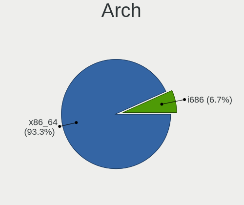

| Name   | Computers | Percent |
|--------|-----------|---------|
| x86_64 | 256       | 93.43%  |
| i686   | 18        | 6.57%   |

DE
--

Desktop Environment

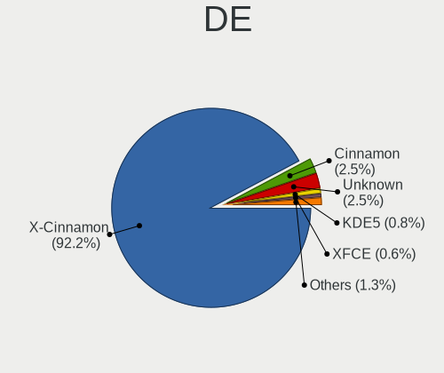

| Name       | Computers | Percent |
|------------|-----------|---------|
| X-Cinnamon | 249       | 90.22%  |
| Unknown    | 12        | 4.35%   |
| Cinnamon   | 9         | 3.26%   |
| LXDE       | 2         | 0.72%   |
| KDE5       | 2         | 0.72%   |
| XFCE       | 1         | 0.36%   |
| MATE       | 1         | 0.36%   |

Display Server
--------------

X11 or Wayland

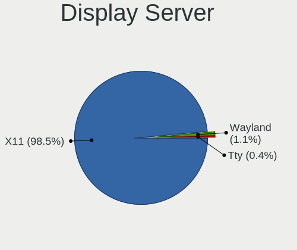

| Name    | Computers | Percent |
|---------|-----------|---------|
| X11     | 269       | 97.82%  |
| Wayland | 4         | 1.45%   |
| Tty     | 2         | 0.73%   |

Display Manager
---------------

SDDM, LightDM, etc.

| Name    | Computers | Percent |
|---------|-----------|---------|
| LightDM | 175       | 63.64%  |
| Unknown | 99        | 36%     |
| GDM3    | 1         | 0.36%   |

OS Lang
-------

Language

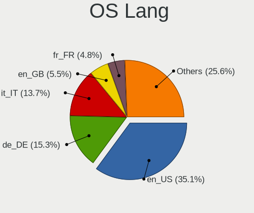

| Lang    | Computers | Percent |
|---------|-----------|---------|
| en_US   | 107       | 38.91%  |
| de_DE   | 37        | 13.45%  |
| it_IT   | 30        | 10.91%  |
| en_GB   | 17        | 6.18%   |
| fr_FR   | 16        | 5.82%   |
| Unknown | 12        | 4.36%   |
| ru_RU   | 9         | 3.27%   |
| pt_BR   | 9         | 3.27%   |
| pl_PL   | 7         | 2.55%   |
| es_ES   | 6         | 2.18%   |
| nl_NL   | 4         | 1.45%   |
| hu_HU   | 3         | 1.09%   |
| en_CA   | 3         | 1.09%   |
| es_BO   | 2         | 0.73%   |
| es_AR   | 2         | 0.73%   |
| cs_CZ   | 2         | 0.73%   |
| sv_SE   | 1         | 0.36%   |
| nl_BE   | 1         | 0.36%   |
| hr_HR   | 1         | 0.36%   |
| gl_ES   | 1         | 0.36%   |
| fr_CA   | 1         | 0.36%   |
| en_NZ   | 1         | 0.36%   |
| en_IN   | 1         | 0.36%   |
| en_AU   | 1         | 0.36%   |
| el_GR   | 1         | 0.36%   |

Boot Mode
---------

EFI or BIOS

| Mode | Computers | Percent |
|------|-----------|---------|
| EFI  | 188       | 68.12%  |
| BIOS | 88        | 31.88%  |

Filesystem
----------

Type of filesystem

| Type    | Computers | Percent |
|---------|-----------|---------|
| Ext4    | 224       | 80.87%  |
| Overlay | 24        | 8.66%   |
| Btrfs   | 14        | 5.05%   |
| Tmpfs   | 13        | 4.69%   |
| Zfs     | 1         | 0.36%   |
| Xfs     | 1         | 0.36%   |

Part. scheme
------------

Scheme of partitioning

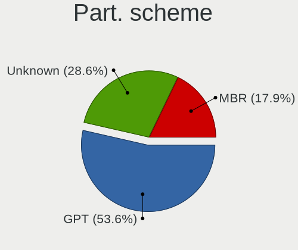

| Type    | Computers | Percent |
|---------|-----------|---------|
| GPT     | 138       | 50.18%  |
| Unknown | 87        | 31.64%  |
| MBR     | 50        | 18.18%  |

Dual Boot with Linux/BSD
------------------------

Hosting more than one Linux/BSD

| Dual boot | Computers | Percent |
|-----------|-----------|---------|
| No        | 245       | 88.77%  |
| Yes       | 31        | 11.23%  |

Dual Boot (Win)
---------------

Hosting Linux and Windows

| Dual boot | Computers | Percent |
|-----------|-----------|---------|
| No        | 213       | 77.17%  |
| Yes       | 63        | 22.83%  |

Board
-----

Vendor
------

Motherboard manufacturer

| Name                                 | Computers | Percent |
|--------------------------------------|-----------|---------|
| ASUSTek Computer                     | 50        | 18.25%  |
| Hewlett-Packard                      | 44        | 16.06%  |
| Lenovo                               | 37        | 13.5%   |
| Dell                                 | 20        | 7.3%    |
| MSI                                  | 16        | 5.84%   |
| Gigabyte Technology                  | 15        | 5.47%   |
| Acer                                 | 14        | 5.11%   |
| Apple                                | 13        | 4.74%   |
| ASRock                               | 8         | 2.92%   |
| Fujitsu                              | 7         | 2.55%   |
| Unknown                              | 6         | 2.19%   |
| Toshiba                              | 4         | 1.46%   |
| HUAWEI                               | 4         | 1.46%   |
| Medion                               | 3         | 1.09%   |
| Intel                                | 3         | 1.09%   |
| Sony                                 | 2         | 0.73%   |
| Inventec                             | 2         | 0.73%   |
| Google                               | 2         | 0.73%   |
| Alienware                            | 2         | 0.73%   |
| VALE                                 | 1         | 0.36%   |
| TUXEDO                               | 1         | 0.36%   |
| Trigkey                              | 1         | 0.36%   |
| Soyo                                 | 1         | 0.36%   |
| Shenzhen Meigao Electronic Equipment | 1         | 0.36%   |
| Samsung Electronics                  | 1         | 0.36%   |
| Quanta                               | 1         | 0.36%   |
| PELADN                               | 1         | 0.36%   |
| Pegatron                             | 1         | 0.36%   |
| Packard Bell                         | 1         | 0.36%   |
| Monster                              | 1         | 0.36%   |
| LETSUNG                              | 1         | 0.36%   |
| IBM                                  | 1         | 0.36%   |
| GMKtec                               | 1         | 0.36%   |
| GEEKOM                               | 1         | 0.36%   |
| Fujitsu Siemens                      | 1         | 0.36%   |
| Framework                            | 1         | 0.36%   |
| Fanless Mini PC                      | 1         | 0.36%   |
| Clevo                                | 1         | 0.36%   |
| AZW                                  | 1         | 0.36%   |
| Avell High Performance               | 1         | 0.36%   |

Model
-----

Motherboard model

| Name                                                | Computers | Percent |
|-----------------------------------------------------|-----------|---------|
| Unknown                                             | 7         | 2.55%   |
| ASUS VivoBook_ASUSLaptop X1605VA_X1605VA            | 3         | 1.09%   |
| HUAWEI CREM-WXX9                                    | 2         | 0.73%   |
| HP Pavilion 15                                      | 2         | 0.73%   |
| Gigabyte A520M S2H                                  | 2         | 0.73%   |
| Dell OptiPlex 7010                                  | 2         | 0.73%   |
| ASUS All Series                                     | 2         | 0.73%   |
| Apple iMac5,1                                       | 2         | 0.73%   |
| Acer Aspire E5-575                                  | 2         | 0.73%   |
| VALE Notebook Classic C171V                         | 1         | 0.36%   |
| TUXEDO Pulse 14 Gen1                                | 1         | 0.36%   |
| Trigkey Green G4                                    | 1         | 0.36%   |
| Toshiba Satellite Pro L100                          | 1         | 0.36%   |
| Toshiba Satellite Pro C850-1DQ                      | 1         | 0.36%   |
| Toshiba Satellite L745                              | 1         | 0.36%   |
| Toshiba Satellite A135                              | 1         | 0.36%   |
| Soyo SY-N3150L Quad                                 | 1         | 0.36%   |
| Sony VGN-FW21E                                      | 1         | 0.36%   |
| Sony SVE1511A1EW                                    | 1         | 0.36%   |
| Shenzhen Meigao Electronic Equipment Mercury series | 1         | 0.36%   |
| Samsung N150P/N210P/N220P                           | 1         | 0.36%   |
| Quanta 120-1125                                     | 1         | 0.36%   |
| PELADN WI-6                                         | 1         | 0.36%   |
| Pegatron Pro 3120 Microtower PC                     | 1         | 0.36%   |
| Packard Bell EasyNote_MX45                          | 1         | 0.36%   |
| MSI Thin GF63 12HW                                  | 1         | 0.36%   |
| MSI MS-7E07                                         | 1         | 0.36%   |
| MSI MS-7E01                                         | 1         | 0.36%   |
| MSI MS-7D91                                         | 1         | 0.36%   |
| MSI MS-7D69                                         | 1         | 0.36%   |
| MSI MS-7D15                                         | 1         | 0.36%   |
| MSI MS-7C84                                         | 1         | 0.36%   |
| MSI MS-7C56                                         | 1         | 0.36%   |
| MSI MS-7C37                                         | 1         | 0.36%   |
| MSI MS-7B98                                         | 1         | 0.36%   |
| MSI MS-7B48                                         | 1         | 0.36%   |
| MSI MS-7A38                                         | 1         | 0.36%   |
| MSI MS-7998                                         | 1         | 0.36%   |
| MSI MS-7798                                         | 1         | 0.36%   |
| MSI MS-7345                                         | 1         | 0.36%   |

Model Family
------------

Motherboard model prefix

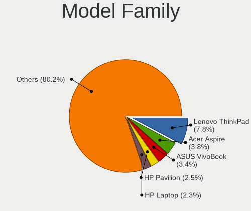

| Name              | Computers | Percent |
|-------------------|-----------|---------|
| Lenovo ThinkPad   | 21        | 7.66%   |
| ASUS VivoBook     | 10        | 3.65%   |
| Acer Aspire       | 10        | 3.65%   |
| Lenovo IdeaPad    | 8         | 2.92%   |
| HP Pavilion       | 8         | 2.92%   |
| Unknown           | 7         | 2.55%   |
| Dell Latitude     | 6         | 2.19%   |
| ASUS PRIME        | 6         | 2.19%   |
| HP ProBook        | 5         | 1.82%   |
| HP EliteBook      | 5         | 1.82%   |
| Toshiba Satellite | 4         | 1.46%   |
| HP Compaq         | 4         | 1.46%   |
| Fujitsu ESPRIMO   | 4         | 1.46%   |
| Dell OptiPlex     | 4         | 1.46%   |
| ASUS TUF          | 4         | 1.46%   |
| HP ENVY           | 3         | 1.09%   |
| Dell XPS          | 3         | 1.09%   |
| Dell Inspiron     | 3         | 1.09%   |
| ASUS ROG          | 3         | 1.09%   |
| HUAWEI CREM-WXX9  | 2         | 0.73%   |
| HP ProDesk        | 2         | 0.73%   |
| HP Laptop         | 2         | 0.73%   |
| HP 250            | 2         | 0.73%   |
| Gigabyte B450     | 2         | 0.73%   |
| Gigabyte A520M    | 2         | 0.73%   |
| Fujitsu LIFEBOOK  | 2         | 0.73%   |
| Dell Vostro       | 2         | 0.73%   |
| Dell Precision    | 2         | 0.73%   |
| ASUS P5G41T-M     | 2         | 0.73%   |
| ASUS ASUS         | 2         | 0.73%   |
| ASUS All          | 2         | 0.73%   |
| ASRock X670E      | 2         | 0.73%   |
| Apple MacBookAir7 | 2         | 0.73%   |
| Apple iMac5       | 2         | 0.73%   |
| Apple iMac14      | 2         | 0.73%   |
| VALE Notebook     | 1         | 0.36%   |
| TUXEDO Pulse      | 1         | 0.36%   |
| Trigkey Green     | 1         | 0.36%   |
| Soyo SY-N3150L    | 1         | 0.36%   |
| Sony VGN-FW21E    | 1         | 0.36%   |

MFG Year
--------

Motherboard manufacture year

| Year    | Computers | Percent |
|---------|-----------|---------|
| 2023    | 25        | 9.12%   |
| 2021    | 25        | 9.12%   |
| 2022    | 19        | 6.93%   |
| 2018    | 19        | 6.93%   |
| 2020    | 18        | 6.57%   |
| 2017    | 17        | 6.2%    |
| 2012    | 17        | 6.2%    |
| 2010    | 16        | 5.84%   |
| 2016    | 15        | 5.47%   |
| 2015    | 15        | 5.47%   |
| 2013    | 14        | 5.11%   |
| 2008    | 14        | 5.11%   |
| 2019    | 12        | 4.38%   |
| 2011    | 11        | 4.01%   |
| 2014    | 10        | 3.65%   |
| 2007    | 7         | 2.55%   |
| 2006    | 6         | 2.19%   |
| 2024    | 5         | 1.82%   |
| 2009    | 5         | 1.82%   |
| 2005    | 1         | 0.36%   |
| 2004    | 1         | 0.36%   |
| 2003    | 1         | 0.36%   |
| Unknown | 1         | 0.36%   |

Form Factor
-----------

Physical design of the computer

| Name        | Computers | Percent |
|-------------|-----------|---------|
| Notebook    | 149       | 54.38%  |
| Desktop     | 98        | 35.77%  |
| All in one  | 11        | 4.01%   |
| Mini pc     | 9         | 3.28%   |
| Convertible | 4         | 1.46%   |
| Tablet      | 2         | 0.73%   |
| Server      | 1         | 0.36%   |

Secure Boot
-----------

Enabled or disabled

| State    | Computers | Percent |
|----------|-----------|---------|
| Disabled | 249       | 90.88%  |
| Enabled  | 25        | 9.12%   |

Coreboot
--------

Have coreboot on board

| Used | Computers | Percent |
|------|-----------|---------|
| No   | 272       | 99.27%  |
| Yes  | 2         | 0.73%   |

RAM Size
--------

Total RAM memory

| Size in GB  | Computers | Percent |
|-------------|-----------|---------|
| 4.01-8.0    | 80        | 28.78%  |
| 16.01-24.0  | 52        | 18.71%  |
| 3.01-4.0    | 39        | 14.03%  |
| 32.01-64.0  | 32        | 11.51%  |
| 8.01-16.0   | 30        | 10.79%  |
| 64.01-256.0 | 15        | 5.4%    |
| 24.01-32.0  | 11        | 3.96%   |
| 1.01-2.0    | 9         | 3.24%   |
| 2.01-3.0    | 8         | 2.88%   |
| 0.51-1.0    | 2         | 0.72%   |

RAM Used
--------

Used RAM memory

| Used GB    | Computers | Percent |
|------------|-----------|---------|
| 2.01-3.0   | 93        | 31.96%  |
| 1.01-2.0   | 82        | 28.18%  |
| 4.01-8.0   | 56        | 19.24%  |
| 3.01-4.0   | 42        | 14.43%  |
| 8.01-16.0  | 8         | 2.75%   |
| 0.51-1.0   | 6         | 2.06%   |
| 16.01-24.0 | 2         | 0.69%   |
| 24.01-32.0 | 1         | 0.34%   |
| 0.01-0.5   | 1         | 0.34%   |

Total Drives
------------

Number of drives on board

| Drives | Computers | Percent |
|--------|-----------|---------|
| 1      | 167       | 59.64%  |
| 2      | 61        | 21.79%  |
| 3      | 25        | 8.93%   |
| 4      | 14        | 5%      |
| 5      | 6         | 2.14%   |
| 0      | 3         | 1.07%   |
| 7      | 2         | 0.71%   |
| 10     | 1         | 0.36%   |
| 6      | 1         | 0.36%   |

Has CD-ROM
----------

Has CD-ROM on board

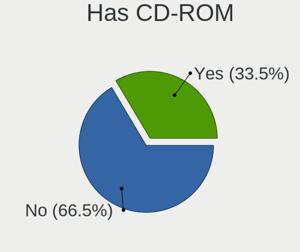

| Presented | Computers | Percent |
|-----------|-----------|---------|
| No        | 181       | 66.06%  |
| Yes       | 93        | 33.94%  |

Has Ethernet
------------

Has Ethernet on board

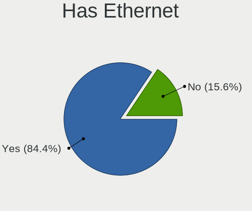

| Presented | Computers | Percent |
|-----------|-----------|---------|
| Yes       | 228       | 83.21%  |
| No        | 46        | 16.79%  |

Has WiFi
--------

Has WiFi module

| Presented | Computers | Percent |
|-----------|-----------|---------|
| Yes       | 224       | 81.75%  |
| No        | 50        | 18.25%  |

Has Bluetooth
-------------

Has Bluetooth module

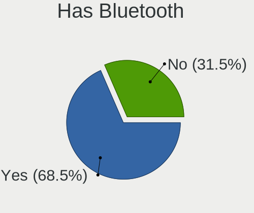

| Presented | Computers | Percent |
|-----------|-----------|---------|
| Yes       | 187       | 67.75%  |
| No        | 89        | 32.25%  |

Location
--------

Country
-------

Geographic location (country)

| Country      | Computers | Percent |
|--------------|-----------|---------|
| Germany      | 56        | 20.44%  |
| Italy        | 46        | 16.79%  |
| USA          | 45        | 16.42%  |
| France       | 15        | 5.47%   |
| UK           | 11        | 4.01%   |
| Brazil       | 10        | 3.65%   |
| Poland       | 9         | 3.28%   |
| Spain        | 8         | 2.92%   |
| Russia       | 8         | 2.92%   |
| Canada       | 7         | 2.55%   |
| Netherlands  | 5         | 1.82%   |
| India        | 4         | 1.46%   |
| Hungary      | 3         | 1.09%   |
| Belgium      | 3         | 1.09%   |
| Argentina    | 3         | 1.09%   |
| Turkey       | 2         | 0.73%   |
| Sweden       | 2         | 0.73%   |
| Saudi Arabia | 2         | 0.73%   |
| New Zealand  | 2         | 0.73%   |
| Malaysia     | 2         | 0.73%   |
| Indonesia    | 2         | 0.73%   |
| Czechia      | 2         | 0.73%   |
| Croatia      | 2         | 0.73%   |
| Bolivia      | 2         | 0.73%   |
| Austria      | 2         | 0.73%   |
| Ukraine      | 1         | 0.36%   |
| Switzerland  | 1         | 0.36%   |
| Romania      | 1         | 0.36%   |
| Runion     | 1         | 0.36%   |
| Puerto Rico  | 1         | 0.36%   |
| Portugal     | 1         | 0.36%   |
| Philippines  | 1         | 0.36%   |
| Norway       | 1         | 0.36%   |
| Morocco      | 1         | 0.36%   |
| Montenegro   | 1         | 0.36%   |
| Malta        | 1         | 0.36%   |
| Israel       | 1         | 0.36%   |
| Iran         | 1         | 0.36%   |
| Greece       | 1         | 0.36%   |
| Georgia      | 1         | 0.36%   |

City
----

Geographic location (city)

| City                  | Computers | Percent |
|-----------------------|-----------|---------|
| Traunstein            | 8         | 2.77%   |
| Milan                 | 5         | 1.73%   |
| Delligsen             | 5         | 1.73%   |
| Bologna               | 5         | 1.73%   |
| Rome                  | 3         | 1.04%   |
| Paris                 | 3         | 1.04%   |
| Milano                | 3         | 1.04%   |
| Dallas                | 3         | 1.04%   |
| Bonn                  | 3         | 1.04%   |
| Berlin                | 3         | 1.04%   |
| Aalten                | 3         | 1.04%   |
| Vienna                | 2         | 0.69%   |
| Valencia              | 2         | 0.69%   |
| Uetze                 | 2         | 0.69%   |
| South Bend            | 2         | 0.69%   |
| Rennes                | 2         | 0.69%   |
| Ratingen              | 2         | 0.69%   |
| Parshall              | 2         | 0.69%   |
| Padova                | 2         | 0.69%   |
| Lambeth               | 2         | 0.69%   |
| Kuala Lumpur          | 2         | 0.69%   |
| Krakow                | 2         | 0.69%   |
| Freden                | 2         | 0.69%   |
| Florence              | 2         | 0.69%   |
| Fitchburg             | 2         | 0.69%   |
| Bremen                | 2         | 0.69%   |
| Bogor                 | 2         | 0.69%   |
| Birmingham            | 2         | 0.69%   |
| Auckland              | 2         | 0.69%   |
| Zuidhorn              | 1         | 0.35%   |
| Yekaterinburg         | 1         | 0.35%   |
| Yanbu                 | 1         | 0.35%   |
| Wittingen             | 1         | 0.35%   |
| Wisconsin Dells       | 1         | 0.35%   |
| Winnipeg              | 1         | 0.35%   |
| Weissenburg in Bayern | 1         | 0.35%   |
| Wasilla               | 1         | 0.35%   |
| Warsaw                | 1         | 0.35%   |
| Vitria              | 1         | 0.35%   |
| Villa Ballester       | 1         | 0.35%   |

Drives
------

Drive Vendor
------------

Hard drive vendors

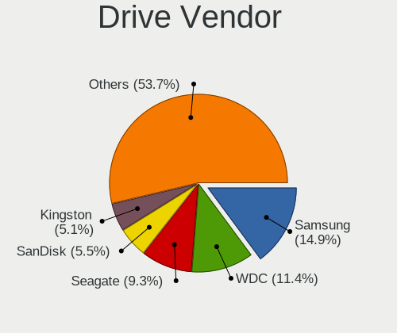

| Vendor                      | Computers | Drives | Percent |
|-----------------------------|-----------|--------|---------|
| Samsung Electronics         | 67        | 80     | 15.8%   |
| WDC                         | 52        | 69     | 12.26%  |
| Seagate                     | 46        | 61     | 10.85%  |
| Toshiba                     | 22        | 24     | 5.19%   |
| Kingston                    | 22        | 39     | 5.19%   |
| SanDisk                     | 20        | 25     | 4.72%   |
| Crucial                     | 16        | 17     | 3.77%   |
| Micron Technology           | 13        | 13     | 3.07%   |
| Unknown                     | 10        | 17     | 2.36%   |
| Hitachi                     | 10        | 11     | 2.36%   |
| China                       | 10        | 11     | 2.36%   |
| SK hynix                    | 7         | 7      | 1.65%   |
| Intel                       | 7         | 7      | 1.65%   |
| Apple                       | 7         | 8      | 1.65%   |
| Unknown                     | 7         | 10     | 1.65%   |
| A-DATA Technology           | 6         | 7      | 1.42%   |
| SPCC                        | 5         | 5      | 1.18%   |
| PNY                         | 5         | 8      | 1.18%   |
| Micron/Crucial Technology   | 5         | 7      | 1.18%   |
| KIOXIA                      | 5         | 6      | 1.18%   |
| Apacer                      | 5         | 6      | 1.18%   |
| Patriot                     | 4         | 4      | 0.94%   |
| Kingston Technology Company | 4         | 4      | 0.94%   |
| JMicron Technology          | 4         | 4      | 0.94%   |
| HGST                        | 4         | 4      | 0.94%   |
| ADATA Technology            | 4         | 5      | 0.94%   |
| Transcend                   | 3         | 3      | 0.71%   |
| Team                        | 3         | 3      | 0.71%   |
| Phison Electronics          | 3         | 4      | 0.71%   |
| Phison                      | 3         | 7      | 0.71%   |
| Lexar                       | 3         | 3      | 0.71%   |
| Intenso                     | 3         | 3      | 0.71%   |
| Fujitsu                     | 3         | 3      | 0.71%   |
| Verbatim                    | 2         | 3      | 0.47%   |
| Silicon Motion              | 2         | 2      | 0.47%   |
| Realtek Semiconductor       | 2         | 2      | 0.47%   |
| Realtek                     | 2         | 2      | 0.47%   |
| Maxtor                      | 2         | 2      | 0.47%   |
| MAXIO Technology (Hangzhou) | 2         | 2      | 0.47%   |
| KIOXIA-EXCERIA              | 2         | 4      | 0.47%   |

Drive Model
-----------

Hard drive models

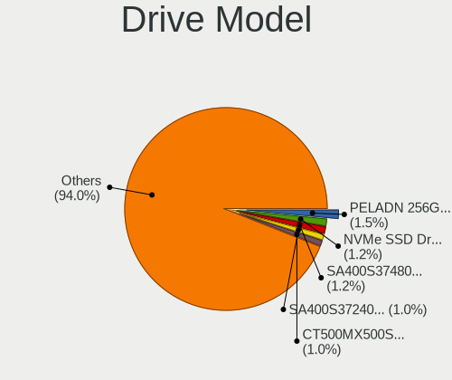

| Model                                                           | Computers | Percent |
|-----------------------------------------------------------------|-----------|---------|
| Kingston SA400S37480G 480GB SSD                                 | 8         | 1.76%   |
| Unknown                                                         | 7         | 1.54%   |
| SanDisk NVMe SSD Drive 2TB                                      | 6         | 1.32%   |
| Samsung NVMe SSD Controller SM981/PM981/PM983 1TB               | 6         | 1.32%   |
| Seagate ST1000LM035-1RK172 1TB                                  | 5         | 1.1%    |
| Samsung SSD 860 EVO 250GB                                       | 4         | 0.88%   |
| Kingston SA400S37240G 240GB SSD                                 | 4         | 0.88%   |
| Crucial CT500MX500SSD1 500GB                                    | 4         | 0.88%   |
| Toshiba DT01ACA100 1TB                                          | 3         | 0.66%   |
| Seagate ST9500325AS 500GB                                       | 3         | 0.66%   |
| Seagate Expansion+ Desk 4TB                                     | 3         | 0.66%   |
| Sandisk WD Blue SN550 NVMe SSD 2TB                              | 3         | 0.66%   |
| SanDisk NVMe SSD Drive 1TB                                      | 3         | 0.66%   |
| Samsung SSD 860 EVO 500GB                                       | 3         | 0.66%   |
| Samsung MZVLQ1T0HALB-00000 1024GB                               | 3         | 0.66%   |
| Micron 2400_MTFDKBA512QFM 512GB                                 | 3         | 0.66%   |
| Kingston SUV400S37240G 240GB SSD                                | 3         | 0.66%   |
| JMicron Generic 320GB                                           | 3         | 0.66%   |
| Crucial CT1000MX500SSD1 1TB                                     | 3         | 0.66%   |
| China SATA SSD 240GB                                            | 3         | 0.66%   |
| ADATA XPG SX8200 Pro PCIe Gen3x4 M.2 2280 Solid State Drive 1TB | 3         | 0.66%   |
| WDC WDS500G2B0A-00SM50 500GB SSD                                | 2         | 0.44%   |
| WDC WD10SPZX-24Z10 1TB                                          | 2         | 0.44%   |
| WDC PC SN730 SDBPNTY-512G                                       | 2         | 0.44%   |
| Verbatim Vi550 S3 128GB SSD                                     | 2         | 0.44%   |
| Unknown MMC Card  128GB                                         | 2         | 0.44%   |
| Toshiba MQ01ABD100 1TB                                          | 2         | 0.44%   |
| Toshiba MQ01ABD050 500GB                                        | 2         | 0.44%   |
| Toshiba HDWE160 6TB                                             | 2         | 0.44%   |
| Team T253512GB SSD                                              | 2         | 0.44%   |
| SPCC Solid State Disk 256GB                                     | 2         | 0.44%   |
| SK hynix BC711 HFM256GD3JX013N 256GB                            | 2         | 0.44%   |
| Seagate ST8000DM004-2U9188 8TB                                  | 2         | 0.44%   |
| Seagate ST500LM021-1KJ152 500GB                                 | 2         | 0.44%   |
| Seagate ST4000VN008-2DR166 4TB                                  | 2         | 0.44%   |
| Seagate ST2000DM001-1ER164 2TB                                  | 2         | 0.44%   |
| Seagate Desktop 8TB                                             | 2         | 0.44%   |
| Samsung SSD 990 PRO 2TB                                         | 2         | 0.44%   |
| Samsung SSD 980 500GB                                           | 2         | 0.44%   |
| Samsung SSD 980 1TB                                             | 2         | 0.44%   |

HDD Vendor
----------

Hard disk drive vendors

| Vendor              | Computers | Drives | Percent |
|---------------------|-----------|--------|---------|
| Seagate             | 46        | 61     | 33.58%  |
| WDC                 | 34        | 48     | 24.82%  |
| Toshiba             | 20        | 22     | 14.6%   |
| Hitachi             | 10        | 11     | 7.3%    |
| Samsung Electronics | 4         | 4      | 2.92%   |
| HGST                | 4         | 4      | 2.92%   |
| Apple               | 4         | 4      | 2.92%   |
| JMicron Technology  | 3         | 3      | 2.19%   |
| Fujitsu             | 3         | 3      | 2.19%   |
| Maxtor              | 2         | 2      | 1.46%   |
| USB3.0              | 1         | 1      | 0.73%   |
| Unknown             | 1         | 1      | 0.73%   |
| TO Exter            | 1         | 1      | 0.73%   |
| SABRENT             | 1         | 1      | 0.73%   |
| IBM/Hitachi         | 1         | 1      | 0.73%   |
| DC-624e             | 1         | 1      | 0.73%   |
| Unknown             | 1         | 1      | 0.73%   |

SSD Vendor
----------

Solid state drive vendors

| Vendor              | Computers | Drives | Percent |
|---------------------|-----------|--------|---------|
| Samsung Electronics | 31        | 36     | 21.38%  |
| Kingston            | 20        | 32     | 13.79%  |
| Crucial             | 13        | 13     | 8.97%   |
| WDC                 | 10        | 11     | 6.9%    |
| China               | 10        | 11     | 6.9%    |
| SanDisk             | 7         | 7      | 4.83%   |
| PNY                 | 5         | 8      | 3.45%   |
| SPCC                | 4         | 4      | 2.76%   |
| Apacer              | 4         | 5      | 2.76%   |
| A-DATA Technology   | 4         | 5      | 2.76%   |
| Transcend           | 3         | 3      | 2.07%   |
| Team                | 3         | 3      | 2.07%   |
| Patriot             | 3         | 3      | 2.07%   |
| Micron Technology   | 3         | 3      | 2.07%   |
| Apple               | 3         | 3      | 2.07%   |
| Verbatim            | 2         | 3      | 1.38%   |
| Phison              | 2         | 6      | 1.38%   |
| Intenso             | 2         | 2      | 1.38%   |
| Intel               | 2         | 2      | 1.38%   |
| Gigabyte Technology | 2         | 2      | 1.38%   |
| Fanxiang            | 2         | 3      | 1.38%   |
| Unknown             | 2         | 4      | 1.38%   |
| SK hynix            | 1         | 1      | 0.69%   |
| OCZ                 | 1         | 1      | 0.69%   |
| KUU                 | 1         | 1      | 0.69%   |
| KingDian            | 1         | 1      | 0.69%   |
| Integral            | 1         | 1      | 0.69%   |
| Hewlett-Packard     | 1         | 1      | 0.69%   |
| External            | 1         | 1      | 0.69%   |
| ASMT109x            | 1         | 1      | 0.69%   |

Drive Kind
----------

HDD or SSD

| Kind    | Computers | Drives | Percent |
|---------|-----------|--------|---------|
| SSD     | 127       | 177    | 33.87%  |
| NVMe    | 117       | 154    | 31.2%   |
| HDD     | 113       | 169    | 30.13%  |
| MMC     | 11        | 16     | 2.93%   |
| Unknown | 7         | 10     | 1.87%   |

Drive Connector
---------------

SATA, SAS, NVMe, etc.

| Type | Computers | Drives | Percent |
|------|-----------|--------|---------|
| SATA | 196       | 329    | 56.48%  |
| NVMe | 116       | 152    | 33.43%  |
| SAS  | 24        | 29     | 6.92%   |
| MMC  | 11        | 16     | 3.17%   |

Drive Size
----------

Size of hard drive

| Size in TB | Computers | Drives | Percent |
|------------|-----------|--------|---------|
| 0.01-0.5   | 142       | 200    | 56.35%  |
| 0.51-1.0   | 66        | 79     | 26.19%  |
| 1.01-2.0   | 20        | 31     | 7.94%   |
| 3.01-4.0   | 11        | 17     | 4.37%   |
| 4.01-10.0  | 7         | 11     | 2.78%   |
| 2.01-3.0   | 4         | 5      | 1.59%   |
| 10.01-20.0 | 2         | 3      | 0.79%   |

Space Total
-----------

Amount of disk space available on the file system

| Size in GB     | Computers | Percent |
|----------------|-----------|---------|
| 101-250        | 71        | 25.36%  |
| 251-500        | 52        | 18.57%  |
| 501-1000       | 49        | 17.5%   |
| 1001-2000      | 26        | 9.29%   |
| 1-20           | 23        | 8.21%   |
| More than 3000 | 18        | 6.43%   |
| 51-100         | 12        | 4.29%   |
| Unknown        | 12        | 4.29%   |
| 2001-3000      | 10        | 3.57%   |
| 21-50          | 7         | 2.5%    |

Space Used
----------

Amount of used disk space

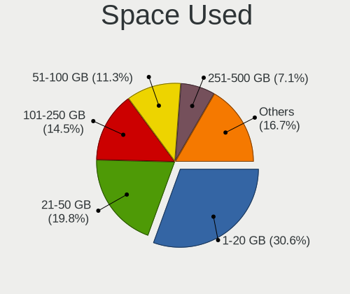

| Used GB        | Computers | Percent |
|----------------|-----------|---------|
| 1-20           | 100       | 34.36%  |
| 21-50          | 61        | 20.96%  |
| 101-250        | 32        | 11%     |
| 51-100         | 29        | 9.97%   |
| 251-500        | 20        | 6.87%   |
| 501-1000       | 15        | 5.15%   |
| Unknown        | 12        | 4.12%   |
| 1001-2000      | 11        | 3.78%   |
| More than 3000 | 8         | 2.75%   |
| 2001-3000      | 3         | 1.03%   |

Malfunc. Drives
---------------

Drive models with a malfunction

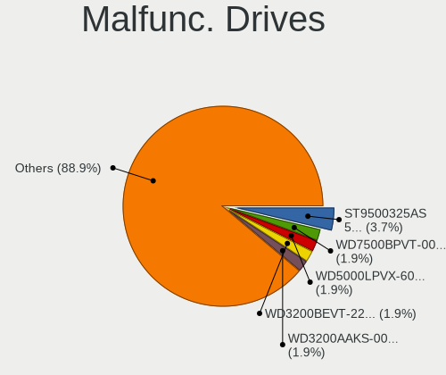

| Model                                               | Computers | Drives | Percent |
|-----------------------------------------------------|-----------|--------|---------|
| Seagate ST9500325AS 500GB                           | 2         | 2      | 6.06%   |
| WDC WD5000LPVX-60V0TT0 500GB                        | 1         | 1      | 3.03%   |
| WDC WD15EADS-00P8B0 1TB                             | 1         | 1      | 3.03%   |
| WDC WD10SPZX-24Z10 1TB                              | 1         | 1      | 3.03%   |
| WDC WD10EZRZ-00HTKB0 1TB                            | 1         | 1      | 3.03%   |
| Transcend TS512GMTS430S 512GB SSD                   | 1         | 1      | 3.03%   |
| Toshiba MK1652GSX 160GB                             | 1         | 1      | 3.03%   |
| SK hynix HFS060G32MNB-2000A 64GB SSD                | 1         | 1      | 3.03%   |
| Seagate ST500LM021-1KJ152 500GB                     | 1         | 1      | 3.03%   |
| Seagate ST31000524AS 1TB                            | 1         | 1      | 3.03%   |
| Seagate ST1000LM014-1EJ164 1TB                      | 1         | 1      | 3.03%   |
| Seagate ST1000DM003-1SB102 1TB                      | 1         | 1      | 3.03%   |
| Samsung Electronics SSD 970 EVO 500GB               | 1         | 1      | 3.03%   |
| Samsung Electronics HM251JI 250GB                   | 1         | 1      | 3.03%   |
| Samsung Electronics HD103UJ 1TB                     | 1         | 1      | 3.03%   |
| Micron Technology MTFDDAK512MAY-1AE1ZABHA 512GB SSD | 1         | 1      | 3.03%   |
| Maxtor 6E040L0 41GB                                 | 1         | 1      | 3.03%   |
| Lexar SSD 480GB                                     | 1         | 1      | 3.03%   |
| KUU SSD 512GB                                       | 1         | 1      | 3.03%   |
| Kingston SUV400S37240G 240GB SSD                    | 1         | 1      | 3.03%   |
| Kingston SKC2500M8500G 500GB                        | 1         | 1      | 3.03%   |
| Kingston SA400S37240G 240GB SSD                     | 1         | 1      | 3.03%   |
| Intel SSDSA2M080G2HP 80GB                           | 1         | 1      | 3.03%   |
| IBM/Hitachi IC35L040AVER07-0 41GB                   | 1         | 1      | 3.03%   |
| Hitachi HTS548080M9AT00 80GB                        | 1         | 1      | 3.03%   |
| Hitachi HTS543232L9A300 320GB                       | 1         | 1      | 3.03%   |
| HGST HTS721010A9E630 1TB                            | 1         | 1      | 3.03%   |
| Fujitsu MHZ2320BH G2 320GB                          | 1         | 1      | 3.03%   |
| China SH00M256GB SSD                                | 1         | 1      | 3.03%   |
| Apple SSD SM256C 256GB                              | 1         | 1      | 3.03%   |
| Apple HDD ST1000DM003 1TB                           | 1         | 1      | 3.03%   |
| A-DATA Technology SU800 128GB SSD                   | 1         | 1      | 3.03%   |

Malfunc. Drive Vendor
---------------------

Vendors of faulty drives

| Vendor              | Computers | Drives | Percent |
|---------------------|-----------|--------|---------|
| Seagate             | 6         | 6      | 18.18%  |
| WDC                 | 4         | 4      | 12.12%  |
| Samsung Electronics | 3         | 3      | 9.09%   |
| Kingston            | 3         | 3      | 9.09%   |
| Hitachi             | 2         | 2      | 6.06%   |
| Apple               | 2         | 2      | 6.06%   |
| Transcend           | 1         | 1      | 3.03%   |
| Toshiba             | 1         | 1      | 3.03%   |
| SK hynix            | 1         | 1      | 3.03%   |
| Micron Technology   | 1         | 1      | 3.03%   |
| Maxtor              | 1         | 1      | 3.03%   |
| Lexar               | 1         | 1      | 3.03%   |
| KUU                 | 1         | 1      | 3.03%   |
| Intel               | 1         | 1      | 3.03%   |
| IBM/Hitachi         | 1         | 1      | 3.03%   |
| HGST                | 1         | 1      | 3.03%   |
| Fujitsu             | 1         | 1      | 3.03%   |
| China               | 1         | 1      | 3.03%   |
| A-DATA Technology   | 1         | 1      | 3.03%   |

Malfunc. HDD Vendor
-------------------

Vendors of faulty HDD drives

| Vendor              | Computers | Drives | Percent |
|---------------------|-----------|--------|---------|
| Seagate             | 6         | 6      | 30%     |
| WDC                 | 4         | 4      | 20%     |
| Samsung Electronics | 2         | 2      | 10%     |
| Hitachi             | 2         | 2      | 10%     |
| Toshiba             | 1         | 1      | 5%      |
| Maxtor              | 1         | 1      | 5%      |
| IBM/Hitachi         | 1         | 1      | 5%      |
| HGST                | 1         | 1      | 5%      |
| Fujitsu             | 1         | 1      | 5%      |
| Apple               | 1         | 1      | 5%      |

Malfunc. Drive Kind
-------------------

Kinds of faulty drives

| Kind | Computers | Drives | Percent |
|------|-----------|--------|---------|
| HDD  | 20        | 20     | 60.61%  |
| SSD  | 10        | 10     | 30.3%   |
| NVMe | 3         | 3      | 9.09%   |

Failed Drives
-------------

Failed drive models

Zero info for selected period =(

Failed Drive Vendor
-------------------

Failed drive vendors

Zero info for selected period =(

Drive Status
------------

Number of failed and malfunc. drives

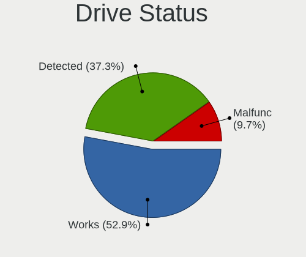

| Status   | Computers | Drives | Percent |
|----------|-----------|--------|---------|
| Works    | 158       | 247    | 50.97%  |
| Detected | 119       | 246    | 38.39%  |
| Malfunc  | 33        | 33     | 10.65%  |

Storage controller
------------------

Storage Vendor
--------------

Storage controller vendors

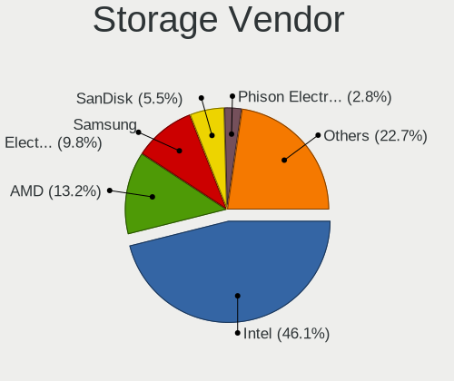

| Vendor                                  | Computers | Percent |
|-----------------------------------------|-----------|---------|
| Intel                                   | 174       | 46.9%   |
| AMD                                     | 54        | 14.56%  |
| Samsung Electronics                     | 35        | 9.43%   |
| SanDisk                                 | 19        | 5.12%   |
| Micron Technology                       | 11        | 2.96%   |
| Micron/Crucial Technology               | 7         | 1.89%   |
| Marvell Technology Group                | 7         | 1.89%   |
| Kingston Technology Company             | 7         | 1.89%   |
| ASMedia Technology                      | 7         | 1.89%   |
| SK hynix                                | 6         | 1.62%   |
| Phison Electronics                      | 6         | 1.62%   |
| ADATA Technology                        | 6         | 1.62%   |
| KIOXIA                                  | 5         | 1.35%   |
| Toshiba America Info Systems            | 4         | 1.08%   |
| Silicon Motion                          | 3         | 0.81%   |
| Nvidia                                  | 3         | 0.81%   |
| MAXIO Technology (Hangzhou)             | 3         | 0.81%   |
| JMicron Technology                      | 3         | 0.81%   |
| Shenzhen Longsys Electronics            | 2         | 0.54%   |
| Realtek Semiconductor                   | 2         | 0.54%   |
| VIA Technologies                        | 1         | 0.27%   |
| Shenzhen Unionmemory Information System | 1         | 0.27%   |
| Integrated Technology Express           | 1         | 0.27%   |
| INNOGRIT                                | 1         | 0.27%   |
| Hosin Global Electronics                | 1         | 0.27%   |
| Broadcom / LSI                          | 1         | 0.27%   |
| Apple                                   | 1         | 0.27%   |

Storage Model
-------------

Storage controller models

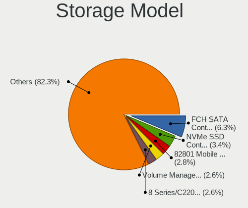

| Model                                                                          | Computers | Percent |
|--------------------------------------------------------------------------------|-----------|---------|
| AMD FCH SATA Controller [AHCI mode]                                            | 32        | 7.62%   |
| Intel 82801 Mobile SATA Controller [RAID mode]                                 | 13        | 3.1%    |
| Samsung NVMe SSD Controller SM981/PM981/PM983                                  | 12        | 2.86%   |
| Intel Sunrise Point-LP SATA Controller [AHCI mode]                             | 12        | 2.86%   |
| Intel 8 Series/C220 Series Chipset Family 6-port SATA Controller 1 [AHCI mode] | 10        | 2.38%   |
| Samsung NVMe SSD Controller 980 (DRAM-less)                                    | 9         | 2.14%   |
| Intel Q170/Q150/B150/H170/H110/Z170/CM236 Chipset SATA Controller [AHCI Mode]  | 8         | 1.9%    |
| Intel 82801G (ICH7 Family) IDE Controller                                      | 8         | 1.9%    |
| Intel 6 Series/C200 Series Chipset Family 6 port Mobile SATA AHCI Controller   | 8         | 1.9%    |
| Intel Volume Management Device NVMe RAID Controller                            | 7         | 1.67%   |
| Intel NM10/ICH7 Family SATA Controller [IDE mode]                              | 7         | 1.67%   |
| Intel 8 Series SATA Controller 1 [AHCI mode]                                   | 7         | 1.67%   |
| Intel 7 Series/C210 Series Chipset Family 6-port SATA Controller [AHCI mode]   | 7         | 1.67%   |
| Intel 7 Series Chipset Family 6-port SATA Controller [AHCI mode]               | 7         | 1.67%   |
| ASMedia ASM1061/ASM1062 Serial ATA Controller                                  | 7         | 1.67%   |
| AMD SB7x0/SB8x0/SB9x0 SATA Controller [AHCI mode]                              | 7         | 1.67%   |
| SanDisk Ultra 3D / WD Blue SN550 NVMe SSD                                      | 6         | 1.43%   |
| Intel 82801IBM/IEM (ICH9M/ICH9M-E) 4 port SATA Controller [AHCI mode]          | 6         | 1.43%   |
| Intel 82801GBM/GHM (ICH7-M Family) SATA Controller [IDE mode]                  | 6         | 1.43%   |
| SanDisk Extreme Pro / WD Black SN750 / PC SN730 / Red SN700 NVMe SSD           | 5         | 1.19%   |
| Samsung NVMe SSD Controller PM9B1 (DRAM-less)                                  | 5         | 1.19%   |
| Intel Volume Management Device NVMe RAID Controller Intel Corporation          | 5         | 1.19%   |
| Intel SATA controller                                                          | 5         | 1.19%   |
| Intel Raptor Lake SATA AHCI Controller                                         | 5         | 1.19%   |
| Intel 5 Series/3400 Series Chipset 4 port SATA AHCI Controller                 | 5         | 1.19%   |
| AMD 600 Series Chipset SATA Controller                                         | 5         | 1.19%   |
| AMD 500 Series Chipset SATA Controller                                         | 5         | 1.19%   |
| AMD 400 Series Chipset SATA Controller                                         | 5         | 1.19%   |
| SK hynix Gold P31/BC711/PC711 NVMe Solid State Drive                           | 4         | 0.95%   |
| Sandisk WD Black SN850X NVMe SSD                                               | 4         | 0.95%   |
| Micron 2450 NVMe SSD [HendrixV] (DRAM-less)                                    | 4         | 0.95%   |
| Intel 200 Series PCH SATA controller [AHCI mode]                               | 4         | 0.95%   |
| ADATA XPG SX8200 Pro PCIe Gen3x4 M.2 2280 Solid State Drive                    | 4         | 0.95%   |
| Samsung NVMe SSD Controller S4LV008[Pascal]                                    | 3         | 0.71%   |
| Samsung NVMe SSD Controller PM9A1/PM9A3/980PRO                                 | 3         | 0.71%   |
| Micron 2400 NVMe SSD (DRAM-less)                                               | 3         | 0.71%   |
| MAXIO (Hangzhou) NVMe SSD Controller MAP1202 (DRAM-less)                       | 3         | 0.71%   |
| Intel Wildcat Point-LP SATA Controller [AHCI Mode]                             | 3         | 0.71%   |
| Intel SATA Controller [RAID mode]                                              | 3         | 0.71%   |
| Intel Celeron/Pentium Silver Processor SATA Controller                         | 3         | 0.71%   |

Storage Kind
------------

Kind of storage controller (IDE, SATA, NVMe, SAS, ...)

| Kind | Computers | Percent |
|------|-----------|---------|
| SATA | 180       | 49.59%  |
| NVMe | 115       | 31.68%  |
| IDE  | 36        | 9.92%   |
| RAID | 31        | 8.54%   |
| SAS  | 1         | 0.28%   |

Processor
---------

CPU Vendor
----------

Processor vendors

| Vendor | Computers | Percent |
|--------|-----------|---------|
| Intel  | 203       | 74.09%  |
| AMD    | 71        | 25.91%  |

CPU Model
---------

Processor models

| Model                                       | Computers | Percent |
|---------------------------------------------|-----------|---------|
| Intel N100                                  | 6         | 2.19%   |
| AMD Ryzen 7 5700U with Radeon Graphics      | 4         | 1.46%   |
| Intel Core i5-6500 CPU @ 3.20GHz            | 3         | 1.09%   |
| Intel Core i5-4200U CPU @ 1.60GHz           | 3         | 1.09%   |
| Intel Core i5-3470 CPU @ 3.20GHz            | 3         | 1.09%   |
| Intel Core i5-3320M CPU @ 2.60GHz           | 3         | 1.09%   |
| Intel 13th Gen Core i9-13900H               | 3         | 1.09%   |
| Intel 11th Gen Core i3-1115G4 @ 3.00GHz     | 3         | 1.09%   |
| AMD Ryzen 7 5800H with Radeon Graphics      | 3         | 1.09%   |
| Intel Pentium CPU P6200 @ 2.13GHz           | 2         | 0.73%   |
| Intel Core i7-7700HQ CPU @ 2.80GHz          | 2         | 0.73%   |
| Intel Core i7-6700K CPU @ 4.00GHz           | 2         | 0.73%   |
| Intel Core i7-4810MQ CPU @ 2.80GHz          | 2         | 0.73%   |
| Intel Core i7-4790 CPU @ 3.60GHz            | 2         | 0.73%   |
| Intel Core i7-2620M CPU @ 2.70GHz           | 2         | 0.73%   |
| Intel Core i5-9600K CPU @ 3.70GHz           | 2         | 0.73%   |
| Intel Core i5-7500 CPU @ 3.40GHz            | 2         | 0.73%   |
| Intel Core i5-7200U CPU @ 2.50GHz           | 2         | 0.73%   |
| Intel Core i5-6300U CPU @ 2.40GHz           | 2         | 0.73%   |
| Intel Core i5-6200U CPU @ 2.30GHz           | 2         | 0.73%   |
| Intel Core i5-4260U CPU @ 1.40GHz           | 2         | 0.73%   |
| Intel Core i5-3230M CPU @ 2.60GHz           | 2         | 0.73%   |
| Intel Core i3-7100U CPU @ 2.40GHz           | 2         | 0.73%   |
| Intel Core i3-6006U CPU @ 2.00GHz           | 2         | 0.73%   |
| Intel Core i3-10110U CPU @ 2.10GHz          | 2         | 0.73%   |
| Intel Core 2 CPU T7200 @ 2.00GHz            | 2         | 0.73%   |
| Intel Atom x5-Z8350 CPU @ 1.44GHz           | 2         | 0.73%   |
| Intel Atom CPU N270 @ 1.60GHz               | 2         | 0.73%   |
| Intel 12th Gen Core i5-12500H               | 2         | 0.73%   |
| Intel 11th Gen Core i7-1165G7 @ 2.80GHz     | 2         | 0.73%   |
| Intel 11th Gen Core i5-1135G7 @ 2.40GHz     | 2         | 0.73%   |
| AMD Ryzen 9 7950X 16-Core Processor         | 2         | 0.73%   |
| AMD Ryzen 7 PRO 6850U with Radeon Graphics  | 2         | 0.73%   |
| AMD Ryzen 7 5700G with Radeon Graphics      | 2         | 0.73%   |
| AMD Ryzen 5 5600G with Radeon Graphics      | 2         | 0.73%   |
| AMD Ryzen 5 5500U with Radeon Graphics      | 2         | 0.73%   |
| AMD Ryzen 5 4500U with Radeon Graphics      | 2         | 0.73%   |
| AMD Ryzen 3 3250U with Radeon Graphics      | 2         | 0.73%   |
| AMD Ryzen 3 2200G with Radeon Vega Graphics | 2         | 0.73%   |
| Intel Xeon CPU X5482 @ 3.20GHz              | 1         | 0.36%   |

CPU Model Family
----------------

Processor model prefix

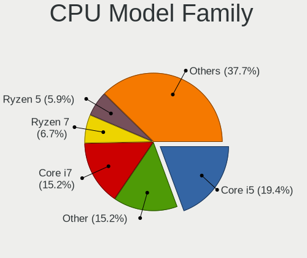

| Model                   | Computers | Percent |
|-------------------------|-----------|---------|
| Intel Core i5           | 55        | 20.07%  |
| Other                   | 40        | 14.6%   |
| Intel Core i7           | 36        | 13.14%  |
| Intel Core i3           | 16        | 5.84%   |
| AMD Ryzen 7             | 16        | 5.84%   |
| AMD Ryzen 5             | 16        | 5.84%   |
| Intel Celeron           | 11        | 4.01%   |
| Intel Core 2 Duo        | 10        | 3.65%   |
| AMD Ryzen 9             | 7         | 2.55%   |
| Intel Pentium Dual-Core | 5         | 1.82%   |
| Intel Pentium           | 5         | 1.82%   |
| Intel Atom              | 5         | 1.82%   |
| AMD Ryzen 3             | 5         | 1.82%   |
| Intel Xeon              | 3         | 1.09%   |
| Intel Pentium M         | 3         | 1.09%   |
| Intel Genuine           | 3         | 1.09%   |
| Intel Core 2            | 3         | 1.09%   |
| AMD Ryzen 7 PRO         | 3         | 1.09%   |
| Intel Pentium Silver    | 2         | 0.73%   |
| Intel Core 2 Quad       | 2         | 0.73%   |
| AMD Sempron             | 2         | 0.73%   |
| AMD Ryzen 5 PRO         | 2         | 0.73%   |
| AMD Phenom II X6        | 2         | 0.73%   |
| AMD FX                  | 2         | 0.73%   |
| AMD E2                  | 2         | 0.73%   |
| AMD A8                  | 2         | 0.73%   |
| Intel Pentium Dual      | 1         | 0.36%   |
| Intel Pentium D         | 1         | 0.36%   |
| Intel Pentium 4         | 1         | 0.36%   |
| Intel Core i9           | 1         | 0.36%   |
| Intel Core Duo          | 1         | 0.36%   |
| Intel Celeron M         | 1         | 0.36%   |
| AMD Phenom II X4        | 1         | 0.36%   |
| AMD GX                  | 1         | 0.36%   |
| AMD G                   | 1         | 0.36%   |
| AMD Embedded            | 1         | 0.36%   |
| AMD E1                  | 1         | 0.36%   |
| AMD E                   | 1         | 0.36%   |
| AMD Athlon II X2        | 1         | 0.36%   |
| AMD Athlon              | 1         | 0.36%   |

CPU Cores
---------

Number of processor cores

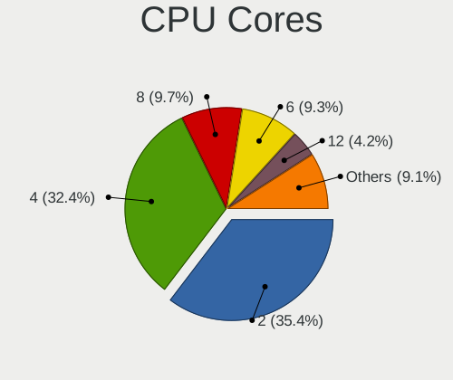

| Number | Computers | Percent |
|--------|-----------|---------|
| 2      | 102       | 37.23%  |
| 4      | 82        | 29.93%  |
| 6      | 29        | 10.58%  |
| 8      | 26        | 9.49%   |
| 1      | 13        | 4.74%   |
| 14     | 6         | 2.19%   |
| 16     | 5         | 1.82%   |
| 12     | 5         | 1.82%   |
| 10     | 5         | 1.82%   |
| 24     | 1         | 0.36%   |

CPU Sockets
-----------

Number of sockets

| Number | Computers | Percent |
|--------|-----------|---------|
| 1      | 272       | 99.27%  |
| 2      | 2         | 0.73%   |

CPU Threads
-----------

Threads per core (Hyper-Threading)

| Number | Computers | Percent |
|--------|-----------|---------|
| 2      | 175       | 63.87%  |
| 1      | 99        | 36.13%  |

CPU Op-Modes
------------

CPU Operation Modes (32-bit, 64-bit)

| Op mode        | Computers | Percent |
|----------------|-----------|---------|
| 32-bit, 64-bit | 263       | 95.99%  |
| 32-bit         | 11        | 4.01%   |

CPU Microcode
-------------

Microcode number

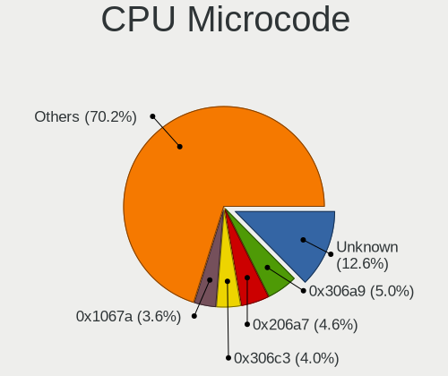

| Number     | Computers | Percent |
|------------|-----------|---------|
| Unknown    | 25        | 9.09%   |
| 0x306a9    | 15        | 5.45%   |
| 0x206a7    | 15        | 5.45%   |
| 0x306c3    | 11        | 4%      |
| 0x1067a    | 11        | 4%      |
| 0xb06e0    | 7         | 2.55%   |
| 0x40651    | 7         | 2.55%   |
| 0x806c1    | 6         | 2.18%   |
| 0x906e9    | 5         | 1.82%   |
| 0x806ec    | 5         | 1.82%   |
| 0x806e9    | 5         | 1.82%   |
| 0x506e3    | 5         | 1.82%   |
| 0x20655    | 5         | 1.82%   |
| 0x0a50000c | 5         | 1.82%   |
| 0x6fd      | 4         | 1.45%   |
| 0x406e3    | 4         | 1.45%   |
| 0x306d4    | 4         | 1.45%   |
| 0xb0671    | 3         | 1.09%   |
| 0x906ea    | 3         | 1.09%   |
| 0x906c0    | 3         | 1.09%   |
| 0x906a3    | 3         | 1.09%   |
| 0x806ea    | 3         | 1.09%   |
| 0x706a8    | 3         | 1.09%   |
| 0x6ec      | 3         | 1.09%   |
| 0x6d8      | 3         | 1.09%   |
| 0x10676    | 3         | 1.09%   |
| 0x0a50000f | 3         | 1.09%   |
| 0x0a50000d | 3         | 1.09%   |
| 0x08608104 | 3         | 1.09%   |
| 0x08608103 | 3         | 1.09%   |
| 0x08108109 | 3         | 1.09%   |
| 0x0810100b | 3         | 1.09%   |
| 0x010000c8 | 3         | 1.09%   |
| 0xb06a3    | 2         | 0.73%   |
| 0xb06a2    | 2         | 0.73%   |
| 0xa0653    | 2         | 0.73%   |
| 0xa0652    | 2         | 0.73%   |
| 0x906ec    | 2         | 0.73%   |
| 0x906a4    | 2         | 0.73%   |
| 0x90672    | 2         | 0.73%   |

CPU Microarch
-------------

Microarchitecture

| Name             | Computers | Percent |
|------------------|-----------|---------|
| KabyLake         | 30        | 10.91%  |
| Haswell          | 21        | 7.64%   |
| Alderlake Hybrid | 20        | 7.27%   |
| Unknown          | 19        | 6.91%   |
| IvyBridge        | 16        | 5.82%   |
| SandyBridge      | 15        | 5.45%   |
| Skylake          | 14        | 5.09%   |
| Penryn           | 14        | 5.09%   |
| Zen 3            | 13        | 4.73%   |
| Core             | 9         | 3.27%   |
| Zen              | 8         | 2.91%   |
| TigerLake        | 8         | 2.91%   |
| P6               | 7         | 2.55%   |
| Gracemont        | 7         | 2.55%   |
| Broadwell        | 7         | 2.55%   |
| Zen+             | 6         | 2.18%   |
| Zen 2            | 6         | 2.18%   |
| Westmere         | 6         | 2.18%   |
| Silvermont       | 6         | 2.18%   |
| K10              | 5         | 1.82%   |
| Icelake          | 5         | 1.82%   |
| Excavator        | 4         | 1.45%   |
| CometLake        | 4         | 1.45%   |
| Tremont          | 3         | 1.09%   |
| Piledriver       | 3         | 1.09%   |
| NetBurst         | 3         | 1.09%   |
| Goldmont plus    | 3         | 1.09%   |
| Bonnell          | 3         | 1.09%   |
| Puma             | 2         | 0.73%   |
| Jaguar           | 2         | 0.73%   |
| Bobcat           | 2         | 0.73%   |
| Steamroller      | 1         | 0.36%   |
| Nehalem          | 1         | 0.36%   |
| K8 & K10 hybrid  | 1         | 0.36%   |
| Goldmont         | 1         | 0.36%   |

Graphics
--------

GPU Vendor
----------

Vendors of graphics cards

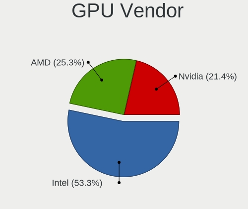

| Vendor | Computers | Percent |
|--------|-----------|---------|
| Intel  | 162       | 52.94%  |
| AMD    | 84        | 27.45%  |
| Nvidia | 60        | 19.61%  |

GPU Model
---------

Graphics card models

| Model                                                                                    | Computers | Percent |
|------------------------------------------------------------------------------------------|-----------|---------|
| Intel 2nd Generation Core Processor Family Integrated Graphics Controller                | 14        | 4.35%   |
| Intel 3rd Gen Core processor Graphics Controller                                         | 9         | 2.8%    |
| Intel Haswell-ULT Integrated Graphics Controller                                         | 7         | 2.17%   |
| Intel Alder Lake-N [UHD Graphics]                                                        | 7         | 2.17%   |
| AMD Cezanne [Radeon Vega Series / Radeon Vega Mobile Series]                             | 7         | 2.17%   |
| Intel Skylake GT2 [HD Graphics 520]                                                      | 6         | 1.86%   |
| Intel Raptor Lake-P [Iris Xe Graphics]                                                   | 6         | 1.86%   |
| Intel HD Graphics 620                                                                    | 6         | 1.86%   |
| AMD Lucienne                                                                             | 6         | 1.86%   |
| Intel TigerLake-LP GT2 [Iris Xe Graphics]                                                | 5         | 1.55%   |
| Intel HD Graphics 530                                                                    | 5         | 1.55%   |
| Intel Atom/Celeron/Pentium Processor x5-E8000/J3xxx/N3xxx Integrated Graphics Controller | 5         | 1.55%   |
| AMD Raphael                                                                              | 5         | 1.55%   |
| AMD Picasso/Raven 2 [Radeon Vega Series / Radeon Vega Mobile Series]                     | 5         | 1.55%   |
| Intel WhiskeyLake-U GT2 [UHD Graphics 620]                                               | 4         | 1.24%   |
| Intel Mobile 945GM/GMS/GME, 943/940GML Express Integrated Graphics Controller            | 4         | 1.24%   |
| Intel Mobile 945GM/GMS, 943/940GML Express Integrated Graphics Controller                | 4         | 1.24%   |
| Intel Mobile 4 Series Chipset Integrated Graphics Controller                             | 4         | 1.24%   |
| Intel HD Graphics 5500                                                                   | 4         | 1.24%   |
| Intel Core Processor Integrated Graphics Controller                                      | 4         | 1.24%   |
| Intel CometLake-U GT2 [UHD Graphics]                                                     | 4         | 1.24%   |
| Intel 4th Gen Core Processor Integrated Graphics Controller                              | 4         | 1.24%   |
| Intel 4 Series Chipset Integrated Graphics Controller                                    | 4         | 1.24%   |
| AMD Renoir [Radeon RX Vega 6 (Ryzen 4000/5000 Mobile Series)]                            | 4         | 1.24%   |
| AMD Rembrandt [Radeon 680M]                                                              | 4         | 1.24%   |
| Intel Xeon E3-1200 v3/4th Gen Core Processor Integrated Graphics Controller              | 3         | 0.93%   |
| Intel Xeon E3-1200 v2/3rd Gen Core processor Graphics Controller                         | 3         | 0.93%   |
| Intel Tiger Lake-LP GT2 [UHD Graphics G4]                                                | 3         | 0.93%   |
| Intel JasperLake [UHD Graphics]                                                          | 3         | 0.93%   |
| Intel HD Graphics 630                                                                    | 3         | 0.93%   |
| Intel CoffeeLake-S GT2 [UHD Graphics 630]                                                | 3         | 0.93%   |
| Intel Alder Lake-P GT2 [Iris Xe Graphics]                                                | 3         | 0.93%   |
| AMD Stoney [Radeon R2/R3/R4/R5 Graphics]                                                 | 3         | 0.93%   |
| AMD Raven Ridge [Radeon Vega Series / Radeon Vega Mobile Series]                         | 3         | 0.93%   |
| AMD Navi 23 [Radeon RX 6600/6600 XT/6600M]                                               | 3         | 0.93%   |
| AMD Cedar [Radeon HD 5000/6000/7350/8350 Series]                                         | 3         | 0.93%   |
| Nvidia TU117M [GeForce GTX 1650 Mobile / Max-Q]                                          | 2         | 0.62%   |
| Nvidia TU106 [GeForce RTX 2060 Rev. A]                                                   | 2         | 0.62%   |
| Nvidia GP107M [GeForce GTX 1050 Ti Mobile]                                               | 2         | 0.62%   |
| Nvidia GP106 [GeForce GTX 1060 6GB]                                                      | 2         | 0.62%   |

GPU Combo
---------

Combinations of graphics cards

| Name           | Computers | Percent |
|----------------|-----------|---------|
| 1 x Intel      | 120       | 43.64%  |
| 1 x AMD        | 70        | 25.45%  |
| 1 x Nvidia     | 35        | 12.73%  |
| Intel + Nvidia | 21        | 7.64%   |
| 2 x Intel      | 12        | 4.36%   |
| 2 x AMD        | 7         | 2.55%   |
| Intel + AMD    | 6         | 2.18%   |
| 2 x Nvidia     | 2         | 0.73%   |
| AMD + Nvidia   | 2         | 0.73%   |

GPU Driver
----------

Free vs proprietary

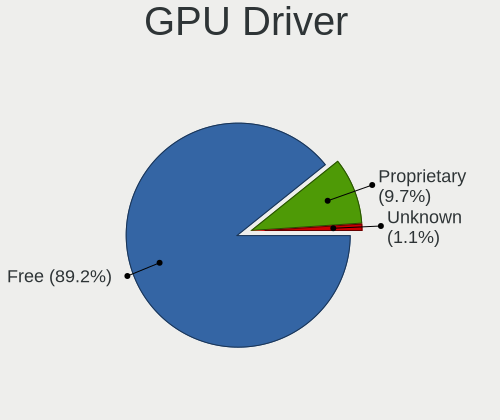

| Driver      | Computers | Percent |
|-------------|-----------|---------|
| Free        | 249       | 90.88%  |
| Proprietary | 23        | 8.39%   |
| Unknown     | 2         | 0.73%   |

GPU Memory
----------

Total video memory

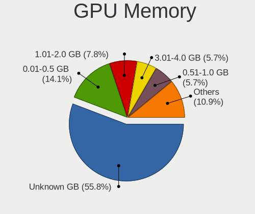

| Size in GB | Computers | Percent |
|------------|-----------|---------|
| Unknown    | 154       | 56.2%   |
| 0.01-0.5   | 41        | 14.96%  |
| 1.01-2.0   | 19        | 6.93%   |
| 0.51-1.0   | 17        | 6.2%    |
| 3.01-4.0   | 15        | 5.47%   |
| 7.01-8.0   | 13        | 4.74%   |
| 5.01-6.0   | 8         | 2.92%   |
| 2.01-3.0   | 3         | 1.09%   |
| 8.01-16.0  | 3         | 1.09%   |
| 16.01-24.0 | 1         | 0.36%   |

Monitor
-------

Monitor Vendor
--------------

Monitor vendors

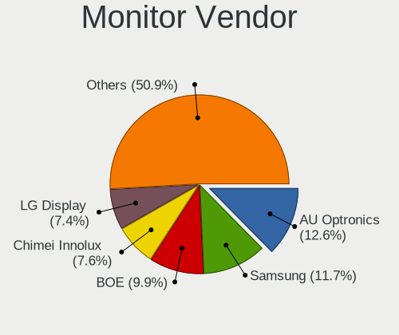

| Vendor                  | Computers | Percent |
|-------------------------|-----------|---------|
| BOE                     | 35        | 12.07%  |
| AU Optronics            | 33        | 11.38%  |
| Samsung Electronics     | 31        | 10.69%  |
| Chimei Innolux          | 24        | 8.28%   |
| LG Display              | 21        | 7.24%   |
| Goldstar                | 18        | 6.21%   |
| Hewlett-Packard         | 11        | 3.79%   |
| Dell                    | 11        | 3.79%   |
| Apple                   | 10        | 3.45%   |
| Acer                    | 9         | 3.1%    |
| Philips                 | 8         | 2.76%   |
| Lenovo                  | 7         | 2.41%   |
| Ancor Communications    | 7         | 2.41%   |
| Sharp                   | 6         | 2.07%   |
| AOC                     | 6         | 2.07%   |
| Iiyama                  | 4         | 1.38%   |
| HUAWEI                  | 4         | 1.38%   |
| BenQ                    | 4         | 1.38%   |
| Mi                      | 3         | 1.03%   |
| LG Philips              | 3         | 1.03%   |
| ASUSTek Computer        | 3         | 1.03%   |
| ViewSonic               | 2         | 0.69%   |
| Toshiba                 | 2         | 0.69%   |
| PANDA                   | 2         | 0.69%   |
| Panasonic               | 2         | 0.69%   |
| GreenWood               | 2         | 0.69%   |
| Eizo                    | 2         | 0.69%   |
| Chi Mei Optoelectronics | 2         | 0.69%   |
| Unknown                 | 1         | 0.34%   |
| STA                     | 1         | 0.34%   |
| Sceptre                 | 1         | 0.34%   |
| RTK                     | 1         | 0.34%   |
| RGT                     | 1         | 0.34%   |
| Quanta Display          | 1         | 0.34%   |
| NEC Computers           | 1         | 0.34%   |
| LG Electronics          | 1         | 0.34%   |
| LBT                     | 1         | 0.34%   |
| KDB                     | 1         | 0.34%   |
| InnoLux Display         | 1         | 0.34%   |
| InfoVision              | 1         | 0.34%   |

Monitor Model
-------------

Monitor models

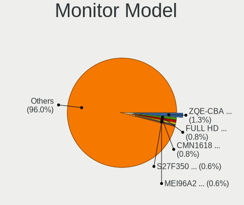

| Model                                                                | Computers | Percent |
|----------------------------------------------------------------------|-----------|---------|
| HUAWEI ZQE-CBA HWV6A25 3440x1440 797x334mm 34.0-inch                 | 4         | 1.36%   |
| Samsung Electronics S27F350 SAM0D22 1920x1080 600x340mm 27.2-inch    | 3         | 1.02%   |
| Chimei Innolux LCD Monitor CMN1618 1920x1200 344x215mm 16.0-inch     | 3         | 1.02%   |
| Samsung Electronics SyncMaster SAM0456 1360x768 410x230mm 18.5-inch  | 2         | 0.68%   |
| Samsung Electronics S24D330 SAM0D92 1920x1080 531x299mm 24.0-inch    | 2         | 0.68%   |
| Samsung Electronics LCD Monitor SEC3047 1366x768 277x156mm 12.5-inch | 2         | 0.68%   |
| Philips 247E4 PHLC0C0 1920x1080 521x293mm 23.5-inch                  | 2         | 0.68%   |
| Panasonic VVX13F009G00 MEI96A2 1920x1080 344x193mm 15.5-inch         | 2         | 0.68%   |
| Mi Redmi Monitor XMI23C3 1920x1080 527x293mm 23.7-inch               | 2         | 0.68%   |
| Lenovo LEN G32qc-10 LEN66A2 2560x1440 698x392mm 31.5-inch            | 2         | 0.68%   |
| Goldstar TV SSCR2 GSMC0C8 3840x2160                                  | 2         | 0.68%   |
| Goldstar FULL HD GSM5B55 1920x1080 480x270mm 21.7-inch               | 2         | 0.68%   |
| Dell U2720QM DEL41BC 3840x2160 597x336mm 27.0-inch                   | 2         | 0.68%   |
| Chimei Innolux LCD Monitor CMN14D5 1920x1080 309x173mm 13.9-inch     | 2         | 0.68%   |
| BOE LCD Monitor BOE095F 2256x1504 285x190mm 13.5-inch                | 2         | 0.68%   |
| BOE LCD Monitor BOE092F 2520x1680 338x226mm 16.0-inch                | 2         | 0.68%   |
| BOE LCD Monitor BOE0704 1366x768 344x194mm 15.5-inch                 | 2         | 0.68%   |
| AU Optronics LCD Monitor AUO45EC 1366x768 344x193mm 15.5-inch        | 2         | 0.68%   |
| AU Optronics LCD Monitor AUO229E 1920x1080 309x174mm 14.0-inch       | 2         | 0.68%   |
| AU Optronics LCD Monitor AUO219D 1920x1080 381x214mm 17.2-inch       | 2         | 0.68%   |
| Apple iMac APPA012 1920x1080 475x267mm 21.5-inch                     | 2         | 0.68%   |
| ViewSonic VX2778 Series VSC8432 2560x1440 597x336mm 27.0-inch        | 1         | 0.34%   |
| ViewSonic VX2457 VSCB931 1920x1080 521x293mm 23.5-inch               | 1         | 0.34%   |
| Unknown LCD Monitor CSO 2560x1600                                    | 1         | 0.34%   |
| Toshiba TV TSB0104 720x576 1960x1420mm 95.3-inch                     | 1         | 0.34%   |
| Toshiba ScreenXpert TSB8888 1080x2160                                | 1         | 0.34%   |
| STA LCD Monitor STA5DCA 1366x768 256x144mm 11.6-inch                 | 1         | 0.34%   |
| Sharp LQ156M1JW09 SHP14D3 1920x1080 344x194mm 15.5-inch              | 1         | 0.34%   |
| Sharp LCD Monitor SHP1518 1920x1200 366x229mm 17.0-inch              | 1         | 0.34%   |
| Sharp LCD Monitor SHP14FA 3840x2400 288x180mm 13.4-inch              | 1         | 0.34%   |
| Sharp LCD Monitor SHP1449 1920x1080 294x165mm 13.3-inch              | 1         | 0.34%   |
| Sharp LCD Monitor SHP13CA 1280x800 331x207mm 15.4-inch               | 1         | 0.34%   |
| Sharp LCD Monitor SHP13B4 1024x768 304x228mm 15.0-inch               | 1         | 0.34%   |
| Sceptre LCD Monitor M24 3840x1080                                    | 1         | 0.34%   |
| Sceptre LCD Monitor M24                                              | 1         | 0.34%   |
| Samsung Electronics U28E570 SAM0D71 1920x1080 607x345mm 27.5-inch    | 1         | 0.34%   |
| Samsung Electronics T27D390 SAM0B71 1920x1080 598x336mm 27.0-inch    | 1         | 0.34%   |
| Samsung Electronics T23B550 SAM0959 1920x1080 510x287mm 23.0-inch    | 1         | 0.34%   |
| Samsung Electronics SyncMaster SAM059A 1920x1080 477x268mm 21.5-inch | 1         | 0.34%   |
| Samsung Electronics SyncMaster SAM036F 1440x900 428x255mm 19.6-inch  | 1         | 0.34%   |

Monitor Resolution
------------------

Monitor screen resolution

| Resolution         | Computers | Percent |
|--------------------|-----------|---------|
| 1920x1080 (FHD)    | 107       | 38.21%  |
| 1366x768 (WXGA)    | 49        | 17.5%   |
| 3840x2160 (4K)     | 28        | 10%     |
| 2560x1440 (QHD)    | 12        | 4.29%   |
| 1920x1200 (WUXGA)  | 12        | 4.29%   |
| 1600x900 (HD+)     | 9         | 3.21%   |
| 1280x800 (WXGA)    | 8         | 2.86%   |
| 3440x1440          | 7         | 2.5%    |
| 1680x1050 (WSXGA+) | 6         | 2.14%   |
| 1440x900 (WXGA+)   | 6         | 2.14%   |
| 1280x1024 (SXGA)   | 6         | 2.14%   |
| 3840x1080          | 4         | 1.43%   |
| 2560x1600          | 3         | 1.07%   |
| 2560x1080          | 3         | 1.07%   |
| 1360x768           | 3         | 1.07%   |
| 1024x768 (XGA)     | 3         | 1.07%   |
| Unknown            | 3         | 1.07%   |
| 2520x1680          | 2         | 0.71%   |
| 2256x1504          | 2         | 0.71%   |
| 3840x2400          | 1         | 0.36%   |
| 2160x1440          | 1         | 0.36%   |
| 1920x540           | 1         | 0.36%   |
| 1920x1280          | 1         | 0.36%   |
| 1680x945           | 1         | 0.36%   |
| 1280x720 (HD)      | 1         | 0.36%   |
| 1024x600           | 1         | 0.36%   |

Monitor Diagonal
----------------

Diagonal size in inches

| Inches  | Computers | Percent |
|---------|-----------|---------|
| 15      | 70        | 24.14%  |
| 13      | 25        | 8.62%   |
| 24      | 22        | 7.59%   |
| 27      | 20        | 6.9%    |
| 17      | 18        | 6.21%   |
| 14      | 18        | 6.21%   |
| 21      | 15        | 5.17%   |
| 23      | 14        | 4.83%   |
| 34      | 9         | 3.1%    |
| 31      | 8         | 2.76%   |
| 19      | 8         | 2.76%   |
| 16      | 8         | 2.76%   |
| Unknown | 8         | 2.76%   |
| 22      | 6         | 2.07%   |
| 11      | 6         | 2.07%   |
| 18      | 5         | 1.72%   |
| 12      | 5         | 1.72%   |
| 84      | 3         | 1.03%   |
| 20      | 3         | 1.03%   |
| 72      | 2         | 0.69%   |
| 54      | 2         | 0.69%   |
| 42      | 2         | 0.69%   |
| 32      | 2         | 0.69%   |
| 26      | 2         | 0.69%   |
| 95      | 1         | 0.34%   |
| 86      | 1         | 0.34%   |
| 57      | 1         | 0.34%   |
| 48      | 1         | 0.34%   |
| 46      | 1         | 0.34%   |
| 40      | 1         | 0.34%   |
| 35      | 1         | 0.34%   |
| 8       | 1         | 0.34%   |
| 7       | 1         | 0.34%   |

Monitor Width
-------------

Physical width

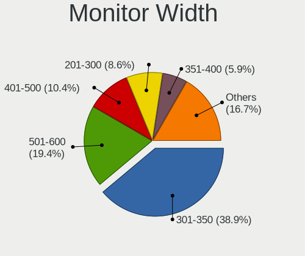

| Width in mm | Computers | Percent |
|-------------|-----------|---------|
| 301-350     | 105       | 36.59%  |
| 501-600     | 55        | 19.16%  |
| 401-500     | 31        | 10.8%   |
| 201-300     | 26        | 9.06%   |
| 351-400     | 24        | 8.36%   |
| 701-800     | 12        | 4.18%   |
| 601-700     | 9         | 3.14%   |
| Unknown     | 8         | 2.79%   |
| 1501-2000   | 6         | 2.09%   |
| 1001-1500   | 5         | 1.74%   |
| 801-900     | 2         | 0.7%    |
| 101-200     | 2         | 0.7%    |
| 901-1000    | 2         | 0.7%    |

Aspect Ratio
------------

Proportional relationship between the width and the height

| Ratio   | Computers | Percent |
|---------|-----------|---------|
| 16/9    | 198       | 72.26%  |
| 16/10   | 38        | 13.87%  |
| 21/9    | 10        | 3.65%   |
| Unknown | 8         | 2.92%   |
| 5/4     | 7         | 2.55%   |
| 3/2     | 6         | 2.19%   |
| 4/3     | 4         | 1.46%   |
| 0.56    | 2         | 0.73%   |
| 32/9    | 1         | 0.36%   |

Monitor Area
------------

Area in inch

| Area in inch | Computers | Percent |
|----------------|-----------|---------|
| 101-110        | 69        | 24.13%  |
| 201-250        | 41        | 14.34%  |
| 81-90          | 34        | 11.89%  |
| 301-350        | 21        | 7.34%   |
| 351-500        | 20        | 6.99%   |
| 121-130        | 14        | 4.9%    |
| 151-200        | 13        | 4.55%   |
| 251-300        | 11        | 3.85%   |
| More than 1000 | 10        | 3.5%    |
| 71-80          | 8         | 2.8%    |
| 111-120        | 8         | 2.8%    |
| Unknown        | 8         | 2.8%    |
| 141-150        | 7         | 2.45%   |
| 51-60          | 6         | 2.1%    |
| 61-70          | 5         | 1.75%   |
| 501-1000       | 5         | 1.75%   |
| 1-40           | 2         | 0.7%    |
| 131-140        | 2         | 0.7%    |
| 91-100         | 2         | 0.7%    |

Pixel Density
-------------

Pixels per inch

| Density       | Computers | Percent |
|---------------|-----------|---------|
| 51-100        | 96        | 34.16%  |
| 101-120       | 73        | 25.98%  |
| 121-160       | 68        | 24.2%   |
| 161-240       | 24        | 8.54%   |
| Unknown       | 8         | 2.85%   |
| More than 240 | 7         | 2.49%   |
| 1-50          | 5         | 1.78%   |

Multiple Monitors
-----------------

Total monitors connected

| Total | Computers | Percent |
|-------|-----------|---------|
| 1     | 244       | 88.73%  |
| 2     | 27        | 9.82%   |
| 0     | 2         | 0.73%   |
| 4     | 1         | 0.36%   |
| 3     | 1         | 0.36%   |

Network
-------

Net Controller Vendor
---------------------

Controller vendors

| Vendor                                | Computers | Percent |
|---------------------------------------|-----------|---------|
| Realtek Semiconductor                 | 157       | 38.86%  |
| Intel                                 | 108       | 26.73%  |
| Qualcomm Atheros                      | 40        | 9.9%    |
| Broadcom                              | 20        | 4.95%   |
| MediaTek                              | 15        | 3.71%   |
| Broadcom Limited                      | 10        | 2.48%   |
| Marvell Technology Group              | 8         | 1.98%   |
| TP-Link                               | 6         | 1.49%   |
| Ralink                                | 4         | 0.99%   |
| Qualcomm                              | 4         | 0.99%   |
| Samsung Electronics                   | 3         | 0.74%   |
| Ralink Technology                     | 3         | 0.74%   |
| Nvidia                                | 3         | 0.74%   |
| ASIX Electronics                      | 3         | 0.74%   |
| VIA Technologies                      | 2         | 0.5%    |
| QinHeng Electronics                   | 2         | 0.5%    |
| NetGear                               | 2         | 0.5%    |
| JMicron Technology                    | 2         | 0.5%    |
| U-Blox                                | 1         | 0.25%   |
| Sierra Wireless                       | 1         | 0.25%   |
| Mercucys                              | 1         | 0.25%   |
| Lenovo                                | 1         | 0.25%   |
| Ericsson Business Mobile Networks     | 1         | 0.25%   |
| Edimax Technology                     | 1         | 0.25%   |
| DisplayLink                           | 1         | 0.25%   |
| Dell                                  | 1         | 0.25%   |
| D-Link                                | 1         | 0.25%   |
| Cisco Aironet Wireless Communications | 1         | 0.25%   |
| Aquantia                              | 1         | 0.25%   |
| AMD                                   | 1         | 0.25%   |

Net Controller Model
--------------------

Controller models

| Model                                                                   | Computers | Percent |
|-------------------------------------------------------------------------|-----------|---------|
| Realtek RTL8111/8168/8211/8411 PCI Express Gigabit Ethernet Controller  | 97        | 19.88%  |
| Realtek RTL810xE PCI Express Fast Ethernet controller                   | 17        | 3.48%   |
| Realtek RTL8821CE 802.11ac PCIe Wireless Network Adapter                | 15        | 3.07%   |
| Realtek RTL8125 2.5GbE Controller                                       | 15        | 3.07%   |
| Intel 82579LM Gigabit Network Connection (Lewisville)                   | 13        | 2.66%   |
| Realtek RTL8822CE 802.11ac PCIe Wireless Network Adapter                | 9         | 1.84%   |
| Qualcomm Atheros QCA9377 802.11ac Wireless Network Adapter              | 8         | 1.64%   |
| Intel Centrino Advanced-N 6205 [Taylor Peak]                            | 7         | 1.43%   |
| Qualcomm Atheros QCA9565 / AR9565 Wireless Network Adapter              | 6         | 1.23%   |
| Intel Wireless 7260                                                     | 6         | 1.23%   |
| Intel Wi-Fi 6E(802.11ax) AX210/AX1675* 2x2 [Typhoon Peak]               | 6         | 1.23%   |
| Intel Wi-Fi 6 AX200                                                     | 6         | 1.23%   |
| Realtek RTL8852BE PCIe 802.11ax Wireless Network Controller             | 5         | 1.02%   |
| Qualcomm Atheros AR9285 Wireless Network Adapter (PCI-Express)          | 5         | 1.02%   |
| MediaTek Wi-Fi 6E MT7902 Wireless Network Adapter                       | 5         | 1.02%   |
| Intel Wireless 7265                                                     | 5         | 1.02%   |
| Intel Alder Lake-P PCH CNVi WiFi                                        | 5         | 1.02%   |
| Broadcom NetXtreme BCM57766 Gigabit Ethernet PCIe                       | 5         | 1.02%   |
| Realtek RTL8153 Gigabit Ethernet Adapter                                | 4         | 0.82%   |
| Realtek RTL-8100/8101L/8139 PCI Fast Ethernet Adapter                   | 4         | 0.82%   |
| Qualcomm Atheros AR9485 Wireless Network Adapter                        | 4         | 0.82%   |
| Qualcomm Atheros AR8131 Gigabit Ethernet                                | 4         | 0.82%   |
| MediaTek MT7922 802.11ax PCI Express Wireless Network Adapter           | 4         | 0.82%   |
| MediaTek MT7921 802.11ax PCI Express Wireless Network Adapter           | 4         | 0.82%   |
| Intel Wireless 8265 / 8275                                              | 4         | 0.82%   |
| Intel Raptor Lake-S PCH CNVi WiFi                                       | 4         | 0.82%   |
| Intel Ethernet Connection I219-LM                                       | 4         | 0.82%   |
| Intel Dual Band Wireless-AC 3168NGW [Stone Peak]                        | 4         | 0.82%   |
| Realtek RTL88x2bu [AC1200 Techkey]                                      | 3         | 0.61%   |
| Realtek RTL8723BE PCIe Wireless Network Adapter                         | 3         | 0.61%   |
| Qualcomm QCNFA765 Wireless Network Adapter                              | 3         | 0.61%   |
| Qualcomm Atheros QCA6174 802.11ac Wireless Network Adapter              | 3         | 0.61%   |
| Qualcomm Atheros AR8151 v2.0 Gigabit Ethernet                           | 3         | 0.61%   |
| Qualcomm Atheros AR242x / AR542x Wireless Network Adapter (PCI-Express) | 3         | 0.61%   |
| Marvell Group 88E8053 PCI-E Gigabit Ethernet Controller                 | 3         | 0.61%   |
| Intel Wireless 8260                                                     | 3         | 0.61%   |
| Intel Raptor Lake PCH CNVi WiFi                                         | 3         | 0.61%   |
| Intel PRO/Wireless 5100 AGN [Shiloh] Network Connection                 | 3         | 0.61%   |
| Intel Ethernet Connection I217-LM                                       | 3         | 0.61%   |
| Intel Ethernet Connection (2) I219-V                                    | 3         | 0.61%   |

Wireless Vendor
---------------

Wireless vendors

| Vendor                                | Computers | Percent |
|---------------------------------------|-----------|---------|
| Intel                                 | 85        | 36.17%  |
| Realtek Semiconductor                 | 55        | 23.4%   |
| Qualcomm Atheros                      | 33        | 14.04%  |
| MediaTek                              | 15        | 6.38%   |
| Broadcom                              | 15        | 6.38%   |
| Broadcom Limited                      | 7         | 2.98%   |
| TP-Link                               | 6         | 2.55%   |
| Ralink                                | 4         | 1.7%    |
| Qualcomm                              | 4         | 1.7%    |
| Ralink Technology                     | 3         | 1.28%   |
| NetGear                               | 2         | 0.85%   |
| Sierra Wireless                       | 1         | 0.43%   |
| Mercucys                              | 1         | 0.43%   |
| Edimax Technology                     | 1         | 0.43%   |
| Dell                                  | 1         | 0.43%   |
| D-Link                                | 1         | 0.43%   |
| Cisco Aironet Wireless Communications | 1         | 0.43%   |

Wireless Model
--------------

Wireless models

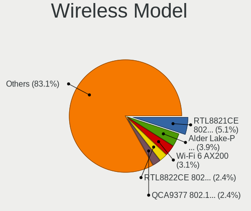

| Model                                                                         | Computers | Percent |
|-------------------------------------------------------------------------------|-----------|---------|
| Realtek RTL8821CE 802.11ac PCIe Wireless Network Adapter                      | 15        | 6.28%   |
| Realtek RTL8822CE 802.11ac PCIe Wireless Network Adapter                      | 9         | 3.77%   |
| Qualcomm Atheros QCA9377 802.11ac Wireless Network Adapter                    | 8         | 3.35%   |
| Intel Centrino Advanced-N 6205 [Taylor Peak]                                  | 7         | 2.93%   |
| Qualcomm Atheros QCA9565 / AR9565 Wireless Network Adapter                    | 6         | 2.51%   |
| Intel Wireless 7260                                                           | 6         | 2.51%   |
| Intel Wi-Fi 6E(802.11ax) AX210/AX1675* 2x2 [Typhoon Peak]                     | 6         | 2.51%   |
| Intel Wi-Fi 6 AX200                                                           | 6         | 2.51%   |
| Realtek RTL8852BE PCIe 802.11ax Wireless Network Controller                   | 5         | 2.09%   |
| Qualcomm Atheros AR9285 Wireless Network Adapter (PCI-Express)                | 5         | 2.09%   |
| MediaTek Wi-Fi 6E MT7902 Wireless Network Adapter                             | 5         | 2.09%   |
| Intel Wireless 7265                                                           | 5         | 2.09%   |
| Intel Alder Lake-P PCH CNVi WiFi                                              | 5         | 2.09%   |
| Qualcomm Atheros AR9485 Wireless Network Adapter                              | 4         | 1.67%   |
| MediaTek MT7922 802.11ax PCI Express Wireless Network Adapter                 | 4         | 1.67%   |
| MediaTek MT7921 802.11ax PCI Express Wireless Network Adapter                 | 4         | 1.67%   |
| Intel Wireless 8265 / 8275                                                    | 4         | 1.67%   |
| Intel Raptor Lake-S PCH CNVi WiFi                                             | 4         | 1.67%   |
| Intel Dual Band Wireless-AC 3168NGW [Stone Peak]                              | 4         | 1.67%   |
| Realtek RTL88x2bu [AC1200 Techkey]                                            | 3         | 1.26%   |
| Realtek RTL8723BE PCIe Wireless Network Adapter                               | 3         | 1.26%   |
| Qualcomm QCNFA765 Wireless Network Adapter                                    | 3         | 1.26%   |
| Qualcomm Atheros QCA6174 802.11ac Wireless Network Adapter                    | 3         | 1.26%   |
| Qualcomm Atheros AR242x / AR542x Wireless Network Adapter (PCI-Express)       | 3         | 1.26%   |
| Intel Wireless 8260                                                           | 3         | 1.26%   |
| Intel Raptor Lake PCH CNVi WiFi                                               | 3         | 1.26%   |
| Intel PRO/Wireless 5100 AGN [Shiloh] Network Connection                       | 3         | 1.26%   |
| Broadcom Limited BCM4360 802.11ac Dual Band Wireless Network Adapter          | 3         | 1.26%   |
| Broadcom BCM4313 802.11bgn Wireless Network Adapter                           | 3         | 1.26%   |
| TP-Link TL-WN823N v2/v3 [Realtek RTL8192EU]                                   | 2         | 0.84%   |
| Realtek RTL8852AE 802.11ax PCIe Wireless Network Adapter                      | 2         | 0.84%   |
| Realtek RTL8192CU 802.11n WLAN Adapter                                        | 2         | 0.84%   |
| Realtek RTL8191SEvB Wireless LAN Controller                                   | 2         | 0.84%   |
| Realtek RTL8188CE 802.11b/g/n WiFi Adapter                                    | 2         | 0.84%   |
| Ralink RT3290 Wireless 802.11n 1T/1R PCIe                                     | 2         | 0.84%   |
| Qualcomm Atheros AR2413/AR2414 Wireless Network Adapter [AR5005G(S) 802.11bg] | 2         | 0.84%   |
| Intel Wireless 3165                                                           | 2         | 0.84%   |
| Intel Wi-Fi 6 AX201 160MHz                                                    | 2         | 0.84%   |
| Intel Wi-Fi 6 AX201                                                           | 2         | 0.84%   |
| Intel Tiger Lake PCH CNVi WiFi                                                | 2         | 0.84%   |

Ethernet Vendor
---------------

Ethernet vendors

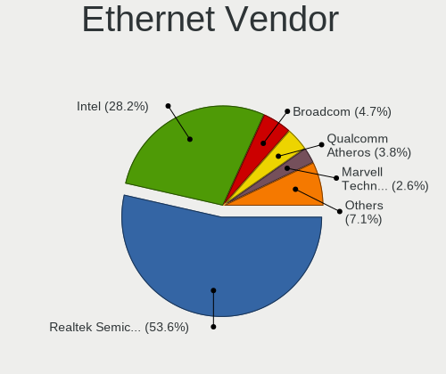

| Vendor                   | Computers | Percent |
|--------------------------|-----------|---------|
| Realtek Semiconductor    | 136       | 57.14%  |
| Intel                    | 56        | 23.53%  |
| Broadcom                 | 10        | 4.2%    |
| Qualcomm Atheros         | 9         | 3.78%   |
| Marvell Technology Group | 8         | 3.36%   |
| Samsung Electronics      | 3         | 1.26%   |
| Nvidia                   | 3         | 1.26%   |
| Broadcom Limited         | 3         | 1.26%   |
| ASIX Electronics         | 3         | 1.26%   |
| VIA Technologies         | 2         | 0.84%   |
| JMicron Technology       | 2         | 0.84%   |
| Lenovo                   | 1         | 0.42%   |
| DisplayLink              | 1         | 0.42%   |
| Aquantia                 | 1         | 0.42%   |

Ethernet Model
--------------

Ethernet models

| Model                                                                  | Computers | Percent |
|------------------------------------------------------------------------|-----------|---------|
| Realtek RTL8111/8168/8211/8411 PCI Express Gigabit Ethernet Controller | 97        | 39.92%  |
| Realtek RTL810xE PCI Express Fast Ethernet controller                  | 17        | 7%      |
| Realtek RTL8125 2.5GbE Controller                                      | 15        | 6.17%   |
| Intel 82579LM Gigabit Network Connection (Lewisville)                  | 13        | 5.35%   |
| Broadcom NetXtreme BCM57766 Gigabit Ethernet PCIe                      | 5         | 2.06%   |
| Realtek RTL8153 Gigabit Ethernet Adapter                               | 4         | 1.65%   |
| Realtek RTL-8100/8101L/8139 PCI Fast Ethernet Adapter                  | 4         | 1.65%   |
| Qualcomm Atheros AR8131 Gigabit Ethernet                               | 4         | 1.65%   |
| Intel Ethernet Connection I219-LM                                      | 4         | 1.65%   |
| Qualcomm Atheros AR8151 v2.0 Gigabit Ethernet                          | 3         | 1.23%   |
| Marvell Group 88E8053 PCI-E Gigabit Ethernet Controller                | 3         | 1.23%   |
| Intel Ethernet Connection I217-LM                                      | 3         | 1.23%   |
| Intel Ethernet Connection (2) I219-V                                   | 3         | 1.23%   |
| ASIX AX88179 Gigabit Ethernet                                          | 3         | 1.23%   |
| Samsung Galaxy series, misc. (tethering mode)                          | 2         | 0.82%   |
| Qualcomm Atheros Killer E220x Gigabit Ethernet Controller              | 2         | 0.82%   |
| Nvidia MCP79 Ethernet                                                  | 2         | 0.82%   |
| JMicron JMC250 PCI Express Gigabit Ethernet Controller                 | 2         | 0.82%   |
| Intel I211 Gigabit Network Connection                                  | 2         | 0.82%   |
| Intel Ethernet Controller I226-V                                       | 2         | 0.82%   |
| Intel Ethernet Connection (7) I219-V                                   | 2         | 0.82%   |
| Intel Ethernet Connection (6) I219-LM                                  | 2         | 0.82%   |
| Intel Ethernet Connection (5) I219-LM                                  | 2         | 0.82%   |
| Intel Ethernet Connection (2) I218-V                                   | 2         | 0.82%   |
| VIA VT6105/VT6106S [Rhine-III]                                         | 1         | 0.41%   |
| VIA VT6102/VT6103 [Rhine-II]                                           | 1         | 0.41%   |
| Samsung GT-I9070 (network tethering, USB debugging enabled)            | 1         | 0.41%   |
| Realtek USB 10/100/1G/2.5G LAN                                         | 1         | 0.41%   |
| Realtek Killer E3000 2.5GbE Controller                                 | 1         | 0.41%   |
| Nvidia MCP77 Ethernet                                                  | 1         | 0.41%   |
| Marvell Group 88E8057 PCI-E Gigabit Ethernet Controller                | 1         | 0.41%   |
| Marvell Group 88E8055 PCI-E Gigabit Ethernet Controller                | 1         | 0.41%   |
| Marvell Group 88E8042 PCI-E Fast Ethernet Controller                   | 1         | 0.41%   |
| Marvell Group 88E8040 PCI-E Fast Ethernet Controller                   | 1         | 0.41%   |
| Marvell Group 88E8038 PCI-E Fast Ethernet Controller                   | 1         | 0.41%   |
| Lenovo ThinkPad Lan                                                    | 1         | 0.41%   |
| Intel I210 Gigabit Network Connection                                  | 1         | 0.41%   |
| Intel Ethernet Controller I225-V                                       | 1         | 0.41%   |
| Intel Ethernet Connection I218-V                                       | 1         | 0.41%   |
| Intel Ethernet Connection I217-V                                       | 1         | 0.41%   |

Net Controller Kind
-------------------

Ethernet, WiFi or modem

| Kind     | Computers | Percent |
|----------|-----------|---------|
| Ethernet | 229       | 50%     |
| WiFi     | 223       | 48.69%  |
| Modem    | 6         | 1.31%   |

Used Controller
---------------

Currently used network controller

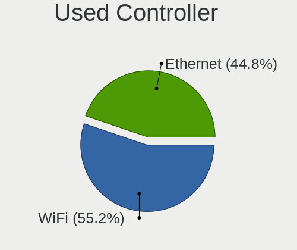

| Kind     | Computers | Percent |
|----------|-----------|---------|
| WiFi     | 160       | 54.61%  |
| Ethernet | 133       | 45.39%  |

NICs
----

Total network controllers on board

| Total | Computers | Percent |
|-------|-----------|---------|
| 2     | 151       | 54.91%  |
| 1     | 114       | 41.45%  |
| 3     | 9         | 3.27%   |
| 0     | 1         | 0.36%   |

IPv6
----

IPv6 vs IPv4

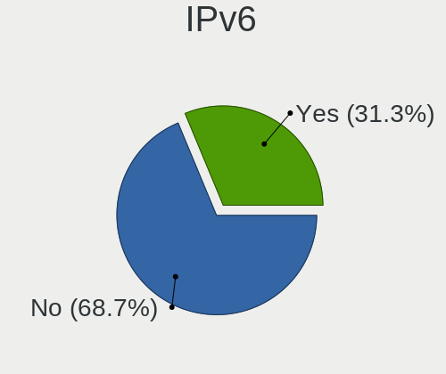

| Used | Computers | Percent |
|------|-----------|---------|
| No   | 191       | 68.46%  |
| Yes  | 88        | 31.54%  |

Bluetooth
---------

Bluetooth Vendor
----------------

Controller vendors

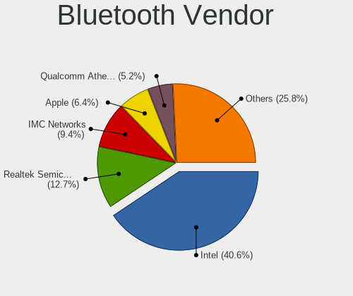

| Vendor                          | Computers | Percent |
|---------------------------------|-----------|---------|
| Intel                           | 67        | 35.64%  |
| Realtek Semiconductor           | 27        | 14.36%  |
| IMC Networks                    | 17        | 9.04%   |
| Apple                           | 13        | 6.91%   |
| Qualcomm Atheros Communications | 11        | 5.85%   |
| Cambridge Silicon Radio         | 10        | 5.32%   |
| Broadcom                        | 10        | 5.32%   |
| Lite-On Technology              | 5         | 2.66%   |
| Foxconn / Hon Hai               | 5         | 2.66%   |
| MediaTek                        | 4         | 2.13%   |
| Realtek                         | 3         | 1.6%    |
| USI                             | 2         | 1.06%   |
| Ralink                          | 2         | 1.06%   |
| Hewlett-Packard                 | 2         | 1.06%   |
| Dell                            | 2         | 1.06%   |
| ASUSTek Computer                | 2         | 1.06%   |
| Askey Computer                  | 2         | 1.06%   |
| Toshiba                         | 1         | 0.53%   |
| Logitech                        | 1         | 0.53%   |
| Integrated System Solution      | 1         | 0.53%   |
| Unknown                         | 1         | 0.53%   |

Bluetooth Model
---------------

Controller models

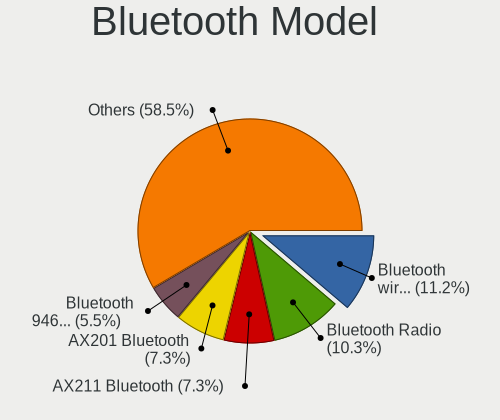

| Model                                               | Computers | Percent |
|-----------------------------------------------------|-----------|---------|
| Realtek Bluetooth Radio                             | 20        | 10.64%  |
| Intel Bluetooth wireless interface                  | 14        | 7.45%   |
| Intel AX201 Bluetooth                               | 13        | 6.91%   |
| Cambridge Silicon Radio Bluetooth Dongle (HCI mode) | 10        | 5.32%   |
| Intel AX211 Bluetooth                               | 9         | 4.79%   |
| Intel Bluetooth 9460/9560 Jefferson Peak (JfP)      | 8         | 4.26%   |
| IMC Networks Wireless_Device                        | 8         | 4.26%   |
| Qualcomm Atheros  Bluetooth Device                  | 7         | 3.72%   |
| Intel Bluetooth Device                              | 7         | 3.72%   |
| Intel AX200 Bluetooth                               | 6         | 3.19%   |
| Apple Bluetooth Host Controller                     | 6         | 3.19%   |
| Intel AX210 Bluetooth                               | 5         | 2.66%   |
| IMC Networks Bluetooth Radio                        | 5         | 2.66%   |
| Realtek  Bluetooth 4.2 Adapter                      | 4         | 2.13%   |
| MediaTek Wireless_Device                            | 4         | 2.13%   |
| Intel Wireless-AC 3168 Bluetooth                    | 4         | 2.13%   |
| Realtek 802.11ac WLAN Adapter                       | 3         | 1.6%    |
| Realtek Bluetooth Radio                             | 3         | 1.6%    |
| IMC Networks Bluetooth Device                       | 3         | 1.6%    |
| Broadcom BCM20702 Bluetooth 4.0 [ThinkPad]          | 3         | 1.6%    |
| Apple Bluetooth USB Host Controller                 | 3         | 1.6%    |
| Apple Bluetooth HCI                                 | 3         | 1.6%    |
| USI Bluetooth Device                                | 2         | 1.06%   |
| Ralink RT3290 Bluetooth                             | 2         | 1.06%   |
| Qualcomm Atheros QCA61x4 Bluetooth 4.0              | 2         | 1.06%   |
| Lite-On Qualcomm Atheros QCA9377 Bluetooth          | 2         | 1.06%   |
| Lite-On Atheros AR3012 Bluetooth                    | 2         | 1.06%   |
| Foxconn / Hon Hai Wireless_Device                   | 2         | 1.06%   |
| Askey Bluetooth Device                              | 2         | 1.06%   |
| Toshiba RT Bluetooth Radio                          | 1         | 0.53%   |
| Qualcomm Atheros AR3012 Bluetooth                   | 1         | 0.53%   |
| Qualcomm Atheros AR3011 Bluetooth                   | 1         | 0.53%   |
| Logitech BT Mini-Receiver (HCI mode)                | 1         | 0.53%   |
| Lite-On Wireless_Device                             | 1         | 0.53%   |
| Intel Wireless-AC 9260 Bluetooth Adapter            | 1         | 0.53%   |
| Integrated System Solution Bluetooth Device         | 1         | 0.53%   |
| IMC Networks BCM20702A0                             | 1         | 0.53%   |
| HP Broadcom 2070 Bluetooth Combo                    | 1         | 0.53%   |
| HP Bluetooth 2.0 Interface [Broadcom BCM2045]       | 1         | 0.53%   |
| Foxconn / Hon Hai Broadcom Bluetooth 2.1 Device     | 1         | 0.53%   |

Sound
-----

Sound Vendor
------------

Sound card vendors

| Vendor                                       | Computers | Percent |
|----------------------------------------------|-----------|---------|
| Intel                                        | 194       | 52.15%  |
| AMD                                          | 86        | 23.12%  |
| Nvidia                                       | 50        | 13.44%  |
| Texas Instruments                            | 3         | 0.81%   |
| Micro Star International                     | 3         | 0.81%   |
| JMTek                                        | 3         | 0.81%   |
| Creative Technology                          | 3         | 0.81%   |
| Creative Labs                                | 3         | 0.81%   |
| C-Media Electronics                          | 3         | 0.81%   |
| Zoran Co. Personal Media Division (Nogatech) | 2         | 0.54%   |
| VIA Technologies                             | 2         | 0.54%   |
| Logitech                                     | 2         | 0.54%   |
| Hewlett-Packard                              | 2         | 0.54%   |
| GN Netcom                                    | 2         | 0.54%   |
| Generalplus Technology                       | 2         | 0.54%   |
| Thesycon Systemsoftware & Consulting         | 1         | 0.27%   |
| Samson Technologies                          | 1         | 0.27%   |
| M-Audio                                      | 1         | 0.27%   |
| Kingston Technology                          | 1         | 0.27%   |
| Focusrite-Novation                           | 1         | 0.27%   |
| DSEA A/S                                     | 1         | 0.27%   |
| BR25                                         | 1         | 0.27%   |
| Blue Microphones                             | 1         | 0.27%   |
| ASUSTek Computer                             | 1         | 0.27%   |
| Astro Gaming                                 | 1         | 0.27%   |
| ASRock                                       | 1         | 0.27%   |
| Altec Lansing Technologies                   | 1         | 0.27%   |

Sound Model
-----------

Sound card models

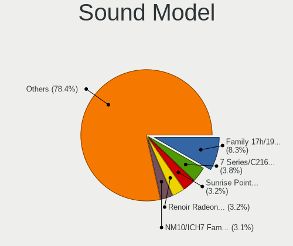

| Model                                                                      | Computers | Percent |
|----------------------------------------------------------------------------|-----------|---------|
| AMD Family 17h/19h HD Audio Controller                                     | 41        | 9.05%   |
| Intel 7 Series/C216 Chipset Family High Definition Audio Controller        | 20        | 4.42%   |
| AMD Renoir Radeon High Definition Audio Controller                         | 19        | 4.19%   |
| Intel Sunrise Point-LP HD Audio                                            | 15        | 3.31%   |
| Intel NM10/ICH7 Family High Definition Audio Controller                    | 13        | 2.87%   |
| AMD Rembrandt Radeon High Definition Audio Controller                      | 12        | 2.65%   |
| Intel 8 Series/C220 Series Chipset High Definition Audio Controller        | 11        | 2.43%   |
| Intel 6 Series/C200 Series Chipset Family High Definition Audio Controller | 10        | 2.21%   |
| AMD SBx00 Azalia (Intel HDA)                                               | 9         | 1.99%   |
| Intel Tiger Lake-LP Smart Sound Technology Audio Controller                | 8         | 1.77%   |
| Intel 82801I (ICH9 Family) HD Audio Controller                             | 8         | 1.77%   |
| Intel Xeon E3-1200 v3/4th Gen Core Processor HD Audio Controller           | 7         | 1.55%   |
| Intel Haswell-ULT HD Audio Controller                                      | 7         | 1.55%   |
| Intel Broadwell-U Audio Controller                                         | 7         | 1.55%   |
| Intel Alder Lake-N PCH High Definition Audio Controller                    | 7         | 1.55%   |
| Intel Alder Lake PCH-P High Definition Audio Controller                    | 7         | 1.55%   |
| Intel 8 Series HD Audio Controller                                         | 7         | 1.55%   |
| Intel 100 Series/C230 Series Chipset Family HD Audio Controller            | 7         | 1.55%   |
| AMD Raven/Raven2/Fenghuang HDMI/DP Audio Controller                        | 7         | 1.55%   |
| Intel Wildcat Point-LP High Definition Audio Controller                    | 6         | 1.32%   |
| Intel Raptor Lake-P/U/H cAVS                                               | 6         | 1.32%   |
| Intel Cannon Lake PCH cAVS                                                 | 6         | 1.32%   |
| Intel 5 Series/3400 Series Chipset High Definition Audio                   | 6         | 1.32%   |
| AMD FCH Azalia Controller                                                  | 6         | 1.32%   |
| Intel Raptor Lake High Definition Audio Controller                         | 5         | 1.1%    |
| Intel Cannon Point-LP High Definition Audio Controller                     | 5         | 1.1%    |
| Intel 200 Series PCH HD Audio                                              | 5         | 1.1%    |
| AMD Navi 21/23 HDMI/DP Audio Controller                                    | 5         | 1.1%    |
| AMD Kabini HDMI/DP Audio                                                   | 5         | 1.1%    |
| Nvidia TU106 High Definition Audio Controller                              | 4         | 0.88%   |
| Nvidia GP107GL High Definition Audio Controller                            | 4         | 0.88%   |
| Nvidia GP106 High Definition Audio Controller                              | 4         | 0.88%   |
| Nvidia GK208 HDMI/DP Audio Controller                                      | 4         | 0.88%   |
| Nvidia GF108 High Definition Audio Controller                              | 4         | 0.88%   |
| Nvidia Audio device                                                        | 4         | 0.88%   |
| Intel Comet Lake PCH-LP cAVS                                               | 4         | 0.88%   |
| AMD Starship/Matisse HD Audio Controller                                   | 4         | 0.88%   |
| AMD Family 17h (Models 00h-0fh) HD Audio Controller                        | 4         | 0.88%   |
| AMD Family 15h (Models 60h-6fh) Audio Controller                           | 4         | 0.88%   |
| AMD Cedar HDMI Audio [Radeon HD 5400/6300/7300 Series]                     | 4         | 0.88%   |

Memory
------

Memory Vendor
-------------

Memory module vendors

| Vendor                       | Computers | Percent |
|------------------------------|-----------|---------|
| Samsung Electronics          | 55        | 26.83%  |
| SK hynix                     | 32        | 15.61%  |
| Micron Technology            | 23        | 11.22%  |
| Unknown                      | 22        | 10.73%  |
| Kingston                     | 17        | 8.29%   |
| G.Skill                      | 10        | 4.88%   |
| Corsair                      | 10        | 4.88%   |
| Crucial                      | 7         | 3.41%   |
| A-DATA Technology            | 5         | 2.44%   |
| Team                         | 3         | 1.46%   |
| Elpida                       | 3         | 1.46%   |
| Nanya Technology             | 2         | 0.98%   |
| Unknown                      | 2         | 0.98%   |
| V-Color                      | 1         | 0.49%   |
| Unknown (ABCD)               | 1         | 0.49%   |
| Unknown (0x0E9D)             | 1         | 0.49%   |
| Unknown (0x0CC7)             | 1         | 0.49%   |
| Timetec                      | 1         | 0.49%   |
| Super Talent                 | 1         | 0.49%   |
| Smart                        | 1         | 0.49%   |
| Ramaxel Technology           | 1         | 0.49%   |
| Patriot Memory (PDP Systems) | 1         | 0.49%   |
| Patriot                      | 1         | 0.49%   |
| Mushkin                      | 1         | 0.49%   |
| Avant                        | 1         | 0.49%   |
| ASint Technology             | 1         | 0.49%   |
| 48spaces                     | 1         | 0.49%   |

Memory Model
------------

Memory module models

| Model                                                       | Computers | Percent |
|-------------------------------------------------------------|-----------|---------|
| Samsung RAM M471A1K43EB1-CWE 8GB SODIMM DDR4 3200MT/s       | 5         | 2.2%    |
| Samsung RAM M471A5244CB0-CTD 4GB SODIMM DDR4 3266MT/s       | 4         | 1.76%   |
| Micron RAM 4ATF1G64HZ-3G2F1 8GB SODIMM DDR4 3200MT/s        | 4         | 1.76%   |
| Unknown RAM Module 2GB SODIMM DDR2                          | 3         | 1.32%   |
| Unknown RAM Module 4GB SODIMM DDR2 667MT/s                  | 2         | 0.88%   |
| Unknown RAM Module 4GB DIMM 1066MT/s                        | 2         | 0.88%   |
| Unknown RAM Module 2GB SODIMM DDR2 667MT/s                  | 2         | 0.88%   |
| SK hynix RAM HMT451S6BFR8A-PB 4GB SODIMM DDR3 1600MT/s      | 2         | 0.88%   |
| SK hynix RAM HMT451S6AFR8C-PB 4GB SODIMM DDR3 1600MT/s      | 2         | 0.88%   |
| SK hynix RAM HMT425S6CFR6C-PB 2GB SODIMM 1600MT/s           | 2         | 0.88%   |
| SK hynix RAM HMA81GS6AFR8N-UH 8GB SODIMM DDR4 2667MT/s      | 2         | 0.88%   |
| SK hynix RAM H9JCNNNFA5MLYR-N6E 8GB DIMM LPDDR5 6400MT/s    | 2         | 0.88%   |
| Samsung RAM M471B5273CH0-CH9 4GB SODIMM DDR3 1334MT/s       | 2         | 0.88%   |
| Samsung RAM M471B5173DB0-YK0 4GB SODIMM DDR3 1600MT/s       | 2         | 0.88%   |
| Samsung RAM M471B5173BH0-CK0 4GB SODIMM DDR3 1600MT/s       | 2         | 0.88%   |
| Samsung RAM M471A2G44BM0-CWE 16GB SODIMM DDR4 3200MT/s      | 2         | 0.88%   |
| Samsung RAM M471A1K43CB1-CRC 8GB SODIMM DDR4 2667MT/s       | 2         | 0.88%   |
| Samsung RAM M471A1G44AB0-CWE 8GB Row Of Chips DDR4 3200MT/s | 2         | 0.88%   |
| Kingston RAM 99U5469-045.A00LF 4GB SODIMM DDR3 1600MT/s     | 2         | 0.88%   |
| Unknown                                                     | 2         | 0.88%   |
| V-Color RAM TN432G32D822 32GB SODIMM DDR4 3200MT/s          | 1         | 0.44%   |
| Unknown RAM Module 8GB SODIMM DDR3 1600MT/s                 | 1         | 0.44%   |
| Unknown RAM Module 512MB SODIMM DRAM                        | 1         | 0.44%   |
| Unknown RAM Module 512MB SODIMM DDR2                        | 1         | 0.44%   |
| Unknown RAM Module 512MB SODIMM DDR                         | 1         | 0.44%   |
| Unknown RAM Module 512MB DIMM                               | 1         | 0.44%   |
| Unknown RAM Module 4GB SODIMM DDR3 1600MT/s                 | 1         | 0.44%   |
| Unknown RAM Module 4GB Row Of Chips LPDDR4 4267MT/s         | 1         | 0.44%   |
| Unknown RAM Module 4GB DIMM DDR3 1333MT/s                   | 1         | 0.44%   |
| Unknown RAM Module 4GB Chip DDR4 2133MT/s                   | 1         | 0.44%   |
| Unknown RAM Module 2GB SODIMM SDRAM                         | 1         | 0.44%   |
| Unknown RAM Module 2GB DIMM SDRAM                           | 1         | 0.44%   |
| Unknown RAM Module 2GB DIMM DDR2 800MT/s                    | 1         | 0.44%   |
| Unknown RAM Module 2GB DIMM DDR 667MT/s                     | 1         | 0.44%   |
| Unknown RAM Module 2GB DIMM 1066MT/s                        | 1         | 0.44%   |
| Unknown RAM Module 1GB SODIMM SDRAM                         | 1         | 0.44%   |
| Unknown RAM Module 1GB SODIMM DDR2 667MT/s                  | 1         | 0.44%   |
| Unknown RAM Module 1GB SODIMM DDR2 533MT/s                  | 1         | 0.44%   |
| Unknown RAM Module 1GB SODIMM DDR2                          | 1         | 0.44%   |
| Unknown RAM Module 1GB SODIMM DDR                           | 1         | 0.44%   |

Memory Kind
-----------

Memory module kinds

| Kind    | Computers | Percent |
|---------|-----------|---------|
| DDR4    | 75        | 40.98%  |
| DDR3    | 54        | 29.51%  |
| DDR2    | 12        | 6.56%   |
| DDR5    | 10        | 5.46%   |
| SDRAM   | 8         | 4.37%   |
| LPDDR5  | 8         | 4.37%   |
| LPDDR4  | 6         | 3.28%   |
| DDR     | 5         | 2.73%   |
| Unknown | 3         | 1.64%   |
| LPDDR3  | 1         | 0.55%   |
| DRAM    | 1         | 0.55%   |

Memory Form Factor
------------------

Physical design of the memory module

| Name         | Computers | Percent |
|--------------|-----------|---------|
| SODIMM       | 114       | 62.3%   |
| DIMM         | 51        | 27.87%  |
| Row Of Chips | 15        | 8.2%    |
| Chip         | 3         | 1.64%   |

Memory Size
-----------

Memory module size

| Size  | Computers | Percent |
|-------|-----------|---------|
| 8192  | 61        | 30.05%  |
| 4096  | 54        | 26.6%   |
| 16384 | 30        | 14.78%  |
| 2048  | 30        | 14.78%  |
| 1024  | 12        | 5.91%   |
| 32768 | 8         | 3.94%   |
| 512   | 7         | 3.45%   |
| 49152 | 1         | 0.49%   |

Memory Speed
------------

Memory module speed

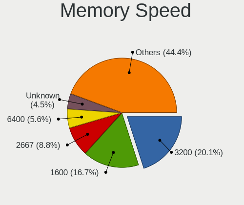

| Speed   | Computers | Percent |
|---------|-----------|---------|
| 3200    | 43        | 22.16%  |
| 1600    | 36        | 18.56%  |
| 2667    | 16        | 8.25%   |
| 667     | 11        | 5.67%   |
| 2133    | 9         | 4.64%   |
| 1333    | 9         | 4.64%   |
| Unknown | 9         | 4.64%   |
| 6400    | 8         | 4.12%   |
| 4800    | 6         | 3.09%   |
| 2400    | 5         | 2.58%   |
| 3600    | 4         | 2.06%   |
| 3266    | 4         | 2.06%   |
| 1334    | 4         | 2.06%   |
| 2048    | 3         | 1.55%   |
| 1067    | 3         | 1.55%   |
| 1066    | 3         | 1.55%   |
| 533     | 3         | 1.55%   |
| 6000    | 2         | 1.03%   |
| 4267    | 2         | 1.03%   |
| 3400    | 2         | 1.03%   |
| 2800    | 2         | 1.03%   |
| 1867    | 2         | 1.03%   |
| 5600    | 1         | 0.52%   |
| 5500    | 1         | 0.52%   |
| 4266    | 1         | 0.52%   |
| 4199    | 1         | 0.52%   |
| 3733    | 1         | 0.52%   |
| 1866    | 1         | 0.52%   |
| 1800    | 1         | 0.52%   |
| 800     | 1         | 0.52%   |

Printers & scanners
-------------------

Printer Vendor
--------------

Printer device vendors

| Vendor                | Computers | Percent |
|-----------------------|-----------|---------|
| Hewlett-Packard       | 5         | 55.56%  |
| Seiko Epson           | 2         | 22.22%  |
| Lexmark International | 1         | 11.11%  |
| Canon                 | 1         | 11.11%  |

Printer Model
-------------

Printer device models

| Model                         | Computers | Percent |
|-------------------------------|-----------|---------|
| Seiko Epson ET-2820 Series    | 1         | 11.11%  |
| Seiko Epson ET-1810 Series    | 1         | 11.11%  |
| Lexmark International MX310dn | 1         | 11.11%  |
| HP LaserJet Pro M404-M405     | 1         | 11.11%  |
| HP LaserJet P2015 series      | 1         | 11.11%  |
| HP ENVY 5000 series           | 1         | 11.11%  |
| HP DeskJet F4200 series       | 1         | 11.11%  |
| HP DeskJet 4100 series        | 1         | 11.11%  |
| Canon TR4600 series           | 1         | 11.11%  |

Scanner Vendor
--------------

Scanner device vendors

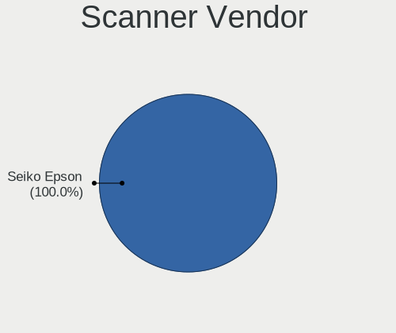

| Vendor      | Computers | Percent |
|-------------|-----------|---------|
| Seiko Epson | 1         | 100%    |

Scanner Model
-------------

Scanner device models

| Model                                       | Computers | Percent |
|---------------------------------------------|-----------|---------|
| Seiko Epson GT-X820 [Perfection V600 Photo] | 1         | 100%    |

Camera
------

Camera Vendor
-------------

Camera device vendors

| Vendor                                 | Computers | Percent |
|----------------------------------------|-----------|---------|
| Chicony Electronics                    | 33        | 21.57%  |
| IMC Networks                           | 16        | 10.46%  |
| Quanta                                 | 12        | 7.84%   |
| Bison Electronics                      | 11        | 7.19%   |
| Sunplus Innovation Technology          | 10        | 6.54%   |
| Logitech                               | 9         | 5.88%   |
| Apple                                  | 9         | 5.88%   |
| Microdia                               | 8         | 5.23%   |
| Realtek Semiconductor                  | 7         | 4.58%   |
| Luxvisions Innotech Limited            | 7         | 4.58%   |
| Cheng Uei Precision Industry (Foxlink) | 6         | 3.92%   |
| Acer                                   | 5         | 3.27%   |
| Suyin                                  | 4         | 2.61%   |
| Sonix Technology                       | 3         | 1.96%   |
| ShineTech                              | 3         | 1.96%   |
| Ricoh                                  | 2         | 1.31%   |
| Lite-On Technology                     | 2         | 1.31%   |
| Z-Star Microelectronics                | 1         | 0.65%   |
| Shine-optics                           | 1         | 0.65%   |
| Microsoft                              | 1         | 0.65%   |
| MacroSilicon                           | 1         | 0.65%   |
| KYE Systems (Mouse Systems)            | 1         | 0.65%   |
| Alcor Micro                            | 1         | 0.65%   |

Camera Model
------------

Camera device models

| Model                                                   | Computers | Percent |
|---------------------------------------------------------|-----------|---------|
| Chicony Integrated Camera                               | 9         | 5.84%   |
| IMC Networks USB2.0 HD UVC WebCam                       | 6         | 3.9%    |
| Bison Integrated Camera                                 | 6         | 3.9%    |
| IMC Networks USB2.0 VGA UVC WebCam                      | 5         | 3.25%   |
| Realtek Integrated_Webcam_HD                            | 4         | 2.6%    |
| Chicony HD WebCam                                       | 4         | 2.6%    |
| Apple FaceTime HD Camera (Built-in)                     | 4         | 2.6%    |
| Quanta HP HD Camera                                     | 3         | 1.95%   |
| Microdia Integrated_Webcam_HD                           | 3         | 1.95%   |
| Sunplus Integrated_Webcam_FHD                           | 2         | 1.3%    |
| Sonix USB2.0 HD UVC WebCam                              | 2         | 1.3%    |
| ShineTech HD Camera                                     | 2         | 1.3%    |
| Quanta VGA WebCam                                       | 2         | 1.3%    |
| Microdia Sonix USB 2.0 Camera                           | 2         | 1.3%    |
| Luxvisions Innotech Limited Integrated RGB Camera       | 2         | 1.3%    |
| Luxvisions Innotech Limited HP TrueVision HD Camera     | 2         | 1.3%    |
| Logitech HD Pro Webcam C920                             | 2         | 1.3%    |
| IMC Networks Integrated Camera                          | 2         | 1.3%    |
| Chicony TOSHIBA Web Camera - HD                         | 2         | 1.3%    |
| Chicony HP Truevision HD                                | 2         | 1.3%    |
| Chicony HP HD Camera                                    | 2         | 1.3%    |
| Cheng Uei Precision Industry (Foxlink) HP Truevision HD | 2         | 1.3%    |
| Apple Built-in iSight [Micron]                          | 2         | 1.3%    |
| Acer Integrated RGB Camera                              | 2         | 1.3%    |
| Z-Star Webcam                                           | 1         | 0.65%   |
| Suyin HP Truevision HD                                  | 1         | 0.65%   |
| Suyin HD WebCam                                         | 1         | 0.65%   |
| Suyin Acer/HP Integrated Webcam [CN0314]                | 1         | 0.65%   |
| Suyin Acer CrystalEye Webcam                            | 1         | 0.65%   |
| Sunplus PC Camera                                       | 1         | 0.65%   |
| Sunplus Laptop_Integrated_Webcam_HD                     | 1         | 0.65%   |
| Sunplus Laptop_Integrated_Webcam_FHD                    | 1         | 0.65%   |
| Sunplus Laptop Integrated Webcam HD                     | 1         | 0.65%   |
| Sunplus Laptop Integrated Webcam FHD                    | 1         | 0.65%   |
| Sunplus Hy FHD B200 Came                                | 1         | 0.65%   |
| Sunplus HP TrueVision HD Camera                         | 1         | 0.65%   |
| Sunplus HesTongCamera                                   | 1         | 0.65%   |
| Sonix USB2.0 FHD UVC WebCam                             | 1         | 0.65%   |
| ShineTech USB2.0 HD UVC WebCam                          | 1         | 0.65%   |
| Shine-optics USB2.0 HD UVC WebCam                       | 1         | 0.65%   |

Security
--------

Fingerprint Vendor
------------------

Fingerprint sensor vendors

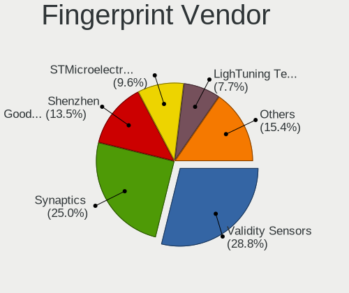

| Vendor                     | Computers | Percent |
|----------------------------|-----------|---------|
| Synaptics                  | 10        | 34.48%  |
| Validity Sensors           | 9         | 31.03%  |
| Shenzhen Goodix Technology | 5         | 17.24%  |
| Elan Microelectronics      | 2         | 6.9%    |
| Upek                       | 1         | 3.45%   |
| STMicroelectronics         | 1         | 3.45%   |
| Microsoft                  | 1         | 3.45%   |

Fingerprint Model
-----------------

Fingerprint sensor models

| Model                                                    | Computers | Percent |
|----------------------------------------------------------|-----------|---------|
| Synaptics FS7604 Touch Fingerprint Sensor with PurePrint | 3         | 10.34%  |
| Shenzhen Goodix  Fingerprint Device                      | 3         | 10.34%  |
| Validity Sensors VFS495 Fingerprint Reader               | 2         | 6.9%    |
| Validity Sensors VFS 5011 fingerprint sensor             | 2         | 6.9%    |
| Synaptics Metallica MIS Touch Fingerprint Reader         | 2         | 6.9%    |
| Validity Sensors VFS7552 Touch Fingerprint Sensor        | 1         | 3.45%   |
| Validity Sensors VFS7500 Touch Fingerprint Sensor        | 1         | 3.45%   |
| Validity Sensors VFS491                                  | 1         | 3.45%   |
| Validity Sensors VFS Fingerprint sensor                  | 1         | 3.45%   |
| Validity Sensors Fingerprint scanner                     | 1         | 3.45%   |
| Upek Biometric Touchchip/Touchstrip Fingerprint Sensor   | 1         | 3.45%   |
| Synaptics WBDI                                           | 1         | 3.45%   |
| Synaptics UWP WBDI Device                                | 1         | 3.45%   |
| Synaptics UWP WBDI                                       | 1         | 3.45%   |
| Synaptics Prometheus MIS Touch Fingerprint Reader        | 1         | 3.45%   |
| Synaptics Fingerprint reader [HP G6]                     | 1         | 3.45%   |
| STMicroelectronics Fingerprint Reader                    | 1         | 3.45%   |
| Shenzhen Goodix Fingerprint Reader                       | 1         | 3.45%   |
| Shenzhen Goodix FingerPrint                              | 1         | 3.45%   |
| Microsoft Fingerprint Reader                             | 1         | 3.45%   |
| Elan ELAN:Fingerprint                                    | 1         | 3.45%   |
| Elan ELAN:ARM-M4                                         | 1         | 3.45%   |

Chipcard Vendor
---------------

Chipcard module vendors

| Vendor      | Computers | Percent |
|-------------|-----------|---------|
| Broadcom    | 4         | 30.77%  |
| Alcor Micro | 4         | 30.77%  |
| Lenovo      | 3         | 23.08%  |
| Upek        | 2         | 15.38%  |

Chipcard Model
--------------

Chipcard module models

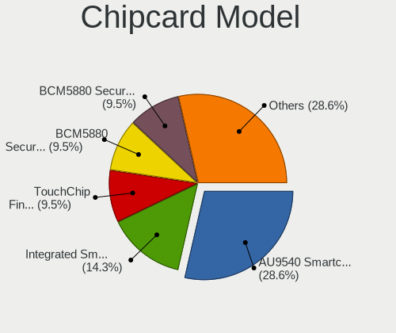

| Model                                                                        | Computers | Percent |
|------------------------------------------------------------------------------|-----------|---------|
| Alcor Micro AU9540 Smartcard Reader                                          | 4         | 30.77%  |
| Lenovo Integrated Smart Card Reader                                          | 3         | 23.08%  |
| Upek TouchChip Fingerprint Coprocessor (WBF advanced mode)                   | 2         | 15.38%  |
| Broadcom BCM5880 Secure Applications Processor with fingerprint swipe sensor | 2         | 15.38%  |
| Broadcom BCM5880 Secure Applications Processor                               | 1         | 7.69%   |
| Broadcom 58200                                                               | 1         | 7.69%   |

Unsupported
-----------

Unsupported Devices
-------------------

Total unsupported devices on board

| Total | Computers | Percent |
|-------|-----------|---------|
| 0     | 191       | 69.2%   |
| 1     | 70        | 25.36%  |
| 2     | 11        | 3.99%   |
| 3     | 4         | 1.45%   |

Unsupported Device Types
------------------------

Types of unsupported devices

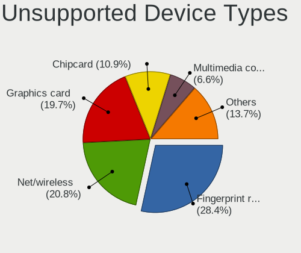

| Type                     | Computers | Percent |
|--------------------------|-----------|---------|
| Fingerprint reader       | 29        | 28.71%  |
| Graphics card            | 20        | 19.8%   |
| Net/wireless             | 17        | 16.83%  |
| Chipcard                 | 13        | 12.87%  |
| Multimedia controller    | 7         | 6.93%   |
| Bluetooth                | 3         | 2.97%   |
| Unassigned class         | 2         | 1.98%   |
| Storage                  | 2         | 1.98%   |
| Communication controller | 2         | 1.98%   |
| Card reader              | 2         | 1.98%   |
| Camera                   | 2         | 1.98%   |
| Storage/nvme             | 1         | 0.99%   |
| Sound                    | 1         | 0.99%   |

