LMDE 6 - Tested Hardware & Statistics (Desktops)
------------------------------------------------

A project to collect tested hardware configurations for LMDE 6.

Anyone can contribute to this report by the [hw-probe](https://github.com/linuxhw/hw-probe) tool:

    sudo -E hw-probe -all -upload

Please contribute! Especially if your hardware is rare.

Contents
--------

* [ Test Cases ](#test-cases)

* [ System ](#system)
  - [ Kernel                   ](#kernel)
  - [ Kernel Family            ](#kernel-family)
  - [ Kernel Major Ver.        ](#kernel-major-ver)
  - [ Arch                     ](#arch)
  - [ DE                       ](#de)
  - [ Display Server           ](#display-server)
  - [ Display Manager          ](#display-manager)
  - [ OS Lang                  ](#os-lang)
  - [ Boot Mode                ](#boot-mode)
  - [ Filesystem               ](#filesystem)
  - [ Part. scheme             ](#part-scheme)
  - [ Dual Boot with Linux/BSD ](#dual-boot-with-linuxbsd)
  - [ Dual Boot (Win)          ](#dual-boot-win)

* [ Board ](#board)
  - [ Vendor                   ](#vendor)
  - [ Model                    ](#model)
  - [ Model Family             ](#model-family)
  - [ MFG Year                 ](#mfg-year)
  - [ Form Factor              ](#form-factor)
  - [ Secure Boot              ](#secure-boot)
  - [ Coreboot                 ](#coreboot)
  - [ RAM Size                 ](#ram-size)
  - [ RAM Used                 ](#ram-used)
  - [ Total Drives             ](#total-drives)
  - [ Has CD-ROM               ](#has-cd-rom)
  - [ Has Ethernet             ](#has-ethernet)
  - [ Has WiFi                 ](#has-wifi)
  - [ Has Bluetooth            ](#has-bluetooth)

* [ Location ](#location)
  - [ Country                  ](#country)
  - [ City                     ](#city)

* [ Drives ](#drives)
  - [ Drive Vendor             ](#drive-vendor)
  - [ Drive Model              ](#drive-model)
  - [ HDD Vendor               ](#hdd-vendor)
  - [ SSD Vendor               ](#ssd-vendor)
  - [ Drive Kind               ](#drive-kind)
  - [ Drive Connector          ](#drive-connector)
  - [ Drive Size               ](#drive-size)
  - [ Space Total              ](#space-total)
  - [ Space Used               ](#space-used)
  - [ Malfunc. Drives          ](#malfunc-drives)
  - [ Malfunc. Drive Vendor    ](#malfunc-drive-vendor)
  - [ Malfunc. HDD Vendor      ](#malfunc-hdd-vendor)
  - [ Malfunc. Drive Kind      ](#malfunc-drive-kind)
  - [ Failed Drives            ](#failed-drives)
  - [ Failed Drive Vendor      ](#failed-drive-vendor)
  - [ Drive Status             ](#drive-status)

* [ Storage controller ](#storage-controller)
  - [ Storage Vendor           ](#storage-vendor)
  - [ Storage Model            ](#storage-model)
  - [ Storage Kind             ](#storage-kind)

* [ Processor ](#processor)
  - [ CPU Vendor               ](#cpu-vendor)
  - [ CPU Model                ](#cpu-model)
  - [ CPU Model Family         ](#cpu-model-family)
  - [ CPU Cores                ](#cpu-cores)
  - [ CPU Sockets              ](#cpu-sockets)
  - [ CPU Threads              ](#cpu-threads)
  - [ CPU Op-Modes             ](#cpu-op-modes)
  - [ CPU Microcode            ](#cpu-microcode)
  - [ CPU Microarch            ](#cpu-microarch)

* [ Graphics ](#graphics)
  - [ GPU Vendor               ](#gpu-vendor)
  - [ GPU Model                ](#gpu-model)
  - [ GPU Combo                ](#gpu-combo)
  - [ GPU Driver               ](#gpu-driver)
  - [ GPU Memory               ](#gpu-memory)

* [ Monitor ](#monitor)
  - [ Monitor Vendor           ](#monitor-vendor)
  - [ Monitor Model            ](#monitor-model)
  - [ Monitor Resolution       ](#monitor-resolution)
  - [ Monitor Diagonal         ](#monitor-diagonal)
  - [ Monitor Width            ](#monitor-width)
  - [ Aspect Ratio             ](#aspect-ratio)
  - [ Monitor Area             ](#monitor-area)
  - [ Pixel Density            ](#pixel-density)
  - [ Multiple Monitors        ](#multiple-monitors)

* [ Network ](#network)
  - [ Net Controller Vendor    ](#net-controller-vendor)
  - [ Net Controller Model     ](#net-controller-model)
  - [ Wireless Vendor          ](#wireless-vendor)
  - [ Wireless Model           ](#wireless-model)
  - [ Ethernet Vendor          ](#ethernet-vendor)
  - [ Ethernet Model           ](#ethernet-model)
  - [ Net Controller Kind      ](#net-controller-kind)
  - [ Used Controller          ](#used-controller)
  - [ NICs                     ](#nics)
  - [ IPv6                     ](#ipv6)

* [ Bluetooth ](#bluetooth)
  - [ Bluetooth Vendor         ](#bluetooth-vendor)
  - [ Bluetooth Model          ](#bluetooth-model)

* [ Sound ](#sound)
  - [ Sound Vendor             ](#sound-vendor)
  - [ Sound Model              ](#sound-model)

* [ Memory ](#memory)
  - [ Memory Vendor            ](#memory-vendor)
  - [ Memory Model             ](#memory-model)
  - [ Memory Kind              ](#memory-kind)
  - [ Memory Form Factor       ](#memory-form-factor)
  - [ Memory Size              ](#memory-size)
  - [ Memory Speed             ](#memory-speed)

* [ Printers & scanners ](#printers--scanners)
  - [ Printer Vendor           ](#printer-vendor)
  - [ Printer Model            ](#printer-model)
  - [ Scanner Vendor           ](#scanner-vendor)
  - [ Scanner Model            ](#scanner-model)

* [ Camera ](#camera)
  - [ Camera Vendor            ](#camera-vendor)
  - [ Camera Model             ](#camera-model)

* [ Security ](#security)
  - [ Fingerprint Vendor       ](#fingerprint-vendor)
  - [ Fingerprint Model        ](#fingerprint-model)
  - [ Chipcard Vendor          ](#chipcard-vendor)
  - [ Chipcard Model           ](#chipcard-model)

* [ Unsupported ](#unsupported)
  - [ Unsupported Devices      ](#unsupported-devices)
  - [ Unsupported Device Types ](#unsupported-device-types)

Test Cases
----------

Total: 110

| Vendor        | Model                       | Probe                                                      | Date         |
|---------------|-----------------------------|------------------------------------------------------------|--------------|
| Gigabyte      | Q87M-D2H                    | [4c5e48c75f](https://linux-hardware.org/?probe=4c5e48c75f) | Feb 02, 2024 |
| Inventec      | DQ Class A02                | [4cb447dae2](https://linux-hardware.org/?probe=4cb447dae2) | Feb 02, 2024 |
| Gigabyte      | Q87M-D2H                    | [78ef1fbd6c](https://linux-hardware.org/?probe=78ef1fbd6c) | Jan 31, 2024 |
| Medion        | TJ4125                      | [2705de4986](https://linux-hardware.org/?probe=2705de4986) | Jan 31, 2024 |
| MSI           | MS-7345                     | [3453f85c21](https://linux-hardware.org/?probe=3453f85c21) | Jan 30, 2024 |
| MSI           | MAG B560 TORPEDO            | [429541ce17](https://linux-hardware.org/?probe=429541ce17) | Jan 29, 2024 |
| ASUSTek       | TUF Gaming X670E-PLUS WI... | [c7a52fe756](https://linux-hardware.org/?probe=c7a52fe756) | Jan 29, 2024 |
| HP            | 805D                        | [81113f9b0d](https://linux-hardware.org/?probe=81113f9b0d) | Jan 29, 2024 |
| ASUSTek       | PRIME X670-P                | [08b5799cfd](https://linux-hardware.org/?probe=08b5799cfd) | Jan 27, 2024 |
| MSI           | MAG B560 TORPEDO            | [30954e841f](https://linux-hardware.org/?probe=30954e841f) | Jan 26, 2024 |
| ASUSTek       | CROSSHAIR V FORMULA-Z       | [56bd222ae5](https://linux-hardware.org/?probe=56bd222ae5) | Jan 24, 2024 |
| Gigabyte      | B450 AORUS M                | [ed52617ade](https://linux-hardware.org/?probe=ed52617ade) | Jan 23, 2024 |
| ASRock        | Z690 Pro RS                 | [4083a31da9](https://linux-hardware.org/?probe=4083a31da9) | Jan 21, 2024 |
| ASRock        | X670E Taichi Carrara        | [52318f5ae6](https://linux-hardware.org/?probe=52318f5ae6) | Jan 20, 2024 |
| ASUSTek       | P7P55D-E                    | [bb8785aa08](https://linux-hardware.org/?probe=bb8785aa08) | Jan 15, 2024 |
| MSI           | MEG X670E ACE               | [08ee758712](https://linux-hardware.org/?probe=08ee758712) | Jan 15, 2024 |
| ASRock        | Z97 Pro4                    | [e3ef5ae05b](https://linux-hardware.org/?probe=e3ef5ae05b) | Jan 14, 2024 |
| Gigabyte      | GA-78LMT-S2P 78LMT2         | [b81e3342c6](https://linux-hardware.org/?probe=b81e3342c6) | Jan 13, 2024 |
| ASUSTek       | TUF B450M-PLUS GAMING       | [70dedc5c9d](https://linux-hardware.org/?probe=70dedc5c9d) | Jan 12, 2024 |
| ASUSTek       | P5G41T-M LX3                | [a358114f21](https://linux-hardware.org/?probe=a358114f21) | Jan 12, 2024 |
| Gigabyte      | B450 AORUS M                | [6b5cc546b5](https://linux-hardware.org/?probe=6b5cc546b5) | Jan 12, 2024 |
| MSI           | Z390-A PRO                  | [538119eb86](https://linux-hardware.org/?probe=538119eb86) | Jan 11, 2024 |
| MSI           | B350M BAZOOKA               | [fab33560f3](https://linux-hardware.org/?probe=fab33560f3) | Jan 10, 2024 |
| Fujitsu       | D3183-A1 S26361-D3183-A1    | [c9096376d8](https://linux-hardware.org/?probe=c9096376d8) | Jan 09, 2024 |
| MSI           | B550-A PRO                  | [e2e58f59b7](https://linux-hardware.org/?probe=e2e58f59b7) | Jan 06, 2024 |
| MSI           | MAG X570 TOMAHAWK WIFI      | [ff9686f03c](https://linux-hardware.org/?probe=ff9686f03c) | Jan 06, 2024 |
| Medion        | TJ4125                      | [ca0e4105c2](https://linux-hardware.org/?probe=ca0e4105c2) | Jan 02, 2024 |
| Gigabyte      | Q87M-D2H                    | [26f77fa950](https://linux-hardware.org/?probe=26f77fa950) | Jan 02, 2024 |
| ASUSTek       | H110M-A/M.2                 | [9e622b4006](https://linux-hardware.org/?probe=9e622b4006) | Dec 31, 2023 |
| Gigabyte      | Q87M-D2H                    | [0f440edfb5](https://linux-hardware.org/?probe=0f440edfb5) | Dec 31, 2023 |
| Gigabyte      | Q87M-D2H                    | [edbe61f4fa](https://linux-hardware.org/?probe=edbe61f4fa) | Dec 31, 2023 |
| Dell          | 0RW199                      | [906719d239](https://linux-hardware.org/?probe=906719d239) | Dec 27, 2023 |
| HP            | 090Ch                       | [06e9f893bc](https://linux-hardware.org/?probe=06e9f893bc) | Dec 25, 2023 |
| Gigabyte      | Q87M-D2H                    | [4b2ed8b976](https://linux-hardware.org/?probe=4b2ed8b976) | Dec 23, 2023 |
| ASUSTek       | X99-A II                    | [37e4430c0e](https://linux-hardware.org/?probe=37e4430c0e) | Dec 23, 2023 |
| ASRock        | Z97 Pro4                    | [f8e2df67b1](https://linux-hardware.org/?probe=f8e2df67b1) | Dec 23, 2023 |
| MSI           | MPG B550 GAMING PLUS        | [db8c00daf3](https://linux-hardware.org/?probe=db8c00daf3) | Dec 22, 2023 |
| Lenovo        | 317C NOK                    | [87064e6d98](https://linux-hardware.org/?probe=87064e6d98) | Dec 20, 2023 |
| Medion        | TJ4125                      | [8fce958467](https://linux-hardware.org/?probe=8fce958467) | Dec 20, 2023 |
| Gigabyte      | GA-MA78LMT-US2H             | [a1f4076586](https://linux-hardware.org/?probe=a1f4076586) | Dec 19, 2023 |
| Medion        | TJ4125                      | [c7eeb77279](https://linux-hardware.org/?probe=c7eeb77279) | Dec 18, 2023 |
| Gigabyte      | Q87M-D2H                    | [378b82ce2f](https://linux-hardware.org/?probe=378b82ce2f) | Dec 17, 2023 |
| Gigabyte      | Q87M-D2H                    | [e7f9b37ee3](https://linux-hardware.org/?probe=e7f9b37ee3) | Dec 17, 2023 |
| Gigabyte      | Q87M-D2H                    | [935f688c90](https://linux-hardware.org/?probe=935f688c90) | Dec 17, 2023 |
| Gigabyte      | Q87M-D2H                    | [f53d129b3d](https://linux-hardware.org/?probe=f53d129b3d) | Dec 17, 2023 |
| Medion        | TJ4125                      | [7556d73046](https://linux-hardware.org/?probe=7556d73046) | Dec 17, 2023 |
| Gigabyte      | A520M S2H                   | [0b4a9d3a4e](https://linux-hardware.org/?probe=0b4a9d3a4e) | Dec 16, 2023 |
| Acer          | Veriton M4630G V:1.0        | [91ec51ebf5](https://linux-hardware.org/?probe=91ec51ebf5) | Dec 12, 2023 |
| Dell          | 0GXM1W A02                  | [3184d3c38b](https://linux-hardware.org/?probe=3184d3c38b) | Dec 11, 2023 |
| ASRock        | H310M-STX                   | [205a5c1696](https://linux-hardware.org/?probe=205a5c1696) | Dec 10, 2023 |
| Gigabyte      | 970A-DS3P                   | [71de71e3f4](https://linux-hardware.org/?probe=71de71e3f4) | Dec 10, 2023 |
| Gigabyte      | 970A-DS3P                   | [64b0038221](https://linux-hardware.org/?probe=64b0038221) | Dec 10, 2023 |
| MSI           | MPG X570 GAMING EDGE WIF... | [4525b7e30c](https://linux-hardware.org/?probe=4525b7e30c) | Dec 09, 2023 |
| ASUSTek       | P5G41T-M LX3                | [42a7acfe4b](https://linux-hardware.org/?probe=42a7acfe4b) | Dec 09, 2023 |
| ASUSTek       | PRIME A320M-K               | [b553ec2266](https://linux-hardware.org/?probe=b553ec2266) | Dec 08, 2023 |
| ASUSTek       | Rampage III Extreme         | [d4d934c9be](https://linux-hardware.org/?probe=d4d934c9be) | Dec 08, 2023 |
| Unknown       | Unknown                     | [7144bda606](https://linux-hardware.org/?probe=7144bda606) | Dec 07, 2023 |
| ASUSTek       | PRIME B350-PLUS             | [6fca6c7335](https://linux-hardware.org/?probe=6fca6c7335) | Dec 03, 2023 |
| ASUSTek       | PRIME B450M-K               | [9fa48c41da](https://linux-hardware.org/?probe=9fa48c41da) | Nov 27, 2023 |
| Gigabyte      | B560M D3H                   | [8a894da286](https://linux-hardware.org/?probe=8a894da286) | Nov 26, 2023 |
| Shenzhen M... | F7BRC                       | [9ff2c76737](https://linux-hardware.org/?probe=9ff2c76737) | Nov 26, 2023 |
| MSI           | MAG B760M MORTAR WIFI DD... | [b11fcf42c2](https://linux-hardware.org/?probe=b11fcf42c2) | Nov 25, 2023 |
| Medion        | TJ4125                      | [512206df27](https://linux-hardware.org/?probe=512206df27) | Nov 24, 2023 |
| ASUSTek       | PRIME A320M-K               | [81d1db42ea](https://linux-hardware.org/?probe=81d1db42ea) | Nov 23, 2023 |
| ASUSTek       | P5G41T-M LX3                | [af55920808](https://linux-hardware.org/?probe=af55920808) | Nov 23, 2023 |
| MSI           | PRO Z790-A WIFI             | [b564a39ed5](https://linux-hardware.org/?probe=b564a39ed5) | Nov 22, 2023 |
| Dell          | 0Y2YM6 A00                  | [ce96501574](https://linux-hardware.org/?probe=ce96501574) | Nov 22, 2023 |
| Gigabyte      | Q87M-D2H                    | [a0f12099c5](https://linux-hardware.org/?probe=a0f12099c5) | Nov 22, 2023 |
| Soyo          | SY-N3150L Quad              | [7fd72fcced](https://linux-hardware.org/?probe=7fd72fcced) | Nov 21, 2023 |
| Gigabyte      | Q87M-D2H                    | [085623428e](https://linux-hardware.org/?probe=085623428e) | Nov 19, 2023 |
| Acer          | Aspire X3400                | [26cedbdbde](https://linux-hardware.org/?probe=26cedbdbde) | Nov 19, 2023 |
| Acer          | Aspire X3400                | [83890ec21c](https://linux-hardware.org/?probe=83890ec21c) | Nov 19, 2023 |
| ASUSTek       | P5G41T-M LX3                | [e65cf40bcb](https://linux-hardware.org/?probe=e65cf40bcb) | Nov 19, 2023 |
| HP            | 8265                        | [d3f5c1d6ce](https://linux-hardware.org/?probe=d3f5c1d6ce) | Nov 15, 2023 |
| Fujitsu       | D3400-A1 S26361-D3400-A1    | [c4b486ecb1](https://linux-hardware.org/?probe=c4b486ecb1) | Nov 13, 2023 |
| Medion        | TJ4125                      | [1e0f7cdf34](https://linux-hardware.org/?probe=1e0f7cdf34) | Nov 12, 2023 |
| Medion        | TJ4125                      | [ab37177769](https://linux-hardware.org/?probe=ab37177769) | Nov 10, 2023 |
| Gigabyte      | Q87M-D2H                    | [80bba409c5](https://linux-hardware.org/?probe=80bba409c5) | Nov 10, 2023 |
| Dell          | 0HH807                      | [300ee3d8f5](https://linux-hardware.org/?probe=300ee3d8f5) | Nov 08, 2023 |
| ASUSTek       | P5G41T-M LX3                | [8d5332d643](https://linux-hardware.org/?probe=8d5332d643) | Nov 07, 2023 |
| MSI           | B75MA-P45                   | [bfe1423965](https://linux-hardware.org/?probe=bfe1423965) | Nov 06, 2023 |
| Gigabyte      | Q87M-D2H                    | [62a888f71c](https://linux-hardware.org/?probe=62a888f71c) | Nov 05, 2023 |
| Medion        | TJ4125                      | [65a059325e](https://linux-hardware.org/?probe=65a059325e) | Nov 05, 2023 |
| Gigabyte      | MZBSWAP-K4                  | [ef6c15830d](https://linux-hardware.org/?probe=ef6c15830d) | Nov 05, 2023 |
| ASUSTek       | P5G41T-M LX                 | [ae6c835796](https://linux-hardware.org/?probe=ae6c835796) | Nov 02, 2023 |
| ASRock        | Z97 Pro4                    | [6fa2a70f99](https://linux-hardware.org/?probe=6fa2a70f99) | Nov 01, 2023 |
| HP            | 18EB                        | [83596ab9d9](https://linux-hardware.org/?probe=83596ab9d9) | Oct 31, 2023 |
| ASUSTek       | P5G41T-M LX                 | [e741e073e0](https://linux-hardware.org/?probe=e741e073e0) | Oct 30, 2023 |
| ASRock        | Z690M-ITX/ax                | [810297d46b](https://linux-hardware.org/?probe=810297d46b) | Oct 30, 2023 |
| Gigabyte      | MZBSWAP-K4                  | [aed94a16c1](https://linux-hardware.org/?probe=aed94a16c1) | Oct 30, 2023 |
| Trigkey       | Green G4 10                 | [bb72f6af02](https://linux-hardware.org/?probe=bb72f6af02) | Oct 29, 2023 |
| Medion        | TJ4125                      | [f791cf88cb](https://linux-hardware.org/?probe=f791cf88cb) | Oct 27, 2023 |
| Dell          | 0HH807                      | [7f15d65c22](https://linux-hardware.org/?probe=7f15d65c22) | Oct 27, 2023 |
| Unknown       | P4M800CE-8237               | [bf22b887f8](https://linux-hardware.org/?probe=bf22b887f8) | Oct 26, 2023 |
| ASRock        | Z97 Pro4                    | [bcf737a9cd](https://linux-hardware.org/?probe=bcf737a9cd) | Oct 25, 2023 |
| Gigabyte      | Q87M-D2H                    | [74d5de2172](https://linux-hardware.org/?probe=74d5de2172) | Oct 21, 2023 |
| Gigabyte      | Q87M-D2H                    | [4633508fb0](https://linux-hardware.org/?probe=4633508fb0) | Oct 20, 2023 |
| Acer          | Predator G3-605             | [d3b59b34a0](https://linux-hardware.org/?probe=d3b59b34a0) | Oct 19, 2023 |
| Intel         | DG31PR AAD97573-206         | [5064906065](https://linux-hardware.org/?probe=5064906065) | Oct 18, 2023 |
| HP            | 843B                        | [0e5a69e3ab](https://linux-hardware.org/?probe=0e5a69e3ab) | Oct 17, 2023 |
| ASRock        | H310M-STX                   | [b0bc91de7a](https://linux-hardware.org/?probe=b0bc91de7a) | Oct 14, 2023 |
| Medion        | TJ4125                      | [e60adf45ac](https://linux-hardware.org/?probe=e60adf45ac) | Oct 10, 2023 |
| Gigabyte      | A520M S2H                   | [d71ced0f1d](https://linux-hardware.org/?probe=d71ced0f1d) | Oct 08, 2023 |
| Dell          | 0WR7PY A03                  | [7bd89c0f18](https://linux-hardware.org/?probe=7bd89c0f18) | Oct 07, 2023 |
| ASUSTek       | ROG STRIX Z790-I GAMING ... | [04473f37e9](https://linux-hardware.org/?probe=04473f37e9) | Oct 07, 2023 |
| Gigabyte      | G31M-ES2L                   | [bfed98df15](https://linux-hardware.org/?probe=bfed98df15) | Oct 04, 2023 |
| Gigabyte      | GA-880GM-UD2H               | [5fa6a632ae](https://linux-hardware.org/?probe=5fa6a632ae) | Sep 18, 2023 |
| HP            | 158B                        | [d56ff45f03](https://linux-hardware.org/?probe=d56ff45f03) | Sep 17, 2023 |
| ASRock        | X670E Pro RS                | [11d9d55772](https://linux-hardware.org/?probe=11d9d55772) | Sep 17, 2023 |
| Gigabyte      | B450 AORUS PRO-CF           | [807a40b618](https://linux-hardware.org/?probe=807a40b618) | Sep 15, 2023 |

System
------

Kernel
------

Version of the Linux kernel

| Version               | Desktops | Percent |
|-----------------------|----------|---------|
| 6.1.0-13-amd64        | 25       | 34.25%  |
| 6.1.0-17-amd64        | 17       | 23.29%  |
| 6.1.0-12-amd64        | 15       | 20.55%  |
| 6.1.0-16-amd64        | 7        | 9.59%   |
| 6.1.0-15-amd64        | 2        | 2.74%   |
| 6.1.0-14-amd64        | 2        | 2.74%   |
| 6.1.0-12-686          | 2        | 2.74%   |
| 6.6.11-x64v3-xanmod1  | 1        | 1.37%   |
| 6.5.0-0.deb12.4-amd64 | 1        | 1.37%   |
| 6.1.0-11-amd64        | 1        | 1.37%   |

Kernel Family
-------------

Linux kernel without a distro release

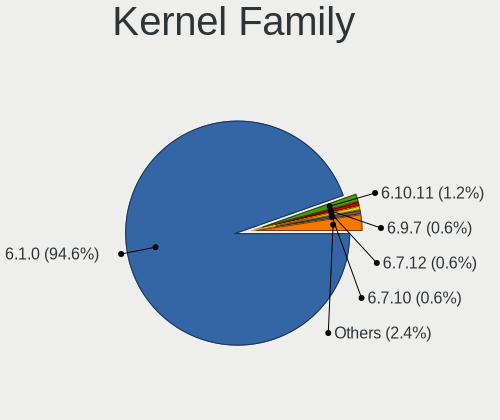

| Version | Desktops | Percent |
|---------|----------|---------|
| 6.1.0   | 66       | 97.06%  |
| 6.6.11  | 1        | 1.47%   |
| 6.5.0   | 1        | 1.47%   |

Kernel Major Ver.
-----------------

Linux kernel major version

| Version | Desktops | Percent |
|---------|----------|---------|
| 6.1     | 66       | 97.06%  |
| 6.6     | 1        | 1.47%   |
| 6.5     | 1        | 1.47%   |

Arch
----

OS architecture (x86_64, i586, etc.)

| Name   | Desktops | Percent |
|--------|----------|---------|
| x86_64 | 66       | 97.06%  |
| i686   | 2        | 2.94%   |

DE
--

Desktop Environment

| Name       | Desktops | Percent |
|------------|----------|---------|
| X-Cinnamon | 61       | 88.41%  |
| Unknown    | 3        | 4.35%   |
| Cinnamon   | 2        | 2.9%    |
| XFCE       | 1        | 1.45%   |
| MATE       | 1        | 1.45%   |
| KDE5       | 1        | 1.45%   |

Display Server
--------------

X11 or Wayland

| Name    | Desktops | Percent |
|---------|----------|---------|
| X11     | 67       | 98.53%  |
| Wayland | 1        | 1.47%   |

Display Manager
---------------

SDDM, LightDM, etc.

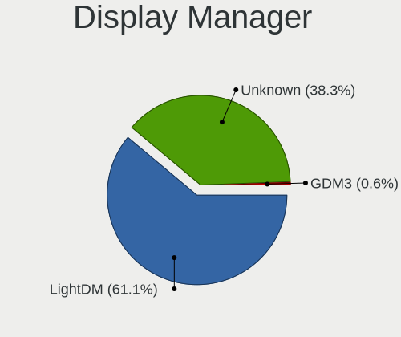

| Name    | Desktops | Percent |
|---------|----------|---------|
| Unknown | 38       | 55.88%  |
| LightDM | 29       | 42.65%  |
| GDM3    | 1        | 1.47%   |

OS Lang
-------

Language

| Lang    | Desktops | Percent |
|---------|----------|---------|
| en_US   | 27       | 39.71%  |
| de_DE   | 8        | 11.76%  |
| en_GB   | 5        | 7.35%   |
| pl_PL   | 4        | 5.88%   |
| it_IT   | 4        | 5.88%   |
| fr_FR   | 4        | 5.88%   |
| Unknown | 3        | 4.41%   |
| pt_BR   | 2        | 2.94%   |
| hu_HU   | 2        | 2.94%   |
| es_ES   | 2        | 2.94%   |
| cs_CZ   | 2        | 2.94%   |
| hr_HR   | 1        | 1.47%   |
| es_AR   | 1        | 1.47%   |
| en_NZ   | 1        | 1.47%   |
| en_AU   | 1        | 1.47%   |
| el_GR   | 1        | 1.47%   |

Boot Mode
---------

EFI or BIOS

| Mode | Desktops | Percent |
|------|----------|---------|
| EFI  | 46       | 66.67%  |
| BIOS | 23       | 33.33%  |

Filesystem
----------

Type of filesystem

| Type    | Desktops | Percent |
|---------|----------|---------|
| Ext4    | 57       | 83.82%  |
| Overlay | 4        | 5.88%   |
| Btrfs   | 4        | 5.88%   |
| Tmpfs   | 3        | 4.41%   |

Part. scheme
------------

Scheme of partitioning

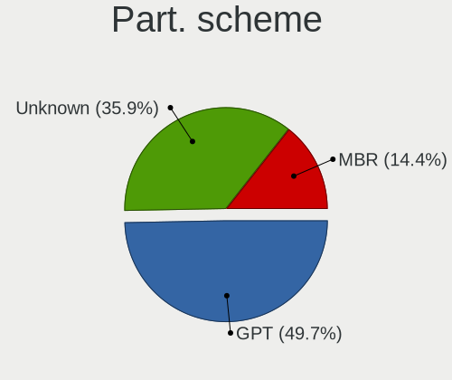

| Type    | Desktops | Percent |
|---------|----------|---------|
| Unknown | 35       | 51.47%  |
| GPT     | 24       | 35.29%  |
| MBR     | 9        | 13.24%  |

Dual Boot with Linux/BSD
------------------------

Hosting more than one Linux/BSD

| Dual boot | Desktops | Percent |
|-----------|----------|---------|
| No        | 57       | 83.82%  |
| Yes       | 11       | 16.18%  |

Dual Boot (Win)
---------------

Hosting Linux and Windows

| Dual boot | Desktops | Percent |
|-----------|----------|---------|
| No        | 53       | 77.94%  |
| Yes       | 15       | 22.06%  |

Board
-----

Vendor
------

Motherboard manufacturer

| Name                                 | Desktops | Percent |
|--------------------------------------|----------|---------|
| ASUSTek Computer                     | 15       | 22.06%  |
| Gigabyte Technology                  | 12       | 17.65%  |
| MSI                                  | 11       | 16.18%  |
| ASRock                               | 6        | 8.82%   |
| Hewlett-Packard                      | 5        | 7.35%   |
| Dell                                 | 5        | 7.35%   |
| Acer                                 | 3        | 4.41%   |
| Fujitsu                              | 2        | 2.94%   |
| Unknown                              | 2        | 2.94%   |
| Trigkey                              | 1        | 1.47%   |
| Soyo                                 | 1        | 1.47%   |
| Shenzhen Meigao Electronic Equipment | 1        | 1.47%   |
| Medion                               | 1        | 1.47%   |
| Lenovo                               | 1        | 1.47%   |
| Inventec                             | 1        | 1.47%   |
| Intel                                | 1        | 1.47%   |

Model
-----

Motherboard model

| Name                                                | Desktops | Percent |
|-----------------------------------------------------|----------|---------|
| Gigabyte A520M S2H                                  | 2        | 2.94%   |
| Dell OptiPlex 7010                                  | 2        | 2.94%   |
| Unknown                                             | 2        | 2.94%   |
| Trigkey Green G4                                    | 1        | 1.47%   |
| Soyo SY-N3150L Quad                                 | 1        | 1.47%   |
| Shenzhen Meigao Electronic Equipment Mercury series | 1        | 1.47%   |
| MSI MS-7E07                                         | 1        | 1.47%   |
| MSI MS-7E01                                         | 1        | 1.47%   |
| MSI MS-7D69                                         | 1        | 1.47%   |
| MSI MS-7D15                                         | 1        | 1.47%   |
| MSI MS-7C84                                         | 1        | 1.47%   |
| MSI MS-7C56                                         | 1        | 1.47%   |
| MSI MS-7C37                                         | 1        | 1.47%   |
| MSI MS-7B98                                         | 1        | 1.47%   |
| MSI MS-7A38                                         | 1        | 1.47%   |
| MSI MS-7798                                         | 1        | 1.47%   |
| MSI MS-7345                                         | 1        | 1.47%   |
| Medion S23003                                       | 1        | 1.47%   |
| Lenovo V50t-13IMB 11HD000DUM                        | 1        | 1.47%   |
| Inventec DQ Class                                   | 1        | 1.47%   |
| Intel DG31PR AAD97573-206                           | 1        | 1.47%   |
| HP Z820 Workstation                                 | 1        | 1.47%   |
| HP ProDesk 600 G2 MT                                | 1        | 1.47%   |
| HP ProDesk 490 G1 MT                                | 1        | 1.47%   |
| HP Pavilion Desktop 590-p0xxx                       | 1        | 1.47%   |
| HP dc5000 uT(DZ216AV)                               | 1        | 1.47%   |
| Gigabyte Q87M-D2H                                   | 1        | 1.47%   |
| Gigabyte GB-BACE-3000-SBE                           | 1        | 1.47%   |
| Gigabyte GA-MA78LMT-US2H                            | 1        | 1.47%   |
| Gigabyte GA-880GM-UD2H                              | 1        | 1.47%   |
| Gigabyte GA-78LMT-S2P                               | 1        | 1.47%   |
| Gigabyte G31M-ES2L                                  | 1        | 1.47%   |
| Gigabyte B560M D3H                                  | 1        | 1.47%   |
| Gigabyte B450 AORUS PRO                             | 1        | 1.47%   |
| Gigabyte B450 AORUS M                               | 1        | 1.47%   |
| Gigabyte 970A-DS3P                                  | 1        | 1.47%   |
| Fujitsu ESPRIMO_P556                                | 1        | 1.47%   |
| Fujitsu D3183-A1                                    | 1        | 1.47%   |
| Dell Vostro 3268                                    | 1        | 1.47%   |
| Dell Precision WorkStation T7400                    | 1        | 1.47%   |

Model Family
------------

Motherboard model prefix

| Name                                         | Desktops | Percent |
|----------------------------------------------|----------|---------|
| ASUS PRIME                                   | 4        | 5.88%   |
| Dell OptiPlex                                | 3        | 4.41%   |
| HP ProDesk                                   | 2        | 2.94%   |
| Gigabyte B450                                | 2        | 2.94%   |
| Gigabyte A520M                               | 2        | 2.94%   |
| ASUS TUF                                     | 2        | 2.94%   |
| ASUS P5G41T-M                                | 2        | 2.94%   |
| ASRock X670E                                 | 2        | 2.94%   |
| Unknown                                      | 2        | 2.94%   |
| Trigkey Green                                | 1        | 1.47%   |
| Soyo SY-N3150L                               | 1        | 1.47%   |
| Shenzhen Meigao Electronic Equipment Mercury | 1        | 1.47%   |
| MSI MS-7E07                                  | 1        | 1.47%   |
| MSI MS-7E01                                  | 1        | 1.47%   |
| MSI MS-7D69                                  | 1        | 1.47%   |
| MSI MS-7D15                                  | 1        | 1.47%   |
| MSI MS-7C84                                  | 1        | 1.47%   |
| MSI MS-7C56                                  | 1        | 1.47%   |
| MSI MS-7C37                                  | 1        | 1.47%   |
| MSI MS-7B98                                  | 1        | 1.47%   |
| MSI MS-7A38                                  | 1        | 1.47%   |
| MSI MS-7798                                  | 1        | 1.47%   |
| MSI MS-7345                                  | 1        | 1.47%   |
| Medion S23003                                | 1        | 1.47%   |
| Lenovo V50t-13IMB                            | 1        | 1.47%   |
| Inventec DQ                                  | 1        | 1.47%   |
| Intel DG31PR                                 | 1        | 1.47%   |
| HP Z820                                      | 1        | 1.47%   |
| HP Pavilion                                  | 1        | 1.47%   |
| HP dc5000                                    | 1        | 1.47%   |
| Gigabyte Q87M-D2H                            | 1        | 1.47%   |
| Gigabyte GB-BACE-3000-SBE                    | 1        | 1.47%   |
| Gigabyte GA-MA78LMT-US2H                     | 1        | 1.47%   |
| Gigabyte GA-880GM-UD2H                       | 1        | 1.47%   |
| Gigabyte GA-78LMT-S2P                        | 1        | 1.47%   |
| Gigabyte G31M-ES2L                           | 1        | 1.47%   |
| Gigabyte B560M                               | 1        | 1.47%   |
| Gigabyte 970A-DS3P                           | 1        | 1.47%   |
| Fujitsu ESPRIMO                              | 1        | 1.47%   |
| Fujitsu D3183-A1                             | 1        | 1.47%   |

MFG Year
--------

Motherboard manufacture year

| Year | Desktops | Percent |
|------|----------|---------|
| 2018 | 8        | 11.76%  |
| 2023 | 6        | 8.82%   |
| 2022 | 6        | 8.82%   |
| 2013 | 6        | 8.82%   |
| 2010 | 6        | 8.82%   |
| 2017 | 5        | 7.35%   |
| 2021 | 4        | 5.88%   |
| 2020 | 4        | 5.88%   |
| 2016 | 4        | 5.88%   |
| 2012 | 4        | 5.88%   |
| 2019 | 3        | 4.41%   |
| 2008 | 3        | 4.41%   |
| 2015 | 2        | 2.94%   |
| 2014 | 2        | 2.94%   |
| 2007 | 2        | 2.94%   |
| 2009 | 1        | 1.47%   |
| 2006 | 1        | 1.47%   |
| 2004 | 1        | 1.47%   |

Form Factor
-----------

Physical design of the computer

| Name    | Desktops | Percent |
|---------|----------|---------|
| Desktop | 68       | 100%    |

Secure Boot
-----------

Enabled or disabled

| State    | Desktops | Percent |
|----------|----------|---------|
| Disabled | 63       | 92.65%  |
| Enabled  | 5        | 7.35%   |

Coreboot
--------

Have coreboot on board

| Used | Desktops | Percent |
|------|----------|---------|
| No   | 68       | 100%    |

RAM Size
--------

Total RAM memory

| Size in GB  | Desktops | Percent |
|-------------|----------|---------|
| 16.01-24.0  | 16       | 23.19%  |
| 4.01-8.0    | 14       | 20.29%  |
| 32.01-64.0  | 10       | 14.49%  |
| 64.01-256.0 | 9        | 13.04%  |
| 24.01-32.0  | 7        | 10.14%  |
| 3.01-4.0    | 6        | 8.7%    |
| 8.01-16.0   | 5        | 7.25%   |
| 1.01-2.0    | 2        | 2.9%    |

RAM Used
--------

Used RAM memory

| Used GB   | Desktops | Percent |
|-----------|----------|---------|
| 1.01-2.0  | 24       | 31.58%  |
| 2.01-3.0  | 21       | 27.63%  |
| 4.01-8.0  | 13       | 17.11%  |
| 3.01-4.0  | 13       | 17.11%  |
| 8.01-16.0 | 4        | 5.26%   |
| 0.51-1.0  | 1        | 1.32%   |

Total Drives
------------

Number of drives on board

| Drives | Desktops | Percent |
|--------|----------|---------|
| 1      | 26       | 37.68%  |
| 3      | 17       | 24.64%  |
| 2      | 12       | 17.39%  |
| 4      | 6        | 8.7%    |
| 5      | 4        | 5.8%    |
| 7      | 2        | 2.9%    |
| 10     | 1        | 1.45%   |
| 0      | 1        | 1.45%   |

Has CD-ROM
----------

Has CD-ROM on board

| Presented | Desktops | Percent |
|-----------|----------|---------|
| No        | 40       | 58.82%  |
| Yes       | 28       | 41.18%  |

Has Ethernet
------------

Has Ethernet on board

| Presented | Desktops | Percent |
|-----------|----------|---------|
| Yes       | 66       | 97.06%  |
| No        | 2        | 2.94%   |

Has WiFi
--------

Has WiFi module

| Presented | Desktops | Percent |
|-----------|----------|---------|
| Yes       | 36       | 52.94%  |
| No        | 32       | 47.06%  |

Has Bluetooth
-------------

Has Bluetooth module

| Presented | Desktops | Percent |
|-----------|----------|---------|
| No        | 39       | 56.52%  |
| Yes       | 30       | 43.48%  |

Location
--------

Country
-------

Geographic location (country)

| Country                | Desktops | Percent |
|------------------------|----------|---------|
| USA                    | 14       | 20.59%  |
| Germany                | 13       | 19.12%  |
| Italy                  | 7        | 10.29%  |
| UK                     | 4        | 5.88%   |
| France                 | 4        | 5.88%   |
| Poland                 | 3        | 4.41%   |
| India                  | 2        | 2.94%   |
| Hungary                | 2        | 2.94%   |
| Czechia                | 2        | 2.94%   |
| Canada                 | 2        | 2.94%   |
| Brazil                 | 2        | 2.94%   |
| Spain                  | 1        | 1.47%   |
| Norway                 | 1        | 1.47%   |
| New Zealand            | 1        | 1.47%   |
| Morocco                | 1        | 1.47%   |
| Malta                  | 1        | 1.47%   |
| Iran                   | 1        | 1.47%   |
| Indonesia              | 1        | 1.47%   |
| Greece                 | 1        | 1.47%   |
| Ecuador                | 1        | 1.47%   |
| Croatia                | 1        | 1.47%   |
| Bosnia and Herzegovina | 1        | 1.47%   |
| Australia              | 1        | 1.47%   |
| Argentina              | 1        | 1.47%   |

City
----

Geographic location (city)

| City                 | Desktops | Percent |
|----------------------|----------|---------|
| Traunstein           | 2        | 2.78%   |
| Parshall             | 2        | 2.78%   |
| Milan                | 2        | 2.78%   |
| Fitchburg            | 2        | 2.78%   |
| Delligsen            | 2        | 2.78%   |
| Wisconsin Dells      | 1        | 1.39%   |
| Wasilla              | 1        | 1.39%   |
| Vassenden            | 1        | 1.39%   |
| Valletta             | 1        | 1.39%   |
| Sydney               | 1        | 1.39%   |
| Strzelno             | 1        | 1.39%   |
| South Bend           | 1        | 1.39%   |
| Šlapanice           | 1        | 1.39%   |
| Sisak                | 1        | 1.39%   |
| Seattle              | 1        | 1.39%   |
| Sarnia               | 1        | 1.39%   |
| Sao Goncalo          | 1        | 1.39%   |
| Santa Luzia          | 1        | 1.39%   |
| Saarbrücken         | 1        | 1.39%   |
| Quimper              | 1        | 1.39%   |
| Płośnica           | 1        | 1.39%   |
| Prnjavor             | 1        | 1.39%   |
| Pomaz                | 1        | 1.39%   |
| Pawtucket            | 1        | 1.39%   |
| Panama City          | 1        | 1.39%   |
| Palma                | 1        | 1.39%   |
| Paderborn            | 1        | 1.39%   |
| Otnice               | 1        | 1.39%   |
| Oklahoma City        | 1        | 1.39%   |
| North Port           | 1        | 1.39%   |
| Moreno               | 1        | 1.39%   |
| Montevrain           | 1        | 1.39%   |
| Montebello Vicentino | 1        | 1.39%   |
| Marrakesh            | 1        | 1.39%   |
| Lambeth              | 1        | 1.39%   |
| Krefeld              | 1        | 1.39%   |
| Kansas City          | 1        | 1.39%   |
| Kaczki               | 1        | 1.39%   |
| Isfahan              | 1        | 1.39%   |
| Hyderabad            | 1        | 1.39%   |

Drives
------

Drive Vendor
------------

Hard drive vendors

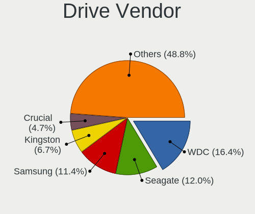

| Vendor                      | Desktops | Drives | Percent |
|-----------------------------|----------|--------|---------|
| WDC                         | 26       | 38     | 18.06%  |
| Seagate                     | 19       | 27     | 13.19%  |
| Samsung Electronics         | 15       | 18     | 10.42%  |
| Toshiba                     | 9        | 10     | 6.25%   |
| Kingston                    | 8        | 19     | 5.56%   |
| SanDisk                     | 7        | 9      | 4.86%   |
| Crucial                     | 6        | 6      | 4.17%   |
| PNY                         | 5        | 8      | 3.47%   |
| China                       | 3        | 4      | 2.08%   |
| A-DATA Technology           | 3        | 3      | 2.08%   |
| Unknown                     | 3        | 4      | 2.08%   |
| Unknown                     | 2        | 5      | 1.39%   |
| Team                        | 2        | 2      | 1.39%   |
| Phison Electronics          | 2        | 2      | 1.39%   |
| Phison                      | 2        | 5      | 1.39%   |
| Micron/Crucial Technology   | 2        | 2      | 1.39%   |
| Maxtor                      | 2        | 2      | 1.39%   |
| Hitachi                     | 2        | 3      | 1.39%   |
| Apacer                      | 2        | 2      | 1.39%   |
| ADATA Technology            | 2        | 2      | 1.39%   |
| Verbatim                    | 1        | 2      | 0.69%   |
| Transcend                   | 1        | 1      | 0.69%   |
| TO Exter                    | 1        | 1      | 0.69%   |
| SK hynix                    | 1        | 1      | 0.69%   |
| Silicon Motion              | 1        | 1      | 0.69%   |
| Realtek                     | 1        | 1      | 0.69%   |
| Patriot                     | 1        | 1      | 0.69%   |
| Micron Technology           | 1        | 1      | 0.69%   |
| MAXIO Technology (Hangzhou) | 1        | 1      | 0.69%   |
| Lexar                       | 1        | 1      | 0.69%   |
| KIOXIA-EXCERIA              | 1        | 2      | 0.69%   |
| Kingston Technology Company | 1        | 1      | 0.69%   |
| IBM/Hitachi                 | 1        | 1      | 0.69%   |
| HGST                        | 1        | 1      | 0.69%   |
| GOODRAM                     | 1        | 1      | 0.69%   |
| Gigabyte Technology         | 1        | 1      | 0.69%   |
| External                    | 1        | 1      | 0.69%   |
| DC-624e                     | 1        | 1      | 0.69%   |
| ASMT109x                    | 1        | 1      | 0.69%   |
| APPLE HD                    | 1        | 1      | 0.69%   |

Drive Model
-----------

Hard drive models

| Model                                                           | Desktops | Percent |
|-----------------------------------------------------------------|----------|---------|
| SanDisk NVMe SSD Drive 2TB                                      | 3        | 1.86%   |
| Unknown                                                         | 3        | 1.86%   |
| Toshiba HDWE160 6TB                                             | 2        | 1.24%   |
| Team T253512GB SSD                                              | 2        | 1.24%   |
| Seagate ST8000DM004-2U9188 8TB                                  | 2        | 1.24%   |
| Seagate Desktop 8TB                                             | 2        | 1.24%   |
| SanDisk NVMe SSD Drive 1TB                                      | 2        | 1.24%   |
| Samsung SSD 980 1TB                                             | 2        | 1.24%   |
| Samsung SSD 860 EVO 1TB                                         | 2        | 1.24%   |
| Samsung NVMe SSD Controller SM981/PM981/PM983 1TB               | 2        | 1.24%   |
| Phison PS5013 E13 NVMe Controller 256GB                         | 2        | 1.24%   |
| Kingston SA400S37480G 480GB SSD                                 | 2        | 1.24%   |
| Kingston SA400S37240G 240GB SSD                                 | 2        | 1.24%   |
| ADATA XPG SX8200 Pro PCIe Gen3x4 M.2 2280 Solid State Drive 2TB | 2        | 1.24%   |
| WDC WDS500G2B0B-00YS70 500GB SSD                                | 1        | 0.62%   |
| WDC WDS500G2B0A-00SM50 500GB SSD                                | 1        | 0.62%   |
| WDC WDS400T2B0A-00SM50 4TB SSD                                  | 1        | 0.62%   |
| WDC WDS250G2B0A-00SM50 250GB SSD                                | 1        | 0.62%   |
| WDC WDS240G2G0A-00JH30 240GB SSD                                | 1        | 0.62%   |
| WDC WDS120G1G0A-00SS50 120GB SSD                                | 1        | 0.62%   |
| WDC WDS100T3X0C-00SJG0 1TB                                      | 1        | 0.62%   |
| WDC WDS100T2B0C-00PXH0 1TB                                      | 1        | 0.62%   |
| WDC WDS100T2B0A-00SM50 1TB SSD                                  | 1        | 0.62%   |
| WDC WD5000AZRX-00A8LB0 500GB                                    | 1        | 0.62%   |
| WDC WD5000AAKX-001CA0 500GB                                     | 1        | 0.62%   |
| WDC WD40EZAZ-00SF3B0 4TB                                        | 1        | 0.62%   |
| WDC WD40EFAX-68JH4N1 4TB                                        | 1        | 0.62%   |
| WDC WD4004FZWX-00GBGB0 4TB                                      | 1        | 0.62%   |
| WDC WD4002FYYZ-01B7CB0 4TB                                      | 1        | 0.62%   |
| WDC WD3200AAJS-57VWA2 320GB                                     | 1        | 0.62%   |
| WDC WD3200AAJS-22B4A0 320GB                                     | 1        | 0.62%   |
| WDC WD30EFRX-68EUZN0 3TB                                        | 1        | 0.62%   |
| WDC WD20EARX-22PASB0 2TB                                        | 1        | 0.62%   |
| WDC WD20EARX-00PASB0 2TB                                        | 1        | 0.62%   |
| WDC WD2003FZEX-00SRLA0 2TB                                      | 1        | 0.62%   |
| WDC WD15EARS-00MVWB0 1TB                                        | 1        | 0.62%   |
| WDC WD120EFBX-68B0EN0 12TB                                      | 1        | 0.62%   |
| WDC WD10EZRZ-00HTKB0 1TB                                        | 1        | 0.62%   |
| WDC WD10EZEX-75WN4A0 1TB                                        | 1        | 0.62%   |
| WDC WD10EFRX-68FYTN0 1TB                                        | 1        | 0.62%   |

HDD Vendor
----------

Hard disk drive vendors

| Vendor              | Desktops | Drives | Percent |
|---------------------|----------|--------|---------|
| Seagate             | 19       | 27     | 33.93%  |
| WDC                 | 18       | 29     | 32.14%  |
| Toshiba             | 8        | 9      | 14.29%  |
| Maxtor              | 2        | 2      | 3.57%   |
| Hitachi             | 2        | 3      | 3.57%   |
| TO Exter            | 1        | 1      | 1.79%   |
| Samsung Electronics | 1        | 1      | 1.79%   |
| IBM/Hitachi         | 1        | 1      | 1.79%   |
| HGST                | 1        | 1      | 1.79%   |
| External            | 1        | 1      | 1.79%   |
| DC-624e             | 1        | 1      | 1.79%   |
| Unknown             | 1        | 1      | 1.79%   |

SSD Vendor
----------

Solid state drive vendors

| Vendor              | Desktops | Drives | Percent |
|---------------------|----------|--------|---------|
| WDC                 | 7        | 7      | 14.29%  |
| Samsung Electronics | 7        | 8      | 14.29%  |
| Kingston            | 6        | 12     | 12.24%  |
| PNY                 | 5        | 8      | 10.2%   |
| Crucial             | 4        | 4      | 8.16%   |
| China               | 3        | 4      | 6.12%   |
| A-DATA Technology   | 3        | 3      | 6.12%   |
| Team                | 2        | 2      | 4.08%   |
| SanDisk             | 2        | 2      | 4.08%   |
| Apacer              | 2        | 2      | 4.08%   |
| Verbatim            | 1        | 2      | 2.04%   |
| Transcend           | 1        | 1      | 2.04%   |
| Phison              | 1        | 4      | 2.04%   |
| Patriot             | 1        | 1      | 2.04%   |
| Micron Technology   | 1        | 1      | 2.04%   |
| Gigabyte Technology | 1        | 1      | 2.04%   |
| ASMT109x            | 1        | 1      | 2.04%   |
| Unknown             | 1        | 1      | 2.04%   |

Drive Kind
----------

HDD or SSD

| Kind    | Desktops | Drives | Percent |
|---------|----------|--------|---------|
| SSD     | 43       | 64     | 36.44%  |
| HDD     | 42       | 77     | 35.59%  |
| NVMe    | 29       | 46     | 24.58%  |
| Unknown | 3        | 6      | 2.54%   |
| MMC     | 1        | 2      | 0.85%   |

Drive Connector
---------------

SATA, SAS, NVMe, etc.

| Type | Desktops | Drives | Percent |
|------|----------|--------|---------|
| SATA | 61       | 134    | 59.8%   |
| NVMe | 29       | 45     | 28.43%  |
| SAS  | 11       | 14     | 10.78%  |
| MMC  | 1        | 2      | 0.98%   |

Drive Size
----------

Size of hard drive

| Size in TB | Desktops | Drives | Percent |
|------------|----------|--------|---------|
| 0.01-0.5   | 40       | 62     | 42.55%  |
| 0.51-1.0   | 25       | 32     | 26.6%   |
| 1.01-2.0   | 12       | 21     | 12.77%  |
| 3.01-4.0   | 7        | 12     | 7.45%   |
| 4.01-10.0  | 7        | 10     | 7.45%   |
| 10.01-20.0 | 2        | 3      | 2.13%   |
| 2.01-3.0   | 1        | 1      | 1.06%   |

Space Total
-----------

Amount of disk space available on the file system

| Size in GB     | Desktops | Percent |
|----------------|----------|---------|
| 251-500        | 13       | 19.12%  |
| 101-250        | 13       | 19.12%  |
| More than 3000 | 12       | 17.65%  |
| 501-1000       | 11       | 16.18%  |
| 1-20           | 5        | 7.35%   |
| 2001-3000      | 4        | 5.88%   |
| 1001-2000      | 3        | 4.41%   |
| Unknown        | 3        | 4.41%   |
| 21-50          | 2        | 2.94%   |
| 51-100         | 2        | 2.94%   |

Space Used
----------

Amount of used disk space

| Used GB        | Desktops | Percent |
|----------------|----------|---------|
| 1-20           | 22       | 30.56%  |
| 21-50          | 11       | 15.28%  |
| 101-250        | 8        | 11.11%  |
| 51-100         | 8        | 11.11%  |
| More than 3000 | 5        | 6.94%   |
| 251-500        | 5        | 6.94%   |
| 501-1000       | 5        | 6.94%   |
| 1001-2000      | 3        | 4.17%   |
| Unknown        | 3        | 4.17%   |
| 2001-3000      | 2        | 2.78%   |

Malfunc. Drives
---------------

Drive models with a malfunction

| Model                                               | Desktops | Drives | Percent |
|-----------------------------------------------------|----------|--------|---------|
| WDC WD10EZRZ-00HTKB0 1TB                            | 1        | 1      | 12.5%   |
| Seagate ST9500325AS 500GB                           | 1        | 1      | 12.5%   |
| Seagate ST31000524AS 1TB                            | 1        | 1      | 12.5%   |
| Samsung Electronics HD103UJ 1TB                     | 1        | 1      | 12.5%   |
| Micron Technology MTFDDAK512MAY-1AE1ZABHA 512GB SSD | 1        | 1      | 12.5%   |
| Maxtor 6E040L0 40GB                                 | 1        | 1      | 12.5%   |
| Kingston SKC2500M8500G 500GB                        | 1        | 1      | 12.5%   |
| IBM/Hitachi IC35L040AVER07-0 41GB                   | 1        | 1      | 12.5%   |

Malfunc. Drive Vendor
---------------------

Vendors of faulty drives

| Vendor              | Desktops | Drives | Percent |
|---------------------|----------|--------|---------|
| Seagate             | 2        | 2      | 25%     |
| WDC                 | 1        | 1      | 12.5%   |
| Samsung Electronics | 1        | 1      | 12.5%   |
| Micron Technology   | 1        | 1      | 12.5%   |
| Maxtor              | 1        | 1      | 12.5%   |
| Kingston            | 1        | 1      | 12.5%   |
| IBM/Hitachi         | 1        | 1      | 12.5%   |

Malfunc. HDD Vendor
-------------------

Vendors of faulty HDD drives

| Vendor              | Desktops | Drives | Percent |
|---------------------|----------|--------|---------|
| Seagate             | 2        | 2      | 33.33%  |
| WDC                 | 1        | 1      | 16.67%  |
| Samsung Electronics | 1        | 1      | 16.67%  |
| Maxtor              | 1        | 1      | 16.67%  |
| IBM/Hitachi         | 1        | 1      | 16.67%  |

Malfunc. Drive Kind
-------------------

Kinds of faulty drives

| Kind | Desktops | Drives | Percent |
|------|----------|--------|---------|
| HDD  | 6        | 6      | 75%     |
| NVMe | 1        | 1      | 12.5%   |
| SSD  | 1        | 1      | 12.5%   |

Failed Drives
-------------

Failed drive models

Zero info for selected period =(

Failed Drive Vendor
-------------------

Failed drive vendors

Zero info for selected period =(

Drive Status
------------

Number of failed and malfunc. drives

| Status   | Desktops | Drives | Percent |
|----------|----------|--------|---------|
| Detected | 45       | 117    | 55.56%  |
| Works    | 28       | 70     | 34.57%  |
| Malfunc  | 8        | 8      | 9.88%   |

Storage controller
------------------

Storage Vendor
--------------

Storage controller vendors

| Vendor                        | Desktops | Percent |
|-------------------------------|----------|---------|
| Intel                         | 40       | 36.36%  |
| AMD                           | 24       | 21.82%  |
| Samsung Electronics           | 7        | 6.36%   |
| Sandisk                       | 5        | 4.55%   |
| Phison Electronics            | 4        | 3.64%   |
| Marvell Technology Group      | 4        | 3.64%   |
| Kingston Technology Company   | 4        | 3.64%   |
| ASMedia Technology            | 4        | 3.64%   |
| Micron/Crucial Technology     | 3        | 2.73%   |
| JMicron Technology            | 2        | 1.82%   |
| ADATA Technology              | 2        | 1.82%   |
| VIA Technologies              | 1        | 0.91%   |
| Toshiba America Info Systems  | 1        | 0.91%   |
| SK hynix                      | 1        | 0.91%   |
| Silicon Motion                | 1        | 0.91%   |
| Shenzhen Longsys Electronics  | 1        | 0.91%   |
| Nvidia                        | 1        | 0.91%   |
| MAXIO Technology (Hangzhou)   | 1        | 0.91%   |
| KIOXIA                        | 1        | 0.91%   |
| Integrated Technology Express | 1        | 0.91%   |
| INNOGRIT                      | 1        | 0.91%   |
| Broadcom / LSI                | 1        | 0.91%   |

Storage Model
-------------

Storage controller models

| Model                                                                          | Desktops | Percent |
|--------------------------------------------------------------------------------|----------|---------|
| AMD FCH SATA Controller [AHCI mode]                                            | 10       | 7.35%   |
| Intel NM10/ICH7 Family SATA Controller [IDE mode]                              | 5        | 3.68%   |
| AMD 600 Series Chipset SATA Controller                                         | 5        | 3.68%   |
| Intel Q170/Q150/B150/H170/H110/Z170/CM236 Chipset SATA Controller [AHCI Mode]  | 4        | 2.94%   |
| Intel 82801G (ICH7 Family) IDE Controller                                      | 4        | 2.94%   |
| Intel 8 Series/C220 Series Chipset Family 6-port SATA Controller 1 [AHCI mode] | 4        | 2.94%   |
| Intel 7 Series/C210 Series Chipset Family 6-port SATA Controller [AHCI mode]   | 4        | 2.94%   |
| ASMedia ASM1061/ASM1062 Serial ATA Controller                                  | 4        | 2.94%   |
| AMD 400 Series Chipset SATA Controller                                         | 4        | 2.94%   |
| Sandisk WD Black SN850X NVMe SSD                                               | 3        | 2.21%   |
| Samsung NVMe SSD Controller SM981/PM981/PM983                                  | 3        | 2.21%   |
| Intel Raptor Lake SATA AHCI Controller                                         | 3        | 2.21%   |
| AMD SB7x0/SB8x0/SB9x0 SATA Controller [AHCI mode]                              | 3        | 2.21%   |
| AMD SB7x0/SB8x0/SB9x0 IDE Controller                                           | 3        | 2.21%   |
| AMD 500 Series Chipset SATA Controller                                         | 3        | 2.21%   |
| Samsung NVMe SSD Controller 980 (DRAM-less)                                    | 2        | 1.47%   |
| Phison PS5013-E13 PCIe3 NVMe Controller (DRAM-less)                            | 2        | 1.47%   |
| Phison E12 NVMe Controller                                                     | 2        | 1.47%   |
| Marvell Group 88SE9123 PCIe SATA 6.0 Gb/s controller                           | 2        | 1.47%   |
| Kingston Company KC3000/FURY Renegade NVMe SSD E18                             | 2        | 1.47%   |
| JMicron JMB363 SATA/IDE Controller                                             | 2        | 1.47%   |
| Intel SATA Controller [RAID mode]                                              | 2        | 1.47%   |
| Intel SATA controller                                                          | 2        | 1.47%   |
| Intel Cannon Lake PCH SATA AHCI Controller                                     | 2        | 1.47%   |
| Intel Alder Lake-S PCH SATA Controller [AHCI Mode]                             | 2        | 1.47%   |
| Intel 500 Series Chipset Family SATA AHCI Controller                           | 2        | 1.47%   |
| AMD SB7x0/SB8x0/SB9x0 SATA Controller [IDE mode]                               | 2        | 1.47%   |
| AMD FCH SATA Controller D                                                      | 2        | 1.47%   |
| AMD 300 Series Chipset SATA Controller                                         | 2        | 1.47%   |
| ADATA XPG SX8200 Pro PCIe Gen3x4 M.2 2280 Solid State Drive                    | 2        | 1.47%   |
| VIA VT82C586A/B/VT82C686/A/B/VT823x/A/C PIPC Bus Master IDE                    | 1        | 0.74%   |
| VIA VIA VT6420 SATA RAID Controller                                            | 1        | 0.74%   |
| Toshiba America Info Systems XG5 NVMe SSD Controller                           | 1        | 0.74%   |
| SK hynix BC511 NVMe SSD                                                        | 1        | 0.74%   |
| Silicon Motion SM2262/SM2262EN SSD Controller                                  | 1        | 0.74%   |
| Shenzhen Longsys Lexar NM790 NVME SSD (DRAM-less)                              | 1        | 0.74%   |
| SanDisk WD Blue SN570 NVMe SSD 2TB                                             | 1        | 0.74%   |
| SanDisk Ultra 3D / WD Blue SN570 NVMe SSD (DRAM-less)                          | 1        | 0.74%   |
| SanDisk Ultra 3D / WD Blue SN550 NVMe SSD                                      | 1        | 0.74%   |
| SanDisk Extreme Pro / WD Black SN750 / PC SN730 / Red SN700 NVMe SSD           | 1        | 0.74%   |

Storage Kind
------------

Kind of storage controller (IDE, SATA, NVMe, SAS, ...)

| Kind | Desktops | Percent |
|------|----------|---------|
| SATA | 56       | 53.33%  |
| NVMe | 28       | 26.67%  |
| IDE  | 15       | 14.29%  |
| RAID | 5        | 4.76%   |
| SAS  | 1        | 0.95%   |

Processor
---------

CPU Vendor
----------

Processor vendors

| Vendor | Desktops | Percent |
|--------|----------|---------|
| Intel  | 42       | 61.76%  |
| AMD    | 26       | 38.24%  |

CPU Model
---------

Processor models

| Model                                       | Desktops | Percent |
|---------------------------------------------|----------|---------|
| Intel N100                                  | 2        | 2.94%   |
| Intel Core i7-4790 CPU @ 3.60GHz            | 2        | 2.94%   |
| AMD Ryzen 9 7950X 16-Core Processor         | 2        | 2.94%   |
| AMD Ryzen 5 5600G with Radeon Graphics      | 2        | 2.94%   |
| AMD Ryzen 3 2200G with Radeon Vega Graphics | 2        | 2.94%   |
| Intel Xeon CPU X5482 @ 3.20GHz              | 1        | 1.47%   |
| Intel Xeon CPU E5-2650 v2 @ 2.60GHz         | 1        | 1.47%   |
| Intel Pentium Dual-Core CPU E6700 @ 3.20GHz | 1        | 1.47%   |
| Intel Pentium Dual-Core CPU E6600 @ 3.06GHz | 1        | 1.47%   |
| Intel Pentium Dual-Core CPU E5700 @ 3.00GHz | 1        | 1.47%   |
| Intel Pentium Dual CPU E2180 @ 2.00GHz      | 1        | 1.47%   |
| Intel Pentium D CPU 3.00GHz                 | 1        | 1.47%   |
| Intel Pentium 4 CPU 2.80GHz                 | 1        | 1.47%   |
| Intel Core i9-9900K CPU @ 3.60GHz           | 1        | 1.47%   |
| Intel Core i7-8700 CPU @ 3.20GHz            | 1        | 1.47%   |
| Intel Core i7-5820K CPU @ 3.30GHz           | 1        | 1.47%   |
| Intel Core i7-4790K CPU @ 4.00GHz           | 1        | 1.47%   |
| Intel Core i7-4770 CPU @ 3.40GHz            | 1        | 1.47%   |
| Intel Core i7 CPU 950 @ 3.07GHz             | 1        | 1.47%   |
| Intel Core i5-8400 CPU @ 2.80GHz            | 1        | 1.47%   |
| Intel Core i5-7600K CPU @ 3.80GHz           | 1        | 1.47%   |
| Intel Core i5-7500 CPU @ 3.40GHz            | 1        | 1.47%   |
| Intel Core i5-6500 CPU @ 3.20GHz            | 1        | 1.47%   |
| Intel Core i5-6400 CPU @ 2.70GHz            | 1        | 1.47%   |
| Intel Core i5-4590S CPU @ 3.00GHz           | 1        | 1.47%   |
| Intel Core i5-3470T CPU @ 2.90GHz           | 1        | 1.47%   |
| Intel Core i5-3470 CPU @ 3.20GHz            | 1        | 1.47%   |
| Intel Core i5-2400 CPU @ 3.10GHz            | 1        | 1.47%   |
| Intel Core i5-10400F CPU @ 2.90GHz          | 1        | 1.47%   |
| Intel Core i5-10400 CPU @ 2.90GHz           | 1        | 1.47%   |
| Intel Core i3-3220 CPU @ 3.30GHz            | 1        | 1.47%   |
| Intel Core i3 CPU 550 @ 3.20GHz             | 1        | 1.47%   |
| Intel Core 2 Quad CPU Q6600 @ 2.40GHz       | 1        | 1.47%   |
| Intel Celeron J4125 CPU @ 2.00GHz           | 1        | 1.47%   |
| Intel Celeron CPU N3150 @ 1.60GHz           | 1        | 1.47%   |
| Intel Celeron CPU N3000 @ 1.04GHz           | 1        | 1.47%   |
| Intel Celeron CPU 2.60GHz                   | 1        | 1.47%   |
| Intel 13th Gen Core i9-13900K               | 1        | 1.47%   |
| Intel 13th Gen Core i7-13700KF              | 1        | 1.47%   |
| Intel 13th Gen Core i5-13500                | 1        | 1.47%   |

CPU Model Family
----------------

Processor model prefix

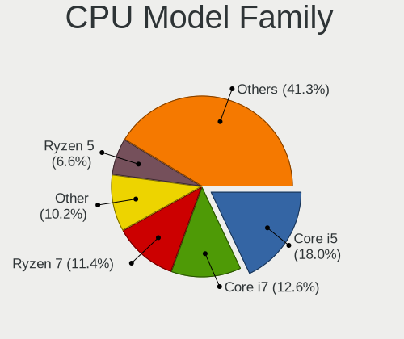

| Model                   | Desktops | Percent |
|-------------------------|----------|---------|
| Intel Core i5           | 11       | 16.18%  |
| Other                   | 8        | 11.76%  |
| Intel Core i7           | 7        | 10.29%  |
| AMD Ryzen 7             | 6        | 8.82%   |
| AMD Ryzen 5             | 5        | 7.35%   |
| Intel Celeron           | 4        | 5.88%   |
| AMD Ryzen 9             | 4        | 5.88%   |
| Intel Pentium Dual-Core | 3        | 4.41%   |
| AMD Ryzen 3             | 3        | 4.41%   |
| Intel Xeon              | 2        | 2.94%   |
| Intel Core i3           | 2        | 2.94%   |
| AMD FX                  | 2        | 2.94%   |
| Intel Pentium Dual      | 1        | 1.47%   |
| Intel Pentium D         | 1        | 1.47%   |
| Intel Pentium 4         | 1        | 1.47%   |
| Intel Core i9           | 1        | 1.47%   |
| Intel Core 2 Quad       | 1        | 1.47%   |
| AMD Sempron             | 1        | 1.47%   |
| AMD Phenom II X6        | 1        | 1.47%   |
| AMD Phenom II X4        | 1        | 1.47%   |
| AMD GX                  | 1        | 1.47%   |
| AMD Athlon II X2        | 1        | 1.47%   |
| AMD Athlon              | 1        | 1.47%   |

CPU Cores
---------

Number of processor cores

| Number | Desktops | Percent |
|--------|----------|---------|
| 4      | 24       | 35.29%  |
| 6      | 12       | 17.65%  |
| 2      | 10       | 14.71%  |
| 8      | 8        | 11.76%  |
| 16     | 5        | 7.35%   |
| 1      | 5        | 7.35%   |
| 24     | 1        | 1.47%   |
| 14     | 1        | 1.47%   |
| 12     | 1        | 1.47%   |
| 10     | 1        | 1.47%   |

CPU Sockets
-----------

Number of sockets

| Number | Desktops | Percent |
|--------|----------|---------|
| 1      | 66       | 97.06%  |
| 2      | 2        | 2.94%   |

CPU Threads
-----------

Threads per core (Hyper-Threading)

| Number | Desktops | Percent |
|--------|----------|---------|
| 2      | 39       | 57.35%  |
| 1      | 29       | 42.65%  |

CPU Op-Modes
------------

CPU Operation Modes (32-bit, 64-bit)

| Op mode        | Desktops | Percent |
|----------------|----------|---------|
| 32-bit, 64-bit | 66       | 97.06%  |
| 32-bit         | 2        | 2.94%   |

CPU Microcode
-------------

Microcode number

| Number     | Desktops | Percent |
|------------|----------|---------|
| 0x306c3    | 5        | 7.35%   |
| 0x306a9    | 3        | 4.41%   |
| 0x1067a    | 3        | 4.41%   |
| 0x0810100b | 3        | 4.41%   |
| 0x010000c8 | 3        | 4.41%   |
| Unknown    | 3        | 4.41%   |
| 0xb06e0    | 2        | 2.94%   |
| 0xb0671    | 2        | 2.94%   |
| 0xa0653    | 2        | 2.94%   |
| 0x906ea    | 2        | 2.94%   |
| 0x906e9    | 2        | 2.94%   |
| 0x90672    | 2        | 2.94%   |
| 0x406c3    | 2        | 2.94%   |
| 0x0a601206 | 2        | 2.94%   |
| 0x0a601203 | 2        | 2.94%   |
| 0x0a50000d | 2        | 2.94%   |
| 0x08001138 | 2        | 2.94%   |
| 0x06000852 | 2        | 2.94%   |
| 0xf62      | 1        | 1.47%   |
| 0xf41      | 1        | 1.47%   |
| 0xf29      | 1        | 1.47%   |
| 0xb06f2    | 1        | 1.47%   |
| 0xa0671    | 1        | 1.47%   |
| 0x906ed    | 1        | 1.47%   |
| 0x706a8    | 1        | 1.47%   |
| 0x6fd      | 1        | 1.47%   |
| 0x6fb      | 1        | 1.47%   |
| 0x506e3    | 1        | 1.47%   |
| 0x306e4    | 1        | 1.47%   |
| 0x206a7    | 1        | 1.47%   |
| 0x20655    | 1        | 1.47%   |
| 0x106a5    | 1        | 1.47%   |
| 0x10676    | 1        | 1.47%   |
| 0x0a50000f | 1        | 1.47%   |
| 0x0a404102 | 1        | 1.47%   |
| 0x0a20120e | 1        | 1.47%   |
| 0x0a20120a | 1        | 1.47%   |
| 0x08701021 | 1        | 1.47%   |
| 0x08101013 | 1        | 1.47%   |
| 0x0800820d | 1        | 1.47%   |

CPU Microarch
-------------

Microarchitecture

| Name             | Desktops | Percent |
|------------------|----------|---------|
| Zen              | 6        | 8.82%   |
| Haswell          | 6        | 8.82%   |
| Unknown          | 6        | 8.82%   |
| Zen 3            | 5        | 7.35%   |
| KabyLake         | 5        | 7.35%   |
| Alderlake Hybrid | 5        | 7.35%   |
| Penryn           | 4        | 5.88%   |
| K10              | 4        | 5.88%   |
| IvyBridge        | 4        | 5.88%   |
| NetBurst         | 3        | 4.41%   |
| Skylake          | 2        | 2.94%   |
| Silvermont       | 2        | 2.94%   |
| Piledriver       | 2        | 2.94%   |
| Gracemont        | 2        | 2.94%   |
| Core             | 2        | 2.94%   |
| CometLake        | 2        | 2.94%   |
| Zen+             | 1        | 1.47%   |
| Zen 2            | 1        | 1.47%   |
| Westmere         | 1        | 1.47%   |
| SandyBridge      | 1        | 1.47%   |
| Nehalem          | 1        | 1.47%   |
| Jaguar           | 1        | 1.47%   |
| Icelake          | 1        | 1.47%   |
| Goldmont plus    | 1        | 1.47%   |

Graphics
--------

GPU Vendor
----------

Vendors of graphics cards

| Vendor | Desktops | Percent |
|--------|----------|---------|
| AMD    | 27       | 37.5%   |
| Intel  | 23       | 31.94%  |
| Nvidia | 22       | 30.56%  |

GPU Model
---------

Graphics card models

| Model                                                                                    | Desktops | Percent |
|------------------------------------------------------------------------------------------|----------|---------|
| AMD Raphael                                                                              | 5        | 6.41%   |
| Intel Xeon E3-1200 v3/4th Gen Core Processor Integrated Graphics Controller              | 3        | 3.85%   |
| AMD Navi 23 [Radeon RX 6600/6600 XT/6600M]                                               | 3        | 3.85%   |
| AMD Cezanne [Radeon Vega Series / Radeon Vega Mobile Series]                             | 3        | 3.85%   |
| Nvidia GK208B [GeForce GT 710]                                                           | 2        | 2.56%   |
| Intel Xeon E3-1200 v2/3rd Gen Core processor Graphics Controller                         | 2        | 2.56%   |
| Intel CoffeeLake-S GT2 [UHD Graphics 630]                                                | 2        | 2.56%   |
| Intel Atom/Celeron/Pentium Processor x5-E8000/J3xxx/N3xxx Integrated Graphics Controller | 2        | 2.56%   |
| Intel Alder Lake-N [UHD Graphics]                                                        | 2        | 2.56%   |
| Intel 4 Series Chipset Integrated Graphics Controller                                    | 2        | 2.56%   |
| AMD RS780L [Radeon 3000]                                                                 | 2        | 2.56%   |
| AMD Raven Ridge [Radeon Vega Series / Radeon Vega Mobile Series]                         | 2        | 2.56%   |
| AMD Navi 31 [Radeon RX 7900 XT/7900 XTX/7900M]                                           | 2        | 2.56%   |
| AMD Cedar [Radeon HD 5000/6000/7350/8350 Series]                                         | 2        | 2.56%   |
| AMD Caicos [Radeon HD 6450/7450/8450 / R5 230 OEM]                                       | 2        | 2.56%   |
| Nvidia TU116 [GeForce GTX 1660 Ti]                                                       | 1        | 1.28%   |
| Nvidia TU106 [GeForce RTX 2060 Rev. A]                                                   | 1        | 1.28%   |
| Nvidia TU106 [GeForce RTX 2060 12GB]                                                     | 1        | 1.28%   |
| Nvidia GP108 [GeForce GT 1030]                                                           | 1        | 1.28%   |
| Nvidia GP107 [GeForce GTX 1050 Ti]                                                       | 1        | 1.28%   |
| Nvidia GP106 [GeForce GTX 1060 6GB]                                                      | 1        | 1.28%   |
| Nvidia GP106 [GeForce GTX 1060 6GB Rev. 2]                                               | 1        | 1.28%   |
| Nvidia GP106 [GeForce GTX 1060 3GB]                                                      | 1        | 1.28%   |
| Nvidia GP102 [GeForce GTX 1080 Ti]                                                       | 1        | 1.28%   |
| Nvidia GM204 [GeForce GTX 970]                                                           | 1        | 1.28%   |
| Nvidia GM107GL [Quadro K1200]                                                            | 1        | 1.28%   |
| Nvidia GK208B [GeForce GT 730]                                                           | 1        | 1.28%   |
| Nvidia GK104GL [Quadro K5000]                                                            | 1        | 1.28%   |
| Nvidia GK104 [GeForce GTX 760]                                                           | 1        | 1.28%   |
| Nvidia GF119 [GeForce GT 610]                                                            | 1        | 1.28%   |
| Nvidia GF108 [GeForce GT 440]                                                            | 1        | 1.28%   |
| Nvidia GF108 [GeForce GT 430]                                                            | 1        | 1.28%   |
| Nvidia GA106 [Geforce RTX 3050]                                                          | 1        | 1.28%   |
| Nvidia C77 [GeForce 8200]                                                                | 1        | 1.28%   |
| Nvidia AD107 [GeForce RTX 4060]                                                          | 1        | 1.28%   |
| Nvidia AD104 [GeForce RTX 4070 Ti]                                                       | 1        | 1.28%   |
| Intel Raptor Lake-S GT1 [UHD Graphics 770]                                               | 1        | 1.28%   |
| Intel HD Graphics 630                                                                    | 1        | 1.28%   |
| Intel HD Graphics 530                                                                    | 1        | 1.28%   |
| Intel GeminiLake [UHD Graphics 600]                                                      | 1        | 1.28%   |

GPU Combo
---------

Combinations of graphics cards

| Name           | Desktops | Percent |
|----------------|----------|---------|
| 1 x AMD        | 22       | 32.35%  |
| 1 x Nvidia     | 20       | 29.41%  |
| 1 x Intel      | 19       | 27.94%  |
| 2 x AMD        | 5        | 7.35%   |
| 2 x Nvidia     | 1        | 1.47%   |
| Intel + Nvidia | 1        | 1.47%   |

GPU Driver
----------

Free vs proprietary

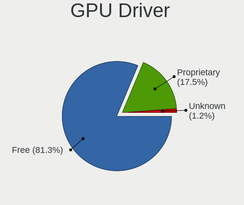

| Driver      | Desktops | Percent |
|-------------|----------|---------|
| Free        | 58       | 85.29%  |
| Proprietary | 9        | 13.24%  |
| Unknown     | 1        | 1.47%   |

GPU Memory
----------

Total video memory

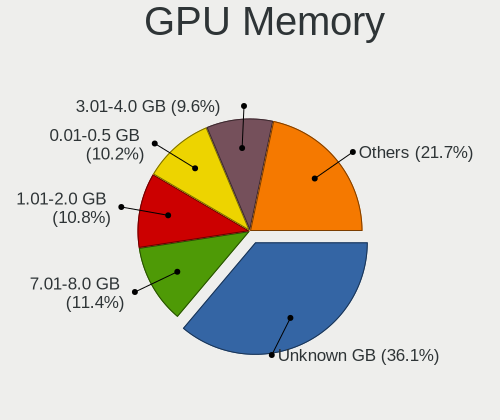

| Size in GB | Desktops | Percent |
|------------|----------|---------|
| Unknown    | 24       | 35.29%  |
| 7.01-8.0   | 8        | 11.76%  |
| 0.51-1.0   | 8        | 11.76%  |
| 0.01-0.5   | 8        | 11.76%  |
| 3.01-4.0   | 6        | 8.82%   |
| 1.01-2.0   | 6        | 8.82%   |
| 5.01-6.0   | 3        | 4.41%   |
| 2.01-3.0   | 2        | 2.94%   |
| 8.01-16.0  | 2        | 2.94%   |
| 16.01-24.0 | 1        | 1.47%   |

Monitor
-------

Monitor Vendor
--------------

Monitor vendors

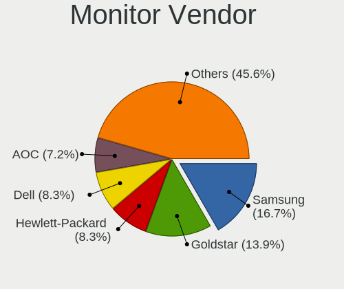

| Vendor                  | Desktops | Percent |
|-------------------------|----------|---------|
| Samsung Electronics     | 11       | 16.18%  |
| Goldstar                | 9        | 13.24%  |
| Hewlett-Packard         | 6        | 8.82%   |
| Dell                    | 6        | 8.82%   |
| Philips                 | 5        | 7.35%   |
| Lenovo                  | 4        | 5.88%   |
| Ancor Communications    | 4        | 5.88%   |
| Acer                    | 4        | 5.88%   |
| AOC                     | 3        | 4.41%   |
| Iiyama                  | 2        | 2.94%   |
| ViewSonic               | 1        | 1.47%   |
| Sceptre                 | 1        | 1.47%   |
| RGT                     | 1        | 1.47%   |
| NEC Computers           | 1        | 1.47%   |
| LG Electronics          | 1        | 1.47%   |
| LBT                     | 1        | 1.47%   |
| Idek Iiyama             | 1        | 1.47%   |
| HUAWEI                  | 1        | 1.47%   |
| Hitachi                 | 1        | 1.47%   |
| Grundig                 | 1        | 1.47%   |
| GreenWood               | 1        | 1.47%   |
| Gigabyte Technology     | 1        | 1.47%   |
| Eizo                    | 1        | 1.47%   |
| Chi Mei Optoelectronics | 1        | 1.47%   |

Monitor Model
-------------

Monitor models

| Model                                                                   | Desktops | Percent |
|-------------------------------------------------------------------------|----------|---------|
| Samsung Electronics S27F350 SAM0D22 1920x1080 598x336mm 27.0-inch       | 2        | 2.82%   |
| Philips 247E4 PHLC0C0 1920x1080 521x293mm 23.5-inch                     | 2        | 2.82%   |
| Lenovo LEN G32qc-10 LEN66A2 2560x1440 698x392mm 31.5-inch               | 2        | 2.82%   |
| Goldstar FULL HD GSM5B55 1920x1080 480x270mm 21.7-inch                  | 2        | 2.82%   |
| ViewSonic VX2457 VSCB931 1920x1080 521x293mm 23.5-inch                  | 1        | 1.41%   |
| Sceptre LCD Monitor M24 3840x1080                                       | 1        | 1.41%   |
| Sceptre LCD Monitor M24                                                 | 1        | 1.41%   |
| Samsung Electronics T27D390 SAM0B71 1920x1080 598x336mm 27.0-inch       | 1        | 1.41%   |
| Samsung Electronics SyncMaster SAM059A 1920x1080 477x268mm 21.5-inch    | 1        | 1.41%   |
| Samsung Electronics SyncMaster SAM036F 1440x900 428x255mm 19.6-inch     | 1        | 1.41%   |
| Samsung Electronics S32D850 SAM0BCC 2560x1440 708x398mm 32.0-inch       | 1        | 1.41%   |
| Samsung Electronics S24D330 SAM0D92 1920x1080 531x299mm 24.0-inch       | 1        | 1.41%   |
| Samsung Electronics LCD Monitor SAM7016 3840x2160 1872x1053mm 84.6-inch | 1        | 1.41%   |
| Samsung Electronics LCD Monitor SAM0DF6 3840x2160 890x500mm 40.2-inch   | 1        | 1.41%   |
| Samsung Electronics C32JG5x SAM0F54 2560x1440 697x392mm 31.5-inch       | 1        | 1.41%   |
| Samsung Electronics C32F391 SAM0D34 1920x1080 698x393mm 31.5-inch       | 1        | 1.41%   |
| RGT LCD Monitor RGT1252 1920x1080 1020x570mm 46.0-inch                  | 1        | 1.41%   |
| Philips LCD Monitor PHL BDM4065 3840x2160                               | 1        | 1.41%   |
| Philips LCD Monitor FTV 1920x1080                                       | 1        | 1.41%   |
| Philips 247EL PHLC084 1920x1080 521x293mm 23.5-inch                     | 1        | 1.41%   |
| NEC Computers X401S NEC681E 1920x1080 885x498mm 40.0-inch               | 1        | 1.41%   |
| LG Electronics LCD Monitor LG ULTRAGEAR 1920x1080                       | 1        | 1.41%   |
| Lenovo LEN T27i-10 LEN61C6 1920x1080 598x336mm 27.0-inch                | 1        | 1.41%   |
| Lenovo L24i-10 LEN65D6 1920x1080 527x296mm 23.8-inch                    | 1        | 1.41%   |
| LBT Rokid Max LBT4753 1920x1080 160x100mm 7.4-inch                      | 1        | 1.41%   |
| Iiyama PL3467WQ IVM7624 3440x1440 797x334mm 34.0-inch                   | 1        | 1.41%   |
| Iiyama PL3288UH IVM7610 3840x2160 700x390mm 31.5-inch                   | 1        | 1.41%   |
| Idek Iiyama LCD Monitor PL2483H 1920x1080                               | 1        | 1.41%   |
| HUAWEI ZQE-CBA HWV6A25 3440x1440 797x334mm 34.0-inch                    | 1        | 1.41%   |
| Hitachi HISENSE HEC0030 3840x2160 1872x1053mm 84.6-inch                 | 1        | 1.41%   |
| Hewlett-Packard x20LED HWP2910 1600x900 443x249mm 20.0-inch             | 1        | 1.41%   |
| Hewlett-Packard LE1901w HWP2842 1440x900 410x256mm 19.0-inch            | 1        | 1.41%   |
| Hewlett-Packard L1950 HWP26E8 1280x1024 380x300mm 19.1-inch             | 1        | 1.41%   |
| Hewlett-Packard E232 HWP3279 1920x1080 509x286mm 23.0-inch              | 1        | 1.41%   |
| Hewlett-Packard 25x HPN357F 1920x1080 544x303mm 24.5-inch               | 1        | 1.41%   |
| Hewlett-Packard 22w HPN3430 1920x1080 476x268mm 21.5-inch               | 1        | 1.41%   |
| Grundig WXGA GRU4448 1600x1200                                          | 1        | 1.41%   |
| GreenWood ARZOPA GWD1161 1920x1080 355x200mm 16.0-inch                  | 1        | 1.41%   |
| Goldstar W2253 GSM56DB 1920x1080 474x296mm 22.0-inch                    | 1        | 1.41%   |
| Goldstar Ultra HD GSM5B08 3840x2160 600x340mm 27.2-inch                 | 1        | 1.41%   |

Monitor Resolution
------------------

Monitor screen resolution

| Resolution         | Desktops | Percent |
|--------------------|----------|---------|
| 1920x1080 (FHD)    | 30       | 44.12%  |
| 3840x2160 (4K)     | 13       | 19.12%  |
| 2560x1440 (QHD)    | 7        | 10.29%  |
| 1920x1200 (WUXGA)  | 3        | 4.41%   |
| 1680x1050 (WSXGA+) | 3        | 4.41%   |
| 3440x1440          | 2        | 2.94%   |
| 1600x900 (HD+)     | 2        | 2.94%   |
| 1440x900 (WXGA+)   | 2        | 2.94%   |
| 1366x768 (WXGA)    | 2        | 2.94%   |
| 3840x1080          | 1        | 1.47%   |
| 2560x1080          | 1        | 1.47%   |
| 1280x1024 (SXGA)   | 1        | 1.47%   |
| Unknown            | 1        | 1.47%   |

Monitor Diagonal
----------------

Diagonal size in inches

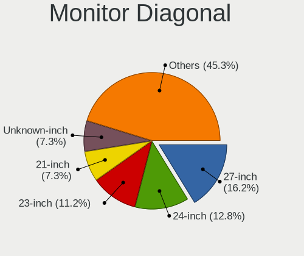

| Inches  | Desktops | Percent |
|---------|----------|---------|
| 24      | 10       | 14.49%  |
| 21      | 8        | 11.59%  |
| 27      | 7        | 10.14%  |
| 23      | 7        | 10.14%  |
| 31      | 6        | 8.7%    |
| Unknown | 5        | 7.25%   |
| 22      | 4        | 5.8%    |
| 84      | 3        | 4.35%   |
| 34      | 3        | 4.35%   |
| 19      | 3        | 4.35%   |
| 42      | 2        | 2.9%    |
| 20      | 2        | 2.9%    |
| 18      | 2        | 2.9%    |
| 72      | 1        | 1.45%   |
| 54      | 1        | 1.45%   |
| 46      | 1        | 1.45%   |
| 40      | 1        | 1.45%   |
| 32      | 1        | 1.45%   |
| 16      | 1        | 1.45%   |
| 7       | 1        | 1.45%   |

Monitor Width
-------------

Physical width

| Width in mm | Desktops | Percent |
|-------------|----------|---------|
| 501-600     | 23       | 33.82%  |
| 401-500     | 18       | 26.47%  |
| 601-700     | 6        | 8.82%   |
| Unknown     | 5        | 7.35%   |
| 701-800     | 4        | 5.88%   |
| 1501-2000   | 4        | 5.88%   |
| 351-400     | 2        | 2.94%   |
| 1001-1500   | 2        | 2.94%   |
| 901-1000    | 2        | 2.94%   |
| 801-900     | 1        | 1.47%   |
| 101-200     | 1        | 1.47%   |

Aspect Ratio
------------

Proportional relationship between the width and the height

| Ratio   | Desktops | Percent |
|---------|----------|---------|
| 16/9    | 49       | 73.13%  |
| 16/10   | 9        | 13.43%  |
| Unknown | 5        | 7.46%   |
| 21/9    | 3        | 4.48%   |
| 5/4     | 1        | 1.49%   |

Monitor Area
------------

Area in inch²

| Area in inch² | Desktops | Percent |
|----------------|----------|---------|
| 201-250        | 23       | 34.33%  |
| 351-500        | 10       | 14.93%  |
| 301-350        | 7        | 10.45%  |
| More than 1000 | 5        | 7.46%   |
| 151-200        | 5        | 7.46%   |
| Unknown        | 5        | 7.46%   |
| 251-300        | 4        | 5.97%   |
| 501-1000       | 4        | 5.97%   |
| 141-150        | 2        | 2.99%   |
| 1-40           | 1        | 1.49%   |
| 101-110        | 1        | 1.49%   |

Pixel Density
-------------

Pixels per inch

| Density       | Desktops | Percent |
|---------------|----------|---------|
| 51-100        | 42       | 62.69%  |
| 101-120       | 13       | 19.4%   |
| Unknown       | 5        | 7.46%   |
| 161-240       | 3        | 4.48%   |
| 121-160       | 2        | 2.99%   |
| More than 240 | 1        | 1.49%   |
| 1-50          | 1        | 1.49%   |

Multiple Monitors
-----------------

Total monitors connected

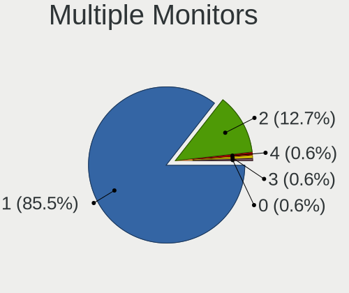

| Total | Desktops | Percent |
|-------|----------|---------|
| 1     | 61       | 89.71%  |
| 2     | 7        | 10.29%  |

Network
-------

Net Controller Vendor
---------------------

Controller vendors

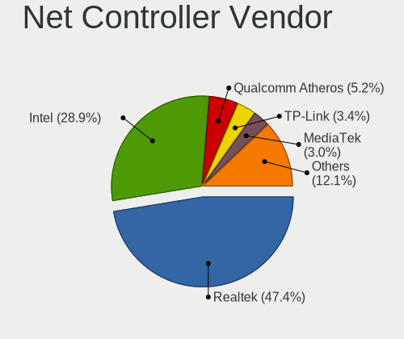

| Vendor                | Desktops | Percent |
|-----------------------|----------|---------|
| Realtek Semiconductor | 43       | 45.74%  |
| Intel                 | 28       | 29.79%  |
| Qualcomm Atheros      | 7        | 7.45%   |
| MediaTek              | 3        | 3.19%   |
| Broadcom              | 3        | 3.19%   |
| Ralink Technology     | 2        | 2.13%   |
| VIA Technologies      | 1        | 1.06%   |
| TP-Link               | 1        | 1.06%   |
| Ralink                | 1        | 1.06%   |
| Nvidia                | 1        | 1.06%   |
| Edimax Technology     | 1        | 1.06%   |
| D-Link                | 1        | 1.06%   |
| Broadcom Limited      | 1        | 1.06%   |
| Aquantia              | 1        | 1.06%   |

Net Controller Model
--------------------

Controller models

| Model                                                                  | Desktops | Percent |
|------------------------------------------------------------------------|----------|---------|
| Realtek RTL8111/8168/8211/8411 PCI Express Gigabit Ethernet Controller | 28       | 25%     |
| Realtek RTL8125 2.5GbE Controller                                      | 9        | 8.04%   |
| Intel Wi-Fi 6E(802.11ax) AX210/AX1675* 2x2 [Typhoon Peak]              | 4        | 3.57%   |
| Intel Raptor Lake-S PCH CNVi WiFi                                      | 3        | 2.68%   |
| Intel Dual Band Wireless-AC 3168NGW [Stone Peak]                       | 3        | 2.68%   |
| Intel 82579LM Gigabit Network Connection (Lewisville)                  | 3        | 2.68%   |
| Realtek RTL88x2bu [AC1200 Techkey]                                     | 2        | 1.79%   |
| Realtek RTL8821CE 802.11ac PCIe Wireless Network Adapter               | 2        | 1.79%   |
| Qualcomm Atheros AR8151 v2.0 Gigabit Ethernet                          | 2        | 1.79%   |
| Qualcomm Atheros AR8131 Gigabit Ethernet                               | 2        | 1.79%   |
| Intel I211 Gigabit Network Connection                                  | 2        | 1.79%   |
| Intel Ethernet Connection (7) I219-V                                   | 2        | 1.79%   |
| Intel Ethernet Connection (2) I218-V                                   | 2        | 1.79%   |
| VIA VT6102/VT6103 [Rhine-II]                                           | 1        | 0.89%   |
| TP-Link RTL8812AU Archer T4U 802.11ac                                  | 1        | 0.89%   |
| Realtek RTL8821AE 802.11ac PCIe Wireless Network Adapter               | 1        | 0.89%   |
| Realtek RTL8811AU 802.11a/b/g/n/ac WLAN Adapter                        | 1        | 0.89%   |
| Realtek RTL8192EE PCIe Wireless Network Adapter                        | 1        | 0.89%   |
| Realtek RTL8192CU 802.11n WLAN Adapter                                 | 1        | 0.89%   |
| Realtek RTL8188SU 802.11n WLAN Adapter                                 | 1        | 0.89%   |
| Realtek RTL8188FTV 802.11b/g/n 1T1R 2.4G WLAN Adapter                  | 1        | 0.89%   |
| Realtek RTL810xE PCI Express Fast Ethernet controller                  | 1        | 0.89%   |
| Realtek RTL-8100/8101L/8139 PCI Fast Ethernet Adapter                  | 1        | 0.89%   |
| Realtek Killer E3000 2.5GbE Controller                                 | 1        | 0.89%   |
| Realtek 802.11ac NIC                                                   | 1        | 0.89%   |
| Ralink RT5370 Wireless Adapter                                         | 1        | 0.89%   |
| Ralink MT7610U ("Archer T2U" 2.4G+5G WLAN Adapter                      | 1        | 0.89%   |
| Ralink RT2561/RT61 rev B 802.11g                                       | 1        | 0.89%   |
| Qualcomm Atheros QCA9565 / AR9565 Wireless Network Adapter             | 1        | 0.89%   |
| Qualcomm Atheros AR93xx Wireless Network Adapter                       | 1        | 0.89%   |
| Qualcomm Atheros AR9285 Wireless Network Adapter (PCI-Express)         | 1        | 0.89%   |
| Nvidia MCP77 Ethernet                                                  | 1        | 0.89%   |
| MediaTek WiFi                                                          | 1        | 0.89%   |
| MediaTek MT7922 802.11ax PCI Express Wireless Network Adapter          | 1        | 0.89%   |
| MediaTek MT7921K (RZ608) Wi-Fi 6E 80MHz                                | 1        | 0.89%   |
| Intel Wireless 3165                                                    | 1        | 0.89%   |
| Intel Wi-Fi 6 AX200                                                    | 1        | 0.89%   |
| Intel Wi-Fi 5(802.11ac) Wireless-AC 9x6x [Thunder Peak]                | 1        | 0.89%   |
| Intel I210 Gigabit Network Connection                                  | 1        | 0.89%   |
| Intel Ethernet Controller I226-V                                       | 1        | 0.89%   |

Wireless Vendor
---------------

Wireless vendors

| Vendor                | Desktops | Percent |
|-----------------------|----------|---------|
| Intel                 | 14       | 36.84%  |
| Realtek Semiconductor | 11       | 28.95%  |
| Qualcomm Atheros      | 3        | 7.89%   |
| MediaTek              | 3        | 7.89%   |
| Ralink Technology     | 2        | 5.26%   |
| TP-Link               | 1        | 2.63%   |
| Ralink                | 1        | 2.63%   |
| Edimax Technology     | 1        | 2.63%   |
| D-Link                | 1        | 2.63%   |
| Broadcom              | 1        | 2.63%   |

Wireless Model
--------------

Wireless models

| Model                                                          | Desktops | Percent |
|----------------------------------------------------------------|----------|---------|
| Intel Wi-Fi 6E(802.11ax) AX210/AX1675* 2x2 [Typhoon Peak]      | 4        | 10.26%  |
| Intel Raptor Lake-S PCH CNVi WiFi                              | 3        | 7.69%   |
| Intel Dual Band Wireless-AC 3168NGW [Stone Peak]               | 3        | 7.69%   |
| Realtek RTL88x2bu [AC1200 Techkey]                             | 2        | 5.13%   |
| Realtek RTL8821CE 802.11ac PCIe Wireless Network Adapter       | 2        | 5.13%   |
| TP-Link RTL8812AU Archer T4U 802.11ac                          | 1        | 2.56%   |
| Realtek RTL8821AE 802.11ac PCIe Wireless Network Adapter       | 1        | 2.56%   |
| Realtek RTL8811AU 802.11a/b/g/n/ac WLAN Adapter                | 1        | 2.56%   |
| Realtek RTL8192EE PCIe Wireless Network Adapter                | 1        | 2.56%   |
| Realtek RTL8192CU 802.11n WLAN Adapter                         | 1        | 2.56%   |
| Realtek RTL8188SU 802.11n WLAN Adapter                         | 1        | 2.56%   |
| Realtek RTL8188FTV 802.11b/g/n 1T1R 2.4G WLAN Adapter          | 1        | 2.56%   |
| Realtek 802.11ac NIC                                           | 1        | 2.56%   |
| Ralink RT5370 Wireless Adapter                                 | 1        | 2.56%   |
| Ralink MT7610U ("Archer T2U" 2.4G+5G WLAN Adapter              | 1        | 2.56%   |
| Ralink RT2561/RT61 rev B 802.11g                               | 1        | 2.56%   |
| Qualcomm Atheros QCA9565 / AR9565 Wireless Network Adapter     | 1        | 2.56%   |
| Qualcomm Atheros AR93xx Wireless Network Adapter               | 1        | 2.56%   |
| Qualcomm Atheros AR9285 Wireless Network Adapter (PCI-Express) | 1        | 2.56%   |
| MediaTek WiFi                                                  | 1        | 2.56%   |
| MediaTek MT7922 802.11ax PCI Express Wireless Network Adapter  | 1        | 2.56%   |
| MediaTek MT7921K (RZ608) Wi-Fi 6E 80MHz                        | 1        | 2.56%   |
| Intel Wireless 3165                                            | 1        | 2.56%   |
| Intel Wi-Fi 6 AX200                                            | 1        | 2.56%   |
| Intel Wi-Fi 5(802.11ac) Wireless-AC 9x6x [Thunder Peak]        | 1        | 2.56%   |
| Intel CNVi: Wi-Fi                                              | 1        | 2.56%   |
| Intel Alder Lake-S PCH CNVi WiFi                               | 1        | 2.56%   |
| Edimax EW-7811Un 802.11n Wireless Adapter [Realtek RTL8188CUS] | 1        | 2.56%   |
| D-Link WLAN controller                                         | 1        | 2.56%   |
| Broadcom BCM43602 802.11ac Wireless LAN SoC                    | 1        | 2.56%   |

Ethernet Vendor
---------------

Ethernet vendors

| Vendor                | Desktops | Percent |
|-----------------------|----------|---------|
| Realtek Semiconductor | 39       | 55.71%  |
| Intel                 | 21       | 30%     |
| Qualcomm Atheros      | 4        | 5.71%   |
| Broadcom              | 2        | 2.86%   |
| VIA Technologies      | 1        | 1.43%   |
| Nvidia                | 1        | 1.43%   |
| Broadcom Limited      | 1        | 1.43%   |
| Aquantia              | 1        | 1.43%   |

Ethernet Model
--------------

Ethernet models

| Model                                                                           | Desktops | Percent |
|---------------------------------------------------------------------------------|----------|---------|
| Realtek RTL8111/8168/8211/8411 PCI Express Gigabit Ethernet Controller          | 28       | 38.36%  |
| Realtek RTL8125 2.5GbE Controller                                               | 9        | 12.33%  |
| Intel 82579LM Gigabit Network Connection (Lewisville)                           | 3        | 4.11%   |
| Qualcomm Atheros AR8151 v2.0 Gigabit Ethernet                                   | 2        | 2.74%   |
| Qualcomm Atheros AR8131 Gigabit Ethernet                                        | 2        | 2.74%   |
| Intel I211 Gigabit Network Connection                                           | 2        | 2.74%   |
| Intel Ethernet Connection (7) I219-V                                            | 2        | 2.74%   |
| Intel Ethernet Connection (2) I218-V                                            | 2        | 2.74%   |
| VIA VT6102/VT6103 [Rhine-II]                                                    | 1        | 1.37%   |
| Realtek RTL810xE PCI Express Fast Ethernet controller                           | 1        | 1.37%   |
| Realtek RTL-8100/8101L/8139 PCI Fast Ethernet Adapter                           | 1        | 1.37%   |
| Realtek Killer E3000 2.5GbE Controller                                          | 1        | 1.37%   |
| Nvidia MCP77 Ethernet                                                           | 1        | 1.37%   |
| Intel I210 Gigabit Network Connection                                           | 1        | 1.37%   |
| Intel Ethernet Controller I226-V                                                | 1        | 1.37%   |
| Intel Ethernet Controller I225-V                                                | 1        | 1.37%   |
| Intel Ethernet Connection I217-V                                                | 1        | 1.37%   |
| Intel Ethernet Connection I217-LM                                               | 1        | 1.37%   |
| Intel Ethernet Connection (2) I219-V                                            | 1        | 1.37%   |
| Intel Ethernet Connection (2) I219-LM                                           | 1        | 1.37%   |
| Intel Ethernet Connection (17) I219-V                                           | 1        | 1.37%   |
| Intel Ethernet Connection (14) I219-V                                           | 1        | 1.37%   |
| Intel Ethernet Connection (10) I219-V                                           | 1        | 1.37%   |
| Intel 82599 10 Gigabit Network Connection                                       | 1        | 1.37%   |
| Intel 82583V Gigabit Network Connection                                         | 1        | 1.37%   |
| Intel 82574L Gigabit Network Connection                                         | 1        | 1.37%   |
| Intel 82567V-2 Gigabit Network Connection                                       | 1        | 1.37%   |
| Broadcom NetXtreme BCM5754 Gigabit Ethernet PCI Express                         | 1        | 1.37%   |
| Broadcom NetXtreme BCM5751 Gigabit Ethernet PCI Express                         | 1        | 1.37%   |
| Broadcom Limited NetXtreme BCM5782 Gigabit Ethernet                             | 1        | 1.37%   |
| Aquantia AQtion AQC113CS NBase-T/IEEE 802.3an Ethernet Controller [Antigua 10G] | 1        | 1.37%   |

Net Controller Kind
-------------------

Ethernet, WiFi or modem

| Kind     | Desktops | Percent |
|----------|----------|---------|
| Ethernet | 66       | 64.71%  |
| WiFi     | 36       | 35.29%  |

Used Controller
---------------

Currently used network controller

| Kind     | Desktops | Percent |
|----------|----------|---------|
| Ethernet | 52       | 74.29%  |
| WiFi     | 18       | 25.71%  |

NICs
----

Total network controllers on board

| Total | Desktops | Percent |
|-------|----------|---------|
| 1     | 40       | 57.97%  |
| 2     | 23       | 33.33%  |
| 3     | 5        | 7.25%   |
| 0     | 1        | 1.45%   |

IPv6
----

IPv6 vs IPv4

| Used | Desktops | Percent |
|------|----------|---------|
| No   | 41       | 60.29%  |
| Yes  | 27       | 39.71%  |

Bluetooth
---------

Bluetooth Vendor
----------------

Controller vendors

| Vendor                          | Desktops | Percent |
|---------------------------------|----------|---------|
| Intel                           | 14       | 46.67%  |
| Cambridge Silicon Radio         | 5        | 16.67%  |
| Realtek Semiconductor           | 3        | 10%     |
| MediaTek                        | 3        | 10%     |
| Qualcomm Atheros Communications | 1        | 3.33%   |
| Integrated System Solution      | 1        | 3.33%   |
| IMC Networks                    | 1        | 3.33%   |
| Apple                           | 1        | 3.33%   |
| Unknown                         | 1        | 3.33%   |

Bluetooth Model
---------------

Controller models

| Model                                               | Desktops | Percent |
|-----------------------------------------------------|----------|---------|
| Cambridge Silicon Radio Bluetooth Dongle (HCI mode) | 5        | 16.67%  |
| Intel Bluetooth Device                              | 4        | 13.33%  |
| MediaTek Wireless_Device                            | 3        | 10%     |
| Intel Wireless-AC 3168 Bluetooth                    | 3        | 10%     |
| Intel AX210 Bluetooth                               | 3        | 10%     |
| Realtek Bluetooth Radio                             | 2        | 6.67%   |
| Realtek  Bluetooth 4.2 Adapter                      | 1        | 3.33%   |
| Qualcomm Atheros  Bluetooth Device                  | 1        | 3.33%   |
| Intel Wireless-AC 9260 Bluetooth Adapter            | 1        | 3.33%   |
| Intel Bluetooth wireless interface                  | 1        | 3.33%   |
| Intel AX201 Bluetooth                               | 1        | 3.33%   |
| Intel AX200 Bluetooth                               | 1        | 3.33%   |
| Integrated System Solution Bluetooth Device         | 1        | 3.33%   |
| IMC Networks Bluetooth Radio                        | 1        | 3.33%   |
| Apple Bluetooth Host Controller                     | 1        | 3.33%   |
| Unknown                                             | 1        | 3.33%   |

Sound
-----

Sound Vendor
------------

Sound card vendors

| Vendor                                       | Desktops | Percent |
|----------------------------------------------|----------|---------|
| Intel                                        | 39       | 33.33%  |
| AMD                                          | 35       | 29.91%  |
| Nvidia                                       | 22       | 18.8%   |
| Creative Labs                                | 3        | 2.56%   |
| Micro Star International                     | 2        | 1.71%   |
| JMTek                                        | 2        | 1.71%   |
| Zoran Co. Personal Media Division (Nogatech) | 1        | 0.85%   |
| VIA Technologies                             | 1        | 0.85%   |
| Texas Instruments                            | 1        | 0.85%   |
| Logitech                                     | 1        | 0.85%   |
| Hewlett-Packard                              | 1        | 0.85%   |
| GN Netcom                                    | 1        | 0.85%   |
| Generalplus Technology                       | 1        | 0.85%   |
| Creative Technology                          | 1        | 0.85%   |
| C-Media Electronics                          | 1        | 0.85%   |
| BR23                                         | 1        | 0.85%   |
| Blue Microphones                             | 1        | 0.85%   |
| ASUSTek Computer                             | 1        | 0.85%   |
| ASRock                                       | 1        | 0.85%   |
| Altec Lansing Technologies                   | 1        | 0.85%   |

Sound Model
-----------

Sound card models

| Model                                                                                             | Desktops | Percent |
|---------------------------------------------------------------------------------------------------|----------|---------|
| AMD Family 17h/19h HD Audio Controller                                                            | 12       | 8.63%   |
| AMD Rembrandt Radeon High Definition Audio Controller                                             | 6        | 4.32%   |
| AMD SBx00 Azalia (Intel HDA)                                                                      | 5        | 3.6%    |
| Intel NM10/ICH7 Family High Definition Audio Controller                                           | 4        | 2.88%   |
| Intel 8 Series/C220 Series Chipset High Definition Audio Controller                               | 4        | 2.88%   |
| Intel 7 Series/C216 Chipset Family High Definition Audio Controller                               | 4        | 2.88%   |
| Intel 100 Series/C230 Series Chipset Family HD Audio Controller                                   | 4        | 2.88%   |
| Nvidia GP106 High Definition Audio Controller                                                     | 3        | 2.16%   |
| Nvidia GK208 HDMI/DP Audio Controller                                                             | 3        | 2.16%   |
| Intel Raptor Lake High Definition Audio Controller                                                | 3        | 2.16%   |
| Intel Cannon Lake PCH cAVS                                                                        | 3        | 2.16%   |
| AMD Starship/Matisse HD Audio Controller                                                          | 3        | 2.16%   |
| AMD Renoir Radeon High Definition Audio Controller                                                | 3        | 2.16%   |
| AMD Navi 31 HDMI/DP Audio                                                                         | 3        | 2.16%   |
| AMD Navi 21/23 HDMI/DP Audio Controller                                                           | 3        | 2.16%   |
| AMD Family 17h (Models 00h-0fh) HD Audio Controller                                               | 3        | 2.16%   |
| Nvidia TU106 High Definition Audio Controller                                                     | 2        | 1.44%   |
| Nvidia GK104 HDMI Audio Controller                                                                | 2        | 1.44%   |
| Nvidia GF108 High Definition Audio Controller                                                     | 2        | 1.44%   |
| Nvidia Audio device                                                                               | 2        | 1.44%   |
| Micro Star International USB Audio                                                                | 2        | 1.44%   |
| JMTek USB PnP Audio Device                                                                        | 2        | 1.44%   |
| Intel Xeon E3-1200 v3/4th Gen Core Processor HD Audio Controller                                  | 2        | 1.44%   |
| Intel Atom/Celeron/Pentium Processor x5-E8000/J3xxx/N3xxx Series High Definition Audio Controller | 2        | 1.44%   |
| Intel Alder Lake-S HD Audio Controller                                                            | 2        | 1.44%   |
| Intel Alder Lake-N PCH High Definition Audio Controller                                           | 2        | 1.44%   |
| AMD Raven/Raven2/Fenghuang HDMI/DP Audio Controller                                               | 2        | 1.44%   |
| AMD Cedar HDMI Audio [Radeon HD 5400/6300/7300 Series]                                            | 2        | 1.44%   |
| AMD Caicos HDMI Audio [Radeon HD 6450 / 7450/8450/8490 OEM / R5 230/235/235X OEM]                 | 2        | 1.44%   |
| Zoran Co. Personal Media Division (Nogatech) USB Audio and HID                                    | 1        | 0.72%   |
| VIA Technologies VT8233/A/8235/8237 AC97 Audio Controller                                         | 1        | 0.72%   |
| Texas Instruments PCM2902 Audio Codec                                                             | 1        | 0.72%   |
| Nvidia TU116 High Definition Audio Controller                                                     | 1        | 0.72%   |
| Nvidia MCP72XE/MCP72P/MCP78U/MCP78S High Definition Audio                                         | 1        | 0.72%   |
| Nvidia GP108 High Definition Audio Controller                                                     | 1        | 0.72%   |
| Nvidia GP107GL High Definition Audio Controller                                                   | 1        | 0.72%   |
| Nvidia GP102 HDMI Audio Controller                                                                | 1        | 0.72%   |
| Nvidia GM204 High Definition Audio Controller                                                     | 1        | 0.72%   |
| Nvidia GM107 High Definition Audio Controller [GeForce 940MX]                                     | 1        | 0.72%   |
| Nvidia GF119 HDMI Audio Controller                                                                | 1        | 0.72%   |

Memory
------

Memory Vendor
-------------

Memory module vendors

| Vendor              | Desktops | Percent |
|---------------------|----------|---------|
| Kingston            | 11       | 29.73%  |
| Unknown             | 5        | 13.51%  |
| SK hynix            | 5        | 13.51%  |
| G.Skill             | 4        | 10.81%  |
| Corsair             | 3        | 8.11%   |
| Samsung Electronics | 2        | 5.41%   |
| Crucial             | 2        | 5.41%   |
| Unknown (ABCD)      | 1        | 2.7%    |
| Team                | 1        | 2.7%    |
| Mushkin             | 1        | 2.7%    |
| Avant               | 1        | 2.7%    |
| Unknown             | 1        | 2.7%    |

Memory Model
------------

Memory module models

| Model                                                          | Desktops | Percent |
|----------------------------------------------------------------|----------|---------|
| Unknown RAM Module 4GB DIMM 1066MT/s                           | 2        | 4.65%   |
| Unknown RAM Module 8GB SODIMM DDR3 1600MT/s                    | 1        | 2.33%   |
| Unknown RAM Module 512MB DIMM                                  | 1        | 2.33%   |
| Unknown RAM Module 2GB DIMM DDR 667MT/s                        | 1        | 2.33%   |
| Unknown RAM Module 2GB DIMM 1066MT/s                           | 1        | 2.33%   |
| Unknown RAM Module 1GB DIMM                                    | 1        | 2.33%   |
| Unknown (ABCD) RAM 123456789012345678 2GB DIMM LPDDR4 2400MT/s | 1        | 2.33%   |
| Team RAM TEAMGROUP-SD4-2666 16GB SODIMM DDR4 2667MT/s          | 1        | 2.33%   |
| SK hynix RAM Module 2GB DIMM DDR3 1333MT/s                     | 1        | 2.33%   |
| SK hynix RAM HYMP564U64CP8-Y5 512MB DIMM DDR 667MT/s           | 1        | 2.33%   |
| SK hynix RAM HYMP125U64CP8-Y5 2GB DIMM DDR 667MT/s             | 1        | 2.33%   |
| SK hynix RAM HMT425S6CFR6C-PB 2GB SODIMM DDR3 1600MT/s         | 1        | 2.33%   |
| SK hynix RAM HMT41GR7AFR4C-RD 8GB DIMM DDR3 1867MT/s           | 1        | 2.33%   |
| SK hynix RAM HMT31GR7CFR4C-PB 8GB DIMM DDR3 1600MT/s           | 1        | 2.33%   |
| SK hynix RAM H9JCNNNFA5MLYR-N6E 8GB DIMM LPDDR5 6400MT/s       | 1        | 2.33%   |
| Samsung RAM M378B1G73DB0-CK0 8GB DIMM DDR3 2133MT/s            | 1        | 2.33%   |
| Samsung RAM M3 78T6464QZ3-CE6 512MB DIMM DDR2 667MT/s          | 1        | 2.33%   |
| Mushkin RAM MRX4U320GJJM32G 32GB DIMM DDR4 3200MT/s            | 1        | 2.33%   |
| Kingston RAM Module 8GB DIMM DDR4 2133MT/s                     | 1        | 2.33%   |
| Kingston RAM KNWMX1-ETB 4GB SODIMM DDR3 1600MT/s               | 1        | 2.33%   |
| Kingston RAM KHX3200C16D4/8GX 8GB DIMM DDR4 3733MT/s           | 1        | 2.33%   |
| Kingston RAM KHX3200C16D4/16GX 16GB DIMM DDR4 3600MT/s         | 1        | 2.33%   |
| Kingston RAM KHX2400C15/8G 8GB DIMM DDR4 3400MT/s              | 1        | 2.33%   |
| Kingston RAM KHX1866C10D3/ 8GB DIMM DDR3 1866MT/s              | 1        | 2.33%   |
| Kingston RAM KF560C36-16 16GB DIMM DDR5 6000MT/s               | 1        | 2.33%   |
| Kingston RAM K 512MB DIMM DDR 667MT/s                          | 1        | 2.33%   |
| Kingston RAM 99U5584-005.A00LF 4GB DIMM DDR3 1600MT/s          | 1        | 2.33%   |
| Kingston RAM 99U5584-003.A00LF 4GB DIMM DDR3 1600MT/s          | 1        | 2.33%   |
| Kingston RAM 99U5402-037.A00G 2GB DIMM DDR3 1333MT/s           | 1        | 2.33%   |
| Kingston RAM 99U5315-012.A00LF 512MB DIMM DDR 533MT/s          | 1        | 2.33%   |
| Kingston RAM 9905471-001.A01LF 2GB DIMM DDR3 1600MT/s          | 1        | 2.33%   |
| G.Skill RAM F5-6000J3040G32G 32GB DIMM DDR5 6000MT/s           | 1        | 2.33%   |
| G.Skill RAM F4-3200C16-8GIS 8GB DIMM DDR4 3200MT/s             | 1        | 2.33%   |
| G.Skill RAM F4-3000C15-16GVR 16GB DIMM DDR4 3200MT/s           | 1        | 2.33%   |
| G.Skill RAM F3-14900CL9-4GBSR 4GB DIMM DDR3 1867MT/s           | 1        | 2.33%   |
| Crucial RAM CP16G4DFRA32A.M8FF 16GB DIMM DDR4 3200MT/s         | 1        | 2.33%   |
| Crucial RAM CB16GU2666.C8ET 16GB DIMM DDR4 2667MT/s            | 1        | 2.33%   |
| Corsair RAM CMK32GX5M2E6000C36 16GB DIMM DDR5 4800MT/s         | 1        | 2.33%   |
| Corsair RAM CMK16GX4M1E3200C16 16GB DIMM DDR4 3200MT/s         | 1        | 2.33%   |
| Corsair RAM CMH96GX5M2B5600C40 48GB DIMM DDR5 4800MT/s         | 1        | 2.33%   |

Memory Kind
-----------

Memory module kinds

| Kind    | Desktops | Percent |
|---------|----------|---------|
| DDR4    | 12       | 34.29%  |
| DDR3    | 9        | 25.71%  |
| DDR5    | 4        | 11.43%  |
| Unknown | 3        | 8.57%   |
| SDRAM   | 2        | 5.71%   |
| DDR     | 2        | 5.71%   |
| LPDDR5  | 1        | 2.86%   |
| LPDDR4  | 1        | 2.86%   |
| DDR2    | 1        | 2.86%   |

Memory Form Factor
------------------

Physical design of the memory module

| Name   | Desktops | Percent |
|--------|----------|---------|
| DIMM   | 29       | 87.88%  |
| SODIMM | 4        | 12.12%  |

Memory Size
-----------

Memory module size

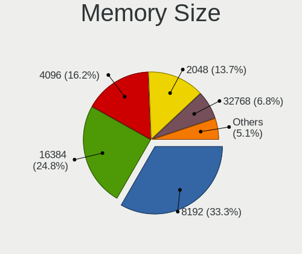

| Size  | Desktops | Percent |
|-------|----------|---------|
| 8192  | 10       | 26.32%  |
| 16384 | 9        | 23.68%  |
| 2048  | 7        | 18.42%  |
| 4096  | 5        | 13.16%  |
| 32768 | 3        | 7.89%   |
| 512   | 2        | 5.26%   |
| 49152 | 1        | 2.63%   |
| 1024  | 1        | 2.63%   |

Memory Speed
------------

Memory module speed

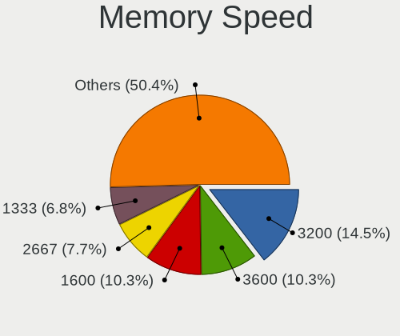

| Speed   | Desktops | Percent |
|---------|----------|---------|
| 3200    | 6        | 16.67%  |
| 1600    | 5        | 13.89%  |
| 667     | 3        | 8.33%   |
| 6000    | 2        | 5.56%   |
| 4800    | 2        | 5.56%   |
| 2667    | 2        | 5.56%   |
| 2133    | 2        | 5.56%   |
| 1867    | 2        | 5.56%   |
| 1333    | 2        | 5.56%   |
| 1066    | 2        | 5.56%   |
| 6400    | 1        | 2.78%   |
| 3733    | 1        | 2.78%   |
| 3600    | 1        | 2.78%   |
| 3400    | 1        | 2.78%   |
| 2400    | 1        | 2.78%   |
| 1866    | 1        | 2.78%   |
| 533     | 1        | 2.78%   |
| Unknown | 1        | 2.78%   |

Printers & scanners
-------------------

Printer Vendor
--------------

Printer device vendors

| Vendor                | Desktops | Percent |
|-----------------------|----------|---------|
| Hewlett-Packard       | 2        | 50%     |
| Seiko Epson           | 1        | 25%     |
| Lexmark International | 1        | 25%     |

Printer Model
-------------

Printer device models

| Model                         | Desktops | Percent |
|-------------------------------|----------|---------|
| Seiko Epson ET-1810 Series    | 1        | 25%     |
| Lexmark International MX310dn | 1        | 25%     |
| HP LaserJet Pro M404-M405     | 1        | 25%     |
| HP DeskJet F4200 series       | 1        | 25%     |

Scanner Vendor
--------------

Scanner device vendors

| Vendor      | Desktops | Percent |
|-------------|----------|---------|
| Seiko Epson | 1        | 100%    |

Scanner Model
-------------

Scanner device models

| Model                                       | Desktops | Percent |
|---------------------------------------------|----------|---------|
| Seiko Epson GT-X820 [Perfection V600 Photo] | 1        | 100%    |

Camera
------

Camera Vendor
-------------

Camera device vendors

| Vendor                        | Desktops | Percent |
|-------------------------------|----------|---------|
| Logitech                      | 7        | 70%     |
| Sunplus Innovation Technology | 1        | 10%     |
| MacroSilicon                  | 1        | 10%     |
| KYE Systems (Mouse Systems)   | 1        | 10%     |

Camera Model
------------

Camera device models

| Model                                          | Desktops | Percent |
|------------------------------------------------|----------|---------|
| Sunplus FHD Camera Microphone                  | 1        | 10%     |
| MacroSilicon ClearClick                        | 1        | 10%     |
| Logitech Webcam C310                           | 1        | 10%     |
| Logitech Webcam C270                           | 1        | 10%     |
| Logitech Webcam C170                           | 1        | 10%     |
| Logitech HD Webcam C615                        | 1        | 10%     |
| Logitech HD Pro Webcam C920                    | 1        | 10%     |
| Logitech C920 PRO HD Webcam                    | 1        | 10%     |
| Logitech BRIO Ultra HD Webcam                  | 1        | 10%     |
| KYE Systems (Mouse Systems) Genius FaceCam 312 | 1        | 10%     |

Security
--------

Fingerprint Vendor
------------------

Fingerprint sensor vendors

Zero info for selected period =(

Fingerprint Model
-----------------

Fingerprint sensor models

Zero info for selected period =(

Chipcard Vendor
---------------

Chipcard module vendors

Zero info for selected period =(

Chipcard Model
--------------

Chipcard module models

Zero info for selected period =(

Unsupported
-----------

Unsupported Devices
-------------------

Total unsupported devices on board

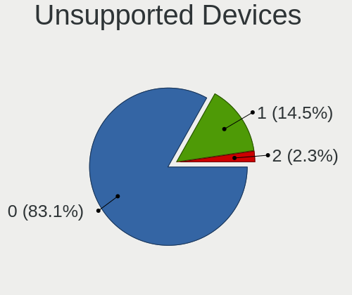

| Total | Desktops | Percent |
|-------|----------|---------|
| 0     | 63       | 90%     |
| 1     | 5        | 7.14%   |
| 2     | 2        | 2.86%   |

Unsupported Device Types
------------------------

Types of unsupported devices

| Type                     | Desktops | Percent |
|--------------------------|----------|---------|
| Graphics card            | 3        | 50%     |
| Unassigned class         | 1        | 16.67%  |
| Multimedia controller    | 1        | 16.67%  |
| Communication controller | 1        | 16.67%  |

