LMDE 6 - Tested Hardware & Statistics (Desktops)
------------------------------------------------

A project to collect tested hardware configurations for LMDE 6.

Anyone can contribute to this report by the [hw-probe](https://github.com/linuxhw/hw-probe) tool:

    sudo -E hw-probe -all -upload

Please contribute! Especially if your hardware is rare.

Contents
--------

* [ Test Cases ](#test-cases)

* [ System ](#system)
  - [ Kernel                   ](#kernel)
  - [ Kernel Family            ](#kernel-family)
  - [ Kernel Major Ver.        ](#kernel-major-ver)
  - [ Arch                     ](#arch)
  - [ DE                       ](#de)
  - [ Display Server           ](#display-server)
  - [ Display Manager          ](#display-manager)
  - [ OS Lang                  ](#os-lang)
  - [ Boot Mode                ](#boot-mode)
  - [ Filesystem               ](#filesystem)
  - [ Part. scheme             ](#part-scheme)
  - [ Dual Boot with Linux/BSD ](#dual-boot-with-linuxbsd)
  - [ Dual Boot (Win)          ](#dual-boot-win)

* [ Board ](#board)
  - [ Vendor                   ](#vendor)
  - [ Model                    ](#model)
  - [ Model Family             ](#model-family)
  - [ MFG Year                 ](#mfg-year)
  - [ Form Factor              ](#form-factor)
  - [ Secure Boot              ](#secure-boot)
  - [ Coreboot                 ](#coreboot)
  - [ RAM Size                 ](#ram-size)
  - [ RAM Used                 ](#ram-used)
  - [ Total Drives             ](#total-drives)
  - [ Has CD-ROM               ](#has-cd-rom)
  - [ Has Ethernet             ](#has-ethernet)
  - [ Has WiFi                 ](#has-wifi)
  - [ Has Bluetooth            ](#has-bluetooth)

* [ Location ](#location)
  - [ Country                  ](#country)
  - [ City                     ](#city)

* [ Drives ](#drives)
  - [ Drive Vendor             ](#drive-vendor)
  - [ Drive Model              ](#drive-model)
  - [ HDD Vendor               ](#hdd-vendor)
  - [ SSD Vendor               ](#ssd-vendor)
  - [ Drive Kind               ](#drive-kind)
  - [ Drive Connector          ](#drive-connector)
  - [ Drive Size               ](#drive-size)
  - [ Space Total              ](#space-total)
  - [ Space Used               ](#space-used)
  - [ Malfunc. Drives          ](#malfunc-drives)
  - [ Malfunc. Drive Vendor    ](#malfunc-drive-vendor)
  - [ Malfunc. HDD Vendor      ](#malfunc-hdd-vendor)
  - [ Malfunc. Drive Kind      ](#malfunc-drive-kind)
  - [ Failed Drives            ](#failed-drives)
  - [ Failed Drive Vendor      ](#failed-drive-vendor)
  - [ Drive Status             ](#drive-status)

* [ Storage controller ](#storage-controller)
  - [ Storage Vendor           ](#storage-vendor)
  - [ Storage Model            ](#storage-model)
  - [ Storage Kind             ](#storage-kind)

* [ Processor ](#processor)
  - [ CPU Vendor               ](#cpu-vendor)
  - [ CPU Model                ](#cpu-model)
  - [ CPU Model Family         ](#cpu-model-family)
  - [ CPU Cores                ](#cpu-cores)
  - [ CPU Sockets              ](#cpu-sockets)
  - [ CPU Threads              ](#cpu-threads)
  - [ CPU Op-Modes             ](#cpu-op-modes)
  - [ CPU Microcode            ](#cpu-microcode)
  - [ CPU Microarch            ](#cpu-microarch)

* [ Graphics ](#graphics)
  - [ GPU Vendor               ](#gpu-vendor)
  - [ GPU Model                ](#gpu-model)
  - [ GPU Combo                ](#gpu-combo)
  - [ GPU Driver               ](#gpu-driver)
  - [ GPU Memory               ](#gpu-memory)

* [ Monitor ](#monitor)
  - [ Monitor Vendor           ](#monitor-vendor)
  - [ Monitor Model            ](#monitor-model)
  - [ Monitor Resolution       ](#monitor-resolution)
  - [ Monitor Diagonal         ](#monitor-diagonal)
  - [ Monitor Width            ](#monitor-width)
  - [ Aspect Ratio             ](#aspect-ratio)
  - [ Monitor Area             ](#monitor-area)
  - [ Pixel Density            ](#pixel-density)
  - [ Multiple Monitors        ](#multiple-monitors)

* [ Network ](#network)
  - [ Net Controller Vendor    ](#net-controller-vendor)
  - [ Net Controller Model     ](#net-controller-model)
  - [ Wireless Vendor          ](#wireless-vendor)
  - [ Wireless Model           ](#wireless-model)
  - [ Ethernet Vendor          ](#ethernet-vendor)
  - [ Ethernet Model           ](#ethernet-model)
  - [ Net Controller Kind      ](#net-controller-kind)
  - [ Used Controller          ](#used-controller)
  - [ NICs                     ](#nics)
  - [ IPv6                     ](#ipv6)

* [ Bluetooth ](#bluetooth)
  - [ Bluetooth Vendor         ](#bluetooth-vendor)
  - [ Bluetooth Model          ](#bluetooth-model)

* [ Sound ](#sound)
  - [ Sound Vendor             ](#sound-vendor)
  - [ Sound Model              ](#sound-model)

* [ Memory ](#memory)
  - [ Memory Vendor            ](#memory-vendor)
  - [ Memory Model             ](#memory-model)
  - [ Memory Kind              ](#memory-kind)
  - [ Memory Form Factor       ](#memory-form-factor)
  - [ Memory Size              ](#memory-size)
  - [ Memory Speed             ](#memory-speed)

* [ Printers & scanners ](#printers--scanners)
  - [ Printer Vendor           ](#printer-vendor)
  - [ Printer Model            ](#printer-model)
  - [ Scanner Vendor           ](#scanner-vendor)
  - [ Scanner Model            ](#scanner-model)

* [ Camera ](#camera)
  - [ Camera Vendor            ](#camera-vendor)
  - [ Camera Model             ](#camera-model)

* [ Security ](#security)
  - [ Fingerprint Vendor       ](#fingerprint-vendor)
  - [ Fingerprint Model        ](#fingerprint-model)
  - [ Chipcard Vendor          ](#chipcard-vendor)
  - [ Chipcard Model           ](#chipcard-model)

* [ Unsupported ](#unsupported)
  - [ Unsupported Devices      ](#unsupported-devices)
  - [ Unsupported Device Types ](#unsupported-device-types)

Test Cases
----------

Total: 161

| Vendor        | Model                       | Probe                                                      | Date         |
|---------------|-----------------------------|------------------------------------------------------------|--------------|
| ASUSTek       | PRIME B250M-C               | [0a6d61d9f6](https://linux-hardware.org/?probe=0a6d61d9f6) | May 09, 2024 |
| ASUSTek       | P5Q SE2                     | [cf126cd087](https://linux-hardware.org/?probe=cf126cd087) | May 08, 2024 |
| PELADN        | WI-6                        | [73069ab9f5](https://linux-hardware.org/?probe=73069ab9f5) | May 07, 2024 |
| ASUSTek       | TUF Gaming B550-PLUS WIF... | [9176ad5eb1](https://linux-hardware.org/?probe=9176ad5eb1) | May 04, 2024 |
| ASUSTek       | M5A99X EVO                  | [9d375acdb0](https://linux-hardware.org/?probe=9d375acdb0) | May 03, 2024 |
| ASUSTek       | H81-PLUS                    | [efe7c01899](https://linux-hardware.org/?probe=efe7c01899) | May 01, 2024 |
| ASUSTek       | H81-PLUS                    | [512660cdbc](https://linux-hardware.org/?probe=512660cdbc) | May 01, 2024 |
| Medion        | TJ4125                      | [5107c56945](https://linux-hardware.org/?probe=5107c56945) | Apr 29, 2024 |
| Fujitsu       | D3171-A1 S26361-D3171-A1    | [a52ce5dea5](https://linux-hardware.org/?probe=a52ce5dea5) | Apr 27, 2024 |
| Pegatron      | 2A94                        | [3673d4e290](https://linux-hardware.org/?probe=3673d4e290) | Apr 25, 2024 |
| HP            | 8876 11                     | [b15b96ee62](https://linux-hardware.org/?probe=b15b96ee62) | Apr 23, 2024 |
| AMI           | Intel                       | [7f5a03f6a3](https://linux-hardware.org/?probe=7f5a03f6a3) | Apr 23, 2024 |
| Unknown       | Unknown                     | [2be166cff9](https://linux-hardware.org/?probe=2be166cff9) | Apr 22, 2024 |
| Unknown       | Unknown                     | [9bce7f48fb](https://linux-hardware.org/?probe=9bce7f48fb) | Apr 22, 2024 |
| ASUSTek       | PRIME B250M-C               | [46d23f3585](https://linux-hardware.org/?probe=46d23f3585) | Apr 21, 2024 |
| HP            | 1495                        | [0eb85fb716](https://linux-hardware.org/?probe=0eb85fb716) | Apr 20, 2024 |
| HP            | 1495                        | [f3b383fe91](https://linux-hardware.org/?probe=f3b383fe91) | Apr 20, 2024 |
| Gigabyte      | AB350M-DS3H V2-CF           | [7cfe6d651b](https://linux-hardware.org/?probe=7cfe6d651b) | Apr 18, 2024 |
| Medion        | TJ4125                      | [283e08c36b](https://linux-hardware.org/?probe=283e08c36b) | Apr 18, 2024 |
| MSI           | MAG Z790 TOMAHAWK WIFI      | [0bf4de97cf](https://linux-hardware.org/?probe=0bf4de97cf) | Apr 17, 2024 |
| MSI           | MPG B550 GAMING PLUS        | [a996f7b2e9](https://linux-hardware.org/?probe=a996f7b2e9) | Apr 12, 2024 |
| Gigabyte      | Q87M-D2H                    | [3d748511c8](https://linux-hardware.org/?probe=3d748511c8) | Apr 08, 2024 |
| PELADN        | WI-6                        | [16b9fe150d](https://linux-hardware.org/?probe=16b9fe150d) | Apr 07, 2024 |
| PELADN        | WI-6                        | [e3e158c12c](https://linux-hardware.org/?probe=e3e158c12c) | Apr 05, 2024 |
| Medion        | TJ4125                      | [9d159ef9de](https://linux-hardware.org/?probe=9d159ef9de) | Apr 04, 2024 |
| Medion        | TJ4125                      | [3133554055](https://linux-hardware.org/?probe=3133554055) | Apr 04, 2024 |
| ASUSTek       | PRIME Z370-P II             | [e075d81601](https://linux-hardware.org/?probe=e075d81601) | Apr 04, 2024 |
| Quanta        | 2AC7 011                    | [ee7988e621](https://linux-hardware.org/?probe=ee7988e621) | Mar 29, 2024 |
| ASRock        | J3455-ITX                   | [a0f0f8fc52](https://linux-hardware.org/?probe=a0f0f8fc52) | Mar 26, 2024 |
| Gigabyte      | Q87M-D2H                    | [14cbf1cf7d](https://linux-hardware.org/?probe=14cbf1cf7d) | Mar 25, 2024 |
| PELADN        | WI-6                        | [76b4088a9e](https://linux-hardware.org/?probe=76b4088a9e) | Mar 23, 2024 |
| Fujitsu       | D3161-A1 S26361-D3161-A1    | [07889f98fc](https://linux-hardware.org/?probe=07889f98fc) | Mar 22, 2024 |
| ASUSTek       | K30BF_M32BF_A_F_K31BF_6     | [dfa8ff45b7](https://linux-hardware.org/?probe=dfa8ff45b7) | Mar 21, 2024 |
| ASUSTek       | K30BF_M32BF_A_F_K31BF_6     | [5c0de1313b](https://linux-hardware.org/?probe=5c0de1313b) | Mar 21, 2024 |
| Gigabyte      | Z170-HD3P-CF                | [230ed44a0f](https://linux-hardware.org/?probe=230ed44a0f) | Mar 18, 2024 |
| ASUSTek       | PRIME B450M-A II            | [e5bf526b80](https://linux-hardware.org/?probe=e5bf526b80) | Mar 13, 2024 |
| Unknown       | G31T-M7                     | [1bf4ded8e3](https://linux-hardware.org/?probe=1bf4ded8e3) | Mar 09, 2024 |
| Gigabyte      | A320M-H-CF                  | [954a5c5822](https://linux-hardware.org/?probe=954a5c5822) | Feb 20, 2024 |
| Gigabyte      | Q87M-D2H                    | [54eb218a18](https://linux-hardware.org/?probe=54eb218a18) | Feb 20, 2024 |
| MSI           | Z370-A PRO                  | [3715fac015](https://linux-hardware.org/?probe=3715fac015) | Feb 20, 2024 |
| Gigabyte      | AB350M-DS3H V2-CF           | [29958a239f](https://linux-hardware.org/?probe=29958a239f) | Feb 19, 2024 |
| MSI           | Z170A SLI PLUS              | [5dff40d28c](https://linux-hardware.org/?probe=5dff40d28c) | Feb 19, 2024 |
| ASRock        | B760M Pro RS/D4             | [f0f36877ea](https://linux-hardware.org/?probe=f0f36877ea) | Feb 19, 2024 |
| Gigabyte      | Q87M-D2H                    | [741292eb40](https://linux-hardware.org/?probe=741292eb40) | Feb 18, 2024 |
| Gigabyte      | B560M D3H                   | [dd40636963](https://linux-hardware.org/?probe=dd40636963) | Feb 17, 2024 |
| Inventec      | VXC Class A02               | [f5467a7fcc](https://linux-hardware.org/?probe=f5467a7fcc) | Feb 12, 2024 |
| Fujitsu       | D3041-A1 S26361-D3041-A1    | [b342dc33d2](https://linux-hardware.org/?probe=b342dc33d2) | Feb 11, 2024 |
| Inventec      | VXC Class A02               | [cd813cc599](https://linux-hardware.org/?probe=cd813cc599) | Feb 10, 2024 |
| Intel         | B75                         | [23e52718b5](https://linux-hardware.org/?probe=23e52718b5) | Feb 03, 2024 |
| HP            | 212B                        | [ada937137f](https://linux-hardware.org/?probe=ada937137f) | Feb 03, 2024 |
| Gigabyte      | Q87M-D2H                    | [32b5d46627](https://linux-hardware.org/?probe=32b5d46627) | Feb 02, 2024 |
| Gigabyte      | Q87M-D2H                    | [4c5e48c75f](https://linux-hardware.org/?probe=4c5e48c75f) | Feb 02, 2024 |
| Inventec      | DQ Class A02                | [4cb447dae2](https://linux-hardware.org/?probe=4cb447dae2) | Feb 02, 2024 |
| Gigabyte      | Q87M-D2H                    | [78ef1fbd6c](https://linux-hardware.org/?probe=78ef1fbd6c) | Jan 31, 2024 |
| Medion        | TJ4125                      | [2705de4986](https://linux-hardware.org/?probe=2705de4986) | Jan 31, 2024 |
| MSI           | MS-7345                     | [3453f85c21](https://linux-hardware.org/?probe=3453f85c21) | Jan 30, 2024 |
| MSI           | MAG B560 TORPEDO            | [429541ce17](https://linux-hardware.org/?probe=429541ce17) | Jan 29, 2024 |
| ASUSTek       | TUF Gaming X670E-PLUS WI... | [c7a52fe756](https://linux-hardware.org/?probe=c7a52fe756) | Jan 29, 2024 |
| HP            | 805D                        | [81113f9b0d](https://linux-hardware.org/?probe=81113f9b0d) | Jan 29, 2024 |
| ASUSTek       | PRIME X670-P                | [08b5799cfd](https://linux-hardware.org/?probe=08b5799cfd) | Jan 27, 2024 |
| MSI           | MAG B560 TORPEDO            | [30954e841f](https://linux-hardware.org/?probe=30954e841f) | Jan 26, 2024 |
| ASUSTek       | CROSSHAIR V FORMULA-Z       | [56bd222ae5](https://linux-hardware.org/?probe=56bd222ae5) | Jan 24, 2024 |
| Gigabyte      | B450 AORUS M                | [ed52617ade](https://linux-hardware.org/?probe=ed52617ade) | Jan 23, 2024 |
| ASRock        | Z690 Pro RS                 | [4083a31da9](https://linux-hardware.org/?probe=4083a31da9) | Jan 21, 2024 |
| ASRock        | X670E Taichi Carrara        | [52318f5ae6](https://linux-hardware.org/?probe=52318f5ae6) | Jan 20, 2024 |
| ASUSTek       | P7P55D-E                    | [bb8785aa08](https://linux-hardware.org/?probe=bb8785aa08) | Jan 15, 2024 |
| MSI           | MEG X670E ACE               | [08ee758712](https://linux-hardware.org/?probe=08ee758712) | Jan 15, 2024 |
| ASRock        | Z97 Pro4                    | [e3ef5ae05b](https://linux-hardware.org/?probe=e3ef5ae05b) | Jan 14, 2024 |
| Gigabyte      | GA-78LMT-S2P 78LMT2         | [b81e3342c6](https://linux-hardware.org/?probe=b81e3342c6) | Jan 13, 2024 |
| ASUSTek       | TUF B450M-PLUS GAMING       | [70dedc5c9d](https://linux-hardware.org/?probe=70dedc5c9d) | Jan 12, 2024 |
| ASUSTek       | P5G41T-M LX3                | [a358114f21](https://linux-hardware.org/?probe=a358114f21) | Jan 12, 2024 |
| Gigabyte      | B450 AORUS M                | [6b5cc546b5](https://linux-hardware.org/?probe=6b5cc546b5) | Jan 12, 2024 |
| MSI           | Z390-A PRO                  | [538119eb86](https://linux-hardware.org/?probe=538119eb86) | Jan 11, 2024 |
| MSI           | B350M BAZOOKA               | [fab33560f3](https://linux-hardware.org/?probe=fab33560f3) | Jan 10, 2024 |
| Fujitsu       | D3183-A1 S26361-D3183-A1    | [c9096376d8](https://linux-hardware.org/?probe=c9096376d8) | Jan 09, 2024 |
| MSI           | B550-A PRO                  | [e2e58f59b7](https://linux-hardware.org/?probe=e2e58f59b7) | Jan 06, 2024 |
| MSI           | MAG X570 TOMAHAWK WIFI      | [ff9686f03c](https://linux-hardware.org/?probe=ff9686f03c) | Jan 06, 2024 |
| Medion        | TJ4125                      | [ca0e4105c2](https://linux-hardware.org/?probe=ca0e4105c2) | Jan 02, 2024 |
| Gigabyte      | Q87M-D2H                    | [26f77fa950](https://linux-hardware.org/?probe=26f77fa950) | Jan 02, 2024 |
| ASUSTek       | H110M-A/M.2                 | [9e622b4006](https://linux-hardware.org/?probe=9e622b4006) | Dec 31, 2023 |
| Gigabyte      | Q87M-D2H                    | [0f440edfb5](https://linux-hardware.org/?probe=0f440edfb5) | Dec 31, 2023 |
| Gigabyte      | Q87M-D2H                    | [edbe61f4fa](https://linux-hardware.org/?probe=edbe61f4fa) | Dec 31, 2023 |
| Dell          | 0RW199                      | [906719d239](https://linux-hardware.org/?probe=906719d239) | Dec 27, 2023 |
| HP            | 090Ch                       | [06e9f893bc](https://linux-hardware.org/?probe=06e9f893bc) | Dec 25, 2023 |
| Gigabyte      | Q87M-D2H                    | [4b2ed8b976](https://linux-hardware.org/?probe=4b2ed8b976) | Dec 23, 2023 |
| ASUSTek       | X99-A II                    | [37e4430c0e](https://linux-hardware.org/?probe=37e4430c0e) | Dec 23, 2023 |
| ASRock        | Z97 Pro4                    | [f8e2df67b1](https://linux-hardware.org/?probe=f8e2df67b1) | Dec 23, 2023 |
| MSI           | MPG B550 GAMING PLUS        | [db8c00daf3](https://linux-hardware.org/?probe=db8c00daf3) | Dec 22, 2023 |
| Lenovo        | 317C NOK                    | [87064e6d98](https://linux-hardware.org/?probe=87064e6d98) | Dec 20, 2023 |
| Medion        | TJ4125                      | [8fce958467](https://linux-hardware.org/?probe=8fce958467) | Dec 20, 2023 |
| Gigabyte      | GA-MA78LMT-US2H             | [a1f4076586](https://linux-hardware.org/?probe=a1f4076586) | Dec 19, 2023 |
| Medion        | TJ4125                      | [c7eeb77279](https://linux-hardware.org/?probe=c7eeb77279) | Dec 18, 2023 |
| Gigabyte      | Q87M-D2H                    | [378b82ce2f](https://linux-hardware.org/?probe=378b82ce2f) | Dec 17, 2023 |
| Gigabyte      | Q87M-D2H                    | [e7f9b37ee3](https://linux-hardware.org/?probe=e7f9b37ee3) | Dec 17, 2023 |
| Gigabyte      | Q87M-D2H                    | [935f688c90](https://linux-hardware.org/?probe=935f688c90) | Dec 17, 2023 |
| Gigabyte      | Q87M-D2H                    | [f53d129b3d](https://linux-hardware.org/?probe=f53d129b3d) | Dec 17, 2023 |
| Medion        | TJ4125                      | [7556d73046](https://linux-hardware.org/?probe=7556d73046) | Dec 17, 2023 |
| Gigabyte      | A520M S2H                   | [0b4a9d3a4e](https://linux-hardware.org/?probe=0b4a9d3a4e) | Dec 16, 2023 |
| Acer          | Veriton M4630G V:1.0        | [91ec51ebf5](https://linux-hardware.org/?probe=91ec51ebf5) | Dec 12, 2023 |
| Dell          | 0GXM1W A02                  | [3184d3c38b](https://linux-hardware.org/?probe=3184d3c38b) | Dec 11, 2023 |
| ASRock        | H310M-STX                   | [205a5c1696](https://linux-hardware.org/?probe=205a5c1696) | Dec 10, 2023 |
| Gigabyte      | 970A-DS3P                   | [71de71e3f4](https://linux-hardware.org/?probe=71de71e3f4) | Dec 10, 2023 |
| Gigabyte      | 970A-DS3P                   | [64b0038221](https://linux-hardware.org/?probe=64b0038221) | Dec 10, 2023 |
| MSI           | MPG X570 GAMING EDGE WIF... | [4525b7e30c](https://linux-hardware.org/?probe=4525b7e30c) | Dec 09, 2023 |
| ASUSTek       | P5G41T-M LX3                | [42a7acfe4b](https://linux-hardware.org/?probe=42a7acfe4b) | Dec 09, 2023 |
| ASUSTek       | PRIME A320M-K               | [b553ec2266](https://linux-hardware.org/?probe=b553ec2266) | Dec 08, 2023 |
| ASUSTek       | Rampage III Extreme         | [d4d934c9be](https://linux-hardware.org/?probe=d4d934c9be) | Dec 08, 2023 |
| Unknown       | Unknown                     | [7144bda606](https://linux-hardware.org/?probe=7144bda606) | Dec 07, 2023 |
| ASUSTek       | PRIME B350-PLUS             | [6fca6c7335](https://linux-hardware.org/?probe=6fca6c7335) | Dec 03, 2023 |
| ASUSTek       | PRIME B450M-K               | [9fa48c41da](https://linux-hardware.org/?probe=9fa48c41da) | Nov 27, 2023 |
| Gigabyte      | B560M D3H                   | [8a894da286](https://linux-hardware.org/?probe=8a894da286) | Nov 26, 2023 |
| Shenzhen M... | F7BRC                       | [9ff2c76737](https://linux-hardware.org/?probe=9ff2c76737) | Nov 26, 2023 |
| MSI           | MAG B760M MORTAR WIFI DD... | [b11fcf42c2](https://linux-hardware.org/?probe=b11fcf42c2) | Nov 25, 2023 |
| Medion        | TJ4125                      | [512206df27](https://linux-hardware.org/?probe=512206df27) | Nov 24, 2023 |
| ASUSTek       | PRIME A320M-K               | [81d1db42ea](https://linux-hardware.org/?probe=81d1db42ea) | Nov 23, 2023 |
| ASUSTek       | P5G41T-M LX3                | [af55920808](https://linux-hardware.org/?probe=af55920808) | Nov 23, 2023 |
| MSI           | PRO Z790-A WIFI             | [b564a39ed5](https://linux-hardware.org/?probe=b564a39ed5) | Nov 22, 2023 |
| Dell          | 0Y2YM6 A00                  | [ce96501574](https://linux-hardware.org/?probe=ce96501574) | Nov 22, 2023 |
| Gigabyte      | Q87M-D2H                    | [a0f12099c5](https://linux-hardware.org/?probe=a0f12099c5) | Nov 22, 2023 |
| Soyo          | SY-N3150L Quad              | [7fd72fcced](https://linux-hardware.org/?probe=7fd72fcced) | Nov 21, 2023 |
| Gigabyte      | Q87M-D2H                    | [085623428e](https://linux-hardware.org/?probe=085623428e) | Nov 19, 2023 |
| Acer          | Aspire X3400                | [26cedbdbde](https://linux-hardware.org/?probe=26cedbdbde) | Nov 19, 2023 |
| Acer          | Aspire X3400                | [83890ec21c](https://linux-hardware.org/?probe=83890ec21c) | Nov 19, 2023 |
| ASUSTek       | P5G41T-M LX3                | [e65cf40bcb](https://linux-hardware.org/?probe=e65cf40bcb) | Nov 19, 2023 |
| HP            | 8265                        | [d3f5c1d6ce](https://linux-hardware.org/?probe=d3f5c1d6ce) | Nov 15, 2023 |
| Fujitsu       | D3400-A1 S26361-D3400-A1    | [c4b486ecb1](https://linux-hardware.org/?probe=c4b486ecb1) | Nov 13, 2023 |
| Medion        | TJ4125                      | [1e0f7cdf34](https://linux-hardware.org/?probe=1e0f7cdf34) | Nov 12, 2023 |
| Medion        | TJ4125                      | [ab37177769](https://linux-hardware.org/?probe=ab37177769) | Nov 10, 2023 |
| Gigabyte      | Q87M-D2H                    | [80bba409c5](https://linux-hardware.org/?probe=80bba409c5) | Nov 10, 2023 |
| Dell          | 0HH807                      | [300ee3d8f5](https://linux-hardware.org/?probe=300ee3d8f5) | Nov 08, 2023 |
| ASUSTek       | P5G41T-M LX3                | [8d5332d643](https://linux-hardware.org/?probe=8d5332d643) | Nov 07, 2023 |
| MSI           | B75MA-P45                   | [bfe1423965](https://linux-hardware.org/?probe=bfe1423965) | Nov 06, 2023 |
| Gigabyte      | Q87M-D2H                    | [62a888f71c](https://linux-hardware.org/?probe=62a888f71c) | Nov 05, 2023 |
| Medion        | TJ4125                      | [65a059325e](https://linux-hardware.org/?probe=65a059325e) | Nov 05, 2023 |
| Gigabyte      | MZBSWAP-K4                  | [ef6c15830d](https://linux-hardware.org/?probe=ef6c15830d) | Nov 05, 2023 |
| ASUSTek       | P5G41T-M LX                 | [ae6c835796](https://linux-hardware.org/?probe=ae6c835796) | Nov 02, 2023 |
| ASRock        | Z97 Pro4                    | [6fa2a70f99](https://linux-hardware.org/?probe=6fa2a70f99) | Nov 01, 2023 |
| HP            | 18EB                        | [83596ab9d9](https://linux-hardware.org/?probe=83596ab9d9) | Oct 31, 2023 |
| ASUSTek       | P5G41T-M LX                 | [e741e073e0](https://linux-hardware.org/?probe=e741e073e0) | Oct 30, 2023 |
| ASRock        | Z690M-ITX/ax                | [810297d46b](https://linux-hardware.org/?probe=810297d46b) | Oct 30, 2023 |
| Gigabyte      | MZBSWAP-K4                  | [aed94a16c1](https://linux-hardware.org/?probe=aed94a16c1) | Oct 30, 2023 |
| Trigkey       | Green G4 10                 | [bb72f6af02](https://linux-hardware.org/?probe=bb72f6af02) | Oct 29, 2023 |
| Medion        | TJ4125                      | [f791cf88cb](https://linux-hardware.org/?probe=f791cf88cb) | Oct 27, 2023 |
| Dell          | 0HH807                      | [7f15d65c22](https://linux-hardware.org/?probe=7f15d65c22) | Oct 27, 2023 |
| Unknown       | P4M800CE-8237               | [bf22b887f8](https://linux-hardware.org/?probe=bf22b887f8) | Oct 26, 2023 |
| ASRock        | Z97 Pro4                    | [bcf737a9cd](https://linux-hardware.org/?probe=bcf737a9cd) | Oct 25, 2023 |
| Gigabyte      | Q87M-D2H                    | [74d5de2172](https://linux-hardware.org/?probe=74d5de2172) | Oct 21, 2023 |
| Gigabyte      | Q87M-D2H                    | [4633508fb0](https://linux-hardware.org/?probe=4633508fb0) | Oct 20, 2023 |
| Acer          | Predator G3-605             | [d3b59b34a0](https://linux-hardware.org/?probe=d3b59b34a0) | Oct 19, 2023 |
| Intel         | DG31PR AAD97573-206         | [5064906065](https://linux-hardware.org/?probe=5064906065) | Oct 18, 2023 |
| HP            | 843B                        | [0e5a69e3ab](https://linux-hardware.org/?probe=0e5a69e3ab) | Oct 17, 2023 |
| ASRock        | H310M-STX                   | [b0bc91de7a](https://linux-hardware.org/?probe=b0bc91de7a) | Oct 14, 2023 |
| Medion        | TJ4125                      | [e60adf45ac](https://linux-hardware.org/?probe=e60adf45ac) | Oct 10, 2023 |
| Gigabyte      | A520M S2H                   | [d71ced0f1d](https://linux-hardware.org/?probe=d71ced0f1d) | Oct 08, 2023 |
| Dell          | 0WR7PY A03                  | [7bd89c0f18](https://linux-hardware.org/?probe=7bd89c0f18) | Oct 07, 2023 |
| ASUSTek       | ROG STRIX Z790-I GAMING ... | [04473f37e9](https://linux-hardware.org/?probe=04473f37e9) | Oct 07, 2023 |
| Gigabyte      | G31M-ES2L                   | [bfed98df15](https://linux-hardware.org/?probe=bfed98df15) | Oct 04, 2023 |
| Gigabyte      | GA-880GM-UD2H               | [5fa6a632ae](https://linux-hardware.org/?probe=5fa6a632ae) | Sep 18, 2023 |
| HP            | 158B                        | [d56ff45f03](https://linux-hardware.org/?probe=d56ff45f03) | Sep 17, 2023 |
| ASRock        | X670E Pro RS                | [11d9d55772](https://linux-hardware.org/?probe=11d9d55772) | Sep 17, 2023 |
| Gigabyte      | B450 AORUS PRO-CF           | [807a40b618](https://linux-hardware.org/?probe=807a40b618) | Sep 15, 2023 |

System
------

Kernel
------

Version of the Linux kernel

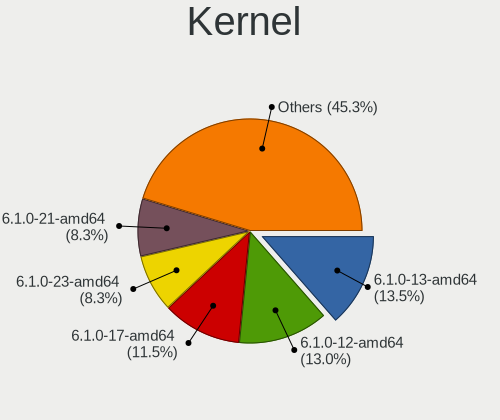

| Version               | Desktops | Percent |
|-----------------------|----------|---------|
| 6.1.0-13-amd64        | 25       | 22.73%  |
| 6.1.0-17-amd64        | 22       | 20%     |
| 6.1.0-12-amd64        | 20       | 18.18%  |
| 6.1.0-18-amd64        | 12       | 10.91%  |
| 6.1.0-20-amd64        | 10       | 9.09%   |
| 6.1.0-16-amd64        | 8        | 7.27%   |
| 6.1.0-12-686          | 3        | 2.73%   |
| 6.1.0-21-amd64        | 2        | 1.82%   |
| 6.1.0-15-amd64        | 2        | 1.82%   |
| 6.1.0-14-amd64        | 2        | 1.82%   |
| 6.6.13+bpo-amd64      | 1        | 0.91%   |
| 6.6.11-x64v3-xanmod1  | 1        | 0.91%   |
| 6.5.0-0.deb12.4-amd64 | 1        | 0.91%   |
| 6.1.0-11-amd64        | 1        | 0.91%   |

Kernel Family
-------------

Linux kernel without a distro release

| Version | Desktops | Percent |
|---------|----------|---------|
| 6.1.0   | 95       | 96.94%  |
| 6.6.13  | 1        | 1.02%   |
| 6.6.11  | 1        | 1.02%   |
| 6.5.0   | 1        | 1.02%   |

Kernel Major Ver.
-----------------

Linux kernel major version

| Version | Desktops | Percent |
|---------|----------|---------|
| 6.1     | 95       | 96.94%  |
| 6.6     | 2        | 2.04%   |
| 6.5     | 1        | 1.02%   |

Arch
----

OS architecture (x86_64, i586, etc.)

| Name   | Desktops | Percent |
|--------|----------|---------|
| x86_64 | 95       | 96.94%  |
| i686   | 3        | 3.06%   |

DE
--

Desktop Environment

| Name       | Desktops | Percent |
|------------|----------|---------|
| X-Cinnamon | 88       | 88.89%  |
| Cinnamon   | 4        | 4.04%   |
| Unknown    | 4        | 4.04%   |
| XFCE       | 1        | 1.01%   |
| MATE       | 1        | 1.01%   |
| KDE5       | 1        | 1.01%   |

Display Server
--------------

X11 or Wayland

| Name    | Desktops | Percent |
|---------|----------|---------|
| X11     | 95       | 95.96%  |
| Wayland | 3        | 3.03%   |
| Tty     | 1        | 1.01%   |

Display Manager
---------------

SDDM, LightDM, etc.

| Name    | Desktops | Percent |
|---------|----------|---------|
| LightDM | 52       | 53.06%  |
| Unknown | 45       | 45.92%  |
| GDM3    | 1        | 1.02%   |

OS Lang
-------

Language

| Lang    | Desktops | Percent |
|---------|----------|---------|
| en_US   | 36       | 36.36%  |
| de_DE   | 14       | 14.14%  |
| it_IT   | 11       | 11.11%  |
| fr_FR   | 6        | 6.06%   |
| en_GB   | 6        | 6.06%   |
| pt_BR   | 4        | 4.04%   |
| pl_PL   | 4        | 4.04%   |
| Unknown | 4        | 4.04%   |
| es_ES   | 3        | 3.03%   |
| hu_HU   | 2        | 2.02%   |
| cs_CZ   | 2        | 2.02%   |
| ru_RU   | 1        | 1.01%   |
| hr_HR   | 1        | 1.01%   |
| es_AR   | 1        | 1.01%   |
| en_NZ   | 1        | 1.01%   |
| en_CA   | 1        | 1.01%   |
| en_AU   | 1        | 1.01%   |
| el_GR   | 1        | 1.01%   |

Boot Mode
---------

EFI or BIOS

| Mode | Desktops | Percent |
|------|----------|---------|
| EFI  | 66       | 66.67%  |
| BIOS | 33       | 33.33%  |

Filesystem
----------

Type of filesystem

| Type    | Desktops | Percent |
|---------|----------|---------|
| Ext4    | 82       | 82.83%  |
| Overlay | 7        | 7.07%   |
| Btrfs   | 6        | 6.06%   |
| Tmpfs   | 4        | 4.04%   |

Part. scheme
------------

Scheme of partitioning

| Type    | Desktops | Percent |
|---------|----------|---------|
| GPT     | 41       | 41.84%  |
| Unknown | 41       | 41.84%  |
| MBR     | 16       | 16.33%  |

Dual Boot with Linux/BSD
------------------------

Hosting more than one Linux/BSD

| Dual boot | Desktops | Percent |
|-----------|----------|---------|
| No        | 85       | 85.86%  |
| Yes       | 14       | 14.14%  |

Dual Boot (Win)
---------------

Hosting Linux and Windows

| Dual boot | Desktops | Percent |
|-----------|----------|---------|
| No        | 73       | 73.74%  |
| Yes       | 26       | 26.26%  |

Board
-----

Vendor
------

Motherboard manufacturer

| Name                                 | Desktops | Percent |
|--------------------------------------|----------|---------|
| ASUSTek Computer                     | 23       | 23.47%  |
| Gigabyte Technology                  | 15       | 15.31%  |
| MSI                                  | 14       | 14.29%  |
| Hewlett-Packard                      | 8        | 8.16%   |
| ASRock                               | 8        | 8.16%   |
| Fujitsu                              | 5        | 5.1%    |
| Dell                                 | 5        | 5.1%    |
| Unknown                              | 4        | 4.08%   |
| Acer                                 | 3        | 3.06%   |
| Inventec                             | 2        | 2.04%   |
| Intel                                | 2        | 2.04%   |
| Trigkey                              | 1        | 1.02%   |
| Soyo                                 | 1        | 1.02%   |
| Shenzhen Meigao Electronic Equipment | 1        | 1.02%   |
| Quanta                               | 1        | 1.02%   |
| PELADN                               | 1        | 1.02%   |
| Pegatron                             | 1        | 1.02%   |
| Medion                               | 1        | 1.02%   |
| Lenovo                               | 1        | 1.02%   |
| AMI                                  | 1        | 1.02%   |

Model
-----

Motherboard model

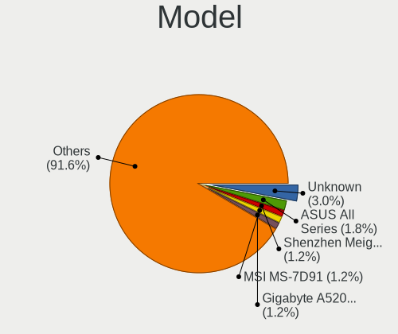

| Name                                                | Desktops | Percent |
|-----------------------------------------------------|----------|---------|
| Unknown                                             | 4        | 4.08%   |
| Gigabyte A520M S2H                                  | 2        | 2.04%   |
| Dell OptiPlex 7010                                  | 2        | 2.04%   |
| ASUS All Series                                     | 2        | 2.04%   |
| Trigkey Green G4                                    | 1        | 1.02%   |
| Soyo SY-N3150L Quad                                 | 1        | 1.02%   |
| Shenzhen Meigao Electronic Equipment Mercury series | 1        | 1.02%   |
| Quanta 120-1125                                     | 1        | 1.02%   |
| PELADN WI-6                                         | 1        | 1.02%   |
| Pegatron Pro 3120 Microtower PC                     | 1        | 1.02%   |
| MSI MS-7E07                                         | 1        | 1.02%   |
| MSI MS-7E01                                         | 1        | 1.02%   |
| MSI MS-7D91                                         | 1        | 1.02%   |
| MSI MS-7D69                                         | 1        | 1.02%   |
| MSI MS-7D15                                         | 1        | 1.02%   |
| MSI MS-7C84                                         | 1        | 1.02%   |
| MSI MS-7C56                                         | 1        | 1.02%   |
| MSI MS-7C37                                         | 1        | 1.02%   |
| MSI MS-7B98                                         | 1        | 1.02%   |
| MSI MS-7B48                                         | 1        | 1.02%   |
| MSI MS-7A38                                         | 1        | 1.02%   |
| MSI MS-7998                                         | 1        | 1.02%   |
| MSI MS-7798                                         | 1        | 1.02%   |
| MSI MS-7345                                         | 1        | 1.02%   |
| Medion S23003                                       | 1        | 1.02%   |
| Lenovo V50t-13IMB 11HD000DUM                        | 1        | 1.02%   |
| Inventec VXC Class                                  | 1        | 1.02%   |
| Inventec DQ Class                                   | 1        | 1.02%   |
| Intel DG31PR AAD97573-206                           | 1        | 1.02%   |
| Intel B75                                           | 1        | 1.02%   |
| HP Z820 Workstation                                 | 1        | 1.02%   |
| HP Z440 Workstation                                 | 1        | 1.02%   |
| HP ProDesk 600 G2 MT                                | 1        | 1.02%   |
| HP ProDesk 490 G1 MT                                | 1        | 1.02%   |
| HP Pavilion Desktop 590-p0xxx                       | 1        | 1.02%   |
| HP OMEN 25L Desktop GT11-1xxx                       | 1        | 1.02%   |
| HP dc5000 uT(DZ216AV)                               | 1        | 1.02%   |
| HP Compaq 8200 Elite MT PC                          | 1        | 1.02%   |
| Gigabyte Z170-HD3P                                  | 1        | 1.02%   |
| Gigabyte Q87M-D2H                                   | 1        | 1.02%   |

Model Family
------------

Motherboard model prefix

| Name                                         | Desktops | Percent |
|----------------------------------------------|----------|---------|
| ASUS PRIME                                   | 6        | 6.12%   |
| Fujitsu ESPRIMO                              | 4        | 4.08%   |
| Unknown                                      | 4        | 4.08%   |
| Dell OptiPlex                                | 3        | 3.06%   |
| ASUS TUF                                     | 3        | 3.06%   |
| HP ProDesk                                   | 2        | 2.04%   |
| Gigabyte B450                                | 2        | 2.04%   |
| Gigabyte A520M                               | 2        | 2.04%   |
| ASUS P5G41T-M                                | 2        | 2.04%   |
| ASUS All                                     | 2        | 2.04%   |
| ASRock X670E                                 | 2        | 2.04%   |
| Trigkey Green                                | 1        | 1.02%   |
| Soyo SY-N3150L                               | 1        | 1.02%   |
| Shenzhen Meigao Electronic Equipment Mercury | 1        | 1.02%   |
| Quanta 120-1125                              | 1        | 1.02%   |
| PELADN WI-6                                  | 1        | 1.02%   |
| Pegatron Pro                                 | 1        | 1.02%   |
| MSI MS-7E07                                  | 1        | 1.02%   |
| MSI MS-7E01                                  | 1        | 1.02%   |
| MSI MS-7D91                                  | 1        | 1.02%   |
| MSI MS-7D69                                  | 1        | 1.02%   |
| MSI MS-7D15                                  | 1        | 1.02%   |
| MSI MS-7C84                                  | 1        | 1.02%   |
| MSI MS-7C56                                  | 1        | 1.02%   |
| MSI MS-7C37                                  | 1        | 1.02%   |
| MSI MS-7B98                                  | 1        | 1.02%   |
| MSI MS-7B48                                  | 1        | 1.02%   |
| MSI MS-7A38                                  | 1        | 1.02%   |
| MSI MS-7998                                  | 1        | 1.02%   |
| MSI MS-7798                                  | 1        | 1.02%   |
| MSI MS-7345                                  | 1        | 1.02%   |
| Medion S23003                                | 1        | 1.02%   |
| Lenovo V50t-13IMB                            | 1        | 1.02%   |
| Inventec VXC                                 | 1        | 1.02%   |
| Inventec DQ                                  | 1        | 1.02%   |
| Intel DG31PR                                 | 1        | 1.02%   |
| Intel B75                                    | 1        | 1.02%   |
| HP Z820                                      | 1        | 1.02%   |
| HP Z440                                      | 1        | 1.02%   |
| HP Pavilion                                  | 1        | 1.02%   |

MFG Year
--------

Motherboard manufacture year

| Year | Desktops | Percent |
|------|----------|---------|
| 2018 | 12       | 12.24%  |
| 2022 | 10       | 10.2%   |
| 2010 | 9        | 9.18%   |
| 2017 | 7        | 7.14%   |
| 2013 | 7        | 7.14%   |
| 2023 | 6        | 6.12%   |
| 2021 | 6        | 6.12%   |
| 2015 | 6        | 6.12%   |
| 2012 | 6        | 6.12%   |
| 2020 | 5        | 5.1%    |
| 2016 | 5        | 5.1%    |
| 2008 | 4        | 4.08%   |
| 2019 | 3        | 3.06%   |
| 2011 | 3        | 3.06%   |
| 2014 | 2        | 2.04%   |
| 2009 | 2        | 2.04%   |
| 2007 | 2        | 2.04%   |
| 2024 | 1        | 1.02%   |
| 2006 | 1        | 1.02%   |
| 2004 | 1        | 1.02%   |

Form Factor
-----------

Physical design of the computer

| Name    | Desktops | Percent |
|---------|----------|---------|
| Desktop | 98       | 100%    |

Secure Boot
-----------

Enabled or disabled

| State    | Desktops | Percent |
|----------|----------|---------|
| Disabled | 93       | 94.9%   |
| Enabled  | 5        | 5.1%    |

Coreboot
--------

Have coreboot on board

| Used | Desktops | Percent |
|------|----------|---------|
| No   | 98       | 100%    |

RAM Size
--------

Total RAM memory

| Size in GB  | Desktops | Percent |
|-------------|----------|---------|
| 16.01-24.0  | 25       | 24.51%  |
| 32.01-64.0  | 20       | 19.61%  |
| 4.01-8.0    | 19       | 18.63%  |
| 3.01-4.0    | 11       | 10.78%  |
| 64.01-256.0 | 10       | 9.8%    |
| 24.01-32.0  | 8        | 7.84%   |
| 8.01-16.0   | 6        | 5.88%   |
| 1.01-2.0    | 2        | 1.96%   |
| 2.01-3.0    | 1        | 0.98%   |

RAM Used
--------

Used RAM memory

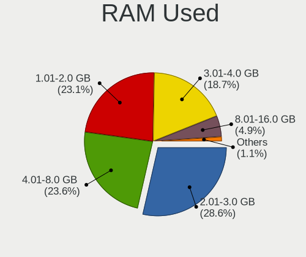

| Used GB   | Desktops | Percent |
|-----------|----------|---------|
| 2.01-3.0  | 33       | 30%     |
| 1.01-2.0  | 31       | 28.18%  |
| 4.01-8.0  | 22       | 20%     |
| 3.01-4.0  | 18       | 16.36%  |
| 8.01-16.0 | 5        | 4.55%   |
| 0.51-1.0  | 1        | 0.91%   |

Total Drives
------------

Number of drives on board

| Drives | Desktops | Percent |
|--------|----------|---------|
| 1      | 39       | 38.24%  |
| 2      | 21       | 20.59%  |
| 3      | 19       | 18.63%  |
| 4      | 12       | 11.76%  |
| 5      | 6        | 5.88%   |
| 7      | 2        | 1.96%   |
| 10     | 1        | 0.98%   |
| 6      | 1        | 0.98%   |
| 0      | 1        | 0.98%   |

Has CD-ROM
----------

Has CD-ROM on board

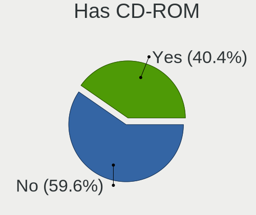

| Presented | Desktops | Percent |
|-----------|----------|---------|
| No        | 59       | 60.2%   |
| Yes       | 39       | 39.8%   |

Has Ethernet
------------

Has Ethernet on board

| Presented | Desktops | Percent |
|-----------|----------|---------|
| Yes       | 95       | 96.94%  |
| No        | 3        | 3.06%   |

Has WiFi
--------

Has WiFi module

| Presented | Desktops | Percent |
|-----------|----------|---------|
| Yes       | 49       | 50%     |
| No        | 49       | 50%     |

Has Bluetooth
-------------

Has Bluetooth module

| Presented | Desktops | Percent |
|-----------|----------|---------|
| No        | 59       | 59%     |
| Yes       | 41       | 41%     |

Location
--------

Country
-------

Geographic location (country)

| Country                | Desktops | Percent |
|------------------------|----------|---------|
| Germany                | 20       | 20.41%  |
| USA                    | 18       | 18.37%  |
| Italy                  | 17       | 17.35%  |
| France                 | 6        | 6.12%   |
| UK                     | 5        | 5.1%    |
| Brazil                 | 4        | 4.08%   |
| Poland                 | 3        | 3.06%   |
| Canada                 | 3        | 3.06%   |
| Spain                  | 2        | 2.04%   |
| India                  | 2        | 2.04%   |
| Hungary                | 2        | 2.04%   |
| Czechia                | 2        | 2.04%   |
| Croatia                | 2        | 2.04%   |
| Russia                 | 1        | 1.02%   |
| Norway                 | 1        | 1.02%   |
| New Zealand            | 1        | 1.02%   |
| Morocco                | 1        | 1.02%   |
| Malta                  | 1        | 1.02%   |
| Iran                   | 1        | 1.02%   |
| Indonesia              | 1        | 1.02%   |
| Greece                 | 1        | 1.02%   |
| Ecuador                | 1        | 1.02%   |
| Bosnia and Herzegovina | 1        | 1.02%   |
| Australia              | 1        | 1.02%   |
| Argentina              | 1        | 1.02%   |

City
----

Geographic location (city)

| City                  | Desktops | Percent |
|-----------------------|----------|---------|
| Milan                 | 4        | 3.7%    |
| Delligsen             | 3        | 2.78%   |
| Uetze                 | 2        | 1.85%   |
| Traunstein            | 2        | 1.85%   |
| South Bend            | 2        | 1.85%   |
| Rome                  | 2        | 1.85%   |
| Parshall              | 2        | 1.85%   |
| Freden                | 2        | 1.85%   |
| Fitchburg             | 2        | 1.85%   |
| Bremen                | 2        | 1.85%   |
| Bologna               | 2        | 1.85%   |
| Wisconsin Dells       | 1        | 0.93%   |
| Weissenburg in Bayern | 1        | 0.93%   |
| Wasilla               | 1        | 0.93%   |
| Vitória              | 1        | 0.93%   |
| Vassenden             | 1        | 0.93%   |
| Valletta              | 1        | 0.93%   |
| Valencia              | 1        | 0.93%   |
| Turin                 | 1        | 0.93%   |
| Sydney                | 1        | 0.93%   |
| Strzelno              | 1        | 0.93%   |
| Spring Hill           | 1        | 0.93%   |
| Somerset              | 1        | 0.93%   |
| Šlapanice            | 1        | 0.93%   |
| Sisak                 | 1        | 0.93%   |
| Sermoneta             | 1        | 0.93%   |
| Seattle               | 1        | 0.93%   |
| Sarnia                | 1        | 0.93%   |
| Sao Goncalo           | 1        | 0.93%   |
| Santa Luzia           | 1        | 0.93%   |
| Saarbrücken          | 1        | 0.93%   |
| Rio de Janeiro        | 1        | 0.93%   |
| Quimper               | 1        | 0.93%   |
| Płośnica            | 1        | 0.93%   |
| Prnjavor              | 1        | 0.93%   |
| Pomaz                 | 1        | 0.93%   |
| Penarth               | 1        | 0.93%   |
| Pawtucket             | 1        | 0.93%   |
| Pancarana             | 1        | 0.93%   |
| Panama City           | 1        | 0.93%   |

Drives
------

Drive Vendor
------------

Hard drive vendors

| Vendor                      | Desktops | Drives | Percent |
|-----------------------------|----------|--------|---------|
| WDC                         | 35       | 51     | 17.24%  |
| Seagate                     | 27       | 41     | 13.3%   |
| Samsung Electronics         | 25       | 32     | 12.32%  |
| Kingston                    | 13       | 26     | 6.4%    |
| Toshiba                     | 11       | 13     | 5.42%   |
| SanDisk                     | 10       | 14     | 4.93%   |
| Crucial                     | 10       | 11     | 4.93%   |
| PNY                         | 5        | 8      | 2.46%   |
| Hitachi                     | 5        | 6      | 2.46%   |
| China                       | 4        | 5      | 1.97%   |
| A-DATA Technology           | 4        | 5      | 1.97%   |
| Unknown                     | 4        | 7      | 1.97%   |
| Micron/Crucial Technology   | 3        | 3      | 1.48%   |
| Apacer                      | 3        | 3      | 1.48%   |
| ADATA Technology            | 3        | 4      | 1.48%   |
| Unknown                     | 2        | 5      | 0.99%   |
| Team                        | 2        | 2      | 0.99%   |
| Phison Electronics          | 2        | 2      | 0.99%   |
| Phison                      | 2        | 6      | 0.99%   |
| Patriot                     | 2        | 2      | 0.99%   |
| Micron Technology           | 2        | 2      | 0.99%   |
| Maxtor                      | 2        | 2      | 0.99%   |
| Kingston Technology Company | 2        | 2      | 0.99%   |
| HGST                        | 2        | 2      | 0.99%   |
| Verbatim                    | 1        | 2      | 0.49%   |
| Transcend                   | 1        | 1      | 0.49%   |
| TO Exter                    | 1        | 1      | 0.49%   |
| SPCC                        | 1        | 1      | 0.49%   |
| SK hynix                    | 1        | 1      | 0.49%   |
| Silicon Motion              | 1        | 1      | 0.49%   |
| Realtek Semiconductor       | 1        | 1      | 0.49%   |
| Realtek                     | 1        | 1      | 0.49%   |
| OCZ                         | 1        | 1      | 0.49%   |
| MAXIO Technology (Hangzhou) | 1        | 1      | 0.49%   |
| Lexar                       | 1        | 1      | 0.49%   |
| KIOXIA-EXCERIA              | 1        | 2      | 0.49%   |
| KingDian                    | 1        | 1      | 0.49%   |
| IBM/Hitachi                 | 1        | 1      | 0.49%   |
| GOODRAM                     | 1        | 1      | 0.49%   |
| Gigabyte Technology         | 1        | 1      | 0.49%   |

Drive Model
-----------

Hard drive models

| Model                                                           | Desktops | Percent |
|-----------------------------------------------------------------|----------|---------|
| Kingston SA400S37480G 480GB SSD                                 | 4        | 1.75%   |
| Unknown                                                         | 4        | 1.75%   |
| Toshiba DT01ACA100 1TB                                          | 3        | 1.31%   |
| Sandisk WD Blue SN550 NVMe SSD 2TB                              | 3        | 1.31%   |
| SanDisk NVMe SSD Drive 2TB                                      | 3        | 1.31%   |
| Crucial CT500MX500SSD1 500GB                                    | 3        | 1.31%   |
| ADATA XPG SX8200 Pro PCIe Gen3x4 M.2 2280 Solid State Drive 1TB | 3        | 1.31%   |
| Toshiba HDWE160 6TB                                             | 2        | 0.87%   |
| Team T253512GB SSD                                              | 2        | 0.87%   |
| Seagate ST8000DM004-2U9188 8TB                                  | 2        | 0.87%   |
| Seagate ST4000VN008-2DR166 4TB                                  | 2        | 0.87%   |
| Seagate ST2000DM001-1ER164 2TB                                  | 2        | 0.87%   |
| Seagate Desktop 8TB                                             | 2        | 0.87%   |
| SanDisk NVMe SSD Drive 1TB                                      | 2        | 0.87%   |
| Samsung SSD 980 500GB                                           | 2        | 0.87%   |
| Samsung SSD 980 1TB                                             | 2        | 0.87%   |
| Samsung SSD 970 EVO 500GB                                       | 2        | 0.87%   |
| Samsung SSD 860 EVO M.2 250GB                                   | 2        | 0.87%   |
| Samsung SSD 860 EVO 250GB                                       | 2        | 0.87%   |
| Samsung SSD 860 EVO 1TB                                         | 2        | 0.87%   |
| Samsung NVMe SSD Controller SM981/PM981/PM983 1TB               | 2        | 0.87%   |
| Samsung NVMe SSD Controller PM9A1/PM9A3/980PRO 1TB              | 2        | 0.87%   |
| Phison PS5013 E13 NVMe Controller 512GB                         | 2        | 0.87%   |
| Kingston SV300S37A120G 120GB SSD                                | 2        | 0.87%   |
| Kingston SA400S37240G 240GB SSD                                 | 2        | 0.87%   |
| Apacer 32GB SATA Flash Drive SSD                                | 2        | 0.87%   |
| WDC WDS500G2B0B-00YS70 500GB SSD                                | 1        | 0.44%   |
| WDC WDS500G2B0A-00SM50 500GB SSD                                | 1        | 0.44%   |
| WDC WDS500G1R0A-68A4W0 500GB                                    | 1        | 0.44%   |
| WDC WDS400T2B0A-00SM50 4TB SSD                                  | 1        | 0.44%   |
| WDC WDS250G2B0A-00SM50 250GB SSD                                | 1        | 0.44%   |
| WDC WDS240G2G0A-00JH30 240GB SSD                                | 1        | 0.44%   |
| WDC WDS120G1G0A-00SS50 120GB SSD                                | 1        | 0.44%   |
| WDC WDS100T3X0C-00SJG0 1TB                                      | 1        | 0.44%   |
| WDC WDS100T2B0C-00PXH0 1TB                                      | 1        | 0.44%   |
| WDC WDS100T2B0A-00SM50 1TB SSD                                  | 1        | 0.44%   |
| WDC WD800JD-00MSA1 80GB                                         | 1        | 0.44%   |
| WDC WD50EZRZ-00GZ5B1 5TB                                        | 1        | 0.44%   |
| WDC WD5001AALS-00L3B2 500GB                                     | 1        | 0.44%   |
| WDC WD5000AZRX-00A8LB0 500GB                                    | 1        | 0.44%   |

HDD Vendor
----------

Hard disk drive vendors

| Vendor              | Desktops | Drives | Percent |
|---------------------|----------|--------|---------|
| Seagate             | 27       | 41     | 34.62%  |
| WDC                 | 26       | 39     | 33.33%  |
| Toshiba             | 10       | 12     | 12.82%  |
| Hitachi             | 5        | 6      | 6.41%   |
| Samsung Electronics | 2        | 2      | 2.56%   |
| Maxtor              | 2        | 2      | 2.56%   |
| HGST                | 2        | 2      | 2.56%   |
| TO Exter            | 1        | 1      | 1.28%   |
| IBM/Hitachi         | 1        | 1      | 1.28%   |
| DC-624e             | 1        | 1      | 1.28%   |
| Unknown             | 1        | 1      | 1.28%   |

SSD Vendor
----------

Solid state drive vendors

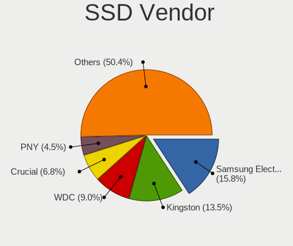

| Vendor              | Desktops | Drives | Percent |
|---------------------|----------|--------|---------|
| Samsung Electronics | 14       | 16     | 18.67%  |
| Kingston            | 11       | 19     | 14.67%  |
| WDC                 | 8        | 9      | 10.67%  |
| Crucial             | 7        | 7      | 9.33%   |
| PNY                 | 5        | 8      | 6.67%   |
| China               | 4        | 5      | 5.33%   |
| Apacer              | 3        | 3      | 4%      |
| A-DATA Technology   | 3        | 4      | 4%      |
| Team                | 2        | 2      | 2.67%   |
| SanDisk             | 2        | 2      | 2.67%   |
| Patriot             | 2        | 2      | 2.67%   |
| Micron Technology   | 2        | 2      | 2.67%   |
| Unknown             | 2        | 4      | 2.67%   |
| Verbatim            | 1        | 2      | 1.33%   |
| Transcend           | 1        | 1      | 1.33%   |
| SPCC                | 1        | 1      | 1.33%   |
| Phison              | 1        | 5      | 1.33%   |
| OCZ                 | 1        | 1      | 1.33%   |
| KingDian            | 1        | 1      | 1.33%   |
| Gigabyte Technology | 1        | 1      | 1.33%   |
| Fanxiang            | 1        | 2      | 1.33%   |
| External            | 1        | 1      | 1.33%   |
| ASMT109x            | 1        | 1      | 1.33%   |

Drive Kind
----------

HDD or SSD

| Kind    | Desktops | Drives | Percent |
|---------|----------|--------|---------|
| SSD     | 61       | 99     | 36.97%  |
| HDD     | 60       | 108    | 36.36%  |
| NVMe    | 40       | 65     | 24.24%  |
| Unknown | 3        | 6      | 1.82%   |
| MMC     | 1        | 2      | 0.61%   |

Drive Connector
---------------

SATA, SAS, NVMe, etc.

| Type | Desktops | Drives | Percent |
|------|----------|--------|---------|
| SATA | 90       | 198    | 62.5%   |
| NVMe | 40       | 64     | 27.78%  |
| SAS  | 13       | 16     | 9.03%   |
| MMC  | 1        | 2      | 0.69%   |

Drive Size
----------

Size of hard drive

| Size in TB | Desktops | Drives | Percent |
|------------|----------|--------|---------|
| 0.01-0.5   | 61       | 103    | 46.21%  |
| 0.51-1.0   | 35       | 45     | 26.52%  |
| 1.01-2.0   | 14       | 25     | 10.61%  |
| 3.01-4.0   | 9        | 15     | 6.82%   |
| 4.01-10.0  | 7        | 11     | 5.3%    |
| 2.01-3.0   | 4        | 5      | 3.03%   |
| 10.01-20.0 | 2        | 3      | 1.52%   |

Space Total
-----------

Amount of disk space available on the file system

| Size in GB     | Desktops | Percent |
|----------------|----------|---------|
| 101-250        | 20       | 19.8%   |
| 251-500        | 18       | 17.82%  |
| More than 3000 | 17       | 16.83%  |
| 501-1000       | 14       | 13.86%  |
| 2001-3000      | 8        | 7.92%   |
| 1001-2000      | 8        | 7.92%   |
| 1-20           | 7        | 6.93%   |
| Unknown        | 4        | 3.96%   |
| 51-100         | 3        | 2.97%   |
| 21-50          | 2        | 1.98%   |

Space Used
----------

Amount of used disk space

| Used GB        | Desktops | Percent |
|----------------|----------|---------|
| 1-20           | 28       | 26.17%  |
| 21-50          | 22       | 20.56%  |
| 51-100         | 12       | 11.21%  |
| 101-250        | 10       | 9.35%   |
| 501-1000       | 9        | 8.41%   |
| More than 3000 | 8        | 7.48%   |
| 251-500        | 6        | 5.61%   |
| 1001-2000      | 5        | 4.67%   |
| Unknown        | 4        | 3.74%   |
| 2001-3000      | 3        | 2.8%    |

Malfunc. Drives
---------------

Drive models with a malfunction

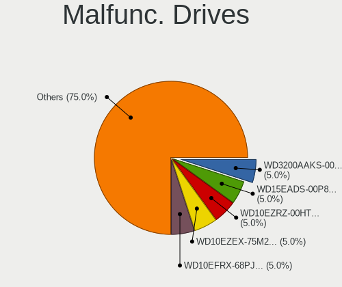

| Model                                               | Desktops | Drives | Percent |
|-----------------------------------------------------|----------|--------|---------|
| WDC WD15EADS-00P8B0 1TB                             | 1        | 1      | 9.09%   |
| WDC WD10EZRZ-00HTKB0 1TB                            | 1        | 1      | 9.09%   |
| Seagate ST9500325AS 500GB                           | 1        | 1      | 9.09%   |
| Seagate ST31000524AS 1TB                            | 1        | 1      | 9.09%   |
| Seagate ST1000DM003-1SB102 1TB                      | 1        | 1      | 9.09%   |
| Samsung Electronics SSD 970 EVO 500GB               | 1        | 1      | 9.09%   |
| Samsung Electronics HD103UJ 1TB                     | 1        | 1      | 9.09%   |
| Micron Technology MTFDDAK512MAY-1AE1ZABHA 512GB SSD | 1        | 1      | 9.09%   |
| Maxtor 6E040L0 41GB                                 | 1        | 1      | 9.09%   |
| Kingston SKC2500M8500G 500GB                        | 1        | 1      | 9.09%   |
| IBM/Hitachi IC35L040AVER07-0 41GB                   | 1        | 1      | 9.09%   |

Malfunc. Drive Vendor
---------------------

Vendors of faulty drives

| Vendor              | Desktops | Drives | Percent |
|---------------------|----------|--------|---------|
| Seagate             | 3        | 3      | 27.27%  |
| WDC                 | 2        | 2      | 18.18%  |
| Samsung Electronics | 2        | 2      | 18.18%  |
| Micron Technology   | 1        | 1      | 9.09%   |
| Maxtor              | 1        | 1      | 9.09%   |
| Kingston            | 1        | 1      | 9.09%   |
| IBM/Hitachi         | 1        | 1      | 9.09%   |

Malfunc. HDD Vendor
-------------------

Vendors of faulty HDD drives

| Vendor              | Desktops | Drives | Percent |
|---------------------|----------|--------|---------|
| Seagate             | 3        | 3      | 37.5%   |
| WDC                 | 2        | 2      | 25%     |
| Samsung Electronics | 1        | 1      | 12.5%   |
| Maxtor              | 1        | 1      | 12.5%   |
| IBM/Hitachi         | 1        | 1      | 12.5%   |

Malfunc. Drive Kind
-------------------

Kinds of faulty drives

| Kind | Desktops | Drives | Percent |
|------|----------|--------|---------|
| HDD  | 8        | 8      | 72.73%  |
| NVMe | 2        | 2      | 18.18%  |
| SSD  | 1        | 1      | 9.09%   |

Failed Drives
-------------

Failed drive models

Zero info for selected period =(

Failed Drive Vendor
-------------------

Failed drive vendors

Zero info for selected period =(

Drive Status
------------

Number of failed and malfunc. drives

| Status   | Desktops | Drives | Percent |
|----------|----------|--------|---------|
| Detected | 54       | 149    | 46.55%  |
| Works    | 51       | 120    | 43.97%  |
| Malfunc  | 11       | 11     | 9.48%   |

Storage controller
------------------

Storage Vendor
--------------

Storage controller vendors

| Vendor                        | Desktops | Percent |
|-------------------------------|----------|---------|
| Intel                         | 61       | 38.36%  |
| AMD                           | 33       | 20.75%  |
| Samsung Electronics           | 11       | 6.92%   |
| SanDisk                       | 8        | 5.03%   |
| Marvell Technology Group      | 6        | 3.77%   |
| ASMedia Technology            | 6        | 3.77%   |
| Micron/Crucial Technology     | 5        | 3.14%   |
| Kingston Technology Company   | 5        | 3.14%   |
| Phison Electronics            | 4        | 2.52%   |
| ADATA Technology              | 4        | 2.52%   |
| JMicron Technology            | 3        | 1.89%   |
| VIA Technologies              | 1        | 0.63%   |
| Toshiba America Info Systems  | 1        | 0.63%   |
| SK hynix                      | 1        | 0.63%   |
| Silicon Motion                | 1        | 0.63%   |
| Shenzhen Longsys Electronics  | 1        | 0.63%   |
| Realtek Semiconductor         | 1        | 0.63%   |
| Nvidia                        | 1        | 0.63%   |
| Micron Technology             | 1        | 0.63%   |
| MAXIO Technology (Hangzhou)   | 1        | 0.63%   |
| KIOXIA                        | 1        | 0.63%   |
| Integrated Technology Express | 1        | 0.63%   |
| INNOGRIT                      | 1        | 0.63%   |
| Broadcom / LSI                | 1        | 0.63%   |

Storage Model
-------------

Storage controller models

| Model                                                                          | Desktops | Percent |
|--------------------------------------------------------------------------------|----------|---------|
| AMD FCH SATA Controller [AHCI mode]                                            | 13       | 6.84%   |
| Intel NM10/ICH7 Family SATA Controller [IDE mode]                              | 7        | 3.68%   |
| Intel 7 Series/C210 Series Chipset Family 6-port SATA Controller [AHCI mode]   | 7        | 3.68%   |
| Intel Q170/Q150/B150/H170/H110/Z170/CM236 Chipset SATA Controller [AHCI Mode]  | 6        | 3.16%   |
| ASMedia ASM1061/ASM1062 Serial ATA Controller                                  | 6        | 3.16%   |
| AMD SB7x0/SB8x0/SB9x0 SATA Controller [AHCI mode]                              | 6        | 3.16%   |
| Samsung NVMe SSD Controller SM981/PM981/PM983                                  | 5        | 2.63%   |
| Intel Raptor Lake SATA AHCI Controller                                         | 5        | 2.63%   |
| Intel 82801G (ICH7 Family) IDE Controller                                      | 5        | 2.63%   |
| Intel 8 Series/C220 Series Chipset Family 6-port SATA Controller 1 [AHCI mode] | 5        | 2.63%   |
| AMD 600 Series Chipset SATA Controller                                         | 5        | 2.63%   |
| AMD 500 Series Chipset SATA Controller                                         | 5        | 2.63%   |
| AMD 400 Series Chipset SATA Controller                                         | 5        | 2.63%   |
| SanDisk Ultra 3D / WD Blue SN550 NVMe SSD                                      | 4        | 2.11%   |
| Intel SATA controller                                                          | 4        | 2.11%   |
| ADATA XPG SX8200 Pro PCIe Gen3x4 M.2 2280 Solid State Drive                    | 4        | 2.11%   |
| Sandisk WD Black SN850X NVMe SSD                                               | 3        | 1.58%   |
| Samsung NVMe SSD Controller 980 (DRAM-less)                                    | 3        | 1.58%   |
| Intel SATA Controller [RAID mode]                                              | 3        | 1.58%   |
| Intel 82801JI (ICH10 Family) 4 port SATA IDE Controller #1                     | 3        | 1.58%   |
| AMD SB7x0/SB8x0/SB9x0 IDE Controller                                           | 3        | 1.58%   |
| AMD FCH SATA Controller D                                                      | 3        | 1.58%   |
| AMD 300 Series Chipset SATA Controller                                         | 3        | 1.58%   |
| Samsung NVMe SSD Controller PM9A1/PM9A3/980PRO                                 | 2        | 1.05%   |
| Phison PS5013-E13 PCIe3 NVMe Controller (DRAM-less)                            | 2        | 1.05%   |
| Phison E12 NVMe Controller                                                     | 2        | 1.05%   |
| Micron/Crucial P1 NVMe PCIe SSD[Frampton]                                      | 2        | 1.05%   |
| Marvell Group 88SE9123 PCIe SATA 6.0 Gb/s controller                           | 2        | 1.05%   |
| Kingston Company NV2 NVMe SSD SM2267XT (DRAM-less)                             | 2        | 1.05%   |
| Kingston Company KC3000/FURY Renegade NVMe SSD E18                             | 2        | 1.05%   |
| JMicron JMB363 SATA/IDE Controller                                             | 2        | 1.05%   |
| Intel Cannon Lake PCH SATA AHCI Controller                                     | 2        | 1.05%   |
| Intel C610/X99 series chipset 6-Port SATA Controller [AHCI mode]               | 2        | 1.05%   |
| Intel Alder Lake-S PCH SATA Controller [AHCI Mode]                             | 2        | 1.05%   |
| Intel 82801JI (ICH10 Family) 2 port SATA IDE Controller #2                     | 2        | 1.05%   |
| Intel 500 Series Chipset Family SATA AHCI Controller                           | 2        | 1.05%   |
| Intel 200 Series PCH SATA controller [AHCI mode]                               | 2        | 1.05%   |
| AMD SB7x0/SB8x0/SB9x0 SATA Controller [IDE mode]                               | 2        | 1.05%   |
| VIA VT82C586A/B/VT82C686/A/B/VT823x/A/C PIPC Bus Master IDE                    | 1        | 0.53%   |
| VIA VIA VT6420 SATA RAID Controller                                            | 1        | 0.53%   |

Storage Kind
------------

Kind of storage controller (IDE, SATA, NVMe, SAS, ...)

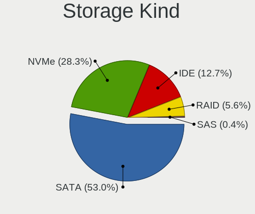

| Kind | Desktops | Percent |
|------|----------|---------|
| SATA | 81       | 55.48%  |
| NVMe | 39       | 26.71%  |
| IDE  | 19       | 13.01%  |
| RAID | 6        | 4.11%   |
| SAS  | 1        | 0.68%   |

Processor
---------

CPU Vendor
----------

Processor vendors

| Vendor | Desktops | Percent |
|--------|----------|---------|
| Intel  | 63       | 64.29%  |
| AMD    | 35       | 35.71%  |

CPU Model
---------

Processor models

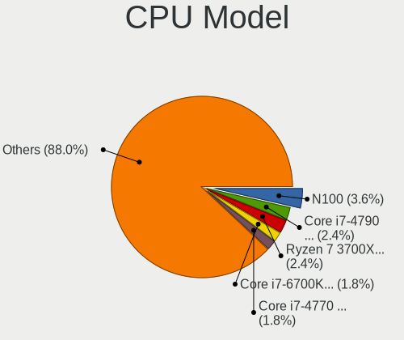

| Model                                       | Desktops | Percent |
|---------------------------------------------|----------|---------|
| Intel N100                                  | 3        | 3.06%   |
| Intel Core i5-3470 CPU @ 3.20GHz            | 3        | 3.06%   |
| Intel Core i7-6700K CPU @ 4.00GHz           | 2        | 2.04%   |
| Intel Core i7-4790 CPU @ 3.60GHz            | 2        | 2.04%   |
| Intel Core i5-6500 CPU @ 3.20GHz            | 2        | 2.04%   |
| AMD Ryzen 9 7950X 16-Core Processor         | 2        | 2.04%   |
| AMD Ryzen 7 5700G with Radeon Graphics      | 2        | 2.04%   |
| AMD Ryzen 5 5600G with Radeon Graphics      | 2        | 2.04%   |
| AMD Ryzen 3 2200G with Radeon Vega Graphics | 2        | 2.04%   |
| Intel Xeon CPU X5482 @ 3.20GHz              | 1        | 1.02%   |
| Intel Xeon CPU E5-2650 v2 @ 2.60GHz         | 1        | 1.02%   |
| Intel Xeon CPU E5-1650 v3 @ 3.50GHz         | 1        | 1.02%   |
| Intel Pentium Dual-Core CPU E6700 @ 3.20GHz | 1        | 1.02%   |
| Intel Pentium Dual-Core CPU E6600 @ 3.06GHz | 1        | 1.02%   |
| Intel Pentium Dual-Core CPU E5800 @ 3.20GHz | 1        | 1.02%   |
| Intel Pentium Dual-Core CPU E5700 @ 3.00GHz | 1        | 1.02%   |
| Intel Pentium Dual-Core CPU E5500 @ 2.80GHz | 1        | 1.02%   |
| Intel Pentium Dual CPU E2180 @ 2.00GHz      | 1        | 1.02%   |
| Intel Pentium D CPU 3.00GHz                 | 1        | 1.02%   |
| Intel Pentium 4 CPU 2.80GHz                 | 1        | 1.02%   |
| Intel N95                                   | 1        | 1.02%   |
| Intel Core i9-9900K CPU @ 3.60GHz           | 1        | 1.02%   |
| Intel Core i7-8700 CPU @ 3.20GHz            | 1        | 1.02%   |
| Intel Core i7-5820K CPU @ 3.30GHz           | 1        | 1.02%   |
| Intel Core i7-4790K CPU @ 4.00GHz           | 1        | 1.02%   |
| Intel Core i7-4770 CPU @ 3.40GHz            | 1        | 1.02%   |
| Intel Core i7-3770 CPU @ 3.40GHz            | 1        | 1.02%   |
| Intel Core i7-2600 CPU @ 3.40GHz            | 1        | 1.02%   |
| Intel Core i7 CPU 950 @ 3.07GHz             | 1        | 1.02%   |
| Intel Core i5-9600K CPU @ 3.70GHz           | 1        | 1.02%   |
| Intel Core i5-8400 CPU @ 2.80GHz            | 1        | 1.02%   |
| Intel Core i5-8260U CPU @ 1.60GHz           | 1        | 1.02%   |
| Intel Core i5-7600K CPU @ 3.80GHz           | 1        | 1.02%   |
| Intel Core i5-7500 CPU @ 3.40GHz            | 1        | 1.02%   |
| Intel Core i5-6400 CPU @ 2.70GHz            | 1        | 1.02%   |
| Intel Core i5-4590S CPU @ 3.00GHz           | 1        | 1.02%   |
| Intel Core i5-4440 CPU @ 3.10GHz            | 1        | 1.02%   |
| Intel Core i5-3470T CPU @ 2.90GHz           | 1        | 1.02%   |
| Intel Core i5-2400 CPU @ 3.10GHz            | 1        | 1.02%   |
| Intel Core i5-10400F CPU @ 2.90GHz          | 1        | 1.02%   |

CPU Model Family
----------------

Processor model prefix

| Model                   | Desktops | Percent |
|-------------------------|----------|---------|
| Intel Core i5           | 17       | 17.35%  |
| Other                   | 12       | 12.24%  |
| Intel Core i7           | 11       | 11.22%  |
| AMD Ryzen 5             | 8        | 8.16%   |
| AMD Ryzen 7             | 7        | 7.14%   |
| Intel Pentium Dual-Core | 5        | 5.1%    |
| Intel Celeron           | 5        | 5.1%    |
| AMD Ryzen 9             | 4        | 4.08%   |
| Intel Xeon              | 3        | 3.06%   |
| Intel Core i3           | 3        | 3.06%   |
| AMD Ryzen 3             | 3        | 3.06%   |
| Intel Core 2 Quad       | 2        | 2.04%   |
| AMD Phenom II X6        | 2        | 2.04%   |
| AMD FX                  | 2        | 2.04%   |
| Intel Pentium Dual      | 1        | 1.02%   |
| Intel Pentium D         | 1        | 1.02%   |
| Intel Pentium 4         | 1        | 1.02%   |
| Intel Core i9           | 1        | 1.02%   |
| Intel Core 2 Duo        | 1        | 1.02%   |
| AMD Sempron             | 1        | 1.02%   |
| AMD Ryzen 5 PRO         | 1        | 1.02%   |
| AMD Phenom II X4        | 1        | 1.02%   |
| AMD GX                  | 1        | 1.02%   |
| AMD G                   | 1        | 1.02%   |
| AMD E                   | 1        | 1.02%   |
| AMD Athlon II X2        | 1        | 1.02%   |
| AMD Athlon              | 1        | 1.02%   |
| AMD A8                  | 1        | 1.02%   |

CPU Cores
---------

Number of processor cores

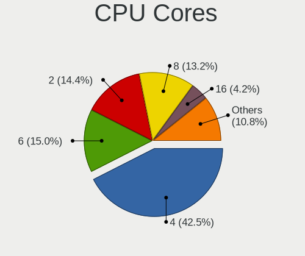

| Number | Desktops | Percent |
|--------|----------|---------|
| 4      | 40       | 40.82%  |
| 6      | 18       | 18.37%  |
| 2      | 16       | 16.33%  |
| 8      | 9        | 9.18%   |
| 16     | 5        | 5.1%    |
| 1      | 5        | 5.1%    |
| 14     | 2        | 2.04%   |
| 24     | 1        | 1.02%   |
| 12     | 1        | 1.02%   |
| 10     | 1        | 1.02%   |

CPU Sockets
-----------

Number of sockets

| Number | Desktops | Percent |
|--------|----------|---------|
| 1      | 96       | 97.96%  |
| 2      | 2        | 2.04%   |

CPU Threads
-----------

Threads per core (Hyper-Threading)

| Number | Desktops | Percent |
|--------|----------|---------|
| 2      | 53       | 54.08%  |
| 1      | 45       | 45.92%  |

CPU Op-Modes
------------

CPU Operation Modes (32-bit, 64-bit)

| Op mode        | Desktops | Percent |
|----------------|----------|---------|
| 32-bit, 64-bit | 96       | 97.96%  |
| 32-bit         | 2        | 2.04%   |

CPU Microcode
-------------

Microcode number

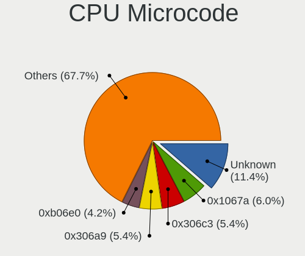

| Number     | Desktops | Percent |
|------------|----------|---------|
| 0x1067a    | 7        | 7.14%   |
| 0x306c3    | 6        | 6.12%   |
| 0x306a9    | 6        | 6.12%   |
| 0xb06e0    | 4        | 4.08%   |
| Unknown    | 4        | 4.08%   |
| 0xb0671    | 3        | 3.06%   |
| 0x506e3    | 3        | 3.06%   |
| 0x0810100b | 3        | 3.06%   |
| 0x010000c8 | 3        | 3.06%   |
| 0xa0653    | 2        | 2.04%   |
| 0x906ea    | 2        | 2.04%   |
| 0x906e9    | 2        | 2.04%   |
| 0x90672    | 2        | 2.04%   |
| 0x406c3    | 2        | 2.04%   |
| 0x206a7    | 2        | 2.04%   |
| 0x0a601206 | 2        | 2.04%   |
| 0x0a601203 | 2        | 2.04%   |
| 0x0a50000f | 2        | 2.04%   |
| 0x0a50000d | 2        | 2.04%   |
| 0x0800820d | 2        | 2.04%   |
| 0x08001138 | 2        | 2.04%   |
| 0x06000852 | 2        | 2.04%   |
| 0x010000dc | 2        | 2.04%   |
| 0xf62      | 1        | 1.02%   |
| 0xf41      | 1        | 1.02%   |
| 0xf29      | 1        | 1.02%   |
| 0xb06f5    | 1        | 1.02%   |
| 0xb06f2    | 1        | 1.02%   |
| 0xa0671    | 1        | 1.02%   |
| 0x906ed    | 1        | 1.02%   |
| 0x906ec    | 1        | 1.02%   |
| 0x906eb    | 1        | 1.02%   |
| 0x806ea    | 1        | 1.02%   |
| 0x706a8    | 1        | 1.02%   |
| 0x6fd      | 1        | 1.02%   |
| 0x6fb      | 1        | 1.02%   |
| 0x506ca    | 1        | 1.02%   |
| 0x306f2    | 1        | 1.02%   |
| 0x306e4    | 1        | 1.02%   |
| 0x20655    | 1        | 1.02%   |

CPU Microarch
-------------

Microarchitecture

| Name             | Desktops | Percent |
|------------------|----------|---------|
| Penryn           | 8        | 8.08%   |
| KabyLake         | 8        | 8.08%   |
| Haswell          | 8        | 8.08%   |
| Zen 3            | 7        | 7.07%   |
| IvyBridge        | 7        | 7.07%   |
| Alderlake Hybrid | 7        | 7.07%   |
| Unknown          | 7        | 7.07%   |
| Zen              | 6        | 6.06%   |
| Skylake          | 5        | 5.05%   |
| K10              | 5        | 5.05%   |
| Gracemont        | 4        | 4.04%   |
| Zen+             | 3        | 3.03%   |
| NetBurst         | 3        | 3.03%   |
| Zen 2            | 2        | 2.02%   |
| Silvermont       | 2        | 2.02%   |
| SandyBridge      | 2        | 2.02%   |
| Piledriver       | 2        | 2.02%   |
| Core             | 2        | 2.02%   |
| CometLake        | 2        | 2.02%   |
| Bobcat           | 2        | 2.02%   |
| Westmere         | 1        | 1.01%   |
| Steamroller      | 1        | 1.01%   |
| Nehalem          | 1        | 1.01%   |
| Jaguar           | 1        | 1.01%   |
| Icelake          | 1        | 1.01%   |
| Goldmont plus    | 1        | 1.01%   |
| Goldmont         | 1        | 1.01%   |

Graphics
--------

GPU Vendor
----------

Vendors of graphics cards

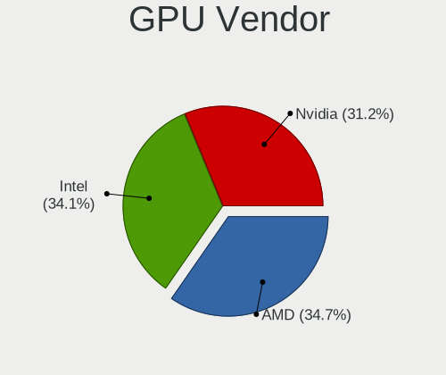

| Vendor | Desktops | Percent |
|--------|----------|---------|
| Intel  | 37       | 36.27%  |
| AMD    | 36       | 35.29%  |
| Nvidia | 29       | 28.43%  |

GPU Model
---------

Graphics card models

| Model                                                                                    | Desktops | Percent |
|------------------------------------------------------------------------------------------|----------|---------|
| AMD Raphael                                                                              | 5        | 4.63%   |
| Intel Alder Lake-N [UHD Graphics]                                                        | 4        | 3.7%    |
| Intel 4 Series Chipset Integrated Graphics Controller                                    | 4        | 3.7%    |
| Intel Xeon E3-1200 v3/4th Gen Core Processor Integrated Graphics Controller              | 3        | 2.78%   |
| Intel Xeon E3-1200 v2/3rd Gen Core processor Graphics Controller                         | 3        | 2.78%   |
| Intel HD Graphics 530                                                                    | 3        | 2.78%   |
| Intel CoffeeLake-S GT2 [UHD Graphics 630]                                                | 3        | 2.78%   |
| AMD Navi 23 [Radeon RX 6600/6600 XT/6600M]                                               | 3        | 2.78%   |
| AMD Cezanne [Radeon Vega Series / Radeon Vega Mobile Series]                             | 3        | 2.78%   |
| AMD Cedar [Radeon HD 5000/6000/7350/8350 Series]                                         | 3        | 2.78%   |
| Nvidia TU106 [GeForce RTX 2060 Rev. A]                                                   | 2        | 1.85%   |
| Nvidia GP106 [GeForce GTX 1060 6GB]                                                      | 2        | 1.85%   |
| Nvidia GP104 [GeForce GTX 1070]                                                          | 2        | 1.85%   |
| Nvidia GM204 [GeForce GTX 970]                                                           | 2        | 1.85%   |
| Nvidia GK208B [GeForce GT 730]                                                           | 2        | 1.85%   |
| Nvidia GK208B [GeForce GT 710]                                                           | 2        | 1.85%   |
| Intel Atom/Celeron/Pentium Processor x5-E8000/J3xxx/N3xxx Integrated Graphics Controller | 2        | 1.85%   |
| Intel Alder Lake-S GT1 [UHD Graphics 730]                                                | 2        | 1.85%   |
| Intel 82G33/G31 Express Integrated Graphics Controller                                   | 2        | 1.85%   |
| Intel 2nd Generation Core Processor Family Integrated Graphics Controller                | 2        | 1.85%   |
| AMD RV710 [Radeon HD 4350/4550]                                                          | 2        | 1.85%   |
| AMD RS780L [Radeon 3000]                                                                 | 2        | 1.85%   |
| AMD Raven Ridge [Radeon Vega Series / Radeon Vega Mobile Series]                         | 2        | 1.85%   |
| AMD Navi 31 [Radeon RX 7900 XT/7900 XTX/7900M]                                           | 2        | 1.85%   |
| AMD Caicos [Radeon HD 6450/7450/8450 / R5 230 OEM]                                       | 2        | 1.85%   |
| Nvidia TU116 [GeForce GTX 1660 Ti]                                                       | 1        | 0.93%   |
| Nvidia TU106 [GeForce RTX 2060 12GB]                                                     | 1        | 0.93%   |
| Nvidia GP108 [GeForce GT 1030]                                                           | 1        | 0.93%   |
| Nvidia GP107GL [Quadro P1000]                                                            | 1        | 0.93%   |
| Nvidia GP107 [GeForce GTX 1050 Ti]                                                       | 1        | 0.93%   |
| Nvidia GP106 [GeForce GTX 1060 6GB Rev. 2]                                               | 1        | 0.93%   |
| Nvidia GP106 [GeForce GTX 1060 3GB]                                                      | 1        | 0.93%   |
| Nvidia GP102 [GeForce GTX 1080 Ti]                                                       | 1        | 0.93%   |
| Nvidia GM107GL [Quadro K1200]                                                            | 1        | 0.93%   |
| Nvidia GK104GL [Quadro K5000]                                                            | 1        | 0.93%   |
| Nvidia GK104 [GeForce GTX 760]                                                           | 1        | 0.93%   |
| Nvidia GF119 [GeForce GT 610]                                                            | 1        | 0.93%   |
| Nvidia GF108 [GeForce GT 440]                                                            | 1        | 0.93%   |
| Nvidia GF108 [GeForce GT 430]                                                            | 1        | 0.93%   |
| Nvidia GA106 [Geforce RTX 3050]                                                          | 1        | 0.93%   |

GPU Combo
---------

Combinations of graphics cards

| Name           | Desktops | Percent |
|----------------|----------|---------|
| 1 x Intel      | 33       | 33.33%  |
| 1 x AMD        | 32       | 32.32%  |
| 1 x Nvidia     | 27       | 27.27%  |
| 2 x AMD        | 5        | 5.05%   |
| 2 x Nvidia     | 1        | 1.01%   |
| Intel + Nvidia | 1        | 1.01%   |

GPU Driver
----------

Free vs proprietary

| Driver      | Desktops | Percent |
|-------------|----------|---------|
| Free        | 84       | 85.71%  |
| Proprietary | 13       | 13.27%  |
| Unknown     | 1        | 1.02%   |

GPU Memory
----------

Total video memory

| Size in GB | Desktops | Percent |
|------------|----------|---------|
| Unknown    | 38       | 38.78%  |
| 7.01-8.0   | 11       | 11.22%  |
| 0.51-1.0   | 11       | 11.22%  |
| 0.01-0.5   | 11       | 11.22%  |
| 3.01-4.0   | 9        | 9.18%   |
| 1.01-2.0   | 8        | 8.16%   |
| 5.01-6.0   | 5        | 5.1%    |
| 2.01-3.0   | 2        | 2.04%   |
| 8.01-16.0  | 2        | 2.04%   |
| 16.01-24.0 | 1        | 1.02%   |

Monitor
-------

Monitor Vendor
--------------

Monitor vendors

| Vendor                  | Desktops | Percent |
|-------------------------|----------|---------|
| Samsung Electronics     | 17       | 17%     |
| Goldstar                | 16       | 16%     |
| Hewlett-Packard         | 9        | 9%      |
| Dell                    | 8        | 8%      |
| Philips                 | 6        | 6%      |
| Ancor Communications    | 6        | 6%      |
| Acer                    | 6        | 6%      |
| AOC                     | 5        | 5%      |
| Lenovo                  | 4        | 4%      |
| HUAWEI                  | 3        | 3%      |
| BenQ                    | 3        | 3%      |
| ViewSonic               | 2        | 2%      |
| Iiyama                  | 2        | 2%      |
| Toshiba                 | 1        | 1%      |
| Sceptre                 | 1        | 1%      |
| RGT                     | 1        | 1%      |
| NEC Computers           | 1        | 1%      |
| LG Electronics          | 1        | 1%      |
| LBT                     | 1        | 1%      |
| Idek Iiyama             | 1        | 1%      |
| Hitachi                 | 1        | 1%      |
| Grundig                 | 1        | 1%      |
| GreenWood               | 1        | 1%      |
| Gigabyte Technology     | 1        | 1%      |
| Eizo                    | 1        | 1%      |
| Chi Mei Optoelectronics | 1        | 1%      |

Monitor Model
-------------

Monitor models

| Model                                                                  | Desktops | Percent |
|------------------------------------------------------------------------|----------|---------|
| HUAWEI ZQE-CBA HWV6A25 3440x1440 797x334mm 34.0-inch                   | 3        | 2.88%   |
| Samsung Electronics SyncMaster SAM0456 1360x768 410x230mm 18.5-inch    | 2        | 1.92%   |
| Samsung Electronics S27F350 SAM0D22 1920x1080 600x340mm 27.2-inch      | 2        | 1.92%   |
| Philips 247E4 PHLC0C0 1920x1080 521x293mm 23.5-inch                    | 2        | 1.92%   |
| Lenovo LEN G32qc-10 LEN66A2 2560x1440 698x392mm 31.5-inch              | 2        | 1.92%   |
| Goldstar TV SSCR2 GSMC0C8 3840x2160                                    | 2        | 1.92%   |
| Goldstar FULL HD GSM5B55 1920x1080 480x270mm 21.7-inch                 | 2        | 1.92%   |
| Dell U2720QM DEL41BC 3840x2160 597x336mm 27.0-inch                     | 2        | 1.92%   |
| ViewSonic VX2778 Series VSC8432 2560x1440 597x336mm 27.0-inch          | 1        | 0.96%   |
| ViewSonic VX2457 VSCB931 1920x1080 521x293mm 23.5-inch                 | 1        | 0.96%   |
| Toshiba TV TSB0104 720x576 1960x1420mm 95.3-inch                       | 1        | 0.96%   |
| Sceptre LCD Monitor M24 3840x1080                                      | 1        | 0.96%   |
| Sceptre LCD Monitor M24                                                | 1        | 0.96%   |
| Samsung Electronics U28E570 SAM0D71 1920x1080 607x345mm 27.5-inch      | 1        | 0.96%   |
| Samsung Electronics T27D390 SAM0B71 1920x1080 598x336mm 27.0-inch      | 1        | 0.96%   |
| Samsung Electronics T23B550 SAM0959 1920x1080 510x287mm 23.0-inch      | 1        | 0.96%   |
| Samsung Electronics SyncMaster SAM059A 1920x1080 477x268mm 21.5-inch   | 1        | 0.96%   |
| Samsung Electronics SyncMaster SAM036F 1440x900 428x255mm 19.6-inch    | 1        | 0.96%   |
| Samsung Electronics S32D850 SAM0BCC 2560x1440 708x398mm 32.0-inch      | 1        | 0.96%   |
| Samsung Electronics S24D330 SAM0D92 1920x1080 531x299mm 24.0-inch      | 1        | 0.96%   |
| Samsung Electronics S24C450 SAM09CE 1920x1200 518x324mm 24.1-inch      | 1        | 0.96%   |
| Samsung Electronics LCD Monitor SAM7016 3840x2160 950x540mm 43.0-inch  | 1        | 0.96%   |
| Samsung Electronics LCD Monitor SAM0DF6 3840x2160 1210x680mm 54.6-inch | 1        | 0.96%   |
| Samsung Electronics LCD Monitor SAM0679 1360x768 410x256mm 19.0-inch   | 1        | 0.96%   |
| Samsung Electronics C32JG5x SAM0F54 2560x1440 697x392mm 31.5-inch      | 1        | 0.96%   |
| Samsung Electronics C32F391 SAM0D34 1920x1080 698x393mm 31.5-inch      | 1        | 0.96%   |
| RGT LCD Monitor RGT1252 1920x1080 1020x570mm 46.0-inch                 | 1        | 0.96%   |
| Philips LCD Monitor PHL BDM4065 3840x2160                              | 1        | 0.96%   |
| Philips LCD Monitor PHL 243V5 3840x1080                                | 1        | 0.96%   |
| Philips LCD Monitor FTV 1920x1080                                      | 1        | 0.96%   |
| Philips 247EL PHLC084 1920x1080 521x293mm 23.5-inch                    | 1        | 0.96%   |
| NEC Computers X401S NEC681E 1920x1080 885x498mm 40.0-inch              | 1        | 0.96%   |
| LG Electronics LCD Monitor LG ULTRAGEAR 1920x1080                      | 1        | 0.96%   |
| Lenovo LEN T27i-10 LEN61C6 1920x1080 598x336mm 27.0-inch               | 1        | 0.96%   |
| Lenovo L24i-10 LEN65D6 1920x1080 527x296mm 23.8-inch                   | 1        | 0.96%   |
| LBT Rokid Max LBT4753 1920x1080 160x100mm 7.4-inch                     | 1        | 0.96%   |
| Iiyama PL3467WQ IVM7624 3440x1440 797x334mm 34.0-inch                  | 1        | 0.96%   |
| Iiyama PL3288UH IVM7610 3840x2160 700x390mm 31.5-inch                  | 1        | 0.96%   |
| Idek Iiyama LCD Monitor PL2483H 1920x1080                              | 1        | 0.96%   |
| Hitachi HISENSE HEC0030 3840x2160 1872x1053mm 84.6-inch                | 1        | 0.96%   |

Monitor Resolution
------------------

Monitor screen resolution

| Resolution         | Desktops | Percent |
|--------------------|----------|---------|
| 1920x1080 (FHD)    | 37       | 37%     |
| 3840x2160 (4K)     | 17       | 17%     |
| 2560x1440 (QHD)    | 9        | 9%      |
| 3440x1440          | 4        | 4%      |
| 1920x1200 (WUXGA)  | 4        | 4%      |
| 1680x1050 (WSXGA+) | 4        | 4%      |
| 1280x1024 (SXGA)   | 4        | 4%      |
| 3840x1080          | 3        | 3%      |
| 1600x900 (HD+)     | 3        | 3%      |
| 1366x768 (WXGA)    | 3        | 3%      |
| 1360x768           | 3        | 3%      |
| Unknown            | 3        | 3%      |
| 2560x1080          | 2        | 2%      |
| 1440x900 (WXGA+)   | 2        | 2%      |
| 1920x540           | 1        | 1%      |
| 1280x720 (HD)      | 1        | 1%      |

Monitor Diagonal
----------------

Diagonal size in inches

| Inches  | Desktops | Percent |
|---------|----------|---------|
| 24      | 15       | 15%     |
| 27      | 14       | 14%     |
| 21      | 9        | 9%      |
| 23      | 8        | 8%      |
| Unknown | 7        | 7%      |
| 34      | 6        | 6%      |
| 31      | 6        | 6%      |
| 19      | 6        | 6%      |
| 22      | 5        | 5%      |
| 18      | 4        | 4%      |
| 84      | 3        | 3%      |
| 20      | 3        | 3%      |
| 72      | 2        | 2%      |
| 42      | 2        | 2%      |
| 17      | 2        | 2%      |
| 95      | 1        | 1%      |
| 54      | 1        | 1%      |
| 46      | 1        | 1%      |
| 40      | 1        | 1%      |
| 32      | 1        | 1%      |
| 26      | 1        | 1%      |
| 16      | 1        | 1%      |
| 7       | 1        | 1%      |

Monitor Width
-------------

Physical width

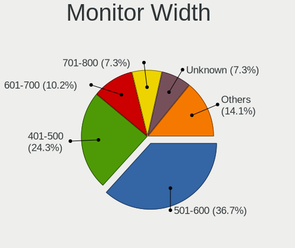

| Width in mm | Desktops | Percent |
|-------------|----------|---------|
| 501-600     | 35       | 35.71%  |
| 401-500     | 24       | 24.49%  |
| 701-800     | 7        | 7.14%   |
| 601-700     | 7        | 7.14%   |
| Unknown     | 7        | 7.14%   |
| 1501-2000   | 6        | 6.12%   |
| 351-400     | 4        | 4.08%   |
| 301-350     | 2        | 2.04%   |
| 1001-1500   | 2        | 2.04%   |
| 901-1000    | 2        | 2.04%   |
| 801-900     | 1        | 1.02%   |
| 101-200     | 1        | 1.02%   |

Aspect Ratio
------------

Proportional relationship between the width and the height

| Ratio   | Desktops | Percent |
|---------|----------|---------|
| 16/9    | 65       | 67.01%  |
| 16/10   | 13       | 13.4%   |
| Unknown | 7        | 7.22%   |
| 21/9    | 6        | 6.19%   |
| 5/4     | 5        | 5.15%   |
| 4/3     | 1        | 1.03%   |

Monitor Area
------------

Area in inch²

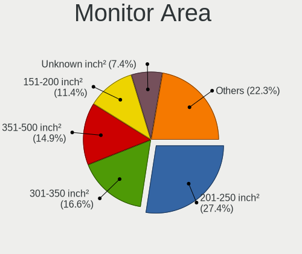

| Area in inch² | Desktops | Percent |
|----------------|----------|---------|
| 201-250        | 26       | 26.53%  |
| 301-350        | 14       | 14.29%  |
| 351-500        | 13       | 13.27%  |
| 251-300        | 10       | 10.2%   |
| 151-200        | 9        | 9.18%   |
| More than 1000 | 7        | 7.14%   |
| Unknown        | 7        | 7.14%   |
| 141-150        | 6        | 6.12%   |
| 501-1000       | 4        | 4.08%   |
| 1-40           | 1        | 1.02%   |
| 111-120        | 1        | 1.02%   |

Pixel Density
-------------

Pixels per inch

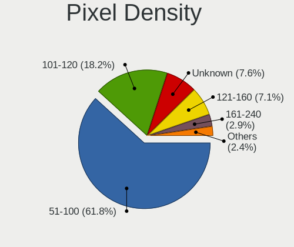

| Density       | Desktops | Percent |
|---------------|----------|---------|
| 51-100        | 60       | 62.5%   |
| 101-120       | 18       | 18.75%  |
| Unknown       | 7        | 7.29%   |
| 161-240       | 5        | 5.21%   |
| 121-160       | 3        | 3.13%   |
| 1-50          | 2        | 2.08%   |
| More than 240 | 1        | 1.04%   |

Multiple Monitors
-----------------

Total monitors connected

| Total | Desktops | Percent |
|-------|----------|---------|
| 1     | 86       | 87.76%  |
| 2     | 11       | 11.22%  |
| 0     | 1        | 1.02%   |

Network
-------

Net Controller Vendor
---------------------

Controller vendors

| Vendor                | Desktops | Percent |
|-----------------------|----------|---------|
| Realtek Semiconductor | 66       | 50.77%  |
| Intel                 | 34       | 26.15%  |
| Qualcomm Atheros      | 8        | 6.15%   |
| MediaTek              | 4        | 3.08%   |
| Broadcom              | 3        | 2.31%   |
| VIA Technologies      | 2        | 1.54%   |
| TP-Link               | 2        | 1.54%   |
| Ralink Technology     | 2        | 1.54%   |
| Ralink                | 2        | 1.54%   |
| Samsung Electronics   | 1        | 0.77%   |
| Nvidia                | 1        | 0.77%   |
| NetGear               | 1        | 0.77%   |
| Edimax Technology     | 1        | 0.77%   |
| D-Link                | 1        | 0.77%   |
| Broadcom Limited      | 1        | 0.77%   |
| Aquantia              | 1        | 0.77%   |

Net Controller Model
--------------------

Controller models

| Model                                                                  | Desktops | Percent |
|------------------------------------------------------------------------|----------|---------|
| Realtek RTL8111/8168/8211/8411 PCI Express Gigabit Ethernet Controller | 47       | 29.75%  |
| Realtek RTL8125 2.5GbE Controller                                      | 11       | 6.96%   |
| Realtek RTL8821CE 802.11ac PCIe Wireless Network Adapter               | 4        | 2.53%   |
| Intel Wi-Fi 6E(802.11ax) AX210/AX1675* 2x2 [Typhoon Peak]              | 4        | 2.53%   |
| Intel Raptor Lake-S PCH CNVi WiFi                                      | 4        | 2.53%   |
| Intel 82579LM Gigabit Network Connection (Lewisville)                  | 4        | 2.53%   |
| Realtek RTL810xE PCI Express Fast Ethernet controller                  | 3        | 1.9%    |
| Intel Ethernet Connection (2) I219-V                                   | 3        | 1.9%    |
| Intel Dual Band Wireless-AC 3168NGW [Stone Peak]                       | 3        | 1.9%    |
| Realtek RTL88x2bu [AC1200 Techkey]                                     | 2        | 1.27%   |
| Realtek RTL8192CU 802.11n WLAN Adapter                                 | 2        | 1.27%   |
| Qualcomm Atheros AR8151 v2.0 Gigabit Ethernet                          | 2        | 1.27%   |
| Qualcomm Atheros AR8131 Gigabit Ethernet                               | 2        | 1.27%   |
| Intel I211 Gigabit Network Connection                                  | 2        | 1.27%   |
| Intel Ethernet Controller I226-V                                       | 2        | 1.27%   |
| Intel Ethernet Connection (7) I219-V                                   | 2        | 1.27%   |
| Intel Ethernet Connection (2) I218-V                                   | 2        | 1.27%   |
| VIA VT6105/VT6106S [Rhine-III]                                         | 1        | 0.63%   |
| VIA VT6102/VT6103 [Rhine-II]                                           | 1        | 0.63%   |
| TP-Link TL-WN823N v2/v3 [Realtek RTL8192EU]                            | 1        | 0.63%   |
| TP-Link RTL8812AU Archer T4U 802.11ac                                  | 1        | 0.63%   |
| Samsung Galaxy series, misc. (tethering mode)                          | 1        | 0.63%   |
| Realtek RTL8852BE PCIe 802.11ax Wireless Network Controller            | 1        | 0.63%   |
| Realtek RTL8822CE 802.11ac PCIe Wireless Network Adapter               | 1        | 0.63%   |
| Realtek RTL8821AE 802.11ac PCIe Wireless Network Adapter               | 1        | 0.63%   |
| Realtek RTL8811AU 802.11a/b/g/n/ac WLAN Adapter                        | 1        | 0.63%   |
| Realtek RTL8192EE PCIe Wireless Network Adapter                        | 1        | 0.63%   |
| Realtek RTL8192CE PCIe Wireless Network Adapter                        | 1        | 0.63%   |
| Realtek RTL8188SU 802.11n WLAN Adapter                                 | 1        | 0.63%   |
| Realtek RTL8188FTV 802.11b/g/n 1T1R 2.4G WLAN Adapter                  | 1        | 0.63%   |
| Realtek RTL8188EUS 802.11n Wireless Network Adapter                    | 1        | 0.63%   |
| Realtek RTL8153 Gigabit Ethernet Adapter                               | 1        | 0.63%   |
| Realtek RTL-8100/8101L/8139 PCI Fast Ethernet Adapter                  | 1        | 0.63%   |
| Realtek Killer E3000 2.5GbE Controller                                 | 1        | 0.63%   |
| Realtek 802.11ac NIC                                                   | 1        | 0.63%   |
| Ralink RT5370 Wireless Adapter                                         | 1        | 0.63%   |
| Ralink MT7610U ("Archer T2U" 2.4G+5G WLAN Adapter                      | 1        | 0.63%   |
| Ralink RT5390 Wireless 802.11n 1T/1R PCIe                              | 1        | 0.63%   |
| Ralink RT2561/RT61 rev B 802.11g                                       | 1        | 0.63%   |
| Qualcomm Atheros QCA9565 / AR9565 Wireless Network Adapter             | 1        | 0.63%   |

Wireless Vendor
---------------

Wireless vendors

| Vendor                | Desktops | Percent |
|-----------------------|----------|---------|
| Realtek Semiconductor | 17       | 33.33%  |
| Intel                 | 16       | 31.37%  |
| Qualcomm Atheros      | 4        | 7.84%   |
| MediaTek              | 4        | 7.84%   |
| TP-Link               | 2        | 3.92%   |
| Ralink Technology     | 2        | 3.92%   |
| Ralink                | 2        | 3.92%   |
| NetGear               | 1        | 1.96%   |
| Edimax Technology     | 1        | 1.96%   |
| D-Link                | 1        | 1.96%   |
| Broadcom              | 1        | 1.96%   |

Wireless Model
--------------

Wireless models

| Model                                                          | Desktops | Percent |
|----------------------------------------------------------------|----------|---------|
| Realtek RTL8821CE 802.11ac PCIe Wireless Network Adapter       | 4        | 7.55%   |
| Intel Wi-Fi 6E(802.11ax) AX210/AX1675* 2x2 [Typhoon Peak]      | 4        | 7.55%   |
| Intel Raptor Lake-S PCH CNVi WiFi                              | 4        | 7.55%   |
| Intel Dual Band Wireless-AC 3168NGW [Stone Peak]               | 3        | 5.66%   |
| Realtek RTL88x2bu [AC1200 Techkey]                             | 2        | 3.77%   |
| Realtek RTL8192CU 802.11n WLAN Adapter                         | 2        | 3.77%   |
| TP-Link TL-WN823N v2/v3 [Realtek RTL8192EU]                    | 1        | 1.89%   |
| TP-Link RTL8812AU Archer T4U 802.11ac                          | 1        | 1.89%   |
| Realtek RTL8852BE PCIe 802.11ax Wireless Network Controller    | 1        | 1.89%   |
| Realtek RTL8822CE 802.11ac PCIe Wireless Network Adapter       | 1        | 1.89%   |
| Realtek RTL8821AE 802.11ac PCIe Wireless Network Adapter       | 1        | 1.89%   |
| Realtek RTL8811AU 802.11a/b/g/n/ac WLAN Adapter                | 1        | 1.89%   |
| Realtek RTL8192EE PCIe Wireless Network Adapter                | 1        | 1.89%   |
| Realtek RTL8192CE PCIe Wireless Network Adapter                | 1        | 1.89%   |
| Realtek RTL8188SU 802.11n WLAN Adapter                         | 1        | 1.89%   |
| Realtek RTL8188FTV 802.11b/g/n 1T1R 2.4G WLAN Adapter          | 1        | 1.89%   |
| Realtek RTL8188EUS 802.11n Wireless Network Adapter            | 1        | 1.89%   |
| Realtek 802.11ac NIC                                           | 1        | 1.89%   |
| Ralink RT5370 Wireless Adapter                                 | 1        | 1.89%   |
| Ralink MT7610U ("Archer T2U" 2.4G+5G WLAN Adapter              | 1        | 1.89%   |
| Ralink RT5390 Wireless 802.11n 1T/1R PCIe                      | 1        | 1.89%   |
| Ralink RT2561/RT61 rev B 802.11g                               | 1        | 1.89%   |
| Qualcomm Atheros QCA9565 / AR9565 Wireless Network Adapter     | 1        | 1.89%   |
| Qualcomm Atheros AR93xx Wireless Network Adapter               | 1        | 1.89%   |
| Qualcomm Atheros AR9285 Wireless Network Adapter (PCI-Express) | 1        | 1.89%   |
| Qualcomm Atheros AR9227 Wireless Network Adapter               | 1        | 1.89%   |
| NetGear WNA3100(v1) Wireless-N 300 [Broadcom BCM43231]         | 1        | 1.89%   |
| MediaTek WiFi                                                  | 1        | 1.89%   |
| MediaTek MT7922 802.11ax PCI Express Wireless Network Adapter  | 1        | 1.89%   |
| MediaTek MT7921K (RZ608) Wi-Fi 6E 80MHz                        | 1        | 1.89%   |
| MediaTek MT7921 802.11ax PCI Express Wireless Network Adapter  | 1        | 1.89%   |
| Intel Wireless 7265                                            | 1        | 1.89%   |
| Intel Wireless 3165                                            | 1        | 1.89%   |
| Intel Wi-Fi 6 AX200                                            | 1        | 1.89%   |
| Intel Wi-Fi 5(802.11ac) Wireless-AC 9x6x [Thunder Peak]        | 1        | 1.89%   |
| Intel CNVi: Wi-Fi                                              | 1        | 1.89%   |
| Intel Alder Lake-S PCH CNVi WiFi                               | 1        | 1.89%   |
| Edimax EW-7811Un 802.11n Wireless Adapter [Realtek RTL8188CUS] | 1        | 1.89%   |
| D-Link WLAN controller                                         | 1        | 1.89%   |
| Broadcom BCM43602 802.11ac Wireless LAN SoC                    | 1        | 1.89%   |

Ethernet Vendor
---------------

Ethernet vendors

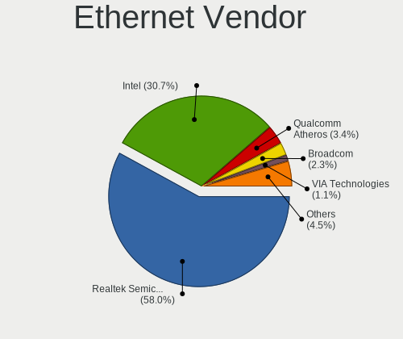

| Vendor                | Desktops | Percent |
|-----------------------|----------|---------|
| Realtek Semiconductor | 62       | 61.39%  |
| Intel                 | 27       | 26.73%  |
| Qualcomm Atheros      | 4        | 3.96%   |
| VIA Technologies      | 2        | 1.98%   |
| Broadcom              | 2        | 1.98%   |
| Samsung Electronics   | 1        | 0.99%   |
| Nvidia                | 1        | 0.99%   |
| Broadcom Limited      | 1        | 0.99%   |
| Aquantia              | 1        | 0.99%   |

Ethernet Model
--------------

Ethernet models

| Model                                                                           | Desktops | Percent |
|---------------------------------------------------------------------------------|----------|---------|
| Realtek RTL8111/8168/8211/8411 PCI Express Gigabit Ethernet Controller          | 47       | 44.76%  |
| Realtek RTL8125 2.5GbE Controller                                               | 11       | 10.48%  |
| Intel 82579LM Gigabit Network Connection (Lewisville)                           | 4        | 3.81%   |
| Realtek RTL810xE PCI Express Fast Ethernet controller                           | 3        | 2.86%   |
| Intel Ethernet Connection (2) I219-V                                            | 3        | 2.86%   |
| Qualcomm Atheros AR8151 v2.0 Gigabit Ethernet                                   | 2        | 1.9%    |
| Qualcomm Atheros AR8131 Gigabit Ethernet                                        | 2        | 1.9%    |
| Intel I211 Gigabit Network Connection                                           | 2        | 1.9%    |
| Intel Ethernet Controller I226-V                                                | 2        | 1.9%    |
| Intel Ethernet Connection (7) I219-V                                            | 2        | 1.9%    |
| Intel Ethernet Connection (2) I218-V                                            | 2        | 1.9%    |
| VIA VT6105/VT6106S [Rhine-III]                                                  | 1        | 0.95%   |
| VIA VT6102/VT6103 [Rhine-II]                                                    | 1        | 0.95%   |
| Samsung Galaxy series, misc. (tethering mode)                                   | 1        | 0.95%   |
| Realtek RTL8153 Gigabit Ethernet Adapter                                        | 1        | 0.95%   |
| Realtek RTL-8100/8101L/8139 PCI Fast Ethernet Adapter                           | 1        | 0.95%   |
| Realtek Killer E3000 2.5GbE Controller                                          | 1        | 0.95%   |
| Nvidia MCP77 Ethernet                                                           | 1        | 0.95%   |
| Intel I210 Gigabit Network Connection                                           | 1        | 0.95%   |
| Intel Ethernet Controller I225-V                                                | 1        | 0.95%   |
| Intel Ethernet Connection I217-V                                                | 1        | 0.95%   |
| Intel Ethernet Connection I217-LM                                               | 1        | 0.95%   |
| Intel Ethernet Connection (2) I219-LM                                           | 1        | 0.95%   |
| Intel Ethernet Connection (2) I218-LM                                           | 1        | 0.95%   |
| Intel Ethernet Connection (17) I219-V                                           | 1        | 0.95%   |
| Intel Ethernet Connection (14) I219-V                                           | 1        | 0.95%   |
| Intel Ethernet Connection (10) I219-V                                           | 1        | 0.95%   |
| Intel 82599 10 Gigabit Network Connection                                       | 1        | 0.95%   |
| Intel 82583V Gigabit Network Connection                                         | 1        | 0.95%   |
| Intel 82579V Gigabit Network Connection                                         | 1        | 0.95%   |
| Intel 82574L Gigabit Network Connection                                         | 1        | 0.95%   |
| Intel 82567V-2 Gigabit Network Connection                                       | 1        | 0.95%   |
| Broadcom NetXtreme BCM5754 Gigabit Ethernet PCI Express                         | 1        | 0.95%   |
| Broadcom NetXtreme BCM5751 Gigabit Ethernet PCI Express                         | 1        | 0.95%   |
| Broadcom Limited NetXtreme BCM5782 Gigabit Ethernet                             | 1        | 0.95%   |
| Aquantia AQtion AQC113CS NBase-T/IEEE 802.3an Ethernet Controller [Antigua 10G] | 1        | 0.95%   |

Net Controller Kind
-------------------

Ethernet, WiFi or modem

| Kind     | Desktops | Percent |
|----------|----------|---------|
| Ethernet | 95       | 65.97%  |
| WiFi     | 49       | 34.03%  |

Used Controller
---------------

Currently used network controller

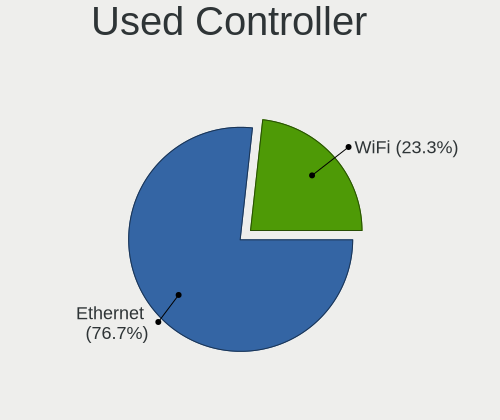

| Kind     | Desktops | Percent |
|----------|----------|---------|
| Ethernet | 77       | 76.24%  |
| WiFi     | 24       | 23.76%  |

NICs
----

Total network controllers on board

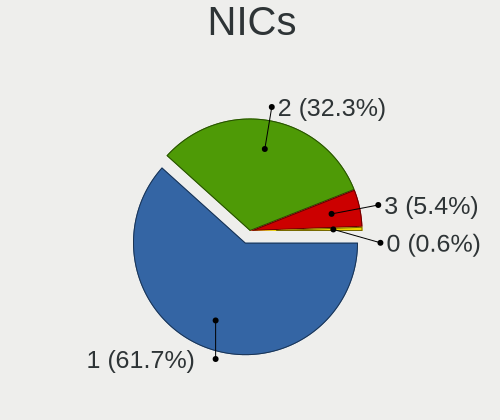

| Total | Desktops | Percent |
|-------|----------|---------|
| 1     | 60       | 60.61%  |
| 2     | 33       | 33.33%  |
| 3     | 5        | 5.05%   |
| 0     | 1        | 1.01%   |

IPv6
----

IPv6 vs IPv4

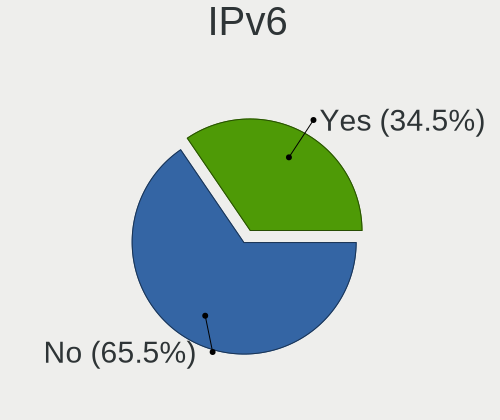

| Used | Desktops | Percent |
|------|----------|---------|
| No   | 63       | 63%     |
| Yes  | 37       | 37%     |

Bluetooth
---------

Bluetooth Vendor
----------------

Controller vendors

| Vendor                          | Desktops | Percent |
|---------------------------------|----------|---------|
| Intel                           | 16       | 39.02%  |
| Cambridge Silicon Radio         | 8        | 19.51%  |
| Realtek Semiconductor           | 7        | 17.07%  |
| MediaTek                        | 3        | 7.32%   |
| IMC Networks                    | 2        | 4.88%   |
| Qualcomm Atheros Communications | 1        | 2.44%   |
| Logitech                        | 1        | 2.44%   |
| Integrated System Solution      | 1        | 2.44%   |
| Apple                           | 1        | 2.44%   |
| Unknown                         | 1        | 2.44%   |

Bluetooth Model
---------------

Controller models

| Model                                               | Desktops | Percent |
|-----------------------------------------------------|----------|---------|
| Cambridge Silicon Radio Bluetooth Dongle (HCI mode) | 8        | 19.51%  |
| Realtek Bluetooth Radio                             | 5        | 12.2%   |
| Intel AX211 Bluetooth                               | 5        | 12.2%   |
| MediaTek Wireless_Device                            | 3        | 7.32%   |
| Intel Wireless-AC 3168 Bluetooth                    | 3        | 7.32%   |
| Intel AX210 Bluetooth                               | 3        | 7.32%   |
| Intel Bluetooth wireless interface                  | 2        | 4.88%   |
| Realtek  Bluetooth 4.2 Adapter                      | 1        | 2.44%   |
| Realtek 802.11ac WLAN Adapter                       | 1        | 2.44%   |
| Qualcomm Atheros  Bluetooth Device                  | 1        | 2.44%   |
| Logitech BT Mini-Receiver (HCI mode)                | 1        | 2.44%   |
| Intel Wireless-AC 9260 Bluetooth Adapter            | 1        | 2.44%   |
| Intel AX201 Bluetooth                               | 1        | 2.44%   |
| Intel AX200 Bluetooth                               | 1        | 2.44%   |
| Integrated System Solution Bluetooth Device         | 1        | 2.44%   |
| IMC Networks Wireless_Device                        | 1        | 2.44%   |
| IMC Networks Bluetooth Radio                        | 1        | 2.44%   |
| Apple Bluetooth Host Controller                     | 1        | 2.44%   |
| Unknown                                             | 1        | 2.44%   |

Sound
-----

Sound Vendor
------------

Sound card vendors

| Vendor                                       | Desktops | Percent |
|----------------------------------------------|----------|---------|
| Intel                                        | 60       | 36.14%  |
| AMD                                          | 46       | 27.71%  |
| Nvidia                                       | 29       | 17.47%  |
| Micro Star International                     | 3        | 1.81%   |
| Creative Labs                                | 3        | 1.81%   |
| Zoran Co. Personal Media Division (Nogatech) | 2        | 1.2%    |
| VIA Technologies                             | 2        | 1.2%    |
| Texas Instruments                            | 2        | 1.2%    |
| JMTek                                        | 2        | 1.2%    |
| Hewlett-Packard                              | 2        | 1.2%    |
| GN Netcom                                    | 2        | 1.2%    |
| Creative Technology                          | 2        | 1.2%    |
| Thesycon Systemsoftware & Consulting         | 1        | 0.6%    |
| Samson Technologies                          | 1        | 0.6%    |
| Logitech                                     | 1        | 0.6%    |
| Kingston Technology                          | 1        | 0.6%    |
| Generalplus Technology                       | 1        | 0.6%    |
| C-Media Electronics                          | 1        | 0.6%    |
| BR25                                         | 1        | 0.6%    |
| Blue Microphones                             | 1        | 0.6%    |
| ASUSTek Computer                             | 1        | 0.6%    |
| ASRock                                       | 1        | 0.6%    |
| Altec Lansing Technologies                   | 1        | 0.6%    |

Sound Model
-----------

Sound card models

| Model                                                                                             | Desktops | Percent |
|---------------------------------------------------------------------------------------------------|----------|---------|
| AMD Family 17h/19h HD Audio Controller                                                            | 15       | 7.69%   |
| AMD SBx00 Azalia (Intel HDA)                                                                      | 8        | 4.1%    |
| Intel 7 Series/C216 Chipset Family High Definition Audio Controller                               | 7        | 3.59%   |
| Intel NM10/ICH7 Family High Definition Audio Controller                                           | 6        | 3.08%   |
| Intel 100 Series/C230 Series Chipset Family HD Audio Controller                                   | 6        | 3.08%   |
| AMD Rembrandt Radeon High Definition Audio Controller                                             | 6        | 3.08%   |
| Intel Raptor Lake High Definition Audio Controller                                                | 5        | 2.56%   |
| Intel 8 Series/C220 Series Chipset High Definition Audio Controller                               | 5        | 2.56%   |
| Nvidia GP106 High Definition Audio Controller                                                     | 4        | 2.05%   |
| Nvidia GK208 HDMI/DP Audio Controller                                                             | 4        | 2.05%   |
| Intel Alder Lake-N PCH High Definition Audio Controller                                           | 4        | 2.05%   |
| AMD Starship/Matisse HD Audio Controller                                                          | 4        | 2.05%   |
| AMD Renoir Radeon High Definition Audio Controller                                                | 4        | 2.05%   |
| AMD Navi 21/23 HDMI/DP Audio Controller                                                           | 4        | 2.05%   |
| AMD Family 17h (Models 00h-0fh) HD Audio Controller                                               | 4        | 2.05%   |
| Nvidia TU106 High Definition Audio Controller                                                     | 3        | 1.54%   |
| Micro Star International USB Audio                                                                | 3        | 1.54%   |
| Intel Cannon Lake PCH cAVS                                                                        | 3        | 1.54%   |
| Intel 200 Series PCH HD Audio                                                                     | 3        | 1.54%   |
| AMD Raven/Raven2/Fenghuang HDMI/DP Audio Controller                                               | 3        | 1.54%   |
| AMD Navi 31 HDMI/DP Audio                                                                         | 3        | 1.54%   |
| AMD Cedar HDMI Audio [Radeon HD 5400/6300/7300 Series]                                            | 3        | 1.54%   |
| Zoran Co. Personal Media Division (Nogatech) USB Audio and HID                                    | 2        | 1.03%   |
| Nvidia GP107GL High Definition Audio Controller                                                   | 2        | 1.03%   |
| Nvidia GP104 High Definition Audio Controller                                                     | 2        | 1.03%   |
| Nvidia GM204 High Definition Audio Controller                                                     | 2        | 1.03%   |
| Nvidia GK104 HDMI Audio Controller                                                                | 2        | 1.03%   |
| Nvidia GF108 High Definition Audio Controller                                                     | 2        | 1.03%   |
| Nvidia Audio device                                                                               | 2        | 1.03%   |
| JMTek USB PnP Audio Device                                                                        | 2        | 1.03%   |
| Intel Xeon E3-1200 v3/4th Gen Core Processor HD Audio Controller                                  | 2        | 1.03%   |
| Intel C610/X99 series chipset HD Audio Controller                                                 | 2        | 1.03%   |
| Intel Atom/Celeron/Pentium Processor x5-E8000/J3xxx/N3xxx Series High Definition Audio Controller | 2        | 1.03%   |
| Intel Alder Lake-S HD Audio Controller                                                            | 2        | 1.03%   |
| Intel 82801JI (ICH10 Family) HD Audio Controller                                                  | 2        | 1.03%   |
| AMD RV710/730 HDMI Audio [Radeon HD 4000 series]                                                  | 2        | 1.03%   |
| AMD FCH Azalia Controller                                                                         | 2        | 1.03%   |
| AMD Caicos HDMI Audio [Radeon HD 6450 / 7450/8450/8490 OEM / R5 230/235/235X OEM]                 | 2        | 1.03%   |
| VIA Technologies VT8233/A/8235/8237 AC97 Audio Controller                                         | 1        | 0.51%   |
| VIA Technologies ICE1712 [Envy24] PCI Multi-Channel I/O Controller                                | 1        | 0.51%   |

Memory
------

Memory Vendor
-------------

Memory module vendors

| Vendor              | Desktops | Percent |
|---------------------|----------|---------|
| Kingston            | 12       | 19.35%  |
| Unknown             | 8        | 12.9%   |
| G.Skill             | 8        | 12.9%   |
| Corsair             | 8        | 12.9%   |
| Samsung Electronics | 7        | 11.29%  |
| SK hynix            | 6        | 9.68%   |
| Team                | 2        | 3.23%   |
| Micron Technology   | 2        | 3.23%   |
| Crucial             | 2        | 3.23%   |
| Unknown (ABCD)      | 1        | 1.61%   |
| Unknown (0x0E9D)    | 1        | 1.61%   |
| Unknown (0x0CC7)    | 1        | 1.61%   |
| Patriot             | 1        | 1.61%   |
| Mushkin             | 1        | 1.61%   |
| Avant               | 1        | 1.61%   |
| Unknown             | 1        | 1.61%   |

Memory Model
------------

Memory module models

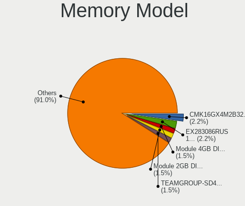

| Model                                                              | Desktops | Percent |
|--------------------------------------------------------------------|----------|---------|
| Unknown RAM Module 4GB DIMM 1066MT/s                               | 2        | 2.86%   |
| Unknown RAM Module 8GB SODIMM DDR3 1600MT/s                        | 1        | 1.43%   |
| Unknown RAM Module 512MB DIMM                                      | 1        | 1.43%   |
| Unknown RAM Module 4GB DIMM DDR3 1333MT/s                          | 1        | 1.43%   |
| Unknown RAM Module 2GB DIMM SDRAM                                  | 1        | 1.43%   |
| Unknown RAM Module 2GB DIMM DDR2 800MT/s                           | 1        | 1.43%   |
| Unknown RAM Module 2GB DIMM DDR 667MT/s                            | 1        | 1.43%   |
| Unknown RAM Module 2GB DIMM 1066MT/s                               | 1        | 1.43%   |
| Unknown RAM Module 1GB DIMM                                        | 1        | 1.43%   |
| Unknown (ABCD) RAM 123456789012345678 4GB DIMM DDR4 2400MT/s       | 1        | 1.43%   |
| Unknown (0x0E9D) RAM KINSOTIN16GB2666MHZ 16GB SODIMM DDR4 2667MT/s | 1        | 1.43%   |
| Unknown (0x0CC7) RAM DDR4 NB 8G 3200 8GB SODIMM DDR4 3200MT/s      | 1        | 1.43%   |
| Team RAM TEAMGROUP-UD4-3000 8GB DIMM DDR4 3200MT/s                 | 1        | 1.43%   |
| Team RAM TEAMGROUP-SD4-2666 8GB SODIMM DDR4 2667MT/s               | 1        | 1.43%   |
| SK hynix RAM Module 2GB DIMM DDR3 1333MT/s                         | 1        | 1.43%   |
| SK hynix RAM HYMP564U64CP8-Y5 512MB DIMM DDR 667MT/s               | 1        | 1.43%   |
| SK hynix RAM HYMP125U64CP8-Y5 2GB DIMM DDR 667MT/s                 | 1        | 1.43%   |
| SK hynix RAM HMT425S6CFR6C-PB 2GB SODIMM DDR3 1600MT/s             | 1        | 1.43%   |
| SK hynix RAM HMT41GR7AFR4C-RD 8GB DIMM DDR3 1867MT/s               | 1        | 1.43%   |
| SK hynix RAM HMT351U6CFR8C-PB 4GB DIMM DDR3 1800MT/s               | 1        | 1.43%   |
| SK hynix RAM HMT31GR7CFR4C-PB 8GB DIMM DDR3 1600MT/s               | 1        | 1.43%   |
| SK hynix RAM H9JCNNNFA5MLYR-N6E 8GB DIMM LPDDR5 6400MT/s           | 1        | 1.43%   |
| Samsung RAM M471B5273DH0-CH9 4GB DIMM DDR3 1333MT/s                | 1        | 1.43%   |
| Samsung RAM M471B5273CH0-CH9 4GB SODIMM DDR3 1334MT/s              | 1        | 1.43%   |
| Samsung RAM M393A1G40DB0-CPB 8GB DIMM DDR4 2133MT/s                | 1        | 1.43%   |
| Samsung RAM M378B1G73EB0-CK0 8GB DIMM DDR3 1600MT/s                | 1        | 1.43%   |
| Samsung RAM M378B1G73DB0-CK0 8192MB DIMM DDR3 2133MT/s             | 1        | 1.43%   |
| Samsung RAM M3 78T6464QZ3-CE6 512MB DIMM DDR2 667MT/s              | 1        | 1.43%   |
| Samsung RAM 4D33373842353737 2GB SODIMM DDR3 1333MT/s              | 1        | 1.43%   |
| Patriot RAM PSD34G133381 4GB DIMM DDR3 1333MT/s                    | 1        | 1.43%   |
| Mushkin RAM MRX4U320GJJM32G 32GB DIMM DDR4 3200MT/s                | 1        | 1.43%   |
| Micron RAM 4ATF51264AZ-2G3B1 4GB DIMM DDR4 2800MT/s                | 1        | 1.43%   |
| Micron RAM 18ASF1G72PZ-2G1B1 8GB DIMM DDR4 2133MT/s                | 1        | 1.43%   |
| Kingston RAM Module 8GB DIMM DDR4 2133MT/s                         | 1        | 1.43%   |
| Kingston RAM KNWMX1-ETB 4GB SODIMM DDR3 1600MT/s                   | 1        | 1.43%   |
| Kingston RAM KHX3200C16D4/8GX 8GB DIMM DDR4 3733MT/s               | 1        | 1.43%   |
| Kingston RAM KHX3200C16D4/16GX 16GB DIMM DDR4 3600MT/s             | 1        | 1.43%   |
| Kingston RAM KHX2400C15/8G 8GB DIMM DDR4 3400MT/s                  | 1        | 1.43%   |
| Kingston RAM KHX1866C10D3/ 8GB DIMM DDR3 1866MT/s                  | 1        | 1.43%   |
| Kingston RAM KF560C36-16 16GB DIMM DDR5 6000MT/s                   | 1        | 1.43%   |

Memory Kind
-----------

Memory module kinds

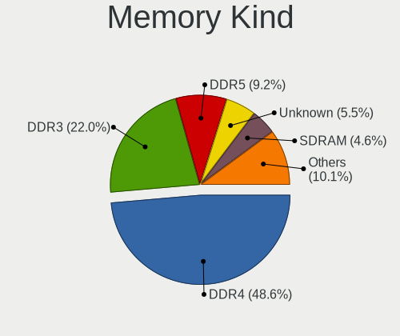

| Kind    | Desktops | Percent |
|---------|----------|---------|
| DDR4    | 24       | 41.38%  |
| DDR3    | 17       | 29.31%  |
| DDR5    | 5        | 8.62%   |
| SDRAM   | 3        | 5.17%   |
| Unknown | 3        | 5.17%   |
| DDR2    | 2        | 3.45%   |
| DDR     | 2        | 3.45%   |
| LPDDR5  | 1        | 1.72%   |
| LPDDR4  | 1        | 1.72%   |

Memory Form Factor
------------------

Physical design of the memory module

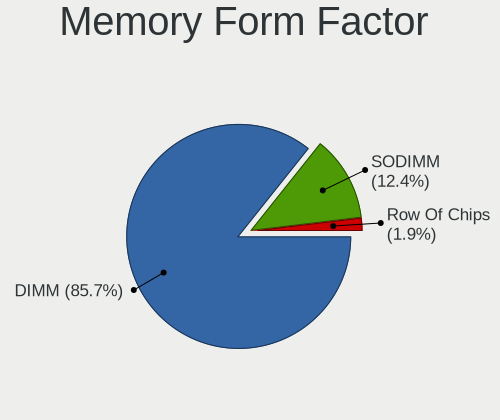

| Name   | Desktops | Percent |
|--------|----------|---------|
| DIMM   | 47       | 83.93%  |
| SODIMM | 9        | 16.07%  |

Memory Size
-----------

Memory module size

| Size  | Desktops | Percent |
|-------|----------|---------|
| 8192  | 19       | 30.65%  |
| 16384 | 16       | 25.81%  |
| 4096  | 10       | 16.13%  |
| 2048  | 10       | 16.13%  |
| 32768 | 3        | 4.84%   |
| 512   | 2        | 3.23%   |
| 49152 | 1        | 1.61%   |
| 1024  | 1        | 1.61%   |

Memory Speed
------------

Memory module speed

| Speed   | Desktops | Percent |
|---------|----------|---------|
| 3200    | 11       | 17.74%  |
| 1600    | 8        | 12.9%   |
| 1333    | 6        | 9.68%   |
| 3600    | 4        | 6.45%   |
| 2667    | 4        | 6.45%   |
| 2133    | 3        | 4.84%   |
| 667     | 3        | 4.84%   |
| 6400    | 2        | 3.23%   |
| 6000    | 2        | 3.23%   |
| 4800    | 2        | 3.23%   |
| 3400    | 2        | 3.23%   |
| 2800    | 2        | 3.23%   |
| 1867    | 2        | 3.23%   |
| 1066    | 2        | 3.23%   |
| Unknown | 2        | 3.23%   |
| 3733    | 1        | 1.61%   |
| 2400    | 1        | 1.61%   |
| 1866    | 1        | 1.61%   |
| 1800    | 1        | 1.61%   |
| 1334    | 1        | 1.61%   |
| 800     | 1        | 1.61%   |
| 533     | 1        | 1.61%   |

Printers & scanners
-------------------

Printer Vendor
--------------

Printer device vendors

| Vendor                | Desktops | Percent |
|-----------------------|----------|---------|
| Hewlett-Packard       | 4        | 57.14%  |
| Seiko Epson           | 2        | 28.57%  |
| Lexmark International | 1        | 14.29%  |

Printer Model
-------------

Printer device models

| Model                         | Desktops | Percent |
|-------------------------------|----------|---------|
| Seiko Epson ET-2820 Series    | 1        | 14.29%  |
| Seiko Epson ET-1810 Series    | 1        | 14.29%  |
| Lexmark International MX310dn | 1        | 14.29%  |
| HP LaserJet Pro M404-M405     | 1        | 14.29%  |
| HP LaserJet P2015 series      | 1        | 14.29%  |
| HP ENVY 5000 series           | 1        | 14.29%  |
| HP DeskJet F4200 series       | 1        | 14.29%  |

Scanner Vendor
--------------

Scanner device vendors

| Vendor      | Desktops | Percent |
|-------------|----------|---------|
| Seiko Epson | 1        | 100%    |

Scanner Model
-------------

Scanner device models

| Model                                       | Desktops | Percent |
|---------------------------------------------|----------|---------|
| Seiko Epson GT-X820 [Perfection V600 Photo] | 1        | 100%    |

Camera
------

Camera Vendor
-------------

Camera device vendors

| Vendor                        | Desktops | Percent |
|-------------------------------|----------|---------|
| Logitech                      | 8        | 61.54%  |
| Sunplus Innovation Technology | 1        | 7.69%   |
| Microsoft                     | 1        | 7.69%   |
| MacroSilicon                  | 1        | 7.69%   |
| KYE Systems (Mouse Systems)   | 1        | 7.69%   |
| Chicony Electronics           | 1        | 7.69%   |

Camera Model
------------

Camera device models

| Model                                          | Desktops | Percent |
|------------------------------------------------|----------|---------|
| Logitech HD Pro Webcam C920                    | 2        | 15.38%  |
| Sunplus PC Camera                              | 1        | 7.69%   |
| Microsoft LifeCam VX-700                       | 1        | 7.69%   |
| MacroSilicon ClearClick                        | 1        | 7.69%   |
| Logitech Webcam C310                           | 1        | 7.69%   |
| Logitech Webcam C270                           | 1        | 7.69%   |
| Logitech Webcam C170                           | 1        | 7.69%   |
| Logitech HD Webcam C615                        | 1        | 7.69%   |
| Logitech C920 PRO HD Webcam                    | 1        | 7.69%   |
| Logitech BRIO Ultra HD Webcam                  | 1        | 7.69%   |
| KYE Systems (Mouse Systems) Genius FaceCam 312 | 1        | 7.69%   |
| Chicony HP 0.3MP Webcam                        | 1        | 7.69%   |

Security
--------

Fingerprint Vendor
------------------

Fingerprint sensor vendors

Zero info for selected period =(

Fingerprint Model
-----------------

Fingerprint sensor models

Zero info for selected period =(

Chipcard Vendor
---------------

Chipcard module vendors

Zero info for selected period =(

Chipcard Model
--------------

Chipcard module models

Zero info for selected period =(

Unsupported
-----------

Unsupported Devices
-------------------

Total unsupported devices on board

| Total | Desktops | Percent |
|-------|----------|---------|
| 0     | 88       | 88%     |
| 1     | 9        | 9%      |
| 2     | 3        | 3%      |

Unsupported Device Types
------------------------

Types of unsupported devices

| Type                     | Desktops | Percent |
|--------------------------|----------|---------|
| Net/wireless             | 3        | 27.27%  |
| Graphics card            | 3        | 27.27%  |
| Unassigned class         | 2        | 18.18%  |
| Sound                    | 1        | 9.09%   |
| Multimedia controller    | 1        | 9.09%   |
| Communication controller | 1        | 9.09%   |

