LMDE 6 - Tested Hardware & Statistics (Desktops)
------------------------------------------------

A project to collect tested hardware configurations for LMDE 6.

Anyone can contribute to this report by the [hw-probe](https://github.com/linuxhw/hw-probe) tool:

    sudo -E hw-probe -all -upload

Please contribute! Especially if your hardware is rare.

Contents
--------

* [ Test Cases ](#test-cases)

* [ System ](#system)
  - [ Kernel                   ](#kernel)
  - [ Kernel Family            ](#kernel-family)
  - [ Kernel Major Ver.        ](#kernel-major-ver)
  - [ Arch                     ](#arch)
  - [ DE                       ](#de)
  - [ Display Server           ](#display-server)
  - [ Display Manager          ](#display-manager)
  - [ OS Lang                  ](#os-lang)
  - [ Boot Mode                ](#boot-mode)
  - [ Filesystem               ](#filesystem)
  - [ Part. scheme             ](#part-scheme)
  - [ Dual Boot with Linux/BSD ](#dual-boot-with-linuxbsd)
  - [ Dual Boot (Win)          ](#dual-boot-win)

* [ Board ](#board)
  - [ Vendor                   ](#vendor)
  - [ Model                    ](#model)
  - [ Model Family             ](#model-family)
  - [ MFG Year                 ](#mfg-year)
  - [ Form Factor              ](#form-factor)
  - [ Secure Boot              ](#secure-boot)
  - [ Coreboot                 ](#coreboot)
  - [ RAM Size                 ](#ram-size)
  - [ RAM Used                 ](#ram-used)
  - [ Total Drives             ](#total-drives)
  - [ Has CD-ROM               ](#has-cd-rom)
  - [ Has Ethernet             ](#has-ethernet)
  - [ Has WiFi                 ](#has-wifi)
  - [ Has Bluetooth            ](#has-bluetooth)

* [ Location ](#location)
  - [ Country                  ](#country)
  - [ City                     ](#city)

* [ Drives ](#drives)
  - [ Drive Vendor             ](#drive-vendor)
  - [ Drive Model              ](#drive-model)
  - [ HDD Vendor               ](#hdd-vendor)
  - [ SSD Vendor               ](#ssd-vendor)
  - [ Drive Kind               ](#drive-kind)
  - [ Drive Connector          ](#drive-connector)
  - [ Drive Size               ](#drive-size)
  - [ Space Total              ](#space-total)
  - [ Space Used               ](#space-used)
  - [ Malfunc. Drives          ](#malfunc-drives)
  - [ Malfunc. Drive Vendor    ](#malfunc-drive-vendor)
  - [ Malfunc. HDD Vendor      ](#malfunc-hdd-vendor)
  - [ Malfunc. Drive Kind      ](#malfunc-drive-kind)
  - [ Failed Drives            ](#failed-drives)
  - [ Failed Drive Vendor      ](#failed-drive-vendor)
  - [ Drive Status             ](#drive-status)

* [ Storage controller ](#storage-controller)
  - [ Storage Vendor           ](#storage-vendor)
  - [ Storage Model            ](#storage-model)
  - [ Storage Kind             ](#storage-kind)

* [ Processor ](#processor)
  - [ CPU Vendor               ](#cpu-vendor)
  - [ CPU Model                ](#cpu-model)
  - [ CPU Model Family         ](#cpu-model-family)
  - [ CPU Cores                ](#cpu-cores)
  - [ CPU Sockets              ](#cpu-sockets)
  - [ CPU Threads              ](#cpu-threads)
  - [ CPU Op-Modes             ](#cpu-op-modes)
  - [ CPU Microcode            ](#cpu-microcode)
  - [ CPU Microarch            ](#cpu-microarch)

* [ Graphics ](#graphics)
  - [ GPU Vendor               ](#gpu-vendor)
  - [ GPU Model                ](#gpu-model)
  - [ GPU Combo                ](#gpu-combo)
  - [ GPU Driver               ](#gpu-driver)
  - [ GPU Memory               ](#gpu-memory)

* [ Monitor ](#monitor)
  - [ Monitor Vendor           ](#monitor-vendor)
  - [ Monitor Model            ](#monitor-model)
  - [ Monitor Resolution       ](#monitor-resolution)
  - [ Monitor Diagonal         ](#monitor-diagonal)
  - [ Monitor Width            ](#monitor-width)
  - [ Aspect Ratio             ](#aspect-ratio)
  - [ Monitor Area             ](#monitor-area)
  - [ Pixel Density            ](#pixel-density)
  - [ Multiple Monitors        ](#multiple-monitors)

* [ Network ](#network)
  - [ Net Controller Vendor    ](#net-controller-vendor)
  - [ Net Controller Model     ](#net-controller-model)
  - [ Wireless Vendor          ](#wireless-vendor)
  - [ Wireless Model           ](#wireless-model)
  - [ Ethernet Vendor          ](#ethernet-vendor)
  - [ Ethernet Model           ](#ethernet-model)
  - [ Net Controller Kind      ](#net-controller-kind)
  - [ Used Controller          ](#used-controller)
  - [ NICs                     ](#nics)
  - [ IPv6                     ](#ipv6)

* [ Bluetooth ](#bluetooth)
  - [ Bluetooth Vendor         ](#bluetooth-vendor)
  - [ Bluetooth Model          ](#bluetooth-model)

* [ Sound ](#sound)
  - [ Sound Vendor             ](#sound-vendor)
  - [ Sound Model              ](#sound-model)

* [ Memory ](#memory)
  - [ Memory Vendor            ](#memory-vendor)
  - [ Memory Model             ](#memory-model)
  - [ Memory Kind              ](#memory-kind)
  - [ Memory Form Factor       ](#memory-form-factor)
  - [ Memory Size              ](#memory-size)
  - [ Memory Speed             ](#memory-speed)

* [ Printers & scanners ](#printers--scanners)
  - [ Printer Vendor           ](#printer-vendor)
  - [ Printer Model            ](#printer-model)
  - [ Scanner Vendor           ](#scanner-vendor)
  - [ Scanner Model            ](#scanner-model)

* [ Camera ](#camera)
  - [ Camera Vendor            ](#camera-vendor)
  - [ Camera Model             ](#camera-model)

* [ Security ](#security)
  - [ Fingerprint Vendor       ](#fingerprint-vendor)
  - [ Fingerprint Model        ](#fingerprint-model)
  - [ Chipcard Vendor          ](#chipcard-vendor)
  - [ Chipcard Model           ](#chipcard-model)

* [ Unsupported ](#unsupported)
  - [ Unsupported Devices      ](#unsupported-devices)
  - [ Unsupported Device Types ](#unsupported-device-types)

Test Cases
----------

Total: 282

| Vendor        | Model                       | Probe                                                      | Date         |
|---------------|-----------------------------|------------------------------------------------------------|--------------|
| PELADN        | WI-6                        | [537a11ae44](https://linux-hardware.org/?probe=537a11ae44) | Jan 06, 2025 |
| ASUSTek       | PRIME Z390-P                | [d6e8f1ee6c](https://linux-hardware.org/?probe=d6e8f1ee6c) | Jan 04, 2025 |
| MSI           | B450 TOMAHAWK MAX           | [88d10a1126](https://linux-hardware.org/?probe=88d10a1126) | Jan 04, 2025 |
| PELADN        | WI-6                        | [ed403a09ce](https://linux-hardware.org/?probe=ed403a09ce) | Jan 01, 2025 |
| PELADN        | WI-6                        | [9961c80013](https://linux-hardware.org/?probe=9961c80013) | Dec 31, 2024 |
| PELADN        | WI-6                        | [ad75e2844c](https://linux-hardware.org/?probe=ad75e2844c) | Dec 31, 2024 |
| PELADN        | WI-6                        | [a4d452eb65](https://linux-hardware.org/?probe=a4d452eb65) | Dec 31, 2024 |
| Dell          | 0MWYPT A02                  | [3a7c58054c](https://linux-hardware.org/?probe=3a7c58054c) | Dec 29, 2024 |
| ASUSTek       | PRIME Z390-P                | [f680af729c](https://linux-hardware.org/?probe=f680af729c) | Dec 28, 2024 |
| ASRock        | H110M-HDV R3.0              | [43e003f874](https://linux-hardware.org/?probe=43e003f874) | Dec 22, 2024 |
| ASUSTek       | ROG STRIX B450-F GAMING     | [8144311954](https://linux-hardware.org/?probe=8144311954) | Dec 22, 2024 |
| HP            | 2820h                       | [64ccd9e1f2](https://linux-hardware.org/?probe=64ccd9e1f2) | Dec 22, 2024 |
| ASUSTek       | PRIME B250M-C               | [ebcaaa33b0](https://linux-hardware.org/?probe=ebcaaa33b0) | Dec 15, 2024 |
| ASUSTek       | PRIME B250M-C               | [787e3a402c](https://linux-hardware.org/?probe=787e3a402c) | Dec 14, 2024 |
| ASUSTek       | H81M-K                      | [4c7c8cc298](https://linux-hardware.org/?probe=4c7c8cc298) | Dec 08, 2024 |
| Gigabyte      | B550M DS3H                  | [146d9d897a](https://linux-hardware.org/?probe=146d9d897a) | Dec 02, 2024 |
| Lenovo        | ThinkCentre M58p 7220AVG    | [9d47a500ed](https://linux-hardware.org/?probe=9d47a500ed) | Dec 01, 2024 |
| ASRock        | B450 Pro4                   | [ca8808db77](https://linux-hardware.org/?probe=ca8808db77) | Nov 29, 2024 |
| ASRock        | B450 Pro4                   | [fb2858b084](https://linux-hardware.org/?probe=fb2858b084) | Nov 28, 2024 |
| PELADN        | WI-6                        | [deec076d09](https://linux-hardware.org/?probe=deec076d09) | Nov 24, 2024 |
| PELADN        | WI-6                        | [f1daf75b91](https://linux-hardware.org/?probe=f1daf75b91) | Nov 24, 2024 |
| ASUSTek       | PRIME Z390-P                | [a087a2818f](https://linux-hardware.org/?probe=a087a2818f) | Nov 18, 2024 |
| Dell          | 00V62H A01                  | [3f6a95ad11](https://linux-hardware.org/?probe=3f6a95ad11) | Nov 18, 2024 |
| Dell          | 073MMW A03                  | [715ccc808c](https://linux-hardware.org/?probe=715ccc808c) | Nov 16, 2024 |
| ASRock        | A320M-HDV R4.0              | [bd75bc63f7](https://linux-hardware.org/?probe=bd75bc63f7) | Nov 15, 2024 |
| ASUSTek       | TUF Gaming X670E-PLUS WI... | [7ac1792400](https://linux-hardware.org/?probe=7ac1792400) | Nov 14, 2024 |
| Gigabyte      | A520M S2H                   | [53fa642cd5](https://linux-hardware.org/?probe=53fa642cd5) | Nov 13, 2024 |
| ASUSTek       | PRIME Z390-P                | [acecc3bec2](https://linux-hardware.org/?probe=acecc3bec2) | Nov 09, 2024 |
| ASUSTek       | TUF Gaming X570-PLUS        | [01063d0f9e](https://linux-hardware.org/?probe=01063d0f9e) | Nov 08, 2024 |
| Gigabyte      | B360 AORUS GAMING 3 WIFI... | [856f712b05](https://linux-hardware.org/?probe=856f712b05) | Nov 08, 2024 |
| ASUSTek       | P8H67-M                     | [d7ef318b8e](https://linux-hardware.org/?probe=d7ef318b8e) | Nov 06, 2024 |
| Intel         | H110D4-P1                   | [65e304fcef](https://linux-hardware.org/?probe=65e304fcef) | Nov 02, 2024 |
| AZW           | MINI S 10                   | [a76f3d4f56](https://linux-hardware.org/?probe=a76f3d4f56) | Nov 01, 2024 |
| AZW           | MINI S 10                   | [eae99fa9a9](https://linux-hardware.org/?probe=eae99fa9a9) | Nov 01, 2024 |
| HP            | 2820h                       | [940082e5de](https://linux-hardware.org/?probe=940082e5de) | Oct 30, 2024 |
| HP            | 1906                        | [2d314c1b57](https://linux-hardware.org/?probe=2d314c1b57) | Oct 28, 2024 |
| ASRock        | A320M-HDV                   | [7ae06e5667](https://linux-hardware.org/?probe=7ae06e5667) | Oct 27, 2024 |
| Gigabyte      | Z77X-D3H                    | [91631ac2c3](https://linux-hardware.org/?probe=91631ac2c3) | Oct 27, 2024 |
| HP            | 2AFB                        | [c7b44337e2](https://linux-hardware.org/?probe=c7b44337e2) | Oct 23, 2024 |
| HP            | 2AFB                        | [cedecd78de](https://linux-hardware.org/?probe=cedecd78de) | Oct 23, 2024 |
| ASUSTek       | Crosshair IV Formula        | [50d12895aa](https://linux-hardware.org/?probe=50d12895aa) | Oct 18, 2024 |
| ASUSTek       | ROG CROSSHAIR VII HERO      | [2c7a8f6c86](https://linux-hardware.org/?probe=2c7a8f6c86) | Oct 17, 2024 |
| PELADN        | WI-6                        | [475cbc4d32](https://linux-hardware.org/?probe=475cbc4d32) | Oct 12, 2024 |
| PELADN        | WI-6                        | [26845b5304](https://linux-hardware.org/?probe=26845b5304) | Oct 12, 2024 |
| PELADN        | WI-6                        | [0531287d03](https://linux-hardware.org/?probe=0531287d03) | Oct 12, 2024 |
| PELADN        | WI-6                        | [ab803d1e89](https://linux-hardware.org/?probe=ab803d1e89) | Oct 12, 2024 |
| Medion        | TJ4125                      | [a371c066fd](https://linux-hardware.org/?probe=a371c066fd) | Oct 11, 2024 |
| Fujitsu       | D3427-A1 S26361-D3427-A1    | [31774f82cc](https://linux-hardware.org/?probe=31774f82cc) | Oct 11, 2024 |
| Fujitsu       | D3427-A1 S26361-D3427-A1    | [f42bacdfa7](https://linux-hardware.org/?probe=f42bacdfa7) | Oct 11, 2024 |
| Medion        | TJ4125                      | [24e446e7a7](https://linux-hardware.org/?probe=24e446e7a7) | Oct 08, 2024 |
| MSI           | PRO B550M-P GEN3            | [f216dafbba](https://linux-hardware.org/?probe=f216dafbba) | Oct 04, 2024 |
| ASUSTek       | PRIME X570-PRO              | [bc7fdf7279](https://linux-hardware.org/?probe=bc7fdf7279) | Oct 01, 2024 |
| Gigabyte      | Z77X-D3H                    | [e9bbaa808d](https://linux-hardware.org/?probe=e9bbaa808d) | Sep 30, 2024 |
| Gigabyte      | Z77X-D3H                    | [51fe2ae08f](https://linux-hardware.org/?probe=51fe2ae08f) | Sep 29, 2024 |
| ASRock        | A320M-HDV                   | [23c6bbe37a](https://linux-hardware.org/?probe=23c6bbe37a) | Sep 25, 2024 |
| ASUSTek       | P5G41T-M LE                 | [d2315eef29](https://linux-hardware.org/?probe=d2315eef29) | Sep 22, 2024 |
| Biostar       | P31-A7                      | [8f249ff212](https://linux-hardware.org/?probe=8f249ff212) | Sep 22, 2024 |
| MSI           | B350 TOMAHAWK               | [f87173b8b2](https://linux-hardware.org/?probe=f87173b8b2) | Sep 20, 2024 |
| Dell          | 0T568R A00                  | [1e475fbe85](https://linux-hardware.org/?probe=1e475fbe85) | Sep 18, 2024 |
| ASRock        | B650M Pro RS WiFi           | [8f68843f40](https://linux-hardware.org/?probe=8f68843f40) | Sep 18, 2024 |
| Apple         | Mac-F60DEB81FF30ACF6 Mac... | [47ffb7c0c0](https://linux-hardware.org/?probe=47ffb7c0c0) | Sep 11, 2024 |
| PELADN        | WI-6                        | [1a20712dde](https://linux-hardware.org/?probe=1a20712dde) | Sep 08, 2024 |
| PELADN        | WI-6                        | [c250dba9ae](https://linux-hardware.org/?probe=c250dba9ae) | Sep 07, 2024 |
| MSI           | A68HM GRENADE               | [d823f74970](https://linux-hardware.org/?probe=d823f74970) | Aug 29, 2024 |
| MSI           | A68HM GRENADE               | [10f8a9b965](https://linux-hardware.org/?probe=10f8a9b965) | Aug 29, 2024 |
| ASUSTek       | G11CD-K                     | [97151fcf68](https://linux-hardware.org/?probe=97151fcf68) | Aug 27, 2024 |
| ASUSTek       | ROG STRIX B550-A GAMING     | [c771260335](https://linux-hardware.org/?probe=c771260335) | Aug 19, 2024 |
| PELADN        | WI-6                        | [862128760a](https://linux-hardware.org/?probe=862128760a) | Aug 15, 2024 |
| Shenzhen M... | DNBIB                       | [b96a88e34c](https://linux-hardware.org/?probe=b96a88e34c) | Aug 13, 2024 |
| PELADN        | WI-6                        | [e23677d993](https://linux-hardware.org/?probe=e23677d993) | Aug 13, 2024 |
| ASRock        | X370 Killer SLI             | [e2b748b24a](https://linux-hardware.org/?probe=e2b748b24a) | Aug 11, 2024 |
| MACHINIST     | X99 PR9                     | [fd08f80e3b](https://linux-hardware.org/?probe=fd08f80e3b) | Aug 10, 2024 |
| MSI           | X670E GAMING PLUS WIFI      | [ac8d4298ad](https://linux-hardware.org/?probe=ac8d4298ad) | Aug 06, 2024 |
| Gigabyte      | B760M DS3H DDR4             | [f65ee4168b](https://linux-hardware.org/?probe=f65ee4168b) | Aug 06, 2024 |
| GEEKOM        | A7                          | [a642de18b4](https://linux-hardware.org/?probe=a642de18b4) | Aug 03, 2024 |
| GEEKOM        | A7                          | [5e4d479deb](https://linux-hardware.org/?probe=5e4d479deb) | Aug 03, 2024 |
| MSI           | B560M PRO-E                 | [e822834efe](https://linux-hardware.org/?probe=e822834efe) | Jul 31, 2024 |
| ASRock        | Z68 Extreme3 Gen3           | [a7c539d689](https://linux-hardware.org/?probe=a7c539d689) | Jul 27, 2024 |
| ASUSTek       | ProArt B550-CREATOR         | [9a733fe6d3](https://linux-hardware.org/?probe=9a733fe6d3) | Jul 26, 2024 |
| Medion        | TJ4125                      | [8a4a376199](https://linux-hardware.org/?probe=8a4a376199) | Jul 25, 2024 |
| MSI           | MPG B550 GAMING PLUS        | [5261c040c3](https://linux-hardware.org/?probe=5261c040c3) | Jul 25, 2024 |
| MSI           | MPG B550 GAMING PLUS        | [9f6655b549](https://linux-hardware.org/?probe=9f6655b549) | Jul 25, 2024 |
| Unknown       | Unknown                     | [9f21efbdc8](https://linux-hardware.org/?probe=9f21efbdc8) | Jul 24, 2024 |
| MSI           | MAG Z790 TOMAHAWK WIFI      | [c031d1b6ab](https://linux-hardware.org/?probe=c031d1b6ab) | Jul 22, 2024 |
| MSI           | MAG Z790 TOMAHAWK WIFI      | [ae9443b715](https://linux-hardware.org/?probe=ae9443b715) | Jul 21, 2024 |
| ASUSTek       | ROG STRIX B550-F GAMING     | [a0300a1940](https://linux-hardware.org/?probe=a0300a1940) | Jul 21, 2024 |
| Medion        | TJ4125                      | [50af4fbfc4](https://linux-hardware.org/?probe=50af4fbfc4) | Jul 20, 2024 |
| Intel         | H81                         | [22d5bf41a9](https://linux-hardware.org/?probe=22d5bf41a9) | Jul 17, 2024 |
| Fujitsu       | D3062-A1 S26361-D3062-A1    | [ae5c5e7f74](https://linux-hardware.org/?probe=ae5c5e7f74) | Jul 16, 2024 |
| ASRock        | H270M Pro4                  | [0098f75d27](https://linux-hardware.org/?probe=0098f75d27) | Jul 16, 2024 |
| PELADN        | WI-6                        | [5bf72a6fb4](https://linux-hardware.org/?probe=5bf72a6fb4) | Jul 07, 2024 |
| Medion        | TJ4125                      | [d6eea34c91](https://linux-hardware.org/?probe=d6eea34c91) | Jul 06, 2024 |
| PELADN        | WI-6                        | [bf8f9bc3b3](https://linux-hardware.org/?probe=bf8f9bc3b3) | Jul 06, 2024 |
| Medion        | TJ4125                      | [01eef112d6](https://linux-hardware.org/?probe=01eef112d6) | Jul 06, 2024 |
| Intel         | H61                         | [0373caa5cc](https://linux-hardware.org/?probe=0373caa5cc) | Jun 28, 2024 |
| MSI           | MAG Z790 TOMAHAWK WIFI      | [4070fa9d3e](https://linux-hardware.org/?probe=4070fa9d3e) | Jun 28, 2024 |
| ASUSTek       | PRIME N100I-D D4            | [3ef6295470](https://linux-hardware.org/?probe=3ef6295470) | Jun 27, 2024 |
| Gigabyte      | AB350M-DS3H V2-CF           | [e58ec4ab82](https://linux-hardware.org/?probe=e58ec4ab82) | Jun 27, 2024 |
| Dell          | 0T568R A00                  | [be28ff899b](https://linux-hardware.org/?probe=be28ff899b) | Jun 25, 2024 |
| Lenovo        | 30D0 SDK0J40697 WIN 3305... | [75050a724c](https://linux-hardware.org/?probe=75050a724c) | Jun 24, 2024 |
| ASUSTek       | TUF Gaming B550-PLUS        | [31708d14fb](https://linux-hardware.org/?probe=31708d14fb) | Jun 22, 2024 |
| ASUSTek       | M4A88TD-V EVO/USB3          | [286891ce23](https://linux-hardware.org/?probe=286891ce23) | Jun 22, 2024 |
| ASUSTek       | M4A88TD-V EVO/USB3          | [43ddc59145](https://linux-hardware.org/?probe=43ddc59145) | Jun 22, 2024 |
| Dell          | 048DY8 A01                  | [b044c0600b](https://linux-hardware.org/?probe=b044c0600b) | Jun 22, 2024 |
| Lenovo        | ThinkCentre M71e 3133A8S    | [e73d8477a0](https://linux-hardware.org/?probe=e73d8477a0) | Jun 21, 2024 |
| ASUSTek       | STRIX H270F GAMING          | [fcc5c05273](https://linux-hardware.org/?probe=fcc5c05273) | Jun 20, 2024 |
| HP            | 3397                        | [6156808fc9](https://linux-hardware.org/?probe=6156808fc9) | Jun 20, 2024 |
| HP            | 3397                        | [28f359e68a](https://linux-hardware.org/?probe=28f359e68a) | Jun 20, 2024 |
| ASUSTek       | SABERTOOTH 990FX R2.0       | [86fb4cb7e8](https://linux-hardware.org/?probe=86fb4cb7e8) | Jun 18, 2024 |
| ASUSTek       | P7P55 LX                    | [a8754caf68](https://linux-hardware.org/?probe=a8754caf68) | Jun 17, 2024 |
| Gigabyte      | B650 GAMING X AX            | [cb0f2121d5](https://linux-hardware.org/?probe=cb0f2121d5) | Jun 14, 2024 |
| Shenzhen M... | F7BRC                       | [c5fa0bb59b](https://linux-hardware.org/?probe=c5fa0bb59b) | Jun 10, 2024 |
| Lenovo        | SHARKBAY SDK0E50510 WIN     | [55b98015cb](https://linux-hardware.org/?probe=55b98015cb) | Jun 06, 2024 |
| MSI           | A320M-A PRO MAX             | [ee19bbcc37](https://linux-hardware.org/?probe=ee19bbcc37) | May 19, 2024 |
| ASUSTek       | P8H61-M                     | [451e286c21](https://linux-hardware.org/?probe=451e286c21) | May 18, 2024 |
| ASUSTek       | M4A78LT-M                   | [2736095341](https://linux-hardware.org/?probe=2736095341) | May 18, 2024 |
| ASUSTek       | M4A78LT-M                   | [9ae2bfab73](https://linux-hardware.org/?probe=9ae2bfab73) | May 18, 2024 |
| Gigabyte      | Q87M-D2H                    | [57e0f5eb29](https://linux-hardware.org/?probe=57e0f5eb29) | May 13, 2024 |
| PELADN        | WI-6                        | [4cabf19872](https://linux-hardware.org/?probe=4cabf19872) | May 13, 2024 |
| ASUSTek       | PRIME B250M-C               | [1f7c62ca20](https://linux-hardware.org/?probe=1f7c62ca20) | May 11, 2024 |
| ASUSTek       | P5Q SE2                     | [0a49b531a8](https://linux-hardware.org/?probe=0a49b531a8) | May 10, 2024 |
| ASUSTek       | PRIME B250M-C               | [0a6d61d9f6](https://linux-hardware.org/?probe=0a6d61d9f6) | May 09, 2024 |
| ASUSTek       | P5Q SE2                     | [cf126cd087](https://linux-hardware.org/?probe=cf126cd087) | May 08, 2024 |
| PELADN        | WI-6                        | [73069ab9f5](https://linux-hardware.org/?probe=73069ab9f5) | May 07, 2024 |
| ASUSTek       | TUF Gaming B550-PLUS WIF... | [9176ad5eb1](https://linux-hardware.org/?probe=9176ad5eb1) | May 04, 2024 |
| ASUSTek       | M5A99X EVO                  | [9d375acdb0](https://linux-hardware.org/?probe=9d375acdb0) | May 03, 2024 |
| ASUSTek       | H81-PLUS                    | [efe7c01899](https://linux-hardware.org/?probe=efe7c01899) | May 01, 2024 |
| ASUSTek       | H81-PLUS                    | [512660cdbc](https://linux-hardware.org/?probe=512660cdbc) | May 01, 2024 |
| Medion        | TJ4125                      | [5107c56945](https://linux-hardware.org/?probe=5107c56945) | Apr 29, 2024 |
| Fujitsu       | D3171-A1 S26361-D3171-A1    | [a52ce5dea5](https://linux-hardware.org/?probe=a52ce5dea5) | Apr 27, 2024 |
| Pegatron      | 2A94                        | [3673d4e290](https://linux-hardware.org/?probe=3673d4e290) | Apr 25, 2024 |
| HP            | 8876 11                     | [b15b96ee62](https://linux-hardware.org/?probe=b15b96ee62) | Apr 23, 2024 |
| AMI           | Intel                       | [7f5a03f6a3](https://linux-hardware.org/?probe=7f5a03f6a3) | Apr 23, 2024 |
| Unknown       | Unknown                     | [2be166cff9](https://linux-hardware.org/?probe=2be166cff9) | Apr 22, 2024 |
| Unknown       | Unknown                     | [9bce7f48fb](https://linux-hardware.org/?probe=9bce7f48fb) | Apr 22, 2024 |
| ASUSTek       | PRIME B250M-C               | [46d23f3585](https://linux-hardware.org/?probe=46d23f3585) | Apr 21, 2024 |
| HP            | 1495                        | [0eb85fb716](https://linux-hardware.org/?probe=0eb85fb716) | Apr 20, 2024 |
| HP            | 1495                        | [f3b383fe91](https://linux-hardware.org/?probe=f3b383fe91) | Apr 20, 2024 |
| Gigabyte      | AB350M-DS3H V2-CF           | [7cfe6d651b](https://linux-hardware.org/?probe=7cfe6d651b) | Apr 18, 2024 |
| Medion        | TJ4125                      | [283e08c36b](https://linux-hardware.org/?probe=283e08c36b) | Apr 18, 2024 |
| MSI           | MAG Z790 TOMAHAWK WIFI      | [0bf4de97cf](https://linux-hardware.org/?probe=0bf4de97cf) | Apr 17, 2024 |
| MSI           | MPG B550 GAMING PLUS        | [a996f7b2e9](https://linux-hardware.org/?probe=a996f7b2e9) | Apr 12, 2024 |
| Gigabyte      | Q87M-D2H                    | [3d748511c8](https://linux-hardware.org/?probe=3d748511c8) | Apr 08, 2024 |
| PELADN        | WI-6                        | [16b9fe150d](https://linux-hardware.org/?probe=16b9fe150d) | Apr 07, 2024 |
| PELADN        | WI-6                        | [e3e158c12c](https://linux-hardware.org/?probe=e3e158c12c) | Apr 05, 2024 |
| Medion        | TJ4125                      | [9d159ef9de](https://linux-hardware.org/?probe=9d159ef9de) | Apr 04, 2024 |
| Medion        | TJ4125                      | [3133554055](https://linux-hardware.org/?probe=3133554055) | Apr 04, 2024 |
| ASUSTek       | PRIME Z370-P II             | [e075d81601](https://linux-hardware.org/?probe=e075d81601) | Apr 04, 2024 |
| Quanta        | 2AC7 011                    | [ee7988e621](https://linux-hardware.org/?probe=ee7988e621) | Mar 29, 2024 |
| ASRock        | J3455-ITX                   | [a0f0f8fc52](https://linux-hardware.org/?probe=a0f0f8fc52) | Mar 26, 2024 |
| Gigabyte      | Q87M-D2H                    | [14cbf1cf7d](https://linux-hardware.org/?probe=14cbf1cf7d) | Mar 25, 2024 |
| PELADN        | WI-6                        | [76b4088a9e](https://linux-hardware.org/?probe=76b4088a9e) | Mar 23, 2024 |
| Fujitsu       | D3161-A1 S26361-D3161-A1    | [07889f98fc](https://linux-hardware.org/?probe=07889f98fc) | Mar 22, 2024 |
| ASUSTek       | K30BF_M32BF_A_F_K31BF_6     | [dfa8ff45b7](https://linux-hardware.org/?probe=dfa8ff45b7) | Mar 21, 2024 |
| ASUSTek       | K30BF_M32BF_A_F_K31BF_6     | [5c0de1313b](https://linux-hardware.org/?probe=5c0de1313b) | Mar 21, 2024 |
| Gigabyte      | Z170-HD3P-CF                | [230ed44a0f](https://linux-hardware.org/?probe=230ed44a0f) | Mar 18, 2024 |
| ASUSTek       | PRIME B450M-A II            | [e5bf526b80](https://linux-hardware.org/?probe=e5bf526b80) | Mar 13, 2024 |
| Unknown       | G31T-M7                     | [1bf4ded8e3](https://linux-hardware.org/?probe=1bf4ded8e3) | Mar 09, 2024 |
| Gigabyte      | A320M-H-CF                  | [954a5c5822](https://linux-hardware.org/?probe=954a5c5822) | Feb 20, 2024 |
| Gigabyte      | Q87M-D2H                    | [54eb218a18](https://linux-hardware.org/?probe=54eb218a18) | Feb 20, 2024 |
| MSI           | Z370-A PRO                  | [3715fac015](https://linux-hardware.org/?probe=3715fac015) | Feb 20, 2024 |
| Gigabyte      | AB350M-DS3H V2-CF           | [29958a239f](https://linux-hardware.org/?probe=29958a239f) | Feb 19, 2024 |
| MSI           | Z170A SLI PLUS              | [5dff40d28c](https://linux-hardware.org/?probe=5dff40d28c) | Feb 19, 2024 |
| ASRock        | B760M Pro RS/D4             | [f0f36877ea](https://linux-hardware.org/?probe=f0f36877ea) | Feb 19, 2024 |
| Gigabyte      | Q87M-D2H                    | [741292eb40](https://linux-hardware.org/?probe=741292eb40) | Feb 18, 2024 |
| Gigabyte      | B560M D3H                   | [dd40636963](https://linux-hardware.org/?probe=dd40636963) | Feb 17, 2024 |
| Inventec      | VXC Class A02               | [f5467a7fcc](https://linux-hardware.org/?probe=f5467a7fcc) | Feb 12, 2024 |
| Fujitsu       | D3041-A1 S26361-D3041-A1    | [b342dc33d2](https://linux-hardware.org/?probe=b342dc33d2) | Feb 11, 2024 |
| Inventec      | VXC Class A02               | [cd813cc599](https://linux-hardware.org/?probe=cd813cc599) | Feb 10, 2024 |
| Intel         | B75                         | [23e52718b5](https://linux-hardware.org/?probe=23e52718b5) | Feb 03, 2024 |
| HP            | 212B                        | [ada937137f](https://linux-hardware.org/?probe=ada937137f) | Feb 03, 2024 |
| Gigabyte      | Q87M-D2H                    | [32b5d46627](https://linux-hardware.org/?probe=32b5d46627) | Feb 02, 2024 |
| Gigabyte      | Q87M-D2H                    | [4c5e48c75f](https://linux-hardware.org/?probe=4c5e48c75f) | Feb 02, 2024 |
| Inventec      | DQ Class A02                | [4cb447dae2](https://linux-hardware.org/?probe=4cb447dae2) | Feb 02, 2024 |
| Gigabyte      | Q87M-D2H                    | [78ef1fbd6c](https://linux-hardware.org/?probe=78ef1fbd6c) | Jan 31, 2024 |
| Medion        | TJ4125                      | [2705de4986](https://linux-hardware.org/?probe=2705de4986) | Jan 31, 2024 |
| MSI           | MS-7345                     | [3453f85c21](https://linux-hardware.org/?probe=3453f85c21) | Jan 30, 2024 |
| MSI           | MAG B560 TORPEDO            | [429541ce17](https://linux-hardware.org/?probe=429541ce17) | Jan 29, 2024 |
| ASUSTek       | TUF Gaming X670E-PLUS WI... | [c7a52fe756](https://linux-hardware.org/?probe=c7a52fe756) | Jan 29, 2024 |
| HP            | 805D                        | [81113f9b0d](https://linux-hardware.org/?probe=81113f9b0d) | Jan 29, 2024 |
| ASUSTek       | PRIME X670-P                | [08b5799cfd](https://linux-hardware.org/?probe=08b5799cfd) | Jan 27, 2024 |
| MSI           | MAG B560 TORPEDO            | [30954e841f](https://linux-hardware.org/?probe=30954e841f) | Jan 26, 2024 |
| ASUSTek       | CROSSHAIR V FORMULA-Z       | [56bd222ae5](https://linux-hardware.org/?probe=56bd222ae5) | Jan 24, 2024 |
| Gigabyte      | B450 AORUS M                | [ed52617ade](https://linux-hardware.org/?probe=ed52617ade) | Jan 23, 2024 |
| ASRock        | Z690 Pro RS                 | [4083a31da9](https://linux-hardware.org/?probe=4083a31da9) | Jan 21, 2024 |
| ASRock        | X670E Taichi Carrara        | [52318f5ae6](https://linux-hardware.org/?probe=52318f5ae6) | Jan 20, 2024 |
| ASUSTek       | P7P55D-E                    | [bb8785aa08](https://linux-hardware.org/?probe=bb8785aa08) | Jan 15, 2024 |
| MSI           | MEG X670E ACE               | [08ee758712](https://linux-hardware.org/?probe=08ee758712) | Jan 15, 2024 |
| ASRock        | Z97 Pro4                    | [e3ef5ae05b](https://linux-hardware.org/?probe=e3ef5ae05b) | Jan 14, 2024 |
| Gigabyte      | GA-78LMT-S2P 78LMT2         | [b81e3342c6](https://linux-hardware.org/?probe=b81e3342c6) | Jan 13, 2024 |
| ASUSTek       | TUF B450M-PLUS GAMING       | [70dedc5c9d](https://linux-hardware.org/?probe=70dedc5c9d) | Jan 12, 2024 |
| ASUSTek       | P5G41T-M LX3                | [a358114f21](https://linux-hardware.org/?probe=a358114f21) | Jan 12, 2024 |
| Gigabyte      | B450 AORUS M                | [6b5cc546b5](https://linux-hardware.org/?probe=6b5cc546b5) | Jan 12, 2024 |
| MSI           | Z390-A PRO                  | [538119eb86](https://linux-hardware.org/?probe=538119eb86) | Jan 11, 2024 |
| MSI           | B350M BAZOOKA               | [fab33560f3](https://linux-hardware.org/?probe=fab33560f3) | Jan 10, 2024 |
| Fujitsu       | D3183-A1 S26361-D3183-A1    | [c9096376d8](https://linux-hardware.org/?probe=c9096376d8) | Jan 09, 2024 |
| MSI           | B550-A PRO                  | [e2e58f59b7](https://linux-hardware.org/?probe=e2e58f59b7) | Jan 06, 2024 |
| MSI           | MAG X570 TOMAHAWK WIFI      | [ff9686f03c](https://linux-hardware.org/?probe=ff9686f03c) | Jan 06, 2024 |
| Medion        | TJ4125                      | [ca0e4105c2](https://linux-hardware.org/?probe=ca0e4105c2) | Jan 02, 2024 |
| Gigabyte      | Q87M-D2H                    | [26f77fa950](https://linux-hardware.org/?probe=26f77fa950) | Jan 02, 2024 |
| ASUSTek       | H110M-A/M.2                 | [9e622b4006](https://linux-hardware.org/?probe=9e622b4006) | Dec 31, 2023 |
| Gigabyte      | Q87M-D2H                    | [0f440edfb5](https://linux-hardware.org/?probe=0f440edfb5) | Dec 31, 2023 |
| Gigabyte      | Q87M-D2H                    | [edbe61f4fa](https://linux-hardware.org/?probe=edbe61f4fa) | Dec 31, 2023 |
| Dell          | 0RW199                      | [906719d239](https://linux-hardware.org/?probe=906719d239) | Dec 27, 2023 |
| HP            | 090Ch                       | [06e9f893bc](https://linux-hardware.org/?probe=06e9f893bc) | Dec 25, 2023 |
| Gigabyte      | Q87M-D2H                    | [4b2ed8b976](https://linux-hardware.org/?probe=4b2ed8b976) | Dec 23, 2023 |
| ASUSTek       | X99-A II                    | [37e4430c0e](https://linux-hardware.org/?probe=37e4430c0e) | Dec 23, 2023 |
| ASRock        | Z97 Pro4                    | [f8e2df67b1](https://linux-hardware.org/?probe=f8e2df67b1) | Dec 23, 2023 |
| MSI           | MPG B550 GAMING PLUS        | [db8c00daf3](https://linux-hardware.org/?probe=db8c00daf3) | Dec 22, 2023 |
| Lenovo        | 317C NOK                    | [87064e6d98](https://linux-hardware.org/?probe=87064e6d98) | Dec 20, 2023 |
| Medion        | TJ4125                      | [8fce958467](https://linux-hardware.org/?probe=8fce958467) | Dec 20, 2023 |
| Gigabyte      | GA-MA78LMT-US2H             | [a1f4076586](https://linux-hardware.org/?probe=a1f4076586) | Dec 19, 2023 |
| Medion        | TJ4125                      | [c7eeb77279](https://linux-hardware.org/?probe=c7eeb77279) | Dec 18, 2023 |
| Gigabyte      | Q87M-D2H                    | [378b82ce2f](https://linux-hardware.org/?probe=378b82ce2f) | Dec 17, 2023 |
| Gigabyte      | Q87M-D2H                    | [e7f9b37ee3](https://linux-hardware.org/?probe=e7f9b37ee3) | Dec 17, 2023 |
| Gigabyte      | Q87M-D2H                    | [935f688c90](https://linux-hardware.org/?probe=935f688c90) | Dec 17, 2023 |
| Gigabyte      | Q87M-D2H                    | [f53d129b3d](https://linux-hardware.org/?probe=f53d129b3d) | Dec 17, 2023 |
| Medion        | TJ4125                      | [7556d73046](https://linux-hardware.org/?probe=7556d73046) | Dec 17, 2023 |
| Gigabyte      | A520M S2H                   | [0b4a9d3a4e](https://linux-hardware.org/?probe=0b4a9d3a4e) | Dec 16, 2023 |
| Acer          | Veriton M4630G V:1.0        | [91ec51ebf5](https://linux-hardware.org/?probe=91ec51ebf5) | Dec 12, 2023 |
| Dell          | 0GXM1W A02                  | [3184d3c38b](https://linux-hardware.org/?probe=3184d3c38b) | Dec 11, 2023 |
| ASRock        | H310M-STX                   | [205a5c1696](https://linux-hardware.org/?probe=205a5c1696) | Dec 10, 2023 |
| Gigabyte      | 970A-DS3P                   | [71de71e3f4](https://linux-hardware.org/?probe=71de71e3f4) | Dec 10, 2023 |
| Gigabyte      | 970A-DS3P                   | [64b0038221](https://linux-hardware.org/?probe=64b0038221) | Dec 10, 2023 |
| MSI           | MPG X570 GAMING EDGE WIF... | [4525b7e30c](https://linux-hardware.org/?probe=4525b7e30c) | Dec 09, 2023 |
| ASUSTek       | P5G41T-M LX3                | [42a7acfe4b](https://linux-hardware.org/?probe=42a7acfe4b) | Dec 09, 2023 |
| ASUSTek       | PRIME A320M-K               | [b553ec2266](https://linux-hardware.org/?probe=b553ec2266) | Dec 08, 2023 |
| ASUSTek       | Rampage III Extreme         | [d4d934c9be](https://linux-hardware.org/?probe=d4d934c9be) | Dec 08, 2023 |
| Unknown       | Unknown                     | [7144bda606](https://linux-hardware.org/?probe=7144bda606) | Dec 07, 2023 |
| ASUSTek       | PRIME B350-PLUS             | [6fca6c7335](https://linux-hardware.org/?probe=6fca6c7335) | Dec 03, 2023 |
| ASUSTek       | PRIME B450M-K               | [9fa48c41da](https://linux-hardware.org/?probe=9fa48c41da) | Nov 27, 2023 |
| Gigabyte      | B560M D3H                   | [8a894da286](https://linux-hardware.org/?probe=8a894da286) | Nov 26, 2023 |
| Shenzhen M... | F7BRC                       | [9ff2c76737](https://linux-hardware.org/?probe=9ff2c76737) | Nov 26, 2023 |
| MSI           | MAG B760M MORTAR WIFI DD... | [b11fcf42c2](https://linux-hardware.org/?probe=b11fcf42c2) | Nov 25, 2023 |
| Medion        | TJ4125                      | [512206df27](https://linux-hardware.org/?probe=512206df27) | Nov 24, 2023 |
| ASUSTek       | PRIME A320M-K               | [81d1db42ea](https://linux-hardware.org/?probe=81d1db42ea) | Nov 23, 2023 |
| ASUSTek       | P5G41T-M LX3                | [af55920808](https://linux-hardware.org/?probe=af55920808) | Nov 23, 2023 |
| MSI           | PRO Z790-A WIFI             | [b564a39ed5](https://linux-hardware.org/?probe=b564a39ed5) | Nov 22, 2023 |
| Dell          | 0Y2YM6 A00                  | [ce96501574](https://linux-hardware.org/?probe=ce96501574) | Nov 22, 2023 |
| Gigabyte      | Q87M-D2H                    | [a0f12099c5](https://linux-hardware.org/?probe=a0f12099c5) | Nov 22, 2023 |
| Soyo          | SY-N3150L Quad              | [7fd72fcced](https://linux-hardware.org/?probe=7fd72fcced) | Nov 21, 2023 |
| Gigabyte      | Q87M-D2H                    | [085623428e](https://linux-hardware.org/?probe=085623428e) | Nov 19, 2023 |
| Acer          | Aspire X3400                | [26cedbdbde](https://linux-hardware.org/?probe=26cedbdbde) | Nov 19, 2023 |
| Acer          | Aspire X3400                | [83890ec21c](https://linux-hardware.org/?probe=83890ec21c) | Nov 19, 2023 |
| ASUSTek       | P5G41T-M LX3                | [e65cf40bcb](https://linux-hardware.org/?probe=e65cf40bcb) | Nov 19, 2023 |
| HP            | 8265                        | [d3f5c1d6ce](https://linux-hardware.org/?probe=d3f5c1d6ce) | Nov 15, 2023 |
| Fujitsu       | D3400-A1 S26361-D3400-A1    | [c4b486ecb1](https://linux-hardware.org/?probe=c4b486ecb1) | Nov 13, 2023 |
| Medion        | TJ4125                      | [1e0f7cdf34](https://linux-hardware.org/?probe=1e0f7cdf34) | Nov 12, 2023 |
| Medion        | TJ4125                      | [ab37177769](https://linux-hardware.org/?probe=ab37177769) | Nov 10, 2023 |
| Gigabyte      | Q87M-D2H                    | [80bba409c5](https://linux-hardware.org/?probe=80bba409c5) | Nov 10, 2023 |
| Dell          | 0HH807                      | [300ee3d8f5](https://linux-hardware.org/?probe=300ee3d8f5) | Nov 08, 2023 |
| ASUSTek       | P5G41T-M LX3                | [8d5332d643](https://linux-hardware.org/?probe=8d5332d643) | Nov 07, 2023 |
| MSI           | B75MA-P45                   | [bfe1423965](https://linux-hardware.org/?probe=bfe1423965) | Nov 06, 2023 |
| Gigabyte      | Q87M-D2H                    | [62a888f71c](https://linux-hardware.org/?probe=62a888f71c) | Nov 05, 2023 |
| Medion        | TJ4125                      | [65a059325e](https://linux-hardware.org/?probe=65a059325e) | Nov 05, 2023 |
| Gigabyte      | MZBSWAP-K4                  | [ef6c15830d](https://linux-hardware.org/?probe=ef6c15830d) | Nov 05, 2023 |
| ASUSTek       | P5G41T-M LX                 | [ae6c835796](https://linux-hardware.org/?probe=ae6c835796) | Nov 02, 2023 |
| ASRock        | Z97 Pro4                    | [6fa2a70f99](https://linux-hardware.org/?probe=6fa2a70f99) | Nov 01, 2023 |
| HP            | 18EB                        | [83596ab9d9](https://linux-hardware.org/?probe=83596ab9d9) | Oct 31, 2023 |
| ASUSTek       | P5G41T-M LX                 | [e741e073e0](https://linux-hardware.org/?probe=e741e073e0) | Oct 30, 2023 |
| ASRock        | Z690M-ITX/ax                | [810297d46b](https://linux-hardware.org/?probe=810297d46b) | Oct 30, 2023 |
| Gigabyte      | MZBSWAP-K4                  | [aed94a16c1](https://linux-hardware.org/?probe=aed94a16c1) | Oct 30, 2023 |
| Trigkey       | Green G4 10                 | [bb72f6af02](https://linux-hardware.org/?probe=bb72f6af02) | Oct 29, 2023 |
| Medion        | TJ4125                      | [f791cf88cb](https://linux-hardware.org/?probe=f791cf88cb) | Oct 27, 2023 |
| Dell          | 0HH807                      | [7f15d65c22](https://linux-hardware.org/?probe=7f15d65c22) | Oct 27, 2023 |
| Unknown       | P4M800CE-8237               | [bf22b887f8](https://linux-hardware.org/?probe=bf22b887f8) | Oct 26, 2023 |
| ASRock        | Z97 Pro4                    | [bcf737a9cd](https://linux-hardware.org/?probe=bcf737a9cd) | Oct 25, 2023 |
| Gigabyte      | Q87M-D2H                    | [74d5de2172](https://linux-hardware.org/?probe=74d5de2172) | Oct 21, 2023 |
| Gigabyte      | Q87M-D2H                    | [4633508fb0](https://linux-hardware.org/?probe=4633508fb0) | Oct 20, 2023 |
| Acer          | Predator G3-605             | [d3b59b34a0](https://linux-hardware.org/?probe=d3b59b34a0) | Oct 19, 2023 |
| Intel         | DG31PR AAD97573-206         | [5064906065](https://linux-hardware.org/?probe=5064906065) | Oct 18, 2023 |
| HP            | 843B                        | [0e5a69e3ab](https://linux-hardware.org/?probe=0e5a69e3ab) | Oct 17, 2023 |
| ASRock        | H310M-STX                   | [b0bc91de7a](https://linux-hardware.org/?probe=b0bc91de7a) | Oct 14, 2023 |
| Medion        | TJ4125                      | [e60adf45ac](https://linux-hardware.org/?probe=e60adf45ac) | Oct 10, 2023 |
| Gigabyte      | A520M S2H                   | [d71ced0f1d](https://linux-hardware.org/?probe=d71ced0f1d) | Oct 08, 2023 |
| Dell          | 0WR7PY A03                  | [7bd89c0f18](https://linux-hardware.org/?probe=7bd89c0f18) | Oct 07, 2023 |
| ASUSTek       | ROG STRIX Z790-I GAMING ... | [04473f37e9](https://linux-hardware.org/?probe=04473f37e9) | Oct 07, 2023 |
| Gigabyte      | G31M-ES2L                   | [bfed98df15](https://linux-hardware.org/?probe=bfed98df15) | Oct 04, 2023 |
| Gigabyte      | GA-880GM-UD2H               | [5fa6a632ae](https://linux-hardware.org/?probe=5fa6a632ae) | Sep 18, 2023 |
| HP            | 158B                        | [d56ff45f03](https://linux-hardware.org/?probe=d56ff45f03) | Sep 17, 2023 |
| ASRock        | X670E Pro RS                | [11d9d55772](https://linux-hardware.org/?probe=11d9d55772) | Sep 17, 2023 |
| Gigabyte      | B450 AORUS PRO-CF           | [807a40b618](https://linux-hardware.org/?probe=807a40b618) | Sep 15, 2023 |

System
------

Kernel
------

Version of the Linux kernel

| Version               | Desktops | Percent |
|-----------------------|----------|---------|
| 6.1.0-13-amd64        | 26       | 13.54%  |
| 6.1.0-12-amd64        | 25       | 13.02%  |
| 6.1.0-17-amd64        | 22       | 11.46%  |
| 6.1.0-23-amd64        | 16       | 8.33%   |
| 6.1.0-21-amd64        | 16       | 8.33%   |
| 6.1.0-26-amd64        | 13       | 6.77%   |
| 6.1.0-18-amd64        | 12       | 6.25%   |
| 6.1.0-20-amd64        | 11       | 5.73%   |
| 6.1.0-28-amd64        | 8        | 4.17%   |
| 6.1.0-25-amd64        | 8        | 4.17%   |
| 6.1.0-16-amd64        | 8        | 4.17%   |
| 6.1.0-27-amd64        | 5        | 2.6%    |
| 6.1.0-22-amd64        | 4        | 2.08%   |
| 6.1.0-12-686          | 3        | 1.56%   |
| 6.10.11+bpo-amd64     | 2        | 1.04%   |
| 6.1.0-15-amd64        | 2        | 1.04%   |
| 6.1.0-14-amd64        | 2        | 1.04%   |
| 6.9.7+bpo-amd64       | 1        | 0.52%   |
| 6.7.12+bpo-amd64      | 1        | 0.52%   |
| 6.7.10-060710-generic | 1        | 0.52%   |
| 6.6.13+bpo-amd64      | 1        | 0.52%   |
| 6.6.11-x64v3-xanmod1  | 1        | 0.52%   |
| 6.5.0-0.deb12.4-amd64 | 1        | 0.52%   |
| 6.11.10+bpo-amd64     | 1        | 0.52%   |
| 6.1.0-25-686          | 1        | 0.52%   |
| 6.1.0-11-amd64        | 1        | 0.52%   |

Kernel Family
-------------

Linux kernel without a distro release

| Version | Desktops | Percent |
|---------|----------|---------|
| 6.1.0   | 158      | 94.61%  |
| 6.10.11 | 2        | 1.2%    |
| 6.9.7   | 1        | 0.6%    |
| 6.7.12  | 1        | 0.6%    |
| 6.7.10  | 1        | 0.6%    |
| 6.6.13  | 1        | 0.6%    |
| 6.6.11  | 1        | 0.6%    |
| 6.5.0   | 1        | 0.6%    |
| 6.11.10 | 1        | 0.6%    |

Kernel Major Ver.
-----------------

Linux kernel major version

| Version | Desktops | Percent |
|---------|----------|---------|
| 6.1     | 158      | 94.61%  |
| 6.7     | 2        | 1.2%    |
| 6.6     | 2        | 1.2%    |
| 6.10    | 2        | 1.2%    |
| 6.9     | 1        | 0.6%    |
| 6.5     | 1        | 0.6%    |
| 6.11    | 1        | 0.6%    |

Arch
----

OS architecture (x86_64, i586, etc.)

| Name   | Desktops | Percent |
|--------|----------|---------|
| x86_64 | 162      | 97.59%  |
| i686   | 4        | 2.41%   |

DE
--

Desktop Environment

| Name       | Desktops | Percent |
|------------|----------|---------|
| X-Cinnamon | 154      | 92.22%  |
| Cinnamon   | 4        | 2.4%    |
| Unknown    | 4        | 2.4%    |
| XFCE       | 3        | 1.8%    |
| MATE       | 1        | 0.6%    |
| KDE5       | 1        | 0.6%    |

Display Server
--------------

X11 or Wayland

| Name    | Desktops | Percent |
|---------|----------|---------|
| X11     | 163      | 98.19%  |
| Wayland | 2        | 1.2%    |
| Tty     | 1        | 0.6%    |

Display Manager
---------------

SDDM, LightDM, etc.

| Name    | Desktops | Percent |
|---------|----------|---------|
| LightDM | 102      | 61.08%  |
| Unknown | 64       | 38.32%  |
| GDM3    | 1        | 0.6%    |

OS Lang
-------

Language

| Lang    | Desktops | Percent |
|---------|----------|---------|
| en_US   | 52       | 31.14%  |
| de_DE   | 28       | 16.77%  |
| it_IT   | 25       | 14.97%  |
| en_GB   | 10       | 5.99%   |
| pt_BR   | 7        | 4.19%   |
| fr_FR   | 7        | 4.19%   |
| pl_PL   | 5        | 2.99%   |
| ru_RU   | 4        | 2.4%    |
| Unknown | 4        | 2.4%    |
| es_ES   | 3        | 1.8%    |
| en_AU   | 3        | 1.8%    |
| cs_CZ   | 3        | 1.8%    |
| hu_HU   | 2        | 1.2%    |
| en_NZ   | 2        | 1.2%    |
| tr_TR   | 1        | 0.6%    |
| nl_NL   | 1        | 0.6%    |
| nl_BE   | 1        | 0.6%    |
| hr_HR   | 1        | 0.6%    |
| es_UY   | 1        | 0.6%    |
| es_PA   | 1        | 0.6%    |
| es_HN   | 1        | 0.6%    |
| es_AR   | 1        | 0.6%    |
| en_DK   | 1        | 0.6%    |
| en_CA   | 1        | 0.6%    |
| el_GR   | 1        | 0.6%    |
| de_CH   | 1        | 0.6%    |

Boot Mode
---------

EFI or BIOS

| Mode | Desktops | Percent |
|------|----------|---------|
| EFI  | 112      | 67.07%  |
| BIOS | 55       | 32.93%  |

Filesystem
----------

Type of filesystem

| Type    | Desktops | Percent |
|---------|----------|---------|
| Ext4    | 143      | 85.63%  |
| Btrfs   | 10       | 5.99%   |
| Overlay | 8        | 4.79%   |
| Tmpfs   | 6        | 3.59%   |

Part. scheme
------------

Scheme of partitioning

| Type    | Desktops | Percent |
|---------|----------|---------|
| GPT     | 83       | 49.7%   |
| Unknown | 60       | 35.93%  |
| MBR     | 24       | 14.37%  |

Dual Boot with Linux/BSD
------------------------

Hosting more than one Linux/BSD

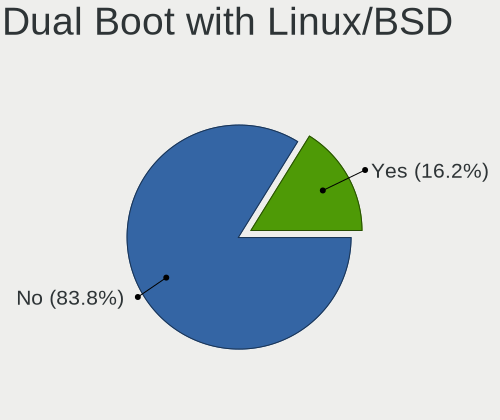

| Dual boot | Desktops | Percent |
|-----------|----------|---------|
| No        | 140      | 83.83%  |
| Yes       | 27       | 16.17%  |

Dual Boot (Win)
---------------

Hosting Linux and Windows

| Dual boot | Desktops | Percent |
|-----------|----------|---------|
| No        | 118      | 70.24%  |
| Yes       | 50       | 29.76%  |

Board
-----

Vendor
------

Motherboard manufacturer

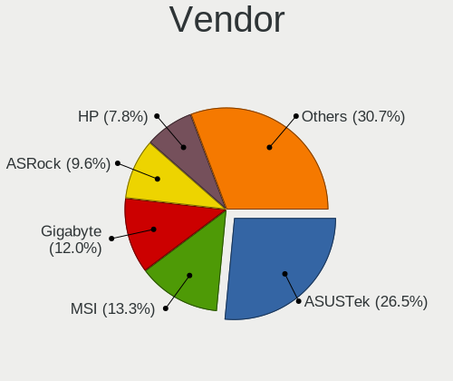

| Name                                 | Desktops | Percent |
|--------------------------------------|----------|---------|
| ASUSTek Computer                     | 44       | 26.51%  |
| MSI                                  | 22       | 13.25%  |
| Gigabyte Technology                  | 20       | 12.05%  |
| ASRock                               | 16       | 9.64%   |
| Hewlett-Packard                      | 13       | 7.83%   |
| Dell                                 | 10       | 6.02%   |
| Fujitsu                              | 7        | 4.22%   |
| Intel                                | 5        | 3.01%   |
| Unknown                              | 5        | 3.01%   |
| Lenovo                               | 4        | 2.41%   |
| Shenzhen Meigao Electronic Equipment | 3        | 1.81%   |
| Acer                                 | 3        | 1.81%   |
| Inventec                             | 2        | 1.2%    |
| Trigkey                              | 1        | 0.6%    |
| Soyo                                 | 1        | 0.6%    |
| Quanta                               | 1        | 0.6%    |
| PELADN                               | 1        | 0.6%    |
| Pegatron                             | 1        | 0.6%    |
| Medion                               | 1        | 0.6%    |
| MACHINIST                            | 1        | 0.6%    |
| GEEKOM                               | 1        | 0.6%    |
| Biostar                              | 1        | 0.6%    |
| AZW                                  | 1        | 0.6%    |
| Apple                                | 1        | 0.6%    |
| AMI                                  | 1        | 0.6%    |

Model
-----

Motherboard model

| Name                                                | Desktops | Percent |
|-----------------------------------------------------|----------|---------|
| Unknown                                             | 5        | 3.01%   |
| ASUS All Series                                     | 3        | 1.81%   |
| Shenzhen Meigao Electronic Equipment Mercury series | 2        | 1.2%    |
| MSI MS-7D91                                         | 2        | 1.2%    |
| Gigabyte A520M S2H                                  | 2        | 1.2%    |
| Dell Precision T1700                                | 2        | 1.2%    |
| Dell OptiPlex 7010                                  | 2        | 1.2%    |
| Trigkey Green G4                                    | 1        | 0.6%    |
| Soyo SY-N3150L Quad                                 | 1        | 0.6%    |
| Shenzhen Meigao Electronic Equipment Venus Series   | 1        | 0.6%    |
| Quanta 120-1125                                     | 1        | 0.6%    |
| PELADN WI-6                                         | 1        | 0.6%    |
| Pegatron Pro 3120 Microtower PC                     | 1        | 0.6%    |
| MSI MS-7E16                                         | 1        | 0.6%    |
| MSI MS-7E07                                         | 1        | 0.6%    |
| MSI MS-7E01                                         | 1        | 0.6%    |
| MSI MS-7D95                                         | 1        | 0.6%    |
| MSI MS-7D69                                         | 1        | 0.6%    |
| MSI MS-7D22                                         | 1        | 0.6%    |
| MSI MS-7D15                                         | 1        | 0.6%    |
| MSI MS-7C84                                         | 1        | 0.6%    |
| MSI MS-7C56                                         | 1        | 0.6%    |
| MSI MS-7C52                                         | 1        | 0.6%    |
| MSI MS-7C37                                         | 1        | 0.6%    |
| MSI MS-7C02                                         | 1        | 0.6%    |
| MSI MS-7B98                                         | 1        | 0.6%    |
| MSI MS-7B48                                         | 1        | 0.6%    |
| MSI MS-7A38                                         | 1        | 0.6%    |
| MSI MS-7A34                                         | 1        | 0.6%    |
| MSI MS-7998                                         | 1        | 0.6%    |
| MSI MS-7891                                         | 1        | 0.6%    |
| MSI MS-7798                                         | 1        | 0.6%    |
| MSI MS-7345                                         | 1        | 0.6%    |
| Medion S23003                                       | 1        | 0.6%    |
| MACHINIST X99 PR9                                   | 1        | 0.6%    |
| Lenovo V50t-13IMB 11HD000DUM                        | 1        | 0.6%    |
| Lenovo ThinkCentre M93 10A4A05QGE                   | 1        | 0.6%    |
| Lenovo ThinkCentre M71e 3133A8S                     | 1        | 0.6%    |
| Lenovo ThinkCentre M58p 7220AVG                     | 1        | 0.6%    |
| Inventec VXC Class                                  | 1        | 0.6%    |

Model Family
------------

Motherboard model prefix

| Name                                         | Desktops | Percent |
|----------------------------------------------|----------|---------|
| ASUS PRIME                                   | 10       | 6.02%   |
| Fujitsu ESPRIMO                              | 5        | 3.01%   |
| ASUS TUF                                     | 5        | 3.01%   |
| ASUS ROG                                     | 5        | 3.01%   |
| Unknown                                      | 5        | 3.01%   |
| HP Compaq                                    | 4        | 2.41%   |
| Dell Precision                               | 4        | 2.41%   |
| Dell OptiPlex                                | 4        | 2.41%   |
| Lenovo ThinkCentre                           | 3        | 1.81%   |
| ASUS P5G41T-M                                | 3        | 1.81%   |
| ASUS All                                     | 3        | 1.81%   |
| Shenzhen Meigao Electronic Equipment Mercury | 2        | 1.2%    |
| MSI MS-7D91                                  | 2        | 1.2%    |
| HP ProDesk                                   | 2        | 1.2%    |
| Gigabyte B450                                | 2        | 1.2%    |
| Gigabyte A520M                               | 2        | 1.2%    |
| ASUS Crosshair                               | 2        | 1.2%    |
| ASRock X670E                                 | 2        | 1.2%    |
| ASRock A320M-HDV                             | 2        | 1.2%    |
| Trigkey Green                                | 1        | 0.6%    |
| Soyo SY-N3150L                               | 1        | 0.6%    |
| Shenzhen Meigao Electronic Equipment Venus   | 1        | 0.6%    |
| Quanta 120-1125                              | 1        | 0.6%    |
| PELADN WI-6                                  | 1        | 0.6%    |
| Pegatron Pro                                 | 1        | 0.6%    |
| MSI MS-7E16                                  | 1        | 0.6%    |
| MSI MS-7E07                                  | 1        | 0.6%    |
| MSI MS-7E01                                  | 1        | 0.6%    |
| MSI MS-7D95                                  | 1        | 0.6%    |
| MSI MS-7D69                                  | 1        | 0.6%    |
| MSI MS-7D22                                  | 1        | 0.6%    |
| MSI MS-7D15                                  | 1        | 0.6%    |
| MSI MS-7C84                                  | 1        | 0.6%    |
| MSI MS-7C56                                  | 1        | 0.6%    |
| MSI MS-7C52                                  | 1        | 0.6%    |
| MSI MS-7C37                                  | 1        | 0.6%    |
| MSI MS-7C02                                  | 1        | 0.6%    |
| MSI MS-7B98                                  | 1        | 0.6%    |
| MSI MS-7B48                                  | 1        | 0.6%    |
| MSI MS-7A38                                  | 1        | 0.6%    |

MFG Year
--------

Motherboard manufacture year

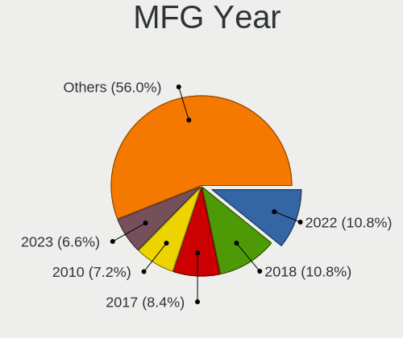

| Year | Desktops | Percent |
|------|----------|---------|
| 2022 | 18       | 10.84%  |
| 2018 | 18       | 10.84%  |
| 2017 | 14       | 8.43%   |
| 2010 | 12       | 7.23%   |
| 2023 | 11       | 6.63%   |
| 2012 | 10       | 6.02%   |
| 2020 | 9        | 5.42%   |
| 2016 | 9        | 5.42%   |
| 2013 | 9        | 5.42%   |
| 2019 | 8        | 4.82%   |
| 2021 | 7        | 4.22%   |
| 2015 | 7        | 4.22%   |
| 2014 | 7        | 4.22%   |
| 2011 | 7        | 4.22%   |
| 2008 | 6        | 3.61%   |
| 2009 | 5        | 3.01%   |
| 2024 | 4        | 2.41%   |
| 2007 | 3        | 1.81%   |
| 2006 | 1        | 0.6%    |
| 2004 | 1        | 0.6%    |

Form Factor
-----------

Physical design of the computer

| Name    | Desktops | Percent |
|---------|----------|---------|
| Desktop | 166      | 100%    |

Secure Boot
-----------

Enabled or disabled

| State    | Desktops | Percent |
|----------|----------|---------|
| Disabled | 158      | 94.61%  |
| Enabled  | 9        | 5.39%   |

Coreboot
--------

Have coreboot on board

| Used | Desktops | Percent |
|------|----------|---------|
| No   | 166      | 100%    |

RAM Size
--------

Total RAM memory

| Size in GB  | Desktops | Percent |
|-------------|----------|---------|
| 16.01-24.0  | 42       | 24.56%  |
| 32.01-64.0  | 36       | 21.05%  |
| 4.01-8.0    | 28       | 16.37%  |
| 64.01-256.0 | 17       | 9.94%   |
| 8.01-16.0   | 17       | 9.94%   |
| 3.01-4.0    | 15       | 8.77%   |
| 24.01-32.0  | 13       | 7.6%    |
| 1.01-2.0    | 2        | 1.17%   |
| 2.01-3.0    | 1        | 0.58%   |

RAM Used
--------

Used RAM memory

| Used GB   | Desktops | Percent |
|-----------|----------|---------|
| 2.01-3.0  | 52       | 28.57%  |
| 4.01-8.0  | 43       | 23.63%  |
| 1.01-2.0  | 42       | 23.08%  |
| 3.01-4.0  | 34       | 18.68%  |
| 8.01-16.0 | 9        | 4.95%   |
| 0.51-1.0  | 2        | 1.1%    |

Total Drives
------------

Number of drives on board

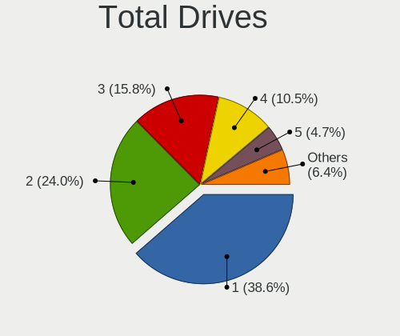

| Drives | Desktops | Percent |
|--------|----------|---------|
| 1      | 66       | 38.6%   |
| 2      | 41       | 23.98%  |
| 3      | 27       | 15.79%  |
| 4      | 18       | 10.53%  |
| 5      | 8        | 4.68%   |
| 6      | 4        | 2.34%   |
| 7      | 3        | 1.75%   |
| 8      | 2        | 1.17%   |
| 10     | 1        | 0.58%   |
| 0      | 1        | 0.58%   |

Has CD-ROM
----------

Has CD-ROM on board

| Presented | Desktops | Percent |
|-----------|----------|---------|
| No        | 99       | 59.64%  |
| Yes       | 67       | 40.36%  |

Has Ethernet
------------

Has Ethernet on board

| Presented | Desktops | Percent |
|-----------|----------|---------|
| Yes       | 162      | 97.59%  |
| No        | 4        | 2.41%   |

Has WiFi
--------

Has WiFi module

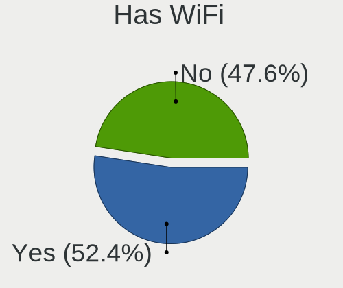

| Presented | Desktops | Percent |
|-----------|----------|---------|
| Yes       | 87       | 52.41%  |
| No        | 79       | 47.59%  |

Has Bluetooth
-------------

Has Bluetooth module

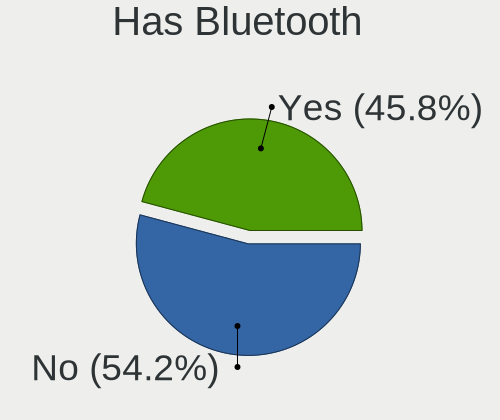

| Presented | Desktops | Percent |
|-----------|----------|---------|
| No        | 91       | 54.17%  |
| Yes       | 77       | 45.83%  |

Location
--------

Country
-------

Geographic location (country)

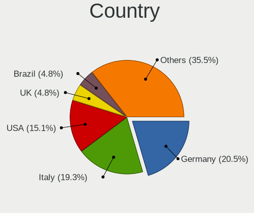

| Country                | Desktops | Percent |
|------------------------|----------|---------|
| Germany                | 34       | 20.48%  |
| Italy                  | 32       | 19.28%  |
| USA                    | 25       | 15.06%  |
| UK                     | 8        | 4.82%   |
| Brazil                 | 8        | 4.82%   |
| France                 | 6        | 3.61%   |
| Russia                 | 4        | 2.41%   |
| Poland                 | 4        | 2.41%   |
| Hungary                | 3        | 1.81%   |
| Czechia                | 3        | 1.81%   |
| Canada                 | 3        | 1.81%   |
| Australia              | 3        | 1.81%   |
| Spain                  | 2        | 1.2%    |
| New Zealand            | 2        | 1.2%    |
| Malaysia               | 2        | 1.2%    |
| India                  | 2        | 1.2%    |
| Croatia                | 2        | 1.2%    |
| Belgium                | 2        | 1.2%    |
| Argentina              | 2        | 1.2%    |
| Uruguay                | 1        | 0.6%    |
| Switzerland            | 1        | 0.6%    |
| Sweden                 | 1        | 0.6%    |
| Romania                | 1        | 0.6%    |
| Peru                   | 1        | 0.6%    |
| Paraguay               | 1        | 0.6%    |
| Panama                 | 1        | 0.6%    |
| Norway                 | 1        | 0.6%    |
| Netherlands            | 1        | 0.6%    |
| Morocco                | 1        | 0.6%    |
| Mexico                 | 1        | 0.6%    |
| Malta                  | 1        | 0.6%    |
| Kyrgyzstan             | 1        | 0.6%    |
| Iran                   | 1        | 0.6%    |
| Indonesia              | 1        | 0.6%    |
| Greece                 | 1        | 0.6%    |
| Ecuador                | 1        | 0.6%    |
| Denmark                | 1        | 0.6%    |
| Bosnia and Herzegovina | 1        | 0.6%    |

City
----

Geographic location (city)

| City                  | Desktops | Percent |
|-----------------------|----------|---------|
| Milan                 | 5        | 2.82%   |
| Turin                 | 3        | 1.69%   |
| Rome                  | 3        | 1.69%   |
| Hamburg               | 3        | 1.69%   |
| Delligsen             | 3        | 1.69%   |
| Bologna               | 3        | 1.69%   |
| Uetze                 | 2        | 1.13%   |
| Traunstein            | 2        | 1.13%   |
| Sydney                | 2        | 1.13%   |
| South Bend            | 2        | 1.13%   |
| lapanice            | 2        | 1.13%   |
| Parshall              | 2        | 1.13%   |
| Panama City           | 2        | 1.13%   |
| Padova                | 2        | 1.13%   |
| Moscow                | 2        | 1.13%   |
| Ludwigshafen am Rhein | 2        | 1.13%   |
| Freden                | 2        | 1.13%   |
| Florence              | 2        | 1.13%   |
| Fitchburg             | 2        | 1.13%   |
| Cullompton            | 2        | 1.13%   |
| Bremen                | 2        | 1.13%   |
| Berlin                | 2        | 1.13%   |
| Auckland              | 2        | 1.13%   |
| York                  | 1        | 0.56%   |
| Wisconsin Dells       | 1        | 0.56%   |
| Weissenburg in Bayern | 1        | 0.56%   |
| Waterville            | 1        | 0.56%   |
| Wasilla               | 1        | 0.56%   |
| Vitria              | 1        | 0.56%   |
| Vassenden             | 1        | 0.56%   |
| Valletta              | 1        | 0.56%   |
| Valencia              | 1        | 0.56%   |
| Troisdorf             | 1        | 0.56%   |
| Taormina              | 1        | 0.56%   |
| Strzelno              | 1        | 0.56%   |
| Stockholm             | 1        | 0.56%   |
| St Petersburg         | 1        | 0.56%   |
| Spring Hill           | 1        | 0.56%   |
| Somerset              | 1        | 0.56%   |
| Slough                | 1        | 0.56%   |

Drives
------

Drive Vendor
------------

Hard drive vendors

| Vendor                      | Desktops | Drives | Percent |
|-----------------------------|----------|--------|---------|
| WDC                         | 56       | 81     | 16.37%  |
| Seagate                     | 41       | 71     | 11.99%  |
| Samsung Electronics         | 39       | 64     | 11.4%   |
| Kingston                    | 23       | 41     | 6.73%   |
| Crucial                     | 16       | 18     | 4.68%   |
| Toshiba                     | 15       | 19     | 4.39%   |
| Sandisk                     | 15       | 20     | 4.39%   |
| A-DATA Technology           | 8        | 9      | 2.34%   |
| Unknown                     | 7        | 16     | 2.05%   |
| PNY                         | 6        | 10     | 1.75%   |
| China                       | 6        | 7      | 1.75%   |
| SPCC                        | 5        | 5      | 1.46%   |
| Hitachi                     | 5        | 6      | 1.46%   |
| ADATA Technology            | 5        | 9      | 1.46%   |
| Micron/Crucial Technology   | 4        | 5      | 1.17%   |
| Gigabyte Technology         | 4        | 4      | 1.17%   |
| Apacer                      | 4        | 4      | 1.17%   |
| XrayDisk                    | 3        | 3      | 0.88%   |
| Unknown                     | 3        | 8      | 0.88%   |
| Team                        | 3        | 4      | 0.88%   |
| Phison Electronics          | 3        | 3      | 0.88%   |
| Micron Technology           | 3        | 4      | 0.88%   |
| MAXIO Technology (Hangzhou) | 3        | 3      | 0.88%   |
| JMicron Technology          | 3        | 3      | 0.88%   |
| Verbatim                    | 2        | 3      | 0.58%   |
| T-FORCE                     | 2        | 2      | 0.58%   |
| SK hynix                    | 2        | 2      | 0.58%   |
| Silicon Motion              | 2        | 2      | 0.58%   |
| Realtek Semiconductor       | 2        | 2      | 0.58%   |
| Phison                      | 2        | 8      | 0.58%   |
| Patriot                     | 2        | 2      | 0.58%   |
| OCZ                         | 2        | 2      | 0.58%   |
| Maxtor                      | 2        | 2      | 0.58%   |
| Kingston Technology Company | 2        | 2      | 0.58%   |
| Intenso                     | 2        | 2      | 0.58%   |
| Intel                       | 2        | 3      | 0.58%   |
| HGST                        | 2        | 2      | 0.58%   |
| GOODRAM                     | 2        | 2      | 0.58%   |
| Fanxiang                    | 2        | 4      | 0.58%   |
| External                    | 2        | 2      | 0.58%   |

Drive Model
-----------

Hard drive models

| Model                                                             | Desktops | Percent |
|-------------------------------------------------------------------|----------|---------|
| Unknown                                                           | 7        | 1.78%   |
| Kingston SA400S37240G 240GB SSD                                   | 6        | 1.53%   |
| Kingston SA400S37480G 480GB SSD                                   | 5        | 1.27%   |
| ADATA XPG SX8200 Pro PCIe Gen3x4 M.2 2280 Solid State Drive 256GB | 5        | 1.27%   |
| Seagate ST2000DM006-2DM164 2TB                                    | 4        | 1.02%   |
| Sandisk WD Blue SN550 NVMe SSD 256GB                              | 4        | 1.02%   |
| Crucial CT500MX500SSD1 500GB                                      | 4        | 1.02%   |
| WDC WDS500G2B0A-00SM50 500GB SSD                                  | 3        | 0.76%   |
| Toshiba DT01ACA100 1TB                                            | 3        | 0.76%   |
| Seagate ST1000DM003-1ER162 1TB                                    | 3        | 0.76%   |
| SanDisk NVMe SSD Drive 2TB                                        | 3        | 0.76%   |
| SanDisk NVMe SSD Drive 1TB                                        | 3        | 0.76%   |
| Samsung SSD 990 PRO 2TB                                           | 3        | 0.76%   |
| Samsung SSD 980 500GB                                             | 3        | 0.76%   |
| Samsung SSD 980 1TB                                               | 3        | 0.76%   |
| MAXIO (Hangzhou) NVMe SSD Drive 512GB                             | 3        | 0.76%   |
| XrayDisk NVMe SSD Drive 512GB                                     | 2        | 0.51%   |
| WDC WD40EZRZ-00GXCB0 4TB                                          | 2        | 0.51%   |
| WDC WD40EZAZ-00SF3B0 4TB                                          | 2        | 0.51%   |
| WDC WD30EFRX-68EUZN0 3TB                                          | 2        | 0.51%   |
| WDC WD20EZRZ-00Z5HB0 2TB                                          | 2        | 0.51%   |
| WDC WD20EARX-00PASB0 2TB                                          | 2        | 0.51%   |
| WDC WD2003FZEX-00SRLA0 2TB                                        | 2        | 0.51%   |
| WDC WD10EZEX-08WN4A0 1TB                                          | 2        | 0.51%   |
| Unknown SD/MMC 1073GB                                             | 2        | 0.51%   |
| Unknown M.S./M.S.Pro/HG 16GB                                      | 2        | 0.51%   |
| Unknown Compact Flash 977MB                                       | 2        | 0.51%   |
| Toshiba HDWE160 6TB                                               | 2        | 0.51%   |
| Toshiba DT01ACA050 500GB                                          | 2        | 0.51%   |
| Team T253512GB SSD                                                | 2        | 0.51%   |
| SPCC Solid State Disk 512GB                                       | 2        | 0.51%   |
| Seagate ST8000DM004-2U9188 8TB                                    | 2        | 0.51%   |
| Seagate ST8000DM004-2CX188 8TB                                    | 2        | 0.51%   |
| Seagate ST4000VN008-2DR166 4TB                                    | 2        | 0.51%   |
| Seagate ST31000528AS 1TB                                          | 2        | 0.51%   |
| Seagate ST3000DM008-2DM166 3TB                                    | 2        | 0.51%   |
| Seagate ST2000DM001-1ER164 2TB                                    | 2        | 0.51%   |
| Seagate ST1000DM010-2EP102 1TB                                    | 2        | 0.51%   |
| Seagate Desktop 8TB                                               | 2        | 0.51%   |
| Samsung SSD 980 PRO 1TB                                           | 2        | 0.51%   |

HDD Vendor
----------

Hard disk drive vendors

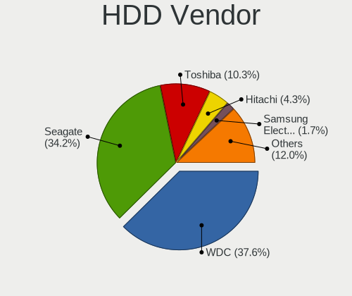

| Vendor              | Desktops | Drives | Percent |
|---------------------|----------|--------|---------|
| WDC                 | 44       | 64     | 37.61%  |
| Seagate             | 40       | 69     | 34.19%  |
| Toshiba             | 12       | 16     | 10.26%  |
| Hitachi             | 5        | 6      | 4.27%   |
| Samsung Electronics | 2        | 2      | 1.71%   |
| Maxtor              | 2        | 2      | 1.71%   |
| JMicron Technology  | 2        | 2      | 1.71%   |
| HGST                | 2        | 2      | 1.71%   |
| External            | 2        | 2      | 1.71%   |
| TO Exter            | 1        | 1      | 0.85%   |
| Intenso             | 1        | 1      | 0.85%   |
| IBM/Hitachi         | 1        | 1      | 0.85%   |
| DC-624e             | 1        | 1      | 0.85%   |
| ASMedia             | 1        | 1      | 0.85%   |
| Unknown             | 1        | 1      | 0.85%   |

SSD Vendor
----------

Solid state drive vendors

| Vendor              | Desktops | Drives | Percent |
|---------------------|----------|--------|---------|
| Samsung Electronics | 21       | 26     | 15.79%  |
| Kingston            | 18       | 29     | 13.53%  |
| WDC                 | 12       | 14     | 9.02%   |
| Crucial             | 9        | 10     | 6.77%   |
| PNY                 | 6        | 10     | 4.51%   |
| China               | 6        | 7      | 4.51%   |
| A-DATA Technology   | 6        | 7      | 4.51%   |
| Unknown             | 5        | 13     | 3.76%   |
| SPCC                | 4        | 4      | 3.01%   |
| SanDisk             | 4        | 5      | 3.01%   |
| Team                | 3        | 4      | 2.26%   |
| Micron Technology   | 3        | 4      | 2.26%   |
| Apacer              | 3        | 3      | 2.26%   |
| Verbatim            | 2        | 3      | 1.5%    |
| Toshiba             | 2        | 2      | 1.5%    |
| T-FORCE             | 2        | 2      | 1.5%    |
| Patriot             | 2        | 2      | 1.5%    |
| OCZ                 | 2        | 2      | 1.5%    |
| Gigabyte Technology | 2        | 2      | 1.5%    |
| XrayDisk            | 1        | 1      | 0.75%   |
| V Series            | 1        | 1      | 0.75%   |
| TrueNAS             | 1        | 1      | 0.75%   |
| Transcend           | 1        | 1      | 0.75%   |
| Solid               | 1        | 1      | 0.75%   |
| Phison              | 1        | 7      | 0.75%   |
| PELADN              | 1        | 1      | 0.75%   |
| LITEONIT            | 1        | 1      | 0.75%   |
| LDLC                | 1        | 1      | 0.75%   |
| KingSpec            | 1        | 1      | 0.75%   |
| KingDian            | 1        | 1      | 0.75%   |
| Intenso             | 1        | 1      | 0.75%   |
| Intel               | 1        | 2      | 0.75%   |
| Integral            | 1        | 1      | 0.75%   |
| HUGWORLD            | 1        | 1      | 0.75%   |
| Hewlett-Packard     | 1        | 1      | 0.75%   |
| GOODRAM             | 1        | 1      | 0.75%   |
| Fanxiang            | 1        | 2      | 0.75%   |
| Biostar             | 1        | 1      | 0.75%   |
| ASMT109x            | 1        | 1      | 0.75%   |
| Acer                | 1        | 1      | 0.75%   |

Drive Kind
----------

HDD or SSD

| Kind    | Desktops | Drives | Percent |
|---------|----------|--------|---------|
| SSD     | 106      | 178    | 38.13%  |
| HDD     | 90       | 171    | 32.37%  |
| NVMe    | 73       | 127    | 26.26%  |
| Unknown | 8        | 14     | 2.88%   |
| MMC     | 1        | 2      | 0.36%   |

Drive Connector
---------------

SATA, SAS, NVMe, etc.

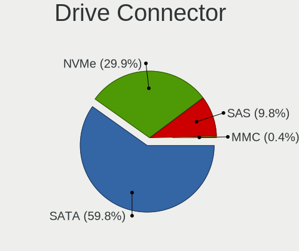

| Type | Desktops | Drives | Percent |
|------|----------|--------|---------|
| SATA | 146      | 331    | 59.84%  |
| NVMe | 73       | 126    | 29.92%  |
| SAS  | 24       | 33     | 9.84%   |
| MMC  | 1        | 2      | 0.41%   |

Drive Size
----------

Size of hard drive

| Size in TB | Desktops | Drives | Percent |
|------------|----------|--------|---------|
| 0.01-0.5   | 103      | 170    | 46.4%   |
| 0.51-1.0   | 60       | 83     | 27.03%  |
| 1.01-2.0   | 26       | 45     | 11.71%  |
| 3.01-4.0   | 16       | 24     | 7.21%   |
| 4.01-10.0  | 9        | 16     | 4.05%   |
| 2.01-3.0   | 6        | 8      | 2.7%    |
| 10.01-20.0 | 2        | 3      | 0.9%    |

Space Total
-----------

Amount of disk space available on the file system

| Size in GB     | Desktops | Percent |
|----------------|----------|---------|
| 101-250        | 34       | 19.54%  |
| 251-500        | 30       | 17.24%  |
| More than 3000 | 28       | 16.09%  |
| 501-1000       | 25       | 14.37%  |
| 1001-2000      | 24       | 13.79%  |
| 2001-3000      | 15       | 8.62%   |
| 1-20           | 8        | 4.6%    |
| 51-100         | 4        | 2.3%    |
| Unknown        | 4        | 2.3%    |
| 21-50          | 2        | 1.15%   |

Space Used
----------

Amount of used disk space

| Used GB        | Desktops | Percent |
|----------------|----------|---------|
| 1-20           | 37       | 20.11%  |
| 21-50          | 33       | 17.93%  |
| 101-250        | 29       | 15.76%  |
| 51-100         | 24       | 13.04%  |
| 501-1000       | 19       | 10.33%  |
| More than 3000 | 13       | 7.07%   |
| 251-500        | 11       | 5.98%   |
| 1001-2000      | 9        | 4.89%   |
| 2001-3000      | 5        | 2.72%   |
| Unknown        | 4        | 2.17%   |

Malfunc. Drives
---------------

Drive models with a malfunction

| Model                                               | Desktops | Drives | Percent |
|-----------------------------------------------------|----------|--------|---------|
| WDC WD3200AAKS-00L9A0 320GB                         | 1        | 1      | 5%      |
| WDC WD15EADS-00P8B0 1TB                             | 1        | 1      | 5%      |
| WDC WD10EZRZ-00HTKB0 1TB                            | 1        | 1      | 5%      |
| WDC WD10EZEX-75M2NA0 1TB                            | 1        | 1      | 5%      |
| WDC WD10EFRX-68PJCN0 1TB                            | 1        | 1      | 5%      |
| Solid SSD0256S00 256GB                              | 1        | 1      | 5%      |
| Seagate ST9500325AS 500GB                           | 1        | 1      | 5%      |
| Seagate ST31000528AS 1TB                            | 1        | 1      | 5%      |
| Seagate ST31000524AS 1TB                            | 1        | 1      | 5%      |
| Seagate ST2000DM006-2DM164 2TB                      | 1        | 1      | 5%      |
| Seagate ST1000DX001-1NS162 1TB                      | 1        | 1      | 5%      |
| Seagate ST1000DM003-1SB102 1TB                      | 1        | 1      | 5%      |
| Samsung Electronics SSD 970 EVO 500GB               | 1        | 1      | 5%      |
| Samsung Electronics HD103UJ 1TB                     | 1        | 1      | 5%      |
| Micron Technology MTFDDAK512MAY-1AE1ZABHA 512GB SSD | 1        | 1      | 5%      |
| Micron Technology 1100_MTFDDAK256TBN 256GB SSD      | 1        | 1      | 5%      |
| Maxtor 6E040L0 41GB                                 | 1        | 1      | 5%      |
| Kingston SKC2500M8500G 500GB                        | 1        | 1      | 5%      |
| IBM/Hitachi IC35L040AVER07-0 41GB                   | 1        | 1      | 5%      |
| A-DATA Technology SU650 240GB SSD                   | 1        | 1      | 5%      |

Malfunc. Drive Vendor
---------------------

Vendors of faulty drives

| Vendor              | Desktops | Drives | Percent |
|---------------------|----------|--------|---------|
| Seagate             | 6        | 6      | 30%     |
| WDC                 | 5        | 5      | 25%     |
| Samsung Electronics | 2        | 2      | 10%     |
| Micron Technology   | 2        | 2      | 10%     |
| Solid               | 1        | 1      | 5%      |
| Maxtor              | 1        | 1      | 5%      |
| Kingston            | 1        | 1      | 5%      |
| IBM/Hitachi         | 1        | 1      | 5%      |
| A-DATA Technology   | 1        | 1      | 5%      |

Malfunc. HDD Vendor
-------------------

Vendors of faulty HDD drives

| Vendor              | Desktops | Drives | Percent |
|---------------------|----------|--------|---------|
| Seagate             | 6        | 6      | 42.86%  |
| WDC                 | 5        | 5      | 35.71%  |
| Samsung Electronics | 1        | 1      | 7.14%   |
| Maxtor              | 1        | 1      | 7.14%   |
| IBM/Hitachi         | 1        | 1      | 7.14%   |

Malfunc. Drive Kind
-------------------

Kinds of faulty drives

| Kind | Desktops | Drives | Percent |
|------|----------|--------|---------|
| HDD  | 14       | 14     | 70%     |
| SSD  | 4        | 4      | 20%     |
| NVMe | 2        | 2      | 10%     |

Failed Drives
-------------

Failed drive models

Zero info for selected period =(

Failed Drive Vendor
-------------------

Failed drive vendors

Zero info for selected period =(

Drive Status
------------

Number of failed and malfunc. drives

| Status   | Desktops | Drives | Percent |
|----------|----------|--------|---------|
| Works    | 98       | 241    | 48.28%  |
| Detected | 85       | 231    | 41.87%  |
| Malfunc  | 20       | 20     | 9.85%   |

Storage controller
------------------

Storage Vendor
--------------

Storage controller vendors

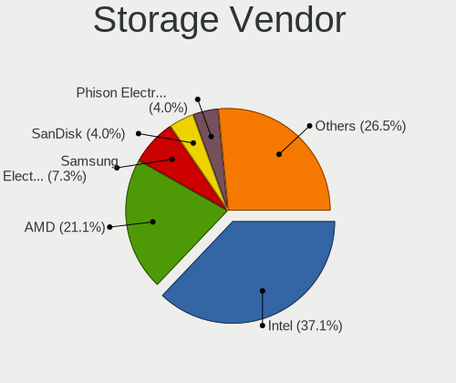

| Vendor                        | Desktops | Percent |
|-------------------------------|----------|---------|
| Intel                         | 102      | 37.09%  |
| AMD                           | 58       | 21.09%  |
| Samsung Electronics           | 20       | 7.27%   |
| SanDisk                       | 11       | 4%      |
| Phison Electronics            | 11       | 4%      |
| ASMedia Technology            | 10       | 3.64%   |
| Micron/Crucial Technology     | 9        | 3.27%   |
| Kingston Technology Company   | 9        | 3.27%   |
| ADATA Technology              | 7        | 2.55%   |
| Marvell Technology Group      | 6        | 2.18%   |
| JMicron Technology            | 6        | 2.18%   |
| MAXIO Technology (Hangzhou)   | 5        | 1.82%   |
| VIA Technologies              | 3        | 1.09%   |
| SK hynix                      | 2        | 0.73%   |
| Silicon Motion                | 2        | 0.73%   |
| Hosin Global Electronics      | 2        | 0.73%   |
| Toshiba America Info Systems  | 1        | 0.36%   |
| Silicon Image                 | 1        | 0.36%   |
| Shenzhen Longsys Electronics  | 1        | 0.36%   |
| Seagate Technology            | 1        | 0.36%   |
| Realtek Semiconductor         | 1        | 0.36%   |
| Nvidia                        | 1        | 0.36%   |
| Micron Technology             | 1        | 0.36%   |
| LSI Logic / Symbios Logic     | 1        | 0.36%   |
| KIOXIA                        | 1        | 0.36%   |
| Integrated Technology Express | 1        | 0.36%   |
| INNOGRIT                      | 1        | 0.36%   |
| Broadcom / LSI                | 1        | 0.36%   |

Storage Model
-------------

Storage controller models

| Model                                                                          | Desktops | Percent |
|--------------------------------------------------------------------------------|----------|---------|
| AMD FCH SATA Controller [AHCI mode]                                            | 22       | 6.69%   |
| Intel Q170/Q150/B150/H170/H110/Z170/CM236 Chipset SATA Controller [AHCI Mode]  | 11       | 3.34%   |
| AMD 500 Series Chipset SATA Controller                                         | 11       | 3.34%   |
| Samsung NVMe SSD Controller SM981/PM981/PM983                                  | 10       | 3.04%   |
| Intel SATA Controller [RAID mode]                                              | 9        | 2.74%   |
| Intel NM10/ICH7 Family SATA Controller [IDE mode]                              | 9        | 2.74%   |
| Intel 8 Series/C220 Series Chipset Family 6-port SATA Controller 1 [AHCI mode] | 9        | 2.74%   |
| Intel 7 Series/C210 Series Chipset Family 6-port SATA Controller [AHCI mode]   | 9        | 2.74%   |
| ASMedia ASM1061/ASM1062 Serial ATA Controller                                  | 9        | 2.74%   |
| AMD 400 Series Chipset SATA Controller                                         | 9        | 2.74%   |
| Intel Alder Lake-N SATA AHCI Controller                                        | 8        | 2.43%   |
| AMD 600 Series Chipset SATA Controller                                         | 8        | 2.43%   |
| Intel Raptor Lake SATA AHCI Controller                                         | 7        | 2.13%   |
| Intel 82801G (ICH7 Family) IDE Controller                                      | 7        | 2.13%   |
| AMD SB7x0/SB8x0/SB9x0 SATA Controller [AHCI mode]                              | 7        | 2.13%   |
| Intel 6 Series/C200 Series Chipset Family 6 port Desktop SATA AHCI Controller  | 6        | 1.82%   |
| AMD SB7x0/SB8x0/SB9x0 IDE Controller                                           | 6        | 1.82%   |
| AMD A320 Chipset SATA Controller [AHCI mode]                                   | 6        | 1.82%   |
| ADATA XPG SX8200 Pro PCIe Gen3x4 M.2 2280 Solid State Drive                    | 6        | 1.82%   |
| SanDisk Ultra 3D / WD PC SN530, IX SN530, Blue SN550 NVMe SSD (DRAM-less)      | 5        | 1.52%   |
| Samsung NVMe SSD Controller PM9A1/PM9A3/980PRO                                 | 5        | 1.52%   |
| Samsung NVMe SSD Controller 980 (DRAM-less)                                    | 5        | 1.52%   |
| JMicron JMB363 SATA/IDE Controller                                             | 5        | 1.52%   |
| Intel 200 Series PCH SATA controller [AHCI mode]                               | 5        | 1.52%   |
| AMD SB7x0/SB8x0/SB9x0 SATA Controller [IDE mode]                               | 5        | 1.52%   |
| Samsung NVMe SSD Controller S4LV008[Pascal]                                    | 4        | 1.22%   |
| Phison PS5013-E13 PCIe3 NVMe Controller (DRAM-less)                            | 4        | 1.22%   |
| AMD 300 Series Chipset SATA Controller                                         | 4        | 1.22%   |
| Sandisk WD Black SN850X NVMe SSD                                               | 3        | 0.91%   |
| Phison E16 PCIe4 NVMe Controller                                               | 3        | 0.91%   |
| Phison E12 NVMe Controller                                                     | 3        | 0.91%   |
| Micron/Crucial P2 [Nick P2] / P3 / P3 Plus NVMe PCIe SSD (DRAM-less)           | 3        | 0.91%   |
| Micron/Crucial P1 NVMe PCIe SSD[Frampton]                                      | 3        | 0.91%   |
| MAXIO (Hangzhou) NVMe SSD Controller MAP1202 (DRAM-less)                       | 3        | 0.91%   |
| Kingston Company NV2 NVMe SSD [SM2267XT] (DRAM-less)                           | 3        | 0.91%   |
| Kingston Company KC3000/FURY Renegade NVMe SSD [E18]                           | 3        | 0.91%   |
| Intel 82801I (ICH9 Family) 2 port SATA Controller [IDE mode]                   | 3        | 0.91%   |
| Intel 500 Series Chipset Family SATA AHCI Controller                           | 3        | 0.91%   |
| VIA VT6415 PATA IDE Host Controller                                            | 2        | 0.61%   |
| SanDisk Ultra 3D / WD Blue SN570 NVMe SSD (DRAM-less)                          | 2        | 0.61%   |

Storage Kind
------------

Kind of storage controller (IDE, SATA, NVMe, SAS, ...)

| Kind | Desktops | Percent |
|------|----------|---------|
| SATA | 133      | 52.99%  |
| NVMe | 71       | 28.29%  |
| IDE  | 32       | 12.75%  |
| RAID | 14       | 5.58%   |
| SAS  | 1        | 0.4%    |

Processor
---------

CPU Vendor
----------

Processor vendors

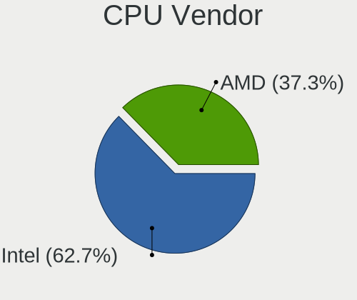

| Vendor | Desktops | Percent |
|--------|----------|---------|
| Intel  | 104      | 62.65%  |
| AMD    | 62       | 37.35%  |

CPU Model
---------

Processor models

| Model                                       | Desktops | Percent |
|---------------------------------------------|----------|---------|
| Intel N100                                  | 6        | 3.59%   |
| Intel Core i7-4790 CPU @ 3.60GHz            | 4        | 2.4%    |
| AMD Ryzen 7 3700X 8-Core Processor          | 4        | 2.4%    |
| Intel Core i7-6700K CPU @ 4.00GHz           | 3        | 1.8%    |
| Intel Core i7-4770 CPU @ 3.40GHz            | 3        | 1.8%    |
| Intel Core i5-3470 CPU @ 3.20GHz            | 3        | 1.8%    |
| AMD Ryzen 9 5900X 12-Core Processor         | 3        | 1.8%    |
| AMD Ryzen 7 7800X3D 8-Core Processor        | 3        | 1.8%    |
| Intel N95                                   | 2        | 1.2%    |
| Intel Core i7-7700 CPU @ 3.60GHz            | 2        | 1.2%    |
| Intel Core i7-2600 CPU @ 3.40GHz            | 2        | 1.2%    |
| Intel Core i5-9600K CPU @ 3.70GHz           | 2        | 1.2%    |
| Intel Core i5-7500 CPU @ 3.40GHz            | 2        | 1.2%    |
| Intel Core i5-6500 CPU @ 3.20GHz            | 2        | 1.2%    |
| Intel Core i5-6400T CPU @ 2.20GHz           | 2        | 1.2%    |
| Intel Core i5-2500 CPU @ 3.30GHz            | 2        | 1.2%    |
| Intel Core i5-2400 CPU @ 3.10GHz            | 2        | 1.2%    |
| AMD Ryzen 9 7950X 16-Core Processor         | 2        | 1.2%    |
| AMD Ryzen 7 6800U with Radeon Graphics      | 2        | 1.2%    |
| AMD Ryzen 7 5800X 8-Core Processor          | 2        | 1.2%    |
| AMD Ryzen 7 5700G with Radeon Graphics      | 2        | 1.2%    |
| AMD Ryzen 7 2700 Eight-Core Processor       | 2        | 1.2%    |
| AMD Ryzen 5 5600G with Radeon Graphics      | 2        | 1.2%    |
| AMD Ryzen 5 2400G with Radeon Vega Graphics | 2        | 1.2%    |
| AMD Ryzen 5 1600X Six-Core Processor        | 2        | 1.2%    |
| AMD Ryzen 3 2200G with Radeon Vega Graphics | 2        | 1.2%    |
| AMD Phenom II X6 1090T Processor            | 2        | 1.2%    |
| AMD FX-8320E Eight-Core Processor           | 2        | 1.2%    |
| Intel Xeon CPU X5482 @ 3.20GHz              | 1        | 0.6%    |
| Intel Xeon CPU X3430 @ 2.40GHz              | 1        | 0.6%    |
| Intel Xeon CPU E5-2697 v2 @ 2.70GHz         | 1        | 0.6%    |
| Intel Xeon CPU E5-2650 v4 @ 2.20GHz         | 1        | 0.6%    |
| Intel Xeon CPU E5-2650 v2 @ 2.60GHz         | 1        | 0.6%    |
| Intel Xeon CPU E5-1650 v3 @ 3.50GHz         | 1        | 0.6%    |
| Intel Xeon CPU E3-1275 v5 @ 3.60GHz         | 1        | 0.6%    |
| Intel Xeon CPU E3-1240 v6 @ 3.70GHz         | 1        | 0.6%    |
| Intel Pentium Dual-Core CPU E6700 @ 3.20GHz | 1        | 0.6%    |
| Intel Pentium Dual-Core CPU E6600 @ 3.06GHz | 1        | 0.6%    |
| Intel Pentium Dual-Core CPU E5800 @ 3.20GHz | 1        | 0.6%    |
| Intel Pentium Dual-Core CPU E5700 @ 3.00GHz | 1        | 0.6%    |

CPU Model Family
----------------

Processor model prefix

| Model                   | Desktops | Percent |
|-------------------------|----------|---------|
| Intel Core i5           | 30       | 17.96%  |
| Intel Core i7           | 21       | 12.57%  |
| AMD Ryzen 7             | 19       | 11.38%  |
| Other                   | 17       | 10.18%  |
| AMD Ryzen 5             | 11       | 6.59%   |
| AMD Ryzen 9             | 9        | 5.39%   |
| Intel Xeon              | 8        | 4.79%   |
| Intel Pentium Dual-Core | 6        | 3.59%   |
| Intel Core i3           | 6        | 3.59%   |
| Intel Celeron           | 5        | 2.99%   |
| AMD Ryzen 3             | 4        | 2.4%    |
| AMD Phenom II X6        | 4        | 2.4%    |
| Intel Core 2 Quad       | 3        | 1.8%    |
| AMD FX                  | 3        | 1.8%    |
| Intel Pentium 4         | 2        | 1.2%    |
| Intel Core i9           | 2        | 1.2%    |
| Intel Core 2 Duo        | 2        | 1.2%    |
| AMD Athlon              | 2        | 1.2%    |
| AMD A8                  | 2        | 1.2%    |
| Intel Pentium Dual      | 1        | 0.6%    |
| Intel Pentium D         | 1        | 0.6%    |
| AMD Sempron             | 1        | 0.6%    |
| AMD Ryzen 5 PRO         | 1        | 0.6%    |
| AMD Phenom II X4        | 1        | 0.6%    |
| AMD Phenom II X3        | 1        | 0.6%    |
| AMD GX                  | 1        | 0.6%    |
| AMD G                   | 1        | 0.6%    |
| AMD E                   | 1        | 0.6%    |
| AMD Athlon II X2        | 1        | 0.6%    |
| AMD A12                 | 1        | 0.6%    |

CPU Cores
---------

Number of processor cores

| Number | Desktops | Percent |
|--------|----------|---------|
| 4      | 71       | 42.51%  |
| 6      | 25       | 14.97%  |
| 2      | 24       | 14.37%  |
| 8      | 22       | 13.17%  |
| 16     | 7        | 4.19%   |
| 12     | 6        | 3.59%   |
| 1      | 6        | 3.59%   |
| 24     | 2        | 1.2%    |
| 14     | 2        | 1.2%    |
| 10     | 1        | 0.6%    |
| 3      | 1        | 0.6%    |

CPU Sockets
-----------

Number of sockets

| Number | Desktops | Percent |
|--------|----------|---------|
| 1      | 164      | 98.8%   |
| 2      | 2        | 1.2%    |

CPU Threads
-----------

Threads per core (Hyper-Threading)

| Number | Desktops | Percent |
|--------|----------|---------|
| 2      | 97       | 58.43%  |
| 1      | 69       | 41.57%  |

CPU Op-Modes
------------

CPU Operation Modes (32-bit, 64-bit)

| Op mode        | Desktops | Percent |
|----------------|----------|---------|
| 32-bit, 64-bit | 164      | 98.8%   |
| 32-bit         | 2        | 1.2%    |

CPU Microcode
-------------

Microcode number

| Number     | Desktops | Percent |
|------------|----------|---------|
| Unknown    | 19       | 11.38%  |
| 0x1067a    | 10       | 5.99%   |
| 0x306c3    | 9        | 5.39%   |
| 0x306a9    | 9        | 5.39%   |
| 0xb06e0    | 7        | 4.19%   |
| 0x506e3    | 7        | 4.19%   |
| 0x206a7    | 6        | 3.59%   |
| 0xb0671    | 5        | 2.99%   |
| 0x906e9    | 5        | 2.99%   |
| 0x0a20120e | 5        | 2.99%   |
| 0x0810100b | 4        | 2.4%    |
| 0x08001138 | 4        | 2.4%    |
| 0x08701021 | 3        | 1.8%    |
| 0x08108109 | 3        | 1.8%    |
| 0x0800820d | 3        | 1.8%    |
| 0x06000852 | 3        | 1.8%    |
| 0x010000dc | 3        | 1.8%    |
| 0x010000c8 | 3        | 1.8%    |
| 0xa0653    | 2        | 1.2%    |
| 0x906ed    | 2        | 1.2%    |
| 0x906ea    | 2        | 1.2%    |
| 0x90672    | 2        | 1.2%    |
| 0x406c3    | 2        | 1.2%    |
| 0x306e4    | 2        | 1.2%    |
| 0x0a601206 | 2        | 1.2%    |
| 0x0a601203 | 2        | 1.2%    |
| 0x0a50000f | 2        | 1.2%    |
| 0x0a50000d | 2        | 1.2%    |
| 0x0a20120a | 2        | 1.2%    |
| 0x08701030 | 2        | 1.2%    |
| 0xf62      | 1        | 0.6%    |
| 0xf43      | 1        | 0.6%    |
| 0xf41      | 1        | 0.6%    |
| 0xf29      | 1        | 0.6%    |
| 0xb06f5    | 1        | 0.6%    |
| 0xb06f2    | 1        | 0.6%    |
| 0xa0671    | 1        | 0.6%    |
| 0xa0655    | 1        | 0.6%    |
| 0x906ec    | 1        | 0.6%    |
| 0x906eb    | 1        | 0.6%    |

CPU Microarch
-------------

Microarchitecture

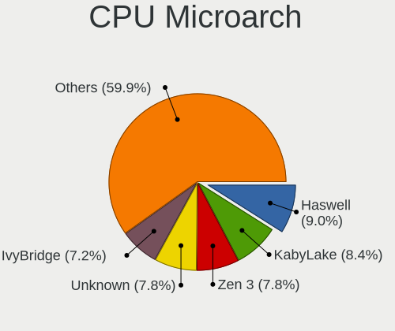

| Name             | Desktops | Percent |
|------------------|----------|---------|
| Haswell          | 15       | 8.98%   |
| KabyLake         | 14       | 8.38%   |
| Zen 3            | 13       | 7.78%   |
| Unknown          | 13       | 7.78%   |
| IvyBridge        | 12       | 7.19%   |
| Penryn           | 11       | 6.59%   |
| Zen              | 9        | 5.39%   |
| Skylake          | 9        | 5.39%   |
| Alderlake Hybrid | 9        | 5.39%   |
| K10              | 8        | 4.79%   |
| SandyBridge      | 7        | 4.19%   |
| Gracemont        | 7        | 4.19%   |
| Zen+             | 6        | 3.59%   |
| Zen 2            | 6        | 3.59%   |
| Piledriver       | 4        | 2.4%    |
| NetBurst         | 4        | 2.4%    |
| Nehalem          | 3        | 1.8%    |
| CometLake        | 3        | 1.8%    |
| Silvermont       | 2        | 1.2%    |
| Core             | 2        | 1.2%    |
| Bobcat           | 2        | 1.2%    |
| Westmere         | 1        | 0.6%    |
| Steamroller      | 1        | 0.6%    |
| Jaguar           | 1        | 0.6%    |
| Icelake          | 1        | 0.6%    |
| Goldmont plus    | 1        | 0.6%    |
| Goldmont         | 1        | 0.6%    |
| Excavator        | 1        | 0.6%    |
| Broadwell        | 1        | 0.6%    |

Graphics
--------

GPU Vendor
----------

Vendors of graphics cards

| Vendor | Desktops | Percent |
|--------|----------|---------|
| AMD    | 61       | 34.66%  |
| Intel  | 60       | 34.09%  |
| Nvidia | 55       | 31.25%  |

GPU Model
---------

Graphics card models

| Model                                                                                    | Desktops | Percent |
|------------------------------------------------------------------------------------------|----------|---------|
| Intel Xeon E3-1200 v3/4th Gen Core Processor Integrated Graphics Controller              | 8        | 4.35%   |
| Intel Alder Lake-N [UHD Graphics]                                                        | 8        | 4.35%   |
| AMD Raphael                                                                              | 7        | 3.8%    |
| Intel Xeon E3-1200 v2/3rd Gen Core processor Graphics Controller                         | 6        | 3.26%   |
| AMD Navi 23 [Radeon RX 6600/6600 XT/6600M]                                               | 6        | 3.26%   |
| Intel HD Graphics 530                                                                    | 5        | 2.72%   |
| Intel 4 Series Chipset Integrated Graphics Controller                                    | 5        | 2.72%   |
| Intel 2nd Generation Core Processor Family Integrated Graphics Controller                | 4        | 2.17%   |
| AMD Navi 31 [Radeon RX 7900 XT/7900 XTX/7900 GRE/7900M]                                  | 4        | 2.17%   |
| AMD Cedar [Radeon HD 5000/6000/7350/8350 Series]                                         | 4        | 2.17%   |
| Nvidia GP107 [GeForce GTX 1050 Ti]                                                       | 3        | 1.63%   |
| Nvidia GP104 [GeForce GTX 1070]                                                          | 3        | 1.63%   |
| Nvidia GP102 [GeForce GTX 1080 Ti]                                                       | 3        | 1.63%   |
| Nvidia GM204 [GeForce GTX 970]                                                           | 3        | 1.63%   |
| Nvidia GK208B [GeForce GT 710]                                                           | 3        | 1.63%   |
| Intel Raptor Lake-S GT1 [UHD Graphics 770]                                               | 3        | 1.63%   |
| Intel CoffeeLake-S GT2 [UHD Graphics 630]                                                | 3        | 1.63%   |
| AMD Raven Ridge [Radeon Vega Series / Radeon Vega Mobile Series]                         | 3        | 1.63%   |
| AMD Navi 10 [Radeon RX 5600 OEM/5600 XT / 5700/5700 XT]                                  | 3        | 1.63%   |
| AMD Ellesmere [Radeon RX 470/480/570/570X/580/580X/590]                                  | 3        | 1.63%   |
| AMD Cezanne [Radeon Vega Series / Radeon Vega Mobile Series]                             | 3        | 1.63%   |
| AMD Caicos [Radeon HD 6450/7450/8450 / R5 230 OEM]                                       | 3        | 1.63%   |
| Nvidia TU106 [GeForce RTX 2060 Rev. A]                                                   | 2        | 1.09%   |
| Nvidia GP106 [GeForce GTX 1060 6GB]                                                      | 2        | 1.09%   |
| Nvidia GP106 [GeForce GTX 1060 3GB]                                                      | 2        | 1.09%   |
| Nvidia GK208B [GeForce GT 730]                                                           | 2        | 1.09%   |
| Nvidia GF119 [GeForce GT 610]                                                            | 2        | 1.09%   |
| Nvidia GF108 [GeForce GT 440]                                                            | 2        | 1.09%   |
| Nvidia GA106 [Geforce RTX 3050]                                                          | 2        | 1.09%   |
| Intel Atom/Celeron/Pentium Processor x5-E8000/J3xxx/N3xxx Integrated Graphics Controller | 2        | 1.09%   |
| Intel Alder Lake-S GT1 [UHD Graphics 730]                                                | 2        | 1.09%   |
| Intel 82Q33 Express Integrated Graphics Controller                                       | 2        | 1.09%   |
| Intel 82G33/G31 Express Integrated Graphics Controller                                   | 2        | 1.09%   |
| AMD RS780L [Radeon 3000]                                                                 | 2        | 1.09%   |
| AMD Rembrandt [Radeon 680M]                                                              | 2        | 1.09%   |
| AMD Picasso/Raven 2 [Radeon Vega Series / Radeon Vega Mobile Series]                     | 2        | 1.09%   |
| AMD Phoenix1                                                                             | 2        | 1.09%   |
| Nvidia TU116 [GeForce GTX 1660 Ti]                                                       | 1        | 0.54%   |
| Nvidia TU116 [GeForce GTX 1650]                                                          | 1        | 0.54%   |
| Nvidia TU106 [GeForce RTX 2060 12GB]                                                     | 1        | 0.54%   |

GPU Combo
---------

Combinations of graphics cards

| Name           | Desktops | Percent |
|----------------|----------|---------|
| 1 x AMD        | 54       | 32.34%  |
| 1 x Intel      | 50       | 29.94%  |
| 1 x Nvidia     | 48       | 28.74%  |
| 2 x AMD        | 7        | 4.19%   |
| Intel + Nvidia | 5        | 2.99%   |
| 2 x Nvidia     | 1        | 0.6%    |
| 2 x Intel      | 1        | 0.6%    |
| AMD + Nvidia   | 1        | 0.6%    |

GPU Driver
----------

Free vs proprietary

| Driver      | Desktops | Percent |
|-------------|----------|---------|
| Free        | 135      | 81.33%  |
| Proprietary | 29       | 17.47%  |
| Unknown     | 2        | 1.2%    |

GPU Memory
----------

Total video memory

| Size in GB | Desktops | Percent |
|------------|----------|---------|
| Unknown    | 60       | 36.14%  |
| 7.01-8.0   | 19       | 11.45%  |
| 1.01-2.0   | 18       | 10.84%  |
| 0.01-0.5   | 17       | 10.24%  |
| 3.01-4.0   | 16       | 9.64%   |
| 0.51-1.0   | 14       | 8.43%   |
| 5.01-6.0   | 9        | 5.42%   |
| 8.01-16.0  | 8        | 4.82%   |
| 2.01-3.0   | 3        | 1.81%   |
| 16.01-24.0 | 2        | 1.2%    |

Monitor
-------

Monitor Vendor
--------------

Monitor vendors

| Vendor                  | Desktops | Percent |
|-------------------------|----------|---------|
| Samsung Electronics     | 30       | 16.67%  |
| Goldstar                | 25       | 13.89%  |
| Hewlett-Packard         | 15       | 8.33%   |
| Dell                    | 15       | 8.33%   |
| AOC                     | 13       | 7.22%   |
| Philips                 | 9        | 5%      |
| Ancor Communications    | 9        | 5%      |
| Acer                    | 9        | 5%      |
| BenQ                    | 8        | 4.44%   |
| Lenovo                  | 4        | 2.22%   |
| HUAWEI                  | 4        | 2.22%   |
| Eizo                    | 4        | 2.22%   |
| MSI                     | 3        | 1.67%   |
| Iiyama                  | 3        | 1.67%   |
| ASUSTek Computer        | 3        | 1.67%   |
| ViewSonic               | 2        | 1.11%   |
| Sceptre                 | 2        | 1.11%   |
| NEC Computers           | 2        | 1.11%   |
| Toshiba                 | 1        | 0.56%   |
| Tech Concepts           | 1        | 0.56%   |
| TCL                     | 1        | 0.56%   |
| Sony                    | 1        | 0.56%   |
| SKG                     | 1        | 0.56%   |
| RGT                     | 1        | 0.56%   |
| LG Electronics          | 1        | 0.56%   |
| LBT                     | 1        | 0.56%   |
| Idek Iiyama             | 1        | 0.56%   |
| Huion                   | 1        | 0.56%   |
| Hitachi                 | 1        | 0.56%   |
| HIK                     | 1        | 0.56%   |
| HannStar                | 1        | 0.56%   |
| Grundig                 | 1        | 0.56%   |
| GreenWood               | 1        | 0.56%   |
| Gigabyte Technology     | 1        | 0.56%   |
| Fujitsu Siemens         | 1        | 0.56%   |
| Chi Mei Optoelectronics | 1        | 0.56%   |
| Belinea                 | 1        | 0.56%   |
| Apple                   | 1        | 0.56%   |

Monitor Model
-------------

Monitor models

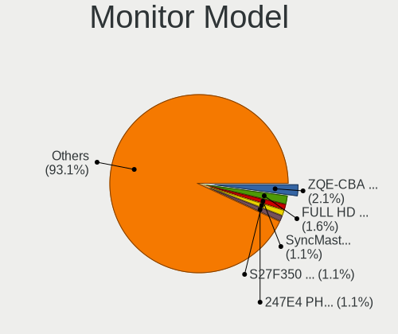

| Model                                                                | Desktops | Percent |
|----------------------------------------------------------------------|----------|---------|
| HUAWEI ZQE-CBA HWV6A25 3440x1440 797x334mm 34.0-inch                 | 4        | 2.13%   |
| Goldstar FULL HD GSM5B55 1920x1080 480x270mm 21.7-inch               | 3        | 1.6%    |
| Samsung Electronics SyncMaster SAM0456 1360x768 410x230mm 18.5-inch  | 2        | 1.06%   |
| Samsung Electronics S27F350 SAM0D22 1920x1080 598x336mm 27.0-inch    | 2        | 1.06%   |
| Philips 247E4 PHLC0C0 1920x1080 521x293mm 23.5-inch                  | 2        | 1.06%   |
| Lenovo LEN G32qc-10 LEN66A2 2560x1440 698x392mm 31.5-inch            | 2        | 1.06%   |
| Goldstar LG TV SSCR2 GSMC0C8 3840x2160                               | 2        | 1.06%   |
| Eizo S2202W ENC1975 1680x1050 480x300mm 22.3-inch                    | 2        | 1.06%   |
| Dell U2720QM DEL41BC 3840x2160 597x336mm 27.0-inch                   | 2        | 1.06%   |
| AOC 2470W AOC2470 1920x1080 521x293mm 23.5-inch                      | 2        | 1.06%   |
| AOC 2460G4 AOC246A 1920x1080 531x299mm 24.0-inch                     | 2        | 1.06%   |
| ViewSonic VX2778 Series VSC8432 2560x1440 597x336mm 27.0-inch        | 1        | 0.53%   |
| ViewSonic VX2457 VSCB931 1920x1080 521x293mm 23.5-inch               | 1        | 0.53%   |
| Toshiba TV TSB0104 720x576 1960x1420mm 95.3-inch                     | 1        | 0.53%   |
| Tech Concepts LCD Monitor 43S451                                     | 1        | 0.53%   |
| TCL Beyond TV TCL9653 3840x2160 1210x680mm 54.6-inch                 | 1        | 0.53%   |
| Sony TV SNY7001 1920x1080                                            | 1        | 0.53%   |
| SKG PMO G340-CWQK SKG3418 3440x1440 810x350mm 34.7-inch              | 1        | 0.53%   |
| Sceptre LCD Monitor X24WG 9600x2160                                  | 1        | 0.53%   |
| Sceptre LCD Monitor M24 3840x1080                                    | 1        | 0.53%   |
| Sceptre LCD Monitor M24                                              | 1        | 0.53%   |
| Samsung Electronics U28H75x SAM0E00 3840x2160 607x345mm 27.5-inch    | 1        | 0.53%   |
| Samsung Electronics U28E570 SAM0D71 3840x2160 608x345mm 27.5-inch    | 1        | 0.53%   |
| Samsung Electronics U28E570 SAM0D6F 3840x2160 607x345mm 27.5-inch    | 1        | 0.53%   |
| Samsung Electronics U28D590 SAM0B80 3840x2160 607x345mm 27.5-inch    | 1        | 0.53%   |
| Samsung Electronics T27D390 SAM0B71 1920x1080 598x336mm 27.0-inch    | 1        | 0.53%   |
| Samsung Electronics T23C350 SAM0ABC 1920x1080 510x287mm 23.0-inch    | 1        | 0.53%   |
| Samsung Electronics T23B550 SAM0959 1920x1080 510x287mm 23.0-inch    | 1        | 0.53%   |
| Samsung Electronics T22D390 SAM0B6B 1920x1080 477x268mm 21.5-inch    | 1        | 0.53%   |
| Samsung Electronics SyncMaster SAM059A 1920x1080 477x268mm 21.5-inch | 1        | 0.53%   |
| Samsung Electronics SyncMaster SAM056A 1680x1050 459x296mm 21.5-inch | 1        | 0.53%   |
| Samsung Electronics SyncMaster SAM04AF 1680x1050 459x296mm 21.5-inch | 1        | 0.53%   |
| Samsung Electronics SyncMaster SAM0427 1920x1200                     | 1        | 0.53%   |
| Samsung Electronics SyncMaster SAM036F 1440x900 428x255mm 19.6-inch  | 1        | 0.53%   |
| Samsung Electronics SMS24B750V SAM0908 1920x1080 510x290mm 23.1-inch | 1        | 0.53%   |
| Samsung Electronics S34J55x SAM0F72 3440x1440 797x333mm 34.0-inch    | 1        | 0.53%   |
| Samsung Electronics S32D850 SAM0BCC 2560x1440 708x398mm 32.0-inch    | 1        | 0.53%   |
| Samsung Electronics S24D391 SAM0B86 1920x1080 521x293mm 23.5-inch    | 1        | 0.53%   |
| Samsung Electronics S24D330 SAM0D92 1920x1080 531x299mm 24.0-inch    | 1        | 0.53%   |
| Samsung Electronics S24C650 SAM09E8 1920x1080 521x293mm 23.5-inch    | 1        | 0.53%   |

Monitor Resolution
------------------

Monitor screen resolution

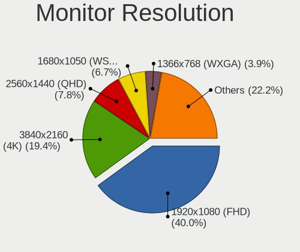

| Resolution         | Desktops | Percent |
|--------------------|----------|---------|
| 1920x1080 (FHD)    | 72       | 40%     |
| 3840x2160 (4K)     | 35       | 19.44%  |
| 2560x1440 (QHD)    | 14       | 7.78%   |
| 1680x1050 (WSXGA+) | 12       | 6.67%   |
| 1366x768 (WXGA)    | 7        | 3.89%   |
| 1920x1200 (WUXGA)  | 6        | 3.33%   |
| 3440x1440          | 5        | 2.78%   |
| 1600x900 (HD+)     | 5        | 2.78%   |
| 1280x1024 (SXGA)   | 5        | 2.78%   |
| 1360x768           | 4        | 2.22%   |
| Unknown            | 4        | 2.22%   |
| 3840x1080          | 3        | 1.67%   |
| 1440x900 (WXGA+)   | 3        | 1.67%   |
| 2560x1080          | 2        | 1.11%   |
| 9600x2160          | 1        | 0.56%   |
| 1920x540           | 1        | 0.56%   |
| 1280x720 (HD)      | 1        | 0.56%   |

Monitor Diagonal
----------------

Diagonal size in inches

| Inches  | Desktops | Percent |
|---------|----------|---------|
| 27      | 29       | 16.2%   |
| 24      | 23       | 12.85%  |
| 23      | 20       | 11.17%  |
| 21      | 13       | 7.26%   |
| Unknown | 13       | 7.26%   |
| 31      | 12       | 6.7%    |
| 22      | 11       | 6.15%   |
| 34      | 10       | 5.59%   |
| 19      | 10       | 5.59%   |
| 18      | 9        | 5.03%   |
| 32      | 4        | 2.23%   |
| 20      | 4        | 2.23%   |
| 84      | 3        | 1.68%   |
| 72      | 3        | 1.68%   |
| 54      | 3        | 1.68%   |
| 42      | 2        | 1.12%   |
| 17      | 2        | 1.12%   |
| 95      | 1        | 0.56%   |
| 86      | 1        | 0.56%   |
| 46      | 1        | 0.56%   |
| 40      | 1        | 0.56%   |
| 38      | 1        | 0.56%   |
| 26      | 1        | 0.56%   |
| 16      | 1        | 0.56%   |
| 15      | 1        | 0.56%   |

Monitor Width
-------------

Physical width

| Width in mm | Desktops | Percent |
|-------------|----------|---------|
| 501-600     | 65       | 36.72%  |
| 401-500     | 43       | 24.29%  |
| 601-700     | 18       | 10.17%  |
| 701-800     | 13       | 7.34%   |
| Unknown     | 13       | 7.34%   |
| 1501-2000   | 8        | 4.52%   |
| 351-400     | 5        | 2.82%   |
| 1001-1500   | 4        | 2.26%   |
| 801-900     | 3        | 1.69%   |
| 301-350     | 3        | 1.69%   |
| 901-1000    | 2        | 1.13%   |

Aspect Ratio
------------

Proportional relationship between the width and the height

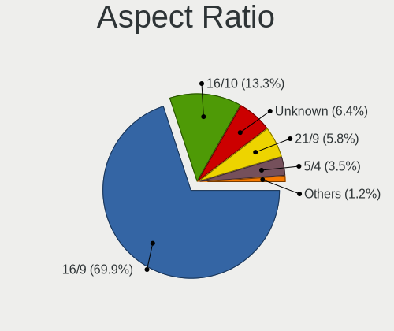

| Ratio   | Desktops | Percent |
|---------|----------|---------|
| 16/9    | 121      | 69.94%  |
| 16/10   | 23       | 13.29%  |
| Unknown | 11       | 6.36%   |
| 21/9    | 10       | 5.78%   |
| 5/4     | 6        | 3.47%   |
| 4/3     | 1        | 0.58%   |
| 3/2     | 1        | 0.58%   |

Monitor Area
------------

Area in inch

| Area in inch | Desktops | Percent |
|----------------|----------|---------|
| 201-250        | 48       | 27.43%  |
| 301-350        | 29       | 16.57%  |
| 351-500        | 26       | 14.86%  |
| 151-200        | 20       | 11.43%  |
| Unknown        | 13       | 7.43%   |
| More than 1000 | 11       | 6.29%   |
| 251-300        | 11       | 6.29%   |
| 141-150        | 10       | 5.71%   |
| 501-1000       | 5        | 2.86%   |
| 111-120        | 1        | 0.57%   |
| 91-100         | 1        | 0.57%   |

Pixel Density
-------------

Pixels per inch

| Density | Desktops | Percent |
|---------|----------|---------|
| 51-100  | 105      | 61.76%  |
| 101-120 | 31       | 18.24%  |
| Unknown | 13       | 7.65%   |
| 121-160 | 12       | 7.06%   |
| 161-240 | 5        | 2.94%   |
| 1-50    | 4        | 2.35%   |

Multiple Monitors
-----------------

Total monitors connected

| Total | Desktops | Percent |
|-------|----------|---------|
| 1     | 142      | 85.54%  |
| 2     | 21       | 12.65%  |
| 4     | 1        | 0.6%    |
| 3     | 1        | 0.6%    |
| 0     | 1        | 0.6%    |

Network
-------

Net Controller Vendor
---------------------

Controller vendors

| Vendor                   | Desktops | Percent |
|--------------------------|----------|---------|
| Realtek Semiconductor    | 110      | 47.41%  |
| Intel                    | 67       | 28.88%  |
| Qualcomm Atheros         | 12       | 5.17%   |
| TP-Link                  | 8        | 3.45%   |
| MediaTek                 | 7        | 3.02%   |
| Broadcom                 | 6        | 2.59%   |
| Ralink Technology        | 4        | 1.72%   |
| VIA Technologies         | 2        | 0.86%   |
| Ralink                   | 2        | 0.86%   |
| Microsoft                | 2        | 0.86%   |
| ASIX Electronics         | 2        | 0.86%   |
| Xiaomi                   | 1        | 0.43%   |
| Samsung Electronics      | 1        | 0.43%   |
| Nvidia                   | 1        | 0.43%   |
| NetGear                  | 1        | 0.43%   |
| Mercucys                 | 1        | 0.43%   |
| Marvell Technology Group | 1        | 0.43%   |
| Edimax Technology        | 1        | 0.43%   |
| D-Link                   | 1        | 0.43%   |
| Broadcom Limited         | 1        | 0.43%   |
| Aquantia                 | 1        | 0.43%   |

Net Controller Model
--------------------

Controller models

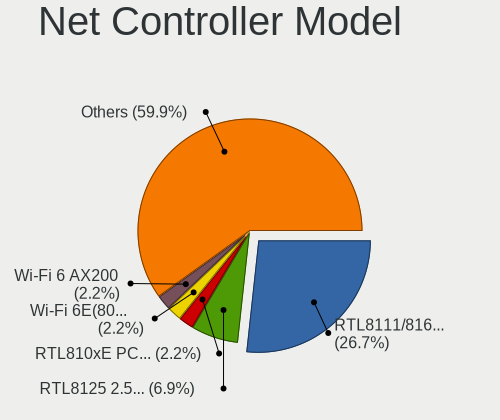

| Model                                                                  | Desktops | Percent |
|------------------------------------------------------------------------|----------|---------|
| Realtek RTL8111/8168/8211/8411 PCI Express Gigabit Ethernet Controller | 74       | 26.71%  |
| Realtek RTL8125 2.5GbE Controller                                      | 19       | 6.86%   |
| Realtek RTL810xE PCI Express Fast Ethernet controller                  | 6        | 2.17%   |
| Intel Wi-Fi 6E(802.11ax) AX210/AX1675* 2x2 [Typhoon Peak]              | 6        | 2.17%   |
| Intel Wi-Fi 6 AX200                                                    | 6        | 2.17%   |
| Intel I211 Gigabit Network Connection                                  | 6        | 2.17%   |
| Intel Ethernet Connection I217-LM                                      | 6        | 2.17%   |
| Intel Ethernet Connection (2) I219-V                                   | 6        | 2.17%   |
| Intel 82579LM Gigabit Network Connection (Lewisville)                  | 6        | 2.17%   |
| Realtek RTL8821CE 802.11ac PCIe Wireless Network Adapter               | 5        | 1.81%   |
| Intel Raptor Lake-S PCH CNVi WiFi                                      | 5        | 1.81%   |
| Intel Ethernet Controller I225-V                                       | 5        | 1.81%   |
| Realtek RTL88x2bu [AC1200 Techkey]                                     | 4        | 1.44%   |
| Realtek RTL8192CU 802.11n WLAN Adapter                                 | 4        | 1.44%   |
| Realtek RTL8188EUS 802.11n Wireless Network Adapter                    | 4        | 1.44%   |
| MediaTek MT7922 802.11ax PCI Express Wireless Network Adapter          | 4        | 1.44%   |
| TP-Link RTL8812AU Archer T4U 802.11ac                                  | 3        | 1.08%   |
| Qualcomm Atheros AR8151 v2.0 Gigabit Ethernet                          | 3        | 1.08%   |
| Qualcomm Atheros AR8131 Gigabit Ethernet                               | 3        | 1.08%   |
| Intel Ethernet Connection (7) I219-V                                   | 3        | 1.08%   |
| Intel Ethernet Connection (2) I219-LM                                  | 3        | 1.08%   |
| Intel Dual Band Wireless-AC 3168NGW [Stone Peak]                       | 3        | 1.08%   |
| Intel CNVi: Wi-Fi                                                      | 3        | 1.08%   |
| TP-Link TL-WN823N v2/v3 [Realtek RTL8192EU]                            | 2        | 0.72%   |
| Realtek RTL8852BE PCIe 802.11ax Wireless Network Controller            | 2        | 0.72%   |
| Realtek RTL8192EE PCIe Wireless Network Adapter                        | 2        | 0.72%   |
| Realtek RTL8153 Gigabit Ethernet Adapter                               | 2        | 0.72%   |
| Realtek 802.11ac WLAN Adapter                                          | 2        | 0.72%   |
| Realtek 802.11ac NIC                                                   | 2        | 0.72%   |
| Ralink RT5370 Wireless Adapter                                         | 2        | 0.72%   |
| Microsoft Xbox Wireless Adapter for Windows                            | 2        | 0.72%   |
| Intel Wi-Fi 5(802.11ac) Wireless-AC 9x6x [Thunder Peak]                | 2        | 0.72%   |
| Intel I210 Gigabit Network Connection                                  | 2        | 0.72%   |
| Intel Ethernet Controller I226-V                                       | 2        | 0.72%   |
| Intel Ethernet Connection (2) I218-V                                   | 2        | 0.72%   |
| Intel Ethernet Connection (10) I219-V                                  | 2        | 0.72%   |
| Intel 82566DM-2 Gigabit Network Connection                             | 2        | 0.72%   |
| Broadcom BCM4360 802.11ac Dual Band Wireless Network Adapter           | 2        | 0.72%   |
| Xiaomi Mi/Redmi series (RNDIS)                                         | 1        | 0.36%   |
| VIA VT6105/VT6106S [Rhine-III]                                         | 1        | 0.36%   |

Wireless Vendor
---------------

Wireless vendors

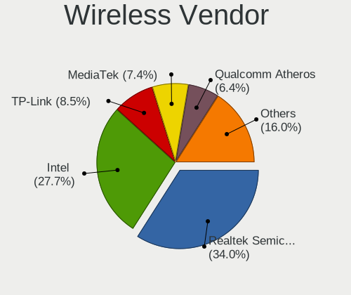

| Vendor                | Desktops | Percent |
|-----------------------|----------|---------|
| Realtek Semiconductor | 32       | 34.04%  |
| Intel                 | 26       | 27.66%  |
| TP-Link               | 8        | 8.51%   |
| MediaTek              | 7        | 7.45%   |
| Qualcomm Atheros      | 6        | 6.38%   |
| Ralink Technology     | 4        | 4.26%   |
| Broadcom              | 3        | 3.19%   |
| Ralink                | 2        | 2.13%   |
| Microsoft             | 2        | 2.13%   |
| NetGear               | 1        | 1.06%   |
| Mercucys              | 1        | 1.06%   |
| Edimax Technology     | 1        | 1.06%   |
| D-Link                | 1        | 1.06%   |

Wireless Model
--------------

Wireless models

| Model                                                          | Desktops | Percent |
|----------------------------------------------------------------|----------|---------|
| Intel Wi-Fi 6E(802.11ax) AX210/AX1675* 2x2 [Typhoon Peak]      | 6        | 6.25%   |
| Intel Wi-Fi 6 AX200                                            | 6        | 6.25%   |
| Realtek RTL8821CE 802.11ac PCIe Wireless Network Adapter       | 5        | 5.21%   |
| Intel Raptor Lake-S PCH CNVi WiFi                              | 5        | 5.21%   |
| Realtek RTL88x2bu [AC1200 Techkey]                             | 4        | 4.17%   |
| Realtek RTL8192CU 802.11n WLAN Adapter                         | 4        | 4.17%   |
| Realtek RTL8188EUS 802.11n Wireless Network Adapter            | 4        | 4.17%   |
| MediaTek MT7922 802.11ax PCI Express Wireless Network Adapter  | 4        | 4.17%   |
| TP-Link RTL8812AU Archer T4U 802.11ac                          | 3        | 3.13%   |
| Intel Dual Band Wireless-AC 3168NGW [Stone Peak]               | 3        | 3.13%   |
| TP-Link TL-WN823N v2/v3 [Realtek RTL8192EU]                    | 2        | 2.08%   |
| Realtek RTL8852BE PCIe 802.11ax Wireless Network Controller    | 2        | 2.08%   |
| Realtek RTL8192EE PCIe Wireless Network Adapter                | 2        | 2.08%   |
| Realtek 802.11ac WLAN Adapter                                  | 2        | 2.08%   |
| Realtek 802.11ac NIC                                           | 2        | 2.08%   |
| Ralink RT5370 Wireless Adapter                                 | 2        | 2.08%   |
| Microsoft Xbox Wireless Adapter for Windows                    | 2        | 2.08%   |
| Intel Wi-Fi 5(802.11ac) Wireless-AC 9x6x [Thunder Peak]        | 2        | 2.08%   |
| Broadcom BCM4360 802.11ac Dual Band Wireless Network Adapter   | 2        | 2.08%   |
| TP-Link TL-WN722N v2/v3 [Realtek RTL8188EUS]                   | 1        | 1.04%   |
| TP-Link AC600 wireless Realtek RTL8811AU [Archer T2U Nano]     | 1        | 1.04%   |
| TP-Link 802.11ac WLAN Adapter                                  | 1        | 1.04%   |
| Realtek RTL8852CE PCIe 802.11ax Wireless Network Controller    | 1        | 1.04%   |
| Realtek RTL8822CE 802.11ac PCIe Wireless Network Adapter       | 1        | 1.04%   |
| Realtek RTL8821AE 802.11ac PCIe Wireless Network Adapter       | 1        | 1.04%   |
| Realtek RTL8811AU 802.11a/b/g/n/ac WLAN Adapter                | 1        | 1.04%   |
| Realtek RTL8723BE PCIe Wireless Network Adapter                | 1        | 1.04%   |
| Realtek RTL8192CE PCIe Wireless Network Adapter                | 1        | 1.04%   |
| Realtek RTL8188SU 802.11n WLAN Adapter                         | 1        | 1.04%   |
| Realtek RTL8188FTV 802.11b/g/n 1T1R 2.4G WLAN Adapter          | 1        | 1.04%   |
| Ralink MT7610U ("Archer T2U" 2.4G+5G WLAN Adapter              | 1        | 1.04%   |
| Ralink MT7601U Wireless Adapter                                | 1        | 1.04%   |
| Ralink RT5390 Wireless 802.11n 1T/1R PCIe                      | 1        | 1.04%   |
| Ralink RT2561/RT61 rev B 802.11g                               | 1        | 1.04%   |
| Qualcomm Atheros QCA9565 / AR9565 Wireless Network Adapter     | 1        | 1.04%   |
| Qualcomm Atheros QCA9377 802.11ac Wireless Network Adapter     | 1        | 1.04%   |
| Qualcomm Atheros AR9485 Wireless Network Adapter               | 1        | 1.04%   |
| Qualcomm Atheros AR93xx Wireless Network Adapter               | 1        | 1.04%   |
| Qualcomm Atheros AR9285 Wireless Network Adapter (PCI-Express) | 1        | 1.04%   |
| Qualcomm Atheros AR9227 Wireless Network Adapter               | 1        | 1.04%   |

Ethernet Vendor
---------------

Ethernet vendors

| Vendor                   | Desktops | Percent |
|--------------------------|----------|---------|
| Realtek Semiconductor    | 102      | 57.95%  |
| Intel                    | 54       | 30.68%  |
| Qualcomm Atheros         | 6        | 3.41%   |
| Broadcom                 | 4        | 2.27%   |
| VIA Technologies         | 2        | 1.14%   |
| ASIX Electronics         | 2        | 1.14%   |
| Xiaomi                   | 1        | 0.57%   |
| Samsung Electronics      | 1        | 0.57%   |
| Nvidia                   | 1        | 0.57%   |
| Marvell Technology Group | 1        | 0.57%   |
| Broadcom Limited         | 1        | 0.57%   |
| Aquantia                 | 1        | 0.57%   |

Ethernet Model
--------------

Ethernet models

| Model                                                                          | Desktops | Percent |
|--------------------------------------------------------------------------------|----------|---------|
| Realtek RTL8111/8168/8211/8411 PCI Express Gigabit Ethernet Controller         | 74       | 40.88%  |
| Realtek RTL8125 2.5GbE Controller                                              | 19       | 10.5%   |
| Realtek RTL810xE PCI Express Fast Ethernet controller                          | 6        | 3.31%   |
| Intel I211 Gigabit Network Connection                                          | 6        | 3.31%   |
| Intel Ethernet Connection I217-LM                                              | 6        | 3.31%   |
| Intel Ethernet Connection (2) I219-V                                           | 6        | 3.31%   |
| Intel 82579LM Gigabit Network Connection (Lewisville)                          | 6        | 3.31%   |
| Intel Ethernet Controller I225-V                                               | 5        | 2.76%   |
| Qualcomm Atheros AR8151 v2.0 Gigabit Ethernet                                  | 3        | 1.66%   |
| Qualcomm Atheros AR8131 Gigabit Ethernet                                       | 3        | 1.66%   |
| Intel Ethernet Connection (7) I219-V                                           | 3        | 1.66%   |
| Intel Ethernet Connection (2) I219-LM                                          | 3        | 1.66%   |
| Realtek RTL8153 Gigabit Ethernet Adapter                                       | 2        | 1.1%    |
| Intel I210 Gigabit Network Connection                                          | 2        | 1.1%    |
| Intel Ethernet Controller I226-V                                               | 2        | 1.1%    |
| Intel Ethernet Connection (2) I218-V                                           | 2        | 1.1%    |
| Intel Ethernet Connection (10) I219-V                                          | 2        | 1.1%    |
| Intel CNVi: Wi-Fi                                                              | 2        | 1.1%    |
| Intel 82566DM-2 Gigabit Network Connection                                     | 2        | 1.1%    |
| Xiaomi Mi/Redmi series (RNDIS)                                                 | 1        | 0.55%   |
| VIA VT6105/VT6106S [Rhine-III]                                                 | 1        | 0.55%   |
| VIA VT6102/VT6103 [Rhine-II]                                                   | 1        | 0.55%   |
| Samsung Galaxy series, misc. (tethering mode)                                  | 1        | 0.55%   |
| Realtek RTL8111/8168/8411 PCI Express Gigabit Ethernet Controller              | 1        | 0.55%   |
| Realtek RTL-8100/8101L/8139 PCI Fast Ethernet Adapter                          | 1        | 0.55%   |
| Realtek Killer E3000 2.5GbE Controller                                         | 1        | 0.55%   |
| Nvidia MCP77 Ethernet                                                          | 1        | 0.55%   |
| Marvell Group Yukon Optima 88E8059 [PCIe Gigabit Ethernet Controller with AVB] | 1        | 0.55%   |
| Intel Ethernet Connection I217-V                                               | 1        | 0.55%   |
| Intel Ethernet Connection (2) I218-LM                                          | 1        | 0.55%   |
| Intel Ethernet Connection (17) I219-V                                          | 1        | 0.55%   |
| Intel Ethernet Connection (14) I219-V                                          | 1        | 0.55%   |
| Intel 82599 10 Gigabit Network Connection                                      | 1        | 0.55%   |
| Intel 82583V Gigabit Network Connection                                        | 1        | 0.55%   |
| Intel 82579V Gigabit Network Connection                                        | 1        | 0.55%   |
| Intel 82574L Gigabit Network Connection                                        | 1        | 0.55%   |
| Intel 82567V-2 Gigabit Network Connection                                      | 1        | 0.55%   |
| Intel 82567LM-3 Gigabit Network Connection                                     | 1        | 0.55%   |
| Broadcom NetXtreme BCM57762 Gigabit Ethernet PCIe                              | 1        | 0.55%   |
| Broadcom NetXtreme BCM5754 Gigabit Ethernet PCI Express                        | 1        | 0.55%   |

Net Controller Kind
-------------------

Ethernet, WiFi or modem

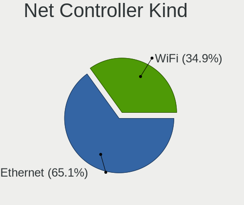

| Kind     | Desktops | Percent |
|----------|----------|---------|
| Ethernet | 162      | 65.06%  |
| WiFi     | 87       | 34.94%  |

Used Controller
---------------

Currently used network controller

| Kind     | Desktops | Percent |
|----------|----------|---------|
| Ethernet | 132      | 76.74%  |
| WiFi     | 40       | 23.26%  |

NICs
----

Total network controllers on board

| Total | Desktops | Percent |
|-------|----------|---------|
| 1     | 103      | 61.68%  |
| 2     | 54       | 32.34%  |
| 3     | 9        | 5.39%   |
| 0     | 1        | 0.6%    |

IPv6
----

IPv6 vs IPv4

| Used | Desktops | Percent |
|------|----------|---------|
| No   | 110      | 65.48%  |
| Yes  | 58       | 34.52%  |

Bluetooth
---------

Bluetooth Vendor
----------------

Controller vendors

| Vendor                          | Desktops | Percent |
|---------------------------------|----------|---------|
| Intel                           | 28       | 35.9%   |
| Cambridge Silicon Radio         | 13       | 16.67%  |
| Realtek Semiconductor           | 12       | 15.38%  |
| IMC Networks                    | 6        | 7.69%   |
| MediaTek                        | 5        | 6.41%   |
| Apple                           | 3        | 3.85%   |
| TP-Link                         | 2        | 2.56%   |
| Qualcomm Atheros Communications | 2        | 2.56%   |
| Integrated System Solution      | 2        | 2.56%   |
| Broadcom                        | 2        | 2.56%   |
| Logitech                        | 1        | 1.28%   |
| ASUSTek Computer                | 1        | 1.28%   |
| Unknown                         | 1        | 1.28%   |

Bluetooth Model
---------------

Controller models

| Model                                               | Desktops | Percent |
|-----------------------------------------------------|----------|---------|
| Cambridge Silicon Radio Bluetooth Dongle (HCI mode) | 13       | 16.67%  |
| Realtek Bluetooth Radio                             | 9        | 11.54%  |
| Intel AX211 Bluetooth                               | 6        | 7.69%   |
| Intel AX200 Bluetooth                               | 6        | 7.69%   |
| MediaTek Wireless_Device                            | 5        | 6.41%   |
| Intel AX210 Bluetooth                               | 5        | 6.41%   |
| Intel Wireless-AC 3168 Bluetooth                    | 3        | 3.85%   |
| IMC Networks Bluetooth Radio                        | 3        | 3.85%   |
| Apple Bluetooth Host Controller                     | 3        | 3.85%   |
| TP-Link TP-Link Bluetooth USB Adapter               | 2        | 2.56%   |
| Realtek  Bluetooth 4.2 Adapter                      | 2        | 2.56%   |
| Intel Wireless-AC 9260 Bluetooth Adapter            | 2        | 2.56%   |
| Intel Bluetooth wireless interface                  | 2        | 2.56%   |
| Intel Bluetooth 9460/9560 Jefferson Peak (JfP)      | 2        | 2.56%   |
| Intel AX201 Bluetooth                               | 2        | 2.56%   |
| Integrated System Solution Bluetooth Device         | 2        | 2.56%   |
| IMC Networks Wireless_Device                        | 2        | 2.56%   |
| Broadcom BCM20702A0 Bluetooth 4.0                   | 2        | 2.56%   |
| Realtek Bluetooth 5.3 Radio                         | 1        | 1.28%   |
| Qualcomm Atheros  Bluetooth Device                  | 1        | 1.28%   |
| Qualcomm Atheros AR3011 Bluetooth                   | 1        | 1.28%   |
| Logitech BT Mini-Receiver (HCI mode)                | 1        | 1.28%   |
| IMC Networks Bluetooth Device                       | 1        | 1.28%   |
| ASUS ASUS USB-BT500                                 | 1        | 1.28%   |
| Unknown                                             | 1        | 1.28%   |

Sound
-----

Sound Vendor
------------

Sound card vendors

| Vendor                                       | Desktops | Percent |
|----------------------------------------------|----------|---------|
| Intel                                        | 100      | 34.6%   |
| AMD                                          | 79       | 27.34%  |
| Nvidia                                       | 55       | 19.03%  |
| C-Media Electronics                          | 7        | 2.42%   |
| Creative Technology                          | 5        | 1.73%   |
| Creative Labs                                | 5        | 1.73%   |
| Micro Star International                     | 4        | 1.38%   |
| Zoran Co. Personal Media Division (Nogatech) | 3        | 1.04%   |
| Logitech                                     | 3        | 1.04%   |
| JMTek                                        | 3        | 1.04%   |
| GN Netcom                                    | 3        | 1.04%   |
| VIA Technologies                             | 2        | 0.69%   |
| Texas Instruments                            | 2        | 0.69%   |
| Hewlett-Packard                              | 2        | 0.69%   |
| ZOOM                                         | 1        | 0.35%   |
| Thesycon Systemsoftware & Consulting         | 1        | 0.35%   |
| Samson Technologies                          | 1        | 0.35%   |
| Razer USA                                    | 1        | 0.35%   |
| Kingston Technology                          | 1        | 0.35%   |
| Jieli Technology                             | 1        | 0.35%   |
| JBL                                          | 1        | 0.35%   |
| Guillemot                                    | 1        | 0.35%   |
| Generalplus Technology                       | 1        | 0.35%   |
| Bluetrum                                     | 1        | 0.35%   |
| Blue Microphones                             | 1        | 0.35%   |
| ASUSTek Computer                             | 1        | 0.35%   |
| ASRock                                       | 1        | 0.35%   |
| Apple                                        | 1        | 0.35%   |
| Altec Lansing Technologies                   | 1        | 0.35%   |
| Unknown                                      | 1        | 0.35%   |

Sound Model
-----------

Sound card models

| Model                                                                             | Desktops | Percent |
|-----------------------------------------------------------------------------------|----------|---------|
| AMD Family 17h/19h/1ah HD Audio Controller                                        | 24       | 7.02%   |
| Intel 8 Series/C220 Series Chipset High Definition Audio Controller               | 13       | 3.8%    |
| AMD Starship/Matisse HD Audio Controller                                          | 13       | 3.8%    |
| AMD SBx00 Azalia (Intel HDA)                                                      | 12       | 3.51%   |
| AMD Rembrandt Radeon High Definition Audio Controller                             | 11       | 3.22%   |
| Intel 100 Series/C230 Series Chipset Family HD Audio Controller                   | 10       | 2.92%   |
| Intel 7 Series/C216 Chipset Family High Definition Audio Controller               | 9        | 2.63%   |
| Intel NM10/ICH7 Family High Definition Audio Controller                           | 8        | 2.34%   |
| Intel Alder Lake-N PCH High Definition Audio Controller                           | 8        | 2.34%   |
| Intel 6 Series/C200 Series Chipset Family High Definition Audio Controller        | 8        | 2.34%   |
| AMD Navi 21/23 HDMI/DP Audio Controller                                           | 8        | 2.34%   |
| Intel Xeon E3-1200 v3/4th Gen Core Processor HD Audio Controller                  | 7        | 2.05%   |
| Intel Raptor Lake High Definition Audio Controller                                | 7        | 2.05%   |
| AMD Family 17h (Models 00h-0fh) HD Audio Controller                               | 7        | 2.05%   |
| Nvidia GK208 HDMI/DP Audio Controller                                             | 6        | 1.75%   |
| Intel 200 Series PCH HD Audio                                                     | 6        | 1.75%   |
| Nvidia GP107GL High Definition Audio Controller                                   | 5        | 1.46%   |
| Nvidia GP106 High Definition Audio Controller                                     | 5        | 1.46%   |
| Intel Cannon Lake PCH cAVS                                                        | 5        | 1.46%   |
| AMD Renoir Radeon High Definition Audio Controller                                | 5        | 1.46%   |
| AMD Raven/Raven2/Fenghuang HDMI/DP Audio Controller                               | 5        | 1.46%   |
| Nvidia GP104 High Definition Audio Controller                                     | 4        | 1.17%   |
| Nvidia GM204 High Definition Audio Controller                                     | 4        | 1.17%   |
| Nvidia GF108 High Definition Audio Controller                                     | 4        | 1.17%   |
| Micro Star International USB Audio                                                | 4        | 1.17%   |
| AMD Navi 31 HDMI/DP Audio                                                         | 4        | 1.17%   |
| AMD Cedar HDMI Audio [Radeon HD 5400/6300/7300 Series]                            | 4        | 1.17%   |
| AMD Caicos HDMI Audio [Radeon HD 6450 / 7450/8450/8490 OEM / R5 230/235/235X OEM] | 4        | 1.17%   |
| Zoran Co. Personal Media Division (Nogatech) USB Audio and HID                    | 3        | 0.88%   |
| Nvidia TU106 High Definition Audio Controller                                     | 3        | 0.88%   |
| Nvidia GP102 HDMI Audio Controller                                                | 3        | 0.88%   |
| Nvidia GM107 High Definition Audio Controller [GeForce 940MX]                     | 3        | 0.88%   |
| JMTek USB PnP Audio Device                                                        | 3        | 0.88%   |
| Intel 82801I (ICH9 Family) HD Audio Controller                                    | 3        | 0.88%   |
| Intel 5 Series/3400 Series Chipset High Definition Audio                          | 3        | 0.88%   |
| Creative Technology Sound Blaster Play! 3                                         | 3        | 0.88%   |
| AMD Navi 10 HDMI Audio                                                            | 3        | 0.88%   |
| AMD FCH Azalia Controller                                                         | 3        | 0.88%   |
| AMD Ellesmere HDMI Audio [Radeon RX 470/480 / 570/580/590]                        | 3        | 0.88%   |
| Nvidia TU116 High Definition Audio Controller                                     | 2        | 0.58%   |

Memory
------

Memory Vendor
-------------

Memory module vendors

| Vendor              | Desktops | Percent |
|---------------------|----------|---------|
| Kingston            | 25       | 20.83%  |
| G.Skill             | 17       | 14.17%  |
| Corsair             | 17       | 14.17%  |
| Samsung Electronics | 14       | 11.67%  |
| Unknown             | 12       | 10%     |
| SK hynix            | 8        | 6.67%   |
| Crucial             | 6        | 5%      |
| Team                | 3        | 2.5%    |
| Micron Technology   | 3        | 2.5%    |
| Unknown             | 3        | 2.5%    |
| Patriot             | 2        | 1.67%   |
| Unknown (ABCD)      | 1        | 0.83%   |
| Unknown (0x0E9D)    | 1        | 0.83%   |
| Unknown (0x0CC7)    | 1        | 0.83%   |
| Ramaxel Technology  | 1        | 0.83%   |
| Qimonda             | 1        | 0.83%   |
| PNY                 | 1        | 0.83%   |
| Nanya Technology    | 1        | 0.83%   |
| Mushkin             | 1        | 0.83%   |
| GeIL                | 1        | 0.83%   |
| Avant               | 1        | 0.83%   |

Memory Model
------------

Memory module models

| Model                                                              | Desktops | Percent |
|--------------------------------------------------------------------|----------|---------|
| Corsair RAM CMK16GX4M2B3200C16 8GB DIMM DDR4 3600MT/s              | 3        | 2.24%   |
| Unknown                                                            | 3        | 2.24%   |
| Unknown RAM Module 4GB DIMM 1066MT/s                               | 2        | 1.49%   |
| Unknown RAM Module 2GB DIMM 1066MT/s                               | 2        | 1.49%   |
| Team RAM TEAMGROUP-SD4-2666 16GB SODIMM DDR4 2667MT/s              | 2        | 1.49%   |
| Kingston RAM KHX3200C16D4/8GX 8GB DIMM DDR4 3733MT/s               | 2        | 1.49%   |
| Kingston RAM KHX2666C15D4/4G 4GB DIMM DDR4 3200MT/s                | 2        | 1.49%   |
| Kingston RAM KF3200C16D4/8GX 8GB DIMM DDR4 3600MT/s                | 2        | 1.49%   |
| Kingston RAM 99U5584-005.A00LF 4GB DIMM DDR3 1600MT/s              | 2        | 1.49%   |
| Unknown RAM Module 8GB SODIMM DDR3 1600MT/s                        | 1        | 0.75%   |
| Unknown RAM Module 512MB DIMM                                      | 1        | 0.75%   |
| Unknown RAM Module 4GB DIMM DDR3 1333MT/s                          | 1        | 0.75%   |
| Unknown RAM Module 4GB DIMM                                        | 1        | 0.75%   |
| Unknown RAM Module 2GB DIMM SDRAM                                  | 1        | 0.75%   |
| Unknown RAM Module 2GB DIMM DDR2 800MT/s                           | 1        | 0.75%   |
| Unknown RAM Module 2GB DIMM DDR2 1067MT/s                          | 1        | 0.75%   |
| Unknown RAM Module 2GB DIMM DDR 667MT/s                            | 1        | 0.75%   |
| Unknown RAM Module 2GB DIMM 800MT/s                                | 1        | 0.75%   |
| Unknown RAM Module 1GB DIMM 1066MT/s                               | 1        | 0.75%   |
| Unknown RAM Module 1GB DIMM                                        | 1        | 0.75%   |
| Unknown (ABCD) RAM 123456789012345678 2GB DIMM DDR3 2400MT/s       | 1        | 0.75%   |
| Unknown (0x0E9D) RAM KINSOTIN16GB2666MHZ 16GB SODIMM DDR4 2667MT/s | 1        | 0.75%   |
| Unknown (0x0CC7) RAM DDR4 NB 8G 3200 8GB SODIMM DDR4 3200MT/s      | 1        | 0.75%   |
| Team RAM TEAMGROUP-UD4-3000 8GB DIMM DDR4 3200MT/s                 | 1        | 0.75%   |
| SK hynix RAM Module 2GB DIMM DDR3 1333MT/s                         | 1        | 0.75%   |
| SK hynix RAM HYMP564U64CP8-Y5 512MB DIMM DDR 667MT/s               | 1        | 0.75%   |
| SK hynix RAM HYMP125U64CP8-Y5 2GB DIMM DDR 667MT/s                 | 1        | 0.75%   |
| SK hynix RAM HMT451U6BFR8C-PB 4GB DIMM DDR3 1600MT/s               | 1        | 0.75%   |
| SK hynix RAM HMT425S6CFR6C-PB 2GB SODIMM DDR3 1600MT/s             | 1        | 0.75%   |
| SK hynix RAM HMT41GU6BFR8A-PB 8GB DIMM DDR3 2000MT/s               | 1        | 0.75%   |
| SK hynix RAM HMT41GR7AFR4C-RD 8GB DIMM DDR3 1867MT/s               | 1        | 0.75%   |
| SK hynix RAM HMT351U6CFR8C-PB 4GB DIMM DDR3 1800MT/s               | 1        | 0.75%   |
| SK hynix RAM HMT31GR7CFR4C-PB 8GB DIMM DDR3 1600MT/s               | 1        | 0.75%   |
| SK hynix RAM H9JCNNNFA5MLYR-N6E 8GB DIMM LPDDR5 6400MT/s           | 1        | 0.75%   |
| Samsung RAM Module 2GB Row Of Chips LPDDR5 6400MT/s                | 1        | 0.75%   |
| Samsung RAM M471B5273DH0-CH9 4GB DIMM DDR3 1333MT/s                | 1        | 0.75%   |
| Samsung RAM M471B5273CH0-CH9 4GB SODIMM DDR3 1334MT/s              | 1        | 0.75%   |
| Samsung RAM M393A1G40DB0-CPB 8GB DIMM DDR4 2133MT/s                | 1        | 0.75%   |
| Samsung RAM M378B5673EH1-CH9 2048MB DIMM DDR3 1333MT/s             | 1        | 0.75%   |
| Samsung RAM M378B5173QH0-CK0 4GB DIMM DDR3 1600MT/s                | 1        | 0.75%   |

Memory Kind
-----------

Memory module kinds

| Kind    | Desktops | Percent |
|---------|----------|---------|
| DDR4    | 53       | 48.62%  |
| DDR3    | 24       | 22.02%  |
| DDR5    | 10       | 9.17%   |
| Unknown | 6        | 5.5%    |
| SDRAM   | 5        | 4.59%   |
| LPDDR5  | 4        | 3.67%   |
| DDR2    | 4        | 3.67%   |
| DDR     | 2        | 1.83%   |
| LPDDR4  | 1        | 0.92%   |

Memory Form Factor
------------------

Physical design of the memory module

| Name         | Desktops | Percent |
|--------------|----------|---------|
| DIMM         | 90       | 85.71%  |
| SODIMM       | 13       | 12.38%  |
| Row Of Chips | 2        | 1.9%    |

Memory Size
-----------

Memory module size

| Size  | Desktops | Percent |
|-------|----------|---------|
| 8192  | 39       | 33.33%  |
| 16384 | 29       | 24.79%  |
| 4096  | 19       | 16.24%  |
| 2048  | 16       | 13.68%  |
| 32768 | 8        | 6.84%   |
| 49152 | 2        | 1.71%   |
| 1024  | 2        | 1.71%   |
| 512   | 2        | 1.71%   |

Memory Speed
------------

Memory module speed

| Speed   | Desktops | Percent |
|---------|----------|---------|
| 3200    | 17       | 14.53%  |
| 3600    | 12       | 10.26%  |
| 1600    | 12       | 10.26%  |
| 2667    | 9        | 7.69%   |
| 1333    | 8        | 6.84%   |
| 6400    | 5        | 4.27%   |
| 4800    | 4        | 3.42%   |
| 2800    | 4        | 3.42%   |
| 2133    | 4        | 3.42%   |
| 5600    | 3        | 2.56%   |
| 3733    | 3        | 2.56%   |
| 3400    | 3        | 2.56%   |
| 1066    | 3        | 2.56%   |
| 800     | 3        | 2.56%   |
| 667     | 3        | 2.56%   |
| Unknown | 3        | 2.56%   |
| 6000    | 2        | 1.71%   |
| 2666    | 2        | 1.71%   |
| 2400    | 2        | 1.71%   |
| 1867    | 2        | 1.71%   |
| 1866    | 2        | 1.71%   |
| 3500    | 1        | 0.85%   |
| 3466    | 1        | 0.85%   |
| 3066    | 1        | 0.85%   |
| 3000    | 1        | 0.85%   |
| 2934    | 1        | 0.85%   |
| 2000    | 1        | 0.85%   |
| 1800    | 1        | 0.85%   |
| 1639    | 1        | 0.85%   |
| 1334    | 1        | 0.85%   |
| 1067    | 1        | 0.85%   |
| 533     | 1        | 0.85%   |

Printers & scanners
-------------------

Printer Vendor
--------------

Printer device vendors

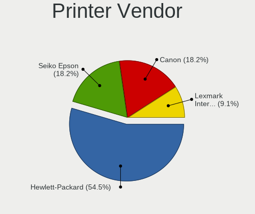

| Vendor                | Desktops | Percent |
|-----------------------|----------|---------|
| Hewlett-Packard       | 6        | 54.55%  |
| Seiko Epson           | 2        | 18.18%  |
| Canon                 | 2        | 18.18%  |
| Lexmark International | 1        | 9.09%   |

Printer Model
-------------

Printer device models

| Model                         | Desktops | Percent |
|-------------------------------|----------|---------|
| Seiko Epson ET-2820 Series    | 1        | 9.09%   |
| Seiko Epson ET-1810 Series    | 1        | 9.09%   |
| Lexmark International MX310dn | 1        | 9.09%   |
| HP LaserJet P2015 series      | 1        | 9.09%   |
| HP LaserJet P1005             | 1        | 9.09%   |
| HP HP LaserJet Pro M404-M405  | 1        | 9.09%   |
| HP ENVY 5000 series           | 1        | 9.09%   |
| HP ENVY 4520 series           | 1        | 9.09%   |
| HP DeskJet F4200 series       | 1        | 9.09%   |
| Canon TS9100 series           | 1        | 9.09%   |
| Canon CanoScan LiDE 300       | 1        | 9.09%   |

Scanner Vendor
--------------

Scanner device vendors

| Vendor      | Desktops | Percent |
|-------------|----------|---------|
| Seiko Epson | 1        | 100%    |

Scanner Model
-------------

Scanner device models

| Model                                       | Desktops | Percent |
|---------------------------------------------|----------|---------|
| Seiko Epson GT-X820 [Perfection V600 Photo] | 1        | 100%    |

Camera
------

Camera Vendor
-------------

Camera device vendors

| Vendor                        | Desktops | Percent |
|-------------------------------|----------|---------|
| Logitech                      | 11       | 42.31%  |
| Microdia                      | 3        | 11.54%  |
| MacroSilicon                  | 3        | 11.54%  |
| Microsoft                     | 2        | 7.69%   |
| Web Camera                    | 1        | 3.85%   |
| Sunplus Innovation Technology | 1        | 3.85%   |
| Magic Control Technology      | 1        | 3.85%   |
| KYE Systems (Mouse Systems)   | 1        | 3.85%   |
| Jieli Technology              | 1        | 3.85%   |
| Chicony Electronics           | 1        | 3.85%   |
| Apple                         | 1        | 3.85%   |

Camera Model
------------

Camera device models

| Model                                          | Desktops | Percent |
|------------------------------------------------|----------|---------|
| Logitech HD Pro Webcam C920                    | 3        | 11.54%  |
| MacroSilicon USB Video                         | 2        | 7.69%   |
| Logitech BRIO Ultra HD Webcam                  | 2        | 7.69%   |
| Web Camera Web Camera                          | 1        | 3.85%   |
| Sunplus DICOTA 4K                              | 1        | 3.85%   |
| Microsoft Microsoft LifeCam Cinema           | 1        | 3.85%   |
| Microsoft LifeCam VX-700                       | 1        | 3.85%   |
| Microdia USB 2.0 Camera                        | 1        | 3.85%   |
| Microdia Sonix USB 2.0 Camera                  | 1        | 3.85%   |
| Microdia NEXIGO HD Webcam                      | 1        | 3.85%   |
| Magic Control j5 WebCam JVCU100                | 1        | 3.85%   |
| MacroSilicon ClearClick                        | 1        | 3.85%   |
| Logitech Webcam C310                           | 1        | 3.85%   |
| Logitech Webcam C270                           | 1        | 3.85%   |
| Logitech Webcam C170                           | 1        | 3.85%   |
| Logitech Portable Webcam C905                  | 1        | 3.85%   |
| Logitech HD Webcam C615                        | 1        | 3.85%   |
| Logitech HD Webcam C525                        | 1        | 3.85%   |
| KYE Systems (Mouse Systems) Genius FaceCam 312 | 1        | 3.85%   |
| Jieli USB PHY 2.0                              | 1        | 3.85%   |
| Chicony HP 0.3MP Webcam                        | 1        | 3.85%   |
| Apple iSight in LED Cinema Display             | 1        | 3.85%   |

Security
--------

Fingerprint Vendor
------------------

Fingerprint sensor vendors

| Vendor                | Desktops | Percent |
|-----------------------|----------|---------|
| LighTuning Technology | 1        | 100%    |

Fingerprint Model
-----------------

Fingerprint sensor models

| Model                                     | Desktops | Percent |
|-------------------------------------------|----------|---------|
| LighTuning ES603 Swipe Fingerprint Sensor | 1        | 100%    |

Chipcard Vendor
---------------

Chipcard module vendors

| Vendor   | Desktops | Percent |
|----------|----------|---------|
| Swissbit | 1        | 100%    |

Chipcard Model
--------------

Chipcard module models

| Model                    | Desktops | Percent |
|--------------------------|----------|---------|
| Swissbit iShield Key Pro | 1        | 100%    |

Unsupported
-----------

Unsupported Devices
-------------------

Total unsupported devices on board

| Total | Desktops | Percent |
|-------|----------|---------|
| 0     | 143      | 83.14%  |
| 1     | 25       | 14.53%  |
| 2     | 4        | 2.33%   |

Unsupported Device Types
------------------------

Types of unsupported devices

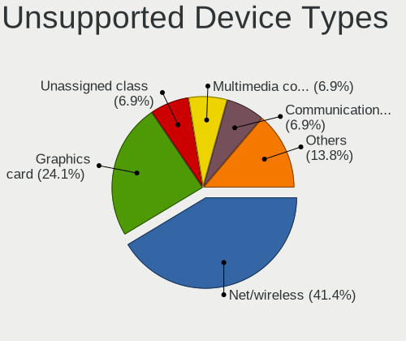

| Type                     | Desktops | Percent |
|--------------------------|----------|---------|
| Net/wireless             | 12       | 41.38%  |
| Graphics card            | 7        | 24.14%  |
| Unassigned class         | 2        | 6.9%    |
| Multimedia controller    | 2        | 6.9%    |
| Communication controller | 2        | 6.9%    |
| Sound                    | 1        | 3.45%   |
| Network                  | 1        | 3.45%   |
| Fingerprint reader       | 1        | 3.45%   |
| Card reader              | 1        | 3.45%   |

