LMDE 6 - Tested Hardware & Statistics (Notebooks)
-------------------------------------------------

A project to collect tested hardware configurations for LMDE 6.

Anyone can contribute to this report by the [hw-probe](https://github.com/linuxhw/hw-probe) tool:

    sudo -E hw-probe -all -upload

Please contribute! Especially if your hardware is rare.

Contents
--------

* [ Test Cases ](#test-cases)

* [ System ](#system)
  - [ Kernel                   ](#kernel)
  - [ Kernel Family            ](#kernel-family)
  - [ Kernel Major Ver.        ](#kernel-major-ver)
  - [ Arch                     ](#arch)
  - [ DE                       ](#de)
  - [ Display Server           ](#display-server)
  - [ Display Manager          ](#display-manager)
  - [ OS Lang                  ](#os-lang)
  - [ Boot Mode                ](#boot-mode)
  - [ Filesystem               ](#filesystem)
  - [ Part. scheme             ](#part-scheme)
  - [ Dual Boot with Linux/BSD ](#dual-boot-with-linuxbsd)
  - [ Dual Boot (Win)          ](#dual-boot-win)

* [ Board ](#board)
  - [ Vendor                   ](#vendor)
  - [ Model                    ](#model)
  - [ Model Family             ](#model-family)
  - [ MFG Year                 ](#mfg-year)
  - [ Form Factor              ](#form-factor)
  - [ Secure Boot              ](#secure-boot)
  - [ Coreboot                 ](#coreboot)
  - [ RAM Size                 ](#ram-size)
  - [ RAM Used                 ](#ram-used)
  - [ Total Drives             ](#total-drives)
  - [ Has CD-ROM               ](#has-cd-rom)
  - [ Has Ethernet             ](#has-ethernet)
  - [ Has WiFi                 ](#has-wifi)
  - [ Has Bluetooth            ](#has-bluetooth)

* [ Location ](#location)
  - [ Country                  ](#country)
  - [ City                     ](#city)

* [ Drives ](#drives)
  - [ Drive Vendor             ](#drive-vendor)
  - [ Drive Model              ](#drive-model)
  - [ HDD Vendor               ](#hdd-vendor)
  - [ SSD Vendor               ](#ssd-vendor)
  - [ Drive Kind               ](#drive-kind)
  - [ Drive Connector          ](#drive-connector)
  - [ Drive Size               ](#drive-size)
  - [ Space Total              ](#space-total)
  - [ Space Used               ](#space-used)
  - [ Malfunc. Drives          ](#malfunc-drives)
  - [ Malfunc. Drive Vendor    ](#malfunc-drive-vendor)
  - [ Malfunc. HDD Vendor      ](#malfunc-hdd-vendor)
  - [ Malfunc. Drive Kind      ](#malfunc-drive-kind)
  - [ Failed Drives            ](#failed-drives)
  - [ Failed Drive Vendor      ](#failed-drive-vendor)
  - [ Drive Status             ](#drive-status)

* [ Storage controller ](#storage-controller)
  - [ Storage Vendor           ](#storage-vendor)
  - [ Storage Model            ](#storage-model)
  - [ Storage Kind             ](#storage-kind)

* [ Processor ](#processor)
  - [ CPU Vendor               ](#cpu-vendor)
  - [ CPU Model                ](#cpu-model)
  - [ CPU Model Family         ](#cpu-model-family)
  - [ CPU Cores                ](#cpu-cores)
  - [ CPU Sockets              ](#cpu-sockets)
  - [ CPU Threads              ](#cpu-threads)
  - [ CPU Op-Modes             ](#cpu-op-modes)
  - [ CPU Microcode            ](#cpu-microcode)
  - [ CPU Microarch            ](#cpu-microarch)

* [ Graphics ](#graphics)
  - [ GPU Vendor               ](#gpu-vendor)
  - [ GPU Model                ](#gpu-model)
  - [ GPU Combo                ](#gpu-combo)
  - [ GPU Driver               ](#gpu-driver)
  - [ GPU Memory               ](#gpu-memory)

* [ Monitor ](#monitor)
  - [ Monitor Vendor           ](#monitor-vendor)
  - [ Monitor Model            ](#monitor-model)
  - [ Monitor Resolution       ](#monitor-resolution)
  - [ Monitor Diagonal         ](#monitor-diagonal)
  - [ Monitor Width            ](#monitor-width)
  - [ Aspect Ratio             ](#aspect-ratio)
  - [ Monitor Area             ](#monitor-area)
  - [ Pixel Density            ](#pixel-density)
  - [ Multiple Monitors        ](#multiple-monitors)

* [ Network ](#network)
  - [ Net Controller Vendor    ](#net-controller-vendor)
  - [ Net Controller Model     ](#net-controller-model)
  - [ Wireless Vendor          ](#wireless-vendor)
  - [ Wireless Model           ](#wireless-model)
  - [ Ethernet Vendor          ](#ethernet-vendor)
  - [ Ethernet Model           ](#ethernet-model)
  - [ Net Controller Kind      ](#net-controller-kind)
  - [ Used Controller          ](#used-controller)
  - [ NICs                     ](#nics)
  - [ IPv6                     ](#ipv6)

* [ Bluetooth ](#bluetooth)
  - [ Bluetooth Vendor         ](#bluetooth-vendor)
  - [ Bluetooth Model          ](#bluetooth-model)

* [ Sound ](#sound)
  - [ Sound Vendor             ](#sound-vendor)
  - [ Sound Model              ](#sound-model)

* [ Memory ](#memory)
  - [ Memory Vendor            ](#memory-vendor)
  - [ Memory Model             ](#memory-model)
  - [ Memory Kind              ](#memory-kind)
  - [ Memory Form Factor       ](#memory-form-factor)
  - [ Memory Size              ](#memory-size)
  - [ Memory Speed             ](#memory-speed)

* [ Printers & scanners ](#printers--scanners)
  - [ Printer Vendor           ](#printer-vendor)
  - [ Printer Model            ](#printer-model)
  - [ Scanner Vendor           ](#scanner-vendor)
  - [ Scanner Model            ](#scanner-model)

* [ Camera ](#camera)
  - [ Camera Vendor            ](#camera-vendor)
  - [ Camera Model             ](#camera-model)

* [ Security ](#security)
  - [ Fingerprint Vendor       ](#fingerprint-vendor)
  - [ Fingerprint Model        ](#fingerprint-model)
  - [ Chipcard Vendor          ](#chipcard-vendor)
  - [ Chipcard Model           ](#chipcard-model)

* [ Unsupported ](#unsupported)
  - [ Unsupported Devices      ](#unsupported-devices)
  - [ Unsupported Device Types ](#unsupported-device-types)

Test Cases
----------

Total: 644

| Vendor        | Model                       | Probe                                                      | Date         |
|---------------|-----------------------------|------------------------------------------------------------|--------------|
| Dell          | Precision 7540              | [96cf560abd](https://linux-hardware.org/?probe=96cf560abd) | Jan 03, 2026 |
| Dell          | Precision 7540              | [08e0c78abb](https://linux-hardware.org/?probe=08e0c78abb) | Dec 22, 2025 |
| Lenovo        | ThinkPad L512 2550A13       | [0732fea7b0](https://linux-hardware.org/?probe=0732fea7b0) | Nov 26, 2025 |
| Apple         | MacBookPro11,4              | [959f7e1234](https://linux-hardware.org/?probe=959f7e1234) | Nov 21, 2025 |
| Apple         | MacBookPro11,4              | [a5aa6d514c](https://linux-hardware.org/?probe=a5aa6d514c) | Nov 21, 2025 |
| Dell          | Precision 7550              | [92fdce3c99](https://linux-hardware.org/?probe=92fdce3c99) | Nov 14, 2025 |
| Dell          | Precision 7550              | [c82fd028db](https://linux-hardware.org/?probe=c82fd028db) | Nov 14, 2025 |
| Acer          | Aspire E1-572G              | [77512f6e1f](https://linux-hardware.org/?probe=77512f6e1f) | Nov 07, 2025 |
| ASUSTek       | T100TAS                     | [44f1476d60](https://linux-hardware.org/?probe=44f1476d60) | Nov 06, 2025 |
| Acer          | Aspire E1-572G              | [2fd274af0a](https://linux-hardware.org/?probe=2fd274af0a) | Oct 23, 2025 |
| Acer          | Aspire E1-572G              | [44c57a362b](https://linux-hardware.org/?probe=44c57a362b) | Oct 21, 2025 |
| HP            | ENVY 17                     | [84498b0f36](https://linux-hardware.org/?probe=84498b0f36) | Oct 20, 2025 |
| Lenovo        | IdeaPad 3 15IML05 82BS      | [9af9b0e592](https://linux-hardware.org/?probe=9af9b0e592) | Oct 20, 2025 |
| Lenovo        | IdeaPad 3 15IML05 82BS      | [7aa22f1005](https://linux-hardware.org/?probe=7aa22f1005) | Oct 19, 2025 |
| TongFang      | GX5HRXG                     | [ea52c6a754](https://linux-hardware.org/?probe=ea52c6a754) | Oct 15, 2025 |
| Apple         | MacBookPro11,4              | [be9ba7ee72](https://linux-hardware.org/?probe=be9ba7ee72) | Oct 15, 2025 |
| ASUSTek       | GL752VW                     | [563d682a8d](https://linux-hardware.org/?probe=563d682a8d) | Oct 15, 2025 |
| Lenovo        | G50-45 80E3                 | [4ae992ea39](https://linux-hardware.org/?probe=4ae992ea39) | Oct 13, 2025 |
| HP            | Notebook                    | [131259ee12](https://linux-hardware.org/?probe=131259ee12) | Oct 12, 2025 |
| Apple         | MacBookPro7,1               | [3540b90b4e](https://linux-hardware.org/?probe=3540b90b4e) | Oct 11, 2025 |
| Lenovo        | ThinkPad P52 20MAS44K00     | [069fdf17c0](https://linux-hardware.org/?probe=069fdf17c0) | Oct 11, 2025 |
| Lenovo        | ThinkPad T420 4178B8G       | [e55c91c220](https://linux-hardware.org/?probe=e55c91c220) | Oct 10, 2025 |
| Acer          | Aspire E1-572G              | [e0697dccac](https://linux-hardware.org/?probe=e0697dccac) | Oct 08, 2025 |
| Toshiba       | Satellite C55-C             | [b5a81e32ac](https://linux-hardware.org/?probe=b5a81e32ac) | Oct 08, 2025 |
| Apple         | MacBookAir7,2               | [0e4fc5a6c1](https://linux-hardware.org/?probe=0e4fc5a6c1) | Oct 05, 2025 |
| Apple         | MacBookAir7,2               | [e403afa6ba](https://linux-hardware.org/?probe=e403afa6ba) | Oct 05, 2025 |
| HP            | EliteBook 840 G5            | [68bceb1ac9](https://linux-hardware.org/?probe=68bceb1ac9) | Oct 03, 2025 |
| HP            | EliteBook 840 G5            | [f51c3ead9c](https://linux-hardware.org/?probe=f51c3ead9c) | Oct 03, 2025 |
| Acer          | Aspire E1-572G              | [8539e30e49](https://linux-hardware.org/?probe=8539e30e49) | Oct 02, 2025 |
| Lenovo        | ThinkPad T14 Gen 1 20S1S... | [6b58f6c9ca](https://linux-hardware.org/?probe=6b58f6c9ca) | Sep 30, 2025 |
| Dell          | Latitude 5540               | [97cf132dce](https://linux-hardware.org/?probe=97cf132dce) | Sep 26, 2025 |
| Lenovo        | Yoga Slim 7 13ITL5 82CU     | [aca9926bd9](https://linux-hardware.org/?probe=aca9926bd9) | Sep 26, 2025 |
| Acer          | Aspire 5738                 | [901ebde97b](https://linux-hardware.org/?probe=901ebde97b) | Sep 26, 2025 |
| Unknown       | Unknown                     | [3c9e8fc339](https://linux-hardware.org/?probe=3c9e8fc339) | Sep 22, 2025 |
| Unknown       | Unknown                     | [a8e6ab6d44](https://linux-hardware.org/?probe=a8e6ab6d44) | Sep 22, 2025 |
| Apple         | MacBookPro5,1               | [924643daa8](https://linux-hardware.org/?probe=924643daa8) | Sep 22, 2025 |
| Apple         | MacBookPro5,1               | [8085f1eaac](https://linux-hardware.org/?probe=8085f1eaac) | Sep 22, 2025 |
| Acer          | Aspire one                  | [8a24f5fbdc](https://linux-hardware.org/?probe=8a24f5fbdc) | Sep 22, 2025 |
| Toshiba       | Satellite M70               | [54d441b3fa](https://linux-hardware.org/?probe=54d441b3fa) | Sep 21, 2025 |
| Toshiba       | Satellite M70               | [9cf9562359](https://linux-hardware.org/?probe=9cf9562359) | Sep 21, 2025 |
| ASUSTek       | Zenbook 15 UM3504DA_UM35... | [855c81f6be](https://linux-hardware.org/?probe=855c81f6be) | Sep 15, 2025 |
| ASUSTek       | K73SV                       | [9e6145f8df](https://linux-hardware.org/?probe=9e6145f8df) | Sep 11, 2025 |
| ASUSTek       | VivoBook_ASUSLaptop X140... | [3200ccfa92](https://linux-hardware.org/?probe=3200ccfa92) | Sep 09, 2025 |
| Apple         | MacBookAir6,2               | [2c3909ea86](https://linux-hardware.org/?probe=2c3909ea86) | Sep 08, 2025 |
| HP            | Victus by Laptop 16-d0xx... | [d195da9d7f](https://linux-hardware.org/?probe=d195da9d7f) | Sep 07, 2025 |
| ASUSTek       | VivoBook_ASUSLaptop X712... | [e52a856e67](https://linux-hardware.org/?probe=e52a856e67) | Sep 07, 2025 |
| Lenovo        | ThinkPad E590 20NB0029GE    | [ee552d56cc](https://linux-hardware.org/?probe=ee552d56cc) | Sep 06, 2025 |
| Acer          | Nitro AN515-51              | [cfe2b75b50](https://linux-hardware.org/?probe=cfe2b75b50) | Sep 04, 2025 |
| ASUSTek       | X441SA                      | [f8ec81dd03](https://linux-hardware.org/?probe=f8ec81dd03) | Sep 02, 2025 |
| Packard Be... | EasyNote TS11HR             | [4b033155c6](https://linux-hardware.org/?probe=4b033155c6) | Sep 01, 2025 |
| HP            | Laptop 15-bw0xx             | [97b6eff50d](https://linux-hardware.org/?probe=97b6eff50d) | Sep 01, 2025 |
| Dell          | Precision M6300             | [dabf8d0fbb](https://linux-hardware.org/?probe=dabf8d0fbb) | Aug 27, 2025 |
| Acer          | Aspire ES1-533              | [124b4313d4](https://linux-hardware.org/?probe=124b4313d4) | Aug 22, 2025 |
| Acer          | Aspire E1-572G              | [acb936e5c4](https://linux-hardware.org/?probe=acb936e5c4) | Aug 22, 2025 |
| Dell          | Latitude E7470              | [8f1a6f7728](https://linux-hardware.org/?probe=8f1a6f7728) | Aug 18, 2025 |
| ASUSTek       | 1005PE                      | [998f306138](https://linux-hardware.org/?probe=998f306138) | Aug 17, 2025 |
| Lenovo        | V15 G4 IRU 83A1             | [2a8cb6a696](https://linux-hardware.org/?probe=2a8cb6a696) | Aug 13, 2025 |
| Lenovo        | V15 G4 IRU 83A1             | [3bcd7f432c](https://linux-hardware.org/?probe=3bcd7f432c) | Aug 12, 2025 |
| Acer          | Aspire E1-572G              | [425a790738](https://linux-hardware.org/?probe=425a790738) | Aug 06, 2025 |
| Valve         | Jupiter                     | [18ac09384e](https://linux-hardware.org/?probe=18ac09384e) | Aug 06, 2025 |
| Dell          | Latitude E5510              | [40d2478a7b](https://linux-hardware.org/?probe=40d2478a7b) | Aug 02, 2025 |
| ASUSTek       | VivoBook_ASUSLaptop X509... | [086db7ca95](https://linux-hardware.org/?probe=086db7ca95) | Aug 02, 2025 |
| Dell          | Inspiron 15-3567            | [b3cf0f28d3](https://linux-hardware.org/?probe=b3cf0f28d3) | Aug 02, 2025 |
| Acer          | TravelMate P216-51-G2-TC... | [8124f73595](https://linux-hardware.org/?probe=8124f73595) | Aug 02, 2025 |
| Lenovo        | ThinkPad T480 20L6S2S800    | [a6588b8d70](https://linux-hardware.org/?probe=a6588b8d70) | Aug 01, 2025 |
| Lenovo        | ThinkPad X1 Carbon 7th 2... | [0f6bfa377d](https://linux-hardware.org/?probe=0f6bfa377d) | Jul 30, 2025 |
| Lenovo        | ThinkPad T530 24293N0       | [9f1aa28371](https://linux-hardware.org/?probe=9f1aa28371) | Jul 28, 2025 |
| Dell          | Precision M4600             | [60f441636b](https://linux-hardware.org/?probe=60f441636b) | Jul 27, 2025 |
| HP            | OMEN by Laptop 15-ce0xx     | [f4d167f83f](https://linux-hardware.org/?probe=f4d167f83f) | Jul 27, 2025 |
| HP            | ProBook 6570b               | [90b528b791](https://linux-hardware.org/?probe=90b528b791) | Jul 26, 2025 |
| Framework     | Laptop 13 (AMD Ryzen AI ... | [cc3237f47d](https://linux-hardware.org/?probe=cc3237f47d) | Jul 23, 2025 |
| Lenovo        | ThinkPad T14 Gen 2a 20XK... | [5ceced75d6](https://linux-hardware.org/?probe=5ceced75d6) | Jul 22, 2025 |
| HP            | Laptop 14-ck0xxx            | [66ba6920a3](https://linux-hardware.org/?probe=66ba6920a3) | Jul 22, 2025 |
| HP            | ENVY 17                     | [04fa992d5b](https://linux-hardware.org/?probe=04fa992d5b) | Jul 20, 2025 |
| ASUSTek       | G501JW                      | [c6434731d2](https://linux-hardware.org/?probe=c6434731d2) | Jul 13, 2025 |
| Dell          | Latitude 5420               | [593603f373](https://linux-hardware.org/?probe=593603f373) | Jul 12, 2025 |
| Lenovo        | IdeaPad 3 14ALC6 82KT       | [527cda9f0c](https://linux-hardware.org/?probe=527cda9f0c) | Jul 11, 2025 |
| Dell          | Latitude 5440               | [d3762293d9](https://linux-hardware.org/?probe=d3762293d9) | Jul 11, 2025 |
| Lenovo        | ThinkPad T480s 20L8S3UA0... | [6083f0e5aa](https://linux-hardware.org/?probe=6083f0e5aa) | Jul 11, 2025 |
| Lenovo        | ThinkPad X1 Extreme 2nd ... | [d6bf310e6c](https://linux-hardware.org/?probe=d6bf310e6c) | Jul 10, 2025 |
| Schenker      | XMG EVO (M24)               | [cb1a0c987d](https://linux-hardware.org/?probe=cb1a0c987d) | Jul 09, 2025 |
| Apple         | MacBookPro12,1              | [0b30c94223](https://linux-hardware.org/?probe=0b30c94223) | Jul 07, 2025 |
| Lenovo        | ThinkPad T480s 20L8S3UA0... | [8bcf8ee7ac](https://linux-hardware.org/?probe=8bcf8ee7ac) | Jul 06, 2025 |
| Apple         | MacBookAir7,2               | [512cb2c3a5](https://linux-hardware.org/?probe=512cb2c3a5) | Jul 03, 2025 |
| Lenovo        | IdeaPad L340-15IWL 81LG     | [131602d786](https://linux-hardware.org/?probe=131602d786) | Jul 02, 2025 |
| Samsung       | 520U4C/520U4X               | [2f28b67d07](https://linux-hardware.org/?probe=2f28b67d07) | Jul 01, 2025 |
| MSI           | Sword 17 A11UD              | [087c4348c3](https://linux-hardware.org/?probe=087c4348c3) | Jun 30, 2025 |
| HP            | Compaq nx6310 (ES466EA#A... | [a60cf74a4a](https://linux-hardware.org/?probe=a60cf74a4a) | Jun 30, 2025 |
| Acer          | Aspire E1-572G              | [061c2763cd](https://linux-hardware.org/?probe=061c2763cd) | Jun 30, 2025 |
| DEXP          | C14-ICW300                  | [3b21a105d8](https://linux-hardware.org/?probe=3b21a105d8) | Jun 29, 2025 |
| Panasonic     | CFSX4-1L                    | [b9e6070def](https://linux-hardware.org/?probe=b9e6070def) | Jun 29, 2025 |
| Panasonic     | CFSX4-1L                    | [3d133a6d15](https://linux-hardware.org/?probe=3d133a6d15) | Jun 29, 2025 |
| Dell          | Inspiron 5402               | [137113f9c1](https://linux-hardware.org/?probe=137113f9c1) | Jun 29, 2025 |
| Acer          | Aspire E5-571P              | [d079ed8ee5](https://linux-hardware.org/?probe=d079ed8ee5) | Jun 28, 2025 |
| Lenovo        | Yoga Slim 7 13ITL5 82CU     | [48d3541d4a](https://linux-hardware.org/?probe=48d3541d4a) | Jun 26, 2025 |
| Dell          | Latitude 5500               | [7fe46a5914](https://linux-hardware.org/?probe=7fe46a5914) | Jun 23, 2025 |
| Acer          | Aspire ES1-533              | [b165f29e68](https://linux-hardware.org/?probe=b165f29e68) | Jun 23, 2025 |
| ASUSTek       | X550LC                      | [d0170c2403](https://linux-hardware.org/?probe=d0170c2403) | Jun 22, 2025 |
| Dell          | Latitude 5500               | [801b8856dc](https://linux-hardware.org/?probe=801b8856dc) | Jun 19, 2025 |
| Lenovo        | IdeaPad Slim 3 15IRH8 83... | [a37077f308](https://linux-hardware.org/?probe=a37077f308) | Jun 12, 2025 |
| Dell          | System Vostro 3750          | [e0bbb882ff](https://linux-hardware.org/?probe=e0bbb882ff) | Jun 12, 2025 |
| Acer          | Nitro AN515-45              | [5b7027d695](https://linux-hardware.org/?probe=5b7027d695) | Jun 12, 2025 |
| Samsung       | 550XBE/350XBE               | [31725cb1b4](https://linux-hardware.org/?probe=31725cb1b4) | Jun 12, 2025 |
| Lenovo        | ThinkPad T14 Gen 4 21HD0... | [bfa62fbc5f](https://linux-hardware.org/?probe=bfa62fbc5f) | Jun 12, 2025 |
| HP            | 15                          | [a5cf3fe553](https://linux-hardware.org/?probe=a5cf3fe553) | Jun 10, 2025 |
| LG Electro... | 16Z90TP-K.AA78D             | [70d6df6d52](https://linux-hardware.org/?probe=70d6df6d52) | Jun 10, 2025 |
| Dell          | System Vostro 3750          | [57eae340a3](https://linux-hardware.org/?probe=57eae340a3) | Jun 09, 2025 |
| HP            | EliteBook 735 G5            | [94f0330ec0](https://linux-hardware.org/?probe=94f0330ec0) | Jun 09, 2025 |
| ASUSTek       | X556UQK                     | [f4bbaaee73](https://linux-hardware.org/?probe=f4bbaaee73) | Jun 08, 2025 |
| Acer          | Predator PHN16-72           | [f215640dea](https://linux-hardware.org/?probe=f215640dea) | Jun 07, 2025 |
| HP            | 255 15.6 inch G10           | [0e44b7fa50](https://linux-hardware.org/?probe=0e44b7fa50) | Jun 05, 2025 |
| Acer          | Aspire E1-572G              | [e7c9ed17e6](https://linux-hardware.org/?probe=e7c9ed17e6) | Jun 04, 2025 |
| Acer          | Aspire A515-51              | [e53301c24f](https://linux-hardware.org/?probe=e53301c24f) | Jun 02, 2025 |
| Samsung       | N150P/N210P/N220P           | [9e73bc5209](https://linux-hardware.org/?probe=9e73bc5209) | Jun 01, 2025 |
| Dell          | Latitude E6410              | [a382aa51d1](https://linux-hardware.org/?probe=a382aa51d1) | May 31, 2025 |
| Dell          | Inspiron M5010              | [b671d6afa9](https://linux-hardware.org/?probe=b671d6afa9) | May 29, 2025 |
| Apple         | MacBookAir6,2               | [069b1c0d9f](https://linux-hardware.org/?probe=069b1c0d9f) | May 28, 2025 |
| Apple         | MacBookAir6,2               | [7be3decb5f](https://linux-hardware.org/?probe=7be3decb5f) | May 27, 2025 |
| Acer          | Aspire E1-572G              | [adca73142b](https://linux-hardware.org/?probe=adca73142b) | May 26, 2025 |
| Lenovo        | ThinkPad T470s 20HFCTO1W... | [3fb1bae7c8](https://linux-hardware.org/?probe=3fb1bae7c8) | May 25, 2025 |
| Lenovo        | IdeaPad 330-17IKB 81DM      | [269f39bab1](https://linux-hardware.org/?probe=269f39bab1) | May 25, 2025 |
| Fujitsu       | LIFEBOOK E559               | [ae3778d8ee](https://linux-hardware.org/?probe=ae3778d8ee) | May 25, 2025 |
| ASUSTek       | 1000HG                      | [b1a314182d](https://linux-hardware.org/?probe=b1a314182d) | May 24, 2025 |
| ASUSTek       | 1000HG                      | [080a23593a](https://linux-hardware.org/?probe=080a23593a) | May 22, 2025 |
| Fujitsu       | FMVNE4NE                    | [fcaceaf278](https://linux-hardware.org/?probe=fcaceaf278) | May 17, 2025 |
| Dell          | Latitude E6220              | [d99e1c6942](https://linux-hardware.org/?probe=d99e1c6942) | May 17, 2025 |
| HP            | Pavilion 15                 | [fd5d83e8ec](https://linux-hardware.org/?probe=fd5d83e8ec) | May 15, 2025 |
| HP            | ENVY Notebook               | [211eb100f8](https://linux-hardware.org/?probe=211eb100f8) | May 14, 2025 |
| Irbis         | NB211                       | [626be4dc62](https://linux-hardware.org/?probe=626be4dc62) | May 14, 2025 |
| Acer          | Aspire E1-572G              | [7d60f79865](https://linux-hardware.org/?probe=7d60f79865) | May 12, 2025 |
| Dell          | Latitude 7490               | [81baa645f5](https://linux-hardware.org/?probe=81baa645f5) | May 12, 2025 |
| HP            | EliteBook 8470p             | [881f07d761](https://linux-hardware.org/?probe=881f07d761) | May 10, 2025 |
| Lenovo        | IdeaPad 1 15IJL7 82LX       | [02537d8195](https://linux-hardware.org/?probe=02537d8195) | May 09, 2025 |
| Lenovo        | IdeaPad 1 15IJL7 82LX       | [c78cb02587](https://linux-hardware.org/?probe=c78cb02587) | May 09, 2025 |
| Apple         | MacBookPro8,2               | [b4d56f61ab](https://linux-hardware.org/?probe=b4d56f61ab) | May 09, 2025 |
| ASUSTek       | X55VD                       | [3a8dc80da2](https://linux-hardware.org/?probe=3a8dc80da2) | May 09, 2025 |
| Lenovo        | ThinkPad E14 Gen 2 20T70... | [8c571cb4a2](https://linux-hardware.org/?probe=8c571cb4a2) | May 07, 2025 |
| HP            | ENVY 17                     | [1aca5ec809](https://linux-hardware.org/?probe=1aca5ec809) | May 07, 2025 |
| HP            | ENVY 17                     | [4e1cddaf81](https://linux-hardware.org/?probe=4e1cddaf81) | May 07, 2025 |
| Sony          | VGN-NS11M_S                 | [a9ee2967aa](https://linux-hardware.org/?probe=a9ee2967aa) | May 04, 2025 |
| Lenovo        | ThinkPad T480s 20L8SAWM0... | [eff24ac691](https://linux-hardware.org/?probe=eff24ac691) | May 01, 2025 |
| ASUSTek       | VivoBook_ASUSLaptop X150... | [275f7cff84](https://linux-hardware.org/?probe=275f7cff84) | Apr 30, 2025 |
| DEXP          | C14-ICW300                  | [6e4fa6bb9c](https://linux-hardware.org/?probe=6e4fa6bb9c) | Apr 26, 2025 |
| Acer          | Aspire E1-572G              | [2fbf4c139c](https://linux-hardware.org/?probe=2fbf4c139c) | Apr 25, 2025 |
| Acer          | Aspire E1-572G              | [0ee593b4f2](https://linux-hardware.org/?probe=0ee593b4f2) | Apr 25, 2025 |
| Lenovo        | ThinkPad X230 23252R0       | [ebb1f88303](https://linux-hardware.org/?probe=ebb1f88303) | Apr 24, 2025 |
| Acer          | Predator G9-593             | [d7f0f6c780](https://linux-hardware.org/?probe=d7f0f6c780) | Apr 22, 2025 |
| ASUSTek       | VivoBook E14 E402YA_E402... | [05f864bfdf](https://linux-hardware.org/?probe=05f864bfdf) | Apr 21, 2025 |
| HP            | ProBook 450 G1              | [300ad9d16a](https://linux-hardware.org/?probe=300ad9d16a) | Apr 21, 2025 |
| ASUSTek       | X551CA                      | [a29b2b2d6d](https://linux-hardware.org/?probe=a29b2b2d6d) | Apr 20, 2025 |
| Unknown       | RX16                        | [1c672dbb34](https://linux-hardware.org/?probe=1c672dbb34) | Apr 19, 2025 |
| Lenovo        | ThinkPad T520 4243W63       | [eecc516f02](https://linux-hardware.org/?probe=eecc516f02) | Apr 18, 2025 |
| Lenovo        | IdeaPad S340-15API 81NC     | [d1296e658b](https://linux-hardware.org/?probe=d1296e658b) | Apr 17, 2025 |
| HP            | Bloog                       | [53877958f6](https://linux-hardware.org/?probe=53877958f6) | Apr 16, 2025 |
| HP            | Bloog                       | [2a169eec95](https://linux-hardware.org/?probe=2a169eec95) | Apr 16, 2025 |
| Lenovo        | ThinkPad Edge E530 62722... | [8994427db1](https://linux-hardware.org/?probe=8994427db1) | Apr 15, 2025 |
| MSI           | Alpha 15 A4DEK              | [11213d9da0](https://linux-hardware.org/?probe=11213d9da0) | Apr 15, 2025 |
| MSI           | Alpha 15 A4DEK              | [5238125a52](https://linux-hardware.org/?probe=5238125a52) | Apr 15, 2025 |
| Unknown       | RX16                        | [44adf0c721](https://linux-hardware.org/?probe=44adf0c721) | Apr 14, 2025 |
| Acer          | Nitro AN515-45              | [4e87a1956a](https://linux-hardware.org/?probe=4e87a1956a) | Apr 14, 2025 |
| Lenovo        | V15 G3 IAP 82TT             | [81b8aee7da](https://linux-hardware.org/?probe=81b8aee7da) | Apr 13, 2025 |
| Lenovo        | V15 G3 IAP 82TT             | [33006cb0cd](https://linux-hardware.org/?probe=33006cb0cd) | Apr 13, 2025 |
| Dell          | Latitude E5520              | [578c98ac9b](https://linux-hardware.org/?probe=578c98ac9b) | Apr 12, 2025 |
| Timi          | Redmi Book Pro 15 2022      | [c0eaeaab84](https://linux-hardware.org/?probe=c0eaeaab84) | Apr 02, 2025 |
| ASUSTek       | N50Vn                       | [6a86db3c24](https://linux-hardware.org/?probe=6a86db3c24) | Apr 02, 2025 |
| ASUSTek       | VivoBook_ASUSLaptop X160... | [cc9aef254d](https://linux-hardware.org/?probe=cc9aef254d) | Apr 02, 2025 |
| Lenovo        | V14 G2 IJL 82QX             | [93926c39df](https://linux-hardware.org/?probe=93926c39df) | Mar 31, 2025 |
| Dell          | Latitude E6410              | [5e17eea694](https://linux-hardware.org/?probe=5e17eea694) | Mar 30, 2025 |
| Dell          | Latitude E6410              | [f252509fe9](https://linux-hardware.org/?probe=f252509fe9) | Mar 30, 2025 |
| Apple         | MacBookAir5,1               | [7a3d380989](https://linux-hardware.org/?probe=7a3d380989) | Mar 28, 2025 |
| ASUSTek       | E402SA                      | [cb7ef7d9b4](https://linux-hardware.org/?probe=cb7ef7d9b4) | Mar 26, 2025 |
| HP            | Laptop 15-dw1xxx            | [03e61d8837](https://linux-hardware.org/?probe=03e61d8837) | Mar 23, 2025 |
| Lenovo        | IdeaPad Yoga 13 20175       | [98c1501794](https://linux-hardware.org/?probe=98c1501794) | Mar 22, 2025 |
| MSI           | Bravo 15 B5DD               | [d1d8d4c0ea](https://linux-hardware.org/?probe=d1d8d4c0ea) | Mar 22, 2025 |
| MSI           | Bravo 15 B5DD               | [8071d8697d](https://linux-hardware.org/?probe=8071d8697d) | Mar 22, 2025 |
| Lenovo        | Legion 5 15ARH05H 82B1      | [cd0ee8a653](https://linux-hardware.org/?probe=cd0ee8a653) | Mar 22, 2025 |
| Notebook      | W65_67SZ                    | [bdef705981](https://linux-hardware.org/?probe=bdef705981) | Mar 21, 2025 |
| Lenovo        | IdeaPad Yoga 13 20175       | [6d433888f2](https://linux-hardware.org/?probe=6d433888f2) | Mar 20, 2025 |
| ASUSTek       | E402SA                      | [dfa5a3ebc3](https://linux-hardware.org/?probe=dfa5a3ebc3) | Mar 18, 2025 |
| Infinix       | INBook X1                   | [58b1fcaeeb](https://linux-hardware.org/?probe=58b1fcaeeb) | Mar 16, 2025 |
| Samsung       | 950XED                      | [0ef4486b16](https://linux-hardware.org/?probe=0ef4486b16) | Mar 16, 2025 |
| Samsung       | 950XED                      | [0b5113ecd8](https://linux-hardware.org/?probe=0b5113ecd8) | Mar 16, 2025 |
| Apple         | MacBookAir7,2               | [ecc64e6edd](https://linux-hardware.org/?probe=ecc64e6edd) | Mar 15, 2025 |
| ASUSTek       | T101HA                      | [720e41ab07](https://linux-hardware.org/?probe=720e41ab07) | Mar 15, 2025 |
| HP            | EliteBook 8530w             | [09c73a1fa8](https://linux-hardware.org/?probe=09c73a1fa8) | Mar 11, 2025 |
| HP            | EliteBook 8530w             | [af6d86b56c](https://linux-hardware.org/?probe=af6d86b56c) | Mar 11, 2025 |
| HP            | 255 15.6 inch G10           | [455f0f016b](https://linux-hardware.org/?probe=455f0f016b) | Mar 10, 2025 |
| Dell          | Inspiron 1501               | [b48488a2dc](https://linux-hardware.org/?probe=b48488a2dc) | Mar 09, 2025 |
| Dell          | Inspiron 1501               | [2e3724cf78](https://linux-hardware.org/?probe=2e3724cf78) | Mar 09, 2025 |
| Fujitsu Si... | STYLISTIC ST5112            | [101d1b41e6](https://linux-hardware.org/?probe=101d1b41e6) | Mar 08, 2025 |
| Samsung       | N150P/N210P/N220P           | [cbf9d9810a](https://linux-hardware.org/?probe=cbf9d9810a) | Mar 08, 2025 |
| Unknown       | RX16                        | [6c5e935c08](https://linux-hardware.org/?probe=6c5e935c08) | Mar 07, 2025 |
| Dell          | G15 5530                    | [d2c9a3ff2d](https://linux-hardware.org/?probe=d2c9a3ff2d) | Mar 05, 2025 |
| HP            | Compaq nx7300 (GB853ES#A... | [79dbded025](https://linux-hardware.org/?probe=79dbded025) | Mar 04, 2025 |
| ASUSTek       | 1000HG                      | [57f026924b](https://linux-hardware.org/?probe=57f026924b) | Mar 04, 2025 |
| Acer          | Predator PHN16-72           | [a02d2c9599](https://linux-hardware.org/?probe=a02d2c9599) | Mar 04, 2025 |
| Dell          | G15 5530                    | [68ff312a0a](https://linux-hardware.org/?probe=68ff312a0a) | Mar 03, 2025 |
| Fujitsu       | LIFEBOOK A544               | [c9b2d3e644](https://linux-hardware.org/?probe=c9b2d3e644) | Mar 02, 2025 |
| ASUSTek       | VivoBook 15_ASUS Laptop ... | [79f6a57ef0](https://linux-hardware.org/?probe=79f6a57ef0) | Feb 28, 2025 |
| Samsung       | 535U3C                      | [7f38a96ed8](https://linux-hardware.org/?probe=7f38a96ed8) | Feb 27, 2025 |
| Fujitsu       | CELSIUS H7510               | [8a63782ebb](https://linux-hardware.org/?probe=8a63782ebb) | Feb 26, 2025 |
| Toshiba       | Satellite P200              | [79f1233b4b](https://linux-hardware.org/?probe=79f1233b4b) | Feb 24, 2025 |
| HP            | EliteBook 845 G8 Noteboo... | [e80a15fdad](https://linux-hardware.org/?probe=e80a15fdad) | Feb 23, 2025 |
| Acer          | Aspire E5-573               | [b362b69e32](https://linux-hardware.org/?probe=b362b69e32) | Feb 23, 2025 |
| ASUSTek       | ROG Flow X13 GV301QE_GV3... | [b4ce5d02e0](https://linux-hardware.org/?probe=b4ce5d02e0) | Feb 22, 2025 |
| Lenovo        | ThinkPad T460p 20FWCTO1W... | [4cbb50c8f2](https://linux-hardware.org/?probe=4cbb50c8f2) | Feb 20, 2025 |
| Lenovo        | ThinkPad E15 Gen 2 20T80... | [773c1163d0](https://linux-hardware.org/?probe=773c1163d0) | Feb 19, 2025 |
| Dell          | Inspiron 3537               | [a1f51e4a67](https://linux-hardware.org/?probe=a1f51e4a67) | Feb 16, 2025 |
| HP            | Pavilion TS 11              | [7130ad4767](https://linux-hardware.org/?probe=7130ad4767) | Feb 16, 2025 |
| Lenovo        | ThinkPad P16s Gen 3 21KS... | [ecd10f4617](https://linux-hardware.org/?probe=ecd10f4617) | Feb 16, 2025 |
| HP            | mt41                        | [e86336a7aa](https://linux-hardware.org/?probe=e86336a7aa) | Feb 15, 2025 |
| HP            | mt41                        | [c44051311f](https://linux-hardware.org/?probe=c44051311f) | Feb 15, 2025 |
| HP            | EliteBook 855 G8 Noteboo... | [b176c27a0b](https://linux-hardware.org/?probe=b176c27a0b) | Feb 13, 2025 |
| Lenovo        | G770 20089                  | [deba23359c](https://linux-hardware.org/?probe=deba23359c) | Feb 13, 2025 |
| Samsung       | 300E4A/300E5A/300E7A        | [80933a92d7](https://linux-hardware.org/?probe=80933a92d7) | Feb 13, 2025 |
| Lenovo        | IdeaPad 330S-15AST 81F9     | [e57097c61d](https://linux-hardware.org/?probe=e57097c61d) | Feb 11, 2025 |
| Dell          | Vostro 1540                 | [a702d17147](https://linux-hardware.org/?probe=a702d17147) | Feb 08, 2025 |
| Acer          | Predator G3-571             | [b3d30f19c8](https://linux-hardware.org/?probe=b3d30f19c8) | Feb 08, 2025 |
| Acer          | Aspire 5755G                | [99ea4fe230](https://linux-hardware.org/?probe=99ea4fe230) | Feb 06, 2025 |
| Acer          | Aspire E1-572G              | [a4e087418a](https://linux-hardware.org/?probe=a4e087418a) | Feb 06, 2025 |
| Unknown       | RX16                        | [d18998d57f](https://linux-hardware.org/?probe=d18998d57f) | Feb 05, 2025 |
| Acer          | Aspire AV15-51              | [73d9fa49d9](https://linux-hardware.org/?probe=73d9fa49d9) | Feb 03, 2025 |
| HP            | Notebook                    | [3f6fe250f9](https://linux-hardware.org/?probe=3f6fe250f9) | Feb 03, 2025 |
| Dell          | Precision M6300             | [3d805eb7e5](https://linux-hardware.org/?probe=3d805eb7e5) | Feb 03, 2025 |
| HUAWEI        | NBLK-WAX9X                  | [8ae6092e4f](https://linux-hardware.org/?probe=8ae6092e4f) | Feb 03, 2025 |
| Dynabook      | SZ/LSB                      | [e3fd312c56](https://linux-hardware.org/?probe=e3fd312c56) | Feb 02, 2025 |
| Lenovo        | ThinkPad T430s 2356H83      | [8dd154f3a9](https://linux-hardware.org/?probe=8dd154f3a9) | Feb 02, 2025 |
| HP            | Pavilion Aero Laptop 13-... | [4f0e755a4a](https://linux-hardware.org/?probe=4f0e755a4a) | Feb 02, 2025 |
| Acer          | Aspire A315-58              | [266aec89b0](https://linux-hardware.org/?probe=266aec89b0) | Feb 02, 2025 |
| Samsung       | 950XED                      | [b65bde59ad](https://linux-hardware.org/?probe=b65bde59ad) | Feb 01, 2025 |
| Samsung       | 950XED                      | [0dfee1d2d9](https://linux-hardware.org/?probe=0dfee1d2d9) | Feb 01, 2025 |
| Acer          | Aspire A315-51              | [81ad0672bc](https://linux-hardware.org/?probe=81ad0672bc) | Jan 30, 2025 |
| HP            | 15                          | [aa73d28293](https://linux-hardware.org/?probe=aa73d28293) | Jan 29, 2025 |
| Fujitsu       | LIFEBOOK U7510              | [0a1d93ac75](https://linux-hardware.org/?probe=0a1d93ac75) | Jan 28, 2025 |
| ASUSTek       | ASUS TUF Gaming A17 FA70... | [187d0b2b35](https://linux-hardware.org/?probe=187d0b2b35) | Jan 28, 2025 |
| ASUSTek       | GL752VW                     | [f63f2eb417](https://linux-hardware.org/?probe=f63f2eb417) | Jan 25, 2025 |
| HP            | ProBook 645 G4              | [a6dcb4b4b6](https://linux-hardware.org/?probe=a6dcb4b4b6) | Jan 25, 2025 |
| HP            | Pavilion g6                 | [2c86f90e14](https://linux-hardware.org/?probe=2c86f90e14) | Jan 19, 2025 |
| ASUSTek       | VivoBook 15_ASUS Laptop ... | [964ba8e057](https://linux-hardware.org/?probe=964ba8e057) | Jan 19, 2025 |
| HP            | EliteBook 820 G3            | [75db49fa08](https://linux-hardware.org/?probe=75db49fa08) | Jan 19, 2025 |
| HP            | EliteBook 820 G3            | [ac8637b405](https://linux-hardware.org/?probe=ac8637b405) | Jan 19, 2025 |
| HP            | ENVY Laptop 17-cr0xxx       | [6c8a0015ef](https://linux-hardware.org/?probe=6c8a0015ef) | Jan 18, 2025 |
| Acer          | Aspire 5738                 | [f71cd4f718](https://linux-hardware.org/?probe=f71cd4f718) | Jan 15, 2025 |
| HP            | Notebook                    | [a2ac96399e](https://linux-hardware.org/?probe=a2ac96399e) | Jan 14, 2025 |
| Medion        | E6214                       | [d28b1f13ab](https://linux-hardware.org/?probe=d28b1f13ab) | Jan 14, 2025 |
| Lenovo        | ThinkPad X250 20CLS3LU00    | [218a63bf4d](https://linux-hardware.org/?probe=218a63bf4d) | Jan 14, 2025 |
| Medion        | E6214                       | [c06acb2f71](https://linux-hardware.org/?probe=c06acb2f71) | Jan 13, 2025 |
| HP            | Pavilion dv8000 (EZ224EA... | [d715c5ba3c](https://linux-hardware.org/?probe=d715c5ba3c) | Jan 12, 2025 |
| HP            | Pavilion dv8000 (EZ224EA... | [3b7191f11a](https://linux-hardware.org/?probe=3b7191f11a) | Jan 12, 2025 |
| HP            | Laptop 15-dy2xxx            | [4b9ab9476e](https://linux-hardware.org/?probe=4b9ab9476e) | Jan 12, 2025 |
| Dell          | Latitude 3540               | [9855bc7a05](https://linux-hardware.org/?probe=9855bc7a05) | Jan 11, 2025 |
| HP            | Laptop 15-dy2xxx            | [a8e5651581](https://linux-hardware.org/?probe=a8e5651581) | Jan 11, 2025 |
| Dell          | Latitude E6420              | [bc82dd1a02](https://linux-hardware.org/?probe=bc82dd1a02) | Jan 10, 2025 |
| Lenovo        | ThinkPad T540p 20BF005RB... | [b77e1c0a8b](https://linux-hardware.org/?probe=b77e1c0a8b) | Jan 10, 2025 |
| Unknown       | RX16                        | [aabcb7b2e8](https://linux-hardware.org/?probe=aabcb7b2e8) | Jan 10, 2025 |
| Unknown       | RX16                        | [51698e7933](https://linux-hardware.org/?probe=51698e7933) | Jan 10, 2025 |
| Lenovo        | ThinkPad P16v Gen 1 21FC... | [a33786d633](https://linux-hardware.org/?probe=a33786d633) | Jan 06, 2025 |
| Lenovo        | ThinkPad P16v Gen 1 21FC... | [613d717a90](https://linux-hardware.org/?probe=613d717a90) | Jan 06, 2025 |
| Schenker      | XMG EVO (M24)               | [de8c09c39e](https://linux-hardware.org/?probe=de8c09c39e) | Jan 06, 2025 |
| Medion        | E6214                       | [e72344f20c](https://linux-hardware.org/?probe=e72344f20c) | Jan 05, 2025 |
| Medion        | E6214                       | [1abed4b52d](https://linux-hardware.org/?probe=1abed4b52d) | Jan 05, 2025 |
| Apple         | MacBookAir6,2               | [2a0e5e8dee](https://linux-hardware.org/?probe=2a0e5e8dee) | Jan 04, 2025 |
| HP            | Laptop 15-ef3xxx            | [990ef26285](https://linux-hardware.org/?probe=990ef26285) | Jan 04, 2025 |
| Apple         | MacBookAir6,2               | [ba9cefc697](https://linux-hardware.org/?probe=ba9cefc697) | Jan 03, 2025 |
| Acer          | Aspire A515-57              | [a91c16b9c4](https://linux-hardware.org/?probe=a91c16b9c4) | Dec 31, 2024 |
| ASUSTek       | Vivobook Go E1404FA_E140... | [0ac54971da](https://linux-hardware.org/?probe=0ac54971da) | Dec 28, 2024 |
| Dell          | Inspiron 5577               | [dabaffa853](https://linux-hardware.org/?probe=dabaffa853) | Dec 25, 2024 |
| Acer          | Aspire 5738                 | [edb35a4953](https://linux-hardware.org/?probe=edb35a4953) | Dec 17, 2024 |
| Sony          | VPCM12M1E                   | [eca3984533](https://linux-hardware.org/?probe=eca3984533) | Dec 16, 2024 |
| ASUSTek       | VivoBook_ASUSLaptop S540... | [68a46993af](https://linux-hardware.org/?probe=68a46993af) | Dec 15, 2024 |
| ASUSTek       | N551JK                      | [10b918146d](https://linux-hardware.org/?probe=10b918146d) | Dec 13, 2024 |
| Dell          | Precision 3551              | [598abdb472](https://linux-hardware.org/?probe=598abdb472) | Dec 13, 2024 |
| Acer          | Extensa 5220                | [864e664760](https://linux-hardware.org/?probe=864e664760) | Dec 10, 2024 |
| Lenovo        | ThinkPad E495 20NE0002US    | [690a841928](https://linux-hardware.org/?probe=690a841928) | Dec 10, 2024 |
| Lenovo        | IdeaPad Slim 3 14IAH8 83... | [132e6e2862](https://linux-hardware.org/?probe=132e6e2862) | Dec 09, 2024 |
| Sony          | VPCM12M1E                   | [e7896a9326](https://linux-hardware.org/?probe=e7896a9326) | Dec 08, 2024 |
| Lenovo        | Yoga Slim 6 14IAP8 82WU     | [ecbb2dfb26](https://linux-hardware.org/?probe=ecbb2dfb26) | Dec 07, 2024 |
| Acer          | Aspire 5738                 | [041abf44b0](https://linux-hardware.org/?probe=041abf44b0) | Dec 07, 2024 |
| Lenovo        | ThinkPad X240 20AM001JUS    | [1ac27908e6](https://linux-hardware.org/?probe=1ac27908e6) | Dec 06, 2024 |
| Acer          | Aspire E1-572G              | [5fd88a9482](https://linux-hardware.org/?probe=5fd88a9482) | Dec 04, 2024 |
| ASUSTek       | ASUS TUF Gaming A16 FA61... | [8456ee2251](https://linux-hardware.org/?probe=8456ee2251) | Dec 03, 2024 |
| Lenovo        | ThinkPad T60 2007YQY        | [8d792cc626](https://linux-hardware.org/?probe=8d792cc626) | Dec 02, 2024 |
| Insyde        | BayTrail                    | [101b76beeb](https://linux-hardware.org/?probe=101b76beeb) | Dec 02, 2024 |
| ASUSTek       | VivoBook_ASUSLaptop X515... | [fb5d35bd4b](https://linux-hardware.org/?probe=fb5d35bd4b) | Dec 01, 2024 |
| Acer          | Aspire AV15-51              | [c98b2b5898](https://linux-hardware.org/?probe=c98b2b5898) | Dec 01, 2024 |
| Unknown       | Unknown                     | [678e33b8ed](https://linux-hardware.org/?probe=678e33b8ed) | Dec 01, 2024 |
| Fujitsu       | LIFEBOOK E753               | [e36fbc49ec](https://linux-hardware.org/?probe=e36fbc49ec) | Dec 01, 2024 |
| Lenovo        | ThinkPad X270 20HN001MUS    | [6c580a86e2](https://linux-hardware.org/?probe=6c580a86e2) | Nov 30, 2024 |
| Notebook      | W65_67SZ                    | [245be0630e](https://linux-hardware.org/?probe=245be0630e) | Nov 29, 2024 |
| Lenovo        | ThinkPad neo 14 21DN0009... | [63a0ee38c2](https://linux-hardware.org/?probe=63a0ee38c2) | Nov 27, 2024 |
| Notebook      | W65_67SZ                    | [7cf2df4c2d](https://linux-hardware.org/?probe=7cf2df4c2d) | Nov 25, 2024 |
| HP            | Laptop 17z-cp300            | [be49e0c290](https://linux-hardware.org/?probe=be49e0c290) | Nov 23, 2024 |
| HP            | Laptop 17z-cp300            | [4090b82a10](https://linux-hardware.org/?probe=4090b82a10) | Nov 23, 2024 |
| Acer          | Aspire A315-510P            | [99993b0f3e](https://linux-hardware.org/?probe=99993b0f3e) | Nov 21, 2024 |
| TUXEDO        | InfinityBook S Gen8         | [ac4e85e111](https://linux-hardware.org/?probe=ac4e85e111) | Nov 21, 2024 |
| Notebook      | W65_67SZ                    | [c7eb463249](https://linux-hardware.org/?probe=c7eb463249) | Nov 20, 2024 |
| Toshiba       | Satellite P105              | [74a9b7015c](https://linux-hardware.org/?probe=74a9b7015c) | Nov 18, 2024 |
| Fujitsu Si... | AMILO Li 2735               | [afbab1e78c](https://linux-hardware.org/?probe=afbab1e78c) | Nov 17, 2024 |
| Dell          | Inspiron N5110              | [da064fe75f](https://linux-hardware.org/?probe=da064fe75f) | Nov 16, 2024 |
| Toshiba       | Satellite M100              | [655a407dd2](https://linux-hardware.org/?probe=655a407dd2) | Nov 15, 2024 |
| Lenovo        | ThinkPad T450 20BUS1110E    | [c6bc9a84e4](https://linux-hardware.org/?probe=c6bc9a84e4) | Nov 14, 2024 |
| Lenovo        | ThinkBook 15-IIL 20SM       | [70007038ab](https://linux-hardware.org/?probe=70007038ab) | Nov 13, 2024 |
| ASUSTek       | Zenbook UX3402ZA_UX3402Z... | [97617e7ac0](https://linux-hardware.org/?probe=97617e7ac0) | Nov 10, 2024 |
| HP            | EliteBook 8440p             | [5ed52c1fdc](https://linux-hardware.org/?probe=5ed52c1fdc) | Nov 09, 2024 |
| HP            | ProBook 450 G2              | [db16e5b334](https://linux-hardware.org/?probe=db16e5b334) | Nov 09, 2024 |
| HP            | Laptop 15s-fq2xxx           | [40be935ed5](https://linux-hardware.org/?probe=40be935ed5) | Nov 06, 2024 |
| Conectar I... | SF20GM7                     | [1c43877e91](https://linux-hardware.org/?probe=1c43877e91) | Nov 06, 2024 |
| HP            | Laptop 15-bs2xx             | [fb25b57170](https://linux-hardware.org/?probe=fb25b57170) | Nov 06, 2024 |
| MSI           | Prestige 15 A12SC           | [403f475ebb](https://linux-hardware.org/?probe=403f475ebb) | Nov 03, 2024 |
| ASUSTek       | X450LN                      | [029f170b3e](https://linux-hardware.org/?probe=029f170b3e) | Nov 02, 2024 |
| Conectar I... | SF20GM7                     | [95da818f37](https://linux-hardware.org/?probe=95da818f37) | Nov 02, 2024 |
| HP            | Pavilion dv6000 (RY645EA... | [a9cb45608f](https://linux-hardware.org/?probe=a9cb45608f) | Nov 01, 2024 |
| Lenovo        | Unknown                     | [0fdc4e7dac](https://linux-hardware.org/?probe=0fdc4e7dac) | Oct 31, 2024 |
| ASUSTek       | VivoBook_ASUSLaptop E210... | [cb80f674ac](https://linux-hardware.org/?probe=cb80f674ac) | Oct 30, 2024 |
| HP            | Laptop 15-dy2xxx            | [9cc00f993a](https://linux-hardware.org/?probe=9cc00f993a) | Oct 29, 2024 |
| Lenovo        | ThinkPad T550 20CK004QUS    | [d4d5181e4f](https://linux-hardware.org/?probe=d4d5181e4f) | Oct 28, 2024 |
| Lenovo        | ThinkPad T550 20CK004QUS    | [c7b77b3285](https://linux-hardware.org/?probe=c7b77b3285) | Oct 27, 2024 |
| Dell          | Latitude D820               | [e8052d5ecd](https://linux-hardware.org/?probe=e8052d5ecd) | Oct 26, 2024 |
| HP            | EliteBook 850 G3            | [a62e77d2a5](https://linux-hardware.org/?probe=a62e77d2a5) | Oct 26, 2024 |
| Dell          | Latitude D820               | [69777b44d3](https://linux-hardware.org/?probe=69777b44d3) | Oct 25, 2024 |
| Dell          | Latitude E6430              | [7aa1bdef3c](https://linux-hardware.org/?probe=7aa1bdef3c) | Oct 25, 2024 |
| HP            | EliteBook 840 G7 Noteboo... | [38e3efc950](https://linux-hardware.org/?probe=38e3efc950) | Oct 24, 2024 |
| ASUSTek       | TUF Gaming FX505GD_FX505... | [60f87c4f6d](https://linux-hardware.org/?probe=60f87c4f6d) | Oct 24, 2024 |
| Lenovo        | ThinkPad T400s 28153VG      | [312c0a0fb9](https://linux-hardware.org/?probe=312c0a0fb9) | Oct 22, 2024 |
| Dell          | Latitude 5350               | [58f8fa615d](https://linux-hardware.org/?probe=58f8fa615d) | Oct 21, 2024 |
| Dell          | Latitude 5350               | [b2d8fecadb](https://linux-hardware.org/?probe=b2d8fecadb) | Oct 21, 2024 |
| Acer          | Aspire 5738                 | [ca83f1cc2d](https://linux-hardware.org/?probe=ca83f1cc2d) | Oct 19, 2024 |
| Fujitsu       | LIFEBOOK U759               | [fed82bdfb6](https://linux-hardware.org/?probe=fed82bdfb6) | Oct 17, 2024 |
| Toshiba       | Satellite L50D-B            | [a2287ef876](https://linux-hardware.org/?probe=a2287ef876) | Oct 12, 2024 |
| Acer          | Aspire 5738                 | [eb50a1a3c6](https://linux-hardware.org/?probe=eb50a1a3c6) | Oct 12, 2024 |
| Acer          | Aspire 5738                 | [b7da389696](https://linux-hardware.org/?probe=b7da389696) | Oct 12, 2024 |
| HP            | Laptop 15-dy2xxx            | [cc8c1d6778](https://linux-hardware.org/?probe=cc8c1d6778) | Oct 11, 2024 |
| Lenovo        | B50-70 80EU                 | [5c0fd8834f](https://linux-hardware.org/?probe=5c0fd8834f) | Oct 11, 2024 |
| Dell          | Inspiron 5570               | [46275a960a](https://linux-hardware.org/?probe=46275a960a) | Oct 11, 2024 |
| Acer          | Aspire E5-521G              | [63755713f4](https://linux-hardware.org/?probe=63755713f4) | Oct 10, 2024 |
| Dell          | Inspiron 5570               | [c1fdcf2050](https://linux-hardware.org/?probe=c1fdcf2050) | Oct 10, 2024 |
| Lenovo        | ThinkPad T480 20L6S0EY00    | [123b9ee07a](https://linux-hardware.org/?probe=123b9ee07a) | Oct 09, 2024 |
| Chuwi         | CoreBook X                  | [c2905b1bd7](https://linux-hardware.org/?probe=c2905b1bd7) | Oct 06, 2024 |
| Lenovo        | ThinkPad X61 Tablet 7764... | [4a002c0f20](https://linux-hardware.org/?probe=4a002c0f20) | Oct 04, 2024 |
| Lenovo        | ThinkPad X1 Nano Gen 1 2... | [060b69d0b3](https://linux-hardware.org/?probe=060b69d0b3) | Oct 01, 2024 |
| Lenovo        | ThinkPad T400s 28153VG      | [508b12a75b](https://linux-hardware.org/?probe=508b12a75b) | Oct 01, 2024 |
| HP            | ZBook Fury 17.3 inch G8 ... | [1eafc27f9d](https://linux-hardware.org/?probe=1eafc27f9d) | Sep 30, 2024 |
| Notebook      | N2x0WU                      | [7e061af782](https://linux-hardware.org/?probe=7e061af782) | Sep 29, 2024 |
| Dell          | XPS 13 9360                 | [4559019bac](https://linux-hardware.org/?probe=4559019bac) | Sep 28, 2024 |
| Lenovo        | ThinkPad X230 2330A17       | [ce28e0de6c](https://linux-hardware.org/?probe=ce28e0de6c) | Sep 27, 2024 |
| HP            | Laptop 15-fd0xxx            | [dc7fdc65d6](https://linux-hardware.org/?probe=dc7fdc65d6) | Sep 26, 2024 |
| ASUSTek       | ZenBook UX434FAC_UX433FA... | [76bce69bcf](https://linux-hardware.org/?probe=76bce69bcf) | Sep 24, 2024 |
| Lenovo        | ThinkPad X230 2330A17       | [4c04674392](https://linux-hardware.org/?probe=4c04674392) | Sep 23, 2024 |
| HP            | Pavilion dv5000 (RG937EA... | [a022208bc5](https://linux-hardware.org/?probe=a022208bc5) | Sep 22, 2024 |
| HP            | Pavilion dv5000 (RG937EA... | [ce20a826eb](https://linux-hardware.org/?probe=ce20a826eb) | Sep 22, 2024 |
| HUAWEI        | NBLK-WAX9X                  | [10e3fce76a](https://linux-hardware.org/?probe=10e3fce76a) | Sep 21, 2024 |
| HP            | Laptop                      | [fa20696672](https://linux-hardware.org/?probe=fa20696672) | Sep 21, 2024 |
| Toshiba       | Satellite L745              | [b60f22f240](https://linux-hardware.org/?probe=b60f22f240) | Sep 19, 2024 |
| Lenovo        | ThinkPad E14 Gen 5 21JKC... | [186c21f29f](https://linux-hardware.org/?probe=186c21f29f) | Sep 19, 2024 |
| Lenovo        | ThinkPad T480s 20L8S9JE0... | [9ef5814db9](https://linux-hardware.org/?probe=9ef5814db9) | Sep 17, 2024 |
| Acer          | Aspire A315-59              | [af848409fc](https://linux-hardware.org/?probe=af848409fc) | Sep 15, 2024 |
| Lenovo        | Yoga 500-14IBD 80N4         | [09dda9115e](https://linux-hardware.org/?probe=09dda9115e) | Sep 12, 2024 |
| Acer          | Aspire A315-59              | [60a485333f](https://linux-hardware.org/?probe=60a485333f) | Sep 11, 2024 |
| Fujitsu       | LIFEBOOK U7512              | [fefdfd4982](https://linux-hardware.org/?probe=fefdfd4982) | Sep 10, 2024 |
| Dell          | Latitude 5550               | [b409cdf8ab](https://linux-hardware.org/?probe=b409cdf8ab) | Sep 09, 2024 |
| Dell          | XPS 15 9510                 | [c36d4de7b4](https://linux-hardware.org/?probe=c36d4de7b4) | Sep 06, 2024 |
| HP            | Pavilion dv2700             | [dae4a490a7](https://linux-hardware.org/?probe=dae4a490a7) | Sep 06, 2024 |
| HP            | Pavilion dv2700             | [3dd25c19fb](https://linux-hardware.org/?probe=3dd25c19fb) | Sep 06, 2024 |
| HP            | Notebook                    | [03bdb73471](https://linux-hardware.org/?probe=03bdb73471) | Sep 05, 2024 |
| Lenovo        | ThinkPad T520 4243W63       | [3e79035d31](https://linux-hardware.org/?probe=3e79035d31) | Sep 03, 2024 |
| Acer          | Aspire E1-572G              | [386d564b97](https://linux-hardware.org/?probe=386d564b97) | Aug 31, 2024 |
| Acer          | Aspire E1-572G              | [db7197814c](https://linux-hardware.org/?probe=db7197814c) | Aug 31, 2024 |
| Lenovo        | Slim 7 16IAH7 82VB          | [f45acc7e20](https://linux-hardware.org/?probe=f45acc7e20) | Aug 31, 2024 |
| Apple         | MacBookPro9,2               | [a33c000c3c](https://linux-hardware.org/?probe=a33c000c3c) | Aug 29, 2024 |
| MSI           | GP60 2QE                    | [fe42ba85a4](https://linux-hardware.org/?probe=fe42ba85a4) | Aug 24, 2024 |
| Framework     | Laptop                      | [ec6fd2129b](https://linux-hardware.org/?probe=ec6fd2129b) | Aug 23, 2024 |
| Samsung       | 370E4J/370E4Q               | [5627935947](https://linux-hardware.org/?probe=5627935947) | Aug 21, 2024 |
| Acer          | Aspire 5732Z                | [1782abff4d](https://linux-hardware.org/?probe=1782abff4d) | Aug 20, 2024 |
| Apple         | MacBookAir6,2               | [29bb2038d4](https://linux-hardware.org/?probe=29bb2038d4) | Aug 20, 2024 |
| Apple         | MacBookAir6,2               | [bc5d967ee2](https://linux-hardware.org/?probe=bc5d967ee2) | Aug 20, 2024 |
| Acer          | Swift SF315-52G             | [7e4cececee](https://linux-hardware.org/?probe=7e4cececee) | Aug 16, 2024 |
| Acer          | Aspire 5732Z                | [399dfa9617](https://linux-hardware.org/?probe=399dfa9617) | Aug 15, 2024 |
| ASUSTek       | VivoBook_ASUSLaptop M150... | [1647e0bf63](https://linux-hardware.org/?probe=1647e0bf63) | Aug 14, 2024 |
| Apple         | MacBookAir6,2               | [586288c72b](https://linux-hardware.org/?probe=586288c72b) | Aug 13, 2024 |
| Acer          | Aspire 5750G                | [f351efafd1](https://linux-hardware.org/?probe=f351efafd1) | Aug 08, 2024 |
| Fujitsu       | CELSIUS H7510               | [ece1093c90](https://linux-hardware.org/?probe=ece1093c90) | Aug 08, 2024 |
| HP            | ENVY 15                     | [969779119a](https://linux-hardware.org/?probe=969779119a) | Aug 08, 2024 |
| Lenovo        | ThinkPad X13 Gen 1 20T20... | [57987db9cf](https://linux-hardware.org/?probe=57987db9cf) | Aug 08, 2024 |
| HP            | ProBook 4720s               | [f017d85cdb](https://linux-hardware.org/?probe=f017d85cdb) | Aug 06, 2024 |
| Acer          | Aspire E1-572G              | [8902556150](https://linux-hardware.org/?probe=8902556150) | Aug 04, 2024 |
| Acer          | Aspire E1-572G              | [da35f8a43c](https://linux-hardware.org/?probe=da35f8a43c) | Aug 04, 2024 |
| ASUSTek       | X540LA                      | [802e2c494e](https://linux-hardware.org/?probe=802e2c494e) | Aug 01, 2024 |
| ASUSTek       | X540LA                      | [5db4299943](https://linux-hardware.org/?probe=5db4299943) | Aug 01, 2024 |
| Lenovo        | ThinkPad T520 4243W63       | [59769429e0](https://linux-hardware.org/?probe=59769429e0) | Jul 31, 2024 |
| Lenovo        | ThinkPad T520 4243W63       | [1e8c2ea6ef](https://linux-hardware.org/?probe=1e8c2ea6ef) | Jul 31, 2024 |
| Acer          | Aspire E1-531               | [07ce6ddc7c](https://linux-hardware.org/?probe=07ce6ddc7c) | Jul 24, 2024 |
| Toshiba       | TECRA X40-D                 | [cf856c7d5f](https://linux-hardware.org/?probe=cf856c7d5f) | Jul 18, 2024 |
| ASUSTek       | Zenbook 15 UM3504DA_UM35... | [b0be759962](https://linux-hardware.org/?probe=b0be759962) | Jul 16, 2024 |
| Samsung       | N150P/N210P/N220P           | [95700ccdf3](https://linux-hardware.org/?probe=95700ccdf3) | Jul 14, 2024 |
| Samsung       | N150P/N210P/N220P           | [885ee058e5](https://linux-hardware.org/?probe=885ee058e5) | Jul 13, 2024 |
| ASUSTek       | ASUS TUF Gaming F15 FX50... | [af6036e896](https://linux-hardware.org/?probe=af6036e896) | Jul 11, 2024 |
| ASUSTek       | X551CA                      | [c1d5a9a08d](https://linux-hardware.org/?probe=c1d5a9a08d) | Jul 06, 2024 |
| HP            | Laptop 15-fc0xxx            | [11c7e97835](https://linux-hardware.org/?probe=11c7e97835) | Jul 05, 2024 |
| Acer          | Aspire E1-572G              | [b5c7b17e9f](https://linux-hardware.org/?probe=b5c7b17e9f) | Jul 05, 2024 |
| Acer          | Aspire E1-572G              | [873d00bade](https://linux-hardware.org/?probe=873d00bade) | Jul 04, 2024 |
| Lenovo        | ThinkPad E15 Gen 2 20T80... | [f600a1f5e7](https://linux-hardware.org/?probe=f600a1f5e7) | Jul 04, 2024 |
| HP            | Laptop 15-fc0xxx            | [7e78c3299d](https://linux-hardware.org/?probe=7e78c3299d) | Jul 03, 2024 |
| HP            | ENVY Laptop 17-cr0xxx       | [6773aae4ed](https://linux-hardware.org/?probe=6773aae4ed) | Jun 30, 2024 |
| Apple         | MacBook5,1                  | [250352499d](https://linux-hardware.org/?probe=250352499d) | Jun 24, 2024 |
| Lenovo        | ThinkCentre M900 10FLS19... | [75050a724c](https://linux-hardware.org/?probe=75050a724c) | Jun 24, 2024 |
| Notebook      | W65_67SZ                    | [3b720bff42](https://linux-hardware.org/?probe=3b720bff42) | Jun 22, 2024 |
| ASUSTek       | K50IJ                       | [2eb9b0bf9b](https://linux-hardware.org/?probe=2eb9b0bf9b) | Jun 22, 2024 |
| HP            | Pavilion dv6                | [0010ed731f](https://linux-hardware.org/?probe=0010ed731f) | Jun 08, 2024 |
| HP            | ENVY Laptop 13-aq1xxx       | [3ef8d7d35a](https://linux-hardware.org/?probe=3ef8d7d35a) | Jun 08, 2024 |
| Dell          | Inspiron 3501               | [7bd7c51885](https://linux-hardware.org/?probe=7bd7c51885) | Jun 07, 2024 |
| ASUSTek       | A7F                         | [d2c993325b](https://linux-hardware.org/?probe=d2c993325b) | Jun 05, 2024 |
| Lenovo        | Y70-70 Touch 80DU           | [7c63ac7810](https://linux-hardware.org/?probe=7c63ac7810) | Jun 04, 2024 |
| HP            | EliteBook 8440p             | [0707d81b82](https://linux-hardware.org/?probe=0707d81b82) | Jun 03, 2024 |
| ASUSTek       | TUF Gaming FX505DD_FX505... | [187d6649ae](https://linux-hardware.org/?probe=187d6649ae) | Jun 02, 2024 |
| Medion        | E6214                       | [a67672f4f1](https://linux-hardware.org/?probe=a67672f4f1) | Jun 01, 2024 |
| Medion        | E6214                       | [3e6d7287eb](https://linux-hardware.org/?probe=3e6d7287eb) | Jun 01, 2024 |
| ASUSTek       | Zenbook UX3402ZA_UX3402Z... | [b56aaa479c](https://linux-hardware.org/?probe=b56aaa479c) | May 28, 2024 |
| ASUSTek       | 1201N                       | [6466d5ce59](https://linux-hardware.org/?probe=6466d5ce59) | May 27, 2024 |
| HP            | EliteBook 840 G1            | [02fb324096](https://linux-hardware.org/?probe=02fb324096) | May 23, 2024 |
| ASUSTek       | Vivobook Go E1504FA_E150... | [7c07d6eceb](https://linux-hardware.org/?probe=7c07d6eceb) | May 23, 2024 |
| Dell          | Latitude 5590               | [4b5982bff4](https://linux-hardware.org/?probe=4b5982bff4) | May 19, 2024 |
| Notebook      | W65_67SZ                    | [47bb1315ce](https://linux-hardware.org/?probe=47bb1315ce) | May 19, 2024 |
| ASUSTek       | 900                         | [770a3f0d8d](https://linux-hardware.org/?probe=770a3f0d8d) | May 17, 2024 |
| HP            | Laptop 15-dw1xxx            | [f0f7c823e6](https://linux-hardware.org/?probe=f0f7c823e6) | May 17, 2024 |
| Notebook      | P65xHP                      | [809f680e12](https://linux-hardware.org/?probe=809f680e12) | May 16, 2024 |
| Samsung       | RV415/RV515                 | [9ae57537b3](https://linux-hardware.org/?probe=9ae57537b3) | May 13, 2024 |
| Dell          | Latitude E6510              | [c1d8e78181](https://linux-hardware.org/?probe=c1d8e78181) | May 12, 2024 |
| HP            | Laptop 15-dy2xxx            | [180ba77304](https://linux-hardware.org/?probe=180ba77304) | May 12, 2024 |
| Notebook      | W250EGQ / W270EGQ           | [50c20659c5](https://linux-hardware.org/?probe=50c20659c5) | May 11, 2024 |
| Maibenben     | Perfectum Series            | [d6d3c7760c](https://linux-hardware.org/?probe=d6d3c7760c) | May 10, 2024 |
| Acer          | Aspire AL14-31P             | [2f7ab2437f](https://linux-hardware.org/?probe=2f7ab2437f) | May 09, 2024 |
| Acer          | Aspire AL14-31P             | [fc4db570af](https://linux-hardware.org/?probe=fc4db570af) | May 08, 2024 |
| HP            | Laptop 15-dy2xxx            | [2837d61bc4](https://linux-hardware.org/?probe=2837d61bc4) | May 03, 2024 |
| HP            | Compaq 6730s                | [ab6d479788](https://linux-hardware.org/?probe=ab6d479788) | May 01, 2024 |
| Unknown       | Unknown                     | [a677f40065](https://linux-hardware.org/?probe=a677f40065) | Apr 30, 2024 |
| HP            | ProBook 450 G1              | [5f5030ef83](https://linux-hardware.org/?probe=5f5030ef83) | Apr 29, 2024 |
| ASUSTek       | VivoBook_ASUSLaptop X150... | [bc0e0ae6b8](https://linux-hardware.org/?probe=bc0e0ae6b8) | Apr 25, 2024 |
| ASUSTek       | X541UVK                     | [422fd329a8](https://linux-hardware.org/?probe=422fd329a8) | Apr 25, 2024 |
| Lenovo        | V15 G4 IAH 83FS             | [b922fc6d5e](https://linux-hardware.org/?probe=b922fc6d5e) | Apr 24, 2024 |
| Acer          | TravelMate 4070             | [99e797eb28](https://linux-hardware.org/?probe=99e797eb28) | Apr 23, 2024 |
| Samsung       | N150P/N210P/N220P           | [b7a4824162](https://linux-hardware.org/?probe=b7a4824162) | Apr 23, 2024 |
| Packard Be... | EasyNote_MX45               | [2af5864c3c](https://linux-hardware.org/?probe=2af5864c3c) | Apr 22, 2024 |
| Apple         | MacBookAir7,2               | [4aabe77962](https://linux-hardware.org/?probe=4aabe77962) | Apr 20, 2024 |
| Acer          | Aspire E1-571G              | [cfb1f06070](https://linux-hardware.org/?probe=cfb1f06070) | Apr 20, 2024 |
| Medion        | E6214                       | [fef41424b0](https://linux-hardware.org/?probe=fef41424b0) | Apr 19, 2024 |
| Lenovo        | ThinkPad X140e 20BLS0040... | [028ee7ca9d](https://linux-hardware.org/?probe=028ee7ca9d) | Apr 19, 2024 |
| Medion        | E6214                       | [f6e648f8a4](https://linux-hardware.org/?probe=f6e648f8a4) | Apr 19, 2024 |
| Acer          | Aspire E1-572G              | [39e93654ec](https://linux-hardware.org/?probe=39e93654ec) | Apr 13, 2024 |
| Acer          | Aspire E1-572G              | [562a3aa8fe](https://linux-hardware.org/?probe=562a3aa8fe) | Apr 13, 2024 |
| HP            | EliteBook 840 G3            | [cbc8162b5a](https://linux-hardware.org/?probe=cbc8162b5a) | Apr 10, 2024 |
| ASUSTek       | G752VSK                     | [49116bb834](https://linux-hardware.org/?probe=49116bb834) | Apr 08, 2024 |
| Dell          | Latitude E7250              | [3979d6a4a1](https://linux-hardware.org/?probe=3979d6a4a1) | Apr 07, 2024 |
| Google        | Voxel                       | [5242e65363](https://linux-hardware.org/?probe=5242e65363) | Apr 06, 2024 |
| Medion        | E6214                       | [5ddeb441b9](https://linux-hardware.org/?probe=5ddeb441b9) | Apr 06, 2024 |
| Medion        | E6214                       | [20d0838443](https://linux-hardware.org/?probe=20d0838443) | Apr 06, 2024 |
| HP            | Laptop 15-dw1xxx            | [43a27413f2](https://linux-hardware.org/?probe=43a27413f2) | Mar 31, 2024 |
| HP            | Pavilion 15                 | [69bc35a5b1](https://linux-hardware.org/?probe=69bc35a5b1) | Mar 30, 2024 |
| HP            | Pavilion 15                 | [69293f7635](https://linux-hardware.org/?probe=69293f7635) | Mar 30, 2024 |
| Lenovo        | V15 G4 IAH 83FS             | [ec668db660](https://linux-hardware.org/?probe=ec668db660) | Mar 28, 2024 |
| ASUSTek       | VivoBook_ASUSLaptop X150... | [0cee79fd45](https://linux-hardware.org/?probe=0cee79fd45) | Mar 24, 2024 |
| Samsung       | N150P/N210P/N220P           | [153847bfc0](https://linux-hardware.org/?probe=153847bfc0) | Mar 23, 2024 |
| HP            | ProBook 470 G0              | [7947b2c132](https://linux-hardware.org/?probe=7947b2c132) | Mar 22, 2024 |
| Lenovo        | IdeaPad Pro 5 16IRH8 83A... | [a4c78f511d](https://linux-hardware.org/?probe=a4c78f511d) | Mar 21, 2024 |
| Apple         | MacBookAir4,2               | [3d42d3e1f9](https://linux-hardware.org/?probe=3d42d3e1f9) | Mar 19, 2024 |
| Dell          | Inspiron 3585               | [2378788f88](https://linux-hardware.org/?probe=2378788f88) | Mar 18, 2024 |
| Lenovo        | IdeaPad U160 08946JG        | [62adedc3dc](https://linux-hardware.org/?probe=62adedc3dc) | Mar 17, 2024 |
| HUAWEI        | CREM-WXX9                   | [d1f4d3e711](https://linux-hardware.org/?probe=d1f4d3e711) | Mar 16, 2024 |
| ASUSTek       | VivoBook_ASUSLaptop X509... | [25c1a0e7d3](https://linux-hardware.org/?probe=25c1a0e7d3) | Mar 16, 2024 |
| Lenovo        | IdeaPad U160 08946JG        | [0d6bea90e0](https://linux-hardware.org/?probe=0d6bea90e0) | Mar 11, 2024 |
| ASUSTek       | VivoBook_ASUSLaptop X515... | [1dda71290f](https://linux-hardware.org/?probe=1dda71290f) | Mar 08, 2024 |
| Monster       | TULPAR T7 V20.3             | [df8b4e385a](https://linux-hardware.org/?probe=df8b4e385a) | Mar 06, 2024 |
| Clevo         | W240HU/W250HUQ              | [b4f3b9c879](https://linux-hardware.org/?probe=b4f3b9c879) | Mar 06, 2024 |
| HP            | EliteBook 845 G8 Noteboo... | [5f7a226ed8](https://linux-hardware.org/?probe=5f7a226ed8) | Mar 06, 2024 |
| Acer          | Aspire 5570Z                | [16e46c8657](https://linux-hardware.org/?probe=16e46c8657) | Mar 05, 2024 |
| Acer          | Aspire 5570Z                | [4471c4987a](https://linux-hardware.org/?probe=4471c4987a) | Mar 05, 2024 |
| ASUSTek       | ASUS BR1100CKA BR1100CKA... | [fc21a2b0e2](https://linux-hardware.org/?probe=fc21a2b0e2) | Mar 04, 2024 |
| HP            | EliteBook 8470p             | [d67a754532](https://linux-hardware.org/?probe=d67a754532) | Feb 27, 2024 |
| Lenovo        | ThinkPad T480 20L6S2CB00    | [eff836bcb1](https://linux-hardware.org/?probe=eff836bcb1) | Feb 27, 2024 |
| Lenovo        | ThinkPad T480 20L6S2CB00    | [a78eb227db](https://linux-hardware.org/?probe=a78eb227db) | Feb 26, 2024 |
| Dell          | Vostro 1510                 | [c2b1496073](https://linux-hardware.org/?probe=c2b1496073) | Feb 24, 2024 |
| HUAWEI        | CREM-WXX9                   | [9f6a95d5b4](https://linux-hardware.org/?probe=9f6a95d5b4) | Feb 23, 2024 |
| HP            | EliteBook 845 14 inch G1... | [dad4fdcceb](https://linux-hardware.org/?probe=dad4fdcceb) | Feb 22, 2024 |
| ASUSTek       | ZenBook UX434FL_UX434FL     | [309bc99f27](https://linux-hardware.org/?probe=309bc99f27) | Feb 22, 2024 |
| Apple         | MacBookPro5,1               | [6bbe163c4b](https://linux-hardware.org/?probe=6bbe163c4b) | Feb 21, 2024 |
| HP            | ZBook Fury 17.3 inch G8 ... | [383bb58584](https://linux-hardware.org/?probe=383bb58584) | Feb 20, 2024 |
| Lenovo        | ThinkPad E470 20H2S00500    | [3c24c9be66](https://linux-hardware.org/?probe=3c24c9be66) | Feb 20, 2024 |
| Fujitsu       | LIFEBOOK A530               | [5cc2223e2a](https://linux-hardware.org/?probe=5cc2223e2a) | Feb 18, 2024 |
| Dell          | XPS 13 9310                 | [0867cf376f](https://linux-hardware.org/?probe=0867cf376f) | Feb 18, 2024 |
| HP            | Pavilion 15                 | [55af31fd66](https://linux-hardware.org/?probe=55af31fd66) | Feb 17, 2024 |
| HP            | Pavilion 15                 | [7dbe71cc73](https://linux-hardware.org/?probe=7dbe71cc73) | Feb 17, 2024 |
| ASUSTek       | BU201LA                     | [7d7e9ee7df](https://linux-hardware.org/?probe=7d7e9ee7df) | Feb 14, 2024 |
| ASUSTek       | BU201LA                     | [420cd60b3b](https://linux-hardware.org/?probe=420cd60b3b) | Feb 14, 2024 |
| Acer          | Aspire A315-44P             | [ffb90b8b62](https://linux-hardware.org/?probe=ffb90b8b62) | Feb 13, 2024 |
| ASUSTek       | K52JU                       | [d9ff2db026](https://linux-hardware.org/?probe=d9ff2db026) | Feb 13, 2024 |
| ASUSTek       | K52JU                       | [15af146ca8](https://linux-hardware.org/?probe=15af146ca8) | Feb 13, 2024 |
| Samsung       | N150P/N210P/N220P           | [042003f9b0](https://linux-hardware.org/?probe=042003f9b0) | Feb 12, 2024 |
| Toshiba       | Satellite A135              | [42cf20d3d4](https://linux-hardware.org/?probe=42cf20d3d4) | Feb 11, 2024 |
| Fujitsu       | LIFEBOOK AH530              | [f810a582b9](https://linux-hardware.org/?probe=f810a582b9) | Feb 07, 2024 |
| Fujitsu       | LIFEBOOK AH530              | [5b65435343](https://linux-hardware.org/?probe=5b65435343) | Feb 06, 2024 |
| Toshiba       | Satellite Pro C850-1DQ      | [ecd1214308](https://linux-hardware.org/?probe=ecd1214308) | Feb 06, 2024 |
| Toshiba       | Satellite Pro C850-1DQ      | [af5799035c](https://linux-hardware.org/?probe=af5799035c) | Feb 06, 2024 |
| HP            | ProBook 440 G8 Notebook ... | [df7b813324](https://linux-hardware.org/?probe=df7b813324) | Feb 05, 2024 |
| Fujitsu Si... | AMILO Li3910                | [ecde56e2bb](https://linux-hardware.org/?probe=ecde56e2bb) | Feb 04, 2024 |
| MSI           | Thin GF63 12HW              | [b5b16477c3](https://linux-hardware.org/?probe=b5b16477c3) | Feb 02, 2024 |
| Dell          | Latitude 7280               | [c94b45b8f4](https://linux-hardware.org/?probe=c94b45b8f4) | Feb 02, 2024 |
| Acer          | Aspire E1-572G              | [78a08c286e](https://linux-hardware.org/?probe=78a08c286e) | Jan 30, 2024 |
| Acer          | Aspire E1-572G              | [a23343d32d](https://linux-hardware.org/?probe=a23343d32d) | Jan 30, 2024 |
| Medion        | P7612                       | [875d083de0](https://linux-hardware.org/?probe=875d083de0) | Jan 29, 2024 |
| HP            | Compaq 615                  | [907b046dda](https://linux-hardware.org/?probe=907b046dda) | Jan 29, 2024 |
| Lenovo        | IdeaPad 3 15ADA05 81W1      | [79381fe2e8](https://linux-hardware.org/?probe=79381fe2e8) | Jan 29, 2024 |
| Lenovo        | ThinkPad X230 2325SU3       | [664fffd47e](https://linux-hardware.org/?probe=664fffd47e) | Jan 29, 2024 |
| Lenovo        | ThinkPad X230 2325SU3       | [cc42f2d5e4](https://linux-hardware.org/?probe=cc42f2d5e4) | Jan 29, 2024 |
| Acer          | Aspire E5-575               | [6764984d72](https://linux-hardware.org/?probe=6764984d72) | Jan 26, 2024 |
| TUXEDO        | Pulse 14 Gen1               | [7cd83ff81e](https://linux-hardware.org/?probe=7cd83ff81e) | Jan 23, 2024 |
| TUXEDO        | Pulse 14 Gen1               | [b8a8ce8fc0](https://linux-hardware.org/?probe=b8a8ce8fc0) | Jan 23, 2024 |
| Dell          | Latitude D610               | [b1f24babef](https://linux-hardware.org/?probe=b1f24babef) | Jan 22, 2024 |
| ASUSTek       | TUF Gaming FX505DT_FX505... | [61f93014cf](https://linux-hardware.org/?probe=61f93014cf) | Jan 21, 2024 |
| Lenovo        | ThinkPad Z13 Gen 1 21D20... | [b2d419f7dc](https://linux-hardware.org/?probe=b2d419f7dc) | Jan 18, 2024 |
| Lenovo        | ThinkPad X1 Carbon 3rd 2... | [d40c2f48dd](https://linux-hardware.org/?probe=d40c2f48dd) | Jan 18, 2024 |
| Lenovo        | ThinkPad T16 Gen 1 21CHC... | [323c35348f](https://linux-hardware.org/?probe=323c35348f) | Jan 16, 2024 |
| Lenovo        | ThinkPad X61 76754BJ        | [42f1380b4e](https://linux-hardware.org/?probe=42f1380b4e) | Jan 15, 2024 |
| Lenovo        | ThinkPad T400 6474EU3       | [0d9d328c8d](https://linux-hardware.org/?probe=0d9d328c8d) | Jan 14, 2024 |
| Dell          | Inspiron 15-3552            | [2a9bde666e](https://linux-hardware.org/?probe=2a9bde666e) | Jan 13, 2024 |
| Dell          | Inspiron 15-3552            | [87e8f38d79](https://linux-hardware.org/?probe=87e8f38d79) | Jan 13, 2024 |
| HP            | Dragonfly 13.5 inch G4 N... | [516c8f6f9c](https://linux-hardware.org/?probe=516c8f6f9c) | Jan 13, 2024 |
| Lenovo        | ThinkPad X1 Carbon 34601... | [bdfab62447](https://linux-hardware.org/?probe=bdfab62447) | Jan 12, 2024 |
| VALE          | Notebook Classic C171V      | [8ecf376e28](https://linux-hardware.org/?probe=8ecf376e28) | Jan 10, 2024 |
| Lenovo        | ThinkPad Z13 Gen 1 21D20... | [702eef24cf](https://linux-hardware.org/?probe=702eef24cf) | Jan 09, 2024 |
| Lenovo        | IdeaPad Y530                | [344509ac97](https://linux-hardware.org/?probe=344509ac97) | Jan 08, 2024 |
| Notebook      | W35xSTQ_370ST               | [a2f670a8f0](https://linux-hardware.org/?probe=a2f670a8f0) | Jan 08, 2024 |
| Dell          | Latitude E6320              | [75e562d28a](https://linux-hardware.org/?probe=75e562d28a) | Jan 07, 2024 |
| Lenovo        | IdeaPad 3 15IML05 82BS      | [2c36dcaa22](https://linux-hardware.org/?probe=2c36dcaa22) | Jan 07, 2024 |
| Google        | Swanky                      | [1b6173f1e0](https://linux-hardware.org/?probe=1b6173f1e0) | Jan 05, 2024 |
| Apple         | MacBookAir7,1               | [5596e9e3a7](https://linux-hardware.org/?probe=5596e9e3a7) | Jan 04, 2024 |
| Lenovo        | IdeaPad 330S-15IKB 81F5     | [a04f45ddfb](https://linux-hardware.org/?probe=a04f45ddfb) | Jan 03, 2024 |
| Dell          | Latitude E6320              | [e6fec1134a](https://linux-hardware.org/?probe=e6fec1134a) | Jan 03, 2024 |
| Dell          | Latitude E6320              | [1833dcdd43](https://linux-hardware.org/?probe=1833dcdd43) | Dec 31, 2023 |
| ASUSTek       | ASUS BR1100CKA BR1100CKA... | [fc3a637b52](https://linux-hardware.org/?probe=fc3a637b52) | Dec 31, 2023 |
| ASUSTek       | ROG Strix G512LV_G512LV     | [86a499d322](https://linux-hardware.org/?probe=86a499d322) | Dec 30, 2023 |
| Sony          | VGN-FW21E                   | [52ff803e03](https://linux-hardware.org/?probe=52ff803e03) | Dec 29, 2023 |
| ASUSTek       | VivoBook_ASUSLaptop X160... | [242659bbee](https://linux-hardware.org/?probe=242659bbee) | Dec 27, 2023 |
| Lenovo        | ThinkPad T14 Gen 3 21AHC... | [3673afc1cd](https://linux-hardware.org/?probe=3673afc1cd) | Dec 26, 2023 |
| Lenovo        | ThinkPad T14 Gen 3 21AHC... | [9b570f14f6](https://linux-hardware.org/?probe=9b570f14f6) | Dec 26, 2023 |
| HP            | ProBook 445 14 inch G9 N... | [d3e1c0dbdc](https://linux-hardware.org/?probe=d3e1c0dbdc) | Dec 25, 2023 |
| Lenovo        | IdeaPad S540-14IML 81NF     | [942da4e853](https://linux-hardware.org/?probe=942da4e853) | Dec 20, 2023 |
| Sony          | SVE1511A1EW                 | [2f0fde3487](https://linux-hardware.org/?probe=2f0fde3487) | Dec 19, 2023 |
| Sony          | SVE1511A1EW                 | [e5531ecc00](https://linux-hardware.org/?probe=e5531ecc00) | Dec 19, 2023 |
| Irbis         | NB264                       | [8c32d8fb0b](https://linux-hardware.org/?probe=8c32d8fb0b) | Dec 18, 2023 |
| Medion        | E6214                       | [1bc5839854](https://linux-hardware.org/?probe=1bc5839854) | Dec 17, 2023 |
| Medion        | E6214                       | [5269b6e576](https://linux-hardware.org/?probe=5269b6e576) | Dec 17, 2023 |
| Dell          | Inspiron 3542               | [6b3cd841db](https://linux-hardware.org/?probe=6b3cd841db) | Dec 17, 2023 |
| Dell          | Latitude E6430              | [13af5c2dc4](https://linux-hardware.org/?probe=13af5c2dc4) | Dec 17, 2023 |
| Lenovo        | ThinkPad X230 2325BA3       | [1c573f00c0](https://linux-hardware.org/?probe=1c573f00c0) | Dec 16, 2023 |
| Medion        | E6214                       | [806be57bd5](https://linux-hardware.org/?probe=806be57bd5) | Dec 16, 2023 |
| ASUSTek       | VivoBook_ASUSLaptop X150... | [8f7755936c](https://linux-hardware.org/?probe=8f7755936c) | Dec 14, 2023 |
| MSI           | GF63 Thin 11UC              | [78562df77d](https://linux-hardware.org/?probe=78562df77d) | Dec 11, 2023 |
| Dell          | Precision 3550              | [0235a02831](https://linux-hardware.org/?probe=0235a02831) | Dec 10, 2023 |
| ASUSTek       | X505BP                      | [408ad7dd06](https://linux-hardware.org/?probe=408ad7dd06) | Dec 10, 2023 |
| HUAWEI        | BOM-WXX9                    | [0d970bde9a](https://linux-hardware.org/?probe=0d970bde9a) | Dec 09, 2023 |
| Acer          | Aspire E5-575               | [e6fd8cf7f1](https://linux-hardware.org/?probe=e6fd8cf7f1) | Dec 02, 2023 |
| Lenovo        | IdeaPad 130-15IKB 81H7      | [e33632af4f](https://linux-hardware.org/?probe=e33632af4f) | Dec 02, 2023 |
| Lenovo        | IdeaPad 130-15IKB 81H7      | [f86dd8a709](https://linux-hardware.org/?probe=f86dd8a709) | Dec 02, 2023 |
| HP            | ProBook 450 G3              | [b53f576b27](https://linux-hardware.org/?probe=b53f576b27) | Dec 02, 2023 |
| Lenovo        | G50-80 80E5                 | [75dcedad41](https://linux-hardware.org/?probe=75dcedad41) | Nov 30, 2023 |
| Dell          | XPS 13 9360                 | [8a91691d0b](https://linux-hardware.org/?probe=8a91691d0b) | Nov 30, 2023 |
| Alienware     | 17                          | [1c23fa6051](https://linux-hardware.org/?probe=1c23fa6051) | Nov 29, 2023 |
| LETSUNG       | Unknown                     | [bfbf7dfeaa](https://linux-hardware.org/?probe=bfbf7dfeaa) | Nov 27, 2023 |
| Lenovo        | ThinkPad W541 20EGS07C01    | [c05294f5f5](https://linux-hardware.org/?probe=c05294f5f5) | Nov 26, 2023 |
| Lenovo        | ThinkPad W541 20EGS07C01    | [dc051898f5](https://linux-hardware.org/?probe=dc051898f5) | Nov 26, 2023 |
| Apple         | MacBookPro8,1               | [1a31182007](https://linux-hardware.org/?probe=1a31182007) | Nov 26, 2023 |
| Medion        | E6214                       | [83d5d32938](https://linux-hardware.org/?probe=83d5d32938) | Nov 26, 2023 |
| HP            | Pavilion TS Sleekbook 15    | [3a3a75aa94](https://linux-hardware.org/?probe=3a3a75aa94) | Nov 26, 2023 |
| HP            | Pavilion TS Sleekbook 15    | [9c76ca1014](https://linux-hardware.org/?probe=9c76ca1014) | Nov 25, 2023 |
| HP            | 250 G7 Notebook PC          | [7fce567d9e](https://linux-hardware.org/?probe=7fce567d9e) | Nov 25, 2023 |
| HP            | 245 G7                      | [42ee8e6975](https://linux-hardware.org/?probe=42ee8e6975) | Nov 25, 2023 |
| ASUSTek       | VivoBook_ASUSLaptop M650... | [8131bff614](https://linux-hardware.org/?probe=8131bff614) | Nov 25, 2023 |
| ASUSTek       | VivoBook_ASUSLaptop X515... | [a8b99ab7f3](https://linux-hardware.org/?probe=a8b99ab7f3) | Nov 23, 2023 |
| Lenovo        | ThinkPad X1 Extreme 20MG... | [9f4829b792](https://linux-hardware.org/?probe=9f4829b792) | Nov 22, 2023 |
| HP            | Pavilion 15                 | [b12a3ea8d6](https://linux-hardware.org/?probe=b12a3ea8d6) | Nov 21, 2023 |
| HP            | Pavilion 15                 | [7239efa8fe](https://linux-hardware.org/?probe=7239efa8fe) | Nov 20, 2023 |
| HP            | 250 G5 Notebook PC          | [f6d6d655df](https://linux-hardware.org/?probe=f6d6d655df) | Nov 16, 2023 |
| Toshiba       | Satellite Pro L100          | [429902b4e5](https://linux-hardware.org/?probe=429902b4e5) | Nov 15, 2023 |
| Acer          | AOA110                      | [a6b7a86c67](https://linux-hardware.org/?probe=a6b7a86c67) | Nov 14, 2023 |
| MSI           | Thin GF63 12HW              | [087220685a](https://linux-hardware.org/?probe=087220685a) | Nov 14, 2023 |
| Toshiba       | Satellite Pro L100          | [ade0fd48dc](https://linux-hardware.org/?probe=ade0fd48dc) | Nov 12, 2023 |
| ASUSTek       | VivoBook_ASUSLaptop X160... | [c00b5e7c16](https://linux-hardware.org/?probe=c00b5e7c16) | Nov 12, 2023 |
| HUAWEI        | KLVL-WXX9                   | [e45cab7f2c](https://linux-hardware.org/?probe=e45cab7f2c) | Nov 12, 2023 |
| ASUSTek       | ROG Strix G513QY_G513QY     | [feaa9f3eac](https://linux-hardware.org/?probe=feaa9f3eac) | Nov 11, 2023 |
| HP            | 250 G8 Notebook PC          | [54073a3305](https://linux-hardware.org/?probe=54073a3305) | Nov 09, 2023 |
| Toshiba       | Satellite L745              | [4dbd78f68d](https://linux-hardware.org/?probe=4dbd78f68d) | Nov 09, 2023 |
| HP            | Pavilion Laptop 15t-eg00... | [c594d3daae](https://linux-hardware.org/?probe=c594d3daae) | Nov 09, 2023 |
| IBM           | ThinkPad T40 23736G4        | [5c1d0bcbb2](https://linux-hardware.org/?probe=5c1d0bcbb2) | Nov 08, 2023 |
| Acer          | Aspire A315-21              | [f51da852ca](https://linux-hardware.org/?probe=f51da852ca) | Nov 07, 2023 |
| Acer          | Aspire A315-21              | [35b7b043ff](https://linux-hardware.org/?probe=35b7b043ff) | Nov 07, 2023 |
| Google        | Akemi                       | [f19a7fb862](https://linux-hardware.org/?probe=f19a7fb862) | Nov 06, 2023 |
| HP            | Pavilion Laptop 15t-eg00... | [d86018bbd8](https://linux-hardware.org/?probe=d86018bbd8) | Nov 06, 2023 |
| Dell          | XPS 17 9720                 | [39e8a692ae](https://linux-hardware.org/?probe=39e8a692ae) | Nov 05, 2023 |
| Google        | Akemi                       | [350f53d84a](https://linux-hardware.org/?probe=350f53d84a) | Nov 05, 2023 |
| Medion        | E6214                       | [776be82bf6](https://linux-hardware.org/?probe=776be82bf6) | Nov 04, 2023 |
| HP            | 246 G6 Notebook PC          | [cd997e5a97](https://linux-hardware.org/?probe=cd997e5a97) | Nov 03, 2023 |
| HP            | 255 G6 Notebook PC          | [b73e7cf536](https://linux-hardware.org/?probe=b73e7cf536) | Nov 03, 2023 |
| ASUSTek       | VivoBook_ASUSLaptop X160... | [a0c7507d6d](https://linux-hardware.org/?probe=a0c7507d6d) | Nov 03, 2023 |
| Google        | Akemi                       | [20ec65943c](https://linux-hardware.org/?probe=20ec65943c) | Nov 02, 2023 |
| ASUSTek       | X456UR                      | [9a0a4dfd02](https://linux-hardware.org/?probe=9a0a4dfd02) | Nov 02, 2023 |
| Lenovo        | Legion 5 Pro 16ACH6H 82J... | [826dc000ff](https://linux-hardware.org/?probe=826dc000ff) | Nov 01, 2023 |
| HP            | Notebook                    | [b1491b73ae](https://linux-hardware.org/?probe=b1491b73ae) | Oct 31, 2023 |
| HP            | Pavilion Laptop 15-cs3xx... | [1107919053](https://linux-hardware.org/?probe=1107919053) | Oct 31, 2023 |
| ASUSTek       | X540YA                      | [082e5b7e0b](https://linux-hardware.org/?probe=082e5b7e0b) | Oct 29, 2023 |
| ASUSTek       | VivoBook_ASUSLaptop X160... | [1267d6df00](https://linux-hardware.org/?probe=1267d6df00) | Oct 29, 2023 |
| ASUSTek       | VivoBook_ASUSLaptop X515... | [9f0452aba6](https://linux-hardware.org/?probe=9f0452aba6) | Oct 29, 2023 |
| Lenovo        | ThinkPad T420 4236W1Y       | [2ff5cba7a7](https://linux-hardware.org/?probe=2ff5cba7a7) | Oct 29, 2023 |
| Lenovo        | Yoga Slim 7 14ARE05 82A2    | [a899ecd171](https://linux-hardware.org/?probe=a899ecd171) | Oct 27, 2023 |
| Toshiba       | Satellite L745              | [c126c9e041](https://linux-hardware.org/?probe=c126c9e041) | Oct 27, 2023 |
| Avell High... | 1513 Mxti                   | [9f5d60c02b](https://linux-hardware.org/?probe=9f5d60c02b) | Oct 27, 2023 |
| ASUSTek       | X505BP                      | [884529eef1](https://linux-hardware.org/?probe=884529eef1) | Oct 26, 2023 |
| ASUSTek       | X505BP                      | [f32e8922c8](https://linux-hardware.org/?probe=f32e8922c8) | Oct 26, 2023 |
| Lenovo        | ThinkPad S1 Yoga 20CD000... | [4e393023d7](https://linux-hardware.org/?probe=4e393023d7) | Oct 25, 2023 |
| Unknown       | Unknown                     | [251baa33d7](https://linux-hardware.org/?probe=251baa33d7) | Oct 23, 2023 |
| Unknown       | Unknown                     | [a06cdb13fc](https://linux-hardware.org/?probe=a06cdb13fc) | Oct 23, 2023 |
| Framework     | Laptop                      | [f78c8c1b58](https://linux-hardware.org/?probe=f78c8c1b58) | Oct 22, 2023 |
| HP            | 250 G7 Notebook PC          | [b9698d48be](https://linux-hardware.org/?probe=b9698d48be) | Oct 22, 2023 |
| ASUSTek       | VivoBook_ASUSLaptop X515... | [77fb62615e](https://linux-hardware.org/?probe=77fb62615e) | Oct 22, 2023 |
| HP            | Pavilion dv6                | [d5669e2ea8](https://linux-hardware.org/?probe=d5669e2ea8) | Oct 19, 2023 |
| Alienware     | 13                          | [15e7dfbbab](https://linux-hardware.org/?probe=15e7dfbbab) | Oct 19, 2023 |
| HP            | Pavilion Sleekbook 14 PC    | [041aba02ce](https://linux-hardware.org/?probe=041aba02ce) | Oct 17, 2023 |
| HP            | EliteBook 840 G6            | [1d624b8227](https://linux-hardware.org/?probe=1d624b8227) | Oct 17, 2023 |
| Alienware     | 13                          | [24ce621e56](https://linux-hardware.org/?probe=24ce621e56) | Oct 16, 2023 |
| Lenovo        | ThinkPad T460s 20FAS2G90... | [36282033c6](https://linux-hardware.org/?probe=36282033c6) | Oct 15, 2023 |
| HP            | ENVY Laptop 17-cr0xxx       | [cf68d0c810](https://linux-hardware.org/?probe=cf68d0c810) | Oct 14, 2023 |
| HP            | ENVY dv7                    | [0972d8543e](https://linux-hardware.org/?probe=0972d8543e) | Oct 14, 2023 |
| HP            | 250 G7 Notebook PC          | [809ff050d7](https://linux-hardware.org/?probe=809ff050d7) | Oct 13, 2023 |
| Dell          | Latitude E6520              | [e29f6e9ba8](https://linux-hardware.org/?probe=e29f6e9ba8) | Oct 11, 2023 |
| Acer          | AOD270                      | [b45399c83c](https://linux-hardware.org/?probe=b45399c83c) | Oct 11, 2023 |
| Lenovo        | ThinkPad T490 20N3S7DP00    | [eb9d7ec72c](https://linux-hardware.org/?probe=eb9d7ec72c) | Oct 10, 2023 |
| Lenovo        | ThinkPad T430 2349STC       | [53e8d1302b](https://linux-hardware.org/?probe=53e8d1302b) | Oct 05, 2023 |
| Lenovo        | ThinkPad T420s 4176W23      | [0d27b7532c](https://linux-hardware.org/?probe=0d27b7532c) | Oct 02, 2023 |
| Acer          | Aspire E1-572G              | [271131f10a](https://linux-hardware.org/?probe=271131f10a) | Oct 01, 2023 |
| Acer          | Aspire E1-572G              | [438271a68c](https://linux-hardware.org/?probe=438271a68c) | Oct 01, 2023 |
| Acer          | Aspire E1-572G              | [f7375967ee](https://linux-hardware.org/?probe=f7375967ee) | Sep 30, 2023 |
| Lenovo        | ThinkPad W541 20EGS24J00    | [99fb3ec5e9](https://linux-hardware.org/?probe=99fb3ec5e9) | Sep 29, 2023 |
| HP            | 250 G7 Notebook PC          | [7fb0e4c19c](https://linux-hardware.org/?probe=7fb0e4c19c) | Sep 28, 2023 |
| Dell          | Latitude E5570              | [150f9e624b](https://linux-hardware.org/?probe=150f9e624b) | Sep 28, 2023 |
| HP            | 620                         | [1bdfd56638](https://linux-hardware.org/?probe=1bdfd56638) | Sep 27, 2023 |
| HP            | Compaq Mini 311-1100        | [eefc7ef22f](https://linux-hardware.org/?probe=eefc7ef22f) | Sep 17, 2023 |

...

See full list of test cases in the file [Test_Cases.md](</Dist/LMDE_6/Notebook/Test_Cases.md>).

System
------

Kernel
------

Version of the Linux kernel

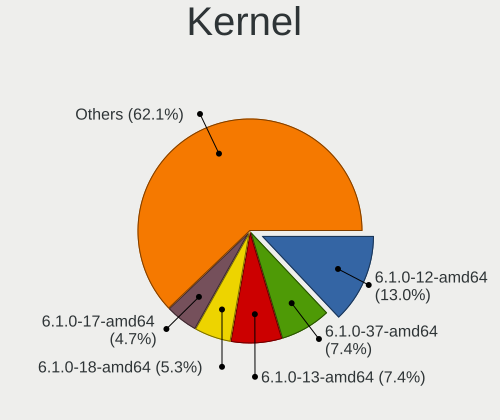

| Version                | Notebooks | Percent |
|------------------------|-----------|---------|
| 6.1.0-12-amd64         | 63        | 12.96%  |
| 6.1.0-37-amd64         | 36        | 7.41%   |
| 6.1.0-13-amd64         | 36        | 7.41%   |
| 6.1.0-18-amd64         | 26        | 5.35%   |
| 6.1.0-17-amd64         | 23        | 4.73%   |
| 6.1.0-28-amd64         | 20        | 4.12%   |
| 6.1.0-31-amd64         | 19        | 3.91%   |
| 6.1.0-30-amd64         | 19        | 3.91%   |
| 6.1.0-26-amd64         | 17        | 3.5%    |
| 6.1.0-23-amd64         | 17        | 3.5%    |
| 6.1.0-25-amd64         | 15        | 3.09%   |
| 6.1.0-21-amd64         | 15        | 3.09%   |
| 6.1.0-32-amd64         | 13        | 2.67%   |
| 6.1.0-40-amd64         | 12        | 2.47%   |
| 6.1.0-34-amd64         | 12        | 2.47%   |
| 6.1.0-16-amd64         | 11        | 2.26%   |
| 6.1.0-33-amd64         | 10        | 2.06%   |
| 6.1.0-12-686           | 10        | 2.06%   |
| 6.1.0-38-amd64         | 8         | 1.65%   |
| 6.1.0-20-amd64         | 7         | 1.44%   |
| 6.1.0-39-amd64         | 6         | 1.23%   |
| 6.1.0-27-amd64         | 5         | 1.03%   |
| 6.1.0-22-amd64         | 5         | 1.03%   |
| 6.12.12+bpo-amd64      | 4         | 0.82%   |
| 6.1.0-29-amd64         | 3         | 0.62%   |
| 6.1.0-28-686           | 3         | 0.62%   |
| 6.1.0-27-686           | 3         | 0.62%   |
| 6.1.0-20-686           | 3         | 0.62%   |
| 6.1.0-18-686           | 3         | 0.62%   |
| 6.9.5-1-liquorix-amd64 | 2         | 0.41%   |
| 6.5.0-0.deb12.4-amd64  | 2         | 0.41%   |
| 6.12.9+bpo-amd64       | 2         | 0.41%   |
| 6.12.33+deb12-amd64    | 2         | 0.41%   |
| 6.12.32+bpo-amd64      | 2         | 0.41%   |
| 6.12.22+bpo-amd64      | 2         | 0.41%   |
| 6.11.5+bpo-amd64       | 2         | 0.41%   |
| 6.1.0-41-amd64         | 2         | 0.41%   |
| 6.1.0-37-686           | 2         | 0.41%   |
| 6.1.0-31-686           | 2         | 0.41%   |
| 6.1.0-26-686           | 2         | 0.41%   |

Kernel Family
-------------

Linux kernel without a distro release

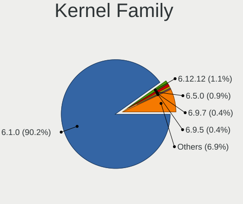

| Version | Notebooks | Percent |
|---------|-----------|---------|
| 6.1.0   | 403       | 90.16%  |
| 6.12.12 | 5         | 1.12%   |
| 6.5.0   | 4         | 0.89%   |
| 6.9.7   | 2         | 0.45%   |
| 6.9.5   | 2         | 0.45%   |
| 6.6.13  | 2         | 0.45%   |
| 6.14.0  | 2         | 0.45%   |
| 6.12.9  | 2         | 0.45%   |
| 6.12.33 | 2         | 0.45%   |
| 6.12.32 | 2         | 0.45%   |
| 6.12.22 | 2         | 0.45%   |
| 6.11.5  | 2         | 0.45%   |
| 5.10.0  | 2         | 0.45%   |
| 6.9.10  | 1         | 0.22%   |
| 6.6.2   | 1         | 0.22%   |
| 6.6.15  | 1         | 0.22%   |
| 6.6.10  | 1         | 0.22%   |
| 6.5.11  | 1         | 0.22%   |
| 6.5.10  | 1         | 0.22%   |
| 6.4.0   | 1         | 0.22%   |
| 6.12.6  | 1         | 0.22%   |
| 6.12.57 | 1         | 0.22%   |
| 6.12.43 | 1         | 0.22%   |
| 6.12.10 | 1         | 0.22%   |
| 6.11.10 | 1         | 0.22%   |
| 6.10.6  | 1         | 0.22%   |
| 6.10.11 | 1         | 0.22%   |
| 6.1.139 | 1         | 0.22%   |

Kernel Major Ver.
-----------------

Linux kernel major version

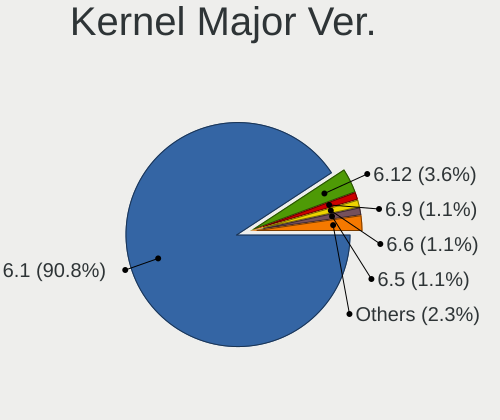

| Version | Notebooks | Percent |
|---------|-----------|---------|
| 6.1     | 403       | 90.77%  |
| 6.12    | 16        | 3.6%    |
| 6.9     | 5         | 1.13%   |
| 6.6     | 5         | 1.13%   |
| 6.5     | 5         | 1.13%   |
| 6.11    | 3         | 0.68%   |
| 6.14    | 2         | 0.45%   |
| 6.10    | 2         | 0.45%   |
| 5.10    | 2         | 0.45%   |
| 6.4     | 1         | 0.23%   |

Arch
----

OS architecture (x86_64, i586, etc.)

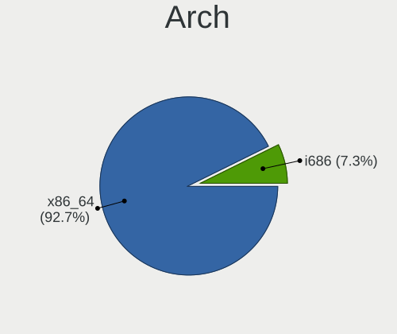

| Name   | Notebooks | Percent |
|--------|-----------|---------|
| x86_64 | 407       | 92.71%  |
| i686   | 32        | 7.29%   |

DE
--

Desktop Environment

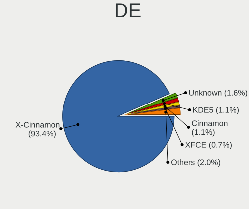

| Name       | Notebooks | Percent |
|------------|-----------|---------|
| X-Cinnamon | 412       | 93.42%  |
| Unknown    | 7         | 1.59%   |
| KDE5       | 5         | 1.13%   |
| Cinnamon   | 5         | 1.13%   |
| XFCE       | 3         | 0.68%   |
| MATE       | 3         | 0.68%   |
| LXDE       | 3         | 0.68%   |
| GNOME      | 3         | 0.68%   |

Display Server
--------------

X11 or Wayland

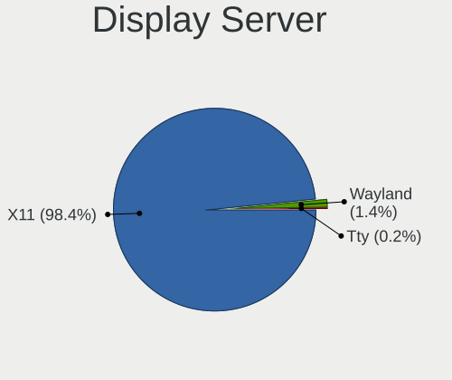

| Name    | Notebooks | Percent |
|---------|-----------|---------|
| X11     | 432       | 98.41%  |
| Wayland | 6         | 1.37%   |
| Tty     | 1         | 0.23%   |

Display Manager
---------------

SDDM, LightDM, etc.

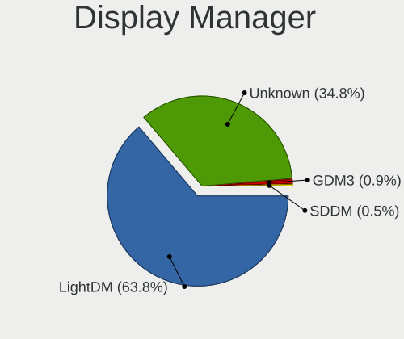

| Name    | Notebooks | Percent |
|---------|-----------|---------|
| LightDM | 282       | 63.8%   |
| Unknown | 154       | 34.84%  |
| GDM3    | 4         | 0.9%    |
| SDDM    | 2         | 0.45%   |

OS Lang
-------

Language

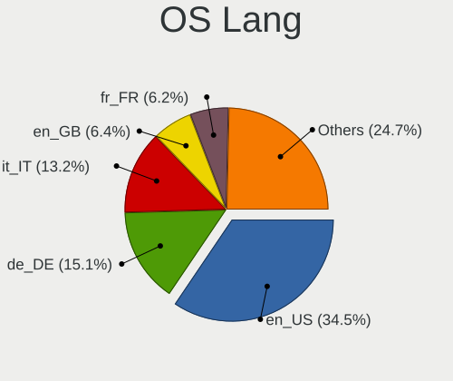

| Lang    | Notebooks | Percent |
|---------|-----------|---------|
| en_US   | 151       | 34.47%  |
| de_DE   | 66        | 15.07%  |
| it_IT   | 58        | 13.24%  |
| en_GB   | 28        | 6.39%   |
| fr_FR   | 27        | 6.16%   |
| ru_RU   | 13        | 2.97%   |
| pt_BR   | 13        | 2.97%   |
| es_ES   | 7         | 1.6%    |
| Unknown | 7         | 1.6%    |
| nl_NL   | 6         | 1.37%   |
| pl_PL   | 5         | 1.14%   |
| en_CA   | 5         | 1.14%   |
| sv_SE   | 4         | 0.91%   |
| ja_JP   | 4         | 0.91%   |
| cs_CZ   | 4         | 0.91%   |
| tr_TR   | 2         | 0.46%   |
| ro_RO   | 2         | 0.46%   |
| nl_BE   | 2         | 0.46%   |
| hu_HU   | 2         | 0.46%   |
| es_DO   | 2         | 0.46%   |
| es_BO   | 2         | 0.46%   |
| es_AR   | 2         | 0.46%   |
| en_IN   | 2         | 0.46%   |
| en_AU   | 2         | 0.46%   |
| de_AT   | 2         | 0.46%   |
| pt_PT   | 1         | 0.23%   |
| nn_NO   | 1         | 0.23%   |
| it_CH   | 1         | 0.23%   |
| fr_CH   | 1         | 0.23%   |
| fr_CA   | 1         | 0.23%   |
| fr_BE   | 1         | 0.23%   |
| fi_FI   | 1         | 0.23%   |
| es_UY   | 1         | 0.23%   |
| es_PA   | 1         | 0.23%   |
| es_MX   | 1         | 0.23%   |
| es_HN   | 1         | 0.23%   |
| es_GT   | 1         | 0.23%   |
| es_EC   | 1         | 0.23%   |
| es_CR   | 1         | 0.23%   |
| en_ZA   | 1         | 0.23%   |

Boot Mode
---------

EFI or BIOS

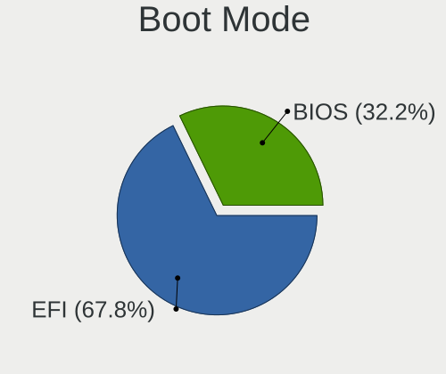

| Mode | Notebooks | Percent |
|------|-----------|---------|
| EFI  | 299       | 67.8%   |
| BIOS | 142       | 32.2%   |

Filesystem
----------

Type of filesystem

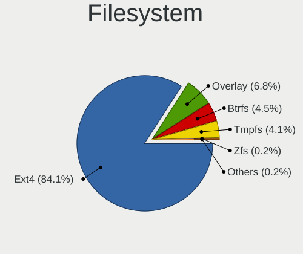

| Type    | Notebooks | Percent |
|---------|-----------|---------|
| Ext4    | 371       | 84.13%  |
| Overlay | 30        | 6.8%    |
| Btrfs   | 20        | 4.54%   |
| Tmpfs   | 18        | 4.08%   |
| Zfs     | 1         | 0.23%   |
| Xfs     | 1         | 0.23%   |

Part. scheme
------------

Scheme of partitioning

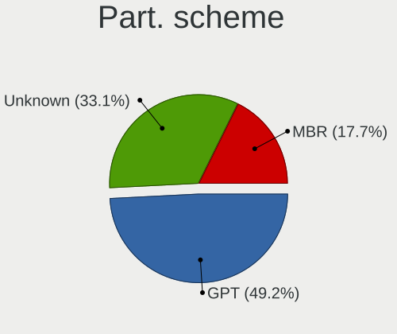

| Type    | Notebooks | Percent |
|---------|-----------|---------|
| GPT     | 217       | 49.21%  |
| Unknown | 146       | 33.11%  |
| MBR     | 78        | 17.69%  |

Dual Boot with Linux/BSD
------------------------

Hosting more than one Linux/BSD

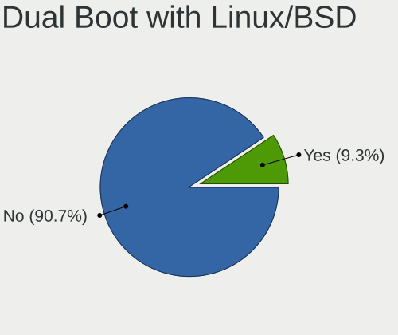

| Dual boot | Notebooks | Percent |
|-----------|-----------|---------|
| No        | 399       | 90.68%  |
| Yes       | 41        | 9.32%   |

Dual Boot (Win)
---------------

Hosting Linux and Windows

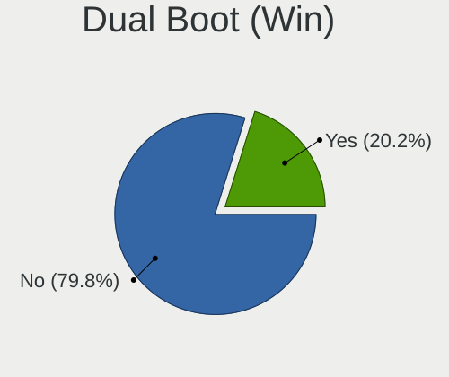

| Dual boot | Notebooks | Percent |
|-----------|-----------|---------|
| No        | 352       | 79.82%  |
| Yes       | 89        | 20.18%  |

Board
-----

Vendor
------

Motherboard manufacturer

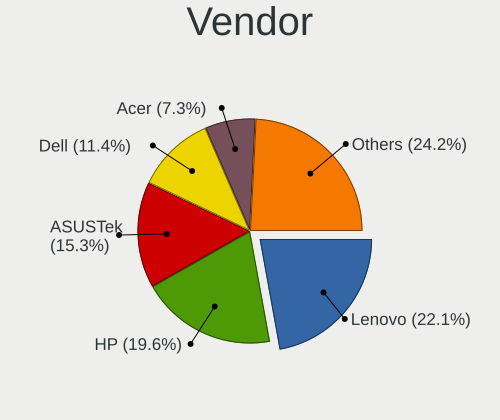

| Name                | Notebooks | Percent |
|---------------------|-----------|---------|
| Lenovo              | 97        | 22.15%  |
| Hewlett-Packard     | 86        | 19.63%  |
| ASUSTek Computer    | 67        | 15.3%   |
| Dell                | 50        | 11.42%  |
| Acer                | 32        | 7.31%   |
| Apple               | 18        | 4.11%   |
| Toshiba             | 11        | 2.51%   |
| Fujitsu             | 10        | 2.28%   |
| Samsung Electronics | 7         | 1.6%    |
| MSI                 | 6         | 1.37%   |
| HUAWEI              | 6         | 1.37%   |
| Notebook            | 5         | 1.14%   |
| Sony                | 4         | 0.91%   |
| Unknown             | 4         | 0.91%   |
| Fujitsu Siemens     | 3         | 0.68%   |
| TUXEDO              | 2         | 0.46%   |
| Packard Bell        | 2         | 0.46%   |
| Medion              | 2         | 0.46%   |
| Google              | 2         | 0.46%   |
| Framework           | 2         | 0.46%   |
| Alienware           | 2         | 0.46%   |
| Valve               | 1         | 0.23%   |
| VALE                | 1         | 0.23%   |
| TongFang            | 1         | 0.23%   |
| Timi                | 1         | 0.23%   |
| Schenker            | 1         | 0.23%   |
| Panasonic           | 1         | 0.23%   |
| Monster             | 1         | 0.23%   |
| Maibenben           | 1         | 0.23%   |
| LG Electronics      | 1         | 0.23%   |
| LETSUNG             | 1         | 0.23%   |
| Irbis               | 1         | 0.23%   |
| Insyde              | 1         | 0.23%   |
| Infinix             | 1         | 0.23%   |
| IBM                 | 1         | 0.23%   |
| Dynabook            | 1         | 0.23%   |
| DEXP                | 1         | 0.23%   |
| Conectar Igualdad   | 1         | 0.23%   |
| Clevo               | 1         | 0.23%   |
| Chuwi               | 1         | 0.23%   |

Model
-----

Motherboard model

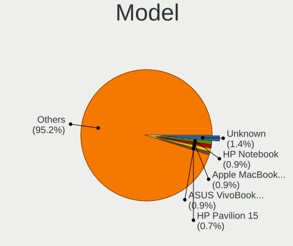

| Name                                     | Notebooks | Percent |
|------------------------------------------|-----------|---------|
| Unknown                                  | 6         | 1.37%   |
| HP Notebook                              | 4         | 0.91%   |
| ASUS VivoBook_ASUSLaptop X1605VA_X1605VA | 4         | 0.91%   |
| Apple MacBookAir7,2                      | 4         | 0.91%   |
| HP Pavilion 15                           | 3         | 0.68%   |
| HP Laptop 15-dw1xxx                      | 3         | 0.68%   |
| Apple MacBookAir6,2                      | 3         | 0.68%   |
| Notebook W65_67SZ                        | 2         | 0.46%   |
| Lenovo IdeaPad 3 15IML05 82BS            | 2         | 0.46%   |
| HUAWEI NBLK-WAX9X                        | 2         | 0.46%   |
| HUAWEI CREM-WXX9                         | 2         | 0.46%   |
| HP Pavilion dv6                          | 2         | 0.46%   |
| HP Laptop 15-dy2xxx                      | 2         | 0.46%   |
| HP EliteBook 8470p                       | 2         | 0.46%   |
| HP EliteBook 845 G8 Notebook PC          | 2         | 0.46%   |
| HP EliteBook 8440p                       | 2         | 0.46%   |
| HP 15                                    | 2         | 0.46%   |
| Dell XPS 13 9360                         | 2         | 0.46%   |
| Dell System Vostro 3750                  | 2         | 0.46%   |
| Dell Latitude E6430                      | 2         | 0.46%   |
| ASUS Zenbook UX3402ZA_UX3402ZA           | 2         | 0.46%   |
| ASUS Zenbook 15 UM3504DA_UM3504DA        | 2         | 0.46%   |
| ASUS X551CA                              | 2         | 0.46%   |
| Apple MacBookPro5,1                      | 2         | 0.46%   |
| Acer Aspire ES1-533                      | 2         | 0.46%   |
| Acer Aspire E5-575                       | 2         | 0.46%   |
| Valve Jupiter                            | 1         | 0.23%   |
| VALE Notebook Classic C171V              | 1         | 0.23%   |
| TUXEDO Pulse 14 Gen1                     | 1         | 0.23%   |
| TUXEDO InfinityBook S Gen8               | 1         | 0.23%   |
| Toshiba TECRA X40-D                      | 1         | 0.23%   |
| Toshiba Satellite Pro L100               | 1         | 0.23%   |
| Toshiba Satellite Pro C850-1DQ           | 1         | 0.23%   |
| Toshiba Satellite P200                   | 1         | 0.23%   |
| Toshiba Satellite P105                   | 1         | 0.23%   |
| Toshiba Satellite M70                    | 1         | 0.23%   |
| Toshiba Satellite M100                   | 1         | 0.23%   |
| Toshiba Satellite L745                   | 1         | 0.23%   |
| Toshiba Satellite L50D-B                 | 1         | 0.23%   |
| Toshiba Satellite C55-C                  | 1         | 0.23%   |

Model Family
------------

Motherboard model prefix

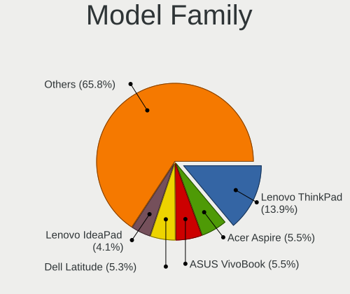

| Name                  | Notebooks | Percent |
|-----------------------|-----------|---------|
| Lenovo ThinkPad       | 61        | 13.93%  |
| ASUS VivoBook         | 24        | 5.48%   |
| Acer Aspire           | 24        | 5.48%   |
| Dell Latitude         | 23        | 5.25%   |
| Lenovo IdeaPad        | 18        | 4.11%   |
| HP EliteBook          | 17        | 3.88%   |
| HP Pavilion           | 16        | 3.65%   |
| HP Laptop             | 14        | 3.2%    |
| Dell Inspiron         | 11        | 2.51%   |
| Toshiba Satellite     | 10        | 2.28%   |
| HP ProBook            | 9         | 2.05%   |
| Fujitsu LIFEBOOK      | 8         | 1.83%   |
| HP ENVY               | 6         | 1.37%   |
| Dell Precision        | 6         | 1.37%   |
| ASUS Zenbook          | 6         | 1.37%   |
| Unknown               | 6         | 1.37%   |
| HP Compaq             | 5         | 1.14%   |
| Dell XPS              | 5         | 1.14%   |
| Apple MacBookAir7     | 5         | 1.14%   |
| Lenovo Yoga           | 4         | 0.91%   |
| HP Notebook           | 4         | 0.91%   |
| ASUS ASUS             | 4         | 0.91%   |
| Lenovo V15            | 3         | 0.68%   |
| ASUS TUF              | 3         | 0.68%   |
| Apple MacBookAir6     | 3         | 0.68%   |
| Acer Predator         | 3         | 0.68%   |
| Packard Bell EasyNote | 2         | 0.46%   |
| Notebook W65          | 2         | 0.46%   |
| Lenovo Legion         | 2         | 0.46%   |
| HUAWEI NBLK-WAX9X     | 2         | 0.46%   |
| HUAWEI CREM-WXX9      | 2         | 0.46%   |
| HP 255                | 2         | 0.46%   |
| HP 250                | 2         | 0.46%   |
| HP 15                 | 2         | 0.46%   |
| Fujitsu Siemens AMILO | 2         | 0.46%   |
| Framework Laptop      | 2         | 0.46%   |
| Dell Vostro           | 2         | 0.46%   |
| Dell System           | 2         | 0.46%   |
| ASUS X551CA           | 2         | 0.46%   |
| ASUS ROG              | 2         | 0.46%   |

MFG Year
--------

Motherboard manufacture year

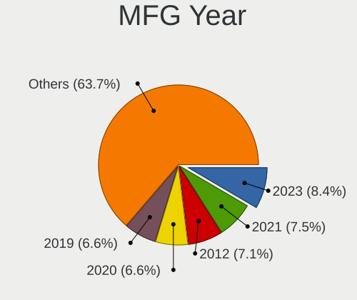

| Year    | Notebooks | Percent |
|---------|-----------|---------|
| 2023    | 37        | 8.45%   |
| 2021    | 33        | 7.53%   |
| 2012    | 31        | 7.08%   |
| 2020    | 29        | 6.62%   |
| 2019    | 29        | 6.62%   |
| 2013    | 28        | 6.39%   |
| 2011    | 28        | 6.39%   |
| 2022    | 26        | 5.94%   |
| 2018    | 25        | 5.71%   |
| 2015    | 22        | 5.02%   |
| 2016    | 21        | 4.79%   |
| 2017    | 20        | 4.57%   |
| 2008    | 18        | 4.11%   |
| 2014    | 17        | 3.88%   |
| 2010    | 17        | 3.88%   |
| 2024    | 15        | 3.42%   |
| 2009    | 14        | 3.2%    |
| 2006    | 14        | 3.2%    |
| 2007    | 9         | 2.05%   |
| 2005    | 2         | 0.46%   |
| Unknown | 2         | 0.46%   |
| 2003    | 1         | 0.23%   |

Form Factor
-----------

Physical design of the computer

| Name     | Notebooks | Percent |
|----------|-----------|---------|
| Notebook | 438       | 100%    |

Secure Boot
-----------

Enabled or disabled

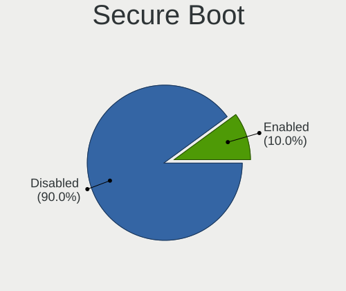

| State    | Notebooks | Percent |
|----------|-----------|---------|
| Disabled | 394       | 89.95%  |
| Enabled  | 44        | 10.05%  |

Coreboot
--------

Have coreboot on board

| Used | Notebooks | Percent |
|------|-----------|---------|
| No   | 435       | 99.32%  |
| Yes  | 3         | 0.68%   |

RAM Size
--------

Total RAM memory

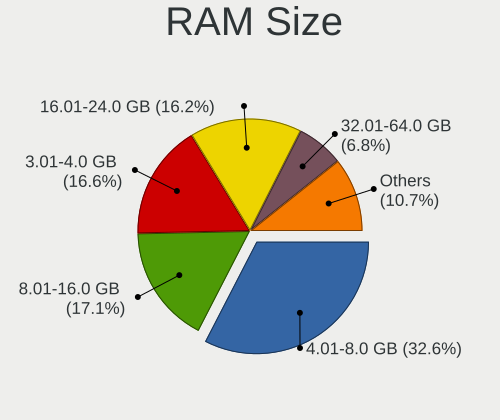

| Size in GB  | Notebooks | Percent |
|-------------|-----------|---------|
| 4.01-8.0    | 143       | 32.57%  |
| 8.01-16.0   | 75        | 17.08%  |
| 3.01-4.0    | 73        | 16.63%  |
| 16.01-24.0  | 71        | 16.17%  |
| 32.01-64.0  | 30        | 6.83%   |
| 2.01-3.0    | 14        | 3.19%   |
| 1.01-2.0    | 12        | 2.73%   |
| 64.01-256.0 | 11        | 2.51%   |
| 24.01-32.0  | 6         | 1.37%   |
| 0.51-1.0    | 4         | 0.91%   |

RAM Used
--------

Used RAM memory

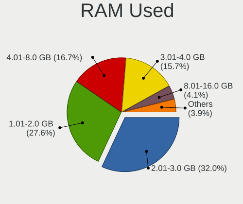

| Used GB    | Notebooks | Percent |
|------------|-----------|---------|
| 2.01-3.0   | 147       | 31.96%  |
| 1.01-2.0   | 127       | 27.61%  |
| 4.01-8.0   | 77        | 16.74%  |
| 3.01-4.0   | 72        | 15.65%  |
| 8.01-16.0  | 19        | 4.13%   |
| 0.51-1.0   | 13        | 2.83%   |
| 16.01-24.0 | 3         | 0.65%   |
| 0.01-0.5   | 2         | 0.43%   |

Total Drives
------------

Number of drives on board

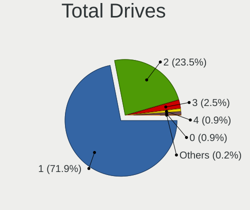

| Drives | Notebooks | Percent |
|--------|-----------|---------|
| 1      | 318       | 71.95%  |
| 2      | 104       | 23.53%  |
| 3      | 11        | 2.49%   |
| 4      | 4         | 0.9%    |
| 0      | 4         | 0.9%    |
| 5      | 1         | 0.23%   |

Has CD-ROM
----------

Has CD-ROM on board

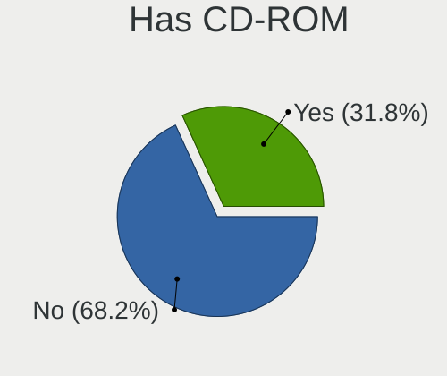

| Presented | Notebooks | Percent |
|-----------|-----------|---------|
| No        | 300       | 68.18%  |
| Yes       | 140       | 31.82%  |

Has Ethernet
------------

Has Ethernet on board

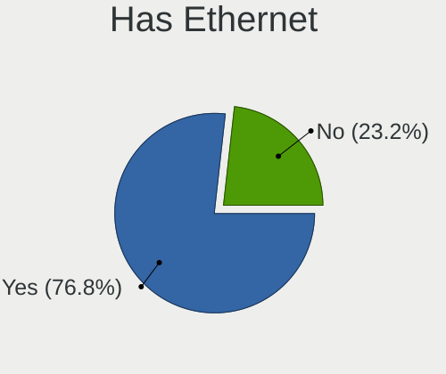

| Presented | Notebooks | Percent |
|-----------|-----------|---------|
| Yes       | 337       | 76.77%  |
| No        | 102       | 23.23%  |

Has WiFi
--------

Has WiFi module

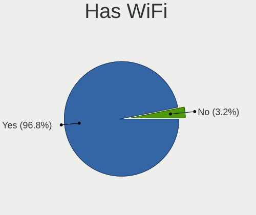

| Presented | Notebooks | Percent |
|-----------|-----------|---------|
| Yes       | 424       | 96.8%   |
| No        | 14        | 3.2%    |

Has Bluetooth
-------------

Has Bluetooth module

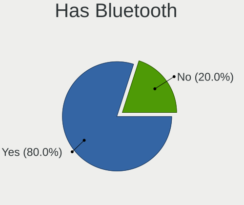

| Presented | Notebooks | Percent |
|-----------|-----------|---------|
| Yes       | 351       | 79.95%  |
| No        | 88        | 20.05%  |

Location
--------

Country
-------

Geographic location (country)

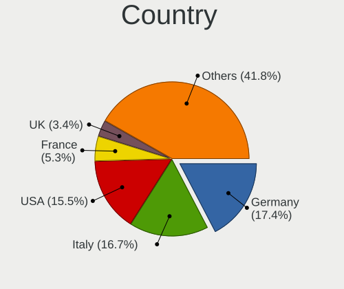

| Country            | Notebooks | Percent |
|--------------------|-----------|---------|
| Germany            | 76        | 17.35%  |
| Italy              | 73        | 16.67%  |
| USA                | 68        | 15.53%  |
| France             | 23        | 5.25%   |
| UK                 | 15        | 3.42%   |
| Russia             | 14        | 3.2%    |
| Brazil             | 14        | 3.2%    |
| Canada             | 11        | 2.51%   |
| Spain              | 10        | 2.28%   |
| Poland             | 10        | 2.28%   |
| Netherlands        | 10        | 2.28%   |
| Turkey             | 6         | 1.37%   |
| Sweden             | 6         | 1.37%   |
| Belgium            | 6         | 1.37%   |
| Austria            | 6         | 1.37%   |
| Switzerland        | 5         | 1.14%   |
| Japan              | 5         | 1.14%   |
| Romania            | 4         | 0.91%   |
| Mexico             | 4         | 0.91%   |
| Malaysia           | 4         | 0.91%   |
| India              | 4         | 0.91%   |
| Finland            | 4         | 0.91%   |
| Czechia            | 4         | 0.91%   |
| Australia          | 4         | 0.91%   |
| Argentina          | 4         | 0.91%   |
| Saudi Arabia       | 3         | 0.68%   |
| Hungary            | 3         | 0.68%   |
| Ukraine            | 2         | 0.46%   |
| Portugal           | 2         | 0.46%   |
| Norway             | 2         | 0.46%   |
| New Zealand        | 2         | 0.46%   |
| Indonesia          | 2         | 0.46%   |
| Dominican Republic | 2         | 0.46%   |
| Bulgaria           | 2         | 0.46%   |
| Bolivia            | 2         | 0.46%   |
| Uruguay            | 1         | 0.23%   |
| The Netherlands    | 1         | 0.23%   |
| Thailand           | 1         | 0.23%   |
| South Africa       | 1         | 0.23%   |
| Réunion           | 1         | 0.23%   |

City
----

Geographic location (city)

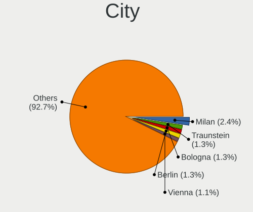

| City             | Notebooks | Percent |
|------------------|-----------|---------|
| Milan            | 11        | 2.37%   |
| Traunstein       | 6         | 1.29%   |
| Bologna          | 6         | 1.29%   |
| Berlin           | 6         | 1.29%   |
| Vienna           | 5         | 1.08%   |
| Rome             | 5         | 1.08%   |
| Milano           | 5         | 1.08%   |
| Paris            | 4         | 0.86%   |
| Florence         | 4         | 0.86%   |
| San Antonio      | 3         | 0.65%   |
| Mannheim         | 3         | 0.65%   |
| Malmo            | 3         | 0.65%   |
| Madrid           | 3         | 0.65%   |
| Los Angeles      | 3         | 0.65%   |
| Leipzig          | 3         | 0.65%   |
| Jacksonville     | 3         | 0.65%   |
| Cologne          | 3         | 0.65%   |
| Aalten           | 3         | 0.65%   |
| Yekaterinburg    | 2         | 0.43%   |
| Warsaw           | 2         | 0.43%   |
| Turin            | 2         | 0.43%   |
| Toronto          | 2         | 0.43%   |
| Tokyo            | 2         | 0.43%   |
| Sydney           | 2         | 0.43%   |
| Stuttgart        | 2         | 0.43%   |
| Sochi            | 2         | 0.43%   |
| Sesto Fiorentino | 2         | 0.43%   |
| Senden           | 2         | 0.43%   |
| Schweinfurt      | 2         | 0.43%   |
| Rennes           | 2         | 0.43%   |
| Râmnicu Vâlcea | 2         | 0.43%   |
| Pilsen           | 2         | 0.43%   |
| Oslo             | 2         | 0.43%   |
| Novara           | 2         | 0.43%   |
| Norderstedt      | 2         | 0.43%   |
| Moscow           | 2         | 0.43%   |
| Montreal         | 2         | 0.43%   |
| Mexico City      | 2         | 0.43%   |
| Marseille        | 2         | 0.43%   |
| Lucca            | 2         | 0.43%   |

Drives
------

Drive Vendor
------------

Hard drive vendors

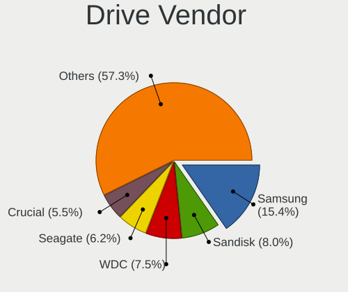

| Vendor                      | Notebooks | Drives | Percent |
|-----------------------------|-----------|--------|---------|
| Samsung Electronics         | 86        | 113    | 15.36%  |
| Sandisk                     | 45        | 53     | 8.04%   |
| WDC                         | 42        | 46     | 7.5%    |
| Seagate                     | 35        | 38     | 6.25%   |
| Crucial                     | 31        | 37     | 5.54%   |
| Unknown                     | 30        | 39     | 5.36%   |
| Kingston                    | 30        | 45     | 5.36%   |
| Toshiba                     | 25        | 25     | 4.46%   |
| SK hynix                    | 19        | 21     | 3.39%   |
| Micron Technology           | 18        | 18     | 3.21%   |
| Intel                       | 15        | 21     | 2.68%   |
| China                       | 14        | 15     | 2.5%    |
| Apple                       | 12        | 12     | 2.14%   |
| Hitachi                     | 11        | 11     | 1.96%   |
| HGST                        | 11        | 11     | 1.96%   |
| KIOXIA                      | 9         | 12     | 1.61%   |
| Transcend                   | 6         | 6      | 1.07%   |
| Intenso                     | 6         | 6      | 1.07%   |
| Fujitsu                     | 6         | 6      | 1.07%   |
| SPCC                        | 5         | 5      | 0.89%   |
| Phison Electronics          | 5         | 5      | 0.89%   |
| Micron/Crucial Technology   | 5         | 8      | 0.89%   |
| JMicron Technology          | 5         | 5      | 0.89%   |
| PNY                         | 4         | 4      | 0.71%   |
| Lexar                       | 4         | 4      | 0.71%   |
| Apacer                      | 4         | 8      | 0.71%   |
| A-DATA Technology           | 4         | 4      | 0.71%   |
| Unknown                     | 4         | 6      | 0.71%   |
| Verbatim                    | 3         | 4      | 0.54%   |
| Team                        | 3         | 3      | 0.54%   |
| Silicon Motion              | 3         | 3      | 0.54%   |
| SABRENT                     | 3         | 3      | 0.54%   |
| Phison                      | 3         | 3      | 0.54%   |
| Patriot                     | 3         | 3      | 0.54%   |
| MAXIO Technology (Hangzhou) | 3         | 3      | 0.54%   |
| Kingston Technology Company | 3         | 3      | 0.54%   |
| UMIS                        | 2         | 3      | 0.36%   |
| SSSTC                       | 2         | 2      | 0.36%   |
| SOLIDIGM                    | 2         | 2      | 0.36%   |
| Solid State Storage         | 2         | 2      | 0.36%   |

Drive Model
-----------

Hard drive models

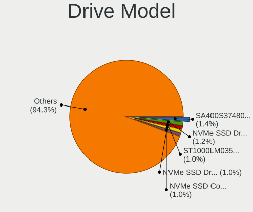

| Model                                              | Notebooks | Percent |
|----------------------------------------------------|-----------|---------|
| Kingston SA400S37480G 480GB SSD                    | 8         | 1.38%   |
| SanDisk NVMe SSD Drive 1TB                         | 7         | 1.21%   |
| Seagate ST1000LM035-1RK172 1TB                     | 6         | 1.04%   |
| SanDisk NVMe SSD Drive 512GB                       | 6         | 1.04%   |
| Samsung NVMe SSD Controller SM981/PM981/PM983 1TB  | 6         | 1.04%   |
| Unknown SD/MMC/MS PRO 2GB                          | 5         | 0.86%   |
| SanDisk NVMe SSD Drive 2TB                         | 5         | 0.86%   |
| Samsung MZVLQ1T0HALB-00000 1TB                     | 5         | 0.86%   |
| Kingston SA400S37240G 240GB SSD                    | 5         | 0.86%   |
| Crucial CT1000MX500SSD1 1TB                        | 5         | 0.86%   |
| Unknown MMC Card  64GB                             | 4         | 0.69%   |
| Unknown MMC Card  128GB                            | 4         | 0.69%   |
| Toshiba MQ01ABD100 1TB                             | 4         | 0.69%   |
| Sandisk WD Blue SN550 NVMe SSD 1024GB              | 4         | 0.69%   |
| JMicron Generic 320GB                              | 4         | 0.69%   |
| HGST HTS545050A7E680 500GB                         | 4         | 0.69%   |
| Crucial CT500MX500SSD1 500GB                       | 4         | 0.69%   |
| Apple SSD SM0128G 121GB                            | 4         | 0.69%   |
| Unknown                                            | 4         | 0.69%   |
| WDC WD10SPZX-24Z10 1TB                             | 3         | 0.52%   |
| WDC WD10JPVX-22JC3T0 1TB                           | 3         | 0.52%   |
| SK hynix BC711 HFM256GD3JX013N 256GB               | 3         | 0.52%   |
| Seagate ST9500325AS 500GB                          | 3         | 0.52%   |
| Seagate ST500LT012-1DG142 500GB                    | 3         | 0.52%   |
| Seagate ST500LM012 HN-M500MBB 500GB                | 3         | 0.52%   |
| Samsung SSD 990 PRO 1TB                            | 3         | 0.52%   |
| Samsung SSD 870 EVO 500GB                          | 3         | 0.52%   |
| Samsung SSD 860 EVO 500GB                          | 3         | 0.52%   |
| Samsung NVMe SSD Controller PM9A1/PM9A3/980PRO 1TB | 3         | 0.52%   |
| Samsung MZVL4512HBLU-00BTW 512GB                   | 3         | 0.52%   |
| SABRENT Disk 4TB                                   | 3         | 0.52%   |
| Kingston SUV400S37240G 240GB SSD                   | 3         | 0.52%   |
| Intel HBRPEKNX0202AH 512GB                         | 3         | 0.52%   |
| HGST HTS541010A9E680 1TB                           | 3         | 0.52%   |
| Crucial CT1000BX500SSD1 1TB                        | 3         | 0.52%   |
| China SSD 1TB                                      | 3         | 0.52%   |
| WDC WDS500G2B0A-00SM50 500GB                       | 2         | 0.35%   |
| WDC WD10SPZX-60Z10T0 1TB                           | 2         | 0.35%   |
| WDC PC SN730 SDBPNTY-512G                          | 2         | 0.35%   |
| Unknown SN128  128GB                               | 2         | 0.35%   |

HDD Vendor
----------

Hard disk drive vendors

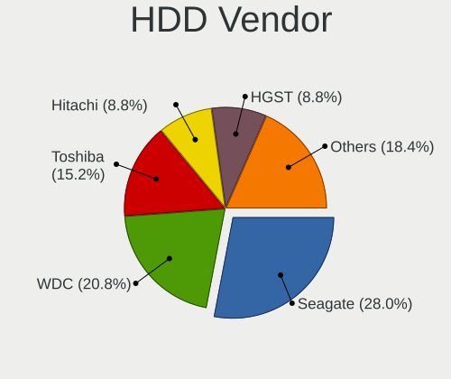

| Vendor              | Notebooks | Drives | Percent |
|---------------------|-----------|--------|---------|
| Seagate             | 35        | 38     | 28%     |
| WDC                 | 26        | 29     | 20.8%   |
| Toshiba             | 19        | 19     | 15.2%   |
| Hitachi             | 11        | 11     | 8.8%    |
| HGST                | 11        | 11     | 8.8%    |
| Fujitsu             | 6         | 6      | 4.8%    |
| Unknown             | 5         | 5      | 4%      |
| JMicron Technology  | 4         | 4      | 3.2%    |
| Samsung Electronics | 3         | 3      | 2.4%    |
| USB3.0              | 1         | 1      | 0.8%    |
| T-FORCE             | 1         | 1      | 0.8%    |
| Intenso             | 1         | 1      | 0.8%    |
| External            | 1         | 1      | 0.8%    |
| Apple               | 1         | 1      | 0.8%    |

SSD Vendor
----------

Solid state drive vendors

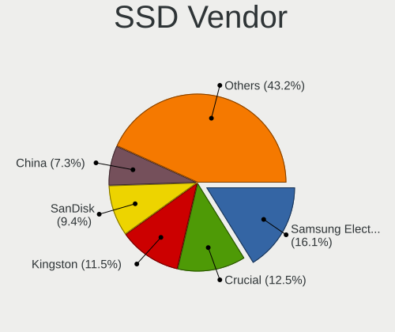

| Vendor              | Notebooks | Drives | Percent |
|---------------------|-----------|--------|---------|
| Samsung Electronics | 31        | 44     | 16.15%  |
| Crucial             | 24        | 30     | 12.5%   |
| Kingston            | 22        | 36     | 11.46%  |
| SanDisk             | 18        | 18     | 9.38%   |
| China               | 14        | 15     | 7.29%   |
| Apple               | 10        | 10     | 5.21%   |
| Transcend           | 6         | 6      | 3.13%   |
| WDC                 | 5         | 6      | 2.6%    |
| SPCC                | 5         | 5      | 2.6%    |
| Intenso             | 4         | 4      | 2.08%   |
| SABRENT             | 3         | 3      | 1.56%   |
| PNY                 | 3         | 3      | 1.56%   |
| Micron Technology   | 3         | 3      | 1.56%   |
| Intel               | 3         | 3      | 1.56%   |
| Apacer              | 3         | 7      | 1.56%   |
| A-DATA Technology   | 3         | 3      | 1.56%   |
| Verbatim            | 2         | 3      | 1.04%   |
| Team                | 2         | 2      | 1.04%   |
| SK hynix            | 2         | 2      | 1.04%   |
| Phison              | 2         | 2      | 1.04%   |
| Patriot             | 2         | 2      | 1.04%   |
| Lexar               | 2         | 2      | 1.04%   |
| Hewlett-Packard     | 2         | 2      | 1.04%   |
| GOODRAM             | 2         | 2      | 1.04%   |
| XrayDisk            | 1         | 1      | 0.52%   |
| Toshiba             | 1         | 1      | 0.52%   |
| Teclast             | 1         | 1      | 0.52%   |
| SSSTC               | 1         | 1      | 0.52%   |
| SD                  | 1         | 1      | 0.52%   |
| OCZ                 | 1         | 1      | 0.52%   |
| NT-512              | 1         | 1      | 0.52%   |
| MAXSUN              | 1         | 1      | 0.52%   |
| LITEON              | 1         | 1      | 0.52%   |
| KUU                 | 1         | 1      | 0.52%   |
| KingFast            | 1         | 1      | 0.52%   |
| Integral            | 1         | 1      | 0.52%   |
| HS-SSD-C100         | 1         | 1      | 0.52%   |
| Gigabyte Technology | 1         | 1      | 0.52%   |
| Gateway             | 1         | 1      | 0.52%   |
| Dogfish             | 1         | 1      | 0.52%   |

Drive Kind
----------

HDD or SSD

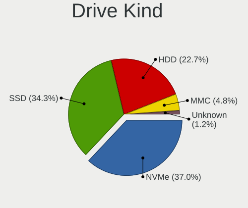

| Kind    | Notebooks | Drives | Percent |
|---------|-----------|--------|---------|
| NVMe    | 192       | 258    | 36.99%  |
| SSD     | 178       | 232    | 34.3%   |
| HDD     | 118       | 131    | 22.74%  |
| MMC     | 25        | 32     | 4.82%   |
| Unknown | 6         | 7      | 1.16%   |

Drive Connector
---------------

SATA, SAS, NVMe, etc.

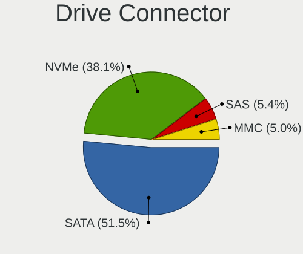

| Type | Notebooks | Drives | Percent |
|------|-----------|--------|---------|
| SATA | 258       | 340    | 51.5%   |
| NVMe | 191       | 253    | 38.12%  |
| SAS  | 27        | 35     | 5.39%   |
| MMC  | 25        | 32     | 4.99%   |

Drive Size
----------

Size of hard drive

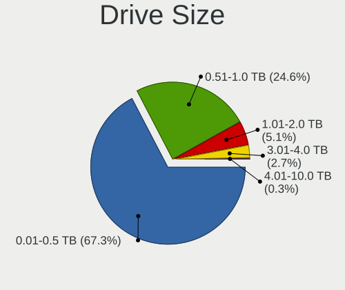

| Size in TB | Notebooks | Drives | Percent |
|------------|-----------|--------|---------|
| 0.01-0.5   | 200       | 250    | 67.34%  |
| 0.51-1.0   | 73        | 87     | 24.58%  |
| 1.01-2.0   | 15        | 16     | 5.05%   |
| 3.01-4.0   | 8         | 9      | 2.69%   |
| 4.01-10.0  | 1         | 1      | 0.34%   |

Space Total
-----------

Amount of disk space available on the file system

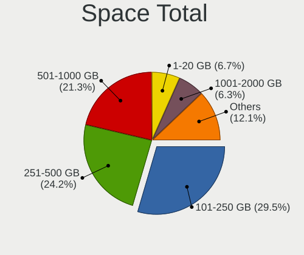

| Size in GB     | Notebooks | Percent |
|----------------|-----------|---------|
| 101-250        | 132       | 29.53%  |
| 251-500        | 108       | 24.16%  |
| 501-1000       | 95        | 21.25%  |
| 1-20           | 30        | 6.71%   |
| 1001-2000      | 28        | 6.26%   |
| 51-100         | 21        | 4.7%    |
| 21-50          | 10        | 2.24%   |
| More than 3000 | 9         | 2.01%   |
| 2001-3000      | 7         | 1.57%   |
| Unknown        | 7         | 1.57%   |

Space Used
----------

Amount of used disk space

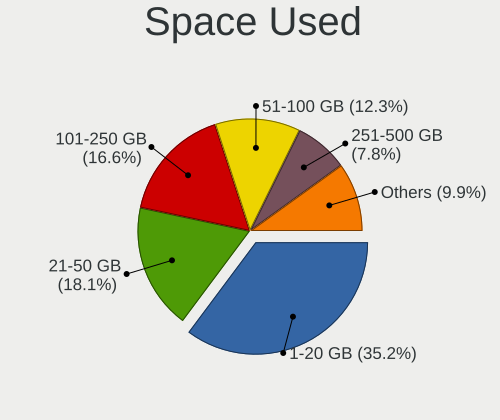

| Used GB        | Notebooks | Percent |
|----------------|-----------|---------|
| 1-20           | 163       | 35.21%  |
| 21-50          | 84        | 18.14%  |
| 101-250        | 77        | 16.63%  |
| 51-100         | 57        | 12.31%  |
| 251-500        | 36        | 7.78%   |
| 501-1000       | 23        | 4.97%   |
| 1001-2000      | 12        | 2.59%   |
| Unknown        | 7         | 1.51%   |
| More than 3000 | 2         | 0.43%   |
| 2001-3000      | 2         | 0.43%   |

Malfunc. Drives
---------------

Drive models with a malfunction

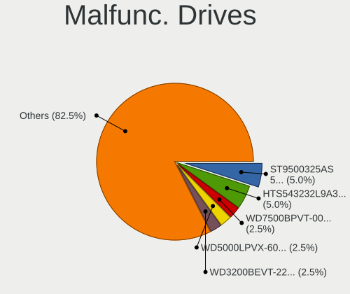

| Model                                        | Notebooks | Drives | Percent |
|----------------------------------------------|-----------|--------|---------|
| Seagate ST9500325AS 500GB                    | 2         | 2      | 5%      |
| Hitachi HTS543232L9A300 320GB                | 2         | 2      | 5%      |
| WDC WD7500BPVT-00HXZT3 752GB                 | 1         | 1      | 2.5%    |
| WDC WD5000LPVX-60V0TT0 500GB                 | 1         | 1      | 2.5%    |
| WDC WD3200BEVT-22A23T0 320GB                 | 1         | 1      | 2.5%    |
| WDC WD10SPZX-24Z10 1TB                       | 1         | 1      | 2.5%    |
| Unknown MMC Card  128GB                      | 1         | 1      | 2.5%    |
| Transcend TS512GMTS430S 512GB SSD            | 1         | 1      | 2.5%    |
| Toshiba MK1652GSX 160GB                      | 1         | 1      | 2.5%    |
| Toshiba MK1637GSX 160GB                      | 1         | 1      | 2.5%    |
| SSSTC CV8-8E128-HP 128GB SSD                 | 1         | 1      | 2.5%    |
| SK hynix HFS256G39TND-N210A 256GB SSD        | 1         | 1      | 2.5%    |
| SK hynix HFS060G32MNB-2000A 64GB SSD         | 1         | 1      | 2.5%    |
| Seagate ST910021AS 100GB                     | 1         | 1      | 2.5%    |
| Seagate ST500LM021-1KJ152 500GB              | 1         | 1      | 2.5%    |
| Seagate ST1000LM014-1EJ164 1TB               | 1         | 1      | 2.5%    |
| Samsung Electronics SSD 850 PRO 256GB        | 1         | 1      | 2.5%    |
| Samsung Electronics MZVL2512HCJQ-00BL2 512GB | 1         | 1      | 2.5%    |
| Samsung Electronics MZALQ256HBJD-00BL2 256GB | 1         | 1      | 2.5%    |
| Samsung Electronics HM251JI 250GB            | 1         | 1      | 2.5%    |
| Lexar SSD 480GB                              | 1         | 1      | 2.5%    |
| KUU SSD 512GB                                | 1         | 1      | 2.5%    |
| Kingston SUV400S37240G 240GB SSD             | 1         | 1      | 2.5%    |
| Kingston SA400S37240G 240GB SSD              | 1         | 1      | 2.5%    |
| Intel SSDSA2M080G2HP 80GB                    | 1         | 1      | 2.5%    |
| Hitachi HTS548080M9AT00 80GB                 | 1         | 1      | 2.5%    |
| Hitachi HTS541612J9SA00 120GB                | 1         | 1      | 2.5%    |
| Hitachi HCC543225A7A380 250GB                | 1         | 1      | 2.5%    |
| HGST HTS721010A9E630 1TB                     | 1         | 1      | 2.5%    |
| HGST HTS545050A7E680 500GB                   | 1         | 1      | 2.5%    |
| Fujitsu MHZ2320BH G2 320GB                   | 1         | 1      | 2.5%    |
| Fujitsu MHV2120BH PL 120GB                   | 1         | 1      | 2.5%    |
| Crucial CT525MX300SSD1 528GB                 | 1         | 2      | 2.5%    |
| Crucial CT1050MX300SSD1 1050GB               | 1         | 1      | 2.5%    |
| China SSD 360GB                              | 1         | 2      | 2.5%    |
| China SSD 240GB                              | 1         | 1      | 2.5%    |
| China SH00M256GB                             | 1         | 1      | 2.5%    |
| Apple SSD SM256C 256GB                       | 1         | 1      | 2.5%    |

Malfunc. Drive Vendor
---------------------

Vendors of faulty drives

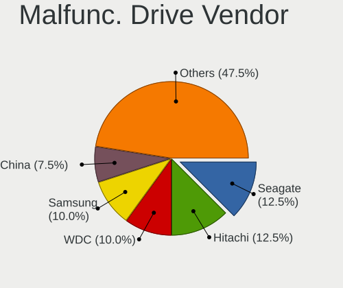

| Vendor              | Notebooks | Drives | Percent |
|---------------------|-----------|--------|---------|
| Seagate             | 5         | 5      | 12.5%   |
| Hitachi             | 5         | 5      | 12.5%   |
| WDC                 | 4         | 4      | 10%     |
| Samsung Electronics | 4         | 4      | 10%     |
| China               | 3         | 4      | 7.5%    |
| Toshiba             | 2         | 2      | 5%      |
| SK hynix            | 2         | 2      | 5%      |
| Kingston            | 2         | 2      | 5%      |
| HGST                | 2         | 2      | 5%      |
| Fujitsu             | 2         | 2      | 5%      |
| Crucial             | 2         | 3      | 5%      |
| Unknown             | 1         | 1      | 2.5%    |
| Transcend           | 1         | 1      | 2.5%    |
| SSSTC               | 1         | 1      | 2.5%    |
| Lexar               | 1         | 1      | 2.5%    |
| KUU                 | 1         | 1      | 2.5%    |
| Intel               | 1         | 1      | 2.5%    |
| Apple               | 1         | 1      | 2.5%    |

Malfunc. HDD Vendor
-------------------

Vendors of faulty HDD drives

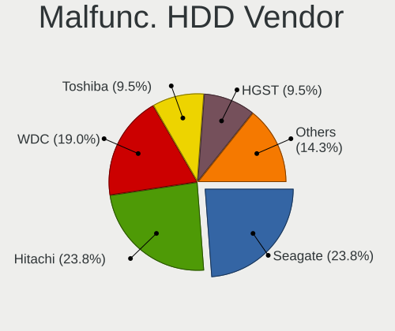

| Vendor              | Notebooks | Drives | Percent |
|---------------------|-----------|--------|---------|
| Seagate             | 5         | 5      | 23.81%  |
| Hitachi             | 5         | 5      | 23.81%  |
| WDC                 | 4         | 4      | 19.05%  |
| Toshiba             | 2         | 2      | 9.52%   |
| HGST                | 2         | 2      | 9.52%   |
| Fujitsu             | 2         | 2      | 9.52%   |
| Samsung Electronics | 1         | 1      | 4.76%   |

Malfunc. Drive Kind
-------------------

Kinds of faulty drives

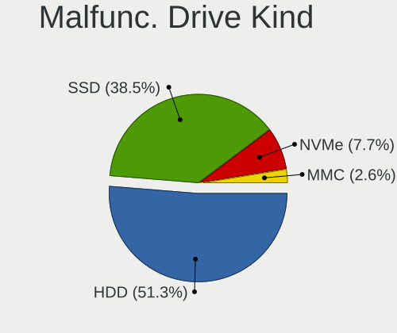

| Kind | Notebooks | Drives | Percent |
|------|-----------|--------|---------|
| HDD  | 20        | 21     | 51.28%  |
| SSD  | 15        | 17     | 38.46%  |
| NVMe | 3         | 3      | 7.69%   |
| MMC  | 1         | 1      | 2.56%   |

Failed Drives
-------------

Failed drive models

Zero info for selected period =(

Failed Drive Vendor
-------------------

Failed drive vendors

Zero info for selected period =(

Drive Status
------------

Number of failed and malfunc. drives

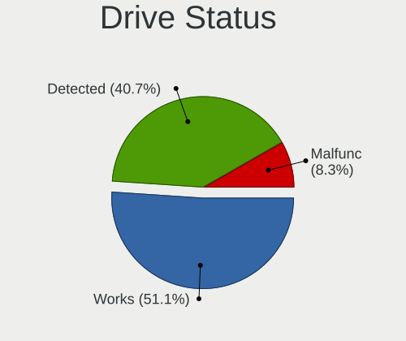

| Status   | Notebooks | Drives | Percent |
|----------|-----------|--------|---------|
| Works    | 241       | 312    | 51.06%  |
| Detected | 192       | 306    | 40.68%  |
| Malfunc  | 39        | 42     | 8.26%   |

Storage controller
------------------

Storage Vendor
--------------

Storage controller vendors

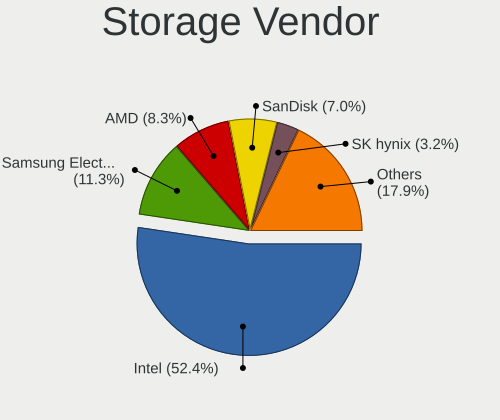

| Vendor                                  | Notebooks | Percent |
|-----------------------------------------|-----------|---------|
| Intel                                   | 278       | 52.35%  |
| Samsung Electronics                     | 60        | 11.3%   |
| AMD                                     | 44        | 8.29%   |
| SanDisk                                 | 37        | 6.97%   |
| SK hynix                                | 17        | 3.2%    |
| Micron Technology                       | 16        | 3.01%   |
| Micron/Crucial Technology               | 11        | 2.07%   |
| Kingston Technology Company             | 11        | 2.07%   |
| KIOXIA                                  | 9         | 1.69%   |
| Phison Electronics                      | 7         | 1.32%   |
| Toshiba America Info Systems            | 6         | 1.13%   |
| Silicon Motion                          | 5         | 0.94%   |
| Nvidia                                  | 5         | 0.94%   |
| Solidigm                                | 3         | 0.56%   |
| Solid State Storage Technology          | 3         | 0.56%   |
| MAXIO Technology (Hangzhou)             | 3         | 0.56%   |
| ADATA Technology                        | 3         | 0.56%   |
| Union Memory (Shenzhen)                 | 2         | 0.38%   |
| Shenzhen Longsys Electronics            | 2         | 0.38%   |
| Marvell Technology Group                | 2         | 0.38%   |
| TenaFe                                  | 1         | 0.19%   |
| Shenzhen Unionmemory Information System | 1         | 0.19%   |
| Netac Technology                        | 1         | 0.19%   |
| INNOGRIT                                | 1         | 0.19%   |
| Hosin Global Electronics                | 1         | 0.19%   |
| Apple                                   | 1         | 0.19%   |
| Unknown                                 | 1         | 0.19%   |

Storage Model
-------------

Storage controller models

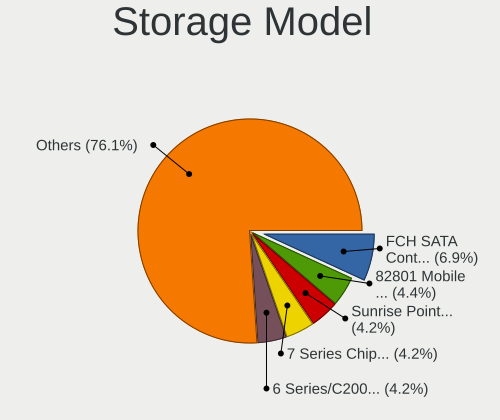

| Model                                                                            | Notebooks | Percent |
|----------------------------------------------------------------------------------|-----------|---------|
| AMD FCH SATA Controller [AHCI mode]                                              | 39        | 6.87%   |
| Intel 82801 Mobile SATA Controller [RAID mode]                                   | 25        | 4.4%    |
| Intel Sunrise Point-LP SATA Controller [AHCI mode]                               | 24        | 4.23%   |
| Intel 7 Series Chipset Family 6-port SATA Controller [AHCI mode]                 | 24        | 4.23%   |
| Intel 6 Series/C200 Series Chipset Family 6 port Mobile SATA AHCI Controller     | 24        | 4.23%   |
| Intel Volume Management Device NVMe RAID Controller                              | 22        | 3.87%   |
| Samsung NVMe SSD Controller SM981/PM981/PM983                                    | 19        | 3.35%   |
| Samsung NVMe SSD Controller 980 (DRAM-less)                                      | 14        | 2.46%   |
| Intel 8 Series SATA Controller 1 [AHCI mode]                                     | 14        | 2.46%   |
| Intel 8 Series/C220 Series Chipset Family 6-port SATA Controller 1 [AHCI mode]   | 13        | 2.29%   |
| Intel 82801IBM/IEM (ICH9M/ICH9M-E) 4 port SATA Controller [AHCI mode]            | 12        | 2.11%   |
| Intel 82801GBM/GHM (ICH7-M Family) SATA Controller [IDE mode]                    | 11        | 1.94%   |
| Intel Wildcat Point-LP SATA Controller [AHCI Mode]                               | 10        | 1.76%   |
| Samsung NVMe SSD Controller PM9B1 (DRAM-less)                                    | 9         | 1.58%   |
| SK hynix Gold P31/BC711/PC711 NVMe Solid State Drive                             | 8         | 1.41%   |
| Intel RST Volume Management Device Controller                                    | 8         | 1.41%   |
| Intel 82801HM/HEM (ICH8M/ICH8M-E) IDE Controller                                 | 8         | 1.41%   |
| Intel Celeron/Pentium Silver Processor SATA Controller                           | 7         | 1.23%   |
| Intel Alder Lake-P SATA AHCI Controller                                          | 7         | 1.23%   |
| SanDisk WD SN560/SN740/SN770/SN5000 NVMe SSD                                     | 6         | 1.06%   |
| SanDisk Ultra 3D / WD PC SN530, IX SN530, Blue SN550 NVMe SSD (DRAM-less)        | 6         | 1.06%   |
| SanDisk Extreme Pro / WD Black SN750 / PC SN730 / Red SN700 NVMe SSD             | 6         | 1.06%   |
| Samsung S4LN058A01[SSUBX] AHCI SSD Controller (Apple slot)                       | 6         | 1.06%   |
| Intel HM170/QM170 Chipset SATA Controller [AHCI Mode]                            | 6         | 1.06%   |
| Intel 82801HM/HEM (ICH8M/ICH8M-E) SATA Controller [AHCI mode]                    | 6         | 1.06%   |
| Intel 82801GBM/GHM (ICH7-M Family) SATA Controller [AHCI mode]                   | 6         | 1.06%   |
| Intel 5 Series/3400 Series Chipset 6 port SATA AHCI Controller                   | 6         | 1.06%   |
| Intel 5 Series/3400 Series Chipset 4 port SATA AHCI Controller                   | 6         | 1.06%   |
| Samsung NVMe SSD Controller SM961/PM961/SM963                                    | 5         | 0.88%   |
| Samsung NVMe SSD Controller S4LV008[Pascal]                                      | 5         | 0.88%   |
| Micron/Crucial P2 [Nick P2] / P3 / P3 Plus NVMe PCIe SSD (DRAM-less)             | 5         | 0.88%   |
| Micron 2450 NVMe SSD [HendrixV] (DRAM-less)                                      | 5         | 0.88%   |
| KIOXIA NVMe SSD Controller BG4 (DRAM-less)                                       | 5         | 0.88%   |
| Intel Tiger Lake-LP SATA Controller                                              | 5         | 0.88%   |
| Intel Atom/Celeron/Pentium Processor x5-E8000/J3xxx/N3xxx Series SATA Controller | 5         | 0.88%   |
| Intel 82801G (ICH7 Family) IDE Controller                                        | 5         | 0.88%   |
| Toshiba America Info Systems XG6 NVMe SSD Controller                             | 4         | 0.7%    |
| Silicon Motion SM2263EN/SM2263XT (DRAM-less) NVMe SSD Controllers                | 4         | 0.7%    |
| Samsung NVMe SSD Controller PM9A1/PM9A3/980PRO                                   | 4         | 0.7%    |
| Phison PS5013-E13 PCIe3 NVMe Controller (DRAM-less)                              | 4         | 0.7%    |

Storage Kind
------------

Kind of storage controller (IDE, SATA, NVMe, SAS, ...)

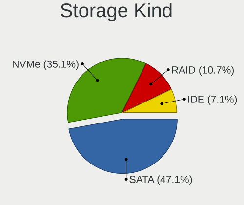

| Kind | Notebooks | Percent |
|------|-----------|---------|
| SATA | 252       | 47.1%   |
| NVMe | 188       | 35.14%  |
| RAID | 57        | 10.65%  |
| IDE  | 38        | 7.1%    |

Processor
---------

CPU Vendor
----------

Processor vendors

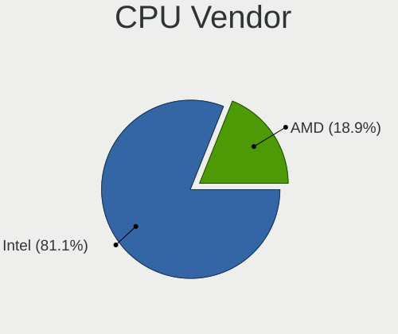

| Vendor | Notebooks | Percent |
|--------|-----------|---------|
| Intel  | 355       | 81.05%  |
| AMD    | 83        | 18.95%  |

CPU Model
---------

Processor models

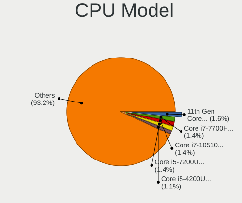

| Model                                   | Notebooks | Percent |
|-----------------------------------------|-----------|---------|
| Intel 11th Gen Core i3-1115G4 @ 3.00GHz | 7         | 1.59%   |
| Intel Core i7-7700HQ CPU @ 2.80GHz      | 6         | 1.37%   |
| Intel Core i7-10510U CPU @ 1.80GHz      | 6         | 1.37%   |
| Intel Core i5-7200U CPU @ 2.50GHz       | 6         | 1.37%   |
| Intel Core i5-4200U CPU @ 1.60GHz       | 5         | 1.14%   |
| Intel Core i5-3320M CPU @ 2.60GHz       | 5         | 1.14%   |
| Intel Core i5-3230M CPU @ 2.60GHz       | 5         | 1.14%   |
| Intel Core i7-8565U CPU @ 1.80GHz       | 4         | 0.91%   |
| Intel Core i7-7500U CPU @ 2.70GHz       | 4         | 0.91%   |
| Intel Core i5-8350U CPU @ 1.70GHz       | 4         | 0.91%   |
| Intel Core i5-6300U CPU @ 2.40GHz       | 4         | 0.91%   |
| Intel Core i5-5200U CPU @ 2.20GHz       | 4         | 0.91%   |
| Intel Core i5-2520M CPU @ 2.50GHz       | 4         | 0.91%   |
| Intel Core i5-2450M CPU @ 2.50GHz       | 4         | 0.91%   |
| Intel Celeron N4500 @ 1.10GHz           | 4         | 0.91%   |
| Intel 13th Gen Core i9-13900H           | 4         | 0.91%   |
| Intel 13th Gen Core i7-1355U            | 4         | 0.91%   |
| Intel 12th Gen Core i7-12700H           | 4         | 0.91%   |
| Intel 11th Gen Core i5-1135G7 @ 2.40GHz | 4         | 0.91%   |
| AMD Ryzen 7 5800H with Radeon Graphics  | 4         | 0.91%   |
| Intel Genuine CPU T2300 @ 1.66GHz       | 3         | 0.68%   |
| Intel Core i7-8650U CPU @ 1.90GHz       | 3         | 0.68%   |
| Intel Core i7-4810MQ CPU @ 2.80GHz      | 3         | 0.68%   |
| Intel Core i5-8265U CPU @ 1.60GHz       | 3         | 0.68%   |
| Intel Core i5-8250U CPU @ 1.60GHz       | 3         | 0.68%   |
| Intel Core i5-5250U CPU @ 1.60GHz       | 3         | 0.68%   |
| Intel Core i5-10210U CPU @ 1.60GHz      | 3         | 0.68%   |
| Intel Core i5 CPU M 560 @ 2.67GHz       | 3         | 0.68%   |
| Intel Core i3-2330M CPU @ 2.20GHz       | 3         | 0.68%   |
| Intel Core i3-10110U CPU @ 2.10GHz      | 3         | 0.68%   |
| Intel Core i3-1005G1 CPU @ 1.20GHz      | 3         | 0.68%   |
| Intel Core 2 Duo CPU T9400 @ 2.53GHz    | 3         | 0.68%   |
| Intel Atom CPU N270 @ 1.60GHz           | 3         | 0.68%   |
| Intel 12th Gen Core i5-1240P            | 3         | 0.68%   |
| Intel 12th Gen Core i5-1235U            | 3         | 0.68%   |
| Intel 12th Gen Core i3-1215U            | 3         | 0.68%   |
| Intel 11th Gen Core i7-1165G7 @ 2.80GHz | 3         | 0.68%   |
| Intel 11th Gen Core i5-11400H @ 2.70GHz | 3         | 0.68%   |
| AMD Ryzen 7 4800H with Radeon Graphics  | 3         | 0.68%   |
| AMD Ryzen 5 4500U with Radeon Graphics  | 3         | 0.68%   |

CPU Model Family
----------------

Processor model prefix

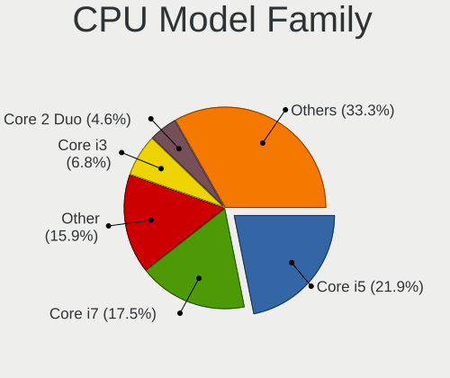

| Model                   | Notebooks | Percent |
|-------------------------|-----------|---------|
| Intel Core i5           | 96        | 21.87%  |
| Intel Core i7           | 77        | 17.54%  |
| Other                   | 70        | 15.95%  |
| Intel Core i3           | 30        | 6.83%   |
| Intel Core 2 Duo        | 20        | 4.56%   |
| AMD Ryzen 5             | 20        | 4.56%   |
| Intel Celeron           | 19        | 4.33%   |
| AMD Ryzen 7             | 19        | 4.33%   |
| Intel Genuine           | 11        | 2.51%   |
| Intel Atom              | 10        | 2.28%   |
| Intel Pentium           | 8         | 1.82%   |
| AMD Ryzen 7 PRO         | 6         | 1.37%   |
| AMD A6                  | 5         | 1.14%   |
| Intel Pentium M         | 4         | 0.91%   |
| AMD Ryzen 9             | 4         | 0.91%   |
| AMD A4                  | 4         | 0.91%   |
| Intel Pentium Silver    | 3         | 0.68%   |
| Intel Core Duo          | 3         | 0.68%   |
| Intel Core              | 3         | 0.68%   |
| AMD Ryzen 5 PRO         | 3         | 0.68%   |
| AMD Ryzen 3             | 3         | 0.68%   |
| AMD E2                  | 3         | 0.68%   |
| AMD A8                  | 3         | 0.68%   |
| Intel Pentium Dual-Core | 2         | 0.46%   |
| Intel Core i9           | 2         | 0.46%   |
| Intel Celeron M         | 2         | 0.46%   |
| AMD E1                  | 2         | 0.46%   |
| Intel Celeron Dual-Core | 1         | 0.23%   |
| AMD Sempron             | 1         | 0.23%   |
| AMD Phenom II           | 1         | 0.23%   |
| AMD E                   | 1         | 0.23%   |
| AMD Athlon 64 X2        | 1         | 0.23%   |
| AMD Athlon              | 1         | 0.23%   |
| AMD A10                 | 1         | 0.23%   |

CPU Cores
---------

Number of processor cores

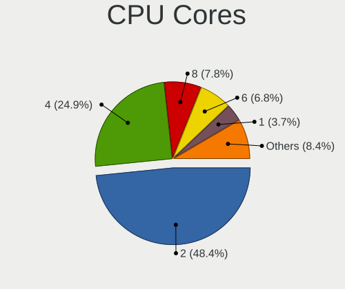

| Number | Notebooks | Percent |
|--------|-----------|---------|
| 2      | 212       | 48.4%   |
| 4      | 109       | 24.89%  |
| 8      | 34        | 7.76%   |
| 6      | 30        | 6.85%   |
| 1      | 16        | 3.65%   |
| 10     | 13        | 2.97%   |
| 12     | 12        | 2.74%   |
| 14     | 8         | 1.83%   |
| 16     | 2         | 0.46%   |
| 24     | 1         | 0.23%   |
| 3      | 1         | 0.23%   |

CPU Sockets
-----------

Number of sockets

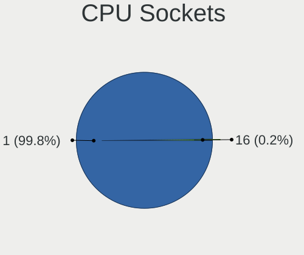

| Number | Notebooks | Percent |
|--------|-----------|---------|
| 1      | 437       | 99.77%  |
| 16     | 1         | 0.23%   |

CPU Threads
-----------

Threads per core (Hyper-Threading)

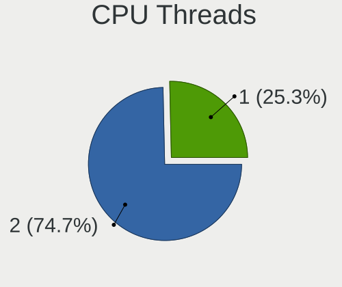

| Number | Notebooks | Percent |
|--------|-----------|---------|
| 2      | 327       | 74.66%  |
| 1      | 111       | 25.34%  |

CPU Op-Modes
------------

CPU Operation Modes (32-bit, 64-bit)

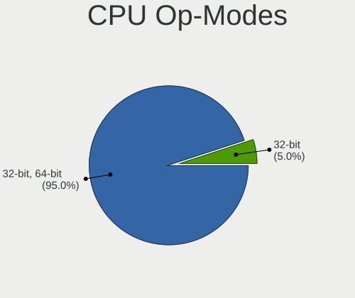

| Op mode        | Notebooks | Percent |
|----------------|-----------|---------|
| 32-bit, 64-bit | 416       | 94.98%  |
| 32-bit         | 22        | 5.02%   |

CPU Microcode
-------------

Microcode number

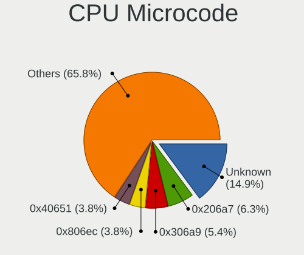

| Number     | Notebooks | Percent |
|------------|-----------|---------|
| Unknown    | 66        | 14.86%  |
| 0x206a7    | 28        | 6.31%   |
| 0x306a9    | 24        | 5.41%   |
| 0x806ec    | 17        | 3.83%   |
| 0x40651    | 17        | 3.83%   |
| 0x806c1    | 14        | 3.15%   |
| 0x306d4    | 14        | 3.15%   |
| 0x806e9    | 12        | 2.7%    |
| 0x306c3    | 12        | 2.7%    |
| 0x906a3    | 10        | 2.25%   |
| 0x806ea    | 10        | 2.25%   |
| 0x20655    | 10        | 2.25%   |
| 0x6e8      | 8         | 1.8%    |
| 0x1067a    | 8         | 1.8%    |
| 0xb06a3    | 7         | 1.58%   |
| 0x906e9    | 7         | 1.58%   |
| 0x906a4    | 7         | 1.58%   |
| 0x406e3    | 7         | 1.58%   |
| 0x806d1    | 6         | 1.35%   |
| 0x706e5    | 6         | 1.35%   |
| 0x706a8    | 6         | 1.35%   |
| 0x6fd      | 6         | 1.35%   |
| 0x6ec      | 6         | 1.35%   |
| 0x10676    | 6         | 1.35%   |
| 0xb06a2    | 5         | 1.13%   |
| 0xa0652    | 5         | 1.13%   |
| 0x30678    | 5         | 1.13%   |
| 0x0a50000c | 5         | 1.13%   |
| 0x08600106 | 5         | 1.13%   |
| 0x08108109 | 5         | 1.13%   |
| 0x906c0    | 4         | 0.9%    |
| 0x6d8      | 4         | 0.9%    |
| 0x106c2    | 4         | 0.9%    |
| 0x08108102 | 4         | 0.9%    |
| 0x506c9    | 3         | 0.68%   |
| 0x406c3    | 3         | 0.68%   |
| 0x20652    | 3         | 0.68%   |
| 0x106ca    | 3         | 0.68%   |
| 0x0a50000d | 3         | 0.68%   |
| 0x0a404102 | 3         | 0.68%   |

CPU Microarch
-------------

Microarchitecture

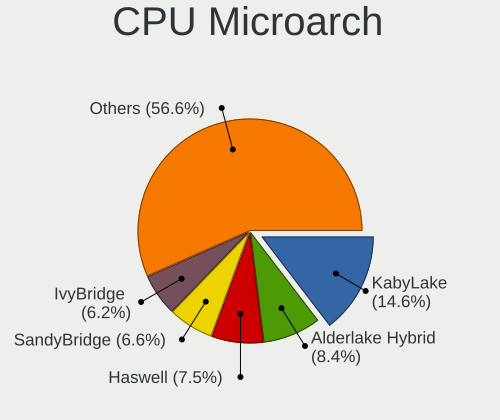

| Name             | Notebooks | Percent |
|------------------|-----------|---------|
| KabyLake         | 64        | 14.61%  |
| Alderlake Hybrid | 37        | 8.45%   |
| Haswell          | 33        | 7.53%   |
| SandyBridge      | 29        | 6.62%   |
| IvyBridge        | 27        | 6.16%   |
| Unknown          | 27        | 6.16%   |
| P6               | 19        | 4.34%   |
| TigerLake        | 18        | 4.11%   |
| Broadwell        | 17        | 3.88%   |
| Penryn           | 16        | 3.65%   |
| Zen 3            | 15        | 3.42%   |
| Westmere         | 14        | 3.2%    |
| Skylake          | 12        | 2.74%   |
| Icelake          | 12        | 2.74%   |
| Silvermont       | 11        | 2.51%   |
| Zen+             | 10        | 2.28%   |
| Zen 2            | 10        | 2.28%   |
| Core             | 9         | 2.05%   |
| Goldmont plus    | 8         | 1.83%   |
| Puma             | 7         | 1.6%    |
| Excavator        | 7         | 1.6%    |
| Bonnell          | 7         | 1.6%    |
| CometLake        | 5         | 1.14%   |
| Zen              | 4         | 0.91%   |
| Tremont          | 4         | 0.91%   |
| Piledriver       | 3         | 0.68%   |
| Gracemont        | 3         | 0.68%   |
| Goldmont         | 3         | 0.68%   |
| Jaguar           | 2         | 0.46%   |
| K8 Hammer        | 1         | 0.23%   |
| K8 & K10 hybrid  | 1         | 0.23%   |
| K10 Llano        | 1         | 0.23%   |
| K10              | 1         | 0.23%   |
| Bobcat           | 1         | 0.23%   |

Graphics
--------

GPU Vendor
----------

Vendors of graphics cards

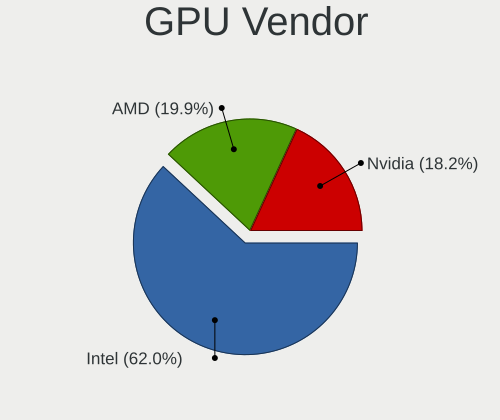

| Vendor | Notebooks | Percent |
|--------|-----------|---------|
| Intel  | 324       | 61.95%  |
| AMD    | 104       | 19.89%  |
| Nvidia | 95        | 18.16%  |

GPU Model
---------

Graphics card models

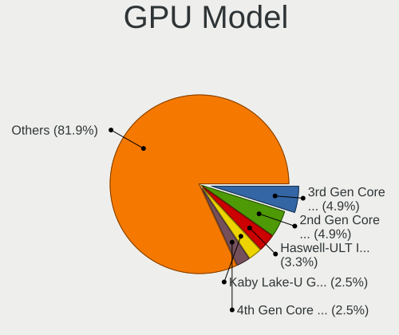

| Model                                                                                    | Notebooks | Percent |
|------------------------------------------------------------------------------------------|-----------|---------|
| Intel 3rd Gen Core processor Graphics Controller                                         | 27        | 4.89%   |
| Intel 2nd Generation Core Processor Family Integrated Graphics Controller                | 27        | 4.89%   |
| Intel Haswell-ULT Integrated Graphics Controller                                         | 18        | 3.26%   |
| Intel Kaby Lake-U GT2 [HD Graphics 620]                                                  | 14        | 2.54%   |
| Intel 4th Gen Core Processor Integrated Graphics Controller                              | 14        | 2.54%   |
| Intel Kaby Lake-R GT2 [UHD Graphics 620]                                                 | 13        | 2.36%   |
| Intel CometLake-U GT2 [UHD Graphics]                                                     | 13        | 2.36%   |
| Intel Raptor Lake-P [Iris Xe Graphics]                                                   | 12        | 2.17%   |
| Intel Core Processor Integrated Graphics Controller                                      | 11        | 1.99%   |
| Intel Broadwell-U GT2 [HD Graphics 5500]                                                 | 11        | 1.99%   |
| Intel Alder Lake-P GT2 [Iris Xe Graphics]                                                | 11        | 1.99%   |
| AMD Picasso/Raven 2 [Radeon Vega Series / Radeon Vega Mobile Series]                     | 11        | 1.99%   |
| Intel WhiskeyLake-U GT2 [UHD Graphics 620]                                               | 10        | 1.81%   |
| Intel TigerLake-LP GT2 [Iris Xe Graphics]                                                | 10        | 1.81%   |
| Intel Mobile 945GM/GMS/GME, 943/940GML Express Integrated Graphics Controller            | 10        | 1.81%   |
| AMD Renoir [Radeon Vega Series / Radeon Vega Mobile Series]                              | 10        | 1.81%   |
| AMD Cezanne [Radeon Vega Series / Radeon Vega Mobile Series]                             | 10        | 1.81%   |
| Intel Skylake-U GT2 [HD Graphics 520]                                                    | 9         | 1.63%   |
| Intel Mobile 945GM/GMS, 943/940GML Express Integrated Graphics Controller                | 8         | 1.45%   |
| AMD Rembrandt [Radeon 680M]                                                              | 8         | 1.45%   |
| Intel Tiger Lake-LP GT2 [UHD Graphics G4]                                                | 7         | 1.27%   |
| Intel Mobile 4 Series Chipset Integrated Graphics Controller                             | 7         | 1.27%   |
| Intel Mobile GM965/GL960 Integrated Graphics Controller (secondary)                      | 6         | 1.09%   |
| Intel Mobile GM965/GL960 Integrated Graphics Controller (primary)                        | 6         | 1.09%   |
| Intel CoffeeLake-H GT2 [UHD Graphics 630]                                                | 6         | 1.09%   |
| Intel Atom/Celeron/Pentium Processor x5-E8000/J3xxx/N3xxx Integrated Graphics Controller | 6         | 1.09%   |
| AMD Stoney [Radeon R2/R3/R4/R5 Graphics]                                                 | 6         | 1.09%   |
| Intel TigerLake-H GT1 [UHD Graphics]                                                     | 5         | 0.91%   |
| Intel Kaby Lake-H GT2 [HD Graphics 630]                                                  | 5         | 0.91%   |
| Intel Iris Plus Graphics G1 (Ice Lake)                                                   | 5         | 0.91%   |
| Intel GeminiLake [UHD Graphics 600]                                                      | 5         | 0.91%   |
| Intel Broadwell-U GT3 [HD Graphics 6000]                                                 | 5         | 0.91%   |
| Intel Atom Processor Z36xxx/Z37xxx Series Graphics & Display                             | 5         | 0.91%   |
| Intel Alder Lake-UP3 GT2 [Iris Xe Graphics]                                              | 5         | 0.91%   |
| Nvidia TU117M [GeForce GTX 1650 Mobile / Max-Q]                                          | 4         | 0.72%   |
| Intel JasperLake [UHD Graphics]                                                          | 4         | 0.72%   |
| Intel CometLake-H GT2 [UHD Graphics]                                                     | 4         | 0.72%   |
| AMD Sun XT [Radeon HD 8670A/8670M/8690M / R5 M330 / M430 / Radeon 520 Mobile]            | 4         | 0.72%   |
| AMD Mullins [Radeon R2 Graphics]                                                         | 4         | 0.72%   |
| AMD Barcelo                                                                              | 4         | 0.72%   |

GPU Combo
---------

Combinations of graphics cards

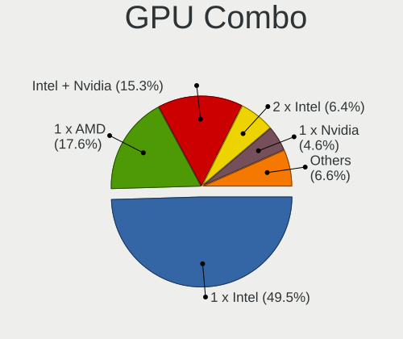

| Name           | Notebooks | Percent |
|----------------|-----------|---------|
| 1 x Intel      | 217       | 49.54%  |
| 1 x AMD        | 77        | 17.58%  |
| Intel + Nvidia | 67        | 15.3%   |
| 2 x Intel      | 28        | 6.39%   |
| 1 x Nvidia     | 20        | 4.57%   |
| Intel + AMD    | 12        | 2.74%   |
| 2 x AMD        | 9         | 2.05%   |
| AMD + Nvidia   | 6         | 1.37%   |
| 2 x Nvidia     | 2         | 0.46%   |

GPU Driver
----------

Free vs proprietary

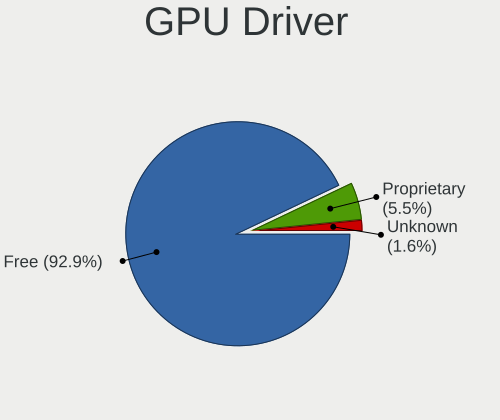

| Driver      | Notebooks | Percent |
|-------------|-----------|---------|
| Free        | 408       | 92.94%  |
| Proprietary | 24        | 5.47%   |
| Unknown     | 7         | 1.59%   |

GPU Memory
----------

Total video memory

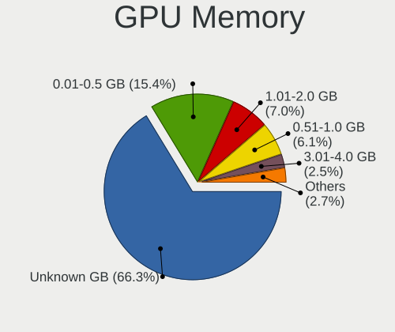

| Size in GB | Notebooks | Percent |
|------------|-----------|---------|
| Unknown    | 293       | 66.29%  |
| 0.01-0.5   | 68        | 15.38%  |
| 1.01-2.0   | 31        | 7.01%   |
| 0.51-1.0   | 27        | 6.11%   |
| 3.01-4.0   | 11        | 2.49%   |
| 5.01-6.0   | 8         | 1.81%   |
| 7.01-8.0   | 2         | 0.45%   |
| 2.01-3.0   | 1         | 0.23%   |
| 8.01-16.0  | 1         | 0.23%   |

Monitor
-------

Monitor Vendor
--------------

Monitor vendors

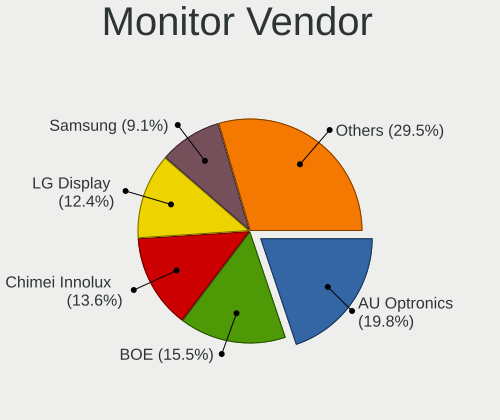

| Vendor                  | Notebooks | Percent |
|-------------------------|-----------|---------|
| AU Optronics            | 96        | 19.83%  |
| BOE                     | 75        | 15.5%   |
| Chimei Innolux          | 66        | 13.64%  |
| LG Display              | 60        | 12.4%   |
| Samsung Electronics     | 44        | 9.09%   |
| Apple                   | 17        | 3.51%   |
| Sharp                   | 9         | 1.86%   |
| Lenovo                  | 9         | 1.86%   |
| Chi Mei Optoelectronics | 9         | 1.86%   |
| LG Philips              | 8         | 1.65%   |
| Goldstar                | 7         | 1.45%   |
| Dell                    | 7         | 1.45%   |
| Iiyama                  | 6         | 1.24%   |
| Philips                 | 5         | 1.03%   |
| PANDA                   | 5         | 1.03%   |
| HannStar                | 5         | 1.03%   |
| Panasonic               | 4         | 0.83%   |
| CPT                     | 4         | 0.83%   |
| ASUSTek Computer        | 4         | 0.83%   |
| AOC                     | 4         | 0.83%   |
| Acer                    | 4         | 0.83%   |
| InfoVision              | 3         | 0.62%   |
| CSO                     | 3         | 0.62%   |
| STA                     | 2         | 0.41%   |
| Quanta Display          | 2         | 0.41%   |
| Mi                      | 2         | 0.41%   |
| InnoLux Display         | 2         | 0.41%   |
| HKC                     | 2         | 0.41%   |
| Hewlett-Packard         | 2         | 0.41%   |
| Eizo                    | 2         | 0.41%   |
| Valve                   | 1         | 0.21%   |
| Unknown                 | 1         | 0.21%   |
| Toshiba                 | 1         | 0.21%   |
| TMX                     | 1         | 0.21%   |
| Olevia                  | 1         | 0.21%   |
| MiTAC                   | 1         | 0.21%   |
| HUAWEI                  | 1         | 0.21%   |
| HJC                     | 1         | 0.21%   |
| GreenWood               | 1         | 0.21%   |
| Fujitsu Siemens         | 1         | 0.21%   |

Monitor Model
-------------

Monitor models

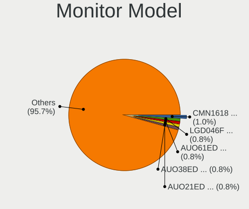

| Model                                                                    | Notebooks | Percent |
|--------------------------------------------------------------------------|-----------|---------|
| Chimei Innolux LCD Monitor CMN1618 1920x1200 344x215mm 16.0-inch         | 5         | 1.03%   |
| LG Display LCD Monitor LGD046F 1920x1080 344x194mm 15.5-inch             | 4         | 0.82%   |
| AU Optronics LCD Monitor AUO61ED 1920x1080 344x194mm 15.5-inch           | 4         | 0.82%   |
| AU Optronics LCD Monitor AUO38ED 1920x1080 344x193mm 15.5-inch           | 4         | 0.82%   |
| AU Optronics LCD Monitor AUO21ED 1920x1080 344x193mm 15.5-inch           | 4         | 0.82%   |
| Samsung Electronics LCD Monitor SEC5441 1280x800 331x207mm 15.4-inch     | 3         | 0.62%   |
| Samsung Electronics LCD Monitor SEC3047 1366x768 277x156mm 12.5-inch     | 3         | 0.62%   |
| Panasonic VVX11F009G00 MEI96A2 1920x1080 344x193mm 15.5-inch             | 3         | 0.62%   |
| HannStar LCD Monitor HSD03E9 1024x600 220x129mm 10.0-inch                | 3         | 0.62%   |
| Chimei Innolux LCD Monitor CMN15E7 1920x1080 344x193mm 15.5-inch         | 3         | 0.62%   |
| Chimei Innolux LCD Monitor CMN15C3 1920x1080 344x193mm 15.5-inch         | 3         | 0.62%   |
| Chimei Innolux LCD Monitor CMN1521 1920x1080 344x193mm 15.5-inch         | 3         | 0.62%   |
| Chimei Innolux LCD Monitor CMN14D4 1920x1080 309x173mm 13.9-inch         | 3         | 0.62%   |
| BOE LCD Monitor BOE0903 1920x1080 344x194mm 15.5-inch                    | 3         | 0.62%   |
| BOE LCD Monitor BOE069C 1920x1080 344x193mm 15.5-inch                    | 3         | 0.62%   |
| AU Optronics LCD Monitor AUO323D 1920x1080 309x174mm 14.0-inch           | 3         | 0.62%   |
| AU Optronics LCD Monitor AUO243D 1920x1080 309x173mm 13.9-inch           | 3         | 0.62%   |
| Apple Color LCD APPA01B 1440x900 286x179mm 13.3-inch                     | 3         | 0.62%   |
| Apple Color LCD APP9CF0 1440x900 290x180mm 13.4-inch                     | 3         | 0.62%   |
| Sharp LCD Monitor SHP1449 1920x1080 294x165mm 13.3-inch                  | 2         | 0.41%   |
| Samsung Electronics LCD Monitor SEC544B 1600x900 382x214mm 17.2-inch     | 2         | 0.41%   |
| Samsung Electronics LCD Monitor SEC3642 1366x768 344x194mm 15.5-inch     | 2         | 0.41%   |
| Samsung Electronics LCD Monitor SDC4651 1366x768 344x194mm 15.5-inch     | 2         | 0.41%   |
| PANDA LCD Monitor NCP0061 2560x1600 302x189mm 14.0-inch                  | 2         | 0.41%   |
| LG Display LCD Monitor LGD039F 1366x768 345x194mm 15.6-inch              | 2         | 0.41%   |
| LG Display LCD Monitor LGD038E 1366x768 344x194mm 15.5-inch              | 2         | 0.41%   |
| LG Display LCD Monitor LGD0303 1600x900 382x215mm 17.3-inch              | 2         | 0.41%   |
| LG Display LCD Monitor LGD02E3 1366x768 344x194mm 15.5-inch              | 2         | 0.41%   |
| LG Display LCD Monitor LGD02DC 1366x768 344x194mm 15.5-inch              | 2         | 0.41%   |
| Goldstar HDR 4K GSM7706 3840x2160 600x340mm 27.2-inch                    | 2         | 0.41%   |
| Chimei Innolux LCD Monitor CMN15F5 1920x1080 344x193mm 15.5-inch         | 2         | 0.41%   |
| Chimei Innolux LCD Monitor CMN15E6 1366x768 344x193mm 15.5-inch          | 2         | 0.41%   |
| Chimei Innolux LCD Monitor CMN15DC 1366x768 344x193mm 15.5-inch          | 2         | 0.41%   |
| Chimei Innolux LCD Monitor CMN15DB 1366x768 344x193mm 15.5-inch          | 2         | 0.41%   |
| Chimei Innolux LCD Monitor CMN15C4 1920x1080 344x193mm 15.5-inch         | 2         | 0.41%   |
| Chimei Innolux LCD Monitor CMN15BE 1366x768 344x193mm 15.5-inch          | 2         | 0.41%   |
| Chimei Innolux LCD Monitor CMN14D5 1920x1080 309x173mm 13.9-inch         | 2         | 0.41%   |
| Chi Mei Optoelectronics LCD Monitor CMO15A7 1366x768 344x193mm 15.5-inch | 2         | 0.41%   |
| BOE LCD Monitor BOE0B56 1920x1080 309x174mm 14.0-inch                    | 2         | 0.41%   |
| BOE LCD Monitor BOE0A9D 1920x1080 382x215mm 17.3-inch                    | 2         | 0.41%   |

Monitor Resolution
------------------

Monitor screen resolution

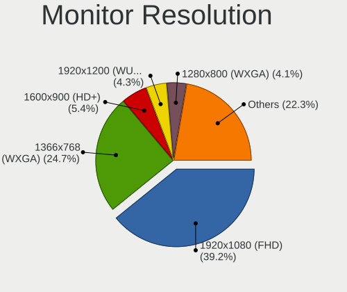

| Resolution         | Notebooks | Percent |
|--------------------|-----------|---------|
| 1920x1080 (FHD)    | 181       | 39.18%  |
| 1366x768 (WXGA)    | 114       | 24.68%  |
| 1600x900 (HD+)     | 25        | 5.41%   |
| 1920x1200 (WUXGA)  | 20        | 4.33%   |
| 1280x800 (WXGA)    | 19        | 4.11%   |
| 3840x2160 (4K)     | 18        | 3.9%    |
| 1440x900 (WXGA+)   | 18        | 3.9%    |
| 2560x1600          | 11        | 2.38%   |
| 2560x1440 (QHD)    | 10        | 2.16%   |
| 1680x1050 (WSXGA+) | 7         | 1.52%   |
| 3440x1440          | 4         | 0.87%   |
| 1024x768 (XGA)     | 4         | 0.87%   |
| 1024x600           | 4         | 0.87%   |
| 2880x1800          | 3         | 0.65%   |
| 2256x1504          | 3         | 0.65%   |
| 1280x1024 (SXGA)   | 3         | 0.65%   |
| 2560x1080          | 2         | 0.43%   |
| 2520x1680          | 2         | 0.43%   |
| 2160x1440          | 2         | 0.43%   |
| 800x1280           | 1         | 0.22%   |
| 3840x2400          | 1         | 0.22%   |
| 3200x2000          | 1         | 0.22%   |
| 2880x1620          | 1         | 0.22%   |
| 2240x1400          | 1         | 0.22%   |
| 2160x1350          | 1         | 0.22%   |
| 1920x1280          | 1         | 0.22%   |
| 1680x945           | 1         | 0.22%   |
| 1600x2560          | 1         | 0.22%   |
| 1400x1050          | 1         | 0.22%   |
| 1366x912           | 1         | 0.22%   |
| 1360x768           | 1         | 0.22%   |

Monitor Diagonal
----------------

Diagonal size in inches

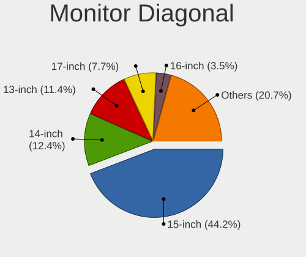

| Inches  | Notebooks | Percent |
|---------|-----------|---------|
| 15      | 213       | 44.19%  |
| 14      | 60        | 12.45%  |
| 13      | 55        | 11.41%  |
| 17      | 37        | 7.68%   |
| 16      | 17        | 3.53%   |
| 12      | 14        | 2.9%    |
| 27      | 12        | 2.49%   |
| 24      | 12        | 2.49%   |
| 23      | 9         | 1.87%   |
| 11      | 9         | 1.87%   |
| 31      | 8         | 1.66%   |
| 34      | 7         | 1.45%   |
| 21      | 7         | 1.45%   |
| 22      | 3         | 0.62%   |
| 19      | 3         | 0.62%   |
| 10      | 3         | 0.62%   |
| 42      | 2         | 0.41%   |
| Unknown | 2         | 0.41%   |
| 86      | 1         | 0.21%   |
| 84      | 1         | 0.21%   |
| 54      | 1         | 0.21%   |
| 48      | 1         | 0.21%   |
| 26      | 1         | 0.21%   |
| 25      | 1         | 0.21%   |
| 18      | 1         | 0.21%   |
| 8       | 1         | 0.21%   |
| 7       | 1         | 0.21%   |

Monitor Width
-------------

Physical width

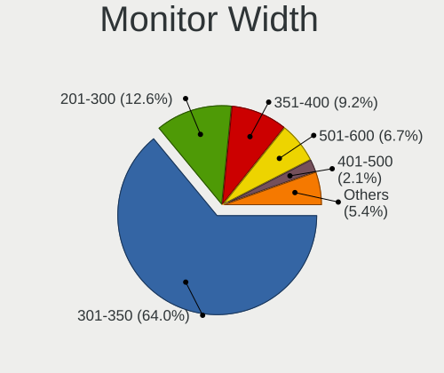

| Width in mm | Notebooks | Percent |
|-------------|-----------|---------|
| 301-350     | 306       | 64.02%  |
| 201-300     | 60        | 12.55%  |
| 351-400     | 44        | 9.21%   |
| 501-600     | 32        | 6.69%   |
| 401-500     | 10        | 2.09%   |
| 601-700     | 9         | 1.88%   |
| 701-800     | 7         | 1.46%   |
| 1001-1500   | 3         | 0.63%   |
| 901-1000    | 2         | 0.42%   |
| Unknown     | 2         | 0.42%   |
| 1501-2000   | 1         | 0.21%   |
| 101-200     | 1         | 0.21%   |
| 1-100       | 1         | 0.21%   |

Aspect Ratio
------------

Proportional relationship between the width and the height

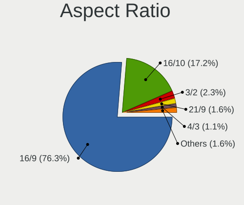

| Ratio   | Notebooks | Percent |
|---------|-----------|---------|
| 16/9    | 338       | 76.3%   |
| 16/10   | 76        | 17.16%  |
| 3/2     | 10        | 2.26%   |
| 21/9    | 7         | 1.58%   |
| 4/3     | 5         | 1.13%   |
| 5/4     | 3         | 0.68%   |
| 32/9    | 1         | 0.23%   |
| 0.67    | 1         | 0.23%   |
| 0.56    | 1         | 0.23%   |
| Unknown | 1         | 0.23%   |

Monitor Area
------------

Area in inch²

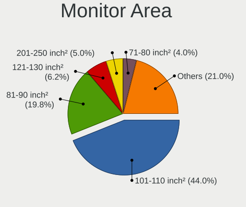

| Area in inch² | Notebooks | Percent |
|----------------|-----------|---------|
| 101-110        | 211       | 43.96%  |
| 81-90          | 95        | 19.79%  |
| 121-130        | 30        | 6.25%   |
| 201-250        | 24        | 5%      |
| 71-80          | 19        | 3.96%   |
| 111-120        | 18        | 3.75%   |
| 351-500        | 15        | 3.13%   |
| 61-70          | 13        | 2.71%   |
| 301-350        | 12        | 2.5%    |
| 51-60          | 9         | 1.88%   |
| 131-140        | 7         | 1.46%   |
| 251-300        | 5         | 1.04%   |
| 151-200        | 5         | 1.04%   |
| More than 1000 | 3         | 0.63%   |
| 41-50          | 3         | 0.63%   |
| 501-1000       | 3         | 0.63%   |
| 91-100         | 3         | 0.63%   |
| 1-40           | 2         | 0.42%   |
| Unknown        | 2         | 0.42%   |
| 141-150        | 1         | 0.21%   |

Pixel Density
-------------

Pixels per inch

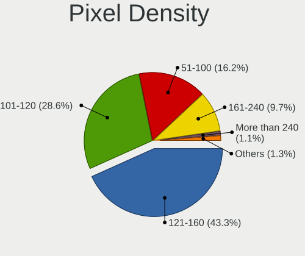

| Density       | Notebooks | Percent |
|---------------|-----------|---------|
| 121-160       | 206       | 43.28%  |
| 101-120       | 136       | 28.57%  |
| 51-100        | 77        | 16.18%  |
| 161-240       | 46        | 9.66%   |
| More than 240 | 5         | 1.05%   |
| 1-50          | 4         | 0.84%   |
| Unknown       | 2         | 0.42%   |

Multiple Monitors
-----------------

Total monitors connected

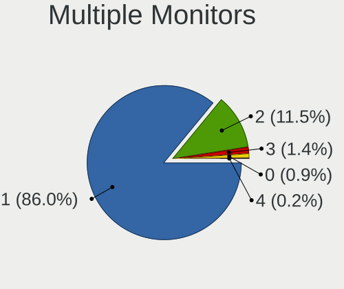

| Total | Notebooks | Percent |
|-------|-----------|---------|
| 1     | 380       | 85.97%  |
| 2     | 51        | 11.54%  |
| 3     | 6         | 1.36%   |
| 0     | 4         | 0.9%    |
| 4     | 1         | 0.23%   |

Network
-------

Net Controller Vendor
---------------------

Controller vendors

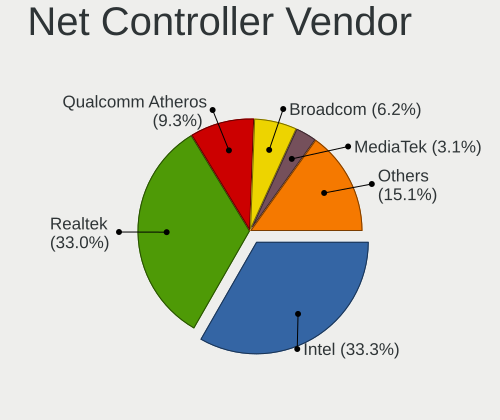

| Vendor                                 | Notebooks | Percent |
|----------------------------------------|-----------|---------|
| Intel                                  | 225       | 33.28%  |
| Realtek Semiconductor                  | 223       | 32.99%  |
| Qualcomm Atheros                       | 63        | 9.32%   |
| Broadcom                               | 42        | 6.21%   |
| MediaTek                               | 21        | 3.11%   |
| Broadcom Limited                       | 19        | 2.81%   |
| Ralink                                 | 9         | 1.33%   |
| ASIX Electronics                       | 9         | 1.33%   |
| Marvell Technology Group               | 8         | 1.18%   |
| TP-Link                                | 5         | 0.74%   |
| Sierra Wireless                        | 4         | 0.59%   |
| Samsung Electronics                    | 4         | 0.59%   |
| Ralink Technology                      | 4         | 0.59%   |
| Qualcomm                               | 4         | 0.59%   |
| Nvidia                                 | 4         | 0.59%   |
| Ericsson Business Mobile Networks      | 4         | 0.59%   |
| Dell                                   | 4         | 0.59%   |
| JMicron Technology                     | 3         | 0.44%   |
| Suzhou Motorcomm Electronic Technology | 2         | 0.3%    |
| QinHeng Electronics                    | 2         | 0.3%    |
| Lenovo                                 | 2         | 0.3%    |
| Hewlett-Packard                        | 2         | 0.3%    |
| D-Link System                          | 2         | 0.3%    |
| Winbond Electronics                    | 1         | 0.15%   |
| U-Blox                                 | 1         | 0.15%   |
| Shenzhen Goodix Technology             | 1         | 0.15%   |
| OPPO Electronics                       | 1         | 0.15%   |
| NetGear                                | 1         | 0.15%   |
| Huawei Technologies                    | 1         | 0.15%   |
| Edimax Technology                      | 1         | 0.15%   |
| DisplayLink                            | 1         | 0.15%   |
| Cisco Aironet Wireless Communications  | 1         | 0.15%   |
| AVM                                    | 1         | 0.15%   |
| AMD                                    | 1         | 0.15%   |

Net Controller Model
--------------------

Controller models

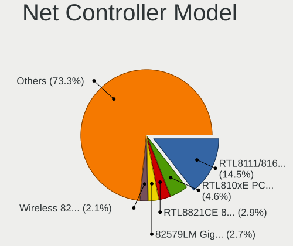

| Model                                                                  | Notebooks | Percent |
|------------------------------------------------------------------------|-----------|---------|
| Realtek RTL8111/8168/8211/8411 PCI Express Gigabit Ethernet Controller | 120       | 14.48%  |
| Realtek RTL810xE PCI Express Fast Ethernet controller                  | 38        | 4.58%   |
| Realtek RTL8821CE 802.11ac PCIe Wireless Network Adapter               | 24        | 2.9%    |
| Intel 82579LM Gigabit Network Connection (Lewisville)                  | 22        | 2.65%   |
| Intel Wireless 8265 / 8275                                             | 17        | 2.05%   |
| Intel Alder Lake-P PCH CNVi WiFi                                       | 17        | 2.05%   |
| Realtek RTL8822CE 802.11ac PCIe Wireless Network Adapter               | 15        | 1.81%   |
| Realtek RTL8153 Gigabit Ethernet Adapter                               | 15        | 1.81%   |
| Qualcomm Atheros QCA9377 802.11ac Wireless Network Adapter             | 13        | 1.57%   |
| Intel Centrino Advanced-N 6205 [Taylor Peak]                           | 13        | 1.57%   |
| Intel Wireless 7265                                                    | 12        | 1.45%   |
| Intel Wireless 7260                                                    | 12        | 1.45%   |
| Intel Wi-Fi 6 AX200                                                    | 12        | 1.45%   |
| Realtek RTL8852BE PCIe 802.11ax Wireless Network Controller            | 11        | 1.33%   |
| Qualcomm Atheros QCA9565 / AR9565 Wireless Network Adapter             | 10        | 1.21%   |
| Qualcomm Atheros AR9285 Wireless Network Adapter (PCI-Express)         | 10        | 1.21%   |
| Intel Wi-Fi 6 AX201                                                    | 10        | 1.21%   |
| Intel PRO/Wireless 3945ABG [Golan] Network Connection                  | 10        | 1.21%   |
| Realtek RTL8723BE PCIe Wireless Network Adapter                        | 9         | 1.09%   |
| Intel Raptor Lake PCH CNVi WiFi                                        | 9         | 1.09%   |
| Intel Comet Lake PCH-LP CNVi WiFi                                      | 9         | 1.09%   |
| MediaTek MT7902 802.11ax PCIe Wireless Network Adapter [Filogic 310]   | 8         | 0.97%   |
| Broadcom Limited BCM4360 802.11ac Dual Band Wireless Network Adapter   | 8         | 0.97%   |
| ASIX AX88179 Gigabit Ethernet                                          | 8         | 0.97%   |
| Qualcomm Atheros QCA6174 802.11ac Wireless Network Adapter             | 7         | 0.84%   |
| MediaTek MT7921 802.11ax PCIe Wireless Network Adapter [Filogic 330]   | 7         | 0.84%   |
| Intel Wireless 8260                                                    | 7         | 0.84%   |
| Intel Wi-Fi 6E(802.11ax) AX210/AX1675* 2x2 [Typhoon Peak]              | 7         | 0.84%   |
| Intel Ethernet Connection (4) I219-LM                                  | 7         | 0.84%   |
| Ralink RT3290 Wireless 802.11n 1T/1R PCIe                              | 6         | 0.72%   |
| Intel Ethernet Connection I219-LM                                      | 6         | 0.72%   |
| Intel Cannon Point-LP CNVi [Wireless-AC]                               | 6         | 0.72%   |
| Broadcom BCM4313 802.11bgn Wireless Network Adapter                    | 6         | 0.72%   |
| Qualcomm Atheros AR9485 Wireless Network Adapter                       | 5         | 0.6%    |
| Intel Tiger Lake PCH CNVi WiFi                                         | 5         | 0.6%    |
| Intel Ice Lake-LP PCH CNVi WiFi                                        | 5         | 0.6%    |
| Intel Ethernet Connection (6) I219-LM                                  | 5         | 0.6%    |
| Intel Comet Lake PCH CNVi WiFi                                         | 5         | 0.6%    |
| Intel Centrino Ultimate-N 6300                                         | 5         | 0.6%    |
| Broadcom NetLink BCM57785 Gigabit Ethernet PCIe                        | 5         | 0.6%    |

Wireless Vendor
---------------

Wireless vendors

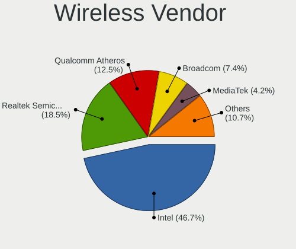

| Vendor                                | Notebooks | Percent |
|---------------------------------------|-----------|---------|
| Intel                                 | 209       | 46.65%  |
| Realtek Semiconductor                 | 83        | 18.53%  |
| Qualcomm Atheros                      | 56        | 12.5%   |
| Broadcom                              | 33        | 7.37%   |
| MediaTek                              | 19        | 4.24%   |
| Broadcom Limited                      | 14        | 3.13%   |
| Ralink                                | 9         | 2.01%   |
| TP-Link                               | 4         | 0.89%   |
| Sierra Wireless                       | 4         | 0.89%   |
| Ralink Technology                     | 4         | 0.89%   |
| Qualcomm                              | 4         | 0.89%   |
| Dell                                  | 2         | 0.45%   |
| D-Link System                         | 2         | 0.45%   |
| NetGear                               | 1         | 0.22%   |
| Hewlett-Packard                       | 1         | 0.22%   |
| Edimax Technology                     | 1         | 0.22%   |
| Cisco Aironet Wireless Communications | 1         | 0.22%   |
| AVM                                   | 1         | 0.22%   |

Wireless Model
--------------

Wireless models

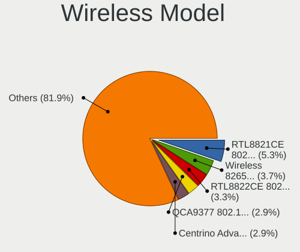

| Model                                                                | Notebooks | Percent |
|----------------------------------------------------------------------|-----------|---------|
| Realtek RTL8821CE 802.11ac PCIe Wireless Network Adapter             | 24        | 5.29%   |
| Intel Wireless 8265 / 8275                                           | 17        | 3.74%   |
| Realtek RTL8822CE 802.11ac PCIe Wireless Network Adapter             | 15        | 3.3%    |
| Qualcomm Atheros QCA9377 802.11ac Wireless Network Adapter           | 13        | 2.86%   |
| Intel Centrino Advanced-N 6205 [Taylor Peak]                         | 13        | 2.86%   |
| Intel Wireless 7265                                                  | 12        | 2.64%   |
| Intel Wireless 7260                                                  | 12        | 2.64%   |
| Intel Wi-Fi 6 AX200                                                  | 12        | 2.64%   |
| Intel Alder Lake-P PCH CNVi WiFi                                     | 12        | 2.64%   |
| Qualcomm Atheros QCA9565 / AR9565 Wireless Network Adapter           | 10        | 2.2%    |
| Qualcomm Atheros AR9285 Wireless Network Adapter (PCI-Express)       | 10        | 2.2%    |
| Intel Wi-Fi 6 AX201                                                  | 10        | 2.2%    |
| Intel PRO/Wireless 3945ABG [Golan] Network Connection                | 10        | 2.2%    |
| Realtek RTL8723BE PCIe Wireless Network Adapter                      | 9         | 1.98%   |
| Intel Raptor Lake PCH CNVi WiFi                                      | 9         | 1.98%   |
| Intel Comet Lake PCH-LP CNVi WiFi                                    | 9         | 1.98%   |
| Realtek RTL8852BE PCIe 802.11ax Wireless Network Controller          | 8         | 1.76%   |
| MediaTek MT7902 802.11ax PCIe Wireless Network Adapter [Filogic 310] | 8         | 1.76%   |
| Broadcom Limited BCM4360 802.11ac Dual Band Wireless Network Adapter | 8         | 1.76%   |
| Qualcomm Atheros QCA6174 802.11ac Wireless Network Adapter           | 7         | 1.54%   |
| MediaTek MT7921 802.11ax PCIe Wireless Network Adapter [Filogic 330] | 7         | 1.54%   |
| Intel Wireless 8260                                                  | 7         | 1.54%   |
| Intel Wi-Fi 6E(802.11ax) AX210/AX1675* 2x2 [Typhoon Peak]            | 7         | 1.54%   |
| Ralink RT3290 Wireless 802.11n 1T/1R PCIe                            | 6         | 1.32%   |
| Intel Cannon Point-LP CNVi [Wireless-AC]                             | 6         | 1.32%   |
| Broadcom BCM4313 802.11bgn Wireless Network Adapter                  | 6         | 1.32%   |
| Qualcomm Atheros AR9485 Wireless Network Adapter                     | 5         | 1.1%    |
| Intel Tiger Lake PCH CNVi WiFi                                       | 5         | 1.1%    |
| Intel Ice Lake-LP PCH CNVi WiFi                                      | 5         | 1.1%    |
| Intel Comet Lake PCH CNVi WiFi                                       | 5         | 1.1%    |
| Intel Centrino Ultimate-N 6300                                       | 5         | 1.1%    |
| Realtek RTL8852BE PCIe 802.11ax Wireless Network Controller [1T1R]   | 4         | 0.88%   |
| Realtek RTL8188EE Wireless Network Adapter                           | 4         | 0.88%   |
| Qualcomm Atheros AR9462 Wireless Network Adapter                     | 4         | 0.88%   |
| Intel Wireless 3160                                                  | 4         | 0.88%   |
| Intel WiFi Link 5100                                                 | 4         | 0.88%   |
| Intel PRO/Wireless 5100 AGN [Shiloh] Network Connection              | 4         | 0.88%   |
| Intel Centrino Wireless-N 1030 [Rainbow Peak]                        | 4         | 0.88%   |
| Intel Cannon Lake PCH CNVi WiFi                                      | 4         | 0.88%   |
| Broadcom BCM43224 802.11a/b/g/n                                      | 4         | 0.88%   |

Ethernet Vendor
---------------

Ethernet vendors

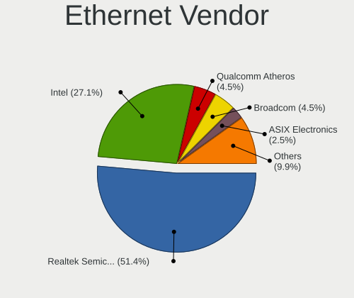

| Vendor                                 | Notebooks | Percent |
|----------------------------------------|-----------|---------|
| Realtek Semiconductor                  | 182       | 51.41%  |
| Intel                                  | 96        | 27.12%  |
| Qualcomm Atheros                       | 16        | 4.52%   |
| Broadcom                               | 16        | 4.52%   |
| ASIX Electronics                       | 9         | 2.54%   |
| Marvell Technology Group               | 8         | 2.26%   |
| Broadcom Limited                       | 5         | 1.41%   |
| Samsung Electronics                    | 4         | 1.13%   |
| Nvidia                                 | 4         | 1.13%   |
| JMicron Technology                     | 3         | 0.85%   |
| Suzhou Motorcomm Electronic Technology | 2         | 0.56%   |
| MediaTek                               | 2         | 0.56%   |
| Lenovo                                 | 2         | 0.56%   |
| TP-Link                                | 1         | 0.28%   |
| QinHeng Electronics                    | 1         | 0.28%   |
| OPPO Electronics                       | 1         | 0.28%   |
| Hewlett-Packard                        | 1         | 0.28%   |
| DisplayLink                            | 1         | 0.28%   |

Ethernet Model
--------------

Ethernet models

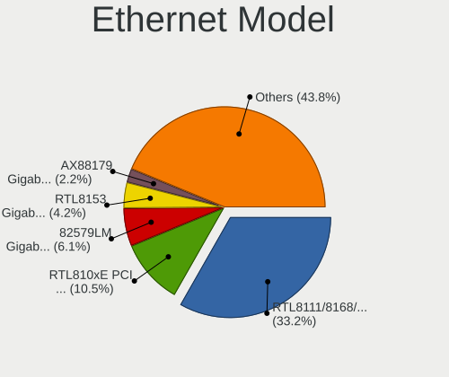

| Model                                                                  | Notebooks | Percent |
|------------------------------------------------------------------------|-----------|---------|
| Realtek RTL8111/8168/8211/8411 PCI Express Gigabit Ethernet Controller | 120       | 33.24%  |
| Realtek RTL810xE PCI Express Fast Ethernet controller                  | 38        | 10.53%  |
| Intel 82579LM Gigabit Network Connection (Lewisville)                  | 22        | 6.09%   |
| Realtek RTL8153 Gigabit Ethernet Adapter                               | 15        | 4.16%   |
| ASIX AX88179 Gigabit Ethernet                                          | 8         | 2.22%   |
| Intel Ethernet Connection (4) I219-LM                                  | 7         | 1.94%   |
| Intel Ethernet Connection I219-LM                                      | 6         | 1.66%   |
| Intel Ethernet Connection (6) I219-LM                                  | 5         | 1.39%   |
| Intel Alder Lake-P PCH CNVi WiFi                                       | 5         | 1.39%   |
| Broadcom NetLink BCM57785 Gigabit Ethernet PCIe                        | 5         | 1.39%   |
| Realtek RTL-8100/8101L/8139 PCI Fast Ethernet Adapter                  | 4         | 1.11%   |
| Nvidia MCP79 Ethernet                                                  | 4         | 1.11%   |
| Intel Ethernet Connection (3) I218-LM                                  | 4         | 1.11%   |
| Intel 82577LM Gigabit Network Connection                               | 4         | 1.11%   |
| Realtek RTL8852BE PCIe 802.11ax Wireless Network Controller            | 3         | 0.83%   |
| Qualcomm Atheros Killer E220x Gigabit Ethernet Controller              | 3         | 0.83%   |
| Qualcomm Atheros AR8132 Fast Ethernet                                  | 3         | 0.83%   |
| Marvell Group 88E8055 PCI-E Gigabit Ethernet Controller                | 3         | 0.83%   |
| Intel PRO/100 VE Network Connection                                    | 3         | 0.83%   |
| Intel Ethernet Connection I218-LM                                      | 3         | 0.83%   |
| Intel Ethernet Connection I217-LM                                      | 3         | 0.83%   |
| Intel Ethernet Connection (7) I219-LM                                  | 3         | 0.83%   |
| Intel Ethernet Connection (11) I219-LM                                 | 3         | 0.83%   |
| Intel 82567LM Gigabit Network Connection                               | 3         | 0.83%   |
| Broadcom NetXtreme BCM57765 Gigabit Ethernet PCIe                      | 3         | 0.83%   |
| Suzhou Motorcomm Electronic YT6801 Gigabit Ethernet Controller         | 2         | 0.55%   |
| Samsung GT-I9070 (network tethering, USB debugging enabled)            | 2         | 0.55%   |
| Samsung Galaxy series, misc. (tethering mode)                          | 2         | 0.55%   |
| Realtek RTL8152 Fast Ethernet Adapter                                  | 2         | 0.55%   |
| Realtek RTL8125 2.5GbE Controller                                      | 2         | 0.55%   |
| Qualcomm Atheros AR8151 v2.0 Gigabit Ethernet                          | 2         | 0.55%   |
| Qualcomm Atheros AR8131 Gigabit Ethernet                               | 2         | 0.55%   |
| Qualcomm Atheros AR8121/AR8113/AR8114 Gigabit or Fast Ethernet         | 2         | 0.55%   |
| JMicron JMC250 PCI Express Gigabit Ethernet Controller                 | 2         | 0.55%   |
| Intel Ethernet Connection (4) I219-V                                   | 2         | 0.55%   |
| Intel Ethernet Connection (23) I219-V                                  | 2         | 0.55%   |
| Intel Ethernet Connection (23) I219-LM                                 | 2         | 0.55%   |
| Intel Ethernet Connection (16) I219-LM                                 | 2         | 0.55%   |
| Intel Ethernet Connection (10) I219-V                                  | 2         | 0.55%   |
| Intel Ethernet Connection (10) I219-LM                                 | 2         | 0.55%   |

Net Controller Kind
-------------------

Ethernet, WiFi or modem

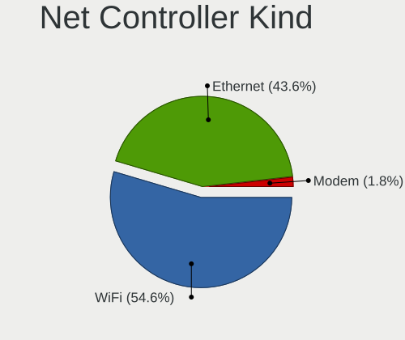

| Kind     | Notebooks | Percent |
|----------|-----------|---------|
| WiFi     | 423       | 54.58%  |
| Ethernet | 338       | 43.61%  |
| Modem    | 14        | 1.81%   |

Used Controller
---------------

Currently used network controller

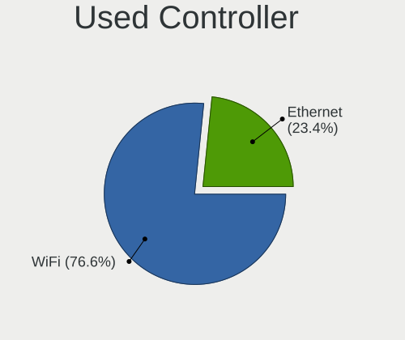

| Kind     | Notebooks | Percent |
|----------|-----------|---------|
| WiFi     | 357       | 76.61%  |
| Ethernet | 109       | 23.39%  |

NICs
----

Total network controllers on board

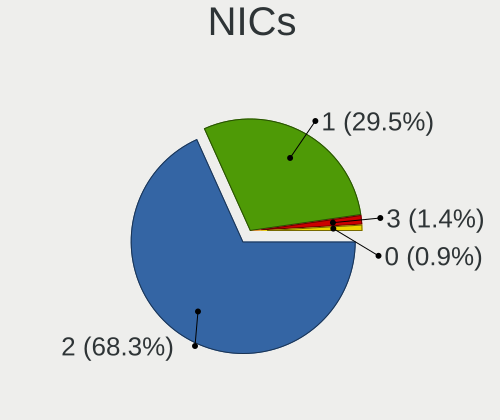

| Total | Notebooks | Percent |
|-------|-----------|---------|
| 2     | 299       | 68.26%  |
| 1     | 129       | 29.45%  |
| 3     | 6         | 1.37%   |
| 0     | 4         | 0.91%   |

IPv6
----

IPv6 vs IPv4

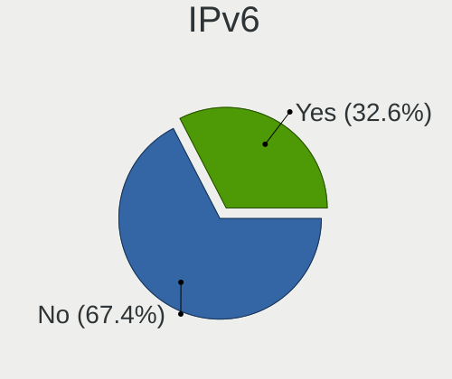

| Used | Notebooks | Percent |
|------|-----------|---------|
| No   | 300       | 67.42%  |
| Yes  | 145       | 32.58%  |

Bluetooth
---------

Bluetooth Vendor
----------------

Controller vendors

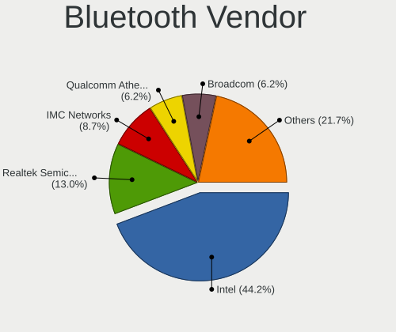

| Vendor                          | Notebooks | Percent |
|---------------------------------|-----------|---------|
| Intel                           | 157       | 44.23%  |
| Realtek Semiconductor           | 46        | 12.96%  |
| IMC Networks                    | 31        | 8.73%   |
| Qualcomm Atheros Communications | 22        | 6.2%    |
| Broadcom                        | 22        | 6.2%    |
| Apple                           | 17        | 4.79%   |
| Lite-On Technology              | 10        | 2.82%   |
| Foxconn / Hon Hai               | 9         | 2.54%   |
| Dell                            | 8         | 2.25%   |
| Hewlett-Packard                 | 7         | 1.97%   |
| Ralink                          | 6         | 1.69%   |
| Realtek                         | 5         | 1.41%   |
| ASUSTek Computer                | 4         | 1.13%   |
| Cambridge Silicon Radio         | 3         | 0.85%   |
| USI                             | 2         | 0.56%   |
| Toshiba                         | 2         | 0.56%   |
| Askey Computer                  | 2         | 0.56%   |
| MediaTek                        | 1         | 0.28%   |
| D-Link                          | 1         | 0.28%   |

Bluetooth Model
---------------

Controller models

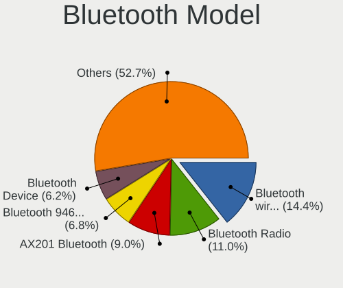

| Model                                               | Notebooks | Percent |
|-----------------------------------------------------|-----------|---------|
| Intel Bluetooth wireless interface                  | 51        | 14.37%  |
| Realtek Bluetooth Radio                             | 39        | 10.99%  |
| Intel AX201 Bluetooth                               | 32        | 9.01%   |
| Intel Bluetooth 9460/9560 Jefferson Peak (JfP)      | 24        | 6.76%   |
| Intel Bluetooth Device                              | 22        | 6.2%    |
| IMC Networks Wireless_Device                        | 12        | 3.38%   |
| IMC Networks Bluetooth Radio                        | 12        | 3.38%   |
| Intel AX200 Bluetooth                               | 11        | 3.1%    |
| Qualcomm Atheros  Bluetooth Device                  | 9         | 2.54%   |
| Apple Bluetooth USB Host Controller                 | 8         | 2.25%   |
| Apple Bluetooth Host Controller                     | 7         | 1.97%   |
| Realtek  Bluetooth 4.2 Adapter                      | 6         | 1.69%   |
| Ralink RT3290 Bluetooth                             | 6         | 1.69%   |
| Intel AX210 Bluetooth                               | 6         | 1.69%   |
| Dell DW375 Bluetooth Module                         | 6         | 1.69%   |
| Broadcom BCM20702 Bluetooth 4.0 [ThinkPad]          | 6         | 1.69%   |
| Realtek Bluetooth Radio                             | 5         | 1.41%   |
| Qualcomm Atheros QCA61x4 Bluetooth 4.0              | 5         | 1.41%   |
| Lite-On Qualcomm Atheros QCA9377 Bluetooth          | 5         | 1.41%   |
| Intel Centrino Advanced-N 6230 Bluetooth adapter    | 4         | 1.13%   |
| IMC Networks Bluetooth Device                       | 4         | 1.13%   |
| HP Bluetooth 2.0 Interface [Broadcom BCM2045]       | 4         | 1.13%   |
| Qualcomm Atheros AR3012 Bluetooth 4.0               | 3         | 0.85%   |
| Qualcomm Atheros AR3011 Bluetooth                   | 3         | 0.85%   |
| Intel Wireless-AC 9260 Bluetooth Adapter            | 3         | 0.85%   |
| HP Broadcom 2070 Bluetooth Combo                    | 3         | 0.85%   |
| Foxconn / Hon Hai Wireless_Device                   | 3         | 0.85%   |
| Foxconn / Hon Hai Bluetooth Device                  | 3         | 0.85%   |
| Cambridge Silicon Radio Bluetooth Dongle (HCI mode) | 3         | 0.85%   |
| Broadcom HP Portable SoftSailing                    | 3         | 0.85%   |
| Broadcom BCM2045B (BDC-2.1)                         | 3         | 0.85%   |
| Broadcom BCM2045B (BDC-2) [Bluetooth Controller]    | 3         | 0.85%   |
| USI Bluetooth Device                                | 2         | 0.56%   |
| Lite-On Wireless_Device                             | 2         | 0.56%   |
| Intel Wireless-AC 3168 Bluetooth                    | 2         | 0.56%   |
| Intel Centrino Bluetooth Wireless Transceiver       | 2         | 0.56%   |
| IMC Networks Atheros AR3012 Bluetooth               | 2         | 0.56%   |
| Dell Wireless 350 Bluetooth                         | 2         | 0.56%   |
| Askey Bluetooth Device                              | 2         | 0.56%   |
| Apple Built-in Bluetooth 2.0+EDR HCI                | 2         | 0.56%   |

Sound
-----

Sound Vendor
------------

Sound card vendors

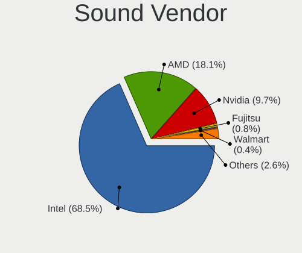

| Vendor                 | Notebooks | Percent |
|------------------------|-----------|---------|
| Intel                  | 345       | 68.45%  |
| AMD                    | 91        | 18.06%  |
| Nvidia                 | 49        | 9.72%   |
| Fujitsu                | 4         | 0.79%   |
| Walmart                | 2         | 0.4%    |
| Texas Instruments      | 2         | 0.4%    |
| C-Media Electronics    | 2         | 0.4%    |
| Logitech               | 1         | 0.2%    |
| Lenovo                 | 1         | 0.2%    |
| JMTek                  | 1         | 0.2%    |
| Generalplus Technology | 1         | 0.2%    |
| Focusrite-Novation     | 1         | 0.2%    |
| DSEA A/S               | 1         | 0.2%    |
| Creative Technology    | 1         | 0.2%    |
| Avnera                 | 1         | 0.2%    |
| Audio-Technica         | 1         | 0.2%    |

Sound Model
-----------

Sound card models

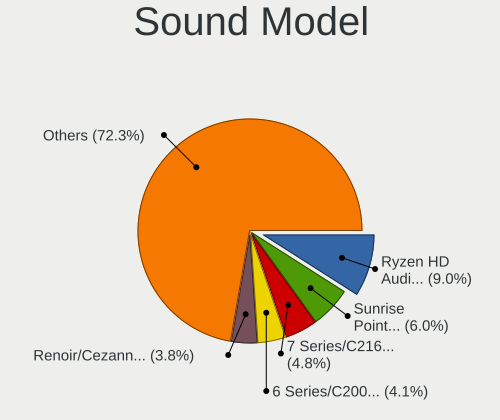

| Model                                                                                             | Notebooks | Percent |
|---------------------------------------------------------------------------------------------------|-----------|---------|
| AMD Ryzen HD Audio Controller                                                                     | 57        | 9.03%   |
| Intel Sunrise Point-LP HD Audio                                                                   | 38        | 6.02%   |
| Intel 7 Series/C216 Chipset Family High Definition Audio Controller                               | 30        | 4.75%   |
| Intel 6 Series/C200 Series Chipset Family High Definition Audio Controller                        | 26        | 4.12%   |
| AMD Renoir/Cezanne HDMI/DP Audio Controller                                                       | 24        | 3.8%    |
| Intel Alder Lake PCH-P High Definition Audio Controller                                           | 23        | 3.65%   |
| Intel Tiger Lake-LP Smart Sound Technology Audio Controller                                       | 18        | 2.85%   |
| Intel NM10/ICH7 Family High Definition Audio Controller                                           | 18        | 2.85%   |
| Intel Haswell-ULT HD Audio Controller                                                             | 18        | 2.85%   |
| Intel 8 Series HD Audio Controller                                                                | 18        | 2.85%   |
| Intel Wildcat Point-LP High Definition Audio Controller                                           | 17        | 2.69%   |
| Intel Broadwell-U Audio Controller                                                                | 17        | 2.69%   |
| AMD Radeon High Definition Audio Controller                                                       | 17        | 2.69%   |
| Intel Raptor Lake-P/U/H cAVS                                                                      | 15        | 2.38%   |
| Intel 8 Series/C220 Series Chipset High Definition Audio Controller                               | 15        | 2.38%   |
| Intel Xeon E3-1200 v3/4th Gen Core Processor HD Audio Controller                                  | 14        | 2.22%   |
| Intel 82801I (ICH9 Family) HD Audio Controller                                                    | 14        | 2.22%   |
| Intel 5 Series/3400 Series Chipset High Definition Audio                                          | 14        | 2.22%   |
| Intel Comet Lake PCH-LP cAVS                                                                      | 13        | 2.06%   |
| AMD FCH Azalia Controller                                                                         | 13        | 2.06%   |
| AMD Raven/Raven2/Fenghuang HDMI/DP Audio Controller                                               | 12        | 1.9%    |
| Intel Cannon Point-LP High Definition Audio Controller                                            | 10        | 1.58%   |
| AMD Kabini HDMI/DP Audio                                                                          | 10        | 1.58%   |
| Intel Celeron/Pentium Silver Processor High Definition Audio                                      | 8         | 1.27%   |
| Intel 82801H (ICH8 Family) HD Audio Controller                                                    | 8         | 1.27%   |
| Nvidia GF108 High Definition Audio Controller                                                     | 7         | 1.11%   |
| Intel Ice Lake-LP Smart Sound Technology Audio Controller                                         | 7         | 1.11%   |
| Intel CM238 HD Audio Controller                                                                   | 7         | 1.11%   |
| AMD Family 15h (Models 60h-6fh) Audio Controller                                                  | 7         | 1.11%   |
| Nvidia TU107 GeForce GTX 1650 High Definition Audio Controller                                    | 6         | 0.95%   |
| Nvidia GP107GL High Definition Audio Controller                                                   | 6         | 0.95%   |
| Intel Tiger Lake-H HD Audio Controller                                                            | 6         | 0.95%   |
| Intel Cannon Lake PCH cAVS                                                                        | 6         | 0.95%   |
| AMD High Definition Audio Controller                                                              | 6         | 0.95%   |
| Nvidia MCP79 High Definition Audio                                                                | 5         | 0.79%   |
| Intel Comet Lake PCH cAVS                                                                         | 5         | 0.79%   |
| Intel Atom/Celeron/Pentium Processor x5-E8000/J3xxx/N3xxx Series High Definition Audio Controller | 5         | 0.79%   |
| Nvidia GF119 HDMI Audio Controller                                                                | 4         | 0.63%   |
| Intel Jasper Lake HD Audio                                                                        | 4         | 0.63%   |
| Fujitsu USB Audio                                                                                 | 4         | 0.63%   |

Memory
------

Memory Vendor
-------------

Memory module vendors

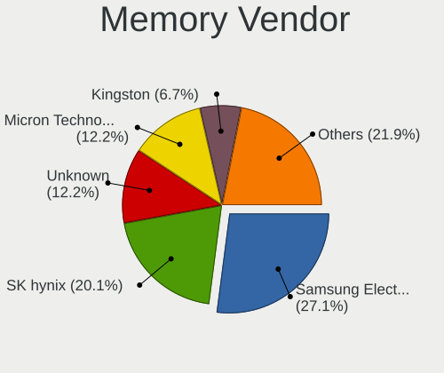

| Vendor                       | Notebooks | Percent |
|------------------------------|-----------|---------|
| Samsung Electronics          | 89        | 27.05%  |
| SK hynix                     | 66        | 20.06%  |
| Unknown                      | 40        | 12.16%  |
| Micron Technology            | 40        | 12.16%  |
| Kingston                     | 22        | 6.69%   |
| Elpida                       | 11        | 3.34%   |
| A-DATA Technology            | 11        | 3.34%   |
| Crucial                      | 10        | 3.04%   |
| Unknown                      | 6         | 1.82%   |
| Ramaxel Technology           | 5         | 1.52%   |
| Nanya Technology             | 3         | 0.91%   |
| G.Skill                      | 3         | 0.91%   |
| Corsair                      | 3         | 0.91%   |
| Timetec                      | 2         | 0.61%   |
| Team                         | 2         | 0.61%   |
| Silicon Power                | 2         | 0.61%   |
| Patriot                      | 2         | 0.61%   |
| Avant                        | 2         | 0.61%   |
| Unknown (ABCD)               | 1         | 0.3%    |
| Smart                        | 1         | 0.3%    |
| Shenzhen Longsys             | 1         | 0.3%    |
| SHARETRONIC                  | 1         | 0.3%    |
| PNY                          | 1         | 0.3%    |
| Patriot Memory (PDP Systems) | 1         | 0.3%    |
| Goldkey                      | 1         | 0.3%    |
| ASint Technology             | 1         | 0.3%    |
| Apacer                       | 1         | 0.3%    |
| 48spaces                     | 1         | 0.3%    |

Memory Model
------------

Memory module models

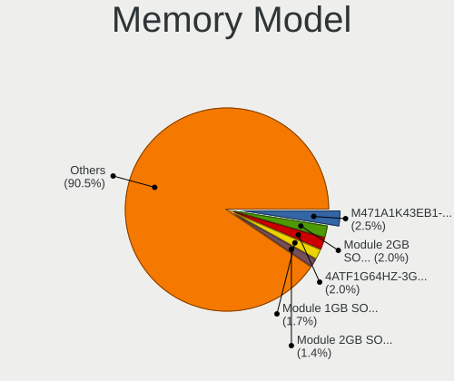

| Model                                                            | Notebooks | Percent |
|------------------------------------------------------------------|-----------|---------|
| Samsung RAM M471A1K43EB1-CWE 8GB SODIMM DDR4 3200MT/s            | 9         | 2.51%   |
| Unknown RAM Module 2GB SODIMM DDR2 667MT/s                       | 7         | 1.96%   |
| Micron RAM 4ATF1G64HZ-3G2F1 8GB SODIMM DDR4 3200MT/s             | 7         | 1.96%   |
| Unknown                                                          | 6         | 1.68%   |
| Unknown RAM Module 2GB SODIMM DDR2                               | 5         | 1.4%    |
| Unknown RAM Module 1GB SODIMM DDR2                               | 5         | 1.4%    |
| SK hynix RAM HMT451S6BFR8A-PB 4GB SODIMM DDR3 1600MT/s           | 5         | 1.4%    |
| Samsung RAM M471A5244CB0-CTD 4GB SODIMM DDR4 3266MT/s            | 5         | 1.4%    |
| Unknown RAM Module 1GB SODIMM DDR2 533MT/s                       | 4         | 1.12%   |
| Unknown RAM Module 1GB SODIMM DDR2 667MT/s                       | 3         | 0.84%   |
| SK hynix RAM HMT451S6AFR8C-PB 4GB SODIMM DDR3 1600MT/s           | 3         | 0.84%   |
| SK hynix RAM HMT451S6AFR8A-PB 4GB SODIMM DDR3 1600MT/s           | 3         | 0.84%   |
| SK hynix RAM HMAA1GS6CJR6N-XN 8GB SODIMM DDR4 3200MT/s           | 3         | 0.84%   |
| Samsung RAM M471A1K43DB1-CTD 8GB SODIMM DDR4 2667MT/s            | 3         | 0.84%   |
| Unknown RAM Module 512MB SODIMM DDR2                             | 2         | 0.56%   |
| Unknown RAM Module 4GB SODIMM DDR2 667MT/s                       | 2         | 0.56%   |
| Unknown RAM Module 2GB SODIMM SDRAM                              | 2         | 0.56%   |
| Unknown RAM Module 2GB SODIMM DDR2 533MT/s                       | 2         | 0.56%   |
| Unknown RAM Module 1GB SODIMM DDR                                | 2         | 0.56%   |
| SK hynix RAM Module 8GB SODIMM DDR3 1600MT/s                     | 2         | 0.56%   |
| SK hynix RAM Module 4GB SODIMM DDR3 1600MT/s                     | 2         | 0.56%   |
| SK hynix RAM HMT425S6CFR6C-PB 2GB SODIMM 1600MT/s                | 2         | 0.56%   |
| SK hynix RAM HMT351S6CFR8C-PB 4GB SODIMM DDR3 1600MT/s           | 2         | 0.56%   |
| SK hynix RAM HMT351S6BFR8C-H9 4GB SODIMM 1334MT/s                | 2         | 0.56%   |
| SK hynix RAM HMA851S6DJR6N-XN 4GB SODIMM DDR4 3200MT/s           | 2         | 0.56%   |
| SK hynix RAM HMA81GS6AFR8N-UH 8GB SODIMM DDR4 2667MT/s           | 2         | 0.56%   |
| SK hynix RAM H9JCNNNBK3MLYR-N6E 1GB Row Of Chips LPDDR5 6400MT/s | 2         | 0.56%   |
| Samsung RAM M471B5773DH0-CH9 2GB SODIMM DDR3 1600MT/s            | 2         | 0.56%   |
| Samsung RAM M471B5673EH1-CF8 2GB SODIMM 4199MT/s                 | 2         | 0.56%   |
| Samsung RAM M471B5273CH0-CH9 4GB SODIMM DDR3 1334MT/s            | 2         | 0.56%   |
| Samsung RAM M471B5173DB0-YK0 4GB SODIMM DDR3 1600MT/s            | 2         | 0.56%   |
| Samsung RAM M471B5173BH0-CK0 4GB SODIMM DDR3 1600MT/s            | 2         | 0.56%   |
| Samsung RAM M471B1G73EB0-YK0 8192MB SODIMM DDR3 1600MT/s         | 2         | 0.56%   |
| Samsung RAM M471B1G73DB0-YK0 8GB SODIMM DDR3 1600MT/s            | 2         | 0.56%   |
| Samsung RAM M471A5244CB0-CWE 4GB SODIMM DDR4 3200MT/s            | 2         | 0.56%   |
| Samsung RAM M471A2K43CB1-CRC 16GB SODIMM DDR4 2667MT/s           | 2         | 0.56%   |
| Samsung RAM M471A2G44BM0-CWE 16GB SODIMM DDR4 3200MT/s           | 2         | 0.56%   |
| Samsung RAM M471A2G44AM0-CWE 16GB SODIMM DDR4 3200MT/s           | 2         | 0.56%   |
| Samsung RAM M471A1K43CB1-CRC 8GB SODIMM DDR4 8400MT/s            | 2         | 0.56%   |
| Samsung RAM M471A1K43BB1-CRC 8GB SODIMM DDR4 2667MT/s            | 2         | 0.56%   |

Memory Kind
-----------

Memory module kinds

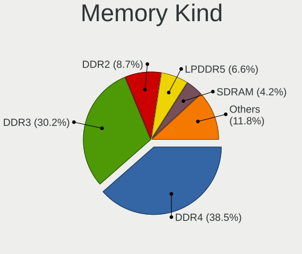

| Kind    | Notebooks | Percent |
|---------|-----------|---------|
| DDR4    | 111       | 38.54%  |
| DDR3    | 87        | 30.21%  |
| DDR2    | 25        | 8.68%   |
| LPDDR5  | 19        | 6.6%    |
| SDRAM   | 12        | 4.17%   |
| DDR5    | 11        | 3.82%   |
| LPDDR4  | 10        | 3.47%   |
| DDR     | 5         | 1.74%   |
| LPDDR3  | 4         | 1.39%   |
| DRAM    | 2         | 0.69%   |
| RAM     | 1         | 0.35%   |
| Unknown | 1         | 0.35%   |

Memory Form Factor
------------------

Physical design of the memory module

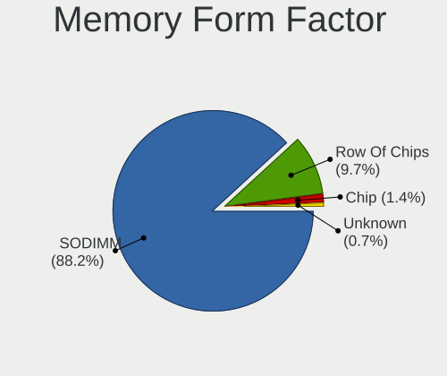

| Name         | Notebooks | Percent |
|--------------|-----------|---------|
| SODIMM       | 254       | 88.19%  |
| Row Of Chips | 28        | 9.72%   |
| Chip         | 4         | 1.39%   |
| Unknown      | 2         | 0.69%   |

Memory Size
-----------

Memory module size

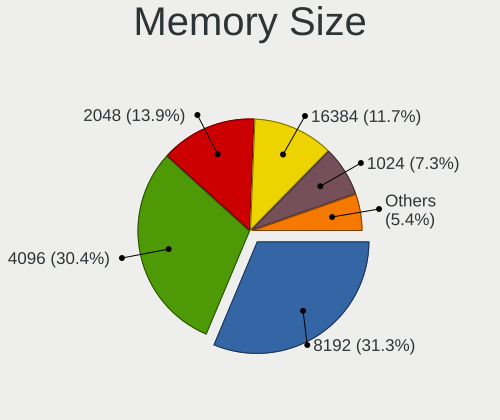

| Size  | Notebooks | Percent |
|-------|-----------|---------|
| 8192  | 99        | 31.33%  |
| 4096  | 96        | 30.38%  |
| 2048  | 44        | 13.92%  |
| 16384 | 37        | 11.71%  |
| 1024  | 23        | 7.28%   |
| 32768 | 9         | 2.85%   |
| 512   | 6         | 1.9%    |
| 49152 | 2         | 0.63%   |

Memory Speed
------------

Memory module speed

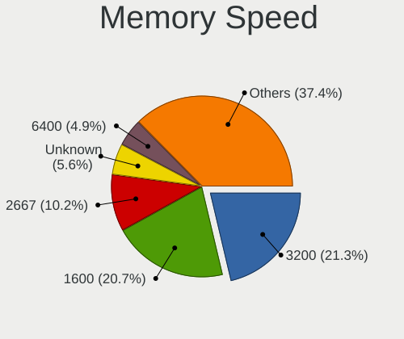

| Speed   | Notebooks | Percent |
|---------|-----------|---------|
| 3200    | 65        | 21.31%  |
| 1600    | 63        | 20.66%  |
| 2667    | 31        | 10.16%  |
| Unknown | 17        | 5.57%   |
| 6400    | 15        | 4.92%   |
| 2400    | 13        | 4.26%   |
| 2133    | 12        | 3.93%   |
| 667     | 12        | 3.93%   |
| 1334    | 10        | 3.28%   |
| 1333    | 9         | 2.95%   |
| 5600    | 8         | 2.62%   |
| 533     | 6         | 1.97%   |
| 4199    | 5         | 1.64%   |
| 3266    | 5         | 1.64%   |
| 2048    | 5         | 1.64%   |
| 1067    | 5         | 1.64%   |
| 8400    | 3         | 0.98%   |
| 4800    | 3         | 0.98%   |
| 4267    | 3         | 0.98%   |
| 1867    | 3         | 0.98%   |
| 5500    | 2         | 0.66%   |
| 4266    | 2         | 0.66%   |
| 1066    | 2         | 0.66%   |
| 800     | 2         | 0.66%   |
| 7467    | 1         | 0.33%   |
| 7400    | 1         | 0.33%   |
| 975     | 1         | 0.33%   |
| 266     | 1         | 0.33%   |

Printers & scanners
-------------------

Printer Vendor
--------------

Printer device vendors

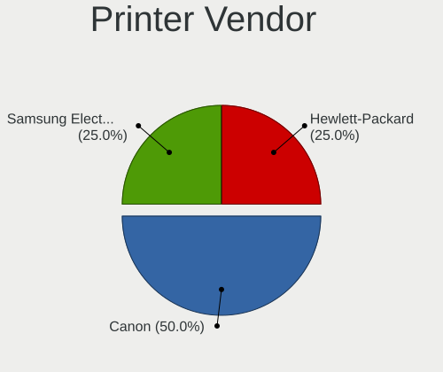

| Vendor              | Notebooks | Percent |
|---------------------|-----------|---------|
| Canon               | 2         | 50%     |
| Samsung Electronics | 1         | 25%     |
| Hewlett-Packard     | 1         | 25%     |

Printer Model
-------------

Printer device models

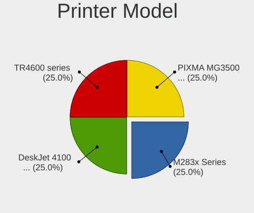

| Model                     | Notebooks | Percent |
|---------------------------|-----------|---------|
| Samsung M283x Series      | 1         | 25%     |
| HP DeskJet 4100 series    | 1         | 25%     |
| Canon TR4600 series       | 1         | 25%     |
| Canon PIXMA MG3500 Series | 1         | 25%     |

Scanner Vendor
--------------

Scanner device vendors

Zero info for selected period =(

Scanner Model
-------------

Scanner device models

Zero info for selected period =(

Camera
------

Camera Vendor
-------------

Camera device vendors

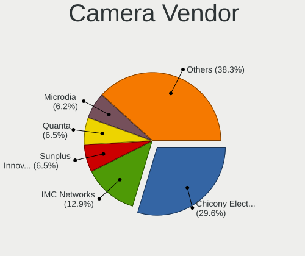

| Vendor                                 | Notebooks | Percent |
|----------------------------------------|-----------|---------|
| Chicony Electronics                    | 110       | 29.65%  |
| IMC Networks                           | 48        | 12.94%  |
| Sunplus Innovation Technology          | 24        | 6.47%   |
| Quanta                                 | 24        | 6.47%   |
| Microdia                               | 23        | 6.2%    |
| Bison Electronics                      | 23        | 6.2%    |
| Realtek Semiconductor                  | 22        | 5.93%   |
| Luxvisions Innotech Limited            | 14        | 3.77%   |
| Cheng Uei Precision Industry (Foxlink) | 14        | 3.77%   |
| Apple                                  | 8         | 2.16%   |
| Suyin                                  | 7         | 1.89%   |
| Sonix Technology                       | 6         | 1.62%   |
| ShineTech                              | 6         | 1.62%   |
| Silicon Motion                         | 5         | 1.35%   |
| Ricoh                                  | 5         | 1.35%   |
| Lite-On Technology                     | 5         | 1.35%   |
| Syntek                                 | 4         | 1.08%   |
| Alcor Micro                            | 4         | 1.08%   |
| Logitech                               | 3         | 0.81%   |
| SunplusIT                              | 2         | 0.54%   |
| Shine-optics                           | 2         | 0.54%   |
| kingcome                               | 2         | 0.54%   |
| Acer                                   | 2         | 0.54%   |
| Z-Star Microelectronics                | 1         | 0.27%   |
| Samsung Electronics                    | 1         | 0.27%   |
| Lenovo                                 | 1         | 0.27%   |
| HYGD-221208-J                          | 1         | 0.27%   |
| globaloptics                           | 1         | 0.27%   |
| Genesys Logic                          | 1         | 0.27%   |
| Framework                              | 1         | 0.27%   |
| Unknown                                | 1         | 0.27%   |

Camera Model
------------

Camera device models

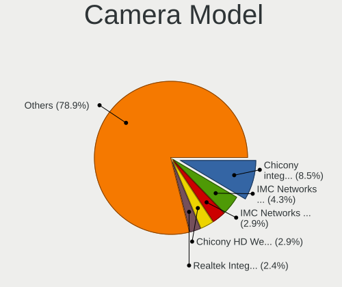

| Model                                                   | Notebooks | Percent |
|---------------------------------------------------------|-----------|---------|
| Chicony integrated camera                               | 32        | 8.53%   |
| IMC Networks USB2.0 HD UVC WebCam                       | 16        | 4.27%   |
| IMC Networks USB2.0 VGA UVC WebCam                      | 11        | 2.93%   |
| Chicony HD WebCam                                       | 11        | 2.93%   |
| Realtek Integrated_Webcam_HD                            | 9         | 2.4%    |
| IMC Networks Integrated Camera                          | 9         | 2.4%    |
| Microdia Integrated_Webcam_HD                           | 8         | 2.13%   |
| Bison Integrated Camera                                 | 8         | 2.13%   |
| Sunplus Laptop_Integrated_Webcam_FHD                    | 6         | 1.6%    |
| Luxvisions Innotech Limited HP TrueVision HD Camera     | 5         | 1.33%   |
| Chicony USB2.0 HD UVC WebCam                            | 5         | 1.33%   |
| Chicony HP HD Camera                                    | 5         | 1.33%   |
| Chicony FJ Camera                                       | 5         | 1.33%   |
| Quanta VGA Webcam                                       | 4         | 1.07%   |
| Quanta HP TrueVision HD Camera                          | 4         | 1.07%   |
| Quanta HP HD Camera                                     | 4         | 1.07%   |
| Chicony TOSHIBA Web Camera - HD                         | 4         | 1.07%   |
| Chicony Integrated Camera (1280x720@30)                 | 4         | 1.07%   |
| Chicony HP Wide Vision HD Camera                        | 4         | 1.07%   |
| Chicony HP Truevision HD                                | 4         | 1.07%   |
| Cheng Uei Precision Industry (Foxlink) Webcam           | 4         | 1.07%   |
| Syntek Integrated Camera                                | 3         | 0.8%    |
| Sunplus USB 2.0 Camera                                  | 3         | 0.8%    |
| Sonix USB2.0 HD UVC WebCam                              | 3         | 0.8%    |
| Microdia Integrated_Webcam_FHD                          | 3         | 0.8%    |
| Lite-On Integrated Camera                               | 3         | 0.8%    |
| IMC Networks Integrated Webcam                          | 3         | 0.8%    |
| Chicony Lenovo EasyCamera                               | 3         | 0.8%    |
| Cheng Uei Precision Industry (Foxlink) HP TrueVision HD | 3         | 0.8%    |
| Bison SunplusIT Integrated Camera                       | 3         | 0.8%    |
| Bison HD Webcam                                         | 3         | 0.8%    |
| Apple FaceTime HD Camera                                | 3         | 0.8%    |
| Apple Built-in iSight                                   | 3         | 0.8%    |
| Suyin Acer/HP Integrated Webcam [CN0314]                | 2         | 0.53%   |
| Sunplus SPCA2281 Web Camera                             | 2         | 0.53%   |
| Sunplus MTD Camera                                      | 2         | 0.53%   |
| Sunplus Laptop_Integrated_Webcam_HD                     | 2         | 0.53%   |
| Sunplus Integrated_Webcam_HD                            | 2         | 0.53%   |
| Sonix ASUS HD webcam                                    | 2         | 0.53%   |
| Silicon Motion WebCam SC-13HDL12131N                    | 2         | 0.53%   |

Security
--------

Fingerprint Vendor
------------------

Fingerprint sensor vendors

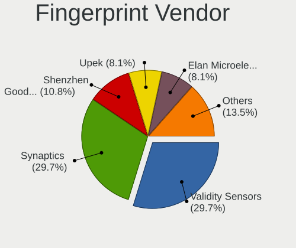

| Vendor                     | Notebooks | Percent |
|----------------------------|-----------|---------|
| Validity Sensors           | 22        | 29.73%  |
| Synaptics                  | 22        | 29.73%  |
| Shenzhen Goodix Technology | 8         | 10.81%  |
| Upek                       | 6         | 8.11%   |
| Elan Microelectronics      | 6         | 8.11%   |
| STMicroelectronics         | 5         | 6.76%   |
| LighTuning Technology      | 2         | 2.7%    |
| AuthenTec                  | 2         | 2.7%    |
| Microsoft                  | 1         | 1.35%   |

Fingerprint Model
-----------------

Fingerprint sensor models

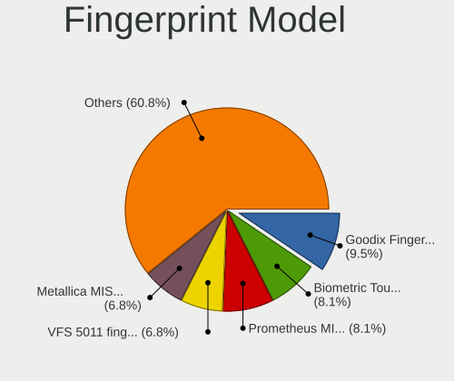

| Model                                                                      | Notebooks | Percent |
|----------------------------------------------------------------------------|-----------|---------|
| Shenzhen Goodix  FingerPrint Device                                        | 7         | 9.46%   |
| Upek Biometric Touchchip/Touchstrip Fingerprint Sensor                     | 6         | 8.11%   |
| Synaptics Prometheus MIS Touch Fingerprint Reader                          | 6         | 8.11%   |
| Validity Sensors VFS 5011 fingerprint sensor                               | 5         | 6.76%   |
| Synaptics Metallica MIS Touch Fingerprint Reader                           | 5         | 6.76%   |
| STMicroelectronics Fingerprint Reader                                      | 5         | 6.76%   |
| Synaptics FS7604 Touch Fingerprint Sensor with PurePrint                   | 4         | 5.41%   |
| Elan ELAN:ARM-M4                                                           | 4         | 5.41%   |
| Validity Sensors VFS495 Fingerprint Reader                                 | 3         | 4.05%   |
| Synaptics UWP WBDI Device                                                  | 3         | 4.05%   |
| Validity Sensors VFS7500 Touch Fingerprint Sensor                          | 2         | 2.7%    |
| Validity Sensors VFS5011 Fingerprint Reader                                | 2         | 2.7%    |
| Validity Sensors VFS491                                                    | 2         | 2.7%    |
| Validity Sensors VFS451 Fingerprint Reader                                 | 2         | 2.7%    |
| Validity Sensors Swipe Fingerprint Sensor                                  | 2         | 2.7%    |
| Elan ELAN:Fingerprint                                                      | 2         | 2.7%    |
| Validity Sensors VFS7552 Touch Fingerprint Sensor                          | 1         | 1.35%   |
| Validity Sensors VFS Fingerprint sensor                                    | 1         | 1.35%   |
| Validity Sensors Synaptics VFS7552 Touch Fingerprint Sensor with PurePrint | 1         | 1.35%   |
| Validity Sensors Fingerprint scanner                                       | 1         | 1.35%   |
| Synaptics WBDI                                                             | 1         | 1.35%   |
| Synaptics UWP WBDI                                                         | 1         | 1.35%   |
| Synaptics Metallica MOH Touch Fingerprint Reader                           | 1         | 1.35%   |
| Synaptics Fingerprint reader [HP G6]                                       | 1         | 1.35%   |
| Shenzhen Goodix FingerPrint                                                | 1         | 1.35%   |
| Microsoft Fingerprint Reader                                               | 1         | 1.35%   |
| LighTuning ES603 Swipe Fingerprint Sensor                                  | 1         | 1.35%   |
| LighTuning EgisTec Touch Fingerprint Sensor                                | 1         | 1.35%   |
| AuthenTec AES2810                                                          | 1         | 1.35%   |
| AuthenTec AES2501 Fingerprint Sensor                                       | 1         | 1.35%   |

Chipcard Vendor
---------------

Chipcard module vendors

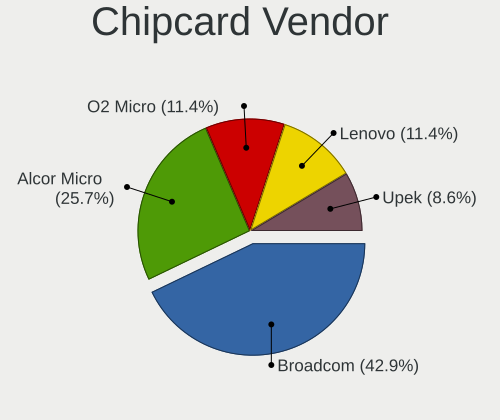

| Vendor      | Notebooks | Percent |
|-------------|-----------|---------|
| Broadcom    | 15        | 42.86%  |
| Alcor Micro | 9         | 25.71%  |
| O2 Micro    | 4         | 11.43%  |
| Lenovo      | 4         | 11.43%  |
| Upek        | 3         | 8.57%   |

Chipcard Model
--------------

Chipcard module models

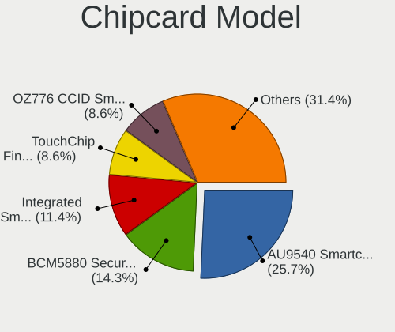

| Model                                                                        | Notebooks | Percent |
|------------------------------------------------------------------------------|-----------|---------|
| Alcor Micro AU9540 Smartcard Reader                                          | 9         | 25.71%  |
| Broadcom BCM5880 Secure Applications Processor                               | 5         | 14.29%  |
| Lenovo Integrated Smart Card Reader                                          | 4         | 11.43%  |
| Upek TouchChip Fingerprint Coprocessor (WBF advanced mode)                   | 3         | 8.57%   |
| O2 Micro OZ776 CCID Smartcard Reader                                         | 3         | 8.57%   |
| Broadcom BCM5880 Secure Applications Processor with fingerprint swipe sensor | 3         | 8.57%   |
| Broadcom 58200                                                               | 3         | 8.57%   |
| Broadcom BCM58200 ControlVault 3 (FingerPrint sensor + Contacted SmartCard)  | 2         | 5.71%   |
| Broadcom 5880                                                                | 2         | 5.71%   |
| O2 Micro Oz776 SmartCard Reader                                              | 1         | 2.86%   |

Unsupported
-----------

Unsupported Devices
-------------------

Total unsupported devices on board

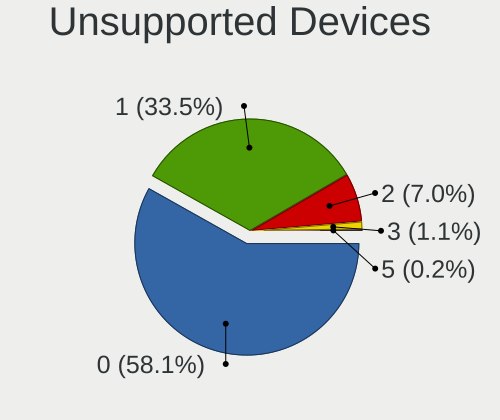

| Total | Notebooks | Percent |
|-------|-----------|---------|
| 0     | 257       | 58.14%  |
| 1     | 148       | 33.48%  |
| 2     | 31        | 7.01%   |
| 3     | 5         | 1.13%   |
| 5     | 1         | 0.23%   |

Unsupported Device Types
------------------------

Types of unsupported devices

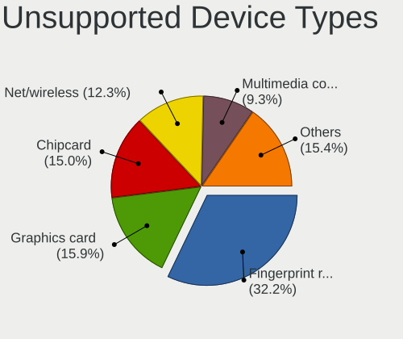

| Type                     | Notebooks | Percent |
|--------------------------|-----------|---------|
| Fingerprint reader       | 73        | 32.16%  |
| Graphics card            | 36        | 15.86%  |
| Chipcard                 | 34        | 14.98%  |
| Net/wireless             | 28        | 12.33%  |
| Multimedia controller    | 21        | 9.25%   |
| Bluetooth                | 10        | 4.41%   |
| Camera                   | 8         | 3.52%   |
| Storage                  | 6         | 2.64%   |
| Network                  | 3         | 1.32%   |
| Communication controller | 2         | 0.88%   |
| Card reader              | 2         | 0.88%   |
| Tv card                  | 1         | 0.44%   |
| Storage/nvme             | 1         | 0.44%   |
| Sound                    | 1         | 0.44%   |
| Net/ethernet             | 1         | 0.44%   |

