LMDE 6 - Tested Hardware & Statistics (Notebooks)
-------------------------------------------------

A project to collect tested hardware configurations for LMDE 6.

Anyone can contribute to this report by the [hw-probe](https://github.com/linuxhw/hw-probe) tool:

    sudo -E hw-probe -all -upload

Please contribute! Especially if your hardware is rare.

Contents
--------

* [ Test Cases ](#test-cases)

* [ System ](#system)
  - [ Kernel                   ](#kernel)
  - [ Kernel Family            ](#kernel-family)
  - [ Kernel Major Ver.        ](#kernel-major-ver)
  - [ Arch                     ](#arch)
  - [ DE                       ](#de)
  - [ Display Server           ](#display-server)
  - [ Display Manager          ](#display-manager)
  - [ OS Lang                  ](#os-lang)
  - [ Boot Mode                ](#boot-mode)
  - [ Filesystem               ](#filesystem)
  - [ Part. scheme             ](#part-scheme)
  - [ Dual Boot with Linux/BSD ](#dual-boot-with-linuxbsd)
  - [ Dual Boot (Win)          ](#dual-boot-win)

* [ Board ](#board)
  - [ Vendor                   ](#vendor)
  - [ Model                    ](#model)
  - [ Model Family             ](#model-family)
  - [ MFG Year                 ](#mfg-year)
  - [ Form Factor              ](#form-factor)
  - [ Secure Boot              ](#secure-boot)
  - [ Coreboot                 ](#coreboot)
  - [ RAM Size                 ](#ram-size)
  - [ RAM Used                 ](#ram-used)
  - [ Total Drives             ](#total-drives)
  - [ Has CD-ROM               ](#has-cd-rom)
  - [ Has Ethernet             ](#has-ethernet)
  - [ Has WiFi                 ](#has-wifi)
  - [ Has Bluetooth            ](#has-bluetooth)

* [ Location ](#location)
  - [ Country                  ](#country)
  - [ City                     ](#city)

* [ Drives ](#drives)
  - [ Drive Vendor             ](#drive-vendor)
  - [ Drive Model              ](#drive-model)
  - [ HDD Vendor               ](#hdd-vendor)
  - [ SSD Vendor               ](#ssd-vendor)
  - [ Drive Kind               ](#drive-kind)
  - [ Drive Connector          ](#drive-connector)
  - [ Drive Size               ](#drive-size)
  - [ Space Total              ](#space-total)
  - [ Space Used               ](#space-used)
  - [ Malfunc. Drives          ](#malfunc-drives)
  - [ Malfunc. Drive Vendor    ](#malfunc-drive-vendor)
  - [ Malfunc. HDD Vendor      ](#malfunc-hdd-vendor)
  - [ Malfunc. Drive Kind      ](#malfunc-drive-kind)
  - [ Failed Drives            ](#failed-drives)
  - [ Failed Drive Vendor      ](#failed-drive-vendor)
  - [ Drive Status             ](#drive-status)

* [ Storage controller ](#storage-controller)
  - [ Storage Vendor           ](#storage-vendor)
  - [ Storage Model            ](#storage-model)
  - [ Storage Kind             ](#storage-kind)

* [ Processor ](#processor)
  - [ CPU Vendor               ](#cpu-vendor)
  - [ CPU Model                ](#cpu-model)
  - [ CPU Model Family         ](#cpu-model-family)
  - [ CPU Cores                ](#cpu-cores)
  - [ CPU Sockets              ](#cpu-sockets)
  - [ CPU Threads              ](#cpu-threads)
  - [ CPU Op-Modes             ](#cpu-op-modes)
  - [ CPU Microcode            ](#cpu-microcode)
  - [ CPU Microarch            ](#cpu-microarch)

* [ Graphics ](#graphics)
  - [ GPU Vendor               ](#gpu-vendor)
  - [ GPU Model                ](#gpu-model)
  - [ GPU Combo                ](#gpu-combo)
  - [ GPU Driver               ](#gpu-driver)
  - [ GPU Memory               ](#gpu-memory)

* [ Monitor ](#monitor)
  - [ Monitor Vendor           ](#monitor-vendor)
  - [ Monitor Model            ](#monitor-model)
  - [ Monitor Resolution       ](#monitor-resolution)
  - [ Monitor Diagonal         ](#monitor-diagonal)
  - [ Monitor Width            ](#monitor-width)
  - [ Aspect Ratio             ](#aspect-ratio)
  - [ Monitor Area             ](#monitor-area)
  - [ Pixel Density            ](#pixel-density)
  - [ Multiple Monitors        ](#multiple-monitors)

* [ Network ](#network)
  - [ Net Controller Vendor    ](#net-controller-vendor)
  - [ Net Controller Model     ](#net-controller-model)
  - [ Wireless Vendor          ](#wireless-vendor)
  - [ Wireless Model           ](#wireless-model)
  - [ Ethernet Vendor          ](#ethernet-vendor)
  - [ Ethernet Model           ](#ethernet-model)
  - [ Net Controller Kind      ](#net-controller-kind)
  - [ Used Controller          ](#used-controller)
  - [ NICs                     ](#nics)
  - [ IPv6                     ](#ipv6)

* [ Bluetooth ](#bluetooth)
  - [ Bluetooth Vendor         ](#bluetooth-vendor)
  - [ Bluetooth Model          ](#bluetooth-model)

* [ Sound ](#sound)
  - [ Sound Vendor             ](#sound-vendor)
  - [ Sound Model              ](#sound-model)

* [ Memory ](#memory)
  - [ Memory Vendor            ](#memory-vendor)
  - [ Memory Model             ](#memory-model)
  - [ Memory Kind              ](#memory-kind)
  - [ Memory Form Factor       ](#memory-form-factor)
  - [ Memory Size              ](#memory-size)
  - [ Memory Speed             ](#memory-speed)

* [ Printers & scanners ](#printers--scanners)
  - [ Printer Vendor           ](#printer-vendor)
  - [ Printer Model            ](#printer-model)
  - [ Scanner Vendor           ](#scanner-vendor)
  - [ Scanner Model            ](#scanner-model)

* [ Camera ](#camera)
  - [ Camera Vendor            ](#camera-vendor)
  - [ Camera Model             ](#camera-model)

* [ Security ](#security)
  - [ Fingerprint Vendor       ](#fingerprint-vendor)
  - [ Fingerprint Model        ](#fingerprint-model)
  - [ Chipcard Vendor          ](#chipcard-vendor)
  - [ Chipcard Model           ](#chipcard-model)

* [ Unsupported ](#unsupported)
  - [ Unsupported Devices      ](#unsupported-devices)
  - [ Unsupported Device Types ](#unsupported-device-types)

Test Cases
----------

Total: 213

| Vendor        | Model                       | Probe                                                      | Date         |
|---------------|-----------------------------|------------------------------------------------------------|--------------|
| Acer          | Aspire AL14-31P             | [fc4db570af](https://linux-hardware.org/?probe=fc4db570af) | May 08, 2024 |
| HP            | Laptop 15-dy2xxx            | [2837d61bc4](https://linux-hardware.org/?probe=2837d61bc4) | May 03, 2024 |
| HP            | Compaq 6730s                | [ab6d479788](https://linux-hardware.org/?probe=ab6d479788) | May 01, 2024 |
| Unknown       | Unknown                     | [a677f40065](https://linux-hardware.org/?probe=a677f40065) | Apr 30, 2024 |
| HP            | ProBook 450 G1              | [5f5030ef83](https://linux-hardware.org/?probe=5f5030ef83) | Apr 29, 2024 |
| ASUSTek       | VivoBook_ASUSLaptop X150... | [bc0e0ae6b8](https://linux-hardware.org/?probe=bc0e0ae6b8) | Apr 25, 2024 |
| ASUSTek       | X541UVK                     | [422fd329a8](https://linux-hardware.org/?probe=422fd329a8) | Apr 25, 2024 |
| Lenovo        | V15 G4 IAH 83FS             | [b922fc6d5e](https://linux-hardware.org/?probe=b922fc6d5e) | Apr 24, 2024 |
| Acer          | TravelMate 4070             | [99e797eb28](https://linux-hardware.org/?probe=99e797eb28) | Apr 23, 2024 |
| Samsung       | N150P/N210P/N220P           | [b7a4824162](https://linux-hardware.org/?probe=b7a4824162) | Apr 23, 2024 |
| Packard Be... | EasyNote_MX45               | [2af5864c3c](https://linux-hardware.org/?probe=2af5864c3c) | Apr 22, 2024 |
| Apple         | MacBookAir7,2               | [4aabe77962](https://linux-hardware.org/?probe=4aabe77962) | Apr 20, 2024 |
| Acer          | Aspire E1-571G              | [cfb1f06070](https://linux-hardware.org/?probe=cfb1f06070) | Apr 20, 2024 |
| Medion        | E6214                       | [fef41424b0](https://linux-hardware.org/?probe=fef41424b0) | Apr 19, 2024 |
| Lenovo        | ThinkPad X140e 20BLS0040... | [028ee7ca9d](https://linux-hardware.org/?probe=028ee7ca9d) | Apr 19, 2024 |
| Medion        | E6214                       | [f6e648f8a4](https://linux-hardware.org/?probe=f6e648f8a4) | Apr 19, 2024 |
| Acer          | Aspire E1-572G              | [39e93654ec](https://linux-hardware.org/?probe=39e93654ec) | Apr 13, 2024 |
| Acer          | Aspire E1-572G              | [562a3aa8fe](https://linux-hardware.org/?probe=562a3aa8fe) | Apr 13, 2024 |
| HP            | EliteBook 840 G3            | [cbc8162b5a](https://linux-hardware.org/?probe=cbc8162b5a) | Apr 10, 2024 |
| ASUSTek       | G752VSK                     | [49116bb834](https://linux-hardware.org/?probe=49116bb834) | Apr 08, 2024 |
| Dell          | Latitude E7250              | [3979d6a4a1](https://linux-hardware.org/?probe=3979d6a4a1) | Apr 07, 2024 |
| Google        | Voxel                       | [5242e65363](https://linux-hardware.org/?probe=5242e65363) | Apr 06, 2024 |
| Medion        | E6214                       | [5ddeb441b9](https://linux-hardware.org/?probe=5ddeb441b9) | Apr 06, 2024 |
| Medion        | E6214                       | [20d0838443](https://linux-hardware.org/?probe=20d0838443) | Apr 06, 2024 |
| HP            | Laptop 15-dw1xxx            | [43a27413f2](https://linux-hardware.org/?probe=43a27413f2) | Mar 31, 2024 |
| HP            | Pavilion 15                 | [69bc35a5b1](https://linux-hardware.org/?probe=69bc35a5b1) | Mar 30, 2024 |
| HP            | Pavilion 15                 | [69293f7635](https://linux-hardware.org/?probe=69293f7635) | Mar 30, 2024 |
| Lenovo        | V15 G4 IAH 83FS             | [ec668db660](https://linux-hardware.org/?probe=ec668db660) | Mar 28, 2024 |
| ASUSTek       | VivoBook_ASUSLaptop X150... | [0cee79fd45](https://linux-hardware.org/?probe=0cee79fd45) | Mar 24, 2024 |
| Samsung       | N150P/N210P/N220P           | [153847bfc0](https://linux-hardware.org/?probe=153847bfc0) | Mar 23, 2024 |
| HP            | ProBook 470 G0              | [7947b2c132](https://linux-hardware.org/?probe=7947b2c132) | Mar 22, 2024 |
| Lenovo        | IdeaPad Pro 5 16IRH8 83A... | [a4c78f511d](https://linux-hardware.org/?probe=a4c78f511d) | Mar 21, 2024 |
| Apple         | MacBookAir4,2               | [3d42d3e1f9](https://linux-hardware.org/?probe=3d42d3e1f9) | Mar 19, 2024 |
| Dell          | Inspiron 3585               | [2378788f88](https://linux-hardware.org/?probe=2378788f88) | Mar 18, 2024 |
| Lenovo        | IdeaPad U160 08946JG        | [62adedc3dc](https://linux-hardware.org/?probe=62adedc3dc) | Mar 17, 2024 |
| HUAWEI        | CREM-WXX9                   | [d1f4d3e711](https://linux-hardware.org/?probe=d1f4d3e711) | Mar 16, 2024 |
| ASUSTek       | VivoBook_ASUSLaptop X509... | [25c1a0e7d3](https://linux-hardware.org/?probe=25c1a0e7d3) | Mar 16, 2024 |
| Lenovo        | IdeaPad U160 08946JG        | [0d6bea90e0](https://linux-hardware.org/?probe=0d6bea90e0) | Mar 11, 2024 |
| ASUSTek       | VivoBook_ASUSLaptop X515... | [1dda71290f](https://linux-hardware.org/?probe=1dda71290f) | Mar 08, 2024 |
| Monster       | TULPAR T7 V20.3             | [df8b4e385a](https://linux-hardware.org/?probe=df8b4e385a) | Mar 06, 2024 |
| Clevo         | W240HU/W250HUQ              | [b4f3b9c879](https://linux-hardware.org/?probe=b4f3b9c879) | Mar 06, 2024 |
| HP            | EliteBook 845 G8 Noteboo... | [5f7a226ed8](https://linux-hardware.org/?probe=5f7a226ed8) | Mar 06, 2024 |
| Acer          | Aspire 5570Z                | [16e46c8657](https://linux-hardware.org/?probe=16e46c8657) | Mar 05, 2024 |
| Acer          | Aspire 5570Z                | [4471c4987a](https://linux-hardware.org/?probe=4471c4987a) | Mar 05, 2024 |
| ASUSTek       | ASUS BR1100CKA BR1100CKA... | [fc21a2b0e2](https://linux-hardware.org/?probe=fc21a2b0e2) | Mar 04, 2024 |
| HP            | EliteBook 8470p             | [d67a754532](https://linux-hardware.org/?probe=d67a754532) | Feb 27, 2024 |
| Lenovo        | ThinkPad T480 20L6S2CB00    | [eff836bcb1](https://linux-hardware.org/?probe=eff836bcb1) | Feb 27, 2024 |
| Lenovo        | ThinkPad T480 20L6S2CB00    | [a78eb227db](https://linux-hardware.org/?probe=a78eb227db) | Feb 26, 2024 |
| Dell          | Vostro 1510                 | [c2b1496073](https://linux-hardware.org/?probe=c2b1496073) | Feb 24, 2024 |
| HUAWEI        | CREM-WXX9                   | [9f6a95d5b4](https://linux-hardware.org/?probe=9f6a95d5b4) | Feb 23, 2024 |
| HP            | EliteBook 845 14 inch G1... | [dad4fdcceb](https://linux-hardware.org/?probe=dad4fdcceb) | Feb 22, 2024 |
| ASUSTek       | ZenBook UX434FL_UX434FL     | [309bc99f27](https://linux-hardware.org/?probe=309bc99f27) | Feb 22, 2024 |
| Apple         | MacBookPro5,1               | [6bbe163c4b](https://linux-hardware.org/?probe=6bbe163c4b) | Feb 21, 2024 |
| HP            | ZBook Fury 17.3 inch G8 ... | [383bb58584](https://linux-hardware.org/?probe=383bb58584) | Feb 20, 2024 |
| Lenovo        | ThinkPad E470 20H2S00500    | [3c24c9be66](https://linux-hardware.org/?probe=3c24c9be66) | Feb 20, 2024 |
| Fujitsu       | LIFEBOOK A530               | [5cc2223e2a](https://linux-hardware.org/?probe=5cc2223e2a) | Feb 18, 2024 |
| Dell          | XPS 13 9310                 | [0867cf376f](https://linux-hardware.org/?probe=0867cf376f) | Feb 18, 2024 |
| HP            | Pavilion 15                 | [55af31fd66](https://linux-hardware.org/?probe=55af31fd66) | Feb 17, 2024 |
| HP            | Pavilion 15                 | [7dbe71cc73](https://linux-hardware.org/?probe=7dbe71cc73) | Feb 17, 2024 |
| ASUSTek       | BU201LA                     | [7d7e9ee7df](https://linux-hardware.org/?probe=7d7e9ee7df) | Feb 14, 2024 |
| ASUSTek       | BU201LA                     | [420cd60b3b](https://linux-hardware.org/?probe=420cd60b3b) | Feb 14, 2024 |
| Acer          | Aspire A315-44P             | [ffb90b8b62](https://linux-hardware.org/?probe=ffb90b8b62) | Feb 13, 2024 |
| ASUSTek       | K52JU                       | [d9ff2db026](https://linux-hardware.org/?probe=d9ff2db026) | Feb 13, 2024 |
| ASUSTek       | K52JU                       | [15af146ca8](https://linux-hardware.org/?probe=15af146ca8) | Feb 13, 2024 |
| Samsung       | N150P/N210P/N220P           | [042003f9b0](https://linux-hardware.org/?probe=042003f9b0) | Feb 12, 2024 |
| Toshiba       | Satellite A135              | [42cf20d3d4](https://linux-hardware.org/?probe=42cf20d3d4) | Feb 11, 2024 |
| Fujitsu       | LIFEBOOK AH530              | [f810a582b9](https://linux-hardware.org/?probe=f810a582b9) | Feb 07, 2024 |
| Fujitsu       | LIFEBOOK AH530              | [5b65435343](https://linux-hardware.org/?probe=5b65435343) | Feb 06, 2024 |
| Toshiba       | Satellite Pro C850-1DQ      | [ecd1214308](https://linux-hardware.org/?probe=ecd1214308) | Feb 06, 2024 |
| Toshiba       | Satellite Pro C850-1DQ      | [af5799035c](https://linux-hardware.org/?probe=af5799035c) | Feb 06, 2024 |
| HP            | ProBook 440 G8 Notebook ... | [df7b813324](https://linux-hardware.org/?probe=df7b813324) | Feb 05, 2024 |
| Fujitsu Si... | AMILO Li3910                | [ecde56e2bb](https://linux-hardware.org/?probe=ecde56e2bb) | Feb 04, 2024 |
| MSI           | Thin GF63 12HW              | [b5b16477c3](https://linux-hardware.org/?probe=b5b16477c3) | Feb 02, 2024 |
| Dell          | Latitude 7280               | [c94b45b8f4](https://linux-hardware.org/?probe=c94b45b8f4) | Feb 02, 2024 |
| Acer          | Aspire E1-572G              | [78a08c286e](https://linux-hardware.org/?probe=78a08c286e) | Jan 30, 2024 |
| Acer          | Aspire E1-572G              | [a23343d32d](https://linux-hardware.org/?probe=a23343d32d) | Jan 30, 2024 |
| Medion        | P7612                       | [875d083de0](https://linux-hardware.org/?probe=875d083de0) | Jan 29, 2024 |
| HP            | Compaq 615                  | [907b046dda](https://linux-hardware.org/?probe=907b046dda) | Jan 29, 2024 |
| Lenovo        | IdeaPad 3 15ADA05 81W1      | [79381fe2e8](https://linux-hardware.org/?probe=79381fe2e8) | Jan 29, 2024 |
| Lenovo        | ThinkPad X230 2325SU3       | [664fffd47e](https://linux-hardware.org/?probe=664fffd47e) | Jan 29, 2024 |
| Lenovo        | ThinkPad X230 2325SU3       | [cc42f2d5e4](https://linux-hardware.org/?probe=cc42f2d5e4) | Jan 29, 2024 |
| Acer          | Aspire E5-575               | [6764984d72](https://linux-hardware.org/?probe=6764984d72) | Jan 26, 2024 |
| TUXEDO        | Pulse 14 Gen1               | [7cd83ff81e](https://linux-hardware.org/?probe=7cd83ff81e) | Jan 23, 2024 |
| TUXEDO        | Pulse 14 Gen1               | [b8a8ce8fc0](https://linux-hardware.org/?probe=b8a8ce8fc0) | Jan 23, 2024 |
| Dell          | Latitude D610               | [b1f24babef](https://linux-hardware.org/?probe=b1f24babef) | Jan 22, 2024 |
| ASUSTek       | TUF Gaming FX505DT_FX505... | [61f93014cf](https://linux-hardware.org/?probe=61f93014cf) | Jan 21, 2024 |
| Lenovo        | ThinkPad Z13 Gen 1 21D20... | [b2d419f7dc](https://linux-hardware.org/?probe=b2d419f7dc) | Jan 18, 2024 |
| Lenovo        | ThinkPad X1 Carbon 3rd 2... | [d40c2f48dd](https://linux-hardware.org/?probe=d40c2f48dd) | Jan 18, 2024 |
| Lenovo        | ThinkPad T16 Gen 1 21CHC... | [323c35348f](https://linux-hardware.org/?probe=323c35348f) | Jan 16, 2024 |
| Lenovo        | ThinkPad X61 76754BJ        | [42f1380b4e](https://linux-hardware.org/?probe=42f1380b4e) | Jan 15, 2024 |
| Lenovo        | ThinkPad T400 6474EU3       | [0d9d328c8d](https://linux-hardware.org/?probe=0d9d328c8d) | Jan 14, 2024 |
| Dell          | Inspiron 15-3552            | [2a9bde666e](https://linux-hardware.org/?probe=2a9bde666e) | Jan 13, 2024 |
| Dell          | Inspiron 15-3552            | [87e8f38d79](https://linux-hardware.org/?probe=87e8f38d79) | Jan 13, 2024 |
| HP            | Dragonfly 13.5 inch G4 N... | [516c8f6f9c](https://linux-hardware.org/?probe=516c8f6f9c) | Jan 13, 2024 |
| Lenovo        | ThinkPad X1 Carbon 34601... | [bdfab62447](https://linux-hardware.org/?probe=bdfab62447) | Jan 12, 2024 |
| VALE          | Notebook Classic C171V      | [8ecf376e28](https://linux-hardware.org/?probe=8ecf376e28) | Jan 10, 2024 |
| Lenovo        | ThinkPad Z13 Gen 1 21D20... | [702eef24cf](https://linux-hardware.org/?probe=702eef24cf) | Jan 09, 2024 |
| Lenovo        | IdeaPad Y530                | [344509ac97](https://linux-hardware.org/?probe=344509ac97) | Jan 08, 2024 |
| Notebook      | W35xSTQ_370ST               | [a2f670a8f0](https://linux-hardware.org/?probe=a2f670a8f0) | Jan 08, 2024 |
| Dell          | Latitude E6320              | [75e562d28a](https://linux-hardware.org/?probe=75e562d28a) | Jan 07, 2024 |
| Lenovo        | IdeaPad 3 15IML05 82BS      | [2c36dcaa22](https://linux-hardware.org/?probe=2c36dcaa22) | Jan 07, 2024 |
| Google        | Swanky                      | [1b6173f1e0](https://linux-hardware.org/?probe=1b6173f1e0) | Jan 05, 2024 |
| Apple         | MacBookAir7,1               | [5596e9e3a7](https://linux-hardware.org/?probe=5596e9e3a7) | Jan 04, 2024 |
| Lenovo        | IdeaPad 330S-15IKB 81F5     | [a04f45ddfb](https://linux-hardware.org/?probe=a04f45ddfb) | Jan 03, 2024 |
| Dell          | Latitude E6320              | [e6fec1134a](https://linux-hardware.org/?probe=e6fec1134a) | Jan 03, 2024 |
| Dell          | Latitude E6320              | [1833dcdd43](https://linux-hardware.org/?probe=1833dcdd43) | Dec 31, 2023 |
| ASUSTek       | ASUS BR1100CKA BR1100CKA... | [fc3a637b52](https://linux-hardware.org/?probe=fc3a637b52) | Dec 31, 2023 |
| ASUSTek       | ROG Strix G512LV_G512LV     | [86a499d322](https://linux-hardware.org/?probe=86a499d322) | Dec 30, 2023 |
| Sony          | VGN-FW21E                   | [52ff803e03](https://linux-hardware.org/?probe=52ff803e03) | Dec 29, 2023 |
| ASUSTek       | VivoBook_ASUSLaptop X160... | [242659bbee](https://linux-hardware.org/?probe=242659bbee) | Dec 27, 2023 |
| Lenovo        | ThinkPad T14 Gen 3 21AHC... | [3673afc1cd](https://linux-hardware.org/?probe=3673afc1cd) | Dec 26, 2023 |
| Lenovo        | ThinkPad T14 Gen 3 21AHC... | [9b570f14f6](https://linux-hardware.org/?probe=9b570f14f6) | Dec 26, 2023 |
| HP            | ProBook 445 14 inch G9 N... | [d3e1c0dbdc](https://linux-hardware.org/?probe=d3e1c0dbdc) | Dec 25, 2023 |
| Lenovo        | IdeaPad S540-14IML 81NF     | [942da4e853](https://linux-hardware.org/?probe=942da4e853) | Dec 20, 2023 |
| Sony          | SVE1511A1EW                 | [2f0fde3487](https://linux-hardware.org/?probe=2f0fde3487) | Dec 19, 2023 |
| Sony          | SVE1511A1EW                 | [e5531ecc00](https://linux-hardware.org/?probe=e5531ecc00) | Dec 19, 2023 |
| Irbis         | NB264                       | [8c32d8fb0b](https://linux-hardware.org/?probe=8c32d8fb0b) | Dec 18, 2023 |
| Medion        | E6214                       | [1bc5839854](https://linux-hardware.org/?probe=1bc5839854) | Dec 17, 2023 |
| Medion        | E6214                       | [5269b6e576](https://linux-hardware.org/?probe=5269b6e576) | Dec 17, 2023 |
| Dell          | Inspiron 3542               | [6b3cd841db](https://linux-hardware.org/?probe=6b3cd841db) | Dec 17, 2023 |
| Dell          | Latitude E6430              | [13af5c2dc4](https://linux-hardware.org/?probe=13af5c2dc4) | Dec 17, 2023 |
| Lenovo        | ThinkPad X230 2325BA3       | [1c573f00c0](https://linux-hardware.org/?probe=1c573f00c0) | Dec 16, 2023 |
| Medion        | E6214                       | [806be57bd5](https://linux-hardware.org/?probe=806be57bd5) | Dec 16, 2023 |
| ASUSTek       | VivoBook_ASUSLaptop X150... | [8f7755936c](https://linux-hardware.org/?probe=8f7755936c) | Dec 14, 2023 |
| MSI           | GF63 Thin 11UC              | [78562df77d](https://linux-hardware.org/?probe=78562df77d) | Dec 11, 2023 |
| Dell          | Precision 3550              | [0235a02831](https://linux-hardware.org/?probe=0235a02831) | Dec 10, 2023 |
| ASUSTek       | X505BP                      | [408ad7dd06](https://linux-hardware.org/?probe=408ad7dd06) | Dec 10, 2023 |
| HUAWEI        | BOM-WXX9                    | [0d970bde9a](https://linux-hardware.org/?probe=0d970bde9a) | Dec 09, 2023 |
| Acer          | Aspire E5-575               | [e6fd8cf7f1](https://linux-hardware.org/?probe=e6fd8cf7f1) | Dec 02, 2023 |
| Lenovo        | IdeaPad 130-15IKB 81H7      | [e33632af4f](https://linux-hardware.org/?probe=e33632af4f) | Dec 02, 2023 |
| Lenovo        | IdeaPad 130-15IKB 81H7      | [f86dd8a709](https://linux-hardware.org/?probe=f86dd8a709) | Dec 02, 2023 |
| HP            | ProBook 450 G3              | [b53f576b27](https://linux-hardware.org/?probe=b53f576b27) | Dec 02, 2023 |
| Lenovo        | G50-80 80E5                 | [75dcedad41](https://linux-hardware.org/?probe=75dcedad41) | Nov 30, 2023 |
| Dell          | XPS 13 9360                 | [8a91691d0b](https://linux-hardware.org/?probe=8a91691d0b) | Nov 30, 2023 |
| Alienware     | 17                          | [1c23fa6051](https://linux-hardware.org/?probe=1c23fa6051) | Nov 29, 2023 |
| LETSUNG       | Unknown                     | [bfbf7dfeaa](https://linux-hardware.org/?probe=bfbf7dfeaa) | Nov 27, 2023 |
| Lenovo        | ThinkPad W541 20EGS07C01    | [c05294f5f5](https://linux-hardware.org/?probe=c05294f5f5) | Nov 26, 2023 |
| Lenovo        | ThinkPad W541 20EGS07C01    | [dc051898f5](https://linux-hardware.org/?probe=dc051898f5) | Nov 26, 2023 |
| Apple         | MacBookPro8,1               | [1a31182007](https://linux-hardware.org/?probe=1a31182007) | Nov 26, 2023 |
| Medion        | E6214                       | [83d5d32938](https://linux-hardware.org/?probe=83d5d32938) | Nov 26, 2023 |
| HP            | Pavilion TS Sleekbook 15    | [3a3a75aa94](https://linux-hardware.org/?probe=3a3a75aa94) | Nov 26, 2023 |
| HP            | Pavilion TS Sleekbook 15    | [9c76ca1014](https://linux-hardware.org/?probe=9c76ca1014) | Nov 25, 2023 |
| HP            | 250 G7 Notebook PC          | [7fce567d9e](https://linux-hardware.org/?probe=7fce567d9e) | Nov 25, 2023 |
| HP            | 245 G7                      | [42ee8e6975](https://linux-hardware.org/?probe=42ee8e6975) | Nov 25, 2023 |
| ASUSTek       | VivoBook_ASUSLaptop M650... | [8131bff614](https://linux-hardware.org/?probe=8131bff614) | Nov 25, 2023 |
| ASUSTek       | VivoBook_ASUSLaptop X515... | [a8b99ab7f3](https://linux-hardware.org/?probe=a8b99ab7f3) | Nov 23, 2023 |
| Lenovo        | ThinkPad X1 Extreme 20MG... | [9f4829b792](https://linux-hardware.org/?probe=9f4829b792) | Nov 22, 2023 |
| HP            | Pavilion 15                 | [b12a3ea8d6](https://linux-hardware.org/?probe=b12a3ea8d6) | Nov 21, 2023 |
| HP            | Pavilion 15                 | [7239efa8fe](https://linux-hardware.org/?probe=7239efa8fe) | Nov 20, 2023 |
| HP            | 250 G5 Notebook PC          | [f6d6d655df](https://linux-hardware.org/?probe=f6d6d655df) | Nov 16, 2023 |
| Toshiba       | Satellite Pro L100          | [429902b4e5](https://linux-hardware.org/?probe=429902b4e5) | Nov 15, 2023 |
| Acer          | AOA110                      | [a6b7a86c67](https://linux-hardware.org/?probe=a6b7a86c67) | Nov 14, 2023 |
| MSI           | Thin GF63 12HW              | [087220685a](https://linux-hardware.org/?probe=087220685a) | Nov 14, 2023 |
| Toshiba       | Satellite Pro L100          | [ade0fd48dc](https://linux-hardware.org/?probe=ade0fd48dc) | Nov 12, 2023 |
| ASUSTek       | VivoBook_ASUSLaptop X160... | [c00b5e7c16](https://linux-hardware.org/?probe=c00b5e7c16) | Nov 12, 2023 |
| HUAWEI        | KLVL-WXX9                   | [e45cab7f2c](https://linux-hardware.org/?probe=e45cab7f2c) | Nov 12, 2023 |
| ASUSTek       | ROG Strix G513QY_G513QY     | [feaa9f3eac](https://linux-hardware.org/?probe=feaa9f3eac) | Nov 11, 2023 |
| HP            | 250 G8 Notebook PC          | [54073a3305](https://linux-hardware.org/?probe=54073a3305) | Nov 09, 2023 |
| Toshiba       | Satellite L745              | [4dbd78f68d](https://linux-hardware.org/?probe=4dbd78f68d) | Nov 09, 2023 |
| HP            | Pavilion Laptop 15t-eg00... | [c594d3daae](https://linux-hardware.org/?probe=c594d3daae) | Nov 09, 2023 |
| IBM           | ThinkPad T40 23736G4        | [5c1d0bcbb2](https://linux-hardware.org/?probe=5c1d0bcbb2) | Nov 08, 2023 |
| Acer          | Aspire A315-21              | [f51da852ca](https://linux-hardware.org/?probe=f51da852ca) | Nov 07, 2023 |
| Acer          | Aspire A315-21              | [35b7b043ff](https://linux-hardware.org/?probe=35b7b043ff) | Nov 07, 2023 |
| Google        | Akemi                       | [f19a7fb862](https://linux-hardware.org/?probe=f19a7fb862) | Nov 06, 2023 |
| HP            | Pavilion Laptop 15t-eg00... | [d86018bbd8](https://linux-hardware.org/?probe=d86018bbd8) | Nov 06, 2023 |
| Dell          | XPS 17 9720                 | [39e8a692ae](https://linux-hardware.org/?probe=39e8a692ae) | Nov 05, 2023 |
| Google        | Akemi                       | [350f53d84a](https://linux-hardware.org/?probe=350f53d84a) | Nov 05, 2023 |
| Medion        | E6214                       | [776be82bf6](https://linux-hardware.org/?probe=776be82bf6) | Nov 04, 2023 |
| HP            | 246 G6 Notebook PC          | [cd997e5a97](https://linux-hardware.org/?probe=cd997e5a97) | Nov 03, 2023 |
| HP            | 255 G6 Notebook PC          | [b73e7cf536](https://linux-hardware.org/?probe=b73e7cf536) | Nov 03, 2023 |
| ASUSTek       | VivoBook_ASUSLaptop X160... | [a0c7507d6d](https://linux-hardware.org/?probe=a0c7507d6d) | Nov 03, 2023 |
| Google        | Akemi                       | [20ec65943c](https://linux-hardware.org/?probe=20ec65943c) | Nov 02, 2023 |
| ASUSTek       | X456UR                      | [9a0a4dfd02](https://linux-hardware.org/?probe=9a0a4dfd02) | Nov 02, 2023 |
| Lenovo        | Legion 5 Pro 16ACH6H 82J... | [826dc000ff](https://linux-hardware.org/?probe=826dc000ff) | Nov 01, 2023 |
| HP            | Notebook                    | [b1491b73ae](https://linux-hardware.org/?probe=b1491b73ae) | Oct 31, 2023 |
| HP            | Pavilion Laptop 15-cs3xx... | [1107919053](https://linux-hardware.org/?probe=1107919053) | Oct 31, 2023 |
| ASUSTek       | X540YA                      | [082e5b7e0b](https://linux-hardware.org/?probe=082e5b7e0b) | Oct 29, 2023 |
| ASUSTek       | VivoBook_ASUSLaptop X160... | [1267d6df00](https://linux-hardware.org/?probe=1267d6df00) | Oct 29, 2023 |
| ASUSTek       | VivoBook_ASUSLaptop X515... | [9f0452aba6](https://linux-hardware.org/?probe=9f0452aba6) | Oct 29, 2023 |
| Lenovo        | ThinkPad T420 4236W1Y       | [2ff5cba7a7](https://linux-hardware.org/?probe=2ff5cba7a7) | Oct 29, 2023 |
| Lenovo        | Yoga Slim 7 14ARE05 82A2    | [a899ecd171](https://linux-hardware.org/?probe=a899ecd171) | Oct 27, 2023 |
| Toshiba       | Satellite L745              | [c126c9e041](https://linux-hardware.org/?probe=c126c9e041) | Oct 27, 2023 |
| Avell High... | 1513 Mxti                   | [9f5d60c02b](https://linux-hardware.org/?probe=9f5d60c02b) | Oct 27, 2023 |
| ASUSTek       | X505BP                      | [884529eef1](https://linux-hardware.org/?probe=884529eef1) | Oct 26, 2023 |
| ASUSTek       | X505BP                      | [f32e8922c8](https://linux-hardware.org/?probe=f32e8922c8) | Oct 26, 2023 |
| Lenovo        | ThinkPad S1 Yoga 20CD000... | [4e393023d7](https://linux-hardware.org/?probe=4e393023d7) | Oct 25, 2023 |
| Unknown       | Unknown                     | [251baa33d7](https://linux-hardware.org/?probe=251baa33d7) | Oct 23, 2023 |
| Unknown       | Unknown                     | [a06cdb13fc](https://linux-hardware.org/?probe=a06cdb13fc) | Oct 23, 2023 |
| Framework     | Laptop                      | [f78c8c1b58](https://linux-hardware.org/?probe=f78c8c1b58) | Oct 22, 2023 |
| HP            | 250 G7 Notebook PC          | [b9698d48be](https://linux-hardware.org/?probe=b9698d48be) | Oct 22, 2023 |
| ASUSTek       | VivoBook_ASUSLaptop X515... | [77fb62615e](https://linux-hardware.org/?probe=77fb62615e) | Oct 22, 2023 |
| HP            | Pavilion dv6                | [d5669e2ea8](https://linux-hardware.org/?probe=d5669e2ea8) | Oct 19, 2023 |
| Alienware     | 13                          | [15e7dfbbab](https://linux-hardware.org/?probe=15e7dfbbab) | Oct 19, 2023 |
| HP            | Pavilion Sleekbook 14 PC    | [041aba02ce](https://linux-hardware.org/?probe=041aba02ce) | Oct 17, 2023 |
| HP            | EliteBook 840 G6            | [1d624b8227](https://linux-hardware.org/?probe=1d624b8227) | Oct 17, 2023 |
| Alienware     | 13                          | [24ce621e56](https://linux-hardware.org/?probe=24ce621e56) | Oct 16, 2023 |
| Lenovo        | ThinkPad T460s 20FAS2G90... | [36282033c6](https://linux-hardware.org/?probe=36282033c6) | Oct 15, 2023 |
| HP            | ENVY Laptop 17-cr0xxx       | [cf68d0c810](https://linux-hardware.org/?probe=cf68d0c810) | Oct 14, 2023 |
| HP            | ENVY dv7                    | [0972d8543e](https://linux-hardware.org/?probe=0972d8543e) | Oct 14, 2023 |
| HP            | 250 G7 Notebook PC          | [809ff050d7](https://linux-hardware.org/?probe=809ff050d7) | Oct 13, 2023 |
| Dell          | Latitude E6520              | [e29f6e9ba8](https://linux-hardware.org/?probe=e29f6e9ba8) | Oct 11, 2023 |
| Acer          | AOD270                      | [b45399c83c](https://linux-hardware.org/?probe=b45399c83c) | Oct 11, 2023 |
| Lenovo        | ThinkPad T490 20N3S7DP00    | [eb9d7ec72c](https://linux-hardware.org/?probe=eb9d7ec72c) | Oct 10, 2023 |
| Lenovo        | ThinkPad T430 2349STC       | [53e8d1302b](https://linux-hardware.org/?probe=53e8d1302b) | Oct 05, 2023 |
| Lenovo        | ThinkPad T420s 4176W23      | [0d27b7532c](https://linux-hardware.org/?probe=0d27b7532c) | Oct 02, 2023 |
| Acer          | Aspire E1-572G              | [271131f10a](https://linux-hardware.org/?probe=271131f10a) | Oct 01, 2023 |
| Acer          | Aspire E1-572G              | [438271a68c](https://linux-hardware.org/?probe=438271a68c) | Oct 01, 2023 |
| Acer          | Aspire E1-572G              | [f7375967ee](https://linux-hardware.org/?probe=f7375967ee) | Sep 30, 2023 |
| Lenovo        | ThinkPad W541 20EGS24J00    | [99fb3ec5e9](https://linux-hardware.org/?probe=99fb3ec5e9) | Sep 29, 2023 |
| HP            | 250 G7 Notebook PC          | [7fb0e4c19c](https://linux-hardware.org/?probe=7fb0e4c19c) | Sep 28, 2023 |
| Dell          | Latitude E5570              | [150f9e624b](https://linux-hardware.org/?probe=150f9e624b) | Sep 28, 2023 |
| HP            | 620                         | [1bdfd56638](https://linux-hardware.org/?probe=1bdfd56638) | Sep 27, 2023 |
| HP            | Compaq Mini 311-1100        | [eefc7ef22f](https://linux-hardware.org/?probe=eefc7ef22f) | Sep 17, 2023 |

System
------

Kernel
------

Version of the Linux kernel

| Version                  | Notebooks | Percent |
|--------------------------|-----------|---------|
| 6.1.0-13-amd64           | 36        | 22.78%  |
| 6.1.0-18-amd64           | 26        | 16.46%  |
| 6.1.0-12-amd64           | 26        | 16.46%  |
| 6.1.0-17-amd64           | 22        | 13.92%  |
| 6.1.0-16-amd64           | 10        | 6.33%   |
| 6.1.0-20-amd64           | 7         | 4.43%   |
| 6.1.0-12-686             | 7         | 4.43%   |
| 6.1.0-18-686             | 3         | 1.9%    |
| 6.5.0-0.deb12.4-amd64    | 2         | 1.27%   |
| 6.1.0-20-686             | 2         | 1.27%   |
| 6.1.0-15-amd64           | 2         | 1.27%   |
| 6.6.2-x64v4-xanmod1      | 1         | 0.63%   |
| 6.6.15-x64v3-xanmod1     | 1         | 0.63%   |
| 6.6.10-chrultrabook      | 1         | 0.63%   |
| 6.5.11-asus-vivobook     | 1         | 0.63%   |
| 6.5.10-asus-vivobook     | 1         | 0.63%   |
| 6.5.0-0.deb12.1-rt-amd64 | 1         | 0.63%   |
| 6.5.0-0.deb12.1-amd64    | 1         | 0.63%   |
| 6.4.0-0.deb12.2-amd64    | 1         | 0.63%   |
| 6.1.0-21-amd64           | 1         | 0.63%   |
| 6.1.0-17-686             | 1         | 0.63%   |
| 6.1.0-14-amd64           | 1         | 0.63%   |
| 6.1.0-13-686-pae         | 1         | 0.63%   |
| 6.1.0-13-686             | 1         | 0.63%   |
| 5.10.0-28-amd64          | 1         | 0.63%   |
| 5.10.0-25-amd64          | 1         | 0.63%   |

Kernel Family
-------------

Linux kernel without a distro release

| Version | Notebooks | Percent |
|---------|-----------|---------|
| 6.1.0   | 139       | 92.05%  |
| 6.5.0   | 4         | 2.65%   |
| 5.10.0  | 2         | 1.32%   |
| 6.6.2   | 1         | 0.66%   |
| 6.6.15  | 1         | 0.66%   |
| 6.6.10  | 1         | 0.66%   |
| 6.5.11  | 1         | 0.66%   |
| 6.5.10  | 1         | 0.66%   |
| 6.4.0   | 1         | 0.66%   |

Kernel Major Ver.
-----------------

Linux kernel major version

| Version | Notebooks | Percent |
|---------|-----------|---------|
| 6.1     | 139       | 92.67%  |
| 6.5     | 5         | 3.33%   |
| 6.6     | 3         | 2%      |
| 5.10    | 2         | 1.33%   |
| 6.4     | 1         | 0.67%   |

Arch
----

OS architecture (x86_64, i586, etc.)

| Name   | Notebooks | Percent |
|--------|-----------|---------|
| x86_64 | 135       | 90.6%   |
| i686   | 14        | 9.4%    |

DE
--

Desktop Environment

| Name       | Notebooks | Percent |
|------------|-----------|---------|
| X-Cinnamon | 137       | 91.33%  |
| Unknown    | 7         | 4.67%   |
| Cinnamon   | 4         | 2.67%   |
| LXDE       | 2         | 1.33%   |

Display Server
--------------

X11 or Wayland

| Name    | Notebooks | Percent |
|---------|-----------|---------|
| X11     | 148       | 99.33%  |
| Wayland | 1         | 0.67%   |

Display Manager
---------------

SDDM, LightDM, etc.

| Name    | Notebooks | Percent |
|---------|-----------|---------|
| LightDM | 104       | 69.33%  |
| Unknown | 46        | 30.67%  |

OS Lang
-------

Language

| Lang    | Notebooks | Percent |
|---------|-----------|---------|
| en_US   | 61        | 40.94%  |
| de_DE   | 20        | 13.42%  |
| it_IT   | 16        | 10.74%  |
| fr_FR   | 9         | 6.04%   |
| ru_RU   | 7         | 4.7%    |
| en_GB   | 7         | 4.7%    |
| Unknown | 7         | 4.7%    |
| pt_BR   | 5         | 3.36%   |
| nl_NL   | 3         | 2.01%   |
| pl_PL   | 2         | 1.34%   |
| es_ES   | 2         | 1.34%   |
| es_BO   | 2         | 1.34%   |
| en_CA   | 2         | 1.34%   |
| sv_SE   | 1         | 0.67%   |
| nl_BE   | 1         | 0.67%   |
| hu_HU   | 1         | 0.67%   |
| fr_CA   | 1         | 0.67%   |
| es_AR   | 1         | 0.67%   |
| en_IN   | 1         | 0.67%   |

Boot Mode
---------

EFI or BIOS

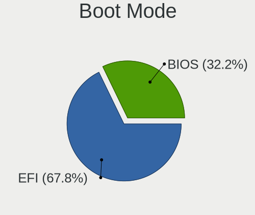

| Mode | Notebooks | Percent |
|------|-----------|---------|
| EFI  | 99        | 66%     |
| BIOS | 51        | 34%     |

Filesystem
----------

Type of filesystem

| Type    | Notebooks | Percent |
|---------|-----------|---------|
| Ext4    | 119       | 78.81%  |
| Overlay | 16        | 10.6%   |
| Tmpfs   | 7         | 4.64%   |
| Btrfs   | 7         | 4.64%   |
| Zfs     | 1         | 0.66%   |
| Xfs     | 1         | 0.66%   |

Part. scheme
------------

Scheme of partitioning

| Type    | Notebooks | Percent |
|---------|-----------|---------|
| GPT     | 79        | 52.67%  |
| Unknown | 39        | 26%     |
| MBR     | 32        | 21.33%  |

Dual Boot with Linux/BSD
------------------------

Hosting more than one Linux/BSD

| Dual boot | Notebooks | Percent |
|-----------|-----------|---------|
| No        | 135       | 90%     |
| Yes       | 15        | 10%     |

Dual Boot (Win)
---------------

Hosting Linux and Windows

| Dual boot | Notebooks | Percent |
|-----------|-----------|---------|
| No        | 118       | 78.67%  |
| Yes       | 32        | 21.33%  |

Board
-----

Vendor
------

Motherboard manufacturer

| Name                   | Notebooks | Percent |
|------------------------|-----------|---------|
| Lenovo                 | 33        | 22.15%  |
| Hewlett-Packard        | 33        | 22.15%  |
| ASUSTek Computer       | 22        | 14.77%  |
| Dell                   | 13        | 8.72%   |
| Acer                   | 10        | 6.71%   |
| Apple                  | 5         | 3.36%   |
| Toshiba                | 4         | 2.68%   |
| HUAWEI                 | 4         | 2.68%   |
| Sony                   | 2         | 1.34%   |
| MSI                    | 2         | 1.34%   |
| Medion                 | 2         | 1.34%   |
| Google                 | 2         | 1.34%   |
| Fujitsu                | 2         | 1.34%   |
| Alienware              | 2         | 1.34%   |
| Unknown                | 2         | 1.34%   |
| VALE                   | 1         | 0.67%   |
| TUXEDO                 | 1         | 0.67%   |
| Samsung Electronics    | 1         | 0.67%   |
| Packard Bell           | 1         | 0.67%   |
| Monster                | 1         | 0.67%   |
| LETSUNG                | 1         | 0.67%   |
| IBM                    | 1         | 0.67%   |
| Fujitsu Siemens        | 1         | 0.67%   |
| Framework              | 1         | 0.67%   |
| Clevo                  | 1         | 0.67%   |
| Avell High Performance | 1         | 0.67%   |

Model
-----

Motherboard model

| Name                                     | Notebooks | Percent |
|------------------------------------------|-----------|---------|
| ASUS VivoBook_ASUSLaptop X1605VA_X1605VA | 3         | 2.01%   |
| Unknown                                  | 3         | 2.01%   |
| HUAWEI CREM-WXX9                         | 2         | 1.34%   |
| HP Pavilion 15                           | 2         | 1.34%   |
| Acer Aspire E5-575                       | 2         | 1.34%   |
| VALE Notebook Classic C171V              | 1         | 0.67%   |
| TUXEDO Pulse 14 Gen1                     | 1         | 0.67%   |
| Toshiba Satellite Pro L100               | 1         | 0.67%   |
| Toshiba Satellite Pro C850-1DQ           | 1         | 0.67%   |
| Toshiba Satellite L745                   | 1         | 0.67%   |
| Toshiba Satellite A135                   | 1         | 0.67%   |
| Sony VGN-FW21E                           | 1         | 0.67%   |
| Sony SVE1511A1EW                         | 1         | 0.67%   |
| Samsung N150P/N210P/N220P                | 1         | 0.67%   |
| Packard Bell EasyNote_MX45               | 1         | 0.67%   |
| MSI Thin GF63 12HW                       | 1         | 0.67%   |
| MSI GF63 Thin 11UC                       | 1         | 0.67%   |
| Monster TULPAR T7 V20.3                  | 1         | 0.67%   |
| Medion P7612                             | 1         | 0.67%   |
| Medion E6214                             | 1         | 0.67%   |
| Lenovo Yoga Slim 7 14ARE05 82A2          | 1         | 0.67%   |
| Lenovo V15 G4 IAH 83FS                   | 1         | 0.67%   |
| Lenovo ThinkPad Z13 Gen 1 21D2001PUS     | 1         | 0.67%   |
| Lenovo ThinkPad X61 76754BJ              | 1         | 0.67%   |
| Lenovo ThinkPad X230 2325SU3             | 1         | 0.67%   |
| Lenovo ThinkPad X230 2325BA3             | 1         | 0.67%   |
| Lenovo ThinkPad X140e 20BLS00400         | 1         | 0.67%   |
| Lenovo ThinkPad X1 Extreme 20MGS1QU00    | 1         | 0.67%   |
| Lenovo ThinkPad X1 Carbon 3rd 20BTS05100 | 1         | 0.67%   |
| Lenovo ThinkPad X1 Carbon 34601C8        | 1         | 0.67%   |
| Lenovo ThinkPad W541 20EGS24J00          | 1         | 0.67%   |
| Lenovo ThinkPad W541 20EGS07C01          | 1         | 0.67%   |
| Lenovo ThinkPad T490 20N3S7DP00          | 1         | 0.67%   |
| Lenovo ThinkPad T480 20L6S2CB00          | 1         | 0.67%   |
| Lenovo ThinkPad T460s 20FAS2G900         | 1         | 0.67%   |
| Lenovo ThinkPad T430 2349STC             | 1         | 0.67%   |
| Lenovo ThinkPad T420s 4176W23            | 1         | 0.67%   |
| Lenovo ThinkPad T420 4236W1Y             | 1         | 0.67%   |
| Lenovo ThinkPad T400 6474EU3             | 1         | 0.67%   |
| Lenovo ThinkPad T16 Gen 1 21CHCTO1WW     | 1         | 0.67%   |

Model Family
------------

Motherboard model prefix

| Name                  | Notebooks | Percent |
|-----------------------|-----------|---------|
| Lenovo ThinkPad       | 21        | 14.09%  |
| ASUS VivoBook         | 10        | 6.71%   |
| Lenovo IdeaPad        | 8         | 5.37%   |
| Acer Aspire           | 8         | 5.37%   |
| HP Pavilion           | 7         | 4.7%    |
| Dell Latitude         | 6         | 4.03%   |
| HP ProBook            | 5         | 3.36%   |
| HP EliteBook          | 5         | 3.36%   |
| Toshiba Satellite     | 4         | 2.68%   |
| HP Compaq             | 3         | 2.01%   |
| Dell XPS              | 3         | 2.01%   |
| Unknown               | 3         | 2.01%   |
| HUAWEI CREM-WXX9      | 2         | 1.34%   |
| HP Laptop             | 2         | 1.34%   |
| HP ENVY               | 2         | 1.34%   |
| HP 250                | 2         | 1.34%   |
| Fujitsu LIFEBOOK      | 2         | 1.34%   |
| Dell Inspiron         | 2         | 1.34%   |
| ASUS ROG              | 2         | 1.34%   |
| Apple MacBookAir7     | 2         | 1.34%   |
| VALE Notebook         | 1         | 0.67%   |
| TUXEDO Pulse          | 1         | 0.67%   |
| Sony VGN-FW21E        | 1         | 0.67%   |
| Sony SVE1511A1EW      | 1         | 0.67%   |
| Samsung N150P         | 1         | 0.67%   |
| Packard Bell EasyNote | 1         | 0.67%   |
| MSI Thin              | 1         | 0.67%   |
| MSI GF63              | 1         | 0.67%   |
| Monster TULPAR        | 1         | 0.67%   |
| Medion P7612          | 1         | 0.67%   |
| Medion E6214          | 1         | 0.67%   |
| Lenovo Yoga           | 1         | 0.67%   |
| Lenovo V15            | 1         | 0.67%   |
| Lenovo Legion         | 1         | 0.67%   |
| Lenovo G50-80         | 1         | 0.67%   |
| IBM ThinkPad          | 1         | 0.67%   |
| HUAWEI KLVL-WXX9      | 1         | 0.67%   |
| HUAWEI BOM-WXX9       | 1         | 0.67%   |
| HP ZBook              | 1         | 0.67%   |
| HP Notebook           | 1         | 0.67%   |

MFG Year
--------

Motherboard manufacture year

| Year    | Notebooks | Percent |
|---------|-----------|---------|
| 2021    | 15        | 10.07%  |
| 2023    | 14        | 9.4%    |
| 2020    | 11        | 7.38%   |
| 2012    | 10        | 6.71%   |
| 2008    | 10        | 6.71%   |
| 2022    | 9         | 6.04%   |
| 2016    | 9         | 6.04%   |
| 2019    | 8         | 5.37%   |
| 2011    | 8         | 5.37%   |
| 2015    | 7         | 4.7%    |
| 2013    | 7         | 4.7%    |
| 2010    | 7         | 4.7%    |
| 2018    | 6         | 4.03%   |
| 2017    | 6         | 4.03%   |
| 2014    | 6         | 4.03%   |
| 2006    | 5         | 3.36%   |
| 2024    | 3         | 2.01%   |
| 2009    | 3         | 2.01%   |
| 2007    | 2         | 1.34%   |
| 2005    | 1         | 0.67%   |
| 2003    | 1         | 0.67%   |
| Unknown | 1         | 0.67%   |

Form Factor
-----------

Physical design of the computer

| Name     | Notebooks | Percent |
|----------|-----------|---------|
| Notebook | 149       | 100%    |

Secure Boot
-----------

Enabled or disabled

| State    | Notebooks | Percent |
|----------|-----------|---------|
| Disabled | 133       | 89.26%  |
| Enabled  | 16        | 10.74%  |

Coreboot
--------

Have coreboot on board

| Used | Notebooks | Percent |
|------|-----------|---------|
| No   | 147       | 98.66%  |
| Yes  | 2         | 1.34%   |

RAM Size
--------

Total RAM memory

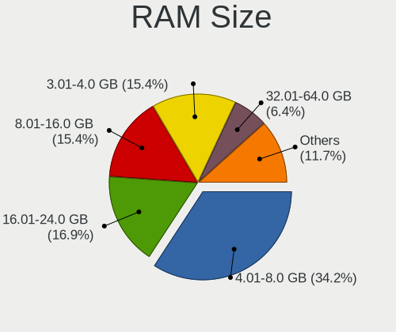

| Size in GB  | Notebooks | Percent |
|-------------|-----------|---------|
| 4.01-8.0    | 54        | 36.24%  |
| 3.01-4.0    | 23        | 15.44%  |
| 16.01-24.0  | 22        | 14.77%  |
| 8.01-16.0   | 21        | 14.09%  |
| 32.01-64.0  | 9         | 6.04%   |
| 2.01-3.0    | 7         | 4.7%    |
| 1.01-2.0    | 5         | 3.36%   |
| 64.01-256.0 | 4         | 2.68%   |
| 24.01-32.0  | 2         | 1.34%   |
| 0.51-1.0    | 2         | 1.34%   |

RAM Used
--------

Used RAM memory

| Used GB    | Notebooks | Percent |
|------------|-----------|---------|
| 2.01-3.0   | 50        | 32.47%  |
| 1.01-2.0   | 45        | 29.22%  |
| 4.01-8.0   | 29        | 18.83%  |
| 3.01-4.0   | 20        | 12.99%  |
| 0.51-1.0   | 4         | 2.6%    |
| 8.01-16.0  | 3         | 1.95%   |
| 16.01-24.0 | 2         | 1.3%    |
| 0.01-0.5   | 1         | 0.65%   |

Total Drives
------------

Number of drives on board

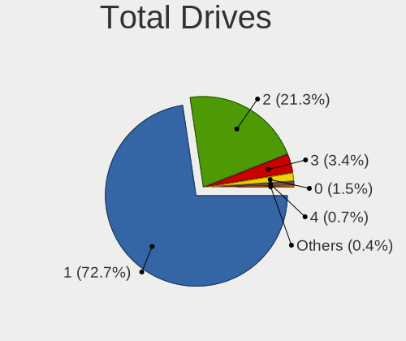

| Drives | Notebooks | Percent |
|--------|-----------|---------|
| 1      | 110       | 73.33%  |
| 2      | 33        | 22%     |
| 3      | 3         | 2%      |
| 4      | 2         | 1.33%   |
| 0      | 2         | 1.33%   |

Has CD-ROM
----------

Has CD-ROM on board

| Presented | Notebooks | Percent |
|-----------|-----------|---------|
| No        | 101       | 67.79%  |
| Yes       | 48        | 32.21%  |

Has Ethernet
------------

Has Ethernet on board

| Presented | Notebooks | Percent |
|-----------|-----------|---------|
| Yes       | 111       | 74.5%   |
| No        | 38        | 25.5%   |

Has WiFi
--------

Has WiFi module

| Presented | Notebooks | Percent |
|-----------|-----------|---------|
| Yes       | 149       | 100%    |

Has Bluetooth
-------------

Has Bluetooth module

| Presented | Notebooks | Percent |
|-----------|-----------|---------|
| Yes       | 122       | 81.88%  |
| No        | 27        | 18.12%  |

Location
--------

Country
-------

Geographic location (country)

| Country      | Notebooks | Percent |
|--------------|-----------|---------|
| Germany      | 30        | 20.13%  |
| Italy        | 25        | 16.78%  |
| USA          | 21        | 14.09%  |
| France       | 8         | 5.37%   |
| Russia       | 6         | 4.03%   |
| Brazil       | 6         | 4.03%   |
| Poland       | 5         | 3.36%   |
| Netherlands  | 5         | 3.36%   |
| UK           | 4         | 2.68%   |
| Spain        | 4         | 2.68%   |
| Canada       | 4         | 2.68%   |
| Belgium      | 3         | 2.01%   |
| Turkey       | 2         | 1.34%   |
| Sweden       | 2         | 1.34%   |
| Saudi Arabia | 2         | 1.34%   |
| India        | 2         | 1.34%   |
| Bolivia      | 2         | 1.34%   |
| Argentina    | 2         | 1.34%   |
| Ukraine      | 1         | 0.67%   |
| Switzerland  | 1         | 0.67%   |
| Romania      | 1         | 0.67%   |
| Réunion     | 1         | 0.67%   |
| Puerto Rico  | 1         | 0.67%   |
| Philippines  | 1         | 0.67%   |
| New Zealand  | 1         | 0.67%   |
| Montenegro   | 1         | 0.67%   |
| Malaysia     | 1         | 0.67%   |
| Israel       | 1         | 0.67%   |
| Indonesia    | 1         | 0.67%   |
| Hungary      | 1         | 0.67%   |
| Georgia      | 1         | 0.67%   |
| Finland      | 1         | 0.67%   |
| Belarus      | 1         | 0.67%   |
| Austria      | 1         | 0.67%   |

City
----

Geographic location (city)

| City                     | Notebooks | Percent |
|--------------------------|-----------|---------|
| Traunstein               | 6         | 3.9%    |
| Paris                    | 3         | 1.95%   |
| Bologna                  | 3         | 1.95%   |
| Aalten                   | 3         | 1.95%   |
| Rennes                   | 2         | 1.3%    |
| Milano                   | 2         | 1.3%    |
| Krakow                   | 2         | 1.3%    |
| Delligsen                | 2         | 1.3%    |
| Dallas                   | 2         | 1.3%    |
| Bonn                     | 2         | 1.3%    |
| Zuidhorn                 | 1         | 0.65%   |
| Yekaterinburg            | 1         | 0.65%   |
| Yanbu                    | 1         | 0.65%   |
| Wittingen                | 1         | 0.65%   |
| Winnipeg                 | 1         | 0.65%   |
| Villa Ballester          | 1         | 0.65%   |
| Vienna                   | 1         | 0.65%   |
| Verona                   | 1         | 0.65%   |
| Valencia                 | 1         | 0.65%   |
| Tsqaltubo                | 1         | 0.65%   |
| Toronto                  | 1         | 0.65%   |
| Toa Baja                 | 1         | 0.65%   |
| Thrissur                 | 1         | 0.65%   |
| Sumy                     | 1         | 0.65%   |
| Succivo                  | 1         | 0.65%   |
| Stuttgart                | 1         | 0.65%   |
| St Petersburg            | 1         | 0.65%   |
| Sorrento                 | 1         | 0.65%   |
| Sochi                    | 1         | 0.65%   |
| Skogas                   | 1         | 0.65%   |
| Schwerin                 | 1         | 0.65%   |
| Sao Paulo                | 1         | 0.65%   |
| San Martino Buon Albergo | 1         | 0.65%   |
| San Juan                 | 1         | 0.65%   |
| San Antonio              | 1         | 0.65%   |
| Salerno                  | 1         | 0.65%   |
| Saint-Pierre             | 1         | 0.65%   |
| Rostov-on-Don            | 1         | 0.65%   |
| Romford                  | 1         | 0.65%   |
| Rome                     | 1         | 0.65%   |

Drives
------

Drive Vendor
------------

Hard drive vendors

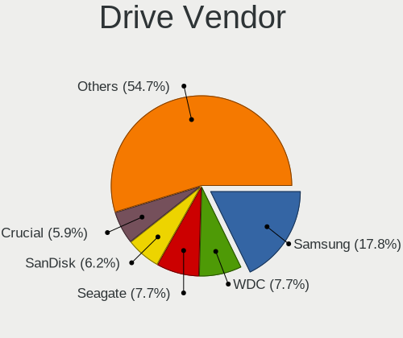

| Vendor                      | Notebooks | Drives | Percent |
|-----------------------------|-----------|--------|---------|
| Samsung Electronics         | 37        | 43     | 20.11%  |
| Seagate                     | 17        | 18     | 9.24%   |
| WDC                         | 15        | 16     | 8.15%   |
| Toshiba                     | 11        | 11     | 5.98%   |
| Micron Technology           | 8         | 8      | 4.35%   |
| Kingston                    | 8         | 12     | 4.35%   |
| SanDisk                     | 7         | 8      | 3.8%    |
| Intel                       | 7         | 7      | 3.8%    |
| Unknown                     | 6         | 8      | 3.26%   |
| SK hynix                    | 6         | 6      | 3.26%   |
| China                       | 6         | 6      | 3.26%   |
| Hitachi                     | 5         | 5      | 2.72%   |
| KIOXIA                      | 4         | 5      | 2.17%   |
| JMicron Technology          | 4         | 4      | 2.17%   |
| Crucial                     | 4         | 4      | 2.17%   |
| Fujitsu                     | 3         | 3      | 1.63%   |
| Apple                       | 3         | 3      | 1.63%   |
| Transcend                   | 2         | 2      | 1.09%   |
| SPCC                        | 2         | 2      | 1.09%   |
| Patriot                     | 2         | 2      | 1.09%   |
| Micron/Crucial Technology   | 2         | 4      | 1.09%   |
| Intenso                     | 2         | 2      | 1.09%   |
| HGST                        | 2         | 2      | 1.09%   |
| Apacer                      | 2         | 3      | 1.09%   |
| Unknown                     | 2         | 2      | 1.09%   |
| Verbatim                    | 1         | 1      | 0.54%   |
| USB3.0                      | 1         | 1      | 0.54%   |
| UMIS                        | 1         | 2      | 0.54%   |
| Team                        | 1         | 1      | 0.54%   |
| Silicon Motion              | 1         | 1      | 0.54%   |
| Realtek                     | 1         | 1      | 0.54%   |
| Phison                      | 1         | 1      | 0.54%   |
| Lexar                       | 1         | 1      | 0.54%   |
| KUU                         | 1         | 1      | 0.54%   |
| KIOXIA-EXCERIA              | 1         | 2      | 0.54%   |
| Kingston Technology Company | 1         | 1      | 0.54%   |
| Integral                    | 1         | 1      | 0.54%   |
| Hewlett-Packard             | 1         | 1      | 0.54%   |
| GLOWAY                      | 1         | 1      | 0.54%   |
| Gigabyte Technology         | 1         | 1      | 0.54%   |

Drive Model
-----------

Hard drive models

| Model                                             | Notebooks | Percent |
|---------------------------------------------------|-----------|---------|
| Seagate ST1000LM035-1RK172 1TB                    | 4         | 2.14%   |
| Kingston SA400S37480G 480GB SSD                   | 4         | 2.14%   |
| Samsung NVMe SSD Controller SM981/PM981/PM983 1TB | 3         | 1.6%    |
| Samsung MZVLQ1T0HALB-00000 1024GB                 | 3         | 1.6%    |
| JMicron Generic 320GB                             | 3         | 1.6%    |
| WDC WD10SPZX-24Z10 1TB                            | 2         | 1.07%   |
| WDC PC SN730 SDBPNTY-512G                         | 2         | 1.07%   |
| Toshiba MQ01ABD100 1TB                            | 2         | 1.07%   |
| Toshiba MQ01ABD050 500GB                          | 2         | 1.07%   |
| SK hynix BC711 HFM256GD3JX013N 256GB              | 2         | 1.07%   |
| Seagate ST9500325AS 500GB                         | 2         | 1.07%   |
| Seagate ST500LM021-1KJ152 500GB                   | 2         | 1.07%   |
| SanDisk NVMe SSD Drive 2TB                        | 2         | 1.07%   |
| Samsung SSD 860 EVO 500GB                         | 2         | 1.07%   |
| Samsung MZVL4512HBLU-00BTW 512GB                  | 2         | 1.07%   |
| Micron 2400_MTFDKBA512QFM 512GB                   | 2         | 1.07%   |
| Kingston SUV400S37240G 240GB SSD                  | 2         | 1.07%   |
| Kingston SA400S37240G 240GB SSD                   | 2         | 1.07%   |
| Intel SSDPEKKF256G8L 256GB                        | 2         | 1.07%   |
| China SATA SSD 240GB                              | 2         | 1.07%   |
| Unknown                                           | 2         | 1.07%   |
| WDC WDS500G2B0A-00SM50 500GB SSD                  | 1         | 0.53%   |
| WDC WDS500G2B0A 500GB SSD                         | 1         | 0.53%   |
| WDC WD7500BPKX-22HPJT0 752GB                      | 1         | 0.53%   |
| WDC WD5000LPVX-60V0TT0 500GB                      | 1         | 0.53%   |
| WDC WD2500BEVS-22UST0 250GB                       | 1         | 0.53%   |
| WDC WD20SPZX-75UA7T1 2TB                          | 1         | 0.53%   |
| WDC WD10SPZX-60Z10T0 1TB                          | 1         | 0.53%   |
| WDC PC SN730 SDBPNTY-256G-1027 256GB              | 1         | 0.53%   |
| WDC PC SN530 SDBPNPZ-512G-1002 512GB              | 1         | 0.53%   |
| WDC PC SN530 SDBPNPZ-256G-1002 256GB              | 1         | 0.53%   |
| WDC PC SN520 SDAPMUW-512G-1101 512GB              | 1         | 0.53%   |
| Verbatim Vi550 S3 128GB SSD                       | 1         | 0.53%   |
| USB3.0 Disk 2TB                                   | 1         | 0.53%   |
| Unknown USB DISK 3.2 1TB                          | 1         | 0.53%   |
| Unknown SN128  128GB                              | 1         | 0.53%   |
| Unknown SD16G  16GB                               | 1         | 0.53%   |
| Unknown MMC Card  64GB                            | 1         | 0.53%   |
| Unknown MMC Card  16GB                            | 1         | 0.53%   |
| Unknown MMC Card  128GB                           | 1         | 0.53%   |

HDD Vendor
----------

Hard disk drive vendors

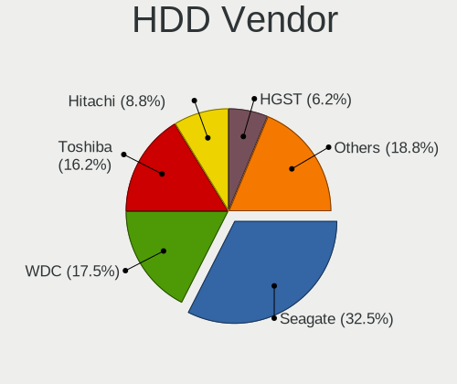

| Vendor              | Notebooks | Drives | Percent |
|---------------------|-----------|--------|---------|
| Seagate             | 17        | 18     | 34%     |
| Toshiba             | 10        | 10     | 20%     |
| WDC                 | 7         | 8      | 14%     |
| Hitachi             | 5         | 5      | 10%     |
| JMicron Technology  | 3         | 3      | 6%      |
| Fujitsu             | 3         | 3      | 6%      |
| Samsung Electronics | 2         | 2      | 4%      |
| HGST                | 2         | 2      | 4%      |
| USB3.0              | 1         | 1      | 2%      |

SSD Vendor
----------

Solid state drive vendors

| Vendor              | Notebooks | Drives | Percent |
|---------------------|-----------|--------|---------|
| Samsung Electronics | 15        | 18     | 25.42%  |
| Kingston            | 8         | 12     | 13.56%  |
| China               | 6         | 6      | 10.17%  |
| SanDisk             | 4         | 4      | 6.78%   |
| Crucial             | 4         | 4      | 6.78%   |
| WDC                 | 2         | 2      | 3.39%   |
| Transcend           | 2         | 2      | 3.39%   |
| SPCC                | 2         | 2      | 3.39%   |
| Intel               | 2         | 2      | 3.39%   |
| Apple               | 2         | 2      | 3.39%   |
| Verbatim            | 1         | 1      | 1.69%   |
| Team                | 1         | 1      | 1.69%   |
| SK hynix            | 1         | 1      | 1.69%   |
| Phison              | 1         | 1      | 1.69%   |
| Patriot             | 1         | 1      | 1.69%   |
| Micron Technology   | 1         | 1      | 1.69%   |
| KUU                 | 1         | 1      | 1.69%   |
| Intenso             | 1         | 1      | 1.69%   |
| Integral            | 1         | 1      | 1.69%   |
| Hewlett-Packard     | 1         | 1      | 1.69%   |
| Gigabyte Technology | 1         | 1      | 1.69%   |
| Apacer              | 1         | 2      | 1.69%   |

Drive Kind
----------

HDD or SSD

| Kind    | Notebooks | Drives | Percent |
|---------|-----------|--------|---------|
| NVMe    | 63        | 73     | 36%     |
| SSD     | 55        | 67     | 31.43%  |
| HDD     | 46        | 52     | 26.29%  |
| MMC     | 7         | 9      | 4%      |
| Unknown | 4         | 4      | 2.29%   |

Drive Connector
---------------

SATA, SAS, NVMe, etc.

| Type | Notebooks | Drives | Percent |
|------|-----------|--------|---------|
| SATA | 90        | 114    | 53.89%  |
| NVMe | 62        | 72     | 37.13%  |
| SAS  | 8         | 10     | 4.79%   |
| MMC  | 7         | 9      | 4.19%   |

Drive Size
----------

Size of hard drive

| Size in TB | Notebooks | Drives | Percent |
|------------|-----------|--------|---------|
| 0.01-0.5   | 70        | 86     | 69.31%  |
| 0.51-1.0   | 26        | 28     | 25.74%  |
| 1.01-2.0   | 4         | 4      | 3.96%   |
| 3.01-4.0   | 1         | 1      | 0.99%   |

Space Total
-----------

Amount of disk space available on the file system

| Size in GB     | Notebooks | Percent |
|----------------|-----------|---------|
| 101-250        | 45        | 29.8%   |
| 501-1000       | 31        | 20.53%  |
| 251-500        | 29        | 19.21%  |
| 1-20           | 15        | 9.93%   |
| 1001-2000      | 10        | 6.62%   |
| 51-100         | 7         | 4.64%   |
| Unknown        | 7         | 4.64%   |
| 21-50          | 4         | 2.65%   |
| 2001-3000      | 2         | 1.32%   |
| More than 3000 | 1         | 0.66%   |

Space Used
----------

Amount of used disk space

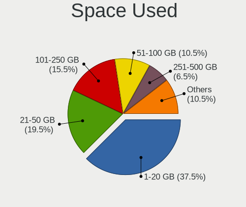

| Used GB   | Notebooks | Percent |
|-----------|-----------|---------|
| 1-20      | 64        | 40.76%  |
| 21-50     | 31        | 19.75%  |
| 101-250   | 21        | 13.38%  |
| 51-100    | 15        | 9.55%   |
| 251-500   | 9         | 5.73%   |
| Unknown   | 7         | 4.46%   |
| 501-1000  | 6         | 3.82%   |
| 1001-2000 | 4         | 2.55%   |

Malfunc. Drives
---------------

Drive models with a malfunction

| Model                                | Notebooks | Drives | Percent |
|--------------------------------------|-----------|--------|---------|
| WDC WD5000LPVX-60V0TT0 500GB         | 1         | 1      | 5%      |
| WDC WD10SPZX-24Z10 1TB               | 1         | 1      | 5%      |
| Transcend TS512GMTS430S 512GB SSD    | 1         | 1      | 5%      |
| Toshiba MK1652GSX 160GB              | 1         | 1      | 5%      |
| SK hynix HFS060G32MNB-2000A 64GB SSD | 1         | 1      | 5%      |
| Seagate ST9500325AS 500GB            | 1         | 1      | 5%      |
| Seagate ST500LM021-1KJ152 500GB      | 1         | 1      | 5%      |
| Seagate ST1000LM014-1EJ164 1TB       | 1         | 1      | 5%      |
| Samsung Electronics HM251JI 250GB    | 1         | 1      | 5%      |
| Lexar SSD 480GB                      | 1         | 1      | 5%      |
| KUU SSD 512GB                        | 1         | 1      | 5%      |
| Kingston SUV400S37240G 240GB SSD     | 1         | 1      | 5%      |
| Kingston SA400S37240G 240GB SSD      | 1         | 1      | 5%      |
| Intel SSDSA2M080G2HP 80GB            | 1         | 1      | 5%      |
| Hitachi HTS548080M9AT00 80GB         | 1         | 1      | 5%      |
| Hitachi HTS543232L9A300 320GB        | 1         | 1      | 5%      |
| HGST HTS721010A9E630 1TB             | 1         | 1      | 5%      |
| Fujitsu MHZ2320BH G2 320GB           | 1         | 1      | 5%      |
| China SH00M256GB SSD                 | 1         | 1      | 5%      |
| Apple SSD SM256C 256GB               | 1         | 1      | 5%      |

Malfunc. Drive Vendor
---------------------

Vendors of faulty drives

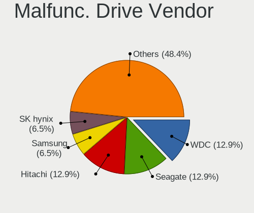

| Vendor              | Notebooks | Drives | Percent |
|---------------------|-----------|--------|---------|
| Seagate             | 3         | 3      | 15%     |
| WDC                 | 2         | 2      | 10%     |
| Kingston            | 2         | 2      | 10%     |
| Hitachi             | 2         | 2      | 10%     |
| Transcend           | 1         | 1      | 5%      |
| Toshiba             | 1         | 1      | 5%      |
| SK hynix            | 1         | 1      | 5%      |
| Samsung Electronics | 1         | 1      | 5%      |
| Lexar               | 1         | 1      | 5%      |
| KUU                 | 1         | 1      | 5%      |
| Intel               | 1         | 1      | 5%      |
| HGST                | 1         | 1      | 5%      |
| Fujitsu             | 1         | 1      | 5%      |
| China               | 1         | 1      | 5%      |
| Apple               | 1         | 1      | 5%      |

Malfunc. HDD Vendor
-------------------

Vendors of faulty HDD drives

| Vendor              | Notebooks | Drives | Percent |
|---------------------|-----------|--------|---------|
| Seagate             | 3         | 3      | 27.27%  |
| WDC                 | 2         | 2      | 18.18%  |
| Hitachi             | 2         | 2      | 18.18%  |
| Toshiba             | 1         | 1      | 9.09%   |
| Samsung Electronics | 1         | 1      | 9.09%   |
| HGST                | 1         | 1      | 9.09%   |
| Fujitsu             | 1         | 1      | 9.09%   |

Malfunc. Drive Kind
-------------------

Kinds of faulty drives

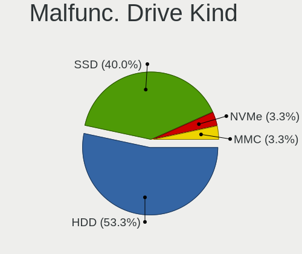

| Kind | Notebooks | Drives | Percent |
|------|-----------|--------|---------|
| HDD  | 11        | 11     | 55%     |
| SSD  | 8         | 8      | 40%     |
| NVMe | 1         | 1      | 5%      |

Failed Drives
-------------

Failed drive models

Zero info for selected period =(

Failed Drive Vendor
-------------------

Failed drive vendors

Zero info for selected period =(

Drive Status
------------

Number of failed and malfunc. drives

| Status   | Notebooks | Drives | Percent |
|----------|-----------|--------|---------|
| Works    | 91        | 108    | 55.83%  |
| Detected | 52        | 77     | 31.9%   |
| Malfunc  | 20        | 20     | 12.27%  |

Storage controller
------------------

Storage Vendor
--------------

Storage controller vendors

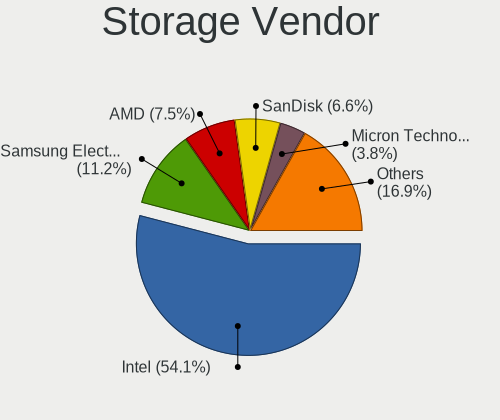

| Vendor                                  | Notebooks | Percent |
|-----------------------------------------|-----------|---------|
| Intel                                   | 98        | 55.37%  |
| Samsung Electronics                     | 21        | 11.86%  |
| AMD                                     | 18        | 10.17%  |
| SanDisk                                 | 9         | 5.08%   |
| Micron Technology                       | 7         | 3.95%   |
| SK hynix                                | 5         | 2.82%   |
| Toshiba America Info Systems            | 3         | 1.69%   |
| KIOXIA                                  | 3         | 1.69%   |
| Silicon Motion                          | 2         | 1.13%   |
| Nvidia                                  | 2         | 1.13%   |
| Micron/Crucial Technology               | 2         | 1.13%   |
| ADATA Technology                        | 2         | 1.13%   |
| Shenzhen Unionmemory Information System | 1         | 0.56%   |
| MAXIO Technology (Hangzhou)             | 1         | 0.56%   |
| Kingston Technology Company             | 1         | 0.56%   |
| Hosin Global Electronics                | 1         | 0.56%   |
| Apple                                   | 1         | 0.56%   |

Storage Model
-------------

Storage controller models

| Model                                                                                       | Notebooks | Percent |
|---------------------------------------------------------------------------------------------|-----------|---------|
| AMD FCH SATA Controller [AHCI mode]                                                         | 16        | 8.42%   |
| Intel 82801 Mobile SATA Controller [RAID mode]                                              | 13        | 6.84%   |
| Intel Sunrise Point-LP SATA Controller [AHCI mode]                                          | 11        | 5.79%   |
| Intel 6 Series/C200 Series Chipset Family 6 port Mobile SATA AHCI Controller                | 8         | 4.21%   |
| Intel Volume Management Device NVMe RAID Controller                                         | 7         | 3.68%   |
| Intel 7 Series Chipset Family 6-port SATA Controller [AHCI mode]                            | 7         | 3.68%   |
| Samsung NVMe SSD Controller SM981/PM981/PM983                                               | 6         | 3.16%   |
| Samsung NVMe SSD Controller 980 (DRAM-less)                                                 | 6         | 3.16%   |
| Intel 82801IBM/IEM (ICH9M/ICH9M-E) 4 port SATA Controller [AHCI mode]                       | 6         | 3.16%   |
| Samsung NVMe SSD Controller PM9B1 (DRAM-less)                                               | 5         | 2.63%   |
| Intel 8 Series SATA Controller 1 [AHCI mode]                                                | 5         | 2.63%   |
| Intel 5 Series/3400 Series Chipset 4 port SATA AHCI Controller                              | 5         | 2.63%   |
| SK hynix Gold P31/BC711/PC711 NVMe Solid State Drive                                        | 4         | 2.11%   |
| Intel Volume Management Device NVMe RAID Controller Intel Corporation                       | 4         | 2.11%   |
| Intel 82801GBM/GHM (ICH7-M Family) SATA Controller [IDE mode]                               | 4         | 2.11%   |
| SanDisk Extreme Pro / WD Black SN750 / PC SN730 / Red SN700 NVMe SSD                        | 3         | 1.58%   |
| Micron 2450 NVMe SSD [HendrixV] (DRAM-less)                                                 | 3         | 1.58%   |
| Intel Wildcat Point-LP SATA Controller [AHCI Mode]                                          | 3         | 1.58%   |
| Intel 8 Series/C220 Series Chipset Family 6-port SATA Controller 1 [AHCI mode]              | 3         | 1.58%   |
| Toshiba America Info Systems XG6 NVMe SSD Controller                                        | 2         | 1.05%   |
| SanDisk Ultra 3D / WD Blue SN550 NVMe SSD                                                   | 2         | 1.05%   |
| Samsung NVMe SSD Controller S4LV008[Pascal]                                                 | 2         | 1.05%   |
| Nvidia MCP79 AHCI Controller                                                                | 2         | 1.05%   |
| Micron 2400 NVMe SSD (DRAM-less)                                                            | 2         | 1.05%   |
| Intel Tiger Lake-LP SATA Controller                                                         | 2         | 1.05%   |
| Intel SSD DC P4101/Pro 7600p/760p/E 6100p Series                                            | 2         | 1.05%   |
| Intel Celeron/Pentium Silver Processor SATA Controller                                      | 2         | 1.05%   |
| Intel Alder Lake-P SATA AHCI Controller                                                     | 2         | 1.05%   |
| Intel 82801HM/HEM (ICH8M/ICH8M-E) SATA Controller [AHCI mode]                               | 2         | 1.05%   |
| Intel 82801HM/HEM (ICH8M/ICH8M-E) IDE Controller                                            | 2         | 1.05%   |
| Intel 7 Series Chipset Family 4-port SATA Controller [IDE mode]                             | 2         | 1.05%   |
| Intel 7 Series Chipset Family 2-port SATA Controller [IDE mode]                             | 2         | 1.05%   |
| Toshiba America Info Systems BG3 x2 NVMe SSD Controller (DRAM-less)                         | 1         | 0.53%   |
| SK hynix BC501 NVMe Solid State Drive                                                       | 1         | 0.53%   |
| Silicon Motion SM2263EN/SM2263XT (DRAM-less) NVMe SSD Controllers                           | 1         | 0.53%   |
| Silicon Motion Non-Volatile memory controller                                               | 1         | 0.53%   |
| Shenzhen Unionmemory Information System RPETJ512MKP1QDQ PCIe 4.0 NVMe SSD 512GB (DRAM-less) | 1         | 0.53%   |
| SanDisk WD Blue SN570 NVMe SSD 2TB                                                          | 1         | 0.53%   |
| SanDisk WD Black SN770 / PC SN740 256GB / PC SN560 (DRAM-less) NVMe SSD                     | 1         | 0.53%   |
| SanDisk Ultra 3D / WD Blue SN570 NVMe SSD (DRAM-less)                                       | 1         | 0.53%   |

Storage Kind
------------

Kind of storage controller (IDE, SATA, NVMe, SAS, ...)

| Kind | Notebooks | Percent |
|------|-----------|---------|
| SATA | 83        | 45.36%  |
| NVMe | 62        | 33.88%  |
| RAID | 25        | 13.66%  |
| IDE  | 13        | 7.1%    |

Processor
---------

CPU Vendor
----------

Processor vendors

| Vendor | Notebooks | Percent |
|--------|-----------|---------|
| Intel  | 121       | 81.21%  |
| AMD    | 28        | 18.79%  |

CPU Model
---------

Processor models

| Model                                      | Notebooks | Percent |
|--------------------------------------------|-----------|---------|
| Intel Core i5-4200U CPU @ 1.60GHz          | 3         | 2.01%   |
| Intel Core i5-3320M CPU @ 2.60GHz          | 3         | 2.01%   |
| Intel 13th Gen Core i9-13900H              | 3         | 2.01%   |
| Intel 11th Gen Core i3-1115G4 @ 3.00GHz    | 3         | 2.01%   |
| AMD Ryzen 7 5800H with Radeon Graphics     | 3         | 2.01%   |
| Intel Pentium CPU P6200 @ 2.13GHz          | 2         | 1.34%   |
| Intel N100                                 | 2         | 1.34%   |
| Intel Core i7-7700HQ CPU @ 2.80GHz         | 2         | 1.34%   |
| Intel Core i7-4810MQ CPU @ 2.80GHz         | 2         | 1.34%   |
| Intel Core i7-2620M CPU @ 2.70GHz          | 2         | 1.34%   |
| Intel Core i5-7200U CPU @ 2.50GHz          | 2         | 1.34%   |
| Intel Core i5-6300U CPU @ 2.40GHz          | 2         | 1.34%   |
| Intel Core i5-6200U CPU @ 2.30GHz          | 2         | 1.34%   |
| Intel Core i5-3230M CPU @ 2.60GHz          | 2         | 1.34%   |
| Intel Core i3-7100U CPU @ 2.40GHz          | 2         | 1.34%   |
| Intel Core i3-6006U CPU @ 2.00GHz          | 2         | 1.34%   |
| Intel Core i3-10110U CPU @ 2.10GHz         | 2         | 1.34%   |
| Intel Atom CPU N270 @ 1.60GHz              | 2         | 1.34%   |
| Intel 12th Gen Core i5-12500H              | 2         | 1.34%   |
| Intel 11th Gen Core i7-1165G7 @ 2.80GHz    | 2         | 1.34%   |
| Intel 11th Gen Core i5-1135G7 @ 2.40GHz    | 2         | 1.34%   |
| AMD Ryzen 7 PRO 6850U with Radeon Graphics | 2         | 1.34%   |
| AMD Ryzen 3 3250U with Radeon Graphics     | 2         | 1.34%   |
| Intel Pentium Silver N5030 CPU @ 1.10GHz   | 1         | 0.67%   |
| Intel Pentium M processor 1500MHz          | 1         | 0.67%   |
| Intel Pentium M processor 1.86GHz          | 1         | 0.67%   |
| Intel Pentium M processor 1.73GHz          | 1         | 0.67%   |
| Intel Pentium CPU N3710 @ 1.60GHz          | 1         | 0.67%   |
| Intel Pentium CPU B970 @ 2.30GHz           | 1         | 0.67%   |
| Intel Pentium CPU B950 @ 2.10GHz           | 1         | 0.67%   |
| Intel Genuine CPU T2080 @ 1.73GHz          | 1         | 0.67%   |
| Intel Genuine CPU T2060 @ 1.60GHz          | 1         | 0.67%   |
| Intel Genuine CPU T1600 @ 1.66GHz          | 1         | 0.67%   |
| Intel Core i7-8850H CPU @ 2.60GHz          | 1         | 0.67%   |
| Intel Core i7-8665U CPU @ 1.90GHz          | 1         | 0.67%   |
| Intel Core i7-8565U CPU @ 1.80GHz          | 1         | 0.67%   |
| Intel Core i7-8550U CPU @ 1.80GHz          | 1         | 0.67%   |
| Intel Core i7-7500U CPU @ 2.70GHz          | 1         | 0.67%   |
| Intel Core i7-6600U CPU @ 2.60GHz          | 1         | 0.67%   |
| Intel Core i7-5600U CPU @ 2.60GHz          | 1         | 0.67%   |

CPU Model Family
----------------

Processor model prefix

| Model                | Notebooks | Percent |
|----------------------|-----------|---------|
| Intel Core i5        | 31        | 20.81%  |
| Other                | 27        | 18.12%  |
| Intel Core i7        | 24        | 16.11%  |
| Intel Core i3        | 11        | 7.38%   |
| Intel Core 2 Duo     | 9         | 6.04%   |
| AMD Ryzen 7          | 6         | 4.03%   |
| Intel Pentium        | 5         | 3.36%   |
| AMD Ryzen 5          | 5         | 3.36%   |
| Intel Celeron        | 4         | 2.68%   |
| Intel Pentium M      | 3         | 2.01%   |
| Intel Genuine        | 3         | 2.01%   |
| Intel Atom           | 3         | 2.01%   |
| AMD Ryzen 7 PRO      | 3         | 2.01%   |
| AMD Ryzen 9          | 2         | 1.34%   |
| AMD Ryzen 3          | 2         | 1.34%   |
| AMD E2               | 2         | 1.34%   |
| Intel Pentium Silver | 1         | 0.67%   |
| Intel Core Duo       | 1         | 0.67%   |
| Intel Celeron M      | 1         | 0.67%   |
| AMD Sempron          | 1         | 0.67%   |
| AMD Ryzen 5 PRO      | 1         | 0.67%   |
| AMD E1               | 1         | 0.67%   |
| AMD A8               | 1         | 0.67%   |
| AMD A6               | 1         | 0.67%   |
| AMD A4               | 1         | 0.67%   |

CPU Cores
---------

Number of processor cores

| Number | Notebooks | Percent |
|--------|-----------|---------|
| 2      | 76        | 51.01%  |
| 4      | 32        | 21.48%  |
| 8      | 13        | 8.72%   |
| 6      | 8         | 5.37%   |
| 1      | 8         | 5.37%   |
| 14     | 4         | 2.68%   |
| 12     | 4         | 2.68%   |
| 10     | 4         | 2.68%   |

CPU Sockets
-----------

Number of sockets

| Number | Notebooks | Percent |
|--------|-----------|---------|
| 1      | 149       | 100%    |

CPU Threads
-----------

Threads per core (Hyper-Threading)

| Number | Notebooks | Percent |
|--------|-----------|---------|
| 2      | 109       | 73.15%  |
| 1      | 40        | 26.85%  |

CPU Op-Modes
------------

CPU Operation Modes (32-bit, 64-bit)

| Op mode        | Notebooks | Percent |
|----------------|-----------|---------|
| 32-bit, 64-bit | 140       | 93.96%  |
| 32-bit         | 9         | 6.04%   |

CPU Microcode
-------------

Microcode number

| Number     | Notebooks | Percent |
|------------|-----------|---------|
| Unknown    | 19        | 12.67%  |
| 0x206a7    | 12        | 8%      |
| 0x306a9    | 9         | 6%      |
| 0x806c1    | 6         | 4%      |
| 0x806ec    | 5         | 3.33%   |
| 0x40651    | 5         | 3.33%   |
| 0x806e9    | 4         | 2.67%   |
| 0x406e3    | 4         | 2.67%   |
| 0x306d4    | 4         | 2.67%   |
| 0x306c3    | 4         | 2.67%   |
| 0x20655    | 4         | 2.67%   |
| 0x1067a    | 4         | 2.67%   |
| 0x0a50000c | 4         | 2.67%   |
| 0x906a3    | 3         | 2%      |
| 0x6fd      | 3         | 2%      |
| 0x6ec      | 3         | 2%      |
| 0x6d8      | 3         | 2%      |
| 0xb06e0    | 2         | 1.33%   |
| 0xb06a3    | 2         | 1.33%   |
| 0xb06a2    | 2         | 1.33%   |
| 0xa0652    | 2         | 1.33%   |
| 0x906e9    | 2         | 1.33%   |
| 0x906a4    | 2         | 1.33%   |
| 0x806ea    | 2         | 1.33%   |
| 0x806d1    | 2         | 1.33%   |
| 0x706e5    | 2         | 1.33%   |
| 0x706a8    | 2         | 1.33%   |
| 0x106c2    | 2         | 1.33%   |
| 0x10676    | 2         | 1.33%   |
| 0x08600106 | 2         | 1.33%   |
| 0x08108109 | 2         | 1.33%   |
| 0x06006704 | 2         | 1.33%   |
| 0x906ea    | 1         | 0.67%   |
| 0x906c0    | 1         | 0.67%   |
| 0x806eb    | 1         | 0.67%   |
| 0x6fa      | 1         | 0.67%   |
| 0x695      | 1         | 0.67%   |
| 0x30678    | 1         | 0.67%   |
| 0x20652    | 1         | 0.67%   |
| 0x106ca    | 1         | 0.67%   |

CPU Microarch
-------------

Microarchitecture

| Name             | Notebooks | Percent |
|------------------|-----------|---------|
| KabyLake         | 19        | 12.75%  |
| Alderlake Hybrid | 13        | 8.72%   |
| SandyBridge      | 12        | 8.05%   |
| IvyBridge        | 9         | 6.04%   |
| Haswell          | 9         | 6.04%   |
| TigerLake        | 8         | 5.37%   |
| Skylake          | 7         | 4.7%    |
| P6               | 7         | 4.7%    |
| Zen 3            | 6         | 4.03%   |
| Penryn           | 6         | 4.03%   |
| Broadwell        | 6         | 4.03%   |
| Unknown          | 6         | 4.03%   |
| Westmere         | 5         | 3.36%   |
| Icelake          | 4         | 2.68%   |
| Core             | 4         | 2.68%   |
| Zen+             | 3         | 2.01%   |
| Zen 2            | 3         | 2.01%   |
| Excavator        | 3         | 2.01%   |
| Bonnell          | 3         | 2.01%   |
| Zen              | 2         | 1.34%   |
| Silvermont       | 2         | 1.34%   |
| Puma             | 2         | 1.34%   |
| Gracemont        | 2         | 1.34%   |
| Goldmont plus    | 2         | 1.34%   |
| CometLake        | 2         | 1.34%   |
| Tremont          | 1         | 0.67%   |
| Piledriver       | 1         | 0.67%   |
| K8 & K10 hybrid  | 1         | 0.67%   |
| Jaguar           | 1         | 0.67%   |

Graphics
--------

GPU Vendor
----------

Vendors of graphics cards

| Vendor | Notebooks | Percent |
|--------|-----------|---------|
| Intel  | 110       | 62.15%  |
| AMD    | 37        | 20.9%   |
| Nvidia | 30        | 16.95%  |

GPU Model
---------

Graphics card models

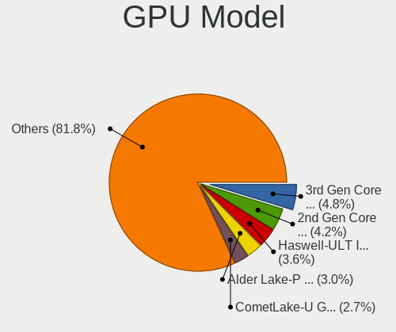

| Model                                                                         | Notebooks | Percent |
|-------------------------------------------------------------------------------|-----------|---------|
| Intel 2nd Generation Core Processor Family Integrated Graphics Controller     | 11        | 5.88%   |
| Intel 3rd Gen Core processor Graphics Controller                              | 9         | 4.81%   |
| Intel Skylake GT2 [HD Graphics 520]                                           | 6         | 3.21%   |
| Intel Raptor Lake-P [Iris Xe Graphics]                                        | 6         | 3.21%   |
| Intel TigerLake-LP GT2 [Iris Xe Graphics]                                     | 5         | 2.67%   |
| Intel HD Graphics 620                                                         | 5         | 2.67%   |
| Intel Haswell-ULT Integrated Graphics Controller                              | 5         | 2.67%   |
| Intel WhiskeyLake-U GT2 [UHD Graphics 620]                                    | 4         | 2.14%   |
| Intel Mobile 945GM/GMS/GME, 943/940GML Express Integrated Graphics Controller | 4         | 2.14%   |
| Intel Mobile 4 Series Chipset Integrated Graphics Controller                  | 4         | 2.14%   |
| Intel HD Graphics 5500                                                        | 4         | 2.14%   |
| Intel Core Processor Integrated Graphics Controller                           | 4         | 2.14%   |
| Intel CometLake-U GT2 [UHD Graphics]                                          | 4         | 2.14%   |
| Intel 4th Gen Core Processor Integrated Graphics Controller                   | 4         | 2.14%   |
| AMD Picasso/Raven 2 [Radeon Vega Series / Radeon Vega Mobile Series]          | 4         | 2.14%   |
| AMD Cezanne [Radeon Vega Series / Radeon Vega Mobile Series]                  | 4         | 2.14%   |
| Intel Tiger Lake-LP GT2 [UHD Graphics G4]                                     | 3         | 1.6%    |
| Intel Mobile 945GM/GMS, 943/940GML Express Integrated Graphics Controller     | 3         | 1.6%    |
| Intel Alder Lake-P GT2 [Iris Xe Graphics]                                     | 3         | 1.6%    |
| AMD Stoney [Radeon R2/R3/R4/R5 Graphics]                                      | 3         | 1.6%    |
| AMD Renoir [Radeon RX Vega 6 (Ryzen 4000/5000 Mobile Series)]                 | 3         | 1.6%    |
| Nvidia TU117M [GeForce GTX 1650 Mobile / Max-Q]                               | 2         | 1.07%   |
| Nvidia GP107M [GeForce GTX 1050 Ti Mobile]                                    | 2         | 1.07%   |
| Nvidia GK106GLM [Quadro K2100M]                                               | 2         | 1.07%   |
| Nvidia GA107M [GeForce RTX 3050 Mobile]                                       | 2         | 1.07%   |
| Nvidia GA106M [GeForce RTX 3060 Mobile / Max-Q]                               | 2         | 1.07%   |
| Intel UHD Graphics 620                                                        | 2         | 1.07%   |
| Intel Mobile GM965/GL960 Integrated Graphics Controller (secondary)           | 2         | 1.07%   |
| Intel Mobile GM965/GL960 Integrated Graphics Controller (primary)             | 2         | 1.07%   |
| Intel Mobile 915GM/GMS/910GML Express Graphics Controller                     | 2         | 1.07%   |
| Intel HD Graphics 6000                                                        | 2         | 1.07%   |
| Intel CometLake-H GT2 [UHD Graphics]                                          | 2         | 1.07%   |
| Intel CoffeeLake-H GT2 [UHD Graphics 630]                                     | 2         | 1.07%   |
| Intel Alder Lake-UP3 GT2 [Iris Xe Graphics]                                   | 2         | 1.07%   |
| Intel Alder Lake-N [UHD Graphics]                                             | 2         | 1.07%   |
| AMD Sun XT [Radeon HD 8670A/8670M/8690M / R5 M330 / M430 / Radeon 520 Mobile] | 2         | 1.07%   |
| AMD Rembrandt [Radeon 680M]                                                   | 2         | 1.07%   |
| AMD Phoenix1                                                                  | 2         | 1.07%   |
| AMD Mullins [Radeon R2 Graphics]                                              | 2         | 1.07%   |
| AMD Lucienne                                                                  | 2         | 1.07%   |

GPU Combo
---------

Combinations of graphics cards

| Name           | Notebooks | Percent |
|----------------|-----------|---------|
| 1 x Intel      | 72        | 48.32%  |
| 1 x AMD        | 27        | 18.12%  |
| Intel + Nvidia | 20        | 13.42%  |
| 2 x Intel      | 12        | 8.05%   |
| 1 x Nvidia     | 7         | 4.7%    |
| Intel + AMD    | 6         | 4.03%   |
| 2 x AMD        | 2         | 1.34%   |
| AMD + Nvidia   | 2         | 1.34%   |
| 2 x Nvidia     | 1         | 0.67%   |

GPU Driver
----------

Free vs proprietary

| Driver      | Notebooks | Percent |
|-------------|-----------|---------|
| Free        | 140       | 93.96%  |
| Proprietary | 9         | 6.04%   |

GPU Memory
----------

Total video memory

| Size in GB | Notebooks | Percent |
|------------|-----------|---------|
| Unknown    | 99        | 66.44%  |
| 0.01-0.5   | 24        | 16.11%  |
| 1.01-2.0   | 11        | 7.38%   |
| 0.51-1.0   | 6         | 4.03%   |
| 3.01-4.0   | 4         | 2.68%   |
| 5.01-6.0   | 3         | 2.01%   |
| 7.01-8.0   | 1         | 0.67%   |
| 8.01-16.0  | 1         | 0.67%   |

Monitor
-------

Monitor Vendor
--------------

Monitor vendors

| Vendor                  | Notebooks | Percent |
|-------------------------|-----------|---------|
| BOE                     | 33        | 20.25%  |
| AU Optronics            | 33        | 20.25%  |
| Chimei Innolux          | 23        | 14.11%  |
| LG Display              | 19        | 11.66%  |
| Samsung Electronics     | 11        | 6.75%   |
| Sharp                   | 6         | 3.68%   |
| Apple                   | 5         | 3.07%   |
| LG Philips              | 3         | 1.84%   |
| Philips                 | 2         | 1.23%   |
| PANDA                   | 2         | 1.23%   |
| Panasonic               | 2         | 1.23%   |
| Lenovo                  | 2         | 1.23%   |
| Goldstar                | 2         | 1.23%   |
| Dell                    | 2         | 1.23%   |
| ASUSTek Computer        | 2         | 1.23%   |
| Acer                    | 2         | 1.23%   |
| Unknown                 | 1         | 0.61%   |
| Toshiba                 | 1         | 0.61%   |
| STA                     | 1         | 0.61%   |
| Quanta Display          | 1         | 0.61%   |
| Mi                      | 1         | 0.61%   |
| KDB                     | 1         | 0.61%   |
| InnoLux Display         | 1         | 0.61%   |
| InfoVision              | 1         | 0.61%   |
| Iiyama                  | 1         | 0.61%   |
| HUAWEI                  | 1         | 0.61%   |
| Hewlett-Packard         | 1         | 0.61%   |
| Eizo                    | 1         | 0.61%   |
| Chi Mei Optoelectronics | 1         | 0.61%   |
| AOC                     | 1         | 0.61%   |

Monitor Model
-------------

Monitor models

| Model                                                                 | Notebooks | Percent |
|-----------------------------------------------------------------------|-----------|---------|
| Chimei Innolux LCD Monitor CMN1618 1920x1200 344x215mm 16.0-inch      | 3         | 1.84%   |
| Samsung Electronics LCD Monitor SEC3047 1366x768 277x156mm 12.5-inch  | 2         | 1.23%   |
| Panasonic VVX13F009G00 MEI96A2 1920x1080 344x193mm 15.5-inch          | 2         | 1.23%   |
| Chimei Innolux LCD Monitor CMN14D5 1920x1080 309x173mm 13.9-inch      | 2         | 1.23%   |
| BOE LCD Monitor BOE095F 2256x1504 285x190mm 13.5-inch                 | 2         | 1.23%   |
| BOE LCD Monitor BOE092F 2520x1680 338x226mm 16.0-inch                 | 2         | 1.23%   |
| BOE LCD Monitor BOE0704 1366x768 344x194mm 15.5-inch                  | 2         | 1.23%   |
| AU Optronics LCD Monitor AUO45EC 1366x768 344x193mm 15.5-inch         | 2         | 1.23%   |
| AU Optronics LCD Monitor AUO229E 1920x1080 309x174mm 14.0-inch        | 2         | 1.23%   |
| AU Optronics LCD Monitor AUO219D 1920x1080 381x214mm 17.2-inch        | 2         | 1.23%   |
| Unknown LCD Monitor CSO 2560x1600                                     | 1         | 0.61%   |
| Toshiba ScreenXpert TSB8888 1080x2160                                 | 1         | 0.61%   |
| STA LCD Monitor STA5DCA 1366x768 256x144mm 11.6-inch                  | 1         | 0.61%   |
| Sharp LQ156M1JW09 SHP14D3 1920x1080 344x194mm 15.5-inch               | 1         | 0.61%   |
| Sharp LCD Monitor SHP1518 1920x1200 366x229mm 17.0-inch               | 1         | 0.61%   |
| Sharp LCD Monitor SHP14FA 3840x2400 288x180mm 13.4-inch               | 1         | 0.61%   |
| Sharp LCD Monitor SHP1449 1920x1080 294x165mm 13.3-inch               | 1         | 0.61%   |
| Sharp LCD Monitor SHP13CA 1280x800 331x207mm 15.4-inch                | 1         | 0.61%   |
| Sharp LCD Monitor SHP13B4 1024x768 304x228mm 15.0-inch                | 1         | 0.61%   |
| Samsung Electronics S24C450 SAM09CB 1920x1080 531x299mm 24.0-inch     | 1         | 0.61%   |
| Samsung Electronics LS32A70 SAM7165 3840x2160 700x400mm 31.7-inch     | 1         | 0.61%   |
| Samsung Electronics LCD Monitor SEC5441 1366x768 344x194mm 15.5-inch  | 1         | 0.61%   |
| Samsung Electronics LCD Monitor SEC3250 1366x768 344x193mm 15.5-inch  | 1         | 0.61%   |
| Samsung Electronics LCD Monitor SEC324C 1600x900 310x174mm 14.0-inch  | 1         | 0.61%   |
| Samsung Electronics LCD Monitor SEC314B 1600x900 344x194mm 15.5-inch  | 1         | 0.61%   |
| Samsung Electronics LCD Monitor SEC3052 1024x600 223x125mm 10.1-inch  | 1         | 0.61%   |
| Samsung Electronics LCD Monitor SDC4852 1366x768 344x194mm 15.5-inch  | 1         | 0.61%   |
| Samsung Electronics LCD Monitor SAM094D 1920x1080 890x500mm 40.2-inch | 1         | 0.61%   |
| Quanta Display LCD Monitor QDS0015 1024x768 285x214mm 14.0-inch       | 1         | 0.61%   |
| Philips PHL 233V5 PHLC0D0 1920x1080 509x286mm 23.0-inch               | 1         | 0.61%   |
| Philips 220BLP PHL08BF 1680x1050 474x296mm 22.0-inch                  | 1         | 0.61%   |
| PANDA LCD Monitor NCP0046 1920x1080 344x194mm 15.5-inch               | 1         | 0.61%   |
| PANDA LCD Monitor NCP002D 1920x1080 344x194mm 15.5-inch               | 1         | 0.61%   |
| Mi Redmi Monitor XMI23C3 1920x1080 527x293mm 23.7-inch                | 1         | 0.61%   |
| LG Philips LP154WX4-TLAB LPL3D01 1280x800 331x207mm 15.4-inch         | 1         | 0.61%   |
| LG Philips LCD Monitor LPLE300 1280x800 331x207mm 15.4-inch           | 1         | 0.61%   |
| LG Philips LCD Monitor LPLA500 1280x800 304x190mm 14.1-inch           | 1         | 0.61%   |
| LG Display LP156WH2-TLRA LGD026B 1366x768 344x194mm 15.5-inch         | 1         | 0.61%   |
| LG Display LP116WH2-TLC1 LGD0232 1366x768 256x144mm 11.6-inch         | 1         | 0.61%   |
| LG Display LCD Monitor LGD06CA 1920x1080 309x174mm 14.0-inch          | 1         | 0.61%   |

Monitor Resolution
------------------

Monitor screen resolution

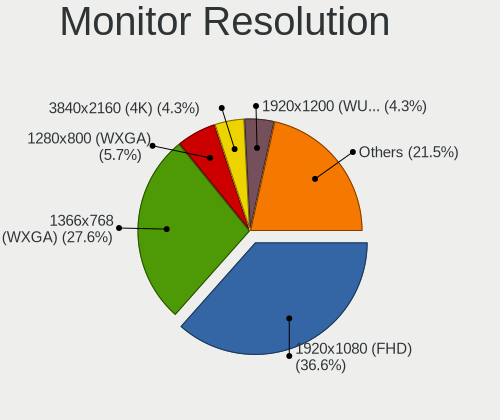

| Resolution         | Notebooks | Percent |
|--------------------|-----------|---------|
| 1920x1080 (FHD)    | 53        | 34.42%  |
| 1366x768 (WXGA)    | 45        | 29.22%  |
| 3840x2160 (4K)     | 9         | 5.84%   |
| 1920x1200 (WUXGA)  | 8         | 5.19%   |
| 1280x800 (WXGA)    | 8         | 5.19%   |
| 1600x900 (HD+)     | 6         | 3.9%    |
| 2560x1600          | 3         | 1.95%   |
| 1440x900 (WXGA+)   | 3         | 1.95%   |
| 3440x1440          | 2         | 1.3%    |
| 2520x1680          | 2         | 1.3%    |
| 2256x1504          | 2         | 1.3%    |
| 1680x1050 (WSXGA+) | 2         | 1.3%    |
| 1280x1024 (SXGA)   | 2         | 1.3%    |
| 1024x768 (XGA)     | 2         | 1.3%    |
| 3840x2400          | 1         | 0.65%   |
| 2560x1440 (QHD)    | 1         | 0.65%   |
| 2560x1080          | 1         | 0.65%   |
| 2160x1440          | 1         | 0.65%   |
| 1920x1280          | 1         | 0.65%   |
| 1680x945           | 1         | 0.65%   |
| 1024x600           | 1         | 0.65%   |

Monitor Diagonal
----------------

Diagonal size in inches

| Inches  | Notebooks | Percent |
|---------|-----------|---------|
| 15      | 67        | 41.1%   |
| 13      | 23        | 14.11%  |
| 14      | 17        | 10.43%  |
| 17      | 15        | 9.2%    |
| 16      | 7         | 4.29%   |
| 12      | 5         | 3.07%   |
| 11      | 5         | 3.07%   |
| 24      | 4         | 2.45%   |
| 21      | 4         | 2.45%   |
| 34      | 3         | 1.84%   |
| 23      | 3         | 1.84%   |
| 19      | 2         | 1.23%   |
| 86      | 1         | 0.61%   |
| 54      | 1         | 0.61%   |
| 31      | 1         | 0.61%   |
| 27      | 1         | 0.61%   |
| 22      | 1         | 0.61%   |
| 18      | 1         | 0.61%   |
| 8       | 1         | 0.61%   |
| Unknown | 1         | 0.61%   |

Monitor Width
-------------

Physical width

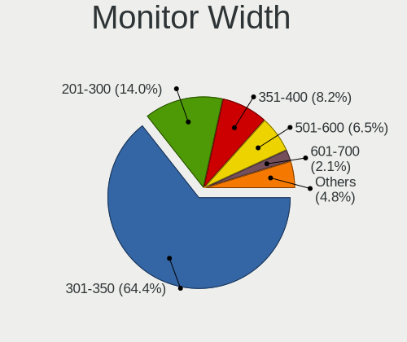

| Width in mm | Notebooks | Percent |
|-------------|-----------|---------|
| 301-350     | 98        | 60.49%  |
| 201-300     | 24        | 14.81%  |
| 351-400     | 19        | 11.73%  |
| 501-600     | 8         | 4.94%   |
| 401-500     | 5         | 3.09%   |
| 701-800     | 3         | 1.85%   |
| 1001-1500   | 2         | 1.23%   |
| 601-700     | 1         | 0.62%   |
| 101-200     | 1         | 0.62%   |
| Unknown     | 1         | 0.62%   |

Aspect Ratio
------------

Proportional relationship between the width and the height

| Ratio   | Notebooks | Percent |
|---------|-----------|---------|
| 16/9    | 114       | 75%     |
| 16/10   | 23        | 15.13%  |
| 3/2     | 6         | 3.95%   |
| 21/9    | 3         | 1.97%   |
| 5/4     | 2         | 1.32%   |
| 4/3     | 2         | 1.32%   |
| 0.56    | 1         | 0.66%   |
| Unknown | 1         | 0.66%   |

Monitor Area
------------

Area in inch²

| Area in inch² | Notebooks | Percent |
|----------------|-----------|---------|
| 101-110        | 67        | 41.61%  |
| 81-90          | 32        | 19.88%  |
| 121-130        | 13        | 8.07%   |
| 201-250        | 8         | 4.97%   |
| 71-80          | 7         | 4.35%   |
| 111-120        | 7         | 4.35%   |
| 61-70          | 5         | 3.11%   |
| 51-60          | 5         | 3.11%   |
| 351-500        | 4         | 2.48%   |
| 151-200        | 4         | 2.48%   |
| More than 1000 | 2         | 1.24%   |
| 131-140        | 2         | 1.24%   |
| 1-40           | 1         | 0.62%   |
| 301-350        | 1         | 0.62%   |
| 141-150        | 1         | 0.62%   |
| 91-100         | 1         | 0.62%   |
| Unknown        | 1         | 0.62%   |

Pixel Density
-------------

Pixels per inch

| Density       | Notebooks | Percent |
|---------------|-----------|---------|
| 121-160       | 60        | 37.74%  |
| 101-120       | 51        | 32.08%  |
| 51-100        | 22        | 13.84%  |
| 161-240       | 17        | 10.69%  |
| More than 240 | 6         | 3.77%   |
| 1-50          | 2         | 1.26%   |
| Unknown       | 1         | 0.63%   |

Multiple Monitors
-----------------

Total monitors connected

| Total | Notebooks | Percent |
|-------|-----------|---------|
| 1     | 134       | 89.33%  |
| 2     | 14        | 9.33%   |
| 4     | 1         | 0.67%   |
| 3     | 1         | 0.67%   |

Network
-------

Net Controller Vendor
---------------------

Controller vendors

| Vendor                                | Notebooks | Percent |
|---------------------------------------|-----------|---------|
| Realtek Semiconductor                 | 79        | 33.91%  |
| Intel                                 | 67        | 28.76%  |
| Qualcomm Atheros                      | 27        | 11.59%  |
| Broadcom                              | 12        | 5.15%   |
| MediaTek                              | 8         | 3.43%   |
| Broadcom Limited                      | 6         | 2.58%   |
| Marvell Technology Group              | 5         | 2.15%   |
| TP-Link                               | 4         | 1.72%   |
| Qualcomm                              | 4         | 1.72%   |
| Samsung Electronics                   | 2         | 0.86%   |
| Ralink                                | 2         | 0.86%   |
| Nvidia                                | 2         | 0.86%   |
| JMicron Technology                    | 2         | 0.86%   |
| ASIX Electronics                      | 2         | 0.86%   |
| U-Blox                                | 1         | 0.43%   |
| Sierra Wireless                       | 1         | 0.43%   |
| Ralink Technology                     | 1         | 0.43%   |
| QinHeng Electronics                   | 1         | 0.43%   |
| NetGear                               | 1         | 0.43%   |
| Lenovo                                | 1         | 0.43%   |
| Ericsson Business Mobile Networks     | 1         | 0.43%   |
| DisplayLink                           | 1         | 0.43%   |
| Dell                                  | 1         | 0.43%   |
| Cisco Aironet Wireless Communications | 1         | 0.43%   |
| AMD                                   | 1         | 0.43%   |

Net Controller Model
--------------------

Controller models

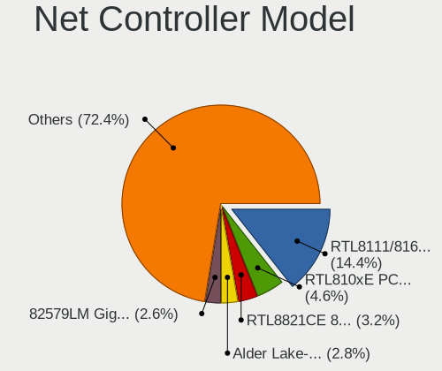

| Model                                                                         | Notebooks | Percent |
|-------------------------------------------------------------------------------|-----------|---------|
| Realtek RTL8111/8168/8211/8411 PCI Express Gigabit Ethernet Controller        | 42        | 15.05%  |
| Realtek RTL810xE PCI Express Fast Ethernet controller                         | 14        | 5.02%   |
| Realtek RTL8821CE 802.11ac PCIe Wireless Network Adapter                      | 11        | 3.94%   |
| Intel 82579LM Gigabit Network Connection (Lewisville)                         | 9         | 3.23%   |
| Realtek RTL8822CE 802.11ac PCIe Wireless Network Adapter                      | 7         | 2.51%   |
| Intel Centrino Advanced-N 6205 [Taylor Peak]                                  | 7         | 2.51%   |
| Qualcomm Atheros QCA9377 802.11ac Wireless Network Adapter                    | 6         | 2.15%   |
| Intel Wireless 7260                                                           | 6         | 2.15%   |
| Intel Alder Lake-P PCH CNVi WiFi                                              | 5         | 1.79%   |
| Qualcomm Atheros QCA9565 / AR9565 Wireless Network Adapter                    | 4         | 1.43%   |
| Qualcomm Atheros AR9285 Wireless Network Adapter (PCI-Express)                | 4         | 1.43%   |
| MediaTek Wi-Fi 6E MT7902 Wireless Network Adapter                             | 4         | 1.43%   |
| Realtek RTL8723BE PCIe Wireless Network Adapter                               | 3         | 1.08%   |
| Realtek RTL8153 Gigabit Ethernet Adapter                                      | 3         | 1.08%   |
| Realtek RTL-8100/8101L/8139 PCI Fast Ethernet Adapter                         | 3         | 1.08%   |
| Qualcomm QCNFA765 Wireless Network Adapter                                    | 3         | 1.08%   |
| Qualcomm Atheros QCA6174 802.11ac Wireless Network Adapter                    | 3         | 1.08%   |
| Qualcomm Atheros AR9485 Wireless Network Adapter                              | 3         | 1.08%   |
| MediaTek MT7921 802.11ax PCI Express Wireless Network Adapter                 | 3         | 1.08%   |
| Intel Wireless 8265 / 8275                                                    | 3         | 1.08%   |
| Intel Wireless 8260                                                           | 3         | 1.08%   |
| Intel Wireless 7265                                                           | 3         | 1.08%   |
| Intel Wi-Fi 6 AX200                                                           | 3         | 1.08%   |
| Intel Raptor Lake PCH CNVi WiFi                                               | 3         | 1.08%   |
| Intel PRO/Wireless 5100 AGN [Shiloh] Network Connection                       | 3         | 1.08%   |
| Intel Ethernet Connection I219-LM                                             | 3         | 1.08%   |
| Broadcom BCM4313 802.11bgn Wireless Network Adapter                           | 3         | 1.08%   |
| Realtek RTL8852BE PCIe 802.11ax Wireless Network Controller                   | 2         | 0.72%   |
| Realtek RTL8191SEvB Wireless LAN Controller                                   | 2         | 0.72%   |
| Realtek RTL8188CE 802.11b/g/n WiFi Adapter                                    | 2         | 0.72%   |
| Realtek RTL8125 2.5GbE Controller                                             | 2         | 0.72%   |
| Ralink RT3290 Wireless 802.11n 1T/1R PCIe                                     | 2         | 0.72%   |
| Qualcomm Atheros Killer E220x Gigabit Ethernet Controller                     | 2         | 0.72%   |
| Qualcomm Atheros AR8131 Gigabit Ethernet                                      | 2         | 0.72%   |
| Qualcomm Atheros AR242x / AR542x Wireless Network Adapter (PCI-Express)       | 2         | 0.72%   |
| Qualcomm Atheros AR2413/AR2414 Wireless Network Adapter [AR5005G(S) 802.11bg] | 2         | 0.72%   |
| Nvidia MCP79 Ethernet                                                         | 2         | 0.72%   |
| JMicron JMC250 PCI Express Gigabit Ethernet Controller                        | 2         | 0.72%   |
| Intel Wi-Fi 6E(802.11ax) AX210/AX1675* 2x2 [Typhoon Peak]                     | 2         | 0.72%   |
| Intel Wi-Fi 6 AX201                                                           | 2         | 0.72%   |

Wireless Vendor
---------------

Wireless vendors

| Vendor                                | Notebooks | Percent |
|---------------------------------------|-----------|---------|
| Intel                                 | 63        | 40.13%  |
| Realtek Semiconductor                 | 33        | 21.02%  |
| Qualcomm Atheros                      | 24        | 15.29%  |
| Broadcom                              | 10        | 6.37%   |
| MediaTek                              | 8         | 5.1%    |
| TP-Link                               | 4         | 2.55%   |
| Qualcomm                              | 4         | 2.55%   |
| Broadcom Limited                      | 4         | 2.55%   |
| Ralink                                | 2         | 1.27%   |
| Sierra Wireless                       | 1         | 0.64%   |
| Ralink Technology                     | 1         | 0.64%   |
| NetGear                               | 1         | 0.64%   |
| Dell                                  | 1         | 0.64%   |
| Cisco Aironet Wireless Communications | 1         | 0.64%   |

Wireless Model
--------------

Wireless models

| Model                                                                         | Notebooks | Percent |
|-------------------------------------------------------------------------------|-----------|---------|
| Realtek RTL8821CE 802.11ac PCIe Wireless Network Adapter                      | 11        | 6.96%   |
| Realtek RTL8822CE 802.11ac PCIe Wireless Network Adapter                      | 7         | 4.43%   |
| Intel Centrino Advanced-N 6205 [Taylor Peak]                                  | 7         | 4.43%   |
| Qualcomm Atheros QCA9377 802.11ac Wireless Network Adapter                    | 6         | 3.8%    |
| Intel Wireless 7260                                                           | 6         | 3.8%    |
| Intel Alder Lake-P PCH CNVi WiFi                                              | 5         | 3.16%   |
| Qualcomm Atheros QCA9565 / AR9565 Wireless Network Adapter                    | 4         | 2.53%   |
| Qualcomm Atheros AR9285 Wireless Network Adapter (PCI-Express)                | 4         | 2.53%   |
| MediaTek Wi-Fi 6E MT7902 Wireless Network Adapter                             | 4         | 2.53%   |
| Realtek RTL8723BE PCIe Wireless Network Adapter                               | 3         | 1.9%    |
| Qualcomm QCNFA765 Wireless Network Adapter                                    | 3         | 1.9%    |
| Qualcomm Atheros QCA6174 802.11ac Wireless Network Adapter                    | 3         | 1.9%    |
| Qualcomm Atheros AR9485 Wireless Network Adapter                              | 3         | 1.9%    |
| MediaTek MT7921 802.11ax PCI Express Wireless Network Adapter                 | 3         | 1.9%    |
| Intel Wireless 8265 / 8275                                                    | 3         | 1.9%    |
| Intel Wireless 8260                                                           | 3         | 1.9%    |
| Intel Wireless 7265                                                           | 3         | 1.9%    |
| Intel Wi-Fi 6 AX200                                                           | 3         | 1.9%    |
| Intel Raptor Lake PCH CNVi WiFi                                               | 3         | 1.9%    |
| Intel PRO/Wireless 5100 AGN [Shiloh] Network Connection                       | 3         | 1.9%    |
| Broadcom BCM4313 802.11bgn Wireless Network Adapter                           | 3         | 1.9%    |
| Realtek RTL8852BE PCIe 802.11ax Wireless Network Controller                   | 2         | 1.27%   |
| Realtek RTL8191SEvB Wireless LAN Controller                                   | 2         | 1.27%   |
| Realtek RTL8188CE 802.11b/g/n WiFi Adapter                                    | 2         | 1.27%   |
| Ralink RT3290 Wireless 802.11n 1T/1R PCIe                                     | 2         | 1.27%   |
| Qualcomm Atheros AR242x / AR542x Wireless Network Adapter (PCI-Express)       | 2         | 1.27%   |
| Qualcomm Atheros AR2413/AR2414 Wireless Network Adapter [AR5005G(S) 802.11bg] | 2         | 1.27%   |
| Intel Wi-Fi 6E(802.11ax) AX210/AX1675* 2x2 [Typhoon Peak]                     | 2         | 1.27%   |
| Intel Wi-Fi 6 AX201                                                           | 2         | 1.27%   |
| Intel Tiger Lake PCH CNVi WiFi                                                | 2         | 1.27%   |
| Intel Comet Lake PCH-LP CNVi WiFi                                             | 2         | 1.27%   |
| Intel Comet Lake PCH CNVi WiFi                                                | 2         | 1.27%   |
| Intel Cannon Point-LP CNVi [Wireless-AC]                                      | 2         | 1.27%   |
| Intel Cannon Lake PCH CNVi WiFi                                               | 2         | 1.27%   |
| Broadcom Limited BCM4360 802.11ac Dual Band Wireless Network Adapter          | 2         | 1.27%   |
| Broadcom BCM4312 802.11b/g LP-PHY                                             | 2         | 1.27%   |
| TP-Link TL-WN823N v2/v3 [Realtek RTL8192EU]                                   | 1         | 0.63%   |
| TP-Link TL-WN722N v2/v3 [Realtek RTL8188EUS]                                  | 1         | 0.63%   |
| TP-Link Archer T4U ver.3                                                      | 1         | 0.63%   |
| TP-Link Archer T3U [Realtek RTL8812BU]                                        | 1         | 0.63%   |

Ethernet Vendor
---------------

Ethernet vendors

| Vendor                   | Notebooks | Percent |
|--------------------------|-----------|---------|
| Realtek Semiconductor    | 64        | 55.65%  |
| Intel                    | 26        | 22.61%  |
| Qualcomm Atheros         | 5         | 4.35%   |
| Marvell Technology Group | 5         | 4.35%   |
| Broadcom                 | 3         | 2.61%   |
| Samsung Electronics      | 2         | 1.74%   |
| Nvidia                   | 2         | 1.74%   |
| JMicron Technology       | 2         | 1.74%   |
| Broadcom Limited         | 2         | 1.74%   |
| ASIX Electronics         | 2         | 1.74%   |
| Lenovo                   | 1         | 0.87%   |
| DisplayLink              | 1         | 0.87%   |

Ethernet Model
--------------

Ethernet models

| Model                                                                  | Notebooks | Percent |
|------------------------------------------------------------------------|-----------|---------|
| Realtek RTL8111/8168/8211/8411 PCI Express Gigabit Ethernet Controller | 42        | 36.21%  |
| Realtek RTL810xE PCI Express Fast Ethernet controller                  | 14        | 12.07%  |
| Intel 82579LM Gigabit Network Connection (Lewisville)                  | 9         | 7.76%   |
| Realtek RTL8153 Gigabit Ethernet Adapter                               | 3         | 2.59%   |
| Realtek RTL-8100/8101L/8139 PCI Fast Ethernet Adapter                  | 3         | 2.59%   |
| Intel Ethernet Connection I219-LM                                      | 3         | 2.59%   |
| Realtek RTL8125 2.5GbE Controller                                      | 2         | 1.72%   |
| Qualcomm Atheros Killer E220x Gigabit Ethernet Controller              | 2         | 1.72%   |
| Qualcomm Atheros AR8131 Gigabit Ethernet                               | 2         | 1.72%   |
| Nvidia MCP79 Ethernet                                                  | 2         | 1.72%   |
| JMicron JMC250 PCI Express Gigabit Ethernet Controller                 | 2         | 1.72%   |
| Intel Ethernet Connection I217-LM                                      | 2         | 1.72%   |
| Intel Ethernet Connection (6) I219-LM                                  | 2         | 1.72%   |
| ASIX AX88179 Gigabit Ethernet                                          | 2         | 1.72%   |
| Samsung GT-I9070 (network tethering, USB debugging enabled)            | 1         | 0.86%   |
| Samsung Galaxy series, misc. (tethering mode)                          | 1         | 0.86%   |
| Realtek USB 10/100/1G/2.5G LAN                                         | 1         | 0.86%   |
| Qualcomm Atheros AR8151 v2.0 Gigabit Ethernet                          | 1         | 0.86%   |
| Marvell Group 88E8057 PCI-E Gigabit Ethernet Controller                | 1         | 0.86%   |
| Marvell Group 88E8055 PCI-E Gigabit Ethernet Controller                | 1         | 0.86%   |
| Marvell Group 88E8042 PCI-E Fast Ethernet Controller                   | 1         | 0.86%   |
| Marvell Group 88E8040 PCI-E Fast Ethernet Controller                   | 1         | 0.86%   |
| Marvell Group 88E8038 PCI-E Fast Ethernet Controller                   | 1         | 0.86%   |
| Lenovo ThinkPad Lan                                                    | 1         | 0.86%   |
| Intel Ethernet Connection I218-V                                       | 1         | 0.86%   |
| Intel Ethernet Connection (7) I219-LM                                  | 1         | 0.86%   |
| Intel Ethernet Connection (4) I219-LM                                  | 1         | 0.86%   |
| Intel Ethernet Connection (3) I218-LM                                  | 1         | 0.86%   |
| Intel Ethernet Connection (16) I219-LM                                 | 1         | 0.86%   |
| Intel Ethernet Connection (14) I219-LM                                 | 1         | 0.86%   |
| Intel Ethernet Connection (10) I219-LM                                 | 1         | 0.86%   |
| Intel 82801DB PRO/100 VE (MOB) Ethernet Controller                     | 1         | 0.86%   |
| Intel 82567LM Gigabit Network Connection                               | 1         | 0.86%   |
| Intel 82566MM Gigabit Network Connection                               | 1         | 0.86%   |
| DisplayLink DL-Dock                                                    | 1         | 0.86%   |
| Broadcom NetXtreme BCM57786 Gigabit Ethernet PCIe                      | 1         | 0.86%   |
| Broadcom NetXtreme BCM57765 Gigabit Ethernet PCIe                      | 1         | 0.86%   |
| Broadcom NetLink BCM57785 Gigabit Ethernet PCIe                        | 1         | 0.86%   |
| Broadcom Limited NetXtreme BCM5751 Gigabit Ethernet PCI Express        | 1         | 0.86%   |
| Broadcom Limited NetLink BCM5906M Fast Ethernet PCI Express            | 1         | 0.86%   |

Net Controller Kind
-------------------

Ethernet, WiFi or modem

| Kind     | Notebooks | Percent |
|----------|-----------|---------|
| WiFi     | 148       | 55.85%  |
| Ethernet | 112       | 42.26%  |
| Modem    | 5         | 1.89%   |

Used Controller
---------------

Currently used network controller

| Kind     | Notebooks | Percent |
|----------|-----------|---------|
| WiFi     | 122       | 75.31%  |
| Ethernet | 40        | 24.69%  |

NICs
----

Total network controllers on board

| Total | Notebooks | Percent |
|-------|-----------|---------|
| 2     | 100       | 67.11%  |
| 1     | 46        | 30.87%  |
| 3     | 3         | 2.01%   |

IPv6
----

IPv6 vs IPv4

| Used | Notebooks | Percent |
|------|-----------|---------|
| No   | 108       | 71.05%  |
| Yes  | 44        | 28.95%  |

Bluetooth
---------

Bluetooth Vendor
----------------

Controller vendors

| Vendor                          | Notebooks | Percent |
|---------------------------------|-----------|---------|
| Intel                           | 45        | 36.59%  |
| Realtek Semiconductor           | 16        | 13.01%  |
| IMC Networks                    | 12        | 9.76%   |
| Qualcomm Atheros Communications | 10        | 8.13%   |
| Broadcom                        | 10        | 8.13%   |
| Apple                           | 5         | 4.07%   |
| Lite-On Technology              | 4         | 3.25%   |
| Foxconn / Hon Hai               | 4         | 3.25%   |
| Realtek                         | 3         | 2.44%   |
| USI                             | 2         | 1.63%   |
| Ralink                          | 2         | 1.63%   |
| Hewlett-Packard                 | 2         | 1.63%   |
| Dell                            | 2         | 1.63%   |
| Cambridge Silicon Radio         | 2         | 1.63%   |
| Askey Computer                  | 2         | 1.63%   |
| Toshiba                         | 1         | 0.81%   |
| ASUSTek Computer                | 1         | 0.81%   |

Bluetooth Model
---------------

Controller models

| Model                                               | Notebooks | Percent |
|-----------------------------------------------------|-----------|---------|
| Realtek Bluetooth Radio                             | 12        | 9.76%   |
| Intel AX201 Bluetooth                               | 11        | 8.94%   |
| Intel Bluetooth wireless interface                  | 10        | 8.13%   |
| Intel Bluetooth 9460/9560 Jefferson Peak (JfP)      | 8         | 6.5%    |
| Qualcomm Atheros  Bluetooth Device                  | 6         | 4.88%   |
| Intel Bluetooth Device                              | 6         | 4.88%   |
| IMC Networks Wireless_Device                        | 6         | 4.88%   |
| Intel AX211 Bluetooth                               | 4         | 3.25%   |
| IMC Networks Bluetooth Radio                        | 4         | 3.25%   |
| Realtek  Bluetooth 4.2 Adapter                      | 3         | 2.44%   |
| Realtek Bluetooth Radio                             | 3         | 2.44%   |
| Intel AX200 Bluetooth                               | 3         | 2.44%   |
| Broadcom BCM20702 Bluetooth 4.0 [ThinkPad]          | 3         | 2.44%   |
| USI Bluetooth Device                                | 2         | 1.63%   |
| Ralink RT3290 Bluetooth                             | 2         | 1.63%   |
| Qualcomm Atheros QCA61x4 Bluetooth 4.0              | 2         | 1.63%   |
| Lite-On Qualcomm Atheros QCA9377 Bluetooth          | 2         | 1.63%   |
| Intel AX210 Bluetooth                               | 2         | 1.63%   |
| Cambridge Silicon Radio Bluetooth Dongle (HCI mode) | 2         | 1.63%   |
| Askey Bluetooth Device                              | 2         | 1.63%   |
| Apple Bluetooth USB Host Controller                 | 2         | 1.63%   |
| Apple Bluetooth Host Controller                     | 2         | 1.63%   |
| Toshiba RT Bluetooth Radio                          | 1         | 0.81%   |
| Realtek 802.11ac WLAN Adapter                       | 1         | 0.81%   |
| Qualcomm Atheros AR3012 Bluetooth                   | 1         | 0.81%   |
| Qualcomm Atheros AR3011 Bluetooth                   | 1         | 0.81%   |
| Lite-On Wireless_Device                             | 1         | 0.81%   |
| Lite-On Atheros AR3012 Bluetooth                    | 1         | 0.81%   |
| Intel Wireless-AC 3168 Bluetooth                    | 1         | 0.81%   |
| IMC Networks Bluetooth Device                       | 1         | 0.81%   |
| IMC Networks BCM20702A0                             | 1         | 0.81%   |
| HP Broadcom 2070 Bluetooth Combo                    | 1         | 0.81%   |
| HP Bluetooth 2.0 Interface [Broadcom BCM2045]       | 1         | 0.81%   |
| Foxconn / Hon Hai Wireless_Device                   | 1         | 0.81%   |
| Foxconn / Hon Hai Broadcom Bluetooth 2.1 Device     | 1         | 0.81%   |
| Foxconn / Hon Hai Bluetooth USB Host Controller     | 1         | 0.81%   |
| Foxconn / Hon Hai Bluetooth Device                  | 1         | 0.81%   |
| Dell Wireless 350 Bluetooth                         | 1         | 0.81%   |
| Dell DW375 Bluetooth Module                         | 1         | 0.81%   |
| Broadcom HP Portable Valentine                      | 1         | 0.81%   |

Sound
-----

Sound Vendor
------------

Sound card vendors

| Vendor              | Notebooks | Percent |
|---------------------|-----------|---------|
| Intel               | 118       | 67.05%  |
| AMD                 | 31        | 17.61%  |
| Nvidia              | 20        | 11.36%  |
| Texas Instruments   | 1         | 0.57%   |
| Logitech            | 1         | 0.57%   |
| JMTek               | 1         | 0.57%   |
| Focusrite-Novation  | 1         | 0.57%   |
| DSEA A/S            | 1         | 0.57%   |
| Creative Technology | 1         | 0.57%   |
| C-Media Electronics | 1         | 0.57%   |

Sound Model
-----------

Sound card models

| Model                                                                      | Notebooks | Percent |
|----------------------------------------------------------------------------|-----------|---------|
| AMD Family 17h/19h HD Audio Controller                                     | 19        | 8.8%    |
| Intel Sunrise Point-LP HD Audio                                            | 14        | 6.48%   |
| Intel 7 Series/C216 Chipset Family High Definition Audio Controller        | 12        | 5.56%   |
| AMD Renoir Radeon High Definition Audio Controller                         | 10        | 4.63%   |
| Intel 6 Series/C200 Series Chipset Family High Definition Audio Controller | 9         | 4.17%   |
| Intel Tiger Lake-LP Smart Sound Technology Audio Controller                | 8         | 3.7%    |
| Intel Alder Lake PCH-P High Definition Audio Controller                    | 7         | 3.24%   |
| Intel 82801I (ICH9 Family) HD Audio Controller                             | 7         | 3.24%   |
| Intel Wildcat Point-LP High Definition Audio Controller                    | 6         | 2.78%   |
| Intel Raptor Lake-P/U/H cAVS                                               | 6         | 2.78%   |
| Intel Broadwell-U Audio Controller                                         | 6         | 2.78%   |
| Intel NM10/ICH7 Family High Definition Audio Controller                    | 5         | 2.31%   |
| Intel Haswell-ULT HD Audio Controller                                      | 5         | 2.31%   |
| Intel 8 Series HD Audio Controller                                         | 5         | 2.31%   |
| Intel 5 Series/3400 Series Chipset High Definition Audio                   | 5         | 2.31%   |
| Intel Xeon E3-1200 v3/4th Gen Core Processor HD Audio Controller           | 4         | 1.85%   |
| Intel Comet Lake PCH-LP cAVS                                               | 4         | 1.85%   |
| Intel Cannon Point-LP High Definition Audio Controller                     | 4         | 1.85%   |
| Intel 8 Series/C220 Series Chipset High Definition Audio Controller        | 4         | 1.85%   |
| AMD Rembrandt Radeon High Definition Audio Controller                      | 4         | 1.85%   |
| AMD Raven/Raven2/Fenghuang HDMI/DP Audio Controller                        | 4         | 1.85%   |
| AMD FCH Azalia Controller                                                  | 4         | 1.85%   |
| Nvidia GK106 HDMI Audio Controller                                         | 3         | 1.39%   |
| AMD Kabini HDMI/DP Audio                                                   | 3         | 1.39%   |
| AMD High Definition Audio Controller                                       | 3         | 1.39%   |
| AMD Family 15h (Models 60h-6fh) Audio Controller                           | 3         | 1.39%   |
| Nvidia TU107 GeForce GTX 1650 High Definition Audio Controller             | 2         | 0.93%   |
| Nvidia MCP79 High Definition Audio                                         | 2         | 0.93%   |
| Nvidia GP107GL High Definition Audio Controller                            | 2         | 0.93%   |
| Nvidia GF119 HDMI Audio Controller                                         | 2         | 0.93%   |
| Nvidia GF108 High Definition Audio Controller                              | 2         | 0.93%   |
| Nvidia GA106 High Definition Audio Controller                              | 2         | 0.93%   |
| Nvidia Audio device                                                        | 2         | 0.93%   |
| Intel Tiger Lake-H HD Audio Controller                                     | 2         | 0.93%   |
| Intel Ice Lake-LP Smart Sound Technology Audio Controller                  | 2         | 0.93%   |
| Intel Comet Lake PCH cAVS                                                  | 2         | 0.93%   |
| Intel CM238 HD Audio Controller                                            | 2         | 0.93%   |
| Intel Celeron/Pentium Silver Processor High Definition Audio               | 2         | 0.93%   |
| Intel Cannon Lake PCH cAVS                                                 | 2         | 0.93%   |
| Intel Alder Lake-N PCH High Definition Audio Controller                    | 2         | 0.93%   |

Memory
------

Memory Vendor
-------------

Memory module vendors

| Vendor                       | Notebooks | Percent |
|------------------------------|-----------|---------|
| Samsung Electronics          | 43        | 35.25%  |
| SK hynix                     | 20        | 16.39%  |
| Micron Technology            | 20        | 16.39%  |
| Unknown                      | 13        | 10.66%  |
| Kingston                     | 4         | 3.28%   |
| A-DATA Technology            | 4         | 3.28%   |
| Elpida                       | 3         | 2.46%   |
| Nanya Technology             | 2         | 1.64%   |
| Crucial                      | 2         | 1.64%   |
| Corsair                      | 2         | 1.64%   |
| Timetec                      | 1         | 0.82%   |
| Team                         | 1         | 0.82%   |
| Smart                        | 1         | 0.82%   |
| Ramaxel Technology           | 1         | 0.82%   |
| Patriot Memory (PDP Systems) | 1         | 0.82%   |
| G.Skill                      | 1         | 0.82%   |
| ASint Technology             | 1         | 0.82%   |
| 48spaces                     | 1         | 0.82%   |
| Unknown                      | 1         | 0.82%   |

Memory Model
------------

Memory module models

| Model                                                       | Notebooks | Percent |
|-------------------------------------------------------------|-----------|---------|
| Samsung RAM M471A1K43EB1-CWE 8GB SODIMM DDR4 3200MT/s       | 5         | 3.68%   |
| Samsung RAM M471A5244CB0-CTD 4GB SODIMM DDR4 3266MT/s       | 4         | 2.94%   |
| Micron RAM 4ATF1G64HZ-3G2F1 8GB SODIMM DDR4 3200MT/s        | 4         | 2.94%   |
| Unknown RAM Module 2GB SODIMM DDR2                          | 3         | 2.21%   |
| Unknown RAM Module 4GB SODIMM DDR2 667MT/s                  | 2         | 1.47%   |
| Unknown RAM Module 2GB SODIMM DDR2 667MT/s                  | 2         | 1.47%   |
| SK hynix RAM HMT451S6BFR8A-PB 4GB SODIMM DDR3 1600MT/s      | 2         | 1.47%   |
| SK hynix RAM HMT451S6AFR8C-PB 4GB SODIMM DDR3 1600MT/s      | 2         | 1.47%   |
| SK hynix RAM HMT425S6CFR6C-PB 2GB SODIMM 1600MT/s           | 2         | 1.47%   |
| Samsung RAM M471B5173DB0-YK0 4GB SODIMM DDR3 1600MT/s       | 2         | 1.47%   |
| Samsung RAM M471B5173BH0-CK0 4GB SODIMM DDR3 1600MT/s       | 2         | 1.47%   |
| Samsung RAM M471A2G44BM0-CWE 16GB SODIMM DDR4 3200MT/s      | 2         | 1.47%   |
| Samsung RAM M471A1K43CB1-CRC 8GB SODIMM DDR4 2667MT/s       | 2         | 1.47%   |
| Samsung RAM M471A1G44AB0-CWE 8GB Row Of Chips DDR4 3200MT/s | 2         | 1.47%   |
| Kingston RAM 99U5469-045.A00LF 4GB SODIMM DDR3 1600MT/s     | 2         | 1.47%   |
| Unknown RAM Module 512MB SODIMM DRAM                        | 1         | 0.74%   |
| Unknown RAM Module 512MB SODIMM DDR2                        | 1         | 0.74%   |
| Unknown RAM Module 512MB SODIMM DDR                         | 1         | 0.74%   |
| Unknown RAM Module 4GB Row Of Chips LPDDR4 4267MT/s         | 1         | 0.74%   |
| Unknown RAM Module 4GB Chip DDR4 2133MT/s                   | 1         | 0.74%   |
| Unknown RAM Module 2GB SODIMM SDRAM                         | 1         | 0.74%   |
| Unknown RAM Module 1GB SODIMM SDRAM                         | 1         | 0.74%   |
| Unknown RAM Module 1GB SODIMM DDR2 667MT/s                  | 1         | 0.74%   |
| Unknown RAM Module 1GB SODIMM DDR2 533MT/s                  | 1         | 0.74%   |
| Unknown RAM Module 1GB SODIMM DDR2                          | 1         | 0.74%   |
| Unknown RAM Module 1GB SODIMM DDR                           | 1         | 0.74%   |
| Timetec RAM S8G-1600 8GB SODIMM DDR3 1600MT/s               | 1         | 0.74%   |
| Team RAM TEAMGROUP-SD4-3200 16384MB SODIMM DDR4 3200MT/s    | 1         | 0.74%   |
| Smart RAM SF464128CK8IWGKFEG 4GB SODIMM DDR4 2400MT/s       | 1         | 0.74%   |
| SK hynix RAM Module 8GB SODIMM DDR4 3200MT/s                | 1         | 0.74%   |
| SK hynix RAM Module 512MB SODIMM DDR2 533MT/s               | 1         | 0.74%   |
| SK hynix RAM Module 4GB SODIMM DDR4 2133MT/s                | 1         | 0.74%   |
| SK hynix RAM Module 32GB SODIMM DDR4 3200MT/s               | 1         | 0.74%   |
| SK hynix RAM Module 1GB SODIMM DDR 667MT/s                  | 1         | 0.74%   |
| SK hynix RAM Module 16GB SODIMM DDR4 2667MT/s               | 1         | 0.74%   |
| SK hynix RAM HMT41GS6MFR8C-PB 8GB SODIMM DDR3 1600MT/s      | 1         | 0.74%   |
| SK hynix RAM HMT351S6EFR8A-PB 4GB SODIMM DDR3 1600MT/s      | 1         | 0.74%   |
| SK hynix RAM HMT351S6CFR8C-PB 4GB SODIMM DDR3 1600MT/s      | 1         | 0.74%   |
| SK hynix RAM HMT112S6BFR6C-G7 1GB SODIMM DDR3 1067MT/s      | 1         | 0.74%   |
| SK hynix RAM HMT112S6AFR8C-G7 1GB SODIMM DDR3 1066MT/s      | 1         | 0.74%   |

Memory Kind
-----------

Memory module kinds

| Kind   | Notebooks | Percent |
|--------|-----------|---------|
| DDR4   | 44        | 41.9%   |
| DDR3   | 32        | 30.48%  |
| DDR2   | 7         | 6.67%   |
| LPDDR5 | 6         | 5.71%   |
| SDRAM  | 5         | 4.76%   |
| LPDDR4 | 3         | 2.86%   |
| DDR5   | 3         | 2.86%   |
| DDR    | 3         | 2.86%   |
| LPDDR3 | 1         | 0.95%   |
| DRAM   | 1         | 0.95%   |

Memory Form Factor
------------------

Physical design of the memory module

| Name         | Notebooks | Percent |
|--------------|-----------|---------|
| SODIMM       | 93        | 86.92%  |
| Row Of Chips | 11        | 10.28%  |
| Chip         | 3         | 2.8%    |

Memory Size
-----------

Memory module size

| Size  | Notebooks | Percent |
|-------|-----------|---------|
| 4096  | 39        | 32.5%   |
| 8192  | 36        | 30%     |
| 2048  | 18        | 15%     |
| 16384 | 10        | 8.33%   |
| 1024  | 8         | 6.67%   |
| 512   | 5         | 4.17%   |
| 32768 | 4         | 3.33%   |

Memory Speed
------------

Memory module speed

| Speed   | Notebooks | Percent |
|---------|-----------|---------|
| 3200    | 26        | 23.21%  |
| 1600    | 23        | 20.54%  |
| 2667    | 11        | 9.82%   |
| Unknown | 7         | 6.25%   |
| 2133    | 6         | 5.36%   |
| 6400    | 5         | 4.46%   |
| 667     | 5         | 4.46%   |
| 3266    | 4         | 3.57%   |
| 2400    | 3         | 2.68%   |
| 2048    | 3         | 2.68%   |
| 1334    | 3         | 2.68%   |
| 1333    | 3         | 2.68%   |
| 1067    | 3         | 2.68%   |
| 4800    | 2         | 1.79%   |
| 533     | 2         | 1.79%   |
| 5600    | 1         | 0.89%   |
| 5500    | 1         | 0.89%   |
| 4267    | 1         | 0.89%   |
| 4266    | 1         | 0.89%   |
| 4199    | 1         | 0.89%   |
| 1066    | 1         | 0.89%   |

Printers & scanners
-------------------

Printer Vendor
--------------

Printer device vendors

| Vendor          | Notebooks | Percent |
|-----------------|-----------|---------|
| Hewlett-Packard | 1         | 50%     |
| Canon           | 1         | 50%     |

Printer Model
-------------

Printer device models

| Model                  | Notebooks | Percent |
|------------------------|-----------|---------|
| HP DeskJet 4100 series | 1         | 50%     |
| Canon TR4600 series    | 1         | 50%     |

Scanner Vendor
--------------

Scanner device vendors

Zero info for selected period =(

Scanner Model
-------------

Scanner device models

Zero info for selected period =(

Camera
------

Camera Vendor
-------------

Camera device vendors

| Vendor                                 | Notebooks | Percent |
|----------------------------------------|-----------|---------|
| Chicony Electronics                    | 31        | 24.22%  |
| IMC Networks                           | 16        | 12.5%   |
| Quanta                                 | 12        | 9.38%   |
| Bison Electronics                      | 10        | 7.81%   |
| Sunplus Innovation Technology          | 8         | 6.25%   |
| Microdia                               | 8         | 6.25%   |
| Realtek Semiconductor                  | 6         | 4.69%   |
| Luxvisions Innotech Limited            | 6         | 4.69%   |
| Cheng Uei Precision Industry (Foxlink) | 6         | 4.69%   |
| Acer                                   | 5         | 3.91%   |
| Suyin                                  | 4         | 3.13%   |
| ShineTech                              | 3         | 2.34%   |
| Apple                                  | 3         | 2.34%   |
| Sonix Technology                       | 2         | 1.56%   |
| Ricoh                                  | 2         | 1.56%   |
| Lite-On Technology                     | 2         | 1.56%   |
| Z-Star Microelectronics                | 1         | 0.78%   |
| Shine-optics                           | 1         | 0.78%   |
| Logitech                               | 1         | 0.78%   |
| Alcor Micro                            | 1         | 0.78%   |

Camera Model
------------

Camera device models

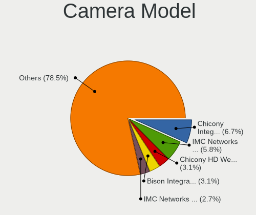

| Model                                                   | Notebooks | Percent |
|---------------------------------------------------------|-----------|---------|
| Chicony Integrated Camera                               | 9         | 6.98%   |
| IMC Networks USB2.0 HD UVC WebCam                       | 6         | 4.65%   |
| IMC Networks USB2.0 VGA UVC WebCam                      | 5         | 3.88%   |
| Bison Integrated Camera                                 | 5         | 3.88%   |
| Chicony HD WebCam                                       | 4         | 3.1%    |
| Realtek Integrated_Webcam_HD                            | 3         | 2.33%   |
| Quanta HP HD Camera                                     | 3         | 2.33%   |
| Microdia Integrated_Webcam_HD                           | 3         | 2.33%   |
| ShineTech HD Camera                                     | 2         | 1.55%   |
| Quanta VGA WebCam                                       | 2         | 1.55%   |
| Microdia Sonix USB 2.0 Camera                           | 2         | 1.55%   |
| Luxvisions Innotech Limited Integrated RGB Camera       | 2         | 1.55%   |
| Luxvisions Innotech Limited HP TrueVision HD Camera     | 2         | 1.55%   |
| IMC Networks Integrated Camera                          | 2         | 1.55%   |
| Chicony TOSHIBA Web Camera - HD                         | 2         | 1.55%   |
| Chicony HP Truevision HD                                | 2         | 1.55%   |
| Chicony HP HD Camera                                    | 2         | 1.55%   |
| Cheng Uei Precision Industry (Foxlink) HP Truevision HD | 2         | 1.55%   |
| Acer Integrated RGB Camera                              | 2         | 1.55%   |
| Z-Star Webcam                                           | 1         | 0.78%   |
| Suyin HP Truevision HD                                  | 1         | 0.78%   |
| Suyin HD WebCam                                         | 1         | 0.78%   |
| Suyin Acer/HP Integrated Webcam [CN0314]                | 1         | 0.78%   |
| Suyin Acer CrystalEye Webcam                            | 1         | 0.78%   |
| Sunplus Laptop_Integrated_Webcam_HD                     | 1         | 0.78%   |
| Sunplus Laptop_Integrated_Webcam_FHD                    | 1         | 0.78%   |
| Sunplus Laptop Integrated Webcam HD                     | 1         | 0.78%   |
| Sunplus Laptop Integrated Webcam FHD                    | 1         | 0.78%   |
| Sunplus Integrated_Webcam_FHD                           | 1         | 0.78%   |
| Sunplus Hy FHD B200 Came                                | 1         | 0.78%   |
| Sunplus HP TrueVision HD Camera                         | 1         | 0.78%   |
| Sunplus HesTongCamera                                   | 1         | 0.78%   |
| Sonix USB2.0 HD UVC WebCam                              | 1         | 0.78%   |
| Sonix USB2.0 FHD UVC WebCam                             | 1         | 0.78%   |
| ShineTech USB2.0 HD UVC WebCam                          | 1         | 0.78%   |
| Shine-optics USB2.0 HD UVC WebCam                       | 1         | 0.78%   |
| Ricoh USB2.0 Camera                                     | 1         | 0.78%   |
| Ricoh Sony Vaio Integrated Webcam                       | 1         | 0.78%   |
| Realtek USB2.0-Camera                                   | 1         | 0.78%   |
| Realtek USB2.0 HD UVC WebCam                            | 1         | 0.78%   |

Security
--------

Fingerprint Vendor
------------------

Fingerprint sensor vendors

| Vendor                     | Notebooks | Percent |
|----------------------------|-----------|---------|
| Validity Sensors           | 9         | 33.33%  |
| Synaptics                  | 9         | 33.33%  |
| Shenzhen Goodix Technology | 4         | 14.81%  |
| Elan Microelectronics      | 2         | 7.41%   |
| Upek                       | 1         | 3.7%    |
| STMicroelectronics         | 1         | 3.7%    |
| Microsoft                  | 1         | 3.7%    |

Fingerprint Model
-----------------

Fingerprint sensor models

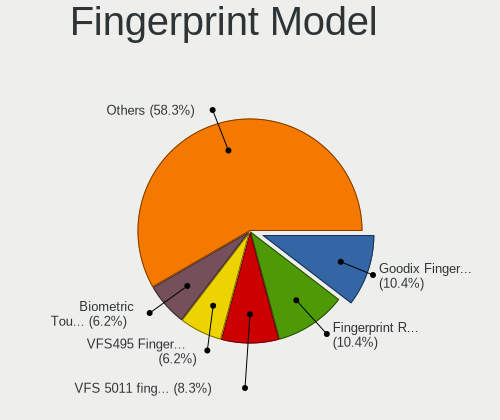

| Model                                                    | Notebooks | Percent |
|----------------------------------------------------------|-----------|---------|
| Synaptics FS7604 Touch Fingerprint Sensor with PurePrint | 3         | 11.11%  |
| Shenzhen Goodix  Fingerprint Device                      | 3         | 11.11%  |
| Validity Sensors VFS495 Fingerprint Reader               | 2         | 7.41%   |
| Validity Sensors VFS 5011 fingerprint sensor             | 2         | 7.41%   |
| Synaptics Metallica MIS Touch Fingerprint Reader         | 2         | 7.41%   |
| Validity Sensors VFS7552 Touch Fingerprint Sensor        | 1         | 3.7%    |
| Validity Sensors VFS7500 Touch Fingerprint Sensor        | 1         | 3.7%    |
| Validity Sensors VFS491                                  | 1         | 3.7%    |
| Validity Sensors VFS Fingerprint sensor                  | 1         | 3.7%    |
| Validity Sensors Fingerprint scanner                     | 1         | 3.7%    |
| Upek Biometric Touchchip/Touchstrip Fingerprint Sensor   | 1         | 3.7%    |
| Synaptics WBDI                                           | 1         | 3.7%    |
| Synaptics UWP WBDI Device                                | 1         | 3.7%    |
| Synaptics Prometheus MIS Touch Fingerprint Reader        | 1         | 3.7%    |
| Synaptics Fingerprint reader [HP G6]                     | 1         | 3.7%    |
| STMicroelectronics Fingerprint Reader                    | 1         | 3.7%    |
| Shenzhen Goodix FingerPrint                              | 1         | 3.7%    |
| Microsoft Fingerprint Reader                             | 1         | 3.7%    |
| Elan ELAN:Fingerprint                                    | 1         | 3.7%    |
| Elan ELAN:ARM-M4                                         | 1         | 3.7%    |

Chipcard Vendor
---------------

Chipcard module vendors

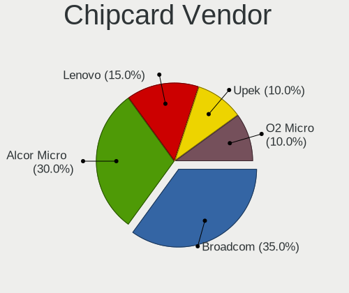

| Vendor      | Notebooks | Percent |
|-------------|-----------|---------|
| Broadcom    | 4         | 30.77%  |
| Alcor Micro | 4         | 30.77%  |
| Lenovo      | 3         | 23.08%  |
| Upek        | 2         | 15.38%  |

Chipcard Model
--------------

Chipcard module models

| Model                                                                        | Notebooks | Percent |
|------------------------------------------------------------------------------|-----------|---------|
| Alcor Micro AU9540 Smartcard Reader                                          | 4         | 30.77%  |
| Lenovo Integrated Smart Card Reader                                          | 3         | 23.08%  |
| Upek TouchChip Fingerprint Coprocessor (WBF advanced mode)                   | 2         | 15.38%  |
| Broadcom BCM5880 Secure Applications Processor with fingerprint swipe sensor | 2         | 15.38%  |
| Broadcom BCM5880 Secure Applications Processor                               | 1         | 7.69%   |
| Broadcom 58200                                                               | 1         | 7.69%   |

Unsupported
-----------

Unsupported Devices
-------------------

Total unsupported devices on board

| Total | Notebooks | Percent |
|-------|-----------|---------|
| 0     | 83        | 55.7%   |
| 1     | 54        | 36.24%  |
| 2     | 8         | 5.37%   |
| 3     | 4         | 2.68%   |

Unsupported Device Types
------------------------

Types of unsupported devices

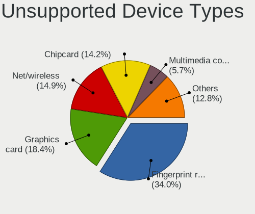

| Type                     | Notebooks | Percent |
|--------------------------|-----------|---------|
| Fingerprint reader       | 27        | 32.53%  |
| Graphics card            | 16        | 19.28%  |
| Chipcard                 | 13        | 15.66%  |
| Net/wireless             | 10        | 12.05%  |
| Multimedia controller    | 6         | 7.23%   |
| Bluetooth                | 3         | 3.61%   |
| Storage                  | 2         | 2.41%   |
| Card reader              | 2         | 2.41%   |
| Camera                   | 2         | 2.41%   |
| Storage/nvme             | 1         | 1.2%    |
| Communication controller | 1         | 1.2%    |

