LMDE 6 - Tested Hardware & Statistics (Notebooks)
-------------------------------------------------

A project to collect tested hardware configurations for LMDE 6.

Anyone can contribute to this report by the [hw-probe](https://github.com/linuxhw/hw-probe) tool:

    sudo -E hw-probe -all -upload

Please contribute! Especially if your hardware is rare.

Contents
--------

* [ Test Cases ](#test-cases)

* [ System ](#system)
  - [ Kernel                   ](#kernel)
  - [ Kernel Family            ](#kernel-family)
  - [ Kernel Major Ver.        ](#kernel-major-ver)
  - [ Arch                     ](#arch)
  - [ DE                       ](#de)
  - [ Display Server           ](#display-server)
  - [ Display Manager          ](#display-manager)
  - [ OS Lang                  ](#os-lang)
  - [ Boot Mode                ](#boot-mode)
  - [ Filesystem               ](#filesystem)
  - [ Part. scheme             ](#part-scheme)
  - [ Dual Boot with Linux/BSD ](#dual-boot-with-linuxbsd)
  - [ Dual Boot (Win)          ](#dual-boot-win)

* [ Board ](#board)
  - [ Vendor                   ](#vendor)
  - [ Model                    ](#model)
  - [ Model Family             ](#model-family)
  - [ MFG Year                 ](#mfg-year)
  - [ Form Factor              ](#form-factor)
  - [ Secure Boot              ](#secure-boot)
  - [ Coreboot                 ](#coreboot)
  - [ RAM Size                 ](#ram-size)
  - [ RAM Used                 ](#ram-used)
  - [ Total Drives             ](#total-drives)
  - [ Has CD-ROM               ](#has-cd-rom)
  - [ Has Ethernet             ](#has-ethernet)
  - [ Has WiFi                 ](#has-wifi)
  - [ Has Bluetooth            ](#has-bluetooth)

* [ Location ](#location)
  - [ Country                  ](#country)
  - [ City                     ](#city)

* [ Drives ](#drives)
  - [ Drive Vendor             ](#drive-vendor)
  - [ Drive Model              ](#drive-model)
  - [ HDD Vendor               ](#hdd-vendor)
  - [ SSD Vendor               ](#ssd-vendor)
  - [ Drive Kind               ](#drive-kind)
  - [ Drive Connector          ](#drive-connector)
  - [ Drive Size               ](#drive-size)
  - [ Space Total              ](#space-total)
  - [ Space Used               ](#space-used)
  - [ Malfunc. Drives          ](#malfunc-drives)
  - [ Malfunc. Drive Vendor    ](#malfunc-drive-vendor)
  - [ Malfunc. HDD Vendor      ](#malfunc-hdd-vendor)
  - [ Malfunc. Drive Kind      ](#malfunc-drive-kind)
  - [ Failed Drives            ](#failed-drives)
  - [ Failed Drive Vendor      ](#failed-drive-vendor)
  - [ Drive Status             ](#drive-status)

* [ Storage controller ](#storage-controller)
  - [ Storage Vendor           ](#storage-vendor)
  - [ Storage Model            ](#storage-model)
  - [ Storage Kind             ](#storage-kind)

* [ Processor ](#processor)
  - [ CPU Vendor               ](#cpu-vendor)
  - [ CPU Model                ](#cpu-model)
  - [ CPU Model Family         ](#cpu-model-family)
  - [ CPU Cores                ](#cpu-cores)
  - [ CPU Sockets              ](#cpu-sockets)
  - [ CPU Threads              ](#cpu-threads)
  - [ CPU Op-Modes             ](#cpu-op-modes)
  - [ CPU Microcode            ](#cpu-microcode)
  - [ CPU Microarch            ](#cpu-microarch)

* [ Graphics ](#graphics)
  - [ GPU Vendor               ](#gpu-vendor)
  - [ GPU Model                ](#gpu-model)
  - [ GPU Combo                ](#gpu-combo)
  - [ GPU Driver               ](#gpu-driver)
  - [ GPU Memory               ](#gpu-memory)

* [ Monitor ](#monitor)
  - [ Monitor Vendor           ](#monitor-vendor)
  - [ Monitor Model            ](#monitor-model)
  - [ Monitor Resolution       ](#monitor-resolution)
  - [ Monitor Diagonal         ](#monitor-diagonal)
  - [ Monitor Width            ](#monitor-width)
  - [ Aspect Ratio             ](#aspect-ratio)
  - [ Monitor Area             ](#monitor-area)
  - [ Pixel Density            ](#pixel-density)
  - [ Multiple Monitors        ](#multiple-monitors)

* [ Network ](#network)
  - [ Net Controller Vendor    ](#net-controller-vendor)
  - [ Net Controller Model     ](#net-controller-model)
  - [ Wireless Vendor          ](#wireless-vendor)
  - [ Wireless Model           ](#wireless-model)
  - [ Ethernet Vendor          ](#ethernet-vendor)
  - [ Ethernet Model           ](#ethernet-model)
  - [ Net Controller Kind      ](#net-controller-kind)
  - [ Used Controller          ](#used-controller)
  - [ NICs                     ](#nics)
  - [ IPv6                     ](#ipv6)

* [ Bluetooth ](#bluetooth)
  - [ Bluetooth Vendor         ](#bluetooth-vendor)
  - [ Bluetooth Model          ](#bluetooth-model)

* [ Sound ](#sound)
  - [ Sound Vendor             ](#sound-vendor)
  - [ Sound Model              ](#sound-model)

* [ Memory ](#memory)
  - [ Memory Vendor            ](#memory-vendor)
  - [ Memory Model             ](#memory-model)
  - [ Memory Kind              ](#memory-kind)
  - [ Memory Form Factor       ](#memory-form-factor)
  - [ Memory Size              ](#memory-size)
  - [ Memory Speed             ](#memory-speed)

* [ Printers & scanners ](#printers--scanners)
  - [ Printer Vendor           ](#printer-vendor)
  - [ Printer Model            ](#printer-model)
  - [ Scanner Vendor           ](#scanner-vendor)
  - [ Scanner Model            ](#scanner-model)

* [ Camera ](#camera)
  - [ Camera Vendor            ](#camera-vendor)
  - [ Camera Model             ](#camera-model)

* [ Security ](#security)
  - [ Fingerprint Vendor       ](#fingerprint-vendor)
  - [ Fingerprint Model        ](#fingerprint-model)
  - [ Chipcard Vendor          ](#chipcard-vendor)
  - [ Chipcard Model           ](#chipcard-model)

* [ Unsupported ](#unsupported)
  - [ Unsupported Devices      ](#unsupported-devices)
  - [ Unsupported Device Types ](#unsupported-device-types)

Test Cases
----------

Total: 384

| Vendor        | Model                       | Probe                                                      | Date         |
|---------------|-----------------------------|------------------------------------------------------------|--------------|
| Medion        | E6214                       | [e72344f20c](https://linux-hardware.org/?probe=e72344f20c) | Jan 05, 2025 |
| Medion        | E6214                       | [1abed4b52d](https://linux-hardware.org/?probe=1abed4b52d) | Jan 05, 2025 |
| Apple         | MacBookAir6,2               | [2a0e5e8dee](https://linux-hardware.org/?probe=2a0e5e8dee) | Jan 04, 2025 |
| HP            | Laptop 15-ef3xxx            | [990ef26285](https://linux-hardware.org/?probe=990ef26285) | Jan 04, 2025 |
| Apple         | MacBookAir6,2               | [ba9cefc697](https://linux-hardware.org/?probe=ba9cefc697) | Jan 03, 2025 |
| Acer          | Aspire A515-57              | [a91c16b9c4](https://linux-hardware.org/?probe=a91c16b9c4) | Dec 31, 2024 |
| ASUSTek       | Vivobook Go E1404FA_E140... | [0ac54971da](https://linux-hardware.org/?probe=0ac54971da) | Dec 28, 2024 |
| Dell          | Inspiron 5577               | [dabaffa853](https://linux-hardware.org/?probe=dabaffa853) | Dec 25, 2024 |
| Acer          | Aspire 5738                 | [edb35a4953](https://linux-hardware.org/?probe=edb35a4953) | Dec 17, 2024 |
| Sony          | VPCM12M1E                   | [eca3984533](https://linux-hardware.org/?probe=eca3984533) | Dec 16, 2024 |
| ASUSTek       | VivoBook_ASUSLaptop S540... | [68a46993af](https://linux-hardware.org/?probe=68a46993af) | Dec 15, 2024 |
| ASUSTek       | N551JK                      | [10b918146d](https://linux-hardware.org/?probe=10b918146d) | Dec 13, 2024 |
| Dell          | Precision 3551              | [598abdb472](https://linux-hardware.org/?probe=598abdb472) | Dec 13, 2024 |
| Acer          | Extensa 5220                | [864e664760](https://linux-hardware.org/?probe=864e664760) | Dec 10, 2024 |
| Lenovo        | ThinkPad E495 20NE0002US    | [690a841928](https://linux-hardware.org/?probe=690a841928) | Dec 10, 2024 |
| Lenovo        | IdeaPad Slim 3 14IAH8 83... | [132e6e2862](https://linux-hardware.org/?probe=132e6e2862) | Dec 09, 2024 |
| Sony          | VPCM12M1E                   | [e7896a9326](https://linux-hardware.org/?probe=e7896a9326) | Dec 08, 2024 |
| Lenovo        | Yoga Slim 6 14IAP8 82WU     | [ecbb2dfb26](https://linux-hardware.org/?probe=ecbb2dfb26) | Dec 07, 2024 |
| Acer          | Aspire 5738                 | [041abf44b0](https://linux-hardware.org/?probe=041abf44b0) | Dec 07, 2024 |
| Lenovo        | ThinkPad X240 20AM001JUS    | [1ac27908e6](https://linux-hardware.org/?probe=1ac27908e6) | Dec 06, 2024 |
| Acer          | Aspire E1-572G              | [5fd88a9482](https://linux-hardware.org/?probe=5fd88a9482) | Dec 04, 2024 |
| ASUSTek       | ASUS TUF Gaming A16 FA61... | [8456ee2251](https://linux-hardware.org/?probe=8456ee2251) | Dec 03, 2024 |
| Lenovo        | ThinkPad T60 2007YQY        | [8d792cc626](https://linux-hardware.org/?probe=8d792cc626) | Dec 02, 2024 |
| Insyde        | BayTrail                    | [101b76beeb](https://linux-hardware.org/?probe=101b76beeb) | Dec 02, 2024 |
| ASUSTek       | VivoBook_ASUSLaptop X515... | [fb5d35bd4b](https://linux-hardware.org/?probe=fb5d35bd4b) | Dec 01, 2024 |
| Acer          | Aspire AV15-51              | [c98b2b5898](https://linux-hardware.org/?probe=c98b2b5898) | Dec 01, 2024 |
| Unknown       | Unknown                     | [678e33b8ed](https://linux-hardware.org/?probe=678e33b8ed) | Dec 01, 2024 |
| Fujitsu       | LIFEBOOK E753               | [e36fbc49ec](https://linux-hardware.org/?probe=e36fbc49ec) | Dec 01, 2024 |
| Lenovo        | ThinkPad X270 20HN001MUS    | [6c580a86e2](https://linux-hardware.org/?probe=6c580a86e2) | Nov 30, 2024 |
| Notebook      | W65_67SZ                    | [245be0630e](https://linux-hardware.org/?probe=245be0630e) | Nov 29, 2024 |
| Lenovo        | ThinkPad neo 14 21DN0009... | [63a0ee38c2](https://linux-hardware.org/?probe=63a0ee38c2) | Nov 27, 2024 |
| Notebook      | W65_67SZ                    | [7cf2df4c2d](https://linux-hardware.org/?probe=7cf2df4c2d) | Nov 25, 2024 |
| HP            | Laptop 17z-cp300            | [be49e0c290](https://linux-hardware.org/?probe=be49e0c290) | Nov 23, 2024 |
| HP            | Laptop 17z-cp300            | [4090b82a10](https://linux-hardware.org/?probe=4090b82a10) | Nov 23, 2024 |
| Acer          | Aspire A315-510P            | [99993b0f3e](https://linux-hardware.org/?probe=99993b0f3e) | Nov 21, 2024 |
| TUXEDO        | InfinityBook S Gen8         | [ac4e85e111](https://linux-hardware.org/?probe=ac4e85e111) | Nov 21, 2024 |
| Notebook      | W65_67SZ                    | [c7eb463249](https://linux-hardware.org/?probe=c7eb463249) | Nov 20, 2024 |
| Toshiba       | Satellite P105              | [74a9b7015c](https://linux-hardware.org/?probe=74a9b7015c) | Nov 18, 2024 |
| Fujitsu Si... | AMILO Li 2735               | [afbab1e78c](https://linux-hardware.org/?probe=afbab1e78c) | Nov 17, 2024 |
| Dell          | Inspiron N5110              | [da064fe75f](https://linux-hardware.org/?probe=da064fe75f) | Nov 16, 2024 |
| Toshiba       | Satellite M100              | [655a407dd2](https://linux-hardware.org/?probe=655a407dd2) | Nov 15, 2024 |
| Lenovo        | ThinkPad T450 20BUS1110E    | [c6bc9a84e4](https://linux-hardware.org/?probe=c6bc9a84e4) | Nov 14, 2024 |
| Lenovo        | ThinkBook 15-IIL 20SM       | [70007038ab](https://linux-hardware.org/?probe=70007038ab) | Nov 13, 2024 |
| ASUSTek       | Zenbook UX3402ZA_UX3402Z... | [97617e7ac0](https://linux-hardware.org/?probe=97617e7ac0) | Nov 10, 2024 |
| HP            | EliteBook 8440p             | [5ed52c1fdc](https://linux-hardware.org/?probe=5ed52c1fdc) | Nov 09, 2024 |
| HP            | ProBook 450 G2              | [db16e5b334](https://linux-hardware.org/?probe=db16e5b334) | Nov 09, 2024 |
| HP            | Laptop 15s-fq2xxx           | [40be935ed5](https://linux-hardware.org/?probe=40be935ed5) | Nov 06, 2024 |
| Conectar I... | SF20GM7                     | [1c43877e91](https://linux-hardware.org/?probe=1c43877e91) | Nov 06, 2024 |
| HP            | Laptop 15-bs2xx             | [fb25b57170](https://linux-hardware.org/?probe=fb25b57170) | Nov 06, 2024 |
| MSI           | Prestige 15 A12SC           | [403f475ebb](https://linux-hardware.org/?probe=403f475ebb) | Nov 03, 2024 |
| ASUSTek       | X450LN                      | [029f170b3e](https://linux-hardware.org/?probe=029f170b3e) | Nov 02, 2024 |
| Conectar I... | SF20GM7                     | [95da818f37](https://linux-hardware.org/?probe=95da818f37) | Nov 02, 2024 |
| HP            | Pavilion dv6000 (RY645EA... | [a9cb45608f](https://linux-hardware.org/?probe=a9cb45608f) | Nov 01, 2024 |
| Lenovo        | Unknown                     | [0fdc4e7dac](https://linux-hardware.org/?probe=0fdc4e7dac) | Oct 31, 2024 |
| ASUSTek       | VivoBook_ASUSLaptop E210... | [cb80f674ac](https://linux-hardware.org/?probe=cb80f674ac) | Oct 30, 2024 |
| HP            | Laptop 15-dy2xxx            | [9cc00f993a](https://linux-hardware.org/?probe=9cc00f993a) | Oct 29, 2024 |
| Lenovo        | ThinkPad T550 20CK004QUS    | [d4d5181e4f](https://linux-hardware.org/?probe=d4d5181e4f) | Oct 28, 2024 |
| Lenovo        | ThinkPad T550 20CK004QUS    | [c7b77b3285](https://linux-hardware.org/?probe=c7b77b3285) | Oct 27, 2024 |
| Dell          | Latitude D820               | [e8052d5ecd](https://linux-hardware.org/?probe=e8052d5ecd) | Oct 26, 2024 |
| HP            | EliteBook 850 G3            | [a62e77d2a5](https://linux-hardware.org/?probe=a62e77d2a5) | Oct 26, 2024 |
| Dell          | Latitude D820               | [69777b44d3](https://linux-hardware.org/?probe=69777b44d3) | Oct 25, 2024 |
| Dell          | Latitude E6430              | [7aa1bdef3c](https://linux-hardware.org/?probe=7aa1bdef3c) | Oct 25, 2024 |
| HP            | EliteBook 840 G7 Noteboo... | [38e3efc950](https://linux-hardware.org/?probe=38e3efc950) | Oct 24, 2024 |
| ASUSTek       | TUF Gaming FX505GD_FX505... | [60f87c4f6d](https://linux-hardware.org/?probe=60f87c4f6d) | Oct 24, 2024 |
| Lenovo        | ThinkPad T400s 28153VG      | [312c0a0fb9](https://linux-hardware.org/?probe=312c0a0fb9) | Oct 22, 2024 |
| Dell          | Latitude 5350               | [58f8fa615d](https://linux-hardware.org/?probe=58f8fa615d) | Oct 21, 2024 |
| Dell          | Latitude 5350               | [b2d8fecadb](https://linux-hardware.org/?probe=b2d8fecadb) | Oct 21, 2024 |
| Acer          | Aspire 5738                 | [ca83f1cc2d](https://linux-hardware.org/?probe=ca83f1cc2d) | Oct 19, 2024 |
| Fujitsu       | LIFEBOOK U759               | [fed82bdfb6](https://linux-hardware.org/?probe=fed82bdfb6) | Oct 17, 2024 |
| Toshiba       | Satellite L50D-B            | [a2287ef876](https://linux-hardware.org/?probe=a2287ef876) | Oct 12, 2024 |
| Acer          | Aspire 5738                 | [eb50a1a3c6](https://linux-hardware.org/?probe=eb50a1a3c6) | Oct 12, 2024 |
| Acer          | Aspire 5738                 | [b7da389696](https://linux-hardware.org/?probe=b7da389696) | Oct 12, 2024 |
| HP            | Laptop 15-dy2xxx            | [cc8c1d6778](https://linux-hardware.org/?probe=cc8c1d6778) | Oct 11, 2024 |
| Lenovo        | B50-70 80EU                 | [5c0fd8834f](https://linux-hardware.org/?probe=5c0fd8834f) | Oct 11, 2024 |
| Dell          | Inspiron 5570               | [46275a960a](https://linux-hardware.org/?probe=46275a960a) | Oct 11, 2024 |
| Acer          | Aspire E5-521G              | [63755713f4](https://linux-hardware.org/?probe=63755713f4) | Oct 10, 2024 |
| Dell          | Inspiron 5570               | [c1fdcf2050](https://linux-hardware.org/?probe=c1fdcf2050) | Oct 10, 2024 |
| Lenovo        | ThinkPad T480 20L6S0EY00    | [123b9ee07a](https://linux-hardware.org/?probe=123b9ee07a) | Oct 09, 2024 |
| Chuwi         | CoreBook X                  | [c2905b1bd7](https://linux-hardware.org/?probe=c2905b1bd7) | Oct 06, 2024 |
| Lenovo        | ThinkPad X61 Tablet 7764... | [4a002c0f20](https://linux-hardware.org/?probe=4a002c0f20) | Oct 04, 2024 |
| Lenovo        | ThinkPad X1 Nano Gen 1 2... | [060b69d0b3](https://linux-hardware.org/?probe=060b69d0b3) | Oct 01, 2024 |
| Lenovo        | ThinkPad T400s 28153VG      | [508b12a75b](https://linux-hardware.org/?probe=508b12a75b) | Oct 01, 2024 |
| HP            | ZBook Fury 17.3 inch G8 ... | [1eafc27f9d](https://linux-hardware.org/?probe=1eafc27f9d) | Sep 30, 2024 |
| Notebook      | N2x0WU                      | [7e061af782](https://linux-hardware.org/?probe=7e061af782) | Sep 29, 2024 |
| Dell          | XPS 13 9360                 | [4559019bac](https://linux-hardware.org/?probe=4559019bac) | Sep 28, 2024 |
| Lenovo        | ThinkPad X230 2330A17       | [ce28e0de6c](https://linux-hardware.org/?probe=ce28e0de6c) | Sep 27, 2024 |
| HP            | Laptop 15-fd0xxx            | [dc7fdc65d6](https://linux-hardware.org/?probe=dc7fdc65d6) | Sep 26, 2024 |
| ASUSTek       | ZenBook UX434FAC_UX433FA... | [76bce69bcf](https://linux-hardware.org/?probe=76bce69bcf) | Sep 24, 2024 |
| Lenovo        | ThinkPad X230 2330A17       | [4c04674392](https://linux-hardware.org/?probe=4c04674392) | Sep 23, 2024 |
| HP            | Pavilion dv5000 (RG937EA... | [a022208bc5](https://linux-hardware.org/?probe=a022208bc5) | Sep 22, 2024 |
| HP            | Pavilion dv5000 (RG937EA... | [ce20a826eb](https://linux-hardware.org/?probe=ce20a826eb) | Sep 22, 2024 |
| HUAWEI        | NBLK-WAX9X                  | [10e3fce76a](https://linux-hardware.org/?probe=10e3fce76a) | Sep 21, 2024 |
| HP            | Laptop                      | [fa20696672](https://linux-hardware.org/?probe=fa20696672) | Sep 21, 2024 |
| Toshiba       | Satellite L745              | [b60f22f240](https://linux-hardware.org/?probe=b60f22f240) | Sep 19, 2024 |
| Lenovo        | ThinkPad E14 Gen 5 21JKC... | [186c21f29f](https://linux-hardware.org/?probe=186c21f29f) | Sep 19, 2024 |
| Lenovo        | ThinkPad T480s 20L8S9JE0... | [9ef5814db9](https://linux-hardware.org/?probe=9ef5814db9) | Sep 17, 2024 |
| Acer          | Aspire A315-59              | [af848409fc](https://linux-hardware.org/?probe=af848409fc) | Sep 15, 2024 |
| Lenovo        | Yoga 500-14IBD 80N4         | [09dda9115e](https://linux-hardware.org/?probe=09dda9115e) | Sep 12, 2024 |
| Acer          | Aspire A315-59              | [60a485333f](https://linux-hardware.org/?probe=60a485333f) | Sep 11, 2024 |
| Fujitsu       | LIFEBOOK U7512              | [fefdfd4982](https://linux-hardware.org/?probe=fefdfd4982) | Sep 10, 2024 |
| Dell          | Latitude 5550               | [b409cdf8ab](https://linux-hardware.org/?probe=b409cdf8ab) | Sep 09, 2024 |
| Dell          | XPS 15 9510                 | [c36d4de7b4](https://linux-hardware.org/?probe=c36d4de7b4) | Sep 06, 2024 |
| HP            | Pavilion dv2700             | [dae4a490a7](https://linux-hardware.org/?probe=dae4a490a7) | Sep 06, 2024 |
| HP            | Pavilion dv2700             | [3dd25c19fb](https://linux-hardware.org/?probe=3dd25c19fb) | Sep 06, 2024 |
| HP            | Notebook                    | [03bdb73471](https://linux-hardware.org/?probe=03bdb73471) | Sep 05, 2024 |
| Lenovo        | ThinkPad T520 4243W63       | [3e79035d31](https://linux-hardware.org/?probe=3e79035d31) | Sep 03, 2024 |
| Acer          | Aspire E1-572G              | [386d564b97](https://linux-hardware.org/?probe=386d564b97) | Aug 31, 2024 |
| Acer          | Aspire E1-572G              | [db7197814c](https://linux-hardware.org/?probe=db7197814c) | Aug 31, 2024 |
| Lenovo        | Slim 7 16IAH7 82VB          | [f45acc7e20](https://linux-hardware.org/?probe=f45acc7e20) | Aug 31, 2024 |
| Apple         | MacBookPro9,2               | [a33c000c3c](https://linux-hardware.org/?probe=a33c000c3c) | Aug 29, 2024 |
| MSI           | GP60 2QE                    | [fe42ba85a4](https://linux-hardware.org/?probe=fe42ba85a4) | Aug 24, 2024 |
| Framework     | Laptop                      | [ec6fd2129b](https://linux-hardware.org/?probe=ec6fd2129b) | Aug 23, 2024 |
| Samsung       | 370E4J/370E4Q               | [5627935947](https://linux-hardware.org/?probe=5627935947) | Aug 21, 2024 |
| Acer          | Aspire 5732Z                | [1782abff4d](https://linux-hardware.org/?probe=1782abff4d) | Aug 20, 2024 |
| Apple         | MacBookAir6,2               | [29bb2038d4](https://linux-hardware.org/?probe=29bb2038d4) | Aug 20, 2024 |
| Apple         | MacBookAir6,2               | [bc5d967ee2](https://linux-hardware.org/?probe=bc5d967ee2) | Aug 20, 2024 |
| Acer          | Swift SF315-52G             | [7e4cececee](https://linux-hardware.org/?probe=7e4cececee) | Aug 16, 2024 |
| Acer          | Aspire 5732Z                | [399dfa9617](https://linux-hardware.org/?probe=399dfa9617) | Aug 15, 2024 |
| ASUSTek       | VivoBook_ASUSLaptop M150... | [1647e0bf63](https://linux-hardware.org/?probe=1647e0bf63) | Aug 14, 2024 |
| Apple         | MacBookAir6,2               | [586288c72b](https://linux-hardware.org/?probe=586288c72b) | Aug 13, 2024 |
| Acer          | Aspire 5750G                | [f351efafd1](https://linux-hardware.org/?probe=f351efafd1) | Aug 08, 2024 |
| Fujitsu       | CELSIUS H7510               | [ece1093c90](https://linux-hardware.org/?probe=ece1093c90) | Aug 08, 2024 |
| HP            | ENVY 15                     | [969779119a](https://linux-hardware.org/?probe=969779119a) | Aug 08, 2024 |
| Lenovo        | ThinkPad X13 Gen 1 20T20... | [57987db9cf](https://linux-hardware.org/?probe=57987db9cf) | Aug 08, 2024 |
| HP            | ProBook 4720s               | [f017d85cdb](https://linux-hardware.org/?probe=f017d85cdb) | Aug 06, 2024 |
| Acer          | Aspire E1-572G              | [8902556150](https://linux-hardware.org/?probe=8902556150) | Aug 04, 2024 |
| Acer          | Aspire E1-572G              | [da35f8a43c](https://linux-hardware.org/?probe=da35f8a43c) | Aug 04, 2024 |
| ASUSTek       | X540LA                      | [802e2c494e](https://linux-hardware.org/?probe=802e2c494e) | Aug 01, 2024 |
| ASUSTek       | X540LA                      | [5db4299943](https://linux-hardware.org/?probe=5db4299943) | Aug 01, 2024 |
| Lenovo        | ThinkPad T520 4243W63       | [59769429e0](https://linux-hardware.org/?probe=59769429e0) | Jul 31, 2024 |
| Lenovo        | ThinkPad T520 4243W63       | [1e8c2ea6ef](https://linux-hardware.org/?probe=1e8c2ea6ef) | Jul 31, 2024 |
| Acer          | Aspire E1-531               | [07ce6ddc7c](https://linux-hardware.org/?probe=07ce6ddc7c) | Jul 24, 2024 |
| Toshiba       | TECRA X40-D                 | [cf856c7d5f](https://linux-hardware.org/?probe=cf856c7d5f) | Jul 18, 2024 |
| ASUSTek       | Zenbook 15 UM3504DA_UM35... | [b0be759962](https://linux-hardware.org/?probe=b0be759962) | Jul 16, 2024 |
| Samsung       | N150P/N210P/N220P           | [95700ccdf3](https://linux-hardware.org/?probe=95700ccdf3) | Jul 14, 2024 |
| Samsung       | N150P/N210P/N220P           | [885ee058e5](https://linux-hardware.org/?probe=885ee058e5) | Jul 13, 2024 |
| ASUSTek       | ASUS TUF Gaming F15 FX50... | [af6036e896](https://linux-hardware.org/?probe=af6036e896) | Jul 11, 2024 |
| ASUSTek       | X551CA                      | [c1d5a9a08d](https://linux-hardware.org/?probe=c1d5a9a08d) | Jul 06, 2024 |
| HP            | Laptop 15-fc0xxx            | [11c7e97835](https://linux-hardware.org/?probe=11c7e97835) | Jul 05, 2024 |
| Acer          | Aspire E1-572G              | [b5c7b17e9f](https://linux-hardware.org/?probe=b5c7b17e9f) | Jul 05, 2024 |
| Acer          | Aspire E1-572G              | [873d00bade](https://linux-hardware.org/?probe=873d00bade) | Jul 04, 2024 |
| Lenovo        | ThinkPad E15 Gen 2 20T80... | [f600a1f5e7](https://linux-hardware.org/?probe=f600a1f5e7) | Jul 04, 2024 |
| HP            | Laptop 15-fc0xxx            | [7e78c3299d](https://linux-hardware.org/?probe=7e78c3299d) | Jul 03, 2024 |
| HP            | ENVY Laptop 17-cr0xxx       | [6773aae4ed](https://linux-hardware.org/?probe=6773aae4ed) | Jun 30, 2024 |
| Apple         | MacBook5,1                  | [250352499d](https://linux-hardware.org/?probe=250352499d) | Jun 24, 2024 |
| Notebook      | W65_67SZ                    | [3b720bff42](https://linux-hardware.org/?probe=3b720bff42) | Jun 22, 2024 |
| ASUSTek       | K50IJ                       | [2eb9b0bf9b](https://linux-hardware.org/?probe=2eb9b0bf9b) | Jun 22, 2024 |
| HP            | Pavilion dv6                | [0010ed731f](https://linux-hardware.org/?probe=0010ed731f) | Jun 08, 2024 |
| HP            | ENVY Laptop 13-aq1xxx       | [3ef8d7d35a](https://linux-hardware.org/?probe=3ef8d7d35a) | Jun 08, 2024 |
| Dell          | Inspiron 3501               | [7bd7c51885](https://linux-hardware.org/?probe=7bd7c51885) | Jun 07, 2024 |
| ASUSTek       | A7F                         | [d2c993325b](https://linux-hardware.org/?probe=d2c993325b) | Jun 05, 2024 |
| Lenovo        | Y70-70 Touch 80DU           | [7c63ac7810](https://linux-hardware.org/?probe=7c63ac7810) | Jun 04, 2024 |
| HP            | EliteBook 8440p             | [0707d81b82](https://linux-hardware.org/?probe=0707d81b82) | Jun 03, 2024 |
| ASUSTek       | TUF Gaming FX505DD_FX505... | [187d6649ae](https://linux-hardware.org/?probe=187d6649ae) | Jun 02, 2024 |
| Medion        | E6214                       | [a67672f4f1](https://linux-hardware.org/?probe=a67672f4f1) | Jun 01, 2024 |
| Medion        | E6214                       | [3e6d7287eb](https://linux-hardware.org/?probe=3e6d7287eb) | Jun 01, 2024 |
| ASUSTek       | Zenbook UX3402ZA_UX3402Z... | [b56aaa479c](https://linux-hardware.org/?probe=b56aaa479c) | May 28, 2024 |
| ASUSTek       | 1201N                       | [6466d5ce59](https://linux-hardware.org/?probe=6466d5ce59) | May 27, 2024 |
| HP            | EliteBook 840 G1            | [02fb324096](https://linux-hardware.org/?probe=02fb324096) | May 23, 2024 |
| ASUSTek       | Vivobook Go E1504FA_E150... | [7c07d6eceb](https://linux-hardware.org/?probe=7c07d6eceb) | May 23, 2024 |
| Dell          | Latitude 5590               | [4b5982bff4](https://linux-hardware.org/?probe=4b5982bff4) | May 19, 2024 |
| Notebook      | W65_67SZ                    | [47bb1315ce](https://linux-hardware.org/?probe=47bb1315ce) | May 19, 2024 |
| ASUSTek       | 900                         | [770a3f0d8d](https://linux-hardware.org/?probe=770a3f0d8d) | May 17, 2024 |
| HP            | Laptop 15-dw1xxx            | [f0f7c823e6](https://linux-hardware.org/?probe=f0f7c823e6) | May 17, 2024 |
| Notebook      | P65xHP                      | [809f680e12](https://linux-hardware.org/?probe=809f680e12) | May 16, 2024 |
| Samsung       | RV415/RV515                 | [9ae57537b3](https://linux-hardware.org/?probe=9ae57537b3) | May 13, 2024 |
| Dell          | Latitude E6510              | [c1d8e78181](https://linux-hardware.org/?probe=c1d8e78181) | May 12, 2024 |
| HP            | Laptop 15-dy2xxx            | [180ba77304](https://linux-hardware.org/?probe=180ba77304) | May 12, 2024 |
| Notebook      | W250EGQ / W270EGQ           | [50c20659c5](https://linux-hardware.org/?probe=50c20659c5) | May 11, 2024 |
| Maibenben     | Perfectum Series            | [d6d3c7760c](https://linux-hardware.org/?probe=d6d3c7760c) | May 10, 2024 |
| Acer          | Aspire AL14-31P             | [2f7ab2437f](https://linux-hardware.org/?probe=2f7ab2437f) | May 09, 2024 |
| Acer          | Aspire AL14-31P             | [fc4db570af](https://linux-hardware.org/?probe=fc4db570af) | May 08, 2024 |
| HP            | Laptop 15-dy2xxx            | [2837d61bc4](https://linux-hardware.org/?probe=2837d61bc4) | May 03, 2024 |
| HP            | Compaq 6730s                | [ab6d479788](https://linux-hardware.org/?probe=ab6d479788) | May 01, 2024 |
| Unknown       | Unknown                     | [a677f40065](https://linux-hardware.org/?probe=a677f40065) | Apr 30, 2024 |
| HP            | ProBook 450 G1              | [5f5030ef83](https://linux-hardware.org/?probe=5f5030ef83) | Apr 29, 2024 |
| ASUSTek       | VivoBook_ASUSLaptop X150... | [bc0e0ae6b8](https://linux-hardware.org/?probe=bc0e0ae6b8) | Apr 25, 2024 |
| ASUSTek       | X541UVK                     | [422fd329a8](https://linux-hardware.org/?probe=422fd329a8) | Apr 25, 2024 |
| Lenovo        | V15 G4 IAH 83FS             | [b922fc6d5e](https://linux-hardware.org/?probe=b922fc6d5e) | Apr 24, 2024 |
| Acer          | TravelMate 4070             | [99e797eb28](https://linux-hardware.org/?probe=99e797eb28) | Apr 23, 2024 |
| Samsung       | N150P/N210P/N220P           | [b7a4824162](https://linux-hardware.org/?probe=b7a4824162) | Apr 23, 2024 |
| Packard Be... | EasyNote_MX45               | [2af5864c3c](https://linux-hardware.org/?probe=2af5864c3c) | Apr 22, 2024 |
| Apple         | MacBookAir7,2               | [4aabe77962](https://linux-hardware.org/?probe=4aabe77962) | Apr 20, 2024 |
| Acer          | Aspire E1-571G              | [cfb1f06070](https://linux-hardware.org/?probe=cfb1f06070) | Apr 20, 2024 |
| Medion        | E6214                       | [fef41424b0](https://linux-hardware.org/?probe=fef41424b0) | Apr 19, 2024 |
| Lenovo        | ThinkPad X140e 20BLS0040... | [028ee7ca9d](https://linux-hardware.org/?probe=028ee7ca9d) | Apr 19, 2024 |
| Medion        | E6214                       | [f6e648f8a4](https://linux-hardware.org/?probe=f6e648f8a4) | Apr 19, 2024 |
| Acer          | Aspire E1-572G              | [39e93654ec](https://linux-hardware.org/?probe=39e93654ec) | Apr 13, 2024 |
| Acer          | Aspire E1-572G              | [562a3aa8fe](https://linux-hardware.org/?probe=562a3aa8fe) | Apr 13, 2024 |
| HP            | EliteBook 840 G3            | [cbc8162b5a](https://linux-hardware.org/?probe=cbc8162b5a) | Apr 10, 2024 |
| ASUSTek       | G752VSK                     | [49116bb834](https://linux-hardware.org/?probe=49116bb834) | Apr 08, 2024 |
| Dell          | Latitude E7250              | [3979d6a4a1](https://linux-hardware.org/?probe=3979d6a4a1) | Apr 07, 2024 |
| Google        | Voxel                       | [5242e65363](https://linux-hardware.org/?probe=5242e65363) | Apr 06, 2024 |
| Medion        | E6214                       | [5ddeb441b9](https://linux-hardware.org/?probe=5ddeb441b9) | Apr 06, 2024 |
| Medion        | E6214                       | [20d0838443](https://linux-hardware.org/?probe=20d0838443) | Apr 06, 2024 |
| HP            | Laptop 15-dw1xxx            | [43a27413f2](https://linux-hardware.org/?probe=43a27413f2) | Mar 31, 2024 |
| HP            | Pavilion 15                 | [69bc35a5b1](https://linux-hardware.org/?probe=69bc35a5b1) | Mar 30, 2024 |
| HP            | Pavilion 15                 | [69293f7635](https://linux-hardware.org/?probe=69293f7635) | Mar 30, 2024 |
| Lenovo        | V15 G4 IAH 83FS             | [ec668db660](https://linux-hardware.org/?probe=ec668db660) | Mar 28, 2024 |
| ASUSTek       | VivoBook_ASUSLaptop X150... | [0cee79fd45](https://linux-hardware.org/?probe=0cee79fd45) | Mar 24, 2024 |
| Samsung       | N150P/N210P/N220P           | [153847bfc0](https://linux-hardware.org/?probe=153847bfc0) | Mar 23, 2024 |
| HP            | ProBook 470 G0              | [7947b2c132](https://linux-hardware.org/?probe=7947b2c132) | Mar 22, 2024 |
| Lenovo        | IdeaPad Pro 5 16IRH8 83A... | [a4c78f511d](https://linux-hardware.org/?probe=a4c78f511d) | Mar 21, 2024 |
| Apple         | MacBookAir4,2               | [3d42d3e1f9](https://linux-hardware.org/?probe=3d42d3e1f9) | Mar 19, 2024 |
| Dell          | Inspiron 3585               | [2378788f88](https://linux-hardware.org/?probe=2378788f88) | Mar 18, 2024 |
| Lenovo        | IdeaPad U160 08946JG        | [62adedc3dc](https://linux-hardware.org/?probe=62adedc3dc) | Mar 17, 2024 |
| HUAWEI        | CREM-WXX9                   | [d1f4d3e711](https://linux-hardware.org/?probe=d1f4d3e711) | Mar 16, 2024 |
| ASUSTek       | VivoBook_ASUSLaptop X509... | [25c1a0e7d3](https://linux-hardware.org/?probe=25c1a0e7d3) | Mar 16, 2024 |
| Lenovo        | IdeaPad U160 08946JG        | [0d6bea90e0](https://linux-hardware.org/?probe=0d6bea90e0) | Mar 11, 2024 |
| ASUSTek       | VivoBook_ASUSLaptop X515... | [1dda71290f](https://linux-hardware.org/?probe=1dda71290f) | Mar 08, 2024 |
| Monster       | TULPAR T7 V20.3             | [df8b4e385a](https://linux-hardware.org/?probe=df8b4e385a) | Mar 06, 2024 |
| Clevo         | W240HU/W250HUQ              | [b4f3b9c879](https://linux-hardware.org/?probe=b4f3b9c879) | Mar 06, 2024 |
| HP            | EliteBook 845 G8 Noteboo... | [5f7a226ed8](https://linux-hardware.org/?probe=5f7a226ed8) | Mar 06, 2024 |
| Acer          | Aspire 5570Z                | [16e46c8657](https://linux-hardware.org/?probe=16e46c8657) | Mar 05, 2024 |
| Acer          | Aspire 5570Z                | [4471c4987a](https://linux-hardware.org/?probe=4471c4987a) | Mar 05, 2024 |
| ASUSTek       | ASUS BR1100CKA BR1100CKA... | [fc21a2b0e2](https://linux-hardware.org/?probe=fc21a2b0e2) | Mar 04, 2024 |
| HP            | EliteBook 8470p             | [d67a754532](https://linux-hardware.org/?probe=d67a754532) | Feb 27, 2024 |
| Lenovo        | ThinkPad T480 20L6S2CB00    | [eff836bcb1](https://linux-hardware.org/?probe=eff836bcb1) | Feb 27, 2024 |
| Lenovo        | ThinkPad T480 20L6S2CB00    | [a78eb227db](https://linux-hardware.org/?probe=a78eb227db) | Feb 26, 2024 |
| Dell          | Vostro 1510                 | [c2b1496073](https://linux-hardware.org/?probe=c2b1496073) | Feb 24, 2024 |
| HUAWEI        | CREM-WXX9                   | [9f6a95d5b4](https://linux-hardware.org/?probe=9f6a95d5b4) | Feb 23, 2024 |
| HP            | EliteBook 845 14 inch G1... | [dad4fdcceb](https://linux-hardware.org/?probe=dad4fdcceb) | Feb 22, 2024 |
| ASUSTek       | ZenBook UX434FL_UX434FL     | [309bc99f27](https://linux-hardware.org/?probe=309bc99f27) | Feb 22, 2024 |
| Apple         | MacBookPro5,1               | [6bbe163c4b](https://linux-hardware.org/?probe=6bbe163c4b) | Feb 21, 2024 |
| HP            | ZBook Fury 17.3 inch G8 ... | [383bb58584](https://linux-hardware.org/?probe=383bb58584) | Feb 20, 2024 |
| Lenovo        | ThinkPad E470 20H2S00500    | [3c24c9be66](https://linux-hardware.org/?probe=3c24c9be66) | Feb 20, 2024 |
| Fujitsu       | LIFEBOOK A530               | [5cc2223e2a](https://linux-hardware.org/?probe=5cc2223e2a) | Feb 18, 2024 |
| Dell          | XPS 13 9310                 | [0867cf376f](https://linux-hardware.org/?probe=0867cf376f) | Feb 18, 2024 |
| HP            | Pavilion 15                 | [55af31fd66](https://linux-hardware.org/?probe=55af31fd66) | Feb 17, 2024 |
| HP            | Pavilion 15                 | [7dbe71cc73](https://linux-hardware.org/?probe=7dbe71cc73) | Feb 17, 2024 |
| ASUSTek       | BU201LA                     | [7d7e9ee7df](https://linux-hardware.org/?probe=7d7e9ee7df) | Feb 14, 2024 |
| ASUSTek       | BU201LA                     | [420cd60b3b](https://linux-hardware.org/?probe=420cd60b3b) | Feb 14, 2024 |
| Acer          | Aspire A315-44P             | [ffb90b8b62](https://linux-hardware.org/?probe=ffb90b8b62) | Feb 13, 2024 |
| ASUSTek       | K52JU                       | [d9ff2db026](https://linux-hardware.org/?probe=d9ff2db026) | Feb 13, 2024 |
| ASUSTek       | K52JU                       | [15af146ca8](https://linux-hardware.org/?probe=15af146ca8) | Feb 13, 2024 |
| Samsung       | N150P/N210P/N220P           | [042003f9b0](https://linux-hardware.org/?probe=042003f9b0) | Feb 12, 2024 |
| Toshiba       | Satellite A135              | [42cf20d3d4](https://linux-hardware.org/?probe=42cf20d3d4) | Feb 11, 2024 |
| Fujitsu       | LIFEBOOK AH530              | [f810a582b9](https://linux-hardware.org/?probe=f810a582b9) | Feb 07, 2024 |
| Fujitsu       | LIFEBOOK AH530              | [5b65435343](https://linux-hardware.org/?probe=5b65435343) | Feb 06, 2024 |
| Toshiba       | Satellite Pro C850-1DQ      | [ecd1214308](https://linux-hardware.org/?probe=ecd1214308) | Feb 06, 2024 |
| Toshiba       | Satellite Pro C850-1DQ      | [af5799035c](https://linux-hardware.org/?probe=af5799035c) | Feb 06, 2024 |
| HP            | ProBook 440 G8 Notebook ... | [df7b813324](https://linux-hardware.org/?probe=df7b813324) | Feb 05, 2024 |
| Fujitsu Si... | AMILO Li3910                | [ecde56e2bb](https://linux-hardware.org/?probe=ecde56e2bb) | Feb 04, 2024 |
| MSI           | Thin GF63 12HW              | [b5b16477c3](https://linux-hardware.org/?probe=b5b16477c3) | Feb 02, 2024 |
| Dell          | Latitude 7280               | [c94b45b8f4](https://linux-hardware.org/?probe=c94b45b8f4) | Feb 02, 2024 |
| Acer          | Aspire E1-572G              | [78a08c286e](https://linux-hardware.org/?probe=78a08c286e) | Jan 30, 2024 |
| Acer          | Aspire E1-572G              | [a23343d32d](https://linux-hardware.org/?probe=a23343d32d) | Jan 30, 2024 |
| Medion        | P7612                       | [875d083de0](https://linux-hardware.org/?probe=875d083de0) | Jan 29, 2024 |
| HP            | Compaq 615                  | [907b046dda](https://linux-hardware.org/?probe=907b046dda) | Jan 29, 2024 |
| Lenovo        | IdeaPad 3 15ADA05 81W1      | [79381fe2e8](https://linux-hardware.org/?probe=79381fe2e8) | Jan 29, 2024 |
| Lenovo        | ThinkPad X230 2325SU3       | [664fffd47e](https://linux-hardware.org/?probe=664fffd47e) | Jan 29, 2024 |
| Lenovo        | ThinkPad X230 2325SU3       | [cc42f2d5e4](https://linux-hardware.org/?probe=cc42f2d5e4) | Jan 29, 2024 |
| Acer          | Aspire E5-575               | [6764984d72](https://linux-hardware.org/?probe=6764984d72) | Jan 26, 2024 |
| TUXEDO        | Pulse 14 Gen1               | [7cd83ff81e](https://linux-hardware.org/?probe=7cd83ff81e) | Jan 23, 2024 |
| TUXEDO        | Pulse 14 Gen1               | [b8a8ce8fc0](https://linux-hardware.org/?probe=b8a8ce8fc0) | Jan 23, 2024 |
| Dell          | Latitude D610               | [b1f24babef](https://linux-hardware.org/?probe=b1f24babef) | Jan 22, 2024 |
| ASUSTek       | TUF Gaming FX505DT_FX505... | [61f93014cf](https://linux-hardware.org/?probe=61f93014cf) | Jan 21, 2024 |
| Lenovo        | ThinkPad Z13 Gen 1 21D20... | [b2d419f7dc](https://linux-hardware.org/?probe=b2d419f7dc) | Jan 18, 2024 |
| Lenovo        | ThinkPad X1 Carbon 3rd 2... | [d40c2f48dd](https://linux-hardware.org/?probe=d40c2f48dd) | Jan 18, 2024 |
| Lenovo        | ThinkPad T16 Gen 1 21CHC... | [323c35348f](https://linux-hardware.org/?probe=323c35348f) | Jan 16, 2024 |
| Lenovo        | ThinkPad X61 76754BJ        | [42f1380b4e](https://linux-hardware.org/?probe=42f1380b4e) | Jan 15, 2024 |
| Lenovo        | ThinkPad T400 6474EU3       | [0d9d328c8d](https://linux-hardware.org/?probe=0d9d328c8d) | Jan 14, 2024 |
| Dell          | Inspiron 15-3552            | [2a9bde666e](https://linux-hardware.org/?probe=2a9bde666e) | Jan 13, 2024 |
| Dell          | Inspiron 15-3552            | [87e8f38d79](https://linux-hardware.org/?probe=87e8f38d79) | Jan 13, 2024 |
| HP            | Dragonfly 13.5 inch G4 N... | [516c8f6f9c](https://linux-hardware.org/?probe=516c8f6f9c) | Jan 13, 2024 |
| Lenovo        | ThinkPad X1 Carbon 34601... | [bdfab62447](https://linux-hardware.org/?probe=bdfab62447) | Jan 12, 2024 |
| VALE          | Notebook Classic C171V      | [8ecf376e28](https://linux-hardware.org/?probe=8ecf376e28) | Jan 10, 2024 |
| Lenovo        | ThinkPad Z13 Gen 1 21D20... | [702eef24cf](https://linux-hardware.org/?probe=702eef24cf) | Jan 09, 2024 |
| Lenovo        | IdeaPad Y530                | [344509ac97](https://linux-hardware.org/?probe=344509ac97) | Jan 08, 2024 |
| Notebook      | W35xSTQ_370ST               | [a2f670a8f0](https://linux-hardware.org/?probe=a2f670a8f0) | Jan 08, 2024 |
| Dell          | Latitude E6320              | [75e562d28a](https://linux-hardware.org/?probe=75e562d28a) | Jan 07, 2024 |
| Lenovo        | IdeaPad 3 15IML05 82BS      | [2c36dcaa22](https://linux-hardware.org/?probe=2c36dcaa22) | Jan 07, 2024 |
| Google        | Swanky                      | [1b6173f1e0](https://linux-hardware.org/?probe=1b6173f1e0) | Jan 05, 2024 |
| Apple         | MacBookAir7,1               | [5596e9e3a7](https://linux-hardware.org/?probe=5596e9e3a7) | Jan 04, 2024 |
| Lenovo        | IdeaPad 330S-15IKB 81F5     | [a04f45ddfb](https://linux-hardware.org/?probe=a04f45ddfb) | Jan 03, 2024 |
| Dell          | Latitude E6320              | [e6fec1134a](https://linux-hardware.org/?probe=e6fec1134a) | Jan 03, 2024 |
| Dell          | Latitude E6320              | [1833dcdd43](https://linux-hardware.org/?probe=1833dcdd43) | Dec 31, 2023 |
| ASUSTek       | ASUS BR1100CKA BR1100CKA... | [fc3a637b52](https://linux-hardware.org/?probe=fc3a637b52) | Dec 31, 2023 |
| ASUSTek       | ROG Strix G512LV_G512LV     | [86a499d322](https://linux-hardware.org/?probe=86a499d322) | Dec 30, 2023 |
| Sony          | VGN-FW21E                   | [52ff803e03](https://linux-hardware.org/?probe=52ff803e03) | Dec 29, 2023 |
| ASUSTek       | VivoBook_ASUSLaptop X160... | [242659bbee](https://linux-hardware.org/?probe=242659bbee) | Dec 27, 2023 |
| Lenovo        | ThinkPad T14 Gen 3 21AHC... | [3673afc1cd](https://linux-hardware.org/?probe=3673afc1cd) | Dec 26, 2023 |
| Lenovo        | ThinkPad T14 Gen 3 21AHC... | [9b570f14f6](https://linux-hardware.org/?probe=9b570f14f6) | Dec 26, 2023 |
| HP            | ProBook 445 14 inch G9 N... | [d3e1c0dbdc](https://linux-hardware.org/?probe=d3e1c0dbdc) | Dec 25, 2023 |
| Lenovo        | IdeaPad S540-14IML 81NF     | [942da4e853](https://linux-hardware.org/?probe=942da4e853) | Dec 20, 2023 |
| Sony          | SVE1511A1EW                 | [2f0fde3487](https://linux-hardware.org/?probe=2f0fde3487) | Dec 19, 2023 |
| Sony          | SVE1511A1EW                 | [e5531ecc00](https://linux-hardware.org/?probe=e5531ecc00) | Dec 19, 2023 |
| Irbis         | NB264                       | [8c32d8fb0b](https://linux-hardware.org/?probe=8c32d8fb0b) | Dec 18, 2023 |
| Medion        | E6214                       | [1bc5839854](https://linux-hardware.org/?probe=1bc5839854) | Dec 17, 2023 |
| Medion        | E6214                       | [5269b6e576](https://linux-hardware.org/?probe=5269b6e576) | Dec 17, 2023 |
| Dell          | Inspiron 3542               | [6b3cd841db](https://linux-hardware.org/?probe=6b3cd841db) | Dec 17, 2023 |
| Dell          | Latitude E6430              | [13af5c2dc4](https://linux-hardware.org/?probe=13af5c2dc4) | Dec 17, 2023 |
| Lenovo        | ThinkPad X230 2325BA3       | [1c573f00c0](https://linux-hardware.org/?probe=1c573f00c0) | Dec 16, 2023 |
| Medion        | E6214                       | [806be57bd5](https://linux-hardware.org/?probe=806be57bd5) | Dec 16, 2023 |
| ASUSTek       | VivoBook_ASUSLaptop X150... | [8f7755936c](https://linux-hardware.org/?probe=8f7755936c) | Dec 14, 2023 |
| MSI           | GF63 Thin 11UC              | [78562df77d](https://linux-hardware.org/?probe=78562df77d) | Dec 11, 2023 |
| Dell          | Precision 3550              | [0235a02831](https://linux-hardware.org/?probe=0235a02831) | Dec 10, 2023 |
| ASUSTek       | X505BP                      | [408ad7dd06](https://linux-hardware.org/?probe=408ad7dd06) | Dec 10, 2023 |
| HUAWEI        | BOM-WXX9                    | [0d970bde9a](https://linux-hardware.org/?probe=0d970bde9a) | Dec 09, 2023 |
| Acer          | Aspire E5-575               | [e6fd8cf7f1](https://linux-hardware.org/?probe=e6fd8cf7f1) | Dec 02, 2023 |
| Lenovo        | IdeaPad 130-15IKB 81H7      | [e33632af4f](https://linux-hardware.org/?probe=e33632af4f) | Dec 02, 2023 |
| Lenovo        | IdeaPad 130-15IKB 81H7      | [f86dd8a709](https://linux-hardware.org/?probe=f86dd8a709) | Dec 02, 2023 |
| HP            | ProBook 450 G3              | [b53f576b27](https://linux-hardware.org/?probe=b53f576b27) | Dec 02, 2023 |
| Lenovo        | G50-80 80E5                 | [75dcedad41](https://linux-hardware.org/?probe=75dcedad41) | Nov 30, 2023 |
| Dell          | XPS 13 9360                 | [8a91691d0b](https://linux-hardware.org/?probe=8a91691d0b) | Nov 30, 2023 |
| Alienware     | 17                          | [1c23fa6051](https://linux-hardware.org/?probe=1c23fa6051) | Nov 29, 2023 |
| LETSUNG       | Unknown                     | [bfbf7dfeaa](https://linux-hardware.org/?probe=bfbf7dfeaa) | Nov 27, 2023 |
| Lenovo        | ThinkPad W541 20EGS07C01    | [c05294f5f5](https://linux-hardware.org/?probe=c05294f5f5) | Nov 26, 2023 |
| Lenovo        | ThinkPad W541 20EGS07C01    | [dc051898f5](https://linux-hardware.org/?probe=dc051898f5) | Nov 26, 2023 |
| Apple         | MacBookPro8,1               | [1a31182007](https://linux-hardware.org/?probe=1a31182007) | Nov 26, 2023 |
| Medion        | E6214                       | [83d5d32938](https://linux-hardware.org/?probe=83d5d32938) | Nov 26, 2023 |
| HP            | Pavilion TS Sleekbook 15    | [3a3a75aa94](https://linux-hardware.org/?probe=3a3a75aa94) | Nov 26, 2023 |
| HP            | Pavilion TS Sleekbook 15    | [9c76ca1014](https://linux-hardware.org/?probe=9c76ca1014) | Nov 25, 2023 |
| HP            | 250 G7 Notebook PC          | [7fce567d9e](https://linux-hardware.org/?probe=7fce567d9e) | Nov 25, 2023 |
| HP            | 245 G7                      | [42ee8e6975](https://linux-hardware.org/?probe=42ee8e6975) | Nov 25, 2023 |
| ASUSTek       | VivoBook_ASUSLaptop M650... | [8131bff614](https://linux-hardware.org/?probe=8131bff614) | Nov 25, 2023 |
| ASUSTek       | VivoBook_ASUSLaptop X515... | [a8b99ab7f3](https://linux-hardware.org/?probe=a8b99ab7f3) | Nov 23, 2023 |
| Lenovo        | ThinkPad X1 Extreme 20MG... | [9f4829b792](https://linux-hardware.org/?probe=9f4829b792) | Nov 22, 2023 |
| HP            | Pavilion 15                 | [b12a3ea8d6](https://linux-hardware.org/?probe=b12a3ea8d6) | Nov 21, 2023 |
| HP            | Pavilion 15                 | [7239efa8fe](https://linux-hardware.org/?probe=7239efa8fe) | Nov 20, 2023 |
| HP            | 250 G5 Notebook PC          | [f6d6d655df](https://linux-hardware.org/?probe=f6d6d655df) | Nov 16, 2023 |
| Toshiba       | Satellite Pro L100          | [429902b4e5](https://linux-hardware.org/?probe=429902b4e5) | Nov 15, 2023 |
| Acer          | AOA110                      | [a6b7a86c67](https://linux-hardware.org/?probe=a6b7a86c67) | Nov 14, 2023 |
| MSI           | Thin GF63 12HW              | [087220685a](https://linux-hardware.org/?probe=087220685a) | Nov 14, 2023 |
| Toshiba       | Satellite Pro L100          | [ade0fd48dc](https://linux-hardware.org/?probe=ade0fd48dc) | Nov 12, 2023 |
| ASUSTek       | VivoBook_ASUSLaptop X160... | [c00b5e7c16](https://linux-hardware.org/?probe=c00b5e7c16) | Nov 12, 2023 |
| HUAWEI        | KLVL-WXX9                   | [e45cab7f2c](https://linux-hardware.org/?probe=e45cab7f2c) | Nov 12, 2023 |
| ASUSTek       | ROG Strix G513QY_G513QY     | [feaa9f3eac](https://linux-hardware.org/?probe=feaa9f3eac) | Nov 11, 2023 |
| HP            | 250 G8 Notebook PC          | [54073a3305](https://linux-hardware.org/?probe=54073a3305) | Nov 09, 2023 |
| Toshiba       | Satellite L745              | [4dbd78f68d](https://linux-hardware.org/?probe=4dbd78f68d) | Nov 09, 2023 |
| HP            | Pavilion Laptop 15t-eg00... | [c594d3daae](https://linux-hardware.org/?probe=c594d3daae) | Nov 09, 2023 |
| IBM           | ThinkPad T40 23736G4        | [5c1d0bcbb2](https://linux-hardware.org/?probe=5c1d0bcbb2) | Nov 08, 2023 |
| Acer          | Aspire A315-21              | [f51da852ca](https://linux-hardware.org/?probe=f51da852ca) | Nov 07, 2023 |
| Acer          | Aspire A315-21              | [35b7b043ff](https://linux-hardware.org/?probe=35b7b043ff) | Nov 07, 2023 |
| Google        | Akemi                       | [f19a7fb862](https://linux-hardware.org/?probe=f19a7fb862) | Nov 06, 2023 |
| HP            | Pavilion Laptop 15t-eg00... | [d86018bbd8](https://linux-hardware.org/?probe=d86018bbd8) | Nov 06, 2023 |
| Dell          | XPS 17 9720                 | [39e8a692ae](https://linux-hardware.org/?probe=39e8a692ae) | Nov 05, 2023 |
| Google        | Akemi                       | [350f53d84a](https://linux-hardware.org/?probe=350f53d84a) | Nov 05, 2023 |
| Medion        | E6214                       | [776be82bf6](https://linux-hardware.org/?probe=776be82bf6) | Nov 04, 2023 |
| HP            | 246 G6 Notebook PC          | [cd997e5a97](https://linux-hardware.org/?probe=cd997e5a97) | Nov 03, 2023 |
| HP            | 255 G6 Notebook PC          | [b73e7cf536](https://linux-hardware.org/?probe=b73e7cf536) | Nov 03, 2023 |
| ASUSTek       | VivoBook_ASUSLaptop X160... | [a0c7507d6d](https://linux-hardware.org/?probe=a0c7507d6d) | Nov 03, 2023 |
| Google        | Akemi                       | [20ec65943c](https://linux-hardware.org/?probe=20ec65943c) | Nov 02, 2023 |
| ASUSTek       | X456UR                      | [9a0a4dfd02](https://linux-hardware.org/?probe=9a0a4dfd02) | Nov 02, 2023 |
| Lenovo        | Legion 5 Pro 16ACH6H 82J... | [826dc000ff](https://linux-hardware.org/?probe=826dc000ff) | Nov 01, 2023 |
| HP            | Notebook                    | [b1491b73ae](https://linux-hardware.org/?probe=b1491b73ae) | Oct 31, 2023 |
| HP            | Pavilion Laptop 15-cs3xx... | [1107919053](https://linux-hardware.org/?probe=1107919053) | Oct 31, 2023 |
| ASUSTek       | X540YA                      | [082e5b7e0b](https://linux-hardware.org/?probe=082e5b7e0b) | Oct 29, 2023 |
| ASUSTek       | VivoBook_ASUSLaptop X160... | [1267d6df00](https://linux-hardware.org/?probe=1267d6df00) | Oct 29, 2023 |
| ASUSTek       | VivoBook_ASUSLaptop X515... | [9f0452aba6](https://linux-hardware.org/?probe=9f0452aba6) | Oct 29, 2023 |
| Lenovo        | ThinkPad T420 4236W1Y       | [2ff5cba7a7](https://linux-hardware.org/?probe=2ff5cba7a7) | Oct 29, 2023 |
| Lenovo        | Yoga Slim 7 14ARE05 82A2    | [a899ecd171](https://linux-hardware.org/?probe=a899ecd171) | Oct 27, 2023 |
| Toshiba       | Satellite L745              | [c126c9e041](https://linux-hardware.org/?probe=c126c9e041) | Oct 27, 2023 |
| Avell High... | 1513 Mxti                   | [9f5d60c02b](https://linux-hardware.org/?probe=9f5d60c02b) | Oct 27, 2023 |
| ASUSTek       | X505BP                      | [884529eef1](https://linux-hardware.org/?probe=884529eef1) | Oct 26, 2023 |
| ASUSTek       | X505BP                      | [f32e8922c8](https://linux-hardware.org/?probe=f32e8922c8) | Oct 26, 2023 |
| Lenovo        | ThinkPad S1 Yoga 20CD000... | [4e393023d7](https://linux-hardware.org/?probe=4e393023d7) | Oct 25, 2023 |
| Unknown       | Unknown                     | [251baa33d7](https://linux-hardware.org/?probe=251baa33d7) | Oct 23, 2023 |
| Unknown       | Unknown                     | [a06cdb13fc](https://linux-hardware.org/?probe=a06cdb13fc) | Oct 23, 2023 |
| Framework     | Laptop                      | [f78c8c1b58](https://linux-hardware.org/?probe=f78c8c1b58) | Oct 22, 2023 |
| HP            | 250 G7 Notebook PC          | [b9698d48be](https://linux-hardware.org/?probe=b9698d48be) | Oct 22, 2023 |
| ASUSTek       | VivoBook_ASUSLaptop X515... | [77fb62615e](https://linux-hardware.org/?probe=77fb62615e) | Oct 22, 2023 |
| HP            | Pavilion dv6                | [d5669e2ea8](https://linux-hardware.org/?probe=d5669e2ea8) | Oct 19, 2023 |
| Alienware     | 13                          | [15e7dfbbab](https://linux-hardware.org/?probe=15e7dfbbab) | Oct 19, 2023 |
| HP            | Pavilion Sleekbook 14 PC    | [041aba02ce](https://linux-hardware.org/?probe=041aba02ce) | Oct 17, 2023 |
| HP            | EliteBook 840 G6            | [1d624b8227](https://linux-hardware.org/?probe=1d624b8227) | Oct 17, 2023 |
| Alienware     | 13                          | [24ce621e56](https://linux-hardware.org/?probe=24ce621e56) | Oct 16, 2023 |
| Lenovo        | ThinkPad T460s 20FAS2G90... | [36282033c6](https://linux-hardware.org/?probe=36282033c6) | Oct 15, 2023 |
| HP            | ENVY Laptop 17-cr0xxx       | [cf68d0c810](https://linux-hardware.org/?probe=cf68d0c810) | Oct 14, 2023 |
| HP            | ENVY dv7                    | [0972d8543e](https://linux-hardware.org/?probe=0972d8543e) | Oct 14, 2023 |
| HP            | 250 G7 Notebook PC          | [809ff050d7](https://linux-hardware.org/?probe=809ff050d7) | Oct 13, 2023 |
| Dell          | Latitude E6520              | [e29f6e9ba8](https://linux-hardware.org/?probe=e29f6e9ba8) | Oct 11, 2023 |
| Acer          | AOD270                      | [b45399c83c](https://linux-hardware.org/?probe=b45399c83c) | Oct 11, 2023 |
| Lenovo        | ThinkPad T490 20N3S7DP00    | [eb9d7ec72c](https://linux-hardware.org/?probe=eb9d7ec72c) | Oct 10, 2023 |
| Lenovo        | ThinkPad T430 2349STC       | [53e8d1302b](https://linux-hardware.org/?probe=53e8d1302b) | Oct 05, 2023 |
| Lenovo        | ThinkPad T420s 4176W23      | [0d27b7532c](https://linux-hardware.org/?probe=0d27b7532c) | Oct 02, 2023 |
| Acer          | Aspire E1-572G              | [271131f10a](https://linux-hardware.org/?probe=271131f10a) | Oct 01, 2023 |
| Acer          | Aspire E1-572G              | [438271a68c](https://linux-hardware.org/?probe=438271a68c) | Oct 01, 2023 |
| Acer          | Aspire E1-572G              | [f7375967ee](https://linux-hardware.org/?probe=f7375967ee) | Sep 30, 2023 |
| Lenovo        | ThinkPad W541 20EGS24J00    | [99fb3ec5e9](https://linux-hardware.org/?probe=99fb3ec5e9) | Sep 29, 2023 |
| HP            | 250 G7 Notebook PC          | [7fb0e4c19c](https://linux-hardware.org/?probe=7fb0e4c19c) | Sep 28, 2023 |
| Dell          | Latitude E5570              | [150f9e624b](https://linux-hardware.org/?probe=150f9e624b) | Sep 28, 2023 |
| HP            | 620                         | [1bdfd56638](https://linux-hardware.org/?probe=1bdfd56638) | Sep 27, 2023 |
| HP            | Compaq Mini 311-1100        | [eefc7ef22f](https://linux-hardware.org/?probe=eefc7ef22f) | Sep 17, 2023 |

System
------

Kernel
------

Version of the Linux kernel

| Version                  | Notebooks | Percent |
|--------------------------|-----------|---------|
| 6.1.0-12-amd64           | 43        | 15.03%  |
| 6.1.0-13-amd64           | 36        | 12.59%  |
| 6.1.0-18-amd64           | 26        | 9.09%   |
| 6.1.0-17-amd64           | 22        | 7.69%   |
| 6.1.0-26-amd64           | 17        | 5.94%   |
| 6.1.0-23-amd64           | 17        | 5.94%   |
| 6.1.0-25-amd64           | 15        | 5.24%   |
| 6.1.0-21-amd64           | 15        | 5.24%   |
| 6.1.0-28-amd64           | 13        | 4.55%   |
| 6.1.0-16-amd64           | 10        | 3.5%    |
| 6.1.0-12-686             | 9         | 3.15%   |
| 6.1.0-20-amd64           | 7         | 2.45%   |
| 6.1.0-27-amd64           | 5         | 1.75%   |
| 6.1.0-22-amd64           | 5         | 1.75%   |
| 6.1.0-27-686             | 3         | 1.05%   |
| 6.1.0-20-686             | 3         | 1.05%   |
| 6.1.0-18-686             | 3         | 1.05%   |
| 6.9.5-1-liquorix-amd64   | 2         | 0.7%    |
| 6.5.0-0.deb12.4-amd64    | 2         | 0.7%    |
| 6.11.5+bpo-amd64         | 2         | 0.7%    |
| 6.1.0-28-686             | 2         | 0.7%    |
| 6.1.0-26-686             | 2         | 0.7%    |
| 6.1.0-15-amd64           | 2         | 0.7%    |
| 6.9.7-1-liquorix-amd64   | 1         | 0.35%   |
| 6.9.7+bpo-amd64          | 1         | 0.35%   |
| 6.6.2-x64v4-xanmod1      | 1         | 0.35%   |
| 6.6.15-x64v3-xanmod1     | 1         | 0.35%   |
| 6.6.13-1-liquorix-amd64  | 1         | 0.35%   |
| 6.6.13+bpo-amd64         | 1         | 0.35%   |
| 6.6.10-chrultrabook      | 1         | 0.35%   |
| 6.5.11-asus-vivobook     | 1         | 0.35%   |
| 6.5.10-asus-vivobook     | 1         | 0.35%   |
| 6.5.0-0.deb12.1-rt-amd64 | 1         | 0.35%   |
| 6.5.0-0.deb12.1-amd64    | 1         | 0.35%   |
| 6.4.0-0.deb12.2-amd64    | 1         | 0.35%   |
| 6.12.6-1-liquorix-amd64  | 1         | 0.35%   |
| 6.11.10-x64v3-xanmod1    | 1         | 0.35%   |
| 6.10.6+bpo-amd64         | 1         | 0.35%   |
| 6.10.11+bpo-amd64        | 1         | 0.35%   |
| 6.1.0-25-686             | 1         | 0.35%   |

Kernel Family
-------------

Linux kernel without a distro release

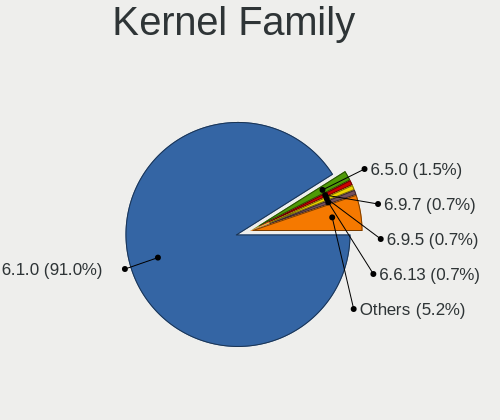

| Version | Notebooks | Percent |
|---------|-----------|---------|
| 6.1.0   | 244       | 91.04%  |
| 6.5.0   | 4         | 1.49%   |
| 6.9.7   | 2         | 0.75%   |
| 6.9.5   | 2         | 0.75%   |
| 6.6.13  | 2         | 0.75%   |
| 6.11.5  | 2         | 0.75%   |
| 5.10.0  | 2         | 0.75%   |
| 6.6.2   | 1         | 0.37%   |
| 6.6.15  | 1         | 0.37%   |
| 6.6.10  | 1         | 0.37%   |
| 6.5.11  | 1         | 0.37%   |
| 6.5.10  | 1         | 0.37%   |
| 6.4.0   | 1         | 0.37%   |
| 6.12.6  | 1         | 0.37%   |
| 6.11.10 | 1         | 0.37%   |
| 6.10.6  | 1         | 0.37%   |
| 6.10.11 | 1         | 0.37%   |

Kernel Major Ver.
-----------------

Linux kernel major version

| Version | Notebooks | Percent |
|---------|-----------|---------|
| 6.1     | 244       | 91.39%  |
| 6.6     | 5         | 1.87%   |
| 6.5     | 5         | 1.87%   |
| 6.9     | 4         | 1.5%    |
| 6.11    | 3         | 1.12%   |
| 6.10    | 2         | 0.75%   |
| 5.10    | 2         | 0.75%   |
| 6.4     | 1         | 0.37%   |
| 6.12    | 1         | 0.37%   |

Arch
----

OS architecture (x86_64, i586, etc.)

| Name   | Notebooks | Percent |
|--------|-----------|---------|
| x86_64 | 241       | 90.26%  |
| i686   | 26        | 9.74%   |

DE
--

Desktop Environment

| Name       | Notebooks | Percent |
|------------|-----------|---------|
| X-Cinnamon | 248       | 92.88%  |
| Unknown    | 7         | 2.62%   |
| Cinnamon   | 5         | 1.87%   |
| LXDE       | 3         | 1.12%   |
| KDE5       | 2         | 0.75%   |
| MATE       | 1         | 0.37%   |
| GNOME      | 1         | 0.37%   |

Display Server
--------------

X11 or Wayland

| Name    | Notebooks | Percent |
|---------|-----------|---------|
| X11     | 263       | 98.87%  |
| Wayland | 3         | 1.13%   |

Display Manager
---------------

SDDM, LightDM, etc.

| Name    | Notebooks | Percent |
|---------|-----------|---------|
| LightDM | 193       | 72.28%  |
| Unknown | 70        | 26.22%  |
| SDDM    | 2         | 0.75%   |
| GDM3    | 2         | 0.75%   |

OS Lang
-------

Language

| Lang    | Notebooks | Percent |
|---------|-----------|---------|
| en_US   | 100       | 37.59%  |
| de_DE   | 37        | 13.91%  |
| it_IT   | 33        | 12.41%  |
| fr_FR   | 15        | 5.64%   |
| en_GB   | 12        | 4.51%   |
| ru_RU   | 10        | 3.76%   |
| pt_BR   | 8         | 3.01%   |
| Unknown | 7         | 2.63%   |
| sv_SE   | 4         | 1.5%    |
| es_ES   | 4         | 1.5%    |
| pl_PL   | 3         | 1.13%   |
| nl_NL   | 3         | 1.13%   |
| es_BO   | 2         | 0.75%   |
| es_AR   | 2         | 0.75%   |
| en_CA   | 2         | 0.75%   |
| en_AU   | 2         | 0.75%   |
| cs_CZ   | 2         | 0.75%   |
| tr_TR   | 1         | 0.38%   |
| ro_RO   | 1         | 0.38%   |
| pt_PT   | 1         | 0.38%   |
| nn_NO   | 1         | 0.38%   |
| nl_BE   | 1         | 0.38%   |
| ja_JP   | 1         | 0.38%   |
| it_CH   | 1         | 0.38%   |
| hu_HU   | 1         | 0.38%   |
| fr_CA   | 1         | 0.38%   |
| es_UY   | 1         | 0.38%   |
| es_MX   | 1         | 0.38%   |
| es_HN   | 1         | 0.38%   |
| es_GT   | 1         | 0.38%   |
| es_DO   | 1         | 0.38%   |
| en_ZA   | 1         | 0.38%   |
| en_SG   | 1         | 0.38%   |
| en_IN   | 1         | 0.38%   |
| en_IE   | 1         | 0.38%   |
| de_CH   | 1         | 0.38%   |
| de_AT   | 1         | 0.38%   |

Boot Mode
---------

EFI or BIOS

| Mode | Notebooks | Percent |
|------|-----------|---------|
| EFI  | 181       | 67.79%  |
| BIOS | 86        | 32.21%  |

Filesystem
----------

Type of filesystem

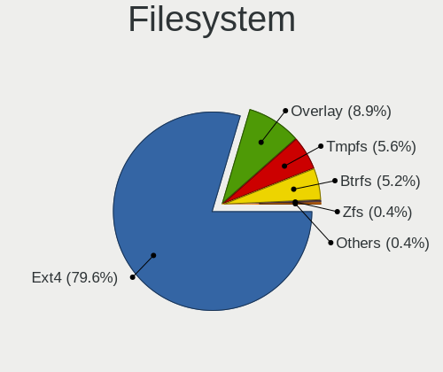

| Type    | Notebooks | Percent |
|---------|-----------|---------|
| Ext4    | 214       | 79.55%  |
| Overlay | 24        | 8.92%   |
| Tmpfs   | 15        | 5.58%   |
| Btrfs   | 14        | 5.2%    |
| Zfs     | 1         | 0.37%   |
| Xfs     | 1         | 0.37%   |

Part. scheme
------------

Scheme of partitioning

| Type    | Notebooks | Percent |
|---------|-----------|---------|
| GPT     | 145       | 54.31%  |
| Unknown | 64        | 23.97%  |
| MBR     | 58        | 21.72%  |

Dual Boot with Linux/BSD
------------------------

Hosting more than one Linux/BSD

| Dual boot | Notebooks | Percent |
|-----------|-----------|---------|
| No        | 241       | 89.93%  |
| Yes       | 27        | 10.07%  |

Dual Boot (Win)
---------------

Hosting Linux and Windows

| Dual boot | Notebooks | Percent |
|-----------|-----------|---------|
| No        | 202       | 75.37%  |
| Yes       | 66        | 24.63%  |

Board
-----

Vendor
------

Motherboard manufacturer

| Name                   | Notebooks | Percent |
|------------------------|-----------|---------|
| Lenovo                 | 57        | 21.43%  |
| Hewlett-Packard        | 56        | 21.05%  |
| ASUSTek Computer       | 43        | 16.17%  |
| Dell                   | 25        | 9.4%    |
| Acer                   | 20        | 7.52%   |
| Apple                  | 9         | 3.38%   |
| Toshiba                | 8         | 3.01%   |
| Fujitsu                | 6         | 2.26%   |
| HUAWEI                 | 5         | 1.88%   |
| Notebook               | 4         | 1.5%    |
| Sony                   | 3         | 1.13%   |
| Samsung Electronics    | 3         | 1.13%   |
| MSI                    | 3         | 1.13%   |
| TUXEDO                 | 2         | 0.75%   |
| Medion                 | 2         | 0.75%   |
| Google                 | 2         | 0.75%   |
| Fujitsu Siemens        | 2         | 0.75%   |
| Alienware              | 2         | 0.75%   |
| Unknown                | 2         | 0.75%   |
| VALE                   | 1         | 0.38%   |
| Packard Bell           | 1         | 0.38%   |
| Monster                | 1         | 0.38%   |
| Maibenben              | 1         | 0.38%   |
| LETSUNG                | 1         | 0.38%   |
| Insyde                 | 1         | 0.38%   |
| IBM                    | 1         | 0.38%   |
| Framework              | 1         | 0.38%   |
| Conectar Igualdad      | 1         | 0.38%   |
| Clevo                  | 1         | 0.38%   |
| Chuwi                  | 1         | 0.38%   |
| Avell High Performance | 1         | 0.38%   |

Model
-----

Motherboard model

| Name                                     | Notebooks | Percent |
|------------------------------------------|-----------|---------|
| Unknown                                  | 4         | 1.5%    |
| ASUS VivoBook_ASUSLaptop X1605VA_X1605VA | 3         | 1.13%   |
| HUAWEI CREM-WXX9                         | 2         | 0.75%   |
| HP Pavilion dv6                          | 2         | 0.75%   |
| HP Pavilion 15                           | 2         | 0.75%   |
| HP Notebook                              | 2         | 0.75%   |
| HP Laptop 15-dy2xxx                      | 2         | 0.75%   |
| HP Laptop 15-dw1xxx                      | 2         | 0.75%   |
| HP EliteBook 8440p                       | 2         | 0.75%   |
| Dell XPS 13 9360                         | 2         | 0.75%   |
| Dell Latitude E6430                      | 2         | 0.75%   |
| ASUS Zenbook UX3402ZA_UX3402ZA           | 2         | 0.75%   |
| Apple MacBookAir6,2                      | 2         | 0.75%   |
| Acer Aspire E5-575                       | 2         | 0.75%   |
| VALE Notebook Classic C171V              | 1         | 0.38%   |
| TUXEDO Pulse 14 Gen1                     | 1         | 0.38%   |
| TUXEDO InfinityBook S Gen8               | 1         | 0.38%   |
| Toshiba TECRA X40-D                      | 1         | 0.38%   |
| Toshiba Satellite Pro L100               | 1         | 0.38%   |
| Toshiba Satellite Pro C850-1DQ           | 1         | 0.38%   |
| Toshiba Satellite P105                   | 1         | 0.38%   |
| Toshiba Satellite M100                   | 1         | 0.38%   |
| Toshiba Satellite L745                   | 1         | 0.38%   |
| Toshiba Satellite L50D-B                 | 1         | 0.38%   |
| Toshiba Satellite A135                   | 1         | 0.38%   |
| Sony VPCM12M1E                           | 1         | 0.38%   |
| Sony VGN-FW21E                           | 1         | 0.38%   |
| Sony SVE1511A1EW                         | 1         | 0.38%   |
| Samsung RV415/RV515                      | 1         | 0.38%   |
| Samsung N150P/N210P/N220P                | 1         | 0.38%   |
| Samsung 370E4J/370E4Q                    | 1         | 0.38%   |
| Packard Bell EasyNote_MX45               | 1         | 0.38%   |
| Notebook W65_67SZ                        | 1         | 0.38%   |
| Notebook W250EGQ / W270EGQ               | 1         | 0.38%   |
| Notebook P65xHP                          | 1         | 0.38%   |
| Notebook N2x0WU                          | 1         | 0.38%   |
| MSI Thin GF63 12HW                       | 1         | 0.38%   |
| MSI GP60 2QE                             | 1         | 0.38%   |
| MSI GF63 Thin 11UC                       | 1         | 0.38%   |
| Monster TULPAR T7 V20.3                  | 1         | 0.38%   |

Model Family
------------

Motherboard model prefix

| Name                  | Notebooks | Percent |
|-----------------------|-----------|---------|
| Lenovo ThinkPad       | 37        | 13.91%  |
| ASUS Vivobook         | 16        | 6.02%   |
| Acer Aspire           | 16        | 6.02%   |
| HP Pavilion           | 11        | 4.14%   |
| HP Laptop             | 11        | 4.14%   |
| Dell Latitude         | 11        | 4.14%   |
| HP EliteBook          | 10        | 3.76%   |
| Lenovo IdeaPad        | 9         | 3.38%   |
| Toshiba Satellite     | 7         | 2.63%   |
| HP ProBook            | 7         | 2.63%   |
| Dell Inspiron         | 6         | 2.26%   |
| Fujitsu LIFEBOOK      | 5         | 1.88%   |
| Dell XPS              | 5         | 1.88%   |
| ASUS Zenbook          | 5         | 1.88%   |
| HP ENVY               | 4         | 1.5%    |
| Unknown               | 4         | 1.5%    |
| Lenovo Yoga           | 3         | 1.13%   |
| HP Compaq             | 3         | 1.13%   |
| ASUS TUF              | 3         | 1.13%   |
| ASUS ASUS             | 3         | 1.13%   |
| HUAWEI CREM-WXX9      | 2         | 0.75%   |
| HP Notebook           | 2         | 0.75%   |
| HP 250                | 2         | 0.75%   |
| Fujitsu Siemens AMILO | 2         | 0.75%   |
| Dell Precision        | 2         | 0.75%   |
| ASUS ROG              | 2         | 0.75%   |
| Apple MacBookAir7     | 2         | 0.75%   |
| Apple MacBookAir6     | 2         | 0.75%   |
| VALE Notebook         | 1         | 0.38%   |
| TUXEDO Pulse          | 1         | 0.38%   |
| TUXEDO InfinityBook   | 1         | 0.38%   |
| Toshiba TECRA         | 1         | 0.38%   |
| Sony VPCM12M1E        | 1         | 0.38%   |
| Sony VGN-FW21E        | 1         | 0.38%   |
| Sony SVE1511A1EW      | 1         | 0.38%   |
| Samsung RV415         | 1         | 0.38%   |
| Samsung N150P         | 1         | 0.38%   |
| Samsung 370E4J        | 1         | 0.38%   |
| Packard Bell EasyNote | 1         | 0.38%   |
| Notebook W65          | 1         | 0.38%   |

MFG Year
--------

Motherboard manufacture year

| Year    | Notebooks | Percent |
|---------|-----------|---------|
| 2023    | 26        | 9.77%   |
| 2022    | 25        | 9.4%    |
| 2021    | 18        | 6.77%   |
| 2020    | 17        | 6.39%   |
| 2019    | 16        | 6.02%   |
| 2012    | 16        | 6.02%   |
| 2014    | 15        | 5.64%   |
| 2013    | 14        | 5.26%   |
| 2010    | 14        | 5.26%   |
| 2016    | 13        | 4.89%   |
| 2008    | 13        | 4.89%   |
| 2017    | 12        | 4.51%   |
| 2011    | 12        | 4.51%   |
| 2018    | 11        | 4.14%   |
| 2015    | 11        | 4.14%   |
| 2006    | 9         | 3.38%   |
| 2009    | 8         | 3.01%   |
| 2007    | 7         | 2.63%   |
| 2024    | 5         | 1.88%   |
| Unknown | 2         | 0.75%   |
| 2005    | 1         | 0.38%   |
| 2003    | 1         | 0.38%   |

Form Factor
-----------

Physical design of the computer

| Name     | Notebooks | Percent |
|----------|-----------|---------|
| Notebook | 266       | 100%    |

Secure Boot
-----------

Enabled or disabled

| State    | Notebooks | Percent |
|----------|-----------|---------|
| Disabled | 239       | 89.85%  |
| Enabled  | 27        | 10.15%  |

Coreboot
--------

Have coreboot on board

| Used | Notebooks | Percent |
|------|-----------|---------|
| No   | 264       | 99.25%  |
| Yes  | 2         | 0.75%   |

RAM Size
--------

Total RAM memory

| Size in GB  | Notebooks | Percent |
|-------------|-----------|---------|
| 4.01-8.0    | 91        | 34.21%  |
| 16.01-24.0  | 45        | 16.92%  |
| 3.01-4.0    | 41        | 15.41%  |
| 8.01-16.0   | 41        | 15.41%  |
| 32.01-64.0  | 17        | 6.39%   |
| 2.01-3.0    | 9         | 3.38%   |
| 1.01-2.0    | 8         | 3.01%   |
| 64.01-256.0 | 7         | 2.63%   |
| 0.51-1.0    | 4         | 1.5%    |
| 24.01-32.0  | 3         | 1.13%   |

RAM Used
--------

Used RAM memory

| Used GB    | Notebooks | Percent |
|------------|-----------|---------|
| 2.01-3.0   | 87        | 31.64%  |
| 1.01-2.0   | 76        | 27.64%  |
| 4.01-8.0   | 52        | 18.91%  |
| 3.01-4.0   | 40        | 14.55%  |
| 8.01-16.0  | 8         | 2.91%   |
| 0.51-1.0   | 7         | 2.55%   |
| 16.01-24.0 | 3         | 1.09%   |
| 0.01-0.5   | 2         | 0.73%   |

Total Drives
------------

Number of drives on board

| Drives | Notebooks | Percent |
|--------|-----------|---------|
| 1      | 194       | 72.66%  |
| 2      | 57        | 21.35%  |
| 3      | 9         | 3.37%   |
| 0      | 4         | 1.5%    |
| 4      | 2         | 0.75%   |
| 5      | 1         | 0.37%   |

Has CD-ROM
----------

Has CD-ROM on board

| Presented | Notebooks | Percent |
|-----------|-----------|---------|
| No        | 183       | 68.8%   |
| Yes       | 83        | 31.2%   |

Has Ethernet
------------

Has Ethernet on board

| Presented | Notebooks | Percent |
|-----------|-----------|---------|
| Yes       | 203       | 76.32%  |
| No        | 63        | 23.68%  |

Has WiFi
--------

Has WiFi module

| Presented | Notebooks | Percent |
|-----------|-----------|---------|
| Yes       | 261       | 98.12%  |
| No        | 5         | 1.88%   |

Has Bluetooth
-------------

Has Bluetooth module

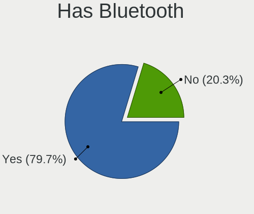

| Presented | Notebooks | Percent |
|-----------|-----------|---------|
| Yes       | 212       | 79.7%   |
| No        | 54        | 20.3%   |

Location
--------

Country
-------

Geographic location (country)

| Country      | Notebooks | Percent |
|--------------|-----------|---------|
| Germany      | 49        | 18.42%  |
| Italy        | 47        | 17.67%  |
| USA          | 42        | 15.79%  |
| France       | 13        | 4.89%   |
| Russia       | 10        | 3.76%   |
| Brazil       | 9         | 3.38%   |
| UK           | 6         | 2.26%   |
| Spain        | 6         | 2.26%   |
| Poland       | 6         | 2.26%   |
| Canada       | 6         | 2.26%   |
| Sweden       | 5         | 1.88%   |
| Netherlands  | 5         | 1.88%   |
| Turkey       | 4         | 1.5%    |
| Argentina    | 4         | 1.5%    |
| Switzerland  | 3         | 1.13%   |
| Romania      | 3         | 1.13%   |
| Malaysia     | 3         | 1.13%   |
| India        | 3         | 1.13%   |
| Belgium      | 3         | 1.13%   |
| Ukraine      | 2         | 0.75%   |
| Saudi Arabia | 2         | 0.75%   |
| Norway       | 2         | 0.75%   |
| Czechia      | 2         | 0.75%   |
| Bolivia      | 2         | 0.75%   |
| Austria      | 2         | 0.75%   |
| Australia    | 2         | 0.75%   |
| Uruguay      | 1         | 0.38%   |
| South Africa | 1         | 0.38%   |
| Runion     | 1         | 0.38%   |
| Puerto Rico  | 1         | 0.38%   |
| Portugal     | 1         | 0.38%   |
| Philippines  | 1         | 0.38%   |
| New Zealand  | 1         | 0.38%   |
| Nepal        | 1         | 0.38%   |
| Montenegro   | 1         | 0.38%   |
| Mexico       | 1         | 0.38%   |
| Lithuania    | 1         | 0.38%   |
| Japan        | 1         | 0.38%   |
| Israel       | 1         | 0.38%   |
| Ireland      | 1         | 0.38%   |

City
----

Geographic location (city)

| City             | Notebooks | Percent |
|------------------|-----------|---------|
| Milan            | 8         | 2.86%   |
| Traunstein       | 6         | 2.14%   |
| Bologna          | 5         | 1.79%   |
| Paris            | 4         | 1.43%   |
| Rome             | 3         | 1.07%   |
| Mannheim         | 3         | 1.07%   |
| Madrid           | 3         | 1.07%   |
| Cologne          | 3         | 1.07%   |
| Berlin           | 3         | 1.07%   |
| Aalten           | 3         | 1.07%   |
| Yekaterinburg    | 2         | 0.71%   |
| Toronto          | 2         | 0.71%   |
| Sydney           | 2         | 0.71%   |
| Stuttgart        | 2         | 0.71%   |
| Sochi            | 2         | 0.71%   |
| Sesto Fiorentino | 2         | 0.71%   |
| San Antonio      | 2         | 0.71%   |
| Rennes           | 2         | 0.71%   |
| Montreal         | 2         | 0.71%   |
| Milano           | 2         | 0.71%   |
| Malmo            | 2         | 0.71%   |
| Lucca            | 2         | 0.71%   |
| Kuala Lumpur     | 2         | 0.71%   |
| Krakow           | 2         | 0.71%   |
| Florence         | 2         | 0.71%   |
| Delligsen        | 2         | 0.71%   |
| Dallas           | 2         | 0.71%   |
| Bucharest        | 2         | 0.71%   |
| Bonn             | 2         | 0.71%   |
| Zwickau          | 1         | 0.36%   |
| Zurich           | 1         | 0.36%   |
| Zuidhorn         | 1         | 0.36%   |
| Young Harris     | 1         | 0.36%   |
| Yanbu            | 1         | 0.36%   |
| Wroclaw          | 1         | 0.36%   |
| Worms            | 1         | 0.36%   |
| Wittingen        | 1         | 0.36%   |
| Winnipeg         | 1         | 0.36%   |
| Wilsonville      | 1         | 0.36%   |
| Watford          | 1         | 0.36%   |

Drives
------

Drive Vendor
------------

Hard drive vendors

| Vendor                      | Notebooks | Drives | Percent |
|-----------------------------|-----------|--------|---------|
| Samsung Electronics         | 60        | 73     | 17.75%  |
| WDC                         | 26        | 27     | 7.69%   |
| Seagate                     | 26        | 29     | 7.69%   |
| SanDisk                     | 21        | 24     | 6.21%   |
| Crucial                     | 20        | 24     | 5.92%   |
| Unknown                     | 16        | 21     | 4.73%   |
| Toshiba                     | 15        | 15     | 4.44%   |
| Kingston                    | 14        | 22     | 4.14%   |
| Micron Technology           | 13        | 13     | 3.85%   |
| SK hynix                    | 11        | 11     | 3.25%   |
| Intel                       | 10        | 10     | 2.96%   |
| China                       | 9         | 9      | 2.66%   |
| KIOXIA                      | 7         | 10     | 2.07%   |
| Hitachi                     | 7         | 7      | 2.07%   |
| Apple                       | 6         | 6      | 1.78%   |
| HGST                        | 5         | 5      | 1.48%   |
| SPCC                        | 4         | 4      | 1.18%   |
| Phison Electronics          | 4         | 4      | 1.18%   |
| Lexar                       | 4         | 4      | 1.18%   |
| JMicron Technology          | 4         | 4      | 1.18%   |
| Intenso                     | 4         | 4      | 1.18%   |
| Fujitsu                     | 4         | 4      | 1.18%   |
| PNY                         | 3         | 3      | 0.89%   |
| Phison                      | 3         | 3      | 0.89%   |
| Patriot                     | 3         | 3      | 0.89%   |
| Kingston Technology Company | 3         | 3      | 0.89%   |
| Unknown                     | 3         | 4      | 0.89%   |
| Verbatim                    | 2         | 2      | 0.59%   |
| UMIS                        | 2         | 3      | 0.59%   |
| Transcend                   | 2         | 2      | 0.59%   |
| SABRENT                     | 2         | 2      | 0.59%   |
| Micron/Crucial Technology   | 2         | 4      | 0.59%   |
| Apacer                      | 2         | 4      | 0.59%   |
| XrayDisk                    | 1         | 1      | 0.3%    |
| USB3.0                      | 1         | 1      | 0.3%    |
| Team                        | 1         | 1      | 0.3%    |
| T-FORCE                     | 1         | 1      | 0.3%    |
| Silicon Motion              | 1         | 1      | 0.3%    |
| Realtek                     | 1         | 1      | 0.3%    |
| NT-512                      | 1         | 1      | 0.3%    |

Drive Model
-----------

Hard drive models

| Model                                               | Notebooks | Percent |
|-----------------------------------------------------|-----------|---------|
| Seagate ST1000LM035-1RK172 1TB                      | 5         | 1.44%   |
| SanDisk NVMe SSD Drive 1TB                          | 5         | 1.44%   |
| Kingston SA400S37480G 480GB SSD                     | 5         | 1.44%   |
| SanDisk NVMe SSD Drive 512GB                        | 4         | 1.15%   |
| Crucial CT500MX500SSD1 500GB                        | 4         | 1.15%   |
| Toshiba MQ01ABD100 1TB                              | 3         | 0.86%   |
| SK hynix BC711 HFM256GD3JX013N 256GB                | 3         | 0.86%   |
| Samsung NVMe SSD Controller SM981/PM981/PM983 512GB | 3         | 0.86%   |
| Samsung MZVLQ1T0HALB-00000 1TB                      | 3         | 0.86%   |
| Samsung MZVL4512HBLU-00BTW 512GB                    | 3         | 0.86%   |
| JMicron Generic 500GB                               | 3         | 0.86%   |
| Crucial CT1000MX500SSD1 1TB                         | 3         | 0.86%   |
| Unknown                                             | 3         | 0.86%   |
| WDC WD10SPZX-24Z10 1TB                              | 2         | 0.58%   |
| WDC PC SN730 SDBPNTY-512G                           | 2         | 0.58%   |
| Unknown SN128  128GB                                | 2         | 0.58%   |
| Unknown SD/MMC/MS PRO 128GB                         | 2         | 0.58%   |
| Unknown MMC Card  64GB                              | 2         | 0.58%   |
| Unknown MMC Card  16GB                              | 2         | 0.58%   |
| Unknown MMC Card  128GB                             | 2         | 0.58%   |
| Toshiba MQ01ABD050 500GB                            | 2         | 0.58%   |
| SPCC Solid State Disk 256GB                         | 2         | 0.58%   |
| Seagate ST9500325AS 500GB                           | 2         | 0.58%   |
| Seagate ST500LT012-1DG142 500GB                     | 2         | 0.58%   |
| Seagate ST500LM021-1KJ152 500GB                     | 2         | 0.58%   |
| Seagate ST500LM012 HN-M500MBB 500GB                 | 2         | 0.58%   |
| Seagate ST1000LM014-1EJ164 1TB                      | 2         | 0.58%   |
| Seagate Expansion 1TB                               | 2         | 0.58%   |
| SanDisk SDSSDA240G 240GB                            | 2         | 0.58%   |
| SanDisk NVMe SSD Drive 2TB                          | 2         | 0.58%   |
| Samsung SSD 990 PRO 1TB                             | 2         | 0.58%   |
| Samsung SSD 970 EVO Plus 2TB                        | 2         | 0.58%   |
| Samsung SSD 860 EVO 500GB                           | 2         | 0.58%   |
| Samsung SSD 860 EVO 250GB                           | 2         | 0.58%   |
| Samsung MZVLB512HBJQ-000H1 512GB                    | 2         | 0.58%   |
| Samsung MZVL4256HBJD-00BTW 256GB                    | 2         | 0.58%   |
| SABRENT Disk 2TB                                    | 2         | 0.58%   |
| Phison PS5013 E13 NVMe Controller 512GB             | 2         | 0.58%   |
| Micron 2400_MTFDKBA512QFM 512GB                     | 2         | 0.58%   |
| Micron 2200V_MTFDHBA512TCK 512GB                    | 2         | 0.58%   |

HDD Vendor
----------

Hard disk drive vendors

| Vendor              | Notebooks | Drives | Percent |
|---------------------|-----------|--------|---------|
| Seagate             | 26        | 29     | 32.5%   |
| WDC                 | 14        | 15     | 17.5%   |
| Toshiba             | 13        | 13     | 16.25%  |
| Hitachi             | 7         | 7      | 8.75%   |
| HGST                | 5         | 5      | 6.25%   |
| Fujitsu             | 4         | 4      | 5%      |
| JMicron Technology  | 3         | 3      | 3.75%   |
| Unknown             | 2         | 2      | 2.5%    |
| Samsung Electronics | 2         | 2      | 2.5%    |
| SABRENT             | 2         | 2      | 2.5%    |
| USB3.0              | 1         | 1      | 1.25%   |
| Apple               | 1         | 1      | 1.25%   |

SSD Vendor
----------

Solid state drive vendors

| Vendor              | Notebooks | Drives | Percent |
|---------------------|-----------|--------|---------|
| Samsung Electronics | 25        | 31     | 22.12%  |
| Crucial             | 16        | 20     | 14.16%  |
| Kingston            | 11        | 19     | 9.73%   |
| SanDisk             | 9         | 9      | 7.96%   |
| China               | 9         | 9      | 7.96%   |
| SPCC                | 4         | 4      | 3.54%   |
| Apple               | 4         | 4      | 3.54%   |
| WDC                 | 3         | 3      | 2.65%   |
| PNY                 | 3         | 3      | 2.65%   |
| Intenso             | 3         | 3      | 2.65%   |
| Intel               | 3         | 3      | 2.65%   |
| Transcend           | 2         | 2      | 1.77%   |
| SK hynix            | 2         | 2      | 1.77%   |
| Phison              | 2         | 2      | 1.77%   |
| Patriot             | 2         | 2      | 1.77%   |
| Lexar               | 2         | 2      | 1.77%   |
| XrayDisk            | 1         | 1      | 0.88%   |
| Verbatim            | 1         | 1      | 0.88%   |
| Team                | 1         | 1      | 0.88%   |
| NT-512              | 1         | 1      | 0.88%   |
| Micron Technology   | 1         | 1      | 0.88%   |
| MAXSUN              | 1         | 1      | 0.88%   |
| KUU                 | 1         | 1      | 0.88%   |
| KingFast            | 1         | 1      | 0.88%   |
| Integral            | 1         | 1      | 0.88%   |
| Hewlett-Packard     | 1         | 1      | 0.88%   |
| Gigabyte Technology | 1         | 1      | 0.88%   |
| Dogfish             | 1         | 1      | 0.88%   |
| Apacer              | 1         | 3      | 0.88%   |

Drive Kind
----------

HDD or SSD

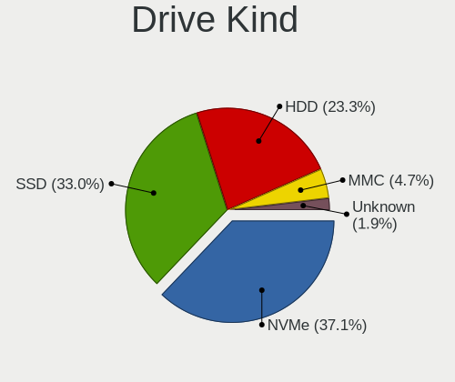

| Kind    | Notebooks | Drives | Percent |
|---------|-----------|--------|---------|
| NVMe    | 118       | 140    | 37.11%  |
| SSD     | 105       | 133    | 33.02%  |
| HDD     | 74        | 84     | 23.27%  |
| MMC     | 15        | 20     | 4.72%   |
| Unknown | 6         | 8      | 1.89%   |

Drive Connector
---------------

SATA, SAS, NVMe, etc.

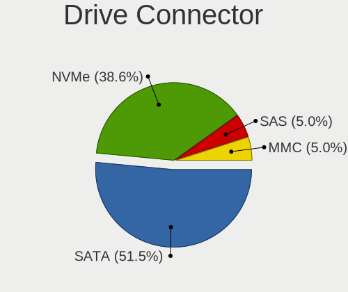

| Type | Notebooks | Drives | Percent |
|------|-----------|--------|---------|
| SATA | 156       | 205    | 51.49%  |
| NVMe | 117       | 139    | 38.61%  |
| SAS  | 15        | 21     | 4.95%   |
| MMC  | 15        | 20     | 4.95%   |

Drive Size
----------

Size of hard drive

| Size in TB | Notebooks | Drives | Percent |
|------------|-----------|--------|---------|
| 0.01-0.5   | 120       | 150    | 67.04%  |
| 0.51-1.0   | 49        | 57     | 27.37%  |
| 1.01-2.0   | 6         | 6      | 3.35%   |
| 4.01-10.0  | 3         | 3      | 1.68%   |
| 3.01-4.0   | 1         | 1      | 0.56%   |

Space Total
-----------

Amount of disk space available on the file system

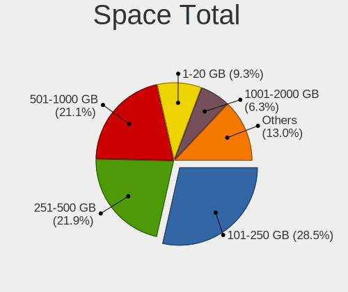

| Size in GB     | Notebooks | Percent |
|----------------|-----------|---------|
| 101-250        | 77        | 28.52%  |
| 251-500        | 59        | 21.85%  |
| 501-1000       | 57        | 21.11%  |
| 1-20           | 25        | 9.26%   |
| 1001-2000      | 17        | 6.3%    |
| 51-100         | 14        | 5.19%   |
| Unknown        | 7         | 2.59%   |
| More than 3000 | 6         | 2.22%   |
| 21-50          | 5         | 1.85%   |
| 2001-3000      | 3         | 1.11%   |

Space Used
----------

Amount of used disk space

| Used GB        | Notebooks | Percent |
|----------------|-----------|---------|
| 1-20           | 104       | 37.55%  |
| 21-50          | 54        | 19.49%  |
| 101-250        | 43        | 15.52%  |
| 51-100         | 29        | 10.47%  |
| 251-500        | 18        | 6.5%    |
| 501-1000       | 13        | 4.69%   |
| Unknown        | 7         | 2.53%   |
| 1001-2000      | 6         | 2.17%   |
| 2001-3000      | 2         | 0.72%   |
| More than 3000 | 1         | 0.36%   |

Malfunc. Drives
---------------

Drive models with a malfunction

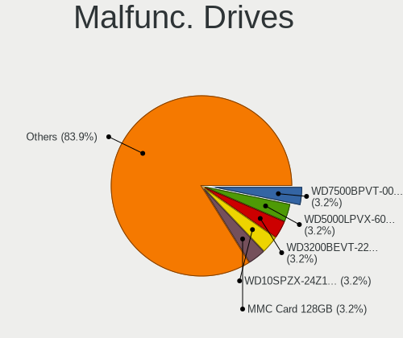

| Model                                 | Notebooks | Drives | Percent |
|---------------------------------------|-----------|--------|---------|
| WDC WD7500BPVT-00HXZT3 752GB          | 1         | 1      | 3.23%   |
| WDC WD5000LPVX-60V0TT0 500GB          | 1         | 1      | 3.23%   |
| WDC WD3200BEVT-22A23T0 320GB          | 1         | 1      | 3.23%   |
| WDC WD10SPZX-24Z10 1TB                | 1         | 1      | 3.23%   |
| Unknown MMC Card  128GB               | 1         | 1      | 3.23%   |
| Transcend TS512GMTS430S 512GB SSD     | 1         | 1      | 3.23%   |
| Toshiba MK1652GSX 160GB               | 1         | 1      | 3.23%   |
| SK hynix HFS256G39TND-N210A 256GB SSD | 1         | 1      | 3.23%   |
| SK hynix HFS060G32MNB-2000A 64GB SSD  | 1         | 1      | 3.23%   |
| Seagate ST9500325AS 500GB             | 1         | 1      | 3.23%   |
| Seagate ST910021AS 100GB              | 1         | 1      | 3.23%   |
| Seagate ST500LM021-1KJ152 500GB       | 1         | 1      | 3.23%   |
| Seagate ST1000LM014-1EJ164 1TB        | 1         | 1      | 3.23%   |
| Samsung Electronics SSD 850 PRO 256GB | 1         | 1      | 3.23%   |
| Samsung Electronics HM251JI 250GB     | 1         | 1      | 3.23%   |
| Lexar SSD 480GB                       | 1         | 1      | 3.23%   |
| KUU SSD 512GB                         | 1         | 1      | 3.23%   |
| Kingston SUV400S37240G 240GB SSD      | 1         | 1      | 3.23%   |
| Kingston SA400S37240G 240GB SSD       | 1         | 1      | 3.23%   |
| Intel SSDSA2M080G2HP 80GB             | 1         | 1      | 3.23%   |
| Hitachi HTS548080M9AT00 80GB          | 1         | 1      | 3.23%   |
| Hitachi HTS543232L9A300 320GB         | 1         | 1      | 3.23%   |
| Hitachi HTS541612J9SA00 120GB         | 1         | 1      | 3.23%   |
| Hitachi HCC543225A7A380 250GB         | 1         | 1      | 3.23%   |
| HGST HTS721010A9E630 1TB              | 1         | 1      | 3.23%   |
| Fujitsu MHZ2320BH G2 320GB            | 1         | 1      | 3.23%   |
| Fujitsu MHV2120BH PL 120GB            | 1         | 1      | 3.23%   |
| Crucial CT525MX300SSD1 528GB          | 1         | 2      | 3.23%   |
| China SSD 240GB                       | 1         | 1      | 3.23%   |
| China SH00M256GB SSD                  | 1         | 1      | 3.23%   |
| Apple SSD SM256C 256GB                | 1         | 1      | 3.23%   |

Malfunc. Drive Vendor
---------------------

Vendors of faulty drives

| Vendor              | Notebooks | Drives | Percent |
|---------------------|-----------|--------|---------|
| WDC                 | 4         | 4      | 12.9%   |
| Seagate             | 4         | 4      | 12.9%   |
| Hitachi             | 4         | 4      | 12.9%   |
| SK hynix            | 2         | 2      | 6.45%   |
| Samsung Electronics | 2         | 2      | 6.45%   |
| Kingston            | 2         | 2      | 6.45%   |
| Fujitsu             | 2         | 2      | 6.45%   |
| China               | 2         | 2      | 6.45%   |
| Unknown             | 1         | 1      | 3.23%   |
| Transcend           | 1         | 1      | 3.23%   |
| Toshiba             | 1         | 1      | 3.23%   |
| Lexar               | 1         | 1      | 3.23%   |
| KUU                 | 1         | 1      | 3.23%   |
| Intel               | 1         | 1      | 3.23%   |
| HGST                | 1         | 1      | 3.23%   |
| Crucial             | 1         | 2      | 3.23%   |
| Apple               | 1         | 1      | 3.23%   |

Malfunc. HDD Vendor
-------------------

Vendors of faulty HDD drives

| Vendor              | Notebooks | Drives | Percent |
|---------------------|-----------|--------|---------|
| WDC                 | 4         | 4      | 23.53%  |
| Seagate             | 4         | 4      | 23.53%  |
| Hitachi             | 4         | 4      | 23.53%  |
| Fujitsu             | 2         | 2      | 11.76%  |
| Toshiba             | 1         | 1      | 5.88%   |
| Samsung Electronics | 1         | 1      | 5.88%   |
| HGST                | 1         | 1      | 5.88%   |

Malfunc. Drive Kind
-------------------

Kinds of faulty drives

| Kind | Notebooks | Drives | Percent |
|------|-----------|--------|---------|
| HDD  | 16        | 17     | 53.33%  |
| SSD  | 12        | 13     | 40%     |
| MMC  | 1         | 1      | 3.33%   |
| NVMe | 1         | 1      | 3.33%   |

Failed Drives
-------------

Failed drive models

Zero info for selected period =(

Failed Drive Vendor
-------------------

Failed drive vendors

Zero info for selected period =(

Drive Status
------------

Number of failed and malfunc. drives

| Status   | Notebooks | Drives | Percent |
|----------|-----------|--------|---------|
| Works    | 165       | 203    | 56.51%  |
| Detected | 97        | 150    | 33.22%  |
| Malfunc  | 30        | 32     | 10.27%  |

Storage controller
------------------

Storage Vendor
--------------

Storage controller vendors

| Vendor                                  | Notebooks | Percent |
|-----------------------------------------|-----------|---------|
| Intel                                   | 173       | 54.06%  |
| Samsung Electronics                     | 36        | 11.25%  |
| AMD                                     | 24        | 7.5%    |
| SanDisk                                 | 21        | 6.56%   |
| Micron Technology                       | 12        | 3.75%   |
| SK hynix                                | 9         | 2.81%   |
| KIOXIA                                  | 7         | 2.19%   |
| Micron/Crucial Technology               | 6         | 1.88%   |
| Kingston Technology Company             | 6         | 1.88%   |
| Phison Electronics                      | 5         | 1.56%   |
| Nvidia                                  | 4         | 1.25%   |
| Toshiba America Info Systems            | 3         | 0.94%   |
| Silicon Motion                          | 3         | 0.94%   |
| Marvell Technology Group                | 2         | 0.63%   |
| ADATA Technology                        | 2         | 0.63%   |
| Union Memory (Shenzhen)                 | 1         | 0.31%   |
| Solidigm                                | 1         | 0.31%   |
| Shenzhen Unionmemory Information System | 1         | 0.31%   |
| Shenzhen Longsys Electronics            | 1         | 0.31%   |
| MAXIO Technology (Hangzhou)             | 1         | 0.31%   |
| Hosin Global Electronics                | 1         | 0.31%   |
| Apple                                   | 1         | 0.31%   |

Storage Model
-------------

Storage controller models

| Model                                                                          | Notebooks | Percent |
|--------------------------------------------------------------------------------|-----------|---------|
| Intel 82801 Mobile SATA Controller [RAID mode]                                 | 21        | 6.07%   |
| AMD FCH SATA Controller [AHCI mode]                                            | 21        | 6.07%   |
| Intel Volume Management Device NVMe RAID Controller                            | 17        | 4.91%   |
| Intel Sunrise Point-LP SATA Controller [AHCI mode]                             | 15        | 4.34%   |
| Samsung NVMe SSD Controller SM981/PM981/PM983                                  | 13        | 3.76%   |
| Intel 7 Series Chipset Family 6-port SATA Controller [AHCI mode]               | 13        | 3.76%   |
| Intel 6 Series/C200 Series Chipset Family 6 port Mobile SATA AHCI Controller   | 11        | 3.18%   |
| Intel 82801IBM/IEM (ICH9M/ICH9M-E) 4 port SATA Controller [AHCI mode]          | 10        | 2.89%   |
| Samsung NVMe SSD Controller 980 (DRAM-less)                                    | 9         | 2.6%    |
| Intel 8 Series SATA Controller 1 [AHCI mode]                                   | 9         | 2.6%    |
| Samsung NVMe SSD Controller PM9B1 (DRAM-less)                                  | 8         | 2.31%   |
| Intel 82801GBM/GHM (ICH7-M Family) SATA Controller [IDE mode]                  | 8         | 2.31%   |
| Intel 8 Series/C220 Series Chipset Family 6-port SATA Controller 1 [AHCI mode] | 8         | 2.31%   |
| SK hynix Gold P31/BC711/PC711 NVMe Solid State Drive                           | 7         | 2.02%   |
| Intel Wildcat Point-LP SATA Controller [AHCI Mode]                             | 7         | 2.02%   |
| Intel 82801HM/HEM (ICH8M/ICH8M-E) IDE Controller                               | 6         | 1.73%   |
| SanDisk WD Black SN770 / PC SN740 256GB / PC SN560 (DRAM-less) NVMe SSD        | 5         | 1.45%   |
| Intel Volume Management Device NVMe RAID Controller Intel Corporation          | 5         | 1.45%   |
| Intel Alder Lake-P SATA AHCI Controller                                        | 5         | 1.45%   |
| Intel 82801HM/HEM (ICH8M/ICH8M-E) SATA Controller [AHCI mode]                  | 5         | 1.45%   |
| Intel 5 Series/3400 Series Chipset 4 port SATA AHCI Controller                 | 5         | 1.45%   |
| SanDisk Extreme Pro / WD Black SN750 / PC SN730 / Red SN700 NVMe SSD           | 4         | 1.16%   |
| Micron/Crucial P2 [Nick P2] / P3 / P3 Plus NVMe PCIe SSD (DRAM-less)           | 4         | 1.16%   |
| Micron 2450 NVMe SSD [HendrixV] (DRAM-less)                                    | 4         | 1.16%   |
| Intel Tiger Lake-LP SATA Controller                                            | 4         | 1.16%   |
| Intel Celeron/Pentium Silver Processor SATA Controller                         | 4         | 1.16%   |
| Intel 5 Series/3400 Series Chipset 6 port SATA AHCI Controller                 | 4         | 1.16%   |
| SanDisk Ultra 3D / WD PC SN530, IX SN530, Blue SN550 NVMe SSD (DRAM-less)      | 3         | 0.87%   |
| Samsung NVMe SSD Controller SM961/PM961/SM963                                  | 3         | 0.87%   |
| Samsung NVMe SSD Controller S4LV008[Pascal]                                    | 3         | 0.87%   |
| Phison PS5013-E13 PCIe3 NVMe Controller (DRAM-less)                            | 3         | 0.87%   |
| Nvidia MCP79 AHCI Controller                                                   | 3         | 0.87%   |
| Micron 2400 NVMe SSD (DRAM-less)                                               | 3         | 0.87%   |
| KIOXIA NVMe SSD Controller BG4 (DRAM-less)                                     | 3         | 0.87%   |
| Intel 82801GBM/GHM (ICH7-M Family) SATA Controller [AHCI mode]                 | 3         | 0.87%   |
| Intel 82801G (ICH7 Family) IDE Controller                                      | 3         | 0.87%   |
| Toshiba America Info Systems XG6 NVMe SSD Controller                           | 2         | 0.58%   |
| Silicon Motion SM2263EN/SM2263XT (DRAM-less) NVMe SSD Controllers              | 2         | 0.58%   |
| SanDisk Ultra 3D / WD Blue SN570 NVMe SSD (DRAM-less)                          | 2         | 0.58%   |
| SanDisk PC SN520 x2 M.2 2242 NVMe SSD                                          | 2         | 0.58%   |

Storage Kind
------------

Kind of storage controller (IDE, SATA, NVMe, SAS, ...)

| Kind | Notebooks | Percent |
|------|-----------|---------|
| SATA | 144       | 43.64%  |
| NVMe | 116       | 35.15%  |
| RAID | 44        | 13.33%  |
| IDE  | 26        | 7.88%   |

Processor
---------

CPU Vendor
----------

Processor vendors

| Vendor | Notebooks | Percent |
|--------|-----------|---------|
| Intel  | 220       | 82.71%  |
| AMD    | 46        | 17.29%  |

CPU Model
---------

Processor models

| Model                                       | Notebooks | Percent |
|---------------------------------------------|-----------|---------|
| Intel 11th Gen Core i3-1115G4 @ 3.00GHz     | 6         | 2.26%   |
| Intel Core i7-7700HQ CPU @ 2.80GHz          | 4         | 1.5%    |
| Intel Core i7-10510U CPU @ 1.80GHz          | 4         | 1.5%    |
| Intel Core i5-3320M CPU @ 2.60GHz           | 4         | 1.5%    |
| Intel 12th Gen Core i7-12700H               | 4         | 1.5%    |
| Intel Core i7-7500U CPU @ 2.70GHz           | 3         | 1.13%   |
| Intel Core i7-4810MQ CPU @ 2.80GHz          | 3         | 1.13%   |
| Intel Core i5-8250U CPU @ 1.60GHz           | 3         | 1.13%   |
| Intel Core i5-7200U CPU @ 2.50GHz           | 3         | 1.13%   |
| Intel Core i5-4200U CPU @ 1.60GHz           | 3         | 1.13%   |
| Intel Core i5-3230M CPU @ 2.60GHz           | 3         | 1.13%   |
| Intel 13th Gen Core i9-13900H               | 3         | 1.13%   |
| Intel 12th Gen Core i5-1240P                | 3         | 1.13%   |
| AMD Ryzen 7 5800H with Radeon Graphics      | 3         | 1.13%   |
| Intel Pentium Dual-Core CPU T4400 @ 2.20GHz | 2         | 0.75%   |
| Intel Pentium CPU P6200 @ 2.13GHz           | 2         | 0.75%   |
| Intel Genuine CPU T2300 @ 1.66GHz           | 2         | 0.75%   |
| Intel Genuine CPU T2060 @ 1.60GHz           | 2         | 0.75%   |
| Intel Core i7-8565U CPU @ 1.80GHz           | 2         | 0.75%   |
| Intel Core i7-8550U CPU @ 1.80GHz           | 2         | 0.75%   |
| Intel Core i7-6600U CPU @ 2.60GHz           | 2         | 0.75%   |
| Intel Core i7-5600U CPU @ 2.60GHz           | 2         | 0.75%   |
| Intel Core i7-4700MQ CPU @ 2.40GHz          | 2         | 0.75%   |
| Intel Core i7-4510U CPU @ 2.00GHz           | 2         | 0.75%   |
| Intel Core i7-2620M CPU @ 2.70GHz           | 2         | 0.75%   |
| Intel Core i7-10850H CPU @ 2.70GHz          | 2         | 0.75%   |
| Intel Core i7-1065G7 CPU @ 1.30GHz          | 2         | 0.75%   |
| Intel Core i5-6300U CPU @ 2.40GHz           | 2         | 0.75%   |
| Intel Core i5-6200U CPU @ 2.30GHz           | 2         | 0.75%   |
| Intel Core i5-5300U CPU @ 2.30GHz           | 2         | 0.75%   |
| Intel Core i5-5200U CPU @ 2.20GHz           | 2         | 0.75%   |
| Intel Core i5-2450M CPU @ 2.50GHz           | 2         | 0.75%   |
| Intel Core i5-2430M CPU @ 2.40GHz           | 2         | 0.75%   |
| Intel Core i5-10210U CPU @ 1.60GHz          | 2         | 0.75%   |
| Intel Core i5 CPU M 430 @ 2.27GHz           | 2         | 0.75%   |
| Intel Core i3-7100U CPU @ 2.40GHz           | 2         | 0.75%   |
| Intel Core i3-6006U CPU @ 2.00GHz           | 2         | 0.75%   |
| Intel Core i3-4030U CPU @ 1.90GHz           | 2         | 0.75%   |
| Intel Core i3-10110U CPU @ 2.10GHz          | 2         | 0.75%   |
| Intel Core i3-1005G1 CPU @ 1.20GHz          | 2         | 0.75%   |

CPU Model Family
----------------

Processor model prefix

| Model                   | Notebooks | Percent |
|-------------------------|-----------|---------|
| Intel Core i5           | 54        | 20.3%   |
| Intel Core i7           | 49        | 18.42%  |
| Other                   | 47        | 17.67%  |
| Intel Core i3           | 17        | 6.39%   |
| Intel Core 2 Duo        | 14        | 5.26%   |
| AMD Ryzen 5             | 14        | 5.26%   |
| AMD Ryzen 7             | 10        | 3.76%   |
| Intel Genuine           | 8         | 3.01%   |
| Intel Pentium           | 7         | 2.63%   |
| Intel Celeron           | 7         | 2.63%   |
| Intel Atom              | 6         | 2.26%   |
| Intel Pentium M         | 3         | 1.13%   |
| Intel Core Duo          | 3         | 1.13%   |
| AMD Ryzen 7 PRO         | 3         | 1.13%   |
| AMD Ryzen 3             | 3         | 1.13%   |
| AMD A8                  | 3         | 1.13%   |
| Intel Pentium Silver    | 2         | 0.75%   |
| Intel Pentium Dual-Core | 2         | 0.75%   |
| AMD Ryzen 9             | 2         | 0.75%   |
| AMD E2                  | 2         | 0.75%   |
| Intel Core              | 1         | 0.38%   |
| Intel Celeron M         | 1         | 0.38%   |
| Intel Celeron Dual-Core | 1         | 0.38%   |
| AMD Sempron             | 1         | 0.38%   |
| AMD Ryzen 5 PRO         | 1         | 0.38%   |
| AMD E1                  | 1         | 0.38%   |
| AMD E                   | 1         | 0.38%   |
| AMD A6                  | 1         | 0.38%   |
| AMD A4                  | 1         | 0.38%   |
| AMD A10                 | 1         | 0.38%   |

CPU Cores
---------

Number of processor cores

| Number | Notebooks | Percent |
|--------|-----------|---------|
| 2      | 131       | 49.25%  |
| 4      | 66        | 24.81%  |
| 8      | 19        | 7.14%   |
| 6      | 16        | 6.02%   |
| 12     | 10        | 3.76%   |
| 1      | 10        | 3.76%   |
| 14     | 7         | 2.63%   |
| 10     | 7         | 2.63%   |

CPU Sockets
-----------

Number of sockets

| Number | Notebooks | Percent |
|--------|-----------|---------|
| 1      | 266       | 100%    |

CPU Threads
-----------

Threads per core (Hyper-Threading)

| Number | Notebooks | Percent |
|--------|-----------|---------|
| 2      | 199       | 74.81%  |
| 1      | 67        | 25.19%  |

CPU Op-Modes
------------

CPU Operation Modes (32-bit, 64-bit)

| Op mode        | Notebooks | Percent |
|----------------|-----------|---------|
| 32-bit, 64-bit | 250       | 93.98%  |
| 32-bit         | 16        | 6.02%   |

CPU Microcode
-------------

Microcode number

| Number     | Notebooks | Percent |
|------------|-----------|---------|
| Unknown    | 34        | 12.73%  |
| 0x306a9    | 15        | 5.62%   |
| 0x206a7    | 15        | 5.62%   |
| 0x40651    | 12        | 4.49%   |
| 0x806ec    | 11        | 4.12%   |
| 0x906a3    | 9         | 3.37%   |
| 0x806c1    | 9         | 3.37%   |
| 0x306c3    | 9         | 3.37%   |
| 0x306d4    | 8         | 3%      |
| 0x806e9    | 7         | 2.62%   |
| 0x20655    | 7         | 2.62%   |
| 0x1067a    | 7         | 2.62%   |
| 0x806ea    | 6         | 2.25%   |
| 0x6ec      | 6         | 2.25%   |
| 0x406e3    | 5         | 1.87%   |
| 0x906e9    | 4         | 1.5%    |
| 0x806d1    | 4         | 1.5%    |
| 0x706e5    | 4         | 1.5%    |
| 0x6fd      | 4         | 1.5%    |
| 0x6e8      | 4         | 1.5%    |
| 0x0a50000c | 4         | 1.5%    |
| 0x08108109 | 4         | 1.5%    |
| 0xb06a3    | 3         | 1.12%   |
| 0xb06a2    | 3         | 1.12%   |
| 0xa0652    | 3         | 1.12%   |
| 0x906a4    | 3         | 1.12%   |
| 0x706a8    | 3         | 1.12%   |
| 0x6d8      | 3         | 1.12%   |
| 0x30678    | 3         | 1.12%   |
| 0x20652    | 3         | 1.12%   |
| 0x106c2    | 3         | 1.12%   |
| 0x10676    | 3         | 1.12%   |
| 0x0a404102 | 3         | 1.12%   |
| 0x08a00008 | 3         | 1.12%   |
| 0x08600106 | 3         | 1.12%   |
| 0x08108102 | 3         | 1.12%   |
| 0xb06e0    | 2         | 0.75%   |
| 0x906ea    | 2         | 0.75%   |
| 0x906c0    | 2         | 0.75%   |
| 0x806c2    | 2         | 0.75%   |

CPU Microarch
-------------

Microarchitecture

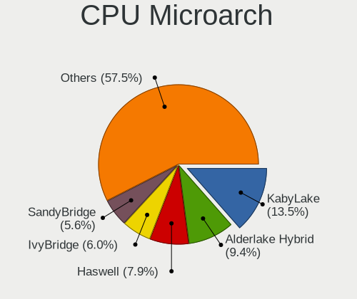

| Name             | Notebooks | Percent |
|------------------|-----------|---------|
| KabyLake         | 36        | 13.53%  |
| Alderlake Hybrid | 25        | 9.4%    |
| Haswell          | 21        | 7.89%   |
| IvyBridge        | 16        | 6.02%   |
| SandyBridge      | 15        | 5.64%   |
| P6               | 14        | 5.26%   |
| Unknown          | 14        | 5.26%   |
| TigerLake        | 13        | 4.89%   |
| Penryn           | 12        | 4.51%   |
| Westmere         | 10        | 3.76%   |
| Broadwell        | 10        | 3.76%   |
| Icelake          | 9         | 3.38%   |
| Zen 3            | 8         | 3.01%   |
| Skylake          | 8         | 3.01%   |
| Zen+             | 7         | 2.63%   |
| Core             | 7         | 2.63%   |
| Zen 2            | 5         | 1.88%   |
| Bonnell          | 5         | 1.88%   |
| Silvermont       | 4         | 1.5%    |
| Puma             | 4         | 1.5%    |
| Goldmont plus    | 4         | 1.5%    |
| Excavator        | 4         | 1.5%    |
| CometLake        | 4         | 1.5%    |
| Gracemont        | 3         | 1.13%   |
| Zen              | 2         | 0.75%   |
| Tremont          | 2         | 0.75%   |
| Piledriver       | 1         | 0.38%   |
| K8 & K10 hybrid  | 1         | 0.38%   |
| Jaguar           | 1         | 0.38%   |
| Bobcat           | 1         | 0.38%   |

Graphics
--------

GPU Vendor
----------

Vendors of graphics cards

| Vendor | Notebooks | Percent |
|--------|-----------|---------|
| Intel  | 197       | 62.54%  |
| AMD    | 60        | 19.05%  |
| Nvidia | 58        | 18.41%  |

GPU Model
---------

Graphics card models

| Model                                                                         | Notebooks | Percent |
|-------------------------------------------------------------------------------|-----------|---------|
| Intel 3rd Gen Core processor Graphics Controller                              | 16        | 4.76%   |
| Intel 2nd Generation Core Processor Family Integrated Graphics Controller     | 14        | 4.17%   |
| Intel Haswell-ULT Integrated Graphics Controller                              | 12        | 3.57%   |
| Intel Alder Lake-P GT2 [Iris Xe Graphics]                                     | 10        | 2.98%   |
| Intel CometLake-U GT2 [UHD Graphics]                                          | 9         | 2.68%   |
| Intel 4th Gen Core Processor Integrated Graphics Controller                   | 9         | 2.68%   |
| Intel Raptor Lake-P [Iris Xe Graphics]                                        | 8         | 2.38%   |
| Intel HD Graphics 620                                                         | 8         | 2.38%   |
| Intel HD Graphics 5500                                                        | 8         | 2.38%   |
| AMD Picasso/Raven 2 [Radeon Vega Series / Radeon Vega Mobile Series]          | 8         | 2.38%   |
| Intel UHD Graphics 620                                                        | 7         | 2.08%   |
| Intel Skylake GT2 [HD Graphics 520]                                           | 7         | 2.08%   |
| Intel Core Processor Integrated Graphics Controller                           | 7         | 2.08%   |
| Intel TigerLake-LP GT2 [Iris Xe Graphics]                                     | 6         | 1.79%   |
| Intel Tiger Lake-LP GT2 [UHD Graphics G4]                                     | 6         | 1.79%   |
| Intel Mobile GM965/GL960 Integrated Graphics Controller (secondary)           | 6         | 1.79%   |
| Intel Mobile GM965/GL960 Integrated Graphics Controller (primary)             | 6         | 1.79%   |
| Intel Mobile 945GM/GMS/GME, 943/940GML Express Integrated Graphics Controller | 6         | 1.79%   |
| Intel Mobile 4 Series Chipset Integrated Graphics Controller                  | 6         | 1.79%   |
| Intel WhiskeyLake-U GT2 [UHD Graphics 620]                                    | 5         | 1.49%   |
| Intel Mobile 945GM/GMS, 943/940GML Express Integrated Graphics Controller     | 5         | 1.49%   |
| AMD Renoir [Radeon Vega Series / Radeon Vega Mobile Series]                   | 5         | 1.49%   |
| AMD Rembrandt [Radeon 680M]                                                   | 5         | 1.49%   |
| AMD Cezanne [Radeon Vega Series / Radeon Vega Mobile Series]                  | 4         | 1.19%   |
| Intel TigerLake-H GT1 [UHD Graphics]                                          | 3         | 0.89%   |
| Intel Iris Plus Graphics G1 (Ice Lake)                                        | 3         | 0.89%   |
| Intel HD Graphics 630                                                         | 3         | 0.89%   |
| Intel CometLake-H GT2 [UHD Graphics]                                          | 3         | 0.89%   |
| Intel CoffeeLake-H GT2 [UHD Graphics 630]                                     | 3         | 0.89%   |
| Intel Atom Processor Z36xxx/Z37xxx Series Graphics & Display                  | 3         | 0.89%   |
| Intel Alder Lake-UP3 GT2 [Iris Xe Graphics]                                   | 3         | 0.89%   |
| Intel Alder Lake-P GT1 [UHD Graphics]                                         | 3         | 0.89%   |
| Intel Alder Lake-N [UHD Graphics]                                             | 3         | 0.89%   |
| AMD Stoney [Radeon R2/R3/R4/R5 Graphics]                                      | 3         | 0.89%   |
| AMD Mendocino                                                                 | 3         | 0.89%   |
| AMD Barcelo                                                                   | 3         | 0.89%   |
| Nvidia TU117M [GeForce GTX 1650 Mobile / Max-Q]                               | 2         | 0.6%    |
| Nvidia GP108BM [GeForce MX250]                                                | 2         | 0.6%    |
| Nvidia GP107M [GeForce GTX 1050 Ti Mobile]                                    | 2         | 0.6%    |
| Nvidia GP107M [GeForce GTX 1050 Mobile]                                       | 2         | 0.6%    |

GPU Combo
---------

Combinations of graphics cards

| Name           | Notebooks | Percent |
|----------------|-----------|---------|
| 1 x Intel      | 130       | 48.87%  |
| 1 x AMD        | 44        | 16.54%  |
| Intel + Nvidia | 39        | 14.66%  |
| 2 x Intel      | 21        | 7.89%   |
| 1 x Nvidia     | 15        | 5.64%   |
| Intel + AMD    | 7         | 2.63%   |
| 2 x AMD        | 6         | 2.26%   |
| AMD + Nvidia   | 3         | 1.13%   |
| 2 x Nvidia     | 1         | 0.38%   |

GPU Driver
----------

Free vs proprietary

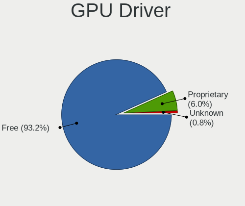

| Driver      | Notebooks | Percent |
|-------------|-----------|---------|
| Free        | 248       | 93.23%  |
| Proprietary | 16        | 6.02%   |
| Unknown     | 2         | 0.75%   |

GPU Memory
----------

Total video memory

| Size in GB | Notebooks | Percent |
|------------|-----------|---------|
| Unknown    | 176       | 65.92%  |
| 0.01-0.5   | 42        | 15.73%  |
| 1.01-2.0   | 19        | 7.12%   |
| 0.51-1.0   | 13        | 4.87%   |
| 3.01-4.0   | 9         | 3.37%   |
| 5.01-6.0   | 4         | 1.5%    |
| 7.01-8.0   | 2         | 0.75%   |
| 2.01-3.0   | 1         | 0.37%   |
| 8.01-16.0  | 1         | 0.37%   |

Monitor
-------

Monitor Vendor
--------------

Monitor vendors

| Vendor                  | Notebooks | Percent |
|-------------------------|-----------|---------|
| AU Optronics            | 63        | 21.36%  |
| BOE                     | 48        | 16.27%  |
| Chimei Innolux          | 38        | 12.88%  |
| LG Display              | 36        | 12.2%   |
| Samsung Electronics     | 25        | 8.47%   |
| Apple                   | 9         | 3.05%   |
| Sharp                   | 7         | 2.37%   |
| Lenovo                  | 6         | 2.03%   |
| PANDA                   | 5         | 1.69%   |
| LG Philips              | 5         | 1.69%   |
| Iiyama                  | 5         | 1.69%   |
| Chi Mei Optoelectronics | 5         | 1.69%   |
| Panasonic               | 4         | 1.36%   |
| Acer                    | 4         | 1.36%   |
| Philips                 | 3         | 1.02%   |
| Goldstar                | 3         | 1.02%   |
| Dell                    | 3         | 1.02%   |
| CSO                     | 3         | 1.02%   |
| ASUSTek Computer        | 3         | 1.02%   |
| AOC                     | 3         | 1.02%   |
| STA                     | 2         | 0.68%   |
| InfoVision              | 2         | 0.68%   |
| HannStar                | 2         | 0.68%   |
| Unknown                 | 1         | 0.34%   |
| Toshiba                 | 1         | 0.34%   |
| Quanta Display          | 1         | 0.34%   |
| Mi                      | 1         | 0.34%   |
| InnoLux Display         | 1         | 0.34%   |
| HUAWEI                  | 1         | 0.34%   |
| HKC                     | 1         | 0.34%   |
| Hewlett-Packard         | 1         | 0.34%   |
| Eizo                    | 1         | 0.34%   |
| CVT                     | 1         | 0.34%   |
| CPT                     | 1         | 0.34%   |

Monitor Model
-------------

Monitor models

| Model                                                                | Notebooks | Percent |
|----------------------------------------------------------------------|-----------|---------|
| Chimei Innolux LCD Monitor CMN1618 1920x1200 344x215mm 16.0-inch     | 4         | 1.35%   |
| Panasonic LCD Monitor MEI96A2 2560x1440 309x173mm 13.9-inch          | 3         | 1.01%   |
| LG Display LCD Monitor LGD046F 1920x1080 344x194mm 15.5-inch         | 3         | 1.01%   |
| AU Optronics LCD Monitor AUO61ED 1920x1080 344x194mm 15.5-inch       | 3         | 1.01%   |
| AU Optronics LCD Monitor AUO21ED 1920x1080 344x193mm 15.5-inch       | 3         | 1.01%   |
| Sharp LCD Monitor SHP1449 1920x1080 294x165mm 13.3-inch              | 2         | 0.68%   |
| Samsung Electronics LCD Monitor SEC3047 1366x768 277x156mm 12.5-inch | 2         | 0.68%   |
| PANDA LCD Monitor NCP0061 2560x1600 302x189mm 14.0-inch              | 2         | 0.68%   |
| LG Display LCD Monitor LGD038E 1366x768 344x194mm 15.5-inch          | 2         | 0.68%   |
| Chimei Innolux LCD Monitor CMN15E7 1920x1080 344x193mm 15.5-inch     | 2         | 0.68%   |
| Chimei Innolux LCD Monitor CMN15C3 1920x1080 344x193mm 15.5-inch     | 2         | 0.68%   |
| Chimei Innolux LCD Monitor CMN15BE 1366x768 344x193mm 15.5-inch      | 2         | 0.68%   |
| Chimei Innolux LCD Monitor CMN14D5 1920x1080 309x173mm 13.9-inch     | 2         | 0.68%   |
| BOE LCD Monitor BOE095F 2256x1504 285x190mm 13.5-inch                | 2         | 0.68%   |
| BOE LCD Monitor BOE092F 2520x1680 338x226mm 16.0-inch                | 2         | 0.68%   |
| BOE LCD Monitor BOE0903 1920x1080 344x194mm 15.5-inch                | 2         | 0.68%   |
| BOE LCD Monitor BOE0897 1366x768 344x194mm 15.5-inch                 | 2         | 0.68%   |
| BOE LCD Monitor BOE0893 2160x1440 296x197mm 14.0-inch                | 2         | 0.68%   |
| BOE LCD Monitor BOE0704 1366x768 344x194mm 15.5-inch                 | 2         | 0.68%   |
| AU Optronics LCD Monitor AUO70EC 1366x768 344x193mm 15.5-inch        | 2         | 0.68%   |
| AU Optronics LCD Monitor AUO45EC 1366x768 344x193mm 15.5-inch        | 2         | 0.68%   |
| AU Optronics LCD Monitor AUO38ED 1920x1080 344x193mm 15.5-inch       | 2         | 0.68%   |
| AU Optronics LCD Monitor AUO323D 1920x1080 309x174mm 14.0-inch       | 2         | 0.68%   |
| AU Optronics LCD Monitor AUO229E 1600x900 382x214mm 17.2-inch        | 2         | 0.68%   |
| AU Optronics LCD Monitor AUO219D 1920x1080 381x214mm 17.2-inch       | 2         | 0.68%   |
| AU Optronics LCD Monitor AUO123D 1920x1080 309x173mm 13.9-inch       | 2         | 0.68%   |
| AU Optronics LCD Monitor AUO106C 1366x768 277x156mm 12.5-inch        | 2         | 0.68%   |
| Apple Color LCD APP9CF0 1440x900 290x180mm 13.4-inch                 | 2         | 0.68%   |
| Unknown LCD Monitor CSO 2560x1600                                    | 1         | 0.34%   |
| Toshiba ScreenXpert TSB8888 1080x2160                                | 1         | 0.34%   |
| STA LCD Monitor STA5DCA 1366x768 256x144mm 11.6-inch                 | 1         | 0.34%   |
| STA LCD Monitor STA0002 1366x768 256x144mm 11.6-inch                 | 1         | 0.34%   |
| Sharp LQ156M1JW09 SHP14D3 1920x1080 344x194mm 15.5-inch              | 1         | 0.34%   |
| Sharp LCD Monitor SHP1518 1920x1200 366x229mm 17.0-inch              | 1         | 0.34%   |
| Sharp LCD Monitor SHP14FA 3840x2400 288x180mm 13.4-inch              | 1         | 0.34%   |
| Sharp LCD Monitor SHP13CA 1280x800 331x207mm 15.4-inch               | 1         | 0.34%   |
| Sharp LCD Monitor SHP13B4 1024x768 304x228mm 15.0-inch               | 1         | 0.34%   |
| Samsung Electronics SMB2330H SAM0649 1920x1080 509x286mm 23.0-inch   | 1         | 0.34%   |
| Samsung Electronics S27F358 SAM0D73 1920x1080 598x336mm 27.0-inch    | 1         | 0.34%   |
| Samsung Electronics S24C450 SAM09CB 1920x1080 531x299mm 24.0-inch    | 1         | 0.34%   |

Monitor Resolution
------------------

Monitor screen resolution

| Resolution         | Notebooks | Percent |
|--------------------|-----------|---------|
| 1920x1080 (FHD)    | 102       | 36.56%  |
| 1366x768 (WXGA)    | 77        | 27.6%   |
| 1280x800 (WXGA)    | 16        | 5.73%   |
| 3840x2160 (4K)     | 12        | 4.3%    |
| 1920x1200 (WUXGA)  | 12        | 4.3%    |
| 1600x900 (HD+)     | 12        | 4.3%    |
| 1440x900 (WXGA+)   | 8         | 2.87%   |
| 2560x1600          | 6         | 2.15%   |
| 2560x1440 (QHD)    | 3         | 1.08%   |
| 1680x1050 (WSXGA+) | 3         | 1.08%   |
| 1280x1024 (SXGA)   | 3         | 1.08%   |
| 1024x768 (XGA)     | 3         | 1.08%   |
| 2880x1800          | 2         | 0.72%   |
| 2560x1080          | 2         | 0.72%   |
| 2520x1680          | 2         | 0.72%   |
| 2256x1504          | 2         | 0.72%   |
| 2160x1440          | 2         | 0.72%   |
| 1024x600           | 2         | 0.72%   |
| 3840x2400          | 1         | 0.36%   |
| 3440x1440          | 1         | 0.36%   |
| 2880x1620          | 1         | 0.36%   |
| 2240x1400          | 1         | 0.36%   |
| 2160x1350          | 1         | 0.36%   |
| 1920x1280          | 1         | 0.36%   |
| 1680x945           | 1         | 0.36%   |
| 1600x2560          | 1         | 0.36%   |
| 1400x1050          | 1         | 0.36%   |
| 1360x768           | 1         | 0.36%   |

Monitor Diagonal
----------------

Diagonal size in inches

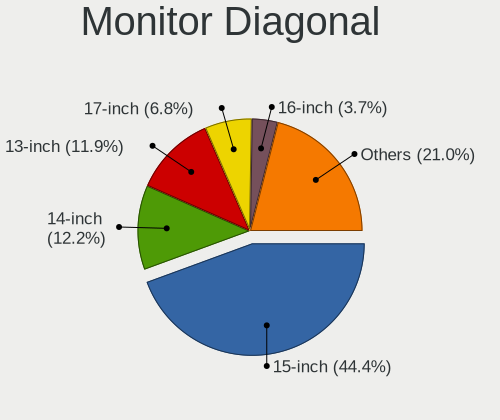

| Inches  | Notebooks | Percent |
|---------|-----------|---------|
| 15      | 131       | 44.41%  |
| 14      | 36        | 12.2%   |
| 13      | 35        | 11.86%  |
| 17      | 20        | 6.78%   |
| 16      | 11        | 3.73%   |
| 12      | 10        | 3.39%   |
| 24      | 9         | 3.05%   |
| 11      | 7         | 2.37%   |
| 31      | 6         | 2.03%   |
| 27      | 5         | 1.69%   |
| 23      | 5         | 1.69%   |
| 34      | 4         | 1.36%   |
| 21      | 4         | 1.36%   |
| 19      | 3         | 1.02%   |
| 86      | 1         | 0.34%   |
| 84      | 1         | 0.34%   |
| 54      | 1         | 0.34%   |
| 26      | 1         | 0.34%   |
| 22      | 1         | 0.34%   |
| 18      | 1         | 0.34%   |
| 10      | 1         | 0.34%   |
| 8       | 1         | 0.34%   |
| Unknown | 1         | 0.34%   |

Monitor Width
-------------

Physical width

| Width in mm | Notebooks | Percent |
|-------------|-----------|---------|
| 301-350     | 188       | 64.38%  |
| 201-300     | 41        | 14.04%  |
| 351-400     | 24        | 8.22%   |
| 501-600     | 19        | 6.51%   |
| 601-700     | 6         | 2.05%   |
| 401-500     | 5         | 1.71%   |
| 701-800     | 4         | 1.37%   |
| 1001-1500   | 2         | 0.68%   |
| 1501-2000   | 1         | 0.34%   |
| 101-200     | 1         | 0.34%   |
| Unknown     | 1         | 0.34%   |

Aspect Ratio
------------

Proportional relationship between the width and the height

| Ratio   | Notebooks | Percent |
|---------|-----------|---------|
| 16/9    | 205       | 75.65%  |
| 16/10   | 46        | 16.97%  |
| 3/2     | 7         | 2.58%   |
| 4/3     | 4         | 1.48%   |
| 21/9    | 4         | 1.48%   |
| 5/4     | 3         | 1.11%   |
| 0.56    | 1         | 0.37%   |
| Unknown | 1         | 0.37%   |

Monitor Area
------------

Area in inch

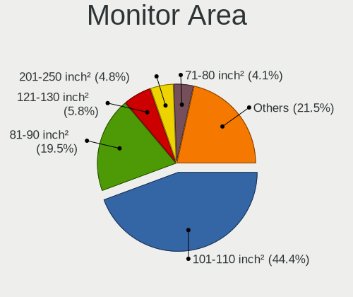

| Area in inch | Notebooks | Percent |
|----------------|-----------|---------|
| 101-110        | 130       | 44.37%  |
| 81-90          | 57        | 19.45%  |
| 121-130        | 17        | 5.8%    |
| 201-250        | 14        | 4.78%   |
| 71-80          | 12        | 4.1%    |
| 111-120        | 11        | 3.75%   |
| 61-70          | 10        | 3.41%   |
| 351-500        | 10        | 3.41%   |
| 51-60          | 7         | 2.39%   |
| 301-350        | 5         | 1.71%   |
| 151-200        | 5         | 1.71%   |
| More than 1000 | 3         | 1.02%   |
| 131-140        | 3         | 1.02%   |
| 91-100         | 3         | 1.02%   |
| 251-300        | 2         | 0.68%   |
| 41-50          | 1         | 0.34%   |
| 1-40           | 1         | 0.34%   |
| 141-150        | 1         | 0.34%   |
| Unknown        | 1         | 0.34%   |

Pixel Density
-------------

Pixels per inch

| Density       | Notebooks | Percent |
|---------------|-----------|---------|
| 121-160       | 115       | 39.93%  |
| 101-120       | 89        | 30.9%   |
| 51-100        | 47        | 16.32%  |
| 161-240       | 29        | 10.07%  |
| More than 240 | 4         | 1.39%   |
| 1-50          | 3         | 1.04%   |
| Unknown       | 1         | 0.35%   |

Multiple Monitors
-----------------

Total monitors connected

| Total | Notebooks | Percent |
|-------|-----------|---------|
| 1     | 235       | 87.69%  |
| 2     | 28        | 10.45%  |
| 3     | 3         | 1.12%   |
| 4     | 1         | 0.37%   |
| 0     | 1         | 0.37%   |

Network
-------

Net Controller Vendor
---------------------

Controller vendors

| Vendor                                | Notebooks | Percent |
|---------------------------------------|-----------|---------|
| Realtek Semiconductor                 | 133       | 32.28%  |
| Intel                                 | 132       | 32.04%  |
| Qualcomm Atheros                      | 42        | 10.19%  |
| Broadcom                              | 24        | 5.83%   |
| MediaTek                              | 16        | 3.88%   |
| Broadcom Limited                      | 12        | 2.91%   |
| Ralink                                | 6         | 1.46%   |
| Marvell Technology Group              | 6         | 1.46%   |
| TP-Link                               | 4         | 0.97%   |
| Samsung Electronics                   | 4         | 0.97%   |
| Qualcomm                              | 4         | 0.97%   |
| ASIX Electronics                      | 4         | 0.97%   |
| Ralink Technology                     | 3         | 0.73%   |
| Nvidia                                | 3         | 0.73%   |
| JMicron Technology                    | 3         | 0.73%   |
| Sierra Wireless                       | 2         | 0.49%   |
| Ericsson Business Mobile Networks     | 2         | 0.49%   |
| U-Blox                                | 1         | 0.24%   |
| QinHeng Electronics                   | 1         | 0.24%   |
| NetGear                               | 1         | 0.24%   |
| Lenovo                                | 1         | 0.24%   |
| Hewlett-Packard                       | 1         | 0.24%   |
| Edimax Technology                     | 1         | 0.24%   |
| DisplayLink                           | 1         | 0.24%   |
| Dell                                  | 1         | 0.24%   |
| D-Link System                         | 1         | 0.24%   |
| Cisco Aironet Wireless Communications | 1         | 0.24%   |
| AVM                                   | 1         | 0.24%   |
| AMD                                   | 1         | 0.24%   |

Net Controller Model
--------------------

Controller models

| Model                                                                  | Notebooks | Percent |
|------------------------------------------------------------------------|-----------|---------|
| Realtek RTL8111/8168/8211/8411 PCI Express Gigabit Ethernet Controller | 72        | 14.4%   |
| Realtek RTL810xE PCI Express Fast Ethernet controller                  | 23        | 4.6%    |
| Realtek RTL8821CE 802.11ac PCIe Wireless Network Adapter               | 16        | 3.2%    |
| Intel Alder Lake-P PCH CNVi WiFi                                       | 14        | 2.8%    |
| Intel 82579LM Gigabit Network Connection (Lewisville)                  | 13        | 2.6%    |
| Realtek RTL8153 Gigabit Ethernet Adapter                               | 11        | 2.2%    |
| Intel Wireless 7260                                                    | 9         | 1.8%    |
| Realtek RTL8822CE 802.11ac PCIe Wireless Network Adapter               | 8         | 1.6%    |
| Intel Wireless 8265 / 8275                                             | 8         | 1.6%    |
| Intel PRO/Wireless 3945ABG [Golan] Network Connection                  | 8         | 1.6%    |
| Intel Centrino Advanced-N 6205 [Taylor Peak]                           | 8         | 1.6%    |
| Qualcomm Atheros QCA9565 / AR9565 Wireless Network Adapter             | 7         | 1.4%    |
| Qualcomm Atheros QCA9377 802.11ac Wireless Network Adapter             | 7         | 1.4%    |
| MediaTek Wi-Fi 6E MT7902 Wireless Network Adapter                      | 7         | 1.4%    |
| Intel Wireless 7265                                                    | 7         | 1.4%    |
| Realtek RTL8852BE PCIe 802.11ax Wireless Network Controller            | 6         | 1.2%    |
| Qualcomm Atheros AR9285 Wireless Network Adapter (PCI-Express)         | 6         | 1.2%    |
| Intel Comet Lake PCH-LP CNVi WiFi                                      | 6         | 1.2%    |
| Qualcomm Atheros QCA6174 802.11ac Wireless Network Adapter             | 5         | 1%      |
| MediaTek MT7921 802.11ax PCI Express Wireless Network Adapter          | 5         | 1%      |
| Intel Wi-Fi 6 AX201                                                    | 5         | 1%      |
| Intel Raptor Lake PCH CNVi WiFi                                        | 5         | 1%      |
| Broadcom BCM4313 802.11bgn Wireless Network Adapter                    | 5         | 1%      |
| Realtek RTL8723BE PCIe Wireless Network Adapter                        | 4         | 0.8%    |
| Ralink RT3290 Wireless 802.11n 1T/1R PCIe                              | 4         | 0.8%    |
| Qualcomm Atheros AR9485 Wireless Network Adapter                       | 4         | 0.8%    |
| Intel Wireless 8260                                                    | 4         | 0.8%    |
| Intel Wi-Fi 6 AX200                                                    | 4         | 0.8%    |
| Intel PRO/Wireless 5100 AGN [Shiloh] Network Connection                | 4         | 0.8%    |
| Intel Ethernet Connection I219-LM                                      | 4         | 0.8%    |
| Intel Comet Lake PCH CNVi WiFi                                         | 4         | 0.8%    |
| Intel Centrino Ultimate-N 6300                                         | 4         | 0.8%    |
| Broadcom Limited BCM4360 802.11ac Dual Band Wireless Network Adapter   | 4         | 0.8%    |
| ASIX AX88179 Gigabit Ethernet                                          | 4         | 0.8%    |
| Realtek RTL8852BE PCIe 802.11ax Wireless Network Controller [1T1R]     | 3         | 0.6%    |
| Realtek RTL-8100/8101L/8139 PCI Fast Ethernet Adapter                  | 3         | 0.6%    |
| Qualcomm QCNFA765 Wireless Network Adapter                             | 3         | 0.6%    |
| Qualcomm Atheros Killer E220x Gigabit Ethernet Controller              | 3         | 0.6%    |
| Nvidia MCP79 Ethernet                                                  | 3         | 0.6%    |
| Intel Wireless 3160                                                    | 3         | 0.6%    |

Wireless Vendor
---------------

Wireless vendors

| Vendor                                | Notebooks | Percent |
|---------------------------------------|-----------|---------|
| Intel                                 | 125       | 45.29%  |
| Realtek Semiconductor                 | 47        | 17.03%  |
| Qualcomm Atheros                      | 36        | 13.04%  |
| Broadcom                              | 18        | 6.52%   |
| MediaTek                              | 14        | 5.07%   |
| Broadcom Limited                      | 10        | 3.62%   |
| Ralink                                | 6         | 2.17%   |
| TP-Link                               | 4         | 1.45%   |
| Qualcomm                              | 4         | 1.45%   |
| Ralink Technology                     | 3         | 1.09%   |
| Sierra Wireless                       | 2         | 0.72%   |
| NetGear                               | 1         | 0.36%   |
| Hewlett-Packard                       | 1         | 0.36%   |
| Edimax Technology                     | 1         | 0.36%   |
| Dell                                  | 1         | 0.36%   |
| D-Link System                         | 1         | 0.36%   |
| Cisco Aironet Wireless Communications | 1         | 0.36%   |
| AVM                                   | 1         | 0.36%   |

Wireless Model
--------------

Wireless models

| Model                                                                | Notebooks | Percent |
|----------------------------------------------------------------------|-----------|---------|
| Realtek RTL8821CE 802.11ac PCIe Wireless Network Adapter             | 16        | 5.76%   |
| Intel Alder Lake-P PCH CNVi WiFi                                     | 14        | 5.04%   |
| Intel Wireless 7260                                                  | 9         | 3.24%   |
| Realtek RTL8822CE 802.11ac PCIe Wireless Network Adapter             | 8         | 2.88%   |
| Intel Wireless 8265 / 8275                                           | 8         | 2.88%   |
| Intel PRO/Wireless 3945ABG [Golan] Network Connection                | 8         | 2.88%   |
| Intel Centrino Advanced-N 6205 [Taylor Peak]                         | 8         | 2.88%   |
| Qualcomm Atheros QCA9565 / AR9565 Wireless Network Adapter           | 7         | 2.52%   |
| Qualcomm Atheros QCA9377 802.11ac Wireless Network Adapter           | 7         | 2.52%   |
| MediaTek Wi-Fi 6E MT7902 Wireless Network Adapter                    | 7         | 2.52%   |
| Intel Wireless 7265                                                  | 7         | 2.52%   |
| Qualcomm Atheros AR9285 Wireless Network Adapter (PCI-Express)       | 6         | 2.16%   |
| Intel Comet Lake PCH-LP CNVi WiFi                                    | 6         | 2.16%   |
| Realtek RTL8852BE PCIe 802.11ax Wireless Network Controller          | 5         | 1.8%    |
| Qualcomm Atheros QCA6174 802.11ac Wireless Network Adapter           | 5         | 1.8%    |
| MediaTek MT7921 802.11ax PCI Express Wireless Network Adapter        | 5         | 1.8%    |
| Intel Wi-Fi 6 AX201                                                  | 5         | 1.8%    |
| Intel Raptor Lake PCH CNVi WiFi                                      | 5         | 1.8%    |
| Broadcom BCM4313 802.11bgn Wireless Network Adapter                  | 5         | 1.8%    |
| Realtek RTL8723BE PCIe Wireless Network Adapter                      | 4         | 1.44%   |
| Ralink RT3290 Wireless 802.11n 1T/1R PCIe                            | 4         | 1.44%   |
| Qualcomm Atheros AR9485 Wireless Network Adapter                     | 4         | 1.44%   |
| Intel Wireless 8260                                                  | 4         | 1.44%   |
| Intel Wi-Fi 6 AX200                                                  | 4         | 1.44%   |
| Intel PRO/Wireless 5100 AGN [Shiloh] Network Connection              | 4         | 1.44%   |
| Intel Comet Lake PCH CNVi WiFi                                       | 4         | 1.44%   |
| Intel Centrino Ultimate-N 6300                                       | 4         | 1.44%   |
| Broadcom Limited BCM4360 802.11ac Dual Band Wireless Network Adapter | 4         | 1.44%   |
| Qualcomm QCNFA765 Wireless Network Adapter                           | 3         | 1.08%   |
| Intel Wireless 3160                                                  | 3         | 1.08%   |
| Intel Wi-Fi 6E(802.11ax) AX210/AX1675* 2x2 [Typhoon Peak]            | 3         | 1.08%   |
| Intel Tiger Lake PCH CNVi WiFi                                       | 3         | 1.08%   |
| Intel Ice Lake-LP PCH CNVi WiFi                                      | 3         | 1.08%   |
| Intel Cannon Point-LP CNVi [Wireless-AC]                             | 3         | 1.08%   |
| Intel Cannon Lake PCH CNVi WiFi                                      | 3         | 1.08%   |
| Broadcom BCM43142 802.11b/g/n                                        | 3         | 1.08%   |
| Broadcom BCM4312 802.11b/g LP-PHY                                    | 3         | 1.08%   |
| Realtek RTL8723AE PCIe Wireless Network Adapter                      | 2         | 0.72%   |
| Realtek RTL8191SEvB Wireless LAN Controller                          | 2         | 0.72%   |
| Realtek RTL8191SEvA Wireless LAN Controller                          | 2         | 0.72%   |

Ethernet Vendor
---------------

Ethernet vendors

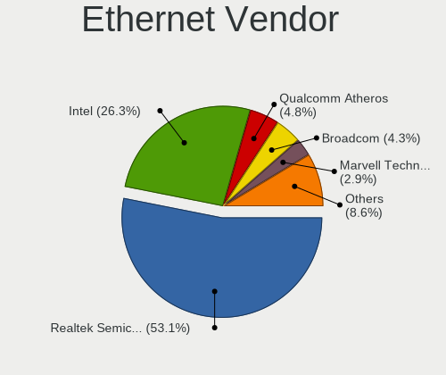

| Vendor                   | Notebooks | Percent |
|--------------------------|-----------|---------|
| Realtek Semiconductor    | 111       | 53.11%  |
| Intel                    | 55        | 26.32%  |
| Qualcomm Atheros         | 10        | 4.78%   |
| Broadcom                 | 9         | 4.31%   |
| Marvell Technology Group | 6         | 2.87%   |
| ASIX Electronics         | 4         | 1.91%   |
| Nvidia                   | 3         | 1.44%   |
| JMicron Technology       | 3         | 1.44%   |
| Samsung Electronics      | 2         | 0.96%   |
| MediaTek                 | 2         | 0.96%   |
| Broadcom Limited         | 2         | 0.96%   |
| Lenovo                   | 1         | 0.48%   |
| DisplayLink              | 1         | 0.48%   |

Ethernet Model
--------------

Ethernet models

| Model                                                                  | Notebooks | Percent |
|------------------------------------------------------------------------|-----------|---------|
| Realtek RTL8111/8168/8211/8411 PCI Express Gigabit Ethernet Controller | 72        | 33.64%  |
| Realtek RTL810xE PCI Express Fast Ethernet controller                  | 23        | 10.75%  |
| Intel 82579LM Gigabit Network Connection (Lewisville)                  | 13        | 6.07%   |
| Realtek RTL8153 Gigabit Ethernet Adapter                               | 11        | 5.14%   |
| Intel Ethernet Connection I219-LM                                      | 4         | 1.87%   |
| ASIX AX88179 Gigabit Ethernet                                          | 4         | 1.87%   |
| Realtek RTL8852BE PCIe 802.11ax Wireless Network Controller [1T1R]     | 3         | 1.4%    |
| Realtek RTL-8100/8101L/8139 PCI Fast Ethernet Adapter                  | 3         | 1.4%    |
| Qualcomm Atheros Killer E220x Gigabit Ethernet Controller              | 3         | 1.4%    |
| Nvidia MCP79 Ethernet                                                  | 3         | 1.4%    |
| Intel Ethernet Connection (6) I219-LM                                  | 3         | 1.4%    |
| Intel Ethernet Connection (3) I218-LM                                  | 3         | 1.4%    |
| Intel 82577LM Gigabit Network Connection                               | 3         | 1.4%    |
| Broadcom NetLink BCM57785 Gigabit Ethernet PCIe                        | 3         | 1.4%    |
| Samsung Galaxy series, misc. (tethering mode)                          | 2         | 0.93%   |
| Realtek RTL8125 2.5GbE Controller                                      | 2         | 0.93%   |
| Qualcomm Atheros AR8132 Fast Ethernet                                  | 2         | 0.93%   |
| Qualcomm Atheros AR8131 Gigabit Ethernet                               | 2         | 0.93%   |
| JMicron JMC250 PCI Express Gigabit Ethernet Controller                 | 2         | 0.93%   |
| Intel PRO/100 VE Network Connection                                    | 2         | 0.93%   |
| Intel Ethernet Connection I218-LM                                      | 2         | 0.93%   |
| Intel Ethernet Connection I217-LM                                      | 2         | 0.93%   |
| Intel Ethernet Connection (4) I219-V                                   | 2         | 0.93%   |
| Intel Ethernet Connection (4) I219-LM                                  | 2         | 0.93%   |
| Intel Ethernet Connection (16) I219-LM                                 | 2         | 0.93%   |
| Intel Ethernet Connection (11) I219-LM                                 | 2         | 0.93%   |
| Intel 82573L Gigabit Ethernet Controller                               | 2         | 0.93%   |
| Intel 82567LM Gigabit Network Connection                               | 2         | 0.93%   |
| Intel 82566MM Gigabit Network Connection                               | 2         | 0.93%   |
| Broadcom NetXtreme BCM57765 Gigabit Ethernet PCIe                      | 2         | 0.93%   |
| Realtek USB 10/100/1G/2.5G LAN                                         | 1         | 0.47%   |
| Realtek RTL8852BE PCIe 802.11ax Wireless Network Controller            | 1         | 0.47%   |
| Qualcomm Atheros QCA8171 Gigabit Ethernet                              | 1         | 0.47%   |
| Qualcomm Atheros AR8151 v2.0 Gigabit Ethernet                          | 1         | 0.47%   |
| Qualcomm Atheros AR8121/AR8113/AR8114 Gigabit or Fast Ethernet         | 1         | 0.47%   |
| MediaTek MT7922 802.11ax PCI Express Wireless Network Adapter          | 1         | 0.47%   |
| MediaTek Infinix SMART 5                                               | 1         | 0.47%   |
| Marvell Group 88E8057 PCI-E Gigabit Ethernet Controller                | 1         | 0.47%   |
| Marvell Group 88E8055 PCI-E Gigabit Ethernet Controller                | 1         | 0.47%   |
| Marvell Group 88E8042 PCI-E Fast Ethernet Controller                   | 1         | 0.47%   |

Net Controller Kind
-------------------

Ethernet, WiFi or modem

| Kind     | Notebooks | Percent |
|----------|-----------|---------|
| WiFi     | 260       | 55.08%  |
| Ethernet | 204       | 43.22%  |
| Modem    | 8         | 1.69%   |

Used Controller
---------------

Currently used network controller

| Kind     | Notebooks | Percent |
|----------|-----------|---------|
| WiFi     | 211       | 74.82%  |
| Ethernet | 71        | 25.18%  |

NICs
----

Total network controllers on board

| Total | Notebooks | Percent |
|-------|-----------|---------|
| 2     | 180       | 67.67%  |
| 1     | 82        | 30.83%  |
| 3     | 3         | 1.13%   |
| 0     | 1         | 0.38%   |

IPv6
----

IPv6 vs IPv4

| Used | Notebooks | Percent |
|------|-----------|---------|
| No   | 193       | 70.96%  |
| Yes  | 79        | 29.04%  |

Bluetooth
---------

Bluetooth Vendor
----------------

Controller vendors

| Vendor                          | Notebooks | Percent |
|---------------------------------|-----------|---------|
| Intel                           | 91        | 42.52%  |
| Realtek Semiconductor           | 25        | 11.68%  |
| IMC Networks                    | 22        | 10.28%  |
| Qualcomm Atheros Communications | 15        | 7.01%   |
| Broadcom                        | 15        | 7.01%   |
| Apple                           | 9         | 4.21%   |
| Lite-On Technology              | 5         | 2.34%   |
| Hewlett-Packard                 | 5         | 2.34%   |
| Foxconn / Hon Hai               | 5         | 2.34%   |
| Realtek                         | 4         | 1.87%   |
| Ralink                          | 4         | 1.87%   |
| Dell                            | 3         | 1.4%    |
| USI                             | 2         | 0.93%   |
| Toshiba                         | 2         | 0.93%   |
| Cambridge Silicon Radio         | 2         | 0.93%   |
| ASUSTek Computer                | 2         | 0.93%   |
| Askey Computer                  | 2         | 0.93%   |
| D-Link                          | 1         | 0.47%   |

Bluetooth Model
---------------

Controller models

| Model                                               | Notebooks | Percent |
|-----------------------------------------------------|-----------|---------|
| Intel Bluetooth wireless interface                  | 31        | 14.49%  |
| Realtek Bluetooth Radio                             | 20        | 9.35%   |
| Intel AX201 Bluetooth                               | 20        | 9.35%   |
| Intel Bluetooth 9460/9560 Jefferson Peak (JfP)      | 15        | 7.01%   |
| Intel AX211 Bluetooth                               | 14        | 6.54%   |
| IMC Networks Wireless_Device                        | 11        | 5.14%   |
| Qualcomm Atheros  Bluetooth Device                  | 7         | 3.27%   |
| IMC Networks Bluetooth Radio                        | 7         | 3.27%   |
| Apple Bluetooth USB Host Controller                 | 5         | 2.34%   |
| Realtek  Bluetooth 4.2 Adapter                      | 4         | 1.87%   |
| Realtek Bluetooth Radio                             | 4         | 1.87%   |
| Ralink RT3290 Bluetooth                             | 4         | 1.87%   |
| Qualcomm Atheros QCA61x4 Bluetooth 4.0              | 4         | 1.87%   |
| Intel AX200 Bluetooth                               | 4         | 1.87%   |
| Broadcom BCM20702 Bluetooth 4.0 [ThinkPad]          | 4         | 1.87%   |
| Intel AX210 Bluetooth                               | 3         | 1.4%    |
| HP Broadcom 2070 Bluetooth Combo                    | 3         | 1.4%    |
| Broadcom BCM2045B (BDC-2) [Bluetooth Controller]    | 3         | 1.4%    |
| Apple Bluetooth Host Controller                     | 3         | 1.4%    |
| USI Bluetooth Device                                | 2         | 0.93%   |
| Qualcomm Atheros AR3012 Bluetooth 4.0               | 2         | 0.93%   |
| Lite-On Qualcomm Atheros QCA9377 Bluetooth          | 2         | 0.93%   |
| Intel Wireless-AC 9260 Bluetooth Adapter            | 2         | 0.93%   |
| IMC Networks Bluetooth Device                       | 2         | 0.93%   |
| HP Bluetooth 2.0 Interface [Broadcom BCM2045]       | 2         | 0.93%   |
| Foxconn / Hon Hai Wireless_Device                   | 2         | 0.93%   |
| Dell Wireless 350 Bluetooth                         | 2         | 0.93%   |
| Cambridge Silicon Radio Bluetooth Dongle (HCI mode) | 2         | 0.93%   |
| Askey Bluetooth Device                              | 2         | 0.93%   |
| Toshiba RT Bluetooth Radio                          | 1         | 0.47%   |
| Toshiba BCM43142A0                                  | 1         | 0.47%   |
| Realtek 802.11ac WLAN Adapter                       | 1         | 0.47%   |
| Qualcomm Atheros AR3012 Bluetooth                   | 1         | 0.47%   |
| Qualcomm Atheros AR3011 Bluetooth                   | 1         | 0.47%   |
| Lite-On Wireless_Device                             | 1         | 0.47%   |
| Lite-On BCM43142A0                                  | 1         | 0.47%   |
| Lite-On Atheros AR3012 Bluetooth                    | 1         | 0.47%   |
| Intel Wireless-AC 3168 Bluetooth                    | 1         | 0.47%   |
| Intel Centrino Bluetooth Wireless Transceiver       | 1         | 0.47%   |
| IMC Networks BCM20702A0                             | 1         | 0.47%   |

Sound
-----

Sound Vendor
------------

Sound card vendors

| Vendor                 | Notebooks | Percent |
|------------------------|-----------|---------|
| Intel                  | 214       | 69.26%  |
| AMD                    | 51        | 16.5%   |
| Nvidia                 | 30        | 9.71%   |
| Fujitsu                | 3         | 0.97%   |
| C-Media Electronics    | 2         | 0.65%   |
| Walmart                | 1         | 0.32%   |
| Texas Instruments      | 1         | 0.32%   |
| Logitech               | 1         | 0.32%   |
| JMTek                  | 1         | 0.32%   |
| Generalplus Technology | 1         | 0.32%   |
| Focusrite-Novation     | 1         | 0.32%   |
| DSEA A/S               | 1         | 0.32%   |
| Creative Technology    | 1         | 0.32%   |
| Avnera                 | 1         | 0.32%   |

Sound Model
-----------

Sound card models

| Model                                                                      | Notebooks | Percent |
|----------------------------------------------------------------------------|-----------|---------|
| AMD Family 17h/19h/1ah HD Audio Controller                                 | 33        | 8.62%   |
| Intel Sunrise Point-LP HD Audio                                            | 23        | 6.01%   |
| Intel 7 Series/C216 Chipset Family High Definition Audio Controller        | 19        | 4.96%   |
| Intel Alder Lake PCH-P High Definition Audio Controller                    | 18        | 4.7%    |
| AMD Renoir Radeon High Definition Audio Controller                         | 14        | 3.66%   |
| Intel Tiger Lake-LP Smart Sound Technology Audio Controller                | 13        | 3.39%   |
| Intel NM10/ICH7 Family High Definition Audio Controller                    | 13        | 3.39%   |
| Intel Haswell-ULT HD Audio Controller                                      | 12        | 3.13%   |
| Intel 8 Series HD Audio Controller                                         | 12        | 3.13%   |
| Intel 6 Series/C200 Series Chipset Family High Definition Audio Controller | 12        | 3.13%   |
| Intel 82801I (ICH9 Family) HD Audio Controller                             | 11        | 2.87%   |
| Intel Wildcat Point-LP High Definition Audio Controller                    | 10        | 2.61%   |
| Intel Broadwell-U Audio Controller                                         | 10        | 2.61%   |
| Intel 5 Series/3400 Series Chipset High Definition Audio                   | 10        | 2.61%   |
| AMD Rembrandt Radeon High Definition Audio Controller                      | 10        | 2.61%   |
| Intel Xeon E3-1200 v3/4th Gen Core Processor HD Audio Controller           | 9         | 2.35%   |
| Intel Comet Lake PCH-LP cAVS                                               | 9         | 2.35%   |
| Intel 8 Series/C220 Series Chipset High Definition Audio Controller        | 9         | 2.35%   |
| Intel Raptor Lake-P/U/H cAVS                                               | 8         | 2.09%   |
| AMD Raven/Raven2/Fenghuang HDMI/DP Audio Controller                        | 7         | 1.83%   |
| Intel 82801H (ICH8 Family) HD Audio Controller                             | 6         | 1.57%   |
| AMD Kabini HDMI/DP Audio                                                   | 6         | 1.57%   |
| AMD FCH Azalia Controller                                                  | 6         | 1.57%   |
| Intel Ice Lake-LP Smart Sound Technology Audio Controller                  | 5         | 1.31%   |
| Intel Cannon Point-LP High Definition Audio Controller                     | 5         | 1.31%   |
| Nvidia MCP79 High Definition Audio                                         | 4         | 1.04%   |
| Nvidia GP107GL High Definition Audio Controller                            | 4         | 1.04%   |
| Nvidia GF108 High Definition Audio Controller                              | 4         | 1.04%   |
| Intel Tiger Lake-H HD Audio Controller                                     | 4         | 1.04%   |
| Intel Comet Lake PCH cAVS                                                  | 4         | 1.04%   |
| Intel CM238 HD Audio Controller                                            | 4         | 1.04%   |
| Intel Celeron/Pentium Silver Processor High Definition Audio               | 4         | 1.04%   |
| AMD Family 15h (Models 60h-6fh) Audio Controller                           | 4         | 1.04%   |
| Nvidia TU107 GeForce GTX 1650 High Definition Audio Controller             | 3         | 0.78%   |
| Nvidia GK106 HDMI Audio Controller                                         | 3         | 0.78%   |
| Intel Cannon Lake PCH cAVS                                                 | 3         | 0.78%   |
| Intel Alder Lake-N PCH High Definition Audio Controller                    | 3         | 0.78%   |
| Fujitsu USB Audio                                                          | 3         | 0.78%   |
| AMD High Definition Audio Controller                                       | 3         | 0.78%   |
| Nvidia GF119 HDMI Audio Controller                                         | 2         | 0.52%   |

Memory
------

Memory Vendor
-------------

Memory module vendors

| Vendor                       | Notebooks | Percent |
|------------------------------|-----------|---------|
| Samsung Electronics          | 63        | 28.51%  |
| SK hynix                     | 38        | 17.19%  |
| Micron Technology            | 31        | 14.03%  |
| Unknown                      | 29        | 13.12%  |
| Kingston                     | 14        | 6.33%   |
| A-DATA Technology            | 7         | 3.17%   |
| Elpida                       | 6         | 2.71%   |
| Crucial                      | 6         | 2.71%   |
| Unknown                      | 6         | 2.71%   |
| Team                         | 2         | 0.9%    |
| Silicon Power                | 2         | 0.9%    |
| Nanya Technology             | 2         | 0.9%    |
| G.Skill                      | 2         | 0.9%    |
| Corsair                      | 2         | 0.9%    |
| Timetec                      | 1         | 0.45%   |
| Smart                        | 1         | 0.45%   |
| Shenzhen Longsys             | 1         | 0.45%   |
| Ramaxel Technology           | 1         | 0.45%   |
| PNY                          | 1         | 0.45%   |
| Patriot Memory (PDP Systems) | 1         | 0.45%   |
| Patriot                      | 1         | 0.45%   |
| Goldkey                      | 1         | 0.45%   |
| Avant                        | 1         | 0.45%   |
| ASint Technology             | 1         | 0.45%   |
| 48spaces                     | 1         | 0.45%   |

Memory Model
------------

Memory module models

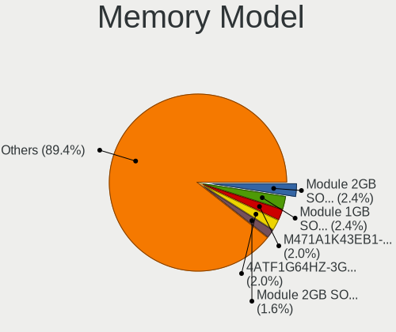

| Model                                                            | Notebooks | Percent |
|------------------------------------------------------------------|-----------|---------|
| Unknown RAM Module 2GB SODIMM DDR2 667MT/s                       | 6         | 2.45%   |
| Unknown                                                          | 6         | 2.45%   |
| Samsung RAM M471A1K43EB1-CWE 8GB SODIMM DDR4 3200MT/s            | 5         | 2.04%   |
| Micron RAM 4ATF1G64HZ-3G2F1 8GB SODIMM DDR4 3200MT/s             | 5         | 2.04%   |
| Unknown RAM Module 2GB SODIMM DDR2                               | 4         | 1.63%   |
| Unknown RAM Module 1GB SODIMM DDR2 533MT/s                       | 4         | 1.63%   |
| Unknown RAM Module 1GB SODIMM DDR2                               | 4         | 1.63%   |
| Samsung RAM M471A5244CB0-CTD 4GB SODIMM DDR4 3266MT/s            | 4         | 1.63%   |
| SK hynix RAM HMT451S6AFR8C-PB 4GB SODIMM DDR3 1600MT/s           | 3         | 1.22%   |
| Samsung RAM M471A1K43DB1-CTD 8GB SODIMM DDR4 2667MT/s            | 3         | 1.22%   |
| Unknown RAM Module 512MB SODIMM DDR2                             | 2         | 0.82%   |
| Unknown RAM Module 4GB SODIMM DDR2 667MT/s                       | 2         | 0.82%   |
| Unknown RAM Module 2GB SODIMM DDR2 533MT/s                       | 2         | 0.82%   |
| Unknown RAM Module 1GB SODIMM DDR2 667MT/s                       | 2         | 0.82%   |
| SK hynix RAM HMT451S6BFR8A-PB 4096MB SODIMM DDR3 1600MT/s        | 2         | 0.82%   |
| SK hynix RAM HMT425S6CFR6C-PB 2GB SODIMM 1600MT/s                | 2         | 0.82%   |
| SK hynix RAM HMA851S6DJR6N-XN 4GB SODIMM DDR4 3200MT/s           | 2         | 0.82%   |
| SK hynix RAM H9JCNNNBK3MLYR-N6E 1GB Row Of Chips LPDDR5 6400MT/s | 2         | 0.82%   |
| Samsung RAM M471B5673EH1-CF8 2GB SODIMM 4199MT/s                 | 2         | 0.82%   |
| Samsung RAM M471B5173DB0-YK0 4GB SODIMM DDR3 1600MT/s            | 2         | 0.82%   |
| Samsung RAM M471B5173BH0-CK0 4GB SODIMM DDR3 1600MT/s            | 2         | 0.82%   |
| Samsung RAM M471B1G73EB0-YK0 8GB SODIMM DDR3 1600MT/s            | 2         | 0.82%   |
| Samsung RAM M471B1G73DB0-YK0 8GB SODIMM DDR3 1600MT/s            | 2         | 0.82%   |
| Samsung RAM M471A5244CB0-CWE 4096MB SODIMM DDR4 3200MT/s         | 2         | 0.82%   |
| Samsung RAM M471A2G44BM0-CWE 16GB SODIMM DDR4 3200MT/s           | 2         | 0.82%   |
| Samsung RAM M471A1K43CB1-CRC 8GB SODIMM DDR4 2667MT/s            | 2         | 0.82%   |
| Samsung RAM M471A1K43BB0-CPB 8GB SODIMM DDR4 2133MT/s            | 2         | 0.82%   |
| Samsung RAM M471A1G44BB0-CWE 8GB SODIMM DDR4 3200MT/s            | 2         | 0.82%   |
| Samsung RAM M471A1G44AB0-CWE 8GB Row Of Chips DDR4 3200MT/s      | 2         | 0.82%   |
| Micron RAM MT62F1G32D4DR-031 2GB Row Of Chips LPDDR5 6400MT/s    | 2         | 0.82%   |
| Micron RAM Module 4GB SODIMM DDR3 1600MT/s                       | 2         | 0.82%   |
| Micron RAM 8KTF51264HZ-1G6E1 4GB SODIMM DDR3 1600MT/s            | 2         | 0.82%   |
| Micron RAM 8ATF1G64HZ-3G2R1 8GB SODIMM DDR4 3200MT/s             | 2         | 0.82%   |
| Micron RAM 16JSF51264HZ-1G4D1 4GB SODIMM DDR3 1334MT/s           | 2         | 0.82%   |
| Kingston RAM 99U5469-045.A00LF 4GB SODIMM DDR3 1600MT/s          | 2         | 0.82%   |
| Elpida RAM Module 2GB SODIMM DDR3 1600MT/s                       | 2         | 0.82%   |
| Unknown RAM Module 8GB SODIMM DDR3 1333MT/s                      | 1         | 0.41%   |
| Unknown RAM Module 512MB SODIMM DRAM                             | 1         | 0.41%   |
| Unknown RAM Module 512MB SODIMM DDR                              | 1         | 0.41%   |
| Unknown RAM Module 4GB SODIMM DDR3 1067MT/s                      | 1         | 0.41%   |

Memory Kind
-----------

Memory module kinds

| Kind    | Notebooks | Percent |
|---------|-----------|---------|
| DDR4    | 75        | 38.27%  |
| DDR3    | 60        | 30.61%  |
| DDR2    | 18        | 9.18%   |
| LPDDR5  | 16        | 8.16%   |
| SDRAM   | 8         | 4.08%   |
| DDR5    | 5         | 2.55%   |
| LPDDR4  | 4         | 2.04%   |
| DDR     | 4         | 2.04%   |
| LPDDR3  | 3         | 1.53%   |
| RAM     | 1         | 0.51%   |
| DRAM    | 1         | 0.51%   |
| Unknown | 1         | 0.51%   |

Memory Form Factor
------------------

Physical design of the memory module

| Name         | Notebooks | Percent |
|--------------|-----------|---------|
| SODIMM       | 171       | 86.8%   |
| Row Of Chips | 22        | 11.17%  |
| Chip         | 3         | 1.52%   |
| Unknown      | 1         | 0.51%   |

Memory Size
-----------

Memory module size

| Size  | Notebooks | Percent |
|-------|-----------|---------|
| 8192  | 66        | 30.14%  |
| 4096  | 66        | 30.14%  |
| 2048  | 35        | 15.98%  |
| 16384 | 21        | 9.59%   |
| 1024  | 18        | 8.22%   |
| 32768 | 7         | 3.2%    |
| 512   | 6         | 2.74%   |

Memory Speed
------------

Memory module speed

| Speed   | Notebooks | Percent |
|---------|-----------|---------|
| 3200    | 43        | 20.87%  |
| 1600    | 42        | 20.39%  |
| 2667    | 21        | 10.19%  |
| 6400    | 12        | 5.83%   |
| Unknown | 12        | 5.83%   |
| 667     | 9         | 4.37%   |
| 2133    | 8         | 3.88%   |
| 2400    | 7         | 3.4%    |
| 1334    | 7         | 3.4%    |
| 1333    | 7         | 3.4%    |
| 1067    | 5         | 2.43%   |
| 533     | 5         | 2.43%   |
| 3266    | 4         | 1.94%   |
| 2048    | 4         | 1.94%   |
| 5600    | 3         | 1.46%   |
| 4199    | 3         | 1.46%   |
| 5500    | 2         | 0.97%   |
| 4800    | 2         | 0.97%   |
| 4267    | 2         | 0.97%   |
| 1066    | 2         | 0.97%   |
| 7467    | 1         | 0.49%   |
| 7400    | 1         | 0.49%   |
| 4266    | 1         | 0.49%   |
| 1867    | 1         | 0.49%   |
| 975     | 1         | 0.49%   |
| 800     | 1         | 0.49%   |

Printers & scanners
-------------------

Printer Vendor
--------------

Printer device vendors

| Vendor          | Notebooks | Percent |
|-----------------|-----------|---------|
| Canon           | 2         | 66.67%  |
| Hewlett-Packard | 1         | 33.33%  |

Printer Model
-------------

Printer device models

| Model                     | Notebooks | Percent |
|---------------------------|-----------|---------|
| HP DeskJet 4100 series    | 1         | 33.33%  |
| Canon TR4600 series       | 1         | 33.33%  |
| Canon PIXMA MG3500 Series | 1         | 33.33%  |

Scanner Vendor
--------------

Scanner device vendors

Zero info for selected period =(

Scanner Model
-------------

Scanner device models

Zero info for selected period =(

Camera
------

Camera Vendor
-------------

Camera device vendors

| Vendor                                 | Notebooks | Percent |
|----------------------------------------|-----------|---------|
| Chicony Electronics                    | 59        | 26.7%   |
| IMC Networks                           | 29        | 13.12%  |
| Quanta                                 | 19        | 8.6%    |
| Bison Electronics                      | 16        | 7.24%   |
| Sunplus Innovation Technology          | 12        | 5.43%   |
| Microdia                               | 12        | 5.43%   |
| Luxvisions Innotech Limited            | 12        | 5.43%   |
| Realtek Semiconductor                  | 11        | 4.98%   |
| Cheng Uei Precision Industry (Foxlink) | 9         | 4.07%   |
| Suyin                                  | 6         | 2.71%   |
| Shinetech                              | 5         | 2.26%   |
| Apple                                  | 5         | 2.26%   |
| Sonix Technology                       | 4         | 1.81%   |
| Syntek                                 | 3         | 1.36%   |
| Ricoh                                  | 3         | 1.36%   |
| Logitech                               | 3         | 1.36%   |
| Lite-On Technology                     | 3         | 1.36%   |
| Silicon Motion                         | 2         | 0.9%    |
| Shine-optics                           | 2         | 0.9%    |
| Z-Star Microelectronics                | 1         | 0.45%   |
| SunplusIT                              | 1         | 0.45%   |
| Lenovo                                 | 1         | 0.45%   |
| globaloptics                           | 1         | 0.45%   |
| Alcor Micro                            | 1         | 0.45%   |
| Acer                                   | 1         | 0.45%   |

Camera Model
------------

Camera device models

| Model                                                   | Notebooks | Percent |
|---------------------------------------------------------|-----------|---------|
| Chicony Integrated Camera                               | 15        | 6.73%   |
| IMC Networks USB2.0 HD UVC WebCam                       | 13        | 5.83%   |
| Chicony HD WebCam                                       | 7         | 3.14%   |
| Bison Integrated Camera                                 | 7         | 3.14%   |
| IMC Networks USB2.0 VGA UVC WebCam                      | 6         | 2.69%   |
| Microdia Integrated_Webcam_HD                           | 5         | 2.24%   |
| Luxvisions Innotech Limited HP TrueVision HD Camera     | 5         | 2.24%   |
| Quanta HP HD Camera                                     | 4         | 1.79%   |
| Sunplus HD WebCam                                       | 3         | 1.35%   |
| Sonix USB2.0 HD UVC WebCam                              | 3         | 1.35%   |
| Realtek Integrated_Webcam_HD                            | 3         | 1.35%   |
| Quanta HP TrueVision HD Camera                          | 3         | 1.35%   |
| IMC Networks Integrated Camera                          | 3         | 1.35%   |
| Chicony TOSHIBA Web Camera - HD                         | 3         | 1.35%   |
| Chicony Integrated Camera (1280x720@30)                 | 3         | 1.35%   |
| Chicony HP Truevision HD                                | 3         | 1.35%   |
| Chicony HP HD Camera                                    | 3         | 1.35%   |
| Cheng Uei Precision Industry (Foxlink) HP TrueVision HD | 3         | 1.35%   |
| Syntek Integrated Camera                                | 2         | 0.9%    |
| Suyin Acer/HP Integrated Webcam [CN0314]                | 2         | 0.9%    |
| Sunplus Integrated_Webcam_HD                            | 2         | 0.9%    |
| ShineTech USB2.0 HD UVC WebCam                          | 2         | 0.9%    |
| ShineTech HD Camera                                     | 2         | 0.9%    |
| Shine-optics USB2.0 HD UVC WebCam                       | 2         | 0.9%    |
| Quanta ov9734_techfront_camera                          | 2         | 0.9%    |
| Quanta HD User Facing                                   | 2         | 0.9%    |
| Quanta ACER HD User Facing                              | 2         | 0.9%    |
| Microdia Sonix USB 2.0 Camera                           | 2         | 0.9%    |
| Luxvisions Innotech Limited Integrated RGB Camera       | 2         | 0.9%    |
| Lite-On Integrated Camera                               | 2         | 0.9%    |
| IMC Networks USB2.0 HD IR UVC WebCam                    | 2         | 0.9%    |
| IMC Networks Integrated Webcam                          | 2         | 0.9%    |
| Chicony USB2.0 VGA UVC WebCam                           | 2         | 0.9%    |
| Chicony USB2.0 HD UVC WebCam                            | 2         | 0.9%    |
| Chicony USB2.0 Camera                                   | 2         | 0.9%    |
| Chicony Lenovo EasyCamera                               | 2         | 0.9%    |
| Chicony HP HD Webcam                                    | 2         | 0.9%    |
| Chicony FJ Camera                                       | 2         | 0.9%    |
| Chicony ACER HD User Facing                             | 2         | 0.9%    |
| Cheng Uei Precision Industry (Foxlink) HP HD Webcam     | 2         | 0.9%    |

Security
--------

Fingerprint Vendor
------------------

Fingerprint sensor vendors

| Vendor                     | Notebooks | Percent |
|----------------------------|-----------|---------|
| Validity Sensors           | 15        | 31.25%  |
| Synaptics                  | 12        | 25%     |
| Shenzhen Goodix Technology | 6         | 12.5%   |
| STMicroelectronics         | 5         | 10.42%  |
| Elan Microelectronics      | 4         | 8.33%   |
| Upek                       | 3         | 6.25%   |
| LighTuning Technology      | 2         | 4.17%   |
| Microsoft                  | 1         | 2.08%   |

Fingerprint Model
-----------------

Fingerprint sensor models

| Model                                                    | Notebooks | Percent |
|----------------------------------------------------------|-----------|---------|
| STMicroelectronics Fingerprint Reader                    | 5         | 10.42%  |
| Shenzhen Goodix  FingerPrint Device                      | 5         | 10.42%  |
| Validity Sensors VFS 5011 fingerprint sensor             | 4         | 8.33%   |
| Validity Sensors VFS495 Fingerprint Reader               | 3         | 6.25%   |
| Upek Biometric Touchchip/Touchstrip Fingerprint Sensor   | 3         | 6.25%   |
| Synaptics Prometheus MIS Touch Fingerprint Reader        | 3         | 6.25%   |
| Synaptics FS7604 Touch Fingerprint Sensor with PurePrint | 3         | 6.25%   |
| Validity Sensors VFS451 Fingerprint Reader               | 2         | 4.17%   |
| Synaptics Metallica MIS Touch Fingerprint Reader         | 2         | 4.17%   |
| Elan ELAN:ARM-M4                                         | 2         | 4.17%   |
| Validity Sensors VFS7552 Touch Fingerprint Sensor        | 1         | 2.08%   |
| Validity Sensors VFS7500 Touch Fingerprint Sensor        | 1         | 2.08%   |
| Validity Sensors VFS491                                  | 1         | 2.08%   |
| Validity Sensors VFS Fingerprint sensor                  | 1         | 2.08%   |
| Validity Sensors Swipe Fingerprint Sensor                | 1         | 2.08%   |
| Validity Sensors Fingerprint scanner                     | 1         | 2.08%   |
| Synaptics WBDI                                           | 1         | 2.08%   |
| Synaptics UWP WBDI Device                                | 1         | 2.08%   |
| Synaptics UWP WBDI                                       | 1         | 2.08%   |
| Synaptics Fingerprint reader [HP G6]                     | 1         | 2.08%   |
| Shenzhen Goodix FingerPrint                              | 1         | 2.08%   |
| Microsoft Fingerprint Reader                             | 1         | 2.08%   |
| LighTuning ES603 Swipe Fingerprint Sensor                | 1         | 2.08%   |
| LighTuning EgisTec Touch Fingerprint Sensor              | 1         | 2.08%   |
| Elan WBF Fingerprint Sensor                              | 1         | 2.08%   |
| Elan ELAN:Fingerprint                                    | 1         | 2.08%   |

Chipcard Vendor
---------------

Chipcard module vendors

| Vendor      | Notebooks | Percent |
|-------------|-----------|---------|
| Broadcom    | 7         | 35%     |
| Alcor Micro | 6         | 30%     |
| Lenovo      | 3         | 15%     |
| Upek        | 2         | 10%     |
| O2 Micro    | 2         | 10%     |

Chipcard Model
--------------

Chipcard module models

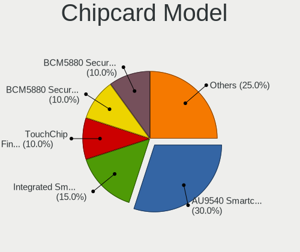

| Model                                                                        | Notebooks | Percent |
|------------------------------------------------------------------------------|-----------|---------|
| Alcor Micro AU9540 Smartcard Reader                                          | 6         | 30%     |
| Lenovo Integrated Smart Card Reader                                          | 3         | 15%     |
| Upek TouchChip Fingerprint Coprocessor (WBF advanced mode)                   | 2         | 10%     |
| Broadcom BCM5880 Secure Applications Processor with fingerprint swipe sensor | 2         | 10%     |
| Broadcom BCM5880 Secure Applications Processor                               | 2         | 10%     |
| Broadcom 58200                                                               | 2         | 10%     |
| O2 Micro Oz776 SmartCard Reader                                              | 1         | 5%      |
| O2 Micro OZ776 CCID Smartcard Reader                                         | 1         | 5%      |
| Broadcom 5880                                                                | 1         | 5%      |

Unsupported
-----------

Unsupported Devices
-------------------

Total unsupported devices on board

| Total | Notebooks | Percent |
|-------|-----------|---------|
| 0     | 155       | 57.84%  |
| 1     | 89        | 33.21%  |
| 2     | 20        | 7.46%   |
| 3     | 4         | 1.49%   |

Unsupported Device Types
------------------------

Types of unsupported devices

| Type                     | Notebooks | Percent |
|--------------------------|-----------|---------|
| Fingerprint reader       | 48        | 34.04%  |
| Graphics card            | 26        | 18.44%  |
| Net/wireless             | 21        | 14.89%  |
| Chipcard                 | 20        | 14.18%  |
| Multimedia controller    | 8         | 5.67%   |
| Bluetooth                | 6         | 4.26%   |
| Camera                   | 5         | 3.55%   |
| Storage                  | 2         | 1.42%   |
| Card reader              | 2         | 1.42%   |
| Tv card                  | 1         | 0.71%   |
| Storage/nvme             | 1         | 0.71%   |
| Communication controller | 1         | 0.71%   |

