LMDE 6 - Tested Hardware & Statistics (Notebooks)
-------------------------------------------------

A project to collect tested hardware configurations for LMDE 6.

Anyone can contribute to this report by the [hw-probe](https://github.com/linuxhw/hw-probe) tool:

    sudo -E hw-probe -all -upload

Please contribute! Especially if your hardware is rare.

Contents
--------

* [ Test Cases ](#test-cases)

* [ System ](#system)
  - [ Kernel                   ](#kernel)
  - [ Kernel Family            ](#kernel-family)
  - [ Kernel Major Ver.        ](#kernel-major-ver)
  - [ Arch                     ](#arch)
  - [ DE                       ](#de)
  - [ Display Server           ](#display-server)
  - [ Display Manager          ](#display-manager)
  - [ OS Lang                  ](#os-lang)
  - [ Boot Mode                ](#boot-mode)
  - [ Filesystem               ](#filesystem)
  - [ Part. scheme             ](#part-scheme)
  - [ Dual Boot with Linux/BSD ](#dual-boot-with-linuxbsd)
  - [ Dual Boot (Win)          ](#dual-boot-win)

* [ Board ](#board)
  - [ Vendor                   ](#vendor)
  - [ Model                    ](#model)
  - [ Model Family             ](#model-family)
  - [ MFG Year                 ](#mfg-year)
  - [ Form Factor              ](#form-factor)
  - [ Secure Boot              ](#secure-boot)
  - [ Coreboot                 ](#coreboot)
  - [ RAM Size                 ](#ram-size)
  - [ RAM Used                 ](#ram-used)
  - [ Total Drives             ](#total-drives)
  - [ Has CD-ROM               ](#has-cd-rom)
  - [ Has Ethernet             ](#has-ethernet)
  - [ Has WiFi                 ](#has-wifi)
  - [ Has Bluetooth            ](#has-bluetooth)

* [ Location ](#location)
  - [ Country                  ](#country)
  - [ City                     ](#city)

* [ Drives ](#drives)
  - [ Drive Vendor             ](#drive-vendor)
  - [ Drive Model              ](#drive-model)
  - [ HDD Vendor               ](#hdd-vendor)
  - [ SSD Vendor               ](#ssd-vendor)
  - [ Drive Kind               ](#drive-kind)
  - [ Drive Connector          ](#drive-connector)
  - [ Drive Size               ](#drive-size)
  - [ Space Total              ](#space-total)
  - [ Space Used               ](#space-used)
  - [ Malfunc. Drives          ](#malfunc-drives)
  - [ Malfunc. Drive Vendor    ](#malfunc-drive-vendor)
  - [ Malfunc. HDD Vendor      ](#malfunc-hdd-vendor)
  - [ Malfunc. Drive Kind      ](#malfunc-drive-kind)
  - [ Failed Drives            ](#failed-drives)
  - [ Failed Drive Vendor      ](#failed-drive-vendor)
  - [ Drive Status             ](#drive-status)

* [ Storage controller ](#storage-controller)
  - [ Storage Vendor           ](#storage-vendor)
  - [ Storage Model            ](#storage-model)
  - [ Storage Kind             ](#storage-kind)

* [ Processor ](#processor)
  - [ CPU Vendor               ](#cpu-vendor)
  - [ CPU Model                ](#cpu-model)
  - [ CPU Model Family         ](#cpu-model-family)
  - [ CPU Cores                ](#cpu-cores)
  - [ CPU Sockets              ](#cpu-sockets)
  - [ CPU Threads              ](#cpu-threads)
  - [ CPU Op-Modes             ](#cpu-op-modes)
  - [ CPU Microcode            ](#cpu-microcode)
  - [ CPU Microarch            ](#cpu-microarch)

* [ Graphics ](#graphics)
  - [ GPU Vendor               ](#gpu-vendor)
  - [ GPU Model                ](#gpu-model)
  - [ GPU Combo                ](#gpu-combo)
  - [ GPU Driver               ](#gpu-driver)
  - [ GPU Memory               ](#gpu-memory)

* [ Monitor ](#monitor)
  - [ Monitor Vendor           ](#monitor-vendor)
  - [ Monitor Model            ](#monitor-model)
  - [ Monitor Resolution       ](#monitor-resolution)
  - [ Monitor Diagonal         ](#monitor-diagonal)
  - [ Monitor Width            ](#monitor-width)
  - [ Aspect Ratio             ](#aspect-ratio)
  - [ Monitor Area             ](#monitor-area)
  - [ Pixel Density            ](#pixel-density)
  - [ Multiple Monitors        ](#multiple-monitors)

* [ Network ](#network)
  - [ Net Controller Vendor    ](#net-controller-vendor)
  - [ Net Controller Model     ](#net-controller-model)
  - [ Wireless Vendor          ](#wireless-vendor)
  - [ Wireless Model           ](#wireless-model)
  - [ Ethernet Vendor          ](#ethernet-vendor)
  - [ Ethernet Model           ](#ethernet-model)
  - [ Net Controller Kind      ](#net-controller-kind)
  - [ Used Controller          ](#used-controller)
  - [ NICs                     ](#nics)
  - [ IPv6                     ](#ipv6)

* [ Bluetooth ](#bluetooth)
  - [ Bluetooth Vendor         ](#bluetooth-vendor)
  - [ Bluetooth Model          ](#bluetooth-model)

* [ Sound ](#sound)
  - [ Sound Vendor             ](#sound-vendor)
  - [ Sound Model              ](#sound-model)

* [ Memory ](#memory)
  - [ Memory Vendor            ](#memory-vendor)
  - [ Memory Model             ](#memory-model)
  - [ Memory Kind              ](#memory-kind)
  - [ Memory Form Factor       ](#memory-form-factor)
  - [ Memory Size              ](#memory-size)
  - [ Memory Speed             ](#memory-speed)

* [ Printers & scanners ](#printers--scanners)
  - [ Printer Vendor           ](#printer-vendor)
  - [ Printer Model            ](#printer-model)
  - [ Scanner Vendor           ](#scanner-vendor)
  - [ Scanner Model            ](#scanner-model)

* [ Camera ](#camera)
  - [ Camera Vendor            ](#camera-vendor)
  - [ Camera Model             ](#camera-model)

* [ Security ](#security)
  - [ Fingerprint Vendor       ](#fingerprint-vendor)
  - [ Fingerprint Model        ](#fingerprint-model)
  - [ Chipcard Vendor          ](#chipcard-vendor)
  - [ Chipcard Model           ](#chipcard-model)

* [ Unsupported ](#unsupported)
  - [ Unsupported Devices      ](#unsupported-devices)
  - [ Unsupported Device Types ](#unsupported-device-types)

Test Cases
----------

Total: 141

| Vendor        | Model                       | Probe                                                      | Date         |
|---------------|-----------------------------|------------------------------------------------------------|--------------|
| MSI           | Thin GF63 12HW              | [b5b16477c3](https://linux-hardware.org/?probe=b5b16477c3) | Feb 02, 2024 |
| Dell          | Latitude 7280               | [c94b45b8f4](https://linux-hardware.org/?probe=c94b45b8f4) | Feb 02, 2024 |
| Acer          | Aspire E1-572G              | [78a08c286e](https://linux-hardware.org/?probe=78a08c286e) | Jan 30, 2024 |
| Acer          | Aspire E1-572G              | [a23343d32d](https://linux-hardware.org/?probe=a23343d32d) | Jan 30, 2024 |
| Medion        | P7612                       | [875d083de0](https://linux-hardware.org/?probe=875d083de0) | Jan 29, 2024 |
| HP            | Compaq 615                  | [907b046dda](https://linux-hardware.org/?probe=907b046dda) | Jan 29, 2024 |
| Lenovo        | IdeaPad 3 15ADA05 81W1      | [79381fe2e8](https://linux-hardware.org/?probe=79381fe2e8) | Jan 29, 2024 |
| Lenovo        | ThinkPad X230 2325SU3       | [664fffd47e](https://linux-hardware.org/?probe=664fffd47e) | Jan 29, 2024 |
| Lenovo        | ThinkPad X230 2325SU3       | [cc42f2d5e4](https://linux-hardware.org/?probe=cc42f2d5e4) | Jan 29, 2024 |
| Acer          | Aspire E5-575               | [6764984d72](https://linux-hardware.org/?probe=6764984d72) | Jan 26, 2024 |
| TUXEDO        | Pulse 14 Gen1               | [7cd83ff81e](https://linux-hardware.org/?probe=7cd83ff81e) | Jan 23, 2024 |
| TUXEDO        | Pulse 14 Gen1               | [b8a8ce8fc0](https://linux-hardware.org/?probe=b8a8ce8fc0) | Jan 23, 2024 |
| Dell          | Latitude D610               | [b1f24babef](https://linux-hardware.org/?probe=b1f24babef) | Jan 22, 2024 |
| ASUSTek       | TUF Gaming FX505DT_FX505... | [61f93014cf](https://linux-hardware.org/?probe=61f93014cf) | Jan 21, 2024 |
| Lenovo        | ThinkPad Z13 Gen 1 21D20... | [b2d419f7dc](https://linux-hardware.org/?probe=b2d419f7dc) | Jan 18, 2024 |
| Lenovo        | ThinkPad X1 Carbon 3rd 2... | [d40c2f48dd](https://linux-hardware.org/?probe=d40c2f48dd) | Jan 18, 2024 |
| Lenovo        | ThinkPad T16 Gen 1 21CHC... | [323c35348f](https://linux-hardware.org/?probe=323c35348f) | Jan 16, 2024 |
| Lenovo        | ThinkPad X61 76754BJ        | [42f1380b4e](https://linux-hardware.org/?probe=42f1380b4e) | Jan 15, 2024 |
| Lenovo        | ThinkPad T400 6474EU3       | [0d9d328c8d](https://linux-hardware.org/?probe=0d9d328c8d) | Jan 14, 2024 |
| Dell          | Inspiron 15-3552            | [2a9bde666e](https://linux-hardware.org/?probe=2a9bde666e) | Jan 13, 2024 |
| Dell          | Inspiron 15-3552            | [87e8f38d79](https://linux-hardware.org/?probe=87e8f38d79) | Jan 13, 2024 |
| HP            | Dragonfly 13.5 inch G4 N... | [516c8f6f9c](https://linux-hardware.org/?probe=516c8f6f9c) | Jan 13, 2024 |
| Lenovo        | ThinkPad X1 Carbon 34601... | [bdfab62447](https://linux-hardware.org/?probe=bdfab62447) | Jan 12, 2024 |
| VALE          | Notebook Classic C171V      | [8ecf376e28](https://linux-hardware.org/?probe=8ecf376e28) | Jan 10, 2024 |
| Lenovo        | ThinkPad Z13 Gen 1 21D20... | [702eef24cf](https://linux-hardware.org/?probe=702eef24cf) | Jan 09, 2024 |
| Lenovo        | IdeaPad Y530                | [344509ac97](https://linux-hardware.org/?probe=344509ac97) | Jan 08, 2024 |
| Notebook      | W35xSTQ_370ST               | [a2f670a8f0](https://linux-hardware.org/?probe=a2f670a8f0) | Jan 08, 2024 |
| Dell          | Latitude E6320              | [75e562d28a](https://linux-hardware.org/?probe=75e562d28a) | Jan 07, 2024 |
| Lenovo        | IdeaPad 3 15IML05 82BS      | [2c36dcaa22](https://linux-hardware.org/?probe=2c36dcaa22) | Jan 07, 2024 |
| Google        | Swanky                      | [1b6173f1e0](https://linux-hardware.org/?probe=1b6173f1e0) | Jan 05, 2024 |
| Apple         | MacBookAir7,1               | [5596e9e3a7](https://linux-hardware.org/?probe=5596e9e3a7) | Jan 04, 2024 |
| Lenovo        | IdeaPad 330S-15IKB 81F5     | [a04f45ddfb](https://linux-hardware.org/?probe=a04f45ddfb) | Jan 03, 2024 |
| Dell          | Latitude E6320              | [e6fec1134a](https://linux-hardware.org/?probe=e6fec1134a) | Jan 03, 2024 |
| Dell          | Latitude E6320              | [1833dcdd43](https://linux-hardware.org/?probe=1833dcdd43) | Dec 31, 2023 |
| ASUSTek       | ASUS BR1100CKA BR1100CKA... | [fc3a637b52](https://linux-hardware.org/?probe=fc3a637b52) | Dec 31, 2023 |
| ASUSTek       | ROG Strix G512LV_G512LV     | [86a499d322](https://linux-hardware.org/?probe=86a499d322) | Dec 30, 2023 |
| Sony          | VGN-FW21E                   | [52ff803e03](https://linux-hardware.org/?probe=52ff803e03) | Dec 29, 2023 |
| ASUSTek       | VivoBook_ASUSLaptop X160... | [242659bbee](https://linux-hardware.org/?probe=242659bbee) | Dec 27, 2023 |
| Lenovo        | ThinkPad T14 Gen 3 21AHC... | [3673afc1cd](https://linux-hardware.org/?probe=3673afc1cd) | Dec 26, 2023 |
| Lenovo        | ThinkPad T14 Gen 3 21AHC... | [9b570f14f6](https://linux-hardware.org/?probe=9b570f14f6) | Dec 26, 2023 |
| HP            | ProBook 445 14 inch G9 N... | [d3e1c0dbdc](https://linux-hardware.org/?probe=d3e1c0dbdc) | Dec 25, 2023 |
| Lenovo        | IdeaPad S540-14IML 81NF     | [942da4e853](https://linux-hardware.org/?probe=942da4e853) | Dec 20, 2023 |
| Sony          | SVE1511A1EW                 | [2f0fde3487](https://linux-hardware.org/?probe=2f0fde3487) | Dec 19, 2023 |
| Sony          | SVE1511A1EW                 | [e5531ecc00](https://linux-hardware.org/?probe=e5531ecc00) | Dec 19, 2023 |
| Irbis         | NB264                       | [8c32d8fb0b](https://linux-hardware.org/?probe=8c32d8fb0b) | Dec 18, 2023 |
| Medion        | E6214                       | [1bc5839854](https://linux-hardware.org/?probe=1bc5839854) | Dec 17, 2023 |
| Medion        | E6214                       | [5269b6e576](https://linux-hardware.org/?probe=5269b6e576) | Dec 17, 2023 |
| Dell          | Inspiron 3542               | [6b3cd841db](https://linux-hardware.org/?probe=6b3cd841db) | Dec 17, 2023 |
| Dell          | Latitude E6430              | [13af5c2dc4](https://linux-hardware.org/?probe=13af5c2dc4) | Dec 17, 2023 |
| Lenovo        | ThinkPad X230 2325BA3       | [1c573f00c0](https://linux-hardware.org/?probe=1c573f00c0) | Dec 16, 2023 |
| Medion        | E6214                       | [806be57bd5](https://linux-hardware.org/?probe=806be57bd5) | Dec 16, 2023 |
| ASUSTek       | VivoBook_ASUSLaptop X150... | [8f7755936c](https://linux-hardware.org/?probe=8f7755936c) | Dec 14, 2023 |
| MSI           | GF63 Thin 11UC              | [78562df77d](https://linux-hardware.org/?probe=78562df77d) | Dec 11, 2023 |
| Dell          | Precision 3550              | [0235a02831](https://linux-hardware.org/?probe=0235a02831) | Dec 10, 2023 |
| ASUSTek       | X505BP                      | [408ad7dd06](https://linux-hardware.org/?probe=408ad7dd06) | Dec 10, 2023 |
| HUAWEI        | BOM-WXX9                    | [0d970bde9a](https://linux-hardware.org/?probe=0d970bde9a) | Dec 09, 2023 |
| Acer          | Aspire E5-575               | [e6fd8cf7f1](https://linux-hardware.org/?probe=e6fd8cf7f1) | Dec 02, 2023 |
| Lenovo        | IdeaPad 130-15IKB 81H7      | [e33632af4f](https://linux-hardware.org/?probe=e33632af4f) | Dec 02, 2023 |
| Lenovo        | IdeaPad 130-15IKB 81H7      | [f86dd8a709](https://linux-hardware.org/?probe=f86dd8a709) | Dec 02, 2023 |
| HP            | ProBook 450 G3              | [b53f576b27](https://linux-hardware.org/?probe=b53f576b27) | Dec 02, 2023 |
| Lenovo        | G50-80 80E5                 | [75dcedad41](https://linux-hardware.org/?probe=75dcedad41) | Nov 30, 2023 |
| Dell          | XPS 13 9360                 | [8a91691d0b](https://linux-hardware.org/?probe=8a91691d0b) | Nov 30, 2023 |
| Alienware     | 17                          | [1c23fa6051](https://linux-hardware.org/?probe=1c23fa6051) | Nov 29, 2023 |
| LETSUNG       | Unknown                     | [bfbf7dfeaa](https://linux-hardware.org/?probe=bfbf7dfeaa) | Nov 27, 2023 |
| Lenovo        | ThinkPad W541 20EGS07C01    | [c05294f5f5](https://linux-hardware.org/?probe=c05294f5f5) | Nov 26, 2023 |
| Lenovo        | ThinkPad W541 20EGS07C01    | [dc051898f5](https://linux-hardware.org/?probe=dc051898f5) | Nov 26, 2023 |
| Apple         | MacBookPro8,1               | [1a31182007](https://linux-hardware.org/?probe=1a31182007) | Nov 26, 2023 |
| Medion        | E6214                       | [83d5d32938](https://linux-hardware.org/?probe=83d5d32938) | Nov 26, 2023 |
| HP            | Pavilion TS Sleekbook 15    | [3a3a75aa94](https://linux-hardware.org/?probe=3a3a75aa94) | Nov 26, 2023 |
| HP            | Pavilion TS Sleekbook 15    | [9c76ca1014](https://linux-hardware.org/?probe=9c76ca1014) | Nov 25, 2023 |
| HP            | 250 G7 Notebook PC          | [7fce567d9e](https://linux-hardware.org/?probe=7fce567d9e) | Nov 25, 2023 |
| HP            | 245 G7                      | [42ee8e6975](https://linux-hardware.org/?probe=42ee8e6975) | Nov 25, 2023 |
| ASUSTek       | VivoBook_ASUSLaptop M650... | [8131bff614](https://linux-hardware.org/?probe=8131bff614) | Nov 25, 2023 |
| ASUSTek       | VivoBook_ASUSLaptop X515... | [a8b99ab7f3](https://linux-hardware.org/?probe=a8b99ab7f3) | Nov 23, 2023 |
| Lenovo        | ThinkPad X1 Extreme 20MG... | [9f4829b792](https://linux-hardware.org/?probe=9f4829b792) | Nov 22, 2023 |
| HP            | Pavilion 15                 | [b12a3ea8d6](https://linux-hardware.org/?probe=b12a3ea8d6) | Nov 21, 2023 |
| HP            | Pavilion 15                 | [7239efa8fe](https://linux-hardware.org/?probe=7239efa8fe) | Nov 20, 2023 |
| HP            | 250 G5 Notebook PC          | [f6d6d655df](https://linux-hardware.org/?probe=f6d6d655df) | Nov 16, 2023 |
| Toshiba       | Satellite Pro L100          | [429902b4e5](https://linux-hardware.org/?probe=429902b4e5) | Nov 15, 2023 |
| Acer          | AOA110                      | [a6b7a86c67](https://linux-hardware.org/?probe=a6b7a86c67) | Nov 14, 2023 |
| MSI           | Thin GF63 12HW              | [087220685a](https://linux-hardware.org/?probe=087220685a) | Nov 14, 2023 |
| Toshiba       | Satellite Pro L100          | [ade0fd48dc](https://linux-hardware.org/?probe=ade0fd48dc) | Nov 12, 2023 |
| ASUSTek       | VivoBook_ASUSLaptop X160... | [c00b5e7c16](https://linux-hardware.org/?probe=c00b5e7c16) | Nov 12, 2023 |
| HUAWEI        | KLVL-WXX9                   | [e45cab7f2c](https://linux-hardware.org/?probe=e45cab7f2c) | Nov 12, 2023 |
| ASUSTek       | ROG Strix G513QY_G513QY     | [feaa9f3eac](https://linux-hardware.org/?probe=feaa9f3eac) | Nov 11, 2023 |
| HP            | 250 G8 Notebook PC          | [54073a3305](https://linux-hardware.org/?probe=54073a3305) | Nov 09, 2023 |
| Toshiba       | Satellite L745              | [4dbd78f68d](https://linux-hardware.org/?probe=4dbd78f68d) | Nov 09, 2023 |
| HP            | Pavilion Laptop 15t-eg00... | [c594d3daae](https://linux-hardware.org/?probe=c594d3daae) | Nov 09, 2023 |
| IBM           | ThinkPad T40 23736G4        | [5c1d0bcbb2](https://linux-hardware.org/?probe=5c1d0bcbb2) | Nov 08, 2023 |
| Acer          | Aspire A315-21              | [f51da852ca](https://linux-hardware.org/?probe=f51da852ca) | Nov 07, 2023 |
| Acer          | Aspire A315-21              | [35b7b043ff](https://linux-hardware.org/?probe=35b7b043ff) | Nov 07, 2023 |
| Google        | Akemi                       | [f19a7fb862](https://linux-hardware.org/?probe=f19a7fb862) | Nov 06, 2023 |
| HP            | Pavilion Laptop 15t-eg00... | [d86018bbd8](https://linux-hardware.org/?probe=d86018bbd8) | Nov 06, 2023 |
| Dell          | XPS 17 9720                 | [39e8a692ae](https://linux-hardware.org/?probe=39e8a692ae) | Nov 05, 2023 |
| Google        | Akemi                       | [350f53d84a](https://linux-hardware.org/?probe=350f53d84a) | Nov 05, 2023 |
| Medion        | E6214                       | [776be82bf6](https://linux-hardware.org/?probe=776be82bf6) | Nov 04, 2023 |
| HP            | 246 G6 Notebook PC          | [cd997e5a97](https://linux-hardware.org/?probe=cd997e5a97) | Nov 03, 2023 |
| HP            | 255 G6 Notebook PC          | [b73e7cf536](https://linux-hardware.org/?probe=b73e7cf536) | Nov 03, 2023 |
| ASUSTek       | VivoBook_ASUSLaptop X160... | [a0c7507d6d](https://linux-hardware.org/?probe=a0c7507d6d) | Nov 03, 2023 |
| Google        | Akemi                       | [20ec65943c](https://linux-hardware.org/?probe=20ec65943c) | Nov 02, 2023 |
| ASUSTek       | X456UR                      | [9a0a4dfd02](https://linux-hardware.org/?probe=9a0a4dfd02) | Nov 02, 2023 |
| Lenovo        | Legion 5 Pro 16ACH6H 82J... | [826dc000ff](https://linux-hardware.org/?probe=826dc000ff) | Nov 01, 2023 |
| HP            | Notebook                    | [b1491b73ae](https://linux-hardware.org/?probe=b1491b73ae) | Oct 31, 2023 |
| HP            | Pavilion Laptop 15-cs3xx... | [1107919053](https://linux-hardware.org/?probe=1107919053) | Oct 31, 2023 |
| ASUSTek       | X540YA                      | [082e5b7e0b](https://linux-hardware.org/?probe=082e5b7e0b) | Oct 29, 2023 |
| ASUSTek       | VivoBook_ASUSLaptop X160... | [1267d6df00](https://linux-hardware.org/?probe=1267d6df00) | Oct 29, 2023 |
| ASUSTek       | VivoBook_ASUSLaptop X515... | [9f0452aba6](https://linux-hardware.org/?probe=9f0452aba6) | Oct 29, 2023 |
| Lenovo        | ThinkPad T420 4236W1Y       | [2ff5cba7a7](https://linux-hardware.org/?probe=2ff5cba7a7) | Oct 29, 2023 |
| Lenovo        | Yoga Slim 7 14ARE05 82A2    | [a899ecd171](https://linux-hardware.org/?probe=a899ecd171) | Oct 27, 2023 |
| Toshiba       | Satellite L745              | [c126c9e041](https://linux-hardware.org/?probe=c126c9e041) | Oct 27, 2023 |
| Avell High... | 1513 Mxti                   | [9f5d60c02b](https://linux-hardware.org/?probe=9f5d60c02b) | Oct 27, 2023 |
| ASUSTek       | X505BP                      | [884529eef1](https://linux-hardware.org/?probe=884529eef1) | Oct 26, 2023 |
| ASUSTek       | X505BP                      | [f32e8922c8](https://linux-hardware.org/?probe=f32e8922c8) | Oct 26, 2023 |
| Lenovo        | ThinkPad S1 Yoga 20CD000... | [4e393023d7](https://linux-hardware.org/?probe=4e393023d7) | Oct 25, 2023 |
| Unknown       | Unknown                     | [251baa33d7](https://linux-hardware.org/?probe=251baa33d7) | Oct 23, 2023 |
| Unknown       | Unknown                     | [a06cdb13fc](https://linux-hardware.org/?probe=a06cdb13fc) | Oct 23, 2023 |
| Framework     | Laptop                      | [f78c8c1b58](https://linux-hardware.org/?probe=f78c8c1b58) | Oct 22, 2023 |
| HP            | 250 G7 Notebook PC          | [b9698d48be](https://linux-hardware.org/?probe=b9698d48be) | Oct 22, 2023 |
| ASUSTek       | VivoBook_ASUSLaptop X515... | [77fb62615e](https://linux-hardware.org/?probe=77fb62615e) | Oct 22, 2023 |
| HP            | Pavilion dv6                | [d5669e2ea8](https://linux-hardware.org/?probe=d5669e2ea8) | Oct 19, 2023 |
| Alienware     | 13                          | [15e7dfbbab](https://linux-hardware.org/?probe=15e7dfbbab) | Oct 19, 2023 |
| HP            | Pavilion Sleekbook 14 PC    | [041aba02ce](https://linux-hardware.org/?probe=041aba02ce) | Oct 17, 2023 |
| HP            | EliteBook 840 G6            | [1d624b8227](https://linux-hardware.org/?probe=1d624b8227) | Oct 17, 2023 |
| Alienware     | 13                          | [24ce621e56](https://linux-hardware.org/?probe=24ce621e56) | Oct 16, 2023 |
| Lenovo        | ThinkPad T460s 20FAS2G90... | [36282033c6](https://linux-hardware.org/?probe=36282033c6) | Oct 15, 2023 |
| HP            | ENVY Laptop 17-cr0xxx       | [cf68d0c810](https://linux-hardware.org/?probe=cf68d0c810) | Oct 14, 2023 |
| HP            | ENVY dv7                    | [0972d8543e](https://linux-hardware.org/?probe=0972d8543e) | Oct 14, 2023 |
| HP            | 250 G7 Notebook PC          | [809ff050d7](https://linux-hardware.org/?probe=809ff050d7) | Oct 13, 2023 |
| Dell          | Latitude E6520              | [e29f6e9ba8](https://linux-hardware.org/?probe=e29f6e9ba8) | Oct 11, 2023 |
| Acer          | AOD270                      | [b45399c83c](https://linux-hardware.org/?probe=b45399c83c) | Oct 11, 2023 |
| Lenovo        | ThinkPad T490 20N3S7DP00    | [eb9d7ec72c](https://linux-hardware.org/?probe=eb9d7ec72c) | Oct 10, 2023 |
| Lenovo        | ThinkPad T430 2349STC       | [53e8d1302b](https://linux-hardware.org/?probe=53e8d1302b) | Oct 05, 2023 |
| Lenovo        | ThinkPad T420s 4176W23      | [0d27b7532c](https://linux-hardware.org/?probe=0d27b7532c) | Oct 02, 2023 |
| Acer          | Aspire E1-572G              | [271131f10a](https://linux-hardware.org/?probe=271131f10a) | Oct 01, 2023 |
| Acer          | Aspire E1-572G              | [438271a68c](https://linux-hardware.org/?probe=438271a68c) | Oct 01, 2023 |
| Acer          | Aspire E1-572G              | [f7375967ee](https://linux-hardware.org/?probe=f7375967ee) | Sep 30, 2023 |
| Lenovo        | ThinkPad W541 20EGS24J00    | [99fb3ec5e9](https://linux-hardware.org/?probe=99fb3ec5e9) | Sep 29, 2023 |
| HP            | 250 G7 Notebook PC          | [7fb0e4c19c](https://linux-hardware.org/?probe=7fb0e4c19c) | Sep 28, 2023 |
| Dell          | Latitude E5570              | [150f9e624b](https://linux-hardware.org/?probe=150f9e624b) | Sep 28, 2023 |
| HP            | 620                         | [1bdfd56638](https://linux-hardware.org/?probe=1bdfd56638) | Sep 27, 2023 |
| HP            | Compaq Mini 311-1100        | [eefc7ef22f](https://linux-hardware.org/?probe=eefc7ef22f) | Sep 17, 2023 |

System
------

Kernel
------

Version of the Linux kernel

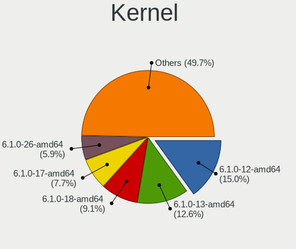

| Version                  | Notebooks | Percent |
|--------------------------|-----------|---------|
| 6.1.0-13-amd64           | 36        | 35.64%  |
| 6.1.0-12-amd64           | 21        | 20.79%  |
| 6.1.0-17-amd64           | 17        | 16.83%  |
| 6.1.0-16-amd64           | 8         | 7.92%   |
| 6.1.0-12-686             | 4         | 3.96%   |
| 6.5.0-0.deb12.4-amd64    | 2         | 1.98%   |
| 6.1.0-15-amd64           | 2         | 1.98%   |
| 6.6.2-x64v4-xanmod1      | 1         | 0.99%   |
| 6.5.11-asus-vivobook     | 1         | 0.99%   |
| 6.5.10-asus-vivobook     | 1         | 0.99%   |
| 6.5.0-0.deb12.1-rt-amd64 | 1         | 0.99%   |
| 6.5.0-0.deb12.1-amd64    | 1         | 0.99%   |
| 6.4.0-0.deb12.2-amd64    | 1         | 0.99%   |
| 6.1.0-17-686             | 1         | 0.99%   |
| 6.1.0-14-amd64           | 1         | 0.99%   |
| 6.1.0-13-686-pae         | 1         | 0.99%   |
| 6.1.0-13-686             | 1         | 0.99%   |
| 5.10.0-25-amd64          | 1         | 0.99%   |

Kernel Family
-------------

Linux kernel without a distro release

| Version | Notebooks | Percent |
|---------|-----------|---------|
| 6.1.0   | 90        | 90.91%  |
| 6.5.0   | 4         | 4.04%   |
| 6.6.2   | 1         | 1.01%   |
| 6.5.11  | 1         | 1.01%   |
| 6.5.10  | 1         | 1.01%   |
| 6.4.0   | 1         | 1.01%   |
| 5.10.0  | 1         | 1.01%   |

Kernel Major Ver.
-----------------

Linux kernel major version

| Version | Notebooks | Percent |
|---------|-----------|---------|
| 6.1     | 90        | 91.84%  |
| 6.5     | 5         | 5.1%    |
| 6.6     | 1         | 1.02%   |
| 6.4     | 1         | 1.02%   |
| 5.10    | 1         | 1.02%   |

Arch
----

OS architecture (x86_64, i586, etc.)

| Name   | Notebooks | Percent |
|--------|-----------|---------|
| x86_64 | 90        | 92.78%  |
| i686   | 7         | 7.22%   |

DE
--

Desktop Environment

| Name       | Notebooks | Percent |
|------------|-----------|---------|
| X-Cinnamon | 93        | 94.9%   |
| Cinnamon   | 3         | 3.06%   |
| LXDE       | 2         | 2.04%   |

Display Server
--------------

X11 or Wayland

| Name | Notebooks | Percent |
|------|-----------|---------|
| X11  | 97        | 100%    |

Display Manager
---------------

SDDM, LightDM, etc.

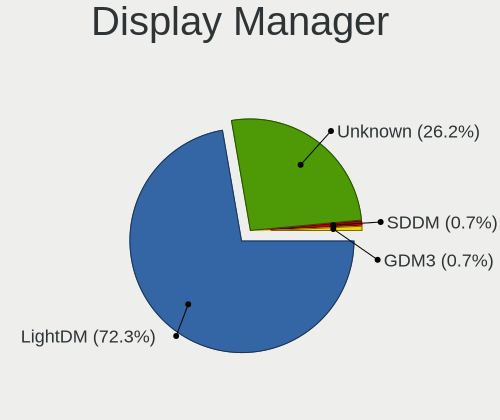

| Name    | Notebooks | Percent |
|---------|-----------|---------|
| LightDM | 60        | 61.22%  |
| Unknown | 38        | 38.78%  |

OS Lang
-------

Language

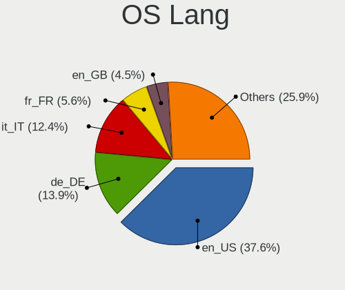

| Lang  | Notebooks | Percent |
|-------|-----------|---------|
| en_US | 41        | 42.27%  |
| de_DE | 18        | 18.56%  |
| it_IT | 7         | 7.22%   |
| fr_FR | 7         | 7.22%   |
| pt_BR | 5         | 5.15%   |
| en_GB | 5         | 5.15%   |
| nl_NL | 3         | 3.09%   |
| ru_RU | 2         | 2.06%   |
| es_ES | 2         | 2.06%   |
| es_BO | 2         | 2.06%   |
| pl_PL | 1         | 1.03%   |
| nl_BE | 1         | 1.03%   |
| hu_HU | 1         | 1.03%   |
| fr_CA | 1         | 1.03%   |
| en_IN | 1         | 1.03%   |

Boot Mode
---------

EFI or BIOS

| Mode | Notebooks | Percent |
|------|-----------|---------|
| EFI  | 62        | 63.27%  |
| BIOS | 36        | 36.73%  |

Filesystem
----------

Type of filesystem

| Type    | Notebooks | Percent |
|---------|-----------|---------|
| Ext4    | 75        | 76.53%  |
| Overlay | 10        | 10.2%   |
| Tmpfs   | 7         | 7.14%   |
| Btrfs   | 5         | 5.1%    |
| Xfs     | 1         | 1.02%   |

Part. scheme
------------

Scheme of partitioning

| Type    | Notebooks | Percent |
|---------|-----------|---------|
| GPT     | 40        | 40.82%  |
| Unknown | 38        | 38.78%  |
| MBR     | 20        | 20.41%  |

Dual Boot with Linux/BSD
------------------------

Hosting more than one Linux/BSD

| Dual boot | Notebooks | Percent |
|-----------|-----------|---------|
| No        | 87        | 88.78%  |
| Yes       | 11        | 11.22%  |

Dual Boot (Win)
---------------

Hosting Linux and Windows

| Dual boot | Notebooks | Percent |
|-----------|-----------|---------|
| No        | 79        | 80.61%  |
| Yes       | 19        | 19.39%  |

Board
-----

Vendor
------

Motherboard manufacturer

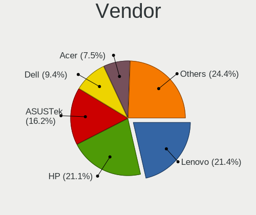

| Name                   | Notebooks | Percent |
|------------------------|-----------|---------|
| Lenovo                 | 27        | 27.84%  |
| Hewlett-Packard        | 20        | 20.62%  |
| ASUSTek Computer       | 13        | 13.4%   |
| Dell                   | 10        | 10.31%  |
| Acer                   | 5         | 5.15%   |
| Toshiba                | 2         | 2.06%   |
| Sony                   | 2         | 2.06%   |
| MSI                    | 2         | 2.06%   |
| Medion                 | 2         | 2.06%   |
| HUAWEI                 | 2         | 2.06%   |
| Apple                  | 2         | 2.06%   |
| Alienware              | 2         | 2.06%   |
| VALE                   | 1         | 1.03%   |
| TUXEDO                 | 1         | 1.03%   |
| LETSUNG                | 1         | 1.03%   |
| IBM                    | 1         | 1.03%   |
| Google                 | 1         | 1.03%   |
| Framework              | 1         | 1.03%   |
| Avell High Performance | 1         | 1.03%   |
| Unknown                | 1         | 1.03%   |

Model
-----

Motherboard model

| Name                                     | Notebooks | Percent |
|------------------------------------------|-----------|---------|
| ASUS VivoBook_ASUSLaptop X1605VA_X1605VA | 3         | 3.09%   |
| Acer Aspire E5-575                       | 2         | 2.06%   |
| Unknown                                  | 2         | 2.06%   |
| VALE Notebook Classic C171V              | 1         | 1.03%   |
| TUXEDO Pulse 14 Gen1                     | 1         | 1.03%   |
| Toshiba Satellite Pro L100               | 1         | 1.03%   |
| Toshiba Satellite L745                   | 1         | 1.03%   |
| Sony VGN-FW21E                           | 1         | 1.03%   |
| Sony SVE1511A1EW                         | 1         | 1.03%   |
| MSI Thin GF63 12HW                       | 1         | 1.03%   |
| MSI GF63 Thin 11UC                       | 1         | 1.03%   |
| Medion P7612                             | 1         | 1.03%   |
| Medion E6214                             | 1         | 1.03%   |
| Lenovo Yoga Slim 7 14ARE05 82A2          | 1         | 1.03%   |
| Lenovo ThinkPad Z13 Gen 1 21D2001PUS     | 1         | 1.03%   |
| Lenovo ThinkPad X61 76754BJ              | 1         | 1.03%   |
| Lenovo ThinkPad X230 2325SU3             | 1         | 1.03%   |
| Lenovo ThinkPad X230 2325BA3             | 1         | 1.03%   |
| Lenovo ThinkPad X1 Extreme 20MGS1QU00    | 1         | 1.03%   |
| Lenovo ThinkPad X1 Carbon 3rd 20BTS05100 | 1         | 1.03%   |
| Lenovo ThinkPad X1 Carbon 34601C8        | 1         | 1.03%   |
| Lenovo ThinkPad W541 20EGS24J00          | 1         | 1.03%   |
| Lenovo ThinkPad W541 20EGS07C01          | 1         | 1.03%   |
| Lenovo ThinkPad T490 20N3S7DP00          | 1         | 1.03%   |
| Lenovo ThinkPad T460s 20FAS2G900         | 1         | 1.03%   |
| Lenovo ThinkPad T430 2349STC             | 1         | 1.03%   |
| Lenovo ThinkPad T420s 4176W23            | 1         | 1.03%   |
| Lenovo ThinkPad T420 4236W1Y             | 1         | 1.03%   |
| Lenovo ThinkPad T400 6474EU3             | 1         | 1.03%   |
| Lenovo ThinkPad T16 Gen 1 21CHCTO1WW     | 1         | 1.03%   |
| Lenovo ThinkPad T14 Gen 3 21AHCTO1WW     | 1         | 1.03%   |
| Lenovo ThinkPad S1 Yoga 20CD000MFR       | 1         | 1.03%   |
| Lenovo Legion 5 Pro 16ACH6H 82JQ         | 1         | 1.03%   |
| Lenovo IdeaPad Y530                      | 1         | 1.03%   |
| Lenovo IdeaPad S540-14IML 81NF           | 1         | 1.03%   |
| Lenovo IdeaPad 330S-15IKB 81F5           | 1         | 1.03%   |
| Lenovo IdeaPad 3 15IML05 82BS            | 1         | 1.03%   |
| Lenovo IdeaPad 3 15ADA05 81W1            | 1         | 1.03%   |
| Lenovo IdeaPad 130-15IKB 81H7            | 1         | 1.03%   |
| Lenovo G50-80 80E5                       | 1         | 1.03%   |

Model Family
------------

Motherboard model prefix

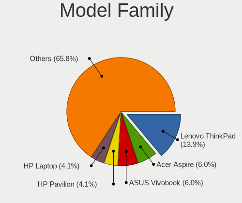

| Name                        | Notebooks | Percent |
|-----------------------------|-----------|---------|
| Lenovo ThinkPad             | 18        | 18.56%  |
| Lenovo IdeaPad              | 6         | 6.19%   |
| Dell Latitude               | 6         | 6.19%   |
| ASUS VivoBook               | 6         | 6.19%   |
| HP Pavilion                 | 5         | 5.15%   |
| Acer Aspire                 | 4         | 4.12%   |
| Toshiba Satellite           | 2         | 2.06%   |
| HP ProBook                  | 2         | 2.06%   |
| HP ENVY                     | 2         | 2.06%   |
| HP Compaq                   | 2         | 2.06%   |
| HP 250                      | 2         | 2.06%   |
| Dell XPS                    | 2         | 2.06%   |
| ASUS ROG                    | 2         | 2.06%   |
| Unknown                     | 2         | 2.06%   |
| VALE Notebook               | 1         | 1.03%   |
| TUXEDO Pulse                | 1         | 1.03%   |
| Sony VGN-FW21E              | 1         | 1.03%   |
| Sony SVE1511A1EW            | 1         | 1.03%   |
| MSI Thin                    | 1         | 1.03%   |
| MSI GF63                    | 1         | 1.03%   |
| Medion P7612                | 1         | 1.03%   |
| Medion E6214                | 1         | 1.03%   |
| Lenovo Yoga                 | 1         | 1.03%   |
| Lenovo Legion               | 1         | 1.03%   |
| Lenovo G50-80               | 1         | 1.03%   |
| IBM ThinkPad                | 1         | 1.03%   |
| HUAWEI KLVL-WXX9            | 1         | 1.03%   |
| HUAWEI BOM-WXX9             | 1         | 1.03%   |
| HP Notebook                 | 1         | 1.03%   |
| HP EliteBook                | 1         | 1.03%   |
| HP Dragonfly                | 1         | 1.03%   |
| HP 620                      | 1         | 1.03%   |
| HP 255                      | 1         | 1.03%   |
| HP 246                      | 1         | 1.03%   |
| HP 245                      | 1         | 1.03%   |
| Google Swanky               | 1         | 1.03%   |
| Framework Laptop            | 1         | 1.03%   |
| Dell Precision              | 1         | 1.03%   |
| Dell Inspiron               | 1         | 1.03%   |
| Avell High Performance 1513 | 1         | 1.03%   |

MFG Year
--------

Motherboard manufacture year

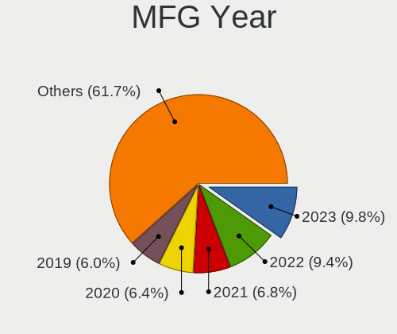

| Year    | Notebooks | Percent |
|---------|-----------|---------|
| 2023    | 10        | 10.31%  |
| 2021    | 9         | 9.28%   |
| 2016    | 8         | 8.25%   |
| 2022    | 7         | 7.22%   |
| 2019    | 7         | 7.22%   |
| 2008    | 7         | 7.22%   |
| 2020    | 6         | 6.19%   |
| 2015    | 6         | 6.19%   |
| 2012    | 6         | 6.19%   |
| 2011    | 6         | 6.19%   |
| 2017    | 5         | 5.15%   |
| 2018    | 4         | 4.12%   |
| 2014    | 3         | 3.09%   |
| 2013    | 3         | 3.09%   |
| 2009    | 3         | 3.09%   |
| 2010    | 2         | 2.06%   |
| 2007    | 1         | 1.03%   |
| 2006    | 1         | 1.03%   |
| 2005    | 1         | 1.03%   |
| 2003    | 1         | 1.03%   |
| Unknown | 1         | 1.03%   |

Form Factor
-----------

Physical design of the computer

| Name     | Notebooks | Percent |
|----------|-----------|---------|
| Notebook | 97        | 100%    |

Secure Boot
-----------

Enabled or disabled

| State    | Notebooks | Percent |
|----------|-----------|---------|
| Disabled | 89        | 91.75%  |
| Enabled  | 8         | 8.25%   |

Coreboot
--------

Have coreboot on board

| Used | Notebooks | Percent |
|------|-----------|---------|
| No   | 96        | 98.97%  |
| Yes  | 1         | 1.03%   |

RAM Size
--------

Total RAM memory

| Size in GB  | Notebooks | Percent |
|-------------|-----------|---------|
| 4.01-8.0    | 38        | 39.18%  |
| 8.01-16.0   | 16        | 16.49%  |
| 16.01-24.0  | 14        | 14.43%  |
| 3.01-4.0    | 13        | 13.4%   |
| 32.01-64.0  | 6         | 6.19%   |
| 1.01-2.0    | 3         | 3.09%   |
| 24.01-32.0  | 2         | 2.06%   |
| 64.01-256.0 | 2         | 2.06%   |
| 0.51-1.0    | 2         | 2.06%   |
| 2.01-3.0    | 1         | 1.03%   |

RAM Used
--------

Used RAM memory

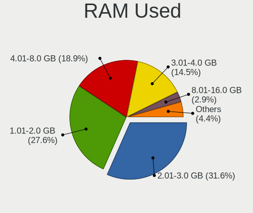

| Used GB    | Notebooks | Percent |
|------------|-----------|---------|
| 2.01-3.0   | 35        | 35%     |
| 1.01-2.0   | 26        | 26%     |
| 4.01-8.0   | 21        | 21%     |
| 3.01-4.0   | 10        | 10%     |
| 8.01-16.0  | 3         | 3%      |
| 0.51-1.0   | 3         | 3%      |
| 16.01-24.0 | 1         | 1%      |
| 0.01-0.5   | 1         | 1%      |

Total Drives
------------

Number of drives on board

| Drives | Notebooks | Percent |
|--------|-----------|---------|
| 1      | 66        | 68.04%  |
| 2      | 25        | 25.77%  |
| 3      | 3         | 3.09%   |
| 0      | 2         | 2.06%   |
| 4      | 1         | 1.03%   |

Has CD-ROM
----------

Has CD-ROM on board

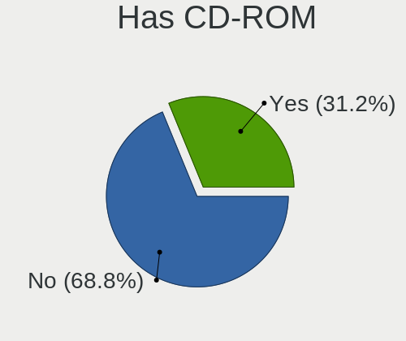

| Presented | Notebooks | Percent |
|-----------|-----------|---------|
| No        | 69        | 71.13%  |
| Yes       | 28        | 28.87%  |

Has Ethernet
------------

Has Ethernet on board

| Presented | Notebooks | Percent |
|-----------|-----------|---------|
| Yes       | 75        | 77.32%  |
| No        | 22        | 22.68%  |

Has WiFi
--------

Has WiFi module

| Presented | Notebooks | Percent |
|-----------|-----------|---------|
| Yes       | 97        | 100%    |

Has Bluetooth
-------------

Has Bluetooth module

| Presented | Notebooks | Percent |
|-----------|-----------|---------|
| Yes       | 81        | 83.51%  |
| No        | 16        | 16.49%  |

Location
--------

Country
-------

Geographic location (country)

| Country      | Notebooks | Percent |
|--------------|-----------|---------|
| Germany      | 22        | 22.68%  |
| USA          | 13        | 13.4%   |
| Italy        | 12        | 12.37%  |
| France       | 6         | 6.19%   |
| Brazil       | 6         | 6.19%   |
| Netherlands  | 5         | 5.15%   |
| UK           | 3         | 3.09%   |
| Poland       | 3         | 3.09%   |
| Canada       | 3         | 3.09%   |
| Belgium      | 3         | 3.09%   |
| Spain        | 2         | 2.06%   |
| Saudi Arabia | 2         | 2.06%   |
| Russia       | 2         | 2.06%   |
| India        | 2         | 2.06%   |
| Bolivia      | 2         | 2.06%   |
| Ukraine      | 1         | 1.03%   |
| Switzerland  | 1         | 1.03%   |
| Romania      | 1         | 1.03%   |
| Puerto Rico  | 1         | 1.03%   |
| Philippines  | 1         | 1.03%   |
| New Zealand  | 1         | 1.03%   |
| Malaysia     | 1         | 1.03%   |
| Indonesia    | 1         | 1.03%   |
| Hungary      | 1         | 1.03%   |
| Georgia      | 1         | 1.03%   |
| Austria      | 1         | 1.03%   |

City
----

Geographic location (city)

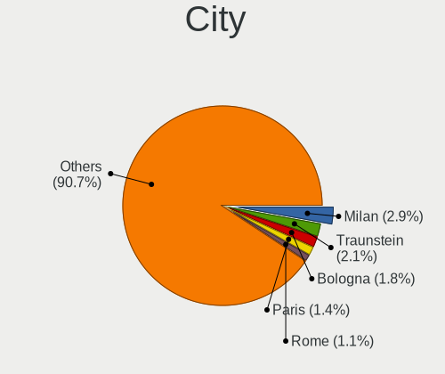

| City                     | Notebooks | Percent |
|--------------------------|-----------|---------|
| Aalten                   | 3         | 3%      |
| Rennes                   | 2         | 2%      |
| Milano                   | 2         | 2%      |
| Krakow                   | 2         | 2%      |
| Delligsen                | 2         | 2%      |
| Bonn                     | 2         | 2%      |
| Bologna                  | 2         | 2%      |
| Zuidhorn                 | 1         | 1%      |
| Yanbu                    | 1         | 1%      |
| Wittingen                | 1         | 1%      |
| Winnipeg                 | 1         | 1%      |
| Vienna                   | 1         | 1%      |
| Verona                   | 1         | 1%      |
| Valencia                 | 1         | 1%      |
| Tsqaltubo                | 1         | 1%      |
| Toa Baja                 | 1         | 1%      |
| Thrissur                 | 1         | 1%      |
| Sumy                     | 1         | 1%      |
| Sao Paulo                | 1         | 1%      |
| San Martino Buon Albergo | 1         | 1%      |
| San Juan                 | 1         | 1%      |
| Rostov-on-Don            | 1         | 1%      |
| Romford                  | 1         | 1%      |
| Rome                     | 1         | 1%      |
| Ribeirao Preto           | 1         | 1%      |
| Rexburg                  | 1         | 1%      |
| Reichenschwand           | 1         | 1%      |
| Ratingen                 | 1         | 1%      |
| Phoenix                  | 1         | 1%      |
| Paris                    | 1         | 1%      |
| Oruro                    | 1         | 1%      |
| Oberursel                | 1         | 1%      |
| Oakville                 | 1         | 1%      |
| Nova Friburgo            | 1         | 1%      |
| Norderstedt              | 1         | 1%      |
| Niagara Falls            | 1         | 1%      |
| Munich                   | 1         | 1%      |
| Morlaix                  | 1         | 1%      |
| Montreal                 | 1         | 1%      |
| Milan                    | 1         | 1%      |

Drives
------

Drive Vendor
------------

Hard drive vendors

| Vendor                      | Notebooks | Drives | Percent |
|-----------------------------|-----------|--------|---------|
| Samsung Electronics         | 27        | 32     | 21.43%  |
| Seagate                     | 16        | 17     | 12.7%   |
| WDC                         | 10        | 11     | 7.94%   |
| Unknown                     | 6         | 7      | 4.76%   |
| Toshiba                     | 6         | 6      | 4.76%   |
| Kingston                    | 6         | 8      | 4.76%   |
| Micron Technology           | 5         | 5      | 3.97%   |
| SanDisk                     | 4         | 4      | 3.17%   |
| Crucial                     | 4         | 4      | 3.17%   |
| China                       | 4         | 4      | 3.17%   |
| SK hynix                    | 3         | 3      | 2.38%   |
| JMicron Technology          | 3         | 3      | 2.38%   |
| Intel                       | 3         | 3      | 2.38%   |
| Hitachi                     | 3         | 3      | 2.38%   |
| Transcend                   | 2         | 2      | 1.59%   |
| Micron/Crucial Technology   | 2         | 4      | 1.59%   |
| Intenso                     | 2         | 2      | 1.59%   |
| Unknown                     | 2         | 2      | 1.59%   |
| USB3.0                      | 1         | 1      | 0.79%   |
| Team                        | 1         | 1      | 0.79%   |
| SPCC                        | 1         | 1      | 0.79%   |
| Silicon Motion              | 1         | 1      | 0.79%   |
| Realtek                     | 1         | 1      | 0.79%   |
| Phison                      | 1         | 1      | 0.79%   |
| Patriot                     | 1         | 1      | 0.79%   |
| KIOXIA                      | 1         | 1      | 0.79%   |
| Kingston Technology Company | 1         | 1      | 0.79%   |
| HGST                        | 1         | 1      | 0.79%   |
| Hewlett-Packard             | 1         | 1      | 0.79%   |
| GLOWAY                      | 1         | 1      | 0.79%   |
| Gigabyte Technology         | 1         | 1      | 0.79%   |
| Fujitsu                     | 1         | 1      | 0.79%   |
| Apple                       | 1         | 1      | 0.79%   |
| Apacer                      | 1         | 2      | 0.79%   |
| ADATA Technology            | 1         | 1      | 0.79%   |
| A-DATA Technology           | 1         | 1      | 0.79%   |

Drive Model
-----------

Hard drive models

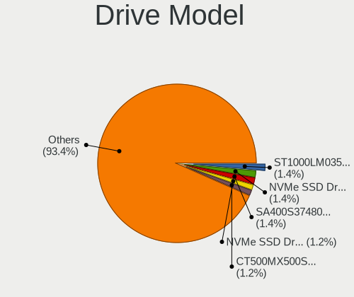

| Model                                             | Notebooks | Percent |
|---------------------------------------------------|-----------|---------|
| Seagate ST1000LM035-1RK172 1TB                    | 4         | 3.13%   |
| Samsung NVMe SSD Controller SM981/PM981/PM983 1TB | 3         | 2.34%   |
| Samsung MZVLQ1T0HALB-00000 1TB                    | 3         | 2.34%   |
| Kingston SA400S37480G 480GB SSD                   | 3         | 2.34%   |
| WDC WD10SPZX-24Z10 1TB                            | 2         | 1.56%   |
| Toshiba MQ01ABD100 1TB                            | 2         | 1.56%   |
| Seagate ST9500325AS 500GB                         | 2         | 1.56%   |
| Seagate ST500LM021-1KJ152 500GB                   | 2         | 1.56%   |
| Kingston SUV400S37240G 240GB SSD                  | 2         | 1.56%   |
| JMicron Generic 8GB                               | 2         | 1.56%   |
| China SATA SSD 240GB                              | 2         | 1.56%   |
| Unknown                                           | 2         | 1.56%   |
| WDC WDS500G2B0A-00SM50 500GB SSD                  | 1         | 0.78%   |
| WDC WDS500G2B0A 500GB SSD                         | 1         | 0.78%   |
| WDC WD7500BPKX-22HPJT0 752GB                      | 1         | 0.78%   |
| WDC WD20SPZX-75UA7T1 2TB                          | 1         | 0.78%   |
| WDC WD10SPZX-60Z10T0 1TB                          | 1         | 0.78%   |
| WDC PC SN730 SDBPNTY-256G-1027 256GB              | 1         | 0.78%   |
| WDC PC SN530 SDBPNPZ-512G-1002 512GB              | 1         | 0.78%   |
| WDC PC SN520 SDAPMUW-512G-1101 512GB              | 1         | 0.78%   |
| USB3.0 Disk 1TB                                   | 1         | 0.78%   |
| Unknown USB DISK 3.2 1TB                          | 1         | 0.78%   |
| Unknown SN128  128GB                              | 1         | 0.78%   |
| Unknown SD16G  16GB                               | 1         | 0.78%   |
| Unknown MMC Card  64GB                            | 1         | 0.78%   |
| Unknown MMC Card  16GB                            | 1         | 0.78%   |
| Unknown MMC Card  128GB                           | 1         | 0.78%   |
| Transcend TS512GMTS430S 512GB SSD                 | 1         | 0.78%   |
| Transcend TS128GMTS430S 128GB SSD                 | 1         | 0.78%   |
| Toshiba THNSNK128GVN8 M.2 2280 128GB SSD          | 1         | 0.78%   |
| Toshiba MQ01ABD050V 500GB                         | 1         | 0.78%   |
| Toshiba MK8025GAS 80GB                            | 1         | 0.78%   |
| Toshiba HDWL110 1TB                               | 1         | 0.78%   |
| Team TM8PS7256G 256GB SSD                         | 1         | 0.78%   |
| SPCC Solid State Disk 480GB                       | 1         | 0.78%   |
| SK hynix SHGP31-1000GM 1TB                        | 1         | 0.78%   |
| SK hynix BC711 HFM256GD3JX013N 256GB              | 1         | 0.78%   |
| SK hynix BC501 HFM256GDJTNG-8310A 256GB           | 1         | 0.78%   |
| Silicon Motion PCIe-4 SSD 512GB                   | 1         | 0.78%   |
| Seagate ST9500325ASG 500GB                        | 1         | 0.78%   |

HDD Vendor
----------

Hard disk drive vendors

| Vendor              | Notebooks | Drives | Percent |
|---------------------|-----------|--------|---------|
| Seagate             | 16        | 17     | 45.71%  |
| WDC                 | 5         | 6      | 14.29%  |
| Toshiba             | 5         | 5      | 14.29%  |
| Hitachi             | 3         | 3      | 8.57%   |
| JMicron Technology  | 2         | 2      | 5.71%   |
| USB3.0              | 1         | 1      | 2.86%   |
| Samsung Electronics | 1         | 1      | 2.86%   |
| HGST                | 1         | 1      | 2.86%   |
| Fujitsu             | 1         | 1      | 2.86%   |

SSD Vendor
----------

Solid state drive vendors

| Vendor              | Notebooks | Drives | Percent |
|---------------------|-----------|--------|---------|
| Samsung Electronics | 10        | 12     | 24.39%  |
| Kingston            | 6         | 8      | 14.63%  |
| Crucial             | 4         | 4      | 9.76%   |
| China               | 4         | 4      | 9.76%   |
| SanDisk             | 3         | 3      | 7.32%   |
| WDC                 | 2         | 2      | 4.88%   |
| Transcend           | 2         | 2      | 4.88%   |
| Toshiba             | 1         | 1      | 2.44%   |
| Team                | 1         | 1      | 2.44%   |
| SPCC                | 1         | 1      | 2.44%   |
| Phison              | 1         | 1      | 2.44%   |
| Patriot             | 1         | 1      | 2.44%   |
| Intenso             | 1         | 1      | 2.44%   |
| Intel               | 1         | 1      | 2.44%   |
| Hewlett-Packard     | 1         | 1      | 2.44%   |
| Gigabyte Technology | 1         | 1      | 2.44%   |
| Apacer              | 1         | 2      | 2.44%   |

Drive Kind
----------

HDD or SSD

| Kind    | Notebooks | Drives | Percent |
|---------|-----------|--------|---------|
| NVMe    | 39        | 44     | 33.05%  |
| SSD     | 37        | 46     | 31.36%  |
| HDD     | 31        | 37     | 26.27%  |
| MMC     | 7         | 8      | 5.93%   |
| Unknown | 4         | 4      | 3.39%   |

Drive Connector
---------------

SATA, SAS, NVMe, etc.

| Type | Notebooks | Drives | Percent |
|------|-----------|--------|---------|
| SATA | 59        | 80     | 53.64%  |
| NVMe | 38        | 43     | 34.55%  |
| MMC  | 7         | 8      | 6.36%   |
| SAS  | 6         | 8      | 5.45%   |

Drive Size
----------

Size of hard drive

| Size in TB | Notebooks | Drives | Percent |
|------------|-----------|--------|---------|
| 0.01-0.5   | 46        | 58     | 66.67%  |
| 0.51-1.0   | 21        | 23     | 30.43%  |
| 1.01-2.0   | 1         | 1      | 1.45%   |
| 4.01-10.0  | 1         | 1      | 1.45%   |

Space Total
-----------

Amount of disk space available on the file system

| Size in GB     | Notebooks | Percent |
|----------------|-----------|---------|
| 501-1000       | 26        | 26.53%  |
| 101-250        | 25        | 25.51%  |
| 251-500        | 18        | 18.37%  |
| 1-20           | 10        | 10.2%   |
| 1001-2000      | 7         | 7.14%   |
| 51-100         | 6         | 6.12%   |
| 21-50          | 3         | 3.06%   |
| 2001-3000      | 2         | 2.04%   |
| More than 3000 | 1         | 1.02%   |

Space Used
----------

Amount of used disk space

| Used GB   | Notebooks | Percent |
|-----------|-----------|---------|
| 1-20      | 39        | 38.61%  |
| 21-50     | 23        | 22.77%  |
| 101-250   | 15        | 14.85%  |
| 51-100    | 13        | 12.87%  |
| 251-500   | 6         | 5.94%   |
| 501-1000  | 3         | 2.97%   |
| 1001-2000 | 2         | 1.98%   |

Malfunc. Drives
---------------

Drive models with a malfunction

| Model                                    | Notebooks | Drives | Percent |
|------------------------------------------|-----------|--------|---------|
| WDC WD10SPZX-24Z10 1TB                   | 1         | 1      | 10%     |
| Transcend TS512GMTS430S 512GB SSD        | 1         | 1      | 10%     |
| Toshiba THNSNK128GVN8 M.2 2280 128GB SSD | 1         | 1      | 10%     |
| Seagate ST9500325AS 500GB                | 1         | 1      | 10%     |
| Seagate ST500LM021-1KJ152 500GB          | 1         | 1      | 10%     |
| Seagate ST1000LM014-1EJ164 1TB           | 1         | 1      | 10%     |
| Kingston SUV400S37240G 240GB SSD         | 1         | 1      | 10%     |
| Kingston SA400S37240G 240GB SSD          | 1         | 1      | 10%     |
| Hitachi HTS548080M9AT00 80GB             | 1         | 1      | 10%     |
| Hitachi HTS543232L9A300 320GB            | 1         | 1      | 10%     |

Malfunc. Drive Vendor
---------------------

Vendors of faulty drives

| Vendor    | Notebooks | Drives | Percent |
|-----------|-----------|--------|---------|
| Seagate   | 3         | 3      | 30%     |
| Kingston  | 2         | 2      | 20%     |
| Hitachi   | 2         | 2      | 20%     |
| WDC       | 1         | 1      | 10%     |
| Transcend | 1         | 1      | 10%     |
| Toshiba   | 1         | 1      | 10%     |

Malfunc. HDD Vendor
-------------------

Vendors of faulty HDD drives

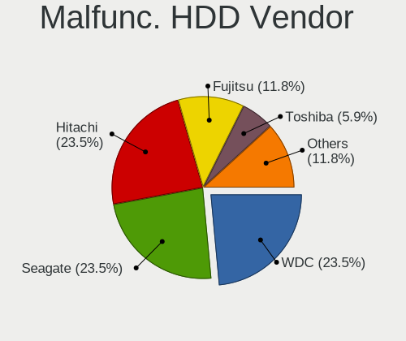

| Vendor  | Notebooks | Drives | Percent |
|---------|-----------|--------|---------|
| Seagate | 3         | 3      | 50%     |
| Hitachi | 2         | 2      | 33.33%  |
| WDC     | 1         | 1      | 16.67%  |

Malfunc. Drive Kind
-------------------

Kinds of faulty drives

| Kind | Notebooks | Drives | Percent |
|------|-----------|--------|---------|
| HDD  | 6         | 6      | 60%     |
| SSD  | 4         | 4      | 40%     |

Failed Drives
-------------

Failed drive models

Zero info for selected period =(

Failed Drive Vendor
-------------------

Failed drive vendors

Zero info for selected period =(

Drive Status
------------

Number of failed and malfunc. drives

| Status   | Notebooks | Drives | Percent |
|----------|-----------|--------|---------|
| Works    | 49        | 59     | 45.79%  |
| Detected | 48        | 70     | 44.86%  |
| Malfunc  | 10        | 10     | 9.35%   |

Storage controller
------------------

Storage Vendor
--------------

Storage controller vendors

| Vendor                      | Notebooks | Percent |
|-----------------------------|-----------|---------|
| Intel                       | 63        | 56.25%  |
| Samsung Electronics         | 16        | 14.29%  |
| AMD                         | 12        | 10.71%  |
| Micron Technology           | 5         | 4.46%   |
| SanDisk                     | 4         | 3.57%   |
| SK hynix                    | 3         | 2.68%   |
| Micron/Crucial Technology   | 2         | 1.79%   |
| ADATA Technology            | 2         | 1.79%   |
| Silicon Motion              | 1         | 0.89%   |
| Nvidia                      | 1         | 0.89%   |
| KIOXIA                      | 1         | 0.89%   |
| Kingston Technology Company | 1         | 0.89%   |
| Apple                       | 1         | 0.89%   |

Storage Model
-------------

Storage controller models

| Model                                                                          | Notebooks | Percent |
|--------------------------------------------------------------------------------|-----------|---------|
| Intel 82801 Mobile SATA Controller [RAID mode]                                 | 11        | 9.17%   |
| AMD FCH SATA Controller [AHCI mode]                                            | 10        | 8.33%   |
| Intel Sunrise Point-LP SATA Controller [AHCI mode]                             | 8         | 6.67%   |
| Samsung NVMe SSD Controller SM981/PM981/PM983                                  | 6         | 5%      |
| Intel 6 Series/C200 Series Chipset Family 6 port Mobile SATA AHCI Controller   | 6         | 5%      |
| Samsung NVMe SSD Controller 980 (DRAM-less)                                    | 5         | 4.17%   |
| Samsung NVMe SSD Controller PM9B1 (DRAM-less)                                  | 4         | 3.33%   |
| Intel Volume Management Device NVMe RAID Controller Intel Corporation          | 4         | 3.33%   |
| Intel Volume Management Device NVMe RAID Controller                            | 4         | 3.33%   |
| Intel 82801IBM/IEM (ICH9M/ICH9M-E) 4 port SATA Controller [AHCI mode]          | 4         | 3.33%   |
| Intel 7 Series Chipset Family 6-port SATA Controller [AHCI mode]               | 4         | 3.33%   |
| Intel Wildcat Point-LP SATA Controller [AHCI Mode]                             | 3         | 2.5%    |
| SK hynix Gold P31/BC711/PC711 NVMe Solid State Drive                           | 2         | 1.67%   |
| Micron 2450 NVMe SSD [HendrixV] (DRAM-less)                                    | 2         | 1.67%   |
| Intel Tiger Lake-LP SATA Controller                                            | 2         | 1.67%   |
| Intel Celeron/Pentium Silver Processor SATA Controller                         | 2         | 1.67%   |
| Intel 8 Series/C220 Series Chipset Family 6-port SATA Controller 1 [AHCI mode] | 2         | 1.67%   |
| Intel 8 Series SATA Controller 1 [AHCI mode]                                   | 2         | 1.67%   |
| SK hynix BC501 NVMe Solid State Drive                                          | 1         | 0.83%   |
| Silicon Motion Non-Volatile memory controller                                  | 1         | 0.83%   |
| SanDisk WD Black SN770 / PC SN740 256GB / PC SN560 (DRAM-less) NVMe SSD        | 1         | 0.83%   |
| SanDisk Ultra 3D / WD Blue SN550 NVMe SSD                                      | 1         | 0.83%   |
| SanDisk PC SN520 x2 M.2 2242 NVMe SSD                                          | 1         | 0.83%   |
| SanDisk Extreme Pro / WD Black SN750 / PC SN730 / Red SN700 NVMe SSD           | 1         | 0.83%   |
| Samsung NVMe SSD Controller S4LV008[Pascal]                                    | 1         | 0.83%   |
| Samsung NVMe SSD Controller PM9A1/PM9A3/980PRO                                 | 1         | 0.83%   |
| Nvidia MCP79 AHCI Controller                                                   | 1         | 0.83%   |
| Micron/Crucial P5 Plus NVMe PCIe SSD                                           | 1         | 0.83%   |
| Micron/Crucial P2 [Nick P2] / P3 / P3 Plus NVMe PCIe SSD (DRAM-less)           | 1         | 0.83%   |
| Micron 3400 NVMe SSD [Hendrix]                                                 | 1         | 0.83%   |
| Micron 2400 NVMe SSD (DRAM-less)                                               | 1         | 0.83%   |
| Micron 2200S NVMe SSD [Cassandra]                                              | 1         | 0.83%   |
| KIOXIA NVMe SSD Controller XG8                                                 | 1         | 0.83%   |
| Kingston Company OM3PDP3 NVMe SSD                                              | 1         | 0.83%   |
| Intel Tiger Lake SATA AHCI Controller                                          | 1         | 0.83%   |
| Intel SSD DC P4101/Pro 7600p/760p/E 6100p Series                               | 1         | 0.83%   |
| Intel Optane NVME SSD H10 with Solid State Storage [Teton Glacier]             | 1         | 0.83%   |
| Intel NVMe Optane Memory Series                                                | 1         | 0.83%   |
| Intel Comet Lake SATA AHCI Controller                                          | 1         | 0.83%   |
| Intel Comet Lake RAID Controller                                               | 1         | 0.83%   |

Storage Kind
------------

Kind of storage controller (IDE, SATA, NVMe, SAS, ...)

| Kind | Notebooks | Percent |
|------|-----------|---------|
| SATA | 51        | 43.97%  |
| NVMe | 38        | 32.76%  |
| RAID | 20        | 17.24%  |
| IDE  | 7         | 6.03%   |

Processor
---------

CPU Vendor
----------

Processor vendors

| Vendor | Notebooks | Percent |
|--------|-----------|---------|
| Intel  | 77        | 79.38%  |
| AMD    | 20        | 20.62%  |

CPU Model
---------

Processor models

| Model                                      | Notebooks | Percent |
|--------------------------------------------|-----------|---------|
| Intel Core i5-3320M CPU @ 2.60GHz          | 3         | 3.09%   |
| Intel 13th Gen Core i9-13900H              | 3         | 3.09%   |
| Intel Core i7-4810MQ CPU @ 2.80GHz         | 2         | 2.06%   |
| Intel Core i7-2620M CPU @ 2.70GHz          | 2         | 2.06%   |
| Intel Core i5-7200U CPU @ 2.50GHz          | 2         | 2.06%   |
| Intel Core i5-6200U CPU @ 2.30GHz          | 2         | 2.06%   |
| Intel Core i5-4200U CPU @ 1.60GHz          | 2         | 2.06%   |
| Intel Core i3-6006U CPU @ 2.00GHz          | 2         | 2.06%   |
| Intel Atom CPU N270 @ 1.60GHz              | 2         | 2.06%   |
| Intel 11th Gen Core i7-1165G7 @ 2.80GHz    | 2         | 2.06%   |
| Intel 11th Gen Core i3-1115G4 @ 3.00GHz    | 2         | 2.06%   |
| AMD Ryzen 7 PRO 6850U with Radeon Graphics | 2         | 2.06%   |
| Intel Pentium Silver N5030 CPU @ 1.10GHz   | 1         | 1.03%   |
| Intel Pentium M processor 1500MHz          | 1         | 1.03%   |
| Intel Pentium M processor 1.86GHz          | 1         | 1.03%   |
| Intel Pentium CPU N3710 @ 1.60GHz          | 1         | 1.03%   |
| Intel Pentium CPU B970 @ 2.30GHz           | 1         | 1.03%   |
| Intel Core i7-8850H CPU @ 2.60GHz          | 1         | 1.03%   |
| Intel Core i7-8665U CPU @ 1.90GHz          | 1         | 1.03%   |
| Intel Core i7-8550U CPU @ 1.80GHz          | 1         | 1.03%   |
| Intel Core i7-7700HQ CPU @ 2.80GHz         | 1         | 1.03%   |
| Intel Core i7-6600U CPU @ 2.60GHz          | 1         | 1.03%   |
| Intel Core i7-5600U CPU @ 2.60GHz          | 1         | 1.03%   |
| Intel Core i7-5500U CPU @ 2.40GHz          | 1         | 1.03%   |
| Intel Core i7-4700MQ CPU @ 2.40GHz         | 1         | 1.03%   |
| Intel Core i7-3630QM CPU @ 2.40GHz         | 1         | 1.03%   |
| Intel Core i7-2640M CPU @ 2.80GHz          | 1         | 1.03%   |
| Intel Core i7-2630QM CPU @ 2.00GHz         | 1         | 1.03%   |
| Intel Core i7-10870H CPU @ 2.20GHz         | 1         | 1.03%   |
| Intel Core i7-1065G7 CPU @ 1.30GHz         | 1         | 1.03%   |
| Intel Core i7-10510U CPU @ 1.80GHz         | 1         | 1.03%   |
| Intel Core i5-9300H CPU @ 2.40GHz          | 1         | 1.03%   |
| Intel Core i5-8365U CPU @ 1.60GHz          | 1         | 1.03%   |
| Intel Core i5-8265U CPU @ 1.60GHz          | 1         | 1.03%   |
| Intel Core i5-7300U CPU @ 2.60GHz          | 1         | 1.03%   |
| Intel Core i5-6300U CPU @ 2.40GHz          | 1         | 1.03%   |
| Intel Core i5-5250U CPU @ 1.60GHz          | 1         | 1.03%   |
| Intel Core i5-5200U CPU @ 2.20GHz          | 1         | 1.03%   |
| Intel Core i5-3427U CPU @ 1.80GHz          | 1         | 1.03%   |
| Intel Core i5-3317U CPU @ 1.70GHz          | 1         | 1.03%   |

CPU Model Family
----------------

Processor model prefix

| Model                | Notebooks | Percent |
|----------------------|-----------|---------|
| Intel Core i5        | 22        | 22.68%  |
| Intel Core i7        | 18        | 18.56%  |
| Other                | 16        | 16.49%  |
| Intel Core i3        | 6         | 6.19%   |
| Intel Core 2 Duo     | 6         | 6.19%   |
| AMD Ryzen 5          | 4         | 4.12%   |
| Intel Celeron        | 3         | 3.09%   |
| AMD Ryzen 7          | 3         | 3.09%   |
| Intel Pentium M      | 2         | 2.06%   |
| Intel Pentium        | 2         | 2.06%   |
| Intel Atom           | 2         | 2.06%   |
| AMD Ryzen 9          | 2         | 2.06%   |
| AMD Ryzen 7 PRO      | 2         | 2.06%   |
| AMD E2               | 2         | 2.06%   |
| Intel Pentium Silver | 1         | 1.03%   |
| Intel Celeron M      | 1         | 1.03%   |
| AMD Sempron          | 1         | 1.03%   |
| AMD Ryzen 3          | 1         | 1.03%   |
| AMD E1               | 1         | 1.03%   |
| AMD A8               | 1         | 1.03%   |
| AMD A6               | 1         | 1.03%   |

CPU Cores
---------

Number of processor cores

| Number | Notebooks | Percent |
|--------|-----------|---------|
| 2      | 49        | 50.52%  |
| 4      | 20        | 20.62%  |
| 8      | 8         | 8.25%   |
| 6      | 6         | 6.19%   |
| 1      | 6         | 6.19%   |
| 14     | 4         | 4.12%   |
| 10     | 3         | 3.09%   |
| 12     | 1         | 1.03%   |

CPU Sockets
-----------

Number of sockets

| Number | Notebooks | Percent |
|--------|-----------|---------|
| 1      | 97        | 100%    |

CPU Threads
-----------

Threads per core (Hyper-Threading)

| Number | Notebooks | Percent |
|--------|-----------|---------|
| 2      | 73        | 75.26%  |
| 1      | 24        | 24.74%  |

CPU Op-Modes
------------

CPU Operation Modes (32-bit, 64-bit)

| Op mode        | Notebooks | Percent |
|----------------|-----------|---------|
| 32-bit, 64-bit | 92        | 94.85%  |
| 32-bit         | 5         | 5.15%   |

CPU Microcode
-------------

Microcode number

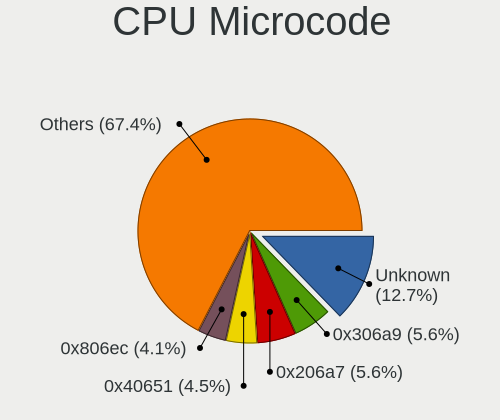

| Number     | Notebooks | Percent |
|------------|-----------|---------|
| Unknown    | 15        | 15.31%  |
| 0x206a7    | 9         | 9.18%   |
| 0x306a9    | 6         | 6.12%   |
| 0x806e9    | 4         | 4.08%   |
| 0x806c1    | 4         | 4.08%   |
| 0x406e3    | 4         | 4.08%   |
| 0x1067a    | 4         | 4.08%   |
| 0x806ec    | 3         | 3.06%   |
| 0x306c3    | 3         | 3.06%   |
| 0xb06a3    | 2         | 2.04%   |
| 0x706a8    | 2         | 2.04%   |
| 0x6d8      | 2         | 2.04%   |
| 0x40651    | 2         | 2.04%   |
| 0x306d4    | 2         | 2.04%   |
| 0x106c2    | 2         | 2.04%   |
| 0x0a50000c | 2         | 2.04%   |
| 0x08600106 | 2         | 2.04%   |
| 0x06006704 | 2         | 2.04%   |
| 0xb06a2    | 1         | 1.02%   |
| 0xa0652    | 1         | 1.02%   |
| 0x906ea    | 1         | 1.02%   |
| 0x906e9    | 1         | 1.02%   |
| 0x906c0    | 1         | 1.02%   |
| 0x906a4    | 1         | 1.02%   |
| 0x906a3    | 1         | 1.02%   |
| 0x806eb    | 1         | 1.02%   |
| 0x806ea    | 1         | 1.02%   |
| 0x806d1    | 1         | 1.02%   |
| 0x706e5    | 1         | 1.02%   |
| 0x6fa      | 1         | 1.02%   |
| 0x695      | 1         | 1.02%   |
| 0x30678    | 1         | 1.02%   |
| 0x20652    | 1         | 1.02%   |
| 0x10676    | 1         | 1.02%   |
| 0x0a704103 | 1         | 1.02%   |
| 0x0a50000d | 1         | 1.02%   |
| 0x0a404102 | 1         | 1.02%   |
| 0x08608103 | 1         | 1.02%   |
| 0x08600103 | 1         | 1.02%   |
| 0x08200103 | 1         | 1.02%   |

CPU Microarch
-------------

Microarchitecture

| Name             | Notebooks | Percent |
|------------------|-----------|---------|
| KabyLake         | 14        | 14.43%  |
| SandyBridge      | 9         | 9.28%   |
| Alderlake Hybrid | 9         | 9.28%   |
| Skylake          | 6         | 6.19%   |
| IvyBridge        | 6         | 6.19%   |
| Penryn           | 5         | 5.15%   |
| Haswell          | 5         | 5.15%   |
| TigerLake        | 4         | 4.12%   |
| Broadwell        | 4         | 4.12%   |
| Unknown          | 4         | 4.12%   |
| Zen 3            | 3         | 3.09%   |
| Zen 2            | 3         | 3.09%   |
| P6               | 3         | 3.09%   |
| Excavator        | 3         | 3.09%   |
| Zen+             | 2         | 2.06%   |
| Silvermont       | 2         | 2.06%   |
| Puma             | 2         | 2.06%   |
| IceLake          | 2         | 2.06%   |
| Goldmont plus    | 2         | 2.06%   |
| Bonnell          | 2         | 2.06%   |
| Zen              | 1         | 1.03%   |
| Westmere         | 1         | 1.03%   |
| Tremont          | 1         | 1.03%   |
| Piledriver       | 1         | 1.03%   |
| K8 & K10 hybrid  | 1         | 1.03%   |
| Core             | 1         | 1.03%   |
| CometLake        | 1         | 1.03%   |

Graphics
--------

GPU Vendor
----------

Vendors of graphics cards

| Vendor | Notebooks | Percent |
|--------|-----------|---------|
| Intel  | 70        | 59.32%  |
| AMD    | 26        | 22.03%  |
| Nvidia | 22        | 18.64%  |

GPU Model
---------

Graphics card models

| Model                                                                     | Notebooks | Percent |
|---------------------------------------------------------------------------|-----------|---------|
| Intel 2nd Generation Core Processor Family Integrated Graphics Controller | 8         | 6.5%    |
| Intel 3rd Gen Core processor Graphics Controller                          | 6         | 4.88%   |
| Intel Skylake GT2 [HD Graphics 520]                                       | 5         | 4.07%   |
| Intel Raptor Lake-P [Iris Xe Graphics]                                    | 5         | 4.07%   |
| Intel HD Graphics 620                                                     | 4         | 3.25%   |
| Intel WhiskeyLake-U GT2 [UHD Graphics 620]                                | 3         | 2.44%   |
| Intel HD Graphics 5500                                                    | 3         | 2.44%   |
| Intel CometLake-U GT2 [UHD Graphics]                                      | 3         | 2.44%   |
| Intel 4th Gen Core Processor Integrated Graphics Controller               | 3         | 2.44%   |
| AMD Stoney [Radeon R2/R3/R4/R5 Graphics]                                  | 3         | 2.44%   |
| AMD Renoir [Radeon RX Vega 6 (Ryzen 4000/5000 Mobile Series)]             | 3         | 2.44%   |
| AMD Picasso/Raven 2 [Radeon Vega Series / Radeon Vega Mobile Series]      | 3         | 2.44%   |
| Nvidia TU117M [GeForce GTX 1650 Mobile / Max-Q]                           | 2         | 1.63%   |
| Nvidia GP107M [GeForce GTX 1050 Ti Mobile]                                | 2         | 1.63%   |
| Nvidia GK106GLM [Quadro K2100M]                                           | 2         | 1.63%   |
| Nvidia GA107M [GeForce RTX 3050 Mobile]                                   | 2         | 1.63%   |
| Intel TigerLake-LP GT2 [Iris Xe Graphics]                                 | 2         | 1.63%   |
| Intel Tiger Lake-LP GT2 [UHD Graphics G4]                                 | 2         | 1.63%   |
| Intel Mobile 4 Series Chipset Integrated Graphics Controller              | 2         | 1.63%   |
| Intel Haswell-ULT Integrated Graphics Controller                          | 2         | 1.63%   |
| Intel CoffeeLake-H GT2 [UHD Graphics 630]                                 | 2         | 1.63%   |
| Intel Alder Lake-P GT2 [Iris Xe Graphics]                                 | 2         | 1.63%   |
| AMD Rembrandt [Radeon 680M]                                               | 2         | 1.63%   |
| AMD Mullins [Radeon R2 Graphics]                                          | 2         | 1.63%   |
| Nvidia TU106M [GeForce RTX 2060 Mobile]                                   | 1         | 0.81%   |
| Nvidia GT218M [GeForce G210M]                                             | 1         | 0.81%   |
| Nvidia GP108M [GeForce MX250]                                             | 1         | 0.81%   |
| Nvidia GM108M [GeForce 930MX]                                             | 1         | 0.81%   |
| Nvidia GM107M [GeForce GTX 960M]                                          | 1         | 0.81%   |
| Nvidia GK106M [GeForce GTX 765M]                                          | 1         | 0.81%   |
| Nvidia GF119M [Quadro NVS 4200M]                                          | 1         | 0.81%   |
| Nvidia GF119M [NVS 4200M]                                                 | 1         | 0.81%   |
| Nvidia GF108M [GeForce GT 635M]                                           | 1         | 0.81%   |
| Nvidia GF108M [GeForce GT 525M]                                           | 1         | 0.81%   |
| Nvidia GA106M [GeForce RTX 3060 Mobile / Max-Q]                           | 1         | 0.81%   |
| Nvidia G96CM [GeForce 9600M GS]                                           | 1         | 0.81%   |
| Nvidia C79 [GeForce 9400M / ION]                                          | 1         | 0.81%   |
| Nvidia AD107M [GeForce RTX 4060 Max-Q / Mobile]                           | 1         | 0.81%   |
| Intel UHD Graphics 620                                                    | 1         | 0.81%   |
| Intel TigerLake-H GT1 [UHD Graphics]                                      | 1         | 0.81%   |

GPU Combo
---------

Combinations of graphics cards

| Name           | Notebooks | Percent |
|----------------|-----------|---------|
| 1 x Intel      | 47        | 48.45%  |
| 1 x AMD        | 18        | 18.56%  |
| Intel + Nvidia | 15        | 15.46%  |
| 1 x Nvidia     | 5         | 5.15%   |
| 2 x Intel      | 4         | 4.12%   |
| Intel + AMD    | 4         | 4.12%   |
| 2 x AMD        | 2         | 2.06%   |
| AMD + Nvidia   | 2         | 2.06%   |

GPU Driver
----------

Free vs proprietary

| Driver      | Notebooks | Percent |
|-------------|-----------|---------|
| Free        | 92        | 94.85%  |
| Proprietary | 5         | 5.15%   |

GPU Memory
----------

Total video memory

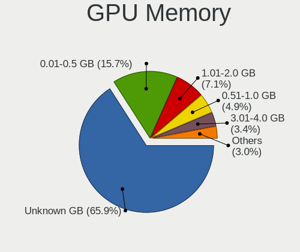

| Size in GB | Notebooks | Percent |
|------------|-----------|---------|
| Unknown    | 61        | 62.89%  |
| 0.01-0.5   | 17        | 17.53%  |
| 1.01-2.0   | 10        | 10.31%  |
| 0.51-1.0   | 4         | 4.12%   |
| 3.01-4.0   | 3         | 3.09%   |
| 5.01-6.0   | 1         | 1.03%   |
| 8.01-16.0  | 1         | 1.03%   |

Monitor
-------

Monitor Vendor
--------------

Monitor vendors

| Vendor              | Notebooks | Percent |
|---------------------|-----------|---------|
| AU Optronics        | 23        | 21.3%   |
| BOE                 | 22        | 20.37%  |
| Chimei Innolux      | 16        | 14.81%  |
| LG Display          | 12        | 11.11%  |
| Samsung Electronics | 7         | 6.48%   |
| Sharp               | 4         | 3.7%    |
| Panasonic           | 2         | 1.85%   |
| Lenovo              | 2         | 1.85%   |
| Dell                | 2         | 1.85%   |
| Apple               | 2         | 1.85%   |
| Acer                | 2         | 1.85%   |
| Unknown             | 1         | 0.93%   |
| STA                 | 1         | 0.93%   |
| Quanta Display      | 1         | 0.93%   |
| Philips             | 1         | 0.93%   |
| PANDA               | 1         | 0.93%   |
| Mi                  | 1         | 0.93%   |
| InnoLux Display     | 1         | 0.93%   |
| InfoVision          | 1         | 0.93%   |
| Iiyama              | 1         | 0.93%   |
| HUAWEI              | 1         | 0.93%   |
| Hewlett-Packard     | 1         | 0.93%   |
| Goldstar            | 1         | 0.93%   |
| Eizo                | 1         | 0.93%   |
| AOC                 | 1         | 0.93%   |

Monitor Model
-------------

Monitor models

| Model                                                                  | Notebooks | Percent |
|------------------------------------------------------------------------|-----------|---------|
| Chimei Innolux LCD Monitor CMN1618 1920x1200 344x215mm 16.0-inch       | 3         | 2.78%   |
| Samsung Electronics LCD Monitor SEC3047 1366x768 277x156mm 12.5-inch   | 2         | 1.85%   |
| Panasonic VVX14P048M00 MEI96A2 3000x2000 285x190mm 13.5-inch           | 2         | 1.85%   |
| Chimei Innolux LCD Monitor CMN14D5 1920x1080 309x173mm 13.9-inch       | 2         | 1.85%   |
| BOE LCD Monitor BOE0704 1366x768 344x194mm 15.5-inch                   | 2         | 1.85%   |
| AU Optronics LCD Monitor AUO219D 1920x1080 381x214mm 17.2-inch         | 2         | 1.85%   |
| Unknown LCD Monitor CSO 2560x1600                                      | 1         | 0.93%   |
| STA LCD Monitor STA5DCA 1366x768 256x144mm 11.6-inch                   | 1         | 0.93%   |
| Sharp LQ156M1JW09 SHP14D3 1920x1080 344x194mm 15.5-inch                | 1         | 0.93%   |
| Sharp LCD Monitor SHP1518 1920x1200 366x229mm 17.0-inch                | 1         | 0.93%   |
| Sharp LCD Monitor SHP1449 1920x1080 294x165mm 13.3-inch                | 1         | 0.93%   |
| Sharp LCD Monitor SHP13B4 1024x768 304x228mm 15.0-inch                 | 1         | 0.93%   |
| Samsung Electronics S24C450 SAM09CB 1920x1080 531x299mm 24.0-inch      | 1         | 0.93%   |
| Samsung Electronics LCD Monitor SEC5441 1366x768 344x194mm 15.5-inch   | 1         | 0.93%   |
| Samsung Electronics LCD Monitor SEC324C 1600x900 310x174mm 14.0-inch   | 1         | 0.93%   |
| Samsung Electronics LCD Monitor SDC4852 1366x768 344x194mm 15.5-inch   | 1         | 0.93%   |
| Samsung Electronics LCD Monitor SAM094D 1920x1080 1210x680mm 54.6-inch | 1         | 0.93%   |
| Quanta Display LCD Monitor QDS0015 1024x768 285x214mm 14.0-inch        | 1         | 0.93%   |
| Philips 220BLP PHL08BF 1680x1050 474x296mm 22.0-inch                   | 1         | 0.93%   |
| PANDA LCD Monitor NCP002D 1920x1080 344x194mm 15.5-inch                | 1         | 0.93%   |
| Mi Monitor XMI23C3 1920x1080 527x293mm 23.7-inch                       | 1         | 0.93%   |
| LG Display LP156WH2-TLRA LGD026B 1366x768 344x194mm 15.5-inch          | 1         | 0.93%   |
| LG Display LP116WH2-TLC1 LGD0232 1366x768 256x144mm 11.6-inch          | 1         | 0.93%   |
| LG Display LCD Monitor LGD0533 1920x1080 344x194mm 15.5-inch           | 1         | 0.93%   |
| LG Display LCD Monitor LGD04C0 1366x768 309x174mm 14.0-inch            | 1         | 0.93%   |
| LG Display LCD Monitor LGD04AF 1366x768 344x194mm 15.5-inch            | 1         | 0.93%   |
| LG Display LCD Monitor LGD042D 1920x1080 294x165mm 13.3-inch           | 1         | 0.93%   |
| LG Display LCD Monitor LGD0414 1920x1080 276x156mm 12.5-inch           | 1         | 0.93%   |
| LG Display LCD Monitor LGD03B8 1366x768 310x174mm 14.0-inch            | 1         | 0.93%   |
| LG Display LCD Monitor LGD0382 1600x900 309x174mm 14.0-inch            | 1         | 0.93%   |
| LG Display LCD Monitor LGD034B 1366x768 345x194mm 15.6-inch            | 1         | 0.93%   |
| LG Display LCD Monitor LGD033F 1366x768 309x174mm 14.0-inch            | 1         | 0.93%   |
| LG Display LCD Monitor LGD02F2 1366x768 344x194mm 15.5-inch            | 1         | 0.93%   |
| Lenovo LCD Monitor LEN4035 1280x800 304x190mm 14.1-inch                | 1         | 0.93%   |
| Lenovo LCD Monitor LEN4000 1024x768 246x185mm 12.1-inch                | 1         | 0.93%   |
| InnoLux Display BT156GW01 INL0007 1366x768 344x194mm 15.5-inch         | 1         | 0.93%   |
| InfoVision LCD Monitor IVO8C65 1920x1080 309x174mm 14.0-inch           | 1         | 0.93%   |
| Iiyama PL2292H IVM563C 1920x1080 476x268mm 21.5-inch                   | 1         | 0.93%   |
| HUAWEI ZQE-CBA HWV6A25 3440x1440 797x334mm 34.0-inch                   | 1         | 0.93%   |
| Hewlett-Packard 2159 HWP282A 1920x1080 477x268mm 21.5-inch             | 1         | 0.93%   |

Monitor Resolution
------------------

Monitor screen resolution

| Resolution         | Notebooks | Percent |
|--------------------|-----------|---------|
| 1920x1080 (FHD)    | 37        | 36.27%  |
| 1366x768 (WXGA)    | 33        | 32.35%  |
| 1920x1200 (WUXGA)  | 6         | 5.88%   |
| 3840x2160 (4K)     | 5         | 4.9%    |
| 1600x900 (HD+)     | 4         | 3.92%   |
| 1280x800 (WXGA)    | 3         | 2.94%   |
| 3440x1440          | 2         | 1.96%   |
| 2560x1600          | 2         | 1.96%   |
| 1280x1024 (SXGA)   | 2         | 1.96%   |
| 1024x768 (XGA)     | 2         | 1.96%   |
| 2560x1440 (QHD)    | 1         | 0.98%   |
| 2256x1504          | 1         | 0.98%   |
| 2160x1440          | 1         | 0.98%   |
| 1920x1280          | 1         | 0.98%   |
| 1680x1050 (WSXGA+) | 1         | 0.98%   |
| 1024x600           | 1         | 0.98%   |

Monitor Diagonal
----------------

Diagonal size in inches

| Inches  | Notebooks | Percent |
|---------|-----------|---------|
| 15      | 43        | 39.81%  |
| 13      | 17        | 15.74%  |
| 17      | 10        | 9.26%   |
| 14      | 10        | 9.26%   |
| 16      | 4         | 3.7%    |
| 12      | 4         | 3.7%    |
| 24      | 3         | 2.78%   |
| 21      | 3         | 2.78%   |
| 11      | 3         | 2.78%   |
| 34      | 2         | 1.85%   |
| 23      | 2         | 1.85%   |
| 19      | 2         | 1.85%   |
| 54      | 1         | 0.93%   |
| 27      | 1         | 0.93%   |
| 22      | 1         | 0.93%   |
| 8       | 1         | 0.93%   |
| Unknown | 1         | 0.93%   |

Monitor Width
-------------

Physical width

| Width in mm | Notebooks | Percent |
|-------------|-----------|---------|
| 301-350     | 62        | 57.94%  |
| 201-300     | 17        | 15.89%  |
| 351-400     | 14        | 13.08%  |
| 501-600     | 6         | 5.61%   |
| 401-500     | 3         | 2.8%    |
| 701-800     | 2         | 1.87%   |
| 101-200     | 1         | 0.93%   |
| 1001-1500   | 1         | 0.93%   |
| Unknown     | 1         | 0.93%   |

Aspect Ratio
------------

Proportional relationship between the width and the height

| Ratio   | Notebooks | Percent |
|---------|-----------|---------|
| 16/9    | 79        | 79%     |
| 16/10   | 11        | 11%     |
| 3/2     | 3         | 3%      |
| 5/4     | 2         | 2%      |
| 4/3     | 2         | 2%      |
| 21/9    | 2         | 2%      |
| Unknown | 1         | 1%      |

Monitor Area
------------

Area in inch

| Area in inch | Notebooks | Percent |
|----------------|-----------|---------|
| 101-110        | 43        | 40.57%  |
| 81-90          | 21        | 19.81%  |
| 121-130        | 9         | 8.49%   |
| 71-80          | 6         | 5.66%   |
| 201-250        | 6         | 5.66%   |
| 111-120        | 4         | 3.77%   |
| 61-70          | 3         | 2.83%   |
| 51-60          | 3         | 2.83%   |
| 151-200        | 3         | 2.83%   |
| 351-500        | 2         | 1.89%   |
| More than 1000 | 1         | 0.94%   |
| 1-40           | 1         | 0.94%   |
| 301-350        | 1         | 0.94%   |
| 131-140        | 1         | 0.94%   |
| 91-100         | 1         | 0.94%   |
| Unknown        | 1         | 0.94%   |

Pixel Density
-------------

Pixels per inch

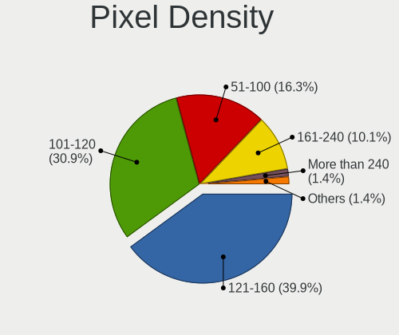

| Density       | Notebooks | Percent |
|---------------|-----------|---------|
| 121-160       | 40        | 37.74%  |
| 101-120       | 37        | 34.91%  |
| 51-100        | 13        | 12.26%  |
| 161-240       | 11        | 10.38%  |
| More than 240 | 3         | 2.83%   |
| 1-50          | 1         | 0.94%   |
| Unknown       | 1         | 0.94%   |

Multiple Monitors
-----------------

Total monitors connected

| Total | Notebooks | Percent |
|-------|-----------|---------|
| 1     | 88        | 89.8%   |
| 2     | 8         | 8.16%   |
| 4     | 1         | 1.02%   |
| 3     | 1         | 1.02%   |

Network
-------

Net Controller Vendor
---------------------

Controller vendors

| Vendor                                | Notebooks | Percent |
|---------------------------------------|-----------|---------|
| Intel                                 | 51        | 33.77%  |
| Realtek Semiconductor                 | 49        | 32.45%  |
| Qualcomm Atheros                      | 17        | 11.26%  |
| Broadcom                              | 5         | 3.31%   |
| MediaTek                              | 4         | 2.65%   |
| Broadcom Limited                      | 4         | 2.65%   |
| Marvell Technology Group              | 3         | 1.99%   |
| Samsung Electronics                   | 2         | 1.32%   |
| Qualcomm                              | 2         | 1.32%   |
| Dell                                  | 2         | 1.32%   |
| ASIX Electronics                      | 2         | 1.32%   |
| TP-Link                               | 1         | 0.66%   |
| Sierra Wireless                       | 1         | 0.66%   |
| Ralink Technology                     | 1         | 0.66%   |
| Ralink                                | 1         | 0.66%   |
| Nvidia                                | 1         | 0.66%   |
| Lenovo                                | 1         | 0.66%   |
| Ericsson Business Mobile Networks     | 1         | 0.66%   |
| DisplayLink                           | 1         | 0.66%   |
| Cisco Aironet Wireless Communications | 1         | 0.66%   |
| AMD                                   | 1         | 0.66%   |

Net Controller Model
--------------------

Controller models

| Model                                                                  | Notebooks | Percent |
|------------------------------------------------------------------------|-----------|---------|
| Realtek RTL8111/8168/8211/8411 PCI Express Gigabit Ethernet Controller | 28        | 15.14%  |
| Realtek RTL8821CE 802.11ac PCIe Wireless Network Adapter               | 8         | 4.32%   |
| Realtek RTL810xE PCI Express Fast Ethernet controller                  | 8         | 4.32%   |
| Intel 82579LM Gigabit Network Connection (Lewisville)                  | 8         | 4.32%   |
| Intel Centrino Advanced-N 6205 [Taylor Peak]                           | 6         | 3.24%   |
| Intel Wireless 7260                                                    | 5         | 2.7%    |
| Qualcomm Atheros QCA9377 802.11ac Wireless Network Adapter             | 4         | 2.16%   |
| Intel Alder Lake-P PCH CNVi WiFi                                       | 4         | 2.16%   |
| Realtek RTL8822CE 802.11ac PCIe Wireless Network Adapter               | 3         | 1.62%   |
| Qualcomm Atheros QCA9565 / AR9565 Wireless Network Adapter             | 3         | 1.62%   |
| Qualcomm Atheros QCA6174 802.11ac Wireless Network Adapter             | 3         | 1.62%   |
| MediaTek Wi-Fi 6E MT7902 Wireless Network Adapter                      | 3         | 1.62%   |
| Intel Wireless 8265 / 8275                                             | 3         | 1.62%   |
| Intel Wi-Fi 6 AX200                                                    | 3         | 1.62%   |
| Realtek RTL8723BE PCIe Wireless Network Adapter                        | 2         | 1.08%   |
| Realtek RTL8191SEvB Wireless LAN Controller                            | 2         | 1.08%   |
| Realtek RTL8188CE 802.11b/g/n WiFi Adapter                             | 2         | 1.08%   |
| Realtek RTL8153 Gigabit Ethernet Adapter                               | 2         | 1.08%   |
| Qualcomm QCNFA765 Wireless Network Adapter                             | 2         | 1.08%   |
| Qualcomm Atheros Killer E220x Gigabit Ethernet Controller              | 2         | 1.08%   |
| Qualcomm Atheros AR9485 Wireless Network Adapter                       | 2         | 1.08%   |
| Intel Wireless 8260                                                    | 2         | 1.08%   |
| Intel Wi-Fi 6E(802.11ax) AX210/AX1675* 2x2 [Typhoon Peak]              | 2         | 1.08%   |
| Intel Raptor Lake PCH CNVi WiFi                                        | 2         | 1.08%   |
| Intel PRO/Wireless 5100 AGN [Shiloh] Network Connection                | 2         | 1.08%   |
| Intel Ethernet Connection I219-LM                                      | 2         | 1.08%   |
| Intel Ethernet Connection I217-LM                                      | 2         | 1.08%   |
| Intel Ethernet Connection (6) I219-LM                                  | 2         | 1.08%   |
| Intel Comet Lake PCH-LP CNVi WiFi                                      | 2         | 1.08%   |
| Intel Cannon Lake PCH CNVi WiFi                                        | 2         | 1.08%   |
| ASIX AX88179 Gigabit Ethernet                                          | 2         | 1.08%   |
| TP-Link Archer T3U [Realtek RTL8812BU]                                 | 1         | 0.54%   |
| Sierra Wireless EM7345 4G LTE                                          | 1         | 0.54%   |
| Samsung GT-I9070 (network tethering, USB debugging enabled)            | 1         | 0.54%   |
| Samsung Galaxy series, misc. (tethering mode)                          | 1         | 0.54%   |
| Realtek RTL88x2bu [AC1200 Techkey]                                     | 1         | 0.54%   |
| Realtek RTL8852BE PCIe 802.11ax Wireless Network Controller            | 1         | 0.54%   |
| Realtek RTL8852AE 802.11ax PCIe Wireless Network Adapter               | 1         | 0.54%   |
| Realtek RTL8191SEvA Wireless LAN Controller                            | 1         | 0.54%   |
| Realtek RTL-8100/8101L/8139 PCI Fast Ethernet Adapter                  | 1         | 0.54%   |

Wireless Vendor
---------------

Wireless vendors

| Vendor                                | Notebooks | Percent |
|---------------------------------------|-----------|---------|
| Intel                                 | 47        | 46.08%  |
| Realtek Semiconductor                 | 21        | 20.59%  |
| Qualcomm Atheros                      | 15        | 14.71%  |
| MediaTek                              | 4         | 3.92%   |
| Broadcom                              | 4         | 3.92%   |
| Qualcomm                              | 2         | 1.96%   |
| Dell                                  | 2         | 1.96%   |
| Broadcom Limited                      | 2         | 1.96%   |
| TP-Link                               | 1         | 0.98%   |
| Sierra Wireless                       | 1         | 0.98%   |
| Ralink Technology                     | 1         | 0.98%   |
| Ralink                                | 1         | 0.98%   |
| Cisco Aironet Wireless Communications | 1         | 0.98%   |

Wireless Model
--------------

Wireless models

| Model                                                                         | Notebooks | Percent |
|-------------------------------------------------------------------------------|-----------|---------|
| Realtek RTL8821CE 802.11ac PCIe Wireless Network Adapter                      | 8         | 7.77%   |
| Intel Centrino Advanced-N 6205 [Taylor Peak]                                  | 6         | 5.83%   |
| Intel Wireless 7260                                                           | 5         | 4.85%   |
| Qualcomm Atheros QCA9377 802.11ac Wireless Network Adapter                    | 4         | 3.88%   |
| Intel Alder Lake-P PCH CNVi WiFi                                              | 4         | 3.88%   |
| Realtek RTL8822CE 802.11ac PCIe Wireless Network Adapter                      | 3         | 2.91%   |
| Qualcomm Atheros QCA9565 / AR9565 Wireless Network Adapter                    | 3         | 2.91%   |
| Qualcomm Atheros QCA6174 802.11ac Wireless Network Adapter                    | 3         | 2.91%   |
| MediaTek Wi-Fi 6E MT7902 Wireless Network Adapter                             | 3         | 2.91%   |
| Intel Wireless 8265 / 8275                                                    | 3         | 2.91%   |
| Intel Wi-Fi 6 AX200                                                           | 3         | 2.91%   |
| Realtek RTL8723BE PCIe Wireless Network Adapter                               | 2         | 1.94%   |
| Realtek RTL8191SEvB Wireless LAN Controller                                   | 2         | 1.94%   |
| Realtek RTL8188CE 802.11b/g/n WiFi Adapter                                    | 2         | 1.94%   |
| Qualcomm QCNFA765 Wireless Network Adapter                                    | 2         | 1.94%   |
| Qualcomm Atheros AR9485 Wireless Network Adapter                              | 2         | 1.94%   |
| Intel Wireless 8260                                                           | 2         | 1.94%   |
| Intel Wi-Fi 6E(802.11ax) AX210/AX1675* 2x2 [Typhoon Peak]                     | 2         | 1.94%   |
| Intel Raptor Lake PCH CNVi WiFi                                               | 2         | 1.94%   |
| Intel PRO/Wireless 5100 AGN [Shiloh] Network Connection                       | 2         | 1.94%   |
| Intel Comet Lake PCH-LP CNVi WiFi                                             | 2         | 1.94%   |
| Intel Cannon Lake PCH CNVi WiFi                                               | 2         | 1.94%   |
| TP-Link Archer T3U [Realtek RTL8812BU]                                        | 1         | 0.97%   |
| Sierra Wireless EM7345 4G LTE                                                 | 1         | 0.97%   |
| Realtek RTL88x2bu [AC1200 Techkey]                                            | 1         | 0.97%   |
| Realtek RTL8852BE PCIe 802.11ax Wireless Network Controller                   | 1         | 0.97%   |
| Realtek RTL8852AE 802.11ax PCIe Wireless Network Adapter                      | 1         | 0.97%   |
| Realtek RTL8191SEvA Wireless LAN Controller                                   | 1         | 0.97%   |
| Ralink MT7601U Wireless Adapter                                               | 1         | 0.97%   |
| Ralink RT3290 Wireless 802.11n 1T/1R PCIe                                     | 1         | 0.97%   |
| Qualcomm Atheros AR9285 Wireless Network Adapter (PCI-Express)                | 1         | 0.97%   |
| Qualcomm Atheros AR242x / AR542x Wireless Network Adapter (PCI-Express)       | 1         | 0.97%   |
| Qualcomm Atheros AR2413/AR2414 Wireless Network Adapter [AR5005G(S) 802.11bg] | 1         | 0.97%   |
| MediaTek MT7921 802.11ax PCI Express Wireless Network Adapter                 | 1         | 0.97%   |
| Intel Wireless Gigabit 17265                                                  | 1         | 0.97%   |
| Intel Wireless 7265                                                           | 1         | 0.97%   |
| Intel Wireless 3165                                                           | 1         | 0.97%   |
| Intel Wireless 3160                                                           | 1         | 0.97%   |
| Intel WiFi Link 5100                                                          | 1         | 0.97%   |
| Intel Wi-Fi 6 AX201 160MHz                                                    | 1         | 0.97%   |

Ethernet Vendor
---------------

Ethernet vendors

| Vendor                   | Notebooks | Percent |
|--------------------------|-----------|---------|
| Realtek Semiconductor    | 39        | 49.37%  |
| Intel                    | 22        | 27.85%  |
| Qualcomm Atheros         | 4         | 5.06%   |
| Marvell Technology Group | 3         | 3.8%    |
| Samsung Electronics      | 2         | 2.53%   |
| Broadcom Limited         | 2         | 2.53%   |
| Broadcom                 | 2         | 2.53%   |
| ASIX Electronics         | 2         | 2.53%   |
| Nvidia                   | 1         | 1.27%   |
| Lenovo                   | 1         | 1.27%   |
| DisplayLink              | 1         | 1.27%   |

Ethernet Model
--------------

Ethernet models

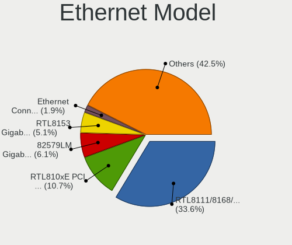

| Model                                                                  | Notebooks | Percent |
|------------------------------------------------------------------------|-----------|---------|
| Realtek RTL8111/8168/8211/8411 PCI Express Gigabit Ethernet Controller | 28        | 35.44%  |
| Realtek RTL810xE PCI Express Fast Ethernet controller                  | 8         | 10.13%  |
| Intel 82579LM Gigabit Network Connection (Lewisville)                  | 8         | 10.13%  |
| Realtek RTL8153 Gigabit Ethernet Adapter                               | 2         | 2.53%   |
| Qualcomm Atheros Killer E220x Gigabit Ethernet Controller              | 2         | 2.53%   |
| Intel Ethernet Connection I219-LM                                      | 2         | 2.53%   |
| Intel Ethernet Connection I217-LM                                      | 2         | 2.53%   |
| Intel Ethernet Connection (6) I219-LM                                  | 2         | 2.53%   |
| ASIX AX88179 Gigabit Ethernet                                          | 2         | 2.53%   |
| Samsung GT-I9070 (network tethering, USB debugging enabled)            | 1         | 1.27%   |
| Samsung Galaxy series, misc. (tethering mode)                          | 1         | 1.27%   |
| Realtek RTL-8100/8101L/8139 PCI Fast Ethernet Adapter                  | 1         | 1.27%   |
| Qualcomm Atheros AR8151 v2.0 Gigabit Ethernet                          | 1         | 1.27%   |
| Qualcomm Atheros AR8131 Gigabit Ethernet                               | 1         | 1.27%   |
| Nvidia MCP79 Ethernet                                                  | 1         | 1.27%   |
| Marvell Group 88E8057 PCI-E Gigabit Ethernet Controller                | 1         | 1.27%   |
| Marvell Group 88E8055 PCI-E Gigabit Ethernet Controller                | 1         | 1.27%   |
| Marvell Group 88E8042 PCI-E Fast Ethernet Controller                   | 1         | 1.27%   |
| Lenovo ThinkPad Lan                                                    | 1         | 1.27%   |
| Intel Ethernet Connection (7) I219-LM                                  | 1         | 1.27%   |
| Intel Ethernet Connection (4) I219-LM                                  | 1         | 1.27%   |
| Intel Ethernet Connection (3) I218-LM                                  | 1         | 1.27%   |
| Intel Ethernet Connection (16) I219-LM                                 | 1         | 1.27%   |
| Intel Ethernet Connection (10) I219-LM                                 | 1         | 1.27%   |
| Intel 82801DB PRO/100 VE (MOB) Ethernet Controller                     | 1         | 1.27%   |
| Intel 82567LM Gigabit Network Connection                               | 1         | 1.27%   |
| Intel 82566MM Gigabit Network Connection                               | 1         | 1.27%   |
| DisplayLink USB-C Triple-4K Dock                                       | 1         | 1.27%   |
| Broadcom NetXtreme BCM57786 Gigabit Ethernet PCIe                      | 1         | 1.27%   |
| Broadcom NetXtreme BCM57765 Gigabit Ethernet PCIe                      | 1         | 1.27%   |
| Broadcom Limited NetXtreme BCM5751 Gigabit Ethernet PCI Express        | 1         | 1.27%   |
| Broadcom Limited NetLink BCM5906M Fast Ethernet PCI Express            | 1         | 1.27%   |

Net Controller Kind
-------------------

Ethernet, WiFi or modem

| Kind     | Notebooks | Percent |
|----------|-----------|---------|
| WiFi     | 96        | 54.86%  |
| Ethernet | 76        | 43.43%  |
| Modem    | 3         | 1.71%   |

Used Controller
---------------

Currently used network controller

| Kind     | Notebooks | Percent |
|----------|-----------|---------|
| WiFi     | 77        | 73.33%  |
| Ethernet | 28        | 26.67%  |

NICs
----

Total network controllers on board

| Total | Notebooks | Percent |
|-------|-----------|---------|
| 2     | 68        | 70.1%   |
| 1     | 27        | 27.84%  |
| 3     | 2         | 2.06%   |

IPv6
----

IPv6 vs IPv4

| Used | Notebooks | Percent |
|------|-----------|---------|
| No   | 63        | 64.29%  |
| Yes  | 35        | 35.71%  |

Bluetooth
---------

Bluetooth Vendor
----------------

Controller vendors

| Vendor                          | Notebooks | Percent |
|---------------------------------|-----------|---------|
| Intel                           | 34        | 41.98%  |
| Realtek Semiconductor           | 11        | 13.58%  |
| IMC Networks                    | 8         | 9.88%   |
| Qualcomm Atheros Communications | 7         | 8.64%   |
| Broadcom                        | 6         | 7.41%   |
| Lite-On Technology              | 3         | 3.7%    |
| USI                             | 2         | 2.47%   |
| Realtek                         | 2         | 2.47%   |
| Dell                            | 2         | 2.47%   |
| Apple                           | 2         | 2.47%   |
| Ralink                          | 1         | 1.23%   |
| Hewlett-Packard                 | 1         | 1.23%   |
| Foxconn / Hon Hai               | 1         | 1.23%   |
| Cambridge Silicon Radio         | 1         | 1.23%   |

Bluetooth Model
---------------

Controller models

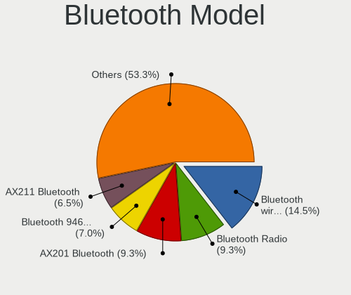

| Model                                               | Notebooks | Percent |
|-----------------------------------------------------|-----------|---------|
| Intel Bluetooth wireless interface                  | 12        | 14.81%  |
| Realtek Bluetooth Radio                             | 9         | 11.11%  |
| Intel Bluetooth 9460/9560 Jefferson Peak (JfP)      | 6         | 7.41%   |
| Intel AX201 Bluetooth                               | 6         | 7.41%   |
| Qualcomm Atheros  Bluetooth Device                  | 4         | 4.94%   |
| Intel Bluetooth Device                              | 4         | 4.94%   |
| IMC Networks Wireless_Device                        | 4         | 4.94%   |
| Intel AX200 Bluetooth                               | 3         | 3.7%    |
| Broadcom BCM20702 Bluetooth 4.0 [ThinkPad]          | 3         | 3.7%    |
| USI Bluetooth Device                                | 2         | 2.47%   |
| Realtek  Bluetooth 4.2 Adapter                      | 2         | 2.47%   |
| Realtek Bluetooth Radio                             | 2         | 2.47%   |
| Qualcomm Atheros QCA61x4 Bluetooth 4.0              | 2         | 2.47%   |
| Lite-On Qualcomm Atheros QCA9377 Bluetooth          | 2         | 2.47%   |
| Intel AX210 Bluetooth                               | 2         | 2.47%   |
| IMC Networks Bluetooth Radio                        | 2         | 2.47%   |
| Ralink RT3290 Bluetooth                             | 1         | 1.23%   |
| Qualcomm Atheros AR3011 Bluetooth                   | 1         | 1.23%   |
| Lite-On Atheros AR3012 Bluetooth                    | 1         | 1.23%   |
| Intel Wireless-AC 3168 Bluetooth                    | 1         | 1.23%   |
| IMC Networks Bluetooth Device                       | 1         | 1.23%   |
| IMC Networks BCM20702A0                             | 1         | 1.23%   |
| HP Broadcom 2070 Bluetooth Combo                    | 1         | 1.23%   |
| Foxconn / Hon Hai Bluetooth USB Host Controller     | 1         | 1.23%   |
| Dell Wireless 350 Bluetooth                         | 1         | 1.23%   |
| Dell DW375 Bluetooth Module                         | 1         | 1.23%   |
| Cambridge Silicon Radio Bluetooth Dongle (HCI mode) | 1         | 1.23%   |
| Broadcom HP Portable Valentine                      | 1         | 1.23%   |
| Broadcom BCM20702A0 Bluetooth 4.0                   | 1         | 1.23%   |
| Broadcom BCM2045B (BDC-2) [Bluetooth Controller]    | 1         | 1.23%   |
| Apple Bluetooth USB Host Controller                 | 1         | 1.23%   |
| Apple Bluetooth Host Controller                     | 1         | 1.23%   |

Sound
-----

Sound Vendor
------------

Sound card vendors

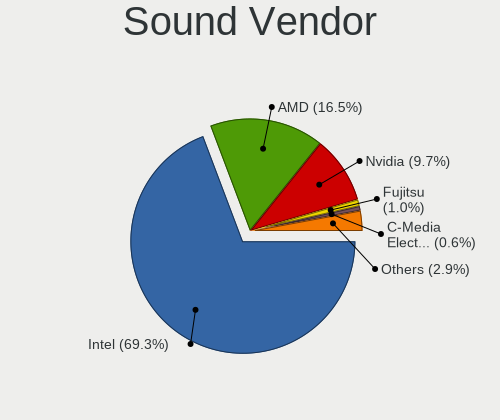

| Vendor                    | Notebooks | Percent |
|---------------------------|-----------|---------|
| Intel                     | 75        | 63.03%  |
| AMD                       | 22        | 18.49%  |
| Nvidia                    | 16        | 13.45%  |
| Texas Instruments         | 1         | 0.84%   |
| Sennheiser Communications | 1         | 0.84%   |
| JMTek                     | 1         | 0.84%   |
| Focusrite-Novation        | 1         | 0.84%   |
| Creative Technology       | 1         | 0.84%   |
| C-Media Electronics       | 1         | 0.84%   |

Sound Model
-----------

Sound card models

| Model                                                                      | Notebooks | Percent |
|----------------------------------------------------------------------------|-----------|---------|
| AMD Family 17h/19h HD Audio Controller                                     | 12        | 8.28%   |
| Intel Sunrise Point-LP HD Audio                                            | 11        | 7.59%   |
| Intel 7 Series/C216 Chipset Family High Definition Audio Controller        | 8         | 5.52%   |
| Intel 6 Series/C200 Series Chipset Family High Definition Audio Controller | 7         | 4.83%   |
| AMD Renoir Radeon High Definition Audio Controller                         | 6         | 4.14%   |
| Intel Raptor Lake-P/U/H cAVS                                               | 5         | 3.45%   |
| Intel 82801I (ICH9 Family) HD Audio Controller                             | 5         | 3.45%   |
| Intel Wildcat Point-LP High Definition Audio Controller                    | 4         | 2.76%   |
| Intel Tiger Lake-LP Smart Sound Technology Audio Controller                | 4         | 2.76%   |
| Intel Broadwell-U Audio Controller                                         | 4         | 2.76%   |
| Intel Alder Lake PCH-P High Definition Audio Controller                    | 4         | 2.76%   |
| Nvidia GK106 HDMI Audio Controller                                         | 3         | 2.07%   |
| Intel Xeon E3-1200 v3/4th Gen Core Processor HD Audio Controller           | 3         | 2.07%   |
| Intel Comet Lake PCH-LP cAVS                                               | 3         | 2.07%   |
| Intel Cannon Point-LP High Definition Audio Controller                     | 3         | 2.07%   |
| Intel 8 Series/C220 Series Chipset High Definition Audio Controller        | 3         | 2.07%   |
| AMD Rembrandt Radeon High Definition Audio Controller                      | 3         | 2.07%   |
| AMD High Definition Audio Controller                                       | 3         | 2.07%   |
| AMD FCH Azalia Controller                                                  | 3         | 2.07%   |
| AMD Family 15h (Models 60h-6fh) Audio Controller                           | 3         | 2.07%   |
| Nvidia TU107 GeForce GTX 1650 High Definition Audio Controller             | 2         | 1.38%   |
| Nvidia GP107GL High Definition Audio Controller                            | 2         | 1.38%   |
| Nvidia GF119 HDMI Audio Controller                                         | 2         | 1.38%   |
| Nvidia GF108 High Definition Audio Controller                              | 2         | 1.38%   |
| Intel Haswell-ULT HD Audio Controller                                      | 2         | 1.38%   |
| Intel Celeron/Pentium Silver Processor High Definition Audio               | 2         | 1.38%   |
| Intel Cannon Lake PCH cAVS                                                 | 2         | 1.38%   |
| Intel 8 Series HD Audio Controller                                         | 2         | 1.38%   |
| AMD Raven/Raven2/Fenghuang HDMI/DP Audio Controller                        | 2         | 1.38%   |
| AMD Kabini HDMI/DP Audio                                                   | 2         | 1.38%   |
| Texas Instruments SMSL AD18 AMP                                            | 1         | 0.69%   |
| Sennheiser Communications Sennheiser USB headset                           | 1         | 0.69%   |
| Nvidia TU106 High Definition Audio Controller                              | 1         | 0.69%   |
| Nvidia MCP79 High Definition Audio                                         | 1         | 0.69%   |
| Nvidia High Definition Audio Controller                                    | 1         | 0.69%   |
| Nvidia GA106 High Definition Audio Controller                              | 1         | 0.69%   |
| Nvidia Audio device                                                        | 1         | 0.69%   |
| JMTek USB PnP Audio Device                                                 | 1         | 0.69%   |
| Intel Tiger Lake-H HD Audio Controller                                     | 1         | 0.69%   |
| Intel NM10/ICH7 Family High Definition Audio Controller                    | 1         | 0.69%   |

Memory
------

Memory Vendor
-------------

Memory module vendors

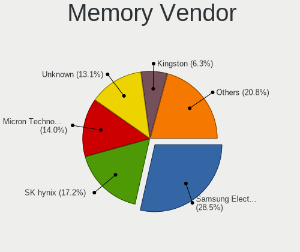

| Vendor                       | Notebooks | Percent |
|------------------------------|-----------|---------|
| Samsung Electronics          | 21        | 32.31%  |
| SK hynix                     | 13        | 20%     |
| Micron Technology            | 11        | 16.92%  |
| Unknown                      | 7         | 10.77%  |
| Elpida                       | 2         | 3.08%   |
| A-DATA Technology            | 2         | 3.08%   |
| Team                         | 1         | 1.54%   |
| Smart                        | 1         | 1.54%   |
| Ramaxel Technology           | 1         | 1.54%   |
| Patriot Memory (PDP Systems) | 1         | 1.54%   |
| Nanya Technology             | 1         | 1.54%   |
| Kingston                     | 1         | 1.54%   |
| Crucial                      | 1         | 1.54%   |
| Corsair                      | 1         | 1.54%   |
| Unknown                      | 1         | 1.54%   |

Memory Model
------------

Memory module models

| Model                                                      | Notebooks | Percent |
|------------------------------------------------------------|-----------|---------|
| Samsung RAM M471A1K43EB1-CWE 8GB SODIMM DDR4 3200MT/s      | 4         | 5.63%   |
| Samsung RAM M471A5244CB0-CTD 4096MB SODIMM DDR4 3266MT/s   | 3         | 4.23%   |
| Micron RAM 4ATF1G64HZ-3G2F1 8GB SODIMM DDR4 3200MT/s       | 3         | 4.23%   |
| Unknown RAM Module 4GB SODIMM DDR2 667MT/s                 | 2         | 2.82%   |
| SK hynix RAM HMT451S6BFR8A-PB 4GB SODIMM DDR3 1600MT/s     | 2         | 2.82%   |
| SK hynix RAM HMT451S6AFR8C-PB 4GB SODIMM DDR3 1600MT/s     | 2         | 2.82%   |
| SK hynix RAM HMA81GS6AFR8N-UH 8GB SODIMM DDR4 2667MT/s     | 2         | 2.82%   |
| Unknown RAM Module 512MB SODIMM DRAM                       | 1         | 1.41%   |
| Unknown RAM Module 512MB SODIMM DDR                        | 1         | 1.41%   |
| Unknown RAM Module 4GB Chip DDR4 2133MT/s                  | 1         | 1.41%   |
| Unknown RAM Module 2GB SODIMM DDR2 667MT/s                 | 1         | 1.41%   |
| Unknown RAM Module 2GB SODIMM DDR2                         | 1         | 1.41%   |
| Unknown RAM Module 1GB SODIMM DDR2 533MT/s                 | 1         | 1.41%   |
| Team RAM TEAMGROUP-SD4-3200 8GB SODIMM DDR4 3200MT/s       | 1         | 1.41%   |
| Smart RAM SF464128CK8IWGKFEG 4GB SODIMM DDR4 2400MT/s      | 1         | 1.41%   |
| SK hynix RAM Module 512MB SODIMM DDR2 533MT/s              | 1         | 1.41%   |
| SK hynix RAM Module 1GB SODIMM DDR 667MT/s                 | 1         | 1.41%   |
| SK hynix RAM Module 16GB SODIMM DDR4 2667MT/s              | 1         | 1.41%   |
| SK hynix RAM HMT41GS6MFR8C-PB 8GB SODIMM DDR3 1600MT/s     | 1         | 1.41%   |
| SK hynix RAM HMT351S6CFR8C-PB 4GB SODIMM DDR3 1600MT/s     | 1         | 1.41%   |
| SK hynix RAM HMT112S6BFR6C-G7 1GB SODIMM DDR3 1067MT/s     | 1         | 1.41%   |
| SK hynix RAM HMT112S6AFR8C-G7 1GB SODIMM DDR3 1066MT/s     | 1         | 1.41%   |
| SK hynix RAM HMCG66MEBSA095N 8GB SODIMM DDR5 4800MT/s      | 1         | 1.41%   |
| SK hynix RAM HMA851S6CJR6N-XN 4GB SODIMM DDR4 3200MT/s     | 1         | 1.41%   |
| SK hynix RAM H9JCNNNFA5MLYR-N6E 8GB SODIMM LPDDR5 6400MT/s | 1         | 1.41%   |
| Samsung RAM Module 512MB SODIMM DDR 533MT/s                | 1         | 1.41%   |
| Samsung RAM Module 4GB SODIMM DDR3 1333MT/s                | 1         | 1.41%   |
| Samsung RAM Module 4GB Row Of Chips LPDDR5 6400MT/s        | 1         | 1.41%   |
| Samsung RAM M471B5673FH0-CF8 2GB SODIMM DDR3 1067MT/s      | 1         | 1.41%   |
| Samsung RAM M471B5673EH1-CF8 2048MB SODIMM 4199MT/s        | 1         | 1.41%   |
| Samsung RAM M471B1G73QH0-YK0 8GB SODIMM DDR3 1600MT/s      | 1         | 1.41%   |
| Samsung RAM M471B1G73DB0-YK0 8GB SODIMM DDR3 1600MT/s      | 1         | 1.41%   |
| Samsung RAM M471B1G73BH0-CK0 8GB SODIMM DDR3 1600MT/s      | 1         | 1.41%   |
| Samsung RAM M471A2K43DB1-CWE 16GB SODIMM DDR4 3200MT/s     | 1         | 1.41%   |
| Samsung RAM M471A2K43BB1-CPB 16GB SODIMM DDR4 2133MT/s     | 1         | 1.41%   |
| Samsung RAM M471A2G44BM0-CWE 16GB SODIMM DDR4 3200MT/s     | 1         | 1.41%   |
| Samsung RAM M471A1K43DB1-CWE 8GB SODIMM DDR4 3200MT/s      | 1         | 1.41%   |
| Samsung RAM M471A1K43CB1-CRC 8GB SODIMM DDR4 2667MT/s      | 1         | 1.41%   |
| Samsung RAM M471A1G44BB0-CWE 8GB SODIMM DDR4 3200MT/s      | 1         | 1.41%   |
| Samsung RAM M4 70T5663EH3-CF7 2GB SODIMM DDR 975MT/s       | 1         | 1.41%   |

Memory Kind
-----------

Memory module kinds

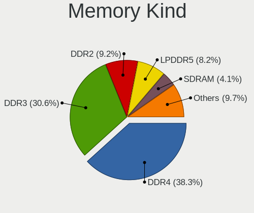

| Kind   | Notebooks | Percent |
|--------|-----------|---------|
| DDR4   | 25        | 44.64%  |
| DDR3   | 15        | 26.79%  |
| LPDDR5 | 4         | 7.14%   |
| DDR2   | 4         | 7.14%   |
| SDRAM  | 3         | 5.36%   |
| DDR    | 2         | 3.57%   |
| LPDDR4 | 1         | 1.79%   |
| DRAM   | 1         | 1.79%   |
| DDR5   | 1         | 1.79%   |

Memory Form Factor
------------------

Physical design of the memory module

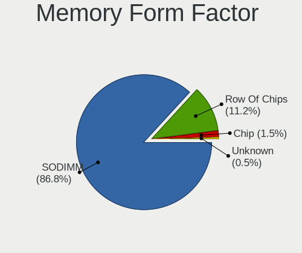

| Name         | Notebooks | Percent |
|--------------|-----------|---------|
| SODIMM       | 51        | 89.47%  |
| Row Of Chips | 3         | 5.26%   |
| Chip         | 3         | 5.26%   |

Memory Size
-----------

Memory module size

| Size  | Notebooks | Percent |
|-------|-----------|---------|
| 4096  | 22        | 34.92%  |
| 8192  | 21        | 33.33%  |
| 2048  | 6         | 9.52%   |
| 16384 | 5         | 7.94%   |
| 512   | 4         | 6.35%   |
| 1024  | 3         | 4.76%   |
| 32768 | 2         | 3.17%   |

Memory Speed
------------

Memory module speed

| Speed   | Notebooks | Percent |
|---------|-----------|---------|
| 3200    | 13        | 21.31%  |
| 1600    | 11        | 18.03%  |
| 2667    | 7         | 11.48%  |
| 6400    | 3         | 4.92%   |
| 3266    | 3         | 4.92%   |
| 2133    | 3         | 4.92%   |
| 667     | 3         | 4.92%   |
| Unknown | 3         | 4.92%   |
| 2400    | 2         | 3.28%   |
| 2048    | 2         | 3.28%   |
| 1067    | 2         | 3.28%   |
| 533     | 2         | 3.28%   |
| 5500    | 1         | 1.64%   |
| 4800    | 1         | 1.64%   |
| 4266    | 1         | 1.64%   |
| 4199    | 1         | 1.64%   |
| 1334    | 1         | 1.64%   |
| 1333    | 1         | 1.64%   |
| 1066    | 1         | 1.64%   |

Printers & scanners
-------------------

Printer Vendor
--------------

Printer device vendors

| Vendor          | Notebooks | Percent |
|-----------------|-----------|---------|
| Hewlett-Packard | 1         | 50%     |
| Canon           | 1         | 50%     |

Printer Model
-------------

Printer device models

| Model                  | Notebooks | Percent |
|------------------------|-----------|---------|
| HP DeskJet 4100 series | 1         | 50%     |
| Canon TR4600 series    | 1         | 50%     |

Scanner Vendor
--------------

Scanner device vendors

Zero info for selected period =(

Scanner Model
-------------

Scanner device models

Zero info for selected period =(

Camera
------

Camera Vendor
-------------

Camera device vendors

| Vendor                                 | Notebooks | Percent |
|----------------------------------------|-----------|---------|
| Chicony Electronics                    | 20        | 24.39%  |
| Bison Electronics                      | 12        | 14.63%  |
| IMC Networks                           | 10        | 12.2%   |
| Quanta                                 | 7         | 8.54%   |
| Microdia                               | 7         | 8.54%   |
| Sunplus Innovation Technology          | 6         | 7.32%   |
| Realtek Semiconductor                  | 3         | 3.66%   |
| Cheng Uei Precision Industry (Foxlink) | 3         | 3.66%   |
| Suyin                                  | 2         | 2.44%   |
| Sonix Technology                       | 2         | 2.44%   |
| Ricoh                                  | 2         | 2.44%   |
| Acer                                   | 2         | 2.44%   |
| ShineTech                              | 1         | 1.22%   |
| Luxvisions Innotech Limited            | 1         | 1.22%   |
| Logitech                               | 1         | 1.22%   |
| Lite-On Technology                     | 1         | 1.22%   |
| Apple                                  | 1         | 1.22%   |
| Alcor Micro                            | 1         | 1.22%   |

Camera Model
------------

Camera device models

| Model                                             | Notebooks | Percent |
|---------------------------------------------------|-----------|---------|
| Chicony Integrated Camera                         | 7         | 8.54%   |
| IMC Networks USB2.0 HD UVC WebCam                 | 5         | 6.1%    |
| Bison Integrated Camera                           | 5         | 6.1%    |
| Microdia Integrated_Webcam_HD                     | 3         | 3.66%   |
| Realtek Integrated_Webcam_HD                      | 2         | 2.44%   |
| Microdia Sonix USB 2.0 Camera                     | 2         | 2.44%   |
| IMC Networks USB2.0 VGA UVC WebCam                | 2         | 2.44%   |
| IMC Networks Integrated Camera                    | 2         | 2.44%   |
| Chicony HP Truevision HD                          | 2         | 2.44%   |
| Chicony HP HD Camera                              | 2         | 2.44%   |
| Chicony HD Webcam                                 | 2         | 2.44%   |
| Bison Integrated RGB Camera                       | 2         | 2.44%   |
| Suyin HD WebCam                                   | 1         | 1.22%   |
| Suyin Acer CrystalEye Webcam                      | 1         | 1.22%   |
| Sunplus Laptop_Integrated_Webcam_HD               | 1         | 1.22%   |
| Sunplus Laptop_Integrated_Webcam_FHD              | 1         | 1.22%   |
| Sunplus Laptop Integrated Webcam FHD              | 1         | 1.22%   |
| Sunplus Integrated_Webcam_FHD                     | 1         | 1.22%   |
| Sunplus Hy-FHD(9807)-Camera                       | 1         | 1.22%   |
| Sunplus HP TrueVision HD Camera                   | 1         | 1.22%   |
| Sonix USB2.0 HD UVC WebCam                        | 1         | 1.22%   |
| Sonix USB2.0 FHD UVC WebCam                       | 1         | 1.22%   |
| ShineTech USB2.0 HD UVC WebCam                    | 1         | 1.22%   |
| Ricoh USB2.0 Camera                               | 1         | 1.22%   |
| Ricoh Sony Vaio Integrated Webcam                 | 1         | 1.22%   |
| Realtek USB2.0-Camera                             | 1         | 1.22%   |
| Quanta VGA WebCam                                 | 1         | 1.22%   |
| Quanta ov9734_techfront_camera                    | 1         | 1.22%   |
| Quanta HP Wide Vision HD Camera                   | 1         | 1.22%   |
| Quanta HP TrueVision HD Camera                    | 1         | 1.22%   |
| Quanta HP True Vision 5MP Camera                  | 1         | 1.22%   |
| Quanta HP HD Camera                               | 1         | 1.22%   |
| Quanta HD WebCam                                  | 1         | 1.22%   |
| Microdia Laptop_Integrated_Webcam_E4HD            | 1         | 1.22%   |
| Microdia Integrated Webcam                        | 1         | 1.22%   |
| Luxvisions Innotech Limited Integrated RGB Camera | 1         | 1.22%   |
| Logitech Quickcam 3000 For Business               | 1         | 1.22%   |
| Lite-On Integrated Camera                         | 1         | 1.22%   |
| IMC Networks HD Camera                            | 1         | 1.22%   |
| Chicony USB2.0 VGA UVC WebCam                     | 1         | 1.22%   |

Security
--------

Fingerprint Vendor
------------------

Fingerprint sensor vendors

| Vendor                     | Notebooks | Percent |
|----------------------------|-----------|---------|
| Validity Sensors           | 5         | 29.41%  |
| Synaptics                  | 5         | 29.41%  |
| Shenzhen Goodix Technology | 2         | 11.76%  |
| Elan Microelectronics      | 2         | 11.76%  |
| Upek                       | 1         | 5.88%   |
| STMicroelectronics         | 1         | 5.88%   |
| Microsoft                  | 1         | 5.88%   |

Fingerprint Model
-----------------

Fingerprint sensor models

| Model                                                  | Notebooks | Percent |
|--------------------------------------------------------|-----------|---------|
| Validity Sensors VFS 5011 fingerprint sensor           | 2         | 11.76%  |
| Shenzhen Goodix  Fingerprint Device                    | 2         | 11.76%  |
| Validity Sensors VFS7552 Touch Fingerprint Sensor      | 1         | 5.88%   |
| Validity Sensors VFS7500 Touch Fingerprint Sensor      | 1         | 5.88%   |
| Validity Sensors Fingerprint scanner                   | 1         | 5.88%   |
| Upek Biometric Touchchip/Touchstrip Fingerprint Sensor | 1         | 5.88%   |
| Synaptics WBDI                                         | 1         | 5.88%   |
| Synaptics UWP WBDI Device                              | 1         | 5.88%   |
| Synaptics Prometheus MIS Touch Fingerprint Reader      | 1         | 5.88%   |
| Synaptics Metallica MIS Touch Fingerprint Reader       | 1         | 5.88%   |
| Synaptics Fingerprint reader [HP G6]                   | 1         | 5.88%   |
| STMicroelectronics Fingerprint Reader                  | 1         | 5.88%   |
| Microsoft Fingerprint Reader                           | 1         | 5.88%   |
| Elan ELAN:Fingerprint                                  | 1         | 5.88%   |
| Elan ELAN:ARM-M4                                       | 1         | 5.88%   |

Chipcard Vendor
---------------

Chipcard module vendors

| Vendor      | Notebooks | Percent |
|-------------|-----------|---------|
| Broadcom    | 4         | 33.33%  |
| Lenovo      | 3         | 25%     |
| Alcor Micro | 3         | 25%     |
| Upek        | 2         | 16.67%  |

Chipcard Model
--------------

Chipcard module models

| Model                                                                        | Notebooks | Percent |
|------------------------------------------------------------------------------|-----------|---------|
| Lenovo Integrated Smart Card Reader                                          | 3         | 25%     |
| Alcor Micro AU9540 Smartcard Reader                                          | 3         | 25%     |
| Upek TouchChip Fingerprint Coprocessor (WBF advanced mode)                   | 2         | 16.67%  |
| Broadcom BCM5880 Secure Applications Processor with fingerprint swipe sensor | 1         | 8.33%   |
| Broadcom BCM5880 Secure Applications Processor                               | 1         | 8.33%   |
| Broadcom 5880                                                                | 1         | 8.33%   |
| Broadcom 58200                                                               | 1         | 8.33%   |

Unsupported
-----------

Unsupported Devices
-------------------

Total unsupported devices on board

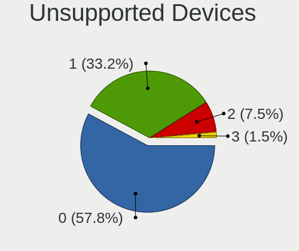

| Total | Notebooks | Percent |
|-------|-----------|---------|
| 0     | 54        | 55.67%  |
| 1     | 35        | 36.08%  |
| 2     | 5         | 5.15%   |
| 3     | 3         | 3.09%   |

Unsupported Device Types
------------------------

Types of unsupported devices

| Type                     | Notebooks | Percent |
|--------------------------|-----------|---------|
| Fingerprint reader       | 17        | 30.91%  |
| Chipcard                 | 12        | 21.82%  |
| Graphics card            | 8         | 14.55%  |
| Net/wireless             | 6         | 10.91%  |
| Multimedia controller    | 5         | 9.09%   |
| Bluetooth                | 2         | 3.64%   |
| Storage/nvme             | 1         | 1.82%   |
| Storage                  | 1         | 1.82%   |
| Communication controller | 1         | 1.82%   |
| Card reader              | 1         | 1.82%   |
| Camera                   | 1         | 1.82%   |

