Lilidog - Tested Hardware & Statistics (Desktops)
-------------------------------------------------

A project to collect tested hardware configurations for Lilidog.

Anyone can contribute to this report by the [hw-probe](https://github.com/linuxhw/hw-probe) tool:

    sudo -E hw-probe -all -upload

Please contribute! Especially if your hardware is rare.

Contents
--------

* [ Test Cases ](#test-cases)

* [ System ](#system)
  - [ OS                       ](#os)
  - [ OS Family                ](#os-family)
  - [ Kernel                   ](#kernel)
  - [ Kernel Family            ](#kernel-family)
  - [ Kernel Major Ver.        ](#kernel-major-ver)
  - [ Arch                     ](#arch)
  - [ DE                       ](#de)
  - [ Display Server           ](#display-server)
  - [ Display Manager          ](#display-manager)
  - [ OS Lang                  ](#os-lang)
  - [ Boot Mode                ](#boot-mode)
  - [ Filesystem               ](#filesystem)
  - [ Part. scheme             ](#part-scheme)
  - [ Dual Boot with Linux/BSD ](#dual-boot-with-linuxbsd)
  - [ Dual Boot (Win)          ](#dual-boot-win)

* [ Board ](#board)
  - [ Vendor                   ](#vendor)
  - [ Model                    ](#model)
  - [ Model Family             ](#model-family)
  - [ MFG Year                 ](#mfg-year)
  - [ Form Factor              ](#form-factor)
  - [ Secure Boot              ](#secure-boot)
  - [ Coreboot                 ](#coreboot)
  - [ RAM Size                 ](#ram-size)
  - [ RAM Used                 ](#ram-used)
  - [ Total Drives             ](#total-drives)
  - [ Has CD-ROM               ](#has-cd-rom)
  - [ Has Ethernet             ](#has-ethernet)
  - [ Has WiFi                 ](#has-wifi)
  - [ Has Bluetooth            ](#has-bluetooth)

* [ Location ](#location)
  - [ Country                  ](#country)
  - [ City                     ](#city)

* [ Drives ](#drives)
  - [ Drive Vendor             ](#drive-vendor)
  - [ Drive Model              ](#drive-model)
  - [ HDD Vendor               ](#hdd-vendor)
  - [ SSD Vendor               ](#ssd-vendor)
  - [ Drive Kind               ](#drive-kind)
  - [ Drive Connector          ](#drive-connector)
  - [ Drive Size               ](#drive-size)
  - [ Space Total              ](#space-total)
  - [ Space Used               ](#space-used)
  - [ Malfunc. Drives          ](#malfunc-drives)
  - [ Malfunc. Drive Vendor    ](#malfunc-drive-vendor)
  - [ Malfunc. HDD Vendor      ](#malfunc-hdd-vendor)
  - [ Malfunc. Drive Kind      ](#malfunc-drive-kind)
  - [ Failed Drives            ](#failed-drives)
  - [ Failed Drive Vendor      ](#failed-drive-vendor)
  - [ Drive Status             ](#drive-status)

* [ Storage controller ](#storage-controller)
  - [ Storage Vendor           ](#storage-vendor)
  - [ Storage Model            ](#storage-model)
  - [ Storage Kind             ](#storage-kind)

* [ Processor ](#processor)
  - [ CPU Vendor               ](#cpu-vendor)
  - [ CPU Model                ](#cpu-model)
  - [ CPU Model Family         ](#cpu-model-family)
  - [ CPU Cores                ](#cpu-cores)
  - [ CPU Sockets              ](#cpu-sockets)
  - [ CPU Threads              ](#cpu-threads)
  - [ CPU Op-Modes             ](#cpu-op-modes)
  - [ CPU Microcode            ](#cpu-microcode)
  - [ CPU Microarch            ](#cpu-microarch)

* [ Graphics ](#graphics)
  - [ GPU Vendor               ](#gpu-vendor)
  - [ GPU Model                ](#gpu-model)
  - [ GPU Combo                ](#gpu-combo)
  - [ GPU Driver               ](#gpu-driver)
  - [ GPU Memory               ](#gpu-memory)

* [ Monitor ](#monitor)
  - [ Monitor Vendor           ](#monitor-vendor)
  - [ Monitor Model            ](#monitor-model)
  - [ Monitor Resolution       ](#monitor-resolution)
  - [ Monitor Diagonal         ](#monitor-diagonal)
  - [ Monitor Width            ](#monitor-width)
  - [ Aspect Ratio             ](#aspect-ratio)
  - [ Monitor Area             ](#monitor-area)
  - [ Pixel Density            ](#pixel-density)
  - [ Multiple Monitors        ](#multiple-monitors)

* [ Network ](#network)
  - [ Net Controller Vendor    ](#net-controller-vendor)
  - [ Net Controller Model     ](#net-controller-model)
  - [ Wireless Vendor          ](#wireless-vendor)
  - [ Wireless Model           ](#wireless-model)
  - [ Ethernet Vendor          ](#ethernet-vendor)
  - [ Ethernet Model           ](#ethernet-model)
  - [ Net Controller Kind      ](#net-controller-kind)
  - [ Used Controller          ](#used-controller)
  - [ NICs                     ](#nics)
  - [ IPv6                     ](#ipv6)

* [ Bluetooth ](#bluetooth)
  - [ Bluetooth Vendor         ](#bluetooth-vendor)
  - [ Bluetooth Model          ](#bluetooth-model)

* [ Sound ](#sound)
  - [ Sound Vendor             ](#sound-vendor)
  - [ Sound Model              ](#sound-model)

* [ Memory ](#memory)
  - [ Memory Vendor            ](#memory-vendor)
  - [ Memory Model             ](#memory-model)
  - [ Memory Kind              ](#memory-kind)
  - [ Memory Form Factor       ](#memory-form-factor)
  - [ Memory Size              ](#memory-size)
  - [ Memory Speed             ](#memory-speed)

* [ Printers & scanners ](#printers--scanners)
  - [ Printer Vendor           ](#printer-vendor)
  - [ Printer Model            ](#printer-model)
  - [ Scanner Vendor           ](#scanner-vendor)
  - [ Scanner Model            ](#scanner-model)

* [ Camera ](#camera)
  - [ Camera Vendor            ](#camera-vendor)
  - [ Camera Model             ](#camera-model)

* [ Security ](#security)
  - [ Fingerprint Vendor       ](#fingerprint-vendor)
  - [ Fingerprint Model        ](#fingerprint-model)
  - [ Chipcard Vendor          ](#chipcard-vendor)
  - [ Chipcard Model           ](#chipcard-model)

* [ Unsupported ](#unsupported)
  - [ Unsupported Devices      ](#unsupported-devices)
  - [ Unsupported Device Types ](#unsupported-device-types)

Test Cases
----------

Total: 29

| Vendor        | Model                       | Probe                                                      | Date         |
|---------------|-----------------------------|------------------------------------------------------------|--------------|
| HP            | 1825                        | [3d90cc7481](https://linux-hardware.org/?probe=3d90cc7481) | Mar 31, 2024 |
| Shenzhen M... | F6BFC                       | [14060f87a1](https://linux-hardware.org/?probe=14060f87a1) | Mar 12, 2024 |
| Shenzhen M... | F6BFC                       | [207f92c903](https://linux-hardware.org/?probe=207f92c903) | Feb 18, 2024 |
| HP            | 1998                        | [b193235ba4](https://linux-hardware.org/?probe=b193235ba4) | Jan 17, 2024 |
| Dell          | 0M5DCD A00                  | [6f8ca5724f](https://linux-hardware.org/?probe=6f8ca5724f) | Aug 10, 2023 |
| Dell          | 0GM819                      | [744413006e](https://linux-hardware.org/?probe=744413006e) | Apr 20, 2023 |
| Unknown       | X79M2-Q                     | [d985b7fa11](https://linux-hardware.org/?probe=d985b7fa11) | Apr 05, 2023 |
| Foxconn       | NETBOX NT-425/525 Ver       | [dfb8c476f9](https://linux-hardware.org/?probe=dfb8c476f9) | Jan 21, 2023 |
| Lenovo        | 374F SDK0R32862 WIN 3258... | [d50f9357b4](https://linux-hardware.org/?probe=d50f9357b4) | Jan 18, 2023 |
| Dell          | 0WMJ54 A01                  | [fece850cae](https://linux-hardware.org/?probe=fece850cae) | Jan 15, 2023 |
| Dell          | 03NVJ6 A02                  | [a16b955eed](https://linux-hardware.org/?probe=a16b955eed) | Jan 15, 2023 |
| ASUSTek       | PRIME H510M-K               | [9b1f8e9a10](https://linux-hardware.org/?probe=9b1f8e9a10) | Dec 18, 2022 |
| HP            | 805B                        | [111fb196ff](https://linux-hardware.org/?probe=111fb196ff) | Nov 16, 2022 |
| Dell          | 0DF42J A00                  | [52e8355edf](https://linux-hardware.org/?probe=52e8355edf) | Nov 12, 2022 |
| Biostar       | A320MH                      | [d01d91204f](https://linux-hardware.org/?probe=d01d91204f) | Oct 27, 2022 |
| Biostar       | A320MH                      | [768dff7065](https://linux-hardware.org/?probe=768dff7065) | Oct 27, 2022 |
| Gigabyte      | B365M DS3H                  | [603fc4f4cd](https://linux-hardware.org/?probe=603fc4f4cd) | Oct 15, 2022 |
| Gigabyte      | B450 AORUS PRO-CF           | [4bc8ad9e5f](https://linux-hardware.org/?probe=4bc8ad9e5f) | Oct 12, 2022 |
| Lenovo        | 374F SDK0R32862 WIN 3258... | [b30ac8d979](https://linux-hardware.org/?probe=b30ac8d979) | Oct 05, 2022 |
| Dell          | 0GM819                      | [7778e245a9](https://linux-hardware.org/?probe=7778e245a9) | Sep 06, 2022 |
| HP            | 805B                        | [602a9470ab](https://linux-hardware.org/?probe=602a9470ab) | Aug 22, 2022 |
| ASUSTek       | H110M-A/DP                  | [01dccaff29](https://linux-hardware.org/?probe=01dccaff29) | Jul 07, 2022 |
| ASUSTek       | H110M-A/DP                  | [356272d726](https://linux-hardware.org/?probe=356272d726) | Jul 04, 2022 |
| Gigabyte      | MZBAYAP-00                  | [f8a734d114](https://linux-hardware.org/?probe=f8a734d114) | Jun 20, 2022 |
| Gigabyte      | MZBAYAP-00                  | [8fb623d313](https://linux-hardware.org/?probe=8fb623d313) | Jun 17, 2022 |
| eMachines     | EL1352                      | [562e729c18](https://linux-hardware.org/?probe=562e729c18) | May 15, 2022 |
| HP            | 212B                        | [d6deb6ed52](https://linux-hardware.org/?probe=d6deb6ed52) | May 04, 2022 |
| HP            | 21EF                        | [f619d0dfc0](https://linux-hardware.org/?probe=f619d0dfc0) | Apr 14, 2022 |
| Dell          | 0HJ054                      | [77ae3bc631](https://linux-hardware.org/?probe=77ae3bc631) | Apr 11, 2022 |

System
------

OS
--

Installed operating systems

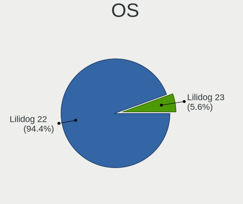

| Name       | Desktops | Percent |
|------------|----------|---------|
| Lilidog 22 | 17       | 80.95%  |
| Lilidog 23 | 4        | 19.05%  |

OS Family
---------

OS without a version

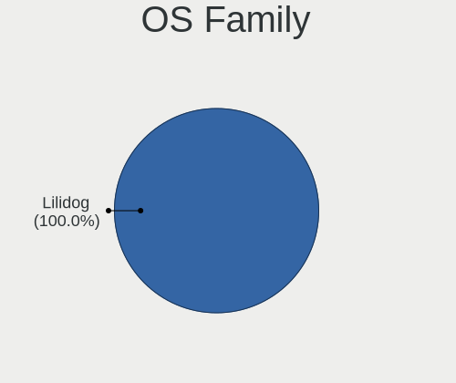

| Name    | Desktops | Percent |
|---------|----------|---------|
| Lilidog | 21       | 100%    |

Kernel
------

Version of the Linux kernel

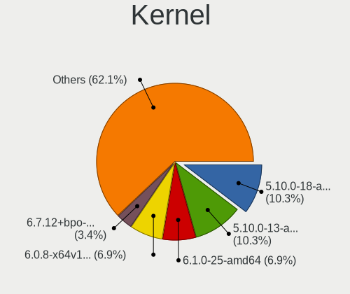

| Version                   | Desktops | Percent |
|---------------------------|----------|---------|
| 5.10.0-18-amd64           | 3        | 12.5%   |
| 5.10.0-13-amd64           | 3        | 12.5%   |
| 6.0.8-x64v1-xanmod1       | 2        | 8.33%   |
| 6.6.13+bpo-amd64          | 1        | 4.17%   |
| 6.5.0-0.deb12.4-amd64     | 1        | 4.17%   |
| 6.2.11-x64v1-xanmod1      | 1        | 4.17%   |
| 6.1.0-7.2-liquorix-amd64  | 1        | 4.17%   |
| 6.1.0-18-amd64            | 1        | 4.17%   |
| 6.1.0-10-amd64            | 1        | 4.17%   |
| 6.0.0-5-amd64             | 1        | 4.17%   |
| 6.0.0-0.deb11.6-amd64     | 1        | 4.17%   |
| 5.19.0-7.1-liquorix-amd64 | 1        | 4.17%   |
| 5.19.0-0.deb11.2-amd64    | 1        | 4.17%   |
| 5.18.0-1-amd64            | 1        | 4.17%   |
| 5.10.0-21-amd64           | 1        | 4.17%   |
| 5.10.0-20-amd64           | 1        | 4.17%   |
| 5.10.0-19-amd64           | 1        | 4.17%   |
| 5.10.0-16-amd64           | 1        | 4.17%   |
| 5.10.0-14-amd64           | 1        | 4.17%   |

Kernel Family
-------------

Linux kernel without a distro release

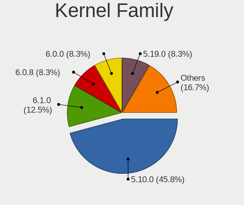

| Version | Desktops | Percent |
|---------|----------|---------|
| 5.10.0  | 11       | 45.83%  |
| 6.1.0   | 3        | 12.5%   |
| 6.0.8   | 2        | 8.33%   |
| 6.0.0   | 2        | 8.33%   |
| 5.19.0  | 2        | 8.33%   |
| 6.6.13  | 1        | 4.17%   |
| 6.5.0   | 1        | 4.17%   |
| 6.2.11  | 1        | 4.17%   |
| 5.18.0  | 1        | 4.17%   |

Kernel Major Ver.
-----------------

Linux kernel major version

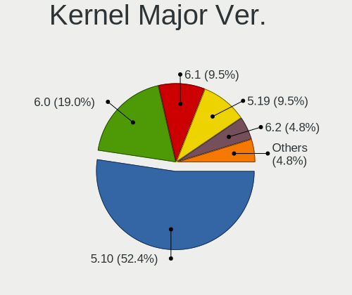

| Version | Desktops | Percent |
|---------|----------|---------|
| 5.10    | 11       | 45.83%  |
| 6.0     | 4        | 16.67%  |
| 6.1     | 3        | 12.5%   |
| 5.19    | 2        | 8.33%   |
| 6.6     | 1        | 4.17%   |
| 6.5     | 1        | 4.17%   |
| 6.2     | 1        | 4.17%   |
| 5.18    | 1        | 4.17%   |

Arch
----

OS architecture (x86_64, i586, etc.)

| Name   | Desktops | Percent |
|--------|----------|---------|
| x86_64 | 21       | 100%    |

DE
--

Desktop Environment

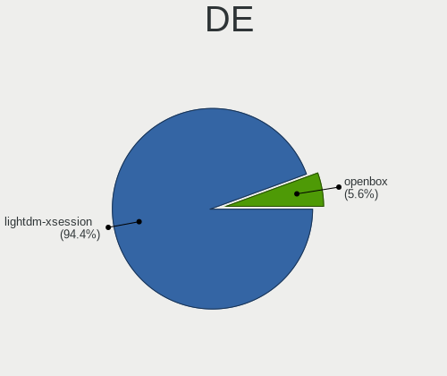

| Name             | Desktops | Percent |
|------------------|----------|---------|
| lightdm-xsession | 18       | 78.26%  |
| openbox          | 4        | 17.39%  |
| XFCE             | 1        | 4.35%   |

Display Server
--------------

X11 or Wayland

| Name | Desktops | Percent |
|------|----------|---------|
| X11  | 21       | 100%    |

Display Manager
---------------

SDDM, LightDM, etc.

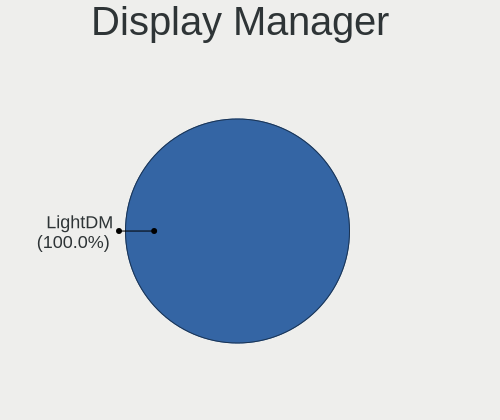

| Name    | Desktops | Percent |
|---------|----------|---------|
| LightDM | 21       | 100%    |

OS Lang
-------

Language

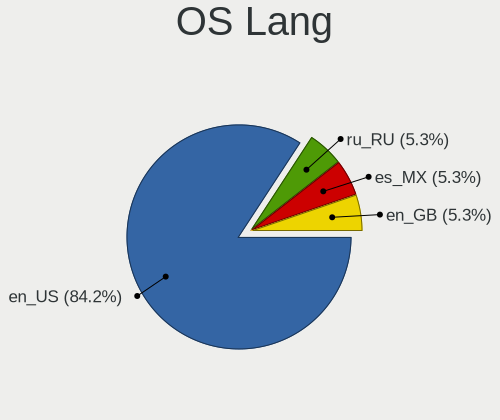

| Lang  | Desktops | Percent |
|-------|----------|---------|
| en_US | 17       | 80.95%  |
| ru_RU | 1        | 4.76%   |
| es_MX | 1        | 4.76%   |
| en_GB | 1        | 4.76%   |
| de_DE | 1        | 4.76%   |

Boot Mode
---------

EFI or BIOS

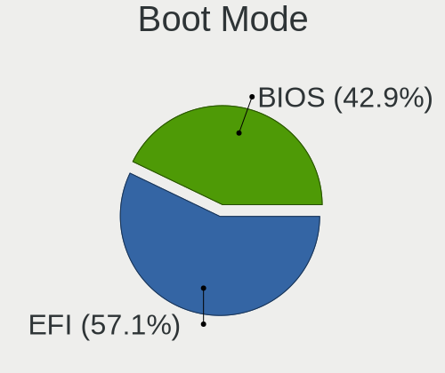

| Mode | Desktops | Percent |
|------|----------|---------|
| EFI  | 12       | 57.14%  |
| BIOS | 9        | 42.86%  |

Filesystem
----------

Type of filesystem

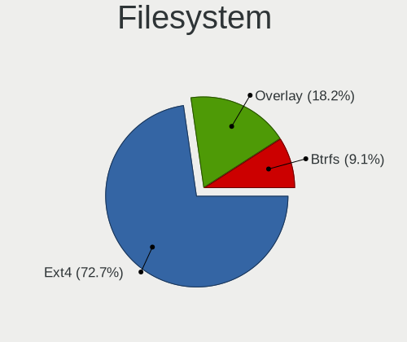

| Type    | Desktops | Percent |
|---------|----------|---------|
| Ext4    | 16       | 72.73%  |
| Overlay | 4        | 18.18%  |
| Btrfs   | 2        | 9.09%   |

Part. scheme
------------

Scheme of partitioning

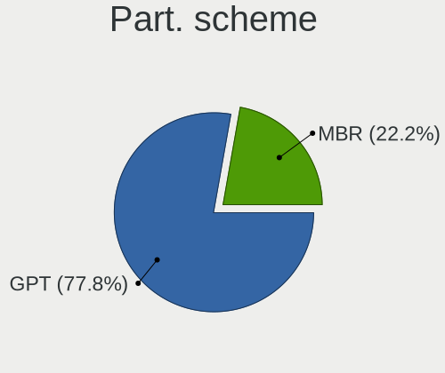

| Type | Desktops | Percent |
|------|----------|---------|
| GPT  | 17       | 80.95%  |
| MBR  | 4        | 19.05%  |

Dual Boot with Linux/BSD
------------------------

Hosting more than one Linux/BSD

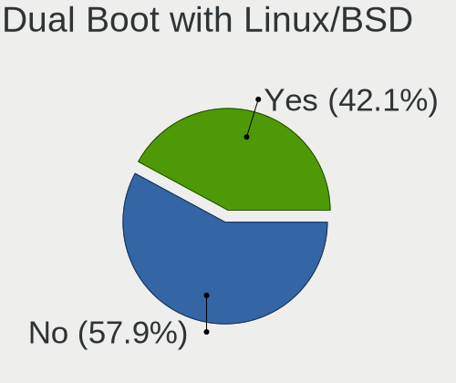

| Dual boot | Desktops | Percent |
|-----------|----------|---------|
| No        | 12       | 57.14%  |
| Yes       | 9        | 42.86%  |

Dual Boot (Win)
---------------

Hosting Linux and Windows

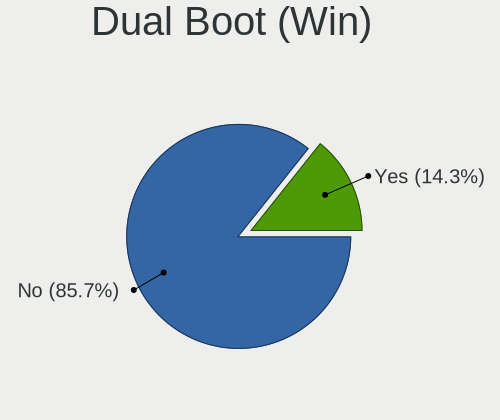

| Dual boot | Desktops | Percent |
|-----------|----------|---------|
| No        | 18       | 85.71%  |
| Yes       | 3        | 14.29%  |

Board
-----

Vendor
------

Motherboard manufacturer

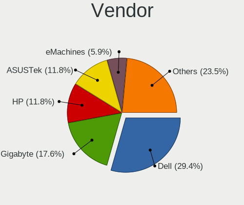

| Name                                 | Desktops | Percent |
|--------------------------------------|----------|---------|
| Dell                                 | 6        | 28.57%  |
| Hewlett-Packard                      | 4        | 19.05%  |
| Gigabyte Technology                  | 3        | 14.29%  |
| ASUSTek Computer                     | 2        | 9.52%   |
| Shenzhen Meigao Electronic Equipment | 1        | 4.76%   |
| Lenovo                               | 1        | 4.76%   |
| Foxconn                              | 1        | 4.76%   |
| eMachines                            | 1        | 4.76%   |
| Biostar                              | 1        | 4.76%   |
| Unknown                              | 1        | 4.76%   |

Model
-----

Motherboard model

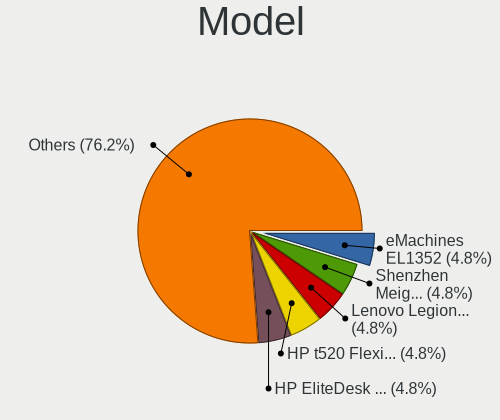

| Name                                       | Desktops | Percent |
|--------------------------------------------|----------|---------|
| Shenzhen Meigao Electronic Equipment UM560 | 1        | 4.76%   |
| Lenovo Legion T7 34IMZ5 90Q800AJMH         | 1        | 4.76%   |
| HP t520 Flexible Series TC                 | 1        | 4.76%   |
| HP EliteDesk 800 G1 SFF                    | 1        | 4.76%   |
| HP EliteDesk 800 G1 DM                     | 1        | 4.76%   |
| HP EliteDesk 705 G2 MINI                   | 1        | 4.76%   |
| Gigabyte PERSONAL COMPUTER                 | 1        | 4.76%   |
| Gigabyte B450 AORUS PRO                    | 1        | 4.76%   |
| Gigabyte B365M DS3H                        | 1        | 4.76%   |
| Foxconn NETBOX NT-425/525                  | 1        | 4.76%   |
| eMachines EL1352                           | 1        | 4.76%   |
| Dell XPS 8930                              | 1        | 4.76%   |
| Dell OptiPlex 780                          | 1        | 4.76%   |
| Dell OptiPlex 755                          | 1        | 4.76%   |
| Dell OptiPlex 390                          | 1        | 4.76%   |
| Dell OptiPlex 3020                         | 1        | 4.76%   |
| Dell DM051                                 | 1        | 4.76%   |
| Biostar A320MH                             | 1        | 4.76%   |
| ASUS PRIME H510M-K                         | 1        | 4.76%   |
| ASUS H110M-A/DP                            | 1        | 4.76%   |
| Unknown                                    | 1        | 4.76%   |

Model Family
------------

Motherboard model prefix

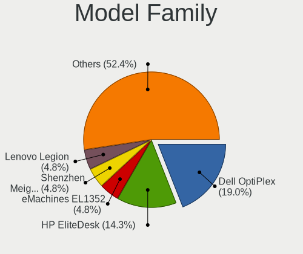

| Name                                       | Desktops | Percent |
|--------------------------------------------|----------|---------|
| Dell OptiPlex                              | 4        | 19.05%  |
| HP EliteDesk                               | 3        | 14.29%  |
| Shenzhen Meigao Electronic Equipment UM560 | 1        | 4.76%   |
| Lenovo Legion                              | 1        | 4.76%   |
| HP t520                                    | 1        | 4.76%   |
| Gigabyte PERSONAL                          | 1        | 4.76%   |
| Gigabyte B450                              | 1        | 4.76%   |
| Gigabyte B365M                             | 1        | 4.76%   |
| Foxconn NETBOX                             | 1        | 4.76%   |
| eMachines EL1352                           | 1        | 4.76%   |
| Dell XPS                                   | 1        | 4.76%   |
| Dell DM051                                 | 1        | 4.76%   |
| Biostar A320MH                             | 1        | 4.76%   |
| ASUS PRIME                                 | 1        | 4.76%   |
| ASUS H110M-A                               | 1        | 4.76%   |
| Unknown                                    | 1        | 4.76%   |

MFG Year
--------

Motherboard manufacture year

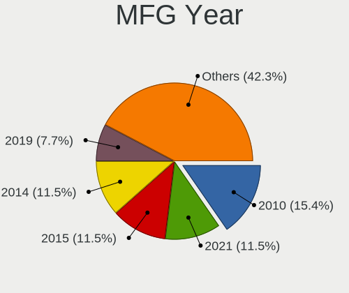

| Year | Desktops | Percent |
|------|----------|---------|
| 2019 | 3        | 14.29%  |
| 2014 | 3        | 14.29%  |
| 2010 | 3        | 14.29%  |
| 2021 | 2        | 9.52%   |
| 2018 | 2        | 9.52%   |
| 2022 | 1        | 4.76%   |
| 2017 | 1        | 4.76%   |
| 2016 | 1        | 4.76%   |
| 2015 | 1        | 4.76%   |
| 2013 | 1        | 4.76%   |
| 2011 | 1        | 4.76%   |
| 2007 | 1        | 4.76%   |
| 2006 | 1        | 4.76%   |

Form Factor
-----------

Physical design of the computer

| Name    | Desktops | Percent |
|---------|----------|---------|
| Desktop | 21       | 100%    |

Secure Boot
-----------

Enabled or disabled

| State    | Desktops | Percent |
|----------|----------|---------|
| Disabled | 21       | 100%    |

Coreboot
--------

Have coreboot on board

| Used | Desktops | Percent |
|------|----------|---------|
| No   | 21       | 100%    |

RAM Size
--------

Total RAM memory

| Size in GB | Desktops | Percent |
|------------|----------|---------|
| 4.01-8.0   | 8        | 38.1%   |
| 16.01-24.0 | 4        | 19.05%  |
| 8.01-16.0  | 3        | 14.29%  |
| 3.01-4.0   | 2        | 9.52%   |
| 2.01-3.0   | 2        | 9.52%   |
| 32.01-64.0 | 1        | 4.76%   |
| 0.51-1.0   | 1        | 4.76%   |

RAM Used
--------

Used RAM memory

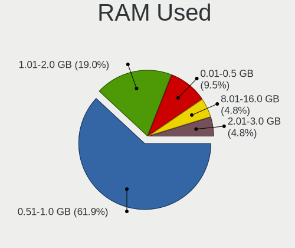

| Used GB   | Desktops | Percent |
|-----------|----------|---------|
| 0.51-1.0  | 13       | 61.9%   |
| 1.01-2.0  | 4        | 19.05%  |
| 0.01-0.5  | 2        | 9.52%   |
| 2.01-3.0  | 1        | 4.76%   |
| 8.01-16.0 | 1        | 4.76%   |

Total Drives
------------

Number of drives on board

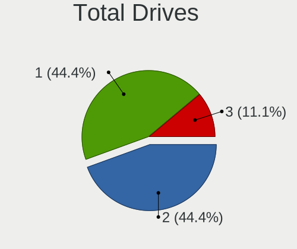

| Drives | Desktops | Percent |
|--------|----------|---------|
| 1      | 9        | 40.91%  |
| 2      | 8        | 36.36%  |
| 3      | 4        | 18.18%  |
| 4      | 1        | 4.55%   |

Has CD-ROM
----------

Has CD-ROM on board

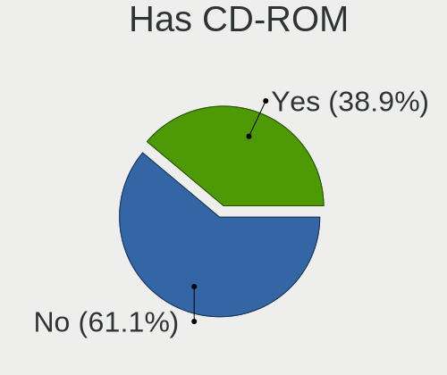

| Presented | Desktops | Percent |
|-----------|----------|---------|
| No        | 15       | 68.18%  |
| Yes       | 7        | 31.82%  |

Has Ethernet
------------

Has Ethernet on board

| Presented | Desktops | Percent |
|-----------|----------|---------|
| Yes       | 21       | 100%    |

Has WiFi
--------

Has WiFi module

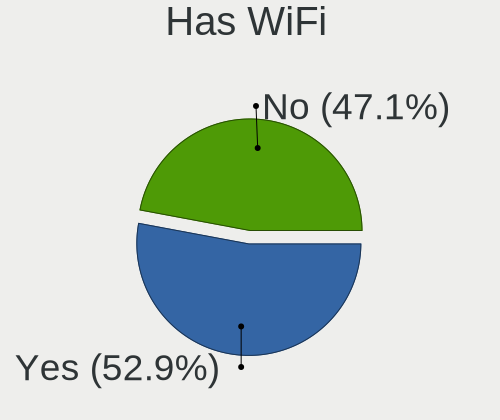

| Presented | Desktops | Percent |
|-----------|----------|---------|
| Yes       | 11       | 52.38%  |
| No        | 10       | 47.62%  |

Has Bluetooth
-------------

Has Bluetooth module

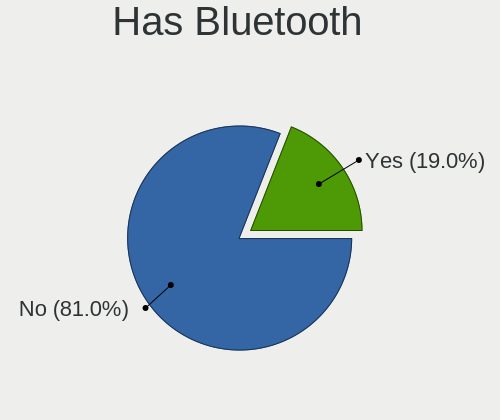

| Presented | Desktops | Percent |
|-----------|----------|---------|
| No        | 17       | 80.95%  |
| Yes       | 4        | 19.05%  |

Location
--------

Country
-------

Geographic location (country)

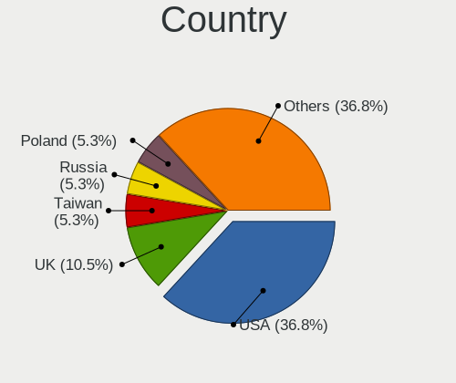

| Country     | Desktops | Percent |
|-------------|----------|---------|
| USA         | 8        | 38.1%   |
| UK          | 2        | 9.52%   |
| Germany     | 2        | 9.52%   |
| Taiwan      | 1        | 4.76%   |
| Russia      | 1        | 4.76%   |
| Poland      | 1        | 4.76%   |
| Netherlands | 1        | 4.76%   |
| Mexico      | 1        | 4.76%   |
| Italy       | 1        | 4.76%   |
| Indonesia   | 1        | 4.76%   |
| Austria     | 1        | 4.76%   |
| Argentina   | 1        | 4.76%   |

City
----

Geographic location (city)

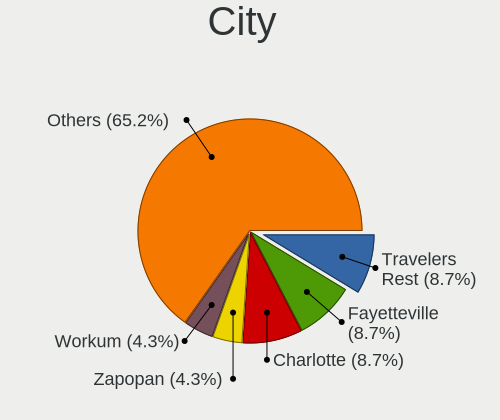

| City                        | Desktops | Percent |
|-----------------------------|----------|---------|
| Travelers Rest              | 2        | 8.7%    |
| Fayetteville                | 2        | 8.7%    |
| Charlotte                   | 2        | 8.7%    |
| Zapopan                     | 1        | 4.35%   |
| Workum                      | 1        | 4.35%   |
| Vienna                      | 1        | 4.35%   |
| St Petersburg               | 1        | 4.35%   |
| San Nicolás de los Arroyos | 1        | 4.35%   |
| Rzeszów                    | 1        | 4.35%   |
| Rome                        | 1        | 4.35%   |
| Palembang                   | 1        | 4.35%   |
| Memphis                     | 1        | 4.35%   |
| Langelsheim                 | 1        | 4.35%   |
| Idsegahuizum                | 1        | 4.35%   |
| Golden Valley               | 1        | 4.35%   |
| Fongshan District           | 1        | 4.35%   |
| Conway                      | 1        | 4.35%   |
| Bradford                    | 1        | 4.35%   |
| Bonn                        | 1        | 4.35%   |
| Barnsley                    | 1        | 4.35%   |

Drives
------

Drive Vendor
------------

Hard drive vendors

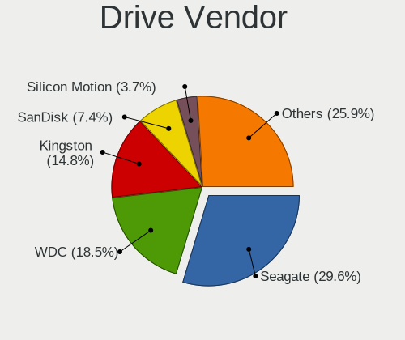

| Vendor              | Desktops | Drives | Percent |
|---------------------|----------|--------|---------|
| Seagate             | 9        | 10     | 25.71%  |
| WDC                 | 5        | 9      | 14.29%  |
| Kingston            | 4        | 5      | 11.43%  |
| Crucial             | 3        | 4      | 8.57%   |
| SK hynix            | 2        | 2      | 5.71%   |
| SanDisk             | 2        | 2      | 5.71%   |
| Samsung Electronics | 2        | 3      | 5.71%   |
| Toshiba             | 1        | 1      | 2.86%   |
| Silicon Motion      | 1        | 1      | 2.86%   |
| Phison              | 1        | 2      | 2.86%   |
| OWC                 | 1        | 2      | 2.86%   |
| Micron Technology   | 1        | 1      | 2.86%   |
| Intel               | 1        | 1      | 2.86%   |
| Hitachi             | 1        | 1      | 2.86%   |
| A-DATA Technology   | 1        | 1      | 2.86%   |

Drive Model
-----------

Hard drive models

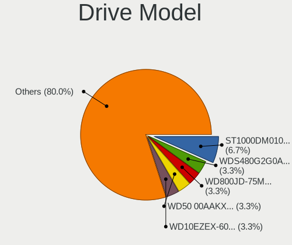

| Model                                | Desktops | Percent |
|--------------------------------------|----------|---------|
| SK hynix C2S3T/480G 480GB SSD        | 2        | 5.71%   |
| Seagate ST1000DM010-2EP102 1TB       | 2        | 5.71%   |
| WDC WDS480G2G0A-00JH30 480GB SSD     | 1        | 2.86%   |
| WDC WD800JD-75MSA3 80GB              | 1        | 2.86%   |
| WDC WD50 00AAKX-08U6AA0 500GB        | 1        | 2.86%   |
| WDC WD10EZEX-60M2NA0 1TB             | 1        | 2.86%   |
| WDC PC SN730 SDBQNTY-1T00-1001 1TB   | 1        | 2.86%   |
| Toshiba MQ01ABF050 500GB             | 1        | 2.86%   |
| Silicon Motion NE-128 128GB          | 1        | 2.86%   |
| Seagate ST500VM000-1SD101 500GB      | 1        | 2.86%   |
| Seagate ST500DM002-1BD142 500GB      | 1        | 2.86%   |
| Seagate ST3160023AS 160GB            | 1        | 2.86%   |
| Seagate ST2000DX002-2DV164 2TB       | 1        | 2.86%   |
| Seagate ST2000DM008-2FR102 2TB       | 1        | 2.86%   |
| Seagate Expansion 2TB                | 1        | 2.86%   |
| Seagate BUP Slim BK 2TB              | 1        | 2.86%   |
| SanDisk SDSA6MM-016G-1006 16GB SSD   | 1        | 2.86%   |
| SanDisk SD7SB6S128G1122 128GB SSD    | 1        | 2.86%   |
| Samsung PSSD T7 1TB                  | 1        | 2.86%   |
| Samsung MZ7TE128HMGR-000L1 128GB SSD | 1        | 2.86%   |
| Phison ESO512GYLCT-EP3-2L 512GB      | 1        | 2.86%   |
| OWC Mercury EXTREME Pro 6G SSD       | 1        | 2.86%   |
| Micron CT1000X9SSD9 1TB              | 1        | 2.86%   |
| Kingston SV300S37A120G 120GB SSD     | 1        | 2.86%   |
| Kingston SUV500M8120G 120GB SSD      | 1        | 2.86%   |
| Kingston SHSS37A240G 240GB SSD       | 1        | 2.86%   |
| Kingston SA400S37240G 240GB SSD      | 1        | 2.86%   |
| Intel MEMPEK1W032GA 32GB             | 1        | 2.86%   |
| Hitachi HDS721016CLA382 160GB        | 1        | 2.86%   |
| Crucial CT250MX500SSD1 250GB         | 1        | 2.86%   |
| Crucial CT240BX500SSD1 240GB         | 1        | 2.86%   |
| Crucial CT1000MX500SSD1 1TB          | 1        | 2.86%   |
| A-DATA SU800 256GB SSD               | 1        | 2.86%   |

HDD Vendor
----------

Hard disk drive vendors

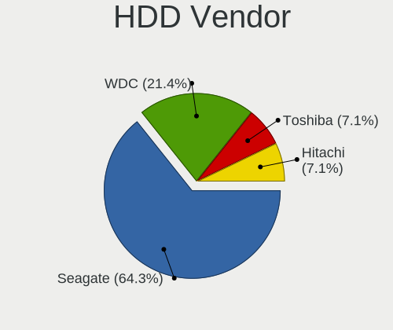

| Vendor  | Desktops | Drives | Percent |
|---------|----------|--------|---------|
| Seagate | 9        | 10     | 64.29%  |
| WDC     | 3        | 3      | 21.43%  |
| Toshiba | 1        | 1      | 7.14%   |
| Hitachi | 1        | 1      | 7.14%   |

SSD Vendor
----------

Solid state drive vendors

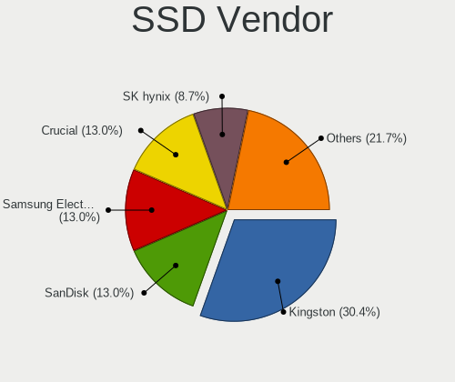

| Vendor              | Desktops | Drives | Percent |
|---------------------|----------|--------|---------|
| Kingston            | 4        | 5      | 25%     |
| Crucial             | 3        | 4      | 18.75%  |
| SK hynix            | 2        | 2      | 12.5%   |
| SanDisk             | 2        | 2      | 12.5%   |
| WDC                 | 1        | 2      | 6.25%   |
| Samsung Electronics | 1        | 1      | 6.25%   |
| OWC                 | 1        | 2      | 6.25%   |
| Micron Technology   | 1        | 1      | 6.25%   |
| A-DATA Technology   | 1        | 1      | 6.25%   |

Drive Kind
----------

HDD or SSD

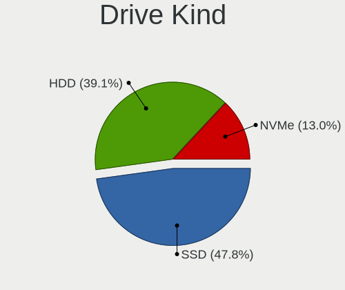

| Kind | Desktops | Drives | Percent |
|------|----------|--------|---------|
| SSD  | 14       | 20     | 50%     |
| HDD  | 10       | 15     | 35.71%  |
| NVMe | 4        | 10     | 14.29%  |

Drive Connector
---------------

SATA, SAS, NVMe, etc.

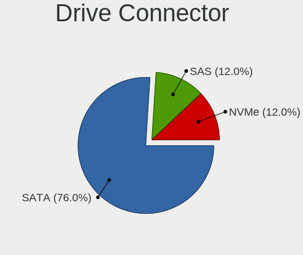

| Type | Desktops | Drives | Percent |
|------|----------|--------|---------|
| SATA | 21       | 31     | 72.41%  |
| SAS  | 4        | 6      | 13.79%  |
| NVMe | 4        | 8      | 13.79%  |

Drive Size
----------

Size of hard drive

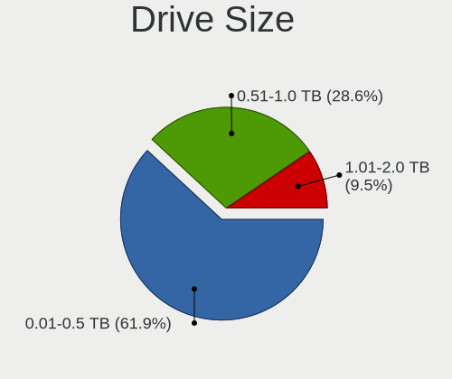

| Size in TB | Desktops | Drives | Percent |
|------------|----------|--------|---------|
| 0.01-0.5   | 16       | 22     | 64%     |
| 0.51-1.0   | 5        | 8      | 20%     |
| 1.01-2.0   | 4        | 5      | 16%     |

Space Total
-----------

Amount of disk space available on the file system

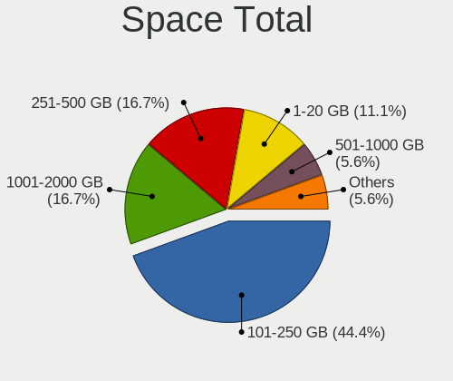

| Size in GB | Desktops | Percent |
|------------|----------|---------|
| 101-250    | 9        | 40.91%  |
| 251-500    | 4        | 18.18%  |
| 1001-2000  | 4        | 18.18%  |
| 1-20       | 3        | 13.64%  |
| 501-1000   | 1        | 4.55%   |
| 51-100     | 1        | 4.55%   |

Space Used
----------

Amount of used disk space

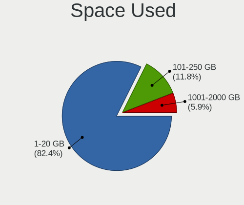

| Used GB   | Desktops | Percent |
|-----------|----------|---------|
| 1-20      | 18       | 81.82%  |
| 101-250   | 2        | 9.09%   |
| 1001-2000 | 1        | 4.55%   |
| 51-100    | 1        | 4.55%   |

Malfunc. Drives
---------------

Drive models with a malfunction

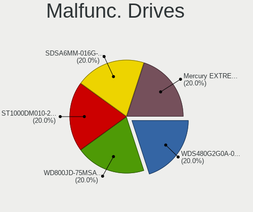

| Model                              | Desktops | Drives | Percent |
|------------------------------------|----------|--------|---------|
| WDC WDS480G2G0A-00JH30 480GB SSD   | 1        | 2      | 16.67%  |
| WDC WD800JD-75MSA3 80GB            | 1        | 1      | 16.67%  |
| Seagate ST1000DM010-2EP102 1TB     | 1        | 1      | 16.67%  |
| SanDisk SDSA6MM-016G-1006 16GB SSD | 1        | 1      | 16.67%  |
| OWC Mercury EXTREME Pro 6G SSD     | 1        | 2      | 16.67%  |
| Crucial CT1000MX500SSD1 1TB        | 1        | 2      | 16.67%  |

Malfunc. Drive Vendor
---------------------

Vendors of faulty drives

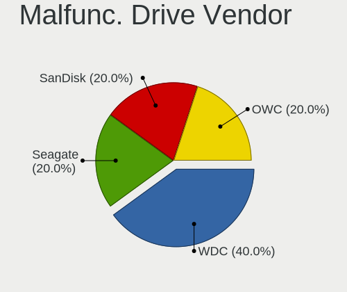

| Vendor  | Desktops | Drives | Percent |
|---------|----------|--------|---------|
| WDC     | 2        | 3      | 33.33%  |
| Seagate | 1        | 1      | 16.67%  |
| SanDisk | 1        | 1      | 16.67%  |
| OWC     | 1        | 2      | 16.67%  |
| Crucial | 1        | 2      | 16.67%  |

Malfunc. HDD Vendor
-------------------

Vendors of faulty HDD drives

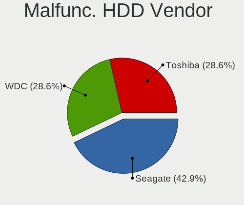

| Vendor  | Desktops | Drives | Percent |
|---------|----------|--------|---------|
| WDC     | 1        | 1      | 50%     |
| Seagate | 1        | 1      | 50%     |

Malfunc. Drive Kind
-------------------

Kinds of faulty drives

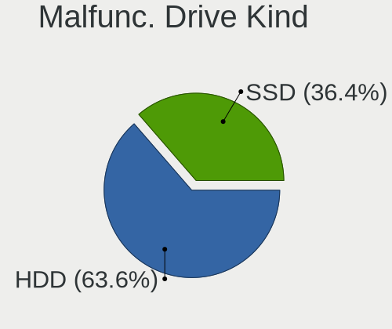

| Kind | Desktops | Drives | Percent |
|------|----------|--------|---------|
| SSD  | 4        | 7      | 66.67%  |
| HDD  | 2        | 2      | 33.33%  |

Failed Drives
-------------

Failed drive models

Zero info for selected period =(

Failed Drive Vendor
-------------------

Failed drive vendors

Zero info for selected period =(

Drive Status
------------

Number of failed and malfunc. drives

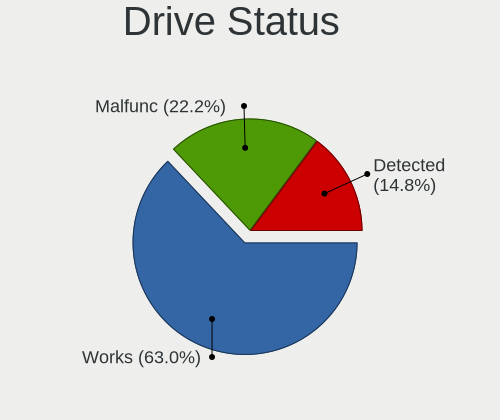

| Status   | Desktops | Drives | Percent |
|----------|----------|--------|---------|
| Works    | 17       | 30     | 62.96%  |
| Malfunc  | 6        | 9      | 22.22%  |
| Detected | 4        | 6      | 14.81%  |

Storage controller
------------------

Storage Vendor
--------------

Storage controller vendors

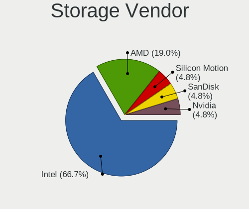

| Vendor             | Desktops | Percent |
|--------------------|----------|---------|
| Intel              | 16       | 64%     |
| AMD                | 5        | 20%     |
| Silicon Motion     | 1        | 4%      |
| SanDisk            | 1        | 4%      |
| Phison Electronics | 1        | 4%      |
| Nvidia             | 1        | 4%      |

Storage Model
-------------

Storage controller models

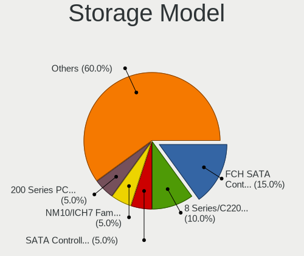

| Model                                                                                   | Desktops | Percent |
|-----------------------------------------------------------------------------------------|----------|---------|
| AMD FCH SATA Controller [AHCI mode]                                                     | 5        | 15.15%  |
| Intel 8 Series/C220 Series Chipset Family 6-port SATA Controller 1 [AHCI mode]          | 3        | 9.09%   |
| Intel NM10/ICH7 Family SATA Controller [IDE mode]                                       | 2        | 6.06%   |
| Intel 200 Series PCH SATA controller [AHCI mode]                                        | 2        | 6.06%   |
| Silicon Motion SM2263EN/SM2263XT (DRAM-less) NVMe SSD Controllers                       | 1        | 3.03%   |
| SanDisk Extreme Pro / WD Black SN750 / PC SN730 / Red SN700 NVMe SSD                    | 1        | 3.03%   |
| Phison PS5013-E13 PCIe3 NVMe Controller (DRAM-less)                                     | 1        | 3.03%   |
| Nvidia MCP61 SATA Controller                                                            | 1        | 3.03%   |
| Nvidia MCP61 IDE                                                                        | 1        | 3.03%   |
| Intel SATA Controller [RAID Mode]                                                       | 1        | 3.03%   |
| Intel Q170/Q150/B150/H170/H110/Z170/CM236 Chipset SATA Controller [AHCI Mode]           | 1        | 3.03%   |
| Intel NVMe Optane Memory Series                                                         | 1        | 3.03%   |
| Intel Comet Lake SATA AHCI Controller                                                   | 1        | 3.03%   |
| Intel Atom Processor E3800 Series SATA AHCI Controller                                  | 1        | 3.03%   |
| Intel 82Q35 Express PT IDER Controller                                                  | 1        | 3.03%   |
| Intel 82801JD/DO (ICH10 Family) 4-port SATA IDE Controller                              | 1        | 3.03%   |
| Intel 82801JD/DO (ICH10 Family) 2-port SATA IDE Controller                              | 1        | 3.03%   |
| Intel 82801IR/IO/IH (ICH9R/DO/DH) 6 port SATA Controller [AHCI mode]                    | 1        | 3.03%   |
| Intel 82801G (ICH7 Family) IDE Controller                                               | 1        | 3.03%   |
| Intel 7 Series Chipset Family 6-port SATA Controller [AHCI mode]                        | 1        | 3.03%   |
| Intel 6 Series/C200 Series Chipset Family Desktop SATA Controller (IDE mode, ports 4-5) | 1        | 3.03%   |
| Intel 6 Series/C200 Series Chipset Family Desktop SATA Controller (IDE mode, ports 0-3) | 1        | 3.03%   |
| Intel 500 Series Chipset Family SATA AHCI Controller                                    | 1        | 3.03%   |
| AMD FCH SATA Controller D                                                               | 1        | 3.03%   |
| AMD 400 Series Chipset SATA Controller                                                  | 1        | 3.03%   |

Storage Kind
------------

Kind of storage controller (IDE, SATA, NVMe, SAS, ...)

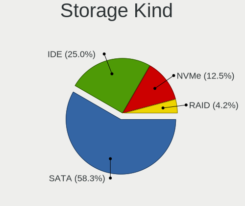

| Kind | Desktops | Percent |
|------|----------|---------|
| SATA | 16       | 59.26%  |
| IDE  | 6        | 22.22%  |
| NVMe | 4        | 14.81%  |
| RAID | 1        | 3.7%    |

Processor
---------

CPU Vendor
----------

Processor vendors

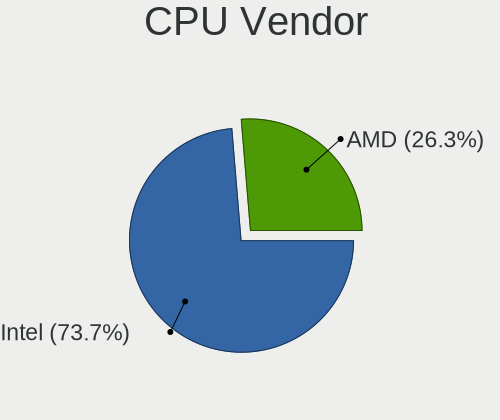

| Vendor | Desktops | Percent |
|--------|----------|---------|
| Intel  | 15       | 71.43%  |
| AMD    | 6        | 28.57%  |

CPU Model
---------

Processor models

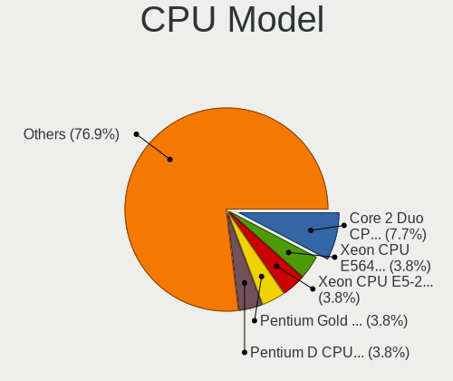

| Model                                          | Desktops | Percent |
|------------------------------------------------|----------|---------|
| Intel Core 2 Duo CPU E8400 @ 3.00GHz           | 2        | 9.52%   |
| Intel Xeon CPU E5-2643 0 @ 3.30GHz             | 1        | 4.76%   |
| Intel Pentium Gold G6405 CPU @ 4.10GHz         | 1        | 4.76%   |
| Intel Pentium D CPU 2.80GHz                    | 1        | 4.76%   |
| Intel Core i7-8700 CPU @ 3.20GHz               | 1        | 4.76%   |
| Intel Core i7-4785T CPU @ 2.20GHz              | 1        | 4.76%   |
| Intel Core i5-9400 CPU @ 2.90GHz               | 1        | 4.76%   |
| Intel Core i5-7400 CPU @ 3.00GHz               | 1        | 4.76%   |
| Intel Core i5-4570 CPU @ 3.20GHz               | 1        | 4.76%   |
| Intel Core i3-4160 CPU @ 3.60GHz               | 1        | 4.76%   |
| Intel Core i3-2120 CPU @ 3.30GHz               | 1        | 4.76%   |
| Intel Celeron CPU N2807 @ 1.58GHz              | 1        | 4.76%   |
| Intel Atom CPU D525 @ 1.80GHz                  | 1        | 4.76%   |
| Intel 11th Gen Core i9-11900KF @ 3.50GHz       | 1        | 4.76%   |
| AMD Ryzen 5 5625U with Radeon Graphics         | 1        | 4.76%   |
| AMD Ryzen 5 2400G with Radeon Vega Graphics    | 1        | 4.76%   |
| AMD PRO A10-8700B R6, 10 Compute Cores 4C+6G   | 1        | 4.76%   |
| AMD GX-212JC SOC with Radeon R2E Graphics      | 1        | 4.76%   |
| AMD Athlon II 170u Processor                   | 1        | 4.76%   |
| AMD A12-9800 RADEON R7, 12 COMPUTE CORES 4C+8G | 1        | 4.76%   |

CPU Model Family
----------------

Processor model prefix

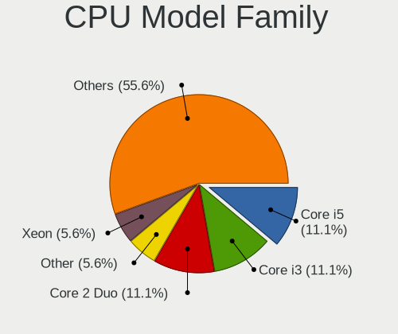

| Model              | Desktops | Percent |
|--------------------|----------|---------|
| Intel Core i5      | 3        | 14.29%  |
| Intel Core i7      | 2        | 9.52%   |
| Intel Core i3      | 2        | 9.52%   |
| Intel Core 2 Duo   | 2        | 9.52%   |
| AMD Ryzen 5        | 2        | 9.52%   |
| Other              | 1        | 4.76%   |
| Intel Xeon         | 1        | 4.76%   |
| Intel Pentium Gold | 1        | 4.76%   |
| Intel Pentium D    | 1        | 4.76%   |
| Intel Celeron      | 1        | 4.76%   |
| Intel Atom         | 1        | 4.76%   |
| AMD PRO A10        | 1        | 4.76%   |
| AMD GX             | 1        | 4.76%   |
| AMD Athlon II      | 1        | 4.76%   |
| AMD A12            | 1        | 4.76%   |

CPU Cores
---------

Number of processor cores

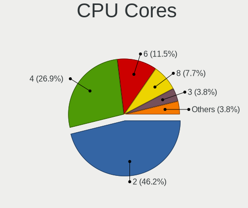

| Number | Desktops | Percent |
|--------|----------|---------|
| 2      | 11       | 52.38%  |
| 4      | 5        | 23.81%  |
| 6      | 3        | 14.29%  |
| 8      | 1        | 4.76%   |
| 1      | 1        | 4.76%   |

CPU Sockets
-----------

Number of sockets

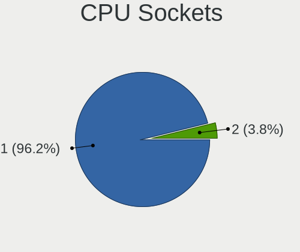

| Number | Desktops | Percent |
|--------|----------|---------|
| 1      | 21       | 100%    |

CPU Threads
-----------

Threads per core (Hyper-Threading)

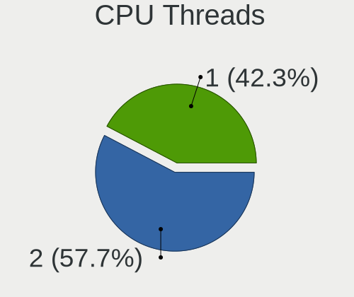

| Number | Desktops | Percent |
|--------|----------|---------|
| 2      | 12       | 57.14%  |
| 1      | 9        | 42.86%  |

CPU Op-Modes
------------

CPU Operation Modes (32-bit, 64-bit)

| Op mode        | Desktops | Percent |
|----------------|----------|---------|
| 32-bit, 64-bit | 21       | 100%    |

CPU Microcode
-------------

Microcode number

| Number     | Desktops | Percent |
|------------|----------|---------|
| Unknown    | 3        | 13.64%  |
| 0x1067a    | 2        | 9.09%   |
| 0x0600611a | 2        | 9.09%   |
| 0xf44      | 1        | 4.55%   |
| 0xa0671    | 1        | 4.55%   |
| 0xa0653    | 1        | 4.55%   |
| 0x906ed    | 1        | 4.55%   |
| 0x906ea    | 1        | 4.55%   |
| 0x906e9    | 1        | 4.55%   |
| 0x306c3    | 1        | 4.55%   |
| 0x30678    | 1        | 4.55%   |
| 0x206d7    | 1        | 4.55%   |
| 0x206a7    | 1        | 4.55%   |
| 0x106ca    | 1        | 4.55%   |
| 0x0a50000d | 1        | 4.55%   |
| 0x0810100b | 1        | 4.55%   |
| 0x07030104 | 1        | 4.55%   |
| 0x010000c8 | 1        | 4.55%   |

CPU Microarch
-------------

Microarchitecture

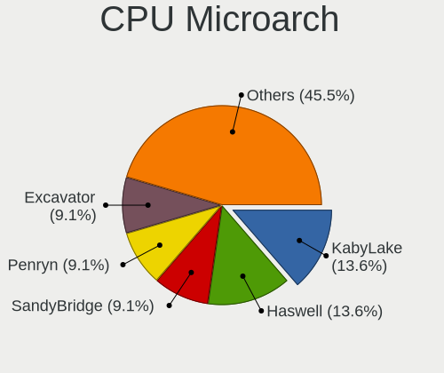

| Name        | Desktops | Percent |
|-------------|----------|---------|
| KabyLake    | 3        | 13.64%  |
| Haswell     | 3        | 13.64%  |
| SandyBridge | 2        | 9.09%   |
| Penryn      | 2        | 9.09%   |
| Excavator   | 2        | 9.09%   |
| Zen 3       | 1        | 4.55%   |
| Zen         | 1        | 4.55%   |
| Silvermont  | 1        | 4.55%   |
| Puma        | 1        | 4.55%   |
| NetBurst    | 1        | 4.55%   |
| K10         | 1        | 4.55%   |
| Icelake     | 1        | 4.55%   |
| CometLake   | 1        | 4.55%   |
| Bonnell     | 1        | 4.55%   |
| Unknown     | 1        | 4.55%   |

Graphics
--------

GPU Vendor
----------

Vendors of graphics cards

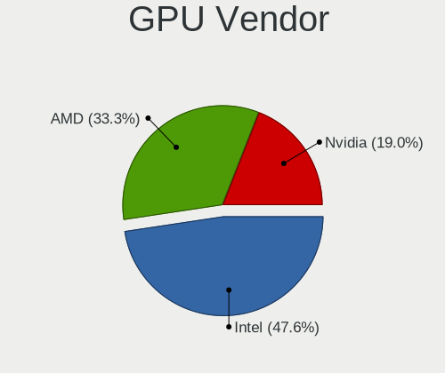

| Vendor | Desktops | Percent |
|--------|----------|---------|
| Intel  | 11       | 47.83%  |
| AMD    | 8        | 34.78%  |
| Nvidia | 4        | 17.39%  |

GPU Model
---------

Graphics card models

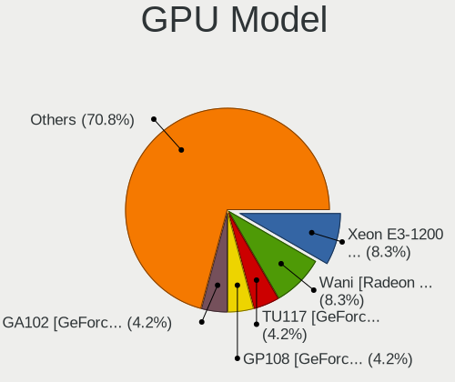

| Model                                                                       | Desktops | Percent |
|-----------------------------------------------------------------------------|----------|---------|
| Intel Xeon E3-1200 v3/4th Gen Core Processor Integrated Graphics Controller | 2        | 8.33%   |
| AMD Wani [Radeon R5/R6/R7 Graphics]                                         | 2        | 8.33%   |
| Nvidia TU117 [GeForce GTX 1650]                                             | 1        | 4.17%   |
| Nvidia GP108 [GeForce GT 1030]                                              | 1        | 4.17%   |
| Nvidia GA102 [GeForce RTX 3080]                                             | 1        | 4.17%   |
| Nvidia C61 [GeForce 6150SE nForce 430]                                      | 1        | 4.17%   |
| Intel HD Graphics 630                                                       | 1        | 4.17%   |
| Intel CometLake-S GT1 [UHD Graphics 610]                                    | 1        | 4.17%   |
| Intel CoffeeLake-S GT2 [UHD Graphics 630]                                   | 1        | 4.17%   |
| Intel Atom Processor Z36xxx/Z37xxx Series Graphics & Display                | 1        | 4.17%   |
| Intel Atom Processor D4xx/D5xx/N4xx/N5xx Integrated Graphics Controller     | 1        | 4.17%   |
| Intel 82Q35 Express Integrated Graphics Controller                          | 1        | 4.17%   |
| Intel 4th Generation Core Processor Family Integrated Graphics Controller   | 1        | 4.17%   |
| Intel 4 Series Chipset Integrated Graphics Controller                       | 1        | 4.17%   |
| Intel 2nd Generation Core Processor Family Integrated Graphics Controller   | 1        | 4.17%   |
| AMD RV380 [Radeon X300/X550/X1050 Series] (Secondary)                       | 1        | 4.17%   |
| AMD RV370 [Radeon X600/X600 SE]                                             | 1        | 4.17%   |
| AMD Raven Ridge [Radeon Vega Series / Radeon Vega Mobile Series]            | 1        | 4.17%   |
| AMD Mullins [Radeon R1E/R2E Graphics]                                       | 1        | 4.17%   |
| AMD Ellesmere [Radeon RX 470/480/570/570X/580/580X/590]                     | 1        | 4.17%   |
| AMD Caicos [Radeon HD 6450/7450/8450 / R5 230 OEM]                          | 1        | 4.17%   |
| AMD Barcelo                                                                 | 1        | 4.17%   |

GPU Combo
---------

Combinations of graphics cards

| Name       | Desktops | Percent |
|------------|----------|---------|
| 1 x Intel  | 10       | 45.45%  |
| 1 x AMD    | 7        | 31.82%  |
| 1 x Nvidia | 4        | 18.18%  |
| 2 x AMD    | 1        | 4.55%   |

GPU Driver
----------

Free vs proprietary

| Driver      | Desktops | Percent |
|-------------|----------|---------|
| Free        | 21       | 95.45%  |
| Proprietary | 1        | 4.55%   |

GPU Memory
----------

Total video memory

| Size in GB | Desktops | Percent |
|------------|----------|---------|
| Unknown    | 11       | 47.83%  |
| 0.01-0.5   | 6        | 26.09%  |
| 0.51-1.0   | 2        | 8.7%    |
| 7.01-8.0   | 1        | 4.35%   |
| 3.01-4.0   | 1        | 4.35%   |
| 1.01-2.0   | 1        | 4.35%   |
| 8.01-16.0  | 1        | 4.35%   |

Monitor
-------

Monitor Vendor
--------------

Monitor vendors

| Vendor              | Desktops | Percent |
|---------------------|----------|---------|
| Dell                | 3        | 15%     |
| Samsung Electronics | 2        | 10%     |
| Goldstar            | 2        | 10%     |
| Zoran               | 1        | 5%      |
| Vizio               | 1        | 5%      |
| Sony                | 1        | 5%      |
| Sceptre Tech        | 1        | 5%      |
| SAC                 | 1        | 5%      |
| Philips             | 1        | 5%      |
| Packard Bell        | 1        | 5%      |
| Mi                  | 1        | 5%      |
| Lenovo              | 1        | 5%      |
| Insignia            | 1        | 5%      |
| Hewlett-Packard     | 1        | 5%      |
| eMachines           | 1        | 5%      |
| ASUSTek Computer    | 1        | 5%      |

Monitor Model
-------------

Monitor models

| Model                                                             | Desktops | Percent |
|-------------------------------------------------------------------|----------|---------|
| Zoran HDMI TV ZRN0294 1360x768 500x281mm 22.6-inch                | 1        | 5%      |
| Vizio E320-A1 VIZ0095 1360x768 697x392mm 31.5-inch                | 1        | 5%      |
| Sony TV SNY0101 1360x768                                          | 1        | 5%      |
| Sceptre Tech E24 SPT099D 1920x1080 530x300mm 24.0-inch            | 1        | 5%      |
| Samsung Electronics C32R50x SAM7001 1920x1080 698x393mm 31.5-inch | 1        | 5%      |
| Samsung Electronics C24F390 SAM0D2D 1920x1080 521x293mm 23.5-inch | 1        | 5%      |
| SAC DM-MONB2205 SAC952D 1920x1080 450x270mm 20.7-inch             | 1        | 5%      |
| Philips 221V PHL0888 1920x1080 477x268mm 21.5-inch                | 1        | 5%      |
| Packard Bell Maestro225DXL PKB02F2 1920x1080 477x268mm 21.5-inch  | 1        | 5%      |
| Mi Redmi Monitor XMI23C3 1920x1080 527x293mm 23.7-inch            | 1        | 5%      |
| Lenovo L24i-10 LEN65D6 1920x1080 527x296mm 23.8-inch              | 1        | 5%      |
| Insignia DX-LCD32 BBYCD32 1360x768 709x399mm 32.0-inch            | 1        | 5%      |
| Hewlett-Packard W2271d HWP3102 1920x1080 477x268mm 21.5-inch      | 1        | 5%      |
| Goldstar ULTRAGEAR GSM776E 2560x1440 697x392mm 31.5-inch          | 1        | 5%      |
| Goldstar 32ML600 GSM772D 1920x1080 480x270mm 21.7-inch            | 1        | 5%      |
| eMachines E15T4W EMA05E1 1280x800 332x207mm 15.4-inch             | 1        | 5%      |
| Dell P2415Q DELA0C0 3840x2160 527x296mm 23.8-inch                 | 1        | 5%      |
| Dell P2319H DELD0D5 1920x1080 510x290mm 23.1-inch                 | 1        | 5%      |
| Dell E152FP DELA009 1024x768 304x228mm 15.0-inch                  | 1        | 5%      |
| ASUSTek Computer VA24E AUS24D1 1920x1080 527x296mm 23.8-inch      | 1        | 5%      |

Monitor Resolution
------------------

Monitor screen resolution

| Resolution      | Desktops | Percent |
|-----------------|----------|---------|
| 1920x1080 (FHD) | 11       | 57.89%  |
| 1360x768        | 3        | 15.79%  |
| 3840x2160 (4K)  | 1        | 5.26%   |
| 2560x1440 (QHD) | 1        | 5.26%   |
| 1366x768 (WXGA) | 1        | 5.26%   |
| 1280x800 (WXGA) | 1        | 5.26%   |
| 1024x768 (XGA)  | 1        | 5.26%   |

Monitor Diagonal
----------------

Diagonal size in inches

| Inches  | Desktops | Percent |
|---------|----------|---------|
| 21      | 5        | 25%     |
| 24      | 4        | 20%     |
| 31      | 3        | 15%     |
| 23      | 3        | 15%     |
| 15      | 2        | 10%     |
| 32      | 1        | 5%      |
| 22      | 1        | 5%      |
| Unknown | 1        | 5%      |

Monitor Width
-------------

Physical width

| Width in mm | Desktops | Percent |
|-------------|----------|---------|
| 501-600     | 7        | 35%     |
| 401-500     | 6        | 30%     |
| 601-700     | 3        | 15%     |
| 301-350     | 2        | 10%     |
| 701-800     | 1        | 5%      |
| Unknown     | 1        | 5%      |

Aspect Ratio
------------

Proportional relationship between the width and the height

| Ratio | Desktops | Percent |
|-------|----------|---------|
| 16/9  | 16       | 88.89%  |
| 4/3   | 1        | 5.56%   |
| 16/10 | 1        | 5.56%   |

Monitor Area
------------

Area in inch²

| Area in inch² | Desktops | Percent |
|----------------|----------|---------|
| 201-250        | 12       | 60%     |
| 351-500        | 4        | 20%     |
| 101-110        | 2        | 10%     |
| 151-200        | 1        | 5%      |
| Unknown        | 1        | 5%      |

Pixel Density
-------------

Pixels per inch

| Density | Desktops | Percent |
|---------|----------|---------|
| 51-100  | 11       | 55%     |
| 101-120 | 5        | 25%     |
| 1-50    | 2        | 10%     |
| 161-240 | 1        | 5%      |
| Unknown | 1        | 5%      |

Multiple Monitors
-----------------

Total monitors connected

| Total | Desktops | Percent |
|-------|----------|---------|
| 1     | 20       | 90.91%  |
| 2     | 1        | 4.55%   |
| 0     | 1        | 4.55%   |

Network
-------

Net Controller Vendor
---------------------

Controller vendors

| Vendor                          | Desktops | Percent |
|---------------------------------|----------|---------|
| Realtek Semiconductor           | 10       | 35.71%  |
| Intel                           | 9        | 32.14%  |
| Qualcomm Atheros Communications | 2        | 7.14%   |
| Qualcomm Atheros                | 2        | 7.14%   |
| MediaTek                        | 2        | 7.14%   |
| Ralink Technology               | 1        | 3.57%   |
| Nvidia                          | 1        | 3.57%   |
| Broadcom                        | 1        | 3.57%   |

Net Controller Model
--------------------

Controller models

| Model                                                                  | Desktops | Percent |
|------------------------------------------------------------------------|----------|---------|
| Realtek RTL8111/8168/8211/8411 PCI Express Gigabit Ethernet Controller | 9        | 26.47%  |
| Realtek RTL8188EE Wireless Network Adapter                             | 2        | 5.88%   |
| Qualcomm Atheros AR9271 802.11n                                        | 2        | 5.88%   |
| Intel Ethernet Connection I217-LM                                      | 2        | 5.88%   |
| Realtek RTL8723BE PCIe Wireless Network Adapter                        | 1        | 2.94%   |
| Realtek RTL8191SEvA Wireless LAN Controller                            | 1        | 2.94%   |
| Ralink MT7601U Wireless Adapter                                        | 1        | 2.94%   |
| Qualcomm Atheros QCA9377 802.11ac Wireless Network Adapter             | 1        | 2.94%   |
| Qualcomm Atheros Killer E2400 Gigabit Ethernet Controller              | 1        | 2.94%   |
| Qualcomm Atheros AR8131 Gigabit Ethernet                               | 1        | 2.94%   |
| Nvidia MCP61 Ethernet                                                  | 1        | 2.94%   |
| MediaTek MT7921K (RZ608) Wi-Fi 6E 80MHz                                | 1        | 2.94%   |
| MediaTek Infinix NOTE 30 VIP                                           | 1        | 2.94%   |
| Intel Wireless 7260                                                    | 1        | 2.94%   |
| Intel NM10/ICH7 Family LAN Controller                                  | 1        | 2.94%   |
| Intel I211 Gigabit Network Connection                                  | 1        | 2.94%   |
| Intel Ethernet Controller I225-V                                       | 1        | 2.94%   |
| Intel Ethernet Connection (14) I219-V                                  | 1        | 2.94%   |
| Intel Dual Band Wireless-AC 3168NGW [Stone Peak]                       | 1        | 2.94%   |
| Intel Comet Lake PCH CNVi WiFi                                         | 1        | 2.94%   |
| Intel 82567LM-3 Gigabit Network Connection                             | 1        | 2.94%   |
| Intel 82566DM-2 Gigabit Network Connection                             | 1        | 2.94%   |
| Broadcom NetXtreme BCM5762 Gigabit Ethernet PCIe                       | 1        | 2.94%   |

Wireless Vendor
---------------

Wireless vendors

| Vendor                          | Desktops | Percent |
|---------------------------------|----------|---------|
| Realtek Semiconductor           | 4        | 33.33%  |
| Intel                           | 3        | 25%     |
| Qualcomm Atheros Communications | 2        | 16.67%  |
| Ralink Technology               | 1        | 8.33%   |
| Qualcomm Atheros                | 1        | 8.33%   |
| MediaTek                        | 1        | 8.33%   |

Wireless Model
--------------

Wireless models

| Model                                                      | Desktops | Percent |
|------------------------------------------------------------|----------|---------|
| Realtek RTL8188EE Wireless Network Adapter                 | 2        | 16.67%  |
| Qualcomm Atheros AR9271 802.11n                            | 2        | 16.67%  |
| Realtek RTL8723BE PCIe Wireless Network Adapter            | 1        | 8.33%   |
| Realtek RTL8191SEvA Wireless LAN Controller                | 1        | 8.33%   |
| Ralink MT7601U Wireless Adapter                            | 1        | 8.33%   |
| Qualcomm Atheros QCA9377 802.11ac Wireless Network Adapter | 1        | 8.33%   |
| MediaTek MT7921K (RZ608) Wi-Fi 6E 80MHz                    | 1        | 8.33%   |
| Intel Wireless 7260                                        | 1        | 8.33%   |
| Intel Dual Band Wireless-AC 3168NGW [Stone Peak]           | 1        | 8.33%   |
| Intel Comet Lake PCH CNVi WiFi                             | 1        | 8.33%   |

Ethernet Vendor
---------------

Ethernet vendors

| Vendor                | Desktops | Percent |
|-----------------------|----------|---------|
| Realtek Semiconductor | 9        | 40.91%  |
| Intel                 | 8        | 36.36%  |
| Qualcomm Atheros      | 2        | 9.09%   |
| Nvidia                | 1        | 4.55%   |
| MediaTek              | 1        | 4.55%   |
| Broadcom              | 1        | 4.55%   |

Ethernet Model
--------------

Ethernet models

| Model                                                                  | Desktops | Percent |
|------------------------------------------------------------------------|----------|---------|
| Realtek RTL8111/8168/8211/8411 PCI Express Gigabit Ethernet Controller | 9        | 40.91%  |
| Intel Ethernet Connection I217-LM                                      | 2        | 9.09%   |
| Qualcomm Atheros Killer E2400 Gigabit Ethernet Controller              | 1        | 4.55%   |
| Qualcomm Atheros AR8131 Gigabit Ethernet                               | 1        | 4.55%   |
| Nvidia MCP61 Ethernet                                                  | 1        | 4.55%   |
| MediaTek Infinix NOTE 30 VIP                                           | 1        | 4.55%   |
| Intel NM10/ICH7 Family LAN Controller                                  | 1        | 4.55%   |
| Intel I211 Gigabit Network Connection                                  | 1        | 4.55%   |
| Intel Ethernet Controller I225-V                                       | 1        | 4.55%   |
| Intel Ethernet Connection (14) I219-V                                  | 1        | 4.55%   |
| Intel 82567LM-3 Gigabit Network Connection                             | 1        | 4.55%   |
| Intel 82566DM-2 Gigabit Network Connection                             | 1        | 4.55%   |
| Broadcom NetXtreme BCM5762 Gigabit Ethernet PCIe                       | 1        | 4.55%   |

Net Controller Kind
-------------------

Ethernet, WiFi or modem

| Kind     | Desktops | Percent |
|----------|----------|---------|
| Ethernet | 21       | 65.63%  |
| WiFi     | 11       | 34.38%  |

Used Controller
---------------

Currently used network controller

| Kind     | Desktops | Percent |
|----------|----------|---------|
| Ethernet | 16       | 72.73%  |
| WiFi     | 6        | 27.27%  |

NICs
----

Total network controllers on board

| Total | Desktops | Percent |
|-------|----------|---------|
| 1     | 13       | 59.09%  |
| 2     | 8        | 36.36%  |
| 3     | 1        | 4.55%   |

IPv6
----

IPv6 vs IPv4

| Used | Desktops | Percent |
|------|----------|---------|
| No   | 15       | 68.18%  |
| Yes  | 7        | 31.82%  |

Bluetooth
---------

Bluetooth Vendor
----------------

Controller vendors

| Vendor                          | Desktops | Percent |
|---------------------------------|----------|---------|
| Qualcomm Atheros Communications | 1        | 25%     |
| MediaTek                        | 1        | 25%     |
| Intel                           | 1        | 25%     |
| IMC Networks                    | 1        | 25%     |

Bluetooth Model
---------------

Controller models

| Model                              | Desktops | Percent |
|------------------------------------|----------|---------|
| Qualcomm Atheros  Bluetooth Device | 1        | 25%     |
| MediaTek Wireless_Device           | 1        | 25%     |
| Intel AX201 Bluetooth              | 1        | 25%     |
| IMC Networks Bluetooth Radio       | 1        | 25%     |

Sound
-----

Sound Vendor
------------

Sound card vendors

| Vendor              | Desktops | Percent |
|---------------------|----------|---------|
| Intel               | 15       | 55.56%  |
| AMD                 | 7        | 25.93%  |
| Nvidia              | 4        | 14.81%  |
| C-Media Electronics | 1        | 3.7%    |

Sound Model
-----------

Sound card models

| Model                                                                             | Desktops | Percent |
|-----------------------------------------------------------------------------------|----------|---------|
| Intel Xeon E3-1200 v3/4th Gen Core Processor HD Audio Controller                  | 3        | 8.57%   |
| Intel 8 Series/C220 Series Chipset High Definition Audio Controller               | 3        | 8.57%   |
| AMD Kabini HDMI/DP Audio                                                          | 3        | 8.57%   |
| Intel NM10/ICH7 Family High Definition Audio Controller                           | 2        | 5.71%   |
| Intel 200 Series PCH HD Audio                                                     | 2        | 5.71%   |
| AMD Family 17h/19h HD Audio Controller                                            | 2        | 5.71%   |
| AMD Family 15h (Models 60h-6fh) Audio Controller                                  | 2        | 5.71%   |
| Nvidia TU107 GeForce GTX 1650 High Definition Audio Controller                    | 1        | 2.86%   |
| Nvidia MCP61 High Definition Audio                                                | 1        | 2.86%   |
| Nvidia GP108 High Definition Audio Controller                                     | 1        | 2.86%   |
| Nvidia GA102 High Definition Audio Controller                                     | 1        | 2.86%   |
| Intel Smart Sound Technology (SST) Audio Controller                               | 1        | 2.86%   |
| Intel HD Graphics SGPC                                                            | 1        | 2.86%   |
| Intel Atom Processor Z36xxx/Z37xxx Series High Definition Audio Controller        | 1        | 2.86%   |
| Intel 82801JD/DO (ICH10 Family) HD Audio Controller                               | 1        | 2.86%   |
| Intel 82801I (ICH9 Family) HD Audio Controller                                    | 1        | 2.86%   |
| Intel 7 Series/C216 Chipset Family High Definition Audio Controller               | 1        | 2.86%   |
| Intel 6 Series/C200 Series Chipset Family High Definition Audio Controller        | 1        | 2.86%   |
| Intel 100 Series/C230 Series Chipset Family HD Audio Controller                   | 1        | 2.86%   |
| C-Media Electronics Audio Adapter (Unitek Y-247A)                                 | 1        | 2.86%   |
| AMD Renoir Radeon High Definition Audio Controller                                | 1        | 2.86%   |
| AMD Raven/Raven2/Fenghuang HDMI/DP Audio Controller                               | 1        | 2.86%   |
| AMD FCH Azalia Controller                                                         | 1        | 2.86%   |
| AMD Ellesmere HDMI Audio [Radeon RX 470/480 / 570/580/590]                        | 1        | 2.86%   |
| AMD Caicos HDMI Audio [Radeon HD 6450 / 7450/8450/8490 OEM / R5 230/235/235X OEM] | 1        | 2.86%   |

Memory
------

Memory Vendor
-------------

Memory module vendors

| Vendor              | Desktops | Percent |
|---------------------|----------|---------|
| Crucial             | 5        | 17.86%  |
| SK hynix            | 4        | 14.29%  |
| Unknown             | 3        | 10.71%  |
| Samsung Electronics | 3        | 10.71%  |
| Kingston            | 3        | 10.71%  |
| Corsair             | 3        | 10.71%  |
| Unknown (08C8)      | 1        | 3.57%   |
| Team                | 1        | 3.57%   |
| Micron Technology   | 1        | 3.57%   |
| Infineon            | 1        | 3.57%   |
| G.Skill             | 1        | 3.57%   |
| A-DATA Technology   | 1        | 3.57%   |
| Unknown             | 1        | 3.57%   |

Memory Model
------------

Memory module models

| Model                                                        | Desktops | Percent |
|--------------------------------------------------------------|----------|---------|
| SK hynix RAM HMT351U6EFR8C-PB 4GB DIMM DDR3 1600MT/s         | 2        | 6.67%   |
| Unknown RAM Module 8GB SODIMM DDR3 1600MT/s                  | 1        | 3.33%   |
| Unknown RAM Module 2GB DIMM DDR3 1066MT/s                    | 1        | 3.33%   |
| Unknown RAM Module 1GB SODIMM DDR2 667MT/s                   | 1        | 3.33%   |
| Unknown (08C8) RAM LMKUFG68AHFHD-32A 16GB DIMM DDR4 3200MT/s | 1        | 3.33%   |
| Team RAM TEAMGROUP-UD4-3200 16GB DIMM DDR4 3733MT/s          | 1        | 3.33%   |
| SK hynix RAM HMT41GS6BFR8A-PB 8GB SODIMM DDR3 1600MT/s       | 1        | 3.33%   |
| SK hynix RAM HMT351U6BFR8C-H9 4GB DIMM DDR3 1333MT/s         | 1        | 3.33%   |
| Samsung RAM M471B5173DB0-YK0 4GB SODIMM DDR3 1600MT/s        | 1        | 3.33%   |
| Samsung RAM M393B1K70CH0 8GB DIMM DDR3 1866MT/s              | 1        | 3.33%   |
| Samsung RAM M378B5173QH0-YK0 4GB DIMM DDR3 1600MT/s          | 1        | 3.33%   |
| Micron RAM 16HTF12864AY-53EB1 1GB DIMM DDR 533MT/s           | 1        | 3.33%   |
| Kingston RAM Module 2GB DIMM DDR2 800MT/s                    | 1        | 3.33%   |
| Kingston RAM Module 2GB DIMM DDR2 667MT/s                    | 1        | 3.33%   |
| Kingston RAM KHX3200C16D4/8GX 8GB DIMM DDR4 3733MT/s         | 1        | 3.33%   |
| Kingston RAM HP655410-150-HYCG 4GB DIMM DDR3 1600MT/s        | 1        | 3.33%   |
| Infineon RAM 64T64000HU3.7A 512MB DIMM DDR 533MT/s           | 1        | 3.33%   |
| G.Skill RAM F2-6400CL5-2GBPQ 2GB DIMM DDR2 800MT/s           | 1        | 3.33%   |
| Crucial RAM CT8G4SFS832A.M8FR 8GB SODIMM DDR4 3200MT/s       | 1        | 3.33%   |
| Crucial RAM CT51264BD160B.C16F 4GB DIMM DDR3 1600MT/s        | 1        | 3.33%   |
| Crucial RAM CT25664AA800.C16FH 2GB DIMM SDRAM 800MT/s        | 1        | 3.33%   |
| Crucial RAM CT102464BF160B.M16 8GB DIMM DDR3 1600MT/s        | 1        | 3.33%   |
| Crucial RAM BLS4G4D26BFSE.8FB 4GB DIMM DDR4 2667MT/s         | 1        | 3.33%   |
| Crucial RAM BLS4G4D26BFSC.8FB 4GB DIMM DDR4 2400MT/s         | 1        | 3.33%   |
| Corsair RAM KY7N41-MIE 8GB DIMM DDR4 2666MT/s                | 1        | 3.33%   |
| Corsair RAM CMV8GX4M1A2133C15 8GB DIMM DDR4 2733MT/s         | 1        | 3.33%   |
| Corsair RAM CMK8GX4M1A2400C16 8GB DIMM DDR4 3066MT/s         | 1        | 3.33%   |
| A-DATA RAM Module 8GB DIMM DDR4 3200MT/s                     | 1        | 3.33%   |
| Unknown                                                      | 1        | 3.33%   |

Memory Kind
-----------

Memory module kinds

| Kind  | Desktops | Percent |
|-------|----------|---------|
| DDR3  | 10       | 43.48%  |
| DDR4  | 8        | 34.78%  |
| DDR2  | 3        | 13.04%  |
| SDRAM | 1        | 4.35%   |
| DDR   | 1        | 4.35%   |

Memory Form Factor
------------------

Physical design of the memory module

| Name   | Desktops | Percent |
|--------|----------|---------|
| DIMM   | 16       | 76.19%  |
| SODIMM | 5        | 23.81%  |

Memory Size
-----------

Memory module size

| Size  | Desktops | Percent |
|-------|----------|---------|
| 8192  | 10       | 41.67%  |
| 4096  | 6        | 25%     |
| 1024  | 3        | 12.5%   |
| 2048  | 2        | 8.33%   |
| 32768 | 1        | 4.17%   |
| 16384 | 1        | 4.17%   |
| 512   | 1        | 4.17%   |

Memory Speed
------------

Memory module speed

| Speed | Desktops | Percent |
|-------|----------|---------|
| 1600  | 7        | 26.92%  |
| 3200  | 3        | 11.54%  |
| 3733  | 2        | 7.69%   |
| 1800  | 2        | 7.69%   |
| 667   | 2        | 7.69%   |
| 3066  | 1        | 3.85%   |
| 2733  | 1        | 3.85%   |
| 2667  | 1        | 3.85%   |
| 2666  | 1        | 3.85%   |
| 2400  | 1        | 3.85%   |
| 1866  | 1        | 3.85%   |
| 1333  | 1        | 3.85%   |
| 1066  | 1        | 3.85%   |
| 800   | 1        | 3.85%   |
| 533   | 1        | 3.85%   |

Printers & scanners
-------------------

Printer Vendor
--------------

Printer device vendors

| Vendor              | Desktops | Percent |
|---------------------|----------|---------|
| Hewlett-Packard     | 2        | 66.67%  |
| Samsung Electronics | 1        | 33.33%  |

Printer Model
-------------

Printer device models

| Model                                 | Desktops | Percent |
|---------------------------------------|----------|---------|
| Samsung ML-191x/ML-252x Laser Printer | 1        | 33.33%  |
| HP DeskJet F4200 series               | 1        | 33.33%  |
| HP DeskJet 2130 series                | 1        | 33.33%  |

Scanner Vendor
--------------

Scanner device vendors

| Vendor | Desktops | Percent |
|--------|----------|---------|
| Canon  | 1        | 100%    |

Scanner Model
-------------

Scanner device models

| Model                   | Desktops | Percent |
|-------------------------|----------|---------|
| Canon CanoScan LiDE 220 | 1        | 100%    |

Camera
------

Camera Vendor
-------------

Camera device vendors

| Vendor   | Desktops | Percent |
|----------|----------|---------|
| Logitech | 1        | 100%    |

Camera Model
------------

Camera device models

| Model                         | Desktops | Percent |
|-------------------------------|----------|---------|
| Logitech Logitech Webcam C160 | 1        | 100%    |

Security
--------

Fingerprint Vendor
------------------

Fingerprint sensor vendors

Zero info for selected period =(

Fingerprint Model
-----------------

Fingerprint sensor models

Zero info for selected period =(

Chipcard Vendor
---------------

Chipcard module vendors

Zero info for selected period =(

Chipcard Model
--------------

Chipcard module models

Zero info for selected period =(

Unsupported
-----------

Unsupported Devices
-------------------

Total unsupported devices on board

| Total | Desktops | Percent |
|-------|----------|---------|
| 0     | 18       | 81.82%  |
| 1     | 4        | 18.18%  |

Unsupported Device Types
------------------------

Types of unsupported devices

| Type                     | Desktops | Percent |
|--------------------------|----------|---------|
| Graphics card            | 2        | 50%     |
| Multimedia controller    | 1        | 25%     |
| Communication controller | 1        | 25%     |

