Lilidog - Tested Hardware & Statistics (Notebooks)
--------------------------------------------------

A project to collect tested hardware configurations for Lilidog.

Anyone can contribute to this report by the [hw-probe](https://github.com/linuxhw/hw-probe) tool:

    sudo -E hw-probe -all -upload

Please contribute! Especially if your hardware is rare.

Contents
--------

* [ Test Cases ](#test-cases)

* [ System ](#system)
  - [ OS                       ](#os)
  - [ OS Family                ](#os-family)
  - [ Kernel                   ](#kernel)
  - [ Kernel Family            ](#kernel-family)
  - [ Kernel Major Ver.        ](#kernel-major-ver)
  - [ Arch                     ](#arch)
  - [ DE                       ](#de)
  - [ Display Server           ](#display-server)
  - [ Display Manager          ](#display-manager)
  - [ OS Lang                  ](#os-lang)
  - [ Boot Mode                ](#boot-mode)
  - [ Filesystem               ](#filesystem)
  - [ Part. scheme             ](#part-scheme)
  - [ Dual Boot with Linux/BSD ](#dual-boot-with-linuxbsd)
  - [ Dual Boot (Win)          ](#dual-boot-win)

* [ Board ](#board)
  - [ Vendor                   ](#vendor)
  - [ Model                    ](#model)
  - [ Model Family             ](#model-family)
  - [ MFG Year                 ](#mfg-year)
  - [ Form Factor              ](#form-factor)
  - [ Secure Boot              ](#secure-boot)
  - [ Coreboot                 ](#coreboot)
  - [ RAM Size                 ](#ram-size)
  - [ RAM Used                 ](#ram-used)
  - [ Total Drives             ](#total-drives)
  - [ Has CD-ROM               ](#has-cd-rom)
  - [ Has Ethernet             ](#has-ethernet)
  - [ Has WiFi                 ](#has-wifi)
  - [ Has Bluetooth            ](#has-bluetooth)

* [ Location ](#location)
  - [ Country                  ](#country)
  - [ City                     ](#city)

* [ Drives ](#drives)
  - [ Drive Vendor             ](#drive-vendor)
  - [ Drive Model              ](#drive-model)
  - [ HDD Vendor               ](#hdd-vendor)
  - [ SSD Vendor               ](#ssd-vendor)
  - [ Drive Kind               ](#drive-kind)
  - [ Drive Connector          ](#drive-connector)
  - [ Drive Size               ](#drive-size)
  - [ Space Total              ](#space-total)
  - [ Space Used               ](#space-used)
  - [ Malfunc. Drives          ](#malfunc-drives)
  - [ Malfunc. Drive Vendor    ](#malfunc-drive-vendor)
  - [ Malfunc. HDD Vendor      ](#malfunc-hdd-vendor)
  - [ Malfunc. Drive Kind      ](#malfunc-drive-kind)
  - [ Failed Drives            ](#failed-drives)
  - [ Failed Drive Vendor      ](#failed-drive-vendor)
  - [ Drive Status             ](#drive-status)

* [ Storage controller ](#storage-controller)
  - [ Storage Vendor           ](#storage-vendor)
  - [ Storage Model            ](#storage-model)
  - [ Storage Kind             ](#storage-kind)

* [ Processor ](#processor)
  - [ CPU Vendor               ](#cpu-vendor)
  - [ CPU Model                ](#cpu-model)
  - [ CPU Model Family         ](#cpu-model-family)
  - [ CPU Cores                ](#cpu-cores)
  - [ CPU Sockets              ](#cpu-sockets)
  - [ CPU Threads              ](#cpu-threads)
  - [ CPU Op-Modes             ](#cpu-op-modes)
  - [ CPU Microcode            ](#cpu-microcode)
  - [ CPU Microarch            ](#cpu-microarch)

* [ Graphics ](#graphics)
  - [ GPU Vendor               ](#gpu-vendor)
  - [ GPU Model                ](#gpu-model)
  - [ GPU Combo                ](#gpu-combo)
  - [ GPU Driver               ](#gpu-driver)
  - [ GPU Memory               ](#gpu-memory)

* [ Monitor ](#monitor)
  - [ Monitor Vendor           ](#monitor-vendor)
  - [ Monitor Model            ](#monitor-model)
  - [ Monitor Resolution       ](#monitor-resolution)
  - [ Monitor Diagonal         ](#monitor-diagonal)
  - [ Monitor Width            ](#monitor-width)
  - [ Aspect Ratio             ](#aspect-ratio)
  - [ Monitor Area             ](#monitor-area)
  - [ Pixel Density            ](#pixel-density)
  - [ Multiple Monitors        ](#multiple-monitors)

* [ Network ](#network)
  - [ Net Controller Vendor    ](#net-controller-vendor)
  - [ Net Controller Model     ](#net-controller-model)
  - [ Wireless Vendor          ](#wireless-vendor)
  - [ Wireless Model           ](#wireless-model)
  - [ Ethernet Vendor          ](#ethernet-vendor)
  - [ Ethernet Model           ](#ethernet-model)
  - [ Net Controller Kind      ](#net-controller-kind)
  - [ Used Controller          ](#used-controller)
  - [ NICs                     ](#nics)
  - [ IPv6                     ](#ipv6)

* [ Bluetooth ](#bluetooth)
  - [ Bluetooth Vendor         ](#bluetooth-vendor)
  - [ Bluetooth Model          ](#bluetooth-model)

* [ Sound ](#sound)
  - [ Sound Vendor             ](#sound-vendor)
  - [ Sound Model              ](#sound-model)

* [ Memory ](#memory)
  - [ Memory Vendor            ](#memory-vendor)
  - [ Memory Model             ](#memory-model)
  - [ Memory Kind              ](#memory-kind)
  - [ Memory Form Factor       ](#memory-form-factor)
  - [ Memory Size              ](#memory-size)
  - [ Memory Speed             ](#memory-speed)

* [ Printers & scanners ](#printers--scanners)
  - [ Printer Vendor           ](#printer-vendor)
  - [ Printer Model            ](#printer-model)
  - [ Scanner Vendor           ](#scanner-vendor)
  - [ Scanner Model            ](#scanner-model)

* [ Camera ](#camera)
  - [ Camera Vendor            ](#camera-vendor)
  - [ Camera Model             ](#camera-model)

* [ Security ](#security)
  - [ Fingerprint Vendor       ](#fingerprint-vendor)
  - [ Fingerprint Model        ](#fingerprint-model)
  - [ Chipcard Vendor          ](#chipcard-vendor)
  - [ Chipcard Model           ](#chipcard-model)

* [ Unsupported ](#unsupported)
  - [ Unsupported Devices      ](#unsupported-devices)
  - [ Unsupported Device Types ](#unsupported-device-types)

Test Cases
----------

Total: 75

| Vendor        | Model                       | Probe                                                      | Date         |
|---------------|-----------------------------|------------------------------------------------------------|--------------|
| IBM           | ThinkPad X40 2372CTO        | [a832f7a219](https://linux-hardware.org/?probe=a832f7a219) | Dec 01, 2025 |
| Dell          | Inspiron 3793               | [bb1769967f](https://linux-hardware.org/?probe=bb1769967f) | Sep 12, 2025 |
| Apple         | MacBookPro5,5               | [cb373add53](https://linux-hardware.org/?probe=cb373add53) | Aug 18, 2025 |
| HP            | Laptop 17-cp3xxx            | [ff1918b4ca](https://linux-hardware.org/?probe=ff1918b4ca) | Jul 19, 2025 |
| Lenovo        | IdeaPad Z460 20059          | [7bb3e85cb0](https://linux-hardware.org/?probe=7bb3e85cb0) | Jun 18, 2025 |
| Toshiba       | PORTEGE Z30-C               | [9b71167788](https://linux-hardware.org/?probe=9b71167788) | May 28, 2025 |
| Acer          | Aspire A517-51G             | [655e1be608](https://linux-hardware.org/?probe=655e1be608) | May 16, 2025 |
| ISONIC        | ISO-A1005                   | [cd33e5e059](https://linux-hardware.org/?probe=cd33e5e059) | Apr 28, 2025 |
| Lenovo        | ThinkPad T430 2347AY1       | [43852e7efc](https://linux-hardware.org/?probe=43852e7efc) | Feb 05, 2025 |
| Lenovo        | ThinkPad T430 2347AY1       | [18582f3738](https://linux-hardware.org/?probe=18582f3738) | Feb 05, 2025 |
| Google        | Gnawty                      | [a49ee8c814](https://linux-hardware.org/?probe=a49ee8c814) | Jan 22, 2025 |
| Acer          | Nitro AN515-54              | [071a512314](https://linux-hardware.org/?probe=071a512314) | Dec 17, 2024 |
| Lenovo        | ThinkPad X131e 33722WU      | [1e06ef890d](https://linux-hardware.org/?probe=1e06ef890d) | Dec 04, 2024 |
| Lenovo        | IdeaPad 1 14ADA05 82GW      | [963aca3a61](https://linux-hardware.org/?probe=963aca3a61) | Nov 22, 2024 |
| HP            | ProBook 450 G5              | [022c2f84fc](https://linux-hardware.org/?probe=022c2f84fc) | Nov 10, 2024 |
| Lenovo        | 3000 G410                   | [cf7fd7d924](https://linux-hardware.org/?probe=cf7fd7d924) | Oct 28, 2024 |
| Lenovo        | 3000 G410                   | [294011f6db](https://linux-hardware.org/?probe=294011f6db) | Oct 28, 2024 |
| PC Special... | P65_67RSRP                  | [45ef7521c8](https://linux-hardware.org/?probe=45ef7521c8) | Aug 18, 2024 |
| Dell          | Latitude E6530              | [829814779a](https://linux-hardware.org/?probe=829814779a) | Jul 25, 2024 |
| HP            | Laptop 15s-fq1xxx           | [9cc57cd7ff](https://linux-hardware.org/?probe=9cc57cd7ff) | Jun 20, 2024 |
| HP            | Laptop 15s-fq1xxx           | [760c95f432](https://linux-hardware.org/?probe=760c95f432) | May 15, 2024 |
| Matsushita... | CF-52GDN30AG                | [19d09b44b2](https://linux-hardware.org/?probe=19d09b44b2) | May 11, 2024 |
| Toshiba       | Satellite P200              | [f9f88ee996](https://linux-hardware.org/?probe=f9f88ee996) | May 03, 2024 |
| Acer          | Aspire E5-573               | [1060cb82e8](https://linux-hardware.org/?probe=1060cb82e8) | May 01, 2024 |
| Lenovo        | Y520-15IKBN 80WK            | [6d235ddbaf](https://linux-hardware.org/?probe=6d235ddbaf) | Apr 29, 2024 |
| Lenovo        | IdeaPad 3 15ITL6 82H8       | [419fb8dfca](https://linux-hardware.org/?probe=419fb8dfca) | Apr 28, 2024 |
| Lenovo        | IdeaPad 3 15ITL6 82H8       | [a154dad3b7](https://linux-hardware.org/?probe=a154dad3b7) | Apr 28, 2024 |
| ASUSTek       | VivoBook_ASUSLaptop X150... | [6006e10996](https://linux-hardware.org/?probe=6006e10996) | Apr 20, 2024 |
| HP            | 630                         | [4aee0c5868](https://linux-hardware.org/?probe=4aee0c5868) | Mar 10, 2024 |
| HP            | 510 Notebook PC (RU962AA... | [94571f879e](https://linux-hardware.org/?probe=94571f879e) | Mar 02, 2024 |
| Dell          | Latitude E5420              | [1cdafef139](https://linux-hardware.org/?probe=1cdafef139) | Feb 07, 2024 |
| HP            | Pavilion 11 x360 PC         | [1d8dbbd8af](https://linux-hardware.org/?probe=1d8dbbd8af) | Jan 29, 2024 |
| Acer          | Aspire E1-470               | [732a523ea8](https://linux-hardware.org/?probe=732a523ea8) | Jan 28, 2024 |
| ASUSTek       | X550VC                      | [90ebdf4197](https://linux-hardware.org/?probe=90ebdf4197) | Jan 22, 2024 |
| HP            | ProBook 6560b               | [6d2bbcc556](https://linux-hardware.org/?probe=6d2bbcc556) | Jan 21, 2024 |
| Lenovo        | ThinkPad T430s 2356GUU      | [df4e542b16](https://linux-hardware.org/?probe=df4e542b16) | Jan 15, 2024 |
| PC Special... | P65_67RSRP                  | [f2af84bdfc](https://linux-hardware.org/?probe=f2af84bdfc) | Jan 13, 2024 |
| Apple         | MacBook4,1                  | [6d15625c9b](https://linux-hardware.org/?probe=6d15625c9b) | Jan 05, 2024 |
| Lenovo        | ThinkPad X280 20KES63G00    | [a5688cc794](https://linux-hardware.org/?probe=a5688cc794) | Dec 24, 2023 |
| Toshiba       | Satellite Pro L450          | [8da0c619f3](https://linux-hardware.org/?probe=8da0c619f3) | Dec 24, 2023 |
| Acer          | AOD270                      | [868ee5d423](https://linux-hardware.org/?probe=868ee5d423) | Dec 04, 2023 |
| Acer          | Aspire one                  | [5bf09e9b79](https://linux-hardware.org/?probe=5bf09e9b79) | Nov 29, 2023 |
| Sony          | VPCF23P1E                   | [0bfcf70f1a](https://linux-hardware.org/?probe=0bfcf70f1a) | Nov 21, 2023 |
| Google        | Sand                        | [97e4755fe5](https://linux-hardware.org/?probe=97e4755fe5) | Nov 07, 2023 |
| Dell          | Inspiron 1318               | [2ac81db219](https://linux-hardware.org/?probe=2ac81db219) | Oct 14, 2023 |
| HP            | 435                         | [cb02103775](https://linux-hardware.org/?probe=cb02103775) | Aug 17, 2023 |
| HP            | Laptop 15s-fq1xxx           | [f495796fe8](https://linux-hardware.org/?probe=f495796fe8) | Aug 03, 2023 |
| Panasonic     | CFMX4-1                     | [925f36396d](https://linux-hardware.org/?probe=925f36396d) | Jul 30, 2023 |
| Lenovo        | ThinkPad X1 Carbon 4th 2... | [31b0d46f32](https://linux-hardware.org/?probe=31b0d46f32) | Jul 22, 2023 |
| Google        | Auron_Yuna                  | [abff7f6ed0](https://linux-hardware.org/?probe=abff7f6ed0) | Jul 19, 2023 |
| Dell          | Latitude E5440              | [9d0c95f893](https://linux-hardware.org/?probe=9d0c95f893) | Jul 18, 2023 |
| Dell          | Latitude 7414               | [184c56a43a](https://linux-hardware.org/?probe=184c56a43a) | Jul 01, 2023 |
| ASUSTek       | VivoBook 15_ASUS Laptop ... | [18c2eb78d4](https://linux-hardware.org/?probe=18c2eb78d4) | Jun 26, 2023 |
| Lenovo        | ThinkPad X1 Carbon Gen 9... | [f7a2bd2ca8](https://linux-hardware.org/?probe=f7a2bd2ca8) | Jun 10, 2023 |
| TUXEDO        | N8xEJEK                     | [28ca72e1e1](https://linux-hardware.org/?probe=28ca72e1e1) | Jun 05, 2023 |
| Google        | Sand                        | [e6d70635d6](https://linux-hardware.org/?probe=e6d70635d6) | May 30, 2023 |
| HP            | G62                         | [68f5984aa8](https://linux-hardware.org/?probe=68f5984aa8) | May 11, 2023 |
| Google        | Sand                        | [044ac39e57](https://linux-hardware.org/?probe=044ac39e57) | Apr 11, 2023 |
| Lenovo        | Yoga Slim 7 14ARE05 82A2    | [061b0673b4](https://linux-hardware.org/?probe=061b0673b4) | Mar 12, 2023 |
| Apple         | MacBookPro3,1               | [266ef88c0c](https://linux-hardware.org/?probe=266ef88c0c) | Jan 25, 2023 |
| Apple         | MacBookPro3,1               | [910de59ed9](https://linux-hardware.org/?probe=910de59ed9) | Jan 25, 2023 |
| ASUSTek       | VivoBook 15_ASUS Laptop ... | [d64272e554](https://linux-hardware.org/?probe=d64272e554) | Dec 03, 2022 |
| Dell          | Latitude 7390               | [9278bcc6a2](https://linux-hardware.org/?probe=9278bcc6a2) | Nov 27, 2022 |
| Acer          | Aspire 7540                 | [8e80ccea19](https://linux-hardware.org/?probe=8e80ccea19) | Oct 01, 2022 |
| Acer          | V5-131                      | [7a218d1ae7](https://linux-hardware.org/?probe=7a218d1ae7) | Sep 14, 2022 |
| Dell          | Inspiron 3793               | [66f5acc518](https://linux-hardware.org/?probe=66f5acc518) | Sep 10, 2022 |
| Lenovo        | G500 20236                  | [5846b57c77](https://linux-hardware.org/?probe=5846b57c77) | Aug 09, 2022 |
| Acer          | Aspire E5-573               | [d5f490187d](https://linux-hardware.org/?probe=d5f490187d) | Jul 19, 2022 |
| Acer          | V5-131                      | [620f2657d4](https://linux-hardware.org/?probe=620f2657d4) | Jul 07, 2022 |
| Panasonic     | CF-31ATXAX1M                | [46be7cc40c](https://linux-hardware.org/?probe=46be7cc40c) | Jul 06, 2022 |
| Acer          | AOD255E                     | [01c9e4194b](https://linux-hardware.org/?probe=01c9e4194b) | Jul 06, 2022 |
| Acer          | AOD255E                     | [1737f8b906](https://linux-hardware.org/?probe=1737f8b906) | Jun 26, 2022 |
| GPU Compan... | GWNR71517                   | [89a074e539](https://linux-hardware.org/?probe=89a074e539) | Jun 02, 2022 |
| Lenovo        | ThinkPad T400 6474WPU       | [ce7e91802e](https://linux-hardware.org/?probe=ce7e91802e) | May 03, 2022 |
| Dell          | Inspiron 3793               | [3df5028c64](https://linux-hardware.org/?probe=3df5028c64) | Apr 10, 2022 |

System
------

OS
--

Installed operating systems

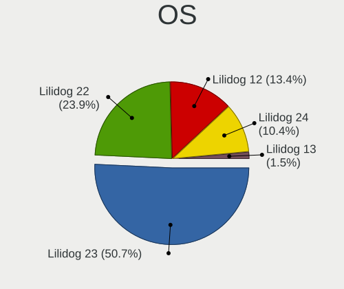

| Name       | Notebooks | Percent |
|------------|-----------|---------|
| Lilidog 23 | 34        | 50.75%  |
| Lilidog 22 | 16        | 23.88%  |
| Lilidog 12 | 9         | 13.43%  |
| Lilidog 24 | 7         | 10.45%  |
| Lilidog 13 | 1         | 1.49%   |

OS Family
---------

OS without a version

| Name    | Notebooks | Percent |
|---------|-----------|---------|
| Lilidog | 62        | 100%    |

Kernel
------

Version of the Linux kernel

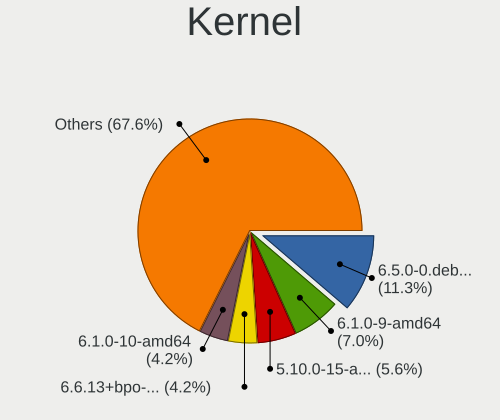

| Version                   | Notebooks | Percent |
|---------------------------|-----------|---------|
| 6.5.0-0.deb12.4-amd64     | 8         | 11.27%  |
| 6.1.0-9-amd64             | 5         | 7.04%   |
| 5.10.0-15-amd64           | 4         | 5.63%   |
| 6.6.13+bpo-amd64          | 3         | 4.23%   |
| 6.1.0-10-amd64            | 3         | 4.23%   |
| 5.10.0-16-amd64           | 3         | 4.23%   |
| 6.5.0-0.deb12.1-amd64     | 2         | 2.82%   |
| 6.11.5+bpo-amd64          | 2         | 2.82%   |
| 6.10.11+bpo-amd64         | 2         | 2.82%   |
| 6.1.0-20-amd64            | 2         | 2.82%   |
| 6.1.0-18-amd64            | 2         | 2.82%   |
| 6.1.0-16-amd64            | 2         | 2.82%   |
| 5.10.0-21-amd64           | 2         | 2.82%   |
| 5.10.0-18-amd64           | 2         | 2.82%   |
| 6.8.9-5-liquorix-amd64    | 1         | 1.41%   |
| 6.7.12+bpo-amd64          | 1         | 1.41%   |
| 6.4.5-1-liquorix-amd64    | 1         | 1.41%   |
| 6.4.0-0.deb12.2-amd64     | 1         | 1.41%   |
| 6.12.43+deb13-amd64       | 1         | 1.41%   |
| 6.12.32+bpo-amd64         | 1         | 1.41%   |
| 6.12.12+bpo-amd64         | 1         | 1.41%   |
| 6.12.1-1-liquorix-amd64   | 1         | 1.41%   |
| 6.11.10+bpo-amd64         | 1         | 1.41%   |
| 6.1.0-7-amd64             | 1         | 1.41%   |
| 6.1.0-38-amd64            | 1         | 1.41%   |
| 6.1.0-32-686-pae          | 1         | 1.41%   |
| 6.1.0-31-amd64            | 1         | 1.41%   |
| 6.1.0-29-amd64            | 1         | 1.41%   |
| 6.1.0-28-amd64            | 1         | 1.41%   |
| 6.1.0-25-686-pae          | 1         | 1.41%   |
| 6.1.0-23-amd64            | 1         | 1.41%   |
| 6.1.0-21-amd64            | 1         | 1.41%   |
| 6.1.0-18-686-pae          | 1         | 1.41%   |
| 6.1.0-13-amd64            | 1         | 1.41%   |
| 6.1.0-13-686-pae          | 1         | 1.41%   |
| 6.1.0-11-amd64            | 1         | 1.41%   |
| 6.1.0-0.deb11.6-amd64     | 1         | 1.41%   |
| 6.0.10-x64v1-xanmod1      | 1         | 1.41%   |
| 6.0.0-0.deb11.2-amd64     | 1         | 1.41%   |
| 5.17.0-5.1-liquorix-amd64 | 1         | 1.41%   |

Kernel Family
-------------

Linux kernel without a distro release

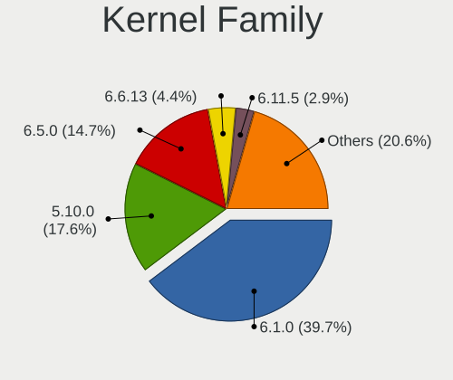

| Version | Notebooks | Percent |
|---------|-----------|---------|
| 6.1.0   | 27        | 39.71%  |
| 5.10.0  | 12        | 17.65%  |
| 6.5.0   | 10        | 14.71%  |
| 6.6.13  | 3         | 4.41%   |
| 6.11.5  | 2         | 2.94%   |
| 6.10.11 | 2         | 2.94%   |
| 6.8.9   | 1         | 1.47%   |
| 6.7.12  | 1         | 1.47%   |
| 6.4.5   | 1         | 1.47%   |
| 6.4.0   | 1         | 1.47%   |
| 6.12.43 | 1         | 1.47%   |
| 6.12.32 | 1         | 1.47%   |
| 6.12.12 | 1         | 1.47%   |
| 6.12.1  | 1         | 1.47%   |
| 6.11.10 | 1         | 1.47%   |
| 6.0.10  | 1         | 1.47%   |
| 6.0.0   | 1         | 1.47%   |
| 5.17.0  | 1         | 1.47%   |

Kernel Major Ver.
-----------------

Linux kernel major version

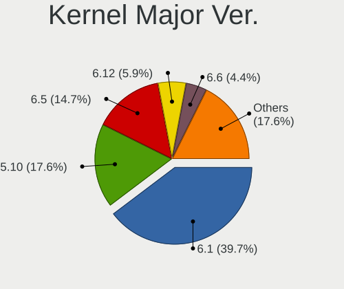

| Version | Notebooks | Percent |
|---------|-----------|---------|
| 6.1     | 27        | 39.71%  |
| 5.10    | 12        | 17.65%  |
| 6.5     | 10        | 14.71%  |
| 6.12    | 4         | 5.88%   |
| 6.6     | 3         | 4.41%   |
| 6.11    | 3         | 4.41%   |
| 6.4     | 2         | 2.94%   |
| 6.10    | 2         | 2.94%   |
| 6.0     | 2         | 2.94%   |
| 6.8     | 1         | 1.47%   |
| 6.7     | 1         | 1.47%   |
| 5.17    | 1         | 1.47%   |

Arch
----

OS architecture (x86_64, i586, etc.)

| Name   | Notebooks | Percent |
|--------|-----------|---------|
| x86_64 | 58        | 93.55%  |
| i686   | 4         | 6.45%   |

DE
--

Desktop Environment

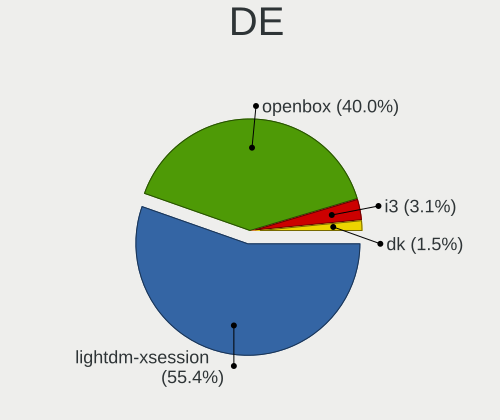

| Name             | Notebooks | Percent |
|------------------|-----------|---------|
| lightdm-xsession | 36        | 55.38%  |
| openbox          | 26        | 40%     |
| i3               | 2         | 3.08%   |
| dk               | 1         | 1.54%   |

Display Server
--------------

X11 or Wayland

| Name | Notebooks | Percent |
|------|-----------|---------|
| X11  | 62        | 100%    |

Display Manager
---------------

SDDM, LightDM, etc.

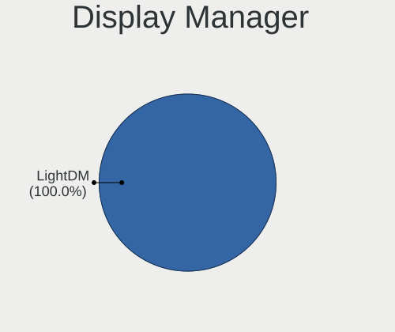

| Name    | Notebooks | Percent |
|---------|-----------|---------|
| LightDM | 62        | 100%    |

OS Lang
-------

Language

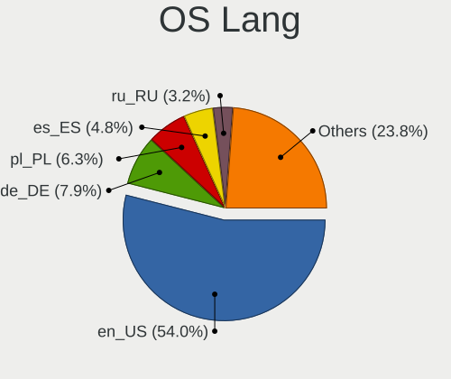

| Lang  | Notebooks | Percent |
|-------|-----------|---------|
| en_US | 34        | 53.97%  |
| de_DE | 5         | 7.94%   |
| pl_PL | 4         | 6.35%   |
| es_ES | 3         | 4.76%   |
| ru_RU | 2         | 3.17%   |
| es_CO | 2         | 3.17%   |
| en_GB | 2         | 3.17%   |
| pt_BR | 1         | 1.59%   |
| it_IT | 1         | 1.59%   |
| fi_FI | 1         | 1.59%   |
| es_VE | 1         | 1.59%   |
| es_MX | 1         | 1.59%   |
| es_CL | 1         | 1.59%   |
| es_AR | 1         | 1.59%   |
| en_IE | 1         | 1.59%   |
| en_CA | 1         | 1.59%   |
| en_AU | 1         | 1.59%   |
| cs_CZ | 1         | 1.59%   |

Boot Mode
---------

EFI or BIOS

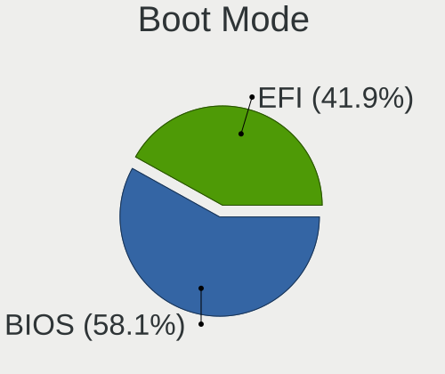

| Mode | Notebooks | Percent |
|------|-----------|---------|
| BIOS | 31        | 50%     |
| EFI  | 31        | 50%     |

Filesystem
----------

Type of filesystem

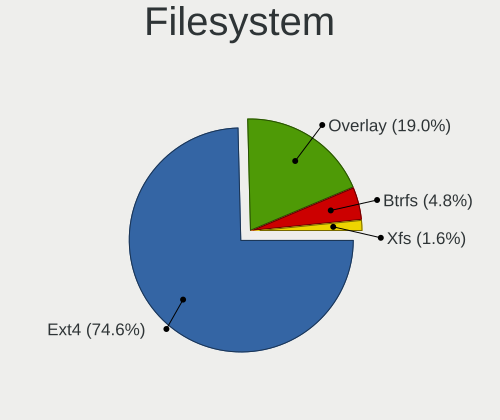

| Type    | Notebooks | Percent |
|---------|-----------|---------|
| Ext4    | 47        | 74.6%   |
| Overlay | 12        | 19.05%  |
| Btrfs   | 3         | 4.76%   |
| Xfs     | 1         | 1.59%   |

Part. scheme
------------

Scheme of partitioning

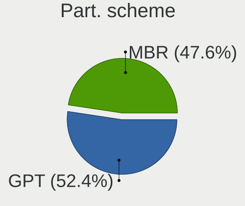

| Type | Notebooks | Percent |
|------|-----------|---------|
| GPT  | 33        | 52.38%  |
| MBR  | 30        | 47.62%  |

Dual Boot with Linux/BSD
------------------------

Hosting more than one Linux/BSD

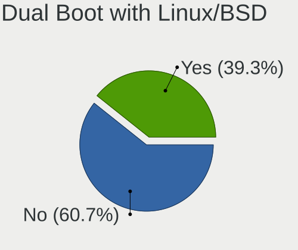

| Dual boot | Notebooks | Percent |
|-----------|-----------|---------|
| No        | 42        | 63.64%  |
| Yes       | 24        | 36.36%  |

Dual Boot (Win)
---------------

Hosting Linux and Windows

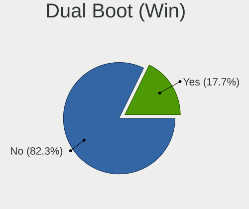

| Dual boot | Notebooks | Percent |
|-----------|-----------|---------|
| No        | 51        | 82.26%  |
| Yes       | 11        | 17.74%  |

Board
-----

Vendor
------

Motherboard manufacturer

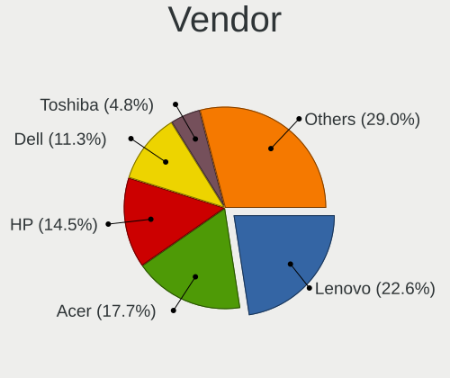

| Name                           | Notebooks | Percent |
|--------------------------------|-----------|---------|
| Lenovo                         | 14        | 22.58%  |
| Acer                           | 11        | 17.74%  |
| Hewlett-Packard                | 9         | 14.52%  |
| Dell                           | 7         | 11.29%  |
| Toshiba                        | 3         | 4.84%   |
| Google                         | 3         | 4.84%   |
| ASUSTek Computer               | 3         | 4.84%   |
| Apple                          | 3         | 4.84%   |
| Panasonic                      | 2         | 3.23%   |
| TUXEDO                         | 1         | 1.61%   |
| Sony                           | 1         | 1.61%   |
| PC Specialist                  | 1         | 1.61%   |
| Matsushita Electric Industrial | 1         | 1.61%   |
| ISONIC                         | 1         | 1.61%   |
| IBM                            | 1         | 1.61%   |
| GPU Company                    | 1         | 1.61%   |

Model
-----

Motherboard model

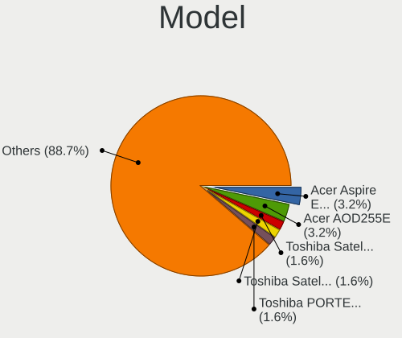

| Name                                        | Notebooks | Percent |
|---------------------------------------------|-----------|---------|
| Acer Aspire E5-573                          | 2         | 3.23%   |
| Acer AOD255E                                | 2         | 3.23%   |
| TUXEDO N8xEJEK                              | 1         | 1.61%   |
| Toshiba Satellite Pro L450                  | 1         | 1.61%   |
| Toshiba Satellite P200                      | 1         | 1.61%   |
| Toshiba PORTEGE Z30-C                       | 1         | 1.61%   |
| Sony VPCF23P1E                              | 1         | 1.61%   |
| PC Specialist P65_67RSRP                    | 1         | 1.61%   |
| Panasonic CFMX4-1                           | 1         | 1.61%   |
| Panasonic CF-31ATXAX1M                      | 1         | 1.61%   |
| Matsushita Electric Industrial CF-52GDN30AG | 1         | 1.61%   |
| Lenovo Yoga Slim 7 14ARE05 82A2             | 1         | 1.61%   |
| Lenovo Y520-15IKBN 80WK                     | 1         | 1.61%   |
| Lenovo ThinkPad X280 20KES63G00             | 1         | 1.61%   |
| Lenovo ThinkPad X131e 33722WU               | 1         | 1.61%   |
| Lenovo ThinkPad X1 Carbon Gen 9 20XWCTO1WW  | 1         | 1.61%   |
| Lenovo ThinkPad X1 Carbon 4th 20FCS24900    | 1         | 1.61%   |
| Lenovo ThinkPad T430s 2356GUU               | 1         | 1.61%   |
| Lenovo ThinkPad T430 2347AY1                | 1         | 1.61%   |
| Lenovo ThinkPad T400 6474WPU                | 1         | 1.61%   |
| Lenovo IdeaPad Z460 20059                   | 1         | 1.61%   |
| Lenovo IdeaPad 3 15ITL6 82H8                | 1         | 1.61%   |
| Lenovo IdeaPad 1 14ADA05 82GW               | 1         | 1.61%   |
| Lenovo G500 20236                           | 1         | 1.61%   |
| Lenovo 3000 G410                            | 1         | 1.61%   |
| ISONIC ISO-A1005                            | 1         | 1.61%   |
| IBM ThinkPad X40 2372CTO                    | 1         | 1.61%   |
| HP ProBook 6560b                            | 1         | 1.61%   |
| HP ProBook 450 G5                           | 1         | 1.61%   |
| HP Pavilion 11 x360 PC                      | 1         | 1.61%   |
| HP Laptop 17-cp3xxx                         | 1         | 1.61%   |
| HP Laptop 15s-fq1xxx                        | 1         | 1.61%   |
| HP G62                                      | 1         | 1.61%   |
| HP 630                                      | 1         | 1.61%   |
| HP 510 Notebook PC (RU962AA#ABE)            | 1         | 1.61%   |
| HP 435                                      | 1         | 1.61%   |
| GPU Company GWNR71517                       | 1         | 1.61%   |
| Google Sand                                 | 1         | 1.61%   |
| Google Gnawty                               | 1         | 1.61%   |
| Google Auron_Yuna                           | 1         | 1.61%   |

Model Family
------------

Motherboard model prefix

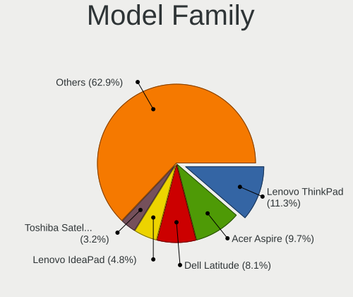

| Name                                        | Notebooks | Percent |
|---------------------------------------------|-----------|---------|
| Lenovo ThinkPad                             | 7         | 11.29%  |
| Acer Aspire                                 | 6         | 9.68%   |
| Dell Latitude                               | 5         | 8.06%   |
| Lenovo IdeaPad                              | 3         | 4.84%   |
| Toshiba Satellite                           | 2         | 3.23%   |
| HP ProBook                                  | 2         | 3.23%   |
| HP Laptop                                   | 2         | 3.23%   |
| Dell Inspiron                               | 2         | 3.23%   |
| ASUS VivoBook                               | 2         | 3.23%   |
| Acer AOD255E                                | 2         | 3.23%   |
| TUXEDO N8xEJEK                              | 1         | 1.61%   |
| Toshiba PORTEGE                             | 1         | 1.61%   |
| Sony VPCF23P1E                              | 1         | 1.61%   |
| PC Specialist P65                           | 1         | 1.61%   |
| Panasonic CFMX4-1                           | 1         | 1.61%   |
| Panasonic CF-31ATXAX1M                      | 1         | 1.61%   |
| Matsushita Electric Industrial CF-52GDN30AG | 1         | 1.61%   |
| Lenovo Yoga                                 | 1         | 1.61%   |
| Lenovo Y520-15IKBN                          | 1         | 1.61%   |
| Lenovo G500                                 | 1         | 1.61%   |
| Lenovo 3000                                 | 1         | 1.61%   |
| ISONIC ISO-A1005                            | 1         | 1.61%   |
| IBM ThinkPad                                | 1         | 1.61%   |
| HP Pavilion                                 | 1         | 1.61%   |
| HP G62                                      | 1         | 1.61%   |
| HP 630                                      | 1         | 1.61%   |
| HP 510                                      | 1         | 1.61%   |
| HP 435                                      | 1         | 1.61%   |
| GPU Company GWNR71517                       | 1         | 1.61%   |
| Google Sand                                 | 1         | 1.61%   |
| Google Gnawty                               | 1         | 1.61%   |
| Google Auron                                | 1         | 1.61%   |
| ASUS X550VC                                 | 1         | 1.61%   |
| Apple MacBookPro5                           | 1         | 1.61%   |
| Apple MacBookPro3                           | 1         | 1.61%   |
| Apple MacBook4                              | 1         | 1.61%   |
| Acer V5-131                                 | 1         | 1.61%   |
| Acer Nitro                                  | 1         | 1.61%   |
| Acer AOD270                                 | 1         | 1.61%   |

MFG Year
--------

Motherboard manufacture year

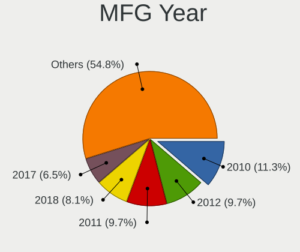

| Year | Notebooks | Percent |
|------|-----------|---------|
| 2010 | 7         | 11.29%  |
| 2012 | 6         | 9.68%   |
| 2011 | 6         | 9.68%   |
| 2018 | 5         | 8.06%   |
| 2017 | 4         | 6.45%   |
| 2008 | 4         | 6.45%   |
| 2007 | 4         | 6.45%   |
| 2021 | 3         | 4.84%   |
| 2020 | 3         | 4.84%   |
| 2019 | 3         | 4.84%   |
| 2016 | 3         | 4.84%   |
| 2013 | 3         | 4.84%   |
| 2009 | 3         | 4.84%   |
| 2015 | 2         | 3.23%   |
| 2014 | 2         | 3.23%   |
| 2024 | 1         | 1.61%   |
| 2023 | 1         | 1.61%   |
| 2022 | 1         | 1.61%   |
| 2006 | 1         | 1.61%   |

Form Factor
-----------

Physical design of the computer

| Name     | Notebooks | Percent |
|----------|-----------|---------|
| Notebook | 62        | 100%    |

Secure Boot
-----------

Enabled or disabled

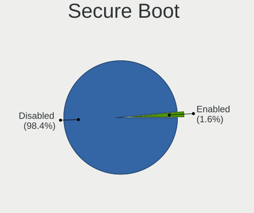

| State    | Notebooks | Percent |
|----------|-----------|---------|
| Disabled | 61        | 98.39%  |
| Enabled  | 1         | 1.61%   |

Coreboot
--------

Have coreboot on board

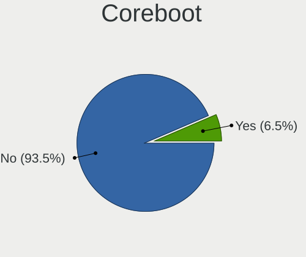

| Used | Notebooks | Percent |
|------|-----------|---------|
| No   | 58        | 93.55%  |
| Yes  | 4         | 6.45%   |

RAM Size
--------

Total RAM memory

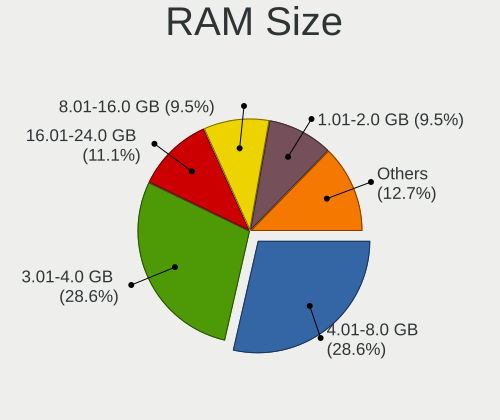

| Size in GB  | Notebooks | Percent |
|-------------|-----------|---------|
| 4.01-8.0    | 18        | 28.57%  |
| 3.01-4.0    | 18        | 28.57%  |
| 16.01-24.0  | 7         | 11.11%  |
| 1.01-2.0    | 6         | 9.52%   |
| 8.01-16.0   | 6         | 9.52%   |
| 32.01-64.0  | 2         | 3.17%   |
| 0.51-1.0    | 2         | 3.17%   |
| 24.01-32.0  | 1         | 1.59%   |
| 2.01-3.0    | 1         | 1.59%   |
| 64.01-256.0 | 1         | 1.59%   |
| 0.01-0.5    | 1         | 1.59%   |

RAM Used
--------

Used RAM memory

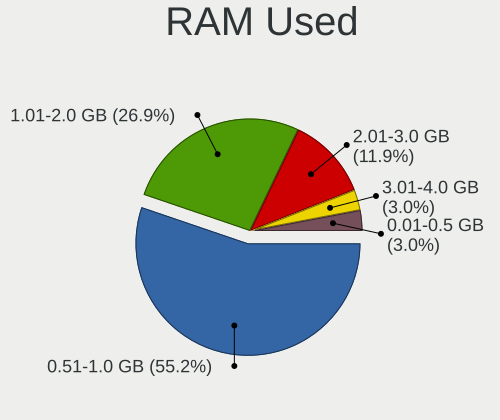

| Used GB  | Notebooks | Percent |
|----------|-----------|---------|
| 0.51-1.0 | 37        | 55.22%  |
| 1.01-2.0 | 18        | 26.87%  |
| 2.01-3.0 | 8         | 11.94%  |
| 3.01-4.0 | 2         | 2.99%   |
| 0.01-0.5 | 2         | 2.99%   |

Total Drives
------------

Number of drives on board

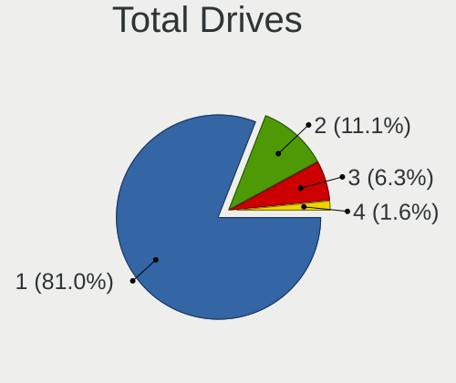

| Drives | Notebooks | Percent |
|--------|-----------|---------|
| 1      | 51        | 80.95%  |
| 2      | 7         | 11.11%  |
| 3      | 4         | 6.35%   |
| 4      | 1         | 1.59%   |

Has CD-ROM
----------

Has CD-ROM on board

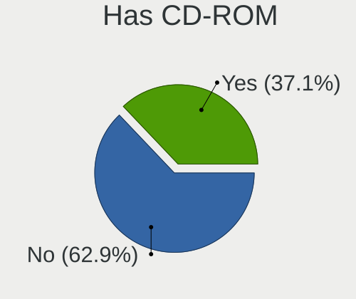

| Presented | Notebooks | Percent |
|-----------|-----------|---------|
| No        | 39        | 62.9%   |
| Yes       | 23        | 37.1%   |

Has Ethernet
------------

Has Ethernet on board

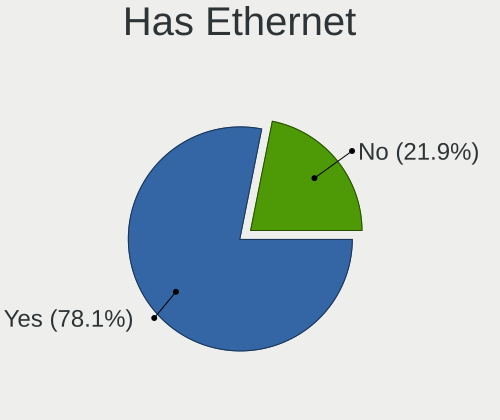

| Presented | Notebooks | Percent |
|-----------|-----------|---------|
| Yes       | 51        | 80.95%  |
| No        | 12        | 19.05%  |

Has WiFi
--------

Has WiFi module

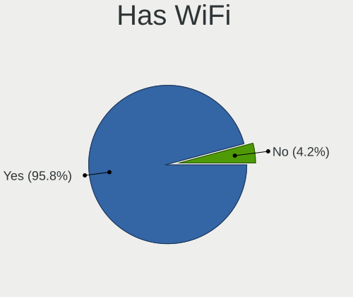

| Presented | Notebooks | Percent |
|-----------|-----------|---------|
| Yes       | 61        | 98.39%  |
| No        | 1         | 1.61%   |

Has Bluetooth
-------------

Has Bluetooth module

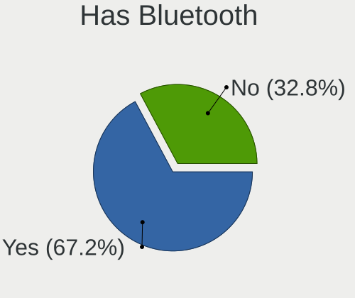

| Presented | Notebooks | Percent |
|-----------|-----------|---------|
| Yes       | 43        | 67.19%  |
| No        | 21        | 32.81%  |

Location
--------

Country
-------

Geographic location (country)

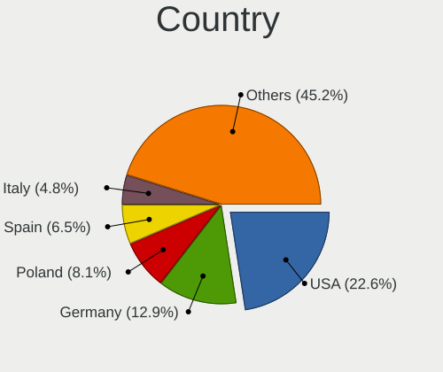

| Country     | Notebooks | Percent |
|-------------|-----------|---------|
| USA         | 14        | 22.58%  |
| Germany     | 8         | 12.9%   |
| Poland      | 5         | 8.06%   |
| Spain       | 4         | 6.45%   |
| Italy       | 3         | 4.84%   |
| Netherlands | 2         | 3.23%   |
| France      | 2         | 3.23%   |
| Finland     | 2         | 3.23%   |
| Colombia    | 2         | 3.23%   |
| Canada      | 2         | 3.23%   |
| Vietnam     | 1         | 1.61%   |
| Venezuela   | 1         | 1.61%   |
| Ukraine     | 1         | 1.61%   |
| UK          | 1         | 1.61%   |
| Türkiye    | 1         | 1.61%   |
| Thailand    | 1         | 1.61%   |
| Portugal    | 1         | 1.61%   |
| Mexico      | 1         | 1.61%   |
| Kenya       | 1         | 1.61%   |
| Indonesia   | 1         | 1.61%   |
| Honduras    | 1         | 1.61%   |
| Czechia     | 1         | 1.61%   |
| Chile       | 1         | 1.61%   |
| Bulgaria    | 1         | 1.61%   |
| Brazil      | 1         | 1.61%   |
| Belgium     | 1         | 1.61%   |
| Australia   | 1         | 1.61%   |
| Argentina   | 1         | 1.61%   |

City
----

Geographic location (city)

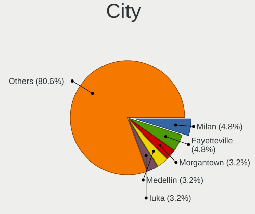

| City                        | Notebooks | Percent |
|-----------------------------|-----------|---------|
| Milan                       | 3         | 4.84%   |
| Fayetteville                | 3         | 4.84%   |
| Morgantown                  | 2         | 3.23%   |
| Medellín                   | 2         | 3.23%   |
| Iuka                        | 2         | 3.23%   |
| Helsinki                    | 2         | 3.23%   |
| Egan                        | 2         | 3.23%   |
| Denver                      | 2         | 3.23%   |
| Zduny                       | 1         | 1.61%   |
| Wroclaw                     | 1         | 1.61%   |
| Walla Walla                 | 1         | 1.61%   |
| Viña del Mar               | 1         | 1.61%   |
| Uelzen                      | 1         | 1.61%   |
| Surakarta                   | 1         | 1.61%   |
| Stockton-on-Tees            | 1         | 1.61%   |
| Stabroek                    | 1         | 1.61%   |
| Sofia                       | 1         | 1.61%   |
| Sevastopol                  | 1         | 1.61%   |
| Schiedam                    | 1         | 1.61%   |
| San Nicolás de los Arroyos | 1         | 1.61%   |
| Rumia                       | 1         | 1.61%   |
| Rinteln                     | 1         | 1.61%   |
| Ratchathewi                 | 1         | 1.61%   |
| Poznan                      | 1         | 1.61%   |
| Poricany                    | 1         | 1.61%   |
| Ossa de Montiel             | 1         | 1.61%   |
| Norderstedt                 | 1         | 1.61%   |
| Neu-Isenburg                | 1         | 1.61%   |
| Nairobi                     | 1         | 1.61%   |
| Monclova                    | 1         | 1.61%   |
| Maracaibo                   | 1         | 1.61%   |
| Madrid                      | 1         | 1.61%   |
| Lisbon                      | 1         | 1.61%   |
| L'Isle-sur-la-Sorgue        | 1         | 1.61%   |
| Ho Chi Minh City            | 1         | 1.61%   |
| Groningen                   | 1         | 1.61%   |
| Gdansk                      | 1         | 1.61%   |
| Filderstadt                 | 1         | 1.61%   |
| Eppelborn                   | 1         | 1.61%   |
| El Progreso                 | 1         | 1.61%   |

Drives
------

Drive Vendor
------------

Hard drive vendors

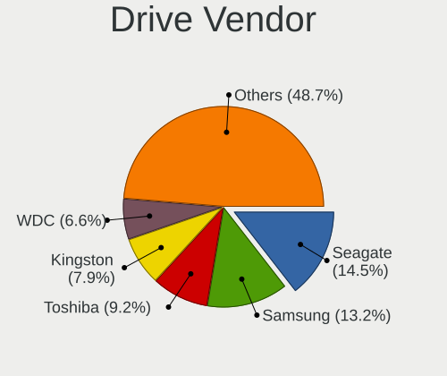

| Vendor              | Notebooks | Drives | Percent |
|---------------------|-----------|--------|---------|
| Seagate             | 11        | 13     | 14.47%  |
| Samsung Electronics | 10        | 13     | 13.16%  |
| Toshiba             | 7         | 8      | 9.21%   |
| Kingston            | 6         | 7      | 7.89%   |
| WDC                 | 5         | 8      | 6.58%   |
| Hitachi             | 4         | 4      | 5.26%   |
| Unknown             | 3         | 3      | 3.95%   |
| SanDisk             | 3         | 5      | 3.95%   |
| Crucial             | 3         | 3      | 3.95%   |
| Micron Technology   | 2         | 3      | 2.63%   |
| KingSpec            | 2         | 2      | 2.63%   |
| China               | 2         | 2      | 2.63%   |
| Wibtek              | 1         | 1      | 1.32%   |
| SPCC                | 1         | 1      | 1.32%   |
| PNY                 | 1         | 1      | 1.32%   |
| Mushkin             | 1         | 1      | 1.32%   |
| Lexar               | 1         | 1      | 1.32%   |
| KIOXIA              | 1         | 3      | 1.32%   |
| KingFast            | 1         | 1      | 1.32%   |
| JMicron Technology  | 1         | 1      | 1.32%   |
| Intenso             | 1         | 1      | 1.32%   |
| Intel               | 1         | 1      | 1.32%   |
| Integral            | 1         | 2      | 1.32%   |
| Hikvision           | 1         | 1      | 1.32%   |
| GOODRAM             | 1         | 1      | 1.32%   |
| Fanxiang            | 1         | 1      | 1.32%   |
| Blackpcs            | 1         | 1      | 1.32%   |
| Apacer              | 1         | 1      | 1.32%   |
| AMD                 | 1         | 1      | 1.32%   |
| A-DATA Technology   | 1         | 1      | 1.32%   |

Drive Model
-----------

Hard drive models

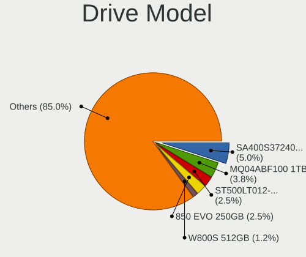

| Model                                | Notebooks | Percent |
|--------------------------------------|-----------|---------|
| Kingston SA400S37240G 240GB SSD      | 4         | 5%      |
| Toshiba MQ04ABF100 1TB               | 3         | 3.75%   |
| Seagate ST500LT012-9WS142 500GB      | 2         | 2.5%    |
| Samsung SSD 850 EVO 250GB            | 2         | 2.5%    |
| Wibtek W800S 512GB                   | 1         | 1.25%   |
| WDC WDS500G2B0A-00SM50 500GB         | 1         | 1.25%   |
| WDC WDS100T2B0C-00PXH0 1TB           | 1         | 1.25%   |
| WDC WD600UE-22KVT0 64GB              | 1         | 1.25%   |
| WDC WD5000LPVX-22V0TT0 500GB         | 1         | 1.25%   |
| WDC WD1600BEVT-22ZCT0 160GB          | 1         | 1.25%   |
| WDC WD10SPCX-60KHST0 1TB             | 1         | 1.25%   |
| Unknown NCard  32GB                  | 1         | 1.25%   |
| Unknown HAG2e  16GB                  | 1         | 1.25%   |
| Unknown DA4064  64GB                 | 1         | 1.25%   |
| Toshiba MQ01ABF050 500GB             | 1         | 1.25%   |
| Toshiba MK6034GSX 64GB               | 1         | 1.25%   |
| Toshiba MK3261GSY 320GB              | 1         | 1.25%   |
| Toshiba MK1665GSX 160GB              | 1         | 1.25%   |
| SPCC Solid State Disk 256GB          | 1         | 1.25%   |
| Seagate ST9500423AS 500GB            | 1         | 1.25%   |
| Seagate ST9320325AS 320GB            | 1         | 1.25%   |
| Seagate ST9250315AS 250GB            | 1         | 1.25%   |
| Seagate ST500LT012-1DG142 500GB      | 1         | 1.25%   |
| Seagate ST500LM000-1EJ162 500GB      | 1         | 1.25%   |
| Seagate ST320LT020-9YG142 320GB      | 1         | 1.25%   |
| Seagate ST2000LM007-1R8174 2TB       | 1         | 1.25%   |
| Seagate ST1000LM 024 HN-M101MBB 1TB  | 1         | 1.25%   |
| Seagate OneTouch HDD 1TB             | 1         | 1.25%   |
| Seagate Expansion 2TB                | 1         | 1.25%   |
| SanDisk SSD PLUS 480GB               | 1         | 1.25%   |
| SanDisk SD8TN8U256G1001 256GB SSD    | 1         | 1.25%   |
| SanDisk DF4032  32GB                 | 1         | 1.25%   |
| Samsung SSD PM841 2.5 7mm 256GB      | 1         | 1.25%   |
| Samsung SSD 970 EVO Plus 250GB       | 1         | 1.25%   |
| Samsung SSD 860 EVO 500GB            | 1         | 1.25%   |
| Samsung SSD 860 EVO 1TB              | 1         | 1.25%   |
| Samsung PM991a NVMe 512GB            | 1         | 1.25%   |
| Samsung MZVL41T0HBLB-00BH1 1TB       | 1         | 1.25%   |
| Samsung MZVL21T0HCLR-00BL7 1TB       | 1         | 1.25%   |
| Samsung MZNTY128HDHP-00000 128GB SSD | 1         | 1.25%   |

HDD Vendor
----------

Hard disk drive vendors

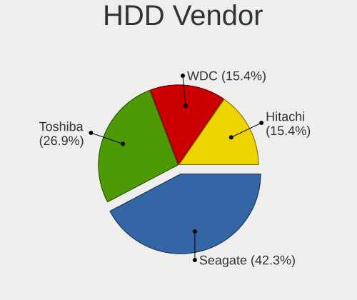

| Vendor  | Notebooks | Drives | Percent |
|---------|-----------|--------|---------|
| Seagate | 11        | 13     | 42.31%  |
| Toshiba | 7         | 8      | 26.92%  |
| WDC     | 4         | 5      | 15.38%  |
| Hitachi | 4         | 4      | 15.38%  |

SSD Vendor
----------

Solid state drive vendors

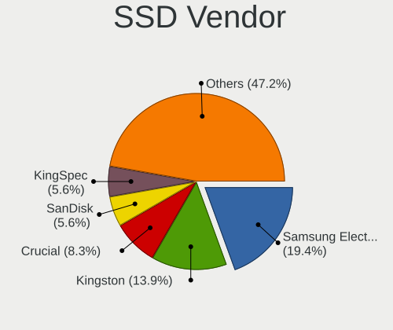

| Vendor              | Notebooks | Drives | Percent |
|---------------------|-----------|--------|---------|
| Samsung Electronics | 7         | 7      | 19.44%  |
| Kingston            | 5         | 6      | 13.89%  |
| Crucial             | 3         | 3      | 8.33%   |
| SanDisk             | 2         | 2      | 5.56%   |
| KingSpec            | 2         | 2      | 5.56%   |
| China               | 2         | 2      | 5.56%   |
| Wibtek              | 1         | 1      | 2.78%   |
| WDC                 | 1         | 1      | 2.78%   |
| SPCC                | 1         | 1      | 2.78%   |
| PNY                 | 1         | 1      | 2.78%   |
| Mushkin             | 1         | 1      | 2.78%   |
| Micron Technology   | 1         | 2      | 2.78%   |
| KingFast            | 1         | 1      | 2.78%   |
| Intenso             | 1         | 1      | 2.78%   |
| Integral            | 1         | 2      | 2.78%   |
| GOODRAM             | 1         | 1      | 2.78%   |
| Fanxiang            | 1         | 1      | 2.78%   |
| Blackpcs            | 1         | 1      | 2.78%   |
| Apacer              | 1         | 1      | 2.78%   |
| AMD                 | 1         | 1      | 2.78%   |
| A-DATA Technology   | 1         | 1      | 2.78%   |

Drive Kind
----------

HDD or SSD

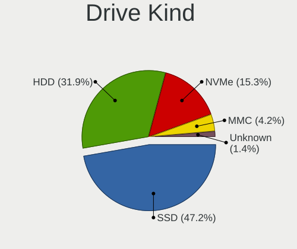

| Kind    | Notebooks | Drives | Percent |
|---------|-----------|--------|---------|
| SSD     | 34        | 39     | 47.22%  |
| HDD     | 23        | 30     | 31.94%  |
| NVMe    | 11        | 16     | 15.28%  |
| MMC     | 3         | 6      | 4.17%   |
| Unknown | 1         | 1      | 1.39%   |

Drive Connector
---------------

SATA, SAS, NVMe, etc.

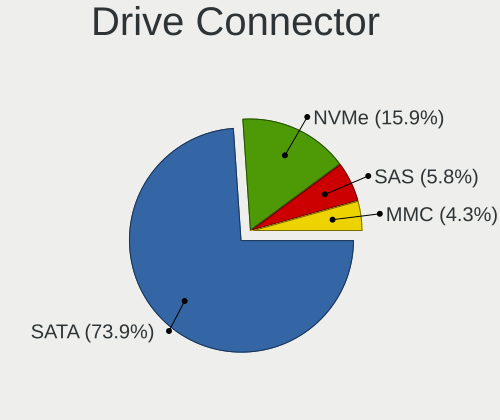

| Type | Notebooks | Drives | Percent |
|------|-----------|--------|---------|
| SATA | 51        | 64     | 73.91%  |
| NVMe | 11        | 16     | 15.94%  |
| SAS  | 4         | 6      | 5.8%    |
| MMC  | 3         | 6      | 4.35%   |

Drive Size
----------

Size of hard drive

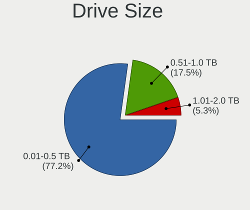

| Size in TB | Notebooks | Drives | Percent |
|------------|-----------|--------|---------|
| 0.01-0.5   | 44        | 50     | 77.19%  |
| 0.51-1.0   | 10        | 16     | 17.54%  |
| 1.01-2.0   | 3         | 3      | 5.26%   |

Space Total
-----------

Amount of disk space available on the file system

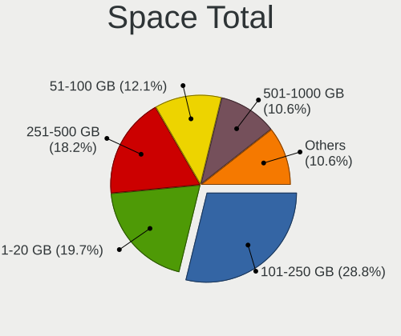

| Size in GB     | Notebooks | Percent |
|----------------|-----------|---------|
| 101-250        | 19        | 28.79%  |
| 1-20           | 13        | 19.7%   |
| 251-500        | 12        | 18.18%  |
| 51-100         | 8         | 12.12%  |
| 501-1000       | 7         | 10.61%  |
| 21-50          | 3         | 4.55%   |
| 1001-2000      | 3         | 4.55%   |
| More than 3000 | 1         | 1.52%   |

Space Used
----------

Amount of used disk space

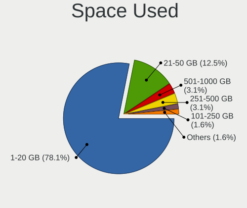

| Used GB  | Notebooks | Percent |
|----------|-----------|---------|
| 1-20     | 50        | 78.13%  |
| 21-50    | 8         | 12.5%   |
| 251-500  | 2         | 3.13%   |
| 501-1000 | 2         | 3.13%   |
| 101-250  | 1         | 1.56%   |
| 51-100   | 1         | 1.56%   |

Malfunc. Drives
---------------

Drive models with a malfunction

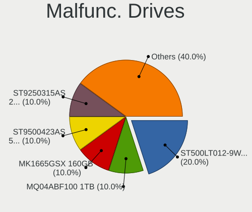

| Model                           | Notebooks | Drives | Percent |
|---------------------------------|-----------|--------|---------|
| Seagate ST500LT012-9WS142 500GB | 2         | 3      | 20%     |
| Toshiba MQ04ABF100 1TB          | 1         | 1      | 10%     |
| Toshiba MK1665GSX 160GB         | 1         | 1      | 10%     |
| Seagate ST9500423AS 500GB       | 1         | 1      | 10%     |
| Seagate ST9250315AS 250GB       | 1         | 1      | 10%     |
| Seagate ST500LT012-1DG142 500GB | 1         | 1      | 10%     |
| SanDisk SSD PLUS 480GB          | 1         | 1      | 10%     |
| Mushkin MKNSSDCR120GB           | 1         | 1      | 10%     |
| Kingston SNS4151S332GD 32GB SSD | 1         | 1      | 10%     |

Malfunc. Drive Vendor
---------------------

Vendors of faulty drives

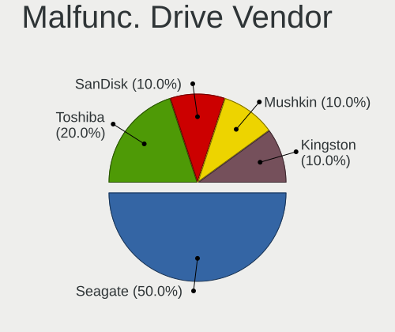

| Vendor   | Notebooks | Drives | Percent |
|----------|-----------|--------|---------|
| Seagate  | 5         | 6      | 50%     |
| Toshiba  | 2         | 2      | 20%     |
| SanDisk  | 1         | 1      | 10%     |
| Mushkin  | 1         | 1      | 10%     |
| Kingston | 1         | 1      | 10%     |

Malfunc. HDD Vendor
-------------------

Vendors of faulty HDD drives

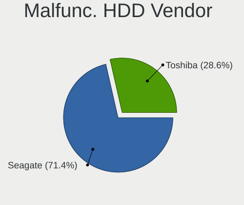

| Vendor  | Notebooks | Drives | Percent |
|---------|-----------|--------|---------|
| Seagate | 5         | 6      | 71.43%  |
| Toshiba | 2         | 2      | 28.57%  |

Malfunc. Drive Kind
-------------------

Kinds of faulty drives

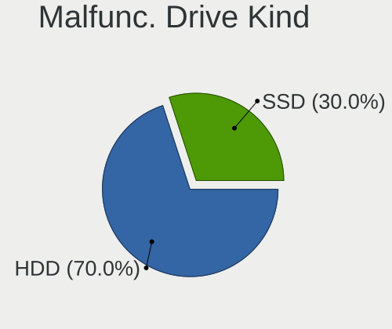

| Kind | Notebooks | Drives | Percent |
|------|-----------|--------|---------|
| HDD  | 7         | 8      | 70%     |
| SSD  | 3         | 3      | 30%     |

Failed Drives
-------------

Failed drive models

| Model                     | Notebooks | Drives | Percent |
|---------------------------|-----------|--------|---------|
| Seagate ST9320325AS 320GB | 1         | 1      | 100%    |

Failed Drive Vendor
-------------------

Failed drive vendors

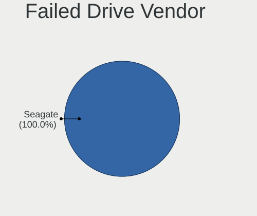

| Vendor  | Notebooks | Drives | Percent |
|---------|-----------|--------|---------|
| Seagate | 1         | 1      | 100%    |

Drive Status
------------

Number of failed and malfunc. drives

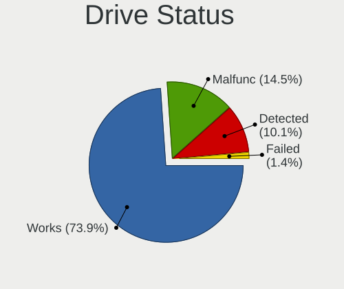

| Status   | Notebooks | Drives | Percent |
|----------|-----------|--------|---------|
| Works    | 51        | 68     | 73.91%  |
| Malfunc  | 10        | 11     | 14.49%  |
| Detected | 7         | 12     | 10.14%  |
| Failed   | 1         | 1      | 1.45%   |

Storage controller
------------------

Storage Vendor
--------------

Storage controller vendors

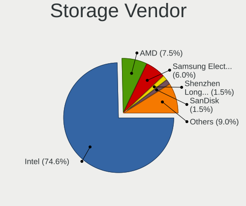

| Vendor                       | Notebooks | Percent |
|------------------------------|-----------|---------|
| Intel                        | 50        | 74.63%  |
| AMD                          | 5         | 7.46%   |
| Samsung Electronics          | 4         | 5.97%   |
| Shenzhen Longsys Electronics | 1         | 1.49%   |
| SanDisk                      | 1         | 1.49%   |
| Nvidia                       | 1         | 1.49%   |
| Micron Technology            | 1         | 1.49%   |
| MAXIO Technology (Hangzhou)  | 1         | 1.49%   |
| Marvell Technology Group     | 1         | 1.49%   |
| KIOXIA                       | 1         | 1.49%   |
| Kingston Technology Company  | 1         | 1.49%   |

Storage Model
-------------

Storage controller models

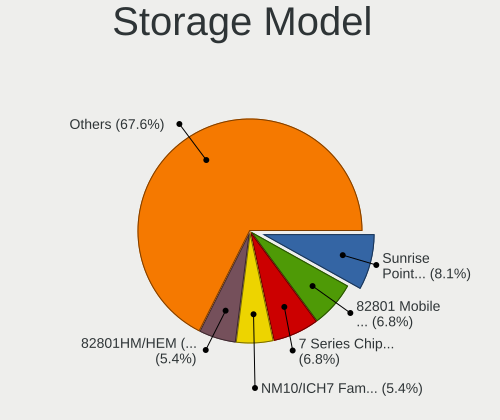

| Model                                                                                                              | Notebooks | Percent |
|--------------------------------------------------------------------------------------------------------------------|-----------|---------|
| Intel Sunrise Point-LP SATA Controller [AHCI mode]                                                                 | 6         | 8.11%   |
| Intel 82801 Mobile SATA Controller [RAID mode]                                                                     | 5         | 6.76%   |
| Intel 7 Series Chipset Family 6-port SATA Controller [AHCI mode]                                                   | 5         | 6.76%   |
| Intel NM10/ICH7 Family SATA Controller [AHCI mode]                                                                 | 4         | 5.41%   |
| Intel 82801HM/HEM (ICH8M/ICH8M-E) SATA Controller [AHCI mode]                                                      | 4         | 5.41%   |
| Intel 82801HM/HEM (ICH8M/ICH8M-E) IDE Controller                                                                   | 4         | 5.41%   |
| Intel 6 Series/C200 Series Chipset Family 6 port Mobile SATA AHCI Controller                                       | 3         | 4.05%   |
| Intel 5 Series/3400 Series Chipset 4 port SATA AHCI Controller                                                     | 3         | 4.05%   |
| AMD FCH SATA Controller [AHCI mode]                                                                                | 3         | 4.05%   |
| Intel Wildcat Point-LP SATA Controller [AHCI Mode]                                                                 | 2         | 2.7%    |
| Intel Volume Management Device NVMe RAID Controller                                                                | 2         | 2.7%    |
| Intel 82801IBM/IEM (ICH9M/ICH9M-E) 4 port SATA Controller [AHCI mode]                                              | 2         | 2.7%    |
| Intel 8 Series SATA Controller 1 [AHCI mode]                                                                       | 2         | 2.7%    |
| AMD SB7x0/SB8x0/SB9x0 SATA Controller [AHCI mode]                                                                  | 2         | 2.7%    |
| Shenzhen Longsys FORESEE XP1000 / Lexar Professional CFexpress Type B Gold series, NM620 PCIe NVME SSD (DRAM-less) | 1         | 1.35%   |
| SanDisk Ultra 3D / WD PC SN530, IX SN530, Blue SN550 NVMe SSD (DRAM-less)                                          | 1         | 1.35%   |
| Samsung NVMe SSD Controller SM981/PM981/PM983                                                                      | 1         | 1.35%   |
| Samsung NVMe SSD Controller PM9B1 (DRAM-less)                                                                      | 1         | 1.35%   |
| Samsung NVMe SSD Controller PM9A1/PM9A3/980PRO                                                                     | 1         | 1.35%   |
| Samsung NVMe SSD Controller 980 (DRAM-less)                                                                        | 1         | 1.35%   |
| Nvidia MCP79 AHCI Controller                                                                                       | 1         | 1.35%   |
| Micron 2210 NVMe SSD [Cobain]                                                                                      | 1         | 1.35%   |
| MAXIO (Hangzhou) NVMe SSD Controller MAP1202 (DRAM-less)                                                           | 1         | 1.35%   |
| Marvell Group 88SE6101/6102 single-port PATA133 interface                                                          | 1         | 1.35%   |
| KIOXIA NVMe SSD Controller BG4 (DRAM-less)                                                                         | 1         | 1.35%   |
| Kingston Company KC3000/FURY Renegade NVMe SSD [E18]                                                               | 1         | 1.35%   |
| Intel Tiger Lake-LP SATA Controller                                                                                | 1         | 1.35%   |
| Intel SSD DC P4101/Pro 7600p/760p/E 6100p Series                                                                   | 1         | 1.35%   |
| Intel Ice Lake-LP SATA Controller [AHCI mode]                                                                      | 1         | 1.35%   |
| Intel HM170/QM170 Chipset SATA Controller [AHCI Mode]                                                              | 1         | 1.35%   |
| Intel Cannon Lake Mobile PCH SATA AHCI Controller                                                                  | 1         | 1.35%   |
| Intel Atom Processor E3800 Series SATA AHCI Controller                                                             | 1         | 1.35%   |
| Intel 82801IBM/IEM (ICH9M/ICH9M-E) 2 port SATA Controller [IDE mode]                                               | 1         | 1.35%   |
| Intel 82801HM/HEM (ICH8M/ICH8M-E) SATA Controller [IDE mode]                                                       | 1         | 1.35%   |
| Intel 82801GBM/GHM (ICH7-M Family) SATA Controller [AHCI mode]                                                     | 1         | 1.35%   |
| Intel 82801FB/FBM/FR/FW/FRW (ICH6 Family) IDE Controller                                                           | 1         | 1.35%   |
| Intel 82801DBM (ICH4-M) IDE Controller                                                                             | 1         | 1.35%   |
| Intel 7 Series Chipset Family 4-port SATA Controller [IDE mode]                                                    | 1         | 1.35%   |
| Intel 7 Series Chipset Family 2-port SATA Controller [IDE mode]                                                    | 1         | 1.35%   |
| Intel 5 Series/3400 Series Chipset 6 port SATA AHCI Controller                                                     | 1         | 1.35%   |

Storage Kind
------------

Kind of storage controller (IDE, SATA, NVMe, SAS, ...)

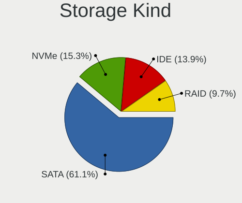

| Kind | Notebooks | Percent |
|------|-----------|---------|
| SATA | 44        | 61.11%  |
| NVMe | 11        | 15.28%  |
| IDE  | 10        | 13.89%  |
| RAID | 7         | 9.72%   |

Processor
---------

CPU Vendor
----------

Processor vendors

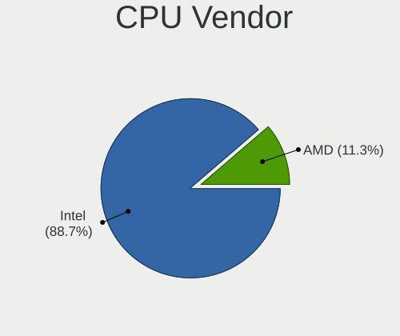

| Vendor | Notebooks | Percent |
|--------|-----------|---------|
| Intel  | 55        | 88.71%  |
| AMD    | 7         | 11.29%  |

CPU Model
---------

Processor models

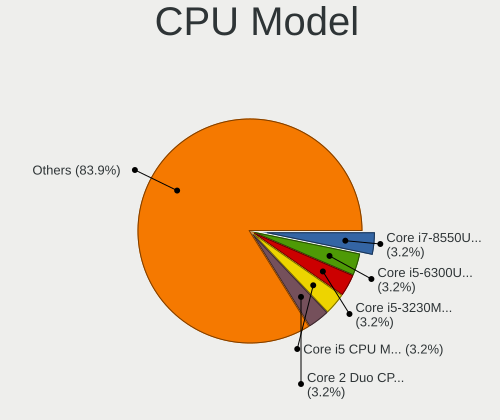

| Model                                       | Notebooks | Percent |
|---------------------------------------------|-----------|---------|
| Intel Core i7-8550U CPU @ 1.80GHz           | 2         | 3.23%   |
| Intel Core i5-6300U CPU @ 2.40GHz           | 2         | 3.23%   |
| Intel Core i5-3230M CPU @ 2.60GHz           | 2         | 3.23%   |
| Intel Core i5 CPU M 520 @ 2.40GHz           | 2         | 3.23%   |
| Intel Core 2 Duo CPU P8400 @ 2.26GHz        | 2         | 3.23%   |
| Intel Atom CPU N455 @ 1.66GHz               | 2         | 3.23%   |
| Intel Pentium M processor 1.50GHz           | 1         | 1.61%   |
| Intel Pentium Dual-Core CPU T4200 @ 2.00GHz | 1         | 1.61%   |
| Intel Pentium Dual CPU T2390 @ 1.86GHz      | 1         | 1.61%   |
| Intel Pentium CPU N4200 @ 1.10GHz           | 1         | 1.61%   |
| Intel Pentium 3556U @ 1.70GHz               | 1         | 1.61%   |
| Intel Core i7-8750H CPU @ 2.20GHz           | 1         | 1.61%   |
| Intel Core i7-8650U CPU @ 1.90GHz           | 1         | 1.61%   |
| Intel Core i7-6700HQ CPU @ 2.60GHz          | 1         | 1.61%   |
| Intel Core i7-6600U CPU @ 2.60GHz           | 1         | 1.61%   |
| Intel Core i7-3740QM CPU @ 2.70GHz          | 1         | 1.61%   |
| Intel Core i7-3520M CPU @ 2.90GHz           | 1         | 1.61%   |
| Intel Core i7-2670QM CPU @ 2.20GHz          | 1         | 1.61%   |
| Intel Core i7-1065G7 CPU @ 1.30GHz          | 1         | 1.61%   |
| Intel Core i5-9300H CPU @ 2.40GHz           | 1         | 1.61%   |
| Intel Core i5-8250U CPU @ 1.60GHz           | 1         | 1.61%   |
| Intel Core i5-7300HQ CPU @ 2.50GHz          | 1         | 1.61%   |
| Intel Core i5-7200U CPU @ 2.50GHz           | 1         | 1.61%   |
| Intel Core i5-5300U CPU @ 2.30GHz           | 1         | 1.61%   |
| Intel Core i5-4200U CPU @ 1.60GHz           | 1         | 1.61%   |
| Intel Core i5-3320M CPU @ 2.60GHz           | 1         | 1.61%   |
| Intel Core i5-2520M CPU @ 2.50GHz           | 1         | 1.61%   |
| Intel Core i5-1035G1 CPU @ 1.00GHz          | 1         | 1.61%   |
| Intel Core i3-4005U CPU @ 1.70GHz           | 1         | 1.61%   |
| Intel Core i3-3217U CPU @ 1.80GHz           | 1         | 1.61%   |
| Intel Core i3 CPU M 390 @ 2.67GHz           | 1         | 1.61%   |
| Intel Core i3 CPU M 370 @ 2.40GHz           | 1         | 1.61%   |
| Intel Core 2 Duo CPU T8100 @ 2.10GHz        | 1         | 1.61%   |
| Intel Core 2 Duo CPU T7500 @ 2.20GHz        | 1         | 1.61%   |
| Intel Core 2 Duo CPU T5870 @ 2.00GHz        | 1         | 1.61%   |
| Intel Core 2 Duo CPU T5250 @ 1.50GHz        | 1         | 1.61%   |
| Intel Core 2 Duo CPU P8700 @ 2.53GHz        | 1         | 1.61%   |
| Intel Celeron M processor 1.50GHz           | 1         | 1.61%   |
| Intel Celeron CPU N2830 @ 2.16GHz           | 1         | 1.61%   |
| Intel Celeron CPU N2820 @ 2.13GHz           | 1         | 1.61%   |

CPU Model Family
----------------

Processor model prefix

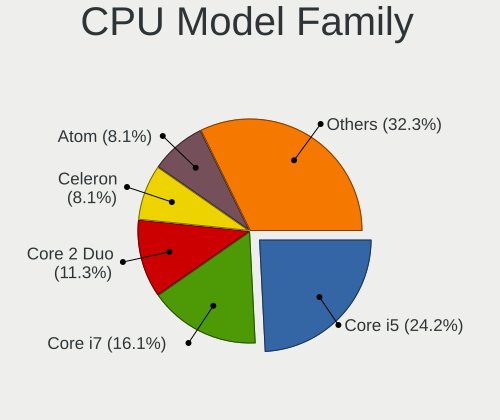

| Model                   | Notebooks | Percent |
|-------------------------|-----------|---------|
| Intel Core i5           | 15        | 24.19%  |
| Intel Core i7           | 10        | 16.13%  |
| Intel Core 2 Duo        | 7         | 11.29%  |
| Intel Celeron           | 5         | 8.06%   |
| Intel Atom              | 5         | 8.06%   |
| Other                   | 4         | 6.45%   |
| Intel Core i3           | 4         | 6.45%   |
| Intel Pentium           | 2         | 3.23%   |
| AMD Ryzen 5             | 2         | 3.23%   |
| Intel Pentium M         | 1         | 1.61%   |
| Intel Pentium Dual-Core | 1         | 1.61%   |
| Intel Pentium Dual      | 1         | 1.61%   |
| Intel Celeron M         | 1         | 1.61%   |
| AMD Ryzen 7             | 1         | 1.61%   |
| AMD Phenom II           | 1         | 1.61%   |
| AMD E                   | 1         | 1.61%   |
| AMD Athlon II Dual-Core | 1         | 1.61%   |

CPU Cores
---------

Number of processor cores

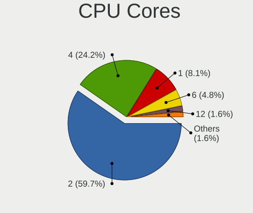

| Number | Notebooks | Percent |
|--------|-----------|---------|
| 2      | 37        | 59.68%  |
| 4      | 15        | 24.19%  |
| 1      | 5         | 8.06%   |
| 6      | 3         | 4.84%   |
| 12     | 1         | 1.61%   |
| 3      | 1         | 1.61%   |

CPU Sockets
-----------

Number of sockets

| Number | Notebooks | Percent |
|--------|-----------|---------|
| 1      | 62        | 100%    |

CPU Threads
-----------

Threads per core (Hyper-Threading)

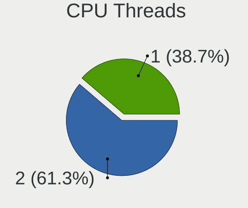

| Number | Notebooks | Percent |
|--------|-----------|---------|
| 2      | 38        | 61.29%  |
| 1      | 24        | 38.71%  |

CPU Op-Modes
------------

CPU Operation Modes (32-bit, 64-bit)

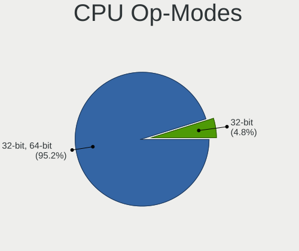

| Op mode        | Notebooks | Percent |
|----------------|-----------|---------|
| 32-bit, 64-bit | 59        | 95.16%  |
| 32-bit         | 3         | 4.84%   |

CPU Microcode
-------------

Microcode number

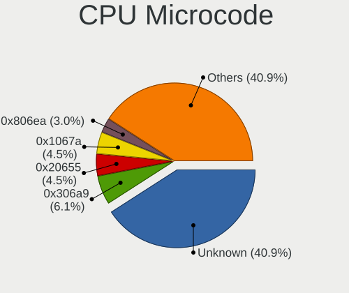

| Number     | Notebooks | Percent |
|------------|-----------|---------|
| Unknown    | 27        | 40.91%  |
| 0x306a9    | 4         | 6.06%   |
| 0x20655    | 3         | 4.55%   |
| 0x1067a    | 3         | 4.55%   |
| 0x806ea    | 2         | 3.03%   |
| 0x806c1    | 2         | 3.03%   |
| 0x706e5    | 2         | 3.03%   |
| 0x6d8      | 2         | 3.03%   |
| 0x406e3    | 2         | 3.03%   |
| 0x40651    | 2         | 3.03%   |
| 0x306d4    | 2         | 3.03%   |
| 0x106ca    | 2         | 3.03%   |
| 0x906ea    | 1         | 1.52%   |
| 0x906e9    | 1         | 1.52%   |
| 0x806e9    | 1         | 1.52%   |
| 0x6fd      | 1         | 1.52%   |
| 0x6fa      | 1         | 1.52%   |
| 0x506e3    | 1         | 1.52%   |
| 0x506c9    | 1         | 1.52%   |
| 0x206a7    | 1         | 1.52%   |
| 0x106c2    | 1         | 1.52%   |
| 0x10676    | 1         | 1.52%   |
| 0x08600106 | 1         | 1.52%   |
| 0x08108109 | 1         | 1.52%   |
| 0x010000c8 | 1         | 1.52%   |

CPU Microarch
-------------

Microarchitecture

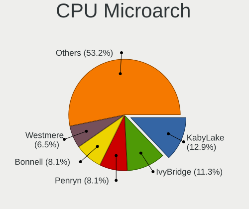

| Name             | Notebooks | Percent |
|------------------|-----------|---------|
| KabyLake         | 8         | 12.9%   |
| IvyBridge        | 7         | 11.29%  |
| Penryn           | 5         | 8.06%   |
| Bonnell          | 5         | 8.06%   |
| Westmere         | 4         | 6.45%   |
| Skylake          | 4         | 6.45%   |
| Core             | 4         | 6.45%   |
| SandyBridge      | 3         | 4.84%   |
| Haswell          | 3         | 4.84%   |
| TigerLake        | 2         | 3.23%   |
| Silvermont       | 2         | 3.23%   |
| P6               | 2         | 3.23%   |
| K10              | 2         | 3.23%   |
| IceLake          | 2         | 3.23%   |
| Broadwell        | 2         | 3.23%   |
| Zen+             | 1         | 1.61%   |
| Zen 3            | 1         | 1.61%   |
| Zen 2            | 1         | 1.61%   |
| Zen              | 1         | 1.61%   |
| Goldmont         | 1         | 1.61%   |
| Bobcat           | 1         | 1.61%   |
| Alderlake Hybrid | 1         | 1.61%   |

Graphics
--------

GPU Vendor
----------

Vendors of graphics cards

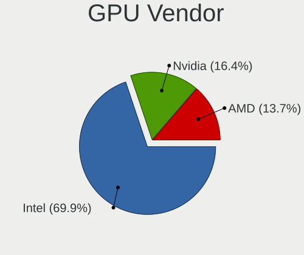

| Vendor | Notebooks | Percent |
|--------|-----------|---------|
| Intel  | 51        | 69.86%  |
| Nvidia | 12        | 16.44%  |
| AMD    | 10        | 13.7%   |

GPU Model
---------

Graphics card models

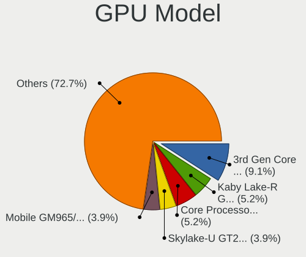

| Model                                                                         | Notebooks | Percent |
|-------------------------------------------------------------------------------|-----------|---------|
| Intel 3rd Gen Core processor Graphics Controller                              | 7         | 9.09%   |
| Intel Kaby Lake-R GT2 [UHD Graphics 620]                                      | 4         | 5.19%   |
| Intel Core Processor Integrated Graphics Controller                           | 4         | 5.19%   |
| Intel Skylake-U GT2 [HD Graphics 520]                                         | 3         | 3.9%    |
| Intel Mobile GM965/GL960 Integrated Graphics Controller (secondary)           | 3         | 3.9%    |
| Intel Mobile GM965/GL960 Integrated Graphics Controller (primary)             | 3         | 3.9%    |
| Intel Mobile 4 Series Chipset Integrated Graphics Controller                  | 3         | 3.9%    |
| Intel Haswell-ULT Integrated Graphics Controller                              | 3         | 3.9%    |
| Intel Atom Processor D4xx/D5xx/N4xx/N5xx Integrated Graphics Controller       | 3         | 3.9%    |
| Nvidia GP107M [GeForce GTX 1050 Mobile]                                       | 2         | 2.6%    |
| Intel TigerLake-LP GT2 [Iris Xe Graphics]                                     | 2         | 2.6%    |
| Intel CoffeeLake-H GT2 [UHD Graphics 630]                                     | 2         | 2.6%    |
| Intel Atom Processor Z36xxx/Z37xxx Series Graphics & Display                  | 2         | 2.6%    |
| Intel 2nd Generation Core Processor Family Integrated Graphics Controller     | 2         | 2.6%    |
| AMD Picasso/Raven 2 [Radeon Vega Series / Radeon Vega Mobile Series]          | 2         | 2.6%    |
| Nvidia GP107M [GeForce GTX 1050 Ti Mobile]                                    | 1         | 1.3%    |
| Nvidia GP107M [GeForce GTX 1050 3 GB Max-Q]                                   | 1         | 1.3%    |
| Nvidia GP104BM [GeForce GTX 1070 Mobile]                                      | 1         | 1.3%    |
| Nvidia GM108M [GeForce 940MX]                                                 | 1         | 1.3%    |
| Nvidia GM108M [GeForce 930MX]                                                 | 1         | 1.3%    |
| Nvidia GF117M [GeForce 610M/710M/810M/820M / GT 620M/625M/630M/720M]          | 1         | 1.3%    |
| Nvidia GF108M [GeForce GT 540M]                                               | 1         | 1.3%    |
| Nvidia GF108GLM [NVS 5200M]                                                   | 1         | 1.3%    |
| Nvidia G84M [GeForce 8600M GT]                                                | 1         | 1.3%    |
| Nvidia C79 [GeForce 9400M]                                                    | 1         | 1.3%    |
| Intel Skylake-H GT2 [HD Graphics 530]                                         | 1         | 1.3%    |
| Intel Mobile 945GSE Express Integrated Graphics Controller                    | 1         | 1.3%    |
| Intel Mobile 945GM/GMS/GME, 943/940GML Express Integrated Graphics Controller | 1         | 1.3%    |
| Intel Mobile 915GM/GMS/910GML Express Graphics Controller                     | 1         | 1.3%    |
| Intel Kaby Lake-U GT2 [HD Graphics 620]                                       | 1         | 1.3%    |
| Intel Kaby Lake-H GT2 [HD Graphics 630]                                       | 1         | 1.3%    |
| Intel Iris Plus Graphics G7                                                   | 1         | 1.3%    |
| Intel Iris Plus Graphics G1 (Ice Lake)                                        | 1         | 1.3%    |
| Intel Broadwell-U GT2 [HD Graphics 5500]                                      | 1         | 1.3%    |
| Intel Broadwell-U GT1 [HD Graphics]                                           | 1         | 1.3%    |
| Intel Atom Processor D2xxx/N2xxx Integrated Graphics Controller               | 1         | 1.3%    |
| Intel Apollo Lake [HD Graphics 505]                                           | 1         | 1.3%    |
| Intel Alder Lake-P GT2 [Iris Xe Graphics]                                     | 1         | 1.3%    |
| Intel 82852/855GM Integrated Graphics Device                                  | 1         | 1.3%    |
| AMD Wrestler [Radeon HD 6310]                                                 | 1         | 1.3%    |

GPU Combo
---------

Combinations of graphics cards

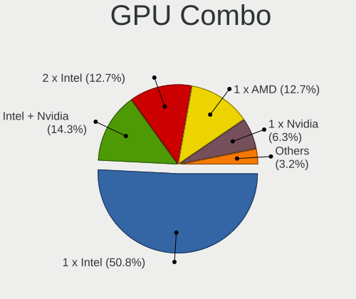

| Name           | Notebooks | Percent |
|----------------|-----------|---------|
| 1 x Intel      | 32        | 50.79%  |
| Intel + Nvidia | 9         | 14.29%  |
| 2 x Intel      | 8         | 12.7%   |
| 1 x AMD        | 8         | 12.7%   |
| 1 x Nvidia     | 4         | 6.35%   |
| Intel + AMD    | 2         | 3.17%   |

GPU Driver
----------

Free vs proprietary

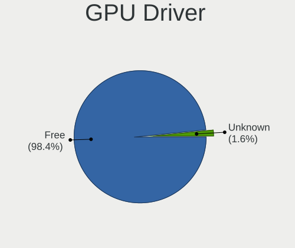

| Driver  | Notebooks | Percent |
|---------|-----------|---------|
| Free    | 61        | 98.39%  |
| Unknown | 1         | 1.61%   |

GPU Memory
----------

Total video memory

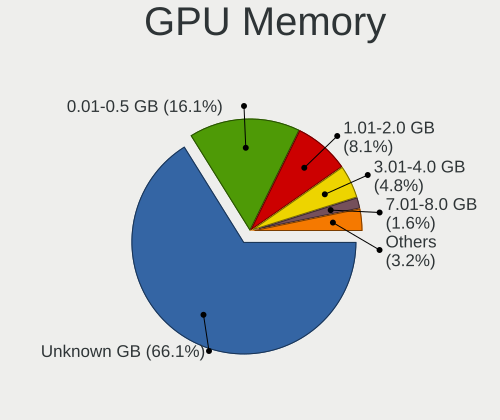

| Size in GB | Notebooks | Percent |
|------------|-----------|---------|
| Unknown    | 41        | 66.13%  |
| 0.01-0.5   | 10        | 16.13%  |
| 1.01-2.0   | 5         | 8.06%   |
| 3.01-4.0   | 3         | 4.84%   |
| 7.01-8.0   | 1         | 1.61%   |
| 2.01-3.0   | 1         | 1.61%   |
| 0.51-1.0   | 1         | 1.61%   |

Monitor
-------

Monitor Vendor
--------------

Monitor vendors

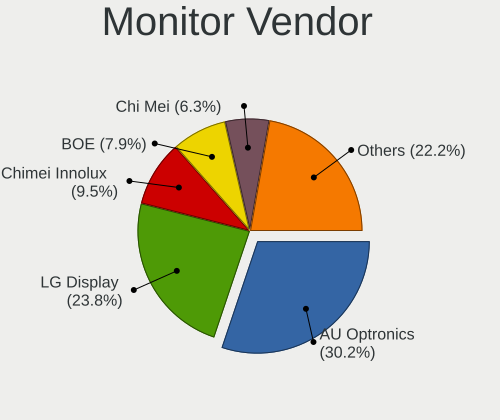

| Vendor                  | Notebooks | Percent |
|-------------------------|-----------|---------|
| AU Optronics            | 19        | 30.16%  |
| LG Display              | 15        | 23.81%  |
| Chimei Innolux          | 6         | 9.52%   |
| BOE                     | 5         | 7.94%   |
| Chi Mei Optoelectronics | 4         | 6.35%   |
| Samsung Electronics     | 3         | 4.76%   |
| LG Philips              | 2         | 3.17%   |
| Apple                   | 2         | 3.17%   |
| Sharp                   | 1         | 1.59%   |
| Lenovo                  | 1         | 1.59%   |
| JDI                     | 1         | 1.59%   |
| Insignia                | 1         | 1.59%   |
| EQV                     | 1         | 1.59%   |
| Dell                    | 1         | 1.59%   |
| AOC                     | 1         | 1.59%   |

Monitor Model
-------------

Monitor models

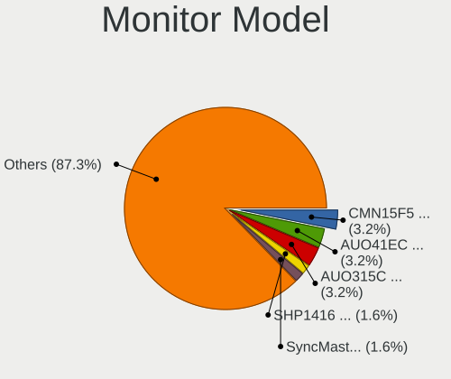

| Model                                                                     | Notebooks | Percent |
|---------------------------------------------------------------------------|-----------|---------|
| Chimei Innolux LCD Monitor CMN15F5 1920x1080 344x193mm 15.5-inch          | 2         | 3.17%   |
| AU Optronics LCD Monitor AUO41EC 1366x768 344x193mm 15.5-inch             | 2         | 3.17%   |
| AU Optronics LCD Monitor AUO315C 1366x768 256x144mm 11.6-inch             | 2         | 3.17%   |
| Sharp LCD Monitor SHP1416 1366x768 309x174mm 14.0-inch                    | 1         | 1.59%   |
| Samsung Electronics SyncMaster SAM011E 1280x1024 338x270mm 17.0-inch      | 1         | 1.59%   |
| Samsung Electronics LCD Monitor SEC5441 1280x800 331x207mm 15.4-inch      | 1         | 1.59%   |
| Samsung Electronics LCD Monitor SAM0902 1920x1080 890x500mm 40.2-inch     | 1         | 1.59%   |
| LG Philips LCD Monitor LPLA002 1440x900 367x230mm 17.1-inch               | 1         | 1.59%   |
| LG Philips LCD Monitor LPL0129 1280x800 304x190mm 14.1-inch               | 1         | 1.59%   |
| LG Display LP101WSB-TLN1 LGD026E 1024x600 224x126mm 10.1-inch             | 1         | 1.59%   |
| LG Display LCD Monitor LGD069A 1920x1080 340x190mm 15.3-inch              | 1         | 1.59%   |
| LG Display LCD Monitor LGD05D5 1920x1080 344x194mm 15.5-inch              | 1         | 1.59%   |
| LG Display LCD Monitor LGD0590 1920x1080 344x194mm 15.5-inch              | 1         | 1.59%   |
| LG Display LCD Monitor LGD056D 1920x1080 382x215mm 17.3-inch              | 1         | 1.59%   |
| LG Display LCD Monitor LGD0479 1920x1080 309x174mm 14.0-inch              | 1         | 1.59%   |
| LG Display LCD Monitor LGD046C 1920x1080 382x215mm 17.3-inch              | 1         | 1.59%   |
| LG Display LCD Monitor LGD03ED 1366x768 277x156mm 12.5-inch               | 1         | 1.59%   |
| LG Display LCD Monitor LGD03DB 1366x768 345x194mm 15.6-inch               | 1         | 1.59%   |
| LG Display LCD Monitor LGD0386 1366x768 309x174mm 14.0-inch               | 1         | 1.59%   |
| LG Display LCD Monitor LGD0362 1600x900 309x174mm 14.0-inch               | 1         | 1.59%   |
| LG Display LCD Monitor LGD033A 1366x768 344x194mm 15.5-inch               | 1         | 1.59%   |
| LG Display LCD Monitor LGD0338 1600x900 344x194mm 15.5-inch               | 1         | 1.59%   |
| LG Display LCD Monitor LGD02F1 1366x768 344x194mm 15.5-inch               | 1         | 1.59%   |
| LG Display LCD Monitor LGD02E9 1366x768 309x174mm 14.0-inch               | 1         | 1.59%   |
| Lenovo LCD Monitor LEN4037 1280x800 303x190mm 14.1-inch                   | 1         | 1.59%   |
| JDI LAM125M007D JDI1402 1920x1080 277x156mm 12.5-inch                     | 1         | 1.59%   |
| Insignia NS-32D310NA21 BBY0050 1680x1050 708x398mm 32.0-inch              | 1         | 1.59%   |
| EQV LCD Monitor EQV1080 1920x1080 477x268mm 21.5-inch                     | 1         | 1.59%   |
| Dell E196FP DELA015 1280x1024 338x270mm 17.0-inch                         | 1         | 1.59%   |
| Chimei Innolux LCD Monitor CMN15C9 1366x768 344x193mm 15.5-inch           | 1         | 1.59%   |
| Chimei Innolux LCD Monitor CMN1493 1366x768 309x173mm 13.9-inch           | 1         | 1.59%   |
| Chimei Innolux LCD Monitor CMN1382 1920x1080 293x165mm 13.2-inch          | 1         | 1.59%   |
| Chimei Innolux LCD Monitor CMN1364 1366x768 293x164mm 13.2-inch           | 1         | 1.59%   |
| Chi Mei Optoelectronics LCD Monitor CMO1600 1920x1080 374x192mm 16.6-inch | 1         | 1.59%   |
| Chi Mei Optoelectronics LCD Monitor CMO15A1 1366x768 344x193mm 15.5-inch  | 1         | 1.59%   |
| Chi Mei Optoelectronics LCD Monitor CMO1592 1366x768 344x193mm 15.5-inch  | 1         | 1.59%   |
| Chi Mei Optoelectronics LCD Monitor CMO1526 1280x800 331x207mm 15.4-inch  | 1         | 1.59%   |
| BOE LCD Monitor BOE0A06 1920x1080 344x194mm 15.5-inch                     | 1         | 1.59%   |
| BOE LCD Monitor BOE0955 1600x900 382x215mm 17.3-inch                      | 1         | 1.59%   |
| BOE LCD Monitor BOE0903 1920x1080 344x194mm 15.5-inch                     | 1         | 1.59%   |

Monitor Resolution
------------------

Monitor screen resolution

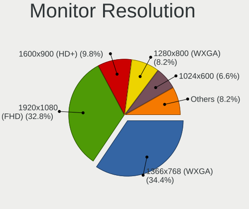

| Resolution         | Notebooks | Percent |
|--------------------|-----------|---------|
| 1366x768 (WXGA)    | 21        | 34.43%  |
| 1920x1080 (FHD)    | 20        | 32.79%  |
| 1600x900 (HD+)     | 6         | 9.84%   |
| 1280x800 (WXGA)    | 5         | 8.2%    |
| 1024x600           | 4         | 6.56%   |
| 1280x1024 (SXGA)   | 2         | 3.28%   |
| 1920x1200 (WUXGA)  | 1         | 1.64%   |
| 1680x1050 (WSXGA+) | 1         | 1.64%   |
| 1440x900 (WXGA+)   | 1         | 1.64%   |

Monitor Diagonal
----------------

Diagonal size in inches

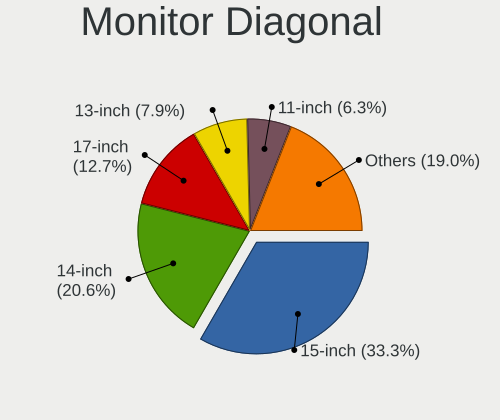

| Inches | Notebooks | Percent |
|--------|-----------|---------|
| 15     | 21        | 33.33%  |
| 14     | 13        | 20.63%  |
| 17     | 8         | 12.7%   |
| 13     | 5         | 7.94%   |
| 11     | 4         | 6.35%   |
| 10     | 4         | 6.35%   |
| 12     | 2         | 3.17%   |
| 54     | 1         | 1.59%   |
| 34     | 1         | 1.59%   |
| 22     | 1         | 1.59%   |
| 21     | 1         | 1.59%   |
| 19     | 1         | 1.59%   |
| 16     | 1         | 1.59%   |

Monitor Width
-------------

Physical width

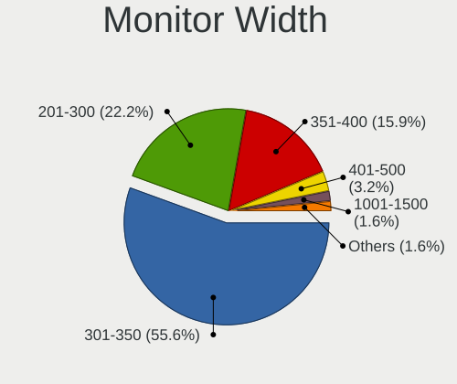

| Width in mm | Notebooks | Percent |
|-------------|-----------|---------|
| 301-350     | 35        | 55.56%  |
| 201-300     | 14        | 22.22%  |
| 351-400     | 10        | 15.87%  |
| 401-500     | 2         | 3.17%   |
| 701-800     | 1         | 1.59%   |
| 1001-1500   | 1         | 1.59%   |

Aspect Ratio
------------

Proportional relationship between the width and the height

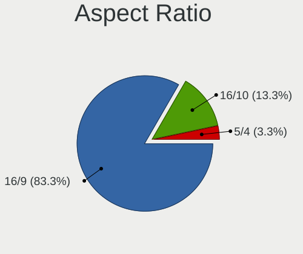

| Ratio | Notebooks | Percent |
|-------|-----------|---------|
| 16/9  | 50        | 83.33%  |
| 16/10 | 8         | 13.33%  |
| 5/4   | 2         | 3.33%   |

Monitor Area
------------

Area in inch²

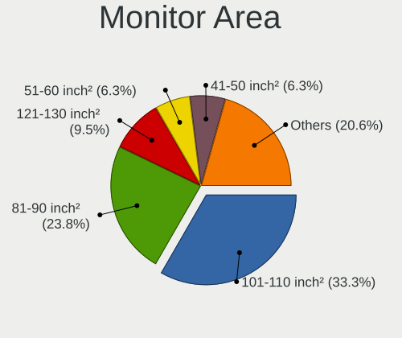

| Area in inch² | Notebooks | Percent |
|----------------|-----------|---------|
| 101-110        | 21        | 33.33%  |
| 81-90          | 15        | 23.81%  |
| 121-130        | 6         | 9.52%   |
| 51-60          | 4         | 6.35%   |
| 41-50          | 4         | 6.35%   |
| 71-80          | 3         | 4.76%   |
| 61-70          | 2         | 3.17%   |
| 151-200        | 2         | 3.17%   |
| More than 1000 | 1         | 1.59%   |
| 201-250        | 1         | 1.59%   |
| 141-150        | 1         | 1.59%   |
| 131-140        | 1         | 1.59%   |
| 111-120        | 1         | 1.59%   |
| 501-1000       | 1         | 1.59%   |

Pixel Density
-------------

Pixels per inch

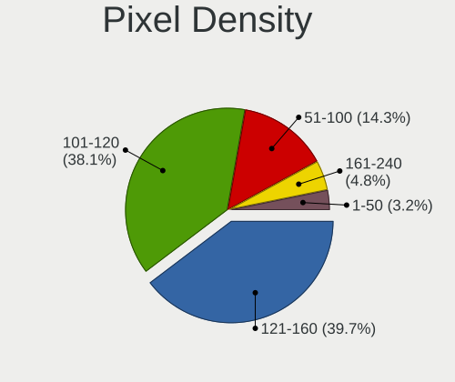

| Density | Notebooks | Percent |
|---------|-----------|---------|
| 121-160 | 25        | 39.68%  |
| 101-120 | 24        | 38.1%   |
| 51-100  | 9         | 14.29%  |
| 161-240 | 3         | 4.76%   |
| 1-50    | 2         | 3.17%   |

Multiple Monitors
-----------------

Total monitors connected

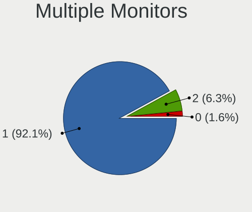

| Total | Notebooks | Percent |
|-------|-----------|---------|
| 1     | 58        | 92.06%  |
| 2     | 4         | 6.35%   |
| 0     | 1         | 1.59%   |

Network
-------

Net Controller Vendor
---------------------

Controller vendors

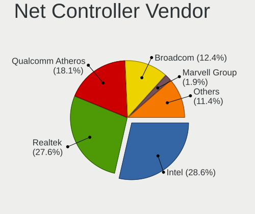

| Vendor                          | Notebooks | Percent |
|---------------------------------|-----------|---------|
| Intel                           | 30        | 28.57%  |
| Realtek Semiconductor           | 29        | 27.62%  |
| Qualcomm Atheros                | 19        | 18.1%   |
| Broadcom                        | 13        | 12.38%  |
| Marvell Technology Group        | 2         | 1.9%    |
| Broadcom Limited                | 2         | 1.9%    |
| Samsung Electronics             | 1         | 0.95%   |
| Research In Motion              | 1         | 0.95%   |
| Ralink Technology               | 1         | 0.95%   |
| Ralink                          | 1         | 0.95%   |
| Qualcomm Atheros Communications | 1         | 0.95%   |
| Nvidia                          | 1         | 0.95%   |
| ICS Advent                      | 1         | 0.95%   |
| Huawei Technologies             | 1         | 0.95%   |
| Dell                            | 1         | 0.95%   |
| Cal-Comp Electronic             | 1         | 0.95%   |

Net Controller Model
--------------------

Controller models

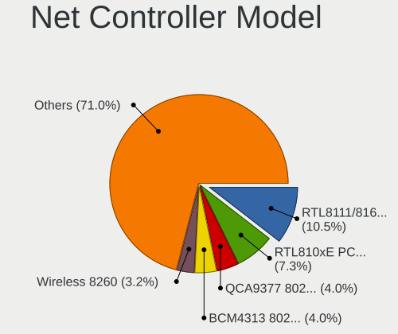

| Model                                                                                 | Notebooks | Percent |
|---------------------------------------------------------------------------------------|-----------|---------|
| Realtek RTL8111/8168/8211/8411 PCI Express Gigabit Ethernet Controller                | 13        | 10.48%  |
| Realtek RTL810xE PCI Express Fast Ethernet controller                                 | 9         | 7.26%   |
| Qualcomm Atheros QCA9377 802.11ac Wireless Network Adapter                            | 5         | 4.03%   |
| Broadcom BCM4313 802.11bgn Wireless Network Adapter                                   | 5         | 4.03%   |
| Intel Wireless 8260                                                                   | 4         | 3.23%   |
| Intel 82579LM Gigabit Network Connection (Lewisville)                                 | 4         | 3.23%   |
| Realtek RTL8188EUS 802.11n Wireless Network Adapter                                   | 3         | 2.42%   |
| Qualcomm Atheros AR9485 Wireless Network Adapter                                      | 3         | 2.42%   |
| Qualcomm Atheros AR9285 Wireless Network Adapter (PCI-Express)                        | 3         | 2.42%   |
| Intel Wireless 8265 / 8275                                                            | 3         | 2.42%   |
| Intel Wireless 7260                                                                   | 3         | 2.42%   |
| Intel Ethernet Connection I219-LM                                                     | 3         | 2.42%   |
| Intel Centrino Advanced-N 6205 [Taylor Peak]                                          | 3         | 2.42%   |
| Qualcomm Atheros QCA9565 / AR9565 Wireless Network Adapter                            | 2         | 1.61%   |
| Qualcomm Atheros AR8152 v1.1 Fast Ethernet                                            | 2         | 1.61%   |
| Marvell Group 88E8058 PCI-E Gigabit Ethernet Controller                               | 2         | 1.61%   |
| Intel Wi-Fi 6E(802.11ax) AX210/AX1675* 2x2 [Typhoon Peak]                             | 2         | 1.61%   |
| Intel Wi-Fi 6 AX201                                                                   | 2         | 1.61%   |
| Intel PRO/Wireless 2200BG [Calexico2] Network Connection                              | 2         | 1.61%   |
| Intel 82567LM Gigabit Network Connection                                              | 2         | 1.61%   |
| Broadcom BCM4312 802.11b/g LP-PHY                                                     | 2         | 1.61%   |
| Samsung GT-I9070 (network tethering, USB debugging enabled)                           | 1         | 0.81%   |
| Research In Motion BlackBerry                                                         | 1         | 0.81%   |
| Realtek RTL8822CE 802.11ac PCIe Wireless Network Adapter                              | 1         | 0.81%   |
| Realtek RTL8821CE 802.11ac PCIe Wireless Network Adapter                              | 1         | 0.81%   |
| Realtek RTL8187B Wireless Adapter                                                     | 1         | 0.81%   |
| Realtek RTL8153 Gigabit Ethernet Adapter                                              | 1         | 0.81%   |
| Realtek 802.11ac NIC                                                                  | 1         | 0.81%   |
| Ralink RT2870/RT3070 Wireless Adapter                                                 | 1         | 0.81%   |
| Ralink RT3290 Wireless 802.11n 1T/1R PCIe                                             | 1         | 0.81%   |
| Qualcomm Atheros QCA8172 Fast Ethernet                                                | 1         | 0.81%   |
| Qualcomm Atheros QCA6174 802.11ac Wireless Network Adapter                            | 1         | 0.81%   |
| Qualcomm Atheros AR9271 802.11n                                                       | 1         | 0.81%   |
| Qualcomm Atheros AR928X Wireless Network Adapter (PCI-Express)                        | 1         | 0.81%   |
| Qualcomm Atheros AR8132 Fast Ethernet                                                 | 1         | 0.81%   |
| Qualcomm Atheros AR5418 Wireless Network Adapter [AR5008E 802.11(a)bgn] (PCI-Express) | 1         | 0.81%   |
| Qualcomm Atheros AR242x / AR542x Wireless Network Adapter (PCI-Express)               | 1         | 0.81%   |
| Nvidia MCP79 Ethernet                                                                 | 1         | 0.81%   |
| Intel Wireless 7265                                                                   | 1         | 0.81%   |
| Intel WiFi Link 5100                                                                  | 1         | 0.81%   |

Wireless Vendor
---------------

Wireless vendors

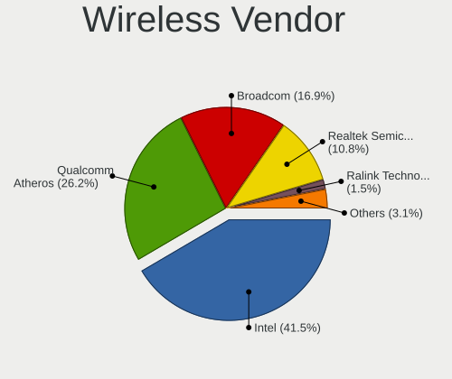

| Vendor                          | Notebooks | Percent |
|---------------------------------|-----------|---------|
| Intel                           | 27        | 41.54%  |
| Qualcomm Atheros                | 17        | 26.15%  |
| Broadcom                        | 11        | 16.92%  |
| Realtek Semiconductor           | 7         | 10.77%  |
| Ralink Technology               | 1         | 1.54%   |
| Ralink                          | 1         | 1.54%   |
| Qualcomm Atheros Communications | 1         | 1.54%   |

Wireless Model
--------------

Wireless models

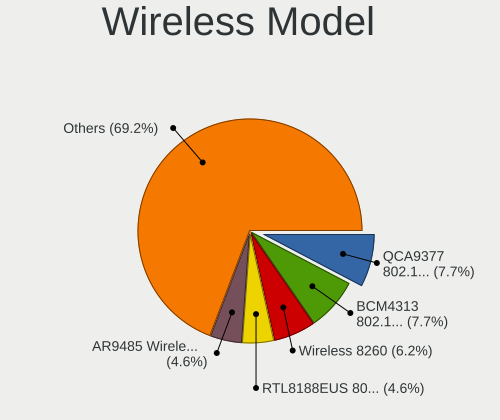

| Model                                                                                 | Notebooks | Percent |
|---------------------------------------------------------------------------------------|-----------|---------|
| Qualcomm Atheros QCA9377 802.11ac Wireless Network Adapter                            | 5         | 7.69%   |
| Broadcom BCM4313 802.11bgn Wireless Network Adapter                                   | 5         | 7.69%   |
| Intel Wireless 8260                                                                   | 4         | 6.15%   |
| Realtek RTL8188EUS 802.11n Wireless Network Adapter                                   | 3         | 4.62%   |
| Qualcomm Atheros AR9485 Wireless Network Adapter                                      | 3         | 4.62%   |
| Qualcomm Atheros AR9285 Wireless Network Adapter (PCI-Express)                        | 3         | 4.62%   |
| Intel Wireless 8265 / 8275                                                            | 3         | 4.62%   |
| Intel Wireless 7260                                                                   | 3         | 4.62%   |
| Intel Centrino Advanced-N 6205 [Taylor Peak]                                          | 3         | 4.62%   |
| Qualcomm Atheros QCA9565 / AR9565 Wireless Network Adapter                            | 2         | 3.08%   |
| Intel Wi-Fi 6E(802.11ax) AX210/AX1675* 2x2 [Typhoon Peak]                             | 2         | 3.08%   |
| Intel Wi-Fi 6 AX201                                                                   | 2         | 3.08%   |
| Intel PRO/Wireless 2200BG [Calexico2] Network Connection                              | 2         | 3.08%   |
| Broadcom BCM4312 802.11b/g LP-PHY                                                     | 2         | 3.08%   |
| Realtek RTL8822CE 802.11ac PCIe Wireless Network Adapter                              | 1         | 1.54%   |
| Realtek RTL8821CE 802.11ac PCIe Wireless Network Adapter                              | 1         | 1.54%   |
| Realtek RTL8187B Wireless Adapter                                                     | 1         | 1.54%   |
| Realtek 802.11ac NIC                                                                  | 1         | 1.54%   |
| Ralink RT2870/RT3070 Wireless Adapter                                                 | 1         | 1.54%   |
| Ralink RT3290 Wireless 802.11n 1T/1R PCIe                                             | 1         | 1.54%   |
| Qualcomm Atheros QCA6174 802.11ac Wireless Network Adapter                            | 1         | 1.54%   |
| Qualcomm Atheros AR9271 802.11n                                                       | 1         | 1.54%   |
| Qualcomm Atheros AR928X Wireless Network Adapter (PCI-Express)                        | 1         | 1.54%   |
| Qualcomm Atheros AR5418 Wireless Network Adapter [AR5008E 802.11(a)bgn] (PCI-Express) | 1         | 1.54%   |
| Qualcomm Atheros AR242x / AR542x Wireless Network Adapter (PCI-Express)               | 1         | 1.54%   |
| Intel Wireless 7265                                                                   | 1         | 1.54%   |
| Intel WiFi Link 5100                                                                  | 1         | 1.54%   |
| Intel Wi-Fi 6 AX200                                                                   | 1         | 1.54%   |
| Intel Wi-Fi 5(802.11ac) Wireless-AC 9x6x [Thunder Peak]                               | 1         | 1.54%   |
| Intel PRO/Wireless 3945ABG [Golan] Network Connection                                 | 1         | 1.54%   |
| Intel Centrino Wireless-N 135                                                         | 1         | 1.54%   |
| Intel Centrino Advanced-N 6200                                                        | 1         | 1.54%   |
| Intel Cannon Lake PCH CNVi WiFi                                                       | 1         | 1.54%   |
| Broadcom BCM4360 802.11ac 5G Wireless Network Adapter                                 | 1         | 1.54%   |
| Broadcom BCM43228 802.11a/b/g/n                                                       | 1         | 1.54%   |
| Broadcom BCM4322 802.11a/b/g/n Wireless LAN Controller                                | 1         | 1.54%   |
| Broadcom BCM4321 802.11a/b/g/n                                                        | 1         | 1.54%   |

Ethernet Vendor
---------------

Ethernet vendors

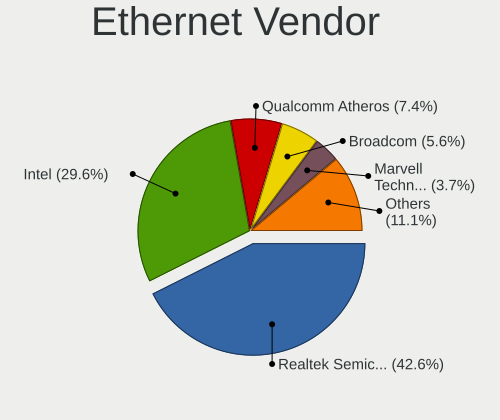

| Vendor                   | Notebooks | Percent |
|--------------------------|-----------|---------|
| Realtek Semiconductor    | 23        | 42.59%  |
| Intel                    | 16        | 29.63%  |
| Qualcomm Atheros         | 4         | 7.41%   |
| Broadcom                 | 3         | 5.56%   |
| Marvell Technology Group | 2         | 3.7%    |
| Broadcom Limited         | 2         | 3.7%    |
| Samsung Electronics      | 1         | 1.85%   |
| Research In Motion       | 1         | 1.85%   |
| Nvidia                   | 1         | 1.85%   |
| ICS Advent               | 1         | 1.85%   |

Ethernet Model
--------------

Ethernet models

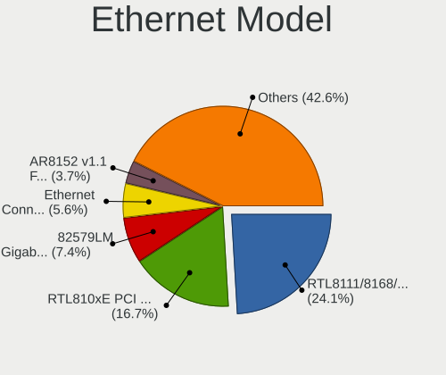

| Model                                                                  | Notebooks | Percent |
|------------------------------------------------------------------------|-----------|---------|
| Realtek RTL8111/8168/8211/8411 PCI Express Gigabit Ethernet Controller | 13        | 24.07%  |
| Realtek RTL810xE PCI Express Fast Ethernet controller                  | 9         | 16.67%  |
| Intel 82579LM Gigabit Network Connection (Lewisville)                  | 4         | 7.41%   |
| Intel Ethernet Connection I219-LM                                      | 3         | 5.56%   |
| Qualcomm Atheros AR8152 v1.1 Fast Ethernet                             | 2         | 3.7%    |
| Marvell Group 88E8058 PCI-E Gigabit Ethernet Controller                | 2         | 3.7%    |
| Intel 82567LM Gigabit Network Connection                               | 2         | 3.7%    |
| Samsung GT-I9070 (network tethering, USB debugging enabled)            | 1         | 1.85%   |
| Research In Motion BlackBerry                                          | 1         | 1.85%   |
| Realtek RTL8153 Gigabit Ethernet Adapter                               | 1         | 1.85%   |
| Qualcomm Atheros QCA8172 Fast Ethernet                                 | 1         | 1.85%   |
| Qualcomm Atheros AR8132 Fast Ethernet                                  | 1         | 1.85%   |
| Nvidia MCP79 Ethernet                                                  | 1         | 1.85%   |
| Intel PRO/100 VE Network Connection                                    | 1         | 1.85%   |
| Intel Ethernet Connection I218-LM                                      | 1         | 1.85%   |
| Intel Ethernet Connection (4) I219-V                                   | 1         | 1.85%   |
| Intel Ethernet Connection (4) I219-LM                                  | 1         | 1.85%   |
| Intel Ethernet Connection (3) I218-LM                                  | 1         | 1.85%   |
| Intel 82577LM Gigabit Network Connection                               | 1         | 1.85%   |
| Intel 82541GI Gigabit Ethernet Controller                              | 1         | 1.85%   |
| ICS Advent 10/100M LAN                                                 | 1         | 1.85%   |
| Broadcom NetLink BCM5906M Fast Ethernet PCI Express                    | 1         | 1.85%   |
| Broadcom NetLink BCM5784M Gigabit Ethernet PCIe                        | 1         | 1.85%   |
| Broadcom NetLink BCM57785 Gigabit Ethernet PCIe                        | 1         | 1.85%   |
| Broadcom Limited NetXtreme BCM5761 Gigabit Ethernet PCIe               | 1         | 1.85%   |
| Broadcom Limited NetLink BCM5906M Fast Ethernet PCI Express            | 1         | 1.85%   |

Net Controller Kind
-------------------

Ethernet, WiFi or modem

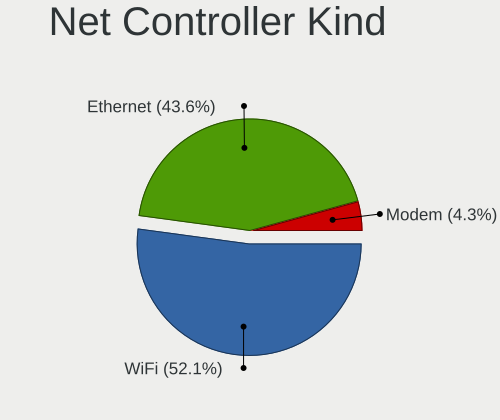

| Kind     | Notebooks | Percent |
|----------|-----------|---------|
| WiFi     | 61        | 52.14%  |
| Ethernet | 51        | 43.59%  |
| Modem    | 5         | 4.27%   |

Used Controller
---------------

Currently used network controller

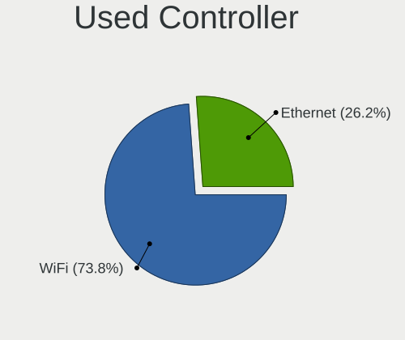

| Kind     | Notebooks | Percent |
|----------|-----------|---------|
| WiFi     | 48        | 73.85%  |
| Ethernet | 17        | 26.15%  |

NICs
----

Total network controllers on board

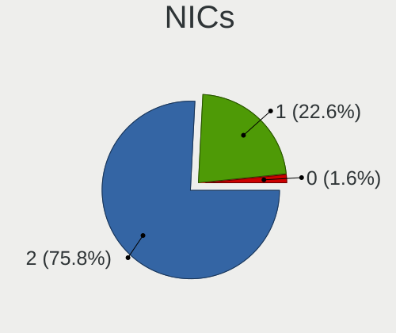

| Total | Notebooks | Percent |
|-------|-----------|---------|
| 2     | 47        | 75.81%  |
| 1     | 14        | 22.58%  |
| 0     | 1         | 1.61%   |

IPv6
----

IPv6 vs IPv4

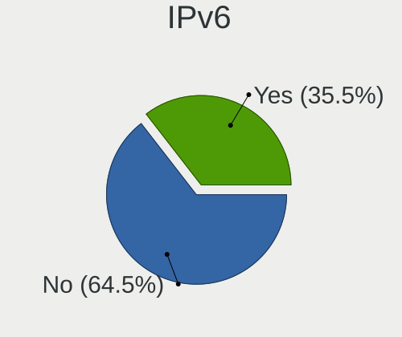

| Used | Notebooks | Percent |
|------|-----------|---------|
| No   | 40        | 64.52%  |
| Yes  | 22        | 35.48%  |

Bluetooth
---------

Bluetooth Vendor
----------------

Controller vendors

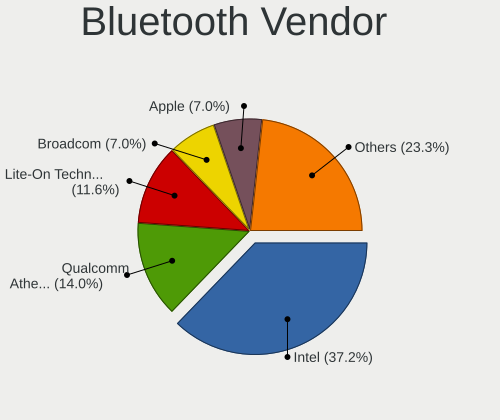

| Vendor                          | Notebooks | Percent |
|---------------------------------|-----------|---------|
| Intel                           | 16        | 37.21%  |
| Qualcomm Atheros Communications | 6         | 13.95%  |
| Lite-On Technology              | 5         | 11.63%  |
| Broadcom                        | 3         | 6.98%   |
| Apple                           | 3         | 6.98%   |
| IMC Networks                    | 2         | 4.65%   |
| Dell                            | 2         | 4.65%   |
| Toshiba                         | 1         | 2.33%   |
| Realtek Semiconductor           | 1         | 2.33%   |
| Ralink                          | 1         | 2.33%   |
| Hewlett-Packard                 | 1         | 2.33%   |
| Foxconn / Hon Hai               | 1         | 2.33%   |
| Unknown                         | 1         | 2.33%   |

Bluetooth Model
---------------

Controller models

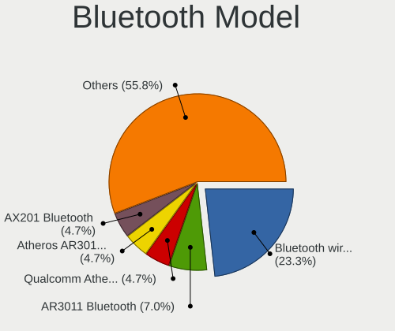

| Model                                              | Notebooks | Percent |
|----------------------------------------------------|-----------|---------|
| Intel Bluetooth wireless interface                 | 10        | 23.26%  |
| Qualcomm Atheros AR3011 Bluetooth                  | 3         | 6.98%   |
| Qualcomm Atheros  Bluetooth Device                 | 2         | 4.65%   |
| Lite-On Atheros AR3012 Bluetooth                   | 2         | 4.65%   |
| Intel AX201 Bluetooth                              | 2         | 4.65%   |
| Apple Bluetooth HCI MacBookPro (HID mode)          | 2         | 4.65%   |
| Toshiba Integrated Bluetooth HCI                   | 1         | 2.33%   |
| Realtek Bluetooth Radio                            | 1         | 2.33%   |
| Ralink RT3290 Bluetooth                            | 1         | 2.33%   |
| Qualcomm Atheros QCA61x4 Bluetooth 4.0             | 1         | 2.33%   |
| Lite-On Qualcomm Atheros QCA9377 Bluetooth         | 1         | 2.33%   |
| Lite-On Bluetooth USB Host Controller              | 1         | 2.33%   |
| Lite-On Bluetooth Radio                            | 1         | 2.33%   |
| Intel Wireless-AC 9260 Bluetooth Adapter           | 1         | 2.33%   |
| Intel Centrino Bluetooth Wireless Transceiver      | 1         | 2.33%   |
| Intel Bluetooth 9460/9560 Jefferson Peak (JfP)     | 1         | 2.33%   |
| Intel AX210 Bluetooth                              | 1         | 2.33%   |
| IMC Networks Bluetooth Device                      | 1         | 2.33%   |
| IMC Networks Atheros AR3012 Bluetooth 4.0 Adapter  | 1         | 2.33%   |
| HP Broadcom 2070 Bluetooth Combo                   | 1         | 2.33%   |
| Foxconn / Hon Hai Bluetooth Device                 | 1         | 2.33%   |
| Dell DW375 Bluetooth Module                        | 1         | 2.33%   |
| Dell BCM20702A0 Bluetooth Module                   | 1         | 2.33%   |
| Broadcom BCM20702A0                                | 1         | 2.33%   |
| Broadcom BCM20702 Bluetooth 4.0 [ThinkPad]         | 1         | 2.33%   |
| Broadcom BCM2045B (BDC-2.1) [Bluetooth Controller] | 1         | 2.33%   |
| Apple Bluetooth Host Controller                    | 1         | 2.33%   |
| Unknown                                            | 1         | 2.33%   |

Sound
-----

Sound Vendor
------------

Sound card vendors

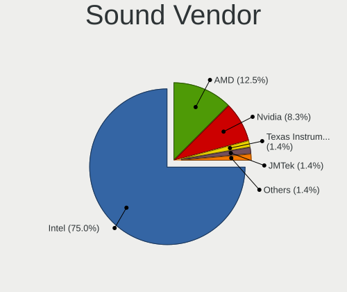

| Vendor              | Notebooks | Percent |
|---------------------|-----------|---------|
| Intel               | 54        | 75%     |
| AMD                 | 9         | 12.5%   |
| Nvidia              | 6         | 8.33%   |
| Texas Instruments   | 1         | 1.39%   |
| JMTek               | 1         | 1.39%   |
| C-Media Electronics | 1         | 1.39%   |

Sound Model
-----------

Sound card models

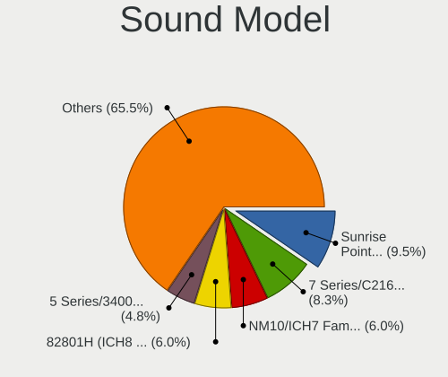

| Model                                                                      | Notebooks | Percent |
|----------------------------------------------------------------------------|-----------|---------|
| Intel Sunrise Point-LP HD Audio                                            | 8         | 9.52%   |
| Intel 7 Series/C216 Chipset Family High Definition Audio Controller        | 7         | 8.33%   |
| Intel NM10/ICH7 Family High Definition Audio Controller                    | 5         | 5.95%   |
| Intel 82801H (ICH8 Family) HD Audio Controller                             | 5         | 5.95%   |
| Intel 5 Series/3400 Series Chipset High Definition Audio                   | 4         | 4.76%   |
| AMD Ryzen HD Audio Controller                                              | 4         | 4.76%   |
| Intel Haswell-ULT HD Audio Controller                                      | 3         | 3.57%   |
| Intel 82801I (ICH9 Family) HD Audio Controller                             | 3         | 3.57%   |
| Intel 8 Series HD Audio Controller                                         | 3         | 3.57%   |
| Intel 6 Series/C200 Series Chipset Family High Definition Audio Controller | 3         | 3.57%   |
| Nvidia GP107GL High Definition Audio Controller                            | 2         | 2.38%   |
| Nvidia GF108 High Definition Audio Controller                              | 2         | 2.38%   |
| Intel Wildcat Point-LP High Definition Audio Controller                    | 2         | 2.38%   |
| Intel Tiger Lake-LP Smart Sound Technology Audio Controller                | 2         | 2.38%   |
| Intel Ice Lake-LP Smart Sound Technology Audio Controller                  | 2         | 2.38%   |
| Intel Cannon Lake PCH cAVS                                                 | 2         | 2.38%   |
| Intel Broadwell-U Audio Controller                                         | 2         | 2.38%   |
| Intel Atom Processor Z36xxx/Z37xxx Series High Definition Audio Controller | 2         | 2.38%   |
| AMD SBx00 Azalia (Intel HDA)                                               | 2         | 2.38%   |
| AMD Renoir/Cezanne HDMI/DP Audio Controller                                | 2         | 2.38%   |
| AMD Raven/Raven2/Fenghuang HDMI/DP Audio Controller                        | 2         | 2.38%   |
| Texas Instruments PCM2902 Audio Codec                                      | 1         | 1.19%   |
| Nvidia MCP79 High Definition Audio                                         | 1         | 1.19%   |
| Nvidia GP104 High Definition Audio Controller                              | 1         | 1.19%   |
| JMTek USB Audio Device                                                     | 1         | 1.19%   |
| Intel CM238 HD Audio Controller                                            | 1         | 1.19%   |
| Intel Celeron N3350/Pentium N4200/Atom E3900 Series Audio Cluster          | 1         | 1.19%   |
| Intel Alder Lake PCH-P High Definition Audio Controller                    | 1         | 1.19%   |
| Intel 82801FB/FBM/FR/FW/FRW (ICH6 Family) AC'97 Audio Controller           | 1         | 1.19%   |
| Intel 82801DB/DBL/DBM (ICH4/ICH4-L/ICH4-M) AC'97 Audio Controller          | 1         | 1.19%   |
| Intel 100 Series/C230 Series Chipset Family HD Audio Controller            | 1         | 1.19%   |
| C-Media Electronics USB Advanced Audio Device                              | 1         | 1.19%   |
| AMD Wrestler HDMI Audio                                                    | 1         | 1.19%   |
| AMD RV710/730 HDMI Audio [Radeon HD 4000 series]                           | 1         | 1.19%   |
| AMD RV630 HDMI Audio [Radeon HD 2600 PRO/XT / HD 3610]                     | 1         | 1.19%   |
| AMD RS880 HDMI Audio [Radeon HD 4200 Series]                               | 1         | 1.19%   |
| AMD FCH Azalia Controller                                                  | 1         | 1.19%   |
| AMD Cedar HDMI Audio [Radeon HD 5400/6300/7300 Series]                     | 1         | 1.19%   |

Memory
------

Memory Vendor
-------------

Memory module vendors

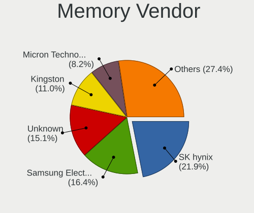

| Vendor                       | Notebooks | Percent |
|------------------------------|-----------|---------|
| SK hynix                     | 16        | 21.92%  |
| Samsung Electronics          | 12        | 16.44%  |
| Unknown                      | 11        | 15.07%  |
| Kingston                     | 8         | 10.96%  |
| Micron Technology            | 6         | 8.22%   |
| Elpida                       | 4         | 5.48%   |
| Crucial                      | 4         | 5.48%   |
| A-DATA Technology            | 4         | 5.48%   |
| Ramaxel Technology           | 2         | 2.74%   |
| Nanya Technology             | 2         | 2.74%   |
| Unknown (0xFFFF000000000000) | 1         | 1.37%   |
| Toshiba                      | 1         | 1.37%   |
| Timetec                      | 1         | 1.37%   |
| ASint Technology             | 1         | 1.37%   |

Memory Model
------------

Memory module models

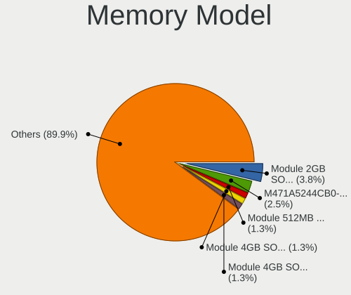

| Model                                                           | Notebooks | Percent |
|-----------------------------------------------------------------|-----------|---------|
| Unknown RAM Module 2GB SODIMM DDR2 667MT/s                      | 3         | 3.8%    |
| Samsung RAM M471A5244CB0-CWE 4GB Row Of Chips DDR4 3200MT/s     | 2         | 2.53%   |
| Unknown RAM Module 512MB SODIMM DDR                             | 1         | 1.27%   |
| Unknown RAM Module 4GB SODIMM DDR4 2400MT/s                     | 1         | 1.27%   |
| Unknown RAM Module 4GB SODIMM DDR3 1067MT/s                     | 1         | 1.27%   |
| Unknown RAM Module 4GB SODIMM DDR3                              | 1         | 1.27%   |
| Unknown RAM Module 2GB SODIMM DDR3 667MT/s                      | 1         | 1.27%   |
| Unknown RAM Module 2GB SODIMM DDR3                              | 1         | 1.27%   |
| Unknown RAM Module 2GB SODIMM DDR2 533MT/s                      | 1         | 1.27%   |
| Unknown RAM Module 2GB SODIMM DDR2                              | 1         | 1.27%   |
| Unknown RAM Module 1GB SODIMM DDR3 667MT/s                      | 1         | 1.27%   |
| Unknown RAM Module 1GB SODIMM DDR2 533MT/s                      | 1         | 1.27%   |
| Unknown (0xFFFF000000000000) RAM Module 2GB SODIMM DDR2 667MT/s | 1         | 1.27%   |
| Toshiba RAM 8HTF12864HDY-800G1 2GB SODIMM 1066MT/s              | 1         | 1.27%   |
| Toshiba RAM 64T128020EDL2.5C2 2GB SODIMM 1066MT/s               | 1         | 1.27%   |
| Timetec RAM S8G-1600 8GB SODIMM DDR3 1600MT/s                   | 1         | 1.27%   |
| SK hynix RAM Module 2GB SODIMM DDR2 533MT/s                     | 1         | 1.27%   |
| SK hynix RAM HMT451S6MFR8C-PB 4GB SODIMM DDR3 1334MT/s          | 1         | 1.27%   |
| SK hynix RAM HMT451S6MFR8C-H9 4GB SODIMM DDR3 1333MT/s          | 1         | 1.27%   |
| SK hynix RAM HMT451S6BFR8A-PB 4GB SODIMM DDR3 1600MT/s          | 1         | 1.27%   |
| SK hynix RAM HMT425S6AFR6A-PB 2GB SODIMM DDR3 3200MT/s          | 1         | 1.27%   |
| SK hynix RAM HMT425S6AFR6A-PB 2GB DDR3 1600MT/s                 | 1         | 1.27%   |
| SK hynix RAM HMT41GS6MFR8C-PB 8GB SODIMM DDR3 1600MT/s          | 1         | 1.27%   |
| SK hynix RAM HMT41GS6BFR8A-PB 8GB SODIMM DDR3 1600MT/s          | 1         | 1.27%   |
| SK hynix RAM HMT351S6CFR8C-PB 4GB SODIMM DDR3 1600MT/s          | 1         | 1.27%   |
| SK hynix RAM HMT351S6CFR8C-PB 4GB SODIMM DDR3 1333MT/s          | 1         | 1.27%   |
| SK hynix RAM HMT325S6CFR8C-PB 2GB SODIMM DDR3 1600MT/s          | 1         | 1.27%   |
| SK hynix RAM HMT325S6CFR8C-H9 2GB SODIMM DDR3 1333MT/s          | 1         | 1.27%   |
| SK hynix RAM HMT325S6BFR8C-H9 2GB SODIMM DDR3 1600MT/s          | 1         | 1.27%   |
| SK hynix RAM HMA851S6AFR6N-UH 4GB SODIMM DDR4 2667MT/s          | 1         | 1.27%   |
| SK hynix RAM HMA81GS6CJR8N-VK 8GB SODIMM DDR4 2667MT/s          | 1         | 1.27%   |
| SK hynix RAM HMA81GS6AFR8N-UH 8GB SODIMM DDR4 2667MT/s          | 1         | 1.27%   |
| SK hynix RAM HCNNNFAMMLXR-NEE 4GB Row Of Chips LPDDR4 4267MT/s  | 1         | 1.27%   |
| Samsung RAM Module 8GB SODIMM DDR4 2400MT/s                     | 1         | 1.27%   |
| Samsung RAM Module 2GB SODIMM DDR2 667MT/s                      | 1         | 1.27%   |
| Samsung RAM M471B5773DH0-CH9 2GB SODIMM DDR3 1600MT/s           | 1         | 1.27%   |
| Samsung RAM M471B5273EB0-CK0 4GB SODIMM DDR3 4199MT/s           | 1         | 1.27%   |
| Samsung RAM M471B5273CH0-CH9 4GB SODIMM DDR3 1334MT/s           | 1         | 1.27%   |
| Samsung RAM M471B5173QH0-YK0 4GB SODIMM DDR3 1600MT/s           | 1         | 1.27%   |
| Samsung RAM M471B1G73EB0-YK0 8192MB SODIMM DDR3 1600MT/s        | 1         | 1.27%   |

Memory Kind
-----------

Memory module kinds

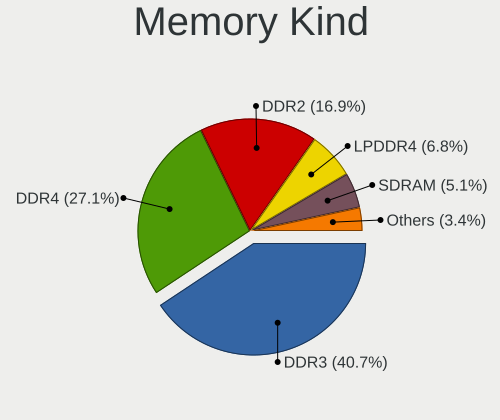

| Kind   | Notebooks | Percent |
|--------|-----------|---------|
| DDR3   | 24        | 40.68%  |
| DDR4   | 16        | 27.12%  |
| DDR2   | 10        | 16.95%  |
| LPDDR4 | 4         | 6.78%   |
| SDRAM  | 3         | 5.08%   |
| LPDDR3 | 1         | 1.69%   |
| DDR    | 1         | 1.69%   |

Memory Form Factor
------------------

Physical design of the memory module

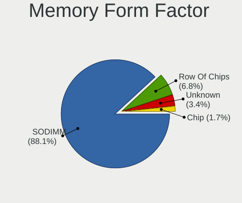

| Name         | Notebooks | Percent |
|--------------|-----------|---------|
| SODIMM       | 52        | 88.14%  |
| Row Of Chips | 4         | 6.78%   |
| Unknown      | 2         | 3.39%   |
| Chip         | 1         | 1.69%   |

Memory Size
-----------

Memory module size

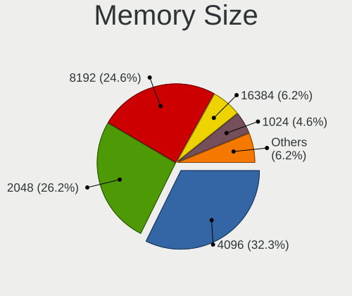

| Size  | Notebooks | Percent |
|-------|-----------|---------|
| 4096  | 21        | 32.31%  |
| 2048  | 17        | 26.15%  |
| 8192  | 16        | 24.62%  |
| 16384 | 4         | 6.15%   |
| 1024  | 3         | 4.62%   |
| 32768 | 2         | 3.08%   |
| 512   | 2         | 3.08%   |

Memory Speed
------------

Memory module speed

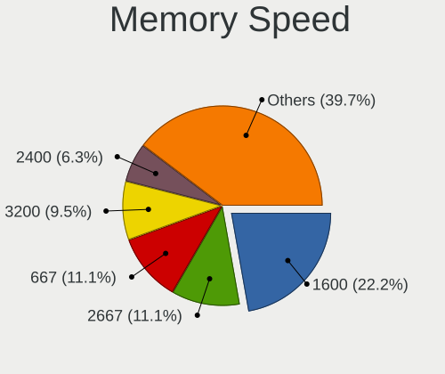

| Speed   | Notebooks | Percent |
|---------|-----------|---------|
| 1600    | 14        | 22.22%  |
| 2667    | 7         | 11.11%  |
| 667     | 7         | 11.11%  |
| 3200    | 6         | 9.52%   |
| 2400    | 4         | 6.35%   |
| 1334    | 3         | 4.76%   |
| 1333    | 3         | 4.76%   |
| 1067    | 3         | 4.76%   |
| Unknown | 3         | 4.76%   |
| 4199    | 2         | 3.17%   |
| 533     | 2         | 3.17%   |
| 8400    | 1         | 1.59%   |
| 4267    | 1         | 1.59%   |
| 4266    | 1         | 1.59%   |
| 2267    | 1         | 1.59%   |
| 2133    | 1         | 1.59%   |
| 1867    | 1         | 1.59%   |
| 1639    | 1         | 1.59%   |
| 1066    | 1         | 1.59%   |
| 975     | 1         | 1.59%   |

Printers & scanners
-------------------

Printer Vendor
--------------

Printer device vendors

Zero info for selected period =(

Printer Model
-------------

Printer device models

Zero info for selected period =(

Scanner Vendor
--------------

Scanner device vendors

Zero info for selected period =(

Scanner Model
-------------

Scanner device models

Zero info for selected period =(

Camera
------

Camera Vendor
-------------

Camera device vendors

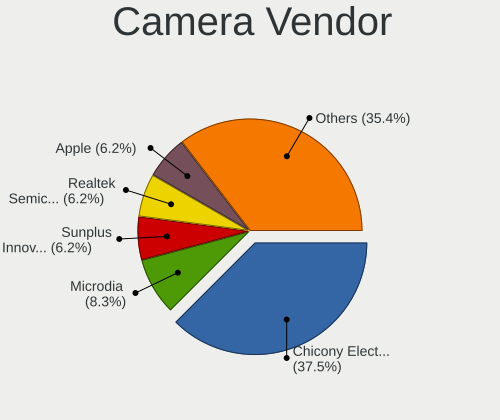

| Vendor                                 | Notebooks | Percent |
|----------------------------------------|-----------|---------|
| Chicony Electronics                    | 18        | 37.5%   |
| Microdia                               | 4         | 8.33%   |
| Sunplus Innovation Technology          | 3         | 6.25%   |
| Realtek Semiconductor                  | 3         | 6.25%   |
| Apple                                  | 3         | 6.25%   |
| IMC Networks                           | 2         | 4.17%   |
| Cheng Uei Precision Industry (Foxlink) | 2         | 4.17%   |
| Bison Electronics                      | 2         | 4.17%   |
| ALi                                    | 2         | 4.17%   |
| Syntek                                 | 1         | 2.08%   |
| Suyin                                  | 1         | 2.08%   |
| Sonix Technology                       | 1         | 2.08%   |
| Ricoh                                  | 1         | 2.08%   |
| Quanta                                 | 1         | 2.08%   |
| Primax Electronics                     | 1         | 2.08%   |
| Luxvisions Innotech Limited            | 1         | 2.08%   |
| Lite-On Technology                     | 1         | 2.08%   |
| Importek                               | 1         | 2.08%   |

Camera Model
------------

Camera device models

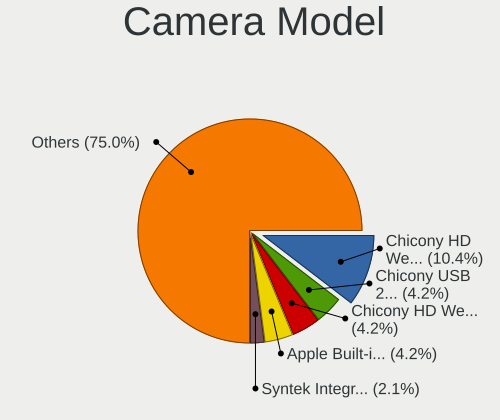

| Model                                                           | Notebooks | Percent |
|-----------------------------------------------------------------|-----------|---------|
| Chicony HD WebCam                                               | 5         | 10.42%  |
| Chicony USB 2.0 Camera                                          | 2         | 4.17%   |
| Chicony HD WebCam (Acer)                                        | 2         | 4.17%   |
| Apple Built-in iSight                                           | 2         | 4.17%   |
| Syntek Integrated Camera                                        | 1         | 2.08%   |
| Suyin Acer/HP Integrated Webcam [CN0314]                        | 1         | 2.08%   |
| Sunplus Laptop_Integrated_Webcam_FHD                            | 1         | 2.08%   |
| Sunplus Integrated_Webcam_HD                                    | 1         | 2.08%   |
| Sunplus HD WebCam                                               | 1         | 2.08%   |
| Sonix USB2.0 HD UVC WebCam                                      | 1         | 2.08%   |
| Ricoh USB2.0 Camera                                             | 1         | 2.08%   |
| Realtek TOSHIBA Web Camera                                      | 1         | 2.08%   |
| Realtek Lenovo EasyCamera                                       | 1         | 2.08%   |
| Realtek HP Webcam-101                                           | 1         | 2.08%   |
| Quanta HD User Facing                                           | 1         | 2.08%   |
| Primax webcam                                                   | 1         | 2.08%   |
| Microdia Sonix USB 2.0 Camera                                   | 1         | 2.08%   |
| Microdia Integrated_Webcam_HD                                   | 1         | 2.08%   |
| Microdia Integrated Webcam                                      | 1         | 2.08%   |
| Microdia Dell Integrated HD Webcam                              | 1         | 2.08%   |
| Luxvisions Innotech Limited HP TrueVision HD Camera             | 1         | 2.08%   |
| Lite-On Integrated Camera                                       | 1         | 2.08%   |
| Importek 1.3Mega Web Camera                                     | 1         | 2.08%   |
| IMC Networks USB2.0 VGA UVC WebCam                              | 1         | 2.08%   |
| IMC Networks Integrated Camera                                  | 1         | 2.08%   |
| Chicony WebCam                                                  | 1         | 2.08%   |
| Chicony USB2.0 HD UVC WebCam                                    | 1         | 2.08%   |
| Chicony Lenovo EasyCamera                                       | 1         | 2.08%   |
| Chicony Integrated Camera (1280x720@30)                         | 1         | 2.08%   |
| Chicony Integrated Camera                                       | 1         | 2.08%   |
| Chicony HP Integrated Webcam                                    | 1         | 2.08%   |
| Chicony HP HD Camera                                            | 1         | 2.08%   |
| Chicony EasyCamera                                              | 1         | 2.08%   |
| Chicony Camera                                                  | 1         | 2.08%   |
| Cheng Uei Precision Industry (Foxlink) Webcam                   | 1         | 2.08%   |
| Cheng Uei Precision Industry (Foxlink) HP True Vision HD Camera | 1         | 2.08%   |
| Bison Integrated Camera                                         | 1         | 2.08%   |
| Bison BisonCam, NB Pro                                          | 1         | 2.08%   |
| Apple iPhone 5/5C/5S/6/SE/7/8/X                                 | 1         | 2.08%   |
| ALi WebCam                                                      | 1         | 2.08%   |

Security
--------

Fingerprint Vendor
------------------

Fingerprint sensor vendors

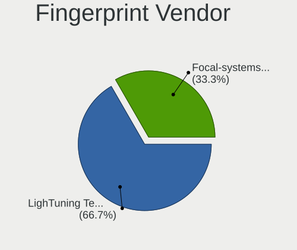

| Vendor                | Notebooks | Percent |
|-----------------------|-----------|---------|
| LighTuning Technology | 2         | 40%     |
| Validity Sensors      | 1         | 20%     |
| Synaptics             | 1         | 20%     |
| Focal-systems.Corp    | 1         | 20%     |

Fingerprint Model
-----------------

Fingerprint sensor models

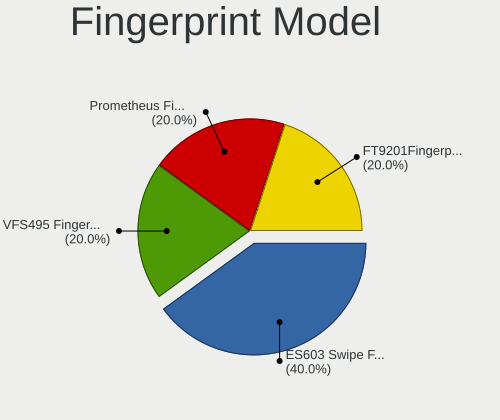

| Model                                      | Notebooks | Percent |
|--------------------------------------------|-----------|---------|
| LighTuning ES603 Swipe Fingerprint Sensor  | 2         | 40%     |
| Validity Sensors VFS495 Fingerprint Reader | 1         | 20%     |
| Synaptics Prometheus Fingerprint Reader    | 1         | 20%     |
| Focal-systems.Corp FT9201Fingerprint.      | 1         | 20%     |

Chipcard Vendor
---------------

Chipcard module vendors

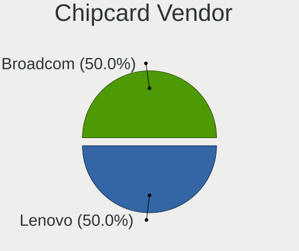

| Vendor   | Notebooks | Percent |
|----------|-----------|---------|
| Lenovo   | 1         | 50%     |
| Broadcom | 1         | 50%     |

Chipcard Model
--------------

Chipcard module models

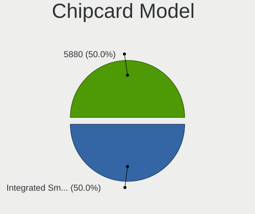

| Model                               | Notebooks | Percent |
|-------------------------------------|-----------|---------|
| Lenovo Integrated Smart Card Reader | 1         | 50%     |
| Broadcom 5880                       | 1         | 50%     |

Unsupported
-----------

Unsupported Devices
-------------------

Total unsupported devices on board

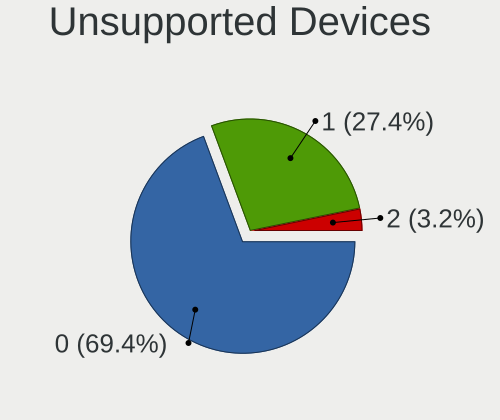

| Total | Notebooks | Percent |
|-------|-----------|---------|
| 0     | 43        | 69.35%  |
| 1     | 17        | 27.42%  |
| 2     | 2         | 3.23%   |

Unsupported Device Types
------------------------

Types of unsupported devices

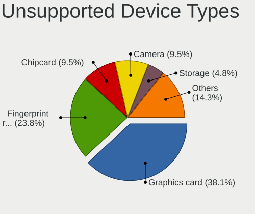

| Type                  | Notebooks | Percent |
|-----------------------|-----------|---------|
| Graphics card         | 8         | 38.1%   |
| Fingerprint reader    | 5         | 23.81%  |
| Chipcard              | 2         | 9.52%   |
| Camera                | 2         | 9.52%   |
| Storage               | 1         | 4.76%   |
| Net/wireless          | 1         | 4.76%   |
| Multimedia controller | 1         | 4.76%   |
| Bluetooth             | 1         | 4.76%   |

