Lilidog - Tested Hardware & Statistics (Notebooks)
--------------------------------------------------

A project to collect tested hardware configurations for Lilidog.

Anyone can contribute to this report by the [hw-probe](https://github.com/linuxhw/hw-probe) tool:

    sudo -E hw-probe -all -upload

Please contribute! Especially if your hardware is rare.

Contents
--------

* [ Test Cases ](#test-cases)

* [ System ](#system)
  - [ OS                       ](#os)
  - [ OS Family                ](#os-family)
  - [ Kernel                   ](#kernel)
  - [ Kernel Family            ](#kernel-family)
  - [ Kernel Major Ver.        ](#kernel-major-ver)
  - [ Arch                     ](#arch)
  - [ DE                       ](#de)
  - [ Display Server           ](#display-server)
  - [ Display Manager          ](#display-manager)
  - [ OS Lang                  ](#os-lang)
  - [ Boot Mode                ](#boot-mode)
  - [ Filesystem               ](#filesystem)
  - [ Part. scheme             ](#part-scheme)
  - [ Dual Boot with Linux/BSD ](#dual-boot-with-linuxbsd)
  - [ Dual Boot (Win)          ](#dual-boot-win)

* [ Board ](#board)
  - [ Vendor                   ](#vendor)
  - [ Model                    ](#model)
  - [ Model Family             ](#model-family)
  - [ MFG Year                 ](#mfg-year)
  - [ Form Factor              ](#form-factor)
  - [ Secure Boot              ](#secure-boot)
  - [ Coreboot                 ](#coreboot)
  - [ RAM Size                 ](#ram-size)
  - [ RAM Used                 ](#ram-used)
  - [ Total Drives             ](#total-drives)
  - [ Has CD-ROM               ](#has-cd-rom)
  - [ Has Ethernet             ](#has-ethernet)
  - [ Has WiFi                 ](#has-wifi)
  - [ Has Bluetooth            ](#has-bluetooth)

* [ Location ](#location)
  - [ Country                  ](#country)
  - [ City                     ](#city)

* [ Drives ](#drives)
  - [ Drive Vendor             ](#drive-vendor)
  - [ Drive Model              ](#drive-model)
  - [ HDD Vendor               ](#hdd-vendor)
  - [ SSD Vendor               ](#ssd-vendor)
  - [ Drive Kind               ](#drive-kind)
  - [ Drive Connector          ](#drive-connector)
  - [ Drive Size               ](#drive-size)
  - [ Space Total              ](#space-total)
  - [ Space Used               ](#space-used)
  - [ Malfunc. Drives          ](#malfunc-drives)
  - [ Malfunc. Drive Vendor    ](#malfunc-drive-vendor)
  - [ Malfunc. HDD Vendor      ](#malfunc-hdd-vendor)
  - [ Malfunc. Drive Kind      ](#malfunc-drive-kind)
  - [ Failed Drives            ](#failed-drives)
  - [ Failed Drive Vendor      ](#failed-drive-vendor)
  - [ Drive Status             ](#drive-status)

* [ Storage controller ](#storage-controller)
  - [ Storage Vendor           ](#storage-vendor)
  - [ Storage Model            ](#storage-model)
  - [ Storage Kind             ](#storage-kind)

* [ Processor ](#processor)
  - [ CPU Vendor               ](#cpu-vendor)
  - [ CPU Model                ](#cpu-model)
  - [ CPU Model Family         ](#cpu-model-family)
  - [ CPU Cores                ](#cpu-cores)
  - [ CPU Sockets              ](#cpu-sockets)
  - [ CPU Threads              ](#cpu-threads)
  - [ CPU Op-Modes             ](#cpu-op-modes)
  - [ CPU Microcode            ](#cpu-microcode)
  - [ CPU Microarch            ](#cpu-microarch)

* [ Graphics ](#graphics)
  - [ GPU Vendor               ](#gpu-vendor)
  - [ GPU Model                ](#gpu-model)
  - [ GPU Combo                ](#gpu-combo)
  - [ GPU Driver               ](#gpu-driver)
  - [ GPU Memory               ](#gpu-memory)

* [ Monitor ](#monitor)
  - [ Monitor Vendor           ](#monitor-vendor)
  - [ Monitor Model            ](#monitor-model)
  - [ Monitor Resolution       ](#monitor-resolution)
  - [ Monitor Diagonal         ](#monitor-diagonal)
  - [ Monitor Width            ](#monitor-width)
  - [ Aspect Ratio             ](#aspect-ratio)
  - [ Monitor Area             ](#monitor-area)
  - [ Pixel Density            ](#pixel-density)
  - [ Multiple Monitors        ](#multiple-monitors)

* [ Network ](#network)
  - [ Net Controller Vendor    ](#net-controller-vendor)
  - [ Net Controller Model     ](#net-controller-model)
  - [ Wireless Vendor          ](#wireless-vendor)
  - [ Wireless Model           ](#wireless-model)
  - [ Ethernet Vendor          ](#ethernet-vendor)
  - [ Ethernet Model           ](#ethernet-model)
  - [ Net Controller Kind      ](#net-controller-kind)
  - [ Used Controller          ](#used-controller)
  - [ NICs                     ](#nics)
  - [ IPv6                     ](#ipv6)

* [ Bluetooth ](#bluetooth)
  - [ Bluetooth Vendor         ](#bluetooth-vendor)
  - [ Bluetooth Model          ](#bluetooth-model)

* [ Sound ](#sound)
  - [ Sound Vendor             ](#sound-vendor)
  - [ Sound Model              ](#sound-model)

* [ Memory ](#memory)
  - [ Memory Vendor            ](#memory-vendor)
  - [ Memory Model             ](#memory-model)
  - [ Memory Kind              ](#memory-kind)
  - [ Memory Form Factor       ](#memory-form-factor)
  - [ Memory Size              ](#memory-size)
  - [ Memory Speed             ](#memory-speed)

* [ Printers & scanners ](#printers--scanners)
  - [ Printer Vendor           ](#printer-vendor)
  - [ Printer Model            ](#printer-model)
  - [ Scanner Vendor           ](#scanner-vendor)
  - [ Scanner Model            ](#scanner-model)

* [ Camera ](#camera)
  - [ Camera Vendor            ](#camera-vendor)
  - [ Camera Model             ](#camera-model)

* [ Security ](#security)
  - [ Fingerprint Vendor       ](#fingerprint-vendor)
  - [ Fingerprint Model        ](#fingerprint-model)
  - [ Chipcard Vendor          ](#chipcard-vendor)
  - [ Chipcard Model           ](#chipcard-model)

* [ Unsupported ](#unsupported)
  - [ Unsupported Devices      ](#unsupported-devices)
  - [ Unsupported Device Types ](#unsupported-device-types)

Test Cases
----------

Total: 22

| Vendor        | Model                       | Probe                                                      | Date         |
|---------------|-----------------------------|------------------------------------------------------------|--------------|
| Lenovo        | ThinkPad X1 Carbon Gen 9... | [f7a2bd2ca8](https://linux-hardware.org/?probe=f7a2bd2ca8) | Jun 10, 2023 |
| TUXEDO        | N8xEJEK                     | [28ca72e1e1](https://linux-hardware.org/?probe=28ca72e1e1) | Jun 05, 2023 |
| Google        | Sand                        | [e6d70635d6](https://linux-hardware.org/?probe=e6d70635d6) | May 30, 2023 |
| HP            | G62                         | [68f5984aa8](https://linux-hardware.org/?probe=68f5984aa8) | May 11, 2023 |
| Google        | Sand                        | [044ac39e57](https://linux-hardware.org/?probe=044ac39e57) | Apr 11, 2023 |
| Lenovo        | Yoga Slim 7 14ARE05 82A2    | [061b0673b4](https://linux-hardware.org/?probe=061b0673b4) | Mar 12, 2023 |
| Apple         | MacBookPro3,1               | [266ef88c0c](https://linux-hardware.org/?probe=266ef88c0c) | Jan 25, 2023 |
| Apple         | MacBookPro3,1               | [910de59ed9](https://linux-hardware.org/?probe=910de59ed9) | Jan 25, 2023 |
| ASUSTek       | VivoBook 15_ASUS Laptop ... | [d64272e554](https://linux-hardware.org/?probe=d64272e554) | Dec 03, 2022 |
| Dell          | Latitude 7390               | [9278bcc6a2](https://linux-hardware.org/?probe=9278bcc6a2) | Nov 27, 2022 |
| Acer          | Aspire 7540                 | [8e80ccea19](https://linux-hardware.org/?probe=8e80ccea19) | Oct 01, 2022 |
| Acer          | V5-131                      | [7a218d1ae7](https://linux-hardware.org/?probe=7a218d1ae7) | Sep 14, 2022 |
| Dell          | Inspiron 3793               | [66f5acc518](https://linux-hardware.org/?probe=66f5acc518) | Sep 10, 2022 |
| Lenovo        | G500 20236                  | [5846b57c77](https://linux-hardware.org/?probe=5846b57c77) | Aug 09, 2022 |
| Acer          | Aspire E5-573               | [d5f490187d](https://linux-hardware.org/?probe=d5f490187d) | Jul 19, 2022 |
| Acer          | V5-131                      | [620f2657d4](https://linux-hardware.org/?probe=620f2657d4) | Jul 07, 2022 |
| Panasonic     | CF-31ATXAX1M                | [46be7cc40c](https://linux-hardware.org/?probe=46be7cc40c) | Jul 06, 2022 |
| Acer          | AOD255E                     | [01c9e4194b](https://linux-hardware.org/?probe=01c9e4194b) | Jul 06, 2022 |
| Acer          | AOD255E                     | [1737f8b906](https://linux-hardware.org/?probe=1737f8b906) | Jun 26, 2022 |
| GPU Compan... | GWNR71517                   | [89a074e539](https://linux-hardware.org/?probe=89a074e539) | Jun 02, 2022 |
| Lenovo        | ThinkPad T400 6474WPU       | [ce7e91802e](https://linux-hardware.org/?probe=ce7e91802e) | May 03, 2022 |
| Dell          | Inspiron 3793               | [3df5028c64](https://linux-hardware.org/?probe=3df5028c64) | Apr 10, 2022 |

System
------

OS
--

Installed operating systems

| Name       | Notebooks | Percent |
|------------|-----------|---------|
| Lilidog 22 | 16        | 88.89%  |
| Lilidog 23 | 2         | 11.11%  |

OS Family
---------

OS without a version

| Name    | Notebooks | Percent |
|---------|-----------|---------|
| Lilidog | 18        | 100%    |

Kernel
------

Version of the Linux kernel

| Version                   | Notebooks | Percent |
|---------------------------|-----------|---------|
| 5.10.0-15-amd64           | 4         | 19.05%  |
| 5.10.0-16-amd64           | 3         | 14.29%  |
| 6.1.0-9-amd64             | 2         | 9.52%   |
| 5.10.0-21-amd64           | 2         | 9.52%   |
| 5.10.0-18-amd64           | 2         | 9.52%   |
| 6.1.0-7-amd64             | 1         | 4.76%   |
| 6.1.0-0.deb11.6-amd64     | 1         | 4.76%   |
| 6.0.10-x64v1-xanmod1      | 1         | 4.76%   |
| 6.0.0-0.deb11.2-amd64     | 1         | 4.76%   |
| 5.17.0-5.1-liquorix-amd64 | 1         | 4.76%   |
| 5.10.0-22-amd64           | 1         | 4.76%   |
| 5.10.0-14-amd64           | 1         | 4.76%   |
| 5.10.0-13-amd64           | 1         | 4.76%   |

Kernel Family
-------------

Linux kernel without a distro release

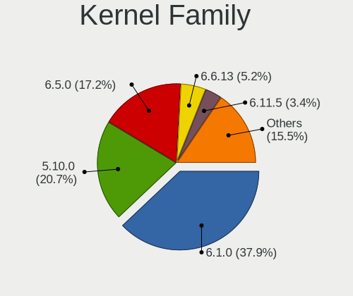

| Version | Notebooks | Percent |
|---------|-----------|---------|
| 5.10.0  | 12        | 66.67%  |
| 6.1.0   | 3         | 16.67%  |
| 6.0.10  | 1         | 5.56%   |
| 6.0.0   | 1         | 5.56%   |
| 5.17.0  | 1         | 5.56%   |

Kernel Major Ver.
-----------------

Linux kernel major version

| Version | Notebooks | Percent |
|---------|-----------|---------|
| 5.10    | 12        | 66.67%  |
| 6.1     | 3         | 16.67%  |
| 6.0     | 2         | 11.11%  |
| 5.17    | 1         | 5.56%   |

Arch
----

OS architecture (x86_64, i586, etc.)

| Name   | Notebooks | Percent |
|--------|-----------|---------|
| x86_64 | 18        | 100%    |

DE
--

Desktop Environment

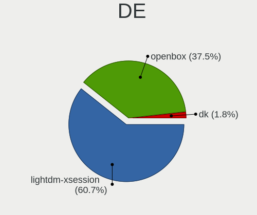

| Name             | Notebooks | Percent |
|------------------|-----------|---------|
| lightdm-xsession | 16        | 84.21%  |
| openbox          | 3         | 15.79%  |

Display Server
--------------

X11 or Wayland

| Name | Notebooks | Percent |
|------|-----------|---------|
| X11  | 18        | 100%    |

Display Manager
---------------

SDDM, LightDM, etc.

| Name    | Notebooks | Percent |
|---------|-----------|---------|
| LightDM | 18        | 100%    |

OS Lang
-------

Language

| Lang  | Notebooks | Percent |
|-------|-----------|---------|
| en_US | 13        | 72.22%  |
| de_DE | 4         | 22.22%  |
| cs_CZ | 1         | 5.56%   |

Boot Mode
---------

EFI or BIOS

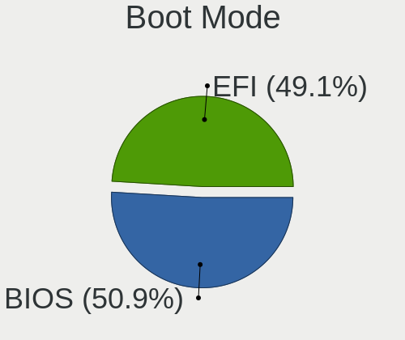

| Mode | Notebooks | Percent |
|------|-----------|---------|
| BIOS | 10        | 55.56%  |
| EFI  | 8         | 44.44%  |

Filesystem
----------

Type of filesystem

| Type    | Notebooks | Percent |
|---------|-----------|---------|
| Ext4    | 9         | 50%     |
| Overlay | 8         | 44.44%  |
| Btrfs   | 1         | 5.56%   |

Part. scheme
------------

Scheme of partitioning

| Type | Notebooks | Percent |
|------|-----------|---------|
| MBR  | 10        | 55.56%  |
| GPT  | 8         | 44.44%  |

Dual Boot with Linux/BSD
------------------------

Hosting more than one Linux/BSD

| Dual boot | Notebooks | Percent |
|-----------|-----------|---------|
| Yes       | 10        | 50%     |
| No        | 10        | 50%     |

Dual Boot (Win)
---------------

Hosting Linux and Windows

| Dual boot | Notebooks | Percent |
|-----------|-----------|---------|
| No        | 15        | 83.33%  |
| Yes       | 3         | 16.67%  |

Board
-----

Vendor
------

Motherboard manufacturer

| Name             | Notebooks | Percent |
|------------------|-----------|---------|
| Acer             | 5         | 27.78%  |
| Lenovo           | 4         | 22.22%  |
| Dell             | 2         | 11.11%  |
| TUXEDO           | 1         | 5.56%   |
| Panasonic        | 1         | 5.56%   |
| Hewlett-Packard  | 1         | 5.56%   |
| GPU Company      | 1         | 5.56%   |
| Google           | 1         | 5.56%   |
| ASUSTek Computer | 1         | 5.56%   |
| Apple            | 1         | 5.56%   |

Model
-----

Motherboard model

| Name                                       | Notebooks | Percent |
|--------------------------------------------|-----------|---------|
| Acer AOD255E                               | 2         | 11.11%  |
| TUXEDO N8xEJEK                             | 1         | 5.56%   |
| Panasonic CF-31ATXAX1M                     | 1         | 5.56%   |
| Lenovo Yoga Slim 7 14ARE05 82A2            | 1         | 5.56%   |
| Lenovo ThinkPad X1 Carbon Gen 9 20XWCTO1WW | 1         | 5.56%   |
| Lenovo ThinkPad T400 6474WPU               | 1         | 5.56%   |
| Lenovo G500 20236                          | 1         | 5.56%   |
| HP G62                                     | 1         | 5.56%   |
| GPU Company GWNR71517                      | 1         | 5.56%   |
| Google Sand                                | 1         | 5.56%   |
| Dell Latitude 7390                         | 1         | 5.56%   |
| Dell Inspiron 3793                         | 1         | 5.56%   |
| ASUS VivoBook 15_ASUS Laptop X560UD        | 1         | 5.56%   |
| Apple MacBookPro3,1                        | 1         | 5.56%   |
| Acer V5-131                                | 1         | 5.56%   |
| Acer Aspire E5-573                         | 1         | 5.56%   |
| Acer Aspire 7540                           | 1         | 5.56%   |

Model Family
------------

Motherboard model prefix

| Name                   | Notebooks | Percent |
|------------------------|-----------|---------|
| Lenovo ThinkPad        | 2         | 11.11%  |
| Acer Aspire            | 2         | 11.11%  |
| Acer AOD255E           | 2         | 11.11%  |
| TUXEDO N8xEJEK         | 1         | 5.56%   |
| Panasonic CF-31ATXAX1M | 1         | 5.56%   |
| Lenovo Yoga            | 1         | 5.56%   |
| Lenovo G500            | 1         | 5.56%   |
| HP G62                 | 1         | 5.56%   |
| GPU Company GWNR71517  | 1         | 5.56%   |
| Google Sand            | 1         | 5.56%   |
| Dell Latitude          | 1         | 5.56%   |
| Dell Inspiron          | 1         | 5.56%   |
| ASUS VivoBook          | 1         | 5.56%   |
| Apple MacBookPro3      | 1         | 5.56%   |
| Acer V5-131            | 1         | 5.56%   |

MFG Year
--------

Motherboard manufacture year

| Year | Notebooks | Percent |
|------|-----------|---------|
| 2018 | 4         | 22.22%  |
| 2010 | 4         | 22.22%  |
| 2023 | 1         | 5.56%   |
| 2021 | 1         | 5.56%   |
| 2020 | 1         | 5.56%   |
| 2019 | 1         | 5.56%   |
| 2015 | 1         | 5.56%   |
| 2013 | 1         | 5.56%   |
| 2012 | 1         | 5.56%   |
| 2009 | 1         | 5.56%   |
| 2008 | 1         | 5.56%   |
| 2007 | 1         | 5.56%   |

Form Factor
-----------

Physical design of the computer

| Name     | Notebooks | Percent |
|----------|-----------|---------|
| Notebook | 18        | 100%    |

Secure Boot
-----------

Enabled or disabled

| State    | Notebooks | Percent |
|----------|-----------|---------|
| Disabled | 17        | 94.44%  |
| Enabled  | 1         | 5.56%   |

Coreboot
--------

Have coreboot on board

| Used | Notebooks | Percent |
|------|-----------|---------|
| No   | 16        | 88.89%  |
| Yes  | 2         | 11.11%  |

RAM Size
--------

Total RAM memory

| Size in GB | Notebooks | Percent |
|------------|-----------|---------|
| 3.01-4.0   | 6         | 33.33%  |
| 4.01-8.0   | 4         | 22.22%  |
| 16.01-24.0 | 3         | 16.67%  |
| 1.01-2.0   | 2         | 11.11%  |
| 32.01-64.0 | 1         | 5.56%   |
| 8.01-16.0  | 1         | 5.56%   |
| 0.51-1.0   | 1         | 5.56%   |

RAM Used
--------

Used RAM memory

| Used GB  | Notebooks | Percent |
|----------|-----------|---------|
| 0.51-1.0 | 12        | 63.16%  |
| 1.01-2.0 | 5         | 26.32%  |
| 2.01-3.0 | 2         | 10.53%  |

Total Drives
------------

Number of drives on board

| Drives | Notebooks | Percent |
|--------|-----------|---------|
| 1      | 16        | 84.21%  |
| 2      | 3         | 15.79%  |

Has CD-ROM
----------

Has CD-ROM on board

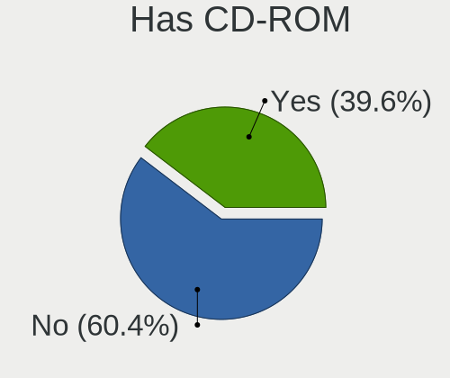

| Presented | Notebooks | Percent |
|-----------|-----------|---------|
| No        | 11        | 61.11%  |
| Yes       | 7         | 38.89%  |

Has Ethernet
------------

Has Ethernet on board

| Presented | Notebooks | Percent |
|-----------|-----------|---------|
| Yes       | 13        | 72.22%  |
| No        | 5         | 27.78%  |

Has WiFi
--------

Has WiFi module

| Presented | Notebooks | Percent |
|-----------|-----------|---------|
| Yes       | 18        | 100%    |

Has Bluetooth
-------------

Has Bluetooth module

| Presented | Notebooks | Percent |
|-----------|-----------|---------|
| Yes       | 12        | 66.67%  |
| No        | 6         | 33.33%  |

Location
--------

Country
-------

Geographic location (country)

| Country  | Notebooks | Percent |
|----------|-----------|---------|
| USA      | 6         | 33.33%  |
| Germany  | 6         | 33.33%  |
| Vietnam  | 1         | 5.56%   |
| Thailand | 1         | 5.56%   |
| Spain    | 1         | 5.56%   |
| Portugal | 1         | 5.56%   |
| Italy    | 1         | 5.56%   |
| Czechia  | 1         | 5.56%   |

City
----

Geographic location (city)

| City             | Notebooks | Percent |
|------------------|-----------|---------|
| Fayetteville     | 3         | 16.67%  |
| Egan             | 2         | 11.11%  |
| Uelzen           | 1         | 5.56%   |
| Rinteln          | 1         | 5.56%   |
| Ratchathewi      | 1         | 5.56%   |
| Poricany         | 1         | 5.56%   |
| Milan            | 1         | 5.56%   |
| Madrid           | 1         | 5.56%   |
| Lisbon           | 1         | 5.56%   |
| Ho Chi Minh City | 1         | 5.56%   |
| Filderstadt      | 1         | 5.56%   |
| Eppelborn        | 1         | 5.56%   |
| Düsseldorf      | 1         | 5.56%   |
| Darmstadt        | 1         | 5.56%   |
| Charlotte        | 1         | 5.56%   |

Drives
------

Drive Vendor
------------

Hard drive vendors

| Vendor              | Notebooks | Drives | Percent |
|---------------------|-----------|--------|---------|
| Samsung Electronics | 4         | 6      | 20%     |
| Toshiba             | 3         | 3      | 15%     |
| Seagate             | 2         | 3      | 10%     |
| SanDisk             | 2         | 3      | 10%     |
| Wibtek              | 1         | 1      | 5%      |
| WDC                 | 1         | 1      | 5%      |
| Unknown             | 1         | 1      | 5%      |
| Mushkin             | 1         | 1      | 5%      |
| Micron Technology   | 1         | 1      | 5%      |
| Kingston            | 1         | 1      | 5%      |
| Hitachi             | 1         | 1      | 5%      |
| Crucial             | 1         | 1      | 5%      |
| Apacer              | 1         | 1      | 5%      |

Drive Model
-----------

Hard drive models

| Model                               | Notebooks | Percent |
|-------------------------------------|-----------|---------|
| Wibtek W800S 512GB SSD              | 1         | 4.76%   |
| WDC WD5000LPVX-22V0TT0 500GB        | 1         | 4.76%   |
| Unknown NCard  32GB                 | 1         | 4.76%   |
| Toshiba MQ04ABF100 1TB              | 1         | 4.76%   |
| Toshiba MK6034GSX 64GB              | 1         | 4.76%   |
| Toshiba MK1665GSX 160GB             | 1         | 4.76%   |
| Seagate ST9250315AS 250GB           | 1         | 4.76%   |
| Seagate ST500LT012-9WS142 500GB     | 1         | 4.76%   |
| SanDisk SD8TN8U256G1001 256GB SSD   | 1         | 4.76%   |
| SanDisk DF4032  32GB                | 1         | 4.76%   |
| Samsung SSD 970 EVO Plus 250GB      | 1         | 4.76%   |
| Samsung SSD 860 EVO 1TB             | 1         | 4.76%   |
| Samsung SSD 850 EVO 250GB           | 1         | 4.76%   |
| Samsung PM991a NVMe 512GB           | 1         | 4.76%   |
| Samsung MZVL21T0HCLR-00BL7 1TB      | 1         | 4.76%   |
| Mushkin MKNSSDCR120GB               | 1         | 4.76%   |
| Micron 1100_MTFDDAV256TBN 256GB SSD | 1         | 4.76%   |
| Kingston SKC3000D2048G 2TB          | 1         | 4.76%   |
| Hitachi HTS545016B9SA00 160GB       | 1         | 4.76%   |
| Crucial CT480BX500SSD1 480GB        | 1         | 4.76%   |
| Apacer AS350 512GB SSD              | 1         | 4.76%   |

HDD Vendor
----------

Hard disk drive vendors

| Vendor  | Notebooks | Drives | Percent |
|---------|-----------|--------|---------|
| Toshiba | 3         | 3      | 42.86%  |
| Seagate | 2         | 3      | 28.57%  |
| WDC     | 1         | 1      | 14.29%  |
| Hitachi | 1         | 1      | 14.29%  |

SSD Vendor
----------

Solid state drive vendors

| Vendor              | Notebooks | Drives | Percent |
|---------------------|-----------|--------|---------|
| Samsung Electronics | 2         | 2      | 25%     |
| Wibtek              | 1         | 1      | 12.5%   |
| SanDisk             | 1         | 1      | 12.5%   |
| Mushkin             | 1         | 1      | 12.5%   |
| Micron Technology   | 1         | 1      | 12.5%   |
| Crucial             | 1         | 1      | 12.5%   |
| Apacer              | 1         | 1      | 12.5%   |

Drive Kind
----------

HDD or SSD

| Kind | Notebooks | Drives | Percent |
|------|-----------|--------|---------|
| SSD  | 8         | 8      | 40%     |
| HDD  | 7         | 8      | 35%     |
| NVMe | 4         | 5      | 20%     |
| MMC  | 1         | 3      | 5%      |

Drive Connector
---------------

SATA, SAS, NVMe, etc.

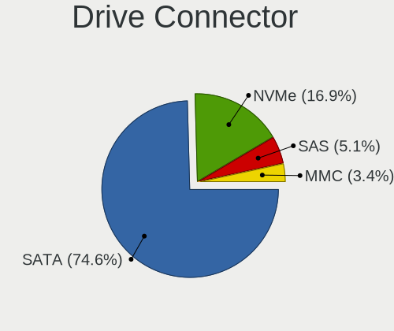

| Type | Notebooks | Drives | Percent |
|------|-----------|--------|---------|
| SATA | 14        | 16     | 73.68%  |
| NVMe | 4         | 5      | 21.05%  |
| MMC  | 1         | 3      | 5.26%   |

Drive Size
----------

Size of hard drive

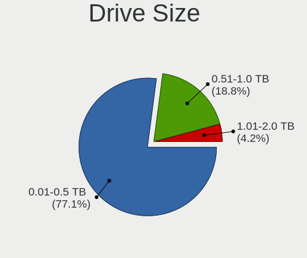

| Size in TB | Notebooks | Drives | Percent |
|------------|-----------|--------|---------|
| 0.01-0.5   | 11        | 12     | 73.33%  |
| 0.51-1.0   | 4         | 4      | 26.67%  |

Space Total
-----------

Amount of disk space available on the file system

| Size in GB | Notebooks | Percent |
|------------|-----------|---------|
| 1-20       | 8         | 42.11%  |
| 251-500    | 4         | 21.05%  |
| 101-250    | 2         | 10.53%  |
| 51-100     | 2         | 10.53%  |
| 21-50      | 1         | 5.26%   |
| 1001-2000  | 1         | 5.26%   |
| 501-1000   | 1         | 5.26%   |

Space Used
----------

Amount of used disk space

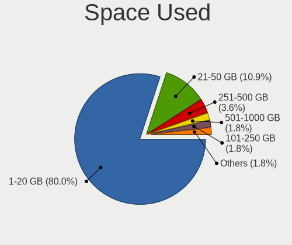

| Used GB | Notebooks | Percent |
|---------|-----------|---------|
| 1-20    | 16        | 84.21%  |
| 21-50   | 3         | 15.79%  |

Malfunc. Drives
---------------

Drive models with a malfunction

| Model                           | Notebooks | Drives | Percent |
|---------------------------------|-----------|--------|---------|
| Toshiba MK1665GSX 160GB         | 1         | 1      | 25%     |
| Seagate ST9250315AS 250GB       | 1         | 1      | 25%     |
| Seagate ST500LT012-9WS142 500GB | 1         | 2      | 25%     |
| Mushkin MKNSSDCR120GB           | 1         | 1      | 25%     |

Malfunc. Drive Vendor
---------------------

Vendors of faulty drives

| Vendor  | Notebooks | Drives | Percent |
|---------|-----------|--------|---------|
| Seagate | 2         | 3      | 50%     |
| Toshiba | 1         | 1      | 25%     |
| Mushkin | 1         | 1      | 25%     |

Malfunc. HDD Vendor
-------------------

Vendors of faulty HDD drives

| Vendor  | Notebooks | Drives | Percent |
|---------|-----------|--------|---------|
| Seagate | 2         | 3      | 66.67%  |
| Toshiba | 1         | 1      | 33.33%  |

Malfunc. Drive Kind
-------------------

Kinds of faulty drives

| Kind | Notebooks | Drives | Percent |
|------|-----------|--------|---------|
| HDD  | 3         | 4      | 75%     |
| SSD  | 1         | 1      | 25%     |

Failed Drives
-------------

Failed drive models

Zero info for selected period =(

Failed Drive Vendor
-------------------

Failed drive vendors

Zero info for selected period =(

Drive Status
------------

Number of failed and malfunc. drives

| Status   | Notebooks | Drives | Percent |
|----------|-----------|--------|---------|
| Works    | 13        | 16     | 72.22%  |
| Malfunc  | 4         | 5      | 22.22%  |
| Detected | 1         | 3      | 5.56%   |

Storage controller
------------------

Storage Vendor
--------------

Storage controller vendors

| Vendor                      | Notebooks | Percent |
|-----------------------------|-----------|---------|
| Intel                       | 13        | 68.42%  |
| Samsung Electronics         | 3         | 15.79%  |
| AMD                         | 2         | 10.53%  |
| Kingston Technology Company | 1         | 5.26%   |

Storage Model
-------------

Storage controller models

| Model                                                                 | Notebooks | Percent |
|-----------------------------------------------------------------------|-----------|---------|
| Intel Sunrise Point-LP SATA Controller [AHCI mode]                    | 2         | 9.52%   |
| Intel NM10/ICH7 Family SATA Controller [AHCI mode]                    | 2         | 9.52%   |
| Samsung NVMe SSD Controller SM981/PM981/PM983                         | 1         | 4.76%   |
| Samsung NVMe SSD Controller PM9A1/PM9A3/980PRO                        | 1         | 4.76%   |
| Samsung NVMe SSD Controller 980                                       | 1         | 4.76%   |
| Kingston Company Company Non-Volatile memory controller               | 1         | 4.76%   |
| Intel Ice Lake-LP SATA Controller [AHCI mode]                         | 1         | 4.76%   |
| Intel Cannon Lake Mobile PCH SATA AHCI Controller                     | 1         | 4.76%   |
| Intel 82801IBM/IEM (ICH9M/ICH9M-E) 4 port SATA Controller [AHCI mode] | 1         | 4.76%   |
| Intel 82801HM/HEM (ICH8M/ICH8M-E) SATA Controller [AHCI mode]         | 1         | 4.76%   |
| Intel 82801HM/HEM (ICH8M/ICH8M-E) IDE Controller                      | 1         | 4.76%   |
| Intel 8 Series SATA Controller 1 [AHCI mode]                          | 1         | 4.76%   |
| Intel 7 Series Chipset Family 6-port SATA Controller [AHCI mode]      | 1         | 4.76%   |
| Intel 7 Series Chipset Family 4-port SATA Controller [IDE mode]       | 1         | 4.76%   |
| Intel 7 Series Chipset Family 2-port SATA Controller [IDE mode]       | 1         | 4.76%   |
| Intel 5 Series/3400 Series Chipset 6 port SATA AHCI Controller        | 1         | 4.76%   |
| Intel 5 Series/3400 Series Chipset 4 port SATA AHCI Controller        | 1         | 4.76%   |
| AMD SB7x0/SB8x0/SB9x0 SATA Controller [AHCI mode]                     | 1         | 4.76%   |
| AMD FCH SATA Controller [AHCI mode]                                   | 1         | 4.76%   |

Storage Kind
------------

Kind of storage controller (IDE, SATA, NVMe, SAS, ...)

| Kind | Notebooks | Percent |
|------|-----------|---------|
| SATA | 14        | 70%     |
| NVMe | 4         | 20%     |
| IDE  | 2         | 10%     |

Processor
---------

CPU Vendor
----------

Processor vendors

| Vendor | Notebooks | Percent |
|--------|-----------|---------|
| Intel  | 15        | 83.33%  |
| AMD    | 3         | 16.67%  |

CPU Model
---------

Processor models

| Model                                         | Notebooks | Percent |
|-----------------------------------------------|-----------|---------|
| Intel Core i5 CPU M 520 @ 2.40GHz             | 2         | 11.11%  |
| Intel Atom CPU N455 @ 1.66GHz                 | 2         | 11.11%  |
| Intel Pentium CPU N4200 @ 1.10GHz             | 1         | 5.56%   |
| Intel Pentium 3556U @ 1.70GHz                 | 1         | 5.56%   |
| Intel Core i7-8750H CPU @ 2.20GHz             | 1         | 5.56%   |
| Intel Core i7-8650U CPU @ 1.90GHz             | 1         | 5.56%   |
| Intel Core i7-8550U CPU @ 1.80GHz             | 1         | 5.56%   |
| Intel Core i7-1065G7 CPU @ 1.30GHz            | 1         | 5.56%   |
| Intel Core i5-3230M CPU @ 2.60GHz             | 1         | 5.56%   |
| Intel Core 2 Duo CPU T7500 @ 2.20GHz          | 1         | 5.56%   |
| Intel Core 2 Duo CPU P8400 @ 2.26GHz          | 1         | 5.56%   |
| Intel Celeron CPU 1007U @ 1.50GHz             | 1         | 5.56%   |
| Intel 11th Gen Core i7-1185G7 @ 3.00GHz       | 1         | 5.56%   |
| AMD Ryzen 7 3700U with Radeon Vega Mobile Gfx | 1         | 5.56%   |
| AMD Ryzen 5 4500U with Radeon Graphics        | 1         | 5.56%   |
| AMD Athlon II Dual-Core M300                  | 1         | 5.56%   |

CPU Model Family
----------------

Processor model prefix

| Model                   | Notebooks | Percent |
|-------------------------|-----------|---------|
| Intel Core i7           | 4         | 22.22%  |
| Intel Core i5           | 3         | 16.67%  |
| Intel Pentium           | 2         | 11.11%  |
| Intel Core 2 Duo        | 2         | 11.11%  |
| Intel Atom              | 2         | 11.11%  |
| Other                   | 1         | 5.56%   |
| Intel Celeron           | 1         | 5.56%   |
| AMD Ryzen 7             | 1         | 5.56%   |
| AMD Ryzen 5             | 1         | 5.56%   |
| AMD Athlon II Dual-Core | 1         | 5.56%   |

CPU Cores
---------

Number of processor cores

| Number | Notebooks | Percent |
|--------|-----------|---------|
| 2      | 8         | 44.44%  |
| 4      | 6         | 33.33%  |
| 6      | 2         | 11.11%  |
| 1      | 2         | 11.11%  |

CPU Sockets
-----------

Number of sockets

| Number | Notebooks | Percent |
|--------|-----------|---------|
| 1      | 18        | 100%    |

CPU Threads
-----------

Threads per core (Hyper-Threading)

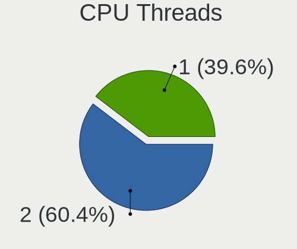

| Number | Notebooks | Percent |
|--------|-----------|---------|
| 2      | 11        | 61.11%  |
| 1      | 7         | 38.89%  |

CPU Op-Modes
------------

CPU Operation Modes (32-bit, 64-bit)

| Op mode        | Notebooks | Percent |
|----------------|-----------|---------|
| 32-bit, 64-bit | 18        | 100%    |

CPU Microcode
-------------

Microcode number

| Number     | Notebooks | Percent |
|------------|-----------|---------|
| 0x806ea    | 2         | 11.11%  |
| 0x306a9    | 2         | 11.11%  |
| 0x106ca    | 2         | 11.11%  |
| Unknown    | 2         | 11.11%  |
| 0x906ea    | 1         | 5.56%   |
| 0x806c1    | 1         | 5.56%   |
| 0x706e5    | 1         | 5.56%   |
| 0x6fa      | 1         | 5.56%   |
| 0x506c9    | 1         | 5.56%   |
| 0x40651    | 1         | 5.56%   |
| 0x20655    | 1         | 5.56%   |
| 0x10676    | 1         | 5.56%   |
| 0x08600106 | 1         | 5.56%   |
| 0x08108109 | 1         | 5.56%   |

CPU Microarch
-------------

Microarchitecture

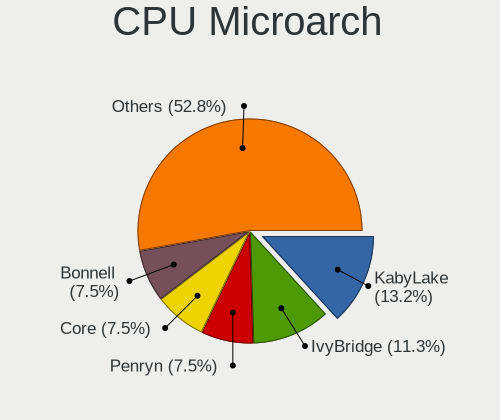

| Name      | Notebooks | Percent |
|-----------|-----------|---------|
| KabyLake  | 3         | 16.67%  |
| Westmere  | 2         | 11.11%  |
| IvyBridge | 2         | 11.11%  |
| Bonnell   | 2         | 11.11%  |
| Zen+      | 1         | 5.56%   |
| Zen 2     | 1         | 5.56%   |
| TigerLake | 1         | 5.56%   |
| Penryn    | 1         | 5.56%   |
| K10       | 1         | 5.56%   |
| IceLake   | 1         | 5.56%   |
| Haswell   | 1         | 5.56%   |
| Goldmont  | 1         | 5.56%   |
| Core      | 1         | 5.56%   |

Graphics
--------

GPU Vendor
----------

Vendors of graphics cards

| Vendor | Notebooks | Percent |
|--------|-----------|---------|
| Intel  | 14        | 63.64%  |
| AMD    | 5         | 22.73%  |
| Nvidia | 3         | 13.64%  |

GPU Model
---------

Graphics card models

| Model                                                                   | Notebooks | Percent |
|-------------------------------------------------------------------------|-----------|---------|
| Intel UHD Graphics 620                                                  | 2         | 9.09%   |
| Intel Core Processor Integrated Graphics Controller                     | 2         | 9.09%   |
| Intel Atom Processor D4xx/D5xx/N4xx/N5xx Integrated Graphics Controller | 2         | 9.09%   |
| Intel 3rd Gen Core processor Graphics Controller                        | 2         | 9.09%   |
| Nvidia GP107M [GeForce GTX 1050 Ti Mobile]                              | 1         | 4.55%   |
| Nvidia GP107M [GeForce GTX 1050 Mobile]                                 | 1         | 4.55%   |
| Nvidia G84M [GeForce 8600M GT]                                          | 1         | 4.55%   |
| Intel TigerLake-LP GT2 [Iris Xe Graphics]                               | 1         | 4.55%   |
| Intel Mobile 4 Series Chipset Integrated Graphics Controller            | 1         | 4.55%   |
| Intel Iris Plus Graphics G7                                             | 1         | 4.55%   |
| Intel Haswell-ULT Integrated Graphics Controller                        | 1         | 4.55%   |
| Intel CoffeeLake-H GT2 [UHD Graphics 630]                               | 1         | 4.55%   |
| Intel Apollo Lake [HD Graphics 505]                                     | 1         | 4.55%   |
| AMD RV710/M92 [Mobility Radeon HD 4530/4570/5145/530v/540v/545v]        | 1         | 4.55%   |
| AMD Renoir                                                              | 1         | 4.55%   |
| AMD Picasso/Raven 2 [Radeon Vega Series / Radeon Vega Mobile Series]    | 1         | 4.55%   |
| AMD Park [Mobility Radeon HD 5430/5450/5470]                            | 1         | 4.55%   |
| AMD Mars [Radeon HD 8670A/8670M/8750M / R7 M370]                        | 1         | 4.55%   |

GPU Combo
---------

Combinations of graphics cards

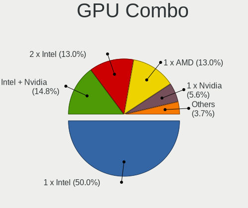

| Name           | Notebooks | Percent |
|----------------|-----------|---------|
| 1 x Intel      | 10        | 55.56%  |
| 1 x AMD        | 3         | 16.67%  |
| Intel + Nvidia | 2         | 11.11%  |
| Intel + AMD    | 2         | 11.11%  |
| 1 x Nvidia     | 1         | 5.56%   |

GPU Driver
----------

Free vs proprietary

| Driver  | Notebooks | Percent |
|---------|-----------|---------|
| Free    | 17        | 94.44%  |
| Unknown | 1         | 5.56%   |

GPU Memory
----------

Total video memory

| Size in GB | Notebooks | Percent |
|------------|-----------|---------|
| Unknown    | 11        | 61.11%  |
| 0.01-0.5   | 4         | 22.22%  |
| 3.01-4.0   | 2         | 11.11%  |
| 1.01-2.0   | 1         | 5.56%   |

Monitor
-------

Monitor Vendor
--------------

Monitor vendors

| Vendor                  | Notebooks | Percent |
|-------------------------|-----------|---------|
| AU Optronics            | 9         | 52.94%  |
| LG Display              | 2         | 11.76%  |
| Chimei Innolux          | 2         | 11.76%  |
| Lenovo                  | 1         | 5.88%   |
| Chi Mei Optoelectronics | 1         | 5.88%   |
| BOE                     | 1         | 5.88%   |
| AOC                     | 1         | 5.88%   |

Monitor Model
-------------

Monitor models

| Model                                                                    | Notebooks | Percent |
|--------------------------------------------------------------------------|-----------|---------|
| LG Display LP101WSB-TLN1 LGD026E 1024x600 224x126mm 10.1-inch            | 1         | 5.88%   |
| LG Display LCD Monitor LGD033A 1366x768 344x194mm 15.5-inch              | 1         | 5.88%   |
| Lenovo LCD Monitor LEN4037 1280x800 303x190mm 14.1-inch                  | 1         | 5.88%   |
| Chimei Innolux LCD Monitor CMN15F5 1920x1080 344x193mm 15.5-inch         | 1         | 5.88%   |
| Chimei Innolux LCD Monitor CMN1382 1920x1080 293x165mm 13.2-inch         | 1         | 5.88%   |
| Chi Mei Optoelectronics LCD Monitor CMO1592 1366x768 344x193mm 15.5-inch | 1         | 5.88%   |
| BOE LCD Monitor BOE0A06 1920x1080 344x194mm 15.5-inch                    | 1         | 5.88%   |
| AU Optronics LCD Monitor AUOD291 1920x1200 301x188mm 14.0-inch           | 1         | 5.88%   |
| AU Optronics LCD Monitor AUO683D 1920x1080 309x174mm 14.0-inch           | 1         | 5.88%   |
| AU Optronics LCD Monitor AUO60D2 1024x600 222x125mm 10.0-inch            | 1         | 5.88%   |
| AU Optronics LCD Monitor AUO41EC 1366x768 344x193mm 15.5-inch            | 1         | 5.88%   |
| AU Optronics LCD Monitor AUO405C 1366x768 256x144mm 11.6-inch            | 1         | 5.88%   |
| AU Optronics LCD Monitor AUO319D 1920x1080 382x214mm 17.2-inch           | 1         | 5.88%   |
| AU Optronics LCD Monitor AUO30ED 1920x1080 344x193mm 15.5-inch           | 1         | 5.88%   |
| AU Optronics LCD Monitor AUO139D 1920x1080 381x214mm 17.2-inch           | 1         | 5.88%   |
| AU Optronics LCD Monitor AUO109E 1600x900 382x214mm 17.2-inch            | 1         | 5.88%   |
| AOC E2219 AOC2219 1680x1050 470x300mm 22.0-inch                          | 1         | 5.88%   |

Monitor Resolution
------------------

Monitor screen resolution

| Resolution         | Notebooks | Percent |
|--------------------|-----------|---------|
| 1920x1080 (FHD)    | 7         | 41.18%  |
| 1366x768 (WXGA)    | 4         | 23.53%  |
| 1024x600           | 2         | 11.76%  |
| 1920x1200 (WUXGA)  | 1         | 5.88%   |
| 1680x1050 (WSXGA+) | 1         | 5.88%   |
| 1600x900 (HD+)     | 1         | 5.88%   |
| 1280x800 (WXGA)    | 1         | 5.88%   |

Monitor Diagonal
----------------

Diagonal size in inches

| Inches | Notebooks | Percent |
|--------|-----------|---------|
| 15     | 6         | 35.29%  |
| 17     | 3         | 17.65%  |
| 14     | 3         | 17.65%  |
| 10     | 2         | 11.76%  |
| 22     | 1         | 5.88%   |
| 13     | 1         | 5.88%   |
| 11     | 1         | 5.88%   |

Monitor Width
-------------

Physical width

| Width in mm | Notebooks | Percent |
|-------------|-----------|---------|
| 301-350     | 9         | 52.94%  |
| 201-300     | 4         | 23.53%  |
| 351-400     | 3         | 17.65%  |
| 401-500     | 1         | 5.88%   |

Aspect Ratio
------------

Proportional relationship between the width and the height

| Ratio | Notebooks | Percent |
|-------|-----------|---------|
| 16/9  | 14        | 82.35%  |
| 16/10 | 3         | 17.65%  |

Monitor Area
------------

Area in inch²

| Area in inch² | Notebooks | Percent |
|----------------|-----------|---------|
| 101-110        | 6         | 35.29%  |
| 81-90          | 3         | 17.65%  |
| 121-130        | 3         | 17.65%  |
| 41-50          | 2         | 11.76%  |
| 71-80          | 1         | 5.88%   |
| 51-60          | 1         | 5.88%   |
| 201-250        | 1         | 5.88%   |

Pixel Density
-------------

Pixels per inch

| Density | Notebooks | Percent |
|---------|-----------|---------|
| 121-160 | 7         | 41.18%  |
| 101-120 | 6         | 35.29%  |
| 161-240 | 2         | 11.76%  |
| 51-100  | 2         | 11.76%  |

Multiple Monitors
-----------------

Total monitors connected

| Total | Notebooks | Percent |
|-------|-----------|---------|
| 1     | 16        | 88.89%  |
| 2     | 1         | 5.56%   |
| 0     | 1         | 5.56%   |

Network
-------

Net Controller Vendor
---------------------

Controller vendors

| Vendor                          | Notebooks | Percent |
|---------------------------------|-----------|---------|
| Qualcomm Atheros                | 9         | 30%     |
| Intel                           | 8         | 26.67%  |
| Realtek Semiconductor           | 6         | 20%     |
| Broadcom                        | 5         | 16.67%  |
| Qualcomm Atheros Communications | 1         | 3.33%   |
| Marvell Technology Group        | 1         | 3.33%   |

Net Controller Model
--------------------

Controller models

| Model                                                                                 | Notebooks | Percent |
|---------------------------------------------------------------------------------------|-----------|---------|
| Qualcomm Atheros QCA9377 802.11ac Wireless Network Adapter                            | 3         | 9.09%   |
| Realtek RTL8111/8168/8411 PCI Express Gigabit Ethernet Controller                     | 2         | 6.06%   |
| Realtek RTL810xE PCI Express Fast Ethernet controller                                 | 2         | 6.06%   |
| Qualcomm Atheros AR8152 v1.1 Fast Ethernet                                            | 2         | 6.06%   |
| Broadcom BCM4313 802.11bgn Wireless Network Adapter                                   | 2         | 6.06%   |
| Realtek RTL8188EUS 802.11n Wireless Network Adapter                                   | 1         | 3.03%   |
| Realtek 802.11ac NIC                                                                  | 1         | 3.03%   |
| Qualcomm Atheros QCA9565 / AR9565 Wireless Network Adapter                            | 1         | 3.03%   |
| Qualcomm Atheros QCA8172 Fast Ethernet                                                | 1         | 3.03%   |
| Qualcomm Atheros AR9271 802.11n                                                       | 1         | 3.03%   |
| Qualcomm Atheros AR928X Wireless Network Adapter (PCI-Express)                        | 1         | 3.03%   |
| Qualcomm Atheros AR9285 Wireless Network Adapter (PCI-Express)                        | 1         | 3.03%   |
| Qualcomm Atheros AR5418 Wireless Network Adapter [AR5008E 802.11(a)bgn] (PCI-Express) | 1         | 3.03%   |
| Marvell Group 88E8058 PCI-E Gigabit Ethernet Controller                               | 1         | 3.03%   |
| Intel Wireless-AC 9260                                                                | 1         | 3.03%   |
| Intel Wireless 8265 / 8275                                                            | 1         | 3.03%   |
| Intel Wireless 7265                                                                   | 1         | 3.03%   |
| Intel Wi-Fi 6 AX201                                                                   | 1         | 3.03%   |
| Intel Wi-Fi 6 AX200                                                                   | 1         | 3.03%   |
| Intel Ethernet Connection (4) I219-LM                                                 | 1         | 3.03%   |
| Intel Centrino Wireless-N 135                                                         | 1         | 3.03%   |
| Intel Centrino Advanced-N 6200                                                        | 1         | 3.03%   |
| Intel 82577LM Gigabit Network Connection                                              | 1         | 3.03%   |
| Intel 82567LM Gigabit Network Connection                                              | 1         | 3.03%   |
| Broadcom NetLink BCM5784M Gigabit Ethernet PCIe                                       | 1         | 3.03%   |
| Broadcom NetLink BCM57785 Gigabit Ethernet PCIe                                       | 1         | 3.03%   |
| Broadcom BCM4360 802.11ac Wireless Network Adapter                                    | 1         | 3.03%   |

Wireless Vendor
---------------

Wireless vendors

| Vendor                          | Notebooks | Percent |
|---------------------------------|-----------|---------|
| Qualcomm Atheros                | 7         | 35%     |
| Intel                           | 7         | 35%     |
| Broadcom                        | 3         | 15%     |
| Realtek Semiconductor           | 2         | 10%     |
| Qualcomm Atheros Communications | 1         | 5%      |

Wireless Model
--------------

Wireless models

| Model                                                                                 | Notebooks | Percent |
|---------------------------------------------------------------------------------------|-----------|---------|
| Qualcomm Atheros QCA9377 802.11ac Wireless Network Adapter                            | 3         | 15%     |
| Broadcom BCM4313 802.11bgn Wireless Network Adapter                                   | 2         | 10%     |
| Realtek RTL8188EUS 802.11n Wireless Network Adapter                                   | 1         | 5%      |
| Realtek 802.11ac NIC                                                                  | 1         | 5%      |
| Qualcomm Atheros QCA9565 / AR9565 Wireless Network Adapter                            | 1         | 5%      |
| Qualcomm Atheros AR9271 802.11n                                                       | 1         | 5%      |
| Qualcomm Atheros AR928X Wireless Network Adapter (PCI-Express)                        | 1         | 5%      |
| Qualcomm Atheros AR9285 Wireless Network Adapter (PCI-Express)                        | 1         | 5%      |
| Qualcomm Atheros AR5418 Wireless Network Adapter [AR5008E 802.11(a)bgn] (PCI-Express) | 1         | 5%      |
| Intel Wireless-AC 9260                                                                | 1         | 5%      |
| Intel Wireless 8265 / 8275                                                            | 1         | 5%      |
| Intel Wireless 7265                                                                   | 1         | 5%      |
| Intel Wi-Fi 6 AX201                                                                   | 1         | 5%      |
| Intel Wi-Fi 6 AX200                                                                   | 1         | 5%      |
| Intel Centrino Wireless-N 135                                                         | 1         | 5%      |
| Intel Centrino Advanced-N 6200                                                        | 1         | 5%      |
| Broadcom BCM4360 802.11ac Wireless Network Adapter                                    | 1         | 5%      |

Ethernet Vendor
---------------

Ethernet vendors

| Vendor                   | Notebooks | Percent |
|--------------------------|-----------|---------|
| Realtek Semiconductor    | 4         | 30.77%  |
| Qualcomm Atheros         | 3         | 23.08%  |
| Intel                    | 3         | 23.08%  |
| Broadcom                 | 2         | 15.38%  |
| Marvell Technology Group | 1         | 7.69%   |

Ethernet Model
--------------

Ethernet models

| Model                                                             | Notebooks | Percent |
|-------------------------------------------------------------------|-----------|---------|
| Realtek RTL8111/8168/8411 PCI Express Gigabit Ethernet Controller | 2         | 15.38%  |
| Realtek RTL810xE PCI Express Fast Ethernet controller             | 2         | 15.38%  |
| Qualcomm Atheros AR8152 v1.1 Fast Ethernet                        | 2         | 15.38%  |
| Qualcomm Atheros QCA8172 Fast Ethernet                            | 1         | 7.69%   |
| Marvell Group 88E8058 PCI-E Gigabit Ethernet Controller           | 1         | 7.69%   |
| Intel Ethernet Connection (4) I219-LM                             | 1         | 7.69%   |
| Intel 82577LM Gigabit Network Connection                          | 1         | 7.69%   |
| Intel 82567LM Gigabit Network Connection                          | 1         | 7.69%   |
| Broadcom NetLink BCM5784M Gigabit Ethernet PCIe                   | 1         | 7.69%   |
| Broadcom NetLink BCM57785 Gigabit Ethernet PCIe                   | 1         | 7.69%   |

Net Controller Kind
-------------------

Ethernet, WiFi or modem

| Kind     | Notebooks | Percent |
|----------|-----------|---------|
| WiFi     | 18        | 58.06%  |
| Ethernet | 13        | 41.94%  |

Used Controller
---------------

Currently used network controller

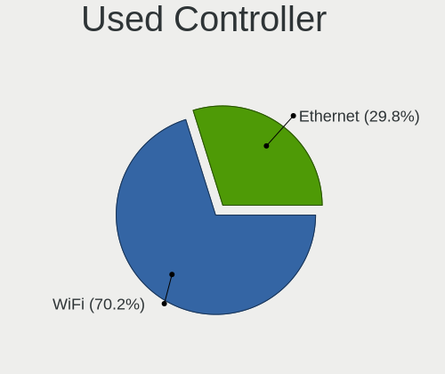

| Kind     | Notebooks | Percent |
|----------|-----------|---------|
| WiFi     | 10        | 55.56%  |
| Ethernet | 8         | 44.44%  |

NICs
----

Total network controllers on board

| Total | Notebooks | Percent |
|-------|-----------|---------|
| 2     | 13        | 72.22%  |
| 1     | 4         | 22.22%  |
| 0     | 1         | 5.56%   |

IPv6
----

IPv6 vs IPv4

| Used | Notebooks | Percent |
|------|-----------|---------|
| Yes  | 11        | 61.11%  |
| No   | 7         | 38.89%  |

Bluetooth
---------

Bluetooth Vendor
----------------

Controller vendors

| Vendor                          | Notebooks | Percent |
|---------------------------------|-----------|---------|
| Intel                           | 5         | 41.67%  |
| Qualcomm Atheros Communications | 2         | 16.67%  |
| Lite-On Technology              | 2         | 16.67%  |
| IMC Networks                    | 1         | 8.33%   |
| Broadcom                        | 1         | 8.33%   |
| Apple                           | 1         | 8.33%   |

Bluetooth Model
---------------

Controller models

| Model                                              | Notebooks | Percent |
|----------------------------------------------------|-----------|---------|
| Intel Bluetooth wireless interface                 | 2         | 16.67%  |
| Qualcomm Atheros  Bluetooth Device                 | 1         | 8.33%   |
| Qualcomm Atheros AR3011 Bluetooth                  | 1         | 8.33%   |
| Lite-On Qualcomm Atheros QCA9377 Bluetooth         | 1         | 8.33%   |
| Lite-On Atheros AR3012 Bluetooth                   | 1         | 8.33%   |
| Intel Wireless-AC 9260 Bluetooth Adapter           | 1         | 8.33%   |
| Intel Centrino Bluetooth Wireless Transceiver      | 1         | 8.33%   |
| Intel AX201 Bluetooth                              | 1         | 8.33%   |
| IMC Networks Bluetooth Device                      | 1         | 8.33%   |
| Broadcom BCM2045B (BDC-2.1) [Bluetooth Controller] | 1         | 8.33%   |
| Apple Bluetooth HCI MacBookPro (HID mode)          | 1         | 8.33%   |

Sound
-----

Sound Vendor
------------

Sound card vendors

| Vendor | Notebooks | Percent |
|--------|-----------|---------|
| Intel  | 15        | 71.43%  |
| AMD    | 4         | 19.05%  |
| Nvidia | 1         | 4.76%   |
| JMTek  | 1         | 4.76%   |

Sound Model
-----------

Sound card models

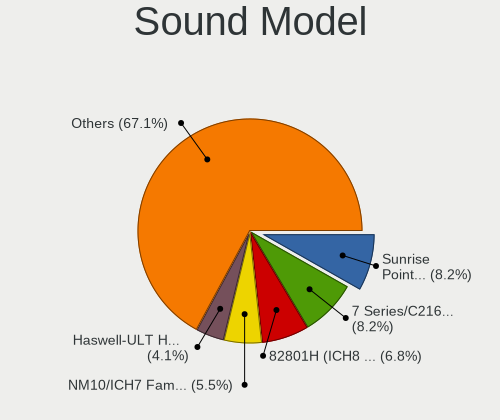

| Model                                                               | Notebooks | Percent |
|---------------------------------------------------------------------|-----------|---------|
| Intel Sunrise Point-LP HD Audio                                     | 2         | 8%      |
| Intel NM10/ICH7 Family High Definition Audio Controller             | 2         | 8%      |
| Intel 7 Series/C216 Chipset Family High Definition Audio Controller | 2         | 8%      |
| Intel 5 Series/3400 Series Chipset High Definition Audio            | 2         | 8%      |
| AMD Family 17h/19h HD Audio Controller                              | 2         | 8%      |
| Nvidia GP107GL High Definition Audio Controller                     | 1         | 4%      |
| JMTek USB Audio Device                                              | 1         | 4%      |
| Intel Tiger Lake-LP Smart Sound Technology Audio Controller         | 1         | 4%      |
| Intel Ice Lake-LP Smart Sound Technology Audio Controller           | 1         | 4%      |
| Intel Haswell-ULT HD Audio Controller                               | 1         | 4%      |
| Intel Celeron N3350/Pentium N4200/Atom E3900 Series Audio Cluster   | 1         | 4%      |
| Intel Cannon Lake PCH cAVS                                          | 1         | 4%      |
| Intel 82801I (ICH9 Family) HD Audio Controller                      | 1         | 4%      |
| Intel 82801H (ICH8 Family) HD Audio Controller                      | 1         | 4%      |
| Intel 8 Series HD Audio Controller                                  | 1         | 4%      |
| AMD SBx00 Azalia (Intel HDA)                                        | 1         | 4%      |
| AMD RV710/730 HDMI Audio [Radeon HD 4000 series]                    | 1         | 4%      |
| AMD Renoir Radeon High Definition Audio Controller                  | 1         | 4%      |
| AMD Raven/Raven2/Fenghuang HDMI/DP Audio Controller                 | 1         | 4%      |
| AMD Cedar HDMI Audio [Radeon HD 5400/6300/7300 Series]              | 1         | 4%      |

Memory
------

Memory Vendor
-------------

Memory module vendors

| Vendor              | Notebooks | Percent |
|---------------------|-----------|---------|
| Micron Technology   | 5         | 27.78%  |
| Unknown             | 4         | 22.22%  |
| SK hynix            | 4         | 22.22%  |
| Samsung Electronics | 2         | 11.11%  |
| A-DATA Technology   | 2         | 11.11%  |
| Elpida              | 1         | 5.56%   |

Memory Model
------------

Memory module models

| Model                                                            | Notebooks | Percent |
|------------------------------------------------------------------|-----------|---------|
| Unknown RAM Module 4GB SODIMM DDR3 1067MT/s                      | 1         | 5.56%   |
| Unknown RAM Module 2GB SODIMM DDR3 667MT/s                       | 1         | 5.56%   |
| Unknown RAM Module 2GB SODIMM DDR2 667MT/s                       | 1         | 5.56%   |
| Unknown RAM Module 1GB SODIMM DDR3 667MT/s                       | 1         | 5.56%   |
| SK hynix RAM HMT451S6BFR8A-PB 4GB SODIMM DDR3 1600MT/s           | 1         | 5.56%   |
| SK hynix RAM HMT325S6BFR8C-H9 2GB SODIMM DDR3 1600MT/s           | 1         | 5.56%   |
| SK hynix RAM HMA81GS6AFR8N-UH 8GB SODIMM DDR4 2667MT/s           | 1         | 5.56%   |
| SK hynix RAM HCNNNFAMMLXR-NEE 4GB Row Of Chips LPDDR4 4267MT/s   | 1         | 5.56%   |
| Samsung RAM Module 2GB SODIMM DDR2 667MT/s                       | 1         | 5.56%   |
| Samsung RAM M471A2K43CB1-CTD 16GB SODIMM DDR4 8400MT/s           | 1         | 5.56%   |
| Micron RAM MT53E1G32D4NQ-046WTE 4GB Row Of Chips LPDDR4 4266MT/s | 1         | 5.56%   |
| Micron RAM MT53B256M32D1NP 1GB 2400MT/s                          | 1         | 5.56%   |
| Micron RAM 8ATF1G64HZ-2G6E1 8GB SODIMM DDR4 2667MT/s             | 1         | 5.56%   |
| Micron RAM 8ATF1G64HZ-2G3H1 8GB SODIMM DDR4 2400MT/s             | 1         | 5.56%   |
| Micron RAM 4ATF51264HZ-2G6E1 4GB SODIMM DDR4 2667MT/s            | 1         | 5.56%   |
| Elpida RAM EBJ21UE8BDS0-AE-F 2GB SODIMM DDR3 1067MT/s            | 1         | 5.56%   |
| A-DATA RAM Module 2GB SODIMM DDR3 1067MT/s                       | 1         | 5.56%   |
| A-DATA RAM AM1L16BC2P1-B1FS 2GB SODIMM DDR3 1600MT/s             | 1         | 5.56%   |

Memory Kind
-----------

Memory module kinds

| Kind   | Notebooks | Percent |
|--------|-----------|---------|
| DDR3   | 7         | 41.18%  |
| DDR4   | 5         | 29.41%  |
| LPDDR4 | 3         | 17.65%  |
| DDR2   | 2         | 11.76%  |

Memory Form Factor
------------------

Physical design of the memory module

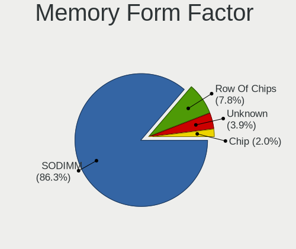

| Name         | Notebooks | Percent |
|--------------|-----------|---------|
| SODIMM       | 14        | 82.35%  |
| Row Of Chips | 2         | 11.76%  |
| Unknown      | 1         | 5.88%   |

Memory Size
-----------

Memory module size

| Size  | Notebooks | Percent |
|-------|-----------|---------|
| 2048  | 6         | 35.29%  |
| 8192  | 4         | 23.53%  |
| 4096  | 4         | 23.53%  |
| 1024  | 2         | 11.76%  |
| 16384 | 1         | 5.88%   |

Memory Speed
------------

Memory module speed

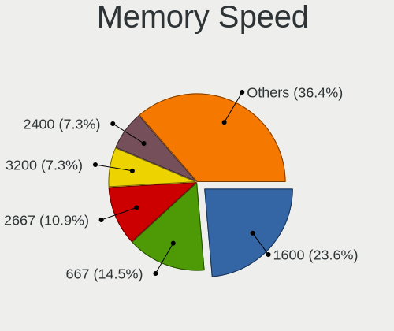

| Speed | Notebooks | Percent |
|-------|-----------|---------|
| 667   | 4         | 23.53%  |
| 2667  | 3         | 17.65%  |
| 1600  | 3         | 17.65%  |
| 2400  | 2         | 11.76%  |
| 1067  | 2         | 11.76%  |
| 8400  | 1         | 5.88%   |
| 4267  | 1         | 5.88%   |
| 4266  | 1         | 5.88%   |

Printers & scanners
-------------------

Printer Vendor
--------------

Printer device vendors

Zero info for selected period =(

Printer Model
-------------

Printer device models

Zero info for selected period =(

Scanner Vendor
--------------

Scanner device vendors

Zero info for selected period =(

Scanner Model
-------------

Scanner device models

Zero info for selected period =(

Camera
------

Camera Vendor
-------------

Camera device vendors

| Vendor                        | Notebooks | Percent |
|-------------------------------|-----------|---------|
| Chicony Electronics           | 3         | 20%     |
| Sunplus Innovation Technology | 2         | 13.33%  |
| Realtek Semiconductor         | 2         | 13.33%  |
| Apple                         | 2         | 13.33%  |
| ALi                           | 2         | 13.33%  |
| Suyin                         | 1         | 6.67%   |
| Microdia                      | 1         | 6.67%   |
| IMC Networks                  | 1         | 6.67%   |
| Acer                          | 1         | 6.67%   |

Camera Model
------------

Camera device models

| Model                                    | Notebooks | Percent |
|------------------------------------------|-----------|---------|
| Suyin Acer/HP Integrated Webcam [CN0314] | 1         | 6.67%   |
| Sunplus Integrated_Webcam_HD             | 1         | 6.67%   |
| Sunplus HD WebCam                        | 1         | 6.67%   |
| Realtek Lenovo EasyCamera                | 1         | 6.67%   |
| Realtek 2SF022                           | 1         | 6.67%   |
| Microdia Integrated_Webcam_HD            | 1         | 6.67%   |
| IMC Networks USB2.0 VGA UVC WebCam       | 1         | 6.67%   |
| Chicony Integrated Camera                | 1         | 6.67%   |
| Chicony HD WebCam (Acer)                 | 1         | 6.67%   |
| Chicony HD WebCam                        | 1         | 6.67%   |
| Apple iPhone 5/5C/5S/6/SE/7/8/X          | 1         | 6.67%   |
| Apple Built-in iSight                    | 1         | 6.67%   |
| ALi WebCam                               | 1         | 6.67%   |
| ALi Gateway Webcam                       | 1         | 6.67%   |
| Acer BisonCam, NB Pro                    | 1         | 6.67%   |

Security
--------

Fingerprint Vendor
------------------

Fingerprint sensor vendors

| Vendor                | Notebooks | Percent |
|-----------------------|-----------|---------|
| LighTuning Technology | 1         | 50%     |
| Focal-systems.Corp    | 1         | 50%     |

Fingerprint Model
-----------------

Fingerprint sensor models

| Model                                     | Notebooks | Percent |
|-------------------------------------------|-----------|---------|
| LighTuning ES603 Swipe Fingerprint Sensor | 1         | 50%     |
| Focal-systems.Corp FT9201Fingerprint.     | 1         | 50%     |

Chipcard Vendor
---------------

Chipcard module vendors

Zero info for selected period =(

Chipcard Model
--------------

Chipcard module models

Zero info for selected period =(

Unsupported
-----------

Unsupported Devices
-------------------

Total unsupported devices on board

| Total | Notebooks | Percent |
|-------|-----------|---------|
| 0     | 12        | 66.67%  |
| 1     | 6         | 33.33%  |

Unsupported Device Types
------------------------

Types of unsupported devices

| Type                  | Notebooks | Percent |
|-----------------------|-----------|---------|
| Fingerprint reader    | 2         | 33.33%  |
| Net/wireless          | 1         | 16.67%  |
| Multimedia controller | 1         | 16.67%  |
| Graphics card         | 1         | 16.67%  |
| Camera                | 1         | 16.67%  |

