Lilidog - Tested Hardware & Statistics
--------------------------------------

A project to collect tested hardware configurations for Lilidog.

Anyone can contribute to this report by the [hw-probe](https://github.com/linuxhw/hw-probe) tool:

    sudo -E hw-probe -all -upload

Please contribute! Especially if your hardware is rare.

This is a report for all computer types. See also reports for [desktops](/Dist/Lilidog/Desktop/README.md) and [notebooks](/Dist/Lilidog/Notebook/README.md).

Contents
--------

* [ Test Cases ](#test-cases)

* [ System ](#system)
  - [ OS                       ](#os)
  - [ OS Family                ](#os-family)
  - [ Kernel                   ](#kernel)
  - [ Kernel Family            ](#kernel-family)
  - [ Kernel Major Ver.        ](#kernel-major-ver)
  - [ Arch                     ](#arch)
  - [ DE                       ](#de)
  - [ Display Server           ](#display-server)
  - [ Display Manager          ](#display-manager)
  - [ OS Lang                  ](#os-lang)
  - [ Boot Mode                ](#boot-mode)
  - [ Filesystem               ](#filesystem)
  - [ Part. scheme             ](#part-scheme)
  - [ Dual Boot with Linux/BSD ](#dual-boot-with-linuxbsd)
  - [ Dual Boot (Win)          ](#dual-boot-win)

* [ Board ](#board)
  - [ Vendor                   ](#vendor)
  - [ Model                    ](#model)
  - [ Model Family             ](#model-family)
  - [ MFG Year                 ](#mfg-year)
  - [ Form Factor              ](#form-factor)
  - [ Secure Boot              ](#secure-boot)
  - [ Coreboot                 ](#coreboot)
  - [ RAM Size                 ](#ram-size)
  - [ RAM Used                 ](#ram-used)
  - [ Total Drives             ](#total-drives)
  - [ Has CD-ROM               ](#has-cd-rom)
  - [ Has Ethernet             ](#has-ethernet)
  - [ Has WiFi                 ](#has-wifi)
  - [ Has Bluetooth            ](#has-bluetooth)

* [ Location ](#location)
  - [ Country                  ](#country)
  - [ City                     ](#city)

* [ Drives ](#drives)
  - [ Drive Vendor             ](#drive-vendor)
  - [ Drive Model              ](#drive-model)
  - [ HDD Vendor               ](#hdd-vendor)
  - [ SSD Vendor               ](#ssd-vendor)
  - [ Drive Kind               ](#drive-kind)
  - [ Drive Connector          ](#drive-connector)
  - [ Drive Size               ](#drive-size)
  - [ Space Total              ](#space-total)
  - [ Space Used               ](#space-used)
  - [ Malfunc. Drives          ](#malfunc-drives)
  - [ Malfunc. Drive Vendor    ](#malfunc-drive-vendor)
  - [ Malfunc. HDD Vendor      ](#malfunc-hdd-vendor)
  - [ Malfunc. Drive Kind      ](#malfunc-drive-kind)
  - [ Failed Drives            ](#failed-drives)
  - [ Failed Drive Vendor      ](#failed-drive-vendor)
  - [ Drive Status             ](#drive-status)

* [ Storage controller ](#storage-controller)
  - [ Storage Vendor           ](#storage-vendor)
  - [ Storage Model            ](#storage-model)
  - [ Storage Kind             ](#storage-kind)

* [ Processor ](#processor)
  - [ CPU Vendor               ](#cpu-vendor)
  - [ CPU Model                ](#cpu-model)
  - [ CPU Model Family         ](#cpu-model-family)
  - [ CPU Cores                ](#cpu-cores)
  - [ CPU Sockets              ](#cpu-sockets)
  - [ CPU Threads              ](#cpu-threads)
  - [ CPU Op-Modes             ](#cpu-op-modes)
  - [ CPU Microcode            ](#cpu-microcode)
  - [ CPU Microarch            ](#cpu-microarch)

* [ Graphics ](#graphics)
  - [ GPU Vendor               ](#gpu-vendor)
  - [ GPU Model                ](#gpu-model)
  - [ GPU Combo                ](#gpu-combo)
  - [ GPU Driver               ](#gpu-driver)
  - [ GPU Memory               ](#gpu-memory)

* [ Monitor ](#monitor)
  - [ Monitor Vendor           ](#monitor-vendor)
  - [ Monitor Model            ](#monitor-model)
  - [ Monitor Resolution       ](#monitor-resolution)
  - [ Monitor Diagonal         ](#monitor-diagonal)
  - [ Monitor Width            ](#monitor-width)
  - [ Aspect Ratio             ](#aspect-ratio)
  - [ Monitor Area             ](#monitor-area)
  - [ Pixel Density            ](#pixel-density)
  - [ Multiple Monitors        ](#multiple-monitors)

* [ Network ](#network)
  - [ Net Controller Vendor    ](#net-controller-vendor)
  - [ Net Controller Model     ](#net-controller-model)
  - [ Wireless Vendor          ](#wireless-vendor)
  - [ Wireless Model           ](#wireless-model)
  - [ Ethernet Vendor          ](#ethernet-vendor)
  - [ Ethernet Model           ](#ethernet-model)
  - [ Net Controller Kind      ](#net-controller-kind)
  - [ Used Controller          ](#used-controller)
  - [ NICs                     ](#nics)
  - [ IPv6                     ](#ipv6)

* [ Bluetooth ](#bluetooth)
  - [ Bluetooth Vendor         ](#bluetooth-vendor)
  - [ Bluetooth Model          ](#bluetooth-model)

* [ Sound ](#sound)
  - [ Sound Vendor             ](#sound-vendor)
  - [ Sound Model              ](#sound-model)

* [ Memory ](#memory)
  - [ Memory Vendor            ](#memory-vendor)
  - [ Memory Model             ](#memory-model)
  - [ Memory Kind              ](#memory-kind)
  - [ Memory Form Factor       ](#memory-form-factor)
  - [ Memory Size              ](#memory-size)
  - [ Memory Speed             ](#memory-speed)

* [ Printers & scanners ](#printers--scanners)
  - [ Printer Vendor           ](#printer-vendor)
  - [ Printer Model            ](#printer-model)
  - [ Scanner Vendor           ](#scanner-vendor)
  - [ Scanner Model            ](#scanner-model)

* [ Camera ](#camera)
  - [ Camera Vendor            ](#camera-vendor)
  - [ Camera Model             ](#camera-model)

* [ Security ](#security)
  - [ Fingerprint Vendor       ](#fingerprint-vendor)
  - [ Fingerprint Model        ](#fingerprint-model)
  - [ Chipcard Vendor          ](#chipcard-vendor)
  - [ Chipcard Model           ](#chipcard-model)

* [ Unsupported ](#unsupported)
  - [ Unsupported Devices      ](#unsupported-devices)
  - [ Unsupported Device Types ](#unsupported-device-types)

Test Cases
----------

Total: 93

| Vendor        | Model                       | Form-Factor | Probe                                                      | Date         |
|---------------|-----------------------------|-------------|------------------------------------------------------------|--------------|
| Toshiba       | Satellite P200              | Notebook    | [f9f88ee996](https://linux-hardware.org/?probe=f9f88ee996) | May 03, 2024 |
| Acer          | Aspire E5-573               | Notebook    | [1060cb82e8](https://linux-hardware.org/?probe=1060cb82e8) | May 01, 2024 |
| Lenovo        | Y520-15IKBN 80WK            | Notebook    | [6d235ddbaf](https://linux-hardware.org/?probe=6d235ddbaf) | Apr 29, 2024 |
| Lenovo        | IdeaPad 3 15ITL6 82H8       | Notebook    | [419fb8dfca](https://linux-hardware.org/?probe=419fb8dfca) | Apr 28, 2024 |
| Lenovo        | IdeaPad 3 15ITL6 82H8       | Notebook    | [a154dad3b7](https://linux-hardware.org/?probe=a154dad3b7) | Apr 28, 2024 |
| ASUSTek       | VivoBook_ASUSLaptop X150... | Notebook    | [6006e10996](https://linux-hardware.org/?probe=6006e10996) | Apr 20, 2024 |
| HP            | 1825                        | Desktop     | [3d90cc7481](https://linux-hardware.org/?probe=3d90cc7481) | Mar 31, 2024 |
| Shenzhen M... | F6BFC                       | Desktop     | [14060f87a1](https://linux-hardware.org/?probe=14060f87a1) | Mar 12, 2024 |
| HP            | 630                         | Notebook    | [4aee0c5868](https://linux-hardware.org/?probe=4aee0c5868) | Mar 10, 2024 |
| HP            | 510 Notebook PC (RU962AA... | Notebook    | [94571f879e](https://linux-hardware.org/?probe=94571f879e) | Mar 02, 2024 |
| Shenzhen M... | F6BFC                       | Desktop     | [207f92c903](https://linux-hardware.org/?probe=207f92c903) | Feb 18, 2024 |
| Dell          | Latitude E5420              | Notebook    | [1cdafef139](https://linux-hardware.org/?probe=1cdafef139) | Feb 07, 2024 |
| HP            | Pavilion 11 x360 PC         | Notebook    | [1d8dbbd8af](https://linux-hardware.org/?probe=1d8dbbd8af) | Jan 29, 2024 |
| Acer          | Aspire E1-470               | Notebook    | [732a523ea8](https://linux-hardware.org/?probe=732a523ea8) | Jan 28, 2024 |
| ASUSTek       | X550VC                      | Notebook    | [90ebdf4197](https://linux-hardware.org/?probe=90ebdf4197) | Jan 22, 2024 |
| HP            | ProBook 6560b               | Notebook    | [6d2bbcc556](https://linux-hardware.org/?probe=6d2bbcc556) | Jan 21, 2024 |
| HP            | 1998                        | Desktop     | [b193235ba4](https://linux-hardware.org/?probe=b193235ba4) | Jan 17, 2024 |
| Lenovo        | ThinkPad T430s 2356GUU      | Notebook    | [df4e542b16](https://linux-hardware.org/?probe=df4e542b16) | Jan 15, 2024 |
| PC Special... | P65_67RSRP                  | Notebook    | [f2af84bdfc](https://linux-hardware.org/?probe=f2af84bdfc) | Jan 13, 2024 |
| Apple         | MacBook4,1                  | Notebook    | [6d15625c9b](https://linux-hardware.org/?probe=6d15625c9b) | Jan 05, 2024 |
| Lenovo        | ThinkPad X280 20KES63G00    | Notebook    | [a5688cc794](https://linux-hardware.org/?probe=a5688cc794) | Dec 24, 2023 |
| Toshiba       | Satellite Pro L450          | Notebook    | [8da0c619f3](https://linux-hardware.org/?probe=8da0c619f3) | Dec 24, 2023 |
| Acer          | AOD270                      | Notebook    | [868ee5d423](https://linux-hardware.org/?probe=868ee5d423) | Dec 04, 2023 |
| Acer          | Aspire one                  | Notebook    | [5bf09e9b79](https://linux-hardware.org/?probe=5bf09e9b79) | Nov 29, 2023 |
| Sony          | VPCF23P1E                   | Notebook    | [0bfcf70f1a](https://linux-hardware.org/?probe=0bfcf70f1a) | Nov 21, 2023 |
| Google        | Sand                        | Notebook    | [97e4755fe5](https://linux-hardware.org/?probe=97e4755fe5) | Nov 07, 2023 |
| Dell          | Inspiron 1318               | Notebook    | [2ac81db219](https://linux-hardware.org/?probe=2ac81db219) | Oct 14, 2023 |
| BANGHO        | Suma 1025                   | Tablet      | [5dab721f9a](https://linux-hardware.org/?probe=5dab721f9a) | Aug 21, 2023 |
| HP            | 435                         | Notebook    | [cb02103775](https://linux-hardware.org/?probe=cb02103775) | Aug 17, 2023 |
| Dell          | 0M5DCD A00                  | Desktop     | [6f8ca5724f](https://linux-hardware.org/?probe=6f8ca5724f) | Aug 10, 2023 |
| HP            | Laptop 15s-fq1xxx           | Notebook    | [f495796fe8](https://linux-hardware.org/?probe=f495796fe8) | Aug 03, 2023 |
| Panasonic     | CFMX4-1                     | Notebook    | [925f36396d](https://linux-hardware.org/?probe=925f36396d) | Jul 30, 2023 |
| Lenovo        | ThinkPad X1 Carbon 4th 2... | Notebook    | [31b0d46f32](https://linux-hardware.org/?probe=31b0d46f32) | Jul 22, 2023 |
| Google        | Auron_Yuna                  | Notebook    | [abff7f6ed0](https://linux-hardware.org/?probe=abff7f6ed0) | Jul 19, 2023 |
| Dell          | Latitude E5440              | Notebook    | [9d0c95f893](https://linux-hardware.org/?probe=9d0c95f893) | Jul 18, 2023 |
| Dell          | Latitude 7414               | Notebook    | [184c56a43a](https://linux-hardware.org/?probe=184c56a43a) | Jul 01, 2023 |
| ASUSTek       | VivoBook 15_ASUS Laptop ... | Notebook    | [18c2eb78d4](https://linux-hardware.org/?probe=18c2eb78d4) | Jun 26, 2023 |
| Lenovo        | ThinkPad X1 Carbon Gen 9... | Notebook    | [f7a2bd2ca8](https://linux-hardware.org/?probe=f7a2bd2ca8) | Jun 10, 2023 |
| TUXEDO        | N8xEJEK                     | Notebook    | [28ca72e1e1](https://linux-hardware.org/?probe=28ca72e1e1) | Jun 05, 2023 |
| Google        | Sand                        | Notebook    | [e6d70635d6](https://linux-hardware.org/?probe=e6d70635d6) | May 30, 2023 |
| HP            | G62                         | Notebook    | [68f5984aa8](https://linux-hardware.org/?probe=68f5984aa8) | May 11, 2023 |
| Apple         | Mac-942B59F58194171B iMa... | All in one  | [bd50784a0b](https://linux-hardware.org/?probe=bd50784a0b) | May 05, 2023 |
| Apple         | Mac-942B59F58194171B iMa... | All in one  | [4d91f9900d](https://linux-hardware.org/?probe=4d91f9900d) | Apr 25, 2023 |
| Dell          | 0GM819                      | Desktop     | [744413006e](https://linux-hardware.org/?probe=744413006e) | Apr 20, 2023 |
| Google        | Sand                        | Notebook    | [044ac39e57](https://linux-hardware.org/?probe=044ac39e57) | Apr 11, 2023 |
| Unknown       | X79M2-Q                     | Desktop     | [d985b7fa11](https://linux-hardware.org/?probe=d985b7fa11) | Apr 05, 2023 |
| Lenovo        | Yoga Slim 7 14ARE05 82A2    | Notebook    | [061b0673b4](https://linux-hardware.org/?probe=061b0673b4) | Mar 12, 2023 |
| Apple         | MacBookPro3,1               | Notebook    | [266ef88c0c](https://linux-hardware.org/?probe=266ef88c0c) | Jan 25, 2023 |
| Apple         | MacBookPro3,1               | Notebook    | [910de59ed9](https://linux-hardware.org/?probe=910de59ed9) | Jan 25, 2023 |
| Foxconn       | NETBOX NT-425/525 Ver       | Desktop     | [dfb8c476f9](https://linux-hardware.org/?probe=dfb8c476f9) | Jan 21, 2023 |
| Lenovo        | 374F SDK0R32862 WIN 3258... | Desktop     | [d50f9357b4](https://linux-hardware.org/?probe=d50f9357b4) | Jan 18, 2023 |
| Dell          | 0WMJ54 A01                  | Desktop     | [fece850cae](https://linux-hardware.org/?probe=fece850cae) | Jan 15, 2023 |
| Dell          | 03NVJ6 A02                  | Desktop     | [a16b955eed](https://linux-hardware.org/?probe=a16b955eed) | Jan 15, 2023 |
| Intel         | NUC11DBBi7 M17027-403       | Mini pc     | [d407c538c4](https://linux-hardware.org/?probe=d407c538c4) | Dec 24, 2022 |
| HP            | 89E8 0100                   | All in one  | [0e9567b0a5](https://linux-hardware.org/?probe=0e9567b0a5) | Dec 21, 2022 |
| ASUSTek       | PRIME H510M-K               | Desktop     | [9b1f8e9a10](https://linux-hardware.org/?probe=9b1f8e9a10) | Dec 18, 2022 |
| ASUSTek       | VivoBook 15_ASUS Laptop ... | Notebook    | [d64272e554](https://linux-hardware.org/?probe=d64272e554) | Dec 03, 2022 |
| Dell          | Latitude 7390               | Notebook    | [9278bcc6a2](https://linux-hardware.org/?probe=9278bcc6a2) | Nov 27, 2022 |
| HP            | 805B                        | Desktop     | [111fb196ff](https://linux-hardware.org/?probe=111fb196ff) | Nov 16, 2022 |
| Dell          | 0DF42J A00                  | Desktop     | [52e8355edf](https://linux-hardware.org/?probe=52e8355edf) | Nov 12, 2022 |
| Fanless Mi... | Rev JSL1                    | Mini pc     | [b74e119c7e](https://linux-hardware.org/?probe=b74e119c7e) | Nov 05, 2022 |
| Biostar       | A320MH                      | Desktop     | [d01d91204f](https://linux-hardware.org/?probe=d01d91204f) | Oct 27, 2022 |
| Biostar       | A320MH                      | Desktop     | [768dff7065](https://linux-hardware.org/?probe=768dff7065) | Oct 27, 2022 |
| Gigabyte      | B365M DS3H                  | Desktop     | [603fc4f4cd](https://linux-hardware.org/?probe=603fc4f4cd) | Oct 15, 2022 |
| Gigabyte      | B450 AORUS PRO-CF           | Desktop     | [4bc8ad9e5f](https://linux-hardware.org/?probe=4bc8ad9e5f) | Oct 12, 2022 |
| Lenovo        | 374F SDK0R32862 WIN 3258... | Desktop     | [b30ac8d979](https://linux-hardware.org/?probe=b30ac8d979) | Oct 05, 2022 |
| Acer          | Aspire 7540                 | Notebook    | [8e80ccea19](https://linux-hardware.org/?probe=8e80ccea19) | Oct 01, 2022 |
| Acer          | V5-131                      | Notebook    | [7a218d1ae7](https://linux-hardware.org/?probe=7a218d1ae7) | Sep 14, 2022 |
| Dell          | Inspiron 3793               | Notebook    | [66f5acc518](https://linux-hardware.org/?probe=66f5acc518) | Sep 10, 2022 |
| Dell          | 0GM819                      | Desktop     | [7778e245a9](https://linux-hardware.org/?probe=7778e245a9) | Sep 06, 2022 |
| Apple         | Mac-F2238AC8                | All in one  | [209e0387a9](https://linux-hardware.org/?probe=209e0387a9) | Aug 27, 2022 |
| Apple         | Mac-F2208EC8                | Mini pc     | [5bfd5ddd59](https://linux-hardware.org/?probe=5bfd5ddd59) | Aug 26, 2022 |
| HP            | 805B                        | Desktop     | [602a9470ab](https://linux-hardware.org/?probe=602a9470ab) | Aug 22, 2022 |
| Apple         | Mac-031AEE4D24BFF0B1 Mac... | Mini pc     | [b7173a46ac](https://linux-hardware.org/?probe=b7173a46ac) | Aug 21, 2022 |
| Apple         | Mac-F2238AC8                | All in one  | [c9be76cad8](https://linux-hardware.org/?probe=c9be76cad8) | Aug 21, 2022 |
| Lenovo        | G500 20236                  | Notebook    | [5846b57c77](https://linux-hardware.org/?probe=5846b57c77) | Aug 09, 2022 |
| Acer          | Aspire E5-573               | Notebook    | [d5f490187d](https://linux-hardware.org/?probe=d5f490187d) | Jul 19, 2022 |
| Inventec      | 0W63N3 A01                  | Mini pc     | [de75a91d9f](https://linux-hardware.org/?probe=de75a91d9f) | Jul 09, 2022 |
| Acer          | V5-131                      | Notebook    | [620f2657d4](https://linux-hardware.org/?probe=620f2657d4) | Jul 07, 2022 |
| ASUSTek       | H110M-A/DP                  | Desktop     | [01dccaff29](https://linux-hardware.org/?probe=01dccaff29) | Jul 07, 2022 |
| Panasonic     | CF-31ATXAX1M                | Notebook    | [46be7cc40c](https://linux-hardware.org/?probe=46be7cc40c) | Jul 06, 2022 |
| Acer          | AOD255E                     | Notebook    | [01c9e4194b](https://linux-hardware.org/?probe=01c9e4194b) | Jul 06, 2022 |
| ASUSTek       | H110M-A/DP                  | Desktop     | [356272d726](https://linux-hardware.org/?probe=356272d726) | Jul 04, 2022 |
| Acer          | AOD255E                     | Notebook    | [1737f8b906](https://linux-hardware.org/?probe=1737f8b906) | Jun 26, 2022 |
| Gigabyte      | MZBAYAP-00                  | Desktop     | [f8a734d114](https://linux-hardware.org/?probe=f8a734d114) | Jun 20, 2022 |
| Gigabyte      | MZBAYAP-00                  | Desktop     | [8fb623d313](https://linux-hardware.org/?probe=8fb623d313) | Jun 17, 2022 |
| GPU Compan... | GWNR71517                   | Notebook    | [89a074e539](https://linux-hardware.org/?probe=89a074e539) | Jun 02, 2022 |
| eMachines     | EL1352                      | Desktop     | [562e729c18](https://linux-hardware.org/?probe=562e729c18) | May 15, 2022 |
| HP            | 212B                        | Desktop     | [d6deb6ed52](https://linux-hardware.org/?probe=d6deb6ed52) | May 04, 2022 |
| Lenovo        | ThinkPad T400 6474WPU       | Notebook    | [ce7e91802e](https://linux-hardware.org/?probe=ce7e91802e) | May 03, 2022 |
| HP            | 21EF                        | Desktop     | [f619d0dfc0](https://linux-hardware.org/?probe=f619d0dfc0) | Apr 14, 2022 |
| Dell          | 0HJ054                      | Desktop     | [77ae3bc631](https://linux-hardware.org/?probe=77ae3bc631) | Apr 11, 2022 |
| Dell          | Inspiron 3793               | Notebook    | [3df5028c64](https://linux-hardware.org/?probe=3df5028c64) | Apr 10, 2022 |

System
------

OS
--

Installed operating systems

| Name       | Computers | Percent |
|------------|-----------|---------|
| Lilidog 22 | 40        | 51.28%  |
| Lilidog 23 | 38        | 48.72%  |

OS Family
---------

OS without a version

| Name    | Computers | Percent |
|---------|-----------|---------|
| Lilidog | 76        | 100%    |

Kernel
------

Version of the Linux kernel

| Version                   | Computers | Percent |
|---------------------------|-----------|---------|
| 6.5.0-0.deb12.4-amd64     | 9         | 10.59%  |
| 5.10.0-16-amd64           | 6         | 7.06%   |
| 6.1.0-9-amd64             | 5         | 5.88%   |
| 5.10.0-18-amd64           | 5         | 5.88%   |
| 5.10.0-15-amd64           | 5         | 5.88%   |
| 6.6.13+bpo-amd64          | 4         | 4.71%   |
| 6.1.0-10-amd64            | 4         | 4.71%   |
| 5.10.0-13-amd64           | 4         | 4.71%   |
| 6.1.0-18-amd64            | 3         | 3.53%   |
| 5.10.0-21-amd64           | 3         | 3.53%   |
| 5.10.0-20-amd64           | 3         | 3.53%   |
| 6.5.0-0.deb12.1-amd64     | 2         | 2.35%   |
| 6.1.0-7-amd64             | 2         | 2.35%   |
| 6.1.0-16-amd64            | 2         | 2.35%   |
| 6.1.0-11-amd64            | 2         | 2.35%   |
| 6.0.8-x64v1-xanmod1       | 2         | 2.35%   |
| 5.10.0-14-amd64           | 2         | 2.35%   |
| 6.4.5-1-liquorix-amd64    | 1         | 1.18%   |
| 6.4.0-0.deb12.2-amd64     | 1         | 1.18%   |
| 6.2.12-x64v1-xanmod1      | 1         | 1.18%   |
| 6.2.11-x64v1-xanmod1      | 1         | 1.18%   |
| 6.1.0-7.2-liquorix-amd64  | 1         | 1.18%   |
| 6.1.0-20-amd64            | 1         | 1.18%   |
| 6.1.0-18-686-pae          | 1         | 1.18%   |
| 6.1.0-13-amd64            | 1         | 1.18%   |
| 6.1.0-13-686-pae          | 1         | 1.18%   |
| 6.1.0-0.deb11.6-amd64     | 1         | 1.18%   |
| 6.0.10-x64v1-xanmod1      | 1         | 1.18%   |
| 6.0.0-5-amd64             | 1         | 1.18%   |
| 6.0.0-2-amd64             | 1         | 1.18%   |
| 6.0.0-0.deb11.6-amd64     | 1         | 1.18%   |
| 6.0.0-0.deb11.2-amd64     | 1         | 1.18%   |
| 5.19.0-7.1-liquorix-amd64 | 1         | 1.18%   |
| 5.19.0-0.deb11.2-amd64    | 1         | 1.18%   |
| 5.18.0-1-amd64            | 1         | 1.18%   |
| 5.17.0-5.1-liquorix-amd64 | 1         | 1.18%   |
| 5.10.0-22-amd64           | 1         | 1.18%   |
| 5.10.0-19-amd64           | 1         | 1.18%   |
| 5.10.0-17-amd64           | 1         | 1.18%   |

Kernel Family
-------------

Linux kernel without a distro release

| Version | Computers | Percent |
|---------|-----------|---------|
| 5.10.0  | 29        | 35.37%  |
| 6.1.0   | 23        | 28.05%  |
| 6.5.0   | 11        | 13.41%  |
| 6.6.13  | 4         | 4.88%   |
| 6.0.0   | 4         | 4.88%   |
| 6.0.8   | 2         | 2.44%   |
| 5.19.0  | 2         | 2.44%   |
| 6.4.5   | 1         | 1.22%   |
| 6.4.0   | 1         | 1.22%   |
| 6.2.12  | 1         | 1.22%   |
| 6.2.11  | 1         | 1.22%   |
| 6.0.10  | 1         | 1.22%   |
| 5.18.0  | 1         | 1.22%   |
| 5.17.0  | 1         | 1.22%   |

Kernel Major Ver.
-----------------

Linux kernel major version

| Version | Computers | Percent |
|---------|-----------|---------|
| 5.10    | 29        | 35.37%  |
| 6.1     | 23        | 28.05%  |
| 6.5     | 11        | 13.41%  |
| 6.0     | 7         | 8.54%   |
| 6.6     | 4         | 4.88%   |
| 6.4     | 2         | 2.44%   |
| 6.2     | 2         | 2.44%   |
| 5.19    | 2         | 2.44%   |
| 5.18    | 1         | 1.22%   |
| 5.17    | 1         | 1.22%   |

Arch
----

OS architecture (x86_64, i586, etc.)

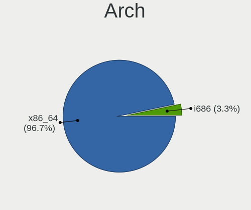

| Name   | Computers | Percent |
|--------|-----------|---------|
| x86_64 | 74        | 97.37%  |
| i686   | 2         | 2.63%   |

DE
--

Desktop Environment

| Name             | Computers | Percent |
|------------------|-----------|---------|
| lightdm-xsession | 58        | 72.5%   |
| openbox          | 21        | 26.25%  |
| XFCE             | 1         | 1.25%   |

Display Server
--------------

X11 or Wayland

| Name | Computers | Percent |
|------|-----------|---------|
| X11  | 76        | 100%    |

Display Manager
---------------

SDDM, LightDM, etc.

| Name    | Computers | Percent |
|---------|-----------|---------|
| LightDM | 76        | 100%    |

OS Lang
-------

Language

| Lang  | Computers | Percent |
|-------|-----------|---------|
| en_US | 48        | 62.34%  |
| de_DE | 5         | 6.49%   |
| pl_PL | 4         | 5.19%   |
| en_GB | 4         | 5.19%   |
| es_ES | 3         | 3.9%    |
| es_MX | 2         | 2.6%    |
| es_CO | 2         | 2.6%    |
| ru_RU | 1         | 1.3%    |
| pt_BR | 1         | 1.3%    |
| it_IT | 1         | 1.3%    |
| fi_FI | 1         | 1.3%    |
| es_CL | 1         | 1.3%    |
| es_AR | 1         | 1.3%    |
| en_IE | 1         | 1.3%    |
| en_AU | 1         | 1.3%    |
| cs_CZ | 1         | 1.3%    |

Boot Mode
---------

EFI or BIOS

| Mode | Computers | Percent |
|------|-----------|---------|
| EFI  | 41        | 53.95%  |
| BIOS | 35        | 46.05%  |

Filesystem
----------

Type of filesystem

| Type    | Computers | Percent |
|---------|-----------|---------|
| Ext4    | 53        | 67.95%  |
| Overlay | 18        | 23.08%  |
| Btrfs   | 6         | 7.69%   |
| Xfs     | 1         | 1.28%   |

Part. scheme
------------

Scheme of partitioning

| Type | Computers | Percent |
|------|-----------|---------|
| GPT  | 48        | 62.34%  |
| MBR  | 29        | 37.66%  |

Dual Boot with Linux/BSD
------------------------

Hosting more than one Linux/BSD

| Dual boot | Computers | Percent |
|-----------|-----------|---------|
| No        | 49        | 62.82%  |
| Yes       | 29        | 37.18%  |

Dual Boot (Win)
---------------

Hosting Linux and Windows

| Dual boot | Computers | Percent |
|-----------|-----------|---------|
| No        | 64        | 84.21%  |
| Yes       | 12        | 15.79%  |

Board
-----

Vendor
------

Motherboard manufacturer

| Name                                 | Computers | Percent |
|--------------------------------------|-----------|---------|
| Hewlett-Packard                      | 12        | 15.79%  |
| Dell                                 | 12        | 15.79%  |
| Lenovo                               | 10        | 13.16%  |
| Acer                                 | 9         | 11.84%  |
| Apple                                | 6         | 7.89%   |
| ASUSTek Computer                     | 5         | 6.58%   |
| Gigabyte Technology                  | 3         | 3.95%   |
| Toshiba                              | 2         | 2.63%   |
| Panasonic                            | 2         | 2.63%   |
| Google                               | 2         | 2.63%   |
| TUXEDO                               | 1         | 1.32%   |
| Sony                                 | 1         | 1.32%   |
| Shenzhen Meigao Electronic Equipment | 1         | 1.32%   |
| PC Specialist                        | 1         | 1.32%   |
| Inventec                             | 1         | 1.32%   |
| Intel                                | 1         | 1.32%   |
| GPU Company                          | 1         | 1.32%   |
| Foxconn                              | 1         | 1.32%   |
| Fanless Mini PC                      | 1         | 1.32%   |
| eMachines                            | 1         | 1.32%   |
| Biostar                              | 1         | 1.32%   |
| BANGHO                               | 1         | 1.32%   |
| Unknown                              | 1         | 1.32%   |

Model
-----

Motherboard model

| Name                                       | Computers | Percent |
|--------------------------------------------|-----------|---------|
| Acer Aspire E5-573                         | 2         | 2.63%   |
| Acer AOD255E                               | 2         | 2.63%   |
| TUXEDO N8xEJEK                             | 1         | 1.32%   |
| Toshiba Satellite Pro L450                 | 1         | 1.32%   |
| Toshiba Satellite P200                     | 1         | 1.32%   |
| Sony VPCF23P1E                             | 1         | 1.32%   |
| Shenzhen Meigao Electronic Equipment UM560 | 1         | 1.32%   |
| PC Specialist P65_67RSRP                   | 1         | 1.32%   |
| Panasonic CFMX4-1                          | 1         | 1.32%   |
| Panasonic CF-31ATXAX1M                     | 1         | 1.32%   |
| Lenovo Yoga Slim 7 14ARE05 82A2            | 1         | 1.32%   |
| Lenovo Y520-15IKBN 80WK                    | 1         | 1.32%   |
| Lenovo ThinkPad X280 20KES63G00            | 1         | 1.32%   |
| Lenovo ThinkPad X1 Carbon Gen 9 20XWCTO1WW | 1         | 1.32%   |
| Lenovo ThinkPad X1 Carbon 4th 20FCS24900   | 1         | 1.32%   |
| Lenovo ThinkPad T430s 2356GUU              | 1         | 1.32%   |
| Lenovo ThinkPad T400 6474WPU               | 1         | 1.32%   |
| Lenovo Legion T7 34IMZ5 90Q800AJMH         | 1         | 1.32%   |
| Lenovo IdeaPad 3 15ITL6 82H8               | 1         | 1.32%   |
| Lenovo G500 20236                          | 1         | 1.32%   |
| Inventec Dell Thin Client Desktop 5060     | 1         | 1.32%   |
| Intel NUC11BTMi7                           | 1         | 1.32%   |
| HP t520 Flexible Series TC                 | 1         | 1.32%   |
| HP ProBook 6560b                           | 1         | 1.32%   |
| HP Pavilion 11 x360 PC                     | 1         | 1.32%   |
| HP Laptop 15s-fq1xxx                       | 1         | 1.32%   |
| HP G62                                     | 1         | 1.32%   |
| HP EliteDesk 800 G1 SFF                    | 1         | 1.32%   |
| HP EliteDesk 800 G1 DM                     | 1         | 1.32%   |
| HP EliteDesk 705 G2 MINI                   | 1         | 1.32%   |
| HP All-in-One Desktop 27-cb1xxx            | 1         | 1.32%   |
| HP 630                                     | 1         | 1.32%   |
| HP 510 Notebook PC (RU962AA#ABE)           | 1         | 1.32%   |
| HP 435                                     | 1         | 1.32%   |
| GPU Company GWNR71517                      | 1         | 1.32%   |
| Google Sand                                | 1         | 1.32%   |
| Google Auron_Yuna                          | 1         | 1.32%   |
| Gigabyte PERSONAL COMPUTER                 | 1         | 1.32%   |
| Gigabyte B450 AORUS PRO                    | 1         | 1.32%   |
| Gigabyte B365M DS3H                        | 1         | 1.32%   |

Model Family
------------

Motherboard model prefix

| Name                                       | Computers | Percent |
|--------------------------------------------|-----------|---------|
| Lenovo ThinkPad                            | 5         | 6.58%   |
| Acer Aspire                                | 5         | 6.58%   |
| Dell OptiPlex                              | 4         | 5.26%   |
| Dell Latitude                              | 4         | 5.26%   |
| HP EliteDesk                               | 3         | 3.95%   |
| Toshiba Satellite                          | 2         | 2.63%   |
| Dell Inspiron                              | 2         | 2.63%   |
| ASUS VivoBook                              | 2         | 2.63%   |
| Acer AOD255E                               | 2         | 2.63%   |
| TUXEDO N8xEJEK                             | 1         | 1.32%   |
| Sony VPCF23P1E                             | 1         | 1.32%   |
| Shenzhen Meigao Electronic Equipment UM560 | 1         | 1.32%   |
| PC Specialist P65                          | 1         | 1.32%   |
| Panasonic CFMX4-1                          | 1         | 1.32%   |
| Panasonic CF-31ATXAX1M                     | 1         | 1.32%   |
| Lenovo Yoga                                | 1         | 1.32%   |
| Lenovo Y520-15IKBN                         | 1         | 1.32%   |
| Lenovo Legion                              | 1         | 1.32%   |
| Lenovo IdeaPad                             | 1         | 1.32%   |
| Lenovo G500                                | 1         | 1.32%   |
| Inventec Dell                              | 1         | 1.32%   |
| Intel NUC11BTMi7                           | 1         | 1.32%   |
| HP t520                                    | 1         | 1.32%   |
| HP ProBook                                 | 1         | 1.32%   |
| HP Pavilion                                | 1         | 1.32%   |
| HP Laptop                                  | 1         | 1.32%   |
| HP G62                                     | 1         | 1.32%   |
| HP All-in-One                              | 1         | 1.32%   |
| HP 630                                     | 1         | 1.32%   |
| HP 510                                     | 1         | 1.32%   |
| HP 435                                     | 1         | 1.32%   |
| GPU Company GWNR71517                      | 1         | 1.32%   |
| Google Sand                                | 1         | 1.32%   |
| Google Auron                               | 1         | 1.32%   |
| Gigabyte PERSONAL                          | 1         | 1.32%   |
| Gigabyte B450                              | 1         | 1.32%   |
| Gigabyte B365M                             | 1         | 1.32%   |
| Foxconn NETBOX                             | 1         | 1.32%   |
| Fanless Mini PC Quieter                    | 1         | 1.32%   |
| eMachines EL1352                           | 1         | 1.32%   |

MFG Year
--------

Motherboard manufacture year

| Year | Computers | Percent |
|------|-----------|---------|
| 2010 | 10        | 13.16%  |
| 2018 | 7         | 9.21%   |
| 2011 | 7         | 9.21%   |
| 2014 | 6         | 7.89%   |
| 2022 | 5         | 6.58%   |
| 2021 | 5         | 6.58%   |
| 2019 | 5         | 6.58%   |
| 2013 | 5         | 6.58%   |
| 2017 | 4         | 5.26%   |
| 2012 | 4         | 5.26%   |
| 2007 | 4         | 5.26%   |
| 2016 | 3         | 3.95%   |
| 2015 | 3         | 3.95%   |
| 2008 | 3         | 3.95%   |
| 2020 | 2         | 2.63%   |
| 2009 | 2         | 2.63%   |
| 2006 | 1         | 1.32%   |

Form Factor
-----------

Physical design of the computer

| Name       | Computers | Percent |
|------------|-----------|---------|
| Notebook   | 46        | 60.53%  |
| Desktop    | 21        | 27.63%  |
| Mini pc    | 5         | 6.58%   |
| All in one | 3         | 3.95%   |
| Tablet     | 1         | 1.32%   |

Secure Boot
-----------

Enabled or disabled

| State    | Computers | Percent |
|----------|-----------|---------|
| Disabled | 74        | 97.37%  |
| Enabled  | 2         | 2.63%   |

Coreboot
--------

Have coreboot on board

| Used | Computers | Percent |
|------|-----------|---------|
| No   | 73        | 96.05%  |
| Yes  | 3         | 3.95%   |

RAM Size
--------

Total RAM memory

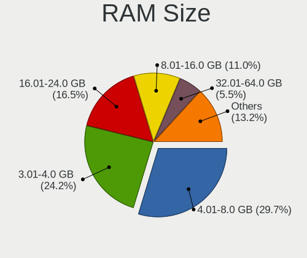

| Size in GB | Computers | Percent |
|------------|-----------|---------|
| 4.01-8.0   | 27        | 35.53%  |
| 3.01-4.0   | 16        | 21.05%  |
| 16.01-24.0 | 12        | 15.79%  |
| 8.01-16.0  | 7         | 9.21%   |
| 32.01-64.0 | 4         | 5.26%   |
| 1.01-2.0   | 4         | 5.26%   |
| 2.01-3.0   | 3         | 3.95%   |
| 0.51-1.0   | 2         | 2.63%   |
| 0.01-0.5   | 1         | 1.32%   |

RAM Used
--------

Used RAM memory

| Used GB   | Computers | Percent |
|-----------|-----------|---------|
| 0.51-1.0  | 47        | 60.26%  |
| 1.01-2.0  | 21        | 26.92%  |
| 2.01-3.0  | 6         | 7.69%   |
| 0.01-0.5  | 3         | 3.85%   |
| 8.01-16.0 | 1         | 1.28%   |

Total Drives
------------

Number of drives on board

| Drives | Computers | Percent |
|--------|-----------|---------|
| 1      | 54        | 69.23%  |
| 2      | 16        | 20.51%  |
| 3      | 5         | 6.41%   |
| 4      | 3         | 3.85%   |

Has CD-ROM
----------

Has CD-ROM on board

| Presented | Computers | Percent |
|-----------|-----------|---------|
| No        | 48        | 62.34%  |
| Yes       | 29        | 37.66%  |

Has Ethernet
------------

Has Ethernet on board

| Presented | Computers | Percent |
|-----------|-----------|---------|
| Yes       | 68        | 88.31%  |
| No        | 9         | 11.69%  |

Has WiFi
--------

Has WiFi module

| Presented | Computers | Percent |
|-----------|-----------|---------|
| Yes       | 64        | 84.21%  |
| No        | 12        | 15.79%  |

Has Bluetooth
-------------

Has Bluetooth module

| Presented | Computers | Percent |
|-----------|-----------|---------|
| Yes       | 45        | 58.44%  |
| No        | 32        | 41.56%  |

Location
--------

Country
-------

Geographic location (country)

| Country     | Computers | Percent |
|-------------|-----------|---------|
| USA         | 21        | 27.63%  |
| Germany     | 9         | 11.84%  |
| UK          | 5         | 6.58%   |
| Poland      | 5         | 6.58%   |
| Spain       | 4         | 5.26%   |
| Netherlands | 3         | 3.95%   |
| Italy       | 3         | 3.95%   |
| Argentina   | 3         | 3.95%   |
| Mexico      | 2         | 2.63%   |
| Finland     | 2         | 2.63%   |
| Colombia    | 2         | 2.63%   |
| Vietnam     | 1         | 1.32%   |
| Thailand    | 1         | 1.32%   |
| Taiwan      | 1         | 1.32%   |
| Russia      | 1         | 1.32%   |
| Romania     | 1         | 1.32%   |
| Portugal    | 1         | 1.32%   |
| Kenya       | 1         | 1.32%   |
| Indonesia   | 1         | 1.32%   |
| France      | 1         | 1.32%   |
| Czechia     | 1         | 1.32%   |
| Chile       | 1         | 1.32%   |
| Canada      | 1         | 1.32%   |
| Bulgaria    | 1         | 1.32%   |
| Brazil      | 1         | 1.32%   |
| Belgium     | 1         | 1.32%   |
| Austria     | 1         | 1.32%   |
| Australia   | 1         | 1.32%   |

City
----

Geographic location (city)

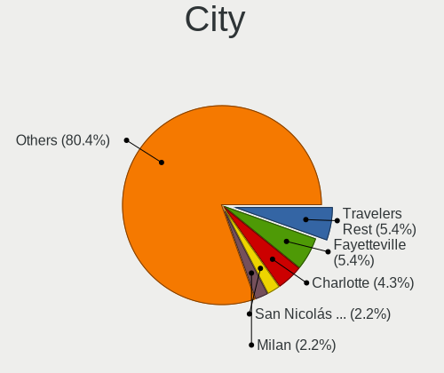

| City                        | Computers | Percent |
|-----------------------------|-----------|---------|
| Travelers Rest              | 5         | 6.41%   |
| Fayetteville                | 5         | 6.41%   |
| Charlotte                   | 4         | 5.13%   |
| San Nicolás de los Arroyos | 2         | 2.56%   |
| Milan                       | 2         | 2.56%   |
| Medellín                   | 2         | 2.56%   |
| Helsinki                    | 2         | 2.56%   |
| Egan                        | 2         | 2.56%   |
| Denver                      | 2         | 2.56%   |
| Zduny                       | 1         | 1.28%   |
| Zapopan                     | 1         | 1.28%   |
| Workum                      | 1         | 1.28%   |
| Viña del Mar               | 1         | 1.28%   |
| Vienna                      | 1         | 1.28%   |
| Uelzen                      | 1         | 1.28%   |
| Stockton-on-Tees            | 1         | 1.28%   |
| Stockport                   | 1         | 1.28%   |
| St Petersburg               | 1         | 1.28%   |
| Sofia                       | 1         | 1.28%   |
| Schiedam                    | 1         | 1.28%   |
| Rzeszów                    | 1         | 1.28%   |
| Rumia                       | 1         | 1.28%   |
| Rome                        | 1         | 1.28%   |
| Rio Ceballos                | 1         | 1.28%   |
| Rinteln                     | 1         | 1.28%   |
| Ratchathewi                 | 1         | 1.28%   |
| Poznan                      | 1         | 1.28%   |
| Poricany                    | 1         | 1.28%   |
| Palembang                   | 1         | 1.28%   |
| Ossa de Montiel             | 1         | 1.28%   |
| Norderstedt                 | 1         | 1.28%   |
| Nairobi                     | 1         | 1.28%   |
| Morgantown                  | 1         | 1.28%   |
| Monclova                    | 1         | 1.28%   |
| Memphis                     | 1         | 1.28%   |
| Madrid                      | 1         | 1.28%   |
| Lisbon                      | 1         | 1.28%   |
| Leicester                   | 1         | 1.28%   |
| Langelsheim                 | 1         | 1.28%   |
| L'Isle-sur-la-Sorgue        | 1         | 1.28%   |

Drives
------

Drive Vendor
------------

Hard drive vendors

| Vendor              | Computers | Drives | Percent |
|---------------------|-----------|--------|---------|
| Seagate             | 20        | 23     | 19.61%  |
| WDC                 | 11        | 16     | 10.78%  |
| Samsung Electronics | 11        | 15     | 10.78%  |
| Kingston            | 9         | 11     | 8.82%   |
| SanDisk             | 6         | 8      | 5.88%   |
| Crucial             | 6         | 7      | 5.88%   |
| Toshiba             | 4         | 5      | 3.92%   |
| Micron Technology   | 3         | 4      | 2.94%   |
| SK hynix            | 2         | 2      | 1.96%   |
| Intel               | 2         | 2      | 1.96%   |
| Hitachi             | 2         | 2      | 1.96%   |
| Apacer              | 2         | 2      | 1.96%   |
| A-DATA Technology   | 2         | 2      | 1.96%   |
| Wibtek              | 1         | 1      | 0.98%   |
| Unknown             | 1         | 1      | 0.98%   |
| SSK                 | 1         | 2      | 0.98%   |
| SPCC                | 1         | 1      | 0.98%   |
| Silicon Motion      | 1         | 1      | 0.98%   |
| PNY                 | 1         | 1      | 0.98%   |
| Phison              | 1         | 2      | 0.98%   |
| OWC                 | 1         | 2      | 0.98%   |
| Mushkin             | 1         | 1      | 0.98%   |
| Lexar               | 1         | 1      | 0.98%   |
| KIOXIA              | 1         | 1      | 0.98%   |
| KingSpec            | 1         | 1      | 0.98%   |
| KingFast            | 1         | 1      | 0.98%   |
| Integral            | 1         | 1      | 0.98%   |
| Hikvision           | 1         | 1      | 0.98%   |
| GOODRAM             | 1         | 1      | 0.98%   |
| Fanxiang            | 1         | 1      | 0.98%   |
| China               | 1         | 1      | 0.98%   |
| Blackpcs            | 1         | 1      | 0.98%   |
| ASMedia             | 1         | 1      | 0.98%   |
| Apple               | 1         | 1      | 0.98%   |
| Unknown             | 1         | 1      | 0.98%   |

Drive Model
-----------

Hard drive models

| Model                                | Computers | Percent |
|--------------------------------------|-----------|---------|
| Kingston SA400S37240G 240GB SSD      | 4         | 3.77%   |
| SK hynix C2S3T/480G 480GB SSD        | 2         | 1.89%   |
| Seagate ST500LT012-9WS142 500GB      | 2         | 1.89%   |
| Seagate ST31000528AS 1TB             | 2         | 1.89%   |
| Seagate ST1000DM010-2EP102 1TB       | 2         | 1.89%   |
| Samsung SSD 970 EVO Plus 1TB         | 2         | 1.89%   |
| Crucial CT250MX500SSD1 250GB         | 2         | 1.89%   |
| Wibtek W800S 256GB SSD               | 1         | 0.94%   |
| WDC WDS500G2B0A-00SM50 500GB SSD     | 1         | 0.94%   |
| WDC WDS480G2G0A-00JH30 480GB SSD     | 1         | 0.94%   |
| WDC WDS100T2B0C-00PXH0 1TB           | 1         | 0.94%   |
| WDC WD800JD-75MSA3 80GB              | 1         | 0.94%   |
| WDC WD600UE-22KVT0 64GB              | 1         | 0.94%   |
| WDC WD5000LPVX-22V0TT0 500GB         | 1         | 0.94%   |
| WDC WD50 00AAKX-08U6AA0 500GB        | 1         | 0.94%   |
| WDC WD1600BEVT-22ZCT0 160GB          | 1         | 0.94%   |
| WDC WD10SPCX-60KHST0 1TB             | 1         | 0.94%   |
| WDC WD10EZEX-60M2NA0 1TB             | 1         | 0.94%   |
| WDC PC SN730 SDBQNTY-1T00-1001 1TB   | 1         | 0.94%   |
| WDC PC SN530 SDBPNPZ-512G-1006 512GB | 1         | 0.94%   |
| Unknown NCard  32GB                  | 1         | 0.94%   |
| Toshiba MQ04ABF100 1TB               | 1         | 0.94%   |
| Toshiba MQ01ABF050 500GB             | 1         | 0.94%   |
| Toshiba MK6034GSX 64GB               | 1         | 0.94%   |
| Toshiba MK1665GSX 160GB              | 1         | 0.94%   |
| SSK Disk 256GB                       | 1         | 0.94%   |
| SPCC Solid State Disk 256GB          | 1         | 0.94%   |
| Silicon Motion NE-128 128GB          | 1         | 0.94%   |
| Seagate ST9320325ASG 320GB           | 1         | 0.94%   |
| Seagate ST9320325AS 320GB            | 1         | 0.94%   |
| Seagate ST9250315AS 250GB            | 1         | 0.94%   |
| Seagate ST500VM000-1SD101 500GB      | 1         | 0.94%   |
| Seagate ST500LT012-1DG142 500GB      | 1         | 0.94%   |
| Seagate ST500DM002-1BD142 500GB      | 1         | 0.94%   |
| Seagate ST320LT020-9YG142 320GB      | 1         | 0.94%   |
| Seagate ST3160023AS 160GB            | 1         | 0.94%   |
| Seagate ST2000LM007-1R8174 2TB       | 1         | 0.94%   |
| Seagate ST2000DX002-2DV164 2TB       | 1         | 0.94%   |
| Seagate ST2000DM008-2FR102 2TB       | 1         | 0.94%   |
| Seagate OneTouch HDD 1TB             | 1         | 0.94%   |

HDD Vendor
----------

Hard disk drive vendors

| Vendor  | Computers | Drives | Percent |
|---------|-----------|--------|---------|
| Seagate | 20        | 23     | 57.14%  |
| WDC     | 7         | 7      | 20%     |
| Toshiba | 4         | 5      | 11.43%  |
| Hitachi | 2         | 2      | 5.71%   |
| ASMedia | 1         | 1      | 2.86%   |
| Apple   | 1         | 1      | 2.86%   |

SSD Vendor
----------

Solid state drive vendors

| Vendor              | Computers | Drives | Percent |
|---------------------|-----------|--------|---------|
| Kingston            | 8         | 10     | 16.67%  |
| Samsung Electronics | 6         | 6      | 12.5%   |
| Crucial             | 6         | 7      | 12.5%   |
| SanDisk             | 5         | 5      | 10.42%  |
| WDC                 | 2         | 3      | 4.17%   |
| SK hynix            | 2         | 2      | 4.17%   |
| Micron Technology   | 2         | 3      | 4.17%   |
| Apacer              | 2         | 2      | 4.17%   |
| A-DATA Technology   | 2         | 2      | 4.17%   |
| Wibtek              | 1         | 1      | 2.08%   |
| SSK                 | 1         | 2      | 2.08%   |
| SPCC                | 1         | 1      | 2.08%   |
| PNY                 | 1         | 1      | 2.08%   |
| OWC                 | 1         | 2      | 2.08%   |
| Mushkin             | 1         | 1      | 2.08%   |
| KingSpec            | 1         | 1      | 2.08%   |
| KingFast            | 1         | 1      | 2.08%   |
| Integral            | 1         | 1      | 2.08%   |
| GOODRAM             | 1         | 1      | 2.08%   |
| Fanxiang            | 1         | 1      | 2.08%   |
| China               | 1         | 1      | 2.08%   |
| Blackpcs            | 1         | 1      | 2.08%   |

Drive Kind
----------

HDD or SSD

| Kind | Computers | Drives | Percent |
|------|-----------|--------|---------|
| SSD  | 44        | 55     | 47.31%  |
| HDD  | 30        | 39     | 32.26%  |
| NVMe | 17        | 25     | 18.28%  |
| MMC  | 2         | 5      | 2.15%   |

Drive Connector
---------------

SATA, SAS, NVMe, etc.

| Type | Computers | Drives | Percent |
|------|-----------|--------|---------|
| SATA | 66        | 85     | 70.97%  |
| NVMe | 17        | 23     | 18.28%  |
| SAS  | 8         | 11     | 8.6%    |
| MMC  | 2         | 5      | 2.15%   |

Drive Size
----------

Size of hard drive

| Size in TB | Computers | Drives | Percent |
|------------|-----------|--------|---------|
| 0.01-0.5   | 56        | 67     | 74.67%  |
| 0.51-1.0   | 13        | 20     | 17.33%  |
| 1.01-2.0   | 5         | 6      | 6.67%   |
| 4.01-10.0  | 1         | 1      | 1.33%   |

Space Total
-----------

Amount of disk space available on the file system

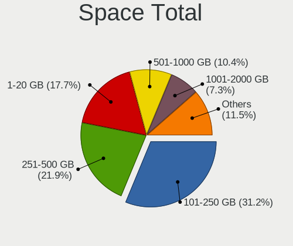

| Size in GB | Computers | Percent |
|------------|-----------|---------|
| 101-250    | 23        | 29.11%  |
| 251-500    | 19        | 24.05%  |
| 1-20       | 17        | 21.52%  |
| 1001-2000  | 6         | 7.59%   |
| 501-1000   | 6         | 7.59%   |
| 51-100     | 6         | 7.59%   |
| 21-50      | 2         | 2.53%   |

Space Used
----------

Amount of used disk space

| Used GB   | Computers | Percent |
|-----------|-----------|---------|
| 1-20      | 65        | 82.28%  |
| 21-50     | 6         | 7.59%   |
| 101-250   | 3         | 3.8%    |
| 251-500   | 2         | 2.53%   |
| 51-100    | 2         | 2.53%   |
| 1001-2000 | 1         | 1.27%   |

Malfunc. Drives
---------------

Drive models with a malfunction

| Model                              | Computers | Drives | Percent |
|------------------------------------|-----------|--------|---------|
| Seagate ST500LT012-9WS142 500GB    | 2         | 3      | 15.38%  |
| WDC WDS480G2G0A-00JH30 480GB SSD   | 1         | 2      | 7.69%   |
| WDC WD800JD-75MSA3 80GB            | 1         | 1      | 7.69%   |
| Toshiba MK1665GSX 160GB            | 1         | 1      | 7.69%   |
| Seagate ST9250315AS 250GB          | 1         | 1      | 7.69%   |
| Seagate ST1000DM010-2EP102 1TB     | 1         | 1      | 7.69%   |
| SanDisk SSD PLUS 480GB             | 1         | 1      | 7.69%   |
| SanDisk SDSA6MM-016G-1006 16GB SSD | 1         | 1      | 7.69%   |
| OWC Mercury EXTREME Pro 6G SSD     | 1         | 2      | 7.69%   |
| Mushkin MKNSSDCR120GB              | 1         | 1      | 7.69%   |
| Kingston SNS4151S332GD 32GB SSD    | 1         | 1      | 7.69%   |
| Crucial CT1000MX500SSD1 1TB        | 1         | 2      | 7.69%   |

Malfunc. Drive Vendor
---------------------

Vendors of faulty drives

| Vendor   | Computers | Drives | Percent |
|----------|-----------|--------|---------|
| Seagate  | 4         | 5      | 30.77%  |
| WDC      | 2         | 3      | 15.38%  |
| SanDisk  | 2         | 2      | 15.38%  |
| Toshiba  | 1         | 1      | 7.69%   |
| OWC      | 1         | 2      | 7.69%   |
| Mushkin  | 1         | 1      | 7.69%   |
| Kingston | 1         | 1      | 7.69%   |
| Crucial  | 1         | 2      | 7.69%   |

Malfunc. HDD Vendor
-------------------

Vendors of faulty HDD drives

| Vendor  | Computers | Drives | Percent |
|---------|-----------|--------|---------|
| Seagate | 4         | 5      | 66.67%  |
| WDC     | 1         | 1      | 16.67%  |
| Toshiba | 1         | 1      | 16.67%  |

Malfunc. Drive Kind
-------------------

Kinds of faulty drives

| Kind | Computers | Drives | Percent |
|------|-----------|--------|---------|
| SSD  | 7         | 10     | 53.85%  |
| HDD  | 6         | 7      | 46.15%  |

Failed Drives
-------------

Failed drive models

| Model                     | Computers | Drives | Percent |
|---------------------------|-----------|--------|---------|
| Seagate ST9320325AS 320GB | 1         | 1      | 50%     |
| Seagate ST31000528AS 1TB  | 1         | 2      | 50%     |

Failed Drive Vendor
-------------------

Failed drive vendors

| Vendor  | Computers | Drives | Percent |
|---------|-----------|--------|---------|
| Seagate | 2         | 3      | 100%    |

Drive Status
------------

Number of failed and malfunc. drives

| Status   | Computers | Drives | Percent |
|----------|-----------|--------|---------|
| Works    | 64        | 89     | 72.73%  |
| Malfunc  | 13        | 17     | 14.77%  |
| Detected | 9         | 15     | 10.23%  |
| Failed   | 2         | 3      | 2.27%   |

Storage controller
------------------

Storage Vendor
--------------

Storage controller vendors

| Vendor                       | Computers | Percent |
|------------------------------|-----------|---------|
| Intel                        | 62        | 70.45%  |
| AMD                          | 9         | 10.23%  |
| Samsung Electronics          | 5         | 5.68%   |
| SanDisk                      | 3         | 3.41%   |
| Nvidia                       | 2         | 2.27%   |
| Silicon Motion               | 1         | 1.14%   |
| Shenzhen Longsys Electronics | 1         | 1.14%   |
| Phison Electronics           | 1         | 1.14%   |
| Micron Technology            | 1         | 1.14%   |
| MAXIO Technology (Hangzhou)  | 1         | 1.14%   |
| KIOXIA                       | 1         | 1.14%   |
| Kingston Technology Company  | 1         | 1.14%   |

Storage Model
-------------

Storage controller models

| Model                                                                                                              | Computers | Percent |
|--------------------------------------------------------------------------------------------------------------------|-----------|---------|
| AMD FCH SATA Controller [AHCI mode]                                                                                | 7         | 6.67%   |
| Intel 7 Series Chipset Family 6-port SATA Controller [AHCI mode]                                                   | 6         | 5.71%   |
| Intel 82801HM/HEM (ICH8M/ICH8M-E) SATA Controller [AHCI mode]                                                      | 4         | 3.81%   |
| Intel 82801HM/HEM (ICH8M/ICH8M-E) IDE Controller                                                                   | 4         | 3.81%   |
| Samsung NVMe SSD Controller SM981/PM981/PM983                                                                      | 3         | 2.86%   |
| Intel Volume Management Device NVMe RAID Controller                                                                | 3         | 2.86%   |
| Intel Sunrise Point-LP SATA Controller [AHCI mode]                                                                 | 3         | 2.86%   |
| Intel NM10/ICH7 Family SATA Controller [AHCI mode]                                                                 | 3         | 2.86%   |
| Intel Atom Processor E3800 Series SATA AHCI Controller                                                             | 3         | 2.86%   |
| Intel 82801 Mobile SATA Controller [RAID mode]                                                                     | 3         | 2.86%   |
| Intel 8 Series/C220 Series Chipset Family 6-port SATA Controller 1 [AHCI mode]                                     | 3         | 2.86%   |
| Intel 6 Series/C200 Series Chipset Family 6 port Mobile SATA AHCI Controller                                       | 3         | 2.86%   |
| SanDisk Ultra 3D / WD Blue SN550 NVMe SSD                                                                          | 2         | 1.9%    |
| Samsung NVMe SSD Controller 980 (DRAM-less)                                                                        | 2         | 1.9%    |
| Intel Wildcat Point-LP SATA Controller [AHCI Mode]                                                                 | 2         | 1.9%    |
| Intel NM10/ICH7 Family SATA Controller [IDE mode]                                                                  | 2         | 1.9%    |
| Intel 82801IBM/IEM (ICH9M/ICH9M-E) 4 port SATA Controller [AHCI mode]                                              | 2         | 1.9%    |
| Intel 8 Series SATA Controller 1 [AHCI mode]                                                                       | 2         | 1.9%    |
| Intel 5 Series/3400 Series Chipset 6 port SATA AHCI Controller                                                     | 2         | 1.9%    |
| Intel 5 Series/3400 Series Chipset 4 port SATA AHCI Controller                                                     | 2         | 1.9%    |
| Intel 200 Series PCH SATA controller [AHCI mode]                                                                   | 2         | 1.9%    |
| AMD SB7x0/SB8x0/SB9x0 SATA Controller [AHCI mode]                                                                  | 2         | 1.9%    |
| Silicon Motion SM2263EN/SM2263XT (DRAM-less) NVMe SSD Controllers                                                  | 1         | 0.95%   |
| Shenzhen Longsys FORESEE XP1000 / Lexar Professional CFexpress Type B Gold series, NM620 PCIe NVME SSD (DRAM-less) | 1         | 0.95%   |
| SanDisk Extreme Pro / WD Black SN750 / PC SN730 / Red SN700 NVMe SSD                                               | 1         | 0.95%   |
| Samsung NVMe SSD Controller PM9A1/PM9A3/980PRO                                                                     | 1         | 0.95%   |
| Phison PS5013-E13 PCIe3 NVMe Controller (DRAM-less)                                                                | 1         | 0.95%   |
| Nvidia MCP89 SATA Controller (AHCI mode)                                                                           | 1         | 0.95%   |
| Nvidia MCP61 SATA Controller                                                                                       | 1         | 0.95%   |
| Nvidia MCP61 IDE                                                                                                   | 1         | 0.95%   |
| Micron 2210 NVMe SSD [Cobain]                                                                                      | 1         | 0.95%   |
| MAXIO (Hangzhou) NVMe SSD Controller MAP1202 (DRAM-less)                                                           | 1         | 0.95%   |
| KIOXIA NVMe SSD Controller BG4 (DRAM-less)                                                                         | 1         | 0.95%   |
| Kingston Company KC3000/FURY Renegade NVMe SSD E18                                                                 | 1         | 0.95%   |
| Intel Tiger Lake-LP SATA Controller                                                                                | 1         | 0.95%   |
| Intel Tiger Lake SATA AHCI Controller                                                                              | 1         | 0.95%   |
| Intel SSD DC P4101/Pro 7600p/760p/E 6100p Series                                                                   | 1         | 0.95%   |
| Intel SATA Controller [RAID Mode]                                                                                  | 1         | 0.95%   |
| Intel Q170/Q150/B150/H170/H110/Z170/CM236 Chipset SATA Controller [AHCI Mode]                                      | 1         | 0.95%   |
| Intel NVMe Optane Memory Series                                                                                    | 1         | 0.95%   |

Storage Kind
------------

Kind of storage controller (IDE, SATA, NVMe, SAS, ...)

| Kind | Computers | Percent |
|------|-----------|---------|
| SATA | 60        | 61.86%  |
| NVMe | 17        | 17.53%  |
| IDE  | 13        | 13.4%   |
| RAID | 7         | 7.22%   |

Processor
---------

CPU Vendor
----------

Processor vendors

| Vendor | Computers | Percent |
|--------|-----------|---------|
| Intel  | 65        | 85.53%  |
| AMD    | 11        | 14.47%  |

CPU Model
---------

Processor models

| Model                                       | Computers | Percent |
|---------------------------------------------|-----------|---------|
| Intel Core i5-3230M CPU @ 2.60GHz           | 2         | 2.63%   |
| Intel Core i5 CPU M 520 @ 2.40GHz           | 2         | 2.63%   |
| Intel Core 2 Duo CPU E8400 @ 3.00GHz        | 2         | 2.63%   |
| Intel Celeron CPU N2807 @ 1.58GHz           | 2         | 2.63%   |
| Intel Atom CPU N455 @ 1.66GHz               | 2         | 2.63%   |
| Intel Xeon CPU E5-2643 0 @ 3.30GHz          | 1         | 1.32%   |
| Intel Pentium Gold G6405 CPU @ 4.10GHz      | 1         | 1.32%   |
| Intel Pentium Dual-Core CPU T4200 @ 2.00GHz | 1         | 1.32%   |
| Intel Pentium D CPU 2.80GHz                 | 1         | 1.32%   |
| Intel Pentium CPU N4200 @ 1.10GHz           | 1         | 1.32%   |
| Intel Pentium 3556U @ 1.70GHz               | 1         | 1.32%   |
| Intel Core i7-8750H CPU @ 2.20GHz           | 1         | 1.32%   |
| Intel Core i7-8700 CPU @ 3.20GHz            | 1         | 1.32%   |
| Intel Core i7-8650U CPU @ 1.90GHz           | 1         | 1.32%   |
| Intel Core i7-8550U CPU @ 1.80GHz           | 1         | 1.32%   |
| Intel Core i7-6700HQ CPU @ 2.60GHz          | 1         | 1.32%   |
| Intel Core i7-6600U CPU @ 2.60GHz           | 1         | 1.32%   |
| Intel Core i7-4785T CPU @ 2.20GHz           | 1         | 1.32%   |
| Intel Core i7-3520M CPU @ 2.90GHz           | 1         | 1.32%   |
| Intel Core i7-2670QM CPU @ 2.20GHz          | 1         | 1.32%   |
| Intel Core i7-1065G7 CPU @ 1.30GHz          | 1         | 1.32%   |
| Intel Core i5-9400 CPU @ 2.90GHz            | 1         | 1.32%   |
| Intel Core i5-8250U CPU @ 1.60GHz           | 1         | 1.32%   |
| Intel Core i5-7400 CPU @ 3.00GHz            | 1         | 1.32%   |
| Intel Core i5-7300HQ CPU @ 2.50GHz          | 1         | 1.32%   |
| Intel Core i5-6300U CPU @ 2.40GHz           | 1         | 1.32%   |
| Intel Core i5-5300U CPU @ 2.30GHz           | 1         | 1.32%   |
| Intel Core i5-4570 CPU @ 3.20GHz            | 1         | 1.32%   |
| Intel Core i5-4200U CPU @ 1.60GHz           | 1         | 1.32%   |
| Intel Core i5-3210M CPU @ 2.50GHz           | 1         | 1.32%   |
| Intel Core i5-2520M CPU @ 2.50GHz           | 1         | 1.32%   |
| Intel Core i5-2500S CPU @ 2.70GHz           | 1         | 1.32%   |
| Intel Core i5-1035G1 CPU @ 1.00GHz          | 1         | 1.32%   |
| Intel Core i3-4160 CPU @ 3.60GHz            | 1         | 1.32%   |
| Intel Core i3-4005U CPU @ 1.70GHz           | 1         | 1.32%   |
| Intel Core i3-3217U CPU @ 1.80GHz           | 1         | 1.32%   |
| Intel Core i3-2120 CPU @ 3.30GHz            | 1         | 1.32%   |
| Intel Core i3 CPU M 370 @ 2.40GHz           | 1         | 1.32%   |
| Intel Core i3 CPU 540 @ 3.07GHz             | 1         | 1.32%   |
| Intel Core 2 Duo CPU T8100 @ 2.10GHz        | 1         | 1.32%   |

CPU Model Family
----------------

Processor model prefix

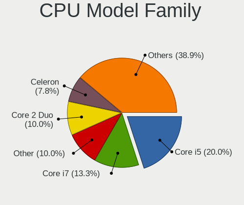

| Model                   | Computers | Percent |
|-------------------------|-----------|---------|
| Intel Core i5           | 16        | 21.05%  |
| Intel Core i7           | 10        | 13.16%  |
| Intel Core 2 Duo        | 8         | 10.53%  |
| Intel Celeron           | 7         | 9.21%   |
| Other                   | 6         | 7.89%   |
| Intel Core i3           | 6         | 7.89%   |
| Intel Atom              | 5         | 6.58%   |
| AMD Ryzen 5             | 3         | 3.95%   |
| Intel Pentium           | 2         | 2.63%   |
| AMD GX                  | 2         | 2.63%   |
| Intel Xeon              | 1         | 1.32%   |
| Intel Pentium Gold      | 1         | 1.32%   |
| Intel Pentium Dual-Core | 1         | 1.32%   |
| Intel Pentium D         | 1         | 1.32%   |
| Intel Celeron M         | 1         | 1.32%   |
| AMD Ryzen 7             | 1         | 1.32%   |
| AMD PRO A10             | 1         | 1.32%   |
| AMD Phenom II           | 1         | 1.32%   |
| AMD Athlon II Dual-Core | 1         | 1.32%   |
| AMD Athlon II           | 1         | 1.32%   |
| AMD A12                 | 1         | 1.32%   |

CPU Cores
---------

Number of processor cores

| Number | Computers | Percent |
|--------|-----------|---------|
| 2      | 41        | 53.95%  |
| 4      | 20        | 26.32%  |
| 6      | 5         | 6.58%   |
| 1      | 5         | 6.58%   |
| 8      | 2         | 2.63%   |
| 12     | 1         | 1.32%   |
| 10     | 1         | 1.32%   |
| 3      | 1         | 1.32%   |

CPU Sockets
-----------

Number of sockets

| Number | Computers | Percent |
|--------|-----------|---------|
| 1      | 76        | 100%    |

CPU Threads
-----------

Threads per core (Hyper-Threading)

| Number | Computers | Percent |
|--------|-----------|---------|
| 2      | 44        | 57.89%  |
| 1      | 32        | 42.11%  |

CPU Op-Modes
------------

CPU Operation Modes (32-bit, 64-bit)

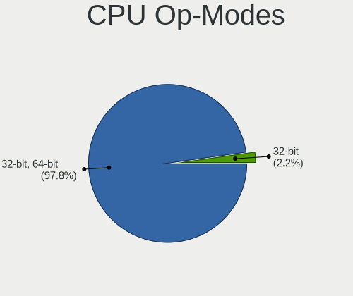

| Op mode        | Computers | Percent |
|----------------|-----------|---------|
| 32-bit, 64-bit | 74        | 97.37%  |
| 32-bit         | 2         | 2.63%   |

CPU Microcode
-------------

Microcode number

| Number     | Computers | Percent |
|------------|-----------|---------|
| Unknown    | 21        | 26.58%  |
| 0x306a9    | 4         | 5.06%   |
| 0x1067a    | 4         | 5.06%   |
| 0x206a7    | 3         | 3.8%    |
| 0x20655    | 3         | 3.8%    |
| 0x106ca    | 3         | 3.8%    |
| 0x906ea    | 2         | 2.53%   |
| 0x906e9    | 2         | 2.53%   |
| 0x806ea    | 2         | 2.53%   |
| 0x806c1    | 2         | 2.53%   |
| 0x406e3    | 2         | 2.53%   |
| 0x40651    | 2         | 2.53%   |
| 0x306d4    | 2         | 2.53%   |
| 0x30678    | 2         | 2.53%   |
| 0x0600611a | 2         | 2.53%   |
| 0x010000c8 | 2         | 2.53%   |
| 0xf44      | 1         | 1.27%   |
| 0xa0671    | 1         | 1.27%   |
| 0xa0653    | 1         | 1.27%   |
| 0x906ed    | 1         | 1.27%   |
| 0x906c0    | 1         | 1.27%   |
| 0x906a4    | 1         | 1.27%   |
| 0x806d1    | 1         | 1.27%   |
| 0x706e5    | 1         | 1.27%   |
| 0x6fa      | 1         | 1.27%   |
| 0x6d8      | 1         | 1.27%   |
| 0x506c9    | 1         | 1.27%   |
| 0x306c3    | 1         | 1.27%   |
| 0x206d7    | 1         | 1.27%   |
| 0x106c2    | 1         | 1.27%   |
| 0x10676    | 1         | 1.27%   |
| 0x0a50000d | 1         | 1.27%   |
| 0x08600106 | 1         | 1.27%   |
| 0x08108109 | 1         | 1.27%   |
| 0x0810100b | 1         | 1.27%   |
| 0x07030105 | 1         | 1.27%   |
| 0x07030104 | 1         | 1.27%   |

CPU Microarch
-------------

Microarchitecture

| Name             | Computers | Percent |
|------------------|-----------|---------|
| KabyLake         | 8         | 10.39%  |
| SandyBridge      | 6         | 7.79%   |
| Penryn           | 6         | 7.79%   |
| IvyBridge        | 6         | 7.79%   |
| Haswell          | 6         | 7.79%   |
| Bonnell          | 5         | 6.49%   |
| Westmere         | 4         | 5.19%   |
| Icelake          | 4         | 5.19%   |
| Skylake          | 3         | 3.9%    |
| Silvermont       | 3         | 3.9%    |
| K10              | 3         | 3.9%    |
| Core             | 3         | 3.9%    |
| TigerLake        | 2         | 2.6%    |
| Puma             | 2         | 2.6%    |
| Excavator        | 2         | 2.6%    |
| Broadwell        | 2         | 2.6%    |
| Unknown          | 2         | 2.6%    |
| Zen+             | 1         | 1.3%    |
| Zen 3            | 1         | 1.3%    |
| Zen 2            | 1         | 1.3%    |
| Zen              | 1         | 1.3%    |
| Tremont          | 1         | 1.3%    |
| P6               | 1         | 1.3%    |
| NetBurst         | 1         | 1.3%    |
| Goldmont         | 1         | 1.3%    |
| CometLake        | 1         | 1.3%    |
| Alderlake Hybrid | 1         | 1.3%    |

Graphics
--------

GPU Vendor
----------

Vendors of graphics cards

| Vendor | Computers | Percent |
|--------|-----------|---------|
| Intel  | 55        | 63.95%  |
| AMD    | 18        | 20.93%  |
| Nvidia | 13        | 15.12%  |

GPU Model
---------

Graphics card models

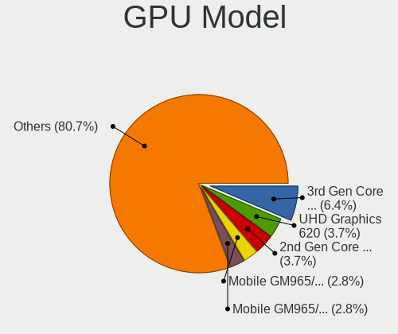

| Model                                                                         | Computers | Percent |
|-------------------------------------------------------------------------------|-----------|---------|
| Intel 3rd Gen Core processor Graphics Controller                              | 6         | 6.67%   |
| Intel 2nd Generation Core Processor Family Integrated Graphics Controller     | 4         | 4.44%   |
| Intel UHD Graphics 620                                                        | 3         | 3.33%   |
| Intel Haswell-ULT Integrated Graphics Controller                              | 3         | 3.33%   |
| Intel Core Processor Integrated Graphics Controller                           | 3         | 3.33%   |
| Intel Atom Processor Z36xxx/Z37xxx Series Graphics & Display                  | 3         | 3.33%   |
| Intel Atom Processor D4xx/D5xx/N4xx/N5xx Integrated Graphics Controller       | 3         | 3.33%   |
| Nvidia GP107M [GeForce GTX 1050 Mobile]                                       | 2         | 2.22%   |
| Intel Xeon E3-1200 v3/4th Gen Core Processor Integrated Graphics Controller   | 2         | 2.22%   |
| Intel TigerLake-LP GT2 [Iris Xe Graphics]                                     | 2         | 2.22%   |
| Intel Skylake GT2 [HD Graphics 520]                                           | 2         | 2.22%   |
| Intel Mobile GM965/GL960 Integrated Graphics Controller (secondary)           | 2         | 2.22%   |
| Intel Mobile GM965/GL960 Integrated Graphics Controller (primary)             | 2         | 2.22%   |
| Intel Mobile 4 Series Chipset Integrated Graphics Controller                  | 2         | 2.22%   |
| Intel HD Graphics 630                                                         | 2         | 2.22%   |
| AMD Wani [Radeon R5/R6/R7 Graphics]                                           | 2         | 2.22%   |
| Nvidia TU117 [GeForce GTX 1650]                                               | 1         | 1.11%   |
| Nvidia MCP89 [GeForce 320M]                                                   | 1         | 1.11%   |
| Nvidia GP108 [GeForce GT 1030]                                                | 1         | 1.11%   |
| Nvidia GP107M [GeForce GTX 1050 Ti Mobile]                                    | 1         | 1.11%   |
| Nvidia GP104BM [GeForce GTX 1070 Mobile]                                      | 1         | 1.11%   |
| Nvidia GF117M [GeForce 610M/710M/810M/820M / GT 620M/625M/630M/720M]          | 1         | 1.11%   |
| Nvidia GF108M [GeForce GT 540M]                                               | 1         | 1.11%   |
| Nvidia GA104 [GeForce RTX 3060 Ti Lite Hash Rate]                             | 1         | 1.11%   |
| Nvidia GA102 [GeForce RTX 3080]                                               | 1         | 1.11%   |
| Nvidia G84M [GeForce 8600M GT]                                                | 1         | 1.11%   |
| Nvidia C61 [GeForce 6150SE nForce 430]                                        | 1         | 1.11%   |
| Intel TigerLake-H GT1 [UHD Graphics]                                          | 1         | 1.11%   |
| Intel Mobile 945GSE Express Integrated Graphics Controller                    | 1         | 1.11%   |
| Intel Mobile 945GM/GMS/GME, 943/940GML Express Integrated Graphics Controller | 1         | 1.11%   |
| Intel Mobile 915GM/GMS/910GML Express Graphics Controller                     | 1         | 1.11%   |
| Intel JasperLake [UHD Graphics]                                               | 1         | 1.11%   |
| Intel Iris Plus Graphics G7                                                   | 1         | 1.11%   |
| Intel Iris Plus Graphics G1 (Ice Lake)                                        | 1         | 1.11%   |
| Intel HD Graphics 5500                                                        | 1         | 1.11%   |
| Intel HD Graphics                                                             | 1         | 1.11%   |
| Intel CometLake-S GT1 [UHD Graphics 610]                                      | 1         | 1.11%   |
| Intel CoffeeLake-S GT2 [UHD Graphics 630]                                     | 1         | 1.11%   |
| Intel CoffeeLake-H GT2 [UHD Graphics 630]                                     | 1         | 1.11%   |
| Intel Atom Processor D2xxx/N2xxx Integrated Graphics Controller               | 1         | 1.11%   |

GPU Combo
---------

Combinations of graphics cards

| Name           | Computers | Percent |
|----------------|-----------|---------|
| 1 x Intel      | 41        | 53.25%  |
| 1 x AMD        | 14        | 18.18%  |
| 1 x Nvidia     | 8         | 10.39%  |
| 2 x Intel      | 5         | 6.49%   |
| Intel + Nvidia | 5         | 6.49%   |
| Intel + AMD    | 3         | 3.9%    |
| 2 x AMD        | 1         | 1.3%    |

GPU Driver
----------

Free vs proprietary

| Driver      | Computers | Percent |
|-------------|-----------|---------|
| Free        | 73        | 94.81%  |
| Unknown     | 3         | 3.9%    |
| Proprietary | 1         | 1.3%    |

GPU Memory
----------

Total video memory

| Size in GB | Computers | Percent |
|------------|-----------|---------|
| Unknown    | 50        | 64.1%   |
| 0.01-0.5   | 15        | 19.23%  |
| 3.01-4.0   | 4         | 5.13%   |
| 1.01-2.0   | 4         | 5.13%   |
| 7.01-8.0   | 2         | 2.56%   |
| 0.51-1.0   | 2         | 2.56%   |
| 8.01-16.0  | 1         | 1.28%   |

Monitor
-------

Monitor Vendor
--------------

Monitor vendors

| Vendor                  | Computers | Percent |
|-------------------------|-----------|---------|
| AU Optronics            | 16        | 21.62%  |
| LG Display              | 10        | 13.51%  |
| Samsung Electronics     | 5         | 6.76%   |
| Chimei Innolux          | 5         | 6.76%   |
| Chi Mei Optoelectronics | 4         | 5.41%   |
| Lenovo                  | 3         | 4.05%   |
| Dell                    | 3         | 4.05%   |
| BOE                     | 3         | 4.05%   |
| Zoran                   | 2         | 2.7%    |
| Sceptre Tech            | 2         | 2.7%    |
| Goldstar                | 2         | 2.7%    |
| Apple                   | 2         | 2.7%    |
| Vizio                   | 1         | 1.35%   |
| Sony                    | 1         | 1.35%   |
| Sharp                   | 1         | 1.35%   |
| SAC                     | 1         | 1.35%   |
| Philips                 | 1         | 1.35%   |
| Packard Bell            | 1         | 1.35%   |
| Mi                      | 1         | 1.35%   |
| LG Philips              | 1         | 1.35%   |
| JDI                     | 1         | 1.35%   |
| Insignia                | 1         | 1.35%   |
| InfoVision              | 1         | 1.35%   |
| HUAWEI                  | 1         | 1.35%   |
| Hewlett-Packard         | 1         | 1.35%   |
| EQV                     | 1         | 1.35%   |
| eMachines               | 1         | 1.35%   |
| ASUSTek Computer        | 1         | 1.35%   |
| AOC                     | 1         | 1.35%   |

Monitor Model
-------------

Monitor models

| Model                                                                 | Computers | Percent |
|-----------------------------------------------------------------------|-----------|---------|
| Zoran HDMI TV ZRN0294 1360x768 500x281mm 22.6-inch                    | 2         | 2.7%    |
| Sceptre Tech E24 SPT099D 1920x1080 530x300mm 24.0-inch                | 2         | 2.7%    |
| Chimei Innolux LCD Monitor CMN15F5 1920x1080 344x193mm 15.5-inch      | 2         | 2.7%    |
| AU Optronics LCD Monitor AUO41EC 1366x768 344x193mm 15.5-inch         | 2         | 2.7%    |
| Vizio E320-A1 VIZ0095 1360x768 697x392mm 31.5-inch                    | 1         | 1.35%   |
| Sony TV SNY0101 1360x768                                              | 1         | 1.35%   |
| Sharp LCD Monitor SHP1416 1366x768 309x174mm 14.0-inch                | 1         | 1.35%   |
| Samsung Electronics LCD Monitor SEC5441 1366x768 344x194mm 15.5-inch  | 1         | 1.35%   |
| Samsung Electronics LCD Monitor SAM0FEE 3840x2160 950x540mm 43.0-inch | 1         | 1.35%   |
| Samsung Electronics LCD Monitor SAM0902 1920x1080 890x500mm 40.2-inch | 1         | 1.35%   |
| Samsung Electronics C32R50x SAM7001 1920x1080 698x393mm 31.5-inch     | 1         | 1.35%   |
| Samsung Electronics C24F390 SAM0D2D 1920x1080 521x293mm 23.5-inch     | 1         | 1.35%   |
| SAC DM-MONB2205 SAC952D 1920x1080 450x270mm 20.7-inch                 | 1         | 1.35%   |
| Philips 221V PHL0888 1920x1080 477x268mm 21.5-inch                    | 1         | 1.35%   |
| Packard Bell Maestro225DXL PKB02F2 1920x1080 477x268mm 21.5-inch      | 1         | 1.35%   |
| Mi Redmi Monitor XMI23C3 1920x1080 527x293mm 23.7-inch                | 1         | 1.35%   |
| LG Philips LCD Monitor LPLA002 1440x900 367x230mm 17.1-inch           | 1         | 1.35%   |
| LG Display LP101WSB-TLN1 LGD026E 1024x600 224x126mm 10.1-inch         | 1         | 1.35%   |
| LG Display LCD Monitor LGD069A 1920x1080 344x194mm 15.5-inch          | 1         | 1.35%   |
| LG Display LCD Monitor LGD0590 1920x1080 344x194mm 15.5-inch          | 1         | 1.35%   |
| LG Display LCD Monitor LGD0479 1920x1080 309x174mm 14.0-inch          | 1         | 1.35%   |
| LG Display LCD Monitor LGD046C 1920x1080 382x215mm 17.3-inch          | 1         | 1.35%   |
| LG Display LCD Monitor LGD03ED 1366x768 277x156mm 12.5-inch           | 1         | 1.35%   |
| LG Display LCD Monitor LGD03DB 1366x768 345x194mm 15.6-inch           | 1         | 1.35%   |
| LG Display LCD Monitor LGD033A 1366x768 344x194mm 15.5-inch           | 1         | 1.35%   |
| LG Display LCD Monitor LGD02F1 1366x768 344x194mm 15.5-inch           | 1         | 1.35%   |
| LG Display LCD Monitor LGD02E9 1366x768 309x174mm 14.0-inch           | 1         | 1.35%   |
| Lenovo LEN L24q-30 LEN65FB 2560x1440 527x296mm 23.8-inch              | 1         | 1.35%   |
| Lenovo LCD Monitor LEN4037 1280x800 303x190mm 14.1-inch               | 1         | 1.35%   |
| Lenovo L24i-10 LEN65D6 1920x1080 527x296mm 23.8-inch                  | 1         | 1.35%   |
| JDI LAM125M007D JDI1402 1920x1080 277x156mm 12.5-inch                 | 1         | 1.35%   |
| Insignia DX-LCD32 BBYCD32 1360x768 709x399mm 32.0-inch                | 1         | 1.35%   |
| InfoVision LCD Monitor IVO03FA 1366x768 223x125mm 10.1-inch           | 1         | 1.35%   |
| HUAWEI ZQE-CBA HWV6A25 3440x1440 797x334mm 34.0-inch                  | 1         | 1.35%   |
| Hewlett-Packard W2271d HWP3102 1920x1080 477x268mm 21.5-inch          | 1         | 1.35%   |
| Goldstar ULTRAGEAR GSM776E 2560x1440 697x392mm 31.5-inch              | 1         | 1.35%   |
| Goldstar 32ML600 GSM772D 1920x1080 480x270mm 21.7-inch                | 1         | 1.35%   |
| EQV LCD Monitor EQV1080 1920x1080 477x268mm 21.5-inch                 | 1         | 1.35%   |
| eMachines E15T4W EMA05E1 1280x800 332x207mm 15.4-inch                 | 1         | 1.35%   |
| Dell P2415Q DELA0C0 3840x2160 527x296mm 23.8-inch                     | 1         | 1.35%   |

Monitor Resolution
------------------

Monitor screen resolution

| Resolution         | Computers | Percent |
|--------------------|-----------|---------|
| 1920x1080 (FHD)    | 28        | 38.89%  |
| 1366x768 (WXGA)    | 19        | 26.39%  |
| 1360x768           | 4         | 5.56%   |
| 1280x800 (WXGA)    | 4         | 5.56%   |
| 1024x600           | 4         | 5.56%   |
| 2560x1440 (QHD)    | 3         | 4.17%   |
| 1600x900 (HD+)     | 3         | 4.17%   |
| 3840x2160 (4K)     | 2         | 2.78%   |
| 3440x1440          | 1         | 1.39%   |
| 1920x1200 (WUXGA)  | 1         | 1.39%   |
| 1680x1050 (WSXGA+) | 1         | 1.39%   |
| 1440x900 (WXGA+)   | 1         | 1.39%   |
| 1024x768 (XGA)     | 1         | 1.39%   |

Monitor Diagonal
----------------

Diagonal size in inches

| Inches  | Computers | Percent |
|---------|-----------|---------|
| 15      | 20        | 27.03%  |
| 14      | 9         | 12.16%  |
| 24      | 6         | 8.11%   |
| 21      | 6         | 8.11%   |
| 17      | 5         | 6.76%   |
| 10      | 5         | 6.76%   |
| 31      | 3         | 4.05%   |
| 23      | 3         | 4.05%   |
| 22      | 3         | 4.05%   |
| 13      | 3         | 4.05%   |
| 12      | 2         | 2.7%    |
| 11      | 2         | 2.7%    |
| 84      | 1         | 1.35%   |
| 54      | 1         | 1.35%   |
| 34      | 1         | 1.35%   |
| 32      | 1         | 1.35%   |
| 27      | 1         | 1.35%   |
| 16      | 1         | 1.35%   |
| Unknown | 1         | 1.35%   |

Monitor Width
-------------

Physical width

| Width in mm | Computers | Percent |
|-------------|-----------|---------|
| 301-350     | 29        | 39.19%  |
| 201-300     | 11        | 14.86%  |
| 501-600     | 10        | 13.51%  |
| 401-500     | 9         | 12.16%  |
| 351-400     | 7         | 9.46%   |
| 601-700     | 3         | 4.05%   |
| 701-800     | 2         | 2.7%    |
| 1501-2000   | 1         | 1.35%   |
| 1001-1500   | 1         | 1.35%   |
| Unknown     | 1         | 1.35%   |

Aspect Ratio
------------

Proportional relationship between the width and the height

| Ratio | Computers | Percent |
|-------|-----------|---------|
| 16/9  | 61        | 87.14%  |
| 16/10 | 7         | 10%     |
| 4/3   | 1         | 1.43%   |
| 21/9  | 1         | 1.43%   |

Monitor Area
------------

Area in inch²

| Area in inch² | Computers | Percent |
|----------------|-----------|---------|
| 101-110        | 20        | 27.03%  |
| 201-250        | 16        | 21.62%  |
| 81-90          | 11        | 14.86%  |
| 351-500        | 5         | 6.76%   |
| 41-50          | 5         | 6.76%   |
| 121-130        | 4         | 5.41%   |
| More than 1000 | 2         | 2.7%    |
| 61-70          | 2         | 2.7%    |
| 51-60          | 2         | 2.7%    |
| 151-200        | 2         | 2.7%    |
| 71-80          | 1         | 1.35%   |
| 301-350        | 1         | 1.35%   |
| 131-140        | 1         | 1.35%   |
| 111-120        | 1         | 1.35%   |
| Unknown        | 1         | 1.35%   |

Pixel Density
-------------

Pixels per inch

| Density | Computers | Percent |
|---------|-----------|---------|
| 101-120 | 25        | 33.78%  |
| 51-100  | 21        | 28.38%  |
| 121-160 | 20        | 27.03%  |
| 161-240 | 4         | 5.41%   |
| 1-50    | 3         | 4.05%   |
| Unknown | 1         | 1.35%   |

Multiple Monitors
-----------------

Total monitors connected

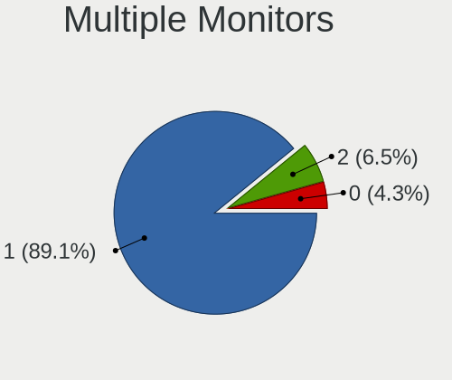

| Total | Computers | Percent |
|-------|-----------|---------|
| 1     | 69        | 88.46%  |
| 2     | 5         | 6.41%   |
| 0     | 4         | 5.13%   |

Network
-------

Net Controller Vendor
---------------------

Controller vendors

| Vendor                          | Computers | Percent |
|---------------------------------|-----------|---------|
| Realtek Semiconductor           | 36        | 30.51%  |
| Intel                           | 31        | 26.27%  |
| Qualcomm Atheros                | 22        | 18.64%  |
| Broadcom                        | 14        | 11.86%  |
| Qualcomm Atheros Communications | 3         | 2.54%   |
| MediaTek                        | 2         | 1.69%   |
| Marvell Technology Group        | 2         | 1.69%   |
| Research In Motion              | 1         | 0.85%   |
| Ralink Technology               | 1         | 0.85%   |
| Ralink                          | 1         | 0.85%   |
| Prolific Technology             | 1         | 0.85%   |
| Nvidia                          | 1         | 0.85%   |
| ICS Advent                      | 1         | 0.85%   |
| Dell                            | 1         | 0.85%   |
| Broadcom Limited                | 1         | 0.85%   |

Net Controller Model
--------------------

Controller models

| Model                                                                                 | Computers | Percent |
|---------------------------------------------------------------------------------------|-----------|---------|
| Realtek RTL8111/8168/8211/8411 PCI Express Gigabit Ethernet Controller                | 21        | 14.79%  |
| Realtek RTL810xE PCI Express Fast Ethernet controller                                 | 8         | 5.63%   |
| Qualcomm Atheros QCA9377 802.11ac Wireless Network Adapter                            | 6         | 4.23%   |
| Qualcomm Atheros AR9271 802.11n                                                       | 3         | 2.11%   |
| Qualcomm Atheros AR9485 Wireless Network Adapter                                      | 3         | 2.11%   |
| Qualcomm Atheros AR9285 Wireless Network Adapter (PCI-Express)                        | 3         | 2.11%   |
| Intel Wireless 8260                                                                   | 3         | 2.11%   |
| Intel Wireless 7260                                                                   | 3         | 2.11%   |
| Broadcom BCM4313 802.11bgn Wireless Network Adapter                                   | 3         | 2.11%   |
| Realtek RTL8822CE 802.11ac PCIe Wireless Network Adapter                              | 2         | 1.41%   |
| Realtek RTL8723BE PCIe Wireless Network Adapter                                       | 2         | 1.41%   |
| Realtek RTL8188EE Wireless Network Adapter                                            | 2         | 1.41%   |
| Realtek RTL8153 Gigabit Ethernet Adapter                                              | 2         | 1.41%   |
| Qualcomm Atheros QCA9565 / AR9565 Wireless Network Adapter                            | 2         | 1.41%   |
| Qualcomm Atheros AR928X Wireless Network Adapter (PCI-Express)                        | 2         | 1.41%   |
| Qualcomm Atheros AR8152 v1.1 Fast Ethernet                                            | 2         | 1.41%   |
| Marvell Group 88E8058 PCI-E Gigabit Ethernet Controller                               | 2         | 1.41%   |
| Intel Wireless 8265 / 8275                                                            | 2         | 1.41%   |
| Intel Wi-Fi 6 AX201                                                                   | 2         | 1.41%   |
| Intel Ethernet Connection I219-LM                                                     | 2         | 1.41%   |
| Intel Ethernet Connection I217-LM                                                     | 2         | 1.41%   |
| Intel 82579LM Gigabit Network Connection (Lewisville)                                 | 2         | 1.41%   |
| Broadcom NetXtreme BCM57765 Gigabit Ethernet PCIe                                     | 2         | 1.41%   |
| Research In Motion BlackBerry                                                         | 1         | 0.7%    |
| Realtek RTL8821CE 802.11ac PCIe Wireless Network Adapter                              | 1         | 0.7%    |
| Realtek RTL8191SEvA Wireless LAN Controller                                           | 1         | 0.7%    |
| Realtek RTL8188EUS 802.11n Wireless Network Adapter                                   | 1         | 0.7%    |
| Realtek RTL8187B Wireless Adapter                                                     | 1         | 0.7%    |
| Realtek 802.11ac NIC                                                                  | 1         | 0.7%    |
| Ralink MT7601U Wireless Adapter                                                       | 1         | 0.7%    |
| Ralink RT3290 Wireless 802.11n 1T/1R PCIe                                             | 1         | 0.7%    |
| Qualcomm Atheros QCA8172 Fast Ethernet                                                | 1         | 0.7%    |
| Qualcomm Atheros Killer E2400 Gigabit Ethernet Controller                             | 1         | 0.7%    |
| Qualcomm Atheros AR93xx Wireless Network Adapter                                      | 1         | 0.7%    |
| Qualcomm Atheros AR8132 Fast Ethernet                                                 | 1         | 0.7%    |
| Qualcomm Atheros AR8131 Gigabit Ethernet                                              | 1         | 0.7%    |
| Qualcomm Atheros AR5418 Wireless Network Adapter [AR5008E 802.11(a)bgn] (PCI-Express) | 1         | 0.7%    |
| Qualcomm Atheros AR242x / AR542x Wireless Network Adapter (PCI-Express)               | 1         | 0.7%    |
| Prolific USB-Serial Controller                                                        | 1         | 0.7%    |
| Nvidia MCP61 Ethernet                                                                 | 1         | 0.7%    |

Wireless Vendor
---------------

Wireless vendors

| Vendor                          | Computers | Percent |
|---------------------------------|-----------|---------|
| Intel                           | 22        | 32.84%  |
| Qualcomm Atheros                | 19        | 28.36%  |
| Realtek Semiconductor           | 11        | 16.42%  |
| Broadcom                        | 9         | 13.43%  |
| Qualcomm Atheros Communications | 3         | 4.48%   |
| Ralink Technology               | 1         | 1.49%   |
| Ralink                          | 1         | 1.49%   |
| MediaTek                        | 1         | 1.49%   |

Wireless Model
--------------

Wireless models

| Model                                                                                 | Computers | Percent |
|---------------------------------------------------------------------------------------|-----------|---------|
| Qualcomm Atheros QCA9377 802.11ac Wireless Network Adapter                            | 6         | 8.96%   |
| Qualcomm Atheros AR9271 802.11n                                                       | 3         | 4.48%   |
| Qualcomm Atheros AR9485 Wireless Network Adapter                                      | 3         | 4.48%   |
| Qualcomm Atheros AR9285 Wireless Network Adapter (PCI-Express)                        | 3         | 4.48%   |
| Intel Wireless 8260                                                                   | 3         | 4.48%   |
| Intel Wireless 7260                                                                   | 3         | 4.48%   |
| Broadcom BCM4313 802.11bgn Wireless Network Adapter                                   | 3         | 4.48%   |
| Realtek RTL8822CE 802.11ac PCIe Wireless Network Adapter                              | 2         | 2.99%   |
| Realtek RTL8723BE PCIe Wireless Network Adapter                                       | 2         | 2.99%   |
| Realtek RTL8188EE Wireless Network Adapter                                            | 2         | 2.99%   |
| Qualcomm Atheros QCA9565 / AR9565 Wireless Network Adapter                            | 2         | 2.99%   |
| Qualcomm Atheros AR928X Wireless Network Adapter (PCI-Express)                        | 2         | 2.99%   |
| Intel Wireless 8265 / 8275                                                            | 2         | 2.99%   |
| Intel Wi-Fi 6 AX201                                                                   | 2         | 2.99%   |
| Realtek RTL8821CE 802.11ac PCIe Wireless Network Adapter                              | 1         | 1.49%   |
| Realtek RTL8191SEvA Wireless LAN Controller                                           | 1         | 1.49%   |
| Realtek RTL8188EUS 802.11n Wireless Network Adapter                                   | 1         | 1.49%   |
| Realtek RTL8187B Wireless Adapter                                                     | 1         | 1.49%   |
| Realtek 802.11ac NIC                                                                  | 1         | 1.49%   |
| Ralink MT7601U Wireless Adapter                                                       | 1         | 1.49%   |
| Ralink RT3290 Wireless 802.11n 1T/1R PCIe                                             | 1         | 1.49%   |
| Qualcomm Atheros AR93xx Wireless Network Adapter                                      | 1         | 1.49%   |
| Qualcomm Atheros AR5418 Wireless Network Adapter [AR5008E 802.11(a)bgn] (PCI-Express) | 1         | 1.49%   |
| Qualcomm Atheros AR242x / AR542x Wireless Network Adapter (PCI-Express)               | 1         | 1.49%   |
| MediaTek MT7921K (RZ608) Wi-Fi 6E 80MHz                                               | 1         | 1.49%   |
| Intel Wireless 7265                                                                   | 1         | 1.49%   |
| Intel Wi-Fi 6E(802.11ax) AX210/AX1675* 2x2 [Typhoon Peak]                             | 1         | 1.49%   |
| Intel Wi-Fi 6 AX201 160MHz                                                            | 1         | 1.49%   |
| Intel Wi-Fi 6 AX200                                                                   | 1         | 1.49%   |
| Intel Wi-Fi 5(802.11ac) Wireless-AC 9x6x [Thunder Peak]                               | 1         | 1.49%   |
| Intel PRO/Wireless 3945ABG [Golan] Network Connection                                 | 1         | 1.49%   |
| Intel PRO/Wireless 2200BG [Calexico2] Network Connection                              | 1         | 1.49%   |
| Intel Dual Band Wireless-AC 3168NGW [Stone Peak]                                      | 1         | 1.49%   |
| Intel Comet Lake PCH CNVi WiFi                                                        | 1         | 1.49%   |
| Intel Centrino Wireless-N 135                                                         | 1         | 1.49%   |
| Intel Centrino Advanced-N 6205 [Taylor Peak]                                          | 1         | 1.49%   |
| Intel Centrino Advanced-N 6200                                                        | 1         | 1.49%   |
| Broadcom BCM4360 802.11ac 5G Wireless Network Adapter                                 | 1         | 1.49%   |
| Broadcom BCM4331 802.11a/b/g/n                                                        | 1         | 1.49%   |
| Broadcom BCM43228 802.11a/b/g/n                                                       | 1         | 1.49%   |

Ethernet Vendor
---------------

Ethernet vendors

| Vendor                   | Computers | Percent |
|--------------------------|-----------|---------|
| Realtek Semiconductor    | 31        | 43.06%  |
| Intel                    | 20        | 27.78%  |
| Broadcom                 | 8         | 11.11%  |
| Qualcomm Atheros         | 6         | 8.33%   |
| Marvell Technology Group | 2         | 2.78%   |
| Research In Motion       | 1         | 1.39%   |
| Nvidia                   | 1         | 1.39%   |
| MediaTek                 | 1         | 1.39%   |
| ICS Advent               | 1         | 1.39%   |
| Broadcom Limited         | 1         | 1.39%   |

Ethernet Model
--------------

Ethernet models

| Model                                                                  | Computers | Percent |
|------------------------------------------------------------------------|-----------|---------|
| Realtek RTL8111/8168/8211/8411 PCI Express Gigabit Ethernet Controller | 21        | 29.17%  |
| Realtek RTL810xE PCI Express Fast Ethernet controller                  | 8         | 11.11%  |
| Realtek RTL8153 Gigabit Ethernet Adapter                               | 2         | 2.78%   |
| Qualcomm Atheros AR8152 v1.1 Fast Ethernet                             | 2         | 2.78%   |
| Marvell Group 88E8058 PCI-E Gigabit Ethernet Controller                | 2         | 2.78%   |
| Intel Ethernet Connection I219-LM                                      | 2         | 2.78%   |
| Intel Ethernet Connection I217-LM                                      | 2         | 2.78%   |
| Intel 82579LM Gigabit Network Connection (Lewisville)                  | 2         | 2.78%   |
| Broadcom NetXtreme BCM57765 Gigabit Ethernet PCIe                      | 2         | 2.78%   |
| Research In Motion BlackBerry                                          | 1         | 1.39%   |
| Qualcomm Atheros QCA8172 Fast Ethernet                                 | 1         | 1.39%   |
| Qualcomm Atheros Killer E2400 Gigabit Ethernet Controller              | 1         | 1.39%   |
| Qualcomm Atheros AR8132 Fast Ethernet                                  | 1         | 1.39%   |
| Qualcomm Atheros AR8131 Gigabit Ethernet                               | 1         | 1.39%   |
| Nvidia MCP61 Ethernet                                                  | 1         | 1.39%   |
| MediaTek Infinix NOTE 30 VIP                                           | 1         | 1.39%   |
| Intel PRO/100 VE Network Connection                                    | 1         | 1.39%   |
| Intel NM10/ICH7 Family LAN Controller                                  | 1         | 1.39%   |
| Intel I211 Gigabit Network Connection                                  | 1         | 1.39%   |
| Intel Ethernet Controller I225-V                                       | 1         | 1.39%   |
| Intel Ethernet Controller I225-LM                                      | 1         | 1.39%   |
| Intel Ethernet Connection I218-LM                                      | 1         | 1.39%   |
| Intel Ethernet Connection (4) I219-V                                   | 1         | 1.39%   |
| Intel Ethernet Connection (4) I219-LM                                  | 1         | 1.39%   |
| Intel Ethernet Connection (3) I218-LM                                  | 1         | 1.39%   |
| Intel Ethernet Connection (14) I219-V                                  | 1         | 1.39%   |
| Intel 82577LM Gigabit Network Connection                               | 1         | 1.39%   |
| Intel 82567LM-3 Gigabit Network Connection                             | 1         | 1.39%   |
| Intel 82567LM Gigabit Network Connection                               | 1         | 1.39%   |
| Intel 82566DM-2 Gigabit Network Connection                             | 1         | 1.39%   |
| ICS Advent 10/100M LAN                                                 | 1         | 1.39%   |
| Broadcom NetXtreme BCM57766 Gigabit Ethernet PCIe                      | 1         | 1.39%   |
| Broadcom NetXtreme BCM5764M Gigabit Ethernet PCIe                      | 1         | 1.39%   |
| Broadcom NetXtreme BCM5762 Gigabit Ethernet PCIe                       | 1         | 1.39%   |
| Broadcom NetLink BCM5906M Fast Ethernet PCI Express                    | 1         | 1.39%   |
| Broadcom NetLink BCM5784M Gigabit Ethernet PCIe                        | 1         | 1.39%   |
| Broadcom NetLink BCM57785 Gigabit Ethernet PCIe                        | 1         | 1.39%   |
| Broadcom Limited NetXtreme BCM5761 Gigabit Ethernet PCIe               | 1         | 1.39%   |

Net Controller Kind
-------------------

Ethernet, WiFi or modem

| Kind     | Computers | Percent |
|----------|-----------|---------|
| Ethernet | 68        | 50.37%  |
| WiFi     | 64        | 47.41%  |
| Modem    | 3         | 2.22%   |

Used Controller
---------------

Currently used network controller

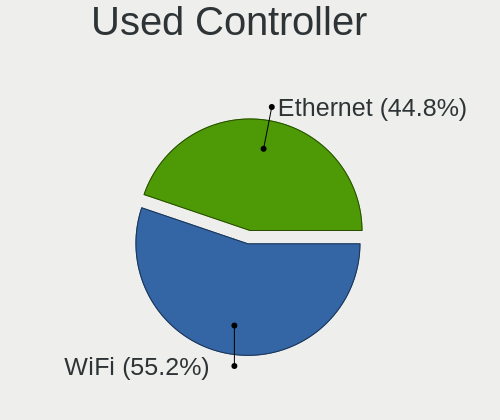

| Kind     | Computers | Percent |
|----------|-----------|---------|
| WiFi     | 43        | 52.44%  |
| Ethernet | 39        | 47.56%  |

NICs
----

Total network controllers on board

| Total | Computers | Percent |
|-------|-----------|---------|
| 2     | 51        | 66.23%  |
| 1     | 24        | 31.17%  |
| 3     | 1         | 1.3%    |
| 0     | 1         | 1.3%    |

IPv6
----

IPv6 vs IPv4

| Used | Computers | Percent |
|------|-----------|---------|
| No   | 48        | 62.34%  |
| Yes  | 29        | 37.66%  |

Bluetooth
---------

Bluetooth Vendor
----------------

Controller vendors

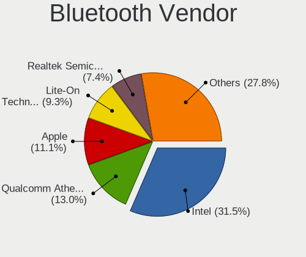

| Vendor                          | Computers | Percent |
|---------------------------------|-----------|---------|
| Intel                           | 14        | 31.11%  |
| Qualcomm Atheros Communications | 6         | 13.33%  |
| Apple                           | 6         | 13.33%  |
| Lite-On Technology              | 5         | 11.11%  |
| Realtek Semiconductor           | 3         | 6.67%   |
| IMC Networks                    | 3         | 6.67%   |
| Broadcom                        | 2         | 4.44%   |
| Toshiba                         | 1         | 2.22%   |
| Ralink                          | 1         | 2.22%   |
| MediaTek                        | 1         | 2.22%   |
| Hewlett-Packard                 | 1         | 2.22%   |
| Foxconn / Hon Hai               | 1         | 2.22%   |
| Dell                            | 1         | 2.22%   |

Bluetooth Model
---------------

Controller models

| Model                                              | Computers | Percent |
|----------------------------------------------------|-----------|---------|
| Intel Bluetooth Device                             | 5         | 11.11%  |
| Intel AX201 Bluetooth                              | 4         | 8.89%   |
| Qualcomm Atheros  Bluetooth Device                 | 3         | 6.67%   |
| Qualcomm Atheros AR3011 Bluetooth                  | 3         | 6.67%   |
| Intel Bluetooth wireless interface                 | 3         | 6.67%   |
| Realtek 802.11ac WLAN Adapter                      | 2         | 4.44%   |
| Lite-On Atheros AR3012 Bluetooth                   | 2         | 4.44%   |
| Apple Built-in Bluetooth 2.0+EDR HCI               | 2         | 4.44%   |
| Apple Bluetooth HCI MacBookPro (HID mode)          | 2         | 4.44%   |
| Toshiba Integrated Bluetooth HCI                   | 1         | 2.22%   |
| Realtek RTL8723B Bluetooth                         | 1         | 2.22%   |
| Ralink RT3290 Bluetooth                            | 1         | 2.22%   |
| MediaTek Wireless_Device                           | 1         | 2.22%   |
| Lite-On Qualcomm Atheros QCA9377 Bluetooth         | 1         | 2.22%   |
| Lite-On Bluetooth USB Host Controller              | 1         | 2.22%   |
| Lite-On Bluetooth Radio                            | 1         | 2.22%   |
| Intel Wireless-AC 9260 Bluetooth Adapter           | 1         | 2.22%   |
| Intel Centrino Bluetooth Wireless Transceiver      | 1         | 2.22%   |
| IMC Networks Bluetooth Radio                       | 1         | 2.22%   |
| IMC Networks Bluetooth Device                      | 1         | 2.22%   |
| IMC Networks Atheros AR3012 Bluetooth 4.0 Adapter  | 1         | 2.22%   |
| HP Broadcom 2070 Bluetooth Combo                   | 1         | 2.22%   |
| Foxconn / Hon Hai Bluetooth Device                 | 1         | 2.22%   |
| Dell DW375 Bluetooth Module                        | 1         | 2.22%   |
| Broadcom BCM20702 Bluetooth 4.0 [ThinkPad]         | 1         | 2.22%   |
| Broadcom BCM2045B (BDC-2.1) [Bluetooth Controller] | 1         | 2.22%   |
| Apple Bluetooth USB Host Controller                | 1         | 2.22%   |
| Apple Bluetooth Host Controller                    | 1         | 2.22%   |

Sound
-----

Sound Vendor
------------

Sound card vendors

| Vendor                | Computers | Percent |
|-----------------------|-----------|---------|
| Intel                 | 63        | 65.63%  |
| AMD                   | 16        | 16.67%  |
| Nvidia                | 9         | 9.38%   |
| Texas Instruments     | 1         | 1.04%   |
| SAVITECH              | 1         | 1.04%   |
| Roland                | 1         | 1.04%   |
| Realtek Semiconductor | 1         | 1.04%   |
| JMTek                 | 1         | 1.04%   |
| Huawei Technologies   | 1         | 1.04%   |
| C-Media Electronics   | 1         | 1.04%   |
| Anlya.cn              | 1         | 1.04%   |

Sound Model
-----------

Sound card models

| Model                                                                      | Computers | Percent |
|----------------------------------------------------------------------------|-----------|---------|
| Intel 7 Series/C216 Chipset Family High Definition Audio Controller        | 7         | 6.14%   |
| Intel NM10/ICH7 Family High Definition Audio Controller                    | 6         | 5.26%   |
| Intel Sunrise Point-LP HD Audio                                            | 5         | 4.39%   |
| Intel 6 Series/C200 Series Chipset Family High Definition Audio Controller | 5         | 4.39%   |
| Intel 82801H (ICH8 Family) HD Audio Controller                             | 4         | 3.51%   |
| Intel 5 Series/3400 Series Chipset High Definition Audio                   | 4         | 3.51%   |
| AMD Kabini HDMI/DP Audio                                                   | 4         | 3.51%   |
| AMD Family 17h/19h HD Audio Controller                                     | 4         | 3.51%   |
| Intel Xeon E3-1200 v3/4th Gen Core Processor HD Audio Controller           | 3         | 2.63%   |
| Intel Haswell-ULT HD Audio Controller                                      | 3         | 2.63%   |
| Intel Atom Processor Z36xxx/Z37xxx Series High Definition Audio Controller | 3         | 2.63%   |
| Intel 82801I (ICH9 Family) HD Audio Controller                             | 3         | 2.63%   |
| Intel 8 Series/C220 Series Chipset High Definition Audio Controller        | 3         | 2.63%   |
| Intel 8 Series HD Audio Controller                                         | 3         | 2.63%   |
| Intel Wildcat Point-LP High Definition Audio Controller                    | 2         | 1.75%   |
| Intel Tiger Lake-LP Smart Sound Technology Audio Controller                | 2         | 1.75%   |
| Intel Ice Lake-LP Smart Sound Technology Audio Controller                  | 2         | 1.75%   |
| Intel Broadwell-U Audio Controller                                         | 2         | 1.75%   |
| Intel Alder Lake PCH-P High Definition Audio Controller                    | 2         | 1.75%   |
| Intel 200 Series PCH HD Audio                                              | 2         | 1.75%   |
| Intel 100 Series/C230 Series Chipset Family HD Audio Controller            | 2         | 1.75%   |
| AMD SBx00 Azalia (Intel HDA)                                               | 2         | 1.75%   |
| AMD RV710/730 HDMI Audio [Radeon HD 4000 series]                           | 2         | 1.75%   |
| AMD Renoir Radeon High Definition Audio Controller                         | 2         | 1.75%   |
| AMD Raven/Raven2/Fenghuang HDMI/DP Audio Controller                        | 2         | 1.75%   |
| AMD FCH Azalia Controller                                                  | 2         | 1.75%   |
| AMD Family 15h (Models 60h-6fh) Audio Controller                           | 2         | 1.75%   |
| Texas Instruments PCM2902 Audio Codec                                      | 1         | 0.88%   |
| SAVITECH USB HIFI Audio                                                    | 1         | 0.88%   |
| Roland QUAD-CAPTURE                                                        | 1         | 0.88%   |
| Realtek Semiconductor USB Audio                                            | 1         | 0.88%   |
| Nvidia TU107 GeForce GTX 1650 High Definition Audio Controller             | 1         | 0.88%   |
| Nvidia MCP89 High Definition Audio                                         | 1         | 0.88%   |
| Nvidia MCP61 High Definition Audio                                         | 1         | 0.88%   |
| Nvidia GP108 High Definition Audio Controller                              | 1         | 0.88%   |
| Nvidia GP107GL High Definition Audio Controller                            | 1         | 0.88%   |
| Nvidia GP104 High Definition Audio Controller                              | 1         | 0.88%   |
| Nvidia GF108 High Definition Audio Controller                              | 1         | 0.88%   |
| Nvidia GA104 High Definition Audio Controller                              | 1         | 0.88%   |
| Nvidia GA102 High Definition Audio Controller                              | 1         | 0.88%   |

Memory
------

Memory Vendor
-------------

Memory module vendors

| Vendor                       | Computers | Percent |
|------------------------------|-----------|---------|
| SK hynix                     | 16        | 17.02%  |
| Unknown                      | 13        | 13.83%  |
| Samsung Electronics          | 11        | 11.7%   |
| Crucial                      | 10        | 10.64%  |
| Kingston                     | 9         | 9.57%   |
| Micron Technology            | 7         | 7.45%   |
| A-DATA Technology            | 5         | 5.32%   |
| Elpida                       | 4         | 4.26%   |
| Timetec                      | 3         | 3.19%   |
| Corsair                      | 3         | 3.19%   |
| Nanya Technology             | 2         | 2.13%   |
| Unknown (0xFFFF000000000000) | 1         | 1.06%   |
| Unknown (08C8)               | 1         | 1.06%   |
| Toshiba                      | 1         | 1.06%   |
| Team                         | 1         | 1.06%   |
| SK_Hynix                     | 1         | 1.06%   |
| Ramaxel Technology           | 1         | 1.06%   |
| Patriot                      | 1         | 1.06%   |
| Infineon                     | 1         | 1.06%   |
| G.Skill                      | 1         | 1.06%   |
| ASint Technology             | 1         | 1.06%   |
| Unknown                      | 1         | 1.06%   |

Memory Model
------------

Memory module models

| Model                                                           | Computers | Percent |
|-----------------------------------------------------------------|-----------|---------|
| Unknown RAM Module 2GB SODIMM DDR2 667MT/s                      | 3         | 3.03%   |
| Unknown RAM Module 8GB SODIMM DDR3 1600MT/s                     | 2         | 2.02%   |
| Timetec RAM Module 4GB SODIMM DDR3 1067MT/s                     | 2         | 2.02%   |
| SK hynix RAM HMT351U6EFR8C-PB 4GB DIMM DDR3 1600MT/s            | 2         | 2.02%   |
| Crucial RAM Module 4GB SODIMM DDR3 1067MT/s                     | 2         | 2.02%   |
| Unknown RAM Module 4GB SODIMM DDR4 2400MT/s                     | 1         | 1.01%   |
| Unknown RAM Module 4GB SODIMM DDR3 1333MT/s                     | 1         | 1.01%   |
| Unknown RAM Module 4GB SODIMM DDR3 1067MT/s                     | 1         | 1.01%   |
| Unknown RAM Module 4GB SODIMM DDR3                              | 1         | 1.01%   |
| Unknown RAM Module 2GB SODIMM DDR3 667MT/s                      | 1         | 1.01%   |
| Unknown RAM Module 2GB SODIMM DDR3                              | 1         | 1.01%   |
| Unknown RAM Module 2GB DIMM DDR3 1066MT/s                       | 1         | 1.01%   |
| Unknown RAM Module 1GB SODIMM DDR3 667MT/s                      | 1         | 1.01%   |
| Unknown RAM Module 1GB SODIMM DDR2 667MT/s                      | 1         | 1.01%   |
| Unknown (0xFFFF000000000000) RAM Module 2GB SODIMM DDR2 667MT/s | 1         | 1.01%   |
| Unknown (08C8) RAM LMKUFG68AHFHD-32A 16GB DIMM DDR4 3200MT/s    | 1         | 1.01%   |
| Toshiba RAM 8HTF12864HDY-800G1 2GB SODIMM 1066MT/s              | 1         | 1.01%   |
| Toshiba RAM 64T128020EDL2.5C2 2048MB SODIMM 1066MT/s            | 1         | 1.01%   |
| Timetec RAM S8G-1600 8GB SODIMM DDR3 1600MT/s                   | 1         | 1.01%   |
| Team RAM TEAMGROUP-UD4-3200 16GB DIMM DDR4 3733MT/s             | 1         | 1.01%   |
| SK_Hynix RAM Module 8GB SODIMM DDR4 3200MT/s                    | 1         | 1.01%   |
| SK hynix RAM Module 8GB Row Of Chips LPDDR4 3200MT/s            | 1         | 1.01%   |
| SK hynix RAM Module 4GB SODIMM DDR3 1067MT/s                    | 1         | 1.01%   |
| SK hynix RAM Module 2GB SODIMM DDR2 533MT/s                     | 1         | 1.01%   |
| SK hynix RAM HMT451S6MFR8C-PB 4GB SODIMM DDR3 1334MT/s          | 1         | 1.01%   |
| SK hynix RAM HMT451S6MFR8C-H9 4GB SODIMM DDR3 1333MT/s          | 1         | 1.01%   |
| SK hynix RAM HMT451S6BFR8A-PB 4GB SODIMM DDR3 1600MT/s          | 1         | 1.01%   |
| SK hynix RAM HMT425S6AFR6A-PB 2GB DDR3 1600MT/s                 | 1         | 1.01%   |
| SK hynix RAM HMT41GS6BFR8A-PB 8GB SODIMM DDR3 1600MT/s          | 1         | 1.01%   |
| SK hynix RAM HMT351U6BFR8C-H9 4GB DIMM DDR3 1333MT/s            | 1         | 1.01%   |
| SK hynix RAM HMT351S6CFR8C-PB 4GB SODIMM DDR3 1333MT/s          | 1         | 1.01%   |
| SK hynix RAM HMT325S6BFR8C-H9 2GB SODIMM DDR3 1600MT/s          | 1         | 1.01%   |
| SK hynix RAM HMA81GS6CJR8N-VK 8GB SODIMM DDR4 2667MT/s          | 1         | 1.01%   |
| SK hynix RAM HMA81GS6AFR8N-UH 8GB SODIMM DDR4 2667MT/s          | 1         | 1.01%   |
| SK hynix RAM HCNNNFAMMLXR-NEE 4GB Row Of Chips LPDDR4 4267MT/s  | 1         | 1.01%   |
| Samsung RAM Module 2GB SODIMM DDR2 667MT/s                      | 1         | 1.01%   |
| Samsung RAM M471B5773DH0-CH9 2GB SODIMM DDR3 1600MT/s           | 1         | 1.01%   |
| Samsung RAM M471B5273CH0-CH9 4GB SODIMM DDR3 1334MT/s           | 1         | 1.01%   |
| Samsung RAM M471B5173QH0-YK0 4GB SODIMM DDR3 1600MT/s           | 1         | 1.01%   |
| Samsung RAM M471B5173DB0-YK0 4GB SODIMM DDR3 1600MT/s           | 1         | 1.01%   |

Memory Kind
-----------

Memory module kinds

| Kind   | Computers | Percent |
|--------|-----------|---------|
| DDR3   | 35        | 47.3%   |
| DDR4   | 21        | 28.38%  |
| DDR2   | 11        | 14.86%  |
| LPDDR4 | 4         | 5.41%   |
| SDRAM  | 1         | 1.35%   |
| LPDDR3 | 1         | 1.35%   |
| DDR    | 1         | 1.35%   |

Memory Form Factor
------------------

Physical design of the memory module

| Name         | Computers | Percent |
|--------------|-----------|---------|
| SODIMM       | 51        | 68.92%  |
| DIMM         | 16        | 21.62%  |
| Row Of Chips | 4         | 5.41%   |
| Unknown      | 2         | 2.7%    |
| Chip         | 1         | 1.35%   |

Memory Size
-----------

Memory module size

| Size  | Computers | Percent |
|-------|-----------|---------|
| 4096  | 27        | 35.06%  |
| 8192  | 23        | 29.87%  |
| 2048  | 15        | 19.48%  |
| 1024  | 5         | 6.49%   |
| 16384 | 3         | 3.9%    |
| 32768 | 2         | 2.6%    |
| 512   | 2         | 2.6%    |

Memory Speed
------------

Memory module speed

| Speed   | Computers | Percent |
|---------|-----------|---------|
| 1600    | 20        | 25%     |
| 667     | 10        | 12.5%   |
| 3200    | 7         | 8.75%   |
| 2667    | 7         | 8.75%   |
| 1067    | 5         | 6.25%   |
| 2400    | 4         | 5%      |
| 1333    | 4         | 5%      |
| 1334    | 3         | 3.75%   |
| 3733    | 2         | 2.5%    |
| 1800    | 2         | 2.5%    |
| 1066    | 2         | 2.5%    |
| 533     | 2         | 2.5%    |
| 8400    | 1         | 1.25%   |
| 4267    | 1         | 1.25%   |
| 4266    | 1         | 1.25%   |
| 3066    | 1         | 1.25%   |
| 2733    | 1         | 1.25%   |
| 2666    | 1         | 1.25%   |
| 2133    | 1         | 1.25%   |
| 1867    | 1         | 1.25%   |
| 1866    | 1         | 1.25%   |
| 975     | 1         | 1.25%   |
| 800     | 1         | 1.25%   |
| Unknown | 1         | 1.25%   |

Printers & scanners
-------------------

Printer Vendor
--------------

Printer device vendors

| Vendor              | Computers | Percent |
|---------------------|-----------|---------|
| Samsung Electronics | 2         | 50%     |
| Hewlett-Packard     | 2         | 50%     |

Printer Model
-------------

Printer device models

| Model                                 | Computers | Percent |
|---------------------------------------|-----------|---------|
| Samsung ML-191x/ML-252x Laser Printer | 2         | 50%     |
| HP DeskJet F4200 series               | 1         | 25%     |
| HP DeskJet 2130 series                | 1         | 25%     |

Scanner Vendor
--------------

Scanner device vendors

| Vendor | Computers | Percent |
|--------|-----------|---------|
| Canon  | 1         | 100%    |

Scanner Model
-------------

Scanner device models

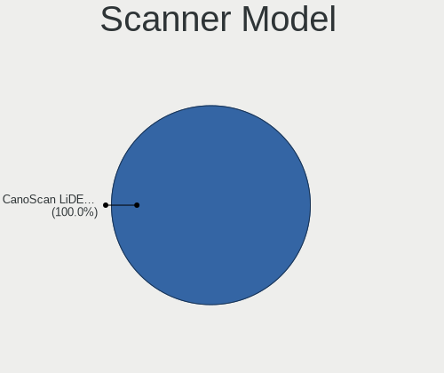

| Model                   | Computers | Percent |
|-------------------------|-----------|---------|
| Canon CanoScan LiDE 220 | 1         | 100%    |

Camera
------

Camera Vendor
-------------

Camera device vendors

| Vendor                                 | Computers | Percent |
|----------------------------------------|-----------|---------|
| Chicony Electronics                    | 14        | 32.56%  |
| Apple                                  | 4         | 9.3%    |
| Sunplus Innovation Technology          | 3         | 6.98%   |
| Realtek Semiconductor                  | 3         | 6.98%   |
| Microdia                               | 3         | 6.98%   |
| Logitech                               | 2         | 4.65%   |
| IMC Networks                           | 2         | 4.65%   |
| ALi                                    | 2         | 4.65%   |
| Syntek                                 | 1         | 2.33%   |
| Suyin                                  | 1         | 2.33%   |
| Sonix Technology                       | 1         | 2.33%   |
| Ricoh                                  | 1         | 2.33%   |
| Quanta                                 | 1         | 2.33%   |
| Primax Electronics                     | 1         | 2.33%   |
| Luxvisions Innotech Limited            | 1         | 2.33%   |
| Cheng Uei Precision Industry (Foxlink) | 1         | 2.33%   |
| Bison Electronics                      | 1         | 2.33%   |
| Acer                                   | 1         | 2.33%   |

Camera Model
------------

Camera device models

| Model                                               | Computers | Percent |
|-----------------------------------------------------|-----------|---------|
| Chicony HD WebCam                                   | 3         | 6.98%   |
| Chicony USB 2.0 Camera                              | 2         | 4.65%   |
| Chicony HD WebCam (Acer)                            | 2         | 4.65%   |
| Apple Built-in iSight                               | 2         | 4.65%   |
| Syntek Integrated Camera                            | 1         | 2.33%   |
| Suyin Acer/HP Integrated Webcam [CN0314]            | 1         | 2.33%   |
| Sunplus Laptop_Integrated_Webcam_FHD                | 1         | 2.33%   |
| Sunplus Integrated_Webcam_HD                        | 1         | 2.33%   |
| Sunplus HD WebCam                                   | 1         | 2.33%   |
| Sonix USB2.0 HD UVC WebCam                          | 1         | 2.33%   |
| Ricoh USB2.0 Camera                                 | 1         | 2.33%   |
| Realtek USB Camera                                  | 1         | 2.33%   |
| Realtek Lenovo EasyCamera                           | 1         | 2.33%   |
| Realtek EasyCamera                                  | 1         | 2.33%   |
| Quanta HP 2.0MP High Definition Webcam              | 1         | 2.33%   |
| Primax webcam                                       | 1         | 2.33%   |
| Microdia Sonix USB 2.0 Camera                       | 1         | 2.33%   |
| Microdia Integrated_Webcam_HD                       | 1         | 2.33%   |
| Microdia Integrated Webcam                          | 1         | 2.33%   |
| Luxvisions Innotech Limited HP TrueVision HD Camera | 1         | 2.33%   |
| Logitech Logitech Webcam C160                       | 1         | 2.33%   |
| Logitech HD Pro Webcam C920                         | 1         | 2.33%   |
| IMC Networks USB2.0 VGA UVC WebCam                  | 1         | 2.33%   |
| IMC Networks Integrated Camera                      | 1         | 2.33%   |
| Chicony WebCam                                      | 1         | 2.33%   |
| Chicony USB2.0 HD UVC WebCam                        | 1         | 2.33%   |
| Chicony Integrated Camera (1280x720@30)             | 1         | 2.33%   |
| Chicony Integrated Camera                           | 1         | 2.33%   |
| Chicony HP Integrated Webcam                        | 1         | 2.33%   |
| Chicony Chicony USB 2.0 Camera                      | 1         | 2.33%   |
| Chicony Camera                                      | 1         | 2.33%   |
| Cheng Uei Precision Industry (Foxlink) Webcam       | 1         | 2.33%   |
| Bison BisonCam, NB Pro                              | 1         | 2.33%   |
| Apple iPhone 5/5C/5S/6/SE/7/8/X                     | 1         | 2.33%   |
| Apple FaceTime HD Camera (Built-in)                 | 1         | 2.33%   |
| ALi WebCam                                          | 1         | 2.33%   |
| ALi Gateway Webcam                                  | 1         | 2.33%   |
| Acer Integrated Camera                              | 1         | 2.33%   |

Security
--------

Fingerprint Vendor
------------------

Fingerprint sensor vendors

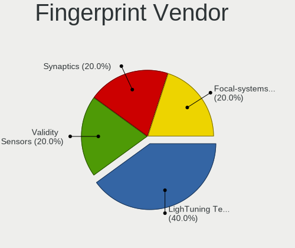

| Vendor                | Computers | Percent |
|-----------------------|-----------|---------|
| LighTuning Technology | 2         | 66.67%  |
| Focal-systems.Corp    | 1         | 33.33%  |

Fingerprint Model
-----------------

Fingerprint sensor models

| Model                                     | Computers | Percent |
|-------------------------------------------|-----------|---------|
| LighTuning ES603 Swipe Fingerprint Sensor | 2         | 66.67%  |
| Focal-systems.Corp FT9201Fingerprint.     | 1         | 33.33%  |

Chipcard Vendor
---------------

Chipcard module vendors

| Vendor   | Computers | Percent |
|----------|-----------|---------|
| Broadcom | 1         | 100%    |

Chipcard Model
--------------

Chipcard module models

| Model         | Computers | Percent |
|---------------|-----------|---------|
| Broadcom 5880 | 1         | 100%    |

Unsupported
-----------

Unsupported Devices
-------------------

Total unsupported devices on board

| Total | Computers | Percent |
|-------|-----------|---------|
| 0     | 57        | 74.03%  |
| 1     | 20        | 25.97%  |

Unsupported Device Types
------------------------

Types of unsupported devices

| Type                     | Computers | Percent |
|--------------------------|-----------|---------|
| Graphics card            | 8         | 40%     |
| Fingerprint reader       | 3         | 15%     |
| Multimedia controller    | 2         | 10%     |
| Camera                   | 2         | 10%     |
| Storage                  | 1         | 5%      |
| Net/wireless             | 1         | 5%      |
| Communication controller | 1         | 5%      |
| Chipcard                 | 1         | 5%      |
| Bluetooth                | 1         | 5%      |

