LinuxFX 10 - Tested Hardware & Statistics
-----------------------------------------

A project to collect tested hardware configurations for LinuxFX 10.

Anyone can contribute to this report by the [hw-probe](https://github.com/linuxhw/hw-probe) tool:

    sudo -E hw-probe -all -upload

Please contribute! Especially if your hardware is rare.

This is a report for all computer types. See also reports for [desktops](/Dist/LinuxFX_10/Desktop/README.md) and [notebooks](/Dist/LinuxFX_10/Notebook/README.md).

Contents
--------

* [ Test Cases ](#test-cases)

* [ System ](#system)
  - [ Kernel                   ](#kernel)
  - [ Kernel Family            ](#kernel-family)
  - [ Kernel Major Ver.        ](#kernel-major-ver)
  - [ Arch                     ](#arch)
  - [ DE                       ](#de)
  - [ Display Server           ](#display-server)
  - [ Display Manager          ](#display-manager)
  - [ OS Lang                  ](#os-lang)
  - [ Boot Mode                ](#boot-mode)
  - [ Filesystem               ](#filesystem)
  - [ Part. scheme             ](#part-scheme)
  - [ Dual Boot with Linux/BSD ](#dual-boot-with-linuxbsd)
  - [ Dual Boot (Win)          ](#dual-boot-win)

* [ Board ](#board)
  - [ Vendor                   ](#vendor)
  - [ Model                    ](#model)
  - [ Model Family             ](#model-family)
  - [ MFG Year                 ](#mfg-year)
  - [ Form Factor              ](#form-factor)
  - [ Secure Boot              ](#secure-boot)
  - [ Coreboot                 ](#coreboot)
  - [ RAM Size                 ](#ram-size)
  - [ RAM Used                 ](#ram-used)
  - [ Total Drives             ](#total-drives)
  - [ Has CD-ROM               ](#has-cd-rom)
  - [ Has Ethernet             ](#has-ethernet)
  - [ Has WiFi                 ](#has-wifi)
  - [ Has Bluetooth            ](#has-bluetooth)

* [ Location ](#location)
  - [ Country                  ](#country)
  - [ City                     ](#city)

* [ Drives ](#drives)
  - [ Drive Vendor             ](#drive-vendor)
  - [ Drive Model              ](#drive-model)
  - [ HDD Vendor               ](#hdd-vendor)
  - [ SSD Vendor               ](#ssd-vendor)
  - [ Drive Kind               ](#drive-kind)
  - [ Drive Connector          ](#drive-connector)
  - [ Drive Size               ](#drive-size)
  - [ Space Total              ](#space-total)
  - [ Space Used               ](#space-used)
  - [ Malfunc. Drives          ](#malfunc-drives)
  - [ Malfunc. Drive Vendor    ](#malfunc-drive-vendor)
  - [ Malfunc. HDD Vendor      ](#malfunc-hdd-vendor)
  - [ Malfunc. Drive Kind      ](#malfunc-drive-kind)
  - [ Failed Drives            ](#failed-drives)
  - [ Failed Drive Vendor      ](#failed-drive-vendor)
  - [ Drive Status             ](#drive-status)

* [ Storage controller ](#storage-controller)
  - [ Storage Vendor           ](#storage-vendor)
  - [ Storage Model            ](#storage-model)
  - [ Storage Kind             ](#storage-kind)

* [ Processor ](#processor)
  - [ CPU Vendor               ](#cpu-vendor)
  - [ CPU Model                ](#cpu-model)
  - [ CPU Model Family         ](#cpu-model-family)
  - [ CPU Cores                ](#cpu-cores)
  - [ CPU Sockets              ](#cpu-sockets)
  - [ CPU Threads              ](#cpu-threads)
  - [ CPU Op-Modes             ](#cpu-op-modes)
  - [ CPU Microcode            ](#cpu-microcode)
  - [ CPU Microarch            ](#cpu-microarch)

* [ Graphics ](#graphics)
  - [ GPU Vendor               ](#gpu-vendor)
  - [ GPU Model                ](#gpu-model)
  - [ GPU Combo                ](#gpu-combo)
  - [ GPU Driver               ](#gpu-driver)
  - [ GPU Memory               ](#gpu-memory)

* [ Monitor ](#monitor)
  - [ Monitor Vendor           ](#monitor-vendor)
  - [ Monitor Model            ](#monitor-model)
  - [ Monitor Resolution       ](#monitor-resolution)
  - [ Monitor Diagonal         ](#monitor-diagonal)
  - [ Monitor Width            ](#monitor-width)
  - [ Aspect Ratio             ](#aspect-ratio)
  - [ Monitor Area             ](#monitor-area)
  - [ Pixel Density            ](#pixel-density)
  - [ Multiple Monitors        ](#multiple-monitors)

* [ Network ](#network)
  - [ Net Controller Vendor    ](#net-controller-vendor)
  - [ Net Controller Model     ](#net-controller-model)
  - [ Wireless Vendor          ](#wireless-vendor)
  - [ Wireless Model           ](#wireless-model)
  - [ Ethernet Vendor          ](#ethernet-vendor)
  - [ Ethernet Model           ](#ethernet-model)
  - [ Net Controller Kind      ](#net-controller-kind)
  - [ Used Controller          ](#used-controller)
  - [ NICs                     ](#nics)
  - [ IPv6                     ](#ipv6)

* [ Bluetooth ](#bluetooth)
  - [ Bluetooth Vendor         ](#bluetooth-vendor)
  - [ Bluetooth Model          ](#bluetooth-model)

* [ Sound ](#sound)
  - [ Sound Vendor             ](#sound-vendor)
  - [ Sound Model              ](#sound-model)

* [ Memory ](#memory)
  - [ Memory Vendor            ](#memory-vendor)
  - [ Memory Model             ](#memory-model)
  - [ Memory Kind              ](#memory-kind)
  - [ Memory Form Factor       ](#memory-form-factor)
  - [ Memory Size              ](#memory-size)
  - [ Memory Speed             ](#memory-speed)

* [ Printers & scanners ](#printers--scanners)
  - [ Printer Vendor           ](#printer-vendor)
  - [ Printer Model            ](#printer-model)
  - [ Scanner Vendor           ](#scanner-vendor)
  - [ Scanner Model            ](#scanner-model)

* [ Camera ](#camera)
  - [ Camera Vendor            ](#camera-vendor)
  - [ Camera Model             ](#camera-model)

* [ Security ](#security)
  - [ Fingerprint Vendor       ](#fingerprint-vendor)
  - [ Fingerprint Model        ](#fingerprint-model)
  - [ Chipcard Vendor          ](#chipcard-vendor)
  - [ Chipcard Model           ](#chipcard-model)

* [ Unsupported ](#unsupported)
  - [ Unsupported Devices      ](#unsupported-devices)
  - [ Unsupported Device Types ](#unsupported-device-types)

Test Cases
----------

Total: 93

| Vendor     | Model                       | Form-Factor | Probe                                                      | Date         |
|------------|-----------------------------|-------------|------------------------------------------------------------|--------------|
| Gigabyte   | GA-78LMT-S2P                | Desktop     | [b8194d3077](https://linux-hardware.org/?probe=b8194d3077) | May 01, 2022 |
| Gigabyte   | GA-78LMT-S2P                | Desktop     | [3aeeaee161](https://linux-hardware.org/?probe=3aeeaee161) | Apr 23, 2022 |
| Samsung    | 340XAA/350XAA/550XAA        | Notebook    | [cd93e2fd82](https://linux-hardware.org/?probe=cd93e2fd82) | Apr 08, 2022 |
| ASRock     | 970 Extreme4                | Desktop     | [a30d1aa4b9](https://linux-hardware.org/?probe=a30d1aa4b9) | Dec 29, 2021 |
| Gigabyte   | G31M-ES2C                   | Desktop     | [5afa9a7018](https://linux-hardware.org/?probe=5afa9a7018) | Dec 23, 2021 |
| Toshiba    | Satellite C660              | Notebook    | [47b40007ee](https://linux-hardware.org/?probe=47b40007ee) | Dec 04, 2021 |
| Dell       | Inspiron 1501               | Notebook    | [94ca9e7f47](https://linux-hardware.org/?probe=94ca9e7f47) | Nov 12, 2021 |
| ASRock     | 970 Extreme4                | Desktop     | [85b942a5c3](https://linux-hardware.org/?probe=85b942a5c3) | Oct 30, 2021 |
| ASRock     | 970 Extreme4                | Desktop     | [022942c4aa](https://linux-hardware.org/?probe=022942c4aa) | Oct 30, 2021 |
| Dell       | Latitude E6420              | Notebook    | [dc9a1e9c1b](https://linux-hardware.org/?probe=dc9a1e9c1b) | Oct 18, 2021 |
| MSI        | MS-7309                     | Desktop     | [33faf5dbef](https://linux-hardware.org/?probe=33faf5dbef) | Oct 14, 2021 |
| MSI        | MS-7309                     | Desktop     | [b0ddfaaa86](https://linux-hardware.org/?probe=b0ddfaaa86) | Oct 12, 2021 |
| HP         | 250 G7 Notebook PC          | Notebook    | [7368bcaf0a](https://linux-hardware.org/?probe=7368bcaf0a) | Oct 04, 2021 |
| HP         | 250 G7 Notebook PC          | Notebook    | [c7ae2849cc](https://linux-hardware.org/?probe=c7ae2849cc) | Sep 30, 2021 |
| PCWare     | IPMH61R2                    | Desktop     | [62d2476431](https://linux-hardware.org/?probe=62d2476431) | Sep 27, 2021 |
| Gigabyte   | X570 UD                     | Desktop     | [e1777d09cb](https://linux-hardware.org/?probe=e1777d09cb) | Sep 10, 2021 |
| Medion     | S4216                       | Notebook    | [677bd3ecb4](https://linux-hardware.org/?probe=677bd3ecb4) | Aug 27, 2021 |
| Medion     | S4216                       | Notebook    | [a0ae7753cf](https://linux-hardware.org/?probe=a0ae7753cf) | Aug 26, 2021 |
| Dell       | Inspiron 3421               | Notebook    | [06a0a6486b](https://linux-hardware.org/?probe=06a0a6486b) | Aug 26, 2021 |
| MSI        | A88XI AC                    | Desktop     | [1306310e52](https://linux-hardware.org/?probe=1306310e52) | Aug 02, 2021 |
| MSI        | A88XI AC                    | Desktop     | [ebdf5c76be](https://linux-hardware.org/?probe=ebdf5c76be) | Aug 02, 2021 |
| Dell       | Latitude E5520              | Notebook    | [cae8dd2173](https://linux-hardware.org/?probe=cae8dd2173) | Jul 27, 2021 |
| Jumper     | Ezpad                       | Tablet      | [d40961f21f](https://linux-hardware.org/?probe=d40961f21f) | Jul 26, 2021 |
| Jumper     | Ezpad                       | Tablet      | [f80ea7b800](https://linux-hardware.org/?probe=f80ea7b800) | Jul 26, 2021 |
| Dell       | Latitude E5520              | Notebook    | [0112c3a302](https://linux-hardware.org/?probe=0112c3a302) | Jul 22, 2021 |
| Intel      | DG31PR AAD97573-306         | Desktop     | [a81005ef0b](https://linux-hardware.org/?probe=a81005ef0b) | Jul 10, 2021 |
| ASRock     | B450M Steel Legend          | Desktop     | [42869f7bb5](https://linux-hardware.org/?probe=42869f7bb5) | Jun 20, 2021 |
| Samsung    | 305E4A/305E5A/305E7A        | Notebook    | [3db60d4f9a](https://linux-hardware.org/?probe=3db60d4f9a) | Jun 01, 2021 |
| HP         | Pavilion dv6700             | Notebook    | [4e93c68985](https://linux-hardware.org/?probe=4e93c68985) | May 26, 2021 |
| HP         | Pavilion dv6700             | Notebook    | [a114e32ffb](https://linux-hardware.org/?probe=a114e32ffb) | May 26, 2021 |
| Lenovo     | ThinkPad T450s 20BWS0YF0... | Notebook    | [7b1e0f2693](https://linux-hardware.org/?probe=7b1e0f2693) | May 11, 2021 |
| Dell       | 0TVR1F A01                  | Desktop     | [4022d93b8a](https://linux-hardware.org/?probe=4022d93b8a) | Apr 18, 2021 |
| Acer       | Aspire E5-551               | Notebook    | [9f023d545c](https://linux-hardware.org/?probe=9f023d545c) | Mar 23, 2021 |
| Acer       | Aspire 5755G                | Notebook    | [0984c7aebc](https://linux-hardware.org/?probe=0984c7aebc) | Mar 18, 2021 |
| Supermicro | H8DG6/H8DGi                 | Server      | [ad61efb931](https://linux-hardware.org/?probe=ad61efb931) | Mar 11, 2021 |
| Acer       | Aspire 5755G                | Notebook    | [861fb95171](https://linux-hardware.org/?probe=861fb95171) | Mar 09, 2021 |
| ASRock     | N68-GE3 UCC                 | Desktop     | [f2a9721ca5](https://linux-hardware.org/?probe=f2a9721ca5) | Feb 25, 2021 |
| Gigabyte   | G31M-S2C                    | Desktop     | [95c9698f2b](https://linux-hardware.org/?probe=95c9698f2b) | Feb 24, 2021 |
| ASUSTek    | K50C                        | Notebook    | [d6ac6b2de1](https://linux-hardware.org/?probe=d6ac6b2de1) | Feb 18, 2021 |
| ASUSTek    | K50C                        | Notebook    | [a899af5e96](https://linux-hardware.org/?probe=a899af5e96) | Feb 18, 2021 |
| Dell       | Inspiron 1525               | Notebook    | [30d9ab855e](https://linux-hardware.org/?probe=30d9ab855e) | Feb 16, 2021 |
| Dell       | Inspiron 1525               | Notebook    | [a37ef6324c](https://linux-hardware.org/?probe=a37ef6324c) | Feb 16, 2021 |
| Lenovo     | ThinkPad X1 Carbon 2nd F... | Notebook    | [799c301ad6](https://linux-hardware.org/?probe=799c301ad6) | Feb 08, 2021 |
| Pegatron   | B34C                        | Notebook    | [4c3a4f9ad1](https://linux-hardware.org/?probe=4c3a4f9ad1) | Feb 05, 2021 |
| ASRock     | ConRoe1333-D667             | Desktop     | [54121172b8](https://linux-hardware.org/?probe=54121172b8) | Jan 31, 2021 |
| ASUSTek    | ASUS TUF Gaming F15 FX50... | Notebook    | [a22da47202](https://linux-hardware.org/?probe=a22da47202) | Jan 30, 2021 |
| Acer       | Aspire A515-51G             | Notebook    | [3300b2bb9d](https://linux-hardware.org/?probe=3300b2bb9d) | Jan 22, 2021 |
| MSI        | B450M PRO-M2 MAX            | Desktop     | [ecbdfd2c54](https://linux-hardware.org/?probe=ecbdfd2c54) | Jan 17, 2021 |
| HP         | 2B1E                        | Desktop     | [940750f549](https://linux-hardware.org/?probe=940750f549) | Jan 05, 2021 |
| ASUSTek    | P8Z68-V LE                  | Desktop     | [356c40c60b](https://linux-hardware.org/?probe=356c40c60b) | Dec 27, 2020 |
| Lenovo     | Y70-70 Touch 80DU           | Notebook    | [023b353ca8](https://linux-hardware.org/?probe=023b353ca8) | Dec 22, 2020 |
| ASUSTek    | H87-PRO                     | Desktop     | [e2287834ae](https://linux-hardware.org/?probe=e2287834ae) | Dec 10, 2020 |
| ASUSTek    | H87-PRO                     | Desktop     | [17bd61ae55](https://linux-hardware.org/?probe=17bd61ae55) | Dec 09, 2020 |
| Gigabyte   | B450 AORUS M                | Desktop     | [8e3b4356b7](https://linux-hardware.org/?probe=8e3b4356b7) | Dec 03, 2020 |
| Acer       | Aspire 5720Z                | Notebook    | [38045109f8](https://linux-hardware.org/?probe=38045109f8) | Nov 29, 2020 |
| Toshiba    | Satellite C50D-A-12R        | Notebook    | [2b5e2b26b2](https://linux-hardware.org/?probe=2b5e2b26b2) | Nov 23, 2020 |
| Apple      | Mac-F226BEC8 PVT            | All in one  | [ccc5f55191](https://linux-hardware.org/?probe=ccc5f55191) | Nov 21, 2020 |
| Gigabyte   | P57V6                       | Notebook    | [ec76a0907c](https://linux-hardware.org/?probe=ec76a0907c) | Nov 15, 2020 |
| Dell       | 0V6D8J A00                  | Desktop     | [5b4385cd10](https://linux-hardware.org/?probe=5b4385cd10) | Nov 09, 2020 |
| Dell       | 0V6D8J A00                  | Desktop     | [13e1111610](https://linux-hardware.org/?probe=13e1111610) | Nov 09, 2020 |
| Acer       | Aspire TC-105               | Desktop     | [0ee92155a3](https://linux-hardware.org/?probe=0ee92155a3) | Nov 04, 2020 |
| ECS        | A780GM-A                    | Desktop     | [cf03b0c26b](https://linux-hardware.org/?probe=cf03b0c26b) | Nov 04, 2020 |
| Acer       | Aspire ES1-512              | Notebook    | [328c13ce38](https://linux-hardware.org/?probe=328c13ce38) | Oct 25, 2020 |
| Acer       | Aspire ES1-512              | Notebook    | [59368b9e58](https://linux-hardware.org/?probe=59368b9e58) | Oct 24, 2020 |
| Acer       | Aspire 6930G                | Notebook    | [1519ec67b5](https://linux-hardware.org/?probe=1519ec67b5) | Sep 07, 2020 |
| Acer       | Aspire 6930G                | Notebook    | [51b6611d94](https://linux-hardware.org/?probe=51b6611d94) | Sep 06, 2020 |
| Dell       | 0TT6JF A02                  | Server      | [ebfac9e556](https://linux-hardware.org/?probe=ebfac9e556) | Sep 04, 2020 |
| Dell       | Inspiron 15-3567            | Notebook    | [d7fbcdbfbe](https://linux-hardware.org/?probe=d7fbcdbfbe) | Sep 03, 2020 |
| HP         | Compaq Presario CQ50        | Notebook    | [b82778b925](https://linux-hardware.org/?probe=b82778b925) | Sep 01, 2020 |
| Gigabyte   | P57V6                       | Notebook    | [7f8d44d28e](https://linux-hardware.org/?probe=7f8d44d28e) | Aug 30, 2020 |
| HP         | ProBook 6560b               | Notebook    | [99a7a9817b](https://linux-hardware.org/?probe=99a7a9817b) | Aug 26, 2020 |
| HP         | ProBook 6560b               | Notebook    | [b9893a704d](https://linux-hardware.org/?probe=b9893a704d) | Aug 26, 2020 |
| Olivetti   | P55-AEU-323-4G320           | Notebook    | [c08737d73c](https://linux-hardware.org/?probe=c08737d73c) | Aug 23, 2020 |
| Lenovo     | G505 20240                  | Notebook    | [aa6a5c7462](https://linux-hardware.org/?probe=aa6a5c7462) | Aug 22, 2020 |
| ASUSTek    | K72Jr                       | Notebook    | [51cd547219](https://linux-hardware.org/?probe=51cd547219) | Aug 18, 2020 |
| ASUSTek    | K72Jr                       | Notebook    | [d68a58547e](https://linux-hardware.org/?probe=d68a58547e) | Aug 15, 2020 |
| Gigabyte   | 970A-DS3P                   | Desktop     | [c5a0f02633](https://linux-hardware.org/?probe=c5a0f02633) | Jul 24, 2020 |
| Dell       | Inspiron 5423               | Notebook    | [1f3e63e601](https://linux-hardware.org/?probe=1f3e63e601) | Jul 24, 2020 |
| Acer       | Aspire E1-531               | Notebook    | [6104770d46](https://linux-hardware.org/?probe=6104770d46) | Jul 23, 2020 |
| Dell       | Vostro 1000                 | Notebook    | [ffb49e4b86](https://linux-hardware.org/?probe=ffb49e4b86) | Jul 22, 2020 |
| Positivo   | Mobile                      | Notebook    | [7ac9083ae4](https://linux-hardware.org/?probe=7ac9083ae4) | Jul 21, 2020 |
| HP         | Mini 210-1000               | Notebook    | [d1e83a2d9b](https://linux-hardware.org/?probe=d1e83a2d9b) | Jul 19, 2020 |
| Dell       | 0Y644J A02                  | Desktop     | [96f0709424](https://linux-hardware.org/?probe=96f0709424) | Jul 16, 2020 |
| Gigabyte   | B85M-D3H                    | Desktop     | [ab9fa86313](https://linux-hardware.org/?probe=ab9fa86313) | Jul 16, 2020 |
| Intel      | B75                         | Desktop     | [dc59852769](https://linux-hardware.org/?probe=dc59852769) | Jul 11, 2020 |
| HP         | 250 G6 Notebook PC          | Notebook    | [bc9d23a74c](https://linux-hardware.org/?probe=bc9d23a74c) | Jul 02, 2020 |
| HP         | 250 G6 Notebook PC          | Notebook    | [b1757b232f](https://linux-hardware.org/?probe=b1757b232f) | Jul 02, 2020 |
| Dell       | 0CRWCR A01                  | All in one  | [fe89daec6e](https://linux-hardware.org/?probe=fe89daec6e) | Jun 20, 2020 |
| Lenovo     | G550 2958                   | Notebook    | [6cfc44a819](https://linux-hardware.org/?probe=6cfc44a819) | Jun 11, 2020 |
| Lenovo     | G550 2958                   | Notebook    | [95b68a8144](https://linux-hardware.org/?probe=95b68a8144) | Jun 11, 2020 |
| Dell       | Inspiron 3520               | Notebook    | [c78c5e6395](https://linux-hardware.org/?probe=c78c5e6395) | May 16, 2020 |
| HP         | EliteBook Folio 9470m       | Notebook    | [f0b4ebc551](https://linux-hardware.org/?probe=f0b4ebc551) | May 16, 2020 |
| HP         | G42                         | Notebook    | [5c1017a089](https://linux-hardware.org/?probe=5c1017a089) | May 11, 2020 |

System
------

Kernel
------

Version of the Linux kernel

| Version                     | Computers | Percent |
|-----------------------------|-----------|---------|
| 5.4.0-72-generic            | 10        | 15.63%  |
| 5.4.0-52-generic            | 10        | 15.63%  |
| 5.6.15-windowsfx-10-generic | 8         | 12.5%   |
| 5.7.15-050715-generic       | 5         | 7.81%   |
| 5.5.19-050519-generic       | 4         | 6.25%   |
| 5.4.0-65-generic            | 4         | 6.25%   |
| 5.7.8-windowsfx-generic     | 3         | 4.69%   |
| 5.4.0-73-generic            | 3         | 4.69%   |
| 5.4.0-42-generic            | 3         | 4.69%   |
| 5.4.0-29-generic            | 3         | 4.69%   |
| 5.4.0-66-generic            | 2         | 3.13%   |
| 5.4.0-56-generic            | 2         | 3.13%   |
| 5.4.0-54-generic            | 2         | 3.13%   |
| 5.4.0-90-generic            | 1         | 1.56%   |
| 5.4.0-88-generic            | 1         | 1.56%   |
| 5.4.0-67-generic            | 1         | 1.56%   |
| 5.4.0-107-generic           | 1         | 1.56%   |
| 5.10.2-051002-generic       | 1         | 1.56%   |

Kernel Family
-------------

Linux kernel without a distro release

| Version | Computers | Percent |
|---------|-----------|---------|
| 5.4.0   | 43        | 67.19%  |
| 5.6.15  | 8         | 12.5%   |
| 5.7.15  | 5         | 7.81%   |
| 5.5.19  | 4         | 6.25%   |
| 5.7.8   | 3         | 4.69%   |
| 5.10.2  | 1         | 1.56%   |

Kernel Major Ver.
-----------------

Linux kernel major version

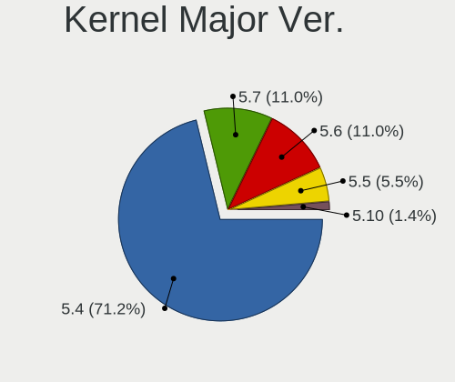

| Version | Computers | Percent |
|---------|-----------|---------|
| 5.4     | 43        | 67.19%  |
| 5.7     | 8         | 12.5%   |
| 5.6     | 8         | 12.5%   |
| 5.5     | 4         | 6.25%   |
| 5.10    | 1         | 1.56%   |

Arch
----

OS architecture (x86_64, i586, etc.)

| Name   | Computers | Percent |
|--------|-----------|---------|
| x86_64 | 64        | 100%    |

DE
--

Desktop Environment

| Name       | Computers | Percent |
|------------|-----------|---------|
| X-Cinnamon | 51        | 79.69%  |
| KDE        | 8         | 12.5%   |
| Cinnamon   | 3         | 4.69%   |
| Unknown    | 2         | 3.13%   |

Display Server
--------------

X11 or Wayland

| Name | Computers | Percent |
|------|-----------|---------|
| X11  | 64        | 100%    |

Display Manager
---------------

SDDM, LightDM, etc.

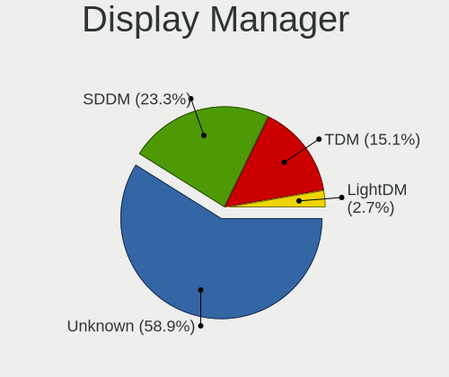

| Name    | Computers | Percent |
|---------|-----------|---------|
| Unknown | 38        | 59.38%  |
| SDDM    | 15        | 23.44%  |
| LightDM | 10        | 15.63%  |
| TDM     | 1         | 1.56%   |

OS Lang
-------

Language

| Lang  | Computers | Percent |
|-------|-----------|---------|
| pt_BR | 20        | 31.25%  |
| en_US | 10        | 15.63%  |
| pl_PL | 3         | 4.69%   |
| it_IT | 3         | 4.69%   |
| fr_FR | 3         | 4.69%   |
| en_AU | 3         | 4.69%   |
| de_DE | 3         | 4.69%   |
| C     | 3         | 4.69%   |
| es_ES | 2         | 3.13%   |
| es_AR | 2         | 3.13%   |
| en_ZA | 2         | 3.13%   |
| en_CA | 2         | 3.13%   |
| sv_SE | 1         | 1.56%   |
| sr_RS | 1         | 1.56%   |
| ro_RO | 1         | 1.56%   |
| fr_CA | 1         | 1.56%   |
| es_MX | 1         | 1.56%   |
| es_CL | 1         | 1.56%   |
| en_IN | 1         | 1.56%   |
| cs_CZ | 1         | 1.56%   |

Boot Mode
---------

EFI or BIOS

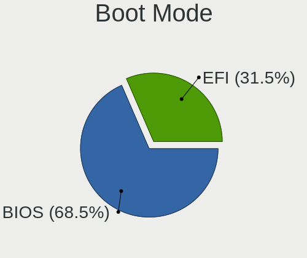

| Mode | Computers | Percent |
|------|-----------|---------|
| BIOS | 44        | 68.75%  |
| EFI  | 20        | 31.25%  |

Filesystem
----------

Type of filesystem

| Type    | Computers | Percent |
|---------|-----------|---------|
| Ext4    | 61        | 95.31%  |
| Xfs     | 1         | 1.56%   |
| Overlay | 1         | 1.56%   |
| Btrfs   | 1         | 1.56%   |

Part. scheme
------------

Scheme of partitioning

| Type    | Computers | Percent |
|---------|-----------|---------|
| Unknown | 58        | 90.63%  |
| MBR     | 4         | 6.25%   |
| GPT     | 2         | 3.13%   |

Dual Boot with Linux/BSD
------------------------

Hosting more than one Linux/BSD

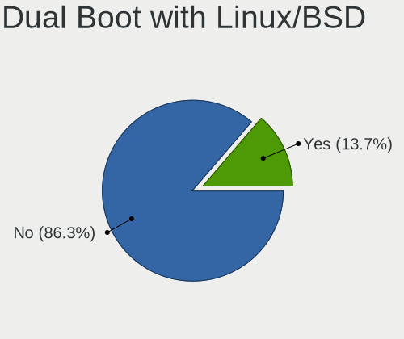

| Dual boot | Computers | Percent |
|-----------|-----------|---------|
| No        | 54        | 84.38%  |
| Yes       | 10        | 15.63%  |

Dual Boot (Win)
---------------

Hosting Linux and Windows

| Dual boot | Computers | Percent |
|-----------|-----------|---------|
| No        | 49        | 76.56%  |
| Yes       | 15        | 23.44%  |

Board
-----

Vendor
------

Motherboard manufacturer

| Name                | Computers | Percent |
|---------------------|-----------|---------|
| Dell                | 13        | 20.31%  |
| Hewlett-Packard     | 9         | 14.06%  |
| Gigabyte Technology | 6         | 9.38%   |
| Lenovo              | 5         | 7.81%   |
| ASUSTek Computer    | 5         | 7.81%   |
| Acer                | 5         | 7.81%   |
| ASRock              | 4         | 6.25%   |
| MSI                 | 3         | 4.69%   |
| Samsung Electronics | 2         | 3.13%   |
| Intel               | 2         | 3.13%   |
| Toshiba             | 1         | 1.56%   |
| Supermicro          | 1         | 1.56%   |
| Positivo            | 1         | 1.56%   |
| Pegatron            | 1         | 1.56%   |
| PCWare              | 1         | 1.56%   |
| Olivetti            | 1         | 1.56%   |
| Medion              | 1         | 1.56%   |
| Jumper              | 1         | 1.56%   |
| ECS                 | 1         | 1.56%   |
| Apple               | 1         | 1.56%   |

Model
-----

Motherboard model

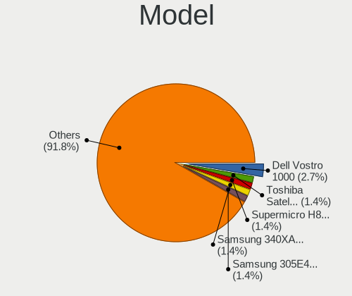

| Name                                     | Computers | Percent |
|------------------------------------------|-----------|---------|
| Toshiba Satellite C50D-A-12R             | 1         | 1.56%   |
| Supermicro H8DG6/H8DGi                   | 1         | 1.56%   |
| Samsung 340XAA/350XAA/550XAA             | 1         | 1.56%   |
| Samsung 305E4A/305E5A/305E7A             | 1         | 1.56%   |
| Positivo Mobile                          | 1         | 1.56%   |
| Pegatron B34C                            | 1         | 1.56%   |
| PCWare IPMH61R2                          | 1         | 1.56%   |
| Olivetti P55-AEU-323-4G320               | 1         | 1.56%   |
| MSI MS-7B84                              | 1         | 1.56%   |
| MSI MS-7913                              | 1         | 1.56%   |
| MSI MS-7309                              | 1         | 1.56%   |
| Medion S4216                             | 1         | 1.56%   |
| Lenovo Y70-70 Touch 80DU                 | 1         | 1.56%   |
| Lenovo ThinkPad X1 Carbon 2nd F2G3H4J    | 1         | 1.56%   |
| Lenovo ThinkPad T450s 20BWS0YF00         | 1         | 1.56%   |
| Lenovo G550 2958                         | 1         | 1.56%   |
| Lenovo G505 20240                        | 1         | 1.56%   |
| Jumper Ezpad                             | 1         | 1.56%   |
| Intel DG31PR AAD97573-306                | 1         | 1.56%   |
| Intel B75                                | 1         | 1.56%   |
| HP ProBook 6560b                         | 1         | 1.56%   |
| HP Pavilion dv6700                       | 1         | 1.56%   |
| HP Mini 210-1000                         | 1         | 1.56%   |
| HP G42                                   | 1         | 1.56%   |
| HP EliteBook Folio 9470m                 | 1         | 1.56%   |
| HP Compaq Presario CQ50                  | 1         | 1.56%   |
| HP 250 G7 Notebook PC                    | 1         | 1.56%   |
| HP 250 G6 Notebook PC                    | 1         | 1.56%   |
| HP 202 G2 MT                             | 1         | 1.56%   |
| Gigabyte X570 UD                         | 1         | 1.56%   |
| Gigabyte P57V6                           | 1         | 1.56%   |
| Gigabyte GA-78LMT-S2P                    | 1         | 1.56%   |
| Gigabyte G31M-ES2C                       | 1         | 1.56%   |
| Gigabyte B450 AORUS M                    | 1         | 1.56%   |
| Gigabyte 970A-DS3P                       | 1         | 1.56%   |
| ECS A780GM-A                             | 1         | 1.56%   |
| Dell Vostro 1000                         | 1         | 1.56%   |
| Dell PowerEdge R810                      | 1         | 1.56%   |
| Dell OptiPlex 9010 AIO                   | 1         | 1.56%   |
| Dell OptiPlex 360                        | 1         | 1.56%   |
| Dell OptiPlex 3010                       | 1         | 1.56%   |
| Dell Latitude E6420                      | 1         | 1.56%   |
| Dell Inspiron 5423                       | 1         | 1.56%   |
| Dell Inspiron 3646                       | 1         | 1.56%   |
| Dell Inspiron 3520                       | 1         | 1.56%   |
| Dell Inspiron 3421                       | 1         | 1.56%   |
| Dell Inspiron 1525                       | 1         | 1.56%   |
| Dell Inspiron 1501                       | 1         | 1.56%   |
| Dell Inspiron 15-3567                    | 1         | 1.56%   |
| ASUS P8Z68-V LE                          | 1         | 1.56%   |
| ASUS K72Jr                               | 1         | 1.56%   |
| ASUS K50C                                | 1         | 1.56%   |
| ASUS ASUS TUF Gaming F15 FX506LI_FX506LI | 1         | 1.56%   |
| ASUS All Series                          | 1         | 1.56%   |
| ASRock N68-GE3 UCC                       | 1         | 1.56%   |
| ASRock ConRoe1333-D667                   | 1         | 1.56%   |
| ASRock B450M Steel Legend                | 1         | 1.56%   |
| ASRock 970 Extreme4                      | 1         | 1.56%   |
| Apple iMac8,1                            | 1         | 1.56%   |
| Acer Aspire ES1-512                      | 1         | 1.56%   |

Model Family
------------

Motherboard model prefix

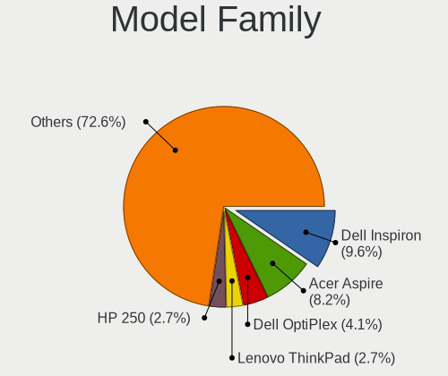

| Name                       | Computers | Percent |
|----------------------------|-----------|---------|
| Dell Inspiron              | 7         | 10.94%  |
| Acer Aspire                | 5         | 7.81%   |
| Dell OptiPlex              | 3         | 4.69%   |
| Lenovo ThinkPad            | 2         | 3.13%   |
| HP 250                     | 2         | 3.13%   |
| Toshiba Satellite          | 1         | 1.56%   |
| Supermicro H8DG6           | 1         | 1.56%   |
| Samsung 340XAA             | 1         | 1.56%   |
| Samsung 305E4A             | 1         | 1.56%   |
| Positivo Mobile            | 1         | 1.56%   |
| Pegatron B34C              | 1         | 1.56%   |
| PCWare IPMH61R2            | 1         | 1.56%   |
| Olivetti P55-AEU-323-4G320 | 1         | 1.56%   |
| MSI MS-7B84                | 1         | 1.56%   |
| MSI MS-7913                | 1         | 1.56%   |
| MSI MS-7309                | 1         | 1.56%   |
| Medion S4216               | 1         | 1.56%   |
| Lenovo Y70-70              | 1         | 1.56%   |
| Lenovo G550                | 1         | 1.56%   |
| Lenovo G505                | 1         | 1.56%   |
| Jumper Ezpad               | 1         | 1.56%   |
| Intel DG31PR               | 1         | 1.56%   |
| Intel B75                  | 1         | 1.56%   |
| HP ProBook                 | 1         | 1.56%   |
| HP Pavilion                | 1         | 1.56%   |
| HP Mini                    | 1         | 1.56%   |
| HP G42                     | 1         | 1.56%   |
| HP EliteBook               | 1         | 1.56%   |
| HP Compaq                  | 1         | 1.56%   |
| HP 202                     | 1         | 1.56%   |
| Gigabyte X570              | 1         | 1.56%   |
| Gigabyte P57V6             | 1         | 1.56%   |
| Gigabyte GA-78LMT-S2P      | 1         | 1.56%   |
| Gigabyte G31M-ES2C         | 1         | 1.56%   |
| Gigabyte B450              | 1         | 1.56%   |
| Gigabyte 970A-DS3P         | 1         | 1.56%   |
| ECS A780GM-A               | 1         | 1.56%   |
| Dell Vostro                | 1         | 1.56%   |
| Dell PowerEdge             | 1         | 1.56%   |
| Dell Latitude              | 1         | 1.56%   |
| ASUS P8Z68-V               | 1         | 1.56%   |
| ASUS K72Jr                 | 1         | 1.56%   |
| ASUS K50C                  | 1         | 1.56%   |
| ASUS ASUS                  | 1         | 1.56%   |
| ASUS All                   | 1         | 1.56%   |
| ASRock N68-GE3             | 1         | 1.56%   |
| ASRock ConRoe1333-D667     | 1         | 1.56%   |
| ASRock B450M               | 1         | 1.56%   |
| ASRock 970                 | 1         | 1.56%   |
| Apple iMac8                | 1         | 1.56%   |

MFG Year
--------

Motherboard manufacture year

| Year    | Computers | Percent |
|---------|-----------|---------|
| 2014    | 7         | 10.94%  |
| 2013    | 7         | 10.94%  |
| 2012    | 7         | 10.94%  |
| 2011    | 7         | 10.94%  |
| 2009    | 6         | 9.38%   |
| 2018    | 5         | 7.81%   |
| 2008    | 5         | 7.81%   |
| 2007    | 4         | 6.25%   |
| 2019    | 3         | 4.69%   |
| 2015    | 3         | 4.69%   |
| 2010    | 3         | 4.69%   |
| 2017    | 2         | 3.13%   |
| 2006    | 2         | 3.13%   |
| 2020    | 1         | 1.56%   |
| 2016    | 1         | 1.56%   |
| Unknown | 1         | 1.56%   |

Form Factor
-----------

Physical design of the computer

| Name       | Computers | Percent |
|------------|-----------|---------|
| Notebook   | 37        | 57.81%  |
| Desktop    | 22        | 34.38%  |
| All in one | 2         | 3.13%   |
| Server     | 2         | 3.13%   |
| Tablet     | 1         | 1.56%   |

Secure Boot
-----------

Enabled or disabled

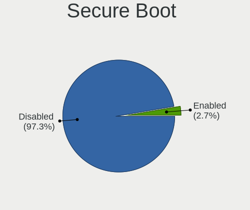

| State    | Computers | Percent |
|----------|-----------|---------|
| Disabled | 63        | 96.92%  |
| Enabled  | 2         | 3.08%   |

Coreboot
--------

Have coreboot on board

| Used | Computers | Percent |
|------|-----------|---------|
| No   | 64        | 100%    |

RAM Size
--------

Total RAM memory

| Size in GB      | Computers | Percent |
|-----------------|-----------|---------|
| 3.01-4.0        | 28        | 43.75%  |
| 4.01-8.0        | 12        | 18.75%  |
| 16.01-24.0      | 8         | 12.5%   |
| 8.01-16.0       | 6         | 9.38%   |
| 1.01-2.0        | 4         | 6.25%   |
| 32.01-64.0      | 2         | 3.13%   |
| 2.01-3.0        | 2         | 3.13%   |
| More than 256.0 | 1         | 1.56%   |
| 64.01-256.0     | 1         | 1.56%   |

RAM Used
--------

Used RAM memory

| Used GB   | Computers | Percent |
|-----------|-----------|---------|
| 1.01-2.0  | 34        | 52.31%  |
| 2.01-3.0  | 14        | 21.54%  |
| 3.01-4.0  | 11        | 16.92%  |
| 4.01-8.0  | 3         | 4.62%   |
| 8.01-16.0 | 2         | 3.08%   |
| 0.51-1.0  | 1         | 1.54%   |

Total Drives
------------

Number of drives on board

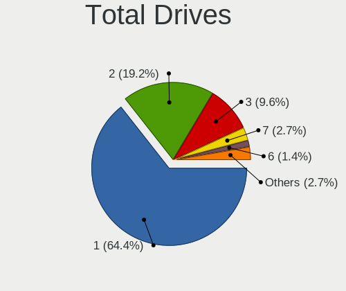

| Drives  | Computers | Percent |
|---------|-----------|---------|
| 1       | 43        | 67.19%  |
| 2       | 12        | 18.75%  |
| 3       | 6         | 9.38%   |
| 6       | 1         | 1.56%   |
| 4       | 1         | 1.56%   |
| Unknown | 1         | 1.56%   |

Has CD-ROM
----------

Has CD-ROM on board

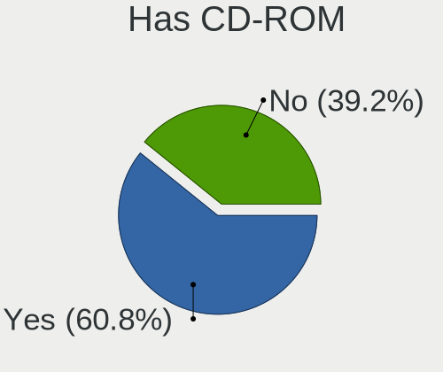

| Presented | Computers | Percent |
|-----------|-----------|---------|
| Yes       | 38        | 58.46%  |
| No        | 27        | 41.54%  |

Has Ethernet
------------

Has Ethernet on board

| Presented | Computers | Percent |
|-----------|-----------|---------|
| Yes       | 64        | 100%    |

Has WiFi
--------

Has WiFi module

| Presented | Computers | Percent |
|-----------|-----------|---------|
| Yes       | 49        | 76.56%  |
| No        | 15        | 23.44%  |

Has Bluetooth
-------------

Has Bluetooth module

| Presented | Computers | Percent |
|-----------|-----------|---------|
| No        | 38        | 59.38%  |
| Yes       | 26        | 40.63%  |

Location
--------

Country
-------

Geographic location (country)

| Country      | Computers | Percent |
|--------------|-----------|---------|
| Brazil       | 20        | 31.25%  |
| USA          | 9         | 14.06%  |
| Canada       | 4         | 6.25%   |
| South Africa | 3         | 4.69%   |
| Poland       | 3         | 4.69%   |
| Italy        | 3         | 4.69%   |
| Germany      | 3         | 4.69%   |
| Australia    | 3         | 4.69%   |
| Spain        | 2         | 3.13%   |
| France       | 2         | 3.13%   |
| Argentina    | 2         | 3.13%   |
| Sweden       | 1         | 1.56%   |
| Serbia       | 1         | 1.56%   |
| Russia       | 1         | 1.56%   |
| Romania      | 1         | 1.56%   |
| Mexico       | 1         | 1.56%   |
| India        | 1         | 1.56%   |
| Czechia      | 1         | 1.56%   |
| Croatia      | 1         | 1.56%   |
| Chile        | 1         | 1.56%   |
| Cameroon     | 1         | 1.56%   |

City
----

Geographic location (city)

| City                  | Computers | Percent |
|-----------------------|-----------|---------|
| Curitiba              | 4         | 6.06%   |
| Krakow                | 2         | 3.03%   |
| Belo Horizonte        | 2         | 3.03%   |
| Zielonka              | 1         | 1.52%   |
| Zagreb                | 1         | 1.52%   |
| Winter Springs        | 1         | 1.52%   |
| Winston-Salem         | 1         | 1.52%   |
| Villemomble           | 1         | 1.52%   |
| Vila Velha            | 1         | 1.52%   |
| Val-d'Or              | 1         | 1.52%   |
| Taboao da Serra       | 1         | 1.52%   |
| Sydney                | 1         | 1.52%   |
| Stockholm             | 1         | 1.52%   |
| Schweinfurt           | 1         | 1.52%   |
| Sao Paulo             | 1         | 1.52%   |
| Sao Bernardo          | 1         | 1.52%   |
| Salerno               | 1         | 1.52%   |
| Saladas               | 1         | 1.52%   |
| Saint-Germain-en-Laye | 1         | 1.52%   |
| Rosario               | 1         | 1.52%   |
| Rio Grande            | 1         | 1.52%   |
| Rio de Janeiro        | 1         | 1.52%   |
| Recife                | 1         | 1.52%   |
| Ramenskoye            | 1         | 1.52%   |
| Pretoria              | 1         | 1.52%   |
| Porto Alegre          | 1         | 1.52%   |
| Port Elizabeth        | 1         | 1.52%   |
| Pontevedra            | 1         | 1.52%   |
| Pietra Ligure         | 1         | 1.52%   |
| Ostrava               | 1         | 1.52%   |
| North Lewisburg       | 1         | 1.52%   |
| Newmarket             | 1         | 1.52%   |
| Moreno Valley         | 1         | 1.52%   |
| Montreal              | 1         | 1.52%   |
| Monserrato            | 1         | 1.52%   |
| Madrid                | 1         | 1.52%   |
| Londrina              | 1         | 1.52%   |
| Launceston            | 1         | 1.52%   |
| Karlsruhe             | 1         | 1.52%   |
| Jundiaí            | 1         | 1.52%   |
| Johannesburg          | 1         | 1.52%   |
| Itatiba               | 1         | 1.52%   |
| Hobart                | 1         | 1.52%   |
| Eureka                | 1         | 1.52%   |
| Embu                  | 1         | 1.52%   |
| Edmundston            | 1         | 1.52%   |
| Douglas               | 1         | 1.52%   |
| Douala                | 1         | 1.52%   |
| Coos Bay              | 1         | 1.52%   |
| Cincinnati            | 1         | 1.52%   |
| Central               | 1         | 1.52%   |
| Castroville           | 1         | 1.52%   |
| Cabo Frio             | 1         | 1.52%   |
| Bonn                  | 1         | 1.52%   |
| Bhopal                | 1         | 1.52%   |
| Belgrade              | 1         | 1.52%   |
| Belém              | 1         | 1.52%   |
| Barcelona             | 1         | 1.52%   |
| Arad                  | 1         | 1.52%   |
| Altamira              | 1         | 1.52%   |

Drives
------

Drive Vendor
------------

Hard drive vendors

| Vendor              | Computers | Drives | Percent |
|---------------------|-----------|--------|---------|
| WDC                 | 17        | 19     | 19.32%  |
| Seagate             | 14        | 19     | 15.91%  |
| Samsung Electronics | 8         | 9      | 9.09%   |
| Toshiba             | 7         | 7      | 7.95%   |
| Kingston            | 7         | 8      | 7.95%   |
| Hitachi             | 7         | 8      | 7.95%   |
| SanDisk             | 4         | 5      | 4.55%   |
| Unknown             | 3         | 4      | 3.41%   |
| A-DATA Technology   | 3         | 4      | 3.41%   |
| MAXTOR              | 2         | 2      | 2.27%   |
| LITEONIT            | 2         | 2      | 2.27%   |
| HGST                | 2         | 3      | 2.27%   |
| XPG                 | 1         | 1      | 1.14%   |
| TO Exter            | 1         | 1      | 1.14%   |
| PNY                 | 1         | 1      | 1.14%   |
| Phison              | 1         | 1      | 1.14%   |
| Patriot             | 1         | 1      | 1.14%   |
| OCZ                 | 1         | 1      | 1.14%   |
| Mushkin             | 1         | 1      | 1.14%   |
| Hewlett-Packard     | 1         | 1      | 1.14%   |
| GOODRAM             | 1         | 1      | 1.14%   |
| Crucial             | 1         | 1      | 1.14%   |
| China               | 1         | 1      | 1.14%   |
| ASMT109x            | 1         | 1      | 1.14%   |

Drive Model
-----------

Hard drive models

| Model                                | Computers | Percent |
|--------------------------------------|-----------|---------|
| WDC WD10EZEX-08WN4A0 1TB             | 2         | 2.15%   |
| Toshiba MQ01ABF050 500GB             | 2         | 2.15%   |
| Kingston SV300S37A120G 120GB SSD     | 2         | 2.15%   |
| XPG GAMMIX S11 Pro 512GB             | 1         | 1.08%   |
| WDC WD5000LPVX-22V0TT0 500GB         | 1         | 1.08%   |
| WDC WD5000LPVT-24G33T1 500GB         | 1         | 1.08%   |
| WDC WD5000AAKX-001CA0 500GB          | 1         | 1.08%   |
| WDC WD5000AACS-00G8B1 500GB          | 1         | 1.08%   |
| WDC WD400JD-55MSA1 40GB              | 1         | 1.08%   |
| WDC WD3200BPVT-22JJ5T0 320GB         | 1         | 1.08%   |
| WDC WD3200BEVT-80A0RT0 320GB         | 1         | 1.08%   |
| WDC WD2500BEVS-22UST0 250GB          | 1         | 1.08%   |
| WDC WD20EZRX-00D8PB0 2TB             | 1         | 1.08%   |
| WDC WD1200BEVS-75UST0 120GB          | 1         | 1.08%   |
| WDC WD10JPVX-60JC3T1 1TB             | 1         | 1.08%   |
| WDC WD10JPVX-22JC3T0 1TB             | 1         | 1.08%   |
| WDC WD10EARX-00N0YB0 1TB             | 1         | 1.08%   |
| WDC WD1003FZEX-00MK2A0 1TB           | 1         | 1.08%   |
| WDC PC SA530 SDASN8Y-256G-1006 256GB | 1         | 1.08%   |
| Unknown NVMe SSD Drive 512GB         | 1         | 1.08%   |
| Unknown MMC Card  8GB                | 1         | 1.08%   |
| Unknown MMC Card  64GB               | 1         | 1.08%   |
| Toshiba MQ01ACF050 500GB             | 1         | 1.08%   |
| Toshiba MQ01ABF032 320GB             | 1         | 1.08%   |
| Toshiba MQ01ABD050 500GB             | 1         | 1.08%   |
| Toshiba MK5059GSXP 500GB             | 1         | 1.08%   |
| Toshiba MK2561GSYN 250GB             | 1         | 1.08%   |
| TO Exter nal USB 3.0 128GB           | 1         | 1.08%   |
| Seagate ST9320325AS 320GB            | 1         | 1.08%   |
| Seagate ST9160827AS 160GB            | 1         | 1.08%   |
| Seagate ST9160821AS 160GB            | 1         | 1.08%   |
| Seagate ST9160314AS 160GB            | 1         | 1.08%   |
| Seagate ST500LX012-SSHD-8GB          | 1         | 1.08%   |
| Seagate ST500LT012-9WS142 500GB      | 1         | 1.08%   |
| Seagate ST500LM021-1KJ152 500GB      | 1         | 1.08%   |
| Seagate ST500LM012 HN-M500MBB 500GB  | 1         | 1.08%   |
| Seagate ST500DM002-1BD142 500GB      | 1         | 1.08%   |
| Seagate ST4000DM004-2CV104 4TB       | 1         | 1.08%   |
| Seagate ST3200826AS 200GB            | 1         | 1.08%   |
| Seagate ST32000645NS 2TB             | 1         | 1.08%   |
| Seagate ST3160318AS 160GB            | 1         | 1.08%   |
| Seagate ST3160215A 160GB             | 1         | 1.08%   |
| Seagate ST31500341AS 1TB             | 1         | 1.08%   |
| Seagate ST250DM000-1BD141 250GB      | 1         | 1.08%   |
| Seagate ST1000LM035-1RK172 1TB       | 1         | 1.08%   |
| Seagate Expansion Desk 4TB           | 1         | 1.08%   |
| SanDisk SSD PLUS 1000GB              | 1         | 1.08%   |
| SanDisk SDSSDHII240G 240GB           | 1         | 1.08%   |
| SanDisk SD9SN8W256G1002 256GB SSD    | 1         | 1.08%   |
| Sandisk NVMe SSD Drive 500GB         | 1         | 1.08%   |
| Samsung SSD SM841 2.5 7mm 128GB      | 1         | 1.08%   |
| Samsung SSD 850 EVO 500GB            | 1         | 1.08%   |
| Samsung SSD 850 EVO 250GB            | 1         | 1.08%   |
| Samsung MZMPC032HBCD-000D1 32GB SSD  | 1         | 1.08%   |
| Samsung HM321HI 320GB                | 1         | 1.08%   |
| Samsung HD501LJ 500GB                | 1         | 1.08%   |
| Samsung HD321KJ 320GB                | 1         | 1.08%   |
| Samsung HD161HJ 41R0186LEN 160GB     | 1         | 1.08%   |
| Samsung HD081GJ 80GB                 | 1         | 1.08%   |
| PNY SSD2SC240G1SA754D117-443 240GB   | 1         | 1.08%   |

HDD Vendor
----------

Hard disk drive vendors

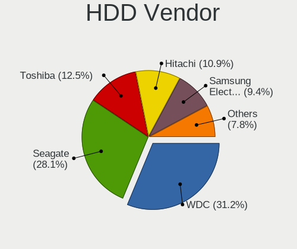

| Vendor              | Computers | Drives | Percent |
|---------------------|-----------|--------|---------|
| WDC                 | 16        | 17     | 30.19%  |
| Seagate             | 14        | 19     | 26.42%  |
| Toshiba             | 7         | 7      | 13.21%  |
| Hitachi             | 7         | 8      | 13.21%  |
| Samsung Electronics | 4         | 5      | 7.55%   |
| MAXTOR              | 2         | 2      | 3.77%   |
| HGST                | 2         | 3      | 3.77%   |
| ASMT109x            | 1         | 1      | 1.89%   |

SSD Vendor
----------

Solid state drive vendors

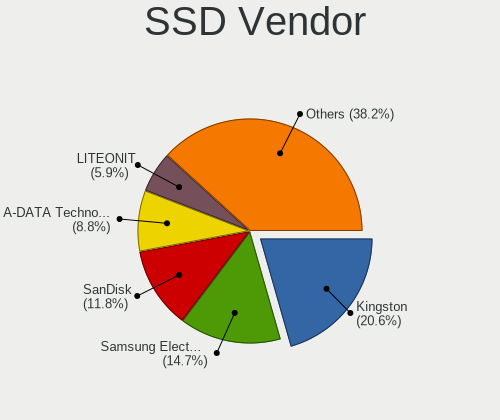

| Vendor              | Computers | Drives | Percent |
|---------------------|-----------|--------|---------|
| Kingston            | 6         | 7      | 21.43%  |
| Samsung Electronics | 4         | 4      | 14.29%  |
| SanDisk             | 3         | 4      | 10.71%  |
| A-DATA Technology   | 3         | 4      | 10.71%  |
| LITEONIT            | 2         | 2      | 7.14%   |
| WDC                 | 1         | 2      | 3.57%   |
| TO Exter            | 1         | 1      | 3.57%   |
| PNY                 | 1         | 1      | 3.57%   |
| Patriot             | 1         | 1      | 3.57%   |
| OCZ                 | 1         | 1      | 3.57%   |
| Mushkin             | 1         | 1      | 3.57%   |
| Hewlett-Packard     | 1         | 1      | 3.57%   |
| GOODRAM             | 1         | 1      | 3.57%   |
| Crucial             | 1         | 1      | 3.57%   |
| China               | 1         | 1      | 3.57%   |

Drive Kind
----------

HDD or SSD

| Kind | Computers | Drives | Percent |
|------|-----------|--------|---------|
| HDD  | 45        | 62     | 56.96%  |
| SSD  | 27        | 32     | 34.18%  |
| NVMe | 5         | 6      | 6.33%   |
| MMC  | 2         | 2      | 2.53%   |

Drive Connector
---------------

SATA, SAS, NVMe, etc.

| Type | Computers | Drives | Percent |
|------|-----------|--------|---------|
| SATA | 62        | 92     | 87.32%  |
| NVMe | 5         | 6      | 7.04%   |
| SAS  | 2         | 2      | 2.82%   |
| MMC  | 2         | 2      | 2.82%   |

Drive Size
----------

Size of hard drive

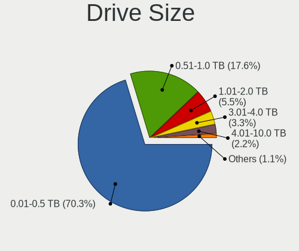

| Size in TB | Computers | Drives | Percent |
|------------|-----------|--------|---------|
| 0.01-0.5   | 58        | 75     | 78.38%  |
| 0.51-1.0   | 11        | 13     | 14.86%  |
| 3.01-4.0   | 3         | 3      | 4.05%   |
| 1.01-2.0   | 2         | 3      | 2.7%    |

Space Total
-----------

Amount of disk space available on the file system

| Size in GB     | Computers | Percent |
|----------------|-----------|---------|
| 101-250        | 26        | 40%     |
| 251-500        | 18        | 27.69%  |
| 1001-2000      | 5         | 7.69%   |
| 51-100         | 5         | 7.69%   |
| 21-50          | 4         | 6.15%   |
| 501-1000       | 4         | 6.15%   |
| 1-20           | 2         | 3.08%   |
| More than 3000 | 1         | 1.54%   |

Space Used
----------

Amount of used disk space

| Used GB  | Computers | Percent |
|----------|-----------|---------|
| 1-20     | 32        | 48.48%  |
| 21-50    | 17        | 25.76%  |
| 101-250  | 5         | 7.58%   |
| 51-100   | 5         | 7.58%   |
| 501-1000 | 4         | 6.06%   |
| 251-500  | 3         | 4.55%   |

Malfunc. Drives
---------------

Drive models with a malfunction

| Model                            | Computers | Drives | Percent |
|----------------------------------|-----------|--------|---------|
| Seagate ST500LT012-9WS142 500GB  | 1         | 1      | 33.33%  |
| Samsung Electronics HD081GJ 80GB | 1         | 1      | 33.33%  |
| Hitachi HTS722012K9A300 120GB    | 1         | 1      | 33.33%  |

Malfunc. Drive Vendor
---------------------

Vendors of faulty drives

| Vendor              | Computers | Drives | Percent |
|---------------------|-----------|--------|---------|
| Seagate             | 1         | 1      | 33.33%  |
| Samsung Electronics | 1         | 1      | 33.33%  |
| Hitachi             | 1         | 1      | 33.33%  |

Malfunc. HDD Vendor
-------------------

Vendors of faulty HDD drives

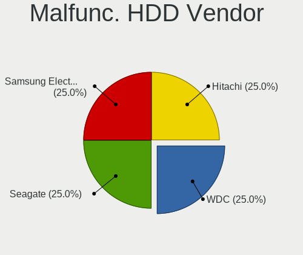

| Vendor              | Computers | Drives | Percent |
|---------------------|-----------|--------|---------|
| Seagate             | 1         | 1      | 33.33%  |
| Samsung Electronics | 1         | 1      | 33.33%  |
| Hitachi             | 1         | 1      | 33.33%  |

Malfunc. Drive Kind
-------------------

Kinds of faulty drives

| Kind | Computers | Drives | Percent |
|------|-----------|--------|---------|
| HDD  | 3         | 3      | 100%    |

Failed Drives
-------------

Failed drive models

Zero info for selected period =(

Failed Drive Vendor
-------------------

Failed drive vendors

Zero info for selected period =(

Drive Status
------------

Number of failed and malfunc. drives

| Status   | Computers | Drives | Percent |
|----------|-----------|--------|---------|
| Detected | 59        | 93     | 88.06%  |
| Works    | 5         | 6      | 7.46%   |
| Malfunc  | 3         | 3      | 4.48%   |

Storage controller
------------------

Storage Vendor
--------------

Storage controller vendors

| Vendor                           | Computers | Percent |
|----------------------------------|-----------|---------|
| Intel                            | 42        | 59.15%  |
| AMD                              | 17        | 23.94%  |
| Silicon Integrated Systems [SiS] | 2         | 2.82%   |
| Nvidia                           | 2         | 2.82%   |
| ASMedia Technology               | 2         | 2.82%   |
| ADATA Technology                 | 2         | 2.82%   |
| Sandisk                          | 1         | 1.41%   |
| Phison Electronics               | 1         | 1.41%   |
| LSI Logic / Symbios Logic        | 1         | 1.41%   |
| Kingston Technology Company      | 1         | 1.41%   |

Storage Model
-------------

Storage controller models

| Model                                                                                   | Computers | Percent |
|-----------------------------------------------------------------------------------------|-----------|---------|
| AMD FCH SATA Controller [AHCI mode]                                                     | 9         | 9.38%   |
| Intel 7 Series Chipset Family 6-port SATA Controller [AHCI mode]                        | 5         | 5.21%   |
| AMD SB7x0/SB8x0/SB9x0 IDE Controller                                                    | 5         | 5.21%   |
| Intel Sunrise Point-LP SATA Controller [AHCI mode]                                      | 4         | 4.17%   |
| Intel NM10/ICH7 Family SATA Controller [IDE mode]                                       | 4         | 4.17%   |
| Intel 82801HM/HEM (ICH8M/ICH8M-E) SATA Controller [AHCI mode]                           | 4         | 4.17%   |
| Intel 82801HM/HEM (ICH8M/ICH8M-E) IDE Controller                                        | 4         | 4.17%   |
| Intel 82801G (ICH7 Family) IDE Controller                                               | 3         | 3.13%   |
| Intel 8 Series/C220 Series Chipset Family 6-port SATA Controller 1 [AHCI mode]          | 3         | 3.13%   |
| AMD SB7x0/SB8x0/SB9x0 SATA Controller [AHCI mode]                                       | 3         | 3.13%   |
| AMD 400 Series Chipset SATA Controller                                                  | 3         | 3.13%   |
| Silicon Integrated Systems [SiS] SATA Controller / IDE mode                             | 2         | 2.08%   |
| Silicon Integrated Systems [SiS] 5513 IDE Controller                                    | 2         | 2.08%   |
| Nvidia MCP61 SATA Controller                                                            | 2         | 2.08%   |
| Nvidia MCP61 IDE                                                                        | 2         | 2.08%   |
| Intel Atom Processor E3800 Series SATA AHCI Controller                                  | 2         | 2.08%   |
| Intel 82801IBM/IEM (ICH9M/ICH9M-E) 4 port SATA Controller [AHCI mode]                   | 2         | 2.08%   |
| Intel 82801 Mobile SATA Controller [RAID mode]                                          | 2         | 2.08%   |
| Intel 7 Series/C210 Series Chipset Family 6-port SATA Controller [AHCI mode]            | 2         | 2.08%   |
| Intel 7 Series Chipset Family 4-port SATA Controller [IDE mode]                         | 2         | 2.08%   |
| Intel 7 Series Chipset Family 2-port SATA Controller [IDE mode]                         | 2         | 2.08%   |
| Intel 6 Series/C200 Series Chipset Family 6 port Desktop SATA AHCI Controller           | 2         | 2.08%   |
| Intel 5 Series/3400 Series Chipset 4 port SATA AHCI Controller                          | 2         | 2.08%   |
| ASMedia ASM1062 Serial ATA Controller                                                   | 2         | 2.08%   |
| AMD SB7x0/SB8x0/SB9x0 SATA Controller [IDE mode]                                        | 2         | 2.08%   |
| AMD SB600 Non-Raid-5 SATA                                                               | 2         | 2.08%   |
| AMD SB600 IDE                                                                           | 2         | 2.08%   |
| ADATA XPG SX8200 Pro PCIe Gen3x4 M.2 2280 Solid State Drive                             | 2         | 2.08%   |
| Sandisk WD Blue SN550 NVMe SSD                                                          | 1         | 1.04%   |
| Phison E16 PCIe4 NVMe Controller                                                        | 1         | 1.04%   |
| LSI Logic / Symbios Logic MegaRAID SAS 2108 [Liberator]                                 | 1         | 1.04%   |
| Kingston Company Company Non-Volatile memory controller                                 | 1         | 1.04%   |
| Intel Wildcat Point-LP SATA Controller [AHCI Mode]                                      | 1         | 1.04%   |
| Intel NM10/ICH7 Family SATA Controller [AHCI mode]                                      | 1         | 1.04%   |
| Intel HM170/QM170 Chipset SATA Controller [AHCI Mode]                                   | 1         | 1.04%   |
| Intel Celeron/Pentium Silver Processor SATA Controller                                  | 1         | 1.04%   |
| Intel 82801JI (ICH10 Family) 4 port SATA IDE Controller #1                              | 1         | 1.04%   |
| Intel 8 Series SATA Controller 1 [AHCI mode]                                            | 1         | 1.04%   |
| Intel 6 Series/C200 Series Chipset Family Desktop SATA Controller (IDE mode, ports 4-5) | 1         | 1.04%   |
| Intel 6 Series/C200 Series Chipset Family Desktop SATA Controller (IDE mode, ports 0-3) | 1         | 1.04%   |
| Intel 6 Series/C200 Series Chipset Family 6 port Mobile SATA AHCI Controller            | 1         | 1.04%   |
| Intel 400 Series Chipset Family SATA AHCI Controller                                    | 1         | 1.04%   |
| AMD FCH SATA Controller [IDE mode]                                                      | 1         | 1.04%   |

Storage Kind
------------

Kind of storage controller (IDE, SATA, NVMe, SAS, ...)

| Kind | Computers | Percent |
|------|-----------|---------|
| SATA | 50        | 61.73%  |
| IDE  | 23        | 28.4%   |
| NVMe | 5         | 6.17%   |
| RAID | 3         | 3.7%    |

Processor
---------

CPU Vendor
----------

Processor vendors

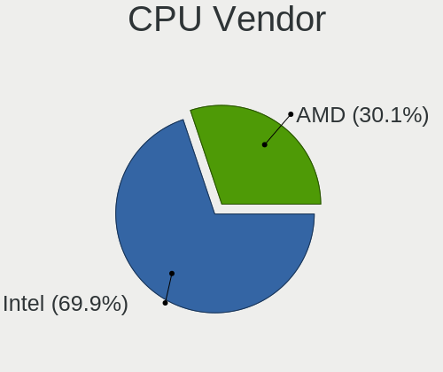

| Vendor | Computers | Percent |
|--------|-----------|---------|
| Intel  | 45        | 70.31%  |
| AMD    | 19        | 29.69%  |

CPU Model
---------

Processor models

| Model                                       | Computers | Percent |
|---------------------------------------------|-----------|---------|
| AMD A4-5000 APU with Radeon HD Graphics     | 3         | 4.69%   |
| Intel Core i3 CPU M 370 @ 2.40GHz           | 2         | 3.13%   |
| Intel Xeon CPU E7- 4870 @ 2.40GHz           | 1         | 1.56%   |
| Intel Pentium Dual-Core CPU T4300 @ 2.10GHz | 1         | 1.56%   |
| Intel Pentium Dual CPU T3200 @ 2.00GHz      | 1         | 1.56%   |
| Intel Pentium Dual CPU T2390 @ 1.86GHz      | 1         | 1.56%   |
| Intel Pentium Dual CPU T2370 @ 1.73GHz      | 1         | 1.56%   |
| Intel Pentium Dual CPU E2160 @ 1.80GHz      | 1         | 1.56%   |
| Intel Pentium CPU J2900 @ 2.41GHz           | 1         | 1.56%   |
| Intel Pentium CPU G3250 @ 3.20GHz           | 1         | 1.56%   |
| Intel Pentium CPU B960 @ 2.20GHz            | 1         | 1.56%   |
| Intel Core i7-8550U CPU @ 1.80GHz           | 1         | 1.56%   |
| Intel Core i7-7500U CPU @ 2.70GHz           | 1         | 1.56%   |
| Intel Core i7-6700HQ CPU @ 2.60GHz          | 1         | 1.56%   |
| Intel Core i7-5600U CPU @ 2.60GHz           | 1         | 1.56%   |
| Intel Core i7-4770K CPU @ 3.50GHz           | 1         | 1.56%   |
| Intel Core i7-4720HQ CPU @ 2.60GHz          | 1         | 1.56%   |
| Intel Core i7-4600U CPU @ 2.10GHz           | 1         | 1.56%   |
| Intel Core i7-2600 CPU @ 3.40GHz            | 1         | 1.56%   |
| Intel Core i5-7200U CPU @ 2.50GHz           | 1         | 1.56%   |
| Intel Core i5-3570S CPU @ 3.10GHz           | 1         | 1.56%   |
| Intel Core i5-3470 CPU @ 3.20GHz            | 1         | 1.56%   |
| Intel Core i5-3437U CPU @ 1.90GHz           | 1         | 1.56%   |
| Intel Core i5-3337U CPU @ 1.80GHz           | 1         | 1.56%   |
| Intel Core i5-3230M CPU @ 2.60GHz           | 1         | 1.56%   |
| Intel Core i5-3210M CPU @ 2.50GHz           | 1         | 1.56%   |
| Intel Core i5-2520M CPU @ 2.50GHz           | 1         | 1.56%   |
| Intel Core i5-2410M CPU @ 2.30GHz           | 1         | 1.56%   |
| Intel Core i5-10300H CPU @ 2.50GHz          | 1         | 1.56%   |
| Intel Core i3-7020U CPU @ 2.30GHz           | 1         | 1.56%   |
| Intel Core i3-3227U CPU @ 1.90GHz           | 1         | 1.56%   |
| Intel Core i3-3220 CPU @ 3.30GHz            | 1         | 1.56%   |
| Intel Core i3-3217U CPU @ 1.80GHz           | 1         | 1.56%   |
| Intel Core i3-2100 CPU @ 3.10GHz            | 1         | 1.56%   |
| Intel Core 2 Quad CPU Q8300 @ 2.50GHz       | 1         | 1.56%   |
| Intel Core 2 Duo CPU T6400 @ 2.00GHz        | 1         | 1.56%   |
| Intel Core 2 Duo CPU T5550 @ 1.83GHz        | 1         | 1.56%   |
| Intel Core 2 Duo CPU E8400 @ 3.00GHz        | 1         | 1.56%   |
| Intel Core 2 Duo CPU E8135 @ 2.40GHz        | 1         | 1.56%   |
| Intel Core 2 Duo CPU E4500 @ 2.20GHz        | 1         | 1.56%   |
| Intel Celeron N4000 CPU @ 1.10GHz           | 1         | 1.56%   |
| Intel Celeron D CPU 220 @ 1.20GHz           | 1         | 1.56%   |
| Intel Celeron CPU N2940 @ 1.83GHz           | 1         | 1.56%   |
| Intel Atom x5-Z8350 CPU @ 1.44GHz           | 1         | 1.56%   |
| Intel Atom CPU N450 @ 1.66GHz               | 1         | 1.56%   |
| AMD Turion 64 X2 Mobile Technology TL-56    | 1         | 1.56%   |
| AMD Ryzen 9 3900X 12-Core Processor         | 1         | 1.56%   |
| AMD Ryzen 7 3700X 8-Core Processor          | 1         | 1.56%   |
| AMD Ryzen 5 3600 6-Core Processor           | 1         | 1.56%   |
| AMD Ryzen 3 3200G with Radeon Vega Graphics | 1         | 1.56%   |
| AMD Phenom 9650 Quad-Core Processor         | 1         | 1.56%   |
| AMD Opteron Processor 6272                  | 1         | 1.56%   |
| AMD FX-8320 Eight-Core Processor            | 1         | 1.56%   |
| AMD FX-6300 Six-Core Processor              | 1         | 1.56%   |
| AMD Athlon II X4 640 Processor              | 1         | 1.56%   |
| AMD Athlon II X2 260 Processor              | 1         | 1.56%   |
| AMD Athlon 64 X2 Dual-Core Processor TK-55  | 1         | 1.56%   |
| AMD Athlon 64 X2 Dual Core Processor 4400+  | 1         | 1.56%   |
| AMD A8-6600K APU with Radeon HD Graphics    | 1         | 1.56%   |
| AMD A6-3420M APU with Radeon HD Graphics    | 1         | 1.56%   |

CPU Model Family
----------------

Processor model prefix

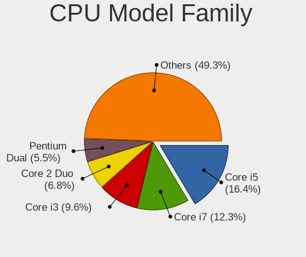

| Model                   | Computers | Percent |
|-------------------------|-----------|---------|
| Intel Core i5           | 10        | 15.63%  |
| Intel Core i7           | 8         | 12.5%   |
| Intel Core i3           | 7         | 10.94%  |
| Intel Core 2 Duo        | 5         | 7.81%   |
| Intel Pentium Dual      | 4         | 6.25%   |
| Intel Pentium           | 3         | 4.69%   |
| AMD A4                  | 3         | 4.69%   |
| Intel Celeron           | 2         | 3.13%   |
| Intel Atom              | 2         | 3.13%   |
| AMD FX                  | 2         | 3.13%   |
| AMD Athlon 64 X2        | 2         | 3.13%   |
| Intel Xeon              | 1         | 1.56%   |
| Intel Pentium Dual-Core | 1         | 1.56%   |
| Intel Core 2 Quad       | 1         | 1.56%   |
| Intel Celeron D         | 1         | 1.56%   |
| AMD Turion 64 X2 Mobile | 1         | 1.56%   |
| AMD Ryzen 9             | 1         | 1.56%   |
| AMD Ryzen 7             | 1         | 1.56%   |
| AMD Ryzen 5             | 1         | 1.56%   |
| AMD Ryzen 3             | 1         | 1.56%   |
| AMD Phenom              | 1         | 1.56%   |
| AMD Opteron             | 1         | 1.56%   |
| AMD Athlon II X4        | 1         | 1.56%   |
| AMD Athlon II X2        | 1         | 1.56%   |
| AMD A8                  | 1         | 1.56%   |
| AMD A6                  | 1         | 1.56%   |
| AMD A10                 | 1         | 1.56%   |

CPU Cores
---------

Number of processor cores

| Number | Computers | Percent |
|--------|-----------|---------|
| 2      | 35        | 54.69%  |
| 4      | 20        | 31.25%  |
| 1      | 3         | 4.69%   |
| 40     | 1         | 1.56%   |
| 16     | 1         | 1.56%   |
| 12     | 1         | 1.56%   |
| 8      | 1         | 1.56%   |
| 6      | 1         | 1.56%   |
| 3      | 1         | 1.56%   |

CPU Sockets
-----------

Number of sockets

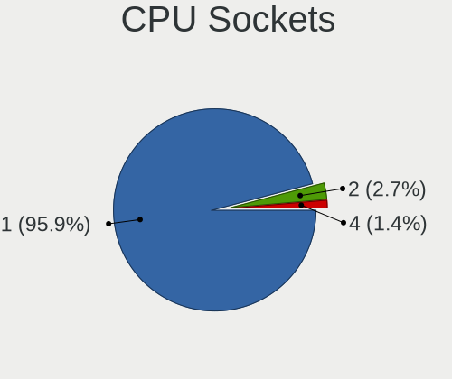

| Number | Computers | Percent |
|--------|-----------|---------|
| 1      | 62        | 96.88%  |
| 4      | 1         | 1.56%   |
| 2      | 1         | 1.56%   |

CPU Threads
-----------

Threads per core (Hyper-Threading)

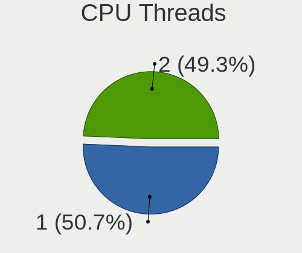

| Number | Computers | Percent |
|--------|-----------|---------|
| 1      | 33        | 51.56%  |
| 2      | 31        | 48.44%  |

CPU Op-Modes
------------

CPU Operation Modes (32-bit, 64-bit)

| Op mode        | Computers | Percent |
|----------------|-----------|---------|
| 32-bit, 64-bit | 64        | 100%    |

CPU Microcode
-------------

Microcode number

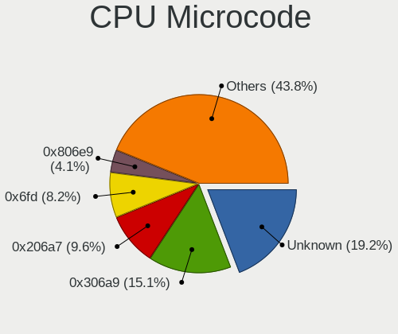

| Number     | Computers | Percent |
|------------|-----------|---------|
| Unknown    | 13        | 20.31%  |
| 0x306a9    | 9         | 14.06%  |
| 0x6fd      | 6         | 9.38%   |
| 0x206a7    | 5         | 7.81%   |
| 0x806e9    | 3         | 4.69%   |
| 0x306c3    | 2         | 3.13%   |
| 0x30678    | 2         | 3.13%   |
| 0x20655    | 2         | 3.13%   |
| 0x0700010f | 2         | 3.13%   |
| 0x010000c8 | 2         | 3.13%   |
| 0xa0652    | 1         | 1.56%   |
| 0x806ea    | 1         | 1.56%   |
| 0x706a1    | 1         | 1.56%   |
| 0x506e3    | 1         | 1.56%   |
| 0x406c4    | 1         | 1.56%   |
| 0x40651    | 1         | 1.56%   |
| 0x306d4    | 1         | 1.56%   |
| 0x206f2    | 1         | 1.56%   |
| 0x1067a    | 1         | 1.56%   |
| 0x10676    | 1         | 1.56%   |
| 0x10661    | 1         | 1.56%   |
| 0x08701013 | 1         | 1.56%   |
| 0x08108109 | 1         | 1.56%   |
| 0x07000106 | 1         | 1.56%   |
| 0x06003106 | 1         | 1.56%   |
| 0x06000852 | 1         | 1.56%   |
| 0x03000027 | 1         | 1.56%   |
| 0x01000095 | 1         | 1.56%   |

CPU Microarch
-------------

Microarchitecture

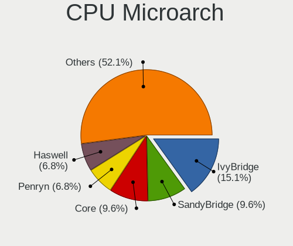

| Name          | Computers | Percent |
|---------------|-----------|---------|
| IvyBridge     | 9         | 14.06%  |
| Core          | 7         | 10.94%  |
| SandyBridge   | 5         | 7.81%   |
| Penryn        | 5         | 7.81%   |
| KabyLake      | 4         | 6.25%   |
| Haswell       | 4         | 6.25%   |
| Zen 2         | 3         | 4.69%   |
| Westmere      | 3         | 4.69%   |
| Silvermont    | 3         | 4.69%   |
| Piledriver    | 3         | 4.69%   |
| K8 Hammer     | 3         | 4.69%   |
| K10           | 3         | 4.69%   |
| Jaguar        | 3         | 4.69%   |
| Zen+          | 1         | 1.56%   |
| Steamroller   | 1         | 1.56%   |
| Skylake       | 1         | 1.56%   |
| K10 Llano     | 1         | 1.56%   |
| Goldmont plus | 1         | 1.56%   |
| CometLake     | 1         | 1.56%   |
| Bulldozer     | 1         | 1.56%   |
| Broadwell     | 1         | 1.56%   |
| Bonnell       | 1         | 1.56%   |

Graphics
--------

GPU Vendor
----------

Vendors of graphics cards

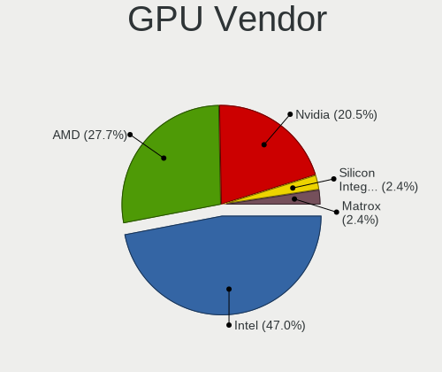

| Vendor                           | Computers | Percent |
|----------------------------------|-----------|---------|
| Intel                            | 36        | 49.32%  |
| AMD                              | 17        | 23.29%  |
| Nvidia                           | 16        | 21.92%  |
| Silicon Integrated Systems [SiS] | 2         | 2.74%   |
| Matrox Electronics Systems       | 2         | 2.74%   |

GPU Model
---------

Graphics card models

| Model                                                                                    | Computers | Percent |
|------------------------------------------------------------------------------------------|-----------|---------|
| Intel 3rd Gen Core processor Graphics Controller                                         | 6         | 7.89%   |
| Intel 2nd Generation Core Processor Family Integrated Graphics Controller                | 4         | 5.26%   |
| Intel Mobile GM965/GL960 Integrated Graphics Controller (secondary)                      | 3         | 3.95%   |
| Intel Mobile GM965/GL960 Integrated Graphics Controller (primary)                        | 3         | 3.95%   |
| Intel HD Graphics 620                                                                    | 3         | 3.95%   |
| AMD Kabini [Radeon HD 8330]                                                              | 3         | 3.95%   |
| Silicon Integrated Systems [SiS] 771/671 PCIE VGA Display Adapter                        | 2         | 2.63%   |
| Matrox Electronics Systems MGA G200eW WPCM450                                            | 2         | 2.63%   |
| Intel Xeon E3-1200 v3/4th Gen Core Processor Integrated Graphics Controller              | 2         | 2.63%   |
| Intel Xeon E3-1200 v2/3rd Gen Core processor Graphics Controller                         | 2         | 2.63%   |
| Intel Mobile 4 Series Chipset Integrated Graphics Controller                             | 2         | 2.63%   |
| Intel Atom Processor Z36xxx/Z37xxx Series Graphics & Display                             | 2         | 2.63%   |
| Intel 82G33/G31 Express Integrated Graphics Controller                                   | 2         | 2.63%   |
| AMD Turks XT [Radeon HD 6670/7670]                                                       | 2         | 2.63%   |
| AMD RS482M [Mobility Radeon Xpress 200]                                                  | 2         | 2.63%   |
| Nvidia TU117M [GeForce GTX 1650 Ti Mobile]                                               | 1         | 1.32%   |
| Nvidia TU102 [GeForce RTX 2080 Ti]                                                       | 1         | 1.32%   |
| Nvidia GP107 [GeForce GTX 1050 Ti]                                                       | 1         | 1.32%   |
| Nvidia GP106M [GeForce GTX 1060 Mobile]                                                  | 1         | 1.32%   |
| Nvidia GP106 [GeForce GTX 1060 6GB]                                                      | 1         | 1.32%   |
| Nvidia GM108M [GeForce MX110]                                                            | 1         | 1.32%   |
| Nvidia GM108M [GeForce 940MX]                                                            | 1         | 1.32%   |
| Nvidia GM107M [GeForce GTX 960M]                                                         | 1         | 1.32%   |
| Nvidia GM107 [GeForce GTX 750 Ti]                                                        | 1         | 1.32%   |
| Nvidia GK107 [GeForce GTX 650]                                                           | 1         | 1.32%   |
| Nvidia GF119M [NVS 4200M]                                                                | 1         | 1.32%   |
| Nvidia GF116 [GeForce GTS 450 Rev. 2]                                                    | 1         | 1.32%   |
| Nvidia GF110 [GeForce GTX 580]                                                           | 1         | 1.32%   |
| Nvidia GF110 [GeForce GTX 570]                                                           | 1         | 1.32%   |
| Nvidia G96C [GeForce 9500 GT]                                                            | 1         | 1.32%   |
| Nvidia G84M [GeForce 8600M GT]                                                           | 1         | 1.32%   |
| Intel UHD Graphics 620                                                                   | 1         | 1.32%   |
| Intel HD Graphics 5500                                                                   | 1         | 1.32%   |
| Intel HD Graphics 530                                                                    | 1         | 1.32%   |
| Intel Haswell-ULT Integrated Graphics Controller                                         | 1         | 1.32%   |
| Intel GeminiLake [UHD Graphics 600]                                                      | 1         | 1.32%   |
| Intel Core Processor Integrated Graphics Controller                                      | 1         | 1.32%   |
| Intel CometLake-H GT2 [UHD Graphics]                                                     | 1         | 1.32%   |
| Intel Atom/Celeron/Pentium Processor x5-E8000/J3xxx/N3xxx Integrated Graphics Controller | 1         | 1.32%   |
| Intel Atom Processor D4xx/D5xx/N4xx/N5xx Integrated Graphics Controller                  | 1         | 1.32%   |
| Intel 4th Gen Core Processor Integrated Graphics Controller                              | 1         | 1.32%   |
| AMD Sumo [Radeon HD 6520G]                                                               | 1         | 1.32%   |
| AMD RV630/M76 [Mobility Radeon HD 2600 XT/2700]                                          | 1         | 1.32%   |
| AMD RV630 PRO [Radeon HD 2600 PRO]                                                       | 1         | 1.32%   |
| AMD RV610 [Radeon HD 2400 PRO]                                                           | 1         | 1.32%   |
| AMD Richland [Radeon HD 8570D]                                                           | 1         | 1.32%   |
| AMD Picasso/Raven 2 [Radeon Vega Series / Radeon Vega Mobile Series]                     | 1         | 1.32%   |
| AMD Park [Mobility Radeon HD 5430/5450/5470]                                             | 1         | 1.32%   |
| AMD Kaveri [Radeon R6 Graphics]                                                          | 1         | 1.32%   |
| AMD Ellesmere [Radeon RX 470/480/570/570X/580/580X/590]                                  | 1         | 1.32%   |
| AMD Cedar [Radeon HD 5000/6000/7350/8350 Series]                                         | 1         | 1.32%   |

GPU Combo
---------

Combinations of graphics cards

| Name            | Computers | Percent |
|-----------------|-----------|---------|
| 1 x Intel       | 29        | 45.31%  |
| 1 x AMD         | 17        | 26.56%  |
| 1 x Nvidia      | 8         | 12.5%   |
| Intel + Nvidia  | 6         | 9.38%   |
| 1 x SiS         | 2         | 3.13%   |
| Nvidia + Matrox | 1         | 1.56%   |
| 1 x Matrox      | 1         | 1.56%   |

GPU Driver
----------

Free vs proprietary

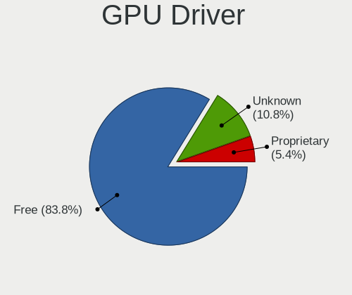

| Driver      | Computers | Percent |
|-------------|-----------|---------|
| Free        | 55        | 84.62%  |
| Unknown     | 7         | 10.77%  |
| Proprietary | 3         | 4.62%   |

GPU Memory
----------

Total video memory

| Size in GB | Computers | Percent |
|------------|-----------|---------|
| Unknown    | 41        | 62.12%  |
| 0.01-0.5   | 10        | 15.15%  |
| 1.01-2.0   | 6         | 9.09%   |
| 0.51-1.0   | 5         | 7.58%   |
| 3.01-4.0   | 3         | 4.55%   |
| 5.01-6.0   | 1         | 1.52%   |

Monitor
-------

Monitor Vendor
--------------

Monitor vendors

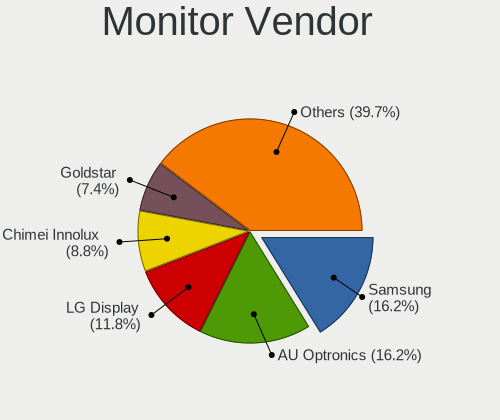

| Vendor                  | Computers | Percent |
|-------------------------|-----------|---------|
| Samsung Electronics     | 10        | 16.13%  |
| AU Optronics            | 10        | 16.13%  |
| LG Display              | 8         | 12.9%   |
| Chimei Innolux          | 6         | 9.68%   |
| Goldstar                | 5         | 8.06%   |
| Acer                    | 5         | 8.06%   |
| BOE                     | 3         | 4.84%   |
| Philips                 | 2         | 3.23%   |
| ViewSonic               | 1         | 1.61%   |
| Unknown                 | 1         | 1.61%   |
| Sony                    | 1         | 1.61%   |
| Sceptre Tech            | 1         | 1.61%   |
| NXP                     | 1         | 1.61%   |
| LG Philips              | 1         | 1.61%   |
| Lenovo                  | 1         | 1.61%   |
| Hewlett-Packard         | 1         | 1.61%   |
| CPT                     | 1         | 1.61%   |
| Chi Mei Optoelectronics | 1         | 1.61%   |
| BenQ                    | 1         | 1.61%   |
| Apple                   | 1         | 1.61%   |
| Ancor Communications    | 1         | 1.61%   |

Monitor Model
-------------

Monitor models

| Model                                                                    | Computers | Percent |
|--------------------------------------------------------------------------|-----------|---------|
| LG Display LCD Monitor LGD0469 1920x1080 382x215mm 17.3-inch             | 2         | 3.13%   |
| LG Display LCD Monitor LGD038E 1366x768 344x194mm 15.5-inch              | 2         | 3.13%   |
| Goldstar W2043 GSM4E9D 1600x900 450x250mm 20.3-inch                      | 2         | 3.13%   |
| Chimei Innolux LCD Monitor CMN15BF 1366x768 344x193mm 15.5-inch          | 2         | 3.13%   |
| AU Optronics LCD Monitor AUO303E 1600x900 309x174mm 14.0-inch            | 2         | 3.13%   |
| ViewSonic VX3211-2K VSCF634 2560x1440 698x392mm 31.5-inch                | 1         | 1.56%   |
| Unknown LCD Monitor SHI LCD-TV 4640x1080                                 | 1         | 1.56%   |
| Sony LCD Monitor AVSYSTEM                                                | 1         | 1.56%   |
| Sceptre Tech X325BV-FMQR SPT0CB8 1920x1080 700x390mm 31.5-inch           | 1         | 1.56%   |
| Samsung Electronics U28E590 SAM0C4E 3840x2160 608x345mm 27.5-inch        | 1         | 1.56%   |
| Samsung Electronics SyncMaster SAM0593 1920x1080 477x268mm 21.5-inch     | 1         | 1.56%   |
| Samsung Electronics SyncMaster SAM01B7 1280x1024 338x270mm 17.0-inch     | 1         | 1.56%   |
| Samsung Electronics SMBX2331 SAM076F 1920x1080 509x286mm 23.0-inch       | 1         | 1.56%   |
| Samsung Electronics S/T 77/76DFX STN0006 1280x1024 312x234mm 15.4-inch   | 1         | 1.56%   |
| Samsung Electronics LCD Monitor SEC4E45 1280x800 331x207mm 15.4-inch     | 1         | 1.56%   |
| Samsung Electronics LCD Monitor SEC4249 1366x768 309x174mm 14.0-inch     | 1         | 1.56%   |
| Samsung Electronics LCD Monitor SEC3358 1280x800 331x207mm 15.4-inch     | 1         | 1.56%   |
| Samsung Electronics LCD Monitor SDC4752 1366x768 344x194mm 15.5-inch     | 1         | 1.56%   |
| Samsung Electronics LCD Monitor SDC4347 1366x768 344x193mm 15.5-inch     | 1         | 1.56%   |
| Philips LCD Monitor PHLC0BF 1600x900 430x240mm 19.4-inch                 | 1         | 1.56%   |
| Philips 170B PHL081D 1280x1024 338x270mm 17.0-inch                       | 1         | 1.56%   |
| NXP OptiPlex 9010 NXP1111 1920x1080 510x286mm 23.0-inch                  | 1         | 1.56%   |
| LG Philips LCD Monitor LPLA900 1280x800 331x207mm 15.4-inch              | 1         | 1.56%   |
| LG Display LCD Monitor LGD03B7 1366x768 309x174mm 14.0-inch              | 1         | 1.56%   |
| LG Display LCD Monitor LGD03B3 1366x768 309x174mm 14.0-inch              | 1         | 1.56%   |
| LG Display LCD Monitor LGD02EB 1366x768 309x174mm 14.0-inch              | 1         | 1.56%   |
| LG Display LCD Monitor LGD0251 1366x768 310x174mm 14.0-inch              | 1         | 1.56%   |
| Lenovo LEN T2454pA LEN60C9 1920x1200 518x324mm 24.1-inch                 | 1         | 1.56%   |
| Hewlett-Packard LE1851w HWP2840 1366x768 413x234mm 18.7-inch             | 1         | 1.56%   |
| Goldstar W2243 GSM56FF 1920x1080 480x270mm 21.7-inch                     | 1         | 1.56%   |
| Goldstar W1953 GSM4BA6 1360x768 406x229mm 18.4-inch                      | 1         | 1.56%   |
| Goldstar E2441 GSM581F 1920x1080 530x300mm 24.0-inch                     | 1         | 1.56%   |
| CPT LCD Monitor CPT13B1 1280x800 331x207mm 15.4-inch                     | 1         | 1.56%   |
| Chimei Innolux LCD Monitor CMN15DB 1366x768 344x193mm 15.5-inch          | 1         | 1.56%   |
| Chimei Innolux LCD Monitor CMN15C6 1366x768 344x193mm 15.5-inch          | 1         | 1.56%   |
| Chimei Innolux LCD Monitor CMN1521 1920x1080 344x193mm 15.5-inch         | 1         | 1.56%   |
| Chimei Innolux LCD Monitor CMN1476 1366x768 309x174mm 14.0-inch          | 1         | 1.56%   |
| Chi Mei Optoelectronics LCD Monitor CMO1007 1024x600 222x125mm 10.0-inch | 1         | 1.56%   |
| BOE LCD Monitor BOE06BA 1920x1080 344x193mm 15.5-inch                    | 1         | 1.56%   |
| BOE LCD Monitor BOE06A5 1366x768 344x194mm 15.5-inch                     | 1         | 1.56%   |
| BOE LCD Monitor BOE0657 1920x1080 344x194mm 15.5-inch                    | 1         | 1.56%   |
| BenQ LCD Monitor GL951A 2880x900                                         | 1         | 1.56%   |
| BenQ LCD Monitor GL951A                                                  | 1         | 1.56%   |
| BenQ GL951A BNQ7897 1440x900 408x255mm 18.9-inch                         | 1         | 1.56%   |
| AU Optronics LCD Monitor AUO8174 1280x800 331x207mm 15.4-inch            | 1         | 1.56%   |
| AU Optronics LCD Monitor AUO38ED 1920x1080 344x193mm 15.5-inch           | 1         | 1.56%   |
| AU Optronics LCD Monitor AUO313C 1366x768 310x170mm 13.9-inch            | 1         | 1.56%   |
| AU Optronics LCD Monitor AUO253C 1366x768 309x173mm 13.9-inch            | 1         | 1.56%   |
| AU Optronics LCD Monitor AUO23EC 1366x768 344x193mm 15.5-inch            | 1         | 1.56%   |
| AU Optronics LCD Monitor AUO2374 1280x800 331x207mm 15.4-inch            | 1         | 1.56%   |
| AU Optronics LCD Monitor AUO22EC 1366x768 344x193mm 15.5-inch            | 1         | 1.56%   |
| AU Optronics LCD Monitor AUO20EC 1366x768 344x193mm 15.5-inch            | 1         | 1.56%   |
| Apple Color LCD APP9C6A 1680x1050 433x270mm 20.1-inch                    | 1         | 1.56%   |
| Ancor Communications ASUS VS228 ACI22FD 1920x1080 476x268mm 21.5-inch    | 1         | 1.56%   |
| Acer V226WL ACR0339 1680x1050 474x296mm 22.0-inch                        | 1         | 1.56%   |
| Acer P225HQ ACR00EA 1920x1080 477x268mm 21.5-inch                        | 1         | 1.56%   |
| Acer LCD Monitor S230HL                                                  | 1         | 1.56%   |
| Acer G226HQL ACR02EA 1920x1080 477x268mm 21.5-inch                       | 1         | 1.56%   |
| Acer G185HV ACR019F 1366x768 410x230mm 18.5-inch                         | 1         | 1.56%   |

Monitor Resolution
------------------

Monitor screen resolution

| Resolution         | Computers | Percent |
|--------------------|-----------|---------|
| 1366x768 (WXGA)    | 22        | 34.92%  |
| 1920x1080 (FHD)    | 16        | 25.4%   |
| 1280x800 (WXGA)    | 6         | 9.52%   |
| 1600x900 (HD+)     | 5         | 7.94%   |
| 1280x1024 (SXGA)   | 3         | 4.76%   |
| 1680x1050 (WSXGA+) | 2         | 3.17%   |
| Unknown            | 2         | 3.17%   |
| 4640x1080          | 1         | 1.59%   |
| 3840x2160 (4K)     | 1         | 1.59%   |
| 2880x900           | 1         | 1.59%   |
| 2560x1440 (QHD)    | 1         | 1.59%   |
| 1440x900 (WXGA+)   | 1         | 1.59%   |
| 1360x768           | 1         | 1.59%   |
| 1024x600           | 1         | 1.59%   |

Monitor Diagonal
----------------

Diagonal size in inches

| Inches  | Computers | Percent |
|---------|-----------|---------|
| 15      | 23        | 37.7%   |
| 14      | 8         | 13.11%  |
| 21      | 4         | 6.56%   |
| 17      | 4         | 6.56%   |
| 23      | 3         | 4.92%   |
| 20      | 3         | 4.92%   |
| 18      | 3         | 4.92%   |
| 31      | 2         | 3.28%   |
| 24      | 2         | 3.28%   |
| 19      | 2         | 3.28%   |
| 13      | 2         | 3.28%   |
| Unknown | 2         | 3.28%   |
| 27      | 1         | 1.64%   |
| 22      | 1         | 1.64%   |
| 10      | 1         | 1.64%   |

Monitor Width
-------------

Physical width

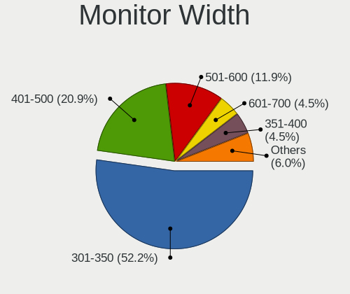

| Width in mm | Computers | Percent |
|-------------|-----------|---------|
| 301-350     | 35        | 57.38%  |
| 401-500     | 13        | 21.31%  |
| 501-600     | 5         | 8.2%    |
| 601-700     | 3         | 4.92%   |
| 351-400     | 2         | 3.28%   |
| Unknown     | 2         | 3.28%   |
| 201-300     | 1         | 1.64%   |

Aspect Ratio
------------

Proportional relationship between the width and the height

| Ratio   | Computers | Percent |
|---------|-----------|---------|
| 16/9    | 45        | 75%     |
| 16/10   | 10        | 16.67%  |
| 5/4     | 2         | 3.33%   |
| Unknown | 2         | 3.33%   |
| 4/3     | 1         | 1.67%   |

Monitor Area
------------

Area in inch²

| Area in inch² | Computers | Percent |
|----------------|-----------|---------|
| 101-110        | 22        | 36.07%  |
| 81-90          | 10        | 16.39%  |
| 201-250        | 9         | 14.75%  |
| 151-200        | 5         | 8.2%    |
| 141-150        | 5         | 8.2%    |
| 351-500        | 2         | 3.28%   |
| 121-130        | 2         | 3.28%   |
| Unknown        | 2         | 3.28%   |
| 41-50          | 1         | 1.64%   |
| 301-350        | 1         | 1.64%   |
| 251-300        | 1         | 1.64%   |
| 111-120        | 1         | 1.64%   |

Pixel Density
-------------

Pixels per inch

| Density | Computers | Percent |
|---------|-----------|---------|
| 101-120 | 25        | 42.37%  |
| 51-100  | 23        | 38.98%  |
| 121-160 | 9         | 15.25%  |
| Unknown | 2         | 3.39%   |

Multiple Monitors
-----------------

Total monitors connected

| Total | Computers | Percent |
|-------|-----------|---------|
| 1     | 56        | 87.5%   |
| 0     | 4         | 6.25%   |
| 2     | 3         | 4.69%   |
| 3     | 1         | 1.56%   |

Network
-------

Net Controller Vendor
---------------------

Controller vendors

| Vendor                            | Computers | Percent |
|-----------------------------------|-----------|---------|
| Realtek Semiconductor             | 43        | 41.35%  |
| Qualcomm Atheros                  | 17        | 16.35%  |
| Intel                             | 13        | 12.5%   |
| Broadcom                          | 11        | 10.58%  |
| Broadcom Limited                  | 3         | 2.88%   |
| TP-Link                           | 2         | 1.92%   |
| Nvidia                            | 2         | 1.92%   |
| Marvell Technology Group          | 2         | 1.92%   |
| Silicon Integrated Systems [SiS]  | 1         | 0.96%   |
| Samsung Electronics               | 1         | 0.96%   |
| Ralink                            | 1         | 0.96%   |
| Qualcomm                          | 1         | 0.96%   |
| NetGear                           | 1         | 0.96%   |
| Ericsson Business Mobile Networks | 1         | 0.96%   |
| D-Link                            | 1         | 0.96%   |
| CyberTAN Technology               | 1         | 0.96%   |
| AVM                               | 1         | 0.96%   |
| ASIX Electronics                  | 1         | 0.96%   |
| Accton Technology                 | 1         | 0.96%   |

Net Controller Model
--------------------

Controller models

| Model                                                                        | Computers | Percent |
|------------------------------------------------------------------------------|-----------|---------|
| Realtek RTL8111/8168/8411 PCI Express Gigabit Ethernet Controller            | 29        | 23.39%  |
| Realtek RTL810xE PCI Express Fast Ethernet controller                        | 11        | 8.87%   |
| Qualcomm Atheros QCA9565 / AR9565 Wireless Network Adapter                   | 5         | 4.03%   |
| Qualcomm Atheros AR9485 Wireless Network Adapter                             | 4         | 3.23%   |
| Realtek 802.11ac NIC                                                         | 3         | 2.42%   |
| Intel 82579LM Gigabit Network Connection (Lewisville)                        | 3         | 2.42%   |
| Broadcom BCM4312 802.11b/g LP-PHY                                            | 3         | 2.42%   |
| Qualcomm Atheros QCA9377 802.11ac Wireless Network Adapter                   | 2         | 1.61%   |
| Qualcomm Atheros QCA8172 Fast Ethernet                                       | 2         | 1.61%   |
| Qualcomm Atheros AR9285 Wireless Network Adapter (PCI-Express)               | 2         | 1.61%   |
| Qualcomm Atheros AR242x / AR542x Wireless Network Adapter (PCI-Express)      | 2         | 1.61%   |
| Nvidia MCP61 Ethernet                                                        | 2         | 1.61%   |
| Intel Wireless 7260                                                          | 2         | 1.61%   |
| Intel Centrino Wireless-N 2230                                               | 2         | 1.61%   |
| Broadcom BCM4311 802.11b/g WLAN                                              | 2         | 1.61%   |
| TP-Link TL-WN821N v5/v6 [RTL8192EU]                                          | 1         | 0.81%   |
| TP-Link Archer T4U ver.3                                                     | 1         | 0.81%   |
| Silicon Integrated Systems [SiS] 191 Gigabit Ethernet Adapter                | 1         | 0.81%   |
| Samsung Galaxy series, misc. (tethering mode)                                | 1         | 0.81%   |
| Realtek RTL8821CE 802.11ac PCIe Wireless Network Adapter                     | 1         | 0.81%   |
| Realtek RTL8812AU 802.11a/b/g/n/ac 2T2R DB WLAN Adapter                      | 1         | 0.81%   |
| Realtek RTL8723DE Wireless Network Adapter                                   | 1         | 0.81%   |
| Realtek RTL8190 802.11n PCI Wireless Network Adapter                         | 1         | 0.81%   |
| Realtek RTL8188FTV 802.11b/g/n 1T1R 2.4G WLAN Adapter                        | 1         | 0.81%   |
| Realtek RTL8188EUS 802.11n Wireless Network Adapter                          | 1         | 0.81%   |
| Realtek RTL8188EE Wireless Network Adapter                                   | 1         | 0.81%   |
| Realtek RTL8187B Wireless 802.11g 54Mbps Network Adapter                     | 1         | 0.81%   |
| Realtek RTL8153 Gigabit Ethernet Adapter                                     | 1         | 0.81%   |
| Ralink RT3090 Wireless 802.11n 1T/1R PCIe                                    | 1         | 0.81%   |
| Qualcomm Mi A1                                                               | 1         | 0.81%   |
| Qualcomm Atheros AR8162 Fast Ethernet                                        | 1         | 0.81%   |
| Qualcomm Atheros AR8151 v2.0 Gigabit Ethernet                                | 1         | 0.81%   |
| Qualcomm Atheros AR8131 Gigabit Ethernet                                     | 1         | 0.81%   |
| Qualcomm Atheros AR5212/5213/2414 Wireless Network Adapter                   | 1         | 0.81%   |
| NetGear WG111v2 54 Mbps Wireless [RealTek RTL8187L]                          | 1         | 0.81%   |
| Marvell Group 88E8058 PCI-E Gigabit Ethernet Controller                      | 1         | 0.81%   |
| Marvell Group 88E8040 PCI-E Fast Ethernet Controller                         | 1         | 0.81%   |
| Intel Wireless 8260                                                          | 1         | 0.81%   |
| Intel Wireless 7265                                                          | 1         | 0.81%   |
| Intel Wireless 3165                                                          | 1         | 0.81%   |
| Intel Ethernet Connection I218-LM                                            | 1         | 0.81%   |
| Intel Ethernet Connection (3) I218-LM                                        | 1         | 0.81%   |
| Intel Comet Lake PCH CNVi WiFi                                               | 1         | 0.81%   |
| Intel Centrino Ultimate-N 6300                                               | 1         | 0.81%   |
| Intel Centrino Advanced-N 6235                                               | 1         | 0.81%   |
| Intel Centrino Advanced-N 6205 [Taylor Peak]                                 | 1         | 0.81%   |
| Intel 82579V Gigabit Network Connection                                      | 1         | 0.81%   |
| Intel 82576 Gigabit Network Connection                                       | 1         | 0.81%   |
| Ericsson Business Mobile Networks N5321 gw                                   | 1         | 0.81%   |
| D-Link DWA-125 Wireless N 150 Adapter(rev.A3) [Ralink RT5370]                | 1         | 0.81%   |
| CyberTAN Siemens S30853-S1031-R351 802.11g Wireless Adapter [Atheros AR5523] | 1         | 0.81%   |
| Broadcom NetXtreme II BCM5709 Gigabit Ethernet                               | 1         | 0.81%   |
| Broadcom NetLink BCM5906M Fast Ethernet PCI Express                          | 1         | 0.81%   |
| Broadcom NetLink BCM5787M Gigabit Ethernet PCI Express                       | 1         | 0.81%   |
| Broadcom NetLink BCM5784M Gigabit Ethernet PCIe                              | 1         | 0.81%   |
| Broadcom NetLink BCM57785 Gigabit Ethernet PCIe                              | 1         | 0.81%   |
| Broadcom Limited BCM4401-B0 100Base-TX                                       | 1         | 0.81%   |
| Broadcom Limited BCM4352 802.11ac Wireless Network Adapter                   | 1         | 0.81%   |
| Broadcom Limited BCM4312 802.11b/g LP-PHY                                    | 1         | 0.81%   |
| Broadcom BCM4401-B0 100Base-TX                                               | 1         | 0.81%   |

Wireless Vendor
---------------

Wireless vendors

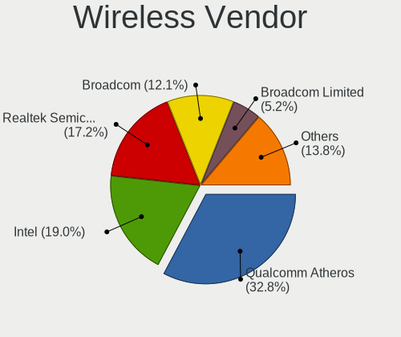

| Vendor                | Computers | Percent |
|-----------------------|-----------|---------|
| Qualcomm Atheros      | 16        | 29.63%  |
| Intel                 | 11        | 20.37%  |
| Realtek Semiconductor | 10        | 18.52%  |
| Broadcom              | 7         | 12.96%  |
| TP-Link               | 2         | 3.7%    |
| Broadcom Limited      | 2         | 3.7%    |
| Ralink                | 1         | 1.85%   |
| NetGear               | 1         | 1.85%   |
| D-Link                | 1         | 1.85%   |
| CyberTAN Technology   | 1         | 1.85%   |
| AVM                   | 1         | 1.85%   |
| Accton Technology     | 1         | 1.85%   |

Wireless Model
--------------

Wireless models

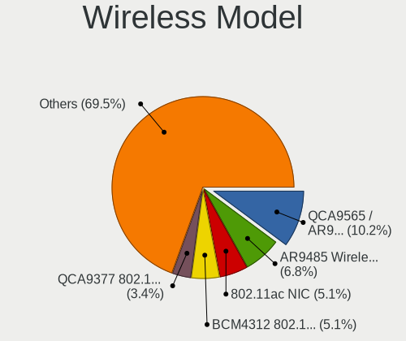

| Model                                                                        | Computers | Percent |
|------------------------------------------------------------------------------|-----------|---------|
| Qualcomm Atheros QCA9565 / AR9565 Wireless Network Adapter                   | 5         | 9.09%   |
| Qualcomm Atheros AR9485 Wireless Network Adapter                             | 4         | 7.27%   |
| Realtek 802.11ac NIC                                                         | 3         | 5.45%   |
| Broadcom BCM4312 802.11b/g LP-PHY                                            | 3         | 5.45%   |
| Qualcomm Atheros QCA9377 802.11ac Wireless Network Adapter                   | 2         | 3.64%   |
| Qualcomm Atheros AR9285 Wireless Network Adapter (PCI-Express)               | 2         | 3.64%   |
| Qualcomm Atheros AR242x / AR542x Wireless Network Adapter (PCI-Express)      | 2         | 3.64%   |
| Intel Wireless 7260                                                          | 2         | 3.64%   |
| Intel Centrino Wireless-N 2230                                               | 2         | 3.64%   |
| Broadcom BCM4311 802.11b/g WLAN                                              | 2         | 3.64%   |
| TP-Link TL-WN821N v5/v6 [RTL8192EU]                                          | 1         | 1.82%   |
| TP-Link Archer T4U ver.3                                                     | 1         | 1.82%   |
| Realtek RTL8821CE 802.11ac PCIe Wireless Network Adapter                     | 1         | 1.82%   |
| Realtek RTL8812AU 802.11a/b/g/n/ac 2T2R DB WLAN Adapter                      | 1         | 1.82%   |
| Realtek RTL8723DE Wireless Network Adapter                                   | 1         | 1.82%   |
| Realtek RTL8190 802.11n PCI Wireless Network Adapter                         | 1         | 1.82%   |
| Realtek RTL8188FTV 802.11b/g/n 1T1R 2.4G WLAN Adapter                        | 1         | 1.82%   |
| Realtek RTL8188EUS 802.11n Wireless Network Adapter                          | 1         | 1.82%   |
| Realtek RTL8188EE Wireless Network Adapter                                   | 1         | 1.82%   |
| Realtek RTL8187B Wireless 802.11g 54Mbps Network Adapter                     | 1         | 1.82%   |
| Ralink RT3090 Wireless 802.11n 1T/1R PCIe                                    | 1         | 1.82%   |
| Qualcomm Atheros AR5212/5213/2414 Wireless Network Adapter                   | 1         | 1.82%   |
| NetGear WG111v2 54 Mbps Wireless [RealTek RTL8187L]                          | 1         | 1.82%   |
| Intel Wireless 8260                                                          | 1         | 1.82%   |
| Intel Wireless 7265                                                          | 1         | 1.82%   |
| Intel Wireless 3165                                                          | 1         | 1.82%   |
| Intel Comet Lake PCH CNVi WiFi                                               | 1         | 1.82%   |
| Intel Centrino Ultimate-N 6300                                               | 1         | 1.82%   |
| Intel Centrino Advanced-N 6235                                               | 1         | 1.82%   |
| Intel Centrino Advanced-N 6205 [Taylor Peak]                                 | 1         | 1.82%   |
| D-Link DWA-125 Wireless N 150 Adapter(rev.A3) [Ralink RT5370]                | 1         | 1.82%   |
| CyberTAN Siemens S30853-S1031-R351 802.11g Wireless Adapter [Atheros AR5523] | 1         | 1.82%   |
| Broadcom Limited BCM4352 802.11ac Wireless Network Adapter                   | 1         | 1.82%   |
| Broadcom Limited BCM4312 802.11b/g LP-PHY                                    | 1         | 1.82%   |
| Broadcom BCM4321 802.11a/b/g/n                                               | 1         | 1.82%   |
| Broadcom BCM43142 802.11b/g/n                                                | 1         | 1.82%   |
| AVM FRITZ WLAN N v2 [RT5572/rt2870.bin]                                      | 1         | 1.82%   |
| Accton WN7512BEP Wireless LAN adapter                                        | 1         | 1.82%   |

Ethernet Vendor
---------------

Ethernet vendors

| Vendor                           | Computers | Percent |
|----------------------------------|-----------|---------|
| Realtek Semiconductor            | 41        | 60.29%  |
| Intel                            | 7         | 10.29%  |
| Broadcom                         | 6         | 8.82%   |
| Qualcomm Atheros                 | 5         | 7.35%   |
| Nvidia                           | 2         | 2.94%   |
| Marvell Technology Group         | 2         | 2.94%   |
| Silicon Integrated Systems [SiS] | 1         | 1.47%   |
| Samsung Electronics              | 1         | 1.47%   |
| Qualcomm                         | 1         | 1.47%   |
| Broadcom Limited                 | 1         | 1.47%   |
| ASIX Electronics                 | 1         | 1.47%   |

Ethernet Model
--------------

Ethernet models

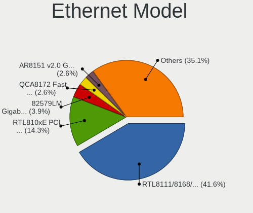

| Model                                                             | Computers | Percent |
|-------------------------------------------------------------------|-----------|---------|
| Realtek RTL8111/8168/8411 PCI Express Gigabit Ethernet Controller | 29        | 42.65%  |
| Realtek RTL810xE PCI Express Fast Ethernet controller             | 11        | 16.18%  |
| Intel 82579LM Gigabit Network Connection (Lewisville)             | 3         | 4.41%   |
| Qualcomm Atheros QCA8172 Fast Ethernet                            | 2         | 2.94%   |
| Nvidia MCP61 Ethernet                                             | 2         | 2.94%   |
| Silicon Integrated Systems [SiS] 191 Gigabit Ethernet Adapter     | 1         | 1.47%   |
| Samsung Galaxy series, misc. (tethering mode)                     | 1         | 1.47%   |
| Realtek RTL8153 Gigabit Ethernet Adapter                          | 1         | 1.47%   |
| Qualcomm Mi A1                                                    | 1         | 1.47%   |
| Qualcomm Atheros AR8162 Fast Ethernet                             | 1         | 1.47%   |
| Qualcomm Atheros AR8151 v2.0 Gigabit Ethernet                     | 1         | 1.47%   |
| Qualcomm Atheros AR8131 Gigabit Ethernet                          | 1         | 1.47%   |
| Marvell Group 88E8058 PCI-E Gigabit Ethernet Controller           | 1         | 1.47%   |
| Marvell Group 88E8040 PCI-E Fast Ethernet Controller              | 1         | 1.47%   |
| Intel Ethernet Connection I218-LM                                 | 1         | 1.47%   |
| Intel Ethernet Connection (3) I218-LM                             | 1         | 1.47%   |
| Intel 82579V Gigabit Network Connection                           | 1         | 1.47%   |
| Intel 82576 Gigabit Network Connection                            | 1         | 1.47%   |
| Broadcom NetXtreme II BCM5709 Gigabit Ethernet                    | 1         | 1.47%   |
| Broadcom NetLink BCM5906M Fast Ethernet PCI Express               | 1         | 1.47%   |
| Broadcom NetLink BCM5787M Gigabit Ethernet PCI Express            | 1         | 1.47%   |
| Broadcom NetLink BCM5784M Gigabit Ethernet PCIe                   | 1         | 1.47%   |
| Broadcom NetLink BCM57785 Gigabit Ethernet PCIe                   | 1         | 1.47%   |
| Broadcom Limited BCM4401-B0 100Base-TX                            | 1         | 1.47%   |
| Broadcom BCM4401-B0 100Base-TX                                    | 1         | 1.47%   |
| ASIX AX88179 Gigabit Ethernet                                     | 1         | 1.47%   |

Net Controller Kind
-------------------

Ethernet, WiFi or modem

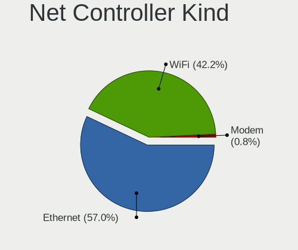

| Kind     | Computers | Percent |
|----------|-----------|---------|
| Ethernet | 64        | 55.65%  |
| WiFi     | 50        | 43.48%  |
| Modem    | 1         | 0.87%   |

Used Controller
---------------

Currently used network controller

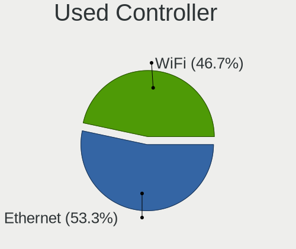

| Kind     | Computers | Percent |
|----------|-----------|---------|
| Ethernet | 43        | 53.75%  |
| WiFi     | 37        | 46.25%  |

NICs
----

Total network controllers on board

| Total | Computers | Percent |
|-------|-----------|---------|
| 2     | 42        | 65.63%  |
| 1     | 19        | 29.69%  |
| 4     | 1         | 1.56%   |
| 3     | 1         | 1.56%   |
| 0     | 1         | 1.56%   |

IPv6
----

IPv6 vs IPv4

| Used | Computers | Percent |
|------|-----------|---------|
| No   | 60        | 93.75%  |
| Yes  | 4         | 6.25%   |

Bluetooth
---------

Bluetooth Vendor
----------------

Controller vendors

| Vendor                          | Computers | Percent |
|---------------------------------|-----------|---------|
| Qualcomm Atheros Communications | 7         | 25%     |
| Intel                           | 6         | 21.43%  |
| Cambridge Silicon Radio         | 4         | 14.29%  |
| Lite-On Technology              | 3         | 10.71%  |
| Realtek Semiconductor           | 2         | 7.14%   |
| Hewlett-Packard                 | 2         | 7.14%   |
| Ralink Technology               | 1         | 3.57%   |
| Integrated System Solution      | 1         | 3.57%   |
| Foxconn / Hon Hai               | 1         | 3.57%   |
| Apple                           | 1         | 3.57%   |

Bluetooth Model
---------------

Controller models

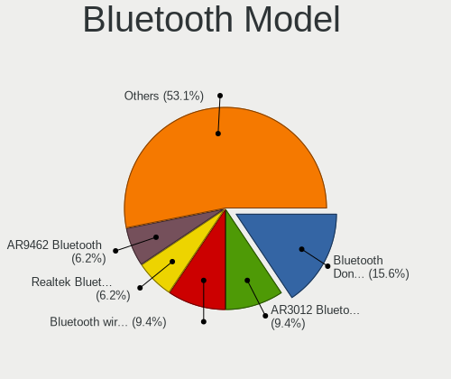

| Model                                                       | Computers | Percent |
|-------------------------------------------------------------|-----------|---------|
| Cambridge Silicon Radio Bluetooth Dongle (HCI mode)         | 4         | 14.29%  |
| Intel Bluetooth wireless interface                          | 3         | 10.71%  |
| Realtek  Bluetooth 4.2 Adapter                              | 2         | 7.14%   |
| Qualcomm Atheros AR9462 Bluetooth                           | 2         | 7.14%   |
| Qualcomm Atheros AR3012 Bluetooth 4.0                       | 2         | 7.14%   |
| Lite-On Atheros AR3012 Bluetooth                            | 2         | 7.14%   |
| Intel Centrino Bluetooth Wireless Transceiver               | 2         | 7.14%   |
| Ralink Motorola BC4 Bluetooth 3.0+HS Adapter                | 1         | 3.57%   |
| Qualcomm Atheros  Bluetooth Device                          | 1         | 3.57%   |
| Qualcomm Atheros Bluetooth USB Host Controller              | 1         | 3.57%   |
| Qualcomm Atheros AR3011 Bluetooth                           | 1         | 3.57%   |
| Lite-On Bluetooth Device                                    | 1         | 3.57%   |
| Intel Bluetooth Device                                      | 1         | 3.57%   |
| Integrated System Solution KY-BT100 Bluetooth Adapter       | 1         | 3.57%   |
| HP Integrated Module with Bluetooth 2.1 Wireless technology | 1         | 3.57%   |
| HP Broadcom 2070 Bluetooth Combo                            | 1         | 3.57%   |
| Foxconn / Hon Hai BCM20702A0                                | 1         | 3.57%   |
| Apple Bluetooth HCI                                         | 1         | 3.57%   |

Sound
-----

Sound Vendor
------------

Sound card vendors

| Vendor                           | Computers | Percent |
|----------------------------------|-----------|---------|
| Intel                            | 41        | 48.81%  |
| AMD                              | 20        | 23.81%  |
| Nvidia                           | 13        | 15.48%  |
| C-Media Electronics              | 3         | 3.57%   |
| Silicon Integrated Systems [SiS] | 2         | 2.38%   |
| Texas Instruments                | 1         | 1.19%   |
| Logitech                         | 1         | 1.19%   |
| Creative Technology              | 1         | 1.19%   |
| Creative Labs                    | 1         | 1.19%   |
| Corsair                          | 1         | 1.19%   |

Sound Model
-----------

Sound card models

| Model                                                                      | Computers | Percent |
|----------------------------------------------------------------------------|-----------|---------|
| Intel 7 Series/C216 Chipset Family High Definition Audio Controller        | 9         | 9.18%   |
| AMD SBx00 Azalia (Intel HDA)                                               | 6         | 6.12%   |
| AMD FCH Azalia Controller                                                  | 6         | 6.12%   |
| Intel NM10/ICH7 Family High Definition Audio Controller                    | 5         | 5.1%    |
| Intel 6 Series/C200 Series Chipset Family High Definition Audio Controller | 5         | 5.1%    |
| Intel Sunrise Point-LP HD Audio                                            | 4         | 4.08%   |
| Intel 82801H (ICH8 Family) HD Audio Controller                             | 4         | 4.08%   |
| Intel 8 Series/C220 Series Chipset High Definition Audio Controller        | 3         | 3.06%   |
| AMD Starship/Matisse HD Audio Controller                                   | 3         | 3.06%   |
| AMD Kabini HDMI/DP Audio                                                   | 3         | 3.06%   |
| Silicon Integrated Systems [SiS] Azalia Audio Controller                   | 2         | 2.04%   |
| Nvidia MCP61 High Definition Audio                                         | 2         | 2.04%   |
| Nvidia GP106 High Definition Audio Controller                              | 2         | 2.04%   |
| Nvidia GF110 High Definition Audio Controller                              | 2         | 2.04%   |
| Intel Xeon E3-1200 v3/4th Gen Core Processor HD Audio Controller           | 2         | 2.04%   |
| Intel Atom Processor Z36xxx/Z37xxx Series High Definition Audio Controller | 2         | 2.04%   |
| Intel 82801I (ICH9 Family) HD Audio Controller                             | 2         | 2.04%   |
| Intel 5 Series/3400 Series Chipset High Definition Audio                   | 2         | 2.04%   |
| C-Media Electronics Audio Adapter                                          | 2         | 2.04%   |
| AMD Turks HDMI Audio [Radeon HD 6500/6600 / 6700M Series]                  | 2         | 2.04%   |
| AMD Cedar HDMI Audio [Radeon HD 5400/6300/7300 Series]                     | 2         | 2.04%   |
| Texas Instruments PCM2900 Audio Codec                                      | 1         | 1.02%   |
| Nvidia TU107 GeForce GTX 1650 High Definition Audio Controller             | 1         | 1.02%   |
| Nvidia TU102 High Definition Audio Controller                              | 1         | 1.02%   |
| Nvidia GP107GL High Definition Audio Controller                            | 1         | 1.02%   |
| Nvidia GM107 High Definition Audio Controller [GeForce 940MX]              | 1         | 1.02%   |
| Nvidia GK107 HDMI Audio Controller                                         | 1         | 1.02%   |
| Nvidia GF119 HDMI Audio Controller                                         | 1         | 1.02%   |
| Nvidia GF116 High Definition Audio Controller                              | 1         | 1.02%   |
| Logitech Logitech USB Microphone                                           | 1         | 1.02%   |
| Intel Wildcat Point-LP High Definition Audio Controller                    | 1         | 1.02%   |
| Intel Haswell-ULT HD Audio Controller                                      | 1         | 1.02%   |
| Intel Comet Lake PCH cAVS                                                  | 1         | 1.02%   |
| Intel Celeron/Pentium Silver Processor High Definition Audio               | 1         | 1.02%   |
| Intel Broadwell-U Audio Controller                                         | 1         | 1.02%   |
| Intel 8 Series HD Audio Controller                                         | 1         | 1.02%   |
| Intel 100 Series/C230 Series Chipset Family HD Audio Controller            | 1         | 1.02%   |
| Creative Technology Sound BlasterX G1                                      | 1         | 1.02%   |
| Creative Labs CA0108/CA10300 [Sound Blaster Audigy Series]                 | 1         | 1.02%   |
| Corsair Corsair VOID PRO Surround USB Adapter                              | 1         | 1.02%   |
| C-Media Electronics CMI8738/CMI8768 PCI Audio                              | 1         | 1.02%   |
| AMD Trinity HDMI Audio Controller                                          | 1         | 1.02%   |
| AMD RV630 HDMI Audio [Radeon HD 2600 PRO/XT / HD 3610]                     | 1         | 1.02%   |
| AMD RV610 HDMI Audio [Radeon HD 2350 PRO / 2400 PRO/XT / HD 3410]          | 1         | 1.02%   |
| AMD Raven/Raven2/Fenghuang HDMI/DP Audio Controller                        | 1         | 1.02%   |
| AMD Kaveri HDMI/DP Audio Controller                                        | 1         | 1.02%   |
| AMD Family 17h/19h HD Audio Controller                                     | 1         | 1.02%   |
| AMD Ellesmere HDMI Audio [Radeon RX 470/480 / 570/580/590]                 | 1         | 1.02%   |
| AMD BeaverCreek HDMI Audio [Radeon HD 6500D and 6400G-6600G series]        | 1         | 1.02%   |

Memory
------

Memory Vendor
-------------

Memory module vendors

| Vendor              | Computers | Percent |
|---------------------|-----------|---------|
| Corsair             | 3         | 25%     |
| Unknown             | 2         | 16.67%  |
| SK Hynix            | 2         | 16.67%  |
| Kingston            | 2         | 16.67%  |
| Smart               | 1         | 8.33%   |
| Samsung Electronics | 1         | 8.33%   |
| G.Skill             | 1         | 8.33%   |

Memory Model
------------

Memory module models

| Model                                                     | Computers | Percent |
|-----------------------------------------------------------|-----------|---------|
| Unknown RAM Module 2GB SODIMM SDRAM                       | 1         | 7.69%   |
| Unknown RAM Module 2048MB DIMM 800MT/s                    | 1         | 7.69%   |
| Unknown RAM Module 1024MB DIMM 667MT/s                    | 1         | 7.69%   |
| Smart RAM SF464128CKHIWDFSEG 4GB SODIMM DDR4 2133MT/s     | 1         | 7.69%   |
| SK Hynix RAM HMT41GS6BFR8A-PB 8192MB SODIMM DDR3 1600MT/s | 1         | 7.69%   |
| SK Hynix RAM HMA851S6AFR6N-UH 4096MB SODIMM DDR4 2667MT/s | 1         | 7.69%   |
| Samsung RAM K4B8G1646B-MYK0 4GB SODIMM DDR3 1600MT/s      | 1         | 7.69%   |
| Kingston RAM KHX2400C11D3/8GX 8GB DIMM DDR3 2400MT/s      | 1         | 7.69%   |
| Kingston RAM 9905428-026.A00LF 2GB SODIMM DDR3 1066MT/s   | 1         | 7.69%   |
| G.Skill RAM F4-3200C16-8GVKB 8192MB DIMM DDR4 3200MT/s    | 1         | 7.69%   |
| Corsair RAM CMY8GX3M2C1600C9 4096MB DIMM DDR3 1600MT/s    | 1         | 7.69%   |
| Corsair RAM CMW16GX4M2C3200C16 8GB DIMM DDR4 3266MT/s     | 1         | 7.69%   |
| Corsair RAM CML16GX3M2A1600C10 8GB DIMM DDR3 1600MT/s     | 1         | 7.69%   |

Memory Kind
-----------

Memory module kinds

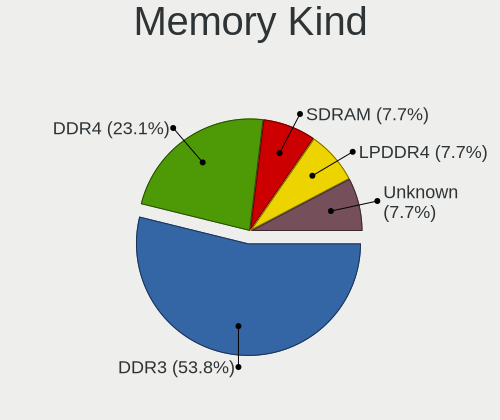

| Kind    | Computers | Percent |
|---------|-----------|---------|
| DDR3    | 4         | 40%     |
| DDR4    | 3         | 30%     |
| SDRAM   | 1         | 10%     |
| LPDDR4  | 1         | 10%     |
| Unknown | 1         | 10%     |

Memory Form Factor
------------------

Physical design of the memory module

| Name   | Computers | Percent |
|--------|-----------|---------|
| SODIMM | 5         | 50%     |
| DIMM   | 5         | 50%     |

Memory Size
-----------

Memory module size

| Size | Computers | Percent |
|------|-----------|---------|
| 8192 | 4         | 33.33%  |
| 4096 | 4         | 33.33%  |
| 2048 | 3         | 25%     |
| 1024 | 1         | 8.33%   |

Memory Speed
------------

Memory module speed

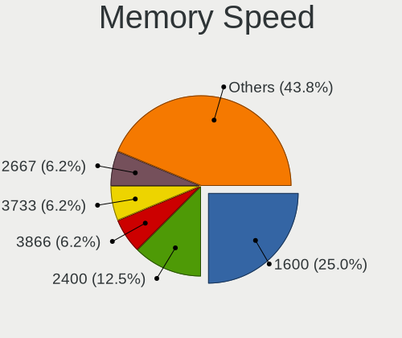

| Speed   | Computers | Percent |
|---------|-----------|---------|
| 1600    | 3         | 25%     |
| 3466    | 1         | 8.33%   |
| 3266    | 1         | 8.33%   |
| 2667    | 1         | 8.33%   |
| 2400    | 1         | 8.33%   |
| 2133    | 1         | 8.33%   |
| 1066    | 1         | 8.33%   |
| 800     | 1         | 8.33%   |
| 667     | 1         | 8.33%   |
| Unknown | 1         | 8.33%   |

Printers & scanners
-------------------

Printer Vendor
--------------

Printer device vendors

| Vendor             | Computers | Percent |
|--------------------|-----------|---------|
| Hewlett-Packard    | 1         | 50%     |
| Brother Industries | 1         | 50%     |

Printer Model
-------------

Printer device models

| Model                  | Computers | Percent |
|------------------------|-----------|---------|
| HP LaserJet 3052       | 1         | 50%     |
| Brother HL-2130 series | 1         | 50%     |

Scanner Vendor
--------------

Scanner device vendors

Zero info for selected period =(

Scanner Model
-------------

Scanner device models

Zero info for selected period =(

Camera
------

Camera Vendor
-------------

Camera device vendors

| Vendor                                 | Computers | Percent |
|----------------------------------------|-----------|---------|
| Chicony Electronics                    | 6         | 17.14%  |
| Suyin                                  | 5         | 14.29%  |
| Realtek Semiconductor                  | 4         | 11.43%  |
| Microdia                               | 4         | 11.43%  |
| IMC Networks                           | 3         | 8.57%   |
| Cheng Uei Precision Industry (Foxlink) | 3         | 8.57%   |
| Silicon Motion                         | 2         | 5.71%   |
| Syntek                                 | 1         | 2.86%   |
| Ricoh                                  | 1         | 2.86%   |
| Quanta                                 | 1         | 2.86%   |
| Microsoft                              | 1         | 2.86%   |
| Logitech                               | 1         | 2.86%   |
| Lite-On Technology                     | 1         | 2.86%   |
| Hewlett-Packard                        | 1         | 2.86%   |
| Apple                                  | 1         | 2.86%   |

Camera Model
------------

Camera device models

| Model                                                       | Computers | Percent |
|-------------------------------------------------------------|-----------|---------|
| Microdia Laptop_Integrated_Webcam_HD                        | 2         | 5.71%   |
| Chicony HD WebCam                                           | 2         | 5.71%   |
| Cheng Uei Precision Industry (Foxlink) HP Webcam            | 2         | 5.71%   |
| Syntek Lenovo EasyCamera                                    | 1         | 2.86%   |
| Suyin HP Webcam-50                                          | 1         | 2.86%   |
| Suyin HP Webcam-101                                         | 1         | 2.86%   |
| Suyin HP Integrated Webcam                                  | 1         | 2.86%   |
| Suyin Acer/Lenovo Webcam [CN0316]                           | 1         | 2.86%   |
| Suyin Acer CrystalEye Webcam                                | 1         | 2.86%   |
| Silicon Motion WebCam SCB-1100N                             | 1         | 2.86%   |
| Silicon Motion Web Camera                                   | 1         | 2.86%   |
| Ricoh Laptop_Integrated_Webcam_FHD                          | 1         | 2.86%   |
| Realtek Lenovo EasyCamera                                   | 1         | 2.86%   |
| Realtek Laptop_Integrated_Webcam_HD                         | 1         | 2.86%   |
| Realtek Integrated_Webcam_HD                                | 1         | 2.86%   |
| Realtek Acer 640 x 480 laptop camera                        | 1         | 2.86%   |
| Quanta HD WebCam                                            | 1         | 2.86%   |
| Microsoft LifeCam HD-3000                                   | 1         | 2.86%   |
| Microdia Webcam Vitade AF                                   | 1         | 2.86%   |
| Microdia USB 2.0 Camera                                     | 1         | 2.86%   |
| Logitech QuickCam Pro 9000                                  | 1         | 2.86%   |
| Lite-On Integrated Camera                                   | 1         | 2.86%   |
| IMC Networks USB2.0 UVC VGA WebCam                          | 1         | 2.86%   |
| IMC Networks USB2.0 HD UVC WebCam                           | 1         | 2.86%   |
| IMC Networks Integrated Webcam                              | 1         | 2.86%   |
| HP Webcam 3100                                              | 1         | 2.86%   |
| Chicony USB2.0 HD UVC WebCam                                | 1         | 2.86%   |
| Chicony TOSHIBA Web Camera - HD                             | 1         | 2.86%   |
| Chicony Integrated Camera                                   | 1         | 2.86%   |
| Chicony HP TrueVision HD Camera                             | 1         | 2.86%   |
| Cheng Uei Precision Industry (Foxlink) HP HD Webcam [Fixed] | 1         | 2.86%   |
| Apple Built-in iSight                                       | 1         | 2.86%   |

Security
--------

Fingerprint Vendor
------------------

Fingerprint sensor vendors

| Vendor           | Computers | Percent |
|------------------|-----------|---------|
| Validity Sensors | 2         | 100%    |

Fingerprint Model
-----------------

Fingerprint sensor models

| Model                                        | Computers | Percent |
|----------------------------------------------|-----------|---------|
| Validity Sensors VFS491                      | 1         | 50%     |
| Validity Sensors VFS 5011 fingerprint sensor | 1         | 50%     |

Chipcard Vendor
---------------

Chipcard module vendors

| Vendor      | Computers | Percent |
|-------------|-----------|---------|
| Broadcom    | 1         | 50%     |
| Alcor Micro | 1         | 50%     |

Chipcard Model
--------------

Chipcard module models

| Model                                          | Computers | Percent |
|------------------------------------------------|-----------|---------|
| Broadcom BCM5880 Secure Applications Processor | 1         | 50%     |
| Alcor Micro AU9540 Smartcard Reader            | 1         | 50%     |

Unsupported
-----------

Unsupported Devices
-------------------

Total unsupported devices on board

| Total | Computers | Percent |
|-------|-----------|---------|
| 0     | 45        | 68.18%  |
| 1     | 20        | 30.3%   |
| 2     | 1         | 1.52%   |

Unsupported Device Types
------------------------

Types of unsupported devices

| Type               | Computers | Percent |
|--------------------|-----------|---------|
| Net/wireless       | 9         | 39.13%  |
| Graphics card      | 8         | 34.78%  |
| Fingerprint reader | 2         | 8.7%    |
| Chipcard           | 2         | 8.7%    |
| Storage            | 1         | 4.35%   |
| Network            | 1         | 4.35%   |

