LinuxFX 10 - Tested Hardware & Statistics (Desktops)
----------------------------------------------------

A project to collect tested hardware configurations for LinuxFX 10.

Anyone can contribute to this report by the [hw-probe](https://github.com/linuxhw/hw-probe) tool:

    sudo -E hw-probe -all -upload

Please contribute! Especially if your hardware is rare.

Contents
--------

* [ Test Cases ](#test-cases)

* [ System ](#system)
  - [ Kernel                   ](#kernel)
  - [ Kernel Family            ](#kernel-family)
  - [ Kernel Major Ver.        ](#kernel-major-ver)
  - [ Arch                     ](#arch)
  - [ DE                       ](#de)
  - [ Display Server           ](#display-server)
  - [ Display Manager          ](#display-manager)
  - [ OS Lang                  ](#os-lang)
  - [ Boot Mode                ](#boot-mode)
  - [ Filesystem               ](#filesystem)
  - [ Part. scheme             ](#part-scheme)
  - [ Dual Boot with Linux/BSD ](#dual-boot-with-linuxbsd)
  - [ Dual Boot (Win)          ](#dual-boot-win)

* [ Board ](#board)
  - [ Vendor                   ](#vendor)
  - [ Model                    ](#model)
  - [ Model Family             ](#model-family)
  - [ MFG Year                 ](#mfg-year)
  - [ Form Factor              ](#form-factor)
  - [ Secure Boot              ](#secure-boot)
  - [ Coreboot                 ](#coreboot)
  - [ RAM Size                 ](#ram-size)
  - [ RAM Used                 ](#ram-used)
  - [ Total Drives             ](#total-drives)
  - [ Has CD-ROM               ](#has-cd-rom)
  - [ Has Ethernet             ](#has-ethernet)
  - [ Has WiFi                 ](#has-wifi)
  - [ Has Bluetooth            ](#has-bluetooth)

* [ Location ](#location)
  - [ Country                  ](#country)
  - [ City                     ](#city)

* [ Drives ](#drives)
  - [ Drive Vendor             ](#drive-vendor)
  - [ Drive Model              ](#drive-model)
  - [ HDD Vendor               ](#hdd-vendor)
  - [ SSD Vendor               ](#ssd-vendor)
  - [ Drive Kind               ](#drive-kind)
  - [ Drive Connector          ](#drive-connector)
  - [ Drive Size               ](#drive-size)
  - [ Space Total              ](#space-total)
  - [ Space Used               ](#space-used)
  - [ Malfunc. Drives          ](#malfunc-drives)
  - [ Malfunc. Drive Vendor    ](#malfunc-drive-vendor)
  - [ Malfunc. HDD Vendor      ](#malfunc-hdd-vendor)
  - [ Malfunc. Drive Kind      ](#malfunc-drive-kind)
  - [ Failed Drives            ](#failed-drives)
  - [ Failed Drive Vendor      ](#failed-drive-vendor)
  - [ Drive Status             ](#drive-status)

* [ Storage controller ](#storage-controller)
  - [ Storage Vendor           ](#storage-vendor)
  - [ Storage Model            ](#storage-model)
  - [ Storage Kind             ](#storage-kind)

* [ Processor ](#processor)
  - [ CPU Vendor               ](#cpu-vendor)
  - [ CPU Model                ](#cpu-model)
  - [ CPU Model Family         ](#cpu-model-family)
  - [ CPU Cores                ](#cpu-cores)
  - [ CPU Sockets              ](#cpu-sockets)
  - [ CPU Threads              ](#cpu-threads)
  - [ CPU Op-Modes             ](#cpu-op-modes)
  - [ CPU Microcode            ](#cpu-microcode)
  - [ CPU Microarch            ](#cpu-microarch)

* [ Graphics ](#graphics)
  - [ GPU Vendor               ](#gpu-vendor)
  - [ GPU Model                ](#gpu-model)
  - [ GPU Combo                ](#gpu-combo)
  - [ GPU Driver               ](#gpu-driver)
  - [ GPU Memory               ](#gpu-memory)

* [ Monitor ](#monitor)
  - [ Monitor Vendor           ](#monitor-vendor)
  - [ Monitor Model            ](#monitor-model)
  - [ Monitor Resolution       ](#monitor-resolution)
  - [ Monitor Diagonal         ](#monitor-diagonal)
  - [ Monitor Width            ](#monitor-width)
  - [ Aspect Ratio             ](#aspect-ratio)
  - [ Monitor Area             ](#monitor-area)
  - [ Pixel Density            ](#pixel-density)
  - [ Multiple Monitors        ](#multiple-monitors)

* [ Network ](#network)
  - [ Net Controller Vendor    ](#net-controller-vendor)
  - [ Net Controller Model     ](#net-controller-model)
  - [ Wireless Vendor          ](#wireless-vendor)
  - [ Wireless Model           ](#wireless-model)
  - [ Ethernet Vendor          ](#ethernet-vendor)
  - [ Ethernet Model           ](#ethernet-model)
  - [ Net Controller Kind      ](#net-controller-kind)
  - [ Used Controller          ](#used-controller)
  - [ NICs                     ](#nics)
  - [ IPv6                     ](#ipv6)

* [ Bluetooth ](#bluetooth)
  - [ Bluetooth Vendor         ](#bluetooth-vendor)
  - [ Bluetooth Model          ](#bluetooth-model)

* [ Sound ](#sound)
  - [ Sound Vendor             ](#sound-vendor)
  - [ Sound Model              ](#sound-model)

* [ Memory ](#memory)
  - [ Memory Vendor            ](#memory-vendor)
  - [ Memory Model             ](#memory-model)
  - [ Memory Kind              ](#memory-kind)
  - [ Memory Form Factor       ](#memory-form-factor)
  - [ Memory Size              ](#memory-size)
  - [ Memory Speed             ](#memory-speed)

* [ Printers & scanners ](#printers--scanners)
  - [ Printer Vendor           ](#printer-vendor)
  - [ Printer Model            ](#printer-model)
  - [ Scanner Vendor           ](#scanner-vendor)
  - [ Scanner Model            ](#scanner-model)

* [ Camera ](#camera)
  - [ Camera Vendor            ](#camera-vendor)
  - [ Camera Model             ](#camera-model)

* [ Security ](#security)
  - [ Fingerprint Vendor       ](#fingerprint-vendor)
  - [ Fingerprint Model        ](#fingerprint-model)
  - [ Chipcard Vendor          ](#chipcard-vendor)
  - [ Chipcard Model           ](#chipcard-model)

* [ Unsupported ](#unsupported)
  - [ Unsupported Devices      ](#unsupported-devices)
  - [ Unsupported Device Types ](#unsupported-device-types)

Test Cases
----------

Total: 32

| Vendor   | Model               | Probe                                                      | Date         |
|----------|---------------------|------------------------------------------------------------|--------------|
| Gigabyte | GA-78LMT-S2P        | [b8194d3077](https://linux-hardware.org/?probe=b8194d3077) | May 01, 2022 |
| Gigabyte | GA-78LMT-S2P        | [3aeeaee161](https://linux-hardware.org/?probe=3aeeaee161) | Apr 23, 2022 |
| ASRock   | 970 Extreme4        | [a30d1aa4b9](https://linux-hardware.org/?probe=a30d1aa4b9) | Dec 29, 2021 |
| Gigabyte | G31M-ES2C           | [5afa9a7018](https://linux-hardware.org/?probe=5afa9a7018) | Dec 23, 2021 |
| ASRock   | 970 Extreme4        | [85b942a5c3](https://linux-hardware.org/?probe=85b942a5c3) | Oct 30, 2021 |
| ASRock   | 970 Extreme4        | [022942c4aa](https://linux-hardware.org/?probe=022942c4aa) | Oct 30, 2021 |
| MSI      | MS-7309             | [33faf5dbef](https://linux-hardware.org/?probe=33faf5dbef) | Oct 14, 2021 |
| MSI      | MS-7309             | [b0ddfaaa86](https://linux-hardware.org/?probe=b0ddfaaa86) | Oct 12, 2021 |
| PCWare   | IPMH61R2            | [62d2476431](https://linux-hardware.org/?probe=62d2476431) | Sep 27, 2021 |
| Gigabyte | X570 UD             | [e1777d09cb](https://linux-hardware.org/?probe=e1777d09cb) | Sep 10, 2021 |
| MSI      | A88XI AC            | [1306310e52](https://linux-hardware.org/?probe=1306310e52) | Aug 02, 2021 |
| MSI      | A88XI AC            | [ebdf5c76be](https://linux-hardware.org/?probe=ebdf5c76be) | Aug 02, 2021 |
| Intel    | DG31PR AAD97573-306 | [a81005ef0b](https://linux-hardware.org/?probe=a81005ef0b) | Jul 10, 2021 |
| ASRock   | B450M Steel Legend  | [42869f7bb5](https://linux-hardware.org/?probe=42869f7bb5) | Jun 20, 2021 |
| Dell     | 0TVR1F A01          | [4022d93b8a](https://linux-hardware.org/?probe=4022d93b8a) | Apr 18, 2021 |
| ASRock   | N68-GE3 UCC         | [f2a9721ca5](https://linux-hardware.org/?probe=f2a9721ca5) | Feb 25, 2021 |
| Gigabyte | G31M-S2C            | [95c9698f2b](https://linux-hardware.org/?probe=95c9698f2b) | Feb 24, 2021 |
| ASRock   | ConRoe1333-D667     | [54121172b8](https://linux-hardware.org/?probe=54121172b8) | Jan 31, 2021 |
| MSI      | B450M PRO-M2 MAX    | [ecbdfd2c54](https://linux-hardware.org/?probe=ecbdfd2c54) | Jan 17, 2021 |
| HP       | 2B1E                | [940750f549](https://linux-hardware.org/?probe=940750f549) | Jan 05, 2021 |
| ASUSTek  | P8Z68-V LE          | [356c40c60b](https://linux-hardware.org/?probe=356c40c60b) | Dec 27, 2020 |
| ASUSTek  | H87-PRO             | [e2287834ae](https://linux-hardware.org/?probe=e2287834ae) | Dec 10, 2020 |
| ASUSTek  | H87-PRO             | [17bd61ae55](https://linux-hardware.org/?probe=17bd61ae55) | Dec 09, 2020 |
| Gigabyte | B450 AORUS M        | [8e3b4356b7](https://linux-hardware.org/?probe=8e3b4356b7) | Dec 03, 2020 |
| Dell     | 0V6D8J A00          | [5b4385cd10](https://linux-hardware.org/?probe=5b4385cd10) | Nov 09, 2020 |
| Dell     | 0V6D8J A00          | [13e1111610](https://linux-hardware.org/?probe=13e1111610) | Nov 09, 2020 |
| Acer     | Aspire TC-105       | [0ee92155a3](https://linux-hardware.org/?probe=0ee92155a3) | Nov 04, 2020 |
| ECS      | A780GM-A            | [cf03b0c26b](https://linux-hardware.org/?probe=cf03b0c26b) | Nov 04, 2020 |
| Gigabyte | 970A-DS3P           | [c5a0f02633](https://linux-hardware.org/?probe=c5a0f02633) | Jul 24, 2020 |
| Dell     | 0Y644J A02          | [96f0709424](https://linux-hardware.org/?probe=96f0709424) | Jul 16, 2020 |
| Gigabyte | B85M-D3H            | [ab9fa86313](https://linux-hardware.org/?probe=ab9fa86313) | Jul 16, 2020 |
| Intel    | B75                 | [dc59852769](https://linux-hardware.org/?probe=dc59852769) | Jul 11, 2020 |

System
------

Kernel
------

Version of the Linux kernel

| Version                     | Desktops | Percent |
|-----------------------------|----------|---------|
| 5.4.0-52-generic            | 6        | 27.27%  |
| 5.4.0-72-generic            | 4        | 18.18%  |
| 5.6.15-windowsfx-10-generic | 2        | 9.09%   |
| 5.5.19-050519-generic       | 2        | 9.09%   |
| 5.4.0-56-generic            | 2        | 9.09%   |
| 5.7.8-windowsfx-generic     | 1        | 4.55%   |
| 5.7.15-050715-generic       | 1        | 4.55%   |
| 5.4.0-88-generic            | 1        | 4.55%   |
| 5.4.0-66-generic            | 1        | 4.55%   |
| 5.4.0-65-generic            | 1        | 4.55%   |
| 5.4.0-107-generic           | 1        | 4.55%   |

Kernel Family
-------------

Linux kernel without a distro release

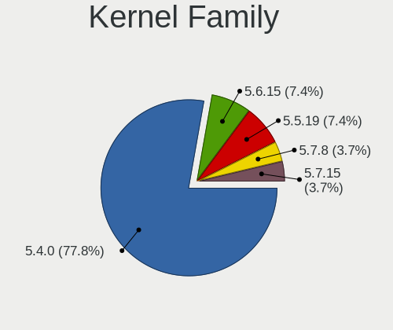

| Version | Desktops | Percent |
|---------|----------|---------|
| 5.4.0   | 16       | 72.73%  |
| 5.6.15  | 2        | 9.09%   |
| 5.5.19  | 2        | 9.09%   |
| 5.7.8   | 1        | 4.55%   |
| 5.7.15  | 1        | 4.55%   |

Kernel Major Ver.
-----------------

Linux kernel major version

| Version | Desktops | Percent |
|---------|----------|---------|
| 5.4     | 16       | 72.73%  |
| 5.7     | 2        | 9.09%   |
| 5.6     | 2        | 9.09%   |
| 5.5     | 2        | 9.09%   |

Arch
----

OS architecture (x86_64, i586, etc.)

| Name   | Desktops | Percent |
|--------|----------|---------|
| x86_64 | 22       | 100%    |

DE
--

Desktop Environment

| Name       | Desktops | Percent |
|------------|----------|---------|
| X-Cinnamon | 16       | 72.73%  |
| KDE        | 5        | 22.73%  |
| Unknown    | 1        | 4.55%   |

Display Server
--------------

X11 or Wayland

| Name | Desktops | Percent |
|------|----------|---------|
| X11  | 22       | 100%    |

Display Manager
---------------

SDDM, LightDM, etc.

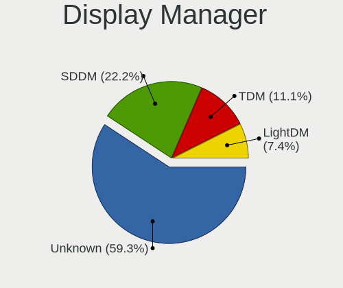

| Name    | Desktops | Percent |
|---------|----------|---------|
| Unknown | 14       | 63.64%  |
| SDDM    | 5        | 22.73%  |
| LightDM | 3        | 13.64%  |

OS Lang
-------

Language

| Lang  | Desktops | Percent |
|-------|----------|---------|
| pt_BR | 6        | 27.27%  |
| en_US | 5        | 22.73%  |
| de_DE | 3        | 13.64%  |
| C     | 2        | 9.09%   |
| sv_SE | 1        | 4.55%   |
| sr_RS | 1        | 4.55%   |
| fr_CA | 1        | 4.55%   |
| en_ZA | 1        | 4.55%   |
| en_IN | 1        | 4.55%   |
| cs_CZ | 1        | 4.55%   |

Boot Mode
---------

EFI or BIOS

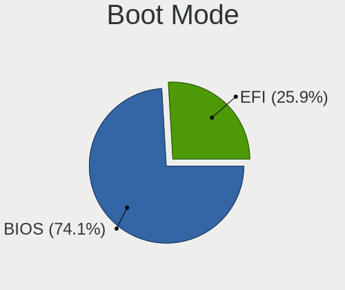

| Mode | Desktops | Percent |
|------|----------|---------|
| BIOS | 16       | 72.73%  |
| EFI  | 6        | 27.27%  |

Filesystem
----------

Type of filesystem

| Type    | Desktops | Percent |
|---------|----------|---------|
| Ext4    | 20       | 90.91%  |
| Xfs     | 1        | 4.55%   |
| Overlay | 1        | 4.55%   |

Part. scheme
------------

Scheme of partitioning

| Type    | Desktops | Percent |
|---------|----------|---------|
| Unknown | 20       | 90.91%  |
| MBR     | 2        | 9.09%   |

Dual Boot with Linux/BSD
------------------------

Hosting more than one Linux/BSD

| Dual boot | Desktops | Percent |
|-----------|----------|---------|
| No        | 16       | 72.73%  |
| Yes       | 6        | 27.27%  |

Dual Boot (Win)
---------------

Hosting Linux and Windows

| Dual boot | Desktops | Percent |
|-----------|----------|---------|
| No        | 13       | 59.09%  |
| Yes       | 9        | 40.91%  |

Board
-----

Vendor
------

Motherboard manufacturer

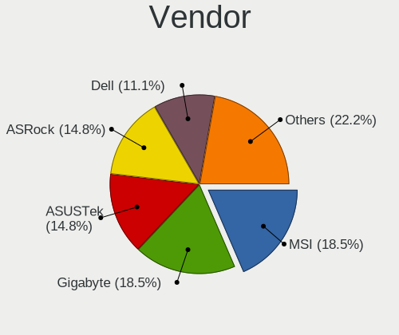

| Name                | Desktops | Percent |
|---------------------|----------|---------|
| Gigabyte Technology | 5        | 22.73%  |
| ASRock              | 4        | 18.18%  |
| MSI                 | 3        | 13.64%  |
| Dell                | 3        | 13.64%  |
| Intel               | 2        | 9.09%   |
| ASUSTek Computer    | 2        | 9.09%   |
| PCWare              | 1        | 4.55%   |
| Hewlett-Packard     | 1        | 4.55%   |
| ECS                 | 1        | 4.55%   |

Model
-----

Motherboard model

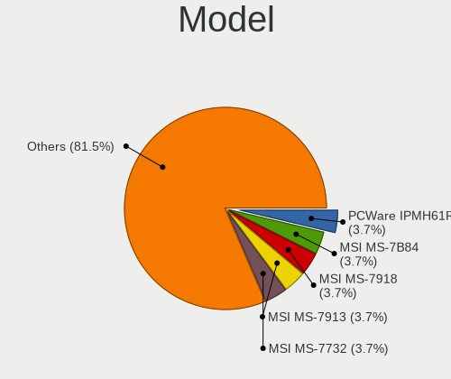

| Name                      | Desktops | Percent |
|---------------------------|----------|---------|
| PCWare IPMH61R2           | 1        | 4.55%   |
| MSI MS-7B84               | 1        | 4.55%   |
| MSI MS-7913               | 1        | 4.55%   |
| MSI MS-7309               | 1        | 4.55%   |
| Intel DG31PR AAD97573-306 | 1        | 4.55%   |
| Intel B75                 | 1        | 4.55%   |
| HP 202 G2 MT              | 1        | 4.55%   |
| Gigabyte X570 UD          | 1        | 4.55%   |
| Gigabyte GA-78LMT-S2P     | 1        | 4.55%   |
| Gigabyte G31M-ES2C        | 1        | 4.55%   |
| Gigabyte B450 AORUS M     | 1        | 4.55%   |
| Gigabyte 970A-DS3P        | 1        | 4.55%   |
| ECS A780GM-A              | 1        | 4.55%   |
| Dell OptiPlex 360         | 1        | 4.55%   |
| Dell OptiPlex 3010        | 1        | 4.55%   |
| Dell Inspiron 3646        | 1        | 4.55%   |
| ASUS P8Z68-V LE           | 1        | 4.55%   |
| ASUS All Series           | 1        | 4.55%   |
| ASRock N68-GE3 UCC        | 1        | 4.55%   |
| ASRock ConRoe1333-D667    | 1        | 4.55%   |
| ASRock B450M Steel Legend | 1        | 4.55%   |
| ASRock 970 Extreme4       | 1        | 4.55%   |

Model Family
------------

Motherboard model prefix

| Name                   | Desktops | Percent |
|------------------------|----------|---------|
| Dell OptiPlex          | 2        | 9.09%   |
| PCWare IPMH61R2        | 1        | 4.55%   |
| MSI MS-7B84            | 1        | 4.55%   |
| MSI MS-7913            | 1        | 4.55%   |
| MSI MS-7309            | 1        | 4.55%   |
| Intel DG31PR           | 1        | 4.55%   |
| Intel B75              | 1        | 4.55%   |
| HP 202                 | 1        | 4.55%   |
| Gigabyte X570          | 1        | 4.55%   |
| Gigabyte GA-78LMT-S2P  | 1        | 4.55%   |
| Gigabyte G31M-ES2C     | 1        | 4.55%   |
| Gigabyte B450          | 1        | 4.55%   |
| Gigabyte 970A-DS3P     | 1        | 4.55%   |
| ECS A780GM-A           | 1        | 4.55%   |
| Dell Inspiron          | 1        | 4.55%   |
| ASUS P8Z68-V           | 1        | 4.55%   |
| ASUS All               | 1        | 4.55%   |
| ASRock N68-GE3         | 1        | 4.55%   |
| ASRock ConRoe1333-D667 | 1        | 4.55%   |
| ASRock B450M           | 1        | 4.55%   |
| ASRock 970             | 1        | 4.55%   |

MFG Year
--------

Motherboard manufacture year

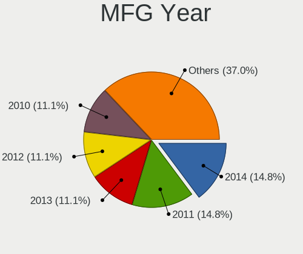

| Year | Desktops | Percent |
|------|----------|---------|
| 2013 | 3        | 13.64%  |
| 2011 | 3        | 13.64%  |
| 2019 | 2        | 9.09%   |
| 2018 | 2        | 9.09%   |
| 2014 | 2        | 9.09%   |
| 2010 | 2        | 9.09%   |
| 2009 | 2        | 9.09%   |
| 2008 | 2        | 9.09%   |
| 2007 | 2        | 9.09%   |
| 2015 | 1        | 4.55%   |
| 2012 | 1        | 4.55%   |

Form Factor
-----------

Physical design of the computer

| Name    | Desktops | Percent |
|---------|----------|---------|
| Desktop | 22       | 100%    |

Secure Boot
-----------

Enabled or disabled

| State    | Desktops | Percent |
|----------|----------|---------|
| Disabled | 22       | 100%    |

Coreboot
--------

Have coreboot on board

| Used | Desktops | Percent |
|------|----------|---------|
| No   | 22       | 100%    |

RAM Size
--------

Total RAM memory

| Size in GB | Desktops | Percent |
|------------|----------|---------|
| 3.01-4.0   | 9        | 40.91%  |
| 16.01-24.0 | 5        | 22.73%  |
| 8.01-16.0  | 4        | 18.18%  |
| 32.01-64.0 | 2        | 9.09%   |
| 1.01-2.0   | 2        | 9.09%   |

RAM Used
--------

Used RAM memory

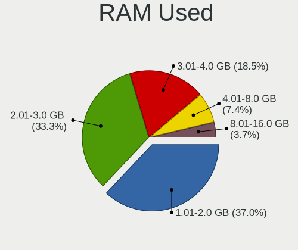

| Used GB   | Desktops | Percent |
|-----------|----------|---------|
| 1.01-2.0  | 9        | 40.91%  |
| 2.01-3.0  | 8        | 36.36%  |
| 3.01-4.0  | 3        | 13.64%  |
| 4.01-8.0  | 1        | 4.55%   |
| 8.01-16.0 | 1        | 4.55%   |

Total Drives
------------

Number of drives on board

| Drives | Desktops | Percent |
|--------|----------|---------|
| 1      | 9        | 40.91%  |
| 2      | 7        | 31.82%  |
| 3      | 5        | 22.73%  |
| 4      | 1        | 4.55%   |

Has CD-ROM
----------

Has CD-ROM on board

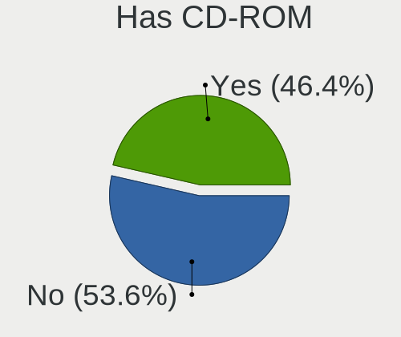

| Presented | Desktops | Percent |
|-----------|----------|---------|
| No        | 14       | 60.87%  |
| Yes       | 9        | 39.13%  |

Has Ethernet
------------

Has Ethernet on board

| Presented | Desktops | Percent |
|-----------|----------|---------|
| Yes       | 22       | 100%    |

Has WiFi
--------

Has WiFi module

| Presented | Desktops | Percent |
|-----------|----------|---------|
| No        | 13       | 59.09%  |
| Yes       | 9        | 40.91%  |

Has Bluetooth
-------------

Has Bluetooth module

| Presented | Desktops | Percent |
|-----------|----------|---------|
| No        | 17       | 77.27%  |
| Yes       | 5        | 22.73%  |

Location
--------

Country
-------

Geographic location (country)

| Country      | Desktops | Percent |
|--------------|----------|---------|
| Brazil       | 6        | 27.27%  |
| USA          | 5        | 22.73%  |
| Germany      | 3        | 13.64%  |
| South Africa | 2        | 9.09%   |
| Sweden       | 1        | 4.55%   |
| Serbia       | 1        | 4.55%   |
| India        | 1        | 4.55%   |
| Czechia      | 1        | 4.55%   |
| Croatia      | 1        | 4.55%   |
| Canada       | 1        | 4.55%   |

City
----

Geographic location (city)

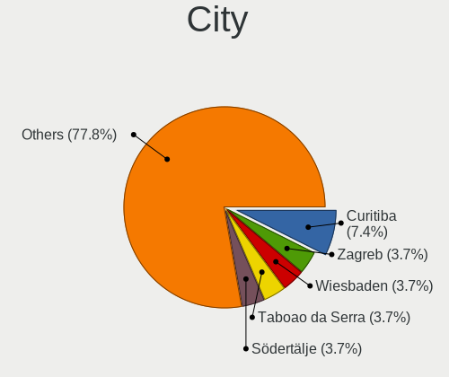

| City            | Desktops | Percent |
|-----------------|----------|---------|
| Curitiba        | 2        | 9.09%   |
| Zagreb          | 1        | 4.55%   |
| Taboao da Serra | 1        | 4.55%   |
| Stockholm       | 1        | 4.55%   |
| Schweinfurt     | 1        | 4.55%   |
| Rio de Janeiro  | 1        | 4.55%   |
| Pretoria        | 1        | 4.55%   |
| Port Elizabeth  | 1        | 4.55%   |
| Ostrava         | 1        | 4.55%   |
| North Lewisburg | 1        | 4.55%   |
| Moreno Valley   | 1        | 4.55%   |
| Montreal        | 1        | 4.55%   |
| Karlsruhe       | 1        | 4.55%   |
| Douglas         | 1        | 4.55%   |
| Coos Bay        | 1        | 4.55%   |
| Castroville     | 1        | 4.55%   |
| Bonn            | 1        | 4.55%   |
| Bhopal          | 1        | 4.55%   |
| Belo Horizonte  | 1        | 4.55%   |
| Belgrade        | 1        | 4.55%   |
| Altamira        | 1        | 4.55%   |

Drives
------

Drive Vendor
------------

Hard drive vendors

| Vendor              | Desktops | Drives | Percent |
|---------------------|----------|--------|---------|
| WDC                 | 9        | 10     | 23.68%  |
| Seagate             | 4        | 7      | 10.53%  |
| Samsung Electronics | 3        | 4      | 7.89%   |
| Hitachi             | 3        | 3      | 7.89%   |
| Toshiba             | 2        | 2      | 5.26%   |
| SanDisk             | 2        | 3      | 5.26%   |
| MAXTOR              | 2        | 2      | 5.26%   |
| Kingston            | 2        | 3      | 5.26%   |
| XPG                 | 1        | 1      | 2.63%   |
| TO Exter            | 1        | 1      | 2.63%   |
| PNY                 | 1        | 1      | 2.63%   |
| Phison              | 1        | 1      | 2.63%   |
| Patriot             | 1        | 1      | 2.63%   |
| OCZ                 | 1        | 1      | 2.63%   |
| Mushkin             | 1        | 1      | 2.63%   |
| Hewlett-Packard     | 1        | 1      | 2.63%   |
| China               | 1        | 1      | 2.63%   |
| ASMT109x            | 1        | 1      | 2.63%   |
| A-DATA Technology   | 1        | 2      | 2.63%   |

Drive Model
-----------

Hard drive models

| Model                              | Desktops | Percent |
|------------------------------------|----------|---------|
| WDC WD10EZEX-08WN4A0 1TB           | 2        | 4.76%   |
| XPG GAMMIX S11 Pro 512GB           | 1        | 2.38%   |
| WDC WD5000AAKX-001CA0 500GB        | 1        | 2.38%   |
| WDC WD5000AACS-00G8B1 500GB        | 1        | 2.38%   |
| WDC WD400JD-55MSA1 40GB            | 1        | 2.38%   |
| WDC WD2500BEVS-22UST0 250GB        | 1        | 2.38%   |
| WDC WD20EZRX-00D8PB0 2TB           | 1        | 2.38%   |
| WDC WD10EARX-00N0YB0 1TB           | 1        | 2.38%   |
| WDC WD1003FZEX-00MK2A0 1TB         | 1        | 2.38%   |
| Toshiba MQ01ACF050 500GB           | 1        | 2.38%   |
| Toshiba MQ01ABD050 500GB           | 1        | 2.38%   |
| TO Exter nal USB 3.0 128GB         | 1        | 2.38%   |
| Seagate ST500LX012-SSHD-8GB        | 1        | 2.38%   |
| Seagate ST500DM002-1BD142 500GB    | 1        | 2.38%   |
| Seagate ST3200826AS 200GB          | 1        | 2.38%   |
| Seagate ST3160318AS 160GB          | 1        | 2.38%   |
| Seagate ST3160215A 160GB           | 1        | 2.38%   |
| Seagate ST31500341AS 1TB           | 1        | 2.38%   |
| Seagate ST250DM000-1BD141 250GB    | 1        | 2.38%   |
| SanDisk SDSSDHII240G 240GB         | 1        | 2.38%   |
| SanDisk SD9SN8W256G1002 256GB SSD  | 1        | 2.38%   |
| Samsung HD501LJ 500GB              | 1        | 2.38%   |
| Samsung HD321KJ 320GB              | 1        | 2.38%   |
| Samsung HD161HJ 41R0186LEN 160GB   | 1        | 2.38%   |
| Samsung HD081GJ 80GB               | 1        | 2.38%   |
| PNY SSD2SC240G1SA754D117-443 240GB | 1        | 2.38%   |
| Phison NVMe SSD Drive 1TB          | 1        | 2.38%   |
| Patriot Burst 120GB SSD            | 1        | 2.38%   |
| OCZ ARC100 240GB SSD               | 1        | 2.38%   |
| Mushkin MKNSSDSR250GB              | 1        | 2.38%   |
| MAXTOR STM3160215AS 160GB          | 1        | 2.38%   |
| MAXTOR 6Y120L0 122GB               | 1        | 2.38%   |
| Kingston SV300S37A120G 120GB SSD   | 1        | 2.38%   |
| Kingston SA400S37480G 480GB SSD    | 1        | 2.38%   |
| Hitachi HUS724040ALE641 4TB        | 1        | 2.38%   |
| Hitachi HDT721032SLA360 320GB      | 1        | 2.38%   |
| Hitachi HDS725050KLA360 500GB      | 1        | 2.38%   |
| HP SSD S700 500GB                  | 1        | 2.38%   |
| China SATA SSD 120GB               | 1        | 2.38%   |
| ASMT109x Config 100MB              | 1        | 2.38%   |
| A-DATA SU800 128GB SSD             | 1        | 2.38%   |

HDD Vendor
----------

Hard disk drive vendors

| Vendor              | Desktops | Drives | Percent |
|---------------------|----------|--------|---------|
| WDC                 | 9        | 10     | 37.5%   |
| Seagate             | 4        | 7      | 16.67%  |
| Samsung Electronics | 3        | 4      | 12.5%   |
| Hitachi             | 3        | 3      | 12.5%   |
| Toshiba             | 2        | 2      | 8.33%   |
| MAXTOR              | 2        | 2      | 8.33%   |
| ASMT109x            | 1        | 1      | 4.17%   |

SSD Vendor
----------

Solid state drive vendors

| Vendor            | Desktops | Drives | Percent |
|-------------------|----------|--------|---------|
| SanDisk           | 2        | 3      | 16.67%  |
| Kingston          | 2        | 3      | 16.67%  |
| TO Exter          | 1        | 1      | 8.33%   |
| PNY               | 1        | 1      | 8.33%   |
| Patriot           | 1        | 1      | 8.33%   |
| OCZ               | 1        | 1      | 8.33%   |
| Mushkin           | 1        | 1      | 8.33%   |
| Hewlett-Packard   | 1        | 1      | 8.33%   |
| China             | 1        | 1      | 8.33%   |
| A-DATA Technology | 1        | 2      | 8.33%   |

Drive Kind
----------

HDD or SSD

| Kind | Desktops | Drives | Percent |
|------|----------|--------|---------|
| HDD  | 18       | 29     | 58.06%  |
| SSD  | 11       | 15     | 35.48%  |
| NVMe | 2        | 2      | 6.45%   |

Drive Connector
---------------

SATA, SAS, NVMe, etc.

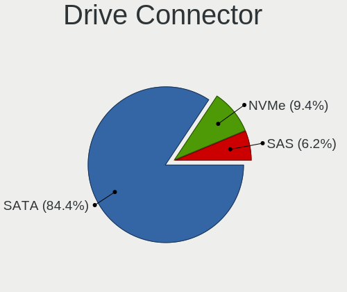

| Type | Desktops | Drives | Percent |
|------|----------|--------|---------|
| SATA | 22       | 43     | 88%     |
| NVMe | 2        | 2      | 8%      |
| SAS  | 1        | 1      | 4%      |

Drive Size
----------

Size of hard drive

| Size in TB | Desktops | Drives | Percent |
|------------|----------|--------|---------|
| 0.01-0.5   | 22       | 36     | 75.86%  |
| 0.51-1.0   | 5        | 6      | 17.24%  |
| 3.01-4.0   | 1        | 1      | 3.45%   |
| 1.01-2.0   | 1        | 1      | 3.45%   |

Space Total
-----------

Amount of disk space available on the file system

| Size in GB | Desktops | Percent |
|------------|----------|---------|
| 101-250    | 7        | 31.82%  |
| 251-500    | 6        | 27.27%  |
| 51-100     | 3        | 13.64%  |
| 21-50      | 2        | 9.09%   |
| 1001-2000  | 2        | 9.09%   |
| 1-20       | 1        | 4.55%   |
| 501-1000   | 1        | 4.55%   |

Space Used
----------

Amount of used disk space

| Used GB | Desktops | Percent |
|---------|----------|---------|
| 1-20    | 10       | 43.48%  |
| 21-50   | 4        | 17.39%  |
| 101-250 | 4        | 17.39%  |
| 51-100  | 3        | 13.04%  |
| 251-500 | 2        | 8.7%    |

Malfunc. Drives
---------------

Drive models with a malfunction

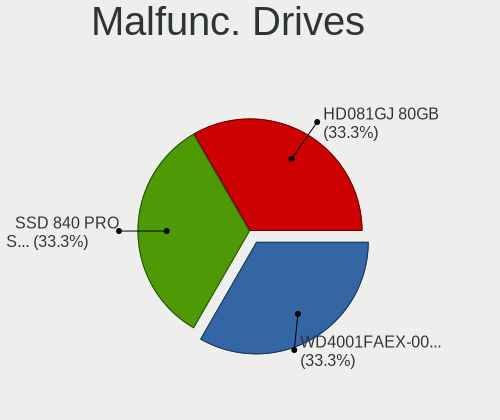

| Model                            | Desktops | Drives | Percent |
|----------------------------------|----------|--------|---------|
| Samsung Electronics HD081GJ 80GB | 1        | 1      | 100%    |

Malfunc. Drive Vendor
---------------------

Vendors of faulty drives

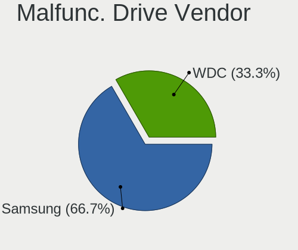

| Vendor              | Desktops | Drives | Percent |
|---------------------|----------|--------|---------|
| Samsung Electronics | 1        | 1      | 100%    |

Malfunc. HDD Vendor
-------------------

Vendors of faulty HDD drives

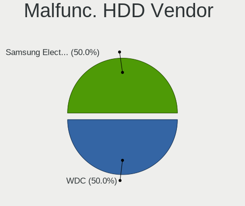

| Vendor              | Desktops | Drives | Percent |
|---------------------|----------|--------|---------|
| Samsung Electronics | 1        | 1      | 100%    |

Malfunc. Drive Kind
-------------------

Kinds of faulty drives

| Kind | Desktops | Drives | Percent |
|------|----------|--------|---------|
| HDD  | 1        | 1      | 100%    |

Failed Drives
-------------

Failed drive models

Zero info for selected period =(

Failed Drive Vendor
-------------------

Failed drive vendors

Zero info for selected period =(

Drive Status
------------

Number of failed and malfunc. drives

| Status   | Desktops | Drives | Percent |
|----------|----------|--------|---------|
| Detected | 21       | 42     | 87.5%   |
| Works    | 2        | 3      | 8.33%   |
| Malfunc  | 1        | 1      | 4.17%   |

Storage controller
------------------

Storage Vendor
--------------

Storage controller vendors

| Vendor             | Desktops | Percent |
|--------------------|----------|---------|
| Intel              | 11       | 44%     |
| AMD                | 9        | 36%     |
| Nvidia             | 2        | 8%      |
| Phison Electronics | 1        | 4%      |
| ASMedia Technology | 1        | 4%      |
| ADATA Technology   | 1        | 4%      |

Storage Model
-------------

Storage controller models

| Model                                                                                   | Desktops | Percent |
|-----------------------------------------------------------------------------------------|----------|---------|
| AMD FCH SATA Controller [AHCI mode]                                                     | 5        | 13.16%  |
| Intel NM10/ICH7 Family SATA Controller [IDE mode]                                       | 4        | 10.53%  |
| AMD SB7x0/SB8x0/SB9x0 IDE Controller                                                    | 4        | 10.53%  |
| Intel 82801G (ICH7 Family) IDE Controller                                               | 3        | 7.89%   |
| AMD 400 Series Chipset SATA Controller                                                  | 3        | 7.89%   |
| Nvidia MCP61 SATA Controller                                                            | 2        | 5.26%   |
| Nvidia MCP61 IDE                                                                        | 2        | 5.26%   |
| Intel 8 Series/C220 Series Chipset Family 6-port SATA Controller 1 [AHCI mode]          | 2        | 5.26%   |
| Intel 6 Series/C200 Series Chipset Family 6 port Desktop SATA AHCI Controller           | 2        | 5.26%   |
| AMD SB7x0/SB8x0/SB9x0 SATA Controller [IDE mode]                                        | 2        | 5.26%   |
| AMD SB7x0/SB8x0/SB9x0 SATA Controller [AHCI mode]                                       | 2        | 5.26%   |
| Phison E16 PCIe4 NVMe Controller                                                        | 1        | 2.63%   |
| Intel Atom Processor E3800 Series SATA AHCI Controller                                  | 1        | 2.63%   |
| Intel 7 Series/C210 Series Chipset Family 6-port SATA Controller [AHCI mode]            | 1        | 2.63%   |
| Intel 6 Series/C200 Series Chipset Family Desktop SATA Controller (IDE mode, ports 4-5) | 1        | 2.63%   |
| Intel 6 Series/C200 Series Chipset Family Desktop SATA Controller (IDE mode, ports 0-3) | 1        | 2.63%   |
| ASMedia ASM1062 Serial ATA Controller                                                   | 1        | 2.63%   |
| ADATA XPG SX8200 Pro PCIe Gen3x4 M.2 2280 Solid State Drive                             | 1        | 2.63%   |

Storage Kind
------------

Kind of storage controller (IDE, SATA, NVMe, SAS, ...)

| Kind | Desktops | Percent |
|------|----------|---------|
| SATA | 15       | 53.57%  |
| IDE  | 11       | 39.29%  |
| NVMe | 2        | 7.14%   |

Processor
---------

CPU Vendor
----------

Processor vendors

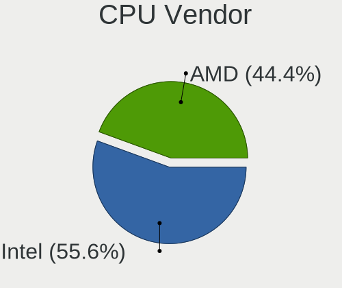

| Vendor | Desktops | Percent |
|--------|----------|---------|
| Intel  | 11       | 50%     |
| AMD    | 11       | 50%     |

CPU Model
---------

Processor models

| Model                                       | Desktops | Percent |
|---------------------------------------------|----------|---------|
| Intel Pentium Dual CPU E2160 @ 1.80GHz      | 1        | 4.55%   |
| Intel Pentium CPU J2900 @ 2.41GHz           | 1        | 4.55%   |
| Intel Pentium CPU G3250 @ 3.20GHz           | 1        | 4.55%   |
| Intel Core i7-4770K CPU @ 3.50GHz           | 1        | 4.55%   |
| Intel Core i7-2600 CPU @ 3.40GHz            | 1        | 4.55%   |
| Intel Core i5-3470 CPU @ 3.20GHz            | 1        | 4.55%   |
| Intel Core i3-3220 CPU @ 3.30GHz            | 1        | 4.55%   |
| Intel Core i3-2100 CPU @ 3.10GHz            | 1        | 4.55%   |
| Intel Core 2 Quad CPU Q8300 @ 2.50GHz       | 1        | 4.55%   |
| Intel Core 2 Duo CPU E8400 @ 3.00GHz        | 1        | 4.55%   |
| Intel Core 2 Duo CPU E4500 @ 2.20GHz        | 1        | 4.55%   |
| AMD Ryzen 9 3900X 12-Core Processor         | 1        | 4.55%   |
| AMD Ryzen 7 3700X 8-Core Processor          | 1        | 4.55%   |
| AMD Ryzen 5 3600 6-Core Processor           | 1        | 4.55%   |
| AMD Ryzen 3 3200G with Radeon Vega Graphics | 1        | 4.55%   |
| AMD Phenom 9650 Quad-Core Processor         | 1        | 4.55%   |
| AMD FX-8320 Eight-Core Processor            | 1        | 4.55%   |
| AMD FX-6300 Six-Core Processor              | 1        | 4.55%   |
| AMD Athlon II X4 640 Processor              | 1        | 4.55%   |
| AMD Athlon II X2 260 Processor              | 1        | 4.55%   |
| AMD Athlon 64 X2 Dual Core Processor 4400+  | 1        | 4.55%   |
| AMD A8-6600K APU with Radeon HD Graphics    | 1        | 4.55%   |

CPU Model Family
----------------

Processor model prefix

| Model              | Desktops | Percent |
|--------------------|----------|---------|
| Intel Pentium      | 2        | 9.09%   |
| Intel Core i7      | 2        | 9.09%   |
| Intel Core i3      | 2        | 9.09%   |
| Intel Core 2 Duo   | 2        | 9.09%   |
| AMD FX             | 2        | 9.09%   |
| Intel Pentium Dual | 1        | 4.55%   |
| Intel Core i5      | 1        | 4.55%   |
| Intel Core 2 Quad  | 1        | 4.55%   |
| AMD Ryzen 9        | 1        | 4.55%   |
| AMD Ryzen 7        | 1        | 4.55%   |
| AMD Ryzen 5        | 1        | 4.55%   |
| AMD Ryzen 3        | 1        | 4.55%   |
| AMD Phenom         | 1        | 4.55%   |
| AMD Athlon II X4   | 1        | 4.55%   |
| AMD Athlon II X2   | 1        | 4.55%   |
| AMD Athlon 64 X2   | 1        | 4.55%   |
| AMD A8             | 1        | 4.55%   |

CPU Cores
---------

Number of processor cores

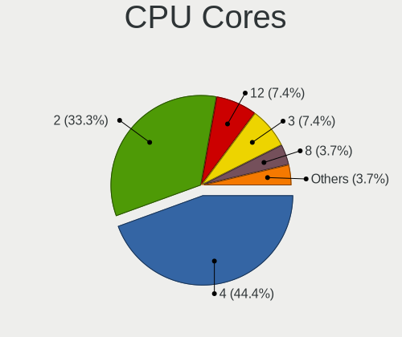

| Number | Desktops | Percent |
|--------|----------|---------|
| 4      | 9        | 40.91%  |
| 2      | 9        | 40.91%  |
| 12     | 1        | 4.55%   |
| 8      | 1        | 4.55%   |
| 6      | 1        | 4.55%   |
| 3      | 1        | 4.55%   |

CPU Sockets
-----------

Number of sockets

| Number | Desktops | Percent |
|--------|----------|---------|
| 1      | 22       | 100%    |

CPU Threads
-----------

Threads per core (Hyper-Threading)

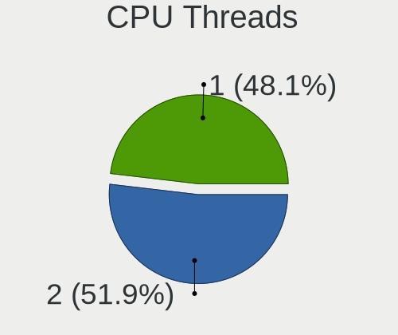

| Number | Desktops | Percent |
|--------|----------|---------|
| 1      | 12       | 54.55%  |
| 2      | 10       | 45.45%  |

CPU Op-Modes
------------

CPU Operation Modes (32-bit, 64-bit)

| Op mode        | Desktops | Percent |
|----------------|----------|---------|
| 32-bit, 64-bit | 22       | 100%    |

CPU Microcode
-------------

Microcode number

| Number     | Desktops | Percent |
|------------|----------|---------|
| Unknown    | 7        | 31.82%  |
| 0x6fd      | 2        | 9.09%   |
| 0x306c3    | 2        | 9.09%   |
| 0x306a9    | 2        | 9.09%   |
| 0x206a7    | 2        | 9.09%   |
| 0x010000c8 | 2        | 9.09%   |
| 0x30678    | 1        | 4.55%   |
| 0x08701013 | 1        | 4.55%   |
| 0x08108109 | 1        | 4.55%   |
| 0x06000852 | 1        | 4.55%   |
| 0x01000095 | 1        | 4.55%   |

CPU Microarch
-------------

Microarchitecture

| Name        | Desktops | Percent |
|-------------|----------|---------|
| Zen 2       | 3        | 13.64%  |
| Piledriver  | 3        | 13.64%  |
| K10         | 3        | 13.64%  |
| SandyBridge | 2        | 9.09%   |
| Penryn      | 2        | 9.09%   |
| IvyBridge   | 2        | 9.09%   |
| Haswell     | 2        | 9.09%   |
| Core        | 2        | 9.09%   |
| Zen+        | 1        | 4.55%   |
| Silvermont  | 1        | 4.55%   |
| K8 Hammer   | 1        | 4.55%   |

Graphics
--------

GPU Vendor
----------

Vendors of graphics cards

| Vendor | Desktops | Percent |
|--------|----------|---------|
| Nvidia | 8        | 34.78%  |
| AMD    | 8        | 34.78%  |
| Intel  | 7        | 30.43%  |

GPU Model
---------

Graphics card models

| Model                                                                       | Desktops | Percent |
|-----------------------------------------------------------------------------|----------|---------|
| Intel Xeon E3-1200 v3/4th Gen Core Processor Integrated Graphics Controller | 2        | 8.7%    |
| Intel 82G33/G31 Express Integrated Graphics Controller                      | 2        | 8.7%    |
| AMD Turks XT [Radeon HD 6670/7670]                                          | 2        | 8.7%    |
| Nvidia TU102 [GeForce RTX 2080 Ti]                                          | 1        | 4.35%   |
| Nvidia GP107 [GeForce GTX 1050 Ti]                                          | 1        | 4.35%   |
| Nvidia GP106 [GeForce GTX 1060 6GB]                                         | 1        | 4.35%   |
| Nvidia GK107 [GeForce GTX 650]                                              | 1        | 4.35%   |
| Nvidia GF116 [GeForce GTS 450 Rev. 2]                                       | 1        | 4.35%   |
| Nvidia GF110 [GeForce GTX 580]                                              | 1        | 4.35%   |
| Nvidia GF110 [GeForce GTX 570]                                              | 1        | 4.35%   |
| Nvidia G96C [GeForce 9500 GT]                                               | 1        | 4.35%   |
| Intel Xeon E3-1200 v2/3rd Gen Core processor Graphics Controller            | 1        | 4.35%   |
| Intel Atom Processor Z36xxx/Z37xxx Series Graphics & Display                | 1        | 4.35%   |
| Intel 2nd Generation Core Processor Family Integrated Graphics Controller   | 1        | 4.35%   |
| AMD RV630 PRO [Radeon HD 2600 PRO]                                          | 1        | 4.35%   |
| AMD RV610 [Radeon HD 2400 PRO]                                              | 1        | 4.35%   |
| AMD Richland [Radeon HD 8570D]                                              | 1        | 4.35%   |
| AMD Picasso/Raven 2 [Radeon Vega Series / Radeon Vega Mobile Series]        | 1        | 4.35%   |
| AMD Ellesmere [Radeon RX 470/480/570/570X/580/580X/590]                     | 1        | 4.35%   |
| AMD Cedar [Radeon HD 5000/6000/7350/8350 Series]                            | 1        | 4.35%   |

GPU Combo
---------

Combinations of graphics cards

| Name       | Desktops | Percent |
|------------|----------|---------|
| 1 x Nvidia | 8        | 36.36%  |
| 1 x AMD    | 8        | 36.36%  |
| 1 x Intel  | 6        | 27.27%  |

GPU Driver
----------

Free vs proprietary

| Driver      | Desktops | Percent |
|-------------|----------|---------|
| Free        | 18       | 78.26%  |
| Unknown     | 4        | 17.39%  |
| Proprietary | 1        | 4.35%   |

GPU Memory
----------

Total video memory

| Size in GB | Desktops | Percent |
|------------|----------|---------|
| Unknown    | 12       | 52.17%  |
| 1.01-2.0   | 3        | 13.04%  |
| 0.51-1.0   | 3        | 13.04%  |
| 0.01-0.5   | 3        | 13.04%  |
| 3.01-4.0   | 2        | 8.7%    |

Monitor
-------

Monitor Vendor
--------------

Monitor vendors

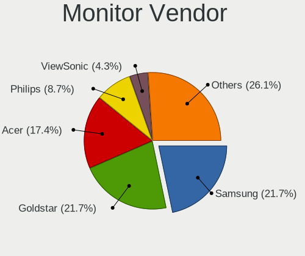

| Vendor              | Desktops | Percent |
|---------------------|----------|---------|
| Goldstar            | 5        | 26.32%  |
| Samsung Electronics | 4        | 21.05%  |
| Acer                | 4        | 21.05%  |
| Philips             | 2        | 10.53%  |
| ViewSonic           | 1        | 5.26%   |
| Sceptre Tech        | 1        | 5.26%   |
| Hewlett-Packard     | 1        | 5.26%   |
| BenQ                | 1        | 5.26%   |

Monitor Model
-------------

Monitor models

| Model                                                                  | Desktops | Percent |
|------------------------------------------------------------------------|----------|---------|
| Goldstar W2043 GSM4E9D 1600x900 450x250mm 20.3-inch                    | 2        | 9.52%   |
| ViewSonic VX3211-2K VSCF634 2560x1440 698x392mm 31.5-inch              | 1        | 4.76%   |
| Sceptre Tech X325BV-FMQR SPT0CB8 1920x1080 700x390mm 31.5-inch         | 1        | 4.76%   |
| Samsung Electronics U28E590 SAM0C4E 3840x2160 608x345mm 27.5-inch      | 1        | 4.76%   |
| Samsung Electronics SyncMaster SAM0593 1920x1080 477x268mm 21.5-inch   | 1        | 4.76%   |
| Samsung Electronics SMBX2331 SAM076F 1920x1080 509x286mm 23.0-inch     | 1        | 4.76%   |
| Samsung Electronics S/T 77/76DFX STN0006 1280x1024 312x234mm 15.4-inch | 1        | 4.76%   |
| Philips LCD Monitor PHLC0BF 1600x900 430x240mm 19.4-inch               | 1        | 4.76%   |
| Philips 170B PHL081D 1280x1024 338x270mm 17.0-inch                     | 1        | 4.76%   |
| Hewlett-Packard LE1851w HWP2840 1366x768 413x234mm 18.7-inch           | 1        | 4.76%   |
| Goldstar W2243 GSM56FF 1920x1080 480x270mm 21.7-inch                   | 1        | 4.76%   |
| Goldstar W1953 GSM4BA6 1360x768 406x229mm 18.4-inch                    | 1        | 4.76%   |
| Goldstar E2441 GSM581F 1920x1080 530x300mm 24.0-inch                   | 1        | 4.76%   |
| BenQ LCD Monitor GL951A 2880x900                                       | 1        | 4.76%   |
| BenQ LCD Monitor GL951A                                                | 1        | 4.76%   |
| BenQ GL951A BNQ7897 1440x900 408x255mm 18.9-inch                       | 1        | 4.76%   |
| Acer V226WL ACR0339 1680x1050 474x296mm 22.0-inch                      | 1        | 4.76%   |
| Acer P225HQ ACR00EA 1920x1080 477x268mm 21.5-inch                      | 1        | 4.76%   |
| Acer G226HQL ACR02EA 1920x1080 477x268mm 21.5-inch                     | 1        | 4.76%   |
| Acer G185HV ACR019F 1366x768 410x230mm 18.5-inch                       | 1        | 4.76%   |

Monitor Resolution
------------------

Monitor screen resolution

| Resolution         | Desktops | Percent |
|--------------------|----------|---------|
| 1920x1080 (FHD)    | 7        | 33.33%  |
| 1600x900 (HD+)     | 3        | 14.29%  |
| 1366x768 (WXGA)    | 2        | 9.52%   |
| 1280x1024 (SXGA)   | 2        | 9.52%   |
| 3840x2160 (4K)     | 1        | 4.76%   |
| 2880x900           | 1        | 4.76%   |
| 2560x1440 (QHD)    | 1        | 4.76%   |
| 1680x1050 (WSXGA+) | 1        | 4.76%   |
| 1440x900 (WXGA+)   | 1        | 4.76%   |
| 1360x768           | 1        | 4.76%   |
| Unknown            | 1        | 4.76%   |

Monitor Diagonal
----------------

Diagonal size in inches

| Inches  | Desktops | Percent |
|---------|----------|---------|
| 21      | 3        | 15%     |
| 18      | 3        | 15%     |
| 31      | 2        | 10%     |
| 23      | 2        | 10%     |
| 20      | 2        | 10%     |
| 19      | 2        | 10%     |
| 27      | 1        | 5%      |
| 24      | 1        | 5%      |
| 22      | 1        | 5%      |
| 17      | 1        | 5%      |
| 15      | 1        | 5%      |
| Unknown | 1        | 5%      |

Monitor Width
-------------

Physical width

| Width in mm | Desktops | Percent |
|-------------|----------|---------|
| 401-500     | 11       | 55%     |
| 601-700     | 3        | 15%     |
| 501-600     | 3        | 15%     |
| 301-350     | 2        | 10%     |
| Unknown     | 1        | 5%      |

Aspect Ratio
------------

Proportional relationship between the width and the height

| Ratio   | Desktops | Percent |
|---------|----------|---------|
| 16/9    | 15       | 75%     |
| 16/10   | 2        | 10%     |
| 5/4     | 1        | 5%      |
| 4/3     | 1        | 5%      |
| Unknown | 1        | 5%      |

Monitor Area
------------

Area in inch²

| Area in inch² | Desktops | Percent |
|----------------|----------|---------|
| 201-250        | 7        | 35%     |
| 151-200        | 4        | 20%     |
| 141-150        | 4        | 20%     |
| 351-500        | 2        | 10%     |
| 301-350        | 1        | 5%      |
| 111-120        | 1        | 5%      |
| Unknown        | 1        | 5%      |

Pixel Density
-------------

Pixels per inch

| Density | Desktops | Percent |
|---------|----------|---------|
| 51-100  | 14       | 70%     |
| 101-120 | 4        | 20%     |
| 121-160 | 1        | 5%      |
| Unknown | 1        | 5%      |

Multiple Monitors
-----------------

Total monitors connected

| Total | Desktops | Percent |
|-------|----------|---------|
| 1     | 19       | 86.36%  |
| 0     | 2        | 9.09%   |
| 2     | 1        | 4.55%   |

Network
-------

Net Controller Vendor
---------------------

Controller vendors

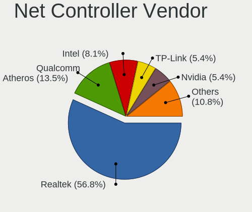

| Vendor                | Desktops | Percent |
|-----------------------|----------|---------|
| Realtek Semiconductor | 19       | 61.29%  |
| Qualcomm Atheros      | 3        | 9.68%   |
| TP-Link               | 2        | 6.45%   |
| Nvidia                | 2        | 6.45%   |
| Qualcomm              | 1        | 3.23%   |
| Intel                 | 1        | 3.23%   |
| CyberTAN Technology   | 1        | 3.23%   |
| Broadcom              | 1        | 3.23%   |
| AVM                   | 1        | 3.23%   |

Net Controller Model
--------------------

Controller models

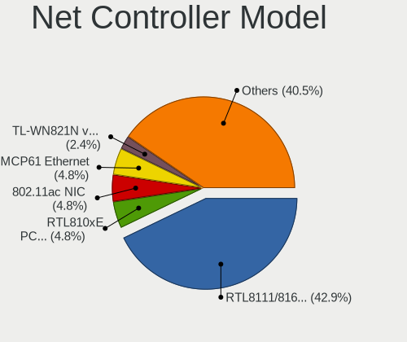

| Model                                                                        | Desktops | Percent |
|------------------------------------------------------------------------------|----------|---------|
| Realtek RTL8111/8168/8411 PCI Express Gigabit Ethernet Controller            | 16       | 44.44%  |
| Realtek RTL810xE PCI Express Fast Ethernet controller                        | 2        | 5.56%   |
| Realtek 802.11ac NIC                                                         | 2        | 5.56%   |
| Nvidia MCP61 Ethernet                                                        | 2        | 5.56%   |
| TP-Link TL-WN821N v5/v6 [RTL8192EU]                                          | 1        | 2.78%   |
| TP-Link Archer T4U ver.3                                                     | 1        | 2.78%   |
| Realtek RTL8812AU 802.11a/b/g/n/ac 2T2R DB WLAN Adapter                      | 1        | 2.78%   |
| Realtek RTL8190 802.11n PCI Wireless Network Adapter                         | 1        | 2.78%   |
| Realtek RTL8188FTV 802.11b/g/n 1T1R 2.4G WLAN Adapter                        | 1        | 2.78%   |
| Realtek RTL8188EUS 802.11n Wireless Network Adapter                          | 1        | 2.78%   |
| Qualcomm Mi A1                                                               | 1        | 2.78%   |
| Qualcomm Atheros QCA9565 / AR9565 Wireless Network Adapter                   | 1        | 2.78%   |
| Qualcomm Atheros AR8151 v2.0 Gigabit Ethernet                                | 1        | 2.78%   |
| Qualcomm Atheros AR5212/5213/2414 Wireless Network Adapter                   | 1        | 2.78%   |
| Intel Wireless 7260                                                          | 1        | 2.78%   |
| CyberTAN Siemens S30853-S1031-R351 802.11g Wireless Adapter [Atheros AR5523] | 1        | 2.78%   |
| Broadcom NetLink BCM5784M Gigabit Ethernet PCIe                              | 1        | 2.78%   |
| AVM FRITZ WLAN N v2 [RT5572/rt2870.bin]                                      | 1        | 2.78%   |

Wireless Vendor
---------------

Wireless vendors

| Vendor                | Desktops | Percent |
|-----------------------|----------|---------|
| Realtek Semiconductor | 5        | 41.67%  |
| TP-Link               | 2        | 16.67%  |
| Qualcomm Atheros      | 2        | 16.67%  |
| Intel                 | 1        | 8.33%   |
| CyberTAN Technology   | 1        | 8.33%   |
| AVM                   | 1        | 8.33%   |

Wireless Model
--------------

Wireless models

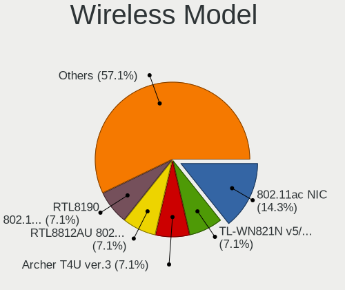

| Model                                                                        | Desktops | Percent |
|------------------------------------------------------------------------------|----------|---------|
| Realtek 802.11ac NIC                                                         | 2        | 15.38%  |
| TP-Link TL-WN821N v5/v6 [RTL8192EU]                                          | 1        | 7.69%   |
| TP-Link Archer T4U ver.3                                                     | 1        | 7.69%   |
| Realtek RTL8812AU 802.11a/b/g/n/ac 2T2R DB WLAN Adapter                      | 1        | 7.69%   |
| Realtek RTL8190 802.11n PCI Wireless Network Adapter                         | 1        | 7.69%   |
| Realtek RTL8188FTV 802.11b/g/n 1T1R 2.4G WLAN Adapter                        | 1        | 7.69%   |
| Realtek RTL8188EUS 802.11n Wireless Network Adapter                          | 1        | 7.69%   |
| Qualcomm Atheros QCA9565 / AR9565 Wireless Network Adapter                   | 1        | 7.69%   |
| Qualcomm Atheros AR5212/5213/2414 Wireless Network Adapter                   | 1        | 7.69%   |
| Intel Wireless 7260                                                          | 1        | 7.69%   |
| CyberTAN Siemens S30853-S1031-R351 802.11g Wireless Adapter [Atheros AR5523] | 1        | 7.69%   |
| AVM FRITZ WLAN N v2 [RT5572/rt2870.bin]                                      | 1        | 7.69%   |

Ethernet Vendor
---------------

Ethernet vendors

| Vendor                | Desktops | Percent |
|-----------------------|----------|---------|
| Realtek Semiconductor | 18       | 78.26%  |
| Nvidia                | 2        | 8.7%    |
| Qualcomm Atheros      | 1        | 4.35%   |
| Qualcomm              | 1        | 4.35%   |
| Broadcom              | 1        | 4.35%   |

Ethernet Model
--------------

Ethernet models

| Model                                                             | Desktops | Percent |
|-------------------------------------------------------------------|----------|---------|
| Realtek RTL8111/8168/8411 PCI Express Gigabit Ethernet Controller | 16       | 69.57%  |
| Realtek RTL810xE PCI Express Fast Ethernet controller             | 2        | 8.7%    |
| Nvidia MCP61 Ethernet                                             | 2        | 8.7%    |
| Qualcomm Mi A1                                                    | 1        | 4.35%   |
| Qualcomm Atheros AR8151 v2.0 Gigabit Ethernet                     | 1        | 4.35%   |
| Broadcom NetLink BCM5784M Gigabit Ethernet PCIe                   | 1        | 4.35%   |

Net Controller Kind
-------------------

Ethernet, WiFi or modem

| Kind     | Desktops | Percent |
|----------|----------|---------|
| Ethernet | 22       | 68.75%  |
| WiFi     | 10       | 31.25%  |

Used Controller
---------------

Currently used network controller

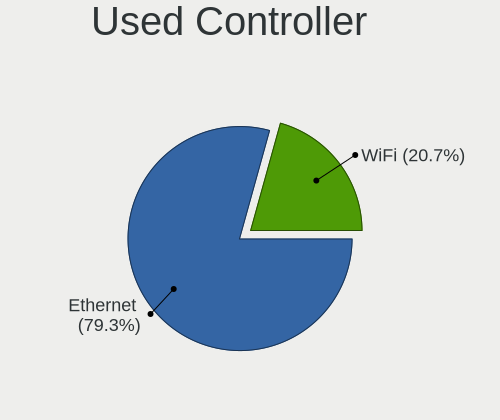

| Kind     | Desktops | Percent |
|----------|----------|---------|
| Ethernet | 19       | 76%     |
| WiFi     | 6        | 24%     |

NICs
----

Total network controllers on board

| Total | Desktops | Percent |
|-------|----------|---------|
| 1     | 17       | 77.27%  |
| 2     | 5        | 22.73%  |

IPv6
----

IPv6 vs IPv4

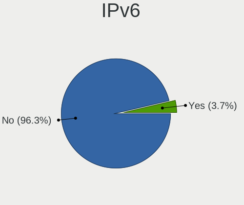

| Used | Desktops | Percent |
|------|----------|---------|
| No   | 22       | 100%    |

Bluetooth
---------

Bluetooth Vendor
----------------

Controller vendors

| Vendor                          | Desktops | Percent |
|---------------------------------|----------|---------|
| Qualcomm Atheros Communications | 2        | 40%     |
| Cambridge Silicon Radio         | 2        | 40%     |
| Integrated System Solution      | 1        | 20%     |

Bluetooth Model
---------------

Controller models

| Model                                                 | Desktops | Percent |
|-------------------------------------------------------|----------|---------|
| Cambridge Silicon Radio Bluetooth Dongle (HCI mode)   | 2        | 40%     |
| Qualcomm Atheros AR9462 Bluetooth                     | 1        | 20%     |
| Qualcomm Atheros AR3011 Bluetooth                     | 1        | 20%     |
| Integrated System Solution KY-BT100 Bluetooth Adapter | 1        | 20%     |

Sound
-----

Sound Vendor
------------

Sound card vendors

| Vendor              | Desktops | Percent |
|---------------------|----------|---------|
| AMD                 | 12       | 30.77%  |
| Intel               | 11       | 28.21%  |
| Nvidia              | 9        | 23.08%  |
| C-Media Electronics | 3        | 7.69%   |
| Texas Instruments   | 1        | 2.56%   |
| Logitech            | 1        | 2.56%   |
| Creative Labs       | 1        | 2.56%   |
| Corsair             | 1        | 2.56%   |

Sound Model
-----------

Sound card models

| Model                                                                      | Desktops | Percent |
|----------------------------------------------------------------------------|----------|---------|
| Intel NM10/ICH7 Family High Definition Audio Controller                    | 4        | 8.89%   |
| AMD SBx00 Azalia (Intel HDA)                                               | 4        | 8.89%   |
| Intel 6 Series/C200 Series Chipset Family High Definition Audio Controller | 3        | 6.67%   |
| AMD Starship/Matisse HD Audio Controller                                   | 3        | 6.67%   |
| Nvidia MCP61 High Definition Audio                                         | 2        | 4.44%   |
| Nvidia GF110 High Definition Audio Controller                              | 2        | 4.44%   |
| Intel 8 Series/C220 Series Chipset High Definition Audio Controller        | 2        | 4.44%   |
| C-Media Electronics Audio Adapter                                          | 2        | 4.44%   |
| AMD Turks HDMI Audio [Radeon HD 6500/6600 / 6700M Series]                  | 2        | 4.44%   |
| Texas Instruments PCM2900 Audio Codec                                      | 1        | 2.22%   |
| Nvidia TU102 High Definition Audio Controller                              | 1        | 2.22%   |
| Nvidia GP107GL High Definition Audio Controller                            | 1        | 2.22%   |
| Nvidia GP106 High Definition Audio Controller                              | 1        | 2.22%   |
| Nvidia GK107 HDMI Audio Controller                                         | 1        | 2.22%   |
| Nvidia GF116 High Definition Audio Controller                              | 1        | 2.22%   |
| Logitech Logitech USB Microphone                                           | 1        | 2.22%   |
| Intel Xeon E3-1200 v3/4th Gen Core Processor HD Audio Controller           | 1        | 2.22%   |
| Intel Atom Processor Z36xxx/Z37xxx Series High Definition Audio Controller | 1        | 2.22%   |
| Intel 7 Series/C216 Chipset Family High Definition Audio Controller        | 1        | 2.22%   |
| Creative Labs CA0108/CA10300 [Sound Blaster Audigy Series]                 | 1        | 2.22%   |
| Corsair Corsair VOID PRO Surround USB Adapter                              | 1        | 2.22%   |
| C-Media Electronics CMI8738/CMI8768 PCI Audio                              | 1        | 2.22%   |
| AMD Trinity HDMI Audio Controller                                          | 1        | 2.22%   |
| AMD RV630 HDMI Audio [Radeon HD 2600 PRO/XT / HD 3610]                     | 1        | 2.22%   |
| AMD RV610 HDMI Audio [Radeon HD 2350 PRO / 2400 PRO/XT / HD 3410]          | 1        | 2.22%   |
| AMD Raven/Raven2/Fenghuang HDMI/DP Audio Controller                        | 1        | 2.22%   |
| AMD FCH Azalia Controller                                                  | 1        | 2.22%   |
| AMD Family 17h/19h HD Audio Controller                                     | 1        | 2.22%   |
| AMD Ellesmere HDMI Audio [Radeon RX 470/480 / 570/580/590]                 | 1        | 2.22%   |
| AMD Cedar HDMI Audio [Radeon HD 5400/6300/7300 Series]                     | 1        | 2.22%   |

Memory
------

Memory Vendor
-------------

Memory module vendors

| Vendor   | Desktops | Percent |
|----------|----------|---------|
| Corsair  | 3        | 50%     |
| Unknown  | 1        | 16.67%  |
| Kingston | 1        | 16.67%  |
| G.Skill  | 1        | 16.67%  |

Memory Model
------------

Memory module models

| Model                                                  | Desktops | Percent |
|--------------------------------------------------------|----------|---------|
| Unknown RAM Module 2048MB DIMM 800MT/s                 | 1        | 14.29%  |
| Unknown RAM Module 1024MB DIMM 667MT/s                 | 1        | 14.29%  |
| Kingston RAM KHX2400C11D3/8GX 8GB DIMM DDR3 2400MT/s   | 1        | 14.29%  |
| G.Skill RAM F4-3200C16-8GVKB 8192MB DIMM DDR4 3200MT/s | 1        | 14.29%  |
| Corsair RAM CMY8GX3M2C1600C9 4096MB DIMM DDR3 1600MT/s | 1        | 14.29%  |
| Corsair RAM CMW16GX4M2C3200C16 8GB DIMM DDR4 3266MT/s  | 1        | 14.29%  |
| Corsair RAM CML16GX3M2A1600C10 8GB DIMM DDR3 1600MT/s  | 1        | 14.29%  |

Memory Kind
-----------

Memory module kinds

| Kind    | Desktops | Percent |
|---------|----------|---------|
| DDR4    | 2        | 40%     |
| DDR3    | 2        | 40%     |
| Unknown | 1        | 20%     |

Memory Form Factor
------------------

Physical design of the memory module

| Name | Desktops | Percent |
|------|----------|---------|
| DIMM | 5        | 100%    |

Memory Size
-----------

Memory module size

| Size | Desktops | Percent |
|------|----------|---------|
| 8192 | 3        | 50%     |
| 4096 | 1        | 16.67%  |
| 2048 | 1        | 16.67%  |
| 1024 | 1        | 16.67%  |

Memory Speed
------------

Memory module speed

| Speed | Desktops | Percent |
|-------|----------|---------|
| 1600  | 2        | 28.57%  |
| 3466  | 1        | 14.29%  |
| 3266  | 1        | 14.29%  |
| 2400  | 1        | 14.29%  |
| 800   | 1        | 14.29%  |
| 667   | 1        | 14.29%  |

Printers & scanners
-------------------

Printer Vendor
--------------

Printer device vendors

| Vendor             | Desktops | Percent |
|--------------------|----------|---------|
| Hewlett-Packard    | 1        | 50%     |
| Brother Industries | 1        | 50%     |

Printer Model
-------------

Printer device models

| Model                  | Desktops | Percent |
|------------------------|----------|---------|
| HP LaserJet 3052       | 1        | 50%     |
| Brother HL-2130 series | 1        | 50%     |

Scanner Vendor
--------------

Scanner device vendors

Zero info for selected period =(

Scanner Model
-------------

Scanner device models

Zero info for selected period =(

Camera
------

Camera Vendor
-------------

Camera device vendors

| Vendor    | Desktops | Percent |
|-----------|----------|---------|
| Microsoft | 1        | 33.33%  |
| Microdia  | 1        | 33.33%  |
| Logitech  | 1        | 33.33%  |

Camera Model
------------

Camera device models

| Model                      | Desktops | Percent |
|----------------------------|----------|---------|
| Microsoft LifeCam HD-3000  | 1        | 33.33%  |
| Microdia Webcam Vitade AF  | 1        | 33.33%  |
| Logitech QuickCam Pro 9000 | 1        | 33.33%  |

Security
--------

Fingerprint Vendor
------------------

Fingerprint sensor vendors

Zero info for selected period =(

Fingerprint Model
-----------------

Fingerprint sensor models

Zero info for selected period =(

Chipcard Vendor
---------------

Chipcard module vendors

Zero info for selected period =(

Chipcard Model
--------------

Chipcard module models

Zero info for selected period =(

Unsupported
-----------

Unsupported Devices
-------------------

Total unsupported devices on board

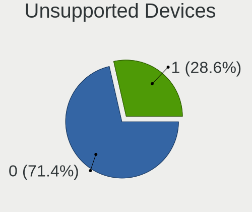

| Total | Desktops | Percent |
|-------|----------|---------|
| 0     | 15       | 65.22%  |
| 1     | 8        | 34.78%  |

Unsupported Device Types
------------------------

Types of unsupported devices

| Type          | Desktops | Percent |
|---------------|----------|---------|
| Net/wireless  | 5        | 55.56%  |
| Graphics card | 4        | 44.44%  |

