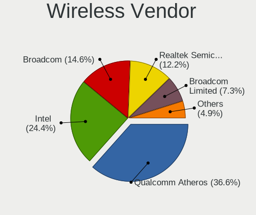
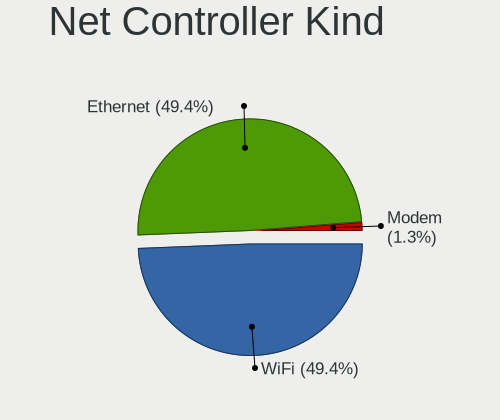
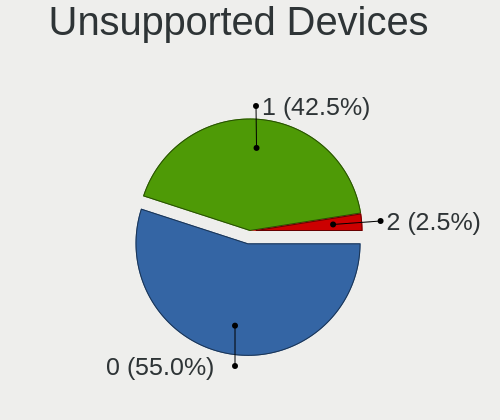

LinuxFX 10 - Tested Hardware & Statistics (Notebooks)
-----------------------------------------------------

A project to collect tested hardware configurations for LinuxFX 10.

Anyone can contribute to this report by the [hw-probe](https://github.com/linuxhw/hw-probe) tool:

    sudo -E hw-probe -all -upload

Please submit a probe of your configuration if it's not presented on the page or is rare.

Full-feature report is available here: https://linux-hardware.org/?view=trends&rel=windowsfx-10

Contents
--------

* [ Test Cases ](#test-cases)

* [ System ](#system)
  - [ Kernel                   ](#kernel)
  - [ Kernel Family            ](#kernel-family)
  - [ Kernel Major Ver.        ](#kernel-major-ver)
  - [ Arch                     ](#arch)
  - [ DE                       ](#de)
  - [ Display Server           ](#display-server)
  - [ Display Manager          ](#display-manager)
  - [ OS Lang                  ](#os-lang)
  - [ Boot Mode                ](#boot-mode)
  - [ Filesystem               ](#filesystem)
  - [ Part. scheme             ](#part-scheme)
  - [ Dual Boot with Linux/BSD ](#dual-boot-with-linuxbsd)
  - [ Dual Boot (Win)          ](#dual-boot-win)

* [ Board ](#board)
  - [ Vendor                   ](#vendor)
  - [ Model                    ](#model)
  - [ Model Family             ](#model-family)
  - [ MFG Year                 ](#mfg-year)
  - [ Form Factor              ](#form-factor)
  - [ Secure Boot              ](#secure-boot)
  - [ Coreboot                 ](#coreboot)
  - [ RAM Size                 ](#ram-size)
  - [ RAM Used                 ](#ram-used)
  - [ Total Drives             ](#total-drives)
  - [ Has CD-ROM               ](#has-cd-rom)
  - [ Has Ethernet             ](#has-ethernet)
  - [ Has WiFi                 ](#has-wifi)
  - [ Has Bluetooth            ](#has-bluetooth)

* [ Location ](#location)
  - [ Country                  ](#country)
  - [ City                     ](#city)

* [ Drives ](#drives)
  - [ Drive Vendor             ](#drive-vendor)
  - [ Drive Model              ](#drive-model)
  - [ HDD Vendor               ](#hdd-vendor)
  - [ SSD Vendor               ](#ssd-vendor)
  - [ Drive Kind               ](#drive-kind)
  - [ Drive Connector          ](#drive-connector)
  - [ Drive Size               ](#drive-size)
  - [ Space Total              ](#space-total)
  - [ Space Used               ](#space-used)
  - [ Malfunc. Drives          ](#malfunc-drives)
  - [ Malfunc. Drive Vendor    ](#malfunc-drive-vendor)
  - [ Malfunc. HDD Vendor      ](#malfunc-hdd-vendor)
  - [ Malfunc. Drive Kind      ](#malfunc-drive-kind)
  - [ Failed Drives            ](#failed-drives)
  - [ Failed Drive Vendor      ](#failed-drive-vendor)
  - [ Drive Status             ](#drive-status)

* [ Storage controller ](#storage-controller)
  - [ Storage Vendor           ](#storage-vendor)
  - [ Storage Model            ](#storage-model)
  - [ Storage Kind             ](#storage-kind)

* [ Processor ](#processor)
  - [ CPU Vendor               ](#cpu-vendor)
  - [ CPU Model                ](#cpu-model)
  - [ CPU Model Family         ](#cpu-model-family)
  - [ CPU Cores                ](#cpu-cores)
  - [ CPU Sockets              ](#cpu-sockets)
  - [ CPU Threads              ](#cpu-threads)
  - [ CPU Op-Modes             ](#cpu-op-modes)
  - [ CPU Microcode            ](#cpu-microcode)
  - [ CPU Microarch            ](#cpu-microarch)

* [ Graphics ](#graphics)
  - [ GPU Vendor               ](#gpu-vendor)
  - [ GPU Model                ](#gpu-model)
  - [ GPU Combo                ](#gpu-combo)
  - [ GPU Driver               ](#gpu-driver)
  - [ GPU Memory               ](#gpu-memory)

* [ Monitor ](#monitor)
  - [ Monitor Vendor           ](#monitor-vendor)
  - [ Monitor Model            ](#monitor-model)
  - [ Monitor Resolution       ](#monitor-resolution)
  - [ Monitor Diagonal         ](#monitor-diagonal)
  - [ Monitor Width            ](#monitor-width)
  - [ Aspect Ratio             ](#aspect-ratio)
  - [ Monitor Area             ](#monitor-area)
  - [ Pixel Density            ](#pixel-density)
  - [ Multiple Monitors        ](#multiple-monitors)

* [ Network ](#network)
  - [ Net Controller Vendor    ](#net-controller-vendor)
  - [ Net Controller Model     ](#net-controller-model)
  - [ Wireless Vendor          ](#wireless-vendor)
  - [ Wireless Model           ](#wireless-model)
  - [ Ethernet Vendor          ](#ethernet-vendor)
  - [ Ethernet Model           ](#ethernet-model)
  - [ Net Controller Kind      ](#net-controller-kind)
  - [ Used Controller          ](#used-controller)
  - [ NICs                     ](#nics)
  - [ IPv6                     ](#ipv6)

* [ Bluetooth ](#bluetooth)
  - [ Bluetooth Vendor         ](#bluetooth-vendor)
  - [ Bluetooth Model          ](#bluetooth-model)

* [ Sound ](#sound)
  - [ Sound Vendor             ](#sound-vendor)
  - [ Sound Model              ](#sound-model)

* [ Memory ](#memory)
  - [ Memory Vendor            ](#memory-vendor)
  - [ Memory Model             ](#memory-model)
  - [ Memory Kind              ](#memory-kind)
  - [ Memory Form Factor       ](#memory-form-factor)
  - [ Memory Size              ](#memory-size)
  - [ Memory Speed             ](#memory-speed)

* [ Printers & scanners ](#printers--scanners)
  - [ Printer Vendor           ](#printer-vendor)
  - [ Printer Model            ](#printer-model)
  - [ Scanner Vendor           ](#scanner-vendor)
  - [ Scanner Model            ](#scanner-model)

* [ Camera ](#camera)
  - [ Camera Vendor            ](#camera-vendor)
  - [ Camera Model             ](#camera-model)

* [ Security ](#security)
  - [ Fingerprint Vendor       ](#fingerprint-vendor)
  - [ Fingerprint Model        ](#fingerprint-model)
  - [ Chipcard Vendor          ](#chipcard-vendor)
  - [ Chipcard Model           ](#chipcard-model)

* [ Unsupported ](#unsupported)
  - [ Unsupported Devices      ](#unsupported-devices)
  - [ Unsupported Device Types ](#unsupported-device-types)

Test Cases
----------

| Vendor   | Model                       | Probe                                                      | Date         |
|----------|-----------------------------|------------------------------------------------------------|--------------|
| Dell     | Latitude E6420              | [dc9a1e9c1b](https://linux-hardware.org/?probe=dc9a1e9c1b) | Oct 18, 2021 |
| HP       | 250 G7 Notebook PC          | [7368bcaf0a](https://linux-hardware.org/?probe=7368bcaf0a) | Oct 04, 2021 |
| HP       | 250 G7 Notebook PC          | [c7ae2849cc](https://linux-hardware.org/?probe=c7ae2849cc) | Sep 30, 2021 |
| Medion   | S4216                       | [677bd3ecb4](https://linux-hardware.org/?probe=677bd3ecb4) | Aug 27, 2021 |
| Medion   | S4216                       | [a0ae7753cf](https://linux-hardware.org/?probe=a0ae7753cf) | Aug 26, 2021 |
| Dell     | Inspiron 3421               | [06a0a6486b](https://linux-hardware.org/?probe=06a0a6486b) | Aug 26, 2021 |
| Dell     | Latitude E5520              | [cae8dd2173](https://linux-hardware.org/?probe=cae8dd2173) | Jul 27, 2021 |
| Dell     | Latitude E5520              | [0112c3a302](https://linux-hardware.org/?probe=0112c3a302) | Jul 22, 2021 |
| Samsung  | 305E4A/305E5A/305E7A        | [3db60d4f9a](https://linux-hardware.org/?probe=3db60d4f9a) | Jun 01, 2021 |
| Lenovo   | ThinkPad T450s 20BWS0YF0... | [7b1e0f2693](https://linux-hardware.org/?probe=7b1e0f2693) | May 11, 2021 |
| Acer     | Aspire 5755G                | [0984c7aebc](https://linux-hardware.org/?probe=0984c7aebc) | Mar 18, 2021 |
| Acer     | Aspire 5755G                | [861fb95171](https://linux-hardware.org/?probe=861fb95171) | Mar 09, 2021 |
| ASUSTek  | K50C                        | [d6ac6b2de1](https://linux-hardware.org/?probe=d6ac6b2de1) | Feb 18, 2021 |
| ASUSTek  | K50C                        | [a899af5e96](https://linux-hardware.org/?probe=a899af5e96) | Feb 18, 2021 |
| Dell     | Inspiron 1525               | [30d9ab855e](https://linux-hardware.org/?probe=30d9ab855e) | Feb 16, 2021 |
| Dell     | Inspiron 1525               | [a37ef6324c](https://linux-hardware.org/?probe=a37ef6324c) | Feb 16, 2021 |
| Lenovo   | ThinkPad X1 Carbon 2nd F... | [799c301ad6](https://linux-hardware.org/?probe=799c301ad6) | Feb 08, 2021 |
| Pegatron | B34C                        | [4c3a4f9ad1](https://linux-hardware.org/?probe=4c3a4f9ad1) | Feb 05, 2021 |
| ASUSTek  | TUF Gaming FX506LI_FX506... | [a22da47202](https://linux-hardware.org/?probe=a22da47202) | Jan 30, 2021 |
| Acer     | Aspire A515-51G             | [3300b2bb9d](https://linux-hardware.org/?probe=3300b2bb9d) | Jan 22, 2021 |
| Lenovo   | Y70-70 Touch 80DU           | [023b353ca8](https://linux-hardware.org/?probe=023b353ca8) | Dec 22, 2020 |
| Acer     | Aspire 5720Z                | [38045109f8](https://linux-hardware.org/?probe=38045109f8) | Nov 29, 2020 |
| Toshiba  | Satellite C50D-A-12R        | [2b5e2b26b2](https://linux-hardware.org/?probe=2b5e2b26b2) | Nov 23, 2020 |
| Gigabyte | P57V6                       | [ec76a0907c](https://linux-hardware.org/?probe=ec76a0907c) | Nov 15, 2020 |
| Acer     | Aspire ES1-512              | [328c13ce38](https://linux-hardware.org/?probe=328c13ce38) | Oct 25, 2020 |
| Acer     | Aspire ES1-512              | [59368b9e58](https://linux-hardware.org/?probe=59368b9e58) | Oct 24, 2020 |
| Acer     | Aspire 6930G                | [1519ec67b5](https://linux-hardware.org/?probe=1519ec67b5) | Sep 07, 2020 |
| Acer     | Aspire 6930G                | [51b6611d94](https://linux-hardware.org/?probe=51b6611d94) | Sep 06, 2020 |
| Dell     | Inspiron 15-3567            | [d7fbcdbfbe](https://linux-hardware.org/?probe=d7fbcdbfbe) | Sep 03, 2020 |
| HP       | Compaq Presario CQ50        | [b82778b925](https://linux-hardware.org/?probe=b82778b925) | Sep 01, 2020 |
| Gigabyte | P57V6                       | [7f8d44d28e](https://linux-hardware.org/?probe=7f8d44d28e) | Aug 30, 2020 |
| HP       | ProBook 6560b               | [99a7a9817b](https://linux-hardware.org/?probe=99a7a9817b) | Aug 26, 2020 |
| HP       | ProBook 6560b               | [b9893a704d](https://linux-hardware.org/?probe=b9893a704d) | Aug 26, 2020 |
| Olivetti | P55-AEU-323-4G320           | [c08737d73c](https://linux-hardware.org/?probe=c08737d73c) | Aug 23, 2020 |
| Lenovo   | G505 20240                  | [aa6a5c7462](https://linux-hardware.org/?probe=aa6a5c7462) | Aug 22, 2020 |
| ASUSTek  | K72Jr                       | [51cd547219](https://linux-hardware.org/?probe=51cd547219) | Aug 18, 2020 |
| ASUSTek  | K72Jr                       | [d68a58547e](https://linux-hardware.org/?probe=d68a58547e) | Aug 15, 2020 |
| Dell     | Inspiron 5423               | [1f3e63e601](https://linux-hardware.org/?probe=1f3e63e601) | Jul 24, 2020 |
| Acer     | Aspire E1-531               | [6104770d46](https://linux-hardware.org/?probe=6104770d46) | Jul 23, 2020 |
| Dell     | Vostro 1000                 | [ffb49e4b86](https://linux-hardware.org/?probe=ffb49e4b86) | Jul 22, 2020 |
| Positivo | Mobile                      | [7ac9083ae4](https://linux-hardware.org/?probe=7ac9083ae4) | Jul 21, 2020 |
| HP       | Mini 210-1000               | [d1e83a2d9b](https://linux-hardware.org/?probe=d1e83a2d9b) | Jul 19, 2020 |
| HP       | 250 G6 Notebook PC          | [bc9d23a74c](https://linux-hardware.org/?probe=bc9d23a74c) | Jul 02, 2020 |
| HP       | 250 G6 Notebook PC          | [b1757b232f](https://linux-hardware.org/?probe=b1757b232f) | Jul 02, 2020 |
| Lenovo   | G550 2958                   | [6cfc44a819](https://linux-hardware.org/?probe=6cfc44a819) | Jun 11, 2020 |
| Lenovo   | G550 2958                   | [95b68a8144](https://linux-hardware.org/?probe=95b68a8144) | Jun 11, 2020 |
| Dell     | Inspiron 3520               | [c78c5e6395](https://linux-hardware.org/?probe=c78c5e6395) | May 16, 2020 |
| HP       | EliteBook Folio 9470m       | [f0b4ebc551](https://linux-hardware.org/?probe=f0b4ebc551) | May 16, 2020 |
| HP       | G42                         | [5c1017a089](https://linux-hardware.org/?probe=5c1017a089) | May 11, 2020 |

System
------

Kernel
------

Version of the Linux kernel

| Version                     | Notebooks | Percent |
|-----------------------------|-----------|---------|
| 5.6.15-windowsfx-10-generic | 5         | 15.15%  |
| 5.4.0-72-generic            | 4         | 12.12%  |
| 5.4.0-52-generic            | 4         | 12.12%  |
| 5.7.15-050715-generic       | 3         | 9.09%   |
| 5.4.0-65-generic            | 3         | 9.09%   |
| 5.4.0-42-generic            | 3         | 9.09%   |
| 5.4.0-29-generic            | 3         | 9.09%   |
| 5.7.8-windowsfx-generic     | 2         | 6.06%   |
| 5.5.19-050519-generic       | 2         | 6.06%   |
| 5.4.0-73-generic            | 2         | 6.06%   |
| 5.4.0-54-generic            | 1         | 3.03%   |
| 5.10.2-051002-generic       | 1         | 3.03%   |

Kernel Family
-------------

Linux kernel without a distro release

| Version | Notebooks | Percent |
|---------|-----------|---------|
| 5.4.0   | 20        | 60.61%  |
| 5.6.15  | 5         | 15.15%  |
| 5.7.15  | 3         | 9.09%   |
| 5.7.8   | 2         | 6.06%   |
| 5.5.19  | 2         | 6.06%   |
| 5.10.2  | 1         | 3.03%   |

Kernel Major Ver.
-----------------

Linux kernel major version

| Version | Notebooks | Percent |
|---------|-----------|---------|
| 5.4     | 20        | 60.61%  |
| 5.7     | 5         | 15.15%  |
| 5.6     | 5         | 15.15%  |
| 5.5     | 2         | 6.06%   |
| 5.10    | 1         | 3.03%   |

Arch
----

OS architecture (x86_64, i586, etc.)

| Name   | Notebooks | Percent |
|--------|-----------|---------|
| x86_64 | 33        | 100%    |

DE
--

Desktop Environment

| Name       | Notebooks | Percent |
|------------|-----------|---------|
| X-Cinnamon | 27        | 81.82%  |
| KDE        | 3         | 9.09%   |
| Cinnamon   | 3         | 9.09%   |

Display Server
--------------

X11 or Wayland

| Name | Notebooks | Percent |
|------|-----------|---------|
| X11  | 33        | 100%    |

Display Manager
---------------

SDDM, LightDM, etc.

| Name    | Notebooks | Percent |
|---------|-----------|---------|
| Unknown | 17        | 51.52%  |
| SDDM    | 9         | 27.27%  |
| LightDM | 7         | 21.21%  |

OS Lang
-------

Language

| Lang  | Notebooks | Percent |
|-------|-----------|---------|
| pt_BR | 11        | 33.33%  |
| pl_PL | 3         | 9.09%   |
| it_IT | 3         | 9.09%   |
| en_US | 3         | 9.09%   |
| fr_FR | 2         | 6.06%   |
| es_ES | 2         | 6.06%   |
| es_AR | 2         | 6.06%   |
| en_AU | 2         | 6.06%   |
| ro_RO | 1         | 3.03%   |
| es_CL | 1         | 3.03%   |
| en_ZA | 1         | 3.03%   |
| en_CA | 1         | 3.03%   |
| C     | 1         | 3.03%   |

Boot Mode
---------

EFI or BIOS

| Mode | Notebooks | Percent |
|------|-----------|---------|
| BIOS | 21        | 63.64%  |
| EFI  | 12        | 36.36%  |

Filesystem
----------

Type of filesystem

| Type | Notebooks | Percent |
|------|-----------|---------|
| Ext4 | 33        | 100%    |

Part. scheme
------------

Scheme of partitioning

| Type    | Notebooks | Percent |
|---------|-----------|---------|
| Unknown | 30        | 90.91%  |
| GPT     | 2         | 6.06%   |
| MBR     | 1         | 3.03%   |

Dual Boot with Linux/BSD
------------------------

Hosting more than one Linux/BSD

| Dual boot | Notebooks | Percent |
|-----------|-----------|---------|
| No        | 29        | 87.88%  |
| Yes       | 4         | 12.12%  |

Dual Boot (Win)
---------------

Hosting Linux and Windows

| Dual boot | Notebooks | Percent |
|-----------|-----------|---------|
| No        | 29        | 87.88%  |
| Yes       | 4         | 12.12%  |

Board
-----

Vendor
------

Motherboard manufacturer

| Name                | Notebooks | Percent |
|---------------------|-----------|---------|
| Hewlett-Packard     | 7         | 21.21%  |
| Dell                | 7         | 21.21%  |
| Lenovo              | 5         | 15.15%  |
| Acer                | 4         | 12.12%  |
| ASUSTek Computer    | 3         | 9.09%   |
| Toshiba             | 1         | 3.03%   |
| Samsung Electronics | 1         | 3.03%   |
| Positivo            | 1         | 3.03%   |
| Pegatron            | 1         | 3.03%   |
| Olivetti            | 1         | 3.03%   |
| Medion              | 1         | 3.03%   |
| Gigabyte Technology | 1         | 3.03%   |

Model
-----

Motherboard model

| Name                                  | Notebooks | Percent |
|---------------------------------------|-----------|---------|
| Toshiba Satellite C50D-A-12R          | 1         | 3.03%   |
| Samsung 305E4A/305E5A/305E7A          | 1         | 3.03%   |
| Positivo Mobile                       | 1         | 3.03%   |
| Pegatron B34C                         | 1         | 3.03%   |
| Olivetti P55-AEU-323-4G320            | 1         | 3.03%   |
| Medion S4216                          | 1         | 3.03%   |
| Lenovo Y70-70 Touch 80DU              | 1         | 3.03%   |
| Lenovo ThinkPad X1 Carbon 2nd F2G3H4J | 1         | 3.03%   |
| Lenovo ThinkPad T450s 20BWS0YF00      | 1         | 3.03%   |
| Lenovo G550 2958                      | 1         | 3.03%   |
| Lenovo G505 20240                     | 1         | 3.03%   |
| HP ProBook 6560b                      | 1         | 3.03%   |
| HP Mini 210-1000                      | 1         | 3.03%   |
| HP G42                                | 1         | 3.03%   |
| HP EliteBook Folio 9470m              | 1         | 3.03%   |
| HP Compaq Presario CQ50               | 1         | 3.03%   |
| HP 250 G7 Notebook PC                 | 1         | 3.03%   |
| HP 250 G6 Notebook PC                 | 1         | 3.03%   |
| Gigabyte P57V6                        | 1         | 3.03%   |
| Dell Vostro 1000                      | 1         | 3.03%   |
| Dell Latitude E6420                   | 1         | 3.03%   |
| Dell Inspiron 5423                    | 1         | 3.03%   |
| Dell Inspiron 3520                    | 1         | 3.03%   |
| Dell Inspiron 3421                    | 1         | 3.03%   |
| Dell Inspiron 1525                    | 1         | 3.03%   |
| Dell Inspiron 15-3567                 | 1         | 3.03%   |
| ASUS TUF Gaming FX506LI_FX506LI       | 1         | 3.03%   |
| ASUS K72Jr                            | 1         | 3.03%   |
| ASUS K50C                             | 1         | 3.03%   |
| Acer Aspire ES1-512                   | 1         | 3.03%   |
| Acer Aspire E1-531                    | 1         | 3.03%   |
| Acer Aspire A515-51G                  | 1         | 3.03%   |
| Acer Aspire 5720Z                     | 1         | 3.03%   |

Model Family
------------

Motherboard model prefix

| Name                       | Notebooks | Percent |
|----------------------------|-----------|---------|
| Dell Inspiron              | 5         | 15.15%  |
| Acer Aspire                | 4         | 12.12%  |
| Lenovo ThinkPad            | 2         | 6.06%   |
| HP 250                     | 2         | 6.06%   |
| Toshiba Satellite          | 1         | 3.03%   |
| Samsung 305E4A             | 1         | 3.03%   |
| Positivo Mobile            | 1         | 3.03%   |
| Pegatron B34C              | 1         | 3.03%   |
| Olivetti P55-AEU-323-4G320 | 1         | 3.03%   |
| Medion S4216               | 1         | 3.03%   |
| Lenovo Y70-70              | 1         | 3.03%   |
| Lenovo G550                | 1         | 3.03%   |
| Lenovo G505                | 1         | 3.03%   |
| HP ProBook                 | 1         | 3.03%   |
| HP Mini                    | 1         | 3.03%   |
| HP G42                     | 1         | 3.03%   |
| HP EliteBook               | 1         | 3.03%   |
| HP Compaq                  | 1         | 3.03%   |
| Gigabyte P57V6             | 1         | 3.03%   |
| Dell Vostro                | 1         | 3.03%   |
| Dell Latitude              | 1         | 3.03%   |
| ASUS TUF                   | 1         | 3.03%   |
| ASUS K72Jr                 | 1         | 3.03%   |
| ASUS K50C                  | 1         | 3.03%   |

MFG Year
--------

Motherboard manufacture year

| Year    | Notebooks | Percent |
|---------|-----------|---------|
| 2013    | 6         | 18.18%  |
| 2011    | 5         | 15.15%  |
| 2019    | 4         | 12.12%  |
| 2015    | 4         | 12.12%  |
| 2018    | 2         | 6.06%   |
| 2014    | 2         | 6.06%   |
| 2012    | 2         | 6.06%   |
| 2009    | 2         | 6.06%   |
| 2008    | 2         | 6.06%   |
| 2020    | 1         | 3.03%   |
| 2010    | 1         | 3.03%   |
| 2006    | 1         | 3.03%   |
| Unknown | 1         | 3.03%   |

Form Factor
-----------

Physical design of the computer

| Name     | Notebooks | Percent |
|----------|-----------|---------|
| Notebook | 33        | 100%    |

Secure Boot
-----------

Enabled or disabled

| State    | Notebooks | Percent |
|----------|-----------|---------|
| Disabled | 32        | 94.12%  |
| Enabled  | 2         | 5.88%   |

Coreboot
--------

Have coreboot on board

| Used | Notebooks | Percent |
|------|-----------|---------|
| No   | 33        | 100%    |

RAM Size
--------

Total RAM memory

| Size in GB | Notebooks | Percent |
|------------|-----------|---------|
| 3.01-4.0   | 15        | 45.45%  |
| 4.01-8.0   | 11        | 33.33%  |
| 16.01-24.0 | 3         | 9.09%   |
| 1.01-2.0   | 2         | 6.06%   |
| 2.01-3.0   | 1         | 3.03%   |
| 8.01-16.0  | 1         | 3.03%   |

RAM Used
--------

Used RAM memory

| Used GB  | Notebooks | Percent |
|----------|-----------|---------|
| 1.01-2.0 | 20        | 58.82%  |
| 3.01-4.0 | 7         | 20.59%  |
| 2.01-3.0 | 5         | 14.71%  |
| 4.01-8.0 | 1         | 2.94%   |
| 0.51-1.0 | 1         | 2.94%   |

Total Drives
------------

Number of drives on board

| Drives | Notebooks | Percent |
|--------|-----------|---------|
| 1      | 28        | 84.85%  |
| 2      | 4         | 12.12%  |
| 3      | 1         | 3.03%   |

Has CD-ROM
----------

Has CD-ROM on board

| Presented | Notebooks | Percent |
|-----------|-----------|---------|
| Yes       | 24        | 72.73%  |
| No        | 9         | 27.27%  |

Has Ethernet
------------

Has Ethernet on board

| Presented | Notebooks | Percent |
|-----------|-----------|---------|
| Yes       | 33        | 100%    |

Has WiFi
--------

Has WiFi module

| Presented | Notebooks | Percent |
|-----------|-----------|---------|
| Yes       | 33        | 100%    |

Has Bluetooth
-------------

Has Bluetooth module

| Presented | Notebooks | Percent |
|-----------|-----------|---------|
| Yes       | 18        | 54.55%  |
| No        | 15        | 45.45%  |

Location
--------

Country
-------

Geographic location (country)

| Country      | Notebooks | Percent |
|--------------|-----------|---------|
| Brazil       | 11        | 33.33%  |
| USA          | 3         | 9.09%   |
| Poland       | 3         | 9.09%   |
| Italy        | 3         | 9.09%   |
| Spain        | 2         | 6.06%   |
| Australia    | 2         | 6.06%   |
| Argentina    | 2         | 6.06%   |
| South Africa | 1         | 3.03%   |
| Russia       | 1         | 3.03%   |
| Romania      | 1         | 3.03%   |
| France       | 1         | 3.03%   |
| Chile        | 1         | 3.03%   |
| Canada       | 1         | 3.03%   |
| Cameroon     | 1         | 3.03%   |

City
----

Geographic location (city)

| City           | Notebooks | Percent |
|----------------|-----------|---------|
| Krakow         | 2         | 5.71%   |
| Curitiba       | 2         | 5.71%   |
| Zielonka       | 1         | 2.86%   |
| Winston-Salem  | 1         | 2.86%   |
| Villemomble    | 1         | 2.86%   |
| Vila Velha     | 1         | 2.86%   |
| Sydney         | 1         | 2.86%   |
| S??o Paulo     | 1         | 2.86%   |
| Sao Bernardo   | 1         | 2.86%   |
| Salerno        | 1         | 2.86%   |
| Saladas        | 1         | 2.86%   |
| Rosario        | 1         | 2.86%   |
| Recife         | 1         | 2.86%   |
| Ramenskoye     | 1         | 2.86%   |
| Porto Alegre   | 1         | 2.86%   |
| Pontevedra     | 1         | 2.86%   |
| Pietra Ligure  | 1         | 2.86%   |
| Monserrato     | 1         | 2.86%   |
| Madrid         | 1         | 2.86%   |
| Londrina       | 1         | 2.86%   |
| Launceston     | 1         | 2.86%   |
| Johannesburg   | 1         | 2.86%   |
| Itatiba        | 1         | 2.86%   |
| Hobart         | 1         | 2.86%   |
| Eureka         | 1         | 2.86%   |
| Edmundston     | 1         | 2.86%   |
| Douala         | 1         | 2.86%   |
| Cincinnati     | 1         | 2.86%   |
| Central        | 1         | 2.86%   |
| Belo Horizonte | 1         | 2.86%   |
| Bel?©m         | 1         | 2.86%   |
| Barcelona      | 1         | 2.86%   |
| Arad           | 1         | 2.86%   |

Drives
------

Drive Vendor
------------

Hard drive vendors

| Vendor              | Notebooks | Drives | Percent |
|---------------------|-----------|--------|---------|
| WDC                 | 7         | 8      | 18.92%  |
| Seagate             | 7         | 7      | 18.92%  |
| Toshiba             | 4         | 4      | 10.81%  |
| Kingston            | 4         | 4      | 10.81%  |
| Samsung Electronics | 3         | 3      | 8.11%   |
| Hitachi             | 3         | 4      | 8.11%   |
| Unknown             | 2         | 3      | 5.41%   |
| LITEONIT            | 2         | 2      | 5.41%   |
| HGST                | 2         | 3      | 5.41%   |
| SanDisk             | 1         | 1      | 2.7%    |
| GOODRAM             | 1         | 1      | 2.7%    |
| A-DATA Technology   | 1         | 1      | 2.7%    |

Drive Model
-----------

Hard drive models

| Model                                | Notebooks | Percent |
|--------------------------------------|-----------|---------|
| Toshiba MQ01ABF050 500GB             | 2         | 5.41%   |
| WDC WD5000LPVX-22V0TT0 500GB         | 1         | 2.7%    |
| WDC WD5000LPVT-24G33T1 500GB         | 1         | 2.7%    |
| WDC WD3200BPVT-22JJ5T0 320GB         | 1         | 2.7%    |
| WDC WD3200BEVT-80A0RT0 320GB         | 1         | 2.7%    |
| WDC WD1200BEVS-75UST0 120GB          | 1         | 2.7%    |
| WDC WD10JPVX-60JC3T1 1TB             | 1         | 2.7%    |
| WDC PC SA530 SDASN8Y-256G-1006 256GB | 1         | 2.7%    |
| Unknown NVMe SSD Drive 512GB         | 1         | 2.7%    |
| Unknown MMC Card  8GB                | 1         | 2.7%    |
| Toshiba MQ01ABF032 320GB             | 1         | 2.7%    |
| Toshiba MK2561GSYN 250GB             | 1         | 2.7%    |
| Seagate ST9320325AS 320GB            | 1         | 2.7%    |
| Seagate ST9160827AS 160GB            | 1         | 2.7%    |
| Seagate ST9160314AS 160GB            | 1         | 2.7%    |
| Seagate ST500LT012-9WS142 500GB      | 1         | 2.7%    |
| Seagate ST500LM021-1KJ152 500GB      | 1         | 2.7%    |
| Seagate ST500LM012 HN-M500MBB 500GB  | 1         | 2.7%    |
| Seagate ST1000LM035-1RK172 1TB       | 1         | 2.7%    |
| SanDisk SSD PLUS 1000GB              | 1         | 2.7%    |
| Samsung SSD 850 EVO 250GB            | 1         | 2.7%    |
| Samsung MZMPC032HBCD-000D1 32GB SSD  | 1         | 2.7%    |
| Samsung HM321HI 320GB                | 1         | 2.7%    |
| LITEONIT LMT-256M6M-HP 256GB SSD     | 1         | 2.7%    |
| LITEONIT LGT-256M6G 256GB SSD        | 1         | 2.7%    |
| Kingston SV300S37A120G 120GB SSD     | 1         | 2.7%    |
| Kingston SUV400S37120G 120GB SSD     | 1         | 2.7%    |
| Kingston SA400S37240G 240GB SSD      | 1         | 2.7%    |
| Kingston NVMe SSD Drive 512GB        | 1         | 2.7%    |
| Hitachi HTS722080K9A300 80GB         | 1         | 2.7%    |
| Hitachi HTS722012K9A300 120GB        | 1         | 2.7%    |
| Hitachi HTS545050B9A300 500GB        | 1         | 2.7%    |
| HGST HTS721010A9E630 1TB             | 1         | 2.7%    |
| HGST HTS545025A7E380 250GB           | 1         | 2.7%    |
| GOODRAM SSDPR-CX300-240 240GB        | 1         | 2.7%    |
| A-DATA SU750 256GB SSD               | 1         | 2.7%    |

HDD Vendor
----------

Hard disk drive vendors

| Vendor              | Notebooks | Drives | Percent |
|---------------------|-----------|--------|---------|
| Seagate             | 7         | 7      | 30.43%  |
| WDC                 | 6         | 6      | 26.09%  |
| Toshiba             | 4         | 4      | 17.39%  |
| Hitachi             | 3         | 4      | 13.04%  |
| HGST                | 2         | 3      | 8.7%    |
| Samsung Electronics | 1         | 1      | 4.35%   |

SSD Vendor
----------

Solid state drive vendors

| Vendor              | Notebooks | Drives | Percent |
|---------------------|-----------|--------|---------|
| Kingston            | 3         | 3      | 27.27%  |
| Samsung Electronics | 2         | 2      | 18.18%  |
| LITEONIT            | 2         | 2      | 18.18%  |
| WDC                 | 1         | 2      | 9.09%   |
| SanDisk             | 1         | 1      | 9.09%   |
| GOODRAM             | 1         | 1      | 9.09%   |
| A-DATA Technology   | 1         | 1      | 9.09%   |

Drive Kind
----------

HDD or SSD

| Kind | Notebooks | Drives | Percent |
|------|-----------|--------|---------|
| HDD  | 22        | 25     | 61.11%  |
| SSD  | 11        | 12     | 30.56%  |
| NVMe | 2         | 3      | 5.56%   |
| MMC  | 1         | 1      | 2.78%   |

Drive Connector
---------------

SATA, SAS, NVMe, etc.

| Type | Notebooks | Drives | Percent |
|------|-----------|--------|---------|
| SATA | 32        | 37     | 91.43%  |
| NVMe | 2         | 3      | 5.71%   |
| MMC  | 1         | 1      | 2.86%   |

Drive Size
----------

Size of hard drive

| Size in TB | Notebooks | Drives | Percent |
|------------|-----------|--------|---------|
| 0.01-0.5   | 29        | 32     | 87.88%  |
| 0.51-1.0   | 4         | 5      | 12.12%  |

Space Total
-----------

Amount of disk space available on the file system

| Size in GB | Notebooks | Percent |
|------------|-----------|---------|
| 101-250    | 14        | 41.18%  |
| 251-500    | 10        | 29.41%  |
| 501-1000   | 3         | 8.82%   |
| 21-50      | 2         | 5.88%   |
| 1001-2000  | 2         | 5.88%   |
| 51-100     | 2         | 5.88%   |
| 1-20       | 1         | 2.94%   |

Space Used
----------

Amount of used disk space

| Used GB  | Notebooks | Percent |
|----------|-----------|---------|
| 1-20     | 18        | 52.94%  |
| 21-50    | 11        | 32.35%  |
| 501-1000 | 2         | 5.88%   |
| 251-500  | 1         | 2.94%   |
| 101-250  | 1         | 2.94%   |
| 51-100   | 1         | 2.94%   |

Malfunc. Drives
---------------

Drive models with a malfunction

| Model                           | Notebooks | Drives | Percent |
|---------------------------------|-----------|--------|---------|
| Seagate ST500LT012-9WS142 500GB | 1         | 1      | 50%     |
| Hitachi HTS722012K9A300 120GB   | 1         | 1      | 50%     |

Malfunc. Drive Vendor
---------------------

Vendors of faulty drives

| Vendor  | Notebooks | Drives | Percent |
|---------|-----------|--------|---------|
| Seagate | 1         | 1      | 50%     |
| Hitachi | 1         | 1      | 50%     |

Malfunc. HDD Vendor
-------------------

Vendors of faulty HDD drives

| Vendor  | Notebooks | Drives | Percent |
|---------|-----------|--------|---------|
| Seagate | 1         | 1      | 50%     |
| Hitachi | 1         | 1      | 50%     |

Malfunc. Drive Kind
-------------------

Kinds of faulty drives

| Kind | Notebooks | Drives | Percent |
|------|-----------|--------|---------|
| HDD  | 2         | 2      | 100%    |

Failed Drives
-------------

Failed drive models

Zero info for selected period =(

Failed Drive Vendor
-------------------

Failed drive vendors

Zero info for selected period =(

Drive Status
------------

Number of failed and malfunc. drives

| Status   | Notebooks | Drives | Percent |
|----------|-----------|--------|---------|
| Detected | 30        | 37     | 88.24%  |
| Malfunc  | 2         | 2      | 5.88%   |
| Works    | 2         | 2      | 5.88%   |

Storage controller
------------------

Storage Vendor
--------------

Storage controller vendors

| Vendor                           | Notebooks | Percent |
|----------------------------------|-----------|---------|
| Intel                            | 26        | 74.29%  |
| AMD                              | 5         | 14.29%  |
| Silicon Integrated Systems [SiS] | 2         | 5.71%   |
| Kingston Technology Company      | 1         | 2.86%   |
| ADATA Technology                 | 1         | 2.86%   |

Storage Model
-------------

Storage controller models

| Model                                                                          | Notebooks | Percent |
|--------------------------------------------------------------------------------|-----------|---------|
| Intel 7 Series Chipset Family 6-port SATA Controller [AHCI mode]               | 5         | 11.63%  |
| Intel Sunrise Point-LP SATA Controller [AHCI mode]                             | 3         | 6.98%   |
| AMD FCH SATA Controller [AHCI mode]                                            | 3         | 6.98%   |
| Silicon Integrated Systems [SiS] SATA Controller / IDE mode                    | 2         | 4.65%   |
| Silicon Integrated Systems [SiS] 5513 IDE Controller                           | 2         | 4.65%   |
| Intel 82801IBM/IEM (ICH9M/ICH9M-E) 4 port SATA Controller [AHCI mode]          | 2         | 4.65%   |
| Intel 82801HM/HEM (ICH8M/ICH8M-E) SATA Controller [AHCI mode]                  | 2         | 4.65%   |
| Intel 82801HM/HEM (ICH8M/ICH8M-E) IDE Controller                               | 2         | 4.65%   |
| Intel 82801 Mobile SATA Controller [RAID mode]                                 | 2         | 4.65%   |
| Intel 7 Series Chipset Family 4-port SATA Controller [IDE mode]                | 2         | 4.65%   |
| Intel 7 Series Chipset Family 2-port SATA Controller [IDE mode]                | 2         | 4.65%   |
| Intel 5 Series/3400 Series Chipset 4 port SATA AHCI Controller                 | 2         | 4.65%   |
| Kingston Company Company Non-Volatile memory controller                        | 1         | 2.33%   |
| Intel Wildcat Point-LP SATA Controller [AHCI Mode]                             | 1         | 2.33%   |
| Intel NM10/ICH7 Family SATA Controller [AHCI mode]                             | 1         | 2.33%   |
| Intel HM170/QM170 Chipset SATA Controller [AHCI Mode]                          | 1         | 2.33%   |
| Intel Celeron/Pentium Silver Processor SATA Controller                         | 1         | 2.33%   |
| Intel Atom Processor E3800 Series SATA AHCI Controller                         | 1         | 2.33%   |
| Intel 8 Series/C220 Series Chipset Family 6-port SATA Controller 1 [AHCI mode] | 1         | 2.33%   |
| Intel 8 Series SATA Controller 1 [AHCI mode]                                   | 1         | 2.33%   |
| Intel 6 Series/C200 Series Chipset Family 6 port Mobile SATA AHCI Controller   | 1         | 2.33%   |
| Intel 400 Series Chipset Family SATA AHCI Controller                           | 1         | 2.33%   |
| AMD SB600 Non-Raid-5 SATA                                                      | 1         | 2.33%   |
| AMD SB600 IDE                                                                  | 1         | 2.33%   |
| AMD FCH SATA Controller [IDE mode]                                             | 1         | 2.33%   |
| ADATA XPG SX8200 Pro PCIe Gen3x4 M.2 2280 Solid State Drive                    | 1         | 2.33%   |

Storage Kind
------------

Kind of storage controller (IDE, SATA, NVMe, SAS, ...)

| Kind | Notebooks | Percent |
|------|-----------|---------|
| SATA | 28        | 71.79%  |
| IDE  | 7         | 17.95%  |
| RAID | 2         | 5.13%   |
| NVMe | 2         | 5.13%   |

Processor
---------

CPU Vendor
----------

Processor vendors

| Vendor | Notebooks | Percent |
|--------|-----------|---------|
| Intel  | 28        | 84.85%  |
| AMD    | 5         | 15.15%  |

CPU Model
---------

Processor models

| Model                                       | Notebooks | Percent |
|---------------------------------------------|-----------|---------|
| AMD A4-5000 APU with Radeon HD Graphics     | 3         | 9.09%   |
| Intel Core i3 CPU M 370 @ 2.40GHz           | 2         | 6.06%   |
| Intel Pentium Dual-Core CPU T4300 @ 2.10GHz | 1         | 3.03%   |
| Intel Pentium Dual CPU T3200 @ 2.00GHz      | 1         | 3.03%   |
| Intel Pentium Dual CPU T2390 @ 1.86GHz      | 1         | 3.03%   |
| Intel Pentium Dual CPU T2370 @ 1.73GHz      | 1         | 3.03%   |
| Intel Pentium CPU B960 @ 2.20GHz            | 1         | 3.03%   |
| Intel Core i7-7500U CPU @ 2.70GHz           | 1         | 3.03%   |
| Intel Core i7-6700HQ CPU @ 2.60GHz          | 1         | 3.03%   |
| Intel Core i7-5600U CPU @ 2.60GHz           | 1         | 3.03%   |
| Intel Core i7-4720HQ CPU @ 2.60GHz          | 1         | 3.03%   |
| Intel Core i7-4600U CPU @ 2.10GHz           | 1         | 3.03%   |
| Intel Core i5-7200U CPU @ 2.50GHz           | 1         | 3.03%   |
| Intel Core i5-3437U CPU @ 1.90GHz           | 1         | 3.03%   |
| Intel Core i5-3337U CPU @ 1.80GHz           | 1         | 3.03%   |
| Intel Core i5-3230M CPU @ 2.60GHz           | 1         | 3.03%   |
| Intel Core i5-3210M CPU @ 2.50GHz           | 1         | 3.03%   |
| Intel Core i5-2520M CPU @ 2.50GHz           | 1         | 3.03%   |
| Intel Core i5-2410M CPU @ 2.30GHz           | 1         | 3.03%   |
| Intel Core i5-10300H CPU @ 2.50GHz          | 1         | 3.03%   |
| Intel Core i3-7020U CPU @ 2.30GHz           | 1         | 3.03%   |
| Intel Core i3-3227U CPU @ 1.90GHz           | 1         | 3.03%   |
| Intel Core i3-3217U CPU @ 1.80GHz           | 1         | 3.03%   |
| Intel Core 2 Duo CPU T6400 @ 2.00GHz        | 1         | 3.03%   |
| Intel Celeron N4000 CPU @ 1.10GHz           | 1         | 3.03%   |
| Intel Celeron D CPU 220 @ 1.20GHz           | 1         | 3.03%   |
| Intel Celeron CPU N2940 @ 1.83GHz           | 1         | 3.03%   |
| Intel Atom CPU N450 @ 1.66GHz               | 1         | 3.03%   |
| AMD Athlon 64 X2 Dual-Core Processor TK-55  | 1         | 3.03%   |
| AMD A6-3420M APU with Radeon HD Graphics    | 1         | 3.03%   |

CPU Model Family
----------------

Processor model prefix

| Model                   | Notebooks | Percent |
|-------------------------|-----------|---------|
| Intel Core i5           | 8         | 24.24%  |
| Intel Core i7           | 5         | 15.15%  |
| Intel Core i3           | 5         | 15.15%  |
| Intel Pentium Dual      | 3         | 9.09%   |
| AMD A4                  | 3         | 9.09%   |
| Intel Celeron           | 2         | 6.06%   |
| Intel Pentium Dual-Core | 1         | 3.03%   |
| Intel Pentium           | 1         | 3.03%   |
| Intel Core 2 Duo        | 1         | 3.03%   |
| Intel Celeron D         | 1         | 3.03%   |
| Intel Atom              | 1         | 3.03%   |
| AMD Athlon 64 X2        | 1         | 3.03%   |
| AMD A6                  | 1         | 3.03%   |

CPU Cores
---------

Number of processor cores

| Number | Notebooks | Percent |
|--------|-----------|---------|
| 2      | 22        | 66.67%  |
| 4      | 8         | 24.24%  |
| 1      | 3         | 9.09%   |

CPU Sockets
-----------

Number of sockets

| Number | Notebooks | Percent |
|--------|-----------|---------|
| 1      | 33        | 100%    |

CPU Threads
-----------

Threads per core (Hyper-Threading)

| Number | Notebooks | Percent |
|--------|-----------|---------|
| 2      | 17        | 51.52%  |
| 1      | 16        | 48.48%  |

CPU Op-Modes
------------

CPU Operation Modes (32-bit, 64-bit)

| Op mode        | Notebooks | Percent |
|----------------|-----------|---------|
| 32-bit, 64-bit | 33        | 100%    |

CPU Microcode
-------------

Microcode number

| Number     | Notebooks | Percent |
|------------|-----------|---------|
| 0x306a9    | 6         | 18.18%  |
| Unknown    | 4         | 12.12%  |
| 0x806e9    | 3         | 9.09%   |
| 0x6fd      | 3         | 9.09%   |
| 0x206a7    | 3         | 9.09%   |
| 0x20655    | 2         | 6.06%   |
| 0x0700010f | 2         | 6.06%   |
| 0xa0652    | 1         | 3.03%   |
| 0x706a1    | 1         | 3.03%   |
| 0x506e3    | 1         | 3.03%   |
| 0x40651    | 1         | 3.03%   |
| 0x306d4    | 1         | 3.03%   |
| 0x30678    | 1         | 3.03%   |
| 0x1067a    | 1         | 3.03%   |
| 0x10661    | 1         | 3.03%   |
| 0x07000106 | 1         | 3.03%   |
| 0x03000027 | 1         | 3.03%   |

CPU Microarch
-------------

Microarchitecture

| Name          | Notebooks | Percent |
|---------------|-----------|---------|
| IvyBridge     | 6         | 18.18%  |
| Core          | 4         | 12.12%  |
| SandyBridge   | 3         | 9.09%   |
| KabyLake      | 3         | 9.09%   |
| Jaguar        | 3         | 9.09%   |
| Westmere      | 2         | 6.06%   |
| Penryn        | 2         | 6.06%   |
| Haswell       | 2         | 6.06%   |
| Skylake       | 1         | 3.03%   |
| Silvermont    | 1         | 3.03%   |
| K8 Hammer     | 1         | 3.03%   |
| K10 Llano     | 1         | 3.03%   |
| Goldmont plus | 1         | 3.03%   |
| CometLake     | 1         | 3.03%   |
| Broadwell     | 1         | 3.03%   |
| Bonnell       | 1         | 3.03%   |

Graphics
--------

GPU Vendor
----------

Vendors of graphics cards

| Vendor                           | Notebooks | Percent |
|----------------------------------|-----------|---------|
| Intel                            | 25        | 64.1%   |
| Nvidia                           | 6         | 15.38%  |
| AMD                              | 6         | 15.38%  |
| Silicon Integrated Systems [SiS] | 2         | 5.13%   |

GPU Model
---------

Graphics card models

| Model                                                                     | Notebooks | Percent |
|---------------------------------------------------------------------------|-----------|---------|
| Intel 3rd Gen Core processor Graphics Controller                          | 6         | 14.63%  |
| Intel HD Graphics 620                                                     | 3         | 7.32%   |
| Intel 2nd Generation Core Processor Family Integrated Graphics Controller | 3         | 7.32%   |
| AMD Kabini [Radeon HD 8330]                                               | 3         | 7.32%   |
| Silicon Integrated Systems [SiS] 771/671 PCIE VGA Display Adapter         | 2         | 4.88%   |
| Intel Mobile GM965/GL960 Integrated Graphics Controller (secondary)       | 2         | 4.88%   |
| Intel Mobile GM965/GL960 Integrated Graphics Controller (primary)         | 2         | 4.88%   |
| Intel Mobile 4 Series Chipset Integrated Graphics Controller              | 2         | 4.88%   |
| Nvidia TU117M [GeForce GTX 1650 Ti Mobile]                                | 1         | 2.44%   |
| Nvidia GP106M [GeForce GTX 1060 Mobile]                                   | 1         | 2.44%   |
| Nvidia GM108M [GeForce 940MX]                                             | 1         | 2.44%   |
| Nvidia GM107M [GeForce GTX 960M]                                          | 1         | 2.44%   |
| Nvidia GF119M [NVS 4200M]                                                 | 1         | 2.44%   |
| Nvidia G84M [GeForce 8600M GT]                                            | 1         | 2.44%   |
| Intel HD Graphics 5500                                                    | 1         | 2.44%   |
| Intel HD Graphics 530                                                     | 1         | 2.44%   |
| Intel Haswell-ULT Integrated Graphics Controller                          | 1         | 2.44%   |
| Intel GeminiLake [UHD Graphics 600]                                       | 1         | 2.44%   |
| Intel Core Processor Integrated Graphics Controller                       | 1         | 2.44%   |
| Intel CometLake-H GT2 [UHD Graphics]                                      | 1         | 2.44%   |
| Intel Atom Processor Z36xxx/Z37xxx Series Graphics & Display              | 1         | 2.44%   |
| Intel Atom Processor D4xx/D5xx/N4xx/N5xx Integrated Graphics Controller   | 1         | 2.44%   |
| Intel 4th Gen Core Processor Integrated Graphics Controller               | 1         | 2.44%   |
| AMD Sumo [Radeon HD 6520G]                                                | 1         | 2.44%   |
| AMD RS482M [Mobility Radeon Xpress 200]                                   | 1         | 2.44%   |
| AMD Park [Mobility Radeon HD 5430/5450/5470]                              | 1         | 2.44%   |

GPU Combo
---------

Combinations of graphics cards

| Name           | Notebooks | Percent |
|----------------|-----------|---------|
| 1 x Intel      | 20        | 60.61%  |
| 1 x AMD        | 6         | 18.18%  |
| Intel + Nvidia | 5         | 15.15%  |
| 1 x SiS        | 2         | 6.06%   |

GPU Driver
----------

Free vs proprietary

| Driver  | Notebooks | Percent |
|---------|-----------|---------|
| Free    | 30        | 90.91%  |
| Unknown | 3         | 9.09%   |

GPU Memory
----------

Total video memory

| Size in GB | Notebooks | Percent |
|------------|-----------|---------|
| Unknown    | 24        | 70.59%  |
| 0.01-0.5   | 6         | 17.65%  |
| 5.01-6.0   | 1         | 2.94%   |
| 3.01-4.0   | 1         | 2.94%   |
| 1.01-2.0   | 1         | 2.94%   |
| 0.51-1.0   | 1         | 2.94%   |

Monitor
-------

Monitor Vendor
--------------

Monitor vendors

| Vendor                  | Notebooks | Percent |
|-------------------------|-----------|---------|
| AU Optronics            | 9         | 29.03%  |
| LG Display              | 8         | 25.81%  |
| Samsung Electronics     | 5         | 16.13%  |
| Chimei Innolux          | 5         | 16.13%  |
| BOE                     | 2         | 6.45%   |
| Chi Mei Optoelectronics | 1         | 3.23%   |
| Ancor Communications    | 1         | 3.23%   |

Monitor Model
-------------

Monitor models

| Model                                                                    | Notebooks | Percent |
|--------------------------------------------------------------------------|-----------|---------|
| LG Display LCD Monitor LGD0469 1920x1080 382x215mm 17.3-inch             | 2         | 6.45%   |
| LG Display LCD Monitor LGD038E 1366x768 340x190mm 15.3-inch              | 2         | 6.45%   |
| AU Optronics LCD Monitor AUO303E 1600x900 309x174mm 14.0-inch            | 2         | 6.45%   |
| Samsung Electronics LCD Monitor SEC4E45 1280x800 331x207mm 15.4-inch     | 1         | 3.23%   |
| Samsung Electronics LCD Monitor SEC4249 1366x768 309x174mm 14.0-inch     | 1         | 3.23%   |
| Samsung Electronics LCD Monitor SEC3358 1280x800 331x207mm 15.4-inch     | 1         | 3.23%   |
| Samsung Electronics LCD Monitor SDC4752 1366x768 340x190mm 15.3-inch     | 1         | 3.23%   |
| Samsung Electronics LCD Monitor SDC4347 1366x768 340x190mm 15.3-inch     | 1         | 3.23%   |
| LG Display LCD Monitor LGD03B7 1366x768 309x174mm 14.0-inch              | 1         | 3.23%   |
| LG Display LCD Monitor LGD03B3 1366x768 309x174mm 14.0-inch              | 1         | 3.23%   |
| LG Display LCD Monitor LGD02EB 1366x768 309x174mm 14.0-inch              | 1         | 3.23%   |
| LG Display LCD Monitor LGD0251 1366x768 310x174mm 14.0-inch              | 1         | 3.23%   |
| Chimei Innolux LCD Monitor CMN15DB 1366x768 344x193mm 15.5-inch          | 1         | 3.23%   |
| Chimei Innolux LCD Monitor CMN15C6 1366x768 340x190mm 15.3-inch          | 1         | 3.23%   |
| Chimei Innolux LCD Monitor CMN15BF 1366x768 344x193mm 15.5-inch          | 1         | 3.23%   |
| Chimei Innolux LCD Monitor CMN1521 1920x1080 344x193mm 15.5-inch         | 1         | 3.23%   |
| Chimei Innolux LCD Monitor CMN1476 1366x768 309x174mm 14.0-inch          | 1         | 3.23%   |
| Chi Mei Optoelectronics LCD Monitor CMO1007 1024x600 222x125mm 10.0-inch | 1         | 3.23%   |
| BOE LCD Monitor BOE06BA 1920x1080 344x193mm 15.5-inch                    | 1         | 3.23%   |
| BOE LCD Monitor BOE06A5 1366x768 344x194mm 15.5-inch                     | 1         | 3.23%   |
| AU Optronics LCD Monitor AUO8174 1280x800 331x207mm 15.4-inch            | 1         | 3.23%   |
| AU Optronics LCD Monitor AUO313C 1366x768 310x170mm 13.9-inch            | 1         | 3.23%   |
| AU Optronics LCD Monitor AUO253C 1366x768 310x170mm 13.9-inch            | 1         | 3.23%   |
| AU Optronics LCD Monitor AUO23EC 1366x768 344x193mm 15.5-inch            | 1         | 3.23%   |
| AU Optronics LCD Monitor AUO2374 1280x800 331x207mm 15.4-inch            | 1         | 3.23%   |
| AU Optronics LCD Monitor AUO22EC 1366x768 344x193mm 15.5-inch            | 1         | 3.23%   |
| AU Optronics LCD Monitor AUO20EC 1366x768 344x193mm 15.5-inch            | 1         | 3.23%   |
| Ancor Communications ASUS VS228 ACI22FD 1920x1080 476x268mm 21.5-inch    | 1         | 3.23%   |

Monitor Resolution
------------------

Monitor screen resolution

| Resolution      | Notebooks | Percent |
|-----------------|-----------|---------|
| 1366x768 (WXGA) | 19        | 61.29%  |
| 1920x1080 (FHD) | 5         | 16.13%  |
| 1280x800 (WXGA) | 4         | 12.9%   |
| 1600x900 (HD+)  | 2         | 6.45%   |
| 1024x600        | 1         | 3.23%   |

Monitor Diagonal
----------------

Diagonal size in inches

| Inches | Notebooks | Percent |
|--------|-----------|---------|
| 15     | 17        | 54.84%  |
| 14     | 8         | 25.81%  |
| 17     | 2         | 6.45%   |
| 13     | 2         | 6.45%   |
| 21     | 1         | 3.23%   |
| 10     | 1         | 3.23%   |

Monitor Width
-------------

Physical width

| Width in mm | Notebooks | Percent |
|-------------|-----------|---------|
| 301-350     | 27        | 87.1%   |
| 351-400     | 2         | 6.45%   |
| 401-500     | 1         | 3.23%   |
| 201-300     | 1         | 3.23%   |

Aspect Ratio
------------

Proportional relationship between the width and the height

| Ratio | Notebooks | Percent |
|-------|-----------|---------|
| 16/9  | 26        | 86.67%  |
| 16/10 | 4         | 13.33%  |

Monitor Area
------------

Area in inch²

| Area in inch² | Notebooks | Percent |
|----------------|-----------|---------|
| 101-110        | 17        | 54.84%  |
| 81-90          | 10        | 32.26%  |
| 121-130        | 2         | 6.45%   |
| 41-50          | 1         | 3.23%   |
| 201-250        | 1         | 3.23%   |

Pixel Density
-------------

Pixels per inch

| Density | Notebooks | Percent |
|---------|-----------|---------|
| 101-120 | 20        | 66.67%  |
| 121-160 | 6         | 20%     |
| 51-100  | 4         | 13.33%  |

Multiple Monitors
-----------------

Total monitors connected

| Total | Notebooks | Percent |
|-------|-----------|---------|
| 1     | 30        | 90.91%  |
| 0     | 2         | 6.06%   |
| 2     | 1         | 3.03%   |

Network
-------

Net Controller Vendor
---------------------

Controller vendors

| Vendor                            | Notebooks | Percent |
|-----------------------------------|-----------|---------|
| Realtek Semiconductor             | 19        | 33.33%  |
| Qualcomm Atheros                  | 12        | 21.05%  |
| Intel                             | 10        | 17.54%  |
| Broadcom                          | 6         | 10.53%  |
| Broadcom Limited                  | 3         | 5.26%   |
| Silicon Integrated Systems [SiS]  | 1         | 1.75%   |
| Samsung Electronics               | 1         | 1.75%   |
| Ralink                            | 1         | 1.75%   |
| NetGear                           | 1         | 1.75%   |
| Marvell Technology Group          | 1         | 1.75%   |
| Ericsson Business Mobile Networks | 1         | 1.75%   |
| ASIX Electronics                  | 1         | 1.75%   |

Net Controller Model
--------------------

Controller models

| Model                                                                   | Notebooks | Percent |
|-------------------------------------------------------------------------|-----------|---------|
| Realtek RTL8111/8168/8411 PCI Express Gigabit Ethernet Controller       | 11        | 15.49%  |
| Realtek RTL810xE PCI Express Fast Ethernet controller                   | 7         | 9.86%   |
| Qualcomm Atheros AR9485 Wireless Network Adapter                        | 4         | 5.63%   |
| Qualcomm Atheros QCA9565 / AR9565 Wireless Network Adapter              | 3         | 4.23%   |
| Qualcomm Atheros QCA8172 Fast Ethernet                                  | 2         | 2.82%   |
| Qualcomm Atheros AR9285 Wireless Network Adapter (PCI-Express)          | 2         | 2.82%   |
| Qualcomm Atheros AR242x / AR542x Wireless Network Adapter (PCI-Express) | 2         | 2.82%   |
| Intel Centrino Wireless-N 2230                                          | 2         | 2.82%   |
| Intel 82579LM Gigabit Network Connection (Lewisville)                   | 2         | 2.82%   |
| Broadcom BCM4312 802.11b/g LP-PHY                                       | 2         | 2.82%   |
| Silicon Integrated Systems [SiS] 191 Gigabit Ethernet Adapter           | 1         | 1.41%   |
| Samsung Galaxy series, misc. (tethering mode)                           | 1         | 1.41%   |
| Realtek RTL8821CE 802.11ac PCIe Wireless Network Adapter                | 1         | 1.41%   |
| Realtek RTL8723DE Wireless Network Adapter                              | 1         | 1.41%   |
| Realtek RTL8188EE Wireless Network Adapter                              | 1         | 1.41%   |
| Realtek RTL8187B Wireless 802.11g 54Mbps Network Adapter                | 1         | 1.41%   |
| Realtek 802.11ac NIC                                                    | 1         | 1.41%   |
| Ralink RT3090 Wireless 802.11n 1T/1R PCIe                               | 1         | 1.41%   |
| Qualcomm Atheros QCA9377 802.11ac Wireless Network Adapter              | 1         | 1.41%   |
| Qualcomm Atheros AR8162 Fast Ethernet                                   | 1         | 1.41%   |
| Qualcomm Atheros AR8131 Gigabit Ethernet                                | 1         | 1.41%   |
| NetGear WG111v2 54 Mbps Wireless [RealTek RTL8187L]                     | 1         | 1.41%   |
| Marvell Group 88E8040 PCI-E Fast Ethernet Controller                    | 1         | 1.41%   |
| Intel Wireless 8260                                                     | 1         | 1.41%   |
| Intel Wireless 7265                                                     | 1         | 1.41%   |
| Intel Wireless 7260                                                     | 1         | 1.41%   |
| Intel Wireless 3165                                                     | 1         | 1.41%   |
| Intel Ethernet Connection I218-LM                                       | 1         | 1.41%   |
| Intel Ethernet Connection (3) I218-LM                                   | 1         | 1.41%   |
| Intel Comet Lake PCH CNVi WiFi                                          | 1         | 1.41%   |
| Intel Centrino Ultimate-N 6300                                          | 1         | 1.41%   |
| Intel Centrino Advanced-N 6235                                          | 1         | 1.41%   |
| Intel Centrino Advanced-N 6205 [Taylor Peak]                            | 1         | 1.41%   |
| Intel 82579V Gigabit Network Connection                                 | 1         | 1.41%   |
| Ericsson Business Mobile Networks N5321 gw                              | 1         | 1.41%   |
| Broadcom NetLink BCM5906M Fast Ethernet PCI Express                     | 1         | 1.41%   |
| Broadcom NetLink BCM5787M Gigabit Ethernet PCI Express                  | 1         | 1.41%   |
| Broadcom NetLink BCM57785 Gigabit Ethernet PCIe                         | 1         | 1.41%   |
| Broadcom Limited BCM4401-B0 100Base-TX                                  | 1         | 1.41%   |
| Broadcom Limited BCM4352 802.11ac Wireless Network Adapter              | 1         | 1.41%   |
| Broadcom Limited BCM4312 802.11b/g LP-PHY                               | 1         | 1.41%   |
| Broadcom BCM43142 802.11b/g/n                                           | 1         | 1.41%   |
| Broadcom BCM4311 802.11b/g WLAN                                         | 1         | 1.41%   |
| ASIX AX88179 Gigabit Ethernet                                           | 1         | 1.41%   |

Wireless Vendor
---------------

Wireless vendors

| Vendor                | Notebooks | Percent |
|-----------------------|-----------|---------|
| Qualcomm Atheros      | 12        | 34.29%  |
| Intel                 | 10        | 28.57%  |
| Realtek Semiconductor | 5         | 14.29%  |
| Broadcom              | 4         | 11.43%  |
| Broadcom Limited      | 2         | 5.71%   |
| Ralink                | 1         | 2.86%   |
| NetGear               | 1         | 2.86%   |

Wireless Model
--------------

Wireless models

| Model                                                                   | Notebooks | Percent |
|-------------------------------------------------------------------------|-----------|---------|
| Qualcomm Atheros AR9485 Wireless Network Adapter                        | 4         | 11.43%  |
| Qualcomm Atheros QCA9565 / AR9565 Wireless Network Adapter              | 3         | 8.57%   |
| Qualcomm Atheros AR9285 Wireless Network Adapter (PCI-Express)          | 2         | 5.71%   |
| Qualcomm Atheros AR242x / AR542x Wireless Network Adapter (PCI-Express) | 2         | 5.71%   |
| Intel Centrino Wireless-N 2230                                          | 2         | 5.71%   |
| Broadcom BCM4312 802.11b/g LP-PHY                                       | 2         | 5.71%   |
| Realtek RTL8821CE 802.11ac PCIe Wireless Network Adapter                | 1         | 2.86%   |
| Realtek RTL8723DE Wireless Network Adapter                              | 1         | 2.86%   |
| Realtek RTL8188EE Wireless Network Adapter                              | 1         | 2.86%   |
| Realtek RTL8187B Wireless 802.11g 54Mbps Network Adapter                | 1         | 2.86%   |
| Realtek 802.11ac NIC                                                    | 1         | 2.86%   |
| Ralink RT3090 Wireless 802.11n 1T/1R PCIe                               | 1         | 2.86%   |
| Qualcomm Atheros QCA9377 802.11ac Wireless Network Adapter              | 1         | 2.86%   |
| NetGear WG111v2 54 Mbps Wireless [RealTek RTL8187L]                     | 1         | 2.86%   |
| Intel Wireless 8260                                                     | 1         | 2.86%   |
| Intel Wireless 7265                                                     | 1         | 2.86%   |
| Intel Wireless 7260                                                     | 1         | 2.86%   |
| Intel Wireless 3165                                                     | 1         | 2.86%   |
| Intel Comet Lake PCH CNVi WiFi                                          | 1         | 2.86%   |
| Intel Centrino Ultimate-N 6300                                          | 1         | 2.86%   |
| Intel Centrino Advanced-N 6235                                          | 1         | 2.86%   |
| Intel Centrino Advanced-N 6205 [Taylor Peak]                            | 1         | 2.86%   |
| Broadcom Limited BCM4352 802.11ac Wireless Network Adapter              | 1         | 2.86%   |
| Broadcom Limited BCM4312 802.11b/g LP-PHY                               | 1         | 2.86%   |
| Broadcom BCM43142 802.11b/g/n                                           | 1         | 2.86%   |
| Broadcom BCM4311 802.11b/g WLAN                                         | 1         | 2.86%   |

Ethernet Vendor
---------------

Ethernet vendors

| Vendor                           | Notebooks | Percent |
|----------------------------------|-----------|---------|
| Realtek Semiconductor            | 18        | 51.43%  |
| Intel                            | 5         | 14.29%  |
| Qualcomm Atheros                 | 4         | 11.43%  |
| Broadcom                         | 3         | 8.57%   |
| Silicon Integrated Systems [SiS] | 1         | 2.86%   |
| Samsung Electronics              | 1         | 2.86%   |
| Marvell Technology Group         | 1         | 2.86%   |
| Broadcom Limited                 | 1         | 2.86%   |
| ASIX Electronics                 | 1         | 2.86%   |

Ethernet Model
--------------

Ethernet models

| Model                                                             | Notebooks | Percent |
|-------------------------------------------------------------------|-----------|---------|
| Realtek RTL8111/8168/8411 PCI Express Gigabit Ethernet Controller | 11        | 31.43%  |
| Realtek RTL810xE PCI Express Fast Ethernet controller             | 7         | 20%     |
| Qualcomm Atheros QCA8172 Fast Ethernet                            | 2         | 5.71%   |
| Intel 82579LM Gigabit Network Connection (Lewisville)             | 2         | 5.71%   |
| Silicon Integrated Systems [SiS] 191 Gigabit Ethernet Adapter     | 1         | 2.86%   |
| Samsung Galaxy series, misc. (tethering mode)                     | 1         | 2.86%   |
| Qualcomm Atheros AR8162 Fast Ethernet                             | 1         | 2.86%   |
| Qualcomm Atheros AR8131 Gigabit Ethernet                          | 1         | 2.86%   |
| Marvell Group 88E8040 PCI-E Fast Ethernet Controller              | 1         | 2.86%   |
| Intel Ethernet Connection I218-LM                                 | 1         | 2.86%   |
| Intel Ethernet Connection (3) I218-LM                             | 1         | 2.86%   |
| Intel 82579V Gigabit Network Connection                           | 1         | 2.86%   |
| Broadcom NetLink BCM5906M Fast Ethernet PCI Express               | 1         | 2.86%   |
| Broadcom NetLink BCM5787M Gigabit Ethernet PCI Express            | 1         | 2.86%   |
| Broadcom NetLink BCM57785 Gigabit Ethernet PCIe                   | 1         | 2.86%   |
| Broadcom Limited BCM4401-B0 100Base-TX                            | 1         | 2.86%   |
| ASIX AX88179 Gigabit Ethernet                                     | 1         | 2.86%   |

Net Controller Kind
-------------------

Ethernet, WiFi or modem

| Kind     | Notebooks | Percent |
|----------|-----------|---------|
| WiFi     | 33        | 49.25%  |
| Ethernet | 33        | 49.25%  |
| Modem    | 1         | 1.49%   |

Used Controller
---------------

Currently used network controller

| Kind     | Notebooks | Percent |
|----------|-----------|---------|
| WiFi     | 25        | 55.56%  |
| Ethernet | 20        | 44.44%  |

NICs
----

Total network controllers on board

| Total | Notebooks | Percent |
|-------|-----------|---------|
| 2     | 32        | 96.97%  |
| 1     | 1         | 3.03%   |

IPv6
----

IPv6 vs IPv4

| Used | Notebooks | Percent |
|------|-----------|---------|
| No   | 31        | 93.94%  |
| Yes  | 2         | 6.06%   |

Bluetooth
---------

Bluetooth Vendor
----------------

Controller vendors

| Vendor                          | Notebooks | Percent |
|---------------------------------|-----------|---------|
| Intel                           | 6         | 30%     |
| Qualcomm Atheros Communications | 4         | 20%     |
| Realtek Semiconductor           | 2         | 10%     |
| Lite-On Technology              | 2         | 10%     |
| Hewlett-Packard                 | 2         | 10%     |
| Cambridge Silicon Radio         | 2         | 10%     |
| Ralink Technology               | 1         | 5%      |
| Foxconn / Hon Hai               | 1         | 5%      |

Bluetooth Model
---------------

Controller models

| Model                                                       | Notebooks | Percent |
|-------------------------------------------------------------|-----------|---------|
| Intel Bluetooth Device                                      | 3         | 15%     |
| Realtek  Bluetooth 4.2 Adapter                              | 2         | 10%     |
| Qualcomm Atheros AR3012 Bluetooth 4.0                       | 2         | 10%     |
| Intel Bluetooth wireless interface                          | 2         | 10%     |
| Cambridge Silicon Radio Bluetooth Dongle (HCI mode)         | 2         | 10%     |
| Ralink Motorola BC4 Bluetooth 3.0+HS Adapter                | 1         | 5%      |
| Qualcomm Atheros Bluetooth USB Host Controller              | 1         | 5%      |
| Qualcomm Atheros AR9462 Bluetooth                           | 1         | 5%      |
| Lite-On Bluetooth Device                                    | 1         | 5%      |
| Lite-On Atheros AR3012 Bluetooth                            | 1         | 5%      |
| Intel AX201 Bluetooth                                       | 1         | 5%      |
| HP Integrated Module with Bluetooth 2.1 Wireless technology | 1         | 5%      |
| HP Broadcom 2070 Bluetooth Combo                            | 1         | 5%      |
| Foxconn / Hon Hai BCM20702A0                                | 1         | 5%      |

Sound
-----

Sound Vendor
------------

Sound card vendors

| Vendor                           | Notebooks | Percent |
|----------------------------------|-----------|---------|
| Intel                            | 26        | 70.27%  |
| AMD                              | 6         | 16.22%  |
| Nvidia                           | 3         | 8.11%   |
| Silicon Integrated Systems [SiS] | 2         | 5.41%   |

Sound Model
-----------

Sound card models

| Model                                                                      | Notebooks | Percent |
|----------------------------------------------------------------------------|-----------|---------|
| Intel 7 Series/C216 Chipset Family High Definition Audio Controller        | 7         | 15.91%  |
| AMD FCH Azalia Controller                                                  | 4         | 9.09%   |
| Intel Sunrise Point-LP HD Audio                                            | 3         | 6.82%   |
| AMD Kabini HDMI/DP Audio                                                   | 3         | 6.82%   |
| Silicon Integrated Systems [SiS] Azalia Audio Controller                   | 2         | 4.55%   |
| Intel 82801I (ICH9 Family) HD Audio Controller                             | 2         | 4.55%   |
| Intel 82801H (ICH8 Family) HD Audio Controller                             | 2         | 4.55%   |
| Intel 6 Series/C200 Series Chipset Family High Definition Audio Controller | 2         | 4.55%   |
| Intel 5 Series/3400 Series Chipset High Definition Audio                   | 2         | 4.55%   |
| Nvidia TU107 GeForce GTX 1650 High Definition Audio Controller             | 1         | 2.27%   |
| Nvidia GP106 High Definition Audio Controller                              | 1         | 2.27%   |
| Nvidia GF119 HDMI Audio Controller                                         | 1         | 2.27%   |
| Intel Xeon E3-1200 v3/4th Gen Core Processor HD Audio Controller           | 1         | 2.27%   |
| Intel Wildcat Point-LP High Definition Audio Controller                    | 1         | 2.27%   |
| Intel NM10/ICH7 Family High Definition Audio Controller                    | 1         | 2.27%   |
| Intel Haswell-ULT HD Audio Controller                                      | 1         | 2.27%   |
| Intel Comet Lake PCH cAVS                                                  | 1         | 2.27%   |
| Intel Celeron/Pentium Silver Processor High Definition Audio               | 1         | 2.27%   |
| Intel Broadwell-U Audio Controller                                         | 1         | 2.27%   |
| Intel Atom Processor Z36xxx/Z37xxx Series High Definition Audio Controller | 1         | 2.27%   |
| Intel 8 Series/C220 Series Chipset High Definition Audio Controller        | 1         | 2.27%   |
| Intel 8 Series HD Audio Controller                                         | 1         | 2.27%   |
| Intel 100 Series/C230 Series Chipset Family HD Audio Controller            | 1         | 2.27%   |
| AMD SBx00 Azalia (Intel HDA)                                               | 1         | 2.27%   |
| AMD Cedar HDMI Audio [Radeon HD 5400/6300/7300 Series]                     | 1         | 2.27%   |
| AMD BeaverCreek HDMI Audio [Radeon HD 6500D and 6400G-6600G series]        | 1         | 2.27%   |

Memory
------

Memory Vendor
-------------

Memory module vendors

| Vendor              | Notebooks | Percent |
|---------------------|-----------|---------|
| SK Hynix            | 2         | 40%     |
| Unknown             | 1         | 20%     |
| Samsung Electronics | 1         | 20%     |
| Kingston            | 1         | 20%     |

Memory Model
------------

Memory module models

| Model                                                     | Notebooks | Percent |
|-----------------------------------------------------------|-----------|---------|
| Unknown RAM Module 2GB SODIMM SDRAM                       | 1         | 20%     |
| SK Hynix RAM HMT41GS6BFR8A-PB 8192MB SODIMM DDR3 1600MT/s | 1         | 20%     |
| SK Hynix RAM HMA851S6AFR6N-UH 4GB SODIMM DDR4 2667MT/s    | 1         | 20%     |
| Samsung RAM K4B8G1646B-MYK0 4GB SODIMM DDR3 1600MT/s      | 1         | 20%     |
| Kingston RAM 9905428-026.A00LF 2GB SODIMM DDR3 1066MT/s   | 1         | 20%     |

Memory Kind
-----------

Memory module kinds

| Kind   | Notebooks | Percent |
|--------|-----------|---------|
| DDR3   | 2         | 50%     |
| SDRAM  | 1         | 25%     |
| LPDDR4 | 1         | 25%     |

Memory Form Factor
------------------

Physical design of the memory module

| Name   | Notebooks | Percent |
|--------|-----------|---------|
| SODIMM | 4         | 100%    |

Memory Size
-----------

Memory module size

| Size | Notebooks | Percent |
|------|-----------|---------|
| 4096 | 2         | 40%     |
| 2048 | 2         | 40%     |
| 8192 | 1         | 20%     |

Memory Speed
------------

Memory module speed

| Speed   | Notebooks | Percent |
|---------|-----------|---------|
| 2667    | 1         | 25%     |
| 1600    | 1         | 25%     |
| 1066    | 1         | 25%     |
| Unknown | 1         | 25%     |

Printers & scanners
-------------------

Printer Vendor
--------------

Printer device vendors

Zero info for selected period =(

Printer Model
-------------

Printer device models

Zero info for selected period =(

Scanner Vendor
--------------

Scanner device vendors

Zero info for selected period =(

Scanner Model
-------------

Scanner device models

Zero info for selected period =(

Camera
------

Camera Vendor
-------------

Camera device vendors

| Vendor                                 | Notebooks | Percent |
|----------------------------------------|-----------|---------|
| Suyin                                  | 5         | 19.23%  |
| Chicony Electronics                    | 5         | 19.23%  |
| Realtek Semiconductor                  | 4         | 15.38%  |
| IMC Networks                           | 3         | 11.54%  |
| Microdia                               | 2         | 7.69%   |
| Cheng Uei Precision Industry (Foxlink) | 2         | 7.69%   |
| Syntek                                 | 1         | 3.85%   |
| Silicon Motion                         | 1         | 3.85%   |
| Ricoh                                  | 1         | 3.85%   |
| Quanta                                 | 1         | 3.85%   |
| Lite-On Technology                     | 1         | 3.85%   |

Camera Model
------------

Camera device models

| Model                                                       | Notebooks | Percent |
|-------------------------------------------------------------|-----------|---------|
| Syntek Lenovo EasyCamera                                    | 1         | 3.85%   |
| Suyin HP Webcam-50                                          | 1         | 3.85%   |
| Suyin HP Webcam-101                                         | 1         | 3.85%   |
| Suyin HP Integrated Webcam                                  | 1         | 3.85%   |
| Suyin Acer/Lenovo Webcam [CN0316]                           | 1         | 3.85%   |
| Suyin Acer CrystalEye Webcam                                | 1         | 3.85%   |
| Silicon Motion WebCam SCB-1100N                             | 1         | 3.85%   |
| Ricoh Laptop_Integrated_Webcam_FHD                          | 1         | 3.85%   |
| Realtek Lenovo EasyCamera                                   | 1         | 3.85%   |
| Realtek Laptop_Integrated_Webcam_HD                         | 1         | 3.85%   |
| Realtek Integrated_Webcam_HD                                | 1         | 3.85%   |
| Realtek Acer 640 x 480 laptop camera                        | 1         | 3.85%   |
| Quanta HD Webcam                                            | 1         | 3.85%   |
| Microdia USB 2.0 Camera                                     | 1         | 3.85%   |
| Microdia Laptop_Integrated_Webcam_HD                        | 1         | 3.85%   |
| Lite-On Integrated Camera                                   | 1         | 3.85%   |
| IMC Networks USB2.0 UVC VGA WebCam                          | 1         | 3.85%   |
| IMC Networks USB2.0 HD UVC WebCam                           | 1         | 3.85%   |
| IMC Networks Integrated Webcam                              | 1         | 3.85%   |
| Chicony USB2.0 HD UVC WebCam                                | 1         | 3.85%   |
| Chicony TOSHIBA Web Camera - HD                             | 1         | 3.85%   |
| Chicony Integrated Camera                                   | 1         | 3.85%   |
| Chicony HP TrueVision HD Camera                             | 1         | 3.85%   |
| Chicony HD WebCam                                           | 1         | 3.85%   |
| Cheng Uei Precision Industry (Foxlink) HP Webcam            | 1         | 3.85%   |
| Cheng Uei Precision Industry (Foxlink) HP HD Webcam [Fixed] | 1         | 3.85%   |

Security
--------

Fingerprint Vendor
------------------

Fingerprint sensor vendors

| Vendor           | Notebooks | Percent |
|------------------|-----------|---------|
| Validity Sensors | 2         | 100%    |

Fingerprint Model
-----------------

Fingerprint sensor models

| Model                                        | Notebooks | Percent |
|----------------------------------------------|-----------|---------|
| Validity Sensors VFS491                      | 1         | 50%     |
| Validity Sensors VFS 5011 fingerprint sensor | 1         | 50%     |

Chipcard Vendor
---------------

Chipcard module vendors

| Vendor      | Notebooks | Percent |
|-------------|-----------|---------|
| Broadcom    | 1         | 50%     |
| Alcor Micro | 1         | 50%     |

Chipcard Model
--------------

Chipcard module models

| Model                                          | Notebooks | Percent |
|------------------------------------------------|-----------|---------|
| Broadcom BCM5880 Secure Applications Processor | 1         | 50%     |
| Alcor Micro AU9540 Smartcard Reader            | 1         | 50%     |

Unsupported
-----------

Unsupported Devices
-------------------

Total unsupported devices on board

| Total | Notebooks | Percent |
|-------|-----------|---------|
| 0     | 23        | 67.65%  |
| 1     | 10        | 29.41%  |
| 2     | 1         | 2.94%   |

Unsupported Device Types
------------------------

Types of unsupported devices

| Type               | Notebooks | Percent |
|--------------------|-----------|---------|
| Graphics card      | 4         | 33.33%  |
| Net/wireless       | 3         | 25%     |
| Fingerprint reader | 2         | 16.67%  |
| Chipcard           | 2         | 16.67%  |
| Storage            | 1         | 8.33%   |

