LinuxFX 10 - Tested Hardware & Statistics
-----------------------------------------

A project to collect tested hardware configurations for LinuxFX 10.

Anyone can contribute to this report by the [hw-probe](https://github.com/linuxhw/hw-probe) tool:

    sudo -E hw-probe -all -upload

Please contribute! Especially if your hardware is rare.

This is a report for all computer types. See also reports for [desktops](/Dist/LinuxFX_10/Desktop/README.md) and [notebooks](/Dist/LinuxFX_10/Notebook/README.md).

Contents
--------

* [ Test Cases ](#test-cases)

* [ System ](#system)
  - [ Kernel                   ](#kernel)
  - [ Kernel Family            ](#kernel-family)
  - [ Kernel Major Ver.        ](#kernel-major-ver)
  - [ Arch                     ](#arch)
  - [ DE                       ](#de)
  - [ Display Server           ](#display-server)
  - [ Display Manager          ](#display-manager)
  - [ OS Lang                  ](#os-lang)
  - [ Boot Mode                ](#boot-mode)
  - [ Filesystem               ](#filesystem)
  - [ Part. scheme             ](#part-scheme)
  - [ Dual Boot with Linux/BSD ](#dual-boot-with-linuxbsd)
  - [ Dual Boot (Win)          ](#dual-boot-win)

* [ Board ](#board)
  - [ Vendor                   ](#vendor)
  - [ Model                    ](#model)
  - [ Model Family             ](#model-family)
  - [ MFG Year                 ](#mfg-year)
  - [ Form Factor              ](#form-factor)
  - [ Secure Boot              ](#secure-boot)
  - [ Coreboot                 ](#coreboot)
  - [ RAM Size                 ](#ram-size)
  - [ RAM Used                 ](#ram-used)
  - [ Total Drives             ](#total-drives)
  - [ Has CD-ROM               ](#has-cd-rom)
  - [ Has Ethernet             ](#has-ethernet)
  - [ Has WiFi                 ](#has-wifi)
  - [ Has Bluetooth            ](#has-bluetooth)

* [ Location ](#location)
  - [ Country                  ](#country)
  - [ City                     ](#city)

* [ Drives ](#drives)
  - [ Drive Vendor             ](#drive-vendor)
  - [ Drive Model              ](#drive-model)
  - [ HDD Vendor               ](#hdd-vendor)
  - [ SSD Vendor               ](#ssd-vendor)
  - [ Drive Kind               ](#drive-kind)
  - [ Drive Connector          ](#drive-connector)
  - [ Drive Size               ](#drive-size)
  - [ Space Total              ](#space-total)
  - [ Space Used               ](#space-used)
  - [ Malfunc. Drives          ](#malfunc-drives)
  - [ Malfunc. Drive Vendor    ](#malfunc-drive-vendor)
  - [ Malfunc. HDD Vendor      ](#malfunc-hdd-vendor)
  - [ Malfunc. Drive Kind      ](#malfunc-drive-kind)
  - [ Failed Drives            ](#failed-drives)
  - [ Failed Drive Vendor      ](#failed-drive-vendor)
  - [ Drive Status             ](#drive-status)

* [ Storage controller ](#storage-controller)
  - [ Storage Vendor           ](#storage-vendor)
  - [ Storage Model            ](#storage-model)
  - [ Storage Kind             ](#storage-kind)

* [ Processor ](#processor)
  - [ CPU Vendor               ](#cpu-vendor)
  - [ CPU Model                ](#cpu-model)
  - [ CPU Model Family         ](#cpu-model-family)
  - [ CPU Cores                ](#cpu-cores)
  - [ CPU Sockets              ](#cpu-sockets)
  - [ CPU Threads              ](#cpu-threads)
  - [ CPU Op-Modes             ](#cpu-op-modes)
  - [ CPU Microcode            ](#cpu-microcode)
  - [ CPU Microarch            ](#cpu-microarch)

* [ Graphics ](#graphics)
  - [ GPU Vendor               ](#gpu-vendor)
  - [ GPU Model                ](#gpu-model)
  - [ GPU Combo                ](#gpu-combo)
  - [ GPU Driver               ](#gpu-driver)
  - [ GPU Memory               ](#gpu-memory)

* [ Monitor ](#monitor)
  - [ Monitor Vendor           ](#monitor-vendor)
  - [ Monitor Model            ](#monitor-model)
  - [ Monitor Resolution       ](#monitor-resolution)
  - [ Monitor Diagonal         ](#monitor-diagonal)
  - [ Monitor Width            ](#monitor-width)
  - [ Aspect Ratio             ](#aspect-ratio)
  - [ Monitor Area             ](#monitor-area)
  - [ Pixel Density            ](#pixel-density)
  - [ Multiple Monitors        ](#multiple-monitors)

* [ Network ](#network)
  - [ Net Controller Vendor    ](#net-controller-vendor)
  - [ Net Controller Model     ](#net-controller-model)
  - [ Wireless Vendor          ](#wireless-vendor)
  - [ Wireless Model           ](#wireless-model)
  - [ Ethernet Vendor          ](#ethernet-vendor)
  - [ Ethernet Model           ](#ethernet-model)
  - [ Net Controller Kind      ](#net-controller-kind)
  - [ Used Controller          ](#used-controller)
  - [ NICs                     ](#nics)
  - [ IPv6                     ](#ipv6)

* [ Bluetooth ](#bluetooth)
  - [ Bluetooth Vendor         ](#bluetooth-vendor)
  - [ Bluetooth Model          ](#bluetooth-model)

* [ Sound ](#sound)
  - [ Sound Vendor             ](#sound-vendor)
  - [ Sound Model              ](#sound-model)

* [ Memory ](#memory)
  - [ Memory Vendor            ](#memory-vendor)
  - [ Memory Model             ](#memory-model)
  - [ Memory Kind              ](#memory-kind)
  - [ Memory Form Factor       ](#memory-form-factor)
  - [ Memory Size              ](#memory-size)
  - [ Memory Speed             ](#memory-speed)

* [ Printers & scanners ](#printers--scanners)
  - [ Printer Vendor           ](#printer-vendor)
  - [ Printer Model            ](#printer-model)
  - [ Scanner Vendor           ](#scanner-vendor)
  - [ Scanner Model            ](#scanner-model)

* [ Camera ](#camera)
  - [ Camera Vendor            ](#camera-vendor)
  - [ Camera Model             ](#camera-model)

* [ Security ](#security)
  - [ Fingerprint Vendor       ](#fingerprint-vendor)
  - [ Fingerprint Model        ](#fingerprint-model)
  - [ Chipcard Vendor          ](#chipcard-vendor)
  - [ Chipcard Model           ](#chipcard-model)

* [ Unsupported ](#unsupported)
  - [ Unsupported Devices      ](#unsupported-devices)
  - [ Unsupported Device Types ](#unsupported-device-types)

Test Cases
----------

Total: 102

| Vendor     | Model                       | Form-Factor | Probe                                                      | Date         |
|------------|-----------------------------|-------------|------------------------------------------------------------|--------------|
| MSI        | H97 GAMING 3                | Desktop     | [1a8c44ca83](https://linux-hardware.org/?probe=1a8c44ca83) | Nov 02, 2022 |
| ASUSTek    | P8Z77-V PRO/THUNDERBOLT     | Desktop     | [793f82cda7](https://linux-hardware.org/?probe=793f82cda7) | Sep 03, 2022 |
| ASUSTek    | M5A78L-M/USB3               | Desktop     | [3db0355713](https://linux-hardware.org/?probe=3db0355713) | Aug 12, 2022 |
| Unknown    | 1.0                         | All in one  | [8145704100](https://linux-hardware.org/?probe=8145704100) | Aug 01, 2022 |
| Apple      | Mac-F221BEC8                | Desktop     | [92c20deb50](https://linux-hardware.org/?probe=92c20deb50) | May 17, 2022 |
| Dell       | Vostro 1000                 | Notebook    | [d1fae6443d](https://linux-hardware.org/?probe=d1fae6443d) | May 17, 2022 |
| Gigabyte   | GA-78LMT-S2P                | Desktop     | [b8194d3077](https://linux-hardware.org/?probe=b8194d3077) | May 01, 2022 |
| Gigabyte   | GA-78LMT-S2P                | Desktop     | [3aeeaee161](https://linux-hardware.org/?probe=3aeeaee161) | Apr 23, 2022 |
| Samsung    | 340XAA/350XAA/550XAA        | Notebook    | [cd93e2fd82](https://linux-hardware.org/?probe=cd93e2fd82) | Apr 08, 2022 |
| ASRock     | 970 Extreme4                | Desktop     | [a30d1aa4b9](https://linux-hardware.org/?probe=a30d1aa4b9) | Dec 29, 2021 |
| Gigabyte   | G31M-ES2C                   | Desktop     | [5afa9a7018](https://linux-hardware.org/?probe=5afa9a7018) | Dec 23, 2021 |
| Toshiba    | Satellite C660              | Notebook    | [47b40007ee](https://linux-hardware.org/?probe=47b40007ee) | Dec 04, 2021 |
| Dell       | Inspiron 1501               | Notebook    | [94ca9e7f47](https://linux-hardware.org/?probe=94ca9e7f47) | Nov 12, 2021 |
| ASRock     | 970 Extreme4                | Desktop     | [85b942a5c3](https://linux-hardware.org/?probe=85b942a5c3) | Oct 30, 2021 |
| ASRock     | 970 Extreme4                | Desktop     | [022942c4aa](https://linux-hardware.org/?probe=022942c4aa) | Oct 30, 2021 |
| Dell       | Latitude E6420              | Notebook    | [dc9a1e9c1b](https://linux-hardware.org/?probe=dc9a1e9c1b) | Oct 18, 2021 |
| MSI        | MS-7309                     | Desktop     | [33faf5dbef](https://linux-hardware.org/?probe=33faf5dbef) | Oct 14, 2021 |
| MSI        | MS-7309                     | Desktop     | [b0ddfaaa86](https://linux-hardware.org/?probe=b0ddfaaa86) | Oct 12, 2021 |
| HP         | 250 G7 Notebook PC          | Notebook    | [7368bcaf0a](https://linux-hardware.org/?probe=7368bcaf0a) | Oct 04, 2021 |
| HP         | 250 G7 Notebook PC          | Notebook    | [c7ae2849cc](https://linux-hardware.org/?probe=c7ae2849cc) | Sep 30, 2021 |
| PCWare     | IPMH61R2                    | Desktop     | [62d2476431](https://linux-hardware.org/?probe=62d2476431) | Sep 27, 2021 |
| Gigabyte   | X570 UD                     | Desktop     | [e1777d09cb](https://linux-hardware.org/?probe=e1777d09cb) | Sep 10, 2021 |
| Medion     | S4216                       | Notebook    | [677bd3ecb4](https://linux-hardware.org/?probe=677bd3ecb4) | Aug 27, 2021 |
| Medion     | S4216                       | Notebook    | [a0ae7753cf](https://linux-hardware.org/?probe=a0ae7753cf) | Aug 26, 2021 |
| Dell       | Inspiron 3421               | Notebook    | [06a0a6486b](https://linux-hardware.org/?probe=06a0a6486b) | Aug 26, 2021 |
| MSI        | A88XI AC                    | Desktop     | [1306310e52](https://linux-hardware.org/?probe=1306310e52) | Aug 02, 2021 |
| MSI        | A88XI AC                    | Desktop     | [ebdf5c76be](https://linux-hardware.org/?probe=ebdf5c76be) | Aug 02, 2021 |
| Dell       | Latitude E5520              | Notebook    | [cae8dd2173](https://linux-hardware.org/?probe=cae8dd2173) | Jul 27, 2021 |
| Jumper     | Ezpad                       | Tablet      | [d40961f21f](https://linux-hardware.org/?probe=d40961f21f) | Jul 26, 2021 |
| Jumper     | Ezpad                       | Tablet      | [f80ea7b800](https://linux-hardware.org/?probe=f80ea7b800) | Jul 26, 2021 |
| Dell       | Latitude E5520              | Notebook    | [0112c3a302](https://linux-hardware.org/?probe=0112c3a302) | Jul 22, 2021 |
| Intel      | DG31PR AAD97573-306         | Desktop     | [a81005ef0b](https://linux-hardware.org/?probe=a81005ef0b) | Jul 10, 2021 |
| ASRock     | B450M Steel Legend          | Desktop     | [42869f7bb5](https://linux-hardware.org/?probe=42869f7bb5) | Jun 20, 2021 |
| Samsung    | 305E4A/305E5A/305E7A        | Notebook    | [3db60d4f9a](https://linux-hardware.org/?probe=3db60d4f9a) | Jun 01, 2021 |
| HP         | Pavilion dv6700             | Notebook    | [4e93c68985](https://linux-hardware.org/?probe=4e93c68985) | May 26, 2021 |
| HP         | Pavilion dv6700             | Notebook    | [a114e32ffb](https://linux-hardware.org/?probe=a114e32ffb) | May 26, 2021 |
| Lenovo     | ThinkPad T450s 20BWS0YF0... | Notebook    | [7b1e0f2693](https://linux-hardware.org/?probe=7b1e0f2693) | May 11, 2021 |
| Apple      | Mac-942B59F58194171B iMa... | All in one  | [9707be5d20](https://linux-hardware.org/?probe=9707be5d20) | Apr 24, 2021 |
| Dell       | 0TVR1F A01                  | Desktop     | [4022d93b8a](https://linux-hardware.org/?probe=4022d93b8a) | Apr 18, 2021 |
| Acer       | Aspire E5-551               | Notebook    | [9f023d545c](https://linux-hardware.org/?probe=9f023d545c) | Mar 23, 2021 |
| Acer       | Aspire 5755G                | Notebook    | [0984c7aebc](https://linux-hardware.org/?probe=0984c7aebc) | Mar 18, 2021 |
| Supermicro | H8DG6/H8DGi                 | Server      | [ad61efb931](https://linux-hardware.org/?probe=ad61efb931) | Mar 11, 2021 |
| Acer       | Aspire 5755G                | Notebook    | [861fb95171](https://linux-hardware.org/?probe=861fb95171) | Mar 09, 2021 |
| Acer       | Aspire E1-731               | Notebook    | [747dbbb54d](https://linux-hardware.org/?probe=747dbbb54d) | Mar 07, 2021 |
| Acer       | Aspire E1-731               | Notebook    | [1b82018148](https://linux-hardware.org/?probe=1b82018148) | Mar 02, 2021 |
| ASRock     | N68-GE3 UCC                 | Desktop     | [f2a9721ca5](https://linux-hardware.org/?probe=f2a9721ca5) | Feb 25, 2021 |
| Gigabyte   | G31M-S2C                    | Desktop     | [95c9698f2b](https://linux-hardware.org/?probe=95c9698f2b) | Feb 24, 2021 |
| ASUSTek    | K50C                        | Notebook    | [d6ac6b2de1](https://linux-hardware.org/?probe=d6ac6b2de1) | Feb 18, 2021 |
| ASUSTek    | K50C                        | Notebook    | [a899af5e96](https://linux-hardware.org/?probe=a899af5e96) | Feb 18, 2021 |
| Dell       | Inspiron 1525               | Notebook    | [30d9ab855e](https://linux-hardware.org/?probe=30d9ab855e) | Feb 16, 2021 |
| Dell       | Inspiron 1525               | Notebook    | [a37ef6324c](https://linux-hardware.org/?probe=a37ef6324c) | Feb 16, 2021 |
| Lenovo     | ThinkPad X1 Carbon 2nd F... | Notebook    | [799c301ad6](https://linux-hardware.org/?probe=799c301ad6) | Feb 08, 2021 |
| Pegatron   | B34C                        | Notebook    | [4c3a4f9ad1](https://linux-hardware.org/?probe=4c3a4f9ad1) | Feb 05, 2021 |
| ASRock     | ConRoe1333-D667             | Desktop     | [54121172b8](https://linux-hardware.org/?probe=54121172b8) | Jan 31, 2021 |
| ASUSTek    | ASUS TUF Gaming F15 FX50... | Notebook    | [a22da47202](https://linux-hardware.org/?probe=a22da47202) | Jan 30, 2021 |
| Acer       | Aspire A515-51G             | Notebook    | [3300b2bb9d](https://linux-hardware.org/?probe=3300b2bb9d) | Jan 22, 2021 |
| MSI        | B450M PRO-M2 MAX            | Desktop     | [ecbdfd2c54](https://linux-hardware.org/?probe=ecbdfd2c54) | Jan 17, 2021 |
| HP         | 2B1E                        | Desktop     | [940750f549](https://linux-hardware.org/?probe=940750f549) | Jan 05, 2021 |
| ASUSTek    | P8Z68-V LE                  | Desktop     | [356c40c60b](https://linux-hardware.org/?probe=356c40c60b) | Dec 27, 2020 |
| Lenovo     | Y70-70 Touch 80DU           | Notebook    | [023b353ca8](https://linux-hardware.org/?probe=023b353ca8) | Dec 22, 2020 |
| ASUSTek    | H87-PRO                     | Desktop     | [e2287834ae](https://linux-hardware.org/?probe=e2287834ae) | Dec 10, 2020 |
| ASUSTek    | H87-PRO                     | Desktop     | [17bd61ae55](https://linux-hardware.org/?probe=17bd61ae55) | Dec 09, 2020 |
| Gigabyte   | B450 AORUS M                | Desktop     | [8e3b4356b7](https://linux-hardware.org/?probe=8e3b4356b7) | Dec 03, 2020 |
| Acer       | Aspire 5720Z                | Notebook    | [38045109f8](https://linux-hardware.org/?probe=38045109f8) | Nov 29, 2020 |
| Toshiba    | Satellite C50D-A-12R        | Notebook    | [2b5e2b26b2](https://linux-hardware.org/?probe=2b5e2b26b2) | Nov 23, 2020 |
| Apple      | Mac-F226BEC8 PVT            | All in one  | [ccc5f55191](https://linux-hardware.org/?probe=ccc5f55191) | Nov 21, 2020 |
| Gigabyte   | P57V6                       | Notebook    | [ec76a0907c](https://linux-hardware.org/?probe=ec76a0907c) | Nov 15, 2020 |
| Dell       | 0V6D8J A00                  | Desktop     | [5b4385cd10](https://linux-hardware.org/?probe=5b4385cd10) | Nov 09, 2020 |
| Dell       | 0V6D8J A00                  | Desktop     | [13e1111610](https://linux-hardware.org/?probe=13e1111610) | Nov 09, 2020 |
| Acer       | Aspire TC-105               | Desktop     | [0ee92155a3](https://linux-hardware.org/?probe=0ee92155a3) | Nov 04, 2020 |
| ECS        | A780GM-A                    | Desktop     | [cf03b0c26b](https://linux-hardware.org/?probe=cf03b0c26b) | Nov 04, 2020 |
| Acer       | Aspire ES1-512              | Notebook    | [328c13ce38](https://linux-hardware.org/?probe=328c13ce38) | Oct 25, 2020 |
| Acer       | Aspire ES1-512              | Notebook    | [59368b9e58](https://linux-hardware.org/?probe=59368b9e58) | Oct 24, 2020 |
| Acer       | Makalu                      | Notebook    | [1519ec67b5](https://linux-hardware.org/?probe=1519ec67b5) | Sep 07, 2020 |
| Acer       | Makalu                      | Notebook    | [51b6611d94](https://linux-hardware.org/?probe=51b6611d94) | Sep 06, 2020 |
| Dell       | 0TT6JF A02                  | Server      | [ebfac9e556](https://linux-hardware.org/?probe=ebfac9e556) | Sep 04, 2020 |
| Dell       | Inspiron 15-3567            | Notebook    | [d7fbcdbfbe](https://linux-hardware.org/?probe=d7fbcdbfbe) | Sep 03, 2020 |
| HP         | Compaq Presario CQ50        | Notebook    | [b82778b925](https://linux-hardware.org/?probe=b82778b925) | Sep 01, 2020 |
| Gigabyte   | P57V6                       | Notebook    | [7f8d44d28e](https://linux-hardware.org/?probe=7f8d44d28e) | Aug 30, 2020 |
| HP         | ProBook 6560b               | Notebook    | [99a7a9817b](https://linux-hardware.org/?probe=99a7a9817b) | Aug 26, 2020 |
| HP         | ProBook 6560b               | Notebook    | [b9893a704d](https://linux-hardware.org/?probe=b9893a704d) | Aug 26, 2020 |
| Olivetti   | P55-AEU-323-4G320           | Notebook    | [c08737d73c](https://linux-hardware.org/?probe=c08737d73c) | Aug 23, 2020 |
| Lenovo     | G505 20240                  | Notebook    | [aa6a5c7462](https://linux-hardware.org/?probe=aa6a5c7462) | Aug 22, 2020 |
| ASUSTek    | K72Jr                       | Notebook    | [51cd547219](https://linux-hardware.org/?probe=51cd547219) | Aug 18, 2020 |
| ASUSTek    | K72Jr                       | Notebook    | [d68a58547e](https://linux-hardware.org/?probe=d68a58547e) | Aug 15, 2020 |
| Gigabyte   | 970A-DS3P                   | Desktop     | [c5a0f02633](https://linux-hardware.org/?probe=c5a0f02633) | Jul 24, 2020 |
| Dell       | Inspiron 5423               | Notebook    | [1f3e63e601](https://linux-hardware.org/?probe=1f3e63e601) | Jul 24, 2020 |
| Acer       | Aspire E1-531               | Notebook    | [6104770d46](https://linux-hardware.org/?probe=6104770d46) | Jul 23, 2020 |
| Dell       | Vostro 1000                 | Notebook    | [ffb49e4b86](https://linux-hardware.org/?probe=ffb49e4b86) | Jul 22, 2020 |
| Positivo   | Mobile                      | Notebook    | [7ac9083ae4](https://linux-hardware.org/?probe=7ac9083ae4) | Jul 21, 2020 |
| HP         | Mini 210-1000               | Notebook    | [d1e83a2d9b](https://linux-hardware.org/?probe=d1e83a2d9b) | Jul 19, 2020 |
| Dell       | 0Y644J A02                  | Desktop     | [96f0709424](https://linux-hardware.org/?probe=96f0709424) | Jul 16, 2020 |
| Gigabyte   | B85M-D3H                    | Desktop     | [ab9fa86313](https://linux-hardware.org/?probe=ab9fa86313) | Jul 16, 2020 |
| Intel      | B75                         | Desktop     | [dc59852769](https://linux-hardware.org/?probe=dc59852769) | Jul 11, 2020 |
| HP         | 250 G6 Notebook PC          | Notebook    | [bc9d23a74c](https://linux-hardware.org/?probe=bc9d23a74c) | Jul 02, 2020 |
| HP         | 250 G6 Notebook PC          | Notebook    | [b1757b232f](https://linux-hardware.org/?probe=b1757b232f) | Jul 02, 2020 |
| Dell       | 0CRWCR A01                  | All in one  | [fe89daec6e](https://linux-hardware.org/?probe=fe89daec6e) | Jun 20, 2020 |
| Lenovo     | G550 2958                   | Notebook    | [6cfc44a819](https://linux-hardware.org/?probe=6cfc44a819) | Jun 11, 2020 |
| Lenovo     | G550 2958                   | Notebook    | [95b68a8144](https://linux-hardware.org/?probe=95b68a8144) | Jun 11, 2020 |
| Dell       | Inspiron 3520               | Notebook    | [c78c5e6395](https://linux-hardware.org/?probe=c78c5e6395) | May 16, 2020 |
| HP         | EliteBook Folio 9470m       | Notebook    | [f0b4ebc551](https://linux-hardware.org/?probe=f0b4ebc551) | May 16, 2020 |
| HP         | G42                         | Notebook    | [5c1017a089](https://linux-hardware.org/?probe=5c1017a089) | May 11, 2020 |

System
------

Kernel
------

Version of the Linux kernel

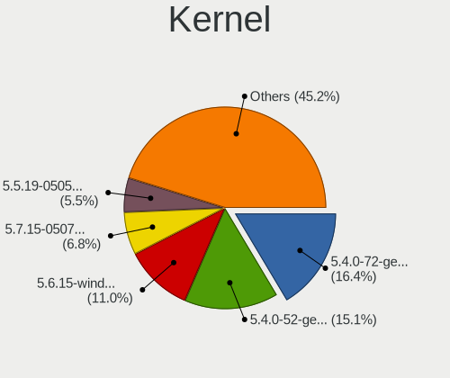

| Version                     | Computers | Percent |
|-----------------------------|-----------|---------|
| 5.4.0-72-generic            | 12        | 16.67%  |
| 5.4.0-52-generic            | 11        | 15.28%  |
| 5.6.15-windowsfx-10-generic | 8         | 11.11%  |
| 5.7.15-050715-generic       | 5         | 6.94%   |
| 5.5.19-050519-generic       | 4         | 5.56%   |
| 5.4.0-65-generic            | 4         | 5.56%   |
| 5.7.8-windowsfx-generic     | 3         | 4.17%   |
| 5.4.0-73-generic            | 3         | 4.17%   |
| 5.4.0-66-generic            | 3         | 4.17%   |
| 5.4.0-42-generic            | 3         | 4.17%   |
| 5.4.0-29-generic            | 3         | 4.17%   |
| 5.4.0-56-generic            | 2         | 2.78%   |
| 5.4.0-54-generic            | 2         | 2.78%   |
| 5.4.0-90-generic            | 1         | 1.39%   |
| 5.4.0-88-generic            | 1         | 1.39%   |
| 5.4.0-67-generic            | 1         | 1.39%   |
| 5.4.0-45-generic            | 1         | 1.39%   |
| 5.4.0-125-generic           | 1         | 1.39%   |
| 5.4.0-124-generic           | 1         | 1.39%   |
| 5.4.0-110-generic           | 1         | 1.39%   |
| 5.4.0-107-generic           | 1         | 1.39%   |
| 5.10.2-051002-generic       | 1         | 1.39%   |

Kernel Family
-------------

Linux kernel without a distro release

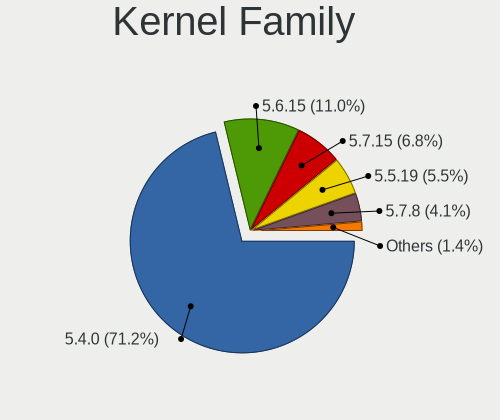

| Version | Computers | Percent |
|---------|-----------|---------|
| 5.4.0   | 51        | 70.83%  |
| 5.6.15  | 8         | 11.11%  |
| 5.7.15  | 5         | 6.94%   |
| 5.5.19  | 4         | 5.56%   |
| 5.7.8   | 3         | 4.17%   |
| 5.10.2  | 1         | 1.39%   |

Kernel Major Ver.
-----------------

Linux kernel major version

| Version | Computers | Percent |
|---------|-----------|---------|
| 5.4     | 51        | 70.83%  |
| 5.7     | 8         | 11.11%  |
| 5.6     | 8         | 11.11%  |
| 5.5     | 4         | 5.56%   |
| 5.10    | 1         | 1.39%   |

Arch
----

OS architecture (x86_64, i586, etc.)

| Name   | Computers | Percent |
|--------|-----------|---------|
| x86_64 | 72        | 100%    |

DE
--

Desktop Environment

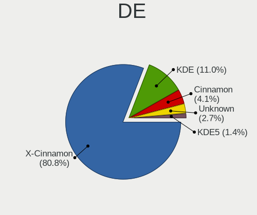

| Name       | Computers | Percent |
|------------|-----------|---------|
| X-Cinnamon | 58        | 80.56%  |
| KDE        | 8         | 11.11%  |
| Cinnamon   | 3         | 4.17%   |
| Unknown    | 2         | 2.78%   |
| KDE5       | 1         | 1.39%   |

Display Server
--------------

X11 or Wayland

| Name | Computers | Percent |
|------|-----------|---------|
| X11  | 72        | 100%    |

Display Manager
---------------

SDDM, LightDM, etc.

| Name    | Computers | Percent |
|---------|-----------|---------|
| Unknown | 42        | 58.33%  |
| SDDM    | 17        | 23.61%  |
| TDM     | 11        | 15.28%  |
| LightDM | 2         | 2.78%   |

OS Lang
-------

Language

| Lang  | Computers | Percent |
|-------|-----------|---------|
| pt_BR | 20        | 27.78%  |
| en_US | 12        | 16.67%  |
| de_DE | 6         | 8.33%   |
| fr_FR | 4         | 5.56%   |
| C     | 4         | 5.56%   |
| pl_PL | 3         | 4.17%   |
| it_IT | 3         | 4.17%   |
| en_AU | 3         | 4.17%   |
| es_ES | 2         | 2.78%   |
| es_CL | 2         | 2.78%   |
| es_AR | 2         | 2.78%   |
| en_ZA | 2         | 2.78%   |
| en_CA | 2         | 2.78%   |
| sv_SE | 1         | 1.39%   |
| sr_RS | 1         | 1.39%   |
| ro_RO | 1         | 1.39%   |
| fr_CA | 1         | 1.39%   |
| es_MX | 1         | 1.39%   |
| en_IN | 1         | 1.39%   |
| cs_CZ | 1         | 1.39%   |

Boot Mode
---------

EFI or BIOS

| Mode | Computers | Percent |
|------|-----------|---------|
| BIOS | 49        | 68.06%  |
| EFI  | 23        | 31.94%  |

Filesystem
----------

Type of filesystem

| Type    | Computers | Percent |
|---------|-----------|---------|
| Ext4    | 68        | 94.44%  |
| Overlay | 2         | 2.78%   |
| Xfs     | 1         | 1.39%   |
| Btrfs   | 1         | 1.39%   |

Part. scheme
------------

Scheme of partitioning

| Type    | Computers | Percent |
|---------|-----------|---------|
| Unknown | 63        | 87.5%   |
| MBR     | 5         | 6.94%   |
| GPT     | 4         | 5.56%   |

Dual Boot with Linux/BSD
------------------------

Hosting more than one Linux/BSD

| Dual boot | Computers | Percent |
|-----------|-----------|---------|
| No        | 62        | 86.11%  |
| Yes       | 10        | 13.89%  |

Dual Boot (Win)
---------------

Hosting Linux and Windows

| Dual boot | Computers | Percent |
|-----------|-----------|---------|
| No        | 53        | 73.61%  |
| Yes       | 19        | 26.39%  |

Board
-----

Vendor
------

Motherboard manufacturer

| Name                | Computers | Percent |
|---------------------|-----------|---------|
| Dell                | 14        | 19.44%  |
| Hewlett-Packard     | 9         | 12.5%   |
| ASUSTek Computer    | 7         | 9.72%   |
| Gigabyte Technology | 6         | 8.33%   |
| Acer                | 6         | 8.33%   |
| Lenovo              | 5         | 6.94%   |
| MSI                 | 4         | 5.56%   |
| ASRock              | 4         | 5.56%   |
| Apple               | 3         | 4.17%   |
| Samsung Electronics | 2         | 2.78%   |
| Intel               | 2         | 2.78%   |
| Toshiba             | 1         | 1.39%   |
| Supermicro          | 1         | 1.39%   |
| Positivo            | 1         | 1.39%   |
| Pegatron            | 1         | 1.39%   |
| PCWare              | 1         | 1.39%   |
| Olivetti            | 1         | 1.39%   |
| Medion              | 1         | 1.39%   |
| Jumper              | 1         | 1.39%   |
| ECS                 | 1         | 1.39%   |
| Unknown             | 1         | 1.39%   |

Model
-----

Motherboard model

| Name                                  | Computers | Percent |
|---------------------------------------|-----------|---------|
| Dell Vostro 1000                      | 2         | 2.78%   |
| Toshiba Satellite C50D-A-12R          | 1         | 1.39%   |
| Supermicro H8DG6/H8DGi                | 1         | 1.39%   |
| Samsung 340XAA/350XAA/550XAA          | 1         | 1.39%   |
| Samsung 305E4A/305E5A/305E7A          | 1         | 1.39%   |
| Positivo Mobile                       | 1         | 1.39%   |
| Pegatron B34C                         | 1         | 1.39%   |
| PCWare IPMH61R2                       | 1         | 1.39%   |
| Olivetti P55-AEU-323-4G320            | 1         | 1.39%   |
| MSI MS-7B84                           | 1         | 1.39%   |
| MSI MS-7918                           | 1         | 1.39%   |
| MSI MS-7913                           | 1         | 1.39%   |
| MSI MS-7309                           | 1         | 1.39%   |
| Medion S4216                          | 1         | 1.39%   |
| Lenovo Y70-70 Touch 80DU              | 1         | 1.39%   |
| Lenovo ThinkPad X1 Carbon 2nd F2G3H4J | 1         | 1.39%   |
| Lenovo ThinkPad T450s 20BWS0YF00      | 1         | 1.39%   |
| Lenovo G550 2958                      | 1         | 1.39%   |
| Lenovo G505 20240                     | 1         | 1.39%   |
| Jumper Ezpad                          | 1         | 1.39%   |
| Intel DG31PR AAD97573-306             | 1         | 1.39%   |
| Intel B75                             | 1         | 1.39%   |
| HP ProBook 6560b                      | 1         | 1.39%   |
| HP Pavilion dv6700                    | 1         | 1.39%   |
| HP Mini 210-1000                      | 1         | 1.39%   |
| HP G42                                | 1         | 1.39%   |
| HP EliteBook Folio 9470m              | 1         | 1.39%   |
| HP Compaq Presario CQ50               | 1         | 1.39%   |
| HP 250 G7 Notebook PC                 | 1         | 1.39%   |
| HP 250 G6 Notebook PC                 | 1         | 1.39%   |
| HP 202 G2 MT                          | 1         | 1.39%   |
| Gigabyte X570 UD                      | 1         | 1.39%   |
| Gigabyte P57V6                        | 1         | 1.39%   |
| Gigabyte GA-78LMT-S2P                 | 1         | 1.39%   |
| Gigabyte G31M-ES2C                    | 1         | 1.39%   |
| Gigabyte B450 AORUS M                 | 1         | 1.39%   |
| Gigabyte 970A-DS3P                    | 1         | 1.39%   |
| ECS A780GM-A                          | 1         | 1.39%   |
| Dell PowerEdge R810                   | 1         | 1.39%   |
| Dell OptiPlex 9010 AIO                | 1         | 1.39%   |

Model Family
------------

Motherboard model prefix

| Name                       | Computers | Percent |
|----------------------------|-----------|---------|
| Dell Inspiron              | 7         | 9.72%   |
| Acer Aspire                | 6         | 8.33%   |
| Dell OptiPlex              | 3         | 4.17%   |
| Lenovo ThinkPad            | 2         | 2.78%   |
| HP 250                     | 2         | 2.78%   |
| Dell Vostro                | 2         | 2.78%   |
| Toshiba Satellite          | 1         | 1.39%   |
| Supermicro H8DG6           | 1         | 1.39%   |
| Samsung 340XAA             | 1         | 1.39%   |
| Samsung 305E4A             | 1         | 1.39%   |
| Positivo Mobile            | 1         | 1.39%   |
| Pegatron B34C              | 1         | 1.39%   |
| PCWare IPMH61R2            | 1         | 1.39%   |
| Olivetti P55-AEU-323-4G320 | 1         | 1.39%   |
| MSI MS-7B84                | 1         | 1.39%   |
| MSI MS-7918                | 1         | 1.39%   |
| MSI MS-7913                | 1         | 1.39%   |
| MSI MS-7309                | 1         | 1.39%   |
| Medion S4216               | 1         | 1.39%   |
| Lenovo Y70-70              | 1         | 1.39%   |
| Lenovo G550                | 1         | 1.39%   |
| Lenovo G505                | 1         | 1.39%   |
| Jumper Ezpad               | 1         | 1.39%   |
| Intel DG31PR               | 1         | 1.39%   |
| Intel B75                  | 1         | 1.39%   |
| HP ProBook                 | 1         | 1.39%   |
| HP Pavilion                | 1         | 1.39%   |
| HP Mini                    | 1         | 1.39%   |
| HP G42                     | 1         | 1.39%   |
| HP EliteBook               | 1         | 1.39%   |
| HP Compaq                  | 1         | 1.39%   |
| HP 202                     | 1         | 1.39%   |
| Gigabyte X570              | 1         | 1.39%   |
| Gigabyte P57V6             | 1         | 1.39%   |
| Gigabyte GA-78LMT-S2P      | 1         | 1.39%   |
| Gigabyte G31M-ES2C         | 1         | 1.39%   |
| Gigabyte B450              | 1         | 1.39%   |
| Gigabyte 970A-DS3P         | 1         | 1.39%   |
| ECS A780GM-A               | 1         | 1.39%   |
| Dell PowerEdge             | 1         | 1.39%   |

MFG Year
--------

Motherboard manufacture year

| Year    | Computers | Percent |
|---------|-----------|---------|
| 2014    | 9         | 12.5%   |
| 2011    | 9         | 12.5%   |
| 2013    | 8         | 11.11%  |
| 2012    | 8         | 11.11%  |
| 2009    | 6         | 8.33%   |
| 2018    | 5         | 6.94%   |
| 2008    | 5         | 6.94%   |
| 2019    | 4         | 5.56%   |
| 2010    | 4         | 5.56%   |
| 2006    | 4         | 5.56%   |
| 2007    | 3         | 4.17%   |
| 2017    | 2         | 2.78%   |
| 2015    | 2         | 2.78%   |
| 2020    | 1         | 1.39%   |
| 2016    | 1         | 1.39%   |
| Unknown | 1         | 1.39%   |

Form Factor
-----------

Physical design of the computer

| Name       | Computers | Percent |
|------------|-----------|---------|
| Notebook   | 39        | 54.17%  |
| Desktop    | 26        | 36.11%  |
| All in one | 4         | 5.56%   |
| Server     | 2         | 2.78%   |
| Tablet     | 1         | 1.39%   |

Secure Boot
-----------

Enabled or disabled

| State    | Computers | Percent |
|----------|-----------|---------|
| Disabled | 71        | 97.26%  |
| Enabled  | 2         | 2.74%   |

Coreboot
--------

Have coreboot on board

| Used | Computers | Percent |
|------|-----------|---------|
| No   | 72        | 100%    |

RAM Size
--------

Total RAM memory

| Size in GB      | Computers | Percent |
|-----------------|-----------|---------|
| 3.01-4.0        | 29        | 40.28%  |
| 4.01-8.0        | 13        | 18.06%  |
| 16.01-24.0      | 11        | 15.28%  |
| 8.01-16.0       | 7         | 9.72%   |
| 1.01-2.0        | 4         | 5.56%   |
| 32.01-64.0      | 3         | 4.17%   |
| 2.01-3.0        | 3         | 4.17%   |
| More than 256.0 | 1         | 1.39%   |
| 64.01-256.0     | 1         | 1.39%   |

RAM Used
--------

Used RAM memory

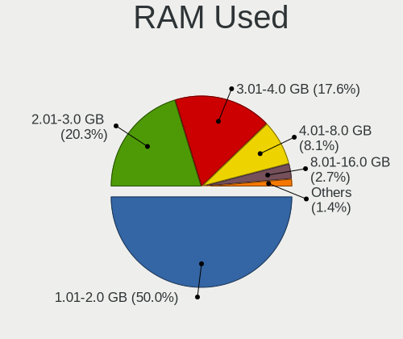

| Used GB   | Computers | Percent |
|-----------|-----------|---------|
| 1.01-2.0  | 36        | 49.32%  |
| 2.01-3.0  | 15        | 20.55%  |
| 3.01-4.0  | 13        | 17.81%  |
| 4.01-8.0  | 6         | 8.22%   |
| 8.01-16.0 | 2         | 2.74%   |
| 0.51-1.0  | 1         | 1.37%   |

Total Drives
------------

Number of drives on board

| Drives  | Computers | Percent |
|---------|-----------|---------|
| 1       | 47        | 65.28%  |
| 2       | 13        | 18.06%  |
| 3       | 7         | 9.72%   |
| 7       | 2         | 2.78%   |
| 6       | 1         | 1.39%   |
| 4       | 1         | 1.39%   |
| Unknown | 1         | 1.39%   |

Has CD-ROM
----------

Has CD-ROM on board

| Presented | Computers | Percent |
|-----------|-----------|---------|
| Yes       | 44        | 60.27%  |
| No        | 29        | 39.73%  |

Has Ethernet
------------

Has Ethernet on board

| Presented | Computers | Percent |
|-----------|-----------|---------|
| Yes       | 72        | 100%    |

Has WiFi
--------

Has WiFi module

| Presented | Computers | Percent |
|-----------|-----------|---------|
| Yes       | 53        | 73.61%  |
| No        | 19        | 26.39%  |

Has Bluetooth
-------------

Has Bluetooth module

| Presented | Computers | Percent |
|-----------|-----------|---------|
| No        | 42        | 58.33%  |
| Yes       | 30        | 41.67%  |

Location
--------

Country
-------

Geographic location (country)

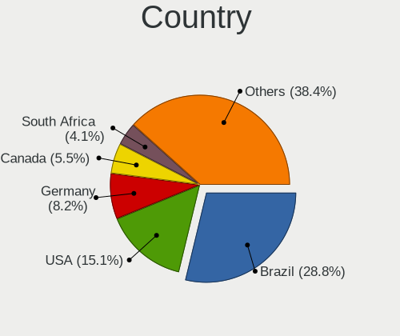

| Country      | Computers | Percent |
|--------------|-----------|---------|
| Brazil       | 21        | 29.17%  |
| USA          | 11        | 15.28%  |
| Germany      | 6         | 8.33%   |
| Canada       | 4         | 5.56%   |
| South Africa | 3         | 4.17%   |
| Poland       | 3         | 4.17%   |
| Italy        | 3         | 4.17%   |
| France       | 3         | 4.17%   |
| Australia    | 3         | 4.17%   |
| Spain        | 2         | 2.78%   |
| Chile        | 2         | 2.78%   |
| Argentina    | 2         | 2.78%   |
| Sweden       | 1         | 1.39%   |
| Serbia       | 1         | 1.39%   |
| Russia       | 1         | 1.39%   |
| Romania      | 1         | 1.39%   |
| Mexico       | 1         | 1.39%   |
| India        | 1         | 1.39%   |
| Czechia      | 1         | 1.39%   |
| Croatia      | 1         | 1.39%   |
| Cameroon     | 1         | 1.39%   |

City
----

Geographic location (city)

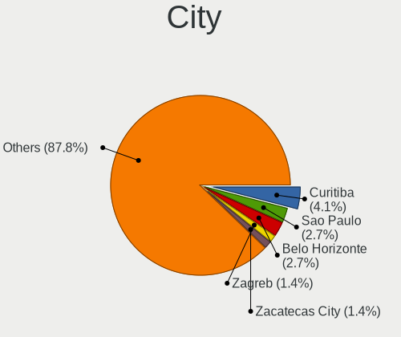

| City                       | Computers | Percent |
|----------------------------|-----------|---------|
| Curitiba                   | 3         | 4.11%   |
| Sao Paulo                  | 2         | 2.74%   |
| Belo Horizonte             | 2         | 2.74%   |
| Zagreb                     | 1         | 1.37%   |
| Zacatecas City             | 1         | 1.37%   |
| Winter Springs             | 1         | 1.37%   |
| Winston-Salem              | 1         | 1.37%   |
| Wiesbaden                  | 1         | 1.37%   |
| Warsaw                     | 1         | 1.37%   |
| Vila Velha                 | 1         | 1.37%   |
| Val-d'Or                   | 1         | 1.37%   |
| Taboao da Serra            | 1         | 1.37%   |
| Sydney                     | 1         | 1.37%   |
| Södertälje               | 1         | 1.37%   |
| Sidney                     | 1         | 1.37%   |
| Schweinfurt                | 1         | 1.37%   |
| Savona                     | 1         | 1.37%   |
| Santiago                   | 1         | 1.37%   |
| Santa Quiteria do Maranhao | 1         | 1.37%   |
| Salerno                    | 1         | 1.37%   |
| Saint-Germain-en-Laye      | 1         | 1.37%   |
| Rosario                    | 1         | 1.37%   |
| Rio de Janeiro             | 1         | 1.37%   |
| Recife                     | 1         | 1.37%   |
| Pretoria                   | 1         | 1.37%   |
| Porto Alegre               | 1         | 1.37%   |
| Port Elizabeth             | 1         | 1.37%   |
| Piraquara                  | 1         | 1.37%   |
| Paris                      | 1         | 1.37%   |
| Ostrava                    | 1         | 1.37%   |
| Newmarket                  | 1         | 1.37%   |
| Moscow Oblast              | 1         | 1.37%   |
| Moreno Valley              | 1         | 1.37%   |
| Montreal                   | 1         | 1.37%   |
| Massy                      | 1         | 1.37%   |
| Madrid                     | 1         | 1.37%   |
| Londrina                   | 1         | 1.37%   |
| Lipova                     | 1         | 1.37%   |
| Krakow                     | 1         | 1.37%   |
| Katowice                   | 1         | 1.37%   |

Drives
------

Drive Vendor
------------

Hard drive vendors

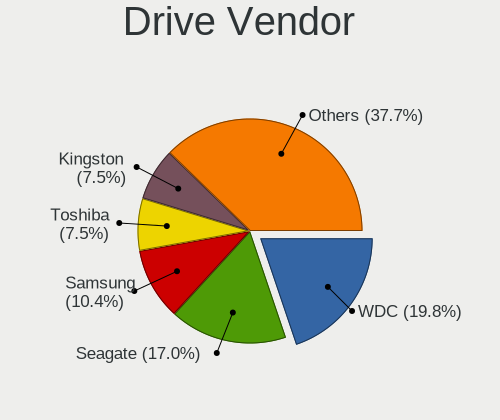

| Vendor              | Computers | Drives | Percent |
|---------------------|-----------|--------|---------|
| WDC                 | 21        | 25     | 20.19%  |
| Seagate             | 18        | 26     | 17.31%  |
| Samsung Electronics | 11        | 13     | 10.58%  |
| Kingston            | 8         | 9      | 7.69%   |
| Toshiba             | 7         | 7      | 6.73%   |
| Hitachi             | 7         | 8      | 6.73%   |
| SanDisk             | 5         | 7      | 4.81%   |
| Unknown             | 3         | 4      | 2.88%   |
| A-DATA Technology   | 3         | 4      | 2.88%   |
| Maxtor              | 2         | 2      | 1.92%   |
| LITEONIT            | 2         | 2      | 1.92%   |
| HGST                | 2         | 3      | 1.92%   |
| Crucial             | 2         | 2      | 1.92%   |
| ZOTAC               | 1         | 1      | 0.96%   |
| XPG                 | 1         | 1      | 0.96%   |
| TO Exter            | 1         | 1      | 0.96%   |
| PNY                 | 1         | 1      | 0.96%   |
| Phison              | 1         | 1      | 0.96%   |
| Patriot             | 1         | 1      | 0.96%   |
| OWC                 | 1         | 1      | 0.96%   |
| OCZ                 | 1         | 1      | 0.96%   |
| Mushkin             | 1         | 1      | 0.96%   |
| Hewlett-Packard     | 1         | 1      | 0.96%   |
| GOODRAM             | 1         | 1      | 0.96%   |
| China               | 1         | 1      | 0.96%   |
| ASMT109x            | 1         | 1      | 0.96%   |

Drive Model
-----------

Hard drive models

| Model                                    | Computers | Percent |
|------------------------------------------|-----------|---------|
| WDC WD5000AAKX-001CA0 500GB              | 2         | 1.72%   |
| WDC WD10EZEX-08WN4A0 1TB                 | 2         | 1.72%   |
| Toshiba MQ01ABF050 500GB                 | 2         | 1.72%   |
| Seagate ST500LM012 HN-M500MBB 500GB      | 2         | 1.72%   |
| Kingston SV300S37A120G 120GB SSD         | 2         | 1.72%   |
| ZOTAC ZTSSDPG3-480G-GE 480GB             | 1         | 0.86%   |
| XPG GAMMIX S11 Pro 1TB                   | 1         | 0.86%   |
| WDC WD60EZRX-00MVLB1 6TB                 | 1         | 0.86%   |
| WDC WD5000LPVX-22V0TT0 500GB             | 1         | 0.86%   |
| WDC WD5000LPVT-24G33T1 500GB             | 1         | 0.86%   |
| WDC WD5000AACS-00G8B1 500GB              | 1         | 0.86%   |
| WDC WD400JD-55MSA1 40GB                  | 1         | 0.86%   |
| WDC WD4001FAEX-00MJRA0 4TB               | 1         | 0.86%   |
| WDC WD3200BPVT-22JJ5T0 320GB             | 1         | 0.86%   |
| WDC WD3200BEVT-80A0RT0 320GB             | 1         | 0.86%   |
| WDC WD2500BEVS-22UST0 250GB              | 1         | 0.86%   |
| WDC WD20EZRZ-00Z5HB0 2TB                 | 1         | 0.86%   |
| WDC WD20EZRX-00D8PB0 2TB                 | 1         | 0.86%   |
| WDC WD20EARS-00MVWB0 2TB                 | 1         | 0.86%   |
| WDC WD1200BEVS-75UST0 120GB              | 1         | 0.86%   |
| WDC WD10JPVX-60JC3T1 1TB                 | 1         | 0.86%   |
| WDC WD10JPVX-22JC3T0 1TB                 | 1         | 0.86%   |
| WDC WD10EAVS-00D7B1 1TB                  | 1         | 0.86%   |
| WDC WD10EARX-00N0YB0 1TB                 | 1         | 0.86%   |
| WDC WD1003FZEX-00MK2A0 1TB               | 1         | 0.86%   |
| WDC PC SA530 SDASN8Y-256G-1006 256GB SSD | 1         | 0.86%   |
| Unknown NVMe SSD Drive 512GB             | 1         | 0.86%   |
| Unknown MMC Card  8GB                    | 1         | 0.86%   |
| Unknown MMC Card  64GB                   | 1         | 0.86%   |
| Toshiba MQ01ACF050 500GB                 | 1         | 0.86%   |
| Toshiba MQ01ABF032 320GB                 | 1         | 0.86%   |
| Toshiba MQ01ABD050 500GB                 | 1         | 0.86%   |
| Toshiba MK5059GSXP 500GB                 | 1         | 0.86%   |
| Toshiba MK2561GSYN 250GB                 | 1         | 0.86%   |
| TO Exter nal USB 3.0 512GB               | 1         | 0.86%   |
| Seagate ST9320325AS 320GB                | 1         | 0.86%   |
| Seagate ST9160827AS 160GB                | 1         | 0.86%   |
| Seagate ST9160821AS 160GB                | 1         | 0.86%   |
| Seagate ST9160314AS 160GB                | 1         | 0.86%   |
| Seagate ST8000AS0002-1NA17Z 8TB          | 1         | 0.86%   |

HDD Vendor
----------

Hard disk drive vendors

| Vendor              | Computers | Drives | Percent |
|---------------------|-----------|--------|---------|
| WDC                 | 20        | 23     | 31.75%  |
| Seagate             | 18        | 26     | 28.57%  |
| Toshiba             | 7         | 7      | 11.11%  |
| Hitachi             | 7         | 8      | 11.11%  |
| Samsung Electronics | 6         | 7      | 9.52%   |
| Maxtor              | 2         | 2      | 3.17%   |
| HGST                | 2         | 3      | 3.17%   |
| ASMT109x            | 1         | 1      | 1.59%   |

SSD Vendor
----------

Solid state drive vendors

| Vendor              | Computers | Drives | Percent |
|---------------------|-----------|--------|---------|
| Kingston            | 7         | 8      | 21.21%  |
| Samsung Electronics | 5         | 6      | 15.15%  |
| SanDisk             | 4         | 6      | 12.12%  |
| A-DATA Technology   | 3         | 4      | 9.09%   |
| LITEONIT            | 2         | 2      | 6.06%   |
| Crucial             | 2         | 2      | 6.06%   |
| WDC                 | 1         | 2      | 3.03%   |
| TO Exter            | 1         | 1      | 3.03%   |
| PNY                 | 1         | 1      | 3.03%   |
| Patriot             | 1         | 1      | 3.03%   |
| OWC                 | 1         | 1      | 3.03%   |
| OCZ                 | 1         | 1      | 3.03%   |
| Mushkin             | 1         | 1      | 3.03%   |
| Hewlett-Packard     | 1         | 1      | 3.03%   |
| GOODRAM             | 1         | 1      | 3.03%   |
| China               | 1         | 1      | 3.03%   |

Drive Kind
----------

HDD or SSD

| Kind | Computers | Drives | Percent |
|------|-----------|--------|---------|
| HDD  | 51        | 77     | 56.67%  |
| SSD  | 31        | 39     | 34.44%  |
| NVMe | 6         | 7      | 6.67%   |
| MMC  | 2         | 2      | 2.22%   |

Drive Connector
---------------

SATA, SAS, NVMe, etc.

| Type | Computers | Drives | Percent |
|------|-----------|--------|---------|
| SATA | 70        | 113    | 86.42%  |
| NVMe | 6         | 7      | 7.41%   |
| SAS  | 3         | 3      | 3.7%    |
| MMC  | 2         | 2      | 2.47%   |

Drive Size
----------

Size of hard drive

| Size in TB | Computers | Drives | Percent |
|------------|-----------|--------|---------|
| 0.01-0.5   | 62        | 80     | 68.89%  |
| 0.51-1.0   | 17        | 21     | 18.89%  |
| 1.01-2.0   | 5         | 7      | 5.56%   |
| 3.01-4.0   | 3         | 3      | 3.33%   |
| 4.01-10.0  | 2         | 3      | 2.22%   |
| 10.01-20.0 | 1         | 2      | 1.11%   |

Space Total
-----------

Amount of disk space available on the file system

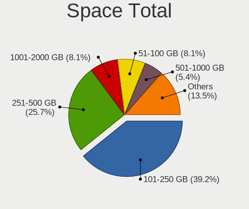

| Size in GB     | Computers | Percent |
|----------------|-----------|---------|
| 101-250        | 29        | 39.73%  |
| 251-500        | 19        | 26.03%  |
| 1001-2000      | 6         | 8.22%   |
| 51-100         | 5         | 6.85%   |
| 21-50          | 4         | 5.48%   |
| 501-1000       | 4         | 5.48%   |
| More than 3000 | 2         | 2.74%   |
| 2001-3000      | 2         | 2.74%   |
| 1-20           | 2         | 2.74%   |

Space Used
----------

Amount of used disk space

| Used GB   | Computers | Percent |
|-----------|-----------|---------|
| 1-20      | 33        | 44.59%  |
| 21-50     | 19        | 25.68%  |
| 101-250   | 6         | 8.11%   |
| 501-1000  | 6         | 8.11%   |
| 51-100    | 5         | 6.76%   |
| 251-500   | 3         | 4.05%   |
| 2001-3000 | 1         | 1.35%   |
| 1001-2000 | 1         | 1.35%   |

Malfunc. Drives
---------------

Drive models with a malfunction

| Model                                        | Computers | Drives | Percent |
|----------------------------------------------|-----------|--------|---------|
| WDC WD4001FAEX-00MJRA0 4TB                   | 1         | 1      | 20%     |
| Seagate ST500LT012-9WS142 500GB              | 1         | 1      | 20%     |
| Samsung Electronics SSD 840 PRO Series 256GB | 1         | 1      | 20%     |
| Samsung Electronics HD081GJ 80GB             | 1         | 1      | 20%     |
| Hitachi HTS722012K9A300 120GB                | 1         | 1      | 20%     |

Malfunc. Drive Vendor
---------------------

Vendors of faulty drives

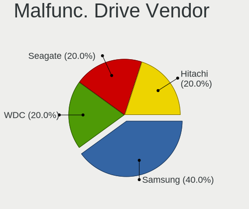

| Vendor              | Computers | Drives | Percent |
|---------------------|-----------|--------|---------|
| Samsung Electronics | 2         | 2      | 40%     |
| WDC                 | 1         | 1      | 20%     |
| Seagate             | 1         | 1      | 20%     |
| Hitachi             | 1         | 1      | 20%     |

Malfunc. HDD Vendor
-------------------

Vendors of faulty HDD drives

| Vendor              | Computers | Drives | Percent |
|---------------------|-----------|--------|---------|
| WDC                 | 1         | 1      | 25%     |
| Seagate             | 1         | 1      | 25%     |
| Samsung Electronics | 1         | 1      | 25%     |
| Hitachi             | 1         | 1      | 25%     |

Malfunc. Drive Kind
-------------------

Kinds of faulty drives

| Kind | Computers | Drives | Percent |
|------|-----------|--------|---------|
| HDD  | 4         | 4      | 80%     |
| SSD  | 1         | 1      | 20%     |

Failed Drives
-------------

Failed drive models

Zero info for selected period =(

Failed Drive Vendor
-------------------

Failed drive vendors

Zero info for selected period =(

Drive Status
------------

Number of failed and malfunc. drives

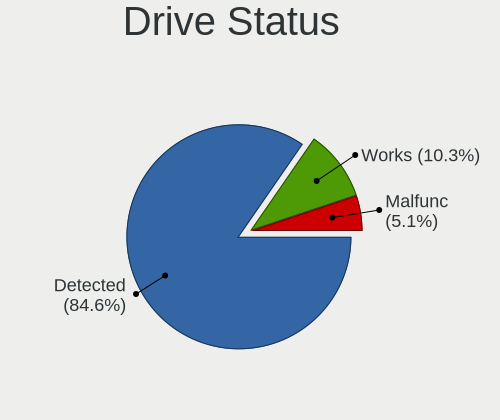

| Status   | Computers | Drives | Percent |
|----------|-----------|--------|---------|
| Detected | 65        | 100    | 84.42%  |
| Works    | 8         | 20     | 10.39%  |
| Malfunc  | 4         | 5      | 5.19%   |

Storage controller
------------------

Storage Vendor
--------------

Storage controller vendors

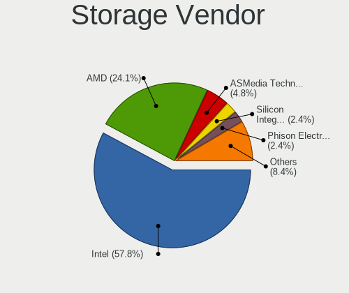

| Vendor                           | Computers | Percent |
|----------------------------------|-----------|---------|
| Intel                            | 47        | 57.32%  |
| AMD                              | 20        | 24.39%  |
| ASMedia Technology               | 4         | 4.88%   |
| Silicon Integrated Systems [SiS] | 2         | 2.44%   |
| Phison Electronics               | 2         | 2.44%   |
| Nvidia                           | 2         | 2.44%   |
| ADATA Technology                 | 2         | 2.44%   |
| SanDisk                          | 1         | 1.22%   |
| LSI Logic / Symbios Logic        | 1         | 1.22%   |
| Kingston Technology Company      | 1         | 1.22%   |

Storage Model
-------------

Storage controller models

| Model                                                                          | Computers | Percent |
|--------------------------------------------------------------------------------|-----------|---------|
| AMD FCH SATA Controller [AHCI mode]                                            | 10        | 9.01%   |
| Intel 7 Series Chipset Family 6-port SATA Controller [AHCI mode]               | 6         | 5.41%   |
| AMD SB7x0/SB8x0/SB9x0 IDE Controller                                           | 6         | 5.41%   |
| Intel Sunrise Point-LP SATA Controller [AHCI mode]                             | 4         | 3.6%    |
| Intel NM10/ICH7 Family SATA Controller [IDE mode]                              | 4         | 3.6%    |
| Intel 82801HM/HEM (ICH8M/ICH8M-E) SATA Controller [AHCI mode]                  | 4         | 3.6%    |
| Intel 82801HM/HEM (ICH8M/ICH8M-E) IDE Controller                               | 4         | 3.6%    |
| ASMedia ASM1062 Serial ATA Controller                                          | 4         | 3.6%    |
| Intel 82801G (ICH7 Family) IDE Controller                                      | 3         | 2.7%    |
| Intel 8 Series/C220 Series Chipset Family 6-port SATA Controller 1 [AHCI mode] | 3         | 2.7%    |
| Intel 7 Series/C210 Series Chipset Family 6-port SATA Controller [AHCI mode]   | 3         | 2.7%    |
| Intel 6 Series/C200 Series Chipset Family 6 port Desktop SATA AHCI Controller  | 3         | 2.7%    |
| AMD SB7x0/SB8x0/SB9x0 SATA Controller [IDE mode]                               | 3         | 2.7%    |
| AMD SB7x0/SB8x0/SB9x0 SATA Controller [AHCI mode]                              | 3         | 2.7%    |
| AMD SB600 Non-Raid-5 SATA                                                      | 3         | 2.7%    |
| AMD SB600 IDE                                                                  | 3         | 2.7%    |
| AMD 400 Series Chipset SATA Controller                                         | 3         | 2.7%    |
| Silicon Integrated Systems [SiS] SATA Controller / IDE mode                    | 2         | 1.8%    |
| Silicon Integrated Systems [SiS] 5513 IDE Controller                           | 2         | 1.8%    |
| Nvidia MCP61 SATA Controller                                                   | 2         | 1.8%    |
| Nvidia MCP61 IDE                                                               | 2         | 1.8%    |
| Intel Atom Processor E3800 Series SATA AHCI Controller                         | 2         | 1.8%    |
| Intel 82801IBM/IEM (ICH9M/ICH9M-E) 4 port SATA Controller [AHCI mode]          | 2         | 1.8%    |
| Intel 82801 Mobile SATA Controller [RAID mode]                                 | 2         | 1.8%    |
| Intel 7 Series Chipset Family 4-port SATA Controller [IDE mode]                | 2         | 1.8%    |
| Intel 7 Series Chipset Family 2-port SATA Controller [IDE mode]                | 2         | 1.8%    |
| Intel 5 Series/3400 Series Chipset 4 port SATA AHCI Controller                 | 2         | 1.8%    |
| ADATA XPG SX8200 Pro PCIe Gen3x4 M.2 2280 Solid State Drive                    | 2         | 1.8%    |
| SanDisk WD Blue SN550 NVMe SSD                                                 | 1         | 0.9%    |
| Phison E7 NVMe Controller                                                      | 1         | 0.9%    |
| Phison E16 PCIe4 NVMe Controller                                               | 1         | 0.9%    |
| LSI Logic / Symbios Logic MegaRAID SAS 2108 [Liberator]                        | 1         | 0.9%    |
| Kingston Company Company Non-Volatile memory controller                        | 1         | 0.9%    |
| Intel Wildcat Point-LP SATA Controller [AHCI Mode]                             | 1         | 0.9%    |
| Intel NM10/ICH7 Family SATA Controller [AHCI mode]                             | 1         | 0.9%    |
| Intel HM170/QM170 Chipset SATA Controller [AHCI Mode]                          | 1         | 0.9%    |
| Intel Celeron/Pentium Silver Processor SATA Controller                         | 1         | 0.9%    |
| Intel 9 Series Chipset Family SATA Controller [AHCI Mode]                      | 1         | 0.9%    |
| Intel 82801JI (ICH10 Family) SATA AHCI Controller                              | 1         | 0.9%    |
| Intel 82801JI (ICH10 Family) 4 port SATA IDE Controller #1                     | 1         | 0.9%    |

Storage Kind
------------

Kind of storage controller (IDE, SATA, NVMe, SAS, ...)

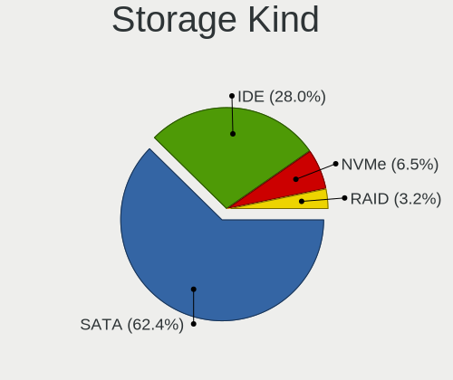

| Kind | Computers | Percent |
|------|-----------|---------|
| SATA | 58        | 63.04%  |
| IDE  | 25        | 27.17%  |
| NVMe | 6         | 6.52%   |
| RAID | 3         | 3.26%   |

Processor
---------

CPU Vendor
----------

Processor vendors

| Vendor | Computers | Percent |
|--------|-----------|---------|
| Intel  | 50        | 69.44%  |
| AMD    | 22        | 30.56%  |

CPU Model
---------

Processor models

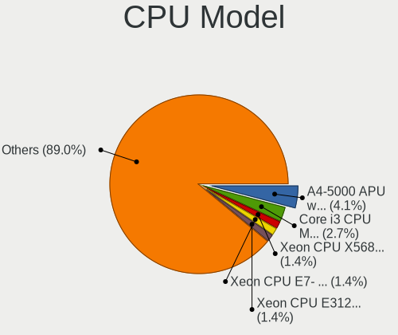

| Model                                       | Computers | Percent |
|---------------------------------------------|-----------|---------|
| AMD A4-5000 APU with Radeon HD Graphics     | 3         | 4.17%   |
| Intel Core i3 CPU M 370 @ 2.40GHz           | 2         | 2.78%   |
| Intel Xeon CPU X5680 @ 3.33GHz              | 1         | 1.39%   |
| Intel Xeon CPU E7- 4870 @ 2.40GHz           | 1         | 1.39%   |
| Intel Pentium Dual-Core CPU T4300 @ 2.10GHz | 1         | 1.39%   |
| Intel Pentium Dual CPU T3200 @ 2.00GHz      | 1         | 1.39%   |
| Intel Pentium Dual CPU T2390 @ 1.86GHz      | 1         | 1.39%   |
| Intel Pentium Dual CPU T2370 @ 1.73GHz      | 1         | 1.39%   |
| Intel Pentium Dual CPU E2160 @ 1.80GHz      | 1         | 1.39%   |
| Intel Pentium CPU J2900 @ 2.41GHz           | 1         | 1.39%   |
| Intel Pentium CPU G3250 @ 3.20GHz           | 1         | 1.39%   |
| Intel Pentium CPU B960 @ 2.20GHz            | 1         | 1.39%   |
| Intel Pentium CPU 2020M @ 2.40GHz           | 1         | 1.39%   |
| Intel Core i7-8550U CPU @ 1.80GHz           | 1         | 1.39%   |
| Intel Core i7-7500U CPU @ 2.70GHz           | 1         | 1.39%   |
| Intel Core i7-6700HQ CPU @ 2.60GHz          | 1         | 1.39%   |
| Intel Core i7-5600U CPU @ 2.60GHz           | 1         | 1.39%   |
| Intel Core i7-4770K CPU @ 3.50GHz           | 1         | 1.39%   |
| Intel Core i7-4720HQ CPU @ 2.60GHz          | 1         | 1.39%   |
| Intel Core i7-4600U CPU @ 2.10GHz           | 1         | 1.39%   |
| Intel Core i7-3770K CPU @ 3.50GHz           | 1         | 1.39%   |
| Intel Core i7-2600 CPU @ 3.40GHz            | 1         | 1.39%   |
| Intel Core i5-7200U CPU @ 2.50GHz           | 1         | 1.39%   |
| Intel Core i5-4440 CPU @ 3.10GHz            | 1         | 1.39%   |
| Intel Core i5-3570S CPU @ 3.10GHz           | 1         | 1.39%   |
| Intel Core i5-3470 CPU @ 3.20GHz            | 1         | 1.39%   |
| Intel Core i5-3437U CPU @ 1.90GHz           | 1         | 1.39%   |
| Intel Core i5-3337U CPU @ 1.80GHz           | 1         | 1.39%   |
| Intel Core i5-3230M CPU @ 2.60GHz           | 1         | 1.39%   |
| Intel Core i5-3210M CPU @ 2.50GHz           | 1         | 1.39%   |
| Intel Core i5-2520M CPU @ 2.50GHz           | 1         | 1.39%   |
| Intel Core i5-2500S CPU @ 2.70GHz           | 1         | 1.39%   |
| Intel Core i5-2410M CPU @ 2.30GHz           | 1         | 1.39%   |
| Intel Core i5-10300H CPU @ 2.50GHz          | 1         | 1.39%   |
| Intel Core i3-7020U CPU @ 2.30GHz           | 1         | 1.39%   |
| Intel Core i3-3227U CPU @ 1.90GHz           | 1         | 1.39%   |
| Intel Core i3-3220 CPU @ 3.30GHz            | 1         | 1.39%   |
| Intel Core i3-3217U CPU @ 1.80GHz           | 1         | 1.39%   |
| Intel Core i3-2100 CPU @ 3.10GHz            | 1         | 1.39%   |
| Intel Core 2 Quad CPU Q8300 @ 2.50GHz       | 1         | 1.39%   |

CPU Model Family
----------------

Processor model prefix

| Model                   | Computers | Percent |
|-------------------------|-----------|---------|
| Intel Core i5           | 12        | 16.67%  |
| Intel Core i7           | 9         | 12.5%   |
| Intel Core i3           | 7         | 9.72%   |
| Intel Core 2 Duo        | 5         | 6.94%   |
| Intel Pentium Dual      | 4         | 5.56%   |
| Intel Pentium           | 4         | 5.56%   |
| AMD FX                  | 3         | 4.17%   |
| AMD A4                  | 3         | 4.17%   |
| Intel Xeon              | 2         | 2.78%   |
| Intel Celeron           | 2         | 2.78%   |
| Intel Atom              | 2         | 2.78%   |
| AMD Turion 64 X2 Mobile | 2         | 2.78%   |
| AMD Athlon 64 X2        | 2         | 2.78%   |
| AMD A8                  | 2         | 2.78%   |
| Intel Pentium Dual-Core | 1         | 1.39%   |
| Intel Core 2 Quad       | 1         | 1.39%   |
| Intel Celeron D         | 1         | 1.39%   |
| AMD Ryzen 9             | 1         | 1.39%   |
| AMD Ryzen 7             | 1         | 1.39%   |
| AMD Ryzen 5             | 1         | 1.39%   |
| AMD Ryzen 3             | 1         | 1.39%   |
| AMD Phenom              | 1         | 1.39%   |
| AMD Opteron             | 1         | 1.39%   |
| AMD Athlon II X4        | 1         | 1.39%   |
| AMD Athlon II X2        | 1         | 1.39%   |
| AMD A6                  | 1         | 1.39%   |
| AMD A10                 | 1         | 1.39%   |

CPU Cores
---------

Number of processor cores

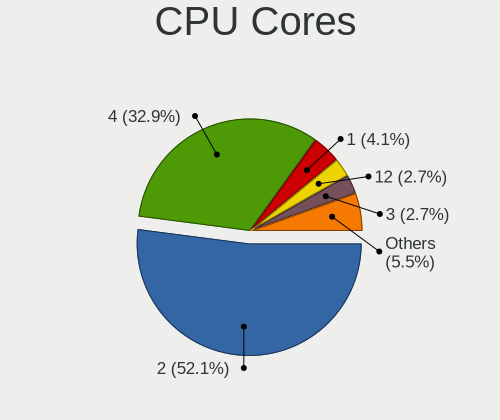

| Number | Computers | Percent |
|--------|-----------|---------|
| 2      | 38        | 52.78%  |
| 4      | 23        | 31.94%  |
| 1      | 3         | 4.17%   |
| 12     | 2         | 2.78%   |
| 3      | 2         | 2.78%   |
| 40     | 1         | 1.39%   |
| 16     | 1         | 1.39%   |
| 8      | 1         | 1.39%   |
| 6      | 1         | 1.39%   |

CPU Sockets
-----------

Number of sockets

| Number | Computers | Percent |
|--------|-----------|---------|
| 1      | 69        | 95.83%  |
| 2      | 2         | 2.78%   |
| 4      | 1         | 1.39%   |

CPU Threads
-----------

Threads per core (Hyper-Threading)

| Number | Computers | Percent |
|--------|-----------|---------|
| 1      | 37        | 51.39%  |
| 2      | 35        | 48.61%  |

CPU Op-Modes
------------

CPU Operation Modes (32-bit, 64-bit)

| Op mode        | Computers | Percent |
|----------------|-----------|---------|
| 32-bit, 64-bit | 72        | 100%    |

CPU Microcode
-------------

Microcode number

| Number     | Computers | Percent |
|------------|-----------|---------|
| Unknown    | 14        | 19.44%  |
| 0x306a9    | 11        | 15.28%  |
| 0x6fd      | 6         | 8.33%   |
| 0x206a7    | 6         | 8.33%   |
| 0x806e9    | 3         | 4.17%   |
| 0x306c3    | 3         | 4.17%   |
| 0x30678    | 2         | 2.78%   |
| 0x20655    | 2         | 2.78%   |
| 0x0700010f | 2         | 2.78%   |
| 0x010000c8 | 2         | 2.78%   |
| 0xa0652    | 1         | 1.39%   |
| 0x806ea    | 1         | 1.39%   |
| 0x706a1    | 1         | 1.39%   |
| 0x506e3    | 1         | 1.39%   |
| 0x406c4    | 1         | 1.39%   |
| 0x40651    | 1         | 1.39%   |
| 0x306d4    | 1         | 1.39%   |
| 0x206f2    | 1         | 1.39%   |
| 0x206c2    | 1         | 1.39%   |
| 0x1067a    | 1         | 1.39%   |
| 0x10676    | 1         | 1.39%   |
| 0x10661    | 1         | 1.39%   |
| 0x08701013 | 1         | 1.39%   |
| 0x08108109 | 1         | 1.39%   |
| 0x07000106 | 1         | 1.39%   |
| 0x0600611a | 1         | 1.39%   |
| 0x06003106 | 1         | 1.39%   |
| 0x06000852 | 1         | 1.39%   |
| 0x0600063e | 1         | 1.39%   |
| 0x03000027 | 1         | 1.39%   |
| 0x01000095 | 1         | 1.39%   |

CPU Microarch
-------------

Microarchitecture

| Name          | Computers | Percent |
|---------------|-----------|---------|
| IvyBridge     | 11        | 15.28%  |
| Core          | 7         | 9.72%   |
| SandyBridge   | 6         | 8.33%   |
| Penryn        | 5         | 6.94%   |
| Haswell       | 5         | 6.94%   |
| Westmere      | 4         | 5.56%   |
| KabyLake      | 4         | 5.56%   |
| K8 Hammer     | 4         | 5.56%   |
| Zen 2         | 3         | 4.17%   |
| Silvermont    | 3         | 4.17%   |
| Piledriver    | 3         | 4.17%   |
| K10           | 3         | 4.17%   |
| Jaguar        | 3         | 4.17%   |
| Bulldozer     | 2         | 2.78%   |
| Zen+          | 1         | 1.39%   |
| Steamroller   | 1         | 1.39%   |
| Skylake       | 1         | 1.39%   |
| K10 Llano     | 1         | 1.39%   |
| Goldmont plus | 1         | 1.39%   |
| Excavator     | 1         | 1.39%   |
| CometLake     | 1         | 1.39%   |
| Broadwell     | 1         | 1.39%   |
| Bonnell       | 1         | 1.39%   |

Graphics
--------

GPU Vendor
----------

Vendors of graphics cards

| Vendor                           | Computers | Percent |
|----------------------------------|-----------|---------|
| Intel                            | 39        | 47.56%  |
| AMD                              | 22        | 26.83%  |
| Nvidia                           | 17        | 20.73%  |
| Silicon Integrated Systems [SiS] | 2         | 2.44%   |
| Matrox Electronics Systems       | 2         | 2.44%   |

GPU Model
---------

Graphics card models

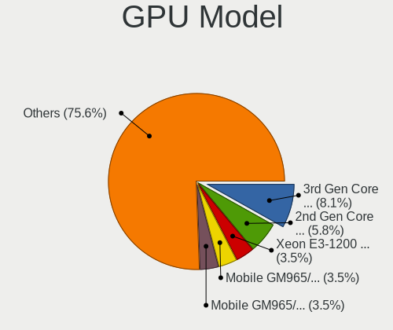

| Model                                                                                    | Computers | Percent |
|------------------------------------------------------------------------------------------|-----------|---------|
| Intel 3rd Gen Core processor Graphics Controller                                         | 7         | 8.24%   |
| Intel 2nd Generation Core Processor Family Integrated Graphics Controller                | 5         | 5.88%   |
| Intel Xeon E3-1200 v3/4th Gen Core Processor Integrated Graphics Controller              | 3         | 3.53%   |
| Intel Mobile GM965/GL960 Integrated Graphics Controller (secondary)                      | 3         | 3.53%   |
| Intel Mobile GM965/GL960 Integrated Graphics Controller (primary)                        | 3         | 3.53%   |
| Intel HD Graphics 620                                                                    | 3         | 3.53%   |
| AMD Kabini [Radeon HD 8330]                                                              | 3         | 3.53%   |
| Silicon Integrated Systems [SiS] 771/671 PCIE VGA Display Adapter                        | 2         | 2.35%   |
| Nvidia GP106 [GeForce GTX 1060 6GB]                                                      | 2         | 2.35%   |
| Matrox Electronics Systems MGA G200eW WPCM450                                            | 2         | 2.35%   |
| Intel Xeon E3-1200 v2/3rd Gen Core processor Graphics Controller                         | 2         | 2.35%   |
| Intel Mobile 4 Series Chipset Integrated Graphics Controller                             | 2         | 2.35%   |
| Intel Atom Processor Z36xxx/Z37xxx Series Graphics & Display                             | 2         | 2.35%   |
| Intel 82G33/G31 Express Integrated Graphics Controller                                   | 2         | 2.35%   |
| AMD Turks XT [Radeon HD 6670/7670]                                                       | 2         | 2.35%   |
| AMD RS482M [Mobility Radeon Xpress 200]                                                  | 2         | 2.35%   |
| Nvidia TU117M [GeForce GTX 1650 Ti Mobile]                                               | 1         | 1.18%   |
| Nvidia TU102 [GeForce RTX 2080 Ti]                                                       | 1         | 1.18%   |
| Nvidia GP107 [GeForce GTX 1050 Ti]                                                       | 1         | 1.18%   |
| Nvidia GP106M [GeForce GTX 1060 Mobile]                                                  | 1         | 1.18%   |
| Nvidia GM108M [GeForce MX110]                                                            | 1         | 1.18%   |
| Nvidia GM108M [GeForce 940MX]                                                            | 1         | 1.18%   |
| Nvidia GM107M [GeForce GTX 960M]                                                         | 1         | 1.18%   |
| Nvidia GM107 [GeForce GTX 750 Ti]                                                        | 1         | 1.18%   |
| Nvidia GK107 [GeForce GTX 650]                                                           | 1         | 1.18%   |
| Nvidia GF119M [NVS 4200M]                                                                | 1         | 1.18%   |
| Nvidia GF116 [GeForce GTS 450 Rev. 2]                                                    | 1         | 1.18%   |
| Nvidia GF110 [GeForce GTX 580]                                                           | 1         | 1.18%   |
| Nvidia GF110 [GeForce GTX 570]                                                           | 1         | 1.18%   |
| Nvidia G96C [GeForce 9500 GT]                                                            | 1         | 1.18%   |
| Nvidia G84M [GeForce 8600M GT]                                                           | 1         | 1.18%   |
| Intel UHD Graphics 620                                                                   | 1         | 1.18%   |
| Intel HD Graphics 5500                                                                   | 1         | 1.18%   |
| Intel HD Graphics 530                                                                    | 1         | 1.18%   |
| Intel Haswell-ULT Integrated Graphics Controller                                         | 1         | 1.18%   |
| Intel GeminiLake [UHD Graphics 600]                                                      | 1         | 1.18%   |
| Intel Core Processor Integrated Graphics Controller                                      | 1         | 1.18%   |
| Intel CometLake-H GT2 [UHD Graphics]                                                     | 1         | 1.18%   |
| Intel Atom/Celeron/Pentium Processor x5-E8000/J3xxx/N3xxx Integrated Graphics Controller | 1         | 1.18%   |
| Intel Atom Processor D4xx/D5xx/N4xx/N5xx Integrated Graphics Controller                  | 1         | 1.18%   |

GPU Combo
---------

Combinations of graphics cards

| Name            | Computers | Percent |
|-----------------|-----------|---------|
| 1 x Intel       | 31        | 43.06%  |
| 1 x AMD         | 22        | 30.56%  |
| 1 x Nvidia      | 9         | 12.5%   |
| Intel + Nvidia  | 6         | 8.33%   |
| 1 x SiS         | 2         | 2.78%   |
| Nvidia + Matrox | 1         | 1.39%   |
| 1 x Matrox      | 1         | 1.39%   |

GPU Driver
----------

Free vs proprietary

| Driver      | Computers | Percent |
|-------------|-----------|---------|
| Free        | 61        | 83.56%  |
| Unknown     | 8         | 10.96%  |
| Proprietary | 4         | 5.48%   |

GPU Memory
----------

Total video memory

| Size in GB | Computers | Percent |
|------------|-----------|---------|
| Unknown    | 44        | 59.46%  |
| 0.01-0.5   | 12        | 16.22%  |
| 1.01-2.0   | 7         | 9.46%   |
| 0.51-1.0   | 5         | 6.76%   |
| 3.01-4.0   | 3         | 4.05%   |
| 5.01-6.0   | 2         | 2.7%    |
| 2.01-3.0   | 1         | 1.35%   |

Monitor
-------

Monitor Vendor
--------------

Monitor vendors

| Vendor                  | Computers | Percent |
|-------------------------|-----------|---------|
| Samsung Electronics     | 11        | 15.94%  |
| AU Optronics            | 11        | 15.94%  |
| LG Display              | 8         | 11.59%  |
| Chimei Innolux          | 6         | 8.7%    |
| Goldstar                | 5         | 7.25%   |
| Acer                    | 5         | 7.25%   |
| BOE                     | 3         | 4.35%   |
| Philips                 | 2         | 2.9%    |
| Apple                   | 2         | 2.9%    |
| Ancor Communications    | 2         | 2.9%    |
| ViewSonic               | 1         | 1.45%   |
| Unknown                 | 1         | 1.45%   |
| Sony                    | 1         | 1.45%   |
| Sceptre Tech            | 1         | 1.45%   |
| Panasonic               | 1         | 1.45%   |
| NXP                     | 1         | 1.45%   |
| LG Philips              | 1         | 1.45%   |
| Lenovo                  | 1         | 1.45%   |
| Iiyama                  | 1         | 1.45%   |
| Hewlett-Packard         | 1         | 1.45%   |
| CPT                     | 1         | 1.45%   |
| Chi Mei Optoelectronics | 1         | 1.45%   |
| BenQ                    | 1         | 1.45%   |
| AOC                     | 1         | 1.45%   |

Monitor Model
-------------

Monitor models

| Model                                                                  | Computers | Percent |
|------------------------------------------------------------------------|-----------|---------|
| LG Display LCD Monitor LGD0469 1920x1080 382x215mm 17.3-inch           | 2         | 2.82%   |
| LG Display LCD Monitor LGD038E 1366x768 344x194mm 15.5-inch            | 2         | 2.82%   |
| Goldstar W2043 GSM4E9D 1600x900 443x249mm 20.0-inch                    | 2         | 2.82%   |
| Chimei Innolux LCD Monitor CMN15BF 1366x768 344x194mm 15.5-inch        | 2         | 2.82%   |
| AU Optronics LCD Monitor AUO303E 1600x900 309x174mm 14.0-inch          | 2         | 2.82%   |
| ViewSonic VX3211-2K VSCF634 2560x1440 700x390mm 31.5-inch              | 1         | 1.41%   |
| Unknown LCD Monitor SHI LCD-TV 4640x1080                               | 1         | 1.41%   |
| Sony LCD Monitor AVSYSTEM                                              | 1         | 1.41%   |
| Sceptre Tech H32 SPT0CB8 1920x1080 575x323mm 26.0-inch                 | 1         | 1.41%   |
| Samsung Electronics U28E590 SAM0C4E 3840x2160 610x350mm 27.7-inch      | 1         | 1.41%   |
| Samsung Electronics SyncMaster SAM0593 1920x1080 477x268mm 21.5-inch   | 1         | 1.41%   |
| Samsung Electronics SyncMaster SAM01B7 1280x1024 338x270mm 17.0-inch   | 1         | 1.41%   |
| Samsung Electronics SMS19A100 SAM0867 1366x768 410x230mm 18.5-inch     | 1         | 1.41%   |
| Samsung Electronics SMBX2331 SAM076F 1920x1080 510x290mm 23.1-inch     | 1         | 1.41%   |
| Samsung Electronics S/T 77/76DFX STN0006 1280x1024 312x234mm 15.4-inch | 1         | 1.41%   |
| Samsung Electronics LCD Monitor SEC4E45 1280x800 331x207mm 15.4-inch   | 1         | 1.41%   |
| Samsung Electronics LCD Monitor SEC4249 1366x768 309x174mm 14.0-inch   | 1         | 1.41%   |
| Samsung Electronics LCD Monitor SEC3358 1280x800 331x207mm 15.4-inch   | 1         | 1.41%   |
| Samsung Electronics LCD Monitor SDC4752 1366x768 344x194mm 15.5-inch   | 1         | 1.41%   |
| Samsung Electronics LCD Monitor SDC4347 1366x768 344x193mm 15.5-inch   | 1         | 1.41%   |
| Philips 200V4 PHLC0BF 1600x900 432x240mm 19.5-inch                     | 1         | 1.41%   |
| Philips 170B PHL081D 1280x1024 338x270mm 17.0-inch                     | 1         | 1.41%   |
| Panasonic TV MEIA296 3840x2160 698x392mm 31.5-inch                     | 1         | 1.41%   |
| NXP OptiPlex 9010 NXP1111 1920x1080 510x286mm 23.0-inch                | 1         | 1.41%   |
| LG Philips LCD Monitor LPLA900 1280x800 331x207mm 15.4-inch            | 1         | 1.41%   |
| LG Display LCD Monitor LGD03B7 1366x768 309x174mm 14.0-inch            | 1         | 1.41%   |
| LG Display LCD Monitor LGD03B3 1366x768 310x174mm 14.0-inch            | 1         | 1.41%   |
| LG Display LCD Monitor LGD02EB 1366x768 309x174mm 14.0-inch            | 1         | 1.41%   |
| LG Display LCD Monitor LGD0251 1366x768 310x174mm 14.0-inch            | 1         | 1.41%   |
| Lenovo LEN T2454pA LEN60C9 1920x1200 518x324mm 24.1-inch               | 1         | 1.41%   |
| Iiyama PLX2481H IVM611D 1920x1080 520x290mm 23.4-inch                  | 1         | 1.41%   |
| Hewlett-Packard LE1851w HWP2840 1366x768 413x234mm 18.7-inch           | 1         | 1.41%   |
| Goldstar W2243 GSM56FF 1920x1080 477x268mm 21.5-inch                   | 1         | 1.41%   |
| Goldstar W1953 GSM4BA6 1360x768 406x229mm 18.4-inch                    | 1         | 1.41%   |
| Goldstar E2441 GSM581F 1920x1080 531x299mm 24.0-inch                   | 1         | 1.41%   |
| CPT LCD Monitor CPT13B1 1280x800 331x207mm 15.4-inch                   | 1         | 1.41%   |
| Chimei Innolux LCD Monitor CMN15DB 1366x768 344x193mm 15.5-inch        | 1         | 1.41%   |
| Chimei Innolux LCD Monitor CMN15C6 1366x768 344x193mm 15.5-inch        | 1         | 1.41%   |
| Chimei Innolux LCD Monitor CMN1521 1920x1080 344x193mm 15.5-inch       | 1         | 1.41%   |
| Chimei Innolux LCD Monitor CMN1476 1366x768 309x174mm 14.0-inch        | 1         | 1.41%   |

Monitor Resolution
------------------

Monitor screen resolution

| Resolution         | Computers | Percent |
|--------------------|-----------|---------|
| 1366x768 (WXGA)    | 23        | 33.33%  |
| 1920x1080 (FHD)    | 18        | 26.09%  |
| 1600x900 (HD+)     | 6         | 8.7%    |
| 1280x800 (WXGA)    | 6         | 8.7%    |
| 1280x1024 (SXGA)   | 3         | 4.35%   |
| 3840x2160 (4K)     | 2         | 2.9%    |
| 2560x1440 (QHD)    | 2         | 2.9%    |
| 1680x1050 (WSXGA+) | 2         | 2.9%    |
| Unknown            | 2         | 2.9%    |
| 4640x1080          | 1         | 1.45%   |
| 2880x900           | 1         | 1.45%   |
| 1440x900 (WXGA+)   | 1         | 1.45%   |
| 1360x768           | 1         | 1.45%   |
| 1024x600           | 1         | 1.45%   |

Monitor Diagonal
----------------

Diagonal size in inches

| Inches  | Computers | Percent |
|---------|-----------|---------|
| 15      | 23        | 33.82%  |
| 14      | 8         | 11.76%  |
| 23      | 5         | 7.35%   |
| 17      | 5         | 7.35%   |
| 21      | 4         | 5.88%   |
| 18      | 4         | 5.88%   |
| 27      | 3         | 4.41%   |
| 20      | 3         | 4.41%   |
| 31      | 2         | 2.94%   |
| 24      | 2         | 2.94%   |
| 19      | 2         | 2.94%   |
| 13      | 2         | 2.94%   |
| Unknown | 2         | 2.94%   |
| 84      | 1         | 1.47%   |
| 22      | 1         | 1.47%   |
| 10      | 1         | 1.47%   |

Monitor Width
-------------

Physical width

| Width in mm | Computers | Percent |
|-------------|-----------|---------|
| 301-350     | 35        | 51.47%  |
| 401-500     | 14        | 20.59%  |
| 501-600     | 9         | 13.24%  |
| 601-700     | 3         | 4.41%   |
| 351-400     | 3         | 4.41%   |
| Unknown     | 2         | 2.94%   |
| 201-300     | 1         | 1.47%   |
| 1501-2000   | 1         | 1.47%   |

Aspect Ratio
------------

Proportional relationship between the width and the height

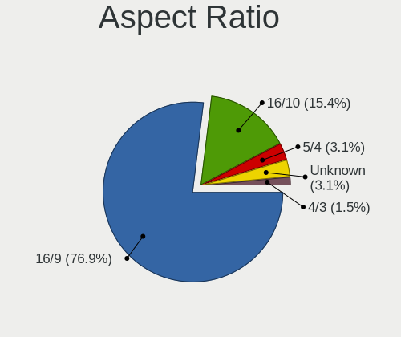

| Ratio   | Computers | Percent |
|---------|-----------|---------|
| 16/9    | 51        | 77.27%  |
| 16/10   | 10        | 15.15%  |
| 5/4     | 2         | 3.03%   |
| Unknown | 2         | 3.03%   |
| 4/3     | 1         | 1.52%   |

Monitor Area
------------

Area in inch²

| Area in inch² | Computers | Percent |
|----------------|-----------|---------|
| 101-110        | 22        | 32.35%  |
| 201-250        | 11        | 16.18%  |
| 81-90          | 10        | 14.71%  |
| 141-150        | 6         | 8.82%   |
| 151-200        | 5         | 7.35%   |
| 301-350        | 3         | 4.41%   |
| 121-130        | 3         | 4.41%   |
| 351-500        | 2         | 2.94%   |
| Unknown        | 2         | 2.94%   |
| More than 1000 | 1         | 1.47%   |
| 41-50          | 1         | 1.47%   |
| 251-300        | 1         | 1.47%   |
| 111-120        | 1         | 1.47%   |

Pixel Density
-------------

Pixels per inch

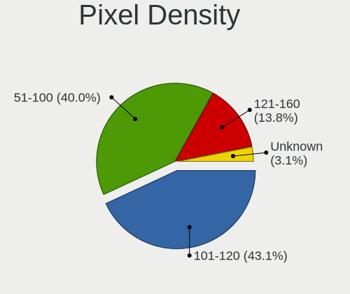

| Density | Computers | Percent |
|---------|-----------|---------|
| 101-120 | 28        | 42.42%  |
| 51-100  | 27        | 40.91%  |
| 121-160 | 9         | 13.64%  |
| Unknown | 2         | 3.03%   |

Multiple Monitors
-----------------

Total monitors connected

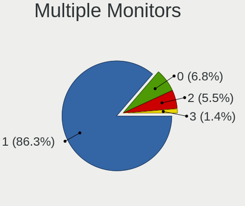

| Total | Computers | Percent |
|-------|-----------|---------|
| 1     | 62        | 86.11%  |
| 0     | 5         | 6.94%   |
| 2     | 4         | 5.56%   |
| 3     | 1         | 1.39%   |

Network
-------

Net Controller Vendor
---------------------

Controller vendors

| Vendor                            | Computers | Percent |
|-----------------------------------|-----------|---------|
| Realtek Semiconductor             | 45        | 39.47%  |
| Qualcomm Atheros                  | 21        | 18.42%  |
| Intel                             | 15        | 13.16%  |
| Broadcom                          | 12        | 10.53%  |
| Broadcom Limited                  | 4         | 3.51%   |
| TP-Link                           | 2         | 1.75%   |
| Nvidia                            | 2         | 1.75%   |
| Marvell Technology Group          | 2         | 1.75%   |
| Silicon Integrated Systems [SiS]  | 1         | 0.88%   |
| Samsung Electronics               | 1         | 0.88%   |
| Ralink                            | 1         | 0.88%   |
| Qualcomm                          | 1         | 0.88%   |
| NetGear                           | 1         | 0.88%   |
| Ericsson Business Mobile Networks | 1         | 0.88%   |
| D-Link                            | 1         | 0.88%   |
| CyberTAN Technology               | 1         | 0.88%   |
| AVM                               | 1         | 0.88%   |
| ASIX Electronics                  | 1         | 0.88%   |
| Accton Technology                 | 1         | 0.88%   |

Net Controller Model
--------------------

Controller models

| Model                                                                                 | Computers | Percent |
|---------------------------------------------------------------------------------------|-----------|---------|
| Realtek RTL8111/8168/8411 PCI Express Gigabit Ethernet Controller                     | 31        | 22.79%  |
| Realtek RTL810xE PCI Express Fast Ethernet controller                                 | 11        | 8.09%   |
| Qualcomm Atheros QCA9565 / AR9565 Wireless Network Adapter                            | 6         | 4.41%   |
| Qualcomm Atheros AR9485 Wireless Network Adapter                                      | 4         | 2.94%   |
| Realtek 802.11ac NIC                                                                  | 3         | 2.21%   |
| Intel 82579LM Gigabit Network Connection (Lewisville)                                 | 3         | 2.21%   |
| Broadcom BCM4312 802.11b/g LP-PHY                                                     | 3         | 2.21%   |
| Qualcomm Atheros QCA9377 802.11ac Wireless Network Adapter                            | 2         | 1.47%   |
| Qualcomm Atheros QCA8172 Fast Ethernet                                                | 2         | 1.47%   |
| Qualcomm Atheros AR9285 Wireless Network Adapter (PCI-Express)                        | 2         | 1.47%   |
| Qualcomm Atheros AR8151 v2.0 Gigabit Ethernet                                         | 2         | 1.47%   |
| Qualcomm Atheros AR242x / AR542x Wireless Network Adapter (PCI-Express)               | 2         | 1.47%   |
| Nvidia MCP61 Ethernet                                                                 | 2         | 1.47%   |
| Intel Wireless 7260                                                                   | 2         | 1.47%   |
| Intel Centrino Wireless-N 2230                                                        | 2         | 1.47%   |
| Intel 82579V Gigabit Network Connection                                               | 2         | 1.47%   |
| Broadcom Limited BCM4401-B0 100Base-TX                                                | 2         | 1.47%   |
| Broadcom BCM4311 802.11b/g WLAN                                                       | 2         | 1.47%   |
| TP-Link TL-WN821N v5/v6 [RTL8192EU]                                                   | 1         | 0.74%   |
| TP-Link Archer T4U ver.3                                                              | 1         | 0.74%   |
| Silicon Integrated Systems [SiS] 191 Gigabit Ethernet Adapter                         | 1         | 0.74%   |
| Samsung Galaxy series, misc. (tethering mode)                                         | 1         | 0.74%   |
| Realtek RTL8821CE 802.11ac PCIe Wireless Network Adapter                              | 1         | 0.74%   |
| Realtek RTL8812AU 802.11a/b/g/n/ac 2T2R DB WLAN Adapter                               | 1         | 0.74%   |
| Realtek RTL8723DE Wireless Network Adapter                                            | 1         | 0.74%   |
| Realtek RTL8190 802.11n PCI Wireless Network Adapter                                  | 1         | 0.74%   |
| Realtek RTL8188EUS 802.11n Wireless Network Adapter                                   | 1         | 0.74%   |
| Realtek RTL8188EE Wireless Network Adapter                                            | 1         | 0.74%   |
| Realtek RTL8187B Wireless 802.11g 54Mbps Network Adapter                              | 1         | 0.74%   |
| Realtek RTL8153 Gigabit Ethernet Adapter                                              | 1         | 0.74%   |
| Realtek 802.11n                                                                       | 1         | 0.74%   |
| Ralink RT3090 Wireless 802.11n 1T/1R PCIe                                             | 1         | 0.74%   |
| Qualcomm OnePlus 6                                                                    | 1         | 0.74%   |
| Qualcomm Atheros Killer E220x Gigabit Ethernet Controller                             | 1         | 0.74%   |
| Qualcomm Atheros AR93xx Wireless Network Adapter                                      | 1         | 0.74%   |
| Qualcomm Atheros AR8162 Fast Ethernet                                                 | 1         | 0.74%   |
| Qualcomm Atheros AR8131 Gigabit Ethernet                                              | 1         | 0.74%   |
| Qualcomm Atheros AR5418 Wireless Network Adapter [AR5008E 802.11(a)bgn] (PCI-Express) | 1         | 0.74%   |
| Qualcomm Atheros AR5212/5213/2414 Wireless Network Adapter                            | 1         | 0.74%   |
| NetGear WG111v2 54 Mbps Wireless [RealTek RTL8187L]                                   | 1         | 0.74%   |

Wireless Vendor
---------------

Wireless vendors

| Vendor                | Computers | Percent |
|-----------------------|-----------|---------|
| Qualcomm Atheros      | 19        | 32.76%  |
| Intel                 | 11        | 18.97%  |
| Realtek Semiconductor | 10        | 17.24%  |
| Broadcom              | 7         | 12.07%  |
| Broadcom Limited      | 3         | 5.17%   |
| TP-Link               | 2         | 3.45%   |
| Ralink                | 1         | 1.72%   |
| NetGear               | 1         | 1.72%   |
| D-Link                | 1         | 1.72%   |
| CyberTAN Technology   | 1         | 1.72%   |
| AVM                   | 1         | 1.72%   |
| Accton Technology     | 1         | 1.72%   |

Wireless Model
--------------

Wireless models

| Model                                                                                 | Computers | Percent |
|---------------------------------------------------------------------------------------|-----------|---------|
| Qualcomm Atheros QCA9565 / AR9565 Wireless Network Adapter                            | 6         | 10.17%  |
| Qualcomm Atheros AR9485 Wireless Network Adapter                                      | 4         | 6.78%   |
| Realtek 802.11ac NIC                                                                  | 3         | 5.08%   |
| Broadcom BCM4312 802.11b/g LP-PHY                                                     | 3         | 5.08%   |
| Qualcomm Atheros QCA9377 802.11ac Wireless Network Adapter                            | 2         | 3.39%   |
| Qualcomm Atheros AR9285 Wireless Network Adapter (PCI-Express)                        | 2         | 3.39%   |
| Qualcomm Atheros AR242x / AR542x Wireless Network Adapter (PCI-Express)               | 2         | 3.39%   |
| Intel Wireless 7260                                                                   | 2         | 3.39%   |
| Intel Centrino Wireless-N 2230                                                        | 2         | 3.39%   |
| Broadcom BCM4311 802.11b/g WLAN                                                       | 2         | 3.39%   |
| TP-Link TL-WN821N v5/v6 [RTL8192EU]                                                   | 1         | 1.69%   |
| TP-Link Archer T4U ver.3                                                              | 1         | 1.69%   |
| Realtek RTL8821CE 802.11ac PCIe Wireless Network Adapter                              | 1         | 1.69%   |
| Realtek RTL8812AU 802.11a/b/g/n/ac 2T2R DB WLAN Adapter                               | 1         | 1.69%   |
| Realtek RTL8723DE Wireless Network Adapter                                            | 1         | 1.69%   |
| Realtek RTL8190 802.11n PCI Wireless Network Adapter                                  | 1         | 1.69%   |
| Realtek RTL8188EUS 802.11n Wireless Network Adapter                                   | 1         | 1.69%   |
| Realtek RTL8188EE Wireless Network Adapter                                            | 1         | 1.69%   |
| Realtek RTL8187B Wireless 802.11g 54Mbps Network Adapter                              | 1         | 1.69%   |
| Realtek 802.11n                                                                       | 1         | 1.69%   |
| Ralink RT3090 Wireless 802.11n 1T/1R PCIe                                             | 1         | 1.69%   |
| Qualcomm Atheros AR93xx Wireless Network Adapter                                      | 1         | 1.69%   |
| Qualcomm Atheros AR5418 Wireless Network Adapter [AR5008E 802.11(a)bgn] (PCI-Express) | 1         | 1.69%   |
| Qualcomm Atheros AR5212/5213/2414 Wireless Network Adapter                            | 1         | 1.69%   |
| NetGear WG111v2 54 Mbps Wireless [RealTek RTL8187L]                                   | 1         | 1.69%   |
| Intel Wireless 8260                                                                   | 1         | 1.69%   |
| Intel Wireless 7265                                                                   | 1         | 1.69%   |
| Intel Wireless 3165                                                                   | 1         | 1.69%   |
| Intel Comet Lake PCH CNVi WiFi                                                        | 1         | 1.69%   |
| Intel Centrino Ultimate-N 6300                                                        | 1         | 1.69%   |
| Intel Centrino Advanced-N 6235                                                        | 1         | 1.69%   |
| Intel Centrino Advanced-N 6205 [Taylor Peak]                                          | 1         | 1.69%   |
| D-Link DWA-125 Wireless N 150 Adapter(rev.A3) [Ralink RT5370]                         | 1         | 1.69%   |
| CyberTAN Siemens S30853-S1031-R351 802.11g Wireless Adapter [Atheros AR5523]          | 1         | 1.69%   |
| Broadcom Limited BCM4352 802.11ac Wireless Network Adapter                            | 1         | 1.69%   |
| Broadcom Limited BCM4321 802.11a/b/g/n                                                | 1         | 1.69%   |
| Broadcom Limited BCM4312 802.11b/g LP-PHY                                             | 1         | 1.69%   |
| Broadcom BCM4321 802.11a/b/g/n                                                        | 1         | 1.69%   |
| Broadcom BCM43142 802.11b/g/n                                                         | 1         | 1.69%   |
| AVM FRITZ WLAN N v2 [RT5572/rt2870.bin]                                               | 1         | 1.69%   |

Ethernet Vendor
---------------

Ethernet vendors

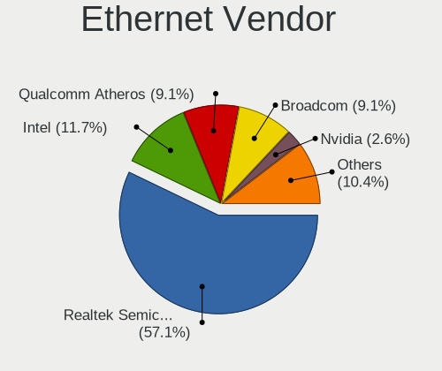

| Vendor                           | Computers | Percent |
|----------------------------------|-----------|---------|
| Realtek Semiconductor            | 43        | 56.58%  |
| Intel                            | 9         | 11.84%  |
| Qualcomm Atheros                 | 7         | 9.21%   |
| Broadcom                         | 7         | 9.21%   |
| Nvidia                           | 2         | 2.63%   |
| Marvell Technology Group         | 2         | 2.63%   |
| Broadcom Limited                 | 2         | 2.63%   |
| Silicon Integrated Systems [SiS] | 1         | 1.32%   |
| Samsung Electronics              | 1         | 1.32%   |
| Qualcomm                         | 1         | 1.32%   |
| ASIX Electronics                 | 1         | 1.32%   |

Ethernet Model
--------------

Ethernet models

| Model                                                             | Computers | Percent |
|-------------------------------------------------------------------|-----------|---------|
| Realtek RTL8111/8168/8411 PCI Express Gigabit Ethernet Controller | 31        | 40.79%  |
| Realtek RTL810xE PCI Express Fast Ethernet controller             | 11        | 14.47%  |
| Intel 82579LM Gigabit Network Connection (Lewisville)             | 3         | 3.95%   |
| Qualcomm Atheros QCA8172 Fast Ethernet                            | 2         | 2.63%   |
| Qualcomm Atheros AR8151 v2.0 Gigabit Ethernet                     | 2         | 2.63%   |
| Nvidia MCP61 Ethernet                                             | 2         | 2.63%   |
| Intel 82579V Gigabit Network Connection                           | 2         | 2.63%   |
| Broadcom Limited BCM4401-B0 100Base-TX                            | 2         | 2.63%   |
| Silicon Integrated Systems [SiS] 191 Gigabit Ethernet Adapter     | 1         | 1.32%   |
| Samsung Galaxy series, misc. (tethering mode)                     | 1         | 1.32%   |
| Realtek RTL8153 Gigabit Ethernet Adapter                          | 1         | 1.32%   |
| Qualcomm OnePlus 6                                                | 1         | 1.32%   |
| Qualcomm Atheros Killer E220x Gigabit Ethernet Controller         | 1         | 1.32%   |
| Qualcomm Atheros AR8162 Fast Ethernet                             | 1         | 1.32%   |
| Qualcomm Atheros AR8131 Gigabit Ethernet                          | 1         | 1.32%   |
| Marvell Group 88E8058 PCI-E Gigabit Ethernet Controller           | 1         | 1.32%   |
| Marvell Group 88E8040 PCI-E Fast Ethernet Controller              | 1         | 1.32%   |
| Intel Ethernet Connection I218-LM                                 | 1         | 1.32%   |
| Intel Ethernet Connection (3) I218-LM                             | 1         | 1.32%   |
| Intel 82576 Gigabit Network Connection                            | 1         | 1.32%   |
| Intel 82574L Gigabit Network Connection                           | 1         | 1.32%   |
| Broadcom NetXtreme II BCM5709 Gigabit Ethernet                    | 1         | 1.32%   |
| Broadcom NetXtreme BCM57765 Gigabit Ethernet PCIe                 | 1         | 1.32%   |
| Broadcom NetLink BCM5906M Fast Ethernet PCI Express               | 1         | 1.32%   |
| Broadcom NetLink BCM5787M Gigabit Ethernet PCI Express            | 1         | 1.32%   |
| Broadcom NetLink BCM5784M Gigabit Ethernet PCIe                   | 1         | 1.32%   |
| Broadcom NetLink BCM57785 Gigabit Ethernet PCIe                   | 1         | 1.32%   |
| Broadcom BCM4401-B0 100Base-TX                                    | 1         | 1.32%   |
| ASIX AX88179 Gigabit Ethernet                                     | 1         | 1.32%   |

Net Controller Kind
-------------------

Ethernet, WiFi or modem

| Kind     | Computers | Percent |
|----------|-----------|---------|
| Ethernet | 72        | 56.69%  |
| WiFi     | 54        | 42.52%  |
| Modem    | 1         | 0.79%   |

Used Controller
---------------

Currently used network controller

| Kind     | Computers | Percent |
|----------|-----------|---------|
| Ethernet | 39        | 52.7%   |
| WiFi     | 35        | 47.3%   |

NICs
----

Total network controllers on board

| Total | Computers | Percent |
|-------|-----------|---------|
| 2     | 45        | 62.5%   |
| 1     | 23        | 31.94%  |
| 3     | 2         | 2.78%   |
| 4     | 1         | 1.39%   |
| 0     | 1         | 1.39%   |

IPv6
----

IPv6 vs IPv4

| Used | Computers | Percent |
|------|-----------|---------|
| No   | 64        | 88.89%  |
| Yes  | 8         | 11.11%  |

Bluetooth
---------

Bluetooth Vendor
----------------

Controller vendors

| Vendor                          | Computers | Percent |
|---------------------------------|-----------|---------|
| Qualcomm Atheros Communications | 8         | 25%     |
| Intel                           | 6         | 18.75%  |
| Cambridge Silicon Radio         | 5         | 15.63%  |
| Lite-On Technology              | 3         | 9.38%   |
| Apple                           | 3         | 9.38%   |
| Realtek Semiconductor           | 2         | 6.25%   |
| Hewlett-Packard                 | 2         | 6.25%   |
| Ralink Technology               | 1         | 3.13%   |
| Integrated System Solution      | 1         | 3.13%   |
| Foxconn / Hon Hai               | 1         | 3.13%   |

Bluetooth Model
---------------

Controller models

| Model                                                       | Computers | Percent |
|-------------------------------------------------------------|-----------|---------|
| Cambridge Silicon Radio Bluetooth Dongle (HCI mode)         | 5         | 15.63%  |
| Qualcomm Atheros AR3012 Bluetooth 4.0                       | 3         | 9.38%   |
| Intel Bluetooth wireless interface                          | 3         | 9.38%   |
| Realtek  Bluetooth 4.2 Adapter                              | 2         | 6.25%   |
| Qualcomm Atheros AR9462 Bluetooth                           | 2         | 6.25%   |
| Lite-On Atheros AR3012 Bluetooth                            | 2         | 6.25%   |
| Intel Centrino Bluetooth Wireless Transceiver               | 2         | 6.25%   |
| Apple Built-in Bluetooth 2.0+EDR HCI                        | 2         | 6.25%   |
| Ralink Motorola BC4 Bluetooth 3.0+HS Adapter                | 1         | 3.13%   |
| Qualcomm Atheros  Bluetooth Device                          | 1         | 3.13%   |
| Qualcomm Atheros Bluetooth USB Host Controller              | 1         | 3.13%   |
| Qualcomm Atheros AR3011 Bluetooth                           | 1         | 3.13%   |
| Lite-On Qualcomm Atheros QCA9377 Bluetooth                  | 1         | 3.13%   |
| Intel AX201 Bluetooth                                       | 1         | 3.13%   |
| Integrated System Solution KY-BT100 Bluetooth Adapter       | 1         | 3.13%   |
| HP Integrated Module with Bluetooth 2.1 Wireless technology | 1         | 3.13%   |
| HP Broadcom 2070 Bluetooth Combo                            | 1         | 3.13%   |
| Foxconn / Hon Hai BCM20702A0                                | 1         | 3.13%   |
| Apple Bluetooth HCI                                         | 1         | 3.13%   |

Sound
-----

Sound Vendor
------------

Sound card vendors

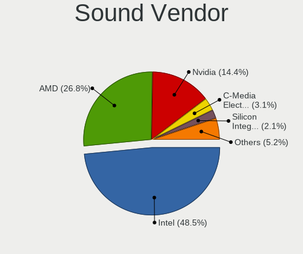

| Vendor                           | Computers | Percent |
|----------------------------------|-----------|---------|
| Intel                            | 46        | 48.42%  |
| AMD                              | 25        | 26.32%  |
| Nvidia                           | 14        | 14.74%  |
| C-Media Electronics              | 3         | 3.16%   |
| Silicon Integrated Systems [SiS] | 2         | 2.11%   |
| Texas Instruments                | 1         | 1.05%   |
| Logitech                         | 1         | 1.05%   |
| Creative Technology              | 1         | 1.05%   |
| Creative Labs                    | 1         | 1.05%   |
| Corsair                          | 1         | 1.05%   |

Sound Model
-----------

Sound card models

| Model                                                                      | Computers | Percent |
|----------------------------------------------------------------------------|-----------|---------|
| Intel 7 Series/C216 Chipset Family High Definition Audio Controller        | 11        | 9.82%   |
| AMD SBx00 Azalia (Intel HDA)                                               | 8         | 7.14%   |
| Intel 6 Series/C200 Series Chipset Family High Definition Audio Controller | 6         | 5.36%   |
| AMD FCH Azalia Controller                                                  | 6         | 5.36%   |
| Intel NM10/ICH7 Family High Definition Audio Controller                    | 5         | 4.46%   |
| Intel Sunrise Point-LP HD Audio                                            | 4         | 3.57%   |
| Intel 82801H (ICH8 Family) HD Audio Controller                             | 4         | 3.57%   |
| AMD Kabini HDMI/DP Audio                                                   | 4         | 3.57%   |
| Nvidia GP106 High Definition Audio Controller                              | 3         | 2.68%   |
| Intel Xeon E3-1200 v3/4th Gen Core Processor HD Audio Controller           | 3         | 2.68%   |
| Intel 8 Series/C220 Series Chipset High Definition Audio Controller        | 3         | 2.68%   |
| AMD Turks HDMI Audio [Radeon HD 6500/6600 / 6700M Series]                  | 3         | 2.68%   |
| AMD Starship/Matisse HD Audio Controller                                   | 3         | 2.68%   |
| Silicon Integrated Systems [SiS] Azalia Audio Controller                   | 2         | 1.79%   |
| Nvidia MCP61 High Definition Audio                                         | 2         | 1.79%   |
| Nvidia GF110 High Definition Audio Controller                              | 2         | 1.79%   |
| Intel Atom Processor Z36xxx/Z37xxx Series High Definition Audio Controller | 2         | 1.79%   |
| Intel 82801I (ICH9 Family) HD Audio Controller                             | 2         | 1.79%   |
| Intel 5 Series/3400 Series Chipset High Definition Audio                   | 2         | 1.79%   |
| C-Media Electronics Audio Adapter                                          | 2         | 1.79%   |
| AMD Cedar HDMI Audio [Radeon HD 5400/6300/7300 Series]                     | 2         | 1.79%   |
| Texas Instruments PCM2900 Audio Codec                                      | 1         | 0.89%   |
| Nvidia TU107 GeForce GTX 1650 High Definition Audio Controller             | 1         | 0.89%   |
| Nvidia TU102 High Definition Audio Controller                              | 1         | 0.89%   |
| Nvidia GP107GL High Definition Audio Controller                            | 1         | 0.89%   |
| Nvidia GM107 High Definition Audio Controller [GeForce 940MX]              | 1         | 0.89%   |
| Nvidia GK107 HDMI Audio Controller                                         | 1         | 0.89%   |
| Nvidia GF119 HDMI Audio Controller                                         | 1         | 0.89%   |
| Nvidia GF116 High Definition Audio Controller                              | 1         | 0.89%   |
| Logitech Logitech USB Microphone                                           | 1         | 0.89%   |
| Intel Wildcat Point-LP High Definition Audio Controller                    | 1         | 0.89%   |
| Intel Haswell-ULT HD Audio Controller                                      | 1         | 0.89%   |
| Intel Comet Lake PCH cAVS                                                  | 1         | 0.89%   |
| Intel Celeron/Pentium Silver Processor High Definition Audio               | 1         | 0.89%   |
| Intel Broadwell-U Audio Controller                                         | 1         | 0.89%   |
| Intel 9 Series Chipset Family HD Audio Controller                          | 1         | 0.89%   |
| Intel 82801JI (ICH10 Family) HD Audio Controller                           | 1         | 0.89%   |
| Intel 8 Series HD Audio Controller                                         | 1         | 0.89%   |
| Intel 100 Series/C230 Series Chipset Family HD Audio Controller            | 1         | 0.89%   |
| Creative Technology Sound BlasterX G1                                      | 1         | 0.89%   |

Memory
------

Memory Vendor
-------------

Memory module vendors

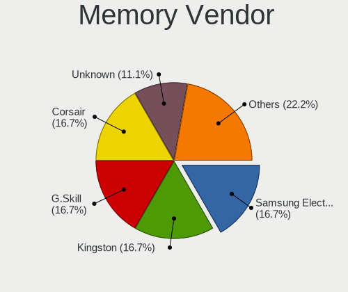

| Vendor              | Computers | Percent |
|---------------------|-----------|---------|
| Samsung Electronics | 3         | 16.67%  |
| Kingston            | 3         | 16.67%  |
| G.Skill             | 3         | 16.67%  |
| Corsair             | 3         | 16.67%  |
| Unknown             | 2         | 11.11%  |
| SK hynix            | 2         | 11.11%  |
| Smart               | 1         | 5.56%   |
| Elpida              | 1         | 5.56%   |

Memory Model
------------

Memory module models

| Model                                                    | Computers | Percent |
|----------------------------------------------------------|-----------|---------|
| Unknown RAM Module 2GB SODIMM SDRAM                      | 1         | 5.26%   |
| Unknown RAM Module 2048MB DIMM 800MT/s                   | 1         | 5.26%   |
| Unknown RAM Module 1024MB DIMM 667MT/s                   | 1         | 5.26%   |
| Smart RAM SF464128CKHIWDFSEG 4GB SODIMM DDR4 2133MT/s    | 1         | 5.26%   |
| SK hynix RAM HMT41GS6BFR8A-PB 8GB SODIMM DDR3 1600MT/s   | 1         | 5.26%   |
| SK hynix RAM HMA851S6AFR6N-UH 4GB SODIMM DDR4 2667MT/s   | 1         | 5.26%   |
| Samsung RAM Module 8192MB DIMM DDR3 1333MT/s             | 1         | 5.26%   |
| Samsung RAM M378B5273CH0-CK0 4GB DIMM DDR3 2000MT/s      | 1         | 5.26%   |
| Samsung RAM K4B8G1646B-MYK0 4GB SODIMM DDR3 1600MT/s     | 1         | 5.26%   |
| Kingston RAM KHX2400C11D3/8GX 8GB DIMM DDR3 2400MT/s     | 1         | 5.26%   |
| Kingston RAM 9905584-017.A00LF 4096MB DIMM DDR3 1600MT/s | 1         | 5.26%   |
| Kingston RAM 9905428-026.A00LF 2GB SODIMM DDR3 1066MT/s  | 1         | 5.26%   |
| G.Skill RAM F4-3200C16-8GVKB 8GB DIMM DDR4 3866MT/s      | 1         | 5.26%   |
| G.Skill RAM F3-2400C10-8GTX 8GB DIMM DDR3 2400MT/s       | 1         | 5.26%   |
| G.Skill RAM F3-1600C9-8GAR 8192MB DIMM DDR3 1600MT/s     | 1         | 5.26%   |
| Elpida RAM Module 8192MB DIMM DDR3 1333MT/s              | 1         | 5.26%   |
| Corsair RAM CMY8GX3M2C1600C9 4096MB DIMM DDR3 1600MT/s   | 1         | 5.26%   |
| Corsair RAM CMW16GX4M2C3200C16 8GB DIMM DDR4 3733MT/s    | 1         | 5.26%   |
| Corsair RAM CML16GX3M2A1600C10 8GB DIMM DDR3 1600MT/s    | 1         | 5.26%   |

Memory Kind
-----------

Memory module kinds

| Kind    | Computers | Percent |
|---------|-----------|---------|
| DDR3    | 7         | 53.85%  |
| DDR4    | 3         | 23.08%  |
| SDRAM   | 1         | 7.69%   |
| LPDDR4  | 1         | 7.69%   |
| Unknown | 1         | 7.69%   |

Memory Form Factor
------------------

Physical design of the memory module

| Name   | Computers | Percent |
|--------|-----------|---------|
| DIMM   | 8         | 61.54%  |
| SODIMM | 5         | 38.46%  |

Memory Size
-----------

Memory module size

| Size | Computers | Percent |
|------|-----------|---------|
| 8192 | 8         | 50%     |
| 4096 | 4         | 25%     |
| 2048 | 3         | 18.75%  |
| 1024 | 1         | 6.25%   |

Memory Speed
------------

Memory module speed

| Speed   | Computers | Percent |
|---------|-----------|---------|
| 1600    | 4         | 25%     |
| 2400    | 2         | 12.5%   |
| 3866    | 1         | 6.25%   |
| 3733    | 1         | 6.25%   |
| 2667    | 1         | 6.25%   |
| 2133    | 1         | 6.25%   |
| 2000    | 1         | 6.25%   |
| 1333    | 1         | 6.25%   |
| 1066    | 1         | 6.25%   |
| 800     | 1         | 6.25%   |
| 667     | 1         | 6.25%   |
| Unknown | 1         | 6.25%   |

Printers & scanners
-------------------

Printer Vendor
--------------

Printer device vendors

| Vendor             | Computers | Percent |
|--------------------|-----------|---------|
| Hewlett-Packard    | 1         | 50%     |
| Brother Industries | 1         | 50%     |

Printer Model
-------------

Printer device models

| Model                  | Computers | Percent |
|------------------------|-----------|---------|
| HP LaserJet 3052       | 1         | 50%     |
| Brother HL-2130 series | 1         | 50%     |

Scanner Vendor
--------------

Scanner device vendors

Zero info for selected period =(

Scanner Model
-------------

Scanner device models

Zero info for selected period =(

Camera
------

Camera Vendor
-------------

Camera device vendors

| Vendor                                 | Computers | Percent |
|----------------------------------------|-----------|---------|
| Chicony Electronics                    | 6         | 16.22%  |
| Suyin                                  | 5         | 13.51%  |
| Realtek Semiconductor                  | 4         | 10.81%  |
| Microdia                               | 4         | 10.81%  |
| IMC Networks                           | 3         | 8.11%   |
| Cheng Uei Precision Industry (Foxlink) | 3         | 8.11%   |
| Silicon Motion                         | 2         | 5.41%   |
| Apple                                  | 2         | 5.41%   |
| Syntek                                 | 1         | 2.7%    |
| Sunplus Innovation Technology          | 1         | 2.7%    |
| Ricoh                                  | 1         | 2.7%    |
| Quanta                                 | 1         | 2.7%    |
| Microsoft                              | 1         | 2.7%    |
| Logitech                               | 1         | 2.7%    |
| Lite-On Technology                     | 1         | 2.7%    |
| Hewlett-Packard                        | 1         | 2.7%    |

Camera Model
------------

Camera device models

| Model                                                       | Computers | Percent |
|-------------------------------------------------------------|-----------|---------|
| Microdia Laptop_Integrated_Webcam_HD                        | 2         | 5.41%   |
| Chicony HD WebCam                                           | 2         | 5.41%   |
| Cheng Uei Precision Industry (Foxlink) HP Webcam            | 2         | 5.41%   |
| Syntek Lenovo EasyCamera                                    | 1         | 2.7%    |
| Suyin HP Webcam-50                                          | 1         | 2.7%    |
| Suyin HP Webcam-101                                         | 1         | 2.7%    |
| Suyin HP Integrated Webcam                                  | 1         | 2.7%    |
| Suyin Acer/Lenovo Webcam [CN0316]                           | 1         | 2.7%    |
| Suyin Acer CrystalEye Webcam                                | 1         | 2.7%    |
| Sunplus HD WebCam                                           | 1         | 2.7%    |
| Silicon Motion WebCam SCB-1100N                             | 1         | 2.7%    |
| Silicon Motion Web Camera                                   | 1         | 2.7%    |
| Ricoh Laptop_Integrated_Webcam_FHD                          | 1         | 2.7%    |
| Realtek Lenovo EasyCamera                                   | 1         | 2.7%    |
| Realtek Laptop_Integrated_Webcam_HD                         | 1         | 2.7%    |
| Realtek Integrated_Webcam_HD                                | 1         | 2.7%    |
| Realtek Acer 640 x 480 laptop camera                        | 1         | 2.7%    |
| Quanta HD Webcam                                            | 1         | 2.7%    |
| Microsoft LifeCam HD-3000                                   | 1         | 2.7%    |
| Microdia Webcam Vitade AF                                   | 1         | 2.7%    |
| Microdia USB 2.0 Camera                                     | 1         | 2.7%    |
| Logitech QuickCam Pro 9000                                  | 1         | 2.7%    |
| Lite-On Integrated Camera                                   | 1         | 2.7%    |
| IMC Networks USB2.0 UVC VGA WebCam                          | 1         | 2.7%    |
| IMC Networks USB2.0 HD UVC WebCam                           | 1         | 2.7%    |
| IMC Networks Integrated Webcam                              | 1         | 2.7%    |
| HP Webcam 3100                                              | 1         | 2.7%    |
| Chicony USB2.0 HD UVC WebCam                                | 1         | 2.7%    |
| Chicony TOSHIBA Web Camera - HD                             | 1         | 2.7%    |
| Chicony Integrated Camera                                   | 1         | 2.7%    |
| Chicony HP TrueVision HD Camera                             | 1         | 2.7%    |
| Cheng Uei Precision Industry (Foxlink) HP HD Webcam [Fixed] | 1         | 2.7%    |
| Apple FaceTime HD Camera (Built-in)                         | 1         | 2.7%    |
| Apple Built-in iSight                                       | 1         | 2.7%    |

Security
--------

Fingerprint Vendor
------------------

Fingerprint sensor vendors

| Vendor           | Computers | Percent |
|------------------|-----------|---------|
| Validity Sensors | 2         | 100%    |

Fingerprint Model
-----------------

Fingerprint sensor models

| Model                                        | Computers | Percent |
|----------------------------------------------|-----------|---------|
| Validity Sensors VFS491                      | 1         | 50%     |
| Validity Sensors VFS 5011 fingerprint sensor | 1         | 50%     |

Chipcard Vendor
---------------

Chipcard module vendors

| Vendor      | Computers | Percent |
|-------------|-----------|---------|
| Broadcom    | 1         | 50%     |
| Alcor Micro | 1         | 50%     |

Chipcard Model
--------------

Chipcard module models

| Model                                          | Computers | Percent |
|------------------------------------------------|-----------|---------|
| Broadcom BCM5880 Secure Applications Processor | 1         | 50%     |
| Alcor Micro AU9540 Smartcard Reader            | 1         | 50%     |

Unsupported
-----------

Unsupported Devices
-------------------

Total unsupported devices on board

| Total | Computers | Percent |
|-------|-----------|---------|
| 0     | 51        | 68.92%  |
| 1     | 22        | 29.73%  |
| 2     | 1         | 1.35%   |

Unsupported Device Types
------------------------

Types of unsupported devices

| Type               | Computers | Percent |
|--------------------|-----------|---------|
| Graphics card      | 10        | 40%     |
| Net/wireless       | 9         | 36%     |
| Fingerprint reader | 2         | 8%      |
| Chipcard           | 2         | 8%      |
| Storage            | 1         | 4%      |
| Network            | 1         | 4%      |

