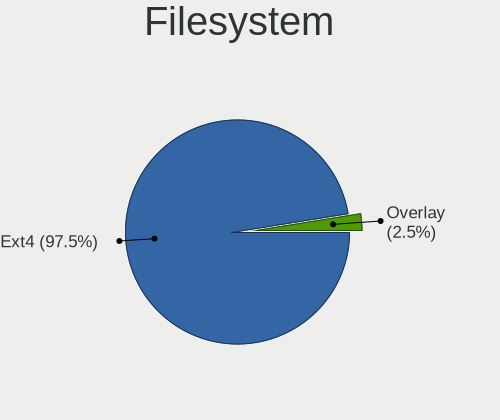
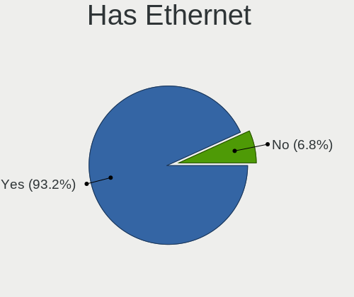
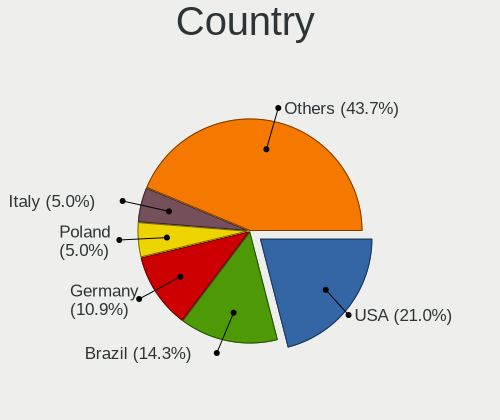
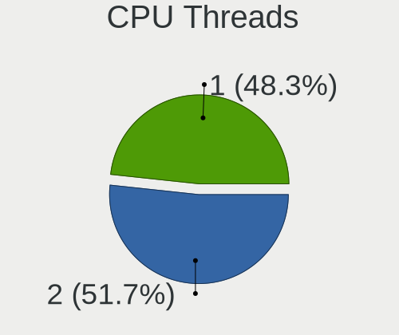
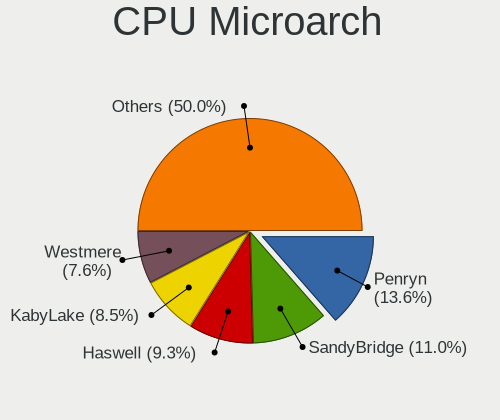
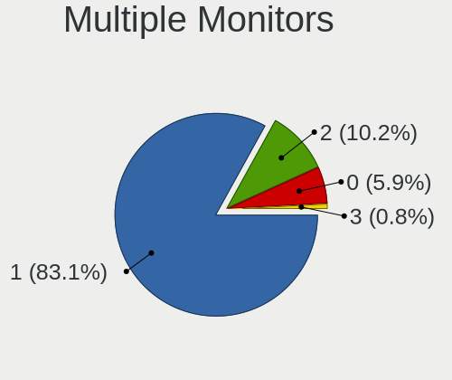
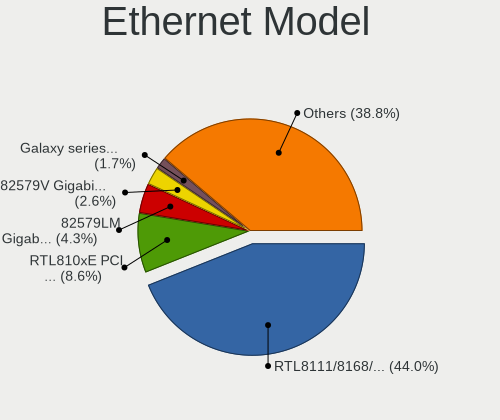
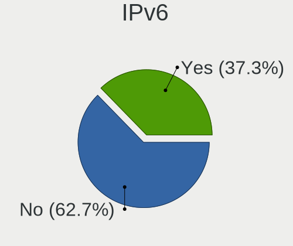
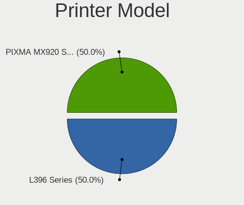
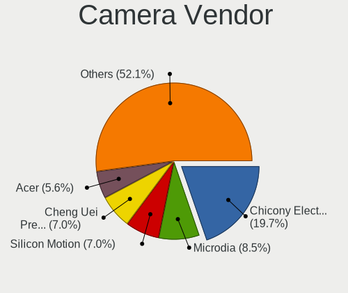

LinuxFX 11 - Tested Hardware & Statistics
-----------------------------------------

A project to collect tested hardware configurations for LinuxFX 11.

Anyone can contribute to this report by the [hw-probe](https://github.com/linuxhw/hw-probe) tool:

    sudo -E hw-probe -all -upload

Please submit a probe of your configuration if it's not presented on the page or is rare.

This is a report for all computer types. See also reports for [desktops](/Dist/LinuxFX_11/Desktop/README.md) and [notebooks](/Dist/LinuxFX_11/Notebook/README.md).

Full-feature report is available here: https://linux-hardware.org/?view=trends

Contents
--------

* [ Test Cases ](#test-cases)

* [ System ](#system)
  - [ Kernel                   ](#kernel)
  - [ Kernel Family            ](#kernel-family)
  - [ Kernel Major Ver.        ](#kernel-major-ver)
  - [ Arch                     ](#arch)
  - [ DE                       ](#de)
  - [ Display Server           ](#display-server)
  - [ Display Manager          ](#display-manager)
  - [ OS Lang                  ](#os-lang)
  - [ Boot Mode                ](#boot-mode)
  - [ Filesystem               ](#filesystem)
  - [ Part. scheme             ](#part-scheme)
  - [ Dual Boot with Linux/BSD ](#dual-boot-with-linuxbsd)
  - [ Dual Boot (Win)          ](#dual-boot-win)

* [ Board ](#board)
  - [ Vendor                   ](#vendor)
  - [ Model                    ](#model)
  - [ Model Family             ](#model-family)
  - [ MFG Year                 ](#mfg-year)
  - [ Form Factor              ](#form-factor)
  - [ Secure Boot              ](#secure-boot)
  - [ Coreboot                 ](#coreboot)
  - [ RAM Size                 ](#ram-size)
  - [ RAM Used                 ](#ram-used)
  - [ Total Drives             ](#total-drives)
  - [ Has CD-ROM               ](#has-cd-rom)
  - [ Has Ethernet             ](#has-ethernet)
  - [ Has WiFi                 ](#has-wifi)
  - [ Has Bluetooth            ](#has-bluetooth)

* [ Location ](#location)
  - [ Country                  ](#country)
  - [ City                     ](#city)

* [ Drives ](#drives)
  - [ Drive Vendor             ](#drive-vendor)
  - [ Drive Model              ](#drive-model)
  - [ HDD Vendor               ](#hdd-vendor)
  - [ SSD Vendor               ](#ssd-vendor)
  - [ Drive Kind               ](#drive-kind)
  - [ Drive Connector          ](#drive-connector)
  - [ Drive Size               ](#drive-size)
  - [ Space Total              ](#space-total)
  - [ Space Used               ](#space-used)
  - [ Malfunc. Drives          ](#malfunc-drives)
  - [ Malfunc. Drive Vendor    ](#malfunc-drive-vendor)
  - [ Malfunc. HDD Vendor      ](#malfunc-hdd-vendor)
  - [ Malfunc. Drive Kind      ](#malfunc-drive-kind)
  - [ Failed Drives            ](#failed-drives)
  - [ Failed Drive Vendor      ](#failed-drive-vendor)
  - [ Drive Status             ](#drive-status)

* [ Storage controller ](#storage-controller)
  - [ Storage Vendor           ](#storage-vendor)
  - [ Storage Model            ](#storage-model)
  - [ Storage Kind             ](#storage-kind)

* [ Processor ](#processor)
  - [ CPU Vendor               ](#cpu-vendor)
  - [ CPU Model                ](#cpu-model)
  - [ CPU Model Family         ](#cpu-model-family)
  - [ CPU Cores                ](#cpu-cores)
  - [ CPU Sockets              ](#cpu-sockets)
  - [ CPU Threads              ](#cpu-threads)
  - [ CPU Op-Modes             ](#cpu-op-modes)
  - [ CPU Microcode            ](#cpu-microcode)
  - [ CPU Microarch            ](#cpu-microarch)

* [ Graphics ](#graphics)
  - [ GPU Vendor               ](#gpu-vendor)
  - [ GPU Model                ](#gpu-model)
  - [ GPU Combo                ](#gpu-combo)
  - [ GPU Driver               ](#gpu-driver)
  - [ GPU Memory               ](#gpu-memory)

* [ Monitor ](#monitor)
  - [ Monitor Vendor           ](#monitor-vendor)
  - [ Monitor Model            ](#monitor-model)
  - [ Monitor Resolution       ](#monitor-resolution)
  - [ Monitor Diagonal         ](#monitor-diagonal)
  - [ Monitor Width            ](#monitor-width)
  - [ Aspect Ratio             ](#aspect-ratio)
  - [ Monitor Area             ](#monitor-area)
  - [ Pixel Density            ](#pixel-density)
  - [ Multiple Monitors        ](#multiple-monitors)

* [ Network ](#network)
  - [ Net Controller Vendor    ](#net-controller-vendor)
  - [ Net Controller Model     ](#net-controller-model)
  - [ Wireless Vendor          ](#wireless-vendor)
  - [ Wireless Model           ](#wireless-model)
  - [ Ethernet Vendor          ](#ethernet-vendor)
  - [ Ethernet Model           ](#ethernet-model)
  - [ Net Controller Kind      ](#net-controller-kind)
  - [ Used Controller          ](#used-controller)
  - [ NICs                     ](#nics)
  - [ IPv6                     ](#ipv6)

* [ Bluetooth ](#bluetooth)
  - [ Bluetooth Vendor         ](#bluetooth-vendor)
  - [ Bluetooth Model          ](#bluetooth-model)

* [ Sound ](#sound)
  - [ Sound Vendor             ](#sound-vendor)
  - [ Sound Model              ](#sound-model)

* [ Memory ](#memory)
  - [ Memory Vendor            ](#memory-vendor)
  - [ Memory Model             ](#memory-model)
  - [ Memory Kind              ](#memory-kind)
  - [ Memory Form Factor       ](#memory-form-factor)
  - [ Memory Size              ](#memory-size)
  - [ Memory Speed             ](#memory-speed)

* [ Printers & scanners ](#printers--scanners)
  - [ Printer Vendor           ](#printer-vendor)
  - [ Printer Model            ](#printer-model)
  - [ Scanner Vendor           ](#scanner-vendor)
  - [ Scanner Model            ](#scanner-model)

* [ Camera ](#camera)
  - [ Camera Vendor            ](#camera-vendor)
  - [ Camera Model             ](#camera-model)

* [ Security ](#security)
  - [ Fingerprint Vendor       ](#fingerprint-vendor)
  - [ Fingerprint Model        ](#fingerprint-model)
  - [ Chipcard Vendor          ](#chipcard-vendor)
  - [ Chipcard Model           ](#chipcard-model)

* [ Unsupported ](#unsupported)
  - [ Unsupported Devices      ](#unsupported-devices)
  - [ Unsupported Device Types ](#unsupported-device-types)

Test Cases
----------

| Vendor        | Model                       | Form-Factor | Probe                                                      | Date         |
|---------------|-----------------------------|-------------|------------------------------------------------------------|--------------|
| Samsung       | RF511/RF411/RF711           | Notebook    | [7c247b0c9f](https://linux-hardware.org/?probe=7c247b0c9f) | Dec 29, 2021 |
| Samsung       | RF511/RF411/RF711           | Notebook    | [5cff8b82d5](https://linux-hardware.org/?probe=5cff8b82d5) | Dec 28, 2021 |
| Foxconn       | D270S/D250S MP              | Desktop     | [82580ebcb5](https://linux-hardware.org/?probe=82580ebcb5) | Dec 28, 2021 |
| MSI           | X470 GAMING PLUS MAX        | Desktop     | [dd7335ec13](https://linux-hardware.org/?probe=dd7335ec13) | Dec 27, 2021 |
| Gigabyte      | GA-970A-D3                  | Desktop     | [135d34c579](https://linux-hardware.org/?probe=135d34c579) | Dec 26, 2021 |
| Gigabyte      | GA-970A-D3                  | Desktop     | [84b16824bd](https://linux-hardware.org/?probe=84b16824bd) | Dec 26, 2021 |
| ASRock        | N68-S3 UCC                  | Desktop     | [ae1acd8bbe](https://linux-hardware.org/?probe=ae1acd8bbe) | Dec 24, 2021 |
| HP            | 2AF7                        | Desktop     | [3b7ab440c6](https://linux-hardware.org/?probe=3b7ab440c6) | Dec 23, 2021 |
| Pegatron      | Maureen                     | Desktop     | [4bb6b10ba4](https://linux-hardware.org/?probe=4bb6b10ba4) | Dec 23, 2021 |
| Dell          | Inspiron N5050              | Notebook    | [f08b82f201](https://linux-hardware.org/?probe=f08b82f201) | Dec 22, 2021 |
| Dell          | Latitude E6400              | Notebook    | [74586d9c77](https://linux-hardware.org/?probe=74586d9c77) | Dec 21, 2021 |
| Fujitsu       | CELSIUS H700                | Notebook    | [63c35d8f1d](https://linux-hardware.org/?probe=63c35d8f1d) | Dec 19, 2021 |
| Positivo      | POS-EIBTPDC                 | Desktop     | [882c4d6758](https://linux-hardware.org/?probe=882c4d6758) | Dec 17, 2021 |
| Lenovo        | ThinkPad L380 20M6S4E000    | Notebook    | [745c4f6a79](https://linux-hardware.org/?probe=745c4f6a79) | Dec 16, 2021 |
| Alienware     | M17xR3                      | Notebook    | [d8c0a193cd](https://linux-hardware.org/?probe=d8c0a193cd) | Dec 14, 2021 |
| Dell          | G5 5590                     | Notebook    | [d68d926208](https://linux-hardware.org/?probe=d68d926208) | Dec 13, 2021 |
| Dell          | G5 5590                     | Notebook    | [88f9dfa75d](https://linux-hardware.org/?probe=88f9dfa75d) | Dec 13, 2021 |
| Dell          | 0R6JMP A00                  | Desktop     | [7bc4106877](https://linux-hardware.org/?probe=7bc4106877) | Dec 12, 2021 |
| Dell          | 0R6JMP A00                  | Desktop     | [2b3e03c89b](https://linux-hardware.org/?probe=2b3e03c89b) | Dec 12, 2021 |
| Lenovo        | G50-80 80E5                 | Notebook    | [77ee4f08a8](https://linux-hardware.org/?probe=77ee4f08a8) | Dec 10, 2021 |
| Dell          | Latitude E5400              | Notebook    | [3ce40a821b](https://linux-hardware.org/?probe=3ce40a821b) | Dec 09, 2021 |
| Acer          | Extensa 5220                | Notebook    | [2572d3336d](https://linux-hardware.org/?probe=2572d3336d) | Dec 09, 2021 |
| Acer          | Extensa 5220                | Notebook    | [524256971b](https://linux-hardware.org/?probe=524256971b) | Dec 09, 2021 |
| ASUSTek       | CM6650                      | Desktop     | [ef34d60843](https://linux-hardware.org/?probe=ef34d60843) | Dec 09, 2021 |
| Dell          | 040DDP A01                  | Desktop     | [6808d41bfe](https://linux-hardware.org/?probe=6808d41bfe) | Dec 08, 2021 |
| Gigabyte      | GA-970A-D3                  | Desktop     | [543f25da6d](https://linux-hardware.org/?probe=543f25da6d) | Dec 06, 2021 |
| ASUSTek       | H110-PLUS                   | Desktop     | [78a4619b31](https://linux-hardware.org/?probe=78a4619b31) | Dec 05, 2021 |
| Gigabyte      | GA-970A-D3                  | Desktop     | [f4b7b56b1b](https://linux-hardware.org/?probe=f4b7b56b1b) | Dec 05, 2021 |
| Acer          | Aspire X1930                | Desktop     | [68d51a9af5](https://linux-hardware.org/?probe=68d51a9af5) | Dec 03, 2021 |
| Intel         | H55                         | Desktop     | [57390a46ad](https://linux-hardware.org/?probe=57390a46ad) | Dec 02, 2021 |
| ASRock        | Q1900-ITX                   | Desktop     | [878cd074fb](https://linux-hardware.org/?probe=878cd074fb) | Nov 30, 2021 |
| ASRock        | Q1900-ITX                   | Desktop     | [3468f76ee4](https://linux-hardware.org/?probe=3468f76ee4) | Nov 30, 2021 |
| Toshiba       | Satellite C660              | Notebook    | [2799629c61](https://linux-hardware.org/?probe=2799629c61) | Nov 28, 2021 |
| Toshiba       | Satellite C660              | Notebook    | [1e80d1c181](https://linux-hardware.org/?probe=1e80d1c181) | Nov 28, 2021 |
| Acer          | One S1002                   | Notebook    | [8ae39c3aaf](https://linux-hardware.org/?probe=8ae39c3aaf) | Nov 23, 2021 |
| GPU Compan... | GWTN116-3                   | Notebook    | [5534b12f2d](https://linux-hardware.org/?probe=5534b12f2d) | Nov 21, 2021 |
| HP            | ProBook 440 G1              | Notebook    | [6159b4aa5a](https://linux-hardware.org/?probe=6159b4aa5a) | Nov 20, 2021 |
| HP            | ProBook 440 G1              | Notebook    | [42d0889355](https://linux-hardware.org/?probe=42d0889355) | Nov 20, 2021 |
| Positivo      | POS-EIBTPDC                 | Desktop     | [1e36050d80](https://linux-hardware.org/?probe=1e36050d80) | Nov 18, 2021 |
| Lenovo        | G50-80 80E5                 | Notebook    | [947e251d2c](https://linux-hardware.org/?probe=947e251d2c) | Nov 18, 2021 |
| Acer          | Aspire 5735                 | Notebook    | [9b2574c5be](https://linux-hardware.org/?probe=9b2574c5be) | Nov 17, 2021 |
| Positivo      | POS-PIQ67CG POSITIVO        | Desktop     | [bcec39d0de](https://linux-hardware.org/?probe=bcec39d0de) | Nov 16, 2021 |
| Positivo      | POS-PIQ67CG POSITIVO        | Desktop     | [8f7dd03e2d](https://linux-hardware.org/?probe=8f7dd03e2d) | Nov 15, 2021 |
| Samsung       | RV415/RV515/E3415           | Notebook    | [2a9002ab69](https://linux-hardware.org/?probe=2a9002ab69) | Nov 10, 2021 |
| Lenovo        | G50-80 80R0                 | Notebook    | [a24e6b4e38](https://linux-hardware.org/?probe=a24e6b4e38) | Nov 06, 2021 |
| Lenovo        | G50-80 80R0                 | Notebook    | [94d7421e0c](https://linux-hardware.org/?probe=94d7421e0c) | Nov 06, 2021 |
| Acer          | Aspire XXXX                 | Notebook    | [2e486fd092](https://linux-hardware.org/?probe=2e486fd092) | Nov 05, 2021 |
| ASUSTek       | N71Vg                       | Notebook    | [4fee4d2ffc](https://linux-hardware.org/?probe=4fee4d2ffc) | Nov 03, 2021 |
| Google        | Peppy                       | Notebook    | [6408d61aa6](https://linux-hardware.org/?probe=6408d61aa6) | Nov 03, 2021 |
| Google        | Peppy                       | Notebook    | [894676acea](https://linux-hardware.org/?probe=894676acea) | Nov 03, 2021 |
| HP            | 8054                        | Desktop     | [0a502d18dd](https://linux-hardware.org/?probe=0a502d18dd) | Nov 03, 2021 |
| HP            | Pavilion g6                 | Notebook    | [d954a6ba33](https://linux-hardware.org/?probe=d954a6ba33) | Oct 31, 2021 |
| Lenovo        | G50-80 80E5                 | Notebook    | [2ecc44141a](https://linux-hardware.org/?probe=2ecc44141a) | Oct 30, 2021 |
| ASUSTek       | M5A78L-M PLUS/USB3          | Desktop     | [24fe21040d](https://linux-hardware.org/?probe=24fe21040d) | Oct 30, 2021 |
| HP            | Pavilion g6                 | Notebook    | [1bfea4f4f9](https://linux-hardware.org/?probe=1bfea4f4f9) | Oct 28, 2021 |
| Lenovo        | G50-80 80E5                 | Notebook    | [a2c515584f](https://linux-hardware.org/?probe=a2c515584f) | Oct 27, 2021 |
| Pegatron      | 2A99                        | Desktop     | [29fd6eae29](https://linux-hardware.org/?probe=29fd6eae29) | Oct 27, 2021 |
| Lenovo        | G50-80 80E5                 | Notebook    | [b05ed4eff3](https://linux-hardware.org/?probe=b05ed4eff3) | Oct 24, 2021 |
| Lenovo        | G50-80 80E5                 | Notebook    | [5fbb62218c](https://linux-hardware.org/?probe=5fbb62218c) | Oct 24, 2021 |
| HP            | Pavilion g6                 | Notebook    | [2dfb826827](https://linux-hardware.org/?probe=2dfb826827) | Oct 24, 2021 |
| HP            | Pavilion g6                 | Notebook    | [7be969965e](https://linux-hardware.org/?probe=7be969965e) | Oct 24, 2021 |
| Lenovo        | G550 2958                   | Notebook    | [c53ba56444](https://linux-hardware.org/?probe=c53ba56444) | Oct 23, 2021 |
| Lenovo        | G50-80 80E5                 | Notebook    | [edf703fb1c](https://linux-hardware.org/?probe=edf703fb1c) | Oct 23, 2021 |
| Gigabyte      | B85-HD3-A                   | Desktop     | [23bb246149](https://linux-hardware.org/?probe=23bb246149) | Oct 20, 2021 |
| Gigabyte      | H61M-S2PV                   | Desktop     | [d08969a0a4](https://linux-hardware.org/?probe=d08969a0a4) | Oct 17, 2021 |
| Lenovo        | G50-80 80E5                 | Notebook    | [7075439e69](https://linux-hardware.org/?probe=7075439e69) | Oct 17, 2021 |
| Apple         | Mac-77F17D7DA9285301 iMa... | All in one  | [d5487c9b84](https://linux-hardware.org/?probe=d5487c9b84) | Oct 17, 2021 |
| Positivo      | Smash3                      | Notebook    | [3c9fe4acb8](https://linux-hardware.org/?probe=3c9fe4acb8) | Oct 14, 2021 |
| Positivo      | Smash3                      | Notebook    | [ab60c4e746](https://linux-hardware.org/?probe=ab60c4e746) | Oct 14, 2021 |
| HP            | EliteBook 8440p             | Notebook    | [b3bd1860ac](https://linux-hardware.org/?probe=b3bd1860ac) | Oct 11, 2021 |
| Intel         | DG35EC AAE29266-202         | Desktop     | [d61f31abf0](https://linux-hardware.org/?probe=d61f31abf0) | Oct 10, 2021 |
| Intel         | DG35EC AAE29266-202         | Desktop     | [24fa8f8f31](https://linux-hardware.org/?probe=24fa8f8f31) | Oct 10, 2021 |
| MSI           | P67A-GD65                   | Desktop     | [13a07c6b4d](https://linux-hardware.org/?probe=13a07c6b4d) | Oct 09, 2021 |
| MSI           | P67A-GD65                   | Desktop     | [78c9f06350](https://linux-hardware.org/?probe=78c9f06350) | Oct 08, 2021 |
| HP            | G62                         | Notebook    | [6cbed79ca9](https://linux-hardware.org/?probe=6cbed79ca9) | Oct 05, 2021 |
| HP            | 255 G6 Notebook PC          | Notebook    | [6ae274321c](https://linux-hardware.org/?probe=6ae274321c) | Oct 03, 2021 |
| Dell          | Precision M6400             | Notebook    | [5f6ec9333e](https://linux-hardware.org/?probe=5f6ec9333e) | Oct 03, 2021 |
| HP            | 255 G6 Notebook PC          | Notebook    | [1e1bf5e8e0](https://linux-hardware.org/?probe=1e1bf5e8e0) | Oct 03, 2021 |
| MSI           | 970 GAMING                  | Desktop     | [0778440642](https://linux-hardware.org/?probe=0778440642) | Oct 02, 2021 |
| Intel         | DG35EC AAE29266-202         | Desktop     | [74d233db8b](https://linux-hardware.org/?probe=74d233db8b) | Oct 02, 2021 |
| Intel         | DG35EC AAE29266-202         | Desktop     | [f29471dfd6](https://linux-hardware.org/?probe=f29471dfd6) | Oct 01, 2021 |
| Dell          | 0DN075                      | Desktop     | [1d0145e3e0](https://linux-hardware.org/?probe=1d0145e3e0) | Oct 01, 2021 |
| Samsung       | RV411/RV511/E3511/S3511/... | Notebook    | [60fe11ee00](https://linux-hardware.org/?probe=60fe11ee00) | Sep 30, 2021 |
| Positivo      | Smash3                      | Notebook    | [fe185c2e3f](https://linux-hardware.org/?probe=fe185c2e3f) | Sep 29, 2021 |
| MSI           | G31TM-P25                   | Desktop     | [efe15b35ca](https://linux-hardware.org/?probe=efe15b35ca) | Sep 29, 2021 |
| Dell          | System XPS L502X            | Notebook    | [437cc938df](https://linux-hardware.org/?probe=437cc938df) | Sep 28, 2021 |
| Apple         | Mac-77F17D7DA9285301 iMa... | All in one  | [2546c78314](https://linux-hardware.org/?probe=2546c78314) | Sep 27, 2021 |
| ASRock        | A55M-HVS                    | Desktop     | [3061a2007b](https://linux-hardware.org/?probe=3061a2007b) | Sep 27, 2021 |
| Acer          | Aspire 5738                 | Notebook    | [171fc1cb46](https://linux-hardware.org/?probe=171fc1cb46) | Sep 27, 2021 |
| Acer          | Aspire 5738                 | Notebook    | [f9373d8ba5](https://linux-hardware.org/?probe=f9373d8ba5) | Sep 27, 2021 |
| Apple         | Mac-77F17D7DA9285301 iMa... | All in one  | [8e473ca843](https://linux-hardware.org/?probe=8e473ca843) | Sep 27, 2021 |
| Dell          | System XPS L502X            | Notebook    | [763d21b747](https://linux-hardware.org/?probe=763d21b747) | Sep 26, 2021 |
| Apple         | Mac-77F17D7DA9285301 iMa... | All in one  | [c94e1e1031](https://linux-hardware.org/?probe=c94e1e1031) | Sep 26, 2021 |
| HP            | Pavilion 14                 | Notebook    | [2ab5781fef](https://linux-hardware.org/?probe=2ab5781fef) | Sep 25, 2021 |
| ASRock        | A55M-HVS                    | Desktop     | [4748ccb729](https://linux-hardware.org/?probe=4748ccb729) | Sep 25, 2021 |
| ASRockRack    | EPC621D8A                   | Server      | [2244eb7809](https://linux-hardware.org/?probe=2244eb7809) | Sep 24, 2021 |
| Positivo      | Smash3                      | Notebook    | [ee8284c509](https://linux-hardware.org/?probe=ee8284c509) | Sep 24, 2021 |
| ASRock        | A55M-HVS                    | Desktop     | [a367ec462a](https://linux-hardware.org/?probe=a367ec462a) | Sep 23, 2021 |
| Fujitsu Si... | AMILO Xi 1526               | Notebook    | [aab9c46556](https://linux-hardware.org/?probe=aab9c46556) | Sep 23, 2021 |
| ASRock        | A55M-HVS                    | Desktop     | [f0081639fb](https://linux-hardware.org/?probe=f0081639fb) | Sep 22, 2021 |
| MSI           | P67A-GD65                   | Desktop     | [b23b139081](https://linux-hardware.org/?probe=b23b139081) | Sep 20, 2021 |
| MSI           | P67A-GD65                   | Desktop     | [e42a9da750](https://linux-hardware.org/?probe=e42a9da750) | Sep 20, 2021 |
| Acer          | TravelMate 5744             | Notebook    | [63142c25a5](https://linux-hardware.org/?probe=63142c25a5) | Sep 20, 2021 |
| Acer          | TravelMate 5744             | Notebook    | [0bdce8f695](https://linux-hardware.org/?probe=0bdce8f695) | Sep 20, 2021 |
| Gigabyte      | 970A-D3                     | Desktop     | [8daebb1450](https://linux-hardware.org/?probe=8daebb1450) | Sep 19, 2021 |
| MSI           | Z270-A PRO                  | Desktop     | [6488569b77](https://linux-hardware.org/?probe=6488569b77) | Sep 19, 2021 |
| Lenovo        | MIIX 310-10ICR 80SG         | Tablet      | [62502d6c87](https://linux-hardware.org/?probe=62502d6c87) | Sep 18, 2021 |

System
------

Kernel
------

Version of the Linux kernel

| Version           | Computers | Percent |
|-------------------|-----------|---------|
| 5.11.0-37-generic | 15        | 21.43%  |
| 5.11.0-40-generic | 11        | 15.71%  |
| 5.11.0-38-generic | 11        | 15.71%  |
| 5.11.0-41-generic | 10        | 14.29%  |
| 5.11.0-43-generic | 9         | 12.86%  |
| 5.11.0-36-generic | 7         | 10%     |
| 5.11.0-34-generic | 6         | 8.57%   |
| 5.11.0-42-generic | 1         | 1.43%   |

Kernel Family
-------------

Linux kernel without a distro release

| Version | Computers | Percent |
|---------|-----------|---------|
| 5.11.0  | 65        | 100%    |

Kernel Major Ver.
-----------------

Linux kernel major version

| Version | Computers | Percent |
|---------|-----------|---------|
| 5.11    | 65        | 100%    |

Arch
----

OS architecture (x86_64, i586, etc.)

| Name   | Computers | Percent |
|--------|-----------|---------|
| x86_64 | 65        | 100%    |

DE
--

Desktop Environment

| Name       | Computers | Percent |
|------------|-----------|---------|
| KDE5       | 60        | 90.91%  |
| KDE        | 5         | 7.58%   |
| X-Cinnamon | 1         | 1.52%   |

Display Server
--------------

X11 or Wayland

| Name | Computers | Percent |
|------|-----------|---------|
| X11  | 65        | 100%    |

Display Manager
---------------

SDDM, LightDM, etc.

| Name    | Computers | Percent |
|---------|-----------|---------|
| Unknown | 52        | 80%     |
| SDDM    | 13        | 20%     |

OS Lang
-------

Language

| Lang  | Computers | Percent |
|-------|-----------|---------|
| en_US | 14        | 21.54%  |
| pt_BR | 13        | 20%     |
| de_DE | 5         | 7.69%   |
| it_IT | 3         | 4.62%   |
| en_IN | 3         | 4.62%   |
| en_GB | 3         | 4.62%   |
| pl_PL | 2         | 3.08%   |
| es_MX | 2         | 3.08%   |
| en_CA | 2         | 3.08%   |
| el_GR | 2         | 3.08%   |
| C     | 2         | 3.08%   |
| zh_CN | 1         | 1.54%   |
| sv_SE | 1         | 1.54%   |
| ru_UA | 1         | 1.54%   |
| ru_RU | 1         | 1.54%   |
| pt_PT | 1         | 1.54%   |
| nl_BE | 1         | 1.54%   |
| fr_FR | 1         | 1.54%   |
| fr_CA | 1         | 1.54%   |
| fi_FI | 1         | 1.54%   |
| es_ES | 1         | 1.54%   |
| es_CO | 1         | 1.54%   |
| es_AR | 1         | 1.54%   |
| en_AU | 1         | 1.54%   |
| cs_CZ | 1         | 1.54%   |

Boot Mode
---------

EFI or BIOS

| Mode | Computers | Percent |
|------|-----------|---------|
| BIOS | 44        | 67.69%  |
| EFI  | 21        | 32.31%  |

Filesystem
----------

Type of filesystem

| Type    | Computers | Percent |
|---------|-----------|---------|
| Ext4    | 63        | 96.92%  |
| Overlay | 2         | 3.08%   |

Part. scheme
------------

Scheme of partitioning

| Type    | Computers | Percent |
|---------|-----------|---------|
| Unknown | 63        | 96.92%  |
| MBR     | 1         | 1.54%   |
| GPT     | 1         | 1.54%   |

Dual Boot with Linux/BSD
------------------------

Hosting more than one Linux/BSD

| Dual boot | Computers | Percent |
|-----------|-----------|---------|
| No        | 61        | 93.85%  |
| Yes       | 4         | 6.15%   |

Dual Boot (Win)
---------------

Hosting Linux and Windows

| Dual boot | Computers | Percent |
|-----------|-----------|---------|
| No        | 57        | 87.69%  |
| Yes       | 8         | 12.31%  |

Board
-----

Vendor
------

Motherboard manufacturer

| Name                | Computers | Percent |
|---------------------|-----------|---------|
| Hewlett-Packard     | 9         | 13.85%  |
| Dell                | 9         | 13.85%  |
| Acer                | 7         | 10.77%  |
| MSI                 | 5         | 7.69%   |
| Lenovo              | 5         | 7.69%   |
| Gigabyte Technology | 4         | 6.15%   |
| ASUSTek Computer    | 4         | 6.15%   |
| Samsung Electronics | 3         | 4.62%   |
| Positivo            | 3         | 4.62%   |
| ASRock              | 3         | 4.62%   |
| Pegatron            | 2         | 3.08%   |
| Intel               | 2         | 3.08%   |
| Toshiba             | 1         | 1.54%   |
| GPU Company         | 1         | 1.54%   |
| Google              | 1         | 1.54%   |
| Fujitsu Siemens     | 1         | 1.54%   |
| Fujitsu             | 1         | 1.54%   |
| Foxconn             | 1         | 1.54%   |
| ASRockRack          | 1         | 1.54%   |
| Apple               | 1         | 1.54%   |
| Alienware           | 1         | 1.54%   |

Model
-----

Motherboard model

| Name                                        | Computers | Percent |
|---------------------------------------------|-----------|---------|
| HP 255 G6 Notebook PC                       | 2         | 3.08%   |
| Toshiba Satellite C660                      | 1         | 1.54%   |
| Samsung RV415/RV515/E3415                   | 1         | 1.54%   |
| Samsung RV411/RV511/E3511/S3511/RV711/E3411 | 1         | 1.54%   |
| Samsung RF511/RF411/RF711                   | 1         | 1.54%   |
| Positivo Smash3                             | 1         | 1.54%   |
| Positivo POS-PIQ67CG                        | 1         | 1.54%   |
| Positivo POS-EIBTPDC                        | 1         | 1.54%   |
| Pegatron p6745br                            | 1         | 1.54%   |
| Pegatron NC045AA-ABU IQ525uk                | 1         | 1.54%   |
| MSI MS-7B79                                 | 1         | 1.54%   |
| MSI MS-7A71                                 | 1         | 1.54%   |
| MSI MS-7693                                 | 1         | 1.54%   |
| MSI MS-7681                                 | 1         | 1.54%   |
| MSI MS-7529                                 | 1         | 1.54%   |
| Lenovo ThinkPad L380 20M6S4E000             | 1         | 1.54%   |
| Lenovo MIIX 310-10ICR 80SG                  | 1         | 1.54%   |
| Lenovo G550 2958                            | 1         | 1.54%   |
| Lenovo G50-80 80R0                          | 1         | 1.54%   |
| Lenovo G50-80 80E5                          | 1         | 1.54%   |
| Intel H55                                   | 1         | 1.54%   |
| Intel DG35EC AAE29266-202                   | 1         | 1.54%   |
| HP ProBook 440 G1                           | 1         | 1.54%   |
| HP Pavilion g6                              | 1         | 1.54%   |
| HP Pavilion 14                              | 1         | 1.54%   |
| HP G62                                      | 1         | 1.54%   |
| HP EliteDesk 800 G2 SFF                     | 1         | 1.54%   |
| HP EliteBook 8440p                          | 1         | 1.54%   |
| HP 700-214                                  | 1         | 1.54%   |
| GPU Company GWTN116-3                       | 1         | 1.54%   |
| Google Peppy                                | 1         | 1.54%   |
| Gigabyte H61M-S2PV                          | 1         | 1.54%   |
| Gigabyte GA-970A-D3                         | 1         | 1.54%   |
| Gigabyte 970A-D3                            | 1         | 1.54%   |
| Gigabyte 7200-5121B                         | 1         | 1.54%   |
| Fujitsu Siemens AMILO Xi 1526               | 1         | 1.54%   |
| Fujitsu CELSIUS H700                        | 1         | 1.54%   |
| Foxconn D270S/D250S MP                      | 1         | 1.54%   |
| Dell System XPS L502X                       | 1         | 1.54%   |
| Dell Precision WorkStation 390              | 1         | 1.54%   |
| Dell Precision M6400                        | 1         | 1.54%   |
| Dell OptiPlex 3020                          | 1         | 1.54%   |
| Dell Latitude E6400                         | 1         | 1.54%   |
| Dell Latitude E5400                         | 1         | 1.54%   |
| Dell Inspiron N5050                         | 1         | 1.54%   |
| Dell Inspiron 3670                          | 1         | 1.54%   |
| Dell G5 5590                                | 1         | 1.54%   |
| ASUS N71Vg                                  | 1         | 1.54%   |
| ASUS M5A78L-M PLUS/USB3                     | 1         | 1.54%   |
| ASUS H110-PLUS                              | 1         | 1.54%   |
| ASUS CM6650                                 | 1         | 1.54%   |
| ASRockRack EPC621D8A                        | 1         | 1.54%   |
| ASRock Q1900-ITX                            | 1         | 1.54%   |
| ASRock N68-S3 UCC                           | 1         | 1.54%   |
| ASRock A55M-HVS                             | 1         | 1.54%   |
| Apple iMac18,2                              | 1         | 1.54%   |
| Alienware M17xR3                            | 1         | 1.54%   |
| Acer TravelMate 5744                        | 1         | 1.54%   |
| Acer One S1002                              | 1         | 1.54%   |
| Acer Extensa 5220                           | 1         | 1.54%   |

Model Family
------------

Motherboard model prefix

| Name                  | Computers | Percent |
|-----------------------|-----------|---------|
| Acer Aspire           | 4         | 6.15%   |
| Lenovo G50-80         | 2         | 3.08%   |
| HP Pavilion           | 2         | 3.08%   |
| HP 255                | 2         | 3.08%   |
| Dell Precision        | 2         | 3.08%   |
| Dell Latitude         | 2         | 3.08%   |
| Dell Inspiron         | 2         | 3.08%   |
| Toshiba Satellite     | 1         | 1.54%   |
| Samsung RV415         | 1         | 1.54%   |
| Samsung RV411         | 1         | 1.54%   |
| Samsung RF511         | 1         | 1.54%   |
| Positivo Smash3       | 1         | 1.54%   |
| Positivo POS-PIQ67CG  | 1         | 1.54%   |
| Positivo POS-EIBTPDC  | 1         | 1.54%   |
| Pegatron p6745br      | 1         | 1.54%   |
| Pegatron NC045AA-ABU  | 1         | 1.54%   |
| MSI MS-7B79           | 1         | 1.54%   |
| MSI MS-7A71           | 1         | 1.54%   |
| MSI MS-7693           | 1         | 1.54%   |
| MSI MS-7681           | 1         | 1.54%   |
| MSI MS-7529           | 1         | 1.54%   |
| Lenovo ThinkPad       | 1         | 1.54%   |
| Lenovo MIIX           | 1         | 1.54%   |
| Lenovo G550           | 1         | 1.54%   |
| Intel H55             | 1         | 1.54%   |
| Intel DG35EC          | 1         | 1.54%   |
| HP ProBook            | 1         | 1.54%   |
| HP G62                | 1         | 1.54%   |
| HP EliteDesk          | 1         | 1.54%   |
| HP EliteBook          | 1         | 1.54%   |
| HP 700-214            | 1         | 1.54%   |
| GPU Company GWTN116-3 | 1         | 1.54%   |
| Google Peppy          | 1         | 1.54%   |
| Gigabyte H61M-S2PV    | 1         | 1.54%   |
| Gigabyte GA-970A-D3   | 1         | 1.54%   |
| Gigabyte 970A-D3      | 1         | 1.54%   |
| Gigabyte 7200-5121B   | 1         | 1.54%   |
| Fujitsu Siemens AMILO | 1         | 1.54%   |
| Fujitsu CELSIUS       | 1         | 1.54%   |
| Foxconn D270S         | 1         | 1.54%   |
| Dell System           | 1         | 1.54%   |
| Dell OptiPlex         | 1         | 1.54%   |
| Dell G5               | 1         | 1.54%   |
| ASUS N71Vg            | 1         | 1.54%   |
| ASUS M5A78L-M         | 1         | 1.54%   |
| ASUS H110-PLUS        | 1         | 1.54%   |
| ASUS CM6650           | 1         | 1.54%   |
| ASRockRack EPC621D8A  | 1         | 1.54%   |
| ASRock Q1900-ITX      | 1         | 1.54%   |
| ASRock N68-S3         | 1         | 1.54%   |
| ASRock A55M-HVS       | 1         | 1.54%   |
| Apple iMac18          | 1         | 1.54%   |
| Alienware M17xR3      | 1         | 1.54%   |
| Acer TravelMate       | 1         | 1.54%   |
| Acer One              | 1         | 1.54%   |
| Acer Extensa          | 1         | 1.54%   |

MFG Year
--------

Motherboard manufacture year

| Year | Computers | Percent |
|------|-----------|---------|
| 2011 | 14        | 21.54%  |
| 2021 | 7         | 10.77%  |
| 2012 | 6         | 9.23%   |
| 2016 | 5         | 7.69%   |
| 2015 | 5         | 7.69%   |
| 2018 | 4         | 6.15%   |
| 2014 | 4         | 6.15%   |
| 2019 | 3         | 4.62%   |
| 2013 | 3         | 4.62%   |
| 2010 | 3         | 4.62%   |
| 2009 | 3         | 4.62%   |
| 2008 | 3         | 4.62%   |
| 2017 | 2         | 3.08%   |
| 2007 | 2         | 3.08%   |
| 2020 | 1         | 1.54%   |

Form Factor
-----------

Physical design of the computer

| Name       | Computers | Percent |
|------------|-----------|---------|
| Notebook   | 34        | 52.31%  |
| Desktop    | 28        | 43.08%  |
| Tablet     | 1         | 1.54%   |
| All in one | 1         | 1.54%   |
| Server     | 1         | 1.54%   |

Secure Boot
-----------

Enabled or disabled

| State    | Computers | Percent |
|----------|-----------|---------|
| Disabled | 62        | 95.38%  |
| Enabled  | 3         | 4.62%   |

Coreboot
--------

Have coreboot on board

| Used | Computers | Percent |
|------|-----------|---------|
| No   | 64        | 98.46%  |
| Yes  | 1         | 1.54%   |

RAM Size
--------

Total RAM memory

| Size in GB | Computers | Percent |
|------------|-----------|---------|
| 3.01-4.0   | 19        | 29.23%  |
| 8.01-16.0  | 14        | 21.54%  |
| 4.01-8.0   | 12        | 18.46%  |
| 16.01-24.0 | 7         | 10.77%  |
| 1.01-2.0   | 5         | 7.69%   |
| 32.01-64.0 | 4         | 6.15%   |
| 24.01-32.0 | 2         | 3.08%   |
| 2.01-3.0   | 2         | 3.08%   |

RAM Used
--------

Used RAM memory

| Used GB   | Computers | Percent |
|-----------|-----------|---------|
| 1.01-2.0  | 31        | 45.59%  |
| 2.01-3.0  | 18        | 26.47%  |
| 0.51-1.0  | 8         | 11.76%  |
| 3.01-4.0  | 6         | 8.82%   |
| 4.01-8.0  | 3         | 4.41%   |
| 8.01-16.0 | 2         | 2.94%   |

Total Drives
------------

Number of drives on board

| Drives | Computers | Percent |
|--------|-----------|---------|
| 1      | 42        | 62.69%  |
| 2      | 18        | 26.87%  |
| 3      | 6         | 8.96%   |
| 5      | 1         | 1.49%   |

Has CD-ROM
----------

Has CD-ROM on board

| Presented | Computers | Percent |
|-----------|-----------|---------|
| Yes       | 42        | 64.62%  |
| No        | 23        | 35.38%  |

Has Ethernet
------------

Has Ethernet on board

| Presented | Computers | Percent |
|-----------|-----------|---------|
| Yes       | 61        | 93.85%  |
| No        | 4         | 6.15%   |

Has WiFi
--------

Has WiFi module

| Presented | Computers | Percent |
|-----------|-----------|---------|
| Yes       | 49        | 74.24%  |
| No        | 17        | 25.76%  |

Has Bluetooth
-------------

Has Bluetooth module

| Presented | Computers | Percent |
|-----------|-----------|---------|
| No        | 34        | 52.31%  |
| Yes       | 31        | 47.69%  |

Location
--------

Country
-------

Geographic location (country)

| Country     | Computers | Percent |
|-------------|-----------|---------|
| Brazil      | 13        | 20%     |
| USA         | 12        | 18.46%  |
| Germany     | 5         | 7.69%   |
| Canada      | 4         | 6.15%   |
| Poland      | 3         | 4.62%   |
| Italy       | 3         | 4.62%   |
| India       | 3         | 4.62%   |
| UK          | 2         | 3.08%   |
| Mexico      | 2         | 3.08%   |
| Greece      | 2         | 3.08%   |
| Ukraine     | 1         | 1.54%   |
| Sweden      | 1         | 1.54%   |
| Spain       | 1         | 1.54%   |
| Russia      | 1         | 1.54%   |
| Puerto Rico | 1         | 1.54%   |
| Portugal    | 1         | 1.54%   |
| Pakistan    | 1         | 1.54%   |
| Namibia     | 1         | 1.54%   |
| Jamaica     | 1         | 1.54%   |
| Finland     | 1         | 1.54%   |
| Czechia     | 1         | 1.54%   |
| Colombia    | 1         | 1.54%   |
| China       | 1         | 1.54%   |
| Belgium     | 1         | 1.54%   |
| Australia   | 1         | 1.54%   |
| Argentina   | 1         | 1.54%   |

City
----

Geographic location (city)

| City                | Computers | Percent |
|---------------------|-----------|---------|
| Rio de Janeiro      | 3         | 4.48%   |
| Warsaw              | 2         | 2.99%   |
| S??o Paulo          | 2         | 2.99%   |
| Zaventem            | 1         | 1.49%   |
| Windhoek            | 1         | 1.49%   |
| Wabern              | 1         | 1.49%   |
| Vivian              | 1         | 1.49%   |
| Toronto             | 1         | 1.49%   |
| Toluca              | 1         | 1.49%   |
| Stockholm           | 1         | 1.49%   |
| Shamrock            | 1         | 1.49%   |
| Sankt Augustin      | 1         | 1.49%   |
| Saloa               | 1         | 1.49%   |
| Rome                | 1         | 1.49%   |
| Rio das Ostras      | 1         | 1.49%   |
| Ringgold            | 1         | 1.49%   |
| Qu?©bec             | 1         | 1.49%   |
| Porto               | 1         | 1.49%   |
| Port Coquitlam      | 1         | 1.49%   |
| Patchogue           | 1         | 1.49%   |
| Oswego              | 1         | 1.49%   |
| Northwich           | 1         | 1.49%   |
| Niter??i            | 1         | 1.49%   |
| Newcastle upon Tyne | 1         | 1.49%   |
| Newburgh            | 1         | 1.49%   |
| Naples              | 1         | 1.49%   |
| Nanning             | 1         | 1.49%   |
| Missoula            | 1         | 1.49%   |
| Mandi               | 1         | 1.49%   |
| Madrid              | 1         | 1.49%   |
| Lohja               | 1         | 1.49%   |
| Lares               | 1         | 1.49%   |
| Kochi               | 1         | 1.49%   |
| Kladno              | 1         | 1.49%   |
| Kingston            | 1         | 1.49%   |
| Karachi             | 1         | 1.49%   |
| Jo??o Pessoa        | 1         | 1.49%   |
| Itaperuna           | 1         | 1.49%   |
| Ilsede              | 1         | 1.49%   |
| Ibipitanga          | 1         | 1.49%   |
| Holmen              | 1         | 1.49%   |
| Hobart              | 1         | 1.49%   |
| Guadalajara         | 1         | 1.49%   |
| Grossenhain         | 1         | 1.49%   |
| Genoa               | 1         | 1.49%   |
| Duluth              | 1         | 1.49%   |
| Corinth             | 1         | 1.49%   |
| Chorz??w            | 1         | 1.49%   |
| Chicago             | 1         | 1.49%   |
| Chapec??            | 1         | 1.49%   |
| Chandigarh          | 1         | 1.49%   |
| Catanduva           | 1         | 1.49%   |
| Campinas            | 1         | 1.49%   |
| Buenos Aires        | 1         | 1.49%   |
| Brussels            | 1         | 1.49%   |
| Brampton            | 1         | 1.49%   |
| Bolshoy Kamen       | 1         | 1.49%   |
| Bogot??             | 1         | 1.49%   |
| Bila Tserkva        | 1         | 1.49%   |
| Berlin              | 1         | 1.49%   |

Drives
------

Drive Vendor
------------

Hard drive vendors

| Vendor              | Computers | Drives | Percent |
|---------------------|-----------|--------|---------|
| WDC                 | 19        | 22     | 21.84%  |
| Seagate             | 19        | 24     | 21.84%  |
| Samsung Electronics | 6         | 6      | 6.9%    |
| Unknown             | 5         | 8      | 5.75%   |
| SanDisk             | 5         | 5      | 5.75%   |
| Toshiba             | 4         | 4      | 4.6%    |
| Hitachi             | 3         | 3      | 3.45%   |
| Patriot             | 2         | 2      | 2.3%    |
| JMicron             | 2         | 2      | 2.3%    |
| HGST                | 2         | 2      | 2.3%    |
| Crucial             | 2         | 2      | 2.3%    |
| A-DATA Technology   | 2         | 2      | 2.3%    |
| SPCC                | 1         | 1      | 1.15%   |
| SK Hynix            | 1         | 2      | 1.15%   |
| SATAFIRM            | 1         | 1      | 1.15%   |
| OCZ                 | 1         | 1      | 1.15%   |
| MAXTOR              | 1         | 1      | 1.15%   |
| LITEON              | 1         | 1      | 1.15%   |
| Lenovo              | 1         | 1      | 1.15%   |
| Kingston            | 1         | 1      | 1.15%   |
| I/OMAGIC            | 1         | 1      | 1.15%   |
| HEORIADY            | 1         | 1      | 1.15%   |
| DOGFISH             | 1         | 1      | 1.15%   |
| Apple               | 1         | 2      | 1.15%   |
| AMD                 | 1         | 1      | 1.15%   |
| ALERTSEAL           | 1         | 1      | 1.15%   |
| AFOX                | 1         | 1      | 1.15%   |
| Unknown             | 1         | 1      | 1.15%   |

Drive Model
-----------

Hard drive models

| Model                               | Computers | Percent |
|-------------------------------------|-----------|---------|
| Unknown MMC Card  64GB              | 4         | 4.3%    |
| Seagate ST1000LM024 HN-M101MBB 1TB  | 3         | 3.23%   |
| Seagate ST1000DM010-2EP102 1TB      | 3         | 3.23%   |
| SanDisk SDSSDX240GG25 240GB         | 2         | 2.15%   |
| Patriot Burst 120GB SSD             | 2         | 2.15%   |
| WDC WDS500G2B0C-00PXH0 500GB        | 1         | 1.08%   |
| WDC WDS500G2B0B-00YS70 500GB SSD    | 1         | 1.08%   |
| WDC WDS500G2B0A-00SM50 500GB SSD    | 1         | 1.08%   |
| WDC WDS240G2G0A-00JH30 240GB SSD    | 1         | 1.08%   |
| WDC WDS120G2G0A-00JH30 120GB SSD    | 1         | 1.08%   |
| WDC WDBNCE5000PNC 500GB SSD         | 1         | 1.08%   |
| WDC WD5000LPCX-60VHAT0 500GB        | 1         | 1.08%   |
| WDC WD5000BPVT-60HXZT1 500GB        | 1         | 1.08%   |
| WDC WD5000BPVT-22HXZT3 500GB        | 1         | 1.08%   |
| WDC WD5000AAKS-75A7B2 500GB         | 1         | 1.08%   |
| WDC WD3200BEKT-00PVMT0 320GB        | 1         | 1.08%   |
| WDC WD3200AAKS-61L9A0 320GB         | 1         | 1.08%   |
| WDC WD30EZRZ-00WN9B0 3TB            | 1         | 1.08%   |
| WDC WD20EADS-00R6B0 2TB             | 1         | 1.08%   |
| WDC WD1600JB-32FUA0 160GB           | 1         | 1.08%   |
| WDC WD1600BEVT-75ZCT1 160GB         | 1         | 1.08%   |
| WDC WD10JPCX-24UE4T0 1TB            | 1         | 1.08%   |
| WDC WD10EZEX-08WN4A0 1TB            | 1         | 1.08%   |
| WDC WD10EZEX-00RKKA0 1TB            | 1         | 1.08%   |
| WDC WD1003FBYX-02A6B0 1TB           | 1         | 1.08%   |
| WDC WD1001FALS-00J7B0 1TB           | 1         | 1.08%   |
| Unknown MMC Card  7GB               | 1         | 1.08%   |
| Unknown MMC Card  32GB              | 1         | 1.08%   |
| Toshiba MQ04ABF100 1TB              | 1         | 1.08%   |
| Toshiba MQ01ABD050 500GB            | 1         | 1.08%   |
| Toshiba MK1656GSYF 160GB            | 1         | 1.08%   |
| Toshiba KBG30ZMS128G 128GB NVMe SSD | 1         | 1.08%   |
| SPCC Solid State Disk 128GB         | 1         | 1.08%   |
| SK Hynix NVMe SSD Drive 512GB       | 1         | 1.08%   |
| SK Hynix BC511 NVMe 512GB           | 1         | 1.08%   |
| Seagate ST9250410AS 250GB           | 1         | 1.08%   |
| Seagate ST9250315AS 250GB           | 1         | 1.08%   |
| Seagate ST500LT012-9WS142 500GB     | 1         | 1.08%   |
| Seagate ST500DM009-2F110A 500GB     | 1         | 1.08%   |
| Seagate ST500DM002-1BD142 500GB     | 1         | 1.08%   |
| Seagate ST3750640NS 752GB           | 1         | 1.08%   |
| Seagate ST320LT007-9ZV142 320GB     | 1         | 1.08%   |
| Seagate ST3160811AS 160GB           | 1         | 1.08%   |
| Seagate ST31000528AS 1TB            | 1         | 1.08%   |
| Seagate ST2000DM001-1ER164 2TB      | 1         | 1.08%   |
| Seagate ST2000DM 008-2FR102 2TB     | 1         | 1.08%   |
| Seagate ST1000DM003-1CH162 1TB      | 1         | 1.08%   |
| Seagate Expansion Desk 5TB          | 1         | 1.08%   |
| Seagate Expansion 1TB               | 1         | 1.08%   |
| Seagate Backup+ Hub BK 8TB          | 1         | 1.08%   |
| SATAFIRM S11 500GB                  | 1         | 1.08%   |
| SanDisk SDSSDH3 500G                | 1         | 1.08%   |
| SanDisk SDSSDA120G 120GB            | 1         | 1.08%   |
| SanDisk SD8SBAT128G1122 128GB SSD   | 1         | 1.08%   |
| Samsung SSD 860 EVO 500GB           | 1         | 1.08%   |
| Samsung SSD 840 Series 120GB        | 1         | 1.08%   |
| Samsung SSD 840 EVO 500GB mSATA     | 1         | 1.08%   |
| Samsung NVMe SSD Drive 500GB        | 1         | 1.08%   |
| Samsung HD103SJ 1TB                 | 1         | 1.08%   |
| Samsung HD103SI 1TB                 | 1         | 1.08%   |

HDD Vendor
----------

Hard disk drive vendors

| Vendor              | Computers | Drives | Percent |
|---------------------|-----------|--------|---------|
| Seagate             | 19        | 23     | 40.43%  |
| WDC                 | 14        | 16     | 29.79%  |
| Toshiba             | 3         | 3      | 6.38%   |
| Hitachi             | 3         | 3      | 6.38%   |
| Samsung Electronics | 2         | 2      | 4.26%   |
| HGST                | 2         | 2      | 4.26%   |
| SATAFIRM            | 1         | 1      | 2.13%   |
| MAXTOR              | 1         | 1      | 2.13%   |
| JMicron             | 1         | 1      | 2.13%   |
| Apple               | 1         | 2      | 2.13%   |

SSD Vendor
----------

Solid state drive vendors

| Vendor              | Computers | Drives | Percent |
|---------------------|-----------|--------|---------|
| WDC                 | 5         | 5      | 17.86%  |
| SanDisk             | 5         | 5      | 17.86%  |
| Samsung Electronics | 3         | 3      | 10.71%  |
| Patriot             | 2         | 2      | 7.14%   |
| Crucial             | 2         | 2      | 7.14%   |
| A-DATA Technology   | 2         | 2      | 7.14%   |
| SPCC                | 1         | 1      | 3.57%   |
| OCZ                 | 1         | 1      | 3.57%   |
| LITEON              | 1         | 1      | 3.57%   |
| Kingston            | 1         | 1      | 3.57%   |
| JMicron             | 1         | 1      | 3.57%   |
| HEORIADY            | 1         | 1      | 3.57%   |
| DOGFISH             | 1         | 1      | 3.57%   |
| AMD                 | 1         | 1      | 3.57%   |
| ALERTSEAL           | 1         | 1      | 3.57%   |

Drive Kind
----------

HDD or SSD

| Kind    | Computers | Drives | Percent |
|---------|-----------|--------|---------|
| HDD     | 39        | 54     | 49.37%  |
| SSD     | 26        | 28     | 32.91%  |
| MMC     | 6         | 9      | 7.59%   |
| NVMe    | 5         | 6      | 6.33%   |
| Unknown | 3         | 3      | 3.8%    |

Drive Connector
---------------

SATA, SAS, NVMe, etc.

| Type | Computers | Drives | Percent |
|------|-----------|--------|---------|
| SATA | 60        | 78     | 77.92%  |
| SAS  | 6         | 7      | 7.79%   |
| MMC  | 6         | 9      | 7.79%   |
| NVMe | 5         | 6      | 6.49%   |

Drive Size
----------

Size of hard drive

| Size in TB | Computers | Drives | Percent |
|------------|-----------|--------|---------|
| 0.01-0.5   | 44        | 49     | 63.77%  |
| 0.51-1.0   | 20        | 28     | 28.99%  |
| 1.01-2.0   | 3         | 3      | 4.35%   |
| 2.01-3.0   | 1         | 1      | 1.45%   |
| 4.01-10.0  | 1         | 1      | 1.45%   |

Space Total
-----------

Amount of disk space available on the file system

| Size in GB     | Computers | Percent |
|----------------|-----------|---------|
| 101-250        | 18        | 27.27%  |
| 251-500        | 15        | 22.73%  |
| 501-1000       | 11        | 16.67%  |
| 21-50          | 10        | 15.15%  |
| 51-100         | 5         | 7.58%   |
| 1001-2000      | 4         | 6.06%   |
| More than 3000 | 1         | 1.52%   |
| 2001-3000      | 1         | 1.52%   |
| 1-20           | 1         | 1.52%   |

Space Used
----------

Amount of used disk space

| Used GB   | Computers | Percent |
|-----------|-----------|---------|
| 21-50     | 29        | 42.65%  |
| 1-20      | 21        | 30.88%  |
| 51-100    | 10        | 14.71%  |
| 101-250   | 5         | 7.35%   |
| 251-500   | 2         | 2.94%   |
| 2001-3000 | 1         | 1.47%   |

Malfunc. Drives
---------------

Drive models with a malfunction

Zero info for selected period =(

Malfunc. Drive Vendor
---------------------

Vendors of faulty drives

Zero info for selected period =(

Malfunc. HDD Vendor
-------------------

Vendors of faulty HDD drives

Zero info for selected period =(

Malfunc. Drive Kind
-------------------

Kinds of faulty drives

Zero info for selected period =(

Failed Drives
-------------

Failed drive models

Zero info for selected period =(

Failed Drive Vendor
-------------------

Failed drive vendors

Zero info for selected period =(

Drive Status
------------

Number of failed and malfunc. drives

| Status   | Computers | Drives | Percent |
|----------|-----------|--------|---------|
| Detected | 63        | 96     | 95.45%  |
| Works    | 3         | 4      | 4.55%   |

Storage controller
------------------

Storage Vendor
--------------

Storage controller vendors

| Vendor                        | Computers | Percent |
|-------------------------------|-----------|---------|
| Intel                         | 49        | 68.06%  |
| AMD                           | 9         | 12.5%   |
| Nvidia                        | 2         | 2.78%   |
| JMicron Technology            | 2         | 2.78%   |
| VIA Technologies              | 1         | 1.39%   |
| Toshiba America Info Systems  | 1         | 1.39%   |
| SK Hynix                      | 1         | 1.39%   |
| Sandisk                       | 1         | 1.39%   |
| Samsung Electronics           | 1         | 1.39%   |
| Promise Technology            | 1         | 1.39%   |
| Marvell Technology Group      | 1         | 1.39%   |
| Lenovo                        | 1         | 1.39%   |
| Integrated Technology Express | 1         | 1.39%   |
| ASMedia Technology            | 1         | 1.39%   |

Storage Model
-------------

Storage controller models

| Model                                                                                   | Computers | Percent |
|-----------------------------------------------------------------------------------------|-----------|---------|
| Intel 82801IBM/IEM (ICH9M/ICH9M-E) 4 port SATA Controller [AHCI mode]                   | 7         | 7.87%   |
| Intel 8 Series/C220 Series Chipset Family 6-port SATA Controller 1 [AHCI mode]          | 4         | 4.49%   |
| Intel 6 Series/C200 Series Chipset Family 6 port Mobile SATA AHCI Controller            | 4         | 4.49%   |
| Intel Q170/Q150/B150/H170/H110/Z170/CM236 Chipset SATA Controller [AHCI Mode]           | 3         | 3.37%   |
| Intel 82801G (ICH7 Family) IDE Controller                                               | 3         | 3.37%   |
| Intel 6 Series/C200 Series Chipset Family 6 port Desktop SATA AHCI Controller           | 3         | 3.37%   |
| Intel 5 Series/3400 Series Chipset 4 port SATA AHCI Controller                          | 3         | 3.37%   |
| AMD SB7x0/SB8x0/SB9x0 SATA Controller [IDE mode]                                        | 3         | 3.37%   |
| AMD SB7x0/SB8x0/SB9x0 IDE Controller                                                    | 3         | 3.37%   |
| Nvidia MCP61 SATA Controller                                                            | 2         | 2.25%   |
| Intel Wildcat Point-LP SATA Controller [AHCI Mode]                                      | 2         | 2.25%   |
| Intel NM10/ICH7 Family SATA Controller [IDE mode]                                       | 2         | 2.25%   |
| Intel 82801 Mobile SATA Controller [RAID mode]                                          | 2         | 2.25%   |
| Intel 8 Series SATA Controller 1 [AHCI mode]                                            | 2         | 2.25%   |
| Intel 6 Series/C200 Series Chipset Family Desktop SATA Controller (IDE mode, ports 4-5) | 2         | 2.25%   |
| Intel 6 Series/C200 Series Chipset Family Desktop SATA Controller (IDE mode, ports 0-3) | 2         | 2.25%   |
| Intel 5 Series/3400 Series Chipset 4 port SATA IDE Controller                           | 2         | 2.25%   |
| AMD SB7x0/SB8x0/SB9x0 SATA Controller [AHCI mode]                                       | 2         | 2.25%   |
| AMD FCH SATA Controller [AHCI mode]                                                     | 2         | 2.25%   |
| VIA VT6421 IDE/SATA Controller                                                          | 1         | 1.12%   |
| Toshiba America Info Systems XG4 NVMe SSD Controller                                    | 1         | 1.12%   |
| SK Hynix BC511                                                                          | 1         | 1.12%   |
| Sandisk WD Blue SN550 NVMe SSD                                                          | 1         | 1.12%   |
| Samsung NVMe SSD Controller SM981/PM981/PM983                                           | 1         | 1.12%   |
| Promise PDC20262 (FastTrak66/Ultra66)                                                   | 1         | 1.12%   |
| Nvidia MCP61 IDE                                                                        | 1         | 1.12%   |
| Marvell Group 88SE91A3 SATA-600 Controller                                              | 1         | 1.12%   |
| Marvell Group 88SE912x IDE Controller                                                   | 1         | 1.12%   |
| Lenovo Non-Volatile memory controller                                                   | 1         | 1.12%   |
| JMicron JMB368 IDE controller                                                           | 1         | 1.12%   |
| JMicron JMB362 SATA Controller                                                          | 1         | 1.12%   |
| Intel SATA Controller [RAID mode]                                                       | 1         | 1.12%   |
| Intel NM10/ICH7 Family SATA Controller [AHCI mode]                                      | 1         | 1.12%   |
| Intel HM170/QM170 Chipset SATA Controller [AHCI Mode]                                   | 1         | 1.12%   |
| Intel Celeron/Pentium Silver Processor SATA Controller                                  | 1         | 1.12%   |
| Intel Cannon Lake Mobile PCH SATA AHCI Controller                                       | 1         | 1.12%   |
| Intel C620 Series Chipset Family SSATA Controller [AHCI mode]                           | 1         | 1.12%   |
| Intel C620 Series Chipset Family SATA Controller [AHCI mode]                            | 1         | 1.12%   |
| Intel Atom Processor E3800 Series SATA AHCI Controller                                  | 1         | 1.12%   |
| Intel 82801HR/HO/HH (ICH8R/DO/DH) 2 port SATA Controller [IDE mode]                     | 1         | 1.12%   |
| Intel 82801HM/HEM (ICH8M/ICH8M-E) SATA Controller [AHCI mode]                           | 1         | 1.12%   |
| Intel 82801HM/HEM (ICH8M/ICH8M-E) IDE Controller                                        | 1         | 1.12%   |
| Intel 82801H (ICH8 Family) 4 port SATA Controller [IDE mode]                            | 1         | 1.12%   |
| Intel 82801GBM/GHM (ICH7-M Family) SATA Controller [IDE mode]                           | 1         | 1.12%   |
| Intel 6 Series/C200 Series Chipset Family Mobile SATA Controller (IDE mode, ports 4-5)  | 1         | 1.12%   |
| Intel 6 Series/C200 Series Chipset Family Mobile SATA Controller (IDE mode, ports 0-3)  | 1         | 1.12%   |
| Intel 5 Series/3400 Series Chipset PT IDER Controller                                   | 1         | 1.12%   |
| Intel 5 Series/3400 Series Chipset 6 port SATA AHCI Controller                          | 1         | 1.12%   |
| Intel 5 Series/3400 Series Chipset 2 port SATA IDE Controller                           | 1         | 1.12%   |
| Intel 200 Series PCH SATA controller [AHCI mode]                                        | 1         | 1.12%   |
| Integrated Express IT8212 Dual channel ATA RAID controller                              | 1         | 1.12%   |
| ASMedia ASM1062 Serial ATA Controller                                                   | 1         | 1.12%   |
| AMD FCH SATA Controller [IDE mode]                                                      | 1         | 1.12%   |
| AMD FCH IDE Controller                                                                  | 1         | 1.12%   |
| AMD 400 Series Chipset SATA Controller                                                  | 1         | 1.12%   |

Storage Kind
------------

Kind of storage controller (IDE, SATA, NVMe, SAS, ...)

| Kind | Computers | Percent |
|------|-----------|---------|
| SATA | 48        | 64%     |
| IDE  | 17        | 22.67%  |
| RAID | 5         | 6.67%   |
| NVMe | 5         | 6.67%   |

Processor
---------

CPU Vendor
----------

Processor vendors

| Vendor | Computers | Percent |
|--------|-----------|---------|
| Intel  | 54        | 83.08%  |
| AMD    | 11        | 16.92%  |

CPU Model
---------

Processor models

| Model                                         | Computers | Percent |
|-----------------------------------------------|-----------|---------|
| Intel Core i5-6500 CPU @ 3.20GHz              | 2         | 3.08%   |
| Intel Core i5-2450M CPU @ 2.50GHz             | 2         | 3.08%   |
| Intel Core 2 Duo CPU P8700 @ 2.53GHz          | 2         | 3.08%   |
| Intel Atom x5-Z8350 CPU @ 1.44GHz             | 2         | 3.08%   |
| AMD FX-8350 Eight-Core Processor              | 2         | 3.08%   |
| Intel Xeon Platinum 8171M CPU @ 2.60GHz       | 1         | 1.54%   |
| Intel Pentium Dual-Core CPU T4400 @ 2.20GHz   | 1         | 1.54%   |
| Intel Pentium Dual CPU T3400 @ 2.16GHz        | 1         | 1.54%   |
| Intel Pentium Dual CPU E2180 @ 2.00GHz        | 1         | 1.54%   |
| Intel Core i7-9750H CPU @ 2.60GHz             | 1         | 1.54%   |
| Intel Core i7-7700 CPU @ 3.60GHz              | 1         | 1.54%   |
| Intel Core i7-6700HQ CPU @ 2.60GHz            | 1         | 1.54%   |
| Intel Core i7-4790 CPU @ 3.60GHz              | 1         | 1.54%   |
| Intel Core i7-4702MQ CPU @ 2.20GHz            | 1         | 1.54%   |
| Intel Core i7-4510U CPU @ 2.00GHz             | 1         | 1.54%   |
| Intel Core i7-2820QM CPU @ 2.30GHz            | 1         | 1.54%   |
| Intel Core i7 CPU Q 720 @ 1.60GHz             | 1         | 1.54%   |
| Intel Core i7 CPU M 620 @ 2.67GHz             | 1         | 1.54%   |
| Intel Core i5-9400 CPU @ 2.90GHz              | 1         | 1.54%   |
| Intel Core i5-8350U CPU @ 1.70GHz             | 1         | 1.54%   |
| Intel Core i5-7400 CPU @ 3.00GHz              | 1         | 1.54%   |
| Intel Core i5-5200U CPU @ 2.20GHz             | 1         | 1.54%   |
| Intel Core i5-4440 CPU @ 3.10GHz              | 1         | 1.54%   |
| Intel Core i5-3570 CPU @ 3.40GHz              | 1         | 1.54%   |
| Intel Core i5-3470 CPU @ 3.20GHz              | 1         | 1.54%   |
| Intel Core i5-2430M CPU @ 2.40GHz             | 1         | 1.54%   |
| Intel Core i5-2310 CPU @ 2.90GHz              | 1         | 1.54%   |
| Intel Core i5-2300 CPU @ 2.80GHz              | 1         | 1.54%   |
| Intel Core i3-4160 CPU @ 3.60GHz              | 1         | 1.54%   |
| Intel Core i3-2350M CPU @ 2.30GHz             | 1         | 1.54%   |
| Intel Core i3-2120 CPU @ 3.30GHz              | 1         | 1.54%   |
| Intel Core i3 CPU M 380 @ 2.53GHz             | 1         | 1.54%   |
| Intel Core i3 CPU M 350 @ 2.27GHz             | 1         | 1.54%   |
| Intel Core i3 CPU M 330 @ 2.13GHz             | 1         | 1.54%   |
| Intel Core i3 CPU 530 @ 2.93GHz               | 1         | 1.54%   |
| Intel Core 2 Quad CPU Q8400 @ 2.66GHz         | 1         | 1.54%   |
| Intel Core 2 Quad CPU Q6600 @ 2.40GHz         | 1         | 1.54%   |
| Intel Core 2 Extreme CPU Q9300 @ 2.53GHz      | 1         | 1.54%   |
| Intel Core 2 Duo CPU T6670 @ 2.20GHz          | 1         | 1.54%   |
| Intel Core 2 Duo CPU T6600 @ 2.20GHz          | 1         | 1.54%   |
| Intel Core 2 Duo CPU T6400 @ 2.00GHz          | 1         | 1.54%   |
| Intel Core 2 Duo CPU P7450 @ 2.13GHz          | 1         | 1.54%   |
| Intel Core 2 CPU T5500 @ 1.66GHz              | 1         | 1.54%   |
| Intel Celeron N4020 CPU @ 1.10GHz             | 1         | 1.54%   |
| Intel Celeron Dual-Core CPU T3500 @ 2.10GHz   | 1         | 1.54%   |
| Intel Celeron CPU J1900 @ 1.99GHz             | 1         | 1.54%   |
| Intel Celeron CPU J1800 @ 2.41GHz             | 1         | 1.54%   |
| Intel Celeron CPU 3215U @ 1.70GHz             | 1         | 1.54%   |
| Intel Celeron 2955U @ 1.40GHz                 | 1         | 1.54%   |
| Intel Atom CPU Z3735F @ 1.33GHz               | 1         | 1.54%   |
| Intel Atom CPU D2700 @ 2.13GHz                | 1         | 1.54%   |
| AMD Ryzen 5 3600 6-Core Processor             | 1         | 1.54%   |
| AMD Phenom II X4 830 Processor                | 1         | 1.54%   |
| AMD Phenom II X2 565 Processor                | 1         | 1.54%   |
| AMD FX-6100 Six-Core Processor                | 1         | 1.54%   |
| AMD E2-9000e RADEON R2, 4 COMPUTE CORES 2C+2G | 1         | 1.54%   |
| AMD E-450 APU with Radeon HD Graphics         | 1         | 1.54%   |
| AMD Athlon II X2 220 Processor                | 1         | 1.54%   |
| AMD A8-3850 APU with Radeon HD Graphics       | 1         | 1.54%   |
| AMD A6-9220 RADEON R4, 5 COMPUTE CORES 2C+3G  | 1         | 1.54%   |

CPU Model Family
----------------

Processor model prefix

| Model                   | Computers | Percent |
|-------------------------|-----------|---------|
| Intel Core i5           | 14        | 21.54%  |
| Intel Core i7           | 9         | 13.85%  |
| Intel Core i3           | 7         | 10.77%  |
| Intel Core 2 Duo        | 6         | 9.23%   |
| Intel Celeron           | 5         | 7.69%   |
| Intel Atom              | 4         | 6.15%   |
| AMD FX                  | 3         | 4.62%   |
| Intel Pentium Dual      | 2         | 3.08%   |
| Intel Core 2 Quad       | 2         | 3.08%   |
| Intel Xeon Platinum     | 1         | 1.54%   |
| Intel Pentium Dual-Core | 1         | 1.54%   |
| Intel Core 2 Extreme    | 1         | 1.54%   |
| Intel Core 2            | 1         | 1.54%   |
| Intel Celeron Dual-Core | 1         | 1.54%   |
| AMD Ryzen 5             | 1         | 1.54%   |
| AMD Phenom II X4        | 1         | 1.54%   |
| AMD Phenom II X2        | 1         | 1.54%   |
| AMD E2                  | 1         | 1.54%   |
| AMD E                   | 1         | 1.54%   |
| AMD Athlon II X2        | 1         | 1.54%   |
| AMD A8                  | 1         | 1.54%   |
| AMD A6                  | 1         | 1.54%   |

CPU Cores
---------

Number of processor cores

| Number | Computers | Percent |
|--------|-----------|---------|
| 2      | 34        | 52.31%  |
| 4      | 26        | 40%     |
| 6      | 3         | 4.62%   |
| 26     | 1         | 1.54%   |
| 3      | 1         | 1.54%   |

CPU Sockets
-----------

Number of sockets

| Number | Computers | Percent |
|--------|-----------|---------|
| 1      | 65        | 100%    |

CPU Threads
-----------

Threads per core (Hyper-Threading)

| Number | Computers | Percent |
|--------|-----------|---------|
| 1      | 38        | 58.46%  |
| 2      | 27        | 41.54%  |

CPU Op-Modes
------------

CPU Operation Modes (32-bit, 64-bit)

| Op mode        | Computers | Percent |
|----------------|-----------|---------|
| 32-bit, 64-bit | 65        | 100%    |

CPU Microcode
-------------

Microcode number

| Number     | Computers | Percent |
|------------|-----------|---------|
| 0x1067a    | 9         | 13.85%  |
| 0x206a7    | 8         | 12.31%  |
| 0x506e3    | 3         | 4.62%   |
| 0x20652    | 3         | 4.62%   |
| 0x010000c8 | 3         | 4.62%   |
| 0x906e9    | 2         | 3.08%   |
| 0x6fd      | 2         | 3.08%   |
| 0x406c4    | 2         | 3.08%   |
| 0x40651    | 2         | 3.08%   |
| 0x306d4    | 2         | 3.08%   |
| 0x306c3    | 2         | 3.08%   |
| 0x306a9    | 2         | 3.08%   |
| 0x30678    | 2         | 3.08%   |
| 0x20655    | 2         | 3.08%   |
| 0x06000852 | 2         | 3.08%   |
| Unknown    | 2         | 3.08%   |
| 0x906ed    | 1         | 1.54%   |
| 0x906ea    | 1         | 1.54%   |
| 0x806ea    | 1         | 1.54%   |
| 0x706a8    | 1         | 1.54%   |
| 0x6fb      | 1         | 1.54%   |
| 0x6f6      | 1         | 1.54%   |
| 0x50654    | 1         | 1.54%   |
| 0x30673    | 1         | 1.54%   |
| 0x30661    | 1         | 1.54%   |
| 0x106e5    | 1         | 1.54%   |
| 0x10676    | 1         | 1.54%   |
| 0x08701021 | 1         | 1.54%   |
| 0x06006705 | 1         | 1.54%   |
| 0x06006704 | 1         | 1.54%   |
| 0x0600063e | 1         | 1.54%   |
| 0x05000119 | 1         | 1.54%   |
| 0x03000027 | 1         | 1.54%   |

CPU Microarch
-------------

Microarchitecture

| Name          | Computers | Percent |
|---------------|-----------|---------|
| Penryn        | 10        | 15.38%  |
| SandyBridge   | 8         | 12.31%  |
| Haswell       | 6         | 9.23%   |
| Westmere      | 5         | 7.69%   |
| Silvermont    | 5         | 7.69%   |
| KabyLake      | 5         | 7.69%   |
| Skylake       | 4         | 6.15%   |
| Core          | 4         | 6.15%   |
| K10           | 3         | 4.62%   |
| Piledriver    | 2         | 3.08%   |
| IvyBridge     | 2         | 3.08%   |
| Excavator     | 2         | 3.08%   |
| Broadwell     | 2         | 3.08%   |
| Zen 2         | 1         | 1.54%   |
| Nehalem       | 1         | 1.54%   |
| K10 Llano     | 1         | 1.54%   |
| Goldmont plus | 1         | 1.54%   |
| Bulldozer     | 1         | 1.54%   |
| Bonnell       | 1         | 1.54%   |
| Bobcat        | 1         | 1.54%   |

Graphics
--------

GPU Vendor
----------

Vendors of graphics cards

| Vendor | Computers | Percent |
|--------|-----------|---------|
| Intel  | 40        | 52.63%  |
| Nvidia | 21        | 27.63%  |
| AMD    | 15        | 19.74%  |

GPU Model
---------

Graphics card models

| Model                                                                                    | Computers | Percent |
|------------------------------------------------------------------------------------------|-----------|---------|
| Intel Mobile 4 Series Chipset Integrated Graphics Controller                             | 6         | 7.79%   |
| Intel 2nd Generation Core Processor Family Integrated Graphics Controller                | 6         | 7.79%   |
| Intel Core Processor Integrated Graphics Controller                                      | 5         | 6.49%   |
| Intel Atom Processor Z36xxx/Z37xxx Series Graphics & Display                             | 3         | 3.9%    |
| Intel Xeon E3-1200 v3/4th Gen Core Processor Integrated Graphics Controller              | 2         | 2.6%    |
| Intel HD Graphics 530                                                                    | 2         | 2.6%    |
| Intel Haswell-ULT Integrated Graphics Controller                                         | 2         | 2.6%    |
| Intel Atom/Celeron/Pentium Processor x5-E8000/J3xxx/N3xxx Integrated Graphics Controller | 2         | 2.6%    |
| AMD Stoney [Radeon R2/R3/R4/R5 Graphics]                                                 | 2         | 2.6%    |
| AMD Cedar [Radeon HD 5000/6000/7350/8350 Series]                                         | 2         | 2.6%    |
| AMD Baffin [Radeon RX 550 640SP / RX 560/560X]                                           | 2         | 2.6%    |
| Nvidia TU106M [GeForce RTX 2060 Mobile]                                                  | 1         | 1.3%    |
| Nvidia TU104 [GeForce RTX 2080 SUPER]                                                    | 1         | 1.3%    |
| Nvidia GT218 [GeForce 210]                                                               | 1         | 1.3%    |
| Nvidia GT216GLM [Quadro FX 880M]                                                         | 1         | 1.3%    |
| Nvidia GP108 [GeForce GT 1030]                                                           | 1         | 1.3%    |
| Nvidia GP106 [GeForce GTX 1060 3GB]                                                      | 1         | 1.3%    |
| Nvidia GM206 [GeForce GTX 950]                                                           | 1         | 1.3%    |
| Nvidia GM204 [GeForce GTX 970]                                                           | 1         | 1.3%    |
| Nvidia GM200 [GeForce GTX 980 Ti]                                                        | 1         | 1.3%    |
| Nvidia GM108M [GeForce 840M]                                                             | 1         | 1.3%    |
| Nvidia GM107M [GeForce GTX 960M]                                                         | 1         | 1.3%    |
| Nvidia GK208B [GeForce GT 730]                                                           | 1         | 1.3%    |
| Nvidia GK208B [GeForce GT 710]                                                           | 1         | 1.3%    |
| Nvidia GK107 [GeForce GTX 650]                                                           | 1         | 1.3%    |
| Nvidia GF108M [GeForce GT 540M]                                                          | 1         | 1.3%    |
| Nvidia GF108M [GeForce GT 525M]                                                          | 1         | 1.3%    |
| Nvidia GF106M [GeForce GTX 460M]                                                         | 1         | 1.3%    |
| Nvidia G96CM [GeForce GT 220M]                                                           | 1         | 1.3%    |
| Nvidia G96CM [GeForce 9600M GS]                                                          | 1         | 1.3%    |
| Nvidia G92GLM [Quadro FX 3700M]                                                          | 1         | 1.3%    |
| Nvidia G73M [GeForce Go 7600]                                                            | 1         | 1.3%    |
| Intel UHD Graphics 620                                                                   | 1         | 1.3%    |
| Intel Mobile GM965/GL960 Integrated Graphics Controller (secondary)                      | 1         | 1.3%    |
| Intel Mobile GM965/GL960 Integrated Graphics Controller (primary)                        | 1         | 1.3%    |
| Intel HD Graphics 630                                                                    | 1         | 1.3%    |
| Intel HD Graphics 5500                                                                   | 1         | 1.3%    |
| Intel HD Graphics                                                                        | 1         | 1.3%    |
| Intel GeminiLake [UHD Graphics 600]                                                      | 1         | 1.3%    |
| Intel CoffeeLake-S GT2 [UHD Graphics 630]                                                | 1         | 1.3%    |
| Intel CoffeeLake-H GT2 [UHD Graphics 630]                                                | 1         | 1.3%    |
| Intel Atom Processor D2xxx/N2xxx Integrated Graphics Controller                          | 1         | 1.3%    |
| Intel 82G35 Express Integrated Graphics Controller                                       | 1         | 1.3%    |
| Intel 82G33/G31 Express Integrated Graphics Controller                                   | 1         | 1.3%    |
| Intel 4th Gen Core Processor Integrated Graphics Controller                              | 1         | 1.3%    |
| AMD Sun LE [Radeon HD 8550M / R5 M230]                                                   | 1         | 1.3%    |
| AMD Sumo [Radeon HD 6550D]                                                               | 1         | 1.3%    |
| AMD Seymour [Radeon HD 6400M/7400M Series]                                               | 1         | 1.3%    |
| AMD RS780L [Radeon 3000]                                                                 | 1         | 1.3%    |
| AMD Park [Mobility Radeon HD 5430/5450/5470]                                             | 1         | 1.3%    |
| AMD Oland XT [Radeon HD 8670 / R5 340X OEM / R7 250/350/350X OEM]                        | 1         | 1.3%    |
| AMD Lexa PRO [Radeon 540/540X/550/550X / RX 540X/550/550X]                               | 1         | 1.3%    |
| AMD Cape Verde XT [Radeon HD 7770/8760 / R7 250X]                                        | 1         | 1.3%    |
| AMD Baffin [Radeon RX 460/560D / Pro 450/455/460/555/555X/560/560X]                      | 1         | 1.3%    |

GPU Combo
---------

Combinations of graphics cards

| Name           | Computers | Percent |
|----------------|-----------|---------|
| 1 x Intel      | 29        | 44.62%  |
| 1 x Nvidia     | 14        | 21.54%  |
| 1 x AMD        | 13        | 20%     |
| Intel + Nvidia | 7         | 10.77%  |
| Intel + AMD    | 2         | 3.08%   |

GPU Driver
----------

Free vs proprietary

| Driver      | Computers | Percent |
|-------------|-----------|---------|
| Free        | 57        | 87.69%  |
| Proprietary | 5         | 7.69%   |
| Unknown     | 3         | 4.62%   |

GPU Memory
----------

Total video memory

| Size in GB | Computers | Percent |
|------------|-----------|---------|
| Unknown    | 31        | 47.69%  |
| 0.51-1.0   | 12        | 18.46%  |
| 1.01-2.0   | 9         | 13.85%  |
| 0.01-0.5   | 6         | 9.23%   |
| 3.01-4.0   | 3         | 4.62%   |
| 5.01-6.0   | 2         | 3.08%   |
| 7.01-8.0   | 1         | 1.54%   |
| 2.01-3.0   | 1         | 1.54%   |

Monitor
-------

Monitor Vendor
--------------

Monitor vendors

| Vendor               | Computers | Percent |
|----------------------|-----------|---------|
| Samsung Electronics  | 13        | 20.31%  |
| LG Display           | 8         | 12.5%   |
| AU Optronics         | 8         | 12.5%   |
| Goldstar             | 4         | 6.25%   |
| Dell                 | 4         | 6.25%   |
| Philips              | 3         | 4.69%   |
| Hewlett-Packard      | 3         | 4.69%   |
| AOC                  | 3         | 4.69%   |
| Ancor Communications | 3         | 4.69%   |
| LG Philips           | 2         | 3.13%   |
| Chimei Innolux       | 2         | 3.13%   |
| ___                  | 1         | 1.56%   |
| ViewSonic            | 1         | 1.56%   |
| Tech Concepts        | 1         | 1.56%   |
| PANDA                | 1         | 1.56%   |
| Microstep            | 1         | 1.56%   |
| Lenovo               | 1         | 1.56%   |
| Insignia             | 1         | 1.56%   |
| BOE                  | 1         | 1.56%   |
| BenQ                 | 1         | 1.56%   |
| Apple                | 1         | 1.56%   |
| Unknown              | 1         | 1.56%   |

Monitor Model
-------------

Monitor models

| Model                                                                 | Computers | Percent |
|-----------------------------------------------------------------------|-----------|---------|
| Samsung Electronics LCD Monitor SEC364A 1366x768 344x194mm 15.5-inch  | 2         | 3.03%   |
| Samsung Electronics LCD Monitor SDC4852 3840x2160 340x190mm 15.3-inch | 2         | 3.03%   |
| AU Optronics LCD Monitor AUO10EC 1366x768 340x190mm 15.3-inch         | 2         | 3.03%   |
| ___ AAA ___01FF 1366x768 700x390mm 31.5-inch                          | 1         | 1.52%   |
| ViewSonic LCD Monitor VSCDE2E 1920x1080 520x290mm 23.4-inch           | 1         | 1.52%   |
| Tech Concepts LCD Monitor 43S431 3840x2160                            | 1         | 1.52%   |
| Samsung Electronics T24C310 SAM0AEA 1920x1080 531x299mm 24.0-inch     | 1         | 1.52%   |
| Samsung Electronics SMT22A550 SAM07AE 1920x1080 477x268mm 21.5-inch   | 1         | 1.52%   |
| Samsung Electronics S27R35A SAM7126 1920x1080 598x336mm 27.0-inch     | 1         | 1.52%   |
| Samsung Electronics LCD Monitor SEC5442 1440x900 367x230mm 17.1-inch  | 1         | 1.52%   |
| Samsung Electronics LCD Monitor SEC5441 1366x768 344x194mm 15.5-inch  | 1         | 1.52%   |
| Samsung Electronics LCD Monitor SEC4542 1280x800 303x190mm 14.1-inch  | 1         | 1.52%   |
| Samsung Electronics LCD Monitor SEC434E 1600x900 310x170mm 13.9-inch  | 1         | 1.52%   |
| Samsung Electronics LCD Monitor SAM07BC 1360x768                      | 1         | 1.52%   |
| Samsung Electronics LCD Monitor S24B300 3840x1080                     | 1         | 1.52%   |
| Philips PHL 241P4 PHL08D5 1920x1080 531x299mm 24.0-inch               | 1         | 1.52%   |
| Philips PHL 223V5LH PHLC114 1920x1080 477x268mm 21.5-inch             | 1         | 1.52%   |
| Philips 196VL PHLC07F 1366x768 409x230mm 18.5-inch                    | 1         | 1.52%   |
| PANDA LCD Monitor NCP0035 1920x1080 309x174mm 14.0-inch               | 1         | 1.52%   |
| Microstep LCD Monitor MSI MAG341CQ 3440x1440                          | 1         | 1.52%   |
| LG Philips LCD Monitor LPL3B01 1280x800 330x210mm 15.4-inch           | 1         | 1.52%   |
| LG Philips LCD Monitor LPL012B 1280x800 304x190mm 14.1-inch           | 1         | 1.52%   |
| LG Display LCD Monitor LGD7001 1366x768 344x194mm 15.5-inch           | 1         | 1.52%   |
| LG Display LCD Monitor LGD05F2 1920x1080 344x194mm 15.5-inch          | 1         | 1.52%   |
| LG Display LCD Monitor LGD046F 1920x1080 344x194mm 15.5-inch          | 1         | 1.52%   |
| LG Display LCD Monitor LGD03B3 1366x768 309x174mm 14.0-inch           | 1         | 1.52%   |
| LG Display LCD Monitor LGD02F2 1366x768 344x194mm 15.5-inch           | 1         | 1.52%   |
| LG Display LCD Monitor LGD02A6 1366x768 345x194mm 15.6-inch           | 1         | 1.52%   |
| LG Display LCD Monitor LGD01DD 1600x900 382x215mm 17.3-inch           | 1         | 1.52%   |
| LG Display LCD Monitor LGD018E 1920x1200 367x230mm 17.1-inch          | 1         | 1.52%   |
| Lenovo LCD Monitor LEN40B0 1366x768 344x194mm 15.5-inch               | 1         | 1.52%   |
| Insignia NS28D310NA15 BBY0028 1680x1050 640x384mm 29.4-inch           | 1         | 1.52%   |
| Hewlett-Packard v185e HWP2838 1366x768 410x230mm 18.5-inch            | 1         | 1.52%   |
| Hewlett-Packard LCD Monitor w2338h                                    | 1         | 1.52%   |
| Hewlett-Packard Compaq W185q HWP284F 1366x768 410x230mm 18.5-inch     | 1         | 1.52%   |
| Goldstar W2243 GSM56FE 1920x1080 477x269mm 21.6-inch                  | 1         | 1.52%   |
| Goldstar RZ32LZ55 GSM7546 1360x768 930x523mm 42.0-inch                | 1         | 1.52%   |
| Goldstar M237WDP GSM5778 1920x1080 510x290mm 23.1-inch                | 1         | 1.52%   |
| Goldstar E1942 GSM4C09 1366x768 410x230mm 18.5-inch                   | 1         | 1.52%   |
| Goldstar 32LG7000 GSM765E 1920x1080 700x390mm 31.5-inch               | 1         | 1.52%   |
| Dell SE2717H/HX DELD0A1 1920x1080 600x340mm 27.2-inch                 | 1         | 1.52%   |
| Dell E2216HV DELF06F 1920x1080 476x268mm 21.5-inch                    | 1         | 1.52%   |
| Dell E1709W DELD022 1440x900 370x230mm 17.2-inch                      | 1         | 1.52%   |
| Dell DELL2407WFPHC DELA026 1920x1200 519x324mm 24.1-inch              | 1         | 1.52%   |
| Chimei Innolux LCD Monitor CMN15DB 1366x768 344x193mm 15.5-inch       | 1         | 1.52%   |
| Chimei Innolux LCD Monitor CMN1132 1366x768 260x140mm 11.6-inch       | 1         | 1.52%   |
| BOE LCD Monitor BOE097F 1366x768 256x144mm 11.6-inch                  | 1         | 1.52%   |
| BenQ FP71V+ BNQ76A2 1280x1024 376x301mm 19.0-inch                     | 1         | 1.52%   |
| AU Optronics LCD Monitor AUO71EC 1366x768 340x190mm 15.3-inch         | 1         | 1.52%   |
| AU Optronics LCD Monitor AUO23EC 1366x768 344x193mm 15.5-inch         | 1         | 1.52%   |
| AU Optronics LCD Monitor AUO22EC 1366x768 344x193mm 15.5-inch         | 1         | 1.52%   |
| AU Optronics LCD Monitor AUO162C 1366x768 293x164mm 13.2-inch         | 1         | 1.52%   |
| AU Optronics LCD Monitor AUO129E 1600x900 382x214mm 17.2-inch         | 1         | 1.52%   |
| AU Optronics LCD Monitor AUO1101 1440x900 367x230mm 17.1-inch         | 1         | 1.52%   |
| Apple iMac APPAE19 3840x2160 475x267mm 21.5-inch                      | 1         | 1.52%   |
| AOC e2752Vq AOC2752 1920x1080 598x336mm 27.0-inch                     | 1         | 1.52%   |
| AOC 519W AOC1519 1280x720 340x270mm 17.1-inch                         | 1         | 1.52%   |
| AOC 2070W AOC2070 1600x900 434x236mm 19.4-inch                        | 1         | 1.52%   |
| Ancor Communications VG248 ACI24E1 1680x1050 530x300mm 24.0-inch      | 1         | 1.52%   |
| Ancor Communications VE247 ACI2493 1920x1080 531x299mm 24.0-inch      | 1         | 1.52%   |

Monitor Resolution
------------------

Monitor screen resolution

| Resolution         | Computers | Percent |
|--------------------|-----------|---------|
| 1366x768 (WXGA)    | 23        | 37.1%   |
| 1920x1080 (FHD)    | 15        | 24.19%  |
| 3840x2160 (4K)     | 4         | 6.45%   |
| 1600x900 (HD+)     | 4         | 6.45%   |
| 1440x900 (WXGA+)   | 3         | 4.84%   |
| 1360x768           | 3         | 4.84%   |
| 1920x1200 (WUXGA)  | 2         | 3.23%   |
| 1280x800 (WXGA)    | 2         | 3.23%   |
| 3840x1080          | 1         | 1.61%   |
| 3440x1440          | 1         | 1.61%   |
| 1680x1050 (WSXGA+) | 1         | 1.61%   |
| 1280x720 (HD)      | 1         | 1.61%   |
| 1280x1024 (SXGA)   | 1         | 1.61%   |
| Unknown            | 1         | 1.61%   |

Monitor Diagonal
----------------

Diagonal size in inches

| Inches  | Computers | Percent |
|---------|-----------|---------|
| 15      | 19        | 29.69%  |
| 17      | 7         | 10.94%  |
| 24      | 5         | 7.81%   |
| 21      | 5         | 7.81%   |
| 31      | 4         | 6.25%   |
| 27      | 4         | 6.25%   |
| 18      | 4         | 6.25%   |
| 14      | 4         | 6.25%   |
| Unknown | 3         | 4.69%   |
| 23      | 2         | 3.13%   |
| 19      | 2         | 3.13%   |
| 11      | 2         | 3.13%   |
| 42      | 1         | 1.56%   |
| 22      | 1         | 1.56%   |
| 13      | 1         | 1.56%   |

Monitor Width
-------------

Physical width

| Width in mm | Computers | Percent |
|-------------|-----------|---------|
| 301-350     | 23        | 37.1%   |
| 401-500     | 11        | 17.74%  |
| 501-600     | 9         | 14.52%  |
| 351-400     | 8         | 12.9%   |
| 601-700     | 4         | 6.45%   |
| 201-300     | 3         | 4.84%   |
| Unknown     | 3         | 4.84%   |
| 901-1000    | 1         | 1.61%   |

Aspect Ratio
------------

Proportional relationship between the width and the height

| Ratio   | Computers | Percent |
|---------|-----------|---------|
| 16/9    | 46        | 76.67%  |
| 16/10   | 9         | 15%     |
| Unknown | 3         | 5%      |
| 5/4     | 2         | 3.33%   |

Monitor Area
------------

Area in inch²

| Area in inch² | Computers | Percent |
|----------------|-----------|---------|
| 101-110        | 19        | 30.16%  |
| 201-250        | 9         | 14.29%  |
| 141-150        | 5         | 7.94%   |
| 81-90          | 4         | 6.35%   |
| 351-500        | 4         | 6.35%   |
| 301-350        | 4         | 6.35%   |
| 151-200        | 4         | 6.35%   |
| 131-140        | 4         | 6.35%   |
| Unknown        | 3         | 4.76%   |
| 51-60          | 2         | 3.17%   |
| 121-130        | 2         | 3.17%   |
| 71-80          | 1         | 1.59%   |
| 251-300        | 1         | 1.59%   |
| 501-1000       | 1         | 1.59%   |

Pixel Density
-------------

Pixels per inch

| Density | Computers | Percent |
|---------|-----------|---------|
| 101-120 | 23        | 37.7%   |
| 51-100  | 23        | 37.7%   |
| 121-160 | 7         | 11.48%  |
| 1-50    | 4         | 6.56%   |
| Unknown | 3         | 4.92%   |
| 161-240 | 1         | 1.64%   |

Multiple Monitors
-----------------

Total monitors connected

| Total | Computers | Percent |
|-------|-----------|---------|
| 1     | 56        | 86.15%  |
| 2     | 6         | 9.23%   |
| 0     | 2         | 3.08%   |
| 3     | 1         | 1.54%   |

Network
-------

Net Controller Vendor
---------------------

Controller vendors

| Vendor                          | Computers | Percent |
|---------------------------------|-----------|---------|
| Realtek Semiconductor           | 43        | 40.95%  |
| Intel                           | 20        | 19.05%  |
| Qualcomm Atheros                | 10        | 9.52%   |
| Broadcom                        | 10        | 9.52%   |
| Broadcom Limited                | 6         | 5.71%   |
| Ralink                          | 4         | 3.81%   |
| TP-Link                         | 2         | 1.9%    |
| Nvidia                          | 2         | 1.9%    |
| Samsung Electronics             | 1         | 0.95%   |
| Qualcomm Atheros Communications | 1         | 0.95%   |
| Motorola PCS                    | 1         | 0.95%   |
| MediaTek                        | 1         | 0.95%   |
| Marvell Technology Group        | 1         | 0.95%   |
| Lenovo                          | 1         | 0.95%   |
| Huawei Technologies             | 1         | 0.95%   |
| D-Link                          | 1         | 0.95%   |

Net Controller Model
--------------------

Controller models

| Model                                                                                         | Computers | Percent |
|-----------------------------------------------------------------------------------------------|-----------|---------|
| Realtek RTL8111/8168/8411 PCI Express Gigabit Ethernet Controller                             | 29        | 24.37%  |
| Realtek RTL810xE PCI Express Fast Ethernet controller                                         | 7         | 5.88%   |
| Broadcom BCM4313 802.11bgn Wireless Network Adapter                                           | 4         | 3.36%   |
| Intel Wi-Fi 6 AX200                                                                           | 3         | 2.52%   |
| Realtek RTL88x2bu [AC1200 Techkey]                                                            | 2         | 1.68%   |
| Realtek RTL8188EUS 802.11n Wireless Network Adapter                                           | 2         | 1.68%   |
| Ralink RT5390 Wireless 802.11n 1T/1R PCIe                                                     | 2         | 1.68%   |
| Qualcomm Atheros QCA9565 / AR9565 Wireless Network Adapter                                    | 2         | 1.68%   |
| Qualcomm Atheros AR9285 Wireless Network Adapter (PCI-Express)                                | 2         | 1.68%   |
| Nvidia MCP61 Ethernet                                                                         | 2         | 1.68%   |
| Intel Wireless 3160                                                                           | 2         | 1.68%   |
| Intel Dual Band Wireless-AC 3168NGW [Stone Peak]                                              | 2         | 1.68%   |
| Intel Centrino Advanced-N 6200                                                                | 2         | 1.68%   |
| Intel 82579V Gigabit Network Connection                                                       | 2         | 1.68%   |
| Intel 82577LM Gigabit Network Connection                                                      | 2         | 1.68%   |
| Broadcom Limited NetXtreme BCM5761e Gigabit Ethernet PCIe                                     | 2         | 1.68%   |
| Broadcom BCM4322 802.11a/b/g/n Wireless LAN Controller                                        | 2         | 1.68%   |
| TP-Link TL-WN821N v5/v6 [RTL8192EU]                                                           | 1         | 0.84%   |
| TP-Link Archer T9UH v1 [Realtek RTL8814AU]                                                    | 1         | 0.84%   |
| Samsung Galaxy series, misc. (tethering mode)                                                 | 1         | 0.84%   |
| Realtek RTL8192CU 802.11n WLAN Adapter                                                        | 1         | 0.84%   |
| Realtek RTL8188SU 802.11n WLAN Adapter                                                        | 1         | 0.84%   |
| Realtek RTL8188RU 802.11n WLAN Adapter                                                        | 1         | 0.84%   |
| Realtek RTL8188FTV 802.11b/g/n 1T1R 2.4G WLAN Adapter                                         | 1         | 0.84%   |
| Realtek RTL8169 PCI Gigabit Ethernet Controller                                               | 1         | 0.84%   |
| Realtek RTL8153 Gigabit Ethernet Adapter                                                      | 1         | 0.84%   |
| Realtek Realtek 8812AU/8821AU 802.11ac WLAN Adapter [USB Wireless Dual-Band Adapter 2.4/5Ghz] | 1         | 0.84%   |
| Realtek Killer E2500 Gigabit Ethernet Controller                                              | 1         | 0.84%   |
| Realtek 802.11n WLAN Adapter                                                                  | 1         | 0.84%   |
| Ralink RT3290 Wireless 802.11n 1T/1R PCIe                                                     | 1         | 0.84%   |
| Ralink RT2790 Wireless 802.11n 1T/2R PCIe                                                     | 1         | 0.84%   |
| Qualcomm Atheros Killer E220x Gigabit Ethernet Controller                                     | 1         | 0.84%   |
| Qualcomm Atheros AR9271 802.11n                                                               | 1         | 0.84%   |
| Qualcomm Atheros AR9485 Wireless Network Adapter                                              | 1         | 0.84%   |
| Qualcomm Atheros AR9462 Wireless Network Adapter                                              | 1         | 0.84%   |
| Qualcomm Atheros AR928X Wireless Network Adapter (PCI-Express)                                | 1         | 0.84%   |
| Qualcomm Atheros AR8151 v2.0 Gigabit Ethernet                                                 | 1         | 0.84%   |
| Qualcomm Atheros AR8131 Gigabit Ethernet                                                      | 1         | 0.84%   |
| Qualcomm Atheros AR5416 Wireless Network Adapter [AR5008 802.11(a)bgn]                        | 1         | 0.84%   |
| Motorola PCS moto g 5G                                                                        | 1         | 0.84%   |
| MediaTek 802.11 n WLAN                                                                        | 1         | 0.84%   |
| Marvell Group 88E8071 PCI-E Gigabit Ethernet Controller                                       | 1         | 0.84%   |
| Lenovo Thinkpad USB LAN                                                                       | 1         | 0.84%   |
| Intel Wireless 8265 / 8275                                                                    | 1         | 0.84%   |
| Intel Wireless 7260                                                                           | 1         | 0.84%   |
| Intel Ultimate N WiFi Link 5300                                                               | 1         | 0.84%   |
| Intel PRO/Wireless 3945ABG [Golan] Network Connection                                         | 1         | 0.84%   |
| Intel Ethernet Connection X722 for 1GbE                                                       | 1         | 0.84%   |
| Intel Ethernet Connection (4) I219-LM                                                         | 1         | 0.84%   |
| Intel Ethernet Connection (2) I219-LM                                                         | 1         | 0.84%   |
| Intel Centrino Advanced-N 6230 [Rainbow Peak]                                                 | 1         | 0.84%   |
| Intel Cannon Lake PCH CNVi WiFi                                                               | 1         | 0.84%   |
| Intel 82567LM Gigabit Network Connection                                                      | 1         | 0.84%   |
| Intel 82566DC Gigabit Network Connection                                                      | 1         | 0.84%   |
| Huawei E353/E3131                                                                             | 1         | 0.84%   |
| D-Link DWL-G132 [Atheros AR5523]                                                              | 1         | 0.84%   |
| Broadcom NetXtreme BCM57766 Gigabit Ethernet PCIe                                             | 1         | 0.84%   |
| Broadcom NetLink BCM5906M Fast Ethernet PCI Express                                           | 1         | 0.84%   |
| Broadcom NetLink BCM5787M Gigabit Ethernet PCI Express                                        | 1         | 0.84%   |
| Broadcom NetLink BCM5784M Gigabit Ethernet PCIe                                               | 1         | 0.84%   |

Wireless Vendor
---------------

Wireless vendors

| Vendor                          | Computers | Percent |
|---------------------------------|-----------|---------|
| Intel                           | 15        | 28.3%   |
| Realtek Semiconductor           | 10        | 18.87%  |
| Broadcom                        | 9         | 16.98%  |
| Qualcomm Atheros                | 8         | 15.09%  |
| Ralink                          | 4         | 7.55%   |
| TP-Link                         | 2         | 3.77%   |
| Broadcom Limited                | 2         | 3.77%   |
| Qualcomm Atheros Communications | 1         | 1.89%   |
| MediaTek                        | 1         | 1.89%   |
| D-Link                          | 1         | 1.89%   |

Wireless Model
--------------

Wireless models

| Model                                                                                         | Computers | Percent |
|-----------------------------------------------------------------------------------------------|-----------|---------|
| Broadcom BCM4313 802.11bgn Wireless Network Adapter                                           | 4         | 7.55%   |
| Intel Wi-Fi 6 AX200                                                                           | 3         | 5.66%   |
| Realtek RTL88x2bu [AC1200 Techkey]                                                            | 2         | 3.77%   |
| Realtek RTL8188EUS 802.11n Wireless Network Adapter                                           | 2         | 3.77%   |
| Ralink RT5390 Wireless 802.11n 1T/1R PCIe                                                     | 2         | 3.77%   |
| Qualcomm Atheros QCA9565 / AR9565 Wireless Network Adapter                                    | 2         | 3.77%   |
| Qualcomm Atheros AR9285 Wireless Network Adapter (PCI-Express)                                | 2         | 3.77%   |
| Intel Wireless 3160                                                                           | 2         | 3.77%   |
| Intel Dual Band Wireless-AC 3168NGW [Stone Peak]                                              | 2         | 3.77%   |
| Intel Centrino Advanced-N 6200                                                                | 2         | 3.77%   |
| Broadcom BCM4322 802.11a/b/g/n Wireless LAN Controller                                        | 2         | 3.77%   |
| TP-Link TL-WN821N v5/v6 [RTL8192EU]                                                           | 1         | 1.89%   |
| TP-Link Archer T9UH v1 [Realtek RTL8814AU]                                                    | 1         | 1.89%   |
| Realtek RTL8192CU 802.11n WLAN Adapter                                                        | 1         | 1.89%   |
| Realtek RTL8188SU 802.11n WLAN Adapter                                                        | 1         | 1.89%   |
| Realtek RTL8188RU 802.11n WLAN Adapter                                                        | 1         | 1.89%   |
| Realtek RTL8188FTV 802.11b/g/n 1T1R 2.4G WLAN Adapter                                         | 1         | 1.89%   |
| Realtek Realtek 8812AU/8821AU 802.11ac WLAN Adapter [USB Wireless Dual-Band Adapter 2.4/5Ghz] | 1         | 1.89%   |
| Realtek 802.11n WLAN Adapter                                                                  | 1         | 1.89%   |
| Ralink RT3290 Wireless 802.11n 1T/1R PCIe                                                     | 1         | 1.89%   |
| Ralink RT2790 Wireless 802.11n 1T/2R PCIe                                                     | 1         | 1.89%   |
| Qualcomm Atheros AR9271 802.11n                                                               | 1         | 1.89%   |
| Qualcomm Atheros AR9485 Wireless Network Adapter                                              | 1         | 1.89%   |
| Qualcomm Atheros AR9462 Wireless Network Adapter                                              | 1         | 1.89%   |
| Qualcomm Atheros AR928X Wireless Network Adapter (PCI-Express)                                | 1         | 1.89%   |
| Qualcomm Atheros AR5416 Wireless Network Adapter [AR5008 802.11(a)bgn]                        | 1         | 1.89%   |
| MediaTek 802.11 n WLAN                                                                        | 1         | 1.89%   |
| Intel Wireless 8265 / 8275                                                                    | 1         | 1.89%   |
| Intel Wireless 7260                                                                           | 1         | 1.89%   |
| Intel Ultimate N WiFi Link 5300                                                               | 1         | 1.89%   |
| Intel PRO/Wireless 3945ABG [Golan] Network Connection                                         | 1         | 1.89%   |
| Intel Centrino Advanced-N 6230 [Rainbow Peak]                                                 | 1         | 1.89%   |
| Intel Cannon Lake PCH CNVi WiFi                                                               | 1         | 1.89%   |
| D-Link DWL-G132 [Atheros AR5523]                                                              | 1         | 1.89%   |
| Broadcom Limited BCM4313 802.11bgn Wireless Network Adapter                                   | 1         | 1.89%   |
| Broadcom Limited BCM4312 802.11b/g LP-PHY                                                     | 1         | 1.89%   |
| Broadcom BCM43602 802.11ac Wireless LAN SoC                                                   | 1         | 1.89%   |
| Broadcom BCM4312 802.11b/g LP-PHY                                                             | 1         | 1.89%   |
| Broadcom BCM4311 802.11b/g WLAN                                                               | 1         | 1.89%   |

Ethernet Vendor
---------------

Ethernet vendors

| Vendor                   | Computers | Percent |
|--------------------------|-----------|---------|
| Realtek Semiconductor    | 38        | 58.46%  |
| Intel                    | 9         | 13.85%  |
| Broadcom Limited         | 4         | 6.15%   |
| Broadcom                 | 4         | 6.15%   |
| Qualcomm Atheros         | 3         | 4.62%   |
| Nvidia                   | 2         | 3.08%   |
| Samsung Electronics      | 1         | 1.54%   |
| Motorola PCS             | 1         | 1.54%   |
| Marvell Technology Group | 1         | 1.54%   |
| Lenovo                   | 1         | 1.54%   |
| Huawei Technologies      | 1         | 1.54%   |

Ethernet Model
--------------

Ethernet models

| Model                                                             | Computers | Percent |
|-------------------------------------------------------------------|-----------|---------|
| Realtek RTL8111/8168/8411 PCI Express Gigabit Ethernet Controller | 29        | 43.94%  |
| Realtek RTL810xE PCI Express Fast Ethernet controller             | 7         | 10.61%  |
| Nvidia MCP61 Ethernet                                             | 2         | 3.03%   |
| Intel 82579V Gigabit Network Connection                           | 2         | 3.03%   |
| Intel 82577LM Gigabit Network Connection                          | 2         | 3.03%   |
| Broadcom Limited NetXtreme BCM5761e Gigabit Ethernet PCIe         | 2         | 3.03%   |
| Samsung Galaxy series, misc. (tethering mode)                     | 1         | 1.52%   |
| Realtek RTL8169 PCI Gigabit Ethernet Controller                   | 1         | 1.52%   |
| Realtek RTL8153 Gigabit Ethernet Adapter                          | 1         | 1.52%   |
| Realtek Killer E2500 Gigabit Ethernet Controller                  | 1         | 1.52%   |
| Qualcomm Atheros Killer E220x Gigabit Ethernet Controller         | 1         | 1.52%   |
| Qualcomm Atheros AR8151 v2.0 Gigabit Ethernet                     | 1         | 1.52%   |
| Qualcomm Atheros AR8131 Gigabit Ethernet                          | 1         | 1.52%   |
| Motorola PCS moto g 5G                                            | 1         | 1.52%   |
| Marvell Group 88E8071 PCI-E Gigabit Ethernet Controller           | 1         | 1.52%   |
| Lenovo Thinkpad USB LAN                                           | 1         | 1.52%   |
| Intel Ethernet Connection X722 for 1GbE                           | 1         | 1.52%   |
| Intel Ethernet Connection (4) I219-LM                             | 1         | 1.52%   |
| Intel Ethernet Connection (2) I219-LM                             | 1         | 1.52%   |
| Intel 82567LM Gigabit Network Connection                          | 1         | 1.52%   |
| Intel 82566DC Gigabit Network Connection                          | 1         | 1.52%   |
| Huawei E353/E3131                                                 | 1         | 1.52%   |
| Broadcom NetXtreme BCM57766 Gigabit Ethernet PCIe                 | 1         | 1.52%   |
| Broadcom NetLink BCM5906M Fast Ethernet PCI Express               | 1         | 1.52%   |
| Broadcom NetLink BCM5787M Gigabit Ethernet PCI Express            | 1         | 1.52%   |
| Broadcom NetLink BCM5784M Gigabit Ethernet PCIe                   | 1         | 1.52%   |
| Broadcom Limited NetXtreme BCM5754 Gigabit Ethernet PCI Express   | 1         | 1.52%   |
| Broadcom Limited NetLink BCM57780 Gigabit Ethernet PCIe           | 1         | 1.52%   |

Net Controller Kind
-------------------

Ethernet, WiFi or modem

| Kind     | Computers | Percent |
|----------|-----------|---------|
| Ethernet | 61        | 55.45%  |
| WiFi     | 49        | 44.55%  |

Used Controller
---------------

Currently used network controller

| Kind     | Computers | Percent |
|----------|-----------|---------|
| Ethernet | 58        | 58.59%  |
| WiFi     | 41        | 41.41%  |

NICs
----

Total network controllers on board

| Total | Computers | Percent |
|-------|-----------|---------|
| 2     | 38        | 58.46%  |
| 1     | 22        | 33.85%  |
| 0     | 4         | 6.15%   |
| 4     | 1         | 1.54%   |

IPv6
----

IPv6 vs IPv4

| Used | Computers | Percent |
|------|-----------|---------|
| No   | 42        | 64.62%  |
| Yes  | 23        | 35.38%  |

Bluetooth
---------

Bluetooth Vendor
----------------

Controller vendors

| Vendor                          | Computers | Percent |
|---------------------------------|-----------|---------|
| Intel                           | 11        | 35.48%  |
| Cambridge Silicon Radio         | 4         | 12.9%   |
| Dell                            | 3         | 9.68%   |
| Qualcomm Atheros Communications | 2         | 6.45%   |
| Hewlett-Packard                 | 2         | 6.45%   |
| Foxconn / Hon Hai               | 2         | 6.45%   |
| Broadcom                        | 2         | 6.45%   |
| Toshiba                         | 1         | 3.23%   |
| Ralink                          | 1         | 3.23%   |
| ASUSTek Computer                | 1         | 3.23%   |
| Askey Computer                  | 1         | 3.23%   |
| Apple                           | 1         | 3.23%   |

Bluetooth Model
---------------

Controller models

| Model                                               | Computers | Percent |
|-----------------------------------------------------|-----------|---------|
| Cambridge Silicon Radio Bluetooth Dongle (HCI mode) | 4         | 12.9%   |
| Intel Bluetooth wireless interface                  | 3         | 9.68%   |
| Intel AX200 Bluetooth                               | 3         | 9.68%   |
| Intel Wireless-AC 3168 Bluetooth                    | 2         | 6.45%   |
| Intel Bluetooth Device                              | 2         | 6.45%   |
| Dell Wireless 370 Bluetooth Mini-card               | 2         | 6.45%   |
| Toshiba Askey Bluetooth Module                      | 1         | 3.23%   |
| Ralink RT3290 Bluetooth                             | 1         | 3.23%   |
| Qualcomm Atheros  Bluetooth Device                  | 1         | 3.23%   |
| Qualcomm Atheros AR3012 Bluetooth 4.0               | 1         | 3.23%   |
| Intel Centrino Advanced-N 6230 Bluetooth adapter    | 1         | 3.23%   |
| HP Broadcom 2070 Bluetooth Combo                    | 1         | 3.23%   |
| HP Bluetooth 2.0 Interface [Broadcom BCM2045]       | 1         | 3.23%   |
| Foxconn / Hon Hai Bluetooth Device                  | 1         | 3.23%   |
| Foxconn / Hon Hai Acer Bluetooth module             | 1         | 3.23%   |
| Dell DW375 Bluetooth Module                         | 1         | 3.23%   |
| Broadcom BCM2070 Bluetooth Device                   | 1         | 3.23%   |
| Broadcom BCM2070 Bluetooth 2.1 + EDR                | 1         | 3.23%   |
| ASUS Broadcom BCM20702A0 Bluetooth                  | 1         | 3.23%   |
| Askey Bluetooth Device                              | 1         | 3.23%   |
| Apple Bluetooth USB Host Controller                 | 1         | 3.23%   |

Sound
-----

Sound Vendor
------------

Sound card vendors

| Vendor                    | Computers | Percent |
|---------------------------|-----------|---------|
| Intel                     | 49        | 53.85%  |
| Nvidia                    | 16        | 17.58%  |
| AMD                       | 16        | 17.58%  |
| C-Media Electronics       | 3         | 3.3%    |
| Texas Instruments         | 1         | 1.1%    |
| Sennheiser Communications | 1         | 1.1%    |
| Realtek Semiconductor     | 1         | 1.1%    |
| Microsoft                 | 1         | 1.1%    |
| JMTek                     | 1         | 1.1%    |
| GN Netcom                 | 1         | 1.1%    |
| Creative Labs             | 1         | 1.1%    |

Sound Model
-----------

Sound card models

| Model                                                                             | Computers | Percent |
|-----------------------------------------------------------------------------------|-----------|---------|
| Intel 6 Series/C200 Series Chipset Family High Definition Audio Controller        | 10        | 9.62%   |
| Intel 82801I (ICH9 Family) HD Audio Controller                                    | 9         | 8.65%   |
| Intel 5 Series/3400 Series Chipset High Definition Audio                          | 6         | 5.77%   |
| AMD SBx00 Azalia (Intel HDA)                                                      | 5         | 4.81%   |
| Intel 8 Series/C220 Series Chipset High Definition Audio Controller               | 4         | 3.85%   |
| Intel 100 Series/C230 Series Chipset Family HD Audio Controller                   | 4         | 3.85%   |
| AMD Baffin HDMI/DP Audio [Radeon RX 550 640SP / RX 560/560X]                      | 4         | 3.85%   |
| Intel NM10/ICH7 Family High Definition Audio Controller                           | 3         | 2.88%   |
| AMD Cedar HDMI Audio [Radeon HD 5400/6300/7300 Series]                            | 3         | 2.88%   |
| Nvidia GK208 HDMI/DP Audio Controller                                             | 2         | 1.92%   |
| Nvidia GF108 High Definition Audio Controller                                     | 2         | 1.92%   |
| Intel Xeon E3-1200 v3/4th Gen Core Processor HD Audio Controller                  | 2         | 1.92%   |
| Intel Wildcat Point-LP High Definition Audio Controller                           | 2         | 1.92%   |
| Intel Haswell-ULT HD Audio Controller                                             | 2         | 1.92%   |
| Intel Cannon Lake PCH cAVS                                                        | 2         | 1.92%   |
| Intel Broadwell-U Audio Controller                                                | 2         | 1.92%   |
| Intel Atom Processor Z36xxx/Z37xxx Series High Definition Audio Controller        | 2         | 1.92%   |
| Intel 82801H (ICH8 Family) HD Audio Controller                                    | 2         | 1.92%   |
| Intel 8 Series HD Audio Controller                                                | 2         | 1.92%   |
| AMD Oland/Hainan/Cape Verde/Pitcairn HDMI Audio [Radeon HD 7000 Series]           | 2         | 1.92%   |
| AMD High Definition Audio Controller                                              | 2         | 1.92%   |
| AMD Family 15h (Models 60h-6fh) Audio Controller                                  | 2         | 1.92%   |
| Texas Instruments PCM2903B Audio CODEC                                            | 1         | 0.96%   |
| Sennheiser Communications PXC 550                                                 | 1         | 0.96%   |
| Realtek Semiconductor Realtek USB audio                                           | 1         | 0.96%   |
| Nvidia TU106 High Definition Audio Controller                                     | 1         | 0.96%   |
| Nvidia TU104 HD Audio Controller                                                  | 1         | 0.96%   |
| Nvidia MCP61 High Definition Audio                                                | 1         | 0.96%   |
| Nvidia High Definition Audio Controller                                           | 1         | 0.96%   |
| Nvidia GT216 HDMI Audio Controller                                                | 1         | 0.96%   |
| Nvidia GP108 High Definition Audio Controller                                     | 1         | 0.96%   |
| Nvidia GP106 High Definition Audio Controller                                     | 1         | 0.96%   |
| Nvidia GM206 High Definition Audio Controller                                     | 1         | 0.96%   |
| Nvidia GM204 High Definition Audio Controller                                     | 1         | 0.96%   |
| Nvidia GM200 High Definition Audio                                                | 1         | 0.96%   |
| Nvidia GK107 HDMI Audio Controller                                                | 1         | 0.96%   |
| Nvidia GF106 High Definition Audio Controller                                     | 1         | 0.96%   |
| Microsoft LifeChat LX-3000 Headset                                                | 1         | 0.96%   |
| JMTek USB PnP Audio Device                                                        | 1         | 0.96%   |
| Intel Sunrise Point-LP HD Audio                                                   | 1         | 0.96%   |
| Intel Lewisburg MROM 0                                                            | 1         | 0.96%   |
| Intel Celeron/Pentium Silver Processor High Definition Audio                      | 1         | 0.96%   |
| GN Netcom enc060:Buttons Volume up/down/mute + phone [Jabra]                      | 1         | 0.96%   |
| Creative Labs EMU20k1 [Sound Blaster X-Fi Series]                                 | 1         | 0.96%   |
| C-Media Electronics CMI8738/CMI8768 PCI Audio                                     | 1         | 0.96%   |
| C-Media Electronics Blue Snowball                                                 | 1         | 0.96%   |
| C-Media Electronics Audio Adapter (Unitek Y-247A)                                 | 1         | 0.96%   |
| AMD Starship/Matisse HD Audio Controller                                          | 1         | 0.96%   |
| AMD RS780 HDMI Audio [Radeon 3000/3100 / HD 3200/3300]                            | 1         | 0.96%   |
| AMD FCH Azalia Controller                                                         | 1         | 0.96%   |
| AMD Caicos HDMI Audio [Radeon HD 6450 / 7450/8450/8490 OEM / R5 230/235/235X OEM] | 1         | 0.96%   |
| AMD BeaverCreek HDMI Audio [Radeon HD 6500D and 6400G-6600G series]               | 1         | 0.96%   |

Memory
------

Memory Vendor
-------------

Memory module vendors

| Vendor              | Computers | Percent |
|---------------------|-----------|---------|
| Unknown             | 1         | 25%     |
| Samsung Electronics | 1         | 25%     |
| Kingston            | 1         | 25%     |
| Corsair             | 1         | 25%     |

Memory Model
------------

Memory module models

| Model                                                      | Computers | Percent |
|------------------------------------------------------------|-----------|---------|
| Unknown RAM Module 2048MB SODIMM DDR2 533MT/s              | 1         | 20%     |
| Unknown RAM Module 1024MB SODIMM DDR2 533MT/s              | 1         | 20%     |
| Samsung RAM M471B5173DB0-YK0 4096MB SODIMM DDR3 1600MT/s   | 1         | 20%     |
| Kingston RAM KHX2666C15S4/16G 16384MB SODIMM DDR4 2667MT/s | 1         | 20%     |
| Corsair RAM CMK16GX4M2B3200C16 8GB DIMM DDR4 3600MT/s      | 1         | 20%     |

Memory Kind
-----------

Memory module kinds

| Kind | Computers | Percent |
|------|-----------|---------|
| DDR4 | 2         | 50%     |
| DDR3 | 1         | 25%     |
| DDR2 | 1         | 25%     |

Memory Form Factor
------------------

Physical design of the memory module

| Name   | Computers | Percent |
|--------|-----------|---------|
| SODIMM | 3         | 75%     |
| DIMM   | 1         | 25%     |

Memory Size
-----------

Memory module size

| Size  | Computers | Percent |
|-------|-----------|---------|
| 16384 | 1         | 20%     |
| 8192  | 1         | 20%     |
| 4096  | 1         | 20%     |
| 2048  | 1         | 20%     |
| 1024  | 1         | 20%     |

Memory Speed
------------

Memory module speed

| Speed | Computers | Percent |
|-------|-----------|---------|
| 3600  | 1         | 25%     |
| 2667  | 1         | 25%     |
| 1600  | 1         | 25%     |
| 533   | 1         | 25%     |

Printers & scanners
-------------------

Printer Vendor
--------------

Printer device vendors

| Vendor      | Computers | Percent |
|-------------|-----------|---------|
| Seiko Epson | 1         | 100%    |

Printer Model
-------------

Printer device models

| Model                   | Computers | Percent |
|-------------------------|-----------|---------|
| Seiko Epson L395 Series | 1         | 100%    |

Scanner Vendor
--------------

Scanner device vendors

Zero info for selected period =(

Scanner Model
-------------

Scanner device models

Zero info for selected period =(

Camera
------

Camera Vendor
-------------

Camera device vendors

| Vendor                                 | Computers | Percent |
|----------------------------------------|-----------|---------|
| Chicony Electronics                    | 7         | 17.95%  |
| Silicon Motion                         | 5         | 12.82%  |
| Acer                                   | 4         | 10.26%  |
| Microdia                               | 3         | 7.69%   |
| Sunplus Innovation Technology          | 2         | 5.13%   |
| Ricoh                                  | 2         | 5.13%   |
| Logitech                               | 2         | 5.13%   |
| Cheng Uei Precision Industry (Foxlink) | 2         | 5.13%   |
| YGTek                                  | 1         | 2.56%   |
| USB Camera                             | 1         | 2.56%   |
| Suyin                                  | 1         | 2.56%   |
| SHENZHEN EMEET TECHNOLOGY              | 1         | 2.56%   |
| Realtek Semiconductor                  | 1         | 2.56%   |
| Quanta                                 | 1         | 2.56%   |
| Primax Electronics                     | 1         | 2.56%   |
| Microsoft                              | 1         | 2.56%   |
| Jieli Technology                       | 1         | 2.56%   |
| HD WEBCAM                              | 1         | 2.56%   |
| Creative Technology                    | 1         | 2.56%   |
| Apple                                  | 1         | 2.56%   |

Camera Model
------------

Camera device models

| Model                                               | Computers | Percent |
|-----------------------------------------------------|-----------|---------|
| Sunplus HD WebCam                                   | 2         | 5.13%   |
| Acer Lenovo EasyCamera                              | 2         | 5.13%   |
| YGTek Webcam                                        | 1         | 2.56%   |
| USB Camera USB Camera                               | 1         | 2.56%   |
| Suyin Acer/HP Integrated Webcam [CN0314]            | 1         | 2.56%   |
| Silicon Motion WebCam SCB-1100N                     | 1         | 2.56%   |
| Silicon Motion WebCam SCB-0385N                     | 1         | 2.56%   |
| Silicon Motion WebCam SC-0311139N                   | 1         | 2.56%   |
| Silicon Motion SM731 Camera                         | 1         | 2.56%   |
| Silicon Motion 300k Pixel Camera                    | 1         | 2.56%   |
| SHENZHEN EMEET TECHNOLOGY HD Webcam eMeet C960      | 1         | 2.56%   |
| Ricoh Laptop_Integrated_Webcam_3M                   | 1         | 2.56%   |
| Ricoh Integrated Webcam                             | 1         | 2.56%   |
| Realtek USB Camera                                  | 1         | 2.56%   |
| Quanta Laptop_Integrated_Webcam_2HDM                | 1         | 2.56%   |
| Primax HP Webcam-101                                | 1         | 2.56%   |
| Microsoft LifeCam VX-500 [1357]                     | 1         | 2.56%   |
| Microdia Lenovo EasyCamera                          | 1         | 2.56%   |
| Microdia Laptop_Integrated_Webcam_0.3M              | 1         | 2.56%   |
| Microdia Integrated_Webcam_HD                       | 1         | 2.56%   |
| Logitech Webcam C600                                | 1         | 2.56%   |
| Logitech C922 Pro Stream Webcam                     | 1         | 2.56%   |
| Jieli USB PHY 2.0                                   | 1         | 2.56%   |
| HD WEBCAM HD WEBCAM                                 | 1         | 2.56%   |
| Creative Live! Cam Sync HD [VF0770]                 | 1         | 2.56%   |
| Chicony HP Webcam                                   | 1         | 2.56%   |
| Chicony HP TrueVision HD Camera                     | 1         | 2.56%   |
| Chicony HD WebCam                                   | 1         | 2.56%   |
| Chicony FJ Camera                                   | 1         | 2.56%   |
| Chicony CNF9055 Toshiba Webcam                      | 1         | 2.56%   |
| Chicony CNF7042                                     | 1         | 2.56%   |
| Chicony 2.0M UVC Webcam / CNF7129                   | 1         | 2.56%   |
| Cheng Uei Precision Industry (Foxlink) Webcam       | 1         | 2.56%   |
| Cheng Uei Precision Industry (Foxlink) HP HD Webcam | 1         | 2.56%   |
| Apple FaceTime HD Camera (Built-in)                 | 1         | 2.56%   |
| Acer SunplusIT Integrated Camera                    | 1         | 2.56%   |
| Acer Crystal Eye webcam                             | 1         | 2.56%   |

Security
--------

Fingerprint Vendor
------------------

Fingerprint sensor vendors

| Vendor           | Computers | Percent |
|------------------|-----------|---------|
| Validity Sensors | 1         | 50%     |
| AuthenTec        | 1         | 50%     |

Fingerprint Model
-----------------

Fingerprint sensor models

| Model                                      | Computers | Percent |
|--------------------------------------------|-----------|---------|
| Validity Sensors VFS451 Fingerprint Reader | 1         | 50%     |
| AuthenTec AES2550 Fingerprint Sensor       | 1         | 50%     |

Chipcard Vendor
---------------

Chipcard module vendors

| Vendor   | Computers | Percent |
|----------|-----------|---------|
| Broadcom | 2         | 100%    |

Chipcard Model
--------------

Chipcard module models

| Model                                          | Computers | Percent |
|------------------------------------------------|-----------|---------|
| Broadcom BCM5880 Secure Applications Processor | 2         | 100%    |

Unsupported
-----------

Unsupported Devices
-------------------

Total unsupported devices on board

| Total | Computers | Percent |
|-------|-----------|---------|
| 0     | 48        | 73.85%  |
| 1     | 14        | 21.54%  |
| 2     | 3         | 4.62%   |

Unsupported Device Types
------------------------

Types of unsupported devices

| Type                  | Computers | Percent |
|-----------------------|-----------|---------|
| Net/wireless          | 5         | 26.32%  |
| Graphics card         | 5         | 26.32%  |
| Multimedia controller | 2         | 10.53%  |
| Fingerprint reader    | 2         | 10.53%  |
| Chipcard              | 2         | 10.53%  |
| Unassigned class      | 1         | 5.26%   |
| Storage               | 1         | 5.26%   |
| Bluetooth             | 1         | 5.26%   |

