LinuxFX 11 - Tested Hardware & Statistics (Desktops)
----------------------------------------------------

A project to collect tested hardware configurations for LinuxFX 11.

Anyone can contribute to this report by the [hw-probe](https://github.com/linuxhw/hw-probe) tool:

    sudo -E hw-probe -all -upload

Please submit a probe of your configuration if it's not presented on the page or is rare.

Full-feature report is available here: https://linux-hardware.org/?view=trends

Contents
--------

* [ Test Cases ](#test-cases)

* [ System ](#system)
  - [ Kernel                   ](#kernel)
  - [ Kernel Family            ](#kernel-family)
  - [ Kernel Major Ver.        ](#kernel-major-ver)
  - [ Arch                     ](#arch)
  - [ DE                       ](#de)
  - [ Display Server           ](#display-server)
  - [ Display Manager          ](#display-manager)
  - [ OS Lang                  ](#os-lang)
  - [ Boot Mode                ](#boot-mode)
  - [ Filesystem               ](#filesystem)
  - [ Part. scheme             ](#part-scheme)
  - [ Dual Boot with Linux/BSD ](#dual-boot-with-linuxbsd)
  - [ Dual Boot (Win)          ](#dual-boot-win)

* [ Board ](#board)
  - [ Vendor                   ](#vendor)
  - [ Model                    ](#model)
  - [ Model Family             ](#model-family)
  - [ MFG Year                 ](#mfg-year)
  - [ Form Factor              ](#form-factor)
  - [ Secure Boot              ](#secure-boot)
  - [ Coreboot                 ](#coreboot)
  - [ RAM Size                 ](#ram-size)
  - [ RAM Used                 ](#ram-used)
  - [ Total Drives             ](#total-drives)
  - [ Has CD-ROM               ](#has-cd-rom)
  - [ Has Ethernet             ](#has-ethernet)
  - [ Has WiFi                 ](#has-wifi)
  - [ Has Bluetooth            ](#has-bluetooth)

* [ Location ](#location)
  - [ Country                  ](#country)
  - [ City                     ](#city)

* [ Drives ](#drives)
  - [ Drive Vendor             ](#drive-vendor)
  - [ Drive Model              ](#drive-model)
  - [ HDD Vendor               ](#hdd-vendor)
  - [ SSD Vendor               ](#ssd-vendor)
  - [ Drive Kind               ](#drive-kind)
  - [ Drive Connector          ](#drive-connector)
  - [ Drive Size               ](#drive-size)
  - [ Space Total              ](#space-total)
  - [ Space Used               ](#space-used)
  - [ Malfunc. Drives          ](#malfunc-drives)
  - [ Malfunc. Drive Vendor    ](#malfunc-drive-vendor)
  - [ Malfunc. HDD Vendor      ](#malfunc-hdd-vendor)
  - [ Malfunc. Drive Kind      ](#malfunc-drive-kind)
  - [ Failed Drives            ](#failed-drives)
  - [ Failed Drive Vendor      ](#failed-drive-vendor)
  - [ Drive Status             ](#drive-status)

* [ Storage controller ](#storage-controller)
  - [ Storage Vendor           ](#storage-vendor)
  - [ Storage Model            ](#storage-model)
  - [ Storage Kind             ](#storage-kind)

* [ Processor ](#processor)
  - [ CPU Vendor               ](#cpu-vendor)
  - [ CPU Model                ](#cpu-model)
  - [ CPU Model Family         ](#cpu-model-family)
  - [ CPU Cores                ](#cpu-cores)
  - [ CPU Sockets              ](#cpu-sockets)
  - [ CPU Threads              ](#cpu-threads)
  - [ CPU Op-Modes             ](#cpu-op-modes)
  - [ CPU Microcode            ](#cpu-microcode)
  - [ CPU Microarch            ](#cpu-microarch)

* [ Graphics ](#graphics)
  - [ GPU Vendor               ](#gpu-vendor)
  - [ GPU Model                ](#gpu-model)
  - [ GPU Combo                ](#gpu-combo)
  - [ GPU Driver               ](#gpu-driver)
  - [ GPU Memory               ](#gpu-memory)

* [ Monitor ](#monitor)
  - [ Monitor Vendor           ](#monitor-vendor)
  - [ Monitor Model            ](#monitor-model)
  - [ Monitor Resolution       ](#monitor-resolution)
  - [ Monitor Diagonal         ](#monitor-diagonal)
  - [ Monitor Width            ](#monitor-width)
  - [ Aspect Ratio             ](#aspect-ratio)
  - [ Monitor Area             ](#monitor-area)
  - [ Pixel Density            ](#pixel-density)
  - [ Multiple Monitors        ](#multiple-monitors)

* [ Network ](#network)
  - [ Net Controller Vendor    ](#net-controller-vendor)
  - [ Net Controller Model     ](#net-controller-model)
  - [ Wireless Vendor          ](#wireless-vendor)
  - [ Wireless Model           ](#wireless-model)
  - [ Ethernet Vendor          ](#ethernet-vendor)
  - [ Ethernet Model           ](#ethernet-model)
  - [ Net Controller Kind      ](#net-controller-kind)
  - [ Used Controller          ](#used-controller)
  - [ NICs                     ](#nics)
  - [ IPv6                     ](#ipv6)

* [ Bluetooth ](#bluetooth)
  - [ Bluetooth Vendor         ](#bluetooth-vendor)
  - [ Bluetooth Model          ](#bluetooth-model)

* [ Sound ](#sound)
  - [ Sound Vendor             ](#sound-vendor)
  - [ Sound Model              ](#sound-model)

* [ Memory ](#memory)
  - [ Memory Vendor            ](#memory-vendor)
  - [ Memory Model             ](#memory-model)
  - [ Memory Kind              ](#memory-kind)
  - [ Memory Form Factor       ](#memory-form-factor)
  - [ Memory Size              ](#memory-size)
  - [ Memory Speed             ](#memory-speed)

* [ Printers & scanners ](#printers--scanners)
  - [ Printer Vendor           ](#printer-vendor)
  - [ Printer Model            ](#printer-model)
  - [ Scanner Vendor           ](#scanner-vendor)
  - [ Scanner Model            ](#scanner-model)

* [ Camera ](#camera)
  - [ Camera Vendor            ](#camera-vendor)
  - [ Camera Model             ](#camera-model)

* [ Security ](#security)
  - [ Fingerprint Vendor       ](#fingerprint-vendor)
  - [ Fingerprint Model        ](#fingerprint-model)
  - [ Chipcard Vendor          ](#chipcard-vendor)
  - [ Chipcard Model           ](#chipcard-model)

* [ Unsupported ](#unsupported)
  - [ Unsupported Devices      ](#unsupported-devices)
  - [ Unsupported Device Types ](#unsupported-device-types)

Test Cases
----------

| Vendor   | Model                | Probe                                                      | Date         |
|----------|----------------------|------------------------------------------------------------|--------------|
| Gigabyte | F2A78M-D3H           | [f508e8a6f8](https://linux-hardware.org/?probe=f508e8a6f8) | Jan 31, 2022 |
| ASRock   | X370 Gaming X        | [67d9bb3ace](https://linux-hardware.org/?probe=67d9bb3ace) | Jan 30, 2022 |
| MSI      | MPG X570 GAMING PLUS | [86e6d5c19a](https://linux-hardware.org/?probe=86e6d5c19a) | Jan 23, 2022 |
| MSI      | Z77A-G45             | [a397ea4233](https://linux-hardware.org/?probe=a397ea4233) | Jan 22, 2022 |
| ASRock   | 980DE3/U3S3          | [b7e4b6f2f1](https://linux-hardware.org/?probe=b7e4b6f2f1) | Jan 13, 2022 |
| Intel    | DQ57TM AAE92694-400  | [59ef421003](https://linux-hardware.org/?probe=59ef421003) | Jan 12, 2022 |
| Google   | Teemo                | [0f67b5ae59](https://linux-hardware.org/?probe=0f67b5ae59) | Jan 10, 2022 |
| ABIT     | AW9D-MAX             | [104f0e6fde](https://linux-hardware.org/?probe=104f0e6fde) | Jan 01, 2022 |
| Foxconn  | D270S/D250S MP       | [82580ebcb5](https://linux-hardware.org/?probe=82580ebcb5) | Dec 28, 2021 |
| MSI      | X470 GAMING PLUS MAX | [dd7335ec13](https://linux-hardware.org/?probe=dd7335ec13) | Dec 27, 2021 |
| Gigabyte | GA-970A-D3           | [135d34c579](https://linux-hardware.org/?probe=135d34c579) | Dec 26, 2021 |
| Gigabyte | GA-970A-D3           | [84b16824bd](https://linux-hardware.org/?probe=84b16824bd) | Dec 26, 2021 |
| ASRock   | N68-S3 UCC           | [ae1acd8bbe](https://linux-hardware.org/?probe=ae1acd8bbe) | Dec 24, 2021 |
| HP       | 2AF7                 | [3b7ab440c6](https://linux-hardware.org/?probe=3b7ab440c6) | Dec 23, 2021 |
| Pegatron | Maureen              | [4bb6b10ba4](https://linux-hardware.org/?probe=4bb6b10ba4) | Dec 23, 2021 |
| Positivo | POS-EIBTPDC          | [882c4d6758](https://linux-hardware.org/?probe=882c4d6758) | Dec 17, 2021 |
| Dell     | 0R6JMP A00           | [7bc4106877](https://linux-hardware.org/?probe=7bc4106877) | Dec 12, 2021 |
| Dell     | 0R6JMP A00           | [2b3e03c89b](https://linux-hardware.org/?probe=2b3e03c89b) | Dec 12, 2021 |
| ASUSTek  | CM6650               | [ef34d60843](https://linux-hardware.org/?probe=ef34d60843) | Dec 09, 2021 |
| Dell     | 040DDP A01           | [6808d41bfe](https://linux-hardware.org/?probe=6808d41bfe) | Dec 08, 2021 |
| Gigabyte | GA-970A-D3           | [543f25da6d](https://linux-hardware.org/?probe=543f25da6d) | Dec 06, 2021 |
| ASUSTek  | H110-PLUS            | [78a4619b31](https://linux-hardware.org/?probe=78a4619b31) | Dec 05, 2021 |
| Gigabyte | GA-970A-D3           | [f4b7b56b1b](https://linux-hardware.org/?probe=f4b7b56b1b) | Dec 05, 2021 |
| Acer     | Aspire X1930         | [68d51a9af5](https://linux-hardware.org/?probe=68d51a9af5) | Dec 03, 2021 |
| Intel    | H55                  | [57390a46ad](https://linux-hardware.org/?probe=57390a46ad) | Dec 02, 2021 |
| ASRock   | Q1900-ITX            | [878cd074fb](https://linux-hardware.org/?probe=878cd074fb) | Nov 30, 2021 |
| ASRock   | Q1900-ITX            | [3468f76ee4](https://linux-hardware.org/?probe=3468f76ee4) | Nov 30, 2021 |
| Positivo | POS-EIBTPDC          | [1e36050d80](https://linux-hardware.org/?probe=1e36050d80) | Nov 18, 2021 |
| Positivo | POS-PIQ67CG POSITIVO | [bcec39d0de](https://linux-hardware.org/?probe=bcec39d0de) | Nov 16, 2021 |
| Positivo | POS-PIQ67CG POSITIVO | [8f7dd03e2d](https://linux-hardware.org/?probe=8f7dd03e2d) | Nov 15, 2021 |
| HP       | 8054                 | [0a502d18dd](https://linux-hardware.org/?probe=0a502d18dd) | Nov 03, 2021 |
| ASUSTek  | M5A78L-M PLUS/USB3   | [24fe21040d](https://linux-hardware.org/?probe=24fe21040d) | Oct 30, 2021 |
| Pegatron | 2A99                 | [29fd6eae29](https://linux-hardware.org/?probe=29fd6eae29) | Oct 27, 2021 |
| Gigabyte | B85-HD3-A            | [23bb246149](https://linux-hardware.org/?probe=23bb246149) | Oct 20, 2021 |
| Gigabyte | H61M-S2PV            | [d08969a0a4](https://linux-hardware.org/?probe=d08969a0a4) | Oct 17, 2021 |
| Intel    | DG35EC AAE29266-202  | [d61f31abf0](https://linux-hardware.org/?probe=d61f31abf0) | Oct 10, 2021 |
| Intel    | DG35EC AAE29266-202  | [24fa8f8f31](https://linux-hardware.org/?probe=24fa8f8f31) | Oct 10, 2021 |
| MSI      | P67A-GD65            | [13a07c6b4d](https://linux-hardware.org/?probe=13a07c6b4d) | Oct 09, 2021 |
| MSI      | P67A-GD65            | [78c9f06350](https://linux-hardware.org/?probe=78c9f06350) | Oct 08, 2021 |
| MSI      | 970 GAMING           | [0778440642](https://linux-hardware.org/?probe=0778440642) | Oct 02, 2021 |
| Intel    | DG35EC AAE29266-202  | [74d233db8b](https://linux-hardware.org/?probe=74d233db8b) | Oct 02, 2021 |
| Intel    | DG35EC AAE29266-202  | [f29471dfd6](https://linux-hardware.org/?probe=f29471dfd6) | Oct 01, 2021 |
| Dell     | 0DN075               | [1d0145e3e0](https://linux-hardware.org/?probe=1d0145e3e0) | Oct 01, 2021 |
| MSI      | G31TM-P25            | [efe15b35ca](https://linux-hardware.org/?probe=efe15b35ca) | Sep 29, 2021 |
| ASRock   | A55M-HVS             | [3061a2007b](https://linux-hardware.org/?probe=3061a2007b) | Sep 27, 2021 |
| ASRock   | A55M-HVS             | [4748ccb729](https://linux-hardware.org/?probe=4748ccb729) | Sep 25, 2021 |
| ASRock   | A55M-HVS             | [a367ec462a](https://linux-hardware.org/?probe=a367ec462a) | Sep 23, 2021 |
| ASRock   | A55M-HVS             | [f0081639fb](https://linux-hardware.org/?probe=f0081639fb) | Sep 22, 2021 |
| MSI      | P67A-GD65            | [b23b139081](https://linux-hardware.org/?probe=b23b139081) | Sep 20, 2021 |
| MSI      | P67A-GD65            | [e42a9da750](https://linux-hardware.org/?probe=e42a9da750) | Sep 20, 2021 |
| Gigabyte | 970A-D3              | [8daebb1450](https://linux-hardware.org/?probe=8daebb1450) | Sep 19, 2021 |
| MSI      | Z270-A PRO           | [6488569b77](https://linux-hardware.org/?probe=6488569b77) | Sep 19, 2021 |

System
------

Kernel
------

Version of the Linux kernel

| Version           | Desktops | Percent |
|-------------------|----------|---------|
| 5.11.0-43-generic | 6        | 16.22%  |
| 5.11.0-41-generic | 6        | 16.22%  |
| 5.11.0-37-generic | 6        | 16.22%  |
| 5.11.0-40-generic | 5        | 13.51%  |
| 5.11.0-38-generic | 4        | 10.81%  |
| 5.13.0-27-generic | 3        | 8.11%   |
| 5.11.0-34-generic | 3        | 8.11%   |
| 5.11.0-46-generic | 2        | 5.41%   |
| 5.13.0-28-generic | 1        | 2.7%    |
| 5.11.0-36-generic | 1        | 2.7%    |

Kernel Family
-------------

Linux kernel without a distro release

| Version | Desktops | Percent |
|---------|----------|---------|
| 5.11.0  | 32       | 88.89%  |
| 5.13.0  | 4        | 11.11%  |

Kernel Major Ver.
-----------------

Linux kernel major version

| Version | Desktops | Percent |
|---------|----------|---------|
| 5.11    | 32       | 88.89%  |
| 5.13    | 4        | 11.11%  |

Arch
----

OS architecture (x86_64, i586, etc.)

| Name   | Desktops | Percent |
|--------|----------|---------|
| x86_64 | 36       | 100%    |

DE
--

Desktop Environment

| Name | Desktops | Percent |
|------|----------|---------|
| KDE5 | 34       | 91.89%  |
| KDE  | 3        | 8.11%   |

Display Server
--------------

X11 or Wayland

| Name | Desktops | Percent |
|------|----------|---------|
| X11  | 36       | 100%    |

Display Manager
---------------

SDDM, LightDM, etc.

| Name    | Desktops | Percent |
|---------|----------|---------|
| Unknown | 28       | 77.78%  |
| SDDM    | 8        | 22.22%  |

OS Lang
-------

Language

| Lang  | Desktops | Percent |
|-------|----------|---------|
| en_US | 9        | 25%     |
| pt_BR | 7        | 19.44%  |
| C     | 4        | 11.11%  |
| en_GB | 3        | 8.33%   |
| it_IT | 2        | 5.56%   |
| en_CA | 2        | 5.56%   |
| sv_SE | 1        | 2.78%   |
| ru_RU | 1        | 2.78%   |
| pl_PL | 1        | 2.78%   |
| fr_FR | 1        | 2.78%   |
| es_MX | 1        | 2.78%   |
| es_ES | 1        | 2.78%   |
| es_AR | 1        | 2.78%   |
| en_IN | 1        | 2.78%   |
| de_DE | 1        | 2.78%   |

Boot Mode
---------

EFI or BIOS

| Mode | Desktops | Percent |
|------|----------|---------|
| BIOS | 26       | 72.22%  |
| EFI  | 10       | 27.78%  |

Filesystem
----------

Type of filesystem

| Type    | Desktops | Percent |
|---------|----------|---------|
| Ext4    | 34       | 94.44%  |
| Overlay | 2        | 5.56%   |

Part. scheme
------------

Scheme of partitioning

| Type    | Desktops | Percent |
|---------|----------|---------|
| Unknown | 35       | 97.22%  |
| GPT     | 1        | 2.78%   |

Dual Boot with Linux/BSD
------------------------

Hosting more than one Linux/BSD

| Dual boot | Desktops | Percent |
|-----------|----------|---------|
| No        | 32       | 88.89%  |
| Yes       | 4        | 11.11%  |

Dual Boot (Win)
---------------

Hosting Linux and Windows

| Dual boot | Desktops | Percent |
|-----------|----------|---------|
| No        | 30       | 83.33%  |
| Yes       | 6        | 16.67%  |

Board
-----

Vendor
------

Motherboard manufacturer

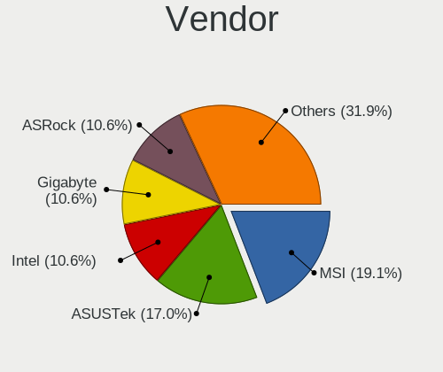

| Name                | Desktops | Percent |
|---------------------|----------|---------|
| MSI                 | 7        | 19.44%  |
| Gigabyte Technology | 5        | 13.89%  |
| ASRock              | 5        | 13.89%  |
| Intel               | 3        | 8.33%   |
| Dell                | 3        | 8.33%   |
| ASUSTek Computer    | 3        | 8.33%   |
| Positivo            | 2        | 5.56%   |
| Pegatron            | 2        | 5.56%   |
| Hewlett-Packard     | 2        | 5.56%   |
| Google              | 1        | 2.78%   |
| Foxconn             | 1        | 2.78%   |
| Acer                | 1        | 2.78%   |
| ABIT                | 1        | 2.78%   |

Model
-----

Motherboard model

| Name                           | Desktops | Percent |
|--------------------------------|----------|---------|
| Positivo POS-PIQ67CG           | 1        | 2.78%   |
| Positivo POS-EIBTPDC           | 1        | 2.78%   |
| Pegatron p6745br               | 1        | 2.78%   |
| Pegatron NC045AA-ABU IQ525uk   | 1        | 2.78%   |
| MSI MS-7C37                    | 1        | 2.78%   |
| MSI MS-7B79                    | 1        | 2.78%   |
| MSI MS-7A71                    | 1        | 2.78%   |
| MSI MS-7752                    | 1        | 2.78%   |
| MSI MS-7693                    | 1        | 2.78%   |
| MSI MS-7681                    | 1        | 2.78%   |
| MSI MS-7529                    | 1        | 2.78%   |
| Intel H55                      | 1        | 2.78%   |
| Intel DG35EC AAE29266-202      | 1        | 2.78%   |
| Intel DESKTOP 300              | 1        | 2.78%   |
| HP EliteDesk 800 G2 SFF        | 1        | 2.78%   |
| HP 700-214                     | 1        | 2.78%   |
| Google Teemo                   | 1        | 2.78%   |
| Gigabyte H61M-S2PV             | 1        | 2.78%   |
| Gigabyte GA-970A-D3            | 1        | 2.78%   |
| Gigabyte F2A78M-D3H            | 1        | 2.78%   |
| Gigabyte 970A-D3               | 1        | 2.78%   |
| Gigabyte 7200-5121B            | 1        | 2.78%   |
| Foxconn D270S/D250S MP         | 1        | 2.78%   |
| Dell Precision WorkStation 390 | 1        | 2.78%   |
| Dell OptiPlex 3020             | 1        | 2.78%   |
| Dell Inspiron 3670             | 1        | 2.78%   |
| ASUS M5A78L-M PLUS/USB3        | 1        | 2.78%   |
| ASUS H110-PLUS                 | 1        | 2.78%   |
| ASUS CM6650                    | 1        | 2.78%   |
| ASRock X370 Gaming X           | 1        | 2.78%   |
| ASRock Q1900-ITX               | 1        | 2.78%   |
| ASRock N68-S3 UCC              | 1        | 2.78%   |
| ASRock A55M-HVS                | 1        | 2.78%   |
| ASRock 980DE3/U3S3             | 1        | 2.78%   |
| Acer Aspire X1930              | 1        | 2.78%   |
| ABIT AW9D-MAX                  | 1        | 2.78%   |

Model Family
------------

Motherboard model prefix

| Name                 | Desktops | Percent |
|----------------------|----------|---------|
| Positivo POS-PIQ67CG | 1        | 2.78%   |
| Positivo POS-EIBTPDC | 1        | 2.78%   |
| Pegatron p6745br     | 1        | 2.78%   |
| Pegatron NC045AA-ABU | 1        | 2.78%   |
| MSI MS-7C37          | 1        | 2.78%   |
| MSI MS-7B79          | 1        | 2.78%   |
| MSI MS-7A71          | 1        | 2.78%   |
| MSI MS-7752          | 1        | 2.78%   |
| MSI MS-7693          | 1        | 2.78%   |
| MSI MS-7681          | 1        | 2.78%   |
| MSI MS-7529          | 1        | 2.78%   |
| Intel H55            | 1        | 2.78%   |
| Intel DG35EC         | 1        | 2.78%   |
| Intel DESKTOP        | 1        | 2.78%   |
| HP EliteDesk         | 1        | 2.78%   |
| HP 700-214           | 1        | 2.78%   |
| Google Teemo         | 1        | 2.78%   |
| Gigabyte H61M-S2PV   | 1        | 2.78%   |
| Gigabyte GA-970A-D3  | 1        | 2.78%   |
| Gigabyte F2A78M-D3H  | 1        | 2.78%   |
| Gigabyte 970A-D3     | 1        | 2.78%   |
| Gigabyte 7200-5121B  | 1        | 2.78%   |
| Foxconn D270S        | 1        | 2.78%   |
| Dell Precision       | 1        | 2.78%   |
| Dell OptiPlex        | 1        | 2.78%   |
| Dell Inspiron        | 1        | 2.78%   |
| ASUS M5A78L-M        | 1        | 2.78%   |
| ASUS H110-PLUS       | 1        | 2.78%   |
| ASUS CM6650          | 1        | 2.78%   |
| ASRock X370          | 1        | 2.78%   |
| ASRock Q1900-ITX     | 1        | 2.78%   |
| ASRock N68-S3        | 1        | 2.78%   |
| ASRock A55M-HVS      | 1        | 2.78%   |
| ASRock 980DE3        | 1        | 2.78%   |
| Acer Aspire          | 1        | 2.78%   |
| ABIT AW9D-MAX        | 1        | 2.78%   |

MFG Year
--------

Motherboard manufacture year

| Year | Desktops | Percent |
|------|----------|---------|
| 2011 | 7        | 19.44%  |
| 2014 | 5        | 13.89%  |
| 2016 | 4        | 11.11%  |
| 2012 | 4        | 11.11%  |
| 2010 | 4        | 11.11%  |
| 2019 | 3        | 8.33%   |
| 2015 | 2        | 5.56%   |
| 2013 | 2        | 5.56%   |
| 2008 | 2        | 5.56%   |
| 2021 | 1        | 2.78%   |
| 2017 | 1        | 2.78%   |
| 2006 | 1        | 2.78%   |

Form Factor
-----------

Physical design of the computer

| Name    | Desktops | Percent |
|---------|----------|---------|
| Desktop | 36       | 100%    |

Secure Boot
-----------

Enabled or disabled

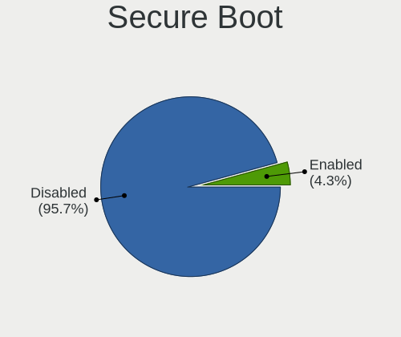

| State    | Desktops | Percent |
|----------|----------|---------|
| Disabled | 35       | 97.22%  |
| Enabled  | 1        | 2.78%   |

Coreboot
--------

Have coreboot on board

| Used | Desktops | Percent |
|------|----------|---------|
| No   | 35       | 97.22%  |
| Yes  | 1        | 2.78%   |

RAM Size
--------

Total RAM memory

| Size in GB | Desktops | Percent |
|------------|----------|---------|
| 8.01-16.0  | 9        | 25%     |
| 16.01-24.0 | 8        | 22.22%  |
| 3.01-4.0   | 7        | 19.44%  |
| 4.01-8.0   | 6        | 16.67%  |
| 32.01-64.0 | 3        | 8.33%   |
| 1.01-2.0   | 2        | 5.56%   |
| 24.01-32.0 | 1        | 2.78%   |

RAM Used
--------

Used RAM memory

| Used GB   | Desktops | Percent |
|-----------|----------|---------|
| 1.01-2.0  | 14       | 38.89%  |
| 2.01-3.0  | 9        | 25%     |
| 3.01-4.0  | 4        | 11.11%  |
| 0.51-1.0  | 4        | 11.11%  |
| 4.01-8.0  | 3        | 8.33%   |
| 8.01-16.0 | 2        | 5.56%   |

Total Drives
------------

Number of drives on board

| Drives | Desktops | Percent |
|--------|----------|---------|
| 1      | 19       | 51.35%  |
| 2      | 10       | 27.03%  |
| 3      | 5        | 13.51%  |
| 5      | 2        | 5.41%   |
| 4      | 1        | 2.7%    |

Has CD-ROM
----------

Has CD-ROM on board

| Presented | Desktops | Percent |
|-----------|----------|---------|
| Yes       | 20       | 55.56%  |
| No        | 16       | 44.44%  |

Has Ethernet
------------

Has Ethernet on board

| Presented | Desktops | Percent |
|-----------|----------|---------|
| Yes       | 36       | 100%    |

Has WiFi
--------

Has WiFi module

| Presented | Desktops | Percent |
|-----------|----------|---------|
| Yes       | 19       | 51.35%  |
| No        | 18       | 48.65%  |

Has Bluetooth
-------------

Has Bluetooth module

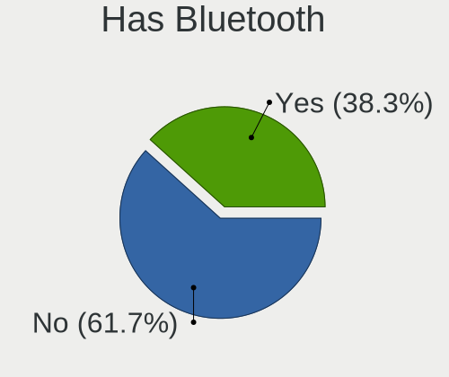

| Presented | Desktops | Percent |
|-----------|----------|---------|
| No        | 24       | 66.67%  |
| Yes       | 12       | 33.33%  |

Location
--------

Country
-------

Geographic location (country)

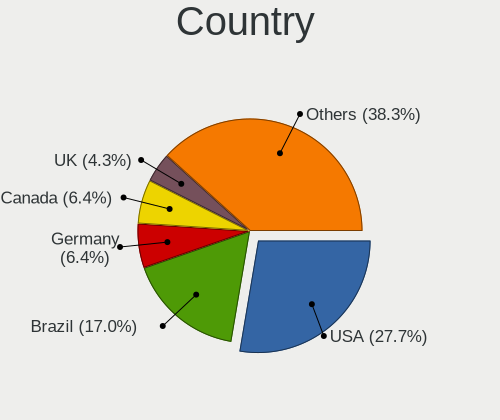

| Country     | Desktops | Percent |
|-------------|----------|---------|
| USA         | 10       | 27.78%  |
| Brazil      | 8        | 22.22%  |
| Canada      | 3        | 8.33%   |
| UK          | 2        | 5.56%   |
| Poland      | 2        | 5.56%   |
| Italy       | 2        | 5.56%   |
| Sweden      | 1        | 2.78%   |
| Spain       | 1        | 2.78%   |
| Russia      | 1        | 2.78%   |
| Puerto Rico | 1        | 2.78%   |
| Namibia     | 1        | 2.78%   |
| Mexico      | 1        | 2.78%   |
| India       | 1        | 2.78%   |
| Germany     | 1        | 2.78%   |
| Argentina   | 1        | 2.78%   |

City
----

Geographic location (city)

| City                | Desktops | Percent |
|---------------------|----------|---------|
| Rio de Janeiro      | 3        | 8.33%   |
| Campinas            | 2        | 5.56%   |
| Windhoek            | 1        | 2.78%   |
| Warsaw              | 1        | 2.78%   |
| Toronto             | 1        | 2.78%   |
| Stourbridge         | 1        | 2.78%   |
| Stockholm           | 1        | 2.78%   |
| Sparta              | 1        | 2.78%   |
| S??o Paulo          | 1        | 2.78%   |
| Saloa               | 1        | 2.78%   |
| Port Coquitlam      | 1        | 2.78%   |
| Patchogue           | 1        | 2.78%   |
| Niter??i            | 1        | 2.78%   |
| Newcastle upon Tyne | 1        | 2.78%   |
| Newburgh            | 1        | 2.78%   |
| Missoula            | 1        | 2.78%   |
| Milan               | 1        | 2.78%   |
| Melbourne           | 1        | 2.78%   |
| Madrid              | 1        | 2.78%   |
| Lares               | 1        | 2.78%   |
| Kochi               | 1        | 2.78%   |
| Ingolstadt          | 1        | 2.78%   |
| Holmen              | 1        | 2.78%   |
| Guadalajara         | 1        | 2.78%   |
| Genoa               | 1        | 2.78%   |
| Galloway            | 1        | 2.78%   |
| Duluth              | 1        | 2.78%   |
| Chorz??w            | 1        | 2.78%   |
| Chicago             | 1        | 2.78%   |
| Buenos Aires        | 1        | 2.78%   |
| Brampton            | 1        | 2.78%   |
| Bolshoy Kamen       | 1        | 2.78%   |
| Battle Creek        | 1        | 2.78%   |

Drives
------

Drive Vendor
------------

Hard drive vendors

| Vendor              | Desktops | Drives | Percent |
|---------------------|----------|--------|---------|
| Seagate             | 16       | 20     | 27.59%  |
| WDC                 | 13       | 17     | 22.41%  |
| Samsung Electronics | 8        | 8      | 13.79%  |
| SanDisk             | 5        | 5      | 8.62%   |
| Toshiba             | 2        | 2      | 3.45%   |
| SPCC                | 2        | 2      | 3.45%   |
| Transcend           | 1        | 1      | 1.72%   |
| SATAFIRM            | 1        | 1      | 1.72%   |
| PNY                 | 1        | 1      | 1.72%   |
| Phison              | 1        | 1      | 1.72%   |
| OCZ                 | 1        | 1      | 1.72%   |
| MAXTOR              | 1        | 1      | 1.72%   |
| Kingston            | 1        | 1      | 1.72%   |
| JMicron             | 1        | 1      | 1.72%   |
| Crucial             | 1        | 1      | 1.72%   |
| Apacer              | 1        | 2      | 1.72%   |
| AFOX                | 1        | 1      | 1.72%   |
| A-DATA Technology   | 1        | 1      | 1.72%   |

Drive Model
-----------

Hard drive models

| Model                               | Desktops | Percent |
|-------------------------------------|----------|---------|
| Seagate ST1000DM010-2EP102 1TB      | 3        | 4.62%   |
| Seagate ST1000DM003-1CH162 1TB      | 2        | 3.08%   |
| Seagate Expansion Desk 8TB          | 2        | 3.08%   |
| SanDisk SDSSDX240GG25 240GB         | 2        | 3.08%   |
| WDC WDS500G2B0C-00PXH0 500GB        | 1        | 1.54%   |
| WDC WDS500G2B0B-00YS70 500GB SSD    | 1        | 1.54%   |
| WDC WDS240G2G0A-00JH30 240GB SSD    | 1        | 1.54%   |
| WDC WDBNCE5000PNC 500GB SSD         | 1        | 1.54%   |
| WDC WD6402AAEX-00Y9A0 640GB         | 1        | 1.54%   |
| WDC WD6401AALS-00L3B2 640GB         | 1        | 1.54%   |
| WDC WD5000AVVS-63M8B0 500GB         | 1        | 1.54%   |
| WDC WD5000AAKS-75A7B2 500GB         | 1        | 1.54%   |
| WDC WD3200AAKS-61L9A0 320GB         | 1        | 1.54%   |
| WDC WD30EZRZ-00WN9B0 3TB            | 1        | 1.54%   |
| WDC WD30EZRX-00MMMB0 3TB            | 1        | 1.54%   |
| WDC WD20EADS-00R6B0 2TB             | 1        | 1.54%   |
| WDC WD1600JB-32FUA0 160GB           | 1        | 1.54%   |
| WDC WD10EZEX-08WN4A0 1TB            | 1        | 1.54%   |
| WDC WD10EZEX-00RKKA0 1TB            | 1        | 1.54%   |
| WDC WD1001FALS-00J7B0 1TB           | 1        | 1.54%   |
| Transcend TS32GMTS400 32GB SSD      | 1        | 1.54%   |
| Toshiba MQ01ABD050 500GB            | 1        | 1.54%   |
| Toshiba KBG30ZMS128G 128GB NVMe SSD | 1        | 1.54%   |
| SPCC Solid State Disk 512GB         | 1        | 1.54%   |
| SPCC Solid State Disk 128GB         | 1        | 1.54%   |
| Seagate ST9160310AS 160GB           | 1        | 1.54%   |
| Seagate ST500LT012-9WS142 500GB     | 1        | 1.54%   |
| Seagate ST500DM009-2F110A 500GB     | 1        | 1.54%   |
| Seagate ST500DM002-1BD142 500GB     | 1        | 1.54%   |
| Seagate ST3750640NS 752GB           | 1        | 1.54%   |
| Seagate ST3160811AS 160GB           | 1        | 1.54%   |
| Seagate ST31000528AS 1TB            | 1        | 1.54%   |
| Seagate ST2000DX002-2DV164 2TB      | 1        | 1.54%   |
| Seagate ST2000DM001-1ER164 2TB      | 1        | 1.54%   |
| Seagate ST2000DM 008-2FR102 2TB     | 1        | 1.54%   |
| Seagate Expansion 1TB               | 1        | 1.54%   |
| Seagate Backup+ Hub BK 8TB          | 1        | 1.54%   |
| SATAFIRM S11 256GB                  | 1        | 1.54%   |
| SanDisk SDSSDA240G 240GB            | 1        | 1.54%   |
| SanDisk SDSSDA120G 120GB            | 1        | 1.54%   |
| SanDisk SD8SBAT128G1122 128GB SSD   | 1        | 1.54%   |
| Samsung SSD 860 EVO 500GB           | 1        | 1.54%   |
| Samsung SSD 860 EVO 1TB             | 1        | 1.54%   |
| Samsung SSD 840 Series 120GB        | 1        | 1.54%   |
| Samsung SSD 840 EVO 500GB mSATA     | 1        | 1.54%   |
| Samsung SSD 840 EVO 120GB           | 1        | 1.54%   |
| Samsung NVMe SSD Drive 250GB        | 1        | 1.54%   |
| Samsung HD103SJ 1TB                 | 1        | 1.54%   |
| Samsung HD103SI 1TB                 | 1        | 1.54%   |
| PNY CS900 120GB SSD                 | 1        | 1.54%   |
| Phison NVMe SSD Drive 1TB           | 1        | 1.54%   |
| OCZ AGILITY3 64GB SSD               | 1        | 1.54%   |
| MAXTOR 6V080E0 81GB                 | 1        | 1.54%   |
| Kingston SA400S37480G 480GB SSD     | 1        | 1.54%   |
| JMicron Disk 240GB                  | 1        | 1.54%   |
| Crucial CT1000MX500SSD1 1TB         | 1        | 1.54%   |
| Apacer AS350 256GB SSD              | 1        | 1.54%   |
| Apacer AS340 240GB SSD              | 1        | 1.54%   |
| AFOX 120GB                          | 1        | 1.54%   |
| A-DATA SP600 256GB SSD              | 1        | 1.54%   |

HDD Vendor
----------

Hard disk drive vendors

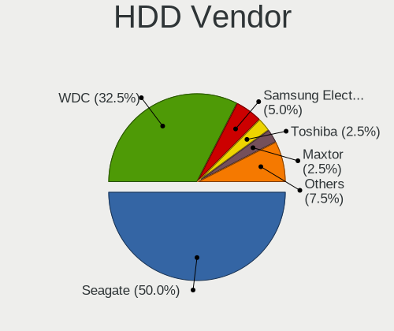

| Vendor              | Desktops | Drives | Percent |
|---------------------|----------|--------|---------|
| Seagate             | 16       | 20     | 50%     |
| WDC                 | 10       | 13     | 31.25%  |
| Samsung Electronics | 2        | 2      | 6.25%   |
| Toshiba             | 1        | 1      | 3.13%   |
| SATAFIRM            | 1        | 1      | 3.13%   |
| MAXTOR              | 1        | 1      | 3.13%   |
| JMicron             | 1        | 1      | 3.13%   |

SSD Vendor
----------

Solid state drive vendors

| Vendor              | Desktops | Drives | Percent |
|---------------------|----------|--------|---------|
| SanDisk             | 5        | 5      | 22.73%  |
| Samsung Electronics | 5        | 5      | 22.73%  |
| WDC                 | 3        | 3      | 13.64%  |
| SPCC                | 2        | 2      | 9.09%   |
| Transcend           | 1        | 1      | 4.55%   |
| PNY                 | 1        | 1      | 4.55%   |
| OCZ                 | 1        | 1      | 4.55%   |
| Kingston            | 1        | 1      | 4.55%   |
| Crucial             | 1        | 1      | 4.55%   |
| Apacer              | 1        | 2      | 4.55%   |
| A-DATA Technology   | 1        | 1      | 4.55%   |

Drive Kind
----------

HDD or SSD

| Kind    | Desktops | Drives | Percent |
|---------|----------|--------|---------|
| HDD     | 24       | 39     | 50%     |
| SSD     | 19       | 23     | 39.58%  |
| NVMe    | 4        | 4      | 8.33%   |
| Unknown | 1        | 1      | 2.08%   |

Drive Connector
---------------

SATA, SAS, NVMe, etc.

| Type | Desktops | Drives | Percent |
|------|----------|--------|---------|
| SATA | 36       | 57     | 80%     |
| SAS  | 5        | 6      | 11.11%  |
| NVMe | 4        | 4      | 8.89%   |

Drive Size
----------

Size of hard drive

| Size in TB | Desktops | Drives | Percent |
|------------|----------|--------|---------|
| 0.01-0.5   | 27       | 33     | 54%     |
| 0.51-1.0   | 14       | 20     | 28%     |
| 1.01-2.0   | 4        | 4      | 8%      |
| 4.01-10.0  | 3        | 3      | 6%      |
| 2.01-3.0   | 2        | 2      | 4%      |

Space Total
-----------

Amount of disk space available on the file system

| Size in GB     | Desktops | Percent |
|----------------|----------|---------|
| 101-250        | 9        | 25%     |
| 251-500        | 8        | 22.22%  |
| 501-1000       | 5        | 13.89%  |
| 21-50          | 4        | 11.11%  |
| 1001-2000      | 3        | 8.33%   |
| 1-20           | 3        | 8.33%   |
| More than 3000 | 2        | 5.56%   |
| 2001-3000      | 1        | 2.78%   |
| 51-100         | 1        | 2.78%   |

Space Used
----------

Amount of used disk space

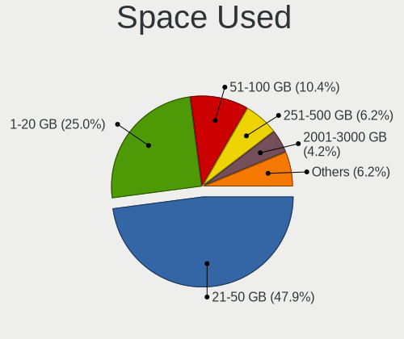

| Used GB   | Desktops | Percent |
|-----------|----------|---------|
| 21-50     | 17       | 45.95%  |
| 1-20      | 9        | 24.32%  |
| 51-100    | 5        | 13.51%  |
| 251-500   | 2        | 5.41%   |
| 2001-3000 | 2        | 5.41%   |
| 101-250   | 2        | 5.41%   |

Malfunc. Drives
---------------

Drive models with a malfunction

Zero info for selected period =(

Malfunc. Drive Vendor
---------------------

Vendors of faulty drives

Zero info for selected period =(

Malfunc. HDD Vendor
-------------------

Vendors of faulty HDD drives

Zero info for selected period =(

Malfunc. Drive Kind
-------------------

Kinds of faulty drives

Zero info for selected period =(

Failed Drives
-------------

Failed drive models

Zero info for selected period =(

Failed Drive Vendor
-------------------

Failed drive vendors

Zero info for selected period =(

Drive Status
------------

Number of failed and malfunc. drives

| Status   | Desktops | Drives | Percent |
|----------|----------|--------|---------|
| Detected | 35       | 65     | 97.22%  |
| Works    | 1        | 2      | 2.78%   |

Storage controller
------------------

Storage Vendor
--------------

Storage controller vendors

| Vendor                        | Desktops | Percent |
|-------------------------------|----------|---------|
| Intel                         | 23       | 47.92%  |
| AMD                           | 10       | 20.83%  |
| ASMedia Technology            | 3        | 6.25%   |
| Nvidia                        | 2        | 4.17%   |
| JMicron Technology            | 2        | 4.17%   |
| Toshiba America Info Systems  | 1        | 2.08%   |
| Silicon Image                 | 1        | 2.08%   |
| Sandisk                       | 1        | 2.08%   |
| Samsung Electronics           | 1        | 2.08%   |
| Promise Technology            | 1        | 2.08%   |
| Phison Electronics            | 1        | 2.08%   |
| Marvell Technology Group      | 1        | 2.08%   |
| Integrated Technology Express | 1        | 2.08%   |

Storage Model
-------------

Storage controller models

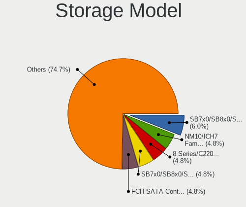

| Model                                                                                   | Desktops | Percent |
|-----------------------------------------------------------------------------------------|----------|---------|
| AMD SB7x0/SB8x0/SB9x0 IDE Controller                                                    | 4        | 6.35%   |
| Intel NM10/ICH7 Family SATA Controller [IDE mode]                                       | 3        | 4.76%   |
| Intel 8 Series/C220 Series Chipset Family 6-port SATA Controller 1 [AHCI mode]          | 3        | 4.76%   |
| Intel 6 Series/C200 Series Chipset Family 6 port Desktop SATA AHCI Controller           | 3        | 4.76%   |
| ASMedia ASM1062 Serial ATA Controller                                                   | 3        | 4.76%   |
| AMD SB7x0/SB8x0/SB9x0 SATA Controller [IDE mode]                                        | 3        | 4.76%   |
| AMD FCH SATA Controller [AHCI mode]                                                     | 3        | 4.76%   |
| Nvidia MCP61 SATA Controller                                                            | 2        | 3.17%   |
| Intel Q170/Q150/B150/H170/H110/Z170/CM236 Chipset SATA Controller [AHCI Mode]           | 2        | 3.17%   |
| Intel 82801G (ICH7 Family) IDE Controller                                               | 2        | 3.17%   |
| Intel 6 Series/C200 Series Chipset Family Desktop SATA Controller (IDE mode, ports 4-5) | 2        | 3.17%   |
| Intel 6 Series/C200 Series Chipset Family Desktop SATA Controller (IDE mode, ports 0-3) | 2        | 3.17%   |
| AMD SB7x0/SB8x0/SB9x0 SATA Controller [AHCI mode]                                       | 2        | 3.17%   |
| Toshiba America Info Systems XG4 NVMe SSD Controller                                    | 1        | 1.59%   |
| Silicon Image SiI 3132 Serial ATA Raid II Controller                                    | 1        | 1.59%   |
| Sandisk WD Blue SN550 NVMe SSD                                                          | 1        | 1.59%   |
| Samsung NVMe SSD Controller SM981/PM981/PM983                                           | 1        | 1.59%   |
| Promise PDC20262 (FastTrak66/Ultra66)                                                   | 1        | 1.59%   |
| Phison E16 PCIe4 NVMe Controller                                                        | 1        | 1.59%   |
| Nvidia MCP61 IDE                                                                        | 1        | 1.59%   |
| Marvell Group 88SE91A3 SATA-600 Controller                                              | 1        | 1.59%   |
| Marvell Group 88SE912x IDE Controller                                                   | 1        | 1.59%   |
| JMicron JMB368 IDE controller                                                           | 1        | 1.59%   |
| JMicron JMB362 SATA Controller                                                          | 1        | 1.59%   |
| Intel Sunrise Point-LP SATA Controller [AHCI mode]                                      | 1        | 1.59%   |
| Intel SATA Controller [RAID mode]                                                       | 1        | 1.59%   |
| Intel NM10/ICH7 Family SATA Controller [AHCI mode]                                      | 1        | 1.59%   |
| Intel Atom Processor E3800 Series SATA AHCI Controller                                  | 1        | 1.59%   |
| Intel 82801IBM/IEM (ICH9M/ICH9M-E) 4 port SATA Controller [AHCI mode]                   | 1        | 1.59%   |
| Intel 82801HR/HO/HH (ICH8R/DO/DH) 2 port SATA Controller [IDE mode]                     | 1        | 1.59%   |
| Intel 82801H (ICH8 Family) 4 port SATA Controller [IDE mode]                            | 1        | 1.59%   |
| Intel 7 Series/C210 Series Chipset Family 6-port SATA Controller [AHCI mode]            | 1        | 1.59%   |
| Intel 5 Series/3400 Series Chipset PT IDER Controller                                   | 1        | 1.59%   |
| Intel 5 Series/3400 Series Chipset 6 port SATA AHCI Controller                          | 1        | 1.59%   |
| Intel 5 Series/3400 Series Chipset 4 port SATA IDE Controller                           | 1        | 1.59%   |
| Intel 5 Series/3400 Series Chipset 2 port SATA IDE Controller                           | 1        | 1.59%   |
| Intel 200 Series PCH SATA controller [AHCI mode]                                        | 1        | 1.59%   |
| Integrated Express IT8212 Dual channel ATA RAID controller                              | 1        | 1.59%   |
| AMD X370 Series Chipset SATA Controller                                                 | 1        | 1.59%   |
| AMD FCH SATA Controller [IDE mode]                                                      | 1        | 1.59%   |
| AMD FCH IDE Controller                                                                  | 1        | 1.59%   |
| AMD 400 Series Chipset SATA Controller                                                  | 1        | 1.59%   |

Storage Kind
------------

Kind of storage controller (IDE, SATA, NVMe, SAS, ...)

| Kind | Desktops | Percent |
|------|----------|---------|
| SATA | 27       | 55.1%   |
| IDE  | 15       | 30.61%  |
| NVMe | 4        | 8.16%   |
| RAID | 3        | 6.12%   |

Processor
---------

CPU Vendor
----------

Processor vendors

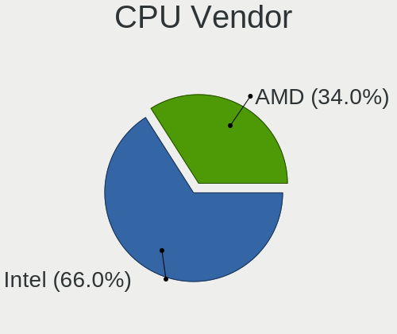

| Vendor | Desktops | Percent |
|--------|----------|---------|
| Intel  | 24       | 66.67%  |
| AMD    | 12       | 33.33%  |

CPU Model
---------

Processor models

| Model                                     | Desktops | Percent |
|-------------------------------------------|----------|---------|
| Intel Core i5-6500 CPU @ 3.20GHz          | 2        | 5.56%   |
| AMD FX-8350 Eight-Core Processor          | 2        | 5.56%   |
| Intel Pentium Dual CPU E2180 @ 2.00GHz    | 1        | 2.78%   |
| Intel Core i7-7700 CPU @ 3.60GHz          | 1        | 2.78%   |
| Intel Core i7-4790 CPU @ 3.60GHz          | 1        | 2.78%   |
| Intel Core i5-9400 CPU @ 2.90GHz          | 1        | 2.78%   |
| Intel Core i5-4440 CPU @ 3.10GHz          | 1        | 2.78%   |
| Intel Core i5-3570K CPU @ 3.40GHz         | 1        | 2.78%   |
| Intel Core i5-3570 CPU @ 3.40GHz          | 1        | 2.78%   |
| Intel Core i5-3470 CPU @ 3.20GHz          | 1        | 2.78%   |
| Intel Core i5-2310 CPU @ 2.90GHz          | 1        | 2.78%   |
| Intel Core i5-2300 CPU @ 2.80GHz          | 1        | 2.78%   |
| Intel Core i5 CPU 650 @ 3.20GHz           | 1        | 2.78%   |
| Intel Core i3-7100U CPU @ 2.40GHz         | 1        | 2.78%   |
| Intel Core i3-4160 CPU @ 3.60GHz          | 1        | 2.78%   |
| Intel Core i3-2120 CPU @ 3.30GHz          | 1        | 2.78%   |
| Intel Core i3 CPU 530 @ 2.93GHz           | 1        | 2.78%   |
| Intel Core 2 Quad CPU Q8400 @ 2.66GHz     | 1        | 2.78%   |
| Intel Core 2 Quad CPU Q6600 @ 2.40GHz     | 1        | 2.78%   |
| Intel Core 2 Duo CPU P7450 @ 2.13GHz      | 1        | 2.78%   |
| Intel Core 2 CPU 4300 @ 1.80GHz           | 1        | 2.78%   |
| Intel Celeron CPU J1900 @ 1.99GHz         | 1        | 2.78%   |
| Intel Celeron CPU J1800 @ 2.41GHz         | 1        | 2.78%   |
| Intel Atom CPU D2700 @ 2.13GHz            | 1        | 2.78%   |
| AMD Ryzen 7 3700X 8-Core Processor        | 1        | 2.78%   |
| AMD Ryzen 5 3600 6-Core Processor         | 1        | 2.78%   |
| AMD Ryzen 5 1600X Six-Core Processor      | 1        | 2.78%   |
| AMD Phenom II X4 830 Processor            | 1        | 2.78%   |
| AMD Phenom II X2 565 Processor            | 1        | 2.78%   |
| AMD FX-6300 Six-Core Processor            | 1        | 2.78%   |
| AMD FX-6100 Six-Core Processor            | 1        | 2.78%   |
| AMD Athlon II X2 220 Processor            | 1        | 2.78%   |
| AMD A8-3850 APU with Radeon HD Graphics   | 1        | 2.78%   |
| AMD A10-6800K APU with Radeon HD Graphics | 1        | 2.78%   |

CPU Model Family
----------------

Processor model prefix

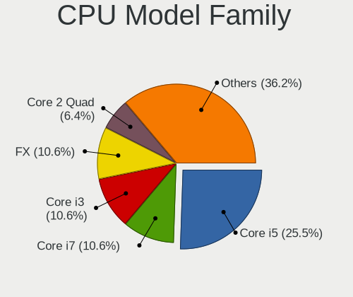

| Model              | Desktops | Percent |
|--------------------|----------|---------|
| Intel Core i5      | 10       | 27.78%  |
| Intel Core i3      | 4        | 11.11%  |
| AMD FX             | 4        | 11.11%  |
| Intel Core i7      | 2        | 5.56%   |
| Intel Core 2 Quad  | 2        | 5.56%   |
| Intel Celeron      | 2        | 5.56%   |
| AMD Ryzen 5        | 2        | 5.56%   |
| Intel Pentium Dual | 1        | 2.78%   |
| Intel Core 2 Duo   | 1        | 2.78%   |
| Intel Core 2       | 1        | 2.78%   |
| Intel Atom         | 1        | 2.78%   |
| AMD Ryzen 7        | 1        | 2.78%   |
| AMD Phenom II X4   | 1        | 2.78%   |
| AMD Phenom II X2   | 1        | 2.78%   |
| AMD Athlon II X2   | 1        | 2.78%   |
| AMD A8             | 1        | 2.78%   |
| AMD A10            | 1        | 2.78%   |

CPU Cores
---------

Number of processor cores

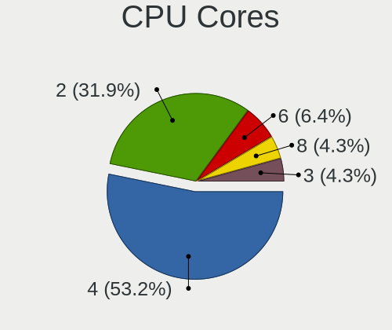

| Number | Desktops | Percent |
|--------|----------|---------|
| 4      | 17       | 47.22%  |
| 2      | 13       | 36.11%  |
| 6      | 3        | 8.33%   |
| 3      | 2        | 5.56%   |
| 8      | 1        | 2.78%   |

CPU Sockets
-----------

Number of sockets

| Number | Desktops | Percent |
|--------|----------|---------|
| 1      | 36       | 100%    |

CPU Threads
-----------

Threads per core (Hyper-Threading)

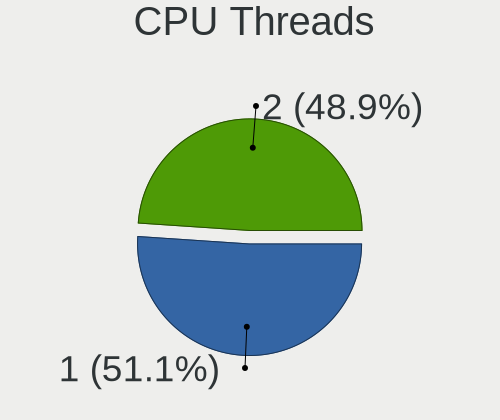

| Number | Desktops | Percent |
|--------|----------|---------|
| 1      | 20       | 55.56%  |
| 2      | 16       | 44.44%  |

CPU Op-Modes
------------

CPU Operation Modes (32-bit, 64-bit)

| Op mode        | Desktops | Percent |
|----------------|----------|---------|
| 32-bit, 64-bit | 36       | 100%    |

CPU Microcode
-------------

Microcode number

| Number     | Desktops | Percent |
|------------|----------|---------|
| 0x306a9    | 3        | 8.33%   |
| 0x206a7    | 3        | 8.33%   |
| 0x06000852 | 3        | 8.33%   |
| 0x010000c8 | 3        | 8.33%   |
| Unknown    | 3        | 8.33%   |
| 0x506e3    | 2        | 5.56%   |
| 0x20652    | 2        | 5.56%   |
| 0x906ed    | 1        | 2.78%   |
| 0x906e9    | 1        | 2.78%   |
| 0x806e9    | 1        | 2.78%   |
| 0x6fd      | 1        | 2.78%   |
| 0x6fb      | 1        | 2.78%   |
| 0x6f2      | 1        | 2.78%   |
| 0x306c3    | 1        | 2.78%   |
| 0x30678    | 1        | 2.78%   |
| 0x30673    | 1        | 2.78%   |
| 0x30661    | 1        | 2.78%   |
| 0x1067a    | 1        | 2.78%   |
| 0x10676    | 1        | 2.78%   |
| 0x08701021 | 1        | 2.78%   |
| 0x08001138 | 1        | 2.78%   |
| 0x06001119 | 1        | 2.78%   |
| 0x0600063e | 1        | 2.78%   |
| 0x03000027 | 1        | 2.78%   |

CPU Microarch
-------------

Microarchitecture

| Name        | Desktops | Percent |
|-------------|----------|---------|
| Piledriver  | 4        | 11.11%  |
| SandyBridge | 3        | 8.33%   |
| KabyLake    | 3        | 8.33%   |
| K10         | 3        | 8.33%   |
| IvyBridge   | 3        | 8.33%   |
| Haswell     | 3        | 8.33%   |
| Core        | 3        | 8.33%   |
| Zen 2       | 2        | 5.56%   |
| Westmere    | 2        | 5.56%   |
| Skylake     | 2        | 5.56%   |
| Silvermont  | 2        | 5.56%   |
| Penryn      | 2        | 5.56%   |
| Zen         | 1        | 2.78%   |
| K10 Llano   | 1        | 2.78%   |
| Bulldozer   | 1        | 2.78%   |
| Bonnell     | 1        | 2.78%   |

Graphics
--------

GPU Vendor
----------

Vendors of graphics cards

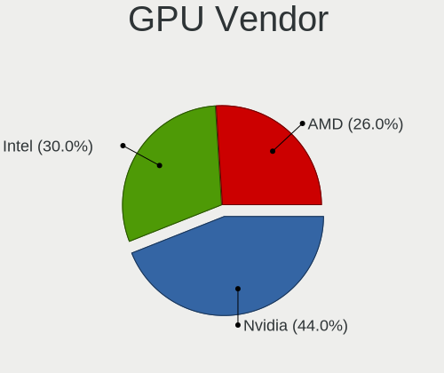

| Vendor | Desktops | Percent |
|--------|----------|---------|
| Nvidia | 15       | 38.46%  |
| Intel  | 14       | 35.9%   |
| AMD    | 10       | 25.64%  |

GPU Model
---------

Graphics card models

| Model                                                                       | Desktops | Percent |
|-----------------------------------------------------------------------------|----------|---------|
| Nvidia GP106 [GeForce GTX 1060 3GB]                                         | 2        | 5.13%   |
| Intel Xeon E3-1200 v3/4th Gen Core Processor Integrated Graphics Controller | 2        | 5.13%   |
| Intel Core Processor Integrated Graphics Controller                         | 2        | 5.13%   |
| Intel Atom Processor Z36xxx/Z37xxx Series Graphics & Display                | 2        | 5.13%   |
| AMD Cedar [Radeon HD 5000/6000/7350/8350 Series]                            | 2        | 5.13%   |
| Nvidia TU104 [GeForce RTX 2080 SUPER]                                       | 1        | 2.56%   |
| Nvidia GT218 [GeForce 210]                                                  | 1        | 2.56%   |
| Nvidia GP108 [GeForce GT 1030]                                              | 1        | 2.56%   |
| Nvidia GP104 [GeForce GTX 1080]                                             | 1        | 2.56%   |
| Nvidia GM206 [GeForce GTX 960]                                              | 1        | 2.56%   |
| Nvidia GM206 [GeForce GTX 950]                                              | 1        | 2.56%   |
| Nvidia GM204 [GeForce GTX 970]                                              | 1        | 2.56%   |
| Nvidia GM200 [GeForce GTX 980 Ti]                                           | 1        | 2.56%   |
| Nvidia GK208B [GeForce GT 730]                                              | 1        | 2.56%   |
| Nvidia GK208B [GeForce GT 710]                                              | 1        | 2.56%   |
| Nvidia GK110 [GeForce GTX 780]                                              | 1        | 2.56%   |
| Nvidia GK107 [GeForce GTX 650]                                              | 1        | 2.56%   |
| Nvidia G96CM [GeForce 9600M GS]                                             | 1        | 2.56%   |
| Intel HD Graphics 630                                                       | 1        | 2.56%   |
| Intel HD Graphics 620                                                       | 1        | 2.56%   |
| Intel HD Graphics 530                                                       | 1        | 2.56%   |
| Intel CoffeeLake-S GT2 [UHD Graphics 630]                                   | 1        | 2.56%   |
| Intel Atom Processor D2xxx/N2xxx Integrated Graphics Controller             | 1        | 2.56%   |
| Intel 82G35 Express Integrated Graphics Controller                          | 1        | 2.56%   |
| Intel 82G33/G31 Express Integrated Graphics Controller                      | 1        | 2.56%   |
| Intel 2nd Generation Core Processor Family Integrated Graphics Controller   | 1        | 2.56%   |
| AMD Sumo [Radeon HD 6550D]                                                  | 1        | 2.56%   |
| AMD RV610 [Radeon HD 2400 PRO]                                              | 1        | 2.56%   |
| AMD RS780L [Radeon 3000]                                                    | 1        | 2.56%   |
| AMD Oland XT [Radeon HD 8670 / R5 340X OEM / R7 250/350/350X OEM]           | 1        | 2.56%   |
| AMD Lexa PRO [Radeon 540/540X/550/550X / RX 540X/550/550X]                  | 1        | 2.56%   |
| AMD Cape Verde XT [Radeon HD 7770/8760 / R7 250X]                           | 1        | 2.56%   |
| AMD Barts XT [Radeon HD 6870]                                               | 1        | 2.56%   |
| AMD Baffin [Radeon RX 550 640SP / RX 560/560X]                              | 1        | 2.56%   |

GPU Combo
---------

Combinations of graphics cards

| Name           | Desktops | Percent |
|----------------|----------|---------|
| 1 x Nvidia     | 14       | 38.89%  |
| 1 x Intel      | 11       | 30.56%  |
| 1 x AMD        | 10       | 27.78%  |
| Intel + Nvidia | 1        | 2.78%   |

GPU Driver
----------

Free vs proprietary

| Driver      | Desktops | Percent |
|-------------|----------|---------|
| Free        | 28       | 77.78%  |
| Proprietary | 5        | 13.89%  |
| Unknown     | 3        | 8.33%   |

GPU Memory
----------

Total video memory

| Size in GB | Desktops | Percent |
|------------|----------|---------|
| Unknown    | 13       | 36.11%  |
| 0.51-1.0   | 6        | 16.67%  |
| 1.01-2.0   | 5        | 13.89%  |
| 0.01-0.5   | 4        | 11.11%  |
| 3.01-4.0   | 3        | 8.33%   |
| 2.01-3.0   | 3        | 8.33%   |
| 7.01-8.0   | 1        | 2.78%   |
| 5.01-6.0   | 1        | 2.78%   |

Monitor
-------

Monitor Vendor
--------------

Monitor vendors

| Vendor               | Desktops | Percent |
|----------------------|----------|---------|
| Ancor Communications | 6        | 17.65%  |
| Samsung Electronics  | 5        | 14.71%  |
| Philips              | 3        | 8.82%   |
| Hewlett-Packard      | 3        | 8.82%   |
| Goldstar             | 3        | 8.82%   |
| AOC                  | 3        | 8.82%   |
| Dell                 | 2        | 5.88%   |
| Acer                 | 2        | 5.88%   |
| ___                  | 1        | 2.94%   |
| ViewSonic            | 1        | 2.94%   |
| Tech Concepts        | 1        | 2.94%   |
| Microstep            | 1        | 2.94%   |
| Insignia             | 1        | 2.94%   |
| BenQ                 | 1        | 2.94%   |
| Unknown              | 1        | 2.94%   |

Monitor Model
-------------

Monitor models

| Model                                                                 | Desktops | Percent |
|-----------------------------------------------------------------------|----------|---------|
| ___ AAA ___01FF 1366x768 700x390mm 31.5-inch                          | 1        | 2.78%   |
| ViewSonic VX2452 Series VSCDE2E 1920x1080 521x293mm 23.5-inch         | 1        | 2.78%   |
| Tech Concepts LCD Monitor 43S431 3840x2160                            | 1        | 2.78%   |
| Samsung Electronics T24C310 SAM0AEA 1920x1080 531x299mm 24.0-inch     | 1        | 2.78%   |
| Samsung Electronics SMT22A550 SAM07AE 1920x1080 477x268mm 21.5-inch   | 1        | 2.78%   |
| Samsung Electronics S27R35A SAM7126 1920x1080 598x336mm 27.0-inch     | 1        | 2.78%   |
| Samsung Electronics LCD Monitor SAM07BC 1360x768                      | 1        | 2.78%   |
| Samsung Electronics LCD Monitor S24B300 3840x1080                     | 1        | 2.78%   |
| Philips PHL 241P4 PHL08D5 1920x1080 531x299mm 24.0-inch               | 1        | 2.78%   |
| Philips PHL 223V5LH PHLC114 1920x1080 477x268mm 21.5-inch             | 1        | 2.78%   |
| Philips 196VL PHLC07F 1366x768 409x230mm 18.5-inch                    | 1        | 2.78%   |
| Microstep LCD Monitor MSI MAG341CQ 3440x1440                          | 1        | 2.78%   |
| Insignia NS28D310NA15 BBY0028 1680x1050 640x384mm 29.4-inch           | 1        | 2.78%   |
| Hewlett-Packard v185e HWP2838 1366x768 410x230mm 18.5-inch            | 1        | 2.78%   |
| Hewlett-Packard LCD Monitor w2338h                                    | 1        | 2.78%   |
| Hewlett-Packard Compaq W185q HWP284F 1366x768 410x230mm 18.5-inch     | 1        | 2.78%   |
| Goldstar W2243 GSM56FE 1920x1080 477x268mm 21.5-inch                  | 1        | 2.78%   |
| Goldstar RZ32LZ55 GSM7546 1360x768 930x523mm 42.0-inch                | 1        | 2.78%   |
| Goldstar M237WDP GSM5778 1920x1080 510x290mm 23.1-inch                | 1        | 2.78%   |
| Goldstar E1942 GSM4C09 1366x768 410x230mm 18.5-inch                   | 1        | 2.78%   |
| Dell SE2717H/HX DELD0A1 1920x1080 600x340mm 27.2-inch                 | 1        | 2.78%   |
| Dell DELL2407WFPHC DELA026 1920x1200 519x324mm 24.1-inch              | 1        | 2.78%   |
| BenQ FP71V BNQ76A2 1280x1024 376x301mm 19.0-inch                      | 1        | 2.78%   |
| AOC e2752Vq AOC2752 1920x1080 598x336mm 27.0-inch                     | 1        | 2.78%   |
| AOC 519W AOC1519 1280x720 340x270mm 17.1-inch                         | 1        | 2.78%   |
| AOC 2070W AOC2070 1600x900 434x236mm 19.4-inch                        | 1        | 2.78%   |
| Ancor Communications VG248 ACI24E1 1920x1080 531x299mm 24.0-inch      | 1        | 2.78%   |
| Ancor Communications VE247 ACI2493 1920x1080 531x299mm 24.0-inch      | 1        | 2.78%   |
| Ancor Communications MW221 ACI22B1 1680x1050 473x296mm 22.0-inch      | 1        | 2.78%   |
| Ancor Communications LCD Monitor ASUS VS228 1920x1080                 | 1        | 2.78%   |
| Ancor Communications ASUS VP247 ACI24C7 1920x1080 521x293mm 23.5-inch | 1        | 2.78%   |
| Ancor Communications ASUS VG278 ACI27E1 1920x1080 598x336mm 27.0-inch | 1        | 2.78%   |
| Ancor Communications ASUS MX239 ACI23C2 1920x1080 528x310mm 24.1-inch | 1        | 2.78%   |
| Acer X223W ACR000D 1680x1050 474x296mm 22.0-inch                      | 1        | 2.78%   |
| Acer CB282K ACR075F 3840x2160 621x341mm 27.9-inch                     | 1        | 2.78%   |
| Unknown                                                               | 1        | 2.78%   |

Monitor Resolution
------------------

Monitor screen resolution

| Resolution         | Desktops | Percent |
|--------------------|----------|---------|
| 1920x1080 (FHD)    | 14       | 42.42%  |
| 1366x768 (WXGA)    | 5        | 15.15%  |
| 1360x768           | 3        | 9.09%   |
| 3840x2160 (4K)     | 2        | 6.06%   |
| 1680x1050 (WSXGA+) | 2        | 6.06%   |
| 3840x1080          | 1        | 3.03%   |
| 3440x1440          | 1        | 3.03%   |
| 1920x1200 (WUXGA)  | 1        | 3.03%   |
| 1600x900 (HD+)     | 1        | 3.03%   |
| 1280x720 (HD)      | 1        | 3.03%   |
| 1280x1024 (SXGA)   | 1        | 3.03%   |
| Unknown            | 1        | 3.03%   |

Monitor Diagonal
----------------

Diagonal size in inches

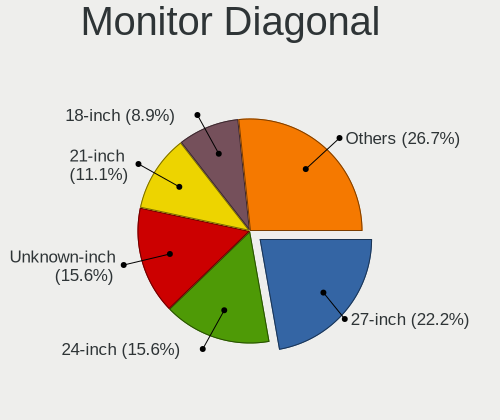

| Inches  | Desktops | Percent |
|---------|----------|---------|
| 27      | 6        | 17.65%  |
| 24      | 6        | 17.65%  |
| 18      | 4        | 11.76%  |
| Unknown | 4        | 11.76%  |
| 31      | 3        | 8.82%   |
| 21      | 3        | 8.82%   |
| 23      | 2        | 5.88%   |
| 22      | 2        | 5.88%   |
| 19      | 2        | 5.88%   |
| 42      | 1        | 2.94%   |
| 17      | 1        | 2.94%   |

Monitor Width
-------------

Physical width

| Width in mm | Desktops | Percent |
|-------------|----------|---------|
| 501-600     | 11       | 34.38%  |
| 401-500     | 10       | 31.25%  |
| 601-700     | 4        | 12.5%   |
| Unknown     | 4        | 12.5%   |
| 351-400     | 1        | 3.13%   |
| 301-350     | 1        | 3.13%   |
| 901-1000    | 1        | 3.13%   |

Aspect Ratio
------------

Proportional relationship between the width and the height

| Ratio   | Desktops | Percent |
|---------|----------|---------|
| 16/9    | 22       | 70.97%  |
| Unknown | 4        | 12.9%   |
| 16/10   | 3        | 9.68%   |
| 5/4     | 2        | 6.45%   |

Monitor Area
------------

Area in inch

| Area in inch | Desktops | Percent |
|----------------|----------|---------|
| 201-250        | 9        | 27.27%  |
| 301-350        | 6        | 18.18%  |
| 141-150        | 5        | 15.15%  |
| Unknown        | 4        | 12.12%  |
| 351-500        | 3        | 9.09%   |
| 151-200        | 3        | 9.09%   |
| 251-300        | 2        | 6.06%   |
| 501-1000       | 1        | 3.03%   |

Pixel Density
-------------

Pixels per inch

| Density | Desktops | Percent |
|---------|----------|---------|
| 51-100  | 19       | 61.29%  |
| 1-50    | 4        | 12.9%   |
| Unknown | 4        | 12.9%   |
| 101-120 | 3        | 9.68%   |
| 121-160 | 1        | 3.23%   |

Multiple Monitors
-----------------

Total monitors connected

| Total | Desktops | Percent |
|-------|----------|---------|
| 1     | 29       | 80.56%  |
| 2     | 4        | 11.11%  |
| 0     | 2        | 5.56%   |
| 3     | 1        | 2.78%   |

Network
-------

Net Controller Vendor
---------------------

Controller vendors

| Vendor                          | Desktops | Percent |
|---------------------------------|----------|---------|
| Realtek Semiconductor           | 29       | 53.7%   |
| Intel                           | 9        | 16.67%  |
| Ralink                          | 3        | 5.56%   |
| Qualcomm Atheros                | 3        | 5.56%   |
| TP-Link                         | 2        | 3.7%    |
| Nvidia                          | 2        | 3.7%    |
| Qualcomm Atheros Communications | 1        | 1.85%   |
| Motorola PCS                    | 1        | 1.85%   |
| Huawei Technologies             | 1        | 1.85%   |
| D-Link                          | 1        | 1.85%   |
| Broadcom Limited                | 1        | 1.85%   |
| Broadcom                        | 1        | 1.85%   |

Net Controller Model
--------------------

Controller models

| Model                                                                                         | Desktops | Percent |
|-----------------------------------------------------------------------------------------------|----------|---------|
| Realtek RTL8111/8168/8411 PCI Express Gigabit Ethernet Controller                             | 25       | 40.98%  |
| Intel Wi-Fi 6 AX200                                                                           | 3        | 4.92%   |
| Realtek RTL88x2bu [AC1200 Techkey]                                                            | 2        | 3.28%   |
| Realtek RTL810xE PCI Express Fast Ethernet controller                                         | 2        | 3.28%   |
| Nvidia MCP61 Ethernet                                                                         | 2        | 3.28%   |
| Intel 82579V Gigabit Network Connection                                                       | 2        | 3.28%   |
| TP-Link TL-WN821N v5/v6 [RTL8192EU]                                                           | 1        | 1.64%   |
| TP-Link Archer T9UH v1 [Realtek RTL8814AU]                                                    | 1        | 1.64%   |
| Realtek RTL8811AU 802.11a/b/g/n/ac WLAN Adapter                                               | 1        | 1.64%   |
| Realtek RTL8192CU 802.11n WLAN Adapter                                                        | 1        | 1.64%   |
| Realtek RTL8188RU 802.11n WLAN Adapter                                                        | 1        | 1.64%   |
| Realtek RTL8188FTV 802.11b/g/n 1T1R 2.4G WLAN Adapter                                         | 1        | 1.64%   |
| Realtek RTL8188CUS 802.11n WLAN Adapter                                                       | 1        | 1.64%   |
| Realtek Realtek 8812AU/8821AU 802.11ac WLAN Adapter [USB Wireless Dual-Band Adapter 2.4/5Ghz] | 1        | 1.64%   |
| Ralink RT5390 Wireless 802.11n 1T/1R PCIe                                                     | 1        | 1.64%   |
| Ralink RT3290 Wireless 802.11n 1T/1R PCIe                                                     | 1        | 1.64%   |
| Ralink RT2790 Wireless 802.11n 1T/2R PCIe                                                     | 1        | 1.64%   |
| Qualcomm Atheros QCA9565 / AR9565 Wireless Network Adapter                                    | 1        | 1.64%   |
| Qualcomm Atheros Killer E220x Gigabit Ethernet Controller                                     | 1        | 1.64%   |
| Qualcomm Atheros AR9271 802.11n                                                               | 1        | 1.64%   |
| Qualcomm Atheros AR5416 Wireless Network Adapter [AR5008 802.11(a)bgn]                        | 1        | 1.64%   |
| Motorola PCS Moto G (4)                                                                       | 1        | 1.64%   |
| Intel Wireless 7265                                                                           | 1        | 1.64%   |
| Intel I211 Gigabit Network Connection                                                         | 1        | 1.64%   |
| Intel Ethernet Connection (2) I219-LM                                                         | 1        | 1.64%   |
| Intel 82578DM Gigabit Network Connection                                                      | 1        | 1.64%   |
| Intel 82566DC Gigabit Network Connection                                                      | 1        | 1.64%   |
| Huawei E353/E3131                                                                             | 1        | 1.64%   |
| D-Link DWL-G132 [Atheros AR5523]                                                              | 1        | 1.64%   |
| Broadcom Limited NetXtreme BCM5754 Gigabit Ethernet PCI Express                               | 1        | 1.64%   |
| Broadcom BCM4352 802.11ac Wireless Network Adapter                                            | 1        | 1.64%   |

Wireless Vendor
---------------

Wireless vendors

| Vendor                          | Desktops | Percent |
|---------------------------------|----------|---------|
| Realtek Semiconductor           | 8        | 36.36%  |
| Intel                           | 4        | 18.18%  |
| Ralink                          | 3        | 13.64%  |
| TP-Link                         | 2        | 9.09%   |
| Qualcomm Atheros                | 2        | 9.09%   |
| Qualcomm Atheros Communications | 1        | 4.55%   |
| D-Link                          | 1        | 4.55%   |
| Broadcom                        | 1        | 4.55%   |

Wireless Model
--------------

Wireless models

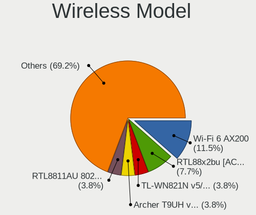

| Model                                                                                         | Desktops | Percent |
|-----------------------------------------------------------------------------------------------|----------|---------|
| Intel Wi-Fi 6 AX200                                                                           | 3        | 13.64%  |
| Realtek RTL88x2bu [AC1200 Techkey]                                                            | 2        | 9.09%   |
| TP-Link TL-WN821N v5/v6 [RTL8192EU]                                                           | 1        | 4.55%   |
| TP-Link Archer T9UH v1 [Realtek RTL8814AU]                                                    | 1        | 4.55%   |
| Realtek RTL8811AU 802.11a/b/g/n/ac WLAN Adapter                                               | 1        | 4.55%   |
| Realtek RTL8192CU 802.11n WLAN Adapter                                                        | 1        | 4.55%   |
| Realtek RTL8188RU 802.11n WLAN Adapter                                                        | 1        | 4.55%   |
| Realtek RTL8188FTV 802.11b/g/n 1T1R 2.4G WLAN Adapter                                         | 1        | 4.55%   |
| Realtek RTL8188CUS 802.11n WLAN Adapter                                                       | 1        | 4.55%   |
| Realtek Realtek 8812AU/8821AU 802.11ac WLAN Adapter [USB Wireless Dual-Band Adapter 2.4/5Ghz] | 1        | 4.55%   |
| Ralink RT5390 Wireless 802.11n 1T/1R PCIe                                                     | 1        | 4.55%   |
| Ralink RT3290 Wireless 802.11n 1T/1R PCIe                                                     | 1        | 4.55%   |
| Ralink RT2790 Wireless 802.11n 1T/2R PCIe                                                     | 1        | 4.55%   |
| Qualcomm Atheros QCA9565 / AR9565 Wireless Network Adapter                                    | 1        | 4.55%   |
| Qualcomm Atheros AR9271 802.11n                                                               | 1        | 4.55%   |
| Qualcomm Atheros AR5416 Wireless Network Adapter [AR5008 802.11(a)bgn]                        | 1        | 4.55%   |
| Intel Wireless 7265                                                                           | 1        | 4.55%   |
| D-Link DWL-G132 [Atheros AR5523]                                                              | 1        | 4.55%   |
| Broadcom BCM4352 802.11ac Wireless Network Adapter                                            | 1        | 4.55%   |

Ethernet Vendor
---------------

Ethernet vendors

| Vendor                | Desktops | Percent |
|-----------------------|----------|---------|
| Realtek Semiconductor | 27       | 69.23%  |
| Intel                 | 6        | 15.38%  |
| Nvidia                | 2        | 5.13%   |
| Qualcomm Atheros      | 1        | 2.56%   |
| Motorola PCS          | 1        | 2.56%   |
| Huawei Technologies   | 1        | 2.56%   |
| Broadcom Limited      | 1        | 2.56%   |

Ethernet Model
--------------

Ethernet models

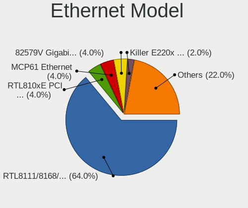

| Model                                                             | Desktops | Percent |
|-------------------------------------------------------------------|----------|---------|
| Realtek RTL8111/8168/8411 PCI Express Gigabit Ethernet Controller | 25       | 64.1%   |
| Realtek RTL810xE PCI Express Fast Ethernet controller             | 2        | 5.13%   |
| Nvidia MCP61 Ethernet                                             | 2        | 5.13%   |
| Intel 82579V Gigabit Network Connection                           | 2        | 5.13%   |
| Qualcomm Atheros Killer E220x Gigabit Ethernet Controller         | 1        | 2.56%   |
| Motorola PCS Moto G (4)                                           | 1        | 2.56%   |
| Intel I211 Gigabit Network Connection                             | 1        | 2.56%   |
| Intel Ethernet Connection (2) I219-LM                             | 1        | 2.56%   |
| Intel 82578DM Gigabit Network Connection                          | 1        | 2.56%   |
| Intel 82566DC Gigabit Network Connection                          | 1        | 2.56%   |
| Huawei E353/E3131                                                 | 1        | 2.56%   |
| Broadcom Limited NetXtreme BCM5754 Gigabit Ethernet PCI Express   | 1        | 2.56%   |

Net Controller Kind
-------------------

Ethernet, WiFi or modem

| Kind     | Desktops | Percent |
|----------|----------|---------|
| Ethernet | 36       | 65.45%  |
| WiFi     | 19       | 34.55%  |

Used Controller
---------------

Currently used network controller

| Kind     | Desktops | Percent |
|----------|----------|---------|
| Ethernet | 34       | 69.39%  |
| WiFi     | 15       | 30.61%  |

NICs
----

Total network controllers on board

| Total | Desktops | Percent |
|-------|----------|---------|
| 1     | 24       | 66.67%  |
| 2     | 12       | 33.33%  |

IPv6
----

IPv6 vs IPv4

| Used | Desktops | Percent |
|------|----------|---------|
| No   | 22       | 61.11%  |
| Yes  | 14       | 38.89%  |

Bluetooth
---------

Bluetooth Vendor
----------------

Controller vendors

| Vendor                          | Desktops | Percent |
|---------------------------------|----------|---------|
| Intel                           | 4        | 33.33%  |
| Cambridge Silicon Radio         | 3        | 25%     |
| ASUSTek Computer                | 2        | 16.67%  |
| Ralink                          | 1        | 8.33%   |
| Qualcomm Atheros Communications | 1        | 8.33%   |
| Hewlett-Packard                 | 1        | 8.33%   |

Bluetooth Model
---------------

Controller models

| Model                                               | Desktops | Percent |
|-----------------------------------------------------|----------|---------|
| Intel Bluetooth Device                              | 4        | 33.33%  |
| Cambridge Silicon Radio Bluetooth Dongle (HCI mode) | 3        | 25%     |
| ASUS Broadcom BCM20702A0 Bluetooth                  | 2        | 16.67%  |
| Ralink RT3290 Bluetooth                             | 1        | 8.33%   |
| Qualcomm Atheros  Bluetooth Device                  | 1        | 8.33%   |
| HP Bluetooth 2.0 Interface [Broadcom BCM2045]       | 1        | 8.33%   |

Sound
-----

Sound Vendor
------------

Sound card vendors

| Vendor                    | Desktops | Percent |
|---------------------------|----------|---------|
| Intel                     | 21       | 32.81%  |
| Nvidia                    | 15       | 23.44%  |
| AMD                       | 15       | 23.44%  |
| C-Media Electronics       | 4        | 6.25%   |
| Texas Instruments         | 1        | 1.56%   |
| Sennheiser Communications | 1        | 1.56%   |
| Microsoft                 | 1        | 1.56%   |
| M-Audio                   | 1        | 1.56%   |
| JMTek                     | 1        | 1.56%   |
| iSoft Silicon             | 1        | 1.56%   |
| GN Netcom                 | 1        | 1.56%   |
| Creative Labs             | 1        | 1.56%   |
| AOKEO                     | 1        | 1.56%   |

Sound Model
-----------

Sound card models

| Model                                                                      | Desktops | Percent |
|----------------------------------------------------------------------------|----------|---------|
| Intel 6 Series/C200 Series Chipset Family High Definition Audio Controller | 5        | 7.14%   |
| AMD SBx00 Azalia (Intel HDA)                                               | 5        | 7.14%   |
| Intel 8 Series/C220 Series Chipset High Definition Audio Controller        | 3        | 4.29%   |
| Nvidia GP106 High Definition Audio Controller                              | 2        | 2.86%   |
| Nvidia GM206 High Definition Audio Controller                              | 2        | 2.86%   |
| Nvidia GK208 HDMI/DP Audio Controller                                      | 2        | 2.86%   |
| Intel NM10/ICH7 Family High Definition Audio Controller                    | 2        | 2.86%   |
| Intel Atom Processor Z36xxx/Z37xxx Series High Definition Audio Controller | 2        | 2.86%   |
| Intel 5 Series/3400 Series Chipset High Definition Audio                   | 2        | 2.86%   |
| Intel 100 Series/C230 Series Chipset Family HD Audio Controller            | 2        | 2.86%   |
| C-Media Electronics CMI8738/CMI8768 PCI Audio                              | 2        | 2.86%   |
| AMD Starship/Matisse HD Audio Controller                                   | 2        | 2.86%   |
| AMD Oland/Hainan/Cape Verde/Pitcairn HDMI Audio [Radeon HD 7000 Series]    | 2        | 2.86%   |
| AMD FCH Azalia Controller                                                  | 2        | 2.86%   |
| AMD Cedar HDMI Audio [Radeon HD 5400/6300/7300 Series]                     | 2        | 2.86%   |
| AMD Baffin HDMI/DP Audio [Radeon RX 550 640SP / RX 560/560X]               | 2        | 2.86%   |
| Texas Instruments PCM2903B Audio CODEC                                     | 1        | 1.43%   |
| Sennheiser Communications PXC 550                                          | 1        | 1.43%   |
| Nvidia TU104 HD Audio Controller                                           | 1        | 1.43%   |
| Nvidia MCP61 High Definition Audio                                         | 1        | 1.43%   |
| Nvidia High Definition Audio Controller                                    | 1        | 1.43%   |
| Nvidia GP108 High Definition Audio Controller                              | 1        | 1.43%   |
| Nvidia GP104 High Definition Audio Controller                              | 1        | 1.43%   |
| Nvidia GM204 High Definition Audio Controller                              | 1        | 1.43%   |
| Nvidia GM200 High Definition Audio                                         | 1        | 1.43%   |
| Nvidia GK110 High Definition Audio Controller                              | 1        | 1.43%   |
| Nvidia GK107 HDMI Audio Controller                                         | 1        | 1.43%   |
| Microsoft LifeChat LX-3000 Headset                                         | 1        | 1.43%   |
| M-Audio M-Audio Fast Track MKII                                            | 1        | 1.43%   |
| JMTek USB PnP Audio Device                                                 | 1        | 1.43%   |
| iSoft Silicon USB Ear-Microphone                                           | 1        | 1.43%   |
| Intel Xeon E3-1200 v3/4th Gen Core Processor HD Audio Controller           | 1        | 1.43%   |
| Intel Sunrise Point-LP HD Audio                                            | 1        | 1.43%   |
| Intel Cannon Lake PCH cAVS                                                 | 1        | 1.43%   |
| Intel 82801I (ICH9 Family) HD Audio Controller                             | 1        | 1.43%   |
| Intel 82801H (ICH8 Family) HD Audio Controller                             | 1        | 1.43%   |
| Intel 7 Series/C216 Chipset Family High Definition Audio Controller        | 1        | 1.43%   |
| GN Netcom Jabra Link 380                                                   | 1        | 1.43%   |
| Creative Labs EMU20k1 [Sound Blaster X-Fi Series]                          | 1        | 1.43%   |
| C-Media Electronics Blue Snowball                                          | 1        | 1.43%   |
| C-Media Electronics Audio Adapter (Unitek Y-247A)                          | 1        | 1.43%   |
| AOKEO LCS_USB_Audio                                                        | 1        | 1.43%   |
| AMD RV610 HDMI Audio [Radeon HD 2350 PRO / 2400 PRO/XT / HD 3410]          | 1        | 1.43%   |
| AMD RS780 HDMI Audio [Radeon 3000/3100 / HD 3200/3300]                     | 1        | 1.43%   |
| AMD Family 17h (Models 00h-0fh) HD Audio Controller                        | 1        | 1.43%   |
| AMD BeaverCreek HDMI Audio [Radeon HD 6500D and 6400G-6600G series]        | 1        | 1.43%   |
| AMD Barts HDMI Audio [Radeon HD 6790/6850/6870 / 7720 OEM]                 | 1        | 1.43%   |

Memory
------

Memory Vendor
-------------

Memory module vendors

| Vendor  | Desktops | Percent |
|---------|----------|---------|
| Corsair | 1        | 100%    |

Memory Model
------------

Memory module models

| Model                                                 | Desktops | Percent |
|-------------------------------------------------------|----------|---------|
| Corsair RAM CMK16GX4M2B3200C16 8GB DIMM DDR4 3600MT/s | 1        | 100%    |

Memory Kind
-----------

Memory module kinds

| Kind | Desktops | Percent |
|------|----------|---------|
| DDR4 | 1        | 100%    |

Memory Form Factor
------------------

Physical design of the memory module

| Name | Desktops | Percent |
|------|----------|---------|
| DIMM | 1        | 100%    |

Memory Size
-----------

Memory module size

| Size | Desktops | Percent |
|------|----------|---------|
| 8192 | 1        | 100%    |

Memory Speed
------------

Memory module speed

| Speed | Desktops | Percent |
|-------|----------|---------|
| 3600  | 1        | 100%    |

Printers & scanners
-------------------

Printer Vendor
--------------

Printer device vendors

| Vendor      | Desktops | Percent |
|-------------|----------|---------|
| Seiko Epson | 1        | 50%     |
| Canon       | 1        | 50%     |

Printer Model
-------------

Printer device models

| Model                    | Desktops | Percent |
|--------------------------|----------|---------|
| Seiko Epson L395 Series  | 1        | 50%     |
| Canon PIXMA MX920 Series | 1        | 50%     |

Scanner Vendor
--------------

Scanner device vendors

Zero info for selected period =(

Scanner Model
-------------

Scanner device models

Zero info for selected period =(

Camera
------

Camera Vendor
-------------

Camera device vendors

| Vendor                    | Desktops | Percent |
|---------------------------|----------|---------|
| Microsoft                 | 2        | 16.67%  |
| Logitech                  | 2        | 16.67%  |
| Chicony Electronics       | 2        | 16.67%  |
| YGTek                     | 1        | 8.33%   |
| Silicon Motion            | 1        | 8.33%   |
| SHENZHEN EMEET TECHNOLOGY | 1        | 8.33%   |
| PC-LM1E                   | 1        | 8.33%   |
| Jieli Technology          | 1        | 8.33%   |
| Creative Technology       | 1        | 8.33%   |

Camera Model
------------

Camera device models

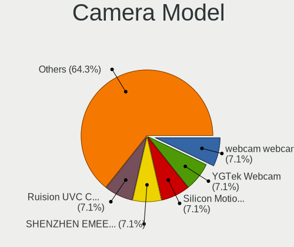

| Model                                          | Desktops | Percent |
|------------------------------------------------|----------|---------|
| YGTek Webcam                                   | 1        | 8.33%   |
| Silicon Motion SM731 Camera                    | 1        | 8.33%   |
| SHENZHEN EMEET TECHNOLOGY HD Webcam eMeet C960 | 1        | 8.33%   |
| PC-LM1E PC-LM1E                                | 1        | 8.33%   |
| Microsoft LifeCam VX-5000                      | 1        | 8.33%   |
| Microsoft LifeCam VX-500 [1357]                | 1        | 8.33%   |
| Logitech Webcam C600                           | 1        | 8.33%   |
| Logitech C922 Pro Stream Webcam                | 1        | 8.33%   |
| Jieli USB PHY 2.0                              | 1        | 8.33%   |
| Creative Live! Cam Sync HD [VF0770]            | 1        | 8.33%   |
| Chicony CNF7042                                | 1        | 8.33%   |
| Chicony 2.0M UVC Webcam / CNF7129              | 1        | 8.33%   |

Security
--------

Fingerprint Vendor
------------------

Fingerprint sensor vendors

Zero info for selected period =(

Fingerprint Model
-----------------

Fingerprint sensor models

Zero info for selected period =(

Chipcard Vendor
---------------

Chipcard module vendors

Zero info for selected period =(

Chipcard Model
--------------

Chipcard module models

Zero info for selected period =(

Unsupported
-----------

Unsupported Devices
-------------------

Total unsupported devices on board

| Total | Desktops | Percent |
|-------|----------|---------|
| 0     | 26       | 72.22%  |
| 1     | 10       | 27.78%  |

Unsupported Device Types
------------------------

Types of unsupported devices

| Type          | Desktops | Percent |
|---------------|----------|---------|
| Net/wireless  | 5        | 50%     |
| Graphics card | 4        | 40%     |
| Bluetooth     | 1        | 10%     |

