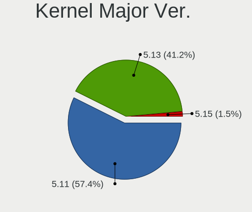
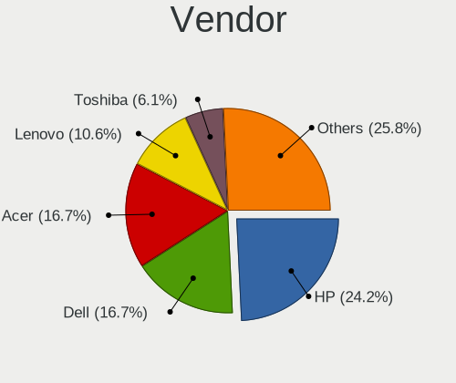
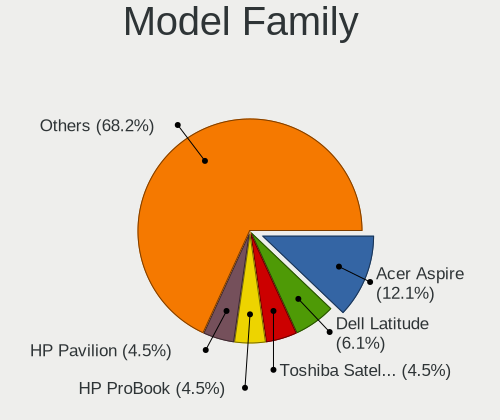
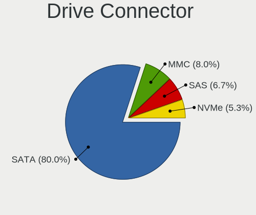
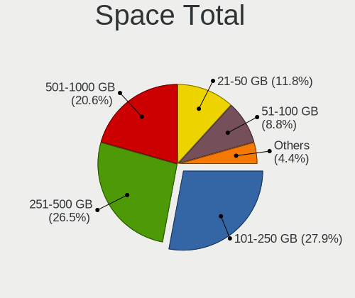
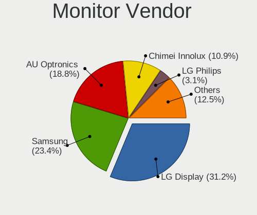
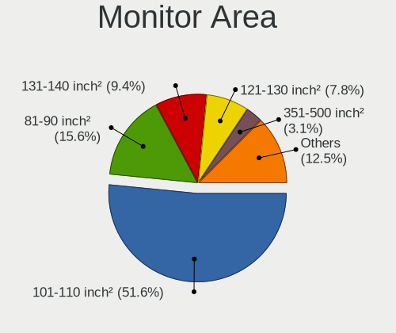
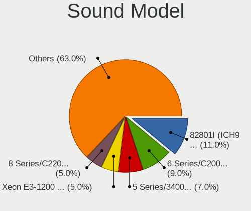

LinuxFX 11 - Tested Hardware & Statistics (Notebooks)
-----------------------------------------------------

A project to collect tested hardware configurations for LinuxFX 11.

Anyone can contribute to this report by the [hw-probe](https://github.com/linuxhw/hw-probe) tool:

    sudo -E hw-probe -all -upload

Please submit a probe of your configuration if it's not presented on the page or is rare.

Full-feature report is available here: https://linux-hardware.org/?view=trends

Contents
--------

* [ Test Cases ](#test-cases)

* [ System ](#system)
  - [ Kernel                   ](#kernel)
  - [ Kernel Family            ](#kernel-family)
  - [ Kernel Major Ver.        ](#kernel-major-ver)
  - [ Arch                     ](#arch)
  - [ DE                       ](#de)
  - [ Display Server           ](#display-server)
  - [ Display Manager          ](#display-manager)
  - [ OS Lang                  ](#os-lang)
  - [ Boot Mode                ](#boot-mode)
  - [ Filesystem               ](#filesystem)
  - [ Part. scheme             ](#part-scheme)
  - [ Dual Boot with Linux/BSD ](#dual-boot-with-linuxbsd)
  - [ Dual Boot (Win)          ](#dual-boot-win)

* [ Board ](#board)
  - [ Vendor                   ](#vendor)
  - [ Model                    ](#model)
  - [ Model Family             ](#model-family)
  - [ MFG Year                 ](#mfg-year)
  - [ Form Factor              ](#form-factor)
  - [ Secure Boot              ](#secure-boot)
  - [ Coreboot                 ](#coreboot)
  - [ RAM Size                 ](#ram-size)
  - [ RAM Used                 ](#ram-used)
  - [ Total Drives             ](#total-drives)
  - [ Has CD-ROM               ](#has-cd-rom)
  - [ Has Ethernet             ](#has-ethernet)
  - [ Has WiFi                 ](#has-wifi)
  - [ Has Bluetooth            ](#has-bluetooth)

* [ Location ](#location)
  - [ Country                  ](#country)
  - [ City                     ](#city)

* [ Drives ](#drives)
  - [ Drive Vendor             ](#drive-vendor)
  - [ Drive Model              ](#drive-model)
  - [ HDD Vendor               ](#hdd-vendor)
  - [ SSD Vendor               ](#ssd-vendor)
  - [ Drive Kind               ](#drive-kind)
  - [ Drive Connector          ](#drive-connector)
  - [ Drive Size               ](#drive-size)
  - [ Space Total              ](#space-total)
  - [ Space Used               ](#space-used)
  - [ Malfunc. Drives          ](#malfunc-drives)
  - [ Malfunc. Drive Vendor    ](#malfunc-drive-vendor)
  - [ Malfunc. HDD Vendor      ](#malfunc-hdd-vendor)
  - [ Malfunc. Drive Kind      ](#malfunc-drive-kind)
  - [ Failed Drives            ](#failed-drives)
  - [ Failed Drive Vendor      ](#failed-drive-vendor)
  - [ Drive Status             ](#drive-status)

* [ Storage controller ](#storage-controller)
  - [ Storage Vendor           ](#storage-vendor)
  - [ Storage Model            ](#storage-model)
  - [ Storage Kind             ](#storage-kind)

* [ Processor ](#processor)
  - [ CPU Vendor               ](#cpu-vendor)
  - [ CPU Model                ](#cpu-model)
  - [ CPU Model Family         ](#cpu-model-family)
  - [ CPU Cores                ](#cpu-cores)
  - [ CPU Sockets              ](#cpu-sockets)
  - [ CPU Threads              ](#cpu-threads)
  - [ CPU Op-Modes             ](#cpu-op-modes)
  - [ CPU Microcode            ](#cpu-microcode)
  - [ CPU Microarch            ](#cpu-microarch)

* [ Graphics ](#graphics)
  - [ GPU Vendor               ](#gpu-vendor)
  - [ GPU Model                ](#gpu-model)
  - [ GPU Combo                ](#gpu-combo)
  - [ GPU Driver               ](#gpu-driver)
  - [ GPU Memory               ](#gpu-memory)

* [ Monitor ](#monitor)
  - [ Monitor Vendor           ](#monitor-vendor)
  - [ Monitor Model            ](#monitor-model)
  - [ Monitor Resolution       ](#monitor-resolution)
  - [ Monitor Diagonal         ](#monitor-diagonal)
  - [ Monitor Width            ](#monitor-width)
  - [ Aspect Ratio             ](#aspect-ratio)
  - [ Monitor Area             ](#monitor-area)
  - [ Pixel Density            ](#pixel-density)
  - [ Multiple Monitors        ](#multiple-monitors)

* [ Network ](#network)
  - [ Net Controller Vendor    ](#net-controller-vendor)
  - [ Net Controller Model     ](#net-controller-model)
  - [ Wireless Vendor          ](#wireless-vendor)
  - [ Wireless Model           ](#wireless-model)
  - [ Ethernet Vendor          ](#ethernet-vendor)
  - [ Ethernet Model           ](#ethernet-model)
  - [ Net Controller Kind      ](#net-controller-kind)
  - [ Used Controller          ](#used-controller)
  - [ NICs                     ](#nics)
  - [ IPv6                     ](#ipv6)

* [ Bluetooth ](#bluetooth)
  - [ Bluetooth Vendor         ](#bluetooth-vendor)
  - [ Bluetooth Model          ](#bluetooth-model)

* [ Sound ](#sound)
  - [ Sound Vendor             ](#sound-vendor)
  - [ Sound Model              ](#sound-model)

* [ Memory ](#memory)
  - [ Memory Vendor            ](#memory-vendor)
  - [ Memory Model             ](#memory-model)
  - [ Memory Kind              ](#memory-kind)
  - [ Memory Form Factor       ](#memory-form-factor)
  - [ Memory Size              ](#memory-size)
  - [ Memory Speed             ](#memory-speed)

* [ Printers & scanners ](#printers--scanners)
  - [ Printer Vendor           ](#printer-vendor)
  - [ Printer Model            ](#printer-model)
  - [ Scanner Vendor           ](#scanner-vendor)
  - [ Scanner Model            ](#scanner-model)

* [ Camera ](#camera)
  - [ Camera Vendor            ](#camera-vendor)
  - [ Camera Model             ](#camera-model)

* [ Security ](#security)
  - [ Fingerprint Vendor       ](#fingerprint-vendor)
  - [ Fingerprint Model        ](#fingerprint-model)
  - [ Chipcard Vendor          ](#chipcard-vendor)
  - [ Chipcard Model           ](#chipcard-model)

* [ Unsupported ](#unsupported)
  - [ Unsupported Devices      ](#unsupported-devices)
  - [ Unsupported Device Types ](#unsupported-device-types)

Test Cases
----------

| Vendor        | Model                       | Probe                                                      | Date         |
|---------------|-----------------------------|------------------------------------------------------------|--------------|
| Samsung       | RF511/RF411/RF711           | [7c247b0c9f](https://linux-hardware.org/?probe=7c247b0c9f) | Dec 29, 2021 |
| Samsung       | RF511/RF411/RF711           | [5cff8b82d5](https://linux-hardware.org/?probe=5cff8b82d5) | Dec 28, 2021 |
| Dell          | Inspiron N5050              | [f08b82f201](https://linux-hardware.org/?probe=f08b82f201) | Dec 22, 2021 |
| Dell          | Latitude E6400              | [74586d9c77](https://linux-hardware.org/?probe=74586d9c77) | Dec 21, 2021 |
| Fujitsu       | CELSIUS H700                | [63c35d8f1d](https://linux-hardware.org/?probe=63c35d8f1d) | Dec 19, 2021 |
| Lenovo        | ThinkPad L380 20M6S4E000    | [745c4f6a79](https://linux-hardware.org/?probe=745c4f6a79) | Dec 16, 2021 |
| Alienware     | M17xR3                      | [d8c0a193cd](https://linux-hardware.org/?probe=d8c0a193cd) | Dec 14, 2021 |
| Dell          | G5 5590                     | [d68d926208](https://linux-hardware.org/?probe=d68d926208) | Dec 13, 2021 |
| Dell          | G5 5590                     | [88f9dfa75d](https://linux-hardware.org/?probe=88f9dfa75d) | Dec 13, 2021 |
| Lenovo        | G50-80 80E5                 | [77ee4f08a8](https://linux-hardware.org/?probe=77ee4f08a8) | Dec 10, 2021 |
| Dell          | Latitude E5400              | [3ce40a821b](https://linux-hardware.org/?probe=3ce40a821b) | Dec 09, 2021 |
| Acer          | Extensa 5220                | [2572d3336d](https://linux-hardware.org/?probe=2572d3336d) | Dec 09, 2021 |
| Acer          | Extensa 5220                | [524256971b](https://linux-hardware.org/?probe=524256971b) | Dec 09, 2021 |
| Toshiba       | Satellite C660              | [2799629c61](https://linux-hardware.org/?probe=2799629c61) | Nov 28, 2021 |
| Toshiba       | Satellite C660              | [1e80d1c181](https://linux-hardware.org/?probe=1e80d1c181) | Nov 28, 2021 |
| Acer          | One S1002                   | [8ae39c3aaf](https://linux-hardware.org/?probe=8ae39c3aaf) | Nov 23, 2021 |
| GPU Compan... | GWTN116-3                   | [5534b12f2d](https://linux-hardware.org/?probe=5534b12f2d) | Nov 21, 2021 |
| HP            | ProBook 440 G1              | [6159b4aa5a](https://linux-hardware.org/?probe=6159b4aa5a) | Nov 20, 2021 |
| HP            | ProBook 440 G1              | [42d0889355](https://linux-hardware.org/?probe=42d0889355) | Nov 20, 2021 |
| Lenovo        | G50-80 80E5                 | [947e251d2c](https://linux-hardware.org/?probe=947e251d2c) | Nov 18, 2021 |
| Acer          | Aspire 5735                 | [9b2574c5be](https://linux-hardware.org/?probe=9b2574c5be) | Nov 17, 2021 |
| Samsung       | RV415/RV515/E3415           | [2a9002ab69](https://linux-hardware.org/?probe=2a9002ab69) | Nov 10, 2021 |
| Lenovo        | G50-80 80R0                 | [a24e6b4e38](https://linux-hardware.org/?probe=a24e6b4e38) | Nov 06, 2021 |
| Lenovo        | G50-80 80R0                 | [94d7421e0c](https://linux-hardware.org/?probe=94d7421e0c) | Nov 06, 2021 |
| Acer          | Aspire XXXX                 | [2e486fd092](https://linux-hardware.org/?probe=2e486fd092) | Nov 05, 2021 |
| ASUSTek       | N71Vg                       | [4fee4d2ffc](https://linux-hardware.org/?probe=4fee4d2ffc) | Nov 03, 2021 |
| Google        | Peppy                       | [6408d61aa6](https://linux-hardware.org/?probe=6408d61aa6) | Nov 03, 2021 |
| Google        | Peppy                       | [894676acea](https://linux-hardware.org/?probe=894676acea) | Nov 03, 2021 |
| HP            | Pavilion g6                 | [d954a6ba33](https://linux-hardware.org/?probe=d954a6ba33) | Oct 31, 2021 |
| Lenovo        | G50-80 80E5                 | [2ecc44141a](https://linux-hardware.org/?probe=2ecc44141a) | Oct 30, 2021 |
| HP            | Pavilion g6                 | [1bfea4f4f9](https://linux-hardware.org/?probe=1bfea4f4f9) | Oct 28, 2021 |
| Lenovo        | G50-80 80E5                 | [a2c515584f](https://linux-hardware.org/?probe=a2c515584f) | Oct 27, 2021 |
| Lenovo        | G50-80 80E5                 | [b05ed4eff3](https://linux-hardware.org/?probe=b05ed4eff3) | Oct 24, 2021 |
| Lenovo        | G50-80 80E5                 | [5fbb62218c](https://linux-hardware.org/?probe=5fbb62218c) | Oct 24, 2021 |
| HP            | Pavilion g6                 | [2dfb826827](https://linux-hardware.org/?probe=2dfb826827) | Oct 24, 2021 |
| HP            | Pavilion g6                 | [7be969965e](https://linux-hardware.org/?probe=7be969965e) | Oct 24, 2021 |
| Lenovo        | G550 2958                   | [c53ba56444](https://linux-hardware.org/?probe=c53ba56444) | Oct 23, 2021 |
| Lenovo        | G50-80 80E5                 | [edf703fb1c](https://linux-hardware.org/?probe=edf703fb1c) | Oct 23, 2021 |
| Lenovo        | G50-80 80E5                 | [7075439e69](https://linux-hardware.org/?probe=7075439e69) | Oct 17, 2021 |
| Positivo      | Smash3                      | [3c9fe4acb8](https://linux-hardware.org/?probe=3c9fe4acb8) | Oct 14, 2021 |
| Positivo      | Smash3                      | [ab60c4e746](https://linux-hardware.org/?probe=ab60c4e746) | Oct 14, 2021 |
| HP            | EliteBook 8440p             | [b3bd1860ac](https://linux-hardware.org/?probe=b3bd1860ac) | Oct 11, 2021 |
| HP            | G62                         | [6cbed79ca9](https://linux-hardware.org/?probe=6cbed79ca9) | Oct 05, 2021 |
| HP            | 255 G6 Notebook PC          | [6ae274321c](https://linux-hardware.org/?probe=6ae274321c) | Oct 03, 2021 |
| Dell          | Precision M6400             | [5f6ec9333e](https://linux-hardware.org/?probe=5f6ec9333e) | Oct 03, 2021 |
| HP            | 255 G6 Notebook PC          | [1e1bf5e8e0](https://linux-hardware.org/?probe=1e1bf5e8e0) | Oct 03, 2021 |
| Samsung       | RV411/RV511/E3511/S3511/... | [60fe11ee00](https://linux-hardware.org/?probe=60fe11ee00) | Sep 30, 2021 |
| Positivo      | Smash3                      | [fe185c2e3f](https://linux-hardware.org/?probe=fe185c2e3f) | Sep 29, 2021 |
| Dell          | System XPS L502X            | [437cc938df](https://linux-hardware.org/?probe=437cc938df) | Sep 28, 2021 |
| Acer          | Aspire 5738                 | [171fc1cb46](https://linux-hardware.org/?probe=171fc1cb46) | Sep 27, 2021 |
| Acer          | Aspire 5738                 | [f9373d8ba5](https://linux-hardware.org/?probe=f9373d8ba5) | Sep 27, 2021 |
| Dell          | System XPS L502X            | [763d21b747](https://linux-hardware.org/?probe=763d21b747) | Sep 26, 2021 |
| HP            | Pavilion 14                 | [2ab5781fef](https://linux-hardware.org/?probe=2ab5781fef) | Sep 25, 2021 |
| Positivo      | Smash3                      | [ee8284c509](https://linux-hardware.org/?probe=ee8284c509) | Sep 24, 2021 |
| Fujitsu Si... | AMILO Xi 1526               | [aab9c46556](https://linux-hardware.org/?probe=aab9c46556) | Sep 23, 2021 |
| Acer          | TravelMate 5744             | [63142c25a5](https://linux-hardware.org/?probe=63142c25a5) | Sep 20, 2021 |
| Acer          | TravelMate 5744             | [0bdce8f695](https://linux-hardware.org/?probe=0bdce8f695) | Sep 20, 2021 |

System
------

Kernel
------

Version of the Linux kernel

| Version           | Notebooks | Percent |
|-------------------|-----------|---------|
| 5.11.0-37-generic | 8         | 21.62%  |
| 5.11.0-38-generic | 7         | 18.92%  |
| 5.11.0-40-generic | 6         | 16.22%  |
| 5.11.0-43-generic | 5         | 13.51%  |
| 5.11.0-36-generic | 5         | 13.51%  |
| 5.11.0-41-generic | 4         | 10.81%  |
| 5.11.0-42-generic | 1         | 2.7%    |
| 5.11.0-34-generic | 1         | 2.7%    |

Kernel Family
-------------

Linux kernel without a distro release

| Version | Notebooks | Percent |
|---------|-----------|---------|
| 5.11.0  | 34        | 100%    |

Kernel Major Ver.
-----------------

Linux kernel major version

| Version | Notebooks | Percent |
|---------|-----------|---------|
| 5.11    | 34        | 100%    |

Arch
----

OS architecture (x86_64, i586, etc.)

| Name   | Notebooks | Percent |
|--------|-----------|---------|
| x86_64 | 34        | 100%    |

DE
--

Desktop Environment

| Name       | Notebooks | Percent |
|------------|-----------|---------|
| KDE5       | 32        | 94.12%  |
| X-Cinnamon | 1         | 2.94%   |
| KDE        | 1         | 2.94%   |

Display Server
--------------

X11 or Wayland

| Name | Notebooks | Percent |
|------|-----------|---------|
| X11  | 34        | 100%    |

Display Manager
---------------

SDDM, LightDM, etc.

| Name    | Notebooks | Percent |
|---------|-----------|---------|
| Unknown | 29        | 85.29%  |
| SDDM    | 5         | 14.71%  |

OS Lang
-------

Language

| Lang  | Notebooks | Percent |
|-------|-----------|---------|
| en_US | 7         | 20.59%  |
| pt_BR | 6         | 17.65%  |
| de_DE | 4         | 11.76%  |
| pl_PL | 2         | 5.88%   |
| it_IT | 2         | 5.88%   |
| en_IN | 2         | 5.88%   |
| el_GR | 2         | 5.88%   |
| ru_UA | 1         | 2.94%   |
| pt_PT | 1         | 2.94%   |
| nl_BE | 1         | 2.94%   |
| fi_FI | 1         | 2.94%   |
| es_MX | 1         | 2.94%   |
| es_CO | 1         | 2.94%   |
| en_GB | 1         | 2.94%   |
| en_AU | 1         | 2.94%   |
| cs_CZ | 1         | 2.94%   |

Boot Mode
---------

EFI or BIOS

| Mode | Notebooks | Percent |
|------|-----------|---------|
| BIOS | 24        | 70.59%  |
| EFI  | 10        | 29.41%  |

Filesystem
----------

Type of filesystem

| Type | Notebooks | Percent |
|------|-----------|---------|
| Ext4 | 34        | 100%    |

Part. scheme
------------

Scheme of partitioning

| Type    | Notebooks | Percent |
|---------|-----------|---------|
| Unknown | 33        | 97.06%  |
| MBR     | 1         | 2.94%   |

Dual Boot with Linux/BSD
------------------------

Hosting more than one Linux/BSD

| Dual boot | Notebooks | Percent |
|-----------|-----------|---------|
| No        | 34        | 100%    |

Dual Boot (Win)
---------------

Hosting Linux and Windows

| Dual boot | Notebooks | Percent |
|-----------|-----------|---------|
| No        | 32        | 94.12%  |
| Yes       | 2         | 5.88%   |

Board
-----

Vendor
------

Motherboard manufacturer

| Name                | Notebooks | Percent |
|---------------------|-----------|---------|
| Hewlett-Packard     | 7         | 20.59%  |
| Dell                | 6         | 17.65%  |
| Acer                | 6         | 17.65%  |
| Lenovo              | 4         | 11.76%  |
| Samsung Electronics | 3         | 8.82%   |
| Toshiba             | 1         | 2.94%   |
| Positivo            | 1         | 2.94%   |
| GPU Company         | 1         | 2.94%   |
| Google              | 1         | 2.94%   |
| Fujitsu Siemens     | 1         | 2.94%   |
| Fujitsu             | 1         | 2.94%   |
| ASUSTek Computer    | 1         | 2.94%   |
| Alienware           | 1         | 2.94%   |

Model
-----

Motherboard model

| Name                                        | Notebooks | Percent |
|---------------------------------------------|-----------|---------|
| HP 255 G6 Notebook PC                       | 2         | 5.88%   |
| Toshiba Satellite C660                      | 1         | 2.94%   |
| Samsung RV415/RV515/E3415                   | 1         | 2.94%   |
| Samsung RV411/RV511/E3511/S3511/RV711/E3411 | 1         | 2.94%   |
| Samsung RF511/RF411/RF711                   | 1         | 2.94%   |
| Positivo Smash3                             | 1         | 2.94%   |
| Lenovo ThinkPad L380 20M6S4E000             | 1         | 2.94%   |
| Lenovo G550 2958                            | 1         | 2.94%   |
| Lenovo G50-80 80R0                          | 1         | 2.94%   |
| Lenovo G50-80 80E5                          | 1         | 2.94%   |
| HP ProBook 440 G1                           | 1         | 2.94%   |
| HP Pavilion g6                              | 1         | 2.94%   |
| HP Pavilion 14                              | 1         | 2.94%   |
| HP G62                                      | 1         | 2.94%   |
| HP EliteBook 8440p                          | 1         | 2.94%   |
| GPU Company GWTN116-3                       | 1         | 2.94%   |
| Google Peppy                                | 1         | 2.94%   |
| Fujitsu Siemens AMILO Xi 1526               | 1         | 2.94%   |
| Fujitsu CELSIUS H700                        | 1         | 2.94%   |
| Dell System XPS L502X                       | 1         | 2.94%   |
| Dell Precision M6400                        | 1         | 2.94%   |
| Dell Latitude E6400                         | 1         | 2.94%   |
| Dell Latitude E5400                         | 1         | 2.94%   |
| Dell Inspiron N5050                         | 1         | 2.94%   |
| Dell G5 5590                                | 1         | 2.94%   |
| ASUS N71Vg                                  | 1         | 2.94%   |
| Alienware M17xR3                            | 1         | 2.94%   |
| Acer TravelMate 5744                        | 1         | 2.94%   |
| Acer One S1002                              | 1         | 2.94%   |
| Acer Extensa 5220                           | 1         | 2.94%   |
| Acer Aspire XXXX                            | 1         | 2.94%   |
| Acer Aspire 5738                            | 1         | 2.94%   |
| Acer Aspire 5735                            | 1         | 2.94%   |

Model Family
------------

Motherboard model prefix

| Name                  | Notebooks | Percent |
|-----------------------|-----------|---------|
| Acer Aspire           | 3         | 8.82%   |
| Lenovo G50-80         | 2         | 5.88%   |
| HP Pavilion           | 2         | 5.88%   |
| HP 255                | 2         | 5.88%   |
| Dell Latitude         | 2         | 5.88%   |
| Toshiba Satellite     | 1         | 2.94%   |
| Samsung RV415         | 1         | 2.94%   |
| Samsung RV411         | 1         | 2.94%   |
| Samsung RF511         | 1         | 2.94%   |
| Positivo Smash3       | 1         | 2.94%   |
| Lenovo ThinkPad       | 1         | 2.94%   |
| Lenovo G550           | 1         | 2.94%   |
| HP ProBook            | 1         | 2.94%   |
| HP G62                | 1         | 2.94%   |
| HP EliteBook          | 1         | 2.94%   |
| GPU Company GWTN116-3 | 1         | 2.94%   |
| Google Peppy          | 1         | 2.94%   |
| Fujitsu Siemens AMILO | 1         | 2.94%   |
| Fujitsu CELSIUS       | 1         | 2.94%   |
| Dell System           | 1         | 2.94%   |
| Dell Precision        | 1         | 2.94%   |
| Dell Inspiron         | 1         | 2.94%   |
| Dell G5               | 1         | 2.94%   |
| ASUS N71Vg            | 1         | 2.94%   |
| Alienware M17xR3      | 1         | 2.94%   |
| Acer TravelMate       | 1         | 2.94%   |
| Acer One              | 1         | 2.94%   |
| Acer Extensa          | 1         | 2.94%   |

MFG Year
--------

Motherboard manufacture year

| Year | Notebooks | Percent |
|------|-----------|---------|
| 2011 | 8         | 23.53%  |
| 2021 | 4         | 11.76%  |
| 2016 | 3         | 8.82%   |
| 2015 | 3         | 8.82%   |
| 2012 | 3         | 8.82%   |
| 2009 | 3         | 8.82%   |
| 2018 | 2         | 5.88%   |
| 2013 | 2         | 5.88%   |
| 2007 | 2         | 5.88%   |
| 2019 | 1         | 2.94%   |
| 2017 | 1         | 2.94%   |
| 2010 | 1         | 2.94%   |
| 2008 | 1         | 2.94%   |

Form Factor
-----------

Physical design of the computer

| Name     | Notebooks | Percent |
|----------|-----------|---------|
| Notebook | 34        | 100%    |

Secure Boot
-----------

Enabled or disabled

| State    | Notebooks | Percent |
|----------|-----------|---------|
| Disabled | 32        | 94.12%  |
| Enabled  | 2         | 5.88%   |

Coreboot
--------

Have coreboot on board

| Used | Notebooks | Percent |
|------|-----------|---------|
| No   | 33        | 97.06%  |
| Yes  | 1         | 2.94%   |

RAM Size
--------

Total RAM memory

| Size in GB | Notebooks | Percent |
|------------|-----------|---------|
| 3.01-4.0   | 12        | 35.29%  |
| 4.01-8.0   | 7         | 20.59%  |
| 8.01-16.0  | 7         | 20.59%  |
| 1.01-2.0   | 3         | 8.82%   |
| 2.01-3.0   | 2         | 5.88%   |
| 32.01-64.0 | 1         | 2.94%   |
| 24.01-32.0 | 1         | 2.94%   |
| 16.01-24.0 | 1         | 2.94%   |

RAM Used
--------

Used RAM memory

| Used GB  | Notebooks | Percent |
|----------|-----------|---------|
| 1.01-2.0 | 18        | 50%     |
| 2.01-3.0 | 10        | 27.78%  |
| 3.01-4.0 | 4         | 11.11%  |
| 0.51-1.0 | 4         | 11.11%  |

Total Drives
------------

Number of drives on board

| Drives | Notebooks | Percent |
|--------|-----------|---------|
| 1      | 25        | 71.43%  |
| 2      | 8         | 22.86%  |
| 3      | 2         | 5.71%   |

Has CD-ROM
----------

Has CD-ROM on board

| Presented | Notebooks | Percent |
|-----------|-----------|---------|
| Yes       | 25        | 73.53%  |
| No        | 9         | 26.47%  |

Has Ethernet
------------

Has Ethernet on board

| Presented | Notebooks | Percent |
|-----------|-----------|---------|
| Yes       | 31        | 91.18%  |
| No        | 3         | 8.82%   |

Has WiFi
--------

Has WiFi module

| Presented | Notebooks | Percent |
|-----------|-----------|---------|
| Yes       | 31        | 91.18%  |
| No        | 3         | 8.82%   |

Has Bluetooth
-------------

Has Bluetooth module

| Presented | Notebooks | Percent |
|-----------|-----------|---------|
| Yes       | 21        | 61.76%  |
| No        | 13        | 38.24%  |

Location
--------

Country
-------

Geographic location (country)

| Country   | Notebooks | Percent |
|-----------|-----------|---------|
| Brazil    | 6         | 17.65%  |
| USA       | 5         | 14.71%  |
| Germany   | 4         | 11.76%  |
| Poland    | 2         | 5.88%   |
| Italy     | 2         | 5.88%   |
| India     | 2         | 5.88%   |
| Greece    | 2         | 5.88%   |
| Ukraine   | 1         | 2.94%   |
| UK        | 1         | 2.94%   |
| Portugal  | 1         | 2.94%   |
| Pakistan  | 1         | 2.94%   |
| Mexico    | 1         | 2.94%   |
| Jamaica   | 1         | 2.94%   |
| Finland   | 1         | 2.94%   |
| Czechia   | 1         | 2.94%   |
| Colombia  | 1         | 2.94%   |
| Belgium   | 1         | 2.94%   |
| Australia | 1         | 2.94%   |

City
----

Geographic location (city)

| City           | Notebooks | Percent |
|----------------|-----------|---------|
| Warsaw         | 2         | 5.56%   |
| Zaventem       | 1         | 2.78%   |
| Wabern         | 1         | 2.78%   |
| Vivian         | 1         | 2.78%   |
| Toluca         | 1         | 2.78%   |
| Shamrock       | 1         | 2.78%   |
| S??o Paulo     | 1         | 2.78%   |
| Sankt Augustin | 1         | 2.78%   |
| Rome           | 1         | 2.78%   |
| Rio das Ostras | 1         | 2.78%   |
| Ringgold       | 1         | 2.78%   |
| Porto          | 1         | 2.78%   |
| Oswego         | 1         | 2.78%   |
| Northwich      | 1         | 2.78%   |
| Naples         | 1         | 2.78%   |
| Mandi          | 1         | 2.78%   |
| Lohja          | 1         | 2.78%   |
| Kladno         | 1         | 2.78%   |
| Kingston       | 1         | 2.78%   |
| Karachi        | 1         | 2.78%   |
| Jo??o Pessoa   | 1         | 2.78%   |
| Itaperuna      | 1         | 2.78%   |
| Ibipitanga     | 1         | 2.78%   |
| Hobart         | 1         | 2.78%   |
| Grossenhain    | 1         | 2.78%   |
| Corinth        | 1         | 2.78%   |
| Chapec??       | 1         | 2.78%   |
| Chandigarh     | 1         | 2.78%   |
| Catanduva      | 1         | 2.78%   |
| Brussels       | 1         | 2.78%   |
| Bogot??        | 1         | 2.78%   |
| Bila Tserkva   | 1         | 2.78%   |
| Berlin         | 1         | 2.78%   |
| Athens         | 1         | 2.78%   |
| Allen Park     | 1         | 2.78%   |

Drives
------

Drive Vendor
------------

Hard drive vendors

| Vendor            | Notebooks | Drives | Percent |
|-------------------|-----------|--------|---------|
| WDC               | 8         | 8      | 20%     |
| Seagate           | 6         | 8      | 15%     |
| Unknown           | 4         | 7      | 10%     |
| Hitachi           | 3         | 3      | 7.5%    |
| Toshiba           | 2         | 2      | 5%      |
| Patriot           | 2         | 2      | 5%      |
| HGST              | 2         | 2      | 5%      |
| SK Hynix          | 1         | 2      | 2.5%    |
| SanDisk           | 1         | 1      | 2.5%    |
| LITEON            | 1         | 1      | 2.5%    |
| Lenovo            | 1         | 1      | 2.5%    |
| JMicron           | 1         | 1      | 2.5%    |
| I/OMAGIC          | 1         | 1      | 2.5%    |
| HEORIADY          | 1         | 1      | 2.5%    |
| DOGFISH           | 1         | 1      | 2.5%    |
| Crucial           | 1         | 1      | 2.5%    |
| AMD               | 1         | 1      | 2.5%    |
| ALERTSEAL         | 1         | 1      | 2.5%    |
| A-DATA Technology | 1         | 1      | 2.5%    |
| Unknown           | 1         | 1      | 2.5%    |

Drive Model
-----------

Hard drive models

| Model                              | Notebooks | Percent |
|------------------------------------|-----------|---------|
| Unknown MMC Card  64GB             | 3         | 7.14%   |
| Seagate ST1000LM024 HN-M101MBB 1TB | 3         | 7.14%   |
| Patriot Burst 120GB SSD            | 2         | 4.76%   |
| WDC WDS500G2B0A-00SM50 500GB SSD   | 1         | 2.38%   |
| WDC WDS120G2G0A-00JH30 120GB SSD   | 1         | 2.38%   |
| WDC WD5000LPCX-60VHAT0 500GB       | 1         | 2.38%   |
| WDC WD5000BPVT-60HXZT1 500GB       | 1         | 2.38%   |
| WDC WD5000BPVT-22HXZT3 500GB       | 1         | 2.38%   |
| WDC WD3200BEKT-00PVMT0 320GB       | 1         | 2.38%   |
| WDC WD1600BEVT-75ZCT1 160GB        | 1         | 2.38%   |
| WDC WD10JPCX-24UE4T0 1TB           | 1         | 2.38%   |
| Unknown MMC Card  7GB              | 1         | 2.38%   |
| Unknown MMC Card  32GB             | 1         | 2.38%   |
| Toshiba MQ04ABF100 1TB             | 1         | 2.38%   |
| Toshiba MK1656GSYF 160GB           | 1         | 2.38%   |
| SK Hynix NVMe SSD Drive 512GB      | 1         | 2.38%   |
| SK Hynix BC511 NVMe 512GB          | 1         | 2.38%   |
| Seagate ST9250410AS 250GB          | 1         | 2.38%   |
| Seagate ST9250315AS 250GB          | 1         | 2.38%   |
| Seagate ST320LT007-9ZV142 320GB    | 1         | 2.38%   |
| SanDisk SDSSDH3 500G               | 1         | 2.38%   |
| LITEON CV1-8B256 256GB SSD         | 1         | 2.38%   |
| Lenovo NVMe SSD Drive 256GB        | 1         | 2.38%   |
| JMicron Generic 250GB              | 1         | 2.38%   |
| I/OMAGIC BLACK DIAMOND 256GB       | 1         | 2.38%   |
| Hitachi HTS725032A9A364 320GB      | 1         | 2.38%   |
| Hitachi HTS547575A9E384 752GB      | 1         | 2.38%   |
| Hitachi HTS545025B9A300 250GB      | 1         | 2.38%   |
| HGST HTS545050A7E680 500GB         | 1         | 2.38%   |
| HGST HTS545032A7E680 320GB         | 1         | 2.38%   |
| HEORIADY SSD HX-001 E 128G         | 1         | 2.38%   |
| DOGFISH SSD 512GB                  | 1         | 2.38%   |
| Crucial CT250MX500SSD1 250GB       | 1         | 2.38%   |
| AMD R3SL240G 240GB SSD             | 1         | 2.38%   |
| ALERTSEAL SSD 48GB                 | 1         | 2.38%   |
| A-DATA SU750 512GB SSD             | 1         | 2.38%   |
| Unknown                            | 1         | 2.38%   |

HDD Vendor
----------

Hard disk drive vendors

| Vendor  | Notebooks | Drives | Percent |
|---------|-----------|--------|---------|
| WDC     | 6         | 6      | 31.58%  |
| Seagate | 6         | 8      | 31.58%  |
| Hitachi | 3         | 3      | 15.79%  |
| Toshiba | 2         | 2      | 10.53%  |
| HGST    | 2         | 2      | 10.53%  |

SSD Vendor
----------

Solid state drive vendors

| Vendor            | Notebooks | Drives | Percent |
|-------------------|-----------|--------|---------|
| WDC               | 2         | 2      | 15.38%  |
| Patriot           | 2         | 2      | 15.38%  |
| SanDisk           | 1         | 1      | 7.69%   |
| LITEON            | 1         | 1      | 7.69%   |
| JMicron           | 1         | 1      | 7.69%   |
| HEORIADY          | 1         | 1      | 7.69%   |
| DOGFISH           | 1         | 1      | 7.69%   |
| Crucial           | 1         | 1      | 7.69%   |
| AMD               | 1         | 1      | 7.69%   |
| ALERTSEAL         | 1         | 1      | 7.69%   |
| A-DATA Technology | 1         | 1      | 7.69%   |

Drive Kind
----------

HDD or SSD

| Kind    | Notebooks | Drives | Percent |
|---------|-----------|--------|---------|
| HDD     | 19        | 21     | 47.5%   |
| SSD     | 13        | 13     | 32.5%   |
| MMC     | 5         | 8      | 12.5%   |
| NVMe    | 2         | 3      | 5%      |
| Unknown | 1         | 1      | 2.5%    |

Drive Connector
---------------

SATA, SAS, NVMe, etc.

| Type | Notebooks | Drives | Percent |
|------|-----------|--------|---------|
| SATA | 30        | 33     | 76.92%  |
| MMC  | 5         | 8      | 12.82%  |
| SAS  | 2         | 2      | 5.13%   |
| NVMe | 2         | 3      | 5.13%   |

Drive Size
----------

Size of hard drive

| Size in TB | Notebooks | Drives | Percent |
|------------|-----------|--------|---------|
| 0.01-0.5   | 24        | 24     | 75%     |
| 0.51-1.0   | 8         | 10     | 25%     |

Space Total
-----------

Amount of disk space available on the file system

| Size in GB | Notebooks | Percent |
|------------|-----------|---------|
| 101-250    | 12        | 34.29%  |
| 251-500    | 8         | 22.86%  |
| 21-50      | 6         | 17.14%  |
| 501-1000   | 5         | 14.29%  |
| 51-100     | 3         | 8.57%   |
| 1001-2000  | 1         | 2.86%   |

Space Used
----------

Amount of used disk space

| Used GB | Notebooks | Percent |
|---------|-----------|---------|
| 21-50   | 15        | 42.86%  |
| 1-20    | 13        | 37.14%  |
| 51-100  | 4         | 11.43%  |
| 101-250 | 3         | 8.57%   |

Malfunc. Drives
---------------

Drive models with a malfunction

Zero info for selected period =(

Malfunc. Drive Vendor
---------------------

Vendors of faulty drives

Zero info for selected period =(

Malfunc. HDD Vendor
-------------------

Vendors of faulty HDD drives

Zero info for selected period =(

Malfunc. Drive Kind
-------------------

Kinds of faulty drives

Zero info for selected period =(

Failed Drives
-------------

Failed drive models

Zero info for selected period =(

Failed Drive Vendor
-------------------

Failed drive vendors

Zero info for selected period =(

Drive Status
------------

Number of failed and malfunc. drives

| Status   | Notebooks | Drives | Percent |
|----------|-----------|--------|---------|
| Detected | 33        | 44     | 94.29%  |
| Works    | 2         | 2      | 5.71%   |

Storage controller
------------------

Storage Vendor
--------------

Storage controller vendors

| Vendor           | Notebooks | Percent |
|------------------|-----------|---------|
| Intel            | 28        | 82.35%  |
| AMD              | 3         | 8.82%   |
| VIA Technologies | 1         | 2.94%   |
| SK Hynix         | 1         | 2.94%   |
| Lenovo           | 1         | 2.94%   |

Storage Model
-------------

Storage controller models

| Model                                                                                  | Notebooks | Percent |
|----------------------------------------------------------------------------------------|-----------|---------|
| Intel 82801IBM/IEM (ICH9M/ICH9M-E) 4 port SATA Controller [AHCI mode]                  | 6         | 15.38%  |
| Intel 6 Series/C200 Series Chipset Family 6 port Mobile SATA AHCI Controller           | 4         | 10.26%  |
| Intel 5 Series/3400 Series Chipset 4 port SATA AHCI Controller                         | 3         | 7.69%   |
| Intel Wildcat Point-LP SATA Controller [AHCI Mode]                                     | 2         | 5.13%   |
| Intel 82801 Mobile SATA Controller [RAID mode]                                         | 2         | 5.13%   |
| Intel 8 Series SATA Controller 1 [AHCI mode]                                           | 2         | 5.13%   |
| Intel 5 Series/3400 Series Chipset 4 port SATA IDE Controller                          | 2         | 5.13%   |
| AMD FCH SATA Controller [AHCI mode]                                                    | 2         | 5.13%   |
| VIA VT6421 IDE/SATA Controller                                                         | 1         | 2.56%   |
| SK Hynix BC511                                                                         | 1         | 2.56%   |
| Lenovo Non-Volatile memory controller                                                  | 1         | 2.56%   |
| Intel HM170/QM170 Chipset SATA Controller [AHCI Mode]                                  | 1         | 2.56%   |
| Intel Celeron/Pentium Silver Processor SATA Controller                                 | 1         | 2.56%   |
| Intel Cannon Lake Mobile PCH SATA AHCI Controller                                      | 1         | 2.56%   |
| Intel 82801HM/HEM (ICH8M/ICH8M-E) SATA Controller [AHCI mode]                          | 1         | 2.56%   |
| Intel 82801HM/HEM (ICH8M/ICH8M-E) IDE Controller                                       | 1         | 2.56%   |
| Intel 82801GBM/GHM (ICH7-M Family) SATA Controller [IDE mode]                          | 1         | 2.56%   |
| Intel 82801G (ICH7 Family) IDE Controller                                              | 1         | 2.56%   |
| Intel 8 Series/C220 Series Chipset Family 6-port SATA Controller 1 [AHCI mode]         | 1         | 2.56%   |
| Intel 6 Series/C200 Series Chipset Family Mobile SATA Controller (IDE mode, ports 4-5) | 1         | 2.56%   |
| Intel 6 Series/C200 Series Chipset Family Mobile SATA Controller (IDE mode, ports 0-3) | 1         | 2.56%   |
| Intel 5 Series/3400 Series Chipset PT IDER Controller                                  | 1         | 2.56%   |
| Intel 5 Series/3400 Series Chipset 2 port SATA IDE Controller                          | 1         | 2.56%   |
| AMD SB7x0/SB8x0/SB9x0 SATA Controller [AHCI mode]                                      | 1         | 2.56%   |

Storage Kind
------------

Kind of storage controller (IDE, SATA, NVMe, SAS, ...)

| Kind | Notebooks | Percent |
|------|-----------|---------|
| SATA | 25        | 71.43%  |
| IDE  | 5         | 14.29%  |
| RAID | 3         | 8.57%   |
| NVMe | 2         | 5.71%   |

Processor
---------

CPU Vendor
----------

Processor vendors

| Vendor | Notebooks | Percent |
|--------|-----------|---------|
| Intel  | 31        | 91.18%  |
| AMD    | 3         | 8.82%   |

CPU Model
---------

Processor models

| Model                                         | Notebooks | Percent |
|-----------------------------------------------|-----------|---------|
| Intel Core i5-2450M CPU @ 2.50GHz             | 2         | 5.88%   |
| Intel Core 2 Duo CPU P8700 @ 2.53GHz          | 2         | 5.88%   |
| Intel Pentium Dual-Core CPU T4400 @ 2.20GHz   | 1         | 2.94%   |
| Intel Pentium Dual CPU T3400 @ 2.16GHz        | 1         | 2.94%   |
| Intel Core i7-9750H CPU @ 2.60GHz             | 1         | 2.94%   |
| Intel Core i7-6700HQ CPU @ 2.60GHz            | 1         | 2.94%   |
| Intel Core i7-4702MQ CPU @ 2.20GHz            | 1         | 2.94%   |
| Intel Core i7-4510U CPU @ 2.00GHz             | 1         | 2.94%   |
| Intel Core i7-2820QM CPU @ 2.30GHz            | 1         | 2.94%   |
| Intel Core i7 CPU Q 720 @ 1.60GHz             | 1         | 2.94%   |
| Intel Core i7 CPU M 620 @ 2.67GHz             | 1         | 2.94%   |
| Intel Core i5-8350U CPU @ 1.70GHz             | 1         | 2.94%   |
| Intel Core i5-5200U CPU @ 2.20GHz             | 1         | 2.94%   |
| Intel Core i5-2430M CPU @ 2.40GHz             | 1         | 2.94%   |
| Intel Core i3-2350M CPU @ 2.30GHz             | 1         | 2.94%   |
| Intel Core i3 CPU M 380 @ 2.53GHz             | 1         | 2.94%   |
| Intel Core i3 CPU M 350 @ 2.27GHz             | 1         | 2.94%   |
| Intel Core i3 CPU M 330 @ 2.13GHz             | 1         | 2.94%   |
| Intel Core 2 Extreme CPU Q9300 @ 2.53GHz      | 1         | 2.94%   |
| Intel Core 2 Duo CPU T6670 @ 2.20GHz          | 1         | 2.94%   |
| Intel Core 2 Duo CPU T6600 @ 2.20GHz          | 1         | 2.94%   |
| Intel Core 2 Duo CPU T6400 @ 2.00GHz          | 1         | 2.94%   |
| Intel Core 2 CPU T5500 @ 1.66GHz              | 1         | 2.94%   |
| Intel Celeron N4020 CPU @ 1.10GHz             | 1         | 2.94%   |
| Intel Celeron Dual-Core CPU T3500 @ 2.10GHz   | 1         | 2.94%   |
| Intel Celeron CPU 3215U @ 1.70GHz             | 1         | 2.94%   |
| Intel Celeron 2955U @ 1.40GHz                 | 1         | 2.94%   |
| Intel Atom x5-Z8350 CPU @ 1.44GHz             | 1         | 2.94%   |
| Intel Atom CPU Z3735F @ 1.33GHz               | 1         | 2.94%   |
| AMD E2-9000e RADEON R2, 4 COMPUTE CORES 2C+2G | 1         | 2.94%   |
| AMD E-450 APU with Radeon HD Graphics         | 1         | 2.94%   |
| AMD A6-9220 RADEON R4, 5 COMPUTE CORES 2C+3G  | 1         | 2.94%   |

CPU Model Family
----------------

Processor model prefix

| Model                   | Notebooks | Percent |
|-------------------------|-----------|---------|
| Intel Core i7           | 7         | 20.59%  |
| Intel Core i5           | 5         | 14.71%  |
| Intel Core 2 Duo        | 5         | 14.71%  |
| Intel Core i3           | 4         | 11.76%  |
| Intel Celeron           | 3         | 8.82%   |
| Intel Atom              | 2         | 5.88%   |
| Intel Pentium Dual-Core | 1         | 2.94%   |
| Intel Pentium Dual      | 1         | 2.94%   |
| Intel Core 2 Extreme    | 1         | 2.94%   |
| Intel Core 2            | 1         | 2.94%   |
| Intel Celeron Dual-Core | 1         | 2.94%   |
| AMD E2                  | 1         | 2.94%   |
| AMD E                   | 1         | 2.94%   |
| AMD A6                  | 1         | 2.94%   |

CPU Cores
---------

Number of processor cores

| Number | Notebooks | Percent |
|--------|-----------|---------|
| 2      | 25        | 73.53%  |
| 4      | 8         | 23.53%  |
| 6      | 1         | 2.94%   |

CPU Sockets
-----------

Number of sockets

| Number | Notebooks | Percent |
|--------|-----------|---------|
| 1      | 34        | 100%    |

CPU Threads
-----------

Threads per core (Hyper-Threading)

| Number | Notebooks | Percent |
|--------|-----------|---------|
| 1      | 18        | 52.94%  |
| 2      | 16        | 47.06%  |

CPU Op-Modes
------------

CPU Operation Modes (32-bit, 64-bit)

| Op mode        | Notebooks | Percent |
|----------------|-----------|---------|
| 32-bit, 64-bit | 34        | 100%    |

CPU Microcode
-------------

Microcode number

| Number     | Notebooks | Percent |
|------------|-----------|---------|
| 0x1067a    | 8         | 23.53%  |
| 0x206a7    | 5         | 14.71%  |
| 0x40651    | 2         | 5.88%   |
| 0x306d4    | 2         | 5.88%   |
| 0x20655    | 2         | 5.88%   |
| 0x20652    | 2         | 5.88%   |
| 0x906ea    | 1         | 2.94%   |
| 0x806ea    | 1         | 2.94%   |
| 0x706a8    | 1         | 2.94%   |
| 0x6fd      | 1         | 2.94%   |
| 0x6f6      | 1         | 2.94%   |
| 0x506e3    | 1         | 2.94%   |
| 0x406c4    | 1         | 2.94%   |
| 0x306c3    | 1         | 2.94%   |
| 0x30678    | 1         | 2.94%   |
| 0x106e5    | 1         | 2.94%   |
| 0x06006705 | 1         | 2.94%   |
| 0x06006704 | 1         | 2.94%   |
| 0x05000119 | 1         | 2.94%   |

CPU Microarch
-------------

Microarchitecture

| Name          | Notebooks | Percent |
|---------------|-----------|---------|
| Penryn        | 8         | 23.53%  |
| SandyBridge   | 5         | 14.71%  |
| Westmere      | 4         | 11.76%  |
| Haswell       | 3         | 8.82%   |
| Silvermont    | 2         | 5.88%   |
| KabyLake      | 2         | 5.88%   |
| Excavator     | 2         | 5.88%   |
| Core          | 2         | 5.88%   |
| Broadwell     | 2         | 5.88%   |
| Skylake       | 1         | 2.94%   |
| Nehalem       | 1         | 2.94%   |
| Goldmont plus | 1         | 2.94%   |
| Bobcat        | 1         | 2.94%   |

Graphics
--------

GPU Vendor
----------

Vendors of graphics cards

| Vendor | Notebooks | Percent |
|--------|-----------|---------|
| Intel  | 27        | 64.29%  |
| Nvidia | 10        | 23.81%  |
| AMD    | 5         | 11.9%   |

GPU Model
---------

Graphics card models

| Model                                                                                    | Notebooks | Percent |
|------------------------------------------------------------------------------------------|-----------|---------|
| Intel Mobile 4 Series Chipset Integrated Graphics Controller                             | 6         | 13.95%  |
| Intel 2nd Generation Core Processor Family Integrated Graphics Controller                | 5         | 11.63%  |
| Intel Core Processor Integrated Graphics Controller                                      | 4         | 9.3%    |
| Intel Haswell-ULT Integrated Graphics Controller                                         | 2         | 4.65%   |
| AMD Stoney [Radeon R2/R3/R4/R5 Graphics]                                                 | 2         | 4.65%   |
| Nvidia TU106M [GeForce RTX 2060 Mobile]                                                  | 1         | 2.33%   |
| Nvidia GT216GLM [Quadro FX 880M]                                                         | 1         | 2.33%   |
| Nvidia GM108M [GeForce 840M]                                                             | 1         | 2.33%   |
| Nvidia GM107M [GeForce GTX 960M]                                                         | 1         | 2.33%   |
| Nvidia GF108M [GeForce GT 540M]                                                          | 1         | 2.33%   |
| Nvidia GF108M [GeForce GT 525M]                                                          | 1         | 2.33%   |
| Nvidia GF106M [GeForce GTX 460M]                                                         | 1         | 2.33%   |
| Nvidia G96CM [GeForce GT 220M]                                                           | 1         | 2.33%   |
| Nvidia G92GLM [Quadro FX 3700M]                                                          | 1         | 2.33%   |
| Nvidia G73M [GeForce Go 7600]                                                            | 1         | 2.33%   |
| Intel UHD Graphics 620                                                                   | 1         | 2.33%   |
| Intel Mobile GM965/GL960 Integrated Graphics Controller (secondary)                      | 1         | 2.33%   |
| Intel Mobile GM965/GL960 Integrated Graphics Controller (primary)                        | 1         | 2.33%   |
| Intel HD Graphics 5500                                                                   | 1         | 2.33%   |
| Intel HD Graphics 530                                                                    | 1         | 2.33%   |
| Intel HD Graphics                                                                        | 1         | 2.33%   |
| Intel GeminiLake [UHD Graphics 600]                                                      | 1         | 2.33%   |
| Intel CoffeeLake-H GT2 [UHD Graphics 630]                                                | 1         | 2.33%   |
| Intel Atom/Celeron/Pentium Processor x5-E8000/J3xxx/N3xxx Integrated Graphics Controller | 1         | 2.33%   |
| Intel Atom Processor Z36xxx/Z37xxx Series Graphics & Display                             | 1         | 2.33%   |
| Intel 4th Gen Core Processor Integrated Graphics Controller                              | 1         | 2.33%   |
| AMD Sun LE [Radeon HD 8550M / R5 M230]                                                   | 1         | 2.33%   |
| AMD Seymour [Radeon HD 6400M/7400M Series]                                               | 1         | 2.33%   |
| AMD Park [Mobility Radeon HD 5430/5450/5470]                                             | 1         | 2.33%   |

GPU Combo
---------

Combinations of graphics cards

| Name           | Notebooks | Percent |
|----------------|-----------|---------|
| 1 x Intel      | 19        | 55.88%  |
| Intel + Nvidia | 6         | 17.65%  |
| 1 x Nvidia     | 4         | 11.76%  |
| 1 x AMD        | 3         | 8.82%   |
| Intel + AMD    | 2         | 5.88%   |

GPU Driver
----------

Free vs proprietary

| Driver      | Notebooks | Percent |
|-------------|-----------|---------|
| Free        | 31        | 91.18%  |
| Unknown     | 2         | 5.88%   |
| Proprietary | 1         | 2.94%   |

GPU Memory
----------

Total video memory

| Size in GB | Notebooks | Percent |
|------------|-----------|---------|
| Unknown    | 20        | 58.82%  |
| 0.51-1.0   | 7         | 20.59%  |
| 0.01-0.5   | 3         | 8.82%   |
| 1.01-2.0   | 2         | 5.88%   |
| 5.01-6.0   | 1         | 2.94%   |
| 3.01-4.0   | 1         | 2.94%   |

Monitor
-------

Monitor Vendor
--------------

Monitor vendors

| Vendor              | Notebooks | Percent |
|---------------------|-----------|---------|
| Samsung Electronics | 8         | 24.24%  |
| LG Display          | 8         | 24.24%  |
| AU Optronics        | 8         | 24.24%  |
| LG Philips          | 2         | 6.06%   |
| Chimei Innolux      | 2         | 6.06%   |
| PANDA               | 1         | 3.03%   |
| Lenovo              | 1         | 3.03%   |
| Goldstar            | 1         | 3.03%   |
| Dell                | 1         | 3.03%   |
| BOE                 | 1         | 3.03%   |

Monitor Model
-------------

Monitor models

| Model                                                                 | Notebooks | Percent |
|-----------------------------------------------------------------------|-----------|---------|
| Samsung Electronics LCD Monitor SEC364A 1366x768 344x194mm 15.5-inch  | 2         | 6.06%   |
| Samsung Electronics LCD Monitor SDC4852 3840x2160 340x190mm 15.3-inch | 2         | 6.06%   |
| AU Optronics LCD Monitor AUO10EC 1366x768 340x190mm 15.3-inch         | 2         | 6.06%   |
| Samsung Electronics LCD Monitor SEC5442 1440x900 367x230mm 17.1-inch  | 1         | 3.03%   |
| Samsung Electronics LCD Monitor SEC5441 1366x768 344x194mm 15.5-inch  | 1         | 3.03%   |
| Samsung Electronics LCD Monitor SEC4542 1280x800 303x190mm 14.1-inch  | 1         | 3.03%   |
| Samsung Electronics LCD Monitor SEC434E 1600x900 310x170mm 13.9-inch  | 1         | 3.03%   |
| PANDA LCD Monitor NCP0035 1920x1080 309x174mm 14.0-inch               | 1         | 3.03%   |
| LG Philips LCD Monitor LPL3B01 1280x800 330x210mm 15.4-inch           | 1         | 3.03%   |
| LG Philips LCD Monitor LPL012B 1280x800 304x190mm 14.1-inch           | 1         | 3.03%   |
| LG Display LCD Monitor LGD7001 1366x768 344x194mm 15.5-inch           | 1         | 3.03%   |
| LG Display LCD Monitor LGD05F2 1920x1080 344x194mm 15.5-inch          | 1         | 3.03%   |
| LG Display LCD Monitor LGD046F 1920x1080 344x194mm 15.5-inch          | 1         | 3.03%   |
| LG Display LCD Monitor LGD03B3 1366x768 309x174mm 14.0-inch           | 1         | 3.03%   |
| LG Display LCD Monitor LGD02F2 1366x768 344x194mm 15.5-inch           | 1         | 3.03%   |
| LG Display LCD Monitor LGD02A6 1366x768 345x194mm 15.6-inch           | 1         | 3.03%   |
| LG Display LCD Monitor LGD01DD 1600x900 382x215mm 17.3-inch           | 1         | 3.03%   |
| LG Display LCD Monitor LGD018E 1920x1200 367x230mm 17.1-inch          | 1         | 3.03%   |
| Lenovo LCD Monitor LEN40B0 1366x768 344x194mm 15.5-inch               | 1         | 3.03%   |
| Goldstar 32LG7000 GSM765E 1920x1080 700x390mm 31.5-inch               | 1         | 3.03%   |
| Dell E1709W DELD022 1440x900 370x230mm 17.2-inch                      | 1         | 3.03%   |
| Chimei Innolux LCD Monitor CMN15DB 1366x768 344x193mm 15.5-inch       | 1         | 3.03%   |
| Chimei Innolux LCD Monitor CMN1132 1366x768 260x140mm 11.6-inch       | 1         | 3.03%   |
| BOE LCD Monitor BOE097F 1366x768 256x144mm 11.6-inch                  | 1         | 3.03%   |
| AU Optronics LCD Monitor AUO71EC 1366x768 340x190mm 15.3-inch         | 1         | 3.03%   |
| AU Optronics LCD Monitor AUO23EC 1366x768 344x193mm 15.5-inch         | 1         | 3.03%   |
| AU Optronics LCD Monitor AUO22EC 1366x768 344x193mm 15.5-inch         | 1         | 3.03%   |
| AU Optronics LCD Monitor AUO162C 1366x768 293x164mm 13.2-inch         | 1         | 3.03%   |
| AU Optronics LCD Monitor AUO129E 1600x900 382x214mm 17.2-inch         | 1         | 3.03%   |
| AU Optronics LCD Monitor AUO1101 1440x900 367x230mm 17.1-inch         | 1         | 3.03%   |

Monitor Resolution
------------------

Monitor screen resolution

| Resolution        | Notebooks | Percent |
|-------------------|-----------|---------|
| 1366x768 (WXGA)   | 18        | 56.25%  |
| 1920x1080 (FHD)   | 3         | 9.38%   |
| 1600x900 (HD+)    | 3         | 9.38%   |
| 1440x900 (WXGA+)  | 3         | 9.38%   |
| 3840x2160 (4K)    | 2         | 6.25%   |
| 1280x800 (WXGA)   | 2         | 6.25%   |
| 1920x1200 (WUXGA) | 1         | 3.13%   |

Monitor Diagonal
----------------

Diagonal size in inches

| Inches | Notebooks | Percent |
|--------|-----------|---------|
| 15     | 19        | 57.58%  |
| 17     | 6         | 18.18%  |
| 14     | 4         | 12.12%  |
| 11     | 2         | 6.06%   |
| 31     | 1         | 3.03%   |
| 13     | 1         | 3.03%   |

Monitor Width
-------------

Physical width

| Width in mm | Notebooks | Percent |
|-------------|-----------|---------|
| 301-350     | 22        | 66.67%  |
| 351-400     | 7         | 21.21%  |
| 201-300     | 3         | 9.09%   |
| 601-700     | 1         | 3.03%   |

Aspect Ratio
------------

Proportional relationship between the width and the height

| Ratio | Notebooks | Percent |
|-------|-----------|---------|
| 16/9  | 25        | 78.13%  |
| 16/10 | 7         | 21.88%  |

Monitor Area
------------

Area in inch

| Area in inch | Notebooks | Percent |
|----------------|-----------|---------|
| 101-110        | 19        | 57.58%  |
| 81-90          | 4         | 12.12%  |
| 131-140        | 4         | 12.12%  |
| 51-60          | 2         | 6.06%   |
| 121-130        | 2         | 6.06%   |
| 71-80          | 1         | 3.03%   |
| 351-500        | 1         | 3.03%   |

Pixel Density
-------------

Pixels per inch

| Density | Notebooks | Percent |
|---------|-----------|---------|
| 101-120 | 19        | 57.58%  |
| 121-160 | 7         | 21.21%  |
| 51-100  | 7         | 21.21%  |

Multiple Monitors
-----------------

Total monitors connected

| Total | Notebooks | Percent |
|-------|-----------|---------|
| 1     | 31        | 91.18%  |
| 2     | 2         | 5.88%   |
| 0     | 1         | 2.94%   |

Network
-------

Net Controller Vendor
---------------------

Controller vendors

| Vendor                   | Notebooks | Percent |
|--------------------------|-----------|---------|
| Realtek Semiconductor    | 19        | 32.76%  |
| Intel                    | 13        | 22.41%  |
| Broadcom                 | 9         | 15.52%  |
| Qualcomm Atheros         | 7         | 12.07%  |
| Broadcom Limited         | 5         | 8.62%   |
| Samsung Electronics      | 1         | 1.72%   |
| Ralink                   | 1         | 1.72%   |
| MediaTek                 | 1         | 1.72%   |
| Marvell Technology Group | 1         | 1.72%   |
| Lenovo                   | 1         | 1.72%   |

Net Controller Model
--------------------

Controller models

| Model                                                             | Notebooks | Percent |
|-------------------------------------------------------------------|-----------|---------|
| Realtek RTL8111/8168/8411 PCI Express Gigabit Ethernet Controller | 10        | 15.38%  |
| Realtek RTL810xE PCI Express Fast Ethernet controller             | 5         | 7.69%   |
| Broadcom BCM4313 802.11bgn Wireless Network Adapter               | 4         | 6.15%   |
| Qualcomm Atheros AR9285 Wireless Network Adapter (PCI-Express)    | 2         | 3.08%   |
| Intel Wireless 3160                                               | 2         | 3.08%   |
| Intel Dual Band Wireless-AC 3168NGW [Stone Peak]                  | 2         | 3.08%   |
| Intel Centrino Advanced-N 6200                                    | 2         | 3.08%   |
| Intel 82577LM Gigabit Network Connection                          | 2         | 3.08%   |
| Broadcom Limited NetXtreme BCM5761e Gigabit Ethernet PCIe         | 2         | 3.08%   |
| Broadcom BCM4322 802.11a/b/g/n Wireless LAN Controller            | 2         | 3.08%   |
| Samsung Galaxy series, misc. (tethering mode)                     | 1         | 1.54%   |
| Realtek RTL8188EUS 802.11n Wireless Network Adapter               | 1         | 1.54%   |
| Realtek RTL8169 PCI Gigabit Ethernet Controller                   | 1         | 1.54%   |
| Realtek RTL8153 Gigabit Ethernet Adapter                          | 1         | 1.54%   |
| Realtek Killer E2500 Gigabit Ethernet Controller                  | 1         | 1.54%   |
| Realtek 802.11n WLAN Adapter                                      | 1         | 1.54%   |
| Ralink RT5390 Wireless 802.11n 1T/1R PCIe                         | 1         | 1.54%   |
| Qualcomm Atheros QCA9565 / AR9565 Wireless Network Adapter        | 1         | 1.54%   |
| Qualcomm Atheros AR9485 Wireless Network Adapter                  | 1         | 1.54%   |
| Qualcomm Atheros AR9462 Wireless Network Adapter                  | 1         | 1.54%   |
| Qualcomm Atheros AR928X Wireless Network Adapter (PCI-Express)    | 1         | 1.54%   |
| Qualcomm Atheros AR8151 v2.0 Gigabit Ethernet                     | 1         | 1.54%   |
| Qualcomm Atheros AR8131 Gigabit Ethernet                          | 1         | 1.54%   |
| MediaTek 802.11 n WLAN                                            | 1         | 1.54%   |
| Marvell Group 88E8071 PCI-E Gigabit Ethernet Controller           | 1         | 1.54%   |
| Lenovo Thinkpad USB LAN                                           | 1         | 1.54%   |
| Intel Wireless 8265 / 8275                                        | 1         | 1.54%   |
| Intel Wireless 7260                                               | 1         | 1.54%   |
| Intel Ultimate N WiFi Link 5300                                   | 1         | 1.54%   |
| Intel PRO/Wireless 3945ABG [Golan] Network Connection             | 1         | 1.54%   |
| Intel Ethernet Connection (4) I219-LM                             | 1         | 1.54%   |
| Intel Centrino Advanced-N 6230 [Rainbow Peak]                     | 1         | 1.54%   |
| Intel Cannon Lake PCH CNVi WiFi                                   | 1         | 1.54%   |
| Intel 82567LM Gigabit Network Connection                          | 1         | 1.54%   |
| Broadcom NetLink BCM5906M Fast Ethernet PCI Express               | 1         | 1.54%   |
| Broadcom NetLink BCM5787M Gigabit Ethernet PCI Express            | 1         | 1.54%   |
| Broadcom NetLink BCM5784M Gigabit Ethernet PCIe                   | 1         | 1.54%   |
| Broadcom Limited NetLink BCM57780 Gigabit Ethernet PCIe           | 1         | 1.54%   |
| Broadcom Limited BCM4313 802.11bgn Wireless Network Adapter       | 1         | 1.54%   |
| Broadcom Limited BCM4312 802.11b/g LP-PHY                         | 1         | 1.54%   |
| Broadcom BCM4312 802.11b/g LP-PHY                                 | 1         | 1.54%   |
| Broadcom BCM4311 802.11b/g WLAN                                   | 1         | 1.54%   |

Wireless Vendor
---------------

Wireless vendors

| Vendor                | Notebooks | Percent |
|-----------------------|-----------|---------|
| Intel                 | 12        | 37.5%   |
| Broadcom              | 8         | 25%     |
| Qualcomm Atheros      | 6         | 18.75%  |
| Realtek Semiconductor | 2         | 6.25%   |
| Broadcom Limited      | 2         | 6.25%   |
| Ralink                | 1         | 3.13%   |
| MediaTek              | 1         | 3.13%   |

Wireless Model
--------------

Wireless models

| Model                                                          | Notebooks | Percent |
|----------------------------------------------------------------|-----------|---------|
| Broadcom BCM4313 802.11bgn Wireless Network Adapter            | 4         | 12.5%   |
| Qualcomm Atheros AR9285 Wireless Network Adapter (PCI-Express) | 2         | 6.25%   |
| Intel Wireless 3160                                            | 2         | 6.25%   |
| Intel Dual Band Wireless-AC 3168NGW [Stone Peak]               | 2         | 6.25%   |
| Intel Centrino Advanced-N 6200                                 | 2         | 6.25%   |
| Broadcom BCM4322 802.11a/b/g/n Wireless LAN Controller         | 2         | 6.25%   |
| Realtek RTL8188EUS 802.11n Wireless Network Adapter            | 1         | 3.13%   |
| Realtek 802.11n WLAN Adapter                                   | 1         | 3.13%   |
| Ralink RT5390 Wireless 802.11n 1T/1R PCIe                      | 1         | 3.13%   |
| Qualcomm Atheros QCA9565 / AR9565 Wireless Network Adapter     | 1         | 3.13%   |
| Qualcomm Atheros AR9485 Wireless Network Adapter               | 1         | 3.13%   |
| Qualcomm Atheros AR9462 Wireless Network Adapter               | 1         | 3.13%   |
| Qualcomm Atheros AR928X Wireless Network Adapter (PCI-Express) | 1         | 3.13%   |
| MediaTek 802.11 n WLAN                                         | 1         | 3.13%   |
| Intel Wireless 8265 / 8275                                     | 1         | 3.13%   |
| Intel Wireless 7260                                            | 1         | 3.13%   |
| Intel Ultimate N WiFi Link 5300                                | 1         | 3.13%   |
| Intel PRO/Wireless 3945ABG [Golan] Network Connection          | 1         | 3.13%   |
| Intel Centrino Advanced-N 6230 [Rainbow Peak]                  | 1         | 3.13%   |
| Intel Cannon Lake PCH CNVi WiFi                                | 1         | 3.13%   |
| Broadcom Limited BCM4313 802.11bgn Wireless Network Adapter    | 1         | 3.13%   |
| Broadcom Limited BCM4312 802.11b/g LP-PHY                      | 1         | 3.13%   |
| Broadcom BCM4312 802.11b/g LP-PHY                              | 1         | 3.13%   |
| Broadcom BCM4311 802.11b/g WLAN                                | 1         | 3.13%   |

Ethernet Vendor
---------------

Ethernet vendors

| Vendor                   | Notebooks | Percent |
|--------------------------|-----------|---------|
| Realtek Semiconductor    | 17        | 53.13%  |
| Intel                    | 4         | 12.5%   |
| Broadcom Limited         | 3         | 9.38%   |
| Broadcom                 | 3         | 9.38%   |
| Qualcomm Atheros         | 2         | 6.25%   |
| Samsung Electronics      | 1         | 3.13%   |
| Marvell Technology Group | 1         | 3.13%   |
| Lenovo                   | 1         | 3.13%   |

Ethernet Model
--------------

Ethernet models

| Model                                                             | Notebooks | Percent |
|-------------------------------------------------------------------|-----------|---------|
| Realtek RTL8111/8168/8411 PCI Express Gigabit Ethernet Controller | 10        | 30.3%   |
| Realtek RTL810xE PCI Express Fast Ethernet controller             | 5         | 15.15%  |
| Intel 82577LM Gigabit Network Connection                          | 2         | 6.06%   |
| Broadcom Limited NetXtreme BCM5761e Gigabit Ethernet PCIe         | 2         | 6.06%   |
| Samsung Galaxy series, misc. (tethering mode)                     | 1         | 3.03%   |
| Realtek RTL8169 PCI Gigabit Ethernet Controller                   | 1         | 3.03%   |
| Realtek RTL8153 Gigabit Ethernet Adapter                          | 1         | 3.03%   |
| Realtek Killer E2500 Gigabit Ethernet Controller                  | 1         | 3.03%   |
| Qualcomm Atheros AR8151 v2.0 Gigabit Ethernet                     | 1         | 3.03%   |
| Qualcomm Atheros AR8131 Gigabit Ethernet                          | 1         | 3.03%   |
| Marvell Group 88E8071 PCI-E Gigabit Ethernet Controller           | 1         | 3.03%   |
| Lenovo Thinkpad USB LAN                                           | 1         | 3.03%   |
| Intel Ethernet Connection (4) I219-LM                             | 1         | 3.03%   |
| Intel 82567LM Gigabit Network Connection                          | 1         | 3.03%   |
| Broadcom NetLink BCM5906M Fast Ethernet PCI Express               | 1         | 3.03%   |
| Broadcom NetLink BCM5787M Gigabit Ethernet PCI Express            | 1         | 3.03%   |
| Broadcom NetLink BCM5784M Gigabit Ethernet PCIe                   | 1         | 3.03%   |
| Broadcom Limited NetLink BCM57780 Gigabit Ethernet PCIe           | 1         | 3.03%   |

Net Controller Kind
-------------------

Ethernet, WiFi or modem

| Kind     | Notebooks | Percent |
|----------|-----------|---------|
| WiFi     | 31        | 50%     |
| Ethernet | 31        | 50%     |

Used Controller
---------------

Currently used network controller

| Kind     | Notebooks | Percent |
|----------|-----------|---------|
| Ethernet | 30        | 53.57%  |
| WiFi     | 26        | 46.43%  |

NICs
----

Total network controllers on board

| Total | Notebooks | Percent |
|-------|-----------|---------|
| 2     | 28        | 82.35%  |
| 1     | 3         | 8.82%   |
| 0     | 3         | 8.82%   |

IPv6
----

IPv6 vs IPv4

| Used | Notebooks | Percent |
|------|-----------|---------|
| No   | 23        | 67.65%  |
| Yes  | 11        | 32.35%  |

Bluetooth
---------

Bluetooth Vendor
----------------

Controller vendors

| Vendor                          | Notebooks | Percent |
|---------------------------------|-----------|---------|
| Intel                           | 8         | 38.1%   |
| Dell                            | 3         | 14.29%  |
| Foxconn / Hon Hai               | 2         | 9.52%   |
| Cambridge Silicon Radio         | 2         | 9.52%   |
| Broadcom                        | 2         | 9.52%   |
| Toshiba                         | 1         | 4.76%   |
| Qualcomm Atheros Communications | 1         | 4.76%   |
| Hewlett-Packard                 | 1         | 4.76%   |
| Askey Computer                  | 1         | 4.76%   |

Bluetooth Model
---------------

Controller models

| Model                                               | Notebooks | Percent |
|-----------------------------------------------------|-----------|---------|
| Intel Bluetooth wireless interface                  | 3         | 14.29%  |
| Intel Wireless-AC 3168 Bluetooth                    | 2         | 9.52%   |
| Intel Bluetooth Device                              | 2         | 9.52%   |
| Dell Wireless 370 Bluetooth Mini-card               | 2         | 9.52%   |
| Cambridge Silicon Radio Bluetooth Dongle (HCI mode) | 2         | 9.52%   |
| Toshiba Askey Bluetooth Module                      | 1         | 4.76%   |
| Qualcomm Atheros AR3012 Bluetooth 4.0               | 1         | 4.76%   |
| Intel Centrino Advanced-N 6230 Bluetooth adapter    | 1         | 4.76%   |
| HP Broadcom 2070 Bluetooth Combo                    | 1         | 4.76%   |
| Foxconn / Hon Hai Bluetooth Device                  | 1         | 4.76%   |
| Foxconn / Hon Hai Acer Bluetooth module             | 1         | 4.76%   |
| Dell DW375 Bluetooth Module                         | 1         | 4.76%   |
| Broadcom BCM2070 Bluetooth Device                   | 1         | 4.76%   |
| Broadcom BCM2070 Bluetooth 2.1 + EDR                | 1         | 4.76%   |
| Askey Bluetooth Device                              | 1         | 4.76%   |

Sound
-----

Sound Vendor
------------

Sound card vendors

| Vendor                | Notebooks | Percent |
|-----------------------|-----------|---------|
| Intel                 | 29        | 72.5%   |
| Nvidia                | 5         | 12.5%   |
| AMD                   | 4         | 10%     |
| Realtek Semiconductor | 1         | 2.5%    |
| GN Netcom             | 1         | 2.5%    |

Sound Model
-----------

Sound card models

| Model                                                                             | Notebooks | Percent |
|-----------------------------------------------------------------------------------|-----------|---------|
| Intel 82801I (ICH9 Family) HD Audio Controller                                    | 8         | 16.67%  |
| Intel 6 Series/C200 Series Chipset Family High Definition Audio Controller        | 5         | 10.42%  |
| Intel 5 Series/3400 Series Chipset High Definition Audio                          | 5         | 10.42%  |
| Nvidia GF108 High Definition Audio Controller                                     | 2         | 4.17%   |
| Intel Wildcat Point-LP High Definition Audio Controller                           | 2         | 4.17%   |
| Intel Haswell-ULT HD Audio Controller                                             | 2         | 4.17%   |
| Intel Broadwell-U Audio Controller                                                | 2         | 4.17%   |
| Intel 8 Series HD Audio Controller                                                | 2         | 4.17%   |
| AMD High Definition Audio Controller                                              | 2         | 4.17%   |
| AMD Family 15h (Models 60h-6fh) Audio Controller                                  | 2         | 4.17%   |
| Realtek Semiconductor Realtek USB audio                                           | 1         | 2.08%   |
| Nvidia TU106 High Definition Audio Controller                                     | 1         | 2.08%   |
| Nvidia GT216 HDMI Audio Controller                                                | 1         | 2.08%   |
| Nvidia GF106 High Definition Audio Controller                                     | 1         | 2.08%   |
| Intel Xeon E3-1200 v3/4th Gen Core Processor HD Audio Controller                  | 1         | 2.08%   |
| Intel Sunrise Point-LP HD Audio                                                   | 1         | 2.08%   |
| Intel NM10/ICH7 Family High Definition Audio Controller                           | 1         | 2.08%   |
| Intel Celeron/Pentium Silver Processor High Definition Audio                      | 1         | 2.08%   |
| Intel Cannon Lake PCH cAVS                                                        | 1         | 2.08%   |
| Intel 82801H (ICH8 Family) HD Audio Controller                                    | 1         | 2.08%   |
| Intel 8 Series/C220 Series Chipset High Definition Audio Controller               | 1         | 2.08%   |
| Intel 100 Series/C230 Series Chipset Family HD Audio Controller                   | 1         | 2.08%   |
| GN Netcom enc060:Buttons Volume up/down/mute + phone [Jabra]                      | 1         | 2.08%   |
| AMD SBx00 Azalia (Intel HDA)                                                      | 1         | 2.08%   |
| AMD Cedar HDMI Audio [Radeon HD 5400/6300/7300 Series]                            | 1         | 2.08%   |
| AMD Caicos HDMI Audio [Radeon HD 6450 / 7450/8450/8490 OEM / R5 230/235/235X OEM] | 1         | 2.08%   |

Memory
------

Memory Vendor
-------------

Memory module vendors

| Vendor              | Notebooks | Percent |
|---------------------|-----------|---------|
| Unknown             | 1         | 33.33%  |
| Samsung Electronics | 1         | 33.33%  |
| Kingston            | 1         | 33.33%  |

Memory Model
------------

Memory module models

| Model                                                      | Notebooks | Percent |
|------------------------------------------------------------|-----------|---------|
| Unknown RAM Module 2048MB SODIMM DDR2 533MT/s              | 1         | 25%     |
| Unknown RAM Module 1024MB SODIMM DDR2 533MT/s              | 1         | 25%     |
| Samsung RAM M471B5173DB0-YK0 4096MB SODIMM DDR3 1600MT/s   | 1         | 25%     |
| Kingston RAM KHX2666C15S4/16G 16384MB SODIMM DDR4 2667MT/s | 1         | 25%     |

Memory Kind
-----------

Memory module kinds

| Kind | Notebooks | Percent |
|------|-----------|---------|
| DDR4 | 1         | 33.33%  |
| DDR3 | 1         | 33.33%  |
| DDR2 | 1         | 33.33%  |

Memory Form Factor
------------------

Physical design of the memory module

| Name   | Notebooks | Percent |
|--------|-----------|---------|
| SODIMM | 3         | 100%    |

Memory Size
-----------

Memory module size

| Size  | Notebooks | Percent |
|-------|-----------|---------|
| 16384 | 1         | 25%     |
| 4096  | 1         | 25%     |
| 2048  | 1         | 25%     |
| 1024  | 1         | 25%     |

Memory Speed
------------

Memory module speed

| Speed | Notebooks | Percent |
|-------|-----------|---------|
| 2667  | 1         | 33.33%  |
| 1600  | 1         | 33.33%  |
| 533   | 1         | 33.33%  |

Printers & scanners
-------------------

Printer Vendor
--------------

Printer device vendors

Zero info for selected period =(

Printer Model
-------------

Printer device models

Zero info for selected period =(

Scanner Vendor
--------------

Scanner device vendors

Zero info for selected period =(

Scanner Model
-------------

Scanner device models

Zero info for selected period =(

Camera
------

Camera Vendor
-------------

Camera device vendors

| Vendor                                 | Notebooks | Percent |
|----------------------------------------|-----------|---------|
| Chicony Electronics                    | 6         | 21.43%  |
| Silicon Motion                         | 4         | 14.29%  |
| Acer                                   | 4         | 14.29%  |
| Microdia                               | 3         | 10.71%  |
| Sunplus Innovation Technology          | 2         | 7.14%   |
| Ricoh                                  | 2         | 7.14%   |
| Cheng Uei Precision Industry (Foxlink) | 2         | 7.14%   |
| USB Camera                             | 1         | 3.57%   |
| Suyin                                  | 1         | 3.57%   |
| Realtek Semiconductor                  | 1         | 3.57%   |
| Quanta                                 | 1         | 3.57%   |
| Primax Electronics                     | 1         | 3.57%   |

Camera Model
------------

Camera device models

| Model                                               | Notebooks | Percent |
|-----------------------------------------------------|-----------|---------|
| Sunplus HD WebCam                                   | 2         | 7.14%   |
| Acer Lenovo EasyCamera                              | 2         | 7.14%   |
| USB Camera USB Camera                               | 1         | 3.57%   |
| Suyin Acer/HP Integrated Webcam [CN0314]            | 1         | 3.57%   |
| Silicon Motion WebCam SCB-1100N                     | 1         | 3.57%   |
| Silicon Motion WebCam SCB-0385N                     | 1         | 3.57%   |
| Silicon Motion WebCam SC-0311139N                   | 1         | 3.57%   |
| Silicon Motion 300k Pixel Camera                    | 1         | 3.57%   |
| Ricoh Laptop_Integrated_Webcam_3M                   | 1         | 3.57%   |
| Ricoh Integrated Webcam                             | 1         | 3.57%   |
| Realtek USB Camera                                  | 1         | 3.57%   |
| Quanta Laptop_Integrated_Webcam_2HDM                | 1         | 3.57%   |
| Primax HP Webcam-101                                | 1         | 3.57%   |
| Microdia Lenovo EasyCamera                          | 1         | 3.57%   |
| Microdia Laptop_Integrated_Webcam_0.3M              | 1         | 3.57%   |
| Microdia Integrated_Webcam_HD                       | 1         | 3.57%   |
| Chicony HP Webcam                                   | 1         | 3.57%   |
| Chicony HP TrueVision HD Camera                     | 1         | 3.57%   |
| Chicony HD WebCam                                   | 1         | 3.57%   |
| Chicony FJ Camera                                   | 1         | 3.57%   |
| Chicony CNF9055 Toshiba Webcam                      | 1         | 3.57%   |
| Chicony 2.0M UVC Webcam / CNF7129                   | 1         | 3.57%   |
| Cheng Uei Precision Industry (Foxlink) Webcam       | 1         | 3.57%   |
| Cheng Uei Precision Industry (Foxlink) HP HD Webcam | 1         | 3.57%   |
| Acer SunplusIT Integrated Camera                    | 1         | 3.57%   |
| Acer Crystal Eye webcam                             | 1         | 3.57%   |

Security
--------

Fingerprint Vendor
------------------

Fingerprint sensor vendors

| Vendor           | Notebooks | Percent |
|------------------|-----------|---------|
| Validity Sensors | 1         | 50%     |
| AuthenTec        | 1         | 50%     |

Fingerprint Model
-----------------

Fingerprint sensor models

| Model                                      | Notebooks | Percent |
|--------------------------------------------|-----------|---------|
| Validity Sensors VFS451 Fingerprint Reader | 1         | 50%     |
| AuthenTec AES2550 Fingerprint Sensor       | 1         | 50%     |

Chipcard Vendor
---------------

Chipcard module vendors

| Vendor   | Notebooks | Percent |
|----------|-----------|---------|
| Broadcom | 2         | 100%    |

Chipcard Model
--------------

Chipcard module models

| Model                                          | Notebooks | Percent |
|------------------------------------------------|-----------|---------|
| Broadcom BCM5880 Secure Applications Processor | 2         | 100%    |

Unsupported
-----------

Unsupported Devices
-------------------

Total unsupported devices on board

| Total | Notebooks | Percent |
|-------|-----------|---------|
| 0     | 26        | 76.47%  |
| 1     | 6         | 17.65%  |
| 2     | 2         | 5.88%   |

Unsupported Device Types
------------------------

Types of unsupported devices

| Type                  | Notebooks | Percent |
|-----------------------|-----------|---------|
| Graphics card         | 3         | 30%     |
| Fingerprint reader    | 2         | 20%     |
| Chipcard              | 2         | 20%     |
| Storage               | 1         | 10%     |
| Net/wireless          | 1         | 10%     |
| Multimedia controller | 1         | 10%     |

