LinuxFX 11 - Tested Hardware & Statistics
-----------------------------------------

A project to collect tested hardware configurations for LinuxFX 11.

Anyone can contribute to this report by the [hw-probe](https://github.com/linuxhw/hw-probe) tool:

    sudo -E hw-probe -all -upload

Please contribute! Especially if your hardware is rare.

This is a report for all computer types. See also reports for [desktops](/Dist/LinuxFX_11/Desktop/README.md) and [notebooks](/Dist/LinuxFX_11/Notebook/README.md).

Contents
--------

* [ Test Cases ](#test-cases)

* [ System ](#system)
  - [ Kernel                   ](#kernel)
  - [ Kernel Family            ](#kernel-family)
  - [ Kernel Major Ver.        ](#kernel-major-ver)
  - [ Arch                     ](#arch)
  - [ DE                       ](#de)
  - [ Display Server           ](#display-server)
  - [ Display Manager          ](#display-manager)
  - [ OS Lang                  ](#os-lang)
  - [ Boot Mode                ](#boot-mode)
  - [ Filesystem               ](#filesystem)
  - [ Part. scheme             ](#part-scheme)
  - [ Dual Boot with Linux/BSD ](#dual-boot-with-linuxbsd)
  - [ Dual Boot (Win)          ](#dual-boot-win)

* [ Board ](#board)
  - [ Vendor                   ](#vendor)
  - [ Model                    ](#model)
  - [ Model Family             ](#model-family)
  - [ MFG Year                 ](#mfg-year)
  - [ Form Factor              ](#form-factor)
  - [ Secure Boot              ](#secure-boot)
  - [ Coreboot                 ](#coreboot)
  - [ RAM Size                 ](#ram-size)
  - [ RAM Used                 ](#ram-used)
  - [ Total Drives             ](#total-drives)
  - [ Has CD-ROM               ](#has-cd-rom)
  - [ Has Ethernet             ](#has-ethernet)
  - [ Has WiFi                 ](#has-wifi)
  - [ Has Bluetooth            ](#has-bluetooth)

* [ Location ](#location)
  - [ Country                  ](#country)
  - [ City                     ](#city)

* [ Drives ](#drives)
  - [ Drive Vendor             ](#drive-vendor)
  - [ Drive Model              ](#drive-model)
  - [ HDD Vendor               ](#hdd-vendor)
  - [ SSD Vendor               ](#ssd-vendor)
  - [ Drive Kind               ](#drive-kind)
  - [ Drive Connector          ](#drive-connector)
  - [ Drive Size               ](#drive-size)
  - [ Space Total              ](#space-total)
  - [ Space Used               ](#space-used)
  - [ Malfunc. Drives          ](#malfunc-drives)
  - [ Malfunc. Drive Vendor    ](#malfunc-drive-vendor)
  - [ Malfunc. HDD Vendor      ](#malfunc-hdd-vendor)
  - [ Malfunc. Drive Kind      ](#malfunc-drive-kind)
  - [ Failed Drives            ](#failed-drives)
  - [ Failed Drive Vendor      ](#failed-drive-vendor)
  - [ Drive Status             ](#drive-status)

* [ Storage controller ](#storage-controller)
  - [ Storage Vendor           ](#storage-vendor)
  - [ Storage Model            ](#storage-model)
  - [ Storage Kind             ](#storage-kind)

* [ Processor ](#processor)
  - [ CPU Vendor               ](#cpu-vendor)
  - [ CPU Model                ](#cpu-model)
  - [ CPU Model Family         ](#cpu-model-family)
  - [ CPU Cores                ](#cpu-cores)
  - [ CPU Sockets              ](#cpu-sockets)
  - [ CPU Threads              ](#cpu-threads)
  - [ CPU Op-Modes             ](#cpu-op-modes)
  - [ CPU Microcode            ](#cpu-microcode)
  - [ CPU Microarch            ](#cpu-microarch)

* [ Graphics ](#graphics)
  - [ GPU Vendor               ](#gpu-vendor)
  - [ GPU Model                ](#gpu-model)
  - [ GPU Combo                ](#gpu-combo)
  - [ GPU Driver               ](#gpu-driver)
  - [ GPU Memory               ](#gpu-memory)

* [ Monitor ](#monitor)
  - [ Monitor Vendor           ](#monitor-vendor)
  - [ Monitor Model            ](#monitor-model)
  - [ Monitor Resolution       ](#monitor-resolution)
  - [ Monitor Diagonal         ](#monitor-diagonal)
  - [ Monitor Width            ](#monitor-width)
  - [ Aspect Ratio             ](#aspect-ratio)
  - [ Monitor Area             ](#monitor-area)
  - [ Pixel Density            ](#pixel-density)
  - [ Multiple Monitors        ](#multiple-monitors)

* [ Network ](#network)
  - [ Net Controller Vendor    ](#net-controller-vendor)
  - [ Net Controller Model     ](#net-controller-model)
  - [ Wireless Vendor          ](#wireless-vendor)
  - [ Wireless Model           ](#wireless-model)
  - [ Ethernet Vendor          ](#ethernet-vendor)
  - [ Ethernet Model           ](#ethernet-model)
  - [ Net Controller Kind      ](#net-controller-kind)
  - [ Used Controller          ](#used-controller)
  - [ NICs                     ](#nics)
  - [ IPv6                     ](#ipv6)

* [ Bluetooth ](#bluetooth)
  - [ Bluetooth Vendor         ](#bluetooth-vendor)
  - [ Bluetooth Model          ](#bluetooth-model)

* [ Sound ](#sound)
  - [ Sound Vendor             ](#sound-vendor)
  - [ Sound Model              ](#sound-model)

* [ Memory ](#memory)
  - [ Memory Vendor            ](#memory-vendor)
  - [ Memory Model             ](#memory-model)
  - [ Memory Kind              ](#memory-kind)
  - [ Memory Form Factor       ](#memory-form-factor)
  - [ Memory Size              ](#memory-size)
  - [ Memory Speed             ](#memory-speed)

* [ Printers & scanners ](#printers--scanners)
  - [ Printer Vendor           ](#printer-vendor)
  - [ Printer Model            ](#printer-model)
  - [ Scanner Vendor           ](#scanner-vendor)
  - [ Scanner Model            ](#scanner-model)

* [ Camera ](#camera)
  - [ Camera Vendor            ](#camera-vendor)
  - [ Camera Model             ](#camera-model)

* [ Security ](#security)
  - [ Fingerprint Vendor       ](#fingerprint-vendor)
  - [ Fingerprint Model        ](#fingerprint-model)
  - [ Chipcard Vendor          ](#chipcard-vendor)
  - [ Chipcard Model           ](#chipcard-model)

* [ Unsupported ](#unsupported)
  - [ Unsupported Devices      ](#unsupported-devices)
  - [ Unsupported Device Types ](#unsupported-device-types)

Test Cases
----------

Total: 174

| Vendor        | Model                       | Form-Factor | Probe                                                      | Date         |
|---------------|-----------------------------|-------------|------------------------------------------------------------|--------------|
| ASUSTek       | Strix 17 GL703GE            | Notebook    | [fabd2d1e45](https://linux-hardware.org/?probe=fabd2d1e45) | Apr 30, 2022 |
| ASUSTek       | Strix 17 GL703GE            | Notebook    | [0e0d0dd3aa](https://linux-hardware.org/?probe=0e0d0dd3aa) | Apr 30, 2022 |
| Positivo      | C464C                       | Convertible | [c4bf224f57](https://linux-hardware.org/?probe=c4bf224f57) | Apr 15, 2022 |
| Dell          | Precision M4700             | Notebook    | [850dba476c](https://linux-hardware.org/?probe=850dba476c) | Apr 15, 2022 |
| Acer          | Aspire 7735                 | Notebook    | [e54c0831d6](https://linux-hardware.org/?probe=e54c0831d6) | Apr 07, 2022 |
| MSI           | X58M                        | Desktop     | [d4146d0724](https://linux-hardware.org/?probe=d4146d0724) | Apr 05, 2022 |
| Acer          | Aspire 5750G                | Notebook    | [8aeaa381e8](https://linux-hardware.org/?probe=8aeaa381e8) | Apr 03, 2022 |
| Acer          | Aspire 5750G                | Notebook    | [722346a184](https://linux-hardware.org/?probe=722346a184) | Apr 03, 2022 |
| HP            | ProBook 640 G1              | Notebook    | [0834bd783c](https://linux-hardware.org/?probe=0834bd783c) | Mar 30, 2022 |
| Apple         | MacBookPro5,2               | Notebook    | [3f0b633075](https://linux-hardware.org/?probe=3f0b633075) | Mar 30, 2022 |
| Dell          | Latitude 7389               | Convertible | [994b9bbd25](https://linux-hardware.org/?probe=994b9bbd25) | Mar 27, 2022 |
| Dell          | Latitude 7389               | Convertible | [fb50f0fee3](https://linux-hardware.org/?probe=fb50f0fee3) | Mar 27, 2022 |
| ASUSTek       | PRIME B450M-A II            | Desktop     | [18d216846f](https://linux-hardware.org/?probe=18d216846f) | Mar 23, 2022 |
| Lenovo        | Legion 5 Pro 16ACH6H 82J... | Notebook    | [8a6bb86ea0](https://linux-hardware.org/?probe=8a6bb86ea0) | Mar 17, 2022 |
| Lenovo        | Legion 5 Pro 16ACH6H 82J... | Notebook    | [271852ad10](https://linux-hardware.org/?probe=271852ad10) | Mar 17, 2022 |
| Dell          | Latitude 7389               | Convertible | [41c5b09aa4](https://linux-hardware.org/?probe=41c5b09aa4) | Mar 11, 2022 |
| HP            | Laptop 15-da0xxx            | Notebook    | [b43ace9110](https://linux-hardware.org/?probe=b43ace9110) | Mar 11, 2022 |
| ASUSTek       | P5G41T-M LX                 | Desktop     | [cfd96dd963](https://linux-hardware.org/?probe=cfd96dd963) | Mar 08, 2022 |
| HP            | EliteBook 8570w             | Notebook    | [851e340c24](https://linux-hardware.org/?probe=851e340c24) | Mar 03, 2022 |
| ASUSTek       | PRIME A320M-K               | Desktop     | [65b41a7a67](https://linux-hardware.org/?probe=65b41a7a67) | Feb 26, 2022 |
| Samsung       | 355V4C/355V4X/355V5C/355... | Notebook    | [f3ec55a392](https://linux-hardware.org/?probe=f3ec55a392) | Feb 25, 2022 |
| Positivo      | Smash                       | Notebook    | [68fd957c2e](https://linux-hardware.org/?probe=68fd957c2e) | Feb 21, 2022 |
| Apple         | MacBookPro5,5               | Notebook    | [2ef0397f90](https://linux-hardware.org/?probe=2ef0397f90) | Feb 20, 2022 |
| Apple         | MacBookPro5,5               | Notebook    | [33c341d85e](https://linux-hardware.org/?probe=33c341d85e) | Feb 20, 2022 |
| HP            | EliteBook Folio 9470m       | Notebook    | [8f3df927df](https://linux-hardware.org/?probe=8f3df927df) | Feb 18, 2022 |
| ASUSTek       | X751LAB                     | Notebook    | [10ea8f6500](https://linux-hardware.org/?probe=10ea8f6500) | Feb 17, 2022 |
| HP            | Compaq CQ45                 | Notebook    | [51144497b2](https://linux-hardware.org/?probe=51144497b2) | Feb 16, 2022 |
| ASUSTek       | P7H55-M PRO                 | Desktop     | [a3ebde02ae](https://linux-hardware.org/?probe=a3ebde02ae) | Feb 15, 2022 |
| Dell          | 0JP3NX A01                  | Desktop     | [b7696b0129](https://linux-hardware.org/?probe=b7696b0129) | Feb 14, 2022 |
| Dell          | 0JP3NX A01                  | Desktop     | [504bb820fe](https://linux-hardware.org/?probe=504bb820fe) | Feb 14, 2022 |
| Intel         | DP55WB AAE64798-205         | Desktop     | [bd77a66760](https://linux-hardware.org/?probe=bd77a66760) | Feb 12, 2022 |
| Apple         | MacBookPro5,5               | Notebook    | [75ee9c8a17](https://linux-hardware.org/?probe=75ee9c8a17) | Feb 10, 2022 |
| Apple         | MacBookPro5,5               | Notebook    | [d849fe0859](https://linux-hardware.org/?probe=d849fe0859) | Feb 10, 2022 |
| Apple         | MacBookPro5,5               | Notebook    | [403c9202cf](https://linux-hardware.org/?probe=403c9202cf) | Feb 09, 2022 |
| Dell          | Latitude E6420              | Notebook    | [85d1f4fe0a](https://linux-hardware.org/?probe=85d1f4fe0a) | Feb 09, 2022 |
| Apple         | MacBookPro5,5               | Notebook    | [6942d0b7dc](https://linux-hardware.org/?probe=6942d0b7dc) | Feb 07, 2022 |
| Apple         | MacBookPro5,5               | Notebook    | [cc840b5085](https://linux-hardware.org/?probe=cc840b5085) | Feb 05, 2022 |
| HP            | ProBook 4720s               | Notebook    | [aa5c35966f](https://linux-hardware.org/?probe=aa5c35966f) | Feb 04, 2022 |
| Acer          | Aspire 5741                 | Notebook    | [175d1e66d3](https://linux-hardware.org/?probe=175d1e66d3) | Feb 02, 2022 |
| Gigabyte      | F2A78M-D3H                  | Desktop     | [f508e8a6f8](https://linux-hardware.org/?probe=f508e8a6f8) | Jan 31, 2022 |
| Apple         | MacBookPro5,5               | Notebook    | [4e66f349b5](https://linux-hardware.org/?probe=4e66f349b5) | Jan 30, 2022 |
| Apple         | MacBookPro5,5               | Notebook    | [caa91028ac](https://linux-hardware.org/?probe=caa91028ac) | Jan 30, 2022 |
| ASRock        | X370 Gaming X               | Desktop     | [67d9bb3ace](https://linux-hardware.org/?probe=67d9bb3ace) | Jan 30, 2022 |
| Dell          | Latitude E6540              | Notebook    | [fe6720f0de](https://linux-hardware.org/?probe=fe6720f0de) | Jan 30, 2022 |
| Dell          | Latitude E6540              | Notebook    | [7c972de545](https://linux-hardware.org/?probe=7c972de545) | Jan 30, 2022 |
| HP            | Laptop 14-dk1xxx            | Notebook    | [5204867d35](https://linux-hardware.org/?probe=5204867d35) | Jan 30, 2022 |
| HP            | Pavilion dv6700             | Notebook    | [1fea9d48e2](https://linux-hardware.org/?probe=1fea9d48e2) | Jan 26, 2022 |
| MSI           | MPG X570 GAMING PLUS        | Desktop     | [86e6d5c19a](https://linux-hardware.org/?probe=86e6d5c19a) | Jan 23, 2022 |
| Lenovo        | G550 2958                   | Notebook    | [506ee71418](https://linux-hardware.org/?probe=506ee71418) | Jan 23, 2022 |
| ASUSTek       | K95VM                       | Notebook    | [8345888a5e](https://linux-hardware.org/?probe=8345888a5e) | Jan 23, 2022 |
| ASUSTek       | K95VM                       | Notebook    | [fb24768fa2](https://linux-hardware.org/?probe=fb24768fa2) | Jan 23, 2022 |
| MSI           | Z77A-G45                    | Desktop     | [a397ea4233](https://linux-hardware.org/?probe=a397ea4233) | Jan 22, 2022 |
| HP            | Laptop 15-bw0xx             | Notebook    | [6326f72eff](https://linux-hardware.org/?probe=6326f72eff) | Jan 21, 2022 |
| Lenovo        | IdeaPad Y510P 20217         | Notebook    | [c76a20872b](https://linux-hardware.org/?probe=c76a20872b) | Jan 18, 2022 |
| Lenovo        | IdeaPad Y510P 20217         | Notebook    | [11d1f56125](https://linux-hardware.org/?probe=11d1f56125) | Jan 18, 2022 |
| Apple         | MacBookPro5,5               | Notebook    | [6c57abcd85](https://linux-hardware.org/?probe=6c57abcd85) | Jan 16, 2022 |
| Apple         | MacBookPro5,5               | Notebook    | [05a41ad625](https://linux-hardware.org/?probe=05a41ad625) | Jan 16, 2022 |
| HP            | Compaq 6730b (NA373UC#AB... | Notebook    | [0a2913bd14](https://linux-hardware.org/?probe=0a2913bd14) | Jan 16, 2022 |
| Toshiba       | TECRA R850                  | Notebook    | [cd13f4b4ab](https://linux-hardware.org/?probe=cd13f4b4ab) | Jan 15, 2022 |
| Toshiba       | TECRA R850                  | Notebook    | [445c000697](https://linux-hardware.org/?probe=445c000697) | Jan 15, 2022 |
| HP            | Compaq 6730b (NA373UC#AB... | Notebook    | [dff23d9e2e](https://linux-hardware.org/?probe=dff23d9e2e) | Jan 13, 2022 |
| ASRock        | 980DE3/U3S3                 | Desktop     | [b7e4b6f2f1](https://linux-hardware.org/?probe=b7e4b6f2f1) | Jan 13, 2022 |
| Intel         | DQ57TM AAE92694-400         | Desktop     | [59ef421003](https://linux-hardware.org/?probe=59ef421003) | Jan 12, 2022 |
| Google        | Teemo                       | Desktop     | [0f67b5ae59](https://linux-hardware.org/?probe=0f67b5ae59) | Jan 10, 2022 |
| Acer          | Aspire E1-570               | Notebook    | [2ff1ed4b2c](https://linux-hardware.org/?probe=2ff1ed4b2c) | Jan 05, 2022 |
| Toshiba       | Satellite P300              | Notebook    | [7540ebe059](https://linux-hardware.org/?probe=7540ebe059) | Jan 02, 2022 |
| ABIT          | AW9D-MAX                    | Desktop     | [104f0e6fde](https://linux-hardware.org/?probe=104f0e6fde) | Jan 01, 2022 |
| Samsung       | RF511/RF411/RF711           | Notebook    | [7c247b0c9f](https://linux-hardware.org/?probe=7c247b0c9f) | Dec 29, 2021 |
| Samsung       | RF511/RF411/RF711           | Notebook    | [5cff8b82d5](https://linux-hardware.org/?probe=5cff8b82d5) | Dec 28, 2021 |
| Foxconn       | D270S/D250S MP              | Desktop     | [82580ebcb5](https://linux-hardware.org/?probe=82580ebcb5) | Dec 28, 2021 |
| MSI           | X470 GAMING PLUS MAX        | Desktop     | [dd7335ec13](https://linux-hardware.org/?probe=dd7335ec13) | Dec 27, 2021 |
| Gigabyte      | GA-970A-D3                  | Desktop     | [135d34c579](https://linux-hardware.org/?probe=135d34c579) | Dec 26, 2021 |
| Gigabyte      | GA-970A-D3                  | Desktop     | [84b16824bd](https://linux-hardware.org/?probe=84b16824bd) | Dec 26, 2021 |
| ASRock        | N68-S3 UCC                  | Desktop     | [ae1acd8bbe](https://linux-hardware.org/?probe=ae1acd8bbe) | Dec 24, 2021 |
| HP            | 2AF7                        | Desktop     | [3b7ab440c6](https://linux-hardware.org/?probe=3b7ab440c6) | Dec 23, 2021 |
| Pegatron      | Maureen                     | Desktop     | [4bb6b10ba4](https://linux-hardware.org/?probe=4bb6b10ba4) | Dec 23, 2021 |
| Dell          | Inspiron N5050              | Notebook    | [f08b82f201](https://linux-hardware.org/?probe=f08b82f201) | Dec 22, 2021 |
| Dell          | Latitude E6400              | Notebook    | [74586d9c77](https://linux-hardware.org/?probe=74586d9c77) | Dec 21, 2021 |
| Fujitsu       | CELSIUS H700                | Notebook    | [63c35d8f1d](https://linux-hardware.org/?probe=63c35d8f1d) | Dec 19, 2021 |
| Positivo      | POS-EIBTPDC                 | Desktop     | [882c4d6758](https://linux-hardware.org/?probe=882c4d6758) | Dec 17, 2021 |
| Lenovo        | ThinkPad L380 20M6S4E000    | Notebook    | [745c4f6a79](https://linux-hardware.org/?probe=745c4f6a79) | Dec 16, 2021 |
| Alienware     | M17xR3                      | Notebook    | [d8c0a193cd](https://linux-hardware.org/?probe=d8c0a193cd) | Dec 14, 2021 |
| Dell          | G5 5590                     | Notebook    | [d68d926208](https://linux-hardware.org/?probe=d68d926208) | Dec 13, 2021 |
| Dell          | G5 5590                     | Notebook    | [88f9dfa75d](https://linux-hardware.org/?probe=88f9dfa75d) | Dec 13, 2021 |
| Dell          | 0R6JMP A00                  | Desktop     | [7bc4106877](https://linux-hardware.org/?probe=7bc4106877) | Dec 12, 2021 |
| Dell          | 0R6JMP A00                  | Desktop     | [2b3e03c89b](https://linux-hardware.org/?probe=2b3e03c89b) | Dec 12, 2021 |
| Lenovo        | G50-80 80E5                 | Notebook    | [77ee4f08a8](https://linux-hardware.org/?probe=77ee4f08a8) | Dec 10, 2021 |
| Dell          | Latitude E5400              | Notebook    | [3ce40a821b](https://linux-hardware.org/?probe=3ce40a821b) | Dec 09, 2021 |
| Acer          | Extensa 5220                | Notebook    | [2572d3336d](https://linux-hardware.org/?probe=2572d3336d) | Dec 09, 2021 |
| Acer          | Extensa 5220                | Notebook    | [524256971b](https://linux-hardware.org/?probe=524256971b) | Dec 09, 2021 |
| ASUSTek       | CM6650                      | Desktop     | [ef34d60843](https://linux-hardware.org/?probe=ef34d60843) | Dec 09, 2021 |
| Dell          | 040DDP A01                  | Desktop     | [6808d41bfe](https://linux-hardware.org/?probe=6808d41bfe) | Dec 08, 2021 |
| Gigabyte      | GA-970A-D3                  | Desktop     | [543f25da6d](https://linux-hardware.org/?probe=543f25da6d) | Dec 06, 2021 |
| ASUSTek       | H110-PLUS                   | Desktop     | [78a4619b31](https://linux-hardware.org/?probe=78a4619b31) | Dec 05, 2021 |
| Gigabyte      | GA-970A-D3                  | Desktop     | [f4b7b56b1b](https://linux-hardware.org/?probe=f4b7b56b1b) | Dec 05, 2021 |
| Acer          | Aspire X1930                | Desktop     | [68d51a9af5](https://linux-hardware.org/?probe=68d51a9af5) | Dec 03, 2021 |
| Intel         | H55                         | Desktop     | [57390a46ad](https://linux-hardware.org/?probe=57390a46ad) | Dec 02, 2021 |
| ASRock        | Q1900-ITX                   | Desktop     | [878cd074fb](https://linux-hardware.org/?probe=878cd074fb) | Nov 30, 2021 |
| ASRock        | Q1900-ITX                   | Desktop     | [3468f76ee4](https://linux-hardware.org/?probe=3468f76ee4) | Nov 30, 2021 |
| Toshiba       | Satellite C660              | Notebook    | [2799629c61](https://linux-hardware.org/?probe=2799629c61) | Nov 28, 2021 |
| Toshiba       | Satellite C660              | Notebook    | [1e80d1c181](https://linux-hardware.org/?probe=1e80d1c181) | Nov 28, 2021 |
| Acer          | One S1002                   | Notebook    | [8ae39c3aaf](https://linux-hardware.org/?probe=8ae39c3aaf) | Nov 23, 2021 |
| GPU Compan... | GWTN116-3                   | Notebook    | [5534b12f2d](https://linux-hardware.org/?probe=5534b12f2d) | Nov 21, 2021 |
| HP            | ProBook 440 G1              | Notebook    | [6159b4aa5a](https://linux-hardware.org/?probe=6159b4aa5a) | Nov 20, 2021 |
| HP            | ProBook 440 G1              | Notebook    | [42d0889355](https://linux-hardware.org/?probe=42d0889355) | Nov 20, 2021 |
| Positivo      | POS-EIBTPDC                 | Desktop     | [1e36050d80](https://linux-hardware.org/?probe=1e36050d80) | Nov 18, 2021 |
| Lenovo        | G50-80 80E5                 | Notebook    | [947e251d2c](https://linux-hardware.org/?probe=947e251d2c) | Nov 18, 2021 |
| Acer          | Aspire 5735                 | Notebook    | [9b2574c5be](https://linux-hardware.org/?probe=9b2574c5be) | Nov 17, 2021 |
| Positivo      | POS-PIQ67CG POSITIVO        | Desktop     | [bcec39d0de](https://linux-hardware.org/?probe=bcec39d0de) | Nov 16, 2021 |
| Positivo      | POS-PIQ67CG POSITIVO        | Desktop     | [8f7dd03e2d](https://linux-hardware.org/?probe=8f7dd03e2d) | Nov 15, 2021 |
| Samsung       | RV415/RV515/E3415           | Notebook    | [2a9002ab69](https://linux-hardware.org/?probe=2a9002ab69) | Nov 10, 2021 |
| Lenovo        | G50-80 80R0                 | Notebook    | [a24e6b4e38](https://linux-hardware.org/?probe=a24e6b4e38) | Nov 06, 2021 |
| Lenovo        | G50-80 80R0                 | Notebook    | [94d7421e0c](https://linux-hardware.org/?probe=94d7421e0c) | Nov 06, 2021 |
| Acer          | Aspire XXXX                 | Notebook    | [2e486fd092](https://linux-hardware.org/?probe=2e486fd092) | Nov 05, 2021 |
| ASUSTek       | N71Vg                       | Notebook    | [4fee4d2ffc](https://linux-hardware.org/?probe=4fee4d2ffc) | Nov 03, 2021 |
| Google        | Peppy                       | Notebook    | [6408d61aa6](https://linux-hardware.org/?probe=6408d61aa6) | Nov 03, 2021 |
| Google        | Peppy                       | Notebook    | [894676acea](https://linux-hardware.org/?probe=894676acea) | Nov 03, 2021 |
| HP            | 8054                        | Desktop     | [0a502d18dd](https://linux-hardware.org/?probe=0a502d18dd) | Nov 03, 2021 |
| HP            | Pavilion g6                 | Notebook    | [d954a6ba33](https://linux-hardware.org/?probe=d954a6ba33) | Oct 31, 2021 |
| Lenovo        | G50-80 80E5                 | Notebook    | [2ecc44141a](https://linux-hardware.org/?probe=2ecc44141a) | Oct 30, 2021 |
| ASUSTek       | M5A78L-M PLUS/USB3          | Desktop     | [24fe21040d](https://linux-hardware.org/?probe=24fe21040d) | Oct 30, 2021 |
| HP            | Pavilion g6                 | Notebook    | [1bfea4f4f9](https://linux-hardware.org/?probe=1bfea4f4f9) | Oct 28, 2021 |
| Lenovo        | G50-80 80E5                 | Notebook    | [a2c515584f](https://linux-hardware.org/?probe=a2c515584f) | Oct 27, 2021 |
| Pegatron      | 2A99                        | Desktop     | [29fd6eae29](https://linux-hardware.org/?probe=29fd6eae29) | Oct 27, 2021 |
| Lenovo        | G50-80 80E5                 | Notebook    | [b05ed4eff3](https://linux-hardware.org/?probe=b05ed4eff3) | Oct 24, 2021 |
| Lenovo        | G50-80 80E5                 | Notebook    | [5fbb62218c](https://linux-hardware.org/?probe=5fbb62218c) | Oct 24, 2021 |
| HP            | Pavilion g6                 | Notebook    | [2dfb826827](https://linux-hardware.org/?probe=2dfb826827) | Oct 24, 2021 |
| HP            | Pavilion g6                 | Notebook    | [7be969965e](https://linux-hardware.org/?probe=7be969965e) | Oct 24, 2021 |
| Lenovo        | G550 2958                   | Notebook    | [c53ba56444](https://linux-hardware.org/?probe=c53ba56444) | Oct 23, 2021 |
| Lenovo        | G50-80 80E5                 | Notebook    | [edf703fb1c](https://linux-hardware.org/?probe=edf703fb1c) | Oct 23, 2021 |
| Gigabyte      | B85-HD3-A                   | Desktop     | [23bb246149](https://linux-hardware.org/?probe=23bb246149) | Oct 20, 2021 |
| Gigabyte      | H61M-S2PV                   | Desktop     | [d08969a0a4](https://linux-hardware.org/?probe=d08969a0a4) | Oct 17, 2021 |
| Lenovo        | G50-80 80E5                 | Notebook    | [7075439e69](https://linux-hardware.org/?probe=7075439e69) | Oct 17, 2021 |
| Apple         | Mac-77F17D7DA9285301 iMa... | All in one  | [d5487c9b84](https://linux-hardware.org/?probe=d5487c9b84) | Oct 17, 2021 |
| Positivo      | Smash3                      | Notebook    | [3c9fe4acb8](https://linux-hardware.org/?probe=3c9fe4acb8) | Oct 14, 2021 |
| Positivo      | Smash3                      | Notebook    | [ab60c4e746](https://linux-hardware.org/?probe=ab60c4e746) | Oct 14, 2021 |
| HP            | EliteBook 8440p             | Notebook    | [b3bd1860ac](https://linux-hardware.org/?probe=b3bd1860ac) | Oct 11, 2021 |
| Intel         | DG35EC AAE29266-202         | Desktop     | [d61f31abf0](https://linux-hardware.org/?probe=d61f31abf0) | Oct 10, 2021 |
| Intel         | DG35EC AAE29266-202         | Desktop     | [24fa8f8f31](https://linux-hardware.org/?probe=24fa8f8f31) | Oct 10, 2021 |
| MSI           | P67A-GD65                   | Desktop     | [13a07c6b4d](https://linux-hardware.org/?probe=13a07c6b4d) | Oct 09, 2021 |
| MSI           | P67A-GD65                   | Desktop     | [78c9f06350](https://linux-hardware.org/?probe=78c9f06350) | Oct 08, 2021 |
| HP            | G62                         | Notebook    | [6cbed79ca9](https://linux-hardware.org/?probe=6cbed79ca9) | Oct 05, 2021 |
| HP            | 255 G6 Notebook PC          | Notebook    | [6ae274321c](https://linux-hardware.org/?probe=6ae274321c) | Oct 03, 2021 |
| Dell          | Precision M6400             | Notebook    | [5f6ec9333e](https://linux-hardware.org/?probe=5f6ec9333e) | Oct 03, 2021 |
| HP            | 255 G6 Notebook PC          | Notebook    | [1e1bf5e8e0](https://linux-hardware.org/?probe=1e1bf5e8e0) | Oct 03, 2021 |
| MSI           | 970 GAMING                  | Desktop     | [0778440642](https://linux-hardware.org/?probe=0778440642) | Oct 02, 2021 |
| Intel         | DG35EC AAE29266-202         | Desktop     | [74d233db8b](https://linux-hardware.org/?probe=74d233db8b) | Oct 02, 2021 |
| Intel         | DG35EC AAE29266-202         | Desktop     | [f29471dfd6](https://linux-hardware.org/?probe=f29471dfd6) | Oct 01, 2021 |
| Dell          | 0DN075                      | Desktop     | [1d0145e3e0](https://linux-hardware.org/?probe=1d0145e3e0) | Oct 01, 2021 |
| Samsung       | RV411/RV511/E3511/S3511/... | Notebook    | [60fe11ee00](https://linux-hardware.org/?probe=60fe11ee00) | Sep 30, 2021 |
| Positivo      | Smash3                      | Notebook    | [fe185c2e3f](https://linux-hardware.org/?probe=fe185c2e3f) | Sep 29, 2021 |
| MSI           | G31TM-P25                   | Desktop     | [efe15b35ca](https://linux-hardware.org/?probe=efe15b35ca) | Sep 29, 2021 |
| Dell          | System XPS L502X            | Notebook    | [437cc938df](https://linux-hardware.org/?probe=437cc938df) | Sep 28, 2021 |
| Apple         | Mac-77F17D7DA9285301 iMa... | All in one  | [2546c78314](https://linux-hardware.org/?probe=2546c78314) | Sep 27, 2021 |
| ASRock        | A55M-HVS                    | Desktop     | [3061a2007b](https://linux-hardware.org/?probe=3061a2007b) | Sep 27, 2021 |
| Acer          | Aspire 5738                 | Notebook    | [171fc1cb46](https://linux-hardware.org/?probe=171fc1cb46) | Sep 27, 2021 |
| Acer          | Aspire 5738                 | Notebook    | [f9373d8ba5](https://linux-hardware.org/?probe=f9373d8ba5) | Sep 27, 2021 |
| Apple         | Mac-77F17D7DA9285301 iMa... | All in one  | [8e473ca843](https://linux-hardware.org/?probe=8e473ca843) | Sep 27, 2021 |
| Dell          | System XPS L502X            | Notebook    | [763d21b747](https://linux-hardware.org/?probe=763d21b747) | Sep 26, 2021 |
| Apple         | Mac-77F17D7DA9285301 iMa... | All in one  | [c94e1e1031](https://linux-hardware.org/?probe=c94e1e1031) | Sep 26, 2021 |
| HP            | Pavilion 14                 | Notebook    | [2ab5781fef](https://linux-hardware.org/?probe=2ab5781fef) | Sep 25, 2021 |
| ASRock        | A55M-HVS                    | Desktop     | [4748ccb729](https://linux-hardware.org/?probe=4748ccb729) | Sep 25, 2021 |
| ASRockRack    | EPC621D8A                   | Server      | [2244eb7809](https://linux-hardware.org/?probe=2244eb7809) | Sep 24, 2021 |
| Positivo      | Smash3                      | Notebook    | [ee8284c509](https://linux-hardware.org/?probe=ee8284c509) | Sep 24, 2021 |
| ASRock        | A55M-HVS                    | Desktop     | [a367ec462a](https://linux-hardware.org/?probe=a367ec462a) | Sep 23, 2021 |
| Fujitsu Si... | AMILO Xi 1526               | Notebook    | [aab9c46556](https://linux-hardware.org/?probe=aab9c46556) | Sep 23, 2021 |
| ASRock        | A55M-HVS                    | Desktop     | [f0081639fb](https://linux-hardware.org/?probe=f0081639fb) | Sep 22, 2021 |
| MSI           | P67A-GD65                   | Desktop     | [b23b139081](https://linux-hardware.org/?probe=b23b139081) | Sep 20, 2021 |
| MSI           | P67A-GD65                   | Desktop     | [e42a9da750](https://linux-hardware.org/?probe=e42a9da750) | Sep 20, 2021 |
| Acer          | TravelMate 5744             | Notebook    | [63142c25a5](https://linux-hardware.org/?probe=63142c25a5) | Sep 20, 2021 |
| Acer          | TravelMate 5744             | Notebook    | [0bdce8f695](https://linux-hardware.org/?probe=0bdce8f695) | Sep 20, 2021 |
| Gigabyte      | 970A-D3                     | Desktop     | [8daebb1450](https://linux-hardware.org/?probe=8daebb1450) | Sep 19, 2021 |
| MSI           | Z270-A PRO                  | Desktop     | [6488569b77](https://linux-hardware.org/?probe=6488569b77) | Sep 19, 2021 |
| Lenovo        | MIIX 310-10ICR 80SG         | Tablet      | [62502d6c87](https://linux-hardware.org/?probe=62502d6c87) | Sep 18, 2021 |

System
------

Kernel
------

Version of the Linux kernel

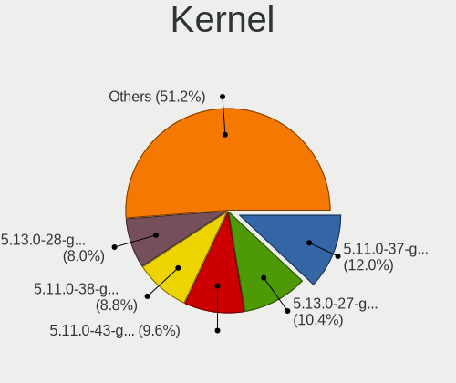

| Version           | Computers | Percent |
|-------------------|-----------|---------|
| 5.11.0-37-generic | 15        | 13.16%  |
| 5.11.0-43-generic | 12        | 10.53%  |
| 5.13.0-27-generic | 11        | 9.65%   |
| 5.11.0-40-generic | 11        | 9.65%   |
| 5.11.0-38-generic | 11        | 9.65%   |
| 5.13.0-28-generic | 10        | 8.77%   |
| 5.11.0-41-generic | 10        | 8.77%   |
| 5.11.0-36-generic | 7         | 6.14%   |
| 5.13.0-39-generic | 6         | 5.26%   |
| 5.11.0-34-generic | 6         | 5.26%   |
| 5.13.0-30-generic | 5         | 4.39%   |
| 5.11.0-46-generic | 5         | 4.39%   |
| 5.13.0-40-generic | 1         | 0.88%   |
| 5.13.0-35-generic | 1         | 0.88%   |
| 5.13.0-25-generic | 1         | 0.88%   |
| 5.11.0-44-generic | 1         | 0.88%   |
| 5.11.0-42-generic | 1         | 0.88%   |

Kernel Family
-------------

Linux kernel without a distro release

| Version | Computers | Percent |
|---------|-----------|---------|
| 5.11.0  | 74        | 67.89%  |
| 5.13.0  | 35        | 32.11%  |

Kernel Major Ver.
-----------------

Linux kernel major version

| Version | Computers | Percent |
|---------|-----------|---------|
| 5.11    | 74        | 67.89%  |
| 5.13    | 35        | 32.11%  |

Arch
----

OS architecture (x86_64, i586, etc.)

| Name   | Computers | Percent |
|--------|-----------|---------|
| x86_64 | 108       | 100%    |

DE
--

Desktop Environment

| Name       | Computers | Percent |
|------------|-----------|---------|
| KDE5       | 103       | 94.5%   |
| KDE        | 5         | 4.59%   |
| X-Cinnamon | 1         | 0.92%   |

Display Server
--------------

X11 or Wayland

| Name    | Computers | Percent |
|---------|-----------|---------|
| X11     | 106       | 98.15%  |
| Wayland | 2         | 1.85%   |

Display Manager
---------------

SDDM, LightDM, etc.

| Name    | Computers | Percent |
|---------|-----------|---------|
| Unknown | 92        | 85.19%  |
| SDDM    | 16        | 14.81%  |

OS Lang
-------

Language

| Lang  | Computers | Percent |
|-------|-----------|---------|
| en_US | 25        | 23.15%  |
| pt_BR | 15        | 13.89%  |
| de_DE | 12        | 11.11%  |
| it_IT | 6         | 5.56%   |
| fr_FR | 6         | 5.56%   |
| en_GB | 4         | 3.7%    |
| C     | 4         | 3.7%    |
| pl_PL | 3         | 2.78%   |
| en_IN | 3         | 2.78%   |
| en_AU | 3         | 2.78%   |
| nl_NL | 2         | 1.85%   |
| es_MX | 2         | 1.85%   |
| en_CA | 2         | 1.85%   |
| el_GR | 2         | 1.85%   |
| cs_CZ | 2         | 1.85%   |
| zh_CN | 1         | 0.93%   |
| sv_SE | 1         | 0.93%   |
| ru_UA | 1         | 0.93%   |
| ru_RU | 1         | 0.93%   |
| pt_PT | 1         | 0.93%   |
| nl_BE | 1         | 0.93%   |
| hr_BA | 1         | 0.93%   |
| fr_CA | 1         | 0.93%   |
| fr_BE | 1         | 0.93%   |
| fi_FI | 1         | 0.93%   |
| es_HN | 1         | 0.93%   |
| es_ES | 1         | 0.93%   |
| es_CO | 1         | 0.93%   |
| es_AR | 1         | 0.93%   |
| en_ZA | 1         | 0.93%   |
| en_NG | 1         | 0.93%   |
| da_DK | 1         | 0.93%   |

Boot Mode
---------

EFI or BIOS

| Mode | Computers | Percent |
|------|-----------|---------|
| BIOS | 73        | 67.59%  |
| EFI  | 35        | 32.41%  |

Filesystem
----------

Type of filesystem

| Type    | Computers | Percent |
|---------|-----------|---------|
| Ext4    | 106       | 98.15%  |
| Overlay | 2         | 1.85%   |

Part. scheme
------------

Scheme of partitioning

| Type    | Computers | Percent |
|---------|-----------|---------|
| Unknown | 105       | 97.22%  |
| GPT     | 2         | 1.85%   |
| MBR     | 1         | 0.93%   |

Dual Boot with Linux/BSD
------------------------

Hosting more than one Linux/BSD

| Dual boot | Computers | Percent |
|-----------|-----------|---------|
| No        | 103       | 95.37%  |
| Yes       | 5         | 4.63%   |

Dual Boot (Win)
---------------

Hosting Linux and Windows

| Dual boot | Computers | Percent |
|-----------|-----------|---------|
| No        | 100       | 92.59%  |
| Yes       | 8         | 7.41%   |

Board
-----

Vendor
------

Motherboard manufacturer

| Name                | Computers | Percent |
|---------------------|-----------|---------|
| Hewlett-Packard     | 18        | 16.67%  |
| Dell                | 14        | 12.96%  |
| Acer                | 11        | 10.19%  |
| ASUSTek Computer    | 10        | 9.26%   |
| MSI                 | 8         | 7.41%   |
| Lenovo              | 7         | 6.48%   |
| Positivo            | 5         | 4.63%   |
| Gigabyte Technology | 5         | 4.63%   |
| ASRock              | 5         | 4.63%   |
| Samsung Electronics | 4         | 3.7%    |
| Intel               | 4         | 3.7%    |
| Toshiba             | 3         | 2.78%   |
| Apple               | 3         | 2.78%   |
| Pegatron            | 2         | 1.85%   |
| Google              | 2         | 1.85%   |
| GPU Company         | 1         | 0.93%   |
| Fujitsu Siemens     | 1         | 0.93%   |
| Fujitsu             | 1         | 0.93%   |
| Foxconn             | 1         | 0.93%   |
| ASRockRack          | 1         | 0.93%   |
| Alienware           | 1         | 0.93%   |
| ABIT                | 1         | 0.93%   |

Model
-----

Motherboard model

| Name                                                                                     | Computers | Percent |
|------------------------------------------------------------------------------------------|-----------|---------|
| HP 255 G6 Notebook PC                                                                    | 2         | 1.85%   |
| Toshiba TECRA R850                                                                       | 1         | 0.93%   |
| Toshiba Satellite P300                                                                   | 1         | 0.93%   |
| Toshiba Satellite C660                                                                   | 1         | 0.93%   |
| Samsung RV415/RV515/E3415                                                                | 1         | 0.93%   |
| Samsung RV411/RV511/E3511/S3511/RV711/E3411                                              | 1         | 0.93%   |
| Samsung RF511/RF411/RF711                                                                | 1         | 0.93%   |
| Samsung 355V4C/355V4X/355V5C/355V5X/356V4C/356V4X/356V5C/356V5X/3445VC/3445VX/3545VC/354 | 1         | 0.93%   |
| Positivo Smash3                                                                          | 1         | 0.93%   |
| Positivo Smash                                                                           | 1         | 0.93%   |
| Positivo POS-PIQ67CG                                                                     | 1         | 0.93%   |
| Positivo POS-EIBTPDC                                                                     | 1         | 0.93%   |
| Positivo C464C                                                                           | 1         | 0.93%   |
| Pegatron p6745br                                                                         | 1         | 0.93%   |
| Pegatron NC045AA-ABU IQ525uk                                                             | 1         | 0.93%   |
| MSI MS-7C37                                                                              | 1         | 0.93%   |
| MSI MS-7B79                                                                              | 1         | 0.93%   |
| MSI MS-7A71                                                                              | 1         | 0.93%   |
| MSI MS-7752                                                                              | 1         | 0.93%   |
| MSI MS-7693                                                                              | 1         | 0.93%   |
| MSI MS-7681                                                                              | 1         | 0.93%   |
| MSI MS-7593                                                                              | 1         | 0.93%   |
| MSI MS-7529                                                                              | 1         | 0.93%   |
| Lenovo ThinkPad L380 20M6S4E000                                                          | 1         | 0.93%   |
| Lenovo MIIX 310-10ICR 80SG                                                               | 1         | 0.93%   |
| Lenovo Legion 5 Pro 16ACH6H 82JQ                                                         | 1         | 0.93%   |
| Lenovo IdeaPad Y510P 20217                                                               | 1         | 0.93%   |
| Lenovo G550 2958                                                                         | 1         | 0.93%   |
| Lenovo G50-80 80R0                                                                       | 1         | 0.93%   |
| Lenovo G50-80 80E5                                                                       | 1         | 0.93%   |
| Intel H55                                                                                | 1         | 0.93%   |
| Intel DP55WB AAE64798-205                                                                | 1         | 0.93%   |
| Intel DG35EC AAE29266-202                                                                | 1         | 0.93%   |
| Intel DESKTOP 300                                                                        | 1         | 0.93%   |
| HP ProBook 640 G1                                                                        | 1         | 0.93%   |
| HP ProBook 4720s                                                                         | 1         | 0.93%   |
| HP ProBook 440 G1                                                                        | 1         | 0.93%   |
| HP Pavilion g6                                                                           | 1         | 0.93%   |
| HP Pavilion dv6700                                                                       | 1         | 0.93%   |
| HP Pavilion 14                                                                           | 1         | 0.93%   |
| HP Laptop 15-da0xxx                                                                      | 1         | 0.93%   |
| HP Laptop 15-bw0xx                                                                       | 1         | 0.93%   |
| HP Laptop 14-dk1xxx                                                                      | 1         | 0.93%   |
| HP G62                                                                                   | 1         | 0.93%   |
| HP EliteDesk 800 G2 SFF                                                                  | 1         | 0.93%   |
| HP EliteBook 8570w                                                                       | 1         | 0.93%   |
| HP EliteBook 8440p                                                                       | 1         | 0.93%   |
| HP Compaq CQ45                                                                           | 1         | 0.93%   |
| HP Compaq 6730b (NA373UC#ABA)                                                            | 1         | 0.93%   |
| HP 700-214                                                                               | 1         | 0.93%   |
| GPU Company GWTN116-3                                                                    | 1         | 0.93%   |
| Google Teemo                                                                             | 1         | 0.93%   |
| Google Peppy                                                                             | 1         | 0.93%   |
| Gigabyte H61M-S2PV                                                                       | 1         | 0.93%   |
| Gigabyte GA-970A-D3                                                                      | 1         | 0.93%   |
| Gigabyte F2A78M-D3H                                                                      | 1         | 0.93%   |
| Gigabyte 970A-D3                                                                         | 1         | 0.93%   |
| Gigabyte 7200-5121B                                                                      | 1         | 0.93%   |
| Fujitsu Siemens AMILO Xi 1526                                                            | 1         | 0.93%   |
| Fujitsu CELSIUS H700                                                                     | 1         | 0.93%   |

Model Family
------------

Motherboard model prefix

| Name                  | Computers | Percent |
|-----------------------|-----------|---------|
| Acer Aspire           | 8         | 7.41%   |
| Dell Latitude         | 5         | 4.63%   |
| HP ProBook            | 3         | 2.78%   |
| HP Pavilion           | 3         | 2.78%   |
| HP Laptop             | 3         | 2.78%   |
| Dell Precision        | 3         | 2.78%   |
| Toshiba Satellite     | 2         | 1.85%   |
| Lenovo G50-80         | 2         | 1.85%   |
| HP EliteBook          | 2         | 1.85%   |
| HP Compaq             | 2         | 1.85%   |
| HP 255                | 2         | 1.85%   |
| Dell OptiPlex         | 2         | 1.85%   |
| Dell Inspiron         | 2         | 1.85%   |
| Apple MacBookPro5     | 2         | 1.85%   |
| Toshiba TECRA         | 1         | 0.93%   |
| Samsung RV415         | 1         | 0.93%   |
| Samsung RV411         | 1         | 0.93%   |
| Samsung RF511         | 1         | 0.93%   |
| Samsung 355V4C        | 1         | 0.93%   |
| Positivo Smash3       | 1         | 0.93%   |
| Positivo Smash        | 1         | 0.93%   |
| Positivo POS-PIQ67CG  | 1         | 0.93%   |
| Positivo POS-EIBTPDC  | 1         | 0.93%   |
| Positivo C464C        | 1         | 0.93%   |
| Pegatron p6745br      | 1         | 0.93%   |
| Pegatron NC045AA-ABU  | 1         | 0.93%   |
| MSI MS-7C37           | 1         | 0.93%   |
| MSI MS-7B79           | 1         | 0.93%   |
| MSI MS-7A71           | 1         | 0.93%   |
| MSI MS-7752           | 1         | 0.93%   |
| MSI MS-7693           | 1         | 0.93%   |
| MSI MS-7681           | 1         | 0.93%   |
| MSI MS-7593           | 1         | 0.93%   |
| MSI MS-7529           | 1         | 0.93%   |
| Lenovo ThinkPad       | 1         | 0.93%   |
| Lenovo MIIX           | 1         | 0.93%   |
| Lenovo Legion         | 1         | 0.93%   |
| Lenovo IdeaPad        | 1         | 0.93%   |
| Lenovo G550           | 1         | 0.93%   |
| Intel H55             | 1         | 0.93%   |
| Intel DP55WB          | 1         | 0.93%   |
| Intel DG35EC          | 1         | 0.93%   |
| Intel DESKTOP         | 1         | 0.93%   |
| HP G62                | 1         | 0.93%   |
| HP EliteDesk          | 1         | 0.93%   |
| HP 700-214            | 1         | 0.93%   |
| GPU Company GWTN116-3 | 1         | 0.93%   |
| Google Teemo          | 1         | 0.93%   |
| Google Peppy          | 1         | 0.93%   |
| Gigabyte H61M-S2PV    | 1         | 0.93%   |
| Gigabyte GA-970A-D3   | 1         | 0.93%   |
| Gigabyte F2A78M-D3H   | 1         | 0.93%   |
| Gigabyte 970A-D3      | 1         | 0.93%   |
| Gigabyte 7200-5121B   | 1         | 0.93%   |
| Fujitsu Siemens AMILO | 1         | 0.93%   |
| Fujitsu CELSIUS       | 1         | 0.93%   |
| Foxconn D270S         | 1         | 0.93%   |
| Dell System           | 1         | 0.93%   |
| Dell G5               | 1         | 0.93%   |
| ASUS X751LAB          | 1         | 0.93%   |

MFG Year
--------

Motherboard manufacture year

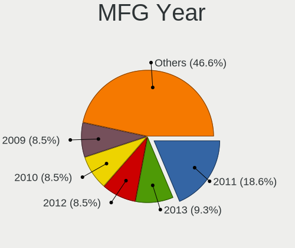

| Year | Computers | Percent |
|------|-----------|---------|
| 2011 | 20        | 18.52%  |
| 2010 | 10        | 9.26%   |
| 2009 | 10        | 9.26%   |
| 2019 | 8         | 7.41%   |
| 2013 | 8         | 7.41%   |
| 2012 | 8         | 7.41%   |
| 2017 | 7         | 6.48%   |
| 2014 | 7         | 6.48%   |
| 2015 | 6         | 5.56%   |
| 2008 | 6         | 5.56%   |
| 2021 | 5         | 4.63%   |
| 2016 | 5         | 4.63%   |
| 2018 | 3         | 2.78%   |
| 2007 | 3         | 2.78%   |
| 2020 | 1         | 0.93%   |
| 2006 | 1         | 0.93%   |

Form Factor
-----------

Physical design of the computer

| Name        | Computers | Percent |
|-------------|-----------|---------|
| Notebook    | 61        | 56.48%  |
| Desktop     | 42        | 38.89%  |
| Convertible | 2         | 1.85%   |
| Tablet      | 1         | 0.93%   |
| All in one  | 1         | 0.93%   |
| Server      | 1         | 0.93%   |

Secure Boot
-----------

Enabled or disabled

| State    | Computers | Percent |
|----------|-----------|---------|
| Disabled | 103       | 95.37%  |
| Enabled  | 5         | 4.63%   |

Coreboot
--------

Have coreboot on board

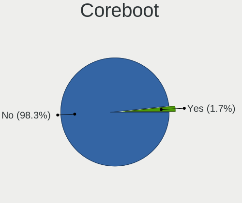

| Used | Computers | Percent |
|------|-----------|---------|
| No   | 106       | 98.15%  |
| Yes  | 2         | 1.85%   |

RAM Size
--------

Total RAM memory

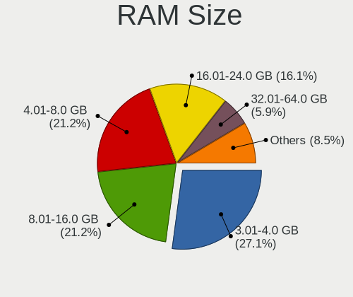

| Size in GB | Computers | Percent |
|------------|-----------|---------|
| 3.01-4.0   | 29        | 26.85%  |
| 4.01-8.0   | 24        | 22.22%  |
| 8.01-16.0  | 24        | 22.22%  |
| 16.01-24.0 | 15        | 13.89%  |
| 32.01-64.0 | 6         | 5.56%   |
| 1.01-2.0   | 5         | 4.63%   |
| 2.01-3.0   | 3         | 2.78%   |
| 24.01-32.0 | 2         | 1.85%   |

RAM Used
--------

Used RAM memory

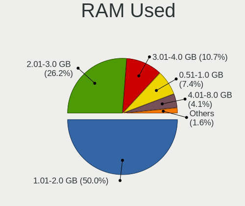

| Used GB   | Computers | Percent |
|-----------|-----------|---------|
| 1.01-2.0  | 57        | 51.35%  |
| 2.01-3.0  | 29        | 26.13%  |
| 3.01-4.0  | 10        | 9.01%   |
| 0.51-1.0  | 9         | 8.11%   |
| 4.01-8.0  | 4         | 3.6%    |
| 8.01-16.0 | 2         | 1.8%    |

Total Drives
------------

Number of drives on board

| Drives | Computers | Percent |
|--------|-----------|---------|
| 1      | 71        | 64.55%  |
| 2      | 26        | 23.64%  |
| 3      | 8         | 7.27%   |
| 4      | 3         | 2.73%   |
| 5      | 2         | 1.82%   |

Has CD-ROM
----------

Has CD-ROM on board

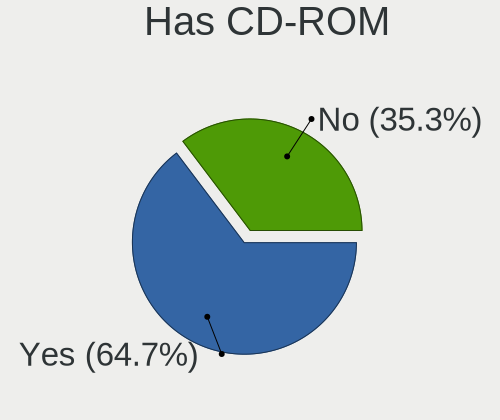

| Presented | Computers | Percent |
|-----------|-----------|---------|
| Yes       | 70        | 64.81%  |
| No        | 38        | 35.19%  |

Has Ethernet
------------

Has Ethernet on board

| Presented | Computers | Percent |
|-----------|-----------|---------|
| Yes       | 101       | 93.52%  |
| No        | 7         | 6.48%   |

Has WiFi
--------

Has WiFi module

| Presented | Computers | Percent |
|-----------|-----------|---------|
| Yes       | 83        | 76.15%  |
| No        | 26        | 23.85%  |

Has Bluetooth
-------------

Has Bluetooth module

| Presented | Computers | Percent |
|-----------|-----------|---------|
| Yes       | 57        | 52.78%  |
| No        | 51        | 47.22%  |

Location
--------

Country
-------

Geographic location (country)

| Country      | Computers | Percent |
|--------------|-----------|---------|
| USA          | 21        | 19.44%  |
| Brazil       | 16        | 14.81%  |
| Germany      | 12        | 11.11%  |
| Italy        | 6         | 5.56%   |
| France       | 5         | 4.63%   |
| Canada       | 5         | 4.63%   |
| Poland       | 4         | 3.7%    |
| UK           | 3         | 2.78%   |
| India        | 3         | 2.78%   |
| Greece       | 3         | 2.78%   |
| Australia    | 3         | 2.78%   |
| Netherlands  | 2         | 1.85%   |
| Mexico       | 2         | 1.85%   |
| Czechia      | 2         | 1.85%   |
| Belgium      | 2         | 1.85%   |
| Ukraine      | 1         | 0.93%   |
| Sweden       | 1         | 0.93%   |
| Spain        | 1         | 0.93%   |
| South Africa | 1         | 0.93%   |
| Serbia       | 1         | 0.93%   |
| Russia       | 1         | 0.93%   |
| Puerto Rico  | 1         | 0.93%   |
| Portugal     | 1         | 0.93%   |
| Pakistan     | 1         | 0.93%   |
| Nigeria      | 1         | 0.93%   |
| Namibia      | 1         | 0.93%   |
| Jamaica      | 1         | 0.93%   |
| Honduras     | 1         | 0.93%   |
| Finland      | 1         | 0.93%   |
| Denmark      | 1         | 0.93%   |
| Croatia      | 1         | 0.93%   |
| Colombia     | 1         | 0.93%   |
| China        | 1         | 0.93%   |
| Argentina    | 1         | 0.93%   |

City
----

Geographic location (city)

| City                | Computers | Percent |
|---------------------|-----------|---------|
| Rio de Janeiro      | 4         | 3.64%   |
| Warsaw              | 3         | 2.73%   |
| Sao Paulo           | 2         | 1.82%   |
| Lutjegast           | 2         | 1.82%   |
| Hobart              | 2         | 1.82%   |
| Campinas            | 2         | 1.82%   |
| Athens              | 2         | 1.82%   |
| Zaventem            | 1         | 0.91%   |
| Zagreb              | 1         | 0.91%   |
| Windhoek            | 1         | 0.91%   |
| Wabern              | 1         | 0.91%   |
| Vivian              | 1         | 0.91%   |
| Vicksburg           | 1         | 0.91%   |
| Toronto             | 1         | 0.91%   |
| Toluca              | 1         | 0.91%   |
| Thungersheim        | 1         | 0.91%   |
| Temple Hills        | 1         | 0.91%   |
| Tegucigalpa         | 1         | 0.91%   |
| Stourbridge         | 1         | 0.91%   |
| Stockholm           | 1         | 0.91%   |
| Spicheren           | 1         | 0.91%   |
| Sparta              | 1         | 0.91%   |
| Siegburg            | 1         | 0.91%   |
| Shamrock            | 1         | 0.91%   |
| Senas               | 1         | 0.91%   |
| Sankt Augustin      | 1         | 0.91%   |
| Salt Lake City      | 1         | 0.91%   |
| Saloa               | 1         | 0.91%   |
| Rome                | 1         | 0.91%   |
| Rio das Ostras      | 1         | 0.91%   |
| Ringgold            | 1         | 0.91%   |
| Reims               | 1         | 0.91%   |
| Qubec           | 1         | 0.91%   |
| Pretoria            | 1         | 0.91%   |
| Prague              | 1         | 0.91%   |
| Porto               | 1         | 0.91%   |
| Port Coquitlam      | 1         | 0.91%   |
| Patchogue           | 1         | 0.91%   |
| Oswego              | 1         | 0.91%   |
| Oshawa              | 1         | 0.91%   |
| Odense              | 1         | 0.91%   |
| Novi Karlovci       | 1         | 0.91%   |
| Northwich           | 1         | 0.91%   |
| North Plains        | 1         | 0.91%   |
| Niteri          | 1         | 0.91%   |
| Newcastle upon Tyne | 1         | 0.91%   |
| Newburgh            | 1         | 0.91%   |
| Nevele              | 1         | 0.91%   |
| Naples              | 1         | 0.91%   |
| Nanning             | 1         | 0.91%   |
| Missoula            | 1         | 0.91%   |
| Milan               | 1         | 0.91%   |
| Melbourne           | 1         | 0.91%   |
| Mandi               | 1         | 0.91%   |
| Madrid              | 1         | 0.91%   |
| Lohja               | 1         | 0.91%   |
| Lares               | 1         | 0.91%   |
| Lagos               | 1         | 0.91%   |
| Kochi               | 1         | 0.91%   |
| Kladno              | 1         | 0.91%   |

Drives
------

Drive Vendor
------------

Hard drive vendors

| Vendor              | Computers | Drives | Percent |
|---------------------|-----------|--------|---------|
| Seagate             | 27        | 36     | 18.49%  |
| WDC                 | 26        | 30     | 17.81%  |
| Samsung Electronics | 15        | 16     | 10.27%  |
| Toshiba             | 13        | 13     | 8.9%    |
| Sandisk             | 11        | 11     | 7.53%   |
| Unknown             | 7         | 12     | 4.79%   |
| Crucial             | 5         | 6      | 3.42%   |
| Kingston            | 4         | 4      | 2.74%   |
| Hitachi             | 4         | 4      | 2.74%   |
| PNY                 | 3         | 3      | 2.05%   |
| JMicron             | 3         | 3      | 2.05%   |
| Transcend           | 2         | 2      | 1.37%   |
| SPCC                | 2         | 2      | 1.37%   |
| SK Hynix            | 2         | 3      | 1.37%   |
| Patriot             | 2         | 2      | 1.37%   |
| HGST                | 2         | 2      | 1.37%   |
| A-DATA Technology   | 2         | 2      | 1.37%   |
| SATAFIRM            | 1         | 1      | 0.68%   |
| Phison              | 1         | 1      | 0.68%   |
| OCZ                 | 1         | 1      | 0.68%   |
| Micron_1            | 1         | 2      | 0.68%   |
| MAXTOR              | 1         | 1      | 0.68%   |
| LITEON              | 1         | 1      | 0.68%   |
| Lenovo              | 1         | 1      | 0.68%   |
| I/OMAGIC            | 1         | 1      | 0.68%   |
| HEORIADY            | 1         | 1      | 0.68%   |
| DOGFISH             | 1         | 1      | 0.68%   |
| Apple               | 1         | 2      | 0.68%   |
| Apacer              | 1         | 2      | 0.68%   |
| AMD                 | 1         | 1      | 0.68%   |
| ALERTSEAL           | 1         | 1      | 0.68%   |
| AFOX                | 1         | 1      | 0.68%   |
| Unknown             | 1         | 1      | 0.68%   |

Drive Model
-----------

Hard drive models

| Model                               | Computers | Percent |
|-------------------------------------|-----------|---------|
| Unknown MMC Card  64GB              | 5         | 3.14%   |
| Seagate ST1000DM010-2EP102 1TB      | 4         | 2.52%   |
| Seagate ST1000LM024 HN-M101MBB 1TB  | 3         | 1.89%   |
| SanDisk SDSSDX240GG25 240GB         | 3         | 1.89%   |
| Kingston SA400S37240G 240GB SSD     | 3         | 1.89%   |
| WDC WDS500G2B0A-00SM50 500GB SSD    | 2         | 1.26%   |
| Toshiba MQ04ABF100 1TB              | 2         | 1.26%   |
| Toshiba MQ01ABD050 500GB            | 2         | 1.26%   |
| Toshiba MK2552GSX 250GB             | 2         | 1.26%   |
| Seagate ST1000DM003-1CH162 1TB      | 2         | 1.26%   |
| Seagate Expansion Desk 4TB          | 2         | 1.26%   |
| Samsung SSD 850 EVO 500GB           | 2         | 1.26%   |
| Samsung NVMe SSD Drive 500GB        | 2         | 1.26%   |
| PNY CS900 120GB SSD                 | 2         | 1.26%   |
| Patriot Burst 120GB SSD             | 2         | 1.26%   |
| Crucial CT1000MX500SSD1 1TB         | 2         | 1.26%   |
| WDC WDS500G2B0C-00PXH0 500GB        | 1         | 0.63%   |
| WDC WDS500G2B0B-00YS70 500GB SSD    | 1         | 0.63%   |
| WDC WDS240G2G0A-00JH30 240GB SSD    | 1         | 0.63%   |
| WDC WDS120G2G0A-00JH30 120GB SSD    | 1         | 0.63%   |
| WDC WDBNCE5000PNC 500GB SSD         | 1         | 0.63%   |
| WDC WDBNCE0010PNC 1TB SSD           | 1         | 0.63%   |
| WDC WD6402AAEX-00Y9A0 640GB         | 1         | 0.63%   |
| WDC WD6401AALS-00L3B2 640GB         | 1         | 0.63%   |
| WDC WD5000LPCX-60VHAT0 500GB        | 1         | 0.63%   |
| WDC WD5000BPVT-60HXZT1 500GB        | 1         | 0.63%   |
| WDC WD5000BPVT-22HXZT3 500GB        | 1         | 0.63%   |
| WDC WD5000AVVS-63M8B0 500GB         | 1         | 0.63%   |
| WDC WD5000AAKS-75A7B2 500GB         | 1         | 0.63%   |
| WDC WD3200BEKT-00PVMT0 320GB        | 1         | 0.63%   |
| WDC WD3200AAKS-61L9A0 320GB         | 1         | 0.63%   |
| WDC WD30EZRZ-00WN9B0 3TB            | 1         | 0.63%   |
| WDC WD30EZRX-00MMMB0 3TB            | 1         | 0.63%   |
| WDC WD2500BEVT-24A23T0 250GB        | 1         | 0.63%   |
| WDC WD20EADS-00R6B0 2TB             | 1         | 0.63%   |
| WDC WD1600JB-32FUA0 160GB           | 1         | 0.63%   |
| WDC WD1600BEVT-75ZCT1 160GB         | 1         | 0.63%   |
| WDC WD10JPCX-24UE4T0 1TB            | 1         | 0.63%   |
| WDC WD10EZEX-08WN4A0 1TB            | 1         | 0.63%   |
| WDC WD10EZEX-00RKKA0 1TB            | 1         | 0.63%   |
| WDC WD10EADS-22M2B0 1TB             | 1         | 0.63%   |
| WDC WD1003FBYX-02A6B0 1TB           | 1         | 0.63%   |
| WDC WD1001FALS-00J7B0 1TB           | 1         | 0.63%   |
| Unknown SD  128GB                   | 1         | 0.63%   |
| Unknown MMC Card  7GB               | 1         | 0.63%   |
| Unknown MMC Card  32GB              | 1         | 0.63%   |
| Unknown MMC Card  16GB              | 1         | 0.63%   |
| Unknown BJTD4R  32GB                | 1         | 0.63%   |
| Transcend TS32GMTS400 32GB SSD      | 1         | 0.63%   |
| Transcend TS128GSSD360S 128GB       | 1         | 0.63%   |
| Toshiba MQ01ACF032 320GB            | 1         | 0.63%   |
| Toshiba MQ01ABF032 320GB            | 1         | 0.63%   |
| Toshiba MQ01ABD100 1TB              | 1         | 0.63%   |
| Toshiba MQ01ABD075 752GB            | 1         | 0.63%   |
| Toshiba MQ01ABD032 320GB            | 1         | 0.63%   |
| Toshiba MK1656GSYF 160GB            | 1         | 0.63%   |
| Toshiba KBG30ZMS128G 128GB NVMe SSD | 1         | 0.63%   |
| SPCC Solid State Disk 512GB         | 1         | 0.63%   |
| SPCC Solid State Disk 128GB         | 1         | 0.63%   |
| SK Hynix NVMe SSD Drive 512GB       | 1         | 0.63%   |

HDD Vendor
----------

Hard disk drive vendors

| Vendor              | Computers | Drives | Percent |
|---------------------|-----------|--------|---------|
| Seagate             | 27        | 36     | 39.13%  |
| WDC                 | 19        | 22     | 27.54%  |
| Toshiba             | 12        | 12     | 17.39%  |
| Hitachi             | 4         | 4      | 5.8%    |
| Samsung Electronics | 2         | 2      | 2.9%    |
| HGST                | 2         | 2      | 2.9%    |
| MAXTOR              | 1         | 1      | 1.45%   |
| JMicron             | 1         | 1      | 1.45%   |
| Apple               | 1         | 2      | 1.45%   |

SSD Vendor
----------

Solid state drive vendors

| Vendor              | Computers | Drives | Percent |
|---------------------|-----------|--------|---------|
| SanDisk             | 10        | 10     | 17.86%  |
| Samsung Electronics | 9         | 9      | 16.07%  |
| WDC                 | 7         | 7      | 12.5%   |
| Crucial             | 5         | 6      | 8.93%   |
| Kingston            | 4         | 4      | 7.14%   |
| PNY                 | 3         | 3      | 5.36%   |
| Transcend           | 2         | 2      | 3.57%   |
| SPCC                | 2         | 2      | 3.57%   |
| Patriot             | 2         | 2      | 3.57%   |
| A-DATA Technology   | 2         | 2      | 3.57%   |
| SATAFIRM            | 1         | 1      | 1.79%   |
| OCZ                 | 1         | 1      | 1.79%   |
| Micron_1            | 1         | 2      | 1.79%   |
| LITEON              | 1         | 1      | 1.79%   |
| JMicron             | 1         | 1      | 1.79%   |
| HEORIADY            | 1         | 1      | 1.79%   |
| DOGFISH             | 1         | 1      | 1.79%   |
| Apacer              | 1         | 2      | 1.79%   |
| AMD                 | 1         | 1      | 1.79%   |
| ALERTSEAL           | 1         | 1      | 1.79%   |

Drive Kind
----------

HDD or SSD

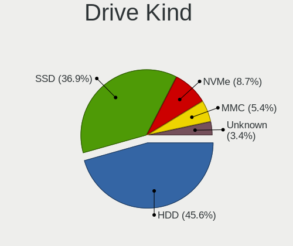

| Kind    | Computers | Drives | Percent |
|---------|-----------|--------|---------|
| HDD     | 62        | 82     | 46.27%  |
| SSD     | 49        | 59     | 36.57%  |
| NVMe    | 12        | 13     | 8.96%   |
| MMC     | 8         | 13     | 5.97%   |
| Unknown | 3         | 3      | 2.24%   |

Drive Connector
---------------

SATA, SAS, NVMe, etc.

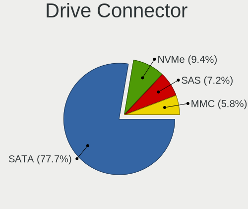

| Type | Computers | Drives | Percent |
|------|-----------|--------|---------|
| SATA | 98        | 133    | 77.17%  |
| NVMe | 12        | 13     | 9.45%   |
| SAS  | 9         | 11     | 7.09%   |
| MMC  | 8         | 13     | 6.3%    |

Drive Size
----------

Size of hard drive

| Size in TB | Computers | Drives | Percent |
|------------|-----------|--------|---------|
| 0.01-0.5   | 71        | 83     | 60.17%  |
| 0.51-1.0   | 34        | 44     | 28.81%  |
| 1.01-2.0   | 8         | 9      | 6.78%   |
| 3.01-4.0   | 3         | 3      | 2.54%   |
| 2.01-3.0   | 2         | 2      | 1.69%   |

Space Total
-----------

Amount of disk space available on the file system

| Size in GB     | Computers | Percent |
|----------------|-----------|---------|
| 101-250        | 31        | 28.44%  |
| 251-500        | 25        | 22.94%  |
| 501-1000       | 21        | 19.27%  |
| 21-50          | 13        | 11.93%  |
| 51-100         | 8         | 7.34%   |
| 1001-2000      | 4         | 3.67%   |
| More than 3000 | 3         | 2.75%   |
| 1-20           | 3         | 2.75%   |
| 2001-3000      | 1         | 0.92%   |

Space Used
----------

Amount of used disk space

| Used GB   | Computers | Percent |
|-----------|-----------|---------|
| 21-50     | 53        | 47.75%  |
| 1-20      | 31        | 27.93%  |
| 51-100    | 13        | 11.71%  |
| 101-250   | 9         | 8.11%   |
| 251-500   | 3         | 2.7%    |
| 2001-3000 | 2         | 1.8%    |

Malfunc. Drives
---------------

Drive models with a malfunction

Zero info for selected period =(

Malfunc. Drive Vendor
---------------------

Vendors of faulty drives

Zero info for selected period =(

Malfunc. HDD Vendor
-------------------

Vendors of faulty HDD drives

Zero info for selected period =(

Malfunc. Drive Kind
-------------------

Kinds of faulty drives

Zero info for selected period =(

Failed Drives
-------------

Failed drive models

Zero info for selected period =(

Failed Drive Vendor
-------------------

Failed drive vendors

Zero info for selected period =(

Drive Status
------------

Number of failed and malfunc. drives

| Status   | Computers | Drives | Percent |
|----------|-----------|--------|---------|
| Detected | 106       | 166    | 97.25%  |
| Works    | 3         | 4      | 2.75%   |

Storage controller
------------------

Storage Vendor
--------------

Storage controller vendors

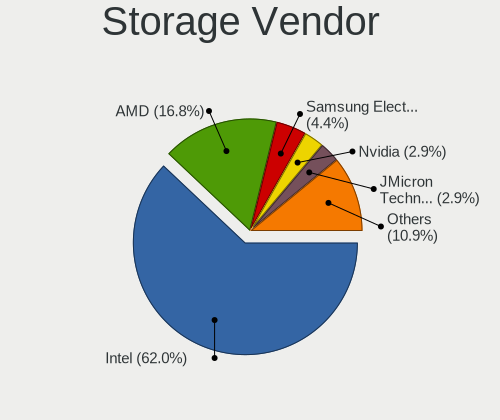

| Vendor                        | Computers | Percent |
|-------------------------------|-----------|---------|
| Intel                         | 79        | 62.7%   |
| AMD                           | 19        | 15.08%  |
| Samsung Electronics           | 5         | 3.97%   |
| Nvidia                        | 4         | 3.17%   |
| JMicron Technology            | 4         | 3.17%   |
| ASMedia Technology            | 3         | 2.38%   |
| SK Hynix                      | 2         | 1.59%   |
| Sandisk                       | 2         | 1.59%   |
| VIA Technologies              | 1         | 0.79%   |
| Toshiba America Info Systems  | 1         | 0.79%   |
| Silicon Image                 | 1         | 0.79%   |
| Promise Technology            | 1         | 0.79%   |
| Phison Electronics            | 1         | 0.79%   |
| Marvell Technology Group      | 1         | 0.79%   |
| Lenovo                        | 1         | 0.79%   |
| Integrated Technology Express | 1         | 0.79%   |

Storage Model
-------------

Storage controller models

| Model                                                                                   | Computers | Percent |
|-----------------------------------------------------------------------------------------|-----------|---------|
| AMD FCH SATA Controller [AHCI mode]                                                     | 11        | 7.24%   |
| Intel 82801IBM/IEM (ICH9M/ICH9M-E) 4 port SATA Controller [AHCI mode]                   | 10        | 6.58%   |
| Intel 82801 Mobile SATA Controller [RAID mode]                                          | 7         | 4.61%   |
| Intel 6 Series/C200 Series Chipset Family 6 port Mobile SATA AHCI Controller            | 6         | 3.95%   |
| Samsung NVMe SSD Controller SM981/PM981/PM983                                           | 5         | 3.29%   |
| Intel 8 Series/C220 Series Chipset Family 6-port SATA Controller 1 [AHCI mode]          | 5         | 3.29%   |
| Intel NM10/ICH7 Family SATA Controller [IDE mode]                                       | 4         | 2.63%   |
| Intel 82801G (ICH7 Family) IDE Controller                                               | 4         | 2.63%   |
| Intel 5 Series/3400 Series Chipset 4 port SATA AHCI Controller                          | 4         | 2.63%   |
| AMD SB7x0/SB8x0/SB9x0 IDE Controller                                                    | 4         | 2.63%   |
| Intel Wildcat Point-LP SATA Controller [AHCI Mode]                                      | 3         | 1.97%   |
| Intel Q170/Q150/B150/H170/H110/Z170/CM236 Chipset SATA Controller [AHCI Mode]           | 3         | 1.97%   |
| Intel 7 Series Chipset Family 6-port SATA Controller [AHCI mode]                        | 3         | 1.97%   |
| Intel 6 Series/C200 Series Chipset Family 6 port Desktop SATA AHCI Controller           | 3         | 1.97%   |
| Intel 5 Series/3400 Series Chipset 6 port SATA AHCI Controller                          | 3         | 1.97%   |
| Intel 5 Series/3400 Series Chipset 4 port SATA IDE Controller                           | 3         | 1.97%   |
| ASMedia ASM1062 Serial ATA Controller                                                   | 3         | 1.97%   |
| AMD SB7x0/SB8x0/SB9x0 SATA Controller [IDE mode]                                        | 3         | 1.97%   |
| AMD SB7x0/SB8x0/SB9x0 SATA Controller [AHCI mode]                                       | 3         | 1.97%   |
| Nvidia MCP79 AHCI Controller                                                            | 2         | 1.32%   |
| Nvidia MCP61 SATA Controller                                                            | 2         | 1.32%   |
| JMicron JMB368 IDE controller                                                           | 2         | 1.32%   |
| Intel SATA Controller [RAID mode]                                                       | 2         | 1.32%   |
| Intel Cannon Lake Mobile PCH SATA AHCI Controller                                       | 2         | 1.32%   |
| Intel 82801HM/HEM (ICH8M/ICH8M-E) SATA Controller [AHCI mode]                           | 2         | 1.32%   |
| Intel 82801HM/HEM (ICH8M/ICH8M-E) IDE Controller                                        | 2         | 1.32%   |
| Intel 8 Series SATA Controller 1 [AHCI mode]                                            | 2         | 1.32%   |
| Intel 6 Series/C200 Series Chipset Family Desktop SATA Controller (IDE mode, ports 4-5) | 2         | 1.32%   |
| Intel 6 Series/C200 Series Chipset Family Desktop SATA Controller (IDE mode, ports 0-3) | 2         | 1.32%   |
| Intel 5 Series/3400 Series Chipset PT IDER Controller                                   | 2         | 1.32%   |
| Intel 5 Series/3400 Series Chipset 2 port SATA IDE Controller                           | 2         | 1.32%   |
| Intel 200 Series PCH SATA controller [AHCI mode]                                        | 2         | 1.32%   |
| VIA VT6421 IDE/SATA Controller                                                          | 1         | 0.66%   |
| Toshiba America Info Systems XG4 NVMe SSD Controller                                    | 1         | 0.66%   |
| SK Hynix Gold P31 SSD                                                                   | 1         | 0.66%   |
| SK Hynix BC511                                                                          | 1         | 0.66%   |
| Silicon Image SiI 3132 Serial ATA Raid II Controller                                    | 1         | 0.66%   |
| Sandisk WD Blue SN550 NVMe SSD                                                          | 1         | 0.66%   |
| Sandisk WD Black 2018/SN750 / PC SN720 NVMe SSD                                         | 1         | 0.66%   |
| Promise PDC20262 (FastTrak66/Ultra66)                                                   | 1         | 0.66%   |
| Phison E16 PCIe4 NVMe Controller                                                        | 1         | 0.66%   |
| Nvidia MCP61 IDE                                                                        | 1         | 0.66%   |
| Marvell Group 88SE91A3 SATA-600 Controller                                              | 1         | 0.66%   |
| Marvell Group 88SE912x IDE Controller                                                   | 1         | 0.66%   |
| Lenovo Non-Volatile memory controller                                                   | 1         | 0.66%   |
| JMicron JMB363 SATA/IDE Controller                                                      | 1         | 0.66%   |
| JMicron JMB362 SATA Controller                                                          | 1         | 0.66%   |
| Intel Sunrise Point-LP SATA Controller [AHCI mode]                                      | 1         | 0.66%   |
| Intel NM10/ICH7 Family SATA Controller [AHCI mode]                                      | 1         | 0.66%   |
| Intel HM170/QM170 Chipset SATA Controller [AHCI Mode]                                   | 1         | 0.66%   |
| Intel Celeron/Pentium Silver Processor SATA Controller                                  | 1         | 0.66%   |
| Intel Celeron N3350/Pentium N4200/Atom E3900 Series SATA AHCI Controller                | 1         | 0.66%   |
| Intel C620 Series Chipset Family SSATA Controller [AHCI mode]                           | 1         | 0.66%   |
| Intel C620 Series Chipset Family SATA Controller [AHCI mode]                            | 1         | 0.66%   |
| Intel Atom Processor E3800 Series SATA AHCI Controller                                  | 1         | 0.66%   |
| Intel 82801JI (ICH10 Family) 4 port SATA IDE Controller #1                              | 1         | 0.66%   |
| Intel 82801JI (ICH10 Family) 2 port SATA IDE Controller #2                              | 1         | 0.66%   |
| Intel 82801HR/HO/HH (ICH8R/DO/DH) 2 port SATA Controller [IDE mode]                     | 1         | 0.66%   |
| Intel 82801H (ICH8 Family) 4 port SATA Controller [IDE mode]                            | 1         | 0.66%   |
| Intel 82801GBM/GHM (ICH7-M Family) SATA Controller [IDE mode]                           | 1         | 0.66%   |

Storage Kind
------------

Kind of storage controller (IDE, SATA, NVMe, SAS, ...)

| Kind | Computers | Percent |
|------|-----------|---------|
| SATA | 79        | 61.72%  |
| IDE  | 25        | 19.53%  |
| RAID | 12        | 9.38%   |
| NVMe | 12        | 9.38%   |

Processor
---------

CPU Vendor
----------

Processor vendors

| Vendor | Computers | Percent |
|--------|-----------|---------|
| Intel  | 87        | 80.56%  |
| AMD    | 21        | 19.44%  |

CPU Model
---------

Processor models

| Model                                        | Computers | Percent |
|----------------------------------------------|-----------|---------|
| Intel Core 2 Duo CPU P8700 @ 2.53GHz         | 3         | 2.78%   |
| Intel Atom x5-Z8350 CPU @ 1.44GHz            | 3         | 2.78%   |
| Intel Core i7-3610QM CPU @ 2.30GHz           | 2         | 1.85%   |
| Intel Core i5-6500 CPU @ 3.20GHz             | 2         | 1.85%   |
| Intel Core i5-4200M CPU @ 2.50GHz            | 2         | 1.85%   |
| Intel Core i5-2450M CPU @ 2.50GHz            | 2         | 1.85%   |
| Intel Core i3 CPU M 350 @ 2.27GHz            | 2         | 1.85%   |
| Intel Core 2 Duo CPU T9600 @ 2.80GHz         | 2         | 1.85%   |
| AMD FX-8350 Eight-Core Processor             | 2         | 1.85%   |
| AMD A6-9220 RADEON R4, 5 COMPUTE CORES 2C+3G | 2         | 1.85%   |
| Intel Xeon Platinum 8171M CPU @ 2.60GHz      | 1         | 0.93%   |
| Intel Pentium Dual-Core CPU T4400 @ 2.20GHz  | 1         | 0.93%   |
| Intel Pentium Dual-Core CPU T4300 @ 2.10GHz  | 1         | 0.93%   |
| Intel Pentium Dual CPU T3400 @ 2.16GHz       | 1         | 0.93%   |
| Intel Pentium Dual CPU E2180 @ 2.00GHz       | 1         | 0.93%   |
| Intel Core i7-9750H CPU @ 2.60GHz            | 1         | 0.93%   |
| Intel Core i7-8750H CPU @ 2.20GHz            | 1         | 0.93%   |
| Intel Core i7-7700 CPU @ 3.60GHz             | 1         | 0.93%   |
| Intel Core i7-7600U CPU @ 2.80GHz            | 1         | 0.93%   |
| Intel Core i7-6700HQ CPU @ 2.60GHz           | 1         | 0.93%   |
| Intel Core i7-4790 CPU @ 3.60GHz             | 1         | 0.93%   |
| Intel Core i7-4702MQ CPU @ 2.20GHz           | 1         | 0.93%   |
| Intel Core i7-4510U CPU @ 2.00GHz            | 1         | 0.93%   |
| Intel Core i7-2820QM CPU @ 2.30GHz           | 1         | 0.93%   |
| Intel Core i7-2630QM CPU @ 2.00GHz           | 1         | 0.93%   |
| Intel Core i7-2620M CPU @ 2.70GHz            | 1         | 0.93%   |
| Intel Core i7 CPU Q 720 @ 1.60GHz            | 1         | 0.93%   |
| Intel Core i7 CPU M 620 @ 2.67GHz            | 1         | 0.93%   |
| Intel Core i7 CPU 920 @ 2.67GHz              | 1         | 0.93%   |
| Intel Core i7 CPU 860 @ 2.80GHz              | 1         | 0.93%   |
| Intel Core i5-9400 CPU @ 2.90GHz             | 1         | 0.93%   |
| Intel Core i5-8350U CPU @ 1.70GHz            | 1         | 0.93%   |
| Intel Core i5-7400 CPU @ 3.00GHz             | 1         | 0.93%   |
| Intel Core i5-6500T CPU @ 2.50GHz            | 1         | 0.93%   |
| Intel Core i5-5200U CPU @ 2.20GHz            | 1         | 0.93%   |
| Intel Core i5-4440 CPU @ 3.10GHz             | 1         | 0.93%   |
| Intel Core i5-4210M CPU @ 2.60GHz            | 1         | 0.93%   |
| Intel Core i5-3570K CPU @ 3.40GHz            | 1         | 0.93%   |
| Intel Core i5-3570 CPU @ 3.40GHz             | 1         | 0.93%   |
| Intel Core i5-3470 CPU @ 3.20GHz             | 1         | 0.93%   |
| Intel Core i5-3360M CPU @ 2.80GHz            | 1         | 0.93%   |
| Intel Core i5-2430M CPU @ 2.40GHz            | 1         | 0.93%   |
| Intel Core i5-2410M CPU @ 2.30GHz            | 1         | 0.93%   |
| Intel Core i5-2310 CPU @ 2.90GHz             | 1         | 0.93%   |
| Intel Core i5-2300 CPU @ 2.80GHz             | 1         | 0.93%   |
| Intel Core i5 CPU M 430 @ 2.27GHz            | 1         | 0.93%   |
| Intel Core i5 CPU 650 @ 3.20GHz              | 1         | 0.93%   |
| Intel Core i3-8130U CPU @ 2.20GHz            | 1         | 0.93%   |
| Intel Core i3-7100U CPU @ 2.40GHz            | 1         | 0.93%   |
| Intel Core i3-5005U CPU @ 2.00GHz            | 1         | 0.93%   |
| Intel Core i3-4160 CPU @ 3.60GHz             | 1         | 0.93%   |
| Intel Core i3-3217U CPU @ 1.80GHz            | 1         | 0.93%   |
| Intel Core i3-2350M CPU @ 2.30GHz            | 1         | 0.93%   |
| Intel Core i3-2120 CPU @ 3.30GHz             | 1         | 0.93%   |
| Intel Core i3 CPU M 380 @ 2.53GHz            | 1         | 0.93%   |
| Intel Core i3 CPU M 330 @ 2.13GHz            | 1         | 0.93%   |
| Intel Core i3 CPU 540 @ 3.07GHz              | 1         | 0.93%   |
| Intel Core i3 CPU 530 @ 2.93GHz              | 1         | 0.93%   |
| Intel Core 2 Quad CPU Q9650 @ 3.00GHz        | 1         | 0.93%   |
| Intel Core 2 Quad CPU Q8400 @ 2.66GHz        | 1         | 0.93%   |

CPU Model Family
----------------

Processor model prefix

| Model                   | Computers | Percent |
|-------------------------|-----------|---------|
| Intel Core i5           | 23        | 21.3%   |
| Intel Core i7           | 17        | 15.74%  |
| Intel Core i3           | 13        | 12.04%  |
| Intel Core 2 Duo        | 11        | 10.19%  |
| Intel Celeron           | 6         | 5.56%   |
| Intel Atom              | 5         | 4.63%   |
| AMD FX                  | 4         | 3.7%    |
| Intel Core 2 Quad       | 3         | 2.78%   |
| AMD Ryzen 5             | 3         | 2.78%   |
| AMD A6                  | 3         | 2.78%   |
| Intel Pentium Dual-Core | 2         | 1.85%   |
| Intel Pentium Dual      | 2         | 1.85%   |
| Intel Core 2            | 2         | 1.85%   |
| AMD Ryzen 7             | 2         | 1.85%   |
| AMD E                   | 2         | 1.85%   |
| Intel Xeon Platinum     | 1         | 0.93%   |
| Intel Core 2 Extreme    | 1         | 0.93%   |
| Intel Celeron Dual-Core | 1         | 0.93%   |
| AMD Phenom II X4        | 1         | 0.93%   |
| AMD Phenom II X2        | 1         | 0.93%   |
| AMD E2                  | 1         | 0.93%   |
| AMD Athlon II X2        | 1         | 0.93%   |
| AMD Athlon              | 1         | 0.93%   |
| AMD A8                  | 1         | 0.93%   |
| AMD A10                 | 1         | 0.93%   |

CPU Cores
---------

Number of processor cores

| Number | Computers | Percent |
|--------|-----------|---------|
| 2      | 61        | 56.48%  |
| 4      | 36        | 33.33%  |
| 6      | 5         | 4.63%   |
| 8      | 2         | 1.85%   |
| 3      | 2         | 1.85%   |
| 26     | 1         | 0.93%   |
| 1      | 1         | 0.93%   |

CPU Sockets
-----------

Number of sockets

| Number | Computers | Percent |
|--------|-----------|---------|
| 1      | 108       | 100%    |

CPU Threads
-----------

Threads per core (Hyper-Threading)

| Number | Computers | Percent |
|--------|-----------|---------|
| 2      | 55        | 50.93%  |
| 1      | 53        | 49.07%  |

CPU Op-Modes
------------

CPU Operation Modes (32-bit, 64-bit)

| Op mode        | Computers | Percent |
|----------------|-----------|---------|
| 32-bit, 64-bit | 108       | 100%    |

CPU Microcode
-------------

Microcode number

| Number     | Computers | Percent |
|------------|-----------|---------|
| 0x1067a    | 14        | 12.96%  |
| 0x206a7    | 11        | 10.19%  |
| 0x306a9    | 7         | 6.48%   |
| 0x20652    | 6         | 5.56%   |
| 0x306c3    | 5         | 4.63%   |
| 0x506e3    | 4         | 3.7%    |
| 0x6fd      | 3         | 2.78%   |
| 0x406c4    | 3         | 2.78%   |
| 0x306d4    | 3         | 2.78%   |
| 0x20655    | 3         | 2.78%   |
| 0x06000852 | 3         | 2.78%   |
| 0x010000c8 | 3         | 2.78%   |
| Unknown    | 3         | 2.78%   |
| 0x906ea    | 2         | 1.85%   |
| 0x906e9    | 2         | 1.85%   |
| 0x806ea    | 2         | 1.85%   |
| 0x806e9    | 2         | 1.85%   |
| 0x40651    | 2         | 1.85%   |
| 0x30678    | 2         | 1.85%   |
| 0x106e5    | 2         | 1.85%   |
| 0x10676    | 2         | 1.85%   |
| 0x06006705 | 2         | 1.85%   |
| 0x06001119 | 2         | 1.85%   |
| 0x05000119 | 2         | 1.85%   |
| 0x906ed    | 1         | 0.93%   |
| 0x706a8    | 1         | 0.93%   |
| 0x6fb      | 1         | 0.93%   |
| 0x6f6      | 1         | 0.93%   |
| 0x6f2      | 1         | 0.93%   |
| 0x506c9    | 1         | 0.93%   |
| 0x50654    | 1         | 0.93%   |
| 0x30673    | 1         | 0.93%   |
| 0x30661    | 1         | 0.93%   |
| 0x106a5    | 1         | 0.93%   |
| 0x0a50000c | 1         | 0.93%   |
| 0x08701021 | 1         | 0.93%   |
| 0x08108109 | 1         | 0.93%   |
| 0x08101016 | 1         | 0.93%   |
| 0x08001138 | 1         | 0.93%   |
| 0x06006704 | 1         | 0.93%   |
| 0x0600063e | 1         | 0.93%   |
| 0x03000027 | 1         | 0.93%   |

CPU Microarch
-------------

Microarchitecture

| Name          | Computers | Percent |
|---------------|-----------|---------|
| Penryn        | 16        | 14.81%  |
| SandyBridge   | 11        | 10.19%  |
| Westmere      | 9         | 8.33%   |
| KabyLake      | 9         | 8.33%   |
| Haswell       | 9         | 8.33%   |
| IvyBridge     | 7         | 6.48%   |
| Silvermont    | 6         | 5.56%   |
| Core          | 6         | 5.56%   |
| Skylake       | 5         | 4.63%   |
| Piledriver    | 5         | 4.63%   |
| Nehalem       | 3         | 2.78%   |
| K10           | 3         | 2.78%   |
| Excavator     | 3         | 2.78%   |
| Broadwell     | 3         | 2.78%   |
| Zen 2         | 2         | 1.85%   |
| Zen           | 2         | 1.85%   |
| Bobcat        | 2         | 1.85%   |
| Zen+          | 1         | 0.93%   |
| Zen 3         | 1         | 0.93%   |
| K10 Llano     | 1         | 0.93%   |
| Goldmont plus | 1         | 0.93%   |
| Goldmont      | 1         | 0.93%   |
| Bulldozer     | 1         | 0.93%   |
| Bonnell       | 1         | 0.93%   |

Graphics
--------

GPU Vendor
----------

Vendors of graphics cards

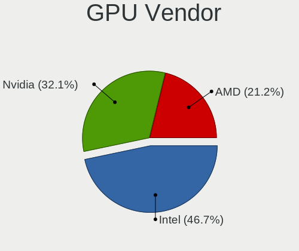

| Vendor | Computers | Percent |
|--------|-----------|---------|
| Intel  | 60        | 48%     |
| Nvidia | 40        | 32%     |
| AMD    | 25        | 20%     |

GPU Model
---------

Graphics card models

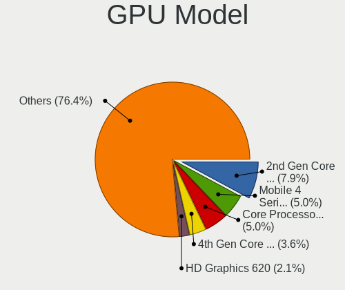

| Model                                                                                    | Computers | Percent |
|------------------------------------------------------------------------------------------|-----------|---------|
| Intel 2nd Generation Core Processor Family Integrated Graphics Controller                | 9         | 7.03%   |
| Intel Mobile 4 Series Chipset Integrated Graphics Controller                             | 7         | 5.47%   |
| Intel Core Processor Integrated Graphics Controller                                      | 7         | 5.47%   |
| Intel 4th Gen Core Processor Integrated Graphics Controller                              | 4         | 3.13%   |
| Intel HD Graphics 530                                                                    | 3         | 2.34%   |
| Intel Atom/Celeron/Pentium Processor x5-E8000/J3xxx/N3xxx Integrated Graphics Controller | 3         | 2.34%   |
| Intel Atom Processor Z36xxx/Z37xxx Series Graphics & Display                             | 3         | 2.34%   |
| Intel 3rd Gen Core processor Graphics Controller                                         | 3         | 2.34%   |
| AMD Stoney [Radeon R2/R3/R4/R5 Graphics]                                                 | 3         | 2.34%   |
| Nvidia GP106 [GeForce GTX 1060 3GB]                                                      | 2         | 1.56%   |
| Nvidia GK110 [GeForce GTX 780]                                                           | 2         | 1.56%   |
| Nvidia GF108M [GeForce GT 540M]                                                          | 2         | 1.56%   |
| Nvidia C79 [GeForce 9400M]                                                               | 2         | 1.56%   |
| Intel Xeon E3-1200 v3/4th Gen Core Processor Integrated Graphics Controller              | 2         | 1.56%   |
| Intel UHD Graphics 620                                                                   | 2         | 1.56%   |
| Intel HD Graphics 620                                                                    | 2         | 1.56%   |
| Intel HD Graphics 5500                                                                   | 2         | 1.56%   |
| Intel Haswell-ULT Integrated Graphics Controller                                         | 2         | 1.56%   |
| Intel CoffeeLake-H GT2 [UHD Graphics 630]                                                | 2         | 1.56%   |
| AMD Cedar [Radeon HD 5000/6000/7350/8350 Series]                                         | 2         | 1.56%   |
| AMD Baffin [Radeon RX 550 640SP / RX 560/560X]                                           | 2         | 1.56%   |
| Nvidia TU106M [GeForce RTX 2060 Mobile]                                                  | 1         | 0.78%   |
| Nvidia TU104 [GeForce RTX 2080 SUPER]                                                    | 1         | 0.78%   |
| Nvidia GT218 [GeForce 210]                                                               | 1         | 0.78%   |
| Nvidia GT216GLM [Quadro FX 880M]                                                         | 1         | 0.78%   |
| Nvidia GP108 [GeForce GT 1030]                                                           | 1         | 0.78%   |
| Nvidia GP107M [GeForce GTX 1050 Ti Mobile]                                               | 1         | 0.78%   |
| Nvidia GP104 [GeForce GTX 1080]                                                          | 1         | 0.78%   |
| Nvidia GM206 [GeForce GTX 960]                                                           | 1         | 0.78%   |
| Nvidia GM206 [GeForce GTX 950]                                                           | 1         | 0.78%   |
| Nvidia GM204 [GeForce GTX 970]                                                           | 1         | 0.78%   |
| Nvidia GM200 [GeForce GTX 980 Ti]                                                        | 1         | 0.78%   |
| Nvidia GM108M [GeForce 840M]                                                             | 1         | 0.78%   |
| Nvidia GM107M [GeForce GTX 960M]                                                         | 1         | 0.78%   |
| Nvidia GK208B [GeForce GT 730]                                                           | 1         | 0.78%   |
| Nvidia GK208B [GeForce GT 710]                                                           | 1         | 0.78%   |
| Nvidia GK107M [GeForce GT 755M]                                                          | 1         | 0.78%   |
| Nvidia GK107GLM [Quadro K2000M]                                                          | 1         | 0.78%   |
| Nvidia GK107GLM [Quadro K1000M]                                                          | 1         | 0.78%   |
| Nvidia GK107 [GeForce GTX 650]                                                           | 1         | 0.78%   |
| Nvidia GF119M [NVS 4200M]                                                                | 1         | 0.78%   |
| Nvidia GF108M [GeForce GT 620M/630M/635M/640M LE]                                        | 1         | 0.78%   |
| Nvidia GF108M [GeForce GT 525M]                                                          | 1         | 0.78%   |
| Nvidia GF106M [GeForce GTX 460M]                                                         | 1         | 0.78%   |
| Nvidia GF104 [GeForce GTX 460]                                                           | 1         | 0.78%   |
| Nvidia GA106M [GeForce RTX 3060 Mobile / Max-Q]                                          | 1         | 0.78%   |
| Nvidia G96CM [GeForce GT 220M]                                                           | 1         | 0.78%   |
| Nvidia G96CM [GeForce 9600M GT]                                                          | 1         | 0.78%   |
| Nvidia G96CM [GeForce 9600M GS]                                                          | 1         | 0.78%   |
| Nvidia G92GLM [Quadro FX 3700M]                                                          | 1         | 0.78%   |
| Nvidia G92 [GeForce GTS 250]                                                             | 1         | 0.78%   |
| Nvidia G86M [GeForce 8400M GS]                                                           | 1         | 0.78%   |
| Nvidia G84 [GeForce 8600 GT]                                                             | 1         | 0.78%   |
| Nvidia G73M [GeForce Go 7600]                                                            | 1         | 0.78%   |
| Intel Mobile GM965/GL960 Integrated Graphics Controller (secondary)                      | 1         | 0.78%   |
| Intel Mobile GM965/GL960 Integrated Graphics Controller (primary)                        | 1         | 0.78%   |
| Intel HD Graphics 630                                                                    | 1         | 0.78%   |
| Intel HD Graphics 500                                                                    | 1         | 0.78%   |
| Intel HD Graphics                                                                        | 1         | 0.78%   |
| Intel GeminiLake [UHD Graphics 600]                                                      | 1         | 0.78%   |

GPU Combo
---------

Combinations of graphics cards

| Name           | Computers | Percent |
|----------------|-----------|---------|
| 1 x Intel      | 43        | 39.81%  |
| 1 x Nvidia     | 26        | 24.07%  |
| 1 x AMD        | 22        | 20.37%  |
| Intel + Nvidia | 13        | 12.04%  |
| Intel + AMD    | 2         | 1.85%   |
| 2 x Nvidia     | 1         | 0.93%   |
| 2 x AMD        | 1         | 0.93%   |

GPU Driver
----------

Free vs proprietary

| Driver      | Computers | Percent |
|-------------|-----------|---------|
| Free        | 93        | 86.11%  |
| Proprietary | 8         | 7.41%   |
| Unknown     | 7         | 6.48%   |

GPU Memory
----------

Total video memory

| Size in GB | Computers | Percent |
|------------|-----------|---------|
| Unknown    | 51        | 47.22%  |
| 0.01-0.5   | 17        | 15.74%  |
| 0.51-1.0   | 16        | 14.81%  |
| 1.01-2.0   | 12        | 11.11%  |
| 3.01-4.0   | 5         | 4.63%   |
| 2.01-3.0   | 4         | 3.7%    |
| 5.01-6.0   | 2         | 1.85%   |
| 7.01-8.0   | 1         | 0.93%   |

Monitor
-------

Monitor Vendor
--------------

Monitor vendors

| Vendor                  | Computers | Percent |
|-------------------------|-----------|---------|
| Samsung Electronics     | 19        | 18.45%  |
| LG Display              | 18        | 17.48%  |
| AU Optronics            | 11        | 10.68%  |
| Chimei Innolux          | 7         | 6.8%    |
| Ancor Communications    | 6         | 5.83%   |
| Goldstar                | 4         | 3.88%   |
| Dell                    | 4         | 3.88%   |
| AOC                     | 4         | 3.88%   |
| Acer                    | 4         | 3.88%   |
| Philips                 | 3         | 2.91%   |
| Hewlett-Packard         | 3         | 2.91%   |
| ViewSonic               | 2         | 1.94%   |
| LG Philips              | 2         | 1.94%   |
| BOE                     | 2         | 1.94%   |
| Apple                   | 2         | 1.94%   |
| ___                     | 1         | 0.97%   |
| Tech Concepts           | 1         | 0.97%   |
| PANDA                   | 1         | 0.97%   |
| Panasonic               | 1         | 0.97%   |
| Microstep               | 1         | 0.97%   |
| Lenovo                  | 1         | 0.97%   |
| Insignia                | 1         | 0.97%   |
| Idek Iiyama             | 1         | 0.97%   |
| HKC                     | 1         | 0.97%   |
| Chi Mei Optoelectronics | 1         | 0.97%   |
| BenQ                    | 1         | 0.97%   |
| Unknown                 | 1         | 0.97%   |

Monitor Model
-------------

Monitor models

| Model                                                                 | Computers | Percent |
|-----------------------------------------------------------------------|-----------|---------|
| Samsung Electronics LCD Monitor SEC364A 1366x768 344x194mm 15.5-inch  | 2         | 1.9%    |
| Samsung Electronics LCD Monitor SDC4852 1366x768 344x194mm 15.5-inch  | 2         | 1.9%    |
| Samsung Electronics LCD Monitor SAM03D3 1360x768 410x256mm 19.0-inch  | 2         | 1.9%    |
| AU Optronics LCD Monitor AUO10EC 1366x768 344x193mm 15.5-inch         | 2         | 1.9%    |
| ___ AAA ___01FF 1366x768 700x390mm 31.5-inch                          | 1         | 0.95%   |
| ViewSonic VX2452 Series VSCDE2E 1920x1080 521x293mm 23.5-inch         | 1         | 0.95%   |
| ViewSonic VA2013wSERIES VSCF122 1600x900 443x249mm 20.0-inch          | 1         | 0.95%   |
| Tech Concepts LCD Monitor 43S431 3840x2160                            | 1         | 0.95%   |
| Samsung Electronics T24C310 SAM0AEA 1920x1080 531x299mm 24.0-inch     | 1         | 0.95%   |
| Samsung Electronics SMT22A550 SAM07AE 1920x1080 477x268mm 21.5-inch   | 1         | 0.95%   |
| Samsung Electronics S27R35A SAM7126 1920x1080 598x336mm 27.0-inch     | 1         | 0.95%   |
| Samsung Electronics LCD Monitor SEC5442 1440x900 303x190mm 14.1-inch  | 1         | 0.95%   |
| Samsung Electronics LCD Monitor SEC5441 1366x768 309x174mm 14.0-inch  | 1         | 0.95%   |
| Samsung Electronics LCD Monitor SEC4542 1366x768 309x174mm 14.0-inch  | 1         | 0.95%   |
| Samsung Electronics LCD Monitor SEC434E 1600x900 310x174mm 14.0-inch  | 1         | 0.95%   |
| Samsung Electronics LCD Monitor SEC3847 1440x900 367x230mm 17.1-inch  | 1         | 0.95%   |
| Samsung Electronics LCD Monitor SEC3254 1366x768 293x165mm 13.2-inch  | 1         | 0.95%   |
| Samsung Electronics LCD Monitor SAM0FEF 3840x2160 950x540mm 43.0-inch | 1         | 0.95%   |
| Samsung Electronics LCD Monitor SAM0900 1366x768 410x230mm 18.5-inch  | 1         | 0.95%   |
| Samsung Electronics LCD Monitor SAM07BC 1360x768 700x390mm 31.5-inch  | 1         | 0.95%   |
| Samsung Electronics LCD Monitor S24B300 3840x1080                     | 1         | 0.95%   |
| Philips PHL 241P4 PHL08D5 1920x1080 531x299mm 24.0-inch               | 1         | 0.95%   |
| Philips PHL 223V5LH PHLC114 1920x1080 477x268mm 21.5-inch             | 1         | 0.95%   |
| Philips 196VL PHLC07F 1366x768 409x230mm 18.5-inch                    | 1         | 0.95%   |
| PANDA LCD Monitor NCP0035 1920x1080 309x174mm 14.0-inch               | 1         | 0.95%   |
| Panasonic TV MEIA296 3840x2160 1280x720mm 57.8-inch                   | 1         | 0.95%   |
| Microstep LCD Monitor MSI MAG341CQ 3440x1440                          | 1         | 0.95%   |
| LG Philips LCD Monitor LPL3B01 1280x800 331x207mm 15.4-inch           | 1         | 0.95%   |
| LG Philips LCD Monitor LPL012B 1280x800 304x190mm 14.1-inch           | 1         | 0.95%   |
| LG Display LP156WH2-TLE1 LGDCF01 1366x768 344x194mm 15.5-inch         | 1         | 0.95%   |
| LG Display LCD Monitor LGD7001 1366x768 344x194mm 15.5-inch           | 1         | 0.95%   |
| LG Display LCD Monitor LGD05F2 1920x1080 344x194mm 15.5-inch          | 1         | 0.95%   |
| LG Display LCD Monitor LGD0589 1920x1080 294x165mm 13.3-inch          | 1         | 0.95%   |
| LG Display LCD Monitor LGD046F 1920x1080 344x194mm 15.5-inch          | 1         | 0.95%   |
| LG Display LCD Monitor LGD0430 1366x768 345x194mm 15.6-inch           | 1         | 0.95%   |
| LG Display LCD Monitor LGD03DD 1366x768 344x194mm 15.5-inch           | 1         | 0.95%   |
| LG Display LCD Monitor LGD03B3 1366x768 309x174mm 14.0-inch           | 1         | 0.95%   |
| LG Display LCD Monitor LGD0386 1366x768 309x174mm 14.0-inch           | 1         | 0.95%   |
| LG Display LCD Monitor LGD02F2 1366x768 344x194mm 15.5-inch           | 1         | 0.95%   |
| LG Display LCD Monitor LGD02D9 1920x1080 344x194mm 15.5-inch          | 1         | 0.95%   |
| LG Display LCD Monitor LGD02A6 1366x768 345x194mm 15.6-inch           | 1         | 0.95%   |
| LG Display LCD Monitor LGD0259 1920x1080 350x190mm 15.7-inch          | 1         | 0.95%   |
| LG Display LCD Monitor LGD0250 1366x768 345x194mm 15.6-inch           | 1         | 0.95%   |
| LG Display LCD Monitor LGD01DD 1600x900 382x215mm 17.3-inch           | 1         | 0.95%   |
| LG Display LCD Monitor LGD01CA 1600x900 382x215mm 17.3-inch           | 1         | 0.95%   |
| LG Display LCD Monitor LGD01AF 1680x1050 331x207mm 15.4-inch          | 1         | 0.95%   |
| LG Display LCD Monitor LGD018E 1920x1200 367x230mm 17.1-inch          | 1         | 0.95%   |
| Lenovo LCD Monitor LEN40B0 1366x768 344x194mm 15.5-inch               | 1         | 0.95%   |
| Insignia NS28D310NA15 BBY0028 1680x1050 640x384mm 29.4-inch           | 1         | 0.95%   |
| Idek Iiyama LCD Monitor PL2473HD 1920x1080                            | 1         | 0.95%   |
| HKC LCD Monitor HKC2400 1920x1080 597x336mm 27.0-inch                 | 1         | 0.95%   |
| Hewlett-Packard v185e HWP2838 1366x768 410x230mm 18.5-inch            | 1         | 0.95%   |
| Hewlett-Packard LCD Monitor w2338h                                    | 1         | 0.95%   |
| Hewlett-Packard Compaq W185q HWP284F 1366x768 410x230mm 18.5-inch     | 1         | 0.95%   |
| Goldstar W2243 GSM56FE 1920x1080 480x270mm 21.7-inch                  | 1         | 0.95%   |
| Goldstar RZ32LZ55 GSM7546 1360x768 930x523mm 42.0-inch                | 1         | 0.95%   |
| Goldstar M237WDP GSM5778 1920x1080 510x290mm 23.1-inch                | 1         | 0.95%   |
| Goldstar E1942 GSM4C09 1366x768 410x230mm 18.5-inch                   | 1         | 0.95%   |
| Goldstar 32LG7000 GSM765E 1920x1080 700x390mm 31.5-inch               | 1         | 0.95%   |
| Dell SE2717H/HX DELD0A1 1920x1080 598x336mm 27.0-inch                 | 1         | 0.95%   |

Monitor Resolution
------------------

Monitor screen resolution

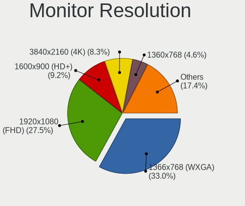

| Resolution         | Computers | Percent |
|--------------------|-----------|---------|
| 1366x768 (WXGA)    | 34        | 34%     |
| 1920x1080 (FHD)    | 27        | 27%     |
| 1600x900 (HD+)     | 9         | 9%      |
| 3840x2160 (4K)     | 7         | 7%      |
| 1360x768           | 5         | 5%      |
| 1440x900 (WXGA+)   | 4         | 4%      |
| 1680x1050 (WSXGA+) | 3         | 3%      |
| 1280x800 (WXGA)    | 3         | 3%      |
| 1920x1200 (WUXGA)  | 2         | 2%      |
| 3840x1080          | 1         | 1%      |
| 3440x1440          | 1         | 1%      |
| 2560x1440 (QHD)    | 1         | 1%      |
| 1280x720 (HD)      | 1         | 1%      |
| 1280x1024 (SXGA)   | 1         | 1%      |
| Unknown            | 1         | 1%      |

Monitor Diagonal
----------------

Diagonal size in inches

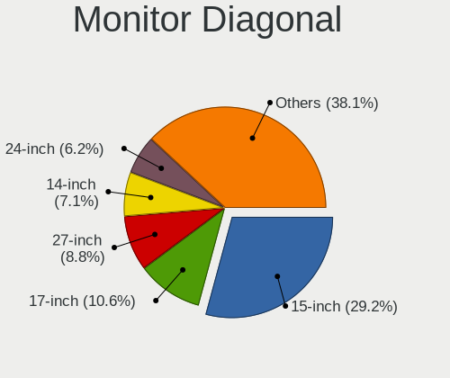

| Inches  | Computers | Percent |
|---------|-----------|---------|
| 15      | 29        | 28.16%  |
| 17      | 12        | 11.65%  |
| 27      | 8         | 7.77%   |
| 14      | 7         | 6.8%    |
| 24      | 6         | 5.83%   |
| 21      | 6         | 5.83%   |
| Unknown | 6         | 5.83%   |
| 31      | 5         | 4.85%   |
| 18      | 5         | 4.85%   |
| 13      | 5         | 4.85%   |
| 19      | 4         | 3.88%   |
| 84      | 2         | 1.94%   |
| 23      | 2         | 1.94%   |
| 22      | 2         | 1.94%   |
| 11      | 2         | 1.94%   |
| 42      | 1         | 0.97%   |
| 20      | 1         | 0.97%   |

Monitor Width
-------------

Physical width

| Width in mm | Computers | Percent |
|-------------|-----------|---------|
| 301-350     | 38        | 37.62%  |
| 401-500     | 17        | 16.83%  |
| 501-600     | 13        | 12.87%  |
| 351-400     | 13        | 12.87%  |
| 601-700     | 6         | 5.94%   |
| Unknown     | 6         | 5.94%   |
| 201-300     | 5         | 4.95%   |
| 1501-2000   | 2         | 1.98%   |
| 901-1000    | 1         | 0.99%   |

Aspect Ratio
------------

Proportional relationship between the width and the height

| Ratio   | Computers | Percent |
|---------|-----------|---------|
| 16/9    | 74        | 76.29%  |
| 16/10   | 16        | 16.49%  |
| Unknown | 5         | 5.15%   |
| 5/4     | 2         | 2.06%   |

Monitor Area
------------

Area in inch

| Area in inch | Computers | Percent |
|----------------|-----------|---------|
| 101-110        | 29        | 28.43%  |
| 201-250        | 10        | 9.8%    |
| 81-90          | 9         | 8.82%   |
| 301-350        | 8         | 7.84%   |
| 151-200        | 8         | 7.84%   |
| 141-150        | 6         | 5.88%   |
| 131-140        | 6         | 5.88%   |
| Unknown        | 6         | 5.88%   |
| 351-500        | 5         | 4.9%    |
| 121-130        | 5         | 4.9%    |
| 71-80          | 3         | 2.94%   |
| More than 1000 | 2         | 1.96%   |
| 51-60          | 2         | 1.96%   |
| 251-300        | 2         | 1.96%   |
| 501-1000       | 1         | 0.98%   |

Pixel Density
-------------

Pixels per inch

| Density | Computers | Percent |
|---------|-----------|---------|
| 101-120 | 37        | 37%     |
| 51-100  | 36        | 36%     |
| 121-160 | 14        | 14%     |
| Unknown | 6         | 6%      |
| 1-50    | 5         | 5%      |
| 161-240 | 2         | 2%      |

Multiple Monitors
-----------------

Total monitors connected

| Total | Computers | Percent |
|-------|-----------|---------|
| 1     | 90        | 83.33%  |
| 2     | 11        | 10.19%  |
| 0     | 6         | 5.56%   |
| 3     | 1         | 0.93%   |

Network
-------

Net Controller Vendor
---------------------

Controller vendors

| Vendor                          | Computers | Percent |
|---------------------------------|-----------|---------|
| Realtek Semiconductor           | 66        | 37.93%  |
| Intel                           | 38        | 21.84%  |
| Broadcom                        | 20        | 11.49%  |
| Qualcomm Atheros                | 19        | 10.92%  |
| Broadcom Limited                | 7         | 4.02%   |
| Ralink                          | 4         | 2.3%    |
| Nvidia                          | 4         | 2.3%    |
| TP-Link                         | 2         | 1.15%   |
| Samsung Electronics             | 2         | 1.15%   |
| MediaTek                        | 2         | 1.15%   |
| Marvell Technology Group        | 2         | 1.15%   |
| Toshiba                         | 1         | 0.57%   |
| Ralink Technology               | 1         | 0.57%   |
| Qualcomm Atheros Communications | 1         | 0.57%   |
| Motorola PCS                    | 1         | 0.57%   |
| Lenovo                          | 1         | 0.57%   |
| Huawei Technologies             | 1         | 0.57%   |
| D-Link System                   | 1         | 0.57%   |
| D-Link                          | 1         | 0.57%   |

Net Controller Model
--------------------

Controller models

| Model                                                                                         | Computers | Percent |
|-----------------------------------------------------------------------------------------------|-----------|---------|
| Realtek RTL8111/8168/8411 PCI Express Gigabit Ethernet Controller                             | 48        | 24.37%  |
| Realtek RTL810xE PCI Express Fast Ethernet controller                                         | 9         | 4.57%   |
| Broadcom BCM4313 802.11bgn Wireless Network Adapter                                           | 5         | 2.54%   |
| Qualcomm Atheros QCA9565 / AR9565 Wireless Network Adapter                                    | 4         | 2.03%   |
| Broadcom BCM4322 802.11a/b/g/n Wireless LAN Controller                                        | 4         | 2.03%   |
| Qualcomm Atheros AR9485 Wireless Network Adapter                                              | 3         | 1.52%   |
| Qualcomm Atheros AR9285 Wireless Network Adapter (PCI-Express)                                | 3         | 1.52%   |
| Intel Wireless 8265 / 8275                                                                    | 3         | 1.52%   |
| Intel Wi-Fi 6 AX200                                                                           | 3         | 1.52%   |
| Intel Centrino Advanced-N 6200                                                                | 3         | 1.52%   |
| Intel 82579V Gigabit Network Connection                                                       | 3         | 1.52%   |
| Intel 82579LM Gigabit Network Connection (Lewisville)                                         | 3         | 1.52%   |
| Samsung Galaxy series, misc. (tethering mode)                                                 | 2         | 1.02%   |
| Realtek RTL88x2bu [AC1200 Techkey]                                                            | 2         | 1.02%   |
| Realtek RTL8821CE 802.11ac PCIe Wireless Network Adapter                                      | 2         | 1.02%   |
| Realtek RTL8188EUS 802.11n Wireless Network Adapter                                           | 2         | 1.02%   |
| Ralink RT5390 Wireless 802.11n 1T/1R PCIe                                                     | 2         | 1.02%   |
| Qualcomm Atheros AR928X Wireless Network Adapter (PCI-Express)                                | 2         | 1.02%   |
| Qualcomm Atheros AR8151 v2.0 Gigabit Ethernet                                                 | 2         | 1.02%   |
| Nvidia MCP79 Ethernet                                                                         | 2         | 1.02%   |
| Nvidia MCP61 Ethernet                                                                         | 2         | 1.02%   |
| Intel Wireless 3160                                                                           | 2         | 1.02%   |
| Intel PRO/Wireless 3945ABG [Golan] Network Connection                                         | 2         | 1.02%   |
| Intel Dual Band Wireless-AC 3168NGW [Stone Peak]                                              | 2         | 1.02%   |
| Intel Centrino Ultimate-N 6300                                                                | 2         | 1.02%   |
| Intel 82577LM Gigabit Network Connection                                                      | 2         | 1.02%   |
| Broadcom NetLink BCM5784M Gigabit Ethernet PCIe                                               | 2         | 1.02%   |
| Broadcom Limited NetXtreme BCM5761e Gigabit Ethernet PCIe                                     | 2         | 1.02%   |
| Broadcom BCM43228 802.11a/b/g/n                                                               | 2         | 1.02%   |
| Broadcom BCM4312 802.11b/g LP-PHY                                                             | 2         | 1.02%   |
| TP-Link TL-WN821N v5/v6 [RTL8192EU]                                                           | 1         | 0.51%   |
| TP-Link Archer T9UH v1 [Realtek RTL8814AU]                                                    | 1         | 0.51%   |
| Toshiba F5521gw                                                                               | 1         | 0.51%   |
| Realtek RTL8811AU 802.11a/b/g/n/ac WLAN Adapter                                               | 1         | 0.51%   |
| Realtek RTL8723DE Wireless Network Adapter                                                    | 1         | 0.51%   |
| Realtek RTL8723BU 802.11b/g/n WLAN Adapter                                                    | 1         | 0.51%   |
| Realtek RTL8192CU 802.11n WLAN Adapter                                                        | 1         | 0.51%   |
| Realtek RTL8188SU 802.11n WLAN Adapter                                                        | 1         | 0.51%   |
| Realtek RTL8188RU 802.11n WLAN Adapter                                                        | 1         | 0.51%   |
| Realtek RTL8188FTV 802.11b/g/n 1T1R 2.4G WLAN Adapter                                         | 1         | 0.51%   |
| Realtek RTL8188CUS 802.11n WLAN Adapter                                                       | 1         | 0.51%   |
| Realtek RTL8169 PCI Gigabit Ethernet Controller                                               | 1         | 0.51%   |
| Realtek RTL8153 Gigabit Ethernet Adapter                                                      | 1         | 0.51%   |
| Realtek Realtek 8812AU/8821AU 802.11ac WLAN Adapter [USB Wireless Dual-Band Adapter 2.4/5Ghz] | 1         | 0.51%   |
| Realtek Killer E2500 Gigabit Ethernet Controller                                              | 1         | 0.51%   |
| Realtek 802.11n WLAN Adapter                                                                  | 1         | 0.51%   |
| Ralink RT2870/RT3070 Wireless Adapter                                                         | 1         | 0.51%   |
| Ralink RT3290 Wireless 802.11n 1T/1R PCIe                                                     | 1         | 0.51%   |
| Ralink RT2790 Wireless 802.11n 1T/2R PCIe                                                     | 1         | 0.51%   |
| Qualcomm Atheros QCA8171 Gigabit Ethernet                                                     | 1         | 0.51%   |
| Qualcomm Atheros Killer E220x Gigabit Ethernet Controller                                     | 1         | 0.51%   |
| Qualcomm Atheros AR9271 802.11n                                                               | 1         | 0.51%   |
| Qualcomm Atheros AR9462 Wireless Network Adapter                                              | 1         | 0.51%   |
| Qualcomm Atheros AR9287 Wireless Network Adapter (PCI-Express)                                | 1         | 0.51%   |
| Qualcomm Atheros AR8131 Gigabit Ethernet                                                      | 1         | 0.51%   |
| Qualcomm Atheros AR5416 Wireless Network Adapter [AR5008 802.11(a)bgn]                        | 1         | 0.51%   |
| Motorola PCS moto g(30)                                                                       | 1         | 0.51%   |
| MEDIATEK MT7921 802.11ax PCI Express Wireless Network Adapter                                 | 1         | 0.51%   |
| MediaTek 802.11 n WLAN                                                                        | 1         | 0.51%   |
| Marvell Group 88E8071 PCI-E Gigabit Ethernet Controller                                       | 1         | 0.51%   |

Wireless Vendor
---------------

Wireless vendors

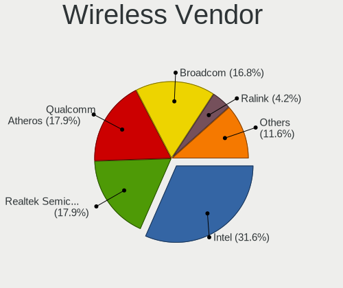

| Vendor                          | Computers | Percent |
|---------------------------------|-----------|---------|
| Intel                           | 27        | 30.68%  |
| Realtek Semiconductor           | 16        | 18.18%  |
| Broadcom                        | 16        | 18.18%  |
| Qualcomm Atheros                | 15        | 17.05%  |
| Ralink                          | 4         | 4.55%   |
| TP-Link                         | 2         | 2.27%   |
| MEDIATEK                        | 2         | 2.27%   |
| Broadcom Limited                | 2         | 2.27%   |
| Ralink Technology               | 1         | 1.14%   |
| Qualcomm Atheros Communications | 1         | 1.14%   |
| D-Link System                   | 1         | 1.14%   |
| D-Link                          | 1         | 1.14%   |

Wireless Model
--------------

Wireless models

| Model                                                                                         | Computers | Percent |
|-----------------------------------------------------------------------------------------------|-----------|---------|
| Broadcom BCM4313 802.11bgn Wireless Network Adapter                                           | 5         | 5.62%   |
| Qualcomm Atheros QCA9565 / AR9565 Wireless Network Adapter                                    | 4         | 4.49%   |
| Broadcom BCM4322 802.11a/b/g/n Wireless LAN Controller                                        | 4         | 4.49%   |
| Qualcomm Atheros AR9485 Wireless Network Adapter                                              | 3         | 3.37%   |
| Qualcomm Atheros AR9285 Wireless Network Adapter (PCI-Express)                                | 3         | 3.37%   |
| Intel Wireless 8265 / 8275                                                                    | 3         | 3.37%   |
| Intel Wi-Fi 6 AX200                                                                           | 3         | 3.37%   |
| Intel Centrino Advanced-N 6200                                                                | 3         | 3.37%   |
| Realtek RTL88x2bu [AC1200 Techkey]                                                            | 2         | 2.25%   |
| Realtek RTL8821CE 802.11ac PCIe Wireless Network Adapter                                      | 2         | 2.25%   |
| Realtek RTL8188EUS 802.11n Wireless Network Adapter                                           | 2         | 2.25%   |
| Ralink RT5390 Wireless 802.11n 1T/1R PCIe                                                     | 2         | 2.25%   |
| Qualcomm Atheros AR928X Wireless Network Adapter (PCI-Express)                                | 2         | 2.25%   |
| Intel Wireless 3160                                                                           | 2         | 2.25%   |
| Intel PRO/Wireless 3945ABG [Golan] Network Connection                                         | 2         | 2.25%   |
| Intel Dual Band Wireless-AC 3168NGW [Stone Peak]                                              | 2         | 2.25%   |
| Intel Centrino Ultimate-N 6300                                                                | 2         | 2.25%   |
| Broadcom BCM43228 802.11a/b/g/n                                                               | 2         | 2.25%   |
| Broadcom BCM4312 802.11b/g LP-PHY                                                             | 2         | 2.25%   |
| TP-Link TL-WN821N v5/v6 [RTL8192EU]                                                           | 1         | 1.12%   |
| TP-Link Archer T9UH v1 [Realtek RTL8814AU]                                                    | 1         | 1.12%   |
| Realtek RTL8811AU 802.11a/b/g/n/ac WLAN Adapter                                               | 1         | 1.12%   |
| Realtek RTL8723DE Wireless Network Adapter                                                    | 1         | 1.12%   |
| Realtek RTL8723BU 802.11b/g/n WLAN Adapter                                                    | 1         | 1.12%   |
| Realtek RTL8192CU 802.11n WLAN Adapter                                                        | 1         | 1.12%   |
| Realtek RTL8188SU 802.11n WLAN Adapter                                                        | 1         | 1.12%   |
| Realtek RTL8188RU 802.11n WLAN Adapter                                                        | 1         | 1.12%   |
| Realtek RTL8188FTV 802.11b/g/n 1T1R 2.4G WLAN Adapter                                         | 1         | 1.12%   |
| Realtek RTL8188CUS 802.11n WLAN Adapter                                                       | 1         | 1.12%   |
| Realtek Realtek 8812AU/8821AU 802.11ac WLAN Adapter [USB Wireless Dual-Band Adapter 2.4/5Ghz] | 1         | 1.12%   |
| Realtek 802.11n WLAN Adapter                                                                  | 1         | 1.12%   |
| Ralink RT2870/RT3070 Wireless Adapter                                                         | 1         | 1.12%   |
| Ralink RT3290 Wireless 802.11n 1T/1R PCIe                                                     | 1         | 1.12%   |
| Ralink RT2790 Wireless 802.11n 1T/2R PCIe                                                     | 1         | 1.12%   |
| Qualcomm Atheros AR9271 802.11n                                                               | 1         | 1.12%   |
| Qualcomm Atheros AR9462 Wireless Network Adapter                                              | 1         | 1.12%   |
| Qualcomm Atheros AR9287 Wireless Network Adapter (PCI-Express)                                | 1         | 1.12%   |
| Qualcomm Atheros AR5416 Wireless Network Adapter [AR5008 802.11(a)bgn]                        | 1         | 1.12%   |
| MEDIATEK MT7921 802.11ax PCI Express Wireless Network Adapter                                 | 1         | 1.12%   |
| MediaTek 802.11 n WLAN                                                                        | 1         | 1.12%   |
| Intel Wireless 7265                                                                           | 1         | 1.12%   |
| Intel Wireless 7260                                                                           | 1         | 1.12%   |
| Intel WiFi Link 5100                                                                          | 1         | 1.12%   |
| Intel Wi-Fi 6 AX210/AX211/AX411 160MHz                                                        | 1         | 1.12%   |
| Intel Ultimate N WiFi Link 5300                                                               | 1         | 1.12%   |
| Intel PRO/Wireless 5100 AGN [Shiloh] Network Connection                                       | 1         | 1.12%   |
| Intel Centrino Wireless-N 2230                                                                | 1         | 1.12%   |
| Intel Centrino Advanced-N 6230 [Rainbow Peak]                                                 | 1         | 1.12%   |
| Intel Centrino Advanced-N 6205 [Taylor Peak]                                                  | 1         | 1.12%   |
| Intel Cannon Lake PCH CNVi WiFi                                                               | 1         | 1.12%   |
| D-Link System DWA-126 802.11n Wireless Adapter [Atheros AR9271]                               | 1         | 1.12%   |
| D-Link DWL-G132 [Atheros AR5523]                                                              | 1         | 1.12%   |
| Broadcom Limited BCM4313 802.11bgn Wireless Network Adapter                                   | 1         | 1.12%   |
| Broadcom Limited BCM4312 802.11b/g LP-PHY                                                     | 1         | 1.12%   |
| Broadcom BCM43602 802.11ac Wireless LAN SoC                                                   | 1         | 1.12%   |
| Broadcom BCM4352 802.11ac Wireless Network Adapter                                            | 1         | 1.12%   |
| Broadcom BCM43225 802.11b/g/n                                                                 | 1         | 1.12%   |
| Broadcom BCM4311 802.11b/g WLAN                                                               | 1         | 1.12%   |

Ethernet Vendor
---------------

Ethernet vendors

| Vendor                   | Computers | Percent |
|--------------------------|-----------|---------|
| Realtek Semiconductor    | 59        | 55.66%  |
| Intel                    | 18        | 16.98%  |
| Broadcom                 | 8         | 7.55%   |
| Qualcomm Atheros         | 5         | 4.72%   |
| Broadcom Limited         | 5         | 4.72%   |
| Nvidia                   | 4         | 3.77%   |
| Samsung Electronics      | 2         | 1.89%   |
| Marvell Technology Group | 2         | 1.89%   |
| Motorola PCS             | 1         | 0.94%   |
| Lenovo                   | 1         | 0.94%   |
| Huawei Technologies      | 1         | 0.94%   |

Ethernet Model
--------------

Ethernet models

| Model                                                             | Computers | Percent |
|-------------------------------------------------------------------|-----------|---------|
| Realtek RTL8111/8168/8411 PCI Express Gigabit Ethernet Controller | 48        | 44.86%  |
| Realtek RTL810xE PCI Express Fast Ethernet controller             | 9         | 8.41%   |
| Intel 82579V Gigabit Network Connection                           | 3         | 2.8%    |
| Intel 82579LM Gigabit Network Connection (Lewisville)             | 3         | 2.8%    |
| Samsung Galaxy series, misc. (tethering mode)                     | 2         | 1.87%   |
| Qualcomm Atheros AR8151 v2.0 Gigabit Ethernet                     | 2         | 1.87%   |
| Nvidia MCP79 Ethernet                                             | 2         | 1.87%   |
| Nvidia MCP61 Ethernet                                             | 2         | 1.87%   |
| Intel 82577LM Gigabit Network Connection                          | 2         | 1.87%   |
| Broadcom NetLink BCM5784M Gigabit Ethernet PCIe                   | 2         | 1.87%   |
| Broadcom Limited NetXtreme BCM5761e Gigabit Ethernet PCIe         | 2         | 1.87%   |
| Realtek RTL8169 PCI Gigabit Ethernet Controller                   | 1         | 0.93%   |
| Realtek RTL8153 Gigabit Ethernet Adapter                          | 1         | 0.93%   |
| Realtek Killer E2500 Gigabit Ethernet Controller                  | 1         | 0.93%   |
| Qualcomm Atheros QCA8171 Gigabit Ethernet                         | 1         | 0.93%   |
| Qualcomm Atheros Killer E220x Gigabit Ethernet Controller         | 1         | 0.93%   |
| Qualcomm Atheros AR8131 Gigabit Ethernet                          | 1         | 0.93%   |
| Motorola PCS moto g(30)                                           | 1         | 0.93%   |
| Marvell Group 88E8071 PCI-E Gigabit Ethernet Controller           | 1         | 0.93%   |
| Marvell Group 88E8040T PCI-E Fast Ethernet Controller             | 1         | 0.93%   |
| Lenovo Thinkpad USB LAN                                           | 1         | 0.93%   |
| Intel I211 Gigabit Network Connection                             | 1         | 0.93%   |
| Intel Ethernet Connection X722 for 1GbE                           | 1         | 0.93%   |
| Intel Ethernet Connection I217-V                                  | 1         | 0.93%   |
| Intel Ethernet Connection I217-LM                                 | 1         | 0.93%   |
| Intel Ethernet Connection (4) I219-LM                             | 1         | 0.93%   |
| Intel Ethernet Connection (2) I219-LM                             | 1         | 0.93%   |
| Intel 82578DM Gigabit Network Connection                          | 1         | 0.93%   |
| Intel 82578DC Gigabit Network Connection                          | 1         | 0.93%   |
| Intel 82567LM Gigabit Network Connection                          | 1         | 0.93%   |
| Intel 82566DC Gigabit Network Connection                          | 1         | 0.93%   |
| Huawei E353/E3131                                                 | 1         | 0.93%   |
| Broadcom NetXtreme BCM57786 Gigabit Ethernet PCIe                 | 1         | 0.93%   |
| Broadcom NetXtreme BCM57766 Gigabit Ethernet PCIe                 | 1         | 0.93%   |
| Broadcom NetLink BCM5906M Fast Ethernet PCI Express               | 1         | 0.93%   |
| Broadcom NetLink BCM5787M Gigabit Ethernet PCI Express            | 1         | 0.93%   |
| Broadcom NetLink BCM57785 Gigabit Ethernet PCIe                   | 1         | 0.93%   |
| Broadcom NetLink BCM57780 Gigabit Ethernet PCIe                   | 1         | 0.93%   |
| Broadcom Limited NetXtreme BCM5754 Gigabit Ethernet PCI Express   | 1         | 0.93%   |
| Broadcom Limited NetLink BCM5787M Gigabit Ethernet PCI Express    | 1         | 0.93%   |
| Broadcom Limited NetLink BCM57780 Gigabit Ethernet PCIe           | 1         | 0.93%   |

Net Controller Kind
-------------------

Ethernet, WiFi or modem

| Kind     | Computers | Percent |
|----------|-----------|---------|
| Ethernet | 101       | 54.59%  |
| WiFi     | 83        | 44.86%  |
| Modem    | 1         | 0.54%   |

Used Controller
---------------

Currently used network controller

| Kind     | Computers | Percent |
|----------|-----------|---------|
| Ethernet | 93        | 56.36%  |
| WiFi     | 72        | 43.64%  |

NICs
----

Total network controllers on board

| Total | Computers | Percent |
|-------|-----------|---------|
| 2     | 67        | 62.04%  |
| 1     | 33        | 30.56%  |
| 0     | 6         | 5.56%   |
| 4     | 1         | 0.93%   |
| 3     | 1         | 0.93%   |

IPv6
----

IPv6 vs IPv4

| Used | Computers | Percent |
|------|-----------|---------|
| No   | 67        | 62.04%  |
| Yes  | 41        | 37.96%  |

Bluetooth
---------

Bluetooth Vendor
----------------

Controller vendors

| Vendor                          | Computers | Percent |
|---------------------------------|-----------|---------|
| Intel                           | 16        | 28.07%  |
| Cambridge Silicon Radio         | 8         | 14.04%  |
| Broadcom                        | 5         | 8.77%   |
| Qualcomm Atheros Communications | 4         | 7.02%   |
| Dell                            | 4         | 7.02%   |
| Realtek Semiconductor           | 3         | 5.26%   |
| Hewlett-Packard                 | 3         | 5.26%   |
| Foxconn / Hon Hai               | 3         | 5.26%   |
| Apple                           | 3         | 5.26%   |
| Lite-On Technology              | 2         | 3.51%   |
| ASUSTek Computer                | 2         | 3.51%   |
| Toshiba                         | 1         | 1.75%   |
| Ralink                          | 1         | 1.75%   |
| IMC Networks                    | 1         | 1.75%   |
| Askey Computer                  | 1         | 1.75%   |

Bluetooth Model
---------------

Controller models

| Model                                               | Computers | Percent |
|-----------------------------------------------------|-----------|---------|
| Cambridge Silicon Radio Bluetooth Dongle (HCI mode) | 8         | 14.04%  |
| Intel Bluetooth wireless interface                  | 7         | 12.28%  |
| Realtek  Bluetooth 4.2 Adapter                      | 3         | 5.26%   |
| Intel AX200 Bluetooth                               | 3         | 5.26%   |
| Qualcomm Atheros AR3012 Bluetooth 4.0               | 2         | 3.51%   |
| Intel Wireless-AC 3168 Bluetooth                    | 2         | 3.51%   |
| HP Bluetooth 2.0 Interface [Broadcom BCM2045]       | 2         | 3.51%   |
| Dell Wireless 370 Bluetooth Mini-card               | 2         | 3.51%   |
| Dell DW375 Bluetooth Module                         | 2         | 3.51%   |
| Broadcom BCM2070 Bluetooth 2.1 + EDR                | 2         | 3.51%   |
| ASUS Broadcom BCM20702A0 Bluetooth                  | 2         | 3.51%   |
| Apple Bluetooth USB Host Controller                 | 2         | 3.51%   |
| Toshiba Askey Bluetooth Module                      | 1         | 1.75%   |
| Ralink RT3290 Bluetooth                             | 1         | 1.75%   |
| Qualcomm Atheros  Bluetooth Device                  | 1         | 1.75%   |
| Qualcomm Atheros AR3011 Bluetooth                   | 1         | 1.75%   |
| Lite-On Atheros Bluetooth                           | 1         | 1.75%   |
| Lite-On Atheros AR3012 Bluetooth                    | 1         | 1.75%   |
| Intel Centrino Bluetooth Wireless Transceiver       | 1         | 1.75%   |
| Intel Centrino Advanced-N 6230 Bluetooth adapter    | 1         | 1.75%   |
| Intel Bluetooth 9460/9560 Jefferson Peak (JfP)      | 1         | 1.75%   |
| Intel AX210 Bluetooth                               | 1         | 1.75%   |
| IMC Networks Bluetooth Device                       | 1         | 1.75%   |
| HP Broadcom 2070 Bluetooth Combo                    | 1         | 1.75%   |
| Foxconn / Hon Hai Wireless_Device                   | 1         | 1.75%   |
| Foxconn / Hon Hai Bluetooth Device                  | 1         | 1.75%   |
| Foxconn / Hon Hai Acer Bluetooth module             | 1         | 1.75%   |
| Broadcom HP Portable SoftSailing                    | 1         | 1.75%   |
| Broadcom HP Portable Bumble Bee                     | 1         | 1.75%   |
| Broadcom BCM2070 Bluetooth Device                   | 1         | 1.75%   |
| Askey Bluetooth Device                              | 1         | 1.75%   |
| Apple Bluetooth Host Controller                     | 1         | 1.75%   |

Sound
-----

Sound Vendor
------------

Sound card vendors

| Vendor                    | Computers | Percent |
|---------------------------|-----------|---------|
| Intel                     | 78        | 49.68%  |
| Nvidia                    | 31        | 19.75%  |
| AMD                       | 30        | 19.11%  |
| C-Media Electronics       | 4         | 2.55%   |
| GN Netcom                 | 3         | 1.91%   |
| Texas Instruments         | 1         | 0.64%   |
| Sennheiser Communications | 1         | 0.64%   |
| Roland                    | 1         | 0.64%   |
| ROCCAT                    | 1         | 0.64%   |
| Realtek Semiconductor     | 1         | 0.64%   |
| Microsoft                 | 1         | 0.64%   |
| M-Audio                   | 1         | 0.64%   |
| JMTek                     | 1         | 0.64%   |
| iSoft Silicon             | 1         | 0.64%   |
| Creative Labs             | 1         | 0.64%   |
| AOKEO                     | 1         | 0.64%   |

Sound Model
-----------

Sound card models

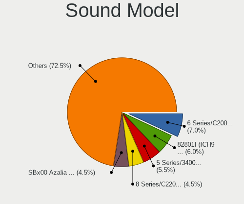

| Model                                                                      | Computers | Percent |
|----------------------------------------------------------------------------|-----------|---------|
| Intel 6 Series/C200 Series Chipset Family High Definition Audio Controller | 13        | 7.22%   |
| Intel 82801I (ICH9 Family) HD Audio Controller                             | 12        | 6.67%   |
| Intel 5 Series/3400 Series Chipset High Definition Audio                   | 11        | 6.11%   |
| Intel 8 Series/C220 Series Chipset High Definition Audio Controller        | 7         | 3.89%   |
| AMD SBx00 Azalia (Intel HDA)                                               | 6         | 3.33%   |
| Intel Xeon E3-1200 v3/4th Gen Core Processor HD Audio Controller           | 5         | 2.78%   |
| Intel 7 Series/C216 Chipset Family High Definition Audio Controller        | 5         | 2.78%   |
| Nvidia GK107 HDMI Audio Controller                                         | 4         | 2.22%   |
| Nvidia GF108 High Definition Audio Controller                              | 4         | 2.22%   |
| Intel Sunrise Point-LP HD Audio                                            | 4         | 2.22%   |
| Intel NM10/ICH7 Family High Definition Audio Controller                    | 4         | 2.22%   |
| Intel 100 Series/C230 Series Chipset Family HD Audio Controller            | 4         | 2.22%   |
| AMD FCH Azalia Controller                                                  | 4         | 2.22%   |
| AMD Baffin HDMI/DP Audio [Radeon RX 550 640SP / RX 560/560X]               | 4         | 2.22%   |
| Intel Wildcat Point-LP High Definition Audio Controller                    | 3         | 1.67%   |
| Intel Cannon Lake PCH cAVS                                                 | 3         | 1.67%   |
| Intel Broadwell-U Audio Controller                                         | 3         | 1.67%   |
| Intel 82801H (ICH8 Family) HD Audio Controller                             | 3         | 1.67%   |
| AMD High Definition Audio Controller                                       | 3         | 1.67%   |
| AMD Family 17h/19h HD Audio Controller                                     | 3         | 1.67%   |
| AMD Family 15h (Models 60h-6fh) Audio Controller                           | 3         | 1.67%   |
| AMD Cedar HDMI Audio [Radeon HD 5400/6300/7300 Series]                     | 3         | 1.67%   |
| Nvidia MCP79 High Definition Audio                                         | 2         | 1.11%   |
| Nvidia GP106 High Definition Audio Controller                              | 2         | 1.11%   |
| Nvidia GM206 High Definition Audio Controller                              | 2         | 1.11%   |
| Nvidia GK208 HDMI/DP Audio Controller                                      | 2         | 1.11%   |
| Nvidia GK110 High Definition Audio Controller                              | 2         | 1.11%   |
| Intel Haswell-ULT HD Audio Controller                                      | 2         | 1.11%   |
| Intel Atom Processor Z36xxx/Z37xxx Series High Definition Audio Controller | 2         | 1.11%   |
| Intel 8 Series HD Audio Controller                                         | 2         | 1.11%   |
| C-Media Electronics CMI8738/CMI8768 PCI Audio                              | 2         | 1.11%   |
| AMD Starship/Matisse HD Audio Controller                                   | 2         | 1.11%   |
| AMD RV710/730 HDMI Audio [Radeon HD 4000 series]                           | 2         | 1.11%   |
| AMD Raven/Raven2/Fenghuang HDMI/DP Audio Controller                        | 2         | 1.11%   |
| AMD Oland/Hainan/Cape Verde/Pitcairn HDMI Audio [Radeon HD 7000 Series]    | 2         | 1.11%   |
| Texas Instruments PCM2903B Audio CODEC                                     | 1         | 0.56%   |
| Sennheiser Communications PXC 550                                          | 1         | 0.56%   |
| Roland QUAD-CAPTURE                                                        | 1         | 0.56%   |
| ROCCAT Juke                                                                | 1         | 0.56%   |
| Realtek Semiconductor Realtek USB audio                                    | 1         | 0.56%   |
| Nvidia TU106 High Definition Audio Controller                              | 1         | 0.56%   |
| Nvidia TU104 HD Audio Controller                                           | 1         | 0.56%   |
| Nvidia MCP61 High Definition Audio                                         | 1         | 0.56%   |
| Nvidia High Definition Audio Controller                                    | 1         | 0.56%   |
| Nvidia GT216 HDMI Audio Controller                                         | 1         | 0.56%   |
| Nvidia GP108 High Definition Audio Controller                              | 1         | 0.56%   |
| Nvidia GP104 High Definition Audio Controller                              | 1         | 0.56%   |
| Nvidia GM204 High Definition Audio Controller                              | 1         | 0.56%   |
| Nvidia GM200 High Definition Audio                                         | 1         | 0.56%   |
| Nvidia GF119 HDMI Audio Controller                                         | 1         | 0.56%   |
| Nvidia GF106 High Definition Audio Controller                              | 1         | 0.56%   |
| Nvidia GF104 High Definition Audio Controller                              | 1         | 0.56%   |
| Nvidia Audio device                                                        | 1         | 0.56%   |
| Microsoft LifeChat LX-3000 Headset                                         | 1         | 0.56%   |
| M-Audio M-Audio Fast Track MKII                                            | 1         | 0.56%   |
| JMTek USB PnP Audio Device                                                 | 1         | 0.56%   |
| iSoft Silicon USB Ear-Microphone                                           | 1         | 0.56%   |
| Intel Lewisburg MROM 0                                                     | 1         | 0.56%   |
| Intel Celeron/Pentium Silver Processor High Definition Audio               | 1         | 0.56%   |
| Intel Celeron N3350/Pentium N4200/Atom E3900 Series Audio Cluster          | 1         | 0.56%   |

Memory
------

Memory Vendor
-------------

Memory module vendors

| Vendor              | Computers | Percent |
|---------------------|-----------|---------|
| Samsung Electronics | 2         | 28.57%  |
| Kingston            | 2         | 28.57%  |
| Unknown             | 1         | 14.29%  |
| SK Hynix            | 1         | 14.29%  |
| Corsair             | 1         | 14.29%  |

Memory Model
------------

Memory module models

| Model                                                      | Computers | Percent |
|------------------------------------------------------------|-----------|---------|
| Unknown RAM Module 2048MB SODIMM DDR2 533MT/s              | 1         | 12.5%   |
| Unknown RAM Module 1024MB SODIMM DDR2 533MT/s              | 1         | 12.5%   |
| SK Hynix RAM Module 4096MB SODIMM DDR3 1066MT/s            | 1         | 12.5%   |
| Samsung RAM M471B5273CH0-CH9 4GB SODIMM DDR3 1334MT/s      | 1         | 12.5%   |
| Samsung RAM M471B5173DB0-YK0 4096MB SODIMM DDR3 1600MT/s   | 1         | 12.5%   |
| Kingston RAM KHX2666C15S4/16G 16GB SODIMM DDR4 2667MT/s    | 1         | 12.5%   |
| Kingston RAM 9905428-020.A00LF 4096MB SODIMM DDR3 1067MT/s | 1         | 12.5%   |
| Corsair RAM CMK16GX4M2B3200C16 8GB DIMM DDR4 3600MT/s      | 1         | 12.5%   |

Memory Kind
-----------

Memory module kinds

| Kind | Computers | Percent |
|------|-----------|---------|
| DDR3 | 3         | 50%     |
| DDR4 | 2         | 33.33%  |
| DDR2 | 1         | 16.67%  |

Memory Form Factor
------------------

Physical design of the memory module

| Name   | Computers | Percent |
|--------|-----------|---------|
| SODIMM | 5         | 83.33%  |
| DIMM   | 1         | 16.67%  |

Memory Size
-----------

Memory module size

| Size  | Computers | Percent |
|-------|-----------|---------|
| 4096  | 3         | 42.86%  |
| 16384 | 1         | 14.29%  |
| 8192  | 1         | 14.29%  |
| 2048  | 1         | 14.29%  |
| 1024  | 1         | 14.29%  |

Memory Speed
------------

Memory module speed

| Speed | Computers | Percent |
|-------|-----------|---------|
| 3600  | 1         | 14.29%  |
| 2667  | 1         | 14.29%  |
| 1600  | 1         | 14.29%  |
| 1334  | 1         | 14.29%  |
| 1067  | 1         | 14.29%  |
| 1066  | 1         | 14.29%  |
| 533   | 1         | 14.29%  |

Printers & scanners
-------------------

Printer Vendor
--------------

Printer device vendors

| Vendor      | Computers | Percent |
|-------------|-----------|---------|
| Seiko Epson | 1         | 50%     |
| Canon       | 1         | 50%     |

Printer Model
-------------

Printer device models

| Model                    | Computers | Percent |
|--------------------------|-----------|---------|
| Seiko Epson L395 Series  | 1         | 50%     |
| Canon PIXMA MX920 Series | 1         | 50%     |

Scanner Vendor
--------------

Scanner device vendors

Zero info for selected period =(

Scanner Model
-------------

Scanner device models

Zero info for selected period =(

Camera
------

Camera Vendor
-------------

Camera device vendors

| Vendor                                 | Computers | Percent |
|----------------------------------------|-----------|---------|
| Chicony Electronics                    | 12        | 18.18%  |
| Silicon Motion                         | 5         | 7.58%   |
| Microdia                               | 5         | 7.58%   |
| Cheng Uei Precision Industry (Foxlink) | 5         | 7.58%   |
| Acer                                   | 4         | 6.06%   |
| Suyin                                  | 3         | 4.55%   |
| Quanta                                 | 3         | 4.55%   |
| Apple                                  | 3         | 4.55%   |
| Alcor Micro                            | 3         | 4.55%   |
| Sunplus Innovation Technology          | 2         | 3.03%   |
| Ricoh                                  | 2         | 3.03%   |
| Realtek Semiconductor                  | 2         | 3.03%   |
| Primax Electronics                     | 2         | 3.03%   |
| Microsoft                              | 2         | 3.03%   |
| Logitech                               | 2         | 3.03%   |
| Z-Star Microelectronics                | 1         | 1.52%   |
| YGTek                                  | 1         | 1.52%   |
| webcam                                 | 1         | 1.52%   |
| USB Camera                             | 1         | 1.52%   |
| Syntek                                 | 1         | 1.52%   |
| SHENZHEN EMEET TECHNOLOGY              | 1         | 1.52%   |
| Samsung Electronics                    | 1         | 1.52%   |
| Jieli Technology                       | 1         | 1.52%   |
| IMC Networks                           | 1         | 1.52%   |
| Creative Technology                    | 1         | 1.52%   |
| ALi                                    | 1         | 1.52%   |

Camera Model
------------

Camera device models

| Model                                                          | Computers | Percent |
|----------------------------------------------------------------|-----------|---------|
| Suyin Acer/HP Integrated Webcam [CN0314]                       | 2         | 3.03%   |
| Sunplus HD WebCam                                              | 2         | 3.03%   |
| Realtek USB Camera                                             | 2         | 3.03%   |
| Quanta HP Webcam                                               | 2         | 3.03%   |
| Microdia Integrated_Webcam_HD                                  | 2         | 3.03%   |
| Chicony HD WebCam                                              | 2         | 3.03%   |
| Chicony CNF9055 Toshiba Webcam                                 | 2         | 3.03%   |
| Chicony 2.0M UVC Webcam / CNF7129                              | 2         | 3.03%   |
| Apple Built-in iSight                                          | 2         | 3.03%   |
| Alcor Micro USB 2.0 Web Camera                                 | 2         | 3.03%   |
| Acer Lenovo EasyCamera                                         | 2         | 3.03%   |
| Z-Star WebCam SC-03FFL11739P                                   | 1         | 1.52%   |
| YGTek Webcam                                                   | 1         | 1.52%   |
| webcam webcam                                                  | 1         | 1.52%   |
| USB Camera USB Camera                                          | 1         | 1.52%   |
| Syntek Lenovo EasyCamera                                       | 1         | 1.52%   |
| Suyin UVC HD Webcam                                            | 1         | 1.52%   |
| Silicon Motion WebCam SCB-1100N                                | 1         | 1.52%   |
| Silicon Motion WebCam SCB-0385N                                | 1         | 1.52%   |
| Silicon Motion WebCam SC-0311139N                              | 1         | 1.52%   |
| Silicon Motion SM731 Camera                                    | 1         | 1.52%   |
| Silicon Motion 300k Pixel Camera                               | 1         | 1.52%   |
| SHENZHEN EMEET TECHNOLOGY HD Webcam eMeet C960                 | 1         | 1.52%   |
| Samsung Galaxy A5 (MTP)                                        | 1         | 1.52%   |
| Ricoh Laptop_Integrated_Webcam_3M                              | 1         | 1.52%   |
| Ricoh Integrated Webcam                                        | 1         | 1.52%   |
| Quanta Laptop_Integrated_Webcam_2HDM                           | 1         | 1.52%   |
| Primax HP Webcam-101                                           | 1         | 1.52%   |
| Primax HP HD Webcam [Fixed]                                    | 1         | 1.52%   |
| Microsoft LifeCam VX-5000                                      | 1         | 1.52%   |
| Microsoft LifeCam VX-500 [1357]                                | 1         | 1.52%   |
| Microdia Lenovo EasyCamera                                     | 1         | 1.52%   |
| Microdia Laptop_Integrated_Webcam_0.3M                         | 1         | 1.52%   |
| Microdia Dell Integrated HD Webcam                             | 1         | 1.52%   |
| Logitech Webcam C600                                           | 1         | 1.52%   |
| Logitech C922 Pro Stream Webcam                                | 1         | 1.52%   |
| Jieli USB PHY 2.0                                              | 1         | 1.52%   |
| IMC Networks USB2.0 HD UVC WebCam                              | 1         | 1.52%   |
| Creative Live! Cam Sync HD [VF0770]                            | 1         | 1.52%   |
| Chicony USB 2.0 Camera                                         | 1         | 1.52%   |
| Chicony HP Webcam                                              | 1         | 1.52%   |
| Chicony HP TrueVision HD Camera                                | 1         | 1.52%   |
| Chicony HP HD Webcam                                           | 1         | 1.52%   |
| Chicony FJ Camera                                              | 1         | 1.52%   |
| Chicony CNF7042                                                | 1         | 1.52%   |
| Cheng Uei Precision Industry (Foxlink) Webcam                  | 1         | 1.52%   |
| Cheng Uei Precision Industry (Foxlink) HP Webcam               | 1         | 1.52%   |
| Cheng Uei Precision Industry (Foxlink) HP TrueVision HD Camera | 1         | 1.52%   |
| Cheng Uei Precision Industry (Foxlink) HP Truevision HD        | 1         | 1.52%   |
| Cheng Uei Precision Industry (Foxlink) HP HD Webcam            | 1         | 1.52%   |
| Apple FaceTime HD Camera (Built-in)                            | 1         | 1.52%   |
| ALi Gateway Webcam                                             | 1         | 1.52%   |
| Alcor Micro Acer Integrated Webcam                             | 1         | 1.52%   |
| Acer SunplusIT Integrated Camera                               | 1         | 1.52%   |
| Acer Crystal Eye webcam                                        | 1         | 1.52%   |

Security
--------

Fingerprint Vendor
------------------

Fingerprint sensor vendors

| Vendor           | Computers | Percent |
|------------------|-----------|---------|
| Validity Sensors | 4         | 66.67%  |
| AuthenTec        | 2         | 33.33%  |

Fingerprint Model
-----------------

Fingerprint sensor models

| Model                                      | Computers | Percent |
|--------------------------------------------|-----------|---------|
| Validity Sensors VFS451 Fingerprint Reader | 2         | 33.33%  |
| Validity Sensors VFS495 Fingerprint Reader | 1         | 16.67%  |
| Validity Sensors VFS491                    | 1         | 16.67%  |
| AuthenTec Fingerprint Sensor               | 1         | 16.67%  |
| AuthenTec AES2550 Fingerprint Sensor       | 1         | 16.67%  |

Chipcard Vendor
---------------

Chipcard module vendors

| Vendor   | Computers | Percent |
|----------|-----------|---------|
| Broadcom | 3         | 100%    |

Chipcard Model
--------------

Chipcard module models

| Model                                          | Computers | Percent |
|------------------------------------------------|-----------|---------|
| Broadcom BCM5880 Secure Applications Processor | 3         | 100%    |

Unsupported
-----------

Unsupported Devices
-------------------

Total unsupported devices on board

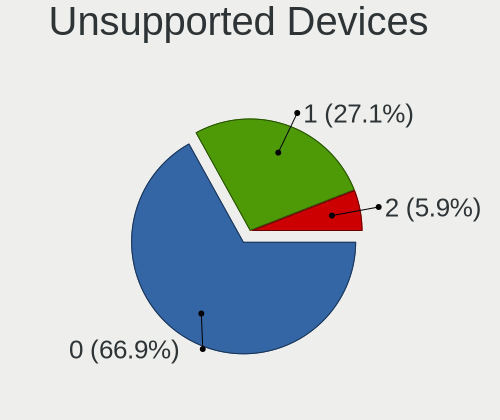

| Total | Computers | Percent |
|-------|-----------|---------|
| 0     | 78        | 72.22%  |
| 1     | 24        | 22.22%  |
| 2     | 6         | 5.56%   |

Unsupported Device Types
------------------------

Types of unsupported devices

| Type                  | Computers | Percent |
|-----------------------|-----------|---------|
| Graphics card         | 10        | 30.3%   |
| Net/wireless          | 6         | 18.18%  |
| Fingerprint reader    | 6         | 18.18%  |
| Storage               | 3         | 9.09%   |
| Multimedia controller | 3         | 9.09%   |
| Chipcard              | 3         | 9.09%   |
| Unassigned class      | 1         | 3.03%   |
| Bluetooth             | 1         | 3.03%   |

