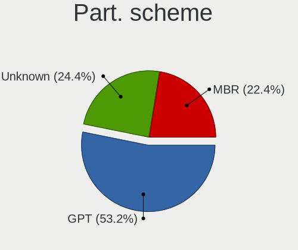
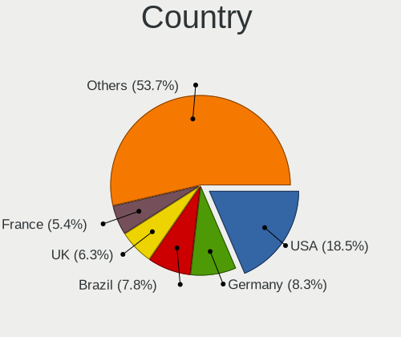
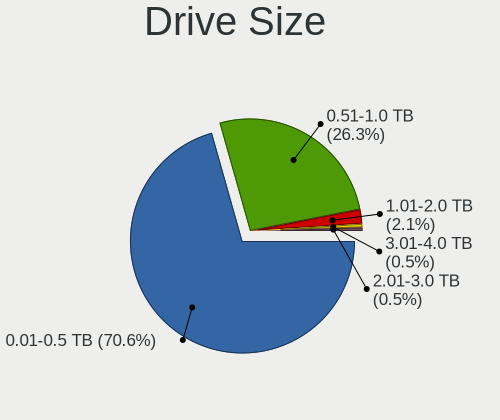
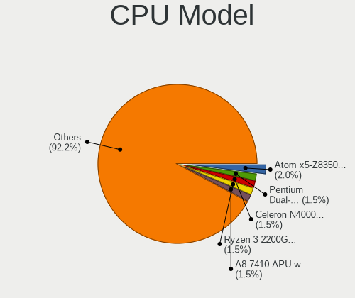
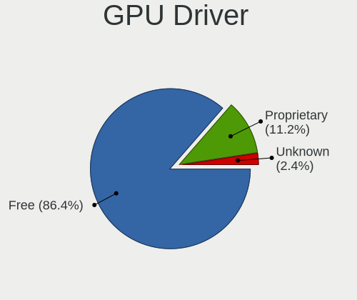
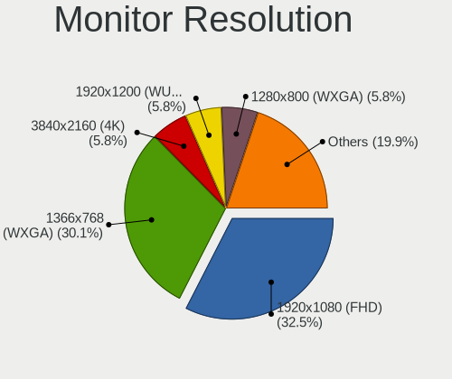
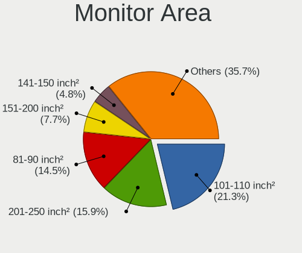
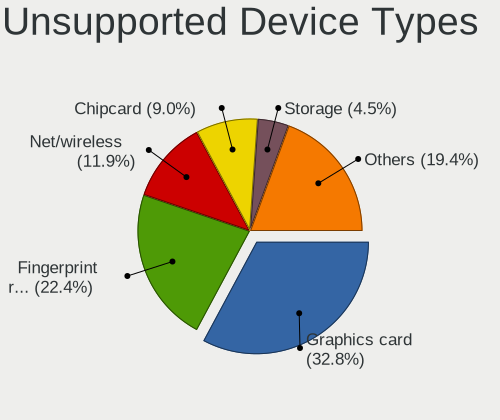

Linux Lite - Tested Hardware & Statistics
-----------------------------------------

A project to collect tested hardware configurations for Linux Lite.

Anyone can contribute to this report by the [hw-probe](https://github.com/linuxhw/hw-probe) tool:

    sudo -E hw-probe -all -upload

Please contribute! Especially if your hardware is rare.

This is a report for all computer types. See also reports for [desktops](/Dist/Linux_Lite/Desktop/README.md) and [notebooks](/Dist/Linux_Lite/Notebook/README.md).

Contents
--------

* [ Test Cases ](#test-cases)

* [ System ](#system)
  - [ OS                       ](#os)
  - [ OS Family                ](#os-family)
  - [ Kernel                   ](#kernel)
  - [ Kernel Family            ](#kernel-family)
  - [ Kernel Major Ver.        ](#kernel-major-ver)
  - [ Arch                     ](#arch)
  - [ DE                       ](#de)
  - [ Display Server           ](#display-server)
  - [ Display Manager          ](#display-manager)
  - [ OS Lang                  ](#os-lang)
  - [ Boot Mode                ](#boot-mode)
  - [ Filesystem               ](#filesystem)
  - [ Part. scheme             ](#part-scheme)
  - [ Dual Boot with Linux/BSD ](#dual-boot-with-linuxbsd)
  - [ Dual Boot (Win)          ](#dual-boot-win)

* [ Board ](#board)
  - [ Vendor                   ](#vendor)
  - [ Model                    ](#model)
  - [ Model Family             ](#model-family)
  - [ MFG Year                 ](#mfg-year)
  - [ Form Factor              ](#form-factor)
  - [ Secure Boot              ](#secure-boot)
  - [ Coreboot                 ](#coreboot)
  - [ RAM Size                 ](#ram-size)
  - [ RAM Used                 ](#ram-used)
  - [ Total Drives             ](#total-drives)
  - [ Has CD-ROM               ](#has-cd-rom)
  - [ Has Ethernet             ](#has-ethernet)
  - [ Has WiFi                 ](#has-wifi)
  - [ Has Bluetooth            ](#has-bluetooth)

* [ Location ](#location)
  - [ Country                  ](#country)
  - [ City                     ](#city)

* [ Drives ](#drives)
  - [ Drive Vendor             ](#drive-vendor)
  - [ Drive Model              ](#drive-model)
  - [ HDD Vendor               ](#hdd-vendor)
  - [ SSD Vendor               ](#ssd-vendor)
  - [ Drive Kind               ](#drive-kind)
  - [ Drive Connector          ](#drive-connector)
  - [ Drive Size               ](#drive-size)
  - [ Space Total              ](#space-total)
  - [ Space Used               ](#space-used)
  - [ Malfunc. Drives          ](#malfunc-drives)
  - [ Malfunc. Drive Vendor    ](#malfunc-drive-vendor)
  - [ Malfunc. HDD Vendor      ](#malfunc-hdd-vendor)
  - [ Malfunc. Drive Kind      ](#malfunc-drive-kind)
  - [ Failed Drives            ](#failed-drives)
  - [ Failed Drive Vendor      ](#failed-drive-vendor)
  - [ Drive Status             ](#drive-status)

* [ Storage controller ](#storage-controller)
  - [ Storage Vendor           ](#storage-vendor)
  - [ Storage Model            ](#storage-model)
  - [ Storage Kind             ](#storage-kind)

* [ Processor ](#processor)
  - [ CPU Vendor               ](#cpu-vendor)
  - [ CPU Model                ](#cpu-model)
  - [ CPU Model Family         ](#cpu-model-family)
  - [ CPU Cores                ](#cpu-cores)
  - [ CPU Sockets              ](#cpu-sockets)
  - [ CPU Threads              ](#cpu-threads)
  - [ CPU Op-Modes             ](#cpu-op-modes)
  - [ CPU Microcode            ](#cpu-microcode)
  - [ CPU Microarch            ](#cpu-microarch)

* [ Graphics ](#graphics)
  - [ GPU Vendor               ](#gpu-vendor)
  - [ GPU Model                ](#gpu-model)
  - [ GPU Combo                ](#gpu-combo)
  - [ GPU Driver               ](#gpu-driver)
  - [ GPU Memory               ](#gpu-memory)

* [ Monitor ](#monitor)
  - [ Monitor Vendor           ](#monitor-vendor)
  - [ Monitor Model            ](#monitor-model)
  - [ Monitor Resolution       ](#monitor-resolution)
  - [ Monitor Diagonal         ](#monitor-diagonal)
  - [ Monitor Width            ](#monitor-width)
  - [ Aspect Ratio             ](#aspect-ratio)
  - [ Monitor Area             ](#monitor-area)
  - [ Pixel Density            ](#pixel-density)
  - [ Multiple Monitors        ](#multiple-monitors)

* [ Network ](#network)
  - [ Net Controller Vendor    ](#net-controller-vendor)
  - [ Net Controller Model     ](#net-controller-model)
  - [ Wireless Vendor          ](#wireless-vendor)
  - [ Wireless Model           ](#wireless-model)
  - [ Ethernet Vendor          ](#ethernet-vendor)
  - [ Ethernet Model           ](#ethernet-model)
  - [ Net Controller Kind      ](#net-controller-kind)
  - [ Used Controller          ](#used-controller)
  - [ NICs                     ](#nics)
  - [ IPv6                     ](#ipv6)

* [ Bluetooth ](#bluetooth)
  - [ Bluetooth Vendor         ](#bluetooth-vendor)
  - [ Bluetooth Model          ](#bluetooth-model)

* [ Sound ](#sound)
  - [ Sound Vendor             ](#sound-vendor)
  - [ Sound Model              ](#sound-model)

* [ Memory ](#memory)
  - [ Memory Vendor            ](#memory-vendor)
  - [ Memory Model             ](#memory-model)
  - [ Memory Kind              ](#memory-kind)
  - [ Memory Form Factor       ](#memory-form-factor)
  - [ Memory Size              ](#memory-size)
  - [ Memory Speed             ](#memory-speed)

* [ Printers & scanners ](#printers--scanners)
  - [ Printer Vendor           ](#printer-vendor)
  - [ Printer Model            ](#printer-model)
  - [ Scanner Vendor           ](#scanner-vendor)
  - [ Scanner Model            ](#scanner-model)

* [ Camera ](#camera)
  - [ Camera Vendor            ](#camera-vendor)
  - [ Camera Model             ](#camera-model)

* [ Security ](#security)
  - [ Fingerprint Vendor       ](#fingerprint-vendor)
  - [ Fingerprint Model        ](#fingerprint-model)
  - [ Chipcard Vendor          ](#chipcard-vendor)
  - [ Chipcard Model           ](#chipcard-model)

* [ Unsupported ](#unsupported)
  - [ Unsupported Devices      ](#unsupported-devices)
  - [ Unsupported Device Types ](#unsupported-device-types)

Test Cases
----------

Total: 258

| Vendor        | Model                       | Form-Factor | Probe                                                      | Date         |
|---------------|-----------------------------|-------------|------------------------------------------------------------|--------------|
| ASUSTek       | M4A88T-I DELUXE             | Desktop     | [98c3cc204a](https://linux-hardware.org/?probe=98c3cc204a) | May 04, 2024 |
| Gigabyte      | 970A-UD3P                   | Desktop     | [99f91f2965](https://linux-hardware.org/?probe=99f91f2965) | May 04, 2024 |
| Gigabyte      | 970A-UD3P                   | Desktop     | [519d12ee29](https://linux-hardware.org/?probe=519d12ee29) | May 04, 2024 |
| ASRock        | Wolfdale1333-D667           | Desktop     | [15e7baeeb3](https://linux-hardware.org/?probe=15e7baeeb3) | May 03, 2024 |
| Dell          | Latitude D630               | Notebook    | [c9ae85eecc](https://linux-hardware.org/?probe=c9ae85eecc) | Apr 30, 2024 |
| Acer          | Aspire 7750G                | Notebook    | [961d70c1de](https://linux-hardware.org/?probe=961d70c1de) | Apr 27, 2024 |
| Dell          | Latitude D630               | Notebook    | [f59eb192f4](https://linux-hardware.org/?probe=f59eb192f4) | Apr 03, 2024 |
| Google        | Celes                       | Notebook    | [996befe940](https://linux-hardware.org/?probe=996befe940) | Mar 13, 2024 |
| Apple         | Mac-4BC72D62AD45599E Mac... | Mini pc     | [37172a9059](https://linux-hardware.org/?probe=37172a9059) | Mar 02, 2024 |
| Lenovo        | G40-45 80E1                 | Notebook    | [df12996678](https://linux-hardware.org/?probe=df12996678) | Feb 25, 2024 |
| Lenovo        | IdeaPad 320-15IKB 80YH      | Notebook    | [eaca048668](https://linux-hardware.org/?probe=eaca048668) | Feb 24, 2024 |
| Acer          | Aspire A315-24P             | Notebook    | [9925fee177](https://linux-hardware.org/?probe=9925fee177) | Feb 23, 2024 |
| Acer          | Aspire A315-24P             | Notebook    | [b76bdbcd5d](https://linux-hardware.org/?probe=b76bdbcd5d) | Feb 18, 2024 |
| Acer          | Aspire A315-24P             | Notebook    | [4abd6b79ce](https://linux-hardware.org/?probe=4abd6b79ce) | Feb 17, 2024 |
| ASUSTek       | Berkeley                    | Desktop     | [0192b193c3](https://linux-hardware.org/?probe=0192b193c3) | Feb 14, 2024 |
| Lenovo        | ThinkPad T430s 2356H83      | Notebook    | [7ee978c5e1](https://linux-hardware.org/?probe=7ee978c5e1) | Feb 08, 2024 |
| Lenovo        | G460 20041                  | Notebook    | [becc9c140b](https://linux-hardware.org/?probe=becc9c140b) | Jan 21, 2024 |
| ASUSTek       | VivoBook 14_ASUS Laptop ... | Notebook    | [92f943771a](https://linux-hardware.org/?probe=92f943771a) | Jan 19, 2024 |
| ASRock        | J4125B-ITX                  | Desktop     | [663e605574](https://linux-hardware.org/?probe=663e605574) | Jan 17, 2024 |
| ASRock        | J4105M                      | Desktop     | [2e5352f371](https://linux-hardware.org/?probe=2e5352f371) | Jan 16, 2024 |
| Acer          | Aspire 7750G                | Notebook    | [cdbe6b267f](https://linux-hardware.org/?probe=cdbe6b267f) | Dec 19, 2023 |
| Acer          | Aspire 7750G                | Notebook    | [6fc9570e4f](https://linux-hardware.org/?probe=6fc9570e4f) | Dec 19, 2023 |
| ASUSTek       | K52Jc                       | Notebook    | [54e52154d1](https://linux-hardware.org/?probe=54e52154d1) | Dec 07, 2023 |
| HP            | 81BB                        | All in one  | [38a445e315](https://linux-hardware.org/?probe=38a445e315) | Dec 04, 2023 |
| Gigabyte      | A320M-S2H-CF                | Desktop     | [c4949cf710](https://linux-hardware.org/?probe=c4949cf710) | Nov 28, 2023 |
| Medion        | E3223                       | Convertible | [7fd5d80169](https://linux-hardware.org/?probe=7fd5d80169) | Nov 20, 2023 |
| HP            | 81BB                        | All in one  | [a79e0b8d25](https://linux-hardware.org/?probe=a79e0b8d25) | Nov 15, 2023 |
| ASRock        | J3455M                      | Desktop     | [6a3463b7e9](https://linux-hardware.org/?probe=6a3463b7e9) | Nov 15, 2023 |
| Sony          | VGN-SZ750N                  | Notebook    | [aa0a3e3559](https://linux-hardware.org/?probe=aa0a3e3559) | Nov 13, 2023 |
| HP            | 3646h                       | Desktop     | [1cfad160f4](https://linux-hardware.org/?probe=1cfad160f4) | Nov 12, 2023 |
| Intel         | Jasper Lake Client Platf... | Notebook    | [75a2534386](https://linux-hardware.org/?probe=75a2534386) | Nov 07, 2023 |
| AMI           | Aptio CRB                   | Mini pc     | [e7d16a3fc2](https://linux-hardware.org/?probe=e7d16a3fc2) | Nov 03, 2023 |
| Lenovo        | IdeaPad 1 15AMN7 82VG       | Notebook    | [639a14d08d](https://linux-hardware.org/?probe=639a14d08d) | Nov 01, 2023 |
| Compaq(Int... | Michelangelo(LT1504)        | Notebook    | [678614e123](https://linux-hardware.org/?probe=678614e123) | Oct 27, 2023 |
| HP            | ENVY x360 Convertible 15... | Convertible | [97e8dc04f5](https://linux-hardware.org/?probe=97e8dc04f5) | Oct 13, 2023 |
| Acer          | Aspire ES1-572              | Notebook    | [2e48163fbd](https://linux-hardware.org/?probe=2e48163fbd) | Oct 06, 2023 |
| Acer          | Aspire ES1-572              | Notebook    | [651a8f8f97](https://linux-hardware.org/?probe=651a8f8f97) | Oct 05, 2023 |
| Fujitsu Si... | ESPRIMO Mobile V6535        | Notebook    | [12331db1c1](https://linux-hardware.org/?probe=12331db1c1) | Oct 03, 2023 |
| ASUSTek       | X550CL                      | Notebook    | [6c2de2dfb8](https://linux-hardware.org/?probe=6c2de2dfb8) | Sep 21, 2023 |
| Lenovo        | ThinkPad A475 20KMS08300    | Notebook    | [5f99185bbb](https://linux-hardware.org/?probe=5f99185bbb) | Sep 17, 2023 |
| Toshiba       | Satellite P305              | Notebook    | [d5ac020866](https://linux-hardware.org/?probe=d5ac020866) | Sep 15, 2023 |
| Lenovo        | ThinkPad A475 20KMS08300    | Notebook    | [eaaac22962](https://linux-hardware.org/?probe=eaaac22962) | Sep 15, 2023 |
| Gigabyte      | H510M S2H                   | Desktop     | [75eb2afaca](https://linux-hardware.org/?probe=75eb2afaca) | Sep 09, 2023 |
| Toshiba       | Satellite C850-C1S          | Notebook    | [ce5643add2](https://linux-hardware.org/?probe=ce5643add2) | Sep 09, 2023 |
| ASUSTek       | A8N32-SLI-Deluxe            | Desktop     | [26c288c533](https://linux-hardware.org/?probe=26c288c533) | Aug 30, 2023 |
| Lenovo        | ThinkPad T430s 2356H83      | Notebook    | [d623d73283](https://linux-hardware.org/?probe=d623d73283) | Aug 28, 2023 |
| Lenovo        | IdeaPad 330-14IGM 81D0      | Notebook    | [546610fecb](https://linux-hardware.org/?probe=546610fecb) | Aug 20, 2023 |
| Dell          | Latitude E7240              | Notebook    | [87a0310cf0](https://linux-hardware.org/?probe=87a0310cf0) | Aug 02, 2023 |
| Gigabyte      | Z77X-D3H                    | Desktop     | [41ad8c7fc0](https://linux-hardware.org/?probe=41ad8c7fc0) | Jul 26, 2023 |
| ASUSTek       | X502CA                      | Notebook    | [a2f77869ad](https://linux-hardware.org/?probe=a2f77869ad) | Jul 14, 2023 |
| Medion        | Akoya E6418 MD99620         | Notebook    | [7416e91f77](https://linux-hardware.org/?probe=7416e91f77) | Jul 14, 2023 |
| Dell          | 0GN4PW A00                  | Desktop     | [8380b94e4f](https://linux-hardware.org/?probe=8380b94e4f) | Jul 06, 2023 |
| HP            | Laptop 14-dk1xxx            | Notebook    | [8a66b6d6b6](https://linux-hardware.org/?probe=8a66b6d6b6) | Jul 03, 2023 |
| Lenovo        | IdeaPad 310S-14AST 80UL     | Notebook    | [f897f42089](https://linux-hardware.org/?probe=f897f42089) | Jul 03, 2023 |
| HP            | Laptop 15-db0xxx            | Notebook    | [892229f999](https://linux-hardware.org/?probe=892229f999) | Jun 28, 2023 |
| HP            | Laptop 15-db0xxx            | Notebook    | [6d470794e9](https://linux-hardware.org/?probe=6d470794e9) | Jun 28, 2023 |
| Lenovo        | 3740 NOK                    | Desktop     | [dff301aade](https://linux-hardware.org/?probe=dff301aade) | Jun 25, 2023 |
| UNOWHY        | Y13G010S4EI                 | Notebook    | [b36de255fe](https://linux-hardware.org/?probe=b36de255fe) | Jun 22, 2023 |
| UNOWHY        | Y13G010S4EI                 | Notebook    | [f8f4049a95](https://linux-hardware.org/?probe=f8f4049a95) | Jun 22, 2023 |
| AMI           | Intel                       | Desktop     | [72c570c2fa](https://linux-hardware.org/?probe=72c570c2fa) | Jun 14, 2023 |
| MSI           | H110M PRO-VH                | Desktop     | [d22b8a57cf](https://linux-hardware.org/?probe=d22b8a57cf) | Jun 13, 2023 |
| Dell          | Latitude E6420              | Notebook    | [e86a159ec5](https://linux-hardware.org/?probe=e86a159ec5) | Jun 03, 2023 |
| Dell          | Latitude E6420              | Notebook    | [01cd20c83d](https://linux-hardware.org/?probe=01cd20c83d) | Jun 03, 2023 |
| Inventec      | Dell Wyse Thin Client De... | Mini pc     | [b160fbf41e](https://linux-hardware.org/?probe=b160fbf41e) | May 21, 2023 |
| Inventec      | Dell Wyse Thin Client De... | Mini pc     | [cc90a5ca05](https://linux-hardware.org/?probe=cc90a5ca05) | May 21, 2023 |
| ASUSTek       | B85M-G                      | Desktop     | [72adb50172](https://linux-hardware.org/?probe=72adb50172) | May 20, 2023 |
| ASUSTek       | B85M-G                      | Desktop     | [50e85498e7](https://linux-hardware.org/?probe=50e85498e7) | May 20, 2023 |
| Lenovo        | ThinkPad X240 20AMS1J100    | Notebook    | [86edc6c6d6](https://linux-hardware.org/?probe=86edc6c6d6) | May 11, 2023 |
| American M... | IPPBT-RO                    | All in one  | [ea620e0681](https://linux-hardware.org/?probe=ea620e0681) | May 04, 2023 |
| ASRock        | B550M-ITX/ac                | Desktop     | [b77341d8f0](https://linux-hardware.org/?probe=b77341d8f0) | May 01, 2023 |
| Fujitsu Si... | D2811-A1 S26361-D2811-A1    | Desktop     | [b971501e28](https://linux-hardware.org/?probe=b971501e28) | May 01, 2023 |
| Apple         | MacBookAir4,1               | Notebook    | [87ab055a31](https://linux-hardware.org/?probe=87ab055a31) | Apr 27, 2023 |
| Lenovo        | IdeaPad 100-15IBY 80MJ      | Notebook    | [c5c1b213f2](https://linux-hardware.org/?probe=c5c1b213f2) | Apr 16, 2023 |
| Lenovo        | Yoga C740 81TC              | Convertible | [087e19943f](https://linux-hardware.org/?probe=087e19943f) | Apr 11, 2023 |
| Apple         | Mac-F4208DC8 PVT            | Desktop     | [cf325779ee](https://linux-hardware.org/?probe=cf325779ee) | Apr 08, 2023 |
| Lenovo        | IdeaPad 330S-15AST 81F9     | Notebook    | [d79463ea93](https://linux-hardware.org/?probe=d79463ea93) | Apr 04, 2023 |
| Toshiba       | QOSMIO X70-B                | Notebook    | [8d94a6c8e7](https://linux-hardware.org/?probe=8d94a6c8e7) | Mar 28, 2023 |
| HP            | EliteBook 2530p             | Notebook    | [06ad8714ea](https://linux-hardware.org/?probe=06ad8714ea) | Mar 22, 2023 |
| HP            | 0AE4h C                     | Desktop     | [fe2502088a](https://linux-hardware.org/?probe=fe2502088a) | Mar 21, 2023 |
| HP            | 0AE4h C                     | Desktop     | [71bdbbb36f](https://linux-hardware.org/?probe=71bdbbb36f) | Mar 19, 2023 |
| ASRock        | FM2A68M-DG3+                | Desktop     | [16b1b61892](https://linux-hardware.org/?probe=16b1b61892) | Mar 17, 2023 |
| Lenovo        | ThinkPad A475 20KMS08300    | Notebook    | [b42df5cbe0](https://linux-hardware.org/?probe=b42df5cbe0) | Mar 11, 2023 |
| Lenovo        | ThinkPad A475 20KMS08300    | Notebook    | [17a3030488](https://linux-hardware.org/?probe=17a3030488) | Mar 11, 2023 |
| Gateway       | Sonic-C                     | Notebook    | [b9f775b14e](https://linux-hardware.org/?probe=b9f775b14e) | Feb 28, 2023 |
| Gateway       | Sonic-C                     | Notebook    | [6def275f9b](https://linux-hardware.org/?probe=6def275f9b) | Feb 26, 2023 |
| ASUSTek       | G73Sw                       | Notebook    | [199c8805ee](https://linux-hardware.org/?probe=199c8805ee) | Feb 10, 2023 |
| HP            | 240 G3                      | Notebook    | [a977b66ced](https://linux-hardware.org/?probe=a977b66ced) | Feb 02, 2023 |
| HP            | 240 G3                      | Notebook    | [816a3f4b28](https://linux-hardware.org/?probe=816a3f4b28) | Feb 02, 2023 |
| ASUSTek       | M5A78L-M LX PLUS            | Desktop     | [cad4d19ab7](https://linux-hardware.org/?probe=cad4d19ab7) | Feb 02, 2023 |
| Fujitsu       | D3041-A1 S26361-D3041-A1    | Desktop     | [4762c2a35b](https://linux-hardware.org/?probe=4762c2a35b) | Jan 31, 2023 |
| ASUSTek       | G73Sw                       | Notebook    | [b8891cfc9b](https://linux-hardware.org/?probe=b8891cfc9b) | Jan 27, 2023 |
| ASUSTek       | G73Sw                       | Notebook    | [fb0a23c0e6](https://linux-hardware.org/?probe=fb0a23c0e6) | Jan 27, 2023 |
| ASUSTek       | G73Sw                       | Notebook    | [24b6a47ebb](https://linux-hardware.org/?probe=24b6a47ebb) | Jan 27, 2023 |
| MSI           | B550M PRO-VDH WIFI          | Desktop     | [b0289f0ef8](https://linux-hardware.org/?probe=b0289f0ef8) | Jan 22, 2023 |
| ASUSTek       | G73Sw                       | Notebook    | [adbc469f95](https://linux-hardware.org/?probe=adbc469f95) | Jan 22, 2023 |
| ASUSTek       | G73Sw                       | Notebook    | [9249ff32b3](https://linux-hardware.org/?probe=9249ff32b3) | Jan 22, 2023 |
| HP            | Stream Notebook PC 13       | Notebook    | [b31d60976b](https://linux-hardware.org/?probe=b31d60976b) | Jan 14, 2023 |
| ASUSTek       | M4N72-E                     | Desktop     | [1902350147](https://linux-hardware.org/?probe=1902350147) | Dec 28, 2022 |
| Acer          | Aspire A315-53              | Notebook    | [eb42b5e055](https://linux-hardware.org/?probe=eb42b5e055) | Dec 24, 2022 |
| Pegatron      | 2ACB                        | Desktop     | [f77ff3b9b5](https://linux-hardware.org/?probe=f77ff3b9b5) | Dec 19, 2022 |
| Pegatron      | H36FF                       | Notebook    | [f27fc61f18](https://linux-hardware.org/?probe=f27fc61f18) | Dec 18, 2022 |
| Thomson       | PT-NEO14A.2WH32             | Notebook    | [d028ff11a9](https://linux-hardware.org/?probe=d028ff11a9) | Dec 18, 2022 |
| Pegatron      | H36FF                       | Notebook    | [692955be3d](https://linux-hardware.org/?probe=692955be3d) | Dec 18, 2022 |
| Braview       | BRW-BSWI-D2                 | Desktop     | [1568a74103](https://linux-hardware.org/?probe=1568a74103) | Dec 11, 2022 |
| Packard Be... | MCP73VT-PM                  | Desktop     | [e2e6da1ef3](https://linux-hardware.org/?probe=e2e6da1ef3) | Nov 27, 2022 |
| Acer          | Nitro AN515-58              | Notebook    | [4916981641](https://linux-hardware.org/?probe=4916981641) | Nov 26, 2022 |
| Apple         | Mac-F2268DAE                | All in one  | [9224597686](https://linux-hardware.org/?probe=9224597686) | Oct 28, 2022 |
| UMAX          | VisionBook 12Wi 64G         | Notebook    | [9fe98911c1](https://linux-hardware.org/?probe=9fe98911c1) | Oct 27, 2022 |
| HP            | Compaq Presario CQ50        | Notebook    | [8546f55697](https://linux-hardware.org/?probe=8546f55697) | Oct 24, 2022 |
| HP            | Compaq Presario CQ50        | Notebook    | [3b1b5c18c6](https://linux-hardware.org/?probe=3b1b5c18c6) | Oct 24, 2022 |
| Acer          | Aspire 5600                 | Notebook    | [202a7e570e](https://linux-hardware.org/?probe=202a7e570e) | Oct 20, 2022 |
| MSI           | MS-N014                     | Notebook    | [4c41640fd3](https://linux-hardware.org/?probe=4c41640fd3) | Oct 12, 2022 |
| MSI           | MS-N014                     | Notebook    | [3144cac65a](https://linux-hardware.org/?probe=3144cac65a) | Oct 12, 2022 |
| Lenovo        | IdeaPad 100-14IBY 80MH      | Notebook    | [676289f650](https://linux-hardware.org/?probe=676289f650) | Oct 02, 2022 |
| HP            | Compaq 420                  | Notebook    | [d3e367cedc](https://linux-hardware.org/?probe=d3e367cedc) | Oct 01, 2022 |
| HP            | 1632                        | Desktop     | [f510159333](https://linux-hardware.org/?probe=f510159333) | Sep 19, 2022 |
| HP            | Presario V6000 (RG289UA#... | Notebook    | [7f0113694a](https://linux-hardware.org/?probe=7f0113694a) | Sep 15, 2022 |
| Apple         | Mac-63001698E7A34814 iMa... | All in one  | [1a999b09ae](https://linux-hardware.org/?probe=1a999b09ae) | Sep 12, 2022 |
| HP            | 1632                        | Desktop     | [f14389b9dd](https://linux-hardware.org/?probe=f14389b9dd) | Sep 10, 2022 |
| Samsung       | X420/X520                   | Notebook    | [a8ca7bb005](https://linux-hardware.org/?probe=a8ca7bb005) | Sep 04, 2022 |
| Fujitsu       | FMVNQ8P6                    | Notebook    | [5e34698f14](https://linux-hardware.org/?probe=5e34698f14) | Aug 28, 2022 |
| Sony          | VAIO                        | All in one  | [3ed1ad79e4](https://linux-hardware.org/?probe=3ed1ad79e4) | Aug 24, 2022 |
| ASUSTek       | UX303LN                     | Notebook    | [63d5525864](https://linux-hardware.org/?probe=63d5525864) | Aug 16, 2022 |
| Inventec      | Dell Wyse Thin Client De... | Mini pc     | [86523f9a5f](https://linux-hardware.org/?probe=86523f9a5f) | Aug 11, 2022 |
| Lenovo        | ThinkPad L480 20LS001AMC    | Notebook    | [47d4f751e1](https://linux-hardware.org/?probe=47d4f751e1) | Aug 09, 2022 |
| Apple         | MacBookAir6,1               | Notebook    | [ede7f6cdae](https://linux-hardware.org/?probe=ede7f6cdae) | Jul 23, 2022 |
| ASUSTek       | VivoBook 14_ASUS Laptop ... | Notebook    | [b846c98a96](https://linux-hardware.org/?probe=b846c98a96) | Jul 08, 2022 |
| ASUSTek       | M51BC                       | Desktop     | [fd0a9ef1c8](https://linux-hardware.org/?probe=fd0a9ef1c8) | Jul 08, 2022 |
| ASUSTek       | M51BC                       | Desktop     | [cc2f84d5d3](https://linux-hardware.org/?probe=cc2f84d5d3) | Jul 08, 2022 |
| HP            | Pavilion g4                 | Notebook    | [330078dbac](https://linux-hardware.org/?probe=330078dbac) | Jul 04, 2022 |
| ASUSTek       | X555YI                      | Notebook    | [762b96a2de](https://linux-hardware.org/?probe=762b96a2de) | Jul 02, 2022 |
| HP            | EliteBook 8440p             | Notebook    | [4bea8264d3](https://linux-hardware.org/?probe=4bea8264d3) | Jun 20, 2022 |
| Lenovo        | 103D SDK0J40697 WIN 3305... | Desktop     | [03c6ee002e](https://linux-hardware.org/?probe=03c6ee002e) | Jun 07, 2022 |
| Samsung       | 530XBB                      | Notebook    | [485a99ca42](https://linux-hardware.org/?probe=485a99ca42) | Jun 03, 2022 |
| Acer          | Aspire TC-895 V:1.0         | Desktop     | [19a5c1de8e](https://linux-hardware.org/?probe=19a5c1de8e) | May 29, 2022 |
| Minix         | Z64 V1.2                    | Notebook    | [97525a1dc3](https://linux-hardware.org/?probe=97525a1dc3) | May 27, 2022 |
| Lenovo        | Remore CRB Win8 STD MM D... | Desktop     | [eb96be3541](https://linux-hardware.org/?probe=eb96be3541) | May 24, 2022 |
| Lenovo        | Remore CRB Win8 STD MM D... | Desktop     | [f1a79871f7](https://linux-hardware.org/?probe=f1a79871f7) | May 24, 2022 |
| HP            | 3047h                       | Desktop     | [cc184c817b](https://linux-hardware.org/?probe=cc184c817b) | May 16, 2022 |
| Dell          | Inspiron 16 5620            | Notebook    | [b42e1cf95b](https://linux-hardware.org/?probe=b42e1cf95b) | May 13, 2022 |
| Minix         | Z64 V1.2                    | Notebook    | [8796deded0](https://linux-hardware.org/?probe=8796deded0) | May 12, 2022 |
| Dell          | MXG061                      | Notebook    | [119f6dd774](https://linux-hardware.org/?probe=119f6dd774) | May 09, 2022 |
| Lenovo        | ThinkCentre M91p 4518E2M    | Desktop     | [2553bf03d1](https://linux-hardware.org/?probe=2553bf03d1) | May 05, 2022 |
| Lenovo        | ThinkCentre M91p 4518E2M    | Desktop     | [03a7fc3c23](https://linux-hardware.org/?probe=03a7fc3c23) | May 05, 2022 |
| Lenovo        | IdeaPad Gaming 3 15IHU6 ... | Notebook    | [ab553d3a2f](https://linux-hardware.org/?probe=ab553d3a2f) | May 01, 2022 |
| Acer          | Extensa 5220                | Notebook    | [ebbd01171d](https://linux-hardware.org/?probe=ebbd01171d) | May 01, 2022 |
| ASUSTek       | TUF B450-PLUS GAMING        | Desktop     | [f7838121d2](https://linux-hardware.org/?probe=f7838121d2) | Apr 23, 2022 |
| Acer          | Aspire 1410                 | Notebook    | [703c2ec84a](https://linux-hardware.org/?probe=703c2ec84a) | Apr 21, 2022 |
| Lenovo        | ThinkPad T400 6475E13       | Notebook    | [cd49ac8445](https://linux-hardware.org/?probe=cd49ac8445) | Apr 08, 2022 |
| Dell          | 018D1Y A00                  | Desktop     | [0c6fc3cae4](https://linux-hardware.org/?probe=0c6fc3cae4) | Apr 07, 2022 |
| Dell          | MXG061                      | Notebook    | [9c91bd9487](https://linux-hardware.org/?probe=9c91bd9487) | Apr 06, 2022 |
| HP            | 2820h                       | Desktop     | [c4461b3710](https://linux-hardware.org/?probe=c4461b3710) | Apr 04, 2022 |
| Insignia      | NS-P11W7100                 | Notebook    | [daa476af8c](https://linux-hardware.org/?probe=daa476af8c) | Mar 28, 2022 |
| Dell          | MXG071                      | Notebook    | [ac0158dcb9](https://linux-hardware.org/?probe=ac0158dcb9) | Mar 27, 2022 |
| Dell          | 0HY9JP A02                  | Desktop     | [693b66ce17](https://linux-hardware.org/?probe=693b66ce17) | Mar 27, 2022 |
| Gigabyte      | B450M DS3H-CF               | Desktop     | [badb9dcc14](https://linux-hardware.org/?probe=badb9dcc14) | Mar 26, 2022 |
| Gigabyte      | B450M DS3H-CF               | Desktop     | [32115c5548](https://linux-hardware.org/?probe=32115c5548) | Mar 26, 2022 |
| HP            | 15 Notebook PC              | Notebook    | [0f99b7ff76](https://linux-hardware.org/?probe=0f99b7ff76) | Mar 21, 2022 |
| Dell          | 0HY9JP A02                  | Desktop     | [bc850554b2](https://linux-hardware.org/?probe=bc850554b2) | Mar 16, 2022 |
| Foxconn       | 2A8C                        | Desktop     | [80e5e3a26c](https://linux-hardware.org/?probe=80e5e3a26c) | Mar 15, 2022 |
| HP            | Compaq CQ45                 | Notebook    | [99286efd08](https://linux-hardware.org/?probe=99286efd08) | Mar 10, 2022 |
| HP            | Laptop 15-dw3xxx            | Notebook    | [2b748962fa](https://linux-hardware.org/?probe=2b748962fa) | Mar 06, 2022 |
| ASUSTek       | 900                         | Notebook    | [8373f78d4e](https://linux-hardware.org/?probe=8373f78d4e) | Feb 19, 2022 |
| Acer          | Aspire A315-53              | Notebook    | [6134bb8cba](https://linux-hardware.org/?probe=6134bb8cba) | Feb 18, 2022 |
| ABIT          | IP35-E                      | Desktop     | [67d9f7e94e](https://linux-hardware.org/?probe=67d9f7e94e) | Feb 17, 2022 |
| Acer          | Aspire 5600                 | Notebook    | [4b2259f040](https://linux-hardware.org/?probe=4b2259f040) | Feb 10, 2022 |
| Pegatron      | 2ACB                        | Desktop     | [b7987fdaa7](https://linux-hardware.org/?probe=b7987fdaa7) | Feb 10, 2022 |
| HP            | Laptop 15-dw3xxx            | Notebook    | [b596d9fdb1](https://linux-hardware.org/?probe=b596d9fdb1) | Feb 09, 2022 |
| Acer          | Aspire TC-895 V:1.0         | Desktop     | [4fe66f8af6](https://linux-hardware.org/?probe=4fe66f8af6) | Feb 09, 2022 |
| HP            | Compaq nw9440 (EY615ET#A... | Notebook    | [6a5c3254ab](https://linux-hardware.org/?probe=6a5c3254ab) | Jan 30, 2022 |
| HP            | Pavilion dv6500             | Notebook    | [15838ae11b](https://linux-hardware.org/?probe=15838ae11b) | Jan 12, 2022 |
| ASUSTek       | N53Jf                       | Notebook    | [3f0e64b85e](https://linux-hardware.org/?probe=3f0e64b85e) | Jan 03, 2022 |
| ASUSTek       | N53Jf                       | Notebook    | [6d7b0abdfa](https://linux-hardware.org/?probe=6d7b0abdfa) | Jan 03, 2022 |
| EVGA          | X58 SLI FTW3 Tylersburg     | Desktop     | [9e4639427d](https://linux-hardware.org/?probe=9e4639427d) | Jan 03, 2022 |
| EVGA          | X58 SLI FTW3 Tylersburg     | Desktop     | [d351220ea5](https://linux-hardware.org/?probe=d351220ea5) | Jan 02, 2022 |
| EVGA          | X58 SLI FTW3 Tylersburg     | Desktop     | [b2786130fb](https://linux-hardware.org/?probe=b2786130fb) | Jan 02, 2022 |
| ASUSTek       | X541SA                      | Notebook    | [26f2eeeefc](https://linux-hardware.org/?probe=26f2eeeefc) | Dec 31, 2021 |
| HP            | Pavilion dv6500             | Notebook    | [978ee4328d](https://linux-hardware.org/?probe=978ee4328d) | Dec 19, 2021 |
| ASRock        | H61M-VG3                    | Desktop     | [392a957541](https://linux-hardware.org/?probe=392a957541) | Dec 17, 2021 |
| Acer          | Aspire 5600                 | Notebook    | [25b1e50c64](https://linux-hardware.org/?probe=25b1e50c64) | Dec 12, 2021 |
| Gigabyte      | GA-E350N                    | Desktop     | [10d55dd433](https://linux-hardware.org/?probe=10d55dd433) | Dec 02, 2021 |
| Apple         | Mac-F42386C8 PVT            | All in one  | [64eba568a1](https://linux-hardware.org/?probe=64eba568a1) | Nov 25, 2021 |
| HP            | Compaq 2510p                | Notebook    | [8bc24dae3e](https://linux-hardware.org/?probe=8bc24dae3e) | Nov 23, 2021 |
| HP            | Compaq 2510p                | Notebook    | [c76241a894](https://linux-hardware.org/?probe=c76241a894) | Nov 22, 2021 |
| Samsung       | 905S3G/906S3G/915S3G/930... | Notebook    | [b7306537cc](https://linux-hardware.org/?probe=b7306537cc) | Nov 10, 2021 |
| Acer          | Aspire 5600                 | Notebook    | [7e2da6d3e9](https://linux-hardware.org/?probe=7e2da6d3e9) | Oct 26, 2021 |
| Dell          | MXG061                      | Notebook    | [89a5b20193](https://linux-hardware.org/?probe=89a5b20193) | Oct 10, 2021 |
| Biostar       | G41D3C                      | Desktop     | [433bc7cf78](https://linux-hardware.org/?probe=433bc7cf78) | Oct 10, 2021 |
| Biostar       | G41D3C                      | Desktop     | [90dc88db01](https://linux-hardware.org/?probe=90dc88db01) | Oct 02, 2021 |
| Acer          | Swift SF314-56              | Notebook    | [263d6e38b7](https://linux-hardware.org/?probe=263d6e38b7) | Oct 01, 2021 |
| Acer          | Swift SF314-56              | Notebook    | [bb0f894bce](https://linux-hardware.org/?probe=bb0f894bce) | Oct 01, 2021 |
| ASUSTek       | M5A78L LE                   | Desktop     | [ddb041ded0](https://linux-hardware.org/?probe=ddb041ded0) | Sep 15, 2021 |
| ASUSTek       | M5A78L LE                   | Desktop     | [a9335318aa](https://linux-hardware.org/?probe=a9335318aa) | Sep 15, 2021 |
| Dell          | Vostro1710                  | Notebook    | [d50123c66a](https://linux-hardware.org/?probe=d50123c66a) | Sep 01, 2021 |
| Dell          | Inspiron 5452               | Notebook    | [0c9b3ec7a9](https://linux-hardware.org/?probe=0c9b3ec7a9) | Aug 07, 2021 |
| Intel         | DG31PR AAD97573-300         | Desktop     | [0a0a8059c2](https://linux-hardware.org/?probe=0a0a8059c2) | Aug 04, 2021 |
| Intel         | DG31PR AAD97573-300         | Desktop     | [6b7f5cdcc8](https://linux-hardware.org/?probe=6b7f5cdcc8) | Jul 21, 2021 |
| HP            | EliteBook Folio 9470m       | Notebook    | [b2b851f7d2](https://linux-hardware.org/?probe=b2b851f7d2) | Jul 12, 2021 |
| ASUSTek       | X541SA                      | Notebook    | [ed8bb15f60](https://linux-hardware.org/?probe=ed8bb15f60) | Jul 11, 2021 |
| HP            | 0A98h                       | Desktop     | [9844591cd4](https://linux-hardware.org/?probe=9844591cd4) | Jul 02, 2021 |
| ECS           | Livermore                   | Desktop     | [91b29dad17](https://linux-hardware.org/?probe=91b29dad17) | Jun 23, 2021 |
| HP            | Laptop 14-cm0xxx            | Notebook    | [5943266aca](https://linux-hardware.org/?probe=5943266aca) | Jun 18, 2021 |
| HP            | Laptop 14-cm0xxx            | Notebook    | [3b4a122b75](https://linux-hardware.org/?probe=3b4a122b75) | Jun 18, 2021 |
| Fujitsu       | LIFEBOOK U747               | Notebook    | [117e8bf660](https://linux-hardware.org/?probe=117e8bf660) | Jun 17, 2021 |
| Lenovo        | IdeaPad Slim 1-14AST-05 ... | Notebook    | [a9255b2217](https://linux-hardware.org/?probe=a9255b2217) | Jun 04, 2021 |
| MSI           | Boston                      | Desktop     | [5cca21c281](https://linux-hardware.org/?probe=5cca21c281) | Apr 26, 2021 |
| ASUSTek       | VivoBook_ASUSLaptop E203... | Notebook    | [58bf661e8d](https://linux-hardware.org/?probe=58bf661e8d) | Apr 15, 2021 |
| ASUSTek       | K50IE                       | Notebook    | [b0bcc6c31c](https://linux-hardware.org/?probe=b0bcc6c31c) | Apr 12, 2021 |
| MSI           | B75A-G43                    | Desktop     | [87a3e8d42c](https://linux-hardware.org/?probe=87a3e8d42c) | Apr 07, 2021 |
| AWOW          | PC BOX                      | Mini pc     | [b9140b8786](https://linux-hardware.org/?probe=b9140b8786) | Mar 29, 2021 |
| ASUSTek       | K54LY                       | Notebook    | [dc7d86f51e](https://linux-hardware.org/?probe=dc7d86f51e) | Mar 21, 2021 |
| Acer          | Aspire V5-552               | Notebook    | [7a32a8a1c3](https://linux-hardware.org/?probe=7a32a8a1c3) | Mar 03, 2021 |
| HP            | Compaq 6735b                | Notebook    | [0f2afbc99a](https://linux-hardware.org/?probe=0f2afbc99a) | Feb 18, 2021 |
| Dell          | Inspiron 7559               | Notebook    | [4d4377253f](https://linux-hardware.org/?probe=4d4377253f) | Feb 15, 2021 |
| HP            | Laptop 17-by2xxx            | Notebook    | [729abf0085](https://linux-hardware.org/?probe=729abf0085) | Jan 30, 2021 |
| Acer          | Predator PH317-52           | Notebook    | [1bd05ad341](https://linux-hardware.org/?probe=1bd05ad341) | Jan 24, 2021 |
| Gigabyte      | X570 AORUS MASTER           | Desktop     | [84cb4ded95](https://linux-hardware.org/?probe=84cb4ded95) | Dec 30, 2020 |
| HP            | 655                         | Notebook    | [a6913cacf3](https://linux-hardware.org/?probe=a6913cacf3) | Dec 28, 2020 |
| HP            | 655                         | Notebook    | [2a4c81218e](https://linux-hardware.org/?probe=2a4c81218e) | Dec 27, 2020 |
| Toshiba       | Satellite T215D             | Notebook    | [084f254e1f](https://linux-hardware.org/?probe=084f254e1f) | Dec 23, 2020 |
| Toshiba       | Satellite T215D             | Notebook    | [bdb8fe4e55](https://linux-hardware.org/?probe=bdb8fe4e55) | Dec 23, 2020 |
| Minix         | NEO Z83-4 V1.1              | Desktop     | [19e83c7c24](https://linux-hardware.org/?probe=19e83c7c24) | Dec 21, 2020 |
| Gigabyte      | X570 AORUS MASTER           | Desktop     | [77f93a017c](https://linux-hardware.org/?probe=77f93a017c) | Dec 21, 2020 |
| Gigabyte      | X570 AORUS MASTER           | Desktop     | [a6654cf4f1](https://linux-hardware.org/?probe=a6654cf4f1) | Dec 21, 2020 |
| Minix         | NEO Z83-4 V1.1              | Desktop     | [8f8f606051](https://linux-hardware.org/?probe=8f8f606051) | Dec 16, 2020 |
| Lenovo        | IdeaPad 320-15ABR 80XS      | Notebook    | [680d4771b2](https://linux-hardware.org/?probe=680d4771b2) | Dec 15, 2020 |
| ASUSTek       | 1001PX                      | Notebook    | [9f911bde1c](https://linux-hardware.org/?probe=9f911bde1c) | Dec 11, 2020 |
| Acer          | Aspire 5750                 | Notebook    | [ba47872fd5](https://linux-hardware.org/?probe=ba47872fd5) | Dec 02, 2020 |
| Acer          | Aspire 5750                 | Notebook    | [c4216f5d80](https://linux-hardware.org/?probe=c4216f5d80) | Dec 02, 2020 |
| HP            | 0ACCh                       | Desktop     | [7f4d2a2df4](https://linux-hardware.org/?probe=7f4d2a2df4) | Nov 23, 2020 |
| HP            | 0ACCh                       | Desktop     | [d28f3f3195](https://linux-hardware.org/?probe=d28f3f3195) | Nov 23, 2020 |
| Lenovo        | ThinkCentre M91p 4524RS6    | Desktop     | [cf9c213443](https://linux-hardware.org/?probe=cf9c213443) | Nov 21, 2020 |
| Lenovo        | ThinkCentre M91p 4524RS6    | Desktop     | [66d1757c3f](https://linux-hardware.org/?probe=66d1757c3f) | Nov 21, 2020 |
| HP            | 3032h                       | Desktop     | [1a10cb8912](https://linux-hardware.org/?probe=1a10cb8912) | Nov 20, 2020 |
| Intel         | H61M-S1                     | Desktop     | [f31ad89e75](https://linux-hardware.org/?probe=f31ad89e75) | Nov 02, 2020 |
| Intel         | H61M-S1                     | Desktop     | [f381b5e487](https://linux-hardware.org/?probe=f381b5e487) | Nov 02, 2020 |
| Lenovo        | ThinkCentre A55 9265BL7     | Desktop     | [1e00064286](https://linux-hardware.org/?probe=1e00064286) | Oct 30, 2020 |
| HP            | 2AA6 PVT                    | Desktop     | [3ee3ed2e83](https://linux-hardware.org/?probe=3ee3ed2e83) | Oct 06, 2020 |
| Dell          | Latitude D530               | Notebook    | [4fe18e86ac](https://linux-hardware.org/?probe=4fe18e86ac) | Sep 27, 2020 |
| MSI           | Z77A-G43                    | Desktop     | [4420c076a7](https://linux-hardware.org/?probe=4420c076a7) | Sep 03, 2020 |
| HP            | x2 Detachable 10-p0XX       | Tablet      | [2a6ae45bc4](https://linux-hardware.org/?probe=2a6ae45bc4) | Aug 20, 2020 |
| ASRock        | N68C-S UCC                  | Desktop     | [a20482ea67](https://linux-hardware.org/?probe=a20482ea67) | Aug 12, 2020 |
| ASRock        | N68C-S UCC                  | Desktop     | [cb782efc58](https://linux-hardware.org/?probe=cb782efc58) | Aug 07, 2020 |
| Jetway        | I61MG4                      | Desktop     | [f677e427be](https://linux-hardware.org/?probe=f677e427be) | Jul 30, 2020 |
| Jetway        | I61MG4                      | Desktop     | [2e5f79f476](https://linux-hardware.org/?probe=2e5f79f476) | Jul 29, 2020 |
| Lenovo        | MIIX 300-10IBY 80NR         | Tablet      | [cf8c7c6ae6](https://linux-hardware.org/?probe=cf8c7c6ae6) | Jul 29, 2020 |
| Acer          | Aspire ES1-511              | Notebook    | [63a7ae1967](https://linux-hardware.org/?probe=63a7ae1967) | Jul 24, 2020 |
| Google        | Chell                       | Notebook    | [cf727e9a6e](https://linux-hardware.org/?probe=cf727e9a6e) | Jul 23, 2020 |
| ASUSTek       | X751LD                      | Notebook    | [2d9ea757d1](https://linux-hardware.org/?probe=2d9ea757d1) | Jul 14, 2020 |
| ASUSTek       | X751LD                      | Notebook    | [1a4ee704d9](https://linux-hardware.org/?probe=1a4ee704d9) | Jul 14, 2020 |
| Lenovo        | 3000 V200 0764A11           | Notebook    | [8492023ae0](https://linux-hardware.org/?probe=8492023ae0) | Jul 13, 2020 |
| TR            | ST Pro-KN                   | Notebook    | [e78b2937ef](https://linux-hardware.org/?probe=e78b2937ef) | Jul 01, 2020 |
| Acer          | EQ35M                       | Desktop     | [f2dbd9e441](https://linux-hardware.org/?probe=f2dbd9e441) | Jun 23, 2020 |
| Acer          | EQ35M                       | Desktop     | [5ebf9a4f1a](https://linux-hardware.org/?probe=5ebf9a4f1a) | Jun 23, 2020 |
| Foxconn       | 45CMX/45GMX/45CMX-K         | Desktop     | [89182244dc](https://linux-hardware.org/?probe=89182244dc) | Jun 12, 2020 |
| ASUSTek       | N750JK                      | Notebook    | [9102fbcf41](https://linux-hardware.org/?probe=9102fbcf41) | Jun 02, 2020 |
| Samsung       | NC110P/NC108P/NC111P        | Notebook    | [92c219ffb4](https://linux-hardware.org/?probe=92c219ffb4) | May 14, 2020 |
| ASUSTek       | X540YA                      | Notebook    | [2bfdde7714](https://linux-hardware.org/?probe=2bfdde7714) | Apr 03, 2020 |

System
------

OS
--

Installed operating systems

| Name           | Computers | Percent |
|----------------|-----------|---------|
| Linux Lite 5.8 | 26        | 14.05%  |
| Linux Lite 6.6 | 23        | 12.43%  |
| Linux Lite 6.4 | 22        | 11.89%  |
| Linux Lite 6.0 | 19        | 10.27%  |
| Linux Lite 5.4 | 19        | 10.27%  |
| Linux Lite 5.0 | 18        | 9.73%   |
| Linux Lite 5.2 | 17        | 9.19%   |
| Linux Lite 6.2 | 16        | 8.65%   |
| Linux Lite 5.6 | 15        | 8.11%   |
| Linux Lite 3.8 | 5         | 2.7%    |
| Linux Lite 4.8 | 2         | 1.08%   |
| Linux Lite 4.6 | 1         | 0.54%   |
| Linux Lite 4.4 | 1         | 0.54%   |
| Linux Lite 4.2 | 1         | 0.54%   |

OS Family
---------

OS without a version

| Name       | Computers | Percent |
|------------|-----------|---------|
| Linux Lite | 183       | 100%    |

Kernel
------

Version of the Linux kernel

| Version           | Computers | Percent |
|-------------------|-----------|---------|
| 5.15.0-69-generic | 9         | 4.59%   |
| 5.4.0-42-generic  | 6         | 3.06%   |
| 5.15.0-91-generic | 6         | 3.06%   |
| 5.4.0-91-generic  | 5         | 2.55%   |
| 5.4.0-70-generic  | 5         | 2.55%   |
| 5.15.0-82-generic | 5         | 2.55%   |
| 5.15.0-76-generic | 5         | 2.55%   |
| 5.4.0-96-generic  | 4         | 2.04%   |
| 5.4.0-52-generic  | 4         | 2.04%   |
| 5.4.0-40-generic  | 4         | 2.04%   |
| 5.4.0-109-generic | 4         | 2.04%   |
| 5.4.0-104-generic | 4         | 2.04%   |
| 5.15.0-88-generic | 4         | 2.04%   |
| 5.15.0-71-generic | 4         | 2.04%   |
| 5.15.0-33-generic | 4         | 2.04%   |
| 5.4.0-81-generic  | 3         | 1.53%   |
| 5.4.0-58-generic  | 3         | 1.53%   |
| 5.4.0-48-generic  | 3         | 1.53%   |
| 5.4.0-113-generic | 3         | 1.53%   |
| 5.4.0-107-generic | 3         | 1.53%   |
| 5.15.0-83-generic | 3         | 1.53%   |
| 5.15.0-75-generic | 3         | 1.53%   |
| 5.15.0-58-generic | 3         | 1.53%   |
| 5.15.0-52-generic | 3         | 1.53%   |
| 5.15.0-47-generic | 3         | 1.53%   |
| 5.15.0-46-generic | 3         | 1.53%   |
| 5.4.0-90-generic  | 2         | 1.02%   |
| 5.4.0-88-generic  | 2         | 1.02%   |
| 5.4.0-80-generic  | 2         | 1.02%   |
| 5.4.0-74-generic  | 2         | 1.02%   |
| 5.4.0-54-generic  | 2         | 1.02%   |
| 5.4.0-33-generic  | 2         | 1.02%   |
| 5.4.0-110-generic | 2         | 1.02%   |
| 5.4.0-105-generic | 2         | 1.02%   |
| 5.15.0-97-generic | 2         | 1.02%   |
| 5.15.0-89-generic | 2         | 1.02%   |
| 5.15.0-87-generic | 2         | 1.02%   |
| 5.15.0-73-generic | 2         | 1.02%   |
| 5.15.0-60-generic | 2         | 1.02%   |
| 5.15.0-56-generic | 2         | 1.02%   |

Kernel Family
-------------

Linux kernel without a distro release

| Version | Computers | Percent |
|---------|-----------|---------|
| 5.4.0   | 87        | 46.52%  |
| 5.15.0  | 80        | 42.78%  |
| 4.15.0  | 5         | 2.67%   |
| 4.4.0   | 4         | 2.14%   |
| 5.13.0  | 3         | 1.6%    |
| 6.0.0   | 2         | 1.07%   |
| 6.1.0   | 1         | 0.53%   |
| 5.9.0   | 1         | 0.53%   |
| 5.19.0  | 1         | 0.53%   |
| 5.16.9  | 1         | 0.53%   |
| 5.16.0  | 1         | 0.53%   |
| 5.10.0  | 1         | 0.53%   |

Kernel Major Ver.
-----------------

Linux kernel major version

| Version | Computers | Percent |
|---------|-----------|---------|
| 5.4     | 87        | 46.52%  |
| 5.15    | 80        | 42.78%  |
| 4.15    | 5         | 2.67%   |
| 4.4     | 4         | 2.14%   |
| 5.13    | 3         | 1.6%    |
| 6.0     | 2         | 1.07%   |
| 5.16    | 2         | 1.07%   |
| 6.1     | 1         | 0.53%   |
| 5.9     | 1         | 0.53%   |
| 5.19    | 1         | 0.53%   |
| 5.10    | 1         | 0.53%   |

Arch
----

OS architecture (x86_64, i586, etc.)

| Name   | Computers | Percent |
|--------|-----------|---------|
| x86_64 | 179       | 97.81%  |
| i686   | 4         | 2.19%   |

DE
--

Desktop Environment

| Name    | Computers | Percent |
|---------|-----------|---------|
| XFCE    | 150       | 81.97%  |
| GNOME   | 29        | 15.85%  |
| Unknown | 2         | 1.09%   |
| Deepin  | 1         | 0.55%   |
| Budgie  | 1         | 0.55%   |

Display Server
--------------

X11 or Wayland

| Name    | Computers | Percent |
|---------|-----------|---------|
| X11     | 179       | 97.81%  |
| Tty     | 2         | 1.09%   |
| Wayland | 1         | 0.55%   |
| Unknown | 1         | 0.55%   |

Display Manager
---------------

SDDM, LightDM, etc.

| Name    | Computers | Percent |
|---------|-----------|---------|
| LightDM | 127       | 68.65%  |
| TDM     | 28        | 15.14%  |
| Unknown | 28        | 15.14%  |
| GDM3    | 1         | 0.54%   |
| GDM     | 1         | 0.54%   |

OS Lang
-------

Language

| Lang  | Computers | Percent |
|-------|-----------|---------|
| en_US | 88        | 48.09%  |
| de_DE | 13        | 7.1%    |
| pt_BR | 10        | 5.46%   |
| en_GB | 9         | 4.92%   |
| pl_PL | 8         | 4.37%   |
| fr_FR | 8         | 4.37%   |
| es_ES | 6         | 3.28%   |
| es_MX | 5         | 2.73%   |
| it_IT | 4         | 2.19%   |
| en_CA | 4         | 2.19%   |
| ru_UA | 3         | 1.64%   |
| ru_RU | 3         | 1.64%   |
| pt_PT | 2         | 1.09%   |
| en_IE | 2         | 1.09%   |
| zh_CN | 1         | 0.55%   |
| tr_TR | 1         | 0.55%   |
| nl_NL | 1         | 0.55%   |
| id_ID | 1         | 0.55%   |
| hu_HU | 1         | 0.55%   |
| fr_CA | 1         | 0.55%   |
| es_CO | 1         | 0.55%   |
| es_CL | 1         | 0.55%   |
| es_AR | 1         | 0.55%   |
| en_SG | 1         | 0.55%   |
| en_PH | 1         | 0.55%   |
| en_NZ | 1         | 0.55%   |
| en_IN | 1         | 0.55%   |
| en_AU | 1         | 0.55%   |
| da_DK | 1         | 0.55%   |
| C     | 1         | 0.55%   |
| bg_BG | 1         | 0.55%   |
| ar_SA | 1         | 0.55%   |

Boot Mode
---------

EFI or BIOS

| Mode | Computers | Percent |
|------|-----------|---------|
| BIOS | 103       | 55.98%  |
| EFI  | 81        | 44.02%  |

Filesystem
----------

Type of filesystem

| Type    | Computers | Percent |
|---------|-----------|---------|
| Ext4    | 157       | 85.79%  |
| Tmpfs   | 12        | 6.56%   |
| Overlay | 10        | 5.46%   |
| Btrfs   | 2         | 1.09%   |
| Zfs     | 1         | 0.55%   |
| Ext3    | 1         | 0.55%   |

Part. scheme
------------

Scheme of partitioning

| Type    | Computers | Percent |
|---------|-----------|---------|
| GPT     | 95        | 51.91%  |
| Unknown | 45        | 24.59%  |
| MBR     | 43        | 23.5%   |

Dual Boot with Linux/BSD
------------------------

Hosting more than one Linux/BSD

| Dual boot | Computers | Percent |
|-----------|-----------|---------|
| No        | 153       | 83.15%  |
| Yes       | 31        | 16.85%  |

Dual Boot (Win)
---------------

Hosting Linux and Windows

| Dual boot | Computers | Percent |
|-----------|-----------|---------|
| No        | 133       | 71.89%  |
| Yes       | 52        | 28.11%  |

Board
-----

Vendor
------

Motherboard manufacturer

| Name                | Computers | Percent |
|---------------------|-----------|---------|
| Hewlett-Packard     | 31        | 16.94%  |
| ASUSTek Computer    | 26        | 14.21%  |
| Lenovo              | 25        | 13.66%  |
| Acer                | 14        | 7.65%   |
| Dell                | 13        | 7.1%    |
| Gigabyte Technology | 7         | 3.83%   |
| ASRock              | 7         | 3.83%   |
| Apple               | 7         | 3.83%   |
| MSI                 | 6         | 3.28%   |
| Toshiba             | 4         | 2.19%   |
| Samsung Electronics | 4         | 2.19%   |
| Pegatron            | 3         | 1.64%   |
| Intel               | 3         | 1.64%   |
| Fujitsu             | 3         | 1.64%   |
| Sony                | 2         | 1.09%   |
| Minix               | 2         | 1.09%   |
| Medion              | 2         | 1.09%   |
| Inventec            | 2         | 1.09%   |
| Google              | 2         | 1.09%   |
| Fujitsu Siemens     | 2         | 1.09%   |
| Foxconn             | 2         | 1.09%   |
| UNOWHY              | 1         | 0.55%   |
| UMAX                | 1         | 0.55%   |
| TR                  | 1         | 0.55%   |
| Thomson             | 1         | 0.55%   |
| Packard Bell        | 1         | 0.55%   |
| Jetway              | 1         | 0.55%   |
| Insignia            | 1         | 0.55%   |
| Gateway             | 1         | 0.55%   |
| EVGA                | 1         | 0.55%   |
| Compaq(Intel)       | 1         | 0.55%   |
| Braview             | 1         | 0.55%   |
| Biostar             | 1         | 0.55%   |
| AWOW                | 1         | 0.55%   |
| AMI                 | 1         | 0.55%   |
| American Megatrends | 1         | 0.55%   |
| ABIT                | 1         | 0.55%   |

Model
-----

Motherboard model

| Name                                        | Computers | Percent |
|---------------------------------------------|-----------|---------|
| MSI MS-7758                                 | 2         | 1.09%   |
| UNOWHY Y13G010S4EI                          | 1         | 0.55%   |
| UMAX VisionBook 12Wi 64G                    | 1         | 0.55%   |
| TR ST Pro-KN                                | 1         | 0.55%   |
| Toshiba Satellite T215D                     | 1         | 0.55%   |
| Toshiba Satellite P305                      | 1         | 0.55%   |
| Toshiba Satellite C850-C1S                  | 1         | 0.55%   |
| Toshiba QOSMIO X70-B                        | 1         | 0.55%   |
| Thomson PT-NEO14A.2WH32                     | 1         | 0.55%   |
| Sony VGN-SZ750N                             | 1         | 0.55%   |
| Sony VGC-JS54FB_W                           | 1         | 0.55%   |
| Samsung X420/X520                           | 1         | 0.55%   |
| Samsung NC110P/NC108P/NC111P                | 1         | 0.55%   |
| Samsung 905S3G/906S3G/915S3G/9305SG         | 1         | 0.55%   |
| Samsung 530XBB                              | 1         | 0.55%   |
| Pegatron H36FF                              | 1         | 0.55%   |
| Pegatron 520-1135la                         | 1         | 0.55%   |
| Pegatron 520-1030a                          | 1         | 0.55%   |
| Packard Bell ISTART D2314                   | 1         | 0.55%   |
| MSI MS-N014                                 | 1         | 0.55%   |
| MSI MS-7C95                                 | 1         | 0.55%   |
| MSI MS-7996                                 | 1         | 0.55%   |
| MSI FZ079AA-ABF a6625fr                     | 1         | 0.55%   |
| Minix Z83-4                                 | 1         | 0.55%   |
| Minix Z64                                   | 1         | 0.55%   |
| Medion E3223                                | 1         | 0.55%   |
| Medion Akoya E6418 MD99620                  | 1         | 0.55%   |
| Lenovo Yoga C740 81TC                       | 1         | 0.55%   |
| Lenovo ThinkStation P320 30BH000BFR         | 1         | 0.55%   |
| Lenovo ThinkPad X240 20AMS1J100             | 1         | 0.55%   |
| Lenovo ThinkPad T430s 2356H83               | 1         | 0.55%   |
| Lenovo ThinkPad T400 6475E13                | 1         | 0.55%   |
| Lenovo ThinkPad L480 20LS001AMC             | 1         | 0.55%   |
| Lenovo ThinkPad A475 20KMS08300             | 1         | 0.55%   |
| Lenovo ThinkCentre neo 50t Gen 3 11SE00A7AX | 1         | 0.55%   |
| Lenovo ThinkCentre M91p 4524RS6             | 1         | 0.55%   |
| Lenovo ThinkCentre M91p 4518E2M             | 1         | 0.55%   |
| Lenovo ThinkCentre A55 9265BL7              | 1         | 0.55%   |
| Lenovo MIIX 300-10IBY 80NR                  | 1         | 0.55%   |
| Lenovo IdeaPad Gaming 3 15IHU6 82K1         | 1         | 0.55%   |

Model Family
------------

Motherboard model prefix

| Name                    | Computers | Percent |
|-------------------------|-----------|---------|
| Lenovo IdeaPad          | 9         | 4.92%   |
| HP Compaq               | 9         | 4.92%   |
| Acer Aspire             | 9         | 4.92%   |
| Lenovo ThinkPad         | 5         | 2.73%   |
| HP Laptop               | 5         | 2.73%   |
| Dell Inspiron           | 5         | 2.73%   |
| Lenovo ThinkCentre      | 4         | 2.19%   |
| Dell Latitude           | 4         | 2.19%   |
| Toshiba Satellite       | 3         | 1.64%   |
| HP EliteBook            | 3         | 1.64%   |
| ASUS VivoBook           | 3         | 1.64%   |
| MSI MS-7758             | 2         | 1.09%   |
| Inventec Dell           | 2         | 1.09%   |
| HP Pavilion             | 2         | 1.09%   |
| Fujitsu Siemens ESPRIMO | 2         | 1.09%   |
| UNOWHY Y13G010S4EI      | 1         | 0.55%   |
| UMAX VisionBook         | 1         | 0.55%   |
| TR ST                   | 1         | 0.55%   |
| Toshiba QOSMIO          | 1         | 0.55%   |
| Thomson PT-NEO14A.2WH32 | 1         | 0.55%   |
| Sony VGN-SZ750N         | 1         | 0.55%   |
| Sony VGC-JS54FB         | 1         | 0.55%   |
| Samsung X420            | 1         | 0.55%   |
| Samsung NC110P          | 1         | 0.55%   |
| Samsung 905S3G          | 1         | 0.55%   |
| Samsung 530XBB          | 1         | 0.55%   |
| Pegatron H36FF          | 1         | 0.55%   |
| Pegatron 520-1135la     | 1         | 0.55%   |
| Pegatron 520-1030a      | 1         | 0.55%   |
| Packard Bell ISTART     | 1         | 0.55%   |
| MSI MS-N014             | 1         | 0.55%   |
| MSI MS-7C95             | 1         | 0.55%   |
| MSI MS-7996             | 1         | 0.55%   |
| MSI FZ079AA-ABF         | 1         | 0.55%   |
| Minix Z83-4             | 1         | 0.55%   |
| Minix Z64               | 1         | 0.55%   |
| Medion E3223            | 1         | 0.55%   |
| Medion Akoya            | 1         | 0.55%   |
| Lenovo Yoga             | 1         | 0.55%   |
| Lenovo ThinkStation     | 1         | 0.55%   |

MFG Year
--------

Motherboard manufacture year

| Year | Computers | Percent |
|------|-----------|---------|
| 2008 | 18        | 9.84%   |
| 2011 | 17        | 9.29%   |
| 2010 | 17        | 9.29%   |
| 2012 | 16        | 8.74%   |
| 2018 | 15        | 8.2%    |
| 2007 | 15        | 8.2%    |
| 2020 | 11        | 6.01%   |
| 2015 | 10        | 5.46%   |
| 2014 | 10        | 5.46%   |
| 2017 | 9         | 4.92%   |
| 2016 | 8         | 4.37%   |
| 2013 | 8         | 4.37%   |
| 2022 | 6         | 3.28%   |
| 2019 | 6         | 3.28%   |
| 2009 | 6         | 3.28%   |
| 2021 | 5         | 2.73%   |
| 2023 | 2         | 1.09%   |
| 2006 | 2         | 1.09%   |
| 2005 | 1         | 0.55%   |
| 2004 | 1         | 0.55%   |

Form Factor
-----------

Physical design of the computer

| Name        | Computers | Percent |
|-------------|-----------|---------|
| Notebook    | 104       | 56.83%  |
| Desktop     | 64        | 34.97%  |
| All in one  | 6         | 3.28%   |
| Mini pc     | 4         | 2.19%   |
| Convertible | 3         | 1.64%   |
| Tablet      | 2         | 1.09%   |

Secure Boot
-----------

Enabled or disabled

| State    | Computers | Percent |
|----------|-----------|---------|
| Disabled | 172       | 93.99%  |
| Enabled  | 11        | 6.01%   |

Coreboot
--------

Have coreboot on board

| Used | Computers | Percent |
|------|-----------|---------|
| No   | 181       | 98.91%  |
| Yes  | 2         | 1.09%   |

RAM Size
--------

Total RAM memory

| Size in GB | Computers | Percent |
|------------|-----------|---------|
| 3.01-4.0   | 62        | 33.88%  |
| 4.01-8.0   | 38        | 20.77%  |
| 1.01-2.0   | 33        | 18.03%  |
| 8.01-16.0  | 19        | 10.38%  |
| 16.01-24.0 | 17        | 9.29%   |
| 32.01-64.0 | 6         | 3.28%   |
| 0.51-1.0   | 4         | 2.19%   |
| 2.01-3.0   | 3         | 1.64%   |
| 24.01-32.0 | 1         | 0.55%   |

RAM Used
--------

Used RAM memory

| Used GB   | Computers | Percent |
|-----------|-----------|---------|
| 1.01-2.0  | 91        | 49.19%  |
| 2.01-3.0  | 39        | 21.08%  |
| 0.51-1.0  | 27        | 14.59%  |
| 3.01-4.0  | 14        | 7.57%   |
| 4.01-8.0  | 9         | 4.86%   |
| 0.01-0.5  | 3         | 1.62%   |
| 8.01-16.0 | 2         | 1.08%   |

Total Drives
------------

Number of drives on board

| Drives | Computers | Percent |
|--------|-----------|---------|
| 1      | 131       | 71.2%   |
| 2      | 40        | 21.74%  |
| 3      | 8         | 4.35%   |
| 5      | 2         | 1.09%   |
| 0      | 2         | 1.09%   |
| 4      | 1         | 0.54%   |

Has CD-ROM
----------

Has CD-ROM on board

| Presented | Computers | Percent |
|-----------|-----------|---------|
| No        | 107       | 58.47%  |
| Yes       | 76        | 41.53%  |

Has Ethernet
------------

Has Ethernet on board

| Presented | Computers | Percent |
|-----------|-----------|---------|
| Yes       | 159       | 86.89%  |
| No        | 24        | 13.11%  |

Has WiFi
--------

Has WiFi module

| Presented | Computers | Percent |
|-----------|-----------|---------|
| Yes       | 147       | 80.33%  |
| No        | 36        | 19.67%  |

Has Bluetooth
-------------

Has Bluetooth module

| Presented | Computers | Percent |
|-----------|-----------|---------|
| Yes       | 96        | 52.17%  |
| No        | 88        | 47.83%  |

Location
--------

Country
-------

Geographic location (country)

| Country      | Computers | Percent |
|--------------|-----------|---------|
| USA          | 34        | 18.58%  |
| Brazil       | 16        | 8.74%   |
| Germany      | 15        | 8.2%    |
| France       | 10        | 5.46%   |
| UK           | 9         | 4.92%   |
| Poland       | 8         | 4.37%   |
| Mexico       | 7         | 3.83%   |
| Romania      | 6         | 3.28%   |
| Italy        | 6         | 3.28%   |
| Canada       | 6         | 3.28%   |
| Ukraine      | 5         | 2.73%   |
| Spain        | 5         | 2.73%   |
| Russia       | 4         | 2.19%   |
| Netherlands  | 4         | 2.19%   |
| Turkey       | 3         | 1.64%   |
| Peru         | 3         | 1.64%   |
| Indonesia    | 3         | 1.64%   |
| Australia    | 3         | 1.64%   |
| Portugal     | 2         | 1.09%   |
| Philippines  | 2         | 1.09%   |
| Ireland      | 2         | 1.09%   |
| Colombia     | 2         | 1.09%   |
| Chile        | 2         | 1.09%   |
| Argentina    | 2         | 1.09%   |
| Venezuela    | 1         | 0.55%   |
| Thailand     | 1         | 0.55%   |
| Sweden       | 1         | 0.55%   |
| Slovakia     | 1         | 0.55%   |
| Singapore    | 1         | 0.55%   |
| Serbia       | 1         | 0.55%   |
| Saudi Arabia | 1         | 0.55%   |
| Qatar        | 1         | 0.55%   |
| Pakistan     | 1         | 0.55%   |
| New Zealand  | 1         | 0.55%   |
| Myanmar      | 1         | 0.55%   |
| Morocco      | 1         | 0.55%   |
| Malaysia     | 1         | 0.55%   |
| Japan        | 1         | 0.55%   |
| Iran         | 1         | 0.55%   |
| India        | 1         | 0.55%   |

City
----

Geographic location (city)

| City                   | Computers | Percent |
|------------------------|-----------|---------|
| Pabianice              | 3         | 1.6%    |
| Wrzburg              | 2         | 1.07%   |
| Warsaw                 | 2         | 1.07%   |
| Valencia               | 2         | 1.07%   |
| Toronto                | 2         | 1.07%   |
| The Hague              | 2         | 1.07%   |
| Tamm                   | 2         | 1.07%   |
| Sydney                 | 2         | 1.07%   |
| Sao Paulo              | 2         | 1.07%   |
| Paris                  | 2         | 1.07%   |
| Ottawa                 | 2         | 1.07%   |
| Odessa                 | 2         | 1.07%   |
| Moscow                 | 2         | 1.07%   |
| Mexico City            | 2         | 1.07%   |
| Madrid                 | 2         | 1.07%   |
| Lublin                 | 2         | 1.07%   |
| Lima                   | 2         | 1.07%   |
| Kyiv                   | 2         | 1.07%   |
| Frankfurt am Main      | 2         | 1.07%   |
| Estacada               | 2         | 1.07%   |
| Dublin                 | 2         | 1.07%   |
| Bogot                | 2         | 1.07%   |
| ywiec                | 1         | 0.53%   |
| Yangon                 | 1         | 0.53%   |
| Wiesbaden              | 1         | 0.53%   |
| Wellington             | 1         | 0.53%   |
| Waterbury              | 1         | 0.53%   |
| Washington             | 1         | 0.53%   |
| Wahroonga              | 1         | 0.53%   |
| Voluntari              | 1         | 0.53%   |
| Vinnytsia              | 1         | 0.53%   |
| Villingen-Schwenningen | 1         | 0.53%   |
| Varennes-les-Narcy     | 1         | 0.53%   |
| Tucape                 | 1         | 0.53%   |
| Trujillo               | 1         | 0.53%   |
| Thetford-Mines         | 1         | 0.53%   |
| Teresina               | 1         | 0.53%   |
| Tekirda              | 1         | 0.53%   |
| Tarragona              | 1         | 0.53%   |
| Tangier                | 1         | 0.53%   |

Drives
------

Drive Vendor
------------

Hard drive vendors

| Vendor              | Computers | Drives | Percent |
|---------------------|-----------|--------|---------|
| Seagate             | 43        | 48     | 19.2%   |
| WDC                 | 32        | 42     | 14.29%  |
| Samsung Electronics | 24        | 27     | 10.71%  |
| Toshiba             | 17        | 19     | 7.59%   |
| Unknown             | 14        | 19     | 6.25%   |
| Kingston            | 14        | 16     | 6.25%   |
| Hitachi             | 11        | 12     | 4.91%   |
| SanDisk             | 8         | 8      | 3.57%   |
| Micron Technology   | 6         | 8      | 2.68%   |
| HGST                | 6         | 6      | 2.68%   |
| SK hynix            | 5         | 6      | 2.23%   |
| Crucial             | 5         | 5      | 2.23%   |
| China               | 5         | 5      | 2.23%   |
| Phison              | 3         | 3      | 1.34%   |
| GOODRAM             | 3         | 3      | 1.34%   |
| Apple               | 3         | 3      | 1.34%   |
| A-DATA Technology   | 3         | 3      | 1.34%   |
| MSI                 | 2         | 2      | 0.89%   |
| Maxtor              | 2         | 6      | 0.89%   |
| Fujitsu             | 2         | 2      | 0.89%   |
| PNY                 | 1         | 1      | 0.45%   |
| OCZ                 | 1         | 1      | 0.45%   |
| Mass                | 1         | 1      | 0.45%   |
| LITEON              | 1         | 1      | 0.45%   |
| Intenso             | 1         | 1      | 0.45%   |
| Intel               | 1         | 1      | 0.45%   |
| HS-SSD-E100         | 1         | 1      | 0.45%   |
| HPE                 | 1         | 1      | 0.45%   |
| Hewlett-Packard     | 1         | 1      | 0.45%   |
| Gigabyte Technology | 1         | 1      | 0.45%   |
| Fanxiang            | 1         | 2      | 0.45%   |
| Dogfish             | 1         | 1      | 0.45%   |
| ASUS-PHISON         | 1         | 2      | 0.45%   |
| ASMT                | 1         | 1      | 0.45%   |
| Apacer              | 1         | 1      | 0.45%   |
| Unknown             | 1         | 1      | 0.45%   |

Drive Model
-----------

Hard drive models

| Model                               | Computers | Percent |
|-------------------------------------|-----------|---------|
| Unknown MMC Card  32GB              | 5         | 2.09%   |
| Toshiba MQ01ABF050 500GB            | 4         | 1.67%   |
| Kingston SA400S37240G 240GB SSD     | 4         | 1.67%   |
| Seagate ST500DM002-1BD142 500GB     | 3         | 1.26%   |
| Kingston SA400S37480G 480GB SSD     | 3         | 1.26%   |
| WDC WDS120G2G0A-00JH30 120GB SSD    | 2         | 0.84%   |
| WDC WD5000AAKX-001CA0 500GB         | 2         | 0.84%   |
| WDC WD10JPVX-75JC3T0 1TB            | 2         | 0.84%   |
| WDC WD10JPVX-22JC3T0 1TB            | 2         | 0.84%   |
| Unknown DA4064  64GB                | 2         | 0.84%   |
| Toshiba MQ04ABF100 1TB              | 2         | 0.84%   |
| Toshiba MQ01ABD100 1TB              | 2         | 0.84%   |
| Seagate ST9500325AS 500GB           | 2         | 0.84%   |
| Seagate ST9320325AS 320GB           | 2         | 0.84%   |
| Seagate ST3500418AS 500GB           | 2         | 0.84%   |
| Seagate ST1000LM048-2E7172 1TB      | 2         | 0.84%   |
| Seagate ST1000LM035-1RK172 1TB      | 2         | 0.84%   |
| SanDisk SDSSDA240G 240GB            | 2         | 0.84%   |
| Samsung SSD 860 EVO 500GB           | 2         | 0.84%   |
| Samsung SSD 850 EVO 250GB           | 2         | 0.84%   |
| Samsung MZVLB256HAHQ-000L7 256GB    | 2         | 0.84%   |
| Samsung HM500JI 500GB               | 2         | 0.84%   |
| MSI S270 240GB                      | 2         | 0.84%   |
| Micron MTFDDAK256MAM-1K12 256GB SSD | 2         | 0.84%   |
| Hitachi HTS543232A7A384 320GB       | 2         | 0.84%   |
| HGST HTS725050A7E630 500GB          | 2         | 0.84%   |
| WDC WDS480G2G0A-00JH30 480GB SSD    | 1         | 0.42%   |
| WDC WDS250G2B0A 250GB SSD           | 1         | 0.42%   |
| WDC WDS100T2B0A-00SM50 1TB SSD      | 1         | 0.42%   |
| WDC WD800JD-60LSA0 80GB             | 1         | 0.42%   |
| WDC WD5000LPVX-80V0TT0 500GB        | 1         | 0.42%   |
| WDC WD5000LPCX-75VHAT0 500GB        | 1         | 0.42%   |
| WDC WD5000AAKX-003CA0 500GB         | 1         | 0.42%   |
| WDC WD5000AAKS-60WWPA0 500GB        | 1         | 0.42%   |
| WDC WD5000AADS-56S9B0 499GB         | 1         | 0.42%   |
| WDC WD5000AADS-00S9B0 500GB         | 1         | 0.42%   |
| WDC WD5000AACS-00G8B1 500GB         | 1         | 0.42%   |
| WDC WD3200BEVT-22ZCT0 320GB         | 1         | 0.42%   |
| WDC WD2500BEVS-00UST0 250GB         | 1         | 0.42%   |
| WDC WD2500BEVE-00A0HT0 250GB        | 1         | 0.42%   |

HDD Vendor
----------

Hard disk drive vendors

| Vendor              | Computers | Drives | Percent |
|---------------------|-----------|--------|---------|
| Seagate             | 41        | 46     | 36.94%  |
| WDC                 | 25        | 31     | 22.52%  |
| Toshiba             | 16        | 18     | 14.41%  |
| Hitachi             | 11        | 12     | 9.91%   |
| HGST                | 6         | 6      | 5.41%   |
| Samsung Electronics | 4         | 5      | 3.6%    |
| Maxtor              | 2         | 6      | 1.8%    |
| Fujitsu             | 2         | 2      | 1.8%    |
| Unknown             | 1         | 2      | 0.9%    |
| HPE                 | 1         | 1      | 0.9%    |
| ASMT                | 1         | 1      | 0.9%    |
| Apple               | 1         | 1      | 0.9%    |

SSD Vendor
----------

Solid state drive vendors

| Vendor              | Computers | Drives | Percent |
|---------------------|-----------|--------|---------|
| Samsung Electronics | 13        | 13     | 17.11%  |
| Kingston            | 12        | 14     | 15.79%  |
| SanDisk             | 7         | 7      | 9.21%   |
| WDC                 | 5         | 6      | 6.58%   |
| Crucial             | 5         | 5      | 6.58%   |
| China               | 5         | 5      | 6.58%   |
| Micron Technology   | 4         | 6      | 5.26%   |
| GOODRAM             | 3         | 3      | 3.95%   |
| A-DATA Technology   | 3         | 3      | 3.95%   |
| Phison              | 2         | 2      | 2.63%   |
| MSI                 | 2         | 2      | 2.63%   |
| Apple               | 2         | 2      | 2.63%   |
| Toshiba             | 1         | 1      | 1.32%   |
| SK hynix            | 1         | 2      | 1.32%   |
| Seagate             | 1         | 1      | 1.32%   |
| PNY                 | 1         | 1      | 1.32%   |
| OCZ                 | 1         | 1      | 1.32%   |
| LITEON              | 1         | 1      | 1.32%   |
| Intel               | 1         | 1      | 1.32%   |
| Hewlett-Packard     | 1         | 1      | 1.32%   |
| Gigabyte Technology | 1         | 1      | 1.32%   |
| Fanxiang            | 1         | 2      | 1.32%   |
| Dogfish             | 1         | 1      | 1.32%   |
| ASUS-PHISON         | 1         | 2      | 1.32%   |
| Apacer              | 1         | 1      | 1.32%   |

Drive Kind
----------

HDD or SSD

| Kind    | Computers | Drives | Percent |
|---------|-----------|--------|---------|
| HDD     | 101       | 131    | 47.64%  |
| SSD     | 74        | 84     | 34.91%  |
| NVMe    | 17        | 22     | 8.02%   |
| MMC     | 16        | 20     | 7.55%   |
| Unknown | 4         | 4      | 1.89%   |

Drive Connector
---------------

SATA, SAS, NVMe, etc.

| Type | Computers | Drives | Percent |
|------|-----------|--------|---------|
| SATA | 155       | 210    | 79.08%  |
| NVMe | 17        | 22     | 8.67%   |
| MMC  | 16        | 20     | 8.16%   |
| SAS  | 8         | 9      | 4.08%   |

Drive Size
----------

Size of hard drive

| Size in TB | Computers | Drives | Percent |
|------------|-----------|--------|---------|
| 0.01-0.5   | 126       | 163    | 72.41%  |
| 0.51-1.0   | 42        | 45     | 24.14%  |
| 1.01-2.0   | 4         | 5      | 2.3%    |
| 3.01-4.0   | 1         | 1      | 0.57%   |
| 2.01-3.0   | 1         | 1      | 0.57%   |

Space Total
-----------

Amount of disk space available on the file system

| Size in GB     | Computers | Percent |
|----------------|-----------|---------|
| 101-250        | 68        | 36.36%  |
| 251-500        | 37        | 19.79%  |
| 51-100         | 26        | 13.9%   |
| 501-1000       | 21        | 11.23%  |
| 21-50          | 12        | 6.42%   |
| 1-20           | 11        | 5.88%   |
| More than 3000 | 6         | 3.21%   |
| 1001-2000      | 5         | 2.67%   |
| 2001-3000      | 1         | 0.53%   |

Space Used
----------

Amount of used disk space

| Used GB   | Computers | Percent |
|-----------|-----------|---------|
| 1-20      | 83        | 44.15%  |
| 21-50     | 47        | 25%     |
| 51-100    | 22        | 11.7%   |
| 101-250   | 21        | 11.17%  |
| 251-500   | 6         | 3.19%   |
| 501-1000  | 4         | 2.13%   |
| 2001-3000 | 3         | 1.6%    |
| 1001-2000 | 2         | 1.06%   |

Malfunc. Drives
---------------

Drive models with a malfunction

| Model                                          | Computers | Drives | Percent |
|------------------------------------------------|-----------|--------|---------|
| WDC WDS480G2G0A-00JH30 480GB SSD               | 1         | 1      | 2.86%   |
| WDC WD800JD-60LSA0 80GB                        | 1         | 1      | 2.86%   |
| WDC WD5000AAKX-001CA0 500GB                    | 1         | 1      | 2.86%   |
| WDC WD5000AAKS-60WWPA0 500GB                   | 1         | 1      | 2.86%   |
| WDC WD1600BEVT-22A23T0 160GB                   | 1         | 1      | 2.86%   |
| WDC WD10JPVX-22JC3T0 1TB                       | 1         | 1      | 2.86%   |
| Toshiba MQ01ABD050 500GB                       | 1         | 1      | 2.86%   |
| Toshiba MK3265GSX 320GB                        | 1         | 1      | 2.86%   |
| Toshiba MK1059GSM 1TB                          | 1         | 1      | 2.86%   |
| Seagate ST980811AS 80GB                        | 1         | 1      | 2.86%   |
| Seagate ST9500423AS 500GB                      | 1         | 1      | 2.86%   |
| Seagate ST9500325AS 500GB                      | 1         | 1      | 2.86%   |
| Seagate ST9320325AS 320GB                      | 1         | 1      | 2.86%   |
| Seagate ST9320320AS 320GB                      | 1         | 1      | 2.86%   |
| Seagate ST9160823ASG 160GB                     | 1         | 1      | 2.86%   |
| Seagate ST500LT012-9WS142 500GB                | 1         | 1      | 2.86%   |
| Seagate ST500LT012-1DG142 500GB                | 1         | 1      | 2.86%   |
| Seagate ST3750528AS 752GB                      | 1         | 1      | 2.86%   |
| Seagate ST3120026A 120GB                       | 1         | 1      | 2.86%   |
| Seagate ST1000LM049-2GH172 1TB                 | 1         | 1      | 2.86%   |
| Seagate ST1000LM048-2E7172 1TB                 | 1         | 1      | 2.86%   |
| Seagate ST1000LM035-1RK172 1TB                 | 1         | 1      | 2.86%   |
| SanDisk SSD PLUS 120GB                         | 1         | 1      | 2.86%   |
| Samsung Electronics HM250JI 250GB              | 1         | 1      | 2.86%   |
| Micron Technology MTFDDAK256MAM-1K12 256GB SSD | 1         | 1      | 2.86%   |
| Maxtor 6Y250M0 256GB                           | 1         | 1      | 2.86%   |
| Maxtor 6V300F0 304GB                           | 1         | 3      | 2.86%   |
| Hitachi HTS545016B9A300 160GB                  | 1         | 1      | 2.86%   |
| Hitachi HTS543232A7A384 320GB                  | 1         | 1      | 2.86%   |
| Hitachi HDS722020ALA330 2TB                    | 1         | 1      | 2.86%   |
| Hitachi HDS721616PLA380 160GB                  | 1         | 1      | 2.86%   |
| Hitachi HDP725032GLA360 320GB                  | 1         | 1      | 2.86%   |
| HGST HTS725050A7E630 500GB                     | 1         | 1      | 2.86%   |
| Apple SSD SM128C 121GB                         | 1         | 1      | 2.86%   |
| Apacer 16GB SATA Flash Drive SSD               | 1         | 1      | 2.86%   |

Malfunc. Drive Vendor
---------------------

Vendors of faulty drives

| Vendor              | Computers | Drives | Percent |
|---------------------|-----------|--------|---------|
| Seagate             | 13        | 13     | 38.24%  |
| WDC                 | 6         | 6      | 17.65%  |
| Hitachi             | 5         | 5      | 14.71%  |
| Toshiba             | 3         | 3      | 8.82%   |
| SanDisk             | 1         | 1      | 2.94%   |
| Samsung Electronics | 1         | 1      | 2.94%   |
| Micron Technology   | 1         | 1      | 2.94%   |
| Maxtor              | 1         | 4      | 2.94%   |
| HGST                | 1         | 1      | 2.94%   |
| Apple               | 1         | 1      | 2.94%   |
| Apacer              | 1         | 1      | 2.94%   |

Malfunc. HDD Vendor
-------------------

Vendors of faulty HDD drives

| Vendor              | Computers | Drives | Percent |
|---------------------|-----------|--------|---------|
| Seagate             | 13        | 13     | 44.83%  |
| WDC                 | 5         | 5      | 17.24%  |
| Hitachi             | 5         | 5      | 17.24%  |
| Toshiba             | 3         | 3      | 10.34%  |
| Samsung Electronics | 1         | 1      | 3.45%   |
| Maxtor              | 1         | 4      | 3.45%   |
| HGST                | 1         | 1      | 3.45%   |

Malfunc. Drive Kind
-------------------

Kinds of faulty drives

| Kind | Computers | Drives | Percent |
|------|-----------|--------|---------|
| HDD  | 27        | 32     | 84.38%  |
| SSD  | 5         | 5      | 15.63%  |

Failed Drives
-------------

Failed drive models

Zero info for selected period =(

Failed Drive Vendor
-------------------

Failed drive vendors

Zero info for selected period =(

Drive Status
------------

Number of failed and malfunc. drives

| Status   | Computers | Drives | Percent |
|----------|-----------|--------|---------|
| Works    | 87        | 112    | 45.31%  |
| Detected | 74        | 112    | 38.54%  |
| Malfunc  | 31        | 37     | 16.15%  |

Storage controller
------------------

Storage Vendor
--------------

Storage controller vendors

| Vendor                      | Computers | Percent |
|-----------------------------|-----------|---------|
| Intel                       | 130       | 66.67%  |
| AMD                         | 32        | 16.41%  |
| Samsung Electronics         | 7         | 3.59%   |
| Nvidia                      | 7         | 3.59%   |
| SK hynix                    | 3         | 1.54%   |
| SanDisk                     | 3         | 1.54%   |
| Marvell Technology Group    | 3         | 1.54%   |
| Micron Technology           | 2         | 1.03%   |
| Kingston Technology Company | 2         | 1.03%   |
| VIA Technologies            | 1         | 0.51%   |
| Silicon Image               | 1         | 0.51%   |
| Phison Electronics          | 1         | 0.51%   |
| LSI Logic / Symbios Logic   | 1         | 0.51%   |
| JMicron Technology          | 1         | 0.51%   |
| Broadcom / LSI              | 1         | 0.51%   |

Storage Model
-------------

Storage controller models

| Model                                                                            | Computers | Percent |
|----------------------------------------------------------------------------------|-----------|---------|
| AMD FCH SATA Controller [AHCI mode]                                              | 20        | 8.16%   |
| Intel 82801HM/HEM (ICH8M/ICH8M-E) IDE Controller                                 | 11        | 4.49%   |
| Intel NM10/ICH7 Family SATA Controller [IDE mode]                                | 8         | 3.27%   |
| Intel 82801G (ICH7 Family) IDE Controller                                        | 8         | 3.27%   |
| Intel 7 Series Chipset Family 6-port SATA Controller [AHCI mode]                 | 8         | 3.27%   |
| Intel Celeron/Pentium Silver Processor SATA Controller                           | 7         | 2.86%   |
| Intel Atom Processor E3800 Series SATA AHCI Controller                           | 7         | 2.86%   |
| Intel 6 Series/C200 Series Chipset Family 6 port Mobile SATA AHCI Controller     | 6         | 2.45%   |
| Intel 82801IBM/IEM (ICH9M/ICH9M-E) 4 port SATA Controller [AHCI mode]            | 5         | 2.04%   |
| Intel 82801HM/HEM (ICH8M/ICH8M-E) SATA Controller [IDE mode]                     | 5         | 2.04%   |
| Intel 82801HM/HEM (ICH8M/ICH8M-E) SATA Controller [AHCI mode]                    | 5         | 2.04%   |
| Intel 6 Series/C200 Series Chipset Family 6 port Desktop SATA AHCI Controller    | 5         | 2.04%   |
| Intel Celeron N3350/Pentium N4200/Atom E3900 Series SATA AHCI Controller         | 4         | 1.63%   |
| Intel Atom/Celeron/Pentium Processor x5-E8000/J3xxx/N3xxx Series SATA Controller | 4         | 1.63%   |
| Intel 82801I (ICH9 Family) 2 port SATA Controller [IDE mode]                     | 4         | 1.63%   |
| Intel 82801 Mobile SATA Controller [RAID mode]                                   | 4         | 1.63%   |
| Intel 8 Series SATA Controller 1 [AHCI mode]                                     | 4         | 1.63%   |
| Intel 5 Series/3400 Series Chipset 4 port SATA AHCI Controller                   | 4         | 1.63%   |
| AMD SB7x0/SB8x0/SB9x0 SATA Controller [IDE mode]                                 | 4         | 1.63%   |
| AMD SB7x0/SB8x0/SB9x0 IDE Controller                                             | 4         | 1.63%   |
| Samsung NVMe SSD Controller SM981/PM981/PM983                                    | 3         | 1.22%   |
| Intel Volume Management Device NVMe RAID Controller                              | 3         | 1.22%   |
| Intel Sunrise Point-LP SATA Controller [AHCI mode]                               | 3         | 1.22%   |
| Intel NM10/ICH7 Family SATA Controller [AHCI mode]                               | 3         | 1.22%   |
| Intel 82801JD/DO (ICH10 Family) SATA AHCI Controller                             | 3         | 1.22%   |
| Intel 8 Series/C220 Series Chipset Family 6-port SATA Controller 1 [AHCI mode]   | 3         | 1.22%   |
| Intel 7 Series/C210 Series Chipset Family 6-port SATA Controller [AHCI mode]     | 3         | 1.22%   |
| Intel 4 Series Chipset PT IDER Controller                                        | 3         | 1.22%   |
| AMD SB7x0/SB8x0/SB9x0 SATA Controller [AHCI mode]                                | 3         | 1.22%   |
| SK hynix Gold P31/BC711/PC711 NVMe Solid State Drive                             | 2         | 0.82%   |
| Samsung NVMe SSD Controller SM961/PM961/SM963                                    | 2         | 0.82%   |
| Samsung NVMe SSD Controller 980 (DRAM-less)                                      | 2         | 0.82%   |
| Nvidia MCP78S [GeForce 8200] SATA Controller (non-AHCI mode)                     | 2         | 0.82%   |
| Nvidia MCP78S [GeForce 8200] IDE                                                 | 2         | 0.82%   |
| Intel Tiger Lake-LP SATA Controller                                              | 2         | 0.82%   |
| Intel Q170/Q150/B150/H170/H110/Z170/CM236 Chipset SATA Controller [AHCI Mode]    | 2         | 0.82%   |
| Intel Jasper Lake SATA AHCI Controller                                           | 2         | 0.82%   |
| Intel HM170/QM170 Chipset SATA Controller [AHCI Mode]                            | 2         | 0.82%   |
| Intel 82801JI (ICH10 Family) SATA AHCI Controller                                | 2         | 0.82%   |
| Intel 82801IR/IO/IH (ICH9R/DO/DH) 4 port SATA Controller [IDE mode]              | 2         | 0.82%   |

Storage Kind
------------

Kind of storage controller (IDE, SATA, NVMe, SAS, ...)

| Kind | Computers | Percent |
|------|-----------|---------|
| SATA | 132       | 62.26%  |
| IDE  | 52        | 24.53%  |
| NVMe | 17        | 8.02%   |
| RAID | 10        | 4.72%   |
| SCSI | 1         | 0.47%   |

Processor
---------

CPU Vendor
----------

Processor vendors

| Vendor | Computers | Percent |
|--------|-----------|---------|
| Intel  | 145       | 79.23%  |
| AMD    | 38        | 20.77%  |

CPU Model
---------

Processor models

| Model                                         | Computers | Percent |
|-----------------------------------------------|-----------|---------|
| Intel Atom x5-Z8350 CPU @ 1.44GHz             | 4         | 2.19%   |
| Intel Pentium Dual-Core CPU E5700 @ 3.00GHz   | 3         | 1.64%   |
| Intel Pentium CPU N3540 @ 2.16GHz             | 2         | 1.09%   |
| Intel Core i5-8250U CPU @ 1.60GHz             | 2         | 1.09%   |
| Intel Core i5-3570K CPU @ 3.40GHz             | 2         | 1.09%   |
| Intel Core i5-3337U CPU @ 1.80GHz             | 2         | 1.09%   |
| Intel Core i5-2400 CPU @ 3.10GHz              | 2         | 1.09%   |
| Intel Core i5 CPU M 460 @ 2.53GHz             | 2         | 1.09%   |
| Intel Core i3-2120 CPU @ 3.30GHz              | 2         | 1.09%   |
| Intel Core 2 Duo CPU T8300 @ 2.40GHz          | 2         | 1.09%   |
| Intel Core 2 CPU T7600 @ 2.33GHz              | 2         | 1.09%   |
| Intel Celeron N4000 CPU @ 1.10GHz             | 2         | 1.09%   |
| Intel Celeron CPU N3350 @ 1.10GHz             | 2         | 1.09%   |
| Intel Celeron CPU N2840 @ 2.16GHz             | 2         | 1.09%   |
| Intel Atom CPU Z3735F @ 1.33GHz               | 2         | 1.09%   |
| AMD Ryzen 5 5600G with Radeon Graphics        | 2         | 1.09%   |
| AMD Ryzen 3 2200G with Radeon Vega Graphics   | 2         | 1.09%   |
| AMD E2-9000e RADEON R2, 4 COMPUTE CORES 2C+2G | 2         | 1.09%   |
| AMD A8-7410 APU with AMD Radeon R5 Graphics   | 2         | 1.09%   |
| Intel Xeon CPU X5680 @ 3.33GHz                | 1         | 0.55%   |
| Intel Xeon CPU E5450 @ 3.00GHz                | 1         | 0.55%   |
| Intel Xeon CPU E5410 @ 2.33GHz                | 1         | 0.55%   |
| Intel Xeon CPU 5150 @ 2.66GHz                 | 1         | 0.55%   |
| Intel Pentium Silver N5000 CPU @ 1.10GHz      | 1         | 0.55%   |
| Intel Pentium Dual-Core CPU T4400 @ 2.20GHz   | 1         | 0.55%   |
| Intel Pentium Dual-Core CPU E6300 @ 2.80GHz   | 1         | 0.55%   |
| Intel Pentium Dual-Core CPU E5800 @ 3.20GHz   | 1         | 0.55%   |
| Intel Pentium Dual CPU E2200 @ 2.20GHz        | 1         | 0.55%   |
| Intel Pentium Dual CPU E2160 @ 1.80GHz        | 1         | 0.55%   |
| Intel Pentium D CPU 3.40GHz                   | 1         | 0.55%   |
| Intel Pentium CPU N3710 @ 1.60GHz             | 1         | 0.55%   |
| Intel Pentium CPU N3700 @ 1.60GHz             | 1         | 0.55%   |
| Intel Pentium CPU J3710 @ 1.60GHz             | 1         | 0.55%   |
| Intel Pentium CPU J2850 @ 2.41GHz             | 1         | 0.55%   |
| Intel Pentium CPU E5500 @ 2.80GHz             | 1         | 0.55%   |
| Intel Pentium CPU B950 @ 2.10GHz              | 1         | 0.55%   |
| Intel Genuine CPU U7300 @ 1.30GHz             | 1         | 0.55%   |
| Intel Genuine CPU T2050 @ 1.60GHz             | 1         | 0.55%   |
| Intel Core m7-6Y75 CPU @ 1.20GHz              | 1         | 0.55%   |
| Intel Core i7-8750H CPU @ 2.20GHz             | 1         | 0.55%   |

CPU Model Family
----------------

Processor model prefix

| Model                   | Computers | Percent |
|-------------------------|-----------|---------|
| Intel Core i5           | 30        | 16.39%  |
| Intel Celeron           | 23        | 12.57%  |
| Intel Core 2 Duo        | 18        | 9.84%   |
| Intel Core i3           | 14        | 7.65%   |
| Intel Core i7           | 11        | 6.01%   |
| Intel Atom              | 10        | 5.46%   |
| Intel Pentium           | 8         | 4.37%   |
| Other                   | 7         | 3.83%   |
| Intel Pentium Dual-Core | 6         | 3.28%   |
| AMD Ryzen 5             | 5         | 2.73%   |
| Intel Xeon              | 4         | 2.19%   |
| Intel Core 2            | 4         | 2.19%   |
| AMD Ryzen 3             | 3         | 1.64%   |
| AMD E2                  | 3         | 1.64%   |
| AMD A6                  | 3         | 1.64%   |
| Intel Pentium Dual      | 2         | 1.09%   |
| Intel Genuine           | 2         | 1.09%   |
| Intel Core 2 Quad       | 2         | 1.09%   |
| AMD Turion 64 X2 Mobile | 2         | 1.09%   |
| AMD FX                  | 2         | 1.09%   |
| AMD E                   | 2         | 1.09%   |
| AMD Athlon II X2        | 2         | 1.09%   |
| AMD A8                  | 2         | 1.09%   |
| Intel Pentium Silver    | 1         | 0.55%   |
| Intel Pentium D         | 1         | 0.55%   |
| Intel Core m7           | 1         | 0.55%   |
| Intel Core 2 Extreme    | 1         | 0.55%   |
| Intel Celeron M         | 1         | 0.55%   |
| Intel Celeron Dual-Core | 1         | 0.55%   |
| AMD Turion Dual-Core    | 1         | 0.55%   |
| AMD Sempron             | 1         | 0.55%   |
| AMD Ryzen 9             | 1         | 0.55%   |
| AMD Quad-Core           | 1         | 0.55%   |
| AMD Phenom II X4        | 1         | 0.55%   |
| AMD Phenom II X2        | 1         | 0.55%   |
| AMD GX                  | 1         | 0.55%   |
| AMD E1                  | 1         | 0.55%   |
| AMD Athlon II Neo       | 1         | 0.55%   |
| AMD Athlon 64 X2        | 1         | 0.55%   |
| AMD A12                 | 1         | 0.55%   |

CPU Cores
---------

Number of processor cores

| Number | Computers | Percent |
|--------|-----------|---------|
| 2      | 104       | 56.83%  |
| 4      | 59        | 32.24%  |
| 6      | 8         | 4.37%   |
| 1      | 7         | 3.83%   |
| 14     | 1         | 0.55%   |
| 12     | 1         | 0.55%   |
| 10     | 1         | 0.55%   |
| 8      | 1         | 0.55%   |
| 3      | 1         | 0.55%   |

CPU Sockets
-----------

Number of sockets

| Number | Computers | Percent |
|--------|-----------|---------|
| 1      | 181       | 98.91%  |
| 2      | 2         | 1.09%   |

CPU Threads
-----------

Threads per core (Hyper-Threading)

| Number | Computers | Percent |
|--------|-----------|---------|
| 1      | 113       | 61.75%  |
| 2      | 70        | 38.25%  |

CPU Op-Modes
------------

CPU Operation Modes (32-bit, 64-bit)

| Op mode        | Computers | Percent |
|----------------|-----------|---------|
| 32-bit, 64-bit | 181       | 98.91%  |
| 32-bit         | 2         | 1.09%   |

CPU Microcode
-------------

Microcode number

| Number     | Computers | Percent |
|------------|-----------|---------|
| Unknown    | 31        | 16.67%  |
| 0x206a7    | 16        | 8.6%    |
| 0x1067a    | 16        | 8.6%    |
| 0x30678    | 9         | 4.84%   |
| 0x306a9    | 7         | 3.76%   |
| 0x706a1    | 5         | 2.69%   |
| 0x6fd      | 5         | 2.69%   |
| 0x406c4    | 5         | 2.69%   |
| 0x40651    | 5         | 2.69%   |
| 0x6fb      | 4         | 2.15%   |
| 0x506c9    | 4         | 2.15%   |
| 0x20655    | 4         | 2.15%   |
| 0x10676    | 4         | 2.15%   |
| 0x010000c8 | 4         | 2.15%   |
| 0x6f6      | 3         | 1.61%   |
| 0x306c3    | 3         | 1.61%   |
| 0x06006705 | 3         | 1.61%   |
| 0x906c0    | 2         | 1.08%   |
| 0x806ec    | 2         | 1.08%   |
| 0x806ea    | 2         | 1.08%   |
| 0x806e9    | 2         | 1.08%   |
| 0x806c1    | 2         | 1.08%   |
| 0x706a8    | 2         | 1.08%   |
| 0x506e3    | 2         | 1.08%   |
| 0x406e3    | 2         | 1.08%   |
| 0x406c3    | 2         | 1.08%   |
| 0x206c2    | 2         | 1.08%   |
| 0x106ca    | 2         | 1.08%   |
| 0x07030105 | 2         | 1.08%   |
| 0x06000852 | 2         | 1.08%   |
| 0x05000119 | 2         | 1.08%   |
| 0xf64      | 1         | 0.54%   |
| 0xa0653    | 1         | 0.54%   |
| 0x906eb    | 1         | 0.54%   |
| 0x906ea    | 1         | 0.54%   |
| 0x906e9    | 1         | 0.54%   |
| 0x906a4    | 1         | 0.54%   |
| 0x906a3    | 1         | 0.54%   |
| 0x806eb    | 1         | 0.54%   |
| 0x6fa      | 1         | 0.54%   |

CPU Microarch
-------------

Microarchitecture

| Name             | Computers | Percent |
|------------------|-----------|---------|
| Penryn           | 24        | 13.11%  |
| Silvermont       | 20        | 10.93%  |
| SandyBridge      | 16        | 8.74%   |
| Core             | 16        | 8.74%   |
| KabyLake         | 11        | 6.01%   |
| IvyBridge        | 9         | 4.92%   |
| Westmere         | 8         | 4.37%   |
| Haswell          | 8         | 4.37%   |
| Goldmont plus    | 7         | 3.83%   |
| K10              | 6         | 3.28%   |
| Excavator        | 6         | 3.28%   |
| Skylake          | 5         | 2.73%   |
| Puma             | 4         | 2.19%   |
| Goldmont         | 4         | 2.19%   |
| Zen              | 3         | 1.64%   |
| Piledriver       | 3         | 1.64%   |
| K8 Hammer        | 3         | 1.64%   |
| Bonnell          | 3         | 1.64%   |
| Bobcat           | 3         | 1.64%   |
| Zen+             | 2         | 1.09%   |
| Zen 3            | 2         | 1.09%   |
| Tremont          | 2         | 1.09%   |
| TigerLake        | 2         | 1.09%   |
| P6               | 2         | 1.09%   |
| K10 Llano        | 2         | 1.09%   |
| CometLake        | 2         | 1.09%   |
| Alderlake Hybrid | 2         | 1.09%   |
| Unknown          | 2         | 1.09%   |
| Zen 2            | 1         | 0.55%   |
| NetBurst         | 1         | 0.55%   |
| Nehalem          | 1         | 0.55%   |
| K8 & K10 hybrid  | 1         | 0.55%   |
| Jaguar           | 1         | 0.55%   |
| Broadwell        | 1         | 0.55%   |

Graphics
--------

GPU Vendor
----------

Vendors of graphics cards

| Vendor | Computers | Percent |
|--------|-----------|---------|
| Intel  | 112       | 57.14%  |
| AMD    | 45        | 22.96%  |
| Nvidia | 39        | 19.9%   |

GPU Model
---------

Graphics card models

| Model                                                                                    | Computers | Percent |
|------------------------------------------------------------------------------------------|-----------|---------|
| Intel Atom/Celeron/Pentium Processor x5-E8000/J3xxx/N3xxx Integrated Graphics Controller | 10        | 4.83%   |
| Intel Atom Processor Z36xxx/Z37xxx Series Graphics & Display                             | 10        | 4.83%   |
| Intel 2nd Generation Core Processor Family Integrated Graphics Controller                | 9         | 4.35%   |
| Intel Mobile GM965/GL960 Integrated Graphics Controller (secondary)                      | 6         | 2.9%    |
| Intel Mobile GM965/GL960 Integrated Graphics Controller (primary)                        | 6         | 2.9%    |
| Intel Mobile 4 Series Chipset Integrated Graphics Controller                             | 6         | 2.9%    |
| Intel GeminiLake [UHD Graphics 600]                                                      | 6         | 2.9%    |
| Intel Core Processor Integrated Graphics Controller                                      | 6         | 2.9%    |
| Intel 4 Series Chipset Integrated Graphics Controller                                    | 6         | 2.9%    |
| Intel 3rd Gen Core processor Graphics Controller                                         | 6         | 2.9%    |
| Intel Haswell-ULT Integrated Graphics Controller                                         | 5         | 2.42%   |
| Intel HD Graphics 500                                                                    | 4         | 1.93%   |
| AMD Stoney [Radeon R2/R3/R4/R5 Graphics]                                                 | 4         | 1.93%   |
| AMD Mullins [Radeon R4/R5 Graphics]                                                      | 3         | 1.45%   |
| AMD Caicos [Radeon HD 6450/7450/8450 / R5 230 OEM]                                       | 3         | 1.45%   |
| Nvidia GT218 [GeForce 210]                                                               | 2         | 0.97%   |
| Nvidia GF117M [GeForce 610M/710M/810M/820M / GT 620M/625M/630M/720M]                     | 2         | 0.97%   |
| Intel UHD Graphics 620                                                                   | 2         | 0.97%   |
| Intel TigerLake-LP GT2 [Iris Xe Graphics]                                                | 2         | 0.97%   |
| Intel JasperLake [UHD Graphics]                                                          | 2         | 0.97%   |
| Intel HD Graphics 620                                                                    | 2         | 0.97%   |
| Intel HD Graphics 530                                                                    | 2         | 0.97%   |
| Intel CometLake-U GT2 [UHD Graphics]                                                     | 2         | 0.97%   |
| Intel Atom Processor D4xx/D5xx/N4xx/N5xx Integrated Graphics Controller                  | 2         | 0.97%   |
| Intel 82945G/GZ Integrated Graphics Controller                                           | 2         | 0.97%   |
| Intel 4th Gen Core Processor Integrated Graphics Controller                              | 2         | 0.97%   |
| AMD Whistler [Radeon HD 6630M/6650M/6750M/7670M/7690M]                                   | 2         | 0.97%   |
| AMD Wani [Radeon R5/R6/R7 Graphics]                                                      | 2         | 0.97%   |
| AMD Turks XT [Radeon HD 6670/7670]                                                       | 2         | 0.97%   |
| AMD Raven Ridge [Radeon Vega Series / Radeon Vega Mobile Series]                         | 2         | 0.97%   |
| AMD Cezanne [Radeon Vega Series / Radeon Vega Mobile Series]                             | 2         | 0.97%   |
| Nvidia TU117 [GeForce GTX 1650]                                                          | 1         | 0.48%   |
| Nvidia TU116 [GeForce GTX 1660 Ti]                                                       | 1         | 0.48%   |
| Nvidia GT218M [GeForce 310M]                                                             | 1         | 0.48%   |
| Nvidia GT216M [GeForce GT 320M]                                                          | 1         | 0.48%   |
| Nvidia GP108 [GeForce GT 1030]                                                           | 1         | 0.48%   |
| Nvidia GP107M [GeForce GTX 1050 Ti Mobile]                                               | 1         | 0.48%   |
| Nvidia GP107 [GeForce GTX 1050]                                                          | 1         | 0.48%   |
| Nvidia GP106M [GeForce GTX 1060 Mobile]                                                  | 1         | 0.48%   |
| Nvidia GP106 [GeForce GTX 1060 6GB]                                                      | 1         | 0.48%   |

GPU Combo
---------

Combinations of graphics cards

| Name           | Computers | Percent |
|----------------|-----------|---------|
| 1 x Intel      | 99        | 54.1%   |
| 1 x AMD        | 40        | 21.86%  |
| 1 x Nvidia     | 28        | 15.3%   |
| Intel + Nvidia | 11        | 6.01%   |
| 2 x AMD        | 4         | 2.19%   |
| Intel + AMD    | 1         | 0.55%   |

GPU Driver
----------

Free vs proprietary

| Driver      | Computers | Percent |
|-------------|-----------|---------|
| Free        | 162       | 88.04%  |
| Proprietary | 18        | 9.78%   |
| Unknown     | 4         | 2.17%   |

GPU Memory
----------

Total video memory

| Size in GB | Computers | Percent |
|------------|-----------|---------|
| Unknown    | 116       | 62.37%  |
| 0.01-0.5   | 37        | 19.89%  |
| 0.51-1.0   | 13        | 6.99%   |
| 1.01-2.0   | 12        | 6.45%   |
| 3.01-4.0   | 5         | 2.69%   |
| 5.01-6.0   | 3         | 1.61%   |

Monitor
-------

Monitor Vendor
--------------

Monitor vendors

| Vendor                  | Computers | Percent |
|-------------------------|-----------|---------|
| Samsung Electronics     | 27        | 14.75%  |
| AU Optronics            | 17        | 9.29%   |
| Chimei Innolux          | 16        | 8.74%   |
| BOE                     | 15        | 8.2%    |
| LG Display              | 13        | 7.1%    |
| Hewlett-Packard         | 12        | 6.56%   |
| Goldstar                | 11        | 6.01%   |
| Chi Mei Optoelectronics | 9         | 4.92%   |
| Acer                    | 7         | 3.83%   |
| Ancor Communications    | 6         | 3.28%   |
| Apple                   | 5         | 2.73%   |
| Sony                    | 4         | 2.19%   |
| CPT                     | 4         | 2.19%   |
| ViewSonic               | 3         | 1.64%   |
| NEC Computers           | 3         | 1.64%   |
| LG Philips              | 3         | 1.64%   |
| Dell                    | 3         | 1.64%   |
| Philips                 | 2         | 1.09%   |
| PANDA                   | 2         | 1.09%   |
| Lenovo                  | 2         | 1.09%   |
| InfoVision              | 2         | 1.09%   |
| HannStar                | 2         | 1.09%   |
| AOC                     | 2         | 1.09%   |
| Unknown                 | 2         | 1.09%   |
| Toshiba                 | 1         | 0.55%   |
| TCL                     | 1         | 0.55%   |
| Seiko/Epson             | 1         | 0.55%   |
| SANYO                   | 1         | 0.55%   |
| OEM                     | 1         | 0.55%   |
| NCS                     | 1         | 0.55%   |
| MSI                     | 1         | 0.55%   |
| Hitachi                 | 1         | 0.55%   |
| eMachines               | 1         | 0.55%   |
| BenQ                    | 1         | 0.55%   |
| Belinea                 | 1         | 0.55%   |

Monitor Model
-------------

Monitor models

| Model                                                                 | Computers | Percent |
|-----------------------------------------------------------------------|-----------|---------|
| Chimei Innolux LCD Monitor CMN14C3 1366x768 309x173mm 13.9-inch       | 3         | 1.59%   |
| Ancor Communications VE247 ACI2493 1920x1080 531x299mm 24.0-inch      | 3         | 1.59%   |
| Hewlett-Packard TouchSmart HWP4212 1920x1080 509x286mm 23.0-inch      | 2         | 1.06%   |
| HannStar LCD Monitor HSD03E9 1024x600 220x129mm 10.0-inch             | 2         | 1.06%   |
| Goldstar FULL HD GSM5B55 1920x1080 480x270mm 21.7-inch                | 2         | 1.06%   |
| CPT LCD Monitor CPT1401 1280x800 331x207mm 15.4-inch                  | 2         | 1.06%   |
| Unknown                                                               | 2         | 1.06%   |
| ViewSonic VP2365WB VSC7123 1920x1080 509x286mm 23.0-inch              | 1         | 0.53%   |
| ViewSonic VA2026w VSC5020 1680x1050 433x271mm 20.1-inch               | 1         | 0.53%   |
| ViewSonic VA1938 Series VSC0626 1366x768 410x230mm 18.5-inch          | 1         | 0.53%   |
| ViewSonic LCD Monitor VP2365WB 1920x1080                              | 1         | 0.53%   |
| Toshiba L705A LCD705A 1280x1024 340x270mm 17.1-inch                   | 1         | 0.53%   |
| TCL TCL TCL0030 1600x1200 708x398mm 32.0-inch                         | 1         | 0.53%   |
| Sony TV SNYEA01 1920x1080                                             | 1         | 0.53%   |
| Sony TV SNYDC01 1360x768                                              | 1         | 0.53%   |
| Sony TV SNY3002 1920x1080 531x299mm 24.0-inch                         | 1         | 0.53%   |
| Sony TV *00 SNY8004 3840x2160 1218x685mm 55.0-inch                    | 1         | 0.53%   |
| Seiko/Epson LCD Monitor                                               | 1         | 0.53%   |
| SANYO LCD SAN1207 1360x768                                            | 1         | 0.53%   |
| Samsung Electronics U28E590 SAM0C4D 3840x2160 607x345mm 27.5-inch     | 1         | 0.53%   |
| Samsung Electronics SyncMaster SAM055A 1920x1200 518x324mm 24.1-inch  | 1         | 0.53%   |
| Samsung Electronics SyncMaster SAM0426 1920x1200                      | 1         | 0.53%   |
| Samsung Electronics SyncMaster SAM0424 1920x1200 520x320mm 24.0-inch  | 1         | 0.53%   |
| Samsung Electronics SyncMaster SAM027F 1680x1050 474x296mm 22.0-inch  | 1         | 0.53%   |
| Samsung Electronics SyncMaster SAM0193 1280x1024 376x301mm 19.0-inch  | 1         | 0.53%   |
| Samsung Electronics S27C450 SAM09D8 1920x1080 598x336mm 27.0-inch     | 1         | 0.53%   |
| Samsung Electronics S24F350 SAM0D20 1920x1080 521x293mm 23.5-inch     | 1         | 0.53%   |
| Samsung Electronics S24E390 SAM0C1A 1920x1080 521x293mm 23.5-inch     | 1         | 0.53%   |
| Samsung Electronics S24C31x SAM7311 1920x1080 527x296mm 23.8-inch     | 1         | 0.53%   |
| Samsung Electronics S20B300 SAM08A8 1600x900 443x249mm 20.0-inch      | 1         | 0.53%   |
| Samsung Electronics S19C300 SAM0A13 1366x768 410x230mm 18.5-inch      | 1         | 0.53%   |
| Samsung Electronics LU28R55 SAM1018 3840x2160 630x360mm 28.6-inch     | 1         | 0.53%   |
| Samsung Electronics LCD Monitor SyncMaster 5280x1080                  | 1         | 0.53%   |
| Samsung Electronics LCD Monitor SyncMaster 1680x1050                  | 1         | 0.53%   |
| Samsung Electronics LCD Monitor SyncMaster                            | 1         | 0.53%   |
| Samsung Electronics LCD Monitor SEC4E45 1280x800 331x207mm 15.4-inch  | 1         | 0.53%   |
| Samsung Electronics LCD Monitor SEC4750 1680x1050 365x228mm 16.9-inch | 1         | 0.53%   |
| Samsung Electronics LCD Monitor SEC3845 1280x800 331x207mm 15.4-inch  | 1         | 0.53%   |
| Samsung Electronics LCD Monitor SEC335A 1366x768 309x174mm 14.0-inch  | 1         | 0.53%   |
| Samsung Electronics LCD Monitor SEC334A 1366x768 344x194mm 15.5-inch  | 1         | 0.53%   |

Monitor Resolution
------------------

Monitor screen resolution

| Resolution         | Computers | Percent |
|--------------------|-----------|---------|
| 1920x1080 (FHD)    | 58        | 31.69%  |
| 1366x768 (WXGA)    | 55        | 30.05%  |
| 1920x1200 (WUXGA)  | 12        | 6.56%   |
| 1280x800 (WXGA)    | 11        | 6.01%   |
| 3840x2160 (4K)     | 8         | 4.37%   |
| 1680x1050 (WSXGA+) | 8         | 4.37%   |
| 1600x900 (HD+)     | 6         | 3.28%   |
| 1280x1024 (SXGA)   | 6         | 3.28%   |
| 1440x900 (WXGA+)   | 5         | 2.73%   |
| 1360x768           | 3         | 1.64%   |
| 2560x1440 (QHD)    | 2         | 1.09%   |
| 1024x600           | 2         | 1.09%   |
| Unknown            | 2         | 1.09%   |
| 5280x1080          | 1         | 0.55%   |
| 3840x2400          | 1         | 0.55%   |
| 1920x540           | 1         | 0.55%   |
| 1280x720 (HD)      | 1         | 0.55%   |
| 1024x768 (XGA)     | 1         | 0.55%   |

Monitor Diagonal
----------------

Diagonal size in inches

| Inches  | Computers | Percent |
|---------|-----------|---------|
| 15      | 39        | 21.2%   |
| 14      | 17        | 9.24%   |
| 24      | 16        | 8.7%    |
| 17      | 15        | 8.15%   |
| 13      | 15        | 8.15%   |
| 23      | 12        | 6.52%   |
| 21      | 9         | 4.89%   |
| Unknown | 9         | 4.89%   |
| 11      | 7         | 3.8%    |
| 12      | 6         | 3.26%   |
| 27      | 5         | 2.72%   |
| 20      | 5         | 2.72%   |
| 19      | 5         | 2.72%   |
| 18      | 5         | 2.72%   |
| 22      | 4         | 2.17%   |
| 16      | 3         | 1.63%   |
| 10      | 3         | 1.63%   |
| 72      | 2         | 1.09%   |
| 46      | 2         | 1.09%   |
| 65      | 1         | 0.54%   |
| 32      | 1         | 0.54%   |
| 31      | 1         | 0.54%   |
| 28      | 1         | 0.54%   |
| 26      | 1         | 0.54%   |

Monitor Width
-------------

Physical width

| Width in mm | Computers | Percent |
|-------------|-----------|---------|
| 301-350     | 71        | 39.01%  |
| 501-600     | 31        | 17.03%  |
| 401-500     | 27        | 14.84%  |
| 201-300     | 21        | 11.54%  |
| 351-400     | 14        | 7.69%   |
| Unknown     | 9         | 4.95%   |
| 601-700     | 3         | 1.65%   |
| 1001-1500   | 3         | 1.65%   |
| 1501-2000   | 2         | 1.1%    |
| 701-800     | 1         | 0.55%   |

Aspect Ratio
------------

Proportional relationship between the width and the height

| Ratio   | Computers | Percent |
|---------|-----------|---------|
| 16/9    | 124       | 71.26%  |
| 16/10   | 34        | 19.54%  |
| 5/4     | 6         | 3.45%   |
| Unknown | 6         | 3.45%   |
| 4/3     | 2         | 1.15%   |
| 6/5     | 1         | 0.57%   |
| 3/2     | 1         | 0.57%   |

Monitor Area
------------

Area in inch

| Area in inch | Computers | Percent |
|----------------|-----------|---------|
| 101-110        | 39        | 21.2%   |
| 201-250        | 33        | 17.93%  |
| 81-90          | 27        | 14.67%  |
| 151-200        | 14        | 7.61%   |
| Unknown        | 9         | 4.89%   |
| 141-150        | 8         | 4.35%   |
| 51-60          | 7         | 3.8%    |
| 121-130        | 7         | 3.8%    |
| 71-80          | 6         | 3.26%   |
| 301-350        | 6         | 3.26%   |
| 131-140        | 6         | 3.26%   |
| 61-70          | 5         | 2.72%   |
| 251-300        | 5         | 2.72%   |
| More than 1000 | 3         | 1.63%   |
| 351-500        | 3         | 1.63%   |
| 41-50          | 3         | 1.63%   |
| 501-1000       | 2         | 1.09%   |
| 111-120        | 1         | 0.54%   |

Pixel Density
-------------

Pixels per inch

| Density       | Computers | Percent |
|---------------|-----------|---------|
| 51-100        | 64        | 35.75%  |
| 101-120       | 55        | 30.73%  |
| 121-160       | 39        | 21.79%  |
| Unknown       | 9         | 5.03%   |
| 161-240       | 6         | 3.35%   |
| 1-50          | 4         | 2.23%   |
| More than 240 | 2         | 1.12%   |

Multiple Monitors
-----------------

Total monitors connected

| Total | Computers | Percent |
|-------|-----------|---------|
| 1     | 162       | 88.04%  |
| 2     | 18        | 9.78%   |
| 0     | 3         | 1.63%   |
| 3     | 1         | 0.54%   |

Network
-------

Net Controller Vendor
---------------------

Controller vendors

| Vendor                                | Computers | Percent |
|---------------------------------------|-----------|---------|
| Realtek Semiconductor                 | 101       | 35.94%  |
| Intel                                 | 61        | 21.71%  |
| Qualcomm Atheros                      | 41        | 14.59%  |
| Broadcom                              | 21        | 7.47%   |
| Broadcom Limited                      | 7         | 2.49%   |
| Ralink                                | 6         | 2.14%   |
| Ralink Technology                     | 5         | 1.78%   |
| Nvidia                                | 5         | 1.78%   |
| TP-Link                               | 4         | 1.42%   |
| Marvell Technology Group              | 4         | 1.42%   |
| ASUSTek Computer                      | 3         | 1.07%   |
| Sierra Wireless                       | 2         | 0.71%   |
| Qualcomm Atheros Communications       | 2         | 0.71%   |
| MediaTek                              | 2         | 0.71%   |
| ASIX Electronics                      | 2         | 0.71%   |
| ZTE WCDMA Technologies MSM            | 1         | 0.36%   |
| Sundance Technology Inc / IC Plus     | 1         | 0.36%   |
| Sitecom Europe                        | 1         | 0.36%   |
| Samsung Electronics                   | 1         | 0.36%   |
| OPPO Electronics                      | 1         | 0.36%   |
| Microsoft                             | 1         | 0.36%   |
| Linksys                               | 1         | 0.36%   |
| JMicron Technology                    | 1         | 0.36%   |
| Gemtek                                | 1         | 0.36%   |
| Ericsson Business Mobile Networks     | 1         | 0.36%   |
| Dell                                  | 1         | 0.36%   |
| D-Link                                | 1         | 0.36%   |
| Belkin Components                     | 1         | 0.36%   |
| 802.11g Adapter [Linksys WUSB54GC v3] | 1         | 0.36%   |
| 3Com                                  | 1         | 0.36%   |

Net Controller Model
--------------------

Controller models

| Model                                                                                         | Computers | Percent |
|-----------------------------------------------------------------------------------------------|-----------|---------|
| Realtek RTL8111/8168/8211/8411 PCI Express Gigabit Ethernet Controller                        | 67        | 20.36%  |
| Realtek RTL810xE PCI Express Fast Ethernet controller                                         | 21        | 6.38%   |
| Realtek RTL8821CE 802.11ac PCIe Wireless Network Adapter                                      | 9         | 2.74%   |
| Realtek RTL8723BE PCIe Wireless Network Adapter                                               | 8         | 2.43%   |
| Qualcomm Atheros AR9285 Wireless Network Adapter (PCI-Express)                                | 8         | 2.43%   |
| Intel 82579LM Gigabit Network Connection (Lewisville)                                         | 8         | 2.43%   |
| Qualcomm Atheros QCA9377 802.11ac Wireless Network Adapter                                    | 7         | 2.13%   |
| Qualcomm Atheros QCA9565 / AR9565 Wireless Network Adapter                                    | 6         | 1.82%   |
| Intel PRO/Wireless 4965 AG or AGN [Kedron] Network Connection                                 | 6         | 1.82%   |
| Intel Wireless 3165                                                                           | 5         | 1.52%   |
| Ralink MT7601U Wireless Adapter                                                               | 4         | 1.22%   |
| Qualcomm Atheros AR928X Wireless Network Adapter (PCI-Express)                                | 4         | 1.22%   |
| Intel PRO/Wireless 3945ABG [Golan] Network Connection                                         | 4         | 1.22%   |
| Qualcomm Atheros AR8131 Gigabit Ethernet                                                      | 3         | 0.91%   |
| Intel Wireless 7260                                                                           | 3         | 0.91%   |
| Intel Wireless 3160                                                                           | 3         | 0.91%   |
| TP-Link TL-WN821N v5/v6 [RTL8192EU]                                                           | 2         | 0.61%   |
| Realtek RTL8822BE 802.11a/b/g/n/ac WiFi adapter                                               | 2         | 0.61%   |
| Realtek RTL8188EE Wireless Network Adapter                                                    | 2         | 0.61%   |
| Realtek Realtek 8812AU/8821AU 802.11ac WLAN Adapter [USB Wireless Dual-Band Adapter 2.4/5Ghz] | 2         | 0.61%   |
| Realtek 802.11ac NIC                                                                          | 2         | 0.61%   |
| Ralink RT5390 Wireless 802.11n 1T/1R PCIe                                                     | 2         | 0.61%   |
| Qualcomm Atheros AR9485 Wireless Network Adapter                                              | 2         | 0.61%   |
| Qualcomm Atheros AR9462 Wireless Network Adapter                                              | 2         | 0.61%   |
| Qualcomm Atheros AR9287 Wireless Network Adapter (PCI-Express)                                | 2         | 0.61%   |
| Qualcomm Atheros AR8161 Gigabit Ethernet                                                      | 2         | 0.61%   |
| Qualcomm Atheros AR8151 v2.0 Gigabit Ethernet                                                 | 2         | 0.61%   |
| Qualcomm Atheros AR242x / AR542x Wireless Network Adapter (PCI-Express)                       | 2         | 0.61%   |
| Nvidia MCP77 Ethernet                                                                         | 2         | 0.61%   |
| Intel Wireless 8265 / 8275                                                                    | 2         | 0.61%   |
| Intel Wireless 7265                                                                           | 2         | 0.61%   |
| Intel Gemini Lake PCH CNVi WiFi                                                               | 2         | 0.61%   |
| Intel Ethernet Connection I218-LM                                                             | 2         | 0.61%   |
| Intel Dual Band Wireless-AC 3168NGW [Stone Peak]                                              | 2         | 0.61%   |
| Intel Centrino Ultimate-N 6300                                                                | 2         | 0.61%   |
| Intel Centrino Advanced-N 6205 [Taylor Peak]                                                  | 2         | 0.61%   |
| Intel Alder Lake-P PCH CNVi WiFi                                                              | 2         | 0.61%   |
| Intel 82567LM-3 Gigabit Network Connection                                                    | 2         | 0.61%   |
| Intel 82567LM Gigabit Network Connection                                                      | 2         | 0.61%   |
| Intel 82566DM-2 Gigabit Network Connection                                                    | 2         | 0.61%   |

Wireless Vendor
---------------

Wireless vendors

| Vendor                                | Computers | Percent |
|---------------------------------------|-----------|---------|
| Intel                                 | 43        | 27.39%  |
| Qualcomm Atheros                      | 36        | 22.93%  |
| Realtek Semiconductor                 | 34        | 21.66%  |
| Broadcom                              | 8         | 5.1%    |
| Ralink                                | 6         | 3.82%   |
| Ralink Technology                     | 5         | 3.18%   |
| Broadcom Limited                      | 5         | 3.18%   |
| TP-Link                               | 4         | 2.55%   |
| ASUSTek Computer                      | 3         | 1.91%   |
| Sierra Wireless                       | 2         | 1.27%   |
| Qualcomm Atheros Communications       | 2         | 1.27%   |
| Sitecom Europe                        | 1         | 0.64%   |
| Microsoft                             | 1         | 0.64%   |
| MediaTek                              | 1         | 0.64%   |
| Linksys                               | 1         | 0.64%   |
| Gemtek                                | 1         | 0.64%   |
| Dell                                  | 1         | 0.64%   |
| D-Link                                | 1         | 0.64%   |
| Belkin Components                     | 1         | 0.64%   |
| 802.11g Adapter [Linksys WUSB54GC v3] | 1         | 0.64%   |

Wireless Model
--------------

Wireless models

| Model                                                                                         | Computers | Percent |
|-----------------------------------------------------------------------------------------------|-----------|---------|
| Realtek RTL8821CE 802.11ac PCIe Wireless Network Adapter                                      | 9         | 5.7%    |
| Realtek RTL8723BE PCIe Wireless Network Adapter                                               | 8         | 5.06%   |
| Qualcomm Atheros AR9285 Wireless Network Adapter (PCI-Express)                                | 8         | 5.06%   |
| Qualcomm Atheros QCA9377 802.11ac Wireless Network Adapter                                    | 7         | 4.43%   |
| Qualcomm Atheros QCA9565 / AR9565 Wireless Network Adapter                                    | 6         | 3.8%    |
| Intel PRO/Wireless 4965 AG or AGN [Kedron] Network Connection                                 | 6         | 3.8%    |
| Intel Wireless 3165                                                                           | 5         | 3.16%   |
| Ralink MT7601U Wireless Adapter                                                               | 4         | 2.53%   |
| Qualcomm Atheros AR928X Wireless Network Adapter (PCI-Express)                                | 4         | 2.53%   |
| Intel PRO/Wireless 3945ABG [Golan] Network Connection                                         | 4         | 2.53%   |
| Intel Wireless 7260                                                                           | 3         | 1.9%    |
| Intel Wireless 3160                                                                           | 3         | 1.9%    |
| TP-Link TL-WN821N v5/v6 [RTL8192EU]                                                           | 2         | 1.27%   |
| Realtek RTL8822BE 802.11a/b/g/n/ac WiFi adapter                                               | 2         | 1.27%   |
| Realtek RTL8188EE Wireless Network Adapter                                                    | 2         | 1.27%   |
| Realtek Realtek 8812AU/8821AU 802.11ac WLAN Adapter [USB Wireless Dual-Band Adapter 2.4/5Ghz] | 2         | 1.27%   |
| Realtek 802.11ac NIC                                                                          | 2         | 1.27%   |
| Ralink RT5390 Wireless 802.11n 1T/1R PCIe                                                     | 2         | 1.27%   |
| Qualcomm Atheros AR9485 Wireless Network Adapter                                              | 2         | 1.27%   |
| Qualcomm Atheros AR9462 Wireless Network Adapter                                              | 2         | 1.27%   |
| Qualcomm Atheros AR9287 Wireless Network Adapter (PCI-Express)                                | 2         | 1.27%   |
| Qualcomm Atheros AR242x / AR542x Wireless Network Adapter (PCI-Express)                       | 2         | 1.27%   |
| Intel Wireless 8265 / 8275                                                                    | 2         | 1.27%   |
| Intel Wireless 7265                                                                           | 2         | 1.27%   |
| Intel Gemini Lake PCH CNVi WiFi                                                               | 2         | 1.27%   |
| Intel Dual Band Wireless-AC 3168NGW [Stone Peak]                                              | 2         | 1.27%   |
| Intel Centrino Advanced-N 6205 [Taylor Peak]                                                  | 2         | 1.27%   |
| Intel Alder Lake-P PCH CNVi WiFi                                                              | 2         | 1.27%   |
| Broadcom BCM4313 802.11bgn Wireless Network Adapter                                           | 2         | 1.27%   |
| Broadcom BCM4311 802.11b/g WLAN                                                               | 2         | 1.27%   |
| TP-Link TL-WN823N v2/v3 [Realtek RTL8192EU]                                                   | 1         | 0.63%   |
| TP-Link TL-WN8200ND [Realtek RTL8192CU]                                                       | 1         | 0.63%   |
| Sitecom Europe RTL8188S WLAN Adapter                                                          | 1         | 0.63%   |
| Sierra Wireless EM7455                                                                        | 1         | 0.63%   |
| Sierra Wireless EM7305 Modem                                                                  | 1         | 0.63%   |
| Realtek RTL8822CE 802.11ac PCIe Wireless Network Adapter                                      | 1         | 0.63%   |
| Realtek RTL8821AE 802.11ac PCIe Wireless Network Adapter                                      | 1         | 0.63%   |
| Realtek RTL8812AU 802.11a/b/g/n/ac 2T2R DB WLAN Adapter                                       | 1         | 0.63%   |
| Realtek RTL8812AE 802.11ac PCIe Wireless Network Adapter                                      | 1         | 0.63%   |
| Realtek RTL8723DE Wireless Network Adapter                                                    | 1         | 0.63%   |

Ethernet Vendor
---------------

Ethernet vendors

| Vendor                            | Computers | Percent |
|-----------------------------------|-----------|---------|
| Realtek Semiconductor             | 92        | 55.42%  |
| Intel                             | 29        | 17.47%  |
| Broadcom                          | 14        | 8.43%   |
| Qualcomm Atheros                  | 11        | 6.63%   |
| Nvidia                            | 5         | 3.01%   |
| Marvell Technology Group          | 4         | 2.41%   |
| Broadcom Limited                  | 2         | 1.2%    |
| ASIX Electronics                  | 2         | 1.2%    |
| ZTE WCDMA Technologies MSM        | 1         | 0.6%    |
| Sundance Technology Inc / IC Plus | 1         | 0.6%    |
| Samsung Electronics               | 1         | 0.6%    |
| OPPO Electronics                  | 1         | 0.6%    |
| MediaTek                          | 1         | 0.6%    |
| JMicron Technology                | 1         | 0.6%    |
| 3Com                              | 1         | 0.6%    |

Ethernet Model
--------------

Ethernet models

| Model                                                                      | Computers | Percent |
|----------------------------------------------------------------------------|-----------|---------|
| Realtek RTL8111/8168/8211/8411 PCI Express Gigabit Ethernet Controller     | 67        | 39.64%  |
| Realtek RTL810xE PCI Express Fast Ethernet controller                      | 21        | 12.43%  |
| Intel 82579LM Gigabit Network Connection (Lewisville)                      | 8         | 4.73%   |
| Qualcomm Atheros AR8131 Gigabit Ethernet                                   | 3         | 1.78%   |
| Qualcomm Atheros AR8161 Gigabit Ethernet                                   | 2         | 1.18%   |
| Qualcomm Atheros AR8151 v2.0 Gigabit Ethernet                              | 2         | 1.18%   |
| Nvidia MCP77 Ethernet                                                      | 2         | 1.18%   |
| Intel Ethernet Connection I218-LM                                          | 2         | 1.18%   |
| Intel 82567LM-3 Gigabit Network Connection                                 | 2         | 1.18%   |
| Intel 82567LM Gigabit Network Connection                                   | 2         | 1.18%   |
| Intel 82566DM-2 Gigabit Network Connection                                 | 2         | 1.18%   |
| Broadcom NetXtreme BCM5764M Gigabit Ethernet PCIe                          | 2         | 1.18%   |
| Broadcom NetLink BCM5787M Gigabit Ethernet PCI Express                     | 2         | 1.18%   |
| ASIX AX88179 Gigabit Ethernet                                              | 2         | 1.18%   |
| ZTE WCDMA MSM Unisoc Phone                                                 | 1         | 0.59%   |
| Sundance Inc / IC Plus IC Plus IP100A Integrated 10/100 Ethernet MAC + PHY | 1         | 0.59%   |
| Samsung Galaxy series, misc. (tethering mode)                              | 1         | 0.59%   |
| Realtek USB 10/100 LAN                                                     | 1         | 0.59%   |
| Realtek RTL8152 Fast Ethernet Adapter                                      | 1         | 0.59%   |
| Realtek RTL8125 2.5GbE Controller                                          | 1         | 0.59%   |
| Realtek RTL8111/8168/8411 PCI Express Gigabit Ethernet Controller          | 1         | 0.59%   |
| Realtek RTL-8100/8101L/8139 PCI Fast Ethernet Adapter                      | 1         | 0.59%   |
| Realtek Killer E2600 GbE Controller                                        | 1         | 0.59%   |
| Qualcomm Atheros QCA8171 Gigabit Ethernet                                  | 1         | 0.59%   |
| Qualcomm Atheros Attansic L2 Fast Ethernet                                 | 1         | 0.59%   |
| Qualcomm Atheros AR8152 v2.0 Fast Ethernet                                 | 1         | 0.59%   |
| Qualcomm Atheros AR8132 Fast Ethernet                                      | 1         | 0.59%   |
| OPPO SM8350-MTP _SN:9338D66C                                               | 1         | 0.59%   |
| Nvidia MCP61 Ethernet                                                      | 1         | 0.59%   |
| Nvidia MCP51 Ethernet Controller                                           | 1         | 0.59%   |
| Nvidia CK804 Ethernet Controller                                           | 1         | 0.59%   |
| MediaTek RMX3085                                                           | 1         | 0.59%   |
| Marvell Group 88E8058 PCI-E Gigabit Ethernet Controller                    | 1         | 0.59%   |
| Marvell Group 88E8056 PCI-E Gigabit Ethernet Controller                    | 1         | 0.59%   |
| Marvell Group 88E8055 PCI-E Gigabit Ethernet Controller                    | 1         | 0.59%   |
| Marvell Group 88E8040T PCI-E Fast Ethernet Controller                      | 1         | 0.59%   |
| JMicron JMC250 PCI Express Gigabit Ethernet Controller                     | 1         | 0.59%   |
| Intel I211 Gigabit Network Connection                                      | 1         | 0.59%   |
| Intel Ethernet Connection (4) I219-V                                       | 1         | 0.59%   |
| Intel Ethernet Connection (4) I219-LM                                      | 1         | 0.59%   |

Net Controller Kind
-------------------

Ethernet, WiFi or modem

| Kind     | Computers | Percent |
|----------|-----------|---------|
| Ethernet | 159       | 51.62%  |
| WiFi     | 147       | 47.73%  |
| Modem    | 1         | 0.32%   |
| Unknown  | 1         | 0.32%   |

Used Controller
---------------

Currently used network controller

| Kind     | Computers | Percent |
|----------|-----------|---------|
| WiFi     | 119       | 62.3%   |
| Ethernet | 72        | 37.7%   |

NICs
----

Total network controllers on board

| Total | Computers | Percent |
|-------|-----------|---------|
| 2     | 107       | 58.47%  |
| 1     | 68        | 37.16%  |
| 0     | 4         | 2.19%   |
| 3     | 3         | 1.64%   |
| 4     | 1         | 0.55%   |

IPv6
----

IPv6 vs IPv4

| Used | Computers | Percent |
|------|-----------|---------|
| No   | 138       | 75%     |
| Yes  | 46        | 25%     |

Bluetooth
---------

Bluetooth Vendor
----------------

Controller vendors

| Vendor                          | Computers | Percent |
|---------------------------------|-----------|---------|
| Intel                           | 27        | 27.84%  |
| Realtek Semiconductor           | 20        | 20.62%  |
| Cambridge Silicon Radio         | 8         | 8.25%   |
| Qualcomm Atheros Communications | 6         | 6.19%   |
| Lite-On Technology              | 6         | 6.19%   |
| IMC Networks                    | 5         | 5.15%   |
| Hewlett-Packard                 | 5         | 5.15%   |
| Broadcom                        | 5         | 5.15%   |
| Apple                           | 5         | 5.15%   |
| Dell                            | 3         | 3.09%   |
| Chicony Electronics             | 2         | 2.06%   |
| Toshiba                         | 1         | 1.03%   |
| Smart Modular Technologies      | 1         | 1.03%   |
| Ralink                          | 1         | 1.03%   |
| Foxconn / Hon Hai               | 1         | 1.03%   |
| ASUSTek Computer                | 1         | 1.03%   |

Bluetooth Model
---------------

Controller models

| Model                                               | Computers | Percent |
|-----------------------------------------------------|-----------|---------|
| Intel Bluetooth wireless interface                  | 13        | 13.4%   |
| Realtek Bluetooth Radio                             | 12        | 12.37%  |
| Cambridge Silicon Radio Bluetooth Dongle (HCI mode) | 8         | 8.25%   |
| Intel Bluetooth 9460/9560 Jefferson Peak (JfP)      | 5         | 5.15%   |
| Realtek  Bluetooth 4.2 Adapter                      | 4         | 4.12%   |
| Qualcomm Atheros  Bluetooth Device                  | 3         | 3.09%   |
| IMC Networks Bluetooth Device                       | 3         | 3.09%   |
| HP Bluetooth 2.0 Interface [Broadcom BCM2045]       | 3         | 3.09%   |
| Realtek RTL8723B Bluetooth                          | 2         | 2.06%   |
| Lite-On Qualcomm Atheros QCA9377 Bluetooth          | 2         | 2.06%   |
| Lite-On Bluetooth Device                            | 2         | 2.06%   |
| Intel Wireless-AC 3168 Bluetooth                    | 2         | 2.06%   |
| Intel Bluetooth Device                              | 2         | 2.06%   |
| Intel AX201 Bluetooth                               | 2         | 2.06%   |
| HP Broadcom 2070 Bluetooth Combo                    | 2         | 2.06%   |
| Dell Wireless 355 Bluetooth                         | 2         | 2.06%   |
| Chicony Bluetooth (RTL8723BE)                       | 2         | 2.06%   |
| Broadcom BCM2045 Bluetooth                          | 2         | 2.06%   |
| Apple Built-in Bluetooth 2.0+EDR HCI                | 2         | 2.06%   |
| Toshiba Askey Bluetooth Module                      | 1         | 1.03%   |
| Smart Modular Bluetooth Device                      | 1         | 1.03%   |
| Realtek RTL8822BE Bluetooth 4.2 Adapter             | 1         | 1.03%   |
| Realtek RTL8821A Bluetooth                          | 1         | 1.03%   |
| Ralink RT3290 Bluetooth                             | 1         | 1.03%   |
| Qualcomm Atheros AR3012 Bluetooth 4.0               | 1         | 1.03%   |
| Qualcomm Atheros AR3012 Bluetooth                   | 1         | 1.03%   |
| Qualcomm Atheros AR3011 Bluetooth                   | 1         | 1.03%   |
| Lite-On Qualcomm Atheros Bluetooth                  | 1         | 1.03%   |
| Lite-On Atheros AR3012 Bluetooth                    | 1         | 1.03%   |
| Intel Centrino Advanced-N 6230 Bluetooth adapter    | 1         | 1.03%   |
| Intel AX211 Bluetooth                               | 1         | 1.03%   |
| Intel AX200 Bluetooth                               | 1         | 1.03%   |
| IMC Networks Bluetooth USB Host Controller          | 1         | 1.03%   |
| IMC Networks Bluetooth Radio                        | 1         | 1.03%   |
| Foxconn / Hon Hai BCM20702A0                        | 1         | 1.03%   |
| Dell Wireless 360 Bluetooth                         | 1         | 1.03%   |
| Broadcom HP Portable Valentine                      | 1         | 1.03%   |
| Broadcom HP Bluethunder                             | 1         | 1.03%   |
| Broadcom BCM20702 Bluetooth 4.0 [ThinkPad]          | 1         | 1.03%   |
| ASUS BT-270 Bluetooth Adapter                       | 1         | 1.03%   |

Sound
-----

Sound Vendor
------------

Sound card vendors

| Vendor                  | Computers | Percent |
|-------------------------|-----------|---------|
| Intel                   | 136       | 61.82%  |
| AMD                     | 46        | 20.91%  |
| Nvidia                  | 23        | 10.45%  |
| C-Media Electronics     | 3         | 1.36%   |
| Logitech                | 2         | 0.91%   |
| JMTek                   | 2         | 0.91%   |
| Creative Labs           | 2         | 0.91%   |
| Texas Instruments       | 1         | 0.45%   |
| Realtek Semiconductor   | 1         | 0.45%   |
| Ensoniq                 | 1         | 0.45%   |
| Blue Microphones        | 1         | 0.45%   |
| BEHRINGER International | 1         | 0.45%   |
| ATI Technologies        | 1         | 0.45%   |

Sound Model
-----------

Sound card models

| Model                                                                                             | Computers | Percent |
|---------------------------------------------------------------------------------------------------|-----------|---------|
| Intel NM10/ICH7 Family High Definition Audio Controller                                           | 15        | 5.84%   |
| Intel 6 Series/C200 Series Chipset Family High Definition Audio Controller                        | 14        | 5.45%   |
| Intel 82801H (ICH8 Family) HD Audio Controller                                                    | 11        | 4.28%   |
| Intel 7 Series/C216 Chipset Family High Definition Audio Controller                               | 11        | 4.28%   |
| Intel 82801I (ICH9 Family) HD Audio Controller                                                    | 10        | 3.89%   |
| AMD FCH Azalia Controller                                                                         | 9         | 3.5%    |
| Intel Atom Processor Z36xxx/Z37xxx Series High Definition Audio Controller                        | 8         | 3.11%   |
| AMD SBx00 Azalia (Intel HDA)                                                                      | 8         | 3.11%   |
| Intel Sunrise Point-LP HD Audio                                                                   | 7         | 2.72%   |
| Intel Celeron/Pentium Silver Processor High Definition Audio                                      | 7         | 2.72%   |
| Intel 5 Series/3400 Series Chipset High Definition Audio                                          | 7         | 2.72%   |
| AMD Kabini HDMI/DP Audio                                                                          | 7         | 2.72%   |
| AMD Family 17h/19h HD Audio Controller                                                            | 7         | 2.72%   |
| AMD Family 15h (Models 60h-6fh) Audio Controller                                                  | 6         | 2.33%   |
| Intel Haswell-ULT HD Audio Controller                                                             | 5         | 1.95%   |
| Intel Atom/Celeron/Pentium Processor x5-E8000/J3xxx/N3xxx Series High Definition Audio Controller | 5         | 1.95%   |
| Intel 8 Series HD Audio Controller                                                                | 5         | 1.95%   |
| AMD Caicos HDMI Audio [Radeon HD 6450 / 7450/8450/8490 OEM / R5 230/235/235X OEM]                 | 5         | 1.95%   |
| Intel Celeron N3350/Pentium N4200/Atom E3900 Series Audio Cluster                                 | 4         | 1.56%   |
| Intel 82801JI (ICH10 Family) HD Audio Controller                                                  | 4         | 1.56%   |
| AMD Turks HDMI Audio [Radeon HD 6500/6600 / 6700M Series]                                         | 4         | 1.56%   |
| Nvidia High Definition Audio Controller                                                           | 3         | 1.17%   |
| Intel Xeon E3-1200 v3/4th Gen Core Processor HD Audio Controller                                  | 3         | 1.17%   |
| Intel 82801JD/DO (ICH10 Family) HD Audio Controller                                               | 3         | 1.17%   |
| Intel 8 Series/C220 Series Chipset High Definition Audio Controller                               | 3         | 1.17%   |
| Intel 100 Series/C230 Series Chipset Family HD Audio Controller                                   | 3         | 1.17%   |
| AMD Wrestler HDMI Audio                                                                           | 3         | 1.17%   |
| AMD Raven/Raven2/Fenghuang HDMI/DP Audio Controller                                               | 3         | 1.17%   |
| AMD High Definition Audio Controller                                                              | 3         | 1.17%   |
| Nvidia MCP72XE/MCP72P/MCP78U/MCP78S High Definition Audio                                         | 2         | 0.78%   |
| Nvidia GP107GL High Definition Audio Controller                                                   | 2         | 0.78%   |
| Nvidia GP106 High Definition Audio Controller                                                     | 2         | 0.78%   |
| Intel Tiger Lake-LP Smart Sound Technology Audio Controller                                       | 2         | 0.78%   |
| Intel Jasper Lake HD Audio                                                                        | 2         | 0.78%   |
| Intel Comet Lake PCH-LP cAVS                                                                      | 2         | 0.78%   |
| Intel Cannon Lake PCH cAVS                                                                        | 2         | 0.78%   |
| Intel Alder Lake PCH-P High Definition Audio Controller                                           | 2         | 0.78%   |
| Intel 631xESB/632xESB High Definition Audio Controller                                            | 2         | 0.78%   |
| AMD RS880 HDMI Audio [Radeon HD 4200 Series]                                                      | 2         | 0.78%   |
| AMD Renoir Radeon High Definition Audio Controller                                                | 2         | 0.78%   |

Memory
------

Memory Vendor
-------------

Memory module vendors

| Vendor              | Computers | Percent |
|---------------------|-----------|---------|
| Samsung Electronics | 32        | 19.63%  |
| Unknown             | 29        | 17.79%  |
| SK hynix            | 25        | 15.34%  |
| Kingston            | 20        | 12.27%  |
| Micron Technology   | 16        | 9.82%   |
| Unknown             | 6         | 3.68%   |
| Unknown (ABCD)      | 5         | 3.07%   |
| Elpida              | 4         | 2.45%   |
| Nanya Technology    | 3         | 1.84%   |
| Corsair             | 3         | 1.84%   |
| A-DATA Technology   | 3         | 1.84%   |
| Ramaxel Technology  | 2         | 1.23%   |
| Unknown (0x7F61)    | 1         | 0.61%   |
| Transcend           | 1         | 0.61%   |
| Smart               | 1         | 0.61%   |
| Qumo                | 1         | 0.61%   |
| Qimonda             | 1         | 0.61%   |
| Patriot             | 1         | 0.61%   |
| GeIL                | 1         | 0.61%   |
| G.Skill             | 1         | 0.61%   |
| G Skil              | 1         | 0.61%   |
| Crucial             | 1         | 0.61%   |
| Avant               | 1         | 0.61%   |
| 2C0C1121390963FE    | 1         | 0.61%   |
| 2C0C1121390963FD    | 1         | 0.61%   |
| 2C0C1121390963F9    | 1         | 0.61%   |
| 2C0C1121390963F8    | 1         | 0.61%   |

Memory Model
------------

Memory module models

| Model                                                            | Computers | Percent |
|------------------------------------------------------------------|-----------|---------|
| Unknown                                                          | 6         | 3.51%   |
| Samsung RAM M471A5244CB0-CTD 4GB SODIMM DDR4 3266MT/s            | 4         | 2.34%   |
| Unknown (ABCD) RAM 123456789012345678 2GB SODIMM LPDDR4 2400MT/s | 3         | 1.75%   |
| SK hynix RAM HMA851S6AFR6N-UH 4GB SODIMM DDR4 2667MT/s           | 3         | 1.75%   |
| Unknown RAM Module 4GB DIMM 1333MT/s                             | 2         | 1.17%   |
| Unknown RAM Module 2GB SODIMM DDR2                               | 2         | 1.17%   |
| Unknown RAM Module 2GB DIMM SDRAM                                | 2         | 1.17%   |
| Unknown (ABCD) RAM 123456789012345678 4GB DIMM DDR4 2400MT/s     | 2         | 1.17%   |
| SK hynix RAM HMT451S6BFR8A-PB 4GB SODIMM DDR3 1600MT/s           | 2         | 1.17%   |
| Samsung RAM M471B5674QH0-YK0 2GB SODIMM DDR3 3200MT/s            | 2         | 1.17%   |
| Samsung RAM M471B5173QH0-YK0 4GB SODIMM DDR3 1600MT/s            | 2         | 1.17%   |
| Samsung RAM M4 70T5663QZ3-CF7 2GB SODIMM DDR2 2048MT/s           | 2         | 1.17%   |
| Kingston RAM ACR256X64D3S1333C9 2GB SODIMM DDR3 1333MT/s         | 2         | 1.17%   |
| Unknown RAM Module 8GB DIMM DDR3 1333MT/s                        | 1         | 0.58%   |
| Unknown RAM Module 8192MB DIMM 1600MT/s                          | 1         | 0.58%   |
| Unknown RAM Module 4GB SODIMM DDR2 800MT/s                       | 1         | 0.58%   |
| Unknown RAM Module 4GB DIMM DDR2 800MT/s                         | 1         | 0.58%   |
| Unknown RAM Module 2GB SODIMM DRAM 667MT/s                       | 1         | 0.58%   |
| Unknown RAM Module 2GB SODIMM DDR2 667MT/s                       | 1         | 0.58%   |
| Unknown RAM Module 2GB DIMM DDR2 667MT/s                         | 1         | 0.58%   |
| Unknown RAM Module 2048MB SODIMM DDR3 1333MT/s                   | 1         | 0.58%   |
| Unknown RAM Module 2048MB SODIMM DDR2 667MT/s                    | 1         | 0.58%   |
| Unknown RAM Module 2048MB SODIMM DDR2                            | 1         | 0.58%   |
| Unknown RAM Module 2048MB DIMM SDRAM                             | 1         | 0.58%   |
| Unknown RAM Module 2048MB DIMM DDR2 800MT/s                      | 1         | 0.58%   |
| Unknown RAM Module 2048MB DIMM DDR2                              | 1         | 0.58%   |
| Unknown RAM Module 2048MB DIMM DDR 800MT/s                       | 1         | 0.58%   |
| Unknown RAM Module 2048MB DIMM DDR 133MT/s                       | 1         | 0.58%   |
| Unknown RAM Module 2048MB DIMM 400MT/s                           | 1         | 0.58%   |
| Unknown RAM Module 1GB SODIMM 667MT/s                            | 1         | 0.58%   |
| Unknown RAM Module 1GB DIMM DDR 400MT/s                          | 1         | 0.58%   |
| Unknown RAM Module 1024MB SODIMM DDR3 1866MT/s                   | 1         | 0.58%   |
| Unknown RAM Module 1024MB SODIMM DDR2 667MT/s                    | 1         | 0.58%   |
| Unknown RAM Module 1024MB SODIMM DDR2 400MT/s                    | 1         | 0.58%   |
| Unknown RAM Module 1024MB DIMM SDRAM                             | 1         | 0.58%   |
| Unknown RAM Module 1024MB DIMM DDR2                              | 1         | 0.58%   |
| Unknown RAM Module 1024MB DIMM DDR 133MT/s                       | 1         | 0.58%   |
| Unknown (0x7F61) RAM Module 1GB FB-DIMM DDR2 667MT/s             | 1         | 0.58%   |
| Transcend RAM TS1GSK64W6H 8GB SODIMM DDR3 1600MT/s               | 1         | 0.58%   |
| Smart RAM SF564128CJ8NWMNSEG 4GB SODIMM DDR3 1600MT/s            | 1         | 0.58%   |

Memory Kind
-----------

Memory module kinds

| Kind    | Computers | Percent |
|---------|-----------|---------|
| DDR3    | 53        | 37.32%  |
| DDR4    | 30        | 21.13%  |
| DDR2    | 24        | 16.9%   |
| SDRAM   | 13        | 9.15%   |
| LPDDR4  | 9         | 6.34%   |
| Unknown | 7         | 4.93%   |
| DDR     | 4         | 2.82%   |
| LPDDR5  | 1         | 0.7%    |
| DRAM    | 1         | 0.7%    |

Memory Form Factor
------------------

Physical design of the memory module

| Name         | Computers | Percent |
|--------------|-----------|---------|
| SODIMM       | 89        | 64.03%  |
| DIMM         | 46        | 33.09%  |
| Row Of Chips | 2         | 1.44%   |
| FB-DIMM      | 2         | 1.44%   |

Memory Size
-----------

Memory module size

| Size  | Computers | Percent |
|-------|-----------|---------|
| 2048  | 50        | 32.68%  |
| 4096  | 46        | 30.07%  |
| 8192  | 27        | 17.65%  |
| 1024  | 18        | 11.76%  |
| 16384 | 8         | 5.23%   |
| 32768 | 2         | 1.31%   |
| 6144  | 1         | 0.65%   |
| 512   | 1         | 0.65%   |

Memory Speed
------------

Memory module speed

| Speed   | Computers | Percent |
|---------|-----------|---------|
| 1600    | 38        | 25.5%   |
| 3200    | 13        | 8.72%   |
| 2667    | 13        | 8.72%   |
| 1333    | 13        | 8.72%   |
| 667     | 13        | 8.72%   |
| Unknown | 9         | 6.04%   |
| 2400    | 8         | 5.37%   |
| 800     | 7         | 4.7%    |
| 3266    | 4         | 2.68%   |
| 4199    | 3         | 2.01%   |
| 2048    | 3         | 2.01%   |
| 975     | 3         | 2.01%   |
| 400     | 3         | 2.01%   |
| 2133    | 2         | 1.34%   |
| 1334    | 2         | 1.34%   |
| 1066    | 2         | 1.34%   |
| 49926   | 1         | 0.67%   |
| 19791   | 1         | 0.67%   |
| 6400    | 1         | 0.67%   |
| 4267    | 1         | 0.67%   |
| 3933    | 1         | 0.67%   |
| 3500    | 1         | 0.67%   |
| 3400    | 1         | 0.67%   |
| 1866    | 1         | 0.67%   |
| 1800    | 1         | 0.67%   |
| 1639    | 1         | 0.67%   |
| 1067    | 1         | 0.67%   |
| 1033    | 1         | 0.67%   |
| 133     | 1         | 0.67%   |

Printers & scanners
-------------------

Printer Vendor
--------------

Printer device vendors

Zero info for selected period =(

Printer Model
-------------

Printer device models

Zero info for selected period =(

Scanner Vendor
--------------

Scanner device vendors

| Vendor          | Computers | Percent |
|-----------------|-----------|---------|
| Canon           | 2         | 50%     |
| Mustek Systems  | 1         | 25%     |
| Hewlett-Packard | 1         | 25%     |

Scanner Model
-------------

Scanner device models

| Model                              | Computers | Percent |
|------------------------------------|-----------|---------|
| Mustek Systems ScanExpress 1200 CU | 1         | 25%     |
| HP ScanJet 5200c                   | 1         | 25%     |
| Canon CanoScan LiDE 120            | 1         | 25%     |
| Canon CanoScan LiDE 110            | 1         | 25%     |

Camera
------

Camera Vendor
-------------

Camera device vendors

| Vendor                                 | Computers | Percent |
|----------------------------------------|-----------|---------|
| Chicony Electronics                    | 30        | 28.04%  |
| Apple                                  | 7         | 6.54%   |
| Suyin                                  | 6         | 5.61%   |
| Quanta                                 | 6         | 5.61%   |
| IMC Networks                           | 6         | 5.61%   |
| Cheng Uei Precision Industry (Foxlink) | 6         | 5.61%   |
| Syntek                                 | 5         | 4.67%   |
| Silicon Motion                         | 5         | 4.67%   |
| Realtek Semiconductor                  | 5         | 4.67%   |
| Alcor Micro                            | 5         | 4.67%   |
| Microdia                               | 4         | 3.74%   |
| Lite-On Technology                     | 3         | 2.8%    |
| Z-Star Microelectronics                | 2         | 1.87%   |
| Sunplus Innovation Technology          | 2         | 1.87%   |
| Ricoh                                  | 2         | 1.87%   |
| Acer                                   | 2         | 1.87%   |
| Sunplus IT                             | 1         | 0.93%   |
| Samsung Electronics                    | 1         | 0.93%   |
| Pixart Imaging                         | 1         | 0.93%   |
| OmniVision Technologies                | 1         | 0.93%   |
| Microsoft                              | 1         | 0.93%   |
| Logitech                               | 1         | 0.93%   |
| Jieli Technology                       | 1         | 0.93%   |
| Hewlett-Packard                        | 1         | 0.93%   |
| Generalplus Technology                 | 1         | 0.93%   |
| Bison Electronics                      | 1         | 0.93%   |
| Aveo Technology                        | 1         | 0.93%   |

Camera Model
------------

Camera device models

| Model                                               | Computers | Percent |
|-----------------------------------------------------|-----------|---------|
| Chicony USB2.0 VGA UVC WebCam                       | 6         | 5.61%   |
| Chicony Integrated Camera                           | 3         | 2.8%    |
| Apple iPhone 5/5C/5S/6/SE/7/8/X                     | 3         | 2.8%    |
| Syntek USB Video Device                             | 2         | 1.87%   |
| Syntek Lenovo EasyCamera                            | 2         | 1.87%   |
| Suyin HP TrueVision HD Integrated Webcam            | 2         | 1.87%   |
| Realtek USB Camera                                  | 2         | 1.87%   |
| Quanta HP TrueVision HD Camera                      | 2         | 1.87%   |
| Lite-On HP Webcam                                   | 2         | 1.87%   |
| IMC Networks EasyCamera                             | 2         | 1.87%   |
| Chicony HP High Definition 1MP Webcam               | 2         | 1.87%   |
| Chicony FJ Camera                                   | 2         | 1.87%   |
| Cheng Uei Precision Industry (Foxlink) HP Webcam    | 2         | 1.87%   |
| Apple Built-in iSight                               | 2         | 1.87%   |
| Alcor Micro Acer Integrated Webcam                  | 2         | 1.87%   |
| Acer Lenovo EasyCamera                              | 2         | 1.87%   |
| Z-Star Webcam                                       | 1         | 0.93%   |
| Z-Star Venus USB2.0 Camera                          | 1         | 0.93%   |
| Syntek Integrated Camera                            | 1         | 0.93%   |
| Suyin USB 2.0 Camera                                | 1         | 0.93%   |
| Suyin Integrated_Webcam_HD                          | 1         | 0.93%   |
| Suyin HP Integrated Webcam                          | 1         | 0.93%   |
| Suyin Acer/Lenovo Webcam [CN0316]                   | 1         | 0.93%   |
| Sunplus IT PC Camera                                | 1         | 0.93%   |
| Sunplus Integrated_Webcam_HD                        | 1         | 0.93%   |
| Sunplus HD WebCam                                   | 1         | 0.93%   |
| Silicon Motion WebCam SC-10HDD13335N                | 1         | 0.93%   |
| Silicon Motion WebCam SC-0311139N                   | 1         | 0.93%   |
| Silicon Motion Web Camera                           | 1         | 0.93%   |
| Silicon Motion Real HD WebCam                       | 1         | 0.93%   |
| Silicon Motion 300k Pixel Camera                    | 1         | 0.93%   |
| Samsung Galaxy series, misc. (MTP mode)             | 1         | 0.93%   |
| Ricoh Visual Communication Camera VGP-VCC7 [R5U870] | 1         | 0.93%   |
| Ricoh Sony Vaio Integrated Webcam                   | 1         | 0.93%   |
| Realtek USB2.0 HD UVC WebCam                        | 1         | 0.93%   |
| Realtek Built-In Video Camera                       | 1         | 0.93%   |
| Realtek Acer 640 x 480 laptop camera                | 1         | 0.93%   |
| Quanta VGA WebCam                                   | 1         | 0.93%   |
| Quanta HP Truevision HD                             | 1         | 0.93%   |
| Quanta HD Webcam                                    | 1         | 0.93%   |

Security
--------

Fingerprint Vendor
------------------

Fingerprint sensor vendors

| Vendor                | Computers | Percent |
|-----------------------|-----------|---------|
| AuthenTec             | 4         | 36.36%  |
| Validity Sensors      | 2         | 18.18%  |
| Synaptics             | 2         | 18.18%  |
| Upek                  | 1         | 9.09%   |
| Samsung Electronics   | 1         | 9.09%   |
| LighTuning Technology | 1         | 9.09%   |

Fingerprint Model
-----------------

Fingerprint sensor models

| Model                                                  | Computers | Percent |
|--------------------------------------------------------|-----------|---------|
| AuthenTec AES2501 Fingerprint Sensor                   | 2         | 18.18%  |
| Validity Sensors VFS451 Fingerprint Reader             | 1         | 9.09%   |
| Validity Sensors Synaptics WBDI                        | 1         | 9.09%   |
| Upek Biometric Touchchip/Touchstrip Fingerprint Sensor | 1         | 9.09%   |
| Synaptics WBDI                                         | 1         | 9.09%   |
| Synaptics Metallica MIS Touch Fingerprint Reader       | 1         | 9.09%   |
| Samsung Fingerprint Device                             | 1         | 9.09%   |
| LighTuning EgisTec Touch Fingerprint Sensor            | 1         | 9.09%   |
| AuthenTec Fingerprint Sensor                           | 1         | 9.09%   |
| AuthenTec AES1600                                      | 1         | 9.09%   |

Chipcard Vendor
---------------

Chipcard module vendors

| Vendor      | Computers | Percent |
|-------------|-----------|---------|
| O2 Micro    | 2         | 33.33%  |
| Broadcom    | 2         | 33.33%  |
| Upek        | 1         | 16.67%  |
| Alcor Micro | 1         | 16.67%  |

Chipcard Model
--------------

Chipcard module models

| Model                                                                        | Computers | Percent |
|------------------------------------------------------------------------------|-----------|---------|
| Upek TouchChip Fingerprint Coprocessor (WBF advanced mode)                   | 1         | 16.67%  |
| O2 Micro Oz776 SmartCard Reader                                              | 1         | 16.67%  |
| O2 Micro OZ776 CCID Smartcard Reader                                         | 1         | 16.67%  |
| Broadcom BCM5880 Secure Applications Processor with fingerprint swipe sensor | 1         | 16.67%  |
| Broadcom BCM5880 Secure Applications Processor                               | 1         | 16.67%  |
| Alcor Micro AU9540 Smartcard Reader                                          | 1         | 16.67%  |

Unsupported
-----------

Unsupported Devices
-------------------

Total unsupported devices on board

| Total | Computers | Percent |
|-------|-----------|---------|
| 0     | 138       | 75%     |
| 1     | 39        | 21.2%   |
| 2     | 7         | 3.8%    |

Unsupported Device Types
------------------------

Types of unsupported devices

| Type                     | Computers | Percent |
|--------------------------|-----------|---------|
| Graphics card            | 13        | 24.53%  |
| Fingerprint reader       | 11        | 20.75%  |
| Net/wireless             | 7         | 13.21%  |
| Chipcard                 | 6         | 11.32%  |
| Storage                  | 3         | 5.66%   |
| Sound                    | 2         | 3.77%   |
| Network                  | 2         | 3.77%   |
| Multimedia controller    | 2         | 3.77%   |
| Bluetooth                | 2         | 3.77%   |
| Unassigned class         | 1         | 1.89%   |
| Net/ethernet             | 1         | 1.89%   |
| Dvb card                 | 1         | 1.89%   |
| Communication controller | 1         | 1.89%   |
| Camera                   | 1         | 1.89%   |

