Linux Lite - Tested Hardware & Statistics (Desktops)
----------------------------------------------------

A project to collect tested hardware configurations for Linux Lite.

Anyone can contribute to this report by the [hw-probe](https://github.com/linuxhw/hw-probe) tool:

    sudo -E hw-probe -all -upload

Please contribute! Especially if your hardware is rare.

Contents
--------

* [ Test Cases ](#test-cases)

* [ System ](#system)
  - [ OS                       ](#os)
  - [ OS Family                ](#os-family)
  - [ Kernel                   ](#kernel)
  - [ Kernel Family            ](#kernel-family)
  - [ Kernel Major Ver.        ](#kernel-major-ver)
  - [ Arch                     ](#arch)
  - [ DE                       ](#de)
  - [ Display Server           ](#display-server)
  - [ Display Manager          ](#display-manager)
  - [ OS Lang                  ](#os-lang)
  - [ Boot Mode                ](#boot-mode)
  - [ Filesystem               ](#filesystem)
  - [ Part. scheme             ](#part-scheme)
  - [ Dual Boot with Linux/BSD ](#dual-boot-with-linuxbsd)
  - [ Dual Boot (Win)          ](#dual-boot-win)

* [ Board ](#board)
  - [ Vendor                   ](#vendor)
  - [ Model                    ](#model)
  - [ Model Family             ](#model-family)
  - [ MFG Year                 ](#mfg-year)
  - [ Form Factor              ](#form-factor)
  - [ Secure Boot              ](#secure-boot)
  - [ Coreboot                 ](#coreboot)
  - [ RAM Size                 ](#ram-size)
  - [ RAM Used                 ](#ram-used)
  - [ Total Drives             ](#total-drives)
  - [ Has CD-ROM               ](#has-cd-rom)
  - [ Has Ethernet             ](#has-ethernet)
  - [ Has WiFi                 ](#has-wifi)
  - [ Has Bluetooth            ](#has-bluetooth)

* [ Location ](#location)
  - [ Country                  ](#country)
  - [ City                     ](#city)

* [ Drives ](#drives)
  - [ Drive Vendor             ](#drive-vendor)
  - [ Drive Model              ](#drive-model)
  - [ HDD Vendor               ](#hdd-vendor)
  - [ SSD Vendor               ](#ssd-vendor)
  - [ Drive Kind               ](#drive-kind)
  - [ Drive Connector          ](#drive-connector)
  - [ Drive Size               ](#drive-size)
  - [ Space Total              ](#space-total)
  - [ Space Used               ](#space-used)
  - [ Malfunc. Drives          ](#malfunc-drives)
  - [ Malfunc. Drive Vendor    ](#malfunc-drive-vendor)
  - [ Malfunc. HDD Vendor      ](#malfunc-hdd-vendor)
  - [ Malfunc. Drive Kind      ](#malfunc-drive-kind)
  - [ Failed Drives            ](#failed-drives)
  - [ Failed Drive Vendor      ](#failed-drive-vendor)
  - [ Drive Status             ](#drive-status)

* [ Storage controller ](#storage-controller)
  - [ Storage Vendor           ](#storage-vendor)
  - [ Storage Model            ](#storage-model)
  - [ Storage Kind             ](#storage-kind)

* [ Processor ](#processor)
  - [ CPU Vendor               ](#cpu-vendor)
  - [ CPU Model                ](#cpu-model)
  - [ CPU Model Family         ](#cpu-model-family)
  - [ CPU Cores                ](#cpu-cores)
  - [ CPU Sockets              ](#cpu-sockets)
  - [ CPU Threads              ](#cpu-threads)
  - [ CPU Op-Modes             ](#cpu-op-modes)
  - [ CPU Microcode            ](#cpu-microcode)
  - [ CPU Microarch            ](#cpu-microarch)

* [ Graphics ](#graphics)
  - [ GPU Vendor               ](#gpu-vendor)
  - [ GPU Model                ](#gpu-model)
  - [ GPU Combo                ](#gpu-combo)
  - [ GPU Driver               ](#gpu-driver)
  - [ GPU Memory               ](#gpu-memory)

* [ Monitor ](#monitor)
  - [ Monitor Vendor           ](#monitor-vendor)
  - [ Monitor Model            ](#monitor-model)
  - [ Monitor Resolution       ](#monitor-resolution)
  - [ Monitor Diagonal         ](#monitor-diagonal)
  - [ Monitor Width            ](#monitor-width)
  - [ Aspect Ratio             ](#aspect-ratio)
  - [ Monitor Area             ](#monitor-area)
  - [ Pixel Density            ](#pixel-density)
  - [ Multiple Monitors        ](#multiple-monitors)

* [ Network ](#network)
  - [ Net Controller Vendor    ](#net-controller-vendor)
  - [ Net Controller Model     ](#net-controller-model)
  - [ Wireless Vendor          ](#wireless-vendor)
  - [ Wireless Model           ](#wireless-model)
  - [ Ethernet Vendor          ](#ethernet-vendor)
  - [ Ethernet Model           ](#ethernet-model)
  - [ Net Controller Kind      ](#net-controller-kind)
  - [ Used Controller          ](#used-controller)
  - [ NICs                     ](#nics)
  - [ IPv6                     ](#ipv6)

* [ Bluetooth ](#bluetooth)
  - [ Bluetooth Vendor         ](#bluetooth-vendor)
  - [ Bluetooth Model          ](#bluetooth-model)

* [ Sound ](#sound)
  - [ Sound Vendor             ](#sound-vendor)
  - [ Sound Model              ](#sound-model)

* [ Memory ](#memory)
  - [ Memory Vendor            ](#memory-vendor)
  - [ Memory Model             ](#memory-model)
  - [ Memory Kind              ](#memory-kind)
  - [ Memory Form Factor       ](#memory-form-factor)
  - [ Memory Size              ](#memory-size)
  - [ Memory Speed             ](#memory-speed)

* [ Printers & scanners ](#printers--scanners)
  - [ Printer Vendor           ](#printer-vendor)
  - [ Printer Model            ](#printer-model)
  - [ Scanner Vendor           ](#scanner-vendor)
  - [ Scanner Model            ](#scanner-model)

* [ Camera ](#camera)
  - [ Camera Vendor            ](#camera-vendor)
  - [ Camera Model             ](#camera-model)

* [ Security ](#security)
  - [ Fingerprint Vendor       ](#fingerprint-vendor)
  - [ Fingerprint Model        ](#fingerprint-model)
  - [ Chipcard Vendor          ](#chipcard-vendor)
  - [ Chipcard Model           ](#chipcard-model)

* [ Unsupported ](#unsupported)
  - [ Unsupported Devices      ](#unsupported-devices)
  - [ Unsupported Device Types ](#unsupported-device-types)

Test Cases
----------

Total: 91

| Vendor        | Model                       | Probe                                                      | Date         |
|---------------|-----------------------------|------------------------------------------------------------|--------------|
| ASUSTek       | M4A88T-I DELUXE             | [98c3cc204a](https://linux-hardware.org/?probe=98c3cc204a) | May 04, 2024 |
| Gigabyte      | 970A-UD3P                   | [99f91f2965](https://linux-hardware.org/?probe=99f91f2965) | May 04, 2024 |
| Gigabyte      | 970A-UD3P                   | [519d12ee29](https://linux-hardware.org/?probe=519d12ee29) | May 04, 2024 |
| ASRock        | Wolfdale1333-D667           | [15e7baeeb3](https://linux-hardware.org/?probe=15e7baeeb3) | May 03, 2024 |
| ASUSTek       | Berkeley                    | [0192b193c3](https://linux-hardware.org/?probe=0192b193c3) | Feb 14, 2024 |
| ASRock        | J4125B-ITX                  | [663e605574](https://linux-hardware.org/?probe=663e605574) | Jan 17, 2024 |
| ASRock        | J4105M                      | [2e5352f371](https://linux-hardware.org/?probe=2e5352f371) | Jan 16, 2024 |
| Gigabyte      | A320M-S2H-CF                | [c4949cf710](https://linux-hardware.org/?probe=c4949cf710) | Nov 28, 2023 |
| ASRock        | J3455M                      | [6a3463b7e9](https://linux-hardware.org/?probe=6a3463b7e9) | Nov 15, 2023 |
| HP            | 3646h                       | [1cfad160f4](https://linux-hardware.org/?probe=1cfad160f4) | Nov 12, 2023 |
| Gigabyte      | H510M S2H                   | [75eb2afaca](https://linux-hardware.org/?probe=75eb2afaca) | Sep 09, 2023 |
| ASUSTek       | A8N32-SLI-Deluxe            | [26c288c533](https://linux-hardware.org/?probe=26c288c533) | Aug 30, 2023 |
| Gigabyte      | Z77X-D3H                    | [41ad8c7fc0](https://linux-hardware.org/?probe=41ad8c7fc0) | Jul 26, 2023 |
| Dell          | 0GN4PW A00                  | [8380b94e4f](https://linux-hardware.org/?probe=8380b94e4f) | Jul 06, 2023 |
| Lenovo        | 3740 NOK                    | [dff301aade](https://linux-hardware.org/?probe=dff301aade) | Jun 25, 2023 |
| AMI           | Intel                       | [72c570c2fa](https://linux-hardware.org/?probe=72c570c2fa) | Jun 14, 2023 |
| MSI           | H110M PRO-VH                | [d22b8a57cf](https://linux-hardware.org/?probe=d22b8a57cf) | Jun 13, 2023 |
| ASUSTek       | B85M-G                      | [72adb50172](https://linux-hardware.org/?probe=72adb50172) | May 20, 2023 |
| ASUSTek       | B85M-G                      | [50e85498e7](https://linux-hardware.org/?probe=50e85498e7) | May 20, 2023 |
| ASRock        | B550M-ITX/ac                | [b77341d8f0](https://linux-hardware.org/?probe=b77341d8f0) | May 01, 2023 |
| Fujitsu Si... | D2811-A1 S26361-D2811-A1    | [b971501e28](https://linux-hardware.org/?probe=b971501e28) | May 01, 2023 |
| Apple         | Mac-F4208DC8 PVT            | [cf325779ee](https://linux-hardware.org/?probe=cf325779ee) | Apr 08, 2023 |
| HP            | 0AE4h C                     | [fe2502088a](https://linux-hardware.org/?probe=fe2502088a) | Mar 21, 2023 |
| HP            | 0AE4h C                     | [71bdbbb36f](https://linux-hardware.org/?probe=71bdbbb36f) | Mar 19, 2023 |
| ASRock        | FM2A68M-DG3+                | [16b1b61892](https://linux-hardware.org/?probe=16b1b61892) | Mar 17, 2023 |
| ASUSTek       | M5A78L-M LX PLUS            | [cad4d19ab7](https://linux-hardware.org/?probe=cad4d19ab7) | Feb 02, 2023 |
| Fujitsu       | D3041-A1 S26361-D3041-A1    | [4762c2a35b](https://linux-hardware.org/?probe=4762c2a35b) | Jan 31, 2023 |
| MSI           | B550M PRO-VDH WIFI          | [b0289f0ef8](https://linux-hardware.org/?probe=b0289f0ef8) | Jan 22, 2023 |
| ASUSTek       | M4N72-E                     | [1902350147](https://linux-hardware.org/?probe=1902350147) | Dec 28, 2022 |
| Pegatron      | 2ACB                        | [f77ff3b9b5](https://linux-hardware.org/?probe=f77ff3b9b5) | Dec 19, 2022 |
| Braview       | BRW-BSWI-D2                 | [1568a74103](https://linux-hardware.org/?probe=1568a74103) | Dec 11, 2022 |
| Packard Be... | MCP73VT-PM                  | [e2e6da1ef3](https://linux-hardware.org/?probe=e2e6da1ef3) | Nov 27, 2022 |
| HP            | 1632                        | [f510159333](https://linux-hardware.org/?probe=f510159333) | Sep 19, 2022 |
| HP            | 1632                        | [f14389b9dd](https://linux-hardware.org/?probe=f14389b9dd) | Sep 10, 2022 |
| ASUSTek       | M51BC                       | [fd0a9ef1c8](https://linux-hardware.org/?probe=fd0a9ef1c8) | Jul 08, 2022 |
| ASUSTek       | M51BC                       | [cc2f84d5d3](https://linux-hardware.org/?probe=cc2f84d5d3) | Jul 08, 2022 |
| Lenovo        | 103D SDK0J40697 WIN 3305... | [03c6ee002e](https://linux-hardware.org/?probe=03c6ee002e) | Jun 07, 2022 |
| Acer          | Aspire TC-895 V:1.0         | [19a5c1de8e](https://linux-hardware.org/?probe=19a5c1de8e) | May 29, 2022 |
| Lenovo        | Remore CRB Win8 STD MM D... | [eb96be3541](https://linux-hardware.org/?probe=eb96be3541) | May 24, 2022 |
| Lenovo        | Remore CRB Win8 STD MM D... | [f1a79871f7](https://linux-hardware.org/?probe=f1a79871f7) | May 24, 2022 |
| HP            | 3047h                       | [cc184c817b](https://linux-hardware.org/?probe=cc184c817b) | May 16, 2022 |
| Lenovo        | ThinkCentre M91p 4518E2M    | [2553bf03d1](https://linux-hardware.org/?probe=2553bf03d1) | May 05, 2022 |
| Lenovo        | ThinkCentre M91p 4518E2M    | [03a7fc3c23](https://linux-hardware.org/?probe=03a7fc3c23) | May 05, 2022 |
| ASUSTek       | TUF B450-PLUS GAMING        | [f7838121d2](https://linux-hardware.org/?probe=f7838121d2) | Apr 23, 2022 |
| Dell          | 018D1Y A00                  | [0c6fc3cae4](https://linux-hardware.org/?probe=0c6fc3cae4) | Apr 07, 2022 |
| HP            | 2820h                       | [c4461b3710](https://linux-hardware.org/?probe=c4461b3710) | Apr 04, 2022 |
| Dell          | 0HY9JP A02                  | [693b66ce17](https://linux-hardware.org/?probe=693b66ce17) | Mar 27, 2022 |
| Gigabyte      | B450M DS3H-CF               | [badb9dcc14](https://linux-hardware.org/?probe=badb9dcc14) | Mar 26, 2022 |
| Gigabyte      | B450M DS3H-CF               | [32115c5548](https://linux-hardware.org/?probe=32115c5548) | Mar 26, 2022 |
| Dell          | 0HY9JP A02                  | [bc850554b2](https://linux-hardware.org/?probe=bc850554b2) | Mar 16, 2022 |
| Foxconn       | 2A8C                        | [80e5e3a26c](https://linux-hardware.org/?probe=80e5e3a26c) | Mar 15, 2022 |
| ABIT          | IP35-E                      | [67d9f7e94e](https://linux-hardware.org/?probe=67d9f7e94e) | Feb 17, 2022 |
| Pegatron      | 2ACB                        | [b7987fdaa7](https://linux-hardware.org/?probe=b7987fdaa7) | Feb 10, 2022 |
| Acer          | Aspire TC-895 V:1.0         | [4fe66f8af6](https://linux-hardware.org/?probe=4fe66f8af6) | Feb 09, 2022 |
| EVGA          | X58 SLI FTW3 Tylersburg     | [9e4639427d](https://linux-hardware.org/?probe=9e4639427d) | Jan 03, 2022 |
| EVGA          | X58 SLI FTW3 Tylersburg     | [d351220ea5](https://linux-hardware.org/?probe=d351220ea5) | Jan 02, 2022 |
| EVGA          | X58 SLI FTW3 Tylersburg     | [b2786130fb](https://linux-hardware.org/?probe=b2786130fb) | Jan 02, 2022 |
| ASRock        | H61M-VG3                    | [392a957541](https://linux-hardware.org/?probe=392a957541) | Dec 17, 2021 |
| Gigabyte      | GA-E350N                    | [10d55dd433](https://linux-hardware.org/?probe=10d55dd433) | Dec 02, 2021 |
| Biostar       | G41D3C                      | [433bc7cf78](https://linux-hardware.org/?probe=433bc7cf78) | Oct 10, 2021 |
| Biostar       | G41D3C                      | [90dc88db01](https://linux-hardware.org/?probe=90dc88db01) | Oct 02, 2021 |
| ASUSTek       | M5A78L LE                   | [ddb041ded0](https://linux-hardware.org/?probe=ddb041ded0) | Sep 15, 2021 |
| ASUSTek       | M5A78L LE                   | [a9335318aa](https://linux-hardware.org/?probe=a9335318aa) | Sep 15, 2021 |
| Intel         | DG31PR AAD97573-300         | [0a0a8059c2](https://linux-hardware.org/?probe=0a0a8059c2) | Aug 04, 2021 |
| Intel         | DG31PR AAD97573-300         | [6b7f5cdcc8](https://linux-hardware.org/?probe=6b7f5cdcc8) | Jul 21, 2021 |
| HP            | 0A98h                       | [9844591cd4](https://linux-hardware.org/?probe=9844591cd4) | Jul 02, 2021 |
| ECS           | Livermore                   | [91b29dad17](https://linux-hardware.org/?probe=91b29dad17) | Jun 23, 2021 |
| MSI           | Boston                      | [5cca21c281](https://linux-hardware.org/?probe=5cca21c281) | Apr 26, 2021 |
| MSI           | B75A-G43                    | [87a3e8d42c](https://linux-hardware.org/?probe=87a3e8d42c) | Apr 07, 2021 |
| Gigabyte      | X570 AORUS MASTER           | [84cb4ded95](https://linux-hardware.org/?probe=84cb4ded95) | Dec 30, 2020 |
| Minix         | NEO Z83-4 V1.1              | [19e83c7c24](https://linux-hardware.org/?probe=19e83c7c24) | Dec 21, 2020 |
| Gigabyte      | X570 AORUS MASTER           | [77f93a017c](https://linux-hardware.org/?probe=77f93a017c) | Dec 21, 2020 |
| Gigabyte      | X570 AORUS MASTER           | [a6654cf4f1](https://linux-hardware.org/?probe=a6654cf4f1) | Dec 21, 2020 |
| Minix         | NEO Z83-4 V1.1              | [8f8f606051](https://linux-hardware.org/?probe=8f8f606051) | Dec 16, 2020 |
| HP            | 0ACCh                       | [7f4d2a2df4](https://linux-hardware.org/?probe=7f4d2a2df4) | Nov 23, 2020 |
| HP            | 0ACCh                       | [d28f3f3195](https://linux-hardware.org/?probe=d28f3f3195) | Nov 23, 2020 |
| Lenovo        | ThinkCentre M91p 4524RS6    | [cf9c213443](https://linux-hardware.org/?probe=cf9c213443) | Nov 21, 2020 |
| Lenovo        | ThinkCentre M91p 4524RS6    | [66d1757c3f](https://linux-hardware.org/?probe=66d1757c3f) | Nov 21, 2020 |
| HP            | 3032h                       | [1a10cb8912](https://linux-hardware.org/?probe=1a10cb8912) | Nov 20, 2020 |
| Intel         | H61M-S1                     | [f31ad89e75](https://linux-hardware.org/?probe=f31ad89e75) | Nov 02, 2020 |
| Intel         | H61M-S1                     | [f381b5e487](https://linux-hardware.org/?probe=f381b5e487) | Nov 02, 2020 |
| Lenovo        | ThinkCentre A55 9265BL7     | [1e00064286](https://linux-hardware.org/?probe=1e00064286) | Oct 30, 2020 |
| HP            | 2AA6 PVT                    | [3ee3ed2e83](https://linux-hardware.org/?probe=3ee3ed2e83) | Oct 06, 2020 |
| MSI           | Z77A-G43                    | [4420c076a7](https://linux-hardware.org/?probe=4420c076a7) | Sep 03, 2020 |
| ASRock        | N68C-S UCC                  | [a20482ea67](https://linux-hardware.org/?probe=a20482ea67) | Aug 12, 2020 |
| ASRock        | N68C-S UCC                  | [cb782efc58](https://linux-hardware.org/?probe=cb782efc58) | Aug 07, 2020 |
| Jetway        | I61MG4                      | [f677e427be](https://linux-hardware.org/?probe=f677e427be) | Jul 30, 2020 |
| Jetway        | I61MG4                      | [2e5f79f476](https://linux-hardware.org/?probe=2e5f79f476) | Jul 29, 2020 |
| Acer          | EQ35M                       | [f2dbd9e441](https://linux-hardware.org/?probe=f2dbd9e441) | Jun 23, 2020 |
| Acer          | EQ35M                       | [5ebf9a4f1a](https://linux-hardware.org/?probe=5ebf9a4f1a) | Jun 23, 2020 |
| Foxconn       | 45CMX/45GMX/45CMX-K         | [89182244dc](https://linux-hardware.org/?probe=89182244dc) | Jun 12, 2020 |

System
------

OS
--

Installed operating systems

| Name           | Desktops | Percent |
|----------------|----------|---------|
| Linux Lite 5.8 | 12       | 18.75%  |
| Linux Lite 6.6 | 8        | 12.5%   |
| Linux Lite 6.4 | 7        | 10.94%  |
| Linux Lite 5.6 | 7        | 10.94%  |
| Linux Lite 5.4 | 7        | 10.94%  |
| Linux Lite 5.2 | 7        | 10.94%  |
| Linux Lite 5.0 | 7        | 10.94%  |
| Linux Lite 6.2 | 4        | 6.25%   |
| Linux Lite 6.0 | 2        | 3.13%   |
| Linux Lite 3.8 | 2        | 3.13%   |
| Linux Lite 4.6 | 1        | 1.56%   |

OS Family
---------

OS without a version

| Name       | Desktops | Percent |
|------------|----------|---------|
| Linux Lite | 64       | 100%    |

Kernel
------

Version of the Linux kernel

| Version           | Desktops | Percent |
|-------------------|----------|---------|
| 5.4.0-96-generic  | 3        | 4.62%   |
| 5.4.0-91-generic  | 3        | 4.62%   |
| 5.4.0-80-generic  | 2        | 3.08%   |
| 5.4.0-54-generic  | 2        | 3.08%   |
| 5.4.0-48-generic  | 2        | 3.08%   |
| 5.4.0-42-generic  | 2        | 3.08%   |
| 5.4.0-113-generic | 2        | 3.08%   |
| 5.4.0-104-generic | 2        | 3.08%   |
| 5.15.0-91-generic | 2        | 3.08%   |
| 5.15.0-75-generic | 2        | 3.08%   |
| 5.15.0-71-generic | 2        | 3.08%   |
| 5.15.0-69-generic | 2        | 3.08%   |
| 5.15.0-58-generic | 2        | 3.08%   |
| 4.4.0-112-generic | 2        | 3.08%   |
| 6.0.0-1.linuxlite | 1        | 1.54%   |
| 5.9.0             | 1        | 1.54%   |
| 5.4.0-99-generic  | 1        | 1.54%   |
| 5.4.0-88-generic  | 1        | 1.54%   |
| 5.4.0-72-generic  | 1        | 1.54%   |
| 5.4.0-70-generic  | 1        | 1.54%   |
| 5.4.0-58-generic  | 1        | 1.54%   |
| 5.4.0-52-generic  | 1        | 1.54%   |
| 5.4.0-45-generic  | 1        | 1.54%   |
| 5.4.0-37-generic  | 1        | 1.54%   |
| 5.4.0-33-generic  | 1        | 1.54%   |
| 5.4.0-177-generic | 1        | 1.54%   |
| 5.4.0-144-generic | 1        | 1.54%   |
| 5.4.0-137-generic | 1        | 1.54%   |
| 5.4.0-133-generic | 1        | 1.54%   |
| 5.4.0-132-generic | 1        | 1.54%   |
| 5.4.0-131-generic | 1        | 1.54%   |
| 5.4.0-110-generic | 1        | 1.54%   |
| 5.4.0-109-generic | 1        | 1.54%   |
| 5.4.0-107-generic | 1        | 1.54%   |
| 5.4.0-105-generic | 1        | 1.54%   |
| 5.15.0-94-generic | 1        | 1.54%   |
| 5.15.0-90-generic | 1        | 1.54%   |
| 5.15.0-89-generic | 1        | 1.54%   |
| 5.15.0-87-generic | 1        | 1.54%   |
| 5.15.0-83-generic | 1        | 1.54%   |

Kernel Family
-------------

Linux kernel without a distro release

| Version | Desktops | Percent |
|---------|----------|---------|
| 5.4.0   | 37       | 56.92%  |
| 5.15.0  | 22       | 33.85%  |
| 4.4.0   | 2        | 3.08%   |
| 6.0.0   | 1        | 1.54%   |
| 5.9.0   | 1        | 1.54%   |
| 5.13.0  | 1        | 1.54%   |
| 4.15.0  | 1        | 1.54%   |

Kernel Major Ver.
-----------------

Linux kernel major version

| Version | Desktops | Percent |
|---------|----------|---------|
| 5.4     | 37       | 56.92%  |
| 5.15    | 22       | 33.85%  |
| 4.4     | 2        | 3.08%   |
| 6.0     | 1        | 1.54%   |
| 5.9     | 1        | 1.54%   |
| 5.13    | 1        | 1.54%   |
| 4.15    | 1        | 1.54%   |

Arch
----

OS architecture (x86_64, i586, etc.)

| Name   | Desktops | Percent |
|--------|----------|---------|
| x86_64 | 62       | 96.88%  |
| i686   | 2        | 3.13%   |

DE
--

Desktop Environment

| Name  | Desktops | Percent |
|-------|----------|---------|
| XFCE  | 49       | 76.56%  |
| GNOME | 15       | 23.44%  |

Display Server
--------------

X11 or Wayland

| Name    | Desktops | Percent |
|---------|----------|---------|
| X11     | 62       | 96.88%  |
| Wayland | 1        | 1.56%   |
| Tty     | 1        | 1.56%   |

Display Manager
---------------

SDDM, LightDM, etc.

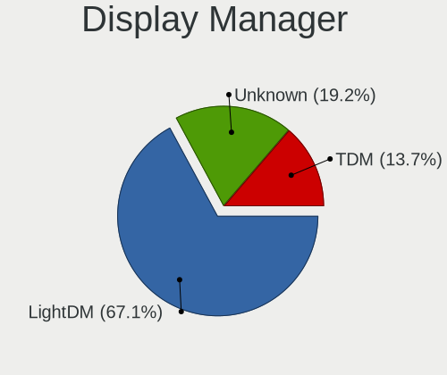

| Name    | Desktops | Percent |
|---------|----------|---------|
| LightDM | 43       | 67.19%  |
| Unknown | 11       | 17.19%  |
| TDM     | 10       | 15.63%  |

OS Lang
-------

Language

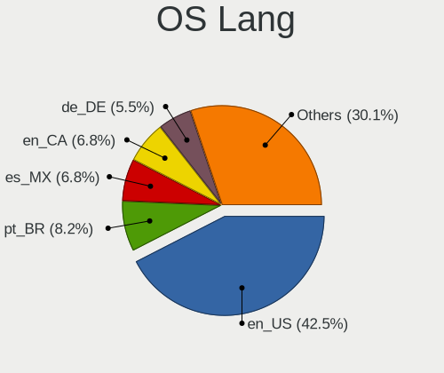

| Lang  | Desktops | Percent |
|-------|----------|---------|
| en_US | 24       | 37.5%   |
| pt_BR | 6        | 9.38%   |
| es_MX | 5        | 7.81%   |
| en_CA | 4        | 6.25%   |
| de_DE | 4        | 6.25%   |
| en_GB | 3        | 4.69%   |
| pl_PL | 2        | 3.13%   |
| fr_FR | 2        | 3.13%   |
| es_ES | 2        | 3.13%   |
| ru_UA | 1        | 1.56%   |
| nl_NL | 1        | 1.56%   |
| hu_HU | 1        | 1.56%   |
| fr_CA | 1        | 1.56%   |
| es_CL | 1        | 1.56%   |
| es_AR | 1        | 1.56%   |
| en_NZ | 1        | 1.56%   |
| en_IE | 1        | 1.56%   |
| da_DK | 1        | 1.56%   |
| C     | 1        | 1.56%   |
| bg_BG | 1        | 1.56%   |
| ar_SA | 1        | 1.56%   |

Boot Mode
---------

EFI or BIOS

| Mode | Desktops | Percent |
|------|----------|---------|
| BIOS | 45       | 70.31%  |
| EFI  | 19       | 29.69%  |

Filesystem
----------

Type of filesystem

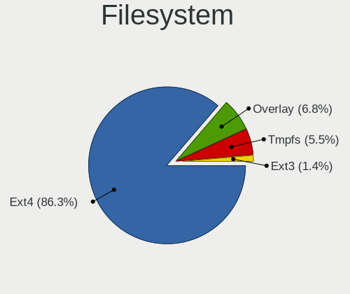

| Type    | Desktops | Percent |
|---------|----------|---------|
| Ext4    | 56       | 87.5%   |
| Tmpfs   | 4        | 6.25%   |
| Overlay | 3        | 4.69%   |
| Ext3    | 1        | 1.56%   |

Part. scheme
------------

Scheme of partitioning

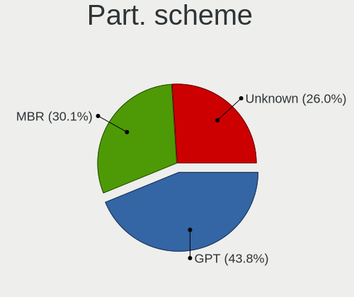

| Type    | Desktops | Percent |
|---------|----------|---------|
| GPT     | 28       | 43.75%  |
| MBR     | 20       | 31.25%  |
| Unknown | 16       | 25%     |

Dual Boot with Linux/BSD
------------------------

Hosting more than one Linux/BSD

| Dual boot | Desktops | Percent |
|-----------|----------|---------|
| No        | 50       | 78.13%  |
| Yes       | 14       | 21.88%  |

Dual Boot (Win)
---------------

Hosting Linux and Windows

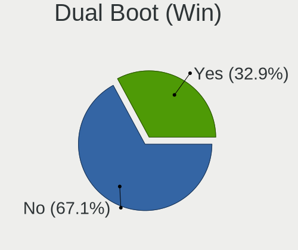

| Dual boot | Desktops | Percent |
|-----------|----------|---------|
| No        | 42       | 65.63%  |
| Yes       | 22       | 34.38%  |

Board
-----

Vendor
------

Motherboard manufacturer

| Name                | Desktops | Percent |
|---------------------|----------|---------|
| Hewlett-Packard     | 9        | 14.06%  |
| ASUSTek Computer    | 8        | 12.5%   |
| Gigabyte Technology | 7        | 10.94%  |
| ASRock              | 7        | 10.94%  |
| Lenovo              | 6        | 9.38%   |
| MSI                 | 5        | 7.81%   |
| Dell                | 3        | 4.69%   |
| Pegatron            | 2        | 3.13%   |
| Intel               | 2        | 3.13%   |
| Foxconn             | 2        | 3.13%   |
| Acer                | 2        | 3.13%   |
| Packard Bell        | 1        | 1.56%   |
| Minix               | 1        | 1.56%   |
| Jetway              | 1        | 1.56%   |
| Fujitsu Siemens     | 1        | 1.56%   |
| Fujitsu             | 1        | 1.56%   |
| EVGA                | 1        | 1.56%   |
| Braview             | 1        | 1.56%   |
| Biostar             | 1        | 1.56%   |
| Apple               | 1        | 1.56%   |
| AMI                 | 1        | 1.56%   |
| ABIT                | 1        | 1.56%   |

Model
-----

Motherboard model

| Name                                        | Desktops | Percent |
|---------------------------------------------|----------|---------|
| MSI MS-7758                                 | 2        | 3.13%   |
| Pegatron 520-1135la                         | 1        | 1.56%   |
| Pegatron 520-1030a                          | 1        | 1.56%   |
| Packard Bell ISTART D2314                   | 1        | 1.56%   |
| MSI MS-7C95                                 | 1        | 1.56%   |
| MSI MS-7996                                 | 1        | 1.56%   |
| MSI FZ079AA-ABF a6625fr                     | 1        | 1.56%   |
| Minix Z83-4                                 | 1        | 1.56%   |
| Lenovo ThinkStation P320 30BH000BFR         | 1        | 1.56%   |
| Lenovo ThinkCentre neo 50t Gen 3 11SE00A7AX | 1        | 1.56%   |
| Lenovo ThinkCentre M91p 4524RS6             | 1        | 1.56%   |
| Lenovo ThinkCentre M91p 4518E2M             | 1        | 1.56%   |
| Lenovo ThinkCentre A55 9265BL7              | 1        | 1.56%   |
| Lenovo H505S 10107                          | 1        | 1.56%   |
| Jetway I61MG4                               | 1        | 1.56%   |
| Intel H61M-S1                               | 1        | 1.56%   |
| Intel DG31PR AAD97573-300                   | 1        | 1.56%   |
| HP Z400 Workstation                         | 1        | 1.56%   |
| HP xw8600 Workstation                       | 1        | 1.56%   |
| HP t5000 series                             | 1        | 1.56%   |
| HP rp5800                                   | 1        | 1.56%   |
| HP Compaq dc7900 Convertible Minitower      | 1        | 1.56%   |
| HP Compaq dc5800 Small Form Factor          | 1        | 1.56%   |
| HP Compaq 8000 Elite SFF PC                 | 1        | 1.56%   |
| HP Compaq 6005 Pro SFF PC                   | 1        | 1.56%   |
| HP 200-5320br                               | 1        | 1.56%   |
| Gigabyte Z77X-D3H                           | 1        | 1.56%   |
| Gigabyte X570 AORUS MASTER                  | 1        | 1.56%   |
| Gigabyte H510M S2H                          | 1        | 1.56%   |
| Gigabyte GA-E350N                           | 1        | 1.56%   |
| Gigabyte B450M DS3H                         | 1        | 1.56%   |
| Gigabyte A320M-S2H                          | 1        | 1.56%   |
| Gigabyte 970A-UD3P                          | 1        | 1.56%   |
| Fujitsu Siemens ESPRIMO P5730               | 1        | 1.56%   |
| Fujitsu ESPRIMO P2560                       | 1        | 1.56%   |
| Foxconn 500B Microtower                     | 1        | 1.56%   |
| Foxconn 45CMX/45GMX/45CMX-K                 | 1        | 1.56%   |
| EVGA X58 SLI FTW3 Tylersburg                | 1        | 1.56%   |
| Dell OptiPlex 790                           | 1        | 1.56%   |
| Dell Inspiron 560                           | 1        | 1.56%   |

Model Family
------------

Motherboard model prefix

| Name                    | Desktops | Percent |
|-------------------------|----------|---------|
| Lenovo ThinkCentre      | 4        | 6.25%   |
| HP Compaq               | 4        | 6.25%   |
| MSI MS-7758             | 2        | 3.13%   |
| Dell Inspiron           | 2        | 3.13%   |
| Pegatron 520-1135la     | 1        | 1.56%   |
| Pegatron 520-1030a      | 1        | 1.56%   |
| Packard Bell ISTART     | 1        | 1.56%   |
| MSI MS-7C95             | 1        | 1.56%   |
| MSI MS-7996             | 1        | 1.56%   |
| MSI FZ079AA-ABF         | 1        | 1.56%   |
| Minix Z83-4             | 1        | 1.56%   |
| Lenovo ThinkStation     | 1        | 1.56%   |
| Lenovo H505S            | 1        | 1.56%   |
| Jetway I61MG4           | 1        | 1.56%   |
| Intel H61M-S1           | 1        | 1.56%   |
| Intel DG31PR            | 1        | 1.56%   |
| HP Z400                 | 1        | 1.56%   |
| HP xw8600               | 1        | 1.56%   |
| HP t5000                | 1        | 1.56%   |
| HP rp5800               | 1        | 1.56%   |
| HP 200-5320br           | 1        | 1.56%   |
| Gigabyte Z77X-D3H       | 1        | 1.56%   |
| Gigabyte X570           | 1        | 1.56%   |
| Gigabyte H510M          | 1        | 1.56%   |
| Gigabyte GA-E350N       | 1        | 1.56%   |
| Gigabyte B450M          | 1        | 1.56%   |
| Gigabyte A320M-S2H      | 1        | 1.56%   |
| Gigabyte 970A-UD3P      | 1        | 1.56%   |
| Fujitsu Siemens ESPRIMO | 1        | 1.56%   |
| Fujitsu ESPRIMO         | 1        | 1.56%   |
| Foxconn 500B            | 1        | 1.56%   |
| Foxconn 45CMX           | 1        | 1.56%   |
| EVGA X58                | 1        | 1.56%   |
| Dell OptiPlex           | 1        | 1.56%   |
| Braview BRW-BSWI-D2     | 1        | 1.56%   |
| Biostar G41D3C          | 1        | 1.56%   |
| ASUS TUF                | 1        | 1.56%   |
| ASUS TERRA              | 1        | 1.56%   |
| ASUS M5A78L-M           | 1        | 1.56%   |
| ASUS M5A78L             | 1        | 1.56%   |

MFG Year
--------

Motherboard manufacture year

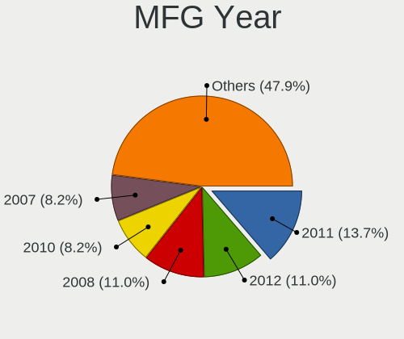

| Year | Desktops | Percent |
|------|----------|---------|
| 2011 | 10       | 15.63%  |
| 2012 | 8        | 12.5%   |
| 2008 | 8        | 12.5%   |
| 2010 | 6        | 9.38%   |
| 2007 | 6        | 9.38%   |
| 2018 | 4        | 6.25%   |
| 2009 | 4        | 6.25%   |
| 2021 | 3        | 4.69%   |
| 2020 | 3        | 4.69%   |
| 2017 | 3        | 4.69%   |
| 2022 | 2        | 3.13%   |
| 2015 | 2        | 3.13%   |
| 2013 | 2        | 3.13%   |
| 2019 | 1        | 1.56%   |
| 2016 | 1        | 1.56%   |
| 2005 | 1        | 1.56%   |

Form Factor
-----------

Physical design of the computer

| Name    | Desktops | Percent |
|---------|----------|---------|
| Desktop | 64       | 100%    |

Secure Boot
-----------

Enabled or disabled

| State    | Desktops | Percent |
|----------|----------|---------|
| Disabled | 62       | 96.88%  |
| Enabled  | 2        | 3.13%   |

Coreboot
--------

Have coreboot on board

| Used | Desktops | Percent |
|------|----------|---------|
| No   | 64       | 100%    |

RAM Size
--------

Total RAM memory

| Size in GB | Desktops | Percent |
|------------|----------|---------|
| 4.01-8.0   | 15       | 23.44%  |
| 3.01-4.0   | 15       | 23.44%  |
| 8.01-16.0  | 11       | 17.19%  |
| 1.01-2.0   | 9        | 14.06%  |
| 16.01-24.0 | 7        | 10.94%  |
| 32.01-64.0 | 5        | 7.81%   |
| 24.01-32.0 | 1        | 1.56%   |
| 2.01-3.0   | 1        | 1.56%   |

RAM Used
--------

Used RAM memory

| Used GB   | Desktops | Percent |
|-----------|----------|---------|
| 1.01-2.0  | 29       | 45.31%  |
| 2.01-3.0  | 13       | 20.31%  |
| 0.51-1.0  | 8        | 12.5%   |
| 4.01-8.0  | 7        | 10.94%  |
| 3.01-4.0  | 6        | 9.38%   |
| 8.01-16.0 | 1        | 1.56%   |

Total Drives
------------

Number of drives on board

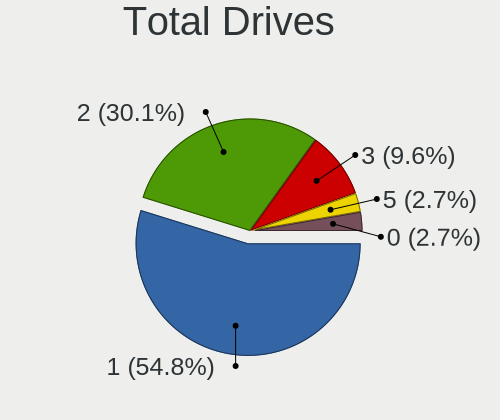

| Drives | Desktops | Percent |
|--------|----------|---------|
| 1      | 36       | 56.25%  |
| 2      | 17       | 26.56%  |
| 3      | 6        | 9.38%   |
| 5      | 2        | 3.13%   |
| 0      | 2        | 3.13%   |
| 4      | 1        | 1.56%   |

Has CD-ROM
----------

Has CD-ROM on board

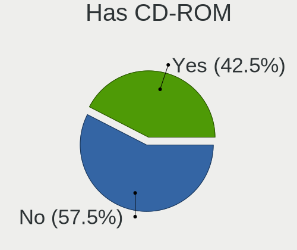

| Presented | Desktops | Percent |
|-----------|----------|---------|
| No        | 37       | 57.81%  |
| Yes       | 27       | 42.19%  |

Has Ethernet
------------

Has Ethernet on board

| Presented | Desktops | Percent |
|-----------|----------|---------|
| Yes       | 63       | 98.44%  |
| No        | 1        | 1.56%   |

Has WiFi
--------

Has WiFi module

| Presented | Desktops | Percent |
|-----------|----------|---------|
| Yes       | 32       | 50%     |
| No        | 32       | 50%     |

Has Bluetooth
-------------

Has Bluetooth module

| Presented | Desktops | Percent |
|-----------|----------|---------|
| No        | 51       | 79.69%  |
| Yes       | 13       | 20.31%  |

Location
--------

Country
-------

Geographic location (country)

| Country      | Desktops | Percent |
|--------------|----------|---------|
| USA          | 14       | 21.88%  |
| Brazil       | 8        | 12.5%   |
| Mexico       | 5        | 7.81%   |
| Canada       | 5        | 7.81%   |
| Germany      | 4        | 6.25%   |
| Poland       | 3        | 4.69%   |
| Peru         | 3        | 4.69%   |
| UK           | 2        | 3.13%   |
| Netherlands  | 2        | 3.13%   |
| France       | 2        | 3.13%   |
| Ukraine      | 1        | 1.56%   |
| Spain        | 1        | 1.56%   |
| Saudi Arabia | 1        | 1.56%   |
| Pakistan     | 1        | 1.56%   |
| New Zealand  | 1        | 1.56%   |
| Malaysia     | 1        | 1.56%   |
| Italy        | 1        | 1.56%   |
| Ireland      | 1        | 1.56%   |
| Hungary      | 1        | 1.56%   |
| Greenland    | 1        | 1.56%   |
| Egypt        | 1        | 1.56%   |
| Colombia     | 1        | 1.56%   |
| Chile        | 1        | 1.56%   |
| Bulgaria     | 1        | 1.56%   |
| Australia    | 1        | 1.56%   |
| Argentina    | 1        | 1.56%   |

City
----

Geographic location (city)

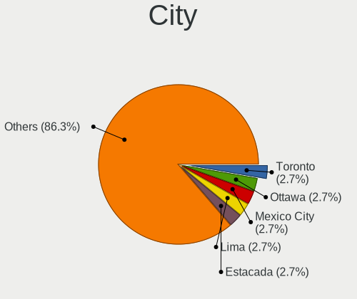

| City                 | Desktops | Percent |
|----------------------|----------|---------|
| Toronto              | 2        | 3.13%   |
| Ottawa               | 2        | 3.13%   |
| Mexico City          | 2        | 3.13%   |
| Lima                 | 2        | 3.13%   |
| Estacada             | 2        | 3.13%   |
| Würzburg            | 1        | 1.56%   |
| Wellington           | 1        | 1.56%   |
| Waterbury            | 1        | 1.56%   |
| Warsaw               | 1        | 1.56%   |
| Trujillo             | 1        | 1.56%   |
| Thetford-Mines       | 1        | 1.56%   |
| The Hague            | 1        | 1.56%   |
| Sofia                | 1        | 1.56%   |
| Sao Paulo            | 1        | 1.56%   |
| Ripi                 | 1        | 1.56%   |
| Rio de Janeiro       | 1        | 1.56%   |
| Purmerend            | 1        | 1.56%   |
| Porto Velho          | 1        | 1.56%   |
| Porto Alegre         | 1        | 1.56%   |
| Pabianice            | 1        | 1.56%   |
| Osasco               | 1        | 1.56%   |
| Oldenburg            | 1        | 1.56%   |
| Neuquén             | 1        | 1.56%   |
| Naugatuck            | 1        | 1.56%   |
| Nashville            | 1        | 1.56%   |
| Narbonne             | 1        | 1.56%   |
| Munster              | 1        | 1.56%   |
| Multan               | 1        | 1.56%   |
| Mazatlán            | 1        | 1.56%   |
| Makkah               | 1        | 1.56%   |
| Maineville           | 1        | 1.56%   |
| Lublin               | 1        | 1.56%   |
| Long Seridan         | 1        | 1.56%   |
| Lansdale             | 1        | 1.56%   |
| Kyiv                 | 1        | 1.56%   |
| Ilulissat            | 1        | 1.56%   |
| Giza                 | 1        | 1.56%   |
| Fortin de las Flores | 1        | 1.56%   |
| Enfield              | 1        | 1.56%   |
| Dublin               | 1        | 1.56%   |

Drives
------

Drive Vendor
------------

Hard drive vendors

| Vendor              | Desktops | Drives | Percent |
|---------------------|----------|--------|---------|
| Seagate             | 20       | 22     | 22.47%  |
| WDC                 | 16       | 21     | 17.98%  |
| Samsung Electronics | 10       | 10     | 11.24%  |
| Kingston            | 6        | 8      | 6.74%   |
| Toshiba             | 4        | 4      | 4.49%   |
| Hitachi             | 4        | 5      | 4.49%   |
| SanDisk             | 3        | 3      | 3.37%   |
| Crucial             | 3        | 3      | 3.37%   |
| China               | 3        | 3      | 3.37%   |
| Unknown             | 2        | 2      | 2.25%   |
| MSI                 | 2        | 2      | 2.25%   |
| Maxtor              | 2        | 6      | 2.25%   |
| SK hynix            | 1        | 1      | 1.12%   |
| PNY                 | 1        | 1      | 1.12%   |
| Phison              | 1        | 1      | 1.12%   |
| OCZ                 | 1        | 1      | 1.12%   |
| Mass                | 1        | 1      | 1.12%   |
| Intenso             | 1        | 1      | 1.12%   |
| HPE                 | 1        | 1      | 1.12%   |
| Hewlett-Packard     | 1        | 1      | 1.12%   |
| GOODRAM             | 1        | 1      | 1.12%   |
| Gigabyte Technology | 1        | 1      | 1.12%   |
| Fujitsu             | 1        | 1      | 1.12%   |
| Fanxiang            | 1        | 2      | 1.12%   |
| Dogfish             | 1        | 1      | 1.12%   |
| A-DATA Technology   | 1        | 1      | 1.12%   |

Drive Model
-----------

Hard drive models

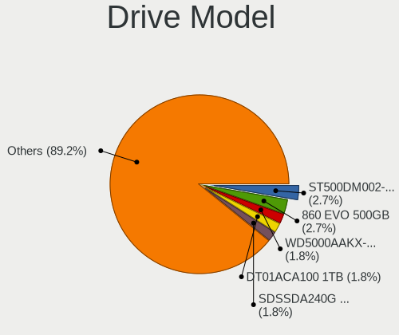

| Model                                  | Desktops | Percent |
|----------------------------------------|----------|---------|
| Seagate ST500DM002-1BD142 500GB        | 3        | 3.06%   |
| WDC WD5000AAKX-001CA0 500GB            | 2        | 2.04%   |
| SanDisk SDSSDA240G 240GB               | 2        | 2.04%   |
| Samsung SSD 860 EVO 500GB              | 2        | 2.04%   |
| MSI S270 240GB                         | 2        | 2.04%   |
| Kingston SA400S37480G 480GB SSD        | 2        | 2.04%   |
| WDC WDS250G2B0A 250GB SSD              | 1        | 1.02%   |
| WDC WDS120G2G0A-00JH30 120GB SSD       | 1        | 1.02%   |
| WDC WD800JD-60LSA0 80GB                | 1        | 1.02%   |
| WDC WD5000AAKX-003CA0 500GB            | 1        | 1.02%   |
| WDC WD5000AAKS-60WWPA0 500GB           | 1        | 1.02%   |
| WDC WD5000AADS-56S9B0 499GB            | 1        | 1.02%   |
| WDC WD5000AADS-00S9B0 500GB            | 1        | 1.02%   |
| WDC WD5000AACS-00G8B1 500GB            | 1        | 1.02%   |
| WDC WD3200BEVT-22ZCT0 320GB            | 1        | 1.02%   |
| WDC WD20PURX-64PFUY0 2TB               | 1        | 1.02%   |
| WDC WD2005FBYZ-01YCBB2 2TB             | 1        | 1.02%   |
| WDC WD10JPVX-75JC3T0 1TB               | 1        | 1.02%   |
| WDC WD10EZEX-08WN4A0 1TB               | 1        | 1.02%   |
| WDC WD10EZEX-07WN4A0 1TB               | 1        | 1.02%   |
| WDC WD10EADS-00L5B1 1TB                | 1        | 1.02%   |
| WDC WD1003FBYX-01Y7B1 1TB              | 1        | 1.02%   |
| WDC PC SN730 SDBQNTY-1T00-1014 1TB     | 1        | 1.02%   |
| Unknown MMC Card  64GB                 | 1        | 1.02%   |
| Unknown MMC Card  32GB                 | 1        | 1.02%   |
| Toshiba MK1059GSM 1TB                  | 1        | 1.02%   |
| Toshiba HDWD110 1TB                    | 1        | 1.02%   |
| Toshiba DT01ACA100 1TB                 | 1        | 1.02%   |
| Toshiba DT01ACA025 250GB               | 1        | 1.02%   |
| SK hynix SKHynix_HFS256GDE9X081N 256GB | 1        | 1.02%   |
| Seagate ST980811AS 80GB                | 1        | 1.02%   |
| Seagate ST9500325AS 500GB              | 1        | 1.02%   |
| Seagate ST500LM030-1RK17D 500GB        | 1        | 1.02%   |
| Seagate ST500DM002-1BC142 500GB        | 1        | 1.02%   |
| Seagate ST3750640NS 752GB              | 1        | 1.02%   |
| Seagate ST3750528AS 752GB              | 1        | 1.02%   |
| Seagate ST3500418AS 500GB              | 1        | 1.02%   |
| Seagate ST3320620A 320GB               | 1        | 1.02%   |
| Seagate ST33000651NS 3TB               | 1        | 1.02%   |
| Seagate ST3250310AS 250GB              | 1        | 1.02%   |

HDD Vendor
----------

Hard disk drive vendors

| Vendor              | Desktops | Drives | Percent |
|---------------------|----------|--------|---------|
| Seagate             | 19       | 21     | 41.3%   |
| WDC                 | 14       | 16     | 30.43%  |
| Toshiba             | 4        | 4      | 8.7%    |
| Hitachi             | 4        | 5      | 8.7%    |
| Maxtor              | 2        | 6      | 4.35%   |
| Samsung Electronics | 1        | 1      | 2.17%   |
| HPE                 | 1        | 1      | 2.17%   |
| Fujitsu             | 1        | 1      | 2.17%   |

SSD Vendor
----------

Solid state drive vendors

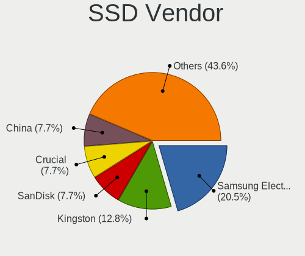

| Vendor              | Desktops | Drives | Percent |
|---------------------|----------|--------|---------|
| Samsung Electronics | 7        | 7      | 20.59%  |
| Kingston            | 5        | 7      | 14.71%  |
| SanDisk             | 3        | 3      | 8.82%   |
| Crucial             | 3        | 3      | 8.82%   |
| China               | 3        | 3      | 8.82%   |
| WDC                 | 2        | 3      | 5.88%   |
| MSI                 | 2        | 2      | 5.88%   |
| Seagate             | 1        | 1      | 2.94%   |
| PNY                 | 1        | 1      | 2.94%   |
| OCZ                 | 1        | 1      | 2.94%   |
| Hewlett-Packard     | 1        | 1      | 2.94%   |
| GOODRAM             | 1        | 1      | 2.94%   |
| Gigabyte Technology | 1        | 1      | 2.94%   |
| Fanxiang            | 1        | 2      | 2.94%   |
| Dogfish             | 1        | 1      | 2.94%   |
| A-DATA Technology   | 1        | 1      | 2.94%   |

Drive Kind
----------

HDD or SSD

| Kind    | Desktops | Drives | Percent |
|---------|----------|--------|---------|
| HDD     | 39       | 55     | 47.56%  |
| SSD     | 33       | 38     | 40.24%  |
| NVMe    | 6        | 7      | 7.32%   |
| MMC     | 2        | 2      | 2.44%   |
| Unknown | 2        | 2      | 2.44%   |

Drive Connector
---------------

SATA, SAS, NVMe, etc.

| Type | Desktops | Drives | Percent |
|------|----------|--------|---------|
| SATA | 59       | 92     | 84.29%  |
| NVMe | 6        | 7      | 8.57%   |
| SAS  | 3        | 3      | 4.29%   |
| MMC  | 2        | 2      | 2.86%   |

Drive Size
----------

Size of hard drive

| Size in TB | Desktops | Drives | Percent |
|------------|----------|--------|---------|
| 0.01-0.5   | 51       | 71     | 71.83%  |
| 0.51-1.0   | 16       | 17     | 22.54%  |
| 1.01-2.0   | 3        | 4      | 4.23%   |
| 2.01-3.0   | 1        | 1      | 1.41%   |

Space Total
-----------

Amount of disk space available on the file system

| Size in GB     | Desktops | Percent |
|----------------|----------|---------|
| 101-250        | 22       | 34.38%  |
| 51-100         | 12       | 18.75%  |
| 251-500        | 9        | 14.06%  |
| 501-1000       | 7        | 10.94%  |
| More than 3000 | 4        | 6.25%   |
| 1001-2000      | 4        | 6.25%   |
| 21-50          | 3        | 4.69%   |
| 1-20           | 2        | 3.13%   |
| 2001-3000      | 1        | 1.56%   |

Space Used
----------

Amount of used disk space

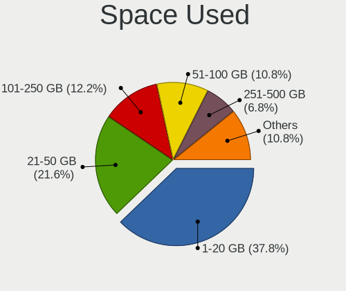

| Used GB   | Desktops | Percent |
|-----------|----------|---------|
| 1-20      | 24       | 37.5%   |
| 21-50     | 13       | 20.31%  |
| 101-250   | 8        | 12.5%   |
| 51-100    | 8        | 12.5%   |
| 251-500   | 4        | 6.25%   |
| 501-1000  | 4        | 6.25%   |
| 2001-3000 | 2        | 3.13%   |
| 1001-2000 | 1        | 1.56%   |

Malfunc. Drives
---------------

Drive models with a malfunction

| Model                         | Desktops | Drives | Percent |
|-------------------------------|----------|--------|---------|
| WDC WD800JD-60LSA0 80GB       | 1        | 1      | 7.69%   |
| WDC WD5000AAKX-001CA0 500GB   | 1        | 1      | 7.69%   |
| WDC WD5000AAKS-60WWPA0 500GB  | 1        | 1      | 7.69%   |
| Toshiba MK1059GSM 1TB         | 1        | 1      | 7.69%   |
| Seagate ST980811AS 80GB       | 1        | 1      | 7.69%   |
| Seagate ST9500325AS 500GB     | 1        | 1      | 7.69%   |
| Seagate ST3750528AS 752GB     | 1        | 1      | 7.69%   |
| Seagate ST3120026A 120GB      | 1        | 1      | 7.69%   |
| Maxtor 6Y250M0 256GB          | 1        | 1      | 7.69%   |
| Maxtor 6V300F0 304GB          | 1        | 3      | 7.69%   |
| Hitachi HDS722020ALA330 2TB   | 1        | 1      | 7.69%   |
| Hitachi HDS721616PLA380 160GB | 1        | 1      | 7.69%   |
| Hitachi HDP725032GLA360 320GB | 1        | 1      | 7.69%   |

Malfunc. Drive Vendor
---------------------

Vendors of faulty drives

| Vendor  | Desktops | Drives | Percent |
|---------|----------|--------|---------|
| Seagate | 4        | 4      | 33.33%  |
| WDC     | 3        | 3      | 25%     |
| Hitachi | 3        | 3      | 25%     |
| Toshiba | 1        | 1      | 8.33%   |
| Maxtor  | 1        | 4      | 8.33%   |

Malfunc. HDD Vendor
-------------------

Vendors of faulty HDD drives

| Vendor  | Desktops | Drives | Percent |
|---------|----------|--------|---------|
| Seagate | 4        | 4      | 33.33%  |
| WDC     | 3        | 3      | 25%     |
| Hitachi | 3        | 3      | 25%     |
| Toshiba | 1        | 1      | 8.33%   |
| Maxtor  | 1        | 4      | 8.33%   |

Malfunc. Drive Kind
-------------------

Kinds of faulty drives

| Kind | Desktops | Drives | Percent |
|------|----------|--------|---------|
| HDD  | 10       | 15     | 100%    |

Failed Drives
-------------

Failed drive models

Zero info for selected period =(

Failed Drive Vendor
-------------------

Failed drive vendors

Zero info for selected period =(

Drive Status
------------

Number of failed and malfunc. drives

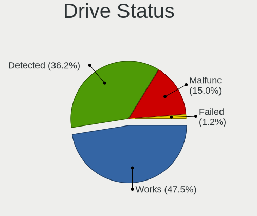

| Status   | Desktops | Drives | Percent |
|----------|----------|--------|---------|
| Works    | 33       | 49     | 48.53%  |
| Detected | 25       | 40     | 36.76%  |
| Malfunc  | 10       | 15     | 14.71%  |

Storage controller
------------------

Storage Vendor
--------------

Storage controller vendors

| Vendor                      | Desktops | Percent |
|-----------------------------|----------|---------|
| Intel                       | 43       | 56.58%  |
| AMD                         | 16       | 21.05%  |
| Nvidia                      | 4        | 5.26%   |
| Samsung Electronics         | 2        | 2.63%   |
| Marvell Technology Group    | 2        | 2.63%   |
| VIA Technologies            | 1        | 1.32%   |
| SK hynix                    | 1        | 1.32%   |
| Silicon Image               | 1        | 1.32%   |
| SanDisk                     | 1        | 1.32%   |
| Phison Electronics          | 1        | 1.32%   |
| LSI Logic / Symbios Logic   | 1        | 1.32%   |
| Kingston Technology Company | 1        | 1.32%   |
| JMicron Technology          | 1        | 1.32%   |
| Broadcom / LSI              | 1        | 1.32%   |

Storage Model
-------------

Storage controller models

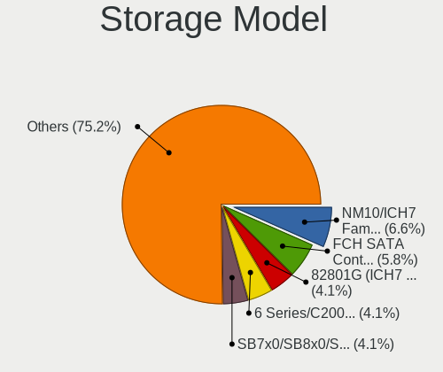

| Model                                                                                   | Desktops | Percent |
|-----------------------------------------------------------------------------------------|----------|---------|
| Intel NM10/ICH7 Family SATA Controller [IDE mode]                                       | 8        | 7.55%   |
| AMD FCH SATA Controller [AHCI mode]                                                     | 6        | 5.66%   |
| Intel 82801G (ICH7 Family) IDE Controller                                               | 5        | 4.72%   |
| Intel 6 Series/C200 Series Chipset Family 6 port Desktop SATA AHCI Controller           | 5        | 4.72%   |
| Intel 82801I (ICH9 Family) 2 port SATA Controller [IDE mode]                            | 4        | 3.77%   |
| AMD SB7x0/SB8x0/SB9x0 IDE Controller                                                    | 4        | 3.77%   |
| Intel 82801JD/DO (ICH10 Family) SATA AHCI Controller                                    | 3        | 2.83%   |
| Intel 7 Series/C210 Series Chipset Family 6-port SATA Controller [AHCI mode]            | 3        | 2.83%   |
| Intel 4 Series Chipset PT IDER Controller                                               | 3        | 2.83%   |
| AMD SB7x0/SB8x0/SB9x0 SATA Controller [IDE mode]                                        | 3        | 2.83%   |
| AMD SB7x0/SB8x0/SB9x0 SATA Controller [AHCI mode]                                       | 3        | 2.83%   |
| Intel Q170/Q150/B150/H170/H110/Z170/CM236 Chipset SATA Controller [AHCI Mode]           | 2        | 1.89%   |
| Intel Celeron/Pentium Silver Processor SATA Controller                                  | 2        | 1.89%   |
| Intel Celeron N3350/Pentium N4200/Atom E3900 Series SATA AHCI Controller                | 2        | 1.89%   |
| Intel 82801JI (ICH10 Family) SATA AHCI Controller                                       | 2        | 1.89%   |
| Intel 82801IR/IO/IH (ICH9R/DO/DH) 4 port SATA Controller [IDE mode]                     | 2        | 1.89%   |
| Intel 82801IB (ICH9) 2 port SATA Controller [IDE mode]                                  | 2        | 1.89%   |
| Intel 631xESB/632xESB IDE Controller                                                    | 2        | 1.89%   |
| Intel 6 Series/C200 Series Chipset Family Desktop SATA Controller (IDE mode, ports 4-5) | 2        | 1.89%   |
| Intel 6 Series/C200 Series Chipset Family Desktop SATA Controller (IDE mode, ports 0-3) | 2        | 1.89%   |
| AMD 500 Series Chipset SATA Controller                                                  | 2        | 1.89%   |
| AMD 400 Series Chipset SATA Controller                                                  | 2        | 1.89%   |
| VIA VT6421 IDE/SATA Controller                                                          | 1        | 0.94%   |
| SK hynix Gold P31/BC711/PC711 NVMe Solid State Drive                                    | 1        | 0.94%   |
| Silicon Image SiI 3132 Serial ATA Raid II Controller                                    | 1        | 0.94%   |
| SanDisk Extreme Pro / WD Black SN750 / PC SN730 / Red SN700 NVMe SSD                    | 1        | 0.94%   |
| Samsung NVMe SSD Controller SM981/PM981/PM983                                           | 1        | 0.94%   |
| Samsung NVMe SSD Controller SM961/PM961/SM963                                           | 1        | 0.94%   |
| Phison E16 PCIe4 NVMe Controller                                                        | 1        | 0.94%   |
| Nvidia MCP78S [GeForce 8200] SATA Controller (non-AHCI mode)                            | 1        | 0.94%   |
| Nvidia MCP78S [GeForce 8200] IDE                                                        | 1        | 0.94%   |
| Nvidia MCP73 IDE Controller                                                             | 1        | 0.94%   |
| Nvidia MCP61 SATA Controller                                                            | 1        | 0.94%   |
| Nvidia MCP61 IDE                                                                        | 1        | 0.94%   |
| Nvidia GeForce 7100/nForce 630i SATA                                                    | 1        | 0.94%   |
| Nvidia CK804 Serial ATA Controller                                                      | 1        | 0.94%   |
| Nvidia CK804 IDE                                                                        | 1        | 0.94%   |
| Marvell Group 88SE9172 SATA 6Gb/s Controller                                            | 1        | 0.94%   |
| Marvell Group 88SE912x IDE Controller                                                   | 1        | 0.94%   |
| Marvell Group 88SE9123 PCIe SATA 6.0 Gb/s controller                                    | 1        | 0.94%   |

Storage Kind
------------

Kind of storage controller (IDE, SATA, NVMe, SAS, ...)

| Kind | Desktops | Percent |
|------|----------|---------|
| SATA | 43       | 51.81%  |
| IDE  | 30       | 36.14%  |
| NVMe | 6        | 7.23%   |
| RAID | 3        | 3.61%   |
| SCSI | 1        | 1.2%    |

Processor
---------

CPU Vendor
----------

Processor vendors

| Vendor | Desktops | Percent |
|--------|----------|---------|
| Intel  | 45       | 70.31%  |
| AMD    | 19       | 29.69%  |

CPU Model
---------

Processor models

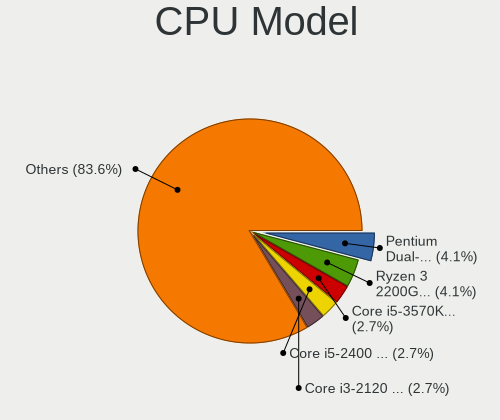

| Model                                       | Desktops | Percent |
|---------------------------------------------|----------|---------|
| Intel Pentium Dual-Core CPU E5700 @ 3.00GHz | 3        | 4.69%   |
| Intel Core i5-3570K CPU @ 3.40GHz           | 2        | 3.13%   |
| Intel Core i5-2400 CPU @ 3.10GHz            | 2        | 3.13%   |
| Intel Core i3-2120 CPU @ 3.30GHz            | 2        | 3.13%   |
| AMD Ryzen 5 5600G with Radeon Graphics      | 2        | 3.13%   |
| AMD Ryzen 3 2200G with Radeon Vega Graphics | 2        | 3.13%   |
| Intel Xeon CPU X5680 @ 3.33GHz              | 1        | 1.56%   |
| Intel Xeon CPU E5450 @ 3.00GHz              | 1        | 1.56%   |
| Intel Xeon CPU E5410 @ 2.33GHz              | 1        | 1.56%   |
| Intel Xeon CPU 5150 @ 2.66GHz               | 1        | 1.56%   |
| Intel Pentium Dual-Core CPU E5800 @ 3.20GHz | 1        | 1.56%   |
| Intel Pentium Dual CPU E2200 @ 2.20GHz      | 1        | 1.56%   |
| Intel Pentium Dual CPU E2160 @ 1.80GHz      | 1        | 1.56%   |
| Intel Pentium D CPU 3.40GHz                 | 1        | 1.56%   |
| Intel Pentium CPU E5500 @ 2.80GHz           | 1        | 1.56%   |
| Intel Core i7-7700K CPU @ 4.20GHz           | 1        | 1.56%   |
| Intel Core i7-4770 CPU @ 3.40GHz            | 1        | 1.56%   |
| Intel Core i7 CPU 970 @ 3.20GHz             | 1        | 1.56%   |
| Intel Core i5-2500K CPU @ 3.30GHz           | 1        | 1.56%   |
| Intel Core i5-2310 CPU @ 2.90GHz            | 1        | 1.56%   |
| Intel Core i5-10500 CPU @ 3.10GHz           | 1        | 1.56%   |
| Intel Core i5-10400F CPU @ 2.90GHz          | 1        | 1.56%   |
| Intel Core i3-6100 CPU @ 3.70GHz            | 1        | 1.56%   |
| Intel Core i3-3220 CPU @ 3.30GHz            | 1        | 1.56%   |
| Intel Core i3 CPU 550 @ 3.20GHz             | 1        | 1.56%   |
| Intel Core 2 Quad CPU Q9550 @ 2.83GHz       | 1        | 1.56%   |
| Intel Core 2 Quad CPU Q6600 @ 2.40GHz       | 1        | 1.56%   |
| Intel Core 2 Duo CPU E8500 @ 3.16GHz        | 1        | 1.56%   |
| Intel Core 2 Duo CPU E8400 @ 3.00GHz        | 1        | 1.56%   |
| Intel Core 2 Duo CPU E8300 @ 2.83GHz        | 1        | 1.56%   |
| Intel Core 2 Duo CPU E7300 @ 2.66GHz        | 1        | 1.56%   |
| Intel Core 2 Duo CPU E6550 @ 2.33GHz        | 1        | 1.56%   |
| Intel Core 2 CPU 6300 @ 1.86GHz             | 1        | 1.56%   |
| Intel Celeron J4125 CPU @ 2.00GHz           | 1        | 1.56%   |
| Intel Celeron J4105 CPU @ 1.50GHz           | 1        | 1.56%   |
| Intel Celeron CPU N3350 @ 1.10GHz           | 1        | 1.56%   |
| Intel Celeron CPU J3455 @ 1.50GHz           | 1        | 1.56%   |
| Intel Celeron CPU J3060 @ 1.60GHz           | 1        | 1.56%   |
| Intel Celeron CPU J1800 @ 2.41GHz           | 1        | 1.56%   |
| Intel Celeron CPU G540 @ 2.50GHz            | 1        | 1.56%   |

CPU Model Family
----------------

Processor model prefix

| Model                   | Desktops | Percent |
|-------------------------|----------|---------|
| Intel Core i5           | 8        | 12.5%   |
| Intel Celeron           | 7        | 10.94%  |
| Intel Core i3           | 5        | 7.81%   |
| Intel Core 2 Duo        | 5        | 7.81%   |
| Intel Xeon              | 4        | 6.25%   |
| Intel Pentium Dual-Core | 4        | 6.25%   |
| Intel Core i7           | 3        | 4.69%   |
| AMD Ryzen 5             | 3        | 4.69%   |
| Intel Pentium Dual      | 2        | 3.13%   |
| Intel Core 2 Quad       | 2        | 3.13%   |
| AMD Ryzen 3             | 2        | 3.13%   |
| AMD FX                  | 2        | 3.13%   |
| AMD E                   | 2        | 3.13%   |
| AMD Athlon II X2        | 2        | 3.13%   |
| AMD A6                  | 2        | 3.13%   |
| Other                   | 1        | 1.56%   |
| Intel Pentium D         | 1        | 1.56%   |
| Intel Pentium           | 1        | 1.56%   |
| Intel Core 2            | 1        | 1.56%   |
| Intel Atom              | 1        | 1.56%   |
| AMD Turion 64 X2 Mobile | 1        | 1.56%   |
| AMD Sempron             | 1        | 1.56%   |
| AMD Ryzen 9             | 1        | 1.56%   |
| AMD Phenom II X4        | 1        | 1.56%   |
| AMD Phenom II X2        | 1        | 1.56%   |
| AMD Athlon 64 X2        | 1        | 1.56%   |

CPU Cores
---------

Number of processor cores

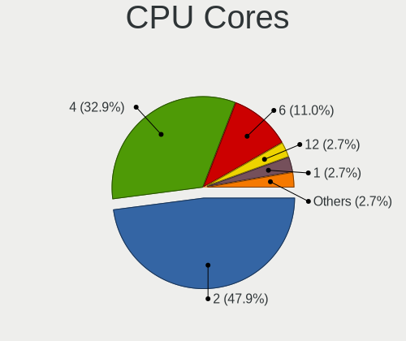

| Number | Desktops | Percent |
|--------|----------|---------|
| 2      | 30       | 46.88%  |
| 4      | 22       | 34.38%  |
| 6      | 7        | 10.94%  |
| 1      | 2        | 3.13%   |
| 12     | 1        | 1.56%   |
| 8      | 1        | 1.56%   |
| 3      | 1        | 1.56%   |

CPU Sockets
-----------

Number of sockets

| Number | Desktops | Percent |
|--------|----------|---------|
| 1      | 62       | 96.88%  |
| 2      | 2        | 3.13%   |

CPU Threads
-----------

Threads per core (Hyper-Threading)

| Number | Desktops | Percent |
|--------|----------|---------|
| 1      | 46       | 71.88%  |
| 2      | 18       | 28.13%  |

CPU Op-Modes
------------

CPU Operation Modes (32-bit, 64-bit)

| Op mode        | Desktops | Percent |
|----------------|----------|---------|
| 32-bit, 64-bit | 64       | 100%    |

CPU Microcode
-------------

Microcode number

| Number     | Desktops | Percent |
|------------|----------|---------|
| Unknown    | 11       | 17.19%  |
| 0x1067a    | 9        | 14.06%  |
| 0x206a7    | 7        | 10.94%  |
| 0x010000c8 | 3        | 4.69%   |
| 0x6fb      | 2        | 3.13%   |
| 0x506c9    | 2        | 3.13%   |
| 0x406c4    | 2        | 3.13%   |
| 0x206c2    | 2        | 3.13%   |
| 0x10676    | 2        | 3.13%   |
| 0x06000852 | 2        | 3.13%   |
| 0xf64      | 1        | 1.56%   |
| 0xa0653    | 1        | 1.56%   |
| 0x706a8    | 1        | 1.56%   |
| 0x706a1    | 1        | 1.56%   |
| 0x6fd      | 1        | 1.56%   |
| 0x6f6      | 1        | 1.56%   |
| 0x6f2      | 1        | 1.56%   |
| 0x506e3    | 1        | 1.56%   |
| 0x306c3    | 1        | 1.56%   |
| 0x306a9    | 1        | 1.56%   |
| 0x30678    | 1        | 1.56%   |
| 0x20655    | 1        | 1.56%   |
| 0x0a50000d | 1        | 1.56%   |
| 0x0a50000c | 1        | 1.56%   |
| 0x08701013 | 1        | 1.56%   |
| 0x0810100b | 1        | 1.56%   |
| 0x0800820d | 1        | 1.56%   |
| 0x05000119 | 1        | 1.56%   |
| 0x05000029 | 1        | 1.56%   |
| 0x03000027 | 1        | 1.56%   |
| 0x010000db | 1        | 1.56%   |
| 0x010000c7 | 1        | 1.56%   |

CPU Microarch
-------------

Microarchitecture

| Name          | Desktops | Percent |
|---------------|----------|---------|
| Penryn        | 12       | 18.75%  |
| SandyBridge   | 7        | 10.94%  |
| Core          | 6        | 9.38%   |
| K10           | 5        | 7.81%   |
| Westmere      | 3        | 4.69%   |
| Silvermont    | 3        | 4.69%   |
| IvyBridge     | 3        | 4.69%   |
| Zen 3         | 2        | 3.13%   |
| Zen           | 2        | 3.13%   |
| Piledriver    | 2        | 3.13%   |
| K8 Hammer     | 2        | 3.13%   |
| K10 Llano     | 2        | 3.13%   |
| Goldmont plus | 2        | 3.13%   |
| Goldmont      | 2        | 3.13%   |
| CometLake     | 2        | 3.13%   |
| Bobcat        | 2        | 3.13%   |
| Zen+          | 1        | 1.56%   |
| Zen 2         | 1        | 1.56%   |
| Skylake       | 1        | 1.56%   |
| NetBurst      | 1        | 1.56%   |
| KabyLake      | 1        | 1.56%   |
| Haswell       | 1        | 1.56%   |
| Unknown       | 1        | 1.56%   |

Graphics
--------

GPU Vendor
----------

Vendors of graphics cards

| Vendor | Desktops | Percent |
|--------|----------|---------|
| Intel  | 26       | 40.63%  |
| AMD    | 20       | 31.25%  |
| Nvidia | 18       | 28.13%  |

GPU Model
---------

Graphics card models

| Model                                                                                    | Desktops | Percent |
|------------------------------------------------------------------------------------------|----------|---------|
| Intel 4 Series Chipset Integrated Graphics Controller                                    | 5        | 7.58%   |
| Intel 2nd Generation Core Processor Family Integrated Graphics Controller                | 3        | 4.55%   |
| AMD Caicos [Radeon HD 6450/7450/8450 / R5 230 OEM]                                       | 3        | 4.55%   |
| Nvidia GT218 [GeForce 210]                                                               | 2        | 3.03%   |
| Intel HD Graphics 500                                                                    | 2        | 3.03%   |
| Intel GeminiLake [UHD Graphics 600]                                                      | 2        | 3.03%   |
| Intel Atom/Celeron/Pentium Processor x5-E8000/J3xxx/N3xxx Integrated Graphics Controller | 2        | 3.03%   |
| Intel 82945G/GZ Integrated Graphics Controller                                           | 2        | 3.03%   |
| AMD Turks XT [Radeon HD 6670/7670]                                                       | 2        | 3.03%   |
| AMD Cezanne [Radeon Vega Series / Radeon Vega Mobile Series]                             | 2        | 3.03%   |
| Nvidia TU117 [GeForce GTX 1650]                                                          | 1        | 1.52%   |
| Nvidia TU116 [GeForce GTX 1660 Ti]                                                       | 1        | 1.52%   |
| Nvidia GP108 [GeForce GT 1030]                                                           | 1        | 1.52%   |
| Nvidia GP107 [GeForce GTX 1050]                                                          | 1        | 1.52%   |
| Nvidia GP106 [GeForce GTX 1060 6GB]                                                      | 1        | 1.52%   |
| Nvidia GM107 [GeForce GTX 750 Ti]                                                        | 1        | 1.52%   |
| Nvidia GK208B [GeForce GT 710]                                                           | 1        | 1.52%   |
| Nvidia GK107 [NVS 510]                                                                   | 1        | 1.52%   |
| Nvidia GF104 [GeForce GTX 460]                                                           | 1        | 1.52%   |
| Nvidia G94 [GeForce 9600 GT]                                                             | 1        | 1.52%   |
| Nvidia G86 [GeForce 8400 GS]                                                             | 1        | 1.52%   |
| Nvidia G84GL [Quadro FX 1700]                                                            | 1        | 1.52%   |
| Nvidia G84 [GeForce 8400 GS]                                                             | 1        | 1.52%   |
| Nvidia G72 [GeForce 7300 GS]                                                             | 1        | 1.52%   |
| Nvidia C73 [GeForce 7050 / nForce 610i]                                                  | 1        | 1.52%   |
| Nvidia C61 [GeForce 7025 / nForce 630a]                                                  | 1        | 1.52%   |
| Intel Xeon E3-1200 v3/4th Gen Core Processor Integrated Graphics Controller              | 1        | 1.52%   |
| Intel Xeon E3-1200 v2/3rd Gen Core processor Graphics Controller                         | 1        | 1.52%   |
| Intel IvyBridge GT2 [HD Graphics 4000]                                                   | 1        | 1.52%   |
| Intel HD Graphics 530                                                                    | 1        | 1.52%   |
| Intel Core Processor Integrated Graphics Controller                                      | 1        | 1.52%   |
| Intel CometLake-S GT2 [UHD Graphics 630]                                                 | 1        | 1.52%   |
| Intel Atom Processor Z36xxx/Z37xxx Series Graphics & Display                             | 1        | 1.52%   |
| Intel Alder Lake-S GT1 [UHD Graphics 730]                                                | 1        | 1.52%   |
| Intel 82Q33 Express Integrated Graphics Controller                                       | 1        | 1.52%   |
| Intel 82G33/G31 Express Integrated Graphics Controller                                   | 1        | 1.52%   |
| AMD Wrestler [Radeon HD 6320]                                                            | 1        | 1.52%   |
| AMD Wrestler [Radeon HD 6310]                                                            | 1        | 1.52%   |
| AMD Sumo [Radeon HD 6530D]                                                               | 1        | 1.52%   |
| AMD RV635 [Radeon HD 3650/3750/4570/4580]                                                | 1        | 1.52%   |

GPU Combo
---------

Combinations of graphics cards

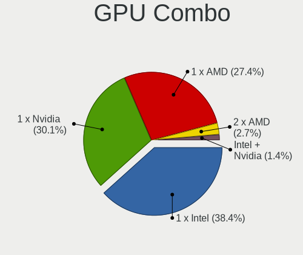

| Name       | Desktops | Percent |
|------------|----------|---------|
| 1 x Intel  | 26       | 40.63%  |
| 1 x Nvidia | 18       | 28.13%  |
| 1 x AMD    | 18       | 28.13%  |
| 2 x AMD    | 2        | 3.13%   |

GPU Driver
----------

Free vs proprietary

| Driver      | Desktops | Percent |
|-------------|----------|---------|
| Free        | 54       | 84.38%  |
| Proprietary | 9        | 14.06%  |
| Unknown     | 1        | 1.56%   |

GPU Memory
----------

Total video memory

| Size in GB | Desktops | Percent |
|------------|----------|---------|
| Unknown    | 30       | 46.88%  |
| 0.01-0.5   | 18       | 28.13%  |
| 1.01-2.0   | 6        | 9.38%   |
| 0.51-1.0   | 6        | 9.38%   |
| 5.01-6.0   | 2        | 3.13%   |
| 3.01-4.0   | 2        | 3.13%   |

Monitor
-------

Monitor Vendor
--------------

Monitor vendors

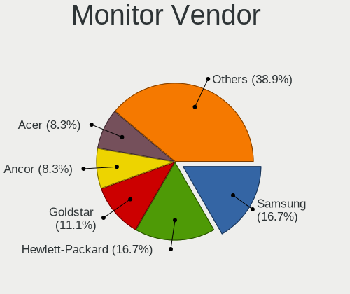

| Vendor                  | Desktops | Percent |
|-------------------------|----------|---------|
| Samsung Electronics     | 12       | 19.35%  |
| Hewlett-Packard         | 10       | 16.13%  |
| Goldstar                | 8        | 12.9%   |
| Ancor Communications    | 6        | 9.68%   |
| Acer                    | 5        | 8.06%   |
| NEC Computers           | 3        | 4.84%   |
| Dell                    | 3        | 4.84%   |
| ViewSonic               | 2        | 3.23%   |
| Sony                    | 2        | 3.23%   |
| Philips                 | 2        | 3.23%   |
| AOC                     | 2        | 3.23%   |
| Toshiba                 | 1        | 1.61%   |
| NCS                     | 1        | 1.61%   |
| MSI                     | 1        | 1.61%   |
| Hitachi                 | 1        | 1.61%   |
| Chi Mei Optoelectronics | 1        | 1.61%   |
| Apple                   | 1        | 1.61%   |
| Unknown                 | 1        | 1.61%   |

Monitor Model
-------------

Monitor models

| Model                                                                | Desktops | Percent |
|----------------------------------------------------------------------|----------|---------|
| Ancor Communications VE247 ACI2493 1920x1080 531x299mm 24.0-inch     | 3        | 4.41%   |
| Hewlett-Packard TouchSmart HWP4212 1920x1080 509x286mm 23.0-inch     | 2        | 2.94%   |
| Goldstar FULL HD GSM5B55 1920x1080 480x270mm 21.7-inch               | 2        | 2.94%   |
| ViewSonic VP2365WB VSC7123 1920x1080 509x286mm 23.0-inch             | 1        | 1.47%   |
| ViewSonic VA1938 Series VSC0626 1366x768 410x230mm 18.5-inch         | 1        | 1.47%   |
| ViewSonic LCD Monitor VP2365WB 1920x1080                             | 1        | 1.47%   |
| Toshiba L705A LCD705A 1280x1024 340x270mm 17.1-inch                  | 1        | 1.47%   |
| Sony TV SNYDC01 1360x768                                             | 1        | 1.47%   |
| Sony TV SNY3002 1920x1080 531x299mm 24.0-inch                        | 1        | 1.47%   |
| Samsung Electronics U28E590 SAM0C4D 3840x2160 607x345mm 27.5-inch    | 1        | 1.47%   |
| Samsung Electronics SyncMaster SAM055A 1920x1200 518x324mm 24.1-inch | 1        | 1.47%   |
| Samsung Electronics SyncMaster SAM0426 1920x1200                     | 1        | 1.47%   |
| Samsung Electronics SyncMaster SAM0424 1920x1200 520x320mm 24.0-inch | 1        | 1.47%   |
| Samsung Electronics SyncMaster SAM027F 1680x1050 474x296mm 22.0-inch | 1        | 1.47%   |
| Samsung Electronics SyncMaster SAM0193 1280x1024 376x301mm 19.0-inch | 1        | 1.47%   |
| Samsung Electronics S27C450 SAM09D8 1920x1080 598x336mm 27.0-inch    | 1        | 1.47%   |
| Samsung Electronics S24C31x SAM7311 1920x1080 527x296mm 23.8-inch    | 1        | 1.47%   |
| Samsung Electronics S20B300 SAM08A8 1600x900 443x249mm 20.0-inch     | 1        | 1.47%   |
| Samsung Electronics S19C300 SAM0A13 1366x768 410x230mm 18.5-inch     | 1        | 1.47%   |
| Samsung Electronics LU28R55 SAM1018 3840x2160 630x360mm 28.6-inch    | 1        | 1.47%   |
| Samsung Electronics LCD Monitor SyncMaster 5280x1080                 | 1        | 1.47%   |
| Samsung Electronics LCD Monitor SyncMaster 1680x1050                 | 1        | 1.47%   |
| Samsung Electronics LCD Monitor SyncMaster                           | 1        | 1.47%   |
| Philips 230W PHL0836 1920x1200 495x310mm 23.0-inch                   | 1        | 1.47%   |
| Philips 221V PHL0888 1920x1080 477x268mm 21.5-inch                   | 1        | 1.47%   |
| NEC Computers LCD1990SXi NEC66AC 1280x1024 376x301mm 19.0-inch       | 1        | 1.47%   |
| NEC Computers EA244WMi NEC68D7 1920x1200 519x324mm 24.1-inch         | 1        | 1.47%   |
| NEC Computers 20WGX2 NEC6699 1680x1050 433x270mm 20.1-inch           | 1        | 1.47%   |
| NCS LCD Monitor NCS2275 1920x1080 256x192mm 12.6-inch                | 1        | 1.47%   |
| MSI G271 MSI3CB5 1920x1080 598x336mm 27.0-inch                       | 1        | 1.47%   |
| Hitachi N91W DVI HIT6D0D 1440x900 410x260mm 19.1-inch                | 1        | 1.47%   |
| Hewlett-Packard w17e HWP26E0 1440x900 408x255mm 18.9-inch            | 1        | 1.47%   |
| Hewlett-Packard vs17 HWP2647 1280x1024 337x270mm 17.0-inch           | 1        | 1.47%   |
| Hewlett-Packard V214a HPN3490 1920x1080 458x258mm 20.7-inch          | 1        | 1.47%   |
| Hewlett-Packard V214a HPN348C 1920x1080 458x258mm 20.7-inch          | 1        | 1.47%   |
| Hewlett-Packard TouchSmart HWP4211 1920x1080 509x286mm 23.0-inch     | 1        | 1.47%   |
| Hewlett-Packard P201 HWP3056 1600x900 443x249mm 20.0-inch            | 1        | 1.47%   |
| Hewlett-Packard LV2311 HWP3006 1920x1080 510x287mm 23.0-inch         | 1        | 1.47%   |
| Hewlett-Packard LA1951 HWP285A 1280x1024 380x300mm 19.1-inch         | 1        | 1.47%   |
| Hewlett-Packard L1710 HWP26EB 1280x1024 340x270mm 17.1-inch          | 1        | 1.47%   |

Monitor Resolution
------------------

Monitor screen resolution

| Resolution         | Desktops | Percent |
|--------------------|----------|---------|
| 1920x1080 (FHD)    | 23       | 37.1%   |
| 1680x1050 (WSXGA+) | 6        | 9.68%   |
| 3840x2160 (4K)     | 5        | 8.06%   |
| 1920x1200 (WUXGA)  | 5        | 8.06%   |
| 1366x768 (WXGA)    | 5        | 8.06%   |
| 1280x1024 (SXGA)   | 5        | 8.06%   |
| 1440x900 (WXGA+)   | 3        | 4.84%   |
| 2560x1440 (QHD)    | 2        | 3.23%   |
| 1600x900 (HD+)     | 2        | 3.23%   |
| 1360x768           | 2        | 3.23%   |
| 5280x1080          | 1        | 1.61%   |
| 1280x720 (HD)      | 1        | 1.61%   |
| 1024x768 (XGA)     | 1        | 1.61%   |
| Unknown            | 1        | 1.61%   |

Monitor Diagonal
----------------

Diagonal size in inches

| Inches  | Desktops | Percent |
|---------|----------|---------|
| 24      | 12       | 19.05%  |
| 23      | 8        | 12.7%   |
| 27      | 5        | 7.94%   |
| 21      | 5        | 7.94%   |
| 18      | 5        | 7.94%   |
| Unknown | 5        | 7.94%   |
| 22      | 4        | 6.35%   |
| 20      | 4        | 6.35%   |
| 19      | 4        | 6.35%   |
| 17      | 4        | 6.35%   |
| 15      | 2        | 3.17%   |
| 72      | 1        | 1.59%   |
| 46      | 1        | 1.59%   |
| 31      | 1        | 1.59%   |
| 28      | 1        | 1.59%   |
| 12      | 1        | 1.59%   |

Monitor Width
-------------

Physical width

| Width in mm | Desktops | Percent |
|-------------|----------|---------|
| 501-600     | 22       | 35.48%  |
| 401-500     | 21       | 33.87%  |
| 301-350     | 6        | 9.68%   |
| Unknown     | 5        | 8.06%   |
| 601-700     | 3        | 4.84%   |
| 351-400     | 2        | 3.23%   |
| 201-300     | 1        | 1.61%   |
| 1501-2000   | 1        | 1.61%   |
| 1001-1500   | 1        | 1.61%   |

Aspect Ratio
------------

Proportional relationship between the width and the height

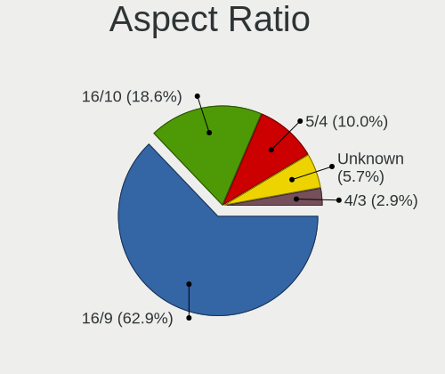

| Ratio   | Desktops | Percent |
|---------|----------|---------|
| 16/9    | 35       | 58.33%  |
| 16/10   | 13       | 21.67%  |
| 5/4     | 6        | 10%     |
| Unknown | 4        | 6.67%   |
| 4/3     | 2        | 3.33%   |

Monitor Area
------------

Area in inch²

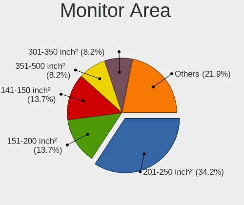

| Area in inch² | Desktops | Percent |
|----------------|----------|---------|
| 201-250        | 25       | 39.68%  |
| 151-200        | 10       | 15.87%  |
| 141-150        | 8        | 12.7%   |
| 301-350        | 5        | 7.94%   |
| Unknown        | 5        | 7.94%   |
| 251-300        | 3        | 4.76%   |
| 351-500        | 2        | 3.17%   |
| 101-110        | 2        | 3.17%   |
| More than 1000 | 1        | 1.59%   |
| 71-80          | 1        | 1.59%   |
| 501-1000       | 1        | 1.59%   |

Pixel Density
-------------

Pixels per inch

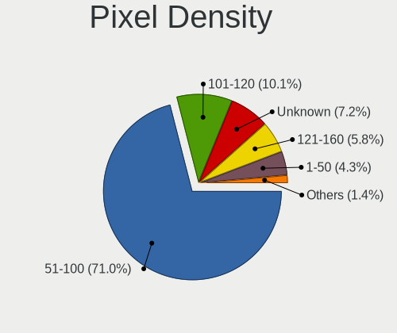

| Density | Desktops | Percent |
|---------|----------|---------|
| 51-100  | 41       | 67.21%  |
| 101-120 | 9        | 14.75%  |
| Unknown | 5        | 8.2%    |
| 121-160 | 3        | 4.92%   |
| 1-50    | 2        | 3.28%   |
| 161-240 | 1        | 1.64%   |

Multiple Monitors
-----------------

Total monitors connected

| Total | Desktops | Percent |
|-------|----------|---------|
| 1     | 57       | 89.06%  |
| 2     | 6        | 9.38%   |
| 3     | 1        | 1.56%   |

Network
-------

Net Controller Vendor
---------------------

Controller vendors

| Vendor                                | Desktops | Percent |
|---------------------------------------|----------|---------|
| Realtek Semiconductor                 | 39       | 39.8%   |
| Intel                                 | 17       | 17.35%  |
| Broadcom                              | 6        | 6.12%   |
| Ralink Technology                     | 4        | 4.08%   |
| Qualcomm Atheros                      | 4        | 4.08%   |
| TP-Link                               | 3        | 3.06%   |
| Ralink                                | 3        | 3.06%   |
| Nvidia                                | 3        | 3.06%   |
| ASUSTek Computer                      | 3        | 3.06%   |
| MediaTek                              | 2        | 2.04%   |
| ZTE WCDMA Technologies MSM            | 1        | 1.02%   |
| Sundance Technology Inc / IC Plus     | 1        | 1.02%   |
| Sitecom Europe                        | 1        | 1.02%   |
| Samsung Electronics                   | 1        | 1.02%   |
| Qualcomm Atheros Communications       | 1        | 1.02%   |
| Microsoft                             | 1        | 1.02%   |
| Marvell Technology Group              | 1        | 1.02%   |
| Linksys                               | 1        | 1.02%   |
| Gemtek                                | 1        | 1.02%   |
| Broadcom Limited                      | 1        | 1.02%   |
| Belkin Components                     | 1        | 1.02%   |
| ASIX Electronics                      | 1        | 1.02%   |
| 802.11g Adapter [Linksys WUSB54GC v3] | 1        | 1.02%   |
| 3Com                                  | 1        | 1.02%   |

Net Controller Model
--------------------

Controller models

| Model                                                                                         | Desktops | Percent |
|-----------------------------------------------------------------------------------------------|----------|---------|
| Realtek RTL8111/8168/8211/8411 PCI Express Gigabit Ethernet Controller                        | 32       | 29.91%  |
| Realtek RTL810xE PCI Express Fast Ethernet controller                                         | 5        | 4.67%   |
| Intel 82579LM Gigabit Network Connection (Lewisville)                                         | 4        | 3.74%   |
| Ralink MT7601U Wireless Adapter                                                               | 3        | 2.8%    |
| Intel 82567LM-3 Gigabit Network Connection                                                    | 2        | 1.87%   |
| Intel 82566DM-2 Gigabit Network Connection                                                    | 2        | 1.87%   |
| ZTE WCDMA MSM Unisoc Phone                                                                    | 1        | 0.93%   |
| TP-Link TL-WN823N v2/v3 [Realtek RTL8192EU]                                                   | 1        | 0.93%   |
| TP-Link TL-WN821N v5/v6 [RTL8192EU]                                                           | 1        | 0.93%   |
| TP-Link TL-WN8200ND [Realtek RTL8192CU]                                                       | 1        | 0.93%   |
| Sundance Inc / IC Plus IC Plus IP100A Integrated 10/100 Ethernet MAC + PHY                    | 1        | 0.93%   |
| Sitecom Europe RTL8188S WLAN Adapter                                                          | 1        | 0.93%   |
| Samsung Galaxy series, misc. (tethering mode)                                                 | 1        | 0.93%   |
| Realtek RTL8821CE 802.11ac PCIe Wireless Network Adapter                                      | 1        | 0.93%   |
| Realtek RTL8812AU 802.11a/b/g/n/ac 2T2R DB WLAN Adapter                                       | 1        | 0.93%   |
| Realtek RTL8812AE 802.11ac PCIe Wireless Network Adapter                                      | 1        | 0.93%   |
| Realtek RTL8188EE Wireless Network Adapter                                                    | 1        | 0.93%   |
| Realtek RTL8125 2.5GbE Controller                                                             | 1        | 0.93%   |
| Realtek RTL8111/8168/8411 PCI Express Gigabit Ethernet Controller                             | 1        | 0.93%   |
| Realtek RTL-8185 IEEE 802.11a/b/g Wireless LAN Controller                                     | 1        | 0.93%   |
| Realtek Realtek 8812AU/8821AU 802.11ac WLAN Adapter [USB Wireless Dual-Band Adapter 2.4/5Ghz] | 1        | 0.93%   |
| Realtek 802.11ac NIC                                                                          | 1        | 0.93%   |
| Ralink RT2870/RT3070 Wireless Adapter                                                         | 1        | 0.93%   |
| Ralink RT5390 Wireless 802.11n 1T/1R PCIe                                                     | 1        | 0.93%   |
| Ralink RT3090 Wireless 802.11n 1T/1R PCIe                                                     | 1        | 0.93%   |
| Ralink RT2561/RT61 802.11g PCI                                                                | 1        | 0.93%   |
| Qualcomm Atheros QCA9377 802.11ac Wireless Network Adapter                                    | 1        | 0.93%   |
| Qualcomm Atheros AR9271 802.11n                                                               | 1        | 0.93%   |
| Qualcomm Atheros AR9227 Wireless Network Adapter                                              | 1        | 0.93%   |
| Qualcomm Atheros AR8161 Gigabit Ethernet                                                      | 1        | 0.93%   |
| Qualcomm Atheros AR8152 v2.0 Fast Ethernet                                                    | 1        | 0.93%   |
| Nvidia MCP77 Ethernet                                                                         | 1        | 0.93%   |
| Nvidia MCP61 Ethernet                                                                         | 1        | 0.93%   |
| Nvidia CK804 Ethernet Controller                                                              | 1        | 0.93%   |
| Microsoft Xbox 360 Wireless Adapter                                                           | 1        | 0.93%   |
| MediaTek RMX3085                                                                              | 1        | 0.93%   |
| MediaTek MT7921K (RZ608) Wi-Fi 6E 80MHz                                                       | 1        | 0.93%   |
| Marvell Group 88E8056 PCI-E Gigabit Ethernet Controller                                       | 1        | 0.93%   |
| Linksys WUSB6100M 802.11a/b/g/n/ac Wireless Adapter                                           | 1        | 0.93%   |
| Intel Wireless 3160                                                                           | 1        | 0.93%   |

Wireless Vendor
---------------

Wireless vendors

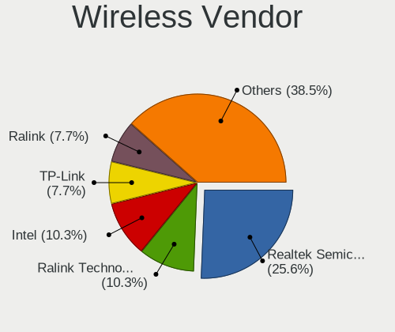

| Vendor                                | Desktops | Percent |
|---------------------------------------|----------|---------|
| Realtek Semiconductor                 | 7        | 20%     |
| Ralink Technology                     | 4        | 11.43%  |
| TP-Link                               | 3        | 8.57%   |
| Ralink                                | 3        | 8.57%   |
| Intel                                 | 3        | 8.57%   |
| ASUSTek Computer                      | 3        | 8.57%   |
| Qualcomm Atheros                      | 2        | 5.71%   |
| Sitecom Europe                        | 1        | 2.86%   |
| Qualcomm Atheros Communications       | 1        | 2.86%   |
| Microsoft                             | 1        | 2.86%   |
| MediaTek                              | 1        | 2.86%   |
| Linksys                               | 1        | 2.86%   |
| Gemtek                                | 1        | 2.86%   |
| Broadcom Limited                      | 1        | 2.86%   |
| Broadcom                              | 1        | 2.86%   |
| Belkin Components                     | 1        | 2.86%   |
| 802.11g Adapter [Linksys WUSB54GC v3] | 1        | 2.86%   |

Wireless Model
--------------

Wireless models

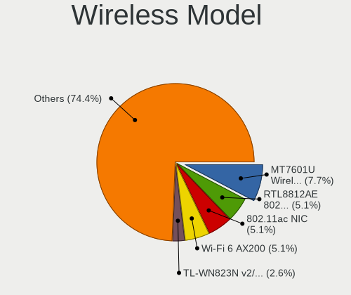

| Model                                                                                                  | Desktops | Percent |
|--------------------------------------------------------------------------------------------------------|----------|---------|
| Ralink MT7601U Wireless Adapter                                                                        | 3        | 8.57%   |
| TP-Link TL-WN823N v2/v3 [Realtek RTL8192EU]                                                            | 1        | 2.86%   |
| TP-Link TL-WN821N v5/v6 [RTL8192EU]                                                                    | 1        | 2.86%   |
| TP-Link TL-WN8200ND [Realtek RTL8192CU]                                                                | 1        | 2.86%   |
| Sitecom Europe RTL8188S WLAN Adapter                                                                   | 1        | 2.86%   |
| Realtek RTL8821CE 802.11ac PCIe Wireless Network Adapter                                               | 1        | 2.86%   |
| Realtek RTL8812AU 802.11a/b/g/n/ac 2T2R DB WLAN Adapter                                                | 1        | 2.86%   |
| Realtek RTL8812AE 802.11ac PCIe Wireless Network Adapter                                               | 1        | 2.86%   |
| Realtek RTL8188EE Wireless Network Adapter                                                             | 1        | 2.86%   |
| Realtek RTL-8185 IEEE 802.11a/b/g Wireless LAN Controller                                              | 1        | 2.86%   |
| Realtek Realtek 8812AU/8821AU 802.11ac WLAN Adapter [USB Wireless Dual-Band Adapter 2.4/5Ghz]          | 1        | 2.86%   |
| Realtek 802.11ac NIC                                                                                   | 1        | 2.86%   |
| Ralink RT2870/RT3070 Wireless Adapter                                                                  | 1        | 2.86%   |
| Ralink RT5390 Wireless 802.11n 1T/1R PCIe                                                              | 1        | 2.86%   |
| Ralink RT3090 Wireless 802.11n 1T/1R PCIe                                                              | 1        | 2.86%   |
| Ralink RT2561/RT61 802.11g PCI                                                                         | 1        | 2.86%   |
| Qualcomm Atheros QCA9377 802.11ac Wireless Network Adapter                                             | 1        | 2.86%   |
| Qualcomm Atheros AR9271 802.11n                                                                        | 1        | 2.86%   |
| Qualcomm Atheros AR9227 Wireless Network Adapter                                                       | 1        | 2.86%   |
| Microsoft Xbox 360 Wireless Adapter                                                                    | 1        | 2.86%   |
| MediaTek MT7921K (RZ608) Wi-Fi 6E 80MHz                                                                | 1        | 2.86%   |
| Linksys WUSB6100M 802.11a/b/g/n/ac Wireless Adapter                                                    | 1        | 2.86%   |
| Intel Wireless 3160                                                                                    | 1        | 2.86%   |
| Intel Wi-Fi 6 AX200                                                                                    | 1        | 2.86%   |
| Intel Dual Band Wireless-AC 3168NGW [Stone Peak]                                                       | 1        | 2.86%   |
| Gemtek WUBR-177G [Ralink RT2571W]                                                                      | 1        | 2.86%   |
| Broadcom Limited BCM4311 802.11b/g WLAN                                                                | 1        | 2.86%   |
| Broadcom BCM43225 802.11b/g/n                                                                          | 1        | 2.86%   |
| Belkin Components F5D7050 Wireless G Adapter v5000 [Realtek RTL8187B]                                  | 1        | 2.86%   |
| ASUS WL-167G v2 802.11g Adapter [Ralink RT2571W]                                                       | 1        | 2.86%   |
| ASUS USB-N14 802.11b/g/n (2x2) Wireless Adapter [Ralink RT5372]                                        | 1        | 2.86%   |
| ASUS 802.11n Network Adapter                                                                           | 1        | 2.86%   |
| 802.11g Adapter [Linksys WUSB54GC v3] WUSB600N v2 Dual-Band Wireless-N Network Adapter [Ralink RT3572] | 1        | 2.86%   |

Ethernet Vendor
---------------

Ethernet vendors

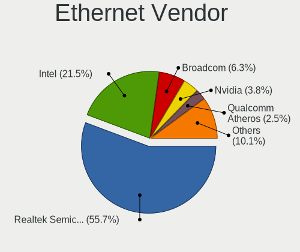

| Vendor                            | Desktops | Percent |
|-----------------------------------|----------|---------|
| Realtek Semiconductor             | 38       | 54.29%  |
| Intel                             | 15       | 21.43%  |
| Broadcom                          | 5        | 7.14%   |
| Nvidia                            | 3        | 4.29%   |
| Qualcomm Atheros                  | 2        | 2.86%   |
| ZTE WCDMA Technologies MSM        | 1        | 1.43%   |
| Sundance Technology Inc / IC Plus | 1        | 1.43%   |
| Samsung Electronics               | 1        | 1.43%   |
| MediaTek                          | 1        | 1.43%   |
| Marvell Technology Group          | 1        | 1.43%   |
| ASIX Electronics                  | 1        | 1.43%   |
| 3Com                              | 1        | 1.43%   |

Ethernet Model
--------------

Ethernet models

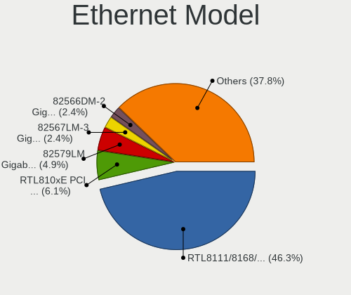

| Model                                                                         | Desktops | Percent |
|-------------------------------------------------------------------------------|----------|---------|
| Realtek RTL8111/8168/8211/8411 PCI Express Gigabit Ethernet Controller        | 32       | 44.44%  |
| Realtek RTL810xE PCI Express Fast Ethernet controller                         | 5        | 6.94%   |
| Intel 82579LM Gigabit Network Connection (Lewisville)                         | 4        | 5.56%   |
| Intel 82567LM-3 Gigabit Network Connection                                    | 2        | 2.78%   |
| Intel 82566DM-2 Gigabit Network Connection                                    | 2        | 2.78%   |
| ZTE WCDMA MSM Unisoc Phone                                                    | 1        | 1.39%   |
| Sundance Inc / IC Plus IC Plus IP100A Integrated 10/100 Ethernet MAC + PHY    | 1        | 1.39%   |
| Samsung Galaxy series, misc. (tethering mode)                                 | 1        | 1.39%   |
| Realtek RTL8125 2.5GbE Controller                                             | 1        | 1.39%   |
| Realtek RTL8111/8168/8411 PCI Express Gigabit Ethernet Controller             | 1        | 1.39%   |
| Qualcomm Atheros AR8161 Gigabit Ethernet                                      | 1        | 1.39%   |
| Qualcomm Atheros AR8152 v2.0 Fast Ethernet                                    | 1        | 1.39%   |
| Nvidia MCP77 Ethernet                                                         | 1        | 1.39%   |
| Nvidia MCP61 Ethernet                                                         | 1        | 1.39%   |
| Nvidia CK804 Ethernet Controller                                              | 1        | 1.39%   |
| MediaTek RMX3085                                                              | 1        | 1.39%   |
| Marvell Group 88E8056 PCI-E Gigabit Ethernet Controller                       | 1        | 1.39%   |
| Intel I211 Gigabit Network Connection                                         | 1        | 1.39%   |
| Intel Ethernet Connection (2) I219-LM                                         | 1        | 1.39%   |
| Intel Ethernet Connection (17) I219-V                                         | 1        | 1.39%   |
| Intel 82571EB/82571GB Gigabit Ethernet Controller D0/D1 (copper applications) | 1        | 1.39%   |
| Intel 82567LF-3 Gigabit Network Connection                                    | 1        | 1.39%   |
| Intel 82566DC-2 Gigabit Network Connection                                    | 1        | 1.39%   |
| Intel 82541PI Gigabit Ethernet Controller                                     | 1        | 1.39%   |
| Intel 80003ES2LAN Gigabit Ethernet Controller (Copper)                        | 1        | 1.39%   |
| Broadcom NetXtreme BCM5764M Gigabit Ethernet PCIe                             | 1        | 1.39%   |
| Broadcom NetXtreme BCM5761 Gigabit Ethernet PCIe                              | 1        | 1.39%   |
| Broadcom NetXtreme BCM5755 Gigabit Ethernet PCI Express                       | 1        | 1.39%   |
| Broadcom NetLink BCM5787M Gigabit Ethernet PCI Express                        | 1        | 1.39%   |
| Broadcom NetLink BCM5786 Gigabit Ethernet PCI Express                         | 1        | 1.39%   |
| ASIX AX88179 Gigabit Ethernet                                                 | 1        | 1.39%   |
| 3Com 3c905C-TX/TX-M [Tornado]                                                 | 1        | 1.39%   |

Net Controller Kind
-------------------

Ethernet, WiFi or modem

| Kind     | Desktops | Percent |
|----------|----------|---------|
| Ethernet | 63       | 66.32%  |
| WiFi     | 32       | 33.68%  |

Used Controller
---------------

Currently used network controller

| Kind     | Desktops | Percent |
|----------|----------|---------|
| Ethernet | 46       | 68.66%  |
| WiFi     | 21       | 31.34%  |

NICs
----

Total network controllers on board

| Total | Desktops | Percent |
|-------|----------|---------|
| 1     | 44       | 68.75%  |
| 2     | 17       | 26.56%  |
| 3     | 2        | 3.13%   |
| 4     | 1        | 1.56%   |

IPv6
----

IPv6 vs IPv4

| Used | Desktops | Percent |
|------|----------|---------|
| No   | 51       | 79.69%  |
| Yes  | 13       | 20.31%  |

Bluetooth
---------

Bluetooth Vendor
----------------

Controller vendors

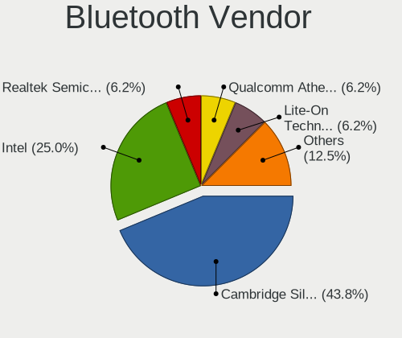

| Vendor                          | Desktops | Percent |
|---------------------------------|----------|---------|
| Cambridge Silicon Radio         | 6        | 46.15%  |
| Intel                           | 3        | 23.08%  |
| Realtek Semiconductor           | 1        | 7.69%   |
| Qualcomm Atheros Communications | 1        | 7.69%   |
| Lite-On Technology              | 1        | 7.69%   |
| Broadcom                        | 1        | 7.69%   |

Bluetooth Model
---------------

Controller models

| Model                                               | Desktops | Percent |
|-----------------------------------------------------|----------|---------|
| Cambridge Silicon Radio Bluetooth Dongle (HCI mode) | 6        | 46.15%  |
| Realtek Bluetooth Radio                             | 1        | 7.69%   |
| Qualcomm Atheros AR3011 Bluetooth                   | 1        | 7.69%   |
| Lite-On Qualcomm Atheros QCA9377 Bluetooth          | 1        | 7.69%   |
| Intel Wireless-AC 3168 Bluetooth                    | 1        | 7.69%   |
| Intel Bluetooth wireless interface                  | 1        | 7.69%   |
| Intel AX200 Bluetooth                               | 1        | 7.69%   |
| Broadcom HP Bluethunder                             | 1        | 7.69%   |

Sound
-----

Sound Vendor
------------

Sound card vendors

| Vendor                | Desktops | Percent |
|-----------------------|----------|---------|
| Intel                 | 43       | 47.78%  |
| AMD                   | 23       | 25.56%  |
| Nvidia                | 13       | 14.44%  |
| C-Media Electronics   | 3        | 3.33%   |
| JMTek                 | 2        | 2.22%   |
| Creative Labs         | 2        | 2.22%   |
| Texas Instruments     | 1        | 1.11%   |
| Realtek Semiconductor | 1        | 1.11%   |
| Logitech              | 1        | 1.11%   |
| Ensoniq               | 1        | 1.11%   |

Sound Model
-----------

Sound card models

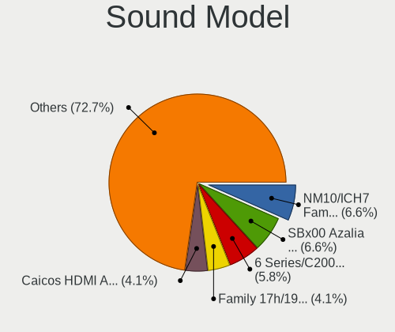

| Model                                                                                             | Desktops | Percent |
|---------------------------------------------------------------------------------------------------|----------|---------|
| Intel NM10/ICH7 Family High Definition Audio Controller                                           | 8        | 7.84%   |
| Intel 6 Series/C200 Series Chipset Family High Definition Audio Controller                        | 7        | 6.86%   |
| AMD SBx00 Azalia (Intel HDA)                                                                      | 7        | 6.86%   |
| Intel 82801I (ICH9 Family) HD Audio Controller                                                    | 4        | 3.92%   |
| AMD Family 17h/19h HD Audio Controller                                                            | 4        | 3.92%   |
| AMD Caicos HDMI Audio [Radeon HD 6450 / 7450/8450/8490 OEM / R5 230/235/235X OEM]                 | 4        | 3.92%   |
| Intel 82801JI (ICH10 Family) HD Audio Controller                                                  | 3        | 2.94%   |
| Intel 82801JD/DO (ICH10 Family) HD Audio Controller                                               | 3        | 2.94%   |
| Intel 7 Series/C216 Chipset Family High Definition Audio Controller                               | 3        | 2.94%   |
| Nvidia High Definition Audio Controller                                                           | 2        | 1.96%   |
| Intel Celeron/Pentium Silver Processor High Definition Audio                                      | 2        | 1.96%   |
| Intel Celeron N3350/Pentium N4200/Atom E3900 Series Audio Cluster                                 | 2        | 1.96%   |
| Intel 631xESB/632xESB High Definition Audio Controller                                            | 2        | 1.96%   |
| Intel 100 Series/C230 Series Chipset Family HD Audio Controller                                   | 2        | 1.96%   |
| AMD Wrestler HDMI Audio                                                                           | 2        | 1.96%   |
| AMD Turks HDMI Audio [Radeon HD 6500/6600 / 6700M Series]                                         | 2        | 1.96%   |
| AMD Renoir Radeon High Definition Audio Controller                                                | 2        | 1.96%   |
| AMD FCH Azalia Controller                                                                         | 2        | 1.96%   |
| Texas Instruments PCM2902C Audio CODEC                                                            | 1        | 0.98%   |
| Realtek Semiconductor Realtek USB2.0 Audio                                                        | 1        | 0.98%   |
| Nvidia TU116 High Definition Audio Controller                                                     | 1        | 0.98%   |
| Nvidia TU107 GeForce GTX 1650 High Definition Audio Controller                                    | 1        | 0.98%   |
| Nvidia MCP73 High Definition Audio                                                                | 1        | 0.98%   |
| Nvidia MCP72XE/MCP72P/MCP78U/MCP78S High Definition Audio                                         | 1        | 0.98%   |
| Nvidia MCP61 High Definition Audio                                                                | 1        | 0.98%   |
| Nvidia GP108 High Definition Audio Controller                                                     | 1        | 0.98%   |
| Nvidia GP107GL High Definition Audio Controller                                                   | 1        | 0.98%   |
| Nvidia GP106 High Definition Audio Controller                                                     | 1        | 0.98%   |
| Nvidia GM107 High Definition Audio Controller [GeForce 940MX]                                     | 1        | 0.98%   |
| Nvidia GK208 HDMI/DP Audio Controller                                                             | 1        | 0.98%   |
| Nvidia GK107 HDMI Audio Controller                                                                | 1        | 0.98%   |
| Nvidia GF104 High Definition Audio Controller                                                     | 1        | 0.98%   |
| Logitech Wireless Headset                                                                         | 1        | 0.98%   |
| JMTek USB Speaker                                                                                 | 1        | 0.98%   |
| JMTek LCS USB Audio                                                                               | 1        | 0.98%   |
| Intel Xeon E3-1200 v3/4th Gen Core Processor HD Audio Controller                                  | 1        | 0.98%   |
| Intel Smart Sound Technology (SST) Audio Controller                                               | 1        | 0.98%   |
| Intel Comet Lake PCH-V cAVS                                                                       | 1        | 0.98%   |
| Intel Atom/Celeron/Pentium Processor x5-E8000/J3xxx/N3xxx Series High Definition Audio Controller | 1        | 0.98%   |
| Intel Atom Processor Z36xxx/Z37xxx Series High Definition Audio Controller                        | 1        | 0.98%   |

Memory
------

Memory Vendor
-------------

Memory module vendors

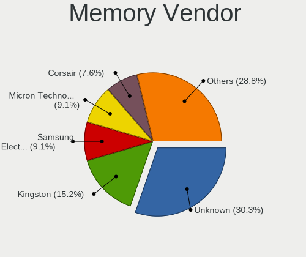

| Vendor              | Desktops | Percent |
|---------------------|----------|---------|
| Unknown             | 18       | 30.51%  |
| Kingston            | 9        | 15.25%  |
| Micron Technology   | 6        | 10.17%  |
| Samsung Electronics | 5        | 8.47%   |
| SK hynix            | 4        | 6.78%   |
| Corsair             | 3        | 5.08%   |
| Unknown             | 2        | 3.39%   |
| Unknown (ABCD)      | 1        | 1.69%   |
| Unknown (0x7F61)    | 1        | 1.69%   |
| Qumo                | 1        | 1.69%   |
| Patriot             | 1        | 1.69%   |
| GeIL                | 1        | 1.69%   |
| G Skil              | 1        | 1.69%   |
| Crucial             | 1        | 1.69%   |
| Avant               | 1        | 1.69%   |
| 2C0C1121390963FE    | 1        | 1.69%   |
| 2C0C1121390963FD    | 1        | 1.69%   |
| 2C0C1121390963F9    | 1        | 1.69%   |
| 2C0C1121390963F8    | 1        | 1.69%   |

Memory Model
------------

Memory module models

| Model                                                        | Desktops | Percent |
|--------------------------------------------------------------|----------|---------|
| Unknown RAM Module 4GB DIMM 1333MT/s                         | 2        | 3.13%   |
| Unknown RAM Module 2GB DIMM SDRAM                            | 2        | 3.13%   |
| Unknown                                                      | 2        | 3.13%   |
| Unknown RAM Module 8GB DIMM DDR3 1333MT/s                    | 1        | 1.56%   |
| Unknown RAM Module 8192MB DIMM 1600MT/s                      | 1        | 1.56%   |
| Unknown RAM Module 4GB DIMM DDR2 800MT/s                     | 1        | 1.56%   |
| Unknown RAM Module 2GB DIMM DDR2 667MT/s                     | 1        | 1.56%   |
| Unknown RAM Module 2048MB SODIMM DDR2                        | 1        | 1.56%   |
| Unknown RAM Module 2048MB DIMM SDRAM                         | 1        | 1.56%   |
| Unknown RAM Module 2048MB DIMM DDR2 800MT/s                  | 1        | 1.56%   |
| Unknown RAM Module 2048MB DIMM DDR2                          | 1        | 1.56%   |
| Unknown RAM Module 2048MB DIMM DDR 800MT/s                   | 1        | 1.56%   |
| Unknown RAM Module 2048MB DIMM DDR 133MT/s                   | 1        | 1.56%   |
| Unknown RAM Module 2048MB DIMM 400MT/s                       | 1        | 1.56%   |
| Unknown RAM Module 1GB DIMM DDR 400MT/s                      | 1        | 1.56%   |
| Unknown RAM Module 1024MB DIMM SDRAM                         | 1        | 1.56%   |
| Unknown RAM Module 1024MB DIMM DDR2                          | 1        | 1.56%   |
| Unknown RAM Module 1024MB DIMM DDR 133MT/s                   | 1        | 1.56%   |
| Unknown (ABCD) RAM 123456789012345678 4GB DIMM DDR4 2400MT/s | 1        | 1.56%   |
| Unknown (0x7F61) RAM Module 1GB FB-DIMM DDR2 667MT/s         | 1        | 1.56%   |
| SK hynix RAM HYMP125U64CP8-S6 2GB DIMM DDR2 49926MT/s        | 1        | 1.56%   |
| SK hynix RAM HMT451U6BFR8C-PB 4GB DIMM DDR3 1600MT/s         | 1        | 1.56%   |
| SK hynix RAM HMT41GS6BFR8A-PB 8GB SODIMM DDR3 1600MT/s       | 1        | 1.56%   |
| SK hynix RAM HMT351U6CFR8C-H9 4GB DIMM DDR3 1333MT/s         | 1        | 1.56%   |
| SK hynix RAM HMT351U6BFR8C-H9 4GB DIMM DDR3 1333MT/s         | 1        | 1.56%   |
| SK hynix RAM HMT112U6TFR8C-H9 1GB DIMM DDR3 1333MT/s         | 1        | 1.56%   |
| Samsung RAM Module 4GB DIMM DDR3 1067MT/s                    | 1        | 1.56%   |
| Samsung RAM M378B5673FH0-CH9 2GB DIMM DDR3 1600MT/s          | 1        | 1.56%   |
| Samsung RAM M378B2873FH0-CH9 1GB DIMM DDR3 1333MT/s          | 1        | 1.56%   |
| Samsung RAM M378A1K43CB2-CRC 8GB DIMM DDR4 3500MT/s          | 1        | 1.56%   |
| Samsung RAM M3 78T5663QZ3-CF7 2GB DIMM DDR2 800MT/s          | 1        | 1.56%   |
| Qumo RAM Module 4096MB DIMM DDR3 1333MT/s                    | 1        | 1.56%   |
| Patriot RAM 2666 C16 Series 8GB DIMM DDR4 3400MT/s           | 1        | 1.56%   |
| Micron RAM Module 8GB DIMM DDR4 3200MT/s                     | 1        | 1.56%   |
| Micron RAM Module 512MB FB-DIMM DDR2 667MT/s                 | 1        | 1.56%   |
| Micron RAM 8HTF12864AY-800G1 1GB DIMM DDR2 800MT/s           | 1        | 1.56%   |
| Micron RAM 4ATF51264HZ-3G2R1 4GB SODIMM DDR4 2400MT/s        | 1        | 1.56%   |
| Micron RAM 16KTF51264AZ-1G6M1 4GB DIMM DDR3 1600MT/s         | 1        | 1.56%   |
| Micron RAM 16KTF1G64HZ-1G6E1 8GB DIMM DDR3 1600MT/s          | 1        | 1.56%   |
| Kingston RAM Module 4GB DIMM DDR3 1600MT/s                   | 1        | 1.56%   |

Memory Kind
-----------

Memory module kinds

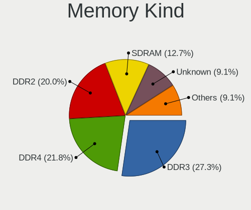

| Kind    | Desktops | Percent |
|---------|----------|---------|
| DDR3    | 13       | 26.53%  |
| DDR2    | 11       | 22.45%  |
| DDR4    | 9        | 18.37%  |
| SDRAM   | 7        | 14.29%  |
| Unknown | 5        | 10.2%   |
| DDR     | 3        | 6.12%   |
| LPDDR4  | 1        | 2.04%   |

Memory Form Factor
------------------

Physical design of the memory module

| Name    | Desktops | Percent |
|---------|----------|---------|
| DIMM    | 44       | 89.8%   |
| SODIMM  | 3        | 6.12%   |
| FB-DIMM | 2        | 4.08%   |

Memory Size
-----------

Memory module size

| Size  | Desktops | Percent |
|-------|----------|---------|
| 4096  | 16       | 30.19%  |
| 2048  | 16       | 30.19%  |
| 1024  | 9        | 16.98%  |
| 8192  | 6        | 11.32%  |
| 16384 | 4        | 7.55%   |
| 32768 | 1        | 1.89%   |
| 512   | 1        | 1.89%   |

Memory Speed
------------

Memory module speed

| Speed   | Desktops | Percent |
|---------|----------|---------|
| 1600    | 8        | 15.38%  |
| 1333    | 7        | 13.46%  |
| Unknown | 7        | 13.46%  |
| 800     | 5        | 9.62%   |
| 3200    | 4        | 7.69%   |
| 667     | 4        | 7.69%   |
| 2400    | 2        | 3.85%   |
| 2133    | 2        | 3.85%   |
| 400     | 2        | 3.85%   |
| 49926   | 1        | 1.92%   |
| 19791   | 1        | 1.92%   |
| 3933    | 1        | 1.92%   |
| 3500    | 1        | 1.92%   |
| 3400    | 1        | 1.92%   |
| 2667    | 1        | 1.92%   |
| 1800    | 1        | 1.92%   |
| 1639    | 1        | 1.92%   |
| 1067    | 1        | 1.92%   |
| 1033    | 1        | 1.92%   |
| 133     | 1        | 1.92%   |

Printers & scanners
-------------------

Printer Vendor
--------------

Printer device vendors

Zero info for selected period =(

Printer Model
-------------

Printer device models

Zero info for selected period =(

Scanner Vendor
--------------

Scanner device vendors

| Vendor          | Desktops | Percent |
|-----------------|----------|---------|
| Mustek Systems  | 1        | 33.33%  |
| Hewlett-Packard | 1        | 33.33%  |
| Canon           | 1        | 33.33%  |

Scanner Model
-------------

Scanner device models

| Model                              | Desktops | Percent |
|------------------------------------|----------|---------|
| Mustek Systems ScanExpress 1200 CU | 1        | 33.33%  |
| HP ScanJet 5200c                   | 1        | 33.33%  |
| Canon CanoScan LiDE 110            | 1        | 33.33%  |

Camera
------

Camera Vendor
-------------

Camera device vendors

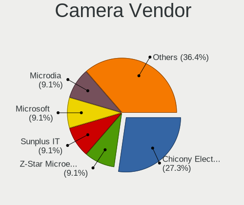

| Vendor                  | Desktops | Percent |
|-------------------------|----------|---------|
| Chicony Electronics     | 3        | 33.33%  |
| Z-Star Microelectronics | 1        | 11.11%  |
| Sunplus IT              | 1        | 11.11%  |
| Microsoft               | 1        | 11.11%  |
| Jieli Technology        | 1        | 11.11%  |
| Hewlett-Packard         | 1        | 11.11%  |
| Generalplus Technology  | 1        | 11.11%  |

Camera Model
------------

Camera device models

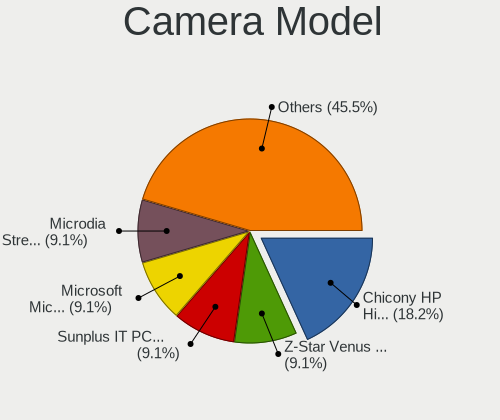

| Model                                               | Desktops | Percent |
|-----------------------------------------------------|----------|---------|
| Chicony HP High Definition 1MP Webcam               | 2        | 22.22%  |
| Z-Star Venus USB2.0 Camera                          | 1        | 11.11%  |
| Sunplus IT PC Camera                                | 1        | 11.11%  |
| Microsoft Microsoft LifeCam HD-6000 for Notebooks | 1        | 11.11%  |
| Jieli USB PHY 2.0                                   | 1        | 11.11%  |
| HP Webcam HD 2300                                   | 1        | 11.11%  |
| Generalplus CAMERA - UVC                            | 1        | 11.11%  |
| Chicony HP Webcam                                   | 1        | 11.11%  |

Security
--------

Fingerprint Vendor
------------------

Fingerprint sensor vendors

Zero info for selected period =(

Fingerprint Model
-----------------

Fingerprint sensor models

Zero info for selected period =(

Chipcard Vendor
---------------

Chipcard module vendors

Zero info for selected period =(

Chipcard Model
--------------

Chipcard module models

Zero info for selected period =(

Unsupported
-----------

Unsupported Devices
-------------------

Total unsupported devices on board

| Total | Desktops | Percent |
|-------|----------|---------|
| 0     | 56       | 87.5%   |
| 1     | 7        | 10.94%  |
| 2     | 1        | 1.56%   |

Unsupported Device Types
------------------------

Types of unsupported devices

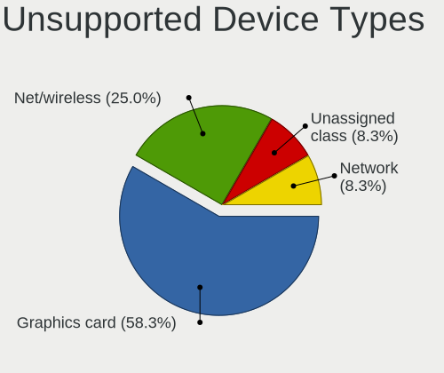

| Type             | Desktops | Percent |
|------------------|----------|---------|
| Graphics card    | 5        | 55.56%  |
| Net/wireless     | 2        | 22.22%  |
| Unassigned class | 1        | 11.11%  |
| Network          | 1        | 11.11%  |

