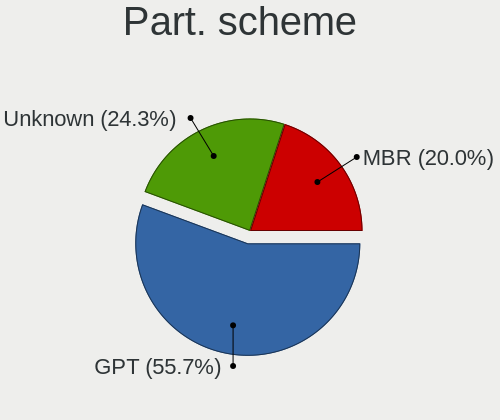
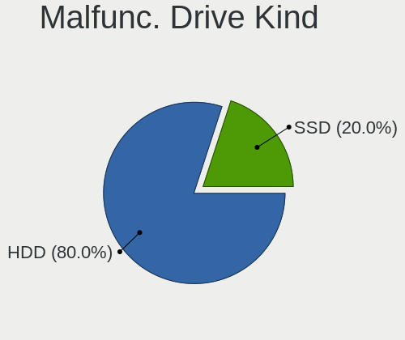
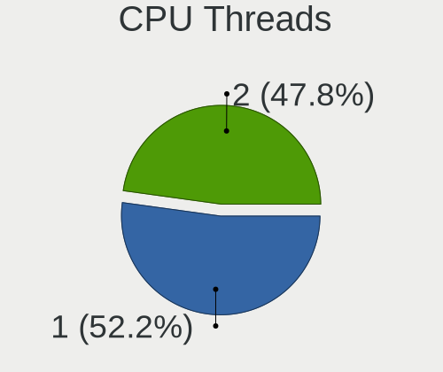
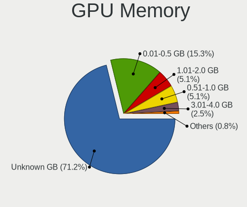
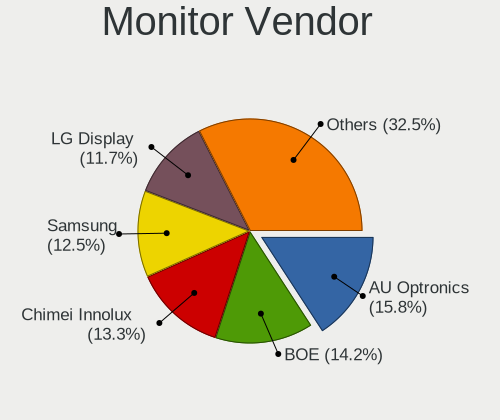
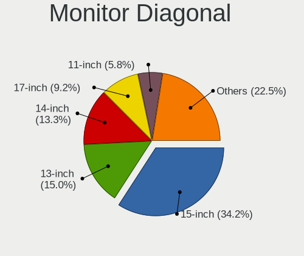
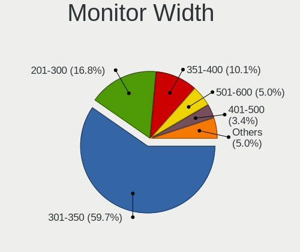
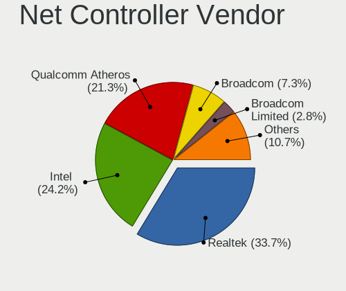
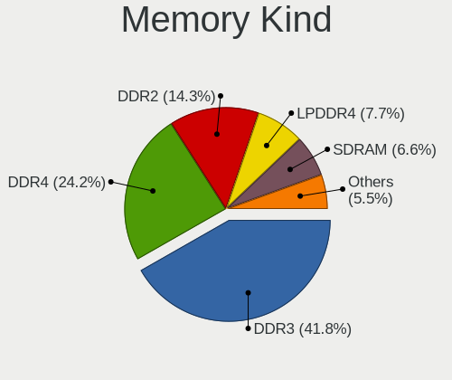
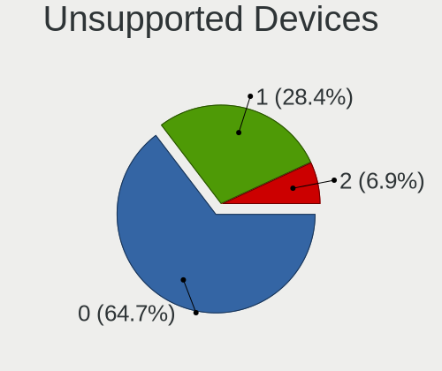

Linux Lite - Tested Hardware & Statistics (Notebooks)
-----------------------------------------------------

A project to collect tested hardware configurations for Linux Lite.

Anyone can contribute to this report by the [hw-probe](https://github.com/linuxhw/hw-probe) tool:

    sudo -E hw-probe -all -upload

Please contribute! Especially if your hardware is rare.

Contents
--------

* [ Test Cases ](#test-cases)

* [ System ](#system)
  - [ OS                       ](#os)
  - [ OS Family                ](#os-family)
  - [ Kernel                   ](#kernel)
  - [ Kernel Family            ](#kernel-family)
  - [ Kernel Major Ver.        ](#kernel-major-ver)
  - [ Arch                     ](#arch)
  - [ DE                       ](#de)
  - [ Display Server           ](#display-server)
  - [ Display Manager          ](#display-manager)
  - [ OS Lang                  ](#os-lang)
  - [ Boot Mode                ](#boot-mode)
  - [ Filesystem               ](#filesystem)
  - [ Part. scheme             ](#part-scheme)
  - [ Dual Boot with Linux/BSD ](#dual-boot-with-linuxbsd)
  - [ Dual Boot (Win)          ](#dual-boot-win)

* [ Board ](#board)
  - [ Vendor                   ](#vendor)
  - [ Model                    ](#model)
  - [ Model Family             ](#model-family)
  - [ MFG Year                 ](#mfg-year)
  - [ Form Factor              ](#form-factor)
  - [ Secure Boot              ](#secure-boot)
  - [ Coreboot                 ](#coreboot)
  - [ RAM Size                 ](#ram-size)
  - [ RAM Used                 ](#ram-used)
  - [ Total Drives             ](#total-drives)
  - [ Has CD-ROM               ](#has-cd-rom)
  - [ Has Ethernet             ](#has-ethernet)
  - [ Has WiFi                 ](#has-wifi)
  - [ Has Bluetooth            ](#has-bluetooth)

* [ Location ](#location)
  - [ Country                  ](#country)
  - [ City                     ](#city)

* [ Drives ](#drives)
  - [ Drive Vendor             ](#drive-vendor)
  - [ Drive Model              ](#drive-model)
  - [ HDD Vendor               ](#hdd-vendor)
  - [ SSD Vendor               ](#ssd-vendor)
  - [ Drive Kind               ](#drive-kind)
  - [ Drive Connector          ](#drive-connector)
  - [ Drive Size               ](#drive-size)
  - [ Space Total              ](#space-total)
  - [ Space Used               ](#space-used)
  - [ Malfunc. Drives          ](#malfunc-drives)
  - [ Malfunc. Drive Vendor    ](#malfunc-drive-vendor)
  - [ Malfunc. HDD Vendor      ](#malfunc-hdd-vendor)
  - [ Malfunc. Drive Kind      ](#malfunc-drive-kind)
  - [ Failed Drives            ](#failed-drives)
  - [ Failed Drive Vendor      ](#failed-drive-vendor)
  - [ Drive Status             ](#drive-status)

* [ Storage controller ](#storage-controller)
  - [ Storage Vendor           ](#storage-vendor)
  - [ Storage Model            ](#storage-model)
  - [ Storage Kind             ](#storage-kind)

* [ Processor ](#processor)
  - [ CPU Vendor               ](#cpu-vendor)
  - [ CPU Model                ](#cpu-model)
  - [ CPU Model Family         ](#cpu-model-family)
  - [ CPU Cores                ](#cpu-cores)
  - [ CPU Sockets              ](#cpu-sockets)
  - [ CPU Threads              ](#cpu-threads)
  - [ CPU Op-Modes             ](#cpu-op-modes)
  - [ CPU Microcode            ](#cpu-microcode)
  - [ CPU Microarch            ](#cpu-microarch)

* [ Graphics ](#graphics)
  - [ GPU Vendor               ](#gpu-vendor)
  - [ GPU Model                ](#gpu-model)
  - [ GPU Combo                ](#gpu-combo)
  - [ GPU Driver               ](#gpu-driver)
  - [ GPU Memory               ](#gpu-memory)

* [ Monitor ](#monitor)
  - [ Monitor Vendor           ](#monitor-vendor)
  - [ Monitor Model            ](#monitor-model)
  - [ Monitor Resolution       ](#monitor-resolution)
  - [ Monitor Diagonal         ](#monitor-diagonal)
  - [ Monitor Width            ](#monitor-width)
  - [ Aspect Ratio             ](#aspect-ratio)
  - [ Monitor Area             ](#monitor-area)
  - [ Pixel Density            ](#pixel-density)
  - [ Multiple Monitors        ](#multiple-monitors)

* [ Network ](#network)
  - [ Net Controller Vendor    ](#net-controller-vendor)
  - [ Net Controller Model     ](#net-controller-model)
  - [ Wireless Vendor          ](#wireless-vendor)
  - [ Wireless Model           ](#wireless-model)
  - [ Ethernet Vendor          ](#ethernet-vendor)
  - [ Ethernet Model           ](#ethernet-model)
  - [ Net Controller Kind      ](#net-controller-kind)
  - [ Used Controller          ](#used-controller)
  - [ NICs                     ](#nics)
  - [ IPv6                     ](#ipv6)

* [ Bluetooth ](#bluetooth)
  - [ Bluetooth Vendor         ](#bluetooth-vendor)
  - [ Bluetooth Model          ](#bluetooth-model)

* [ Sound ](#sound)
  - [ Sound Vendor             ](#sound-vendor)
  - [ Sound Model              ](#sound-model)

* [ Memory ](#memory)
  - [ Memory Vendor            ](#memory-vendor)
  - [ Memory Model             ](#memory-model)
  - [ Memory Kind              ](#memory-kind)
  - [ Memory Form Factor       ](#memory-form-factor)
  - [ Memory Size              ](#memory-size)
  - [ Memory Speed             ](#memory-speed)

* [ Printers & scanners ](#printers--scanners)
  - [ Printer Vendor           ](#printer-vendor)
  - [ Printer Model            ](#printer-model)
  - [ Scanner Vendor           ](#scanner-vendor)
  - [ Scanner Model            ](#scanner-model)

* [ Camera ](#camera)
  - [ Camera Vendor            ](#camera-vendor)
  - [ Camera Model             ](#camera-model)

* [ Security ](#security)
  - [ Fingerprint Vendor       ](#fingerprint-vendor)
  - [ Fingerprint Model        ](#fingerprint-model)
  - [ Chipcard Vendor          ](#chipcard-vendor)
  - [ Chipcard Model           ](#chipcard-model)

* [ Unsupported ](#unsupported)
  - [ Unsupported Devices      ](#unsupported-devices)
  - [ Unsupported Device Types ](#unsupported-device-types)

Test Cases
----------

Total: 120

| Vendor   | Model                       | Probe                                                      | Date         |
|----------|-----------------------------|------------------------------------------------------------|--------------|
| Dell     | Latitude E7240              | [87a0310cf0](https://linux-hardware.org/?probe=87a0310cf0) | Aug 02, 2023 |
| ASUSTek  | X502CA                      | [a2f77869ad](https://linux-hardware.org/?probe=a2f77869ad) | Jul 14, 2023 |
| Medion   | Akoya E6418 MD99620         | [7416e91f77](https://linux-hardware.org/?probe=7416e91f77) | Jul 14, 2023 |
| HP       | Laptop 14-dk1xxx            | [8a66b6d6b6](https://linux-hardware.org/?probe=8a66b6d6b6) | Jul 03, 2023 |
| Lenovo   | IdeaPad 310S-14AST 80UL     | [f897f42089](https://linux-hardware.org/?probe=f897f42089) | Jul 03, 2023 |
| HP       | Laptop 15-db0xxx            | [892229f999](https://linux-hardware.org/?probe=892229f999) | Jun 28, 2023 |
| HP       | Laptop 15-db0xxx            | [6d470794e9](https://linux-hardware.org/?probe=6d470794e9) | Jun 28, 2023 |
| UNOWHY   | Y13G010S4EI                 | [b36de255fe](https://linux-hardware.org/?probe=b36de255fe) | Jun 22, 2023 |
| UNOWHY   | Y13G010S4EI                 | [f8f4049a95](https://linux-hardware.org/?probe=f8f4049a95) | Jun 22, 2023 |
| Dell     | Latitude E6420              | [e86a159ec5](https://linux-hardware.org/?probe=e86a159ec5) | Jun 03, 2023 |
| Dell     | Latitude E6420              | [01cd20c83d](https://linux-hardware.org/?probe=01cd20c83d) | Jun 03, 2023 |
| Lenovo   | ThinkPad X240 20AMS1J100    | [86edc6c6d6](https://linux-hardware.org/?probe=86edc6c6d6) | May 11, 2023 |
| Apple    | MacBookAir4,1               | [87ab055a31](https://linux-hardware.org/?probe=87ab055a31) | Apr 27, 2023 |
| Lenovo   | IdeaPad 100-15IBY 80MJ      | [c5c1b213f2](https://linux-hardware.org/?probe=c5c1b213f2) | Apr 16, 2023 |
| Lenovo   | IdeaPad 330S-15AST 81F9     | [d79463ea93](https://linux-hardware.org/?probe=d79463ea93) | Apr 04, 2023 |
| Toshiba  | QOSMIO X70-B                | [8d94a6c8e7](https://linux-hardware.org/?probe=8d94a6c8e7) | Mar 28, 2023 |
| HP       | EliteBook 2530p             | [06ad8714ea](https://linux-hardware.org/?probe=06ad8714ea) | Mar 22, 2023 |
| Lenovo   | ThinkPad A475 20KMS08300    | [b42df5cbe0](https://linux-hardware.org/?probe=b42df5cbe0) | Mar 11, 2023 |
| Lenovo   | ThinkPad A475 20KMS08300    | [17a3030488](https://linux-hardware.org/?probe=17a3030488) | Mar 11, 2023 |
| Gateway  | Sonic-C                     | [b9f775b14e](https://linux-hardware.org/?probe=b9f775b14e) | Feb 28, 2023 |
| Gateway  | Sonic-C                     | [6def275f9b](https://linux-hardware.org/?probe=6def275f9b) | Feb 26, 2023 |
| ASUSTek  | G73Sw                       | [199c8805ee](https://linux-hardware.org/?probe=199c8805ee) | Feb 10, 2023 |
| HP       | 240 G3                      | [a977b66ced](https://linux-hardware.org/?probe=a977b66ced) | Feb 02, 2023 |
| HP       | 240 G3                      | [816a3f4b28](https://linux-hardware.org/?probe=816a3f4b28) | Feb 02, 2023 |
| ASUSTek  | G73Sw                       | [b8891cfc9b](https://linux-hardware.org/?probe=b8891cfc9b) | Jan 27, 2023 |
| ASUSTek  | G73Sw                       | [fb0a23c0e6](https://linux-hardware.org/?probe=fb0a23c0e6) | Jan 27, 2023 |
| ASUSTek  | G73Sw                       | [24b6a47ebb](https://linux-hardware.org/?probe=24b6a47ebb) | Jan 27, 2023 |
| ASUSTek  | G73Sw                       | [adbc469f95](https://linux-hardware.org/?probe=adbc469f95) | Jan 22, 2023 |
| ASUSTek  | G73Sw                       | [9249ff32b3](https://linux-hardware.org/?probe=9249ff32b3) | Jan 22, 2023 |
| HP       | Stream Notebook PC 13       | [b31d60976b](https://linux-hardware.org/?probe=b31d60976b) | Jan 14, 2023 |
| Acer     | Aspire A315-53              | [eb42b5e055](https://linux-hardware.org/?probe=eb42b5e055) | Dec 24, 2022 |
| Pegatron | H36FF                       | [f27fc61f18](https://linux-hardware.org/?probe=f27fc61f18) | Dec 18, 2022 |
| Thomson  | PT-NEO14A.2WH32             | [d028ff11a9](https://linux-hardware.org/?probe=d028ff11a9) | Dec 18, 2022 |
| Pegatron | H36FF                       | [692955be3d](https://linux-hardware.org/?probe=692955be3d) | Dec 18, 2022 |
| Acer     | Nitro AN515-58              | [4916981641](https://linux-hardware.org/?probe=4916981641) | Nov 26, 2022 |
| UMAX     | VisionBook 12Wi 64G         | [9fe98911c1](https://linux-hardware.org/?probe=9fe98911c1) | Oct 27, 2022 |
| HP       | Compaq Presario CQ50        | [8546f55697](https://linux-hardware.org/?probe=8546f55697) | Oct 24, 2022 |
| HP       | Compaq Presario CQ50        | [3b1b5c18c6](https://linux-hardware.org/?probe=3b1b5c18c6) | Oct 24, 2022 |
| Acer     | Aspire 5600                 | [202a7e570e](https://linux-hardware.org/?probe=202a7e570e) | Oct 20, 2022 |
| MSI      | MS-N014                     | [4c41640fd3](https://linux-hardware.org/?probe=4c41640fd3) | Oct 12, 2022 |
| MSI      | MS-N014                     | [3144cac65a](https://linux-hardware.org/?probe=3144cac65a) | Oct 12, 2022 |
| Lenovo   | IdeaPad 100-14IBY 80MH      | [676289f650](https://linux-hardware.org/?probe=676289f650) | Oct 02, 2022 |
| HP       | Compaq 420                  | [d3e367cedc](https://linux-hardware.org/?probe=d3e367cedc) | Oct 01, 2022 |
| HP       | Presario V6000 (RG289UA#... | [7f0113694a](https://linux-hardware.org/?probe=7f0113694a) | Sep 15, 2022 |
| Samsung  | X420/X520                   | [a8ca7bb005](https://linux-hardware.org/?probe=a8ca7bb005) | Sep 04, 2022 |
| Fujitsu  | FMVNQ8P6                    | [5e34698f14](https://linux-hardware.org/?probe=5e34698f14) | Aug 28, 2022 |
| ASUSTek  | UX303LN                     | [63d5525864](https://linux-hardware.org/?probe=63d5525864) | Aug 16, 2022 |
| Lenovo   | ThinkPad L480 20LS001AMC    | [47d4f751e1](https://linux-hardware.org/?probe=47d4f751e1) | Aug 09, 2022 |
| Apple    | MacBookAir6,1               | [ede7f6cdae](https://linux-hardware.org/?probe=ede7f6cdae) | Jul 23, 2022 |
| ASUSTek  | VivoBook 14_ASUS Laptop ... | [b846c98a96](https://linux-hardware.org/?probe=b846c98a96) | Jul 08, 2022 |
| HP       | Pavilion g4                 | [330078dbac](https://linux-hardware.org/?probe=330078dbac) | Jul 04, 2022 |
| ASUSTek  | X555YI                      | [762b96a2de](https://linux-hardware.org/?probe=762b96a2de) | Jul 02, 2022 |
| HP       | EliteBook 8440p             | [4bea8264d3](https://linux-hardware.org/?probe=4bea8264d3) | Jun 20, 2022 |
| Samsung  | 530XBB                      | [485a99ca42](https://linux-hardware.org/?probe=485a99ca42) | Jun 03, 2022 |
| Minix    | Z64 V1.2                    | [97525a1dc3](https://linux-hardware.org/?probe=97525a1dc3) | May 27, 2022 |
| Dell     | Inspiron 16 5620            | [b42e1cf95b](https://linux-hardware.org/?probe=b42e1cf95b) | May 13, 2022 |
| Minix    | Z64 V1.2                    | [8796deded0](https://linux-hardware.org/?probe=8796deded0) | May 12, 2022 |
| Dell     | MXG061                      | [119f6dd774](https://linux-hardware.org/?probe=119f6dd774) | May 09, 2022 |
| Lenovo   | IdeaPad Gaming 3 15IHU6 ... | [ab553d3a2f](https://linux-hardware.org/?probe=ab553d3a2f) | May 01, 2022 |
| Acer     | Extensa 5220                | [ebbd01171d](https://linux-hardware.org/?probe=ebbd01171d) | May 01, 2022 |
| Acer     | Aspire 1410                 | [703c2ec84a](https://linux-hardware.org/?probe=703c2ec84a) | Apr 21, 2022 |
| Lenovo   | ThinkPad T400 6475E13       | [cd49ac8445](https://linux-hardware.org/?probe=cd49ac8445) | Apr 08, 2022 |
| Dell     | MXG061                      | [9c91bd9487](https://linux-hardware.org/?probe=9c91bd9487) | Apr 06, 2022 |
| Insignia | NS-P11W7100                 | [daa476af8c](https://linux-hardware.org/?probe=daa476af8c) | Mar 28, 2022 |
| Dell     | MXG071                      | [ac0158dcb9](https://linux-hardware.org/?probe=ac0158dcb9) | Mar 27, 2022 |
| HP       | 15 Notebook PC              | [0f99b7ff76](https://linux-hardware.org/?probe=0f99b7ff76) | Mar 21, 2022 |
| HP       | Compaq CQ45                 | [99286efd08](https://linux-hardware.org/?probe=99286efd08) | Mar 10, 2022 |
| HP       | Laptop 15-dw3xxx            | [2b748962fa](https://linux-hardware.org/?probe=2b748962fa) | Mar 06, 2022 |
| ASUSTek  | 900                         | [8373f78d4e](https://linux-hardware.org/?probe=8373f78d4e) | Feb 19, 2022 |
| Acer     | Aspire A315-53              | [6134bb8cba](https://linux-hardware.org/?probe=6134bb8cba) | Feb 18, 2022 |
| Acer     | Aspire 5600                 | [4b2259f040](https://linux-hardware.org/?probe=4b2259f040) | Feb 10, 2022 |
| HP       | Laptop 15-dw3xxx            | [b596d9fdb1](https://linux-hardware.org/?probe=b596d9fdb1) | Feb 09, 2022 |
| HP       | Compaq nw9440 (EY615ET#A... | [6a5c3254ab](https://linux-hardware.org/?probe=6a5c3254ab) | Jan 30, 2022 |
| HP       | Pavilion dv6500             | [15838ae11b](https://linux-hardware.org/?probe=15838ae11b) | Jan 12, 2022 |
| ASUSTek  | N53Jf                       | [3f0e64b85e](https://linux-hardware.org/?probe=3f0e64b85e) | Jan 03, 2022 |
| ASUSTek  | N53Jf                       | [6d7b0abdfa](https://linux-hardware.org/?probe=6d7b0abdfa) | Jan 03, 2022 |
| ASUSTek  | X541SA                      | [26f2eeeefc](https://linux-hardware.org/?probe=26f2eeeefc) | Dec 31, 2021 |
| HP       | Pavilion dv6500             | [978ee4328d](https://linux-hardware.org/?probe=978ee4328d) | Dec 19, 2021 |
| Acer     | Aspire 5600                 | [25b1e50c64](https://linux-hardware.org/?probe=25b1e50c64) | Dec 12, 2021 |
| HP       | Compaq 2510p                | [8bc24dae3e](https://linux-hardware.org/?probe=8bc24dae3e) | Nov 23, 2021 |
| HP       | Compaq 2510p                | [c76241a894](https://linux-hardware.org/?probe=c76241a894) | Nov 22, 2021 |
| Samsung  | 905S3G/906S3G/915S3G/930... | [b7306537cc](https://linux-hardware.org/?probe=b7306537cc) | Nov 10, 2021 |
| Acer     | Aspire 5600                 | [7e2da6d3e9](https://linux-hardware.org/?probe=7e2da6d3e9) | Oct 26, 2021 |
| Dell     | MXG061                      | [89a5b20193](https://linux-hardware.org/?probe=89a5b20193) | Oct 10, 2021 |
| Acer     | Swift SF314-56              | [263d6e38b7](https://linux-hardware.org/?probe=263d6e38b7) | Oct 01, 2021 |
| Acer     | Swift SF314-56              | [bb0f894bce](https://linux-hardware.org/?probe=bb0f894bce) | Oct 01, 2021 |
| Dell     | Vostro1710                  | [d50123c66a](https://linux-hardware.org/?probe=d50123c66a) | Sep 01, 2021 |
| Dell     | Inspiron 5452               | [0c9b3ec7a9](https://linux-hardware.org/?probe=0c9b3ec7a9) | Aug 07, 2021 |
| HP       | EliteBook Folio 9470m       | [b2b851f7d2](https://linux-hardware.org/?probe=b2b851f7d2) | Jul 12, 2021 |
| ASUSTek  | X541SA                      | [ed8bb15f60](https://linux-hardware.org/?probe=ed8bb15f60) | Jul 11, 2021 |
| HP       | Laptop 14-cm0xxx            | [5943266aca](https://linux-hardware.org/?probe=5943266aca) | Jun 18, 2021 |
| HP       | Laptop 14-cm0xxx            | [3b4a122b75](https://linux-hardware.org/?probe=3b4a122b75) | Jun 18, 2021 |
| Fujitsu  | LIFEBOOK U747               | [117e8bf660](https://linux-hardware.org/?probe=117e8bf660) | Jun 17, 2021 |
| Lenovo   | IdeaPad Slim 1-14AST-05 ... | [a9255b2217](https://linux-hardware.org/?probe=a9255b2217) | Jun 04, 2021 |
| ASUSTek  | VivoBook_ASUSLaptop E203... | [58bf661e8d](https://linux-hardware.org/?probe=58bf661e8d) | Apr 15, 2021 |
| ASUSTek  | K50IE                       | [b0bcc6c31c](https://linux-hardware.org/?probe=b0bcc6c31c) | Apr 12, 2021 |
| ASUSTek  | K54LY                       | [dc7d86f51e](https://linux-hardware.org/?probe=dc7d86f51e) | Mar 21, 2021 |
| Acer     | Aspire V5-552               | [7a32a8a1c3](https://linux-hardware.org/?probe=7a32a8a1c3) | Mar 03, 2021 |
| HP       | Compaq 6735b                | [0f2afbc99a](https://linux-hardware.org/?probe=0f2afbc99a) | Feb 18, 2021 |
| Dell     | Inspiron 7559               | [4d4377253f](https://linux-hardware.org/?probe=4d4377253f) | Feb 15, 2021 |
| HP       | Laptop 17-by2xxx            | [729abf0085](https://linux-hardware.org/?probe=729abf0085) | Jan 30, 2021 |
| Acer     | Predator PH317-52           | [1bd05ad341](https://linux-hardware.org/?probe=1bd05ad341) | Jan 24, 2021 |
| HP       | 655                         | [a6913cacf3](https://linux-hardware.org/?probe=a6913cacf3) | Dec 28, 2020 |
| HP       | 655                         | [2a4c81218e](https://linux-hardware.org/?probe=2a4c81218e) | Dec 27, 2020 |
| Toshiba  | Satellite T215D             | [084f254e1f](https://linux-hardware.org/?probe=084f254e1f) | Dec 23, 2020 |
| Toshiba  | Satellite T215D             | [bdb8fe4e55](https://linux-hardware.org/?probe=bdb8fe4e55) | Dec 23, 2020 |
| Lenovo   | IdeaPad 320-15ABR 80XS      | [680d4771b2](https://linux-hardware.org/?probe=680d4771b2) | Dec 15, 2020 |
| ASUSTek  | 1001PX                      | [9f911bde1c](https://linux-hardware.org/?probe=9f911bde1c) | Dec 11, 2020 |
| Acer     | Aspire 5750                 | [ba47872fd5](https://linux-hardware.org/?probe=ba47872fd5) | Dec 02, 2020 |
| Acer     | Aspire 5750                 | [c4216f5d80](https://linux-hardware.org/?probe=c4216f5d80) | Dec 02, 2020 |
| Dell     | Latitude D530               | [4fe18e86ac](https://linux-hardware.org/?probe=4fe18e86ac) | Sep 27, 2020 |
| Acer     | Aspire ES1-511              | [63a7ae1967](https://linux-hardware.org/?probe=63a7ae1967) | Jul 24, 2020 |
| Google   | Chell                       | [cf727e9a6e](https://linux-hardware.org/?probe=cf727e9a6e) | Jul 23, 2020 |
| ASUSTek  | X751LD                      | [2d9ea757d1](https://linux-hardware.org/?probe=2d9ea757d1) | Jul 14, 2020 |
| ASUSTek  | X751LD                      | [1a4ee704d9](https://linux-hardware.org/?probe=1a4ee704d9) | Jul 14, 2020 |
| Lenovo   | 3000 V200 0764A11           | [8492023ae0](https://linux-hardware.org/?probe=8492023ae0) | Jul 13, 2020 |
| TR       | ST Pro-KN                   | [e78b2937ef](https://linux-hardware.org/?probe=e78b2937ef) | Jul 01, 2020 |
| ASUSTek  | N750JK                      | [9102fbcf41](https://linux-hardware.org/?probe=9102fbcf41) | Jun 02, 2020 |
| Samsung  | NC110P/NC108P/NC111P        | [92c219ffb4](https://linux-hardware.org/?probe=92c219ffb4) | May 14, 2020 |
| ASUSTek  | X540YA                      | [2bfdde7714](https://linux-hardware.org/?probe=2bfdde7714) | Apr 03, 2020 |

System
------

OS
--

Installed operating systems

| Name           | Notebooks | Percent |
|----------------|-----------|---------|
| Linux Lite 6.0 | 13        | 14.94%  |
| Linux Lite 5.8 | 13        | 14.94%  |
| Linux Lite 6.2 | 11        | 12.64%  |
| Linux Lite 5.4 | 11        | 12.64%  |
| Linux Lite 5.2 | 9         | 10.34%  |
| Linux Lite 6.4 | 8         | 9.2%    |
| Linux Lite 5.0 | 8         | 9.2%    |
| Linux Lite 5.6 | 7         | 8.05%   |
| Linux Lite 3.8 | 3         | 3.45%   |
| Linux Lite 4.8 | 2         | 2.3%    |
| Linux Lite 4.4 | 1         | 1.15%   |
| Linux Lite 4.2 | 1         | 1.15%   |

OS Family
---------

OS without a version

| Name       | Notebooks | Percent |
|------------|-----------|---------|
| Linux Lite | 85        | 100%    |

Kernel
------

Version of the Linux kernel

| Version               | Notebooks | Percent |
|-----------------------|-----------|---------|
| 5.4.0-40-generic      | 4         | 4.3%    |
| 5.15.0-76-generic     | 4         | 4.3%    |
| 5.15.0-69-generic     | 4         | 4.3%    |
| 5.4.0-70-generic      | 3         | 3.23%   |
| 5.4.0-52-generic      | 3         | 3.23%   |
| 5.4.0-109-generic     | 3         | 3.23%   |
| 5.15.0-33-generic     | 3         | 3.23%   |
| 5.4.0-91-generic      | 2         | 2.15%   |
| 5.4.0-90-generic      | 2         | 2.15%   |
| 5.4.0-81-generic      | 2         | 2.15%   |
| 5.4.0-74-generic      | 2         | 2.15%   |
| 5.4.0-58-generic      | 2         | 2.15%   |
| 5.4.0-42-generic      | 2         | 2.15%   |
| 5.4.0-107-generic     | 2         | 2.15%   |
| 5.4.0-104-generic     | 2         | 2.15%   |
| 5.15.0-60-generic     | 2         | 2.15%   |
| 5.15.0-56-generic     | 2         | 2.15%   |
| 5.15.0-52-generic     | 2         | 2.15%   |
| 5.15.0-48-generic     | 2         | 2.15%   |
| 5.15.0-47-generic     | 2         | 2.15%   |
| 6.1.0-1.linuxlite     | 1         | 1.08%   |
| 6.0.0                 | 1         | 1.08%   |
| 5.4.0-96-generic      | 1         | 1.08%   |
| 5.4.0-94-generic      | 1         | 1.08%   |
| 5.4.0-88-generic      | 1         | 1.08%   |
| 5.4.0-77-generic      | 1         | 1.08%   |
| 5.4.0-71-generic      | 1         | 1.08%   |
| 5.4.0-66-generic      | 1         | 1.08%   |
| 5.4.0-65-generic      | 1         | 1.08%   |
| 5.4.0-56-generic      | 1         | 1.08%   |
| 5.4.0-48-generic      | 1         | 1.08%   |
| 5.4.0-33-generic      | 1         | 1.08%   |
| 5.4.0-152-generic     | 1         | 1.08%   |
| 5.4.0-124-generic     | 1         | 1.08%   |
| 5.4.0-122-generic     | 1         | 1.08%   |
| 5.4.0-113-generic     | 1         | 1.08%   |
| 5.4.0-110-generic     | 1         | 1.08%   |
| 5.4.0-105-generic     | 1         | 1.08%   |
| 5.4.0-100-generic     | 1         | 1.08%   |
| 5.19.0-051900-generic | 1         | 1.08%   |

Kernel Family
-------------

Linux kernel without a distro release

| Version | Notebooks | Percent |
|---------|-----------|---------|
| 5.4.0   | 45        | 51.14%  |
| 5.15.0  | 31        | 35.23%  |
| 4.15.0  | 4         | 4.55%   |
| 4.4.0   | 2         | 2.27%   |
| 6.1.0   | 1         | 1.14%   |
| 6.0.0   | 1         | 1.14%   |
| 5.19.0  | 1         | 1.14%   |
| 5.16.0  | 1         | 1.14%   |
| 5.13.0  | 1         | 1.14%   |
| 5.10.0  | 1         | 1.14%   |

Kernel Major Ver.
-----------------

Linux kernel major version

| Version | Notebooks | Percent |
|---------|-----------|---------|
| 5.4     | 45        | 51.14%  |
| 5.15    | 31        | 35.23%  |
| 4.15    | 4         | 4.55%   |
| 4.4     | 2         | 2.27%   |
| 6.1     | 1         | 1.14%   |
| 6.0     | 1         | 1.14%   |
| 5.19    | 1         | 1.14%   |
| 5.16    | 1         | 1.14%   |
| 5.13    | 1         | 1.14%   |
| 5.10    | 1         | 1.14%   |

Arch
----

OS architecture (x86_64, i586, etc.)

| Name   | Notebooks | Percent |
|--------|-----------|---------|
| x86_64 | 83        | 97.65%  |
| i686   | 2         | 2.35%   |

DE
--

Desktop Environment

| Name    | Notebooks | Percent |
|---------|-----------|---------|
| XFCE    | 70        | 82.35%  |
| GNOME   | 12        | 14.12%  |
| Unknown | 2         | 2.35%   |
| Deepin  | 1         | 1.18%   |

Display Server
--------------

X11 or Wayland

| Name    | Notebooks | Percent |
|---------|-----------|---------|
| X11     | 83        | 97.65%  |
| Tty     | 1         | 1.18%   |
| Unknown | 1         | 1.18%   |

Display Manager
---------------

SDDM, LightDM, etc.

| Name    | Notebooks | Percent |
|---------|-----------|---------|
| LightDM | 57        | 65.52%  |
| TDM     | 15        | 17.24%  |
| Unknown | 13        | 14.94%  |
| GDM3    | 1         | 1.15%   |
| GDM     | 1         | 1.15%   |

OS Lang
-------

Language

| Lang  | Notebooks | Percent |
|-------|-----------|---------|
| en_US | 48        | 56.47%  |
| de_DE | 7         | 8.24%   |
| pl_PL | 5         | 5.88%   |
| fr_FR | 5         | 5.88%   |
| es_ES | 3         | 3.53%   |
| en_GB | 3         | 3.53%   |
| ru_UA | 2         | 2.35%   |
| ru_RU | 2         | 2.35%   |
| pt_BR | 2         | 2.35%   |
| it_IT | 2         | 2.35%   |
| zh_CN | 1         | 1.18%   |
| pt_PT | 1         | 1.18%   |
| es_CO | 1         | 1.18%   |
| en_PH | 1         | 1.18%   |
| en_IN | 1         | 1.18%   |
| en_AU | 1         | 1.18%   |

Boot Mode
---------

EFI or BIOS

| Mode | Notebooks | Percent |
|------|-----------|---------|
| EFI  | 46        | 54.12%  |
| BIOS | 39        | 45.88%  |

Filesystem
----------

Type of filesystem

| Type    | Notebooks | Percent |
|---------|-----------|---------|
| Ext4    | 73        | 85.88%  |
| Overlay | 7         | 8.24%   |
| Tmpfs   | 2         | 2.35%   |
| Btrfs   | 2         | 2.35%   |
| Zfs     | 1         | 1.18%   |

Part. scheme
------------

Scheme of partitioning

| Type    | Notebooks | Percent |
|---------|-----------|---------|
| GPT     | 43        | 50.59%  |
| Unknown | 24        | 28.24%  |
| MBR     | 18        | 21.18%  |

Dual Boot with Linux/BSD
------------------------

Hosting more than one Linux/BSD

| Dual boot | Notebooks | Percent |
|-----------|-----------|---------|
| No        | 74        | 86.05%  |
| Yes       | 12        | 13.95%  |

Dual Boot (Win)
---------------

Hosting Linux and Windows

| Dual boot | Notebooks | Percent |
|-----------|-----------|---------|
| No        | 62        | 72.09%  |
| Yes       | 24        | 27.91%  |

Board
-----

Vendor
------

Motherboard manufacturer

| Name                | Notebooks | Percent |
|---------------------|-----------|---------|
| Hewlett-Packard     | 19        | 22.35%  |
| ASUSTek Computer    | 15        | 17.65%  |
| Lenovo              | 11        | 12.94%  |
| Acer                | 10        | 11.76%  |
| Dell                | 9         | 10.59%  |
| Samsung Electronics | 4         | 4.71%   |
| Toshiba             | 2         | 2.35%   |
| Fujitsu             | 2         | 2.35%   |
| Apple               | 2         | 2.35%   |
| UNOWHY              | 1         | 1.18%   |
| UMAX                | 1         | 1.18%   |
| TR                  | 1         | 1.18%   |
| Thomson             | 1         | 1.18%   |
| Pegatron            | 1         | 1.18%   |
| MSI                 | 1         | 1.18%   |
| Minix               | 1         | 1.18%   |
| Medion              | 1         | 1.18%   |
| Insignia            | 1         | 1.18%   |
| Google              | 1         | 1.18%   |
| Gateway             | 1         | 1.18%   |

Model
-----

Motherboard model

| Name                                | Notebooks | Percent |
|-------------------------------------|-----------|---------|
| UNOWHY Y13G010S4EI                  | 1         | 1.18%   |
| UMAX VisionBook 12Wi 64G            | 1         | 1.18%   |
| TR ST Pro-KN                        | 1         | 1.18%   |
| Toshiba Satellite T215D             | 1         | 1.18%   |
| Toshiba QOSMIO X70-B                | 1         | 1.18%   |
| Thomson PT-NEO14A.2WH32             | 1         | 1.18%   |
| Samsung X420/X520                   | 1         | 1.18%   |
| Samsung NC110P/NC108P/NC111P        | 1         | 1.18%   |
| Samsung 905S3G/906S3G/915S3G/9305SG | 1         | 1.18%   |
| Samsung 530XBB                      | 1         | 1.18%   |
| Pegatron H36FF                      | 1         | 1.18%   |
| MSI MS-N014                         | 1         | 1.18%   |
| Minix Z64                           | 1         | 1.18%   |
| Medion Akoya E6418 MD99620          | 1         | 1.18%   |
| Lenovo ThinkPad X240 20AMS1J100     | 1         | 1.18%   |
| Lenovo ThinkPad T400 6475E13        | 1         | 1.18%   |
| Lenovo ThinkPad L480 20LS001AMC     | 1         | 1.18%   |
| Lenovo ThinkPad A475 20KMS08300     | 1         | 1.18%   |
| Lenovo IdeaPad Gaming 3 15IHU6 82K1 | 1         | 1.18%   |
| Lenovo IdeaPad 330S-15AST 81F9      | 1         | 1.18%   |
| Lenovo IdeaPad 320-15ABR 80XS       | 1         | 1.18%   |
| Lenovo IdeaPad 310S-14AST 80UL      | 1         | 1.18%   |
| Lenovo IdeaPad 100-15IBY 80MJ       | 1         | 1.18%   |
| Lenovo IdeaPad 100-14IBY 80MH       | 1         | 1.18%   |
| Lenovo 3000 V200 0764A11            | 1         | 1.18%   |
| Insignia NS-P11W7100                | 1         | 1.18%   |
| HP Stream Notebook PC 13            | 1         | 1.18%   |
| HP Presario V6000 (RG289UA#ABA)     | 1         | 1.18%   |
| HP Pavilion g4                      | 1         | 1.18%   |
| HP Pavilion dv6500                  | 1         | 1.18%   |
| HP Laptop 17-by2xxx                 | 1         | 1.18%   |
| HP Laptop 15-dw3xxx                 | 1         | 1.18%   |
| HP Laptop 15-db0xxx                 | 1         | 1.18%   |
| HP Laptop 14-dk1xxx                 | 1         | 1.18%   |
| HP Laptop 14-cm0xxx                 | 1         | 1.18%   |
| HP EliteBook Folio 9470m            | 1         | 1.18%   |
| HP EliteBook 8440p                  | 1         | 1.18%   |
| HP EliteBook 2530p                  | 1         | 1.18%   |
| HP Compaq Presario CQ50             | 1         | 1.18%   |
| HP Compaq nw9440 (EY615ET#ABU)      | 1         | 1.18%   |

Model Family
------------

Motherboard model prefix

| Name                    | Notebooks | Percent |
|-------------------------|-----------|---------|
| Lenovo IdeaPad          | 6         | 7.06%   |
| Acer Aspire             | 6         | 7.06%   |
| HP Laptop               | 5         | 5.88%   |
| HP Compaq               | 5         | 5.88%   |
| Lenovo ThinkPad         | 4         | 4.71%   |
| HP EliteBook            | 3         | 3.53%   |
| Dell Latitude           | 3         | 3.53%   |
| Dell Inspiron           | 3         | 3.53%   |
| HP Pavilion             | 2         | 2.35%   |
| ASUS VivoBook           | 2         | 2.35%   |
| UNOWHY Y13G010S4EI      | 1         | 1.18%   |
| UMAX VisionBook         | 1         | 1.18%   |
| TR ST                   | 1         | 1.18%   |
| Toshiba Satellite       | 1         | 1.18%   |
| Toshiba QOSMIO          | 1         | 1.18%   |
| Thomson PT-NEO14A.2WH32 | 1         | 1.18%   |
| Samsung X420            | 1         | 1.18%   |
| Samsung NC110P          | 1         | 1.18%   |
| Samsung 905S3G          | 1         | 1.18%   |
| Samsung 530XBB          | 1         | 1.18%   |
| Pegatron H36FF          | 1         | 1.18%   |
| MSI MS-N014             | 1         | 1.18%   |
| Minix Z64               | 1         | 1.18%   |
| Medion Akoya            | 1         | 1.18%   |
| Lenovo 3000             | 1         | 1.18%   |
| Insignia NS-P11W7100    | 1         | 1.18%   |
| HP Stream               | 1         | 1.18%   |
| HP Presario             | 1         | 1.18%   |
| HP 655                  | 1         | 1.18%   |
| HP 15                   | 1         | 1.18%   |
| Google Chell            | 1         | 1.18%   |
| Gateway Sonic-C         | 1         | 1.18%   |
| Fujitsu LIFEBOOK        | 1         | 1.18%   |
| Fujitsu FMVNQ8P6        | 1         | 1.18%   |
| Dell Vostro1710         | 1         | 1.18%   |
| Dell MXG071             | 1         | 1.18%   |
| Dell MXG061             | 1         | 1.18%   |
| ASUS X751LD             | 1         | 1.18%   |
| ASUS X555YI             | 1         | 1.18%   |
| ASUS X541SA             | 1         | 1.18%   |

MFG Year
--------

Motherboard manufacture year

| Year | Notebooks | Percent |
|------|-----------|---------|
| 2018 | 9         | 10.59%  |
| 2014 | 8         | 9.41%   |
| 2010 | 8         | 9.41%   |
| 2015 | 7         | 8.24%   |
| 2008 | 7         | 8.24%   |
| 2007 | 7         | 8.24%   |
| 2017 | 5         | 5.88%   |
| 2013 | 5         | 5.88%   |
| 2012 | 5         | 5.88%   |
| 2011 | 5         | 5.88%   |
| 2020 | 4         | 4.71%   |
| 2019 | 4         | 4.71%   |
| 2016 | 4         | 4.71%   |
| 2022 | 2         | 2.35%   |
| 2006 | 2         | 2.35%   |
| 2021 | 1         | 1.18%   |
| 2009 | 1         | 1.18%   |
| 2004 | 1         | 1.18%   |

Form Factor
-----------

Physical design of the computer

| Name     | Notebooks | Percent |
|----------|-----------|---------|
| Notebook | 85        | 100%    |

Secure Boot
-----------

Enabled or disabled

| State    | Notebooks | Percent |
|----------|-----------|---------|
| Disabled | 79        | 92.94%  |
| Enabled  | 6         | 7.06%   |

Coreboot
--------

Have coreboot on board

| Used | Notebooks | Percent |
|------|-----------|---------|
| No   | 84        | 98.82%  |
| Yes  | 1         | 1.18%   |

RAM Size
--------

Total RAM memory

| Size in GB | Notebooks | Percent |
|------------|-----------|---------|
| 3.01-4.0   | 33        | 38.82%  |
| 1.01-2.0   | 16        | 18.82%  |
| 4.01-8.0   | 14        | 16.47%  |
| 16.01-24.0 | 9         | 10.59%  |
| 8.01-16.0  | 6         | 7.06%   |
| 0.51-1.0   | 4         | 4.71%   |
| 2.01-3.0   | 2         | 2.35%   |
| 32.01-64.0 | 1         | 1.18%   |

RAM Used
--------

Used RAM memory

| Used GB   | Notebooks | Percent |
|-----------|-----------|---------|
| 1.01-2.0  | 44        | 50%     |
| 2.01-3.0  | 19        | 21.59%  |
| 0.51-1.0  | 13        | 14.77%  |
| 3.01-4.0  | 6         | 6.82%   |
| 0.01-0.5  | 3         | 3.41%   |
| 4.01-8.0  | 2         | 2.27%   |
| 8.01-16.0 | 1         | 1.14%   |

Total Drives
------------

Number of drives on board

| Drives | Notebooks | Percent |
|--------|-----------|---------|
| 1      | 69        | 81.18%  |
| 2      | 15        | 17.65%  |
| 3      | 1         | 1.18%   |

Has CD-ROM
----------

Has CD-ROM on board

| Presented | Notebooks | Percent |
|-----------|-----------|---------|
| No        | 51        | 60%     |
| Yes       | 34        | 40%     |

Has Ethernet
------------

Has Ethernet on board

| Presented | Notebooks | Percent |
|-----------|-----------|---------|
| Yes       | 70        | 82.35%  |
| No        | 15        | 17.65%  |

Has WiFi
--------

Has WiFi module

| Presented | Notebooks | Percent |
|-----------|-----------|---------|
| Yes       | 83        | 97.65%  |
| No        | 2         | 2.35%   |

Has Bluetooth
-------------

Has Bluetooth module

| Presented | Notebooks | Percent |
|-----------|-----------|---------|
| Yes       | 60        | 70.59%  |
| No        | 25        | 29.41%  |

Location
--------

Country
-------

Geographic location (country)

| Country     | Notebooks | Percent |
|-------------|-----------|---------|
| USA         | 11        | 12.94%  |
| Germany     | 9         | 10.59%  |
| France      | 7         | 8.24%   |
| Romania     | 5         | 5.88%   |
| Brazil      | 5         | 5.88%   |
| Ukraine     | 4         | 4.71%   |
| UK          | 4         | 4.71%   |
| Poland      | 4         | 4.71%   |
| Italy       | 4         | 4.71%   |
| Spain       | 3         | 3.53%   |
| Russia      | 3         | 3.53%   |
| Turkey      | 2         | 2.35%   |
| Philippines | 2         | 2.35%   |
| Australia   | 2         | 2.35%   |
| Venezuela   | 1         | 1.18%   |
| Thailand    | 1         | 1.18%   |
| Sweden      | 1         | 1.18%   |
| Slovakia    | 1         | 1.18%   |
| Serbia      | 1         | 1.18%   |
| Portugal    | 1         | 1.18%   |
| Netherlands | 1         | 1.18%   |
| Myanmar     | 1         | 1.18%   |
| Mexico      | 1         | 1.18%   |
| Iran        | 1         | 1.18%   |
| Indonesia   | 1         | 1.18%   |
| India       | 1         | 1.18%   |
| Guadeloupe  | 1         | 1.18%   |
| Greece      | 1         | 1.18%   |
| El Salvador | 1         | 1.18%   |
| Czechia     | 1         | 1.18%   |
| Colombia    | 1         | 1.18%   |
| Chile       | 1         | 1.18%   |
| Canada      | 1         | 1.18%   |
| Argentina   | 1         | 1.18%   |

City
----

Geographic location (city)

| City                   | Notebooks | Percent |
|------------------------|-----------|---------|
| Sydney                 | 2         | 2.27%   |
| Paris                  | 2         | 2.27%   |
| Pabianice              | 2         | 2.27%   |
| Odessa                 | 2         | 2.27%   |
| Frankfurt am Main      | 2         | 2.27%   |
| Żywiec                | 1         | 1.14%   |
| Yangon                 | 1         | 1.14%   |
| Würzburg              | 1         | 1.14%   |
| Wiesbaden              | 1         | 1.14%   |
| Washington             | 1         | 1.14%   |
| Warsaw                 | 1         | 1.14%   |
| Wahroonga              | 1         | 1.14%   |
| Voluntari              | 1         | 1.14%   |
| Vinnytsia              | 1         | 1.14%   |
| Villingen-Schwenningen | 1         | 1.14%   |
| Varennes-les-Narcy     | 1         | 1.14%   |
| Valencia               | 1         | 1.14%   |
| Tucape                 | 1         | 1.14%   |
| Teresina               | 1         | 1.14%   |
| Tekirdağ              | 1         | 1.14%   |
| Tarragona              | 1         | 1.14%   |
| Tamm                   | 1         | 1.14%   |
| Svidník               | 1         | 1.14%   |
| Surabaya               | 1         | 1.14%   |
| Subotica               | 1         | 1.14%   |
| Studenka               | 1         | 1.14%   |
| St. Petersburg         | 1         | 1.14%   |
| Shadrinsk              | 1         | 1.14%   |
| Sartrouville           | 1         | 1.14%   |
| Sao Paulo              | 1         | 1.14%   |
| Santiago del Estero    | 1         | 1.14%   |
| Salerno                | 1         | 1.14%   |
| Sabadell               | 1         | 1.14%   |
| Roswell                | 1         | 1.14%   |
| Queretaro              | 1         | 1.14%   |
| Póvoa de Varzim       | 1         | 1.14%   |
| Pátrai                | 1         | 1.14%   |
| Paranaque City         | 1         | 1.14%   |
| Nudlingen              | 1         | 1.14%   |
| Novaci                 | 1         | 1.14%   |

Drives
------

Drive Vendor
------------

Hard drive vendors

| Vendor              | Notebooks | Drives | Percent |
|---------------------|-----------|--------|---------|
| Seagate             | 16        | 19     | 16.84%  |
| WDC                 | 14        | 18     | 14.74%  |
| Toshiba             | 11        | 12     | 11.58%  |
| Samsung Electronics | 11        | 12     | 11.58%  |
| Unknown             | 8         | 11     | 8.42%   |
| Kingston            | 5         | 5      | 5.26%   |
| HGST                | 5         | 5      | 5.26%   |
| Micron Technology   | 4         | 5      | 4.21%   |
| SK hynix            | 3         | 4      | 3.16%   |
| SanDisk             | 3         | 3      | 3.16%   |
| Hitachi             | 3         | 3      | 3.16%   |
| GOODRAM             | 2         | 2      | 2.11%   |
| Crucial             | 2         | 2      | 2.11%   |
| Apple               | 2         | 2      | 2.11%   |
| Phison              | 1         | 1      | 1.05%   |
| LITEON              | 1         | 1      | 1.05%   |
| Intel               | 1         | 1      | 1.05%   |
| ASUS-PHISON         | 1         | 2      | 1.05%   |
| ASMT                | 1         | 1      | 1.05%   |
| A-DATA Technology   | 1         | 1      | 1.05%   |

Drive Model
-----------

Hard drive models

| Model                                 | Notebooks | Percent |
|---------------------------------------|-----------|---------|
| Unknown MMC Card  32GB                | 3         | 3.03%   |
| Toshiba MQ01ABF050 500GB              | 3         | 3.03%   |
| Kingston SA400S37240G 240GB SSD       | 3         | 3.03%   |
| Unknown DA4064  64GB                  | 2         | 2.02%   |
| Toshiba MQ01ABD100 1TB                | 2         | 2.02%   |
| Seagate ST9320325AS 320GB             | 2         | 2.02%   |
| Micron MTFDDAK256MAM-1K12 256GB SSD   | 2         | 2.02%   |
| HGST HTS725050A7E630 500GB            | 2         | 2.02%   |
| WDC WDS480G2G0A-00JH30 480GB SSD      | 1         | 1.01%   |
| WDC WDS120G2G0A-00JH30 120GB SSD      | 1         | 1.01%   |
| WDC WDS100T2B0A-00SM50 1TB SSD        | 1         | 1.01%   |
| WDC WD5000LPVX-80V0TT0 500GB          | 1         | 1.01%   |
| WDC WD5000LPCX-75VHAT0 500GB          | 1         | 1.01%   |
| WDC WD2500BEVS-00UST0 250GB           | 1         | 1.01%   |
| WDC WD2500BEVE-00A0HT0 250GB          | 1         | 1.01%   |
| WDC WD1600BEVT-22A23T0 160GB          | 1         | 1.01%   |
| WDC WD10SPZX-60Z10T0 1TB              | 1         | 1.01%   |
| WDC WD10SPZX-24Z10 1TB                | 1         | 1.01%   |
| WDC WD10JPVX-75JC3T0 1TB              | 1         | 1.01%   |
| WDC WD10JPVX-22JC3T0 1TB              | 1         | 1.01%   |
| WDC PC SN530 SDBPNPZ-512G-1006 512GB  | 1         | 1.01%   |
| WDC PC SN530 SDBPMPZ-256G-1101 256GB  | 1         | 1.01%   |
| Unknown SN64G  64GB                   | 1         | 1.01%   |
| Unknown SLD64G  64GB                  | 1         | 1.01%   |
| Unknown SD64G  64GB                   | 1         | 1.01%   |
| Unknown SD16G  16GB                   | 1         | 1.01%   |
| Unknown NCard  32GB                   | 1         | 1.01%   |
| Unknown MMC Card  128GB               | 1         | 1.01%   |
| Toshiba THNSNJ128GCSU 128GB SSD       | 1         | 1.01%   |
| Toshiba MQ04ABF100 1TB                | 1         | 1.01%   |
| Toshiba MQ01ABD050 500GB              | 1         | 1.01%   |
| Toshiba MQ01ABD032V -63 320GB         | 1         | 1.01%   |
| Toshiba MK3265GSX 320GB               | 1         | 1.01%   |
| Toshiba MK1011GAH 100GB               | 1         | 1.01%   |
| SK hynix HFS256G39TND-N210A 256GB SSD | 1         | 1.01%   |
| SK hynix HFM128GDHTNG-8310A 128GB     | 1         | 1.01%   |
| SK hynix HBG4e  32GB                  | 1         | 1.01%   |
| Seagate ST95005620AS 500GB            | 1         | 1.01%   |
| Seagate ST9500423AS 500GB             | 1         | 1.01%   |
| Seagate ST9320320AS 320GB             | 1         | 1.01%   |

HDD Vendor
----------

Hard disk drive vendors

| Vendor              | Notebooks | Drives | Percent |
|---------------------|-----------|--------|---------|
| Seagate             | 16        | 19     | 35.56%  |
| Toshiba             | 10        | 11     | 22.22%  |
| WDC                 | 9         | 12     | 20%     |
| HGST                | 5         | 5      | 11.11%  |
| Hitachi             | 3         | 3      | 6.67%   |
| Samsung Electronics | 2         | 3      | 4.44%   |

SSD Vendor
----------

Solid state drive vendors

| Vendor              | Notebooks | Drives | Percent |
|---------------------|-----------|--------|---------|
| Samsung Electronics | 4         | 4      | 13.33%  |
| Kingston            | 4         | 4      | 13.33%  |
| WDC                 | 3         | 3      | 10%     |
| Micron Technology   | 3         | 4      | 10%     |
| SanDisk             | 2         | 2      | 6.67%   |
| GOODRAM             | 2         | 2      | 6.67%   |
| Crucial             | 2         | 2      | 6.67%   |
| Apple               | 2         | 2      | 6.67%   |
| Toshiba             | 1         | 1      | 3.33%   |
| SK hynix            | 1         | 2      | 3.33%   |
| Phison              | 1         | 1      | 3.33%   |
| LITEON              | 1         | 1      | 3.33%   |
| Intel               | 1         | 1      | 3.33%   |
| ASUS-PHISON         | 1         | 2      | 3.33%   |
| ASMT                | 1         | 1      | 3.33%   |
| A-DATA Technology   | 1         | 1      | 3.33%   |

Drive Kind
----------

HDD or SSD

| Kind | Notebooks | Drives | Percent |
|------|-----------|--------|---------|
| HDD  | 45        | 53     | 48.39%  |
| SSD  | 29        | 33     | 31.18%  |
| MMC  | 10        | 13     | 10.75%  |
| NVMe | 9         | 11     | 9.68%   |

Drive Connector
---------------

SATA, SAS, NVMe, etc.

| Type | Notebooks | Drives | Percent |
|------|-----------|--------|---------|
| SATA | 67        | 84     | 76.14%  |
| MMC  | 10        | 13     | 11.36%  |
| NVMe | 9         | 11     | 10.23%  |
| SAS  | 2         | 2      | 2.27%   |

Drive Size
----------

Size of hard drive

| Size in TB | Notebooks | Drives | Percent |
|------------|-----------|--------|---------|
| 0.01-0.5   | 54        | 68     | 75%     |
| 0.51-1.0   | 17        | 17     | 23.61%  |
| 1.01-2.0   | 1         | 1      | 1.39%   |

Space Total
-----------

Amount of disk space available on the file system

| Size in GB     | Notebooks | Percent |
|----------------|-----------|---------|
| 101-250        | 33        | 37.93%  |
| 251-500        | 20        | 22.99%  |
| 51-100         | 13        | 14.94%  |
| 501-1000       | 8         | 9.2%    |
| 1-20           | 7         | 8.05%   |
| 21-50          | 5         | 5.75%   |
| More than 3000 | 1         | 1.15%   |

Space Used
----------

Amount of used disk space

| Used GB   | Notebooks | Percent |
|-----------|-----------|---------|
| 1-20      | 47        | 53.41%  |
| 21-50     | 20        | 22.73%  |
| 51-100    | 11        | 12.5%   |
| 101-250   | 9         | 10.23%  |
| 2001-3000 | 1         | 1.14%   |

Malfunc. Drives
---------------

Drive models with a malfunction

| Model                                          | Notebooks | Drives | Percent |
|------------------------------------------------|-----------|--------|---------|
| WDC WDS480G2G0A-00JH30 480GB SSD               | 1         | 1      | 5.56%   |
| WDC WD1600BEVT-22A23T0 160GB                   | 1         | 1      | 5.56%   |
| WDC WD10JPVX-22JC3T0 1TB                       | 1         | 1      | 5.56%   |
| Toshiba MQ01ABD050 500GB                       | 1         | 1      | 5.56%   |
| Toshiba MK3265GSX 320GB                        | 1         | 1      | 5.56%   |
| Seagate ST9500423AS 500GB                      | 1         | 1      | 5.56%   |
| Seagate ST9320325AS 320GB                      | 1         | 1      | 5.56%   |
| Seagate ST9320320AS 320GB                      | 1         | 1      | 5.56%   |
| Seagate ST9160823ASG 160GB                     | 1         | 1      | 5.56%   |
| Seagate ST500LT012-9WS142 500GB                | 1         | 1      | 5.56%   |
| Seagate ST500LT012-1DG142 500GB                | 1         | 1      | 5.56%   |
| Seagate ST1000LM035-1RK172 1TB                 | 1         | 1      | 5.56%   |
| SanDisk SSD PLUS 120GB                         | 1         | 1      | 5.56%   |
| Samsung Electronics HM250JI 250GB              | 1         | 1      | 5.56%   |
| Micron Technology MTFDDAK256MAM-1K12 256GB SSD | 1         | 1      | 5.56%   |
| Hitachi HTS545016B9A300 160GB                  | 1         | 1      | 5.56%   |
| HGST HTS725050A7E630 500GB                     | 1         | 1      | 5.56%   |
| Apple SSD SM128C 121GB                         | 1         | 1      | 5.56%   |

Malfunc. Drive Vendor
---------------------

Vendors of faulty drives

| Vendor              | Notebooks | Drives | Percent |
|---------------------|-----------|--------|---------|
| Seagate             | 7         | 7      | 38.89%  |
| WDC                 | 3         | 3      | 16.67%  |
| Toshiba             | 2         | 2      | 11.11%  |
| SanDisk             | 1         | 1      | 5.56%   |
| Samsung Electronics | 1         | 1      | 5.56%   |
| Micron Technology   | 1         | 1      | 5.56%   |
| Hitachi             | 1         | 1      | 5.56%   |
| HGST                | 1         | 1      | 5.56%   |
| Apple               | 1         | 1      | 5.56%   |

Malfunc. HDD Vendor
-------------------

Vendors of faulty HDD drives

| Vendor              | Notebooks | Drives | Percent |
|---------------------|-----------|--------|---------|
| Seagate             | 7         | 7      | 50%     |
| WDC                 | 2         | 2      | 14.29%  |
| Toshiba             | 2         | 2      | 14.29%  |
| Samsung Electronics | 1         | 1      | 7.14%   |
| Hitachi             | 1         | 1      | 7.14%   |
| HGST                | 1         | 1      | 7.14%   |

Malfunc. Drive Kind
-------------------

Kinds of faulty drives

| Kind | Notebooks | Drives | Percent |
|------|-----------|--------|---------|
| HDD  | 14        | 14     | 77.78%  |
| SSD  | 4         | 4      | 22.22%  |

Failed Drives
-------------

Failed drive models

Zero info for selected period =(

Failed Drive Vendor
-------------------

Failed drive vendors

Zero info for selected period =(

Drive Status
------------

Number of failed and malfunc. drives

| Status   | Notebooks | Drives | Percent |
|----------|-----------|--------|---------|
| Works    | 36        | 42     | 41.38%  |
| Detected | 34        | 50     | 39.08%  |
| Malfunc  | 17        | 18     | 19.54%  |

Storage controller
------------------

Storage Vendor
--------------

Storage controller vendors

| Vendor                      | Notebooks | Percent |
|-----------------------------|-----------|---------|
| Intel                       | 60        | 68.97%  |
| AMD                         | 13        | 14.94%  |
| Samsung Electronics         | 5         | 5.75%   |
| Nvidia                      | 3         | 3.45%   |
| SanDisk                     | 2         | 2.3%    |
| SK hynix                    | 1         | 1.15%   |
| Micron Technology           | 1         | 1.15%   |
| Marvell Technology Group    | 1         | 1.15%   |
| Kingston Technology Company | 1         | 1.15%   |

Storage Model
-------------

Storage controller models

| Model                                                                            | Notebooks | Percent |
|----------------------------------------------------------------------------------|-----------|---------|
| AMD FCH SATA Controller [AHCI mode]                                              | 12        | 11.65%  |
| Intel 82801HM/HEM (ICH8M/ICH8M-E) IDE Controller                                 | 7         | 6.8%    |
| Intel 82801IBM/IEM (ICH9M/ICH9M-E) 4 port SATA Controller [AHCI mode]            | 5         | 4.85%   |
| Intel 7 Series Chipset Family 6-port SATA Controller [AHCI mode]                 | 5         | 4.85%   |
| Intel Atom Processor E3800 Series SATA AHCI Controller                           | 4         | 3.88%   |
| Intel 82801HM/HEM (ICH8M/ICH8M-E) SATA Controller [AHCI mode]                    | 4         | 3.88%   |
| Intel 8 Series SATA Controller 1 [AHCI mode]                                     | 4         | 3.88%   |
| Intel 6 Series/C200 Series Chipset Family 6 port Mobile SATA AHCI Controller     | 4         | 3.88%   |
| Intel Volume Management Device NVMe RAID Controller                              | 3         | 2.91%   |
| Intel NM10/ICH7 Family SATA Controller [AHCI mode]                               | 3         | 2.91%   |
| Intel 82801G (ICH7 Family) IDE Controller                                        | 3         | 2.91%   |
| Intel 82801 Mobile SATA Controller [RAID mode]                                   | 3         | 2.91%   |
| Samsung NVMe SSD Controller SM981/PM981/PM983                                    | 2         | 1.94%   |
| Samsung NVMe SSD Controller 980                                                  | 2         | 1.94%   |
| Intel Tiger Lake-LP SATA Controller                                              | 2         | 1.94%   |
| Intel Sunrise Point-LP SATA Controller [AHCI mode]                               | 2         | 1.94%   |
| Intel HM170/QM170 Chipset SATA Controller [AHCI Mode]                            | 2         | 1.94%   |
| Intel Celeron/Pentium Silver Processor SATA Controller                           | 2         | 1.94%   |
| Intel Atom/Celeron/Pentium Processor x5-E8000/J3xxx/N3xxx Series SATA Controller | 2         | 1.94%   |
| Intel 82801HM/HEM (ICH8M/ICH8M-E) SATA Controller [IDE mode]                     | 2         | 1.94%   |
| Intel 82801GBM/GHM (ICH7-M Family) SATA Controller [AHCI mode]                   | 2         | 1.94%   |
| Intel 8 Series/C220 Series Chipset Family 6-port SATA Controller 1 [AHCI mode]   | 2         | 1.94%   |
| Intel 5 Series/3400 Series Chipset 4 port SATA AHCI Controller                   | 2         | 1.94%   |
| SK hynix BC501 NVMe Solid State Drive                                            | 1         | 0.97%   |
| SanDisk WD Blue SN550 NVMe SSD                                                   | 1         | 0.97%   |
| SanDisk PC SN530 NVMe SSD (DRAM-less)                                            | 1         | 0.97%   |
| Samsung NVMe SSD Controller SM961/PM961/SM963                                    | 1         | 0.97%   |
| Nvidia MCP79 AHCI Controller                                                     | 1         | 0.97%   |
| Nvidia MCP78S [GeForce 8200] SATA Controller (non-AHCI mode)                     | 1         | 0.97%   |
| Nvidia MCP78S [GeForce 8200] IDE                                                 | 1         | 0.97%   |
| Nvidia MCP51 Serial ATA Controller                                               | 1         | 0.97%   |
| Nvidia MCP51 IDE                                                                 | 1         | 0.97%   |
| Micron 3400 NVMe SSD [Hendrix]                                                   | 1         | 0.97%   |
| Marvell Group 88SS9183 PCIe SSD Controller                                       | 1         | 0.97%   |
| Kingston Company U-SNS8154P3 NVMe SSD                                            | 1         | 0.97%   |
| Intel Wildcat Point-LP SATA Controller [AHCI Mode]                               | 1         | 0.97%   |
| Intel Mobile PM965/GM965 PT IDER Controller                                      | 1         | 0.97%   |
| Intel Mobile 4 Series Chipset PT IDER Controller                                 | 1         | 0.97%   |
| Intel Celeron N3350/Pentium N4200/Atom E3900 Series SATA AHCI Controller         | 1         | 0.97%   |
| Intel Cannon Point-LP SATA Controller [AHCI Mode]                                | 1         | 0.97%   |

Storage Kind
------------

Kind of storage controller (IDE, SATA, NVMe, SAS, ...)

| Kind | Notebooks | Percent |
|------|-----------|---------|
| SATA | 65        | 67.71%  |
| IDE  | 16        | 16.67%  |
| NVMe | 9         | 9.38%   |
| RAID | 6         | 6.25%   |

Processor
---------

CPU Vendor
----------

Processor vendors

| Vendor | Notebooks | Percent |
|--------|-----------|---------|
| Intel  | 70        | 82.35%  |
| AMD    | 15        | 17.65%  |

CPU Model
---------

Processor models

| Model                                         | Notebooks | Percent |
|-----------------------------------------------|-----------|---------|
| Intel Pentium CPU N3540 @ 2.16GHz             | 2         | 2.35%   |
| Intel Core i5-8250U CPU @ 1.60GHz             | 2         | 2.35%   |
| Intel Core 2 CPU T7600 @ 2.33GHz              | 2         | 2.35%   |
| Intel Celeron CPU N2840 @ 2.16GHz             | 2         | 2.35%   |
| Intel Atom x5-Z8350 CPU @ 1.44GHz             | 2         | 2.35%   |
| AMD E2-9000e RADEON R2, 4 COMPUTE CORES 2C+2G | 2         | 2.35%   |
| AMD A8-7410 APU with AMD Radeon R5 Graphics   | 2         | 2.35%   |
| Intel Pentium Dual-Core CPU T4400 @ 2.20GHz   | 1         | 1.18%   |
| Intel Pentium CPU N3710 @ 1.60GHz             | 1         | 1.18%   |
| Intel Pentium CPU N3700 @ 1.60GHz             | 1         | 1.18%   |
| Intel Pentium CPU B950 @ 2.10GHz              | 1         | 1.18%   |
| Intel Genuine CPU U7300 @ 1.30GHz             | 1         | 1.18%   |
| Intel Genuine CPU T2050 @ 1.60GHz             | 1         | 1.18%   |
| Intel Core m7-6Y75 CPU @ 1.20GHz              | 1         | 1.18%   |
| Intel Core i7-8750H CPU @ 2.20GHz             | 1         | 1.18%   |
| Intel Core i7-7700HQ CPU @ 2.80GHz            | 1         | 1.18%   |
| Intel Core i7-7600U CPU @ 2.80GHz             | 1         | 1.18%   |
| Intel Core i7-6700HQ CPU @ 2.60GHz            | 1         | 1.18%   |
| Intel Core i7-4720HQ CPU @ 2.60GHz            | 1         | 1.18%   |
| Intel Core i7-4700HQ CPU @ 2.40GHz            | 1         | 1.18%   |
| Intel Core i7-2630QM CPU @ 2.00GHz            | 1         | 1.18%   |
| Intel Core i5-5257U CPU @ 2.70GHz             | 1         | 1.18%   |
| Intel Core i5-4310U CPU @ 2.00GHz             | 1         | 1.18%   |
| Intel Core i5-4300U CPU @ 1.90GHz             | 1         | 1.18%   |
| Intel Core i5-4260U CPU @ 1.40GHz             | 1         | 1.18%   |
| Intel Core i5-4210U CPU @ 1.70GHz             | 1         | 1.18%   |
| Intel Core i5-3427U CPU @ 1.80GHz             | 1         | 1.18%   |
| Intel Core i5-3337U CPU @ 1.80GHz             | 1         | 1.18%   |
| Intel Core i5-3230M CPU @ 2.60GHz             | 1         | 1.18%   |
| Intel Core i5-2467M CPU @ 1.60GHz             | 1         | 1.18%   |
| Intel Core i5-2450M CPU @ 2.50GHz             | 1         | 1.18%   |
| Intel Core i5 CPU M 520 @ 2.40GHz             | 1         | 1.18%   |
| Intel Core i5 CPU M 480 @ 2.67GHz             | 1         | 1.18%   |
| Intel Core i5 CPU M 460 @ 2.53GHz             | 1         | 1.18%   |
| Intel Core i3-8145U CPU @ 2.10GHz             | 1         | 1.18%   |
| Intel Core i3-7020U CPU @ 2.30GHz             | 1         | 1.18%   |
| Intel Core i3-4030U CPU @ 1.90GHz             | 1         | 1.18%   |
| Intel Core i3-3217U CPU @ 1.80GHz             | 1         | 1.18%   |
| Intel Core i3-2330M CPU @ 2.20GHz             | 1         | 1.18%   |
| Intel Core i3-10110U CPU @ 2.10GHz            | 1         | 1.18%   |

CPU Model Family
----------------

Processor model prefix

| Model                   | Notebooks | Percent |
|-------------------------|-----------|---------|
| Intel Core i5           | 15        | 17.65%  |
| Intel Core 2 Duo        | 10        | 11.76%  |
| Intel Celeron           | 8         | 9.41%   |
| Intel Core i7           | 7         | 8.24%   |
| Intel Atom              | 7         | 8.24%   |
| Other                   | 6         | 7.06%   |
| Intel Core i3           | 6         | 7.06%   |
| Intel Pentium           | 5         | 5.88%   |
| Intel Core 2            | 3         | 3.53%   |
| AMD E2                  | 3         | 3.53%   |
| Intel Genuine           | 2         | 2.35%   |
| AMD A8                  | 2         | 2.35%   |
| Intel Pentium Dual-Core | 1         | 1.18%   |
| Intel Core m7           | 1         | 1.18%   |
| Intel Celeron M         | 1         | 1.18%   |
| AMD Turion Dual-Core    | 1         | 1.18%   |
| AMD Turion 64 X2 Mobile | 1         | 1.18%   |
| AMD Ryzen 3             | 1         | 1.18%   |
| AMD Quad-Core           | 1         | 1.18%   |
| AMD Athlon II Neo       | 1         | 1.18%   |
| AMD A6                  | 1         | 1.18%   |
| AMD A12                 | 1         | 1.18%   |
| AMD A10                 | 1         | 1.18%   |

CPU Cores
---------

Number of processor cores

| Number | Notebooks | Percent |
|--------|-----------|---------|
| 2      | 55        | 64.71%  |
| 4      | 22        | 25.88%  |
| 1      | 5         | 5.88%   |
| 14     | 1         | 1.18%   |
| 10     | 1         | 1.18%   |
| 6      | 1         | 1.18%   |

CPU Sockets
-----------

Number of sockets

| Number | Notebooks | Percent |
|--------|-----------|---------|
| 1      | 85        | 100%    |

CPU Threads
-----------

Threads per core (Hyper-Threading)

| Number | Notebooks | Percent |
|--------|-----------|---------|
| 1      | 45        | 52.94%  |
| 2      | 40        | 47.06%  |

CPU Op-Modes
------------

CPU Operation Modes (32-bit, 64-bit)

| Op mode        | Notebooks | Percent |
|----------------|-----------|---------|
| 32-bit, 64-bit | 83        | 97.65%  |
| 32-bit         | 2         | 2.35%   |

CPU Microcode
-------------

Microcode number

| Number     | Notebooks | Percent |
|------------|-----------|---------|
| Unknown    | 10        | 11.63%  |
| 0x30678    | 6         | 6.98%   |
| 0x206a7    | 6         | 6.98%   |
| 0x40651    | 5         | 5.81%   |
| 0x1067a    | 5         | 5.81%   |
| 0x306a9    | 4         | 4.65%   |
| 0x6fd      | 3         | 3.49%   |
| 0x20655    | 3         | 3.49%   |
| 0x06006705 | 3         | 3.49%   |
| 0x806ea    | 2         | 2.33%   |
| 0x806e9    | 2         | 2.33%   |
| 0x806c1    | 2         | 2.33%   |
| 0x706a1    | 2         | 2.33%   |
| 0x6fb      | 2         | 2.33%   |
| 0x6f6      | 2         | 2.33%   |
| 0x406c4    | 2         | 2.33%   |
| 0x406c3    | 2         | 2.33%   |
| 0x306c3    | 2         | 2.33%   |
| 0x106ca    | 2         | 2.33%   |
| 0x10676    | 2         | 2.33%   |
| 0x906ea    | 1         | 1.16%   |
| 0x906e9    | 1         | 1.16%   |
| 0x906a4    | 1         | 1.16%   |
| 0x906a3    | 1         | 1.16%   |
| 0x806ec    | 1         | 1.16%   |
| 0x806eb    | 1         | 1.16%   |
| 0x6d8      | 1         | 1.16%   |
| 0x506e3    | 1         | 1.16%   |
| 0x506c9    | 1         | 1.16%   |
| 0x406e3    | 1         | 1.16%   |
| 0x306d4    | 1         | 1.16%   |
| 0x30661    | 1         | 1.16%   |
| 0x07030105 | 1         | 1.16%   |
| 0x06006704 | 1         | 1.16%   |
| 0x06006118 | 1         | 1.16%   |
| 0x06001119 | 1         | 1.16%   |
| 0x05000119 | 1         | 1.16%   |
| 0x02000057 | 1         | 1.16%   |
| 0x010000c8 | 1         | 1.16%   |

CPU Microarch
-------------

Microarchitecture

| Name             | Notebooks | Percent |
|------------------|-----------|---------|
| Silvermont       | 11        | 12.94%  |
| Penryn           | 8         | 9.41%   |
| KabyLake         | 8         | 9.41%   |
| Core             | 8         | 9.41%   |
| Haswell          | 7         | 8.24%   |
| SandyBridge      | 6         | 7.06%   |
| Excavator        | 6         | 7.06%   |
| IvyBridge        | 4         | 4.71%   |
| Westmere         | 3         | 3.53%   |
| Bonnell          | 3         | 3.53%   |
| TigerLake        | 2         | 2.35%   |
| Skylake          | 2         | 2.35%   |
| Puma             | 2         | 2.35%   |
| P6               | 2         | 2.35%   |
| Goldmont plus    | 2         | 2.35%   |
| Alderlake Hybrid | 2         | 2.35%   |
| Zen+             | 1         | 1.18%   |
| Piledriver       | 1         | 1.18%   |
| K8 Hammer        | 1         | 1.18%   |
| K8 & K10 hybrid  | 1         | 1.18%   |
| K10              | 1         | 1.18%   |
| Jaguar           | 1         | 1.18%   |
| Goldmont         | 1         | 1.18%   |
| Broadwell        | 1         | 1.18%   |
| Bobcat           | 1         | 1.18%   |

Graphics
--------

GPU Vendor
----------

Vendors of graphics cards

| Vendor | Notebooks | Percent |
|--------|-----------|---------|
| Intel  | 62        | 64.58%  |
| Nvidia | 19        | 19.79%  |
| AMD    | 15        | 15.63%  |

GPU Model
---------

Graphics card models

| Model                                                                                    | Notebooks | Percent |
|------------------------------------------------------------------------------------------|-----------|---------|
| Intel Atom Processor Z36xxx/Z37xxx Series Graphics & Display                             | 6         | 5.77%   |
| Intel Mobile GM965/GL960 Integrated Graphics Controller (secondary)                      | 5         | 4.81%   |
| Intel Mobile GM965/GL960 Integrated Graphics Controller (primary)                        | 5         | 4.81%   |
| Intel Mobile 4 Series Chipset Integrated Graphics Controller                             | 5         | 4.81%   |
| Intel Haswell-ULT Integrated Graphics Controller                                         | 5         | 4.81%   |
| Intel Atom/Celeron/Pentium Processor x5-E8000/J3xxx/N3xxx Integrated Graphics Controller | 5         | 4.81%   |
| Intel 3rd Gen Core processor Graphics Controller                                         | 4         | 3.85%   |
| Intel 2nd Generation Core Processor Family Integrated Graphics Controller                | 4         | 3.85%   |
| AMD Stoney [Radeon R2/R3/R4/R5 Graphics]                                                 | 4         | 3.85%   |
| Intel Core Processor Integrated Graphics Controller                                      | 3         | 2.88%   |
| Intel UHD Graphics 620                                                                   | 2         | 1.92%   |
| Intel TigerLake-LP GT2 [Iris Xe Graphics]                                                | 2         | 1.92%   |
| Intel HD Graphics 620                                                                    | 2         | 1.92%   |
| Intel GeminiLake [UHD Graphics 600]                                                      | 2         | 1.92%   |
| Intel Atom Processor D4xx/D5xx/N4xx/N5xx Integrated Graphics Controller                  | 2         | 1.92%   |
| Intel 4th Gen Core Processor Integrated Graphics Controller                              | 2         | 1.92%   |
| AMD Wani [Radeon R5/R6/R7 Graphics]                                                      | 2         | 1.92%   |
| AMD Mullins [Radeon R4/R5 Graphics]                                                      | 2         | 1.92%   |
| Nvidia GT218M [GeForce 310M]                                                             | 1         | 0.96%   |
| Nvidia GT216M [GeForce GT 320M]                                                          | 1         | 0.96%   |
| Nvidia GP107M [GeForce GTX 1050 Ti Mobile]                                               | 1         | 0.96%   |
| Nvidia GP106M [GeForce GTX 1060 Mobile]                                                  | 1         | 0.96%   |
| Nvidia GM108M [GeForce 840M]                                                             | 1         | 0.96%   |
| Nvidia GM107M [GeForce GTX 960M]                                                         | 1         | 0.96%   |
| Nvidia GM107M [GeForce GTX 850M]                                                         | 1         | 0.96%   |
| Nvidia GF119M [NVS 4200M]                                                                | 1         | 0.96%   |
| Nvidia GF117M [GeForce 610M/710M/810M/820M / GT 620M/625M/630M/720M]                     | 1         | 0.96%   |
| Nvidia GF108M [GeForce GT 425M]                                                          | 1         | 0.96%   |
| Nvidia GF106M [GeForce GTX 460M]                                                         | 1         | 0.96%   |
| Nvidia GA107M [GeForce RTX 3050 Ti Mobile]                                               | 1         | 0.96%   |
| Nvidia G86M [GeForce 8600M GS]                                                           | 1         | 0.96%   |
| Nvidia G84M [GeForce 8700M GT]                                                           | 1         | 0.96%   |
| Nvidia G73M [GeForce Go 7600]                                                            | 1         | 0.96%   |
| Nvidia G71M [GeForce Go 7950 GTX]                                                        | 1         | 0.96%   |
| Nvidia G71GLM [Quadro FX 1500M]                                                          | 1         | 0.96%   |
| Nvidia C77 [GeForce 8200M G]                                                             | 1         | 0.96%   |
| Nvidia C51 [GeForce Go 6150]                                                             | 1         | 0.96%   |
| Intel WhiskeyLake-U GT2 [UHD Graphics 620]                                               | 1         | 0.96%   |
| Intel Mobile 945GM/GMS/GME, 943/940GML Express Integrated Graphics Controller            | 1         | 0.96%   |
| Intel Mobile 945GM/GMS, 943/940GML Express Integrated Graphics Controller                | 1         | 0.96%   |

GPU Combo
---------

Combinations of graphics cards

| Name           | Notebooks | Percent |
|----------------|-----------|---------|
| 1 x Intel      | 51        | 60%     |
| 1 x AMD        | 12        | 14.12%  |
| Intel + Nvidia | 10        | 11.76%  |
| 1 x Nvidia     | 9         | 10.59%  |
| 2 x AMD        | 2         | 2.35%   |
| Intel + AMD    | 1         | 1.18%   |

GPU Driver
----------

Free vs proprietary

| Driver      | Notebooks | Percent |
|-------------|-----------|---------|
| Free        | 76        | 88.37%  |
| Proprietary | 9         | 10.47%  |
| Unknown     | 1         | 1.16%   |

GPU Memory
----------

Total video memory

| Size in GB | Notebooks | Percent |
|------------|-----------|---------|
| Unknown    | 60        | 70.59%  |
| 0.01-0.5   | 14        | 16.47%  |
| 0.51-1.0   | 4         | 4.71%   |
| 3.01-4.0   | 3         | 3.53%   |
| 1.01-2.0   | 3         | 3.53%   |
| 5.01-6.0   | 1         | 1.18%   |

Monitor
-------

Monitor Vendor
--------------

Monitor vendors

| Vendor                  | Notebooks | Percent |
|-------------------------|-----------|---------|
| AU Optronics            | 13        | 14.61%  |
| Samsung Electronics     | 12        | 13.48%  |
| LG Display              | 12        | 13.48%  |
| Chimei Innolux          | 12        | 13.48%  |
| BOE                     | 10        | 11.24%  |
| Chi Mei Optoelectronics | 7         | 7.87%   |
| PANDA                   | 2         | 2.25%   |
| LG Philips              | 2         | 2.25%   |
| InfoVision              | 2         | 2.25%   |
| HannStar                | 2         | 2.25%   |
| Goldstar                | 2         | 2.25%   |
| CPT                     | 2         | 2.25%   |
| Apple                   | 2         | 2.25%   |
| Sony                    | 1         | 1.12%   |
| Seiko/Epson             | 1         | 1.12%   |
| SANYO                   | 1         | 1.12%   |
| OEM                     | 1         | 1.12%   |
| Lenovo                  | 1         | 1.12%   |
| eMachines               | 1         | 1.12%   |
| BenQ                    | 1         | 1.12%   |
| Belinea                 | 1         | 1.12%   |
| Unknown                 | 1         | 1.12%   |

Monitor Model
-------------

Monitor models

| Model                                                                 | Notebooks | Percent |
|-----------------------------------------------------------------------|-----------|---------|
| HannStar LCD Monitor HSD03E9 1024x600 220x129mm 10.0-inch             | 2         | 2.25%   |
| Chimei Innolux LCD Monitor CMN14C3 1366x768 309x173mm 13.9-inch       | 2         | 2.25%   |
| Sony TV *00 SNY8004 3840x2160 1218x685mm 55.0-inch                    | 1         | 1.12%   |
| Seiko/Epson LCD Monitor                                               | 1         | 1.12%   |
| SANYO LCD SAN1207 1360x768                                            | 1         | 1.12%   |
| Samsung Electronics S24F350 SAM0D20 1920x1080 521x293mm 23.5-inch     | 1         | 1.12%   |
| Samsung Electronics LCD Monitor SEC4E45 1280x800 331x207mm 15.4-inch  | 1         | 1.12%   |
| Samsung Electronics LCD Monitor SEC4750 1680x1050 365x228mm 16.9-inch | 1         | 1.12%   |
| Samsung Electronics LCD Monitor SEC3845 1280x800 331x207mm 15.4-inch  | 1         | 1.12%   |
| Samsung Electronics LCD Monitor SEC335A 1366x768 309x174mm 14.0-inch  | 1         | 1.12%   |
| Samsung Electronics LCD Monitor SEC334A 1366x768 344x194mm 15.5-inch  | 1         | 1.12%   |
| Samsung Electronics LCD Monitor SEC3242 1920x1080 235x132mm 10.6-inch | 1         | 1.12%   |
| Samsung Electronics LCD Monitor SEC3155 1920x1200 367x230mm 17.1-inch | 1         | 1.12%   |
| Samsung Electronics LCD Monitor SDCC34F 3840x2160 344x194mm 15.5-inch | 1         | 1.12%   |
| Samsung Electronics LCD Monitor SDC4942 1366x768 309x174mm 14.0-inch  | 1         | 1.12%   |
| Samsung Electronics LCD Monitor SDC415A 3840x2400 302x189mm 14.0-inch | 1         | 1.12%   |
| Samsung Electronics LCD Monitor SAM07C0 1920x1080 480x270mm 21.7-inch | 1         | 1.12%   |
| PANDA LCD Monitor NCP0004 1920x1080 294x165mm 13.3-inch               | 1         | 1.12%   |
| PANDA LC133LF2L03 NCP0015 1920x1080 294x165mm 13.3-inch               | 1         | 1.12%   |
| OEM 32W_LCD_TV OEM3700 1920x540                                       | 1         | 1.12%   |
| LG Philips LCD Monitor LPL2A00 1280x800 330x210mm 15.4-inch           | 1         | 1.12%   |
| LG Philips LCD Monitor LPL118A 1920x1200 370x230mm 17.2-inch          | 1         | 1.12%   |
| LG Display LCD Monitor LGDE400 1920x1200 367x230mm 17.1-inch          | 1         | 1.12%   |
| LG Display LCD Monitor LGD05F6 1920x1080 309x174mm 14.0-inch          | 1         | 1.12%   |
| LG Display LCD Monitor LGD056D 1920x1080 382x215mm 17.3-inch          | 1         | 1.12%   |
| LG Display LCD Monitor LGD04E1 1366x768 344x194mm 15.5-inch           | 1         | 1.12%   |
| LG Display LCD Monitor LGD046D 1920x1080 309x174mm 14.0-inch          | 1         | 1.12%   |
| LG Display LCD Monitor LGD044F 1920x1080 345x194mm 15.6-inch          | 1         | 1.12%   |
| LG Display LCD Monitor LGD03E3 1366x768 310x174mm 14.0-inch           | 1         | 1.12%   |
| LG Display LCD Monitor LGD038C 1366x768 256x144mm 11.6-inch           | 1         | 1.12%   |
| LG Display LCD Monitor LGD02EB 1366x768 309x174mm 14.0-inch           | 1         | 1.12%   |
| LG Display LCD Monitor LGD0250 1366x768 345x194mm 15.6-inch           | 1         | 1.12%   |
| LG Display LCD Monitor LGD01E8 1366x768 344x194mm 15.5-inch           | 1         | 1.12%   |
| LG Display LCD Monitor LGD018B 1366x768 309x174mm 14.0-inch           | 1         | 1.12%   |
| Lenovo LCD Monitor LEN4036 1440x900 303x189mm 14.1-inch               | 1         | 1.12%   |
| InfoVision LCD Monitor IVO057C 1366x768 309x174mm 14.0-inch           | 1         | 1.12%   |
| InfoVision LCD Monitor IVO04E3 1366x768 277x156mm 12.5-inch           | 1         | 1.12%   |
| Goldstar W2243 GSM56FF 1920x1080 477x269mm 21.6-inch                  | 1         | 1.12%   |
| Goldstar 22EA53 GSM59A5 1920x1080 477x268mm 21.5-inch                 | 1         | 1.12%   |
| eMachines E190HQV EMA0212 1366x768 409x230mm 18.5-inch                | 1         | 1.12%   |

Monitor Resolution
------------------

Monitor screen resolution

| Resolution         | Notebooks | Percent |
|--------------------|-----------|---------|
| 1366x768 (WXGA)    | 41        | 46.07%  |
| 1920x1080 (FHD)    | 21        | 23.6%   |
| 1280x800 (WXGA)    | 8         | 8.99%   |
| 1920x1200 (WUXGA)  | 6         | 6.74%   |
| 3840x2160 (4K)     | 2         | 2.25%   |
| 1600x900 (HD+)     | 2         | 2.25%   |
| 1024x600           | 2         | 2.25%   |
| 3840x2400          | 1         | 1.12%   |
| 1920x540           | 1         | 1.12%   |
| 1680x1050 (WSXGA+) | 1         | 1.12%   |
| 1440x900 (WXGA+)   | 1         | 1.12%   |
| 1360x768           | 1         | 1.12%   |
| 1280x1024 (SXGA)   | 1         | 1.12%   |
| Unknown            | 1         | 1.12%   |

Monitor Diagonal
----------------

Diagonal size in inches

| Inches  | Notebooks | Percent |
|---------|-----------|---------|
| 15      | 29        | 32.58%  |
| 14      | 12        | 13.48%  |
| 13      | 12        | 13.48%  |
| 17      | 9         | 10.11%  |
| 11      | 6         | 6.74%   |
| 12      | 5         | 5.62%   |
| 16      | 3         | 3.37%   |
| Unknown | 3         | 3.37%   |
| 24      | 2         | 2.25%   |
| 21      | 2         | 2.25%   |
| 10      | 2         | 2.25%   |
| 65      | 1         | 1.12%   |
| 46      | 1         | 1.12%   |
| 23      | 1         | 1.12%   |
| 19      | 1         | 1.12%   |

Monitor Width
-------------

Physical width

| Width in mm | Notebooks | Percent |
|-------------|-----------|---------|
| 301-350     | 50        | 56.82%  |
| 201-300     | 17        | 19.32%  |
| 351-400     | 10        | 11.36%  |
| 501-600     | 3         | 3.41%   |
| 401-500     | 3         | 3.41%   |
| Unknown     | 3         | 3.41%   |
| 1001-1500   | 2         | 2.27%   |

Aspect Ratio
------------

Proportional relationship between the width and the height

| Ratio   | Notebooks | Percent |
|---------|-----------|---------|
| 16/9    | 66        | 77.65%  |
| 16/10   | 15        | 17.65%  |
| Unknown | 2         | 2.35%   |
| 6/5     | 1         | 1.18%   |
| 3/2     | 1         | 1.18%   |

Monitor Area
------------

Area in inch²

| Area in inch² | Notebooks | Percent |
|----------------|-----------|---------|
| 101-110        | 29        | 32.58%  |
| 81-90          | 20        | 22.47%  |
| 51-60          | 6         | 6.74%   |
| 121-130        | 6         | 6.74%   |
| 61-70          | 5         | 5.62%   |
| 131-140        | 5         | 5.62%   |
| 71-80          | 4         | 4.49%   |
| 201-250        | 4         | 4.49%   |
| Unknown        | 3         | 3.37%   |
| 41-50          | 2         | 2.25%   |
| More than 1000 | 1         | 1.12%   |
| 251-300        | 1         | 1.12%   |
| 151-200        | 1         | 1.12%   |
| 111-120        | 1         | 1.12%   |
| 501-1000       | 1         | 1.12%   |

Pixel Density
-------------

Pixels per inch

| Density       | Notebooks | Percent |
|---------------|-----------|---------|
| 101-120       | 36        | 41.38%  |
| 121-160       | 29        | 33.33%  |
| 51-100        | 13        | 14.94%  |
| 161-240       | 3         | 3.45%   |
| Unknown       | 3         | 3.45%   |
| More than 240 | 2         | 2.3%    |
| 1-50          | 1         | 1.15%   |

Multiple Monitors
-----------------

Total monitors connected

| Total | Notebooks | Percent |
|-------|-----------|---------|
| 1     | 78        | 90.7%   |
| 2     | 8         | 9.3%    |

Network
-------

Net Controller Vendor
---------------------

Controller vendors

| Vendor                | Notebooks | Percent |
|-----------------------|-----------|---------|
| Realtek Semiconductor | 45        | 34.88%  |
| Intel                 | 34        | 26.36%  |
| Qualcomm Atheros      | 25        | 19.38%  |
| Broadcom              | 10        | 7.75%   |
| Broadcom Limited      | 4         | 3.1%    |
| Ralink                | 3         | 2.33%   |
| Sierra Wireless       | 2         | 1.55%   |
| Nvidia                | 2         | 1.55%   |
| Ralink Technology     | 1         | 0.78%   |
| Dell                  | 1         | 0.78%   |
| D-Link                | 1         | 0.78%   |
| ASIX Electronics      | 1         | 0.78%   |

Net Controller Model
--------------------

Controller models

| Model                                                                                         | Notebooks | Percent |
|-----------------------------------------------------------------------------------------------|-----------|---------|
| Realtek RTL8111/8168/8411 PCI Express Gigabit Ethernet Controller                             | 24        | 14.91%  |
| Realtek RTL810xE PCI Express Fast Ethernet controller                                         | 13        | 8.07%   |
| Realtek RTL8821CE 802.11ac PCIe Wireless Network Adapter                                      | 6         | 3.73%   |
| Realtek RTL8723BE PCIe Wireless Network Adapter                                               | 6         | 3.73%   |
| Qualcomm Atheros AR9285 Wireless Network Adapter (PCI-Express)                                | 6         | 3.73%   |
| Qualcomm Atheros QCA9565 / AR9565 Wireless Network Adapter                                    | 5         | 3.11%   |
| Intel PRO/Wireless 4965 AG or AGN [Kedron] Network Connection                                 | 4         | 2.48%   |
| Intel PRO/Wireless 3945ABG [Golan] Network Connection                                         | 4         | 2.48%   |
| Qualcomm Atheros QCA9377 802.11ac Wireless Network Adapter                                    | 3         | 1.86%   |
| Qualcomm Atheros AR8131 Gigabit Ethernet                                                      | 3         | 1.86%   |
| Intel Wireless 7260                                                                           | 3         | 1.86%   |
| Intel Wireless 3165                                                                           | 3         | 1.86%   |
| Intel 82579LM Gigabit Network Connection (Lewisville)                                         | 3         | 1.86%   |
| Qualcomm Atheros AR928X Wireless Network Adapter (PCI-Express)                                | 2         | 1.24%   |
| Intel Wireless 8265 / 8275                                                                    | 2         | 1.24%   |
| Intel Wireless 3160                                                                           | 2         | 1.24%   |
| Intel Ethernet Connection I218-LM                                                             | 2         | 1.24%   |
| Intel Alder Lake-P PCH CNVi WiFi                                                              | 2         | 1.24%   |
| Intel 82567LM Gigabit Network Connection                                                      | 2         | 1.24%   |
| Broadcom BCM4313 802.11bgn Wireless Network Adapter                                           | 2         | 1.24%   |
| Broadcom BCM4311 802.11b/g WLAN                                                               | 2         | 1.24%   |
| Sierra Wireless EM7455                                                                        | 1         | 0.62%   |
| Sierra Wireless EM7305 Modem                                                                  | 1         | 0.62%   |
| Realtek USB 10/100 LAN                                                                        | 1         | 0.62%   |
| Realtek RTL8822BE 802.11a/b/g/n/ac WiFi adapter                                               | 1         | 0.62%   |
| Realtek RTL8821AE 802.11ac PCIe Wireless Network Adapter                                      | 1         | 0.62%   |
| Realtek RTL8723DE Wireless Network Adapter                                                    | 1         | 0.62%   |
| Realtek RTL8191SEvA Wireless LAN Controller                                                   | 1         | 0.62%   |
| Realtek RTL8188FTV 802.11b/g/n 1T1R 2.4G WLAN Adapter                                         | 1         | 0.62%   |
| Realtek RTL8188EUS 802.11n Wireless Network Adapter                                           | 1         | 0.62%   |
| Realtek RTL8188EE Wireless Network Adapter                                                    | 1         | 0.62%   |
| Realtek RTL8152 Fast Ethernet Adapter                                                         | 1         | 0.62%   |
| Realtek RTL-8100/8101L/8139 PCI Fast Ethernet Adapter                                         | 1         | 0.62%   |
| Realtek Realtek 8812AU/8821AU 802.11ac WLAN Adapter [USB Wireless Dual-Band Adapter 2.4/5Ghz] | 1         | 0.62%   |
| Realtek Killer E2600 Gigabit Ethernet Controller                                              | 1         | 0.62%   |
| Realtek 802.11ac NIC                                                                          | 1         | 0.62%   |
| Ralink MT7601U Wireless Adapter                                                               | 1         | 0.62%   |
| Ralink RT5390R 802.11bgn PCIe Wireless Network Adapter                                        | 1         | 0.62%   |
| Ralink RT5390 Wireless 802.11n 1T/1R PCIe                                                     | 1         | 0.62%   |
| Ralink RT3290 Wireless 802.11n 1T/1R PCIe                                                     | 1         | 0.62%   |

Wireless Vendor
---------------

Wireless vendors

| Vendor                | Notebooks | Percent |
|-----------------------|-----------|---------|
| Intel                 | 32        | 35.96%  |
| Qualcomm Atheros      | 22        | 24.72%  |
| Realtek Semiconductor | 20        | 22.47%  |
| Broadcom              | 5         | 5.62%   |
| Ralink                | 3         | 3.37%   |
| Sierra Wireless       | 2         | 2.25%   |
| Broadcom Limited      | 2         | 2.25%   |
| Ralink Technology     | 1         | 1.12%   |
| Dell                  | 1         | 1.12%   |
| D-Link                | 1         | 1.12%   |

Wireless Model
--------------

Wireless models

| Model                                                                                         | Notebooks | Percent |
|-----------------------------------------------------------------------------------------------|-----------|---------|
| Realtek RTL8821CE 802.11ac PCIe Wireless Network Adapter                                      | 6         | 6.67%   |
| Realtek RTL8723BE PCIe Wireless Network Adapter                                               | 6         | 6.67%   |
| Qualcomm Atheros AR9285 Wireless Network Adapter (PCI-Express)                                | 6         | 6.67%   |
| Qualcomm Atheros QCA9565 / AR9565 Wireless Network Adapter                                    | 5         | 5.56%   |
| Intel PRO/Wireless 4965 AG or AGN [Kedron] Network Connection                                 | 4         | 4.44%   |
| Intel PRO/Wireless 3945ABG [Golan] Network Connection                                         | 4         | 4.44%   |
| Qualcomm Atheros QCA9377 802.11ac Wireless Network Adapter                                    | 3         | 3.33%   |
| Intel Wireless 7260                                                                           | 3         | 3.33%   |
| Intel Wireless 3165                                                                           | 3         | 3.33%   |
| Qualcomm Atheros AR928X Wireless Network Adapter (PCI-Express)                                | 2         | 2.22%   |
| Intel Wireless 8265 / 8275                                                                    | 2         | 2.22%   |
| Intel Wireless 3160                                                                           | 2         | 2.22%   |
| Intel Alder Lake-P PCH CNVi WiFi                                                              | 2         | 2.22%   |
| Broadcom BCM4313 802.11bgn Wireless Network Adapter                                           | 2         | 2.22%   |
| Broadcom BCM4311 802.11b/g WLAN                                                               | 2         | 2.22%   |
| Sierra Wireless EM7455                                                                        | 1         | 1.11%   |
| Sierra Wireless EM7305 Modem                                                                  | 1         | 1.11%   |
| Realtek RTL8822BE 802.11a/b/g/n/ac WiFi adapter                                               | 1         | 1.11%   |
| Realtek RTL8821AE 802.11ac PCIe Wireless Network Adapter                                      | 1         | 1.11%   |
| Realtek RTL8723DE Wireless Network Adapter                                                    | 1         | 1.11%   |
| Realtek RTL8191SEvA Wireless LAN Controller                                                   | 1         | 1.11%   |
| Realtek RTL8188FTV 802.11b/g/n 1T1R 2.4G WLAN Adapter                                         | 1         | 1.11%   |
| Realtek RTL8188EUS 802.11n Wireless Network Adapter                                           | 1         | 1.11%   |
| Realtek RTL8188EE Wireless Network Adapter                                                    | 1         | 1.11%   |
| Realtek Realtek 8812AU/8821AU 802.11ac WLAN Adapter [USB Wireless Dual-Band Adapter 2.4/5Ghz] | 1         | 1.11%   |
| Realtek 802.11ac NIC                                                                          | 1         | 1.11%   |
| Ralink MT7601U Wireless Adapter                                                               | 1         | 1.11%   |
| Ralink RT5390R 802.11bgn PCIe Wireless Network Adapter                                        | 1         | 1.11%   |
| Ralink RT5390 Wireless 802.11n 1T/1R PCIe                                                     | 1         | 1.11%   |
| Ralink RT3290 Wireless 802.11n 1T/1R PCIe                                                     | 1         | 1.11%   |
| Qualcomm Atheros AR9485 Wireless Network Adapter                                              | 1         | 1.11%   |
| Qualcomm Atheros AR9462 Wireless Network Adapter                                              | 1         | 1.11%   |
| Qualcomm Atheros AR9287 Wireless Network Adapter (PCI-Express)                                | 1         | 1.11%   |
| Qualcomm Atheros AR5212/5213/2414 Wireless Network Adapter                                    | 1         | 1.11%   |
| Qualcomm Atheros AR242x / AR542x Wireless Network Adapter (PCI-Express)                       | 1         | 1.11%   |
| Qualcomm Atheros AR2427 802.11bg Wireless Network Adapter (PCI-Express)                       | 1         | 1.11%   |
| Intel Wireless 7265                                                                           | 1         | 1.11%   |
| Intel Wi-Fi 6 AX201                                                                           | 1         | 1.11%   |
| Intel PRO/Wireless 5100 AGN [Shiloh] Network Connection                                       | 1         | 1.11%   |
| Intel Gemini Lake PCH CNVi WiFi                                                               | 1         | 1.11%   |

Ethernet Vendor
---------------

Ethernet vendors

| Vendor                | Notebooks | Percent |
|-----------------------|-----------|---------|
| Realtek Semiconductor | 40        | 57.14%  |
| Intel                 | 12        | 17.14%  |
| Qualcomm Atheros      | 8         | 11.43%  |
| Broadcom              | 5         | 7.14%   |
| Nvidia                | 2         | 2.86%   |
| Broadcom Limited      | 2         | 2.86%   |
| ASIX Electronics      | 1         | 1.43%   |

Ethernet Model
--------------

Ethernet models

| Model                                                             | Notebooks | Percent |
|-------------------------------------------------------------------|-----------|---------|
| Realtek RTL8111/8168/8411 PCI Express Gigabit Ethernet Controller | 24        | 33.8%   |
| Realtek RTL810xE PCI Express Fast Ethernet controller             | 13        | 18.31%  |
| Qualcomm Atheros AR8131 Gigabit Ethernet                          | 3         | 4.23%   |
| Intel 82579LM Gigabit Network Connection (Lewisville)             | 3         | 4.23%   |
| Intel Ethernet Connection I218-LM                                 | 2         | 2.82%   |
| Intel 82567LM Gigabit Network Connection                          | 2         | 2.82%   |
| Realtek USB 10/100 LAN                                            | 1         | 1.41%   |
| Realtek RTL8152 Fast Ethernet Adapter                             | 1         | 1.41%   |
| Realtek RTL-8100/8101L/8139 PCI Fast Ethernet Adapter             | 1         | 1.41%   |
| Realtek Killer E2600 Gigabit Ethernet Controller                  | 1         | 1.41%   |
| Qualcomm Atheros QCA8171 Gigabit Ethernet                         | 1         | 1.41%   |
| Qualcomm Atheros Attansic L2 Fast Ethernet                        | 1         | 1.41%   |
| Qualcomm Atheros AR8161 Gigabit Ethernet                          | 1         | 1.41%   |
| Qualcomm Atheros AR8151 v2.0 Gigabit Ethernet                     | 1         | 1.41%   |
| Qualcomm Atheros AR8132 Fast Ethernet                             | 1         | 1.41%   |
| Nvidia MCP77 Ethernet                                             | 1         | 1.41%   |
| Nvidia MCP51 Ethernet Controller                                  | 1         | 1.41%   |
| Intel Ethernet Connection (4) I219-V                              | 1         | 1.41%   |
| Intel Ethernet Connection (4) I219-LM                             | 1         | 1.41%   |
| Intel 82577LM Gigabit Network Connection                          | 1         | 1.41%   |
| Intel 82573L Gigabit Ethernet Controller                          | 1         | 1.41%   |
| Intel 82566MM Gigabit Network Connection                          | 1         | 1.41%   |
| Broadcom NetXtreme BCM5754M Gigabit Ethernet PCI Express          | 1         | 1.41%   |
| Broadcom NetXtreme BCM5752 Gigabit Ethernet PCI Express           | 1         | 1.41%   |
| Broadcom NetLink BCM5906M Fast Ethernet PCI Express               | 1         | 1.41%   |
| Broadcom NetLink BCM5787M Gigabit Ethernet PCI Express            | 1         | 1.41%   |
| Broadcom NetLink BCM57785 Gigabit Ethernet PCIe                   | 1         | 1.41%   |
| Broadcom Limited NetXtreme BCM5755M Gigabit Ethernet PCI Express  | 1         | 1.41%   |
| Broadcom Limited NetXtreme BCM5753M Gigabit Ethernet PCI Express  | 1         | 1.41%   |
| ASIX AX88179 Gigabit Ethernet                                     | 1         | 1.41%   |

Net Controller Kind
-------------------

Ethernet, WiFi or modem

| Kind     | Notebooks | Percent |
|----------|-----------|---------|
| WiFi     | 83        | 54.25%  |
| Ethernet | 70        | 45.75%  |

Used Controller
---------------

Currently used network controller

| Kind     | Notebooks | Percent |
|----------|-----------|---------|
| WiFi     | 70        | 78.65%  |
| Ethernet | 19        | 21.35%  |

NICs
----

Total network controllers on board

| Total | Notebooks | Percent |
|-------|-----------|---------|
| 2     | 67        | 78.82%  |
| 1     | 15        | 17.65%  |
| 0     | 3         | 3.53%   |

IPv6
----

IPv6 vs IPv4

| Used | Notebooks | Percent |
|------|-----------|---------|
| No   | 66        | 76.74%  |
| Yes  | 20        | 23.26%  |

Bluetooth
---------

Bluetooth Vendor
----------------

Controller vendors

| Vendor                          | Notebooks | Percent |
|---------------------------------|-----------|---------|
| Intel                           | 19        | 31.67%  |
| Realtek Semiconductor           | 12        | 20%     |
| Hewlett-Packard                 | 5         | 8.33%   |
| Qualcomm Atheros Communications | 4         | 6.67%   |
| IMC Networks                    | 4         | 6.67%   |
| Lite-On Technology              | 3         | 5%      |
| Broadcom                        | 3         | 5%      |
| Dell                            | 2         | 3.33%   |
| Chicony Electronics             | 2         | 3.33%   |
| Apple                           | 2         | 3.33%   |
| Toshiba                         | 1         | 1.67%   |
| Ralink                          | 1         | 1.67%   |
| Foxconn / Hon Hai               | 1         | 1.67%   |
| ASUSTek Computer                | 1         | 1.67%   |

Bluetooth Model
---------------

Controller models

| Model                                            | Notebooks | Percent |
|--------------------------------------------------|-----------|---------|
| Intel Bluetooth wireless interface               | 11        | 18.33%  |
| Realtek Bluetooth Radio                          | 6         | 10%     |
| Realtek  Bluetooth 4.2 Adapter                   | 4         | 6.67%   |
| Intel Bluetooth 9460/9560 Jefferson Peak (JfP)   | 3         | 5%      |
| HP Bluetooth 2.0 Interface [Broadcom BCM2045]    | 3         | 5%      |
| Qualcomm Atheros  Bluetooth Device               | 2         | 3.33%   |
| Intel AX201 Bluetooth                            | 2         | 3.33%   |
| IMC Networks Bluetooth Device                    | 2         | 3.33%   |
| HP Broadcom 2070 Bluetooth Combo                 | 2         | 3.33%   |
| Dell Wireless 355 Bluetooth                      | 2         | 3.33%   |
| Chicony Bluetooth (RTL8723BE)                    | 2         | 3.33%   |
| Broadcom BCM2045 Bluetooth                       | 2         | 3.33%   |
| Toshiba Askey Bluetooth Module                   | 1         | 1.67%   |
| Realtek RTL8822BE Bluetooth 4.2 Adapter          | 1         | 1.67%   |
| Realtek RTL8821A Bluetooth                       | 1         | 1.67%   |
| Ralink RT3290 Bluetooth                          | 1         | 1.67%   |
| Qualcomm Atheros AR3012 Bluetooth 4.0            | 1         | 1.67%   |
| Qualcomm Atheros AR3012 Bluetooth                | 1         | 1.67%   |
| Lite-On Qualcomm Atheros QCA9377 Bluetooth       | 1         | 1.67%   |
| Lite-On Bluetooth Device                         | 1         | 1.67%   |
| Lite-On Atheros AR3012 Bluetooth                 | 1         | 1.67%   |
| Intel Wireless-AC 3168 Bluetooth                 | 1         | 1.67%   |
| Intel Centrino Advanced-N 6230 Bluetooth adapter | 1         | 1.67%   |
| Intel Bluetooth Device                           | 1         | 1.67%   |
| IMC Networks Bluetooth USB Host Controller       | 1         | 1.67%   |
| IMC Networks Bluetooth Radio                     | 1         | 1.67%   |
| Foxconn / Hon Hai BCM20702A0                     | 1         | 1.67%   |
| Broadcom HP Portable Valentine                   | 1         | 1.67%   |
| ASUS BT-270 Bluetooth Adapter                    | 1         | 1.67%   |
| Apple Built-in Bluetooth 2.0+EDR HCI             | 1         | 1.67%   |
| Apple Bluetooth USB Host Controller              | 1         | 1.67%   |

Sound
-----

Sound Vendor
------------

Sound card vendors

| Vendor           | Notebooks | Percent |
|------------------|-----------|---------|
| Intel            | 65        | 70.65%  |
| AMD              | 14        | 15.22%  |
| Nvidia           | 10        | 10.87%  |
| Logitech         | 1         | 1.09%   |
| Blue Microphones | 1         | 1.09%   |
| ATI Technologies | 1         | 1.09%   |

Sound Model
-----------

Sound card models

| Model                                                                                             | Notebooks | Percent |
|---------------------------------------------------------------------------------------------------|-----------|---------|
| Intel NM10/ICH7 Family High Definition Audio Controller                                           | 7         | 6.19%   |
| Intel 82801H (ICH8 Family) HD Audio Controller                                                    | 7         | 6.19%   |
| AMD Family 15h (Models 60h-6fh) Audio Controller                                                  | 6         | 5.31%   |
| Intel Sunrise Point-LP HD Audio                                                                   | 5         | 4.42%   |
| Intel Haswell-ULT HD Audio Controller                                                             | 5         | 4.42%   |
| Intel Atom Processor Z36xxx/Z37xxx Series High Definition Audio Controller                        | 5         | 4.42%   |
| Intel 82801I (ICH9 Family) HD Audio Controller                                                    | 5         | 4.42%   |
| Intel 8 Series HD Audio Controller                                                                | 5         | 4.42%   |
| Intel 7 Series/C216 Chipset Family High Definition Audio Controller                               | 5         | 4.42%   |
| Intel 6 Series/C200 Series Chipset Family High Definition Audio Controller                        | 5         | 4.42%   |
| AMD Kabini HDMI/DP Audio                                                                          | 5         | 4.42%   |
| AMD FCH Azalia Controller                                                                         | 5         | 4.42%   |
| Intel 5 Series/3400 Series Chipset High Definition Audio                                          | 3         | 2.65%   |
| AMD High Definition Audio Controller                                                              | 3         | 2.65%   |
| Intel Xeon E3-1200 v3/4th Gen Core Processor HD Audio Controller                                  | 2         | 1.77%   |
| Intel Tiger Lake-LP Smart Sound Technology Audio Controller                                       | 2         | 1.77%   |
| Intel Celeron/Pentium Silver Processor High Definition Audio                                      | 2         | 1.77%   |
| Intel Atom/Celeron/Pentium Processor x5-E8000/J3xxx/N3xxx Series High Definition Audio Controller | 2         | 1.77%   |
| Intel Alder Lake PCH-P High Definition Audio Controller                                           | 2         | 1.77%   |
| Intel 8 Series/C220 Series Chipset High Definition Audio Controller                               | 2         | 1.77%   |
| Nvidia MCP79 High Definition Audio                                                                | 1         | 0.88%   |
| Nvidia MCP72XE/MCP72P/MCP78U/MCP78S High Definition Audio                                         | 1         | 0.88%   |
| Nvidia MCP51 High Definition Audio                                                                | 1         | 0.88%   |
| Nvidia High Definition Audio Controller                                                           | 1         | 0.88%   |
| Nvidia GT216 HDMI Audio Controller                                                                | 1         | 0.88%   |
| Nvidia GP107GL High Definition Audio Controller                                                   | 1         | 0.88%   |
| Nvidia GP106 High Definition Audio Controller                                                     | 1         | 0.88%   |
| Nvidia GF119 HDMI Audio Controller                                                                | 1         | 0.88%   |
| Nvidia GF108 High Definition Audio Controller                                                     | 1         | 0.88%   |
| Nvidia GF106 High Definition Audio Controller                                                     | 1         | 0.88%   |
| Nvidia Audio device                                                                               | 1         | 0.88%   |
| Logitech G635 Gaming Headset                                                                      | 1         | 0.88%   |
| Intel Wildcat Point-LP High Definition Audio Controller                                           | 1         | 0.88%   |
| Intel Comet Lake PCH-LP cAVS                                                                      | 1         | 0.88%   |
| Intel CM238 HD Audio Controller                                                                   | 1         | 0.88%   |
| Intel Celeron N3350/Pentium N4200/Atom E3900 Series Audio Cluster                                 | 1         | 0.88%   |
| Intel Cannon Point-LP High Definition Audio Controller                                            | 1         | 0.88%   |
| Intel Cannon Lake PCH cAVS                                                                        | 1         | 0.88%   |
| Intel Broadwell-U Audio Controller                                                                | 1         | 0.88%   |
| Intel 82801FB/FBM/FR/FW/FRW (ICH6 Family) High Definition Audio Controller                        | 1         | 0.88%   |

Memory
------

Memory Vendor
-------------

Memory module vendors

| Vendor              | Notebooks | Percent |
|---------------------|-----------|---------|
| Samsung Electronics | 20        | 25.32%  |
| SK hynix            | 17        | 21.52%  |
| Unknown             | 8         | 10.13%  |
| Micron Technology   | 7         | 8.86%   |
| Kingston            | 7         | 8.86%   |
| Elpida              | 4         | 5.06%   |
| Nanya Technology    | 3         | 3.8%    |
| A-DATA Technology   | 3         | 3.8%    |
| Unknown             | 3         | 3.8%    |
| Unknown (ABCD)      | 2         | 2.53%   |
| Ramaxel Technology  | 2         | 2.53%   |
| Transcend           | 1         | 1.27%   |
| Qimonda             | 1         | 1.27%   |
| G.Skill             | 1         | 1.27%   |

Memory Model
------------

Memory module models

| Model                                                            | Notebooks | Percent |
|------------------------------------------------------------------|-----------|---------|
| Samsung RAM M471A5244CB0-CTD 4GB SODIMM DDR4 3266MT/s            | 3         | 3.66%   |
| Unknown                                                          | 3         | 3.66%   |
| Unknown (ABCD) RAM 123456789012345678 2GB SODIMM LPDDR4 2400MT/s | 2         | 2.44%   |
| SK hynix RAM HMT451S6BFR8A-PB 4GB SODIMM DDR3 1600MT/s           | 2         | 2.44%   |
| SK hynix RAM HMA851S6AFR6N-UH 4096MB SODIMM DDR4 2667MT/s        | 2         | 2.44%   |
| Samsung RAM M471B5173QH0-YK0 4096MB SODIMM DDR3 1600MT/s         | 2         | 2.44%   |
| Unknown RAM Module 4GB SODIMM DDR2 800MT/s                       | 1         | 1.22%   |
| Unknown RAM Module 2GB SODIMM DRAM 667MT/s                       | 1         | 1.22%   |
| Unknown RAM Module 2GB SODIMM DDR2                               | 1         | 1.22%   |
| Unknown RAM Module 2048MB SODIMM DDR2 667MT/s                    | 1         | 1.22%   |
| Unknown RAM Module 1GB SODIMM 667MT/s                            | 1         | 1.22%   |
| Unknown RAM Module 1024MB SODIMM DDR3 1866MT/s                   | 1         | 1.22%   |
| Unknown RAM Module 1024MB SODIMM DDR2 667MT/s                    | 1         | 1.22%   |
| Unknown RAM Module 1024MB SODIMM DDR2 400MT/s                    | 1         | 1.22%   |
| Transcend RAM TS1GSK64W6H 8GB SODIMM DDR3 1600MT/s               | 1         | 1.22%   |
| SK hynix RAM Module 4096MB SODIMM DDR3 1600MT/s                  | 1         | 1.22%   |
| SK hynix RAM Module 2GB SODIMM DDR3 1066MT/s                     | 1         | 1.22%   |
| SK hynix RAM Module 2048MB DIMM DDR3 1600MT/s                    | 1         | 1.22%   |
| SK hynix RAM HYMP125S64CP8-Y5 2GB SODIMM DDR2 667MT/s            | 1         | 1.22%   |
| SK hynix RAM HYMP125S64CP8-S6 2GB SODIMM DDR 975MT/s             | 1         | 1.22%   |
| SK hynix RAM HMT451S6DFR8A-PB 4GB SODIMM DDR3 1600MT/s           | 1         | 1.22%   |
| SK hynix RAM HMT451S6CFR6A-PB 4GB SODIMM DDR3 1600MT/s           | 1         | 1.22%   |
| SK hynix RAM HMT451S6AFR8A-PB 4GB SODIMM DDR3 1600MT/s           | 1         | 1.22%   |
| SK hynix RAM HMT425S6AFR6A-PB 2048MB SODIMM DDR3 1600MT/s        | 1         | 1.22%   |
| SK hynix RAM HMT41GS6MFR8C-PB 8GB SODIMM DDR3 1600MT/s           | 1         | 1.22%   |
| SK hynix RAM HMT351S6EFR8C-PB 4GB SODIMM DDR3 1600MT/s           | 1         | 1.22%   |
| SK hynix RAM HMT351S6CFR8C-PB 4GB SODIMM DDR3 1600MT/s           | 1         | 1.22%   |
| SK hynix RAM HMT112S6TFR8C-G7 1024MB SODIMM 1066MT/s             | 1         | 1.22%   |
| SK hynix RAM HMP125S6EFR8C-Y5 2GB SODIMM DDR2 667MT/s            | 1         | 1.22%   |
| SK hynix RAM HMA81GS6AFR8N-UH 8GB SODIMM DDR4 2400MT/s           | 1         | 1.22%   |
| Samsung RAM Module 4GB SODIMM DDR3 1600MT/s                      | 1         | 1.22%   |
| Samsung RAM Module 2GB SODIMM DDR3 1333MT/s                      | 1         | 1.22%   |
| Samsung RAM M471B5674QH0-YK0 2GB SODIMM DDR3 1600MT/s            | 1         | 1.22%   |
| Samsung RAM M471B5673FH0-CH9 2GB SODIMM DDR3 1334MT/s            | 1         | 1.22%   |
| Samsung RAM M471B5273CH0-CK0 4GB SODIMM DDR3 1600MT/s            | 1         | 1.22%   |
| Samsung RAM M471B5273CH0-CH9 4GB SODIMM DDR3 1334MT/s            | 1         | 1.22%   |
| Samsung RAM M471B5173EB0-YK0 4GB SODIMM DDR3 1600MT/s            | 1         | 1.22%   |
| Samsung RAM M471B5173DB0-YK0 4GB SODIMM DDR3 1600MT/s            | 1         | 1.22%   |
| Samsung RAM M471B1G73QH0-YK0 8GB SODIMM DDR3 1867MT/s            | 1         | 1.22%   |
| Samsung RAM M471B1G73DB0-YK0 8GB SODIMM DDR3 1600MT/s            | 1         | 1.22%   |

Memory Kind
-----------

Memory module kinds

| Kind    | Notebooks | Percent |
|---------|-----------|---------|
| DDR3    | 31        | 44.93%  |
| DDR4    | 15        | 21.74%  |
| DDR2    | 11        | 15.94%  |
| SDRAM   | 4         | 5.8%    |
| LPDDR4  | 4         | 5.8%    |
| Unknown | 2         | 2.9%    |
| DRAM    | 1         | 1.45%   |
| DDR     | 1         | 1.45%   |

Memory Form Factor
------------------

Physical design of the memory module

| Name   | Notebooks | Percent |
|--------|-----------|---------|
| SODIMM | 65        | 98.48%  |
| DIMM   | 1         | 1.52%   |

Memory Size
-----------

Memory module size

| Size  | Notebooks | Percent |
|-------|-----------|---------|
| 4096  | 24        | 32%     |
| 2048  | 24        | 32%     |
| 8192  | 16        | 21.33%  |
| 1024  | 9         | 12%     |
| 16384 | 2         | 2.67%   |

Memory Speed
------------

Memory module speed

| Speed   | Notebooks | Percent |
|---------|-----------|---------|
| 1600    | 26        | 36.11%  |
| 667     | 8         | 11.11%  |
| 2667    | 7         | 9.72%   |
| 3200    | 5         | 6.94%   |
| 2400    | 4         | 5.56%   |
| 3266    | 3         | 4.17%   |
| 1333    | 3         | 4.17%   |
| 975     | 3         | 4.17%   |
| 4199    | 2         | 2.78%   |
| 2048    | 2         | 2.78%   |
| 1334    | 2         | 2.78%   |
| 1066    | 2         | 2.78%   |
| 800     | 2         | 2.78%   |
| 1866    | 1         | 1.39%   |
| 400     | 1         | 1.39%   |
| Unknown | 1         | 1.39%   |

Printers & scanners
-------------------

Printer Vendor
--------------

Printer device vendors

Zero info for selected period =(

Printer Model
-------------

Printer device models

Zero info for selected period =(

Scanner Vendor
--------------

Scanner device vendors

Zero info for selected period =(

Scanner Model
-------------

Scanner device models

Zero info for selected period =(

Camera
------

Camera Vendor
-------------

Camera device vendors

| Vendor                                 | Notebooks | Percent |
|----------------------------------------|-----------|---------|
| Chicony Electronics                    | 18        | 26.09%  |
| Quanta                                 | 6         | 8.7%    |
| Cheng Uei Precision Industry (Foxlink) | 6         | 8.7%    |
| Suyin                                  | 5         | 7.25%   |
| IMC Networks                           | 5         | 7.25%   |
| Alcor Micro                            | 4         | 5.8%    |
| Syntek                                 | 3         | 4.35%   |
| Silicon Motion                         | 3         | 4.35%   |
| Realtek Semiconductor                  | 3         | 4.35%   |
| Microdia                               | 3         | 4.35%   |
| Lite-On Technology                     | 3         | 4.35%   |
| Apple                                  | 3         | 4.35%   |
| Sunplus Innovation Technology          | 2         | 2.9%    |
| Z-Star Microelectronics                | 1         | 1.45%   |
| Pixart Imaging                         | 1         | 1.45%   |
| OmniVision Technologies                | 1         | 1.45%   |
| Logitech                               | 1         | 1.45%   |
| Aveo Technology                        | 1         | 1.45%   |

Camera Model
------------

Camera device models

| Model                                            | Notebooks | Percent |
|--------------------------------------------------|-----------|---------|
| Chicony USB2.0 VGA UVC WebCam                    | 5         | 7.25%   |
| Chicony Integrated Camera                        | 3         | 4.35%   |
| Syntek Lenovo EasyCamera                         | 2         | 2.9%    |
| Suyin HP TrueVision HD Integrated Webcam         | 2         | 2.9%    |
| Quanta HP TrueVision HD Camera                   | 2         | 2.9%    |
| Lite-On HP Webcam                                | 2         | 2.9%    |
| Chicony FJ Camera                                | 2         | 2.9%    |
| Cheng Uei Precision Industry (Foxlink) HP Webcam | 2         | 2.9%    |
| Apple iPhone 5/5C/5S/6/SE/7/8/X                  | 2         | 2.9%    |
| Alcor Micro USB 2.0 Camera                       | 2         | 2.9%    |
| Z-Star Webcam                                    | 1         | 1.45%   |
| Syntek USB Video Device                          | 1         | 1.45%   |
| Suyin USB 2.0 Camera                             | 1         | 1.45%   |
| Suyin Integrated_Webcam_HD                       | 1         | 1.45%   |
| Suyin Acer/Lenovo Webcam [CN0316]                | 1         | 1.45%   |
| Sunplus Integrated_Webcam_HD                     | 1         | 1.45%   |
| Sunplus HD WebCam                                | 1         | 1.45%   |
| Silicon Motion WebCam SC-10HDD13335N             | 1         | 1.45%   |
| Silicon Motion WebCam SC-0311139N                | 1         | 1.45%   |
| Silicon Motion Web Camera                        | 1         | 1.45%   |
| Realtek USB2.0 HD UVC WebCam                     | 1         | 1.45%   |
| Realtek USB Camera                               | 1         | 1.45%   |
| Realtek Built-In Video Camera                    | 1         | 1.45%   |
| Quanta VGA WebCam                                | 1         | 1.45%   |
| Quanta HP Truevision HD                          | 1         | 1.45%   |
| Quanta HD Webcam                                 | 1         | 1.45%   |
| Quanta ACER HD User Facing                       | 1         | 1.45%   |
| Pixart Imaging USB_2.0_Webcam                    | 1         | 1.45%   |
| OmniVision OV2640 Webcam                         | 1         | 1.45%   |
| Microdia Sonix USB 2.0 Camera                    | 1         | 1.45%   |
| Microdia Integrated_Webcam_FHD                   | 1         | 1.45%   |
| Microdia Integrated Webcam                       | 1         | 1.45%   |
| Logitech HD Webcam C615                          | 1         | 1.45%   |
| Lite-On Integrated Camera                        | 1         | 1.45%   |
| IMC Networks USB2.0 UVC VGA WebCam               | 1         | 1.45%   |
| IMC Networks USB2.0 UVC HD Webcam                | 1         | 1.45%   |
| IMC Networks Integrated Camera                   | 1         | 1.45%   |
| IMC Networks EasyCamera                          | 1         | 1.45%   |
| IMC Networks 2M Integrated Webcam                | 1         | 1.45%   |
| Chicony VGA Webcam                               | 1         | 1.45%   |

Security
--------

Fingerprint Vendor
------------------

Fingerprint sensor vendors

| Vendor                | Notebooks | Percent |
|-----------------------|-----------|---------|
| AuthenTec             | 4         | 44.44%  |
| Validity Sensors      | 2         | 22.22%  |
| Synaptics             | 1         | 11.11%  |
| Samsung Electronics   | 1         | 11.11%  |
| LighTuning Technology | 1         | 11.11%  |

Fingerprint Model
-----------------

Fingerprint sensor models

| Model                                            | Notebooks | Percent |
|--------------------------------------------------|-----------|---------|
| AuthenTec AES2501 Fingerprint Sensor             | 2         | 22.22%  |
| Validity Sensors VFS451 Fingerprint Reader       | 1         | 11.11%  |
| Validity Sensors Synaptics WBDI                  | 1         | 11.11%  |
| Synaptics Metallica MIS Touch Fingerprint Reader | 1         | 11.11%  |
| Samsung Fingerprint Device                       | 1         | 11.11%  |
| LighTuning EgisTec Touch Fingerprint Sensor      | 1         | 11.11%  |
| AuthenTec Fingerprint Sensor                     | 1         | 11.11%  |
| AuthenTec AES1600                                | 1         | 11.11%  |

Chipcard Vendor
---------------

Chipcard module vendors

| Vendor      | Notebooks | Percent |
|-------------|-----------|---------|
| Broadcom    | 2         | 50%     |
| O2 Micro    | 1         | 25%     |
| Alcor Micro | 1         | 25%     |

Chipcard Model
--------------

Chipcard module models

| Model                                                                        | Notebooks | Percent |
|------------------------------------------------------------------------------|-----------|---------|
| O2 Micro Oz776 SmartCard Reader                                              | 1         | 25%     |
| Broadcom BCM5880 Secure Applications Processor with fingerprint swipe sensor | 1         | 25%     |
| Broadcom BCM5880 Secure Applications Processor                               | 1         | 25%     |
| Alcor Micro AU9540 Smartcard Reader                                          | 1         | 25%     |

Unsupported
-----------

Unsupported Devices
-------------------

Total unsupported devices on board

| Total | Notebooks | Percent |
|-------|-----------|---------|
| 0     | 58        | 67.44%  |
| 1     | 22        | 25.58%  |
| 2     | 6         | 6.98%   |

Unsupported Device Types
------------------------

Types of unsupported devices

| Type                     | Notebooks | Percent |
|--------------------------|-----------|---------|
| Fingerprint reader       | 9         | 26.47%  |
| Net/wireless             | 5         | 14.71%  |
| Graphics card            | 5         | 14.71%  |
| Chipcard                 | 4         | 11.76%  |
| Storage                  | 2         | 5.88%   |
| Multimedia controller    | 2         | 5.88%   |
| Bluetooth                | 2         | 5.88%   |
| Sound                    | 1         | 2.94%   |
| Net/ethernet             | 1         | 2.94%   |
| Dvb card                 | 1         | 2.94%   |
| Communication controller | 1         | 2.94%   |
| Camera                   | 1         | 2.94%   |

