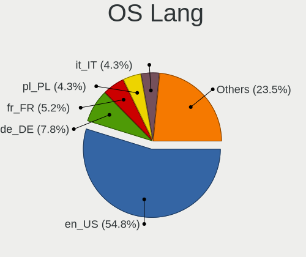
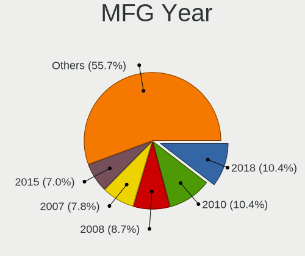
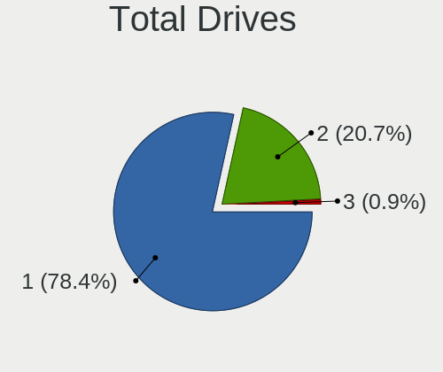
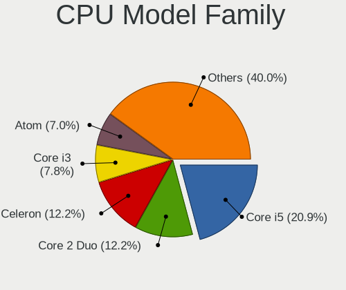
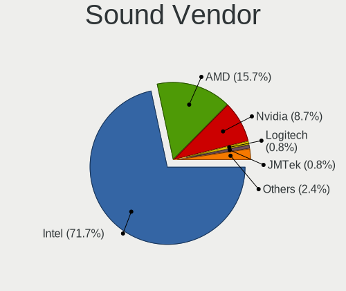
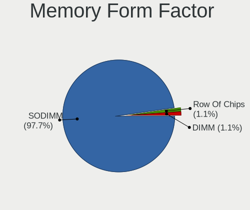

Linux Lite - Tested Hardware & Statistics (Notebooks)
-----------------------------------------------------

A project to collect tested hardware configurations for Linux Lite.

Anyone can contribute to this report by the [hw-probe](https://github.com/linuxhw/hw-probe) tool:

    sudo -E hw-probe -all -upload

Please contribute! Especially if your hardware is rare.

Contents
--------

* [ Test Cases ](#test-cases)

* [ System ](#system)
  - [ OS                       ](#os)
  - [ OS Family                ](#os-family)
  - [ Kernel                   ](#kernel)
  - [ Kernel Family            ](#kernel-family)
  - [ Kernel Major Ver.        ](#kernel-major-ver)
  - [ Arch                     ](#arch)
  - [ DE                       ](#de)
  - [ Display Server           ](#display-server)
  - [ Display Manager          ](#display-manager)
  - [ OS Lang                  ](#os-lang)
  - [ Boot Mode                ](#boot-mode)
  - [ Filesystem               ](#filesystem)
  - [ Part. scheme             ](#part-scheme)
  - [ Dual Boot with Linux/BSD ](#dual-boot-with-linuxbsd)
  - [ Dual Boot (Win)          ](#dual-boot-win)

* [ Board ](#board)
  - [ Vendor                   ](#vendor)
  - [ Model                    ](#model)
  - [ Model Family             ](#model-family)
  - [ MFG Year                 ](#mfg-year)
  - [ Form Factor              ](#form-factor)
  - [ Secure Boot              ](#secure-boot)
  - [ Coreboot                 ](#coreboot)
  - [ RAM Size                 ](#ram-size)
  - [ RAM Used                 ](#ram-used)
  - [ Total Drives             ](#total-drives)
  - [ Has CD-ROM               ](#has-cd-rom)
  - [ Has Ethernet             ](#has-ethernet)
  - [ Has WiFi                 ](#has-wifi)
  - [ Has Bluetooth            ](#has-bluetooth)

* [ Location ](#location)
  - [ Country                  ](#country)
  - [ City                     ](#city)

* [ Drives ](#drives)
  - [ Drive Vendor             ](#drive-vendor)
  - [ Drive Model              ](#drive-model)
  - [ HDD Vendor               ](#hdd-vendor)
  - [ SSD Vendor               ](#ssd-vendor)
  - [ Drive Kind               ](#drive-kind)
  - [ Drive Connector          ](#drive-connector)
  - [ Drive Size               ](#drive-size)
  - [ Space Total              ](#space-total)
  - [ Space Used               ](#space-used)
  - [ Malfunc. Drives          ](#malfunc-drives)
  - [ Malfunc. Drive Vendor    ](#malfunc-drive-vendor)
  - [ Malfunc. HDD Vendor      ](#malfunc-hdd-vendor)
  - [ Malfunc. Drive Kind      ](#malfunc-drive-kind)
  - [ Failed Drives            ](#failed-drives)
  - [ Failed Drive Vendor      ](#failed-drive-vendor)
  - [ Drive Status             ](#drive-status)

* [ Storage controller ](#storage-controller)
  - [ Storage Vendor           ](#storage-vendor)
  - [ Storage Model            ](#storage-model)
  - [ Storage Kind             ](#storage-kind)

* [ Processor ](#processor)
  - [ CPU Vendor               ](#cpu-vendor)
  - [ CPU Model                ](#cpu-model)
  - [ CPU Model Family         ](#cpu-model-family)
  - [ CPU Cores                ](#cpu-cores)
  - [ CPU Sockets              ](#cpu-sockets)
  - [ CPU Threads              ](#cpu-threads)
  - [ CPU Op-Modes             ](#cpu-op-modes)
  - [ CPU Microcode            ](#cpu-microcode)
  - [ CPU Microarch            ](#cpu-microarch)

* [ Graphics ](#graphics)
  - [ GPU Vendor               ](#gpu-vendor)
  - [ GPU Model                ](#gpu-model)
  - [ GPU Combo                ](#gpu-combo)
  - [ GPU Driver               ](#gpu-driver)
  - [ GPU Memory               ](#gpu-memory)

* [ Monitor ](#monitor)
  - [ Monitor Vendor           ](#monitor-vendor)
  - [ Monitor Model            ](#monitor-model)
  - [ Monitor Resolution       ](#monitor-resolution)
  - [ Monitor Diagonal         ](#monitor-diagonal)
  - [ Monitor Width            ](#monitor-width)
  - [ Aspect Ratio             ](#aspect-ratio)
  - [ Monitor Area             ](#monitor-area)
  - [ Pixel Density            ](#pixel-density)
  - [ Multiple Monitors        ](#multiple-monitors)

* [ Network ](#network)
  - [ Net Controller Vendor    ](#net-controller-vendor)
  - [ Net Controller Model     ](#net-controller-model)
  - [ Wireless Vendor          ](#wireless-vendor)
  - [ Wireless Model           ](#wireless-model)
  - [ Ethernet Vendor          ](#ethernet-vendor)
  - [ Ethernet Model           ](#ethernet-model)
  - [ Net Controller Kind      ](#net-controller-kind)
  - [ Used Controller          ](#used-controller)
  - [ NICs                     ](#nics)
  - [ IPv6                     ](#ipv6)

* [ Bluetooth ](#bluetooth)
  - [ Bluetooth Vendor         ](#bluetooth-vendor)
  - [ Bluetooth Model          ](#bluetooth-model)

* [ Sound ](#sound)
  - [ Sound Vendor             ](#sound-vendor)
  - [ Sound Model              ](#sound-model)

* [ Memory ](#memory)
  - [ Memory Vendor            ](#memory-vendor)
  - [ Memory Model             ](#memory-model)
  - [ Memory Kind              ](#memory-kind)
  - [ Memory Form Factor       ](#memory-form-factor)
  - [ Memory Size              ](#memory-size)
  - [ Memory Speed             ](#memory-speed)

* [ Printers & scanners ](#printers--scanners)
  - [ Printer Vendor           ](#printer-vendor)
  - [ Printer Model            ](#printer-model)
  - [ Scanner Vendor           ](#scanner-vendor)
  - [ Scanner Model            ](#scanner-model)

* [ Camera ](#camera)
  - [ Camera Vendor            ](#camera-vendor)
  - [ Camera Model             ](#camera-model)

* [ Security ](#security)
  - [ Fingerprint Vendor       ](#fingerprint-vendor)
  - [ Fingerprint Model        ](#fingerprint-model)
  - [ Chipcard Vendor          ](#chipcard-vendor)
  - [ Chipcard Model           ](#chipcard-model)

* [ Unsupported ](#unsupported)
  - [ Unsupported Devices      ](#unsupported-devices)
  - [ Unsupported Device Types ](#unsupported-device-types)

Test Cases
----------

Total: 149

| Vendor        | Model                       | Probe                                                      | Date         |
|---------------|-----------------------------|------------------------------------------------------------|--------------|
| Dell          | Latitude D630               | [c9ae85eecc](https://linux-hardware.org/?probe=c9ae85eecc) | Apr 30, 2024 |
| Acer          | Aspire 7750G                | [961d70c1de](https://linux-hardware.org/?probe=961d70c1de) | Apr 27, 2024 |
| Dell          | Latitude D630               | [f59eb192f4](https://linux-hardware.org/?probe=f59eb192f4) | Apr 03, 2024 |
| Google        | Celes                       | [996befe940](https://linux-hardware.org/?probe=996befe940) | Mar 13, 2024 |
| Lenovo        | G40-45 80E1                 | [df12996678](https://linux-hardware.org/?probe=df12996678) | Feb 25, 2024 |
| Lenovo        | IdeaPad 320-15IKB 80YH      | [eaca048668](https://linux-hardware.org/?probe=eaca048668) | Feb 24, 2024 |
| Acer          | Aspire A315-24P             | [9925fee177](https://linux-hardware.org/?probe=9925fee177) | Feb 23, 2024 |
| Acer          | Aspire A315-24P             | [b76bdbcd5d](https://linux-hardware.org/?probe=b76bdbcd5d) | Feb 18, 2024 |
| Acer          | Aspire A315-24P             | [4abd6b79ce](https://linux-hardware.org/?probe=4abd6b79ce) | Feb 17, 2024 |
| Lenovo        | ThinkPad T430s 2356H83      | [7ee978c5e1](https://linux-hardware.org/?probe=7ee978c5e1) | Feb 08, 2024 |
| Lenovo        | G460 20041                  | [becc9c140b](https://linux-hardware.org/?probe=becc9c140b) | Jan 21, 2024 |
| ASUSTek       | VivoBook 14_ASUS Laptop ... | [92f943771a](https://linux-hardware.org/?probe=92f943771a) | Jan 19, 2024 |
| Acer          | Aspire 7750G                | [cdbe6b267f](https://linux-hardware.org/?probe=cdbe6b267f) | Dec 19, 2023 |
| Acer          | Aspire 7750G                | [6fc9570e4f](https://linux-hardware.org/?probe=6fc9570e4f) | Dec 19, 2023 |
| ASUSTek       | K52Jc                       | [54e52154d1](https://linux-hardware.org/?probe=54e52154d1) | Dec 07, 2023 |
| Sony          | VGN-SZ750N                  | [aa0a3e3559](https://linux-hardware.org/?probe=aa0a3e3559) | Nov 13, 2023 |
| Intel         | Jasper Lake Client Platf... | [75a2534386](https://linux-hardware.org/?probe=75a2534386) | Nov 07, 2023 |
| Lenovo        | IdeaPad 1 15AMN7 82VG       | [639a14d08d](https://linux-hardware.org/?probe=639a14d08d) | Nov 01, 2023 |
| Compaq(Int... | Michelangelo(LT1504)        | [678614e123](https://linux-hardware.org/?probe=678614e123) | Oct 27, 2023 |
| Acer          | Aspire ES1-572              | [2e48163fbd](https://linux-hardware.org/?probe=2e48163fbd) | Oct 06, 2023 |
| Acer          | Aspire ES1-572              | [651a8f8f97](https://linux-hardware.org/?probe=651a8f8f97) | Oct 05, 2023 |
| Fujitsu Si... | ESPRIMO Mobile V6535        | [12331db1c1](https://linux-hardware.org/?probe=12331db1c1) | Oct 03, 2023 |
| ASUSTek       | X550CL                      | [6c2de2dfb8](https://linux-hardware.org/?probe=6c2de2dfb8) | Sep 21, 2023 |
| Lenovo        | ThinkPad A475 20KMS08300    | [5f99185bbb](https://linux-hardware.org/?probe=5f99185bbb) | Sep 17, 2023 |
| Toshiba       | Satellite P305              | [d5ac020866](https://linux-hardware.org/?probe=d5ac020866) | Sep 15, 2023 |
| Lenovo        | ThinkPad A475 20KMS08300    | [eaaac22962](https://linux-hardware.org/?probe=eaaac22962) | Sep 15, 2023 |
| Toshiba       | Satellite C850-C1S          | [ce5643add2](https://linux-hardware.org/?probe=ce5643add2) | Sep 09, 2023 |
| Lenovo        | ThinkPad T430s 2356H83      | [d623d73283](https://linux-hardware.org/?probe=d623d73283) | Aug 28, 2023 |
| Lenovo        | IdeaPad 330-14IGM 81D0      | [546610fecb](https://linux-hardware.org/?probe=546610fecb) | Aug 20, 2023 |
| Dell          | Latitude E7240              | [87a0310cf0](https://linux-hardware.org/?probe=87a0310cf0) | Aug 02, 2023 |
| ASUSTek       | X502CA                      | [a2f77869ad](https://linux-hardware.org/?probe=a2f77869ad) | Jul 14, 2023 |
| Medion        | Akoya E6418 MD99620         | [7416e91f77](https://linux-hardware.org/?probe=7416e91f77) | Jul 14, 2023 |
| HP            | Laptop 14-dk1xxx            | [8a66b6d6b6](https://linux-hardware.org/?probe=8a66b6d6b6) | Jul 03, 2023 |
| Lenovo        | IdeaPad 310S-14AST 80UL     | [f897f42089](https://linux-hardware.org/?probe=f897f42089) | Jul 03, 2023 |
| HP            | Laptop 15-db0xxx            | [892229f999](https://linux-hardware.org/?probe=892229f999) | Jun 28, 2023 |
| HP            | Laptop 15-db0xxx            | [6d470794e9](https://linux-hardware.org/?probe=6d470794e9) | Jun 28, 2023 |
| UNOWHY        | Y13G010S4EI                 | [b36de255fe](https://linux-hardware.org/?probe=b36de255fe) | Jun 22, 2023 |
| UNOWHY        | Y13G010S4EI                 | [f8f4049a95](https://linux-hardware.org/?probe=f8f4049a95) | Jun 22, 2023 |
| Dell          | Latitude E6420              | [e86a159ec5](https://linux-hardware.org/?probe=e86a159ec5) | Jun 03, 2023 |
| Dell          | Latitude E6420              | [01cd20c83d](https://linux-hardware.org/?probe=01cd20c83d) | Jun 03, 2023 |
| Lenovo        | ThinkPad X240 20AMS1J100    | [86edc6c6d6](https://linux-hardware.org/?probe=86edc6c6d6) | May 11, 2023 |
| Apple         | MacBookAir4,1               | [87ab055a31](https://linux-hardware.org/?probe=87ab055a31) | Apr 27, 2023 |
| Lenovo        | IdeaPad 100-15IBY 80MJ      | [c5c1b213f2](https://linux-hardware.org/?probe=c5c1b213f2) | Apr 16, 2023 |
| Lenovo        | IdeaPad 330S-15AST 81F9     | [d79463ea93](https://linux-hardware.org/?probe=d79463ea93) | Apr 04, 2023 |
| Toshiba       | QOSMIO X70-B                | [8d94a6c8e7](https://linux-hardware.org/?probe=8d94a6c8e7) | Mar 28, 2023 |
| HP            | EliteBook 2530p             | [06ad8714ea](https://linux-hardware.org/?probe=06ad8714ea) | Mar 22, 2023 |
| Lenovo        | ThinkPad A475 20KMS08300    | [b42df5cbe0](https://linux-hardware.org/?probe=b42df5cbe0) | Mar 11, 2023 |
| Lenovo        | ThinkPad A475 20KMS08300    | [17a3030488](https://linux-hardware.org/?probe=17a3030488) | Mar 11, 2023 |
| Gateway       | Sonic-C                     | [b9f775b14e](https://linux-hardware.org/?probe=b9f775b14e) | Feb 28, 2023 |
| Gateway       | Sonic-C                     | [6def275f9b](https://linux-hardware.org/?probe=6def275f9b) | Feb 26, 2023 |
| ASUSTek       | G73Sw                       | [199c8805ee](https://linux-hardware.org/?probe=199c8805ee) | Feb 10, 2023 |
| HP            | 240 G3                      | [a977b66ced](https://linux-hardware.org/?probe=a977b66ced) | Feb 02, 2023 |
| HP            | 240 G3                      | [816a3f4b28](https://linux-hardware.org/?probe=816a3f4b28) | Feb 02, 2023 |
| ASUSTek       | G73Sw                       | [b8891cfc9b](https://linux-hardware.org/?probe=b8891cfc9b) | Jan 27, 2023 |
| ASUSTek       | G73Sw                       | [fb0a23c0e6](https://linux-hardware.org/?probe=fb0a23c0e6) | Jan 27, 2023 |
| ASUSTek       | G73Sw                       | [24b6a47ebb](https://linux-hardware.org/?probe=24b6a47ebb) | Jan 27, 2023 |
| ASUSTek       | G73Sw                       | [adbc469f95](https://linux-hardware.org/?probe=adbc469f95) | Jan 22, 2023 |
| ASUSTek       | G73Sw                       | [9249ff32b3](https://linux-hardware.org/?probe=9249ff32b3) | Jan 22, 2023 |
| HP            | Stream Notebook PC 13       | [b31d60976b](https://linux-hardware.org/?probe=b31d60976b) | Jan 14, 2023 |
| Acer          | Aspire A315-53              | [eb42b5e055](https://linux-hardware.org/?probe=eb42b5e055) | Dec 24, 2022 |
| Pegatron      | H36FF                       | [f27fc61f18](https://linux-hardware.org/?probe=f27fc61f18) | Dec 18, 2022 |
| Thomson       | PT-NEO14A.2WH32             | [d028ff11a9](https://linux-hardware.org/?probe=d028ff11a9) | Dec 18, 2022 |
| Pegatron      | H36FF                       | [692955be3d](https://linux-hardware.org/?probe=692955be3d) | Dec 18, 2022 |
| Acer          | Nitro AN515-58              | [4916981641](https://linux-hardware.org/?probe=4916981641) | Nov 26, 2022 |
| UMAX          | VisionBook 12Wi 64G         | [9fe98911c1](https://linux-hardware.org/?probe=9fe98911c1) | Oct 27, 2022 |
| HP            | Compaq Presario CQ50        | [8546f55697](https://linux-hardware.org/?probe=8546f55697) | Oct 24, 2022 |
| HP            | Compaq Presario CQ50        | [3b1b5c18c6](https://linux-hardware.org/?probe=3b1b5c18c6) | Oct 24, 2022 |
| Acer          | Aspire 5600                 | [202a7e570e](https://linux-hardware.org/?probe=202a7e570e) | Oct 20, 2022 |
| MSI           | MS-N014                     | [4c41640fd3](https://linux-hardware.org/?probe=4c41640fd3) | Oct 12, 2022 |
| MSI           | MS-N014                     | [3144cac65a](https://linux-hardware.org/?probe=3144cac65a) | Oct 12, 2022 |
| Lenovo        | IdeaPad 100-14IBY 80MH      | [676289f650](https://linux-hardware.org/?probe=676289f650) | Oct 02, 2022 |
| HP            | Compaq 420                  | [d3e367cedc](https://linux-hardware.org/?probe=d3e367cedc) | Oct 01, 2022 |
| HP            | Presario V6000 (RG289UA#... | [7f0113694a](https://linux-hardware.org/?probe=7f0113694a) | Sep 15, 2022 |
| Samsung       | X420/X520                   | [a8ca7bb005](https://linux-hardware.org/?probe=a8ca7bb005) | Sep 04, 2022 |
| Fujitsu       | FMVNQ8P6                    | [5e34698f14](https://linux-hardware.org/?probe=5e34698f14) | Aug 28, 2022 |
| ASUSTek       | UX303LN                     | [63d5525864](https://linux-hardware.org/?probe=63d5525864) | Aug 16, 2022 |
| Lenovo        | ThinkPad L480 20LS001AMC    | [47d4f751e1](https://linux-hardware.org/?probe=47d4f751e1) | Aug 09, 2022 |
| Apple         | MacBookAir6,1               | [ede7f6cdae](https://linux-hardware.org/?probe=ede7f6cdae) | Jul 23, 2022 |
| ASUSTek       | VivoBook 14_ASUS Laptop ... | [b846c98a96](https://linux-hardware.org/?probe=b846c98a96) | Jul 08, 2022 |
| HP            | Pavilion g4                 | [330078dbac](https://linux-hardware.org/?probe=330078dbac) | Jul 04, 2022 |
| ASUSTek       | X555YI                      | [762b96a2de](https://linux-hardware.org/?probe=762b96a2de) | Jul 02, 2022 |
| HP            | EliteBook 8440p             | [4bea8264d3](https://linux-hardware.org/?probe=4bea8264d3) | Jun 20, 2022 |
| Samsung       | 530XBB                      | [485a99ca42](https://linux-hardware.org/?probe=485a99ca42) | Jun 03, 2022 |
| Minix         | Z64 V1.2                    | [97525a1dc3](https://linux-hardware.org/?probe=97525a1dc3) | May 27, 2022 |
| Dell          | Inspiron 16 5620            | [b42e1cf95b](https://linux-hardware.org/?probe=b42e1cf95b) | May 13, 2022 |
| Minix         | Z64 V1.2                    | [8796deded0](https://linux-hardware.org/?probe=8796deded0) | May 12, 2022 |
| Dell          | MXG061                      | [119f6dd774](https://linux-hardware.org/?probe=119f6dd774) | May 09, 2022 |
| Lenovo        | IdeaPad Gaming 3 15IHU6 ... | [ab553d3a2f](https://linux-hardware.org/?probe=ab553d3a2f) | May 01, 2022 |
| Acer          | Extensa 5220                | [ebbd01171d](https://linux-hardware.org/?probe=ebbd01171d) | May 01, 2022 |
| Acer          | Aspire 1410                 | [703c2ec84a](https://linux-hardware.org/?probe=703c2ec84a) | Apr 21, 2022 |
| Lenovo        | ThinkPad T400 6475E13       | [cd49ac8445](https://linux-hardware.org/?probe=cd49ac8445) | Apr 08, 2022 |
| Dell          | MXG061                      | [9c91bd9487](https://linux-hardware.org/?probe=9c91bd9487) | Apr 06, 2022 |
| Insignia      | NS-P11W7100                 | [daa476af8c](https://linux-hardware.org/?probe=daa476af8c) | Mar 28, 2022 |
| Dell          | MXG071                      | [ac0158dcb9](https://linux-hardware.org/?probe=ac0158dcb9) | Mar 27, 2022 |
| HP            | 15 Notebook PC              | [0f99b7ff76](https://linux-hardware.org/?probe=0f99b7ff76) | Mar 21, 2022 |
| HP            | Compaq CQ45                 | [99286efd08](https://linux-hardware.org/?probe=99286efd08) | Mar 10, 2022 |
| HP            | Laptop 15-dw3xxx            | [2b748962fa](https://linux-hardware.org/?probe=2b748962fa) | Mar 06, 2022 |
| ASUSTek       | 900                         | [8373f78d4e](https://linux-hardware.org/?probe=8373f78d4e) | Feb 19, 2022 |
| Acer          | Aspire A315-53              | [6134bb8cba](https://linux-hardware.org/?probe=6134bb8cba) | Feb 18, 2022 |
| Acer          | Aspire 5600                 | [4b2259f040](https://linux-hardware.org/?probe=4b2259f040) | Feb 10, 2022 |
| HP            | Laptop 15-dw3xxx            | [b596d9fdb1](https://linux-hardware.org/?probe=b596d9fdb1) | Feb 09, 2022 |
| HP            | Compaq nw9440 (EY615ET#A... | [6a5c3254ab](https://linux-hardware.org/?probe=6a5c3254ab) | Jan 30, 2022 |
| HP            | Pavilion dv6500             | [15838ae11b](https://linux-hardware.org/?probe=15838ae11b) | Jan 12, 2022 |
| ASUSTek       | N53Jf                       | [3f0e64b85e](https://linux-hardware.org/?probe=3f0e64b85e) | Jan 03, 2022 |
| ASUSTek       | N53Jf                       | [6d7b0abdfa](https://linux-hardware.org/?probe=6d7b0abdfa) | Jan 03, 2022 |
| ASUSTek       | X541SA                      | [26f2eeeefc](https://linux-hardware.org/?probe=26f2eeeefc) | Dec 31, 2021 |
| HP            | Pavilion dv6500             | [978ee4328d](https://linux-hardware.org/?probe=978ee4328d) | Dec 19, 2021 |
| Acer          | Aspire 5600                 | [25b1e50c64](https://linux-hardware.org/?probe=25b1e50c64) | Dec 12, 2021 |
| HP            | Compaq 2510p                | [8bc24dae3e](https://linux-hardware.org/?probe=8bc24dae3e) | Nov 23, 2021 |
| HP            | Compaq 2510p                | [c76241a894](https://linux-hardware.org/?probe=c76241a894) | Nov 22, 2021 |
| Samsung       | 905S3G/906S3G/915S3G/930... | [b7306537cc](https://linux-hardware.org/?probe=b7306537cc) | Nov 10, 2021 |
| Acer          | Aspire 5600                 | [7e2da6d3e9](https://linux-hardware.org/?probe=7e2da6d3e9) | Oct 26, 2021 |
| Dell          | MXG061                      | [89a5b20193](https://linux-hardware.org/?probe=89a5b20193) | Oct 10, 2021 |
| Acer          | Swift SF314-56              | [263d6e38b7](https://linux-hardware.org/?probe=263d6e38b7) | Oct 01, 2021 |
| Acer          | Swift SF314-56              | [bb0f894bce](https://linux-hardware.org/?probe=bb0f894bce) | Oct 01, 2021 |
| Dell          | Vostro1710                  | [d50123c66a](https://linux-hardware.org/?probe=d50123c66a) | Sep 01, 2021 |
| Dell          | Inspiron 5452               | [0c9b3ec7a9](https://linux-hardware.org/?probe=0c9b3ec7a9) | Aug 07, 2021 |
| HP            | EliteBook Folio 9470m       | [b2b851f7d2](https://linux-hardware.org/?probe=b2b851f7d2) | Jul 12, 2021 |
| ASUSTek       | X541SA                      | [ed8bb15f60](https://linux-hardware.org/?probe=ed8bb15f60) | Jul 11, 2021 |
| HP            | Laptop 14-cm0xxx            | [5943266aca](https://linux-hardware.org/?probe=5943266aca) | Jun 18, 2021 |
| HP            | Laptop 14-cm0xxx            | [3b4a122b75](https://linux-hardware.org/?probe=3b4a122b75) | Jun 18, 2021 |
| Fujitsu       | LIFEBOOK U747               | [117e8bf660](https://linux-hardware.org/?probe=117e8bf660) | Jun 17, 2021 |
| Lenovo        | IdeaPad Slim 1-14AST-05 ... | [a9255b2217](https://linux-hardware.org/?probe=a9255b2217) | Jun 04, 2021 |
| ASUSTek       | VivoBook_ASUSLaptop E203... | [58bf661e8d](https://linux-hardware.org/?probe=58bf661e8d) | Apr 15, 2021 |
| ASUSTek       | K50IE                       | [b0bcc6c31c](https://linux-hardware.org/?probe=b0bcc6c31c) | Apr 12, 2021 |
| ASUSTek       | K54LY                       | [dc7d86f51e](https://linux-hardware.org/?probe=dc7d86f51e) | Mar 21, 2021 |
| Acer          | Aspire V5-552               | [7a32a8a1c3](https://linux-hardware.org/?probe=7a32a8a1c3) | Mar 03, 2021 |
| HP            | Compaq 6735b                | [0f2afbc99a](https://linux-hardware.org/?probe=0f2afbc99a) | Feb 18, 2021 |
| Dell          | Inspiron 7559               | [4d4377253f](https://linux-hardware.org/?probe=4d4377253f) | Feb 15, 2021 |
| HP            | Laptop 17-by2xxx            | [729abf0085](https://linux-hardware.org/?probe=729abf0085) | Jan 30, 2021 |
| Acer          | Predator PH317-52           | [1bd05ad341](https://linux-hardware.org/?probe=1bd05ad341) | Jan 24, 2021 |
| HP            | 655                         | [a6913cacf3](https://linux-hardware.org/?probe=a6913cacf3) | Dec 28, 2020 |
| HP            | 655                         | [2a4c81218e](https://linux-hardware.org/?probe=2a4c81218e) | Dec 27, 2020 |
| Toshiba       | Satellite T215D             | [084f254e1f](https://linux-hardware.org/?probe=084f254e1f) | Dec 23, 2020 |
| Toshiba       | Satellite T215D             | [bdb8fe4e55](https://linux-hardware.org/?probe=bdb8fe4e55) | Dec 23, 2020 |
| Lenovo        | IdeaPad 320-15ABR 80XS      | [680d4771b2](https://linux-hardware.org/?probe=680d4771b2) | Dec 15, 2020 |
| ASUSTek       | 1001PX                      | [9f911bde1c](https://linux-hardware.org/?probe=9f911bde1c) | Dec 11, 2020 |
| Acer          | Aspire 5750                 | [ba47872fd5](https://linux-hardware.org/?probe=ba47872fd5) | Dec 02, 2020 |
| Acer          | Aspire 5750                 | [c4216f5d80](https://linux-hardware.org/?probe=c4216f5d80) | Dec 02, 2020 |
| Dell          | Latitude D530               | [4fe18e86ac](https://linux-hardware.org/?probe=4fe18e86ac) | Sep 27, 2020 |
| Acer          | Aspire ES1-511              | [63a7ae1967](https://linux-hardware.org/?probe=63a7ae1967) | Jul 24, 2020 |
| Google        | Chell                       | [cf727e9a6e](https://linux-hardware.org/?probe=cf727e9a6e) | Jul 23, 2020 |
| ASUSTek       | X751LD                      | [2d9ea757d1](https://linux-hardware.org/?probe=2d9ea757d1) | Jul 14, 2020 |
| ASUSTek       | X751LD                      | [1a4ee704d9](https://linux-hardware.org/?probe=1a4ee704d9) | Jul 14, 2020 |
| Lenovo        | 3000 V200 0764A11           | [8492023ae0](https://linux-hardware.org/?probe=8492023ae0) | Jul 13, 2020 |
| TR            | ST Pro-KN                   | [e78b2937ef](https://linux-hardware.org/?probe=e78b2937ef) | Jul 01, 2020 |
| ASUSTek       | N750JK                      | [9102fbcf41](https://linux-hardware.org/?probe=9102fbcf41) | Jun 02, 2020 |
| Samsung       | NC110P/NC108P/NC111P        | [92c219ffb4](https://linux-hardware.org/?probe=92c219ffb4) | May 14, 2020 |
| ASUSTek       | X540YA                      | [2bfdde7714](https://linux-hardware.org/?probe=2bfdde7714) | Apr 03, 2020 |

System
------

OS
--

Installed operating systems

| Name           | Notebooks | Percent |
|----------------|-----------|---------|
| Linux Lite 5.8 | 14        | 13.21%  |
| Linux Lite 6.6 | 13        | 12.26%  |
| Linux Lite 6.0 | 13        | 12.26%  |
| Linux Lite 6.2 | 12        | 11.32%  |
| Linux Lite 6.4 | 11        | 10.38%  |
| Linux Lite 5.4 | 11        | 10.38%  |
| Linux Lite 5.2 | 9         | 8.49%   |
| Linux Lite 5.0 | 9         | 8.49%   |
| Linux Lite 5.6 | 7         | 6.6%    |
| Linux Lite 3.8 | 3         | 2.83%   |
| Linux Lite 4.8 | 2         | 1.89%   |
| Linux Lite 4.4 | 1         | 0.94%   |
| Linux Lite 4.2 | 1         | 0.94%   |

OS Family
---------

OS without a version

| Name       | Notebooks | Percent |
|------------|-----------|---------|
| Linux Lite | 104       | 100%    |

Kernel
------

Version of the Linux kernel

| Version           | Notebooks | Percent |
|-------------------|-----------|---------|
| 5.15.0-69-generic | 6         | 5.22%   |
| 5.4.0-40-generic  | 4         | 3.48%   |
| 5.15.0-91-generic | 4         | 3.48%   |
| 5.15.0-82-generic | 4         | 3.48%   |
| 5.15.0-76-generic | 4         | 3.48%   |
| 5.4.0-70-generic  | 3         | 2.61%   |
| 5.4.0-52-generic  | 3         | 2.61%   |
| 5.4.0-109-generic | 3         | 2.61%   |
| 5.15.0-33-generic | 3         | 2.61%   |
| 5.4.0-91-generic  | 2         | 1.74%   |
| 5.4.0-90-generic  | 2         | 1.74%   |
| 5.4.0-81-generic  | 2         | 1.74%   |
| 5.4.0-74-generic  | 2         | 1.74%   |
| 5.4.0-58-generic  | 2         | 1.74%   |
| 5.4.0-42-generic  | 2         | 1.74%   |
| 5.4.0-107-generic | 2         | 1.74%   |
| 5.4.0-104-generic | 2         | 1.74%   |
| 5.15.0-88-generic | 2         | 1.74%   |
| 5.15.0-83-generic | 2         | 1.74%   |
| 5.15.0-60-generic | 2         | 1.74%   |
| 5.15.0-56-generic | 2         | 1.74%   |
| 5.15.0-52-generic | 2         | 1.74%   |
| 5.15.0-48-generic | 2         | 1.74%   |
| 5.15.0-47-generic | 2         | 1.74%   |
| 6.1.0-1.linuxlite | 1         | 0.87%   |
| 6.0.0             | 1         | 0.87%   |
| 5.4.0-96-generic  | 1         | 0.87%   |
| 5.4.0-94-generic  | 1         | 0.87%   |
| 5.4.0-88-generic  | 1         | 0.87%   |
| 5.4.0-77-generic  | 1         | 0.87%   |
| 5.4.0-71-generic  | 1         | 0.87%   |
| 5.4.0-66-generic  | 1         | 0.87%   |
| 5.4.0-65-generic  | 1         | 0.87%   |
| 5.4.0-56-generic  | 1         | 0.87%   |
| 5.4.0-48-generic  | 1         | 0.87%   |
| 5.4.0-33-generic  | 1         | 0.87%   |
| 5.4.0-156-generic | 1         | 0.87%   |
| 5.4.0-152-generic | 1         | 0.87%   |
| 5.4.0-124-generic | 1         | 0.87%   |
| 5.4.0-122-generic | 1         | 0.87%   |

Kernel Family
-------------

Linux kernel without a distro release

| Version | Notebooks | Percent |
|---------|-----------|---------|
| 5.15.0  | 49        | 45.79%  |
| 5.4.0   | 46        | 42.99%  |
| 4.15.0  | 4         | 3.74%   |
| 4.4.0   | 2         | 1.87%   |
| 6.1.0   | 1         | 0.93%   |
| 6.0.0   | 1         | 0.93%   |
| 5.19.0  | 1         | 0.93%   |
| 5.16.0  | 1         | 0.93%   |
| 5.13.0  | 1         | 0.93%   |
| 5.10.0  | 1         | 0.93%   |

Kernel Major Ver.
-----------------

Linux kernel major version

| Version | Notebooks | Percent |
|---------|-----------|---------|
| 5.15    | 49        | 45.79%  |
| 5.4     | 46        | 42.99%  |
| 4.15    | 4         | 3.74%   |
| 4.4     | 2         | 1.87%   |
| 6.1     | 1         | 0.93%   |
| 6.0     | 1         | 0.93%   |
| 5.19    | 1         | 0.93%   |
| 5.16    | 1         | 0.93%   |
| 5.13    | 1         | 0.93%   |
| 5.10    | 1         | 0.93%   |

Arch
----

OS architecture (x86_64, i586, etc.)

| Name   | Notebooks | Percent |
|--------|-----------|---------|
| x86_64 | 102       | 98.08%  |
| i686   | 2         | 1.92%   |

DE
--

Desktop Environment

| Name    | Notebooks | Percent |
|---------|-----------|---------|
| XFCE    | 88        | 84.62%  |
| GNOME   | 12        | 11.54%  |
| Unknown | 2         | 1.92%   |
| Deepin  | 1         | 0.96%   |
| Budgie  | 1         | 0.96%   |

Display Server
--------------

X11 or Wayland

| Name    | Notebooks | Percent |
|---------|-----------|---------|
| X11     | 102       | 98.08%  |
| Tty     | 1         | 0.96%   |
| Unknown | 1         | 0.96%   |

Display Manager
---------------

SDDM, LightDM, etc.

| Name    | Notebooks | Percent |
|---------|-----------|---------|
| LightDM | 74        | 69.81%  |
| TDM     | 15        | 14.15%  |
| Unknown | 15        | 14.15%  |
| GDM3    | 1         | 0.94%   |
| GDM     | 1         | 0.94%   |

OS Lang
-------

Language

| Lang  | Notebooks | Percent |
|-------|-----------|---------|
| en_US | 55        | 52.88%  |
| de_DE | 8         | 7.69%   |
| fr_FR | 6         | 5.77%   |
| pl_PL | 5         | 4.81%   |
| en_GB | 5         | 4.81%   |
| pt_BR | 4         | 3.85%   |
| it_IT | 4         | 3.85%   |
| ru_RU | 3         | 2.88%   |
| es_ES | 3         | 2.88%   |
| ru_UA | 2         | 1.92%   |
| pt_PT | 2         | 1.92%   |
| zh_CN | 1         | 0.96%   |
| id_ID | 1         | 0.96%   |
| es_CO | 1         | 0.96%   |
| en_PH | 1         | 0.96%   |
| en_IN | 1         | 0.96%   |
| en_IE | 1         | 0.96%   |
| en_AU | 1         | 0.96%   |

Boot Mode
---------

EFI or BIOS

| Mode | Notebooks | Percent |
|------|-----------|---------|
| BIOS | 53        | 50.48%  |
| EFI  | 52        | 49.52%  |

Filesystem
----------

Type of filesystem

| Type    | Notebooks | Percent |
|---------|-----------|---------|
| Ext4    | 87        | 83.65%  |
| Tmpfs   | 7         | 6.73%   |
| Overlay | 7         | 6.73%   |
| Btrfs   | 2         | 1.92%   |
| Zfs     | 1         | 0.96%   |

Part. scheme
------------

Scheme of partitioning

| Type    | Notebooks | Percent |
|---------|-----------|---------|
| GPT     | 56        | 53.85%  |
| Unknown | 26        | 25%     |
| MBR     | 22        | 21.15%  |

Dual Boot with Linux/BSD
------------------------

Hosting more than one Linux/BSD

| Dual boot | Notebooks | Percent |
|-----------|-----------|---------|
| No        | 90        | 85.71%  |
| Yes       | 15        | 14.29%  |

Dual Boot (Win)
---------------

Hosting Linux and Windows

| Dual boot | Notebooks | Percent |
|-----------|-----------|---------|
| No        | 78        | 73.58%  |
| Yes       | 28        | 26.42%  |

Board
-----

Vendor
------

Motherboard manufacturer

| Name                | Notebooks | Percent |
|---------------------|-----------|---------|
| Hewlett-Packard     | 19        | 18.27%  |
| ASUSTek Computer    | 18        | 17.31%  |
| Lenovo              | 17        | 16.35%  |
| Acer                | 12        | 11.54%  |
| Dell                | 10        | 9.62%   |
| Toshiba             | 4         | 3.85%   |
| Samsung Electronics | 4         | 3.85%   |
| Google              | 2         | 1.92%   |
| Fujitsu             | 2         | 1.92%   |
| Apple               | 2         | 1.92%   |
| UNOWHY              | 1         | 0.96%   |
| UMAX                | 1         | 0.96%   |
| TR                  | 1         | 0.96%   |
| Thomson             | 1         | 0.96%   |
| Sony                | 1         | 0.96%   |
| Pegatron            | 1         | 0.96%   |
| MSI                 | 1         | 0.96%   |
| Minix               | 1         | 0.96%   |
| Medion              | 1         | 0.96%   |
| Intel               | 1         | 0.96%   |
| Insignia            | 1         | 0.96%   |
| Gateway             | 1         | 0.96%   |
| Fujitsu Siemens     | 1         | 0.96%   |
| Compaq(Intel)       | 1         | 0.96%   |

Model
-----

Motherboard model

| Name                                | Notebooks | Percent |
|-------------------------------------|-----------|---------|
| UNOWHY Y13G010S4EI                  | 1         | 0.96%   |
| UMAX VisionBook 12Wi 64G            | 1         | 0.96%   |
| TR ST Pro-KN                        | 1         | 0.96%   |
| Toshiba Satellite T215D             | 1         | 0.96%   |
| Toshiba Satellite P305              | 1         | 0.96%   |
| Toshiba Satellite C850-C1S          | 1         | 0.96%   |
| Toshiba QOSMIO X70-B                | 1         | 0.96%   |
| Thomson PT-NEO14A.2WH32             | 1         | 0.96%   |
| Sony VGN-SZ750N                     | 1         | 0.96%   |
| Samsung X420/X520                   | 1         | 0.96%   |
| Samsung NC110P/NC108P/NC111P        | 1         | 0.96%   |
| Samsung 905S3G/906S3G/915S3G/9305SG | 1         | 0.96%   |
| Samsung 530XBB                      | 1         | 0.96%   |
| Pegatron H36FF                      | 1         | 0.96%   |
| MSI MS-N014                         | 1         | 0.96%   |
| Minix Z64                           | 1         | 0.96%   |
| Medion Akoya E6418 MD99620          | 1         | 0.96%   |
| Lenovo ThinkPad X240 20AMS1J100     | 1         | 0.96%   |
| Lenovo ThinkPad T430s 2356H83       | 1         | 0.96%   |
| Lenovo ThinkPad T400 6475E13        | 1         | 0.96%   |
| Lenovo ThinkPad L480 20LS001AMC     | 1         | 0.96%   |
| Lenovo ThinkPad A475 20KMS08300     | 1         | 0.96%   |
| Lenovo IdeaPad Gaming 3 15IHU6 82K1 | 1         | 0.96%   |
| Lenovo IdeaPad 330S-15AST 81F9      | 1         | 0.96%   |
| Lenovo IdeaPad 330-14IGM 81D0       | 1         | 0.96%   |
| Lenovo IdeaPad 320-15IKB 80YH       | 1         | 0.96%   |
| Lenovo IdeaPad 320-15ABR 80XS       | 1         | 0.96%   |
| Lenovo IdeaPad 310S-14AST 80UL      | 1         | 0.96%   |
| Lenovo IdeaPad 100-15IBY 80MJ       | 1         | 0.96%   |
| Lenovo IdeaPad 100-14IBY 80MH       | 1         | 0.96%   |
| Lenovo IdeaPad 1 15AMN7 82VG        | 1         | 0.96%   |
| Lenovo G460 20041                   | 1         | 0.96%   |
| Lenovo G40-45 80E1                  | 1         | 0.96%   |
| Lenovo 3000 V200 0764A11            | 1         | 0.96%   |
| Intel Jasper Lake Client Platform   | 1         | 0.96%   |
| Insignia NS-P11W7100                | 1         | 0.96%   |
| HP Stream Notebook PC 13            | 1         | 0.96%   |
| HP Presario V6000 (RG289UA#ABA)     | 1         | 0.96%   |
| HP Pavilion g4                      | 1         | 0.96%   |
| HP Pavilion dv6500                  | 1         | 0.96%   |

Model Family
------------

Motherboard model prefix

| Name                    | Notebooks | Percent |
|-------------------------|-----------|---------|
| Lenovo IdeaPad          | 9         | 8.65%   |
| Acer Aspire             | 8         | 7.69%   |
| Lenovo ThinkPad         | 5         | 4.81%   |
| HP Laptop               | 5         | 4.81%   |
| HP Compaq               | 5         | 4.81%   |
| Dell Latitude           | 4         | 3.85%   |
| Toshiba Satellite       | 3         | 2.88%   |
| HP EliteBook            | 3         | 2.88%   |
| Dell Inspiron           | 3         | 2.88%   |
| ASUS VivoBook           | 3         | 2.88%   |
| HP Pavilion             | 2         | 1.92%   |
| UNOWHY Y13G010S4EI      | 1         | 0.96%   |
| UMAX VisionBook         | 1         | 0.96%   |
| TR ST                   | 1         | 0.96%   |
| Toshiba QOSMIO          | 1         | 0.96%   |
| Thomson PT-NEO14A.2WH32 | 1         | 0.96%   |
| Sony VGN-SZ750N         | 1         | 0.96%   |
| Samsung X420            | 1         | 0.96%   |
| Samsung NC110P          | 1         | 0.96%   |
| Samsung 905S3G          | 1         | 0.96%   |
| Samsung 530XBB          | 1         | 0.96%   |
| Pegatron H36FF          | 1         | 0.96%   |
| MSI MS-N014             | 1         | 0.96%   |
| Minix Z64               | 1         | 0.96%   |
| Medion Akoya            | 1         | 0.96%   |
| Lenovo G460             | 1         | 0.96%   |
| Lenovo G40-45           | 1         | 0.96%   |
| Lenovo 3000             | 1         | 0.96%   |
| Intel Jasper            | 1         | 0.96%   |
| Insignia NS-P11W7100    | 1         | 0.96%   |
| HP Stream               | 1         | 0.96%   |
| HP Presario             | 1         | 0.96%   |
| HP 655                  | 1         | 0.96%   |
| HP 15                   | 1         | 0.96%   |
| Google Chell            | 1         | 0.96%   |
| Google Celes            | 1         | 0.96%   |
| Gateway Sonic-C         | 1         | 0.96%   |
| Fujitsu Siemens ESPRIMO | 1         | 0.96%   |
| Fujitsu LIFEBOOK        | 1         | 0.96%   |
| Fujitsu FMVNQ8P6        | 1         | 0.96%   |

MFG Year
--------

Motherboard manufacture year

| Year | Notebooks | Percent |
|------|-----------|---------|
| 2018 | 10        | 9.62%   |
| 2010 | 10        | 9.62%   |
| 2008 | 9         | 8.65%   |
| 2007 | 9         | 8.65%   |
| 2014 | 8         | 7.69%   |
| 2012 | 8         | 7.69%   |
| 2015 | 7         | 6.73%   |
| 2017 | 6         | 5.77%   |
| 2013 | 6         | 5.77%   |
| 2011 | 6         | 5.77%   |
| 2016 | 5         | 4.81%   |
| 2022 | 4         | 3.85%   |
| 2020 | 4         | 3.85%   |
| 2019 | 4         | 3.85%   |
| 2023 | 2         | 1.92%   |
| 2021 | 2         | 1.92%   |
| 2006 | 2         | 1.92%   |
| 2009 | 1         | 0.96%   |
| 2004 | 1         | 0.96%   |

Form Factor
-----------

Physical design of the computer

| Name     | Notebooks | Percent |
|----------|-----------|---------|
| Notebook | 104       | 100%    |

Secure Boot
-----------

Enabled or disabled

| State    | Notebooks | Percent |
|----------|-----------|---------|
| Disabled | 97        | 93.27%  |
| Enabled  | 7         | 6.73%   |

Coreboot
--------

Have coreboot on board

| Used | Notebooks | Percent |
|------|-----------|---------|
| No   | 102       | 98.08%  |
| Yes  | 2         | 1.92%   |

RAM Size
--------

Total RAM memory

| Size in GB | Notebooks | Percent |
|------------|-----------|---------|
| 3.01-4.0   | 42        | 40.38%  |
| 1.01-2.0   | 21        | 20.19%  |
| 4.01-8.0   | 17        | 16.35%  |
| 16.01-24.0 | 9         | 8.65%   |
| 8.01-16.0  | 8         | 7.69%   |
| 0.51-1.0   | 4         | 3.85%   |
| 2.01-3.0   | 2         | 1.92%   |
| 32.01-64.0 | 1         | 0.96%   |

RAM Used
--------

Used RAM memory

| Used GB   | Notebooks | Percent |
|-----------|-----------|---------|
| 1.01-2.0  | 54        | 50.94%  |
| 2.01-3.0  | 23        | 21.7%   |
| 0.51-1.0  | 15        | 14.15%  |
| 3.01-4.0  | 8         | 7.55%   |
| 0.01-0.5  | 3         | 2.83%   |
| 4.01-8.0  | 2         | 1.89%   |
| 8.01-16.0 | 1         | 0.94%   |

Total Drives
------------

Number of drives on board

| Drives | Notebooks | Percent |
|--------|-----------|---------|
| 1      | 83        | 79.05%  |
| 2      | 21        | 20%     |
| 3      | 1         | 0.95%   |

Has CD-ROM
----------

Has CD-ROM on board

| Presented | Notebooks | Percent |
|-----------|-----------|---------|
| No        | 59        | 56.73%  |
| Yes       | 45        | 43.27%  |

Has Ethernet
------------

Has Ethernet on board

| Presented | Notebooks | Percent |
|-----------|-----------|---------|
| Yes       | 86        | 82.69%  |
| No        | 18        | 17.31%  |

Has WiFi
--------

Has WiFi module

| Presented | Notebooks | Percent |
|-----------|-----------|---------|
| Yes       | 102       | 98.08%  |
| No        | 2         | 1.92%   |

Has Bluetooth
-------------

Has Bluetooth module

| Presented | Notebooks | Percent |
|-----------|-----------|---------|
| Yes       | 73        | 69.52%  |
| No        | 32        | 30.48%  |

Location
--------

Country
-------

Geographic location (country)

| Country     | Notebooks | Percent |
|-------------|-----------|---------|
| USA         | 14        | 13.46%  |
| Germany     | 10        | 9.62%   |
| France      | 8         | 7.69%   |
| Brazil      | 8         | 7.69%   |
| UK          | 6         | 5.77%   |
| Romania     | 5         | 4.81%   |
| Italy       | 5         | 4.81%   |
| Ukraine     | 4         | 3.85%   |
| Russia      | 4         | 3.85%   |
| Poland      | 4         | 3.85%   |
| Spain       | 3         | 2.88%   |
| Indonesia   | 3         | 2.88%   |
| Turkey      | 2         | 1.92%   |
| Portugal    | 2         | 1.92%   |
| Philippines | 2         | 1.92%   |
| Netherlands | 2         | 1.92%   |
| Mexico      | 2         | 1.92%   |
| Australia   | 2         | 1.92%   |
| Venezuela   | 1         | 0.96%   |
| Thailand    | 1         | 0.96%   |
| Sweden      | 1         | 0.96%   |
| Slovakia    | 1         | 0.96%   |
| Serbia      | 1         | 0.96%   |
| Myanmar     | 1         | 0.96%   |
| Morocco     | 1         | 0.96%   |
| Ireland     | 1         | 0.96%   |
| Iran        | 1         | 0.96%   |
| India       | 1         | 0.96%   |
| Guadeloupe  | 1         | 0.96%   |
| Greece      | 1         | 0.96%   |
| El Salvador | 1         | 0.96%   |
| Czechia     | 1         | 0.96%   |
| Colombia    | 1         | 0.96%   |
| Chile       | 1         | 0.96%   |
| Canada      | 1         | 0.96%   |
| Argentina   | 1         | 0.96%   |

City
----

Geographic location (city)

| City                   | Notebooks | Percent |
|------------------------|-----------|---------|
| Valencia               | 2         | 1.85%   |
| Sydney                 | 2         | 1.85%   |
| Paris                  | 2         | 1.85%   |
| Pabianice              | 2         | 1.85%   |
| Odessa                 | 2         | 1.85%   |
| Moscow                 | 2         | 1.85%   |
| Frankfurt am Main      | 2         | 1.85%   |
| Żywiec                | 1         | 0.93%   |
| Yangon                 | 1         | 0.93%   |
| Würzburg              | 1         | 0.93%   |
| Wiesbaden              | 1         | 0.93%   |
| Washington             | 1         | 0.93%   |
| Warsaw                 | 1         | 0.93%   |
| Wahroonga              | 1         | 0.93%   |
| Voluntari              | 1         | 0.93%   |
| Vinnytsia              | 1         | 0.93%   |
| Villingen-Schwenningen | 1         | 0.93%   |
| Varennes-les-Narcy     | 1         | 0.93%   |
| Tucape                 | 1         | 0.93%   |
| The Hague              | 1         | 0.93%   |
| Teresina               | 1         | 0.93%   |
| Tekirdağ              | 1         | 0.93%   |
| Tarragona              | 1         | 0.93%   |
| Tangier                | 1         | 0.93%   |
| Tamm                   | 1         | 0.93%   |
| Svidník               | 1         | 0.93%   |
| Surabaya               | 1         | 0.93%   |
| Subotica               | 1         | 0.93%   |
| Studenka               | 1         | 0.93%   |
| Strasbourg             | 1         | 0.93%   |
| St. Petersburg         | 1         | 0.93%   |
| South Shields          | 1         | 0.93%   |
| Shadrinsk              | 1         | 0.93%   |
| Sartrouville           | 1         | 0.93%   |
| Sao Paulo              | 1         | 0.93%   |
| Santiago del Estero    | 1         | 0.93%   |
| Salerno                | 1         | 0.93%   |
| Sabadell               | 1         | 0.93%   |
| Roswell                | 1         | 0.93%   |
| Randolph               | 1         | 0.93%   |

Drives
------

Drive Vendor
------------

Hard drive vendors

| Vendor              | Notebooks | Drives | Percent |
|---------------------|-----------|--------|---------|
| Seagate             | 20        | 23     | 17.09%  |
| WDC                 | 15        | 19     | 12.82%  |
| Toshiba             | 13        | 15     | 11.11%  |
| Samsung Electronics | 13        | 16     | 11.11%  |
| Unknown             | 9         | 12     | 7.69%   |
| Kingston            | 7         | 7      | 5.98%   |
| Micron Technology   | 6         | 8      | 5.13%   |
| Hitachi             | 6         | 6      | 5.13%   |
| HGST                | 6         | 6      | 5.13%   |
| SanDisk             | 4         | 4      | 3.42%   |
| SK hynix            | 3         | 4      | 2.56%   |
| GOODRAM             | 2         | 2      | 1.71%   |
| Crucial             | 2         | 2      | 1.71%   |
| China               | 2         | 2      | 1.71%   |
| Apple               | 2         | 2      | 1.71%   |
| Phison              | 1         | 1      | 0.85%   |
| LITEON              | 1         | 1      | 0.85%   |
| Intel               | 1         | 1      | 0.85%   |
| Fujitsu             | 1         | 1      | 0.85%   |
| ASUS-PHISON         | 1         | 2      | 0.85%   |
| ASMT                | 1         | 1      | 0.85%   |
| A-DATA Technology   | 1         | 1      | 0.85%   |

Drive Model
-----------

Hard drive models

| Model                                 | Notebooks | Percent |
|---------------------------------------|-----------|---------|
| Unknown MMC Card  32GB                | 4         | 3.28%   |
| Toshiba MQ01ABF050 500GB              | 4         | 3.28%   |
| Kingston SA400S37240G 240GB SSD       | 4         | 3.28%   |
| WDC WD10JPVX-22JC3T0 1TB              | 2         | 1.64%   |
| Unknown DA4064  64GB                  | 2         | 1.64%   |
| Toshiba MQ04ABF100 1TB                | 2         | 1.64%   |
| Toshiba MQ01ABD100 1TB                | 2         | 1.64%   |
| Seagate ST9320325AS 320GB             | 2         | 1.64%   |
| Seagate ST1000LM035-1RK172 1TB        | 2         | 1.64%   |
| Samsung SSD 850 EVO 250GB             | 2         | 1.64%   |
| Samsung MZVLB256HAHQ-000L7 256GB      | 2         | 1.64%   |
| Micron MTFDDAK256MAM-1K12 256GB SSD   | 2         | 1.64%   |
| Hitachi HTS543232A7A384 320GB         | 2         | 1.64%   |
| HGST HTS725050A7E630 500GB            | 2         | 1.64%   |
| WDC WDS480G2G0A-00JH30 480GB SSD      | 1         | 0.82%   |
| WDC WDS120G2G0A-00JH30 120GB SSD      | 1         | 0.82%   |
| WDC WDS100T2B0A-00SM50 1TB SSD        | 1         | 0.82%   |
| WDC WD5000LPVX-80V0TT0 500GB          | 1         | 0.82%   |
| WDC WD5000LPCX-75VHAT0 500GB          | 1         | 0.82%   |
| WDC WD2500BEVS-00UST0 250GB           | 1         | 0.82%   |
| WDC WD2500BEVE-00A0HT0 250GB          | 1         | 0.82%   |
| WDC WD1600BEVT-22A23T0 160GB          | 1         | 0.82%   |
| WDC WD10SPZX-60Z10T0 1TB              | 1         | 0.82%   |
| WDC WD10SPZX-24Z10 1TB                | 1         | 0.82%   |
| WDC WD10JPVX-75JC3T0 1TB              | 1         | 0.82%   |
| WDC PC SN530 SDBPNPZ-512G-1006 512GB  | 1         | 0.82%   |
| WDC PC SN530 SDBPMPZ-256G-1101 256GB  | 1         | 0.82%   |
| Unknown SN64G  64GB                   | 1         | 0.82%   |
| Unknown SLD64G  64GB                  | 1         | 0.82%   |
| Unknown SD64G  64GB                   | 1         | 0.82%   |
| Unknown SD16G  16GB                   | 1         | 0.82%   |
| Unknown NCard  32GB                   | 1         | 0.82%   |
| Unknown MMC Card  128GB               | 1         | 0.82%   |
| Toshiba THNSNJ128GCSU 128GB SSD       | 1         | 0.82%   |
| Toshiba MQ01ABD050 500GB              | 1         | 0.82%   |
| Toshiba MQ01ABD032V -63 320GB         | 1         | 0.82%   |
| Toshiba MK3265GSX 320GB               | 1         | 0.82%   |
| Toshiba MK1011GAH 100GB               | 1         | 0.82%   |
| SK hynix HFS256G39TND-N210A 256GB SSD | 1         | 0.82%   |
| SK hynix HFM128GDHTNG-8310A 128GB     | 1         | 0.82%   |

HDD Vendor
----------

Hard disk drive vendors

| Vendor              | Notebooks | Drives | Percent |
|---------------------|-----------|--------|---------|
| Seagate             | 19        | 22     | 32.76%  |
| Toshiba             | 12        | 14     | 20.69%  |
| WDC                 | 10        | 13     | 17.24%  |
| Hitachi             | 6         | 6      | 10.34%  |
| HGST                | 6         | 6      | 10.34%  |
| Samsung Electronics | 3         | 4      | 5.17%   |
| Fujitsu             | 1         | 1      | 1.72%   |
| ASMT                | 1         | 1      | 1.72%   |

SSD Vendor
----------

Solid state drive vendors

| Vendor              | Notebooks | Drives | Percent |
|---------------------|-----------|--------|---------|
| Kingston            | 6         | 6      | 16.67%  |
| Samsung Electronics | 5         | 5      | 13.89%  |
| Micron Technology   | 4         | 6      | 11.11%  |
| WDC                 | 3         | 3      | 8.33%   |
| SanDisk             | 3         | 3      | 8.33%   |
| GOODRAM             | 2         | 2      | 5.56%   |
| Crucial             | 2         | 2      | 5.56%   |
| China               | 2         | 2      | 5.56%   |
| Apple               | 2         | 2      | 5.56%   |
| Toshiba             | 1         | 1      | 2.78%   |
| SK hynix            | 1         | 2      | 2.78%   |
| Phison              | 1         | 1      | 2.78%   |
| LITEON              | 1         | 1      | 2.78%   |
| Intel               | 1         | 1      | 2.78%   |
| ASUS-PHISON         | 1         | 2      | 2.78%   |
| A-DATA Technology   | 1         | 1      | 2.78%   |

Drive Kind
----------

HDD or SSD

| Kind    | Notebooks | Drives | Percent |
|---------|-----------|--------|---------|
| HDD     | 57        | 67     | 50%     |
| SSD     | 35        | 40     | 30.7%   |
| MMC     | 11        | 14     | 9.65%   |
| NVMe    | 10        | 14     | 8.77%   |
| Unknown | 1         | 1      | 0.88%   |

Drive Connector
---------------

SATA, SAS, NVMe, etc.

| Type | Notebooks | Drives | Percent |
|------|-----------|--------|---------|
| SATA | 84        | 105    | 77.78%  |
| MMC  | 11        | 14     | 10.19%  |
| NVMe | 10        | 14     | 9.26%   |
| SAS  | 3         | 3      | 2.78%   |

Drive Size
----------

Size of hard drive

| Size in TB | Notebooks | Drives | Percent |
|------------|-----------|--------|---------|
| 0.01-0.5   | 66        | 82     | 73.33%  |
| 0.51-1.0   | 23        | 24     | 25.56%  |
| 1.01-2.0   | 1         | 1      | 1.11%   |

Space Total
-----------

Amount of disk space available on the file system

| Size in GB     | Notebooks | Percent |
|----------------|-----------|---------|
| 101-250        | 41        | 37.96%  |
| 251-500        | 26        | 24.07%  |
| 51-100         | 13        | 12.04%  |
| 501-1000       | 12        | 11.11%  |
| 1-20           | 8         | 7.41%   |
| 21-50          | 6         | 5.56%   |
| More than 3000 | 1         | 0.93%   |
| 1001-2000      | 1         | 0.93%   |

Space Used
----------

Amount of used disk space

| Used GB   | Notebooks | Percent |
|-----------|-----------|---------|
| 1-20      | 54        | 50%     |
| 21-50     | 27        | 25%     |
| 101-250   | 13        | 12.04%  |
| 51-100    | 11        | 10.19%  |
| 251-500   | 2         | 1.85%   |
| 2001-3000 | 1         | 0.93%   |

Malfunc. Drives
---------------

Drive models with a malfunction

| Model                                          | Notebooks | Drives | Percent |
|------------------------------------------------|-----------|--------|---------|
| WDC WDS480G2G0A-00JH30 480GB SSD               | 1         | 1      | 5%      |
| WDC WD1600BEVT-22A23T0 160GB                   | 1         | 1      | 5%      |
| WDC WD10JPVX-22JC3T0 1TB                       | 1         | 1      | 5%      |
| Toshiba MQ01ABD050 500GB                       | 1         | 1      | 5%      |
| Toshiba MK3265GSX 320GB                        | 1         | 1      | 5%      |
| Seagate ST9500423AS 500GB                      | 1         | 1      | 5%      |
| Seagate ST9320325AS 320GB                      | 1         | 1      | 5%      |
| Seagate ST9320320AS 320GB                      | 1         | 1      | 5%      |
| Seagate ST9160823ASG 160GB                     | 1         | 1      | 5%      |
| Seagate ST500LT012-9WS142 500GB                | 1         | 1      | 5%      |
| Seagate ST500LT012-1DG142 500GB                | 1         | 1      | 5%      |
| Seagate ST1000LM048-2E7172 1TB                 | 1         | 1      | 5%      |
| Seagate ST1000LM035-1RK172 1TB                 | 1         | 1      | 5%      |
| SanDisk SSD PLUS 120GB                         | 1         | 1      | 5%      |
| Samsung Electronics HM250JI 250GB              | 1         | 1      | 5%      |
| Micron Technology MTFDDAK256MAM-1K12 256GB SSD | 1         | 1      | 5%      |
| Hitachi HTS545016B9A300 160GB                  | 1         | 1      | 5%      |
| Hitachi HTS543232A7A384 320GB                  | 1         | 1      | 5%      |
| HGST HTS725050A7E630 500GB                     | 1         | 1      | 5%      |
| Apple SSD SM128C 121GB                         | 1         | 1      | 5%      |

Malfunc. Drive Vendor
---------------------

Vendors of faulty drives

| Vendor              | Notebooks | Drives | Percent |
|---------------------|-----------|--------|---------|
| Seagate             | 8         | 8      | 40%     |
| WDC                 | 3         | 3      | 15%     |
| Toshiba             | 2         | 2      | 10%     |
| Hitachi             | 2         | 2      | 10%     |
| SanDisk             | 1         | 1      | 5%      |
| Samsung Electronics | 1         | 1      | 5%      |
| Micron Technology   | 1         | 1      | 5%      |
| HGST                | 1         | 1      | 5%      |
| Apple               | 1         | 1      | 5%      |

Malfunc. HDD Vendor
-------------------

Vendors of faulty HDD drives

| Vendor              | Notebooks | Drives | Percent |
|---------------------|-----------|--------|---------|
| Seagate             | 8         | 8      | 50%     |
| WDC                 | 2         | 2      | 12.5%   |
| Toshiba             | 2         | 2      | 12.5%   |
| Hitachi             | 2         | 2      | 12.5%   |
| Samsung Electronics | 1         | 1      | 6.25%   |
| HGST                | 1         | 1      | 6.25%   |

Malfunc. Drive Kind
-------------------

Kinds of faulty drives

| Kind | Notebooks | Drives | Percent |
|------|-----------|--------|---------|
| HDD  | 16        | 16     | 80%     |
| SSD  | 4         | 4      | 20%     |

Failed Drives
-------------

Failed drive models

Zero info for selected period =(

Failed Drive Vendor
-------------------

Failed drive vendors

Zero info for selected period =(

Drive Status
------------

Number of failed and malfunc. drives

| Status   | Notebooks | Drives | Percent |
|----------|-----------|--------|---------|
| Works    | 47        | 56     | 43.52%  |
| Detected | 42        | 60     | 38.89%  |
| Malfunc  | 19        | 20     | 17.59%  |

Storage controller
------------------

Storage Vendor
--------------

Storage controller vendors

| Vendor                      | Notebooks | Percent |
|-----------------------------|-----------|---------|
| Intel                       | 76        | 72.38%  |
| AMD                         | 14        | 13.33%  |
| Samsung Electronics         | 5         | 4.76%   |
| Nvidia                      | 3         | 2.86%   |
| SanDisk                     | 2         | 1.9%    |
| Micron Technology           | 2         | 1.9%    |
| SK hynix                    | 1         | 0.95%   |
| Marvell Technology Group    | 1         | 0.95%   |
| Kingston Technology Company | 1         | 0.95%   |

Storage Model
-------------

Storage controller models

| Model                                                                            | Notebooks | Percent |
|----------------------------------------------------------------------------------|-----------|---------|
| AMD FCH SATA Controller [AHCI mode]                                              | 12        | 9.68%   |
| Intel 82801HM/HEM (ICH8M/ICH8M-E) IDE Controller                                 | 10        | 8.06%   |
| Intel 7 Series Chipset Family 6-port SATA Controller [AHCI mode]                 | 8         | 6.45%   |
| Intel 82801IBM/IEM (ICH9M/ICH9M-E) 4 port SATA Controller [AHCI mode]            | 5         | 4.03%   |
| Intel 82801HM/HEM (ICH8M/ICH8M-E) SATA Controller [IDE mode]                     | 5         | 4.03%   |
| Intel 6 Series/C200 Series Chipset Family 6 port Mobile SATA AHCI Controller     | 5         | 4.03%   |
| Intel Celeron/Pentium Silver Processor SATA Controller                           | 4         | 3.23%   |
| Intel Atom Processor E3800 Series SATA AHCI Controller                           | 4         | 3.23%   |
| Intel 82801HM/HEM (ICH8M/ICH8M-E) SATA Controller [AHCI mode]                    | 4         | 3.23%   |
| Intel 82801 Mobile SATA Controller [RAID mode]                                   | 4         | 3.23%   |
| Intel 8 Series SATA Controller 1 [AHCI mode]                                     | 4         | 3.23%   |
| Intel 5 Series/3400 Series Chipset 4 port SATA AHCI Controller                   | 4         | 3.23%   |
| Intel Volume Management Device NVMe RAID Controller                              | 3         | 2.42%   |
| Intel Sunrise Point-LP SATA Controller [AHCI mode]                               | 3         | 2.42%   |
| Intel NM10/ICH7 Family SATA Controller [AHCI mode]                               | 3         | 2.42%   |
| Intel 82801G (ICH7 Family) IDE Controller                                        | 3         | 2.42%   |
| Samsung NVMe SSD Controller SM981/PM981/PM983                                    | 2         | 1.61%   |
| Samsung NVMe SSD Controller 980 (DRAM-less)                                      | 2         | 1.61%   |
| Intel Tiger Lake-LP SATA Controller                                              | 2         | 1.61%   |
| Intel Jasper Lake SATA AHCI Controller                                           | 2         | 1.61%   |
| Intel HM170/QM170 Chipset SATA Controller [AHCI Mode]                            | 2         | 1.61%   |
| Intel Atom/Celeron/Pentium Processor x5-E8000/J3xxx/N3xxx Series SATA Controller | 2         | 1.61%   |
| Intel 82801GBM/GHM (ICH7-M Family) SATA Controller [AHCI mode]                   | 2         | 1.61%   |
| Intel 8 Series/C220 Series Chipset Family 6-port SATA Controller 1 [AHCI mode]   | 2         | 1.61%   |
| SK hynix BC501 NVMe Solid State Drive                                            | 1         | 0.81%   |
| SanDisk Ultra 3D / WD Blue SN550 NVMe SSD                                        | 1         | 0.81%   |
| SanDisk PC SN530 NVMe SSD (DRAM-less)                                            | 1         | 0.81%   |
| Samsung NVMe SSD Controller SM961/PM961/SM963                                    | 1         | 0.81%   |
| Nvidia MCP79 AHCI Controller                                                     | 1         | 0.81%   |
| Nvidia MCP78S [GeForce 8200] SATA Controller (non-AHCI mode)                     | 1         | 0.81%   |
| Nvidia MCP78S [GeForce 8200] IDE                                                 | 1         | 0.81%   |
| Nvidia MCP51 Serial ATA Controller                                               | 1         | 0.81%   |
| Nvidia MCP51 IDE                                                                 | 1         | 0.81%   |
| Micron 3400 NVMe SSD [Hendrix]                                                   | 1         | 0.81%   |
| Micron 2400 NVMe SSD (DRAM-less)                                                 | 1         | 0.81%   |
| Marvell Group 88SS9183 PCIe SSD Controller                                       | 1         | 0.81%   |
| Kingston Company A1000/U-SNS8154P3 x2 NVMe SSD                                   | 1         | 0.81%   |
| Intel Wildcat Point-LP SATA Controller [AHCI Mode]                               | 1         | 0.81%   |
| Intel Mobile PM965/GM965 PT IDER Controller                                      | 1         | 0.81%   |
| Intel Mobile 4 Series Chipset PT IDER Controller                                 | 1         | 0.81%   |

Storage Kind
------------

Kind of storage controller (IDE, SATA, NVMe, SAS, ...)

| Kind | Notebooks | Percent |
|------|-----------|---------|
| SATA | 77        | 67.54%  |
| IDE  | 20        | 17.54%  |
| NVMe | 10        | 8.77%   |
| RAID | 7         | 6.14%   |

Processor
---------

CPU Vendor
----------

Processor vendors

| Vendor | Notebooks | Percent |
|--------|-----------|---------|
| Intel  | 87        | 83.65%  |
| AMD    | 17        | 16.35%  |

CPU Model
---------

Processor models

| Model                                         | Notebooks | Percent |
|-----------------------------------------------|-----------|---------|
| Intel Pentium CPU N3540 @ 2.16GHz             | 2         | 1.92%   |
| Intel Core i5-8250U CPU @ 1.60GHz             | 2         | 1.92%   |
| Intel Core i5-3337U CPU @ 1.80GHz             | 2         | 1.92%   |
| Intel Core i5 CPU M 460 @ 2.53GHz             | 2         | 1.92%   |
| Intel Core 2 Duo CPU T8300 @ 2.40GHz          | 2         | 1.92%   |
| Intel Core 2 CPU T7600 @ 2.33GHz              | 2         | 1.92%   |
| Intel Celeron N4000 CPU @ 1.10GHz             | 2         | 1.92%   |
| Intel Celeron CPU N2840 @ 2.16GHz             | 2         | 1.92%   |
| Intel Atom x5-Z8350 CPU @ 1.44GHz             | 2         | 1.92%   |
| AMD E2-9000e RADEON R2, 4 COMPUTE CORES 2C+2G | 2         | 1.92%   |
| AMD A8-7410 APU with AMD Radeon R5 Graphics   | 2         | 1.92%   |
| Intel Pentium Silver N5000 CPU @ 1.10GHz      | 1         | 0.96%   |
| Intel Pentium Dual-Core CPU T4400 @ 2.20GHz   | 1         | 0.96%   |
| Intel Pentium CPU N3710 @ 1.60GHz             | 1         | 0.96%   |
| Intel Pentium CPU N3700 @ 1.60GHz             | 1         | 0.96%   |
| Intel Pentium CPU B950 @ 2.10GHz              | 1         | 0.96%   |
| Intel Genuine CPU U7300 @ 1.30GHz             | 1         | 0.96%   |
| Intel Genuine CPU T2050 @ 1.60GHz             | 1         | 0.96%   |
| Intel Core m7-6Y75 CPU @ 1.20GHz              | 1         | 0.96%   |
| Intel Core i7-8750H CPU @ 2.20GHz             | 1         | 0.96%   |
| Intel Core i7-7700HQ CPU @ 2.80GHz            | 1         | 0.96%   |
| Intel Core i7-7600U CPU @ 2.80GHz             | 1         | 0.96%   |
| Intel Core i7-6700HQ CPU @ 2.60GHz            | 1         | 0.96%   |
| Intel Core i7-4720HQ CPU @ 2.60GHz            | 1         | 0.96%   |
| Intel Core i7-4700HQ CPU @ 2.40GHz            | 1         | 0.96%   |
| Intel Core i7-2630QM CPU @ 2.00GHz            | 1         | 0.96%   |
| Intel Core i5-5257U CPU @ 2.70GHz             | 1         | 0.96%   |
| Intel Core i5-4310U CPU @ 2.00GHz             | 1         | 0.96%   |
| Intel Core i5-4300U CPU @ 1.90GHz             | 1         | 0.96%   |
| Intel Core i5-4260U CPU @ 1.40GHz             | 1         | 0.96%   |
| Intel Core i5-4210U CPU @ 1.70GHz             | 1         | 0.96%   |
| Intel Core i5-3427U CPU @ 1.80GHz             | 1         | 0.96%   |
| Intel Core i5-3320M CPU @ 2.60GHz             | 1         | 0.96%   |
| Intel Core i5-3230M CPU @ 2.60GHz             | 1         | 0.96%   |
| Intel Core i5-2467M CPU @ 1.60GHz             | 1         | 0.96%   |
| Intel Core i5-2450M CPU @ 2.50GHz             | 1         | 0.96%   |
| Intel Core i5-2410M CPU @ 2.30GHz             | 1         | 0.96%   |
| Intel Core i5 CPU M 520 @ 2.40GHz             | 1         | 0.96%   |
| Intel Core i5 CPU M 480 @ 2.67GHz             | 1         | 0.96%   |
| Intel Core i5 CPU M 430 @ 2.27GHz             | 1         | 0.96%   |

CPU Model Family
----------------

Processor model prefix

| Model                   | Notebooks | Percent |
|-------------------------|-----------|---------|
| Intel Core i5           | 20        | 19.23%  |
| Intel Core 2 Duo        | 13        | 12.5%   |
| Intel Celeron           | 13        | 12.5%   |
| Intel Core i3           | 8         | 7.69%   |
| Intel Core i7           | 7         | 6.73%   |
| Intel Atom              | 7         | 6.73%   |
| Other                   | 6         | 5.77%   |
| Intel Pentium           | 5         | 4.81%   |
| Intel Core 2            | 3         | 2.88%   |
| AMD E2                  | 3         | 2.88%   |
| Intel Genuine           | 2         | 1.92%   |
| AMD A8                  | 2         | 1.92%   |
| Intel Pentium Silver    | 1         | 0.96%   |
| Intel Pentium Dual-Core | 1         | 0.96%   |
| Intel Core m7           | 1         | 0.96%   |
| Intel Celeron M         | 1         | 0.96%   |
| Intel Celeron Dual-Core | 1         | 0.96%   |
| AMD Turion Dual-Core    | 1         | 0.96%   |
| AMD Turion 64 X2 Mobile | 1         | 0.96%   |
| AMD Ryzen 5             | 1         | 0.96%   |
| AMD Ryzen 3             | 1         | 0.96%   |
| AMD Quad-Core           | 1         | 0.96%   |
| AMD E1                  | 1         | 0.96%   |
| AMD Athlon II Neo       | 1         | 0.96%   |
| AMD A6                  | 1         | 0.96%   |
| AMD A12                 | 1         | 0.96%   |
| AMD A10                 | 1         | 0.96%   |

CPU Cores
---------

Number of processor cores

| Number | Notebooks | Percent |
|--------|-----------|---------|
| 2      | 70        | 67.31%  |
| 4      | 26        | 25%     |
| 1      | 5         | 4.81%   |
| 14     | 1         | 0.96%   |
| 10     | 1         | 0.96%   |
| 6      | 1         | 0.96%   |

CPU Sockets
-----------

Number of sockets

| Number | Notebooks | Percent |
|--------|-----------|---------|
| 1      | 104       | 100%    |

CPU Threads
-----------

Threads per core (Hyper-Threading)

| Number | Notebooks | Percent |
|--------|-----------|---------|
| 1      | 56        | 53.85%  |
| 2      | 48        | 46.15%  |

CPU Op-Modes
------------

CPU Operation Modes (32-bit, 64-bit)

| Op mode        | Notebooks | Percent |
|----------------|-----------|---------|
| 32-bit, 64-bit | 102       | 98.08%  |
| 32-bit         | 2         | 1.92%   |

CPU Microcode
-------------

Microcode number

| Number     | Notebooks | Percent |
|------------|-----------|---------|
| Unknown    | 17        | 15.89%  |
| 0x206a7    | 8         | 7.48%   |
| 0x306a9    | 6         | 5.61%   |
| 0x30678    | 6         | 5.61%   |
| 0x1067a    | 6         | 5.61%   |
| 0x40651    | 5         | 4.67%   |
| 0x706a1    | 4         | 3.74%   |
| 0x6fd      | 4         | 3.74%   |
| 0x20655    | 3         | 2.8%    |
| 0x06006705 | 3         | 2.8%    |
| 0x906c0    | 2         | 1.87%   |
| 0x806ea    | 2         | 1.87%   |
| 0x806e9    | 2         | 1.87%   |
| 0x806c1    | 2         | 1.87%   |
| 0x6fb      | 2         | 1.87%   |
| 0x6f6      | 2         | 1.87%   |
| 0x406e3    | 2         | 1.87%   |
| 0x406c4    | 2         | 1.87%   |
| 0x406c3    | 2         | 1.87%   |
| 0x306c3    | 2         | 1.87%   |
| 0x106ca    | 2         | 1.87%   |
| 0x10676    | 2         | 1.87%   |
| 0x906ea    | 1         | 0.93%   |
| 0x906e9    | 1         | 0.93%   |
| 0x906a4    | 1         | 0.93%   |
| 0x906a3    | 1         | 0.93%   |
| 0x806ec    | 1         | 0.93%   |
| 0x806eb    | 1         | 0.93%   |
| 0x6d8      | 1         | 0.93%   |
| 0x506e3    | 1         | 0.93%   |
| 0x506c9    | 1         | 0.93%   |
| 0x306d4    | 1         | 0.93%   |
| 0x30661    | 1         | 0.93%   |
| 0x08a00006 | 1         | 0.93%   |
| 0x07030105 | 1         | 0.93%   |
| 0x07030104 | 1         | 0.93%   |
| 0x06006704 | 1         | 0.93%   |
| 0x0600611a | 1         | 0.93%   |
| 0x06006118 | 1         | 0.93%   |
| 0x06001119 | 1         | 0.93%   |

CPU Microarch
-------------

Microarchitecture

| Name             | Notebooks | Percent |
|------------------|-----------|---------|
| Silvermont       | 12        | 11.54%  |
| Penryn           | 11        | 10.58%  |
| Core             | 9         | 8.65%   |
| SandyBridge      | 8         | 7.69%   |
| KabyLake         | 8         | 7.69%   |
| Haswell          | 7         | 6.73%   |
| IvyBridge        | 6         | 5.77%   |
| Excavator        | 6         | 5.77%   |
| Westmere         | 5         | 4.81%   |
| Skylake          | 4         | 3.85%   |
| Goldmont plus    | 4         | 3.85%   |
| Puma             | 3         | 2.88%   |
| Bonnell          | 3         | 2.88%   |
| Tremont          | 2         | 1.92%   |
| TigerLake        | 2         | 1.92%   |
| P6               | 2         | 1.92%   |
| Alderlake Hybrid | 2         | 1.92%   |
| Zen+             | 1         | 0.96%   |
| Piledriver       | 1         | 0.96%   |
| K8 Hammer        | 1         | 0.96%   |
| K8 & K10 hybrid  | 1         | 0.96%   |
| K10              | 1         | 0.96%   |
| Jaguar           | 1         | 0.96%   |
| Goldmont         | 1         | 0.96%   |
| Broadwell        | 1         | 0.96%   |
| Bobcat           | 1         | 0.96%   |
| Unknown          | 1         | 0.96%   |

Graphics
--------

GPU Vendor
----------

Vendors of graphics cards

| Vendor | Notebooks | Percent |
|--------|-----------|---------|
| Intel  | 76        | 65.52%  |
| Nvidia | 21        | 18.1%   |
| AMD    | 19        | 16.38%  |

GPU Model
---------

Graphics card models

| Model                                                                                    | Notebooks | Percent |
|------------------------------------------------------------------------------------------|-----------|---------|
| Intel Mobile GM965/GL960 Integrated Graphics Controller (secondary)                      | 6         | 4.8%    |
| Intel Mobile GM965/GL960 Integrated Graphics Controller (primary)                        | 6         | 4.8%    |
| Intel Mobile 4 Series Chipset Integrated Graphics Controller                             | 6         | 4.8%    |
| Intel Atom/Celeron/Pentium Processor x5-E8000/J3xxx/N3xxx Integrated Graphics Controller | 6         | 4.8%    |
| Intel Atom Processor Z36xxx/Z37xxx Series Graphics & Display                             | 6         | 4.8%    |
| Intel 3rd Gen Core processor Graphics Controller                                         | 6         | 4.8%    |
| Intel Haswell-ULT Integrated Graphics Controller                                         | 5         | 4%      |
| Intel Core Processor Integrated Graphics Controller                                      | 5         | 4%      |
| Intel 2nd Generation Core Processor Family Integrated Graphics Controller                | 5         | 4%      |
| AMD Stoney [Radeon R2/R3/R4/R5 Graphics]                                                 | 4         | 3.2%    |
| Intel GeminiLake [UHD Graphics 600]                                                      | 3         | 2.4%    |
| Nvidia GF117M [GeForce 610M/710M/810M/820M / GT 620M/625M/630M/720M]                     | 2         | 1.6%    |
| Intel UHD Graphics 620                                                                   | 2         | 1.6%    |
| Intel TigerLake-LP GT2 [Iris Xe Graphics]                                                | 2         | 1.6%    |
| Intel JasperLake [UHD Graphics]                                                          | 2         | 1.6%    |
| Intel HD Graphics 620                                                                    | 2         | 1.6%    |
| Intel Atom Processor D4xx/D5xx/N4xx/N5xx Integrated Graphics Controller                  | 2         | 1.6%    |
| Intel 4th Gen Core Processor Integrated Graphics Controller                              | 2         | 1.6%    |
| AMD Wani [Radeon R5/R6/R7 Graphics]                                                      | 2         | 1.6%    |
| AMD Mullins [Radeon R4/R5 Graphics]                                                      | 2         | 1.6%    |
| Nvidia GT218M [GeForce 310M]                                                             | 1         | 0.8%    |
| Nvidia GT216M [GeForce GT 320M]                                                          | 1         | 0.8%    |
| Nvidia GP107M [GeForce GTX 1050 Ti Mobile]                                               | 1         | 0.8%    |
| Nvidia GP106M [GeForce GTX 1060 Mobile]                                                  | 1         | 0.8%    |
| Nvidia GM108M [GeForce 840M]                                                             | 1         | 0.8%    |
| Nvidia GM107M [GeForce GTX 960M]                                                         | 1         | 0.8%    |
| Nvidia GM107M [GeForce GTX 850M]                                                         | 1         | 0.8%    |
| Nvidia GF119M [NVS 4200M]                                                                | 1         | 0.8%    |
| Nvidia GF108M [GeForce GT 425M]                                                          | 1         | 0.8%    |
| Nvidia GF106M [GeForce GTX 460M]                                                         | 1         | 0.8%    |
| Nvidia GA107M [GeForce RTX 3050 Ti Mobile]                                               | 1         | 0.8%    |
| Nvidia G86M [GeForce 8600M GS]                                                           | 1         | 0.8%    |
| Nvidia G86M [GeForce 8400M GS]                                                           | 1         | 0.8%    |
| Nvidia G84M [GeForce 8700M GT]                                                           | 1         | 0.8%    |
| Nvidia G73M [GeForce Go 7600]                                                            | 1         | 0.8%    |
| Nvidia G71M [GeForce Go 7950 GTX]                                                        | 1         | 0.8%    |
| Nvidia G71GLM [Quadro FX 1500M]                                                          | 1         | 0.8%    |
| Nvidia C77 [GeForce 8200M G]                                                             | 1         | 0.8%    |
| Nvidia C51 [GeForce Go 6150]                                                             | 1         | 0.8%    |
| Intel WhiskeyLake-U GT2 [UHD Graphics 620]                                               | 1         | 0.8%    |

GPU Combo
---------

Combinations of graphics cards

| Name           | Notebooks | Percent |
|----------------|-----------|---------|
| 1 x Intel      | 64        | 61.54%  |
| 1 x AMD        | 16        | 15.38%  |
| Intel + Nvidia | 11        | 10.58%  |
| 1 x Nvidia     | 10        | 9.62%   |
| 2 x AMD        | 2         | 1.92%   |
| Intel + AMD    | 1         | 0.96%   |

GPU Driver
----------

Free vs proprietary

| Driver      | Notebooks | Percent |
|-------------|-----------|---------|
| Free        | 94        | 89.52%  |
| Proprietary | 9         | 8.57%   |
| Unknown     | 2         | 1.9%    |

GPU Memory
----------

Total video memory

| Size in GB | Notebooks | Percent |
|------------|-----------|---------|
| Unknown    | 76        | 71.03%  |
| 0.01-0.5   | 16        | 14.95%  |
| 0.51-1.0   | 6         | 5.61%   |
| 1.01-2.0   | 5         | 4.67%   |
| 3.01-4.0   | 3         | 2.8%    |
| 5.01-6.0   | 1         | 0.93%   |

Monitor
-------

Monitor Vendor
--------------

Monitor vendors

| Vendor                  | Notebooks | Percent |
|-------------------------|-----------|---------|
| AU Optronics            | 16        | 14.68%  |
| Chimei Innolux          | 15        | 13.76%  |
| Samsung Electronics     | 14        | 12.84%  |
| LG Display              | 13        | 11.93%  |
| BOE                     | 13        | 11.93%  |
| Chi Mei Optoelectronics | 8         | 7.34%   |
| CPT                     | 4         | 3.67%   |
| LG Philips              | 3         | 2.75%   |
| Goldstar                | 3         | 2.75%   |
| PANDA                   | 2         | 1.83%   |
| Lenovo                  | 2         | 1.83%   |
| InfoVision              | 2         | 1.83%   |
| HannStar                | 2         | 1.83%   |
| Apple                   | 2         | 1.83%   |
| ViewSonic               | 1         | 0.92%   |
| Sony                    | 1         | 0.92%   |
| Seiko/Epson             | 1         | 0.92%   |
| SANYO                   | 1         | 0.92%   |
| OEM                     | 1         | 0.92%   |
| Hewlett-Packard         | 1         | 0.92%   |
| eMachines               | 1         | 0.92%   |
| BenQ                    | 1         | 0.92%   |
| Belinea                 | 1         | 0.92%   |
| Unknown                 | 1         | 0.92%   |

Monitor Model
-------------

Monitor models

| Model                                                                 | Notebooks | Percent |
|-----------------------------------------------------------------------|-----------|---------|
| Chimei Innolux LCD Monitor CMN14C3 1366x768 309x173mm 13.9-inch       | 3         | 2.75%   |
| HannStar LCD Monitor HSD03E9 1024x600 220x129mm 10.0-inch             | 2         | 1.83%   |
| CPT LCD Monitor CPT1401 1280x800 331x207mm 15.4-inch                  | 2         | 1.83%   |
| ViewSonic VA2026w VSC5020 1680x1050 433x271mm 20.1-inch               | 1         | 0.92%   |
| Sony TV *00 SNY8004 3840x2160 1218x685mm 55.0-inch                    | 1         | 0.92%   |
| Seiko/Epson LCD Monitor                                               | 1         | 0.92%   |
| SANYO LCD SAN1207 1360x768                                            | 1         | 0.92%   |
| Samsung Electronics S24F350 SAM0D20 1920x1080 521x293mm 23.5-inch     | 1         | 0.92%   |
| Samsung Electronics S24E390 SAM0C1A 1920x1080 521x293mm 23.5-inch     | 1         | 0.92%   |
| Samsung Electronics LCD Monitor SEC4E45 1280x800 331x207mm 15.4-inch  | 1         | 0.92%   |
| Samsung Electronics LCD Monitor SEC4750 1680x1050 365x228mm 16.9-inch | 1         | 0.92%   |
| Samsung Electronics LCD Monitor SEC3845 1280x800 331x207mm 15.4-inch  | 1         | 0.92%   |
| Samsung Electronics LCD Monitor SEC335A 1366x768 309x174mm 14.0-inch  | 1         | 0.92%   |
| Samsung Electronics LCD Monitor SEC334A 1366x768 344x194mm 15.5-inch  | 1         | 0.92%   |
| Samsung Electronics LCD Monitor SEC324A 1366x768 344x194mm 15.5-inch  | 1         | 0.92%   |
| Samsung Electronics LCD Monitor SEC3242 1024x600 223x125mm 10.1-inch  | 1         | 0.92%   |
| Samsung Electronics LCD Monitor SEC3155 1920x1200 367x230mm 17.1-inch | 1         | 0.92%   |
| Samsung Electronics LCD Monitor SDCC34F 3840x2160 344x194mm 15.5-inch | 1         | 0.92%   |
| Samsung Electronics LCD Monitor SDC4942 1366x768 309x174mm 14.0-inch  | 1         | 0.92%   |
| Samsung Electronics LCD Monitor SDC415A 3840x2400 302x189mm 14.0-inch | 1         | 0.92%   |
| Samsung Electronics LCD Monitor SAM07C0 1920x1080 700x390mm 31.5-inch | 1         | 0.92%   |
| PANDA LCD Monitor NCP0004 1920x1080 294x165mm 13.3-inch               | 1         | 0.92%   |
| PANDA LC133LF2L03 NCP0015 1920x1080 294x165mm 13.3-inch               | 1         | 0.92%   |
| OEM 26W_LCD_TV OEM3700 1920x540                                       | 1         | 0.92%   |
| LG Philips LCD Monitor LPLA101 1440x900 367x230mm 17.1-inch           | 1         | 0.92%   |
| LG Philips LCD Monitor LPL2A00 1280x800 330x210mm 15.4-inch           | 1         | 0.92%   |
| LG Philips LCD Monitor LPL118A 1920x1200 370x230mm 17.2-inch          | 1         | 0.92%   |
| LG Display LCD Monitor LGDE400 1920x1200 367x230mm 17.1-inch          | 1         | 0.92%   |
| LG Display LCD Monitor LGD05F6 1920x1080 309x174mm 14.0-inch          | 1         | 0.92%   |
| LG Display LCD Monitor LGD056D 1920x1080 382x215mm 17.3-inch          | 1         | 0.92%   |
| LG Display LCD Monitor LGD0505 1366x768 344x194mm 15.5-inch           | 1         | 0.92%   |
| LG Display LCD Monitor LGD04E1 1366x768 344x194mm 15.5-inch           | 1         | 0.92%   |
| LG Display LCD Monitor LGD046D 1920x1080 309x174mm 14.0-inch          | 1         | 0.92%   |
| LG Display LCD Monitor LGD044F 1920x1080 345x194mm 15.6-inch          | 1         | 0.92%   |
| LG Display LCD Monitor LGD03E3 1366x768 310x174mm 14.0-inch           | 1         | 0.92%   |
| LG Display LCD Monitor LGD038C 1366x768 256x144mm 11.6-inch           | 1         | 0.92%   |
| LG Display LCD Monitor LGD02EB 1366x768 309x174mm 14.0-inch           | 1         | 0.92%   |
| LG Display LCD Monitor LGD0250 1366x768 345x194mm 15.6-inch           | 1         | 0.92%   |
| LG Display LCD Monitor LGD01E8 1366x768 344x194mm 15.5-inch           | 1         | 0.92%   |
| LG Display LCD Monitor LGD018B 1366x768 310x174mm 14.0-inch           | 1         | 0.92%   |

Monitor Resolution
------------------

Monitor screen resolution

| Resolution         | Notebooks | Percent |
|--------------------|-----------|---------|
| 1366x768 (WXGA)    | 50        | 45.87%  |
| 1920x1080 (FHD)    | 26        | 23.85%  |
| 1280x800 (WXGA)    | 10        | 9.17%   |
| 1920x1200 (WUXGA)  | 6         | 5.5%    |
| 1600x900 (HD+)     | 4         | 3.67%   |
| 3840x2160 (4K)     | 2         | 1.83%   |
| 1680x1050 (WSXGA+) | 2         | 1.83%   |
| 1440x900 (WXGA+)   | 2         | 1.83%   |
| 1024x600           | 2         | 1.83%   |
| 3840x2400          | 1         | 0.92%   |
| 1920x540           | 1         | 0.92%   |
| 1360x768           | 1         | 0.92%   |
| 1280x1024 (SXGA)   | 1         | 0.92%   |
| Unknown            | 1         | 0.92%   |

Monitor Diagonal
----------------

Diagonal size in inches

| Inches  | Notebooks | Percent |
|---------|-----------|---------|
| 15      | 36        | 33.03%  |
| 14      | 16        | 14.68%  |
| 13      | 14        | 12.84%  |
| 17      | 11        | 10.09%  |
| 11      | 7         | 6.42%   |
| 12      | 5         | 4.59%   |
| 24      | 3         | 2.75%   |
| 23      | 3         | 2.75%   |
| 16      | 3         | 2.75%   |
| Unknown | 3         | 2.75%   |
| 21      | 2         | 1.83%   |
| 10      | 2         | 1.83%   |
| 65      | 1         | 0.92%   |
| 46      | 1         | 0.92%   |
| 20      | 1         | 0.92%   |
| 19      | 1         | 0.92%   |

Monitor Width
-------------

Physical width

| Width in mm | Notebooks | Percent |
|-------------|-----------|---------|
| 301-350     | 63        | 58.33%  |
| 201-300     | 18        | 16.67%  |
| 351-400     | 12        | 11.11%  |
| 501-600     | 6         | 5.56%   |
| 401-500     | 4         | 3.7%    |
| Unknown     | 3         | 2.78%   |
| 1001-1500   | 2         | 1.85%   |

Aspect Ratio
------------

Proportional relationship between the width and the height

| Ratio   | Notebooks | Percent |
|---------|-----------|---------|
| 16/9    | 80        | 78.43%  |
| 16/10   | 18        | 17.65%  |
| Unknown | 2         | 1.96%   |
| 6/5     | 1         | 0.98%   |
| 3/2     | 1         | 0.98%   |

Monitor Area
------------

Area in inch²

| Area in inch² | Notebooks | Percent |
|----------------|-----------|---------|
| 101-110        | 36        | 33.03%  |
| 81-90          | 26        | 23.85%  |
| 51-60          | 7         | 6.42%   |
| 201-250        | 7         | 6.42%   |
| 121-130        | 7         | 6.42%   |
| 131-140        | 6         | 5.5%    |
| 61-70          | 5         | 4.59%   |
| 71-80          | 4         | 3.67%   |
| Unknown        | 3         | 2.75%   |
| 41-50          | 2         | 1.83%   |
| 151-200        | 2         | 1.83%   |
| More than 1000 | 1         | 0.92%   |
| 251-300        | 1         | 0.92%   |
| 111-120        | 1         | 0.92%   |
| 501-1000       | 1         | 0.92%   |

Pixel Density
-------------

Pixels per inch

| Density       | Notebooks | Percent |
|---------------|-----------|---------|
| 101-120       | 45        | 42.45%  |
| 121-160       | 33        | 31.13%  |
| 51-100        | 19        | 17.92%  |
| 161-240       | 3         | 2.83%   |
| Unknown       | 3         | 2.83%   |
| More than 240 | 2         | 1.89%   |
| 1-50          | 1         | 0.94%   |

Multiple Monitors
-----------------

Total monitors connected

| Total | Notebooks | Percent |
|-------|-----------|---------|
| 1     | 92        | 87.62%  |
| 2     | 11        | 10.48%  |
| 0     | 2         | 1.9%    |

Network
-------

Net Controller Vendor
---------------------

Controller vendors

| Vendor                            | Notebooks | Percent |
|-----------------------------------|-----------|---------|
| Realtek Semiconductor             | 56        | 35%     |
| Intel                             | 38        | 23.75%  |
| Qualcomm Atheros                  | 34        | 21.25%  |
| Broadcom                          | 11        | 6.88%   |
| Broadcom Limited                  | 5         | 3.13%   |
| Ralink                            | 3         | 1.88%   |
| Sierra Wireless                   | 2         | 1.25%   |
| Nvidia                            | 2         | 1.25%   |
| Marvell Technology Group          | 2         | 1.25%   |
| Ralink Technology                 | 1         | 0.63%   |
| OPPO Electronics                  | 1         | 0.63%   |
| JMicron Technology                | 1         | 0.63%   |
| Ericsson Business Mobile Networks | 1         | 0.63%   |
| Dell                              | 1         | 0.63%   |
| D-Link                            | 1         | 0.63%   |
| ASIX Electronics                  | 1         | 0.63%   |

Net Controller Model
--------------------

Controller models

| Model                                                                   | Notebooks | Percent |
|-------------------------------------------------------------------------|-----------|---------|
| Realtek RTL8111/8168/8211/8411 PCI Express Gigabit Ethernet Controller  | 30        | 15.23%  |
| Realtek RTL810xE PCI Express Fast Ethernet controller                   | 16        | 8.12%   |
| Realtek RTL8821CE 802.11ac PCIe Wireless Network Adapter                | 8         | 4.06%   |
| Qualcomm Atheros AR9285 Wireless Network Adapter (PCI-Express)          | 8         | 4.06%   |
| Realtek RTL8723BE PCIe Wireless Network Adapter                         | 7         | 3.55%   |
| Qualcomm Atheros QCA9565 / AR9565 Wireless Network Adapter              | 6         | 3.05%   |
| Qualcomm Atheros QCA9377 802.11ac Wireless Network Adapter              | 6         | 3.05%   |
| Intel PRO/Wireless 4965 AG or AGN [Kedron] Network Connection           | 6         | 3.05%   |
| Intel PRO/Wireless 3945ABG [Golan] Network Connection                   | 4         | 2.03%   |
| Intel 82579LM Gigabit Network Connection (Lewisville)                   | 4         | 2.03%   |
| Qualcomm Atheros AR8131 Gigabit Ethernet                                | 3         | 1.52%   |
| Intel Wireless 7260                                                     | 3         | 1.52%   |
| Intel Wireless 3165                                                     | 3         | 1.52%   |
| Qualcomm Atheros AR9485 Wireless Network Adapter                        | 2         | 1.02%   |
| Qualcomm Atheros AR928X Wireless Network Adapter (PCI-Express)          | 2         | 1.02%   |
| Qualcomm Atheros AR9287 Wireless Network Adapter (PCI-Express)          | 2         | 1.02%   |
| Qualcomm Atheros AR8151 v2.0 Gigabit Ethernet                           | 2         | 1.02%   |
| Qualcomm Atheros AR242x / AR542x Wireless Network Adapter (PCI-Express) | 2         | 1.02%   |
| Intel Wireless 8265 / 8275                                              | 2         | 1.02%   |
| Intel Wireless 7265                                                     | 2         | 1.02%   |
| Intel Wireless 3160                                                     | 2         | 1.02%   |
| Intel Ethernet Connection I218-LM                                       | 2         | 1.02%   |
| Intel Centrino Advanced-N 6205 [Taylor Peak]                            | 2         | 1.02%   |
| Intel Alder Lake-P PCH CNVi WiFi                                        | 2         | 1.02%   |
| Intel 82567LM Gigabit Network Connection                                | 2         | 1.02%   |
| Broadcom BCM4313 802.11bgn Wireless Network Adapter                     | 2         | 1.02%   |
| Broadcom BCM4311 802.11b/g WLAN                                         | 2         | 1.02%   |
| Sierra Wireless EM7455                                                  | 1         | 0.51%   |
| Sierra Wireless EM7305 Modem                                            | 1         | 0.51%   |
| Realtek USB 10/100 LAN                                                  | 1         | 0.51%   |
| Realtek RTL8822CE 802.11ac PCIe Wireless Network Adapter                | 1         | 0.51%   |
| Realtek RTL8822BE 802.11a/b/g/n/ac WiFi adapter                         | 1         | 0.51%   |
| Realtek RTL8821AE 802.11ac PCIe Wireless Network Adapter                | 1         | 0.51%   |
| Realtek RTL8723DE Wireless Network Adapter                              | 1         | 0.51%   |
| Realtek RTL8723AE PCIe Wireless Network Adapter                         | 1         | 0.51%   |
| Realtek RTL8191SEvA Wireless LAN Controller                             | 1         | 0.51%   |
| Realtek RTL8188FTV 802.11b/g/n 1T1R 2.4G WLAN Adapter                   | 1         | 0.51%   |
| Realtek RTL8188EUS 802.11n Wireless Network Adapter                     | 1         | 0.51%   |
| Realtek RTL8188EE Wireless Network Adapter                              | 1         | 0.51%   |
| Realtek RTL8152 Fast Ethernet Adapter                                   | 1         | 0.51%   |

Wireless Vendor
---------------

Wireless vendors

| Vendor                | Notebooks | Percent |
|-----------------------|-----------|---------|
| Intel                 | 36        | 33.33%  |
| Qualcomm Atheros      | 31        | 28.7%   |
| Realtek Semiconductor | 25        | 23.15%  |
| Broadcom              | 5         | 4.63%   |
| Ralink                | 3         | 2.78%   |
| Broadcom Limited      | 3         | 2.78%   |
| Sierra Wireless       | 2         | 1.85%   |
| Ralink Technology     | 1         | 0.93%   |
| Dell                  | 1         | 0.93%   |
| D-Link                | 1         | 0.93%   |

Wireless Model
--------------

Wireless models

| Model                                                                                         | Notebooks | Percent |
|-----------------------------------------------------------------------------------------------|-----------|---------|
| Realtek RTL8821CE 802.11ac PCIe Wireless Network Adapter                                      | 8         | 7.34%   |
| Qualcomm Atheros AR9285 Wireless Network Adapter (PCI-Express)                                | 8         | 7.34%   |
| Realtek RTL8723BE PCIe Wireless Network Adapter                                               | 7         | 6.42%   |
| Qualcomm Atheros QCA9565 / AR9565 Wireless Network Adapter                                    | 6         | 5.5%    |
| Qualcomm Atheros QCA9377 802.11ac Wireless Network Adapter                                    | 6         | 5.5%    |
| Intel PRO/Wireless 4965 AG or AGN [Kedron] Network Connection                                 | 6         | 5.5%    |
| Intel PRO/Wireless 3945ABG [Golan] Network Connection                                         | 4         | 3.67%   |
| Intel Wireless 7260                                                                           | 3         | 2.75%   |
| Intel Wireless 3165                                                                           | 3         | 2.75%   |
| Qualcomm Atheros AR9485 Wireless Network Adapter                                              | 2         | 1.83%   |
| Qualcomm Atheros AR928X Wireless Network Adapter (PCI-Express)                                | 2         | 1.83%   |
| Qualcomm Atheros AR9287 Wireless Network Adapter (PCI-Express)                                | 2         | 1.83%   |
| Qualcomm Atheros AR242x / AR542x Wireless Network Adapter (PCI-Express)                       | 2         | 1.83%   |
| Intel Wireless 8265 / 8275                                                                    | 2         | 1.83%   |
| Intel Wireless 7265                                                                           | 2         | 1.83%   |
| Intel Wireless 3160                                                                           | 2         | 1.83%   |
| Intel Centrino Advanced-N 6205 [Taylor Peak]                                                  | 2         | 1.83%   |
| Intel Alder Lake-P PCH CNVi WiFi                                                              | 2         | 1.83%   |
| Broadcom BCM4313 802.11bgn Wireless Network Adapter                                           | 2         | 1.83%   |
| Broadcom BCM4311 802.11b/g WLAN                                                               | 2         | 1.83%   |
| Sierra Wireless EM7455                                                                        | 1         | 0.92%   |
| Sierra Wireless EM7305 Modem                                                                  | 1         | 0.92%   |
| Realtek RTL8822CE 802.11ac PCIe Wireless Network Adapter                                      | 1         | 0.92%   |
| Realtek RTL8822BE 802.11a/b/g/n/ac WiFi adapter                                               | 1         | 0.92%   |
| Realtek RTL8821AE 802.11ac PCIe Wireless Network Adapter                                      | 1         | 0.92%   |
| Realtek RTL8723DE Wireless Network Adapter                                                    | 1         | 0.92%   |
| Realtek RTL8723AE PCIe Wireless Network Adapter                                               | 1         | 0.92%   |
| Realtek RTL8191SEvA Wireless LAN Controller                                                   | 1         | 0.92%   |
| Realtek RTL8188FTV 802.11b/g/n 1T1R 2.4G WLAN Adapter                                         | 1         | 0.92%   |
| Realtek RTL8188EUS 802.11n Wireless Network Adapter                                           | 1         | 0.92%   |
| Realtek RTL8188EE Wireless Network Adapter                                                    | 1         | 0.92%   |
| Realtek Realtek 8812AU/8821AU 802.11ac WLAN Adapter [USB Wireless Dual-Band Adapter 2.4/5Ghz] | 1         | 0.92%   |
| Realtek 802.11ac NIC                                                                          | 1         | 0.92%   |
| Ralink MT7601U Wireless Adapter                                                               | 1         | 0.92%   |
| Ralink RT5390R 802.11bgn PCIe Wireless Network Adapter                                        | 1         | 0.92%   |
| Ralink RT5390 Wireless 802.11n 1T/1R PCIe                                                     | 1         | 0.92%   |
| Ralink RT3290 Wireless 802.11n 1T/1R PCIe                                                     | 1         | 0.92%   |
| Qualcomm Atheros AR9462 Wireless Network Adapter                                              | 1         | 0.92%   |
| Qualcomm Atheros AR5212/5213/2414 Wireless Network Adapter                                    | 1         | 0.92%   |
| Qualcomm Atheros AR2427 802.11bg Wireless Network Adapter (PCI-Express)                       | 1         | 0.92%   |

Ethernet Vendor
---------------

Ethernet vendors

| Vendor                   | Notebooks | Percent |
|--------------------------|-----------|---------|
| Realtek Semiconductor    | 49        | 56.98%  |
| Intel                    | 13        | 15.12%  |
| Qualcomm Atheros         | 9         | 10.47%  |
| Broadcom                 | 6         | 6.98%   |
| Nvidia                   | 2         | 2.33%   |
| Marvell Technology Group | 2         | 2.33%   |
| Broadcom Limited         | 2         | 2.33%   |
| OPPO Electronics         | 1         | 1.16%   |
| JMicron Technology       | 1         | 1.16%   |
| ASIX Electronics         | 1         | 1.16%   |

Ethernet Model
--------------

Ethernet models

| Model                                                                  | Notebooks | Percent |
|------------------------------------------------------------------------|-----------|---------|
| Realtek RTL8111/8168/8211/8411 PCI Express Gigabit Ethernet Controller | 30        | 34.48%  |
| Realtek RTL810xE PCI Express Fast Ethernet controller                  | 16        | 18.39%  |
| Intel 82579LM Gigabit Network Connection (Lewisville)                  | 4         | 4.6%    |
| Qualcomm Atheros AR8131 Gigabit Ethernet                               | 3         | 3.45%   |
| Qualcomm Atheros AR8151 v2.0 Gigabit Ethernet                          | 2         | 2.3%    |
| Intel Ethernet Connection I218-LM                                      | 2         | 2.3%    |
| Intel 82567LM Gigabit Network Connection                               | 2         | 2.3%    |
| Realtek USB 10/100 LAN                                                 | 1         | 1.15%   |
| Realtek RTL8152 Fast Ethernet Adapter                                  | 1         | 1.15%   |
| Realtek RTL-8100/8101L/8139 PCI Fast Ethernet Adapter                  | 1         | 1.15%   |
| Realtek Killer E2600 GbE Controller                                    | 1         | 1.15%   |
| Qualcomm Atheros QCA8171 Gigabit Ethernet                              | 1         | 1.15%   |
| Qualcomm Atheros Attansic L2 Fast Ethernet                             | 1         | 1.15%   |
| Qualcomm Atheros AR8161 Gigabit Ethernet                               | 1         | 1.15%   |
| Qualcomm Atheros AR8132 Fast Ethernet                                  | 1         | 1.15%   |
| OPPO SM8350-MTP _SN:9338D66C                                           | 1         | 1.15%   |
| Nvidia MCP77 Ethernet                                                  | 1         | 1.15%   |
| Nvidia MCP51 Ethernet Controller                                       | 1         | 1.15%   |
| Marvell Group 88E8055 PCI-E Gigabit Ethernet Controller                | 1         | 1.15%   |
| Marvell Group 88E8040T PCI-E Fast Ethernet Controller                  | 1         | 1.15%   |
| JMicron JMC250 PCI Express Gigabit Ethernet Controller                 | 1         | 1.15%   |
| Intel Ethernet Connection (4) I219-V                                   | 1         | 1.15%   |
| Intel Ethernet Connection (4) I219-LM                                  | 1         | 1.15%   |
| Intel 82577LM Gigabit Network Connection                               | 1         | 1.15%   |
| Intel 82573L Gigabit Ethernet Controller                               | 1         | 1.15%   |
| Intel 82566MM Gigabit Network Connection                               | 1         | 1.15%   |
| Broadcom NetXtreme BCM5755M Gigabit Ethernet PCI Express               | 1         | 1.15%   |
| Broadcom NetXtreme BCM5754M Gigabit Ethernet PCI Express               | 1         | 1.15%   |
| Broadcom NetXtreme BCM5752 Gigabit Ethernet PCI Express                | 1         | 1.15%   |
| Broadcom NetLink BCM5906M Fast Ethernet PCI Express                    | 1         | 1.15%   |
| Broadcom NetLink BCM5787M Gigabit Ethernet PCI Express                 | 1         | 1.15%   |
| Broadcom NetLink BCM57785 Gigabit Ethernet PCIe                        | 1         | 1.15%   |
| Broadcom Limited NetXtreme BCM5755M Gigabit Ethernet PCI Express       | 1         | 1.15%   |
| Broadcom Limited NetXtreme BCM5753M Gigabit Ethernet PCI Express       | 1         | 1.15%   |
| ASIX AX88179 Gigabit Ethernet                                          | 1         | 1.15%   |

Net Controller Kind
-------------------

Ethernet, WiFi or modem

| Kind     | Notebooks | Percent |
|----------|-----------|---------|
| WiFi     | 102       | 53.97%  |
| Ethernet | 86        | 45.5%   |
| Modem    | 1         | 0.53%   |

Used Controller
---------------

Currently used network controller

| Kind     | Notebooks | Percent |
|----------|-----------|---------|
| WiFi     | 86        | 78.9%   |
| Ethernet | 23        | 21.1%   |

NICs
----

Total network controllers on board

| Total | Notebooks | Percent |
|-------|-----------|---------|
| 2     | 82        | 78.85%  |
| 1     | 19        | 18.27%  |
| 0     | 3         | 2.88%   |

IPv6
----

IPv6 vs IPv4

| Used | Notebooks | Percent |
|------|-----------|---------|
| No   | 77        | 73.33%  |
| Yes  | 28        | 26.67%  |

Bluetooth
---------

Bluetooth Vendor
----------------

Controller vendors

| Vendor                          | Notebooks | Percent |
|---------------------------------|-----------|---------|
| Intel                           | 20        | 27.4%   |
| Realtek Semiconductor           | 16        | 21.92%  |
| Qualcomm Atheros Communications | 5         | 6.85%   |
| IMC Networks                    | 5         | 6.85%   |
| Hewlett-Packard                 | 5         | 6.85%   |
| Lite-On Technology              | 4         | 5.48%   |
| Broadcom                        | 4         | 5.48%   |
| Dell                            | 3         | 4.11%   |
| Chicony Electronics             | 2         | 2.74%   |
| Cambridge Silicon Radio         | 2         | 2.74%   |
| Apple                           | 2         | 2.74%   |
| Toshiba                         | 1         | 1.37%   |
| Smart Modular Technologies      | 1         | 1.37%   |
| Ralink                          | 1         | 1.37%   |
| Foxconn / Hon Hai               | 1         | 1.37%   |
| ASUSTek Computer                | 1         | 1.37%   |

Bluetooth Model
---------------

Controller models

| Model                                               | Notebooks | Percent |
|-----------------------------------------------------|-----------|---------|
| Intel Bluetooth wireless interface                  | 10        | 13.7%   |
| Realtek Bluetooth Radio                             | 9         | 12.33%  |
| Realtek  Bluetooth 4.2 Adapter                      | 4         | 5.48%   |
| Qualcomm Atheros  Bluetooth Device                  | 3         | 4.11%   |
| Intel Bluetooth 9460/9560 Jefferson Peak (JfP)      | 3         | 4.11%   |
| IMC Networks Bluetooth Device                       | 3         | 4.11%   |
| HP Bluetooth 2.0 Interface [Broadcom BCM2045]       | 3         | 4.11%   |
| Intel Bluetooth Device                              | 2         | 2.74%   |
| Intel AX201 Bluetooth                               | 2         | 2.74%   |
| HP Broadcom 2070 Bluetooth Combo                    | 2         | 2.74%   |
| Dell Wireless 355 Bluetooth                         | 2         | 2.74%   |
| Chicony Bluetooth (RTL8723BE)                       | 2         | 2.74%   |
| Cambridge Silicon Radio Bluetooth Dongle (HCI mode) | 2         | 2.74%   |
| Broadcom BCM2045 Bluetooth                          | 2         | 2.74%   |
| Toshiba Askey Bluetooth Module                      | 1         | 1.37%   |
| Smart Modular Bluetooth Device                      | 1         | 1.37%   |
| Realtek RTL8822BE Bluetooth 4.2 Adapter             | 1         | 1.37%   |
| Realtek RTL8821A Bluetooth                          | 1         | 1.37%   |
| Realtek RTL8723B Bluetooth                          | 1         | 1.37%   |
| Ralink RT3290 Bluetooth                             | 1         | 1.37%   |
| Qualcomm Atheros AR3012 Bluetooth 4.0               | 1         | 1.37%   |
| Qualcomm Atheros AR3012 Bluetooth                   | 1         | 1.37%   |
| Lite-On Qualcomm Atheros QCA9377 Bluetooth          | 1         | 1.37%   |
| Lite-On Qualcomm Atheros Bluetooth                  | 1         | 1.37%   |
| Lite-On Bluetooth Device                            | 1         | 1.37%   |
| Lite-On Atheros AR3012 Bluetooth                    | 1         | 1.37%   |
| Intel Wireless-AC 3168 Bluetooth                    | 1         | 1.37%   |
| Intel Centrino Advanced-N 6230 Bluetooth adapter    | 1         | 1.37%   |
| Intel AX211 Bluetooth                               | 1         | 1.37%   |
| IMC Networks Bluetooth USB Host Controller          | 1         | 1.37%   |
| IMC Networks Bluetooth Radio                        | 1         | 1.37%   |
| Foxconn / Hon Hai BCM20702A0                        | 1         | 1.37%   |
| Dell Wireless 360 Bluetooth                         | 1         | 1.37%   |
| Broadcom HP Portable Valentine                      | 1         | 1.37%   |
| Broadcom BCM20702 Bluetooth 4.0 [ThinkPad]          | 1         | 1.37%   |
| ASUS BT-270 Bluetooth Adapter                       | 1         | 1.37%   |
| Apple Built-in Bluetooth 2.0+EDR HCI                | 1         | 1.37%   |
| Apple Bluetooth USB Host Controller                 | 1         | 1.37%   |

Sound
-----

Sound Vendor
------------

Sound card vendors

| Vendor                  | Notebooks | Percent |
|-------------------------|-----------|---------|
| Intel                   | 82        | 71.93%  |
| AMD                     | 18        | 15.79%  |
| Nvidia                  | 10        | 8.77%   |
| Logitech                | 1         | 0.88%   |
| Blue Microphones        | 1         | 0.88%   |
| BEHRINGER International | 1         | 0.88%   |
| ATI Technologies        | 1         | 0.88%   |

Sound Model
-----------

Sound card models

| Model                                                                                             | Notebooks | Percent |
|---------------------------------------------------------------------------------------------------|-----------|---------|
| Intel 82801H (ICH8 Family) HD Audio Controller                                                    | 10        | 7.3%    |
| Intel 7 Series/C216 Chipset Family High Definition Audio Controller                               | 8         | 5.84%   |
| Intel Sunrise Point-LP HD Audio                                                                   | 7         | 5.11%   |
| Intel NM10/ICH7 Family High Definition Audio Controller                                           | 7         | 5.11%   |
| Intel 82801I (ICH9 Family) HD Audio Controller                                                    | 6         | 4.38%   |
| Intel 6 Series/C200 Series Chipset Family High Definition Audio Controller                        | 6         | 4.38%   |
| AMD Kabini HDMI/DP Audio                                                                          | 6         | 4.38%   |
| AMD FCH Azalia Controller                                                                         | 6         | 4.38%   |
| AMD Family 15h (Models 60h-6fh) Audio Controller                                                  | 6         | 4.38%   |
| Intel Haswell-ULT HD Audio Controller                                                             | 5         | 3.65%   |
| Intel Atom Processor Z36xxx/Z37xxx Series High Definition Audio Controller                        | 5         | 3.65%   |
| Intel 8 Series HD Audio Controller                                                                | 5         | 3.65%   |
| Intel 5 Series/3400 Series Chipset High Definition Audio                                          | 5         | 3.65%   |
| Intel Celeron/Pentium Silver Processor High Definition Audio                                      | 4         | 2.92%   |
| Intel Atom/Celeron/Pentium Processor x5-E8000/J3xxx/N3xxx Series High Definition Audio Controller | 3         | 2.19%   |
| AMD High Definition Audio Controller                                                              | 3         | 2.19%   |
| Intel Xeon E3-1200 v3/4th Gen Core Processor HD Audio Controller                                  | 2         | 1.46%   |
| Intel Tiger Lake-LP Smart Sound Technology Audio Controller                                       | 2         | 1.46%   |
| Intel Jasper Lake HD Audio                                                                        | 2         | 1.46%   |
| Intel Alder Lake PCH-P High Definition Audio Controller                                           | 2         | 1.46%   |
| Intel 8 Series/C220 Series Chipset High Definition Audio Controller                               | 2         | 1.46%   |
| AMD Family 17h/19h HD Audio Controller                                                            | 2         | 1.46%   |
| Nvidia MCP79 High Definition Audio                                                                | 1         | 0.73%   |
| Nvidia MCP72XE/MCP72P/MCP78U/MCP78S High Definition Audio                                         | 1         | 0.73%   |
| Nvidia MCP51 High Definition Audio                                                                | 1         | 0.73%   |
| Nvidia High Definition Audio Controller                                                           | 1         | 0.73%   |
| Nvidia GT216 HDMI Audio Controller                                                                | 1         | 0.73%   |
| Nvidia GP107GL High Definition Audio Controller                                                   | 1         | 0.73%   |
| Nvidia GP106 High Definition Audio Controller                                                     | 1         | 0.73%   |
| Nvidia GF119 HDMI Audio Controller                                                                | 1         | 0.73%   |
| Nvidia GF108 High Definition Audio Controller                                                     | 1         | 0.73%   |
| Nvidia GF106 High Definition Audio Controller                                                     | 1         | 0.73%   |
| Nvidia Audio device                                                                               | 1         | 0.73%   |
| Logitech G635 Gaming Headset                                                                      | 1         | 0.73%   |
| Intel Wildcat Point-LP High Definition Audio Controller                                           | 1         | 0.73%   |
| Intel Comet Lake PCH-LP cAVS                                                                      | 1         | 0.73%   |
| Intel CM238 HD Audio Controller                                                                   | 1         | 0.73%   |
| Intel Celeron N3350/Pentium N4200/Atom E3900 Series Audio Cluster                                 | 1         | 0.73%   |
| Intel Cannon Point-LP High Definition Audio Controller                                            | 1         | 0.73%   |
| Intel Cannon Lake PCH cAVS                                                                        | 1         | 0.73%   |

Memory
------

Memory Vendor
-------------

Memory module vendors

| Vendor              | Notebooks | Percent |
|---------------------|-----------|---------|
| Samsung Electronics | 25        | 26.6%   |
| SK hynix            | 19        | 20.21%  |
| Kingston            | 10        | 10.64%  |
| Unknown             | 9         | 9.57%   |
| Micron Technology   | 9         | 9.57%   |
| Elpida              | 4         | 4.26%   |
| Unknown             | 4         | 4.26%   |
| Nanya Technology    | 3         | 3.19%   |
| A-DATA Technology   | 3         | 3.19%   |
| Unknown (ABCD)      | 2         | 2.13%   |
| Ramaxel Technology  | 2         | 2.13%   |
| Transcend           | 1         | 1.06%   |
| Smart               | 1         | 1.06%   |
| Qimonda             | 1         | 1.06%   |
| G.Skill             | 1         | 1.06%   |

Memory Model
------------

Memory module models

| Model                                                            | Notebooks | Percent |
|------------------------------------------------------------------|-----------|---------|
| Samsung RAM M471A5244CB0-CTD 4GB SODIMM DDR4 3266MT/s            | 4         | 4.12%   |
| Unknown                                                          | 4         | 4.12%   |
| SK hynix RAM HMA851S6AFR6N-UH 4GB SODIMM DDR4 2667MT/s           | 3         | 3.09%   |
| Unknown (ABCD) RAM 123456789012345678 2GB SODIMM LPDDR4 2400MT/s | 2         | 2.06%   |
| SK hynix RAM HMT451S6BFR8A-PB 4GB SODIMM DDR3 1600MT/s           | 2         | 2.06%   |
| Samsung RAM M471B5674QH0-YK0 2GB SODIMM DDR3 3200MT/s            | 2         | 2.06%   |
| Samsung RAM M471B5173QH0-YK0 4GB SODIMM DDR3 1600MT/s            | 2         | 2.06%   |
| Samsung RAM M4 70T5663QZ3-CF7 2GB SODIMM DDR2 2048MT/s           | 2         | 2.06%   |
| Kingston RAM ACR256X64D3S1333C9 2GB SODIMM DDR3 1333MT/s         | 2         | 2.06%   |
| Unknown RAM Module 4GB SODIMM DDR2 800MT/s                       | 1         | 1.03%   |
| Unknown RAM Module 2GB SODIMM DRAM 667MT/s                       | 1         | 1.03%   |
| Unknown RAM Module 2GB SODIMM DDR2 667MT/s                       | 1         | 1.03%   |
| Unknown RAM Module 2GB SODIMM DDR2                               | 1         | 1.03%   |
| Unknown RAM Module 2048MB SODIMM DDR2 667MT/s                    | 1         | 1.03%   |
| Unknown RAM Module 1GB SODIMM 667MT/s                            | 1         | 1.03%   |
| Unknown RAM Module 1024MB SODIMM DDR3 1866MT/s                   | 1         | 1.03%   |
| Unknown RAM Module 1024MB SODIMM DDR2 667MT/s                    | 1         | 1.03%   |
| Unknown RAM Module 1024MB SODIMM DDR2 400MT/s                    | 1         | 1.03%   |
| Transcend RAM TS1GSK64W6H 8GB SODIMM DDR3 1600MT/s               | 1         | 1.03%   |
| Smart RAM SF564128CJ8NWMNSEG 4GB SODIMM DDR3 1600MT/s            | 1         | 1.03%   |
| SK hynix RAM Module 4096MB SODIMM DDR3 1600MT/s                  | 1         | 1.03%   |
| SK hynix RAM Module 2GB SODIMM DDR3 1066MT/s                     | 1         | 1.03%   |
| SK hynix RAM Module 2048MB DIMM DDR3 1600MT/s                    | 1         | 1.03%   |
| SK hynix RAM HYMP125S64CP8-Y5 2GB SODIMM DDR2 667MT/s            | 1         | 1.03%   |
| SK hynix RAM HYMP125S64CP8-S6 2GB SODIMM DDR2 975MT/s            | 1         | 1.03%   |
| SK hynix RAM HMT451S6DFR8A-PB 4GB SODIMM DDR3 1600MT/s           | 1         | 1.03%   |
| SK hynix RAM HMT451S6CFR6A-PB 4GB SODIMM DDR3 1600MT/s           | 1         | 1.03%   |
| SK hynix RAM HMT451S6AFR8A-PB 4096MB SODIMM DDR3 1600MT/s        | 1         | 1.03%   |
| SK hynix RAM HMT425S6AFR6A-PB 2GB SODIMM DDR3 3200MT/s           | 1         | 1.03%   |
| SK hynix RAM HMT425S6AFR6A-PB 2GB SODIMM DDR3 1600MT/s           | 1         | 1.03%   |
| SK hynix RAM HMT41GS6MFR8C-PB 8GB SODIMM DDR3 1600MT/s           | 1         | 1.03%   |
| SK hynix RAM HMT351S6EFR8C-PB 4096MB SODIMM DDR3 1600MT/s        | 1         | 1.03%   |
| SK hynix RAM HMT351S6CFR8C-PB 4GB SODIMM DDR3 1600MT/s           | 1         | 1.03%   |
| SK hynix RAM HMT112S6TFR8C-G7 1024MB SODIMM 1066MT/s             | 1         | 1.03%   |
| SK hynix RAM HMP125S6EFR8C-Y5 2GB SODIMM DDR2 667MT/s            | 1         | 1.03%   |
| SK hynix RAM HMA81GS6AFR8N-UH 8GB SODIMM DDR4 2400MT/s           | 1         | 1.03%   |
| Samsung RAM Module 6GB Row Of Chips LPDDR4 4267MT/s              | 1         | 1.03%   |
| Samsung RAM Module 4GB SODIMM DDR3 1600MT/s                      | 1         | 1.03%   |
| Samsung RAM Module 2GB SODIMM DDR3 1333MT/s                      | 1         | 1.03%   |
| Samsung RAM M471B5773CHS-CH9 2048MB SODIMM DDR3 4199MT/s         | 1         | 1.03%   |

Memory Kind
-----------

Memory module kinds

| Kind    | Notebooks | Percent |
|---------|-----------|---------|
| DDR3    | 36        | 43.37%  |
| DDR4    | 18        | 21.69%  |
| DDR2    | 12        | 14.46%  |
| SDRAM   | 6         | 7.23%   |
| LPDDR4  | 6         | 7.23%   |
| Unknown | 2         | 2.41%   |
| LPDDR5  | 1         | 1.2%    |
| DRAM    | 1         | 1.2%    |
| DDR     | 1         | 1.2%    |

Memory Form Factor
------------------

Physical design of the memory module

| Name         | Notebooks | Percent |
|--------------|-----------|---------|
| SODIMM       | 78        | 97.5%   |
| Row Of Chips | 1         | 1.25%   |
| DIMM         | 1         | 1.25%   |

Memory Size
-----------

Memory module size

| Size  | Notebooks | Percent |
|-------|-----------|---------|
| 2048  | 30        | 33.33%  |
| 4096  | 26        | 28.89%  |
| 8192  | 20        | 22.22%  |
| 1024  | 9         | 10%     |
| 16384 | 3         | 3.33%   |
| 32768 | 1         | 1.11%   |
| 6144  | 1         | 1.11%   |

Memory Speed
------------

Memory module speed

| Speed   | Notebooks | Percent |
|---------|-----------|---------|
| 1600    | 28        | 32.18%  |
| 3200    | 9         | 10.34%  |
| 2667    | 9         | 10.34%  |
| 667     | 9         | 10.34%  |
| 3266    | 4         | 4.6%    |
| 2400    | 4         | 4.6%    |
| 1333    | 4         | 4.6%    |
| 4199    | 3         | 3.45%   |
| 2048    | 3         | 3.45%   |
| 975     | 3         | 3.45%   |
| 1334    | 2         | 2.3%    |
| 1066    | 2         | 2.3%    |
| 800     | 2         | 2.3%    |
| 6400    | 1         | 1.15%   |
| 4267    | 1         | 1.15%   |
| 1866    | 1         | 1.15%   |
| 400     | 1         | 1.15%   |
| Unknown | 1         | 1.15%   |

Printers & scanners
-------------------

Printer Vendor
--------------

Printer device vendors

Zero info for selected period =(

Printer Model
-------------

Printer device models

Zero info for selected period =(

Scanner Vendor
--------------

Scanner device vendors

| Vendor | Notebooks | Percent |
|--------|-----------|---------|
| Canon  | 1         | 100%    |

Scanner Model
-------------

Scanner device models

| Model                   | Notebooks | Percent |
|-------------------------|-----------|---------|
| Canon CanoScan LiDE 120 | 1         | 100%    |

Camera
------

Camera Vendor
-------------

Camera device vendors

| Vendor                                 | Notebooks | Percent |
|----------------------------------------|-----------|---------|
| Chicony Electronics                    | 25        | 28.74%  |
| Quanta                                 | 6         | 6.9%    |
| IMC Networks                           | 6         | 6.9%    |
| Cheng Uei Precision Industry (Foxlink) | 6         | 6.9%    |
| Suyin                                  | 5         | 5.75%   |
| Realtek Semiconductor                  | 5         | 5.75%   |
| Alcor Micro                            | 5         | 5.75%   |
| Silicon Motion                         | 4         | 4.6%    |
| Apple                                  | 4         | 4.6%    |
| Syntek                                 | 3         | 3.45%   |
| Microdia                               | 3         | 3.45%   |
| Lite-On Technology                     | 3         | 3.45%   |
| Sunplus Innovation Technology          | 2         | 2.3%    |
| Acer                                   | 2         | 2.3%    |
| Z-Star Microelectronics                | 1         | 1.15%   |
| Samsung Electronics                    | 1         | 1.15%   |
| Ricoh                                  | 1         | 1.15%   |
| Pixart Imaging                         | 1         | 1.15%   |
| OmniVision Technologies                | 1         | 1.15%   |
| Logitech                               | 1         | 1.15%   |
| Bison Electronics                      | 1         | 1.15%   |
| Aveo Technology                        | 1         | 1.15%   |

Camera Model
------------

Camera device models

| Model                                               | Notebooks | Percent |
|-----------------------------------------------------|-----------|---------|
| Chicony USB2.0 VGA UVC WebCam                       | 6         | 6.9%    |
| Chicony Integrated Camera                           | 3         | 3.45%   |
| Apple iPhone 5/5C/5S/6/SE/7/8/X                     | 3         | 3.45%   |
| Syntek Lenovo EasyCamera                            | 2         | 2.3%    |
| Suyin HP TrueVision HD Integrated Webcam            | 2         | 2.3%    |
| Realtek USB Camera                                  | 2         | 2.3%    |
| Quanta HP TrueVision HD Camera                      | 2         | 2.3%    |
| Lite-On HP Webcam                                   | 2         | 2.3%    |
| IMC Networks EasyCamera                             | 2         | 2.3%    |
| Chicony FJ Camera                                   | 2         | 2.3%    |
| Cheng Uei Precision Industry (Foxlink) HP Webcam    | 2         | 2.3%    |
| Alcor Micro Acer Integrated Webcam                  | 2         | 2.3%    |
| Acer Lenovo EasyCamera                              | 2         | 2.3%    |
| Z-Star Webcam                                       | 1         | 1.15%   |
| Syntek USB Video Device                             | 1         | 1.15%   |
| Suyin USB 2.0 Camera                                | 1         | 1.15%   |
| Suyin Integrated_Webcam_HD                          | 1         | 1.15%   |
| Suyin Acer/Lenovo Webcam [CN0316]                   | 1         | 1.15%   |
| Sunplus Integrated_Webcam_HD                        | 1         | 1.15%   |
| Sunplus HD WebCam                                   | 1         | 1.15%   |
| Silicon Motion WebCam SC-10HDD13335N                | 1         | 1.15%   |
| Silicon Motion WebCam SC-0311139N                   | 1         | 1.15%   |
| Silicon Motion Web Camera                           | 1         | 1.15%   |
| Silicon Motion Real HD WebCam                       | 1         | 1.15%   |
| Samsung Galaxy series, misc. (MTP mode)             | 1         | 1.15%   |
| Ricoh Visual Communication Camera VGP-VCC7 [R5U870] | 1         | 1.15%   |
| Realtek USB2.0 HD UVC WebCam                        | 1         | 1.15%   |
| Realtek Built-In Video Camera                       | 1         | 1.15%   |
| Realtek Acer 640 x 480 laptop camera                | 1         | 1.15%   |
| Quanta VGA WebCam                                   | 1         | 1.15%   |
| Quanta HP Truevision HD                             | 1         | 1.15%   |
| Quanta HD Webcam                                    | 1         | 1.15%   |
| Quanta ACER HD User Facing                          | 1         | 1.15%   |
| Pixart Imaging USB_2.0_Webcam                       | 1         | 1.15%   |
| OmniVision OV2640 Webcam                            | 1         | 1.15%   |
| Microdia Sonix USB 2.0 Camera                       | 1         | 1.15%   |
| Microdia Integrated_Webcam_FHD                      | 1         | 1.15%   |
| Microdia Integrated Webcam                          | 1         | 1.15%   |
| Logitech HD Webcam C615                             | 1         | 1.15%   |
| Lite-On Integrated Camera                           | 1         | 1.15%   |

Security
--------

Fingerprint Vendor
------------------

Fingerprint sensor vendors

| Vendor                | Notebooks | Percent |
|-----------------------|-----------|---------|
| AuthenTec             | 4         | 40%     |
| Validity Sensors      | 2         | 20%     |
| Upek                  | 1         | 10%     |
| Synaptics             | 1         | 10%     |
| Samsung Electronics   | 1         | 10%     |
| LighTuning Technology | 1         | 10%     |

Fingerprint Model
-----------------

Fingerprint sensor models

| Model                                                  | Notebooks | Percent |
|--------------------------------------------------------|-----------|---------|
| AuthenTec AES2501 Fingerprint Sensor                   | 2         | 20%     |
| Validity Sensors VFS451 Fingerprint Reader             | 1         | 10%     |
| Validity Sensors Synaptics WBDI                        | 1         | 10%     |
| Upek Biometric Touchchip/Touchstrip Fingerprint Sensor | 1         | 10%     |
| Synaptics Metallica MIS Touch Fingerprint Reader       | 1         | 10%     |
| Samsung Fingerprint Device                             | 1         | 10%     |
| LighTuning EgisTec Touch Fingerprint Sensor            | 1         | 10%     |
| AuthenTec Fingerprint Sensor                           | 1         | 10%     |
| AuthenTec AES1600                                      | 1         | 10%     |

Chipcard Vendor
---------------

Chipcard module vendors

| Vendor      | Notebooks | Percent |
|-------------|-----------|---------|
| O2 Micro    | 2         | 33.33%  |
| Broadcom    | 2         | 33.33%  |
| Upek        | 1         | 16.67%  |
| Alcor Micro | 1         | 16.67%  |

Chipcard Model
--------------

Chipcard module models

| Model                                                                        | Notebooks | Percent |
|------------------------------------------------------------------------------|-----------|---------|
| Upek TouchChip Fingerprint Coprocessor (WBF advanced mode)                   | 1         | 16.67%  |
| O2 Micro Oz776 SmartCard Reader                                              | 1         | 16.67%  |
| O2 Micro OZ776 CCID Smartcard Reader                                         | 1         | 16.67%  |
| Broadcom BCM5880 Secure Applications Processor with fingerprint swipe sensor | 1         | 16.67%  |
| Broadcom BCM5880 Secure Applications Processor                               | 1         | 16.67%  |
| Alcor Micro AU9540 Smartcard Reader                                          | 1         | 16.67%  |

Unsupported
-----------

Unsupported Devices
-------------------

Total unsupported devices on board

| Total | Notebooks | Percent |
|-------|-----------|---------|
| 0     | 71        | 67.62%  |
| 1     | 29        | 27.62%  |
| 2     | 5         | 4.76%   |

Unsupported Device Types
------------------------

Types of unsupported devices

| Type                     | Notebooks | Percent |
|--------------------------|-----------|---------|
| Fingerprint reader       | 10        | 25%     |
| Graphics card            | 7         | 17.5%   |
| Chipcard                 | 6         | 15%     |
| Net/wireless             | 5         | 12.5%   |
| Storage                  | 3         | 7.5%    |
| Multimedia controller    | 2         | 5%      |
| Bluetooth                | 2         | 5%      |
| Sound                    | 1         | 2.5%    |
| Net/ethernet             | 1         | 2.5%    |
| Dvb card                 | 1         | 2.5%    |
| Communication controller | 1         | 2.5%    |
| Camera                   | 1         | 2.5%    |

