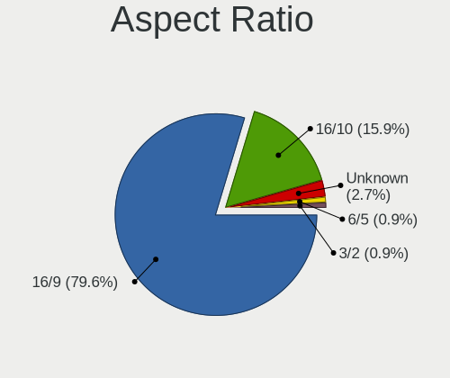
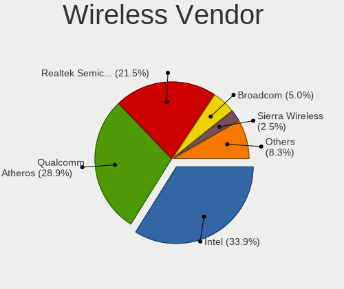
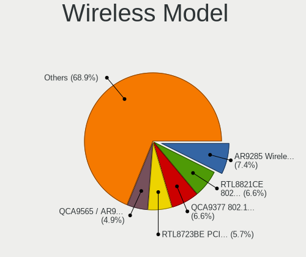
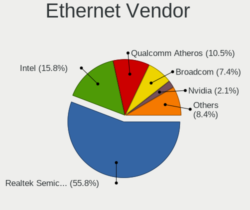
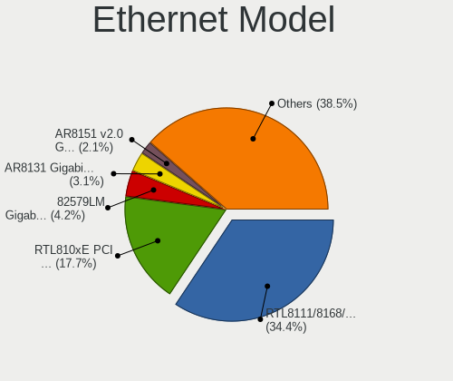
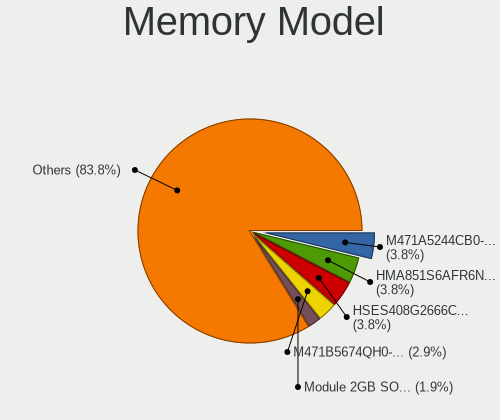

Linux Lite - Tested Hardware & Statistics (Notebooks)
-----------------------------------------------------

A project to collect tested hardware configurations for Linux Lite.

Anyone can contribute to this report by the [hw-probe](https://github.com/linuxhw/hw-probe) tool:

    sudo -E hw-probe -all -upload

Please contribute! Especially if your hardware is rare.

Contents
--------

* [ Test Cases ](#test-cases)

* [ System ](#system)
  - [ OS                       ](#os)
  - [ OS Family                ](#os-family)
  - [ Kernel                   ](#kernel)
  - [ Kernel Family            ](#kernel-family)
  - [ Kernel Major Ver.        ](#kernel-major-ver)
  - [ Arch                     ](#arch)
  - [ DE                       ](#de)
  - [ Display Server           ](#display-server)
  - [ Display Manager          ](#display-manager)
  - [ OS Lang                  ](#os-lang)
  - [ Boot Mode                ](#boot-mode)
  - [ Filesystem               ](#filesystem)
  - [ Part. scheme             ](#part-scheme)
  - [ Dual Boot with Linux/BSD ](#dual-boot-with-linuxbsd)
  - [ Dual Boot (Win)          ](#dual-boot-win)

* [ Board ](#board)
  - [ Vendor                   ](#vendor)
  - [ Model                    ](#model)
  - [ Model Family             ](#model-family)
  - [ MFG Year                 ](#mfg-year)
  - [ Form Factor              ](#form-factor)
  - [ Secure Boot              ](#secure-boot)
  - [ Coreboot                 ](#coreboot)
  - [ RAM Size                 ](#ram-size)
  - [ RAM Used                 ](#ram-used)
  - [ Total Drives             ](#total-drives)
  - [ Has CD-ROM               ](#has-cd-rom)
  - [ Has Ethernet             ](#has-ethernet)
  - [ Has WiFi                 ](#has-wifi)
  - [ Has Bluetooth            ](#has-bluetooth)

* [ Location ](#location)
  - [ Country                  ](#country)
  - [ City                     ](#city)

* [ Drives ](#drives)
  - [ Drive Vendor             ](#drive-vendor)
  - [ Drive Model              ](#drive-model)
  - [ HDD Vendor               ](#hdd-vendor)
  - [ SSD Vendor               ](#ssd-vendor)
  - [ Drive Kind               ](#drive-kind)
  - [ Drive Connector          ](#drive-connector)
  - [ Drive Size               ](#drive-size)
  - [ Space Total              ](#space-total)
  - [ Space Used               ](#space-used)
  - [ Malfunc. Drives          ](#malfunc-drives)
  - [ Malfunc. Drive Vendor    ](#malfunc-drive-vendor)
  - [ Malfunc. HDD Vendor      ](#malfunc-hdd-vendor)
  - [ Malfunc. Drive Kind      ](#malfunc-drive-kind)
  - [ Failed Drives            ](#failed-drives)
  - [ Failed Drive Vendor      ](#failed-drive-vendor)
  - [ Drive Status             ](#drive-status)

* [ Storage controller ](#storage-controller)
  - [ Storage Vendor           ](#storage-vendor)
  - [ Storage Model            ](#storage-model)
  - [ Storage Kind             ](#storage-kind)

* [ Processor ](#processor)
  - [ CPU Vendor               ](#cpu-vendor)
  - [ CPU Model                ](#cpu-model)
  - [ CPU Model Family         ](#cpu-model-family)
  - [ CPU Cores                ](#cpu-cores)
  - [ CPU Sockets              ](#cpu-sockets)
  - [ CPU Threads              ](#cpu-threads)
  - [ CPU Op-Modes             ](#cpu-op-modes)
  - [ CPU Microcode            ](#cpu-microcode)
  - [ CPU Microarch            ](#cpu-microarch)

* [ Graphics ](#graphics)
  - [ GPU Vendor               ](#gpu-vendor)
  - [ GPU Model                ](#gpu-model)
  - [ GPU Combo                ](#gpu-combo)
  - [ GPU Driver               ](#gpu-driver)
  - [ GPU Memory               ](#gpu-memory)

* [ Monitor ](#monitor)
  - [ Monitor Vendor           ](#monitor-vendor)
  - [ Monitor Model            ](#monitor-model)
  - [ Monitor Resolution       ](#monitor-resolution)
  - [ Monitor Diagonal         ](#monitor-diagonal)
  - [ Monitor Width            ](#monitor-width)
  - [ Aspect Ratio             ](#aspect-ratio)
  - [ Monitor Area             ](#monitor-area)
  - [ Pixel Density            ](#pixel-density)
  - [ Multiple Monitors        ](#multiple-monitors)

* [ Network ](#network)
  - [ Net Controller Vendor    ](#net-controller-vendor)
  - [ Net Controller Model     ](#net-controller-model)
  - [ Wireless Vendor          ](#wireless-vendor)
  - [ Wireless Model           ](#wireless-model)
  - [ Ethernet Vendor          ](#ethernet-vendor)
  - [ Ethernet Model           ](#ethernet-model)
  - [ Net Controller Kind      ](#net-controller-kind)
  - [ Used Controller          ](#used-controller)
  - [ NICs                     ](#nics)
  - [ IPv6                     ](#ipv6)

* [ Bluetooth ](#bluetooth)
  - [ Bluetooth Vendor         ](#bluetooth-vendor)
  - [ Bluetooth Model          ](#bluetooth-model)

* [ Sound ](#sound)
  - [ Sound Vendor             ](#sound-vendor)
  - [ Sound Model              ](#sound-model)

* [ Memory ](#memory)
  - [ Memory Vendor            ](#memory-vendor)
  - [ Memory Model             ](#memory-model)
  - [ Memory Kind              ](#memory-kind)
  - [ Memory Form Factor       ](#memory-form-factor)
  - [ Memory Size              ](#memory-size)
  - [ Memory Speed             ](#memory-speed)

* [ Printers & scanners ](#printers--scanners)
  - [ Printer Vendor           ](#printer-vendor)
  - [ Printer Model            ](#printer-model)
  - [ Scanner Vendor           ](#scanner-vendor)
  - [ Scanner Model            ](#scanner-model)

* [ Camera ](#camera)
  - [ Camera Vendor            ](#camera-vendor)
  - [ Camera Model             ](#camera-model)

* [ Security ](#security)
  - [ Fingerprint Vendor       ](#fingerprint-vendor)
  - [ Fingerprint Model        ](#fingerprint-model)
  - [ Chipcard Vendor          ](#chipcard-vendor)
  - [ Chipcard Model           ](#chipcard-model)

* [ Unsupported ](#unsupported)
  - [ Unsupported Devices      ](#unsupported-devices)
  - [ Unsupported Device Types ](#unsupported-device-types)

Test Cases
----------

Total: 90

| Vendor   | Model                       | Probe                                                      | Date         |
|----------|-----------------------------|------------------------------------------------------------|--------------|
| Acer     | Aspire A315-53              | [eb42b5e055](https://linux-hardware.org/?probe=eb42b5e055) | Dec 24, 2022 |
| Pegatron | H36FF                       | [f27fc61f18](https://linux-hardware.org/?probe=f27fc61f18) | Dec 18, 2022 |
| Thomson  | PT-NEO14A.2WH32             | [d028ff11a9](https://linux-hardware.org/?probe=d028ff11a9) | Dec 18, 2022 |
| Pegatron | H36FF                       | [692955be3d](https://linux-hardware.org/?probe=692955be3d) | Dec 18, 2022 |
| Acer     | Nitro AN515-58              | [4916981641](https://linux-hardware.org/?probe=4916981641) | Nov 26, 2022 |
| UMAX     | VisionBook 12Wi 64G         | [9fe98911c1](https://linux-hardware.org/?probe=9fe98911c1) | Oct 27, 2022 |
| HP       | Compaq Presario CQ50        | [8546f55697](https://linux-hardware.org/?probe=8546f55697) | Oct 24, 2022 |
| HP       | Compaq Presario CQ50        | [3b1b5c18c6](https://linux-hardware.org/?probe=3b1b5c18c6) | Oct 24, 2022 |
| Acer     | Aspire 5600                 | [202a7e570e](https://linux-hardware.org/?probe=202a7e570e) | Oct 20, 2022 |
| MSI      | MS-N014                     | [4c41640fd3](https://linux-hardware.org/?probe=4c41640fd3) | Oct 12, 2022 |
| MSI      | MS-N014                     | [3144cac65a](https://linux-hardware.org/?probe=3144cac65a) | Oct 12, 2022 |
| Lenovo   | IdeaPad 100-14IBY 80MH      | [676289f650](https://linux-hardware.org/?probe=676289f650) | Oct 02, 2022 |
| HP       | Compaq 420                  | [d3e367cedc](https://linux-hardware.org/?probe=d3e367cedc) | Oct 01, 2022 |
| HP       | Presario V6000 (RG289UA#... | [7f0113694a](https://linux-hardware.org/?probe=7f0113694a) | Sep 15, 2022 |
| Samsung  | X420/X520                   | [a8ca7bb005](https://linux-hardware.org/?probe=a8ca7bb005) | Sep 04, 2022 |
| Fujitsu  | FMVNQ8P6                    | [5e34698f14](https://linux-hardware.org/?probe=5e34698f14) | Aug 28, 2022 |
| ASUSTek  | UX303LN                     | [63d5525864](https://linux-hardware.org/?probe=63d5525864) | Aug 16, 2022 |
| Lenovo   | ThinkPad L480 20LS001AMC    | [47d4f751e1](https://linux-hardware.org/?probe=47d4f751e1) | Aug 09, 2022 |
| Apple    | MacBookAir6,1               | [ede7f6cdae](https://linux-hardware.org/?probe=ede7f6cdae) | Jul 23, 2022 |
| ASUSTek  | VivoBook 14_ASUS Laptop ... | [b846c98a96](https://linux-hardware.org/?probe=b846c98a96) | Jul 08, 2022 |
| HP       | Pavilion g4                 | [330078dbac](https://linux-hardware.org/?probe=330078dbac) | Jul 04, 2022 |
| ASUSTek  | X555YI                      | [762b96a2de](https://linux-hardware.org/?probe=762b96a2de) | Jul 02, 2022 |
| HP       | EliteBook 8440p             | [4bea8264d3](https://linux-hardware.org/?probe=4bea8264d3) | Jun 20, 2022 |
| Samsung  | 530XBB                      | [485a99ca42](https://linux-hardware.org/?probe=485a99ca42) | Jun 03, 2022 |
| Minix    | Z64 V1.2                    | [97525a1dc3](https://linux-hardware.org/?probe=97525a1dc3) | May 27, 2022 |
| Dell     | Inspiron 16 5620            | [b42e1cf95b](https://linux-hardware.org/?probe=b42e1cf95b) | May 13, 2022 |
| Minix    | Z64 V1.2                    | [8796deded0](https://linux-hardware.org/?probe=8796deded0) | May 12, 2022 |
| Dell     | MXG061                      | [119f6dd774](https://linux-hardware.org/?probe=119f6dd774) | May 09, 2022 |
| Lenovo   | IdeaPad Gaming 3 15IHU6 ... | [ab553d3a2f](https://linux-hardware.org/?probe=ab553d3a2f) | May 01, 2022 |
| Acer     | Extensa 5220                | [ebbd01171d](https://linux-hardware.org/?probe=ebbd01171d) | May 01, 2022 |
| Acer     | Aspire 1410                 | [703c2ec84a](https://linux-hardware.org/?probe=703c2ec84a) | Apr 21, 2022 |
| Lenovo   | ThinkPad T400 6475E13       | [cd49ac8445](https://linux-hardware.org/?probe=cd49ac8445) | Apr 08, 2022 |
| Dell     | MXG061                      | [9c91bd9487](https://linux-hardware.org/?probe=9c91bd9487) | Apr 06, 2022 |
| Insignia | NS-P11W7100                 | [daa476af8c](https://linux-hardware.org/?probe=daa476af8c) | Mar 28, 2022 |
| Dell     | MXG071                      | [ac0158dcb9](https://linux-hardware.org/?probe=ac0158dcb9) | Mar 27, 2022 |
| HP       | 15 Notebook PC              | [0f99b7ff76](https://linux-hardware.org/?probe=0f99b7ff76) | Mar 21, 2022 |
| HP       | Compaq CQ45                 | [99286efd08](https://linux-hardware.org/?probe=99286efd08) | Mar 10, 2022 |
| HP       | Laptop 15-dw3xxx            | [2b748962fa](https://linux-hardware.org/?probe=2b748962fa) | Mar 06, 2022 |
| ASUSTek  | 900                         | [8373f78d4e](https://linux-hardware.org/?probe=8373f78d4e) | Feb 19, 2022 |
| Acer     | Aspire A315-53              | [6134bb8cba](https://linux-hardware.org/?probe=6134bb8cba) | Feb 18, 2022 |
| Acer     | Aspire 5600                 | [4b2259f040](https://linux-hardware.org/?probe=4b2259f040) | Feb 10, 2022 |
| HP       | Laptop 15-dw3xxx            | [b596d9fdb1](https://linux-hardware.org/?probe=b596d9fdb1) | Feb 09, 2022 |
| HP       | Compaq nw9440 (EY615ET#A... | [6a5c3254ab](https://linux-hardware.org/?probe=6a5c3254ab) | Jan 30, 2022 |
| HP       | Pavilion dv6500             | [15838ae11b](https://linux-hardware.org/?probe=15838ae11b) | Jan 12, 2022 |
| ASUSTek  | N53Jf                       | [3f0e64b85e](https://linux-hardware.org/?probe=3f0e64b85e) | Jan 03, 2022 |
| ASUSTek  | N53Jf                       | [6d7b0abdfa](https://linux-hardware.org/?probe=6d7b0abdfa) | Jan 03, 2022 |
| ASUSTek  | X541SA                      | [26f2eeeefc](https://linux-hardware.org/?probe=26f2eeeefc) | Dec 31, 2021 |
| HP       | Pavilion dv6500             | [978ee4328d](https://linux-hardware.org/?probe=978ee4328d) | Dec 19, 2021 |
| Acer     | Aspire 5600                 | [25b1e50c64](https://linux-hardware.org/?probe=25b1e50c64) | Dec 12, 2021 |
| HP       | Compaq 2510p                | [8bc24dae3e](https://linux-hardware.org/?probe=8bc24dae3e) | Nov 23, 2021 |
| HP       | Compaq 2510p                | [c76241a894](https://linux-hardware.org/?probe=c76241a894) | Nov 22, 2021 |
| Samsung  | 905S3G/906S3G/915S3G/930... | [b7306537cc](https://linux-hardware.org/?probe=b7306537cc) | Nov 10, 2021 |
| Acer     | Aspire 5600                 | [7e2da6d3e9](https://linux-hardware.org/?probe=7e2da6d3e9) | Oct 26, 2021 |
| Dell     | MXG061                      | [89a5b20193](https://linux-hardware.org/?probe=89a5b20193) | Oct 10, 2021 |
| Acer     | Swift SF314-56              | [263d6e38b7](https://linux-hardware.org/?probe=263d6e38b7) | Oct 01, 2021 |
| Acer     | Swift SF314-56              | [bb0f894bce](https://linux-hardware.org/?probe=bb0f894bce) | Oct 01, 2021 |
| Dell     | Vostro1710                  | [d50123c66a](https://linux-hardware.org/?probe=d50123c66a) | Sep 01, 2021 |
| Dell     | Inspiron 5452               | [0c9b3ec7a9](https://linux-hardware.org/?probe=0c9b3ec7a9) | Aug 07, 2021 |
| HP       | EliteBook Folio 9470m       | [b2b851f7d2](https://linux-hardware.org/?probe=b2b851f7d2) | Jul 12, 2021 |
| ASUSTek  | X541SA                      | [ed8bb15f60](https://linux-hardware.org/?probe=ed8bb15f60) | Jul 11, 2021 |
| HP       | Laptop 14-cm0xxx            | [5943266aca](https://linux-hardware.org/?probe=5943266aca) | Jun 18, 2021 |
| HP       | Laptop 14-cm0xxx            | [3b4a122b75](https://linux-hardware.org/?probe=3b4a122b75) | Jun 18, 2021 |
| Fujitsu  | LIFEBOOK U747               | [117e8bf660](https://linux-hardware.org/?probe=117e8bf660) | Jun 17, 2021 |
| Lenovo   | IdeaPad Slim 1-14AST-05 ... | [a9255b2217](https://linux-hardware.org/?probe=a9255b2217) | Jun 04, 2021 |
| ASUSTek  | VivoBook_ASUSLaptop E203... | [58bf661e8d](https://linux-hardware.org/?probe=58bf661e8d) | Apr 15, 2021 |
| ASUSTek  | K50IE                       | [b0bcc6c31c](https://linux-hardware.org/?probe=b0bcc6c31c) | Apr 12, 2021 |
| ASUSTek  | K54LY                       | [dc7d86f51e](https://linux-hardware.org/?probe=dc7d86f51e) | Mar 21, 2021 |
| Acer     | Aspire V5-552               | [7a32a8a1c3](https://linux-hardware.org/?probe=7a32a8a1c3) | Mar 03, 2021 |
| HP       | Compaq 6735b                | [0f2afbc99a](https://linux-hardware.org/?probe=0f2afbc99a) | Feb 18, 2021 |
| Dell     | Inspiron 7559               | [4d4377253f](https://linux-hardware.org/?probe=4d4377253f) | Feb 15, 2021 |
| HP       | Laptop 17-by2xxx            | [729abf0085](https://linux-hardware.org/?probe=729abf0085) | Jan 30, 2021 |
| Acer     | Predator PH317-52           | [1bd05ad341](https://linux-hardware.org/?probe=1bd05ad341) | Jan 24, 2021 |
| HP       | 655                         | [a6913cacf3](https://linux-hardware.org/?probe=a6913cacf3) | Dec 28, 2020 |
| HP       | 655                         | [2a4c81218e](https://linux-hardware.org/?probe=2a4c81218e) | Dec 27, 2020 |
| Toshiba  | Satellite T215D             | [084f254e1f](https://linux-hardware.org/?probe=084f254e1f) | Dec 23, 2020 |
| Toshiba  | Satellite T215D             | [bdb8fe4e55](https://linux-hardware.org/?probe=bdb8fe4e55) | Dec 23, 2020 |
| Lenovo   | IdeaPad 320-15ABR 80XS      | [680d4771b2](https://linux-hardware.org/?probe=680d4771b2) | Dec 15, 2020 |
| ASUSTek  | 1001PX                      | [9f911bde1c](https://linux-hardware.org/?probe=9f911bde1c) | Dec 11, 2020 |
| Acer     | Aspire 5750                 | [ba47872fd5](https://linux-hardware.org/?probe=ba47872fd5) | Dec 02, 2020 |
| Acer     | Aspire 5750                 | [c4216f5d80](https://linux-hardware.org/?probe=c4216f5d80) | Dec 02, 2020 |
| Dell     | Latitude D530               | [4fe18e86ac](https://linux-hardware.org/?probe=4fe18e86ac) | Sep 27, 2020 |
| Acer     | Aspire ES1-511              | [63a7ae1967](https://linux-hardware.org/?probe=63a7ae1967) | Jul 24, 2020 |
| Google   | Chell                       | [cf727e9a6e](https://linux-hardware.org/?probe=cf727e9a6e) | Jul 23, 2020 |
| ASUSTek  | X751LD                      | [2d9ea757d1](https://linux-hardware.org/?probe=2d9ea757d1) | Jul 14, 2020 |
| ASUSTek  | X751LD                      | [1a4ee704d9](https://linux-hardware.org/?probe=1a4ee704d9) | Jul 14, 2020 |
| Lenovo   | 3000 V200 0764A11           | [8492023ae0](https://linux-hardware.org/?probe=8492023ae0) | Jul 13, 2020 |
| TR       | ST Pro-KN                   | [e78b2937ef](https://linux-hardware.org/?probe=e78b2937ef) | Jul 01, 2020 |
| ASUSTek  | N750JK                      | [9102fbcf41](https://linux-hardware.org/?probe=9102fbcf41) | Jun 02, 2020 |
| Samsung  | NC110P/NC108P/NC111P        | [92c219ffb4](https://linux-hardware.org/?probe=92c219ffb4) | May 14, 2020 |
| ASUSTek  | X540YA                      | [2bfdde7714](https://linux-hardware.org/?probe=2bfdde7714) | Apr 03, 2020 |

System
------

OS
--

Installed operating systems

| Name           | Notebooks | Percent |
|----------------|-----------|---------|
| Linux Lite 6.0 | 13        | 18.84%  |
| Linux Lite 5.8 | 12        | 17.39%  |
| Linux Lite 5.4 | 9         | 13.04%  |
| Linux Lite 5.2 | 9         | 13.04%  |
| Linux Lite 5.0 | 8         | 11.59%  |
| Linux Lite 5.6 | 7         | 10.14%  |
| Linux Lite 6.2 | 4         | 5.8%    |
| Linux Lite 3.8 | 3         | 4.35%   |
| Linux Lite 4.8 | 2         | 2.9%    |
| Linux Lite 4.4 | 1         | 1.45%   |
| Linux Lite 4.2 | 1         | 1.45%   |

OS Family
---------

OS without a version

| Name       | Notebooks | Percent |
|------------|-----------|---------|
| Linux Lite | 67        | 100%    |

Kernel
------

Version of the Linux kernel

| Version           | Notebooks | Percent |
|-------------------|-----------|---------|
| 5.4.0-40-generic  | 4         | 5.41%   |
| 5.4.0-70-generic  | 3         | 4.05%   |
| 5.4.0-52-generic  | 3         | 4.05%   |
| 5.4.0-109-generic | 3         | 4.05%   |
| 5.15.0-33-generic | 3         | 4.05%   |
| 5.4.0-90-generic  | 2         | 2.7%    |
| 5.4.0-81-generic  | 2         | 2.7%    |
| 5.4.0-74-generic  | 2         | 2.7%    |
| 5.4.0-58-generic  | 2         | 2.7%    |
| 5.4.0-42-generic  | 2         | 2.7%    |
| 5.4.0-107-generic | 2         | 2.7%    |
| 5.4.0-104-generic | 2         | 2.7%    |
| 5.15.0-56-generic | 2         | 2.7%    |
| 5.15.0-52-generic | 2         | 2.7%    |
| 5.15.0-48-generic | 2         | 2.7%    |
| 5.15.0-47-generic | 2         | 2.7%    |
| 6.1.0-1.linuxlite | 1         | 1.35%   |
| 6.0.0             | 1         | 1.35%   |
| 5.4.0-96-generic  | 1         | 1.35%   |
| 5.4.0-94-generic  | 1         | 1.35%   |
| 5.4.0-91-generic  | 1         | 1.35%   |
| 5.4.0-88-generic  | 1         | 1.35%   |
| 5.4.0-77-generic  | 1         | 1.35%   |
| 5.4.0-71-generic  | 1         | 1.35%   |
| 5.4.0-66-generic  | 1         | 1.35%   |
| 5.4.0-65-generic  | 1         | 1.35%   |
| 5.4.0-56-generic  | 1         | 1.35%   |
| 5.4.0-48-generic  | 1         | 1.35%   |
| 5.4.0-33-generic  | 1         | 1.35%   |
| 5.4.0-124-generic | 1         | 1.35%   |
| 5.4.0-122-generic | 1         | 1.35%   |
| 5.4.0-113-generic | 1         | 1.35%   |
| 5.4.0-110-generic | 1         | 1.35%   |
| 5.4.0-105-generic | 1         | 1.35%   |
| 5.4.0-100-generic | 1         | 1.35%   |
| 5.16.0            | 1         | 1.35%   |
| 5.15.0-53-generic | 1         | 1.35%   |
| 5.15.0-46-generic | 1         | 1.35%   |
| 5.15.0-40-generic | 1         | 1.35%   |
| 5.15.0-30-generic | 1         | 1.35%   |

Kernel Family
-------------

Linux kernel without a distro release

| Version | Notebooks | Percent |
|---------|-----------|---------|
| 5.4.0   | 43        | 61.43%  |
| 5.15.0  | 16        | 22.86%  |
| 4.15.0  | 4         | 5.71%   |
| 4.4.0   | 2         | 2.86%   |
| 6.1.0   | 1         | 1.43%   |
| 6.0.0   | 1         | 1.43%   |
| 5.16.0  | 1         | 1.43%   |
| 5.13.0  | 1         | 1.43%   |
| 5.10.0  | 1         | 1.43%   |

Kernel Major Ver.
-----------------

Linux kernel major version

| Version | Notebooks | Percent |
|---------|-----------|---------|
| 5.4     | 43        | 61.43%  |
| 5.15    | 16        | 22.86%  |
| 4.15    | 4         | 5.71%   |
| 4.4     | 2         | 2.86%   |
| 6.1     | 1         | 1.43%   |
| 6.0     | 1         | 1.43%   |
| 5.16    | 1         | 1.43%   |
| 5.13    | 1         | 1.43%   |
| 5.10    | 1         | 1.43%   |

Arch
----

OS architecture (x86_64, i586, etc.)

| Name   | Notebooks | Percent |
|--------|-----------|---------|
| x86_64 | 65        | 97.01%  |
| i686   | 2         | 2.99%   |

DE
--

Desktop Environment

| Name    | Notebooks | Percent |
|---------|-----------|---------|
| XFCE    | 52        | 77.61%  |
| GNOME   | 12        | 17.91%  |
| Unknown | 2         | 2.99%   |
| Deepin  | 1         | 1.49%   |

Display Server
--------------

X11 or Wayland

| Name    | Notebooks | Percent |
|---------|-----------|---------|
| X11     | 65        | 97.01%  |
| Tty     | 1         | 1.49%   |
| Unknown | 1         | 1.49%   |

Display Manager
---------------

SDDM, LightDM, etc.

| Name    | Notebooks | Percent |
|---------|-----------|---------|
| LightDM | 41        | 59.42%  |
| TDM     | 15        | 21.74%  |
| Unknown | 12        | 17.39%  |
| GDM     | 1         | 1.45%   |

OS Lang
-------

Language

| Lang  | Notebooks | Percent |
|-------|-----------|---------|
| en_US | 36        | 53.73%  |
| pl_PL | 5         | 7.46%   |
| de_DE | 5         | 7.46%   |
| fr_FR | 4         | 5.97%   |
| en_GB | 3         | 4.48%   |
| ru_UA | 2         | 2.99%   |
| ru_RU | 2         | 2.99%   |
| pt_BR | 2         | 2.99%   |
| it_IT | 2         | 2.99%   |
| es_ES | 2         | 2.99%   |
| zh_CN | 1         | 1.49%   |
| pt_PT | 1         | 1.49%   |
| es_CO | 1         | 1.49%   |
| en_AU | 1         | 1.49%   |

Boot Mode
---------

EFI or BIOS

| Mode | Notebooks | Percent |
|------|-----------|---------|
| EFI  | 36        | 53.73%  |
| BIOS | 31        | 46.27%  |

Filesystem
----------

Type of filesystem

| Type    | Notebooks | Percent |
|---------|-----------|---------|
| Ext4    | 58        | 86.57%  |
| Overlay | 6         | 8.96%   |
| Btrfs   | 2         | 2.99%   |
| Zfs     | 1         | 1.49%   |

Part. scheme
------------

Scheme of partitioning

| Type    | Notebooks | Percent |
|---------|-----------|---------|
| GPT     | 30        | 44.78%  |
| Unknown | 23        | 34.33%  |
| MBR     | 14        | 20.9%   |

Dual Boot with Linux/BSD
------------------------

Hosting more than one Linux/BSD

| Dual boot | Notebooks | Percent |
|-----------|-----------|---------|
| No        | 59        | 86.76%  |
| Yes       | 9         | 13.24%  |

Dual Boot (Win)
---------------

Hosting Linux and Windows

| Dual boot | Notebooks | Percent |
|-----------|-----------|---------|
| No        | 47        | 69.12%  |
| Yes       | 21        | 30.88%  |

Board
-----

Vendor
------

Motherboard manufacturer

| Name                | Notebooks | Percent |
|---------------------|-----------|---------|
| Hewlett-Packard     | 15        | 22.39%  |
| ASUSTek Computer    | 13        | 19.4%   |
| Acer                | 10        | 14.93%  |
| Dell                | 7         | 10.45%  |
| Lenovo              | 6         | 8.96%   |
| Samsung Electronics | 4         | 5.97%   |
| Fujitsu             | 2         | 2.99%   |
| UMAX                | 1         | 1.49%   |
| TR                  | 1         | 1.49%   |
| Toshiba             | 1         | 1.49%   |
| Thomson             | 1         | 1.49%   |
| Pegatron            | 1         | 1.49%   |
| MSI                 | 1         | 1.49%   |
| Minix               | 1         | 1.49%   |
| Insignia            | 1         | 1.49%   |
| Google              | 1         | 1.49%   |
| Apple               | 1         | 1.49%   |

Model
-----

Motherboard model

| Name                                | Notebooks | Percent |
|-------------------------------------|-----------|---------|
| UMAX VisionBook 12Wi 64G            | 1         | 1.49%   |
| TR ST Pro-KN                        | 1         | 1.49%   |
| Toshiba Satellite T215D             | 1         | 1.49%   |
| Thomson PT-NEO14A.2WH32             | 1         | 1.49%   |
| Samsung X420/X520                   | 1         | 1.49%   |
| Samsung NC110P/NC108P/NC111P        | 1         | 1.49%   |
| Samsung 905S3G/906S3G/915S3G/9305SG | 1         | 1.49%   |
| Samsung 530XBB                      | 1         | 1.49%   |
| Pegatron H36FF                      | 1         | 1.49%   |
| MSI MS-N014                         | 1         | 1.49%   |
| Minix Z64                           | 1         | 1.49%   |
| Lenovo ThinkPad T400 6475E13        | 1         | 1.49%   |
| Lenovo ThinkPad L480 20LS001AMC     | 1         | 1.49%   |
| Lenovo IdeaPad Gaming 3 15IHU6 82K1 | 1         | 1.49%   |
| Lenovo IdeaPad 320-15ABR 80XS       | 1         | 1.49%   |
| Lenovo IdeaPad 100-14IBY 80MH       | 1         | 1.49%   |
| Lenovo 3000 V200 0764A11            | 1         | 1.49%   |
| Insignia NS-P11W7100                | 1         | 1.49%   |
| HP Presario V6000 (RG289UA#ABA)     | 1         | 1.49%   |
| HP Pavilion g4                      | 1         | 1.49%   |
| HP Pavilion dv6500                  | 1         | 1.49%   |
| HP Laptop 17-by2xxx                 | 1         | 1.49%   |
| HP Laptop 15-dw3xxx                 | 1         | 1.49%   |
| HP Laptop 14-cm0xxx                 | 1         | 1.49%   |
| HP EliteBook Folio 9470m            | 1         | 1.49%   |
| HP EliteBook 8440p                  | 1         | 1.49%   |
| HP Compaq Presario CQ50             | 1         | 1.49%   |
| HP Compaq nw9440 (EY615ET#ABU)      | 1         | 1.49%   |
| HP Compaq CQ45                      | 1         | 1.49%   |
| HP Compaq 420                       | 1         | 1.49%   |
| HP Compaq 2510p                     | 1         | 1.49%   |
| HP 655                              | 1         | 1.49%   |
| HP 15 Notebook PC                   | 1         | 1.49%   |
| Google Chell                        | 1         | 1.49%   |
| Fujitsu LIFEBOOK U747               | 1         | 1.49%   |
| Fujitsu FMVNQ8P6                    | 1         | 1.49%   |
| Dell Vostro1710                     | 1         | 1.49%   |
| Dell MXG071                         | 1         | 1.49%   |
| Dell MXG061                         | 1         | 1.49%   |
| Dell Latitude D530                  | 1         | 1.49%   |

Model Family
------------

Motherboard model prefix

| Name                    | Notebooks | Percent |
|-------------------------|-----------|---------|
| Acer Aspire             | 6         | 8.96%   |
| HP Compaq               | 5         | 7.46%   |
| Lenovo IdeaPad          | 3         | 4.48%   |
| HP Laptop               | 3         | 4.48%   |
| Dell Inspiron           | 3         | 4.48%   |
| Lenovo ThinkPad         | 2         | 2.99%   |
| HP Pavilion             | 2         | 2.99%   |
| HP EliteBook            | 2         | 2.99%   |
| ASUS VivoBook           | 2         | 2.99%   |
| UMAX VisionBook         | 1         | 1.49%   |
| TR ST                   | 1         | 1.49%   |
| Toshiba Satellite       | 1         | 1.49%   |
| Thomson PT-NEO14A.2WH32 | 1         | 1.49%   |
| Samsung X420            | 1         | 1.49%   |
| Samsung NC110P          | 1         | 1.49%   |
| Samsung 905S3G          | 1         | 1.49%   |
| Samsung 530XBB          | 1         | 1.49%   |
| Pegatron H36FF          | 1         | 1.49%   |
| MSI MS-N014             | 1         | 1.49%   |
| Minix Z64               | 1         | 1.49%   |
| Lenovo 3000             | 1         | 1.49%   |
| Insignia NS-P11W7100    | 1         | 1.49%   |
| HP Presario             | 1         | 1.49%   |
| HP 655                  | 1         | 1.49%   |
| HP 15                   | 1         | 1.49%   |
| Google Chell            | 1         | 1.49%   |
| Fujitsu LIFEBOOK        | 1         | 1.49%   |
| Fujitsu FMVNQ8P6        | 1         | 1.49%   |
| Dell Vostro1710         | 1         | 1.49%   |
| Dell MXG071             | 1         | 1.49%   |
| Dell MXG061             | 1         | 1.49%   |
| Dell Latitude           | 1         | 1.49%   |
| ASUS X751LD             | 1         | 1.49%   |
| ASUS X555YI             | 1         | 1.49%   |
| ASUS X541SA             | 1         | 1.49%   |
| ASUS X540YA             | 1         | 1.49%   |
| ASUS UX303LN            | 1         | 1.49%   |
| ASUS N750JK             | 1         | 1.49%   |
| ASUS N53Jf              | 1         | 1.49%   |
| ASUS K54LY              | 1         | 1.49%   |

MFG Year
--------

Motherboard manufacture year

| Year | Notebooks | Percent |
|------|-----------|---------|
| 2010 | 8         | 11.94%  |
| 2014 | 7         | 10.45%  |
| 2018 | 6         | 8.96%   |
| 2008 | 6         | 8.96%   |
| 2007 | 6         | 8.96%   |
| 2015 | 5         | 7.46%   |
| 2017 | 4         | 5.97%   |
| 2016 | 4         | 5.97%   |
| 2012 | 4         | 5.97%   |
| 2020 | 3         | 4.48%   |
| 2019 | 3         | 4.48%   |
| 2011 | 3         | 4.48%   |
| 2022 | 2         | 2.99%   |
| 2006 | 2         | 2.99%   |
| 2021 | 1         | 1.49%   |
| 2013 | 1         | 1.49%   |
| 2009 | 1         | 1.49%   |
| 2004 | 1         | 1.49%   |

Form Factor
-----------

Physical design of the computer

| Name     | Notebooks | Percent |
|----------|-----------|---------|
| Notebook | 67        | 100%    |

Secure Boot
-----------

Enabled or disabled

| State    | Notebooks | Percent |
|----------|-----------|---------|
| Disabled | 64        | 95.52%  |
| Enabled  | 3         | 4.48%   |

Coreboot
--------

Have coreboot on board

| Used | Notebooks | Percent |
|------|-----------|---------|
| No   | 66        | 98.51%  |
| Yes  | 1         | 1.49%   |

RAM Size
--------

Total RAM memory

| Size in GB | Notebooks | Percent |
|------------|-----------|---------|
| 3.01-4.0   | 24        | 35.82%  |
| 1.01-2.0   | 14        | 20.9%   |
| 4.01-8.0   | 11        | 16.42%  |
| 16.01-24.0 | 7         | 10.45%  |
| 8.01-16.0  | 4         | 5.97%   |
| 0.51-1.0   | 4         | 5.97%   |
| 2.01-3.0   | 2         | 2.99%   |
| 32.01-64.0 | 1         | 1.49%   |

RAM Used
--------

Used RAM memory

| Used GB   | Notebooks | Percent |
|-----------|-----------|---------|
| 1.01-2.0  | 33        | 47.83%  |
| 2.01-3.0  | 14        | 20.29%  |
| 0.51-1.0  | 11        | 15.94%  |
| 3.01-4.0  | 5         | 7.25%   |
| 0.01-0.5  | 3         | 4.35%   |
| 4.01-8.0  | 2         | 2.9%    |
| 8.01-16.0 | 1         | 1.45%   |

Total Drives
------------

Number of drives on board

| Drives | Notebooks | Percent |
|--------|-----------|---------|
| 1      | 54        | 80.6%   |
| 2      | 12        | 17.91%  |
| 3      | 1         | 1.49%   |

Has CD-ROM
----------

Has CD-ROM on board

| Presented | Notebooks | Percent |
|-----------|-----------|---------|
| No        | 40        | 59.7%   |
| Yes       | 27        | 40.3%   |

Has Ethernet
------------

Has Ethernet on board

| Presented | Notebooks | Percent |
|-----------|-----------|---------|
| Yes       | 56        | 83.58%  |
| No        | 11        | 16.42%  |

Has WiFi
--------

Has WiFi module

| Presented | Notebooks | Percent |
|-----------|-----------|---------|
| Yes       | 65        | 97.01%  |
| No        | 2         | 2.99%   |

Has Bluetooth
-------------

Has Bluetooth module

| Presented | Notebooks | Percent |
|-----------|-----------|---------|
| Yes       | 45        | 67.16%  |
| No        | 22        | 32.84%  |

Location
--------

Country
-------

Geographic location (country)

| Country     | Notebooks | Percent |
|-------------|-----------|---------|
| USA         | 8         | 11.94%  |
| Germany     | 6         | 8.96%   |
| France      | 5         | 7.46%   |
| Brazil      | 5         | 7.46%   |
| Ukraine     | 4         | 5.97%   |
| Romania     | 4         | 5.97%   |
| Poland      | 4         | 5.97%   |
| UK          | 3         | 4.48%   |
| Spain       | 3         | 4.48%   |
| Russia      | 3         | 4.48%   |
| Italy       | 3         | 4.48%   |
| Turkey      | 2         | 2.99%   |
| Australia   | 2         | 2.99%   |
| Venezuela   | 1         | 1.49%   |
| Slovakia    | 1         | 1.49%   |
| Portugal    | 1         | 1.49%   |
| Philippines | 1         | 1.49%   |
| Netherlands | 1         | 1.49%   |
| Myanmar     | 1         | 1.49%   |
| Mexico      | 1         | 1.49%   |
| Iran        | 1         | 1.49%   |
| Indonesia   | 1         | 1.49%   |
| Guadeloupe  | 1         | 1.49%   |
| El Salvador | 1         | 1.49%   |
| Czechia     | 1         | 1.49%   |
| Colombia    | 1         | 1.49%   |
| Chile       | 1         | 1.49%   |
| Canada      | 1         | 1.49%   |

City
----

Geographic location (city)

| City               | Notebooks | Percent |
|--------------------|-----------|---------|
| Sydney             | 2         | 2.86%   |
| Pabianice          | 2         | 2.86%   |
| Odessa             | 2         | 2.86%   |
| Żywiec            | 1         | 1.43%   |
| Yangon             | 1         | 1.43%   |
| Würzburg          | 1         | 1.43%   |
| Wiesbaden          | 1         | 1.43%   |
| Washington         | 1         | 1.43%   |
| Warsaw             | 1         | 1.43%   |
| Wahroonga          | 1         | 1.43%   |
| Voluntari          | 1         | 1.43%   |
| Vinnytsia          | 1         | 1.43%   |
| Varennes-les-Narcy | 1         | 1.43%   |
| Valencia           | 1         | 1.43%   |
| Tucape             | 1         | 1.43%   |
| Teresina           | 1         | 1.43%   |
| Tekirdağ          | 1         | 1.43%   |
| Tarragona          | 1         | 1.43%   |
| Svidník           | 1         | 1.43%   |
| Surabaya           | 1         | 1.43%   |
| Studenka           | 1         | 1.43%   |
| St. Petersburg     | 1         | 1.43%   |
| Shadrinsk          | 1         | 1.43%   |
| Sao Paulo          | 1         | 1.43%   |
| Sabadell           | 1         | 1.43%   |
| Queretaro          | 1         | 1.43%   |
| Póvoa de Varzim   | 1         | 1.43%   |
| Paris              | 1         | 1.43%   |
| Paranaque City     | 1         | 1.43%   |
| Nudlingen          | 1         | 1.43%   |
| Novaci             | 1         | 1.43%   |
| Moscow             | 1         | 1.43%   |
| Milan              | 1         | 1.43%   |
| Marseille          | 1         | 1.43%   |
| Madrid             | 1         | 1.43%   |
| London             | 1         | 1.43%   |
| Les Abymes         | 1         | 1.43%   |
| Lane Cove          | 1         | 1.43%   |
| La Libertad        | 1         | 1.43%   |
| La Glacerie        | 1         | 1.43%   |

Drives
------

Drive Vendor
------------

Hard drive vendors

| Vendor              | Notebooks | Drives | Percent |
|---------------------|-----------|--------|---------|
| Seagate             | 12        | 12     | 16%     |
| WDC                 | 11        | 15     | 14.67%  |
| Toshiba             | 9         | 10     | 12%     |
| Samsung Electronics | 9         | 10     | 12%     |
| Unknown             | 6         | 9      | 8%      |
| Kingston            | 5         | 5      | 6.67%   |
| Micron Technology   | 4         | 5      | 5.33%   |
| SanDisk             | 3         | 3      | 4%      |
| Hitachi             | 3         | 3      | 4%      |
| HGST                | 3         | 3      | 4%      |
| GOODRAM             | 2         | 2      | 2.67%   |
| Crucial             | 2         | 2      | 2.67%   |
| SK hynix            | 1         | 2      | 1.33%   |
| LITEON              | 1         | 1      | 1.33%   |
| Intel               | 1         | 1      | 1.33%   |
| ASUS-PHISON         | 1         | 2      | 1.33%   |
| ASMT                | 1         | 1      | 1.33%   |
| Apple               | 1         | 1      | 1.33%   |

Drive Model
-----------

Hard drive models

| Model                                 | Notebooks | Percent |
|---------------------------------------|-----------|---------|
| Unknown MMC Card  32GB                | 3         | 3.8%    |
| Toshiba MQ01ABF050 500GB              | 3         | 3.8%    |
| Kingston SA400S37240G 240GB SSD       | 3         | 3.8%    |
| Seagate ST9320325AS 320GB             | 2         | 2.53%   |
| Micron MTFDDAK256MAM-1K12 256GB SSD   | 2         | 2.53%   |
| WDC WDS480G2G0A-00JH30 480GB SSD      | 1         | 1.27%   |
| WDC WDS120G2G0A-00JH30 120GB SSD      | 1         | 1.27%   |
| WDC WD5000LPCX-75VHAT0 500GB          | 1         | 1.27%   |
| WDC WD2500BEVS-00UST0 250GB           | 1         | 1.27%   |
| WDC WD2500BEVE-00A0HT0 250GB          | 1         | 1.27%   |
| WDC WD1600BEVT-22A23T0 160GB          | 1         | 1.27%   |
| WDC WD10SPZX-24Z10 1TB                | 1         | 1.27%   |
| WDC WD10JPVX-75JC3T0 1TB              | 1         | 1.27%   |
| WDC WD10JPVX-22JC3T0 1TB              | 1         | 1.27%   |
| WDC PC SN530 SDBPNPZ-512G-1006 512GB  | 1         | 1.27%   |
| WDC PC SN530 SDBPMPZ-256G-1101 256GB  | 1         | 1.27%   |
| Unknown SLD64G  64GB                  | 1         | 1.27%   |
| Unknown SD64G  64GB                   | 1         | 1.27%   |
| Unknown SD16G  16GB                   | 1         | 1.27%   |
| Unknown NCard  32GB                   | 1         | 1.27%   |
| Unknown MMC Card  128GB               | 1         | 1.27%   |
| Unknown DA4064  64GB                  | 1         | 1.27%   |
| Toshiba MQ04ABF100 1TB                | 1         | 1.27%   |
| Toshiba MQ01ABD100 1TB                | 1         | 1.27%   |
| Toshiba MQ01ABD050 500GB              | 1         | 1.27%   |
| Toshiba MQ01ABD032V -63 320GB         | 1         | 1.27%   |
| Toshiba MK3265GSX 320GB               | 1         | 1.27%   |
| Toshiba MK1011GAH 100GB               | 1         | 1.27%   |
| SK hynix HFS256G39TND-N210A 256GB SSD | 1         | 1.27%   |
| Seagate ST9500423AS 500GB             | 1         | 1.27%   |
| Seagate ST9160823ASG 160GB            | 1         | 1.27%   |
| Seagate ST9160301AS 160GB             | 1         | 1.27%   |
| Seagate ST640LM0 00 HM641JI 640GB     | 1         | 1.27%   |
| Seagate ST500VT000-1DK142 500GB       | 1         | 1.27%   |
| Seagate ST500LT012-1DG142 500GB       | 1         | 1.27%   |
| Seagate ST500LM012 HN-M500MBB 500GB   | 1         | 1.27%   |
| Seagate ST320LT020-9YG142 320GB       | 1         | 1.27%   |
| Seagate ST320LM000 HM321HI 320GB      | 1         | 1.27%   |
| Seagate ST2000LM007-1R8174 2TB        | 1         | 1.27%   |
| SanDisk Z400s M.2 2280 128GB SSD      | 1         | 1.27%   |

HDD Vendor
----------

Hard disk drive vendors

| Vendor              | Notebooks | Drives | Percent |
|---------------------|-----------|--------|---------|
| Seagate             | 12        | 12     | 32.43%  |
| Toshiba             | 9         | 10     | 24.32%  |
| WDC                 | 7         | 10     | 18.92%  |
| Hitachi             | 3         | 3      | 8.11%   |
| HGST                | 3         | 3      | 8.11%   |
| Samsung Electronics | 2         | 3      | 5.41%   |
| ASMT                | 1         | 1      | 2.7%    |

SSD Vendor
----------

Solid state drive vendors

| Vendor              | Notebooks | Drives | Percent |
|---------------------|-----------|--------|---------|
| Kingston            | 4         | 4      | 17.39%  |
| Samsung Electronics | 3         | 3      | 13.04%  |
| Micron Technology   | 3         | 4      | 13.04%  |
| WDC                 | 2         | 2      | 8.7%    |
| SanDisk             | 2         | 2      | 8.7%    |
| GOODRAM             | 2         | 2      | 8.7%    |
| Crucial             | 2         | 2      | 8.7%    |
| SK hynix            | 1         | 2      | 4.35%   |
| LITEON              | 1         | 1      | 4.35%   |
| Intel               | 1         | 1      | 4.35%   |
| ASUS-PHISON         | 1         | 2      | 4.35%   |
| Apple               | 1         | 1      | 4.35%   |

Drive Kind
----------

HDD or SSD

| Kind | Notebooks | Drives | Percent |
|------|-----------|--------|---------|
| HDD  | 36        | 42     | 50%     |
| SSD  | 22        | 26     | 30.56%  |
| MMC  | 7         | 10     | 9.72%   |
| NVMe | 7         | 9      | 9.72%   |

Drive Connector
---------------

SATA, SAS, NVMe, etc.

| Type | Notebooks | Drives | Percent |
|------|-----------|--------|---------|
| SATA | 53        | 66     | 76.81%  |
| NVMe | 7         | 9      | 10.14%  |
| MMC  | 7         | 10     | 10.14%  |
| SAS  | 2         | 2      | 2.9%    |

Drive Size
----------

Size of hard drive

| Size in TB | Notebooks | Drives | Percent |
|------------|-----------|--------|---------|
| 0.01-0.5   | 45        | 56     | 78.95%  |
| 0.51-1.0   | 11        | 11     | 19.3%   |
| 1.01-2.0   | 1         | 1      | 1.75%   |

Space Total
-----------

Amount of disk space available on the file system

| Size in GB     | Notebooks | Percent |
|----------------|-----------|---------|
| 101-250        | 26        | 37.68%  |
| 251-500        | 16        | 23.19%  |
| 51-100         | 10        | 14.49%  |
| 1-20           | 7         | 10.14%  |
| 501-1000       | 5         | 7.25%   |
| 21-50          | 4         | 5.8%    |
| More than 3000 | 1         | 1.45%   |

Space Used
----------

Amount of used disk space

| Used GB   | Notebooks | Percent |
|-----------|-----------|---------|
| 1-20      | 42        | 60%     |
| 21-50     | 13        | 18.57%  |
| 51-100    | 8         | 11.43%  |
| 101-250   | 6         | 8.57%   |
| 2001-3000 | 1         | 1.43%   |

Malfunc. Drives
---------------

Drive models with a malfunction

| Model                                          | Notebooks | Drives | Percent |
|------------------------------------------------|-----------|--------|---------|
| WDC WDS480G2G0A-00JH30 480GB SSD               | 1         | 1      | 7.69%   |
| WDC WD1600BEVT-22A23T0 160GB                   | 1         | 1      | 7.69%   |
| WDC WD10JPVX-22JC3T0 1TB                       | 1         | 1      | 7.69%   |
| Toshiba MQ01ABD050 500GB                       | 1         | 1      | 7.69%   |
| Toshiba MK3265GSX 320GB                        | 1         | 1      | 7.69%   |
| Seagate ST9500423AS 500GB                      | 1         | 1      | 7.69%   |
| Seagate ST9320325AS 320GB                      | 1         | 1      | 7.69%   |
| Seagate ST9160823ASG 160GB                     | 1         | 1      | 7.69%   |
| Seagate ST500LT012-1DG142 500GB                | 1         | 1      | 7.69%   |
| SanDisk SSD PLUS 120GB                         | 1         | 1      | 7.69%   |
| Samsung Electronics HM250JI 250GB              | 1         | 1      | 7.69%   |
| Micron Technology MTFDDAK256MAM-1K12 256GB SSD | 1         | 1      | 7.69%   |
| Hitachi HTS545016B9A300 160GB                  | 1         | 1      | 7.69%   |

Malfunc. Drive Vendor
---------------------

Vendors of faulty drives

| Vendor              | Notebooks | Drives | Percent |
|---------------------|-----------|--------|---------|
| Seagate             | 4         | 4      | 30.77%  |
| WDC                 | 3         | 3      | 23.08%  |
| Toshiba             | 2         | 2      | 15.38%  |
| SanDisk             | 1         | 1      | 7.69%   |
| Samsung Electronics | 1         | 1      | 7.69%   |
| Micron Technology   | 1         | 1      | 7.69%   |
| Hitachi             | 1         | 1      | 7.69%   |

Malfunc. HDD Vendor
-------------------

Vendors of faulty HDD drives

| Vendor              | Notebooks | Drives | Percent |
|---------------------|-----------|--------|---------|
| Seagate             | 4         | 4      | 40%     |
| WDC                 | 2         | 2      | 20%     |
| Toshiba             | 2         | 2      | 20%     |
| Samsung Electronics | 1         | 1      | 10%     |
| Hitachi             | 1         | 1      | 10%     |

Malfunc. Drive Kind
-------------------

Kinds of faulty drives

| Kind | Notebooks | Drives | Percent |
|------|-----------|--------|---------|
| HDD  | 10        | 10     | 76.92%  |
| SSD  | 3         | 3      | 23.08%  |

Failed Drives
-------------

Failed drive models

Zero info for selected period =(

Failed Drive Vendor
-------------------

Failed drive vendors

Zero info for selected period =(

Drive Status
------------

Number of failed and malfunc. drives

| Status   | Notebooks | Drives | Percent |
|----------|-----------|--------|---------|
| Works    | 29        | 34     | 42.65%  |
| Detected | 27        | 40     | 39.71%  |
| Malfunc  | 12        | 13     | 17.65%  |

Storage controller
------------------

Storage Vendor
--------------

Storage controller vendors

| Vendor                      | Notebooks | Percent |
|-----------------------------|-----------|---------|
| Intel                       | 48        | 70.59%  |
| AMD                         | 8         | 11.76%  |
| Samsung Electronics         | 4         | 5.88%   |
| Nvidia                      | 3         | 4.41%   |
| SanDisk                     | 2         | 2.94%   |
| Micron Technology           | 1         | 1.47%   |
| Marvell Technology Group    | 1         | 1.47%   |
| Kingston Technology Company | 1         | 1.47%   |

Storage Model
-------------

Storage controller models

| Model                                                                            | Notebooks | Percent |
|----------------------------------------------------------------------------------|-----------|---------|
| Intel 82801HM/HEM (ICH8M/ICH8M-E) IDE Controller                                 | 7         | 8.43%   |
| AMD FCH SATA Controller [AHCI mode]                                              | 7         | 8.43%   |
| Intel 82801IBM/IEM (ICH9M/ICH9M-E) 4 port SATA Controller [AHCI mode]            | 4         | 4.82%   |
| Intel 82801HM/HEM (ICH8M/ICH8M-E) SATA Controller [AHCI mode]                    | 4         | 4.82%   |
| Intel 7 Series Chipset Family 6-port SATA Controller [AHCI mode]                 | 4         | 4.82%   |
| Intel Volume Management Device NVMe RAID Controller                              | 3         | 3.61%   |
| Intel NM10/ICH7 Family SATA Controller [AHCI mode]                               | 3         | 3.61%   |
| Intel Atom Processor E3800 Series SATA AHCI Controller                           | 3         | 3.61%   |
| Samsung NVMe SSD Controller 980                                                  | 2         | 2.41%   |
| Intel Tiger Lake-LP SATA Controller                                              | 2         | 2.41%   |
| Intel Sunrise Point-LP SATA Controller [AHCI mode]                               | 2         | 2.41%   |
| Intel HM170/QM170 Chipset SATA Controller [AHCI Mode]                            | 2         | 2.41%   |
| Intel Atom/Celeron/Pentium Processor x5-E8000/J3xxx/N3xxx Series SATA Controller | 2         | 2.41%   |
| Intel 82801HM/HEM (ICH8M/ICH8M-E) SATA Controller [IDE mode]                     | 2         | 2.41%   |
| Intel 82801G (ICH7 Family) IDE Controller                                        | 2         | 2.41%   |
| Intel 82801 Mobile SATA Controller [RAID mode]                                   | 2         | 2.41%   |
| Intel 8 Series SATA Controller 1 [AHCI mode]                                     | 2         | 2.41%   |
| Intel 6 Series/C200 Series Chipset Family 6 port Mobile SATA AHCI Controller     | 2         | 2.41%   |
| Intel 5 Series/3400 Series Chipset 4 port SATA AHCI Controller                   | 2         | 2.41%   |
| SanDisk WD Blue SN550 NVMe SSD                                                   | 1         | 1.2%    |
| SanDisk Non-Volatile memory controller                                           | 1         | 1.2%    |
| Samsung NVMe SSD Controller SM981/PM981/PM983                                    | 1         | 1.2%    |
| Samsung NVMe SSD Controller SM961/PM961/SM963                                    | 1         | 1.2%    |
| Nvidia MCP79 AHCI Controller                                                     | 1         | 1.2%    |
| Nvidia MCP78S [GeForce 8200] SATA Controller (non-AHCI mode)                     | 1         | 1.2%    |
| Nvidia MCP78S [GeForce 8200] IDE                                                 | 1         | 1.2%    |
| Nvidia MCP51 Serial ATA Controller                                               | 1         | 1.2%    |
| Nvidia MCP51 IDE                                                                 | 1         | 1.2%    |
| Micron Non-Volatile memory controller                                            | 1         | 1.2%    |
| Marvell Group 88SS9183 PCIe SSD Controller                                       | 1         | 1.2%    |
| Kingston Company U-SNS8154P3 NVMe SSD                                            | 1         | 1.2%    |
| Intel Mobile PM965/GM965 PT IDER Controller                                      | 1         | 1.2%    |
| Intel Mobile 4 Series Chipset PT IDER Controller                                 | 1         | 1.2%    |
| Intel Celeron/Pentium Silver Processor SATA Controller                           | 1         | 1.2%    |
| Intel Celeron N3350/Pentium N4200/Atom E3900 Series SATA AHCI Controller         | 1         | 1.2%    |
| Intel Cannon Point-LP SATA Controller [AHCI Mode]                                | 1         | 1.2%    |
| Intel Cannon Lake Mobile PCH SATA AHCI Controller                                | 1         | 1.2%    |
| Intel Alder Lake-P SATA AHCI Controller                                          | 1         | 1.2%    |
| Intel 82801GBM/GHM (ICH7-M Family) SATA Controller [IDE mode]                    | 1         | 1.2%    |
| Intel 82801GBM/GHM (ICH7-M Family) SATA Controller [AHCI mode]                   | 1         | 1.2%    |

Storage Kind
------------

Kind of storage controller (IDE, SATA, NVMe, SAS, ...)

| Kind | Notebooks | Percent |
|------|-----------|---------|
| SATA | 49        | 64.47%  |
| IDE  | 15        | 19.74%  |
| NVMe | 7         | 9.21%   |
| RAID | 5         | 6.58%   |

Processor
---------

CPU Vendor
----------

Processor vendors

| Vendor | Notebooks | Percent |
|--------|-----------|---------|
| Intel  | 57        | 85.07%  |
| AMD    | 10        | 14.93%  |

CPU Model
---------

Processor models

| Model                                       | Notebooks | Percent |
|---------------------------------------------|-----------|---------|
| Intel Core i5-8250U CPU @ 1.60GHz           | 2         | 2.99%   |
| Intel Core 2 CPU T7600 @ 2.33GHz            | 2         | 2.99%   |
| Intel Atom x5-Z8350 CPU @ 1.44GHz           | 2         | 2.99%   |
| AMD A8-7410 APU with AMD Radeon R5 Graphics | 2         | 2.99%   |
| Intel Pentium Dual-Core CPU T4400 @ 2.20GHz | 1         | 1.49%   |
| Intel Pentium CPU N3710 @ 1.60GHz           | 1         | 1.49%   |
| Intel Pentium CPU N3700 @ 1.60GHz           | 1         | 1.49%   |
| Intel Pentium CPU N3540 @ 2.16GHz           | 1         | 1.49%   |
| Intel Pentium CPU B950 @ 2.10GHz            | 1         | 1.49%   |
| Intel Genuine CPU U7300 @ 1.30GHz           | 1         | 1.49%   |
| Intel Genuine CPU T2050 @ 1.60GHz           | 1         | 1.49%   |
| Intel Core m7-6Y75 CPU @ 1.20GHz            | 1         | 1.49%   |
| Intel Core i7-8750H CPU @ 2.20GHz           | 1         | 1.49%   |
| Intel Core i7-7700HQ CPU @ 2.80GHz          | 1         | 1.49%   |
| Intel Core i7-7600U CPU @ 2.80GHz           | 1         | 1.49%   |
| Intel Core i7-6700HQ CPU @ 2.60GHz          | 1         | 1.49%   |
| Intel Core i7-4700HQ CPU @ 2.40GHz          | 1         | 1.49%   |
| Intel Core i5-4260U CPU @ 1.40GHz           | 1         | 1.49%   |
| Intel Core i5-4210U CPU @ 1.70GHz           | 1         | 1.49%   |
| Intel Core i5-3427U CPU @ 1.80GHz           | 1         | 1.49%   |
| Intel Core i5-3337U CPU @ 1.80GHz           | 1         | 1.49%   |
| Intel Core i5-3230M CPU @ 2.60GHz           | 1         | 1.49%   |
| Intel Core i5 CPU M 520 @ 2.40GHz           | 1         | 1.49%   |
| Intel Core i5 CPU M 480 @ 2.67GHz           | 1         | 1.49%   |
| Intel Core i5 CPU M 460 @ 2.53GHz           | 1         | 1.49%   |
| Intel Core i3-8145U CPU @ 2.10GHz           | 1         | 1.49%   |
| Intel Core i3-7020U CPU @ 2.30GHz           | 1         | 1.49%   |
| Intel Core i3-4030U CPU @ 1.90GHz           | 1         | 1.49%   |
| Intel Core i3-2330M CPU @ 2.20GHz           | 1         | 1.49%   |
| Intel Core i3-10110U CPU @ 2.10GHz          | 1         | 1.49%   |
| Intel Core 2 Duo CPU U7600 @ 1.20GHz        | 1         | 1.49%   |
| Intel Core 2 Duo CPU T9300 @ 2.50GHz        | 1         | 1.49%   |
| Intel Core 2 Duo CPU T8300 @ 2.40GHz        | 1         | 1.49%   |
| Intel Core 2 Duo CPU T7700 @ 2.40GHz        | 1         | 1.49%   |
| Intel Core 2 Duo CPU T7500 @ 2.20GHz        | 1         | 1.49%   |
| Intel Core 2 Duo CPU T7250 @ 2.00GHz        | 1         | 1.49%   |
| Intel Core 2 Duo CPU T6570 @ 2.10GHz        | 1         | 1.49%   |
| Intel Core 2 Duo CPU T5250 @ 1.50GHz        | 1         | 1.49%   |
| Intel Core 2 Duo CPU P8400 @ 2.26GHz        | 1         | 1.49%   |
| Intel Celeron N4000 CPU @ 1.10GHz           | 1         | 1.49%   |

CPU Model Family
----------------

Processor model prefix

| Model                   | Notebooks | Percent |
|-------------------------|-----------|---------|
| Intel Core i5           | 10        | 14.93%  |
| Intel Core 2 Duo        | 9         | 13.43%  |
| Intel Atom              | 7         | 10.45%  |
| Intel Celeron           | 6         | 8.96%   |
| Intel Core i7           | 5         | 7.46%   |
| Intel Core i3           | 5         | 7.46%   |
| Other                   | 4         | 5.97%   |
| Intel Pentium           | 4         | 5.97%   |
| Intel Genuine           | 2         | 2.99%   |
| Intel Core 2            | 2         | 2.99%   |
| AMD E2                  | 2         | 2.99%   |
| AMD A8                  | 2         | 2.99%   |
| Intel Pentium Dual-Core | 1         | 1.49%   |
| Intel Core m7           | 1         | 1.49%   |
| Intel Celeron M         | 1         | 1.49%   |
| AMD Turion Dual-Core    | 1         | 1.49%   |
| AMD Turion 64 X2 Mobile | 1         | 1.49%   |
| AMD Quad-Core           | 1         | 1.49%   |
| AMD Athlon II Neo       | 1         | 1.49%   |
| AMD A12                 | 1         | 1.49%   |
| AMD A10                 | 1         | 1.49%   |

CPU Cores
---------

Number of processor cores

| Number | Notebooks | Percent |
|--------|-----------|---------|
| 2      | 41        | 61.19%  |
| 4      | 18        | 26.87%  |
| 1      | 5         | 7.46%   |
| 14     | 1         | 1.49%   |
| 10     | 1         | 1.49%   |
| 6      | 1         | 1.49%   |

CPU Sockets
-----------

Number of sockets

| Number | Notebooks | Percent |
|--------|-----------|---------|
| 1      | 67        | 100%    |

CPU Threads
-----------

Threads per core (Hyper-Threading)

| Number | Notebooks | Percent |
|--------|-----------|---------|
| 1      | 37        | 55.22%  |
| 2      | 30        | 44.78%  |

CPU Op-Modes
------------

CPU Operation Modes (32-bit, 64-bit)

| Op mode        | Notebooks | Percent |
|----------------|-----------|---------|
| 32-bit, 64-bit | 65        | 97.01%  |
| 32-bit         | 2         | 2.99%   |

CPU Microcode
-------------

Microcode number

| Number     | Notebooks | Percent |
|------------|-----------|---------|
| Unknown    | 6         | 8.96%   |
| 0x30678    | 4         | 5.97%   |
| 0x1067a    | 4         | 5.97%   |
| 0x6fd      | 3         | 4.48%   |
| 0x40651    | 3         | 4.48%   |
| 0x306a9    | 3         | 4.48%   |
| 0x206a7    | 3         | 4.48%   |
| 0x20655    | 3         | 4.48%   |
| 0x806ea    | 2         | 2.99%   |
| 0x806e9    | 2         | 2.99%   |
| 0x806c1    | 2         | 2.99%   |
| 0x6fb      | 2         | 2.99%   |
| 0x6f6      | 2         | 2.99%   |
| 0x406c4    | 2         | 2.99%   |
| 0x406c3    | 2         | 2.99%   |
| 0x106ca    | 2         | 2.99%   |
| 0x10676    | 2         | 2.99%   |
| 0x906ea    | 1         | 1.49%   |
| 0x906e9    | 1         | 1.49%   |
| 0x906a4    | 1         | 1.49%   |
| 0x906a3    | 1         | 1.49%   |
| 0x806ec    | 1         | 1.49%   |
| 0x806eb    | 1         | 1.49%   |
| 0x706a1    | 1         | 1.49%   |
| 0x6d8      | 1         | 1.49%   |
| 0x506e3    | 1         | 1.49%   |
| 0x506c9    | 1         | 1.49%   |
| 0x406e3    | 1         | 1.49%   |
| 0x306c3    | 1         | 1.49%   |
| 0x30661    | 1         | 1.49%   |
| 0x07030105 | 1         | 1.49%   |
| 0x06006705 | 1         | 1.49%   |
| 0x06006118 | 1         | 1.49%   |
| 0x06001119 | 1         | 1.49%   |
| 0x05000119 | 1         | 1.49%   |
| 0x02000057 | 1         | 1.49%   |
| 0x010000c8 | 1         | 1.49%   |

CPU Microarch
-------------

Microarchitecture

| Name             | Notebooks | Percent |
|------------------|-----------|---------|
| Silvermont       | 9         | 13.43%  |
| KabyLake         | 8         | 11.94%  |
| Penryn           | 7         | 10.45%  |
| Core             | 7         | 10.45%  |
| Haswell          | 4         | 5.97%   |
| Westmere         | 3         | 4.48%   |
| SandyBridge      | 3         | 4.48%   |
| IvyBridge        | 3         | 4.48%   |
| Bonnell          | 3         | 4.48%   |
| TigerLake        | 2         | 2.99%   |
| Skylake          | 2         | 2.99%   |
| Puma             | 2         | 2.99%   |
| P6               | 2         | 2.99%   |
| Excavator        | 2         | 2.99%   |
| Alderlake Hybrid | 2         | 2.99%   |
| Piledriver       | 1         | 1.49%   |
| K8 Hammer        | 1         | 1.49%   |
| K8 & K10 hybrid  | 1         | 1.49%   |
| K10              | 1         | 1.49%   |
| Jaguar           | 1         | 1.49%   |
| Goldmont plus    | 1         | 1.49%   |
| Goldmont         | 1         | 1.49%   |
| Bobcat           | 1         | 1.49%   |

Graphics
--------

GPU Vendor
----------

Vendors of graphics cards

| Vendor | Notebooks | Percent |
|--------|-----------|---------|
| Intel  | 51        | 67.11%  |
| Nvidia | 16        | 21.05%  |
| AMD    | 9         | 11.84%  |

GPU Model
---------

Graphics card models

| Model                                                                                    | Notebooks | Percent |
|------------------------------------------------------------------------------------------|-----------|---------|
| Intel Mobile GM965/GL960 Integrated Graphics Controller (secondary)                      | 5         | 6.02%   |
| Intel Mobile GM965/GL960 Integrated Graphics Controller (primary)                        | 5         | 6.02%   |
| Intel Atom/Celeron/Pentium Processor x5-E8000/J3xxx/N3xxx Integrated Graphics Controller | 5         | 6.02%   |
| Intel Mobile 4 Series Chipset Integrated Graphics Controller                             | 4         | 4.82%   |
| Intel Atom Processor Z36xxx/Z37xxx Series Graphics & Display                             | 4         | 4.82%   |
| Intel Haswell-ULT Integrated Graphics Controller                                         | 3         | 3.61%   |
| Intel Core Processor Integrated Graphics Controller                                      | 3         | 3.61%   |
| Intel 3rd Gen Core processor Graphics Controller                                         | 3         | 3.61%   |
| Intel UHD Graphics 620                                                                   | 2         | 2.41%   |
| Intel TigerLake-LP GT2 [Iris Xe Graphics]                                                | 2         | 2.41%   |
| Intel HD Graphics 620                                                                    | 2         | 2.41%   |
| Intel Atom Processor D4xx/D5xx/N4xx/N5xx Integrated Graphics Controller                  | 2         | 2.41%   |
| Intel 2nd Generation Core Processor Family Integrated Graphics Controller                | 2         | 2.41%   |
| AMD Mullins [Radeon R4/R5 Graphics]                                                      | 2         | 2.41%   |
| Nvidia GT218M [GeForce 310M]                                                             | 1         | 1.2%    |
| Nvidia GT216M [GeForce GT 320M]                                                          | 1         | 1.2%    |
| Nvidia GP107M [GeForce GTX 1050 Ti Mobile]                                               | 1         | 1.2%    |
| Nvidia GP106M [GeForce GTX 1060 Mobile]                                                  | 1         | 1.2%    |
| Nvidia GM108M [GeForce 840M]                                                             | 1         | 1.2%    |
| Nvidia GM107M [GeForce GTX 960M]                                                         | 1         | 1.2%    |
| Nvidia GM107M [GeForce GTX 850M]                                                         | 1         | 1.2%    |
| Nvidia GF117M [GeForce 610M/710M/810M/820M / GT 620M/625M/630M/720M]                     | 1         | 1.2%    |
| Nvidia GF108M [GeForce GT 425M]                                                          | 1         | 1.2%    |
| Nvidia GA107M [GeForce RTX 3050 Ti Mobile]                                               | 1         | 1.2%    |
| Nvidia G86M [GeForce 8600M GS]                                                           | 1         | 1.2%    |
| Nvidia G84M [GeForce 8700M GT]                                                           | 1         | 1.2%    |
| Nvidia G71M [GeForce Go 7950 GTX]                                                        | 1         | 1.2%    |
| Nvidia G71GLM [Quadro FX 1500M]                                                          | 1         | 1.2%    |
| Nvidia C77 [GeForce 8200M G]                                                             | 1         | 1.2%    |
| Nvidia C51 [GeForce Go 6150]                                                             | 1         | 1.2%    |
| Intel WhiskeyLake-U GT2 [UHD Graphics 620]                                               | 1         | 1.2%    |
| Intel Mobile 945GM/GMS/GME, 943/940GML Express Integrated Graphics Controller            | 1         | 1.2%    |
| Intel Mobile 945GM/GMS, 943/940GML Express Integrated Graphics Controller                | 1         | 1.2%    |
| Intel Mobile 915GM/GMS/910GML Express Graphics Controller                                | 1         | 1.2%    |
| Intel HD Graphics 630                                                                    | 1         | 1.2%    |
| Intel HD Graphics 530                                                                    | 1         | 1.2%    |
| Intel HD Graphics 515                                                                    | 1         | 1.2%    |
| Intel HD Graphics 500                                                                    | 1         | 1.2%    |
| Intel GeminiLake [UHD Graphics 600]                                                      | 1         | 1.2%    |
| Intel CometLake-U GT2 [UHD Graphics]                                                     | 1         | 1.2%    |

GPU Combo
---------

Combinations of graphics cards

| Name           | Notebooks | Percent |
|----------------|-----------|---------|
| 1 x Intel      | 42        | 62.69%  |
| Intel + Nvidia | 9         | 13.43%  |
| 1 x AMD        | 8         | 11.94%  |
| 1 x Nvidia     | 7         | 10.45%  |
| 2 x AMD        | 1         | 1.49%   |

GPU Driver
----------

Free vs proprietary

| Driver      | Notebooks | Percent |
|-------------|-----------|---------|
| Free        | 58        | 85.29%  |
| Proprietary | 9         | 13.24%  |
| Unknown     | 1         | 1.47%   |

GPU Memory
----------

Total video memory

| Size in GB | Notebooks | Percent |
|------------|-----------|---------|
| Unknown    | 47        | 70.15%  |
| 0.01-0.5   | 11        | 16.42%  |
| 0.51-1.0   | 4         | 5.97%   |
| 3.01-4.0   | 2         | 2.99%   |
| 1.01-2.0   | 2         | 2.99%   |
| 5.01-6.0   | 1         | 1.49%   |

Monitor
-------

Monitor Vendor
--------------

Monitor vendors

| Vendor                  | Notebooks | Percent |
|-------------------------|-----------|---------|
| AU Optronics            | 13        | 18.31%  |
| Samsung Electronics     | 10        | 14.08%  |
| LG Display              | 10        | 14.08%  |
| Chimei Innolux          | 7         | 9.86%   |
| BOE                     | 7         | 9.86%   |
| Chi Mei Optoelectronics | 5         | 7.04%   |
| LG Philips              | 2         | 2.82%   |
| HannStar                | 2         | 2.82%   |
| Goldstar                | 2         | 2.82%   |
| CPT                     | 2         | 2.82%   |
| Sony                    | 1         | 1.41%   |
| Seiko/Epson             | 1         | 1.41%   |
| SANYO                   | 1         | 1.41%   |
| PANDA                   | 1         | 1.41%   |
| Lenovo                  | 1         | 1.41%   |
| InfoVision              | 1         | 1.41%   |
| eMachines               | 1         | 1.41%   |
| BenQ                    | 1         | 1.41%   |
| Belinea                 | 1         | 1.41%   |
| Apple                   | 1         | 1.41%   |
| Unknown                 | 1         | 1.41%   |

Monitor Model
-------------

Monitor models

| Model                                                                 | Notebooks | Percent |
|-----------------------------------------------------------------------|-----------|---------|
| HannStar HSD101PFW2 HSD03E9 1024x600 222x125mm 10.0-inch              | 2         | 2.82%   |
| Sony TV  *00 SNY8004 3840x2160 1440x810mm 65.0-inch                   | 1         | 1.41%   |
| Seiko/Epson LCD Monitor                                               | 1         | 1.41%   |
| SANYO LCD SAN1207 1360x768                                            | 1         | 1.41%   |
| Samsung Electronics S24F350 SAM0D20 1920x1080 520x290mm 23.4-inch     | 1         | 1.41%   |
| Samsung Electronics LCD Monitor SEC4E45 1280x800 331x207mm 15.4-inch  | 1         | 1.41%   |
| Samsung Electronics LCD Monitor SEC3845 1280x800 331x207mm 15.4-inch  | 1         | 1.41%   |
| Samsung Electronics LCD Monitor SEC335A 1366x768 309x174mm 14.0-inch  | 1         | 1.41%   |
| Samsung Electronics LCD Monitor SEC3242 1920x1080 235x132mm 10.6-inch | 1         | 1.41%   |
| Samsung Electronics LCD Monitor SEC3155 1366x768 293x165mm 13.2-inch  | 1         | 1.41%   |
| Samsung Electronics LCD Monitor SDCC34F 3840x2160 344x194mm 15.5-inch | 1         | 1.41%   |
| Samsung Electronics LCD Monitor SDC4942 1366x768 309x174mm 14.0-inch  | 1         | 1.41%   |
| Samsung Electronics LCD Monitor SDC415A 3840x2400 302x189mm 14.0-inch | 1         | 1.41%   |
| Samsung Electronics LCD Monitor SAM07C0 1920x1080 890x500mm 40.2-inch | 1         | 1.41%   |
| PANDA LCD Monitor NCP0004 1920x1080 294x165mm 13.3-inch               | 1         | 1.41%   |
| LG Philips LCD Monitor LPL2A00 1280x800 330x210mm 15.4-inch           | 1         | 1.41%   |
| LG Philips LCD Monitor LPL118A 1920x1200 370x230mm 17.2-inch          | 1         | 1.41%   |
| LG Display LCD Monitor LGDE400 1920x1200 367x230mm 17.1-inch          | 1         | 1.41%   |
| LG Display LCD Monitor LGD05F6 1920x1080 309x174mm 14.0-inch          | 1         | 1.41%   |
| LG Display LCD Monitor LGD056D 1920x1080 382x215mm 17.3-inch          | 1         | 1.41%   |
| LG Display LCD Monitor LGD04E1 1366x768 344x194mm 15.5-inch           | 1         | 1.41%   |
| LG Display LCD Monitor LGD046D 1920x1080 309x174mm 14.0-inch          | 1         | 1.41%   |
| LG Display LCD Monitor LGD03E3 1366x768 310x174mm 14.0-inch           | 1         | 1.41%   |
| LG Display LCD Monitor LGD038C 1366x768 256x144mm 11.6-inch           | 1         | 1.41%   |
| LG Display LCD Monitor LGD0250 1366x768 350x190mm 15.7-inch           | 1         | 1.41%   |
| LG Display LCD Monitor LGD01E8 1366x768 344x194mm 15.5-inch           | 1         | 1.41%   |
| LG Display LCD Monitor LGD018B 1366x768 309x174mm 14.0-inch           | 1         | 1.41%   |
| Lenovo LCD Monitor LEN4036 1440x900 303x189mm 14.1-inch               | 1         | 1.41%   |
| InfoVision LCD Monitor IVO057C 1366x768 309x174mm 14.0-inch           | 1         | 1.41%   |
| Goldstar W2243 GSM56FF 1920x1080 477x268mm 21.5-inch                  | 1         | 1.41%   |
| Goldstar 22EA53 GSM59A5 1920x1080 477x268mm 21.5-inch                 | 1         | 1.41%   |
| eMachines E190HQV EMA0212 1366x768 409x230mm 18.5-inch                | 1         | 1.41%   |
| CPT LCD Monitor CPT14BF 1366x768 344x193mm 15.5-inch                  | 1         | 1.41%   |
| CPT LCD Monitor CPT1401 1280x800 331x207mm 15.4-inch                  | 1         | 1.41%   |
| Chimei Innolux LCD Monitor CMN1728 1600x900 382x215mm 17.3-inch       | 1         | 1.41%   |
| Chimei Innolux LCD Monitor CMN15D5 1920x1080 344x193mm 15.5-inch      | 1         | 1.41%   |
| Chimei Innolux LCD Monitor CMN15B7 1366x768 344x193mm 15.5-inch       | 1         | 1.41%   |
| Chimei Innolux LCD Monitor CMN1521 1920x1080 344x193mm 15.5-inch      | 1         | 1.41%   |
| Chimei Innolux LCD Monitor CMN14D6 1366x768 309x173mm 13.9-inch       | 1         | 1.41%   |
| Chimei Innolux LCD Monitor CMN1361 1920x1080 293x165mm 13.2-inch      | 1         | 1.41%   |

Monitor Resolution
------------------

Monitor screen resolution

| Resolution        | Notebooks | Percent |
|-------------------|-----------|---------|
| 1366x768 (WXGA)   | 30        | 42.25%  |
| 1920x1080 (FHD)   | 17        | 23.94%  |
| 1280x800 (WXGA)   | 7         | 9.86%   |
| 1920x1200 (WUXGA) | 6         | 8.45%   |
| 3840x2160 (4K)    | 2         | 2.82%   |
| 1600x900 (HD+)    | 2         | 2.82%   |
| 1024x600          | 2         | 2.82%   |
| 3840x2400         | 1         | 1.41%   |
| 1440x900 (WXGA+)  | 1         | 1.41%   |
| 1360x768          | 1         | 1.41%   |
| 1280x1024 (SXGA)  | 1         | 1.41%   |
| Unknown           | 1         | 1.41%   |

Monitor Diagonal
----------------

Diagonal size in inches

| Inches  | Notebooks | Percent |
|---------|-----------|---------|
| 15      | 24        | 33.8%   |
| 14      | 10        | 14.08%  |
| 13      | 9         | 12.68%  |
| 17      | 7         | 9.86%   |
| 11      | 5         | 7.04%   |
| Unknown | 3         | 4.23%   |
| 21      | 2         | 2.82%   |
| 16      | 2         | 2.82%   |
| 12      | 2         | 2.82%   |
| 10      | 2         | 2.82%   |
| 65      | 1         | 1.41%   |
| 46      | 1         | 1.41%   |
| 24      | 1         | 1.41%   |
| 23      | 1         | 1.41%   |
| 19      | 1         | 1.41%   |

Monitor Width
-------------

Physical width

| Width in mm | Notebooks | Percent |
|-------------|-----------|---------|
| 301-350     | 41        | 58.57%  |
| 201-300     | 12        | 17.14%  |
| 351-400     | 7         | 10%     |
| 401-500     | 3         | 4.29%   |
| Unknown     | 3         | 4.29%   |
| 501-600     | 2         | 2.86%   |
| 1001-1500   | 2         | 2.86%   |

Aspect Ratio
------------

Proportional relationship between the width and the height

| Ratio   | Notebooks | Percent |
|---------|-----------|---------|
| 16/9    | 50        | 74.63%  |
| 16/10   | 14        | 20.9%   |
| Unknown | 2         | 2.99%   |
| 6/5     | 1         | 1.49%   |

Monitor Area
------------

Area in inch²

| Area in inch² | Notebooks | Percent |
|----------------|-----------|---------|
| 101-110        | 24        | 33.8%   |
| 81-90          | 16        | 22.54%  |
| 51-60          | 5         | 7.04%   |
| 131-140        | 5         | 7.04%   |
| 71-80          | 3         | 4.23%   |
| 201-250        | 3         | 4.23%   |
| 121-130        | 3         | 4.23%   |
| Unknown        | 3         | 4.23%   |
| 61-70          | 2         | 2.82%   |
| 41-50          | 2         | 2.82%   |
| More than 1000 | 1         | 1.41%   |
| 251-300        | 1         | 1.41%   |
| 151-200        | 1         | 1.41%   |
| 111-120        | 1         | 1.41%   |
| 501-1000       | 1         | 1.41%   |

Pixel Density
-------------

Pixels per inch

| Density       | Notebooks | Percent |
|---------------|-----------|---------|
| 101-120       | 27        | 39.13%  |
| 121-160       | 22        | 31.88%  |
| 51-100        | 12        | 17.39%  |
| Unknown       | 3         | 4.35%   |
| More than 240 | 2         | 2.9%    |
| 161-240       | 2         | 2.9%    |
| 1-50          | 1         | 1.45%   |

Multiple Monitors
-----------------

Total monitors connected

| Total | Notebooks | Percent |
|-------|-----------|---------|
| 1     | 60        | 88.24%  |
| 2     | 8         | 11.76%  |

Network
-------

Net Controller Vendor
---------------------

Controller vendors

| Vendor                | Notebooks | Percent |
|-----------------------|-----------|---------|
| Realtek Semiconductor | 34        | 33.01%  |
| Intel                 | 26        | 25.24%  |
| Qualcomm Atheros      | 22        | 21.36%  |
| Broadcom              | 9         | 8.74%   |
| Broadcom Limited      | 4         | 3.88%   |
| Ralink                | 2         | 1.94%   |
| Nvidia                | 2         | 1.94%   |
| Sierra Wireless       | 1         | 0.97%   |
| Ralink Technology     | 1         | 0.97%   |
| D-Link                | 1         | 0.97%   |
| ASIX Electronics      | 1         | 0.97%   |

Net Controller Model
--------------------

Controller models

| Model                                                                                         | Notebooks | Percent |
|-----------------------------------------------------------------------------------------------|-----------|---------|
| Realtek RTL8111/8168/8411 PCI Express Gigabit Ethernet Controller                             | 17        | 13.6%   |
| Realtek RTL810xE PCI Express Fast Ethernet controller                                         | 12        | 9.6%    |
| Qualcomm Atheros QCA9565 / AR9565 Wireless Network Adapter                                    | 5         | 4%      |
| Qualcomm Atheros AR9285 Wireless Network Adapter (PCI-Express)                                | 5         | 4%      |
| Realtek RTL8723BE PCIe Wireless Network Adapter                                               | 4         | 3.2%    |
| Intel PRO/Wireless 4965 AG or AGN [Kedron] Network Connection                                 | 4         | 3.2%    |
| Realtek RTL8821CE 802.11ac PCIe Wireless Network Adapter                                      | 3         | 2.4%    |
| Qualcomm Atheros AR8131 Gigabit Ethernet                                                      | 3         | 2.4%    |
| Intel PRO/Wireless 3945ABG [Golan] Network Connection                                         | 3         | 2.4%    |
| Qualcomm Atheros QCA9377 802.11ac Wireless Network Adapter                                    | 2         | 1.6%    |
| Qualcomm Atheros AR928X Wireless Network Adapter (PCI-Express)                                | 2         | 1.6%    |
| Intel Wireless 8265 / 8275                                                                    | 2         | 1.6%    |
| Intel Wireless 3165                                                                           | 2         | 1.6%    |
| Intel Alder Lake-P PCH CNVi WiFi                                                              | 2         | 1.6%    |
| Intel 82579LM Gigabit Network Connection (Lewisville)                                         | 2         | 1.6%    |
| Broadcom BCM4313 802.11bgn Wireless Network Adapter                                           | 2         | 1.6%    |
| Broadcom BCM4311 802.11b/g WLAN                                                               | 2         | 1.6%    |
| Sierra Wireless EM7305 Modem                                                                  | 1         | 0.8%    |
| Realtek USB 10/100 LAN                                                                        | 1         | 0.8%    |
| Realtek RTL8821AE 802.11ac PCIe Wireless Network Adapter                                      | 1         | 0.8%    |
| Realtek RTL8723DE Wireless Network Adapter                                                    | 1         | 0.8%    |
| Realtek RTL8191SEvA Wireless LAN Controller                                                   | 1         | 0.8%    |
| Realtek RTL8188EUS 802.11n Wireless Network Adapter                                           | 1         | 0.8%    |
| Realtek RTL8188EE Wireless Network Adapter                                                    | 1         | 0.8%    |
| Realtek RTL8152 Fast Ethernet Adapter                                                         | 1         | 0.8%    |
| Realtek RTL-8100/8101L/8139 PCI Fast Ethernet Adapter                                         | 1         | 0.8%    |
| Realtek Realtek 8812AU/8821AU 802.11ac WLAN Adapter [USB Wireless Dual-Band Adapter 2.4/5Ghz] | 1         | 0.8%    |
| Realtek Killer E2600 Gigabit Ethernet Controller                                              | 1         | 0.8%    |
| Ralink MT7601U Wireless Adapter                                                               | 1         | 0.8%    |
| Ralink RT5390R 802.11bgn PCIe Wireless Network Adapter                                        | 1         | 0.8%    |
| Ralink RT3290 Wireless 802.11n 1T/1R PCIe                                                     | 1         | 0.8%    |
| Qualcomm Atheros QCA8171 Gigabit Ethernet                                                     | 1         | 0.8%    |
| Qualcomm Atheros Attansic L2 Fast Ethernet                                                    | 1         | 0.8%    |
| Qualcomm Atheros AR9485 Wireless Network Adapter                                              | 1         | 0.8%    |
| Qualcomm Atheros AR9462 Wireless Network Adapter                                              | 1         | 0.8%    |
| Qualcomm Atheros AR9287 Wireless Network Adapter (PCI-Express)                                | 1         | 0.8%    |
| Qualcomm Atheros AR8151 v2.0 Gigabit Ethernet                                                 | 1         | 0.8%    |
| Qualcomm Atheros AR8132 Fast Ethernet                                                         | 1         | 0.8%    |
| Qualcomm Atheros AR5212/5213/2414 Wireless Network Adapter                                    | 1         | 0.8%    |
| Qualcomm Atheros AR242x / AR542x Wireless Network Adapter (PCI-Express)                       | 1         | 0.8%    |

Wireless Vendor
---------------

Wireless vendors

| Vendor                | Notebooks | Percent |
|-----------------------|-----------|---------|
| Intel                 | 24        | 35.29%  |
| Qualcomm Atheros      | 20        | 29.41%  |
| Realtek Semiconductor | 13        | 19.12%  |
| Broadcom              | 4         | 5.88%   |
| Ralink                | 2         | 2.94%   |
| Broadcom Limited      | 2         | 2.94%   |
| Sierra Wireless       | 1         | 1.47%   |
| Ralink Technology     | 1         | 1.47%   |
| D-Link                | 1         | 1.47%   |

Wireless Model
--------------

Wireless models

| Model                                                                                         | Notebooks | Percent |
|-----------------------------------------------------------------------------------------------|-----------|---------|
| Qualcomm Atheros QCA9565 / AR9565 Wireless Network Adapter                                    | 5         | 7.35%   |
| Qualcomm Atheros AR9285 Wireless Network Adapter (PCI-Express)                                | 5         | 7.35%   |
| Realtek RTL8723BE PCIe Wireless Network Adapter                                               | 4         | 5.88%   |
| Intel PRO/Wireless 4965 AG or AGN [Kedron] Network Connection                                 | 4         | 5.88%   |
| Realtek RTL8821CE 802.11ac PCIe Wireless Network Adapter                                      | 3         | 4.41%   |
| Intel PRO/Wireless 3945ABG [Golan] Network Connection                                         | 3         | 4.41%   |
| Qualcomm Atheros QCA9377 802.11ac Wireless Network Adapter                                    | 2         | 2.94%   |
| Qualcomm Atheros AR928X Wireless Network Adapter (PCI-Express)                                | 2         | 2.94%   |
| Intel Wireless 8265 / 8275                                                                    | 2         | 2.94%   |
| Intel Wireless 3165                                                                           | 2         | 2.94%   |
| Intel Alder Lake-P PCH CNVi WiFi                                                              | 2         | 2.94%   |
| Broadcom BCM4313 802.11bgn Wireless Network Adapter                                           | 2         | 2.94%   |
| Broadcom BCM4311 802.11b/g WLAN                                                               | 2         | 2.94%   |
| Sierra Wireless EM7305 Modem                                                                  | 1         | 1.47%   |
| Realtek RTL8821AE 802.11ac PCIe Wireless Network Adapter                                      | 1         | 1.47%   |
| Realtek RTL8723DE Wireless Network Adapter                                                    | 1         | 1.47%   |
| Realtek RTL8191SEvA Wireless LAN Controller                                                   | 1         | 1.47%   |
| Realtek RTL8188EUS 802.11n Wireless Network Adapter                                           | 1         | 1.47%   |
| Realtek RTL8188EE Wireless Network Adapter                                                    | 1         | 1.47%   |
| Realtek Realtek 8812AU/8821AU 802.11ac WLAN Adapter [USB Wireless Dual-Band Adapter 2.4/5Ghz] | 1         | 1.47%   |
| Ralink MT7601U Wireless Adapter                                                               | 1         | 1.47%   |
| Ralink RT5390R 802.11bgn PCIe Wireless Network Adapter                                        | 1         | 1.47%   |
| Ralink RT3290 Wireless 802.11n 1T/1R PCIe                                                     | 1         | 1.47%   |
| Qualcomm Atheros AR9485 Wireless Network Adapter                                              | 1         | 1.47%   |
| Qualcomm Atheros AR9462 Wireless Network Adapter                                              | 1         | 1.47%   |
| Qualcomm Atheros AR9287 Wireless Network Adapter (PCI-Express)                                | 1         | 1.47%   |
| Qualcomm Atheros AR5212/5213/2414 Wireless Network Adapter                                    | 1         | 1.47%   |
| Qualcomm Atheros AR242x / AR542x Wireless Network Adapter (PCI-Express)                       | 1         | 1.47%   |
| Qualcomm Atheros AR2427 802.11bg Wireless Network Adapter (PCI-Express)                       | 1         | 1.47%   |
| Intel Wireless 7265                                                                           | 1         | 1.47%   |
| Intel Wireless 7260                                                                           | 1         | 1.47%   |
| Intel Wi-Fi 6 AX201                                                                           | 1         | 1.47%   |
| Intel Gemini Lake PCH CNVi WiFi                                                               | 1         | 1.47%   |
| Intel Dual Band Wireless-AC 3168NGW [Stone Peak]                                              | 1         | 1.47%   |
| Intel Centrino Wireless-N 130                                                                 | 1         | 1.47%   |
| Intel Centrino Wireless-N 1000 [Condor Peak]                                                  | 1         | 1.47%   |
| Intel Centrino Advanced-N 6205 [Taylor Peak]                                                  | 1         | 1.47%   |
| Intel Centrino Advanced-N 6200                                                                | 1         | 1.47%   |
| Intel Cannon Point-LP CNVi [Wireless-AC]                                                      | 1         | 1.47%   |
| Intel Cannon Lake PCH CNVi WiFi                                                               | 1         | 1.47%   |

Ethernet Vendor
---------------

Ethernet vendors

| Vendor                | Notebooks | Percent |
|-----------------------|-----------|---------|
| Realtek Semiconductor | 32        | 57.14%  |
| Qualcomm Atheros      | 7         | 12.5%   |
| Intel                 | 7         | 12.5%   |
| Broadcom              | 5         | 8.93%   |
| Nvidia                | 2         | 3.57%   |
| Broadcom Limited      | 2         | 3.57%   |
| ASIX Electronics      | 1         | 1.79%   |

Ethernet Model
--------------

Ethernet models

| Model                                                             | Notebooks | Percent |
|-------------------------------------------------------------------|-----------|---------|
| Realtek RTL8111/8168/8411 PCI Express Gigabit Ethernet Controller | 17        | 29.82%  |
| Realtek RTL810xE PCI Express Fast Ethernet controller             | 12        | 21.05%  |
| Qualcomm Atheros AR8131 Gigabit Ethernet                          | 3         | 5.26%   |
| Intel 82579LM Gigabit Network Connection (Lewisville)             | 2         | 3.51%   |
| Realtek USB 10/100 LAN                                            | 1         | 1.75%   |
| Realtek RTL8152 Fast Ethernet Adapter                             | 1         | 1.75%   |
| Realtek RTL-8100/8101L/8139 PCI Fast Ethernet Adapter             | 1         | 1.75%   |
| Realtek Killer E2600 Gigabit Ethernet Controller                  | 1         | 1.75%   |
| Qualcomm Atheros QCA8171 Gigabit Ethernet                         | 1         | 1.75%   |
| Qualcomm Atheros Attansic L2 Fast Ethernet                        | 1         | 1.75%   |
| Qualcomm Atheros AR8151 v2.0 Gigabit Ethernet                     | 1         | 1.75%   |
| Qualcomm Atheros AR8132 Fast Ethernet                             | 1         | 1.75%   |
| Nvidia MCP77 Ethernet                                             | 1         | 1.75%   |
| Nvidia MCP51 Ethernet Controller                                  | 1         | 1.75%   |
| Intel Ethernet Connection (4) I219-V                              | 1         | 1.75%   |
| Intel Ethernet Connection (4) I219-LM                             | 1         | 1.75%   |
| Intel 82577LM Gigabit Network Connection                          | 1         | 1.75%   |
| Intel 82567LM Gigabit Network Connection                          | 1         | 1.75%   |
| Intel 82566MM Gigabit Network Connection                          | 1         | 1.75%   |
| Broadcom NetXtreme BCM5754M Gigabit Ethernet PCI Express          | 1         | 1.75%   |
| Broadcom NetXtreme BCM5752 Gigabit Ethernet PCI Express           | 1         | 1.75%   |
| Broadcom NetLink BCM5906M Fast Ethernet PCI Express               | 1         | 1.75%   |
| Broadcom NetLink BCM5787M Gigabit Ethernet PCI Express            | 1         | 1.75%   |
| Broadcom NetLink BCM57785 Gigabit Ethernet PCIe                   | 1         | 1.75%   |
| Broadcom Limited NetXtreme BCM5755M Gigabit Ethernet PCI Express  | 1         | 1.75%   |
| Broadcom Limited NetXtreme BCM5753M Gigabit Ethernet PCI Express  | 1         | 1.75%   |
| ASIX AX88179 Gigabit Ethernet                                     | 1         | 1.75%   |

Net Controller Kind
-------------------

Ethernet, WiFi or modem

| Kind     | Notebooks | Percent |
|----------|-----------|---------|
| WiFi     | 65        | 53.72%  |
| Ethernet | 56        | 46.28%  |

Used Controller
---------------

Currently used network controller

| Kind     | Notebooks | Percent |
|----------|-----------|---------|
| WiFi     | 54        | 76.06%  |
| Ethernet | 17        | 23.94%  |

NICs
----

Total network controllers on board

| Total | Notebooks | Percent |
|-------|-----------|---------|
| 2     | 53        | 79.1%   |
| 1     | 11        | 16.42%  |
| 0     | 3         | 4.48%   |

IPv6
----

IPv6 vs IPv4

| Used | Notebooks | Percent |
|------|-----------|---------|
| No   | 53        | 77.94%  |
| Yes  | 15        | 22.06%  |

Bluetooth
---------

Bluetooth Vendor
----------------

Controller vendors

| Vendor                          | Notebooks | Percent |
|---------------------------------|-----------|---------|
| Intel                           | 14        | 31.11%  |
| Realtek Semiconductor           | 7         | 15.56%  |
| IMC Networks                    | 4         | 8.89%   |
| Hewlett-Packard                 | 4         | 8.89%   |
| Qualcomm Atheros Communications | 3         | 6.67%   |
| Lite-On Technology              | 3         | 6.67%   |
| Broadcom                        | 3         | 6.67%   |
| Dell                            | 2         | 4.44%   |
| Toshiba                         | 1         | 2.22%   |
| Ralink                          | 1         | 2.22%   |
| Foxconn / Hon Hai               | 1         | 2.22%   |
| Chicony Electronics             | 1         | 2.22%   |
| Apple                           | 1         | 2.22%   |

Bluetooth Model
---------------

Controller models

| Model                                            | Notebooks | Percent |
|--------------------------------------------------|-----------|---------|
| Intel Bluetooth wireless interface               | 6         | 13.33%  |
| Realtek Bluetooth Radio                          | 4         | 8.89%   |
| Intel Bluetooth 9460/9560 Jefferson Peak (JfP)   | 3         | 6.67%   |
| Realtek  Bluetooth 4.2 Adapter                   | 2         | 4.44%   |
| Intel AX201 Bluetooth                            | 2         | 4.44%   |
| IMC Networks Bluetooth Device                    | 2         | 4.44%   |
| HP Broadcom 2070 Bluetooth Combo                 | 2         | 4.44%   |
| HP Bluetooth 2.0 Interface [Broadcom BCM2045]    | 2         | 4.44%   |
| Dell Wireless 355 Bluetooth                      | 2         | 4.44%   |
| Broadcom BCM2045 Bluetooth                       | 2         | 4.44%   |
| Toshiba Askey Bluetooth Module                   | 1         | 2.22%   |
| Realtek RTL8821A Bluetooth                       | 1         | 2.22%   |
| Ralink RT3290 Bluetooth                          | 1         | 2.22%   |
| Qualcomm Atheros  Bluetooth Device               | 1         | 2.22%   |
| Qualcomm Atheros AR3012 Bluetooth 4.0            | 1         | 2.22%   |
| Qualcomm Atheros AR3012 Bluetooth                | 1         | 2.22%   |
| Lite-On Qualcomm Atheros QCA9377 Bluetooth       | 1         | 2.22%   |
| Lite-On Bluetooth Device                         | 1         | 2.22%   |
| Lite-On Atheros AR3012 Bluetooth                 | 1         | 2.22%   |
| Intel Wireless-AC 3168 Bluetooth                 | 1         | 2.22%   |
| Intel Centrino Advanced-N 6230 Bluetooth adapter | 1         | 2.22%   |
| Intel Bluetooth Device                           | 1         | 2.22%   |
| IMC Networks Bluetooth USB Host Controller       | 1         | 2.22%   |
| IMC Networks Bluetooth Radio                     | 1         | 2.22%   |
| Foxconn / Hon Hai BCM20702A0                     | 1         | 2.22%   |
| Chicony Bluetooth (RTL8723BE)                    | 1         | 2.22%   |
| Broadcom HP Portable Valentine                   | 1         | 2.22%   |
| Apple Bluetooth USB Host Controller              | 1         | 2.22%   |

Sound
-----

Sound Vendor
------------

Sound card vendors

| Vendor           | Notebooks | Percent |
|------------------|-----------|---------|
| Intel            | 52        | 73.24%  |
| AMD              | 9         | 12.68%  |
| Nvidia           | 8         | 11.27%  |
| Logitech         | 1         | 1.41%   |
| Blue Microphones | 1         | 1.41%   |

Sound Model
-----------

Sound card models

| Model                                                                                             | Notebooks | Percent |
|---------------------------------------------------------------------------------------------------|-----------|---------|
| Intel 82801H (ICH8 Family) HD Audio Controller                                                    | 7         | 8.33%   |
| Intel NM10/ICH7 Family High Definition Audio Controller                                           | 6         | 7.14%   |
| Intel Sunrise Point-LP HD Audio                                                                   | 5         | 5.95%   |
| AMD FCH Azalia Controller                                                                         | 5         | 5.95%   |
| Intel 82801I (ICH9 Family) HD Audio Controller                                                    | 4         | 4.76%   |
| Intel 7 Series/C216 Chipset Family High Definition Audio Controller                               | 4         | 4.76%   |
| AMD Kabini HDMI/DP Audio                                                                          | 4         | 4.76%   |
| Intel Haswell-ULT HD Audio Controller                                                             | 3         | 3.57%   |
| Intel Atom Processor Z36xxx/Z37xxx Series High Definition Audio Controller                        | 3         | 3.57%   |
| Intel 8 Series HD Audio Controller                                                                | 3         | 3.57%   |
| Intel 5 Series/3400 Series Chipset High Definition Audio                                          | 3         | 3.57%   |
| Intel Tiger Lake-LP Smart Sound Technology Audio Controller                                       | 2         | 2.38%   |
| Intel Atom/Celeron/Pentium Processor x5-E8000/J3xxx/N3xxx Series High Definition Audio Controller | 2         | 2.38%   |
| Intel Alder Lake PCH-P High Definition Audio Controller                                           | 2         | 2.38%   |
| Intel 6 Series/C200 Series Chipset Family High Definition Audio Controller                        | 2         | 2.38%   |
| AMD Family 15h (Models 60h-6fh) Audio Controller                                                  | 2         | 2.38%   |
| Nvidia MCP79 High Definition Audio                                                                | 1         | 1.19%   |
| Nvidia MCP72XE/MCP72P/MCP78U/MCP78S High Definition Audio                                         | 1         | 1.19%   |
| Nvidia MCP51 High Definition Audio                                                                | 1         | 1.19%   |
| Nvidia High Definition Audio Controller                                                           | 1         | 1.19%   |
| Nvidia GT216 HDMI Audio Controller                                                                | 1         | 1.19%   |
| Nvidia GP107GL High Definition Audio Controller                                                   | 1         | 1.19%   |
| Nvidia GP106 High Definition Audio Controller                                                     | 1         | 1.19%   |
| Nvidia GF108 High Definition Audio Controller                                                     | 1         | 1.19%   |
| Nvidia Audio device                                                                               | 1         | 1.19%   |
| Logitech G635 Gaming Headset                                                                      | 1         | 1.19%   |
| Intel Xeon E3-1200 v3/4th Gen Core Processor HD Audio Controller                                  | 1         | 1.19%   |
| Intel Comet Lake PCH-LP cAVS                                                                      | 1         | 1.19%   |
| Intel CM238 HD Audio Controller                                                                   | 1         | 1.19%   |
| Intel Celeron/Pentium Silver Processor High Definition Audio                                      | 1         | 1.19%   |
| Intel Celeron N3350/Pentium N4200/Atom E3900 Series Audio Cluster                                 | 1         | 1.19%   |
| Intel Cannon Point-LP High Definition Audio Controller                                            | 1         | 1.19%   |
| Intel Cannon Lake PCH cAVS                                                                        | 1         | 1.19%   |
| Intel 82801FB/FBM/FR/FW/FRW (ICH6 Family) High Definition Audio Controller                        | 1         | 1.19%   |
| Intel 8 Series/C220 Series Chipset High Definition Audio Controller                               | 1         | 1.19%   |
| Intel 100 Series/C230 Series Chipset Family HD Audio Controller                                   | 1         | 1.19%   |
| Blue Microphones Yeti Stereo Microphone                                                           | 1         | 1.19%   |
| AMD Wrestler HDMI Audio                                                                           | 1         | 1.19%   |
| AMD Trinity HDMI Audio Controller                                                                 | 1         | 1.19%   |
| AMD SBx00 Azalia (Intel HDA)                                                                      | 1         | 1.19%   |

Memory
------

Memory Vendor
-------------

Memory module vendors

| Vendor              | Notebooks | Percent |
|---------------------|-----------|---------|
| Samsung Electronics | 13        | 20.63%  |
| SK hynix            | 12        | 19.05%  |
| Unknown             | 8         | 12.7%   |
| Micron Technology   | 7         | 11.11%  |
| Kingston            | 6         | 9.52%   |
| Elpida              | 3         | 4.76%   |
| A-DATA Technology   | 3         | 4.76%   |
| Unknown             | 3         | 4.76%   |
| Ramaxel Technology  | 2         | 3.17%   |
| Nanya Technology    | 2         | 3.17%   |
| Unknown (ABCD)      | 1         | 1.59%   |
| Transcend           | 1         | 1.59%   |
| Qimonda             | 1         | 1.59%   |
| G.Skill             | 1         | 1.59%   |

Memory Model
------------

Memory module models

| Model                                                            | Notebooks | Percent |
|------------------------------------------------------------------|-----------|---------|
| Unknown                                                          | 3         | 4.62%   |
| SK hynix RAM HMA851S6AFR6N-UH 2GB SODIMM LPDDR4 2667MT/s         | 2         | 3.08%   |
| Samsung RAM M471B5173QH0-YK0 4GB SODIMM DDR3 1600MT/s            | 2         | 3.08%   |
| Unknown RAM Module 4GB SODIMM DDR2 800MT/s                       | 1         | 1.54%   |
| Unknown RAM Module 2GB SODIMM DRAM 667MT/s                       | 1         | 1.54%   |
| Unknown RAM Module 2GB SODIMM DDR2                               | 1         | 1.54%   |
| Unknown RAM Module 2048MB SODIMM DDR2 667MT/s                    | 1         | 1.54%   |
| Unknown RAM Module 1GB SODIMM 667MT/s                            | 1         | 1.54%   |
| Unknown RAM Module 1024MB SODIMM DDR3 1866MT/s                   | 1         | 1.54%   |
| Unknown RAM Module 1024MB SODIMM DDR2 667MT/s                    | 1         | 1.54%   |
| Unknown RAM Module 1024MB SODIMM DDR2 400MT/s                    | 1         | 1.54%   |
| Unknown (ABCD) RAM 123456789012345678 2GB SODIMM LPDDR4 2400MT/s | 1         | 1.54%   |
| Transcend RAM TS1GSK64W6H 8GB SODIMM DDR3 1600MT/s               | 1         | 1.54%   |
| SK hynix RAM Module 4096MB SODIMM DDR3 1600MT/s                  | 1         | 1.54%   |
| SK hynix RAM Module 2GB SODIMM DDR3 1066MT/s                     | 1         | 1.54%   |
| SK hynix RAM Module 2048MB DIMM DDR3 1600MT/s                    | 1         | 1.54%   |
| SK hynix RAM HYMP125S64CP8-S6 2GB SODIMM DDR2 800MT/s            | 1         | 1.54%   |
| SK hynix RAM HMT451S6DFR8A-PB 4096MB SODIMM DDR3 1600MT/s        | 1         | 1.54%   |
| SK hynix RAM HMT451S6CFR6A-PB 4GB SODIMM DDR3 1600MT/s           | 1         | 1.54%   |
| SK hynix RAM HMT451S6BFR8A-PB 4GB SODIMM DDR3 1600MT/s           | 1         | 1.54%   |
| SK hynix RAM HMT451S6AFR8A-PB 4GB SODIMM DDR3 1600MT/s           | 1         | 1.54%   |
| SK hynix RAM HMT351S6EFR8C-PB 4GB SODIMM DDR3 1600MT/s           | 1         | 1.54%   |
| SK hynix RAM HMT351S6CFR8C-PB 4GB SODIMM DDR3 1600MT/s           | 1         | 1.54%   |
| SK hynix RAM HMT112S6TFR8C-G7 1024MB SODIMM 1066MT/s             | 1         | 1.54%   |
| Samsung RAM Module 4GB SODIMM DDR3 1600MT/s                      | 1         | 1.54%   |
| Samsung RAM M471B5673FH0-CH9 2GB SODIMM DDR3 1334MT/s            | 1         | 1.54%   |
| Samsung RAM M471B5273CH0-CK0 4GB SODIMM DDR3 1600MT/s            | 1         | 1.54%   |
| Samsung RAM M471B5173EB0-YK0 4GB SODIMM DDR3 1600MT/s            | 1         | 1.54%   |
| Samsung RAM M471B1G73QH0-YK0 8192MB SODIMM DDR3 1600MT/s         | 1         | 1.54%   |
| Samsung RAM M471A5244CB0-CTD 4GB SODIMM DDR4 3266MT/s            | 1         | 1.54%   |
| Samsung RAM M471A2K43CB1-CRC 16GB SODIMM DDR4 2667MT/s           | 1         | 1.54%   |
| Samsung RAM M471A1G44BB0-CWE 8GB SODIMM DDR4 3200MT/s            | 1         | 1.54%   |
| Samsung RAM M471A1G44AB0-CWE 8GB SODIMM DDR4 3200MT/s            | 1         | 1.54%   |
| Samsung RAM M4 70T5669AZ0-CE6 2GB SODIMM DDR2 667MT/s            | 1         | 1.54%   |
| Samsung RAM M4 70T5663QZ3-CF7 2GB SODIMM DDR2 2048MT/s           | 1         | 1.54%   |
| Samsung RAM M4 70T2864QZ3-CF7 1GB SODIMM DDR2 2048MT/s           | 1         | 1.54%   |
| Ramaxel RAM RMT3160ED58E9W1600 4GB SODIMM DDR3 1600MT/s          | 1         | 1.54%   |
| Ramaxel RAM RMSA3260ME78HAF-2666 8GB SODIMM DDR4 2667MT/s        | 1         | 1.54%   |
| Qimonda RAM 64T128021EDL2.5B2 1024MB SODIMM DDR2 800MT/s         | 1         | 1.54%   |
| Nanya RAM NT4GC64B8HG0NS-DI 4GB SODIMM DDR3 1600MT/s             | 1         | 1.54%   |

Memory Kind
-----------

Memory module kinds

| Kind    | Notebooks | Percent |
|---------|-----------|---------|
| DDR3    | 21        | 38.89%  |
| DDR4    | 12        | 22.22%  |
| DDR2    | 10        | 18.52%  |
| SDRAM   | 4         | 7.41%   |
| LPDDR4  | 3         | 5.56%   |
| Unknown | 2         | 3.7%    |
| DRAM    | 1         | 1.85%   |
| DDR     | 1         | 1.85%   |

Memory Form Factor
------------------

Physical design of the memory module

| Name   | Notebooks | Percent |
|--------|-----------|---------|
| SODIMM | 50        | 98.04%  |
| DIMM   | 1         | 1.96%   |

Memory Size
-----------

Memory module size

| Size  | Notebooks | Percent |
|-------|-----------|---------|
| 4096  | 18        | 30.51%  |
| 2048  | 18        | 30.51%  |
| 8192  | 12        | 20.34%  |
| 1024  | 9         | 15.25%  |
| 16384 | 2         | 3.39%   |

Memory Speed
------------

Memory module speed

| Speed   | Notebooks | Percent |
|---------|-----------|---------|
| 1600    | 17        | 30.36%  |
| 2667    | 7         | 12.5%   |
| 667     | 7         | 12.5%   |
| 3200    | 5         | 8.93%   |
| 975     | 3         | 5.36%   |
| 4199    | 2         | 3.57%   |
| 2400    | 2         | 3.57%   |
| 2048    | 2         | 3.57%   |
| 1333    | 2         | 3.57%   |
| 1066    | 2         | 3.57%   |
| 800     | 2         | 3.57%   |
| 3266    | 1         | 1.79%   |
| 1866    | 1         | 1.79%   |
| 1334    | 1         | 1.79%   |
| 400     | 1         | 1.79%   |
| Unknown | 1         | 1.79%   |

Printers & scanners
-------------------

Printer Vendor
--------------

Printer device vendors

Zero info for selected period =(

Printer Model
-------------

Printer device models

Zero info for selected period =(

Scanner Vendor
--------------

Scanner device vendors

Zero info for selected period =(

Scanner Model
-------------

Scanner device models

Zero info for selected period =(

Camera
------

Camera Vendor
-------------

Camera device vendors

| Vendor                                 | Notebooks | Percent |
|----------------------------------------|-----------|---------|
| Chicony Electronics                    | 14        | 25.93%  |
| Quanta                                 | 6         | 11.11%  |
| Cheng Uei Precision Industry (Foxlink) | 6         | 11.11%  |
| Suyin                                  | 5         | 9.26%   |
| Silicon Motion                         | 3         | 5.56%   |
| IMC Networks                           | 3         | 5.56%   |
| Alcor Micro                            | 3         | 5.56%   |
| Sunplus Innovation Technology          | 2         | 3.7%    |
| Realtek Semiconductor                  | 2         | 3.7%    |
| Microdia                               | 2         | 3.7%    |
| Apple                                  | 2         | 3.7%    |
| Z-Star Microelectronics                | 1         | 1.85%   |
| Syntek                                 | 1         | 1.85%   |
| OmniVision Technologies                | 1         | 1.85%   |
| Logitech                               | 1         | 1.85%   |
| Lite-On Technology                     | 1         | 1.85%   |
| Aveo Technology                        | 1         | 1.85%   |

Camera Model
------------

Camera device models

| Model                                                         | Notebooks | Percent |
|---------------------------------------------------------------|-----------|---------|
| Chicony USB2.0 VGA UVC WebCam                                 | 5         | 9.26%   |
| Suyin HP TrueVision HD Integrated Webcam                      | 2         | 3.7%    |
| Quanta HP TrueVision HD Camera                                | 2         | 3.7%    |
| Chicony FJ Camera                                             | 2         | 3.7%    |
| Cheng Uei Precision Industry (Foxlink) HP Webcam              | 2         | 3.7%    |
| Apple iPhone5/5C/5S/6                                         | 2         | 3.7%    |
| Z-Star Webcam                                                 | 1         | 1.85%   |
| Syntek Lenovo EasyCamera                                      | 1         | 1.85%   |
| Suyin USB 2.0 Camera                                          | 1         | 1.85%   |
| Suyin Integrated_Webcam_HD                                    | 1         | 1.85%   |
| Suyin Acer/Lenovo Webcam [CN0316]                             | 1         | 1.85%   |
| Sunplus Integrated_Webcam_HD                                  | 1         | 1.85%   |
| Sunplus HD WebCam                                             | 1         | 1.85%   |
| Silicon Motion WebCam SC-10HDD13335N                          | 1         | 1.85%   |
| Silicon Motion WebCam SC-0311139N                             | 1         | 1.85%   |
| Silicon Motion Web Camera                                     | 1         | 1.85%   |
| Realtek USB2.0 HD UVC WebCam                                  | 1         | 1.85%   |
| Realtek USB Camera                                            | 1         | 1.85%   |
| Quanta VGA WebCam                                             | 1         | 1.85%   |
| Quanta HP Truevision HD                                       | 1         | 1.85%   |
| Quanta HD Webcam                                              | 1         | 1.85%   |
| Quanta ACER HD User Facing                                    | 1         | 1.85%   |
| OmniVision OV2640 Webcam                                      | 1         | 1.85%   |
| Microdia Sonix USB 2.0 Camera                                 | 1         | 1.85%   |
| Microdia Integrated_Webcam_FHD                                | 1         | 1.85%   |
| Logitech HD Webcam C615                                       | 1         | 1.85%   |
| Lite-On Integrated Camera                                     | 1         | 1.85%   |
| IMC Networks USB2.0 UVC VGA WebCam                            | 1         | 1.85%   |
| IMC Networks EasyCamera                                       | 1         | 1.85%   |
| IMC Networks 2M Integrated Webcam                             | 1         | 1.85%   |
| Chicony VGA Webcam                                            | 1         | 1.85%   |
| Chicony USB 2.0 Camera                                        | 1         | 1.85%   |
| Chicony Integrated Camera                                     | 1         | 1.85%   |
| Chicony HP Laptop Integrated Webcam [2 MP Fixed]              | 1         | 1.85%   |
| Chicony HD WebCam (Asus N-series)                             | 1         | 1.85%   |
| Chicony HD WebCam                                             | 1         | 1.85%   |
| Chicony 2.0M UVC Webcam / CNF7129                             | 1         | 1.85%   |
| Cheng Uei Precision Industry (Foxlink) USB2.0 UVC 1.3M Webcam | 1         | 1.85%   |
| Cheng Uei Precision Industry (Foxlink) HP Truevision HD       | 1         | 1.85%   |
| Cheng Uei Precision Industry (Foxlink) HP HD Webcam [Fixed]   | 1         | 1.85%   |

Security
--------

Fingerprint Vendor
------------------

Fingerprint sensor vendors

| Vendor                | Notebooks | Percent |
|-----------------------|-----------|---------|
| AuthenTec             | 4         | 50%     |
| Validity Sensors      | 1         | 12.5%   |
| Synaptics             | 1         | 12.5%   |
| Samsung Electronics   | 1         | 12.5%   |
| LighTuning Technology | 1         | 12.5%   |

Fingerprint Model
-----------------

Fingerprint sensor models

| Model                                            | Notebooks | Percent |
|--------------------------------------------------|-----------|---------|
| AuthenTec AES2501 Fingerprint Sensor             | 2         | 25%     |
| Validity Sensors VFS451 Fingerprint Reader       | 1         | 12.5%   |
| Synaptics Metallica MIS Touch Fingerprint Reader | 1         | 12.5%   |
| Samsung Fingerprint Device                       | 1         | 12.5%   |
| LighTuning EgisTec Touch Fingerprint Sensor      | 1         | 12.5%   |
| AuthenTec Fingerprint Sensor                     | 1         | 12.5%   |
| AuthenTec AES1600                                | 1         | 12.5%   |

Chipcard Vendor
---------------

Chipcard module vendors

| Vendor      | Notebooks | Percent |
|-------------|-----------|---------|
| O2 Micro    | 1         | 50%     |
| Alcor Micro | 1         | 50%     |

Chipcard Model
--------------

Chipcard module models

| Model                               | Notebooks | Percent |
|-------------------------------------|-----------|---------|
| O2 Micro Oz776 SmartCard Reader     | 1         | 50%     |
| Alcor Micro AU9540 Smartcard Reader | 1         | 50%     |

Unsupported
-----------

Unsupported Devices
-------------------

Total unsupported devices on board

| Total | Notebooks | Percent |
|-------|-----------|---------|
| 0     | 46        | 67.65%  |
| 1     | 18        | 26.47%  |
| 2     | 4         | 5.88%   |

Unsupported Device Types
------------------------

Types of unsupported devices

| Type                     | Notebooks | Percent |
|--------------------------|-----------|---------|
| Fingerprint reader       | 8         | 30.77%  |
| Net/wireless             | 3         | 11.54%  |
| Graphics card            | 3         | 11.54%  |
| Multimedia controller    | 2         | 7.69%   |
| Chipcard                 | 2         | 7.69%   |
| Bluetooth                | 2         | 7.69%   |
| Storage                  | 1         | 3.85%   |
| Sound                    | 1         | 3.85%   |
| Net/ethernet             | 1         | 3.85%   |
| Dvb card                 | 1         | 3.85%   |
| Communication controller | 1         | 3.85%   |
| Camera                   | 1         | 3.85%   |

