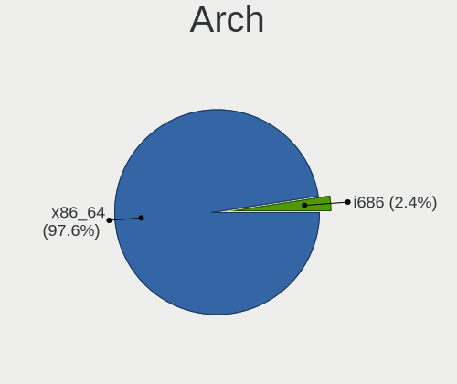
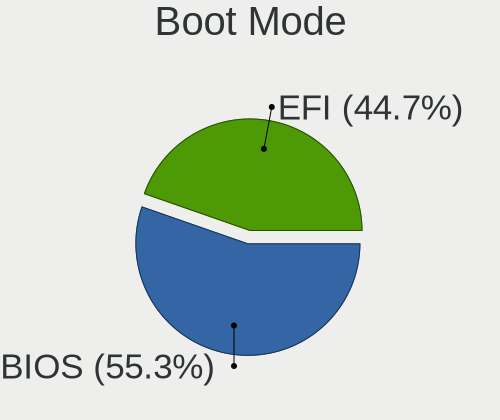
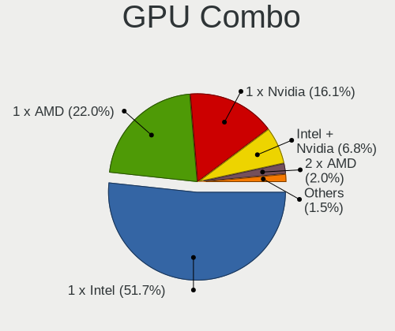
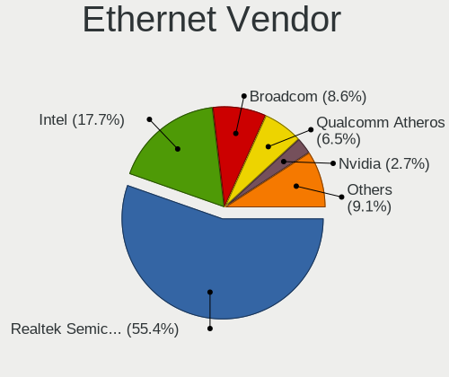
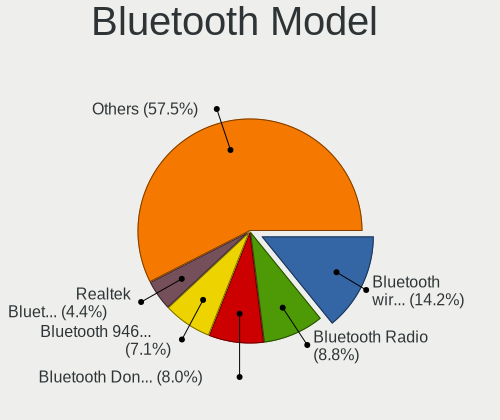

Linux Lite - Tested Hardware & Statistics
-----------------------------------------

A project to collect tested hardware configurations for Linux Lite.

Anyone can contribute to this report by the [hw-probe](https://github.com/linuxhw/hw-probe) tool:

    sudo -E hw-probe -all -upload

Please contribute! Especially if your hardware is rare.

This is a report for all computer types. See also reports for [desktops](/Dist/Linux_Lite/Desktop/README.md) and [notebooks](/Dist/Linux_Lite/Notebook/README.md).

Contents
--------

* [ Test Cases ](#test-cases)

* [ System ](#system)
  - [ OS                       ](#os)
  - [ OS Family                ](#os-family)
  - [ Kernel                   ](#kernel)
  - [ Kernel Family            ](#kernel-family)
  - [ Kernel Major Ver.        ](#kernel-major-ver)
  - [ Arch                     ](#arch)
  - [ DE                       ](#de)
  - [ Display Server           ](#display-server)
  - [ Display Manager          ](#display-manager)
  - [ OS Lang                  ](#os-lang)
  - [ Boot Mode                ](#boot-mode)
  - [ Filesystem               ](#filesystem)
  - [ Part. scheme             ](#part-scheme)
  - [ Dual Boot with Linux/BSD ](#dual-boot-with-linuxbsd)
  - [ Dual Boot (Win)          ](#dual-boot-win)

* [ Board ](#board)
  - [ Vendor                   ](#vendor)
  - [ Model                    ](#model)
  - [ Model Family             ](#model-family)
  - [ MFG Year                 ](#mfg-year)
  - [ Form Factor              ](#form-factor)
  - [ Secure Boot              ](#secure-boot)
  - [ Coreboot                 ](#coreboot)
  - [ RAM Size                 ](#ram-size)
  - [ RAM Used                 ](#ram-used)
  - [ Total Drives             ](#total-drives)
  - [ Has CD-ROM               ](#has-cd-rom)
  - [ Has Ethernet             ](#has-ethernet)
  - [ Has WiFi                 ](#has-wifi)
  - [ Has Bluetooth            ](#has-bluetooth)

* [ Location ](#location)
  - [ Country                  ](#country)
  - [ City                     ](#city)

* [ Drives ](#drives)
  - [ Drive Vendor             ](#drive-vendor)
  - [ Drive Model              ](#drive-model)
  - [ HDD Vendor               ](#hdd-vendor)
  - [ SSD Vendor               ](#ssd-vendor)
  - [ Drive Kind               ](#drive-kind)
  - [ Drive Connector          ](#drive-connector)
  - [ Drive Size               ](#drive-size)
  - [ Space Total              ](#space-total)
  - [ Space Used               ](#space-used)
  - [ Malfunc. Drives          ](#malfunc-drives)
  - [ Malfunc. Drive Vendor    ](#malfunc-drive-vendor)
  - [ Malfunc. HDD Vendor      ](#malfunc-hdd-vendor)
  - [ Malfunc. Drive Kind      ](#malfunc-drive-kind)
  - [ Failed Drives            ](#failed-drives)
  - [ Failed Drive Vendor      ](#failed-drive-vendor)
  - [ Drive Status             ](#drive-status)

* [ Storage controller ](#storage-controller)
  - [ Storage Vendor           ](#storage-vendor)
  - [ Storage Model            ](#storage-model)
  - [ Storage Kind             ](#storage-kind)

* [ Processor ](#processor)
  - [ CPU Vendor               ](#cpu-vendor)
  - [ CPU Model                ](#cpu-model)
  - [ CPU Model Family         ](#cpu-model-family)
  - [ CPU Cores                ](#cpu-cores)
  - [ CPU Sockets              ](#cpu-sockets)
  - [ CPU Threads              ](#cpu-threads)
  - [ CPU Op-Modes             ](#cpu-op-modes)
  - [ CPU Microcode            ](#cpu-microcode)
  - [ CPU Microarch            ](#cpu-microarch)

* [ Graphics ](#graphics)
  - [ GPU Vendor               ](#gpu-vendor)
  - [ GPU Model                ](#gpu-model)
  - [ GPU Combo                ](#gpu-combo)
  - [ GPU Driver               ](#gpu-driver)
  - [ GPU Memory               ](#gpu-memory)

* [ Monitor ](#monitor)
  - [ Monitor Vendor           ](#monitor-vendor)
  - [ Monitor Model            ](#monitor-model)
  - [ Monitor Resolution       ](#monitor-resolution)
  - [ Monitor Diagonal         ](#monitor-diagonal)
  - [ Monitor Width            ](#monitor-width)
  - [ Aspect Ratio             ](#aspect-ratio)
  - [ Monitor Area             ](#monitor-area)
  - [ Pixel Density            ](#pixel-density)
  - [ Multiple Monitors        ](#multiple-monitors)

* [ Network ](#network)
  - [ Net Controller Vendor    ](#net-controller-vendor)
  - [ Net Controller Model     ](#net-controller-model)
  - [ Wireless Vendor          ](#wireless-vendor)
  - [ Wireless Model           ](#wireless-model)
  - [ Ethernet Vendor          ](#ethernet-vendor)
  - [ Ethernet Model           ](#ethernet-model)
  - [ Net Controller Kind      ](#net-controller-kind)
  - [ Used Controller          ](#used-controller)
  - [ NICs                     ](#nics)
  - [ IPv6                     ](#ipv6)

* [ Bluetooth ](#bluetooth)
  - [ Bluetooth Vendor         ](#bluetooth-vendor)
  - [ Bluetooth Model          ](#bluetooth-model)

* [ Sound ](#sound)
  - [ Sound Vendor             ](#sound-vendor)
  - [ Sound Model              ](#sound-model)

* [ Memory ](#memory)
  - [ Memory Vendor            ](#memory-vendor)
  - [ Memory Model             ](#memory-model)
  - [ Memory Kind              ](#memory-kind)
  - [ Memory Form Factor       ](#memory-form-factor)
  - [ Memory Size              ](#memory-size)
  - [ Memory Speed             ](#memory-speed)

* [ Printers & scanners ](#printers--scanners)
  - [ Printer Vendor           ](#printer-vendor)
  - [ Printer Model            ](#printer-model)
  - [ Scanner Vendor           ](#scanner-vendor)
  - [ Scanner Model            ](#scanner-model)

* [ Camera ](#camera)
  - [ Camera Vendor            ](#camera-vendor)
  - [ Camera Model             ](#camera-model)

* [ Security ](#security)
  - [ Fingerprint Vendor       ](#fingerprint-vendor)
  - [ Fingerprint Model        ](#fingerprint-model)
  - [ Chipcard Vendor          ](#chipcard-vendor)
  - [ Chipcard Model           ](#chipcard-model)

* [ Unsupported ](#unsupported)
  - [ Unsupported Devices      ](#unsupported-devices)
  - [ Unsupported Device Types ](#unsupported-device-types)

Test Cases
----------

Total: 145

| Vendor   | Model                       | Form-Factor | Probe                                                      | Date         |
|----------|-----------------------------|-------------|------------------------------------------------------------|--------------|
| HP       | Compaq 420                  | Notebook    | [d3e367cedc](https://linux-hardware.org/?probe=d3e367cedc) | Oct 01, 2022 |
| HP       | 1632                        | Desktop     | [f510159333](https://linux-hardware.org/?probe=f510159333) | Sep 19, 2022 |
| HP       | Presario V6000 (RG289UA#... | Notebook    | [7f0113694a](https://linux-hardware.org/?probe=7f0113694a) | Sep 15, 2022 |
| Apple    | Mac-63001698E7A34814 iMa... | All in one  | [1a999b09ae](https://linux-hardware.org/?probe=1a999b09ae) | Sep 12, 2022 |
| HP       | 1632                        | Desktop     | [f14389b9dd](https://linux-hardware.org/?probe=f14389b9dd) | Sep 10, 2022 |
| Samsung  | X420/X520                   | Notebook    | [a8ca7bb005](https://linux-hardware.org/?probe=a8ca7bb005) | Sep 04, 2022 |
| Fujitsu  | FMVNQ8P6                    | Notebook    | [5e34698f14](https://linux-hardware.org/?probe=5e34698f14) | Aug 28, 2022 |
| Sony     | VAIO                        | All in one  | [3ed1ad79e4](https://linux-hardware.org/?probe=3ed1ad79e4) | Aug 24, 2022 |
| ASUSTek  | UX303LN                     | Notebook    | [63d5525864](https://linux-hardware.org/?probe=63d5525864) | Aug 16, 2022 |
| Inventec | Dell Wyse Thin Client De... | Mini pc     | [86523f9a5f](https://linux-hardware.org/?probe=86523f9a5f) | Aug 11, 2022 |
| Lenovo   | ThinkPad L480 20LS001AMC    | Notebook    | [47d4f751e1](https://linux-hardware.org/?probe=47d4f751e1) | Aug 09, 2022 |
| Apple    | MacBookAir6,1               | Notebook    | [ede7f6cdae](https://linux-hardware.org/?probe=ede7f6cdae) | Jul 23, 2022 |
| ASUSTek  | VivoBook 14_ASUS Laptop ... | Notebook    | [b846c98a96](https://linux-hardware.org/?probe=b846c98a96) | Jul 08, 2022 |
| ASUSTek  | M51BC                       | Desktop     | [fd0a9ef1c8](https://linux-hardware.org/?probe=fd0a9ef1c8) | Jul 08, 2022 |
| ASUSTek  | M51BC                       | Desktop     | [cc2f84d5d3](https://linux-hardware.org/?probe=cc2f84d5d3) | Jul 08, 2022 |
| HP       | Pavilion g4                 | Notebook    | [330078dbac](https://linux-hardware.org/?probe=330078dbac) | Jul 04, 2022 |
| ASUSTek  | X555YI                      | Notebook    | [762b96a2de](https://linux-hardware.org/?probe=762b96a2de) | Jul 02, 2022 |
| HP       | EliteBook 8440p             | Notebook    | [4bea8264d3](https://linux-hardware.org/?probe=4bea8264d3) | Jun 20, 2022 |
| Lenovo   | 103D SDK0J40697 WIN 3305... | Desktop     | [03c6ee002e](https://linux-hardware.org/?probe=03c6ee002e) | Jun 07, 2022 |
| Samsung  | 530XBB                      | Notebook    | [485a99ca42](https://linux-hardware.org/?probe=485a99ca42) | Jun 03, 2022 |
| Acer     | Aspire TC-895 V:1.0         | Desktop     | [19a5c1de8e](https://linux-hardware.org/?probe=19a5c1de8e) | May 29, 2022 |
| Minix    | Z64 V1.2                    | Notebook    | [97525a1dc3](https://linux-hardware.org/?probe=97525a1dc3) | May 27, 2022 |
| Lenovo   | Remore CRB Win8 STD MM D... | Desktop     | [eb96be3541](https://linux-hardware.org/?probe=eb96be3541) | May 24, 2022 |
| Lenovo   | Remore CRB Win8 STD MM D... | Desktop     | [f1a79871f7](https://linux-hardware.org/?probe=f1a79871f7) | May 24, 2022 |
| HP       | 3047h                       | Desktop     | [cc184c817b](https://linux-hardware.org/?probe=cc184c817b) | May 16, 2022 |
| Dell     | Inspiron 16 5620            | Notebook    | [b42e1cf95b](https://linux-hardware.org/?probe=b42e1cf95b) | May 13, 2022 |
| Minix    | Z64 V1.2                    | Notebook    | [8796deded0](https://linux-hardware.org/?probe=8796deded0) | May 12, 2022 |
| Dell     | MXG061                      | Notebook    | [119f6dd774](https://linux-hardware.org/?probe=119f6dd774) | May 09, 2022 |
| Lenovo   | ThinkCentre M91p 4518E2M    | Desktop     | [2553bf03d1](https://linux-hardware.org/?probe=2553bf03d1) | May 05, 2022 |
| Lenovo   | ThinkCentre M91p 4518E2M    | Desktop     | [03a7fc3c23](https://linux-hardware.org/?probe=03a7fc3c23) | May 05, 2022 |
| Lenovo   | IdeaPad Gaming 3 15IHU6 ... | Notebook    | [ab553d3a2f](https://linux-hardware.org/?probe=ab553d3a2f) | May 01, 2022 |
| Acer     | Extensa 5220                | Notebook    | [ebbd01171d](https://linux-hardware.org/?probe=ebbd01171d) | May 01, 2022 |
| ASUSTek  | TUF B450-PLUS GAMING        | Desktop     | [f7838121d2](https://linux-hardware.org/?probe=f7838121d2) | Apr 23, 2022 |
| Acer     | Aspire 1410                 | Notebook    | [703c2ec84a](https://linux-hardware.org/?probe=703c2ec84a) | Apr 21, 2022 |
| Lenovo   | ThinkPad T400 6475E13       | Notebook    | [cd49ac8445](https://linux-hardware.org/?probe=cd49ac8445) | Apr 08, 2022 |
| Dell     | 018D1Y A00                  | Desktop     | [0c6fc3cae4](https://linux-hardware.org/?probe=0c6fc3cae4) | Apr 07, 2022 |
| Dell     | MXG061                      | Notebook    | [9c91bd9487](https://linux-hardware.org/?probe=9c91bd9487) | Apr 06, 2022 |
| HP       | 2820h                       | Desktop     | [c4461b3710](https://linux-hardware.org/?probe=c4461b3710) | Apr 04, 2022 |
| Insignia | NS-P11W7100                 | Notebook    | [daa476af8c](https://linux-hardware.org/?probe=daa476af8c) | Mar 28, 2022 |
| Dell     | MXG071                      | Notebook    | [ac0158dcb9](https://linux-hardware.org/?probe=ac0158dcb9) | Mar 27, 2022 |
| Dell     | 0HY9JP A02                  | Desktop     | [693b66ce17](https://linux-hardware.org/?probe=693b66ce17) | Mar 27, 2022 |
| Gigabyte | B450M DS3H-CF               | Desktop     | [badb9dcc14](https://linux-hardware.org/?probe=badb9dcc14) | Mar 26, 2022 |
| Gigabyte | B450M DS3H-CF               | Desktop     | [32115c5548](https://linux-hardware.org/?probe=32115c5548) | Mar 26, 2022 |
| HP       | 15 Notebook PC              | Notebook    | [0f99b7ff76](https://linux-hardware.org/?probe=0f99b7ff76) | Mar 21, 2022 |
| Dell     | 0HY9JP A02                  | Desktop     | [bc850554b2](https://linux-hardware.org/?probe=bc850554b2) | Mar 16, 2022 |
| Foxconn  | 2A8C                        | Desktop     | [80e5e3a26c](https://linux-hardware.org/?probe=80e5e3a26c) | Mar 15, 2022 |
| HP       | Compaq CQ45                 | Notebook    | [99286efd08](https://linux-hardware.org/?probe=99286efd08) | Mar 10, 2022 |
| HP       | Laptop 15-dw3xxx            | Notebook    | [2b748962fa](https://linux-hardware.org/?probe=2b748962fa) | Mar 06, 2022 |
| ASUSTek  | 900                         | Notebook    | [8373f78d4e](https://linux-hardware.org/?probe=8373f78d4e) | Feb 19, 2022 |
| Acer     | Aspire A315-53              | Notebook    | [6134bb8cba](https://linux-hardware.org/?probe=6134bb8cba) | Feb 18, 2022 |
| ABIT     | IP35-E                      | Desktop     | [67d9f7e94e](https://linux-hardware.org/?probe=67d9f7e94e) | Feb 17, 2022 |
| Acer     | Aspire 5600                 | Notebook    | [4b2259f040](https://linux-hardware.org/?probe=4b2259f040) | Feb 10, 2022 |
| Acer     | Aspire TC-895 V:1.0         | Desktop     | [fb0408c4ea](https://linux-hardware.org/?probe=fb0408c4ea) | Feb 10, 2022 |
| Pegatron | 2ACB                        | Desktop     | [b7987fdaa7](https://linux-hardware.org/?probe=b7987fdaa7) | Feb 10, 2022 |
| HP       | Laptop 15-dw3xxx            | Notebook    | [b596d9fdb1](https://linux-hardware.org/?probe=b596d9fdb1) | Feb 09, 2022 |
| Acer     | Aspire TC-895 V:1.0         | Desktop     | [4fe66f8af6](https://linux-hardware.org/?probe=4fe66f8af6) | Feb 09, 2022 |
| HP       | Compaq nw9440 (EY615ET#A... | Notebook    | [6a5c3254ab](https://linux-hardware.org/?probe=6a5c3254ab) | Jan 30, 2022 |
| HP       | Pavilion dv6500             | Notebook    | [15838ae11b](https://linux-hardware.org/?probe=15838ae11b) | Jan 12, 2022 |
| ASUSTek  | N53Jf                       | Notebook    | [3f0e64b85e](https://linux-hardware.org/?probe=3f0e64b85e) | Jan 03, 2022 |
| ASUSTek  | N53Jf                       | Notebook    | [6d7b0abdfa](https://linux-hardware.org/?probe=6d7b0abdfa) | Jan 03, 2022 |
| EVGA     | X58 SLI FTW3 Tylersburg     | Desktop     | [9e4639427d](https://linux-hardware.org/?probe=9e4639427d) | Jan 03, 2022 |
| EVGA     | X58 SLI FTW3 Tylersburg     | Desktop     | [d351220ea5](https://linux-hardware.org/?probe=d351220ea5) | Jan 02, 2022 |
| EVGA     | X58 SLI FTW3 Tylersburg     | Desktop     | [b2786130fb](https://linux-hardware.org/?probe=b2786130fb) | Jan 02, 2022 |
| ASUSTek  | X541SA                      | Notebook    | [26f2eeeefc](https://linux-hardware.org/?probe=26f2eeeefc) | Dec 31, 2021 |
| HP       | Pavilion dv6500             | Notebook    | [978ee4328d](https://linux-hardware.org/?probe=978ee4328d) | Dec 19, 2021 |
| ASRock   | H61M-VG3                    | Desktop     | [392a957541](https://linux-hardware.org/?probe=392a957541) | Dec 17, 2021 |
| Acer     | Aspire 5600                 | Notebook    | [25b1e50c64](https://linux-hardware.org/?probe=25b1e50c64) | Dec 12, 2021 |
| Gigabyte | GA-E350N                    | Desktop     | [10d55dd433](https://linux-hardware.org/?probe=10d55dd433) | Dec 02, 2021 |
| Apple    | Mac-F42386C8 PVT            | All in one  | [64eba568a1](https://linux-hardware.org/?probe=64eba568a1) | Nov 25, 2021 |
| HP       | Compaq 2510p                | Notebook    | [8bc24dae3e](https://linux-hardware.org/?probe=8bc24dae3e) | Nov 23, 2021 |
| HP       | Compaq 2510p                | Notebook    | [c76241a894](https://linux-hardware.org/?probe=c76241a894) | Nov 22, 2021 |
| Samsung  | 905S3G/906S3G/915S3G/930... | Notebook    | [b7306537cc](https://linux-hardware.org/?probe=b7306537cc) | Nov 10, 2021 |
| Acer     | Aspire 5600                 | Notebook    | [7e2da6d3e9](https://linux-hardware.org/?probe=7e2da6d3e9) | Oct 26, 2021 |
| Dell     | MXG061                      | Notebook    | [89a5b20193](https://linux-hardware.org/?probe=89a5b20193) | Oct 10, 2021 |
| Biostar  | G41D3C                      | Desktop     | [433bc7cf78](https://linux-hardware.org/?probe=433bc7cf78) | Oct 10, 2021 |
| Biostar  | G41D3C                      | Desktop     | [90dc88db01](https://linux-hardware.org/?probe=90dc88db01) | Oct 02, 2021 |
| Acer     | Swift SF314-56              | Notebook    | [263d6e38b7](https://linux-hardware.org/?probe=263d6e38b7) | Oct 01, 2021 |
| Acer     | Swift SF314-56              | Notebook    | [bb0f894bce](https://linux-hardware.org/?probe=bb0f894bce) | Oct 01, 2021 |
| ASUSTek  | M5A78L LE                   | Desktop     | [ddb041ded0](https://linux-hardware.org/?probe=ddb041ded0) | Sep 15, 2021 |
| ASUSTek  | M5A78L LE                   | Desktop     | [a9335318aa](https://linux-hardware.org/?probe=a9335318aa) | Sep 15, 2021 |
| Dell     | Vostro1710                  | Notebook    | [d50123c66a](https://linux-hardware.org/?probe=d50123c66a) | Sep 01, 2021 |
| Dell     | Inspiron 5452               | Notebook    | [0c9b3ec7a9](https://linux-hardware.org/?probe=0c9b3ec7a9) | Aug 07, 2021 |
| Intel    | DG31PR AAD97573-300         | Desktop     | [0a0a8059c2](https://linux-hardware.org/?probe=0a0a8059c2) | Aug 04, 2021 |
| Intel    | DG31PR AAD97573-300         | Desktop     | [6b7f5cdcc8](https://linux-hardware.org/?probe=6b7f5cdcc8) | Jul 21, 2021 |
| HP       | EliteBook Folio 9470m       | Notebook    | [b2b851f7d2](https://linux-hardware.org/?probe=b2b851f7d2) | Jul 12, 2021 |
| ASUSTek  | X541SA                      | Notebook    | [ed8bb15f60](https://linux-hardware.org/?probe=ed8bb15f60) | Jul 11, 2021 |
| HP       | 0A98h                       | Desktop     | [9844591cd4](https://linux-hardware.org/?probe=9844591cd4) | Jul 02, 2021 |
| ECS      | Livermore                   | Desktop     | [91b29dad17](https://linux-hardware.org/?probe=91b29dad17) | Jun 23, 2021 |
| HP       | Laptop 14-cm0xxx            | Notebook    | [5943266aca](https://linux-hardware.org/?probe=5943266aca) | Jun 18, 2021 |
| HP       | Laptop 14-cm0xxx            | Notebook    | [3b4a122b75](https://linux-hardware.org/?probe=3b4a122b75) | Jun 18, 2021 |
| Fujitsu  | LIFEBOOK U747               | Notebook    | [117e8bf660](https://linux-hardware.org/?probe=117e8bf660) | Jun 17, 2021 |
| Lenovo   | IdeaPad Slim 1-14AST-05 ... | Notebook    | [a9255b2217](https://linux-hardware.org/?probe=a9255b2217) | Jun 04, 2021 |
| MSI      | Boston                      | Desktop     | [5cca21c281](https://linux-hardware.org/?probe=5cca21c281) | Apr 26, 2021 |
| ASUSTek  | VivoBook_ASUSLaptop E203... | Notebook    | [58bf661e8d](https://linux-hardware.org/?probe=58bf661e8d) | Apr 15, 2021 |
| ASUSTek  | K50IE                       | Notebook    | [b0bcc6c31c](https://linux-hardware.org/?probe=b0bcc6c31c) | Apr 12, 2021 |
| MSI      | B75A-G43                    | Desktop     | [87a3e8d42c](https://linux-hardware.org/?probe=87a3e8d42c) | Apr 07, 2021 |
| AWOW     | PC BOX                      | Mini pc     | [b9140b8786](https://linux-hardware.org/?probe=b9140b8786) | Mar 29, 2021 |
| ASUSTek  | K54LY                       | Notebook    | [dc7d86f51e](https://linux-hardware.org/?probe=dc7d86f51e) | Mar 21, 2021 |
| Acer     | Aspire V5-552               | Notebook    | [7a32a8a1c3](https://linux-hardware.org/?probe=7a32a8a1c3) | Mar 03, 2021 |
| HP       | Compaq 6735b                | Notebook    | [0f2afbc99a](https://linux-hardware.org/?probe=0f2afbc99a) | Feb 18, 2021 |
| Dell     | Inspiron 7559               | Notebook    | [4d4377253f](https://linux-hardware.org/?probe=4d4377253f) | Feb 15, 2021 |
| HP       | Laptop 17-by2xxx            | Notebook    | [729abf0085](https://linux-hardware.org/?probe=729abf0085) | Jan 30, 2021 |
| Acer     | Predator PH317-52           | Notebook    | [1bd05ad341](https://linux-hardware.org/?probe=1bd05ad341) | Jan 24, 2021 |
| Gigabyte | X570 AORUS MASTER           | Desktop     | [84cb4ded95](https://linux-hardware.org/?probe=84cb4ded95) | Dec 30, 2020 |
| HP       | 655                         | Notebook    | [a6913cacf3](https://linux-hardware.org/?probe=a6913cacf3) | Dec 28, 2020 |
| HP       | 655                         | Notebook    | [2a4c81218e](https://linux-hardware.org/?probe=2a4c81218e) | Dec 27, 2020 |
| Toshiba  | Satellite T215D             | Notebook    | [084f254e1f](https://linux-hardware.org/?probe=084f254e1f) | Dec 23, 2020 |
| Toshiba  | Satellite T215D             | Notebook    | [bdb8fe4e55](https://linux-hardware.org/?probe=bdb8fe4e55) | Dec 23, 2020 |
| Minix    | NEO Z83-4 V1.1              | Desktop     | [19e83c7c24](https://linux-hardware.org/?probe=19e83c7c24) | Dec 21, 2020 |
| Gigabyte | X570 AORUS MASTER           | Desktop     | [77f93a017c](https://linux-hardware.org/?probe=77f93a017c) | Dec 21, 2020 |
| Gigabyte | X570 AORUS MASTER           | Desktop     | [a6654cf4f1](https://linux-hardware.org/?probe=a6654cf4f1) | Dec 21, 2020 |
| Minix    | NEO Z83-4 V1.1              | Desktop     | [8f8f606051](https://linux-hardware.org/?probe=8f8f606051) | Dec 16, 2020 |
| Lenovo   | IdeaPad 320-15ABR 80XS      | Notebook    | [680d4771b2](https://linux-hardware.org/?probe=680d4771b2) | Dec 15, 2020 |
| ASUSTek  | 1001PX                      | Notebook    | [9f911bde1c](https://linux-hardware.org/?probe=9f911bde1c) | Dec 11, 2020 |
| Acer     | Aspire 5750                 | Notebook    | [ba47872fd5](https://linux-hardware.org/?probe=ba47872fd5) | Dec 02, 2020 |
| Acer     | Aspire 5750                 | Notebook    | [c4216f5d80](https://linux-hardware.org/?probe=c4216f5d80) | Dec 02, 2020 |
| HP       | 0ACCh                       | Desktop     | [7f4d2a2df4](https://linux-hardware.org/?probe=7f4d2a2df4) | Nov 23, 2020 |
| HP       | 0ACCh                       | Desktop     | [d28f3f3195](https://linux-hardware.org/?probe=d28f3f3195) | Nov 23, 2020 |
| Lenovo   | ThinkCentre M91p 4524RS6    | Desktop     | [cf9c213443](https://linux-hardware.org/?probe=cf9c213443) | Nov 21, 2020 |
| Lenovo   | ThinkCentre M91p 4524RS6    | Desktop     | [66d1757c3f](https://linux-hardware.org/?probe=66d1757c3f) | Nov 21, 2020 |
| HP       | 3032h                       | Desktop     | [1a10cb8912](https://linux-hardware.org/?probe=1a10cb8912) | Nov 20, 2020 |
| Intel    | H61M-S1                     | Desktop     | [f31ad89e75](https://linux-hardware.org/?probe=f31ad89e75) | Nov 02, 2020 |
| Intel    | H61M-S1                     | Desktop     | [f381b5e487](https://linux-hardware.org/?probe=f381b5e487) | Nov 02, 2020 |
| Lenovo   | ThinkCentre A55 9265BL7     | Desktop     | [1e00064286](https://linux-hardware.org/?probe=1e00064286) | Oct 30, 2020 |
| HP       | 2AA6 PVT                    | Desktop     | [3ee3ed2e83](https://linux-hardware.org/?probe=3ee3ed2e83) | Oct 06, 2020 |
| Dell     | Latitude D530               | Notebook    | [4fe18e86ac](https://linux-hardware.org/?probe=4fe18e86ac) | Sep 27, 2020 |
| MSI      | Z77A-G43                    | Desktop     | [4420c076a7](https://linux-hardware.org/?probe=4420c076a7) | Sep 03, 2020 |
| HP       | x2 Detachable 10-p0XX       | Tablet      | [2a6ae45bc4](https://linux-hardware.org/?probe=2a6ae45bc4) | Aug 20, 2020 |
| ASRock   | N68C-S UCC                  | Desktop     | [a20482ea67](https://linux-hardware.org/?probe=a20482ea67) | Aug 12, 2020 |
| ASRock   | N68C-S UCC                  | Desktop     | [cb782efc58](https://linux-hardware.org/?probe=cb782efc58) | Aug 07, 2020 |
| Jetway   | I61MG4                      | Desktop     | [f677e427be](https://linux-hardware.org/?probe=f677e427be) | Jul 30, 2020 |
| Jetway   | I61MG4                      | Desktop     | [2e5f79f476](https://linux-hardware.org/?probe=2e5f79f476) | Jul 29, 2020 |
| Lenovo   | MIIX 300-10IBY 80NR         | Tablet      | [cf8c7c6ae6](https://linux-hardware.org/?probe=cf8c7c6ae6) | Jul 29, 2020 |
| Acer     | Aspire ES1-511              | Notebook    | [63a7ae1967](https://linux-hardware.org/?probe=63a7ae1967) | Jul 24, 2020 |
| Google   | Chell                       | Notebook    | [cf727e9a6e](https://linux-hardware.org/?probe=cf727e9a6e) | Jul 23, 2020 |
| ASUSTek  | X751LD                      | Notebook    | [2d9ea757d1](https://linux-hardware.org/?probe=2d9ea757d1) | Jul 14, 2020 |
| ASUSTek  | X751LD                      | Notebook    | [1a4ee704d9](https://linux-hardware.org/?probe=1a4ee704d9) | Jul 14, 2020 |
| Lenovo   | 3000 V200 0764A11           | Notebook    | [8492023ae0](https://linux-hardware.org/?probe=8492023ae0) | Jul 13, 2020 |
| TR       | ST Pro-KN                   | Notebook    | [e78b2937ef](https://linux-hardware.org/?probe=e78b2937ef) | Jul 01, 2020 |
| Acer     | EQ35M                       | Desktop     | [f2dbd9e441](https://linux-hardware.org/?probe=f2dbd9e441) | Jun 23, 2020 |
| Acer     | EQ35M                       | Desktop     | [5ebf9a4f1a](https://linux-hardware.org/?probe=5ebf9a4f1a) | Jun 23, 2020 |
| Foxconn  | 45CMX/45GMX/45CMX-K         | Desktop     | [89182244dc](https://linux-hardware.org/?probe=89182244dc) | Jun 12, 2020 |
| ASUSTek  | N750JK                      | Notebook    | [9102fbcf41](https://linux-hardware.org/?probe=9102fbcf41) | Jun 02, 2020 |
| Samsung  | NC110P/NC108P/NC111P        | Notebook    | [92c219ffb4](https://linux-hardware.org/?probe=92c219ffb4) | May 14, 2020 |
| ASUSTek  | X540YA                      | Notebook    | [2bfdde7714](https://linux-hardware.org/?probe=2bfdde7714) | Apr 03, 2020 |

System
------

OS
--

Installed operating systems

| Name           | Computers | Percent |
|----------------|-----------|---------|
| Linux Lite 5.8 | 20        | 19.23%  |
| Linux Lite 5.0 | 17        | 16.35%  |
| Linux Lite 5.2 | 16        | 15.38%  |
| Linux Lite 5.4 | 15        | 14.42%  |
| Linux Lite 6.0 | 13        | 12.5%   |
| Linux Lite 5.6 | 13        | 12.5%   |
| Linux Lite 3.8 | 5         | 4.81%   |
| Linux Lite 4.8 | 2         | 1.92%   |
| Linux Lite 4.6 | 1         | 0.96%   |
| Linux Lite 4.4 | 1         | 0.96%   |
| Linux Lite 4.2 | 1         | 0.96%   |

OS Family
---------

OS without a version

| Name       | Computers | Percent |
|------------|-----------|---------|
| Linux Lite | 103       | 100%    |

Kernel
------

Version of the Linux kernel

| Version           | Computers | Percent |
|-------------------|-----------|---------|
| 5.4.0-42-generic  | 6         | 5.5%    |
| 5.4.0-70-generic  | 5         | 4.59%   |
| 5.4.0-91-generic  | 4         | 3.67%   |
| 5.4.0-52-generic  | 4         | 3.67%   |
| 5.4.0-40-generic  | 4         | 3.67%   |
| 5.4.0-109-generic | 4         | 3.67%   |
| 5.4.0-104-generic | 4         | 3.67%   |
| 5.4.0-96-generic  | 3         | 2.75%   |
| 5.4.0-58-generic  | 3         | 2.75%   |
| 5.4.0-48-generic  | 3         | 2.75%   |
| 5.4.0-113-generic | 3         | 2.75%   |
| 5.4.0-107-generic | 3         | 2.75%   |
| 5.15.0-47-generic | 3         | 2.75%   |
| 5.15.0-46-generic | 3         | 2.75%   |
| 5.15.0-33-generic | 3         | 2.75%   |
| 5.4.0-90-generic  | 2         | 1.83%   |
| 5.4.0-88-generic  | 2         | 1.83%   |
| 5.4.0-81-generic  | 2         | 1.83%   |
| 5.4.0-80-generic  | 2         | 1.83%   |
| 5.4.0-74-generic  | 2         | 1.83%   |
| 5.4.0-54-generic  | 2         | 1.83%   |
| 5.4.0-33-generic  | 2         | 1.83%   |
| 5.4.0-110-generic | 2         | 1.83%   |
| 5.4.0-105-generic | 2         | 1.83%   |
| 4.4.0-112-generic | 2         | 1.83%   |
| 5.9.0             | 1         | 0.92%   |
| 5.4.0-99-generic  | 1         | 0.92%   |
| 5.4.0-94-generic  | 1         | 0.92%   |
| 5.4.0-77-generic  | 1         | 0.92%   |
| 5.4.0-72-generic  | 1         | 0.92%   |
| 5.4.0-71-generic  | 1         | 0.92%   |
| 5.4.0-66-generic  | 1         | 0.92%   |
| 5.4.0-65-generic  | 1         | 0.92%   |
| 5.4.0-56-generic  | 1         | 0.92%   |
| 5.4.0-45-generic  | 1         | 0.92%   |
| 5.4.0-37-generic  | 1         | 0.92%   |
| 5.4.0-124-generic | 1         | 0.92%   |
| 5.4.0-122-generic | 1         | 0.92%   |
| 5.4.0-100-generic | 1         | 0.92%   |
| 5.16.9            | 1         | 0.92%   |

Kernel Family
-------------

Linux kernel without a distro release

| Version | Computers | Percent |
|---------|-----------|---------|
| 5.4.0   | 76        | 71.7%   |
| 5.15.0  | 14        | 13.21%  |
| 4.15.0  | 5         | 4.72%   |
| 4.4.0   | 4         | 3.77%   |
| 5.13.0  | 3         | 2.83%   |
| 5.9.0   | 1         | 0.94%   |
| 5.16.9  | 1         | 0.94%   |
| 5.16.0  | 1         | 0.94%   |
| 5.10.0  | 1         | 0.94%   |

Kernel Major Ver.
-----------------

Linux kernel major version

| Version | Computers | Percent |
|---------|-----------|---------|
| 5.4     | 76        | 71.7%   |
| 5.15    | 14        | 13.21%  |
| 4.15    | 5         | 4.72%   |
| 4.4     | 4         | 3.77%   |
| 5.13    | 3         | 2.83%   |
| 5.16    | 2         | 1.89%   |
| 5.9     | 1         | 0.94%   |
| 5.10    | 1         | 0.94%   |

Arch
----

OS architecture (x86_64, i586, etc.)

| Name   | Computers | Percent |
|--------|-----------|---------|
| x86_64 | 99        | 96.12%  |
| i686   | 4         | 3.88%   |

DE
--

Desktop Environment

| Name    | Computers | Percent |
|---------|-----------|---------|
| XFCE    | 75        | 72.82%  |
| GNOME   | 25        | 24.27%  |
| Unknown | 2         | 1.94%   |
| Deepin  | 1         | 0.97%   |

Display Server
--------------

X11 or Wayland

| Name    | Computers | Percent |
|---------|-----------|---------|
| X11     | 101       | 98.06%  |
| Tty     | 1         | 0.97%   |
| Unknown | 1         | 0.97%   |

Display Manager
---------------

SDDM, LightDM, etc.

| Name    | Computers | Percent |
|---------|-----------|---------|
| LightDM | 57        | 54.29%  |
| TDM     | 28        | 26.67%  |
| Unknown | 19        | 18.1%   |
| GDM     | 1         | 0.95%   |

OS Lang
-------

Language

| Lang  | Computers | Percent |
|-------|-----------|---------|
| en_US | 50        | 48.54%  |
| pt_BR | 6         | 5.83%   |
| pl_PL | 6         | 5.83%   |
| fr_FR | 6         | 5.83%   |
| de_DE | 6         | 5.83%   |
| en_GB | 5         | 4.85%   |
| ru_UA | 3         | 2.91%   |
| es_MX | 3         | 2.91%   |
| es_ES | 3         | 2.91%   |
| ru_RU | 2         | 1.94%   |
| it_IT | 2         | 1.94%   |
| zh_CN | 1         | 0.97%   |
| tr_TR | 1         | 0.97%   |
| nl_NL | 1         | 0.97%   |
| fr_CA | 1         | 0.97%   |
| es_CO | 1         | 0.97%   |
| es_CL | 1         | 0.97%   |
| en_NZ | 1         | 0.97%   |
| en_IE | 1         | 0.97%   |
| en_CA | 1         | 0.97%   |
| en_AU | 1         | 0.97%   |
| da_DK | 1         | 0.97%   |

Boot Mode
---------

EFI or BIOS

| Mode | Computers | Percent |
|------|-----------|---------|
| BIOS | 57        | 55.34%  |
| EFI  | 46        | 44.66%  |

Filesystem
----------

Type of filesystem

| Type    | Computers | Percent |
|---------|-----------|---------|
| Ext4    | 90        | 87.38%  |
| Overlay | 9         | 8.74%   |
| Btrfs   | 2         | 1.94%   |
| Zfs     | 1         | 0.97%   |
| Ext3    | 1         | 0.97%   |

Part. scheme
------------

Scheme of partitioning

| Type    | Computers | Percent |
|---------|-----------|---------|
| GPT     | 38        | 36.89%  |
| Unknown | 35        | 33.98%  |
| MBR     | 30        | 29.13%  |

Dual Boot with Linux/BSD
------------------------

Hosting more than one Linux/BSD

| Dual boot | Computers | Percent |
|-----------|-----------|---------|
| No        | 84        | 81.55%  |
| Yes       | 19        | 18.45%  |

Dual Boot (Win)
---------------

Hosting Linux and Windows

| Dual boot | Computers | Percent |
|-----------|-----------|---------|
| No        | 73        | 70.19%  |
| Yes       | 31        | 29.81%  |

Board
-----

Vendor
------

Motherboard manufacturer

| Name                | Computers | Percent |
|---------------------|-----------|---------|
| Hewlett-Packard     | 22        | 21.36%  |
| ASUSTek Computer    | 15        | 14.56%  |
| Lenovo              | 11        | 10.68%  |
| Acer                | 11        | 10.68%  |
| Dell                | 9         | 8.74%   |
| Samsung Electronics | 4         | 3.88%   |
| MSI                 | 3         | 2.91%   |
| Gigabyte Technology | 3         | 2.91%   |
| Apple               | 3         | 2.91%   |
| Minix               | 2         | 1.94%   |
| Intel               | 2         | 1.94%   |
| Fujitsu             | 2         | 1.94%   |
| Foxconn             | 2         | 1.94%   |
| ASRock              | 2         | 1.94%   |
| TR                  | 1         | 0.97%   |
| Toshiba             | 1         | 0.97%   |
| Sony                | 1         | 0.97%   |
| Pegatron            | 1         | 0.97%   |
| Jetway              | 1         | 0.97%   |
| Inventec            | 1         | 0.97%   |
| Insignia            | 1         | 0.97%   |
| Google              | 1         | 0.97%   |
| EVGA                | 1         | 0.97%   |
| Biostar             | 1         | 0.97%   |
| AWOW                | 1         | 0.97%   |
| ABIT                | 1         | 0.97%   |

Model
-----

Motherboard model

| Name                                   | Computers | Percent |
|----------------------------------------|-----------|---------|
| MSI MS-7758                            | 2         | 1.94%   |
| TR ST Pro-KN                           | 1         | 0.97%   |
| Toshiba Satellite T215D                | 1         | 0.97%   |
| Sony VGC-JS54FB_W                      | 1         | 0.97%   |
| Samsung X420/X520                      | 1         | 0.97%   |
| Samsung NC110P/NC108P/NC111P           | 1         | 0.97%   |
| Samsung 905S3G/906S3G/915S3G/9305SG    | 1         | 0.97%   |
| Samsung 530XBB                         | 1         | 0.97%   |
| Pegatron 520-1135la                    | 1         | 0.97%   |
| MSI FZ079AA-ABF a6625fr                | 1         | 0.97%   |
| Minix Z83-4                            | 1         | 0.97%   |
| Minix Z64                              | 1         | 0.97%   |
| Lenovo ThinkStation P320 30BH000BFR    | 1         | 0.97%   |
| Lenovo ThinkPad T400 6475E13           | 1         | 0.97%   |
| Lenovo ThinkPad L480 20LS001AMC        | 1         | 0.97%   |
| Lenovo ThinkCentre M91p 4524RS6        | 1         | 0.97%   |
| Lenovo ThinkCentre M91p 4518E2M        | 1         | 0.97%   |
| Lenovo ThinkCentre A55 9265BL7         | 1         | 0.97%   |
| Lenovo MIIX 300-10IBY 80NR             | 1         | 0.97%   |
| Lenovo IdeaPad Gaming 3 15IHU6 82K1    | 1         | 0.97%   |
| Lenovo IdeaPad 320-15ABR 80XS          | 1         | 0.97%   |
| Lenovo H505S 10107                     | 1         | 0.97%   |
| Lenovo 3000 V200 0764A11               | 1         | 0.97%   |
| Jetway I61MG4                          | 1         | 0.97%   |
| Inventec Dell Thin Client Desktop 3290 | 1         | 0.97%   |
| Intel H61M-S1                          | 1         | 0.97%   |
| Intel DG31PR AAD97573-300              | 1         | 0.97%   |
| Insignia NS-P11W7100                   | 1         | 0.97%   |
| HP xw8600 Workstation                  | 1         | 0.97%   |
| HP x2 Detachable 10-p0XX               | 1         | 0.97%   |
| HP t5000 series                        | 1         | 0.97%   |
| HP rp5800                              | 1         | 0.97%   |
| HP Presario V6000 (RG289UA#ABA)        | 1         | 0.97%   |
| HP Pavilion g4                         | 1         | 0.97%   |
| HP Pavilion dv6500                     | 1         | 0.97%   |
| HP Laptop 17-by2xxx                    | 1         | 0.97%   |
| HP Laptop 15-dw3xxx                    | 1         | 0.97%   |
| HP Laptop 14-cm0xxx                    | 1         | 0.97%   |
| HP EliteBook Folio 9470m               | 1         | 0.97%   |
| HP EliteBook 8440p                     | 1         | 0.97%   |

Model Family
------------

Motherboard model prefix

| Name                 | Computers | Percent |
|----------------------|-----------|---------|
| HP Compaq            | 7         | 6.8%    |
| Acer Aspire          | 7         | 6.8%    |
| Dell Inspiron        | 4         | 3.88%   |
| Lenovo ThinkCentre   | 3         | 2.91%   |
| HP Laptop            | 3         | 2.91%   |
| MSI MS-7758          | 2         | 1.94%   |
| Lenovo ThinkPad      | 2         | 1.94%   |
| Lenovo IdeaPad       | 2         | 1.94%   |
| HP Pavilion          | 2         | 1.94%   |
| HP EliteBook         | 2         | 1.94%   |
| ASUS VivoBook        | 2         | 1.94%   |
| TR ST                | 1         | 0.97%   |
| Toshiba Satellite    | 1         | 0.97%   |
| Sony VGC-JS54FB      | 1         | 0.97%   |
| Samsung X420         | 1         | 0.97%   |
| Samsung NC110P       | 1         | 0.97%   |
| Samsung 905S3G       | 1         | 0.97%   |
| Samsung 530XBB       | 1         | 0.97%   |
| Pegatron 520-1135la  | 1         | 0.97%   |
| MSI FZ079AA-ABF      | 1         | 0.97%   |
| Minix Z83-4          | 1         | 0.97%   |
| Minix Z64            | 1         | 0.97%   |
| Lenovo ThinkStation  | 1         | 0.97%   |
| Lenovo MIIX          | 1         | 0.97%   |
| Lenovo H505S         | 1         | 0.97%   |
| Lenovo 3000          | 1         | 0.97%   |
| Jetway I61MG4        | 1         | 0.97%   |
| Inventec Dell        | 1         | 0.97%   |
| Intel H61M-S1        | 1         | 0.97%   |
| Intel DG31PR         | 1         | 0.97%   |
| Insignia NS-P11W7100 | 1         | 0.97%   |
| HP xw8600            | 1         | 0.97%   |
| HP x2                | 1         | 0.97%   |
| HP t5000             | 1         | 0.97%   |
| HP rp5800            | 1         | 0.97%   |
| HP Presario          | 1         | 0.97%   |
| HP 655               | 1         | 0.97%   |
| HP 200-5320br        | 1         | 0.97%   |
| HP 15                | 1         | 0.97%   |
| Google Chell         | 1         | 0.97%   |

MFG Year
--------

Motherboard manufacture year

| Year | Computers | Percent |
|------|-----------|---------|
| 2008 | 13        | 12.62%  |
| 2011 | 12        | 11.65%  |
| 2012 | 10        | 9.71%   |
| 2010 | 10        | 9.71%   |
| 2018 | 8         | 7.77%   |
| 2014 | 8         | 7.77%   |
| 2007 | 8         | 7.77%   |
| 2020 | 6         | 5.83%   |
| 2016 | 6         | 5.83%   |
| 2015 | 5         | 4.85%   |
| 2009 | 4         | 3.88%   |
| 2019 | 3         | 2.91%   |
| 2017 | 3         | 2.91%   |
| 2021 | 2         | 1.94%   |
| 2006 | 2         | 1.94%   |
| 2022 | 1         | 0.97%   |
| 2013 | 1         | 0.97%   |
| 2004 | 1         | 0.97%   |

Form Factor
-----------

Physical design of the computer

| Name       | Computers | Percent |
|------------|-----------|---------|
| Notebook   | 60        | 58.25%  |
| Desktop    | 36        | 34.95%  |
| All in one | 3         | 2.91%   |
| Tablet     | 2         | 1.94%   |
| Mini pc    | 2         | 1.94%   |

Secure Boot
-----------

Enabled or disabled

| State    | Computers | Percent |
|----------|-----------|---------|
| Disabled | 100       | 97.09%  |
| Enabled  | 3         | 2.91%   |

Coreboot
--------

Have coreboot on board

| Used | Computers | Percent |
|------|-----------|---------|
| No   | 102       | 99.03%  |
| Yes  | 1         | 0.97%   |

RAM Size
--------

Total RAM memory

| Size in GB | Computers | Percent |
|------------|-----------|---------|
| 3.01-4.0   | 35        | 33.98%  |
| 1.01-2.0   | 22        | 21.36%  |
| 4.01-8.0   | 18        | 17.48%  |
| 16.01-24.0 | 11        | 10.68%  |
| 8.01-16.0  | 8         | 7.77%   |
| 32.01-64.0 | 4         | 3.88%   |
| 0.51-1.0   | 3         | 2.91%   |
| 2.01-3.0   | 2         | 1.94%   |

RAM Used
--------

Used RAM memory

| Used GB   | Computers | Percent |
|-----------|-----------|---------|
| 1.01-2.0  | 51        | 48.57%  |
| 2.01-3.0  | 20        | 19.05%  |
| 0.51-1.0  | 17        | 16.19%  |
| 3.01-4.0  | 8         | 7.62%   |
| 4.01-8.0  | 5         | 4.76%   |
| 0.01-0.5  | 3         | 2.86%   |
| 8.01-16.0 | 1         | 0.95%   |

Total Drives
------------

Number of drives on board

| Drives | Computers | Percent |
|--------|-----------|---------|
| 1      | 74        | 71.84%  |
| 2      | 19        | 18.45%  |
| 3      | 6         | 5.83%   |
| 0      | 2         | 1.94%   |
| 5      | 1         | 0.97%   |
| 4      | 1         | 0.97%   |

Has CD-ROM
----------

Has CD-ROM on board

| Presented | Computers | Percent |
|-----------|-----------|---------|
| No        | 57        | 55.34%  |
| Yes       | 46        | 44.66%  |

Has Ethernet
------------

Has Ethernet on board

| Presented | Computers | Percent |
|-----------|-----------|---------|
| Yes       | 90        | 87.38%  |
| No        | 13        | 12.62%  |

Has WiFi
--------

Has WiFi module

| Presented | Computers | Percent |
|-----------|-----------|---------|
| Yes       | 82        | 79.61%  |
| No        | 21        | 20.39%  |

Has Bluetooth
-------------

Has Bluetooth module

| Presented | Computers | Percent |
|-----------|-----------|---------|
| Yes       | 53        | 51.46%  |
| No        | 50        | 48.54%  |

Location
--------

Country
-------

Geographic location (country)

| Country     | Computers | Percent |
|-------------|-----------|---------|
| USA         | 15        | 14.56%  |
| Brazil      | 11        | 10.68%  |
| Germany     | 7         | 6.8%    |
| France      | 7         | 6.8%    |
| Poland      | 6         | 5.83%   |
| Ukraine     | 5         | 4.85%   |
| UK          | 5         | 4.85%   |
| Romania     | 4         | 3.88%   |
| Mexico      | 4         | 3.88%   |
| Canada      | 4         | 3.88%   |
| Spain       | 3         | 2.91%   |
| Russia      | 3         | 2.91%   |
| Peru        | 3         | 2.91%   |
| Italy       | 3         | 2.91%   |
| Turkey      | 2         | 1.94%   |
| Netherlands | 2         | 1.94%   |
| Chile       | 2         | 1.94%   |
| Australia   | 2         | 1.94%   |
| Venezuela   | 1         | 0.97%   |
| Slovakia    | 1         | 0.97%   |
| Qatar       | 1         | 0.97%   |
| Philippines | 1         | 0.97%   |
| New Zealand | 1         | 0.97%   |
| Myanmar     | 1         | 0.97%   |
| Malaysia    | 1         | 0.97%   |
| Japan       | 1         | 0.97%   |
| Ireland     | 1         | 0.97%   |
| Iran        | 1         | 0.97%   |
| Indonesia   | 1         | 0.97%   |
| Guadeloupe  | 1         | 0.97%   |
| Greenland   | 1         | 0.97%   |
| El Salvador | 1         | 0.97%   |
| Colombia    | 1         | 0.97%   |

City
----

Geographic location (city)

| City               | Computers | Percent |
|--------------------|-----------|---------|
| Pabianice          | 3         | 2.88%   |
| Würzburg          | 2         | 1.92%   |
| Warsaw             | 2         | 1.92%   |
| Sydney             | 2         | 1.92%   |
| Sao Paulo          | 2         | 1.92%   |
| Odessa             | 2         | 1.92%   |
| Lima               | 2         | 1.92%   |
| Kyiv               | 2         | 1.92%   |
| Żywiec            | 1         | 0.96%   |
| Yangon             | 1         | 0.96%   |
| Wiesbaden          | 1         | 0.96%   |
| Wellington         | 1         | 0.96%   |
| Waterbury          | 1         | 0.96%   |
| Washington         | 1         | 0.96%   |
| Wahroonga          | 1         | 0.96%   |
| Voluntari          | 1         | 0.96%   |
| Vinnytsia          | 1         | 0.96%   |
| Varennes-les-Narcy | 1         | 0.96%   |
| Vancouver          | 1         | 0.96%   |
| Valencia           | 1         | 0.96%   |
| Tucape             | 1         | 0.96%   |
| Trujillo           | 1         | 0.96%   |
| Thetford-Mines     | 1         | 0.96%   |
| Teresina           | 1         | 0.96%   |
| Tarragona          | 1         | 0.96%   |
| Svidník           | 1         | 0.96%   |
| Surabaya           | 1         | 0.96%   |
| St. Petersburg     | 1         | 0.96%   |
| Shadrinsk          | 1         | 0.96%   |
| Sabadell           | 1         | 0.96%   |
| Rio de Janeiro     | 1         | 0.96%   |
| Queretaro          | 1         | 0.96%   |
| Purmerend          | 1         | 0.96%   |
| Porto Velho        | 1         | 0.96%   |
| Porto Alegre       | 1         | 0.96%   |
| Paris              | 1         | 0.96%   |
| Paranaque City     | 1         | 0.96%   |
| Ottawa             | 1         | 0.96%   |
| Ossining           | 1         | 0.96%   |
| Osasco             | 1         | 0.96%   |

Drives
------

Drive Vendor
------------

Hard drive vendors

| Vendor              | Computers | Drives | Percent |
|---------------------|-----------|--------|---------|
| Seagate             | 27        | 29     | 20.93%  |
| WDC                 | 23        | 30     | 17.83%  |
| Samsung Electronics | 15        | 16     | 11.63%  |
| Toshiba             | 11        | 12     | 8.53%   |
| Kingston            | 8         | 10     | 6.2%    |
| Unknown             | 7         | 9      | 5.43%   |
| Hitachi             | 5         | 5      | 3.88%   |
| SanDisk             | 4         | 4      | 3.1%    |
| Crucial             | 4         | 4      | 3.1%    |
| HGST                | 3         | 3      | 2.33%   |
| Goodram             | 3         | 3      | 2.33%   |
| Micron Technology   | 2         | 3      | 1.55%   |
| Apple               | 2         | 2      | 1.55%   |
| SK hynix            | 1         | 1      | 0.78%   |
| PNY                 | 1         | 1      | 0.78%   |
| Phison              | 1         | 1      | 0.78%   |
| OCZ                 | 1         | 1      | 0.78%   |
| Maxtor              | 1         | 1      | 0.78%   |
| Mass                | 1         | 1      | 0.78%   |
| LITEON              | 1         | 1      | 0.78%   |
| Intel               | 1         | 1      | 0.78%   |
| HPE                 | 1         | 1      | 0.78%   |
| Hewlett-Packard     | 1         | 1      | 0.78%   |
| Gigabyte Technology | 1         | 1      | 0.78%   |
| ASUS-PHISON         | 1         | 2      | 0.78%   |
| ASMT                | 1         | 1      | 0.78%   |
| Apacer              | 1         | 1      | 0.78%   |
| Unknown             | 1         | 1      | 0.78%   |

Drive Model
-----------

Hard drive models

| Model                                | Computers | Percent |
|--------------------------------------|-----------|---------|
| Unknown MMC Card  32GB               | 3         | 2.19%   |
| Toshiba MQ01ABF050 500GB             | 3         | 2.19%   |
| Seagate ST500DM002-1BD142 500GB      | 3         | 2.19%   |
| Kingston SA400S37240G 240GB SSD      | 3         | 2.19%   |
| WDC WDS120G2G0A-00JH30 120GB SSD     | 2         | 1.46%   |
| WDC WD5000AAKX-001CA0 500GB          | 2         | 1.46%   |
| WDC WD10JPVX-75JC3T0 1TB             | 2         | 1.46%   |
| Seagate ST9320325AS 320GB            | 2         | 1.46%   |
| WDC WDS480G2G0A-00JH30 480GB SSD     | 1         | 0.73%   |
| WDC WDS250G2B0A 250GB SSD            | 1         | 0.73%   |
| WDC WD800JD-60LSA0 80GB              | 1         | 0.73%   |
| WDC WD5000LPCX-75VHAT0 500GB         | 1         | 0.73%   |
| WDC WD5000AAKX-003CA0 500GB          | 1         | 0.73%   |
| WDC WD5000AAKS-60WWPA0 500GB         | 1         | 0.73%   |
| WDC WD5000AACS-00G8B1 500GB          | 1         | 0.73%   |
| WDC WD2500BEVS-00UST0 250GB          | 1         | 0.73%   |
| WDC WD2500BEVE-00A0HT0 250GB         | 1         | 0.73%   |
| WDC WD20PURX-64PFUY0 2TB             | 1         | 0.73%   |
| WDC WD2005FBYZ-01YCBB2 2TB           | 1         | 0.73%   |
| WDC WD10SPZX-24Z10 1TB               | 1         | 0.73%   |
| WDC WD10JPVX-22JC3T0 1TB             | 1         | 0.73%   |
| WDC WD10EZEX-07WN4A0 1TB             | 1         | 0.73%   |
| WDC WD10EADS-00L5B1 1TB              | 1         | 0.73%   |
| WDC WD1003FBYX-01Y7B1 1TB            | 1         | 0.73%   |
| WDC PC SN730 SDBQNTY-1T00-1014 1TB   | 1         | 0.73%   |
| WDC PC SN530 SDBPNPZ-512G-1006 512GB | 1         | 0.73%   |
| WDC PC SN530 SDBPMPZ-256G-1101 256GB | 1         | 0.73%   |
| Unknown SD64G  64GB                  | 1         | 0.73%   |
| Unknown SC64G  64GB                  | 1         | 0.73%   |
| Unknown NCard  32GB                  | 1         | 0.73%   |
| Unknown HBG4a2  32GB                 | 1         | 0.73%   |
| Unknown DA4064  64GB                 | 1         | 0.73%   |
| Unknown BGND3R  32GB                 | 1         | 0.73%   |
| Toshiba MQ04ABF100 1TB               | 1         | 0.73%   |
| Toshiba MQ01ABD100 1TB               | 1         | 0.73%   |
| Toshiba MQ01ABD050 500GB             | 1         | 0.73%   |
| Toshiba MQ01ABD032V -63 320GB        | 1         | 0.73%   |
| Toshiba MK1059GSM 1TB                | 1         | 0.73%   |
| Toshiba MK1011GAH 100GB              | 1         | 0.73%   |
| Toshiba HDWD110 1TB                  | 1         | 0.73%   |

HDD Vendor
----------

Hard disk drive vendors

| Vendor              | Computers | Drives | Percent |
|---------------------|-----------|--------|---------|
| Seagate             | 27        | 29     | 39.71%  |
| WDC                 | 17        | 20     | 25%     |
| Toshiba             | 11        | 12     | 16.18%  |
| Hitachi             | 5         | 5      | 7.35%   |
| HGST                | 3         | 3      | 4.41%   |
| Samsung Electronics | 2         | 3      | 2.94%   |
| Maxtor              | 1         | 1      | 1.47%   |
| ASMT                | 1         | 1      | 1.47%   |
| Apple               | 1         | 1      | 1.47%   |

SSD Vendor
----------

Solid state drive vendors

| Vendor              | Computers | Drives | Percent |
|---------------------|-----------|--------|---------|
| Samsung Electronics | 8         | 8      | 19.51%  |
| Kingston            | 7         | 9      | 17.07%  |
| WDC                 | 4         | 5      | 9.76%   |
| Crucial             | 4         | 4      | 9.76%   |
| SanDisk             | 3         | 3      | 7.32%   |
| GOODRAM             | 3         | 3      | 7.32%   |
| Micron Technology   | 2         | 3      | 4.88%   |
| SK hynix            | 1         | 1      | 2.44%   |
| PNY                 | 1         | 1      | 2.44%   |
| OCZ                 | 1         | 1      | 2.44%   |
| LITEON              | 1         | 1      | 2.44%   |
| Intel               | 1         | 1      | 2.44%   |
| Hewlett-Packard     | 1         | 1      | 2.44%   |
| Gigabyte Technology | 1         | 1      | 2.44%   |
| ASUS-PHISON         | 1         | 2      | 2.44%   |
| Apple               | 1         | 1      | 2.44%   |
| Apacer              | 1         | 1      | 2.44%   |

Drive Kind
----------

HDD or SSD

| Kind    | Computers | Drives | Percent |
|---------|-----------|--------|---------|
| HDD     | 61        | 75     | 50.83%  |
| SSD     | 39        | 46     | 32.5%   |
| MMC     | 9         | 11     | 7.5%    |
| NVMe    | 9         | 12     | 7.5%    |
| Unknown | 2         | 2      | 1.67%   |

Drive Connector
---------------

SATA, SAS, NVMe, etc.

| Type | Computers | Drives | Percent |
|------|-----------|--------|---------|
| SATA | 87        | 118    | 79.09%  |
| NVMe | 9         | 12     | 8.18%   |
| MMC  | 9         | 11     | 8.18%   |
| SAS  | 5         | 5      | 4.55%   |

Drive Size
----------

Size of hard drive

| Size in TB | Computers | Drives | Percent |
|------------|-----------|--------|---------|
| 0.01-0.5   | 71        | 91     | 71.72%  |
| 0.51-1.0   | 23        | 24     | 23.23%  |
| 1.01-2.0   | 4         | 5      | 4.04%   |
| 4.01-10.0  | 1         | 1      | 1.01%   |

Space Total
-----------

Amount of disk space available on the file system

| Size in GB     | Computers | Percent |
|----------------|-----------|---------|
| 101-250        | 31        | 29.81%  |
| 251-500        | 23        | 22.12%  |
| 51-100         | 15        | 14.42%  |
| 1-20           | 10        | 9.62%   |
| 21-50          | 9         | 8.65%   |
| 501-1000       | 8         | 7.69%   |
| More than 3000 | 5         | 4.81%   |
| 1001-2000      | 3         | 2.88%   |

Space Used
----------

Amount of used disk space

| Used GB   | Computers | Percent |
|-----------|-----------|---------|
| 1-20      | 55        | 52.38%  |
| 21-50     | 22        | 20.95%  |
| 51-100    | 11        | 10.48%  |
| 101-250   | 8         | 7.62%   |
| 251-500   | 3         | 2.86%   |
| 2001-3000 | 2         | 1.9%    |
| 1001-2000 | 2         | 1.9%    |
| 501-1000  | 2         | 1.9%    |

Malfunc. Drives
---------------

Drive models with a malfunction

| Model                            | Computers | Drives | Percent |
|----------------------------------|-----------|--------|---------|
| WDC WDS480G2G0A-00JH30 480GB SSD | 1         | 1      | 5.56%   |
| WDC WD800JD-60LSA0 80GB          | 1         | 1      | 5.56%   |
| WDC WD5000AAKX-001CA0 500GB      | 1         | 1      | 5.56%   |
| WDC WD5000AAKS-60WWPA0 500GB     | 1         | 1      | 5.56%   |
| WDC WD10JPVX-22JC3T0 1TB         | 1         | 1      | 5.56%   |
| Toshiba MQ01ABD050 500GB         | 1         | 1      | 5.56%   |
| Toshiba MK1059GSM 1TB            | 1         | 1      | 5.56%   |
| Seagate ST980811AS 80GB          | 1         | 1      | 5.56%   |
| Seagate ST9500423AS 500GB        | 1         | 1      | 5.56%   |
| Seagate ST9500325AS 500GB        | 1         | 1      | 5.56%   |
| Seagate ST9320325AS 320GB        | 1         | 1      | 5.56%   |
| Seagate ST9160823ASG 160GB       | 1         | 1      | 5.56%   |
| Seagate ST500LT012-1DG142 500GB  | 1         | 1      | 5.56%   |
| Seagate ST3120026A 120GB         | 1         | 1      | 5.56%   |
| Hitachi HTS545016B9A300 160GB    | 1         | 1      | 5.56%   |
| Hitachi HDS722020ALA330 2TB      | 1         | 1      | 5.56%   |
| Hitachi HDS721616PLA380 160GB    | 1         | 1      | 5.56%   |
| Apacer 16GB SATA Flash Drive SSD | 1         | 1      | 5.56%   |

Malfunc. Drive Vendor
---------------------

Vendors of faulty drives

| Vendor  | Computers | Drives | Percent |
|---------|-----------|--------|---------|
| Seagate | 7         | 7      | 38.89%  |
| WDC     | 5         | 5      | 27.78%  |
| Hitachi | 3         | 3      | 16.67%  |
| Toshiba | 2         | 2      | 11.11%  |
| Apacer  | 1         | 1      | 5.56%   |

Malfunc. HDD Vendor
-------------------

Vendors of faulty HDD drives

| Vendor  | Computers | Drives | Percent |
|---------|-----------|--------|---------|
| Seagate | 7         | 7      | 43.75%  |
| WDC     | 4         | 4      | 25%     |
| Hitachi | 3         | 3      | 18.75%  |
| Toshiba | 2         | 2      | 12.5%   |

Malfunc. Drive Kind
-------------------

Kinds of faulty drives

| Kind | Computers | Drives | Percent |
|------|-----------|--------|---------|
| HDD  | 14        | 16     | 87.5%   |
| SSD  | 2         | 2      | 12.5%   |

Failed Drives
-------------

Failed drive models

Zero info for selected period =(

Failed Drive Vendor
-------------------

Failed drive vendors

Zero info for selected period =(

Drive Status
------------

Number of failed and malfunc. drives

| Status   | Computers | Drives | Percent |
|----------|-----------|--------|---------|
| Works    | 49        | 63     | 45.79%  |
| Detected | 42        | 65     | 39.25%  |
| Malfunc  | 16        | 18     | 14.95%  |

Storage controller
------------------

Storage Vendor
--------------

Storage controller vendors

| Vendor                      | Computers | Percent |
|-----------------------------|-----------|---------|
| Intel                       | 74        | 67.89%  |
| AMD                         | 17        | 15.6%   |
| Samsung Electronics         | 5         | 4.59%   |
| SanDisk                     | 3         | 2.75%   |
| Nvidia                      | 3         | 2.75%   |
| Marvell Technology Group    | 2         | 1.83%   |
| Phison Electronics          | 1         | 0.92%   |
| LSI Logic / Symbios Logic   | 1         | 0.92%   |
| Kingston Technology Company | 1         | 0.92%   |
| JMicron Technology          | 1         | 0.92%   |
| Broadcom / LSI              | 1         | 0.92%   |

Storage Model
-------------

Storage controller models

| Model                                                                                   | Computers | Percent |
|-----------------------------------------------------------------------------------------|-----------|---------|
| AMD FCH SATA Controller [AHCI mode]                                                     | 11        | 7.75%   |
| Intel 82801HM/HEM (ICH8M/ICH8M-E) IDE Controller                                        | 8         | 5.63%   |
| Intel NM10/ICH7 Family SATA Controller [IDE mode]                                       | 6         | 4.23%   |
| Intel 82801G (ICH7 Family) IDE Controller                                               | 6         | 4.23%   |
| Intel 82801HM/HEM (ICH8M/ICH8M-E) SATA Controller [AHCI mode]                           | 5         | 3.52%   |
| Intel 6 Series/C200 Series Chipset Family 6 port Desktop SATA AHCI Controller           | 5         | 3.52%   |
| Intel 82801IBM/IEM (ICH9M/ICH9M-E) 4 port SATA Controller [AHCI mode]                   | 4         | 2.82%   |
| Intel 7 Series Chipset Family 6-port SATA Controller [AHCI mode]                        | 4         | 2.82%   |
| Intel Atom Processor E3800 Series SATA AHCI Controller                                  | 3         | 2.11%   |
| Intel 82801I (ICH9 Family) 2 port SATA Controller [IDE mode]                            | 3         | 2.11%   |
| Samsung NVMe SSD Controller SM961/PM961/SM963                                           | 2         | 1.41%   |
| Samsung NVMe SSD Controller 980                                                         | 2         | 1.41%   |
| Intel Volume Management Device NVMe RAID Controller                                     | 2         | 1.41%   |
| Intel Tiger Lake-LP SATA Controller                                                     | 2         | 1.41%   |
| Intel Sunrise Point-LP SATA Controller [AHCI mode]                                      | 2         | 1.41%   |
| Intel NM10/ICH7 Family SATA Controller [AHCI mode]                                      | 2         | 1.41%   |
| Intel HM170/QM170 Chipset SATA Controller [AHCI Mode]                                   | 2         | 1.41%   |
| Intel Celeron N3350/Pentium N4200/Atom E3900 Series SATA AHCI Controller                | 2         | 1.41%   |
| Intel Atom/Celeron/Pentium Processor x5-E8000/J3xxx/N3xxx Series SATA Controller        | 2         | 1.41%   |
| Intel 82801JI (ICH10 Family) SATA AHCI Controller                                       | 2         | 1.41%   |
| Intel 82801IB (ICH9) 2 port SATA Controller [IDE mode]                                  | 2         | 1.41%   |
| Intel 82801HM/HEM (ICH8M/ICH8M-E) SATA Controller [IDE mode]                            | 2         | 1.41%   |
| Intel 82801 Mobile SATA Controller [RAID mode]                                          | 2         | 1.41%   |
| Intel 8 Series SATA Controller 1 [AHCI mode]                                            | 2         | 1.41%   |
| Intel 7 Series/C210 Series Chipset Family 6-port SATA Controller [AHCI mode]            | 2         | 1.41%   |
| Intel 6 Series/C200 Series Chipset Family Desktop SATA Controller (IDE mode, ports 4-5) | 2         | 1.41%   |
| Intel 6 Series/C200 Series Chipset Family Desktop SATA Controller (IDE mode, ports 0-3) | 2         | 1.41%   |
| Intel 6 Series/C200 Series Chipset Family 6 port Mobile SATA AHCI Controller            | 2         | 1.41%   |
| AMD SB7x0/SB8x0/SB9x0 SATA Controller [IDE mode]                                        | 2         | 1.41%   |
| AMD SB7x0/SB8x0/SB9x0 SATA Controller [AHCI mode]                                       | 2         | 1.41%   |
| AMD SB7x0/SB8x0/SB9x0 IDE Controller                                                    | 2         | 1.41%   |
| AMD 400 Series Chipset SATA Controller                                                  | 2         | 1.41%   |
| SanDisk WD Blue SN550 NVMe SSD                                                          | 1         | 0.7%    |
| SanDisk WD Black SN750 / PC SN730 NVMe SSD                                              | 1         | 0.7%    |
| SanDisk Non-Volatile memory controller                                                  | 1         | 0.7%    |
| Samsung NVMe SSD Controller SM981/PM981/PM983                                           | 1         | 0.7%    |
| Phison E16 PCIe4 NVMe Controller                                                        | 1         | 0.7%    |
| Nvidia MCP79 AHCI Controller                                                            | 1         | 0.7%    |
| Nvidia MCP61 SATA Controller                                                            | 1         | 0.7%    |
| Nvidia MCP61 IDE                                                                        | 1         | 0.7%    |

Storage Kind
------------

Kind of storage controller (IDE, SATA, NVMe, SAS, ...)

| Kind | Computers | Percent |
|------|-----------|---------|
| SATA | 70        | 58.82%  |
| IDE  | 35        | 29.41%  |
| NVMe | 9         | 7.56%   |
| RAID | 4         | 3.36%   |
| SCSI | 1         | 0.84%   |

Processor
---------

CPU Vendor
----------

Processor vendors

| Vendor | Computers | Percent |
|--------|-----------|---------|
| Intel  | 84        | 81.55%  |
| AMD    | 19        | 18.45%  |

CPU Model
---------

Processor models

| Model                                       | Computers | Percent |
|---------------------------------------------|-----------|---------|
| Intel Pentium Dual-Core CPU E5700 @ 3.00GHz | 2         | 1.94%   |
| Intel Core i5-8250U CPU @ 1.60GHz           | 2         | 1.94%   |
| Intel Core i5-2400 CPU @ 3.10GHz            | 2         | 1.94%   |
| Intel Core i3-2120 CPU @ 3.30GHz            | 2         | 1.94%   |
| Intel Core 2 CPU T7600 @ 2.33GHz            | 2         | 1.94%   |
| Intel Atom x5-Z8350 CPU @ 1.44GHz           | 2         | 1.94%   |
| Intel Atom CPU Z3735F @ 1.33GHz             | 2         | 1.94%   |
| AMD A8-7410 APU with AMD Radeon R5 Graphics | 2         | 1.94%   |
| Intel Xeon CPU E5450 @ 3.00GHz              | 1         | 0.97%   |
| Intel Xeon CPU E5410 @ 2.33GHz              | 1         | 0.97%   |
| Intel Pentium Dual-Core CPU T4400 @ 2.20GHz | 1         | 0.97%   |
| Intel Pentium Dual-Core CPU E6300 @ 2.80GHz | 1         | 0.97%   |
| Intel Pentium Dual-Core CPU E5800 @ 3.20GHz | 1         | 0.97%   |
| Intel Pentium Dual CPU E2200 @ 2.20GHz      | 1         | 0.97%   |
| Intel Pentium D CPU 3.40GHz                 | 1         | 0.97%   |
| Intel Pentium CPU N3710 @ 1.60GHz           | 1         | 0.97%   |
| Intel Pentium CPU N3700 @ 1.60GHz           | 1         | 0.97%   |
| Intel Pentium CPU N3540 @ 2.16GHz           | 1         | 0.97%   |
| Intel Pentium CPU E5500 @ 2.80GHz           | 1         | 0.97%   |
| Intel Pentium CPU B950 @ 2.10GHz            | 1         | 0.97%   |
| Intel Genuine CPU U7300 @ 1.30GHz           | 1         | 0.97%   |
| Intel Genuine CPU T2050 @ 1.60GHz           | 1         | 0.97%   |
| Intel Core m7-6Y75 CPU @ 1.20GHz            | 1         | 0.97%   |
| Intel Core i7-8750H CPU @ 2.20GHz           | 1         | 0.97%   |
| Intel Core i7-7700K CPU @ 4.20GHz           | 1         | 0.97%   |
| Intel Core i7-7700HQ CPU @ 2.80GHz          | 1         | 0.97%   |
| Intel Core i7-7600U CPU @ 2.80GHz           | 1         | 0.97%   |
| Intel Core i7-6700HQ CPU @ 2.60GHz          | 1         | 0.97%   |
| Intel Core i7-4700HQ CPU @ 2.40GHz          | 1         | 0.97%   |
| Intel Core i7 CPU 970 @ 3.20GHz             | 1         | 0.97%   |
| Intel Core i5-4260U CPU @ 1.40GHz           | 1         | 0.97%   |
| Intel Core i5-4210U CPU @ 1.70GHz           | 1         | 0.97%   |
| Intel Core i5-3570K CPU @ 3.40GHz           | 1         | 0.97%   |
| Intel Core i5-3427U CPU @ 1.80GHz           | 1         | 0.97%   |
| Intel Core i5-3337U CPU @ 1.80GHz           | 1         | 0.97%   |
| Intel Core i5-3230M CPU @ 2.60GHz           | 1         | 0.97%   |
| Intel Core i5-2500K CPU @ 3.30GHz           | 1         | 0.97%   |
| Intel Core i5-2310 CPU @ 2.90GHz            | 1         | 0.97%   |
| Intel Core i5-10400F CPU @ 2.90GHz          | 1         | 0.97%   |
| Intel Core i5 CPU M 520 @ 2.40GHz           | 1         | 0.97%   |

CPU Model Family
----------------

Processor model prefix

| Model                   | Computers | Percent |
|-------------------------|-----------|---------|
| Intel Core i5           | 15        | 14.56%  |
| Intel Core 2 Duo        | 13        | 12.62%  |
| Intel Core i3           | 10        | 9.71%   |
| Intel Celeron           | 8         | 7.77%   |
| Intel Core i7           | 7         | 6.8%    |
| Intel Atom              | 7         | 6.8%    |
| Intel Pentium Dual-Core | 5         | 4.85%   |
| Intel Pentium           | 5         | 4.85%   |
| Other                   | 3         | 2.91%   |
| Intel Xeon              | 2         | 1.94%   |
| Intel Genuine           | 2         | 1.94%   |
| Intel Core 2            | 2         | 1.94%   |
| AMD Turion 64 X2 Mobile | 2         | 1.94%   |
| AMD E2                  | 2         | 1.94%   |
| AMD E                   | 2         | 1.94%   |
| AMD A8                  | 2         | 1.94%   |
| Intel Pentium Dual      | 1         | 0.97%   |
| Intel Pentium D         | 1         | 0.97%   |
| Intel Core m7           | 1         | 0.97%   |
| Intel Core 2 Extreme    | 1         | 0.97%   |
| Intel Celeron M         | 1         | 0.97%   |
| AMD Ryzen 9             | 1         | 0.97%   |
| AMD Ryzen 5             | 1         | 0.97%   |
| AMD Ryzen 3             | 1         | 0.97%   |
| AMD Quad-Core           | 1         | 0.97%   |
| AMD Phenom II X2        | 1         | 0.97%   |
| AMD FX                  | 1         | 0.97%   |
| AMD Athlon II X2        | 1         | 0.97%   |
| AMD Athlon II Neo       | 1         | 0.97%   |
| AMD A6                  | 1         | 0.97%   |
| AMD A12                 | 1         | 0.97%   |
| AMD A10                 | 1         | 0.97%   |

CPU Cores
---------

Number of processor cores

| Number | Computers | Percent |
|--------|-----------|---------|
| 2      | 62        | 60.19%  |
| 4      | 29        | 28.16%  |
| 1      | 5         | 4.85%   |
| 6      | 4         | 3.88%   |
| 12     | 1         | 0.97%   |
| 10     | 1         | 0.97%   |
| 8      | 1         | 0.97%   |

CPU Sockets
-----------

Number of sockets

| Number | Computers | Percent |
|--------|-----------|---------|
| 1      | 102       | 99.03%  |
| 2      | 1         | 0.97%   |

CPU Threads
-----------

Threads per core (Hyper-Threading)

| Number | Computers | Percent |
|--------|-----------|---------|
| 1      | 66        | 64.08%  |
| 2      | 37        | 35.92%  |

CPU Op-Modes
------------

CPU Operation Modes (32-bit, 64-bit)

| Op mode        | Computers | Percent |
|----------------|-----------|---------|
| 32-bit, 64-bit | 101       | 98.06%  |
| 32-bit         | 2         | 1.94%   |

CPU Microcode
-------------

Microcode number

| Number     | Computers | Percent |
|------------|-----------|---------|
| 0x1067a    | 12        | 11.65%  |
| 0x206a7    | 10        | 9.71%   |
| Unknown    | 9         | 8.74%   |
| 0x30678    | 5         | 4.85%   |
| 0x6fd      | 4         | 3.88%   |
| 0x10676    | 4         | 3.88%   |
| 0x6fb      | 3         | 2.91%   |
| 0x406c4    | 3         | 2.91%   |
| 0x40651    | 3         | 2.91%   |
| 0x306a9    | 3         | 2.91%   |
| 0x20655    | 3         | 2.91%   |
| 0x010000c8 | 3         | 2.91%   |
| 0x806ea    | 2         | 1.94%   |
| 0x806e9    | 2         | 1.94%   |
| 0x806c1    | 2         | 1.94%   |
| 0x6f6      | 2         | 1.94%   |
| 0x506c9    | 2         | 1.94%   |
| 0x406c3    | 2         | 1.94%   |
| 0x05000119 | 2         | 1.94%   |
| 0xf64      | 1         | 0.97%   |
| 0xa0653    | 1         | 0.97%   |
| 0x906eb    | 1         | 0.97%   |
| 0x906ea    | 1         | 0.97%   |
| 0x906e9    | 1         | 0.97%   |
| 0x906a4    | 1         | 0.97%   |
| 0x806ec    | 1         | 0.97%   |
| 0x806eb    | 1         | 0.97%   |
| 0x706a1    | 1         | 0.97%   |
| 0x6fa      | 1         | 0.97%   |
| 0x6d8      | 1         | 0.97%   |
| 0x506e3    | 1         | 0.97%   |
| 0x406e3    | 1         | 0.97%   |
| 0x306c3    | 1         | 0.97%   |
| 0x30661    | 1         | 0.97%   |
| 0x206c2    | 1         | 0.97%   |
| 0x106ca    | 1         | 0.97%   |
| 0x08701013 | 1         | 0.97%   |
| 0x0810100b | 1         | 0.97%   |
| 0x0800820d | 1         | 0.97%   |
| 0x07030105 | 1         | 0.97%   |

CPU Microarch
-------------

Microarchitecture

| Name             | Computers | Percent |
|------------------|-----------|---------|
| Penryn           | 17        | 16.5%   |
| Silvermont       | 10        | 9.71%   |
| SandyBridge      | 10        | 9.71%   |
| KabyLake         | 10        | 9.71%   |
| Core             | 10        | 9.71%   |
| IvyBridge        | 5         | 4.85%   |
| Westmere         | 4         | 3.88%   |
| Haswell          | 4         | 3.88%   |
| K10              | 3         | 2.91%   |
| Bobcat           | 3         | 2.91%   |
| TigerLake        | 2         | 1.94%   |
| Skylake          | 2         | 1.94%   |
| Puma             | 2         | 1.94%   |
| Piledriver       | 2         | 1.94%   |
| P6               | 2         | 1.94%   |
| K8 Hammer        | 2         | 1.94%   |
| Goldmont         | 2         | 1.94%   |
| Excavator        | 2         | 1.94%   |
| Bonnell          | 2         | 1.94%   |
| Zen+             | 1         | 0.97%   |
| Zen 2            | 1         | 0.97%   |
| Zen              | 1         | 0.97%   |
| NetBurst         | 1         | 0.97%   |
| K10 Llano        | 1         | 0.97%   |
| Jaguar           | 1         | 0.97%   |
| Goldmont plus    | 1         | 0.97%   |
| CometLake        | 1         | 0.97%   |
| Alderlake Hybrid | 1         | 0.97%   |

Graphics
--------

GPU Vendor
----------

Vendors of graphics cards

| Vendor | Computers | Percent |
|--------|-----------|---------|
| Intel  | 64        | 58.18%  |
| Nvidia | 24        | 21.82%  |
| AMD    | 22        | 20%     |

GPU Model
---------

Graphics card models

| Model                                                                                    | Computers | Percent |
|------------------------------------------------------------------------------------------|-----------|---------|
| Intel Mobile GM965/GL960 Integrated Graphics Controller (secondary)                      | 5         | 4.2%    |
| Intel Mobile GM965/GL960 Integrated Graphics Controller (primary)                        | 5         | 4.2%    |
| Intel Atom/Celeron/Pentium Processor x5-E8000/J3xxx/N3xxx Integrated Graphics Controller | 5         | 4.2%    |
| Intel Atom Processor Z36xxx/Z37xxx Series Graphics & Display                             | 5         | 4.2%    |
| Intel 4 Series Chipset Integrated Graphics Controller                                    | 5         | 4.2%    |
| Intel 2nd Generation Core Processor Family Integrated Graphics Controller                | 5         | 4.2%    |
| Intel Mobile 4 Series Chipset Integrated Graphics Controller                             | 4         | 3.36%   |
| Intel Haswell-ULT Integrated Graphics Controller                                         | 3         | 2.52%   |
| Intel Core Processor Integrated Graphics Controller                                      | 3         | 2.52%   |
| Intel 3rd Gen Core processor Graphics Controller                                         | 3         | 2.52%   |
| Intel UHD Graphics 620                                                                   | 2         | 1.68%   |
| Intel TigerLake-LP GT2 [Iris Xe Graphics]                                                | 2         | 1.68%   |
| Intel HD Graphics 500                                                                    | 2         | 1.68%   |
| AMD Turks XT [Radeon HD 6670/7670]                                                       | 2         | 1.68%   |
| AMD Mullins [Radeon R4/R5 Graphics]                                                      | 2         | 1.68%   |
| AMD Caicos [Radeon HD 6450/7450/8450 / R5 230 OEM]                                       | 2         | 1.68%   |
| Nvidia TU117 [GeForce GTX 1650]                                                          | 1         | 0.84%   |
| Nvidia GT218M [GeForce 310M]                                                             | 1         | 0.84%   |
| Nvidia GT218 [GeForce 210]                                                               | 1         | 0.84%   |
| Nvidia GP108 [GeForce GT 1030]                                                           | 1         | 0.84%   |
| Nvidia GP107M [GeForce GTX 1050 Ti Mobile]                                               | 1         | 0.84%   |
| Nvidia GP106M [GeForce GTX 1060 Mobile]                                                  | 1         | 0.84%   |
| Nvidia GP106 [GeForce GTX 1060 6GB]                                                      | 1         | 0.84%   |
| Nvidia GM108M [GeForce 840M]                                                             | 1         | 0.84%   |
| Nvidia GM107M [GeForce GTX 960M]                                                         | 1         | 0.84%   |
| Nvidia GM107M [GeForce GTX 850M]                                                         | 1         | 0.84%   |
| Nvidia GK107 [NVS 510]                                                                   | 1         | 0.84%   |
| Nvidia GF117M [GeForce 610M/710M/810M/820M / GT 620M/625M/630M/720M]                     | 1         | 0.84%   |
| Nvidia GF108M [GeForce GT 425M]                                                          | 1         | 0.84%   |
| Nvidia GF104 [GeForce GTX 460]                                                           | 1         | 0.84%   |
| Nvidia G94 [GeForce 9600 GT]                                                             | 1         | 0.84%   |
| Nvidia G86M [GeForce 8600M GS]                                                           | 1         | 0.84%   |
| Nvidia G84M [GeForce 8700M GT]                                                           | 1         | 0.84%   |
| Nvidia G84GL [Quadro FX 1700]                                                            | 1         | 0.84%   |
| Nvidia G84 [GeForce 8400 GS]                                                             | 1         | 0.84%   |
| Nvidia G72 [GeForce 7300 GS]                                                             | 1         | 0.84%   |
| Nvidia G71M [GeForce Go 7950 GTX]                                                        | 1         | 0.84%   |
| Nvidia G71GLM [Quadro FX 1500M]                                                          | 1         | 0.84%   |
| Nvidia C61 [GeForce 7025 / nForce 630a]                                                  | 1         | 0.84%   |
| Nvidia C51 [GeForce Go 6150]                                                             | 1         | 0.84%   |

GPU Combo
---------

Combinations of graphics cards

| Name           | Computers | Percent |
|----------------|-----------|---------|
| 1 x Intel      | 57        | 55.34%  |
| 1 x AMD        | 19        | 18.45%  |
| 1 x Nvidia     | 17        | 16.5%   |
| Intel + Nvidia | 7         | 6.8%    |
| 2 x AMD        | 3         | 2.91%   |

GPU Driver
----------

Free vs proprietary

| Driver      | Computers | Percent |
|-------------|-----------|---------|
| Free        | 89        | 85.58%  |
| Proprietary | 14        | 13.46%  |
| Unknown     | 1         | 0.96%   |

GPU Memory
----------

Total video memory

| Size in GB | Computers | Percent |
|------------|-----------|---------|
| Unknown    | 59        | 57.28%  |
| 0.01-0.5   | 25        | 24.27%  |
| 1.01-2.0   | 7         | 6.8%    |
| 0.51-1.0   | 7         | 6.8%    |
| 3.01-4.0   | 3         | 2.91%   |
| 5.01-6.0   | 2         | 1.94%   |

Monitor
-------

Monitor Vendor
--------------

Monitor vendors

| Vendor                  | Computers | Percent |
|-------------------------|-----------|---------|
| Samsung Electronics     | 17        | 16.19%  |
| AU Optronics            | 13        | 12.38%  |
| LG Display              | 10        | 9.52%   |
| Hewlett-Packard         | 8         | 7.62%   |
| Goldstar                | 6         | 5.71%   |
| Chimei Innolux          | 6         | 5.71%   |
| Chi Mei Optoelectronics | 6         | 5.71%   |
| BOE                     | 6         | 5.71%   |
| Acer                    | 5         | 4.76%   |
| NEC Computers           | 3         | 2.86%   |
| Apple                   | 3         | 2.86%   |
| ViewSonic               | 2         | 1.9%    |
| Sony                    | 2         | 1.9%    |
| LG Philips              | 2         | 1.9%    |
| CPT                     | 2         | 1.9%    |
| Ancor Communications    | 2         | 1.9%    |
| Seiko/Epson             | 1         | 0.95%   |
| SANYO                   | 1         | 0.95%   |
| Philips                 | 1         | 0.95%   |
| PANDA                   | 1         | 0.95%   |
| MSI                     | 1         | 0.95%   |
| Lenovo                  | 1         | 0.95%   |
| Hitachi                 | 1         | 0.95%   |
| HannStar                | 1         | 0.95%   |
| eMachines               | 1         | 0.95%   |
| BenQ                    | 1         | 0.95%   |
| AOC                     | 1         | 0.95%   |
| Unknown                 | 1         | 0.95%   |

Monitor Model
-------------

Monitor models

| Model                                                                 | Computers | Percent |
|-----------------------------------------------------------------------|-----------|---------|
| Goldstar FULL HD GSM5B55 1920x1080 480x270mm 21.7-inch                | 2         | 1.82%   |
| ViewSonic VP2365WB VSC7123 1920x1080 509x286mm 23.0-inch              | 1         | 0.91%   |
| ViewSonic VA1938 Series VSC0626 1366x768 410x230mm 18.5-inch          | 1         | 0.91%   |
| ViewSonic LCD Monitor VP2365WB 1920x1080                              | 1         | 0.91%   |
| Sony TV SNYEA01 1920x1080                                             | 1         | 0.91%   |
| Sony TV  *00 SNY8004 3840x2160 1220x680mm 55.0-inch                   | 1         | 0.91%   |
| Seiko/Epson LCD Monitor                                               | 1         | 0.91%   |
| SANYO LCD SAN1207 1360x768                                            | 1         | 0.91%   |
| Samsung Electronics SyncMaster SAM055A 1920x1200 518x324mm 24.1-inch  | 1         | 0.91%   |
| Samsung Electronics SyncMaster SAM0426 1920x1200                      | 1         | 0.91%   |
| Samsung Electronics SyncMaster SAM0424 1920x1200 518x324mm 24.1-inch  | 1         | 0.91%   |
| Samsung Electronics SyncMaster SAM0193 1280x1024 376x301mm 19.0-inch  | 1         | 0.91%   |
| Samsung Electronics S27C450 SAM09D8 1920x1080 598x336mm 27.0-inch     | 1         | 0.91%   |
| Samsung Electronics S20B300 SAM08A8 1600x900 440x250mm 19.9-inch      | 1         | 0.91%   |
| Samsung Electronics S19C300 SAM0A13 1366x768 410x230mm 18.5-inch      | 1         | 0.91%   |
| Samsung Electronics LU28R55 SAM1018 3840x2160 632x360mm 28.6-inch     | 1         | 0.91%   |
| Samsung Electronics LCD Monitor SyncMaster 5280x1080                  | 1         | 0.91%   |
| Samsung Electronics LCD Monitor SyncMaster 1680x1050                  | 1         | 0.91%   |
| Samsung Electronics LCD Monitor SyncMaster                            | 1         | 0.91%   |
| Samsung Electronics LCD Monitor SEC3845 1280x800 331x207mm 15.4-inch  | 1         | 0.91%   |
| Samsung Electronics LCD Monitor SEC335A 1366x768 309x174mm 14.0-inch  | 1         | 0.91%   |
| Samsung Electronics LCD Monitor SEC3242 1920x1080 235x132mm 10.6-inch | 1         | 0.91%   |
| Samsung Electronics LCD Monitor SEC3155 1366x768 293x165mm 13.2-inch  | 1         | 0.91%   |
| Samsung Electronics LCD Monitor SDCC34F 3840x2160 344x194mm 15.5-inch | 1         | 0.91%   |
| Samsung Electronics LCD Monitor SDC4942 1366x768 309x174mm 14.0-inch  | 1         | 0.91%   |
| Samsung Electronics LCD Monitor SDC415A 3200x1800 293x165mm 13.2-inch | 1         | 0.91%   |
| Samsung Electronics LCD Monitor SAM07C0 1920x1080 480x270mm 21.7-inch | 1         | 0.91%   |
| Philips 221V PHL0888 1920x1080 480x270mm 21.7-inch                    | 1         | 0.91%   |
| PANDA LCD Monitor NCP0004 1920x1080 294x165mm 13.3-inch               | 1         | 0.91%   |
| NEC Computers LCD1990SXi NEC66AC 1280x1024 376x301mm 19.0-inch        | 1         | 0.91%   |
| NEC Computers EA244WMi NEC68D7 1920x1200 519x324mm 24.1-inch          | 1         | 0.91%   |
| NEC Computers 20WGX2 NEC6699 1680x1050 433x270mm 20.1-inch            | 1         | 0.91%   |
| MSI G271 MSI3CB5 1920x1080 598x336mm 27.0-inch                        | 1         | 0.91%   |
| LG Philips LCD Monitor LPL2A00 1280x800 330x210mm 15.4-inch           | 1         | 0.91%   |
| LG Philips LCD Monitor LPL118A 1920x1200 370x230mm 17.2-inch          | 1         | 0.91%   |
| LG Display LCD Monitor LGDE400 1920x1200 367x230mm 17.1-inch          | 1         | 0.91%   |
| LG Display LCD Monitor LGD05F6 1920x1080 309x174mm 14.0-inch          | 1         | 0.91%   |
| LG Display LCD Monitor LGD056D 1920x1080 382x215mm 17.3-inch          | 1         | 0.91%   |
| LG Display LCD Monitor LGD04E1 1366x768 344x194mm 15.5-inch           | 1         | 0.91%   |
| LG Display LCD Monitor LGD046D 1920x1080 309x174mm 14.0-inch          | 1         | 0.91%   |

Monitor Resolution
------------------

Monitor screen resolution

| Resolution         | Computers | Percent |
|--------------------|-----------|---------|
| 1366x768 (WXGA)    | 32        | 30.48%  |
| 1920x1080 (FHD)    | 26        | 24.76%  |
| 1920x1200 (WUXGA)  | 10        | 9.52%   |
| 1280x800 (WXGA)    | 7         | 6.67%   |
| 3840x2160 (4K)     | 6         | 5.71%   |
| 1600x900 (HD+)     | 4         | 3.81%   |
| 1440x900 (WXGA+)   | 4         | 3.81%   |
| 1280x1024 (SXGA)   | 4         | 3.81%   |
| 1680x1050 (WSXGA+) | 3         | 2.86%   |
| Unknown            | 2         | 1.9%    |
| 5280x1080          | 1         | 0.95%   |
| 3840x2400          | 1         | 0.95%   |
| 2560x1440 (QHD)    | 1         | 0.95%   |
| 1360x768           | 1         | 0.95%   |
| 1280x720 (HD)      | 1         | 0.95%   |
| 1024x768 (XGA)     | 1         | 0.95%   |
| 1024x600           | 1         | 0.95%   |

Monitor Diagonal
----------------

Diagonal size in inches

| Inches  | Computers | Percent |
|---------|-----------|---------|
| 15      | 23        | 21.7%   |
| 17      | 10        | 9.43%   |
| 14      | 9         | 8.49%   |
| 13      | 8         | 7.55%   |
| 24      | 7         | 6.6%    |
| 21      | 7         | 6.6%    |
| Unknown | 7         | 6.6%    |
| 19      | 5         | 4.72%   |
| 18      | 5         | 4.72%   |
| 11      | 5         | 4.72%   |
| 23      | 4         | 3.77%   |
| 27      | 3         | 2.83%   |
| 20      | 3         | 2.83%   |
| 12      | 2         | 1.89%   |
| 10      | 2         | 1.89%   |
| 72      | 1         | 0.94%   |
| 65      | 1         | 0.94%   |
| 46      | 1         | 0.94%   |
| 28      | 1         | 0.94%   |
| 22      | 1         | 0.94%   |
| 16      | 1         | 0.94%   |

Monitor Width
-------------

Physical width

| Width in mm | Computers | Percent |
|-------------|-----------|---------|
| 301-350     | 41        | 39.05%  |
| 401-500     | 18        | 17.14%  |
| 501-600     | 14        | 13.33%  |
| 201-300     | 12        | 11.43%  |
| 351-400     | 9         | 8.57%   |
| Unknown     | 7         | 6.67%   |
| 1001-1500   | 2         | 1.9%    |
| 601-700     | 1         | 0.95%   |
| 1501-2000   | 1         | 0.95%   |

Aspect Ratio
------------

Proportional relationship between the width and the height

| Ratio   | Computers | Percent |
|---------|-----------|---------|
| 16/9    | 65        | 65.66%  |
| 16/10   | 23        | 23.23%  |
| 5/4     | 5         | 5.05%   |
| Unknown | 5         | 5.05%   |
| 4/3     | 1         | 1.01%   |

Monitor Area
------------

Area in inch²

| Area in inch² | Computers | Percent |
|----------------|-----------|---------|
| 101-110        | 23        | 21.7%   |
| 81-90          | 14        | 13.21%  |
| 201-250        | 12        | 11.32%  |
| 151-200        | 11        | 10.38%  |
| 141-150        | 7         | 6.6%    |
| Unknown        | 7         | 6.6%    |
| 51-60          | 5         | 4.72%   |
| 251-300        | 5         | 4.72%   |
| 131-140        | 4         | 3.77%   |
| 71-80          | 3         | 2.83%   |
| 301-350        | 3         | 2.83%   |
| 121-130        | 3         | 2.83%   |
| More than 1000 | 2         | 1.89%   |
| 61-70          | 2         | 1.89%   |
| 41-50          | 2         | 1.89%   |
| 351-500        | 1         | 0.94%   |
| 111-120        | 1         | 0.94%   |
| 501-1000       | 1         | 0.94%   |

Pixel Density
-------------

Pixels per inch

| Density       | Computers | Percent |
|---------------|-----------|---------|
| 51-100        | 36        | 35.29%  |
| 101-120       | 29        | 28.43%  |
| 121-160       | 23        | 22.55%  |
| Unknown       | 7         | 6.86%   |
| 161-240       | 3         | 2.94%   |
| More than 240 | 2         | 1.96%   |
| 1-50          | 2         | 1.96%   |

Multiple Monitors
-----------------

Total monitors connected

| Total | Computers | Percent |
|-------|-----------|---------|
| 1     | 92        | 88.46%  |
| 2     | 11        | 10.58%  |
| 3     | 1         | 0.96%   |

Network
-------

Net Controller Vendor
---------------------

Controller vendors

| Vendor                                | Computers | Percent |
|---------------------------------------|-----------|---------|
| Realtek Semiconductor                 | 53        | 33.76%  |
| Intel                                 | 38        | 24.2%   |
| Qualcomm Atheros                      | 23        | 14.65%  |
| Broadcom                              | 16        | 10.19%  |
| Broadcom Limited                      | 5         | 3.18%   |
| Ralink Technology                     | 4         | 2.55%   |
| Ralink                                | 3         | 1.91%   |
| Nvidia                                | 2         | 1.27%   |
| Marvell Technology Group              | 2         | 1.27%   |
| TP-Link                               | 1         | 0.64%   |
| Sierra Wireless                       | 1         | 0.64%   |
| Samsung Electronics                   | 1         | 0.64%   |
| Qualcomm Atheros Communications       | 1         | 0.64%   |
| Microsoft                             | 1         | 0.64%   |
| Linksys                               | 1         | 0.64%   |
| D-Link                                | 1         | 0.64%   |
| ASUSTek Computer                      | 1         | 0.64%   |
| ASIX Electronics                      | 1         | 0.64%   |
| 802.11g Adapter [Linksys WUSB54GC v3] | 1         | 0.64%   |
| 3Com                                  | 1         | 0.64%   |

Net Controller Model
--------------------

Controller models

| Model                                                                                         | Computers | Percent |
|-----------------------------------------------------------------------------------------------|-----------|---------|
| Realtek RTL8111/8168/8411 PCI Express Gigabit Ethernet Controller                             | 35        | 19.13%  |
| Realtek RTL810xE PCI Express Fast Ethernet controller                                         | 13        | 7.1%    |
| Intel 82579LM Gigabit Network Connection (Lewisville)                                         | 6         | 3.28%   |
| Qualcomm Atheros QCA9565 / AR9565 Wireless Network Adapter                                    | 5         | 2.73%   |
| Qualcomm Atheros AR9285 Wireless Network Adapter (PCI-Express)                                | 4         | 2.19%   |
| Intel Wireless 3165                                                                           | 4         | 2.19%   |
| Intel PRO/Wireless 4965 AG or AGN [Kedron] Network Connection                                 | 4         | 2.19%   |
| Realtek RTL8821CE 802.11ac PCIe Wireless Network Adapter                                      | 3         | 1.64%   |
| Realtek RTL8723BE PCIe Wireless Network Adapter                                               | 3         | 1.64%   |
| Ralink MT7601U Wireless Adapter                                                               | 3         | 1.64%   |
| Qualcomm Atheros QCA9377 802.11ac Wireless Network Adapter                                    | 3         | 1.64%   |
| Intel PRO/Wireless 3945ABG [Golan] Network Connection                                         | 3         | 1.64%   |
| Realtek Realtek 8812AU/8821AU 802.11ac WLAN Adapter [USB Wireless Dual-Band Adapter 2.4/5Ghz] | 2         | 1.09%   |
| Qualcomm Atheros AR928X Wireless Network Adapter (PCI-Express)                                | 2         | 1.09%   |
| Qualcomm Atheros AR8131 Gigabit Ethernet                                                      | 2         | 1.09%   |
| Intel Wireless 8265 / 8275                                                                    | 2         | 1.09%   |
| Intel 82566DM-2 Gigabit Network Connection                                                    | 2         | 1.09%   |
| Broadcom NetLink BCM5787M Gigabit Ethernet PCI Express                                        | 2         | 1.09%   |
| Broadcom BCM4313 802.11bgn Wireless Network Adapter                                           | 2         | 1.09%   |
| Broadcom BCM4311 802.11b/g WLAN                                                               | 2         | 1.09%   |
| TP-Link TL-WN8200ND [Realtek RTL8192CU]                                                       | 1         | 0.55%   |
| Sierra Wireless EM7305 Modem                                                                  | 1         | 0.55%   |
| Samsung Galaxy series, misc. (tethering mode)                                                 | 1         | 0.55%   |
| Realtek USB 10/100 LAN                                                                        | 1         | 0.55%   |
| Realtek RTL8821AE 802.11ac PCIe Wireless Network Adapter                                      | 1         | 0.55%   |
| Realtek RTL8812AU 802.11a/b/g/n/ac 2T2R DB WLAN Adapter                                       | 1         | 0.55%   |
| Realtek RTL8812AE 802.11ac PCIe Wireless Network Adapter                                      | 1         | 0.55%   |
| Realtek RTL8723DE Wireless Network Adapter                                                    | 1         | 0.55%   |
| Realtek RTL8191SEvA Wireless LAN Controller                                                   | 1         | 0.55%   |
| Realtek RTL8188EE Wireless Network Adapter                                                    | 1         | 0.55%   |
| Realtek RTL8152 Fast Ethernet Adapter                                                         | 1         | 0.55%   |
| Realtek RTL8125 2.5GbE Controller                                                             | 1         | 0.55%   |
| Realtek RTL-8185 IEEE 802.11a/b/g Wireless LAN Controller                                     | 1         | 0.55%   |
| Realtek RTL-8100/8101L/8139 PCI Fast Ethernet Adapter                                         | 1         | 0.55%   |
| Ralink RT2870/RT3070 Wireless Adapter                                                         | 1         | 0.55%   |
| Ralink RT5390R 802.11bgn PCIe Wireless Network Adapter                                        | 1         | 0.55%   |
| Ralink RT3290 Wireless 802.11n 1T/1R PCIe                                                     | 1         | 0.55%   |
| Ralink RT3090 Wireless 802.11n 1T/1R PCIe                                                     | 1         | 0.55%   |
| Qualcomm Atheros QCA8171 Gigabit Ethernet                                                     | 1         | 0.55%   |
| Qualcomm Atheros AR9271 802.11n                                                               | 1         | 0.55%   |

Wireless Vendor
---------------

Wireless vendors

| Vendor                                | Computers | Percent |
|---------------------------------------|-----------|---------|
| Intel                                 | 25        | 29.07%  |
| Qualcomm Atheros                      | 21        | 24.42%  |
| Realtek Semiconductor                 | 15        | 17.44%  |
| Broadcom                              | 7         | 8.14%   |
| Ralink Technology                     | 4         | 4.65%   |
| Ralink                                | 3         | 3.49%   |
| Broadcom Limited                      | 3         | 3.49%   |
| TP-Link                               | 1         | 1.16%   |
| Sierra Wireless                       | 1         | 1.16%   |
| Qualcomm Atheros Communications       | 1         | 1.16%   |
| Microsoft                             | 1         | 1.16%   |
| Linksys                               | 1         | 1.16%   |
| D-Link                                | 1         | 1.16%   |
| ASUSTek Computer                      | 1         | 1.16%   |
| 802.11g Adapter [Linksys WUSB54GC v3] | 1         | 1.16%   |

Wireless Model
--------------

Wireless models

| Model                                                                                         | Computers | Percent |
|-----------------------------------------------------------------------------------------------|-----------|---------|
| Qualcomm Atheros QCA9565 / AR9565 Wireless Network Adapter                                    | 5         | 5.81%   |
| Qualcomm Atheros AR9285 Wireless Network Adapter (PCI-Express)                                | 4         | 4.65%   |
| Intel Wireless 3165                                                                           | 4         | 4.65%   |
| Intel PRO/Wireless 4965 AG or AGN [Kedron] Network Connection                                 | 4         | 4.65%   |
| Realtek RTL8821CE 802.11ac PCIe Wireless Network Adapter                                      | 3         | 3.49%   |
| Realtek RTL8723BE PCIe Wireless Network Adapter                                               | 3         | 3.49%   |
| Ralink MT7601U Wireless Adapter                                                               | 3         | 3.49%   |
| Qualcomm Atheros QCA9377 802.11ac Wireless Network Adapter                                    | 3         | 3.49%   |
| Intel PRO/Wireless 3945ABG [Golan] Network Connection                                         | 3         | 3.49%   |
| Realtek Realtek 8812AU/8821AU 802.11ac WLAN Adapter [USB Wireless Dual-Band Adapter 2.4/5Ghz] | 2         | 2.33%   |
| Qualcomm Atheros AR928X Wireless Network Adapter (PCI-Express)                                | 2         | 2.33%   |
| Intel Wireless 8265 / 8275                                                                    | 2         | 2.33%   |
| Broadcom BCM4313 802.11bgn Wireless Network Adapter                                           | 2         | 2.33%   |
| Broadcom BCM4311 802.11b/g WLAN                                                               | 2         | 2.33%   |
| TP-Link TL-WN8200ND [Realtek RTL8192CU]                                                       | 1         | 1.16%   |
| Sierra Wireless EM7305 Modem                                                                  | 1         | 1.16%   |
| Realtek RTL8821AE 802.11ac PCIe Wireless Network Adapter                                      | 1         | 1.16%   |
| Realtek RTL8812AU 802.11a/b/g/n/ac 2T2R DB WLAN Adapter                                       | 1         | 1.16%   |
| Realtek RTL8812AE 802.11ac PCIe Wireless Network Adapter                                      | 1         | 1.16%   |
| Realtek RTL8723DE Wireless Network Adapter                                                    | 1         | 1.16%   |
| Realtek RTL8191SEvA Wireless LAN Controller                                                   | 1         | 1.16%   |
| Realtek RTL8188EE Wireless Network Adapter                                                    | 1         | 1.16%   |
| Realtek RTL-8185 IEEE 802.11a/b/g Wireless LAN Controller                                     | 1         | 1.16%   |
| Ralink RT2870/RT3070 Wireless Adapter                                                         | 1         | 1.16%   |
| Ralink RT5390R 802.11bgn PCIe Wireless Network Adapter                                        | 1         | 1.16%   |
| Ralink RT3290 Wireless 802.11n 1T/1R PCIe                                                     | 1         | 1.16%   |
| Ralink RT3090 Wireless 802.11n 1T/1R PCIe                                                     | 1         | 1.16%   |
| Qualcomm Atheros AR9271 802.11n                                                               | 1         | 1.16%   |
| Qualcomm Atheros AR9485 Wireless Network Adapter                                              | 1         | 1.16%   |
| Qualcomm Atheros AR9462 Wireless Network Adapter                                              | 1         | 1.16%   |
| Qualcomm Atheros AR9287 Wireless Network Adapter (PCI-Express)                                | 1         | 1.16%   |
| Qualcomm Atheros AR9227 Wireless Network Adapter                                              | 1         | 1.16%   |
| Qualcomm Atheros AR5212/5213/2414 Wireless Network Adapter                                    | 1         | 1.16%   |
| Qualcomm Atheros AR242x / AR542x Wireless Network Adapter (PCI-Express)                       | 1         | 1.16%   |
| Qualcomm Atheros AR2427 802.11bg Wireless Network Adapter (PCI-Express)                       | 1         | 1.16%   |
| Microsoft Xbox 360 Wireless Adapter                                                           | 1         | 1.16%   |
| Linksys WUSB6100M 802.11a/b/g/n/ac Wireless Adapter                                           | 1         | 1.16%   |
| Intel Wireless 7265                                                                           | 1         | 1.16%   |
| Intel Wireless 7260                                                                           | 1         | 1.16%   |
| Intel Wi-Fi 6 AX201                                                                           | 1         | 1.16%   |

Ethernet Vendor
---------------

Ethernet vendors

| Vendor                   | Computers | Percent |
|--------------------------|-----------|---------|
| Realtek Semiconductor    | 51        | 53.68%  |
| Intel                    | 18        | 18.95%  |
| Broadcom                 | 10        | 10.53%  |
| Qualcomm Atheros         | 7         | 7.37%   |
| Nvidia                   | 2         | 2.11%   |
| Marvell Technology Group | 2         | 2.11%   |
| Broadcom Limited         | 2         | 2.11%   |
| Samsung Electronics      | 1         | 1.05%   |
| ASIX Electronics         | 1         | 1.05%   |
| 3Com                     | 1         | 1.05%   |

Ethernet Model
--------------

Ethernet models

| Model                                                                         | Computers | Percent |
|-------------------------------------------------------------------------------|-----------|---------|
| Realtek RTL8111/8168/8411 PCI Express Gigabit Ethernet Controller             | 35        | 36.46%  |
| Realtek RTL810xE PCI Express Fast Ethernet controller                         | 13        | 13.54%  |
| Intel 82579LM Gigabit Network Connection (Lewisville)                         | 6         | 6.25%   |
| Qualcomm Atheros AR8131 Gigabit Ethernet                                      | 2         | 2.08%   |
| Intel 82566DM-2 Gigabit Network Connection                                    | 2         | 2.08%   |
| Broadcom NetLink BCM5787M Gigabit Ethernet PCI Express                        | 2         | 2.08%   |
| Samsung Galaxy series, misc. (tethering mode)                                 | 1         | 1.04%   |
| Realtek USB 10/100 LAN                                                        | 1         | 1.04%   |
| Realtek RTL8152 Fast Ethernet Adapter                                         | 1         | 1.04%   |
| Realtek RTL8125 2.5GbE Controller                                             | 1         | 1.04%   |
| Realtek RTL-8100/8101L/8139 PCI Fast Ethernet Adapter                         | 1         | 1.04%   |
| Qualcomm Atheros QCA8171 Gigabit Ethernet                                     | 1         | 1.04%   |
| Qualcomm Atheros Attansic L2 Fast Ethernet                                    | 1         | 1.04%   |
| Qualcomm Atheros AR8152 v2.0 Fast Ethernet                                    | 1         | 1.04%   |
| Qualcomm Atheros AR8151 v2.0 Gigabit Ethernet                                 | 1         | 1.04%   |
| Qualcomm Atheros AR8132 Fast Ethernet                                         | 1         | 1.04%   |
| Nvidia MCP61 Ethernet                                                         | 1         | 1.04%   |
| Nvidia MCP51 Ethernet Controller                                              | 1         | 1.04%   |
| Marvell Group 88E8058 PCI-E Gigabit Ethernet Controller                       | 1         | 1.04%   |
| Marvell Group 88E8056 PCI-E Gigabit Ethernet Controller                       | 1         | 1.04%   |
| Intel I211 Gigabit Network Connection                                         | 1         | 1.04%   |
| Intel Ethernet Connection (4) I219-V                                          | 1         | 1.04%   |
| Intel Ethernet Connection (4) I219-LM                                         | 1         | 1.04%   |
| Intel Ethernet Connection (2) I219-LM                                         | 1         | 1.04%   |
| Intel 82577LM Gigabit Network Connection                                      | 1         | 1.04%   |
| Intel 82571EB/82571GB Gigabit Ethernet Controller D0/D1 (copper applications) | 1         | 1.04%   |
| Intel 82567V-2 Gigabit Network Connection                                     | 1         | 1.04%   |
| Intel 82567LM-3 Gigabit Network Connection                                    | 1         | 1.04%   |
| Intel 82567LM Gigabit Network Connection                                      | 1         | 1.04%   |
| Intel 82566MM Gigabit Network Connection                                      | 1         | 1.04%   |
| Broadcom NetXtreme BCM57766 Gigabit Ethernet PCIe                             | 1         | 1.04%   |
| Broadcom NetXtreme BCM5761 Gigabit Ethernet PCIe                              | 1         | 1.04%   |
| Broadcom NetXtreme BCM5755 Gigabit Ethernet PCI Express                       | 1         | 1.04%   |
| Broadcom NetXtreme BCM5754M Gigabit Ethernet PCI Express                      | 1         | 1.04%   |
| Broadcom NetXtreme BCM5752 Gigabit Ethernet PCI Express                       | 1         | 1.04%   |
| Broadcom NetLink BCM5906M Fast Ethernet PCI Express                           | 1         | 1.04%   |
| Broadcom NetLink BCM5786 Gigabit Ethernet PCI Express                         | 1         | 1.04%   |
| Broadcom NetLink BCM57785 Gigabit Ethernet PCIe                               | 1         | 1.04%   |
| Broadcom Limited NetXtreme BCM5755M Gigabit Ethernet PCI Express              | 1         | 1.04%   |
| Broadcom Limited NetXtreme BCM5753M Gigabit Ethernet PCI Express              | 1         | 1.04%   |

Net Controller Kind
-------------------

Ethernet, WiFi or modem

| Kind     | Computers | Percent |
|----------|-----------|---------|
| Ethernet | 90        | 52.02%  |
| WiFi     | 82        | 47.4%   |
| Unknown  | 1         | 0.58%   |

Used Controller
---------------

Currently used network controller

| Kind     | Computers | Percent |
|----------|-----------|---------|
| WiFi     | 65        | 60.19%  |
| Ethernet | 43        | 39.81%  |

NICs
----

Total network controllers on board

| Total | Computers | Percent |
|-------|-----------|---------|
| 2     | 60        | 58.25%  |
| 1     | 38        | 36.89%  |
| 3     | 2         | 1.94%   |
| 0     | 2         | 1.94%   |
| 4     | 1         | 0.97%   |

IPv6
----

IPv6 vs IPv4

| Used | Computers | Percent |
|------|-----------|---------|
| No   | 85        | 82.52%  |
| Yes  | 18        | 17.48%  |

Bluetooth
---------

Bluetooth Vendor
----------------

Controller vendors

| Vendor                          | Computers | Percent |
|---------------------------------|-----------|---------|
| Intel                           | 16        | 30.19%  |
| Realtek Semiconductor           | 7         | 13.21%  |
| Lite-On Technology              | 4         | 7.55%   |
| IMC Networks                    | 4         | 7.55%   |
| Hewlett-Packard                 | 4         | 7.55%   |
| Cambridge Silicon Radio         | 4         | 7.55%   |
| Broadcom                        | 4         | 7.55%   |
| Qualcomm Atheros Communications | 3         | 5.66%   |
| Dell                            | 2         | 3.77%   |
| Apple                           | 2         | 3.77%   |
| Toshiba                         | 1         | 1.89%   |
| Ralink                          | 1         | 1.89%   |
| Foxconn / Hon Hai               | 1         | 1.89%   |

Bluetooth Model
---------------

Controller models

| Model                                               | Computers | Percent |
|-----------------------------------------------------|-----------|---------|
| Intel Bluetooth wireless interface                  | 8         | 15.09%  |
| Realtek Bluetooth Radio                             | 5         | 9.43%   |
| Cambridge Silicon Radio Bluetooth Dongle (HCI mode) | 4         | 7.55%   |
| Intel Bluetooth 9460/9560 Jefferson Peak (JfP)      | 3         | 5.66%   |
| Realtek  Bluetooth 4.2 Adapter                      | 2         | 3.77%   |
| Lite-On Qualcomm Atheros QCA9377 Bluetooth          | 2         | 3.77%   |
| IMC Networks Bluetooth Device                       | 2         | 3.77%   |
| HP Broadcom 2070 Bluetooth Combo                    | 2         | 3.77%   |
| HP Bluetooth 2.0 Interface [Broadcom BCM2045]       | 2         | 3.77%   |
| Dell Wireless 355 Bluetooth                         | 2         | 3.77%   |
| Broadcom BCM2045 Bluetooth                          | 2         | 3.77%   |
| Toshiba Askey Bluetooth Module                      | 1         | 1.89%   |
| Ralink RT3290 Bluetooth                             | 1         | 1.89%   |
| Qualcomm Atheros  Bluetooth Device                  | 1         | 1.89%   |
| Qualcomm Atheros AR3012 Bluetooth 4.0               | 1         | 1.89%   |
| Qualcomm Atheros AR3012 Bluetooth                   | 1         | 1.89%   |
| Lite-On Bluetooth Device                            | 1         | 1.89%   |
| Lite-On Atheros AR3012 Bluetooth                    | 1         | 1.89%   |
| Intel Wireless-AC 3168 Bluetooth                    | 1         | 1.89%   |
| Intel Centrino Advanced-N 6230 Bluetooth adapter    | 1         | 1.89%   |
| Intel Bluetooth Device                              | 1         | 1.89%   |
| Intel AX201 Bluetooth                               | 1         | 1.89%   |
| Intel AX200 Bluetooth                               | 1         | 1.89%   |
| IMC Networks Bluetooth USB Host Controller          | 1         | 1.89%   |
| IMC Networks Bluetooth Radio                        | 1         | 1.89%   |
| Foxconn / Hon Hai BCM20702A0                        | 1         | 1.89%   |
| Broadcom HP Portable Valentine                      | 1         | 1.89%   |
| Broadcom HP Bluethunder                             | 1         | 1.89%   |
| Apple Bluetooth USB Host Controller                 | 1         | 1.89%   |
| Apple Bluetooth HCI                                 | 1         | 1.89%   |

Sound
-----

Sound Vendor
------------

Sound card vendors

| Vendor                | Computers | Percent |
|-----------------------|-----------|---------|
| Intel                 | 78        | 63.93%  |
| AMD                   | 23        | 18.85%  |
| Nvidia                | 12        | 9.84%   |
| Logitech              | 2         | 1.64%   |
| C-Media Electronics   | 2         | 1.64%   |
| Texas Instruments     | 1         | 0.82%   |
| Realtek Semiconductor | 1         | 0.82%   |
| Ensoniq               | 1         | 0.82%   |
| Creative Labs         | 1         | 0.82%   |
| Blue Microphones      | 1         | 0.82%   |

Sound Model
-----------

Sound card models

| Model                                                                                             | Computers | Percent |
|---------------------------------------------------------------------------------------------------|-----------|---------|
| Intel NM10/ICH7 Family High Definition Audio Controller                                           | 11        | 7.86%   |
| Intel 6 Series/C200 Series Chipset Family High Definition Audio Controller                        | 9         | 6.43%   |
| Intel 82801H (ICH8 Family) HD Audio Controller                                                    | 8         | 5.71%   |
| Intel 82801I (ICH9 Family) HD Audio Controller                                                    | 7         | 5%      |
| Intel 7 Series/C216 Chipset Family High Definition Audio Controller                               | 6         | 4.29%   |
| AMD FCH Azalia Controller                                                                         | 6         | 4.29%   |
| Intel Sunrise Point-LP HD Audio                                                                   | 5         | 3.57%   |
| AMD SBx00 Azalia (Intel HDA)                                                                      | 5         | 3.57%   |
| AMD Kabini HDMI/DP Audio                                                                          | 4         | 2.86%   |
| Intel Haswell-ULT HD Audio Controller                                                             | 3         | 2.14%   |
| Intel Atom Processor Z36xxx/Z37xxx Series High Definition Audio Controller                        | 3         | 2.14%   |
| Intel 82801JI (ICH10 Family) HD Audio Controller                                                  | 3         | 2.14%   |
| Intel 8 Series HD Audio Controller                                                                | 3         | 2.14%   |
| Intel 5 Series/3400 Series Chipset High Definition Audio                                          | 3         | 2.14%   |
| AMD Wrestler HDMI Audio                                                                           | 3         | 2.14%   |
| AMD Caicos HDMI Audio [Radeon HD 6450 / 7450/8450/8490 OEM / R5 230/235/235X OEM]                 | 3         | 2.14%   |
| Nvidia High Definition Audio Controller                                                           | 2         | 1.43%   |
| Nvidia GP106 High Definition Audio Controller                                                     | 2         | 1.43%   |
| Intel Tiger Lake-LP Smart Sound Technology Audio Controller                                       | 2         | 1.43%   |
| Intel Celeron N3350/Pentium N4200/Atom E3900 Series Audio Cluster                                 | 2         | 1.43%   |
| Intel Cannon Lake PCH cAVS                                                                        | 2         | 1.43%   |
| Intel Atom/Celeron/Pentium Processor x5-E8000/J3xxx/N3xxx Series High Definition Audio Controller | 2         | 1.43%   |
| Intel 100 Series/C230 Series Chipset Family HD Audio Controller                                   | 2         | 1.43%   |
| AMD Turks HDMI Audio [Radeon HD 6500/6600 / 6700M Series]                                         | 2         | 1.43%   |
| AMD Family 15h (Models 60h-6fh) Audio Controller                                                  | 2         | 1.43%   |
| Texas Instruments PCM2902C Audio CODEC                                                            | 1         | 0.71%   |
| Realtek Semiconductor Realtek USB2.0 Audio                                                        | 1         | 0.71%   |
| Nvidia TU107 GeForce GTX 1650 High Definition Audio Controller                                    | 1         | 0.71%   |
| Nvidia MCP79 High Definition Audio                                                                | 1         | 0.71%   |
| Nvidia MCP61 High Definition Audio                                                                | 1         | 0.71%   |
| Nvidia MCP51 High Definition Audio                                                                | 1         | 0.71%   |
| Nvidia GP108 High Definition Audio Controller                                                     | 1         | 0.71%   |
| Nvidia GP107GL High Definition Audio Controller                                                   | 1         | 0.71%   |
| Nvidia GK107 HDMI Audio Controller                                                                | 1         | 0.71%   |
| Nvidia GF108 High Definition Audio Controller                                                     | 1         | 0.71%   |
| Nvidia GF104 High Definition Audio Controller                                                     | 1         | 0.71%   |
| Logitech Wireless Headset                                                                         | 1         | 0.71%   |
| Logitech G635 Gaming Headset                                                                      | 1         | 0.71%   |
| Intel Xeon E3-1200 v3/4th Gen Core Processor HD Audio Controller                                  | 1         | 0.71%   |
| Intel Comet Lake PCH-V cAVS                                                                       | 1         | 0.71%   |

Memory
------

Memory Vendor
-------------

Memory module vendors

| Vendor              | Computers | Percent |
|---------------------|-----------|---------|
| Unknown             | 18        | 18.56%  |
| Samsung Electronics | 17        | 17.53%  |
| SK hynix            | 13        | 13.4%   |
| Micron Technology   | 12        | 12.37%  |
| Kingston            | 11        | 11.34%  |
| Unknown             | 4         | 4.12%   |
| Elpida              | 3         | 3.09%   |
| Unknown (ABCD)      | 2         | 2.06%   |
| Ramaxel Technology  | 2         | 2.06%   |
| Nanya Technology    | 2         | 2.06%   |
| A-DATA Technology   | 2         | 2.06%   |
| Transcend           | 1         | 1.03%   |
| Qumo                | 1         | 1.03%   |
| Qimonda             | 1         | 1.03%   |
| GeIL                | 1         | 1.03%   |
| G.Skill             | 1         | 1.03%   |
| Corsair             | 1         | 1.03%   |
| Avant               | 1         | 1.03%   |
| 2C0C1121390963FE    | 1         | 1.03%   |
| 2C0C1121390963FD    | 1         | 1.03%   |
| 2C0C1121390963F9    | 1         | 1.03%   |
| 2C0C1121390963F8    | 1         | 1.03%   |

Memory Model
------------

Memory module models

| Model                                                            | Computers | Percent |
|------------------------------------------------------------------|-----------|---------|
| Unknown                                                          | 4         | 4%      |
| Unknown RAM Module 2GB SODIMM DDR2                               | 2         | 2%      |
| SK hynix RAM HMA851S6AFR6N-UH 4GB SODIMM DDR4 2667MT/s           | 2         | 2%      |
| Samsung RAM M471B5173QH0-YK0 4GB SODIMM DDR3 1600MT/s            | 2         | 2%      |
| Unknown RAM Module 8GB DIMM DDR3 1333MT/s                        | 1         | 1%      |
| Unknown RAM Module 8192MB DIMM 1600MT/s                          | 1         | 1%      |
| Unknown RAM Module 4GB SODIMM DDR2 800MT/s                       | 1         | 1%      |
| Unknown RAM Module 2GB DIMM SDRAM                                | 1         | 1%      |
| Unknown RAM Module 2048MB SODIMM DDR3 1333MT/s                   | 1         | 1%      |
| Unknown RAM Module 2048MB SODIMM DDR2 667MT/s                    | 1         | 1%      |
| Unknown RAM Module 2048MB SODIMM DDR2                            | 1         | 1%      |
| Unknown RAM Module 2048MB DIMM SDRAM                             | 1         | 1%      |
| Unknown RAM Module 2048MB DIMM DDR2                              | 1         | 1%      |
| Unknown RAM Module 2048MB DIMM DDR 800MT/s                       | 1         | 1%      |
| Unknown RAM Module 2048MB DIMM DDR 133MT/s                       | 1         | 1%      |
| Unknown RAM Module 2048MB DIMM 400MT/s                           | 1         | 1%      |
| Unknown RAM Module 1024MB SODIMM DDR3 1866MT/s                   | 1         | 1%      |
| Unknown RAM Module 1024MB SODIMM DDR2 667MT/s                    | 1         | 1%      |
| Unknown RAM Module 1024MB SODIMM DDR2 400MT/s                    | 1         | 1%      |
| Unknown RAM Module 1024MB DIMM DDR2                              | 1         | 1%      |
| Unknown RAM Module 1024MB DIMM DDR 133MT/s                       | 1         | 1%      |
| Unknown (ABCD) RAM 123456789012345678 2048MB DIMM DDR3 2133MT/s  | 1         | 1%      |
| Unknown (ABCD) RAM 123456789012345678 1GB SODIMM LPDDR4 2400MT/s | 1         | 1%      |
| Transcend RAM TS1GSK64W6H 8GB SODIMM DDR3 1600MT/s               | 1         | 1%      |
| SK hynix RAM Module 4096MB SODIMM DDR3 1600MT/s                  | 1         | 1%      |
| SK hynix RAM Module 2048MB DIMM DDR3 1600MT/s                    | 1         | 1%      |
| SK hynix RAM HYMP125U64CP8-S6 2GB DIMM DDR2 49926MT/s            | 1         | 1%      |
| SK hynix RAM HYMP125S64CP8-S6 2GB SODIMM DDR2 800MT/s            | 1         | 1%      |
| SK hynix RAM HMT451S6DFR8A-PB 4GB SODIMM DDR3 1600MT/s           | 1         | 1%      |
| SK hynix RAM HMT451S6CFR6A-PB 4GB SODIMM DDR3 1600MT/s           | 1         | 1%      |
| SK hynix RAM HMT451S6BFR8A-PB 4GB SODIMM DDR3 1600MT/s           | 1         | 1%      |
| SK hynix RAM HMT451S6AFR8A-PB 4GB SODIMM DDR3 1600MT/s           | 1         | 1%      |
| SK hynix RAM HMT351S6EFR8C-PB 4GB SODIMM DDR3 1600MT/s           | 1         | 1%      |
| SK hynix RAM HMT112U6TFR8C-H9 1024MB DIMM DDR3 1333MT/s          | 1         | 1%      |
| SK hynix RAM HMT112S6TFR8C-G7 1024MB SODIMM 1066MT/s             | 1         | 1%      |
| SK hynix RAM H5TC4G63CFR-PBA 2GB SODIMM DDR3 1600MT/s            | 1         | 1%      |
| Samsung RAM Module 4GB SODIMM DDR3 1600MT/s                      | 1         | 1%      |
| Samsung RAM Module 4GB DIMM DDR3 1067MT/s                        | 1         | 1%      |
| Samsung RAM M471B5673FH0-CH9 2GB SODIMM DDR3 1334MT/s            | 1         | 1%      |
| Samsung RAM M471B5273CH0-CK0 4GB SODIMM DDR3 1600MT/s            | 1         | 1%      |

Memory Kind
-----------

Memory module kinds

| Kind    | Computers | Percent |
|---------|-----------|---------|
| DDR3    | 29        | 35.37%  |
| DDR2    | 18        | 21.95%  |
| DDR4    | 16        | 19.51%  |
| SDRAM   | 8         | 9.76%   |
| LPDDR4  | 4         | 4.88%   |
| Unknown | 4         | 4.88%   |
| DDR     | 3         | 3.66%   |

Memory Form Factor
------------------

Physical design of the memory module

| Name    | Computers | Percent |
|---------|-----------|---------|
| SODIMM  | 49        | 62.03%  |
| DIMM    | 29        | 36.71%  |
| FB-DIMM | 1         | 1.27%   |

Memory Size
-----------

Memory module size

| Size  | Computers | Percent |
|-------|-----------|---------|
| 2048  | 30        | 34.48%  |
| 4096  | 25        | 28.74%  |
| 8192  | 16        | 18.39%  |
| 1024  | 13        | 14.94%  |
| 16384 | 3         | 3.45%   |

Memory Speed
------------

Memory module speed

| Speed   | Computers | Percent |
|---------|-----------|---------|
| 1600    | 20        | 23.81%  |
| 2667    | 8         | 9.52%   |
| 3200    | 7         | 8.33%   |
| 667     | 7         | 8.33%   |
| Unknown | 7         | 8.33%   |
| 1333    | 6         | 7.14%   |
| 800     | 4         | 4.76%   |
| 2400    | 3         | 3.57%   |
| 975     | 3         | 3.57%   |
| 4199    | 2         | 2.38%   |
| 2048    | 2         | 2.38%   |
| 1066    | 2         | 2.38%   |
| 400     | 2         | 2.38%   |
| 49926   | 1         | 1.19%   |
| 19791   | 1         | 1.19%   |
| 3500    | 1         | 1.19%   |
| 3266    | 1         | 1.19%   |
| 2133    | 1         | 1.19%   |
| 1866    | 1         | 1.19%   |
| 1639    | 1         | 1.19%   |
| 1334    | 1         | 1.19%   |
| 1067    | 1         | 1.19%   |
| 1033    | 1         | 1.19%   |
| 133     | 1         | 1.19%   |

Printers & scanners
-------------------

Printer Vendor
--------------

Printer device vendors

Zero info for selected period =(

Printer Model
-------------

Printer device models

Zero info for selected period =(

Scanner Vendor
--------------

Scanner device vendors

| Vendor         | Computers | Percent |
|----------------|-----------|---------|
| Mustek Systems | 1         | 100%    |

Scanner Model
-------------

Scanner device models

| Model                              | Computers | Percent |
|------------------------------------|-----------|---------|
| Mustek Systems ScanExpress 1200 CU | 1         | 100%    |

Camera
------

Camera Vendor
-------------

Camera device vendors

| Vendor                                 | Computers | Percent |
|----------------------------------------|-----------|---------|
| Chicony Electronics                    | 17        | 28.33%  |
| Suyin                                  | 5         | 8.33%   |
| Quanta                                 | 5         | 8.33%   |
| Cheng Uei Precision Industry (Foxlink) | 5         | 8.33%   |
| Silicon Motion                         | 3         | 5%      |
| IMC Networks                           | 3         | 5%      |
| Apple                                  | 3         | 5%      |
| Z-Star Microelectronics                | 2         | 3.33%   |
| Sunplus Innovation Technology          | 2         | 3.33%   |
| Realtek Semiconductor                  | 2         | 3.33%   |
| Alcor Micro                            | 2         | 3.33%   |
| Unknown                                | 1         | 1.67%   |
| Ricoh                                  | 1         | 1.67%   |
| OmniVision Technologies                | 1         | 1.67%   |
| Microsoft                              | 1         | 1.67%   |
| Microdia                               | 1         | 1.67%   |
| Logitech                               | 1         | 1.67%   |
| Lite-On Technology                     | 1         | 1.67%   |
| Jieli Technology                       | 1         | 1.67%   |
| Hewlett-Packard                        | 1         | 1.67%   |
| Generalplus Technology                 | 1         | 1.67%   |
| Aveo Technology                        | 1         | 1.67%   |

Camera Model
------------

Camera device models

| Model                                               | Computers | Percent |
|-----------------------------------------------------|-----------|---------|
| Chicony USB2.0 VGA UVC WebCam                       | 5         | 8.33%   |
| Suyin HP TrueVision HD Integrated Webcam            | 2         | 3.33%   |
| Quanta HP TrueVision HD Camera                      | 2         | 3.33%   |
| Chicony FJ Camera                                   | 2         | 3.33%   |
| Cheng Uei Precision Industry (Foxlink) HP Webcam    | 2         | 3.33%   |
| Z-Star Webcam                                       | 1         | 1.67%   |
| Z-Star Venus USB2.0 Camera                          | 1         | 1.67%   |
| Unknown Integrated RGB Camera                       | 1         | 1.67%   |
| Suyin USB 2.0 Camera                                | 1         | 1.67%   |
| Suyin Integrated_Webcam_HD                          | 1         | 1.67%   |
| Suyin Acer/Lenovo Webcam [CN0316]                   | 1         | 1.67%   |
| Sunplus Integrated_Webcam_HD                        | 1         | 1.67%   |
| Sunplus HD WebCam                                   | 1         | 1.67%   |
| Silicon Motion WebCam SC-10HDD13335N                | 1         | 1.67%   |
| Silicon Motion WebCam SC-0311139N                   | 1         | 1.67%   |
| Silicon Motion Web Camera                           | 1         | 1.67%   |
| Ricoh Sony Vaio Integrated Webcam                   | 1         | 1.67%   |
| Realtek USB2.0 HD UVC WebCam                        | 1         | 1.67%   |
| Realtek USB Camera                                  | 1         | 1.67%   |
| Quanta VGA WebCam                                   | 1         | 1.67%   |
| Quanta HP Truevision HD                             | 1         | 1.67%   |
| Quanta HD Webcam                                    | 1         | 1.67%   |
| OmniVision OV2640 Webcam                            | 1         | 1.67%   |
| Microsoft Microsoft LifeCam HD-6000 for Notebooks | 1         | 1.67%   |
| Microdia Integrated_Webcam_FHD                      | 1         | 1.67%   |
| Logitech HD Webcam C615                             | 1         | 1.67%   |
| Lite-On Integrated Camera                           | 1         | 1.67%   |
| Jieli USB PHY 2.0                                   | 1         | 1.67%   |
| IMC Networks USB2.0 UVC VGA WebCam                  | 1         | 1.67%   |
| IMC Networks EasyCamera                             | 1         | 1.67%   |
| IMC Networks 2M Integrated Webcam                   | 1         | 1.67%   |
| HP Webcam HD 2300                                   | 1         | 1.67%   |
| Generalplus GENERAL WEBCAM                          | 1         | 1.67%   |
| Chicony VGA Webcam                                  | 1         | 1.67%   |
| Chicony USB 2.0 Camera                              | 1         | 1.67%   |
| Chicony Integrated Camera                           | 1         | 1.67%   |
| Chicony HP Webcam                                   | 1         | 1.67%   |
| Chicony HP TrueVision HD                            | 1         | 1.67%   |
| Chicony HP Laptop Integrated Webcam [2 MP Fixed]    | 1         | 1.67%   |
| Chicony HP High Definition 1MP Webcam               | 1         | 1.67%   |

Security
--------

Fingerprint Vendor
------------------

Fingerprint sensor vendors

| Vendor                | Computers | Percent |
|-----------------------|-----------|---------|
| AuthenTec             | 4         | 50%     |
| Validity Sensors      | 1         | 12.5%   |
| Synaptics             | 1         | 12.5%   |
| Samsung Electronics   | 1         | 12.5%   |
| LighTuning Technology | 1         | 12.5%   |

Fingerprint Model
-----------------

Fingerprint sensor models

| Model                                            | Computers | Percent |
|--------------------------------------------------|-----------|---------|
| AuthenTec AES2501 Fingerprint Sensor             | 2         | 25%     |
| Validity Sensors VFS451 Fingerprint Reader       | 1         | 12.5%   |
| Synaptics Metallica MIS Touch Fingerprint Reader | 1         | 12.5%   |
| Samsung Fingerprint Device                       | 1         | 12.5%   |
| LighTuning EgisTec Touch Fingerprint Sensor      | 1         | 12.5%   |
| AuthenTec Fingerprint Sensor                     | 1         | 12.5%   |
| AuthenTec AES1600                                | 1         | 12.5%   |

Chipcard Vendor
---------------

Chipcard module vendors

| Vendor      | Computers | Percent |
|-------------|-----------|---------|
| O2 Micro    | 1         | 50%     |
| Alcor Micro | 1         | 50%     |

Chipcard Model
--------------

Chipcard module models

| Model                               | Computers | Percent |
|-------------------------------------|-----------|---------|
| O2 Micro Oz776 SmartCard Reader     | 1         | 50%     |
| Alcor Micro AU9540 Smartcard Reader | 1         | 50%     |

Unsupported
-----------

Unsupported Devices
-------------------

Total unsupported devices on board

| Total | Computers | Percent |
|-------|-----------|---------|
| 0     | 82        | 78.85%  |
| 1     | 18        | 17.31%  |
| 2     | 4         | 3.85%   |

Unsupported Device Types
------------------------

Types of unsupported devices

| Type                     | Computers | Percent |
|--------------------------|-----------|---------|
| Fingerprint reader       | 8         | 30.77%  |
| Net/wireless             | 4         | 15.38%  |
| Graphics card            | 2         | 7.69%   |
| Chipcard                 | 2         | 7.69%   |
| Bluetooth                | 2         | 7.69%   |
| Unassigned class         | 1         | 3.85%   |
| Storage                  | 1         | 3.85%   |
| Sound                    | 1         | 3.85%   |
| Network                  | 1         | 3.85%   |
| Net/ethernet             | 1         | 3.85%   |
| Multimedia controller    | 1         | 3.85%   |
| Dvb card                 | 1         | 3.85%   |
| Communication controller | 1         | 3.85%   |

