Linux Mint - Tested Hardware & Statistics
-----------------------------------------

A project to collect tested hardware configurations for Linux Mint.

Anyone can contribute to this report by the [hw-probe](https://github.com/linuxhw/hw-probe) tool:

    sudo -E hw-probe -all -upload

Please contribute! Especially if your hardware is rare.

This is a report for all computer types. See also reports for [desktops](/Dist/Linux_Mint/Desktop/README.md) and [notebooks](/Dist/Linux_Mint/Notebook/README.md).

Contents
--------

* [ Test Cases ](#test-cases)

* [ System ](#system)
  - [ OS                       ](#os)
  - [ OS Family                ](#os-family)
  - [ Kernel                   ](#kernel)
  - [ Kernel Family            ](#kernel-family)
  - [ Kernel Major Ver.        ](#kernel-major-ver)
  - [ Arch                     ](#arch)
  - [ DE                       ](#de)
  - [ Display Server           ](#display-server)
  - [ Display Manager          ](#display-manager)
  - [ OS Lang                  ](#os-lang)
  - [ Boot Mode                ](#boot-mode)
  - [ Filesystem               ](#filesystem)
  - [ Part. scheme             ](#part-scheme)
  - [ Dual Boot with Linux/BSD ](#dual-boot-with-linuxbsd)
  - [ Dual Boot (Win)          ](#dual-boot-win)

* [ Board ](#board)
  - [ Vendor                   ](#vendor)
  - [ Model                    ](#model)
  - [ Model Family             ](#model-family)
  - [ MFG Year                 ](#mfg-year)
  - [ Form Factor              ](#form-factor)
  - [ Secure Boot              ](#secure-boot)
  - [ Coreboot                 ](#coreboot)
  - [ RAM Size                 ](#ram-size)
  - [ RAM Used                 ](#ram-used)
  - [ Total Drives             ](#total-drives)
  - [ Has CD-ROM               ](#has-cd-rom)
  - [ Has Ethernet             ](#has-ethernet)
  - [ Has WiFi                 ](#has-wifi)
  - [ Has Bluetooth            ](#has-bluetooth)

* [ Location ](#location)
  - [ Country                  ](#country)
  - [ City                     ](#city)

* [ Drives ](#drives)
  - [ Drive Vendor             ](#drive-vendor)
  - [ Drive Model              ](#drive-model)
  - [ HDD Vendor               ](#hdd-vendor)
  - [ SSD Vendor               ](#ssd-vendor)
  - [ Drive Kind               ](#drive-kind)
  - [ Drive Connector          ](#drive-connector)
  - [ Drive Size               ](#drive-size)
  - [ Space Total              ](#space-total)
  - [ Space Used               ](#space-used)
  - [ Malfunc. Drives          ](#malfunc-drives)
  - [ Malfunc. Drive Vendor    ](#malfunc-drive-vendor)
  - [ Malfunc. HDD Vendor      ](#malfunc-hdd-vendor)
  - [ Malfunc. Drive Kind      ](#malfunc-drive-kind)
  - [ Failed Drives            ](#failed-drives)
  - [ Failed Drive Vendor      ](#failed-drive-vendor)
  - [ Drive Status             ](#drive-status)

* [ Storage controller ](#storage-controller)
  - [ Storage Vendor           ](#storage-vendor)
  - [ Storage Model            ](#storage-model)
  - [ Storage Kind             ](#storage-kind)

* [ Processor ](#processor)
  - [ CPU Vendor               ](#cpu-vendor)
  - [ CPU Model                ](#cpu-model)
  - [ CPU Model Family         ](#cpu-model-family)
  - [ CPU Cores                ](#cpu-cores)
  - [ CPU Sockets              ](#cpu-sockets)
  - [ CPU Threads              ](#cpu-threads)
  - [ CPU Op-Modes             ](#cpu-op-modes)
  - [ CPU Microcode            ](#cpu-microcode)
  - [ CPU Microarch            ](#cpu-microarch)

* [ Graphics ](#graphics)
  - [ GPU Vendor               ](#gpu-vendor)
  - [ GPU Model                ](#gpu-model)
  - [ GPU Combo                ](#gpu-combo)
  - [ GPU Driver               ](#gpu-driver)
  - [ GPU Memory               ](#gpu-memory)

* [ Monitor ](#monitor)
  - [ Monitor Vendor           ](#monitor-vendor)
  - [ Monitor Model            ](#monitor-model)
  - [ Monitor Resolution       ](#monitor-resolution)
  - [ Monitor Diagonal         ](#monitor-diagonal)
  - [ Monitor Width            ](#monitor-width)
  - [ Aspect Ratio             ](#aspect-ratio)
  - [ Monitor Area             ](#monitor-area)
  - [ Pixel Density            ](#pixel-density)
  - [ Multiple Monitors        ](#multiple-monitors)

* [ Network ](#network)
  - [ Net Controller Vendor    ](#net-controller-vendor)
  - [ Net Controller Model     ](#net-controller-model)
  - [ Wireless Vendor          ](#wireless-vendor)
  - [ Wireless Model           ](#wireless-model)
  - [ Ethernet Vendor          ](#ethernet-vendor)
  - [ Ethernet Model           ](#ethernet-model)
  - [ Net Controller Kind      ](#net-controller-kind)
  - [ Used Controller          ](#used-controller)
  - [ NICs                     ](#nics)
  - [ IPv6                     ](#ipv6)

* [ Bluetooth ](#bluetooth)
  - [ Bluetooth Vendor         ](#bluetooth-vendor)
  - [ Bluetooth Model          ](#bluetooth-model)

* [ Sound ](#sound)
  - [ Sound Vendor             ](#sound-vendor)
  - [ Sound Model              ](#sound-model)

* [ Memory ](#memory)
  - [ Memory Vendor            ](#memory-vendor)
  - [ Memory Model             ](#memory-model)
  - [ Memory Kind              ](#memory-kind)
  - [ Memory Form Factor       ](#memory-form-factor)
  - [ Memory Size              ](#memory-size)
  - [ Memory Speed             ](#memory-speed)

* [ Printers & scanners ](#printers--scanners)
  - [ Printer Vendor           ](#printer-vendor)
  - [ Printer Model            ](#printer-model)
  - [ Scanner Vendor           ](#scanner-vendor)
  - [ Scanner Model            ](#scanner-model)

* [ Camera ](#camera)
  - [ Camera Vendor            ](#camera-vendor)
  - [ Camera Model             ](#camera-model)

* [ Security ](#security)
  - [ Fingerprint Vendor       ](#fingerprint-vendor)
  - [ Fingerprint Model        ](#fingerprint-model)
  - [ Chipcard Vendor          ](#chipcard-vendor)
  - [ Chipcard Model           ](#chipcard-model)

* [ Unsupported ](#unsupported)
  - [ Unsupported Devices      ](#unsupported-devices)
  - [ Unsupported Device Types ](#unsupported-device-types)

Test Cases
----------

Total: 46752

| Vendor        | Model                       | Form-Factor | Probe                                                      | Date         |
|---------------|-----------------------------|-------------|------------------------------------------------------------|--------------|
| HP            | ProBook 4530s               | Notebook    | [a40d1ba485](https://linux-hardware.org/?probe=a40d1ba485) | Jan 03, 2026 |
| Lenovo        | Flex 3-1120 80LX            | Notebook    | [23480fe311](https://linux-hardware.org/?probe=23480fe311) | Jan 03, 2026 |
| Lenovo        | Flex 3-1120 80LX            | Notebook    | [419db851e6](https://linux-hardware.org/?probe=419db851e6) | Jan 03, 2026 |
| Dell          | Inspiron 3501               | Notebook    | [713a78d096](https://linux-hardware.org/?probe=713a78d096) | Jan 03, 2026 |
| HP            | Notebook                    | Notebook    | [379b15e953](https://linux-hardware.org/?probe=379b15e953) | Jan 03, 2026 |
| HP            | Pavilion g7                 | Notebook    | [4b6c54dd24](https://linux-hardware.org/?probe=4b6c54dd24) | Jan 03, 2026 |
| Infinix       | INBOOK X1 NEO               | Notebook    | [7b811c93c3](https://linux-hardware.org/?probe=7b811c93c3) | Jan 03, 2026 |
| ASUSTek       | ASUS TUF Gaming A15 FA50... | Notebook    | [b8725eed1e](https://linux-hardware.org/?probe=b8725eed1e) | Jan 03, 2026 |
| ASUSTek       | A68HM-PLUS                  | Desktop     | [e85d4f34e4](https://linux-hardware.org/?probe=e85d4f34e4) | Jan 03, 2026 |
| AZW           | EQ V1.0                     | Desktop     | [f32045dbee](https://linux-hardware.org/?probe=f32045dbee) | Jan 03, 2026 |
| AZW           | EQ V1.0                     | Desktop     | [878db0f602](https://linux-hardware.org/?probe=878db0f602) | Jan 03, 2026 |
| HP            | Notebook                    | Notebook    | [9813f421ac](https://linux-hardware.org/?probe=9813f421ac) | Jan 03, 2026 |
| Apple         | MacBookAir7,2               | Notebook    | [e04cd02589](https://linux-hardware.org/?probe=e04cd02589) | Jan 03, 2026 |
| ASUSTek       | PRIME A320M-K               | Desktop     | [4efb8a6f7b](https://linux-hardware.org/?probe=4efb8a6f7b) | Jan 03, 2026 |
| ASRock        | H81M-HDS                    | Desktop     | [8f5c33a6b5](https://linux-hardware.org/?probe=8f5c33a6b5) | Jan 03, 2026 |
| Intel         | Unknown                     | Notebook    | [c889b92d2d](https://linux-hardware.org/?probe=c889b92d2d) | Jan 03, 2026 |
| Gigabyte      | B460M DS3H AC               | Desktop     | [7b64769457](https://linux-hardware.org/?probe=7b64769457) | Jan 03, 2026 |
| Dell          | 0JP3NX A01                  | Desktop     | [0908bc3e7e](https://linux-hardware.org/?probe=0908bc3e7e) | Jan 03, 2026 |
| MSI           | PRO B660M-A DDR4            | Desktop     | [72e427ba57](https://linux-hardware.org/?probe=72e427ba57) | Jan 03, 2026 |
| ASUSTek       | ROG STRIX Z890-F GAMING ... | Desktop     | [2a4cd20a6b](https://linux-hardware.org/?probe=2a4cd20a6b) | Jan 03, 2026 |
| Lenovo        | G50-45 80MQ                 | Notebook    | [c60710bb2b](https://linux-hardware.org/?probe=c60710bb2b) | Jan 03, 2026 |
| Shenzhen M... | F7BSL                       | Mini pc     | [b94a2d367f](https://linux-hardware.org/?probe=b94a2d367f) | Jan 03, 2026 |
| Lenovo        | 102F SDK0J40705 WIN 3425... | Desktop     | [924ff8981c](https://linux-hardware.org/?probe=924ff8981c) | Jan 03, 2026 |
| Dell          | 04NJ6P A02                  | All in one  | [8e5a364159](https://linux-hardware.org/?probe=8e5a364159) | Jan 03, 2026 |
| ASUSTek       | X540SA                      | Notebook    | [cf33eb74e3](https://linux-hardware.org/?probe=cf33eb74e3) | Jan 03, 2026 |
| Lenovo        | ThinkPad T14s Gen 1 20UH... | Notebook    | [60e5a2f024](https://linux-hardware.org/?probe=60e5a2f024) | Jan 03, 2026 |
| ASUSTek       | ASUS Zenbook 14 UX3405CA... | Notebook    | [a6439f3328](https://linux-hardware.org/?probe=a6439f3328) | Jan 03, 2026 |
| HP            | 15                          | Notebook    | [9781f04787](https://linux-hardware.org/?probe=9781f04787) | Jan 03, 2026 |
| ASUSTek       | VivoBook_ASUSLaptop K370... | Notebook    | [62d011ec5b](https://linux-hardware.org/?probe=62d011ec5b) | Jan 03, 2026 |
| HP            | Pavilion dv6                | Notebook    | [f5588fa17c](https://linux-hardware.org/?probe=f5588fa17c) | Jan 03, 2026 |
| Gigabyte      | B860I AORUS PRO ICE         | Desktop     | [488c9ccfe9](https://linux-hardware.org/?probe=488c9ccfe9) | Jan 02, 2026 |
| ASRock        | Q1900M                      | Desktop     | [36792da906](https://linux-hardware.org/?probe=36792da906) | Jan 02, 2026 |
| Biostar       | A960D+                      | Desktop     | [66444ef6bd](https://linux-hardware.org/?probe=66444ef6bd) | Jan 02, 2026 |
| Biostar       | A960D+                      | Desktop     | [aa14b41ca3](https://linux-hardware.org/?probe=aa14b41ca3) | Jan 02, 2026 |
| ASRock        | Q1900M                      | Desktop     | [3cd59d93de](https://linux-hardware.org/?probe=3cd59d93de) | Jan 02, 2026 |
| Lenovo        | 3102 SDK0J40697 WIN 3305... | Desktop     | [994e6a0feb](https://linux-hardware.org/?probe=994e6a0feb) | Jan 02, 2026 |
| Intel         | DP55WB AAE64798-205         | Desktop     | [af9b6f3c3e](https://linux-hardware.org/?probe=af9b6f3c3e) | Jan 02, 2026 |
| ASUSTek       | PRIME B550M-A WIFI II       | Desktop     | [91662ecf8c](https://linux-hardware.org/?probe=91662ecf8c) | Jan 02, 2026 |
| Toshiba       | Satellite C660              | Notebook    | [050e673661](https://linux-hardware.org/?probe=050e673661) | Jan 02, 2026 |
| MSI           | H110M PRO-D                 | Desktop     | [3958c48062](https://linux-hardware.org/?probe=3958c48062) | Jan 02, 2026 |
| Dell          | Inspiron 5557               | Notebook    | [64c3860ab4](https://linux-hardware.org/?probe=64c3860ab4) | Jan 02, 2026 |
| MSI           | B450-A PRO MAX              | Desktop     | [214b81f9d4](https://linux-hardware.org/?probe=214b81f9d4) | Jan 02, 2026 |
| Acer          | Aspire Z5610                | All in one  | [34de62e39b](https://linux-hardware.org/?probe=34de62e39b) | Jan 02, 2026 |
| Apple         | MacBookPro10,1              | Notebook    | [ee4c8fd905](https://linux-hardware.org/?probe=ee4c8fd905) | Jan 02, 2026 |
| ZOTAC         | ZBOX-ID92/ZBOX-IQ01         | Mini pc     | [bfdab10ade](https://linux-hardware.org/?probe=bfdab10ade) | Jan 02, 2026 |
| Gigabyte      | F2A68HM-H                   | Desktop     | [7fd27fbe40](https://linux-hardware.org/?probe=7fd27fbe40) | Jan 02, 2026 |
| ZOTAC         | ZBOX-ID92/ZBOX-IQ01         | Mini pc     | [6edf5be6a9](https://linux-hardware.org/?probe=6edf5be6a9) | Jan 02, 2026 |
| MSI           | Z170A KRAIT GAMING          | Desktop     | [0afb370a03](https://linux-hardware.org/?probe=0afb370a03) | Jan 02, 2026 |
| MSI           | B450 TOMAHAWK MAX           | Desktop     | [100bec76e1](https://linux-hardware.org/?probe=100bec76e1) | Jan 02, 2026 |
| Packard Be... | EasyNote TE11BZ             | Notebook    | [1c9c91b785](https://linux-hardware.org/?probe=1c9c91b785) | Jan 02, 2026 |
| Gigabyte      | B850 GAMING WIFI6           | Desktop     | [418e88fe0e](https://linux-hardware.org/?probe=418e88fe0e) | Jan 02, 2026 |
| Pegatron      | JESSE                       | Desktop     | [50c33bc9e3](https://linux-hardware.org/?probe=50c33bc9e3) | Jan 02, 2026 |
| Lenovo        | 312A NOK                    | Desktop     | [1d06f13854](https://linux-hardware.org/?probe=1d06f13854) | Jan 02, 2026 |
| ASUSTek       | VivoBook_ASUSLaptop M160... | Notebook    | [6f30eba624](https://linux-hardware.org/?probe=6f30eba624) | Jan 02, 2026 |
| ASUSTek       | VivoBook_ASUSLaptop M160... | Notebook    | [17af497782](https://linux-hardware.org/?probe=17af497782) | Jan 02, 2026 |
| MSI           | B450 GAMING PRO CARBON A... | Desktop     | [0cb584d957](https://linux-hardware.org/?probe=0cb584d957) | Jan 02, 2026 |
| HP            | Pavilion g7                 | Notebook    | [b2482fe78d](https://linux-hardware.org/?probe=b2482fe78d) | Jan 01, 2026 |
| ABIT          | A-S78H                      | Desktop     | [dd0fa485ad](https://linux-hardware.org/?probe=dd0fa485ad) | Jan 01, 2026 |
| ABIT          | A-S78H                      | Desktop     | [ac34044240](https://linux-hardware.org/?probe=ac34044240) | Jan 01, 2026 |
| MSI           | MAG B550 TOMAHAWK           | Desktop     | [23939c8b2e](https://linux-hardware.org/?probe=23939c8b2e) | Dec 31, 2025 |
| ASUSTek       | G15DK                       | Desktop     | [743689918b](https://linux-hardware.org/?probe=743689918b) | Dec 31, 2025 |
| MSI           | MPG Z490 GAMING PLUS        | Desktop     | [ae37109e73](https://linux-hardware.org/?probe=ae37109e73) | Dec 31, 2025 |
| Lenovo        | ThinkPad X1 Carbon 7th 2... | Notebook    | [0278277de7](https://linux-hardware.org/?probe=0278277de7) | Dec 31, 2025 |
| MSI           | MAG B550 TOMAHAWK           | Desktop     | [42573ea25d](https://linux-hardware.org/?probe=42573ea25d) | Dec 31, 2025 |
| ASUSTek       | VivoBook_ASUSLaptop X140... | Notebook    | [b4c446b91a](https://linux-hardware.org/?probe=b4c446b91a) | Dec 31, 2025 |
| ASUSTek       | Z87-A                       | Desktop     | [98dee05ef3](https://linux-hardware.org/?probe=98dee05ef3) | Dec 31, 2025 |
| Dell          | 0HHV7N A00                  | Desktop     | [5175808401](https://linux-hardware.org/?probe=5175808401) | Dec 31, 2025 |
| ASUSTek       | TUF Gaming B650M-PLUS WI... | Desktop     | [601bf37381](https://linux-hardware.org/?probe=601bf37381) | Dec 31, 2025 |
| GEEKOM        | A5                          | Desktop     | [c838604840](https://linux-hardware.org/?probe=c838604840) | Dec 31, 2025 |
| ASUSTek       | G15DK                       | Desktop     | [da745da3ae](https://linux-hardware.org/?probe=da745da3ae) | Dec 31, 2025 |
| ASUSTek       | N550JV                      | Notebook    | [938353e80e](https://linux-hardware.org/?probe=938353e80e) | Dec 31, 2025 |
| HP            | Elite x2 1012 G2            | Tablet      | [fe860c5406](https://linux-hardware.org/?probe=fe860c5406) | Dec 31, 2025 |
| ASUSTek       | A68HM-K                     | Desktop     | [727b0ea931](https://linux-hardware.org/?probe=727b0ea931) | Dec 31, 2025 |
| ASUSTek       | A68HM-K                     | Desktop     | [7396e506dc](https://linux-hardware.org/?probe=7396e506dc) | Dec 31, 2025 |
| Gigabyte      | Z87MX-D3H-CF                | Desktop     | [acb845dae5](https://linux-hardware.org/?probe=acb845dae5) | Dec 31, 2025 |
| ASUSTek       | G15DK                       | Desktop     | [834b55ff0b](https://linux-hardware.org/?probe=834b55ff0b) | Dec 31, 2025 |
| Lenovo        | ThinkPad P53 20QQS6BR01     | Notebook    | [106eff98cb](https://linux-hardware.org/?probe=106eff98cb) | Dec 31, 2025 |
| Dell          | 0HHV7N A00                  | Desktop     | [1be14a35fb](https://linux-hardware.org/?probe=1be14a35fb) | Dec 31, 2025 |
| Acer          | Swift SF314-54G             | Notebook    | [4cd9361813](https://linux-hardware.org/?probe=4cd9361813) | Dec 31, 2025 |
| Dell          | 0VRWRC A00                  | Desktop     | [856253a21a](https://linux-hardware.org/?probe=856253a21a) | Dec 31, 2025 |
| ASRock        | 990FX Killer                | Desktop     | [992e82d628](https://linux-hardware.org/?probe=992e82d628) | Dec 31, 2025 |
| ASRock        | 990FX Killer                | Desktop     | [d27b76793d](https://linux-hardware.org/?probe=d27b76793d) | Dec 31, 2025 |
| MSI           | B450M PRO-VDH MAX           | Desktop     | [200f1027dc](https://linux-hardware.org/?probe=200f1027dc) | Dec 31, 2025 |
| Unknown       | Unknown                     | Desktop     | [a86b4abd40](https://linux-hardware.org/?probe=a86b4abd40) | Dec 31, 2025 |
| Lenovo        | ThinkPad E525 12003EG       | Notebook    | [085441aaee](https://linux-hardware.org/?probe=085441aaee) | Dec 31, 2025 |
| HP            | 3031h                       | Desktop     | [802b5cd39b](https://linux-hardware.org/?probe=802b5cd39b) | Dec 31, 2025 |
| Lenovo        | ThinkBook 14-IIL 20SL       | Notebook    | [64fdda06e6](https://linux-hardware.org/?probe=64fdda06e6) | Dec 31, 2025 |
| MSI           | MAG X870 TOMAHAWK WIFI      | Desktop     | [653ac800ef](https://linux-hardware.org/?probe=653ac800ef) | Dec 31, 2025 |
| Microsoft     | Surface Book 2              | Tablet      | [3d15ee6da3](https://linux-hardware.org/?probe=3d15ee6da3) | Dec 31, 2025 |
| Apple         | MacBookPro8,1               | Notebook    | [02e230d546](https://linux-hardware.org/?probe=02e230d546) | Dec 31, 2025 |
| AFOX          | B550-MA-V4                  | Desktop     | [1b50ecfef0](https://linux-hardware.org/?probe=1b50ecfef0) | Dec 31, 2025 |
| Lenovo        | ThinkCentre M90 5474AE9     | Desktop     | [5fb2a43c33](https://linux-hardware.org/?probe=5fb2a43c33) | Dec 31, 2025 |
| Dell          | Latitude D630               | Notebook    | [06d9cef6e8](https://linux-hardware.org/?probe=06d9cef6e8) | Dec 31, 2025 |
| Intel         | H81                         | Desktop     | [026b93dd4c](https://linux-hardware.org/?probe=026b93dd4c) | Dec 31, 2025 |
| Clevo         | Unknown                     | Notebook    | [f18aa33a1c](https://linux-hardware.org/?probe=f18aa33a1c) | Dec 31, 2025 |
| Acer          | Predator PO3-650            | Desktop     | [a10cd55f90](https://linux-hardware.org/?probe=a10cd55f90) | Dec 31, 2025 |
| Lenovo        | IdeaPad 3 17ITL6 82H9       | Notebook    | [3c2aac7c89](https://linux-hardware.org/?probe=3c2aac7c89) | Dec 30, 2025 |
| Microsoft     | Surface Pro 7               | Tablet      | [ccdc90a1a7](https://linux-hardware.org/?probe=ccdc90a1a7) | Dec 30, 2025 |
| HP            | Pavilion Gaming Laptop 1... | Notebook    | [62e0b47af5](https://linux-hardware.org/?probe=62e0b47af5) | Dec 30, 2025 |
| MSI           | H410M PRO                   | Desktop     | [8e0b33c304](https://linux-hardware.org/?probe=8e0b33c304) | Dec 30, 2025 |
| HP            | Notebook                    | Notebook    | [d4980f7b08](https://linux-hardware.org/?probe=d4980f7b08) | Dec 30, 2025 |
| Dell          | 0X501H A02                  | Desktop     | [cc3ddc1dc4](https://linux-hardware.org/?probe=cc3ddc1dc4) | Dec 30, 2025 |
| HP            | ENVY Notebook               | Notebook    | [8c03af484c](https://linux-hardware.org/?probe=8c03af484c) | Dec 30, 2025 |
| ASUSTek       | TUF Gaming X570-PLUS        | Desktop     | [3e937d7f8b](https://linux-hardware.org/?probe=3e937d7f8b) | Dec 30, 2025 |
| Apple         | Mac-F42386C8 PVT            | All in one  | [1afc9cf41c](https://linux-hardware.org/?probe=1afc9cf41c) | Dec 30, 2025 |
| MSI           | Z590-A PRO                  | Desktop     | [bdba8fe5a3](https://linux-hardware.org/?probe=bdba8fe5a3) | Dec 30, 2025 |
| ASUSTek       | N552VW                      | Notebook    | [2c4a622175](https://linux-hardware.org/?probe=2c4a622175) | Dec 30, 2025 |
| HP            | Pavilion dv2700             | Notebook    | [bb343dff7a](https://linux-hardware.org/?probe=bb343dff7a) | Dec 30, 2025 |
| RealBom       | RB-P101G                    | Desktop     | [19739d8f88](https://linux-hardware.org/?probe=19739d8f88) | Dec 30, 2025 |
| Gigabyte      | B450 AORUS M                | Desktop     | [b6c60922ed](https://linux-hardware.org/?probe=b6c60922ed) | Dec 30, 2025 |
| HP            | ENVY Laptop 15-ep0xxx       | Notebook    | [2ca9657781](https://linux-hardware.org/?probe=2ca9657781) | Dec 30, 2025 |
| Dell          | 00V62H A00                  | Desktop     | [b284550c31](https://linux-hardware.org/?probe=b284550c31) | Dec 30, 2025 |
| ASUSTek       | VivoBook_ASUSLaptop X515... | Notebook    | [2b1c87ff82](https://linux-hardware.org/?probe=2b1c87ff82) | Dec 30, 2025 |
| ASUSTek       | PRIME Z270-P                | Desktop     | [67fcc1f07f](https://linux-hardware.org/?probe=67fcc1f07f) | Dec 30, 2025 |
| MSI           | H310M PRO-VDH PLUS          | Desktop     | [92f6ee03fd](https://linux-hardware.org/?probe=92f6ee03fd) | Dec 30, 2025 |
| Dell          | Latitude 5290 2-in-1        | Tablet      | [dfa1b98e88](https://linux-hardware.org/?probe=dfa1b98e88) | Dec 30, 2025 |
| Thirdwave     | Prime Series/GT70 0NC       | Notebook    | [fbb3a8d31d](https://linux-hardware.org/?probe=fbb3a8d31d) | Dec 30, 2025 |
| Dell          | 0N826N A01                  | Desktop     | [1060b6119d](https://linux-hardware.org/?probe=1060b6119d) | Dec 30, 2025 |
| HP            | Laptop 15-fd0xxx            | Notebook    | [824548fd7a](https://linux-hardware.org/?probe=824548fd7a) | Dec 30, 2025 |
| MSI           | B250I GAMING PRO AC         | Desktop     | [63204cfa38](https://linux-hardware.org/?probe=63204cfa38) | Dec 30, 2025 |
| HP            | 1825                        | Desktop     | [054e025d8d](https://linux-hardware.org/?probe=054e025d8d) | Dec 30, 2025 |
| Acer          | SW5-017P                    | Notebook    | [7b5acb4316](https://linux-hardware.org/?probe=7b5acb4316) | Dec 30, 2025 |
| Intel         | H110                        | Desktop     | [329a7cfb8a](https://linux-hardware.org/?probe=329a7cfb8a) | Dec 30, 2025 |
| ASUSTek       | Z87-DELUXE/DUAL             | Desktop     | [33a916eecb](https://linux-hardware.org/?probe=33a916eecb) | Dec 30, 2025 |
| Dell          | 0Y7WYT A00                  | Desktop     | [1a23749d47](https://linux-hardware.org/?probe=1a23749d47) | Dec 30, 2025 |
| Dell          | XPS 15 9560                 | Notebook    | [0dccf9d26d](https://linux-hardware.org/?probe=0dccf9d26d) | Dec 30, 2025 |
| Dell          | 0Y7WYT A00                  | Desktop     | [c4eb6f4152](https://linux-hardware.org/?probe=c4eb6f4152) | Dec 30, 2025 |
| ASUSTek       | X550LA                      | Notebook    | [227ab1a53a](https://linux-hardware.org/?probe=227ab1a53a) | Dec 29, 2025 |
| ASRock        | B650E Taichi Lite           | Desktop     | [70790c7363](https://linux-hardware.org/?probe=70790c7363) | Dec 29, 2025 |
| Toshiba       | Satellite P200              | Notebook    | [a892011c79](https://linux-hardware.org/?probe=a892011c79) | Dec 29, 2025 |
| Medion        | WIM2180                     | Notebook    | [7a663d28fa](https://linux-hardware.org/?probe=7a663d28fa) | Dec 29, 2025 |
| Lenovo        | Yoga 7 2-in-1 16IML9 83D... | Convertible | [328140cec9](https://linux-hardware.org/?probe=328140cec9) | Dec 29, 2025 |
| ASRock        | FM2A58M-VG3+ R2.0           | Desktop     | [d1337229da](https://linux-hardware.org/?probe=d1337229da) | Dec 29, 2025 |
| Dell          | Inspiron 3593               | Notebook    | [56328c9384](https://linux-hardware.org/?probe=56328c9384) | Dec 29, 2025 |
| ASUSTek       | VivoBook_ASUSLaptop M150... | Notebook    | [aabe882551](https://linux-hardware.org/?probe=aabe882551) | Dec 29, 2025 |
| ASUSTek       | P6X58D-E                    | Desktop     | [4c38693371](https://linux-hardware.org/?probe=4c38693371) | Dec 29, 2025 |
| MSI           | Z170A KRAIT GAMING          | Desktop     | [88c4c47e8a](https://linux-hardware.org/?probe=88c4c47e8a) | Dec 29, 2025 |
| Lenovo        | IdeaPad Slim 3 14AHP10 8... | Notebook    | [93060b31fb](https://linux-hardware.org/?probe=93060b31fb) | Dec 29, 2025 |
| ASUSTek       | M5A97                       | Desktop     | [e49c753cdf](https://linux-hardware.org/?probe=e49c753cdf) | Dec 29, 2025 |
| Dell          | 0N826N A01                  | Desktop     | [8786cbb890](https://linux-hardware.org/?probe=8786cbb890) | Dec 29, 2025 |
| MSI           | Boston                      | Desktop     | [de93c9b60b](https://linux-hardware.org/?probe=de93c9b60b) | Dec 29, 2025 |
| Dell          | 0GXM1W A00                  | Desktop     | [925e1b2900](https://linux-hardware.org/?probe=925e1b2900) | Dec 29, 2025 |
| MSI           | B550-A PRO                  | Desktop     | [9dc0d67be0](https://linux-hardware.org/?probe=9dc0d67be0) | Dec 29, 2025 |
| MSI           | Boston                      | Desktop     | [eed6eb3599](https://linux-hardware.org/?probe=eed6eb3599) | Dec 29, 2025 |
| ASUSTek       | TUF Gaming B550-PLUS        | Desktop     | [0dadaeb2f1](https://linux-hardware.org/?probe=0dadaeb2f1) | Dec 29, 2025 |
| Lenovo        | V14-ADA 82C6                | Notebook    | [fb25e6ae83](https://linux-hardware.org/?probe=fb25e6ae83) | Dec 29, 2025 |
| Unknown       | Unknown                     | Notebook    | [4cea1e9799](https://linux-hardware.org/?probe=4cea1e9799) | Dec 29, 2025 |
| Gigabyte      | 970A-DS3P                   | Desktop     | [957d64f235](https://linux-hardware.org/?probe=957d64f235) | Dec 29, 2025 |
| Dell          | Latitude E5570              | Notebook    | [06edf892da](https://linux-hardware.org/?probe=06edf892da) | Dec 29, 2025 |
| ATARI         | VCS 800 Onyx                | Notebook    | [8ab076f67c](https://linux-hardware.org/?probe=8ab076f67c) | Dec 29, 2025 |
| Dell          | Inspiron 5735               | Notebook    | [eb827337f6](https://linux-hardware.org/?probe=eb827337f6) | Dec 29, 2025 |
| Google        | Kaisa rev4                  | Mini pc     | [60d0e7e197](https://linux-hardware.org/?probe=60d0e7e197) | Dec 29, 2025 |
| ASRock        | X570 Creator                | Desktop     | [e68d2ef6e3](https://linux-hardware.org/?probe=e68d2ef6e3) | Dec 29, 2025 |
| Gigabyte      | B365M HD3                   | Desktop     | [d3ccf18a7c](https://linux-hardware.org/?probe=d3ccf18a7c) | Dec 29, 2025 |
| ASRock        | H570 Phantom Gaming 4       | Desktop     | [7ac24d13b7](https://linux-hardware.org/?probe=7ac24d13b7) | Dec 29, 2025 |
| ASUSTek       | Z87-PRO                     | Desktop     | [2205e7dfb9](https://linux-hardware.org/?probe=2205e7dfb9) | Dec 29, 2025 |
| HP            | ProBook 640 G5              | Notebook    | [1299353aad](https://linux-hardware.org/?probe=1299353aad) | Dec 29, 2025 |
| Gigabyte      | X870E AORUS MASTER X3D I... | Desktop     | [5e2afa243c](https://linux-hardware.org/?probe=5e2afa243c) | Dec 29, 2025 |
| ASRock        | H310CM-HDV                  | Desktop     | [25f0a879bb](https://linux-hardware.org/?probe=25f0a879bb) | Dec 29, 2025 |
| Toshiba       | Satellite C660D             | Notebook    | [8f202c43cb](https://linux-hardware.org/?probe=8f202c43cb) | Dec 29, 2025 |
| Dell          | 0XHGV1 A00                  | Desktop     | [14d0598c9f](https://linux-hardware.org/?probe=14d0598c9f) | Dec 29, 2025 |
| Gigabyte      | Z390 GAMING X-CF            | Desktop     | [484a38530c](https://linux-hardware.org/?probe=484a38530c) | Dec 29, 2025 |
| Dell          | XPS 15 9570                 | Notebook    | [23f432fe9b](https://linux-hardware.org/?probe=23f432fe9b) | Dec 29, 2025 |
| ASUSTek       | X550LA                      | Notebook    | [b06e735784](https://linux-hardware.org/?probe=b06e735784) | Dec 28, 2025 |
| Alienware     | m18 R2                      | Notebook    | [9e72210ae3](https://linux-hardware.org/?probe=9e72210ae3) | Dec 28, 2025 |
| Dell          | Latitude 3550               | Notebook    | [4b4d1cfb08](https://linux-hardware.org/?probe=4b4d1cfb08) | Dec 28, 2025 |
| ASRock        | H81M-DGS                    | Desktop     | [249213ea6d](https://linux-hardware.org/?probe=249213ea6d) | Dec 28, 2025 |
| Microsoft     | Surface Pro 4               | Tablet      | [282ebb7a36](https://linux-hardware.org/?probe=282ebb7a36) | Dec 28, 2025 |
| Dell          | Inspiron 11-3168            | Notebook    | [2f49308824](https://linux-hardware.org/?probe=2f49308824) | Dec 28, 2025 |
| Intel         | NUC11TNBi5 M11904-404       | Mini pc     | [7e565ae39c](https://linux-hardware.org/?probe=7e565ae39c) | Dec 28, 2025 |
| ASUSTek       | VivoBook_ASUSLaptop X170... | Notebook    | [1a8ae170ee](https://linux-hardware.org/?probe=1a8ae170ee) | Dec 28, 2025 |
| HP            | 2B2C                        | Desktop     | [e6c2763b40](https://linux-hardware.org/?probe=e6c2763b40) | Dec 28, 2025 |
| Lenovo        | NO DPK                      | Desktop     | [915c6d7ae9](https://linux-hardware.org/?probe=915c6d7ae9) | Dec 28, 2025 |
| Gigabyte      | Z87MX-D3H-CF                | Desktop     | [0158aba4e7](https://linux-hardware.org/?probe=0158aba4e7) | Dec 28, 2025 |
| Unknown       | AD18                        | Desktop     | [6e02243bdc](https://linux-hardware.org/?probe=6e02243bdc) | Dec 28, 2025 |
| Packard Be... | EasyNote TS44HR             | Notebook    | [15053bf8a0](https://linux-hardware.org/?probe=15053bf8a0) | Dec 28, 2025 |
| ASUSTek       | M5A97 EVO R2.0              | Desktop     | [3eedef0714](https://linux-hardware.org/?probe=3eedef0714) | Dec 28, 2025 |
| Apple         | Mac-F2268CC8                | All in one  | [dc0cf19a8e](https://linux-hardware.org/?probe=dc0cf19a8e) | Dec 28, 2025 |
| Lenovo        | ThinkPad T530 2429DZ2       | Notebook    | [71ba0c047d](https://linux-hardware.org/?probe=71ba0c047d) | Dec 28, 2025 |
| Lenovo        | ThinkPad T530 2429DZ2       | Notebook    | [2a9a8926da](https://linux-hardware.org/?probe=2a9a8926da) | Dec 28, 2025 |
| Dell          | Latitude E6540              | Notebook    | [8798fe115e](https://linux-hardware.org/?probe=8798fe115e) | Dec 28, 2025 |
| Dell          | Latitude E6540              | Notebook    | [766019b032](https://linux-hardware.org/?probe=766019b032) | Dec 28, 2025 |
| Apple         | MacBookPro11,4              | Notebook    | [0eca91043d](https://linux-hardware.org/?probe=0eca91043d) | Dec 28, 2025 |
| MECHREVO      | Jiaolong16K Series GM6BG... | Notebook    | [72063c4c8c](https://linux-hardware.org/?probe=72063c4c8c) | Dec 28, 2025 |
| Lenovo        | ThinkPad T410 2522CT3       | Notebook    | [3e97b29268](https://linux-hardware.org/?probe=3e97b29268) | Dec 28, 2025 |
| ASUSTek       | PRIME Z270M-PLUS            | Desktop     | [8fa27e3177](https://linux-hardware.org/?probe=8fa27e3177) | Dec 28, 2025 |
| Dell          | Inspiron 5555               | Notebook    | [3c796c719e](https://linux-hardware.org/?probe=3c796c719e) | Dec 28, 2025 |
| MSI           | Z390-A PRO                  | Desktop     | [513aafd69e](https://linux-hardware.org/?probe=513aafd69e) | Dec 28, 2025 |
| Pegatron      | JESSE                       | Desktop     | [7a2622878d](https://linux-hardware.org/?probe=7a2622878d) | Dec 28, 2025 |
| Lenovo        | NO DPK                      | Desktop     | [ad1e0b46f2](https://linux-hardware.org/?probe=ad1e0b46f2) | Dec 28, 2025 |
| Gigabyte      | P35-DS4                     | Desktop     | [f3700cb1d1](https://linux-hardware.org/?probe=f3700cb1d1) | Dec 28, 2025 |
| MSI           | B760 GAMING PLUS WIFI       | Desktop     | [ee5da75386](https://linux-hardware.org/?probe=ee5da75386) | Dec 28, 2025 |
| Lenovo        | IdeaPad 710S-13IKB 80VQ     | Notebook    | [e6ea5a6921](https://linux-hardware.org/?probe=e6ea5a6921) | Dec 28, 2025 |
| ASUSTek       | PRIME X570-PRO              | Desktop     | [6842845677](https://linux-hardware.org/?probe=6842845677) | Dec 28, 2025 |
| Acer          | Aspire A314-23P             | Notebook    | [9ef6752905](https://linux-hardware.org/?probe=9ef6752905) | Dec 28, 2025 |
| Lenovo        | ThinkPad P15 Gen 1 20SUS... | Notebook    | [6f531a7a97](https://linux-hardware.org/?probe=6f531a7a97) | Dec 28, 2025 |
| Acer          | Swift SF16-51T              | Notebook    | [67cc1e7ecb](https://linux-hardware.org/?probe=67cc1e7ecb) | Dec 28, 2025 |
| Gigabyte      | B75M-D3H                    | Desktop     | [88daf55520](https://linux-hardware.org/?probe=88daf55520) | Dec 28, 2025 |
| ASRock        | X870E Taichi Lite           | Desktop     | [0ff807e542](https://linux-hardware.org/?probe=0ff807e542) | Dec 28, 2025 |
| MSI           | PRO B650-P WIFI             | Desktop     | [1a0b00e6ba](https://linux-hardware.org/?probe=1a0b00e6ba) | Dec 28, 2025 |
| HP            | 89B5 A                      | Desktop     | [0cb50748a6](https://linux-hardware.org/?probe=0cb50748a6) | Dec 28, 2025 |
| HP            | 0B4Ch D                     | Desktop     | [af9297c022](https://linux-hardware.org/?probe=af9297c022) | Dec 28, 2025 |
| HP            | Laptop 14-dk0xxx            | Notebook    | [e171fdfc99](https://linux-hardware.org/?probe=e171fdfc99) | Dec 27, 2025 |
| HP            | EliteBook 8770w             | Notebook    | [f867365fbc](https://linux-hardware.org/?probe=f867365fbc) | Dec 27, 2025 |
| HP            | EliteBook 8770w             | Notebook    | [38493d95cf](https://linux-hardware.org/?probe=38493d95cf) | Dec 27, 2025 |
| Gigabyte      | Z68AP-D3                    | Desktop     | [ae23d81823](https://linux-hardware.org/?probe=ae23d81823) | Dec 27, 2025 |
| Dell          | Latitude D630               | Notebook    | [ac571df6e9](https://linux-hardware.org/?probe=ac571df6e9) | Dec 27, 2025 |
| ASUSTek       | PRIME Z270-P                | Desktop     | [8afee6bed7](https://linux-hardware.org/?probe=8afee6bed7) | Dec 27, 2025 |
| ASRock        | Z97 Extreme6                | Desktop     | [b6322b1c6d](https://linux-hardware.org/?probe=b6322b1c6d) | Dec 27, 2025 |
| MSI           | Claw A1M                    | Tablet      | [5501d3f531](https://linux-hardware.org/?probe=5501d3f531) | Dec 27, 2025 |
| HP            | Victus by Gaming Laptop ... | Notebook    | [592d88204d](https://linux-hardware.org/?probe=592d88204d) | Dec 27, 2025 |
| ASUSTek       | P7P55-M                     | Desktop     | [f084fcefd3](https://linux-hardware.org/?probe=f084fcefd3) | Dec 27, 2025 |
| Gigabyte      | B450M DS3H V2               | Desktop     | [7510c413c1](https://linux-hardware.org/?probe=7510c413c1) | Dec 27, 2025 |
| Acer          | Aspire A114-33              | Notebook    | [29a090dd0b](https://linux-hardware.org/?probe=29a090dd0b) | Dec 27, 2025 |
| ASUSTek       | VivoBook_ASUSLaptop M150... | Notebook    | [f34b648d6d](https://linux-hardware.org/?probe=f34b648d6d) | Dec 27, 2025 |
| Dell          | 0D24M8 A00                  | Desktop     | [32872e0cb0](https://linux-hardware.org/?probe=32872e0cb0) | Dec 27, 2025 |
| Dell          | 0D24M8 A00                  | Desktop     | [e043ceccd2](https://linux-hardware.org/?probe=e043ceccd2) | Dec 27, 2025 |
| Toshiba       | Satellite L350              | Notebook    | [d4464cb688](https://linux-hardware.org/?probe=d4464cb688) | Dec 27, 2025 |
| Mllse         | Unknown                     | Mini pc     | [9fd2805541](https://linux-hardware.org/?probe=9fd2805541) | Dec 27, 2025 |
| Unknown       | Unknown                     | Notebook    | [7e27cb1bae](https://linux-hardware.org/?probe=7e27cb1bae) | Dec 27, 2025 |
| ASUSTek       | ASUS TUF Gaming A17 FA70... | Notebook    | [bf21c36135](https://linux-hardware.org/?probe=bf21c36135) | Dec 27, 2025 |
| ASUSTek       | VivoBook_ASUSLaptop X170... | Notebook    | [0222ced9c2](https://linux-hardware.org/?probe=0222ced9c2) | Dec 27, 2025 |
| Gigabyte      | H610M H V3 DDR4             | Desktop     | [6ee508bfca](https://linux-hardware.org/?probe=6ee508bfca) | Dec 27, 2025 |
| MSI           | B350M PRO-VDH               | Desktop     | [2a2132624a](https://linux-hardware.org/?probe=2a2132624a) | Dec 27, 2025 |
| Gigabyte      | H610M H V3 DDR4             | Desktop     | [d7a82c7195](https://linux-hardware.org/?probe=d7a82c7195) | Dec 27, 2025 |
| Gigabyte      | X870 EAGLE WIFI7            | Desktop     | [4a0a6edc2e](https://linux-hardware.org/?probe=4a0a6edc2e) | Dec 27, 2025 |
| Unknown       | V00                         | Mini pc     | [826b9b790f](https://linux-hardware.org/?probe=826b9b790f) | Dec 27, 2025 |
| UNIQCELL      | Q15.6                       | Notebook    | [1c0d52f9ab](https://linux-hardware.org/?probe=1c0d52f9ab) | Dec 27, 2025 |
| HP            | Pavilion g6                 | Notebook    | [d028b812cc](https://linux-hardware.org/?probe=d028b812cc) | Dec 27, 2025 |
| HP            | 8D37 A                      | Desktop     | [48bb5372e0](https://linux-hardware.org/?probe=48bb5372e0) | Dec 27, 2025 |
| Lenovo        | ThinkPad Yoga 11e 4th Ge... | Convertible | [7c93412c00](https://linux-hardware.org/?probe=7c93412c00) | Dec 27, 2025 |
| HP            | 2AE5 A01                    | Desktop     | [731d1231b6](https://linux-hardware.org/?probe=731d1231b6) | Dec 27, 2025 |
| Apple         | MacBookPro9,1               | Notebook    | [ea061e9476](https://linux-hardware.org/?probe=ea061e9476) | Dec 27, 2025 |
| Supermicro    | X8DAH                       | Server      | [89f9531418](https://linux-hardware.org/?probe=89f9531418) | Dec 27, 2025 |
| Lenovo        | G570 4334                   | Notebook    | [c01a5acaba](https://linux-hardware.org/?probe=c01a5acaba) | Dec 27, 2025 |
| Lenovo        | IdeaPad U410                | Notebook    | [29d9f9e307](https://linux-hardware.org/?probe=29d9f9e307) | Dec 27, 2025 |
| MSI           | X570-A PRO                  | Desktop     | [2a4224c91a](https://linux-hardware.org/?probe=2a4224c91a) | Dec 27, 2025 |
| Dell          | 055H3G A01                  | Desktop     | [ac800f988f](https://linux-hardware.org/?probe=ac800f988f) | Dec 27, 2025 |
| HP            | ProBook 650 G2              | Notebook    | [a047ad7007](https://linux-hardware.org/?probe=a047ad7007) | Dec 27, 2025 |
| Apple         | MacBookAir7,2               | Notebook    | [8647ce41f6](https://linux-hardware.org/?probe=8647ce41f6) | Dec 27, 2025 |
| Lenovo        | IdeaPad 300-15ISK 80Q7      | Notebook    | [e39dcf06eb](https://linux-hardware.org/?probe=e39dcf06eb) | Dec 27, 2025 |
| Gigabyte      | P55M-UD2                    | Desktop     | [1f36f1a991](https://linux-hardware.org/?probe=1f36f1a991) | Dec 27, 2025 |
| Fujitsu       | D3049-B1 S26361-D3049-B1... | Server      | [b134ec4d9d](https://linux-hardware.org/?probe=b134ec4d9d) | Dec 27, 2025 |
| Apple         | MacBookPro14,3              | Notebook    | [e420c3b372](https://linux-hardware.org/?probe=e420c3b372) | Dec 27, 2025 |
| ASUSTek       | VivoBook_ASUSLaptop X170... | Notebook    | [7f6ba0d425](https://linux-hardware.org/?probe=7f6ba0d425) | Dec 27, 2025 |
| Unknown       | AD18                        | Desktop     | [6bc892c67c](https://linux-hardware.org/?probe=6bc892c67c) | Dec 27, 2025 |
| Gigabyte      | B760M DS3H DDR4             | Desktop     | [a9afe65be3](https://linux-hardware.org/?probe=a9afe65be3) | Dec 27, 2025 |
| HP            | ProBook 4740s               | Notebook    | [2eae3f60ca](https://linux-hardware.org/?probe=2eae3f60ca) | Dec 26, 2025 |
| Dell          | Inspiron 7386               | Convertible | [a19daeb442](https://linux-hardware.org/?probe=a19daeb442) | Dec 26, 2025 |
| Fujitsu       | D3049-B1 S26361-D3049-B1... | Server      | [5837ba90e5](https://linux-hardware.org/?probe=5837ba90e5) | Dec 26, 2025 |
| Dell          | Latitude 5510               | Notebook    | [de6cd49772](https://linux-hardware.org/?probe=de6cd49772) | Dec 26, 2025 |
| MSI           | B450-A PRO MAX              | Desktop     | [e08227724b](https://linux-hardware.org/?probe=e08227724b) | Dec 26, 2025 |
| ASUSTek       | ROG STRIX Z690-A GAMING ... | Desktop     | [b9ba9e68cf](https://linux-hardware.org/?probe=b9ba9e68cf) | Dec 26, 2025 |
| Lenovo        | LOQ 15ARP9 83JC             | Notebook    | [b9f7ac1f64](https://linux-hardware.org/?probe=b9f7ac1f64) | Dec 26, 2025 |
| HP            | ENVY x360 Laptop 15-fh00... | Convertible | [3a9411f9e8](https://linux-hardware.org/?probe=3a9411f9e8) | Dec 26, 2025 |
| ASUSTek       | PRIME B450M-K II            | Desktop     | [d43c4b9a1d](https://linux-hardware.org/?probe=d43c4b9a1d) | Dec 26, 2025 |
| Intel         | NUC5i5MYBE H47797-206       | Mini pc     | [91f9e86232](https://linux-hardware.org/?probe=91f9e86232) | Dec 26, 2025 |
| Lenovo        | IdeaPad Y530                | Notebook    | [8e0fc9bb28](https://linux-hardware.org/?probe=8e0fc9bb28) | Dec 26, 2025 |
| Dell          | Precision 3510              | Notebook    | [bc2b9346a8](https://linux-hardware.org/?probe=bc2b9346a8) | Dec 26, 2025 |
| Lenovo        | IdeaPad Y530                | Notebook    | [3ae5811f0b](https://linux-hardware.org/?probe=3ae5811f0b) | Dec 26, 2025 |
| ASUSTek       | X550LD                      | Notebook    | [caa4f88110](https://linux-hardware.org/?probe=caa4f88110) | Dec 26, 2025 |
| MSI           | MS-B9201                    | Desktop     | [c1f3097568](https://linux-hardware.org/?probe=c1f3097568) | Dec 26, 2025 |
| HP            | EliteBook 745 G3            | Notebook    | [b027e0a476](https://linux-hardware.org/?probe=b027e0a476) | Dec 26, 2025 |
| ASUSTek       | B150-PLUS                   | Desktop     | [bb93d580a6](https://linux-hardware.org/?probe=bb93d580a6) | Dec 26, 2025 |
| ASUSTek       | L1N64-SLI WS                | Desktop     | [cb8e0c63e0](https://linux-hardware.org/?probe=cb8e0c63e0) | Dec 26, 2025 |
| Gigabyte      | B450 AORUS M                | Desktop     | [6779b5d22c](https://linux-hardware.org/?probe=6779b5d22c) | Dec 26, 2025 |
| Dell          | 05GD68 A00                  | Desktop     | [cb1bcd5a3b](https://linux-hardware.org/?probe=cb1bcd5a3b) | Dec 26, 2025 |
| ASUSTek       | L1N64-SLI WS                | Desktop     | [609c7ef70f](https://linux-hardware.org/?probe=609c7ef70f) | Dec 26, 2025 |
| ASUSTek       | TUF Gaming Z690-PLUS WIF... | Desktop     | [782e98d27f](https://linux-hardware.org/?probe=782e98d27f) | Dec 26, 2025 |
| Lenovo        | ThinkPad T495 20NKS0T200    | Notebook    | [3b392b7b86](https://linux-hardware.org/?probe=3b392b7b86) | Dec 26, 2025 |
| Gigabyte      | GA-MA785GM-US2H             | Desktop     | [2b3c916175](https://linux-hardware.org/?probe=2b3c916175) | Dec 26, 2025 |
| Gigabyte      | 970A-DS3P                   | Desktop     | [00bc455187](https://linux-hardware.org/?probe=00bc455187) | Dec 26, 2025 |
| Dell          | Latitude E6400              | Notebook    | [c0cf6c1c2f](https://linux-hardware.org/?probe=c0cf6c1c2f) | Dec 25, 2025 |
| HP            | ENVY 17                     | Notebook    | [cf5d0cbcf2](https://linux-hardware.org/?probe=cf5d0cbcf2) | Dec 25, 2025 |
| Apple         | MacBookAir7,2               | Notebook    | [a3b5832795](https://linux-hardware.org/?probe=a3b5832795) | Dec 25, 2025 |
| Samsung       | 930QDB                      | Convertible | [f8452c25d7](https://linux-hardware.org/?probe=f8452c25d7) | Dec 25, 2025 |
| Lenovo        | ThinkCentre M90 5474AE9     | Desktop     | [888b8ba895](https://linux-hardware.org/?probe=888b8ba895) | Dec 25, 2025 |
| Conectar I... | SF20GM7                     | Notebook    | [0c07676b0e](https://linux-hardware.org/?probe=0c07676b0e) | Dec 25, 2025 |
| Apple         | MacBookPro11,3              | Notebook    | [f2b2f765f0](https://linux-hardware.org/?probe=f2b2f765f0) | Dec 25, 2025 |
| Dell          | Latitude 5310               | Notebook    | [6fa4244093](https://linux-hardware.org/?probe=6fa4244093) | Dec 25, 2025 |
| Pegatron      | Narra6                      | Desktop     | [076f17ae87](https://linux-hardware.org/?probe=076f17ae87) | Dec 25, 2025 |
| Pegatron      | Narra6                      | Desktop     | [3c0ab5fb7e](https://linux-hardware.org/?probe=3c0ab5fb7e) | Dec 25, 2025 |
| ASUSTek       | M3N78-EM                    | Desktop     | [ccc9b64704](https://linux-hardware.org/?probe=ccc9b64704) | Dec 25, 2025 |
| Lenovo        | ThinkPad E15 20RD0011GE     | Notebook    | [6a6a232939](https://linux-hardware.org/?probe=6a6a232939) | Dec 25, 2025 |
| Google        | Blorb                       | Notebook    | [f432509fe9](https://linux-hardware.org/?probe=f432509fe9) | Dec 25, 2025 |
| Medion        | MS-7848                     | Desktop     | [c03b042850](https://linux-hardware.org/?probe=c03b042850) | Dec 25, 2025 |
| Lenovo        | MIIX 720-12IKB 80VV         | Tablet      | [66c3515e32](https://linux-hardware.org/?probe=66c3515e32) | Dec 25, 2025 |
| Unknown       | Unknown                     | Desktop     | [c7dcabbf37](https://linux-hardware.org/?probe=c7dcabbf37) | Dec 25, 2025 |
| Lenovo        | ThinkPad L15 Gen 2 20X30... | Notebook    | [03dae8e570](https://linux-hardware.org/?probe=03dae8e570) | Dec 25, 2025 |
| Gigabyte      | MD71-HB0-O7 01010101        | Server      | [9d2a85a9df](https://linux-hardware.org/?probe=9d2a85a9df) | Dec 25, 2025 |
| Lenovo        | ThinkPad X1 Carbon 6th 2... | Notebook    | [74c9d9d32c](https://linux-hardware.org/?probe=74c9d9d32c) | Dec 25, 2025 |
| Packard Be... | WMCP78M                     | Desktop     | [6003686ab6](https://linux-hardware.org/?probe=6003686ab6) | Dec 25, 2025 |
| HP            | Notebook                    | Notebook    | [999a3300fe](https://linux-hardware.org/?probe=999a3300fe) | Dec 25, 2025 |
| ASUSTek       | PRIME X570-P                | Desktop     | [2642ebd588](https://linux-hardware.org/?probe=2642ebd588) | Dec 25, 2025 |
| Lenovo        | G50-45 80MQ                 | Notebook    | [502063be57](https://linux-hardware.org/?probe=502063be57) | Dec 25, 2025 |
| Dell          | Latitude E5520              | Notebook    | [b427212bbe](https://linux-hardware.org/?probe=b427212bbe) | Dec 25, 2025 |
| Dell          | Latitude E5520              | Notebook    | [08d4342207](https://linux-hardware.org/?probe=08d4342207) | Dec 25, 2025 |
| ASUSTek       | P8H77-V LE                  | Desktop     | [77dbe5ff6e](https://linux-hardware.org/?probe=77dbe5ff6e) | Dec 25, 2025 |
| Dell          | Inspiron 15-3567            | Notebook    | [967328f8ff](https://linux-hardware.org/?probe=967328f8ff) | Dec 25, 2025 |
| ASUSTek       | PRIME Z890-P WIFI           | Desktop     | [b7b8a23137](https://linux-hardware.org/?probe=b7b8a23137) | Dec 25, 2025 |
| Intel         | H61                         | Desktop     | [a996c59bd4](https://linux-hardware.org/?probe=a996c59bd4) | Dec 25, 2025 |
| AMI           | Intel                       | Desktop     | [9a83e70f35](https://linux-hardware.org/?probe=9a83e70f35) | Dec 25, 2025 |
| Toshiba       | Satellite C70-B             | Notebook    | [1eff34cef8](https://linux-hardware.org/?probe=1eff34cef8) | Dec 25, 2025 |
| Unknown       | Unknown                     | Desktop     | [ce1bbd12ea](https://linux-hardware.org/?probe=ce1bbd12ea) | Dec 25, 2025 |
| Dell          | Latitude 3190               | Notebook    | [db23318e88](https://linux-hardware.org/?probe=db23318e88) | Dec 25, 2025 |
| SKIKK         | Niflheim 17 II              | Notebook    | [617ed00aba](https://linux-hardware.org/?probe=617ed00aba) | Dec 25, 2025 |
| HP            | Laptop 15-bs0xx             | Notebook    | [363dc4cff7](https://linux-hardware.org/?probe=363dc4cff7) | Dec 25, 2025 |
| Gigabyte      | 970A-DS3P                   | Desktop     | [2b9dfa203a](https://linux-hardware.org/?probe=2b9dfa203a) | Dec 25, 2025 |
| Dell          | 088DT1 A01                  | Desktop     | [1db4677a03](https://linux-hardware.org/?probe=1db4677a03) | Dec 25, 2025 |
| Gigabyte      | G5 MF                       | Notebook    | [ddb898d45b](https://linux-hardware.org/?probe=ddb898d45b) | Dec 25, 2025 |
| Apple         | MacBookPro13,2              | Notebook    | [761cbb7ffc](https://linux-hardware.org/?probe=761cbb7ffc) | Dec 25, 2025 |
| MSI           | GF63 Thin 10SC              | Notebook    | [881f0fd9ba](https://linux-hardware.org/?probe=881f0fd9ba) | Dec 25, 2025 |
| Acer          | Aspire SW5-173              | Notebook    | [9195fe8fda](https://linux-hardware.org/?probe=9195fe8fda) | Dec 24, 2025 |
| Acer          | Aspire SW5-173              | Notebook    | [671811d3e9](https://linux-hardware.org/?probe=671811d3e9) | Dec 24, 2025 |
| HP            | 3031h                       | Desktop     | [3962981a17](https://linux-hardware.org/?probe=3962981a17) | Dec 24, 2025 |
| HP            | Pavilion 17                 | Notebook    | [bc4c619c70](https://linux-hardware.org/?probe=bc4c619c70) | Dec 24, 2025 |
| Dell          | 0654JC A01                  | Desktop     | [064b189587](https://linux-hardware.org/?probe=064b189587) | Dec 24, 2025 |
| ASRock        | B450M Pro4                  | Desktop     | [0095e1e988](https://linux-hardware.org/?probe=0095e1e988) | Dec 24, 2025 |
| Dell          | Inspiron 3558               | Notebook    | [d206517351](https://linux-hardware.org/?probe=d206517351) | Dec 24, 2025 |
| Lenovo        | G50-80 80L0                 | Notebook    | [c353c157ad](https://linux-hardware.org/?probe=c353c157ad) | Dec 24, 2025 |
| ASRock        | FM2A58M-VG3+ R2.0           | Desktop     | [387fe2526f](https://linux-hardware.org/?probe=387fe2526f) | Dec 24, 2025 |
| Dell          | 0WR7PY A02                  | Desktop     | [4e06c7f08d](https://linux-hardware.org/?probe=4e06c7f08d) | Dec 24, 2025 |
| Dell          | 0WR7PY A02                  | Desktop     | [01202b1034](https://linux-hardware.org/?probe=01202b1034) | Dec 24, 2025 |
| Gigabyte      | B365M H                     | Desktop     | [eb2a3672ba](https://linux-hardware.org/?probe=eb2a3672ba) | Dec 24, 2025 |
| ASUSTek       | PRIME H610M-R D4            | Desktop     | [59296ba561](https://linux-hardware.org/?probe=59296ba561) | Dec 24, 2025 |
| Fujitsu       | D3062-A1 S26361-D3062-A1    | Desktop     | [b53001f3d4](https://linux-hardware.org/?probe=b53001f3d4) | Dec 24, 2025 |
| Gigabyte      | H81M-DS2                    | Desktop     | [48f1ce3c05](https://linux-hardware.org/?probe=48f1ce3c05) | Dec 24, 2025 |
| Gigabyte      | B550M AORUS ELITE           | Desktop     | [8494135d97](https://linux-hardware.org/?probe=8494135d97) | Dec 24, 2025 |
| Dell          | Inspiron 3521               | Notebook    | [42988990f5](https://linux-hardware.org/?probe=42988990f5) | Dec 24, 2025 |
| Dell          | Inspiron 3521               | Notebook    | [6bd1c2c1be](https://linux-hardware.org/?probe=6bd1c2c1be) | Dec 24, 2025 |
| ASRock        | A320M-HDV                   | Desktop     | [86d49ad070](https://linux-hardware.org/?probe=86d49ad070) | Dec 24, 2025 |
| Samsung       | R540/R580/R780/SA41/E452... | Notebook    | [f90c5f71d2](https://linux-hardware.org/?probe=f90c5f71d2) | Dec 24, 2025 |
| Infinix       | INBOOK X1 NEO               | Notebook    | [1ff0cfd34c](https://linux-hardware.org/?probe=1ff0cfd34c) | Dec 24, 2025 |
| Gigabyte      | P55-UD4                     | Desktop     | [31bd93e2c3](https://linux-hardware.org/?probe=31bd93e2c3) | Dec 24, 2025 |
| HP            | 1998                        | Desktop     | [d5d612603e](https://linux-hardware.org/?probe=d5d612603e) | Dec 24, 2025 |
| Samsung       | 350V5C/351V5C/3540VC/344... | Notebook    | [193b308eb5](https://linux-hardware.org/?probe=193b308eb5) | Dec 24, 2025 |
| Lenovo        | ThinkPad L430 246832M       | Notebook    | [e253e27cc6](https://linux-hardware.org/?probe=e253e27cc6) | Dec 24, 2025 |
| Lenovo        | Legion 5 15IRX10 83LY       | Notebook    | [b11e868c68](https://linux-hardware.org/?probe=b11e868c68) | Dec 24, 2025 |
| Lenovo        | Legion 5 15IRX10 83LY       | Notebook    | [429997922d](https://linux-hardware.org/?probe=429997922d) | Dec 24, 2025 |
| ASUSTek       | PRIME B850-PLUS             | Desktop     | [d8510441d9](https://linux-hardware.org/?probe=d8510441d9) | Dec 24, 2025 |
| ASUSTek       | Maximus III Extreme         | Desktop     | [94cfec9183](https://linux-hardware.org/?probe=94cfec9183) | Dec 24, 2025 |
| Lenovo        | Flex 7 14IAU7 82VC          | Convertible | [1d60e7a370](https://linux-hardware.org/?probe=1d60e7a370) | Dec 24, 2025 |
| ASUSTek       | P8H61-M LE/CSM R2.0         | Desktop     | [f600576ddf](https://linux-hardware.org/?probe=f600576ddf) | Dec 24, 2025 |
| Intel         | NUC7JYB M37329-600          | Mini pc     | [358f5846d8](https://linux-hardware.org/?probe=358f5846d8) | Dec 24, 2025 |
| HP            | Pavilion dv7                | Notebook    | [888da902d9](https://linux-hardware.org/?probe=888da902d9) | Dec 24, 2025 |
| HP            | Stream Laptop 11-ak0xxx     | Notebook    | [6808acec57](https://linux-hardware.org/?probe=6808acec57) | Dec 24, 2025 |
| ASRock        | 970 Extreme4                | Desktop     | [f72c7d8e07](https://linux-hardware.org/?probe=f72c7d8e07) | Dec 24, 2025 |
| Dell          | 09M8Y8 A01                  | Desktop     | [d2c6f7c2cb](https://linux-hardware.org/?probe=d2c6f7c2cb) | Dec 24, 2025 |
| Lenovo        | B590 20208                  | Notebook    | [2f3ae48fe5](https://linux-hardware.org/?probe=2f3ae48fe5) | Dec 23, 2025 |
| Lenovo        | ThinkPad T490 20N3S88305    | Notebook    | [5f0863aba0](https://linux-hardware.org/?probe=5f0863aba0) | Dec 23, 2025 |
| Dell          | 08WKV3 A00                  | Desktop     | [c3d3ad27be](https://linux-hardware.org/?probe=c3d3ad27be) | Dec 23, 2025 |
| ASUSTek       | PRIME B550M-A WIFI II       | Desktop     | [168a53a632](https://linux-hardware.org/?probe=168a53a632) | Dec 23, 2025 |
| Dell          | Latitude 5591               | Notebook    | [126b7f7f6b](https://linux-hardware.org/?probe=126b7f7f6b) | Dec 23, 2025 |
| ASUSTek       | VivoBook_ASUSLaptop X409... | Notebook    | [788835d7f6](https://linux-hardware.org/?probe=788835d7f6) | Dec 23, 2025 |
| Lenovo        | ThinkPad L590 20Q7000XGE    | Notebook    | [accc4f5f17](https://linux-hardware.org/?probe=accc4f5f17) | Dec 23, 2025 |
| Wortmann      | 1220794_1470489             | Notebook    | [e2148d97c3](https://linux-hardware.org/?probe=e2148d97c3) | Dec 23, 2025 |
| HP            | Pavilion 17                 | Notebook    | [3c02acd0d0](https://linux-hardware.org/?probe=3c02acd0d0) | Dec 23, 2025 |
| Pegatron      | 2AED                        | Desktop     | [aae571285d](https://linux-hardware.org/?probe=aae571285d) | Dec 23, 2025 |
| Lenovo        | SHARKBAY SDK0E50510 WIN     | Desktop     | [168ac048d3](https://linux-hardware.org/?probe=168ac048d3) | Dec 23, 2025 |
| ASRock        | FM2A88X Extreme6+           | Desktop     | [36c825a858](https://linux-hardware.org/?probe=36c825a858) | Dec 23, 2025 |
| Fujitsu       | D3222-A1 S26361-D3222-A1    | Desktop     | [9f2b36af2c](https://linux-hardware.org/?probe=9f2b36af2c) | Dec 23, 2025 |
| Fujitsu       | D3531-A1 S26361-D3531-A1    | Desktop     | [9c01661068](https://linux-hardware.org/?probe=9c01661068) | Dec 23, 2025 |
| HP            | EliteBook 655 15.6 inch ... | Notebook    | [f196d5bff4](https://linux-hardware.org/?probe=f196d5bff4) | Dec 23, 2025 |
| MSI           | MPG X870E CARBON WIFI       | Desktop     | [5b798d9208](https://linux-hardware.org/?probe=5b798d9208) | Dec 23, 2025 |
| HP            | 212B                        | Desktop     | [3e479a7863](https://linux-hardware.org/?probe=3e479a7863) | Dec 23, 2025 |
| HP            | Pavilion Sleekbook 15 PC    | Notebook    | [78256012a0](https://linux-hardware.org/?probe=78256012a0) | Dec 23, 2025 |
| Lenovo        | IdeaPad S340-15API 81NC     | Notebook    | [070d54439e](https://linux-hardware.org/?probe=070d54439e) | Dec 23, 2025 |
| TrekStor      | Surfbook A13B               | Notebook    | [da42bca01f](https://linux-hardware.org/?probe=da42bca01f) | Dec 23, 2025 |
| Dell          | Inspiron 5406 2n1           | Convertible | [614c47c737](https://linux-hardware.org/?probe=614c47c737) | Dec 23, 2025 |
| Fujitsu       | LIFEBOOK E556               | Notebook    | [59f62a3cc3](https://linux-hardware.org/?probe=59f62a3cc3) | Dec 23, 2025 |
| ASUSTek       | ZenBook 13 UX331FN_UX331... | Notebook    | [940a302db4](https://linux-hardware.org/?probe=940a302db4) | Dec 23, 2025 |
| Lenovo        | ThinkPad X1 Extreme Gen ... | Notebook    | [d3b2469843](https://linux-hardware.org/?probe=d3b2469843) | Dec 23, 2025 |
| ASUSTek       | VivoBook_ASUSLaptop X712... | Notebook    | [8f651ddc2a](https://linux-hardware.org/?probe=8f651ddc2a) | Dec 23, 2025 |
| ASUSTek       | VivoBook_ASUSLaptop X712... | Notebook    | [0a196aab8b](https://linux-hardware.org/?probe=0a196aab8b) | Dec 23, 2025 |
| ASRock        | H470M-STX                   | Desktop     | [27ae8222ae](https://linux-hardware.org/?probe=27ae8222ae) | Dec 23, 2025 |
| MSI           | MS-B9201                    | Desktop     | [073c6c6fb5](https://linux-hardware.org/?probe=073c6c6fb5) | Dec 23, 2025 |
| ASUSTek       | X401U                       | Notebook    | [db78059e33](https://linux-hardware.org/?probe=db78059e33) | Dec 23, 2025 |
| Biostar       | B550MH                      | Desktop     | [2d5d0b4455](https://linux-hardware.org/?probe=2d5d0b4455) | Dec 23, 2025 |
| ASRock        | B560M-HDV R3.0              | Desktop     | [19919a8d47](https://linux-hardware.org/?probe=19919a8d47) | Dec 23, 2025 |
| ASUSTek       | BU403UA                     | Notebook    | [ff342f43f0](https://linux-hardware.org/?probe=ff342f43f0) | Dec 23, 2025 |
| ASUSTek       | ROG CROSSHAIR VI EXTREME    | Desktop     | [4e0b681199](https://linux-hardware.org/?probe=4e0b681199) | Dec 23, 2025 |
| Gigabyte      | 970A-DS3P                   | Desktop     | [974926e98e](https://linux-hardware.org/?probe=974926e98e) | Dec 23, 2025 |
| Fujitsu       | D3513-A1 S26361-D3513-A1    | Desktop     | [01489ce15d](https://linux-hardware.org/?probe=01489ce15d) | Dec 23, 2025 |
| Acer          | Nitro AN515-54              | Notebook    | [593e1be978](https://linux-hardware.org/?probe=593e1be978) | Dec 23, 2025 |
| Alienware     | m15 Ryzen Ed. R5            | Notebook    | [c0886309a2](https://linux-hardware.org/?probe=c0886309a2) | Dec 23, 2025 |
| HP            | 250 G8 Notebook PC          | Notebook    | [14973b5b8b](https://linux-hardware.org/?probe=14973b5b8b) | Dec 22, 2025 |
| Dell          | Latitude 5591               | Notebook    | [9401280dd3](https://linux-hardware.org/?probe=9401280dd3) | Dec 22, 2025 |
| Dell          | 0307N2 A00                  | Desktop     | [8a35a85d3e](https://linux-hardware.org/?probe=8a35a85d3e) | Dec 22, 2025 |
| Apple         | Mac-BE088AF8C5EB4FA2 iMa... | All in one  | [1a7e2f7faa](https://linux-hardware.org/?probe=1a7e2f7faa) | Dec 22, 2025 |
| Unknown       | Unknown                     | Notebook    | [7e24f2099d](https://linux-hardware.org/?probe=7e24f2099d) | Dec 22, 2025 |
| HP            | Dragonfly 13.5 inch G4 N... | Notebook    | [42d2295945](https://linux-hardware.org/?probe=42d2295945) | Dec 22, 2025 |
| Intel         | H61                         | Desktop     | [52c95e8022](https://linux-hardware.org/?probe=52c95e8022) | Dec 22, 2025 |
| Gigabyte      | Z790 AORUS ELITE AX-W       | Desktop     | [62bc3060b1](https://linux-hardware.org/?probe=62bc3060b1) | Dec 22, 2025 |
| ASRock        | H81M-DGS R2.0               | Desktop     | [e593af4fd7](https://linux-hardware.org/?probe=e593af4fd7) | Dec 22, 2025 |
| Lenovo        | ThinkPad L530 2481CTO       | Notebook    | [2d7de5c2bd](https://linux-hardware.org/?probe=2d7de5c2bd) | Dec 22, 2025 |
| HP            | 871A                        | Mini pc     | [d7c3f02ed4](https://linux-hardware.org/?probe=d7c3f02ed4) | Dec 22, 2025 |
| ASRock        | Q1900M                      | Desktop     | [1100b57280](https://linux-hardware.org/?probe=1100b57280) | Dec 22, 2025 |
| ASUSTek       | M5A97 R2.0                  | Desktop     | [3339d2bb15](https://linux-hardware.org/?probe=3339d2bb15) | Dec 22, 2025 |
| Gateway       | SX2110GA                    | Desktop     | [a73dd2f633](https://linux-hardware.org/?probe=a73dd2f633) | Dec 22, 2025 |
| ASUSTek       | N73Jn                       | Notebook    | [1f1e0fe0e7](https://linux-hardware.org/?probe=1f1e0fe0e7) | Dec 22, 2025 |
| ASUSTek       | VivoBook_ASUSLaptop M160... | Notebook    | [d14e80c3c2](https://linux-hardware.org/?probe=d14e80c3c2) | Dec 22, 2025 |
| Dell          | Inspiron 3583               | Notebook    | [a526821da0](https://linux-hardware.org/?probe=a526821da0) | Dec 22, 2025 |
| Gigabyte      | P35-DS4                     | Desktop     | [38ce53e2a7](https://linux-hardware.org/?probe=38ce53e2a7) | Dec 22, 2025 |
| Gigabyte      | AX370-Gaming 5              | Desktop     | [cf2d5e45d3](https://linux-hardware.org/?probe=cf2d5e45d3) | Dec 22, 2025 |
| Dell          | 04JGCK A00                  | Desktop     | [e7aa2bd08f](https://linux-hardware.org/?probe=e7aa2bd08f) | Dec 22, 2025 |
| Gigabyte      | G5 KF                       | Notebook    | [4775a69d5c](https://linux-hardware.org/?probe=4775a69d5c) | Dec 22, 2025 |
| ASUSTek       | Vivobook Go E1504FA_E150... | Notebook    | [3428f63516](https://linux-hardware.org/?probe=3428f63516) | Dec 22, 2025 |
| Timi          | Xiaomi Book Pro 16 2022     | Notebook    | [e7b0ef22b6](https://linux-hardware.org/?probe=e7b0ef22b6) | Dec 22, 2025 |
| ASUSTek       | TUF Gaming X570-PLUS        | Desktop     | [b1c636859c](https://linux-hardware.org/?probe=b1c636859c) | Dec 22, 2025 |
| Lenovo        | ThinkBook 14 G5+ IRH 21H... | Notebook    | [a15dfa7601](https://linux-hardware.org/?probe=a15dfa7601) | Dec 22, 2025 |
| MSI           | B450M MORTAR MAX            | Desktop     | [b9e4df4e42](https://linux-hardware.org/?probe=b9e4df4e42) | Dec 22, 2025 |
| Dell          | Latitude E6400              | Notebook    | [d22ea9166b](https://linux-hardware.org/?probe=d22ea9166b) | Dec 22, 2025 |
| Dell          | Latitude E6400              | Notebook    | [c576d6ccc0](https://linux-hardware.org/?probe=c576d6ccc0) | Dec 22, 2025 |
| Gigabyte      | Z590 AORUS PRO AX           | Desktop     | [3136522eeb](https://linux-hardware.org/?probe=3136522eeb) | Dec 22, 2025 |
| HP            | ENVY Laptop 15-ep0xxx       | Notebook    | [38188b53e0](https://linux-hardware.org/?probe=38188b53e0) | Dec 22, 2025 |
| Lenovo        | ThinkPad T400 6475CA6       | Notebook    | [c5880cd757](https://linux-hardware.org/?probe=c5880cd757) | Dec 22, 2025 |
| ASUSTek       | ROG Maximus X HERO          | Desktop     | [aead8644db](https://linux-hardware.org/?probe=aead8644db) | Dec 22, 2025 |
| Medion        | Akoya P7818                 | Notebook    | [353db88445](https://linux-hardware.org/?probe=353db88445) | Dec 22, 2025 |
| ASRock        | Q1900M                      | Desktop     | [1891eaf3a1](https://linux-hardware.org/?probe=1891eaf3a1) | Dec 22, 2025 |
| Lenovo        | ThinkPad T470s 20HGS2YC0... | Notebook    | [4108b57ea6](https://linux-hardware.org/?probe=4108b57ea6) | Dec 21, 2025 |
| ASUSTek       | ASUS TUF Gaming F15 FX50... | Notebook    | [fb655ebc22](https://linux-hardware.org/?probe=fb655ebc22) | Dec 21, 2025 |
| Intel         | D54250WYK H13922-303        | Desktop     | [968f5b03c0](https://linux-hardware.org/?probe=968f5b03c0) | Dec 21, 2025 |
| Apple         | Mac-F42386C8 PVT            | All in one  | [a2c937c63b](https://linux-hardware.org/?probe=a2c937c63b) | Dec 21, 2025 |
| ASUSTek       | M5A78L-M LX V2              | Desktop     | [b555d275d6](https://linux-hardware.org/?probe=b555d275d6) | Dec 21, 2025 |
| Acer          | Aspire V5-531               | Notebook    | [776c6654b0](https://linux-hardware.org/?probe=776c6654b0) | Dec 21, 2025 |
| Lenovo        | ThinkPad T460 20FN002SUS    | Notebook    | [b8a97467e3](https://linux-hardware.org/?probe=b8a97467e3) | Dec 21, 2025 |
| HP            | ENVY Laptop 17-ae0xx        | Notebook    | [f82fccec01](https://linux-hardware.org/?probe=f82fccec01) | Dec 21, 2025 |
| Gigabyte      | Z87MX-D3H-CF                | Desktop     | [e67351a037](https://linux-hardware.org/?probe=e67351a037) | Dec 21, 2025 |
| Intel         | NUC7i5DNB J57626-514        | Mini pc     | [164d0ec0ef](https://linux-hardware.org/?probe=164d0ec0ef) | Dec 21, 2025 |
| MSI           | GP72 2QE                    | Notebook    | [d4d7ac73a9](https://linux-hardware.org/?probe=d4d7ac73a9) | Dec 21, 2025 |
| ASUSTek       | TUF Gaming Z590-PLUS        | Desktop     | [f321f55847](https://linux-hardware.org/?probe=f321f55847) | Dec 21, 2025 |
| ASUSTek       | TUF B450-PLUS GAMING        | Desktop     | [f64eb4d70f](https://linux-hardware.org/?probe=f64eb4d70f) | Dec 21, 2025 |
| Dell          | Inspiron 5770               | Notebook    | [5f2f9e259a](https://linux-hardware.org/?probe=5f2f9e259a) | Dec 21, 2025 |
| ASRock        | Z77 Extreme4                | Desktop     | [9d81dbc864](https://linux-hardware.org/?probe=9d81dbc864) | Dec 21, 2025 |
| ASUSTek       | ASUS Zenbook Duo UX8406M... | Tablet      | [72d472c8cc](https://linux-hardware.org/?probe=72d472c8cc) | Dec 21, 2025 |
| ASUSTek       | VivoBook_ASUSLaptop M140... | Notebook    | [9b38785cb5](https://linux-hardware.org/?probe=9b38785cb5) | Dec 21, 2025 |
| MSI           | X470 GAMING PRO             | Desktop     | [5131d5f28a](https://linux-hardware.org/?probe=5131d5f28a) | Dec 21, 2025 |
| ASUSTek       | ROG STRIX B450-F GAMING ... | Desktop     | [dbe104a22b](https://linux-hardware.org/?probe=dbe104a22b) | Dec 21, 2025 |
| Toshiba       | QOSMIO X70-A                | Notebook    | [c0dd7c1b6f](https://linux-hardware.org/?probe=c0dd7c1b6f) | Dec 21, 2025 |
| HP            | ENVY x360 Convertible 15... | Convertible | [d58555a3a4](https://linux-hardware.org/?probe=d58555a3a4) | Dec 21, 2025 |
| ASUSTek       | TUF Gaming B650M-E WIFI     | Desktop     | [bcb57ff80c](https://linux-hardware.org/?probe=bcb57ff80c) | Dec 21, 2025 |
| Toshiba       | Satellite Pro L870-14G      | Notebook    | [d5ca96de73](https://linux-hardware.org/?probe=d5ca96de73) | Dec 21, 2025 |
| Toshiba       | Satellite L875D             | Notebook    | [d10a2bf172](https://linux-hardware.org/?probe=d10a2bf172) | Dec 21, 2025 |
| ASUSTek       | P8H77-V LE                  | Desktop     | [efe0e66fee](https://linux-hardware.org/?probe=efe0e66fee) | Dec 21, 2025 |
| ASUSTek       | TUF Gaming B650-PLUS WIF... | Desktop     | [8d1f5e130f](https://linux-hardware.org/?probe=8d1f5e130f) | Dec 21, 2025 |
| Fujitsu       | LIFEBOOK E756               | Notebook    | [c0c907d90d](https://linux-hardware.org/?probe=c0c907d90d) | Dec 21, 2025 |
| Dell          | 05GD68 A00                  | Desktop     | [3fd8abb596](https://linux-hardware.org/?probe=3fd8abb596) | Dec 21, 2025 |
| MSI           | Katana 17 B13VFK            | Notebook    | [d2014422f0](https://linux-hardware.org/?probe=d2014422f0) | Dec 21, 2025 |
| ASUSTek       | VivoBook_ASUSLaptop X712... | Notebook    | [9401127cf5](https://linux-hardware.org/?probe=9401127cf5) | Dec 21, 2025 |
| MSI           | MAG B850 TOMAHAWK MAX WI... | Desktop     | [6dd37a9a9c](https://linux-hardware.org/?probe=6dd37a9a9c) | Dec 21, 2025 |
| MSI           | GF65 Thin 10SDR             | Notebook    | [f61e89f7ec](https://linux-hardware.org/?probe=f61e89f7ec) | Dec 21, 2025 |
| MSI           | GF65 Thin 10SDR             | Notebook    | [3487dcb674](https://linux-hardware.org/?probe=3487dcb674) | Dec 21, 2025 |
| HP            | EliteBook 745 G6            | Notebook    | [a0523d8a96](https://linux-hardware.org/?probe=a0523d8a96) | Dec 21, 2025 |
| Acer          | Swift SF16-51T              | Notebook    | [96a08b7ab4](https://linux-hardware.org/?probe=96a08b7ab4) | Dec 21, 2025 |
| MSI           | H410M-A PRO                 | Desktop     | [896e1f4d85](https://linux-hardware.org/?probe=896e1f4d85) | Dec 21, 2025 |
| HP            | Pavilion G4-2265BR NB PC    | Notebook    | [35eb81e654](https://linux-hardware.org/?probe=35eb81e654) | Dec 21, 2025 |
| MSI           | MPG X870E CARBON WIFI       | Desktop     | [c13534a1ba](https://linux-hardware.org/?probe=c13534a1ba) | Dec 21, 2025 |
| Gigabyte      | B550M DS3H                  | Desktop     | [f82ab28f2c](https://linux-hardware.org/?probe=f82ab28f2c) | Dec 20, 2025 |
| ASUSTek       | M5A99X EVO R2.0             | Desktop     | [7760c29926](https://linux-hardware.org/?probe=7760c29926) | Dec 20, 2025 |
| Acer          | Aspire A14-52MT             | Notebook    | [029917afc1](https://linux-hardware.org/?probe=029917afc1) | Dec 20, 2025 |
| HP            | Pavilion dv6                | Notebook    | [f45f0dcdda](https://linux-hardware.org/?probe=f45f0dcdda) | Dec 20, 2025 |
| Apple         | Mac-00BE6ED71E35EB86 iMa... | All in one  | [3d1f209699](https://linux-hardware.org/?probe=3d1f209699) | Dec 20, 2025 |
| Acer          | Aspire A315-23G             | Notebook    | [a4d1953ea3](https://linux-hardware.org/?probe=a4d1953ea3) | Dec 20, 2025 |
| ASRock        | 970 Extreme4                | Desktop     | [0ce7088307](https://linux-hardware.org/?probe=0ce7088307) | Dec 20, 2025 |
| Fujitsu       | LIFEBOOK U758               | Notebook    | [2848d6bc05](https://linux-hardware.org/?probe=2848d6bc05) | Dec 20, 2025 |
| Intel         | NUC8v5PNB K59997-402        | Mini pc     | [b2c10a7afe](https://linux-hardware.org/?probe=b2c10a7afe) | Dec 20, 2025 |
| Unknown       | Unknown                     | Desktop     | [6cfd603b81](https://linux-hardware.org/?probe=6cfd603b81) | Dec 20, 2025 |
| Apple         | Mac-942B59F58194171B iMa... | All in one  | [cd9d919718](https://linux-hardware.org/?probe=cd9d919718) | Dec 20, 2025 |
| Dell          | 0M017G A00                  | Desktop     | [eccf10eb31](https://linux-hardware.org/?probe=eccf10eb31) | Dec 20, 2025 |
| Dell          | Latitude 3550               | Notebook    | [2ecdf935a3](https://linux-hardware.org/?probe=2ecdf935a3) | Dec 20, 2025 |
| Positivo      | R732512AI-15                | Notebook    | [24e72a74e0](https://linux-hardware.org/?probe=24e72a74e0) | Dec 20, 2025 |
| Toshiba       | Satellite Pro C70-B         | Notebook    | [c4ccd748a3](https://linux-hardware.org/?probe=c4ccd748a3) | Dec 20, 2025 |
| Lenovo        | 3702 SDK0J40709 WIN 3259... | All in one  | [ef84b73392](https://linux-hardware.org/?probe=ef84b73392) | Dec 20, 2025 |
| ASRock        | Z77 Extreme4                | Desktop     | [4fe4e5afb6](https://linux-hardware.org/?probe=4fe4e5afb6) | Dec 20, 2025 |
| ASUSTek       | PRIME B840M-A WIFI          | Desktop     | [e5b8b152c1](https://linux-hardware.org/?probe=e5b8b152c1) | Dec 20, 2025 |
| Lenovo        | IdeaPadFlex 15 20309        | Notebook    | [5f21324ded](https://linux-hardware.org/?probe=5f21324ded) | Dec 20, 2025 |
| Unknown       | Unknown                     | Desktop     | [d67f4bc75d](https://linux-hardware.org/?probe=d67f4bc75d) | Dec 20, 2025 |
| Lenovo        | IdeaPad 3 15ALC6 82KU       | Notebook    | [a5fb8fb7bc](https://linux-hardware.org/?probe=a5fb8fb7bc) | Dec 20, 2025 |
| ASUSTek       | ROG STRIX B550-A GAMING     | Desktop     | [264fff5569](https://linux-hardware.org/?probe=264fff5569) | Dec 20, 2025 |
| Wortmann      | TERRA_MOBILE_1513           | Notebook    | [0557ff7fae](https://linux-hardware.org/?probe=0557ff7fae) | Dec 20, 2025 |
| Gigabyte      | Z690 GAMING X DDR4          | Desktop     | [264f8035e4](https://linux-hardware.org/?probe=264f8035e4) | Dec 20, 2025 |
| Lenovo        | Z50-75 80EC                 | Notebook    | [1a51f35758](https://linux-hardware.org/?probe=1a51f35758) | Dec 20, 2025 |
| ASRock        | B460M Steel Legend          | Desktop     | [176f88f86e](https://linux-hardware.org/?probe=176f88f86e) | Dec 20, 2025 |
| Unknown       | Unknown                     | Desktop     | [de7e838d75](https://linux-hardware.org/?probe=de7e838d75) | Dec 20, 2025 |
| Lenovo        | Yoga 520-14IKB 81C8         | Convertible | [a0fdc83f08](https://linux-hardware.org/?probe=a0fdc83f08) | Dec 20, 2025 |
| ASUSTek       | TUF Gaming B550M-PLUS       | Desktop     | [a4500bee01](https://linux-hardware.org/?probe=a4500bee01) | Dec 20, 2025 |
| Gigabyte      | Z390 AORUS PRO WIFI-CF      | Desktop     | [7e6f582647](https://linux-hardware.org/?probe=7e6f582647) | Dec 20, 2025 |
| Gigabyte      | B650 GAMING X AX V2         | Desktop     | [c1851fc457](https://linux-hardware.org/?probe=c1851fc457) | Dec 20, 2025 |
| Bosgame       | ARB19D-03                   | Mini pc     | [b7b12e6db3](https://linux-hardware.org/?probe=b7b12e6db3) | Dec 20, 2025 |
| Dell          | 0XJ8C4 A00                  | Desktop     | [160ee8dbbf](https://linux-hardware.org/?probe=160ee8dbbf) | Dec 20, 2025 |
| Acer          | Aspire A315-23G             | Notebook    | [9e6cc2f3c3](https://linux-hardware.org/?probe=9e6cc2f3c3) | Dec 20, 2025 |
| Acer          | Nitro AN515-58              | Notebook    | [bd5a1f93c3](https://linux-hardware.org/?probe=bd5a1f93c3) | Dec 20, 2025 |
| HP            | ZBook 14 G2                 | Notebook    | [bb85753891](https://linux-hardware.org/?probe=bb85753891) | Dec 20, 2025 |
| Gigabyte      | B550I AORUS PRO AX          | Desktop     | [f70ee4c49c](https://linux-hardware.org/?probe=f70ee4c49c) | Dec 20, 2025 |
| Biostar       | G31-M7 TE                   | Desktop     | [f4bfa72320](https://linux-hardware.org/?probe=f4bfa72320) | Dec 20, 2025 |
| Biostar       | G31-M7 TE                   | Desktop     | [760cd7abcb](https://linux-hardware.org/?probe=760cd7abcb) | Dec 20, 2025 |
| HP            | ProBook 640 G1              | Notebook    | [8edf2e0ab9](https://linux-hardware.org/?probe=8edf2e0ab9) | Dec 19, 2025 |
| HP            | ProBook 640 G1              | Notebook    | [abc654dfbc](https://linux-hardware.org/?probe=abc654dfbc) | Dec 19, 2025 |
| HP            | 350 G1                      | Notebook    | [eabfea0ba9](https://linux-hardware.org/?probe=eabfea0ba9) | Dec 19, 2025 |
| HP            | 871A                        | Mini pc     | [11a06476b1](https://linux-hardware.org/?probe=11a06476b1) | Dec 19, 2025 |
| Gigabyte      | B85M-HD3G                   | Desktop     | [18b31ddfcf](https://linux-hardware.org/?probe=18b31ddfcf) | Dec 19, 2025 |
| MSI           | H410M-A PRO                 | Desktop     | [d089897af9](https://linux-hardware.org/?probe=d089897af9) | Dec 19, 2025 |
| HP            | 255 15.6 inch G10           | Notebook    | [b0019b4c27](https://linux-hardware.org/?probe=b0019b4c27) | Dec 19, 2025 |
| ASUSTek       | M5A97 R2.0                  | Desktop     | [b7a62f52d2](https://linux-hardware.org/?probe=b7a62f52d2) | Dec 19, 2025 |
| Alienware     | 0VDT73 A00                  | Desktop     | [90c2d8a5b4](https://linux-hardware.org/?probe=90c2d8a5b4) | Dec 19, 2025 |
| Lenovo        | ThinkPad L390 20NSS0JC00    | Notebook    | [713775037a](https://linux-hardware.org/?probe=713775037a) | Dec 19, 2025 |
| HP            | Stream Notebook PC 13       | Notebook    | [53ca84ec32](https://linux-hardware.org/?probe=53ca84ec32) | Dec 19, 2025 |
| Gigabyte      | H61M-DS2                    | Desktop     | [68c15421b7](https://linux-hardware.org/?probe=68c15421b7) | Dec 19, 2025 |
| Dell          | Latitude E6430              | Notebook    | [0cd490f533](https://linux-hardware.org/?probe=0cd490f533) | Dec 19, 2025 |
| HP            | 0B4Ch D                     | Desktop     | [9240b24fc5](https://linux-hardware.org/?probe=9240b24fc5) | Dec 19, 2025 |
| Sony          | VGN-AR88E                   | Notebook    | [720a17f874](https://linux-hardware.org/?probe=720a17f874) | Dec 19, 2025 |
| Toshiba       | Satellite C660              | Notebook    | [c4fdfd68c0](https://linux-hardware.org/?probe=c4fdfd68c0) | Dec 19, 2025 |
| Toshiba       | Satellite C660              | Notebook    | [3a225edf00](https://linux-hardware.org/?probe=3a225edf00) | Dec 19, 2025 |
| HP            | ENVY 15                     | Notebook    | [b2196f5828](https://linux-hardware.org/?probe=b2196f5828) | Dec 19, 2025 |
| Dell          | 088DT1 A01                  | Desktop     | [db92b8f9f4](https://linux-hardware.org/?probe=db92b8f9f4) | Dec 19, 2025 |
| HP            | 3048h                       | Desktop     | [1a94d7854a](https://linux-hardware.org/?probe=1a94d7854a) | Dec 19, 2025 |
| MSI           | MAG X570 TOMAHAWK WIFI      | Desktop     | [fc122e006e](https://linux-hardware.org/?probe=fc122e006e) | Dec 19, 2025 |
| Gigabyte      | B450 AORUS PRO WIFI-CF      | Desktop     | [1cebc4e9bd](https://linux-hardware.org/?probe=1cebc4e9bd) | Dec 19, 2025 |
| Alienware     | 17                          | Notebook    | [553687f0b1](https://linux-hardware.org/?probe=553687f0b1) | Dec 19, 2025 |
| Acer          | Aspire 4739                 | Notebook    | [9ce390ae45](https://linux-hardware.org/?probe=9ce390ae45) | Dec 19, 2025 |
| Lenovo        | Yoga 2 11 20332             | Notebook    | [412570dc84](https://linux-hardware.org/?probe=412570dc84) | Dec 19, 2025 |
| Lenovo        | Yoga 2 11 20332             | Notebook    | [4107e18a87](https://linux-hardware.org/?probe=4107e18a87) | Dec 19, 2025 |
| MSI           | PRO H610M-G DDR4            | Desktop     | [c7b7c143a0](https://linux-hardware.org/?probe=c7b7c143a0) | Dec 18, 2025 |
| ASUSTek       | Maximus II Formula          | Desktop     | [658e5ce24d](https://linux-hardware.org/?probe=658e5ce24d) | Dec 18, 2025 |
| HP            | Victus by Gaming Laptop ... | Notebook    | [68c5cb664a](https://linux-hardware.org/?probe=68c5cb664a) | Dec 18, 2025 |
| HUAWEI        | BOHBZ-WAX9                  | Notebook    | [0f9124a271](https://linux-hardware.org/?probe=0f9124a271) | Dec 18, 2025 |
| Lenovo        | Legion 5 15IRX10 83LY       | Notebook    | [c1695f1c22](https://linux-hardware.org/?probe=c1695f1c22) | Dec 18, 2025 |
| Acer          | Swift SF314-54              | Notebook    | [4dcf2d6173](https://linux-hardware.org/?probe=4dcf2d6173) | Dec 18, 2025 |
| Lenovo        | ThinkPad T480s 20L7002CU... | Notebook    | [0cd358a591](https://linux-hardware.org/?probe=0cd358a591) | Dec 18, 2025 |
| Lenovo        | G710 20252                  | Notebook    | [f0f2255e76](https://linux-hardware.org/?probe=f0f2255e76) | Dec 18, 2025 |
| ASUSTek       | ASUS TUF Gaming A17 FA70... | Notebook    | [218520c67e](https://linux-hardware.org/?probe=218520c67e) | Dec 18, 2025 |
| Lenovo        | ThinkPad T480s 20L7002CU... | Notebook    | [c14f3331b3](https://linux-hardware.org/?probe=c14f3331b3) | Dec 18, 2025 |
| AZW           | Speed S                     | Desktop     | [286b90df26](https://linux-hardware.org/?probe=286b90df26) | Dec 18, 2025 |
| AZW           | Speed S                     | Desktop     | [4c22f71c01](https://linux-hardware.org/?probe=4c22f71c01) | Dec 18, 2025 |
| ASRock        | B450 Pro4                   | Desktop     | [b696230f9b](https://linux-hardware.org/?probe=b696230f9b) | Dec 18, 2025 |
| Lenovo        | LOQ 15IAX9E 83LK            | Notebook    | [90f22ce56c](https://linux-hardware.org/?probe=90f22ce56c) | Dec 18, 2025 |
| ASUSTek       | P8H61-M LE                  | Desktop     | [abe879fb9f](https://linux-hardware.org/?probe=abe879fb9f) | Dec 18, 2025 |
| ASUSTek       | N55SF                       | Notebook    | [1fe3905134](https://linux-hardware.org/?probe=1fe3905134) | Dec 18, 2025 |
| Gigabyte      | B450M H                     | Desktop     | [b63e8691f3](https://linux-hardware.org/?probe=b63e8691f3) | Dec 18, 2025 |
| ASRock        | B450M-HDV R4.0              | Desktop     | [7d7c75559c](https://linux-hardware.org/?probe=7d7c75559c) | Dec 18, 2025 |
| Apple         | MacBookPro7,1               | Notebook    | [464aa07644](https://linux-hardware.org/?probe=464aa07644) | Dec 18, 2025 |
| ASUSTek       | PRIME Z790-P WIFI           | Desktop     | [53abfb4079](https://linux-hardware.org/?probe=53abfb4079) | Dec 18, 2025 |
| ASUSTek       | P8H61-M LX3 R2.0            | Desktop     | [f1a68cdc46](https://linux-hardware.org/?probe=f1a68cdc46) | Dec 18, 2025 |
| HP            | ENVY 15                     | Notebook    | [9094712b4b](https://linux-hardware.org/?probe=9094712b4b) | Dec 18, 2025 |
| HP            | Laptop 15s-fq3xxx           | Notebook    | [bd0b7ac3e9](https://linux-hardware.org/?probe=bd0b7ac3e9) | Dec 17, 2025 |
| Medion        | H61H2-TI2                   | All in one  | [34b2fb45aa](https://linux-hardware.org/?probe=34b2fb45aa) | Dec 17, 2025 |
| Lenovo        | Bantry CRB SDK0J40700 WI... | Desktop     | [c7bffe2198](https://linux-hardware.org/?probe=c7bffe2198) | Dec 17, 2025 |
| ASUSTek       | ROG Strix G512LV_G512LV     | Notebook    | [499f40caf5](https://linux-hardware.org/?probe=499f40caf5) | Dec 17, 2025 |
| ASUSTek       | ET2011E                     | All in one  | [12b052fe4d](https://linux-hardware.org/?probe=12b052fe4d) | Dec 17, 2025 |
| MSI           | B150M BAZOOKA               | Desktop     | [79a530c56f](https://linux-hardware.org/?probe=79a530c56f) | Dec 17, 2025 |
| Lenovo        | G710 20252                  | Notebook    | [d1a911d341](https://linux-hardware.org/?probe=d1a911d341) | Dec 17, 2025 |
| Lenovo        | IdeaPad Slim 3 16IRH10 8... | Notebook    | [69eeff43e2](https://linux-hardware.org/?probe=69eeff43e2) | Dec 17, 2025 |
| Lenovo        | Legion 7 16IAX10 83KY       | Notebook    | [5d9626ccc9](https://linux-hardware.org/?probe=5d9626ccc9) | Dec 17, 2025 |
| HP            | ProBook 455 G7              | Notebook    | [3cfae5d2e3](https://linux-hardware.org/?probe=3cfae5d2e3) | Dec 17, 2025 |
| Dell          | XPS 15 9530                 | Notebook    | [285632098f](https://linux-hardware.org/?probe=285632098f) | Dec 17, 2025 |
| Lenovo        | ThinkPad T430s 2356GDG      | Notebook    | [2c91e984e1](https://linux-hardware.org/?probe=2c91e984e1) | Dec 17, 2025 |
| ASRock        | X570 Taichi Razer Editio... | Desktop     | [ac7e72c6cc](https://linux-hardware.org/?probe=ac7e72c6cc) | Dec 17, 2025 |
| ASUSTek       | PRIME B550-PLUS             | Desktop     | [c731052035](https://linux-hardware.org/?probe=c731052035) | Dec 17, 2025 |
| ASUSTek       | TUF Gaming B550M-E          | Desktop     | [df3602e76a](https://linux-hardware.org/?probe=df3602e76a) | Dec 17, 2025 |
| Acer          | Swift SF514-52T             | Notebook    | [a9bec15c08](https://linux-hardware.org/?probe=a9bec15c08) | Dec 17, 2025 |
| Apple         | MacBookPro11,1              | Notebook    | [8f42eb7e45](https://linux-hardware.org/?probe=8f42eb7e45) | Dec 17, 2025 |
| ASUSTek       | VivoBook 15_ASUS Laptop ... | Notebook    | [7deb4cf4e8](https://linux-hardware.org/?probe=7deb4cf4e8) | Dec 17, 2025 |
| ASUSTek       | VivoBook 15_ASUS Laptop ... | Notebook    | [2cb256ba7e](https://linux-hardware.org/?probe=2cb256ba7e) | Dec 17, 2025 |
| ASUSTek       | K46CA                       | Notebook    | [101400f7b1](https://linux-hardware.org/?probe=101400f7b1) | Dec 17, 2025 |
| HP            | 1497                        | Desktop     | [5c5ccb5a9c](https://linux-hardware.org/?probe=5c5ccb5a9c) | Dec 17, 2025 |
| HP            | 8D37 A                      | Desktop     | [90f682525a](https://linux-hardware.org/?probe=90f682525a) | Dec 17, 2025 |
| Daten Tecn... | DH61MXV                     | Desktop     | [d65dd23aab](https://linux-hardware.org/?probe=d65dd23aab) | Dec 17, 2025 |
| Gigabyte      | B150M-D2V-CF                | Desktop     | [f75e5f986d](https://linux-hardware.org/?probe=f75e5f986d) | Dec 17, 2025 |
| Lenovo        | ThinkPad L13 Gen 1 20R3S... | Notebook    | [453805a2c2](https://linux-hardware.org/?probe=453805a2c2) | Dec 17, 2025 |
| Lenovo        | 3717 SDK0J40700 WIN 3258... | Desktop     | [01286f8137](https://linux-hardware.org/?probe=01286f8137) | Dec 17, 2025 |
| Fujitsu       | LIFEBOOK E756               | Notebook    | [d8ce545e3c](https://linux-hardware.org/?probe=d8ce545e3c) | Dec 17, 2025 |
| MSI           | H310M PRO-D                 | Desktop     | [ead1ff4e74](https://linux-hardware.org/?probe=ead1ff4e74) | Dec 17, 2025 |
| IPASON        | MaxBook P1 Pro              | Notebook    | [1b7e0b9f17](https://linux-hardware.org/?probe=1b7e0b9f17) | Dec 17, 2025 |
| Dell          | 0VD5HY A07                  | Desktop     | [21519d351e](https://linux-hardware.org/?probe=21519d351e) | Dec 17, 2025 |
| ASRock        | A520M-HDV                   | Desktop     | [44afc16392](https://linux-hardware.org/?probe=44afc16392) | Dec 17, 2025 |
| Dell          | 0VD5HY A07                  | Desktop     | [59f6372820](https://linux-hardware.org/?probe=59f6372820) | Dec 17, 2025 |
| Dell          | Latitude 5421               | Notebook    | [64b28565bd](https://linux-hardware.org/?probe=64b28565bd) | Dec 16, 2025 |
| Unknown       | Unknown                     | Desktop     | [c3b4bd0aae](https://linux-hardware.org/?probe=c3b4bd0aae) | Dec 16, 2025 |
| HP            | EliteBook 840 G5            | Notebook    | [f2cf9843ce](https://linux-hardware.org/?probe=f2cf9843ce) | Dec 16, 2025 |
| ASUSTek       | VivoBook_ASUSLaptop X409... | Notebook    | [68186a0777](https://linux-hardware.org/?probe=68186a0777) | Dec 16, 2025 |
| HP            | 3397                        | Desktop     | [7deb053b0b](https://linux-hardware.org/?probe=7deb053b0b) | Dec 16, 2025 |
| Gigabyte      | X870 EAGLE WIFI7            | Desktop     | [0512ce287c](https://linux-hardware.org/?probe=0512ce287c) | Dec 16, 2025 |
| HP            | OMEN Transcend Gaming La... | Notebook    | [b418b3b11f](https://linux-hardware.org/?probe=b418b3b11f) | Dec 16, 2025 |
| Apple         | Mac-031B6874CF7F642A iMa... | All in one  | [5c5e6690f8](https://linux-hardware.org/?probe=5c5e6690f8) | Dec 16, 2025 |
| HP            | EliteBook 840 G8 Noteboo... | Notebook    | [ca732d0d71](https://linux-hardware.org/?probe=ca732d0d71) | Dec 16, 2025 |
| HP            | Notebook                    | Notebook    | [1ac0ad352f](https://linux-hardware.org/?probe=1ac0ad352f) | Dec 16, 2025 |
| Lenovo        | V15 G2 IJL 82QY             | Notebook    | [55308759b0](https://linux-hardware.org/?probe=55308759b0) | Dec 16, 2025 |
| Supermicro    | X9SRA/X9SRA-3               | Server      | [31d7046c0d](https://linux-hardware.org/?probe=31d7046c0d) | Dec 16, 2025 |
| Medion        | MS-7667                     | Desktop     | [367ed7c1d5](https://linux-hardware.org/?probe=367ed7c1d5) | Dec 16, 2025 |
| Foxconn       | 2ADA                        | Desktop     | [49fd8a8261](https://linux-hardware.org/?probe=49fd8a8261) | Dec 16, 2025 |
| Lenovo        | G70-70 80HW                 | Notebook    | [4d4bc414c6](https://linux-hardware.org/?probe=4d4bc414c6) | Dec 16, 2025 |
| HP            | Pavilion 17                 | Notebook    | [7fe6bf3c7f](https://linux-hardware.org/?probe=7fe6bf3c7f) | Dec 16, 2025 |
| Gigabyte      | X99-UD4P-CF                 | Desktop     | [a51bfff036](https://linux-hardware.org/?probe=a51bfff036) | Dec 16, 2025 |
| ASUSTek       | VivoBook_ASUSLaptop M160... | Notebook    | [e34f1f8d54](https://linux-hardware.org/?probe=e34f1f8d54) | Dec 16, 2025 |
| HP            | 8266                        | Desktop     | [777cd8ce20](https://linux-hardware.org/?probe=777cd8ce20) | Dec 16, 2025 |
| Gigabyte      | B450 AORUS PRO WIFI-CF      | Desktop     | [acfc001d37](https://linux-hardware.org/?probe=acfc001d37) | Dec 16, 2025 |
| Dell          | Latitude 7420               | Convertible | [bfe0400dce](https://linux-hardware.org/?probe=bfe0400dce) | Dec 16, 2025 |
| HC Technol... | HCAR5000-MI                 | Desktop     | [897f4b5b7a](https://linux-hardware.org/?probe=897f4b5b7a) | Dec 16, 2025 |
| Dell          | Latitude E6430              | Notebook    | [6082ef9f28](https://linux-hardware.org/?probe=6082ef9f28) | Dec 16, 2025 |
| HP            | ProBook x360 11 G1 EE       | Notebook    | [cf37f27bda](https://linux-hardware.org/?probe=cf37f27bda) | Dec 16, 2025 |
| Shenzhen M... | F8BSW                       | Mini pc     | [b8583ba25d](https://linux-hardware.org/?probe=b8583ba25d) | Dec 15, 2025 |
| Dell          | Vostro 3458                 | Notebook    | [7f3c2439fe](https://linux-hardware.org/?probe=7f3c2439fe) | Dec 15, 2025 |
| ASUSTek       | ET2011E                     | All in one  | [a7aaeccd24](https://linux-hardware.org/?probe=a7aaeccd24) | Dec 15, 2025 |
| Dell          | Latitude 5410               | Notebook    | [1780df9b4f](https://linux-hardware.org/?probe=1780df9b4f) | Dec 15, 2025 |
| MSI           | Z97 PC Mate                 | Desktop     | [217d5de07c](https://linux-hardware.org/?probe=217d5de07c) | Dec 15, 2025 |
| Dell          | Inspiron 5520               | Notebook    | [308195cc57](https://linux-hardware.org/?probe=308195cc57) | Dec 15, 2025 |
| Lenovo        | 3708 SDK0J40700 WIN 3258... | Desktop     | [19472084e7](https://linux-hardware.org/?probe=19472084e7) | Dec 15, 2025 |
| Acer          | NC-VN7-591G-770E            | Notebook    | [a232c61d06](https://linux-hardware.org/?probe=a232c61d06) | Dec 15, 2025 |
| HP            | Split 13 x2 PC              | Notebook    | [78861d7d79](https://linux-hardware.org/?probe=78861d7d79) | Dec 15, 2025 |
| Dell          | Precision M4600             | Notebook    | [fdadffb617](https://linux-hardware.org/?probe=fdadffb617) | Dec 15, 2025 |
| MSI           | B360M BAZOOKA               | Desktop     | [a0a014ed6e](https://linux-hardware.org/?probe=a0a014ed6e) | Dec 15, 2025 |
| Dell          | 0VHWTR A01                  | Desktop     | [5a1952a0bd](https://linux-hardware.org/?probe=5a1952a0bd) | Dec 15, 2025 |
| LG Electro... | White Tip Mountain FAB3     | All in one  | [c0c31bf27a](https://linux-hardware.org/?probe=c0c31bf27a) | Dec 15, 2025 |
| HP            | 84F5                        | Mini pc     | [1ba8a9764d](https://linux-hardware.org/?probe=1ba8a9764d) | Dec 15, 2025 |
| HP            | 84F5                        | Mini pc     | [caca006cf2](https://linux-hardware.org/?probe=caca006cf2) | Dec 15, 2025 |
| HP            | 1497                        | Desktop     | [aa2e95decf](https://linux-hardware.org/?probe=aa2e95decf) | Dec 14, 2025 |
| Acer          | Predator G5920              | Desktop     | [3f96719a93](https://linux-hardware.org/?probe=3f96719a93) | Dec 14, 2025 |
| Dell          | Latitude D630               | Notebook    | [416e86033f](https://linux-hardware.org/?probe=416e86033f) | Dec 14, 2025 |
| ASUSTek       | PRIME B350M-A               | Desktop     | [0ca103872b](https://linux-hardware.org/?probe=0ca103872b) | Dec 14, 2025 |
| Dell          | Latitude D630               | Notebook    | [34c68bcf3c](https://linux-hardware.org/?probe=34c68bcf3c) | Dec 14, 2025 |
| Lenovo        | ThinkPad P14s Gen 5 AMD ... | Notebook    | [8389661442](https://linux-hardware.org/?probe=8389661442) | Dec 14, 2025 |
| Lenovo        | SHARKBAY SDK0E50510 WIN     | Desktop     | [ed2a3a7661](https://linux-hardware.org/?probe=ed2a3a7661) | Dec 14, 2025 |
| Dell          | 0D8XDK A01                  | Desktop     | [7c947e9858](https://linux-hardware.org/?probe=7c947e9858) | Dec 14, 2025 |
| Intel         | NUC13ANBi5 M89647-203       | Mini pc     | [10db76346b](https://linux-hardware.org/?probe=10db76346b) | Dec 14, 2025 |
| HP            | 250 G7 Notebook PC          | Notebook    | [e14569c913](https://linux-hardware.org/?probe=e14569c913) | Dec 14, 2025 |
| Dell          | Pro Max 18 Plus MB18250     | Notebook    | [1d8fee6090](https://linux-hardware.org/?probe=1d8fee6090) | Dec 14, 2025 |
| ASUSTek       | H81M2                       | Desktop     | [5eaf47f034](https://linux-hardware.org/?probe=5eaf47f034) | Dec 14, 2025 |
| Apple         | Mac-942B59F58194171B iMa... | All in one  | [8fae9f855d](https://linux-hardware.org/?probe=8fae9f855d) | Dec 14, 2025 |
| Acer          | Aspire E1-571               | Notebook    | [b4c12ebda4](https://linux-hardware.org/?probe=b4c12ebda4) | Dec 14, 2025 |
| ASUSTek       | VivoBook_ASUSLaptop X515... | Notebook    | [a314dd4f4d](https://linux-hardware.org/?probe=a314dd4f4d) | Dec 14, 2025 |
| Dell          | 0D6H9T A00                  | Desktop     | [fea5885991](https://linux-hardware.org/?probe=fea5885991) | Dec 14, 2025 |
| Lenovo        | Legion 7 16IAX10 83KY       | Notebook    | [3d686a13fa](https://linux-hardware.org/?probe=3d686a13fa) | Dec 14, 2025 |
| ASUSTek       | GL553VD                     | Notebook    | [fc7ae1a093](https://linux-hardware.org/?probe=fc7ae1a093) | Dec 14, 2025 |
| Gigabyte      | Z690 AORUS ELITE DDR4       | Desktop     | [ac6efd3b98](https://linux-hardware.org/?probe=ac6efd3b98) | Dec 14, 2025 |
| Acer          | Aspire A315-58              | Notebook    | [a5cdc78cdd](https://linux-hardware.org/?probe=a5cdc78cdd) | Dec 14, 2025 |
| ASUSTek       | GL553VD                     | Notebook    | [79d07eaf30](https://linux-hardware.org/?probe=79d07eaf30) | Dec 14, 2025 |
| Fujitsu       | D3161-A1 S26361-D3161-A1    | Desktop     | [fec1063eda](https://linux-hardware.org/?probe=fec1063eda) | Dec 14, 2025 |
| Dell          | Inspiron 7460               | Notebook    | [353b55882f](https://linux-hardware.org/?probe=353b55882f) | Dec 14, 2025 |
| HP            | Victus by Gaming Laptop ... | Notebook    | [4f25f0c8f0](https://linux-hardware.org/?probe=4f25f0c8f0) | Dec 14, 2025 |
| Dell          | Inspiron 7460               | Notebook    | [e88da05787](https://linux-hardware.org/?probe=e88da05787) | Dec 14, 2025 |
| HP            | Victus by Gaming Laptop ... | Notebook    | [ef6f71e599](https://linux-hardware.org/?probe=ef6f71e599) | Dec 14, 2025 |
| Lenovo        | 1048 SDK0T08861 WIN 3305... | Desktop     | [a4989eea28](https://linux-hardware.org/?probe=a4989eea28) | Dec 14, 2025 |
| ASRock        | H61M-VG3                    | Desktop     | [8de142a061](https://linux-hardware.org/?probe=8de142a061) | Dec 14, 2025 |
| Foxconn       | 2ADA                        | Desktop     | [834be6c4ad](https://linux-hardware.org/?probe=834be6c4ad) | Dec 14, 2025 |
| MSI           | Z87-G41 PC Mate             | Desktop     | [e800fc774b](https://linux-hardware.org/?probe=e800fc774b) | Dec 13, 2025 |
| Dell          | 00V62H A00                  | Desktop     | [c583dc8823](https://linux-hardware.org/?probe=c583dc8823) | Dec 13, 2025 |
| ASUSTek       | H97M-E                      | Desktop     | [36e88521db](https://linux-hardware.org/?probe=36e88521db) | Dec 13, 2025 |
| Gigabyte      | J3455N-D3H                  | Desktop     | [e43cf62916](https://linux-hardware.org/?probe=e43cf62916) | Dec 13, 2025 |
| Unknown       | Unknown                     | Desktop     | [524341ceca](https://linux-hardware.org/?probe=524341ceca) | Dec 13, 2025 |
| Foxconn       | 2ABF                        | Desktop     | [600d3645b5](https://linux-hardware.org/?probe=600d3645b5) | Dec 13, 2025 |
| Shuttle       | FH61 v1.0                   | Desktop     | [f10a63afaa](https://linux-hardware.org/?probe=f10a63afaa) | Dec 13, 2025 |
| ANGXUN        | X99 V1.0                    | Desktop     | [e1b55a494a](https://linux-hardware.org/?probe=e1b55a494a) | Dec 13, 2025 |
| Dell          | 09KPNV A00                  | Desktop     | [3e3cec6946](https://linux-hardware.org/?probe=3e3cec6946) | Dec 13, 2025 |
| Dell          | 09KPNV A00                  | Desktop     | [873590398b](https://linux-hardware.org/?probe=873590398b) | Dec 13, 2025 |
| AZW           | EQ V1.0                     | Desktop     | [acd7d603ba](https://linux-hardware.org/?probe=acd7d603ba) | Dec 13, 2025 |
| ASRock        | X870E Nova WiFi             | Desktop     | [a4b9786c4a](https://linux-hardware.org/?probe=a4b9786c4a) | Dec 13, 2025 |
| MSI           | MAG B650 TOMAHAWK WIFI      | Desktop     | [426fbdf971](https://linux-hardware.org/?probe=426fbdf971) | Dec 13, 2025 |
| MSI           | PRO B660M-A WIFI DDR4       | Desktop     | [24ddab7edf](https://linux-hardware.org/?probe=24ddab7edf) | Dec 13, 2025 |
| Dell          | Inspiron 3482               | Notebook    | [b64e1dc9da](https://linux-hardware.org/?probe=b64e1dc9da) | Dec 13, 2025 |
| Fujitsu       | D3161-A1 S26361-D3161-A1    | Desktop     | [853f6f74e2](https://linux-hardware.org/?probe=853f6f74e2) | Dec 13, 2025 |
| Gigabyte      | A520M K V2                  | Desktop     | [e5f9a5a456](https://linux-hardware.org/?probe=e5f9a5a456) | Dec 13, 2025 |
| Dell          | 0GDG8Y A00                  | Desktop     | [140e39dc69](https://linux-hardware.org/?probe=140e39dc69) | Dec 13, 2025 |
| ASUSTek       | P5KPL-AM IN/ROEM/SI         | Desktop     | [001adb5c62](https://linux-hardware.org/?probe=001adb5c62) | Dec 13, 2025 |
| Google        | Nightfury                   | Notebook    | [cfbffff17d](https://linux-hardware.org/?probe=cfbffff17d) | Dec 13, 2025 |
| ASUSTek       | G73Jw                       | Notebook    | [fc5996b06a](https://linux-hardware.org/?probe=fc5996b06a) | Dec 13, 2025 |
| ASUSTek       | G73Jw                       | Notebook    | [e85f6e2840](https://linux-hardware.org/?probe=e85f6e2840) | Dec 13, 2025 |
| MSI           | MPG Z390 GAMING EDGE AC     | Desktop     | [ce5583c159](https://linux-hardware.org/?probe=ce5583c159) | Dec 13, 2025 |
| ASUSTek       | PRIME B550M-A AC            | Desktop     | [94688ba53b](https://linux-hardware.org/?probe=94688ba53b) | Dec 13, 2025 |
| Dell          | 0VD92X A00                  | Desktop     | [3d6e789cca](https://linux-hardware.org/?probe=3d6e789cca) | Dec 13, 2025 |
| ASUSTek       | PRIME B550M-A AC            | Desktop     | [8a3022ff72](https://linux-hardware.org/?probe=8a3022ff72) | Dec 13, 2025 |
| Lenovo        | G505 20240                  | Notebook    | [62e6541053](https://linux-hardware.org/?probe=62e6541053) | Dec 13, 2025 |
| Lenovo        | ThinkPad T440p 20AW0003G... | Notebook    | [a71322f180](https://linux-hardware.org/?probe=a71322f180) | Dec 12, 2025 |
| ASUSTek       | Pro WS TRX50-SAGE WIFI      | Desktop     | [0e908f2887](https://linux-hardware.org/?probe=0e908f2887) | Dec 12, 2025 |
| ASUSTek       | Rampage II Extreme          | Desktop     | [46989a6ed3](https://linux-hardware.org/?probe=46989a6ed3) | Dec 12, 2025 |
| ASRock        | H610M-HDV/M.2               | Desktop     | [123a120dbd](https://linux-hardware.org/?probe=123a120dbd) | Dec 12, 2025 |
| Dell          | 0GM819                      | Desktop     | [93a55c92f1](https://linux-hardware.org/?probe=93a55c92f1) | Dec 12, 2025 |
| Lenovo        | ThinkPad P51 20HHS17S00     | Notebook    | [16f6437cda](https://linux-hardware.org/?probe=16f6437cda) | Dec 12, 2025 |
| Dell          | Inspiron 3543               | Notebook    | [8b1d42a21f](https://linux-hardware.org/?probe=8b1d42a21f) | Dec 12, 2025 |
| Intel         | DG31PR AAD97573-205         | Desktop     | [e2dd66c4ee](https://linux-hardware.org/?probe=e2dd66c4ee) | Dec 12, 2025 |
| Intel         | DG31PR AAD97573-205         | Desktop     | [ba7f5e0a5d](https://linux-hardware.org/?probe=ba7f5e0a5d) | Dec 12, 2025 |
| Lenovo        | ThinkPad T510 4349WHC       | Notebook    | [69d9e2988b](https://linux-hardware.org/?probe=69d9e2988b) | Dec 12, 2025 |
| Lenovo        | ThinkPad T480 20L6SHKY00    | Notebook    | [3f565a26e6](https://linux-hardware.org/?probe=3f565a26e6) | Dec 12, 2025 |
| MSI           | MAG X670E TOMAHAWK WIFI     | Desktop     | [d408860ae8](https://linux-hardware.org/?probe=d408860ae8) | Dec 12, 2025 |
| Lenovo        | IdeaPad L340-17IRH Gamin... | Notebook    | [443526b2d1](https://linux-hardware.org/?probe=443526b2d1) | Dec 12, 2025 |
| Lenovo        | IdeaPad L340-17IRH Gamin... | Notebook    | [7ecd167b6f](https://linux-hardware.org/?probe=7ecd167b6f) | Dec 12, 2025 |
| Google        | Galtic                      | Notebook    | [2f78b06262](https://linux-hardware.org/?probe=2f78b06262) | Dec 12, 2025 |
| Shuttle       | FH61 v1.0                   | Desktop     | [92ad2a4e40](https://linux-hardware.org/?probe=92ad2a4e40) | Dec 12, 2025 |
| Intel         | DB75EN AAG39650-302         | Desktop     | [a5fc16054d](https://linux-hardware.org/?probe=a5fc16054d) | Dec 12, 2025 |
| HP            | Pavilion 17                 | Notebook    | [221757fb12](https://linux-hardware.org/?probe=221757fb12) | Dec 12, 2025 |
| Acer          | Aspire 7739Z                | Notebook    | [4e0996d137](https://linux-hardware.org/?probe=4e0996d137) | Dec 12, 2025 |
| ASUSTek       | P10S-M WS Series            | Desktop     | [bd38923462](https://linux-hardware.org/?probe=bd38923462) | Dec 12, 2025 |
| MSI           | Z97 PC Mate                 | Desktop     | [4eb9656ea1](https://linux-hardware.org/?probe=4eb9656ea1) | Dec 12, 2025 |
| Unknown       | 1.0                         | Desktop     | [326b32ede3](https://linux-hardware.org/?probe=326b32ede3) | Dec 12, 2025 |
| Acer          | PRO565AM4-M9                | Desktop     | [519c222b60](https://linux-hardware.org/?probe=519c222b60) | Dec 12, 2025 |
| HP            | 350 G1                      | Notebook    | [319a024030](https://linux-hardware.org/?probe=319a024030) | Dec 12, 2025 |
| Shenzhen M... | F7BFD                       | Desktop     | [77a7b898af](https://linux-hardware.org/?probe=77a7b898af) | Dec 12, 2025 |
| Notebook      | L140PU                      | Notebook    | [f8c1313c1e](https://linux-hardware.org/?probe=f8c1313c1e) | Dec 12, 2025 |
| Lenovo        | ThinkPad E15 Gen 2 20T80... | Notebook    | [53b0e25280](https://linux-hardware.org/?probe=53b0e25280) | Dec 12, 2025 |
| Dell          | Latitude 5540               | Notebook    | [b6931814c2](https://linux-hardware.org/?probe=b6931814c2) | Dec 12, 2025 |
| Gigabyte      | B550M K                     | Desktop     | [758ea36ada](https://linux-hardware.org/?probe=758ea36ada) | Dec 12, 2025 |
| DEXP          | OEM                         | Notebook    | [e85626a2f6](https://linux-hardware.org/?probe=e85626a2f6) | Dec 12, 2025 |
| HP            | G42                         | Notebook    | [5ee9fa53ef](https://linux-hardware.org/?probe=5ee9fa53ef) | Dec 12, 2025 |
| Gigabyte      | Z68X-UD3R-B3                | Desktop     | [366f654d8e](https://linux-hardware.org/?probe=366f654d8e) | Dec 12, 2025 |
| Itautec       | Itautec                     | Notebook    | [4c0a7cc084](https://linux-hardware.org/?probe=4c0a7cc084) | Dec 12, 2025 |
| MSI           | MAG B550 TOMAHAWK MAX WI... | Desktop     | [e47f94963b](https://linux-hardware.org/?probe=e47f94963b) | Dec 12, 2025 |
| HP            | EliteBook 840 G8 Noteboo... | Notebook    | [f1f8053251](https://linux-hardware.org/?probe=f1f8053251) | Dec 12, 2025 |
| MSI           | B360M BAZOOKA               | Desktop     | [cd078ec75d](https://linux-hardware.org/?probe=cd078ec75d) | Dec 12, 2025 |
| Lenovo        | ThinkPad T420 42365L0       | Notebook    | [27a68db996](https://linux-hardware.org/?probe=27a68db996) | Dec 12, 2025 |
| ASUSTek       | PRIME A320M-K               | Desktop     | [4a5b00ff49](https://linux-hardware.org/?probe=4a5b00ff49) | Dec 12, 2025 |
| HP            | 8906 SMVB                   | Desktop     | [f09c9dff1a](https://linux-hardware.org/?probe=f09c9dff1a) | Dec 12, 2025 |
| Apple         | MacBookPro8,2               | Notebook    | [5af78d33fe](https://linux-hardware.org/?probe=5af78d33fe) | Dec 11, 2025 |
| HP            | ProLiant ML310e Gen8 v2     | Desktop     | [281a8cddf4](https://linux-hardware.org/?probe=281a8cddf4) | Dec 11, 2025 |
| Lenovo        | ThinkPad X61s 7666WJ5       | Notebook    | [f2cf773ab8](https://linux-hardware.org/?probe=f2cf773ab8) | Dec 11, 2025 |
| HP            | 8433 11                     | Desktop     | [f43153d7da](https://linux-hardware.org/?probe=f43153d7da) | Dec 11, 2025 |
| ASUSTek       | B150M-C                     | Desktop     | [1fa28a35ba](https://linux-hardware.org/?probe=1fa28a35ba) | Dec 11, 2025 |
| ASRock        | B650E Taichi Lite           | Desktop     | [6b4dc00297](https://linux-hardware.org/?probe=6b4dc00297) | Dec 11, 2025 |
| Gigabyte      | G41M-Combo                  | Desktop     | [b6daa2fff5](https://linux-hardware.org/?probe=b6daa2fff5) | Dec 11, 2025 |
| Fujitsu       | LIFEBOOK A530               | Notebook    | [1cf5fc30f1](https://linux-hardware.org/?probe=1cf5fc30f1) | Dec 11, 2025 |
| Lenovo        | ThinkPad E15 20RD0016MB     | Notebook    | [a53ce1f7e7](https://linux-hardware.org/?probe=a53ce1f7e7) | Dec 11, 2025 |
| Lenovo        | ThinkPad SL510 28477LG      | Notebook    | [b68c309562](https://linux-hardware.org/?probe=b68c309562) | Dec 11, 2025 |
| Dell          | Inspiron 3781               | Notebook    | [0ab0da5924](https://linux-hardware.org/?probe=0ab0da5924) | Dec 11, 2025 |
| Supermicro    | X9SRA/X9SRA-3               | Server      | [fc678fe6c3](https://linux-hardware.org/?probe=fc678fe6c3) | Dec 11, 2025 |
| ASUSTek       | TUF Gaming A620M-PLUS WI... | Desktop     | [28825dc189](https://linux-hardware.org/?probe=28825dc189) | Dec 11, 2025 |
| HP            | 3032h                       | Desktop     | [7160f6541f](https://linux-hardware.org/?probe=7160f6541f) | Dec 11, 2025 |
| Dell          | Latitude E6320              | Notebook    | [e070c7a534](https://linux-hardware.org/?probe=e070c7a534) | Dec 11, 2025 |
| ASUSTek       | H170-PRO                    | Desktop     | [3001810a89](https://linux-hardware.org/?probe=3001810a89) | Dec 11, 2025 |
| ASUSTek       | X550CC                      | Notebook    | [a93185bcd1](https://linux-hardware.org/?probe=a93185bcd1) | Dec 11, 2025 |
| Gigabyte      | B460M DS3H AC               | Desktop     | [efeda61bad](https://linux-hardware.org/?probe=efeda61bad) | Dec 11, 2025 |
| Unknown       | Unknown                     | Notebook    | [85d8c48b72](https://linux-hardware.org/?probe=85d8c48b72) | Dec 11, 2025 |
| ASUSTek       | ROG Strix G512LV_G512LV     | Notebook    | [54da521c65](https://linux-hardware.org/?probe=54da521c65) | Dec 11, 2025 |
| HP            | Compaq 6710b (GB893ET#UU... | Notebook    | [bfbc319e80](https://linux-hardware.org/?probe=bfbc319e80) | Dec 11, 2025 |
| MSI           | Z97 GAMING 5                | Desktop     | [9ea9bce953](https://linux-hardware.org/?probe=9ea9bce953) | Dec 11, 2025 |
| Sony          | SVE1511RFXB                 | Notebook    | [17f26853cd](https://linux-hardware.org/?probe=17f26853cd) | Dec 11, 2025 |
| Apple         | MacBookPro5,2               | Notebook    | [779d75015c](https://linux-hardware.org/?probe=779d75015c) | Dec 11, 2025 |
| Lenovo        | ThinkPad P52s 20LB000PGE    | Notebook    | [6917e85227](https://linux-hardware.org/?probe=6917e85227) | Dec 10, 2025 |
| Apple         | Mac-FC02E91DDD3FA6A4 iMa... | All in one  | [be843102e0](https://linux-hardware.org/?probe=be843102e0) | Dec 10, 2025 |
| Apple         | Mac-FC02E91DDD3FA6A4 iMa... | All in one  | [a6e69062a7](https://linux-hardware.org/?probe=a6e69062a7) | Dec 10, 2025 |
| Dell          | 0D28YY A02                  | Desktop     | [8d87bb4f0f](https://linux-hardware.org/?probe=8d87bb4f0f) | Dec 10, 2025 |
| Dell          | 0D28YY A02                  | Desktop     | [93af888e2a](https://linux-hardware.org/?probe=93af888e2a) | Dec 10, 2025 |
| MSI           | MAG B850 TOMAHAWK MAX WI... | Desktop     | [c20c648e18](https://linux-hardware.org/?probe=c20c648e18) | Dec 10, 2025 |
| ASRock        | B550M Phantom Gaming 4      | Desktop     | [d942ac89cc](https://linux-hardware.org/?probe=d942ac89cc) | Dec 10, 2025 |
| Gigabyte      | A520M S2H                   | Desktop     | [f73dc71766](https://linux-hardware.org/?probe=f73dc71766) | Dec 10, 2025 |
| ASUSTek       | VivoBook 15_ASUS Laptop ... | Notebook    | [04e9f928eb](https://linux-hardware.org/?probe=04e9f928eb) | Dec 10, 2025 |
| ASRock        | B550M Steel Legend          | Desktop     | [f1f74a7b58](https://linux-hardware.org/?probe=f1f74a7b58) | Dec 10, 2025 |
| ASRock        | B550M Steel Legend          | Desktop     | [6e784d90cd](https://linux-hardware.org/?probe=6e784d90cd) | Dec 10, 2025 |
| Lenovo        | ThinkPad E495 20NE0002US    | Notebook    | [a99123b53c](https://linux-hardware.org/?probe=a99123b53c) | Dec 10, 2025 |
| Gateway       | SX2110GA                    | Desktop     | [9e5b2eeaac](https://linux-hardware.org/?probe=9e5b2eeaac) | Dec 10, 2025 |
| Gigabyte      | Z87X-UD4H-CF                | Desktop     | [acb539eb48](https://linux-hardware.org/?probe=acb539eb48) | Dec 10, 2025 |
| Gigabyte      | Z170-Gaming K3-CF           | Desktop     | [2b89830147](https://linux-hardware.org/?probe=2b89830147) | Dec 10, 2025 |
| HP            | Laptop 17-by0xxx            | Notebook    | [277dace6b2](https://linux-hardware.org/?probe=277dace6b2) | Dec 10, 2025 |
| Biostar       | TA785G3+                    | Desktop     | [ca0f7b62bc](https://linux-hardware.org/?probe=ca0f7b62bc) | Dec 10, 2025 |
| Lenovo        | ThinkPad T480 20L50000GE    | Notebook    | [1369cc8429](https://linux-hardware.org/?probe=1369cc8429) | Dec 10, 2025 |
| HP            | EliteBook 8470p             | Notebook    | [8dc2d2965b](https://linux-hardware.org/?probe=8dc2d2965b) | Dec 10, 2025 |
| Dell          | XPS 13 9360                 | Notebook    | [bc603830e8](https://linux-hardware.org/?probe=bc603830e8) | Dec 10, 2025 |
| HP            | 250 G8 Notebook PC          | Notebook    | [e44dc02d0e](https://linux-hardware.org/?probe=e44dc02d0e) | Dec 10, 2025 |
| MSI           | B350M PRO-VDH               | Desktop     | [743906caf5](https://linux-hardware.org/?probe=743906caf5) | Dec 10, 2025 |
| Lenovo        | ThinkPad X270 W10DG 20K5... | Notebook    | [c67413a07e](https://linux-hardware.org/?probe=c67413a07e) | Dec 10, 2025 |
| ASUSTek       | TUF Gaming B550M-PLUS       | Desktop     | [52267ac3ee](https://linux-hardware.org/?probe=52267ac3ee) | Dec 10, 2025 |
| MSI           | MPG X570 GAMING PLUS        | Desktop     | [2181f5485b](https://linux-hardware.org/?probe=2181f5485b) | Dec 10, 2025 |
| Acer          | Aspire V5-552G              | Notebook    | [cfbf3de03d](https://linux-hardware.org/?probe=cfbf3de03d) | Dec 10, 2025 |
| Dell          | Latitude 3120               | Convertible | [ed72a7f0d1](https://linux-hardware.org/?probe=ed72a7f0d1) | Dec 10, 2025 |
| ASUSTek       | B760M-AYW WIFI              | Desktop     | [10d837c012](https://linux-hardware.org/?probe=10d837c012) | Dec 10, 2025 |
| TGT           | H61-T V1.0                  | Desktop     | [48ed4fe8db](https://linux-hardware.org/?probe=48ed4fe8db) | Dec 10, 2025 |
| Lenovo        | IdeaPad 330-15ARR 81D2      | Notebook    | [5151371297](https://linux-hardware.org/?probe=5151371297) | Dec 10, 2025 |
| Acer          | Aspire E1-531G              | Notebook    | [ac8b39c5ba](https://linux-hardware.org/?probe=ac8b39c5ba) | Dec 09, 2025 |
| ASUSTek       | X751MA                      | Notebook    | [79d6719577](https://linux-hardware.org/?probe=79d6719577) | Dec 09, 2025 |
| Apple         | Mac-27ADBB7B4CEE8E61 iMa... | All in one  | [42e8035656](https://linux-hardware.org/?probe=42e8035656) | Dec 09, 2025 |
| ASUSTek       | M2N-TE                      | Desktop     | [e5386b7876](https://linux-hardware.org/?probe=e5386b7876) | Dec 09, 2025 |
| ASUSTek       | VivoBook_ASUSLaptop M160... | Notebook    | [3d5fe88c4e](https://linux-hardware.org/?probe=3d5fe88c4e) | Dec 09, 2025 |
| Lenovo        | ThinkPad T440p 20AW0003G... | Notebook    | [a88beee534](https://linux-hardware.org/?probe=a88beee534) | Dec 09, 2025 |
| Microsoft     | Surface Laptop 2            | Tablet      | [5084fc04f2](https://linux-hardware.org/?probe=5084fc04f2) | Dec 09, 2025 |
| ASUSTek       | X550LB                      | Notebook    | [1694165a61](https://linux-hardware.org/?probe=1694165a61) | Dec 09, 2025 |
| Gigabyte      | B550I AORUS PRO AX          | Desktop     | [a8df37bcde](https://linux-hardware.org/?probe=a8df37bcde) | Dec 09, 2025 |
| Intel         | DG41RQ AAE54511-203         | Desktop     | [33e8f7db1b](https://linux-hardware.org/?probe=33e8f7db1b) | Dec 09, 2025 |
| Lenovo        | Yoga710-14ISK 80TY          | Notebook    | [7561e2cef7](https://linux-hardware.org/?probe=7561e2cef7) | Dec 09, 2025 |
| Lenovo        | V14 G3 IAP 82TS             | Notebook    | [f4122ee12d](https://linux-hardware.org/?probe=f4122ee12d) | Dec 09, 2025 |
| ASUSTek       | SABERTOOTH X79              | Desktop     | [d427e55fe7](https://linux-hardware.org/?probe=d427e55fe7) | Dec 09, 2025 |
| HP            | ZBook 17                    | Notebook    | [8cab3f0676](https://linux-hardware.org/?probe=8cab3f0676) | Dec 09, 2025 |
| HP            | ProBook 430 G7              | Notebook    | [a33f50978b](https://linux-hardware.org/?probe=a33f50978b) | Dec 09, 2025 |
| Lenovo        | IdeaPad 510S-13IKB 80V0     | Notebook    | [3ca6296e5e](https://linux-hardware.org/?probe=3ca6296e5e) | Dec 08, 2025 |
| MSI           | B350 PC MATE                | Desktop     | [c793e5d96c](https://linux-hardware.org/?probe=c793e5d96c) | Dec 08, 2025 |
| Acer          | Aspire V5-561G              | Notebook    | [c339ee7f31](https://linux-hardware.org/?probe=c339ee7f31) | Dec 08, 2025 |
| Apple         | Mac-F2268DAE                | All in one  | [8e9bd59f01](https://linux-hardware.org/?probe=8e9bd59f01) | Dec 08, 2025 |
| Gigabyte      | Z790 AORUS ELITE AX         | Desktop     | [e7f8fac6c9](https://linux-hardware.org/?probe=e7f8fac6c9) | Dec 08, 2025 |
| Acer          | Aspire VN7-572G             | Notebook    | [0312ec3a11](https://linux-hardware.org/?probe=0312ec3a11) | Dec 08, 2025 |
| Unknown       | Unknown                     | Desktop     | [91f3504ab7](https://linux-hardware.org/?probe=91f3504ab7) | Dec 08, 2025 |
| Itautec       | Infoway                     | Notebook    | [4bd99ade21](https://linux-hardware.org/?probe=4bd99ade21) | Dec 08, 2025 |
| Apple         | Mac-BE088AF8C5EB4FA2 iMa... | All in one  | [ed88425ceb](https://linux-hardware.org/?probe=ed88425ceb) | Dec 08, 2025 |
| HP            | 250 G3                      | Notebook    | [3e59baf9a9](https://linux-hardware.org/?probe=3e59baf9a9) | Dec 08, 2025 |
| HP            | Laptop 17-by0xxx            | Notebook    | [fae8ac6d77](https://linux-hardware.org/?probe=fae8ac6d77) | Dec 08, 2025 |
| ASRock        | B250M Pro4                  | Desktop     | [b4f4d54d5d](https://linux-hardware.org/?probe=b4f4d54d5d) | Dec 08, 2025 |
| Dell          | Precision M6500             | Notebook    | [87025e302f](https://linux-hardware.org/?probe=87025e302f) | Dec 08, 2025 |
| Dell          | Precision M6600             | Notebook    | [80c84a5bf3](https://linux-hardware.org/?probe=80c84a5bf3) | Dec 08, 2025 |
| Medion        | MS-7708                     | Desktop     | [38b37b9f0f](https://linux-hardware.org/?probe=38b37b9f0f) | Dec 08, 2025 |
| Lenovo        | ThinkPad X230 2325B15       | Notebook    | [b819b88a41](https://linux-hardware.org/?probe=b819b88a41) | Dec 08, 2025 |
| ASUSTek       | PRIME B850-PLUS WIFI        | Notebook    | [7ed9c00afe](https://linux-hardware.org/?probe=7ed9c00afe) | Dec 08, 2025 |
| ASUSTek       | VivoBook_ASUSLaptop X571... | Notebook    | [dc6e3c74cb](https://linux-hardware.org/?probe=dc6e3c74cb) | Dec 08, 2025 |
| ASUSTek       | SABERTOOTH X79              | Desktop     | [4a2fc0acbe](https://linux-hardware.org/?probe=4a2fc0acbe) | Dec 08, 2025 |
| HP            | ProBook 640 G4              | Notebook    | [c27769f34a](https://linux-hardware.org/?probe=c27769f34a) | Dec 08, 2025 |
| Gigabyte      | B550M AORUS ELITE           | Desktop     | [7a5f779434](https://linux-hardware.org/?probe=7a5f779434) | Dec 08, 2025 |
| Lenovo        | ThinkPad T14 Gen 6 21QCC... | Notebook    | [67496856c4](https://linux-hardware.org/?probe=67496856c4) | Dec 08, 2025 |
| MSI           | Prestige 16 AI Evo B1MG     | Notebook    | [62f89b5a13](https://linux-hardware.org/?probe=62f89b5a13) | Dec 08, 2025 |
| Gigabyte      | B450M S2H V2                | Desktop     | [64f4291aae](https://linux-hardware.org/?probe=64f4291aae) | Dec 08, 2025 |
| ASUSTek       | X550CA                      | Notebook    | [68be535442](https://linux-hardware.org/?probe=68be535442) | Dec 08, 2025 |
| ASUSTek       | G11CD                       | Desktop     | [36a39c0343](https://linux-hardware.org/?probe=36a39c0343) | Dec 08, 2025 |
| Gigabyte      | B450M S2H V2                | Desktop     | [50f50152c7](https://linux-hardware.org/?probe=50f50152c7) | Dec 08, 2025 |
| HP            | EliteBook 840 G2            | Notebook    | [427de3b667](https://linux-hardware.org/?probe=427de3b667) | Dec 08, 2025 |
| Dell          | Inspiron 5406 2n1           | Convertible | [b96fa16118](https://linux-hardware.org/?probe=b96fa16118) | Dec 07, 2025 |
| Gigabyte      | X870E AORUS PRO ICE         | Desktop     | [de348a620f](https://linux-hardware.org/?probe=de348a620f) | Dec 07, 2025 |
| Dell          | Vostro 3560                 | Notebook    | [5cb0a63a0d](https://linux-hardware.org/?probe=5cb0a63a0d) | Dec 07, 2025 |
| Lenovo        | LOQ 17IRX10 83JH            | Notebook    | [713af21011](https://linux-hardware.org/?probe=713af21011) | Dec 07, 2025 |
| Lenovo        | 3102 SDK0J40697 WIN 3305... | Desktop     | [81ec785df6](https://linux-hardware.org/?probe=81ec785df6) | Dec 07, 2025 |
| HP            | EliteBook 845 G8 Noteboo... | Notebook    | [d424b7701b](https://linux-hardware.org/?probe=d424b7701b) | Dec 07, 2025 |
| HP            | ENVY TS 17                  | Notebook    | [81d503cc41](https://linux-hardware.org/?probe=81d503cc41) | Dec 07, 2025 |
| ASUSTek       | P8H77-I                     | Desktop     | [3a193e56ca](https://linux-hardware.org/?probe=3a193e56ca) | Dec 07, 2025 |
| Dell          | 0T7D40 A01                  | Desktop     | [4e283b28a6](https://linux-hardware.org/?probe=4e283b28a6) | Dec 07, 2025 |
| Apple         | MacBookPro11,4              | Notebook    | [b899a1857e](https://linux-hardware.org/?probe=b899a1857e) | Dec 07, 2025 |
| MSI           | H310M PRO-M2 PLUS           | Desktop     | [031ab40b9a](https://linux-hardware.org/?probe=031ab40b9a) | Dec 07, 2025 |
| HP            | 2B2C                        | Desktop     | [01191c30e9](https://linux-hardware.org/?probe=01191c30e9) | Dec 07, 2025 |
| ASUSTek       | UX303LN                     | Notebook    | [ea9327d986](https://linux-hardware.org/?probe=ea9327d986) | Dec 07, 2025 |
| Lenovo        | SHARKBAY 0B98401 WIN        | Desktop     | [70f88a9b1d](https://linux-hardware.org/?probe=70f88a9b1d) | Dec 07, 2025 |
| Google        | Cret                        | Notebook    | [3db79bc854](https://linux-hardware.org/?probe=3db79bc854) | Dec 07, 2025 |
| Apple         | Mac-942B5BF58194151B        | All in one  | [3a0ec4b6c5](https://linux-hardware.org/?probe=3a0ec4b6c5) | Dec 07, 2025 |
| HP            | 1494                        | Desktop     | [9aa75036e5](https://linux-hardware.org/?probe=9aa75036e5) | Dec 07, 2025 |
| Lenovo        | ThinkPad L530 2481CTO       | Notebook    | [ee4ec72c9c](https://linux-hardware.org/?probe=ee4ec72c9c) | Dec 07, 2025 |
| ASUSTek       | Z170 PRO GAMING             | Desktop     | [19e3f0c5c0](https://linux-hardware.org/?probe=19e3f0c5c0) | Dec 07, 2025 |
| ASUSTek       | N71Vg                       | Notebook    | [1969d1445a](https://linux-hardware.org/?probe=1969d1445a) | Dec 07, 2025 |
| HP            | 0A80h                       | Desktop     | [b5fac4c2b0](https://linux-hardware.org/?probe=b5fac4c2b0) | Dec 07, 2025 |
| HP            | Compaq 6730s                | Notebook    | [0d584f1f6f](https://linux-hardware.org/?probe=0d584f1f6f) | Dec 07, 2025 |
| Lenovo        | ThinkPad SL510 28477LG      | Notebook    | [7282bcca7c](https://linux-hardware.org/?probe=7282bcca7c) | Dec 07, 2025 |
| Panasonic     | CF-31-5                     | Notebook    | [48863d268e](https://linux-hardware.org/?probe=48863d268e) | Dec 07, 2025 |
| Fujitsu       | LIFEBOOK A530               | Notebook    | [723aad667c](https://linux-hardware.org/?probe=723aad667c) | Dec 07, 2025 |
| Lenovo        | 30D2 SDK0J40705 WIN 3425... | Desktop     | [a6fda2589c](https://linux-hardware.org/?probe=a6fda2589c) | Dec 07, 2025 |
| Apple         | Mac-F2268DC8                | All in one  | [f98631d199](https://linux-hardware.org/?probe=f98631d199) | Dec 07, 2025 |
| ASUSTek       | PRIME B650M-K               | Desktop     | [cf1fe41c18](https://linux-hardware.org/?probe=cf1fe41c18) | Dec 07, 2025 |
| MSI           | Z270 PC MATE                | Desktop     | [688c502294](https://linux-hardware.org/?probe=688c502294) | Dec 07, 2025 |
| ASRock        | H310CM-DVS                  | Desktop     | [47dda4aa8c](https://linux-hardware.org/?probe=47dda4aa8c) | Dec 07, 2025 |
| ASUSTek       | H170-PRO                    | Desktop     | [2e48ff8e90](https://linux-hardware.org/?probe=2e48ff8e90) | Dec 07, 2025 |
| ASRock        | FM2A88X Extreme6+           | Desktop     | [77be3fe550](https://linux-hardware.org/?probe=77be3fe550) | Dec 07, 2025 |
| AZW           | SER9                        | Desktop     | [0d40ddcb95](https://linux-hardware.org/?probe=0d40ddcb95) | Dec 07, 2025 |
| AZW           | SER9                        | Desktop     | [ec1d9ca43e](https://linux-hardware.org/?probe=ec1d9ca43e) | Dec 07, 2025 |
| Bosgame       | ARB19D-03                   | Mini pc     | [f073f30095](https://linux-hardware.org/?probe=f073f30095) | Dec 07, 2025 |
| Bosgame       | ARB19D-03                   | Mini pc     | [b5c74a6838](https://linux-hardware.org/?probe=b5c74a6838) | Dec 07, 2025 |
| PC Special... | OctaneVI 17                 | Notebook    | [ae432cb5bd](https://linux-hardware.org/?probe=ae432cb5bd) | Dec 07, 2025 |
| HP            | ProBook 650 G2              | Notebook    | [fda60fc960](https://linux-hardware.org/?probe=fda60fc960) | Dec 07, 2025 |
| HP            | 3047h                       | Desktop     | [e8545755c8](https://linux-hardware.org/?probe=e8545755c8) | Dec 07, 2025 |
| HP            | 8169                        | Desktop     | [fde575655d](https://linux-hardware.org/?probe=fde575655d) | Dec 07, 2025 |
| ASUSTek       | P7P55D DELUXE               | Notebook    | [7c5e870b04](https://linux-hardware.org/?probe=7c5e870b04) | Dec 07, 2025 |
| HP            | 1905                        | Desktop     | [079262efe3](https://linux-hardware.org/?probe=079262efe3) | Dec 07, 2025 |
| HP            | 82B4                        | Desktop     | [9b348dac20](https://linux-hardware.org/?probe=9b348dac20) | Dec 07, 2025 |
| Dell          | Latitude 5590               | Notebook    | [bb89cf3c1b](https://linux-hardware.org/?probe=bb89cf3c1b) | Dec 07, 2025 |
| Bosgame       | ARB19D-03                   | Mini pc     | [69145ec776](https://linux-hardware.org/?probe=69145ec776) | Dec 07, 2025 |
| Alienware     | 17 R4                       | Notebook    | [d4064d348c](https://linux-hardware.org/?probe=d4064d348c) | Dec 07, 2025 |
| Apple         | Mac-BE088AF8C5EB4FA2 iMa... | All in one  | [668d88742f](https://linux-hardware.org/?probe=668d88742f) | Dec 07, 2025 |
| AZW           | SER V1.0                    | Mini pc     | [8d704a9dc3](https://linux-hardware.org/?probe=8d704a9dc3) | Dec 07, 2025 |
| Gigabyte      | X870E AORUS PRO ICE         | Desktop     | [6981bedde2](https://linux-hardware.org/?probe=6981bedde2) | Dec 07, 2025 |
| Lenovo        | ThinkPad E16 Gen 2 21MA0... | Notebook    | [e6d7709069](https://linux-hardware.org/?probe=e6d7709069) | Dec 07, 2025 |
| ASUSTek       | PRIME X470-PRO              | Desktop     | [3cb10357be](https://linux-hardware.org/?probe=3cb10357be) | Dec 06, 2025 |
| Gigabyte      | GA-78LMT-USB3               | Desktop     | [cad419425c](https://linux-hardware.org/?probe=cad419425c) | Dec 06, 2025 |
| Gigabyte      | B760 GAMING X DDR4          | Desktop     | [c9bfb959b9](https://linux-hardware.org/?probe=c9bfb959b9) | Dec 06, 2025 |
| MSI           | Z270 GAMING PRO CARBON      | Desktop     | [d185dbbc12](https://linux-hardware.org/?probe=d185dbbc12) | Dec 06, 2025 |
| ASUSTek       | H110M-D                     | Desktop     | [7aca5e8d74](https://linux-hardware.org/?probe=7aca5e8d74) | Dec 06, 2025 |
| MSI           | MEG Z690 ACE                | Desktop     | [22d4da1d55](https://linux-hardware.org/?probe=22d4da1d55) | Dec 06, 2025 |
| Gigabyte      | B550 AORUS ELITE V2         | Desktop     | [6681a5584d](https://linux-hardware.org/?probe=6681a5584d) | Dec 06, 2025 |
| AZW           | Gemini T34                  | Desktop     | [5064a650fb](https://linux-hardware.org/?probe=5064a650fb) | Dec 06, 2025 |
| ASUSTek       | PRIME B650-PLUS             | Desktop     | [f30ec875b0](https://linux-hardware.org/?probe=f30ec875b0) | Dec 06, 2025 |
| ASRock        | X370 Taichi                 | Desktop     | [0e6fc09408](https://linux-hardware.org/?probe=0e6fc09408) | Dec 06, 2025 |
| Dell          | 0VRWRC A00                  | Desktop     | [83258aaf39](https://linux-hardware.org/?probe=83258aaf39) | Dec 06, 2025 |
| AOpen         | i77QMt-DS R1.02 55DE9100... | Desktop     | [667f020c77](https://linux-hardware.org/?probe=667f020c77) | Dec 06, 2025 |
| Gigabyte      | H97-HD3                     | Desktop     | [744eab22a5](https://linux-hardware.org/?probe=744eab22a5) | Dec 06, 2025 |
| ASRock        | B650 Pro RS                 | Desktop     | [5a8a5dcd5b](https://linux-hardware.org/?probe=5a8a5dcd5b) | Dec 06, 2025 |
| MSI           | H310M PRO-VDH PLUS          | Desktop     | [d683377567](https://linux-hardware.org/?probe=d683377567) | Dec 06, 2025 |
| ASRock        | B650 Pro RS                 | Desktop     | [47fd578f71](https://linux-hardware.org/?probe=47fd578f71) | Dec 06, 2025 |
| MSI           | MPG B550 GAMING PLUS        | Desktop     | [f109cd9c36](https://linux-hardware.org/?probe=f109cd9c36) | Dec 06, 2025 |
| Lenovo        | Yoga 7 16IAH7 82UF          | Convertible | [061793fefc](https://linux-hardware.org/?probe=061793fefc) | Dec 06, 2025 |
| HP            | Laptop 15-bs0xx             | Notebook    | [cea08d1cad](https://linux-hardware.org/?probe=cea08d1cad) | Dec 06, 2025 |
| Dell          | 0WPMFG A00                  | Desktop     | [d033d26511](https://linux-hardware.org/?probe=d033d26511) | Dec 06, 2025 |
| HP            | Laptop 17-by0xxx            | Notebook    | [d1473634d1](https://linux-hardware.org/?probe=d1473634d1) | Dec 06, 2025 |
| ASRock        | X370 Killer SLI             | Desktop     | [458461c57d](https://linux-hardware.org/?probe=458461c57d) | Dec 06, 2025 |
| ASUSTek       | P9X79 PRO                   | Desktop     | [fb25fe1df9](https://linux-hardware.org/?probe=fb25fe1df9) | Dec 06, 2025 |
| Acer          | Aspire AL14-31P             | Notebook    | [783897c4b3](https://linux-hardware.org/?probe=783897c4b3) | Dec 06, 2025 |
| Sony          | VGN-AR88E                   | Notebook    | [ef890b2f6e](https://linux-hardware.org/?probe=ef890b2f6e) | Dec 06, 2025 |
| Lenovo        | IdeaPad 3 15ADA05 81W1      | Notebook    | [d7cfc5317e](https://linux-hardware.org/?probe=d7cfc5317e) | Dec 06, 2025 |
| Fujitsu       | LIFEBOOK E780               | Notebook    | [85e97ebac2](https://linux-hardware.org/?probe=85e97ebac2) | Dec 06, 2025 |
| MSI           | 2AE0                        | Desktop     | [0b7afc03f3](https://linux-hardware.org/?probe=0b7afc03f3) | Dec 06, 2025 |
| Dell          | Inspiron 3551               | Notebook    | [1c69019e9f](https://linux-hardware.org/?probe=1c69019e9f) | Dec 06, 2025 |
| MSI           | PRO B850-P WIFI             | Desktop     | [eaac1e89e6](https://linux-hardware.org/?probe=eaac1e89e6) | Dec 06, 2025 |
| Gigabyte      | Z68X-UD3H-B3                | Desktop     | [4be53a7e2c](https://linux-hardware.org/?probe=4be53a7e2c) | Dec 06, 2025 |
| Lenovo        | ThinkPad T470 W10DG 20JN... | Notebook    | [7dde4b6cec](https://linux-hardware.org/?probe=7dde4b6cec) | Dec 06, 2025 |
| ASRock        | H110M-HDV                   | Desktop     | [d8ae0629b5](https://linux-hardware.org/?probe=d8ae0629b5) | Dec 06, 2025 |
| ASUSTek       | UX305FA                     | Notebook    | [1a956ae183](https://linux-hardware.org/?probe=1a956ae183) | Dec 06, 2025 |
| ASUSTek       | PRIME H610M-CS D4           | Desktop     | [9f0adef507](https://linux-hardware.org/?probe=9f0adef507) | Dec 06, 2025 |
| ASRock        | B450 Steel Legend           | Desktop     | [5ae08ad5d8](https://linux-hardware.org/?probe=5ae08ad5d8) | Dec 06, 2025 |
| MSI           | B550-A PRO                  | Desktop     | [6f03feaa7e](https://linux-hardware.org/?probe=6f03feaa7e) | Dec 06, 2025 |
| SZMZ          | B75-H                       | Desktop     | [15cdde6c25](https://linux-hardware.org/?probe=15cdde6c25) | Dec 06, 2025 |
| Lenovo        | ThinkPad T480s 20L8S39T0... | Notebook    | [27e1678f79](https://linux-hardware.org/?probe=27e1678f79) | Dec 06, 2025 |
| Dell          | 0VD92X A00                  | Desktop     | [68d56feb28](https://linux-hardware.org/?probe=68d56feb28) | Dec 06, 2025 |
| HP            | 625                         | Notebook    | [a28fc48473](https://linux-hardware.org/?probe=a28fc48473) | Dec 06, 2025 |
| Foxconn       | NETBOX NT-425/525 Ver       | Desktop     | [2fd9ca3045](https://linux-hardware.org/?probe=2fd9ca3045) | Dec 06, 2025 |
| ASRock        | Z68 Extreme4 Gen3           | Desktop     | [f0dd054ab1](https://linux-hardware.org/?probe=f0dd054ab1) | Dec 06, 2025 |
| Gigabyte      | Z790 AORUS ELITE AX         | Desktop     | [6ff1f06b52](https://linux-hardware.org/?probe=6ff1f06b52) | Dec 06, 2025 |
| ASRock        | A320M-HDV                   | Desktop     | [8edcb1cb11](https://linux-hardware.org/?probe=8edcb1cb11) | Dec 06, 2025 |
| Apple         | MacBookPro8,1               | Notebook    | [a053a46824](https://linux-hardware.org/?probe=a053a46824) | Dec 06, 2025 |
| HP            | ENVY m7 Notebook            | Notebook    | [27247dcdb4](https://linux-hardware.org/?probe=27247dcdb4) | Dec 06, 2025 |
| Dell          | Inspiron 5559               | Notebook    | [0d6d63ec46](https://linux-hardware.org/?probe=0d6d63ec46) | Dec 06, 2025 |
| Gigabyte      | Z590 AORUS PRO AX           | Desktop     | [0a1e6c8d68](https://linux-hardware.org/?probe=0a1e6c8d68) | Dec 06, 2025 |
| MSI           | P45 Neo3                    | Desktop     | [95d1954b04](https://linux-hardware.org/?probe=95d1954b04) | Dec 06, 2025 |
| ASUSTek       | TUF Gaming X570-PLUS        | Desktop     | [1b8eeb212f](https://linux-hardware.org/?probe=1b8eeb212f) | Dec 06, 2025 |
| Unknown       | Unknown                     | Notebook    | [840bce527d](https://linux-hardware.org/?probe=840bce527d) | Dec 06, 2025 |
| Unknown       | Unknown                     | Notebook    | [21c24604a8](https://linux-hardware.org/?probe=21c24604a8) | Dec 06, 2025 |
| MSI           | B450 TOMAHAWK               | Desktop     | [4a2ea085a2](https://linux-hardware.org/?probe=4a2ea085a2) | Dec 06, 2025 |
| Gigabyte      | B850M GAMING X WIFI6E       | Desktop     | [05284642d8](https://linux-hardware.org/?probe=05284642d8) | Dec 06, 2025 |
| ASUSTek       | PRIME B660M-A D4            | Desktop     | [eaa1aed2dc](https://linux-hardware.org/?probe=eaa1aed2dc) | Dec 06, 2025 |
| Lenovo        | ThinkPad X230 2324HV6       | Notebook    | [e322d770dc](https://linux-hardware.org/?probe=e322d770dc) | Dec 06, 2025 |
| Lenovo        | ThinkPad W530 24472H2       | Notebook    | [68b3bef434](https://linux-hardware.org/?probe=68b3bef434) | Dec 05, 2025 |
| Acer          | Aspire A515-46              | Notebook    | [a811d4fe27](https://linux-hardware.org/?probe=a811d4fe27) | Dec 05, 2025 |
| Gateway       | MD7811U                     | Notebook    | [439de0aa3d](https://linux-hardware.org/?probe=439de0aa3d) | Dec 05, 2025 |
| HP            | 255 G8 Notebook PC          | Notebook    | [70d60b452a](https://linux-hardware.org/?probe=70d60b452a) | Dec 05, 2025 |
| Lenovo        | SHARKBAY 0B98401 PRO        | Desktop     | [557e72b286](https://linux-hardware.org/?probe=557e72b286) | Dec 05, 2025 |
| Lenovo        | IdeaPad 510S-13IKB 80V0     | Notebook    | [7beec0c40e](https://linux-hardware.org/?probe=7beec0c40e) | Dec 05, 2025 |
| Dell          | Inspiron 3551               | Notebook    | [f61cbb3df9](https://linux-hardware.org/?probe=f61cbb3df9) | Dec 05, 2025 |
| Apple         | MacBookAir7,2               | Notebook    | [a6fa0d6a48](https://linux-hardware.org/?probe=a6fa0d6a48) | Dec 05, 2025 |
| Medion        | E7212                       | Notebook    | [b93926d33b](https://linux-hardware.org/?probe=b93926d33b) | Dec 05, 2025 |
| ASUSTek       | VivoBook_ASUSLaptop X515... | Notebook    | [3842d4e0ef](https://linux-hardware.org/?probe=3842d4e0ef) | Dec 05, 2025 |
| Gigabyte      | Z87X-UD4H-CF                | Desktop     | [df2ab8ec4b](https://linux-hardware.org/?probe=df2ab8ec4b) | Dec 05, 2025 |
| Toshiba       | Satellite C50-A-1F1         | Notebook    | [2b09fccef4](https://linux-hardware.org/?probe=2b09fccef4) | Dec 05, 2025 |
| HP            | 1497                        | Desktop     | [48b345b4ac](https://linux-hardware.org/?probe=48b345b4ac) | Dec 05, 2025 |
| ASUSTek       | VivoBook_ASUSLaptop M150... | Notebook    | [b67298501f](https://linux-hardware.org/?probe=b67298501f) | Dec 05, 2025 |
| ASRock        | FM2A88X Extreme6+           | Desktop     | [029cef7e33](https://linux-hardware.org/?probe=029cef7e33) | Dec 05, 2025 |
| ASUSTek       | X550CA                      | Notebook    | [93ebb6590e](https://linux-hardware.org/?probe=93ebb6590e) | Dec 05, 2025 |
| ASUSTek       | M3A79-T DELUXE              | Desktop     | [963f57272b](https://linux-hardware.org/?probe=963f57272b) | Dec 05, 2025 |
| ASUSTek       | VivoBook_ASUSLaptop X515... | Notebook    | [9e07e3530b](https://linux-hardware.org/?probe=9e07e3530b) | Dec 05, 2025 |
| Apple         | MacBookPro15,1              | Notebook    | [8c92a4da72](https://linux-hardware.org/?probe=8c92a4da72) | Dec 05, 2025 |
| ASUSTek       | ROG STRIX Z490-F GAMING     | Desktop     | [ad35045f6c](https://linux-hardware.org/?probe=ad35045f6c) | Dec 05, 2025 |
| ASUSTek       | PRIME B450M-A               | Desktop     | [da7acda3eb](https://linux-hardware.org/?probe=da7acda3eb) | Dec 05, 2025 |
| ASUSTek       | TUF Gaming B550M-PLUS       | Desktop     | [76bcf66e25](https://linux-hardware.org/?probe=76bcf66e25) | Dec 05, 2025 |
| Lenovo        | ThinkPad T14 Gen 5 21MC0... | Notebook    | [80c5173f3f](https://linux-hardware.org/?probe=80c5173f3f) | Dec 05, 2025 |
| Lenovo        | ThinkPad T14 Gen 5 21MC0... | Notebook    | [49076615b0](https://linux-hardware.org/?probe=49076615b0) | Dec 05, 2025 |
| Samsung       | 350V5C/351V5C/3540VC/344... | Notebook    | [930c673a03](https://linux-hardware.org/?probe=930c673a03) | Dec 05, 2025 |
| ASUSTek       | PRIME B550M-A WIFI II       | Desktop     | [edf5920d23](https://linux-hardware.org/?probe=edf5920d23) | Dec 05, 2025 |
| HP            | ProBook 4530s               | Notebook    | [c74373ca6d](https://linux-hardware.org/?probe=c74373ca6d) | Dec 05, 2025 |
| ASUSTek       | P5SD2-VM                    | Desktop     | [815e1d491b](https://linux-hardware.org/?probe=815e1d491b) | Dec 05, 2025 |
| ASUSTek       | P5SD2-VM                    | Desktop     | [243c6ee32b](https://linux-hardware.org/?probe=243c6ee32b) | Dec 04, 2025 |
| Unknown       | Unknown                     | Mini pc     | [8ede912cf6](https://linux-hardware.org/?probe=8ede912cf6) | Dec 04, 2025 |
| XMG           | P65_P67RGRERA               | Notebook    | [5995aa4379](https://linux-hardware.org/?probe=5995aa4379) | Dec 04, 2025 |
| Apple         | Mac-031AEE4D24BFF0B1 Mac... | Mini pc     | [dcc7370425](https://linux-hardware.org/?probe=dcc7370425) | Dec 04, 2025 |
| Gigabyte      | A520M K                     | Desktop     | [663916c0ea](https://linux-hardware.org/?probe=663916c0ea) | Dec 04, 2025 |
| ASUSTek       | ASUS TUF Gaming A16 FA61... | Notebook    | [af64c4842a](https://linux-hardware.org/?probe=af64c4842a) | Dec 04, 2025 |
| HUAWEI        | NbDE-WXX9                   | Notebook    | [e1c390d219](https://linux-hardware.org/?probe=e1c390d219) | Dec 04, 2025 |
| Lenovo        | G580 2689K9G                | Notebook    | [5029e6facd](https://linux-hardware.org/?probe=5029e6facd) | Dec 04, 2025 |
| ASRock        | X570 Steel Legend           | Desktop     | [b74f30b971](https://linux-hardware.org/?probe=b74f30b971) | Dec 04, 2025 |
| ASUSTek       | ASUS TUF Gaming A16 FA61... | Notebook    | [4b4c0d4d58](https://linux-hardware.org/?probe=4b4c0d4d58) | Dec 04, 2025 |
| Dell          | Latitude E5420              | Notebook    | [87fa4c5494](https://linux-hardware.org/?probe=87fa4c5494) | Dec 04, 2025 |
| Dell          | Inspiron 5575               | Notebook    | [94e223cd0e](https://linux-hardware.org/?probe=94e223cd0e) | Dec 04, 2025 |
| Medion        | MS-7728                     | Desktop     | [cdad6c057c](https://linux-hardware.org/?probe=cdad6c057c) | Dec 04, 2025 |
| Fujitsu       | D3632-A1 S26361-D3632-A1    | Desktop     | [2aa8b2036b](https://linux-hardware.org/?probe=2aa8b2036b) | Dec 04, 2025 |
| ASUSTek       | H110M-A/M.2                 | Desktop     | [69d0621d97](https://linux-hardware.org/?probe=69d0621d97) | Dec 04, 2025 |
| ASUSTek       | B150-PLUS                   | Desktop     | [68a24df616](https://linux-hardware.org/?probe=68a24df616) | Dec 04, 2025 |
| ASUSTek       | VivoBook_ASUSLaptop M160... | Notebook    | [3c7d2c8944](https://linux-hardware.org/?probe=3c7d2c8944) | Dec 04, 2025 |
| Dell          | 07KY25 A01                  | Desktop     | [fbee8c0021](https://linux-hardware.org/?probe=fbee8c0021) | Dec 04, 2025 |
| Lenovo        | ThinkPad T590 20N5S3E900    | Notebook    | [f5c3de31fa](https://linux-hardware.org/?probe=f5c3de31fa) | Dec 04, 2025 |
| ASUSTek       | TUF Z370-PLUS GAMING        | Desktop     | [23b341a7cf](https://linux-hardware.org/?probe=23b341a7cf) | Dec 04, 2025 |
| HP            | 245 G3                      | Notebook    | [b2c84b49b5](https://linux-hardware.org/?probe=b2c84b49b5) | Dec 04, 2025 |
| ASUSTek       | TUF H310M-PLUS GAMING/BR    | Desktop     | [cd9b138293](https://linux-hardware.org/?probe=cd9b138293) | Dec 04, 2025 |
| ASUSTek       | ROG STRIX X470-F GAMING     | Desktop     | [d276eb195b](https://linux-hardware.org/?probe=d276eb195b) | Dec 04, 2025 |
| ASRock        | B550 Phantom Gaming 4       | Desktop     | [12d89c0c13](https://linux-hardware.org/?probe=12d89c0c13) | Dec 04, 2025 |
| ASUSTek       | TUF H310M-PLUS GAMING/BR    | Desktop     | [0b0a0fee90](https://linux-hardware.org/?probe=0b0a0fee90) | Dec 04, 2025 |
| Lenovo        | V330-15IKB 81AX             | Notebook    | [b19bfa8fcd](https://linux-hardware.org/?probe=b19bfa8fcd) | Dec 04, 2025 |
| Dell          | Latitude 3190               | Notebook    | [81e61fa5e6](https://linux-hardware.org/?probe=81e61fa5e6) | Dec 04, 2025 |
| Dell          | Inspiron 5749               | Notebook    | [bab5d228fa](https://linux-hardware.org/?probe=bab5d228fa) | Dec 04, 2025 |
| Lenovo        | V330-15IKB 81AX             | Notebook    | [ee544ad32e](https://linux-hardware.org/?probe=ee544ad32e) | Dec 04, 2025 |
| ASUSTek       | P5G41T-M LX2/GB             | Desktop     | [2352f69ef7](https://linux-hardware.org/?probe=2352f69ef7) | Dec 03, 2025 |
| Acer          | Ferrari One 200             | Notebook    | [ac25ae106c](https://linux-hardware.org/?probe=ac25ae106c) | Dec 03, 2025 |
| ASUSTek       | TUF Gaming B550M-PLUS       | Desktop     | [38c9488612](https://linux-hardware.org/?probe=38c9488612) | Dec 03, 2025 |
| HP            | Compaq 6710b (GC019ET#UU... | Notebook    | [d18af1c531](https://linux-hardware.org/?probe=d18af1c531) | Dec 03, 2025 |
| Apple         | MacBookPro8,1               | Notebook    | [b44d5f8ba2](https://linux-hardware.org/?probe=b44d5f8ba2) | Dec 03, 2025 |
| ASUSTek       | TUF Gaming X570-PRO         | Desktop     | [b4758e0e43](https://linux-hardware.org/?probe=b4758e0e43) | Dec 03, 2025 |
| HP            | ZBook 15 G5                 | Notebook    | [b0097df53d](https://linux-hardware.org/?probe=b0097df53d) | Dec 03, 2025 |
| MSI           | X370 GAMING PLUS            | Desktop     | [58324c7063](https://linux-hardware.org/?probe=58324c7063) | Dec 03, 2025 |
| HP            | 1790                        | Desktop     | [12de4752fb](https://linux-hardware.org/?probe=12de4752fb) | Dec 03, 2025 |
| Gigabyte      | B450 AORUS M                | Desktop     | [a9482642a1](https://linux-hardware.org/?probe=a9482642a1) | Dec 03, 2025 |
| Lenovo        | ThinkPad L15 Gen 2 20X30... | Notebook    | [d05a506d42](https://linux-hardware.org/?probe=d05a506d42) | Dec 03, 2025 |
| ASUSTek       | VivoBook_ASUSLaptop X150... | Notebook    | [9d574cd7dc](https://linux-hardware.org/?probe=9d574cd7dc) | Dec 03, 2025 |
| Intel         | B75                         | Desktop     | [b20bad20e5](https://linux-hardware.org/?probe=b20bad20e5) | Dec 03, 2025 |
| ASUSTek       | M5A88-M EVO                 | Desktop     | [ab83e6295d](https://linux-hardware.org/?probe=ab83e6295d) | Dec 03, 2025 |
| Apple         | Mac-F2268CC8                | All in one  | [b1fd12d665](https://linux-hardware.org/?probe=b1fd12d665) | Dec 03, 2025 |
| ASUSTek       | VivoBook_ASUSLaptop TP41... | Convertible | [f6c6f0bf85](https://linux-hardware.org/?probe=f6c6f0bf85) | Dec 03, 2025 |
| ASUSTek       | X540SA                      | Notebook    | [bbeba478ec](https://linux-hardware.org/?probe=bbeba478ec) | Dec 03, 2025 |
| Gigabyte      | B550I AORUS PRO AX          | Desktop     | [7ae4bb579e](https://linux-hardware.org/?probe=7ae4bb579e) | Dec 03, 2025 |
| Lenovo        | 30BE SDK0J40697 WIN 3305... | Desktop     | [31081eed21](https://linux-hardware.org/?probe=31081eed21) | Dec 03, 2025 |
| HP            | 250 G7 Notebook PC          | Notebook    | [d600050b33](https://linux-hardware.org/?probe=d600050b33) | Dec 03, 2025 |
| ASUSTek       | A78M-A                      | Desktop     | [34a3f8be11](https://linux-hardware.org/?probe=34a3f8be11) | Dec 03, 2025 |
| Toshiba       | PORTEGE M780                | Notebook    | [0da14fb5ed](https://linux-hardware.org/?probe=0da14fb5ed) | Dec 03, 2025 |
| MSI           | GF63 Thin 10UD              | Notebook    | [c9b18e198c](https://linux-hardware.org/?probe=c9b18e198c) | Dec 03, 2025 |
| ASUSTek       | M5A78L-M LX                 | Desktop     | [49c3e35726](https://linux-hardware.org/?probe=49c3e35726) | Dec 03, 2025 |
| HP            | 18E7                        | Desktop     | [eb504e9ccd](https://linux-hardware.org/?probe=eb504e9ccd) | Dec 03, 2025 |
| Lenovo        | 312A SDK0J40697 WIN 3305... | Desktop     | [90bade8c8d](https://linux-hardware.org/?probe=90bade8c8d) | Dec 03, 2025 |
| Dell          | Latitude E6430              | Notebook    | [999f1f820d](https://linux-hardware.org/?probe=999f1f820d) | Dec 03, 2025 |
| Lenovo        | SHARKBAY NOK                | Desktop     | [22f84c0960](https://linux-hardware.org/?probe=22f84c0960) | Dec 03, 2025 |
| MSI           | Vector A18 HX A9WIG         | Notebook    | [32b9de5377](https://linux-hardware.org/?probe=32b9de5377) | Dec 03, 2025 |
| AZW           | SER V1.0                    | Mini pc     | [5410dbf5b9](https://linux-hardware.org/?probe=5410dbf5b9) | Dec 03, 2025 |

...

See full list of test cases in the file [Test_Cases.md](</Dist/Linux_Mint/All/Test_Cases.md>).

System
------

OS
--

Installed operating systems

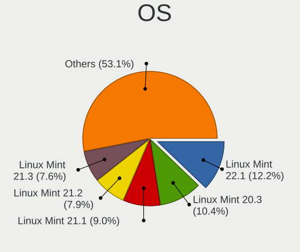

| Name              | Computers | Percent |
|-------------------|-----------|---------|
| Linux Mint 22.1   | 3987      | 12.16%  |
| Linux Mint 20.3   | 3403      | 10.38%  |
| Linux Mint 21.1   | 2940      | 8.96%   |
| Linux Mint 21.2   | 2581      | 7.87%   |
| Linux Mint 21.3   | 2479      | 7.56%   |
| Linux Mint 20.2   | 2474      | 7.54%   |
| Linux Mint 22.2   | 2395      | 7.3%    |
| Linux Mint 20.1   | 2295      | 7%      |
| Linux Mint 19.3   | 2236      | 6.82%   |
| Linux Mint 20     | 2069      | 6.31%   |
| Linux Mint 22     | 1848      | 5.63%   |
| Linux Mint 21     | 1591      | 4.85%   |
| Linux Mint 19.1   | 917       | 2.8%    |
| Linux Mint 19.2   | 782       | 2.38%   |
| Linux Mint 19     | 364       | 1.11%   |
| Linux Mint 18.3   | 299       | 0.91%   |
| Linux Mint 18.2   | 58        | 0.18%   |
| Linux Mint 18.1   | 25        | 0.08%   |
| Linux Mint 18     | 22        | 0.07%   |
| Linux Mint 17.3   | 9         | 0.03%   |
| Linux Mint 22.3   | 7         | 0.02%   |
| Linux Mint 21.2.0 | 4         | 0.01%   |
| Linux Mint 17.1   | 2         | 0.01%   |
| Linux Mint 17     | 2         | 0.01%   |
| Linux Mint 13     | 2         | 0.01%   |
| Linux Mint 5      | 1         | 0.003%  |
| Linux Mint 22.0   | 1         | 0.003%  |
| Linux Mint 21.3.0 | 1         | 0.003%  |
| Linux Mint 21.2.1 | 1         | 0.003%  |
| Linux Mint 17.2   | 1         | 0.003%  |
| Linux Mint 15     | 1         | 0.003%  |

OS Family
---------

OS without a version

| Name       | Computers | Percent |
|------------|-----------|---------|
| Linux Mint | 30132     | 100%    |

Kernel
------

Version of the Linux kernel

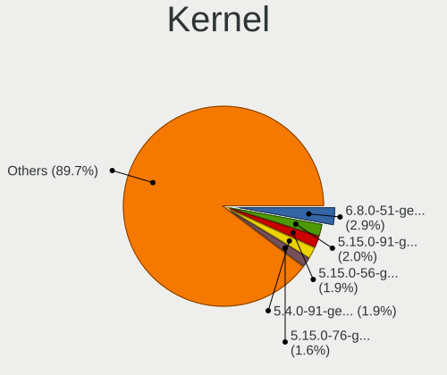

| Version           | Computers | Percent |
|-------------------|-----------|---------|
| 6.8.0-51-generic  | 1051      | 2.86%   |
| 5.15.0-91-generic | 724       | 1.97%   |
| 5.15.0-56-generic | 709       | 1.93%   |
| 5.4.0-91-generic  | 704       | 1.92%   |
| 5.15.0-76-generic | 588       | 1.6%    |
| 6.8.0-60-generic  | 582       | 1.59%   |
| 5.4.0-58-generic  | 521       | 1.42%   |
| 6.14.0-29-generic | 449       | 1.22%   |
| 5.4.0-74-generic  | 444       | 1.21%   |
| 5.4.0-42-generic  | 383       | 1.04%   |
| 6.14.0-33-generic | 381       | 1.04%   |
| 5.15.0-58-generic | 372       | 1.01%   |
| 5.0.0-32-generic  | 353       | 0.96%   |
| 5.4.0-65-generic  | 333       | 0.91%   |
| 5.15.0-67-generic | 316       | 0.86%   |
| 6.14.0-37-generic | 306       | 0.83%   |
| 5.4.0-77-generic  | 298       | 0.81%   |
| 5.15.0-60-generic | 292       | 0.8%    |
| 6.8.0-79-generic  | 291       | 0.79%   |
| 6.8.0-55-generic  | 288       | 0.78%   |
| 6.8.0-52-generic  | 287       | 0.78%   |
| 6.8.0-71-generic  | 284       | 0.77%   |
| 5.4.0-81-generic  | 284       | 0.77%   |
| 6.14.0-36-generic | 282       | 0.77%   |
| 5.4.0-66-generic  | 281       | 0.77%   |
| 5.4.0-80-generic  | 274       | 0.75%   |
| 5.4.0-72-generic  | 266       | 0.72%   |
| 6.8.0-63-generic  | 262       | 0.71%   |
| 5.4.0-73-generic  | 255       | 0.69%   |
| 5.15.0-69-generic | 252       | 0.69%   |
| 4.15.0-54-generic | 252       | 0.69%   |
| 5.4.0-122-generic | 250       | 0.68%   |
| 5.4.0-100-generic | 248       | 0.68%   |
| 5.15.0-88-generic | 246       | 0.67%   |
| 5.4.0-90-generic  | 245       | 0.67%   |
| 5.4.0-70-generic  | 245       | 0.67%   |
| 5.15.0-78-generic | 243       | 0.66%   |
| 4.15.0-20-generic | 242       | 0.66%   |
| 6.8.0-38-generic  | 241       | 0.66%   |
| 5.4.0-88-generic  | 240       | 0.65%   |

Kernel Family
-------------

Linux kernel without a distro release

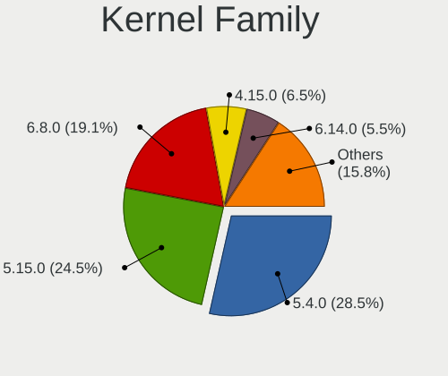

| Version | Computers | Percent |
|---------|-----------|---------|
| 5.4.0   | 9149      | 28.52%  |
| 5.15.0  | 7866      | 24.52%  |
| 6.8.0   | 6134      | 19.12%  |
| 4.15.0  | 2080      | 6.48%   |
| 6.14.0  | 1773      | 5.53%   |
| 5.3.0   | 901       | 2.81%   |
| 6.5.0   | 582       | 1.81%   |
| 5.0.0   | 550       | 1.71%   |
| 5.13.0  | 363       | 1.13%   |
| 6.2.0   | 360       | 1.12%   |
| 5.8.0   | 299       | 0.93%   |
| 5.11.0  | 255       | 0.79%   |
| 6.11.0  | 242       | 0.75%   |
| 5.19.0  | 216       | 0.67%   |
| 4.10.0  | 90        | 0.28%   |
| 4.4.0   | 73        | 0.23%   |
| 6.1.0   | 68        | 0.21%   |
| 4.18.0  | 62        | 0.19%   |
| 5.14.0  | 61        | 0.19%   |
| 4.13.0  | 60        | 0.19%   |
| 5.10.0  | 37        | 0.12%   |
| 4.8.0   | 30        | 0.09%   |
| 6.0.0   | 27        | 0.08%   |
| 5.17.0  | 20        | 0.06%   |
| 5.6.0   | 15        | 0.05%   |
| 6.12.3  | 11        | 0.03%   |
| 5.7.1   | 10        | 0.03%   |
| 5.9.0   | 9         | 0.03%   |
| 6.3.7   | 8         | 0.02%   |
| 6.9.3   | 7         | 0.02%   |
| 6.5.7   | 7         | 0.02%   |
| 6.4.3   | 7         | 0.02%   |
| 6.3.4   | 6         | 0.02%   |
| 6.17.0  | 6         | 0.02%   |
| 6.15.5  | 6         | 0.02%   |
| 5.3.6   | 6         | 0.02%   |
| 6.7.3   | 5         | 0.02%   |
| 6.6.0   | 5         | 0.02%   |
| 6.4.11  | 5         | 0.02%   |
| 6.3.0   | 5         | 0.02%   |

Kernel Major Ver.
-----------------

Linux kernel major version

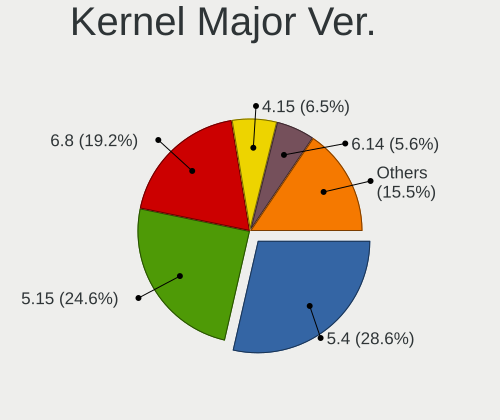

| Version | Computers | Percent |
|---------|-----------|---------|
| 5.4     | 9166      | 28.59%  |
| 5.15    | 7897      | 24.63%  |
| 6.8     | 6144      | 19.16%  |
| 4.15    | 2083      | 6.5%    |
| 6.14    | 1792      | 5.59%   |
| 5.3     | 918       | 2.86%   |
| 6.5     | 602       | 1.88%   |
| 5.0     | 565       | 1.76%   |
| 6.2     | 390       | 1.22%   |
| 5.13    | 373       | 1.16%   |
| 5.8     | 316       | 0.99%   |
| 5.11    | 266       | 0.83%   |
| 6.11    | 251       | 0.78%   |
| 5.19    | 224       | 0.7%    |
| 6.1     | 93        | 0.29%   |
| 4.10    | 90        | 0.28%   |
| 4.4     | 73        | 0.23%   |
| 5.14    | 68        | 0.21%   |
| 4.18    | 65        | 0.2%    |
| 4.13    | 62        | 0.19%   |
| 5.10    | 61        | 0.19%   |
| 6.0     | 43        | 0.13%   |
| 5.17    | 37        | 0.12%   |
| 6.12    | 34        | 0.11%   |
| 6.3     | 32        | 0.1%    |
| 6.4     | 30        | 0.09%   |
| 4.8     | 30        | 0.09%   |
| 5.9     | 26        | 0.08%   |
| 5.7     | 26        | 0.08%   |
| 5.6     | 24        | 0.07%   |
| 6.10    | 22        | 0.07%   |
| 6.6     | 21        | 0.07%   |
| 6.9     | 19        | 0.06%   |
| 6.7     | 19        | 0.06%   |
| 6.15    | 18        | 0.06%   |
| 6.13    | 18        | 0.06%   |
| 6.17    | 17        | 0.05%   |
| 5.18    | 17        | 0.05%   |
| 5.12    | 16        | 0.05%   |
| 5.16    | 15        | 0.05%   |

Arch
----

OS architecture (x86_64, i586, etc.)

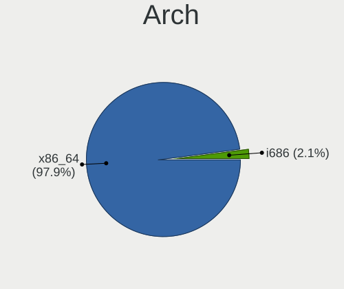

| Name   | Computers | Percent |
|--------|-----------|---------|
| x86_64 | 29517     | 97.92%  |
| i686   | 626       | 2.08%   |

DE
--

Desktop Environment

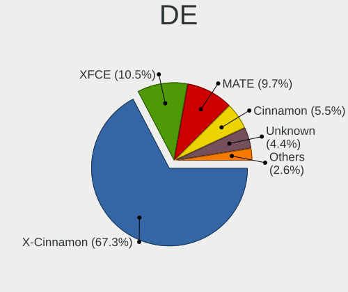

| Name            | Computers | Percent |
|-----------------|-----------|---------|
| X-Cinnamon      | 20728     | 67.33%  |
| XFCE            | 3230      | 10.49%  |
| MATE            | 2987      | 9.7%    |
| Cinnamon        | 1707      | 5.54%   |
| Unknown         | 1347      | 4.38%   |
| GNOME           | 487       | 1.58%   |
| KDE5            | 155       | 0.5%    |
| KDE             | 47        | 0.15%   |
| i3              | 28        | 0.09%   |
| LXDE            | 14        | 0.05%   |
| LXQt            | 8         | 0.03%   |
| Budgie          | 6         | 0.02%   |
| Pantheon        | 5         | 0.02%   |
| ICEWM           | 4         | 0.01%   |
| GNOME Classic   | 4         | 0.01%   |
| KDE4            | 3         | 0.01%   |
| Enlightenment   | 3         | 0.01%   |
| Deepin          | 3         | 0.01%   |
| Trinity         | 2         | 0.01%   |
| qtile           | 2         | 0.01%   |
| jwm             | 2         | 0.01%   |
| fluxbox         | 2         | 0.01%   |
| bspwm           | 2         | 0.01%   |
| sway            | 1         | 0.003%  |
| openbox         | 1         | 0.003%  |
| KDE6            | 1         | 0.003%  |
| i3-with-shmlog  | 1         | 0.003%  |
| Hyprland        | 1         | 0.003%  |
| GNUstep         | 1         | 0.003%  |
| GNOME Flashback | 1         | 0.003%  |
| dwm             | 1         | 0.003%  |
| awesome         | 1         | 0.003%  |

Display Server
--------------

X11 or Wayland

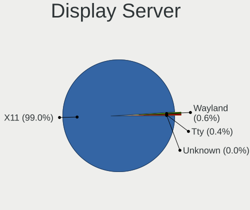

| Name    | Computers | Percent |
|---------|-----------|---------|
| X11     | 29891     | 98.98%  |
| Wayland | 171       | 0.57%   |
| Tty     | 128       | 0.42%   |
| Unknown | 10        | 0.03%   |

Display Manager
---------------

SDDM, LightDM, etc.

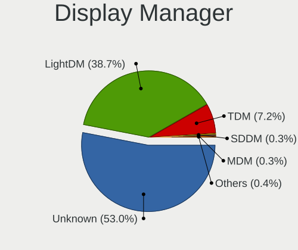

| Name    | Computers | Percent |
|---------|-----------|---------|
| Unknown | 16291     | 53.04%  |
| LightDM | 11889     | 38.71%  |
| TDM     | 2224      | 7.24%   |
| SDDM    | 98        | 0.32%   |
| MDM     | 85        | 0.28%   |
| GDM3    | 79        | 0.26%   |
| GDM     | 43        | 0.14%   |
| LXDM    | 5         | 0.02%   |
| Ly      | 1         | 0.003%  |

OS Lang
-------

Language

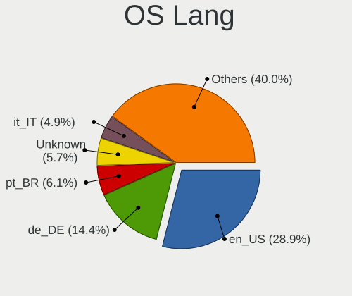

| Lang    | Computers | Percent |
|---------|-----------|---------|
| en_US   | 8821      | 28.95%  |
| de_DE   | 4382      | 14.38%  |
| pt_BR   | 1857      | 6.09%   |
| Unknown | 1729      | 5.67%   |
| it_IT   | 1494      | 4.9%    |
| fr_FR   | 1354      | 4.44%   |
| en_GB   | 1339      | 4.39%   |
| C       | 1218      | 4%      |
| ru_RU   | 1121      | 3.68%   |
| en_CA   | 740       | 2.43%   |
| es_ES   | 599       | 1.97%   |
| en_AU   | 558       | 1.83%   |
| pl_PL   | 521       | 1.71%   |
| nl_NL   | 369       | 1.21%   |
| en_IN   | 310       | 1.02%   |
| es_AR   | 241       | 0.79%   |
| es_MX   | 228       | 0.75%   |
| de_AT   | 225       | 0.74%   |
| hu_HU   | 205       | 0.67%   |
| cs_CZ   | 192       | 0.63%   |
| en_ZA   | 189       | 0.62%   |
| de_CH   | 189       | 0.62%   |
| tr_TR   | 161       | 0.53%   |
| pt_PT   | 157       | 0.52%   |
| fi_FI   | 122       | 0.4%    |
| sv_SE   | 115       | 0.38%   |
| en_NZ   | 114       | 0.37%   |
| es_CO   | 110       | 0.36%   |
| fr_CA   | 108       | 0.35%   |
| es_CL   | 104       | 0.34%   |
| ru_UA   | 95        | 0.31%   |
| en_IE   | 94        | 0.31%   |
| fr_BE   | 91        | 0.3%    |
| sk_SK   | 86        | 0.28%   |
| el_GR   | 74        | 0.24%   |
| nl_BE   | 73        | 0.24%   |
| da_DK   | 71        | 0.23%   |
| en_PH   | 69        | 0.23%   |
| zh_CN   | 66        | 0.22%   |
| es_VE   | 66        | 0.22%   |

Boot Mode
---------

EFI or BIOS

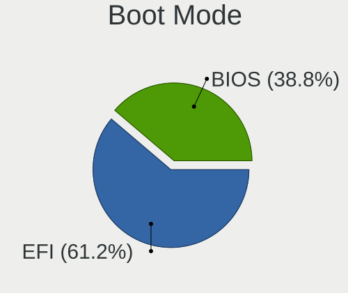

| Mode | Computers | Percent |
|------|-----------|---------|
| EFI  | 18729     | 61.2%   |
| BIOS | 11872     | 38.8%   |

Filesystem
----------

Type of filesystem

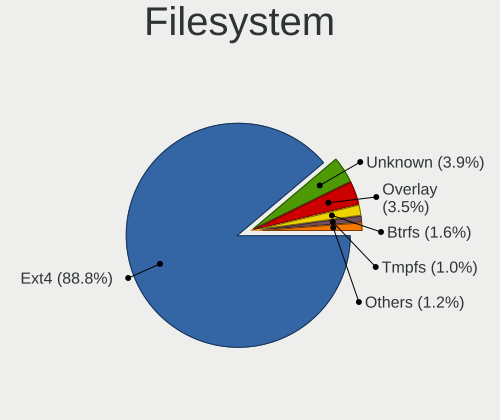

| Type     | Computers | Percent |
|----------|-----------|---------|
| Ext4     | 27061     | 88.84%  |
| Unknown  | 1192      | 3.91%   |
| Overlay  | 1054      | 3.46%   |
| Btrfs    | 486       | 1.6%    |
| Tmpfs    | 292       | 0.96%   |
| Zfs      | 157       | 0.52%   |
| Xfs      | 87        | 0.29%   |
| Ext3     | 67        | 0.22%   |
| Ext2     | 51        | 0.17%   |
| Jfs      | 4         | 0.01%   |
| Aufs     | 4         | 0.01%   |
| XXXXX    | 1         | 0.003%  |
| XXXX     | 1         | 0.003%  |
| Reiserfs | 1         | 0.003%  |
| F2fs     | 1         | 0.003%  |
| ExX4     | 1         | 0.003%  |

Part. scheme
------------

Scheme of partitioning

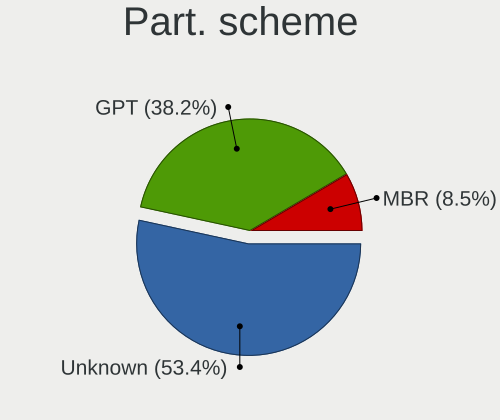

| Type    | Computers | Percent |
|---------|-----------|---------|
| Unknown | 16360     | 53.39%  |
| GPT     | 11692     | 38.15%  |
| MBR     | 2592      | 8.46%   |

Dual Boot with Linux/BSD
------------------------

Hosting more than one Linux/BSD

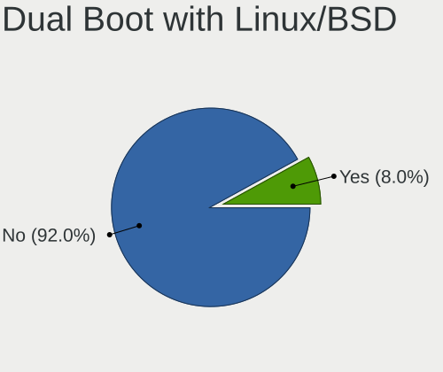

| Dual boot | Computers | Percent |
|-----------|-----------|---------|
| No        | 27976     | 92.01%  |
| Yes       | 2429      | 7.99%   |

Dual Boot (Win)
---------------

Hosting Linux and Windows

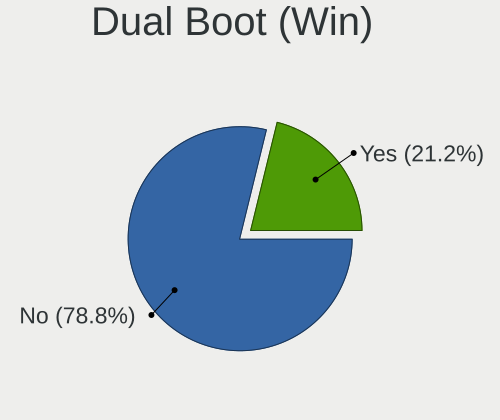

| Dual boot | Computers | Percent |
|-----------|-----------|---------|
| No        | 24012     | 78.83%  |
| Yes       | 6449      | 21.17%  |

Board
-----

Vendor
------

Motherboard manufacturer

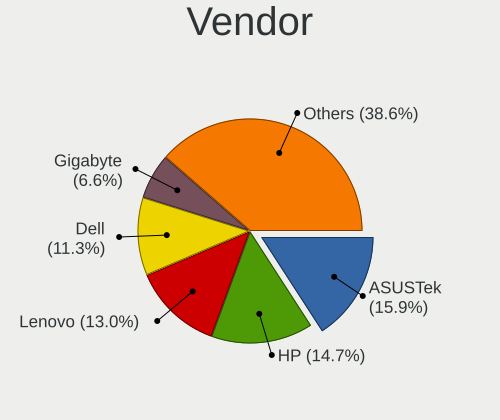

| Name                                 | Computers | Percent |
|--------------------------------------|-----------|---------|
| ASUSTek Computer                     | 4779      | 15.86%  |
| Hewlett-Packard                      | 4437      | 14.73%  |
| Lenovo                               | 3917      | 13%     |
| Dell                                 | 3394      | 11.26%  |
| Gigabyte Technology                  | 1978      | 6.56%   |
| Acer                                 | 1938      | 6.43%   |
| MSI                                  | 1678      | 5.57%   |
| ASRock                               | 1044      | 3.46%   |
| Apple                                | 885       | 2.94%   |
| Toshiba                              | 505       | 1.68%   |
| Intel                                | 504       | 1.67%   |
| Samsung Electronics                  | 420       | 1.39%   |
| Unknown                              | 357       | 1.18%   |
| Fujitsu                              | 298       | 0.99%   |
| Sony                                 | 265       | 0.88%   |
| Medion                               | 262       | 0.87%   |
| Google                               | 168       | 0.56%   |
| Positivo                             | 164       | 0.54%   |
| Pegatron                             | 156       | 0.52%   |
| HUAWEI                               | 145       | 0.48%   |
| Foxconn                              | 119       | 0.39%   |
| Biostar                              | 119       | 0.39%   |
| Packard Bell                         | 104       | 0.35%   |
| Fujitsu Siemens                      | 101       | 0.34%   |
| AZW                                  | 100       | 0.33%   |
| Notebook                             | 97        | 0.32%   |
| Microsoft                            | 95        | 0.32%   |
| ECS                                  | 92        | 0.31%   |
| Alienware                            | 86        | 0.29%   |
| AMI                                  | 66        | 0.22%   |
| LG Electronics                       | 58        | 0.19%   |
| Gateway                              | 51        | 0.17%   |
| Chuwi                                | 49        | 0.16%   |
| BESSTAR Tech                         | 45        | 0.15%   |
| eMachines                            | 44        | 0.15%   |
| Shenzhen Meigao Electronic Equipment | 42        | 0.14%   |
| Timi                                 | 39        | 0.13%   |
| Supermicro                           | 39        | 0.13%   |
| GPU Company                          | 38        | 0.13%   |
| Panasonic                            | 36        | 0.12%   |

Model
-----

Motherboard model

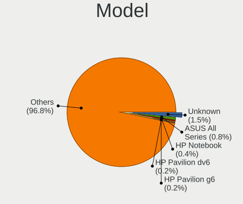

| Name                      | Computers | Percent |
|---------------------------|-----------|---------|
| Unknown                   | 446       | 1.48%   |
| ASUS All Series           | 256       | 0.85%   |
| HP Notebook               | 124       | 0.41%   |
| HP Pavilion dv6           | 74        | 0.25%   |
| HP Pavilion g6            | 71        | 0.24%   |
| Dell OptiPlex 7010        | 64        | 0.21%   |
| HP Pavilion 15            | 59        | 0.2%    |
| Dell OptiPlex 9020        | 59        | 0.2%    |
| HP Pavilion Notebook      | 53        | 0.18%   |
| ASUS TUF Gaming X570-PLUS | 53        | 0.18%   |
| MSI MS-7C56               | 51        | 0.17%   |
| HP Pavilion dv7           | 48        | 0.16%   |
| MSI MS-7C02               | 47        | 0.16%   |
| Gigabyte B450M DS3H       | 46        | 0.15%   |
| ASUS PRIME A320M-K        | 46        | 0.15%   |
| Dell OptiPlex 780         | 45        | 0.15%   |
| Apple MacBookPro9,2       | 45        | 0.15%   |
| MSI MS-7B86               | 43        | 0.14%   |
| HP Laptop 15-bw0xx        | 43        | 0.14%   |
| Dell OptiPlex 790         | 43        | 0.14%   |
| MSI MS-7693               | 42        | 0.14%   |
| ASUS M5A78L-M/USB3        | 42        | 0.14%   |
| MSI MS-7C91               | 40        | 0.13%   |
| Dell OptiPlex 3020        | 40        | 0.13%   |
| MSI MS-7C37               | 39        | 0.13%   |
| Dell Latitude E6430       | 39        | 0.13%   |
| Apple MacBookAir7,2       | 39        | 0.13%   |
| Intel H61                 | 38        | 0.13%   |
| Dell Inspiron 15-3567     | 38        | 0.13%   |
| HP Pavilion g7            | 37        | 0.12%   |
| HP Pavilion 17            | 37        | 0.12%   |
| HP Laptop 15-bs0xx        | 37        | 0.12%   |
| HP 15                     | 36        | 0.12%   |
| Apple MacBookPro8,1       | 36        | 0.12%   |
| HP Compaq Elite 8300 SFF  | 35        | 0.12%   |
| Gigabyte 970A-DS3P        | 35        | 0.12%   |
| Dell Latitude E6420       | 35        | 0.12%   |
| Dell Latitude E6410       | 35        | 0.12%   |
| AZW SER                   | 34        | 0.11%   |
| MSI MS-7817               | 33        | 0.11%   |

Model Family
------------

Motherboard model prefix

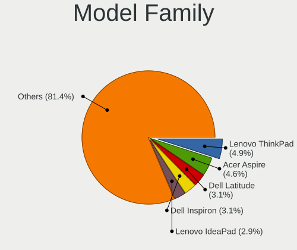

| Name               | Computers | Percent |
|--------------------|-----------|---------|
| Lenovo ThinkPad    | 1484      | 4.92%   |
| Acer Aspire        | 1376      | 4.57%   |
| Dell Latitude      | 940       | 3.12%   |
| Dell Inspiron      | 936       | 3.11%   |
| Lenovo IdeaPad     | 866       | 2.87%   |
| HP Pavilion        | 840       | 2.79%   |
| Dell OptiPlex      | 616       | 2.04%   |
| HP Laptop          | 543       | 1.8%    |
| ASUS PRIME         | 536       | 1.78%   |
| HP EliteBook       | 487       | 1.62%   |
| HP Compaq          | 454       | 1.51%   |
| Unknown            | 446       | 1.48%   |
| Toshiba Satellite  | 428       | 1.42%   |
| HP ProBook         | 401       | 1.33%   |
| ASUS VivoBook      | 399       | 1.32%   |
| ASUS ROG           | 392       | 1.3%    |
| Lenovo ThinkCentre | 314       | 1.04%   |
| ASUS TUF           | 303       | 1.01%   |
| ASUS All           | 256       | 0.85%   |
| Dell Precision     | 251       | 0.83%   |
| Dell XPS           | 226       | 0.75%   |
| Dell Vostro        | 190       | 0.63%   |
| HP ENVY            | 173       | 0.57%   |
| Lenovo Yoga        | 147       | 0.49%   |
| HP EliteDesk       | 143       | 0.47%   |
| Fujitsu LIFEBOOK   | 142       | 0.47%   |
| ASUS ASUS          | 138       | 0.46%   |
| Acer Swift         | 126       | 0.42%   |
| HP Notebook        | 124       | 0.41%   |
| Lenovo Legion      | 112       | 0.37%   |
| HP ProDesk         | 109       | 0.36%   |
| ASUS M5A78L-M      | 106       | 0.35%   |
| Fujitsu ESPRIMO    | 103       | 0.34%   |
| ASUS ZenBook       | 102       | 0.34%   |
| HP ZBook           | 97        | 0.32%   |
| Microsoft Surface  | 95        | 0.32%   |
| Acer Nitro         | 93        | 0.31%   |
| HP 250             | 84        | 0.28%   |
| Gigabyte B450M     | 84        | 0.28%   |
| Acer TravelMate    | 78        | 0.26%   |

MFG Year
--------

Motherboard manufacture year

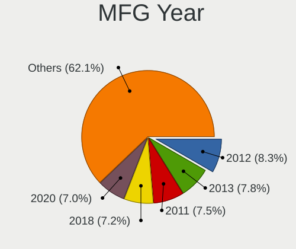

| Year    | Computers | Percent |
|---------|-----------|---------|
| 2012    | 2509      | 8.33%   |
| 2013    | 2351      | 7.8%    |
| 2011    | 2274      | 7.55%   |
| 2018    | 2180      | 7.23%   |
| 2020    | 2104      | 6.98%   |
| 2019    | 2004      | 6.65%   |
| 2017    | 1861      | 6.18%   |
| 2021    | 1846      | 6.13%   |
| 2014    | 1746      | 5.79%   |
| 2010    | 1589      | 5.27%   |
| 2015    | 1512      | 5.02%   |
| 2016    | 1451      | 4.82%   |
| 2009    | 1340      | 4.45%   |
| 2022    | 1243      | 4.13%   |
| 2008    | 1202      | 3.99%   |
| 2023    | 950       | 3.15%   |
| 2007    | 748       | 2.48%   |
| 2024    | 593       | 1.97%   |
| 2006    | 326       | 1.08%   |
| 2025    | 169       | 0.56%   |
| 2005    | 72        | 0.24%   |
| 2004    | 27        | 0.09%   |
| Unknown | 17        | 0.06%   |
| 2003    | 15        | 0.05%   |
| 2002    | 3         | 0.01%   |

Form Factor
-----------

Physical design of the computer

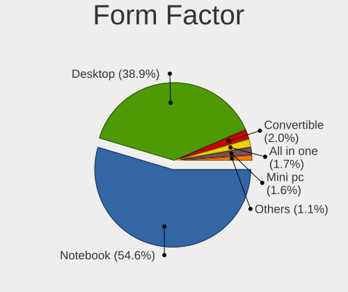

| Name        | Computers | Percent |
|-------------|-----------|---------|
| Notebook    | 16456     | 54.61%  |
| Desktop     | 11721     | 38.9%   |
| Convertible | 605       | 2.01%   |
| All in one  | 512       | 1.7%    |
| Mini pc     | 495       | 1.64%   |
| Tablet      | 241       | 0.8%    |
| Server      | 93        | 0.31%   |
| Other       | 6         | 0.02%   |
| Stick pc    | 3         | 0.01%   |

Secure Boot
-----------

Enabled or disabled

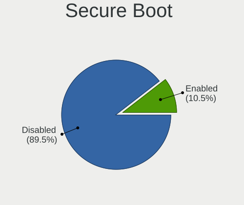

| State    | Computers | Percent |
|----------|-----------|---------|
| Disabled | 27185     | 89.51%  |
| Enabled  | 3185      | 10.49%  |

Coreboot
--------

Have coreboot on board

| Used | Computers | Percent |
|------|-----------|---------|
| No   | 29939     | 99.36%  |
| Yes  | 194       | 0.64%   |

RAM Size
--------

Total RAM memory

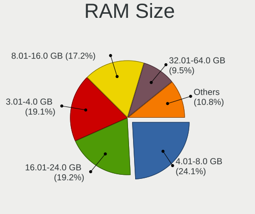

| Size in GB      | Computers | Percent |
|-----------------|-----------|---------|
| 4.01-8.0        | 7394      | 24.13%  |
| 16.01-24.0      | 5889      | 19.22%  |
| 3.01-4.0        | 5860      | 19.12%  |
| 8.01-16.0       | 5271      | 17.2%   |
| 32.01-64.0      | 2916      | 9.52%   |
| 1.01-2.0        | 1176      | 3.84%   |
| 64.01-256.0     | 802       | 2.62%   |
| 24.01-32.0      | 708       | 2.31%   |
| 2.01-3.0        | 479       | 1.56%   |
| 0.51-1.0        | 133       | 0.43%   |
| More than 256.0 | 13        | 0.04%   |
| 0.01-0.5        | 2         | 0.01%   |

RAM Used
--------

Used RAM memory

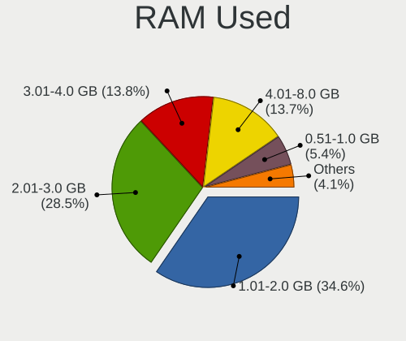

| Used GB         | Computers | Percent |
|-----------------|-----------|---------|
| 1.01-2.0        | 11602     | 34.59%  |
| 2.01-3.0        | 9557      | 28.49%  |
| 3.01-4.0        | 4617      | 13.76%  |
| 4.01-8.0        | 4588      | 13.68%  |
| 0.51-1.0        | 1811      | 5.4%    |
| 8.01-16.0       | 1049      | 3.13%   |
| 16.01-24.0      | 146       | 0.44%   |
| 0.01-0.5        | 96        | 0.29%   |
| 24.01-32.0      | 43        | 0.13%   |
| 32.01-64.0      | 25        | 0.07%   |
| Unknown         | 7         | 0.02%   |
| 64.01-256.0     | 3         | 0.01%   |
| More than 256.0 | 1         | 0.003%  |

Total Drives
------------

Number of drives on board

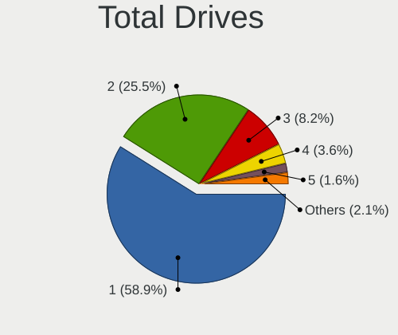

| Drives  | Computers | Percent |
|---------|-----------|---------|
| 1       | 18298     | 58.9%   |
| 2       | 7911      | 25.46%  |
| 3       | 2560      | 8.24%   |
| 4       | 1125      | 3.62%   |
| 5       | 509       | 1.64%   |
| 6       | 240       | 0.77%   |
| 0       | 192       | 0.62%   |
| 7       | 115       | 0.37%   |
| 8       | 51        | 0.16%   |
| 9       | 23        | 0.07%   |
| 10      | 12        | 0.04%   |
| 11      | 6         | 0.02%   |
| 14      | 5         | 0.02%   |
| 12      | 5         | 0.02%   |
| 13      | 4         | 0.01%   |
| Unknown | 3         | 0.01%   |
| 27      | 2         | 0.01%   |
| 22      | 2         | 0.01%   |
| 15      | 2         | 0.01%   |
| 28      | 1         | 0.003%  |
| 17      | 1         | 0.003%  |

Has CD-ROM
----------

Has CD-ROM on board

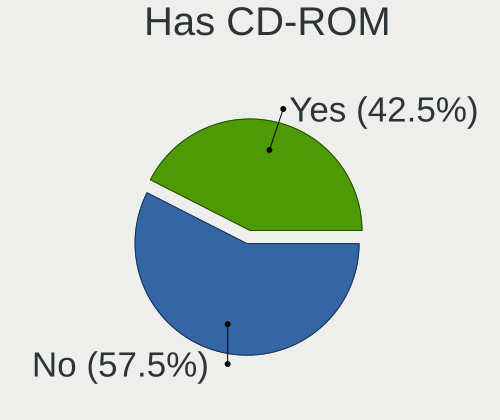

| Presented | Computers | Percent |
|-----------|-----------|---------|
| No        | 17460     | 57.49%  |
| Yes       | 12909     | 42.51%  |

Has Ethernet
------------

Has Ethernet on board

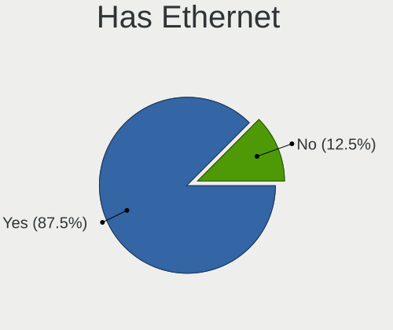

| Presented | Computers | Percent |
|-----------|-----------|---------|
| Yes       | 26416     | 87.47%  |
| No        | 3784      | 12.53%  |

Has WiFi
--------

Has WiFi module

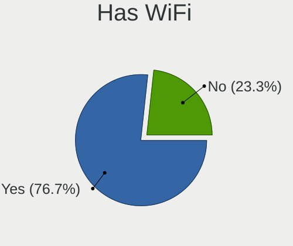

| Presented | Computers | Percent |
|-----------|-----------|---------|
| Yes       | 23278     | 76.71%  |
| No        | 7069      | 23.29%  |

Has Bluetooth
-------------

Has Bluetooth module

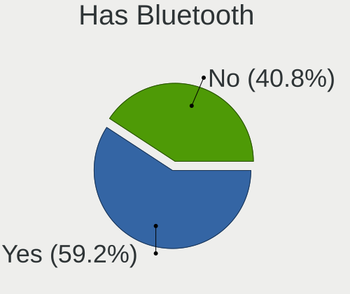

| Presented | Computers | Percent |
|-----------|-----------|---------|
| Yes       | 18084     | 59.22%  |
| No        | 12451     | 40.78%  |

Location
--------

Country
-------

Geographic location (country)

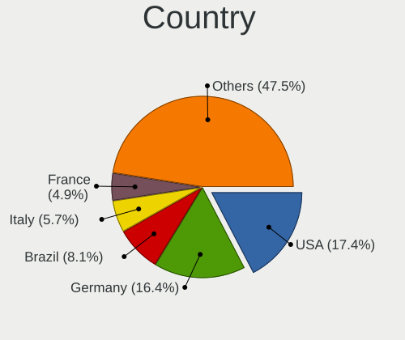

| Country      | Computers | Percent |
|--------------|-----------|---------|
| USA          | 5263      | 17.36%  |
| Germany      | 4961      | 16.36%  |
| Brazil       | 2466      | 8.13%   |
| Italy        | 1738      | 5.73%   |
| France       | 1491      | 4.92%   |
| Russia       | 1479      | 4.88%   |
| UK           | 1280      | 4.22%   |
| Canada       | 961       | 3.17%   |
| Spain        | 759       | 2.5%    |
| Poland       | 671       | 2.21%   |
| Netherlands  | 670       | 2.21%   |
| Australia    | 616       | 2.03%   |
| Switzerland  | 400       | 1.32%   |
| India        | 374       | 1.23%   |
| Austria      | 367       | 1.21%   |
| Mexico       | 339       | 1.12%   |
| Argentina    | 311       | 1.03%   |
| Ukraine      | 301       | 0.99%   |
| Belgium      | 297       | 0.98%   |
| Sweden       | 287       | 0.95%   |
| Czechia      | 284       | 0.94%   |
| Turkey       | 273       | 0.9%    |
| Hungary      | 273       | 0.9%    |
| Portugal     | 235       | 0.77%   |
| South Africa | 212       | 0.7%    |
| Finland      | 208       | 0.69%   |
| Greece       | 187       | 0.62%   |
| Romania      | 183       | 0.6%    |
| Colombia     | 155       | 0.51%   |
| Denmark      | 147       | 0.48%   |
| Indonesia    | 146       | 0.48%   |
| Bulgaria     | 143       | 0.47%   |
| Slovakia     | 134       | 0.44%   |
| New Zealand  | 129       | 0.43%   |
| Chile        | 128       | 0.42%   |
| Norway       | 125       | 0.41%   |
| Ireland      | 111       | 0.37%   |
| Japan        | 102       | 0.34%   |
| Belarus      | 85        | 0.28%   |
| Philippines  | 84        | 0.28%   |

City
----

Geographic location (city)

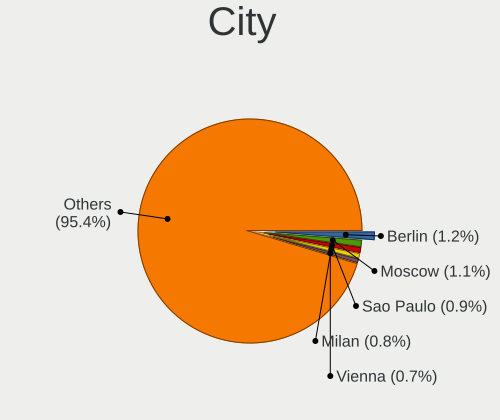

| City              | Computers | Percent |
|-------------------|-----------|---------|
| Berlin            | 401       | 1.24%   |
| Moscow            | 345       | 1.07%   |
| Sao Paulo         | 282       | 0.87%   |
| Milan             | 256       | 0.79%   |
| Vienna            | 212       | 0.66%   |
| Hamburg           | 184       | 0.57%   |
| Sydney            | 180       | 0.56%   |
| Rome              | 178       | 0.55%   |
| Munich            | 171       | 0.53%   |
| Paris             | 169       | 0.52%   |
| Warsaw            | 160       | 0.5%    |
| St Petersburg     | 148       | 0.46%   |
| Frankfurt am Main | 146       | 0.45%   |
| Rio de Janeiro    | 143       | 0.44%   |
| Melbourne         | 143       | 0.44%   |
| Amsterdam         | 139       | 0.43%   |
| Cologne           | 120       | 0.37%   |
| Budapest          | 116       | 0.36%   |
| Madrid            | 113       | 0.35%   |
| Montreal          | 107       | 0.33%   |
| Helsinki          | 101       | 0.31%   |
| Chicago           | 101       | 0.31%   |
| Brisbane          | 98        | 0.3%    |
| Prague            | 94        | 0.29%   |
| Istanbul          | 94        | 0.29%   |
| Leipzig           | 93        | 0.29%   |
| London            | 92        | 0.29%   |
| Toronto           | 89        | 0.28%   |
| Kyiv              | 87        | 0.27%   |
| Zurich            | 86        | 0.27%   |
| New York          | 85        | 0.26%   |
| Los Angeles       | 85        | 0.26%   |
| Milano            | 83        | 0.26%   |
| Stuttgart         | 81        | 0.25%   |
| Brasília         | 78        | 0.24%   |
| Barcelona         | 78        | 0.24%   |
| Curitiba          | 77        | 0.24%   |
| Athens            | 74        | 0.23%   |
| Nuremberg         | 72        | 0.22%   |
| Stockholm         | 70        | 0.22%   |

Drives
------

Drive Vendor
------------

Hard drive vendors

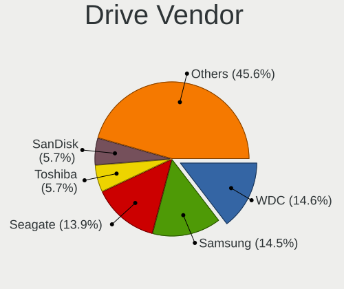

| Vendor                      | Computers | Drives | Percent |
|-----------------------------|-----------|--------|---------|
| WDC                         | 6522      | 10063  | 14.59%  |
| Samsung Electronics         | 6484      | 10075  | 14.51%  |
| Seagate                     | 6226      | 9462   | 13.93%  |
| Toshiba                     | 2548      | 3299   | 5.7%    |
| SanDisk                     | 2528      | 3517   | 5.66%   |
| Kingston                    | 2504      | 3300   | 5.6%    |
| Crucial                     | 1992      | 2852   | 4.46%   |
| Unknown                     | 1659      | 2349   | 3.71%   |
| Hitachi                     | 1330      | 1707   | 2.98%   |
| SK hynix                    | 946       | 1112   | 2.12%   |
| Intel                       | 860       | 1143   | 1.92%   |
| Micron Technology           | 761       | 938    | 1.7%    |
| HGST                        | 672       | 899    | 1.5%    |
| A-DATA Technology           | 591       | 771    | 1.32%   |
| China                       | 550       | 680    | 1.23%   |
| Apple                       | 426       | 558    | 0.95%   |
| Intenso                     | 422       | 565    | 0.94%   |
| KIOXIA                      | 294       | 344    | 0.66%   |
| SPCC                        | 287       | 363    | 0.64%   |
| Micron/Crucial Technology   | 286       | 499    | 0.64%   |
| PNY                         | 265       | 374    | 0.59%   |
| Patriot                     | 242       | 304    | 0.54%   |
| Kingston Technology Company | 235       | 319    | 0.53%   |
| Unknown                     | 232       | 291    | 0.52%   |
| Phison                      | 193       | 253    | 0.43%   |
| Phison Electronics          | 189       | 269    | 0.42%   |
| Silicon Motion              | 185       | 250    | 0.41%   |
| Transcend                   | 183       | 239    | 0.41%   |
| Maxtor                      | 173       | 242    | 0.39%   |
| JMicron Technology          | 172       | 217    | 0.38%   |
| Fujitsu                     | 170       | 246    | 0.38%   |
| LITEON                      | 160       | 201    | 0.36%   |
| Lexar                       | 159       | 207    | 0.36%   |
| OCZ                         | 157       | 193    | 0.35%   |
| MAXIO Technology (Hangzhou) | 140       | 203    | 0.31%   |
| GOODRAM                     | 135       | 181    | 0.3%    |
| Team                        | 132       | 175    | 0.3%    |
| Corsair                     | 126       | 145    | 0.28%   |
| Netac                       | 111       | 156    | 0.25%   |
| KingSpec                    | 110       | 160    | 0.25%   |

Drive Model
-----------

Hard drive models

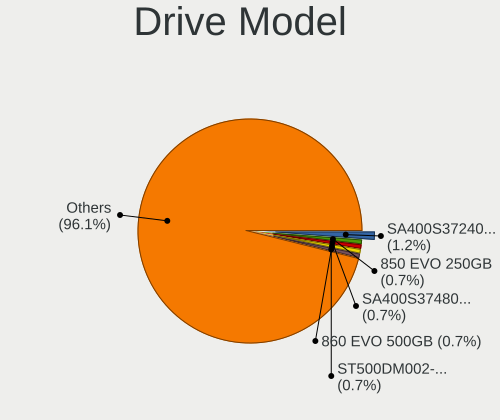

| Model                                              | Computers | Percent |
|----------------------------------------------------|-----------|---------|
| Kingston SA400S37240G 240GB SSD                    | 595       | 1.21%   |
| Samsung SSD 850 EVO 250GB                          | 343       | 0.7%    |
| Kingston SA400S37480G 480GB SSD                    | 329       | 0.67%   |
| Samsung SSD 860 EVO 500GB                          | 328       | 0.67%   |
| Seagate ST500DM002-1BD142 500GB                    | 322       | 0.65%   |
| Seagate ST1000LM024 HN-M101MBB 1TB                 | 313       | 0.63%   |
| Samsung NVMe SSD Controller SM981/PM981/PM983 1TB  | 310       | 0.63%   |
| Seagate ST1000LM035-1RK172 1TB                     | 300       | 0.61%   |
| Unknown MMC Card  32GB                             | 285       | 0.58%   |
| Toshiba MQ01ABD100 1TB                             | 278       | 0.56%   |
| Crucial CT500MX500SSD1 500GB                       | 261       | 0.53%   |
| Unknown MMC Card  64GB                             | 251       | 0.51%   |
| Crucial CT1000MX500SSD1 1TB                        | 250       | 0.51%   |
| Kingston SA400S37120G 120GB SSD                    | 244       | 0.49%   |
| Samsung SSD 850 EVO 500GB                          | 243       | 0.49%   |
| Samsung SSD 860 EVO 1TB                            | 236       | 0.48%   |
| Seagate ST1000DM010-2EP102 1TB                     | 234       | 0.47%   |
| Unknown                                            | 232       | 0.47%   |
| Toshiba MQ01ABF050 500GB                           | 222       | 0.45%   |
| Unknown SD/MMC/MS PRO 2GB                          | 201       | 0.41%   |
| Seagate ST500LT012-1DG142 500GB                    | 200       | 0.41%   |
| Crucial CT240BX500SSD1 240GB                       | 200       | 0.41%   |
| SanDisk NVMe SSD Drive 1TB                         | 198       | 0.4%    |
| Toshiba DT01ACA100 1TB                             | 196       | 0.4%    |
| Seagate ST2000DM008-2FR102 2TB                     | 191       | 0.39%   |
| Samsung SSD 860 EVO 250GB                          | 187       | 0.38%   |
| Kingston SV300S37A120G 120GB SSD                   | 181       | 0.37%   |
| WDC WD10EZEX-08WN4A0 1TB                           | 180       | 0.36%   |
| Seagate ST9500325AS 500GB                          | 173       | 0.35%   |
| Toshiba MQ04ABF100 1TB                             | 164       | 0.33%   |
| Samsung SSD 870 EVO 1TB                            | 158       | 0.32%   |
| Unknown MMC Card  128GB                            | 157       | 0.32%   |
| Crucial CT480BX500SSD1 480GB                       | 154       | 0.31%   |
| Seagate ST1000DM003-1CH162 1TB                     | 151       | 0.31%   |
| WDC WDS240G2G0A-00JH30 240GB SSD                   | 144       | 0.29%   |
| Seagate Expansion 2TB                              | 144       | 0.29%   |
| Samsung NVMe SSD Controller PM9A1/PM9A3/980PRO 1TB | 144       | 0.29%   |
| Seagate ST1000DM003-1ER162 1TB                     | 143       | 0.29%   |
| HGST HTS721010A9E630 1TB                           | 143       | 0.29%   |
| SanDisk SSD PLUS 240GB                             | 141       | 0.29%   |

HDD Vendor
----------

Hard disk drive vendors

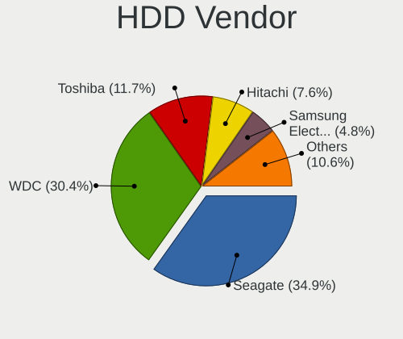

| Vendor              | Computers | Drives | Percent |
|---------------------|-----------|--------|---------|
| Seagate             | 6085      | 9182   | 34.87%  |
| WDC                 | 5301      | 8184   | 30.38%  |
| Toshiba             | 2049      | 2634   | 11.74%  |
| Hitachi             | 1330      | 1707   | 7.62%   |
| Samsung Electronics | 842       | 1199   | 4.83%   |
| HGST                | 672       | 899    | 3.85%   |
| Unknown             | 224       | 276    | 1.28%   |
| Maxtor              | 168       | 237    | 0.96%   |
| Fujitsu             | 168       | 243    | 0.96%   |
| Apple               | 118       | 141    | 0.68%   |
| JMicron Technology  | 87        | 118    | 0.5%    |
| ASMT                | 46        | 83     | 0.26%   |
| Intenso             | 45        | 52     | 0.26%   |
| TO Exter            | 37        | 49     | 0.21%   |
| Hewlett-Packard     | 24        | 67     | 0.14%   |
| External            | 23        | 24     | 0.13%   |
| USB3.0              | 20        | 22     | 0.11%   |
| ASMedia             | 15        | 17     | 0.09%   |
| SABRENT             | 14        | 36     | 0.08%   |
| HGST HTS            | 13        | 16     | 0.07%   |
| WD MediaMax         | 10        | 19     | 0.06%   |
| ExcelStor           | 10        | 12     | 0.06%   |
| USB                 | 8         | 9      | 0.05%   |
| T-FORCE             | 8         | 10     | 0.05%   |
| Min Yi U            | 7         | 7      | 0.04%   |
| Maxone              | 7         | 10     | 0.04%   |
| Unknown             | 7         | 11     | 0.04%   |
| Inateck             | 6         | 8      | 0.03%   |
| HPE                 | 6         | 7      | 0.03%   |
| SSK                 | 5         | 5      | 0.03%   |
| SAGE                | 5         | 6      | 0.03%   |
| LaCie               | 5         | 5      | 0.03%   |
| RSH-319             | 4         | 5      | 0.02%   |
| KESU                | 4         | 5      | 0.02%   |
| Apricorn            | 4         | 6      | 0.02%   |
| TDAS                | 3         | 11     | 0.02%   |
| Synology            | 3         | 3      | 0.02%   |
| StoreJet            | 3         | 3      | 0.02%   |
| MARVELL             | 3         | 4      | 0.02%   |
| JetFlash            | 3         | 3      | 0.02%   |

SSD Vendor
----------

Solid state drive vendors

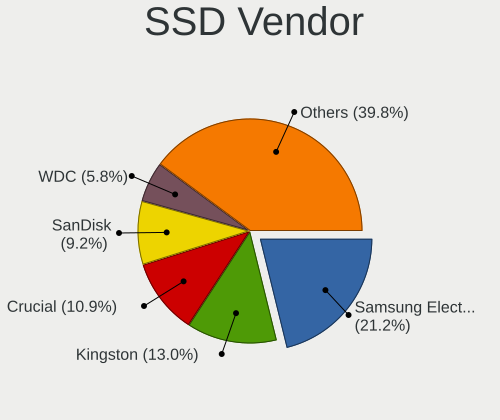

| Vendor              | Computers | Drives | Percent |
|---------------------|-----------|--------|---------|
| Samsung Electronics | 3319      | 4865   | 21.16%  |
| Kingston            | 2045      | 2682   | 13.04%  |
| Crucial             | 1717      | 2458   | 10.95%  |
| SanDisk             | 1438      | 2004   | 9.17%   |
| WDC                 | 915       | 1222   | 5.83%   |
| China               | 537       | 666    | 3.42%   |
| A-DATA Technology   | 470       | 627    | 3%      |
| Intenso             | 334       | 438    | 2.13%   |
| Intel               | 317       | 399    | 2.02%   |
| SPCC                | 249       | 319    | 1.59%   |
| PNY                 | 248       | 353    | 1.58%   |
| Micron Technology   | 243       | 323    | 1.55%   |
| Apple               | 221       | 250    | 1.41%   |
| Toshiba             | 214       | 274    | 1.36%   |
| Patriot             | 213       | 273    | 1.36%   |
| SK hynix            | 212       | 256    | 1.35%   |
| Transcend           | 164       | 210    | 1.05%   |
| OCZ                 | 156       | 191    | 0.99%   |
| LITEON              | 150       | 191    | 0.96%   |
| GOODRAM             | 127       | 171    | 0.81%   |
| Team                | 108       | 142    | 0.69%   |
| KingSpec            | 104       | 153    | 0.66%   |
| Lexar               | 103       | 141    | 0.66%   |
| Netac               | 95        | 134    | 0.61%   |
| LITEONIT            | 86        | 99     | 0.55%   |
| Unknown             | 85        | 114    | 0.54%   |
| Apacer              | 84        | 104    | 0.54%   |
| Corsair             | 73        | 86     | 0.47%   |
| Verbatim            | 58        | 80     | 0.37%   |
| Plextor             | 58        | 69     | 0.37%   |
| SABRENT             | 57        | 67     | 0.36%   |
| Fanxiang            | 56        | 68     | 0.36%   |
| Seagate             | 48        | 71     | 0.31%   |
| Hewlett-Packard     | 45        | 52     | 0.29%   |
| Gigabyte Technology | 43        | 59     | 0.27%   |
| Leven               | 31        | 38     | 0.2%    |
| KingDian            | 31        | 51     | 0.2%    |
| Dogfish             | 31        | 42     | 0.2%    |
| Emtec               | 28        | 38     | 0.18%   |
| ASMT                | 27        | 36     | 0.17%   |

Drive Kind
----------

HDD or SSD

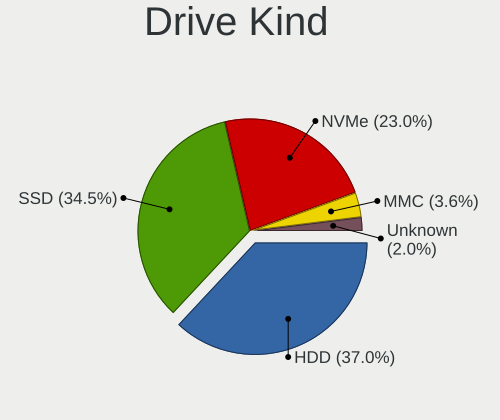

| Kind    | Computers | Drives | Percent |
|---------|-----------|--------|---------|
| HDD     | 14736     | 25457  | 36.96%  |
| SSD     | 13740     | 21200  | 34.46%  |
| NVMe    | 9181      | 13666  | 23.03%  |
| MMC     | 1429      | 1923   | 3.58%   |
| Unknown | 788       | 1170   | 1.98%   |

Drive Connector
---------------

SATA, SAS, NVMe, etc.

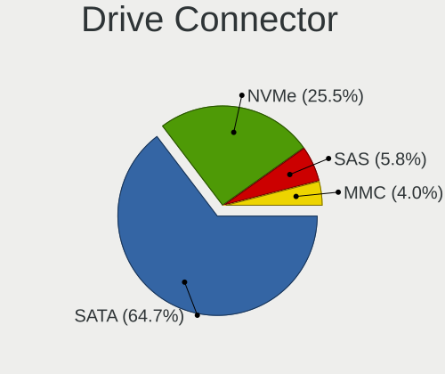

| Type | Computers | Drives | Percent |
|------|-----------|--------|---------|
| SATA | 23185     | 44556  | 64.66%  |
| NVMe | 9149      | 13525  | 25.52%  |
| SAS  | 2093      | 3412   | 5.84%   |
| MMC  | 1429      | 1923   | 3.99%   |

Drive Size
----------

Size of hard drive

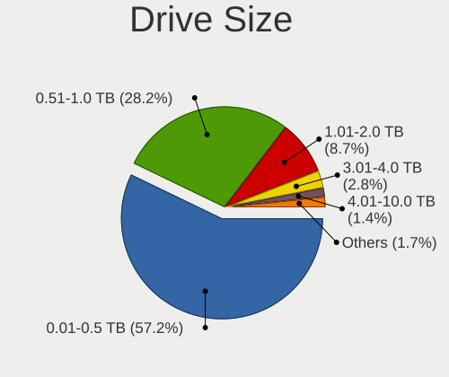

| Size in TB | Computers | Drives | Percent |
|------------|-----------|--------|---------|
| 0.01-0.5   | 17001     | 26845  | 57.16%  |
| 0.51-1.0   | 8389      | 12491  | 28.2%   |
| 1.01-2.0   | 2587      | 4271   | 8.7%    |
| 3.01-4.0   | 837       | 1440   | 2.81%   |
| 4.01-10.0  | 431       | 772    | 1.45%   |
| 2.01-3.0   | 389       | 613    | 1.31%   |
| 10.01-20.0 | 98        | 207    | 0.33%   |
| 20.01-50.0 | 9         | 16     | 0.03%   |
| 0          | 2         | 2      | 0.01%   |

Space Total
-----------

Amount of disk space available on the file system

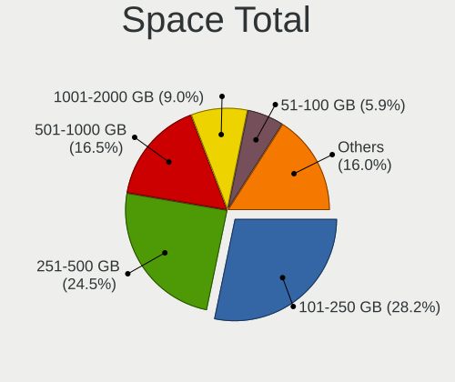

| Size in GB     | Computers | Percent |
|----------------|-----------|---------|
| 101-250        | 8944      | 28.23%  |
| 251-500        | 7750      | 24.46%  |
| 501-1000       | 5220      | 16.48%  |
| 1001-2000      | 2857      | 9.02%   |
| 51-100         | 1854      | 5.85%   |
| More than 3000 | 1811      | 5.72%   |
| 2001-3000      | 1074      | 3.39%   |
| 1-20           | 986       | 3.11%   |
| 21-50          | 969       | 3.06%   |
| Unknown        | 214       | 0.68%   |

Space Used
----------

Amount of used disk space

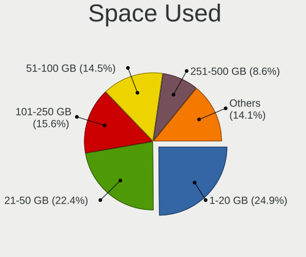

| Used GB        | Computers | Percent |
|----------------|-----------|---------|
| 1-20           | 8257      | 24.85%  |
| 21-50          | 7450      | 22.42%  |
| 101-250        | 5170      | 15.56%  |
| 51-100         | 4807      | 14.47%  |
| 251-500        | 2848      | 8.57%   |
| 501-1000       | 2100      | 6.32%   |
| 1001-2000      | 1235      | 3.72%   |
| More than 3000 | 691       | 2.08%   |
| 2001-3000      | 455       | 1.37%   |
| Unknown        | 214       | 0.64%   |

Malfunc. Drives
---------------

Drive models with a malfunction

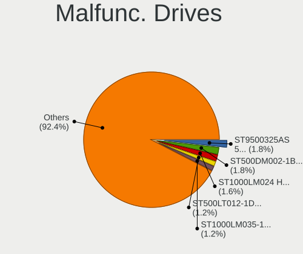

| Model                               | Computers | Drives | Percent |
|-------------------------------------|-----------|--------|---------|
| Seagate ST9500325AS 500GB           | 51        | 56     | 1.77%   |
| Seagate ST500DM002-1BD142 500GB     | 51        | 77     | 1.77%   |
| Seagate ST1000LM024 HN-M101MBB 1TB  | 47        | 49     | 1.63%   |
| Seagate ST500LT012-1DG142 500GB     | 35        | 36     | 1.21%   |
| Seagate ST1000LM035-1RK172 1TB      | 34        | 42     | 1.18%   |
| HGST HTS545050A7E680 500GB          | 33        | 56     | 1.15%   |
| Toshiba MQ01ABD100 1TB              | 29        | 35     | 1.01%   |
| Seagate ST3500418AS 500GB           | 28        | 32     | 0.97%   |
| Toshiba MQ01ABF050 500GB            | 27        | 29     | 0.94%   |
| Seagate ST500LT012-9WS142 500GB     | 27        | 30     | 0.94%   |
| Seagate ST31000528AS 1TB            | 26        | 28     | 0.9%    |
| HGST HTS721010A9E630 1TB            | 20        | 20     | 0.69%   |
| Seagate ST500LM012 HN-M500MBB 500GB | 19        | 21     | 0.66%   |
| Kingston SA400S37240G 240GB SSD     | 18        | 19     | 0.62%   |
| HGST HTS541010A9E680 1TB            | 18        | 21     | 0.62%   |
| Crucial CT525MX300SSD1 528GB        | 16        | 16     | 0.56%   |
| WDC WDS240G2G0A-00JH30 240GB SSD    | 15        | 16     | 0.52%   |
| Seagate ST9320325AS 320GB           | 15        | 15     | 0.52%   |
| Toshiba DT01ACA100 1TB              | 14        | 16     | 0.49%   |
| Hitachi HTS547550A9E384 500GB       | 13        | 13     | 0.45%   |
| WDC WD10EARS-00Y5B1 1TB             | 12        | 12     | 0.42%   |
| Seagate ST500LM021-1KJ152 500GB     | 12        | 12     | 0.42%   |
| Seagate ST31000524AS 1TB            | 12        | 17     | 0.42%   |
| Seagate ST1000DM003-1ER162 1TB      | 12        | 13     | 0.42%   |
| Samsung Electronics SSD 870 EVO 1TB | 12        | 13     | 0.42%   |
| LITEON CV8-8E128-HP 128GB SSD       | 12        | 14     | 0.42%   |
| HGST HTS725050A7E630 500GB          | 12        | 12     | 0.42%   |
| Toshiba MQ04ABF100 1TB              | 11        | 11     | 0.38%   |
| Toshiba DT01ACA050 500GB            | 11        | 11     | 0.38%   |
| Seagate ST9500420AS 500GB           | 11        | 11     | 0.38%   |
| Seagate ST2000DL003-9VT166 2TB      | 11        | 12     | 0.38%   |
| Seagate ST1000DM010-2EP102 1TB      | 11        | 13     | 0.38%   |
| Seagate ST1000DM003-1CH162 1TB      | 11        | 12     | 0.38%   |
| WDC WDS120G2G0A-00JH30 120GB SSD    | 10        | 11     | 0.35%   |
| Seagate ST9250315AS 250GB           | 10        | 10     | 0.35%   |
| Seagate ST1000DM003-9YN162 1TB      | 10        | 12     | 0.35%   |
| Hitachi HTS547575A9E384 752GB       | 10        | 10     | 0.35%   |
| Hitachi HTS545050A7E380 500GB       | 10        | 10     | 0.35%   |
| HGST HTS545050A7E380 500GB          | 10        | 11     | 0.35%   |
| WDC WD5000LPVX-22V0TT0 500GB        | 9         | 9      | 0.31%   |

Malfunc. Drive Vendor
---------------------

Vendors of faulty drives

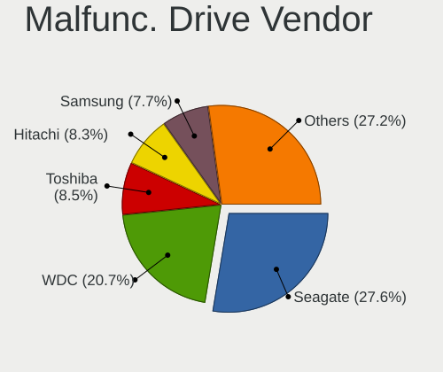

| Vendor              | Computers | Drives | Percent |
|---------------------|-----------|--------|---------|
| Seagate             | 776       | 915    | 27.62%  |
| WDC                 | 583       | 691    | 20.75%  |
| Toshiba             | 240       | 260    | 8.54%   |
| Hitachi             | 232       | 253    | 8.26%   |
| Samsung Electronics | 216       | 272    | 7.69%   |
| HGST                | 114       | 143    | 4.06%   |
| Kingston            | 81        | 85     | 2.88%   |
| SanDisk             | 77        | 88     | 2.74%   |
| Crucial             | 72        | 86     | 2.56%   |
| Intel               | 53        | 54     | 1.89%   |
| SK hynix            | 43        | 51     | 1.53%   |
| Maxtor              | 33        | 39     | 1.17%   |
| A-DATA Technology   | 29        | 29     | 1.03%   |
| China               | 25        | 29     | 0.89%   |
| Apple               | 18        | 21     | 0.64%   |
| Micron Technology   | 17        | 21     | 0.6%    |
| LITEON              | 17        | 19     | 0.6%    |
| OCZ                 | 13        | 14     | 0.46%   |
| Intenso             | 12        | 13     | 0.43%   |
| Fujitsu             | 12        | 22     | 0.43%   |
| Corsair             | 10        | 13     | 0.36%   |
| Transcend           | 9         | 9      | 0.32%   |
| LITEONIT            | 8         | 8      | 0.28%   |
| SSSTC               | 6         | 6      | 0.21%   |
| KingSpec            | 6         | 7      | 0.21%   |
| SPCC                | 5         | 6      | 0.18%   |
| Patriot             | 5         | 5      | 0.18%   |
| XPG                 | 4         | 5      | 0.14%   |
| Leven               | 4         | 5      | 0.14%   |
| Hewlett-Packard     | 4         | 4      | 0.14%   |
| Verbatim            | 3         | 4      | 0.11%   |
| PNY                 | 3         | 6      | 0.11%   |
| Lenovo              | 3         | 3      | 0.11%   |
| ASMT                | 3         | 4      | 0.11%   |
| ASMedia             | 3         | 3      | 0.11%   |
| Unknown             | 3         | 5      | 0.11%   |
| XrayDisk            | 2         | 2      | 0.07%   |
| TPH01203000GB       | 2         | 2      | 0.07%   |
| ShiJi               | 2         | 2      | 0.07%   |
| Plextor             | 2         | 2      | 0.07%   |

Malfunc. HDD Vendor
-------------------

Vendors of faulty HDD drives

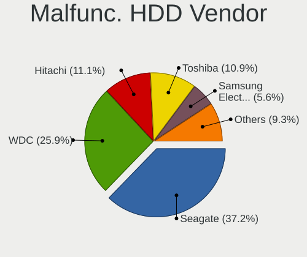

| Vendor              | Computers | Drives | Percent |
|---------------------|-----------|--------|---------|
| Seagate             | 776       | 915    | 37.22%  |
| WDC                 | 540       | 642    | 25.9%   |
| Hitachi             | 232       | 253    | 11.13%  |
| Toshiba             | 228       | 245    | 10.94%  |
| Samsung Electronics | 116       | 160    | 5.56%   |
| HGST                | 114       | 143    | 5.47%   |
| Maxtor              | 33        | 39     | 1.58%   |
| Fujitsu             | 12        | 22     | 0.58%   |
| Apple               | 10        | 11     | 0.48%   |
| ASMT                | 3         | 4      | 0.14%   |
| ASMedia             | 3         | 3      | 0.14%   |
| TPH01203000GB       | 2         | 2      | 0.1%    |
| Hewlett-Packard     | 2         | 2      | 0.1%    |
| ExcelStor           | 2         | 2      | 0.1%    |
| WD MediaMax         | 1         | 1      | 0.05%   |
| USB3.0              | 1         | 1      | 0.05%   |
| Unknown             | 1         | 1      | 0.05%   |
| StoreJet            | 1         | 1      | 0.05%   |
| SABRENT             | 1         | 1      | 0.05%   |
| Min Yi U            | 1         | 1      | 0.05%   |
| MDT                 | 1         | 1      | 0.05%   |
| Intenso             | 1         | 1      | 0.05%   |
| Inateck             | 1         | 1      | 0.05%   |
| HGST HTS            | 1         | 1      | 0.05%   |
| FEASSO              | 1         | 2      | 0.05%   |
| Unknown             | 1         | 2      | 0.05%   |

Malfunc. Drive Kind
-------------------

Kinds of faulty drives

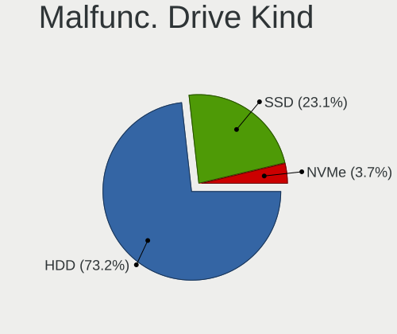

| Kind | Computers | Drives | Percent |
|------|-----------|--------|---------|
| HDD  | 1969      | 2457   | 73.22%  |
| SSD  | 620       | 698    | 23.06%  |
| NVMe | 100       | 114    | 3.72%   |

Failed Drives
-------------

Failed drive models

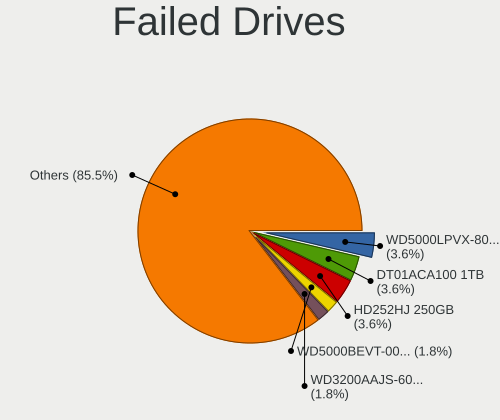

| Model                                            | Computers | Drives | Percent |
|--------------------------------------------------|-----------|--------|---------|
| WDC WD5000LPVX-80V0TT0 500GB                     | 2         | 2      | 3.64%   |
| Toshiba DT01ACA100 1TB                           | 2         | 2      | 3.64%   |
| Samsung Electronics HD252HJ 250GB                | 2         | 2      | 3.64%   |
| WDC WD5000BEVT-00ZAT0 500GB                      | 1         | 1      | 1.82%   |
| WDC WD3200AAJS-60Z0A0 320GB                      | 1         | 1      | 1.82%   |
| WDC WD3200AAJS-40VWA0 320GB                      | 1         | 1      | 1.82%   |
| WDC WD3200AAJS-00YZCA0 320GB                     | 1         | 1      | 1.82%   |
| WDC WD30EZRS-11J99B1 3TB                         | 1         | 1      | 1.82%   |
| WDC WD2003FYYS-18W0B0 2TB                        | 1         | 1      | 1.82%   |
| WDC WD10SPZX-24Z10 1TB                           | 1         | 1      | 1.82%   |
| WDC WD10SPZX-21Z10T0 1TB                         | 1         | 1      | 1.82%   |
| WD MediaMax WL1000GSA1672 1TB                    | 1         | 1      | 1.82%   |
| Transcend TS120GSSD220S 120GB                    | 1         | 1      | 1.82%   |
| Toshiba THNSN5512GPU7 512GB                      | 1         | 1      | 1.82%   |
| Toshiba MQ01ABF050 500GB                         | 1         | 1      | 1.82%   |
| Toshiba MQ01ABF032 320GB                         | 1         | 1      | 1.82%   |
| Toshiba MQ01ABD100 1TB                           | 1         | 1      | 1.82%   |
| Toshiba MQ01ABD075 752GB                         | 1         | 1      | 1.82%   |
| Toshiba MK3265GSXN 320GB                         | 1         | 1      | 1.82%   |
| Toshiba MK3261GSYN 320GB                         | 1         | 1      | 1.82%   |
| Toshiba HDWD130 3TB                              | 1         | 1      | 1.82%   |
| SK hynix BC501 NVMe Solid State Drive 512GB      | 1         | 1      | 1.82%   |
| SK hynix BC501 HFM512GDJTNG-8310A 512GB          | 1         | 1      | 1.82%   |
| Seagate ST9160821AS 160GB                        | 1         | 1      | 1.82%   |
| Seagate ST500LM012 HN-M500MBB 500GB              | 1         | 1      | 1.82%   |
| Seagate ST500DM002-1BD142 500GB                  | 1         | 1      | 1.82%   |
| Seagate ST3500630NS 500GB                        | 1         | 1      | 1.82%   |
| Seagate ST32000542AS 2TB                         | 1         | 1      | 1.82%   |
| Seagate ST31500541AS 1TB                         | 1         | 1      | 1.82%   |
| Seagate ST31500341AS 1TB                         | 1         | 1      | 1.82%   |
| Seagate ST1000LM 024 HN-M101MBB 1TB              | 1         | 1      | 1.82%   |
| SanDisk SSD i100 24GB                            | 1         | 1      | 1.82%   |
| Samsung Electronics SSD PM871b M.2 2280 128GB    | 1         | 1      | 1.82%   |
| Samsung Electronics SSD 980 1TB                  | 1         | 1      | 1.82%   |
| Samsung Electronics MZMPC032HBCD-000H1 32GB SSD  | 1         | 1      | 1.82%   |
| Samsung Electronics MZ7TY256HDHP-000L1 256GB SSD | 1         | 1      | 1.82%   |
| Samsung Electronics HM160HC 160GB                | 1         | 5      | 1.82%   |
| Samsung Electronics HD322GJ 320GB                | 1         | 1      | 1.82%   |
| Mushkin MKNSSDEC120GB                            | 1         | 1      | 1.82%   |
| Micron Technology 1100_MTFDDAV256TBN 256GB SSD   | 1         | 1      | 1.82%   |

Failed Drive Vendor
-------------------

Failed drive vendors

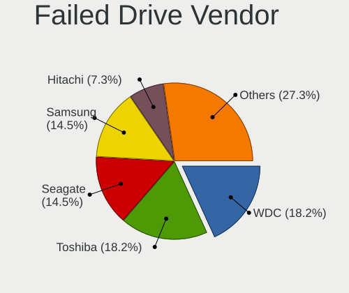

| Vendor              | Computers | Drives | Percent |
|---------------------|-----------|--------|---------|
| WDC                 | 10        | 10     | 18.18%  |
| Toshiba             | 10        | 10     | 18.18%  |
| Seagate             | 8         | 8      | 14.55%  |
| Samsung Electronics | 8         | 12     | 14.55%  |
| Hitachi             | 4         | 4      | 7.27%   |
| HGST                | 3         | 3      | 5.45%   |
| SK hynix            | 2         | 2      | 3.64%   |
| Intel               | 2         | 2      | 3.64%   |
| WD MediaMax         | 1         | 1      | 1.82%   |
| Transcend           | 1         | 1      | 1.82%   |
| SanDisk             | 1         | 1      | 1.82%   |
| Mushkin             | 1         | 1      | 1.82%   |
| Micron Technology   | 1         | 1      | 1.82%   |
| Maxtor              | 1         | 1      | 1.82%   |
| JMicron Technology  | 1         | 1      | 1.82%   |
| JM icron            | 1         | 1      | 1.82%   |

Drive Status
------------

Number of failed and malfunc. drives

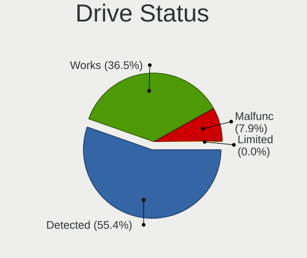

| Status   | Computers | Drives | Percent |
|----------|-----------|--------|---------|
| Detected | 18197     | 39694  | 55.37%  |
| Works    | 12008     | 20391  | 36.54%  |
| Malfunc  | 2605      | 3269   | 7.93%   |
| Failed   | 54        | 59     | 0.16%   |
| Limited  | 2         | 3      | 0.01%   |

Storage controller
------------------

Storage Vendor
--------------

Storage controller vendors

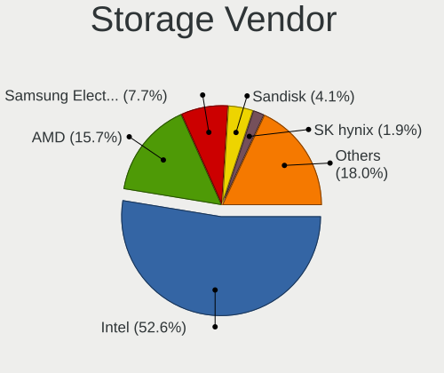

| Vendor                           | Computers | Percent |
|----------------------------------|-----------|---------|
| Intel                            | 19963     | 52.58%  |
| AMD                              | 5972      | 15.73%  |
| Samsung Electronics              | 2914      | 7.68%   |
| Sandisk                          | 1553      | 4.09%   |
| SK hynix                         | 714       | 1.88%   |
| Kingston Technology Company      | 707       | 1.86%   |
| ASMedia Technology               | 589       | 1.55%   |
| Nvidia                           | 569       | 1.5%    |
| Micron Technology                | 553       | 1.46%   |
| Micron/Crucial Technology        | 541       | 1.43%   |
| Phison Electronics               | 518       | 1.36%   |
| Marvell Technology Group         | 414       | 1.09%   |
| JMicron Technology               | 384       | 1.01%   |
| KIOXIA                           | 310       | 0.82%   |
| Toshiba America Info Systems     | 298       | 0.78%   |
| Silicon Motion                   | 273       | 0.72%   |
| MAXIO Technology (Hangzhou)      | 233       | 0.61%   |
| ADATA Technology                 | 228       | 0.6%    |
| Realtek Semiconductor            | 142       | 0.37%   |
| VIA Technologies                 | 132       | 0.35%   |
| Shenzhen Longsys Electronics     | 105       | 0.28%   |
| Silicon Integrated Systems [SiS] | 92        | 0.24%   |
| Union Memory (Shenzhen)          | 90        | 0.24%   |
| Apple                            | 82        | 0.22%   |
| Solid State Storage Technology   | 71        | 0.19%   |
| LSI Logic / Symbios Logic        | 52        | 0.14%   |
| Silicon Image                    | 49        | 0.13%   |
| Seagate Technology               | 45        | 0.12%   |
| Solidigm                         | 36        | 0.09%   |
| Broadcom / LSI                   | 36        | 0.09%   |
| Lite-On Technology               | 35        | 0.09%   |
| Adaptec                          | 30        | 0.08%   |
| Yangtze Memory Technologies      | 25        | 0.07%   |
| INNOGRIT                         | 24        | 0.06%   |
| Lenovo                           | 23        | 0.06%   |
| Transcend                        | 20        | 0.05%   |
| Hosin Global Electronics         | 18        | 0.05%   |
| Biwin Storage Technology         | 17        | 0.04%   |
| Netac Technology                 | 16        | 0.04%   |
| Hewlett-Packard                  | 13        | 0.03%   |

Storage Model
-------------

Storage controller models

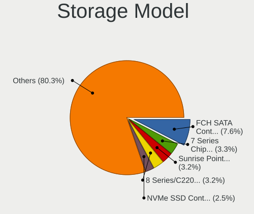

| Model                                                                                   | Computers | Percent |
|-----------------------------------------------------------------------------------------|-----------|---------|
| AMD FCH SATA Controller [AHCI mode]                                                     | 3329      | 7.58%   |
| Intel 7 Series Chipset Family 6-port SATA Controller [AHCI mode]                        | 1435      | 3.27%   |
| Intel Sunrise Point-LP SATA Controller [AHCI mode]                                      | 1406      | 3.2%    |
| Intel 8 Series/C220 Series Chipset Family 6-port SATA Controller 1 [AHCI mode]          | 1384      | 3.15%   |
| Samsung NVMe SSD Controller SM981/PM981/PM983                                           | 1104      | 2.51%   |
| Intel 6 Series/C200 Series Chipset Family 6 port Mobile SATA AHCI Controller            | 977       | 2.22%   |
| Intel 82801 Mobile SATA Controller [RAID mode]                                          | 915       | 2.08%   |
| AMD SB7x0/SB8x0/SB9x0 SATA Controller [AHCI mode]                                       | 774       | 1.76%   |
| Intel 6 Series/C200 Series Chipset Family 6 port Desktop SATA AHCI Controller           | 738       | 1.68%   |
| Intel 8 Series SATA Controller 1 [AHCI mode]                                            | 726       | 1.65%   |
| Intel Q170/Q150/B150/H170/H110/Z170/CM236 Chipset SATA Controller [AHCI Mode]           | 707       | 1.61%   |
| AMD SB7x0/SB8x0/SB9x0 IDE Controller                                                    | 707       | 1.61%   |
| AMD 400 Series Chipset SATA Controller                                                  | 699       | 1.59%   |
| Intel Volume Management Device NVMe RAID Controller                                     | 655       | 1.49%   |
| Intel 82801IBM/IEM (ICH9M/ICH9M-E) 4 port SATA Controller [AHCI mode]                   | 649       | 1.48%   |
| AMD 500 Series Chipset SATA Controller                                                  | 608       | 1.38%   |
| Samsung NVMe SSD Controller 980 (DRAM-less)                                             | 559       | 1.27%   |
| Intel 5 Series/3400 Series Chipset 4 port SATA AHCI Controller                          | 528       | 1.2%    |
| Intel 7 Series/C210 Series Chipset Family 6-port SATA Controller [AHCI mode]            | 525       | 1.2%    |
| Intel NM10/ICH7 Family SATA Controller [IDE mode]                                       | 508       | 1.16%   |
| ASMedia ASM1061/ASM1062 Serial ATA Controller                                           | 507       | 1.15%   |
| Intel Wildcat Point-LP SATA Controller [AHCI Mode]                                      | 503       | 1.15%   |
| Intel SATA Controller [RAID mode]                                                       | 490       | 1.12%   |
| Intel 200 Series PCH SATA controller [AHCI mode]                                        | 490       | 1.12%   |
| Intel 82801G (ICH7 Family) IDE Controller                                               | 476       | 1.08%   |
| Intel Celeron/Pentium Silver Processor SATA Controller                                  | 454       | 1.03%   |
| AMD SB7x0/SB8x0/SB9x0 SATA Controller [IDE mode]                                        | 450       | 1.02%   |
| Samsung NVMe SSD Controller PM9A1/PM9A3/980PRO                                          | 423       | 0.96%   |
| Intel 5 Series/3400 Series Chipset 6 port SATA AHCI Controller                          | 405       | 0.92%   |
| Intel Cannon Lake PCH SATA AHCI Controller                                              | 390       | 0.89%   |
| AMD 600 Series Chipset SATA Controller                                                  | 375       | 0.85%   |
| Intel 82801HM/HEM (ICH8M/ICH8M-E) IDE Controller                                        | 372       | 0.85%   |
| Intel 82801HM/HEM (ICH8M/ICH8M-E) SATA Controller [AHCI mode]                           | 317       | 0.72%   |
| Intel 6 Series/C200 Series Chipset Family Desktop SATA Controller (IDE mode, ports 0-3) | 309       | 0.7%    |
| Intel 6 Series/C200 Series Chipset Family Desktop SATA Controller (IDE mode, ports 4-5) | 307       | 0.7%    |
| Intel Atom Processor E3800 Series SATA AHCI Controller                                  | 304       | 0.69%   |
| SanDisk Ultra 3D / WD PC SN530, IX SN530, Blue SN550 NVMe SSD (DRAM-less)               | 294       | 0.67%   |
| Micron/Crucial P2 [Nick P2] / P3 / P3 Plus NVMe PCIe SSD (DRAM-less)                    | 294       | 0.67%   |
| Intel Comet Lake SATA AHCI Controller                                                   | 291       | 0.66%   |
| Samsung NVMe SSD Controller SM961/PM961/SM963                                           | 283       | 0.64%   |

Storage Kind
------------

Kind of storage controller (IDE, SATA, NVMe, SAS, ...)

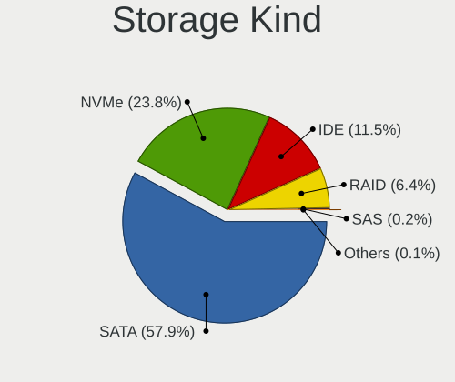

| Kind | Computers | Percent |
|------|-----------|---------|
| SATA | 22226     | 57.91%  |
| NVMe | 9151      | 23.84%  |
| IDE  | 4423      | 11.52%  |
| RAID | 2453      | 6.39%   |
| SAS  | 78        | 0.2%    |
| SCSI | 49        | 0.13%   |

Processor
---------

CPU Vendor
----------

Processor vendors

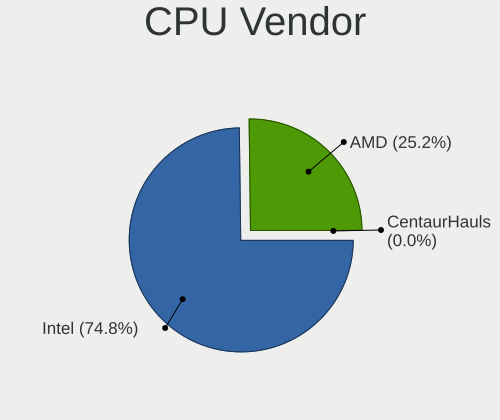

| Vendor       | Computers | Percent |
|--------------|-----------|---------|
| Intel        | 22540     | 74.8%   |
| AMD          | 7588      | 25.18%  |
| CentaurHauls | 5         | 0.02%   |

CPU Model
---------

Processor models

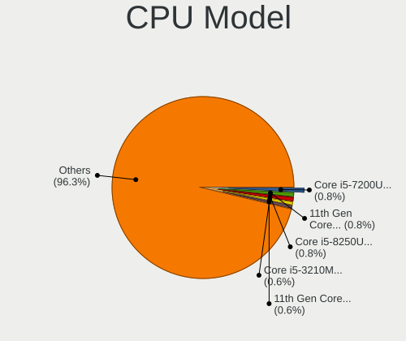

| Model                                         | Computers | Percent |
|-----------------------------------------------|-----------|---------|
| Intel Core i5-7200U CPU @ 2.50GHz             | 255       | 0.84%   |
| Intel 11th Gen Core i5-1135G7 @ 2.40GHz       | 250       | 0.83%   |
| Intel Core i5-8250U CPU @ 1.60GHz             | 242       | 0.8%    |
| Intel Core i5-3210M CPU @ 2.50GHz             | 196       | 0.65%   |
| Intel 11th Gen Core i7-1165G7 @ 2.80GHz       | 185       | 0.61%   |
| Intel Core i5-2520M CPU @ 2.50GHz             | 182       | 0.6%    |
| Intel Core i5-6200U CPU @ 2.30GHz             | 181       | 0.6%    |
| AMD Ryzen 5 3600 6-Core Processor             | 181       | 0.6%    |
| Intel Core i7-8550U CPU @ 1.80GHz             | 175       | 0.58%   |
| Intel Core i5-3470 CPU @ 3.20GHz              | 167       | 0.55%   |
| Intel Atom x5-Z8350 CPU @ 1.44GHz             | 160       | 0.53%   |
| Intel Core i5-8265U CPU @ 1.60GHz             | 156       | 0.52%   |
| Intel Celeron N4020 CPU @ 1.10GHz             | 153       | 0.51%   |
| AMD Ryzen 5 3500U with Radeon Vega Mobile Gfx | 151       | 0.5%    |
| Intel Core i7-3770 CPU @ 3.40GHz              | 150       | 0.5%    |
| Intel Core i5-6300U CPU @ 2.40GHz             | 148       | 0.49%   |
| Intel Core i5-2400 CPU @ 3.10GHz              | 145       | 0.48%   |
| AMD Ryzen 5 5500U with Radeon Graphics        | 145       | 0.48%   |
| AMD Ryzen 7 3700X 8-Core Processor            | 141       | 0.47%   |
| Intel Core i5-4210U CPU @ 1.70GHz             | 138       | 0.46%   |
| Intel Core i7-8565U CPU @ 1.80GHz             | 135       | 0.45%   |
| Intel Core i7-2600 CPU @ 3.40GHz              | 132       | 0.44%   |
| Intel Core i5-5200U CPU @ 2.20GHz             | 131       | 0.43%   |
| Intel Core i5-3320M CPU @ 2.60GHz             | 128       | 0.42%   |
| AMD FX-8350 Eight-Core Processor              | 128       | 0.42%   |
| Intel Core i7-7500U CPU @ 2.70GHz             | 127       | 0.42%   |
| Intel Core i5-10210U CPU @ 1.60GHz            | 124       | 0.41%   |
| Intel Core i7-7700HQ CPU @ 2.80GHz            | 123       | 0.41%   |
| Intel Celeron CPU N3350 @ 1.10GHz             | 123       | 0.41%   |
| Intel Celeron CPU N3060 @ 1.60GHz             | 121       | 0.4%    |
| Intel Core i5-3230M CPU @ 2.60GHz             | 119       | 0.39%   |
| Intel Core i5-4200U CPU @ 1.60GHz             | 116       | 0.38%   |
| Intel Core i7-4790 CPU @ 3.60GHz              | 115       | 0.38%   |
| Intel Core i5-6500 CPU @ 3.20GHz              | 115       | 0.38%   |
| AMD Ryzen 5 5600G with Radeon Graphics        | 115       | 0.38%   |
| AMD Ryzen 7 5700U with Radeon Graphics        | 112       | 0.37%   |
| Intel Core i3-6006U CPU @ 2.00GHz             | 111       | 0.37%   |
| AMD Ryzen 5 5600X 6-Core Processor            | 111       | 0.37%   |
| Intel Core i7-8750H CPU @ 2.20GHz             | 108       | 0.36%   |
| Intel Core i5-2450M CPU @ 2.50GHz             | 108       | 0.36%   |

CPU Model Family
----------------

Processor model prefix

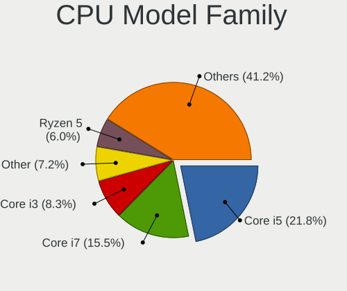

| Model                   | Computers | Percent |
|-------------------------|-----------|---------|
| Intel Core i5           | 6588      | 21.82%  |
| Intel Core i7           | 4695      | 15.55%  |
| Intel Core i3           | 2493      | 8.26%   |
| Other                   | 2162      | 7.16%   |
| AMD Ryzen 5             | 1824      | 6.04%   |
| Intel Celeron           | 1597      | 5.29%   |
| AMD Ryzen 7             | 1483      | 4.91%   |
| Intel Core 2 Duo        | 1351      | 4.47%   |
| Intel Pentium           | 833       | 2.76%   |
| Intel Xeon              | 565       | 1.87%   |
| Intel Atom              | 531       | 1.76%   |
| AMD FX                  | 521       | 1.73%   |
| AMD Ryzen 9             | 470       | 1.56%   |
| Intel Pentium Dual-Core | 394       | 1.3%    |
| AMD Ryzen 3             | 360       | 1.19%   |
| Intel Core 2 Quad       | 288       | 0.95%   |
| AMD A6                  | 274       | 0.91%   |
| AMD A8                  | 272       | 0.9%    |
| AMD A4                  | 224       | 0.74%   |
| AMD A10                 | 219       | 0.73%   |
| Intel Pentium Dual      | 187       | 0.62%   |
| Intel Core i9           | 177       | 0.59%   |
| Intel Core 2            | 172       | 0.57%   |
| AMD Phenom II X4        | 162       | 0.54%   |
| Intel Core              | 141       | 0.47%   |
| AMD Athlon II X2        | 139       | 0.46%   |
| Intel Pentium Silver    | 134       | 0.44%   |
| AMD Athlon 64 X2        | 134       | 0.44%   |
| AMD E                   | 123       | 0.41%   |
| AMD Athlon              | 96        | 0.32%   |
| AMD Ryzen 5 PRO         | 94        | 0.31%   |
| AMD E1                  | 94        | 0.31%   |
| AMD E2                  | 93        | 0.31%   |
| Intel Genuine           | 90        | 0.3%    |
| AMD Ryzen 7 PRO         | 82        | 0.27%   |
| AMD Athlon II X4        | 76        | 0.25%   |
| AMD Phenom II X6        | 69        | 0.23%   |
| Intel Pentium 4         | 68        | 0.23%   |
| AMD Turion 64 X2 Mobile | 62        | 0.21%   |
| Intel Pentium D         | 49        | 0.16%   |

CPU Cores
---------

Number of processor cores

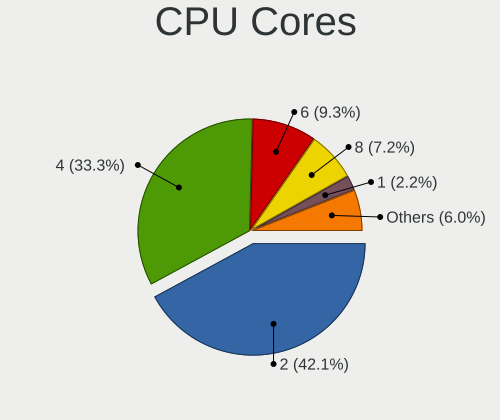

| Number  | Computers | Percent |
|---------|-----------|---------|
| 2       | 12715     | 42.1%   |
| 4       | 10056     | 33.29%  |
| 6       | 2809      | 9.3%    |
| 8       | 2163      | 7.16%   |
| 1       | 653       | 2.16%   |
| 12      | 523       | 1.73%   |
| 10      | 407       | 1.35%   |
| 16      | 272       | 0.9%    |
| 3       | 214       | 0.71%   |
| 14      | 213       | 0.71%   |
| 24      | 84        | 0.28%   |
| 20      | 47        | 0.16%   |
| 18      | 11        | 0.04%   |
| Unknown | 9         | 0.03%   |
| 5       | 7         | 0.02%   |
| 32      | 6         | 0.02%   |
| 36      | 5         | 0.02%   |
| 28      | 4         | 0.01%   |
| 64      | 2         | 0.01%   |
| 40      | 2         | 0.01%   |
| 22      | 2         | 0.01%   |
| 11      | 1         | 0.003%  |

CPU Sockets
-----------

Number of sockets

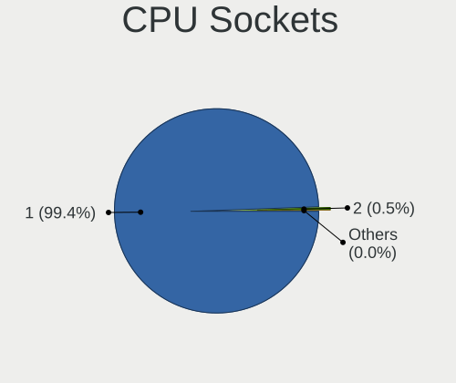

| Number | Computers | Percent |
|--------|-----------|---------|
| 1      | 29965     | 99.44%  |
| 2      | 149       | 0.49%   |
| 20     | 10        | 0.03%   |
| 24     | 3         | 0.01%   |
| 8      | 3         | 0.01%   |
| 14     | 2         | 0.01%   |
| 4      | 2         | 0.01%   |
| 11     | 1         | 0.003%  |

CPU Threads
-----------

Threads per core (Hyper-Threading)

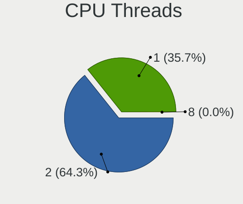

| Number  | Computers | Percent |
|---------|-----------|---------|
| 2       | 19395     | 64.28%  |
| 1       | 10768     | 35.69%  |
| Unknown | 9         | 0.03%   |
| 4       | 2         | 0.01%   |
| 8       | 1         | 0.003%  |

CPU Op-Modes
------------

CPU Operation Modes (32-bit, 64-bit)

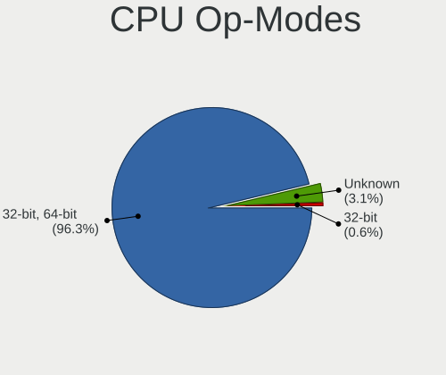

| Op mode        | Computers | Percent |
|----------------|-----------|---------|
| 32-bit, 64-bit | 29139     | 96.27%  |
| Unknown        | 940       | 3.11%   |
| 32-bit         | 188       | 0.62%   |

CPU Microcode
-------------

Microcode number

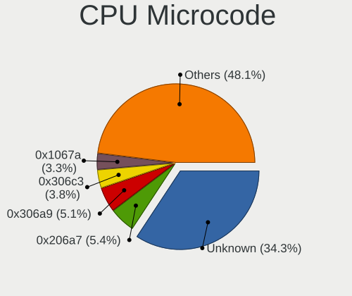

| Number     | Computers | Percent |
|------------|-----------|---------|
| Unknown    | 10643     | 34.29%  |
| 0x206a7    | 1675      | 5.4%    |
| 0x306a9    | 1587      | 5.11%   |
| 0x306c3    | 1176      | 3.79%   |
| 0x1067a    | 1038      | 3.34%   |
| 0x40651    | 612       | 1.97%   |
| 0x20655    | 518       | 1.67%   |
| 0x906ea    | 484       | 1.56%   |
| 0x506e3    | 480       | 1.55%   |
| 0x406e3    | 466       | 1.5%    |
| 0x806ea    | 442       | 1.42%   |
| 0x806e9    | 430       | 1.39%   |
| 0x306d4    | 426       | 1.37%   |
| 0x806c1    | 407       | 1.31%   |
| 0x6fd      | 383       | 1.23%   |
| 0x906e9    | 376       | 1.21%   |
| 0x806ec    | 364       | 1.17%   |
| 0x06000852 | 304       | 0.98%   |
| 0x406c4    | 290       | 0.93%   |
| 0x010000c8 | 289       | 0.93%   |
| 0x08108109 | 275       | 0.89%   |
| 0x30678    | 265       | 0.85%   |
| 0x10676    | 263       | 0.85%   |
| 0x08701021 | 250       | 0.81%   |
| 0x20652    | 246       | 0.79%   |
| 0x706a8    | 219       | 0.71%   |
| 0x0800820d | 205       | 0.66%   |
| 0x06001119 | 203       | 0.65%   |
| 0x0a50000c | 190       | 0.61%   |
| 0x6fb      | 179       | 0.58%   |
| 0x706e5    | 171       | 0.55%   |
| 0x506c9    | 170       | 0.55%   |
| 0x08600106 | 170       | 0.55%   |
| 0x06006705 | 156       | 0.5%    |
| 0x706a1    | 155       | 0.5%    |
| 0x406c3    | 151       | 0.49%   |
| 0x0a50000d | 147       | 0.47%   |
| 0x05000119 | 147       | 0.47%   |
| 0x08608103 | 138       | 0.44%   |
| 0x106e5    | 136       | 0.44%   |

CPU Microarch
-------------

Microarchitecture

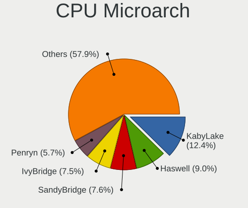

| Name              | Computers | Percent |
|-------------------|-----------|---------|
| KabyLake          | 3735      | 12.36%  |
| Haswell           | 2723      | 9.01%   |
| SandyBridge       | 2293      | 7.59%   |
| IvyBridge         | 2268      | 7.51%   |
| Penryn            | 1712      | 5.67%   |
| Skylake           | 1514      | 5.01%   |
| Unknown           | 1481      | 4.9%    |
| Zen 3             | 1123      | 3.72%   |
| Westmere          | 1053      | 3.49%   |
| Silvermont        | 948       | 3.14%   |
| Core              | 943       | 3.12%   |
| Zen 2             | 933       | 3.09%   |
| Alderlake Hybrid  | 895       | 2.96%   |
| Zen+              | 835       | 2.76%   |
| K10               | 698       | 2.31%   |
| TigerLake         | 695       | 2.3%    |
| Piledriver        | 693       | 2.29%   |
| Broadwell         | 689       | 2.28%   |
| Goldmont plus     | 508       | 1.68%   |
| CometLake         | 493       | 1.63%   |
| Zen               | 444       | 1.47%   |
| Excavator         | 443       | 1.47%   |
| Icelake           | 423       | 1.4%    |
| Nehalem           | 300       | 0.99%   |
| K8 Hammer         | 290       | 0.96%   |
| Goldmont          | 255       | 0.84%   |
| Bobcat            | 233       | 0.77%   |
| Bonnell           | 229       | 0.76%   |
| Puma              | 210       | 0.7%    |
| Jaguar            | 146       | 0.48%   |
| Steamroller       | 142       | 0.47%   |
| K10 Llano         | 142       | 0.47%   |
| NetBurst          | 134       | 0.44%   |
| Gracemont         | 113       | 0.37%   |
| Tremont           | 111       | 0.37%   |
| P6                | 111       | 0.37%   |
| Bulldozer         | 109       | 0.36%   |
| Meteorlake Hybrid | 71        | 0.24%   |
| K8 & K10 hybrid   | 37        | 0.12%   |
| Lunarlake Hybrid  | 21        | 0.07%   |

Graphics
--------

GPU Vendor
----------

Vendors of graphics cards

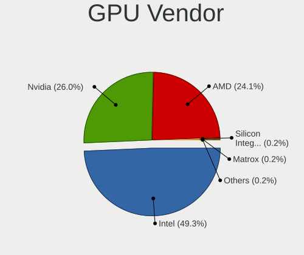

| Vendor                                       | Computers | Percent |
|----------------------------------------------|-----------|---------|
| Intel                                        | 17291     | 49.31%  |
| Nvidia                                       | 9133      | 26.04%  |
| AMD                                          | 8446      | 24.08%  |
| Silicon Integrated Systems [SiS]             | 71        | 0.2%    |
| Matrox Electronics Systems                   | 56        | 0.16%   |
| VIA Technologies                             | 38        | 0.11%   |
| ASPEED Technology                            | 17        | 0.05%   |
| ATI Technologies                             | 10        | 0.03%   |
| S3 Graphics                                  | 4         | 0.01%   |
| XGI Technology (eXtreme Graphics Innovation) | 2         | 0.01%   |

GPU Model
---------

Graphics card models

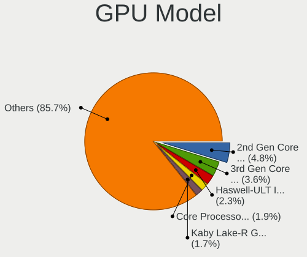

| Model                                                                                    | Computers | Percent |
|------------------------------------------------------------------------------------------|-----------|---------|
| Intel 2nd Generation Core Processor Family Integrated Graphics Controller                | 1733      | 4.78%   |
| Intel 3rd Gen Core processor Graphics Controller                                         | 1305      | 3.6%    |
| Intel Haswell-ULT Integrated Graphics Controller                                         | 837       | 2.31%   |
| Intel Core Processor Integrated Graphics Controller                                      | 682       | 1.88%   |
| Intel Kaby Lake-R GT2 [UHD Graphics 620]                                                 | 627       | 1.73%   |
| Intel Skylake-U GT2 [HD Graphics 520]                                                    | 617       | 1.7%    |
| Intel Xeon E3-1200 v3/4th Gen Core Processor Integrated Graphics Controller              | 598       | 1.65%   |
| Intel Kaby Lake-U GT2 [HD Graphics 620]                                                  | 578       | 1.59%   |
| Intel TigerLake-LP GT2 [Iris Xe Graphics]                                                | 561       | 1.55%   |
| Intel Atom/Celeron/Pentium Processor x5-E8000/J3xxx/N3xxx Integrated Graphics Controller | 555       | 1.53%   |
| AMD Picasso/Raven 2 [Radeon Vega Series / Radeon Vega Mobile Series]                     | 541       | 1.49%   |
| Intel Mobile 4 Series Chipset Integrated Graphics Controller                             | 520       | 1.43%   |
| Intel Broadwell-U GT2 [HD Graphics 5500]                                                 | 481       | 1.33%   |
| Intel 4th Gen Core Processor Integrated Graphics Controller                              | 455       | 1.26%   |
| Intel GeminiLake [UHD Graphics 600]                                                      | 419       | 1.16%   |
| AMD Ellesmere [Radeon RX 470/480/570/570X/580/580X/590]                                  | 419       | 1.16%   |
| AMD Cezanne [Radeon Vega Series / Radeon Vega Mobile Series]                             | 399       | 1.1%    |
| Intel WhiskeyLake-U GT2 [UHD Graphics 620]                                               | 395       | 1.09%   |
| Intel Atom Processor Z36xxx/Z37xxx Series Graphics & Display                             | 392       | 1.08%   |
| AMD Renoir [Radeon Vega Series / Radeon Vega Mobile Series]                              | 371       | 1.02%   |
| Intel Xeon E3-1200 v2/3rd Gen Core processor Graphics Controller                         | 350       | 0.97%   |
| Intel Skylake-S GT2 [HD Graphics 530]                                                    | 328       | 0.9%    |
| Intel CoffeeLake-H GT2 [UHD Graphics 630]                                                | 327       | 0.9%    |
| Intel CometLake-U GT2 [UHD Graphics]                                                     | 295       | 0.81%   |
| Nvidia GK208B [GeForce GT 710]                                                           | 291       | 0.8%    |
| AMD Lucienne                                                                             | 291       | 0.8%    |
| Intel CoffeeLake-S GT2 [UHD Graphics 630]                                                | 274       | 0.76%   |
| AMD Stoney [Radeon R2/R3/R4/R5 Graphics]                                                 | 272       | 0.75%   |
| Nvidia GP107 [GeForce GTX 1050 Ti]                                                       | 253       | 0.7%    |
| Intel 4 Series Chipset Integrated Graphics Controller                                    | 241       | 0.66%   |
| Intel Mobile GM965/GL960 Integrated Graphics Controller (secondary)                      | 232       | 0.64%   |
| Intel Mobile GM965/GL960 Integrated Graphics Controller (primary)                        | 232       | 0.64%   |
| AMD Raphael                                                                              | 218       | 0.6%    |
| AMD Raven Ridge [Radeon Vega Series / Radeon Vega Mobile Series]                         | 207       | 0.57%   |
| Intel Apollo Lake GT1 [HD Graphics 500]                                                  | 205       | 0.57%   |
| Nvidia GF117M [GeForce 610M/710M/810M/820M / GT 620M/625M/630M/720M]                     | 200       | 0.55%   |
| AMD Barcelo                                                                              | 193       | 0.53%   |
| Nvidia GP108 [GeForce GT 1030]                                                           | 187       | 0.52%   |
| Intel Kaby Lake-S GT2 [HD Graphics 630]                                                  | 185       | 0.51%   |
| Nvidia TU117M [GeForce GTX 1650 Mobile / Max-Q]                                          | 181       | 0.5%    |

GPU Combo
---------

Combinations of graphics cards

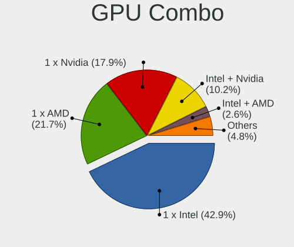

| Name                   | Computers | Percent |
|------------------------|-----------|---------|
| 1 x Intel              | 13010     | 42.9%   |
| 1 x AMD                | 6576      | 21.68%  |
| 1 x Nvidia             | 5424      | 17.89%  |
| Intel + Nvidia         | 3088      | 10.18%  |
| Intel + AMD            | 785       | 2.59%   |
| 2 x AMD                | 563       | 1.86%   |
| AMD + Nvidia           | 522       | 1.72%   |
| 2 x Nvidia             | 73        | 0.24%   |
| 1 x SiS                | 71        | 0.23%   |
| 2 x Intel              | 61        | 0.2%    |
| 1 x Matrox             | 40        | 0.13%   |
| 1 x VIA                | 38        | 0.13%   |
| Other                  | 21        | 0.07%   |
| Nvidia + Matrox        | 10        | 0.03%   |
| Nvidia + ASPEED        | 9         | 0.03%   |
| 1 x ASPEED             | 8         | 0.03%   |
| AMD + Matrox           | 7         | 0.02%   |
| 3 x AMD                | 5         | 0.02%   |
| 1 x S3 Graphics        | 3         | 0.01%   |
| 2 x Intel + 1 x Nvidia | 2         | 0.01%   |
| Nvidia + XGI           | 2         | 0.01%   |
| Intel + 2 x Nvidia     | 2         | 0.01%   |
| AMD + 2 x Nvidia       | 2         | 0.01%   |
| 2 x Intel + 1 x AMD    | 1         | 0.003%  |
| 2 x AMD + 1 x Nvidia   | 1         | 0.003%  |
| Intel + S3 Graphics    | 1         | 0.003%  |
| 1 x AMD + 4 x Nvidia   | 1         | 0.003%  |

GPU Driver
----------

Free vs proprietary

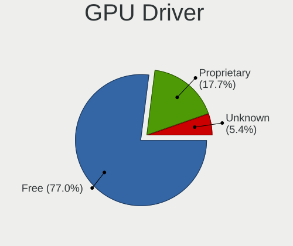

| Driver      | Computers | Percent |
|-------------|-----------|---------|
| Free        | 23528     | 76.99%  |
| Proprietary | 5396      | 17.66%  |
| Unknown     | 1636      | 5.35%   |

GPU Memory
----------

Total video memory

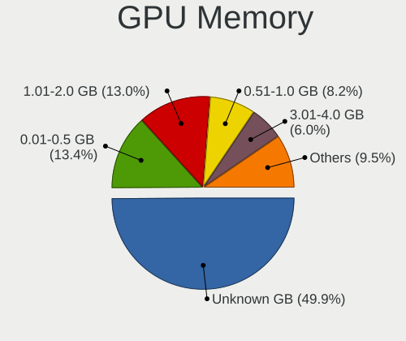

| Size in GB     | Computers | Percent |
|----------------|-----------|---------|
| Unknown        | 15403     | 49.91%  |
| 0.01-0.5       | 4124      | 13.36%  |
| 1.01-2.0       | 4008      | 12.99%  |
| 0.51-1.0       | 2524      | 8.18%   |
| 3.01-4.0       | 1861      | 6.03%   |
| 7.01-8.0       | 1286      | 4.17%   |
| 5.01-6.0       | 667       | 2.16%   |
| 8.01-16.0      | 663       | 2.15%   |
| 2.01-3.0       | 207       | 0.67%   |
| 16.01-24.0     | 103       | 0.33%   |
| 4.01-5.0       | 8         | 0.03%   |
| 24.01-32.0     | 6         | 0.02%   |
| More than 64.0 | 2         | 0.01%   |
| 32.01-64.0     | 1         | 0.003%  |

Monitor
-------

Monitor Vendor
--------------

Monitor vendors

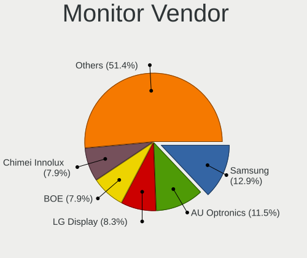

| Vendor                  | Computers | Percent |
|-------------------------|-----------|---------|
| Samsung Electronics     | 4149      | 12.94%  |
| AU Optronics            | 3677      | 11.46%  |
| LG Display              | 2664      | 8.31%   |
| BOE                     | 2546      | 7.94%   |
| Chimei Innolux          | 2544      | 7.93%   |
| Goldstar                | 1713      | 5.34%   |
| Dell                    | 1611      | 5.02%   |
| Hewlett-Packard         | 1137      | 3.54%   |
| Acer                    | 1134      | 3.54%   |
| Apple                   | 802       | 2.5%    |
| AOC                     | 772       | 2.41%   |
| Philips                 | 705       | 2.2%    |
| BenQ                    | 668       | 2.08%   |
| Ancor Communications    | 646       | 2.01%   |
| Lenovo                  | 600       | 1.87%   |
| Chi Mei Optoelectronics | 482       | 1.5%    |
| Iiyama                  | 336       | 1.05%   |
| ASUSTek Computer        | 317       | 0.99%   |
| ViewSonic               | 298       | 0.93%   |
| Unknown                 | 293       | 0.91%   |
| Sharp                   | 291       | 0.91%   |
| Sony                    | 242       | 0.75%   |
| PANDA                   | 227       | 0.71%   |
| LG Electronics          | 219       | 0.68%   |
| InfoVision              | 218       | 0.68%   |
| LG Philips              | 182       | 0.57%   |
| MSI                     | 155       | 0.48%   |
| Eizo                    | 144       | 0.45%   |
| HannStar                | 135       | 0.42%   |
| Fujitsu Siemens         | 129       | 0.4%    |
| Panasonic               | 120       | 0.37%   |
| Toshiba                 | 106       | 0.33%   |
| NEC Computers           | 100       | 0.31%   |
| Vizio                   | 96        | 0.3%    |
| Sceptre Tech            | 92        | 0.29%   |
| CPT                     | 80        | 0.25%   |
| Medion                  | 74        | 0.23%   |
| Unknown                 | 73        | 0.23%   |
| Vestel Elektronik       | 67        | 0.21%   |
| HKC                     | 66        | 0.21%   |

Monitor Model
-------------

Monitor models

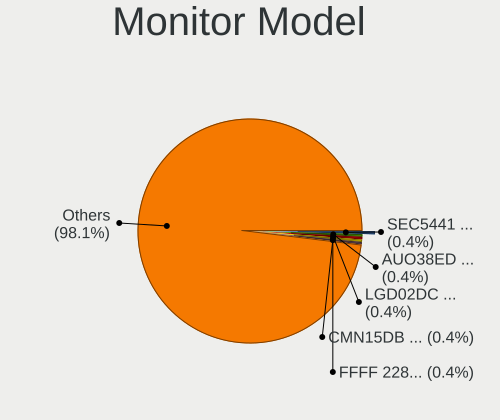

| Model                                                                     | Computers | Percent |
|---------------------------------------------------------------------------|-----------|---------|
| Samsung Electronics LCD Monitor SEC5441 1280x800 331x207mm 15.4-inch      | 148       | 0.45%   |
| AU Optronics LCD Monitor AUO38ED 1920x1080 344x193mm 15.5-inch            | 128       | 0.39%   |
| LG Display LCD Monitor LGD02DC 1366x768 344x194mm 15.5-inch               | 126       | 0.38%   |
| Chimei Innolux LCD Monitor CMN15DB 1366x768 344x193mm 15.5-inch           | 119       | 0.36%   |
| Unknown LCD Monitor FFFF 2288x1287 2550x2550mm 142.0-inch                 | 118       | 0.36%   |
| Chimei Innolux LCD Monitor CMN15F5 1920x1080 344x193mm 15.5-inch          | 113       | 0.34%   |
| Goldstar FULL HD GSM5B55 1920x1080 480x270mm 21.7-inch                    | 105       | 0.32%   |
| Chimei Innolux LCD Monitor CMN15E7 1920x1080 344x193mm 15.5-inch          | 105       | 0.32%   |
| AU Optronics LCD Monitor AUO21ED 1920x1080 344x193mm 15.5-inch            | 102       | 0.31%   |
| Chimei Innolux LCD Monitor CMN14D4 1920x1080 309x173mm 13.9-inch          | 96        | 0.29%   |
| AU Optronics LCD Monitor AUO22EC 1366x768 344x193mm 15.5-inch             | 85        | 0.26%   |
| AU Optronics LCD Monitor AUO71EC 1366x768 344x193mm 15.5-inch             | 84        | 0.25%   |
| AU Optronics LCD Monitor AUO26EC 1366x768 344x193mm 15.5-inch             | 81        | 0.24%   |
| AU Optronics LCD Monitor AUO23EC 1366x768 344x193mm 15.5-inch             | 77        | 0.23%   |
| Unknown                                                                   | 73        | 0.22%   |
| AU Optronics LCD Monitor AUO45EC 1366x768 344x193mm 15.5-inch             | 70        | 0.21%   |
| Samsung Electronics C27F390 SAM0D32 1920x1080 598x336mm 27.0-inch         | 68        | 0.21%   |
| Vestel Elektronik 40UHD_LCD_TV VES3700 3840x2160 880x500mm 39.8-inch      | 67        | 0.2%    |
| Goldstar LG ULTRAWIDE GSM59F1 2560x1080 670x280mm 28.6-inch               | 65        | 0.2%    |
| Chimei Innolux LCD Monitor CMN15E6 1366x768 344x193mm 15.5-inch           | 65        | 0.2%    |
| Chimei Innolux LCD Monitor CMN1521 1920x1080 344x193mm 15.5-inch          | 65        | 0.2%    |
| Samsung Electronics C24F390 SAM0D2C 1920x1080 521x293mm 23.5-inch         | 62        | 0.19%   |
| Chi Mei Optoelectronics LCD Monitor CMO15A7 1366x768 344x193mm 15.5-inch  | 60        | 0.18%   |
| AU Optronics LCD Monitor AUO2E3C 1366x768 309x173mm 13.9-inch             | 60        | 0.18%   |
| LG Display LCD Monitor LGD033A 1366x768 344x194mm 15.5-inch               | 59        | 0.18%   |
| BOE LCD Monitor BOE06A5 1366x768 344x194mm 15.5-inch                      | 57        | 0.17%   |
| BOE LCD Monitor BOE06A4 1366x768 344x194mm 15.5-inch                      | 54        | 0.16%   |
| AU Optronics LCD Monitor AUO403D 1920x1080 309x174mm 14.0-inch            | 54        | 0.16%   |
| Chimei Innolux LCD Monitor CMN15DC 1366x768 344x193mm 15.5-inch           | 53        | 0.16%   |
| Chimei Innolux LCD Monitor CMN15AB 1366x768 344x193mm 15.5-inch           | 53        | 0.16%   |
| AU Optronics LCD Monitor AUO10EC 1366x768 344x193mm 15.5-inch             | 52        | 0.16%   |
| LG Display LCD Monitor LGD046F 1920x1080 344x194mm 15.5-inch              | 51        | 0.15%   |
| BOE LCD Monitor BOE084E 1920x1080 382x215mm 17.3-inch                     | 50        | 0.15%   |
| BOE LCD Monitor BOE0687 1920x1080 344x193mm 15.5-inch                     | 50        | 0.15%   |
| AU Optronics LCD Monitor AUO61ED 1920x1080 344x194mm 15.5-inch            | 50        | 0.15%   |
| Chimei Innolux LCD Monitor CMN15CA 1366x768 344x193mm 15.5-inch           | 49        | 0.15%   |
| Chi Mei Optoelectronics LCD Monitor CMO1720 1920x1080 382x215mm 17.3-inch | 49        | 0.15%   |
| AOC 27G2G4 AOC2702 1920x1080 598x336mm 27.0-inch                          | 49        | 0.15%   |
| AU Optronics LCD Monitor AUO21EC 1366x768 344x193mm 15.5-inch             | 47        | 0.14%   |
| AU Optronics LCD Monitor AUO20EC 1366x768 344x193mm 15.5-inch             | 47        | 0.14%   |

Monitor Resolution
------------------

Monitor screen resolution

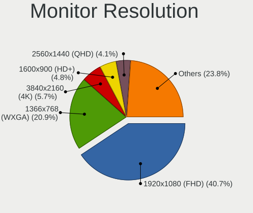

| Resolution         | Computers | Percent |
|--------------------|-----------|---------|
| 1920x1080 (FHD)    | 12617     | 40.69%  |
| 1366x768 (WXGA)    | 6467      | 20.86%  |
| 3840x2160 (4K)     | 1773      | 5.72%   |
| 1600x900 (HD+)     | 1482      | 4.78%   |
| 2560x1440 (QHD)    | 1274      | 4.11%   |
| 1920x1200 (WUXGA)  | 913       | 2.94%   |
| 1280x1024 (SXGA)   | 912       | 2.94%   |
| 1680x1050 (WSXGA+) | 844       | 2.72%   |
| 1440x900 (WXGA+)   | 842       | 2.72%   |
| 1280x800 (WXGA)    | 799       | 2.58%   |
| Unknown            | 354       | 1.14%   |
| 1360x768           | 285       | 0.92%   |
| 3440x1440          | 283       | 0.91%   |
| 2560x1600          | 247       | 0.8%    |
| 2560x1080          | 243       | 0.78%   |
| 2880x1800          | 175       | 0.56%   |
| 3840x1080          | 166       | 0.54%   |
| 1024x768 (XGA)     | 127       | 0.41%   |
| 2288x1287          | 126       | 0.41%   |
| 1024x600           | 102       | 0.33%   |
| 1920x540           | 92        | 0.3%    |
| 1600x1200          | 64        | 0.21%   |
| 2160x1440          | 60        | 0.19%   |
| 1280x720 (HD)      | 52        | 0.17%   |
| 2880x1920          | 46        | 0.15%   |
| 1920x1280          | 36        | 0.12%   |
| 3200x1800 (QHD+)   | 34        | 0.11%   |
| 3840x2400          | 31        | 0.1%    |
| 1680x945           | 28        | 0.09%   |
| 3200x2000          | 27        | 0.09%   |
| 3072x1920          | 25        | 0.08%   |
| 3000x2000          | 24        | 0.08%   |
| 3200x1080          | 23        | 0.07%   |
| 2256x1504          | 21        | 0.07%   |
| 3840x1200          | 20        | 0.06%   |
| 3600x1080          | 17        | 0.05%   |
| 2880x1620          | 17        | 0.05%   |
| 2304x1440          | 16        | 0.05%   |
| 3840x1600          | 15        | 0.05%   |
| 1280x960           | 14        | 0.05%   |

Monitor Diagonal
----------------

Diagonal size in inches

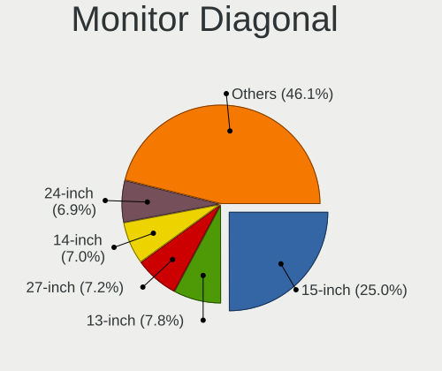

| Inches  | Computers | Percent |
|---------|-----------|---------|
| 15      | 8000      | 24.99%  |
| 13      | 2507      | 7.83%   |
| 27      | 2307      | 7.21%   |
| 14      | 2238      | 6.99%   |
| 24      | 2197      | 6.86%   |
| 17      | 1968      | 6.15%   |
| 23      | 1841      | 5.75%   |
| Unknown | 1728      | 5.4%    |
| 21      | 1634      | 5.1%    |
| 31      | 897       | 2.8%    |
| 19      | 896       | 2.8%    |
| 18      | 745       | 2.33%   |
| 22      | 542       | 1.69%   |
| 20      | 512       | 1.6%    |
| 12      | 469       | 1.46%   |
| 11      | 440       | 1.37%   |
| 34      | 416       | 1.3%    |
| 16      | 402       | 1.26%   |
| 84      | 261       | 0.82%   |
| 32      | 205       | 0.64%   |
| 40      | 173       | 0.54%   |
| 72      | 169       | 0.53%   |
| 54      | 163       | 0.51%   |
| 10      | 136       | 0.42%   |
| 142     | 118       | 0.37%   |
| 25      | 109       | 0.34%   |
| 26      | 95        | 0.3%    |
| 63      | 74        | 0.23%   |
| 48      | 58        | 0.18%   |
| 28      | 57        | 0.18%   |
| 65      | 52        | 0.16%   |
| 52      | 51        | 0.16%   |
| 46      | 51        | 0.16%   |
| 42      | 43        | 0.13%   |
| 29      | 42        | 0.13%   |
| 49      | 41        | 0.13%   |
| 74      | 37        | 0.12%   |
| 37      | 32        | 0.1%    |
| 39      | 31        | 0.1%    |
| 36      | 29        | 0.09%   |

Monitor Width
-------------

Physical width

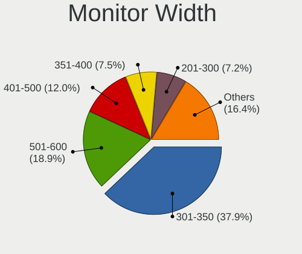

| Width in mm    | Computers | Percent |
|----------------|-----------|---------|
| 301-350        | 11962     | 37.93%  |
| 501-600        | 5976      | 18.95%  |
| 401-500        | 3780      | 11.99%  |
| 351-400        | 2376      | 7.53%   |
| 201-300        | 2265      | 7.18%   |
| Unknown        | 1728      | 5.48%   |
| 601-700        | 1209      | 3.83%   |
| 701-800        | 671       | 2.13%   |
| 1001-1500      | 596       | 1.89%   |
| 1501-2000      | 486       | 1.54%   |
| 801-900        | 272       | 0.86%   |
| More than 2000 | 119       | 0.38%   |
| 901-1000       | 81        | 0.26%   |
| 101-200        | 15        | 0.05%   |
| 1-100          | 3         | 0.01%   |

Aspect Ratio
------------

Proportional relationship between the width and the height

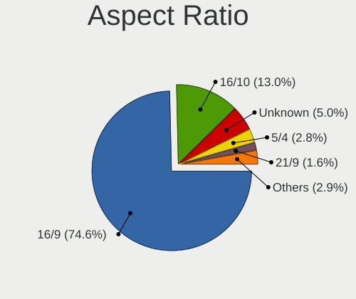

| Ratio   | Computers | Percent |
|---------|-----------|---------|
| 16/9    | 21877     | 74.64%  |
| 16/10   | 3812      | 13.01%  |
| Unknown | 1478      | 5.04%   |
| 5/4     | 832       | 2.84%   |
| 21/9    | 469       | 1.6%    |
| 3/2     | 298       | 1.02%   |
| 4/3     | 262       | 0.89%   |
| 1.00    | 119       | 0.41%   |
| 32/9    | 86        | 0.29%   |
| 6/5     | 33        | 0.11%   |
| 0.56    | 11        | 0.04%   |
| 1.96    | 9         | 0.03%   |
| 3.40    | 3         | 0.01%   |
| 0.89    | 3         | 0.01%   |
| 0.62    | 3         | 0.01%   |
| 3.20    | 2         | 0.01%   |
| 2.00    | 2         | 0.01%   |
| 0.67    | 2         | 0.01%   |
| 2.67    | 1         | 0.003%  |
| 2.50    | 1         | 0.003%  |
| 2.12    | 1         | 0.003%  |
| 11/10   | 1         | 0.003%  |
| 0.80    | 1         | 0.003%  |
| 0.75    | 1         | 0.003%  |
| 0.65    | 1         | 0.003%  |
| 0.57    | 1         | 0.003%  |

Monitor Area
------------

Area in inch²

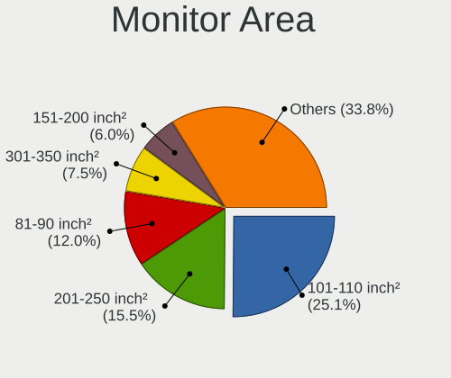

| Area in inch² | Computers | Percent |
|----------------|-----------|---------|
| 101-110        | 7976      | 25.14%  |
| 201-250        | 4915      | 15.49%  |
| 81-90          | 3819      | 12.04%  |
| 301-350        | 2372      | 7.48%   |
| 151-200        | 1917      | 6.04%   |
| Unknown        | 1728      | 5.45%   |
| 351-500        | 1623      | 5.11%   |
| 121-130        | 1341      | 4.23%   |
| More than 1000 | 1032      | 3.25%   |
| 141-150        | 985       | 3.1%    |
| 71-80          | 908       | 2.86%   |
| 251-300        | 858       | 2.7%    |
| 501-1000       | 516       | 1.63%   |
| 51-60          | 445       | 1.4%    |
| 61-70          | 435       | 1.37%   |
| 111-120        | 359       | 1.13%   |
| 131-140        | 272       | 0.86%   |
| 41-50          | 136       | 0.43%   |
| 91-100         | 79        | 0.25%   |
| 1-40           | 16        | 0.05%   |

Pixel Density
-------------

Pixels per inch

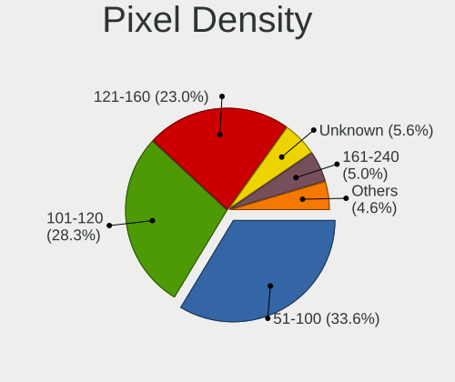

| Density       | Computers | Percent |
|---------------|-----------|---------|
| 51-100        | 10398     | 33.65%  |
| 101-120       | 8735      | 28.27%  |
| 121-160       | 7096      | 22.96%  |
| Unknown       | 1728      | 5.59%   |
| 161-240       | 1530      | 4.95%   |
| 1-50          | 962       | 3.11%   |
| More than 240 | 454       | 1.47%   |

Multiple Monitors
-----------------

Total monitors connected

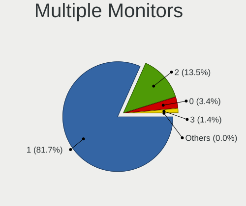

| Total | Computers | Percent |
|-------|-----------|---------|
| 1     | 25065     | 81.69%  |
| 2     | 4134      | 13.47%  |
| 0     | 1029      | 3.35%   |
| 3     | 424       | 1.38%   |
| 4     | 27        | 0.09%   |
| 5     | 3         | 0.01%   |
| 6     | 1         | 0.003%  |

Network
-------

Net Controller Vendor
---------------------

Controller vendors

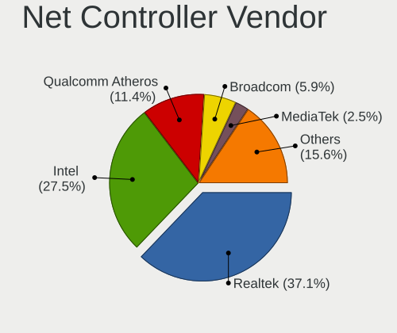

| Vendor                            | Computers | Percent |
|-----------------------------------|-----------|---------|
| Realtek Semiconductor             | 17244     | 37.14%  |
| Intel                             | 12768     | 27.5%   |
| Qualcomm Atheros                  | 5289      | 11.39%  |
| Broadcom                          | 2730      | 5.88%   |
| MediaTek                          | 1154      | 2.49%   |
| TP-Link                           | 673       | 1.45%   |
| Broadcom Limited                  | 636       | 1.37%   |
| Ralink Technology                 | 622       | 1.34%   |
| Marvell Technology Group          | 574       | 1.24%   |
| Ralink                            | 558       | 1.2%    |
| Nvidia                            | 450       | 0.97%   |
| Samsung Electronics               | 293       | 0.63%   |
| ASIX Electronics                  | 251       | 0.54%   |
| Xiaomi                            | 168       | 0.36%   |
| Qualcomm Atheros Communications   | 155       | 0.33%   |
| NetGear                           | 143       | 0.31%   |
| Sierra Wireless                   | 137       | 0.3%    |
| D-Link                            | 131       | 0.28%   |
| Dell                              | 128       | 0.28%   |
| ASUSTek Computer                  | 118       | 0.25%   |
| Ericsson Business Mobile Networks | 103       | 0.22%   |
| Huawei Technologies               | 100       | 0.22%   |
| DisplayLink                       | 100       | 0.22%   |
| JMicron Technology                | 97        | 0.21%   |
| Qualcomm                          | 95        | 0.2%    |
| D-Link System                     | 94        | 0.2%    |
| Microsoft                         | 91        | 0.2%    |
| Hewlett-Packard                   | 88        | 0.19%   |
| Shenzhen Goodix Technology        | 80        | 0.17%   |
| Motorola PCS                      | 78        | 0.17%   |
| Silicon Integrated Systems [SiS]  | 76        | 0.16%   |
| Edimax Technology                 | 69        | 0.15%   |
| Aquantia                          | 68        | 0.15%   |
| VIA Technologies                  | 66        | 0.14%   |
| Linksys                           | 62        | 0.13%   |
| Lenovo                            | 50        | 0.11%   |
| Belkin Components                 | 50        | 0.11%   |
| AVM                               | 48        | 0.1%    |
| OPPO Electronics                  | 47        | 0.1%    |
| Google                            | 42        | 0.09%   |

Net Controller Model
--------------------

Controller models

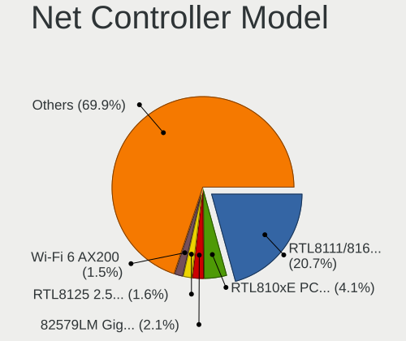

| Model                                                                  | Computers | Percent |
|------------------------------------------------------------------------|-----------|---------|
| Realtek RTL8111/8168/8211/8411 PCI Express Gigabit Ethernet Controller | 11304     | 20.75%  |
| Realtek RTL810xE PCI Express Fast Ethernet controller                  | 2230      | 4.09%   |
| Intel 82579LM Gigabit Network Connection (Lewisville)                  | 1127      | 2.07%   |
| Realtek RTL8125 2.5GbE Controller                                      | 892       | 1.64%   |
| Intel Wi-Fi 6 AX200                                                    | 844       | 1.55%   |
| Realtek RTL8821CE 802.11ac PCIe Wireless Network Adapter               | 806       | 1.48%   |
| Qualcomm Atheros AR9485 Wireless Network Adapter                       | 749       | 1.37%   |
| Qualcomm Atheros QCA9377 802.11ac Wireless Network Adapter             | 736       | 1.35%   |
| Intel Wireless 8265 / 8275                                             | 691       | 1.27%   |
| Qualcomm Atheros AR9285 Wireless Network Adapter (PCI-Express)         | 684       | 1.26%   |
| Qualcomm Atheros QCA9565 / AR9565 Wireless Network Adapter             | 665       | 1.22%   |
| Intel Wireless 7265                                                    | 576       | 1.06%   |
| Realtek RTL8153 Gigabit Ethernet Adapter                               | 574       | 1.05%   |
| Intel Wireless 7260                                                    | 565       | 1.04%   |
| Intel Wi-Fi 6 AX201                                                    | 497       | 0.91%   |
| Intel Ethernet Connection I217-LM                                      | 455       | 0.84%   |
| Intel Wireless 8260                                                    | 443       | 0.81%   |
| Intel Centrino Advanced-N 6205 [Taylor Peak]                           | 429       | 0.79%   |
| Realtek RTL8822CE 802.11ac PCIe Wireless Network Adapter               | 414       | 0.76%   |
| Intel Wireless 3165                                                    | 400       | 0.73%   |
| Intel Ethernet Connection (2) I219-V                                   | 398       | 0.73%   |
| Broadcom BCM4313 802.11bgn Wireless Network Adapter                    | 391       | 0.72%   |
| Qualcomm Atheros QCA6174 802.11ac Wireless Network Adapter             | 386       | 0.71%   |
| Intel I211 Gigabit Network Connection                                  | 378       | 0.69%   |
| Realtek 802.11ac NIC                                                   | 344       | 0.63%   |
| Intel Ethernet Controller I225-V                                       | 331       | 0.61%   |
| Realtek RTL8723BE PCIe Wireless Network Adapter                        | 329       | 0.6%    |
| MediaTek MT7921 802.11ax PCIe Wireless Network Adapter [Filogic 330]   | 322       | 0.59%   |
| Intel Wi-Fi 6E(802.11ax) AX210/AX1675* 2x2 [Typhoon Peak]              | 315       | 0.58%   |
| MediaTek MT7922 802.11ax PCI Express Wireless Network Adapter          | 313       | 0.57%   |
| Broadcom BCM43142 802.11b/g/n                                          | 311       | 0.57%   |
| Intel Dual Band Wireless-AC 3168NGW [Stone Peak]                       | 306       | 0.56%   |
| Qualcomm Atheros AR8151 v2.0 Gigabit Ethernet                          | 301       | 0.55%   |
| Intel Cannon Lake PCH CNVi WiFi                                        | 281       | 0.52%   |
| Intel Alder Lake-P PCH CNVi WiFi                                       | 279       | 0.51%   |
| Realtek RTL88x2bu [AC1200 Techkey]                                     | 275       | 0.5%    |
| Intel Wireless 3160                                                    | 264       | 0.48%   |
| Intel Comet Lake PCH-LP CNVi WiFi                                      | 263       | 0.48%   |
| Realtek RTL8852BE PCIe 802.11ax Wireless Network Controller            | 255       | 0.47%   |
| Intel Ethernet Connection (4) I219-LM                                  | 254       | 0.47%   |

Wireless Vendor
---------------

Wireless vendors

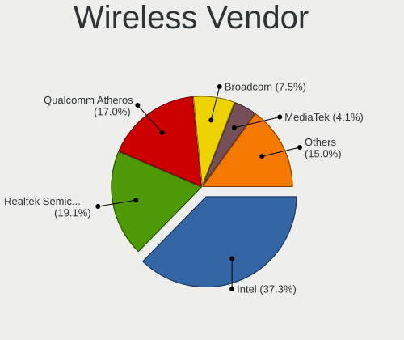

| Vendor                                | Computers | Percent |
|---------------------------------------|-----------|---------|
| Intel                                 | 9309      | 37.34%  |
| Realtek Semiconductor                 | 4760      | 19.09%  |
| Qualcomm Atheros                      | 4235      | 16.99%  |
| Broadcom                              | 1864      | 7.48%   |
| MediaTek                              | 1022      | 4.1%    |
| TP-Link                               | 651       | 2.61%   |
| Ralink Technology                     | 622       | 2.49%   |
| Ralink                                | 558       | 2.24%   |
| Broadcom Limited                      | 408       | 1.64%   |
| Qualcomm Atheros Communications       | 155       | 0.62%   |
| NetGear                               | 142       | 0.57%   |
| Sierra Wireless                       | 137       | 0.55%   |
| D-Link                                | 128       | 0.51%   |
| ASUSTek Computer                      | 116       | 0.47%   |
| Microsoft                             | 77        | 0.31%   |
| Dell                                  | 71        | 0.28%   |
| Edimax Technology                     | 69        | 0.28%   |
| Marvell Technology Group              | 68        | 0.27%   |
| D-Link System                         | 64        | 0.26%   |
| Linksys                               | 59        | 0.24%   |
| AVM                                   | 48        | 0.19%   |
| Belkin Components                     | 44        | 0.18%   |
| Qualcomm                              | 43        | 0.17%   |
| IMC Networks                          | 38        | 0.15%   |
| Fibocom                               | 24        | 0.1%    |
| Hewlett-Packard                       | 20        | 0.08%   |
| Sitecom Europe                        | 18        | 0.07%   |
| Mercucys                              | 14        | 0.06%   |
| ZyDAS                                 | 13        | 0.05%   |
| Realtek                               | 13        | 0.05%   |
| 802.11g Adapter [Linksys WUSB54GC v3] | 13        | 0.05%   |
| Tenda                                 | 10        | 0.04%   |
| Micro Star International              | 10        | 0.04%   |
| Texas Instruments                     | 8         | 0.03%   |
| Accton Technology                     | 8         | 0.03%   |
| ZyXEL Communications                  | 7         | 0.03%   |
| ZTopInc                               | 6         | 0.02%   |
| TRENDnet                              | 6         | 0.02%   |
| Gemtek                                | 6         | 0.02%   |
| BUFFALO                               | 5         | 0.02%   |

Wireless Model
--------------

Wireless models

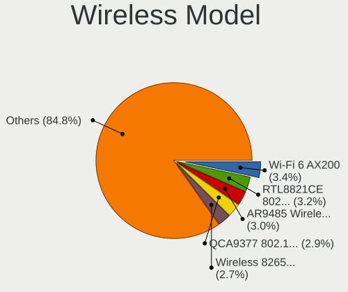

| Model                                                                   | Computers | Percent |
|-------------------------------------------------------------------------|-----------|---------|
| Intel Wi-Fi 6 AX200                                                     | 844       | 3.36%   |
| Realtek RTL8821CE 802.11ac PCIe Wireless Network Adapter                | 806       | 3.2%    |
| Qualcomm Atheros AR9485 Wireless Network Adapter                        | 749       | 2.98%   |
| Qualcomm Atheros QCA9377 802.11ac Wireless Network Adapter              | 736       | 2.93%   |
| Intel Wireless 8265 / 8275                                              | 691       | 2.75%   |
| Qualcomm Atheros AR9285 Wireless Network Adapter (PCI-Express)          | 684       | 2.72%   |
| Qualcomm Atheros QCA9565 / AR9565 Wireless Network Adapter              | 665       | 2.64%   |
| Intel Wireless 7265                                                     | 576       | 2.29%   |
| Intel Wireless 7260                                                     | 565       | 2.25%   |
| Intel Wi-Fi 6 AX201                                                     | 497       | 1.98%   |
| Intel Wireless 8260                                                     | 443       | 1.76%   |
| Intel Centrino Advanced-N 6205 [Taylor Peak]                            | 429       | 1.71%   |
| Realtek RTL8822CE 802.11ac PCIe Wireless Network Adapter                | 414       | 1.65%   |
| Intel Wireless 3165                                                     | 400       | 1.59%   |
| Broadcom BCM4313 802.11bgn Wireless Network Adapter                     | 391       | 1.55%   |
| Qualcomm Atheros QCA6174 802.11ac Wireless Network Adapter              | 386       | 1.53%   |
| Realtek 802.11ac NIC                                                    | 344       | 1.37%   |
| Realtek RTL8723BE PCIe Wireless Network Adapter                         | 329       | 1.31%   |
| MediaTek MT7921 802.11ax PCIe Wireless Network Adapter [Filogic 330]    | 322       | 1.28%   |
| Intel Wi-Fi 6E(802.11ax) AX210/AX1675* 2x2 [Typhoon Peak]               | 315       | 1.25%   |
| Broadcom BCM43142 802.11b/g/n                                           | 311       | 1.24%   |
| Intel Dual Band Wireless-AC 3168NGW [Stone Peak]                        | 306       | 1.22%   |
| Intel Cannon Lake PCH CNVi WiFi                                         | 281       | 1.12%   |
| Realtek RTL88x2bu [AC1200 Techkey]                                      | 275       | 1.09%   |
| Intel Wireless 3160                                                     | 264       | 1.05%   |
| Intel Comet Lake PCH-LP CNVi WiFi                                       | 263       | 1.05%   |
| MediaTek MT7922 802.11ax PCI Express Wireless Network Adapter           | 258       | 1.03%   |
| Ralink MT7601U Wireless Adapter                                         | 252       | 1%      |
| Intel Cannon Point-LP CNVi [Wireless-AC]                                | 252       | 1%      |
| Realtek RTL8188EUS 802.11n Wireless Network Adapter                     | 237       | 0.94%   |
| Realtek RTL8188CE 802.11b/g/n WiFi Adapter                              | 224       | 0.89%   |
| Intel PRO/Wireless 3945ABG [Golan] Network Connection                   | 223       | 0.89%   |
| Realtek RTL8852BE PCIe 802.11ax Wireless Network Controller             | 204       | 0.81%   |
| Qualcomm Atheros AR9462 Wireless Network Adapter                        | 200       | 0.8%    |
| MediaTek MT7902 802.11ax PCIe Wireless Network Adapter [Filogic 310]    | 198       | 0.79%   |
| Intel Wi-Fi 5(802.11ac) Wireless-AC 9x6x [Thunder Peak]                 | 197       | 0.78%   |
| Realtek RTL8822BE 802.11a/b/g/n/ac WiFi adapter                         | 194       | 0.77%   |
| Intel Comet Lake PCH CNVi WiFi                                          | 192       | 0.76%   |
| Qualcomm Atheros AR242x / AR542x Wireless Network Adapter (PCI-Express) | 190       | 0.76%   |
| Qualcomm Atheros AR9287 Wireless Network Adapter (PCI-Express)          | 189       | 0.75%   |

Ethernet Vendor
---------------

Ethernet vendors

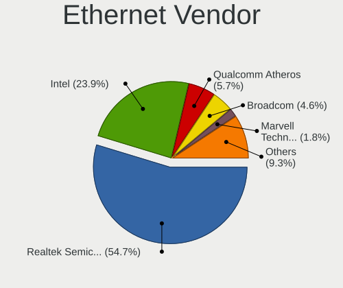

| Vendor                                 | Computers | Percent |
|----------------------------------------|-----------|---------|
| Realtek Semiconductor                  | 15345     | 54.7%   |
| Intel                                  | 6719      | 23.95%  |
| Qualcomm Atheros                       | 1603      | 5.71%   |
| Broadcom                               | 1281      | 4.57%   |
| Marvell Technology Group               | 507       | 1.81%   |
| Nvidia                                 | 449       | 1.6%    |
| Samsung Electronics                    | 283       | 1.01%   |
| ASIX Electronics                       | 251       | 0.89%   |
| Broadcom Limited                       | 236       | 0.84%   |
| Xiaomi                                 | 166       | 0.59%   |
| MediaTek                               | 121       | 0.43%   |
| DisplayLink                            | 100       | 0.36%   |
| JMicron Technology                     | 97        | 0.35%   |
| Motorola PCS                           | 77        | 0.27%   |
| Silicon Integrated Systems [SiS]       | 73        | 0.26%   |
| Aquantia                               | 68        | 0.24%   |
| VIA Technologies                       | 63        | 0.22%   |
| Huawei Technologies                    | 62        | 0.22%   |
| Qualcomm                               | 51        | 0.18%   |
| Lenovo                                 | 48        | 0.17%   |
| OPPO Electronics                       | 47        | 0.17%   |
| Google                                 | 42        | 0.15%   |
| Hewlett-Packard                        | 37        | 0.13%   |
| D-Link System                          | 30        | 0.11%   |
| Qualcomm Technologies                  | 29        | 0.1%    |
| TP-Link                                | 22        | 0.08%   |
| Attansic Technology                    | 22        | 0.08%   |
| ICS Advent                             | 21        | 0.07%   |
| Apple                                  | 21        | 0.07%   |
| T & A Mobile Phones                    | 14        | 0.05%   |
| Sundance Technology Inc / IC Plus      | 13        | 0.05%   |
| Sony Ericsson Mobile Communications AB | 10        | 0.04%   |
| Microsoft                              | 10        | 0.04%   |
| Suzhou Motorcomm Electronic Technology | 8         | 0.03%   |
| LG Electronics                         | 8         | 0.03%   |
| HMD Global                             | 8         | 0.03%   |
| ZTE WCDMA Technologies MSM             | 7         | 0.02%   |
| Spreadtrum Communications              | 6         | 0.02%   |
| OnePlus Technology (Shenzhen)          | 6         | 0.02%   |
| Microchip Technology                   | 5         | 0.02%   |

Ethernet Model
--------------

Ethernet models

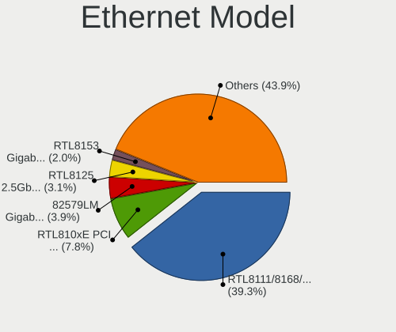

| Model                                                                  | Computers | Percent |
|------------------------------------------------------------------------|-----------|---------|
| Realtek RTL8111/8168/8211/8411 PCI Express Gigabit Ethernet Controller | 11304     | 39.34%  |
| Realtek RTL810xE PCI Express Fast Ethernet controller                  | 2230      | 7.76%   |
| Intel 82579LM Gigabit Network Connection (Lewisville)                  | 1127      | 3.92%   |
| Realtek RTL8125 2.5GbE Controller                                      | 892       | 3.1%    |
| Realtek RTL8153 Gigabit Ethernet Adapter                               | 574       | 2%      |
| Intel Ethernet Connection I217-LM                                      | 455       | 1.58%   |
| Intel Ethernet Connection (2) I219-V                                   | 398       | 1.39%   |
| Intel I211 Gigabit Network Connection                                  | 378       | 1.32%   |
| Intel Ethernet Controller I225-V                                       | 331       | 1.15%   |
| Qualcomm Atheros AR8151 v2.0 Gigabit Ethernet                          | 301       | 1.05%   |
| Intel Ethernet Connection (4) I219-LM                                  | 254       | 0.88%   |
| Intel 82579V Gigabit Network Connection                                | 221       | 0.77%   |
| Samsung Galaxy series, misc. (tethering mode)                          | 205       | 0.71%   |
| ASIX AX88179 Gigabit Ethernet                                          | 203       | 0.71%   |
| Intel Ethernet Connection I219-LM                                      | 199       | 0.69%   |
| Intel Ethernet Connection (2) I219-LM                                  | 197       | 0.69%   |
| Intel Ethernet Connection (7) I219-V                                   | 196       | 0.68%   |
| Intel 82577LM Gigabit Network Connection                               | 193       | 0.67%   |
| Realtek RTL-8100/8101L/8139 PCI Fast Ethernet Adapter                  | 188       | 0.65%   |
| Intel Ethernet Connection I217-V                                       | 180       | 0.63%   |
| Broadcom NetXtreme BCM57765 Gigabit Ethernet PCIe                      | 180       | 0.63%   |
| Nvidia MCP61 Ethernet                                                  | 173       | 0.6%    |
| Qualcomm Atheros AR8161 Gigabit Ethernet                               | 171       | 0.6%    |
| Intel Ethernet Connection I218-LM                                      | 166       | 0.58%   |
| Qualcomm Atheros Killer E220x Gigabit Ethernet Controller              | 157       | 0.55%   |
| Intel 82567LM-3 Gigabit Network Connection                             | 154       | 0.54%   |
| Broadcom NetXtreme BCM57766 Gigabit Ethernet PCIe                      | 145       | 0.5%    |
| Intel Ethernet Connection (3) I218-LM                                  | 139       | 0.48%   |
| Qualcomm Atheros AR8131 Gigabit Ethernet                               | 137       | 0.48%   |
| Xiaomi Mi/Redmi series (RNDIS)                                         | 131       | 0.46%   |
| Intel 82567LM Gigabit Network Connection                               | 131       | 0.46%   |
| Qualcomm Atheros AR8121/AR8113/AR8114 Gigabit or Fast Ethernet         | 126       | 0.44%   |
| Broadcom NetLink BCM57785 Gigabit Ethernet PCIe                        | 120       | 0.42%   |
| Realtek RTL8152 Fast Ethernet Adapter                                  | 118       | 0.41%   |
| Broadcom NetXtreme BCM5764M Gigabit Ethernet PCIe                      | 118       | 0.41%   |
| Intel Ethernet Connection (7) I219-LM                                  | 117       | 0.41%   |
| Intel Ethernet Connection (2) I218-V                                   | 117       | 0.41%   |
| Nvidia MCP79 Ethernet                                                  | 116       | 0.4%    |
| Intel Ethernet Connection (4) I219-V                                   | 116       | 0.4%    |
| Qualcomm Atheros AR8152 v2.0 Fast Ethernet                             | 115       | 0.4%    |

Net Controller Kind
-------------------

Ethernet, WiFi or modem

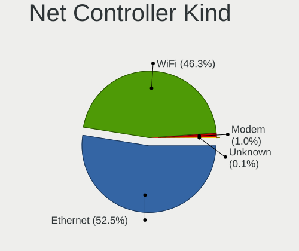

| Kind     | Computers | Percent |
|----------|-----------|---------|
| Ethernet | 26378     | 52.51%  |
| WiFi     | 23266     | 46.32%  |
| Modem    | 522       | 1.04%   |
| Unknown  | 68        | 0.14%   |

Used Controller
---------------

Currently used network controller

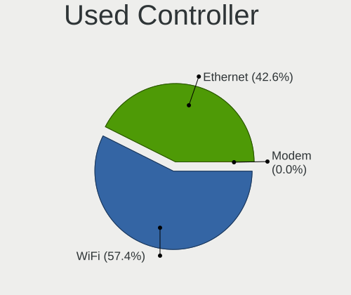

| Kind     | Computers | Percent |
|----------|-----------|---------|
| WiFi     | 18055     | 57.38%  |
| Ethernet | 13400     | 42.59%  |
| Unknown  | 7         | 0.02%   |
| Modem    | 2         | 0.01%   |

NICs
----

Total network controllers on board

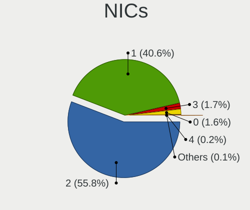

| Total | Computers | Percent |
|-------|-----------|---------|
| 2     | 16893     | 55.85%  |
| 1     | 12276     | 40.58%  |
| 3     | 508       | 1.68%   |
| 0     | 486       | 1.61%   |
| 4     | 55        | 0.18%   |
| 5     | 16        | 0.05%   |
| 6     | 10        | 0.03%   |
| 7     | 3         | 0.01%   |
| 10    | 1         | 0.003%  |
| 8     | 1         | 0.003%  |

IPv6
----

IPv6 vs IPv4

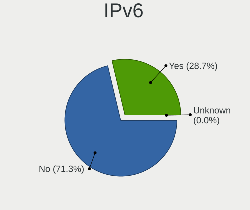

| Used    | Computers | Percent |
|---------|-----------|---------|
| No      | 21950     | 71.28%  |
| Yes     | 8844      | 28.72%  |
| Unknown | 1         | 0.003%  |

Bluetooth
---------

Bluetooth Vendor
----------------

Controller vendors

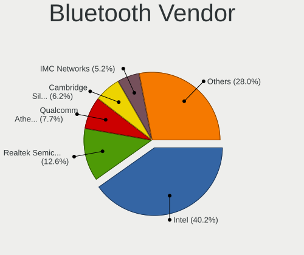

| Vendor                          | Computers | Percent |
|---------------------------------|-----------|---------|
| Intel                           | 7397      | 40.2%   |
| Realtek Semiconductor           | 2318      | 12.6%   |
| Qualcomm Atheros Communications | 1412      | 7.67%   |
| Cambridge Silicon Radio         | 1149      | 6.24%   |
| IMC Networks                    | 965       | 5.24%   |
| Broadcom                        | 932       | 5.06%   |
| Apple                           | 786       | 4.27%   |
| Foxconn / Hon Hai               | 714       | 3.88%   |
| Lite-On Technology              | 659       | 3.58%   |
| ASUSTek Computer                | 300       | 1.63%   |
| MediaTek                        | 267       | 1.45%   |
| Dell                            | 263       | 1.43%   |
| Hewlett-Packard                 | 197       | 1.07%   |
| Ralink                          | 174       | 0.95%   |
| Toshiba                         | 133       | 0.72%   |
| TP-Link                         | 106       | 0.58%   |
| Realtek                         | 80        | 0.43%   |
| Marvell Semiconductor           | 63        | 0.34%   |
| Alps Electric                   | 56        | 0.3%    |
| Foxconn International           | 52        | 0.28%   |
| Ralink Technology               | 38        | 0.21%   |
| Unknown                         | 38        | 0.21%   |
| Integrated System Solution      | 26        | 0.14%   |
| Actions                         | 25        | 0.14%   |
| Edimax Technology               | 24        | 0.13%   |
| Askey Computer                  | 24        | 0.13%   |
| USI                             | 21        | 0.11%   |
| Belkin Components               | 21        | 0.11%   |
| Chicony Electronics             | 18        | 0.1%    |
| Taiyo Yuden                     | 16        | 0.09%   |
| Qcom                            | 16        | 0.09%   |
| Smart Modular Technologies      | 12        | 0.07%   |
| Opticis                         | 11        | 0.06%   |
| Fujitsu                         | 11        | 0.06%   |
| Dynex                           | 11        | 0.06%   |
| Conwise Technology              | 10        | 0.05%   |
| Micro Star International        | 8         | 0.04%   |
| Mercucys                        | 7         | 0.04%   |
| Logitech                        | 6         | 0.03%   |
| AICSemi                         | 6         | 0.03%   |

Bluetooth Model
---------------

Controller models

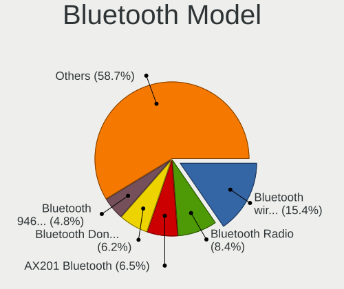

| Model                                               | Computers | Percent |
|-----------------------------------------------------|-----------|---------|
| Intel Bluetooth wireless interface                  | 2843      | 15.43%  |
| Realtek Bluetooth Radio                             | 1539      | 8.35%   |
| Intel AX201 Bluetooth                               | 1191      | 6.46%   |
| Cambridge Silicon Radio Bluetooth Dongle (HCI mode) | 1148      | 6.23%   |
| Intel Bluetooth 9460/9560 Jefferson Peak (JfP)      | 887       | 4.81%   |
| Intel AX200 Bluetooth                               | 795       | 4.31%   |
| Qualcomm Atheros  Bluetooth Device                  | 645       | 3.5%    |
| Realtek  Bluetooth 4.2 Adapter                      | 514       | 2.79%   |
| Intel Bluetooth Device                              | 512       | 2.78%   |
| IMC Networks Wireless_Device                        | 378       | 2.05%   |
| Apple Bluetooth Host Controller                     | 319       | 1.73%   |
| Intel AX210 Bluetooth                               | 301       | 1.63%   |
| Intel Wireless-AC 3168 Bluetooth                    | 294       | 1.6%    |
| Intel Centrino Bluetooth Wireless Transceiver       | 272       | 1.48%   |
| IMC Networks Bluetooth Radio                        | 264       | 1.43%   |
| MediaTek Wireless_Device                            | 258       | 1.4%    |
| Apple Bluetooth USB Host Controller                 | 247       | 1.34%   |
| Qualcomm Atheros AR3011 Bluetooth                   | 226       | 1.23%   |
| Qualcomm Atheros AR3012 Bluetooth 4.0               | 215       | 1.17%   |
| Lite-On Qualcomm Atheros QCA9377 Bluetooth          | 209       | 1.13%   |
| Intel Wireless-AC 9260 Bluetooth Adapter            | 190       | 1.03%   |
| IMC Networks Bluetooth Device                       | 185       | 1%      |
| Foxconn / Hon Hai Wireless_Device                   | 183       | 0.99%   |
| Foxconn / Hon Hai Bluetooth Device                  | 177       | 0.96%   |
| Ralink RT3290 Bluetooth                             | 174       | 0.94%   |
| Lite-On Bluetooth Device                            | 159       | 0.86%   |
| Qualcomm Atheros QCA61x4 Bluetooth 4.0              | 153       | 0.83%   |
| Apple Built-in Bluetooth 2.0+EDR HCI                | 146       | 0.79%   |
| Broadcom BCM20702A0 Bluetooth 4.0                   | 132       | 0.72%   |
| Intel Centrino Advanced-N 6230 Bluetooth adapter    | 120       | 0.65%   |
| Lite-On Atheros AR3012 Bluetooth                    | 111       | 0.6%    |
| HP Broadcom 2070 Bluetooth Combo                    | 110       | 0.6%    |
| Broadcom BCM2045B (BDC-2.1)                         | 109       | 0.59%   |
| TP-Link TP-T@- UB500 Adapter                        | 106       | 0.58%   |
| Foxconn / Hon Hai MediaTek Bluetooth Adapter        | 96        | 0.52%   |
| Qualcomm Atheros AR9462 Bluetooth                   | 90        | 0.49%   |
| Dell DW375 Bluetooth Module                         | 89        | 0.48%   |
| Lite-On Wireless_Device                             | 88        | 0.48%   |
| Broadcom BCM20702 Bluetooth 4.0 [ThinkPad]          | 85        | 0.46%   |
| ASUS Broadcom BCM20702A0 Bluetooth                  | 85        | 0.46%   |

Sound
-----

Sound Vendor
------------

Sound card vendors

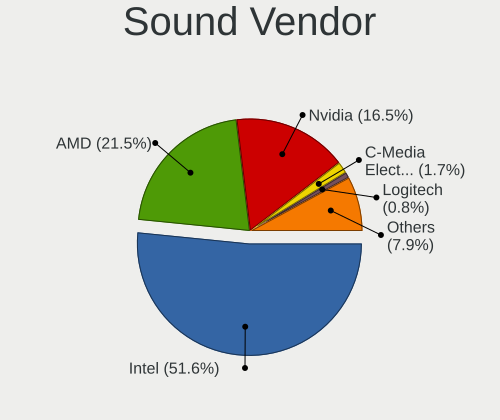

| Vendor                                       | Computers | Percent |
|----------------------------------------------|-----------|---------|
| Intel                                        | 21619     | 51.59%  |
| AMD                                          | 9006      | 21.49%  |
| Nvidia                                       | 6920      | 16.51%  |
| C-Media Electronics                          | 712       | 1.7%    |
| Logitech                                     | 339       | 0.81%   |
| Creative Labs                                | 277       | 0.66%   |
| Texas Instruments                            | 167       | 0.4%    |
| Generalplus Technology                       | 160       | 0.38%   |
| JMTek                                        | 143       | 0.34%   |
| GN Netcom                                    | 128       | 0.31%   |
| ASUSTek Computer                             | 125       | 0.3%    |
| Kingston Technology                          | 101       | 0.24%   |
| Razer USA                                    | 99        | 0.24%   |
| SteelSeries ApS                              | 95        | 0.23%   |
| VIA Technologies                             | 92        | 0.22%   |
| Silicon Integrated Systems [SiS]             | 92        | 0.22%   |
| Creative Technology                          | 84        | 0.2%    |
| Realtek Semiconductor                        | 80        | 0.19%   |
| Micro Star International                     | 75        | 0.18%   |
| Focusrite-Novation                           | 75        | 0.18%   |
| Plantronics                                  | 72        | 0.17%   |
| Corsair                                      | 65        | 0.16%   |
| Zoran Co. Personal Media Division (Nogatech) | 64        | 0.15%   |
| Hewlett-Packard                              | 64        | 0.15%   |
| Lenovo                                       | 62        | 0.15%   |
| Tenx Technology                              | 50        | 0.12%   |
| Apple                                        | 48        | 0.11%   |
| Sony                                         | 44        | 0.1%    |
| Jieli Technology                             | 41        | 0.1%    |
| KTMicro                                      | 37        | 0.09%   |
| DSEA A/S                                     | 36        | 0.09%   |
| Blue Microphones                             | 30        | 0.07%   |
| Samson Technologies                          | 28        | 0.07%   |
| Dell                                         | 28        | 0.07%   |
| BEHRINGER International                      | 28        | 0.07%   |
| Microsoft                                    | 23        | 0.05%   |
| M-Audio                                      | 23        | 0.05%   |
| Trust                                        | 20        | 0.05%   |
| Yamaha                                       | 19        | 0.05%   |
| XMOS                                         | 18        | 0.04%   |

Sound Model
-----------

Sound card models

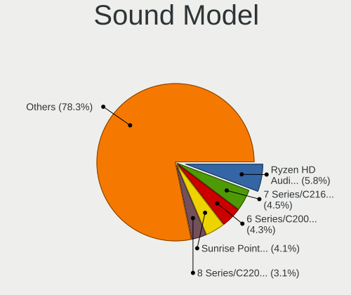

| Model                                                                      | Computers | Percent |
|----------------------------------------------------------------------------|-----------|---------|
| AMD Ryzen HD Audio Controller                                              | 2893      | 5.75%   |
| Intel 7 Series/C216 Chipset Family High Definition Audio Controller        | 2271      | 4.52%   |
| Intel 6 Series/C200 Series Chipset Family High Definition Audio Controller | 2142      | 4.26%   |
| Intel Sunrise Point-LP HD Audio                                            | 2051      | 4.08%   |
| Intel 8 Series/C220 Series Chipset High Definition Audio Controller        | 1573      | 3.13%   |
| AMD Renoir/Cezanne HDMI/DP Audio Controller                                | 1293      | 2.57%   |
| AMD SBx00 Azalia (Intel HDA)                                               | 1269      | 2.52%   |
| Intel 5 Series/3400 Series Chipset High Definition Audio                   | 1168      | 2.32%   |
| Intel Xeon E3-1200 v3/4th Gen Core Processor HD Audio Controller           | 1093      | 2.17%   |
| AMD FCH Azalia Controller                                                  | 1001      | 1.99%   |
| Intel 82801I (ICH9 Family) HD Audio Controller                             | 962       | 1.91%   |
| AMD Starship/Matisse HD Audio Controller                                   | 936       | 1.86%   |
| Intel 8 Series HD Audio Controller                                         | 849       | 1.69%   |
| Intel NM10/ICH7 Family High Definition Audio Controller                    | 845       | 1.68%   |
| Intel Haswell-ULT HD Audio Controller                                      | 844       | 1.68%   |
| Intel 100 Series/C230 Series Chipset Family HD Audio Controller            | 833       | 1.66%   |
| Intel Cannon Lake PCH cAVS                                                 | 784       | 1.56%   |
| AMD Radeon High Definition Audio Controller                                | 730       | 1.45%   |
| AMD Raven/Raven2/Fenghuang HDMI/DP Audio Controller                        | 725       | 1.44%   |
| Intel Tiger Lake-LP Smart Sound Technology Audio Controller                | 693       | 1.38%   |
| Intel Broadwell-U Audio Controller                                         | 628       | 1.25%   |
| Intel Wildcat Point-LP High Definition Audio Controller                    | 599       | 1.19%   |
| Intel 200 Series PCH HD Audio                                              | 538       | 1.07%   |
| Intel Celeron/Pentium Silver Processor High Definition Audio               | 505       | 1%      |
| Nvidia GK208 HDMI/DP Audio Controller                                      | 504       | 1%      |
| AMD Kabini HDMI/DP Audio                                                   | 489       | 0.97%   |
| Nvidia GP107GL High Definition Audio Controller                            | 477       | 0.95%   |
| AMD Family 17h (Models 00h-0fh) HD Audio Controller                        | 474       | 0.94%   |
| AMD Ellesmere HDMI Audio [Radeon RX 470/480 / 570/580/590]                 | 471       | 0.94%   |
| Intel 82801H (ICH8 Family) HD Audio Controller                             | 458       | 0.91%   |
| Intel Cannon Point-LP High Definition Audio Controller                     | 452       | 0.9%    |
| Nvidia GF108 High Definition Audio Controller                              | 430       | 0.85%   |
| Intel Alder Lake PCH-P High Definition Audio Controller                    | 418       | 0.83%   |
| AMD Family 15h (Models 60h-6fh) Audio Controller                           | 400       | 0.8%    |
| Nvidia High Definition Audio Controller                                    | 368       | 0.73%   |
| AMD Oland/Hainan/Cape Verde/Pitcairn HDMI Audio [Radeon HD 7000 Series]    | 365       | 0.73%   |
| Intel Atom Processor Z36xxx/Z37xxx Series High Definition Audio Controller | 341       | 0.68%   |
| Intel Comet Lake PCH-LP cAVS                                               | 332       | 0.66%   |
| AMD Navi 21/23 HDMI/DP Audio Controller                                    | 320       | 0.64%   |
| Nvidia GP106 High Definition Audio Controller                              | 313       | 0.62%   |

Memory
------

Memory Vendor
-------------

Memory module vendors

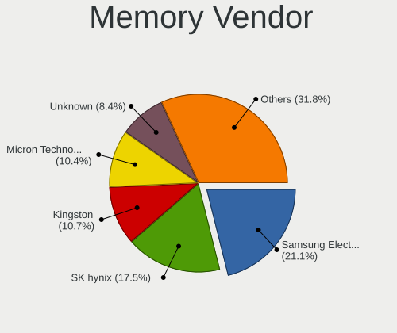

| Vendor                       | Computers | Percent |
|------------------------------|-----------|---------|
| Samsung Electronics          | 3672      | 21.11%  |
| SK hynix                     | 3039      | 17.47%  |
| Kingston                     | 1866      | 10.73%  |
| Micron Technology            | 1815      | 10.43%  |
| Unknown                      | 1465      | 8.42%   |
| Crucial                      | 991       | 5.7%    |
| Corsair                      | 977       | 5.62%   |
| G.Skill                      | 625       | 3.59%   |
| A-DATA Technology            | 332       | 1.91%   |
| Elpida                       | 318       | 1.83%   |
| Ramaxel Technology           | 298       | 1.71%   |
| Unknown (ABCD)               | 238       | 1.37%   |
| Unknown                      | 220       | 1.26%   |
| Nanya Technology             | 204       | 1.17%   |
| Team                         | 147       | 0.85%   |
| Smart                        | 117       | 0.67%   |
| Patriot                      | 99        | 0.57%   |
| Transcend                    | 62        | 0.36%   |
| GOODRAM                      | 57        | 0.33%   |
| Apacer                       | 46        | 0.26%   |
| AMD                          | 38        | 0.22%   |
| Teikon                       | 31        | 0.18%   |
| Timetec                      | 30        | 0.17%   |
| PNY                          | 29        | 0.17%   |
| ASint Technology             | 29        | 0.17%   |
| Silicon Power                | 28        | 0.16%   |
| Avant                        | 26        | 0.15%   |
| Qimonda                      | 19        | 0.11%   |
| Unifosa                      | 18        | 0.1%    |
| Smart Brazil                 | 18        | 0.1%    |
| GeIL                         | 18        | 0.1%    |
| Sesame                       | 16        | 0.09%   |
| Lexar                        | 16        | 0.09%   |
| Kingmax                      | 16        | 0.09%   |
| Lexar Co Limited             | 15        | 0.09%   |
| Kllisre                      | 15        | 0.09%   |
| Multilaser                   | 14        | 0.08%   |
| Patriot Memory (PDP Systems) | 13        | 0.07%   |
| PUSKILL                      | 12        | 0.07%   |
| fef5                         | 11        | 0.06%   |

Memory Model
------------

Memory module models

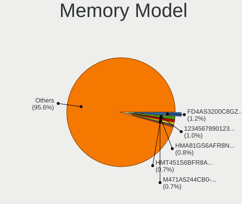

| Model                                                            | Computers | Percent |
|------------------------------------------------------------------|-----------|---------|
| Unknown                                                          | 220       | 1.18%   |
| Unknown (ABCD) RAM 123456789012345678 2GB SODIMM LPDDR4 2400MT/s | 185       | 1%      |
| SK hynix RAM HMA81GS6AFR8N-UH 8GB SODIMM DDR4 2667MT/s           | 152       | 0.82%   |
| SK hynix RAM HMT451S6BFR8A-PB 4GB SODIMM DDR3 1600MT/s           | 131       | 0.71%   |
| Samsung RAM M471A5244CB0-CTD 4GB SODIMM DDR4 3266MT/s            | 126       | 0.68%   |
| Samsung RAM M471B5173DB0-YK0 4GB SODIMM DDR3 1600MT/s            | 116       | 0.62%   |
| Samsung RAM M471B5173QH0-YK0 4GB SODIMM DDR3 1600MT/s            | 109       | 0.59%   |
| Samsung RAM M471A1K43EB1-CWE 8GB SODIMM DDR4 3200MT/s            | 106       | 0.57%   |
| Samsung RAM M471B5273DH0-CH9 4GB SODIMM DDR3 1600MT/s            | 105       | 0.57%   |
| Samsung RAM M471A5244CB0-CWE 4GB SODIMM DDR4 3200MT/s            | 99        | 0.53%   |
| Samsung RAM M471B5173EB0-YK0 4GB SODIMM DDR3 1600MT/s            | 97        | 0.52%   |
| Samsung RAM M471A1G44AB0-CWE 8GiB SODIMM DDR4 3200MT/s           | 93        | 0.5%    |
| SK hynix RAM HMAA1GS6CJR6N-XN 8GB SODIMM DDR4 3200MT/s           | 92        | 0.5%    |
| Samsung RAM M471A1K43CB1-CRC 8GB SODIMM DDR4 8400MT/s            | 90        | 0.48%   |
| Samsung RAM M471B5273CH0-CH9 4GB SODIMM DDR3 1334MT/s            | 84        | 0.45%   |
| Samsung RAM M471A5244CB0-CRC 4GB SODIMM DDR4 2667MT/s            | 81        | 0.44%   |
| SK hynix RAM HMT451S6AFR8A-PB 4GB SODIMM DDR3 1600MT/s           | 80        | 0.43%   |
| Samsung RAM M471B1G73QH0-YK0 8GB SODIMM DDR3 1600MT/s            | 80        | 0.43%   |
| Samsung RAM M471B1G73DB0-YK0 8GB SODIMM DDR3 1600MT/s            | 79        | 0.43%   |
| SK hynix RAM HMT351S6CFR8C-PB 4GB SODIMM DDR3 1600MT/s           | 78        | 0.42%   |
| Samsung RAM M471A1K43DB1-CWE 8GB SODIMM DDR4 3200MT/s            | 76        | 0.41%   |
| Corsair RAM CMK16GX4M2B3200C16 8GB DIMM DDR4 3600MT/s            | 73        | 0.39%   |
| Micron RAM 4ATF51264HZ-2G6E1 4GB SODIMM DDR4 2667MT/s            | 71        | 0.38%   |
| Samsung RAM M471A1K43CB1-CTD 8GB SODIMM DDR4 3200MT/s            | 70        | 0.38%   |
| SK hynix RAM HMT41GS6BFR8A-PB 8GB SODIMM DDR3 2667MT/s           | 69        | 0.37%   |
| Samsung RAM M471A1G44BB0-CWE 8GB SODIMM DDR4 3200MT/s            | 68        | 0.37%   |
| Micron RAM 4ATF1G64HZ-3G2F1 8GB SODIMM DDR4 3200MT/s             | 67        | 0.36%   |
| SK hynix RAM HMA81GS6DJR8N-XN 8GB SODIMM DDR4 3200MT/s           | 64        | 0.34%   |
| SK hynix RAM HMA81GS6CJR8N-VK 8GB SODIMM DDR4 2667MT/s           | 58        | 0.31%   |
| Unknown (ABCD) RAM 123456789012345678 2GB DIMM LPDDR4 2133MT/s   | 53        | 0.29%   |
| SK hynix RAM HMA851S6CJR6N-VK 4GB SODIMM DDR4 2667MT/s           | 53        | 0.29%   |
| SK hynix RAM HMA851S6AFR6N-UH 4GB SODIMM DDR4 2667MT/s           | 53        | 0.29%   |
| Samsung RAM M471B1G73EB0-YK0 8192MB SODIMM DDR3 1600MT/s         | 53        | 0.29%   |
| Samsung RAM M471A1K43DB1-CTD 8GB SODIMM DDR4 2667MT/s            | 52        | 0.28%   |
| Micron RAM 8ATF1G64HZ-3G2R1 8GB SODIMM DDR4 3200MT/s             | 52        | 0.28%   |
| Samsung RAM M471A1G44AB0-CWE 8GB Row Of Chips DDR4 3200MT/s      | 51        | 0.27%   |
| Samsung RAM M471B5273DH0-CK0 4GB SODIMM DDR3 2400MT/s            | 50        | 0.27%   |
| SK hynix RAM HMA81GS6JJR8N-VK 8GB SODIMM DDR4 2667MT/s           | 49        | 0.26%   |
| Micron RAM 4ATF51264HZ-3G2J1 4GB SODIMM DDR4 3200MT/s            | 49        | 0.26%   |
| Micron RAM 4ATF1G64HZ-3G2E1 8GB SODIMM DDR4 3200MT/s             | 48        | 0.26%   |

Memory Kind
-----------

Memory module kinds

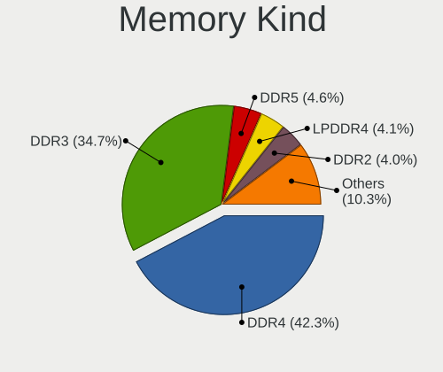

| Kind         | Computers | Percent |
|--------------|-----------|---------|
| DDR4         | 6354      | 42.32%  |
| DDR3         | 5209      | 34.69%  |
| DDR5         | 685       | 4.56%   |
| LPDDR4       | 620       | 4.13%   |
| DDR2         | 602       | 4.01%   |
| SDRAM        | 453       | 3.02%   |
| Unknown      | 353       | 2.35%   |
| LPDDR5       | 317       | 2.11%   |
| LPDDR3       | 296       | 1.97%   |
| DDR          | 82        | 0.55%   |
| DRAM         | 38        | 0.25%   |
| DDR2 FB-DIMM | 3         | 0.02%   |
| RAM          | 2         | 0.01%   |
| EEPROM       | 1         | 0.01%   |

Memory Form Factor
------------------

Physical design of the memory module

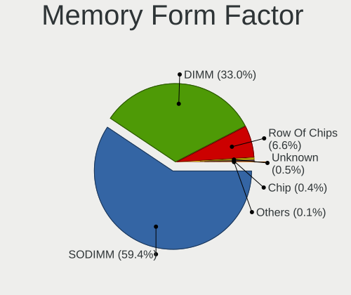

| Name         | Computers | Percent |
|--------------|-----------|---------|
| SODIMM       | 8831      | 59.38%  |
| DIMM         | 4914      | 33.04%  |
| Row Of Chips | 986       | 6.63%   |
| Unknown      | 67        | 0.45%   |
| Chip         | 57        | 0.38%   |
| FB-DIMM      | 11        | 0.07%   |
| RIMM         | 7         | 0.05%   |

Memory Size
-----------

Memory module size

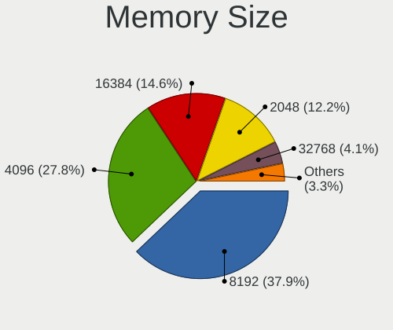

| Size  | Computers | Percent |
|-------|-----------|---------|
| 8192  | 6207      | 37.91%  |
| 4096  | 4556      | 27.82%  |
| 16384 | 2389      | 14.59%  |
| 2048  | 2005      | 12.24%  |
| 32768 | 675       | 4.12%   |
| 1024  | 433       | 2.64%   |
| 512   | 39        | 0.24%   |
| 49152 | 25        | 0.15%   |
| 3072  | 11        | 0.07%   |
| 24576 | 10        | 0.06%   |
| 65536 | 7         | 0.04%   |
| 1536  | 6         | 0.04%   |
| 12288 | 4         | 0.02%   |
| 256   | 4         | 0.02%   |
| 6144  | 1         | 0.01%   |
| 16    | 1         | 0.01%   |
| 8     | 1         | 0.01%   |
| 1     | 1         | 0.01%   |

Memory Speed
------------

Memory module speed

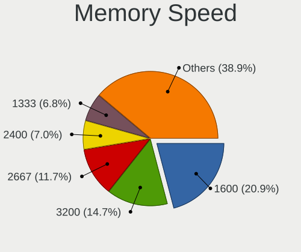

| Speed   | Computers | Percent |
|---------|-----------|---------|
| 1600    | 3418      | 20.92%  |
| 3200    | 2407      | 14.73%  |
| 2667    | 1919      | 11.74%  |
| 2400    | 1139      | 6.97%   |
| 1333    | 1110      | 6.79%   |
| 2133    | 724       | 4.43%   |
| 3600    | 482       | 2.95%   |
| 1334    | 406       | 2.48%   |
| 800     | 327       | 2%      |
| 667     | 326       | 1.99%   |
| 1867    | 281       | 1.72%   |
| Unknown | 279       | 1.71%   |
| 5600    | 248       | 1.52%   |
| 6400    | 234       | 1.43%   |
| 1067    | 214       | 1.31%   |
| 4800    | 195       | 1.19%   |
| 4267    | 183       | 1.12%   |
| 3266    | 153       | 0.94%   |
| 3733    | 149       | 0.91%   |
| 1066    | 146       | 0.89%   |
| 8400    | 133       | 0.81%   |
| 6000    | 131       | 0.8%    |
| 3800    | 116       | 0.71%   |
| 4199    | 115       | 0.7%    |
| 1866    | 115       | 0.7%    |
| 1800    | 113       | 0.69%   |
| 3000    | 87        | 0.53%   |
| 2666    | 83        | 0.51%   |
| 2048    | 81        | 0.5%    |
| 4000    | 75        | 0.46%   |
| 2933    | 74        | 0.45%   |
| 3400    | 73        | 0.45%   |
| 7500    | 52        | 0.32%   |
| 3466    | 47        | 0.29%   |
| 4266    | 41        | 0.25%   |
| 2800    | 35        | 0.21%   |
| 975     | 34        | 0.21%   |
| 533     | 32        | 0.2%    |
| 1639    | 29        | 0.18%   |
| 333     | 29        | 0.18%   |

Printers & scanners
-------------------

Printer Vendor
--------------

Printer device vendors

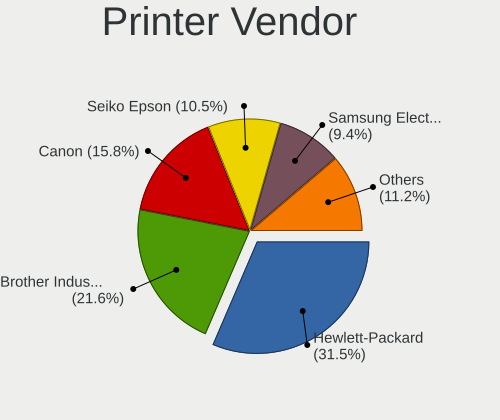

| Vendor                             | Computers | Percent |
|------------------------------------|-----------|---------|
| Hewlett-Packard                    | 336       | 31.46%  |
| Brother Industries                 | 231       | 21.63%  |
| Canon                              | 169       | 15.82%  |
| Seiko Epson                        | 112       | 10.49%  |
| Samsung Electronics                | 100       | 9.36%   |
| Prolific Technology                | 14        | 1.31%   |
| Dymo-CoStar                        | 13        | 1.22%   |
| QinHeng Electronics                | 11        | 1.03%   |
| Kyocera                            | 10        | 0.94%   |
| Xerox                              | 8         | 0.75%   |
| Lexmark International              | 8         | 0.75%   |
| Ricoh                              | 7         | 0.66%   |
| Pantum                             | 7         | 0.66%   |
| Oki Data                           | 7         | 0.66%   |
| STMicroelectronics                 | 6         | 0.56%   |
| Panasonic (Matsushita)             | 4         | 0.37%   |
| Dell                               | 4         | 0.37%   |
| Zebra                              | 3         | 0.28%   |
| Seiko Instruments                  | 3         | 0.28%   |
| Zhuhai Poskey Technology           | 1         | 0.09%   |
| YXWL Mi                            | 1         | 0.09%   |
| Sharp                              | 1         | 0.09%   |
| Sato                               | 1         | 0.09%   |
| Omnidirectional Control Technology | 1         | 0.09%   |
| NXP Semiconductors                 | 1         | 0.09%   |
| Memory                             | 1         | 0.09%   |
| Magic Control Technology           | 1         | 0.09%   |
| iDPRT                              | 1         | 0.09%   |
| Graphtec America                   | 1         | 0.09%   |
| Fuji Xerox                         | 1         | 0.09%   |
| BIXOLON                            | 1         | 0.09%   |
| Apple                              | 1         | 0.09%   |
| Agere Systems (Lucent)             | 1         | 0.09%   |
| Unknown                            | 1         | 0.09%   |

Printer Model
-------------

Printer device models

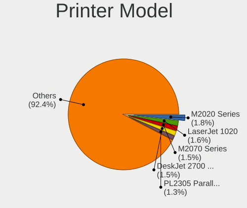

| Model                            | Computers | Percent |
|----------------------------------|-----------|---------|
| Samsung M2020 Series             | 19        | 1.76%   |
| HP LaserJet 1020                 | 17        | 1.58%   |
| Samsung M2070 Series             | 16        | 1.48%   |
| HP DeskJet 2700 series           | 16        | 1.48%   |
| Prolific PL2305 Parallel Port    | 14        | 1.3%    |
| Canon LiDE 400                   | 14        | 1.3%    |
| Seiko Epson ET-2710 Series       | 13        | 1.2%    |
| QinHeng CH340S                   | 11        | 1.02%   |
| HP DeskJet 2600 series           | 10        | 0.93%   |
| Brother Printer                  | 10        | 0.93%   |
| Seiko Epson ET-2810 Series       | 9         | 0.83%   |
| HP LaserJet P1005                | 9         | 0.83%   |
| HP LaserJet 1018                 | 9         | 0.83%   |
| HP Deskjet 2540 series           | 9         | 0.83%   |
| Brother HL-2270DW Laser Printer  | 9         | 0.83%   |
| HP DeskJet 3630 series           | 8         | 0.74%   |
| Canon PIXMA MX920 Series         | 8         | 0.74%   |
| Canon PIXMA MG2500 Series        | 8         | 0.74%   |
| Canon LiDE 300                   | 8         | 0.74%   |
| Brother HL-L2340D series         | 8         | 0.74%   |
| Brother HL-1210W series          | 8         | 0.74%   |
| HP OfficeJet 3830 series         | 7         | 0.65%   |
| HP LaserJet Professional P1102w  | 7         | 0.65%   |
| HP LaserJet P1102                | 7         | 0.65%   |
| HP ENVY 5540 series              | 7         | 0.65%   |
| HP ENVY 5000 series              | 7         | 0.65%   |
| HP Deskjet 2050 J510             | 7         | 0.65%   |
| Brother HL-L2360D series         | 7         | 0.65%   |
| Samsung SCX-3400 Series          | 6         | 0.56%   |
| Samsung M267x 287x Series        | 6         | 0.56%   |
| HP OfficeJet 5200 series         | 6         | 0.56%   |
| HP LaserJet Professional P 1102w | 6         | 0.56%   |
| HP LaserJet M14-M17              | 6         | 0.56%   |
| HP DeskJet 3700 series           | 6         | 0.56%   |
| HP DeskJet 2130 series           | 6         | 0.56%   |
| Canon PIXMA MG3600 Series        | 6         | 0.56%   |
| Seiko Epson L210 Series          | 5         | 0.46%   |
| Samsung C48x Series              | 5         | 0.46%   |
| HP Officejet 4620 series         | 5         | 0.46%   |
| HP Officejet 4500 G510n-z        | 5         | 0.46%   |

Scanner Vendor
--------------

Scanner device vendors

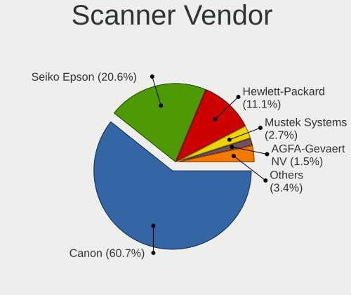

| Vendor                      | Computers | Percent |
|-----------------------------|-----------|---------|
| Canon                       | 159       | 60.69%  |
| Seiko Epson                 | 54        | 20.61%  |
| Hewlett-Packard             | 29        | 11.07%  |
| Mustek Systems              | 7         | 2.67%   |
| AGFA-Gevaert NV             | 4         | 1.53%   |
| Ultima Electronics          | 2         | 0.76%   |
| Acer Peripherals (now BenQ) | 2         | 0.76%   |
| UMAX                        | 1         | 0.38%   |
| Salix Technology            | 1         | 0.38%   |
| Plustek                     | 1         | 0.38%   |
| Microtek International      | 1         | 0.38%   |
| Canon Electronics           | 1         | 0.38%   |

Scanner Model
-------------

Scanner device models

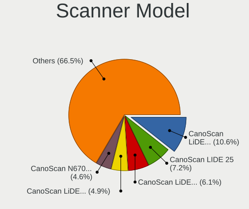

| Model                                                                                 | Computers | Percent |
|---------------------------------------------------------------------------------------|-----------|---------|
| Canon CanoScan LiDE 110                                                               | 28        | 10.65%  |
| Canon CanoScan LIDE 25                                                                | 19        | 7.22%   |
| Canon CanoScan LiDE 220                                                               | 16        | 6.08%   |
| Canon CanoScan LiDE 120                                                               | 13        | 4.94%   |
| Canon CanoScan N670U/N676U/LiDE 20                                                    | 12        | 4.56%   |
| Canon CanoScan LiDE 210                                                               | 11        | 4.18%   |
| Seiko Epson Perfection V37/V370                                                       | 9         | 3.42%   |
| Seiko Epson GT-X820 [Perfection V600 Photo]                                           | 9         | 3.42%   |
| Canon CanoScan LiDE 60                                                                | 8         | 3.04%   |
| Canon CanoScan LiDE 700F                                                              | 7         | 2.66%   |
| Canon CanoScan LiDE 100                                                               | 7         | 2.66%   |
| HP HP Scanjet 300                                                                     | 5         | 1.9%    |
| Canon CanoScan N1240U/LiDE 30                                                         | 5         | 1.9%    |
| Canon CanoScan LiDE 50/LiDE 35/LiDE 40                                                | 5         | 1.9%    |
| Canon CanoScan LiDE 200                                                               | 5         | 1.9%    |
| Seiko Epson GT-F650 [GT-S600/Perfection V10/V100]                                     | 4         | 1.52%   |
| Seiko Epson GT-F520/GT-F570 [Perfection 3590 PHOTO]                                   | 4         | 1.52%   |
| Mustek Systems ScanExpress 1200 UB                                                    | 4         | 1.52%   |
| Canon CanoScan LiDE 90                                                                | 4         | 1.52%   |
| Seiko Epson GT-F730 [GT-S630/Perfection V33/V330 Photo]                               | 3         | 1.14%   |
| Seiko Epson GT-F500/GT-F550 [Perfection 2480/2580 PHOTO]                              | 3         | 1.14%   |
| HP ScanJet 2400c                                                                      | 3         | 1.14%   |
| HP ScanJet 2200c                                                                      | 3         | 1.14%   |
| Canon CanoScan N650U/N656U                                                            | 3         | 1.14%   |
| Canon CanoScan LiDE 500F                                                              | 3         | 1.14%   |
| Canon CanoScan 4400F                                                                  | 3         | 1.14%   |
| Ultima Artec Ultima 2000 (GT6801 based)/Lifetec LT9385/ScanMagic 1200 UB Plus Scanner | 2         | 0.76%   |
| Seiko Epson GT-X900 [Perfection V700/V750 Photo]                                      | 2         | 0.76%   |
| Seiko Epson GT-9300UF [Perfection 2400 PHOTO]                                         | 2         | 0.76%   |
| Seiko Epson GT-6600U [Perfection 610]                                                 | 2         | 0.76%   |
| Seiko Epson ES-D200 [GT-S50]                                                          | 2         | 0.76%   |
| Mustek Systems SNAPSCAN e22                                                           | 2         | 0.76%   |
| HP ScanJet G3010                                                                      | 2         | 0.76%   |
| HP ScanJet 3800c                                                                      | 2         | 0.76%   |
| HP Scanjet 3000                                                                       | 2         | 0.76%   |
| Canon CanoScan LiDE 70                                                                | 2         | 0.76%   |
| Canon CanoScan 9000F Mark II                                                          | 2         | 0.76%   |
| AGFA-Gevaert NV SnapScan 1212U (?)                                                    | 2         | 0.76%   |
| Acer Peripherals (now BenQ) S2W 3300U/4300U                                           | 2         | 0.76%   |
| UMAX Astra 4400/4450                                                                  | 1         | 0.38%   |

Camera
------

Camera Vendor
-------------

Camera device vendors

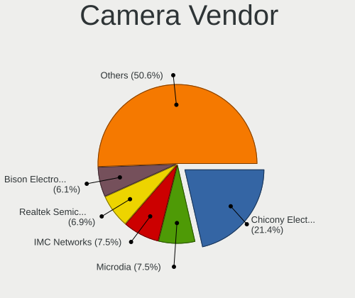

| Vendor                                 | Computers | Percent |
|----------------------------------------|-----------|---------|
| Chicony Electronics                    | 3870      | 21.41%  |
| Microdia                               | 1352      | 7.48%   |
| IMC Networks                           | 1351      | 7.47%   |
| Realtek Semiconductor                  | 1249      | 6.91%   |
| Bison Electronics                      | 1107      | 6.12%   |
| Logitech                               | 1013      | 5.6%    |
| Sunplus Innovation Technology          | 956       | 5.29%   |
| Quanta                                 | 922       | 5.1%    |
| Cheng Uei Precision Industry (Foxlink) | 719       | 3.98%   |
| Apple                                  | 636       | 3.52%   |
| Suyin                                  | 610       | 3.37%   |
| Syntek                                 | 436       | 2.41%   |
| Luxvisions Innotech Limited            | 356       | 1.97%   |
| Lite-On Technology                     | 325       | 1.8%    |
| Silicon Motion                         | 309       | 1.71%   |
| Alcor Micro                            | 267       | 1.48%   |
| Samsung Electronics                    | 184       | 1.02%   |
| Microsoft                              | 175       | 0.97%   |
| Ricoh                                  | 174       | 0.96%   |
| Z-Star Microelectronics                | 139       | 0.77%   |
| Sonix Technology                       | 135       | 0.75%   |
| Acer                                   | 105       | 0.58%   |
| Shinetech                              | 89        | 0.49%   |
| Lenovo                                 | 89        | 0.49%   |
| Generalplus Technology                 | 87        | 0.48%   |
| ALi                                    | 73        | 0.4%    |
| SunplusIT                              | 72        | 0.4%    |
| Importek                               | 69        | 0.38%   |
| icSpring                               | 64        | 0.35%   |
| Primax Electronics                     | 53        | 0.29%   |
| GEMBIRD                                | 49        | 0.27%   |
| Creative Technology                    | 49        | 0.27%   |
| ARC International                      | 49        | 0.27%   |
| KYE Systems (Mouse Systems)            | 47        | 0.26%   |
| MacroSilicon                           | 45        | 0.25%   |
| Jieli Technology                       | 32        | 0.18%   |
| OmniVision Technologies                | 31        | 0.17%   |
| DigiTech                               | 31        | 0.17%   |
| Cubeternet                             | 30        | 0.17%   |
| Sunplus Technology                     | 29        | 0.16%   |

Camera Model
------------

Camera device models

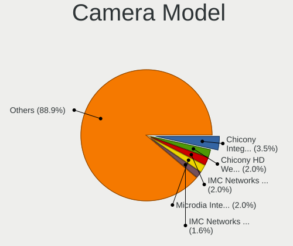

| Model                                               | Computers | Percent |
|-----------------------------------------------------|-----------|---------|
| Chicony Integrated Camera                           | 630       | 3.46%   |
| Chicony HD WebCam                                   | 370       | 2.03%   |
| IMC Networks USB2.0 HD UVC WebCam                   | 368       | 2.02%   |
| Microdia Integrated_Webcam_HD                       | 359       | 1.97%   |
| IMC Networks Integrated Camera                      | 296       | 1.63%   |
| Realtek Integrated_Webcam_HD                        | 292       | 1.61%   |
| Bison Integrated Camera                             | 270       | 1.48%   |
| Sunplus Integrated_Webcam_HD                        | 239       | 1.31%   |
| Logitech Webcam C270                                | 230       | 1.26%   |
| Syntek Integrated Camera                            | 210       | 1.15%   |
| Apple FaceTime HD Camera (Built-in)                 | 194       | 1.07%   |
| Samsung Galaxy series, misc. (MTP mode)             | 181       | 0.99%   |
| Apple Built-in iSight                               | 180       | 0.99%   |
| IMC Networks USB2.0 VGA UVC WebCam                  | 141       | 0.78%   |
| Chicony USB2.0 HD UVC WebCam                        | 139       | 0.76%   |
| Chicony HP Truevision HD                            | 139       | 0.76%   |
| Microdia Integrated Webcam                          | 136       | 0.75%   |
| Chicony HP HD Camera                                | 136       | 0.75%   |
| Quanta HD User Facing                               | 132       | 0.73%   |
| Chicony HP TrueVision HD Camera                     | 131       | 0.72%   |
| Apple iPhone 5/5C/5S/6/SE/7/8/X                     | 130       | 0.71%   |
| Logitech HD Pro Webcam C920                         | 127       | 0.7%    |
| Realtek USB Camera                                  | 123       | 0.68%   |
| Bison Lenovo EasyCamera                             | 119       | 0.65%   |
| Quanta HD Webcam                                    | 117       | 0.64%   |
| Chicony EasyCamera                                  | 114       | 0.63%   |
| Quanta HP TrueVision HD Camera                      | 111       | 0.61%   |
| Sunplus HD WebCam                                   | 110       | 0.6%    |
| Apple FaceTime HD Camera                            | 110       | 0.6%    |
| Lite-On Integrated Camera                           | 107       | 0.59%   |
| Chicony TOSHIBA Web Camera - HD                     | 107       | 0.59%   |
| Chicony HD User Facing                              | 106       | 0.58%   |
| Microdia Webcam Vitade AF                           | 100       | 0.55%   |
| Cheng Uei Precision Industry (Foxlink) HP Webcam    | 99        | 0.54%   |
| Chicony HP Webcam                                   | 98        | 0.54%   |
| Microdia USB 2.0 Camera                             | 97        | 0.53%   |
| Luxvisions Innotech Limited HP TrueVision HD Camera | 96        | 0.53%   |
| Chicony VGA WebCam                                  | 96        | 0.53%   |
| Bison EasyCamera                                    | 95        | 0.52%   |
| Alcor Micro USB 2.0 Camera                          | 95        | 0.52%   |

Security
--------

Fingerprint Vendor
------------------

Fingerprint sensor vendors

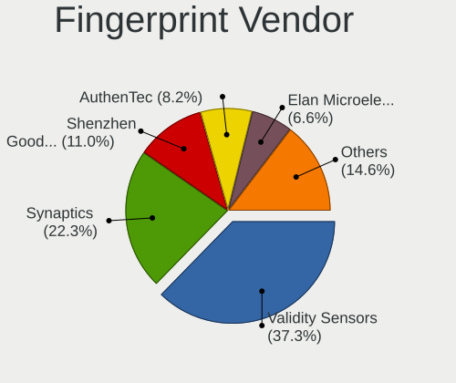

| Vendor                             | Computers | Percent |
|------------------------------------|-----------|---------|
| Validity Sensors                   | 1001      | 37.31%  |
| Synaptics                          | 599       | 22.33%  |
| Shenzhen Goodix Technology         | 295       | 11%     |
| AuthenTec                          | 220       | 8.2%    |
| Elan Microelectronics              | 176       | 6.56%   |
| Upek                               | 167       | 6.22%   |
| LighTuning Technology              | 128       | 4.77%   |
| STMicroelectronics                 | 39        | 1.45%   |
| HOLTEK                             | 13        | 0.48%   |
| Focal-systems.Corp                 | 11        | 0.41%   |
| Realtek USB2.0 Finger Print Bridge | 10        | 0.37%   |
| Samsung Electronics                | 8         | 0.3%    |
| DigitalPersona                     | 5         | 0.19%   |
| Next Biometrics                    | 3         | 0.11%   |
| Suprema                            | 2         | 0.07%   |
| Microsoft                          | 2         | 0.07%   |
| ZKSoftware                         | 1         | 0.04%   |
| GDMicroelectronics                 | 1         | 0.04%   |
| Futronic Technology                | 1         | 0.04%   |
| Dell                               | 1         | 0.04%   |

Fingerprint Model
-----------------

Fingerprint sensor models

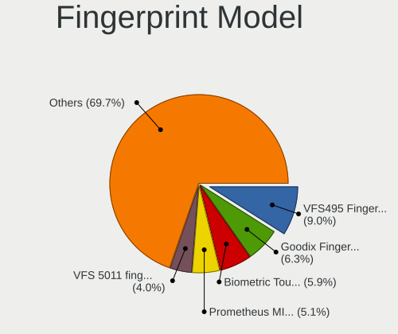

| Model                                                                      | Computers | Percent |
|----------------------------------------------------------------------------|-----------|---------|
| Validity Sensors VFS495 Fingerprint Reader                                 | 241       | 8.98%   |
| Shenzhen Goodix  FingerPrint Device                                        | 169       | 6.3%    |
| Upek Biometric Touchchip/Touchstrip Fingerprint Sensor                     | 159       | 5.93%   |
| Synaptics Prometheus MIS Touch Fingerprint Reader                          | 136       | 5.07%   |
| Validity Sensors VFS 5011 fingerprint sensor                               | 108       | 4.03%   |
| Synaptics Metallica MIS Touch Fingerprint Reader                           | 103       | 3.84%   |
| Shenzhen Goodix Fingerprint Reader                                         | 99        | 3.69%   |
| Validity Sensors VFS5011 Fingerprint Reader                                | 92        | 3.43%   |
| Elan ELAN:Fingerprint                                                      | 88        | 3.28%   |
| Validity Sensors Synaptics WBDI                                            | 82        | 3.06%   |
| Validity Sensors VFS471 Fingerprint Reader                                 | 79        | 2.94%   |
| Elan ELAN:ARM-M4                                                           | 74        | 2.76%   |
| Validity Sensors Fingerprint scanner                                       | 67        | 2.5%    |
| AuthenTec AES2810                                                          | 63        | 2.35%   |
| Validity Sensors VFS491                                                    | 60        | 2.24%   |
| LighTuning EgisTec Touch Fingerprint Sensor                                | 57        | 2.12%   |
| Synaptics  WBDI                                                            | 51        | 1.9%    |
| Synaptics WBDI                                                             | 48        | 1.79%   |
| AuthenTec AES2501 Fingerprint Sensor                                       | 47        | 1.75%   |
| Validity Sensors Synaptics VFS7552 Touch Fingerprint Sensor with PurePrint | 44        | 1.64%   |
| Validity Sensors VFS451 Fingerprint Reader                                 | 43        | 1.6%    |
| Validity Sensors Swipe Fingerprint Sensor                                  | 41        | 1.53%   |
| Synaptics Fingerprint reader [HP G6]                                       | 41        | 1.53%   |
| AuthenTec AES1600                                                          | 40        | 1.49%   |
| Validity Sensors VFS7500 Touch Fingerprint Sensor                          | 39        | 1.45%   |
| STMicroelectronics Fingerprint Reader                                      | 39        | 1.45%   |
| LighTuning ES603 Swipe Fingerprint Sensor                                  | 38        | 1.42%   |
| AuthenTec Fingerprint Sensor                                               | 38        | 1.42%   |
| Synaptics FS7604 Touch Fingerprint Sensor with PurePrint                   | 37        | 1.38%   |
| Synaptics UWP WBDI                                                         | 33        | 1.23%   |
| Validity Sensors VFS301 Fingerprint Reader                                 | 32        | 1.19%   |
| Synaptics UWP WBDI Device                                                  | 31        | 1.16%   |
| Validity Sensors VFS101 Fingerprint Reader                                 | 30        | 1.12%   |
| Synaptics  FS7604 Touch Fingerprint Sensor with PurePrint                  | 29        | 1.08%   |
| Shenzhen Goodix FingerPrint                                                | 27        | 1.01%   |
| LighTuning Fingerprint Reader                                              | 27        | 1.01%   |
| Synaptics Metallica MOH Touch Fingerprint Reader                           | 25        | 0.93%   |
| Synaptics WBDI Fingerprint Reader USB 086                                  | 18        | 0.67%   |
| AuthenTec AES2550 Fingerprint Sensor                                       | 17        | 0.63%   |
| Validity Sensors VFS Fingerprint sensor                                    | 14        | 0.52%   |

Chipcard Vendor
---------------

Chipcard module vendors

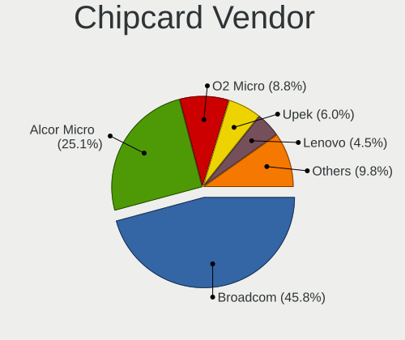

| Vendor                            | Computers | Percent |
|-----------------------------------|-----------|---------|
| Broadcom                          | 585       | 45.81%  |
| Alcor Micro                       | 321       | 25.14%  |
| O2 Micro                          | 112       | 8.77%   |
| Upek                              | 77        | 6.03%   |
| Lenovo                            | 57        | 4.46%   |
| SCM Microsystems                  | 20        | 1.57%   |
| Gemalto (was Gemplus)             | 17        | 1.33%   |
| OmniKey                           | 15        | 1.17%   |
| Realtek Semiconductor             | 11        | 0.86%   |
| Reiner SCT Kartensysteme          | 10        | 0.78%   |
| Cherry                            | 6         | 0.47%   |
| Bit4id                            | 6         | 0.47%   |
| Advanced Card Systems             | 5         | 0.39%   |
| VASCO Data Security International | 4         | 0.31%   |
| Giesecke & Devrient               | 3         | 0.23%   |
| Chicony Electronics               | 3         | 0.23%   |
| Aladdin Knowledge Systems         | 3         | 0.23%   |
| Aktiv                             | 3         | 0.23%   |
| Microchip Technology              | 2         | 0.16%   |
| Kobil Systems                     | 2         | 0.16%   |
| In Focus Systems                  | 2         | 0.16%   |
| Fujitsu Siemens Computers         | 2         | 0.16%   |
| Clay Logic                        | 2         | 0.16%   |
| Aladdin R.D.                      | 2         | 0.16%   |
| Yubico.com                        | 1         | 0.08%   |
| Precise Biometrics                | 1         | 0.08%   |
| NXP Semiconductors                | 1         | 0.08%   |
| Hewlett-Packard                   | 1         | 0.08%   |
| GHI                               | 1         | 0.08%   |
| C3PO                              | 1         | 0.08%   |
| Alcorlink                         | 1         | 0.08%   |

Chipcard Model
--------------

Chipcard module models

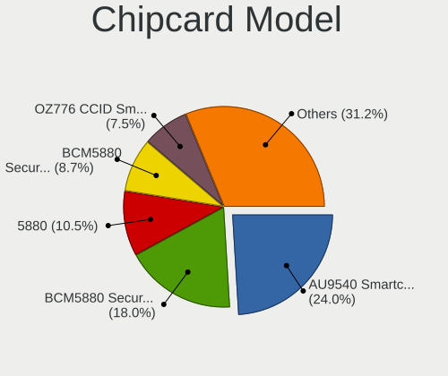

| Model                                                                        | Computers | Percent |
|------------------------------------------------------------------------------|-----------|---------|
| Alcor Micro AU9540 Smartcard Reader                                          | 307       | 24.04%  |
| Broadcom BCM5880 Secure Applications Processor                               | 230       | 18.01%  |
| Broadcom 5880                                                                | 134       | 10.49%  |
| Broadcom BCM5880 Secure Applications Processor with fingerprint swipe sensor | 111       | 8.69%   |
| O2 Micro OZ776 CCID Smartcard Reader                                         | 96        | 7.52%   |
| Upek TouchChip Fingerprint Coprocessor (WBF advanced mode)                   | 77        | 6.03%   |
| Broadcom BCM58200 ControlVault 3 (FingerPrint sensor + Contacted SmartCard)  | 74        | 5.79%   |
| Lenovo Integrated Smart Card Reader                                          | 57        | 4.46%   |
| Broadcom 58200                                                               | 29        | 2.27%   |
| O2 Micro Oz776 SmartCard Reader                                              | 16        | 1.25%   |
| Alcor Micro Watchdata W 1981                                                 | 13        | 1.02%   |
| SCM Microsystems SCR331-LC1 / SCR3310 SmartCard Reader                       | 11        | 0.86%   |
| Realtek Semiconductor Smart Card Reader Interface                            | 11        | 0.86%   |
| Gemalto (was Gemplus) GemPC Twin SmartCard Reader                            | 11        | 0.86%   |
| Reiner SCT Kartensysteme cyberJack RFID basis contactless smartcard reader   | 8         | 0.63%   |
| Broadcom BCM5880 Secure Applications Processor with fingerprint touch sensor | 7         | 0.55%   |
| OmniKey CardMan 3021 / 3121                                                  | 6         | 0.47%   |
| Gemalto (was Gemplus) Compact Smart Card Reader Writer                       | 5         | 0.39%   |
| VASCO Data Security International Digipass 905 SmartCard Reader              | 4         | 0.31%   |
| SCM Microsystems SCR35xx Smart Card Reader                                   | 3         | 0.23%   |
| SCM Microsystems SCR3340 - ExpressCard54 Smart Card Reader                   | 3         | 0.23%   |
| Giesecke & Devrient Chipcard Reader                                          | 3         | 0.23%   |
| Chicony Electronics HP Skylab USB Smartcard Keyboard                         | 3         | 0.23%   |
| Cherry SmartCard Reader Keyboard KC 1000 SC                                  | 3         | 0.23%   |
| Bit4id miniLector EVO                                                        | 3         | 0.23%   |
| Aladdin Knowledge Systems Token JC                                           | 3         | 0.23%   |
| Aktiv Rutoken lite                                                           | 3         | 0.23%   |
| Advanced Card Systems ACR38 SmartCard Reader                                 | 3         | 0.23%   |
| SCM Microsystems uTrust 3700 F CL Reader                                     | 2         | 0.16%   |
| Reiner SCT Kartensysteme tanJack USB                                         | 2         | 0.16%   |
| OmniKey CardMan Smart@Link                                                   | 2         | 0.16%   |
| OmniKey CardMan 3121 (HID Technologies)                                      | 2         | 0.16%   |
| OmniKey CardMan 1021                                                         | 2         | 0.16%   |
| Microchip Technology SMSC USX101x Reader                                     | 2         | 0.16%   |
| Kobil Systems Smart Token                                                    | 2         | 0.16%   |
| In Focus Systems EMV Smartcard Reader                                        | 2         | 0.16%   |
| Clay Logic Nitrokey Pro                                                      | 2         | 0.16%   |
| Bit4id miniLector-s                                                          | 2         | 0.16%   |
| Aladdin R.D. JaCarta                                                         | 2         | 0.16%   |
| Advanced Card Systems ACR122U                                                | 2         | 0.16%   |

Unsupported
-----------

Unsupported Devices
-------------------

Total unsupported devices on board

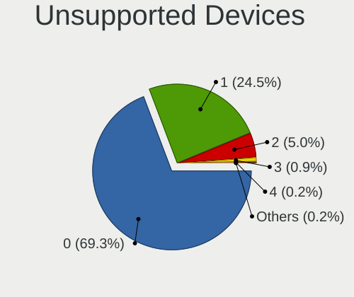

| Total | Computers | Percent |
|-------|-----------|---------|
| 0     | 21386     | 69.25%  |
| 1     | 7564      | 24.49%  |
| 2     | 1549      | 5.02%   |
| 3     | 273       | 0.88%   |
| 4     | 61        | 0.2%    |
| 5     | 25        | 0.08%   |
| 6     | 18        | 0.06%   |
| 7     | 3         | 0.01%   |
| 8     | 2         | 0.01%   |
| 9     | 1         | 0.003%  |

Unsupported Device Types
------------------------

Types of unsupported devices

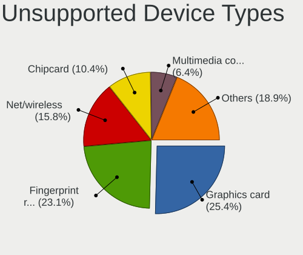

| Type                     | Computers | Percent |
|--------------------------|-----------|---------|
| Graphics card            | 2904      | 25.41%  |
| Fingerprint reader       | 2646      | 23.15%  |
| Net/wireless             | 1808      | 15.82%  |
| Chipcard                 | 1188      | 10.39%  |
| Multimedia controller    | 728       | 6.37%   |
| Communication controller | 371       | 3.25%   |
| Bluetooth                | 344       | 3.01%   |
| Camera                   | 301       | 2.63%   |
| Sound                    | 210       | 1.84%   |
| Storage                  | 193       | 1.69%   |
| Unassigned class         | 167       | 1.46%   |
| Net/ethernet             | 124       | 1.08%   |
| Card reader              | 108       | 0.94%   |
| Network                  | 102       | 0.89%   |
| Modem                    | 59        | 0.52%   |
| Storage/raid             | 44        | 0.38%   |
| Storage/ide              | 39        | 0.34%   |
| Flash memory             | 35        | 0.31%   |
| Dvb card                 | 23        | 0.2%    |
| Firewire controller      | 14        | 0.12%   |
| Unclassified device      | 5         | 0.04%   |
| Tv card                  | 5         | 0.04%   |
| Wireless                 | 4         | 0.03%   |
| Storage/nvme             | 3         | 0.03%   |
| Storage/ata              | 3         | 0.03%   |
| Video                    | 2         | 0.02%   |

