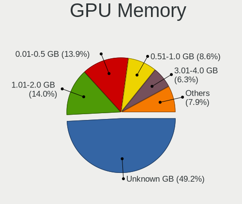
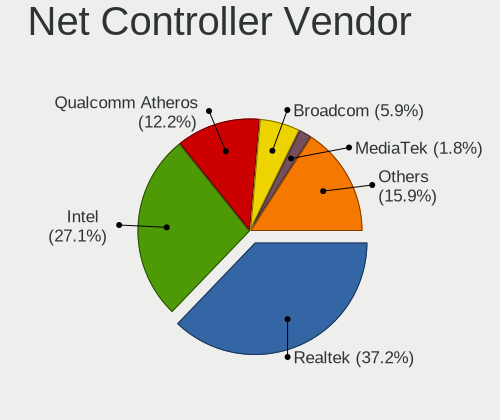

Linux Mint - Tested Hardware & Statistics
-----------------------------------------

A project to collect tested hardware configurations for Linux Mint.

Anyone can contribute to this report by the [hw-probe](https://github.com/linuxhw/hw-probe) tool:

    sudo -E hw-probe -all -upload

Please contribute! Especially if your hardware is rare.

This is a report for all computer types. See also reports for [desktops](/Dist/Linux_Mint/Desktop/README.md) and [notebooks](/Dist/Linux_Mint/Notebook/README.md).

Contents
--------

* [ Test Cases ](#test-cases)

* [ System ](#system)
  - [ OS                       ](#os)
  - [ OS Family                ](#os-family)
  - [ Kernel                   ](#kernel)
  - [ Kernel Family            ](#kernel-family)
  - [ Kernel Major Ver.        ](#kernel-major-ver)
  - [ Arch                     ](#arch)
  - [ DE                       ](#de)
  - [ Display Server           ](#display-server)
  - [ Display Manager          ](#display-manager)
  - [ OS Lang                  ](#os-lang)
  - [ Boot Mode                ](#boot-mode)
  - [ Filesystem               ](#filesystem)
  - [ Part. scheme             ](#part-scheme)
  - [ Dual Boot with Linux/BSD ](#dual-boot-with-linuxbsd)
  - [ Dual Boot (Win)          ](#dual-boot-win)

* [ Board ](#board)
  - [ Vendor                   ](#vendor)
  - [ Model                    ](#model)
  - [ Model Family             ](#model-family)
  - [ MFG Year                 ](#mfg-year)
  - [ Form Factor              ](#form-factor)
  - [ Secure Boot              ](#secure-boot)
  - [ Coreboot                 ](#coreboot)
  - [ RAM Size                 ](#ram-size)
  - [ RAM Used                 ](#ram-used)
  - [ Total Drives             ](#total-drives)
  - [ Has CD-ROM               ](#has-cd-rom)
  - [ Has Ethernet             ](#has-ethernet)
  - [ Has WiFi                 ](#has-wifi)
  - [ Has Bluetooth            ](#has-bluetooth)

* [ Location ](#location)
  - [ Country                  ](#country)
  - [ City                     ](#city)

* [ Drives ](#drives)
  - [ Drive Vendor             ](#drive-vendor)
  - [ Drive Model              ](#drive-model)
  - [ HDD Vendor               ](#hdd-vendor)
  - [ SSD Vendor               ](#ssd-vendor)
  - [ Drive Kind               ](#drive-kind)
  - [ Drive Connector          ](#drive-connector)
  - [ Drive Size               ](#drive-size)
  - [ Space Total              ](#space-total)
  - [ Space Used               ](#space-used)
  - [ Malfunc. Drives          ](#malfunc-drives)
  - [ Malfunc. Drive Vendor    ](#malfunc-drive-vendor)
  - [ Malfunc. HDD Vendor      ](#malfunc-hdd-vendor)
  - [ Malfunc. Drive Kind      ](#malfunc-drive-kind)
  - [ Failed Drives            ](#failed-drives)
  - [ Failed Drive Vendor      ](#failed-drive-vendor)
  - [ Drive Status             ](#drive-status)

* [ Storage controller ](#storage-controller)
  - [ Storage Vendor           ](#storage-vendor)
  - [ Storage Model            ](#storage-model)
  - [ Storage Kind             ](#storage-kind)

* [ Processor ](#processor)
  - [ CPU Vendor               ](#cpu-vendor)
  - [ CPU Model                ](#cpu-model)
  - [ CPU Model Family         ](#cpu-model-family)
  - [ CPU Cores                ](#cpu-cores)
  - [ CPU Sockets              ](#cpu-sockets)
  - [ CPU Threads              ](#cpu-threads)
  - [ CPU Op-Modes             ](#cpu-op-modes)
  - [ CPU Microcode            ](#cpu-microcode)
  - [ CPU Microarch            ](#cpu-microarch)

* [ Graphics ](#graphics)
  - [ GPU Vendor               ](#gpu-vendor)
  - [ GPU Model                ](#gpu-model)
  - [ GPU Combo                ](#gpu-combo)
  - [ GPU Driver               ](#gpu-driver)
  - [ GPU Memory               ](#gpu-memory)

* [ Monitor ](#monitor)
  - [ Monitor Vendor           ](#monitor-vendor)
  - [ Monitor Model            ](#monitor-model)
  - [ Monitor Resolution       ](#monitor-resolution)
  - [ Monitor Diagonal         ](#monitor-diagonal)
  - [ Monitor Width            ](#monitor-width)
  - [ Aspect Ratio             ](#aspect-ratio)
  - [ Monitor Area             ](#monitor-area)
  - [ Pixel Density            ](#pixel-density)
  - [ Multiple Monitors        ](#multiple-monitors)

* [ Network ](#network)
  - [ Net Controller Vendor    ](#net-controller-vendor)
  - [ Net Controller Model     ](#net-controller-model)
  - [ Wireless Vendor          ](#wireless-vendor)
  - [ Wireless Model           ](#wireless-model)
  - [ Ethernet Vendor          ](#ethernet-vendor)
  - [ Ethernet Model           ](#ethernet-model)
  - [ Net Controller Kind      ](#net-controller-kind)
  - [ Used Controller          ](#used-controller)
  - [ NICs                     ](#nics)
  - [ IPv6                     ](#ipv6)

* [ Bluetooth ](#bluetooth)
  - [ Bluetooth Vendor         ](#bluetooth-vendor)
  - [ Bluetooth Model          ](#bluetooth-model)

* [ Sound ](#sound)
  - [ Sound Vendor             ](#sound-vendor)
  - [ Sound Model              ](#sound-model)

* [ Memory ](#memory)
  - [ Memory Vendor            ](#memory-vendor)
  - [ Memory Model             ](#memory-model)
  - [ Memory Kind              ](#memory-kind)
  - [ Memory Form Factor       ](#memory-form-factor)
  - [ Memory Size              ](#memory-size)
  - [ Memory Speed             ](#memory-speed)

* [ Printers & scanners ](#printers--scanners)
  - [ Printer Vendor           ](#printer-vendor)
  - [ Printer Model            ](#printer-model)
  - [ Scanner Vendor           ](#scanner-vendor)
  - [ Scanner Model            ](#scanner-model)

* [ Camera ](#camera)
  - [ Camera Vendor            ](#camera-vendor)
  - [ Camera Model             ](#camera-model)

* [ Security ](#security)
  - [ Fingerprint Vendor       ](#fingerprint-vendor)
  - [ Fingerprint Model        ](#fingerprint-model)
  - [ Chipcard Vendor          ](#chipcard-vendor)
  - [ Chipcard Model           ](#chipcard-model)

* [ Unsupported ](#unsupported)
  - [ Unsupported Devices      ](#unsupported-devices)
  - [ Unsupported Device Types ](#unsupported-device-types)

Test Cases
----------

Total: 21368

| Vendor        | Model                       | Form-Factor | Probe                                                      | Date         |
|---------------|-----------------------------|-------------|------------------------------------------------------------|--------------|
| HP            | ProLiant DL360 G7           | Server      | [878afd8a43](https://linux-hardware.org/?probe=878afd8a43) | Dec 01, 2022 |
| HP            | Stream Laptop 14-cb1XX      | Notebook    | [e8ecfcc3cd](https://linux-hardware.org/?probe=e8ecfcc3cd) | Dec 01, 2022 |
| MSI           | GF72 8RD                    | Notebook    | [c03f783ea5](https://linux-hardware.org/?probe=c03f783ea5) | Dec 01, 2022 |
| HP            | Stream Laptop 14-cb1XX      | Notebook    | [80c9d45a14](https://linux-hardware.org/?probe=80c9d45a14) | Dec 01, 2022 |
| Packard Be... | DOT S                       | Notebook    | [bb05d9a173](https://linux-hardware.org/?probe=bb05d9a173) | Dec 01, 2022 |
| Acer          | Aspire 3830TG               | Notebook    | [8bb246cbaa](https://linux-hardware.org/?probe=8bb246cbaa) | Dec 01, 2022 |
| Acer          | Aspire 3830TG               | Notebook    | [46bcb20e26](https://linux-hardware.org/?probe=46bcb20e26) | Dec 01, 2022 |
| ASUSTek       | A88XM-A                     | Desktop     | [f883ed1fd1](https://linux-hardware.org/?probe=f883ed1fd1) | Dec 01, 2022 |
| HP            | Pavilion dv8000 (ET839UA... | Notebook    | [5b22a7d584](https://linux-hardware.org/?probe=5b22a7d584) | Dec 01, 2022 |
| ASUSTek       | P8H67                       | Desktop     | [31a7799a34](https://linux-hardware.org/?probe=31a7799a34) | Dec 01, 2022 |
| Lenovo        | ThinkPad T420 4236V6S       | Notebook    | [5900d34c9a](https://linux-hardware.org/?probe=5900d34c9a) | Dec 01, 2022 |
| Gigabyte      | GA-990FXA-UD7               | Desktop     | [e300be2b5e](https://linux-hardware.org/?probe=e300be2b5e) | Dec 01, 2022 |
| Lenovo        | ThinkPad L560 20F10034MX    | Notebook    | [34842eb8d9](https://linux-hardware.org/?probe=34842eb8d9) | Dec 01, 2022 |
| Mediacom      | SmartBook 14 FullHD - SB... | Notebook    | [1df1f552ff](https://linux-hardware.org/?probe=1df1f552ff) | Dec 01, 2022 |
| Apple         | Mac-81E3E92DD6088272 iMa... | All in one  | [a8bad4d4b6](https://linux-hardware.org/?probe=a8bad4d4b6) | Dec 01, 2022 |
| Acer          | Aspire 5750G                | Notebook    | [a8236e24a5](https://linux-hardware.org/?probe=a8236e24a5) | Dec 01, 2022 |
| Dell          | Latitude E7470              | Notebook    | [457187e169](https://linux-hardware.org/?probe=457187e169) | Dec 01, 2022 |
| Acer          | Aspire 5750G                | Notebook    | [198d7f2534](https://linux-hardware.org/?probe=198d7f2534) | Dec 01, 2022 |
| Samsung       | 355V4C/356V4C/3445VC/354... | Notebook    | [65fa0de0a2](https://linux-hardware.org/?probe=65fa0de0a2) | Dec 01, 2022 |
| Dell          | Latitude E7240              | Notebook    | [0945377dfb](https://linux-hardware.org/?probe=0945377dfb) | Dec 01, 2022 |
| In-Sing       | NK81J                       | Notebook    | [bca0a3709f](https://linux-hardware.org/?probe=bca0a3709f) | Dec 01, 2022 |
| Dell          | Latitude E7470              | Notebook    | [b24884fe44](https://linux-hardware.org/?probe=b24884fe44) | Dec 01, 2022 |
| HP            | Pavilion dv8000 (ET839UA... | Notebook    | [19c2f41d14](https://linux-hardware.org/?probe=19c2f41d14) | Dec 01, 2022 |
| Apple         | MacBookPro11,4              | Notebook    | [138689463a](https://linux-hardware.org/?probe=138689463a) | Dec 01, 2022 |
| GPU Compan... | GWTC116-2                   | Notebook    | [d004be9ab6](https://linux-hardware.org/?probe=d004be9ab6) | Dec 01, 2022 |
| Apple         | MacBookPro11,4              | Notebook    | [16d0cef78c](https://linux-hardware.org/?probe=16d0cef78c) | Dec 01, 2022 |
| HP            | 18E9                        | Desktop     | [9086d1a1e5](https://linux-hardware.org/?probe=9086d1a1e5) | Dec 01, 2022 |
| Lenovo        | Yoga 7 16IAH7 82UF          | Convertible | [c62923ba95](https://linux-hardware.org/?probe=c62923ba95) | Dec 01, 2022 |
| ECS           | H61H2-WM                    | Desktop     | [9a7a280b58](https://linux-hardware.org/?probe=9a7a280b58) | Dec 01, 2022 |
| Dell          | Inspiron MM061              | Notebook    | [703ef1c899](https://linux-hardware.org/?probe=703ef1c899) | Nov 30, 2022 |
| HUAWEI        | KLVL-WXX9                   | Notebook    | [ea8b9066f6](https://linux-hardware.org/?probe=ea8b9066f6) | Nov 30, 2022 |
| Lenovo        | IdeaPad 310-15IAP 80TT      | Notebook    | [3aa3302b92](https://linux-hardware.org/?probe=3aa3302b92) | Nov 30, 2022 |
| HP            | ElitePad 1000 G2            | Notebook    | [0b05465735](https://linux-hardware.org/?probe=0b05465735) | Nov 30, 2022 |
| Acer          | Aspire A315-34              | Notebook    | [6bf371252b](https://linux-hardware.org/?probe=6bf371252b) | Nov 30, 2022 |
| MSI           | MAG Z690 TOMAHAWK WIFI D... | Desktop     | [24dd5413fa](https://linux-hardware.org/?probe=24dd5413fa) | Nov 30, 2022 |
| HP            | 8924 0101                   | All in one  | [f9c0b53eee](https://linux-hardware.org/?probe=f9c0b53eee) | Nov 30, 2022 |
| GPU Compan... | GWTN156-2BK                 | Notebook    | [1ed3629f61](https://linux-hardware.org/?probe=1ed3629f61) | Nov 30, 2022 |
| Gigabyte      | Z87-HD3                     | Desktop     | [d9a78cb529](https://linux-hardware.org/?probe=d9a78cb529) | Nov 30, 2022 |
| Dell          | 0M5DCD A00                  | Desktop     | [e9fae02409](https://linux-hardware.org/?probe=e9fae02409) | Nov 30, 2022 |
| Gigabyte      | G33M-S2                     | Desktop     | [3d6a965dd4](https://linux-hardware.org/?probe=3d6a965dd4) | Nov 30, 2022 |
| ASUSTek       | Benicia                     | Desktop     | [e5468e4258](https://linux-hardware.org/?probe=e5468e4258) | Nov 30, 2022 |
| HP            | ZBook 15v G5                | Notebook    | [aabc35ae2a](https://linux-hardware.org/?probe=aabc35ae2a) | Nov 30, 2022 |
| Dell          | Latitude E6440              | Notebook    | [0c3dd709dd](https://linux-hardware.org/?probe=0c3dd709dd) | Nov 30, 2022 |
| Dell          | 0D28YY A00                  | Desktop     | [4af0b7dc59](https://linux-hardware.org/?probe=4af0b7dc59) | Nov 30, 2022 |
| Dell          | 0D28YY A00                  | Desktop     | [bc8c993489](https://linux-hardware.org/?probe=bc8c993489) | Nov 30, 2022 |
| Acer          | Aspire E5-575G              | Notebook    | [1ca5144296](https://linux-hardware.org/?probe=1ca5144296) | Nov 30, 2022 |
| Acer          | Aspire E5-575               | Notebook    | [b393262562](https://linux-hardware.org/?probe=b393262562) | Nov 30, 2022 |
| ASRock        | N68-S3 UCC                  | Desktop     | [ede29d01f8](https://linux-hardware.org/?probe=ede29d01f8) | Nov 30, 2022 |
| GPU Compan... | GWTN156-2BK                 | Notebook    | [dbba08e68e](https://linux-hardware.org/?probe=dbba08e68e) | Nov 30, 2022 |
| ASRock        | AB350 Pro4                  | Desktop     | [de19b92dda](https://linux-hardware.org/?probe=de19b92dda) | Nov 30, 2022 |
| Tactus        | GeoBook 140                 | Notebook    | [91342e56df](https://linux-hardware.org/?probe=91342e56df) | Nov 29, 2022 |
| Fujitsu       | D3162-A1 S26361-D3162-A1    | Desktop     | [b38075cef4](https://linux-hardware.org/?probe=b38075cef4) | Nov 29, 2022 |
| Acer          | Aspire A315-34              | Notebook    | [56bb76fb28](https://linux-hardware.org/?probe=56bb76fb28) | Nov 29, 2022 |
| HP            | Pavilion 17                 | Notebook    | [431ce9bd18](https://linux-hardware.org/?probe=431ce9bd18) | Nov 29, 2022 |
| Apple         | MacBookAir8,1               | Notebook    | [7581ef0e85](https://linux-hardware.org/?probe=7581ef0e85) | Nov 29, 2022 |
| HP            | 18E4                        | Desktop     | [39b839e527](https://linux-hardware.org/?probe=39b839e527) | Nov 29, 2022 |
| HUAWEI        | CREM-WXX9                   | Notebook    | [ddad96715a](https://linux-hardware.org/?probe=ddad96715a) | Nov 29, 2022 |
| ASRock        | N68-S3 UCC                  | Desktop     | [fd6f368580](https://linux-hardware.org/?probe=fd6f368580) | Nov 29, 2022 |
| HP            | Pavilion g6                 | Notebook    | [fefac15f4c](https://linux-hardware.org/?probe=fefac15f4c) | Nov 29, 2022 |
| HP            | Victus by Laptop 16-d0xx... | Notebook    | [dae405ee81](https://linux-hardware.org/?probe=dae405ee81) | Nov 29, 2022 |
| ASUSTek       | G751JL                      | Notebook    | [1bfbfafe68](https://linux-hardware.org/?probe=1bfbfafe68) | Nov 29, 2022 |
| ASUSTek       | VivoBook_ASUSLaptop X512... | Notebook    | [140872c53d](https://linux-hardware.org/?probe=140872c53d) | Nov 29, 2022 |
| Lenovo        | IdeaPad 510S-14ISK 80TK     | Notebook    | [687d4d78a4](https://linux-hardware.org/?probe=687d4d78a4) | Nov 29, 2022 |
| Dell          | Latitude E5440              | Notebook    | [90d18073d6](https://linux-hardware.org/?probe=90d18073d6) | Nov 29, 2022 |
| ASUSTek       | P8H77-M                     | Desktop     | [4aafb7e858](https://linux-hardware.org/?probe=4aafb7e858) | Nov 29, 2022 |
| HP            | Laptop 14s-fq0xxx           | Notebook    | [e71c023456](https://linux-hardware.org/?probe=e71c023456) | Nov 29, 2022 |
| Gigabyte      | 946GMX-S2                   | Desktop     | [6c97b310fb](https://linux-hardware.org/?probe=6c97b310fb) | Nov 29, 2022 |
| Thomson       | N17V3C8WH512                | Notebook    | [b89cd0328a](https://linux-hardware.org/?probe=b89cd0328a) | Nov 29, 2022 |
| AMI           | Intel                       | Notebook    | [3e2e312c6e](https://linux-hardware.org/?probe=3e2e312c6e) | Nov 29, 2022 |
| Acer          | Aspire A315-22              | Notebook    | [c52689296b](https://linux-hardware.org/?probe=c52689296b) | Nov 29, 2022 |
| Unknown       | Unknown                     | Notebook    | [d2789773ef](https://linux-hardware.org/?probe=d2789773ef) | Nov 29, 2022 |
| Acer          | Aspire A315-59              | Notebook    | [f7a1cff386](https://linux-hardware.org/?probe=f7a1cff386) | Nov 28, 2022 |
| HP            | 806A                        | Desktop     | [82128d6a8b](https://linux-hardware.org/?probe=82128d6a8b) | Nov 28, 2022 |
| Chuwi         | HeroBook Pro                | Notebook    | [df7f48022d](https://linux-hardware.org/?probe=df7f48022d) | Nov 28, 2022 |
| Chuwi         | HeroBook Pro                | Notebook    | [c8e48e2c0f](https://linux-hardware.org/?probe=c8e48e2c0f) | Nov 28, 2022 |
| Lenovo        | G700 20251                  | Notebook    | [49167f9f67](https://linux-hardware.org/?probe=49167f9f67) | Nov 28, 2022 |
| Unknown       | Unknown                     | Notebook    | [390854c8dd](https://linux-hardware.org/?probe=390854c8dd) | Nov 28, 2022 |
| HP            | EliteBook Folio 9480m       | Notebook    | [7f9d229259](https://linux-hardware.org/?probe=7f9d229259) | Nov 28, 2022 |
| Gigabyte      | GA-MA770-UD3                | Desktop     | [be98ffe55b](https://linux-hardware.org/?probe=be98ffe55b) | Nov 28, 2022 |
| ASUSTek       | X453MA                      | Notebook    | [f30a5c4808](https://linux-hardware.org/?probe=f30a5c4808) | Nov 28, 2022 |
| HP            | 255 G6 Notebook PC          | Notebook    | [e17172d1c5](https://linux-hardware.org/?probe=e17172d1c5) | Nov 28, 2022 |
| Dell          | Latitude E6320              | Notebook    | [bcbdb4bf67](https://linux-hardware.org/?probe=bcbdb4bf67) | Nov 28, 2022 |
| Dell          | Latitude E6320              | Notebook    | [f77e444066](https://linux-hardware.org/?probe=f77e444066) | Nov 28, 2022 |
| Acer          | TravelMate B113             | Notebook    | [567c2d2e20](https://linux-hardware.org/?probe=567c2d2e20) | Nov 28, 2022 |
| HUAWEI        | BOD-WXX9                    | Notebook    | [5b2f9bfd5c](https://linux-hardware.org/?probe=5b2f9bfd5c) | Nov 28, 2022 |
| Dell          | Latitude E6420              | Notebook    | [15ee6e2e20](https://linux-hardware.org/?probe=15ee6e2e20) | Nov 28, 2022 |
| Lenovo        | Flex 2-15 20405             | Notebook    | [7e37de4475](https://linux-hardware.org/?probe=7e37de4475) | Nov 28, 2022 |
| Dell          | Latitude E6420              | Notebook    | [251fb963fe](https://linux-hardware.org/?probe=251fb963fe) | Nov 28, 2022 |
| Dell          | 040DDP A00                  | Desktop     | [6bf43c8793](https://linux-hardware.org/?probe=6bf43c8793) | Nov 28, 2022 |
| MSI           | B450 TOMAHAWK MAX           | Desktop     | [fa5d6f5ca6](https://linux-hardware.org/?probe=fa5d6f5ca6) | Nov 28, 2022 |
| Dell          | 0DR845                      | Desktop     | [57f2ea3914](https://linux-hardware.org/?probe=57f2ea3914) | Nov 27, 2022 |
| Dell          | 0DR845                      | Desktop     | [f28560630d](https://linux-hardware.org/?probe=f28560630d) | Nov 27, 2022 |
| ASUSTek       | TUF Gaming FX705GM_FX705... | Notebook    | [3515e0a362](https://linux-hardware.org/?probe=3515e0a362) | Nov 27, 2022 |
| ASUSTek       | M5A78L-M LX                 | Desktop     | [c924457e4b](https://linux-hardware.org/?probe=c924457e4b) | Nov 27, 2022 |
| Lenovo        | S20-30 Touch 20434          | Notebook    | [63d2134051](https://linux-hardware.org/?probe=63d2134051) | Nov 27, 2022 |
| HP            | EliteBook 8460p             | Notebook    | [a39632439e](https://linux-hardware.org/?probe=a39632439e) | Nov 27, 2022 |
| AMD           | 58514                       | Desktop     | [7558bc36a0](https://linux-hardware.org/?probe=7558bc36a0) | Nov 27, 2022 |
| HP            | ENVY Laptop 17-ce1xxx       | Notebook    | [60c25a49bc](https://linux-hardware.org/?probe=60c25a49bc) | Nov 27, 2022 |
| Unknown       | Unknown                     | Notebook    | [9e16a80342](https://linux-hardware.org/?probe=9e16a80342) | Nov 27, 2022 |
| ASRock        | 970 Pro3 R2.0               | Desktop     | [79cce0ef33](https://linux-hardware.org/?probe=79cce0ef33) | Nov 27, 2022 |
| Jumper        | EZbook                      | Notebook    | [a93aa75e5f](https://linux-hardware.org/?probe=a93aa75e5f) | Nov 27, 2022 |
| ASUSTek       | E402SA                      | Notebook    | [05983f8566](https://linux-hardware.org/?probe=05983f8566) | Nov 26, 2022 |
| Lenovo        | Legion 5 Pro 16ARH7H 82R... | Notebook    | [7a5c0ebf68](https://linux-hardware.org/?probe=7a5c0ebf68) | Nov 26, 2022 |
| HP            | 18E4                        | Desktop     | [11c1530767](https://linux-hardware.org/?probe=11c1530767) | Nov 26, 2022 |
| MSI           | GF72 8RD                    | Notebook    | [fb92041c1b](https://linux-hardware.org/?probe=fb92041c1b) | Nov 26, 2022 |
| Lenovo        | ThinkPad X1 Carbon 34601... | Notebook    | [ed678da106](https://linux-hardware.org/?probe=ed678da106) | Nov 26, 2022 |
| Gigabyte      | F2A78M-HD2                  | Desktop     | [b5260b5609](https://linux-hardware.org/?probe=b5260b5609) | Nov 26, 2022 |
| Lenovo        | ThinkPad T460s 20FAS4KH0... | Notebook    | [585b6910fa](https://linux-hardware.org/?probe=585b6910fa) | Nov 26, 2022 |
| Gigabyte      | Z390 I AORUS PRO WIFI-CF    | Desktop     | [eb0921d1f6](https://linux-hardware.org/?probe=eb0921d1f6) | Nov 26, 2022 |
| Lenovo        | ThinkPad T460s 20FAS4KH0... | Notebook    | [138231da75](https://linux-hardware.org/?probe=138231da75) | Nov 26, 2022 |
| MSI           | 970 GAMING                  | Desktop     | [82a3d83d20](https://linux-hardware.org/?probe=82a3d83d20) | Nov 26, 2022 |
| MSI           | X370 GAMING M7 ACK          | Desktop     | [c2dca9687b](https://linux-hardware.org/?probe=c2dca9687b) | Nov 26, 2022 |
| ASUSTek       | T100TA                      | Notebook    | [2734591eb0](https://linux-hardware.org/?probe=2734591eb0) | Nov 26, 2022 |
| ASUSTek       | ZenBook UX450FDX_UX480FD    | Notebook    | [694d1d5e96](https://linux-hardware.org/?probe=694d1d5e96) | Nov 26, 2022 |
| Gigabyte      | GA-MA770-UD3                | Desktop     | [0f4c0786c2](https://linux-hardware.org/?probe=0f4c0786c2) | Nov 26, 2022 |
| Lenovo        | G40-80 80JE                 | Notebook    | [47d9a5f1ca](https://linux-hardware.org/?probe=47d9a5f1ca) | Nov 26, 2022 |
| Lenovo        | G40-80 80JE                 | Notebook    | [5d324af4d0](https://linux-hardware.org/?probe=5d324af4d0) | Nov 26, 2022 |
| ASRock        | H61M-DGS R2.0               | Desktop     | [189b3c0ea0](https://linux-hardware.org/?probe=189b3c0ea0) | Nov 26, 2022 |
| Acer          | Nitro AN515-54              | Notebook    | [e82fa602d4](https://linux-hardware.org/?probe=e82fa602d4) | Nov 26, 2022 |
| MSI           | B550-A PRO                  | Desktop     | [8d0b06aa1d](https://linux-hardware.org/?probe=8d0b06aa1d) | Nov 26, 2022 |
| Acer          | Nitro AN515-54              | Notebook    | [604339bd15](https://linux-hardware.org/?probe=604339bd15) | Nov 26, 2022 |
| HP            | OMEN by Laptop 15t-ek000    | Notebook    | [4189c96f5e](https://linux-hardware.org/?probe=4189c96f5e) | Nov 26, 2022 |
| HP            | Pavilion ZV6100 (EC356UA... | Notebook    | [c6fcc7764f](https://linux-hardware.org/?probe=c6fcc7764f) | Nov 26, 2022 |
| Samsung       | RV410/RV510/S3510/E3510     | Notebook    | [cd5eb0566d](https://linux-hardware.org/?probe=cd5eb0566d) | Nov 26, 2022 |
| Lenovo        | ThinkPad T14 Gen 1 20S0C... | Notebook    | [b669fa97c4](https://linux-hardware.org/?probe=b669fa97c4) | Nov 26, 2022 |
| Microsoft     | Surface Laptop Go           | Tablet      | [e7d8fb64e4](https://linux-hardware.org/?probe=e7d8fb64e4) | Nov 26, 2022 |
| Samsung       | RC530/RC730                 | Notebook    | [64515ff8b1](https://linux-hardware.org/?probe=64515ff8b1) | Nov 26, 2022 |
| MSI           | GE62 2QC                    | Notebook    | [6bdf66b3b6](https://linux-hardware.org/?probe=6bdf66b3b6) | Nov 26, 2022 |
| MSI           | MS-16G1                     | Notebook    | [8d8233d2a9](https://linux-hardware.org/?probe=8d8233d2a9) | Nov 25, 2022 |
| Acer          | Aspire 5349                 | Notebook    | [82be349d91](https://linux-hardware.org/?probe=82be349d91) | Nov 25, 2022 |
| ASUSTek       | ZenBook UX333FA_UX333FA     | Notebook    | [02eeb74e28](https://linux-hardware.org/?probe=02eeb74e28) | Nov 25, 2022 |
| Intel         | H61                         | Desktop     | [76825e4753](https://linux-hardware.org/?probe=76825e4753) | Nov 25, 2022 |
| Intel         | powered classmate PC        | Tablet      | [44cc912fe3](https://linux-hardware.org/?probe=44cc912fe3) | Nov 25, 2022 |
| Intel         | D525MW AAE93082-401         | Desktop     | [d480b7ef56](https://linux-hardware.org/?probe=d480b7ef56) | Nov 25, 2022 |
| Intel         | D525MW AAE93082-401         | Desktop     | [d3b2f8aaf7](https://linux-hardware.org/?probe=d3b2f8aaf7) | Nov 25, 2022 |
| HP            | ProBook 450 G6              | Notebook    | [d044aabfec](https://linux-hardware.org/?probe=d044aabfec) | Nov 25, 2022 |
| HP            | Pavilion Laptop 15-ck0xx    | Notebook    | [4393448090](https://linux-hardware.org/?probe=4393448090) | Nov 25, 2022 |
| Lenovo        | ThinkPad E15 Gen 4 21EDC... | Notebook    | [90fcc2d8d5](https://linux-hardware.org/?probe=90fcc2d8d5) | Nov 24, 2022 |
| Lenovo        | ThinkCentre A70 7099A5G     | Desktop     | [dad5599996](https://linux-hardware.org/?probe=dad5599996) | Nov 24, 2022 |
| Alienware     | M17xR3                      | Notebook    | [438f3639aa](https://linux-hardware.org/?probe=438f3639aa) | Nov 24, 2022 |
| Dell          | Inspiron 15 3520            | Notebook    | [7c53fcc73b](https://linux-hardware.org/?probe=7c53fcc73b) | Nov 24, 2022 |
| Dell          | Latitude E6540              | Notebook    | [5c474a2cdb](https://linux-hardware.org/?probe=5c474a2cdb) | Nov 24, 2022 |
| HP            | 339A                        | Desktop     | [52f957ef60](https://linux-hardware.org/?probe=52f957ef60) | Nov 24, 2022 |
| Unknown       | Unknown                     | Desktop     | [0904a442f0](https://linux-hardware.org/?probe=0904a442f0) | Nov 24, 2022 |
| Lenovo        | Flex 2-15 20405             | Notebook    | [054a6670b3](https://linux-hardware.org/?probe=054a6670b3) | Nov 24, 2022 |
| ASRock        | B550M Pro4                  | Desktop     | [3ba26453f1](https://linux-hardware.org/?probe=3ba26453f1) | Nov 24, 2022 |
| ASUSTek       | PRIME Z270-K                | Desktop     | [e311874280](https://linux-hardware.org/?probe=e311874280) | Nov 24, 2022 |
| HP            | Laptop 15-dw0xxx            | Notebook    | [894c4e9ebf](https://linux-hardware.org/?probe=894c4e9ebf) | Nov 24, 2022 |
| Dell          | Latitude E6440              | Notebook    | [21d39df616](https://linux-hardware.org/?probe=21d39df616) | Nov 24, 2022 |
| Acer          | Aspire R3-131T              | Notebook    | [5395a2556c](https://linux-hardware.org/?probe=5395a2556c) | Nov 24, 2022 |
| Aquarius      | NS685U R11                  | Notebook    | [0a9856bad0](https://linux-hardware.org/?probe=0a9856bad0) | Nov 24, 2022 |
| Lenovo        | ThinkPad T460 20FMS0VG25    | Notebook    | [06221c9746](https://linux-hardware.org/?probe=06221c9746) | Nov 24, 2022 |
| HP            | 806A                        | Desktop     | [ee8a1db4f4](https://linux-hardware.org/?probe=ee8a1db4f4) | Nov 24, 2022 |
| Gigabyte      | A320M-H-CF                  | Desktop     | [036dcac9fa](https://linux-hardware.org/?probe=036dcac9fa) | Nov 24, 2022 |
| ASUSTek       | B85-PRO GAMER               | Desktop     | [6d87497f34](https://linux-hardware.org/?probe=6d87497f34) | Nov 23, 2022 |
| Razer         | Blade Stealth               | Notebook    | [98889c6c3e](https://linux-hardware.org/?probe=98889c6c3e) | Nov 23, 2022 |
| Medion        | TJ4125                      | Desktop     | [84084e5cdc](https://linux-hardware.org/?probe=84084e5cdc) | Nov 23, 2022 |
| Medion        | TJ4125                      | Desktop     | [810477dfd9](https://linux-hardware.org/?probe=810477dfd9) | Nov 23, 2022 |
| Lenovo        | V15 G2 ALC 82KD             | Notebook    | [6646978243](https://linux-hardware.org/?probe=6646978243) | Nov 23, 2022 |
| Lenovo        | V15 G2 ALC 82KD             | Notebook    | [ddcb37ea55](https://linux-hardware.org/?probe=ddcb37ea55) | Nov 23, 2022 |
| Apple         | MacBookAir7,1               | Notebook    | [f735b3e731](https://linux-hardware.org/?probe=f735b3e731) | Nov 23, 2022 |
| HP            | 18E4                        | Desktop     | [8dd5fdb580](https://linux-hardware.org/?probe=8dd5fdb580) | Nov 23, 2022 |
| Lenovo        | ThinkPad T460 20FMS0VG25    | Notebook    | [b00a1e7f6a](https://linux-hardware.org/?probe=b00a1e7f6a) | Nov 23, 2022 |
| Dell          | 0P01GV A03                  | Desktop     | [470e942150](https://linux-hardware.org/?probe=470e942150) | Nov 23, 2022 |
| HP            | EliteBook 2560p             | Notebook    | [4c27c5511f](https://linux-hardware.org/?probe=4c27c5511f) | Nov 23, 2022 |
| Lenovo        | ThinkPad P15v Gen 3 21D9... | Notebook    | [f02593fc75](https://linux-hardware.org/?probe=f02593fc75) | Nov 23, 2022 |
| Dell          | Inspiron 5567               | Notebook    | [96e8bf5249](https://linux-hardware.org/?probe=96e8bf5249) | Nov 23, 2022 |
| HP            | Pavilion dv7                | Notebook    | [aa62e3eea2](https://linux-hardware.org/?probe=aa62e3eea2) | Nov 23, 2022 |
| HP            | 3397                        | Desktop     | [eb8968148c](https://linux-hardware.org/?probe=eb8968148c) | Nov 23, 2022 |
| Dell          | G3 3579                     | Notebook    | [7f4d27ea26](https://linux-hardware.org/?probe=7f4d27ea26) | Nov 23, 2022 |
| ASRock        | Q1900B-ITX                  | Desktop     | [7239c46e95](https://linux-hardware.org/?probe=7239c46e95) | Nov 23, 2022 |
| Intel         | B75                         | Desktop     | [24b64d225a](https://linux-hardware.org/?probe=24b64d225a) | Nov 22, 2022 |
| Dell          | Latitude E5440              | Notebook    | [9a39d45cee](https://linux-hardware.org/?probe=9a39d45cee) | Nov 22, 2022 |
| MSI           | Z87-G45 GAMING              | Desktop     | [66383ce902](https://linux-hardware.org/?probe=66383ce902) | Nov 22, 2022 |
| PCWare        | IPMH61R2                    | Desktop     | [93db11744b](https://linux-hardware.org/?probe=93db11744b) | Nov 22, 2022 |
| Lenovo        | ThinkPad T450 20BUS08L00    | Notebook    | [080bbeb75a](https://linux-hardware.org/?probe=080bbeb75a) | Nov 22, 2022 |
| Lenovo        | ThinkPad T450 20BUS08L00    | Notebook    | [31ddbc5ee3](https://linux-hardware.org/?probe=31ddbc5ee3) | Nov 22, 2022 |
| Gigabyte      | A320M-S2H-CF                | Desktop     | [62048f37d6](https://linux-hardware.org/?probe=62048f37d6) | Nov 22, 2022 |
| ASUSTek       | PRIME B250M-PLUS            | Desktop     | [ba7795ec44](https://linux-hardware.org/?probe=ba7795ec44) | Nov 22, 2022 |
| MSI           | IONA                        | Desktop     | [39bcd0f2d8](https://linux-hardware.org/?probe=39bcd0f2d8) | Nov 22, 2022 |
| HP            | Pavilion dv5                | Notebook    | [2a497ff54f](https://linux-hardware.org/?probe=2a497ff54f) | Nov 22, 2022 |
| HP            | Notebook                    | Notebook    | [ab824250b9](https://linux-hardware.org/?probe=ab824250b9) | Nov 22, 2022 |
| Dell          | Latitude 5480               | Notebook    | [5b9f1e717c](https://linux-hardware.org/?probe=5b9f1e717c) | Nov 21, 2022 |
| ASRock        | H81M-DGS R2.0               | Desktop     | [0354f9cb0e](https://linux-hardware.org/?probe=0354f9cb0e) | Nov 21, 2022 |
| Acer          | TravelMate 5760             | Notebook    | [54c460334e](https://linux-hardware.org/?probe=54c460334e) | Nov 21, 2022 |
| ASUSTek       | E200HA                      | Notebook    | [635e9fe863](https://linux-hardware.org/?probe=635e9fe863) | Nov 21, 2022 |
| ASUSTek       | M5A78L-M LX PLUS            | Desktop     | [fabd2d4455](https://linux-hardware.org/?probe=fabd2d4455) | Nov 21, 2022 |
| Gigabyte      | GA-MA770-UD3                | Desktop     | [b963fb74e2](https://linux-hardware.org/?probe=b963fb74e2) | Nov 21, 2022 |
| Lenovo        | ThinkPad T450 20BUA0AEIG    | Notebook    | [48956b6f61](https://linux-hardware.org/?probe=48956b6f61) | Nov 21, 2022 |
| Lenovo        | IdeaPad Slim 1-14AST-05 ... | Notebook    | [c3048ea26d](https://linux-hardware.org/?probe=c3048ea26d) | Nov 21, 2022 |
| HP            | EliteBook 840 G5            | Notebook    | [62ffc22eea](https://linux-hardware.org/?probe=62ffc22eea) | Nov 21, 2022 |
| HP            | Pavilion Notebook           | Notebook    | [9599fd68a9](https://linux-hardware.org/?probe=9599fd68a9) | Nov 21, 2022 |
| Lenovo        | ThinkPad T440 20B7000LGE    | Notebook    | [9194594686](https://linux-hardware.org/?probe=9194594686) | Nov 21, 2022 |
| ASUSTek       | M5A78L-M/USB3               | Desktop     | [f4e5d3bd1c](https://linux-hardware.org/?probe=f4e5d3bd1c) | Nov 21, 2022 |
| MSI           | A68HM-E33 V2                | Desktop     | [a93dbf13df](https://linux-hardware.org/?probe=a93dbf13df) | Nov 21, 2022 |
| MSI           | A68HM-E33 V2                | Desktop     | [50ca61403f](https://linux-hardware.org/?probe=50ca61403f) | Nov 21, 2022 |
| Dell          | Latitude E5440              | Notebook    | [6d90726959](https://linux-hardware.org/?probe=6d90726959) | Nov 21, 2022 |
| HP            | 82B4                        | Desktop     | [c56604f389](https://linux-hardware.org/?probe=c56604f389) | Nov 21, 2022 |
| ASUSTek       | P6T DELUXE                  | Desktop     | [54f10b9d0b](https://linux-hardware.org/?probe=54f10b9d0b) | Nov 21, 2022 |
| ASUSTek       | P6T DELUXE                  | Desktop     | [576ca67a28](https://linux-hardware.org/?probe=576ca67a28) | Nov 21, 2022 |
| Gigabyte      | B450 AORUS M                | Desktop     | [7ccd7842c1](https://linux-hardware.org/?probe=7ccd7842c1) | Nov 21, 2022 |
| Toshiba       | IS 1422                     | Notebook    | [aa59e6576d](https://linux-hardware.org/?probe=aa59e6576d) | Nov 21, 2022 |
| HP            | ProLiant DL360 G7           | Server      | [3b462829e8](https://linux-hardware.org/?probe=3b462829e8) | Nov 21, 2022 |
| ASUSTek       | P8H61-M LX2 R2.0            | Desktop     | [4599b81a6b](https://linux-hardware.org/?probe=4599b81a6b) | Nov 21, 2022 |
| Microtech     | etabPro4+                   | Tablet      | [ccf3636310](https://linux-hardware.org/?probe=ccf3636310) | Nov 21, 2022 |
| MSI           | CX700                       | Notebook    | [69c6ae1f04](https://linux-hardware.org/?probe=69c6ae1f04) | Nov 20, 2022 |
| Fujitsu       | D3162-C1 S26361-D3162-C1    | Desktop     | [79403c8f5d](https://linux-hardware.org/?probe=79403c8f5d) | Nov 20, 2022 |
| HP            | 15                          | Notebook    | [51711b792f](https://linux-hardware.org/?probe=51711b792f) | Nov 20, 2022 |
| HP            | Pavilion 17                 | Notebook    | [fb907a2d35](https://linux-hardware.org/?probe=fb907a2d35) | Nov 20, 2022 |
| ASUSTek       | Z97M-PLUS                   | Desktop     | [7ad1a412ae](https://linux-hardware.org/?probe=7ad1a412ae) | Nov 20, 2022 |
| Lenovo        | Z50-70 20354                | Notebook    | [4de72c5631](https://linux-hardware.org/?probe=4de72c5631) | Nov 20, 2022 |
| HP            | Pavilion 17                 | Notebook    | [7af6f3d045](https://linux-hardware.org/?probe=7af6f3d045) | Nov 20, 2022 |
| Gigabyte      | Z77X-D3H                    | Desktop     | [1702f14317](https://linux-hardware.org/?probe=1702f14317) | Nov 20, 2022 |
| HP            | EliteBook 830 G7 Noteboo... | Notebook    | [1b60e76184](https://linux-hardware.org/?probe=1b60e76184) | Nov 20, 2022 |
| HP            | ENVY Laptop 13-ba1xxx       | Notebook    | [4a270e871f](https://linux-hardware.org/?probe=4a270e871f) | Nov 20, 2022 |
| ASUSTek       | F5VL                        | Notebook    | [05614f05b7](https://linux-hardware.org/?probe=05614f05b7) | Nov 20, 2022 |
| Gigabyte      | EP45-UD3LR                  | Desktop     | [75a8f2a500](https://linux-hardware.org/?probe=75a8f2a500) | Nov 20, 2022 |
| ASUSTek       | F5VL                        | Notebook    | [a95f905ff3](https://linux-hardware.org/?probe=a95f905ff3) | Nov 20, 2022 |
| ASUSTek       | P8H67-M PRO                 | Desktop     | [55bd7957b4](https://linux-hardware.org/?probe=55bd7957b4) | Nov 20, 2022 |
| AZW           | Green G2                    | Desktop     | [85d7c0c54b](https://linux-hardware.org/?probe=85d7c0c54b) | Nov 20, 2022 |
| GPU Compan... | GWTN156-2BK                 | Notebook    | [ed63205687](https://linux-hardware.org/?probe=ed63205687) | Nov 20, 2022 |
| Acer          | TravelMate Spin B118-R      | Convertible | [16dc5dd369](https://linux-hardware.org/?probe=16dc5dd369) | Nov 20, 2022 |
| Lenovo        | IdeaPad Gaming 3 15ACH6 ... | Notebook    | [d8f53f887a](https://linux-hardware.org/?probe=d8f53f887a) | Nov 20, 2022 |
| Lenovo        | IdeaPad Gaming 3 15ACH6 ... | Notebook    | [c967893dd4](https://linux-hardware.org/?probe=c967893dd4) | Nov 20, 2022 |
| Gigabyte      | B450 AORUS ELITE            | Desktop     | [35d824783a](https://linux-hardware.org/?probe=35d824783a) | Nov 20, 2022 |
| HP            | ZBook 15 G4                 | Notebook    | [ad20223c29](https://linux-hardware.org/?probe=ad20223c29) | Nov 20, 2022 |
| Samsung       | RC410/RC510/RC710           | Notebook    | [06a337fda3](https://linux-hardware.org/?probe=06a337fda3) | Nov 20, 2022 |
| Samsung       | RC410/RC510/RC710           | Notebook    | [965d9d2f5c](https://linux-hardware.org/?probe=965d9d2f5c) | Nov 20, 2022 |
| Irbis         | NB121                       | Notebook    | [32a784f767](https://linux-hardware.org/?probe=32a784f767) | Nov 20, 2022 |
| ASUSTek       | K50IJ                       | Notebook    | [c57a9ae3d5](https://linux-hardware.org/?probe=c57a9ae3d5) | Nov 19, 2022 |
| Gigabyte      | Z490 AORUS PRO AX           | Desktop     | [abe3da973c](https://linux-hardware.org/?probe=abe3da973c) | Nov 19, 2022 |
| Apple         | MacBookPro5,1               | Notebook    | [4f04b7d627](https://linux-hardware.org/?probe=4f04b7d627) | Nov 19, 2022 |
| ASUSTek       | K50IJ                       | Notebook    | [99ed91b58d](https://linux-hardware.org/?probe=99ed91b58d) | Nov 19, 2022 |
| Toshiba       | Satellite L50D-B            | Notebook    | [68d1c8a80a](https://linux-hardware.org/?probe=68d1c8a80a) | Nov 19, 2022 |
| ASUSTek       | B451JA                      | Notebook    | [faeb294d65](https://linux-hardware.org/?probe=faeb294d65) | Nov 19, 2022 |
| Gigabyte      | GA-78LMT-S2P                | Desktop     | [24518f7bf0](https://linux-hardware.org/?probe=24518f7bf0) | Nov 19, 2022 |
| MSI           | B450 TOMAHAWK MAX           | Desktop     | [1cc37489d5](https://linux-hardware.org/?probe=1cc37489d5) | Nov 19, 2022 |
| Gigabyte      | H81M-HD3                    | Desktop     | [d858d2656d](https://linux-hardware.org/?probe=d858d2656d) | Nov 19, 2022 |
| MSI           | GP62M 7REX                  | Notebook    | [2125546b68](https://linux-hardware.org/?probe=2125546b68) | Nov 19, 2022 |
| Gigabyte      | H110M-S2H-CF                | Desktop     | [f1724d63d5](https://linux-hardware.org/?probe=f1724d63d5) | Nov 19, 2022 |
| Acer          | Aspire TC-1760              | Desktop     | [a4f03aea9c](https://linux-hardware.org/?probe=a4f03aea9c) | Nov 19, 2022 |
| Acer          | Aspire A515-44G             | Notebook    | [51035e77a1](https://linux-hardware.org/?probe=51035e77a1) | Nov 19, 2022 |
| Digma         | EVE 15 C423 ES5069EW        | Notebook    | [9737dae1ac](https://linux-hardware.org/?probe=9737dae1ac) | Nov 19, 2022 |
| MSI           | GP62M 7REX                  | Notebook    | [6ea684de8c](https://linux-hardware.org/?probe=6ea684de8c) | Nov 19, 2022 |
| ALLDOCUBE     | i1405S                      | Notebook    | [551bc2b1e6](https://linux-hardware.org/?probe=551bc2b1e6) | Nov 19, 2022 |
| ASUSTek       | P5KPL/1600                  | Desktop     | [b2e20d7f28](https://linux-hardware.org/?probe=b2e20d7f28) | Nov 19, 2022 |
| Toshiba       | QOSMIO X70-A                | Notebook    | [75f0b58b20](https://linux-hardware.org/?probe=75f0b58b20) | Nov 19, 2022 |
| Alienware     | m15 R4                      | Notebook    | [2db8555d73](https://linux-hardware.org/?probe=2db8555d73) | Nov 18, 2022 |
| Acer          | Aspire V3-772G              | Notebook    | [bc46ec232a](https://linux-hardware.org/?probe=bc46ec232a) | Nov 18, 2022 |
| ASUSTek       | VivoBook_ASUSLaptop X509... | Notebook    | [d7992855ba](https://linux-hardware.org/?probe=d7992855ba) | Nov 18, 2022 |
| ASUSTek       | ASUS TUF Gaming F15 FX50... | Notebook    | [ea12bf4774](https://linux-hardware.org/?probe=ea12bf4774) | Nov 18, 2022 |
| ASUSTek       | K30AD_M31AD_M51AD_M32AD     | Desktop     | [a0495a1ea1](https://linux-hardware.org/?probe=a0495a1ea1) | Nov 18, 2022 |
| Dell          | Inspiron 3793               | Notebook    | [fb5878b057](https://linux-hardware.org/?probe=fb5878b057) | Nov 18, 2022 |
| Gigabyte      | B360 AORUS GAMING 3 WIFI... | Desktop     | [2089ec3efb](https://linux-hardware.org/?probe=2089ec3efb) | Nov 18, 2022 |
| MSI           | B450M MORTAR TITANIUM       | Desktop     | [ea98e803d1](https://linux-hardware.org/?probe=ea98e803d1) | Nov 18, 2022 |
| HP            | 8643 SMVB                   | Desktop     | [fc34170a10](https://linux-hardware.org/?probe=fc34170a10) | Nov 18, 2022 |
| ASUSTek       | M5A78L-M LX V2              | Desktop     | [de3eac26e1](https://linux-hardware.org/?probe=de3eac26e1) | Nov 18, 2022 |
| HP            | Laptop 15-da2xxx            | Notebook    | [e55a0e2ae1](https://linux-hardware.org/?probe=e55a0e2ae1) | Nov 18, 2022 |
| ASUSTek       | P8B75-V                     | Desktop     | [6f3b172132](https://linux-hardware.org/?probe=6f3b172132) | Nov 18, 2022 |
| HP            | Elite x2 1012 G1            | Notebook    | [ef366c64fe](https://linux-hardware.org/?probe=ef366c64fe) | Nov 18, 2022 |
| HP            | 0A08h                       | Desktop     | [99ca72c75c](https://linux-hardware.org/?probe=99ca72c75c) | Nov 18, 2022 |
| HP            | 0A08h                       | Desktop     | [0e935d58d0](https://linux-hardware.org/?probe=0e935d58d0) | Nov 18, 2022 |
| Samsung       | R610                        | Notebook    | [b6c7aa2939](https://linux-hardware.org/?probe=b6c7aa2939) | Nov 18, 2022 |
| Lenovo        | IdeaPad 320-15ABR 80XS      | Notebook    | [af679e6195](https://linux-hardware.org/?probe=af679e6195) | Nov 17, 2022 |
| ASUSTek       | VivoBook_ASUSLaptop X509... | Notebook    | [8e17476123](https://linux-hardware.org/?probe=8e17476123) | Nov 17, 2022 |
| Gigabyte      | Z97X-UD3H-BK-CF             | Desktop     | [b06d8265c4](https://linux-hardware.org/?probe=b06d8265c4) | Nov 17, 2022 |
| Dell          | 05GD68 A00                  | Desktop     | [d0da497d43](https://linux-hardware.org/?probe=d0da497d43) | Nov 17, 2022 |
| Fujitsu       | D2912-A1 S26361-D2912-A1    | Desktop     | [169294b358](https://linux-hardware.org/?probe=169294b358) | Nov 17, 2022 |
| HP            | 8169                        | Desktop     | [6dd9ea2ef0](https://linux-hardware.org/?probe=6dd9ea2ef0) | Nov 17, 2022 |
| Acer          | Aspire V3-371               | Notebook    | [b184d85960](https://linux-hardware.org/?probe=b184d85960) | Nov 17, 2022 |
| Biostar       | TH67XE                      | Desktop     | [47da767a5a](https://linux-hardware.org/?probe=47da767a5a) | Nov 16, 2022 |
| Apple         | MacBook4,1                  | Notebook    | [06c160b1a8](https://linux-hardware.org/?probe=06c160b1a8) | Nov 16, 2022 |
| ASUSTek       | VivoBook_ASUSLaptop X509... | Notebook    | [f48e29fef2](https://linux-hardware.org/?probe=f48e29fef2) | Nov 16, 2022 |
| Mediacom      | M-AO241/64                  | Desktop     | [8312099aa4](https://linux-hardware.org/?probe=8312099aa4) | Nov 16, 2022 |
| Toshiba       | Satellite L10W-B-101        | Notebook    | [544ad40774](https://linux-hardware.org/?probe=544ad40774) | Nov 16, 2022 |
| MSI           | X370 GAMING M7 ACK          | Desktop     | [6d27500df5](https://linux-hardware.org/?probe=6d27500df5) | Nov 16, 2022 |
| Acer          | Aspire A315-42              | Notebook    | [121ed6e51d](https://linux-hardware.org/?probe=121ed6e51d) | Nov 16, 2022 |
| HP            | Pavilion dv9500             | Notebook    | [65a473401c](https://linux-hardware.org/?probe=65a473401c) | Nov 16, 2022 |
| Sony          | SVE14A15FBB                 | Notebook    | [1b368520d1](https://linux-hardware.org/?probe=1b368520d1) | Nov 16, 2022 |
| ASRock        | N68-S3 UCC                  | Desktop     | [3f0f992387](https://linux-hardware.org/?probe=3f0f992387) | Nov 16, 2022 |
| HP            | Pavilion dv8000 (ET839UA... | Notebook    | [d0bcf66bd1](https://linux-hardware.org/?probe=d0bcf66bd1) | Nov 16, 2022 |
| Dell          | 0K3CM7 A00                  | Desktop     | [85e5ea1485](https://linux-hardware.org/?probe=85e5ea1485) | Nov 16, 2022 |
| Gigabyte      | H370 AORUS GAMING 3 WIFI... | Desktop     | [e2492ba1c1](https://linux-hardware.org/?probe=e2492ba1c1) | Nov 16, 2022 |
| Lenovo        | ThinkPad T440 20B6009TUS    | Notebook    | [57ae2fbd3c](https://linux-hardware.org/?probe=57ae2fbd3c) | Nov 16, 2022 |
| MSI           | X370 GAMING M7 ACK          | Desktop     | [56a3ecf6d9](https://linux-hardware.org/?probe=56a3ecf6d9) | Nov 16, 2022 |
| AMI           | Intel                       | Notebook    | [36327e3aca](https://linux-hardware.org/?probe=36327e3aca) | Nov 16, 2022 |
| HP            | Pavilion Laptop 15-eh2xx... | Notebook    | [21cd2084c5](https://linux-hardware.org/?probe=21cd2084c5) | Nov 16, 2022 |
| AMI           | Intel                       | Notebook    | [ac36a02403](https://linux-hardware.org/?probe=ac36a02403) | Nov 16, 2022 |
| Lenovo        | IdeaPad 1 14IAU7 82QC       | Notebook    | [12073cb314](https://linux-hardware.org/?probe=12073cb314) | Nov 16, 2022 |
| ALLDOCUBE     | i1405S                      | Notebook    | [f35dc553a2](https://linux-hardware.org/?probe=f35dc553a2) | Nov 16, 2022 |
| HP            | Laptop 15-da2xxx            | Notebook    | [b1ed3e6190](https://linux-hardware.org/?probe=b1ed3e6190) | Nov 16, 2022 |
| Lenovo        | ThinkPad T14 Gen 2i 20W0... | Notebook    | [f8eb11ba08](https://linux-hardware.org/?probe=f8eb11ba08) | Nov 15, 2022 |
| Dell          | XPS 15 9550                 | Notebook    | [12ec05ef8f](https://linux-hardware.org/?probe=12ec05ef8f) | Nov 15, 2022 |
| Dell          | 0WR7PY A02                  | Desktop     | [feeb9c7afd](https://linux-hardware.org/?probe=feeb9c7afd) | Nov 15, 2022 |
| Acer          | Aspire X3470                | Desktop     | [ccaec6d2cb](https://linux-hardware.org/?probe=ccaec6d2cb) | Nov 15, 2022 |
| Acer          | Aspire 5742G                | Notebook    | [4a80ba0608](https://linux-hardware.org/?probe=4a80ba0608) | Nov 15, 2022 |
| Dell          | Inspiron N5050              | Notebook    | [ddc155c281](https://linux-hardware.org/?probe=ddc155c281) | Nov 15, 2022 |
| HP            | 250 G6 Notebook PC          | Notebook    | [439fe62e2e](https://linux-hardware.org/?probe=439fe62e2e) | Nov 15, 2022 |
| ASUSTek       | T100HAN                     | Notebook    | [f973b6bcd4](https://linux-hardware.org/?probe=f973b6bcd4) | Nov 15, 2022 |
| Lenovo        | IdeaPad 5 14ITL05 82FE      | Notebook    | [b59bffff0b](https://linux-hardware.org/?probe=b59bffff0b) | Nov 15, 2022 |
| Lenovo        | IdeaPad 5 14ITL05 82FE      | Notebook    | [e9182b2177](https://linux-hardware.org/?probe=e9182b2177) | Nov 15, 2022 |
| Dell          | Latitude E6510              | Notebook    | [21a6415538](https://linux-hardware.org/?probe=21a6415538) | Nov 15, 2022 |
| Dell          | Inspiron 3505               | Notebook    | [ce754fa34b](https://linux-hardware.org/?probe=ce754fa34b) | Nov 15, 2022 |
| Dell          | Latitude E6510              | Notebook    | [3ce2f9981f](https://linux-hardware.org/?probe=3ce2f9981f) | Nov 15, 2022 |
| Dell          | Latitude E7450              | Notebook    | [3020a4edfc](https://linux-hardware.org/?probe=3020a4edfc) | Nov 15, 2022 |
| Dell          | 0XKD8M A00                  | All in one  | [2f91eb9d9d](https://linux-hardware.org/?probe=2f91eb9d9d) | Nov 15, 2022 |
| Dell          | 0XKD8M A00                  | All in one  | [fc4b37f712](https://linux-hardware.org/?probe=fc4b37f712) | Nov 15, 2022 |
| ASUSTek       | K50IJ                       | Notebook    | [c7ac1636bc](https://linux-hardware.org/?probe=c7ac1636bc) | Nov 15, 2022 |
| ASUSTek       | P5QL-ASUS-SE                | Desktop     | [6dd2bbbe51](https://linux-hardware.org/?probe=6dd2bbbe51) | Nov 15, 2022 |
| Dell          | Inspiron 7501               | Notebook    | [15cd1d588f](https://linux-hardware.org/?probe=15cd1d588f) | Nov 15, 2022 |
| AZW           | Green G2                    | Desktop     | [27def57052](https://linux-hardware.org/?probe=27def57052) | Nov 15, 2022 |
| ASRock        | B150M-HDS                   | Desktop     | [032d8f7c3c](https://linux-hardware.org/?probe=032d8f7c3c) | Nov 15, 2022 |
| Lenovo        | IdeaPad 5 15ALC05 82LN      | Notebook    | [d82617ae65](https://linux-hardware.org/?probe=d82617ae65) | Nov 15, 2022 |
| Chuwi         | GemiBook Pro                | Notebook    | [d9b2356cf0](https://linux-hardware.org/?probe=d9b2356cf0) | Nov 15, 2022 |
| Acer          | Aspire ES1-572              | Notebook    | [a21cf96dd6](https://linux-hardware.org/?probe=a21cf96dd6) | Nov 15, 2022 |
| Acer          | Aspire ES1-572              | Notebook    | [14e272fe11](https://linux-hardware.org/?probe=14e272fe11) | Nov 15, 2022 |
| ASRock        | H81M-DGS R2.0               | Desktop     | [f56f2c6a53](https://linux-hardware.org/?probe=f56f2c6a53) | Nov 14, 2022 |
| Acer          | Aspire TC-780               | Desktop     | [4687e7d178](https://linux-hardware.org/?probe=4687e7d178) | Nov 14, 2022 |
| HP            | 0AA8h                       | Desktop     | [0f88d64eeb](https://linux-hardware.org/?probe=0f88d64eeb) | Nov 14, 2022 |
| ASUSTek       | K30AD_M31AD_M51AD_M32AD     | Desktop     | [21ea41871f](https://linux-hardware.org/?probe=21ea41871f) | Nov 14, 2022 |
| Acer          | Aspire E5-722               | Notebook    | [7e26ae7fe8](https://linux-hardware.org/?probe=7e26ae7fe8) | Nov 14, 2022 |
| Dell          | Latitude E6320              | Notebook    | [a4767dfe35](https://linux-hardware.org/?probe=a4767dfe35) | Nov 14, 2022 |
| ASUSTek       | PRIME A520M-A II            | Desktop     | [ff1f659f4e](https://linux-hardware.org/?probe=ff1f659f4e) | Nov 14, 2022 |
| ASUSTek       | PRIME A520M-A II            | Desktop     | [a316ed1e2c](https://linux-hardware.org/?probe=a316ed1e2c) | Nov 14, 2022 |
| Acer          | Aspire A315-42              | Notebook    | [333067d4c6](https://linux-hardware.org/?probe=333067d4c6) | Nov 14, 2022 |
| ASUSTek       | X502CA                      | Notebook    | [b47b397c38](https://linux-hardware.org/?probe=b47b397c38) | Nov 14, 2022 |
| Acer          | Aspire 5600                 | Notebook    | [9fe2a7d245](https://linux-hardware.org/?probe=9fe2a7d245) | Nov 14, 2022 |
| MSI           | MAG Z590 TOMAHAWK WIFI      | Notebook    | [ccbda507a9](https://linux-hardware.org/?probe=ccbda507a9) | Nov 14, 2022 |
| Samsung       | RV411                       | Notebook    | [ded212573f](https://linux-hardware.org/?probe=ded212573f) | Nov 14, 2022 |
| Toshiba       | Satellite L50D-B            | Notebook    | [6c53b0c32d](https://linux-hardware.org/?probe=6c53b0c32d) | Nov 14, 2022 |
| Huanan        | X99-F8                      | Desktop     | [0e3b4121ea](https://linux-hardware.org/?probe=0e3b4121ea) | Nov 14, 2022 |
| Apple         | Mac-F42C88C8 Proto1         | Desktop     | [00db55919b](https://linux-hardware.org/?probe=00db55919b) | Nov 14, 2022 |
| Acer          | Aspire V3-771               | Notebook    | [5682e576ad](https://linux-hardware.org/?probe=5682e576ad) | Nov 14, 2022 |
| Lenovo        | IdeaPad 320-17AST 80XW      | Notebook    | [d8e3815f50](https://linux-hardware.org/?probe=d8e3815f50) | Nov 14, 2022 |
| Acer          | Aspire XC-840               | Desktop     | [fe8db55aac](https://linux-hardware.org/?probe=fe8db55aac) | Nov 14, 2022 |
| Gigabyte      | GA-MA790FXT-UD5P            | Desktop     | [dd28f73303](https://linux-hardware.org/?probe=dd28f73303) | Nov 14, 2022 |
| ASUSTek       | P6T DELUXE                  | Desktop     | [3726e23d23](https://linux-hardware.org/?probe=3726e23d23) | Nov 14, 2022 |
| Lenovo        | ThinkBook 14 G2 ITL 20VD    | Notebook    | [1de723e880](https://linux-hardware.org/?probe=1de723e880) | Nov 14, 2022 |
| Lenovo        | ThinkPad T450 20BUS1S81K    | Notebook    | [ee3fb9c9d2](https://linux-hardware.org/?probe=ee3fb9c9d2) | Nov 14, 2022 |
| Lenovo        | G50-80 80R0                 | Notebook    | [35193d2431](https://linux-hardware.org/?probe=35193d2431) | Nov 14, 2022 |
| Multilaser    | PC121                       | Notebook    | [5870f0d565](https://linux-hardware.org/?probe=5870f0d565) | Nov 14, 2022 |
| Acer          | Aspire VN7-791              | Notebook    | [736c2f5664](https://linux-hardware.org/?probe=736c2f5664) | Nov 14, 2022 |
| PCWare        | IPMH61R3                    | Desktop     | [7b7925f93d](https://linux-hardware.org/?probe=7b7925f93d) | Nov 13, 2022 |
| Lenovo        | Flex 2-15 20405             | Notebook    | [d360e03bd5](https://linux-hardware.org/?probe=d360e03bd5) | Nov 13, 2022 |
| Lenovo        | Flex 2-15 20405             | Notebook    | [6024035af3](https://linux-hardware.org/?probe=6024035af3) | Nov 13, 2022 |
| MSI           | B75MA-E33                   | Desktop     | [9db352ce8b](https://linux-hardware.org/?probe=9db352ce8b) | Nov 13, 2022 |
| MSI           | B450 GAMING PLUS            | Desktop     | [2964de32f4](https://linux-hardware.org/?probe=2964de32f4) | Nov 13, 2022 |
| ASRock        | B660M-HDV                   | Desktop     | [eeaa5c82ea](https://linux-hardware.org/?probe=eeaa5c82ea) | Nov 13, 2022 |
| Gigabyte      | Z390 M-CF                   | Desktop     | [047686dabd](https://linux-hardware.org/?probe=047686dabd) | Nov 13, 2022 |
| ASUSTek       | M3N-HT DELUXE               | Desktop     | [081e103f77](https://linux-hardware.org/?probe=081e103f77) | Nov 13, 2022 |
| ASUSTek       | M3N-HT DELUXE               | Desktop     | [1c9bb380ab](https://linux-hardware.org/?probe=1c9bb380ab) | Nov 13, 2022 |
| ASUSTek       | SABERTOOTH Z170 MARK 1      | Desktop     | [f18af41d42](https://linux-hardware.org/?probe=f18af41d42) | Nov 13, 2022 |
| HP            | EliteBook 6930p             | Notebook    | [4b6c28bf91](https://linux-hardware.org/?probe=4b6c28bf91) | Nov 13, 2022 |
| MSI           | ZH77A-G43                   | Desktop     | [a8f49c1ad8](https://linux-hardware.org/?probe=a8f49c1ad8) | Nov 13, 2022 |
| ASRock        | B450M Pro4                  | Desktop     | [11d46f72ea](https://linux-hardware.org/?probe=11d46f72ea) | Nov 13, 2022 |
| Unknown       | Unknown                     | Desktop     | [b89a0c7341](https://linux-hardware.org/?probe=b89a0c7341) | Nov 13, 2022 |
| ASUSTek       | 2A73h                       | Desktop     | [08e4620733](https://linux-hardware.org/?probe=08e4620733) | Nov 13, 2022 |
| HP            | 339A                        | Desktop     | [c995f831b8](https://linux-hardware.org/?probe=c995f831b8) | Nov 13, 2022 |
| Lenovo        | ThinkPad L490 20Q5CTO1WW    | Notebook    | [575d67b22c](https://linux-hardware.org/?probe=575d67b22c) | Nov 13, 2022 |
| Medion        | E4254 MD63100               | Notebook    | [b38503d9ac](https://linux-hardware.org/?probe=b38503d9ac) | Nov 13, 2022 |
| HP            | Laptop 15-dw3xxx            | Notebook    | [146a0f987b](https://linux-hardware.org/?probe=146a0f987b) | Nov 13, 2022 |
| ASUSTek       | 2A73h                       | Desktop     | [557fb98d98](https://linux-hardware.org/?probe=557fb98d98) | Nov 13, 2022 |
| ASUSTek       | A6JC                        | Notebook    | [dce6c2a8f4](https://linux-hardware.org/?probe=dce6c2a8f4) | Nov 13, 2022 |
| Medion        | E4254 MD63100               | Notebook    | [bc622b98f9](https://linux-hardware.org/?probe=bc622b98f9) | Nov 13, 2022 |
| Lenovo        | ThinkPad T530 2429A11       | Notebook    | [f5aa671555](https://linux-hardware.org/?probe=f5aa671555) | Nov 13, 2022 |
| Lenovo        | IdeaPadFlex 14 20308        | Notebook    | [04a42845bf](https://linux-hardware.org/?probe=04a42845bf) | Nov 12, 2022 |
| Acer          | Aspire 3830TG               | Notebook    | [2ce4863890](https://linux-hardware.org/?probe=2ce4863890) | Nov 12, 2022 |
| Lenovo        | ThinkPad E15 Gen 4 21EDC... | Notebook    | [a174d2b2b3](https://linux-hardware.org/?probe=a174d2b2b3) | Nov 12, 2022 |
| Lenovo        | ThinkPad X1 Carbon 5th 2... | Notebook    | [be205ddec9](https://linux-hardware.org/?probe=be205ddec9) | Nov 12, 2022 |
| Intel         | H55                         | Desktop     | [b3cbb34a98](https://linux-hardware.org/?probe=b3cbb34a98) | Nov 12, 2022 |
| Intel         | H55                         | Desktop     | [c4171c6957](https://linux-hardware.org/?probe=c4171c6957) | Nov 12, 2022 |
| Dell          | Latitude D630               | Notebook    | [ef49631a3c](https://linux-hardware.org/?probe=ef49631a3c) | Nov 12, 2022 |
| MSI           | GF65 Thin 9SD               | Notebook    | [07d4e41a25](https://linux-hardware.org/?probe=07d4e41a25) | Nov 12, 2022 |
| Lenovo        | G580 20150                  | Notebook    | [cae1dbbb12](https://linux-hardware.org/?probe=cae1dbbb12) | Nov 12, 2022 |
| HP            | 15                          | Notebook    | [bebef9206b](https://linux-hardware.org/?probe=bebef9206b) | Nov 12, 2022 |
| Lenovo        | ThinkPad A285 20MX000HMX    | Notebook    | [d199e5d35b](https://linux-hardware.org/?probe=d199e5d35b) | Nov 12, 2022 |
| Dell          | Latitude 7480               | Notebook    | [62d1e401a4](https://linux-hardware.org/?probe=62d1e401a4) | Nov 12, 2022 |
| ASUSTek       | X550LC                      | Notebook    | [2cfd92452e](https://linux-hardware.org/?probe=2cfd92452e) | Nov 12, 2022 |
| HP            | ZBook 15 G3                 | Notebook    | [824c0f9b36](https://linux-hardware.org/?probe=824c0f9b36) | Nov 12, 2022 |
| ASUSTek       | VivoBook_ASUSLaptop X512... | Notebook    | [0d6bd34095](https://linux-hardware.org/?probe=0d6bd34095) | Nov 12, 2022 |
| Gigabyte      | GA-78LMT-USB3 SEx           | Desktop     | [3c567aa946](https://linux-hardware.org/?probe=3c567aa946) | Nov 12, 2022 |
| HP            | Compaq 6820s                | Notebook    | [c852376664](https://linux-hardware.org/?probe=c852376664) | Nov 12, 2022 |
| HP            | Compaq 6820s                | Notebook    | [dee9dbd56f](https://linux-hardware.org/?probe=dee9dbd56f) | Nov 12, 2022 |
| Dell          | XPS 15 9560                 | Notebook    | [cbfad6591d](https://linux-hardware.org/?probe=cbfad6591d) | Nov 12, 2022 |
| Standard      | MB40II                      | Notebook    | [c95529c90a](https://linux-hardware.org/?probe=c95529c90a) | Nov 12, 2022 |
| MSI           | GF65 Thin 9SD               | Notebook    | [17b1c5bc7c](https://linux-hardware.org/?probe=17b1c5bc7c) | Nov 12, 2022 |
| Gigabyte      | Z490 AORUS ELITE AC         | Desktop     | [632037506d](https://linux-hardware.org/?probe=632037506d) | Nov 12, 2022 |
| Gateway       | SX2110GA                    | Desktop     | [10c89cd51a](https://linux-hardware.org/?probe=10c89cd51a) | Nov 12, 2022 |
| MSI           | GF65 Thin 9SD               | Notebook    | [f0b46e9613](https://linux-hardware.org/?probe=f0b46e9613) | Nov 11, 2022 |
| Lenovo        | ThinkPad S1 Yoga 20CD003... | Notebook    | [4406929fb6](https://linux-hardware.org/?probe=4406929fb6) | Nov 11, 2022 |
| HP            | Pavilion 15                 | Notebook    | [f6125d7605](https://linux-hardware.org/?probe=f6125d7605) | Nov 11, 2022 |
| Dell          | 051FJ8 A00                  | Desktop     | [374843d786](https://linux-hardware.org/?probe=374843d786) | Nov 11, 2022 |
| HP            | Pavilion 15                 | Notebook    | [a598e64905](https://linux-hardware.org/?probe=a598e64905) | Nov 11, 2022 |
| Dell          | 051FJ8 A00                  | Desktop     | [a49f180f2d](https://linux-hardware.org/?probe=a49f180f2d) | Nov 11, 2022 |
| Unknown       | Unknown                     | Desktop     | [e0b38a3d54](https://linux-hardware.org/?probe=e0b38a3d54) | Nov 11, 2022 |
| ASUSTek       | TUF B450M-PLUS GAMING       | Desktop     | [4fddb7605a](https://linux-hardware.org/?probe=4fddb7605a) | Nov 11, 2022 |
| ASUSTek       | TUF B450M-PLUS GAMING       | Desktop     | [779188af6a](https://linux-hardware.org/?probe=779188af6a) | Nov 11, 2022 |
| Dell          | Latitude E6540              | Notebook    | [5ac9150dae](https://linux-hardware.org/?probe=5ac9150dae) | Nov 11, 2022 |
| Gigabyte      | MZBSWAP-K4                  | Desktop     | [902fafd6cd](https://linux-hardware.org/?probe=902fafd6cd) | Nov 11, 2022 |
| HP            | EliteBook 850 G5            | Notebook    | [331a1db69d](https://linux-hardware.org/?probe=331a1db69d) | Nov 11, 2022 |
| ASUSTek       | Benicia                     | Desktop     | [03ce113379](https://linux-hardware.org/?probe=03ce113379) | Nov 11, 2022 |
| HP            | Pavilion g4                 | Notebook    | [44162d8878](https://linux-hardware.org/?probe=44162d8878) | Nov 11, 2022 |
| Intel         | DG41WV AAE90316-102         | Desktop     | [517598326a](https://linux-hardware.org/?probe=517598326a) | Nov 10, 2022 |
| HP            | OMEN by Laptop 15-ce0xx     | Notebook    | [08963a61fb](https://linux-hardware.org/?probe=08963a61fb) | Nov 10, 2022 |
| Gigabyte      | X58A-UD3R                   | Desktop     | [14afa89833](https://linux-hardware.org/?probe=14afa89833) | Nov 10, 2022 |
| Lenovo        | ThinkCentre M58p 9728W47    | Desktop     | [48e81f1349](https://linux-hardware.org/?probe=48e81f1349) | Nov 10, 2022 |
| AZW           | Green G2                    | Desktop     | [265221b91d](https://linux-hardware.org/?probe=265221b91d) | Nov 10, 2022 |
| ASUSTek       | P5K/EPU                     | Desktop     | [4bd9a2de61](https://linux-hardware.org/?probe=4bd9a2de61) | Nov 10, 2022 |
| Dell          | 00V62H A01                  | Desktop     | [d5f5f32529](https://linux-hardware.org/?probe=d5f5f32529) | Nov 10, 2022 |
| Gigabyte      | H55M-S2H                    | Desktop     | [8af42c3646](https://linux-hardware.org/?probe=8af42c3646) | Nov 10, 2022 |
| ASUSTek       | P5K/EPU                     | Desktop     | [cd3706107a](https://linux-hardware.org/?probe=cd3706107a) | Nov 10, 2022 |
| Gigabyte      | H55M-S2H                    | Desktop     | [18d013bbc8](https://linux-hardware.org/?probe=18d013bbc8) | Nov 10, 2022 |
| ASUSTek       | Leonite2                    | Desktop     | [67db8fec5f](https://linux-hardware.org/?probe=67db8fec5f) | Nov 10, 2022 |
| Dell          | 02YYK5 A01                  | Desktop     | [8fdc8aaeae](https://linux-hardware.org/?probe=8fdc8aaeae) | Nov 10, 2022 |
| Dell          | 02YYK5 A01                  | Desktop     | [95df3e5e22](https://linux-hardware.org/?probe=95df3e5e22) | Nov 10, 2022 |
| Gigabyte      | Z690 GAMING X DDR4          | Desktop     | [ddbdf3da0f](https://linux-hardware.org/?probe=ddbdf3da0f) | Nov 10, 2022 |
| Lenovo        | Legion 7 16ITHg6 82K6       | Notebook    | [eebc3537d1](https://linux-hardware.org/?probe=eebc3537d1) | Nov 09, 2022 |
| Apple         | Mac-F2268CC8                | All in one  | [b951a8ca38](https://linux-hardware.org/?probe=b951a8ca38) | Nov 09, 2022 |
| Lenovo        | Y520-15IKBM 80YY            | Notebook    | [36b3c3d634](https://linux-hardware.org/?probe=36b3c3d634) | Nov 09, 2022 |
| Gigabyte      | Z390 GAMING X-CF            | Desktop     | [4b5ec389d9](https://linux-hardware.org/?probe=4b5ec389d9) | Nov 09, 2022 |
| ASUSTek       | K501UB                      | Notebook    | [c0f4434ec3](https://linux-hardware.org/?probe=c0f4434ec3) | Nov 09, 2022 |
| HP            | 15                          | Notebook    | [c301aa00eb](https://linux-hardware.org/?probe=c301aa00eb) | Nov 09, 2022 |
| MSI           | PRO B660M-A WIFI DDR4       | Desktop     | [292caf8ccf](https://linux-hardware.org/?probe=292caf8ccf) | Nov 09, 2022 |
| Lenovo        | IdeaPad 100S-11IBY 80R2     | Notebook    | [1cee1a7bd4](https://linux-hardware.org/?probe=1cee1a7bd4) | Nov 09, 2022 |
| ASUSTek       | PRIME B350-PLUS             | Desktop     | [b2d88e2356](https://linux-hardware.org/?probe=b2d88e2356) | Nov 09, 2022 |
| HP            | ProBook 640 G1              | Notebook    | [3189f08179](https://linux-hardware.org/?probe=3189f08179) | Nov 09, 2022 |
| Google        | Atlas                       | Notebook    | [77922a522d](https://linux-hardware.org/?probe=77922a522d) | Nov 09, 2022 |
| Google        | Atlas                       | Notebook    | [829fcb8f6a](https://linux-hardware.org/?probe=829fcb8f6a) | Nov 09, 2022 |
| Acer          | Aspire 5742                 | Notebook    | [9c688c611e](https://linux-hardware.org/?probe=9c688c611e) | Nov 09, 2022 |
| Infinix       | INBOOK X2                   | Notebook    | [d342b7930f](https://linux-hardware.org/?probe=d342b7930f) | Nov 09, 2022 |
| MSI           | GE62 2QC                    | Notebook    | [513a929878](https://linux-hardware.org/?probe=513a929878) | Nov 08, 2022 |
| Google        | Cyan                        | Notebook    | [814cdea7b3](https://linux-hardware.org/?probe=814cdea7b3) | Nov 08, 2022 |
| ASUSTek       | N61Vg                       | Notebook    | [5205b24cb0](https://linux-hardware.org/?probe=5205b24cb0) | Nov 08, 2022 |
| Acer          | Aspire A515-51G             | Notebook    | [7f498c5723](https://linux-hardware.org/?probe=7f498c5723) | Nov 08, 2022 |
| Sony          | VGN-CS11Z_R                 | Notebook    | [865efadfee](https://linux-hardware.org/?probe=865efadfee) | Nov 08, 2022 |
| Dell          | Latitude 5300 2-in-1        | Convertible | [77117c3cf0](https://linux-hardware.org/?probe=77117c3cf0) | Nov 08, 2022 |
| QIYIDA        | X99-H9 V2.0                 | Desktop     | [3ffeeccb58](https://linux-hardware.org/?probe=3ffeeccb58) | Nov 08, 2022 |
| Mediacom      | SmartBook 14 FullHD - SB... | Notebook    | [2e0a3f4943](https://linux-hardware.org/?probe=2e0a3f4943) | Nov 08, 2022 |
| Lenovo        | ThinkPad W541 20EGS0V700    | Notebook    | [d03ec65abc](https://linux-hardware.org/?probe=d03ec65abc) | Nov 08, 2022 |
| ASUSTek       | UL30A                       | Notebook    | [a7ede6f17c](https://linux-hardware.org/?probe=a7ede6f17c) | Nov 08, 2022 |
| Toshiba       | Satellite C50-A-1HF         | Notebook    | [8384350121](https://linux-hardware.org/?probe=8384350121) | Nov 08, 2022 |
| Gigabyte      | Z77X-D3H                    | Desktop     | [09e3734a06](https://linux-hardware.org/?probe=09e3734a06) | Nov 08, 2022 |
| Intel         | H61                         | Desktop     | [67af788bd9](https://linux-hardware.org/?probe=67af788bd9) | Nov 08, 2022 |
| Dell          | Latitude E5550              | Notebook    | [fb23ef865d](https://linux-hardware.org/?probe=fb23ef865d) | Nov 08, 2022 |
| Dell          | Latitude E5550              | Notebook    | [61527de973](https://linux-hardware.org/?probe=61527de973) | Nov 08, 2022 |
| Google        | Lick                        | Notebook    | [8a161ee3b6](https://linux-hardware.org/?probe=8a161ee3b6) | Nov 08, 2022 |
| Intel         | NUC7i5DNB J57626-509        | Mini pc     | [3596210919](https://linux-hardware.org/?probe=3596210919) | Nov 08, 2022 |
| Acer          | Aspire A314-35              | Notebook    | [14751e1ae3](https://linux-hardware.org/?probe=14751e1ae3) | Nov 08, 2022 |
| Gigabyte      | Z170X-Gaming 7              | Desktop     | [4ae32a2dcc](https://linux-hardware.org/?probe=4ae32a2dcc) | Nov 08, 2022 |
| Gigabyte      | B550I AORUS PRO AX          | Desktop     | [c90eda7941](https://linux-hardware.org/?probe=c90eda7941) | Nov 08, 2022 |
| MSI           | Z77A-G43                    | Desktop     | [6dd1e1dc43](https://linux-hardware.org/?probe=6dd1e1dc43) | Nov 07, 2022 |
| Lenovo        | ThinkPad T495 20NKS01Y00    | Notebook    | [9c3a72fffb](https://linux-hardware.org/?probe=9c3a72fffb) | Nov 07, 2022 |
| HP            | 240 G1                      | Notebook    | [2240f45c47](https://linux-hardware.org/?probe=2240f45c47) | Nov 07, 2022 |
| Apple         | Mac-F2268CC8                | All in one  | [69bbc715a6](https://linux-hardware.org/?probe=69bbc715a6) | Nov 07, 2022 |
| MSI           | PRO B660M-A WIFI DDR4       | Desktop     | [0aad7f7578](https://linux-hardware.org/?probe=0aad7f7578) | Nov 07, 2022 |
| Unknown       | Unknown                     | Desktop     | [dc375c11c7](https://linux-hardware.org/?probe=dc375c11c7) | Nov 07, 2022 |
| HP            | Pavilion Sleekbook 14 PC    | Notebook    | [589354a449](https://linux-hardware.org/?probe=589354a449) | Nov 07, 2022 |
| Unknown       | Unknown                     | Notebook    | [010a383efa](https://linux-hardware.org/?probe=010a383efa) | Nov 07, 2022 |
| HP            | Spectre x360 Convertible... | Convertible | [b8d63ac6fe](https://linux-hardware.org/?probe=b8d63ac6fe) | Nov 07, 2022 |
| HP            | EliteBook 8470p             | Notebook    | [e94c6ad334](https://linux-hardware.org/?probe=e94c6ad334) | Nov 07, 2022 |
| Dell          | 0DF42J A00                  | Desktop     | [67928f8921](https://linux-hardware.org/?probe=67928f8921) | Nov 07, 2022 |
| ASRock        | H97M Pro4                   | Desktop     | [4714142eaf](https://linux-hardware.org/?probe=4714142eaf) | Nov 07, 2022 |
| ASUSTek       | UX490UAR                    | Notebook    | [dc90947100](https://linux-hardware.org/?probe=dc90947100) | Nov 07, 2022 |
| ASRock        | H97M Pro4                   | Desktop     | [61a1e01bea](https://linux-hardware.org/?probe=61a1e01bea) | Nov 07, 2022 |
| MSI           | MPG B550 GAMING PLUS        | Desktop     | [10343f043a](https://linux-hardware.org/?probe=10343f043a) | Nov 07, 2022 |
| ASUSTek       | ROG Zephyrus G14 GA401IV... | Notebook    | [3febd144a4](https://linux-hardware.org/?probe=3febd144a4) | Nov 07, 2022 |
| ASUSTek       | K52Jr                       | Notebook    | [7be3408f46](https://linux-hardware.org/?probe=7be3408f46) | Nov 07, 2022 |
| Lenovo        | G475 20080                  | Notebook    | [f0f78f8e7e](https://linux-hardware.org/?probe=f0f78f8e7e) | Nov 07, 2022 |
| Lenovo        | ThinkPad T470p 20J60018G... | Notebook    | [b9650901a5](https://linux-hardware.org/?probe=b9650901a5) | Nov 07, 2022 |
| Lenovo        | IdeaPad 320-17AST 80XW      | Notebook    | [08c701b06d](https://linux-hardware.org/?probe=08c701b06d) | Nov 06, 2022 |
| HP            | EliteBook 2570p             | Notebook    | [2ac38253fa](https://linux-hardware.org/?probe=2ac38253fa) | Nov 06, 2022 |
| AZW           | Green G2                    | Desktop     | [3ed644a27e](https://linux-hardware.org/?probe=3ed644a27e) | Nov 06, 2022 |
| Acer          | Aspire 5742                 | Notebook    | [028e3c3f64](https://linux-hardware.org/?probe=028e3c3f64) | Nov 06, 2022 |
| Samsung       | 550XDA                      | Notebook    | [a57a40964e](https://linux-hardware.org/?probe=a57a40964e) | Nov 06, 2022 |
| Apple         | Mac-942B5BF58194151B        | All in one  | [a7c6078b6d](https://linux-hardware.org/?probe=a7c6078b6d) | Nov 06, 2022 |
| HP            | Pavilion dv8000 (ET839UA... | Notebook    | [5cee459a0f](https://linux-hardware.org/?probe=5cee459a0f) | Nov 06, 2022 |
| DNS           | W9x0LU                      | Notebook    | [2ebfe190c5](https://linux-hardware.org/?probe=2ebfe190c5) | Nov 06, 2022 |
| ASUSTek       | VivoBook_ASUSLaptop E203... | Notebook    | [d793aac21d](https://linux-hardware.org/?probe=d793aac21d) | Nov 06, 2022 |
| ASUSTek       | P5GC-MX/1333                | Desktop     | [32bb86a1e6](https://linux-hardware.org/?probe=32bb86a1e6) | Nov 06, 2022 |
| ASUSTek       | P5GC-MX/1333                | Desktop     | [c91e77c03a](https://linux-hardware.org/?probe=c91e77c03a) | Nov 06, 2022 |
| MSI           | GS60 6QE                    | Notebook    | [0e3f36f88f](https://linux-hardware.org/?probe=0e3f36f88f) | Nov 06, 2022 |
| MSI           | Z270 GAMING PRO CARBON      | Desktop     | [07e637210f](https://linux-hardware.org/?probe=07e637210f) | Nov 06, 2022 |
| ASUSTek       | P5K                         | Desktop     | [6085242cc3](https://linux-hardware.org/?probe=6085242cc3) | Nov 06, 2022 |
| ASUSTek       | P5K                         | Desktop     | [7cddfe4e9a](https://linux-hardware.org/?probe=7cddfe4e9a) | Nov 06, 2022 |
| Dell          | 040DDP A00                  | Desktop     | [6179dcf9ae](https://linux-hardware.org/?probe=6179dcf9ae) | Nov 05, 2022 |
| Dell          | Inspiron 15-3552            | Notebook    | [f72391a03b](https://linux-hardware.org/?probe=f72391a03b) | Nov 05, 2022 |
| Toshiba       | Satellite P55-B             | Notebook    | [2633d644c5](https://linux-hardware.org/?probe=2633d644c5) | Nov 05, 2022 |
| Toshiba       | Satellite P55-B             | Notebook    | [9bee514d84](https://linux-hardware.org/?probe=9bee514d84) | Nov 05, 2022 |
| HP            | EliteBook 8560w             | Notebook    | [79ef8c0fb9](https://linux-hardware.org/?probe=79ef8c0fb9) | Nov 05, 2022 |
| HP            | Laptop 15-bs0xx             | Notebook    | [431f0124a5](https://linux-hardware.org/?probe=431f0124a5) | Nov 05, 2022 |
| Gigabyte      | 990FXA-UD7                  | Desktop     | [d4d7721821](https://linux-hardware.org/?probe=d4d7721821) | Nov 05, 2022 |
| Dell          | G3 3500                     | Notebook    | [36918f305b](https://linux-hardware.org/?probe=36918f305b) | Nov 05, 2022 |
| ASRock        | B450M Steel Legend          | Desktop     | [1534af11b9](https://linux-hardware.org/?probe=1534af11b9) | Nov 05, 2022 |
| HP            | 8053                        | Desktop     | [20c566d4e7](https://linux-hardware.org/?probe=20c566d4e7) | Nov 05, 2022 |
| Samsung       | 270E5J/2570EJ               | Notebook    | [1466580b6e](https://linux-hardware.org/?probe=1466580b6e) | Nov 05, 2022 |
| Toshiba       | Satellite L500              | Notebook    | [0d6bb9cde0](https://linux-hardware.org/?probe=0d6bb9cde0) | Nov 05, 2022 |
| Toshiba       | Satellite L500              | Notebook    | [3d7692d178](https://linux-hardware.org/?probe=3d7692d178) | Nov 05, 2022 |
| Lenovo        | IdeaPad 110-15ACL 80TJ      | Notebook    | [ece385acfe](https://linux-hardware.org/?probe=ece385acfe) | Nov 05, 2022 |
| Gigabyte      | Z170X-Gaming 7              | Desktop     | [be2ceae6ca](https://linux-hardware.org/?probe=be2ceae6ca) | Nov 05, 2022 |
| Dell          | Inspiron 11-3168            | Notebook    | [71fac7ca47](https://linux-hardware.org/?probe=71fac7ca47) | Nov 05, 2022 |
| Lenovo        | Legion 7 16ITHg6 82K6       | Notebook    | [88a69a9a20](https://linux-hardware.org/?probe=88a69a9a20) | Nov 05, 2022 |
| Toshiba       | IS 1422                     | Notebook    | [2ea67b9fac](https://linux-hardware.org/?probe=2ea67b9fac) | Nov 05, 2022 |
| ASUSTek       | K30AD_M31AD_M51AD_M32AD     | Desktop     | [ffb4ff83fd](https://linux-hardware.org/?probe=ffb4ff83fd) | Nov 05, 2022 |
| ASRock        | M3A770DE                    | Desktop     | [5188bac576](https://linux-hardware.org/?probe=5188bac576) | Nov 04, 2022 |
| Gigabyte      | GA-78LMT-USB3 SEx           | Desktop     | [069116f50a](https://linux-hardware.org/?probe=069116f50a) | Nov 04, 2022 |
| Gigabyte      | GA-78LMT-USB3 SEx           | Desktop     | [2b3848b2cb](https://linux-hardware.org/?probe=2b3848b2cb) | Nov 04, 2022 |
| Lenovo        | IdeaPadFlex 5 14ARE05 81... | Convertible | [bd1833650d](https://linux-hardware.org/?probe=bd1833650d) | Nov 04, 2022 |
| ASUSTek       | Amberine M                  | Desktop     | [f598d98461](https://linux-hardware.org/?probe=f598d98461) | Nov 04, 2022 |
| Lenovo        | IdeaPad 3 14IIL05 81WD      | Notebook    | [c42e078d94](https://linux-hardware.org/?probe=c42e078d94) | Nov 04, 2022 |
| HP            | 3396                        | Desktop     | [d6867789ca](https://linux-hardware.org/?probe=d6867789ca) | Nov 04, 2022 |
| Lenovo        | B71-80 80RJ                 | Notebook    | [25e9f48d6e](https://linux-hardware.org/?probe=25e9f48d6e) | Nov 04, 2022 |
| Fujitsu Si... | D2312-A3 S26361-D2312-A3    | Desktop     | [14dc45e331](https://linux-hardware.org/?probe=14dc45e331) | Nov 04, 2022 |
| MSI           | B450-A PRO                  | Desktop     | [8ef3469319](https://linux-hardware.org/?probe=8ef3469319) | Nov 04, 2022 |
| Acer          | Aspire A715-74G             | Notebook    | [fa89b7a988](https://linux-hardware.org/?probe=fa89b7a988) | Nov 04, 2022 |
| Gigabyte      | B550M AORUS PRO-P           | Desktop     | [ee74ab18df](https://linux-hardware.org/?probe=ee74ab18df) | Nov 04, 2022 |
| MSI           | H510M PRO                   | Desktop     | [16980e0782](https://linux-hardware.org/?probe=16980e0782) | Nov 04, 2022 |
| Dell          | 00V62H A01                  | Desktop     | [d2ba0a8916](https://linux-hardware.org/?probe=d2ba0a8916) | Nov 04, 2022 |
| HP            | EliteBook Folio 1040 G1     | Notebook    | [1582ffa7f2](https://linux-hardware.org/?probe=1582ffa7f2) | Nov 04, 2022 |
| Fujitsu Si... | D2312-A3 S26361-D2312-A3    | Desktop     | [9aa8622017](https://linux-hardware.org/?probe=9aa8622017) | Nov 04, 2022 |
| HP            | Pavilion g6                 | Notebook    | [38b8d5a898](https://linux-hardware.org/?probe=38b8d5a898) | Nov 04, 2022 |
| Acer          | Aspire 5738                 | Notebook    | [f5ac63680f](https://linux-hardware.org/?probe=f5ac63680f) | Nov 04, 2022 |
| Dell          | 00V62H A01                  | Desktop     | [57bf24f3da](https://linux-hardware.org/?probe=57bf24f3da) | Nov 04, 2022 |
| Lenovo        | ThinkPad W541 20EGS2M300    | Notebook    | [28ebd68fbc](https://linux-hardware.org/?probe=28ebd68fbc) | Nov 04, 2022 |
| Lenovo        | ThinkPad W541 20EGS2M300    | Notebook    | [9dd90ba8d3](https://linux-hardware.org/?probe=9dd90ba8d3) | Nov 04, 2022 |
| ASUSTek       | VivoBook_ASUSLaptop X712... | Notebook    | [cc28dc5c8b](https://linux-hardware.org/?probe=cc28dc5c8b) | Nov 04, 2022 |
| MSI           | H510M PRO                   | Desktop     | [646aee082a](https://linux-hardware.org/?probe=646aee082a) | Nov 04, 2022 |
| HP            | ZBook 15 G3                 | Notebook    | [c9c8a9e899](https://linux-hardware.org/?probe=c9c8a9e899) | Nov 04, 2022 |
| Sony          | VPCEB4L1E                   | Notebook    | [5448ca63bc](https://linux-hardware.org/?probe=5448ca63bc) | Nov 04, 2022 |
| Intel         | DG33BU AAD79951-407         | Desktop     | [e692849b95](https://linux-hardware.org/?probe=e692849b95) | Nov 04, 2022 |
| Dell          | G3 3590                     | Notebook    | [03fec4f4d4](https://linux-hardware.org/?probe=03fec4f4d4) | Nov 04, 2022 |
| Acer          | Aspire C24-1650             | All in one  | [3dac8315d4](https://linux-hardware.org/?probe=3dac8315d4) | Nov 04, 2022 |
| ASUSTek       | M3A78 PRO                   | Desktop     | [93b2e9aea5](https://linux-hardware.org/?probe=93b2e9aea5) | Nov 04, 2022 |
| HP            | EliteBook 2570p             | Notebook    | [2c28f25521](https://linux-hardware.org/?probe=2c28f25521) | Nov 03, 2022 |
| Lenovo        | G580 20150                  | Notebook    | [64c65685da](https://linux-hardware.org/?probe=64c65685da) | Nov 03, 2022 |
| ASUSTek       | ROG STRIX X570-I GAMING     | Desktop     | [411ea09aee](https://linux-hardware.org/?probe=411ea09aee) | Nov 03, 2022 |
| Acer          | Swift SF314-56              | Notebook    | [71d2233bad](https://linux-hardware.org/?probe=71d2233bad) | Nov 03, 2022 |
| ASUSTek       | M3A78 PRO                   | Desktop     | [5466838c04](https://linux-hardware.org/?probe=5466838c04) | Nov 03, 2022 |
| HP            | Laptop 17-ca0xxx            | Notebook    | [af3aa996df](https://linux-hardware.org/?probe=af3aa996df) | Nov 03, 2022 |
| MSI           | B85M PRO-VD                 | Desktop     | [46a3742fd3](https://linux-hardware.org/?probe=46a3742fd3) | Nov 03, 2022 |
| Lenovo        | ThinkPad E15 Gen 4 21EDC... | Notebook    | [bf3996f87d](https://linux-hardware.org/?probe=bf3996f87d) | Nov 03, 2022 |
| ASUSTek       | K30AD_M31AD_M51AD_M32AD     | Desktop     | [5ace066925](https://linux-hardware.org/?probe=5ace066925) | Nov 03, 2022 |
| ASUSTek       | K50IJ                       | Notebook    | [5aa399c2c2](https://linux-hardware.org/?probe=5aa399c2c2) | Nov 03, 2022 |
| Acer          | Swift SF314-56              | Notebook    | [02a825cde6](https://linux-hardware.org/?probe=02a825cde6) | Nov 03, 2022 |
| HP            | x2 Detachable 10-p0XX       | Tablet      | [f4de2cf149](https://linux-hardware.org/?probe=f4de2cf149) | Nov 03, 2022 |
| Dell          | Inspiron 5379               | Notebook    | [329ecd4e64](https://linux-hardware.org/?probe=329ecd4e64) | Nov 03, 2022 |
| Acer          | Aspire C24-1650             | All in one  | [adab8dea39](https://linux-hardware.org/?probe=adab8dea39) | Nov 03, 2022 |
| Gigabyte      | Z87M-D3H                    | Desktop     | [f427764e2c](https://linux-hardware.org/?probe=f427764e2c) | Nov 03, 2022 |
| Samsung       | RV411/RV511/E3511/S3511/... | Notebook    | [43609f5bd5](https://linux-hardware.org/?probe=43609f5bd5) | Nov 03, 2022 |
| HP            | EliteBook 8570p             | Notebook    | [00fcfee8fa](https://linux-hardware.org/?probe=00fcfee8fa) | Nov 03, 2022 |
| HP            | EliteBook 8470p             | Notebook    | [d754cc7217](https://linux-hardware.org/?probe=d754cc7217) | Nov 03, 2022 |
| UMAX          | VisionBook N15G Plus        | Notebook    | [eba9cd6286](https://linux-hardware.org/?probe=eba9cd6286) | Nov 03, 2022 |
| Lenovo        | IdeaPad 120S-14IAP 81A5     | Notebook    | [dfe209bf08](https://linux-hardware.org/?probe=dfe209bf08) | Nov 03, 2022 |
| Star Labs     | StarBook                    | Notebook    | [1cfe5c0920](https://linux-hardware.org/?probe=1cfe5c0920) | Nov 02, 2022 |
| Gigabyte      | H310M H                     | Desktop     | [7a49c87643](https://linux-hardware.org/?probe=7a49c87643) | Nov 02, 2022 |
| Gigabyte      | H310M H                     | Desktop     | [382965c890](https://linux-hardware.org/?probe=382965c890) | Nov 02, 2022 |
| Lenovo        | IdeaPad 110-15ACL 80TJ      | Notebook    | [3bd662e577](https://linux-hardware.org/?probe=3bd662e577) | Nov 02, 2022 |
| Dell          | G15 5515                    | Notebook    | [92f1423303](https://linux-hardware.org/?probe=92f1423303) | Nov 02, 2022 |
| HP            | 3397                        | Desktop     | [24eb596bce](https://linux-hardware.org/?probe=24eb596bce) | Nov 02, 2022 |
| ASUSTek       | X540SAA                     | Notebook    | [ccaedd7155](https://linux-hardware.org/?probe=ccaedd7155) | Nov 02, 2022 |
| Lenovo        | ThinkPad E15 Gen 3 20YHS... | Notebook    | [a3b1926b7e](https://linux-hardware.org/?probe=a3b1926b7e) | Nov 02, 2022 |
| HP            | 1589                        | Desktop     | [81a347a6a7](https://linux-hardware.org/?probe=81a347a6a7) | Nov 02, 2022 |
| Lenovo        | G560 0679                   | Notebook    | [c97e8f3436](https://linux-hardware.org/?probe=c97e8f3436) | Nov 02, 2022 |
| HP            | EliteBook 2730p             | Notebook    | [79830976d8](https://linux-hardware.org/?probe=79830976d8) | Nov 02, 2022 |
| Dell          | G15 5515                    | Notebook    | [dae7c630d5](https://linux-hardware.org/?probe=dae7c630d5) | Nov 02, 2022 |
| Dell          | Inspiron 15-3567            | Notebook    | [a9b57edf35](https://linux-hardware.org/?probe=a9b57edf35) | Nov 02, 2022 |
| Dell          | Inspiron 15 3511            | Notebook    | [5786a01590](https://linux-hardware.org/?probe=5786a01590) | Nov 02, 2022 |
| Dell          | 02YRK5 A02                  | Desktop     | [2c63ff26e5](https://linux-hardware.org/?probe=2c63ff26e5) | Nov 01, 2022 |
| HP            | ProBook 4530s               | Notebook    | [6490664312](https://linux-hardware.org/?probe=6490664312) | Nov 01, 2022 |
| Lenovo        | IdeaPad 320-17AST 80XW      | Notebook    | [9fa0489d64](https://linux-hardware.org/?probe=9fa0489d64) | Nov 01, 2022 |
| HP            | ProBook 4530s               | Notebook    | [34682f3bfe](https://linux-hardware.org/?probe=34682f3bfe) | Nov 01, 2022 |
| Lenovo        | IdeaPad 320-17AST 80XW      | Notebook    | [411a5da53c](https://linux-hardware.org/?probe=411a5da53c) | Nov 01, 2022 |
| ASUSTek       | TUF Gaming B550M-PLUS WI... | Desktop     | [d28b33e126](https://linux-hardware.org/?probe=d28b33e126) | Nov 01, 2022 |
| Dell          | 0XR1GT A00                  | Desktop     | [8f551aaa52](https://linux-hardware.org/?probe=8f551aaa52) | Nov 01, 2022 |
| Dell          | 088DT1 A01                  | Desktop     | [efcbf8a2eb](https://linux-hardware.org/?probe=efcbf8a2eb) | Nov 01, 2022 |
| Apple         | Mac-AA95B1DDAB278B95 iMa... | All in one  | [64cb818993](https://linux-hardware.org/?probe=64cb818993) | Nov 01, 2022 |
| Apple         | MacBookPro9,2               | Notebook    | [4cdb36db63](https://linux-hardware.org/?probe=4cdb36db63) | Nov 01, 2022 |
| Acer          | Aspire XC-1660G V:1.1       | Desktop     | [a3a55bf3e4](https://linux-hardware.org/?probe=a3a55bf3e4) | Nov 01, 2022 |
| Acer          | Aspire XC-1660G V:1.1       | Desktop     | [8d99f1fb3b](https://linux-hardware.org/?probe=8d99f1fb3b) | Nov 01, 2022 |
| HUAWEI        | MACHC-WAX9                  | Notebook    | [e4f3828910](https://linux-hardware.org/?probe=e4f3828910) | Nov 01, 2022 |
| ASUSTek       | N61Vg                       | Notebook    | [27f288e5f1](https://linux-hardware.org/?probe=27f288e5f1) | Nov 01, 2022 |
| ASUSTek       | B150M-V PLUS                | Desktop     | [a451844625](https://linux-hardware.org/?probe=a451844625) | Nov 01, 2022 |
| HP            | 8054                        | Desktop     | [9e1b99d9bb](https://linux-hardware.org/?probe=9e1b99d9bb) | Nov 01, 2022 |
| HP            | ZBook 15 G2                 | Notebook    | [05eeb9e341](https://linux-hardware.org/?probe=05eeb9e341) | Nov 01, 2022 |
| Packard Be... | EasyNote TE11BZ             | Notebook    | [0301f1ddf1](https://linux-hardware.org/?probe=0301f1ddf1) | Oct 31, 2022 |
| Dell          | 040DDP A00                  | Desktop     | [22b1e93203](https://linux-hardware.org/?probe=22b1e93203) | Oct 31, 2022 |
| ASUSTek       | Z87-K                       | Desktop     | [7edc0875ed](https://linux-hardware.org/?probe=7edc0875ed) | Oct 31, 2022 |
| Pegatron      | 2AABh                       | Desktop     | [94dd13992c](https://linux-hardware.org/?probe=94dd13992c) | Oct 31, 2022 |
| MSI           | H110M PRO-VD PLUS           | Desktop     | [ced3229025](https://linux-hardware.org/?probe=ced3229025) | Oct 31, 2022 |
| ASUSTek       | K54L                        | Notebook    | [200f6044c2](https://linux-hardware.org/?probe=200f6044c2) | Oct 31, 2022 |
| Gigabyte      | Z270-HD3P-CF                | Desktop     | [e309413fea](https://linux-hardware.org/?probe=e309413fea) | Oct 31, 2022 |
| ASUSTek       | P8H77-M                     | Desktop     | [2ae72e7e22](https://linux-hardware.org/?probe=2ae72e7e22) | Oct 31, 2022 |
| Gigabyte      | GA-MA770-UD3                | Desktop     | [e49d4af683](https://linux-hardware.org/?probe=e49d4af683) | Oct 31, 2022 |
| Lenovo        | G700                        | Notebook    | [9bf9b4e263](https://linux-hardware.org/?probe=9bf9b4e263) | Oct 31, 2022 |
| HP            | 18E4                        | Desktop     | [89b197e8a9](https://linux-hardware.org/?probe=89b197e8a9) | Oct 31, 2022 |
| MSI           | MAG B660M MORTAR DDR4       | Desktop     | [14e8385f99](https://linux-hardware.org/?probe=14e8385f99) | Oct 31, 2022 |
| Gigabyte      | A520M H                     | Desktop     | [0a8043d206](https://linux-hardware.org/?probe=0a8043d206) | Oct 31, 2022 |
| Gigabyte      | B450 AORUS M                | Desktop     | [13741c554f](https://linux-hardware.org/?probe=13741c554f) | Oct 31, 2022 |
| Gigabyte      | B450 AORUS M                | Desktop     | [e6e466cd8f](https://linux-hardware.org/?probe=e6e466cd8f) | Oct 31, 2022 |
| ASUSTek       | V241DA                      | All in one  | [8a9451cb9c](https://linux-hardware.org/?probe=8a9451cb9c) | Oct 31, 2022 |
| HP            | Pavilion Laptop 14-ec1xx... | Notebook    | [1563c60737](https://linux-hardware.org/?probe=1563c60737) | Oct 31, 2022 |
| ASRock        | Z97 Extreme3                | Desktop     | [c741e4ffe8](https://linux-hardware.org/?probe=c741e4ffe8) | Oct 31, 2022 |
| MSI           | Z97 GAMING 3                | Desktop     | [cc2d45c3ff](https://linux-hardware.org/?probe=cc2d45c3ff) | Oct 30, 2022 |
| Gigabyte      | X570 GAMING X               | Desktop     | [d6c135685f](https://linux-hardware.org/?probe=d6c135685f) | Oct 30, 2022 |
| MSI           | Z97 GAMING 3                | Desktop     | [c0926e68a0](https://linux-hardware.org/?probe=c0926e68a0) | Oct 30, 2022 |
| Pegatron      | IPMIP-GS                    | Desktop     | [4e46d903ae](https://linux-hardware.org/?probe=4e46d903ae) | Oct 30, 2022 |
| MSI           | A320M PRO-M2 V2             | Desktop     | [d7c699118b](https://linux-hardware.org/?probe=d7c699118b) | Oct 30, 2022 |
| Lenovo        | ThinkPad L15 Gen 2 20X30... | Notebook    | [a75bc2ff26](https://linux-hardware.org/?probe=a75bc2ff26) | Oct 30, 2022 |
| ASUSTek       | A88XM-PLUS                  | Desktop     | [10aa435a0b](https://linux-hardware.org/?probe=10aa435a0b) | Oct 30, 2022 |
| HP            | Laptop 15-bs1xx             | Notebook    | [fabbcc9035](https://linux-hardware.org/?probe=fabbcc9035) | Oct 30, 2022 |
| ASUSTek       | G74Sx                       | Notebook    | [c24c24ab27](https://linux-hardware.org/?probe=c24c24ab27) | Oct 30, 2022 |
| HP            | 15                          | Notebook    | [34e1ac4cbe](https://linux-hardware.org/?probe=34e1ac4cbe) | Oct 30, 2022 |
| MSI           | Z77A-GD65                   | Desktop     | [a7bc380726](https://linux-hardware.org/?probe=a7bc380726) | Oct 30, 2022 |
| Lenovo        | V110-15IAP 80TG             | Notebook    | [01d8b89e0d](https://linux-hardware.org/?probe=01d8b89e0d) | Oct 30, 2022 |
| Dell          | Studio 1735                 | Notebook    | [8f070a2831](https://linux-hardware.org/?probe=8f070a2831) | Oct 30, 2022 |
| Lenovo        | V110-15IAP 80TG             | Notebook    | [183feb626d](https://linux-hardware.org/?probe=183feb626d) | Oct 30, 2022 |
| HP            | ProBook 6540b               | Notebook    | [be9c128b00](https://linux-hardware.org/?probe=be9c128b00) | Oct 30, 2022 |
| Dell          | 0M5DCD A00                  | Desktop     | [c3049c59a8](https://linux-hardware.org/?probe=c3049c59a8) | Oct 30, 2022 |
| Dell          | 0M5DCD A00                  | Desktop     | [daae18ab91](https://linux-hardware.org/?probe=daae18ab91) | Oct 30, 2022 |
| HP            | ProBook 6560b               | Notebook    | [89feda4b09](https://linux-hardware.org/?probe=89feda4b09) | Oct 30, 2022 |
| HP            | Unknown                     | Notebook    | [6e024c825e](https://linux-hardware.org/?probe=6e024c825e) | Oct 30, 2022 |
| HP            | Laptop 17-by1xxx            | Notebook    | [b3e8975edf](https://linux-hardware.org/?probe=b3e8975edf) | Oct 29, 2022 |
| ASUSTek       | G11CD                       | Desktop     | [2a9d64387c](https://linux-hardware.org/?probe=2a9d64387c) | Oct 29, 2022 |
| ASUSTek       | TUF Gaming X570-PLUS_BR     | Desktop     | [eb71b41aa8](https://linux-hardware.org/?probe=eb71b41aa8) | Oct 29, 2022 |
| HP            | 0AECh D                     | Desktop     | [ee09a01e9e](https://linux-hardware.org/?probe=ee09a01e9e) | Oct 29, 2022 |
| ASUSTek       | E200HA                      | Notebook    | [18ca81370b](https://linux-hardware.org/?probe=18ca81370b) | Oct 29, 2022 |
| HP            | Laptop 17-bs0xx             | Notebook    | [68238274ff](https://linux-hardware.org/?probe=68238274ff) | Oct 29, 2022 |
| ASUSTek       | E200HA                      | Notebook    | [0a95698cb6](https://linux-hardware.org/?probe=0a95698cb6) | Oct 29, 2022 |
| Dell          | XPS 13 9370                 | Notebook    | [7bf374b38a](https://linux-hardware.org/?probe=7bf374b38a) | Oct 29, 2022 |
| ASUSTek       | M3N-HT DELUXE               | Desktop     | [290f3b115f](https://linux-hardware.org/?probe=290f3b115f) | Oct 29, 2022 |
| ASUSTek       | M3N-HT DELUXE               | Desktop     | [bf841b86f5](https://linux-hardware.org/?probe=bf841b86f5) | Oct 29, 2022 |
| HP            | Pavilion dv8000 (ET839UA... | Notebook    | [ce9df2cf8f](https://linux-hardware.org/?probe=ce9df2cf8f) | Oct 29, 2022 |
| SANTECH       | PCx0Dx                      | Notebook    | [24462321e8](https://linux-hardware.org/?probe=24462321e8) | Oct 29, 2022 |
| ASUSTek       | M4A785-M                    | Desktop     | [73eae83658](https://linux-hardware.org/?probe=73eae83658) | Oct 29, 2022 |
| MACHINIST     | X99-RS9 V2.0                | Desktop     | [650f1fd648](https://linux-hardware.org/?probe=650f1fd648) | Oct 29, 2022 |
| Acer          | Nitro AN515-52              | Notebook    | [38570237ac](https://linux-hardware.org/?probe=38570237ac) | Oct 29, 2022 |
| Acer          | Nitro AN515-52              | Notebook    | [5551d222b2](https://linux-hardware.org/?probe=5551d222b2) | Oct 29, 2022 |
| ASUSTek       | X751NV                      | Notebook    | [9ef2717db0](https://linux-hardware.org/?probe=9ef2717db0) | Oct 29, 2022 |
| Lenovo        | ThinkPad T14 Gen 1 20UDC... | Notebook    | [1d4a6dc6dc](https://linux-hardware.org/?probe=1d4a6dc6dc) | Oct 29, 2022 |
| Lenovo        | ThinkPad T14 Gen 1 20UDC... | Notebook    | [a1694d3adc](https://linux-hardware.org/?probe=a1694d3adc) | Oct 29, 2022 |
| Gigabyte      | GA-MA770-UD3                | Desktop     | [52a6d45e82](https://linux-hardware.org/?probe=52a6d45e82) | Oct 29, 2022 |
| ASUSTek       | K55VJ                       | Notebook    | [6dc11e517b](https://linux-hardware.org/?probe=6dc11e517b) | Oct 29, 2022 |
| Wortmann      | CR700                       | Notebook    | [7030308edf](https://linux-hardware.org/?probe=7030308edf) | Oct 29, 2022 |
| Dell          | Inspiron 7737               | Notebook    | [f352df76ef](https://linux-hardware.org/?probe=f352df76ef) | Oct 29, 2022 |
| Lenovo        | ThinkPad T450s 20BWS0DD0... | Notebook    | [973a3662b9](https://linux-hardware.org/?probe=973a3662b9) | Oct 29, 2022 |
| Kruger&Mat... | KM1406                      | Notebook    | [70b8441ccf](https://linux-hardware.org/?probe=70b8441ccf) | Oct 29, 2022 |
| Dell          | Inspiron 3583               | Notebook    | [4f6c1e374f](https://linux-hardware.org/?probe=4f6c1e374f) | Oct 29, 2022 |
| ASUSTek       | K50C                        | Notebook    | [af80714f09](https://linux-hardware.org/?probe=af80714f09) | Oct 29, 2022 |
| ASUSTek       | PRIME A320I-K               | Desktop     | [91f4cd151f](https://linux-hardware.org/?probe=91f4cd151f) | Oct 29, 2022 |
| ASRock        | FM2A88X-ITX+                | Desktop     | [00b65eaa83](https://linux-hardware.org/?probe=00b65eaa83) | Oct 29, 2022 |
| Acer          | Aspire SW5-012              | Notebook    | [90dd31edc8](https://linux-hardware.org/?probe=90dd31edc8) | Oct 29, 2022 |
| ASUSTek       | K50C                        | Notebook    | [ca606469d8](https://linux-hardware.org/?probe=ca606469d8) | Oct 29, 2022 |
| Techvision    | TVI7309X B0                 | Desktop     | [65b5280dd1](https://linux-hardware.org/?probe=65b5280dd1) | Oct 29, 2022 |
| ASUSTek       | PRIME H410M-K               | Desktop     | [5a371accfe](https://linux-hardware.org/?probe=5a371accfe) | Oct 29, 2022 |
| ASRock        | B85 Pro4                    | Desktop     | [856d32288b](https://linux-hardware.org/?probe=856d32288b) | Oct 29, 2022 |
| Intel         | NUC11PABi5 K90634-305       | Mini pc     | [af4751bfcf](https://linux-hardware.org/?probe=af4751bfcf) | Oct 28, 2022 |
| MSI           | MPG B550 GAMING PLUS        | Desktop     | [7d5d2ec0ba](https://linux-hardware.org/?probe=7d5d2ec0ba) | Oct 28, 2022 |
| Prestigio     | PSB141S01                   | Notebook    | [646d3fd287](https://linux-hardware.org/?probe=646d3fd287) | Oct 28, 2022 |
| ASRock        | Z370 Pro4                   | Desktop     | [04e898b2f6](https://linux-hardware.org/?probe=04e898b2f6) | Oct 28, 2022 |
| Lenovo        | 317E SDK0J40700 WIN 3258... | Desktop     | [8c85b7ec2e](https://linux-hardware.org/?probe=8c85b7ec2e) | Oct 28, 2022 |
| Lenovo        | ThinkPad Edge E320 1298R... | Notebook    | [c79d1e6209](https://linux-hardware.org/?probe=c79d1e6209) | Oct 28, 2022 |
| ASUSTek       | ASUS TUF Gaming F15 FX50... | Notebook    | [8429395d7d](https://linux-hardware.org/?probe=8429395d7d) | Oct 28, 2022 |
| Dell          | Latitude 5531               | Notebook    | [a7ff9a34d2](https://linux-hardware.org/?probe=a7ff9a34d2) | Oct 28, 2022 |
| Lenovo        | MAHOBAY NOK                 | Desktop     | [267b0a3f94](https://linux-hardware.org/?probe=267b0a3f94) | Oct 28, 2022 |
| Dell          | Latitude 5531               | Notebook    | [73ddced77b](https://linux-hardware.org/?probe=73ddced77b) | Oct 28, 2022 |
| Gigabyte      | GA-MA790FX-DQ6              | Desktop     | [8ba31a020c](https://linux-hardware.org/?probe=8ba31a020c) | Oct 28, 2022 |
| Fujitsu       | LIFEBOOK U728               | Notebook    | [c5867e7dd3](https://linux-hardware.org/?probe=c5867e7dd3) | Oct 28, 2022 |
| ASUSTek       | ASUS TUF Gaming F15 FX50... | Notebook    | [366e5edec9](https://linux-hardware.org/?probe=366e5edec9) | Oct 28, 2022 |
| Lenovo        | ThinkPad X1 Yoga Gen 7 2... | Convertible | [4eff9900f2](https://linux-hardware.org/?probe=4eff9900f2) | Oct 28, 2022 |
| Dell          | XPS 15 9510                 | Notebook    | [d3879c6bb0](https://linux-hardware.org/?probe=d3879c6bb0) | Oct 28, 2022 |
| HP            | EliteBook 820 G2            | Notebook    | [7056cf1574](https://linux-hardware.org/?probe=7056cf1574) | Oct 28, 2022 |
| HP            | ProBook x360 11 G3 EE       | Convertible | [61e43ba85d](https://linux-hardware.org/?probe=61e43ba85d) | Oct 28, 2022 |
| HP            | 339A                        | Desktop     | [0fdbd7b1d7](https://linux-hardware.org/?probe=0fdbd7b1d7) | Oct 28, 2022 |
| HP            | Pavilion dv8000 (ET839UA... | Notebook    | [2829b0b18f](https://linux-hardware.org/?probe=2829b0b18f) | Oct 28, 2022 |
| Unknown       | Unknown                     | Notebook    | [c867c45a75](https://linux-hardware.org/?probe=c867c45a75) | Oct 28, 2022 |
| Samsung       | 275E4E/275E5E               | Notebook    | [d3aebcbac6](https://linux-hardware.org/?probe=d3aebcbac6) | Oct 27, 2022 |
| Unknown       | Unknown                     | Notebook    | [967c2c956d](https://linux-hardware.org/?probe=967c2c956d) | Oct 27, 2022 |
| AZW           | Green G2                    | Desktop     | [628aba3de0](https://linux-hardware.org/?probe=628aba3de0) | Oct 27, 2022 |
| Lenovo        | 0B98401 PRO                 | Desktop     | [99f9bbd5ad](https://linux-hardware.org/?probe=99f9bbd5ad) | Oct 27, 2022 |
| ASUSTek       | PN50                        | Mini pc     | [cd6e5e2095](https://linux-hardware.org/?probe=cd6e5e2095) | Oct 27, 2022 |
| MSI           | H110M PRO-VD PLUS           | Desktop     | [d3c4092754](https://linux-hardware.org/?probe=d3c4092754) | Oct 27, 2022 |
| Dell          | Inspiron 15-7568            | Notebook    | [ae536fa220](https://linux-hardware.org/?probe=ae536fa220) | Oct 27, 2022 |
| ASUSTek       | PN50                        | Mini pc     | [3c67c8efb7](https://linux-hardware.org/?probe=3c67c8efb7) | Oct 27, 2022 |
| Gigabyte      | B450 AORUS ELITE            | Desktop     | [81e31b481f](https://linux-hardware.org/?probe=81e31b481f) | Oct 27, 2022 |
| Lenovo        | ThinkPad E15 Gen 4 21E6C... | Notebook    | [7ffc8c3537](https://linux-hardware.org/?probe=7ffc8c3537) | Oct 27, 2022 |
| Intel         | NUC5i5MYBE H47797-206       | Mini pc     | [9cc560907d](https://linux-hardware.org/?probe=9cc560907d) | Oct 27, 2022 |
| Acer          | Aspire A315-54              | Notebook    | [6de38f7802](https://linux-hardware.org/?probe=6de38f7802) | Oct 27, 2022 |
| ASUSTek       | Q304UAK                     | Notebook    | [2c51d603ee](https://linux-hardware.org/?probe=2c51d603ee) | Oct 27, 2022 |
| HP            | ProBook 6560b               | Notebook    | [222a5c2dbe](https://linux-hardware.org/?probe=222a5c2dbe) | Oct 27, 2022 |
| ASUSTek       | Q304UAK                     | Notebook    | [4b624e6f98](https://linux-hardware.org/?probe=4b624e6f98) | Oct 27, 2022 |
| ASRock        | H61M-VG4                    | Desktop     | [25b8826346](https://linux-hardware.org/?probe=25b8826346) | Oct 27, 2022 |
| HUAWEI        | NBLB-WAX9N                  | Notebook    | [3541e2e011](https://linux-hardware.org/?probe=3541e2e011) | Oct 27, 2022 |
| HP            | ProBook 640 G1              | Notebook    | [b096155d39](https://linux-hardware.org/?probe=b096155d39) | Oct 27, 2022 |
| Acer          | Swift SF314-512             | Notebook    | [951c734c1b](https://linux-hardware.org/?probe=951c734c1b) | Oct 27, 2022 |
| HP            | 1589                        | Desktop     | [4a15b6de0f](https://linux-hardware.org/?probe=4a15b6de0f) | Oct 27, 2022 |
| QIYIDA        | X99-H9 V2.0                 | Desktop     | [9285fb0d9d](https://linux-hardware.org/?probe=9285fb0d9d) | Oct 27, 2022 |
| MSI           | Katana GF66 12UC            | Notebook    | [9b8f917e6b](https://linux-hardware.org/?probe=9b8f917e6b) | Oct 27, 2022 |
| Gigabyte      | B450M DS3H-CF               | Desktop     | [4659be383c](https://linux-hardware.org/?probe=4659be383c) | Oct 27, 2022 |
| HP            | ProBook 450 G3              | Notebook    | [4aa258716b](https://linux-hardware.org/?probe=4aa258716b) | Oct 26, 2022 |
| HP            | ProBook 450 G3              | Notebook    | [26d1b8b2b2](https://linux-hardware.org/?probe=26d1b8b2b2) | Oct 26, 2022 |
| Acer          | Aspire A315-21              | Notebook    | [14f5f5ceeb](https://linux-hardware.org/?probe=14f5f5ceeb) | Oct 26, 2022 |
| Apple         | Mac-942B5BF58194151B        | All in one  | [03fc94fc36](https://linux-hardware.org/?probe=03fc94fc36) | Oct 26, 2022 |
| ASUSTek       | TUF B450M-PLUS GAMING       | Desktop     | [469345600b](https://linux-hardware.org/?probe=469345600b) | Oct 26, 2022 |
| ASUSTek       | TUF Gaming B660M-PLUS D4    | Desktop     | [26c34998ae](https://linux-hardware.org/?probe=26c34998ae) | Oct 26, 2022 |
| Fujitsu       | D3313-A1 S26361-D3313-A1    | Desktop     | [8c97ee418a](https://linux-hardware.org/?probe=8c97ee418a) | Oct 26, 2022 |
| HP            | ProBook 640 G1              | Notebook    | [e30a33bfd8](https://linux-hardware.org/?probe=e30a33bfd8) | Oct 26, 2022 |
| HP            | 1494                        | Desktop     | [fa63090109](https://linux-hardware.org/?probe=fa63090109) | Oct 26, 2022 |
| Google        | Akemi                       | Notebook    | [45fd84f413](https://linux-hardware.org/?probe=45fd84f413) | Oct 26, 2022 |
| HP            | EliteBook 840 G5            | Notebook    | [4b28c73302](https://linux-hardware.org/?probe=4b28c73302) | Oct 26, 2022 |
| ASUSTek       | Z87-A                       | Desktop     | [0b4711df41](https://linux-hardware.org/?probe=0b4711df41) | Oct 26, 2022 |
| Gigabyte      | GA-MA770-UD3                | Desktop     | [dbb72f4c00](https://linux-hardware.org/?probe=dbb72f4c00) | Oct 26, 2022 |
| Dell          | Latitude E4300              | Notebook    | [8ee3fadd0b](https://linux-hardware.org/?probe=8ee3fadd0b) | Oct 26, 2022 |
| HP            | Pavilion dv8000 (ET839UA... | Notebook    | [c19eaa0502](https://linux-hardware.org/?probe=c19eaa0502) | Oct 26, 2022 |
| PCWare        | IPMH61R3                    | Desktop     | [9f9410b99d](https://linux-hardware.org/?probe=9f9410b99d) | Oct 25, 2022 |
| ASUSTek       | ROG STRIX B550-F GAMING     | Desktop     | [705e51d33e](https://linux-hardware.org/?probe=705e51d33e) | Oct 25, 2022 |
| ASUSTek       | Z87-PRO                     | Desktop     | [a48316f550](https://linux-hardware.org/?probe=a48316f550) | Oct 25, 2022 |
| ASUSTek       | ROG STRIX B550-F GAMING     | Desktop     | [824eb583d8](https://linux-hardware.org/?probe=824eb583d8) | Oct 25, 2022 |
| Alienware     | 046MHW A00                  | Desktop     | [592883e78e](https://linux-hardware.org/?probe=592883e78e) | Oct 25, 2022 |
| Alienware     | 046MHW A00                  | Desktop     | [734fb9ac8c](https://linux-hardware.org/?probe=734fb9ac8c) | Oct 25, 2022 |
| HP            | Pavilion dv6                | Notebook    | [03e2594419](https://linux-hardware.org/?probe=03e2594419) | Oct 25, 2022 |
| Gigabyte      | H97M-D3H                    | Desktop     | [72532e08fe](https://linux-hardware.org/?probe=72532e08fe) | Oct 25, 2022 |
| ASRock        | G41C-GS                     | Desktop     | [a38f9baa55](https://linux-hardware.org/?probe=a38f9baa55) | Oct 25, 2022 |
| ASRock        | 4Core1600-GLAN/M            | Desktop     | [33bf20761f](https://linux-hardware.org/?probe=33bf20761f) | Oct 25, 2022 |
| Gigabyte      | 970A-DS3P                   | Desktop     | [995f7abb0c](https://linux-hardware.org/?probe=995f7abb0c) | Oct 25, 2022 |
| Dell          | Precision 5560              | Notebook    | [c6cfa3f96d](https://linux-hardware.org/?probe=c6cfa3f96d) | Oct 25, 2022 |
| HP            | 805F                        | Desktop     | [eaa3994f86](https://linux-hardware.org/?probe=eaa3994f86) | Oct 25, 2022 |
| Dell          | Precision 5560              | Notebook    | [e0dce17c1f](https://linux-hardware.org/?probe=e0dce17c1f) | Oct 25, 2022 |
| ASUSTek       | PRIME H370-PLUS             | Desktop     | [ef9fdf5dcd](https://linux-hardware.org/?probe=ef9fdf5dcd) | Oct 25, 2022 |
| Apple         | Mac-942B5BF58194151B        | All in one  | [b04c5fcb3f](https://linux-hardware.org/?probe=b04c5fcb3f) | Oct 25, 2022 |
| Gigabyte      | F2A78M-HD2                  | Desktop     | [6cffc39cfc](https://linux-hardware.org/?probe=6cffc39cfc) | Oct 25, 2022 |
| Lenovo        | FLEX5 81X2                  | Convertible | [fcaaf240af](https://linux-hardware.org/?probe=fcaaf240af) | Oct 25, 2022 |
| Lenovo        | FLEX5 81X2                  | Convertible | [6416af743e](https://linux-hardware.org/?probe=6416af743e) | Oct 25, 2022 |
| Gigabyte      | P41T-D3                     | Desktop     | [fa69e3fada](https://linux-hardware.org/?probe=fa69e3fada) | Oct 25, 2022 |
| Gigabyte      | P41T-D3                     | Desktop     | [c96d8030a6](https://linux-hardware.org/?probe=c96d8030a6) | Oct 25, 2022 |
| Lenovo        | ThinkPad P16s Gen 1 21CK... | Notebook    | [814da05eec](https://linux-hardware.org/?probe=814da05eec) | Oct 25, 2022 |
| Gigabyte      | 965P-DS3                    | Desktop     | [18dad8d151](https://linux-hardware.org/?probe=18dad8d151) | Oct 25, 2022 |
| Lenovo        | IdeaPad 320-15AST 80XV      | Notebook    | [80177955c3](https://linux-hardware.org/?probe=80177955c3) | Oct 25, 2022 |
| Lenovo        | G40-80 80JE                 | Notebook    | [97dfa18602](https://linux-hardware.org/?probe=97dfa18602) | Oct 25, 2022 |
| Toshiba       | Satellite U920t             | Notebook    | [268814e9ab](https://linux-hardware.org/?probe=268814e9ab) | Oct 25, 2022 |
| HP            | EliteBook 8570p             | Notebook    | [c3ec764ff3](https://linux-hardware.org/?probe=c3ec764ff3) | Oct 25, 2022 |
| HP            | 8433 11                     | Notebook    | [81740a5a8e](https://linux-hardware.org/?probe=81740a5a8e) | Oct 25, 2022 |
| Lenovo        | IdeaPad 5 15IIL05 81YK      | Notebook    | [18931ec5f6](https://linux-hardware.org/?probe=18931ec5f6) | Oct 25, 2022 |
| Gigabyte      | Z87-HD3                     | Desktop     | [da7fe35832](https://linux-hardware.org/?probe=da7fe35832) | Oct 25, 2022 |
| Lenovo        | V15-IIL 82C5                | Notebook    | [a56ad41b2f](https://linux-hardware.org/?probe=a56ad41b2f) | Oct 25, 2022 |
| HP            | 250 G6 Notebook PC          | Notebook    | [e2baff543b](https://linux-hardware.org/?probe=e2baff543b) | Oct 24, 2022 |
| Sony          | SVE1712Z1EB                 | Notebook    | [23b6ac5cde](https://linux-hardware.org/?probe=23b6ac5cde) | Oct 24, 2022 |
| Unknown       | SKYBAY                      | Desktop     | [63f22191e8](https://linux-hardware.org/?probe=63f22191e8) | Oct 24, 2022 |
| Olivetti      | Olibook P75B                | Notebook    | [a1b4023949](https://linux-hardware.org/?probe=a1b4023949) | Oct 24, 2022 |
| Dell          | Studio 1735                 | Notebook    | [21959a7db7](https://linux-hardware.org/?probe=21959a7db7) | Oct 24, 2022 |
| HP            | 805A                        | Desktop     | [dbe3ff75e8](https://linux-hardware.org/?probe=dbe3ff75e8) | Oct 24, 2022 |
| HP            | 1589                        | Desktop     | [0be048ec45](https://linux-hardware.org/?probe=0be048ec45) | Oct 24, 2022 |
| ASRock        | H61M-VG4                    | Desktop     | [b393d57b17](https://linux-hardware.org/?probe=b393d57b17) | Oct 24, 2022 |
| ASUSTek       | VivoBook_ASUSLaptop X571... | Notebook    | [e198c305e4](https://linux-hardware.org/?probe=e198c305e4) | Oct 24, 2022 |
| MSI           | B350M PRO-VD PLUS           | Desktop     | [93068b4cf8](https://linux-hardware.org/?probe=93068b4cf8) | Oct 24, 2022 |
| ASUSTek       | ZenBook UX363EA_UX363EA     | Convertible | [8ae3d6c328](https://linux-hardware.org/?probe=8ae3d6c328) | Oct 24, 2022 |
| HP            | Laptop 17-cp0xxx            | Notebook    | [4a818d766f](https://linux-hardware.org/?probe=4a818d766f) | Oct 24, 2022 |
| Dell          | Latitude E7240              | Notebook    | [33c37015df](https://linux-hardware.org/?probe=33c37015df) | Oct 24, 2022 |
| ASRock        | H61M-VG4                    | Desktop     | [1e80f1de23](https://linux-hardware.org/?probe=1e80f1de23) | Oct 24, 2022 |
| HP            | Pavilion x360 Convertibl... | Convertible | [fbec0d9d0e](https://linux-hardware.org/?probe=fbec0d9d0e) | Oct 24, 2022 |
| ASUSTek       | X550LC                      | Notebook    | [75c0c3e97b](https://linux-hardware.org/?probe=75c0c3e97b) | Oct 24, 2022 |
| Dell          | 0J3C2F A00                  | Desktop     | [d165241883](https://linux-hardware.org/?probe=d165241883) | Oct 24, 2022 |
| Lenovo        | 3190 SDK0J40697 WIN 3305... | Mini pc     | [7c960c6ce8](https://linux-hardware.org/?probe=7c960c6ce8) | Oct 24, 2022 |
| Dell          | XPS L412Z                   | Notebook    | [92d8a4b47a](https://linux-hardware.org/?probe=92d8a4b47a) | Oct 24, 2022 |
| Apple         | MacBookAir7,2               | Notebook    | [7b901320c7](https://linux-hardware.org/?probe=7b901320c7) | Oct 24, 2022 |
| Apple         | MacBookAir7,2               | Notebook    | [daac29aff2](https://linux-hardware.org/?probe=daac29aff2) | Oct 24, 2022 |
| Acer          | Aspire C24-1650             | All in one  | [82e35bc925](https://linux-hardware.org/?probe=82e35bc925) | Oct 24, 2022 |
| Acer          | Aspire C24-1650             | All in one  | [b110eca1a8](https://linux-hardware.org/?probe=b110eca1a8) | Oct 23, 2022 |
| Dell          | Studio 1735                 | Notebook    | [4385640990](https://linux-hardware.org/?probe=4385640990) | Oct 23, 2022 |
| ASUSTek       | X550EA                      | Notebook    | [6a7b7a70a5](https://linux-hardware.org/?probe=6a7b7a70a5) | Oct 23, 2022 |
| ASUSTek       | VivoBook_ASUSLaptop X512... | Notebook    | [4c0e49ae2b](https://linux-hardware.org/?probe=4c0e49ae2b) | Oct 23, 2022 |
| ASUSTek       | P8Z68-V LX                  | Desktop     | [86cff422a6](https://linux-hardware.org/?probe=86cff422a6) | Oct 23, 2022 |
| Biostar       | TH67XE                      | Desktop     | [b523b997f6](https://linux-hardware.org/?probe=b523b997f6) | Oct 23, 2022 |
| ASUSTek       | X550EA                      | Notebook    | [e2c2ac571f](https://linux-hardware.org/?probe=e2c2ac571f) | Oct 23, 2022 |
| Dell          | Inspiron 5406 2n1           | Convertible | [2bd246f1a6](https://linux-hardware.org/?probe=2bd246f1a6) | Oct 23, 2022 |
| Chuwi         | HeroBook Air                | Notebook    | [753874362e](https://linux-hardware.org/?probe=753874362e) | Oct 23, 2022 |
| ASUSTek       | M3N-HT DELUXE               | Desktop     | [eafcc0b1b0](https://linux-hardware.org/?probe=eafcc0b1b0) | Oct 23, 2022 |
| ASUSTek       | M3N-HT DELUXE               | Desktop     | [b7b190000b](https://linux-hardware.org/?probe=b7b190000b) | Oct 23, 2022 |
| MSI           | A320M PRO-M2 V2             | Desktop     | [1691497b7a](https://linux-hardware.org/?probe=1691497b7a) | Oct 23, 2022 |
| Unknown       | 1.0                         | Desktop     | [2a12c33601](https://linux-hardware.org/?probe=2a12c33601) | Oct 23, 2022 |
| MSI           | Modern 14 C12M              | Notebook    | [2991b1a2cf](https://linux-hardware.org/?probe=2991b1a2cf) | Oct 23, 2022 |
| MSI           | Modern 14 C12M              | Notebook    | [2015c6f7fc](https://linux-hardware.org/?probe=2015c6f7fc) | Oct 23, 2022 |
| Schenker      | VISION 15 (SVS15E21)        | Notebook    | [8138e910ce](https://linux-hardware.org/?probe=8138e910ce) | Oct 23, 2022 |
| AZW           | Green G2                    | Desktop     | [56ee35acfc](https://linux-hardware.org/?probe=56ee35acfc) | Oct 23, 2022 |
| HP            | 15                          | Notebook    | [5baa47ecd1](https://linux-hardware.org/?probe=5baa47ecd1) | Oct 23, 2022 |
| Apple         | MacBookPro8,1               | Notebook    | [33bef6bb6f](https://linux-hardware.org/?probe=33bef6bb6f) | Oct 23, 2022 |
| Acer          | Aspire A315-53              | Notebook    | [5388646329](https://linux-hardware.org/?probe=5388646329) | Oct 23, 2022 |
| Gigabyte      | H87-HD3                     | Desktop     | [bdd6e6d3a5](https://linux-hardware.org/?probe=bdd6e6d3a5) | Oct 23, 2022 |
| Apple         | MacBookPro8,1               | Notebook    | [da114c9e74](https://linux-hardware.org/?probe=da114c9e74) | Oct 23, 2022 |
| ASUSTek       | VivoBook 12_ASUS Laptop ... | Notebook    | [62bdd854b4](https://linux-hardware.org/?probe=62bdd854b4) | Oct 23, 2022 |
| Dell          | Vostro 1520                 | Notebook    | [a5106ca47d](https://linux-hardware.org/?probe=a5106ca47d) | Oct 22, 2022 |
| Dell          | XPS 13 9305                 | Notebook    | [8fec9e2536](https://linux-hardware.org/?probe=8fec9e2536) | Oct 22, 2022 |
| Lenovo        | Legion Y730-17ICH 81HG      | Notebook    | [c9a85159dd](https://linux-hardware.org/?probe=c9a85159dd) | Oct 22, 2022 |
| Lenovo        | ThinkServer TS140           | Desktop     | [6f0f7b249a](https://linux-hardware.org/?probe=6f0f7b249a) | Oct 22, 2022 |
| Intel         | powered classmate PC        | Tablet      | [d047cd6e73](https://linux-hardware.org/?probe=d047cd6e73) | Oct 22, 2022 |
| Acer          | TravelMate P256-M           | Notebook    | [7ca952de68](https://linux-hardware.org/?probe=7ca952de68) | Oct 22, 2022 |
| MSI           | B550-A PRO                  | Desktop     | [52d3513a9c](https://linux-hardware.org/?probe=52d3513a9c) | Oct 22, 2022 |
| ASUSTek       | ROG Zephyrus G14 GA402RJ... | Notebook    | [1f26696990](https://linux-hardware.org/?probe=1f26696990) | Oct 22, 2022 |
| Lenovo        | Legion Y730-17ICH 81HG      | Notebook    | [15a66ac64c](https://linux-hardware.org/?probe=15a66ac64c) | Oct 22, 2022 |
| Dell          | Latitude E4300              | Notebook    | [fb144bfcb2](https://linux-hardware.org/?probe=fb144bfcb2) | Oct 22, 2022 |
| Gigabyte      | A520M DS3H                  | Desktop     | [3faf4b3ca9](https://linux-hardware.org/?probe=3faf4b3ca9) | Oct 22, 2022 |
| ASUSTek       | X550LN                      | Notebook    | [7a6daf6023](https://linux-hardware.org/?probe=7a6daf6023) | Oct 22, 2022 |
| HP            | 213D A01                    | Desktop     | [c7ffdb8626](https://linux-hardware.org/?probe=c7ffdb8626) | Oct 22, 2022 |
| ASRock        | B450M-HDV R4.0              | Desktop     | [0ec4fb54a6](https://linux-hardware.org/?probe=0ec4fb54a6) | Oct 21, 2022 |
| MSI           | B550-A PRO                  | Desktop     | [d17faed180](https://linux-hardware.org/?probe=d17faed180) | Oct 21, 2022 |
| Acer          | Aspire A315-53              | Notebook    | [72f0c231fb](https://linux-hardware.org/?probe=72f0c231fb) | Oct 21, 2022 |
| Positivo      | S14CT01                     | Notebook    | [1a5f77c8f9](https://linux-hardware.org/?probe=1a5f77c8f9) | Oct 21, 2022 |
| MAXDATA       | obook2-1                    | Notebook    | [c7e03dae2f](https://linux-hardware.org/?probe=c7e03dae2f) | Oct 21, 2022 |
| HP            | EliteBook 820 G1            | Notebook    | [7abef2546e](https://linux-hardware.org/?probe=7abef2546e) | Oct 21, 2022 |
| ASRock        | B450M-HDV R4.0              | Desktop     | [1f659498a2](https://linux-hardware.org/?probe=1f659498a2) | Oct 21, 2022 |
| MSI           | H81M-E34                    | Desktop     | [b036f0d602](https://linux-hardware.org/?probe=b036f0d602) | Oct 21, 2022 |
| Google        | Treeya                      | Notebook    | [1a93d190b0](https://linux-hardware.org/?probe=1a93d190b0) | Oct 21, 2022 |
| Dell          | Latitude E5530 non-vPro     | Notebook    | [de5adb6775](https://linux-hardware.org/?probe=de5adb6775) | Oct 21, 2022 |
| MSI           | H81M-P33                    | Desktop     | [4bc1726059](https://linux-hardware.org/?probe=4bc1726059) | Oct 21, 2022 |
| Intel         | NUC7i7DNB J83500-204        | Mini pc     | [fed54308e3](https://linux-hardware.org/?probe=fed54308e3) | Oct 21, 2022 |
| Apple         | Mac-4BC72D62AD45599E Mac... | Mini pc     | [8c0acbea68](https://linux-hardware.org/?probe=8c0acbea68) | Oct 21, 2022 |
| MAXDATA       | obook2-1                    | Notebook    | [0f73d884ff](https://linux-hardware.org/?probe=0f73d884ff) | Oct 21, 2022 |
| MSI           | Z97 GAMING 3                | Desktop     | [2b5803628a](https://linux-hardware.org/?probe=2b5803628a) | Oct 20, 2022 |
| MSI           | Z97 GAMING 3                | Desktop     | [94c634f9b8](https://linux-hardware.org/?probe=94c634f9b8) | Oct 20, 2022 |
| MSI           | H110M GAMING                | Desktop     | [20689f6175](https://linux-hardware.org/?probe=20689f6175) | Oct 20, 2022 |
| Acer          | Aspire S3                   | Notebook    | [a24603a142](https://linux-hardware.org/?probe=a24603a142) | Oct 20, 2022 |
| Gigabyte      | X7X7                        | Notebook    | [f2c35e3917](https://linux-hardware.org/?probe=f2c35e3917) | Oct 20, 2022 |
| Acer          | Extensa M2610 V:1.0         | Desktop     | [1791236969](https://linux-hardware.org/?probe=1791236969) | Oct 20, 2022 |
| Lenovo        | G780                        | Notebook    | [986b0fdbd0](https://linux-hardware.org/?probe=986b0fdbd0) | Oct 20, 2022 |
| Acer          | Extensa M2610 V:1.0         | Desktop     | [e482e312c8](https://linux-hardware.org/?probe=e482e312c8) | Oct 20, 2022 |
| Dell          | 0J3C2F A00                  | Desktop     | [c97e42e738](https://linux-hardware.org/?probe=c97e42e738) | Oct 20, 2022 |
| Toshiba       | Satellite C660              | Notebook    | [3632c8a48d](https://linux-hardware.org/?probe=3632c8a48d) | Oct 20, 2022 |
| HP            | EliteBook 840 G5            | Notebook    | [ef1acaa7da](https://linux-hardware.org/?probe=ef1acaa7da) | Oct 20, 2022 |
| HP            | EliteBook 840 G5            | Notebook    | [3ec2887574](https://linux-hardware.org/?probe=3ec2887574) | Oct 20, 2022 |
| ASRock        | X399 Taichi                 | Desktop     | [0c5809902b](https://linux-hardware.org/?probe=0c5809902b) | Oct 20, 2022 |
| Lenovo        | ThinkPad L15 Gen 2 20X30... | Notebook    | [f5073cd7a2](https://linux-hardware.org/?probe=f5073cd7a2) | Oct 20, 2022 |
| HP            | 3047h                       | Desktop     | [1a0f4c46f9](https://linux-hardware.org/?probe=1a0f4c46f9) | Oct 20, 2022 |
| ASRock        | N68C-GS FX                  | Desktop     | [9e0b1677e4](https://linux-hardware.org/?probe=9e0b1677e4) | Oct 20, 2022 |
| ASUSTek       | H170M-PLUS                  | Desktop     | [e34cb7ea31](https://linux-hardware.org/?probe=e34cb7ea31) | Oct 20, 2022 |
| ASUSTek       | ROG Maximus XI FORMULA      | Desktop     | [13830a8b2b](https://linux-hardware.org/?probe=13830a8b2b) | Oct 20, 2022 |
| ASUSTek       | X540SAA                     | Notebook    | [e3fef524ee](https://linux-hardware.org/?probe=e3fef524ee) | Oct 20, 2022 |
| Lenovo        | G505s 20255                 | Notebook    | [a105e25fa5](https://linux-hardware.org/?probe=a105e25fa5) | Oct 20, 2022 |
| GPU Compan... | GWNR71517                   | Notebook    | [27ae96160e](https://linux-hardware.org/?probe=27ae96160e) | Oct 20, 2022 |
| Dell          | 0PC5F7 A02                  | Desktop     | [1e54b1512b](https://linux-hardware.org/?probe=1e54b1512b) | Oct 20, 2022 |
| ECS           | H61H2-WM                    | Desktop     | [934781c2fb](https://linux-hardware.org/?probe=934781c2fb) | Oct 19, 2022 |
| GPU Compan... | GWNR71517                   | Notebook    | [d55bceb8fb](https://linux-hardware.org/?probe=d55bceb8fb) | Oct 19, 2022 |
| HP            | 802F                        | Desktop     | [9e51fdba18](https://linux-hardware.org/?probe=9e51fdba18) | Oct 19, 2022 |
| Toshiba       | Satellite A300              | Notebook    | [ce897bc567](https://linux-hardware.org/?probe=ce897bc567) | Oct 19, 2022 |
| Gigabyte      | X570 AORUS ELITE            | Desktop     | [7f736b0a22](https://linux-hardware.org/?probe=7f736b0a22) | Oct 19, 2022 |
| Lenovo        | ThinkPad T460s 20FAS1Q10... | Notebook    | [a96060006f](https://linux-hardware.org/?probe=a96060006f) | Oct 19, 2022 |
| Alcor Digi... | Snugbook N1431              | Notebook    | [eb7940e5a4](https://linux-hardware.org/?probe=eb7940e5a4) | Oct 19, 2022 |
| HP            | EliteBook 840 G6            | Notebook    | [e5f7b07e9c](https://linux-hardware.org/?probe=e5f7b07e9c) | Oct 19, 2022 |
| Acer          | Aspire V5-571PG             | Notebook    | [e00a049460](https://linux-hardware.org/?probe=e00a049460) | Oct 19, 2022 |
| HP            | EliteBook 840 G6            | Notebook    | [25bb674789](https://linux-hardware.org/?probe=25bb674789) | Oct 19, 2022 |
| Dell          | XPS L412Z                   | Notebook    | [eb1b1f7950](https://linux-hardware.org/?probe=eb1b1f7950) | Oct 19, 2022 |
| ASUSTek       | N82JV                       | Notebook    | [7157bb5872](https://linux-hardware.org/?probe=7157bb5872) | Oct 19, 2022 |
| ASUSTek       | PRIME B660M-A WIFI D4       | Desktop     | [116fff483b](https://linux-hardware.org/?probe=116fff483b) | Oct 19, 2022 |
| Lenovo        | IdeaPad 330-15IKB 81DE      | Notebook    | [6271fbb0fb](https://linux-hardware.org/?probe=6271fbb0fb) | Oct 19, 2022 |
| HUAWEI        | MACHD-WXX9                  | Notebook    | [5086e64fed](https://linux-hardware.org/?probe=5086e64fed) | Oct 19, 2022 |
| HP            | Pavilion Notebook           | Notebook    | [0d145a7293](https://linux-hardware.org/?probe=0d145a7293) | Oct 19, 2022 |
| Dell          | Latitude E7440              | Notebook    | [5c81fc2db0](https://linux-hardware.org/?probe=5c81fc2db0) | Oct 19, 2022 |
| Alcor Digi... | Snugbook N1431              | Notebook    | [098e362854](https://linux-hardware.org/?probe=098e362854) | Oct 19, 2022 |
| HP            | ENVY Laptop 17-bw0xxx       | Notebook    | [6b7263006f](https://linux-hardware.org/?probe=6b7263006f) | Oct 18, 2022 |
| Dell          | G15 5510                    | Notebook    | [1286ecf9dd](https://linux-hardware.org/?probe=1286ecf9dd) | Oct 18, 2022 |
| HP            | 15                          | Notebook    | [072d4ee592](https://linux-hardware.org/?probe=072d4ee592) | Oct 18, 2022 |
| Lenovo        | ThinkPad T15g Gen 1 20US... | Notebook    | [ec42bc932e](https://linux-hardware.org/?probe=ec42bc932e) | Oct 18, 2022 |
| ASUSTek       | M3N78-VM                    | Desktop     | [825d6ebf7f](https://linux-hardware.org/?probe=825d6ebf7f) | Oct 18, 2022 |
| Gigabyte      | B450 AORUS ELITE            | Desktop     | [e0b5c85988](https://linux-hardware.org/?probe=e0b5c85988) | Oct 18, 2022 |
| Dell          | 09WH54 A00                  | Desktop     | [b16396bd74](https://linux-hardware.org/?probe=b16396bd74) | Oct 18, 2022 |
| Gigabyte      | B450M GAMING                | Desktop     | [e1eacaa737](https://linux-hardware.org/?probe=e1eacaa737) | Oct 18, 2022 |
| Acer          | Aspire M1930                | Desktop     | [5b9cbd4f58](https://linux-hardware.org/?probe=5b9cbd4f58) | Oct 18, 2022 |
| HP            | Laptop 17-bs0xx             | Notebook    | [369934a06c](https://linux-hardware.org/?probe=369934a06c) | Oct 18, 2022 |
| Dell          | 0XHGV1 A01                  | Desktop     | [fcac80ff4a](https://linux-hardware.org/?probe=fcac80ff4a) | Oct 18, 2022 |
| Acer          | Aspire 5830T                | Notebook    | [2423f8bf08](https://linux-hardware.org/?probe=2423f8bf08) | Oct 18, 2022 |
| HP            | 8924 0101                   | All in one  | [0b06e0389e](https://linux-hardware.org/?probe=0b06e0389e) | Oct 18, 2022 |
| Acer          | Swift SF314-54              | Notebook    | [04fed978ae](https://linux-hardware.org/?probe=04fed978ae) | Oct 18, 2022 |
| HP            | ZBook 14u G5                | Notebook    | [151433ee2e](https://linux-hardware.org/?probe=151433ee2e) | Oct 18, 2022 |
| MOTILE        | M141                        | Notebook    | [c9ca7c65f0](https://linux-hardware.org/?probe=c9ca7c65f0) | Oct 18, 2022 |
| HP            | ENVY x360 2-in-1 Laptop ... | Convertible | [b4a0739761](https://linux-hardware.org/?probe=b4a0739761) | Oct 18, 2022 |
| HP            | EliteBook Folio 9470m       | Notebook    | [c1e67135ac](https://linux-hardware.org/?probe=c1e67135ac) | Oct 18, 2022 |
| Acer          | Aspire E5-573               | Notebook    | [baf225a894](https://linux-hardware.org/?probe=baf225a894) | Oct 17, 2022 |
| Monster       | TULPAR T5 V21.6             | Notebook    | [eaeb6f6610](https://linux-hardware.org/?probe=eaeb6f6610) | Oct 17, 2022 |
| Gigabyte      | MZBSWAP-K4                  | Desktop     | [ef6d1400a3](https://linux-hardware.org/?probe=ef6d1400a3) | Oct 17, 2022 |
| ASRock        | X300-ITX                    | Desktop     | [a391ce99bf](https://linux-hardware.org/?probe=a391ce99bf) | Oct 17, 2022 |
| ASUSTek       | Maximus IV Extreme          | Desktop     | [d84677af13](https://linux-hardware.org/?probe=d84677af13) | Oct 17, 2022 |
| HUAWEI        | BOM-WXX9                    | Notebook    | [594b141136](https://linux-hardware.org/?probe=594b141136) | Oct 17, 2022 |
| Dell          | 0J3C2F A02                  | Desktop     | [284e02a5b2](https://linux-hardware.org/?probe=284e02a5b2) | Oct 17, 2022 |
| ASUSTek       | PRIME A520M-A II            | Desktop     | [cbf3a839e2](https://linux-hardware.org/?probe=cbf3a839e2) | Oct 17, 2022 |
| Lenovo        | IdeaPad Gaming 3 15ACH6 ... | Notebook    | [a4ebad3748](https://linux-hardware.org/?probe=a4ebad3748) | Oct 17, 2022 |
| Acer          | Aspire 6930                 | Notebook    | [7ef117fa52](https://linux-hardware.org/?probe=7ef117fa52) | Oct 17, 2022 |
| Apple         | MacBook5,1                  | Notebook    | [84200c663d](https://linux-hardware.org/?probe=84200c663d) | Oct 17, 2022 |
| Toshiba       | Satellite U920t             | Notebook    | [75918848c4](https://linux-hardware.org/?probe=75918848c4) | Oct 17, 2022 |
| Toshiba       | Satellite U920t             | Notebook    | [9eb5519133](https://linux-hardware.org/?probe=9eb5519133) | Oct 17, 2022 |
| Multilaser    | PC024                       | Notebook    | [892f53a067](https://linux-hardware.org/?probe=892f53a067) | Oct 17, 2022 |
| HP            | ENVY x360 Convertible 15... | Convertible | [068a780cce](https://linux-hardware.org/?probe=068a780cce) | Oct 17, 2022 |
| ASUSTek       | X553MA                      | Notebook    | [71cfc713af](https://linux-hardware.org/?probe=71cfc713af) | Oct 17, 2022 |
| Lenovo        | MAHOBAY Win8 STD MM DPK ... | Desktop     | [2d7d5c19c0](https://linux-hardware.org/?probe=2d7d5c19c0) | Oct 17, 2022 |
| Shuttle       | FS81                        | Desktop     | [61c0ca02f3](https://linux-hardware.org/?probe=61c0ca02f3) | Oct 16, 2022 |
| MSI           | A68HM-E33 V2                | Desktop     | [ff59edf4e0](https://linux-hardware.org/?probe=ff59edf4e0) | Oct 16, 2022 |
| Lenovo        | 3307 NOK                    | Mini pc     | [df054eec71](https://linux-hardware.org/?probe=df054eec71) | Oct 16, 2022 |
| ASUSTek       | M70Vn                       | Notebook    | [e9301bdee2](https://linux-hardware.org/?probe=e9301bdee2) | Oct 16, 2022 |
| ASUSTek       | ROG Zephyrus G14 GA401QM... | Notebook    | [62fd5f4526](https://linux-hardware.org/?probe=62fd5f4526) | Oct 16, 2022 |
| ASUSTek       | PRO B460M-C                 | Desktop     | [eb850e075d](https://linux-hardware.org/?probe=eb850e075d) | Oct 16, 2022 |
| Dell          | Latitude 3500               | Notebook    | [d578b45420](https://linux-hardware.org/?probe=d578b45420) | Oct 16, 2022 |
| Apple         | Mac-F227BEC8 PVT            | All in one  | [f30aab43b6](https://linux-hardware.org/?probe=f30aab43b6) | Oct 16, 2022 |
| HP            | 245 G7 Notebook PC          | Notebook    | [c164c2ab59](https://linux-hardware.org/?probe=c164c2ab59) | Oct 16, 2022 |
| HP            | Notebook                    | Notebook    | [f88b853298](https://linux-hardware.org/?probe=f88b853298) | Oct 16, 2022 |
| Acer          | Aspire M1930                | Desktop     | [9fa87ae442](https://linux-hardware.org/?probe=9fa87ae442) | Oct 16, 2022 |
| Acer          | Aspire 5742G                | Notebook    | [79a5162024](https://linux-hardware.org/?probe=79a5162024) | Oct 16, 2022 |
| Thomson       | NEO14A-4WH128               | Notebook    | [daa7836c39](https://linux-hardware.org/?probe=daa7836c39) | Oct 16, 2022 |
| ASUSTek       | PRIME B450M-K II            | Desktop     | [d1d815635a](https://linux-hardware.org/?probe=d1d815635a) | Oct 16, 2022 |
| Dell          | 0D6H9T A00                  | Desktop     | [52dec54de2](https://linux-hardware.org/?probe=52dec54de2) | Oct 16, 2022 |
| Dell          | Latitude E7450              | Notebook    | [500311a1b8](https://linux-hardware.org/?probe=500311a1b8) | Oct 16, 2022 |
| Acer          | Aspire V3-571               | Notebook    | [8457aa21e7](https://linux-hardware.org/?probe=8457aa21e7) | Oct 16, 2022 |
| HP            | EliteBook x360 1030 G2      | Convertible | [63f9315478](https://linux-hardware.org/?probe=63f9315478) | Oct 16, 2022 |
| ASUSTek       | ET2411_W8                   | All in one  | [1775d6a140](https://linux-hardware.org/?probe=1775d6a140) | Oct 16, 2022 |
| ASUSTek       | ET2411_W8                   | All in one  | [1121f10a96](https://linux-hardware.org/?probe=1121f10a96) | Oct 16, 2022 |
| HP            | Laptop 17-bs0xx             | Notebook    | [090cc3b6c5](https://linux-hardware.org/?probe=090cc3b6c5) | Oct 16, 2022 |
| AZW           | Green G2                    | Desktop     | [f7a9322b66](https://linux-hardware.org/?probe=f7a9322b66) | Oct 16, 2022 |
| Dell          | Inspiron 3505               | Notebook    | [ea75db9cc9](https://linux-hardware.org/?probe=ea75db9cc9) | Oct 16, 2022 |
| Pegatron      | 2A84h                       | Desktop     | [5b46511238](https://linux-hardware.org/?probe=5b46511238) | Oct 15, 2022 |
| HP            | 8027                        | Desktop     | [9f3d6e24b5](https://linux-hardware.org/?probe=9f3d6e24b5) | Oct 15, 2022 |
| Acer          | Aspire TC-865 V:1.1         | Desktop     | [dd4d81390a](https://linux-hardware.org/?probe=dd4d81390a) | Oct 15, 2022 |
| HP            | ZBook 14u G5                | Notebook    | [c35a9f90e8](https://linux-hardware.org/?probe=c35a9f90e8) | Oct 15, 2022 |
| MSI           | A68HM-E33 V2                | Desktop     | [b2a7c6be3a](https://linux-hardware.org/?probe=b2a7c6be3a) | Oct 15, 2022 |
| Acer          | Aspire TC-865 V:1.1         | Desktop     | [dfe2b3b3bf](https://linux-hardware.org/?probe=dfe2b3b3bf) | Oct 15, 2022 |
| ASUSTek       | X751NV                      | Notebook    | [174ee8f3e7](https://linux-hardware.org/?probe=174ee8f3e7) | Oct 15, 2022 |
| Google        | Coral                       | Notebook    | [a1811601a0](https://linux-hardware.org/?probe=a1811601a0) | Oct 15, 2022 |
| Google        | Coral                       | Notebook    | [93a674ea2b](https://linux-hardware.org/?probe=93a674ea2b) | Oct 15, 2022 |
| HP            | Pavilion ZV6100 (EC356UA... | Notebook    | [a001b5a9f9](https://linux-hardware.org/?probe=a001b5a9f9) | Oct 15, 2022 |
| ASUSTek       | ZenBook UX431DA_UM431DA     | Notebook    | [7d6c345f35](https://linux-hardware.org/?probe=7d6c345f35) | Oct 15, 2022 |
| Samsung       | 300E5EV/300E4EV/270E5EV/... | Notebook    | [6a0a056c36](https://linux-hardware.org/?probe=6a0a056c36) | Oct 15, 2022 |
| Acer          | AOD270                      | Notebook    | [7fbd540e61](https://linux-hardware.org/?probe=7fbd540e61) | Oct 15, 2022 |
| Acer          | Aspire 7730ZG               | Notebook    | [4796b36078](https://linux-hardware.org/?probe=4796b36078) | Oct 15, 2022 |
| HP            | ENVY Notebook               | Notebook    | [ae760be223](https://linux-hardware.org/?probe=ae760be223) | Oct 15, 2022 |
| Compaq        | 420                         | Notebook    | [cc3fae2a79](https://linux-hardware.org/?probe=cc3fae2a79) | Oct 15, 2022 |
| HP            | ZBook Firefly 14 inch G8... | Notebook    | [b7a5ca0670](https://linux-hardware.org/?probe=b7a5ca0670) | Oct 15, 2022 |
| Dell          | 09KPNV A01                  | Desktop     | [5261790ba7](https://linux-hardware.org/?probe=5261790ba7) | Oct 15, 2022 |
| Lenovo        | SHARKBAY 0B98401 WIN        | Desktop     | [3f4c203116](https://linux-hardware.org/?probe=3f4c203116) | Oct 15, 2022 |
| Dell          | 051FJ8 A00                  | Desktop     | [4df6746d88](https://linux-hardware.org/?probe=4df6746d88) | Oct 15, 2022 |
| Dell          | 051FJ8 A00                  | Desktop     | [9008c96170](https://linux-hardware.org/?probe=9008c96170) | Oct 15, 2022 |
| Lenovo        | ThinkPad X1 Yoga 1st 20F... | Convertible | [c8298bc33e](https://linux-hardware.org/?probe=c8298bc33e) | Oct 14, 2022 |
| Gigabyte      | P55M-UD2                    | Desktop     | [0e3ba8fdb3](https://linux-hardware.org/?probe=0e3ba8fdb3) | Oct 14, 2022 |
| ASUSTek       | X541UV                      | Notebook    | [ba7c1c3d83](https://linux-hardware.org/?probe=ba7c1c3d83) | Oct 14, 2022 |
| Lenovo        | V15 G2 IJL 82QY             | Notebook    | [240811f34a](https://linux-hardware.org/?probe=240811f34a) | Oct 14, 2022 |
| Samsung       | 300E5EV/300E4EV/270E5EV/... | Notebook    | [fefb833511](https://linux-hardware.org/?probe=fefb833511) | Oct 14, 2022 |
| Getac         | V110G3                      | Notebook    | [09cd83f0ec](https://linux-hardware.org/?probe=09cd83f0ec) | Oct 14, 2022 |
| Google        | Dragonair                   | Notebook    | [4cfbc6aeac](https://linux-hardware.org/?probe=4cfbc6aeac) | Oct 14, 2022 |
| Lenovo        | 3307 NOK                    | Mini pc     | [5bb64d91e9](https://linux-hardware.org/?probe=5bb64d91e9) | Oct 14, 2022 |
| HP            | ENVY x360 Convertible 15... | Convertible | [dfceec4527](https://linux-hardware.org/?probe=dfceec4527) | Oct 14, 2022 |
| Apple         | Mac-35C5E08120C7EEAF Mac... | Mini pc     | [34fcf52c18](https://linux-hardware.org/?probe=34fcf52c18) | Oct 14, 2022 |
| ASRock        | 970M Pro3                   | Desktop     | [ca8ac557b3](https://linux-hardware.org/?probe=ca8ac557b3) | Oct 14, 2022 |
| Lenovo        | V15 G2 ALC 82KD             | Notebook    | [bc23ce28e0](https://linux-hardware.org/?probe=bc23ce28e0) | Oct 14, 2022 |
| ZOTAC         | ZBOX-ECM73070C/53060C       | Mini pc     | [b93a697af0](https://linux-hardware.org/?probe=b93a697af0) | Oct 14, 2022 |
| Apple         | Mac-7BA5B2DFE22DDD8C Mac... | Mini pc     | [78b6f676b0](https://linux-hardware.org/?probe=78b6f676b0) | Oct 14, 2022 |
| Lenovo        | ThinkPad E595 20NF001HMX    | Notebook    | [1ae4e8967a](https://linux-hardware.org/?probe=1ae4e8967a) | Oct 14, 2022 |
| Qilive        | QW20141BSP                  | Notebook    | [a497e419fe](https://linux-hardware.org/?probe=a497e419fe) | Oct 13, 2022 |
| ASUSTek       | X502CA                      | Notebook    | [1243c07d09](https://linux-hardware.org/?probe=1243c07d09) | Oct 13, 2022 |
| ASUSTek       | X502CA                      | Notebook    | [064718ff22](https://linux-hardware.org/?probe=064718ff22) | Oct 13, 2022 |
| HP            | EliteBook 840 G1            | Notebook    | [fe9dde997d](https://linux-hardware.org/?probe=fe9dde997d) | Oct 13, 2022 |
| ASUSTek       | X553MA                      | Notebook    | [256cb98ed8](https://linux-hardware.org/?probe=256cb98ed8) | Oct 13, 2022 |
| Unknown       | Unknown                     | Desktop     | [8a680cbcbe](https://linux-hardware.org/?probe=8a680cbcbe) | Oct 13, 2022 |
| Acer          | Swift SF314-57              | Notebook    | [5eafc7c12c](https://linux-hardware.org/?probe=5eafc7c12c) | Oct 13, 2022 |
| ASUSTek       | P8H67-V                     | Desktop     | [0a4b34dba9](https://linux-hardware.org/?probe=0a4b34dba9) | Oct 13, 2022 |
| Gigabyte      | H81M-S2H                    | Desktop     | [3e38f64c1c](https://linux-hardware.org/?probe=3e38f64c1c) | Oct 13, 2022 |
| ASUSTek       | PRIME A520M-A II            | Desktop     | [736d5cdccc](https://linux-hardware.org/?probe=736d5cdccc) | Oct 13, 2022 |
| MSI           | A320M PRO-M2 V2             | Desktop     | [6c895cb5df](https://linux-hardware.org/?probe=6c895cb5df) | Oct 13, 2022 |
| ASUSTek       | PRIME A520M-K               | Desktop     | [e1bdf49dbf](https://linux-hardware.org/?probe=e1bdf49dbf) | Oct 13, 2022 |
| HUAWEI        | MACHD-WXX9                  | Notebook    | [5f0c4b3acb](https://linux-hardware.org/?probe=5f0c4b3acb) | Oct 13, 2022 |
| Dell          | Latitude E5550              | Notebook    | [fc1fa79f81](https://linux-hardware.org/?probe=fc1fa79f81) | Oct 13, 2022 |
| Dell          | Inspiron 5759               | Notebook    | [2656af4553](https://linux-hardware.org/?probe=2656af4553) | Oct 13, 2022 |
| ASUSTek       | TUF Gaming B560-PLUS WIF... | Desktop     | [3ffa813244](https://linux-hardware.org/?probe=3ffa813244) | Oct 13, 2022 |
| Toshiba       | STI 005492G                 | Desktop     | [e803b9bcf3](https://linux-hardware.org/?probe=e803b9bcf3) | Oct 13, 2022 |
| Acer          | Aspire XC100A               | Desktop     | [6fade2c77f](https://linux-hardware.org/?probe=6fade2c77f) | Oct 13, 2022 |
| Dell          | Precision 3550              | Notebook    | [e4d97d0229](https://linux-hardware.org/?probe=e4d97d0229) | Oct 13, 2022 |
| Gigabyte      | B450 AORUS PRO-CF           | Desktop     | [e172a9d71b](https://linux-hardware.org/?probe=e172a9d71b) | Oct 13, 2022 |
| Acer          | Aspire 5732Z                | Notebook    | [b75d98cfc2](https://linux-hardware.org/?probe=b75d98cfc2) | Oct 13, 2022 |
| Gigabyte      | P55A-UD3                    | Desktop     | [100f7e1b46](https://linux-hardware.org/?probe=100f7e1b46) | Oct 12, 2022 |
| Lenovo        | 3100 SDK0J40700 WIN 3258... | Desktop     | [f7e78e8188](https://linux-hardware.org/?probe=f7e78e8188) | Oct 12, 2022 |
| Daten Tecn... | DT02-M4                     | Notebook    | [d800a06da5](https://linux-hardware.org/?probe=d800a06da5) | Oct 12, 2022 |
| Daten Tecn... | DT02-M4                     | Notebook    | [9d4c4f0c96](https://linux-hardware.org/?probe=9d4c4f0c96) | Oct 12, 2022 |
| HUAWEI        | HVY-WXX9                    | Notebook    | [a2ec61226c](https://linux-hardware.org/?probe=a2ec61226c) | Oct 12, 2022 |
| ASRock        | B550M Phantom Gaming 4      | Desktop     | [9744660229](https://linux-hardware.org/?probe=9744660229) | Oct 12, 2022 |
| Gigabyte      | 946GMX-S2                   | Desktop     | [491d0c69ca](https://linux-hardware.org/?probe=491d0c69ca) | Oct 12, 2022 |
| AMI           | Aptio CRB                   | Mini pc     | [240d883d49](https://linux-hardware.org/?probe=240d883d49) | Oct 12, 2022 |
| Gigabyte      | X570S GAMING X              | Desktop     | [e966aea162](https://linux-hardware.org/?probe=e966aea162) | Oct 12, 2022 |
| Gigabyte      | 946GMX-S2                   | Desktop     | [09ee887f3a](https://linux-hardware.org/?probe=09ee887f3a) | Oct 12, 2022 |
| HP            | EliteBook 8570p             | Notebook    | [51954462c5](https://linux-hardware.org/?probe=51954462c5) | Oct 12, 2022 |
| ASUSTek       | B150I PRO GAMING/WIFI/AU... | Desktop     | [f3b5809fc9](https://linux-hardware.org/?probe=f3b5809fc9) | Oct 12, 2022 |
| Lenovo        | 3129 SDK0J40700 WIN 3258... | Desktop     | [1798dba7f1](https://linux-hardware.org/?probe=1798dba7f1) | Oct 12, 2022 |
| Dell          | G3 3500                     | Notebook    | [831b4e147e](https://linux-hardware.org/?probe=831b4e147e) | Oct 12, 2022 |
| ASUSTek       | P8H77-M PRO                 | Desktop     | [16bee4f203](https://linux-hardware.org/?probe=16bee4f203) | Oct 12, 2022 |
| Gigabyte      | X570 AORUS ELITE WIFI       | Desktop     | [f293609698](https://linux-hardware.org/?probe=f293609698) | Oct 12, 2022 |
| Gigabyte      | X570 AORUS ELITE WIFI       | Desktop     | [ca3428ecf2](https://linux-hardware.org/?probe=ca3428ecf2) | Oct 12, 2022 |
| ASUSTek       | M70Vn                       | Notebook    | [62cb9744e6](https://linux-hardware.org/?probe=62cb9744e6) | Oct 12, 2022 |
| ASUSTek       | X751LD                      | Notebook    | [230969c119](https://linux-hardware.org/?probe=230969c119) | Oct 12, 2022 |
| ASUSTek       | VivoBook_ASUSLaptop X512... | Notebook    | [f7f3439df7](https://linux-hardware.org/?probe=f7f3439df7) | Oct 11, 2022 |
| Lenovo        | IdeaPad 320-15IKB Touch ... | Notebook    | [89ee3db150](https://linux-hardware.org/?probe=89ee3db150) | Oct 11, 2022 |
| Lenovo        | IdeaPadFlex 5 14ITL05 82... | Convertible | [485430b46f](https://linux-hardware.org/?probe=485430b46f) | Oct 11, 2022 |
| ASUSTek       | P8H67-M LE                  | Desktop     | [4f4f9e3cef](https://linux-hardware.org/?probe=4f4f9e3cef) | Oct 11, 2022 |
| ASUSTek       | P8Z77-V                     | Desktop     | [27b7798784](https://linux-hardware.org/?probe=27b7798784) | Oct 11, 2022 |
| ASUSTek       | PRIME B660M-A WIFI D4       | Desktop     | [0e8d79a9a9](https://linux-hardware.org/?probe=0e8d79a9a9) | Oct 11, 2022 |
| Acer          | Aspire ES1-571              | Notebook    | [3e2cf72b67](https://linux-hardware.org/?probe=3e2cf72b67) | Oct 11, 2022 |
| Acer          | Aspire ES1-571              | Notebook    | [6c313eca4e](https://linux-hardware.org/?probe=6c313eca4e) | Oct 11, 2022 |
| HP            | Laptop 17-by4xxx            | Notebook    | [392c089837](https://linux-hardware.org/?probe=392c089837) | Oct 10, 2022 |
| Gigabyte      | X299X DESIGNARE 10G         | Desktop     | [fd590a067e](https://linux-hardware.org/?probe=fd590a067e) | Oct 10, 2022 |
| BESSTAR Te... | T3 MRD                      | Desktop     | [d223d492fe](https://linux-hardware.org/?probe=d223d492fe) | Oct 10, 2022 |
| Acer          | Aspire E1-572               | Notebook    | [4097531dec](https://linux-hardware.org/?probe=4097531dec) | Oct 10, 2022 |

...

See full list of test cases in the file [Test_Cases.md](</Dist/Linux_Mint/All/Test_Cases.md>).

System
------

OS
--

Installed operating systems

| Name            | Computers | Percent |
|-----------------|-----------|---------|
| Linux Mint 20.3 | 2669      | 18.12%  |
| Linux Mint 20.2 | 2350      | 15.95%  |
| Linux Mint 20.1 | 2221      | 15.08%  |
| Linux Mint 19.3 | 2152      | 14.61%  |
| Linux Mint 20   | 1968      | 13.36%  |
| Linux Mint 21   | 950       | 6.45%   |
| Linux Mint 19.1 | 905       | 6.14%   |
| Linux Mint 19.2 | 768       | 5.21%   |
| Linux Mint 19   | 349       | 2.37%   |
| Linux Mint 18.3 | 286       | 1.94%   |
| Linux Mint 18.2 | 53        | 0.36%   |
| Linux Mint 18.1 | 24        | 0.16%   |
| Linux Mint 18   | 20        | 0.14%   |
| Linux Mint 17.3 | 9         | 0.06%   |
| Linux Mint 17.1 | 2         | 0.01%   |
| Linux Mint 17   | 2         | 0.01%   |
| Linux Mint 13   | 2         | 0.01%   |
| Linux Mint 17.2 | 1         | 0.01%   |
| Linux Mint 15   | 1         | 0.01%   |

OS Family
---------

OS without a version

| Name       | Computers | Percent |
|------------|-----------|---------|
| Linux Mint | 13708     | 100%    |

Kernel
------

Version of the Linux kernel

| Version           | Computers | Percent |
|-------------------|-----------|---------|
| 5.4.0-91-generic  | 666       | 4.05%   |
| 5.4.0-58-generic  | 513       | 3.12%   |
| 5.4.0-74-generic  | 426       | 2.59%   |
| 5.4.0-42-generic  | 382       | 2.32%   |
| 5.0.0-32-generic  | 344       | 2.09%   |
| 5.4.0-65-generic  | 331       | 2.01%   |
| 5.4.0-77-generic  | 298       | 1.81%   |
| 5.4.0-81-generic  | 284       | 1.73%   |
| 5.4.0-66-generic  | 280       | 1.7%    |
| 5.4.0-80-generic  | 273       | 1.66%   |
| 5.4.0-72-generic  | 266       | 1.62%   |
| 5.4.0-73-generic  | 254       | 1.55%   |
| 5.4.0-100-generic | 249       | 1.51%   |
| 5.4.0-90-generic  | 245       | 1.49%   |
| 5.4.0-122-generic | 245       | 1.49%   |
| 5.4.0-70-generic  | 244       | 1.48%   |
| 4.15.0-54-generic | 240       | 1.46%   |
| 4.15.0-20-generic | 240       | 1.46%   |
| 5.4.0-88-generic  | 238       | 1.45%   |
| 5.4.0-107-generic | 231       | 1.41%   |
| 5.4.0-89-generic  | 229       | 1.39%   |
| 5.15.0-52-generic | 224       | 1.36%   |
| 5.4.0-26-generic  | 218       | 1.33%   |
| 5.4.0-109-generic | 203       | 1.24%   |
| 5.4.0-48-generic  | 190       | 1.16%   |
| 5.4.0-121-generic | 171       | 1.04%   |
| 5.4.0-96-generic  | 165       | 1%      |
| 5.15.0-47-generic | 163       | 0.99%   |
| 5.15.0-48-generic | 160       | 0.97%   |
| 5.15.0-46-generic | 156       | 0.95%   |
| 5.4.0-84-generic  | 155       | 0.94%   |
| 5.3.0-46-generic  | 153       | 0.93%   |
| 5.15.0-41-generic | 149       | 0.91%   |
| 5.4.0-104-generic | 143       | 0.87%   |
| 5.4.0-52-generic  | 142       | 0.86%   |
| 4.15.0-46-generic | 141       | 0.86%   |
| 5.4.0-113-generic | 130       | 0.79%   |
| 5.3.0-51-generic  | 129       | 0.78%   |
| 5.4.0-99-generic  | 125       | 0.76%   |
| 5.3.0-53-generic  | 125       | 0.76%   |

Kernel Family
-------------

Linux kernel without a distro release

| Version | Computers | Percent |
|---------|-----------|---------|
| 5.4.0   | 8274      | 56.99%  |
| 4.15.0  | 2021      | 13.92%  |
| 5.15.0  | 1093      | 7.53%   |
| 5.3.0   | 901       | 6.21%   |
| 5.0.0   | 535       | 3.68%   |
| 5.13.0  | 343       | 2.36%   |
| 5.8.0   | 297       | 2.05%   |
| 5.11.0  | 251       | 1.73%   |
| 4.10.0  | 88        | 0.61%   |
| 4.4.0   | 69        | 0.48%   |
| 4.18.0  | 63        | 0.43%   |
| 4.13.0  | 59        | 0.41%   |
| 5.14.0  | 53        | 0.37%   |
| 5.10.0  | 34        | 0.23%   |
| 4.8.0   | 25        | 0.17%   |
| 5.6.0   | 15        | 0.1%    |
| 5.7.1   | 10        | 0.07%   |
| 5.9.0   | 9         | 0.06%   |
| 5.17.0  | 9         | 0.06%   |
| 6.0.0   | 8         | 0.06%   |
| 5.3.6   | 6         | 0.04%   |
| 5.8.18  | 5         | 0.03%   |
| 5.7.0   | 5         | 0.03%   |
| 5.18.12 | 5         | 0.03%   |
| 5.16.0  | 5         | 0.03%   |
| Unknown | 5         | 0.03%   |
| 5.9.8   | 4         | 0.03%   |
| 5.9.1   | 4         | 0.03%   |
| 5.5.0   | 4         | 0.03%   |
| 5.4.1   | 4         | 0.03%   |
| 5.19.0  | 4         | 0.03%   |
| 5.17.5  | 4         | 0.03%   |
| 5.12.0  | 4         | 0.03%   |
| 5.10.4  | 4         | 0.03%   |
| 5.0.9   | 4         | 0.03%   |
| 4.11.0  | 4         | 0.03%   |
| 3.13.0  | 4         | 0.03%   |
| 5.9.16  | 3         | 0.02%   |
| 5.7.11  | 3         | 0.02%   |
| 5.4.2   | 3         | 0.02%   |

Kernel Major Ver.
-----------------

Linux kernel major version

| Version | Computers | Percent |
|---------|-----------|---------|
| 5.4     | 8290      | 57.14%  |
| 4.15    | 2024      | 13.95%  |
| 5.15    | 1121      | 7.73%   |
| 5.3     | 918       | 6.33%   |
| 5.0     | 550       | 3.79%   |
| 5.13    | 353       | 2.43%   |
| 5.8     | 314       | 2.16%   |
| 5.11    | 261       | 1.8%    |
| 4.10    | 88        | 0.61%   |
| 4.4     | 69        | 0.48%   |
| 4.18    | 66        | 0.45%   |
| 4.13    | 61        | 0.42%   |
| 5.14    | 60        | 0.41%   |
| 5.10    | 57        | 0.39%   |
| 5.9     | 27        | 0.19%   |
| 5.7     | 26        | 0.18%   |
| 4.8     | 25        | 0.17%   |
| 5.6     | 23        | 0.16%   |
| 5.17    | 23        | 0.16%   |
| 6.0     | 17        | 0.12%   |
| 5.18    | 17        | 0.12%   |
| 5.12    | 17        | 0.12%   |
| 5.16    | 16        | 0.11%   |
| 4.20    | 11        | 0.08%   |
| 5.5     | 9         | 0.06%   |
| 5.2     | 8         | 0.06%   |
| 5.19    | 8         | 0.06%   |
| 5.1     | 8         | 0.06%   |
| 4.19    | 7         | 0.05%   |
| Unknown | 5         | 0.03%   |
| 4.16    | 4         | 0.03%   |
| 4.11    | 4         | 0.03%   |
| 3.13    | 4         | 0.03%   |
| 4.14    | 3         | 0.02%   |
| 4.12    | 3         | 0.02%   |
| 3.19    | 3         | 0.02%   |
| 4.17    | 2         | 0.01%   |
| 3.2     | 2         | 0.01%   |
| 5       | 1         | 0.01%   |
| 4.7     | 1         | 0.01%   |

Arch
----

OS architecture (x86_64, i586, etc.)

| Name   | Computers | Percent |
|--------|-----------|---------|
| x86_64 | 13109     | 95.56%  |
| i686   | 609       | 4.44%   |

DE
--

Desktop Environment

| Name            | Computers | Percent |
|-----------------|-----------|---------|
| X-Cinnamon      | 7930      | 56.23%  |
| MATE            | 1638      | 11.61%  |
| Cinnamon        | 1495      | 10.6%   |
| XFCE            | 1324      | 9.39%   |
| Unknown         | 1276      | 9.05%   |
| GNOME           | 313       | 2.22%   |
| KDE5            | 48        | 0.34%   |
| KDE             | 39        | 0.28%   |
| i3              | 10        | 0.07%   |
| LXDE            | 8         | 0.06%   |
| Budgie          | 4         | 0.03%   |
| Pantheon        | 3         | 0.02%   |
| KDE4            | 3         | 0.02%   |
| Deepin          | 3         | 0.02%   |
| qtile           | 2         | 0.01%   |
| LXQt            | 2         | 0.01%   |
| GNOME Classic   | 2         | 0.01%   |
| Trinity         | 1         | 0.01%   |
| openbox         | 1         | 0.01%   |
| GNOME Flashback | 1         | 0.01%   |
| enlightenment   | 1         | 0.01%   |

Display Server
--------------

X11 or Wayland

| Name    | Computers | Percent |
|---------|-----------|---------|
| X11     | 13649     | 99.45%  |
| Tty     | 43        | 0.31%   |
| Wayland | 25        | 0.18%   |
| Unknown | 8         | 0.06%   |

Display Manager
---------------

SDDM, LightDM, etc.

| Name    | Computers | Percent |
|---------|-----------|---------|
| Unknown | 8576      | 61.38%  |
| LightDM | 3017      | 21.59%  |
| TDM     | 2213      | 15.84%  |
| MDM     | 81        | 0.58%   |
| SDDM    | 41        | 0.29%   |
| GDM     | 37        | 0.26%   |
| GDM3    | 6         | 0.04%   |
| Ly      | 1         | 0.01%   |

OS Lang
-------

Language

| Lang    | Computers | Percent |
|---------|-----------|---------|
| en_US   | 3574      | 25.67%  |
| de_DE   | 1901      | 13.65%  |
| Unknown | 1670      | 12%     |
| pt_BR   | 1097      | 7.88%   |
| ru_RU   | 602       | 4.32%   |
| en_GB   | 562       | 4.04%   |
| fr_FR   | 550       | 3.95%   |
| C       | 434       | 3.12%   |
| it_IT   | 330       | 2.37%   |
| en_CA   | 308       | 2.21%   |
| es_ES   | 286       | 2.05%   |
| pl_PL   | 260       | 1.87%   |
| en_AU   | 218       | 1.57%   |
| nl_NL   | 154       | 1.11%   |
| en_IN   | 130       | 0.93%   |
| es_AR   | 117       | 0.84%   |
| cs_CZ   | 102       | 0.73%   |
| es_MX   | 93        | 0.67%   |
| pt_PT   | 90        | 0.65%   |
| hu_HU   | 89        | 0.64%   |
| en_ZA   | 89        | 0.64%   |
| ru_UA   | 80        | 0.57%   |
| de_AT   | 80        | 0.57%   |
| de_CH   | 70        | 0.5%    |
| fr_CA   | 55        | 0.4%    |
| sv_SE   | 54        | 0.39%   |
| fi_FI   | 54        | 0.39%   |
| tr_TR   | 50        | 0.36%   |
| sk_SK   | 47        | 0.34%   |
| es_CL   | 43        | 0.31%   |
| en_NZ   | 43        | 0.31%   |
| fr_BE   | 41        | 0.29%   |
| es_CO   | 40        | 0.29%   |
| el_GR   | 39        | 0.28%   |
| zh_CN   | 37        | 0.27%   |
| en_IE   | 35        | 0.25%   |
| uk_UA   | 33        | 0.24%   |
| nl_BE   | 31        | 0.22%   |
| bg_BG   | 31        | 0.22%   |
| en_PH   | 27        | 0.19%   |

Boot Mode
---------

EFI or BIOS

| Mode | Computers | Percent |
|------|-----------|---------|
| BIOS | 7400      | 53.28%  |
| EFI  | 6488      | 46.72%  |

Filesystem
----------

Type of filesystem

| Type     | Computers | Percent |
|----------|-----------|---------|
| Ext4     | 11980     | 86.21%  |
| Unknown  | 1193      | 8.58%   |
| Overlay  | 384       | 2.76%   |
| Btrfs    | 211       | 1.52%   |
| Xfs      | 36        | 0.26%   |
| Ext3     | 33        | 0.24%   |
| Ext2     | 30        | 0.22%   |
| Zfs      | 19        | 0.14%   |
| Aufs     | 4         | 0.03%   |
| Jfs      | 3         | 0.02%   |
| XXXXX    | 1         | 0.01%   |
| Tmpfs    | 1         | 0.01%   |
| Reiserfs | 1         | 0.01%   |
| ExX4     | 1         | 0.01%   |

Part. scheme
------------

Scheme of partitioning

| Type    | Computers | Percent |
|---------|-----------|---------|
| Unknown | 8746      | 62.91%  |
| GPT     | 3477      | 25.01%  |
| MBR     | 1680      | 12.08%  |

Dual Boot with Linux/BSD
------------------------

Hosting more than one Linux/BSD

| Dual boot | Computers | Percent |
|-----------|-----------|---------|
| No        | 12833     | 92.93%  |
| Yes       | 977       | 7.07%   |

Dual Boot (Win)
---------------

Hosting Linux and Windows

| Dual boot | Computers | Percent |
|-----------|-----------|---------|
| No        | 11236     | 81.24%  |
| Yes       | 2595      | 18.76%  |

Board
-----

Vendor
------

Motherboard manufacturer

| Name                | Computers | Percent |
|---------------------|-----------|---------|
| ASUSTek Computer    | 2118      | 15.45%  |
| Hewlett-Packard     | 2090      | 15.25%  |
| Lenovo              | 1650      | 12.04%  |
| Dell                | 1642      | 11.98%  |
| Gigabyte Technology | 932       | 6.8%    |
| Acer                | 931       | 6.79%   |
| MSI                 | 674       | 4.92%   |
| ASRock              | 520       | 3.79%   |
| Toshiba             | 286       | 2.09%   |
| Apple               | 271       | 1.98%   |
| Samsung Electronics | 257       | 1.87%   |
| Intel               | 243       | 1.77%   |
| Sony                | 142       | 1.04%   |
| Medion              | 124       | 0.9%    |
| Unknown             | 122       | 0.89%   |
| Fujitsu             | 111       | 0.81%   |
| Positivo            | 102       | 0.74%   |
| Pegatron            | 94        | 0.69%   |
| Fujitsu Siemens     | 69        | 0.5%    |
| Biostar             | 65        | 0.47%   |
| Foxconn             | 63        | 0.46%   |
| Google              | 59        | 0.43%   |
| Packard Bell        | 57        | 0.42%   |
| ECS                 | 57        | 0.42%   |
| Notebook            | 51        | 0.37%   |
| HUAWEI              | 42        | 0.31%   |
| Microsoft           | 36        | 0.26%   |
| Gateway             | 35        | 0.26%   |
| Alienware           | 32        | 0.23%   |
| eMachines           | 30        | 0.22%   |
| AMI                 | 30        | 0.22%   |
| LG Electronics      | 28        | 0.2%    |
| Semp Toshiba        | 27        | 0.2%    |
| Itautec             | 27        | 0.2%    |
| Chuwi               | 21        | 0.15%   |
| Timi                | 20        | 0.15%   |
| OEM                 | 19        | 0.14%   |
| PCWare              | 18        | 0.13%   |
| Digibras            | 18        | 0.13%   |
| Supermicro          | 16        | 0.12%   |

Model
-----

Motherboard model

| Name                      | Computers | Percent |
|---------------------------|-----------|---------|
| Unknown                   | 165       | 1.2%    |
| ASUS All Series           | 122       | 0.89%   |
| HP Notebook               | 60        | 0.44%   |
| HP Pavilion g6            | 39        | 0.28%   |
| HP Pavilion dv6           | 36        | 0.26%   |
| ASUS P50IJ                | 30        | 0.22%   |
| HP Pavilion dv7           | 29        | 0.21%   |
| HP Pavilion 15            | 29        | 0.21%   |
| HP Laptop 15-bw0xx        | 29        | 0.21%   |
| Dell OptiPlex 790         | 28        | 0.2%    |
| Dell OptiPlex 7010        | 28        | 0.2%    |
| MSI MS-7693               | 27        | 0.2%    |
| ASUS M5A78L-M/USB3        | 26        | 0.19%   |
| Positivo Mobile           | 25        | 0.18%   |
| Dell OptiPlex 780         | 24        | 0.18%   |
| Dell Inspiron 15-3567     | 24        | 0.18%   |
| Gigabyte B450M DS3H       | 21        | 0.15%   |
| Dell Latitude E6420       | 21        | 0.15%   |
| ASUS PRIME A320M-K        | 21        | 0.15%   |
| MSI MS-7721               | 20        | 0.15%   |
| HP Laptop 15-bs0xx        | 20        | 0.15%   |
| HP 15                     | 20        | 0.15%   |
| Dell OptiPlex 755         | 20        | 0.15%   |
| ASUS TUF Gaming X570-PLUS | 20        | 0.15%   |
| MSI MS-7C37               | 19        | 0.14%   |
| MSI MS-7C02               | 19        | 0.14%   |
| MSI MS-7817               | 19        | 0.14%   |
| Dell Inspiron 1545        | 19        | 0.14%   |
| MSI MS-7C56               | 18        | 0.13%   |
| Dell OptiPlex 9020        | 18        | 0.13%   |
| Dell Latitude E6410       | 18        | 0.13%   |
| MSI MS-7B86               | 17        | 0.12%   |
| HP Pavilion Notebook      | 17        | 0.12%   |
| HP Pavilion g7            | 17        | 0.12%   |
| Dell OptiPlex 390         | 17        | 0.12%   |
| Dell Latitude E6540       | 17        | 0.12%   |
| Dell Latitude E6430       | 17        | 0.12%   |
| Apple MacBookPro8,1       | 17        | 0.12%   |
| HP EliteDesk 800 G1 SFF   | 16        | 0.12%   |
| HP Compaq Elite 8300 SFF  | 16        | 0.12%   |

Model Family
------------

Motherboard model prefix

| Name                  | Computers | Percent |
|-----------------------|-----------|---------|
| Acer Aspire           | 681       | 4.97%   |
| Lenovo ThinkPad       | 627       | 4.57%   |
| Dell Inspiron         | 537       | 3.92%   |
| HP Pavilion           | 416       | 3.03%   |
| Dell Latitude         | 408       | 2.98%   |
| Lenovo IdeaPad        | 377       | 2.75%   |
| Dell OptiPlex         | 279       | 2.04%   |
| HP Compaq             | 256       | 1.87%   |
| HP Laptop             | 253       | 1.85%   |
| Toshiba Satellite     | 240       | 1.75%   |
| HP ProBook            | 213       | 1.55%   |
| HP EliteBook          | 211       | 1.54%   |
| ASUS PRIME            | 202       | 1.47%   |
| Unknown               | 165       | 1.2%    |
| Lenovo ThinkCentre    | 124       | 0.9%    |
| ASUS All              | 122       | 0.89%   |
| Dell Vostro           | 111       | 0.81%   |
| ASUS ROG              | 106       | 0.77%   |
| ASUS VivoBook         | 104       | 0.76%   |
| Dell Precision        | 98        | 0.71%   |
| ASUS TUF              | 97        | 0.71%   |
| Dell XPS              | 95        | 0.69%   |
| HP ENVY               | 78        | 0.57%   |
| ASUS M5A78L-M         | 65        | 0.47%   |
| HP Notebook           | 60        | 0.44%   |
| Fujitsu LIFEBOOK      | 56        | 0.41%   |
| HP EliteDesk          | 53        | 0.39%   |
| Lenovo Yoga           | 47        | 0.34%   |
| HP 250                | 44        | 0.32%   |
| Acer Swift            | 43        | 0.31%   |
| Packard Bell EasyNote | 39        | 0.28%   |
| ASUS P8H61-M          | 38        | 0.28%   |
| HP ZBook              | 37        | 0.27%   |
| ASUS ZenBook          | 37        | 0.27%   |
| Acer TravelMate       | 37        | 0.27%   |
| Microsoft Surface     | 36        | 0.26%   |
| ASUS M5A97            | 36        | 0.26%   |
| HP ProDesk            | 34        | 0.25%   |
| Gigabyte B450         | 34        | 0.25%   |
| Lenovo Legion         | 32        | 0.23%   |

MFG Year
--------

Motherboard manufacture year

| Year    | Computers | Percent |
|---------|-----------|---------|
| 2012    | 1303      | 9.51%   |
| 2011    | 1276      | 9.31%   |
| 2013    | 1141      | 8.32%   |
| 2018    | 1054      | 7.69%   |
| 2019    | 945       | 6.89%   |
| 2020    | 916       | 6.68%   |
| 2010    | 894       | 6.52%   |
| 2017    | 867       | 6.32%   |
| 2014    | 830       | 6.05%   |
| 2008    | 726       | 5.3%    |
| 2009    | 720       | 5.25%   |
| 2016    | 717       | 5.23%   |
| 2015    | 713       | 5.2%    |
| 2021    | 650       | 4.74%   |
| 2007    | 495       | 3.61%   |
| 2006    | 215       | 1.57%   |
| 2022    | 125       | 0.91%   |
| 2005    | 66        | 0.48%   |
| 2004    | 26        | 0.19%   |
| 2003    | 14        | 0.1%    |
| Unknown | 12        | 0.09%   |
| 2002    | 3         | 0.02%   |

Form Factor
-----------

Physical design of the computer

| Name        | Computers | Percent |
|-------------|-----------|---------|
| Notebook    | 7649      | 55.8%   |
| Desktop     | 5383      | 39.27%  |
| Convertible | 212       | 1.55%   |
| Mini pc     | 161       | 1.17%   |
| All in one  | 160       | 1.17%   |
| Tablet      | 97        | 0.71%   |
| Server      | 44        | 0.32%   |
| Stick pc    | 2         | 0.01%   |

Secure Boot
-----------

Enabled or disabled

| State    | Computers | Percent |
|----------|-----------|---------|
| Disabled | 12628     | 91.61%  |
| Enabled  | 1157      | 8.39%   |

Coreboot
--------

Have coreboot on board

| Used | Computers | Percent |
|------|-----------|---------|
| No   | 13640     | 99.5%   |
| Yes  | 68        | 0.5%    |

RAM Size
--------

Total RAM memory

| Size in GB      | Computers | Percent |
|-----------------|-----------|---------|
| 3.01-4.0        | 3345      | 24.06%  |
| 4.01-8.0        | 3292      | 23.68%  |
| 8.01-16.0       | 2479      | 17.83%  |
| 16.01-24.0      | 2376      | 17.09%  |
| 1.01-2.0        | 845       | 6.08%   |
| 32.01-64.0      | 837       | 6.02%   |
| 2.01-3.0        | 298       | 2.14%   |
| 64.01-256.0     | 165       | 1.19%   |
| 24.01-32.0      | 142       | 1.02%   |
| 0.51-1.0        | 121       | 0.87%   |
| More than 256.0 | 2         | 0.01%   |
| 0.01-0.5        | 2         | 0.01%   |

RAM Used
--------

Used RAM memory

| Used GB    | Computers | Percent |
|------------|-----------|---------|
| 1.01-2.0   | 6265      | 41.22%  |
| 2.01-3.0   | 3883      | 25.55%  |
| 3.01-4.0   | 1669      | 10.98%  |
| 4.01-8.0   | 1561      | 10.27%  |
| 0.51-1.0   | 1345      | 8.85%   |
| 8.01-16.0  | 330       | 2.17%   |
| 0.01-0.5   | 88        | 0.58%   |
| 16.01-24.0 | 36        | 0.24%   |
| 24.01-32.0 | 13        | 0.09%   |
| Unknown    | 7         | 0.05%   |
| 32.01-64.0 | 2         | 0.01%   |

Total Drives
------------

Number of drives on board

| Drives  | Computers | Percent |
|---------|-----------|---------|
| 1       | 8353      | 59.21%  |
| 2       | 3702      | 26.24%  |
| 3       | 1109      | 7.86%   |
| 4       | 472       | 3.35%   |
| 5       | 200       | 1.42%   |
| 0       | 105       | 0.74%   |
| 6       | 85        | 0.6%    |
| 7       | 45        | 0.32%   |
| 8       | 18        | 0.13%   |
| 9       | 9         | 0.06%   |
| 10      | 4         | 0.03%   |
| Unknown | 3         | 0.02%   |
| 14      | 2         | 0.01%   |
| 22      | 1         | 0.01%   |

Has CD-ROM
----------

Has CD-ROM on board

| Presented | Computers | Percent |
|-----------|-----------|---------|
| No        | 6928      | 50.15%  |
| Yes       | 6886      | 49.85%  |

Has Ethernet
------------

Has Ethernet on board

| Presented | Computers | Percent |
|-----------|-----------|---------|
| Yes       | 12330     | 89.74%  |
| No        | 1409      | 10.26%  |

Has WiFi
--------

Has WiFi module

| Presented | Computers | Percent |
|-----------|-----------|---------|
| Yes       | 10357     | 75.06%  |
| No        | 3441      | 24.94%  |

Has Bluetooth
-------------

Has Bluetooth module

| Presented | Computers | Percent |
|-----------|-----------|---------|
| Yes       | 7280      | 52.42%  |
| No        | 6607      | 47.58%  |

Location
--------

Country
-------

Geographic location (country)

| Country      | Computers | Percent |
|--------------|-----------|---------|
| USA          | 2263      | 16.42%  |
| Germany      | 2185      | 15.85%  |
| Brazil       | 1549      | 11.24%  |
| Russia       | 956       | 6.94%   |
| France       | 607       | 4.4%    |
| UK           | 542       | 3.93%   |
| Canada       | 424       | 3.08%   |
| Italy        | 402       | 2.92%   |
| Spain        | 362       | 2.63%   |
| Poland       | 321       | 2.33%   |
| Netherlands  | 287       | 2.08%   |
| Ukraine      | 262       | 1.9%    |
| Australia    | 253       | 1.84%   |
| India        | 160       | 1.16%   |
| Mexico       | 149       | 1.08%   |
| Switzerland  | 148       | 1.07%   |
| Belgium      | 146       | 1.06%   |
| Austria      | 145       | 1.05%   |
| Czechia      | 143       | 1.04%   |
| Argentina    | 142       | 1.03%   |
| Portugal     | 122       | 0.89%   |
| Sweden       | 115       | 0.83%   |
| Hungary      | 115       | 0.83%   |
| South Africa | 102       | 0.74%   |
| Turkey       | 101       | 0.73%   |
| Greece       | 89        | 0.65%   |
| Finland      | 89        | 0.65%   |
| Romania      | 77        | 0.56%   |
| Bulgaria     | 72        | 0.52%   |
| Slovakia     | 66        | 0.48%   |
| Colombia     | 66        | 0.48%   |
| Denmark      | 64        | 0.46%   |
| Chile        | 55        | 0.4%    |
| Belarus      | 55        | 0.4%    |
| New Zealand  | 53        | 0.38%   |
| Indonesia    | 52        | 0.38%   |
| Norway       | 51        | 0.37%   |
| Ireland      | 45        | 0.33%   |
| Serbia       | 42        | 0.3%    |
| China        | 42        | 0.3%    |

City
----

Geographic location (city)

| City              | Computers | Percent |
|-------------------|-----------|---------|
| Moscow            | 220       | 1.51%   |
| Berlin            | 184       | 1.27%   |
| Sao Paulo         | 180       | 1.24%   |
| Vienna            | 96        | 0.66%   |
| St Petersburg     | 96        | 0.66%   |
| Rio de Janeiro    | 94        | 0.65%   |
| Paris             | 85        | 0.58%   |
| Hamburg           | 80        | 0.55%   |
| Kyiv              | 77        | 0.53%   |
| Munich            | 73        | 0.5%    |
| Warsaw            | 69        | 0.47%   |
| Sydney            | 67        | 0.46%   |
| Rockville         | 66        | 0.45%   |
| Milan             | 64        | 0.44%   |
| Frankfurt am Main | 63        | 0.43%   |
| Madrid            | 56        | 0.39%   |
| Amsterdam         | 55        | 0.38%   |
| Cologne           | 52        | 0.36%   |
| Chicago           | 51        | 0.35%   |
| Montreal          | 49        | 0.34%   |
| Braslia         | 46        | 0.32%   |
| Rome              | 45        | 0.31%   |
| Porto Alegre      | 45        | 0.31%   |
| Melbourne         | 45        | 0.31%   |
| London            | 45        | 0.31%   |
| Leipzig           | 43        | 0.3%    |
| Curitiba          | 43        | 0.3%    |
| Toronto           | 42        | 0.29%   |
| Prague            | 42        | 0.29%   |
| Budapest          | 41        | 0.28%   |
| Belo Horizonte    | 41        | 0.28%   |
| Athens            | 40        | 0.28%   |
| Stuttgart         | 39        | 0.27%   |
| Barcelona         | 39        | 0.27%   |
| Helsinki          | 37        | 0.25%   |
| Sofia             | 36        | 0.25%   |
| Brisbane          | 36        | 0.25%   |
| Zurich            | 34        | 0.23%   |
| Nuremberg         | 34        | 0.23%   |
| Istanbul          | 34        | 0.23%   |

Drives
------

Drive Vendor
------------

Hard drive vendors

| Vendor                    | Computers | Drives | Percent |
|---------------------------|-----------|--------|---------|
| WDC                       | 3448      | 5203   | 17.41%  |
| Seagate                   | 3387      | 5004   | 17.1%   |
| Samsung Electronics       | 2693      | 3929   | 13.6%   |
| Toshiba                   | 1367      | 1694   | 6.9%    |
| Kingston                  | 1128      | 1454   | 5.7%    |
| SanDisk                   | 921       | 1263   | 4.65%   |
| Hitachi                   | 809       | 1037   | 4.08%   |
| Unknown                   | 797       | 1087   | 4.02%   |
| Crucial                   | 697       | 961    | 3.52%   |
| HGST                      | 383       | 505    | 1.93%   |
| Intel                     | 360       | 486    | 1.82%   |
| SK hynix                  | 331       | 382    | 1.67%   |
| A-DATA Technology         | 278       | 369    | 1.4%    |
| China                     | 193       | 238    | 0.97%   |
| Micron Technology         | 180       | 221    | 0.91%   |
| Intenso                   | 130       | 170    | 0.66%   |
| Maxtor                    | 118       | 163    | 0.6%    |
| Apple                     | 118       | 150    | 0.6%    |
| Phison                    | 114       | 157    | 0.58%   |
| Fujitsu                   | 113       | 147    | 0.57%   |
| PNY                       | 99        | 123    | 0.5%    |
| SPCC                      | 98        | 129    | 0.49%   |
| OCZ                       | 96        | 120    | 0.48%   |
| Patriot                   | 92        | 117    | 0.46%   |
| KIOXIA                    | 82        | 100    | 0.41%   |
| Transcend                 | 81        | 111    | 0.41%   |
| LITEON                    | 77        | 96     | 0.39%   |
| Corsair                   | 70        | 81     | 0.35%   |
| Goodram                   | 66        | 86     | 0.33%   |
| Silicon Motion            | 60        | 89     | 0.3%    |
| Unknown                   | 59        | 73     | 0.3%    |
| JMicron Technology        | 56        | 74     | 0.28%   |
| LITEONIT                  | 51        | 60     | 0.26%   |
| Apacer                    | 48        | 55     | 0.24%   |
| KingSpec                  | 47        | 66     | 0.24%   |
| Micron/Crucial Technology | 42        | 58     | 0.21%   |
| Plextor                   | 41        | 53     | 0.21%   |
| Team                      | 38        | 45     | 0.19%   |
| XPG                       | 37        | 48     | 0.19%   |
| Netac                     | 34        | 41     | 0.17%   |

Drive Model
-----------

Hard drive models

| Model                                  | Computers | Percent |
|----------------------------------------|-----------|---------|
| Kingston SA400S37240G 240GB SSD        | 278       | 1.28%   |
| Seagate ST500DM002-1BD142 500GB        | 177       | 0.82%   |
| Unknown MMC Card  32GB                 | 175       | 0.81%   |
| Seagate ST1000LM024 HN-M101MBB 1TB     | 171       | 0.79%   |
| Seagate ST1000LM035-1RK172 1TB         | 166       | 0.77%   |
| Toshiba MQ01ABD100 1TB                 | 163       | 0.75%   |
| Samsung SSD 850 EVO 250GB              | 160       | 0.74%   |
| Samsung SSD 860 EVO 500GB              | 158       | 0.73%   |
| Kingston SA400S37120G 120GB SSD        | 147       | 0.68%   |
| Unknown MMC Card  64GB                 | 134       | 0.62%   |
| Toshiba MQ01ABF050 500GB               | 122       | 0.56%   |
| Samsung SSD 850 EVO 500GB              | 121       | 0.56%   |
| Kingston SA400S37480G 480GB SSD        | 118       | 0.54%   |
| Seagate ST1000DM010-2EP102 1TB         | 115       | 0.53%   |
| Toshiba DT01ACA100 1TB                 | 114       | 0.53%   |
| Samsung SSD 860 EVO 1TB                | 111       | 0.51%   |
| Seagate ST500LT012-1DG142 500GB        | 109       | 0.5%    |
| Kingston SV300S37A120G 120GB SSD       | 109       | 0.5%    |
| Seagate ST9500325AS 500GB              | 99        | 0.46%   |
| Crucial CT500MX500SSD1 500GB           | 99        | 0.46%   |
| Crucial CT240BX500SSD1 240GB           | 98        | 0.45%   |
| Samsung SSD 860 EVO 250GB              | 94        | 0.43%   |
| Toshiba MQ04ABF100 1TB                 | 93        | 0.43%   |
| Crucial CT1000MX500SSD1 1TB            | 93        | 0.43%   |
| Seagate Expansion 1TB                  | 85        | 0.39%   |
| Unknown SD/MMC/MS PRO 8GB              | 83        | 0.38%   |
| Unknown MMC Card  128GB                | 83        | 0.38%   |
| Seagate ST500LM012 HN-M500MBB 500GB    | 82        | 0.38%   |
| SanDisk SSD PLUS 240GB                 | 82        | 0.38%   |
| WDC WD10EZEX-08WN4A0 1TB               | 81        | 0.37%   |
| Seagate ST1000DM003-1CH162 1TB         | 81        | 0.37%   |
| Samsung NVMe SSD Drive 500GB           | 81        | 0.37%   |
| HGST HTS721010A9E630 1TB               | 80        | 0.37%   |
| Seagate ST2000DM008-2FR102 2TB         | 79        | 0.36%   |
| Seagate ST3500418AS 500GB              | 78        | 0.36%   |
| Seagate ST1000DM003-1ER162 1TB         | 71        | 0.33%   |
| WDC WDS240G2G0A-00JH30 240GB SSD       | 70        | 0.32%   |
| Samsung NVMe SSD Drive 512GB           | 67        | 0.31%   |
| HGST HTS545050A7E680 500GB             | 65        | 0.3%    |
| Samsung SM963 2.5" NVMe PCIe SSD 256GB | 63        | 0.29%   |

HDD Vendor
----------

Hard disk drive vendors

| Vendor              | Computers | Drives | Percent |
|---------------------|-----------|--------|---------|
| Seagate             | 3332      | 4878   | 34.66%  |
| WDC                 | 2893      | 4378   | 30.09%  |
| Toshiba             | 1155      | 1417   | 12.01%  |
| Hitachi             | 809       | 1037   | 8.42%   |
| Samsung Electronics | 547       | 757    | 5.69%   |
| HGST                | 383       | 505    | 3.98%   |
| Maxtor              | 115       | 160    | 1.2%    |
| Fujitsu             | 111       | 144    | 1.15%   |
| Unknown             | 92        | 120    | 0.96%   |
| Apple               | 36        | 41     | 0.37%   |
| ASMT                | 28        | 42     | 0.29%   |
| Intenso             | 13        | 14     | 0.14%   |
| JMicron Technology  | 9         | 12     | 0.09%   |
| ExcelStor           | 7         | 9      | 0.07%   |
| Hewlett-Packard     | 6         | 7      | 0.06%   |
| WD MediaMax         | 5         | 12     | 0.05%   |
| HGST HTS            | 5         | 7      | 0.05%   |
| ASMedia             | 5         | 5      | 0.05%   |
| USB                 | 4         | 4      | 0.04%   |
| PHD 3.0             | 4         | 5      | 0.04%   |
| USB3.0              | 3         | 3      | 0.03%   |
| SAGE                | 3         | 4      | 0.03%   |
| SABRENT             | 3         | 3      | 0.03%   |
| ASMT109x            | 3         | 3      | 0.03%   |
| Apricorn            | 3         | 5      | 0.03%   |
| RSH-319             | 2         | 2      | 0.02%   |
| Maxtor 6            | 2         | 3      | 0.02%   |
| Maxone              | 2         | 2      | 0.02%   |
| KESU                | 2         | 3      | 0.02%   |
| Initio              | 2         | 2      | 0.02%   |
| IBM/Hitachi         | 2         | 2      | 0.02%   |
| HPE                 | 2         | 3      | 0.02%   |
| HGST HUS            | 2         | 2      | 0.02%   |
| Unknown             | 2         | 4      | 0.02%   |
| USB 3.0             | 1         | 3      | 0.01%   |
| TrueNAS             | 1         | 3      | 0.01%   |
| TANDBERG            | 1         | 1      | 0.01%   |
| Synology            | 1         | 1      | 0.01%   |
| Storeva             | 1         | 1      | 0.01%   |
| SILICONMOTION       | 1         | 2      | 0.01%   |

SSD Vendor
----------

Solid state drive vendors

| Vendor              | Computers | Drives | Percent |
|---------------------|-----------|--------|---------|
| Samsung Electronics | 1447      | 2050   | 21.76%  |
| Kingston            | 974       | 1257   | 14.64%  |
| SanDisk             | 692       | 954    | 10.4%   |
| Crucial             | 658       | 912    | 9.89%   |
| WDC                 | 429       | 559    | 6.45%   |
| A-DATA Technology   | 233       | 315    | 3.5%    |
| China               | 191       | 236    | 2.87%   |
| Intel               | 153       | 209    | 2.3%    |
| Intenso             | 100       | 132    | 1.5%    |
| Toshiba             | 98        | 122    | 1.47%   |
| OCZ                 | 95        | 118    | 1.43%   |
| Micron Technology   | 94        | 122    | 1.41%   |
| PNY                 | 92        | 115    | 1.38%   |
| SPCC                | 91        | 122    | 1.37%   |
| Patriot             | 87        | 112    | 1.31%   |
| SK hynix            | 79        | 99     | 1.19%   |
| Transcend           | 74        | 97     | 1.11%   |
| LITEON              | 73        | 92     | 1.1%    |
| Goodram             | 64        | 84     | 0.96%   |
| Apple               | 55        | 63     | 0.83%   |
| LITEONIT            | 51        | 60     | 0.77%   |
| KingSpec            | 47        | 66     | 0.71%   |
| Corsair             | 47        | 54     | 0.71%   |
| Apacer              | 44        | 51     | 0.66%   |
| Team                | 36        | 43     | 0.54%   |
| Plextor             | 36        | 45     | 0.54%   |
| Lexar               | 31        | 38     | 0.47%   |
| Netac               | 30        | 36     | 0.45%   |
| Unknown             | 29        | 39     | 0.44%   |
| JMicron Technology  | 24        | 31     | 0.36%   |
| TO Exter            | 21        | 28     | 0.32%   |
| Seagate             | 21        | 35     | 0.32%   |
| KingDian            | 19        | 27     | 0.29%   |
| Hewlett-Packard     | 19        | 22     | 0.29%   |
| Gigabyte Technology | 19        | 30     | 0.29%   |
| Dogfish             | 17        | 22     | 0.26%   |
| Unknown             | 13        | 13     | 0.2%    |
| Mushkin             | 13        | 22     | 0.2%    |
| Teclast             | 11        | 12     | 0.17%   |
| Verbatim            | 10        | 19     | 0.15%   |

Drive Kind
----------

HDD or SSD

| Kind    | Computers | Drives | Percent |
|---------|-----------|--------|---------|
| HDD     | 8138      | 13624  | 45.9%   |
| SSD     | 5922      | 8862   | 33.4%   |
| NVMe    | 2659      | 3608   | 15%     |
| MMC     | 709       | 951    | 4%      |
| Unknown | 303       | 418    | 1.71%   |

Drive Connector
---------------

SATA, SAS, NVMe, etc.

| Type | Computers | Drives | Percent |
|------|-----------|--------|---------|
| SATA | 11579     | 21758  | 73.62%  |
| NVMe | 2634      | 3553   | 16.75%  |
| SAS  | 805       | 1201   | 5.12%   |
| MMC  | 709       | 951    | 4.51%   |

Drive Size
----------

Size of hard drive

| Size in TB | Computers | Drives | Percent |
|------------|-----------|--------|---------|
| 0.01-0.5   | 8844      | 13874  | 60.77%  |
| 0.51-1.0   | 4043      | 5868   | 27.78%  |
| 1.01-2.0   | 988       | 1621   | 6.79%   |
| 3.01-4.0   | 257       | 450    | 1.77%   |
| 2.01-3.0   | 208       | 323    | 1.43%   |
| 4.01-10.0  | 180       | 293    | 1.24%   |
| 10.01-20.0 | 31        | 55     | 0.21%   |
| 0          | 2         | 2      | 0.01%   |

Space Total
-----------

Amount of disk space available on the file system

| Size in GB     | Computers | Percent |
|----------------|-----------|---------|
| 101-250        | 4226      | 29.42%  |
| 251-500        | 3524      | 24.54%  |
| 501-1000       | 2234      | 15.55%  |
| 1001-2000      | 1188      | 8.27%   |
| 51-100         | 1006      | 7%      |
| More than 3000 | 682       | 4.75%   |
| 21-50          | 565       | 3.93%   |
| 2001-3000      | 463       | 3.22%   |
| 1-20           | 385       | 2.68%   |
| Unknown        | 89        | 0.62%   |

Space Used
----------

Amount of used disk space

| Used GB        | Computers | Percent |
|----------------|-----------|---------|
| 1-20           | 4198      | 27.86%  |
| 21-50          | 3243      | 21.52%  |
| 101-250        | 2289      | 15.19%  |
| 51-100         | 2136      | 14.17%  |
| 251-500        | 1253      | 8.32%   |
| 501-1000       | 906       | 6.01%   |
| 1001-2000      | 514       | 3.41%   |
| More than 3000 | 250       | 1.66%   |
| 2001-3000      | 191       | 1.27%   |
| Unknown        | 89        | 0.59%   |

Malfunc. Drives
---------------

Drive models with a malfunction

| Model                               | Computers | Drives | Percent |
|-------------------------------------|-----------|--------|---------|
| Seagate ST500DM002-1BD142 500GB     | 24        | 24     | 1.9%    |
| Seagate ST9500325AS 500GB           | 22        | 24     | 1.74%   |
| Seagate ST1000LM024 HN-M101MBB 1TB  | 20        | 21     | 1.58%   |
| Seagate ST1000LM035-1RK172 1TB      | 19        | 26     | 1.5%    |
| HGST HTS545050A7E680 500GB          | 17        | 38     | 1.34%   |
| Seagate ST500LT012-1DG142 500GB     | 16        | 17     | 1.26%   |
| Seagate ST3500418AS 500GB           | 16        | 18     | 1.26%   |
| Seagate ST500LT012-9WS142 500GB     | 15        | 16     | 1.18%   |
| Seagate ST500LM012 HN-M500MBB 500GB | 13        | 14     | 1.03%   |
| Toshiba MQ01ABD100 1TB              | 12        | 13     | 0.95%   |
| HGST HTS721010A9E630 1TB            | 12        | 12     | 0.95%   |
| Toshiba MQ01ABF050 500GB            | 10        | 11     | 0.79%   |
| Seagate ST9320325AS 320GB           | 9         | 9      | 0.71%   |
| LITEON CV8-8E128-HP 128GB SSD       | 9         | 11     | 0.71%   |
| HGST HTS725050A7E630 500GB          | 9         | 9      | 0.71%   |
| Seagate ST9500420AS 500GB           | 8         | 8      | 0.63%   |
| Seagate ST31000528AS 1TB            | 8         | 10     | 0.63%   |
| HGST HTS541010A9E680 1TB            | 8         | 8      | 0.63%   |
| Crucial CT525MX300SSD1 528GB        | 8         | 8      | 0.63%   |
| Toshiba MK7575GSX 752GB             | 7         | 7      | 0.55%   |
| Seagate ST9250315AS 250GB           | 7         | 7      | 0.55%   |
| Seagate ST1000DM003-9YN162 1TB      | 7         | 7      | 0.55%   |
| Hitachi HTS547575A9E384 752GB       | 7         | 7      | 0.55%   |
| WDC WD10JPVX-22JC3T0 1TB            | 6         | 6      | 0.47%   |
| WDC WD10EARS-00Y5B1 1TB             | 6         | 6      | 0.47%   |
| Toshiba MQ04ABF100 1TB              | 6         | 6      | 0.47%   |
| Seagate ST3500320AS 500GB           | 6         | 8      | 0.47%   |
| Seagate ST31000524AS 1TB            | 6         | 7      | 0.47%   |
| HGST HTS545050A7E380 500GB          | 6         | 7      | 0.47%   |
| WDC WD10EZEX-00BN5A0 1TB            | 5         | 6      | 0.39%   |
| Toshiba MK3265GSX 320GB             | 5         | 5      | 0.39%   |
| Seagate ST9250410AS 250GB           | 5         | 5      | 0.39%   |
| Seagate ST3250318AS 250GB           | 5         | 6      | 0.39%   |
| Seagate ST2000DM001-9YN164 2TB      | 5         | 5      | 0.39%   |
| Seagate ST2000DM001-1CH164 2TB      | 5         | 5      | 0.39%   |
| Seagate ST1000DM003-1CH162 1TB      | 5         | 6      | 0.39%   |
| SanDisk SD9SN8W-128G-1006 128GB SSD | 5         | 5      | 0.39%   |
| SanDisk SD8SN8U-128G-1006 128GB SSD | 5         | 7      | 0.39%   |
| Samsung Electronics HD502HI 500GB   | 5         | 5      | 0.39%   |
| Samsung Electronics HD322HJ 320GB   | 5         | 8      | 0.39%   |

Malfunc. Drive Vendor
---------------------

Vendors of faulty drives

| Vendor              | Computers | Drives | Percent |
|---------------------|-----------|--------|---------|
| Seagate             | 382       | 442    | 31.08%  |
| WDC                 | 247       | 301    | 20.1%   |
| Hitachi             | 110       | 120    | 8.95%   |
| Toshiba             | 100       | 107    | 8.14%   |
| Samsung Electronics | 88        | 107    | 7.16%   |
| HGST                | 61        | 83     | 4.96%   |
| SanDisk             | 41        | 47     | 3.34%   |
| Kingston            | 30        | 31     | 2.44%   |
| Crucial             | 29        | 35     | 2.36%   |
| Intel               | 20        | 20     | 1.63%   |
| Maxtor              | 17        | 22     | 1.38%   |
| SK hynix            | 12        | 15     | 0.98%   |
| LITEON              | 9         | 11     | 0.73%   |
| OCZ                 | 7         | 7      | 0.57%   |
| A-DATA Technology   | 7         | 7      | 0.57%   |
| Micron Technology   | 6         | 9      | 0.49%   |
| Fujitsu             | 6         | 7      | 0.49%   |
| Corsair             | 6         | 9      | 0.49%   |
| China               | 6         | 7      | 0.49%   |
| LITEONIT            | 5         | 5      | 0.41%   |
| Transcend           | 3         | 3      | 0.24%   |
| Apple               | 3         | 3      | 0.24%   |
| SPCC                | 2         | 3      | 0.16%   |
| Plextor             | 2         | 2      | 0.16%   |
| Leven               | 2         | 2      | 0.16%   |
| Lenovo              | 2         | 2      | 0.16%   |
| LDLC                | 2         | 2      | 0.16%   |
| KingSpec            | 2         | 2      | 0.16%   |
| Kingmax             | 2         | 2      | 0.16%   |
| Intenso             | 2         | 2      | 0.16%   |
| XPG                 | 1         | 1      | 0.08%   |
| WDC WDS2            | 1         | 1      | 0.08%   |
| Unknown             | 1         | 1      | 0.08%   |
| TrekStor            | 1         | 1      | 0.08%   |
| SSSTC               | 1         | 1      | 0.08%   |
| PNY                 | 1         | 2      | 0.08%   |
| Patriot             | 1         | 1      | 0.08%   |
| Mushkin             | 1         | 1      | 0.08%   |
| JMicron Technology  | 1         | 1      | 0.08%   |
| JDa                 | 1         | 1      | 0.08%   |

Malfunc. HDD Vendor
-------------------

Vendors of faulty HDD drives

| Vendor              | Computers | Drives | Percent |
|---------------------|-----------|--------|---------|
| Seagate             | 382       | 442    | 38.7%   |
| WDC                 | 239       | 293    | 24.21%  |
| Hitachi             | 110       | 120    | 11.14%  |
| Toshiba             | 95        | 101    | 9.63%   |
| Samsung Electronics | 68        | 85     | 6.89%   |
| HGST                | 61        | 83     | 6.18%   |
| Maxtor              | 17        | 22     | 1.72%   |
| Fujitsu             | 6         | 7      | 0.61%   |
| Unknown             | 1         | 1      | 0.1%    |
| JMicron Technology  | 1         | 1      | 0.1%    |
| HGST HTS            | 1         | 1      | 0.1%    |
| Hewlett-Packard     | 1         | 1      | 0.1%    |
| FEASSO              | 1         | 2      | 0.1%    |
| ExcelStor           | 1         | 1      | 0.1%    |
| ASMedia             | 1         | 1      | 0.1%    |
| Apple               | 1         | 1      | 0.1%    |
| Unknown             | 1         | 2      | 0.1%    |

Malfunc. Drive Kind
-------------------

Kinds of faulty drives

| Kind | Computers | Drives | Percent |
|------|-----------|--------|---------|
| HDD  | 928       | 1164   | 79.45%  |
| SSD  | 218       | 246    | 18.66%  |
| NVMe | 22        | 26     | 1.88%   |

Failed Drives
-------------

Failed drive models

| Model                                          | Computers | Drives | Percent |
|------------------------------------------------|-----------|--------|---------|
| WDC WD5000LPVX-80V0TT0 500GB                   | 2         | 2      | 10.53%  |
| Samsung Electronics HD252HJ 250GB              | 2         | 2      | 10.53%  |
| WDC WD2003FYYS-18W0B0 2TB                      | 1         | 1      | 5.26%   |
| Toshiba THNSN5512GPU7 512GB                    | 1         | 1      | 5.26%   |
| Toshiba MQ01ABF032 320GB                       | 1         | 1      | 5.26%   |
| Toshiba MQ01ABD075 752GB                       | 1         | 1      | 5.26%   |
| Toshiba DT01ACA100 1TB                         | 1         | 1      | 5.26%   |
| Seagate ST9160821AS 160GB                      | 1         | 1      | 5.26%   |
| Seagate ST500LM012 HN-M500MBB 500GB            | 1         | 1      | 5.26%   |
| Seagate ST1000LM 024 HN-M101MBB 1TB            | 1         | 1      | 5.26%   |
| Samsung Electronics SSD 980 1TB                | 1         | 1      | 5.26%   |
| Samsung Electronics HD322GJ 320GB              | 1         | 1      | 5.26%   |
| Micron Technology 1100_MTFDDAV256TBN 256GB SSD | 1         | 1      | 5.26%   |
| Hitachi HTS547550A9E384 500GB                  | 1         | 1      | 5.26%   |
| Hitachi HDS721050DLE630 500GB                  | 1         | 1      | 5.26%   |
| Hitachi HDS721050CLA362 500GB                  | 1         | 1      | 5.26%   |
| HGST HTS545050A7E380 500GB                     | 1         | 1      | 5.26%   |

Failed Drive Vendor
-------------------

Failed drive vendors

| Vendor              | Computers | Drives | Percent |
|---------------------|-----------|--------|---------|
| Toshiba             | 4         | 4      | 21.05%  |
| Samsung Electronics | 4         | 4      | 21.05%  |
| WDC                 | 3         | 3      | 15.79%  |
| Seagate             | 3         | 3      | 15.79%  |
| Hitachi             | 3         | 3      | 15.79%  |
| Micron Technology   | 1         | 1      | 5.26%   |
| HGST                | 1         | 1      | 5.26%   |

Drive Status
------------

Number of failed and malfunc. drives

| Status   | Computers | Drives | Percent |
|----------|-----------|--------|---------|
| Detected | 9137      | 18653  | 61.98%  |
| Works    | 4441      | 7354   | 30.12%  |
| Malfunc  | 1144      | 1436   | 7.76%   |
| Failed   | 19        | 19     | 0.13%   |
| Limited  | 1         | 1      | 0.01%   |

Storage controller
------------------

Storage Vendor
--------------

Storage controller vendors

| Vendor                           | Computers | Percent |
|----------------------------------|-----------|---------|
| Intel                            | 9572      | 59.23%  |
| AMD                              | 2703      | 16.72%  |
| Samsung Electronics              | 905       | 5.6%    |
| SanDisk                          | 412       | 2.55%   |
| Nvidia                           | 337       | 2.09%   |
| SK hynix                         | 240       | 1.48%   |
| ASMedia Technology               | 227       | 1.4%    |
| JMicron Technology               | 209       | 1.29%   |
| Marvell Technology Group         | 204       | 1.26%   |
| Phison Electronics               | 170       | 1.05%   |
| Kingston Technology Company      | 165       | 1.02%   |
| Toshiba America Info Systems     | 125       | 0.77%   |
| VIA Technologies                 | 92        | 0.57%   |
| Silicon Motion                   | 90        | 0.56%   |
| Micron Technology                | 87        | 0.54%   |
| KIOXIA                           | 87        | 0.54%   |
| Micron/Crucial Technology        | 81        | 0.5%    |
| ADATA Technology                 | 74        | 0.46%   |
| Silicon Integrated Systems [SiS] | 71        | 0.44%   |
| Union Memory (Shenzhen)          | 40        | 0.25%   |
| Realtek Semiconductor            | 40        | 0.25%   |
| Solid State Storage Technology   | 27        | 0.17%   |
| LSI Logic / Symbios Logic        | 27        | 0.17%   |
| Apple                            | 27        | 0.17%   |
| Silicon Image                    | 24        | 0.15%   |
| Lite-On Technology               | 21        | 0.13%   |
| Broadcom / LSI                   | 19        | 0.12%   |
| Adaptec                          | 13        | 0.08%   |
| Seagate Technology               | 10        | 0.06%   |
| Lenovo                           | 10        | 0.06%   |
| Shenzhen Longsys Electronics     | 7         | 0.04%   |
| Hewlett-Packard                  | 7         | 0.04%   |
| Integrated Technology Express    | 6         | 0.04%   |
| OCZ Technology Group             | 5         | 0.03%   |
| ULi Electronics                  | 4         | 0.02%   |
| MAXIO Technology (Hangzhou)      | 3         | 0.02%   |
| Lite-On IT Corp. / Plextor       | 3         | 0.02%   |
| HighPoint Technologies           | 3         | 0.02%   |
| Yangtze Memory Technologies      | 2         | 0.01%   |
| INNOGRIT                         | 2         | 0.01%   |

Storage Model
-------------

Storage controller models

| Model                                                                                   | Computers | Percent |
|-----------------------------------------------------------------------------------------|-----------|---------|
| AMD FCH SATA Controller [AHCI mode]                                                     | 1617      | 8.35%   |
| Intel 7 Series Chipset Family 6-port SATA Controller [AHCI mode]                        | 749       | 3.87%   |
| Intel Sunrise Point-LP SATA Controller [AHCI mode]                                      | 640       | 3.3%    |
| Intel 8 Series/C220 Series Chipset Family 6-port SATA Controller 1 [AHCI mode]          | 621       | 3.21%   |
| Intel 6 Series/C200 Series Chipset Family 6 port Mobile SATA AHCI Controller            | 538       | 2.78%   |
| Samsung NVMe SSD Controller SM981/PM981/PM983                                           | 466       | 2.41%   |
| AMD SB7x0/SB8x0/SB9x0 SATA Controller [AHCI mode]                                       | 442       | 2.28%   |
| Intel 82801 Mobile SATA Controller [RAID mode]                                          | 441       | 2.28%   |
| AMD SB7x0/SB8x0/SB9x0 IDE Controller                                                    | 411       | 2.12%   |
| Intel 82801IBM/IEM (ICH9M/ICH9M-E) 4 port SATA Controller [AHCI mode]                   | 389       | 2.01%   |
| Intel 8 Series SATA Controller 1 [AHCI mode]                                            | 370       | 1.91%   |
| Intel 6 Series/C200 Series Chipset Family 6 port Desktop SATA AHCI Controller           | 364       | 1.88%   |
| Intel NM10/ICH7 Family SATA Controller [IDE mode]                                       | 352       | 1.82%   |
| Intel 82801G (ICH7 Family) IDE Controller                                               | 338       | 1.74%   |
| AMD 400 Series Chipset SATA Controller                                                  | 292       | 1.51%   |
| Intel Q170/Q150/B150/H170/H110/Z170/CM236 Chipset SATA Controller [AHCI Mode]           | 291       | 1.5%    |
| Intel 5 Series/3400 Series Chipset 4 port SATA AHCI Controller                          | 278       | 1.44%   |
| AMD SB7x0/SB8x0/SB9x0 SATA Controller [IDE mode]                                        | 266       | 1.37%   |
| Intel 7 Series/C210 Series Chipset Family 6-port SATA Controller [AHCI mode]            | 255       | 1.32%   |
| Intel Wildcat Point-LP SATA Controller [AHCI Mode]                                      | 226       | 1.17%   |
| Intel 82801HM/HEM (ICH8M/ICH8M-E) IDE Controller                                        | 221       | 1.14%   |
| Intel 5 Series/3400 Series Chipset 6 port SATA AHCI Controller                          | 212       | 1.09%   |
| ASMedia ASM1062 Serial ATA Controller                                                   | 209       | 1.08%   |
| Intel 200 Series PCH SATA controller [AHCI mode]                                        | 204       | 1.05%   |
| Intel 82801HM/HEM (ICH8M/ICH8M-E) SATA Controller [AHCI mode]                           | 189       | 0.98%   |
| Intel SATA Controller [RAID mode]                                                       | 188       | 0.97%   |
| Samsung NVMe SSD Controller 980                                                         | 187       | 0.97%   |
| Intel Celeron/Pentium Silver Processor SATA Controller                                  | 187       | 0.97%   |
| Intel 6 Series/C200 Series Chipset Family Desktop SATA Controller (IDE mode, ports 0-3) | 187       | 0.97%   |
| Intel 6 Series/C200 Series Chipset Family Desktop SATA Controller (IDE mode, ports 4-5) | 186       | 0.96%   |
| Intel Atom Processor E3800 Series SATA AHCI Controller                                  | 170       | 0.88%   |
| Intel Volume Management Device NVMe RAID Controller                                     | 168       | 0.87%   |
| AMD 500 Series Chipset SATA Controller                                                  | 164       | 0.85%   |
| Nvidia MCP61 SATA Controller                                                            | 155       | 0.8%    |
| Intel Cannon Lake PCH SATA AHCI Controller                                              | 145       | 0.75%   |
| Intel Atom/Celeron/Pentium Processor x5-E8000/J3xxx/N3xxx Series SATA Controller        | 138       | 0.71%   |
| Intel Cannon Lake Mobile PCH SATA AHCI Controller                                       | 137       | 0.71%   |
| SanDisk WD Blue SN550 NVMe SSD                                                          | 126       | 0.65%   |
| Nvidia MCP61 IDE                                                                        | 124       | 0.64%   |
| Intel Comet Lake SATA AHCI Controller                                                   | 122       | 0.63%   |

Storage Kind
------------

Kind of storage controller (IDE, SATA, NVMe, SAS, ...)

| Kind | Computers | Percent |
|------|-----------|---------|
| SATA | 10247     | 61.26%  |
| IDE  | 2822      | 16.87%  |
| NVMe | 2650      | 15.84%  |
| RAID | 947       | 5.66%   |
| SAS  | 34        | 0.2%    |
| SCSI | 28        | 0.17%   |

Processor
---------

CPU Vendor
----------

Processor vendors

| Vendor       | Computers | Percent |
|--------------|-----------|---------|
| Intel        | 10474     | 76.41%  |
| AMD          | 3231      | 23.57%  |
| CentaurHauls | 3         | 0.02%   |

CPU Model
---------

Processor models

| Model                                         | Computers | Percent |
|-----------------------------------------------|-----------|---------|
| Intel Core i5-7200U CPU @ 2.50GHz             | 117       | 0.85%   |
| Intel Core i5-8250U CPU @ 1.60GHz             | 111       | 0.81%   |
| Intel Core i5-3210M CPU @ 2.50GHz             | 106       | 0.77%   |
| Intel 11th Gen Core i5-1135G7 @ 2.40GHz       | 99        | 0.72%   |
| Intel Core i5-2520M CPU @ 2.50GHz             | 95        | 0.69%   |
| Intel Atom x5-Z8350 CPU @ 1.44GHz             | 93        | 0.68%   |
| Intel Core i7-8550U CPU @ 1.80GHz             | 86        | 0.63%   |
| AMD Ryzen 5 3500U with Radeon Vega Mobile Gfx | 85        | 0.62%   |
| Intel Core i5-3470 CPU @ 3.20GHz              | 84        | 0.61%   |
| Intel 11th Gen Core i7-1165G7 @ 2.80GHz       | 84        | 0.61%   |
| Intel Core i7-8565U CPU @ 1.80GHz             | 83        | 0.6%    |
| AMD Ryzen 5 3600 6-Core Processor             | 82        | 0.6%    |
| Intel Core i5-3320M CPU @ 2.60GHz             | 80        | 0.58%   |
| AMD FX-8350 Eight-Core Processor              | 79        | 0.58%   |
| Intel Core i5-8265U CPU @ 1.60GHz             | 76        | 0.55%   |
| Intel Celeron CPU N3060 @ 1.60GHz             | 76        | 0.55%   |
| Intel Core i5-6200U CPU @ 2.30GHz             | 72        | 0.52%   |
| Intel Core i5-4210U CPU @ 1.70GHz             | 71        | 0.52%   |
| Intel Core i5-2400 CPU @ 3.10GHz              | 71        | 0.52%   |
| Intel Core i7-8750H CPU @ 2.20GHz             | 65        | 0.47%   |
| Intel Core i3-6006U CPU @ 2.00GHz             | 65        | 0.47%   |
| Intel Core i7-3770 CPU @ 3.40GHz              | 63        | 0.46%   |
| Intel Core i7-2600 CPU @ 3.40GHz              | 63        | 0.46%   |
| Intel Core i5-2450M CPU @ 2.50GHz             | 63        | 0.46%   |
| Intel Core 2 Duo CPU E8400 @ 3.00GHz          | 62        | 0.45%   |
| AMD FX-6300 Six-Core Processor                | 62        | 0.45%   |
| Intel Core i5-3230M CPU @ 2.60GHz             | 61        | 0.44%   |
| Intel Core i3-2120 CPU @ 3.30GHz              | 59        | 0.43%   |
| Intel Core i5-4200U CPU @ 1.60GHz             | 58        | 0.42%   |
| Intel Core i5-5200U CPU @ 2.20GHz             | 57        | 0.41%   |
| AMD Ryzen 7 3700X 8-Core Processor            | 56        | 0.41%   |
| Intel Core i7-7500U CPU @ 2.70GHz             | 55        | 0.4%    |
| Intel Core i7-6700HQ CPU @ 2.60GHz            | 55        | 0.4%    |
| Intel Core i5 CPU M 520 @ 2.40GHz             | 55        | 0.4%    |
| AMD Ryzen 5 4500U with Radeon Graphics        | 55        | 0.4%    |
| Intel Core i3-5005U CPU @ 2.00GHz             | 53        | 0.39%   |
| Intel Core i5-6300U CPU @ 2.40GHz             | 52        | 0.38%   |
| Intel Core i5-10210U CPU @ 1.60GHz            | 52        | 0.38%   |
| Intel Core i3-3110M CPU @ 2.40GHz             | 52        | 0.38%   |
| Intel Celeron CPU N2840 @ 2.16GHz             | 52        | 0.38%   |

CPU Model Family
----------------

Processor model prefix

| Model                   | Computers | Percent |
|-------------------------|-----------|---------|
| Intel Core i5           | 2957      | 21.54%  |
| Intel Core i7           | 2106      | 15.34%  |
| Intel Core i3           | 1241      | 9.04%   |
| Intel Celeron           | 798       | 5.81%   |
| Intel Core 2 Duo        | 776       | 5.65%   |
| AMD Ryzen 5             | 628       | 4.57%   |
| Intel Pentium           | 481       | 3.5%    |
| Other                   | 453       | 3.3%    |
| AMD Ryzen 7             | 402       | 2.93%   |
| Intel Atom              | 360       | 2.62%   |
| AMD FX                  | 318       | 2.32%   |
| Intel Xeon              | 270       | 1.97%   |
| Intel Pentium Dual-Core | 243       | 1.77%   |
| Intel Core 2 Quad       | 177       | 1.29%   |
| AMD Ryzen 3             | 159       | 1.16%   |
| AMD A6                  | 151       | 1.1%    |
| Intel Pentium Dual      | 141       | 1.03%   |
| AMD A8                  | 140       | 1.02%   |
| AMD A4                  | 139       | 1.01%   |
| Intel Core 2            | 123       | 0.9%    |
| AMD A10                 | 108       | 0.79%   |
| AMD Athlon 64 X2        | 96        | 0.7%    |
| AMD Phenom II X4        | 91        | 0.66%   |
| AMD Ryzen 9             | 84        | 0.61%   |
| AMD Athlon II X2        | 79        | 0.58%   |
| Intel Genuine           | 75        | 0.55%   |
| Intel Pentium Silver    | 62        | 0.45%   |
| AMD E                   | 61        | 0.44%   |
| Intel Core i9           | 60        | 0.44%   |
| Intel Pentium 4         | 58        | 0.42%   |
| AMD Athlon II X4        | 57        | 0.42%   |
| AMD E2                  | 55        | 0.4%    |
| AMD E1                  | 55        | 0.4%    |
| AMD Athlon              | 49        | 0.36%   |
| AMD Turion 64 X2 Mobile | 41        | 0.3%    |
| Intel Pentium D         | 36        | 0.26%   |
| AMD Ryzen 7 PRO         | 33        | 0.24%   |
| Intel Celeron M         | 32        | 0.23%   |
| AMD Sempron             | 32        | 0.23%   |
| AMD Phenom II X6        | 32        | 0.23%   |

CPU Cores
---------

Number of processor cores

| Number  | Computers | Percent |
|---------|-----------|---------|
| 2       | 6728      | 48.98%  |
| 4       | 4567      | 33.25%  |
| 6       | 983       | 7.16%   |
| 8       | 593       | 4.32%   |
| 1       | 519       | 3.78%   |
| 3       | 130       | 0.95%   |
| 12      | 99        | 0.72%   |
| 10      | 40        | 0.29%   |
| 16      | 36        | 0.26%   |
| 14      | 17        | 0.12%   |
| Unknown | 9         | 0.07%   |
| 24      | 5         | 0.04%   |
| 20      | 4         | 0.03%   |
| 18      | 3         | 0.02%   |
| 5       | 2         | 0.01%   |
| 64      | 1         | 0.01%   |
| 32      | 1         | 0.01%   |

CPU Sockets
-----------

Number of sockets

| Number | Computers | Percent |
|--------|-----------|---------|
| 1      | 13630     | 99.43%  |
| 2      | 78        | 0.57%   |

CPU Threads
-----------

Threads per core (Hyper-Threading)

| Number  | Computers | Percent |
|---------|-----------|---------|
| 2       | 7959      | 57.96%  |
| 1       | 5760      | 41.95%  |
| Unknown | 9         | 0.07%   |
| 4       | 2         | 0.01%   |
| 8       | 1         | 0.01%   |

CPU Op-Modes
------------

CPU Operation Modes (32-bit, 64-bit)

| Op mode        | Computers | Percent |
|----------------|-----------|---------|
| 32-bit, 64-bit | 12714     | 91.9%   |
| Unknown        | 938       | 6.78%   |
| 32-bit         | 183       | 1.32%   |

CPU Microcode
-------------

Microcode number

| Number     | Computers | Percent |
|------------|-----------|---------|
| Unknown    | 1265      | 9.03%   |
| 0x206a7    | 1145      | 8.17%   |
| 0x306a9    | 1025      | 7.32%   |
| 0x1067a    | 744       | 5.31%   |
| 0x306c3    | 734       | 5.24%   |
| 0x40651    | 392       | 2.8%    |
| 0x20655    | 351       | 2.51%   |
| 0x906ea    | 312       | 2.23%   |
| 0x6fd      | 296       | 2.11%   |
| 0x406e3    | 277       | 1.98%   |
| 0x506e3    | 275       | 1.96%   |
| 0x806ea    | 265       | 1.89%   |
| 0x806e9    | 252       | 1.8%    |
| 0x306d4    | 252       | 1.8%    |
| 0x806c1    | 248       | 1.77%   |
| 0x906e9    | 234       | 1.67%   |
| 0x06000852 | 225       | 1.61%   |
| 0x806ec    | 218       | 1.56%   |
| 0x406c4    | 203       | 1.45%   |
| 0x010000c8 | 202       | 1.44%   |
| 0x10676    | 197       | 1.41%   |
| 0x30678    | 191       | 1.36%   |
| 0x08108109 | 163       | 1.16%   |
| 0x20652    | 159       | 1.14%   |
| 0x08701021 | 157       | 1.12%   |
| 0x06001119 | 144       | 1.03%   |
| 0x6fb      | 122       | 0.87%   |
| 0x0800820d | 122       | 0.87%   |
| 0x506c9    | 112       | 0.8%    |
| 0x08600106 | 108       | 0.77%   |
| 0x706a1    | 102       | 0.73%   |
| 0x05000119 | 102       | 0.73%   |
| 0x406c3    | 101       | 0.72%   |
| 0x06006705 | 101       | 0.72%   |
| 0x0a50000c | 100       | 0.71%   |
| 0x706e5    | 95        | 0.68%   |
| 0x706a8    | 95        | 0.68%   |
| 0x106e5    | 94        | 0.67%   |
| 0x6f6      | 90        | 0.64%   |
| 0x08108102 | 88        | 0.63%   |

CPU Microarch
-------------

Microarchitecture

| Name             | Computers | Percent |
|------------------|-----------|---------|
| KabyLake         | 1594      | 11.62%  |
| Haswell          | 1249      | 9.1%    |
| SandyBridge      | 1237      | 9.02%   |
| IvyBridge        | 1134      | 8.27%   |
| Penryn           | 1007      | 7.34%   |
| Core             | 637       | 4.64%   |
| Skylake          | 620       | 4.52%   |
| Westmere         | 576       | 4.2%    |
| Silvermont       | 546       | 3.98%   |
| Zen 2            | 432       | 3.15%   |
| K10              | 421       | 3.07%   |
| Piledriver       | 414       | 3.02%   |
| Zen+             | 413       | 3.01%   |
| Broadwell        | 275       | 2%      |
| TigerLake        | 260       | 1.9%    |
| Excavator        | 247       | 1.8%    |
| Zen              | 241       | 1.76%   |
| Zen 3            | 212       | 1.55%   |
| K8 Hammer        | 205       | 1.49%   |
| Goldmont plus    | 203       | 1.48%   |
| CometLake        | 202       | 1.47%   |
| Bonnell          | 180       | 1.31%   |
| Unknown          | 172       | 1.25%   |
| Nehalem          | 143       | 1.04%   |
| IceLake          | 143       | 1.04%   |
| Bobcat           | 133       | 0.97%   |
| Goldmont         | 120       | 0.87%   |
| NetBurst         | 111       | 0.81%   |
| P6               | 108       | 0.79%   |
| Puma             | 106       | 0.77%   |
| K10 Llano        | 82        | 0.6%    |
| Jaguar           | 77        | 0.56%   |
| Steamroller      | 69        | 0.5%    |
| Bulldozer        | 65        | 0.47%   |
| Alderlake Hybrid | 41        | 0.3%    |
| K8 & K10 hybrid  | 22        | 0.16%   |
| Tremont          | 18        | 0.13%   |
| K6               | 5         | 0.04%   |

Graphics
--------

GPU Vendor
----------

Vendors of graphics cards

| Vendor                                       | Computers | Percent |
|----------------------------------------------|-----------|---------|
| Intel                                        | 7921      | 50.3%   |
| Nvidia                                       | 3986      | 25.31%  |
| AMD                                          | 3704      | 23.52%  |
| Silicon Integrated Systems [SiS]             | 59        | 0.37%   |
| VIA Technologies                             | 30        | 0.19%   |
| Matrox Electronics Systems                   | 30        | 0.19%   |
| ASPEED Technology                            | 6         | 0.04%   |
| ATI Technologies                             | 5         | 0.03%   |
| S3 Graphics                                  | 4         | 0.03%   |
| XGI Technology (eXtreme Graphics Innovation) | 2         | 0.01%   |

GPU Model
---------

Graphics card models

| Model                                                                                    | Computers | Percent |
|------------------------------------------------------------------------------------------|-----------|---------|
| Intel 2nd Generation Core Processor Family Integrated Graphics Controller                | 942       | 5.75%   |
| Intel 3rd Gen Core processor Graphics Controller                                         | 667       | 4.07%   |
| Intel Haswell-ULT Integrated Graphics Controller                                         | 406       | 2.48%   |
| Intel Core Processor Integrated Graphics Controller                                      | 373       | 2.28%   |
| Intel Mobile 4 Series Chipset Integrated Graphics Controller                             | 330       | 2.02%   |
| Intel Atom/Celeron/Pentium Processor x5-E8000/J3xxx/N3xxx Integrated Graphics Controller | 318       | 1.94%   |
| Intel Skylake GT2 [HD Graphics 520]                                                      | 265       | 1.62%   |
| Intel Xeon E3-1200 v3/4th Gen Core Processor Integrated Graphics Controller              | 263       | 1.61%   |
| AMD Picasso/Raven 2 [Radeon Vega Series / Radeon Vega Mobile Series]                     | 260       | 1.59%   |
| Intel UHD Graphics 620                                                                   | 252       | 1.54%   |
| Intel HD Graphics 620                                                                    | 252       | 1.54%   |
| Intel Atom Processor Z36xxx/Z37xxx Series Graphics & Display                             | 227       | 1.39%   |
| Intel 4th Gen Core Processor Integrated Graphics Controller                              | 227       | 1.39%   |
| Intel HD Graphics 5500                                                                   | 221       | 1.35%   |
| Intel TigerLake-LP GT2 [Iris Xe Graphics]                                                | 210       | 1.28%   |
| AMD Ellesmere [Radeon RX 470/480/570/570X/580/580X/590]                                  | 200       | 1.22%   |
| Intel WhiskeyLake-U GT2 [UHD Graphics 620]                                               | 192       | 1.17%   |
| AMD Renoir                                                                               | 191       | 1.17%   |
| Intel HD Graphics 530                                                                    | 187       | 1.14%   |
| Intel Xeon E3-1200 v2/3rd Gen Core processor Graphics Controller                         | 180       | 1.1%    |
| Intel CoffeeLake-H GT2 [UHD Graphics 630]                                                | 169       | 1.03%   |
| Intel GeminiLake [UHD Graphics 600]                                                      | 159       | 0.97%   |
| Intel Mobile GM965/GL960 Integrated Graphics Controller (secondary)                      | 151       | 0.92%   |
| Intel Mobile GM965/GL960 Integrated Graphics Controller (primary)                        | 151       | 0.92%   |
| AMD Stoney [Radeon R2/R3/R4/R5 Graphics]                                                 | 147       | 0.9%    |
| Intel 4 Series Chipset Integrated Graphics Controller                                    | 146       | 0.89%   |
| Nvidia GK208B [GeForce GT 710]                                                           | 144       | 0.88%   |
| Intel HD Graphics 630                                                                    | 140       | 0.86%   |
| Intel Mobile 945GM/GMS/GME, 943/940GML Express Integrated Graphics Controller            | 138       | 0.84%   |
| Nvidia GP107 [GeForce GTX 1050 Ti]                                                       | 136       | 0.83%   |
| Intel CometLake-U GT2 [UHD Graphics]                                                     | 117       | 0.71%   |
| AMD Cezanne [Radeon Vega Series / Radeon Vega Mobile Series]                             | 108       | 0.66%   |
| AMD Raven Ridge [Radeon Vega Series / Radeon Vega Mobile Series]                         | 107       | 0.65%   |
| Nvidia GT218 [GeForce 210]                                                               | 104       | 0.64%   |
| Intel CoffeeLake-S GT2 [UHD Graphics 630]                                                | 102       | 0.62%   |
| Intel Mobile 945GM/GMS, 943/940GML Express Integrated Graphics Controller                | 94        | 0.57%   |
| AMD Cedar [Radeon HD 5000/6000/7350/8350 Series]                                         | 94        | 0.57%   |
| AMD Sun XT [Radeon HD 8670A/8670M/8690M / R5 M330 / M430 / Radeon 520 Mobile]            | 93        | 0.57%   |
| Intel HD Graphics 500                                                                    | 92        | 0.56%   |
| Intel 82G33/G31 Express Integrated Graphics Controller                                   | 92        | 0.56%   |

GPU Combo
---------

Combinations of graphics cards

| Name                | Computers | Percent |
|---------------------|-----------|---------|
| 1 x Intel           | 6073      | 44.08%  |
| 1 x AMD             | 2966      | 21.53%  |
| 1 x Nvidia          | 2522      | 18.31%  |
| Intel + Nvidia      | 1310      | 9.51%   |
| Intel + AMD         | 394       | 2.86%   |
| 2 x AMD             | 231       | 1.68%   |
| AMD + Nvidia        | 106       | 0.77%   |
| 1 x SiS             | 59        | 0.43%   |
| 2 x Nvidia          | 34        | 0.25%   |
| 1 x VIA             | 30        | 0.22%   |
| 1 x Matrox          | 24        | 0.17%   |
| Other               | 5         | 0.04%   |
| 1 x ASPEED          | 4         | 0.03%   |
| AMD + Matrox        | 4         | 0.03%   |
| 3 x AMD             | 3         | 0.02%   |
| 1 x S3 Graphics     | 3         | 0.02%   |
| Nvidia + Matrox     | 3         | 0.02%   |
| Nvidia + XGI        | 2         | 0.01%   |
| Nvidia + ASPEED     | 2         | 0.01%   |
| Intel + 2 x Nvidia  | 1         | 0.01%   |
| Intel + S3 Graphics | 1         | 0.01%   |

GPU Driver
----------

Free vs proprietary

| Driver      | Computers | Percent |
|-------------|-----------|---------|
| Free        | 10518     | 75.71%  |
| Proprietary | 2675      | 19.25%  |
| Unknown     | 700       | 5.04%   |

GPU Memory
----------

Total video memory

| Size in GB | Computers | Percent |
|------------|-----------|---------|
| Unknown    | 6538      | 46.55%  |
| 1.01-2.0   | 2279      | 16.23%  |
| 0.01-0.5   | 2090      | 14.88%  |
| 0.51-1.0   | 1321      | 9.4%    |
| 3.01-4.0   | 983       | 7%      |
| 7.01-8.0   | 399       | 2.84%   |
| 5.01-6.0   | 271       | 1.93%   |
| 2.01-3.0   | 92        | 0.65%   |
| 8.01-16.0  | 63        | 0.45%   |
| 16.01-24.0 | 8         | 0.06%   |
| 4.01-5.0   | 2         | 0.01%   |

Monitor
-------

Monitor Vendor
--------------

Monitor vendors

| Vendor                  | Computers | Percent |
|-------------------------|-----------|---------|
| Samsung Electronics     | 1941      | 13.6%   |
| AU Optronics            | 1752      | 12.28%  |
| LG Display              | 1315      | 9.22%   |
| Chimei Innolux          | 1017      | 7.13%   |
| BOE                     | 966       | 6.77%   |
| Goldstar                | 773       | 5.42%   |
| Dell                    | 710       | 4.98%   |
| Acer                    | 515       | 3.61%   |
| Hewlett-Packard         | 489       | 3.43%   |
| AOC                     | 367       | 2.57%   |
| Philips                 | 327       | 2.29%   |
| Ancor Communications    | 319       | 2.24%   |
| BenQ                    | 303       | 2.12%   |
| Chi Mei Optoelectronics | 260       | 1.82%   |
| Apple                   | 241       | 1.69%   |
| Lenovo                  | 226       | 1.58%   |
| LG Electronics          | 165       | 1.16%   |
| Unknown                 | 150       | 1.05%   |
| Sony                    | 129       | 0.9%    |
| Iiyama                  | 129       | 0.9%    |
| ViewSonic               | 123       | 0.86%   |
| Sharp                   | 123       | 0.86%   |
| LG Philips              | 122       | 0.86%   |
| InfoVision              | 98        | 0.69%   |
| PANDA                   | 96        | 0.67%   |
| ASUSTek Computer        | 75        | 0.53%   |
| HannStar                | 72        | 0.5%    |
| Eizo                    | 66        | 0.46%   |
| NEC Computers           | 64        | 0.45%   |
| Toshiba                 | 60        | 0.42%   |
| CPT                     | 58        | 0.41%   |
| Fujitsu Siemens         | 56        | 0.39%   |
| Panasonic               | 52        | 0.36%   |
| Vizio                   | 41        | 0.29%   |
| Medion                  | 39        | 0.27%   |
| Seiko/Epson             | 34        | 0.24%   |
| Sceptre Tech            | 34        | 0.24%   |
| InnoLux Display         | 30        | 0.21%   |
| Vestel Elektronik       | 27        | 0.19%   |
| LGD                     | 27        | 0.19%   |

Monitor Model
-------------

Monitor models

| Model                                                                    | Computers | Percent |
|--------------------------------------------------------------------------|-----------|---------|
| Samsung Electronics LCD Monitor SEC5441 1366x768 344x194mm 15.5-inch     | 85        | 0.58%   |
| Chimei Innolux LCD Monitor CMN15DB 1366x768 344x193mm 15.5-inch          | 77        | 0.52%   |
| AU Optronics LCD Monitor AUO38ED 1920x1080 344x193mm 15.5-inch           | 67        | 0.45%   |
| LG Display LCD Monitor LGD02DC 1366x768 344x194mm 15.5-inch              | 58        | 0.39%   |
| AU Optronics LCD Monitor AUO23EC 1366x768 344x193mm 15.5-inch            | 56        | 0.38%   |
| AU Optronics LCD Monitor AUO71EC 1366x768 344x193mm 15.5-inch            | 53        | 0.36%   |
| AU Optronics LCD Monitor AUO21ED 1920x1080 344x193mm 15.5-inch           | 53        | 0.36%   |
| AU Optronics LCD Monitor AUO22EC 1366x768 344x193mm 15.5-inch            | 48        | 0.33%   |
| Goldstar FULL HD GSM5B55 1920x1080 480x270mm 21.7-inch                   | 44        | 0.3%    |
| AU Optronics LCD Monitor AUO61ED 1920x1080 344x193mm 15.5-inch           | 42        | 0.28%   |
| BOE LCD Monitor BOE06A5 1366x768 344x194mm 15.5-inch                     | 41        | 0.28%   |
| AU Optronics LCD Monitor AUO26EC 1366x768 344x193mm 15.5-inch            | 41        | 0.28%   |
| Chimei Innolux LCD Monitor CMN14D4 1920x1080 309x173mm 13.9-inch         | 39        | 0.26%   |
| Chi Mei Optoelectronics LCD Monitor CMO15A7 1366x768 344x193mm 15.5-inch | 38        | 0.26%   |
| LG Display LCD Monitor LGD033A 1366x768 344x194mm 15.5-inch              | 36        | 0.24%   |
| AU Optronics LCD Monitor AUO45EC 1366x768 344x193mm 15.5-inch            | 36        | 0.24%   |
| InfoVision LCD Monitor IVO03F4 1920x1080 344x193mm 15.5-inch             | 34        | 0.23%   |
| Goldstar LG ULTRAWIDE GSM59F1 2560x1080 670x280mm 28.6-inch              | 34        | 0.23%   |
| Chimei Innolux LCD Monitor CMN15F5 1920x1080 344x193mm 15.5-inch         | 34        | 0.23%   |
| AU Optronics LCD Monitor AUO2E3C 1366x768 309x173mm 13.9-inch            | 34        | 0.23%   |
| Chimei Innolux LCD Monitor CMN15E6 1366x768 344x193mm 15.5-inch          | 32        | 0.22%   |
| BOE LCD Monitor BOE0696 1366x768 309x173mm 13.9-inch                     | 32        | 0.22%   |
| AU Optronics LCD Monitor AUO21EC 1366x768 344x193mm 15.5-inch            | 32        | 0.22%   |
| Samsung Electronics C24F390 SAM0D2C 1920x1080 520x290mm 23.4-inch        | 29        | 0.2%    |
| Vestel Elektronik 55UHD_LCD_TV VES3700 3840x2160 1872x1053mm 84.6-inch   | 27        | 0.18%   |
| Chimei Innolux LCD Monitor CMN15DC 1366x768 344x193mm 15.5-inch          | 27        | 0.18%   |
| BOE LCD Monitor BOE0687 1920x1080 344x193mm 15.5-inch                    | 27        | 0.18%   |
| AU Optronics LCD Monitor AUO313C 1366x768 309x173mm 13.9-inch            | 27        | 0.18%   |
| Unknown                                                                  | 27        | 0.18%   |
| Samsung Electronics C27F390 SAM0D32 1920x1080 598x336mm 27.0-inch        | 26        | 0.18%   |
| BOE LCD Monitor BOE06A4 1366x768 344x194mm 15.5-inch                     | 24        | 0.16%   |
| AU Optronics LCD Monitor AUO40EC 1366x768 344x193mm 15.5-inch            | 24        | 0.16%   |
| AU Optronics LCD Monitor AUO139E 1600x900 382x214mm 17.2-inch            | 24        | 0.16%   |
| Lenovo LCD Monitor LEN40B0 1366x768 345x194mm 15.6-inch                  | 23        | 0.16%   |
| Chimei Innolux LCD Monitor CMN15AB 1366x768 344x194mm 15.5-inch          | 23        | 0.16%   |
| BOE LCD Monitor BOE0812 1920x1080 344x194mm 15.5-inch                    | 23        | 0.16%   |
| AU Optronics LCD Monitor AUO20EC 1366x768 344x193mm 15.5-inch            | 23        | 0.16%   |
| AU Optronics LCD Monitor AUO183C 1366x768 309x173mm 13.9-inch            | 23        | 0.16%   |
| LG Display LCD Monitor LGD046F 1920x1080 345x194mm 15.6-inch             | 22        | 0.15%   |
| LG Display LCD Monitor LGD039F 1366x768 345x194mm 15.6-inch              | 22        | 0.15%   |

Monitor Resolution
------------------

Monitor screen resolution

| Resolution         | Computers | Percent |
|--------------------|-----------|---------|
| 1920x1080 (FHD)    | 5067      | 36.42%  |
| 1366x768 (WXGA)    | 3510      | 25.23%  |
| 1600x900 (HD+)     | 764       | 5.49%   |
| 3840x2160 (4K)     | 588       | 4.23%   |
| 1280x1024 (SXGA)   | 563       | 4.05%   |
| 1280x800 (WXGA)    | 479       | 3.44%   |
| 1440x900 (WXGA+)   | 463       | 3.33%   |
| 1680x1050 (WSXGA+) | 450       | 3.23%   |
| 2560x1440 (QHD)    | 339       | 2.44%   |
| 1920x1200 (WUXGA)  | 296       | 2.13%   |
| Unknown            | 248       | 1.78%   |
| 1360x768           | 182       | 1.31%   |
| 2560x1080          | 108       | 0.78%   |
| 1024x600           | 82        | 0.59%   |
| 3840x1080          | 80        | 0.57%   |
| 1024x768 (XGA)     | 77        | 0.55%   |
| 3440x1440          | 55        | 0.4%    |
| 2560x1600          | 46        | 0.33%   |
| 1920x540           | 43        | 0.31%   |
| 1600x1200          | 43        | 0.31%   |
| 1280x720 (HD)      | 29        | 0.21%   |
| 2880x1800          | 28        | 0.2%    |
| 2160x1440          | 22        | 0.16%   |
| 3200x1080          | 19        | 0.14%   |
| 2736x1824          | 18        | 0.13%   |
| 3200x1800 (QHD+)   | 17        | 0.12%   |
| 1680x945           | 16        | 0.11%   |
| 3600x1080          | 15        | 0.11%   |
| 3000x2000          | 12        | 0.09%   |
| 4480x1440          | 10        | 0.07%   |
| 3840x1200          | 10        | 0.07%   |
| 1280x960           | 10        | 0.07%   |
| 5760x1080          | 9         | 0.06%   |
| 3840x2400          | 9         | 0.06%   |
| 1280x768           | 9         | 0.06%   |
| 5120x1440          | 8         | 0.06%   |
| 3520x1080          | 8         | 0.06%   |
| 3286x1080          | 8         | 0.06%   |
| 3072x1920          | 7         | 0.05%   |
| 2288x1287          | 7         | 0.05%   |

Monitor Diagonal
----------------

Diagonal size in inches

| Inches  | Computers | Percent |
|---------|-----------|---------|
| 15      | 3793      | 26.72%  |
| Unknown | 1214      | 8.55%   |
| 13      | 1038      | 7.31%   |
| 14      | 969       | 6.83%   |
| 17      | 955       | 6.73%   |
| 24      | 834       | 5.88%   |
| 23      | 796       | 5.61%   |
| 21      | 732       | 5.16%   |
| 27      | 719       | 5.07%   |
| 19      | 496       | 3.49%   |
| 18      | 395       | 2.78%   |
| 22      | 287       | 2.02%   |
| 20      | 266       | 1.87%   |
| 31      | 233       | 1.64%   |
| 12      | 228       | 1.61%   |
| 11      | 222       | 1.56%   |
| 34      | 132       | 0.93%   |
| 10      | 98        | 0.69%   |
| 84      | 94        | 0.66%   |
| 72      | 90        | 0.63%   |
| 32      | 74        | 0.52%   |
| 54      | 59        | 0.42%   |
| 40      | 57        | 0.4%    |
| 16      | 55        | 0.39%   |
| 25      | 50        | 0.35%   |
| 26      | 37        | 0.26%   |
| 46      | 22        | 0.16%   |
| 65      | 17        | 0.12%   |
| 52      | 16        | 0.11%   |
| 28      | 16        | 0.11%   |
| 39      | 15        | 0.11%   |
| 37      | 15        | 0.11%   |
| 33      | 14        | 0.1%    |
| 48      | 13        | 0.09%   |
| 47      | 12        | 0.08%   |
| 29      | 12        | 0.08%   |
| 36      | 11        | 0.08%   |
| 74      | 10        | 0.07%   |
| 42      | 9         | 0.06%   |
| 60      | 8         | 0.06%   |

Monitor Width
-------------

Physical width

| Width in mm    | Computers | Percent |
|----------------|-----------|---------|
| 301-350        | 5458      | 38.92%  |
| 501-600        | 2254      | 16.07%  |
| 401-500        | 1852      | 13.21%  |
| Unknown        | 1214      | 8.66%   |
| 351-400        | 1150      | 8.2%    |
| 201-300        | 1007      | 7.18%   |
| 601-700        | 349       | 2.49%   |
| 701-800        | 231       | 1.65%   |
| 1501-2000      | 202       | 1.44%   |
| 1001-1500      | 176       | 1.26%   |
| 801-900        | 97        | 0.69%   |
| 901-1000       | 21        | 0.15%   |
| 101-200        | 8         | 0.06%   |
| More than 2000 | 3         | 0.02%   |
| 1-100          | 1         | 0.01%   |

Aspect Ratio
------------

Proportional relationship between the width and the height

| Ratio   | Computers | Percent |
|---------|-----------|---------|
| 16/9    | 9411      | 71.83%  |
| 16/10   | 1640      | 12.52%  |
| Unknown | 1095      | 8.36%   |
| 5/4     | 493       | 3.76%   |
| 4/3     | 160       | 1.22%   |
| 21/9    | 143       | 1.09%   |
| 3/2     | 110       | 0.84%   |
| 6/5     | 22        | 0.17%   |
| 32/9    | 14        | 0.11%   |
| 1.96    | 5         | 0.04%   |
| 1.00    | 4         | 0.03%   |
| 2.00    | 1         | 0.01%   |
| 11/10   | 1         | 0.01%   |
| 0.80    | 1         | 0.01%   |
| 0.75    | 1         | 0.01%   |

Monitor Area
------------

Area in inch

| Area in inch | Computers | Percent |
|----------------|-----------|---------|
| 101-110        | 3769      | 26.74%  |
| 201-250        | 2148      | 15.24%  |
| 81-90          | 1643      | 11.66%  |
| Unknown        | 1214      | 8.61%   |
| 151-200        | 998       | 7.08%   |
| 301-350        | 740       | 5.25%   |
| 121-130        | 592       | 4.2%    |
| 141-150        | 553       | 3.92%   |
| 351-500        | 478       | 3.39%   |
| 71-80          | 375       | 2.66%   |
| More than 1000 | 331       | 2.35%   |
| 251-300        | 326       | 2.31%   |
| 51-60          | 223       | 1.58%   |
| 61-70          | 197       | 1.4%    |
| 501-1000       | 172       | 1.22%   |
| 131-140        | 144       | 1.02%   |
| 41-50          | 99        | 0.7%    |
| 111-120        | 46        | 0.33%   |
| 91-100         | 38        | 0.27%   |
| 1-40           | 8         | 0.06%   |

Pixel Density
-------------

Pixels per inch

| Density       | Computers | Percent |
|---------------|-----------|---------|
| 51-100        | 4673      | 34%     |
| 101-120       | 4213      | 30.65%  |
| 121-160       | 2710      | 19.71%  |
| Unknown       | 1214      | 8.83%   |
| 161-240       | 414       | 3.01%   |
| 1-50          | 368       | 2.68%   |
| More than 240 | 154       | 1.12%   |

Multiple Monitors
-----------------

Total monitors connected

| Total | Computers | Percent |
|-------|-----------|---------|
| 1     | 11307     | 81.15%  |
| 2     | 1794      | 12.88%  |
| 0     | 674       | 4.84%   |
| 3     | 149       | 1.07%   |
| 4     | 9         | 0.06%   |

Network
-------

Net Controller Vendor
---------------------

Controller vendors

| Vendor                            | Computers | Percent |
|-----------------------------------|-----------|---------|
| Realtek Semiconductor             | 7924      | 37.34%  |
| Intel                             | 5397      | 25.43%  |
| Qualcomm Atheros                  | 2937      | 13.84%  |
| Broadcom                          | 1320      | 6.22%   |
| Ralink Technology                 | 372       | 1.75%   |
| Marvell Technology Group          | 341       | 1.61%   |
| Ralink                            | 323       | 1.52%   |
| Broadcom Limited                  | 313       | 1.47%   |
| Nvidia                            | 269       | 1.27%   |
| TP-Link                           | 244       | 1.15%   |
| MediaTek                          | 134       | 0.63%   |
| Samsung Electronics               | 114       | 0.54%   |
| ASIX Electronics                  | 89        | 0.42%   |
| Qualcomm Atheros Communications   | 85        | 0.4%    |
| Xiaomi                            | 70        | 0.33%   |
| NetGear                           | 70        | 0.33%   |
| Huawei Technologies               | 67        | 0.32%   |
| D-Link System                     | 61        | 0.29%   |
| D-Link                            | 58        | 0.27%   |
| Silicon Integrated Systems [SiS]  | 57        | 0.27%   |
| JMicron Technology                | 57        | 0.27%   |
| Dell                              | 56        | 0.26%   |
| VIA Technologies                  | 54        | 0.25%   |
| ASUSTek Computer                  | 50        | 0.24%   |
| Ericsson Business Mobile Networks | 49        | 0.23%   |
| Sierra Wireless                   | 43        | 0.2%    |
| Hewlett-Packard                   | 40        | 0.19%   |
| Edimax Technology                 | 39        | 0.18%   |
| Microsoft                         | 35        | 0.16%   |
| Belkin Components                 | 34        | 0.16%   |
| Motorola PCS                      | 30        | 0.14%   |
| Linksys                           | 29        | 0.14%   |
| Qualcomm                          | 28        | 0.13%   |
| DisplayLink                       | 28        | 0.13%   |
| IMC Networks                      | 21        | 0.1%    |
| Aquantia                          | 21        | 0.1%    |
| Lenovo                            | 17        | 0.08%   |
| Attansic Technology               | 17        | 0.08%   |
| AVM                               | 16        | 0.08%   |
| ICS Advent                        | 14        | 0.07%   |

Net Controller Model
--------------------

Controller models

| Model                                                                   | Computers | Percent |
|-------------------------------------------------------------------------|-----------|---------|
| Realtek RTL8111/8168/8411 PCI Express Gigabit Ethernet Controller       | 5296      | 21.48%  |
| Realtek RTL810xE PCI Express Fast Ethernet controller                   | 1284      | 5.21%   |
| Intel 82579LM Gigabit Network Connection (Lewisville)                   | 594       | 2.41%   |
| Qualcomm Atheros AR9285 Wireless Network Adapter (PCI-Express)          | 428       | 1.74%   |
| Qualcomm Atheros AR9485 Wireless Network Adapter                        | 427       | 1.73%   |
| Qualcomm Atheros QCA9377 802.11ac Wireless Network Adapter              | 402       | 1.63%   |
| Qualcomm Atheros QCA9565 / AR9565 Wireless Network Adapter              | 355       | 1.44%   |
| Intel Wi-Fi 6 AX200                                                     | 351       | 1.42%   |
| Realtek RTL8821CE 802.11ac PCIe Wireless Network Adapter                | 296       | 1.2%    |
| Intel Wireless 7260                                                     | 293       | 1.19%   |
| Intel Wireless 8265 / 8275                                              | 240       | 0.97%   |
| Intel Wireless 7265                                                     | 237       | 0.96%   |
| Intel Centrino Advanced-N 6205 [Taylor Peak]                            | 229       | 0.93%   |
| Broadcom BCM4313 802.11bgn Wireless Network Adapter                     | 215       | 0.87%   |
| Realtek RTL8153 Gigabit Ethernet Adapter                                | 207       | 0.84%   |
| Intel Wireless 3165                                                     | 196       | 0.8%    |
| Intel Wi-Fi 6 AX201                                                     | 184       | 0.75%   |
| Intel Ethernet Connection I217-LM                                       | 182       | 0.74%   |
| Intel Ethernet Connection (2) I219-V                                    | 182       | 0.74%   |
| Intel I211 Gigabit Network Connection                                   | 178       | 0.72%   |
| Qualcomm Atheros AR8151 v2.0 Gigabit Ethernet                           | 170       | 0.69%   |
| Intel Wireless 8260                                                     | 170       | 0.69%   |
| Qualcomm Atheros QCA6174 802.11ac Wireless Network Adapter              | 167       | 0.68%   |
| Realtek RTL8822CE 802.11ac PCIe Wireless Network Adapter                | 157       | 0.64%   |
| Realtek RTL-8100/8101L/8139 PCI Fast Ethernet Adapter                   | 156       | 0.63%   |
| Realtek RTL8125 2.5GbE Controller                                       | 155       | 0.63%   |
| Ralink MT7601U Wireless Adapter                                         | 152       | 0.62%   |
| Broadcom BCM43142 802.11b/g/n                                           | 151       | 0.61%   |
| Realtek RTL8723BE PCIe Wireless Network Adapter                         | 150       | 0.61%   |
| Intel PRO/Wireless 3945ABG [Golan] Network Connection                   | 149       | 0.6%    |
| Qualcomm Atheros AR242x / AR542x Wireless Network Adapter (PCI-Express) | 145       | 0.59%   |
| Intel Cannon Lake PCH CNVi WiFi                                         | 143       | 0.58%   |
| Intel Dual Band Wireless-AC 3168NGW [Stone Peak]                        | 139       | 0.56%   |
| Realtek RTL8188CE 802.11b/g/n WiFi Adapter                              | 135       | 0.55%   |
| Intel Wireless 3160                                                     | 130       | 0.53%   |
| Nvidia MCP61 Ethernet                                                   | 129       | 0.52%   |
| Realtek RTL88x2bu [AC1200 Techkey]                                      | 123       | 0.5%    |
| Realtek 802.11ac NIC                                                    | 123       | 0.5%    |
| Realtek RTL8723DE Wireless Network Adapter                              | 117       | 0.47%   |
| Realtek RTL8188EUS 802.11n Wireless Network Adapter                     | 116       | 0.47%   |

Wireless Vendor
---------------

Wireless vendors

| Vendor                                | Computers | Percent |
|---------------------------------------|-----------|---------|
| Intel                                 | 3898      | 35.13%  |
| Qualcomm Atheros                      | 2350      | 21.18%  |
| Realtek Semiconductor                 | 2065      | 18.61%  |
| Broadcom                              | 882       | 7.95%   |
| Ralink Technology                     | 372       | 3.35%   |
| Ralink                                | 323       | 2.91%   |
| TP-Link                               | 238       | 2.15%   |
| Broadcom Limited                      | 178       | 1.6%    |
| MediaTek                              | 107       | 0.96%   |
| Qualcomm Atheros Communications       | 85        | 0.77%   |
| NetGear                               | 69        | 0.62%   |
| D-Link                                | 55        | 0.5%    |
| ASUSTek Computer                      | 50        | 0.45%   |
| Sierra Wireless                       | 43        | 0.39%   |
| D-Link System                         | 40        | 0.36%   |
| Edimax Technology                     | 39        | 0.35%   |
| Belkin Components                     | 32        | 0.29%   |
| Marvell Technology Group              | 31        | 0.28%   |
| Microsoft                             | 29        | 0.26%   |
| Linksys                               | 27        | 0.24%   |
| Dell                                  | 27        | 0.24%   |
| IMC Networks                          | 21        | 0.19%   |
| Hewlett-Packard                       | 19        | 0.17%   |
| AVM                                   | 16        | 0.14%   |
| Sitecom Europe                        | 12        | 0.11%   |
| ZyDAS                                 | 7         | 0.06%   |
| Qualcomm                              | 7         | 0.06%   |
| 802.11g Adapter [Linksys WUSB54GC v3] | 7         | 0.06%   |
| TRENDnet                              | 6         | 0.05%   |
| Micro Star International              | 5         | 0.05%   |
| Gemtek                                | 5         | 0.05%   |
| Fibocom                               | 5         | 0.05%   |
| Accton Technology                     | 5         | 0.05%   |
| Texas Instruments                     | 4         | 0.04%   |
| Tenda                                 | 4         | 0.04%   |
| ZyXEL Communications                  | 3         | 0.03%   |
| Mercucys                              | 3         | 0.03%   |
| Fujitsu Siemens Computers             | 3         | 0.03%   |
| Xiaomi                                | 2         | 0.02%   |
| Wacom                                 | 2         | 0.02%   |

Wireless Model
--------------

Wireless models

| Model                                                                   | Computers | Percent |
|-------------------------------------------------------------------------|-----------|---------|
| Qualcomm Atheros AR9285 Wireless Network Adapter (PCI-Express)          | 428       | 3.82%   |
| Qualcomm Atheros AR9485 Wireless Network Adapter                        | 427       | 3.81%   |
| Qualcomm Atheros QCA9377 802.11ac Wireless Network Adapter              | 402       | 3.59%   |
| Qualcomm Atheros QCA9565 / AR9565 Wireless Network Adapter              | 355       | 3.17%   |
| Intel Wi-Fi 6 AX200                                                     | 351       | 3.13%   |
| Realtek RTL8821CE 802.11ac PCIe Wireless Network Adapter                | 296       | 2.64%   |
| Intel Wireless 7260                                                     | 293       | 2.61%   |
| Intel Wireless 8265 / 8275                                              | 240       | 2.14%   |
| Intel Wireless 7265                                                     | 237       | 2.11%   |
| Intel Centrino Advanced-N 6205 [Taylor Peak]                            | 229       | 2.04%   |
| Broadcom BCM4313 802.11bgn Wireless Network Adapter                     | 215       | 1.92%   |
| Intel Wireless 3165                                                     | 196       | 1.75%   |
| Intel Wi-Fi 6 AX201                                                     | 184       | 1.64%   |
| Intel Wireless 8260                                                     | 170       | 1.52%   |
| Qualcomm Atheros QCA6174 802.11ac Wireless Network Adapter              | 167       | 1.49%   |
| Realtek RTL8822CE 802.11ac PCIe Wireless Network Adapter                | 157       | 1.4%    |
| Ralink MT7601U Wireless Adapter                                         | 152       | 1.36%   |
| Broadcom BCM43142 802.11b/g/n                                           | 151       | 1.35%   |
| Realtek RTL8723BE PCIe Wireless Network Adapter                         | 150       | 1.34%   |
| Intel PRO/Wireless 3945ABG [Golan] Network Connection                   | 149       | 1.33%   |
| Qualcomm Atheros AR242x / AR542x Wireless Network Adapter (PCI-Express) | 145       | 1.29%   |
| Intel Cannon Lake PCH CNVi WiFi                                         | 143       | 1.28%   |
| Intel Dual Band Wireless-AC 3168NGW [Stone Peak]                        | 139       | 1.24%   |
| Realtek RTL8188CE 802.11b/g/n WiFi Adapter                              | 135       | 1.2%    |
| Intel Wireless 3160                                                     | 130       | 1.16%   |
| Realtek RTL88x2bu [AC1200 Techkey]                                      | 123       | 1.1%    |
| Realtek 802.11ac NIC                                                    | 123       | 1.1%    |
| Realtek RTL8723DE Wireless Network Adapter                              | 117       | 1.04%   |
| Realtek RTL8188EUS 802.11n Wireless Network Adapter                     | 116       | 1.03%   |
| Intel Cannon Point-LP CNVi [Wireless-AC]                                | 115       | 1.03%   |
| Qualcomm Atheros AR9462 Wireless Network Adapter                        | 107       | 0.95%   |
| Intel Comet Lake PCH-LP CNVi WiFi                                       | 107       | 0.95%   |
| Realtek RTL8822BE 802.11a/b/g/n/ac WiFi adapter                         | 105       | 0.94%   |
| Qualcomm Atheros AR9287 Wireless Network Adapter (PCI-Express)          | 99        | 0.88%   |
| Intel WiFi Link 5100                                                    | 95        | 0.85%   |
| Qualcomm Atheros AR928X Wireless Network Adapter (PCI-Express)          | 92        | 0.82%   |
| Ralink RT3290 Wireless 802.11n 1T/1R PCIe                               | 91        | 0.81%   |
| Intel Centrino Ultimate-N 6300                                          | 86        | 0.77%   |
| Intel Wireless-AC 9260                                                  | 84        | 0.75%   |
| Intel Centrino Wireless-N 2230                                          | 84        | 0.75%   |

Ethernet Vendor
---------------

Ethernet vendors

| Vendor                                 | Computers | Percent |
|----------------------------------------|-----------|---------|
| Realtek Semiconductor                  | 7142      | 55.03%  |
| Intel                                  | 2824      | 21.76%  |
| Qualcomm Atheros                       | 890       | 6.86%   |
| Broadcom                               | 605       | 4.66%   |
| Marvell Technology Group               | 310       | 2.39%   |
| Nvidia                                 | 268       | 2.07%   |
| Broadcom Limited                       | 142       | 1.09%   |
| Samsung Electronics                    | 110       | 0.85%   |
| ASIX Electronics                       | 89        | 0.69%   |
| Xiaomi                                 | 68        | 0.52%   |
| JMicron Technology                     | 57        | 0.44%   |
| Silicon Integrated Systems [SiS]       | 55        | 0.42%   |
| VIA Technologies                       | 52        | 0.4%    |
| Huawei Technologies                    | 43        | 0.33%   |
| DisplayLink                            | 28        | 0.22%   |
| MediaTek                               | 26        | 0.2%    |
| Motorola PCS                           | 22        | 0.17%   |
| D-Link System                          | 21        | 0.16%   |
| Aquantia                               | 21        | 0.16%   |
| Qualcomm                               | 18        | 0.14%   |
| Lenovo                                 | 17        | 0.13%   |
| Attansic Technology                    | 17        | 0.13%   |
| ICS Advent                             | 14        | 0.11%   |
| Google                                 | 11        | 0.08%   |
| Sundance Technology Inc / IC Plus      | 10        | 0.08%   |
| OPPO Electronics                       | 8         | 0.06%   |
| Apple                                  | 8         | 0.06%   |
| ZTE WCDMA Technologies MSM             | 6         | 0.05%   |
| TP-Link                                | 6         | 0.05%   |
| Microsoft                              | 6         | 0.05%   |
| HMD Global                             | 6         | 0.05%   |
| T & A Mobile Phones                    | 5         | 0.04%   |
| Sony Ericsson Mobile Communications AB | 5         | 0.04%   |
| LG Electronics                         | 5         | 0.04%   |
| OnePlus Technology (Shenzhen)          | 4         | 0.03%   |
| Microchip Technology                   | 4         | 0.03%   |
| 3Com                                   | 4         | 0.03%   |
| Spreadtrum Communications              | 3         | 0.02%   |
| MosChip Semiconductor                  | 3         | 0.02%   |
| HTC (High Tech Computer)               | 3         | 0.02%   |

Ethernet Model
--------------

Ethernet models

| Model                                                             | Computers | Percent |
|-------------------------------------------------------------------|-----------|---------|
| Realtek RTL8111/8168/8411 PCI Express Gigabit Ethernet Controller | 5296      | 40.23%  |
| Realtek RTL810xE PCI Express Fast Ethernet controller             | 1284      | 9.75%   |
| Intel 82579LM Gigabit Network Connection (Lewisville)             | 594       | 4.51%   |
| Realtek RTL8153 Gigabit Ethernet Adapter                          | 207       | 1.57%   |
| Intel Ethernet Connection I217-LM                                 | 182       | 1.38%   |
| Intel Ethernet Connection (2) I219-V                              | 182       | 1.38%   |
| Intel I211 Gigabit Network Connection                             | 178       | 1.35%   |
| Qualcomm Atheros AR8151 v2.0 Gigabit Ethernet                     | 170       | 1.29%   |
| Realtek RTL-8100/8101L/8139 PCI Fast Ethernet Adapter             | 156       | 1.19%   |
| Realtek RTL8125 2.5GbE Controller                                 | 155       | 1.18%   |
| Nvidia MCP61 Ethernet                                             | 129       | 0.98%   |
| Intel 82579V Gigabit Network Connection                           | 116       | 0.88%   |
| Intel 82577LM Gigabit Network Connection                          | 105       | 0.8%    |
| Intel 82567LM-3 Gigabit Network Connection                        | 95        | 0.72%   |
| Intel Ethernet Connection (7) I219-V                              | 92        | 0.7%    |
| Intel Ethernet Connection I218-LM                                 | 89        | 0.68%   |
| Intel Ethernet Connection I217-V                                  | 89        | 0.68%   |
| Qualcomm Atheros AR8121/AR8113/AR8114 Gigabit or Fast Ethernet    | 88        | 0.67%   |
| Qualcomm Atheros AR8161 Gigabit Ethernet                          | 87        | 0.66%   |
| Qualcomm Atheros AR8131 Gigabit Ethernet                          | 82        | 0.62%   |
| Samsung Galaxy series, misc. (tethering mode)                     | 78        | 0.59%   |
| Intel Ethernet Connection I219-LM                                 | 76        | 0.58%   |
| Intel 82567LM Gigabit Network Connection                          | 75        | 0.57%   |
| Marvell Group 88E8040 PCI-E Fast Ethernet Controller              | 73        | 0.55%   |
| Qualcomm Atheros Killer E220x Gigabit Ethernet Controller         | 72        | 0.55%   |
| Intel Ethernet Controller I225-V                                  | 71        | 0.54%   |
| Qualcomm Atheros AR8152 v2.0 Fast Ethernet                        | 67        | 0.51%   |
| ASIX AX88179 Gigabit Ethernet                                     | 64        | 0.49%   |
| Intel Ethernet Connection (2) I219-LM                             | 63        | 0.48%   |
| Intel Ethernet Connection (3) I218-LM                             | 62        | 0.47%   |
| Intel Ethernet Connection (2) I218-V                              | 61        | 0.46%   |
| Broadcom NetLink BCM57785 Gigabit Ethernet PCIe                   | 61        | 0.46%   |
| Broadcom NetLink BCM57780 Gigabit Ethernet PCIe                   | 61        | 0.46%   |
| Broadcom NetXtreme BCM57765 Gigabit Ethernet PCIe                 | 58        | 0.44%   |
| Xiaomi Mi/Redmi series (RNDIS)                                    | 56        | 0.43%   |
| Intel Ethernet Connection (4) I219-LM                             | 54        | 0.41%   |
| Silicon Integrated Systems [SiS] 191 Gigabit Ethernet Adapter     | 50        | 0.38%   |
| Broadcom NetXtreme BCM5764M Gigabit Ethernet PCIe                 | 50        | 0.38%   |
| Broadcom NetXtreme BCM5761 Gigabit Ethernet PCIe                  | 46        | 0.35%   |
| Qualcomm Atheros QCA8171 Gigabit Ethernet                         | 45        | 0.34%   |

Net Controller Kind
-------------------

Ethernet, WiFi or modem

| Kind     | Computers | Percent |
|----------|-----------|---------|
| Ethernet | 12318     | 53.66%  |
| WiFi     | 10359     | 45.13%  |
| Modem    | 239       | 1.04%   |
| Unknown  | 39        | 0.17%   |

Used Controller
---------------

Currently used network controller

| Kind     | Computers | Percent |
|----------|-----------|---------|
| WiFi     | 8051      | 56.26%  |
| Ethernet | 6253      | 43.69%  |
| Unknown  | 6         | 0.04%   |
| Modem    | 1         | 0.01%   |

NICs
----

Total network controllers on board

| Total | Computers | Percent |
|-------|-----------|---------|
| 2     | 7788      | 56.65%  |
| 1     | 5501      | 40.01%  |
| 0     | 242       | 1.76%   |
| 3     | 183       | 1.33%   |
| 4     | 22        | 0.16%   |
| 5     | 6         | 0.04%   |
| 6     | 4         | 0.03%   |
| 7     | 2         | 0.01%   |

IPv6
----

IPv6 vs IPv4

| Used    | Computers | Percent |
|---------|-----------|---------|
| No      | 11375     | 81.48%  |
| Yes     | 2584      | 18.51%  |
| Unknown | 1         | 0.01%   |

Bluetooth
---------

Bluetooth Vendor
----------------

Controller vendors

| Vendor                          | Computers | Percent |
|---------------------------------|-----------|---------|
| Intel                           | 2788      | 37.87%  |
| Realtek Semiconductor           | 849       | 11.53%  |
| Qualcomm Atheros Communications | 763       | 10.36%  |
| Cambridge Silicon Radio         | 594       | 8.07%   |
| Broadcom                        | 507       | 6.89%   |
| Lite-On Technology              | 303       | 4.12%   |
| IMC Networks                    | 291       | 3.95%   |
| Apple                           | 244       | 3.31%   |
| Foxconn / Hon Hai               | 198       | 2.69%   |
| Dell                            | 138       | 1.87%   |
| ASUSTek Computer                | 123       | 1.67%   |
| Hewlett-Packard                 | 116       | 1.58%   |
| Ralink                          | 91        | 1.24%   |
| Toshiba                         | 71        | 0.96%   |
| Foxconn International           | 32        | 0.43%   |
| Alps Electric                   | 31        | 0.42%   |
| Ralink Technology               | 29        | 0.39%   |
| Marvell Semiconductor           | 27        | 0.37%   |
| Realtek                         | 25        | 0.34%   |
| MediaTek                        | 19        | 0.26%   |
| Integrated System Solution      | 15        | 0.2%    |
| Qcom                            | 11        | 0.15%   |
| Chicony Electronics             | 11        | 0.15%   |
| Edimax Technology               | 10        | 0.14%   |
| Belkin Components               | 10        | 0.14%   |
| Unknown                         | 8         | 0.11%   |
| Taiyo Yuden                     | 8         | 0.11%   |
| Dynex                           | 7         | 0.1%    |
| Askey Computer                  | 7         | 0.1%    |
| TP-Link                         | 6         | 0.08%   |
| Micro Star International        | 5         | 0.07%   |
| Conwise Technology              | 5         | 0.07%   |
| Logitech                        | 3         | 0.04%   |
| Fujitsu                         | 3         | 0.04%   |
| Primax Electronics              | 2         | 0.03%   |
| Opticis                         | 2         | 0.03%   |
| Motorola PCS                    | 2         | 0.03%   |
| Roper                           | 1         | 0.01%   |
| Microsoft                       | 1         | 0.01%   |
| Kensington                      | 1         | 0.01%   |

Bluetooth Model
---------------

Controller models

| Model                                               | Computers | Percent |
|-----------------------------------------------------|-----------|---------|
| Intel Bluetooth wireless interface                  | 1217      | 16.52%  |
| Cambridge Silicon Radio Bluetooth Dongle (HCI mode) | 593       | 8.05%   |
| Realtek Bluetooth Radio                             | 498       | 6.76%   |
| Intel Bluetooth 9460/9560 Jefferson Peak (JfP)      | 394       | 5.35%   |
| Intel AX201 Bluetooth                               | 363       | 4.93%   |
| Qualcomm Atheros  Bluetooth Device                  | 339       | 4.6%    |
| Intel AX200 Bluetooth                               | 328       | 4.45%   |
| Realtek  Bluetooth 4.2 Adapter                      | 275       | 3.73%   |
| Intel Centrino Bluetooth Wireless Transceiver       | 137       | 1.86%   |
| Intel Wireless-AC 3168 Bluetooth                    | 134       | 1.82%   |
| Qualcomm Atheros AR3011 Bluetooth                   | 132       | 1.79%   |
| Qualcomm Atheros AR3012 Bluetooth 4.0               | 122       | 1.66%   |
| Lite-On Qualcomm Atheros QCA9377 Bluetooth          | 118       | 1.6%    |
| IMC Networks Bluetooth Device                       | 95        | 1.29%   |
| Ralink RT3290 Bluetooth                             | 91        | 1.24%   |
| Apple Bluetooth Host Controller                     | 89        | 1.21%   |
| IMC Networks Bluetooth Radio                        | 88        | 1.19%   |
| Intel Wireless-AC 9260 Bluetooth Adapter            | 80        | 1.09%   |
| Broadcom BCM20702A0 Bluetooth 4.0                   | 73        | 0.99%   |
| Apple Bluetooth USB Host Controller                 | 73        | 0.99%   |
| Qualcomm Atheros QCA61x4 Bluetooth 4.0              | 69        | 0.94%   |
| Intel Centrino Advanced-N 6230 Bluetooth adapter    | 69        | 0.94%   |
| Foxconn / Hon Hai Bluetooth Device                  | 65        | 0.88%   |
| Lite-On Bluetooth Device                            | 64        | 0.87%   |
| HP Broadcom 2070 Bluetooth Combo                    | 61        | 0.83%   |
| Lite-On Atheros AR3012 Bluetooth                    | 56        | 0.76%   |
| Broadcom BCM2045B (BDC-2.1)                         | 50        | 0.68%   |
| Qualcomm Atheros AR9462 Bluetooth                   | 49        | 0.67%   |
| HP Bluetooth 2.0 Interface [Broadcom BCM2045]       | 49        | 0.67%   |
| Intel AX210 Bluetooth                               | 46        | 0.62%   |
| Dell DW375 Bluetooth Module                         | 46        | 0.62%   |
| Broadcom BCM20702 Bluetooth 4.0 [ThinkPad]          | 43        | 0.58%   |
| Broadcom BCM2045 Bluetooth                          | 41        | 0.56%   |
| Apple Built-in Bluetooth 2.0+EDR HCI                | 41        | 0.56%   |
| Apple Bluetooth HCI                                 | 41        | 0.56%   |
| ASUS Broadcom BCM20702A0 Bluetooth                  | 38        | 0.52%   |
| Qualcomm Atheros Bluetooth USB Host Controller      | 34        | 0.46%   |
| Broadcom BCM43142A0 Bluetooth 4.0                   | 34        | 0.46%   |
| Broadcom BCM2070 Bluetooth 2.1 + EDR                | 34        | 0.46%   |
| Realtek RTL8821A Bluetooth                          | 32        | 0.43%   |

Sound
-----

Sound Vendor
------------

Sound card vendors

| Vendor                                          | Computers | Percent |
|-------------------------------------------------|-----------|---------|
| Intel                                           | 9933      | 54.39%  |
| AMD                                             | 3856      | 21.11%  |
| Nvidia                                          | 2830      | 15.5%   |
| C-Media Electronics                             | 312       | 1.71%   |
| Creative Labs                                   | 143       | 0.78%   |
| Logitech                                        | 129       | 0.71%   |
| Silicon Integrated Systems [SiS]                | 71        | 0.39%   |
| Texas Instruments                               | 70        | 0.38%   |
| VIA Technologies                                | 69        | 0.38%   |
| JMTek                                           | 62        | 0.34%   |
| Generalplus Technology                          | 58        | 0.32%   |
| Kingston Technology                             | 43        | 0.24%   |
| GN Netcom                                       | 41        | 0.22%   |
| Creative Technology                             | 40        | 0.22%   |
| Plantronics                                     | 33        | 0.18%   |
| Realtek Semiconductor                           | 31        | 0.17%   |
| Razer USA                                       | 27        | 0.15%   |
| SteelSeries ApS                                 | 25        | 0.14%   |
| Corsair                                         | 21        | 0.11%   |
| Tenx Technology                                 | 19        | 0.1%    |
| Lenovo                                          | 19        | 0.1%    |
| Focusrite-Novation                              | 18        | 0.1%    |
| Apple                                           | 18        | 0.1%    |
| Microsoft                                       | 17        | 0.09%   |
| Sennheiser Communications                       | 14        | 0.08%   |
| Samson Technologies                             | 12        | 0.07%   |
| M-Audio                                         | 12        | 0.07%   |
| Sony                                            | 11        | 0.06%   |
| Dell                                            | 11        | 0.06%   |
| ASUSTek Computer                                | 11        | 0.06%   |
| Hewlett-Packard                                 | 10        | 0.05%   |
| BEHRINGER International                         | 10        | 0.05%   |
| Blue Microphones                                | 9         | 0.05%   |
| Yamaha                                          | 8         | 0.04%   |
| Ensoniq                                         | 8         | 0.04%   |
| XMOS                                            | 7         | 0.04%   |
| WL80                                            | 7         | 0.04%   |
| RODE Microphones                                | 6         | 0.03%   |
| Micro Star International                        | 6         | 0.03%   |
| Licensed by Sony Computer Entertainment America | 6         | 0.03%   |

Sound Model
-----------

Sound card models

| Model                                                                                             | Computers | Percent |
|---------------------------------------------------------------------------------------------------|-----------|---------|
| Intel 7 Series/C216 Chipset Family High Definition Audio Controller                               | 1146      | 5.29%   |
| Intel 6 Series/C200 Series Chipset Family High Definition Audio Controller                        | 1146      | 5.29%   |
| Intel Sunrise Point-LP HD Audio                                                                   | 851       | 3.93%   |
| AMD Family 17h/19h HD Audio Controller                                                            | 792       | 3.65%   |
| AMD SBx00 Azalia (Intel HDA)                                                                      | 747       | 3.45%   |
| Intel 8 Series/C220 Series Chipset High Definition Audio Controller                               | 693       | 3.2%    |
| Intel 5 Series/3400 Series Chipset High Definition Audio                                          | 626       | 2.89%   |
| Intel NM10/ICH7 Family High Definition Audio Controller                                           | 620       | 2.86%   |
| Intel 82801I (ICH9 Family) HD Audio Controller                                                    | 590       | 2.72%   |
| AMD FCH Azalia Controller                                                                         | 550       | 2.54%   |
| Intel Xeon E3-1200 v3/4th Gen Core Processor HD Audio Controller                                  | 499       | 2.3%    |
| Intel 8 Series HD Audio Controller                                                                | 410       | 1.89%   |
| Intel Haswell-ULT HD Audio Controller                                                             | 406       | 1.87%   |
| AMD Renoir Radeon High Definition Audio Controller                                                | 385       | 1.78%   |
| AMD Raven/Raven2/Fenghuang HDMI/DP Audio Controller                                               | 355       | 1.64%   |
| Intel 100 Series/C230 Series Chipset Family HD Audio Controller                                   | 345       | 1.59%   |
| Intel Cannon Lake PCH cAVS                                                                        | 340       | 1.57%   |
| AMD Starship/Matisse HD Audio Controller                                                          | 311       | 1.44%   |
| Intel 82801H (ICH8 Family) HD Audio Controller                                                    | 280       | 1.29%   |
| Intel Broadwell-U Audio Controller                                                                | 266       | 1.23%   |
| AMD Family 17h (Models 00h-0fh) HD Audio Controller                                               | 260       | 1.2%    |
| Intel Wildcat Point-LP High Definition Audio Controller                                           | 259       | 1.2%    |
| Intel Tiger Lake-LP Smart Sound Technology Audio Controller                                       | 259       | 1.2%    |
| AMD Kabini HDMI/DP Audio                                                                          | 256       | 1.18%   |
| Nvidia GP107GL High Definition Audio Controller                                                   | 236       | 1.09%   |
| Nvidia GK208 HDMI/DP Audio Controller                                                             | 235       | 1.08%   |
| AMD Family 15h (Models 60h-6fh) Audio Controller                                                  | 225       | 1.04%   |
| Intel Cannon Point-LP High Definition Audio Controller                                            | 222       | 1.02%   |
| Intel 200 Series PCH HD Audio                                                                     | 216       | 1%      |
| Nvidia High Definition Audio Controller                                                           | 208       | 0.96%   |
| Intel Celeron/Pentium Silver Processor High Definition Audio                                      | 201       | 0.93%   |
| AMD Oland/Hainan/Cape Verde/Pitcairn HDMI Audio [Radeon HD 7000 Series]                           | 201       | 0.93%   |
| Nvidia GF108 High Definition Audio Controller                                                     | 200       | 0.92%   |
| AMD Ellesmere HDMI Audio [Radeon RX 470/480 / 570/580/590]                                        | 200       | 0.92%   |
| Intel Atom Processor Z36xxx/Z37xxx Series High Definition Audio Controller                        | 191       | 0.88%   |
| Intel Atom/Celeron/Pentium Processor x5-E8000/J3xxx/N3xxx Series High Definition Audio Controller | 180       | 0.83%   |
| AMD Cedar HDMI Audio [Radeon HD 5400/6300/7300 Series]                                            | 170       | 0.78%   |
| Nvidia MCP61 High Definition Audio                                                                | 150       | 0.69%   |
| AMD High Definition Audio Controller                                                              | 146       | 0.67%   |
| Intel 82801JI (ICH10 Family) HD Audio Controller                                                  | 145       | 0.67%   |

Memory
------

Memory Vendor
-------------

Memory module vendors

| Vendor              | Computers | Percent |
|---------------------|-----------|---------|
| Samsung Electronics | 1411      | 20.74%  |
| SK hynix            | 1171      | 17.21%  |
| Kingston            | 791       | 11.63%  |
| Unknown             | 743       | 10.92%  |
| Micron Technology   | 606       | 8.91%   |
| Crucial             | 391       | 5.75%   |
| Corsair             | 338       | 4.97%   |
| G.Skill             | 220       | 3.23%   |
| Ramaxel Technology  | 135       | 1.98%   |
| A-DATA Technology   | 133       | 1.96%   |
| Elpida              | 130       | 1.91%   |
| Nanya Technology    | 98        | 1.44%   |
| Unknown (ABCD)      | 83        | 1.22%   |
| Smart               | 73        | 1.07%   |
| Patriot             | 45        | 0.66%   |
| Team                | 44        | 0.65%   |
| GOODRAM             | 26        | 0.38%   |
| Transcend           | 24        | 0.35%   |
| Unknown             | 23        | 0.34%   |
| Teikon              | 22        | 0.32%   |
| AMD                 | 21        | 0.31%   |
| Apacer              | 19        | 0.28%   |
| ASint Technology    | 14        | 0.21%   |
| Avant               | 11        | 0.16%   |
| PNY                 | 10        | 0.15%   |
| Silicon Power       | 9         | 0.13%   |
| Sesame              | 9         | 0.13%   |
| Kllisre             | 9         | 0.13%   |
| Kingmax             | 9         | 0.13%   |
| Unifosa             | 8         | 0.12%   |
| Smart Brazil        | 8         | 0.12%   |
| Qimonda             | 8         | 0.12%   |
| Multilaser          | 8         | 0.12%   |
| GeIL                | 8         | 0.12%   |
| Goldkey             | 7         | 0.1%    |
| CSX                 | 6         | 0.09%   |
| Timetec             | 5         | 0.07%   |
| Qumo                | 5         | 0.07%   |
| Wilk Elektronik     | 4         | 0.06%   |
| SHARETRONIC         | 4         | 0.06%   |

Memory Model
------------

Memory module models

| Model                                                            | Computers | Percent |
|------------------------------------------------------------------|-----------|---------|
| SK hynix RAM HMT451S6BFR8A-PB 4GB SODIMM DDR3 1600MT/s           | 67        | 0.91%   |
| Samsung RAM M471A5244CB0-CTD 4GB SODIMM DDR4 3266MT/s            | 67        | 0.91%   |
| Unknown (ABCD) RAM 123456789012345678 2GB SODIMM LPDDR4 2400MT/s | 65        | 0.89%   |
| SK hynix RAM HMA81GS6AFR8N-UH 8GB SODIMM DDR4 2667MT/s           | 59        | 0.81%   |
| Samsung RAM M471B5273DH0-CH9 4GB SODIMM DDR3 1334MT/s            | 55        | 0.75%   |
| Samsung RAM M471B5173DB0-YK0 4096MB SODIMM DDR3 1600MT/s         | 52        | 0.71%   |
| Samsung RAM M471B5173QH0-YK0 4GB SODIMM DDR3 1600MT/s            | 46        | 0.63%   |
| SK hynix RAM HMT351S6CFR8C-PB 4GB SODIMM DDR3 1600MT/s           | 44        | 0.6%    |
| Samsung RAM M471B5173EB0-YK0 4GB SODIMM DDR3 1600MT/s            | 44        | 0.6%    |
| Samsung RAM M471A5244CB0-CRC 4GB SODIMM DDR4 2667MT/s            | 42        | 0.57%   |
| Samsung RAM M471A1G44AB0-CWE 8GB SODIMM DDR4 3200MT/s            | 41        | 0.56%   |
| SK hynix RAM HMT41GS6BFR8A-PB 8GB SODIMM DDR3 1600MT/s           | 39        | 0.53%   |
| Samsung RAM M471A1K43CB1-CRC 8GB SODIMM DDR4 2667MT/s            | 39        | 0.53%   |
| Samsung RAM M471B5273CH0-CH9 4GB SODIMM DDR3 1334MT/s            | 38        | 0.52%   |
| Samsung RAM M471A5244CB0-CWE 4096MB SODIMM DDR4 3200MT/s         | 37        | 0.51%   |
| Samsung RAM M471A1K43DB1-CWE 8192MB SODIMM DDR4 3200MT/s         | 36        | 0.49%   |
| Micron RAM 4ATF51264HZ-2G6E1 4GB SODIMM DDR4 2667MT/s            | 35        | 0.48%   |
| SK hynix RAM HMT451S6AFR8A-PB 4GB SODIMM DDR3 1600MT/s           | 34        | 0.46%   |
| Samsung RAM M471B1G73QH0-YK0 8GB SODIMM DDR3 1600MT/s            | 33        | 0.45%   |
| SK hynix RAM HMA81GS6CJR8N-VK 8GB SODIMM DDR4 2667MT/s           | 32        | 0.44%   |
| Unknown RAM Module 4096MB DIMM 1333MT/s                          | 31        | 0.42%   |
| Samsung RAM M471B1G73DB0-YK0 8GB SODIMM DDR3 1600MT/s            | 31        | 0.42%   |
| Samsung RAM M471A1K43CB1-CTD 8GB SODIMM DDR4 2667MT/s            | 31        | 0.42%   |
| Micron RAM 4ATF51264HZ-3G2J1 4GB SODIMM DDR4 3200MT/s            | 29        | 0.4%    |
| Unknown RAM Module 2048MB DIMM DDR2 800MT/s                      | 27        | 0.37%   |
| Unknown RAM Module 2048MB SODIMM DDR2 667MT/s                    | 26        | 0.35%   |
| SK hynix RAM HMA851S6AFR6N-UH 4GB SODIMM DDR4 2667MT/s           | 25        | 0.34%   |
| SK hynix RAM HMA81GS6DJR8N-XN 8GB SODIMM DDR4 3200MT/s           | 25        | 0.34%   |
| Micron RAM 8ATF1G64HZ-2G6E1 8GB SODIMM DDR4 2667MT/s             | 25        | 0.34%   |
| SK hynix RAM HMT41GS6AFR8A-PB 8GB SODIMM DDR3 1600MT/s           | 23        | 0.31%   |
| Samsung RAM M471B5773CHS-CH9 2048MB SODIMM DDR3 4199MT/s         | 23        | 0.31%   |
| Samsung RAM M471B5273DH0-CK0 4GB SODIMM DDR3 1600MT/s            | 23        | 0.31%   |
| Samsung RAM M471B1G73EB0-YK0 8GB SODIMM DDR3 1600MT/s            | 23        | 0.31%   |
| Samsung RAM M471A1K43EB1-CWE 8GB SODIMM DDR4 3200MT/s            | 23        | 0.31%   |
| Samsung RAM M471A1K43DB1-CTD 8GB SODIMM DDR4 2667MT/s            | 23        | 0.31%   |
| Unknown                                                          | 23        | 0.31%   |
| Unknown RAM Module 4096MB DIMM DDR3 1333MT/s                     | 22        | 0.3%    |
| SK hynix RAM HMA851S6CJR6N-VK 4GB SODIMM DDR4 2667MT/s           | 22        | 0.3%    |
| Unknown RAM Module 2048MB DIMM SDRAM                             | 21        | 0.29%   |
| Unknown RAM Module 2048MB DIMM 1333MT/s                          | 21        | 0.29%   |

Memory Kind
-----------

Memory module kinds

| Kind         | Computers | Percent |
|--------------|-----------|---------|
| DDR3         | 2402      | 41.11%  |
| DDR4         | 2334      | 39.95%  |
| DDR2         | 307       | 5.25%   |
| LPDDR4       | 217       | 3.71%   |
| SDRAM        | 195       | 3.34%   |
| Unknown      | 192       | 3.29%   |
| LPDDR3       | 108       | 1.85%   |
| DDR          | 52        | 0.89%   |
| DRAM         | 18        | 0.31%   |
| DDR5         | 9         | 0.15%   |
| LPDDR5       | 6         | 0.1%    |
| RAM          | 2         | 0.03%   |
| DDR2 FB-DIMM | 1         | 0.02%   |

Memory Form Factor
------------------

Physical design of the memory module

| Name         | Computers | Percent |
|--------------|-----------|---------|
| SODIMM       | 3446      | 59.54%  |
| DIMM         | 2017      | 34.85%  |
| Row Of Chips | 277       | 4.79%   |
| Chip         | 22        | 0.38%   |
| Unknown      | 16        | 0.28%   |
| FB-DIMM      | 7         | 0.12%   |
| RIMM         | 3         | 0.05%   |

Memory Size
-----------

Memory module size

| Size  | Computers | Percent |
|-------|-----------|---------|
| 8192  | 2232      | 35.14%  |
| 4096  | 2107      | 33.17%  |
| 2048  | 1006      | 15.84%  |
| 16384 | 626       | 9.86%   |
| 1024  | 238       | 3.75%   |
| 32768 | 104       | 1.64%   |
| 512   | 30        | 0.47%   |
| 1536  | 4         | 0.06%   |
| 256   | 4         | 0.06%   |
| 16    | 1         | 0.02%   |

Memory Speed
------------

Memory module speed

| Speed   | Computers | Percent |
|---------|-----------|---------|
| 1600    | 1547      | 24.24%  |
| 2667    | 821       | 12.87%  |
| 3200    | 713       | 11.17%  |
| 1333    | 577       | 9.04%   |
| 2400    | 487       | 7.63%   |
| 2133    | 278       | 4.36%   |
| 1334    | 259       | 4.06%   |
| 667     | 166       | 2.6%    |
| 800     | 163       | 2.55%   |
| Unknown | 156       | 2.44%   |
| 3600    | 131       | 2.05%   |
| 1867    | 114       | 1.79%   |
| 1067    | 89        | 1.39%   |
| 1066    | 73        | 1.14%   |
| 3266    | 69        | 1.08%   |
| 4267    | 65        | 1.02%   |
| 3000    | 52        | 0.81%   |
| 4199    | 50        | 0.78%   |
| 1866    | 46        | 0.72%   |
| 2933    | 39        | 0.61%   |
| 3400    | 34        | 0.53%   |
| 2048    | 34        | 0.53%   |
| 1800    | 30        | 0.47%   |
| 3466    | 29        | 0.45%   |
| 3733    | 26        | 0.41%   |
| 2666    | 25        | 0.39%   |
| 533     | 20        | 0.31%   |
| 3800    | 18        | 0.28%   |
| 400     | 18        | 0.28%   |
| 8400    | 17        | 0.27%   |
| 3866    | 17        | 0.27%   |
| 2800    | 17        | 0.27%   |
| 975     | 17        | 0.27%   |
| 4800    | 15        | 0.24%   |
| 333     | 14        | 0.22%   |
| 1639    | 10        | 0.16%   |
| 4266    | 9         | 0.14%   |
| 1648    | 9         | 0.14%   |
| 2733    | 8         | 0.13%   |
| 3151    | 7         | 0.11%   |

Printers & scanners
-------------------

Printer Vendor
--------------

Printer device vendors

| Vendor                   | Computers | Percent |
|--------------------------|-----------|---------|
| Hewlett-Packard          | 189       | 36.35%  |
| Brother Industries       | 110       | 21.15%  |
| Canon                    | 86        | 16.54%  |
| Samsung Electronics      | 45        | 8.65%   |
| Seiko Epson              | 39        | 7.5%    |
| QinHeng Electronics      | 8         | 1.54%   |
| Prolific Technology      | 7         | 1.35%   |
| Kyocera                  | 6         | 1.15%   |
| Dymo-CoStar              | 4         | 0.77%   |
| Pantum                   | 3         | 0.58%   |
| Panasonic (Matsushita)   | 3         | 0.58%   |
| Oki Data                 | 3         | 0.58%   |
| Dell                     | 3         | 0.58%   |
| Xerox                    | 2         | 0.38%   |
| Seiko Instruments        | 2         | 0.38%   |
| Ricoh                    | 2         | 0.38%   |
| STMicroelectronics       | 1         | 0.19%   |
| Sato                     | 1         | 0.19%   |
| NXP Semiconductors       | 1         | 0.19%   |
| Magic Control Technology | 1         | 0.19%   |
| Lexmark International    | 1         | 0.19%   |
| Fuji Xerox               | 1         | 0.19%   |
| Agere Systems (Lucent)   | 1         | 0.19%   |
| Unknown                  | 1         | 0.19%   |

Printer Model
-------------

Printer device models

| Model                              | Computers | Percent |
|------------------------------------|-----------|---------|
| QinHeng CH340S                     | 8         | 1.52%   |
| HP LaserJet 1020                   | 8         | 1.52%   |
| Samsung M2020 Series               | 7         | 1.33%   |
| Prolific PL2305 Parallel Port      | 7         | 1.33%   |
| Seiko Epson L3150 Series           | 6         | 1.14%   |
| Samsung M2070 Series               | 6         | 1.14%   |
| HP LaserJet Professional P1102w    | 6         | 1.14%   |
| HP DeskJet 2620 All-in-One Printer | 6         | 1.14%   |
| Brother Printer                    | 6         | 1.14%   |
| HP Officejet 4500 G510n-z          | 5         | 0.95%   |
| HP LaserJet P1005                  | 5         | 0.95%   |
| HP LaserJet 1018                   | 5         | 0.95%   |
| HP ENVY 4520 series                | 5         | 0.95%   |
| HP DeskJet 3630 series             | 5         | 0.95%   |
| HP DeskJet 2700 series             | 5         | 0.95%   |
| HP Deskjet 2540 series             | 5         | 0.95%   |
| HP Deskjet 2050 J510               | 5         | 0.95%   |
| Canon PIXMA MG2500 Series          | 5         | 0.95%   |
| Brother HL-L2360D series           | 5         | 0.95%   |
| Samsung SCX-3400 Series            | 4         | 0.76%   |
| Samsung C48x Series                | 4         | 0.76%   |
| HP OfficeJet 5200 series           | 4         | 0.76%   |
| HP OfficeJet 3830 series           | 4         | 0.76%   |
| HP LaserJet Professional P 1102w   | 4         | 0.76%   |
| HP DeskJet F4200 series            | 4         | 0.76%   |
| HP DeskJet 2130 series             | 4         | 0.76%   |
| HP Deskjet 1000 J110 series        | 4         | 0.76%   |
| Canon LiDE 400                     | 4         | 0.76%   |
| Brother DCP-7055 scanner/printer   | 4         | 0.76%   |
| Seiko Epson L210 Series            | 3         | 0.57%   |
| Samsung M267x 287x Series          | 3         | 0.57%   |
| Panasonic (Matsushita) KX-MB1500RU | 3         | 0.57%   |
| Oki Data USB Device                | 3         | 0.57%   |
| HP OfficeJet Pro 8020 series       | 3         | 0.57%   |
| HP OfficeJet Pro 69                | 3         | 0.57%   |
| HP LaserJet P1102                  | 3         | 0.57%   |
| HP Ink Tank Wireless 410 series    | 3         | 0.57%   |
| HP ENVY 5540 series                | 3         | 0.57%   |
| HP ENVY 5000 series                | 3         | 0.57%   |
| HP Deskjet 3050 J610 series        | 3         | 0.57%   |

Scanner Vendor
--------------

Scanner device vendors

| Vendor                      | Computers | Percent |
|-----------------------------|-----------|---------|
| Canon                       | 81        | 61.83%  |
| Seiko Epson                 | 22        | 16.79%  |
| Hewlett-Packard             | 14        | 10.69%  |
| Mustek Systems              | 4         | 3.05%   |
| AGFA-Gevaert NV             | 3         | 2.29%   |
| Ultima Electronics          | 2         | 1.53%   |
| Acer Peripherals (now BenQ) | 2         | 1.53%   |
| UMAX                        | 1         | 0.76%   |
| Microtek International      | 1         | 0.76%   |
| Canon Electronics           | 1         | 0.76%   |

Scanner Model
-------------

Scanner device models

| Model                                                                                 | Computers | Percent |
|---------------------------------------------------------------------------------------|-----------|---------|
| Canon CanoScan LiDE 110                                                               | 12        | 9.09%   |
| Canon CanoScan LIDE 25                                                                | 10        | 7.58%   |
| Canon CanoScan N670U/N676U/LiDE 20                                                    | 8         | 6.06%   |
| Canon CanoScan LiDE 120                                                               | 7         | 5.3%    |
| Canon CanoScan LiDE 700F                                                              | 6         | 4.55%   |
| Canon CanoScan LiDE 220                                                               | 6         | 4.55%   |
| Canon CanoScan LiDE 210                                                               | 5         | 3.79%   |
| Seiko Epson GT-X820 [Perfection V600 Photo]                                           | 4         | 3.03%   |
| Seiko Epson GT-F520/GT-F570 [Perfection 3590 PHOTO]                                   | 4         | 3.03%   |
| Seiko Epson GT-F500/GT-F550 [Perfection 2480/2580 PHOTO]                              | 3         | 2.27%   |
| HP ScanJet 2400c                                                                      | 3         | 2.27%   |
| Canon CanoScan N650U/N656U                                                            | 3         | 2.27%   |
| Canon CanoScan LiDE 90                                                                | 3         | 2.27%   |
| Canon CanoScan LiDE 60                                                                | 3         | 2.27%   |
| Canon CanoScan LiDE 100                                                               | 3         | 2.27%   |
| Ultima Artec Ultima 2000 (GT6801 based)/Lifetec LT9385/ScanMagic 1200 UB Plus Scanner | 2         | 1.52%   |
| Seiko Epson GT-F730 [GT-S630/Perfection V33/V330 Photo]                               | 2         | 1.52%   |
| Mustek Systems SNAPSCAN e22                                                           | 2         | 1.52%   |
| Mustek Systems ScanExpress 1200 UB                                                    | 2         | 1.52%   |
| HP ScanJet 2200c                                                                      | 2         | 1.52%   |
| Canon CanoScan N1240U/LiDE 30                                                         | 2         | 1.52%   |
| Canon CanoScan LiDE 50/LiDE 35/LiDE 40                                                | 2         | 1.52%   |
| Canon CanoScan 9000F Mark II                                                          | 2         | 1.52%   |
| AGFA-Gevaert NV SnapScan 1212U (?)                                                    | 2         | 1.52%   |
| Acer Peripherals (now BenQ) S2W 3300U/4300U                                           | 2         | 1.52%   |
| UMAX Astra 4400/4450                                                                  | 1         | 0.76%   |
| Seiko Epson Stylus Photo RX500/510                                                    | 1         | 0.76%   |
| Seiko Epson GT-X800 [Perfection 4990 PHOTO]                                           | 1         | 0.76%   |
| Seiko Epson GT-X770 [Perfection V500]                                                 | 1         | 0.76%   |
| Seiko Epson GT-F650 [GT-S600/Perfection V10/V100]                                     | 1         | 0.76%   |
| Seiko Epson GT-F600 [Perfection 4180]                                                 | 1         | 0.76%   |
| Seiko Epson GT-9300UF [Perfection 2400 PHOTO]                                         | 1         | 0.76%   |
| Seiko Epson GT-8400UF [Perfection 1670/1670 PHOTO]                                    | 1         | 0.76%   |
| Seiko Epson GT-8300UF [Perfection 1660 PHOTO]                                         | 1         | 0.76%   |
| Seiko Epson GT-7400U [Perfection 1270]                                                | 1         | 0.76%   |
| Microtek International USB1200 Scanner                                                | 1         | 0.76%   |
| HP ScanJet G3010                                                                      | 1         | 0.76%   |
| HP ScanJet 5300c/5370c                                                                | 1         | 0.76%   |
| HP ScanJet 5200c                                                                      | 1         | 0.76%   |
| HP ScanJet 4070 PhotoSmart                                                            | 1         | 0.76%   |

Camera
------

Camera Vendor
-------------

Camera device vendors

| Vendor                                 | Computers | Percent |
|----------------------------------------|-----------|---------|
| Chicony Electronics                    | 1767      | 21.96%  |
| Microdia                               | 625       | 7.77%   |
| IMC Networks                           | 601       | 7.47%   |
| Realtek Semiconductor                  | 570       | 7.09%   |
| Acer                                   | 537       | 6.67%   |
| Sunplus Innovation Technology          | 456       | 5.67%   |
| Logitech                               | 451       | 5.61%   |
| Quanta                                 | 355       | 4.41%   |
| Cheng Uei Precision Industry (Foxlink) | 355       | 4.41%   |
| Suyin                                  | 344       | 4.28%   |
| Syntek                                 | 197       | 2.45%   |
| Apple                                  | 196       | 2.44%   |
| Silicon Motion                         | 187       | 2.32%   |
| Lite-On Technology                     | 142       | 1.77%   |
| Alcor Micro                            | 137       | 1.7%    |
| Samsung Electronics                    | 104       | 1.29%   |
| Microsoft                              | 92        | 1.14%   |
| Z-Star Microelectronics                | 88        | 1.09%   |
| Ricoh                                  | 87        | 1.08%   |
| Luxvisions Innotech Limited            | 56        | 0.7%    |
| Importek                               | 45        | 0.56%   |
| Generalplus Technology                 | 45        | 0.56%   |
| Lenovo                                 | 37        | 0.46%   |
| ALi                                    | 32        | 0.4%    |
| Primax Electronics                     | 31        | 0.39%   |
| GEMBIRD                                | 31        | 0.39%   |
| KYE Systems (Mouse Systems)            | 26        | 0.32%   |
| Creative Technology                    | 25        | 0.31%   |
| Sonix Technology                       | 23        | 0.29%   |
| OmniVision Technologies                | 19        | 0.24%   |
| DigiTech                               | 18        | 0.22%   |
| Aveo Technology                        | 18        | 0.22%   |
| ARC International                      | 17        | 0.21%   |
| DJKANA19IDX53W                         | 15        | 0.19%   |
| USB Camera                             | 14        | 0.17%   |
| Sunplus Technology                     | 14        | 0.17%   |
| Jieli Technology                       | 14        | 0.17%   |
| Arkmicro Technologies                  | 14        | 0.17%   |
| Unknown                                | 13        | 0.16%   |
| LG Electronics                         | 13        | 0.16%   |

Camera Model
------------

Camera device models

| Model                                            | Computers | Percent |
|--------------------------------------------------|-----------|---------|
| Chicony integrated camera                        | 239       | 2.96%   |
| Chicony HD WebCam                                | 169       | 2.09%   |
| Microdia Integrated_Webcam_HD                    | 158       | 1.96%   |
| Realtek Integrated_Webcam_HD                     | 134       | 1.66%   |
| Sunplus Integrated_Webcam_HD                     | 127       | 1.57%   |
| IMC Networks USB2.0 HD UVC WebCam                | 124       | 1.53%   |
| Acer Integrated Camera                           | 114       | 1.41%   |
| Logitech Webcam C270                             | 110       | 1.36%   |
| IMC Networks Integrated Camera                   | 110       | 1.36%   |
| Samsung Galaxy series, misc. (MTP mode)          | 102       | 1.26%   |
| Realtek USB Camera                               | 80        | 0.99%   |
| Chicony USB 2.0 Camera                           | 76        | 0.94%   |
| IMC Networks USB2.0 VGA UVC WebCam               | 74        | 0.92%   |
| Syntek Integrated Camera                         | 69        | 0.85%   |
| Acer Lenovo EasyCamera                           | 69        | 0.85%   |
| Chicony USB2.0 HD UVC WebCam                     | 68        | 0.84%   |
| Chicony EasyCamera                               | 67        | 0.83%   |
| Chicony HP Truevision HD                         | 65        | 0.8%    |
| Microdia Integrated Webcam                       | 64        | 0.79%   |
| Chicony HP HD Camera                             | 60        | 0.74%   |
| Cheng Uei Precision Industry (Foxlink) HP Webcam | 59        | 0.73%   |
| Sunplus HD WebCam                                | 58        | 0.72%   |
| Apple Built-in iSight                            | 58        | 0.72%   |
| Chicony HP Webcam                                | 57        | 0.71%   |
| Logitech HD Pro Webcam C920                      | 56        | 0.69%   |
| Chicony Lenovo EasyCamera                        | 54        | 0.67%   |
| Chicony HP TrueVision HD Camera                  | 54        | 0.67%   |
| Apple iPhone 5/5C/5S/6/SE                        | 53        | 0.66%   |
| Acer BisonCam, NB Pro                            | 52        | 0.64%   |
| Quanta HP TrueVision HD Camera                   | 51        | 0.63%   |
| Quanta VGA WebCam                                | 50        | 0.62%   |
| Quanta HD User Facing                            | 49        | 0.61%   |
| Lite-On Integrated Camera                        | 49        | 0.61%   |
| Alcor Micro USB 2.0 Camera                       | 49        | 0.61%   |
| Acer EasyCamera                                  | 49        | 0.61%   |
| Syntek Lenovo EasyCamera                         | 48        | 0.59%   |
| Chicony VGA WebCam                               | 48        | 0.59%   |
| Microdia Webcam Vitade AF                        | 47        | 0.58%   |
| Chicony HD User Facing                           | 47        | 0.58%   |
| Quanta HP Webcam                                 | 45        | 0.56%   |

Security
--------

Fingerprint Vendor
------------------

Fingerprint sensor vendors

| Vendor                     | Computers | Percent |
|----------------------------|-----------|---------|
| Validity Sensors           | 469       | 40.57%  |
| Synaptics                  | 210       | 18.17%  |
| AuthenTec                  | 110       | 9.52%   |
| Shenzhen Goodix Technology | 103       | 8.91%   |
| Upek                       | 97        | 8.39%   |
| Elan Microelectronics      | 75        | 6.49%   |
| LighTuning Technology      | 53        | 4.58%   |
| STMicroelectronics         | 23        | 1.99%   |
| Samsung Electronics        | 5         | 0.43%   |
| Focal-systems.Corp         | 5         | 0.43%   |
| HOLTEK                     | 4         | 0.35%   |
| Suprema                    | 1         | 0.09%   |
| GDMicroelectronics         | 1         | 0.09%   |

Fingerprint Model
-----------------

Fingerprint sensor models

| Model                                                                      | Computers | Percent |
|----------------------------------------------------------------------------|-----------|---------|
| Validity Sensors VFS495 Fingerprint Reader                                 | 99        | 8.56%   |
| Upek Biometric Touchchip/Touchstrip Fingerprint Sensor                     | 93        | 8.04%   |
| Unknown                                                                    | 64        | 5.54%   |
| Shenzhen Goodix  Fingerprint Device                                        | 52        | 4.5%    |
| Validity Sensors VFS 5011 fingerprint sensor                               | 51        | 4.41%   |
| Synaptics Prometheus MIS Touch Fingerprint Reader                          | 50        | 4.33%   |
| Validity Sensors VFS5011 Fingerprint Reader                                | 49        | 4.24%   |
| Validity Sensors VFS471 Fingerprint Reader                                 | 45        | 3.89%   |
| Elan ELAN:Fingerprint                                                      | 40        | 3.46%   |
| Shenzhen Goodix Fingerprint Reader                                         | 39        | 3.37%   |
| Validity Sensors Fingerprint scanner                                       | 36        | 3.11%   |
| Validity Sensors VFS491                                                    | 34        | 2.94%   |
| AuthenTec AES2810                                                          | 31        | 2.68%   |
| Elan ELAN:ARM-M4                                                           | 27        | 2.34%   |
| Validity Sensors VFS451 Fingerprint Reader                                 | 25        | 2.16%   |
| Validity Sensors Synaptics WBDI                                            | 25        | 2.16%   |
| AuthenTec AES1600                                                          | 24        | 2.08%   |
| Synaptics  WBDI                                                            | 23        | 1.99%   |
| STMicroelectronics Fingerprint Reader                                      | 23        | 1.99%   |
| LighTuning EgisTec Touch Fingerprint Sensor                                | 23        | 1.99%   |
| Validity Sensors Swipe Fingerprint Sensor                                  | 21        | 1.82%   |
| Synaptics Metallica MIS Touch Fingerprint Reader                           | 20        | 1.73%   |
| Validity Sensors VFS301 Fingerprint Reader                                 | 19        | 1.64%   |
| AuthenTec AES2501 Fingerprint Sensor                                       | 19        | 1.64%   |
| Synaptics  VFS7552 Touch Fingerprint Sensor with PurePrint                 | 17        | 1.47%   |
| AuthenTec Fingerprint Sensor                                               | 17        | 1.47%   |
| Validity Sensors Synaptics VFS7552 Touch Fingerprint Sensor with PurePrint | 16        | 1.38%   |
| Synaptics Metallica MOH Touch Fingerprint Reader                           | 16        | 1.38%   |
| LighTuning ES603 Swipe Fingerprint Sensor                                  | 16        | 1.38%   |
| Validity Sensors VFS7500 Touch Fingerprint Sensor                          | 15        | 1.3%    |
| Validity Sensors VFS101 Fingerprint Reader                                 | 15        | 1.3%    |
| Synaptics  FS7604 Touch Fingerprint Sensor with PurePrint                  | 15        | 1.3%    |
| LighTuning Fingerprint Reader                                              | 13        | 1.12%   |
| Shenzhen Goodix FingerPrint                                                | 12        | 1.04%   |
| AuthenTec AES2550 Fingerprint Sensor                                       | 10        | 0.87%   |
| Validity Sensors VFS Fingerprint sensor                                    | 8         | 0.69%   |
| Elan fingerprint sensor [FeinTech FPS00200]                                | 8         | 0.69%   |
| AuthenTec AES1660 Fingerprint Sensor                                       | 8         | 0.69%   |
| Validity Sensors VFS300 Fingerprint Reader                                 | 6         | 0.52%   |
| Samsung Fingerprint Sensor Device - 730B                                   | 5         | 0.43%   |

Chipcard Vendor
---------------

Chipcard module vendors

| Vendor                            | Computers | Percent |
|-----------------------------------|-----------|---------|
| Broadcom                          | 254       | 45.04%  |
| Alcor Micro                       | 128       | 22.7%   |
| O2 Micro                          | 57        | 10.11%  |
| Upek                              | 37        | 6.56%   |
| Lenovo                            | 36        | 6.38%   |
| SCM Microsystems                  | 9         | 1.6%    |
| Gemalto (was Gemplus)             | 9         | 1.6%    |
| OmniKey                           | 7         | 1.24%   |
| Realtek Semiconductor             | 5         | 0.89%   |
| In Focus Systems                  | 2         | 0.35%   |
| Giesecke & Devrient               | 2         | 0.35%   |
| Chicony Electronics               | 2         | 0.35%   |
| Cherry                            | 2         | 0.35%   |
| Aladdin Knowledge Systems         | 2         | 0.35%   |
| VASCO Data Security International | 1         | 0.18%   |
| Reiner SCT Kartensysteme          | 1         | 0.18%   |
| Precise Biometrics                | 1         | 0.18%   |
| NXP Semiconductors                | 1         | 0.18%   |
| Hewlett-Packard                   | 1         | 0.18%   |
| Fujitsu Siemens Computers         | 1         | 0.18%   |
| Clay Logic                        | 1         | 0.18%   |
| C3PO                              | 1         | 0.18%   |
| BIT4ID                            | 1         | 0.18%   |
| Aladdin R.D.                      | 1         | 0.18%   |
| Aktiv                             | 1         | 0.18%   |
| Advanced Card Systems             | 1         | 0.18%   |

Chipcard Model
--------------

Chipcard module models

| Model                                                                        | Computers | Percent |
|------------------------------------------------------------------------------|-----------|---------|
| Broadcom BCM5880 Secure Applications Processor                               | 121       | 21.45%  |
| Alcor Micro AU9540 Smartcard Reader                                          | 120       | 21.28%  |
| Broadcom BCM5880 Secure Applications Processor with fingerprint swipe sensor | 57        | 10.11%  |
| O2 Micro OZ776 CCID Smartcard Reader                                         | 46        | 8.16%   |
| Broadcom 5880                                                                | 46        | 8.16%   |
| Upek TouchChip Fingerprint Coprocessor (WBF advanced mode)                   | 37        | 6.56%   |
| Lenovo Integrated Smart Card Reader                                          | 36        | 6.38%   |
| Broadcom 58200                                                               | 26        | 4.61%   |
| O2 Micro Oz776 SmartCard Reader                                              | 11        | 1.95%   |
| Alcor Micro Watchdata W 1981                                                 | 8         | 1.42%   |
| Realtek Semiconductor Smart Card Reader Interface                            | 5         | 0.89%   |
| Gemalto (was Gemplus) Compact Smart Card Reader Writer                       | 5         | 0.89%   |
| SCM Microsystems SCR331-LC1 / SCR3310 SmartCard Reader                       | 4         | 0.71%   |
| Gemalto (was Gemplus) GemPC Twin SmartCard Reader                            | 4         | 0.71%   |
| Broadcom BCM5880 Secure Applications Processor with fingerprint touch sensor | 4         | 0.71%   |
| OmniKey CardMan 3021 / 3121                                                  | 3         | 0.53%   |
| SCM Microsystems SCR35xx Smart Card Reader                                   | 2         | 0.35%   |
| SCM Microsystems SCR3340 - ExpressCard54 Smart Card Reader                   | 2         | 0.35%   |
| OmniKey CardMan 1021                                                         | 2         | 0.35%   |
| In Focus Systems EMV Smartcard Reader                                        | 2         | 0.35%   |
| Giesecke & Devrient StarSign CUT                                             | 2         | 0.35%   |
| Chicony Electronics HP Skylab USB Smartcard Keyboard                         | 2         | 0.35%   |
| Aladdin Knowledge Systems Token JC                                           | 2         | 0.35%   |
| VASCO Data Security International Digipass 905 SmartCard Reader              | 1         | 0.18%   |
| SCM Microsystems SCR331 SmartCard Reader                                     | 1         | 0.18%   |
| Reiner SCT Kartensysteme tanJack USB                                         | 1         | 0.18%   |
| Precise Biometrics 200 MC FingerPrint and SmartCard Reader                   | 1         | 0.18%   |
| OmniKey CardMan 4321                                                         | 1         | 0.18%   |
| OmniKey 5422 Smartcard Reader                                                | 1         | 0.18%   |
| NXP Semiconductors PR533                                                     | 1         | 0.18%   |
| Hewlett-Packard SC Keyboard - Apollo (Liteon)                                | 1         | 0.18%   |
| Fujitsu Siemens Computers SmartCard Reader 2A                                | 1         | 0.18%   |
| Clay Logic Nitrokey Pro                                                      | 1         | 0.18%   |
| Cherry SmartTerminal XX44                                                    | 1         | 0.18%   |
| Cherry SmartCard Reader Keyboard KC 1000 SC                                  | 1         | 0.18%   |
| C3PO USB SMART CARD READER                                                   | 1         | 0.18%   |
| BIT4ID miniLector-S                                                          | 1         | 0.18%   |
| Aladdin R.D. JaCarta                                                         | 1         | 0.18%   |
| Aktiv Rutoken lite                                                           | 1         | 0.18%   |
| Advanced Card Systems ACR122U                                                | 1         | 0.18%   |

Unsupported
-----------

Unsupported Devices
-------------------

Total unsupported devices on board

| Total | Computers | Percent |
|-------|-----------|---------|
| 0     | 9919      | 70.76%  |
| 1     | 3219      | 22.96%  |
| 2     | 689       | 4.92%   |
| 3     | 125       | 0.89%   |
| 4     | 42        | 0.3%    |
| 5     | 14        | 0.1%    |
| 6     | 8         | 0.06%   |
| 7     | 2         | 0.01%   |

Unsupported Device Types
------------------------

Types of unsupported devices

| Type                     | Computers | Percent |
|--------------------------|-----------|---------|
| Graphics card            | 1242      | 24.79%  |
| Fingerprint reader       | 1142      | 22.79%  |
| Net/wireless             | 821       | 16.39%  |
| Chipcard                 | 524       | 10.46%  |
| Multimedia controller    | 283       | 5.65%   |
| Communication controller | 241       | 4.81%   |
| Bluetooth                | 156       | 3.11%   |
| Sound                    | 101       | 2.02%   |
| Storage                  | 94        | 1.88%   |
| Camera                   | 86        | 1.72%   |
| Unassigned class         | 63        | 1.26%   |
| Modem                    | 47        | 0.94%   |
| Card reader              | 47        | 0.94%   |
| Net/ethernet             | 43        | 0.86%   |
| Network                  | 38        | 0.76%   |
| Flash memory             | 23        | 0.46%   |
| Storage/ide              | 19        | 0.38%   |
| Storage/raid             | 17        | 0.34%   |
| Dvb card                 | 9         | 0.18%   |
| Firewire controller      | 5         | 0.1%    |
| Tv card                  | 4         | 0.08%   |
| Unclassified device      | 2         | 0.04%   |
| Storage/nvme             | 2         | 0.04%   |
| Storage/ata              | 1         | 0.02%   |

