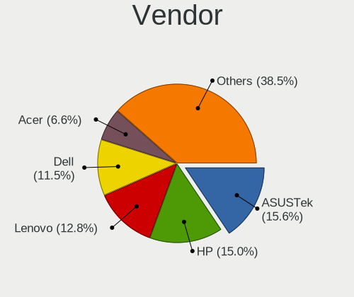
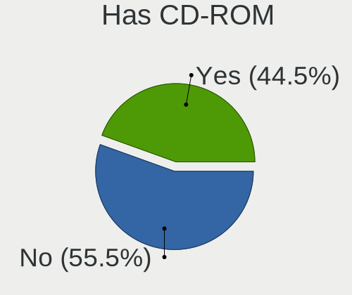
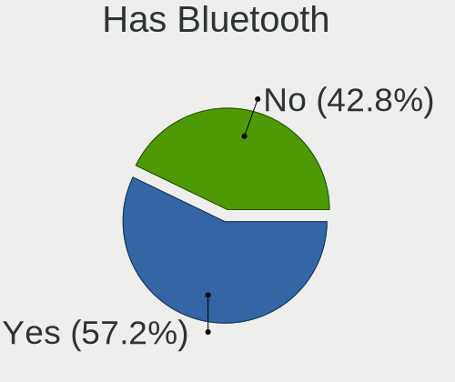
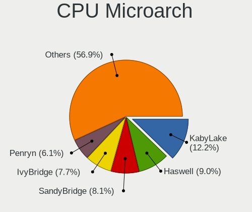
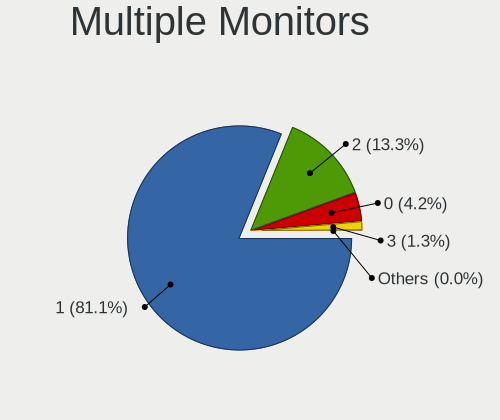
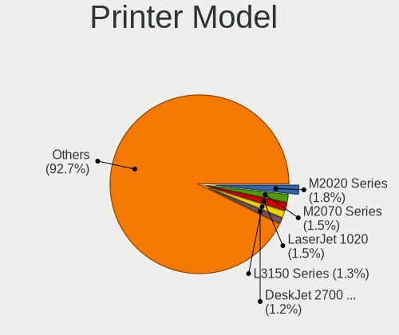

Linux Mint - Tested Hardware & Statistics
-----------------------------------------

A project to collect tested hardware configurations for Linux Mint.

Anyone can contribute to this report by the [hw-probe](https://github.com/linuxhw/hw-probe) tool:

    sudo -E hw-probe -all -upload

Please contribute! Especially if your hardware is rare.

This is a report for all computer types. See also reports for [desktops](/Dist/Linux_Mint/Desktop/README.md) and [notebooks](/Dist/Linux_Mint/Notebook/README.md).

Contents
--------

* [ Test Cases ](#test-cases)

* [ System ](#system)
  - [ OS                       ](#os)
  - [ OS Family                ](#os-family)
  - [ Kernel                   ](#kernel)
  - [ Kernel Family            ](#kernel-family)
  - [ Kernel Major Ver.        ](#kernel-major-ver)
  - [ Arch                     ](#arch)
  - [ DE                       ](#de)
  - [ Display Server           ](#display-server)
  - [ Display Manager          ](#display-manager)
  - [ OS Lang                  ](#os-lang)
  - [ Boot Mode                ](#boot-mode)
  - [ Filesystem               ](#filesystem)
  - [ Part. scheme             ](#part-scheme)
  - [ Dual Boot with Linux/BSD ](#dual-boot-with-linuxbsd)
  - [ Dual Boot (Win)          ](#dual-boot-win)

* [ Board ](#board)
  - [ Vendor                   ](#vendor)
  - [ Model                    ](#model)
  - [ Model Family             ](#model-family)
  - [ MFG Year                 ](#mfg-year)
  - [ Form Factor              ](#form-factor)
  - [ Secure Boot              ](#secure-boot)
  - [ Coreboot                 ](#coreboot)
  - [ RAM Size                 ](#ram-size)
  - [ RAM Used                 ](#ram-used)
  - [ Total Drives             ](#total-drives)
  - [ Has CD-ROM               ](#has-cd-rom)
  - [ Has Ethernet             ](#has-ethernet)
  - [ Has WiFi                 ](#has-wifi)
  - [ Has Bluetooth            ](#has-bluetooth)

* [ Location ](#location)
  - [ Country                  ](#country)
  - [ City                     ](#city)

* [ Drives ](#drives)
  - [ Drive Vendor             ](#drive-vendor)
  - [ Drive Model              ](#drive-model)
  - [ HDD Vendor               ](#hdd-vendor)
  - [ SSD Vendor               ](#ssd-vendor)
  - [ Drive Kind               ](#drive-kind)
  - [ Drive Connector          ](#drive-connector)
  - [ Drive Size               ](#drive-size)
  - [ Space Total              ](#space-total)
  - [ Space Used               ](#space-used)
  - [ Malfunc. Drives          ](#malfunc-drives)
  - [ Malfunc. Drive Vendor    ](#malfunc-drive-vendor)
  - [ Malfunc. HDD Vendor      ](#malfunc-hdd-vendor)
  - [ Malfunc. Drive Kind      ](#malfunc-drive-kind)
  - [ Failed Drives            ](#failed-drives)
  - [ Failed Drive Vendor      ](#failed-drive-vendor)
  - [ Drive Status             ](#drive-status)

* [ Storage controller ](#storage-controller)
  - [ Storage Vendor           ](#storage-vendor)
  - [ Storage Model            ](#storage-model)
  - [ Storage Kind             ](#storage-kind)

* [ Processor ](#processor)
  - [ CPU Vendor               ](#cpu-vendor)
  - [ CPU Model                ](#cpu-model)
  - [ CPU Model Family         ](#cpu-model-family)
  - [ CPU Cores                ](#cpu-cores)
  - [ CPU Sockets              ](#cpu-sockets)
  - [ CPU Threads              ](#cpu-threads)
  - [ CPU Op-Modes             ](#cpu-op-modes)
  - [ CPU Microcode            ](#cpu-microcode)
  - [ CPU Microarch            ](#cpu-microarch)

* [ Graphics ](#graphics)
  - [ GPU Vendor               ](#gpu-vendor)
  - [ GPU Model                ](#gpu-model)
  - [ GPU Combo                ](#gpu-combo)
  - [ GPU Driver               ](#gpu-driver)
  - [ GPU Memory               ](#gpu-memory)

* [ Monitor ](#monitor)
  - [ Monitor Vendor           ](#monitor-vendor)
  - [ Monitor Model            ](#monitor-model)
  - [ Monitor Resolution       ](#monitor-resolution)
  - [ Monitor Diagonal         ](#monitor-diagonal)
  - [ Monitor Width            ](#monitor-width)
  - [ Aspect Ratio             ](#aspect-ratio)
  - [ Monitor Area             ](#monitor-area)
  - [ Pixel Density            ](#pixel-density)
  - [ Multiple Monitors        ](#multiple-monitors)

* [ Network ](#network)
  - [ Net Controller Vendor    ](#net-controller-vendor)
  - [ Net Controller Model     ](#net-controller-model)
  - [ Wireless Vendor          ](#wireless-vendor)
  - [ Wireless Model           ](#wireless-model)
  - [ Ethernet Vendor          ](#ethernet-vendor)
  - [ Ethernet Model           ](#ethernet-model)
  - [ Net Controller Kind      ](#net-controller-kind)
  - [ Used Controller          ](#used-controller)
  - [ NICs                     ](#nics)
  - [ IPv6                     ](#ipv6)

* [ Bluetooth ](#bluetooth)
  - [ Bluetooth Vendor         ](#bluetooth-vendor)
  - [ Bluetooth Model          ](#bluetooth-model)

* [ Sound ](#sound)
  - [ Sound Vendor             ](#sound-vendor)
  - [ Sound Model              ](#sound-model)

* [ Memory ](#memory)
  - [ Memory Vendor            ](#memory-vendor)
  - [ Memory Model             ](#memory-model)
  - [ Memory Kind              ](#memory-kind)
  - [ Memory Form Factor       ](#memory-form-factor)
  - [ Memory Size              ](#memory-size)
  - [ Memory Speed             ](#memory-speed)

* [ Printers & scanners ](#printers--scanners)
  - [ Printer Vendor           ](#printer-vendor)
  - [ Printer Model            ](#printer-model)
  - [ Scanner Vendor           ](#scanner-vendor)
  - [ Scanner Model            ](#scanner-model)

* [ Camera ](#camera)
  - [ Camera Vendor            ](#camera-vendor)
  - [ Camera Model             ](#camera-model)

* [ Security ](#security)
  - [ Fingerprint Vendor       ](#fingerprint-vendor)
  - [ Fingerprint Model        ](#fingerprint-model)
  - [ Chipcard Vendor          ](#chipcard-vendor)
  - [ Chipcard Model           ](#chipcard-model)

* [ Unsupported ](#unsupported)
  - [ Unsupported Devices      ](#unsupported-devices)
  - [ Unsupported Device Types ](#unsupported-device-types)

Test Cases
----------

Total: 19522

| Vendor        | Model                       | Form-Factor | Probe                                                      | Date         |
|---------------|-----------------------------|-------------|------------------------------------------------------------|--------------|
| HP            | ProBook 640 G8 Notebook ... | Notebook    | [dc1b877e42](https://linux-hardware.org/?probe=dc1b877e42) | May 01, 2022 |
| Pegatron      | 2AB5                        | Desktop     | [534476ac99](https://linux-hardware.org/?probe=534476ac99) | Apr 30, 2022 |
| Dell          | Precision M2800             | Notebook    | [deffc81ac5](https://linux-hardware.org/?probe=deffc81ac5) | Apr 30, 2022 |
| LattePanda    | Alpha                       | Desktop     | [4e0dc573e1](https://linux-hardware.org/?probe=4e0dc573e1) | Apr 30, 2022 |
| MSI           | PRO H610M-G DDR4            | Desktop     | [f7806fa6f0](https://linux-hardware.org/?probe=f7806fa6f0) | Apr 30, 2022 |
| HP            | 0AECh D                     | Desktop     | [89441b750f](https://linux-hardware.org/?probe=89441b750f) | Apr 30, 2022 |
| Lenovo        | G510 20238                  | Notebook    | [07e8a61019](https://linux-hardware.org/?probe=07e8a61019) | Apr 30, 2022 |
| ASUSTek       | UX31A                       | Notebook    | [59228e735e](https://linux-hardware.org/?probe=59228e735e) | Apr 30, 2022 |
| ASUSTek       | P8H61-M                     | Desktop     | [942f86f88a](https://linux-hardware.org/?probe=942f86f88a) | Apr 30, 2022 |
| Dell          | Inspiron N4050              | Notebook    | [6d8f615203](https://linux-hardware.org/?probe=6d8f615203) | Apr 30, 2022 |
| Lenovo        | IdeaPad Z510 20287          | Notebook    | [058184d73c](https://linux-hardware.org/?probe=058184d73c) | Apr 30, 2022 |
| ASUSTek       | Lancaster8                  | Desktop     | [912f9bb3f9](https://linux-hardware.org/?probe=912f9bb3f9) | Apr 30, 2022 |
| Acer          | Aspire E5-774G              | Notebook    | [32426089be](https://linux-hardware.org/?probe=32426089be) | Apr 30, 2022 |
| Acer          | Aspire E5-774G              | Notebook    | [0fce8f01ae](https://linux-hardware.org/?probe=0fce8f01ae) | Apr 30, 2022 |
| HP            | Pavilion dv7                | Notebook    | [f66df9ca5b](https://linux-hardware.org/?probe=f66df9ca5b) | Apr 30, 2022 |
| HP            | Pavilion dv7                | Notebook    | [150931746e](https://linux-hardware.org/?probe=150931746e) | Apr 30, 2022 |
| ASRock        | P67 Pro3                    | Desktop     | [8e26d23d06](https://linux-hardware.org/?probe=8e26d23d06) | Apr 30, 2022 |
| MSI           | PS63 Modern 8M              | Notebook    | [06f3f7a100](https://linux-hardware.org/?probe=06f3f7a100) | Apr 30, 2022 |
| Dell          | Latitude 7390               | Notebook    | [bbf3908118](https://linux-hardware.org/?probe=bbf3908118) | Apr 30, 2022 |
| ASUSTek       | UX303LAB                    | Notebook    | [4d47234d72](https://linux-hardware.org/?probe=4d47234d72) | Apr 30, 2022 |
| Medion        | Cattle24 1M                 | Desktop     | [920d1b35ab](https://linux-hardware.org/?probe=920d1b35ab) | Apr 30, 2022 |
| Timi          | TM1701                      | Notebook    | [f81bb7efbe](https://linux-hardware.org/?probe=f81bb7efbe) | Apr 30, 2022 |
| HP            | Spectre x360 Convertible    | Convertible | [90d6769c58](https://linux-hardware.org/?probe=90d6769c58) | Apr 30, 2022 |
| Gigabyte      | GA-970A-UD3                 | Desktop     | [0158bc69ec](https://linux-hardware.org/?probe=0158bc69ec) | Apr 30, 2022 |
| Lenovo        | IdeaPad S145-15IWL 81MV     | Notebook    | [05db30a69b](https://linux-hardware.org/?probe=05db30a69b) | Apr 30, 2022 |
| Dell          | Latitude 5490               | Notebook    | [9445f416cb](https://linux-hardware.org/?probe=9445f416cb) | Apr 30, 2022 |
| Gigabyte      | B560M DS3H V2               | Desktop     | [c2096251fc](https://linux-hardware.org/?probe=c2096251fc) | Apr 30, 2022 |
| Gigabyte      | GA-MA770-UD3                | Desktop     | [4924979f39](https://linux-hardware.org/?probe=4924979f39) | Apr 29, 2022 |
| Lenovo        | Legion 7 16ACHg6 82N6       | Notebook    | [bad5b7036e](https://linux-hardware.org/?probe=bad5b7036e) | Apr 29, 2022 |
| Dell          | Latitude 5520               | Notebook    | [d35917a603](https://linux-hardware.org/?probe=d35917a603) | Apr 29, 2022 |
| Supermicro    | X9DRW-7TPF+                 | Server      | [6bd590bc17](https://linux-hardware.org/?probe=6bd590bc17) | Apr 29, 2022 |
| Dell          | Latitude 5520               | Notebook    | [9851c7847d](https://linux-hardware.org/?probe=9851c7847d) | Apr 29, 2022 |
| Dell          | 0G261D A00                  | Desktop     | [860d883e5b](https://linux-hardware.org/?probe=860d883e5b) | Apr 29, 2022 |
| Toshiba       | Satellite C650              | Notebook    | [58539bbf0a](https://linux-hardware.org/?probe=58539bbf0a) | Apr 29, 2022 |
| Dell          | 0GY6Y8 A03                  | Desktop     | [b4946e7399](https://linux-hardware.org/?probe=b4946e7399) | Apr 29, 2022 |
| MSI           | Z390-A PRO                  | Desktop     | [e2f7ad0f81](https://linux-hardware.org/?probe=e2f7ad0f81) | Apr 29, 2022 |
| MSI           | CR70 2M/CX70 2OC/CX70 2O... | Notebook    | [454226474b](https://linux-hardware.org/?probe=454226474b) | Apr 29, 2022 |
| Fujitsu Si... | AMILO Xi 3650               | Notebook    | [61da560f18](https://linux-hardware.org/?probe=61da560f18) | Apr 29, 2022 |
| HP            | ProBook 645 G4              | Notebook    | [0a4b56ae27](https://linux-hardware.org/?probe=0a4b56ae27) | Apr 29, 2022 |
| Lenovo        | ThinkPad E15 Gen 2 20T80... | Notebook    | [637af2dcc6](https://linux-hardware.org/?probe=637af2dcc6) | Apr 29, 2022 |
| Apple         | MacBookPro8,2               | Notebook    | [50c8a02c35](https://linux-hardware.org/?probe=50c8a02c35) | Apr 29, 2022 |
| Apple         | Mac-F226BEC8 PVT            | All in one  | [681aa1a670](https://linux-hardware.org/?probe=681aa1a670) | Apr 29, 2022 |
| HP            | Pavilion x360 Convertibl... | Convertible | [fec983464c](https://linux-hardware.org/?probe=fec983464c) | Apr 29, 2022 |
| Intel         | MAHOBAY                     | Desktop     | [ca65be05f0](https://linux-hardware.org/?probe=ca65be05f0) | Apr 28, 2022 |
| Lenovo        | ThinkPad T420 4180PC4       | Notebook    | [6c69039594](https://linux-hardware.org/?probe=6c69039594) | Apr 28, 2022 |
| Dell          | Inspiron 5570               | Notebook    | [8105c6bf09](https://linux-hardware.org/?probe=8105c6bf09) | Apr 28, 2022 |
| ASRock        | P67 Pro3                    | Desktop     | [95e665d1f5](https://linux-hardware.org/?probe=95e665d1f5) | Apr 28, 2022 |
| HP            | ProBook 645 G4              | Notebook    | [1546b59830](https://linux-hardware.org/?probe=1546b59830) | Apr 28, 2022 |
| HP            | Pavilion Laptop 15-cs3xx... | Notebook    | [ac2800ef82](https://linux-hardware.org/?probe=ac2800ef82) | Apr 28, 2022 |
| Acer          | Swift SF314-57              | Notebook    | [d48d0527ee](https://linux-hardware.org/?probe=d48d0527ee) | Apr 28, 2022 |
| ASUSTek       | PRIME B450M-A II            | Desktop     | [21b89b5942](https://linux-hardware.org/?probe=21b89b5942) | Apr 28, 2022 |
| ASUSTek       | PRIME B450M-A II            | Desktop     | [cc6cd50096](https://linux-hardware.org/?probe=cc6cd50096) | Apr 28, 2022 |
| Lenovo        | G50-45 80E3                 | Notebook    | [910267bbd5](https://linux-hardware.org/?probe=910267bbd5) | Apr 28, 2022 |
| Gigabyte      | B450 AORUS M                | Desktop     | [13f68cfe10](https://linux-hardware.org/?probe=13f68cfe10) | Apr 28, 2022 |
| Lenovo        | G50-45 80E3                 | Notebook    | [22dd67107b](https://linux-hardware.org/?probe=22dd67107b) | Apr 28, 2022 |
| Notebook      | W65_67SZ                    | Notebook    | [11d3972448](https://linux-hardware.org/?probe=11d3972448) | Apr 28, 2022 |
| Lenovo        | V14 G2 ITL Ua 82KA          | Notebook    | [f191c49754](https://linux-hardware.org/?probe=f191c49754) | Apr 28, 2022 |
| Unknown       | Unknown                     | Notebook    | [a55db1f065](https://linux-hardware.org/?probe=a55db1f065) | Apr 28, 2022 |
| ASRock        | P67 Pro3                    | Desktop     | [27b6c6ce37](https://linux-hardware.org/?probe=27b6c6ce37) | Apr 28, 2022 |
| Sony          | VPCEH3F1R                   | Notebook    | [2d78f4b2b5](https://linux-hardware.org/?probe=2d78f4b2b5) | Apr 28, 2022 |
| Lenovo        | Legion 5 15ACH6 82JW        | Notebook    | [e962d2016e](https://linux-hardware.org/?probe=e962d2016e) | Apr 28, 2022 |
| MSI           | MAG B550M MORTAR WIFI       | Desktop     | [8d8cef9b7d](https://linux-hardware.org/?probe=8d8cef9b7d) | Apr 28, 2022 |
| Dell          | Inspiron 3583               | Notebook    | [740919a383](https://linux-hardware.org/?probe=740919a383) | Apr 28, 2022 |
| MSI           | MAG B550M MORTAR WIFI       | Desktop     | [6f320b7fcb](https://linux-hardware.org/?probe=6f320b7fcb) | Apr 28, 2022 |
| Packard Be... | DOT S                       | Notebook    | [d0231bab8b](https://linux-hardware.org/?probe=d0231bab8b) | Apr 28, 2022 |
| Unknown       | Unknown                     | Notebook    | [5e2ffd2f9a](https://linux-hardware.org/?probe=5e2ffd2f9a) | Apr 28, 2022 |
| Apple         | Mac-35C5E08120C7EEAF Mac... | Mini pc     | [e3001e38a3](https://linux-hardware.org/?probe=e3001e38a3) | Apr 27, 2022 |
| Apple         | Mac-35C5E08120C7EEAF Mac... | Mini pc     | [a4d49bf6d9](https://linux-hardware.org/?probe=a4d49bf6d9) | Apr 27, 2022 |
| Dell          | Inspiron 3543               | Notebook    | [7fb19b7da4](https://linux-hardware.org/?probe=7fb19b7da4) | Apr 27, 2022 |
| HP            | EliteBook 840 G2            | Notebook    | [8c0c59e517](https://linux-hardware.org/?probe=8c0c59e517) | Apr 27, 2022 |
| Lenovo        | ThinkPad R61 7735WRF        | Notebook    | [81c8577ab7](https://linux-hardware.org/?probe=81c8577ab7) | Apr 27, 2022 |
| ASRock        | B550M Pro4                  | Desktop     | [99b46394bf](https://linux-hardware.org/?probe=99b46394bf) | Apr 27, 2022 |
| HP            | 8437                        | Desktop     | [c9444c57eb](https://linux-hardware.org/?probe=c9444c57eb) | Apr 27, 2022 |
| HP            | 8437                        | Desktop     | [cb1aa84569](https://linux-hardware.org/?probe=cb1aa84569) | Apr 27, 2022 |
| Pegatron      | 2A99                        | Desktop     | [92c0dec6fa](https://linux-hardware.org/?probe=92c0dec6fa) | Apr 27, 2022 |
| Medion        | B360H4-EM V1.0              | Desktop     | [9ed05797b0](https://linux-hardware.org/?probe=9ed05797b0) | Apr 27, 2022 |
| Medion        | B360H4-EM V1.0              | Desktop     | [7a35687e1d](https://linux-hardware.org/?probe=7a35687e1d) | Apr 27, 2022 |
| Acer          | Aspire E5-774G              | Notebook    | [be0fb85534](https://linux-hardware.org/?probe=be0fb85534) | Apr 27, 2022 |
| Alienware     | M18xR2                      | Notebook    | [3853b17e46](https://linux-hardware.org/?probe=3853b17e46) | Apr 27, 2022 |
| ASUSTek       | TUF Z390-PLUS GAMING        | Desktop     | [77c2b99e9b](https://linux-hardware.org/?probe=77c2b99e9b) | Apr 27, 2022 |
| ASRock        | P67 Pro3                    | Desktop     | [fe31926e33](https://linux-hardware.org/?probe=fe31926e33) | Apr 27, 2022 |
| Lenovo        | ThinkPad T470 W10DG 20JM... | Notebook    | [81aed15a37](https://linux-hardware.org/?probe=81aed15a37) | Apr 27, 2022 |
| Lenovo        | ThinkPad X220 4291WSH       | Notebook    | [21fcbc1850](https://linux-hardware.org/?probe=21fcbc1850) | Apr 27, 2022 |
| Toshiba       | Satellite L735D             | Notebook    | [4bd23809e6](https://linux-hardware.org/?probe=4bd23809e6) | Apr 27, 2022 |
| Toshiba       | Satellite L735D             | Notebook    | [a832b721e3](https://linux-hardware.org/?probe=a832b721e3) | Apr 27, 2022 |
| Biostar       | G41D3C                      | Desktop     | [a6db6a2cdf](https://linux-hardware.org/?probe=a6db6a2cdf) | Apr 27, 2022 |
| Biostar       | G41D3C                      | Desktop     | [0a4b95688a](https://linux-hardware.org/?probe=0a4b95688a) | Apr 27, 2022 |
| MSI           | MPG X570 GAMING PLUS        | Desktop     | [bd185a521b](https://linux-hardware.org/?probe=bd185a521b) | Apr 27, 2022 |
| MSI           | Z97-G45 GAMING              | Desktop     | [6660cb5133](https://linux-hardware.org/?probe=6660cb5133) | Apr 27, 2022 |
| ASUSTek       | Maximus II Formula          | Desktop     | [66a4342140](https://linux-hardware.org/?probe=66a4342140) | Apr 26, 2022 |
| ASUSTek       | X705UA                      | Notebook    | [8c12b4587e](https://linux-hardware.org/?probe=8c12b4587e) | Apr 26, 2022 |
| Samsung       | 755XDA                      | Notebook    | [eea7e3a0d3](https://linux-hardware.org/?probe=eea7e3a0d3) | Apr 26, 2022 |
| Lenovo        | AILZx                       | Notebook    | [efa15d667f](https://linux-hardware.org/?probe=efa15d667f) | Apr 26, 2022 |
| ASRock        | X300M-STX                   | Desktop     | [35a063e4e9](https://linux-hardware.org/?probe=35a063e4e9) | Apr 26, 2022 |
| HP            | Laptop 14-cf3xxx            | Notebook    | [e049bbd414](https://linux-hardware.org/?probe=e049bbd414) | Apr 26, 2022 |
| ASRock        | P67 Pro3                    | Desktop     | [2e36dc12d2](https://linux-hardware.org/?probe=2e36dc12d2) | Apr 26, 2022 |
| Acer          | NC-E5-573-36PM              | Notebook    | [a98a807776](https://linux-hardware.org/?probe=a98a807776) | Apr 26, 2022 |
| Itautec       | NT 2030                     | Desktop     | [ce556d6808](https://linux-hardware.org/?probe=ce556d6808) | Apr 26, 2022 |
| Biostar       | G41D3C                      | Desktop     | [a91924c1db](https://linux-hardware.org/?probe=a91924c1db) | Apr 26, 2022 |
| HP            | Notebook                    | Notebook    | [975bc190a2](https://linux-hardware.org/?probe=975bc190a2) | Apr 26, 2022 |
| Biostar       | G41D3C                      | Desktop     | [cf7cab4e09](https://linux-hardware.org/?probe=cf7cab4e09) | Apr 26, 2022 |
| Fujitsu Si... | AMILO Xi 3650               | Notebook    | [5661c025c7](https://linux-hardware.org/?probe=5661c025c7) | Apr 26, 2022 |
| Notebook      | W35xSTQ_370ST               | Notebook    | [ef4f066fba](https://linux-hardware.org/?probe=ef4f066fba) | Apr 26, 2022 |
| Fujitsu Si... | AMILO Xi 3650               | Notebook    | [c33c4a0ca2](https://linux-hardware.org/?probe=c33c4a0ca2) | Apr 26, 2022 |
| Fujitsu       | LIFEBOOK A531               | Notebook    | [4d2a2873fb](https://linux-hardware.org/?probe=4d2a2873fb) | Apr 26, 2022 |
| Google        | Relm                        | Notebook    | [edd0a8864b](https://linux-hardware.org/?probe=edd0a8864b) | Apr 26, 2022 |
| Dell          | Latitude E6540              | Notebook    | [c3e7bcf701](https://linux-hardware.org/?probe=c3e7bcf701) | Apr 26, 2022 |
| Lenovo        | Legion 5 15ACH6 82JW        | Notebook    | [5c573cd88d](https://linux-hardware.org/?probe=5c573cd88d) | Apr 26, 2022 |
| Dell          | 0WMJ54 A01                  | Desktop     | [ff9f82ef2d](https://linux-hardware.org/?probe=ff9f82ef2d) | Apr 26, 2022 |
| HP            | Stream Laptop 11-ak0xxx     | Notebook    | [8bd50984ef](https://linux-hardware.org/?probe=8bd50984ef) | Apr 25, 2022 |
| Lenovo        | Legion 7 16ACHg6 82N6       | Notebook    | [a65d23d316](https://linux-hardware.org/?probe=a65d23d316) | Apr 25, 2022 |
| Toshiba       | Satellite S55-C             | Notebook    | [05afb55e10](https://linux-hardware.org/?probe=05afb55e10) | Apr 25, 2022 |
| ASRock        | H61M-DGS                    | Desktop     | [c8019d43f7](https://linux-hardware.org/?probe=c8019d43f7) | Apr 25, 2022 |
| HP            | EliteBook 8440p             | Notebook    | [c854b74386](https://linux-hardware.org/?probe=c854b74386) | Apr 25, 2022 |
| Lenovo        | ThinkPad T400 2767B77       | Notebook    | [54b2615503](https://linux-hardware.org/?probe=54b2615503) | Apr 25, 2022 |
| HP            | 82FE 11                     | Desktop     | [1b7d145108](https://linux-hardware.org/?probe=1b7d145108) | Apr 25, 2022 |
| ASUSTek       | P5G41T-M LX3                | Desktop     | [43adb86887](https://linux-hardware.org/?probe=43adb86887) | Apr 25, 2022 |
| ASUSTek       | P5G41T-M LX3                | Desktop     | [ba9b8d5ac1](https://linux-hardware.org/?probe=ba9b8d5ac1) | Apr 25, 2022 |
| MSI           | MEG X570 ACE                | Desktop     | [6807da5804](https://linux-hardware.org/?probe=6807da5804) | Apr 25, 2022 |
| HP            | Pro Tablet 608 G1           | Notebook    | [a8b97ee7cf](https://linux-hardware.org/?probe=a8b97ee7cf) | Apr 25, 2022 |
| MSI           | MEG X570 ACE                | Desktop     | [e558893ff0](https://linux-hardware.org/?probe=e558893ff0) | Apr 25, 2022 |
| HP            | 82FE 11                     | Desktop     | [895a0442d0](https://linux-hardware.org/?probe=895a0442d0) | Apr 25, 2022 |
| Dell          | Inspiron 15 7000 Gaming     | Notebook    | [b1b4ea439d](https://linux-hardware.org/?probe=b1b4ea439d) | Apr 25, 2022 |
| Gigabyte      | GA-870A-UD3                 | Desktop     | [37314a1343](https://linux-hardware.org/?probe=37314a1343) | Apr 25, 2022 |
| HP            | Pavilion 17                 | Notebook    | [8a86695a31](https://linux-hardware.org/?probe=8a86695a31) | Apr 25, 2022 |
| Lenovo        | IdeaPad D330-10IGL 82H0     | Tablet      | [59a3e6a130](https://linux-hardware.org/?probe=59a3e6a130) | Apr 24, 2022 |
| Lenovo        | Yoga C940-14IIL 81Q9        | Convertible | [bf7a7381a8](https://linux-hardware.org/?probe=bf7a7381a8) | Apr 24, 2022 |
| Notebook      | NLx0MU                      | Notebook    | [5d65012d75](https://linux-hardware.org/?probe=5d65012d75) | Apr 24, 2022 |
| MSI           | GP72 6QF                    | Notebook    | [8a2ac9964c](https://linux-hardware.org/?probe=8a2ac9964c) | Apr 24, 2022 |
| Positivo      | POS-EIBTDB                  | Desktop     | [2b6822eb50](https://linux-hardware.org/?probe=2b6822eb50) | Apr 24, 2022 |
| Toshiba       | PORTEGE M800                | Notebook    | [20f2ac516c](https://linux-hardware.org/?probe=20f2ac516c) | Apr 24, 2022 |
| Lenovo        | ThinkPad P1 Gen 4i 20Y30... | Notebook    | [b1895460f6](https://linux-hardware.org/?probe=b1895460f6) | Apr 24, 2022 |
| Lenovo        | ThinkPad P1 Gen 4i 20Y30... | Notebook    | [11e7429c51](https://linux-hardware.org/?probe=11e7429c51) | Apr 24, 2022 |
| Alienware     | 17 R2                       | Notebook    | [93cc7785c3](https://linux-hardware.org/?probe=93cc7785c3) | Apr 24, 2022 |
| HP            | Pavilion dv6                | Notebook    | [83093f24ef](https://linux-hardware.org/?probe=83093f24ef) | Apr 24, 2022 |
| Dell          | Latitude E6530              | Notebook    | [87a016871d](https://linux-hardware.org/?probe=87a016871d) | Apr 24, 2022 |
| BLAUPUNKT     | Discovery 1011WI            | Notebook    | [c20b87673e](https://linux-hardware.org/?probe=c20b87673e) | Apr 24, 2022 |
| HP            | Pavilion 17                 | Notebook    | [8665d58c51](https://linux-hardware.org/?probe=8665d58c51) | Apr 24, 2022 |
| ASRock        | P67 Pro3                    | Desktop     | [2aa7f09968](https://linux-hardware.org/?probe=2aa7f09968) | Apr 24, 2022 |
| Apple         | MacBookAir6,1               | Notebook    | [6c717bc636](https://linux-hardware.org/?probe=6c717bc636) | Apr 24, 2022 |
| ASRock        | X300M-STX                   | Desktop     | [096a0bc434](https://linux-hardware.org/?probe=096a0bc434) | Apr 24, 2022 |
| Biostar       | NM70I-1017U                 | Desktop     | [c27061c8f4](https://linux-hardware.org/?probe=c27061c8f4) | Apr 24, 2022 |
| ASRock        | X300M-STX                   | Desktop     | [3e5e1e7137](https://linux-hardware.org/?probe=3e5e1e7137) | Apr 24, 2022 |
| Dell          | 0GY6Y8 A03                  | Desktop     | [58065270dd](https://linux-hardware.org/?probe=58065270dd) | Apr 24, 2022 |
| ASRock        | B550M Pro4                  | Desktop     | [3d46ae9ba9](https://linux-hardware.org/?probe=3d46ae9ba9) | Apr 23, 2022 |
| HP            | Pavilion Gaming Laptop 1... | Notebook    | [2bb4e3b744](https://linux-hardware.org/?probe=2bb4e3b744) | Apr 23, 2022 |
| HP            | Pavilion Gaming Laptop 1... | Notebook    | [9beab176cd](https://linux-hardware.org/?probe=9beab176cd) | Apr 23, 2022 |
| ASRock        | P67 Pro3                    | Desktop     | [37473be9b0](https://linux-hardware.org/?probe=37473be9b0) | Apr 23, 2022 |
| Dell          | Latitude 5401               | Notebook    | [d115db916d](https://linux-hardware.org/?probe=d115db916d) | Apr 23, 2022 |
| Dell          | Latitude 5401               | Notebook    | [c9f380ea26](https://linux-hardware.org/?probe=c9f380ea26) | Apr 23, 2022 |
| HP            | EliteBook 8440p             | Notebook    | [487f1a4924](https://linux-hardware.org/?probe=487f1a4924) | Apr 23, 2022 |
| Pegatron      | IPPPV-D3G                   | Desktop     | [2eea78768b](https://linux-hardware.org/?probe=2eea78768b) | Apr 23, 2022 |
| Gigabyte      | GB-BRR7H-4800               | Desktop     | [475131a6f4](https://linux-hardware.org/?probe=475131a6f4) | Apr 23, 2022 |
| Biostar       | G41D3C                      | Desktop     | [ac5c2d8b54](https://linux-hardware.org/?probe=ac5c2d8b54) | Apr 23, 2022 |
| Biostar       | G41D3C                      | Desktop     | [6fdf919c55](https://linux-hardware.org/?probe=6fdf919c55) | Apr 23, 2022 |
| ASRock        | B85M Pro3                   | Desktop     | [551ea1b91f](https://linux-hardware.org/?probe=551ea1b91f) | Apr 23, 2022 |
| MSI           | H510M PRO                   | Desktop     | [62b9c33cba](https://linux-hardware.org/?probe=62b9c33cba) | Apr 23, 2022 |
| HP            | 0AECh D                     | Desktop     | [5fd33a9a4e](https://linux-hardware.org/?probe=5fd33a9a4e) | Apr 23, 2022 |
| Gigabyte      | B550M DS3H                  | Desktop     | [c668e0d48e](https://linux-hardware.org/?probe=c668e0d48e) | Apr 23, 2022 |
| HP            | Pavilion 17                 | Notebook    | [19405b738b](https://linux-hardware.org/?probe=19405b738b) | Apr 23, 2022 |
| ASUSTek       | PRIME Z590-A                | Desktop     | [7f7ea99704](https://linux-hardware.org/?probe=7f7ea99704) | Apr 23, 2022 |
| HP            | Pavilion 17                 | Notebook    | [851d01ca2e](https://linux-hardware.org/?probe=851d01ca2e) | Apr 23, 2022 |
| MSI           | 770-G45                     | Desktop     | [5c1bce29f2](https://linux-hardware.org/?probe=5c1bce29f2) | Apr 23, 2022 |
| Dell          | 0XR1GT A00                  | Desktop     | [fb3d31a363](https://linux-hardware.org/?probe=fb3d31a363) | Apr 23, 2022 |
| Dell          | 0XR1GT A00                  | Desktop     | [a0eb199a0c](https://linux-hardware.org/?probe=a0eb199a0c) | Apr 23, 2022 |
| ASUSTek       | ROG STRIX Z390-F GAMING     | Desktop     | [7ad6e17281](https://linux-hardware.org/?probe=7ad6e17281) | Apr 23, 2022 |
| ASUSTek       | ROG STRIX Z390-F GAMING     | Desktop     | [73c09c4d29](https://linux-hardware.org/?probe=73c09c4d29) | Apr 23, 2022 |
| Dell          | 0HY9JP A00                  | Desktop     | [9a884ccaa8](https://linux-hardware.org/?probe=9a884ccaa8) | Apr 23, 2022 |
| Lenovo        | IdeaPad 3 15ITL6 82H8       | Notebook    | [d1111c70c7](https://linux-hardware.org/?probe=d1111c70c7) | Apr 23, 2022 |
| Dell          | Inspiron 3583               | Notebook    | [d9c8361847](https://linux-hardware.org/?probe=d9c8361847) | Apr 23, 2022 |
| Dell          | Inspiron 3542               | Notebook    | [0c301210d8](https://linux-hardware.org/?probe=0c301210d8) | Apr 22, 2022 |
| Lenovo        | NO DPK                      | Desktop     | [709f4d5f8c](https://linux-hardware.org/?probe=709f4d5f8c) | Apr 22, 2022 |
| HP            | Pavilion dv6                | Notebook    | [16e2c4e6d3](https://linux-hardware.org/?probe=16e2c4e6d3) | Apr 22, 2022 |
| ASUSTek       | PRIME X570-P                | Desktop     | [2c7cee55b7](https://linux-hardware.org/?probe=2c7cee55b7) | Apr 22, 2022 |
| ASUSTek       | PRIME X570-P                | Desktop     | [b8a5ec8483](https://linux-hardware.org/?probe=b8a5ec8483) | Apr 22, 2022 |
| Lenovo        | ThinkPad L15 Gen 1 20U70... | Notebook    | [618d8cab02](https://linux-hardware.org/?probe=618d8cab02) | Apr 22, 2022 |
| Medion        | H110H4-EM                   | Desktop     | [bdbf84afd8](https://linux-hardware.org/?probe=bdbf84afd8) | Apr 22, 2022 |
| Acer          | Aspire V3-771               | Notebook    | [f36e209172](https://linux-hardware.org/?probe=f36e209172) | Apr 22, 2022 |
| Lenovo        | IdeaPad 320-15IKB 80YH      | Notebook    | [f5f36d1c44](https://linux-hardware.org/?probe=f5f36d1c44) | Apr 22, 2022 |
| MSI           | Pulse GL76 11UEK            | Notebook    | [beff2fb2f8](https://linux-hardware.org/?probe=beff2fb2f8) | Apr 22, 2022 |
| HP            | Compaq nx7300 (RU608ES#A... | Notebook    | [8910c29183](https://linux-hardware.org/?probe=8910c29183) | Apr 22, 2022 |
| Gigabyte      | Z370 HD3-CF                 | Desktop     | [8888cb88d3](https://linux-hardware.org/?probe=8888cb88d3) | Apr 22, 2022 |
| Google        | Enguarde                    | Notebook    | [dbace8fc61](https://linux-hardware.org/?probe=dbace8fc61) | Apr 22, 2022 |
| Acer          | Aspire 8930                 | Notebook    | [aaf1f1994a](https://linux-hardware.org/?probe=aaf1f1994a) | Apr 22, 2022 |
| Acer          | Extensa 2519                | Notebook    | [f8cca8cf47](https://linux-hardware.org/?probe=f8cca8cf47) | Apr 21, 2022 |
| Samsung       | 730QDA                      | Convertible | [3a9f66fbd6](https://linux-hardware.org/?probe=3a9f66fbd6) | Apr 21, 2022 |
| HP            | EliteBook Folio 9470m       | Notebook    | [13136bcf8d](https://linux-hardware.org/?probe=13136bcf8d) | Apr 21, 2022 |
| Intel         | X99                         | Desktop     | [f7410bb2fd](https://linux-hardware.org/?probe=f7410bb2fd) | Apr 21, 2022 |
| Lenovo        | IdeaPad 3 17ITL6 82H9       | Notebook    | [e958c0d823](https://linux-hardware.org/?probe=e958c0d823) | Apr 21, 2022 |
| Acer          | TravelMate P653-M           | Notebook    | [208913a075](https://linux-hardware.org/?probe=208913a075) | Apr 21, 2022 |
| Apple         | MacBookPro7,1               | Notebook    | [2641eee3f1](https://linux-hardware.org/?probe=2641eee3f1) | Apr 21, 2022 |
| Dell          | Inspiron 15-3567            | Notebook    | [761f4046fa](https://linux-hardware.org/?probe=761f4046fa) | Apr 21, 2022 |
| ASUSTek       | 970 PRO GAMING/AURA         | Desktop     | [9a6d4db5b7](https://linux-hardware.org/?probe=9a6d4db5b7) | Apr 21, 2022 |
| Lenovo        | 3000 N200 0769EQG           | Notebook    | [d9bbff0c4d](https://linux-hardware.org/?probe=d9bbff0c4d) | Apr 21, 2022 |
| Toshiba       | Satellite P75-A             | Notebook    | [7530153886](https://linux-hardware.org/?probe=7530153886) | Apr 21, 2022 |
| Toshiba       | Satellite P75-A             | Notebook    | [c9e373245c](https://linux-hardware.org/?probe=c9e373245c) | Apr 21, 2022 |
| Dell          | 042P49 A02                  | Desktop     | [40c3ccc42c](https://linux-hardware.org/?probe=40c3ccc42c) | Apr 21, 2022 |
| ASUSTek       | ROG STRIX B550-F GAMING     | Desktop     | [ff5e15c4d9](https://linux-hardware.org/?probe=ff5e15c4d9) | Apr 21, 2022 |
| Toshiba       | Satellite C55-C             | Notebook    | [a7dd57eb03](https://linux-hardware.org/?probe=a7dd57eb03) | Apr 21, 2022 |
| Acer          | Nitro AN515-55              | Notebook    | [49bb0bd1ff](https://linux-hardware.org/?probe=49bb0bd1ff) | Apr 21, 2022 |
| Gigabyte      | B85M-D3H                    | Desktop     | [3e69787ee4](https://linux-hardware.org/?probe=3e69787ee4) | Apr 21, 2022 |
| Toshiba       | Satellite Pro L850-B339     | Notebook    | [d884eeae8f](https://linux-hardware.org/?probe=d884eeae8f) | Apr 20, 2022 |
| Lenovo        | ThinkPad T440p 20AWS1Y90... | Notebook    | [de746c72d1](https://linux-hardware.org/?probe=de746c72d1) | Apr 20, 2022 |
| Acer          | Swift SF114-34              | Notebook    | [f2bfb22fea](https://linux-hardware.org/?probe=f2bfb22fea) | Apr 20, 2022 |
| Dell          | Inspiron N5040              | Notebook    | [9069ecddb3](https://linux-hardware.org/?probe=9069ecddb3) | Apr 20, 2022 |
| Lenovo        | G50-70 20351                | Notebook    | [270da8f08a](https://linux-hardware.org/?probe=270da8f08a) | Apr 20, 2022 |
| HP            | Pavilion dv6                | Notebook    | [8a3a510921](https://linux-hardware.org/?probe=8a3a510921) | Apr 20, 2022 |
| Acer          | Aspire A315-23              | Notebook    | [5593faa826](https://linux-hardware.org/?probe=5593faa826) | Apr 20, 2022 |
| HP            | 625                         | Notebook    | [1d14c84fe9](https://linux-hardware.org/?probe=1d14c84fe9) | Apr 20, 2022 |
| MSI           | X470 GAMING PLUS            | Desktop     | [54084b1049](https://linux-hardware.org/?probe=54084b1049) | Apr 20, 2022 |
| Notebook      | NL5xNU                      | Notebook    | [bc83a39684](https://linux-hardware.org/?probe=bc83a39684) | Apr 20, 2022 |
| Lenovo        | ThinkPad L390 20NR001EPG    | Notebook    | [d83b89a414](https://linux-hardware.org/?probe=d83b89a414) | Apr 20, 2022 |
| Dell          | 06D7TR A01                  | Desktop     | [fe1217f09c](https://linux-hardware.org/?probe=fe1217f09c) | Apr 20, 2022 |
| eMachines     | D730                        | Notebook    | [09350021b3](https://linux-hardware.org/?probe=09350021b3) | Apr 20, 2022 |
| Lenovo        | ThinkPad E480 20KN001QGE    | Notebook    | [6d0ba64623](https://linux-hardware.org/?probe=6d0ba64623) | Apr 19, 2022 |
| Dell          | Latitude E6520              | Notebook    | [33502900d8](https://linux-hardware.org/?probe=33502900d8) | Apr 19, 2022 |
| HP            | Laptop 15-da1xxx            | Notebook    | [85f9b41fe4](https://linux-hardware.org/?probe=85f9b41fe4) | Apr 19, 2022 |
| ASRock        | B450M Pro4-F                | Desktop     | [68d9ef89c7](https://linux-hardware.org/?probe=68d9ef89c7) | Apr 19, 2022 |
| Acer          | Aspire A315-23              | Notebook    | [4b9d2c67fe](https://linux-hardware.org/?probe=4b9d2c67fe) | Apr 19, 2022 |
| Toshiba       | Satellite C850-F31Q         | Notebook    | [e7a2a2ff69](https://linux-hardware.org/?probe=e7a2a2ff69) | Apr 19, 2022 |
| Microtech     | ebookPro                    | Notebook    | [78932bce82](https://linux-hardware.org/?probe=78932bce82) | Apr 19, 2022 |
| Medion        | D3F3-EM2                    | Desktop     | [733df830d1](https://linux-hardware.org/?probe=733df830d1) | Apr 19, 2022 |
| Lenovo        | ThinkCentre M81 5049W16     | Desktop     | [0fd05faa69](https://linux-hardware.org/?probe=0fd05faa69) | Apr 19, 2022 |
| HP            | Laptop 15-db1xxx            | Notebook    | [93159530ba](https://linux-hardware.org/?probe=93159530ba) | Apr 19, 2022 |
| Sony          | VGN-SZ120P                  | Notebook    | [550f0939eb](https://linux-hardware.org/?probe=550f0939eb) | Apr 19, 2022 |
| Samsung       | 370E4K                      | Notebook    | [b3d7575f01](https://linux-hardware.org/?probe=b3d7575f01) | Apr 18, 2022 |
| Sony          | VGN-SZ120P                  | Notebook    | [d8af65a51a](https://linux-hardware.org/?probe=d8af65a51a) | Apr 18, 2022 |
| Acer          | Aspire V7-482PG             | Notebook    | [40eb526de9](https://linux-hardware.org/?probe=40eb526de9) | Apr 18, 2022 |
| MSI           | B450 TOMAHAWK MAX           | Desktop     | [5d0b8a14f2](https://linux-hardware.org/?probe=5d0b8a14f2) | Apr 18, 2022 |
| Samsung       | 350V5C/351V5C/3540VC/344... | Notebook    | [1826b33b78](https://linux-hardware.org/?probe=1826b33b78) | Apr 18, 2022 |
| HP            | Laptop 15-dw1xxx            | Notebook    | [f3b566f07e](https://linux-hardware.org/?probe=f3b566f07e) | Apr 18, 2022 |
| ASUSTek       | M4A87TD/USB3                | Desktop     | [bee196bace](https://linux-hardware.org/?probe=bee196bace) | Apr 18, 2022 |
| HP            | Laptop 15-dw1xxx            | Notebook    | [f94fb1535f](https://linux-hardware.org/?probe=f94fb1535f) | Apr 18, 2022 |
| Dell          | 06D7TR A01                  | Desktop     | [36f481beb4](https://linux-hardware.org/?probe=36f481beb4) | Apr 18, 2022 |
| ASRock        | 970 Pro3 R2.0               | Desktop     | [fefd073d6d](https://linux-hardware.org/?probe=fefd073d6d) | Apr 18, 2022 |
| Gigabyte      | GA-78LMT-USB3 SEx           | Desktop     | [179b76718e](https://linux-hardware.org/?probe=179b76718e) | Apr 18, 2022 |
| ASUSTek       | PRIME Z390-A                | Desktop     | [81d7ace164](https://linux-hardware.org/?probe=81d7ace164) | Apr 18, 2022 |
| HP            | OMEN by Laptop              | Notebook    | [7178bd9e1d](https://linux-hardware.org/?probe=7178bd9e1d) | Apr 18, 2022 |
| Gigabyte      | X570 GAMING X               | Desktop     | [d0cd53048e](https://linux-hardware.org/?probe=d0cd53048e) | Apr 18, 2022 |
| Packard Be... | EasyNote LE69KB             | Notebook    | [e2f89cd4b0](https://linux-hardware.org/?probe=e2f89cd4b0) | Apr 18, 2022 |
| Packard Be... | EasyNote LE69KB             | Notebook    | [0afcb896ee](https://linux-hardware.org/?probe=0afcb896ee) | Apr 18, 2022 |
| Gigabyte      | X570 GAMING X               | Desktop     | [8436ff452b](https://linux-hardware.org/?probe=8436ff452b) | Apr 18, 2022 |
| Acer          | Aspire 7730ZG               | Notebook    | [4129ff8d3a](https://linux-hardware.org/?probe=4129ff8d3a) | Apr 18, 2022 |
| Lenovo        | ThinkPad Edge E430 3254C... | Notebook    | [df0e3664e4](https://linux-hardware.org/?probe=df0e3664e4) | Apr 17, 2022 |
| HP            | Laptop 17-ca3xxx            | Notebook    | [3fa04a4195](https://linux-hardware.org/?probe=3fa04a4195) | Apr 17, 2022 |
| Dell          | Latitude E6440              | Notebook    | [33955db41e](https://linux-hardware.org/?probe=33955db41e) | Apr 17, 2022 |
| MSI           | Z77A-GD65                   | Desktop     | [0350456f3b](https://linux-hardware.org/?probe=0350456f3b) | Apr 17, 2022 |
| Gigabyte      | B550 AORUS ELITE V2         | Desktop     | [b35ed6654a](https://linux-hardware.org/?probe=b35ed6654a) | Apr 17, 2022 |
| Dell          | Latitude 5490               | Notebook    | [04964a95f3](https://linux-hardware.org/?probe=04964a95f3) | Apr 17, 2022 |
| Positivo      | Mobile                      | Notebook    | [0cfa1a5e22](https://linux-hardware.org/?probe=0cfa1a5e22) | Apr 17, 2022 |
| ASRock        | P67 Pro3                    | Desktop     | [18865ac675](https://linux-hardware.org/?probe=18865ac675) | Apr 17, 2022 |
| Lenovo        | ThinkPad L15 Gen 1 20U4S... | Notebook    | [e5c667382f](https://linux-hardware.org/?probe=e5c667382f) | Apr 17, 2022 |
| Lenovo        | ThinkPad L14 Gen 2 20X2S... | Notebook    | [e0676b8bc5](https://linux-hardware.org/?probe=e0676b8bc5) | Apr 17, 2022 |
| HP            | Victus by Laptop 16-d0xx... | Notebook    | [020929c7b4](https://linux-hardware.org/?probe=020929c7b4) | Apr 17, 2022 |
| Lenovo        | ThinkPad L14 Gen 2 20X2S... | Notebook    | [61bf43c506](https://linux-hardware.org/?probe=61bf43c506) | Apr 17, 2022 |
| HP            | 3396                        | Desktop     | [2c07ec89d4](https://linux-hardware.org/?probe=2c07ec89d4) | Apr 17, 2022 |
| HP            | Pavilion Laptop 14-dv0xx... | Notebook    | [e040a4511b](https://linux-hardware.org/?probe=e040a4511b) | Apr 17, 2022 |
| Acer          | Aspire R3-131T              | Notebook    | [48f584f713](https://linux-hardware.org/?probe=48f584f713) | Apr 17, 2022 |
| ASUSTek       | PU401LAC                    | Notebook    | [08a76b8cb8](https://linux-hardware.org/?probe=08a76b8cb8) | Apr 17, 2022 |
| Dell          | Inspiron 1501               | Notebook    | [ef65603ba9](https://linux-hardware.org/?probe=ef65603ba9) | Apr 17, 2022 |
| ASRock        | B450 Gaming-ITX/ac          | Desktop     | [063cead5c3](https://linux-hardware.org/?probe=063cead5c3) | Apr 17, 2022 |
| Apple         | MacBookPro8,2               | Notebook    | [f273c6051a](https://linux-hardware.org/?probe=f273c6051a) | Apr 17, 2022 |
| ASUSTek       | P5GC-MX                     | Desktop     | [55cd1e5c8f](https://linux-hardware.org/?probe=55cd1e5c8f) | Apr 17, 2022 |
| HP            | Pavilion dv6500             | Notebook    | [000a991767](https://linux-hardware.org/?probe=000a991767) | Apr 17, 2022 |
| Apple         | MacBookPro7,1               | Notebook    | [4def2a51dc](https://linux-hardware.org/?probe=4def2a51dc) | Apr 17, 2022 |
| MSI           | H510M PRO                   | Desktop     | [a9ce7c295a](https://linux-hardware.org/?probe=a9ce7c295a) | Apr 17, 2022 |
| HP            | Laptop 17-cp0xxx            | Notebook    | [e9fccc0549](https://linux-hardware.org/?probe=e9fccc0549) | Apr 16, 2022 |
| AZW           | U59                         | Desktop     | [fc7e5f0c5c](https://linux-hardware.org/?probe=fc7e5f0c5c) | Apr 16, 2022 |
| AZW           | U59                         | Desktop     | [377d280037](https://linux-hardware.org/?probe=377d280037) | Apr 16, 2022 |
| Dell          | Latitude 7480               | Notebook    | [7c543b7a6e](https://linux-hardware.org/?probe=7c543b7a6e) | Apr 16, 2022 |
| ASUSTek       | P6T DELUXE                  | Desktop     | [1ceaddfc92](https://linux-hardware.org/?probe=1ceaddfc92) | Apr 16, 2022 |
| ASUSTek       | A68HM-PLUS                  | Desktop     | [0bfefd6499](https://linux-hardware.org/?probe=0bfefd6499) | Apr 16, 2022 |
| MSI           | B560M-A PRO                 | Desktop     | [c394557d17](https://linux-hardware.org/?probe=c394557d17) | Apr 16, 2022 |
| Dell          | Venue 11 Pro 5130           | Notebook    | [333287a94f](https://linux-hardware.org/?probe=333287a94f) | Apr 16, 2022 |
| MSI           | H110M PRO-VD                | Desktop     | [2fc240d0aa](https://linux-hardware.org/?probe=2fc240d0aa) | Apr 16, 2022 |
| ASUSTek       | A88XM-A                     | Desktop     | [427335d90c](https://linux-hardware.org/?probe=427335d90c) | Apr 16, 2022 |
| Dell          | 06D7TR A01                  | Desktop     | [9a21a6c0f4](https://linux-hardware.org/?probe=9a21a6c0f4) | Apr 16, 2022 |
| ASUSTek       | P5VD2-MX                    | Desktop     | [57fec52891](https://linux-hardware.org/?probe=57fec52891) | Apr 16, 2022 |
| HP            | Pavilion Laptop 14-dv0xx... | Notebook    | [579d91eebd](https://linux-hardware.org/?probe=579d91eebd) | Apr 16, 2022 |
| ASRock        | P67 Pro3                    | Desktop     | [2f98f9cdee](https://linux-hardware.org/?probe=2f98f9cdee) | Apr 16, 2022 |
| Dell          | XPS 15 9560                 | Notebook    | [c540449ce7](https://linux-hardware.org/?probe=c540449ce7) | Apr 16, 2022 |
| Supermicro    | H8QG6                       | Desktop     | [060f1e3d34](https://linux-hardware.org/?probe=060f1e3d34) | Apr 16, 2022 |
| Dell          | 0VYXHD A00                  | Desktop     | [4280de633d](https://linux-hardware.org/?probe=4280de633d) | Apr 16, 2022 |
| ASUSTek       | M5A97 R2.0                  | Desktop     | [6f358d55e7](https://linux-hardware.org/?probe=6f358d55e7) | Apr 16, 2022 |
| ASUSTek       | X550LN                      | Notebook    | [2a0b2ae677](https://linux-hardware.org/?probe=2a0b2ae677) | Apr 16, 2022 |
| Fujitsu Si... | D2750-A2 S26361-D2750-A2    | Desktop     | [44b99daa8e](https://linux-hardware.org/?probe=44b99daa8e) | Apr 16, 2022 |
| HP            | Pavilion 17                 | Notebook    | [acb0c7fd0e](https://linux-hardware.org/?probe=acb0c7fd0e) | Apr 16, 2022 |
| Lenovo        | ThinkPad T440p 20AWS1Y90... | Notebook    | [a572c901ca](https://linux-hardware.org/?probe=a572c901ca) | Apr 15, 2022 |
| Dell          | Inspiron 5570               | Notebook    | [066d125002](https://linux-hardware.org/?probe=066d125002) | Apr 15, 2022 |
| HP            | Pavilion Laptop 15-eg0xx... | Notebook    | [53cc2d28a7](https://linux-hardware.org/?probe=53cc2d28a7) | Apr 15, 2022 |
| ASUSTek       | M5A99FX PRO R2.0            | Desktop     | [d7f72a830c](https://linux-hardware.org/?probe=d7f72a830c) | Apr 15, 2022 |
| HP            | Pavilion 17                 | Notebook    | [014f42ecee](https://linux-hardware.org/?probe=014f42ecee) | Apr 15, 2022 |
| Lenovo        | IdeaPad 3 15ALC6 82KU       | Notebook    | [4645168704](https://linux-hardware.org/?probe=4645168704) | Apr 15, 2022 |
| HP            | Pavilion Laptop 15-eg0xx... | Notebook    | [b1e71b5b4c](https://linux-hardware.org/?probe=b1e71b5b4c) | Apr 15, 2022 |
| Gigabyte      | GA-78LMT-USB3 SEx           | Desktop     | [623024de22](https://linux-hardware.org/?probe=623024de22) | Apr 15, 2022 |
| Gigabyte      | B550I AORUS PRO AX          | Desktop     | [9d2aeecf05](https://linux-hardware.org/?probe=9d2aeecf05) | Apr 15, 2022 |
| Gigabyte      | H370M DS3H-CF               | Desktop     | [c3eadb27ad](https://linux-hardware.org/?probe=c3eadb27ad) | Apr 15, 2022 |
| Lenovo        | ThinkPad E14 Gen 2 20TB0... | Notebook    | [3b30ef3d55](https://linux-hardware.org/?probe=3b30ef3d55) | Apr 15, 2022 |
| BLAUPUNKT     | Discovery 1011WI            | Notebook    | [6474fd0605](https://linux-hardware.org/?probe=6474fd0605) | Apr 15, 2022 |
| Acer          | Aspire E5-774G              | Notebook    | [d6b3b8f04d](https://linux-hardware.org/?probe=d6b3b8f04d) | Apr 15, 2022 |
| BESSTAR Te... | TL50                        | Desktop     | [28dba12634](https://linux-hardware.org/?probe=28dba12634) | Apr 15, 2022 |
| ASUSTek       | P8Z77-V LX                  | Desktop     | [997b338c67](https://linux-hardware.org/?probe=997b338c67) | Apr 15, 2022 |
| Lenovo        | ThinkPad T495 20NK000MGE    | Notebook    | [558688bdc2](https://linux-hardware.org/?probe=558688bdc2) | Apr 15, 2022 |
| Dell          | 0P01GV A03                  | Desktop     | [7d156875bb](https://linux-hardware.org/?probe=7d156875bb) | Apr 15, 2022 |
| Toshiba       | NB520                       | Notebook    | [105666a973](https://linux-hardware.org/?probe=105666a973) | Apr 15, 2022 |
| HP            | ProBook 430 G1              | Notebook    | [c42de00504](https://linux-hardware.org/?probe=c42de00504) | Apr 15, 2022 |
| HP            | ProBook 430 G7              | Notebook    | [a084a48023](https://linux-hardware.org/?probe=a084a48023) | Apr 15, 2022 |
| Lenovo        | ThinkPad E14 Gen 3 20YDS... | Notebook    | [b228a9bf01](https://linux-hardware.org/?probe=b228a9bf01) | Apr 15, 2022 |
| Dell          | 06X1TJ A00                  | Desktop     | [d92d515d6b](https://linux-hardware.org/?probe=d92d515d6b) | Apr 15, 2022 |
| Dell          | 06X1TJ A00                  | Desktop     | [32b40d296d](https://linux-hardware.org/?probe=32b40d296d) | Apr 15, 2022 |
| ASUSTek       | ROG CROSSHAIR VIII HERO     | Desktop     | [96faf32841](https://linux-hardware.org/?probe=96faf32841) | Apr 15, 2022 |
| Dell          | Inspiron 3542               | Notebook    | [78da1f043b](https://linux-hardware.org/?probe=78da1f043b) | Apr 15, 2022 |
| Gigabyte      | B85-HD3                     | Desktop     | [89fb08092b](https://linux-hardware.org/?probe=89fb08092b) | Apr 15, 2022 |
| Lenovo        | ThinkPad E15 Gen 2 20T80... | Notebook    | [77cf6f482e](https://linux-hardware.org/?probe=77cf6f482e) | Apr 15, 2022 |
| ASUSTek       | P7P55D LE                   | Desktop     | [381477f3e6](https://linux-hardware.org/?probe=381477f3e6) | Apr 15, 2022 |
| Dell          | 0200DY A00                  | Desktop     | [1b0ad4ce13](https://linux-hardware.org/?probe=1b0ad4ce13) | Apr 14, 2022 |
| Dell          | Latitude E5470              | Notebook    | [9391400fc7](https://linux-hardware.org/?probe=9391400fc7) | Apr 14, 2022 |
| Lenovo        | ThinkPad Edge E430 3254C... | Notebook    | [2e77dc52bc](https://linux-hardware.org/?probe=2e77dc52bc) | Apr 14, 2022 |
| Acer          | TravelMate P256-MG          | Notebook    | [55b07b48b3](https://linux-hardware.org/?probe=55b07b48b3) | Apr 14, 2022 |
| HP            | ENVY 13                     | Notebook    | [4b0b543bdf](https://linux-hardware.org/?probe=4b0b543bdf) | Apr 14, 2022 |
| Dell          | 0WPG9H A01                  | All in one  | [f5abf0c2d1](https://linux-hardware.org/?probe=f5abf0c2d1) | Apr 14, 2022 |
| ASRock        | B450 Gaming-ITX/ac          | Desktop     | [6bc3ced902](https://linux-hardware.org/?probe=6bc3ced902) | Apr 14, 2022 |
| Lenovo        | ThinkPad T450 20BV000AUS    | Notebook    | [85267dc4f7](https://linux-hardware.org/?probe=85267dc4f7) | Apr 14, 2022 |
| ASUSTek       | TUF Gaming X570-PLUS        | Desktop     | [b30795783f](https://linux-hardware.org/?probe=b30795783f) | Apr 14, 2022 |
| HP            | 3048h                       | Desktop     | [2d19799047](https://linux-hardware.org/?probe=2d19799047) | Apr 14, 2022 |
| HP            | G42                         | Notebook    | [e717533860](https://linux-hardware.org/?probe=e717533860) | Apr 14, 2022 |
| ASUSTek       | PRIME X570-P                | Desktop     | [57a3a5a999](https://linux-hardware.org/?probe=57a3a5a999) | Apr 14, 2022 |
| Biostar       | H61MHV2                     | Desktop     | [e05349d6a0](https://linux-hardware.org/?probe=e05349d6a0) | Apr 14, 2022 |
| ASUSTek       | PRIME X570-P                | Desktop     | [f9b71f206c](https://linux-hardware.org/?probe=f9b71f206c) | Apr 14, 2022 |
| Lenovo        | Legion 7 15IMH05 81YT       | Notebook    | [25c2200e11](https://linux-hardware.org/?probe=25c2200e11) | Apr 14, 2022 |
| Dell          | 0773VG A00                  | Desktop     | [3f0d544715](https://linux-hardware.org/?probe=3f0d544715) | Apr 14, 2022 |
| ASUSTek       | P8H67-M                     | Desktop     | [ca7dd7880b](https://linux-hardware.org/?probe=ca7dd7880b) | Apr 14, 2022 |
| Dell          | 0D28YY A02                  | Desktop     | [c1ff26008f](https://linux-hardware.org/?probe=c1ff26008f) | Apr 14, 2022 |
| Lenovo        | ThinkPad T490s 20NX003UM... | Notebook    | [60dca75a93](https://linux-hardware.org/?probe=60dca75a93) | Apr 14, 2022 |
| Dell          | Latitude E6520              | Notebook    | [b10c0f8457](https://linux-hardware.org/?probe=b10c0f8457) | Apr 14, 2022 |
| Apple         | MacBookPro10,1              | Notebook    | [471a8b1d51](https://linux-hardware.org/?probe=471a8b1d51) | Apr 14, 2022 |
| HP            | 18E5                        | Desktop     | [3b4f9e8525](https://linux-hardware.org/?probe=3b4f9e8525) | Apr 13, 2022 |
| Lenovo        | ThinkPad Edge E430 3254C... | Notebook    | [155a0f970f](https://linux-hardware.org/?probe=155a0f970f) | Apr 13, 2022 |
| MSI           | H81M-E33                    | Desktop     | [460099f77f](https://linux-hardware.org/?probe=460099f77f) | Apr 13, 2022 |
| Dell          | Latitude D630               | Notebook    | [dbee98e342](https://linux-hardware.org/?probe=dbee98e342) | Apr 13, 2022 |
| Apple         | Mac-35C5E08120C7EEAF Mac... | Mini pc     | [c8b5583e88](https://linux-hardware.org/?probe=c8b5583e88) | Apr 13, 2022 |
| Dell          | 0773VG A00                  | Desktop     | [e0ebd58f3d](https://linux-hardware.org/?probe=e0ebd58f3d) | Apr 13, 2022 |
| ASUSTek       | X99-A                       | Desktop     | [2ac66bb174](https://linux-hardware.org/?probe=2ac66bb174) | Apr 13, 2022 |
| Acer          | Swift SF114-32              | Notebook    | [e970f67c93](https://linux-hardware.org/?probe=e970f67c93) | Apr 13, 2022 |
| Dell          | 0GY6Y8 A02                  | Desktop     | [5f2f221d6c](https://linux-hardware.org/?probe=5f2f221d6c) | Apr 13, 2022 |
| TUXEDO        | InfinityBook S 15 Gen6      | Notebook    | [d198614ac8](https://linux-hardware.org/?probe=d198614ac8) | Apr 13, 2022 |
| Dell          | Precision 5760              | Notebook    | [546a52d1a9](https://linux-hardware.org/?probe=546a52d1a9) | Apr 13, 2022 |
| Dell          | Precision 5760              | Notebook    | [11cd26ed64](https://linux-hardware.org/?probe=11cd26ed64) | Apr 13, 2022 |
| IP3 Tech      | GB3B                        | Mini pc     | [f0f5bfea81](https://linux-hardware.org/?probe=f0f5bfea81) | Apr 13, 2022 |
| Apple         | MacBookPro11,1              | Notebook    | [3f181a161f](https://linux-hardware.org/?probe=3f181a161f) | Apr 13, 2022 |
| LG Electro... | 16Z90P-K.AA78A1             | Notebook    | [f7d44e9cd6](https://linux-hardware.org/?probe=f7d44e9cd6) | Apr 13, 2022 |
| HP            | ZBook 17 G3                 | Notebook    | [24b2dc344a](https://linux-hardware.org/?probe=24b2dc344a) | Apr 13, 2022 |
| ASUSTek       | ROG STRIX B550-I GAMING     | Desktop     | [13ad3d5cb4](https://linux-hardware.org/?probe=13ad3d5cb4) | Apr 13, 2022 |
| Unknown       | Unknown                     | Notebook    | [3a9245cdab](https://linux-hardware.org/?probe=3a9245cdab) | Apr 13, 2022 |
| Acer          | Aspire 7750G                | Notebook    | [64ff7776eb](https://linux-hardware.org/?probe=64ff7776eb) | Apr 13, 2022 |
| Dell          | 0XCR8D A00                  | Desktop     | [d0f55067b0](https://linux-hardware.org/?probe=d0f55067b0) | Apr 13, 2022 |
| Lenovo        | ThinkPad T14 Gen 1 20UDC... | Notebook    | [3005f99e03](https://linux-hardware.org/?probe=3005f99e03) | Apr 13, 2022 |
| Acer          | Aspire E5-774G              | Notebook    | [ef43a63289](https://linux-hardware.org/?probe=ef43a63289) | Apr 13, 2022 |
| Dell          | Inspiron 3542               | Notebook    | [b41fc0fac0](https://linux-hardware.org/?probe=b41fc0fac0) | Apr 13, 2022 |
| Fujitsu       | D3162-C1 S26361-D3162-C1    | Desktop     | [5f4fac95df](https://linux-hardware.org/?probe=5f4fac95df) | Apr 13, 2022 |
| ASRock        | X570 Phantom Gaming 4       | Desktop     | [4a91953dcb](https://linux-hardware.org/?probe=4a91953dcb) | Apr 13, 2022 |
| Gigabyte      | H87M-D3H                    | Desktop     | [f638f9b557](https://linux-hardware.org/?probe=f638f9b557) | Apr 13, 2022 |
| Dell          | 0HY9JP A02                  | Desktop     | [ee1ec3e09d](https://linux-hardware.org/?probe=ee1ec3e09d) | Apr 13, 2022 |
| HP            | EliteBook 840 G1            | Notebook    | [d06a50d75c](https://linux-hardware.org/?probe=d06a50d75c) | Apr 13, 2022 |
| Dell          | Inspiron 5502               | Notebook    | [f39e4ba3dd](https://linux-hardware.org/?probe=f39e4ba3dd) | Apr 13, 2022 |
| Dell          | 0YXT71 A01                  | Desktop     | [682a5bc6cc](https://linux-hardware.org/?probe=682a5bc6cc) | Apr 13, 2022 |
| ASUSTek       | PRIME A320M-K               | Desktop     | [7d0cde0bcd](https://linux-hardware.org/?probe=7d0cde0bcd) | Apr 13, 2022 |
| ASUSTek       | ROG STRIX B550-I GAMING     | Desktop     | [f75dc153d0](https://linux-hardware.org/?probe=f75dc153d0) | Apr 13, 2022 |
| ASUSTek       | ROG STRIX B550-I GAMING     | Desktop     | [438f675016](https://linux-hardware.org/?probe=438f675016) | Apr 13, 2022 |
| Dell          | Inspiron 5415               | Notebook    | [5ad4aa0994](https://linux-hardware.org/?probe=5ad4aa0994) | Apr 13, 2022 |
| Gigabyte      | H61M-DS2                    | Desktop     | [af56c63db4](https://linux-hardware.org/?probe=af56c63db4) | Apr 12, 2022 |
| ASRock        | P67 Pro3                    | Desktop     | [a96f6cbac7](https://linux-hardware.org/?probe=a96f6cbac7) | Apr 12, 2022 |
| Lenovo        | MAHOBAY 31900005 STD        | Desktop     | [d82d73ba0a](https://linux-hardware.org/?probe=d82d73ba0a) | Apr 12, 2022 |
| Sony          | VGN-CS31S_W                 | Notebook    | [148f5f1564](https://linux-hardware.org/?probe=148f5f1564) | Apr 12, 2022 |
| ASUSTek       | H110M-R                     | Desktop     | [eaf3d1ac6f](https://linux-hardware.org/?probe=eaf3d1ac6f) | Apr 12, 2022 |
| Fujitsu       | LIFEBOOK E751               | Notebook    | [54de39efb5](https://linux-hardware.org/?probe=54de39efb5) | Apr 12, 2022 |
| MSI           | X570-A PRO                  | Desktop     | [5d33b64d12](https://linux-hardware.org/?probe=5d33b64d12) | Apr 12, 2022 |
| Lenovo        | IdeaPad 3 15ALC6 82KU       | Notebook    | [6565c955db](https://linux-hardware.org/?probe=6565c955db) | Apr 12, 2022 |
| MSI           | H510M PRO                   | Desktop     | [19dffc4e17](https://linux-hardware.org/?probe=19dffc4e17) | Apr 12, 2022 |
| MSI           | H510M PRO                   | Desktop     | [c4cd29bb7f](https://linux-hardware.org/?probe=c4cd29bb7f) | Apr 12, 2022 |
| Acer          | Aspire E5-774G              | Notebook    | [6c61158fd5](https://linux-hardware.org/?probe=6c61158fd5) | Apr 12, 2022 |
| ASRock        | P67 Pro3                    | Desktop     | [633d0b6693](https://linux-hardware.org/?probe=633d0b6693) | Apr 12, 2022 |
| Toshiba       | STI 010433                  | Desktop     | [9eb114e523](https://linux-hardware.org/?probe=9eb114e523) | Apr 12, 2022 |
| ASUSTek       | M5A97 EVO R2.0              | Desktop     | [3930b32e77](https://linux-hardware.org/?probe=3930b32e77) | Apr 12, 2022 |
| ASUSTek       | M5A97 EVO R2.0              | Desktop     | [1e302e1cce](https://linux-hardware.org/?probe=1e302e1cce) | Apr 12, 2022 |
| ASUSTek       | P5KPL-AM-CKD-VISUM-SI       | Desktop     | [f4cb39e804](https://linux-hardware.org/?probe=f4cb39e804) | Apr 12, 2022 |
| ASUSTek       | P5KPL-AM-CKD-VISUM-SI       | Desktop     | [80c51dad27](https://linux-hardware.org/?probe=80c51dad27) | Apr 12, 2022 |
| HP            | ZBook Power G7 Mobile Wo... | Notebook    | [fba984b898](https://linux-hardware.org/?probe=fba984b898) | Apr 11, 2022 |
| Dell          | 0HD5W2 A00                  | Desktop     | [ee2c10f4b2](https://linux-hardware.org/?probe=ee2c10f4b2) | Apr 11, 2022 |
| Lenovo        | Y310                        | Notebook    | [09b47046f3](https://linux-hardware.org/?probe=09b47046f3) | Apr 11, 2022 |
| ASUSTek       | P5B                         | Desktop     | [c8191103ef](https://linux-hardware.org/?probe=c8191103ef) | Apr 11, 2022 |
| Lenovo        | ThinkPad P51 20HJS1GU00     | Notebook    | [8f92a8ffda](https://linux-hardware.org/?probe=8f92a8ffda) | Apr 11, 2022 |
| Dell          | Latitude E5530 non-vPro     | Notebook    | [7a90612309](https://linux-hardware.org/?probe=7a90612309) | Apr 11, 2022 |
| Lenovo        | ThinkCentre M81 5049W16     | Desktop     | [201076a42a](https://linux-hardware.org/?probe=201076a42a) | Apr 11, 2022 |
| ASUSTek       | Z87-K                       | Desktop     | [c80f104836](https://linux-hardware.org/?probe=c80f104836) | Apr 11, 2022 |
| Medion        | P6612                       | Notebook    | [14a3483a73](https://linux-hardware.org/?probe=14a3483a73) | Apr 11, 2022 |
| Medion        | P6612                       | Notebook    | [7ac5186e28](https://linux-hardware.org/?probe=7ac5186e28) | Apr 11, 2022 |
| Google        | Akali 360                   | Notebook    | [dccccb359b](https://linux-hardware.org/?probe=dccccb359b) | Apr 11, 2022 |
| HP            | Notebook                    | Notebook    | [de9a13770b](https://linux-hardware.org/?probe=de9a13770b) | Apr 11, 2022 |
| Lenovo        | ThinkPad X230 23255Z6       | Notebook    | [4a9a1b9415](https://linux-hardware.org/?probe=4a9a1b9415) | Apr 11, 2022 |
| Toshiba       | Satellite C50D-A0386        | Notebook    | [31b131cc55](https://linux-hardware.org/?probe=31b131cc55) | Apr 11, 2022 |
| Gigabyte      | Z97-HD3                     | Desktop     | [0f28cbb37d](https://linux-hardware.org/?probe=0f28cbb37d) | Apr 11, 2022 |
| Acer          | Aspire E5-571G              | Notebook    | [8afbbeeec0](https://linux-hardware.org/?probe=8afbbeeec0) | Apr 11, 2022 |
| Samsung       | SX10P                       | Notebook    | [818c4884b1](https://linux-hardware.org/?probe=818c4884b1) | Apr 11, 2022 |
| ASUSTek       | Amberine M                  | Desktop     | [e47a1f2886](https://linux-hardware.org/?probe=e47a1f2886) | Apr 11, 2022 |
| HP            | Pavilion g6                 | Notebook    | [19ccaef18f](https://linux-hardware.org/?probe=19ccaef18f) | Apr 11, 2022 |
| HP            | Pavilion g6                 | Notebook    | [dabfb4bb05](https://linux-hardware.org/?probe=dabfb4bb05) | Apr 11, 2022 |
| Toshiba       | Satellite L735D             | Notebook    | [47f0119635](https://linux-hardware.org/?probe=47f0119635) | Apr 10, 2022 |
| Intel         | DH67BL AAG10189-211         | Desktop     | [e664ba6c5a](https://linux-hardware.org/?probe=e664ba6c5a) | Apr 10, 2022 |
| Dell          | 08NPPY A00                  | Desktop     | [5c2b30a7e1](https://linux-hardware.org/?probe=5c2b30a7e1) | Apr 10, 2022 |
| MSI           | B350I PRO AC                | Desktop     | [8065d41c05](https://linux-hardware.org/?probe=8065d41c05) | Apr 10, 2022 |
| Lenovo        | IdeaPad 110-15ISK 80UD      | Notebook    | [e1b3743bc7](https://linux-hardware.org/?probe=e1b3743bc7) | Apr 10, 2022 |
| TUXEDO        | N15_17RD                    | Notebook    | [f4ad87db26](https://linux-hardware.org/?probe=f4ad87db26) | Apr 10, 2022 |
| Dell          | 0200DY A00                  | Desktop     | [38488f5c3a](https://linux-hardware.org/?probe=38488f5c3a) | Apr 10, 2022 |
| HP            | 0A64h                       | Desktop     | [45c89ff83d](https://linux-hardware.org/?probe=45c89ff83d) | Apr 10, 2022 |
| Lenovo        | G500 20236                  | Notebook    | [6feb6018af](https://linux-hardware.org/?probe=6feb6018af) | Apr 10, 2022 |
| Lenovo        | IdeaPadFlex 5 14ITL05 82... | Convertible | [8cdc4f4558](https://linux-hardware.org/?probe=8cdc4f4558) | Apr 10, 2022 |
| ASUSTek       | VivoBook_ASUSLaptop X509... | Notebook    | [f4d9933ef2](https://linux-hardware.org/?probe=f4d9933ef2) | Apr 10, 2022 |
| Lenovo        | IdeaPadFlex 5 14ARE05 81... | Convertible | [76b5ee9d73](https://linux-hardware.org/?probe=76b5ee9d73) | Apr 10, 2022 |
| ASUSTek       | PRIME B350-PLUS             | Desktop     | [9971d706c5](https://linux-hardware.org/?probe=9971d706c5) | Apr 10, 2022 |
| Acer          | Aspire A517-52G             | Notebook    | [27d8eebf76](https://linux-hardware.org/?probe=27d8eebf76) | Apr 10, 2022 |
| MECHREVO      | Taitan Series GM7TG0M       | Notebook    | [948d29a218](https://linux-hardware.org/?probe=948d29a218) | Apr 10, 2022 |
| HP            | G7000                       | Notebook    | [11280d88c6](https://linux-hardware.org/?probe=11280d88c6) | Apr 10, 2022 |
| Lenovo        | ThinkPad X220 4291AN3       | Notebook    | [848b7902d8](https://linux-hardware.org/?probe=848b7902d8) | Apr 10, 2022 |
| HP            | Laptop 15-da0xxx            | Notebook    | [7187b2e6ee](https://linux-hardware.org/?probe=7187b2e6ee) | Apr 10, 2022 |
| Fujitsu       | D2912-A1 S26361-D2912-A1    | Desktop     | [c344a9c7b9](https://linux-hardware.org/?probe=c344a9c7b9) | Apr 10, 2022 |
| Acer          | Aspire 5742G                | Notebook    | [cff76ec96f](https://linux-hardware.org/?probe=cff76ec96f) | Apr 10, 2022 |
| Acer          | Aspire 5742G                | Notebook    | [d61b8a12b8](https://linux-hardware.org/?probe=d61b8a12b8) | Apr 10, 2022 |
| ASUSTek       | TUF Gaming B560-PLUS WIF... | Desktop     | [0bac47f3e6](https://linux-hardware.org/?probe=0bac47f3e6) | Apr 09, 2022 |
| Acer          | TravelMate 4670             | Notebook    | [f5067e581b](https://linux-hardware.org/?probe=f5067e581b) | Apr 09, 2022 |
| HP            | Pavilion TS 11              | Notebook    | [9a817f6695](https://linux-hardware.org/?probe=9a817f6695) | Apr 09, 2022 |
| Acer          | Veriton M6660G V:1.0        | Desktop     | [a41ffdc22b](https://linux-hardware.org/?probe=a41ffdc22b) | Apr 09, 2022 |
| Gigabyte      | B550 AORUS ELITE AX V2      | Desktop     | [59b9f6ab96](https://linux-hardware.org/?probe=59b9f6ab96) | Apr 09, 2022 |
| HP            | 81C9                        | Desktop     | [2eff1b8a02](https://linux-hardware.org/?probe=2eff1b8a02) | Apr 09, 2022 |
| Acer          | Aspire E5-774G              | Notebook    | [5d6cbe9aa4](https://linux-hardware.org/?probe=5d6cbe9aa4) | Apr 09, 2022 |
| Gigabyte      | B550 AORUS ELITE AX V2      | Desktop     | [27e9b2e124](https://linux-hardware.org/?probe=27e9b2e124) | Apr 09, 2022 |
| ASUSTek       | PRIME B550M-K               | Desktop     | [acff685c08](https://linux-hardware.org/?probe=acff685c08) | Apr 09, 2022 |
| Foxconn       | A7DA 3 series               | Desktop     | [2fc0654e61](https://linux-hardware.org/?probe=2fc0654e61) | Apr 09, 2022 |
| Lenovo        | IdeaPad U430 Touch 20270    | Notebook    | [dc2a98fe3d](https://linux-hardware.org/?probe=dc2a98fe3d) | Apr 09, 2022 |
| ASUSTek       | P50IJ                       | Notebook    | [406b6b3862](https://linux-hardware.org/?probe=406b6b3862) | Apr 09, 2022 |
| eMachines     | eM350                       | Notebook    | [13c805d75b](https://linux-hardware.org/?probe=13c805d75b) | Apr 09, 2022 |
| MSI           | X470 GAMING PLUS MAX        | Desktop     | [8d440b5da5](https://linux-hardware.org/?probe=8d440b5da5) | Apr 09, 2022 |
| ASUSTek       | X750JN                      | Notebook    | [dad9d965c5](https://linux-hardware.org/?probe=dad9d965c5) | Apr 09, 2022 |
| Lenovo        | ThinkPad T470 20HD000VUS    | Notebook    | [6bcb6b6f6d](https://linux-hardware.org/?probe=6bcb6b6f6d) | Apr 09, 2022 |
| ASUSTek       | X553MA                      | Notebook    | [68e49479b4](https://linux-hardware.org/?probe=68e49479b4) | Apr 09, 2022 |
| ASRock        | X299 Gaming K6              | Desktop     | [86fc074c1f](https://linux-hardware.org/?probe=86fc074c1f) | Apr 09, 2022 |
| HP            | Compaq 15                   | Notebook    | [e3c3ac6478](https://linux-hardware.org/?probe=e3c3ac6478) | Apr 09, 2022 |
| Dell          | 033FF6 A00                  | Desktop     | [5a96e1cad1](https://linux-hardware.org/?probe=5a96e1cad1) | Apr 09, 2022 |
| Lenovo        | IdeaPad 5 14ALC05 82LM      | Notebook    | [225f8e5c86](https://linux-hardware.org/?probe=225f8e5c86) | Apr 09, 2022 |
| HP            | G42                         | Notebook    | [32fad98d60](https://linux-hardware.org/?probe=32fad98d60) | Apr 09, 2022 |
| Gigabyte      | 970A-DS3P                   | Desktop     | [f45b500a83](https://linux-hardware.org/?probe=f45b500a83) | Apr 09, 2022 |
| HP            | 0A64h                       | Desktop     | [1dda6c8ea9](https://linux-hardware.org/?probe=1dda6c8ea9) | Apr 09, 2022 |
| Lenovo        | IdeaPad S206 2638           | Notebook    | [6236abf04e](https://linux-hardware.org/?probe=6236abf04e) | Apr 08, 2022 |
| Dell          | 072XWF A01                  | Server      | [cc03fc608a](https://linux-hardware.org/?probe=cc03fc608a) | Apr 08, 2022 |
| Positivo      | S14CT01                     | Notebook    | [a98fcbb9f2](https://linux-hardware.org/?probe=a98fcbb9f2) | Apr 08, 2022 |
| Lenovo        | IdeaPad 100-15IBY 80MJ      | Notebook    | [cc20b36aaa](https://linux-hardware.org/?probe=cc20b36aaa) | Apr 08, 2022 |
| MSI           | X470 GAMING PLUS MAX        | Desktop     | [d973a4378b](https://linux-hardware.org/?probe=d973a4378b) | Apr 08, 2022 |
| ASRock        | B450 Pro4                   | Desktop     | [16ac7687a0](https://linux-hardware.org/?probe=16ac7687a0) | Apr 08, 2022 |
| Apple         | Mac-35C5E08120C7EEAF Mac... | Mini pc     | [76ed100020](https://linux-hardware.org/?probe=76ed100020) | Apr 08, 2022 |
| AZW           | U59                         | Desktop     | [d84f7caf26](https://linux-hardware.org/?probe=d84f7caf26) | Apr 08, 2022 |
| ASUSTek       | ROG STRIX B450-F GAMING     | Desktop     | [fc6b27af99](https://linux-hardware.org/?probe=fc6b27af99) | Apr 08, 2022 |
| Toshiba       | Satellite C655D             | Notebook    | [a9090685e6](https://linux-hardware.org/?probe=a9090685e6) | Apr 08, 2022 |
| MSI           | FM2-A75MA-E35               | Desktop     | [5d1a0661c9](https://linux-hardware.org/?probe=5d1a0661c9) | Apr 08, 2022 |
| HP            | Pavilion Laptop 15-cc1xx    | Notebook    | [a8c92b8a4c](https://linux-hardware.org/?probe=a8c92b8a4c) | Apr 08, 2022 |
| ASUSTek       | 970 PRO GAMING/AURA         | Desktop     | [f0bec097a1](https://linux-hardware.org/?probe=f0bec097a1) | Apr 08, 2022 |
| Dell          | Latitude E7250              | Notebook    | [ba9c744af5](https://linux-hardware.org/?probe=ba9c744af5) | Apr 08, 2022 |
| HP            | ENVY 17                     | Notebook    | [dc478e704e](https://linux-hardware.org/?probe=dc478e704e) | Apr 08, 2022 |
| HP            | ENVY 17                     | Notebook    | [41b4c812c5](https://linux-hardware.org/?probe=41b4c812c5) | Apr 08, 2022 |
| Lenovo        | ThinkPad E15 Gen 2 20T80... | Notebook    | [556d9d27ef](https://linux-hardware.org/?probe=556d9d27ef) | Apr 07, 2022 |
| HP            | 81C9                        | Desktop     | [80ec21f760](https://linux-hardware.org/?probe=80ec21f760) | Apr 07, 2022 |
| Foxconn       | Kangaroo Mobile Desktop     | Notebook    | [8e602bc358](https://linux-hardware.org/?probe=8e602bc358) | Apr 07, 2022 |
| Foxconn       | Kangaroo Mobile Desktop     | Notebook    | [7309102f77](https://linux-hardware.org/?probe=7309102f77) | Apr 07, 2022 |
| ASRock        | P67 Pro3                    | Desktop     | [c427c69a65](https://linux-hardware.org/?probe=c427c69a65) | Apr 07, 2022 |
| Dell          | Inspiron 3543               | Notebook    | [a03fac6f8d](https://linux-hardware.org/?probe=a03fac6f8d) | Apr 07, 2022 |
| Dell          | 042P49 A02                  | Desktop     | [527c75b918](https://linux-hardware.org/?probe=527c75b918) | Apr 07, 2022 |
| Dell          | Inspiron 3543               | Notebook    | [cd57728495](https://linux-hardware.org/?probe=cd57728495) | Apr 07, 2022 |
| ECS           | IC55H-A                     | Desktop     | [932ee208e2](https://linux-hardware.org/?probe=932ee208e2) | Apr 07, 2022 |
| MSI           | FM2-A75MA-E35               | Desktop     | [b691235c0f](https://linux-hardware.org/?probe=b691235c0f) | Apr 07, 2022 |
| HP            | EliteBook 840 G2            | Notebook    | [691c061ef4](https://linux-hardware.org/?probe=691c061ef4) | Apr 07, 2022 |
| ASUSTek       | B85M-G                      | Desktop     | [c58e24cff5](https://linux-hardware.org/?probe=c58e24cff5) | Apr 07, 2022 |
| Lenovo        | ThinkPad T470 20HD000VUS    | Notebook    | [8067eb22b2](https://linux-hardware.org/?probe=8067eb22b2) | Apr 07, 2022 |
| Lenovo        | G560 20042                  | Notebook    | [945def6907](https://linux-hardware.org/?probe=945def6907) | Apr 07, 2022 |
| Lenovo        | ThinkPad T450s 20BWS0PF0... | Notebook    | [e73d2ba91e](https://linux-hardware.org/?probe=e73d2ba91e) | Apr 07, 2022 |
| Dell          | 0TP406                      | Desktop     | [13fa76c1c5](https://linux-hardware.org/?probe=13fa76c1c5) | Apr 07, 2022 |
| Lenovo        | ThinkPad W540 20BHS07808    | Notebook    | [3c88ca7afd](https://linux-hardware.org/?probe=3c88ca7afd) | Apr 07, 2022 |
| ASRock        | H310CM-ITX/ac               | Desktop     | [60948d1473](https://linux-hardware.org/?probe=60948d1473) | Apr 07, 2022 |
| ASUSTek       | TUF Gaming B560-PLUS WIF... | Desktop     | [b9eb04d2d8](https://linux-hardware.org/?probe=b9eb04d2d8) | Apr 07, 2022 |
| ASUSTek       | N750JV                      | Notebook    | [9b4200359d](https://linux-hardware.org/?probe=9b4200359d) | Apr 07, 2022 |
| HP            | 625                         | Notebook    | [940d71be52](https://linux-hardware.org/?probe=940d71be52) | Apr 07, 2022 |
| Lenovo        | MAHOBAY                     | All in one  | [787307fc39](https://linux-hardware.org/?probe=787307fc39) | Apr 07, 2022 |
| ASRock        | P67 Pro3                    | Desktop     | [74599c7684](https://linux-hardware.org/?probe=74599c7684) | Apr 07, 2022 |
| Unknown       | K8M800-8237                 | Desktop     | [791e4eeaae](https://linux-hardware.org/?probe=791e4eeaae) | Apr 07, 2022 |
| Dell          | Studio 1747                 | Notebook    | [e1e79d7825](https://linux-hardware.org/?probe=e1e79d7825) | Apr 07, 2022 |
| Lenovo        | ThinkPad X1 Yoga 1st 20F... | Convertible | [c5278a4104](https://linux-hardware.org/?probe=c5278a4104) | Apr 07, 2022 |
| ASUSTek       | P5Q-E                       | Desktop     | [224591ad3c](https://linux-hardware.org/?probe=224591ad3c) | Apr 07, 2022 |
| ASUSTek       | P5Q-E                       | Desktop     | [93aa02920a](https://linux-hardware.org/?probe=93aa02920a) | Apr 07, 2022 |
| Medion        | WIM2140                     | Notebook    | [881f38fd33](https://linux-hardware.org/?probe=881f38fd33) | Apr 06, 2022 |
| ASUSTek       | M51Vr                       | Notebook    | [8c372dbb91](https://linux-hardware.org/?probe=8c372dbb91) | Apr 06, 2022 |
| ASUSTek       | M51Vr                       | Notebook    | [c59285fd20](https://linux-hardware.org/?probe=c59285fd20) | Apr 06, 2022 |
| Biostar       | A55ML2                      | Desktop     | [11d2b22b90](https://linux-hardware.org/?probe=11d2b22b90) | Apr 06, 2022 |
| Dell          | 0VNP2H A01                  | Desktop     | [ce01d1704a](https://linux-hardware.org/?probe=ce01d1704a) | Apr 06, 2022 |
| Dell          | 0U880P A01                  | Desktop     | [584ec9a64f](https://linux-hardware.org/?probe=584ec9a64f) | Apr 06, 2022 |
| Dell          | 0U880P A01                  | Desktop     | [54c8306a14](https://linux-hardware.org/?probe=54c8306a14) | Apr 06, 2022 |
| Dell          | 0TP406                      | Desktop     | [28425b209c](https://linux-hardware.org/?probe=28425b209c) | Apr 06, 2022 |
| Dell          | Studio 1747                 | Notebook    | [4c452dc4f5](https://linux-hardware.org/?probe=4c452dc4f5) | Apr 06, 2022 |
| ASUSTek       | VivoBook E14 E402YA_E402... | Notebook    | [9536873aca](https://linux-hardware.org/?probe=9536873aca) | Apr 06, 2022 |
| Packard Be... | EasyNote MH45               | Notebook    | [5e33894ebd](https://linux-hardware.org/?probe=5e33894ebd) | Apr 06, 2022 |
| Positivo      | Mobile                      | Notebook    | [024848f840](https://linux-hardware.org/?probe=024848f840) | Apr 06, 2022 |
| Gigabyte      | GA-78LMT-USB3 SEx           | Desktop     | [802551fe50](https://linux-hardware.org/?probe=802551fe50) | Apr 06, 2022 |
| MSI           | FM2-A75MA-E35               | Desktop     | [231d07274a](https://linux-hardware.org/?probe=231d07274a) | Apr 06, 2022 |
| Intel         | DH55TC AAE70932-204         | Desktop     | [336fcaa613](https://linux-hardware.org/?probe=336fcaa613) | Apr 05, 2022 |
| ASRock        | X399 Phantom Gaming 6       | Desktop     | [939722b6a7](https://linux-hardware.org/?probe=939722b6a7) | Apr 05, 2022 |
| Lenovo        | IdeaPad L3 15IML05 81Y3     | Notebook    | [03b34db583](https://linux-hardware.org/?probe=03b34db583) | Apr 05, 2022 |
| Lenovo        | Legion 5 15ACH6 82JW        | Notebook    | [de29cbd8d8](https://linux-hardware.org/?probe=de29cbd8d8) | Apr 05, 2022 |
| Toshiba       | Satellite P755              | Notebook    | [b3601d9299](https://linux-hardware.org/?probe=b3601d9299) | Apr 05, 2022 |
| LincPlus      | LINNCPLUS P1                | Notebook    | [742273ee3f](https://linux-hardware.org/?probe=742273ee3f) | Apr 05, 2022 |
| HP            | EliteBook 6930p             | Notebook    | [7427928bef](https://linux-hardware.org/?probe=7427928bef) | Apr 05, 2022 |
| BESSTAR Te... | GB1B                        | Mini pc     | [64204171bd](https://linux-hardware.org/?probe=64204171bd) | Apr 05, 2022 |
| ASRock        | P67 Pro3                    | Desktop     | [12aa7e9d62](https://linux-hardware.org/?probe=12aa7e9d62) | Apr 05, 2022 |
| ASUSTek       | ROG Strix G513QM_G513QM     | Notebook    | [bdca066ba3](https://linux-hardware.org/?probe=bdca066ba3) | Apr 05, 2022 |
| Dell          | XPS 15 9560                 | Notebook    | [02f61ec71d](https://linux-hardware.org/?probe=02f61ec71d) | Apr 05, 2022 |
| Lenovo        | ThinkBook 13s G2 ITL 20V... | Notebook    | [38036fe92b](https://linux-hardware.org/?probe=38036fe92b) | Apr 05, 2022 |
| Dell          | Latitude E7270              | Notebook    | [e71de9a286](https://linux-hardware.org/?probe=e71de9a286) | Apr 04, 2022 |
| Dell          | 0T656F A02                  | Desktop     | [260c2183c2](https://linux-hardware.org/?probe=260c2183c2) | Apr 04, 2022 |
| Dell          | Latitude 3190               | Notebook    | [bac14a83cf](https://linux-hardware.org/?probe=bac14a83cf) | Apr 04, 2022 |
| MSI           | H510M PRO                   | Desktop     | [0874882b3f](https://linux-hardware.org/?probe=0874882b3f) | Apr 04, 2022 |
| Apple         | MacBookPro9,2               | Notebook    | [6fe78737f4](https://linux-hardware.org/?probe=6fe78737f4) | Apr 04, 2022 |
| Dell          | 02YRK5 A03                  | Desktop     | [8f30fb0a3f](https://linux-hardware.org/?probe=8f30fb0a3f) | Apr 04, 2022 |
| Dell          | 02YRK5 A03                  | Desktop     | [4014bf184c](https://linux-hardware.org/?probe=4014bf184c) | Apr 04, 2022 |
| MSI           | H510M PRO                   | Desktop     | [ee05ef80b8](https://linux-hardware.org/?probe=ee05ef80b8) | Apr 04, 2022 |
| ASRock        | Z270 Killer SLI/ac          | Desktop     | [cd29715a0d](https://linux-hardware.org/?probe=cd29715a0d) | Apr 04, 2022 |
| Lenovo        | ThinkPad L470 20J5A240CD    | Notebook    | [2c7d1c1f02](https://linux-hardware.org/?probe=2c7d1c1f02) | Apr 04, 2022 |
| ASRock        | P67 Pro3                    | Desktop     | [0b85e0a11b](https://linux-hardware.org/?probe=0b85e0a11b) | Apr 04, 2022 |
| ASUSTek       | X550LC                      | Notebook    | [bc017137e8](https://linux-hardware.org/?probe=bc017137e8) | Apr 04, 2022 |
| ECS           | IC55H-A                     | Desktop     | [a0287a7cca](https://linux-hardware.org/?probe=a0287a7cca) | Apr 04, 2022 |
| MSI           | H510M PRO                   | Desktop     | [e11c2453c5](https://linux-hardware.org/?probe=e11c2453c5) | Apr 04, 2022 |
| HP            | 8643 SMVB                   | Desktop     | [f6e3225172](https://linux-hardware.org/?probe=f6e3225172) | Apr 04, 2022 |
| ASUSTek       | H81M-E                      | Desktop     | [2659a11330](https://linux-hardware.org/?probe=2659a11330) | Apr 04, 2022 |
| Lenovo        | IdeaPad L3 15IML05 81Y3     | Notebook    | [53a2862e30](https://linux-hardware.org/?probe=53a2862e30) | Apr 04, 2022 |
| Lenovo        | IdeaPad L3 15IML05 81Y3     | Notebook    | [e7a152d30a](https://linux-hardware.org/?probe=e7a152d30a) | Apr 04, 2022 |
| Acer          | AO725                       | Notebook    | [2dbcfcbab4](https://linux-hardware.org/?probe=2dbcfcbab4) | Apr 04, 2022 |
| HP            | 630                         | Notebook    | [555bedb0cd](https://linux-hardware.org/?probe=555bedb0cd) | Apr 04, 2022 |
| ASRock        | P67 Pro3                    | Desktop     | [65b4903fb8](https://linux-hardware.org/?probe=65b4903fb8) | Apr 04, 2022 |
| Gigabyte      | B75M-D3V                    | Desktop     | [16d1981053](https://linux-hardware.org/?probe=16d1981053) | Apr 04, 2022 |
| MSI           | B450 TOMAHAWK               | Desktop     | [4008f4f114](https://linux-hardware.org/?probe=4008f4f114) | Apr 04, 2022 |
| ASUSTek       | ZenBook UX434DA_UM433DA     | Notebook    | [d7d4ac2b9a](https://linux-hardware.org/?probe=d7d4ac2b9a) | Apr 04, 2022 |
| HP            | 1998                        | Desktop     | [d30791d695](https://linux-hardware.org/?probe=d30791d695) | Apr 04, 2022 |
| HP            | 1998                        | Desktop     | [74f1744dce](https://linux-hardware.org/?probe=74f1744dce) | Apr 04, 2022 |
| Gigabyte      | B450M S2H V2                | Desktop     | [f3fde51c72](https://linux-hardware.org/?probe=f3fde51c72) | Apr 03, 2022 |
| ASRock        | 970 Extreme4                | Desktop     | [cc65547e82](https://linux-hardware.org/?probe=cc65547e82) | Apr 03, 2022 |
| ASRock        | H670M-ITX/ax                | Desktop     | [d4dc39b64e](https://linux-hardware.org/?probe=d4dc39b64e) | Apr 03, 2022 |
| Acer          | Predator G3-605             | Desktop     | [7e8eef4976](https://linux-hardware.org/?probe=7e8eef4976) | Apr 03, 2022 |
| Medion        | E6228                       | Notebook    | [c3fadd4b16](https://linux-hardware.org/?probe=c3fadd4b16) | Apr 03, 2022 |
| HP            | 1790                        | Desktop     | [9b8f0779ab](https://linux-hardware.org/?probe=9b8f0779ab) | Apr 03, 2022 |
| QUANMAX       | Platin SE                   | Notebook    | [5090da9cbf](https://linux-hardware.org/?probe=5090da9cbf) | Apr 03, 2022 |
| Lenovo        | ThinkPad T14 Gen 1 20UES... | Notebook    | [94a9015090](https://linux-hardware.org/?probe=94a9015090) | Apr 03, 2022 |
| Samsung       | 350V5C/351V5C/3540VC/344... | Notebook    | [f10fd5b5da](https://linux-hardware.org/?probe=f10fd5b5da) | Apr 03, 2022 |
| ASRock        | H670M-ITX/ax                | Desktop     | [d97f9a02fe](https://linux-hardware.org/?probe=d97f9a02fe) | Apr 03, 2022 |
| Lenovo        | ThinkPad X220 Tablet 429... | Notebook    | [aea5a553d9](https://linux-hardware.org/?probe=aea5a553d9) | Apr 03, 2022 |
| Lenovo        | G50-30 80G0                 | Notebook    | [be1de1d236](https://linux-hardware.org/?probe=be1de1d236) | Apr 03, 2022 |
| HP            | 1998                        | Desktop     | [4b6628b734](https://linux-hardware.org/?probe=4b6628b734) | Apr 03, 2022 |
| Lenovo        | ThinkPad L430 2465D16       | Notebook    | [411bc7237f](https://linux-hardware.org/?probe=411bc7237f) | Apr 03, 2022 |
| ASRock        | A320M-HDV R4.0              | Desktop     | [73cf5373cf](https://linux-hardware.org/?probe=73cf5373cf) | Apr 03, 2022 |
| ASRock        | A320M-HDV R4.0              | Desktop     | [f76380fdae](https://linux-hardware.org/?probe=f76380fdae) | Apr 03, 2022 |
| HP            | ProBook 445 G8 Notebook ... | Notebook    | [2f79554fe5](https://linux-hardware.org/?probe=2f79554fe5) | Apr 03, 2022 |
| HP            | Stream Notebook PC 13       | Notebook    | [1874ac7edf](https://linux-hardware.org/?probe=1874ac7edf) | Apr 03, 2022 |
| QUANMAX       | Platin SE                   | Notebook    | [2388fe9587](https://linux-hardware.org/?probe=2388fe9587) | Apr 03, 2022 |
| Apple         | Mac-FA842E06C61E91C5 iMa... | All in one  | [9fec361e22](https://linux-hardware.org/?probe=9fec361e22) | Apr 03, 2022 |
| ASUSTek       | ZenBook UX434DA_UM433DA     | Notebook    | [f9ab989993](https://linux-hardware.org/?probe=f9ab989993) | Apr 02, 2022 |
| MSI           | H510M-A PRO                 | Desktop     | [b3dfc0ae31](https://linux-hardware.org/?probe=b3dfc0ae31) | Apr 02, 2022 |
| Acer          | Aspire A315-21              | Notebook    | [5d522cd1b9](https://linux-hardware.org/?probe=5d522cd1b9) | Apr 02, 2022 |
| Dell          | XPS 13 9343                 | Notebook    | [cf8c999bb1](https://linux-hardware.org/?probe=cf8c999bb1) | Apr 02, 2022 |
| Gigabyte      | MZBSWAP-K4                  | Desktop     | [dfcfb79dcb](https://linux-hardware.org/?probe=dfcfb79dcb) | Apr 02, 2022 |
| Gigabyte      | MZBSWAP-K4                  | Desktop     | [78665d8f57](https://linux-hardware.org/?probe=78665d8f57) | Apr 02, 2022 |
| Positivo      | S14CT01                     | Notebook    | [93170d0c1b](https://linux-hardware.org/?probe=93170d0c1b) | Apr 02, 2022 |
| ASUSTek       | PRIME B250M-PLUS            | Desktop     | [77e2c60730](https://linux-hardware.org/?probe=77e2c60730) | Apr 02, 2022 |
| Apple         | Mac-942B59F58194171B iMa... | All in one  | [c5df2732a7](https://linux-hardware.org/?probe=c5df2732a7) | Apr 02, 2022 |
| ASRock        | B85M Pro3                   | Desktop     | [8d14068c4b](https://linux-hardware.org/?probe=8d14068c4b) | Apr 02, 2022 |
| Medion        | E6228                       | Notebook    | [07c511bcb4](https://linux-hardware.org/?probe=07c511bcb4) | Apr 02, 2022 |
| ASRock        | B85M-HDS R2.0               | Desktop     | [9a446ac5fd](https://linux-hardware.org/?probe=9a446ac5fd) | Apr 02, 2022 |
| ASUSTek       | P8H67-M LE                  | Desktop     | [01a521b3d1](https://linux-hardware.org/?probe=01a521b3d1) | Apr 02, 2022 |
| AMI           | Aptio CRB                   | Mini pc     | [89f864e1d2](https://linux-hardware.org/?probe=89f864e1d2) | Apr 02, 2022 |
| Lenovo        | ThinkPad T520 4243W83       | Notebook    | [79c6231f19](https://linux-hardware.org/?probe=79c6231f19) | Apr 02, 2022 |
| Dell          | Inspiron 7386               | Convertible | [0052645485](https://linux-hardware.org/?probe=0052645485) | Apr 02, 2022 |
| CSL-Comput... | R Evolve C14i               | Notebook    | [4b2a6fd90c](https://linux-hardware.org/?probe=4b2a6fd90c) | Apr 02, 2022 |
| MSI           | Z77A-GD65                   | Desktop     | [d7e7b28b04](https://linux-hardware.org/?probe=d7e7b28b04) | Apr 02, 2022 |
| Lenovo        | MAHOBAY NOK                 | Desktop     | [ba7b7abd34](https://linux-hardware.org/?probe=ba7b7abd34) | Apr 02, 2022 |
| Dell          | XPS 13 9360                 | Notebook    | [0c15b6cd16](https://linux-hardware.org/?probe=0c15b6cd16) | Apr 02, 2022 |
| ASRock        | P67 Pro3                    | Desktop     | [f8a2c24557](https://linux-hardware.org/?probe=f8a2c24557) | Apr 02, 2022 |
| Gigabyte      | H410M S2H V3                | Desktop     | [0c9c9dd7e9](https://linux-hardware.org/?probe=0c9c9dd7e9) | Apr 02, 2022 |
| MSI           | B450 TOMAHAWK MAX II        | Desktop     | [2d4957c88f](https://linux-hardware.org/?probe=2d4957c88f) | Apr 02, 2022 |
| Toshiba       | STI 010433                  | Desktop     | [daa5ae86bc](https://linux-hardware.org/?probe=daa5ae86bc) | Apr 01, 2022 |
| ASUSTek       | N551ZU                      | Notebook    | [30a4ec4504](https://linux-hardware.org/?probe=30a4ec4504) | Apr 01, 2022 |
| Acer          | Aspire 5735                 | Notebook    | [9e91d55a6d](https://linux-hardware.org/?probe=9e91d55a6d) | Apr 01, 2022 |
| HP            | 3047h                       | Desktop     | [356fac6a3a](https://linux-hardware.org/?probe=356fac6a3a) | Apr 01, 2022 |
| HP            | 3047h                       | Desktop     | [d4c9852b3c](https://linux-hardware.org/?probe=d4c9852b3c) | Apr 01, 2022 |
| Toshiba       | Satellite L300              | Notebook    | [d3d1814f5d](https://linux-hardware.org/?probe=d3d1814f5d) | Apr 01, 2022 |
| ASUSTek       | VivoBook_ASUSLaptop X513... | Notebook    | [086261ecef](https://linux-hardware.org/?probe=086261ecef) | Apr 01, 2022 |
| ASUSTek       | M5A78L-M LE/USB3            | Desktop     | [07d499a6f9](https://linux-hardware.org/?probe=07d499a6f9) | Apr 01, 2022 |
| HP            | G42                         | Notebook    | [4768d00265](https://linux-hardware.org/?probe=4768d00265) | Apr 01, 2022 |
| ASRock        | 775Dual-VSTA                | Desktop     | [f5aea8ce64](https://linux-hardware.org/?probe=f5aea8ce64) | Apr 01, 2022 |
| ASUSTek       | M3A78-EMH HDMI              | Desktop     | [4462ffed73](https://linux-hardware.org/?probe=4462ffed73) | Apr 01, 2022 |
| Toshiba       | TECRA M11                   | Notebook    | [c81e18c0f3](https://linux-hardware.org/?probe=c81e18c0f3) | Apr 01, 2022 |
| ASRock        | P67 Pro3                    | Desktop     | [ff19736e64](https://linux-hardware.org/?probe=ff19736e64) | Apr 01, 2022 |
| HP            | 1998                        | Desktop     | [23ca5d6703](https://linux-hardware.org/?probe=23ca5d6703) | Apr 01, 2022 |
| Samsung       | 305U1A                      | Notebook    | [f69394d574](https://linux-hardware.org/?probe=f69394d574) | Apr 01, 2022 |
| Lenovo        | 3717 SDK0J40700 WIN 3258... | Desktop     | [7633664f7f](https://linux-hardware.org/?probe=7633664f7f) | Apr 01, 2022 |
| ASUSTek       | P5KPL/1600                  | Desktop     | [4da992cdb7](https://linux-hardware.org/?probe=4da992cdb7) | Apr 01, 2022 |
| HP            | 0A64h                       | Desktop     | [732f81838c](https://linux-hardware.org/?probe=732f81838c) | Mar 31, 2022 |
| Samsung       | 300E4Z/300E5Z/300E7Z        | Notebook    | [071753c493](https://linux-hardware.org/?probe=071753c493) | Mar 31, 2022 |
| Chuwi         | GemiBook Pro                | Notebook    | [d8f7bd6e5d](https://linux-hardware.org/?probe=d8f7bd6e5d) | Mar 31, 2022 |
| Microtech     | ebookPro                    | Notebook    | [8f16156037](https://linux-hardware.org/?probe=8f16156037) | Mar 31, 2022 |
| Acer          | Aspire A315-21              | Notebook    | [b0bacf15b5](https://linux-hardware.org/?probe=b0bacf15b5) | Mar 31, 2022 |
| Dell          | Latitude 6430U              | Notebook    | [5a17c91b91](https://linux-hardware.org/?probe=5a17c91b91) | Mar 31, 2022 |
| HP            | Pavilion Aero Laptop 13-... | Notebook    | [a167953088](https://linux-hardware.org/?probe=a167953088) | Mar 31, 2022 |
| Dell          | Vostro 3550                 | Notebook    | [ad4ec3bdab](https://linux-hardware.org/?probe=ad4ec3bdab) | Mar 31, 2022 |
| Fujitsu Si... | ESPRIMO Mobile V5535        | Notebook    | [1a946533b6](https://linux-hardware.org/?probe=1a946533b6) | Mar 31, 2022 |
| Exo           | Smart XQ5c                  | Notebook    | [5653a02bd3](https://linux-hardware.org/?probe=5653a02bd3) | Mar 31, 2022 |
| Lenovo        | IdeaPad 5 14IIL05 81YH      | Notebook    | [9db5eb67b3](https://linux-hardware.org/?probe=9db5eb67b3) | Mar 31, 2022 |
| MSI           | Alpha15 A3DD                | Notebook    | [f65aacae8e](https://linux-hardware.org/?probe=f65aacae8e) | Mar 31, 2022 |
| Lenovo        | IdeaPad 5 14IIL05 81YH      | Notebook    | [90ec98a922](https://linux-hardware.org/?probe=90ec98a922) | Mar 31, 2022 |
| HP            | ProBook 4340s               | Notebook    | [01f68c1cca](https://linux-hardware.org/?probe=01f68c1cca) | Mar 31, 2022 |
| Intel         | D33217GKE G76540-201        | Desktop     | [04874b84db](https://linux-hardware.org/?probe=04874b84db) | Mar 31, 2022 |
| Lenovo        | ThinkPad P50 20EQS4QL11     | Notebook    | [3c1ccf405a](https://linux-hardware.org/?probe=3c1ccf405a) | Mar 31, 2022 |
| HP            | 2AA6 PVT                    | Desktop     | [7fbf6dadb4](https://linux-hardware.org/?probe=7fbf6dadb4) | Mar 31, 2022 |
| ASRock        | 960GM-GS3 FX                | Desktop     | [2c9c93fcb5](https://linux-hardware.org/?probe=2c9c93fcb5) | Mar 31, 2022 |
| MSI           | Alpha15 A3DD                | Notebook    | [92d79067a7](https://linux-hardware.org/?probe=92d79067a7) | Mar 31, 2022 |
| HP            | Laptop 17-ca2xxx            | Notebook    | [216b7bdf70](https://linux-hardware.org/?probe=216b7bdf70) | Mar 31, 2022 |
| HP            | 8457                        | Mini pc     | [da32c501fe](https://linux-hardware.org/?probe=da32c501fe) | Mar 31, 2022 |
| Schenker      | XMG NEO (M19, RTX 2060)     | Notebook    | [5c85c4efaf](https://linux-hardware.org/?probe=5c85c4efaf) | Mar 31, 2022 |
| ASUSTek       | ProArt B550-CREATOR         | Desktop     | [a33c598546](https://linux-hardware.org/?probe=a33c598546) | Mar 31, 2022 |
| Gigabyte      | H61M-DS2V                   | Desktop     | [830357fbc8](https://linux-hardware.org/?probe=830357fbc8) | Mar 31, 2022 |
| ASRock        | P67 Pro3                    | Desktop     | [599a17bae2](https://linux-hardware.org/?probe=599a17bae2) | Mar 31, 2022 |
| Gigabyte      | AX370-Gaming K3             | Desktop     | [63f7d865d3](https://linux-hardware.org/?probe=63f7d865d3) | Mar 31, 2022 |
| HP            | 630                         | Notebook    | [889f8a3ade](https://linux-hardware.org/?probe=889f8a3ade) | Mar 31, 2022 |
| Acer          | Nitro AN515-54              | Notebook    | [6f2c298e00](https://linux-hardware.org/?probe=6f2c298e00) | Mar 31, 2022 |
| Acer          | Aspire A315-55G             | Notebook    | [d5e0c99be3](https://linux-hardware.org/?probe=d5e0c99be3) | Mar 30, 2022 |
| Dell          | Latitude 3410               | Notebook    | [fd37f4137d](https://linux-hardware.org/?probe=fd37f4137d) | Mar 30, 2022 |
| HP            | 255 G5                      | Notebook    | [a90f8842e7](https://linux-hardware.org/?probe=a90f8842e7) | Mar 30, 2022 |
| HP            | Laptop 17-ca2xxx            | Notebook    | [d0de552c9f](https://linux-hardware.org/?probe=d0de552c9f) | Mar 30, 2022 |
| HP            | Laptop 14-dq1xxx            | Notebook    | [9a1238141d](https://linux-hardware.org/?probe=9a1238141d) | Mar 30, 2022 |
| ASRock        | B75M R2.0                   | Desktop     | [ee7a1d8721](https://linux-hardware.org/?probe=ee7a1d8721) | Mar 30, 2022 |
| ASUSTek       | P50IJ                       | Notebook    | [7b544e4318](https://linux-hardware.org/?probe=7b544e4318) | Mar 30, 2022 |
| Shenzhen B... | NBPC1078                    | Tablet      | [33e297566b](https://linux-hardware.org/?probe=33e297566b) | Mar 30, 2022 |
| ASRock        | B75M-GL R2.0                | Desktop     | [84625838c2](https://linux-hardware.org/?probe=84625838c2) | Mar 30, 2022 |
| HP            | ProBook 440 G5              | Notebook    | [5ef3a5fd60](https://linux-hardware.org/?probe=5ef3a5fd60) | Mar 30, 2022 |
| Toshiba       | Satellite C655              | Notebook    | [dfa1ad49a0](https://linux-hardware.org/?probe=dfa1ad49a0) | Mar 30, 2022 |
| Toshiba       | Satellite C655              | Notebook    | [379d455c8e](https://linux-hardware.org/?probe=379d455c8e) | Mar 30, 2022 |
| Toshiba       | Satellite C50-A             | Notebook    | [6616cb2c88](https://linux-hardware.org/?probe=6616cb2c88) | Mar 30, 2022 |
| ASRock        | P67 Pro3                    | Desktop     | [bacc30fa55](https://linux-hardware.org/?probe=bacc30fa55) | Mar 30, 2022 |
| ASUSTek       | Amberine M                  | Desktop     | [767946408c](https://linux-hardware.org/?probe=767946408c) | Mar 30, 2022 |
| Dell          | Studio 1555                 | Notebook    | [db9f06343c](https://linux-hardware.org/?probe=db9f06343c) | Mar 30, 2022 |
| eMachines     | E725                        | Notebook    | [b9538ae9f6](https://linux-hardware.org/?probe=b9538ae9f6) | Mar 30, 2022 |
| HP            | Pavilion dv6700             | Notebook    | [a1f8e27996](https://linux-hardware.org/?probe=a1f8e27996) | Mar 30, 2022 |
| Dell          | Inspiron 15-3567            | Notebook    | [323f2d9a1c](https://linux-hardware.org/?probe=323f2d9a1c) | Mar 30, 2022 |
| Apple         | Mac-77F17D7DA9285301 iMa... | All in one  | [6dcbfc4389](https://linux-hardware.org/?probe=6dcbfc4389) | Mar 30, 2022 |
| Acer          | Nitro AN515-54              | Notebook    | [c2081d11be](https://linux-hardware.org/?probe=c2081d11be) | Mar 30, 2022 |
| eMachines     | E725                        | Notebook    | [df552113fb](https://linux-hardware.org/?probe=df552113fb) | Mar 30, 2022 |
| Lenovo        | ThinkPad W520 42823CG       | Notebook    | [81d5068bf3](https://linux-hardware.org/?probe=81d5068bf3) | Mar 29, 2022 |
| Maita         | NUCCF01                     | Desktop     | [ef888d0be5](https://linux-hardware.org/?probe=ef888d0be5) | Mar 29, 2022 |
| Maita         | NUCCF01                     | Desktop     | [c3c283c0f6](https://linux-hardware.org/?probe=c3c283c0f6) | Mar 29, 2022 |
| ASRock        | P67 Pro3                    | Desktop     | [13e0979200](https://linux-hardware.org/?probe=13e0979200) | Mar 29, 2022 |
| Lenovo        | Y310                        | Notebook    | [25988b1f9d](https://linux-hardware.org/?probe=25988b1f9d) | Mar 29, 2022 |
| ASUSTek       | P8H67-M LE                  | Desktop     | [3a33018680](https://linux-hardware.org/?probe=3a33018680) | Mar 29, 2022 |
| Lenovo        | IdeaPad 3 15IML05 81WR      | Notebook    | [8d3e053ed8](https://linux-hardware.org/?probe=8d3e053ed8) | Mar 29, 2022 |
| Fujitsu       | LIFEBOOK S752               | Notebook    | [73c18f75a9](https://linux-hardware.org/?probe=73c18f75a9) | Mar 29, 2022 |
| Fujitsu Si... | ESPRIMO Mobile V6555        | Notebook    | [b6b724342d](https://linux-hardware.org/?probe=b6b724342d) | Mar 29, 2022 |
| Dell          | Latitude 9410               | Convertible | [e541a22d07](https://linux-hardware.org/?probe=e541a22d07) | Mar 29, 2022 |
| ASUSTek       | ET2700I                     | Desktop     | [8379cf3a4a](https://linux-hardware.org/?probe=8379cf3a4a) | Mar 29, 2022 |
| MSI           | Stealth GS77 12UGS          | Notebook    | [d36f19cf34](https://linux-hardware.org/?probe=d36f19cf34) | Mar 29, 2022 |
| ASRock        | P67 Pro3                    | Desktop     | [4df5971e89](https://linux-hardware.org/?probe=4df5971e89) | Mar 29, 2022 |
| ASRock        | B550M Pro4                  | Desktop     | [6755915c96](https://linux-hardware.org/?probe=6755915c96) | Mar 29, 2022 |
| HP            | Notebook                    | Notebook    | [c53a6a41a2](https://linux-hardware.org/?probe=c53a6a41a2) | Mar 29, 2022 |
| Dell          | 0K83V0 A00                  | Desktop     | [0428ae1966](https://linux-hardware.org/?probe=0428ae1966) | Mar 29, 2022 |
| Dell          | 0K83V0 A00                  | Desktop     | [ef509c5553](https://linux-hardware.org/?probe=ef509c5553) | Mar 29, 2022 |
| Apple         | MacBookPro9,2               | Notebook    | [1ea47adec9](https://linux-hardware.org/?probe=1ea47adec9) | Mar 29, 2022 |
| MSI           | Z270 PC MATE                | Desktop     | [8193ff7289](https://linux-hardware.org/?probe=8193ff7289) | Mar 29, 2022 |
| Lenovo        | SHARKBAY SDK0E50510 PRO     | Desktop     | [de17fecb09](https://linux-hardware.org/?probe=de17fecb09) | Mar 28, 2022 |
| HP            | Pavilion ze2000 (EK813EA... | Notebook    | [fc14123c0f](https://linux-hardware.org/?probe=fc14123c0f) | Mar 28, 2022 |
| Lenovo        | ThinkPad X200 7458FDG       | Notebook    | [273e92c386](https://linux-hardware.org/?probe=273e92c386) | Mar 28, 2022 |
| GPU Compan... | GWTC116-2                   | Notebook    | [9163c709cf](https://linux-hardware.org/?probe=9163c709cf) | Mar 28, 2022 |
| HP            | Stream Laptop 14-ax0XX      | Notebook    | [2b7fe29925](https://linux-hardware.org/?probe=2b7fe29925) | Mar 28, 2022 |
| ASUSTek       | M5A99FX PRO R2.0            | Desktop     | [9aa5a3401d](https://linux-hardware.org/?probe=9aa5a3401d) | Mar 28, 2022 |
| Apple         | MacBookPro14,1              | Notebook    | [35d3d94c48](https://linux-hardware.org/?probe=35d3d94c48) | Mar 28, 2022 |
| Lenovo        | ThinkPad X200 7458FDG       | Notebook    | [d0b322d25e](https://linux-hardware.org/?probe=d0b322d25e) | Mar 28, 2022 |
| Apple         | MacBookPro14,1              | Notebook    | [9f60c6f2e0](https://linux-hardware.org/?probe=9f60c6f2e0) | Mar 28, 2022 |
| Dell          | 0C27VV A04                  | Desktop     | [168c917da8](https://linux-hardware.org/?probe=168c917da8) | Mar 28, 2022 |
| Acer          | Predator G9-792             | Notebook    | [79ee722c5d](https://linux-hardware.org/?probe=79ee722c5d) | Mar 28, 2022 |
| Acer          | Predator G9-792             | Notebook    | [ad06ecca1d](https://linux-hardware.org/?probe=ad06ecca1d) | Mar 28, 2022 |
| ASUSTek       | P8H61-M LX R2.0             | Desktop     | [9688bbdb3f](https://linux-hardware.org/?probe=9688bbdb3f) | Mar 28, 2022 |
| ASUSTek       | H110M-K                     | Desktop     | [4e238835bd](https://linux-hardware.org/?probe=4e238835bd) | Mar 28, 2022 |
| HP            | 81BB                        | All in one  | [cb07426c3e](https://linux-hardware.org/?probe=cb07426c3e) | Mar 28, 2022 |
| Chuwi         | LapBook SE                  | Notebook    | [69b963a8c0](https://linux-hardware.org/?probe=69b963a8c0) | Mar 28, 2022 |
| Toshiba       | Satellite C70-C-1G2         | Notebook    | [034bb894e8](https://linux-hardware.org/?probe=034bb894e8) | Mar 28, 2022 |
| HP            | Laptop 17-ca2xxx            | Notebook    | [f499c7de86](https://linux-hardware.org/?probe=f499c7de86) | Mar 28, 2022 |
| HP            | 81BB                        | All in one  | [d3fec7d8f4](https://linux-hardware.org/?probe=d3fec7d8f4) | Mar 28, 2022 |
| Multilaser    | PC13X_DS                    | Notebook    | [7f7481d038](https://linux-hardware.org/?probe=7f7481d038) | Mar 27, 2022 |
| Lenovo        | IdeaPad 500-15ISK 80NT      | Notebook    | [cbff113cb3](https://linux-hardware.org/?probe=cbff113cb3) | Mar 27, 2022 |
| Lenovo        | IdeaPad 500-15ISK 80NT      | Notebook    | [a725ee0e42](https://linux-hardware.org/?probe=a725ee0e42) | Mar 27, 2022 |
| Lenovo        | ThinkPad X200 7458FDG       | Notebook    | [c53390efae](https://linux-hardware.org/?probe=c53390efae) | Mar 27, 2022 |
| SHENZHEN Y... | A8S PRO                     | Notebook    | [b4a38330e4](https://linux-hardware.org/?probe=b4a38330e4) | Mar 27, 2022 |
| ASUSTek       | ROG STRIX B350-I GAMING     | Desktop     | [36e8a83674](https://linux-hardware.org/?probe=36e8a83674) | Mar 27, 2022 |
| ASUSTek       | PRIME B250M-A               | Desktop     | [1260b540e7](https://linux-hardware.org/?probe=1260b540e7) | Mar 27, 2022 |
| ASRock        | B450 Gaming-ITX/ac          | Desktop     | [a96405351a](https://linux-hardware.org/?probe=a96405351a) | Mar 27, 2022 |
| ASUSTek       | Amberine M                  | Desktop     | [cf54d7e964](https://linux-hardware.org/?probe=cf54d7e964) | Mar 27, 2022 |
| Dell          | Vostro 2520                 | Notebook    | [3e2f399fd8](https://linux-hardware.org/?probe=3e2f399fd8) | Mar 27, 2022 |
| ASUSTek       | X550LC                      | Notebook    | [be86aa43d0](https://linux-hardware.org/?probe=be86aa43d0) | Mar 27, 2022 |
| ASUSTek       | P8Z77 WS                    | Desktop     | [069d2c186e](https://linux-hardware.org/?probe=069d2c186e) | Mar 27, 2022 |
| Toshiba       | Satellite C70-C-1G2         | Notebook    | [52cd10acc4](https://linux-hardware.org/?probe=52cd10acc4) | Mar 27, 2022 |
| HP            | EliteBook 2560p             | Notebook    | [124d170dc9](https://linux-hardware.org/?probe=124d170dc9) | Mar 27, 2022 |
| Gigabyte      | M61VME-S2                   | Desktop     | [4e68853105](https://linux-hardware.org/?probe=4e68853105) | Mar 27, 2022 |
| Lenovo        | 370A SDK0J40697 WIN 3305... | Desktop     | [5efb11c731](https://linux-hardware.org/?probe=5efb11c731) | Mar 27, 2022 |
| Acer          | Aspire E1-472               | Notebook    | [e2a4e96dff](https://linux-hardware.org/?probe=e2a4e96dff) | Mar 27, 2022 |
| Gigabyte      | B450 AORUS M                | Desktop     | [9e095340f3](https://linux-hardware.org/?probe=9e095340f3) | Mar 27, 2022 |
| Samsung       | RV420/RV520/RV720/E3530/... | Notebook    | [972823a7b3](https://linux-hardware.org/?probe=972823a7b3) | Mar 27, 2022 |
| Toshiba       | Satellite A105              | Notebook    | [5e63e884cf](https://linux-hardware.org/?probe=5e63e884cf) | Mar 26, 2022 |
| MSI           | PRO Z690-P DDR4             | Desktop     | [7aac216113](https://linux-hardware.org/?probe=7aac216113) | Mar 26, 2022 |
| Intel         | S3420GP E51976-406          | Server      | [e61ebb59c3](https://linux-hardware.org/?probe=e61ebb59c3) | Mar 26, 2022 |
| Gigabyte      | Z270-Gaming K3              | Desktop     | [fb365f1b1e](https://linux-hardware.org/?probe=fb365f1b1e) | Mar 26, 2022 |
| HP            | Laptop 17-cn0xxx            | Notebook    | [e058d02926](https://linux-hardware.org/?probe=e058d02926) | Mar 26, 2022 |
| HP            | Pavilion g6                 | Notebook    | [79ebe026b7](https://linux-hardware.org/?probe=79ebe026b7) | Mar 26, 2022 |
| Acer          | Aspire 6530                 | Notebook    | [d5dbe99079](https://linux-hardware.org/?probe=d5dbe99079) | Mar 26, 2022 |
| MAXDATA       | ECO4510IW                   | Notebook    | [d731c99bf8](https://linux-hardware.org/?probe=d731c99bf8) | Mar 26, 2022 |
| Sony          | VGN-FW21E                   | Notebook    | [77c49f23fd](https://linux-hardware.org/?probe=77c49f23fd) | Mar 26, 2022 |
| ASUSTek       | M5A78L-M LE/USB3            | Desktop     | [b31460778c](https://linux-hardware.org/?probe=b31460778c) | Mar 26, 2022 |
| ASUSTek       | H110M-K                     | Desktop     | [14f509aa32](https://linux-hardware.org/?probe=14f509aa32) | Mar 26, 2022 |
| ASUSTek       | H110M-K                     | Desktop     | [31098e4c80](https://linux-hardware.org/?probe=31098e4c80) | Mar 26, 2022 |
| MSI           | B450 TOMAHAWK MAX           | Desktop     | [6ebd5ce185](https://linux-hardware.org/?probe=6ebd5ce185) | Mar 26, 2022 |
| MSI           | MAG Z590 TOMAHAWK WIFI      | Desktop     | [e4526228cd](https://linux-hardware.org/?probe=e4526228cd) | Mar 26, 2022 |
| MSI           | MAG Z590 TOMAHAWK WIFI      | Desktop     | [402c4d5758](https://linux-hardware.org/?probe=402c4d5758) | Mar 26, 2022 |
| SHENZHEN Y... | A8S PRO                     | Notebook    | [90d0fd195b](https://linux-hardware.org/?probe=90d0fd195b) | Mar 26, 2022 |
| ASRock        | P67 Pro3                    | Desktop     | [515f03c954](https://linux-hardware.org/?probe=515f03c954) | Mar 26, 2022 |
| MSI           | B350I PRO AC                | Desktop     | [9d5ead8832](https://linux-hardware.org/?probe=9d5ead8832) | Mar 26, 2022 |
| MSI           | B450 GAMING PLUS MAX        | Desktop     | [02a3f1feaf](https://linux-hardware.org/?probe=02a3f1feaf) | Mar 26, 2022 |
| HP            | Pavilion g6                 | Notebook    | [4a6403215e](https://linux-hardware.org/?probe=4a6403215e) | Mar 26, 2022 |
| HP            | Laptop 15-dw3xxx            | Notebook    | [49eb5762eb](https://linux-hardware.org/?probe=49eb5762eb) | Mar 26, 2022 |
| Gigabyte      | Z270-Gaming K3              | Desktop     | [d8b099aefa](https://linux-hardware.org/?probe=d8b099aefa) | Mar 26, 2022 |
| ASUSTek       | P50IJ                       | Notebook    | [4f3b835a1e](https://linux-hardware.org/?probe=4f3b835a1e) | Mar 26, 2022 |
| Dell          | 0TDG4V A01                  | Desktop     | [4df00a11b0](https://linux-hardware.org/?probe=4df00a11b0) | Mar 25, 2022 |
| Samsung       | RV420/RV520/RV720/E3530/... | Notebook    | [a087e0e731](https://linux-hardware.org/?probe=a087e0e731) | Mar 25, 2022 |
| MSI           | B450 GAMING PLUS MAX        | Desktop     | [243d5352ef](https://linux-hardware.org/?probe=243d5352ef) | Mar 25, 2022 |
| MSI           | B450 GAMING PLUS MAX        | Desktop     | [88c6d60a0b](https://linux-hardware.org/?probe=88c6d60a0b) | Mar 25, 2022 |
| ASUSTek       | K70IJ                       | Notebook    | [90b9aed933](https://linux-hardware.org/?probe=90b9aed933) | Mar 25, 2022 |
| HP            | ProBook 6460b               | Notebook    | [fcba632427](https://linux-hardware.org/?probe=fcba632427) | Mar 25, 2022 |
| HP            | Pavilion Gaming Laptop 1... | Notebook    | [c527847cd3](https://linux-hardware.org/?probe=c527847cd3) | Mar 25, 2022 |
| HP            | ProBook 6460b               | Notebook    | [c301eab574](https://linux-hardware.org/?probe=c301eab574) | Mar 25, 2022 |
| Lenovo        | SHARKBAY 0B98401 WIN        | Desktop     | [023e66a08d](https://linux-hardware.org/?probe=023e66a08d) | Mar 25, 2022 |
| HP            | Pavilion Gaming Laptop 1... | Notebook    | [af1db6f0e3](https://linux-hardware.org/?probe=af1db6f0e3) | Mar 25, 2022 |
| HP            | EliteBook Folio 1040 G1     | Notebook    | [bbdb3c316f](https://linux-hardware.org/?probe=bbdb3c316f) | Mar 25, 2022 |
| HP            | EliteBook Folio 1040 G1     | Notebook    | [6096fbc1ba](https://linux-hardware.org/?probe=6096fbc1ba) | Mar 25, 2022 |
| Apple         | MacBookPro7,1               | Notebook    | [6e0eef7b54](https://linux-hardware.org/?probe=6e0eef7b54) | Mar 25, 2022 |
| HP            | 630                         | Notebook    | [dcad0005cb](https://linux-hardware.org/?probe=dcad0005cb) | Mar 25, 2022 |
| ASUSTek       | G75VW                       | Notebook    | [2e006b534b](https://linux-hardware.org/?probe=2e006b534b) | Mar 25, 2022 |
| Lenovo        | MAHOBAY Win8 Pro DPK TPG    | Desktop     | [2a333a0767](https://linux-hardware.org/?probe=2a333a0767) | Mar 25, 2022 |
| Gigabyte      | GA-990X-Gaming SLI-CF       | Desktop     | [381e2b1130](https://linux-hardware.org/?probe=381e2b1130) | Mar 25, 2022 |
| Toshiba       | Satellite C655              | Notebook    | [6d05225eaa](https://linux-hardware.org/?probe=6d05225eaa) | Mar 25, 2022 |
| Samsung       | 550XDA                      | Notebook    | [3b0cca4251](https://linux-hardware.org/?probe=3b0cca4251) | Mar 25, 2022 |
| Dell          | 0JP3NX A01                  | Desktop     | [60eeaf871f](https://linux-hardware.org/?probe=60eeaf871f) | Mar 25, 2022 |
| Sony          | SVE14A25CLB                 | Notebook    | [2e6afba454](https://linux-hardware.org/?probe=2e6afba454) | Mar 25, 2022 |
| Samsung       | 350V5C/351V5C/3540VC/344... | Notebook    | [ce3429f8c0](https://linux-hardware.org/?probe=ce3429f8c0) | Mar 24, 2022 |
| ASUSTek       | P9X79 PRO                   | Desktop     | [4f717acbaa](https://linux-hardware.org/?probe=4f717acbaa) | Mar 24, 2022 |
| ASUSTek       | ROG STRIX X470-F GAMING     | Desktop     | [55171208ed](https://linux-hardware.org/?probe=55171208ed) | Mar 24, 2022 |
| Lenovo        | MAHOBAY Win8 STD MM DPK ... | Desktop     | [80fa34cf94](https://linux-hardware.org/?probe=80fa34cf94) | Mar 24, 2022 |
| HP            | Laptop 17-cn0xxx            | Notebook    | [9400fdbebf](https://linux-hardware.org/?probe=9400fdbebf) | Mar 24, 2022 |
| Lenovo        | G500 20236                  | Notebook    | [bb5a60710e](https://linux-hardware.org/?probe=bb5a60710e) | Mar 24, 2022 |
| ASUSTek       | PRIME Z690-P WIFI D4        | Desktop     | [4ce05dd1e2](https://linux-hardware.org/?probe=4ce05dd1e2) | Mar 24, 2022 |
| ASRock        | N68C-S UCC                  | Desktop     | [da1fd40737](https://linux-hardware.org/?probe=da1fd40737) | Mar 24, 2022 |
| Gigabyte      | X570S AORUS ELITE AX        | Desktop     | [090041bea7](https://linux-hardware.org/?probe=090041bea7) | Mar 24, 2022 |
| Dell          | 0M863N A01                  | Desktop     | [c05eaeb499](https://linux-hardware.org/?probe=c05eaeb499) | Mar 24, 2022 |
| HP            | Victus by Laptop 16-e0xx... | Notebook    | [4ba4683a05](https://linux-hardware.org/?probe=4ba4683a05) | Mar 24, 2022 |
| HP            | Laptop 14s-fq0xxx           | Notebook    | [0a68b0e55c](https://linux-hardware.org/?probe=0a68b0e55c) | Mar 24, 2022 |
| HP            | Laptop 15-dy3xxx            | Notebook    | [a3e561b9bc](https://linux-hardware.org/?probe=a3e561b9bc) | Mar 24, 2022 |
| Acer          | Aspire 5740                 | Notebook    | [853a141588](https://linux-hardware.org/?probe=853a141588) | Mar 24, 2022 |
| Notebook      | NL5xRU                      | Notebook    | [2766f55bb8](https://linux-hardware.org/?probe=2766f55bb8) | Mar 24, 2022 |
| Lenovo        | G500 20236                  | Notebook    | [da34cf7e5c](https://linux-hardware.org/?probe=da34cf7e5c) | Mar 24, 2022 |
| Lenovo        | ThinkPad L15 Gen 2 20X30... | Notebook    | [ed949b0853](https://linux-hardware.org/?probe=ed949b0853) | Mar 24, 2022 |
| Lenovo        | ThinkPad L15 Gen 2 20X30... | Notebook    | [684a4fd3c3](https://linux-hardware.org/?probe=684a4fd3c3) | Mar 24, 2022 |
| HP            | G60                         | Notebook    | [f45e7aa896](https://linux-hardware.org/?probe=f45e7aa896) | Mar 24, 2022 |
| Lenovo        | IdeaPad D330-10IGL 82H0     | Tablet      | [d3623fd756](https://linux-hardware.org/?probe=d3623fd756) | Mar 24, 2022 |
| Lenovo        | IdeaPad D330-10IGL 82H0     | Tablet      | [1057b723a8](https://linux-hardware.org/?probe=1057b723a8) | Mar 24, 2022 |
| HP            | 1998                        | Desktop     | [ec47a4edb9](https://linux-hardware.org/?probe=ec47a4edb9) | Mar 24, 2022 |
| MSI           | B450 GAMING PLUS MAX        | Desktop     | [7c4be75815](https://linux-hardware.org/?probe=7c4be75815) | Mar 23, 2022 |
| Shuttle       | FH61V                       | Desktop     | [9b18d7b2ed](https://linux-hardware.org/?probe=9b18d7b2ed) | Mar 23, 2022 |
| HP            | ENVY Laptop 13-ad0xx        | Notebook    | [9d5011b41d](https://linux-hardware.org/?probe=9d5011b41d) | Mar 23, 2022 |
| Sony          | VPCSB35FG                   | Notebook    | [79d0465072](https://linux-hardware.org/?probe=79d0465072) | Mar 23, 2022 |
| Teclast       | F15Plus 2                   | Notebook    | [0aa346d34a](https://linux-hardware.org/?probe=0aa346d34a) | Mar 23, 2022 |
| Toshiba       | Satellite C75D-A            | Notebook    | [8e595c777b](https://linux-hardware.org/?probe=8e595c777b) | Mar 23, 2022 |
| HP            | Laptop 17-by1xxx            | Notebook    | [b56ffe462f](https://linux-hardware.org/?probe=b56ffe462f) | Mar 23, 2022 |
| Positivo      | H14BT58                     | Notebook    | [3380c2e20d](https://linux-hardware.org/?probe=3380c2e20d) | Mar 23, 2022 |
| Gigabyte      | X99-Designare EX-CF         | Desktop     | [868791f75e](https://linux-hardware.org/?probe=868791f75e) | Mar 23, 2022 |
| ASUSTek       | 970 PRO GAMING/AURA         | Desktop     | [39b19d4ecf](https://linux-hardware.org/?probe=39b19d4ecf) | Mar 22, 2022 |
| HP            | 3397                        | Desktop     | [51dd330f09](https://linux-hardware.org/?probe=51dd330f09) | Mar 22, 2022 |
| Biostar       | H61MLV2                     | Desktop     | [1bce4dc771](https://linux-hardware.org/?probe=1bce4dc771) | Mar 22, 2022 |
| Biostar       | H61MLV2                     | Desktop     | [4d97559516](https://linux-hardware.org/?probe=4d97559516) | Mar 22, 2022 |
| Dell          | Latitude E5420              | Notebook    | [b15d85a6e9](https://linux-hardware.org/?probe=b15d85a6e9) | Mar 22, 2022 |
| Thomson       | N17C8SR1T                   | Notebook    | [cbdfe9edf6](https://linux-hardware.org/?probe=cbdfe9edf6) | Mar 22, 2022 |
| Gigabyte      | GA-78LMT-USB3               | Desktop     | [5298f9dcc9](https://linux-hardware.org/?probe=5298f9dcc9) | Mar 22, 2022 |
| Thomson       | N17C8SR1T                   | Notebook    | [1e426be12c](https://linux-hardware.org/?probe=1e426be12c) | Mar 22, 2022 |
| ASUSTek       | K50IN                       | Notebook    | [02326ae250](https://linux-hardware.org/?probe=02326ae250) | Mar 22, 2022 |
| Samsung       | 950QDB                      | Convertible | [7ed28a1254](https://linux-hardware.org/?probe=7ed28a1254) | Mar 22, 2022 |
| Apple         | Mac-F227BEC8 PVT            | All in one  | [7d4cbd9fd5](https://linux-hardware.org/?probe=7d4cbd9fd5) | Mar 22, 2022 |
| Lenovo        | 370A SDK0J40697 WIN 3305... | Desktop     | [d1fd7ebdcc](https://linux-hardware.org/?probe=d1fd7ebdcc) | Mar 22, 2022 |
| Toshiba       | Satellite P755              | Notebook    | [f8d12d8ab9](https://linux-hardware.org/?probe=f8d12d8ab9) | Mar 22, 2022 |
| ASUSTek       | X99-M WS                    | Desktop     | [5f29519a18](https://linux-hardware.org/?probe=5f29519a18) | Mar 22, 2022 |
| Acer          | Aspire A515-51              | Notebook    | [d4a6d3de3e](https://linux-hardware.org/?probe=d4a6d3de3e) | Mar 22, 2022 |
| MSI           | 970 GAMING                  | Desktop     | [45c6461d6c](https://linux-hardware.org/?probe=45c6461d6c) | Mar 22, 2022 |
| ASRock        | Z370 Extreme4               | Desktop     | [f39b16204a](https://linux-hardware.org/?probe=f39b16204a) | Mar 22, 2022 |
| Acer          | Aspire 5100                 | Notebook    | [87b141a6ce](https://linux-hardware.org/?probe=87b141a6ce) | Mar 22, 2022 |
| Gigabyte      | X470 AORUS GAMING 7 WIFI... | Desktop     | [e3d131ff9a](https://linux-hardware.org/?probe=e3d131ff9a) | Mar 22, 2022 |
| MSI           | B450 GAMING PLUS MAX        | Desktop     | [dec65a823a](https://linux-hardware.org/?probe=dec65a823a) | Mar 22, 2022 |
| Samsung       | 730QDA                      | Convertible | [c2354d6e00](https://linux-hardware.org/?probe=c2354d6e00) | Mar 22, 2022 |
| Gigabyte      | 970A-DS3P                   | Desktop     | [012e192ece](https://linux-hardware.org/?probe=012e192ece) | Mar 22, 2022 |
| Dell          | Inspiron 7547               | Notebook    | [af0de64399](https://linux-hardware.org/?probe=af0de64399) | Mar 22, 2022 |
| ASUSTek       | VivoBook_ASUSLaptop TP40... | Convertible | [30529b1b3a](https://linux-hardware.org/?probe=30529b1b3a) | Mar 22, 2022 |
| Dell          | Inspiron 5437               | Notebook    | [3b5a987609](https://linux-hardware.org/?probe=3b5a987609) | Mar 22, 2022 |
| Alienware     | M15x                        | Notebook    | [d4ec607218](https://linux-hardware.org/?probe=d4ec607218) | Mar 22, 2022 |
| Acer          | Nitro AN515-54              | Notebook    | [73dc218dc5](https://linux-hardware.org/?probe=73dc218dc5) | Mar 22, 2022 |
| LG Electro... | R480-L.B211P1               | Notebook    | [0ab46e5aba](https://linux-hardware.org/?probe=0ab46e5aba) | Mar 22, 2022 |
| ASUSTek       | K40AD                       | Notebook    | [fb42294eb8](https://linux-hardware.org/?probe=fb42294eb8) | Mar 21, 2022 |
| HP            | 250 G3                      | Notebook    | [78f15f6ada](https://linux-hardware.org/?probe=78f15f6ada) | Mar 21, 2022 |
| Gigabyte      | AERO 15 YD                  | Notebook    | [ce6cc28ca1](https://linux-hardware.org/?probe=ce6cc28ca1) | Mar 21, 2022 |
| MSI           | B450 GAMING PLUS MAX        | Desktop     | [4492e433cd](https://linux-hardware.org/?probe=4492e433cd) | Mar 21, 2022 |
| MSI           | MPG B550 GAMING PLUS        | Desktop     | [366258c1f2](https://linux-hardware.org/?probe=366258c1f2) | Mar 21, 2022 |
| Gigabyte      | AERO 15 YD                  | Notebook    | [35da4bbe2c](https://linux-hardware.org/?probe=35da4bbe2c) | Mar 21, 2022 |
| Acer          | TravelMate P256-MG          | Notebook    | [ec8aff9fc7](https://linux-hardware.org/?probe=ec8aff9fc7) | Mar 21, 2022 |
| MSI           | PRO B660M-A WIFI DDR4       | Desktop     | [dd7543bdb3](https://linux-hardware.org/?probe=dd7543bdb3) | Mar 21, 2022 |
| Lenovo        | ThinkPad T430s 2356GRU      | Notebook    | [d19e2a8c06](https://linux-hardware.org/?probe=d19e2a8c06) | Mar 21, 2022 |
| Fujitsu Si... | ESPRIMO Mobile V5505        | Notebook    | [db687b8693](https://linux-hardware.org/?probe=db687b8693) | Mar 21, 2022 |
| LincPlus      | LINNCPLUS P1                | Notebook    | [ae221ac3a7](https://linux-hardware.org/?probe=ae221ac3a7) | Mar 21, 2022 |
| HP            | 3032h                       | Desktop     | [e57d52908c](https://linux-hardware.org/?probe=e57d52908c) | Mar 21, 2022 |
| Lenovo        | ThinkPad X131e 336838U      | Notebook    | [6f78ab8921](https://linux-hardware.org/?probe=6f78ab8921) | Mar 21, 2022 |
| ASUSTek       | TUF Gaming B550-PLUS        | Desktop     | [f4552c4008](https://linux-hardware.org/?probe=f4552c4008) | Mar 21, 2022 |
| Fujitsu Si... | AMILO Pro Edition V3545     | Notebook    | [be2c23f4a5](https://linux-hardware.org/?probe=be2c23f4a5) | Mar 21, 2022 |
| HP            | ProBook 430 G2              | Notebook    | [57038c6fd7](https://linux-hardware.org/?probe=57038c6fd7) | Mar 21, 2022 |
| DIODE         | MS-N014                     | Notebook    | [0b95290c21](https://linux-hardware.org/?probe=0b95290c21) | Mar 21, 2022 |
| ASUSTek       | Crosshair IV Formula        | Desktop     | [b379b1157c](https://linux-hardware.org/?probe=b379b1157c) | Mar 21, 2022 |
| Lenovo        | ThinkPad X230 23251Q0       | Notebook    | [0a705ba05c](https://linux-hardware.org/?probe=0a705ba05c) | Mar 21, 2022 |
| Lenovo        | IdeaPad 520-15IKB 81BF      | Notebook    | [26545ed686](https://linux-hardware.org/?probe=26545ed686) | Mar 21, 2022 |
| Gigabyte      | Z490 VISION D               | Desktop     | [da9773a25d](https://linux-hardware.org/?probe=da9773a25d) | Mar 21, 2022 |
| HP            | ProBook 430 G1              | Notebook    | [9f295312dc](https://linux-hardware.org/?probe=9f295312dc) | Mar 21, 2022 |
| MSI           | Z87-G45 GAMING              | Desktop     | [a4d8d08ea6](https://linux-hardware.org/?probe=a4d8d08ea6) | Mar 21, 2022 |
| ASUSTek       | X705UA                      | Notebook    | [5b05567a86](https://linux-hardware.org/?probe=5b05567a86) | Mar 21, 2022 |
| Lenovo        | ThinkPad 20LB000DZA         | Notebook    | [e4b122e82a](https://linux-hardware.org/?probe=e4b122e82a) | Mar 21, 2022 |
| Intel         | DH55TC AAE70932-301         | Desktop     | [e0c4ac33b9](https://linux-hardware.org/?probe=e0c4ac33b9) | Mar 21, 2022 |
| HP            | G60                         | Notebook    | [f31bbf627a](https://linux-hardware.org/?probe=f31bbf627a) | Mar 21, 2022 |
| HP            | 2000                        | Notebook    | [88c00b222a](https://linux-hardware.org/?probe=88c00b222a) | Mar 21, 2022 |
| Google        | Nautilus                    | Notebook    | [a0b462dbe1](https://linux-hardware.org/?probe=a0b462dbe1) | Mar 21, 2022 |
| HP            | 2000                        | Notebook    | [a81c5796af](https://linux-hardware.org/?probe=a81c5796af) | Mar 20, 2022 |
| Apple         | MacBookPro14,1              | Notebook    | [aa3a5ca6b2](https://linux-hardware.org/?probe=aa3a5ca6b2) | Mar 20, 2022 |
| Lenovo        | ThinkPad T430 2349D53       | Notebook    | [26cd5cf250](https://linux-hardware.org/?probe=26cd5cf250) | Mar 20, 2022 |
| Acer          | Aspire A515-41G             | Notebook    | [50fe287748](https://linux-hardware.org/?probe=50fe287748) | Mar 20, 2022 |
| MSI           | X570-A PRO                  | Desktop     | [622384c18e](https://linux-hardware.org/?probe=622384c18e) | Mar 20, 2022 |
| HP            | ProBook 445 G8 Notebook ... | Notebook    | [a4c3638822](https://linux-hardware.org/?probe=a4c3638822) | Mar 20, 2022 |
| Lenovo        | ThinkPad 20LB000DZA         | Notebook    | [879224cf79](https://linux-hardware.org/?probe=879224cf79) | Mar 20, 2022 |
| HP            | 3397                        | Desktop     | [60dc930e32](https://linux-hardware.org/?probe=60dc930e32) | Mar 20, 2022 |
| VIA Techno... | KM266-8235                  | Desktop     | [ad3f9e9e12](https://linux-hardware.org/?probe=ad3f9e9e12) | Mar 20, 2022 |
| MicroByte     | ezbook                      | Notebook    | [d1e89638df](https://linux-hardware.org/?probe=d1e89638df) | Mar 20, 2022 |
| Dell          | 042P49 A02                  | Desktop     | [1a94f7526c](https://linux-hardware.org/?probe=1a94f7526c) | Mar 20, 2022 |
| Gigabyte      | H510M H                     | Desktop     | [4e555a8efa](https://linux-hardware.org/?probe=4e555a8efa) | Mar 20, 2022 |
| HP            | G60                         | Notebook    | [1c6928748c](https://linux-hardware.org/?probe=1c6928748c) | Mar 20, 2022 |
| Gigabyte      | G41MT-S2PT                  | Desktop     | [ddc4f4eb12](https://linux-hardware.org/?probe=ddc4f4eb12) | Mar 20, 2022 |
| MSI           | PRO B660M-A WIFI DDR4       | Desktop     | [b4287e3cb1](https://linux-hardware.org/?probe=b4287e3cb1) | Mar 20, 2022 |
| MSI           | PRO B660M-A WIFI DDR4       | Desktop     | [991793e09e](https://linux-hardware.org/?probe=991793e09e) | Mar 20, 2022 |
| ASRock        | H370M-HDV                   | Desktop     | [9945efc3fa](https://linux-hardware.org/?probe=9945efc3fa) | Mar 20, 2022 |
| Lenovo        | ThinkPad P72 20MBCTO1WW     | Notebook    | [ceb4f22239](https://linux-hardware.org/?probe=ceb4f22239) | Mar 20, 2022 |
| Lenovo        | ThinkPad Edge E330 33544... | Notebook    | [f7a309abe4](https://linux-hardware.org/?probe=f7a309abe4) | Mar 20, 2022 |
| Lenovo        | G510 20238                  | Notebook    | [2de5cec732](https://linux-hardware.org/?probe=2de5cec732) | Mar 20, 2022 |
| ASUSTek       | K73SV                       | Notebook    | [515f3d895e](https://linux-hardware.org/?probe=515f3d895e) | Mar 19, 2022 |
| ASUSTek       | K73SV                       | Notebook    | [34bd1f29eb](https://linux-hardware.org/?probe=34bd1f29eb) | Mar 19, 2022 |
| Lenovo        | ThinkPad P72 20MBCTO1WW     | Notebook    | [7a5bd54a22](https://linux-hardware.org/?probe=7a5bd54a22) | Mar 19, 2022 |
| HP            | ProBook 640 G2              | Notebook    | [17ceb0fd9f](https://linux-hardware.org/?probe=17ceb0fd9f) | Mar 19, 2022 |
| Dell          | 0P01GV A03                  | Desktop     | [54c52f2837](https://linux-hardware.org/?probe=54c52f2837) | Mar 19, 2022 |
| Apple         | MacBookPro5,5               | Notebook    | [1570699278](https://linux-hardware.org/?probe=1570699278) | Mar 19, 2022 |
| HP            | OMEN by Laptop 16-c0xxx     | Notebook    | [2b2b775570](https://linux-hardware.org/?probe=2b2b775570) | Mar 19, 2022 |
| Dell          | Latitude E6400              | Notebook    | [a4e3e37f01](https://linux-hardware.org/?probe=a4e3e37f01) | Mar 19, 2022 |
| Toshiba       | Satellite A215              | Notebook    | [71640615db](https://linux-hardware.org/?probe=71640615db) | Mar 19, 2022 |
| Insignia      | NS-P11W7100                 | Notebook    | [20aa266b33](https://linux-hardware.org/?probe=20aa266b33) | Mar 19, 2022 |
| ASUSTek       | 1001PXD                     | Notebook    | [dada1a7622](https://linux-hardware.org/?probe=dada1a7622) | Mar 19, 2022 |
| Sony          | VPCEB1S1E                   | Notebook    | [4b9ad8654e](https://linux-hardware.org/?probe=4b9ad8654e) | Mar 19, 2022 |
| ASRock        | A55M-HVS                    | Desktop     | [b10a9e37bb](https://linux-hardware.org/?probe=b10a9e37bb) | Mar 19, 2022 |
| ASUSTek       | X705UAR                     | Notebook    | [c84459b828](https://linux-hardware.org/?probe=c84459b828) | Mar 19, 2022 |
| Acer          | Aspire XC600 v1.0           | Desktop     | [4191a185d4](https://linux-hardware.org/?probe=4191a185d4) | Mar 19, 2022 |
| Dell          | 0R6PCT A01                  | Desktop     | [de08cb0741](https://linux-hardware.org/?probe=de08cb0741) | Mar 19, 2022 |
| Lenovo        | ThinkPad X380 Yoga S1 20... | Convertible | [2483796507](https://linux-hardware.org/?probe=2483796507) | Mar 19, 2022 |
| Toshiba       | Satellite C70-C-1G2         | Notebook    | [ebd5bb48d0](https://linux-hardware.org/?probe=ebd5bb48d0) | Mar 19, 2022 |
| Lenovo        | G50-70 20351                | Notebook    | [a129b881b0](https://linux-hardware.org/?probe=a129b881b0) | Mar 19, 2022 |
| ECS           | A990FXM-A                   | Desktop     | [32deb5b6a1](https://linux-hardware.org/?probe=32deb5b6a1) | Mar 19, 2022 |
| Dell          | Latitude 3510               | Notebook    | [f24ba2791e](https://linux-hardware.org/?probe=f24ba2791e) | Mar 19, 2022 |
| Unknown       | X79-P3                      | Desktop     | [df0d4ee1a9](https://linux-hardware.org/?probe=df0d4ee1a9) | Mar 19, 2022 |
| Unknown       | X79-P3                      | Desktop     | [ab104fe8c0](https://linux-hardware.org/?probe=ab104fe8c0) | Mar 19, 2022 |
| HP            | EliteBook 8460p             | Notebook    | [6004782573](https://linux-hardware.org/?probe=6004782573) | Mar 19, 2022 |
| ASUSTek       | K52F                        | Notebook    | [b064184bd6](https://linux-hardware.org/?probe=b064184bd6) | Mar 19, 2022 |
| Quanta        | XV1                         | All in one  | [664ab2f9a0](https://linux-hardware.org/?probe=664ab2f9a0) | Mar 19, 2022 |
| MSI           | X370 GAMING M7 ACK          | Desktop     | [336e7a8d1d](https://linux-hardware.org/?probe=336e7a8d1d) | Mar 19, 2022 |
| Acer          | Swift SF114-34              | Notebook    | [0bdc39720e](https://linux-hardware.org/?probe=0bdc39720e) | Mar 19, 2022 |
| ASUSTek       | TUF Gaming X570-PLUS        | Desktop     | [6dd4a41851](https://linux-hardware.org/?probe=6dd4a41851) | Mar 19, 2022 |
| HP            | ProBook 640 G2              | Notebook    | [9024337e9f](https://linux-hardware.org/?probe=9024337e9f) | Mar 19, 2022 |
| HP            | Laptop 15s-fq2xxx           | Notebook    | [3e69b565cd](https://linux-hardware.org/?probe=3e69b565cd) | Mar 19, 2022 |
| Lenovo        | ThinkPad T495 20NK000MGE    | Notebook    | [fac11ffb8c](https://linux-hardware.org/?probe=fac11ffb8c) | Mar 19, 2022 |
| Samsung       | N150/N210/N220              | Notebook    | [7f8d86ea0e](https://linux-hardware.org/?probe=7f8d86ea0e) | Mar 19, 2022 |
| ASUSTek       | ROG STRIX X470-F GAMING     | Desktop     | [a5d1f1ec32](https://linux-hardware.org/?probe=a5d1f1ec32) | Mar 18, 2022 |
| Dell          | 0M863N A01                  | Desktop     | [f23210fa33](https://linux-hardware.org/?probe=f23210fa33) | Mar 18, 2022 |
| Acer          | Aspire A517-52              | Notebook    | [29db8ae2f8](https://linux-hardware.org/?probe=29db8ae2f8) | Mar 18, 2022 |
| ASUSTek       | H81M-K                      | Desktop     | [9055c398c9](https://linux-hardware.org/?probe=9055c398c9) | Mar 18, 2022 |
| Dell          | 08WKV3 A00                  | Desktop     | [147bdbc26d](https://linux-hardware.org/?probe=147bdbc26d) | Mar 18, 2022 |
| Gigabyte      | X48T-DQ6                    | Desktop     | [f63c898bc3](https://linux-hardware.org/?probe=f63c898bc3) | Mar 18, 2022 |
| Acer          | Swift SF114-34              | Notebook    | [3de3cfea52](https://linux-hardware.org/?probe=3de3cfea52) | Mar 18, 2022 |
| ASUSTek       | M5A78L LE                   | Desktop     | [d50c3e8e85](https://linux-hardware.org/?probe=d50c3e8e85) | Mar 18, 2022 |
| ASRock        | H570M Pro4                  | Desktop     | [b04e0c4c1c](https://linux-hardware.org/?probe=b04e0c4c1c) | Mar 18, 2022 |
| HP            | ENVY x360 Convertible 13... | Convertible | [6a2f913bcf](https://linux-hardware.org/?probe=6a2f913bcf) | Mar 18, 2022 |
| HP            | Pavilion 15                 | Notebook    | [efb1a65f52](https://linux-hardware.org/?probe=efb1a65f52) | Mar 18, 2022 |
| HP            | Pavilion 15                 | Notebook    | [a2c3aac64f](https://linux-hardware.org/?probe=a2c3aac64f) | Mar 18, 2022 |
| ASRock        | B560M-ITX/ac                | Desktop     | [58d3e7c461](https://linux-hardware.org/?probe=58d3e7c461) | Mar 18, 2022 |
| Samsung       | R59P/R60P/R61P              | Notebook    | [3c656a76fc](https://linux-hardware.org/?probe=3c656a76fc) | Mar 18, 2022 |
| Itautec       | Infoway w7535               | Notebook    | [e963149321](https://linux-hardware.org/?probe=e963149321) | Mar 18, 2022 |
| Microsoft     | Surface Pro                 | Tablet      | [35b41c3626](https://linux-hardware.org/?probe=35b41c3626) | Mar 18, 2022 |
| Dell          | 0Y5DDC A00                  | Desktop     | [ddca79ef25](https://linux-hardware.org/?probe=ddca79ef25) | Mar 17, 2022 |
| MSI           | GT80 2QE                    | Notebook    | [d49ae40664](https://linux-hardware.org/?probe=d49ae40664) | Mar 17, 2022 |
| Quanta        | XV1                         | All in one  | [254f07ab99](https://linux-hardware.org/?probe=254f07ab99) | Mar 17, 2022 |
| Dell          | 0HD5W2 A00                  | Desktop     | [14d41935a3](https://linux-hardware.org/?probe=14d41935a3) | Mar 17, 2022 |
| Samsung       | 350V5C/351V5C/3540VC/344... | Notebook    | [12b21b7fa9](https://linux-hardware.org/?probe=12b21b7fa9) | Mar 17, 2022 |
| Lenovo        | IdeaPad 3 15ALC6 82KU       | Notebook    | [12249482c6](https://linux-hardware.org/?probe=12249482c6) | Mar 17, 2022 |
| Fujitsu Si... | D2750-A2 S26361-D2750-A2    | Desktop     | [0a880e2e5c](https://linux-hardware.org/?probe=0a880e2e5c) | Mar 17, 2022 |
| ASUSTek       | Rampage IV FORMULA          | Desktop     | [433ed3c3d7](https://linux-hardware.org/?probe=433ed3c3d7) | Mar 17, 2022 |
| HP            | Presario CQ57               | Notebook    | [052d5a695c](https://linux-hardware.org/?probe=052d5a695c) | Mar 17, 2022 |
| HP            | ENVY 15                     | Notebook    | [dedaac11a1](https://linux-hardware.org/?probe=dedaac11a1) | Mar 17, 2022 |
| HP            | 1408h                       | Desktop     | [d80307d774](https://linux-hardware.org/?probe=d80307d774) | Mar 17, 2022 |
| HP            | ENVY dv6                    | Notebook    | [39ff0aa86d](https://linux-hardware.org/?probe=39ff0aa86d) | Mar 17, 2022 |
| Lenovo        | ThinkPad T570 20HAS0QB00    | Notebook    | [b5b110b57d](https://linux-hardware.org/?probe=b5b110b57d) | Mar 17, 2022 |
| HP            | 15                          | Notebook    | [ed686ef502](https://linux-hardware.org/?probe=ed686ef502) | Mar 17, 2022 |
| Alienware     | 0PGRP5 A02                  | Desktop     | [8a28919b48](https://linux-hardware.org/?probe=8a28919b48) | Mar 17, 2022 |
| HP            | Laptop 14-cf3xxx            | Notebook    | [faae36d70e](https://linux-hardware.org/?probe=faae36d70e) | Mar 17, 2022 |
| Positivo      | VJF155F11UAR                | Notebook    | [39b60a2ef4](https://linux-hardware.org/?probe=39b60a2ef4) | Mar 17, 2022 |
| HP            | Laptop 14-cf3xxx            | Notebook    | [4d5aa250a1](https://linux-hardware.org/?probe=4d5aa250a1) | Mar 17, 2022 |
| Gigabyte      | EX58-UD5                    | Desktop     | [f445174807](https://linux-hardware.org/?probe=f445174807) | Mar 17, 2022 |
| Intel         | NUC8i7HVB J68196-503        | Mini pc     | [690ba35870](https://linux-hardware.org/?probe=690ba35870) | Mar 17, 2022 |
| ASUSTek       | PRIME A320M-K               | Desktop     | [cb5c244ae1](https://linux-hardware.org/?probe=cb5c244ae1) | Mar 17, 2022 |
| Sony          | VGN-NR11Z_S                 | Notebook    | [db19537f6e](https://linux-hardware.org/?probe=db19537f6e) | Mar 16, 2022 |
| HP            | Laptop 15-bw0xx             | Notebook    | [221de9592b](https://linux-hardware.org/?probe=221de9592b) | Mar 16, 2022 |
| Lenovo        | ThinkPad X1 Carbon Gen 9... | Notebook    | [8c94df31c1](https://linux-hardware.org/?probe=8c94df31c1) | Mar 16, 2022 |
| HP            | ProBook 455 G8 Notebook ... | Notebook    | [f2d0951af4](https://linux-hardware.org/?probe=f2d0951af4) | Mar 16, 2022 |
| HP            | Laptop 15-dy3xxx            | Notebook    | [6c5136b103](https://linux-hardware.org/?probe=6c5136b103) | Mar 16, 2022 |
| Toshiba       | Satellite C75-A             | Notebook    | [3a690077f0](https://linux-hardware.org/?probe=3a690077f0) | Mar 16, 2022 |
| Intel         | S3420GPV E80883-108         | Server      | [4578cc36e9](https://linux-hardware.org/?probe=4578cc36e9) | Mar 16, 2022 |
| ASUSTek       | Z87-A                       | Desktop     | [b671affabe](https://linux-hardware.org/?probe=b671affabe) | Mar 16, 2022 |
| Acer          | Aspire V5-531               | Notebook    | [35a2f77398](https://linux-hardware.org/?probe=35a2f77398) | Mar 16, 2022 |
| Dell          | 0D28YY A02                  | Desktop     | [a00f7419d4](https://linux-hardware.org/?probe=a00f7419d4) | Mar 16, 2022 |
| Dell          | XPS 17 9710                 | Notebook    | [34da0f3cdb](https://linux-hardware.org/?probe=34da0f3cdb) | Mar 16, 2022 |
| HP            | Beats 15                    | Notebook    | [7313ce7e1c](https://linux-hardware.org/?probe=7313ce7e1c) | Mar 16, 2022 |
| ASUSTek       | P8H77-M PRO                 | Desktop     | [f7ee97d348](https://linux-hardware.org/?probe=f7ee97d348) | Mar 16, 2022 |
| Intel         | X99 V1.0                    | Desktop     | [3e1b96fe9f](https://linux-hardware.org/?probe=3e1b96fe9f) | Mar 16, 2022 |
| ASUSTek       | TUF Gaming X570-PLUS        | Desktop     | [2f4e37d664](https://linux-hardware.org/?probe=2f4e37d664) | Mar 16, 2022 |
| Samsung       | RV420/RV520/RV720/E3530/... | Notebook    | [13baa252d4](https://linux-hardware.org/?probe=13baa252d4) | Mar 16, 2022 |
| HP            | Laptop 17-cn0xxx            | Notebook    | [cf2893ebfd](https://linux-hardware.org/?probe=cf2893ebfd) | Mar 16, 2022 |
| Dell          | XPS 15 7590                 | Notebook    | [624b149362](https://linux-hardware.org/?probe=624b149362) | Mar 15, 2022 |
| Dell          | 05R2TK A01                  | All in one  | [d678cbb1cc](https://linux-hardware.org/?probe=d678cbb1cc) | Mar 15, 2022 |
| HP            | Notebook                    | Notebook    | [9f8b00a91e](https://linux-hardware.org/?probe=9f8b00a91e) | Mar 15, 2022 |
| HP            | Pavilion Gaming Laptop 1... | Notebook    | [8dc853c05a](https://linux-hardware.org/?probe=8dc853c05a) | Mar 15, 2022 |
| LincPlus      | LINNCPLUS P1                | Notebook    | [7ae63f253a](https://linux-hardware.org/?probe=7ae63f253a) | Mar 15, 2022 |
| ASRock        | X470 Gaming K4              | Desktop     | [90eaa170d1](https://linux-hardware.org/?probe=90eaa170d1) | Mar 15, 2022 |
| Acer          | Aspire 7750G                | Notebook    | [880e4559ea](https://linux-hardware.org/?probe=880e4559ea) | Mar 15, 2022 |
| Acer          | Aspire 3830T                | Notebook    | [bad3a5c2d7](https://linux-hardware.org/?probe=bad3a5c2d7) | Mar 15, 2022 |
| Apple         | MacBookPro14,1              | Notebook    | [1b4dece8ef](https://linux-hardware.org/?probe=1b4dece8ef) | Mar 15, 2022 |
| Lenovo        | IdeaPad 130S-11IGM 81KT     | Notebook    | [11141a22b9](https://linux-hardware.org/?probe=11141a22b9) | Mar 15, 2022 |
| Lenovo        | ThinkPad X200 7458FDG       | Notebook    | [0fa518d174](https://linux-hardware.org/?probe=0fa518d174) | Mar 15, 2022 |
| HP            | Laptop 15-dy3xxx            | Notebook    | [181a27f454](https://linux-hardware.org/?probe=181a27f454) | Mar 15, 2022 |
| Dell          | 0P01GV A03                  | Desktop     | [1272dc8512](https://linux-hardware.org/?probe=1272dc8512) | Mar 14, 2022 |
| Positivo      | POS-PIH77CM POSITIVO        | Desktop     | [8420ad7ef2](https://linux-hardware.org/?probe=8420ad7ef2) | Mar 14, 2022 |
| Dell          | 0HD5W2 A00                  | Desktop     | [7284aabd99](https://linux-hardware.org/?probe=7284aabd99) | Mar 14, 2022 |
| MSI           | X99A SLI PLUS               | Desktop     | [3e6960fead](https://linux-hardware.org/?probe=3e6960fead) | Mar 14, 2022 |
| Lenovo        | ThinkStation S20 4157E92    | Desktop     | [a94f68e4dd](https://linux-hardware.org/?probe=a94f68e4dd) | Mar 14, 2022 |
| ASUSTek       | H87-PLUS                    | Desktop     | [41d61ba64b](https://linux-hardware.org/?probe=41d61ba64b) | Mar 14, 2022 |
| Lenovo        | MAHOBAY Win8 STD MM DPK ... | Desktop     | [314443b85b](https://linux-hardware.org/?probe=314443b85b) | Mar 14, 2022 |
| HP            | 1589                        | Desktop     | [41622b6b2d](https://linux-hardware.org/?probe=41622b6b2d) | Mar 14, 2022 |
| ASUSTek       | M5A78L-M/USB3               | Desktop     | [34c10545c2](https://linux-hardware.org/?probe=34c10545c2) | Mar 14, 2022 |
| Dell          | XPS 13 9310                 | Notebook    | [acef37559c](https://linux-hardware.org/?probe=acef37559c) | Mar 14, 2022 |
| HP            | ENVY x360 Convertible 13... | Convertible | [35fed967dd](https://linux-hardware.org/?probe=35fed967dd) | Mar 14, 2022 |
| Dell          | XPS 13 9310                 | Notebook    | [884e853e6f](https://linux-hardware.org/?probe=884e853e6f) | Mar 14, 2022 |
| Lenovo        | MAHOBAY NOK                 | Desktop     | [5c3993ef06](https://linux-hardware.org/?probe=5c3993ef06) | Mar 14, 2022 |
| Biostar       | Hi-Fi H61S3                 | Desktop     | [469edf935f](https://linux-hardware.org/?probe=469edf935f) | Mar 14, 2022 |
| Acer          | Aspire V5-531               | Notebook    | [29bb11a9da](https://linux-hardware.org/?probe=29bb11a9da) | Mar 14, 2022 |
| Dell          | G3 3500                     | Notebook    | [65879fdfa3](https://linux-hardware.org/?probe=65879fdfa3) | Mar 14, 2022 |
| MSI           | B450M BAZOOKA V2            | Desktop     | [3dcd349d64](https://linux-hardware.org/?probe=3dcd349d64) | Mar 14, 2022 |
| Purism        | Librem Mini v2              | Desktop     | [909124577c](https://linux-hardware.org/?probe=909124577c) | Mar 14, 2022 |
| Positivo      | C14RV01                     | Notebook    | [c3bea5a62d](https://linux-hardware.org/?probe=c3bea5a62d) | Mar 14, 2022 |
| Lenovo        | IdeaPad 5 14ALC05 82LM      | Notebook    | [6e3228111a](https://linux-hardware.org/?probe=6e3228111a) | Mar 14, 2022 |
| Dell          | Inspiron 3521               | Notebook    | [7bf2683ce7](https://linux-hardware.org/?probe=7bf2683ce7) | Mar 13, 2022 |
| Gigabyte      | B660M AORUS PRO AX DDR4     | Desktop     | [e062006ffe](https://linux-hardware.org/?probe=e062006ffe) | Mar 13, 2022 |
| Lenovo        | 3000 N200 0769ALU           | Notebook    | [f30edee226](https://linux-hardware.org/?probe=f30edee226) | Mar 13, 2022 |
| Dell          | 0GM819                      | Desktop     | [bf94874639](https://linux-hardware.org/?probe=bf94874639) | Mar 13, 2022 |
| Apple         | Mac-F2268CC8                | All in one  | [d3cf4d161d](https://linux-hardware.org/?probe=d3cf4d161d) | Mar 13, 2022 |
| MSI           | B360M MORTAR                | Desktop     | [a00a055108](https://linux-hardware.org/?probe=a00a055108) | Mar 13, 2022 |
| HP            | Pavilion Gaming Laptop 1... | Notebook    | [79a7c69b79](https://linux-hardware.org/?probe=79a7c69b79) | Mar 13, 2022 |
| HP            | 1589                        | Desktop     | [95af16db2e](https://linux-hardware.org/?probe=95af16db2e) | Mar 13, 2022 |
| ASUSTek       | TUF Gaming X570-PLUS        | Desktop     | [561a945c5a](https://linux-hardware.org/?probe=561a945c5a) | Mar 13, 2022 |
| ASRock        | Q1900M                      | Desktop     | [44eb8c4b87](https://linux-hardware.org/?probe=44eb8c4b87) | Mar 13, 2022 |
| HP            | Laptop 15s-eq0xxx           | Notebook    | [321ad64376](https://linux-hardware.org/?probe=321ad64376) | Mar 13, 2022 |
| Gigabyte      | B550 AORUS ELITE            | Desktop     | [ee1dd1170b](https://linux-hardware.org/?probe=ee1dd1170b) | Mar 13, 2022 |
| ASUSTek       | PN61                        | Mini pc     | [d9003d95d7](https://linux-hardware.org/?probe=d9003d95d7) | Mar 13, 2022 |
| ASUSTek       | M4A87TD                     | Desktop     | [aded9135ae](https://linux-hardware.org/?probe=aded9135ae) | Mar 13, 2022 |
| ASRock        | A320M-HDV R4.0              | Desktop     | [84d1a5e923](https://linux-hardware.org/?probe=84d1a5e923) | Mar 13, 2022 |
| Dell          | 0GM819                      | Desktop     | [acc1399bb2](https://linux-hardware.org/?probe=acc1399bb2) | Mar 13, 2022 |
| Samsung       | RV420/RV520/RV720/E3530/... | Notebook    | [a4b13c65c3](https://linux-hardware.org/?probe=a4b13c65c3) | Mar 13, 2022 |
| Acer          | TravelMate B113             | Notebook    | [e4b608fade](https://linux-hardware.org/?probe=e4b608fade) | Mar 13, 2022 |
| Lenovo        | IdeaPad 100-15IBY 80MJ      | Notebook    | [1a9459872a](https://linux-hardware.org/?probe=1a9459872a) | Mar 13, 2022 |
| Gigabyte      | GA-MA770-UD3                | Desktop     | [7092d99cc8](https://linux-hardware.org/?probe=7092d99cc8) | Mar 13, 2022 |
| Acer          | Nitro AN515-52              | Notebook    | [ffe65ae454](https://linux-hardware.org/?probe=ffe65ae454) | Mar 13, 2022 |
| HP            | Pavilion Laptop 14-ec0xx... | Notebook    | [207cbc96ad](https://linux-hardware.org/?probe=207cbc96ad) | Mar 13, 2022 |
| Dell          | Inspiron 5770               | Notebook    | [fc12718113](https://linux-hardware.org/?probe=fc12718113) | Mar 13, 2022 |
| Dell          | Inspiron 5770               | Notebook    | [8a7c1daf70](https://linux-hardware.org/?probe=8a7c1daf70) | Mar 13, 2022 |
| ASUSTek       | ROG CROSSHAIR VIII HERO     | Desktop     | [b46a2338a9](https://linux-hardware.org/?probe=b46a2338a9) | Mar 13, 2022 |
| ASUSTek       | M5A99FX PRO R2.0            | Desktop     | [12b1601612](https://linux-hardware.org/?probe=12b1601612) | Mar 13, 2022 |
| Visum         | A6VMX 0A                    | Desktop     | [82a79d1b3c](https://linux-hardware.org/?probe=82a79d1b3c) | Mar 13, 2022 |
| HP            | ProBook 4530s               | Notebook    | [061de41ec5](https://linux-hardware.org/?probe=061de41ec5) | Mar 13, 2022 |
| ASRock        | B85M-ITX                    | Desktop     | [252e96684a](https://linux-hardware.org/?probe=252e96684a) | Mar 13, 2022 |
| HP            | Laptop 15s-eq0xxx           | Notebook    | [d5bc8e4202](https://linux-hardware.org/?probe=d5bc8e4202) | Mar 13, 2022 |
| ASUSTek       | X540YA                      | Notebook    | [189a024100](https://linux-hardware.org/?probe=189a024100) | Mar 12, 2022 |
| HP            | Pavilion dm4                | Notebook    | [994eb45f2d](https://linux-hardware.org/?probe=994eb45f2d) | Mar 12, 2022 |
| ASUSTek       | X540YA                      | Notebook    | [5ad420d2d3](https://linux-hardware.org/?probe=5ad420d2d3) | Mar 12, 2022 |
| HP            | Pavilion dm4                | Notebook    | [603ede9010](https://linux-hardware.org/?probe=603ede9010) | Mar 12, 2022 |
| HP            | Pavilion Laptop 14-ec0xx... | Notebook    | [8bef130be1](https://linux-hardware.org/?probe=8bef130be1) | Mar 12, 2022 |
| Lenovo        | ThinkCentre M90p 5536K6M    | Desktop     | [353245bef3](https://linux-hardware.org/?probe=353245bef3) | Mar 12, 2022 |
| Dell          | Latitude E5420              | Notebook    | [330df8b88f](https://linux-hardware.org/?probe=330df8b88f) | Mar 12, 2022 |
| Lenovo        | ThinkPad X220 4291WSH       | Notebook    | [e1e251e8aa](https://linux-hardware.org/?probe=e1e251e8aa) | Mar 12, 2022 |
| Dell          | Latitude 5480               | Notebook    | [d7fe091593](https://linux-hardware.org/?probe=d7fe091593) | Mar 12, 2022 |
| ASUSTek       | TUF Gaming Z690-PLUS WIF... | Desktop     | [f9345bd168](https://linux-hardware.org/?probe=f9345bd168) | Mar 12, 2022 |
| ASUSTek       | TUF Gaming Z690-PLUS WIF... | Desktop     | [84e80f8c56](https://linux-hardware.org/?probe=84e80f8c56) | Mar 12, 2022 |
| HP            | EliteBook 2560p             | Notebook    | [b12027d55b](https://linux-hardware.org/?probe=b12027d55b) | Mar 12, 2022 |
| Lenovo        | ThinkPad E15 20RES12P00     | Notebook    | [200b3a0b69](https://linux-hardware.org/?probe=200b3a0b69) | Mar 12, 2022 |
| ASUSTek       | F5RL                        | Notebook    | [aed8a7279f](https://linux-hardware.org/?probe=aed8a7279f) | Mar 12, 2022 |
| Lenovo        | Y310                        | Notebook    | [96745135a2](https://linux-hardware.org/?probe=96745135a2) | Mar 12, 2022 |
| Samsung       | R59P/R60P/R61P              | Notebook    | [733d90f097](https://linux-hardware.org/?probe=733d90f097) | Mar 12, 2022 |
| Packard Be... | EasyNote TS13SB             | Notebook    | [9d702d33cb](https://linux-hardware.org/?probe=9d702d33cb) | Mar 12, 2022 |
| Dell          | 0M863N A01                  | Desktop     | [b8bdf93d55](https://linux-hardware.org/?probe=b8bdf93d55) | Mar 12, 2022 |
| Acer          | Swift SF314-42              | Notebook    | [1ff677c35a](https://linux-hardware.org/?probe=1ff677c35a) | Mar 12, 2022 |
| Lenovo        | MAHOBAY 0B98401 PRO         | Desktop     | [446c4bf806](https://linux-hardware.org/?probe=446c4bf806) | Mar 12, 2022 |
| Acer          | Swift SF314-42              | Notebook    | [b0a50c48a8](https://linux-hardware.org/?probe=b0a50c48a8) | Mar 12, 2022 |
| HP            | Compaq Presario CQ60        | Notebook    | [767b1b8d8a](https://linux-hardware.org/?probe=767b1b8d8a) | Mar 12, 2022 |
| ASUSTek       | G11CD-K                     | Desktop     | [f3347643b0](https://linux-hardware.org/?probe=f3347643b0) | Mar 12, 2022 |
| Dell          | Inspiron 3185               | Notebook    | [aeb0fd4285](https://linux-hardware.org/?probe=aeb0fd4285) | Mar 12, 2022 |
| Dell          | Inspiron 3185               | Notebook    | [d5da8049b1](https://linux-hardware.org/?probe=d5da8049b1) | Mar 12, 2022 |
| MSI           | 970 GAMING                  | Desktop     | [72e05276c6](https://linux-hardware.org/?probe=72e05276c6) | Mar 12, 2022 |
| MSI           | 970 GAMING                  | Desktop     | [1d740c1027](https://linux-hardware.org/?probe=1d740c1027) | Mar 12, 2022 |
| HP            | 2AA6 PVT                    | Desktop     | [69664fa477](https://linux-hardware.org/?probe=69664fa477) | Mar 11, 2022 |
| Acer          | Aspire A515-54              | Notebook    | [e5242e79bd](https://linux-hardware.org/?probe=e5242e79bd) | Mar 11, 2022 |
| HP            | 0AECh D                     | Desktop     | [2c677684a5](https://linux-hardware.org/?probe=2c677684a5) | Mar 11, 2022 |
| Gigabyte      | B550I AORUS PRO AX          | Desktop     | [67369297e2](https://linux-hardware.org/?probe=67369297e2) | Mar 11, 2022 |
| Fujitsu       | Unknown                     | Notebook    | [f5e22dbcd5](https://linux-hardware.org/?probe=f5e22dbcd5) | Mar 11, 2022 |
| HP            | 1497                        | Desktop     | [3c01ac84d3](https://linux-hardware.org/?probe=3c01ac84d3) | Mar 11, 2022 |
| Toshiba       | Satellite L350D             | Notebook    | [9e9c1b741b](https://linux-hardware.org/?probe=9e9c1b741b) | Mar 11, 2022 |
| Dell          | 0F6X5P A00                  | Desktop     | [b58520e2a7](https://linux-hardware.org/?probe=b58520e2a7) | Mar 11, 2022 |
| ASUSTek       | VivoBook 15_ASUS Laptop ... | Notebook    | [f735730566](https://linux-hardware.org/?probe=f735730566) | Mar 11, 2022 |
| ASUSTek       | VivoBook 15_ASUS Laptop ... | Notebook    | [e8ffb57db8](https://linux-hardware.org/?probe=e8ffb57db8) | Mar 11, 2022 |
| ASUSTek       | P6T WS PRO                  | Desktop     | [4414e91602](https://linux-hardware.org/?probe=4414e91602) | Mar 11, 2022 |
| MSI           | MS-7091                     | Desktop     | [6ff1d651e4](https://linux-hardware.org/?probe=6ff1d651e4) | Mar 11, 2022 |
| Lenovo        | ThinkPad T460 20FN002SUS    | Notebook    | [841857dd45](https://linux-hardware.org/?probe=841857dd45) | Mar 11, 2022 |
| Apple         | Mac-F2268CC8                | All in one  | [fe9ab2819c](https://linux-hardware.org/?probe=fe9ab2819c) | Mar 11, 2022 |
| Dell          | XPS 13 9305                 | Notebook    | [69fd2b147f](https://linux-hardware.org/?probe=69fd2b147f) | Mar 11, 2022 |
| MSI           | Z490-A PRO                  | Desktop     | [5e908476ac](https://linux-hardware.org/?probe=5e908476ac) | Mar 11, 2022 |
| Acer          | Aspire 3100                 | Notebook    | [0429db8c01](https://linux-hardware.org/?probe=0429db8c01) | Mar 11, 2022 |
| Apple         | Mac-F227BEC8 PVT            | All in one  | [5c0115e49d](https://linux-hardware.org/?probe=5c0115e49d) | Mar 10, 2022 |
| HP            | Pavilion g6                 | Notebook    | [570c07ee5c](https://linux-hardware.org/?probe=570c07ee5c) | Mar 10, 2022 |
| Dell          | Latitude E6440              | Notebook    | [b15d6eb8fb](https://linux-hardware.org/?probe=b15d6eb8fb) | Mar 10, 2022 |
| Dell          | Precision M4500             | Notebook    | [e7bec31798](https://linux-hardware.org/?probe=e7bec31798) | Mar 10, 2022 |
| Dell          | Precision M4500             | Notebook    | [7df433d476](https://linux-hardware.org/?probe=7df433d476) | Mar 10, 2022 |
| Megaware      | MW-H61M-2H                  | Desktop     | [ceb5a251e7](https://linux-hardware.org/?probe=ceb5a251e7) | Mar 10, 2022 |
| HP            | Pavilion dv7                | Notebook    | [d4c070b714](https://linux-hardware.org/?probe=d4c070b714) | Mar 10, 2022 |
| Lenovo        | IdeaPad 3 15ALC6 82KU       | Notebook    | [8f01a08655](https://linux-hardware.org/?probe=8f01a08655) | Mar 10, 2022 |
| MSI           | VR630                       | Notebook    | [323001418f](https://linux-hardware.org/?probe=323001418f) | Mar 10, 2022 |
| ASUSTek       | PRIME Z370-P                | Desktop     | [7a11ca484c](https://linux-hardware.org/?probe=7a11ca484c) | Mar 10, 2022 |
| ASUSTek       | M5A78L-M/USB3               | Desktop     | [7b7cf41624](https://linux-hardware.org/?probe=7b7cf41624) | Mar 10, 2022 |
| Quanta        | TW8/SW8/DW8                 | Notebook    | [463ca7f3a3](https://linux-hardware.org/?probe=463ca7f3a3) | Mar 10, 2022 |
| ASUSTek       | M5A78L-M/USB3               | Desktop     | [418dc14fe7](https://linux-hardware.org/?probe=418dc14fe7) | Mar 10, 2022 |
| Dell          | Latitude E5430 non-vPro     | Notebook    | [282f0e1f65](https://linux-hardware.org/?probe=282f0e1f65) | Mar 10, 2022 |
| Dell          | 04G47W A00                  | All in one  | [ea489d447c](https://linux-hardware.org/?probe=ea489d447c) | Mar 10, 2022 |
| Positivo      | S14CT01                     | Notebook    | [89ff3431e1](https://linux-hardware.org/?probe=89ff3431e1) | Mar 09, 2022 |
| ASUSTek       | P5GC-MX/MEDION/SI           | Desktop     | [2a7edc452e](https://linux-hardware.org/?probe=2a7edc452e) | Mar 09, 2022 |
| Dell          | Vostro 3560                 | Notebook    | [42f4724835](https://linux-hardware.org/?probe=42f4724835) | Mar 09, 2022 |
| ASRock        | N68C-S UCC                  | Desktop     | [28e6a0766d](https://linux-hardware.org/?probe=28e6a0766d) | Mar 09, 2022 |
| ASRock        | N68C-S UCC                  | Desktop     | [8e6ae6265b](https://linux-hardware.org/?probe=8e6ae6265b) | Mar 09, 2022 |
| ASUSTek       | P8B75-M LX                  | Desktop     | [d52d9feb9e](https://linux-hardware.org/?probe=d52d9feb9e) | Mar 09, 2022 |
| ASUSTek       | PRIME B350-PLUS             | Desktop     | [4a89454909](https://linux-hardware.org/?probe=4a89454909) | Mar 09, 2022 |
| Unknown       | Unknown                     | Desktop     | [c9ba6eb4ae](https://linux-hardware.org/?probe=c9ba6eb4ae) | Mar 09, 2022 |
| Dell          | 0M5DCD A02                  | Desktop     | [01cae1bb94](https://linux-hardware.org/?probe=01cae1bb94) | Mar 09, 2022 |
| Toshiba       | TECRA Z50-A                 | Notebook    | [cc5f0f79dd](https://linux-hardware.org/?probe=cc5f0f79dd) | Mar 09, 2022 |
| HP            | EliteBook 840 G2            | Notebook    | [b22eb4fbeb](https://linux-hardware.org/?probe=b22eb4fbeb) | Mar 09, 2022 |
| Gigabyte      | Z97X-Gaming 3               | Desktop     | [5aa4d54781](https://linux-hardware.org/?probe=5aa4d54781) | Mar 09, 2022 |
| Lenovo        | G510 20238                  | Notebook    | [c8929cd98b](https://linux-hardware.org/?probe=c8929cd98b) | Mar 09, 2022 |
| HP            | 83E9                        | Desktop     | [3c45f526d3](https://linux-hardware.org/?probe=3c45f526d3) | Mar 09, 2022 |
| Gigabyte      | B450 AORUS M                | Desktop     | [a5c7569f3c](https://linux-hardware.org/?probe=a5c7569f3c) | Mar 09, 2022 |
| Apple         | Mac-35C5E08120C7EEAF Mac... | Mini pc     | [5550136ffd](https://linux-hardware.org/?probe=5550136ffd) | Mar 09, 2022 |
| Acer          | Swift SF314-42              | Notebook    | [b8d6b520a5](https://linux-hardware.org/?probe=b8d6b520a5) | Mar 08, 2022 |
| MSI           | B450M GAMING PLUS           | Desktop     | [283c6ec3a9](https://linux-hardware.org/?probe=283c6ec3a9) | Mar 08, 2022 |
| Gigabyte      | GA-A75-UD4H                 | Desktop     | [7d31af4995](https://linux-hardware.org/?probe=7d31af4995) | Mar 08, 2022 |
| Lenovo        | G50-70 20351                | Notebook    | [0b073ea407](https://linux-hardware.org/?probe=0b073ea407) | Mar 08, 2022 |
| ASUSTek       | PRIME B360M-A               | Desktop     | [038e9b79ef](https://linux-hardware.org/?probe=038e9b79ef) | Mar 08, 2022 |
| MSI           | H510M-A PRO                 | Desktop     | [bbd0c9e387](https://linux-hardware.org/?probe=bbd0c9e387) | Mar 08, 2022 |
| Fujitsu       | D3162-A1 S26361-D3162-A1    | Desktop     | [bd1f2169bf](https://linux-hardware.org/?probe=bd1f2169bf) | Mar 08, 2022 |
| ASUSTek       | PRIME A320M-K               | Desktop     | [9695618053](https://linux-hardware.org/?probe=9695618053) | Mar 08, 2022 |
| ASUSTek       | X541UV                      | Notebook    | [6bed69bcdb](https://linux-hardware.org/?probe=6bed69bcdb) | Mar 08, 2022 |
| Samsung       | 350V5C/351V5C/3540VC/344... | Notebook    | [2967ada506](https://linux-hardware.org/?probe=2967ada506) | Mar 08, 2022 |
| Micromax      | Canvas Laptab LT777         | Notebook    | [7ff8a61256](https://linux-hardware.org/?probe=7ff8a61256) | Mar 08, 2022 |
| Lenovo        | ThinkPad L15 Gen 2a 20X7... | Notebook    | [68422c3f35](https://linux-hardware.org/?probe=68422c3f35) | Mar 08, 2022 |
| HP            | Pavilion zd8000 (EL052EA... | Notebook    | [18f42a184c](https://linux-hardware.org/?probe=18f42a184c) | Mar 08, 2022 |
| HP            | ProBook 6560b               | Notebook    | [42020405ab](https://linux-hardware.org/?probe=42020405ab) | Mar 08, 2022 |
| Dell          | Vostro 5391                 | Notebook    | [2dddd7b8df](https://linux-hardware.org/?probe=2dddd7b8df) | Mar 08, 2022 |
| HP            | 1589                        | Desktop     | [eceb34c7fa](https://linux-hardware.org/?probe=eceb34c7fa) | Mar 08, 2022 |
| Dell          | 0F2A30 A00                  | All in one  | [2cd2af2acb](https://linux-hardware.org/?probe=2cd2af2acb) | Mar 08, 2022 |
| ASUSTek       | Z170-P                      | Desktop     | [fac84edcf2](https://linux-hardware.org/?probe=fac84edcf2) | Mar 08, 2022 |
| Pegatron      | NARRA5                      | Desktop     | [c2d96b88c5](https://linux-hardware.org/?probe=c2d96b88c5) | Mar 08, 2022 |
| Dell          | 0M5DCD A02                  | Desktop     | [9435c7f3b8](https://linux-hardware.org/?probe=9435c7f3b8) | Mar 08, 2022 |
| Sony          | VPCSB35FG                   | Notebook    | [b8a266ddc0](https://linux-hardware.org/?probe=b8a266ddc0) | Mar 08, 2022 |
| Acer          | Swift SF314-42              | Notebook    | [ee29c46e67](https://linux-hardware.org/?probe=ee29c46e67) | Mar 08, 2022 |
| Gigabyte      | A520M DS3H                  | Desktop     | [1e28e34bca](https://linux-hardware.org/?probe=1e28e34bca) | Mar 08, 2022 |
| HP            | EliteBook 2760p             | Notebook    | [04f075f04a](https://linux-hardware.org/?probe=04f075f04a) | Mar 08, 2022 |
| Lenovo        | Legion 5 15ACH6 82JW        | Notebook    | [7cf1e6f3af](https://linux-hardware.org/?probe=7cf1e6f3af) | Mar 08, 2022 |
| Dell          | Latitude E6430              | Notebook    | [e32f5b40a1](https://linux-hardware.org/?probe=e32f5b40a1) | Mar 07, 2022 |
| HP            | EliteBook 745 G3            | Notebook    | [64771feb72](https://linux-hardware.org/?probe=64771feb72) | Mar 07, 2022 |
| ASUSTek       | P5QPL-AM                    | Desktop     | [5c6c47dafa](https://linux-hardware.org/?probe=5c6c47dafa) | Mar 07, 2022 |
| AZW           | GTR V01                     | Mini pc     | [8a85aeaf5a](https://linux-hardware.org/?probe=8a85aeaf5a) | Mar 07, 2022 |
| Gigabyte      | Z97-HD3                     | Desktop     | [9bc2f4ce28](https://linux-hardware.org/?probe=9bc2f4ce28) | Mar 07, 2022 |
| HP            | 0A64h                       | Desktop     | [ce6a8f8d54](https://linux-hardware.org/?probe=ce6a8f8d54) | Mar 07, 2022 |
| Acer          | Aspire E5-551G              | Notebook    | [18bc15734f](https://linux-hardware.org/?probe=18bc15734f) | Mar 07, 2022 |
| Gigabyte      | B450M DS3H-CF               | Desktop     | [b69a703ea3](https://linux-hardware.org/?probe=b69a703ea3) | Mar 07, 2022 |
| Fujitsu       | LIFEBOOK E751               | Notebook    | [c46fa05c07](https://linux-hardware.org/?probe=c46fa05c07) | Mar 07, 2022 |
| Lenovo        | ThinkPad X250 20CM001XMC    | Notebook    | [3667f5b9e9](https://linux-hardware.org/?probe=3667f5b9e9) | Mar 07, 2022 |
| Sony          | SVE15111EBS                 | Notebook    | [5e2a00d875](https://linux-hardware.org/?probe=5e2a00d875) | Mar 07, 2022 |
| HP            | 255 G3                      | Notebook    | [cd0bde08da](https://linux-hardware.org/?probe=cd0bde08da) | Mar 07, 2022 |
| Intel         | DG41RQ AAE54511-205         | Desktop     | [36979f5dde](https://linux-hardware.org/?probe=36979f5dde) | Mar 07, 2022 |
| HP            | G42                         | Notebook    | [a6ea4c70b4](https://linux-hardware.org/?probe=a6ea4c70b4) | Mar 07, 2022 |
| HP            | G42                         | Notebook    | [77c16390cc](https://linux-hardware.org/?probe=77c16390cc) | Mar 07, 2022 |
| Sony          | SVE15111EBS                 | Notebook    | [49294d3345](https://linux-hardware.org/?probe=49294d3345) | Mar 06, 2022 |
| Sony          | SVE15111EBS                 | Notebook    | [f6c420fad1](https://linux-hardware.org/?probe=f6c420fad1) | Mar 06, 2022 |
| Sony          | SVE15111EBS                 | Notebook    | [2a9bee0a38](https://linux-hardware.org/?probe=2a9bee0a38) | Mar 06, 2022 |
| Acer          | Aspire A315-55G             | Notebook    | [2dd27496c9](https://linux-hardware.org/?probe=2dd27496c9) | Mar 06, 2022 |
| ASUSTek       | ASUS TUF Gaming A15 FA50... | Notebook    | [5546a82362](https://linux-hardware.org/?probe=5546a82362) | Mar 06, 2022 |
| Lenovo        | Z50-75 80EC                 | Notebook    | [ff0b74c0b7](https://linux-hardware.org/?probe=ff0b74c0b7) | Mar 06, 2022 |
| Lenovo        | IdeaPad 1 11IGL05 81VT      | Notebook    | [35f0ef9cb6](https://linux-hardware.org/?probe=35f0ef9cb6) | Mar 06, 2022 |
| HP            | Pavilion Gaming Laptop 1... | Notebook    | [c0af09f04d](https://linux-hardware.org/?probe=c0af09f04d) | Mar 06, 2022 |
| Gigabyte      | X48T-DQ6                    | Desktop     | [e669f0a460](https://linux-hardware.org/?probe=e669f0a460) | Mar 06, 2022 |
| Gigabyte      | X48T-DQ6                    | Desktop     | [593cb60512](https://linux-hardware.org/?probe=593cb60512) | Mar 06, 2022 |
| ASUSTek       | M5A97 R2.0                  | Desktop     | [3a889dd69f](https://linux-hardware.org/?probe=3a889dd69f) | Mar 06, 2022 |
| MSI           | H61MA-E35                   | Desktop     | [f95f2cdf47](https://linux-hardware.org/?probe=f95f2cdf47) | Mar 06, 2022 |
| Acer          | Aspire E5-571               | Notebook    | [c2f6faf193](https://linux-hardware.org/?probe=c2f6faf193) | Mar 06, 2022 |
| ASRock        | B550M Steel Legend          | Desktop     | [d20b4fcfa5](https://linux-hardware.org/?probe=d20b4fcfa5) | Mar 06, 2022 |
| ASRock        | B550M Steel Legend          | Desktop     | [fea067392c](https://linux-hardware.org/?probe=fea067392c) | Mar 06, 2022 |
| Dell          | Inspiron 5437               | Notebook    | [6b892c83ff](https://linux-hardware.org/?probe=6b892c83ff) | Mar 06, 2022 |
| Lenovo        | IdeaPadFlex 15D 20334       | Notebook    | [f5724fa5f6](https://linux-hardware.org/?probe=f5724fa5f6) | Mar 06, 2022 |
| Lenovo        | IdeaPadFlex 15D 20334       | Notebook    | [8955525fc5](https://linux-hardware.org/?probe=8955525fc5) | Mar 06, 2022 |
| ASUSTek       | ROG STRIX X570-E GAMING     | Desktop     | [dff6b97b90](https://linux-hardware.org/?probe=dff6b97b90) | Mar 05, 2022 |
| Dell          | Inspiron 5570               | Notebook    | [c2d75f15a4](https://linux-hardware.org/?probe=c2d75f15a4) | Mar 05, 2022 |
| Dell          | Inspiron 5570               | Notebook    | [8965098d65](https://linux-hardware.org/?probe=8965098d65) | Mar 05, 2022 |
| MSI           | P67A-GD65                   | Desktop     | [b79a915db5](https://linux-hardware.org/?probe=b79a915db5) | Mar 05, 2022 |
| Lenovo        | ThinkPad T530 2359CTO       | Notebook    | [ceec77f198](https://linux-hardware.org/?probe=ceec77f198) | Mar 05, 2022 |
| Positivo B... | VJC141F11X-B0111L           | Notebook    | [5699a5d3e2](https://linux-hardware.org/?probe=5699a5d3e2) | Mar 05, 2022 |
| HP            | EliteBook 2560p             | Notebook    | [0d4a567ac4](https://linux-hardware.org/?probe=0d4a567ac4) | Mar 05, 2022 |
| ASUSTek       | K30AD_M31AD_M51AD_M32AD     | Desktop     | [e1090a394c](https://linux-hardware.org/?probe=e1090a394c) | Mar 05, 2022 |
| HP            | 8381 1000                   | All in one  | [0dc8027649](https://linux-hardware.org/?probe=0dc8027649) | Mar 05, 2022 |
| Unknown       | Unknown                     | Notebook    | [c447074d2b](https://linux-hardware.org/?probe=c447074d2b) | Mar 05, 2022 |
| HP            | Pavilion Laptop 15-eh0xx... | Notebook    | [441febf3e4](https://linux-hardware.org/?probe=441febf3e4) | Mar 05, 2022 |
| Teclast       | F15Plus 2                   | Notebook    | [35e76a0681](https://linux-hardware.org/?probe=35e76a0681) | Mar 05, 2022 |
| Acer          | TravelMate B113             | Notebook    | [12d09f53a2](https://linux-hardware.org/?probe=12d09f53a2) | Mar 05, 2022 |
| Lenovo        | G50-70 20351                | Notebook    | [0f4e501d1f](https://linux-hardware.org/?probe=0f4e501d1f) | Mar 05, 2022 |
| Lenovo        | ThinkPad X1 Carbon 3rd 2... | Notebook    | [c719d350e4](https://linux-hardware.org/?probe=c719d350e4) | Mar 05, 2022 |
| Dell          | Inspiron 3501               | Notebook    | [b3ed851b52](https://linux-hardware.org/?probe=b3ed851b52) | Mar 05, 2022 |
| Dell          | Inspiron 3501               | Notebook    | [3422206208](https://linux-hardware.org/?probe=3422206208) | Mar 05, 2022 |
| Samsung       | 767XCL                      | Notebook    | [fddef2f8df](https://linux-hardware.org/?probe=fddef2f8df) | Mar 05, 2022 |
| HP            | Pavilion Notebook 15-bc5... | Notebook    | [2862f94170](https://linux-hardware.org/?probe=2862f94170) | Mar 05, 2022 |
| Foxconn       | A74ML/A74ML-K 3.0 1.0       | Desktop     | [61c50ec77f](https://linux-hardware.org/?probe=61c50ec77f) | Mar 04, 2022 |
| ASUSTek       | X705UA                      | Notebook    | [90b627cc35](https://linux-hardware.org/?probe=90b627cc35) | Mar 04, 2022 |
| ASUSTek       | VivoBook_ASUSLaptop X530... | Notebook    | [3e2bee1e62](https://linux-hardware.org/?probe=3e2bee1e62) | Mar 04, 2022 |
| MSI           | Z77A-GD65                   | Desktop     | [c25ffc39db](https://linux-hardware.org/?probe=c25ffc39db) | Mar 04, 2022 |
| MSI           | Z77A-GD65                   | Desktop     | [261fc7fc09](https://linux-hardware.org/?probe=261fc7fc09) | Mar 04, 2022 |
| Apple         | MacBookPro8,3               | Notebook    | [87a5df55b8](https://linux-hardware.org/?probe=87a5df55b8) | Mar 04, 2022 |
| ASUSTek       | M2N-CM DVI                  | Desktop     | [499346b7ab](https://linux-hardware.org/?probe=499346b7ab) | Mar 04, 2022 |
| Lenovo        | SHARKBAY NOK                | Desktop     | [55ba5029ac](https://linux-hardware.org/?probe=55ba5029ac) | Mar 04, 2022 |
| ASUSTek       | M5A78L-M PLUS/USB3          | Desktop     | [1a54683c7c](https://linux-hardware.org/?probe=1a54683c7c) | Mar 04, 2022 |
| Intel         | DH55TC AAE70932-301         | Desktop     | [2780250f97](https://linux-hardware.org/?probe=2780250f97) | Mar 04, 2022 |
| HP            | Spectre x360 Convertible... | Convertible | [a83c0a9cda](https://linux-hardware.org/?probe=a83c0a9cda) | Mar 04, 2022 |
| Lenovo        | SHARKBAY 0B98401 WIN        | Desktop     | [1a5f917071](https://linux-hardware.org/?probe=1a5f917071) | Mar 04, 2022 |
| MSI           | B450 GAMING PLUS MAX        | Desktop     | [61ae40f852](https://linux-hardware.org/?probe=61ae40f852) | Mar 04, 2022 |
| Dell          | 0HR330                      | Desktop     | [9e351420b6](https://linux-hardware.org/?probe=9e351420b6) | Mar 04, 2022 |
| Lenovo        | SHARKBAY 0B98401 WIN        | Desktop     | [9ec2a1761b](https://linux-hardware.org/?probe=9ec2a1761b) | Mar 04, 2022 |
| Acer          | Aspire E5-553G              | Notebook    | [5597750b89](https://linux-hardware.org/?probe=5597750b89) | Mar 03, 2022 |
| ASUSTek       | ROG Strix G513IC_G513IC     | Notebook    | [c480ac2c0f](https://linux-hardware.org/?probe=c480ac2c0f) | Mar 03, 2022 |
| Lenovo        | ThinkPad X260 20F5S5QU00    | Notebook    | [a715e66cac](https://linux-hardware.org/?probe=a715e66cac) | Mar 03, 2022 |
| Acer          | Aspire R3-131T              | Notebook    | [98d5649b75](https://linux-hardware.org/?probe=98d5649b75) | Mar 03, 2022 |
| ASUSTek       | UX303LAB                    | Notebook    | [019eeb069d](https://linux-hardware.org/?probe=019eeb069d) | Mar 03, 2022 |
| HP            | EliteBook 2560p             | Notebook    | [c6a3599160](https://linux-hardware.org/?probe=c6a3599160) | Mar 03, 2022 |
| HP            | EliteBook 2560p             | Notebook    | [bfe5a63158](https://linux-hardware.org/?probe=bfe5a63158) | Mar 03, 2022 |
| HP            | 3031h                       | Desktop     | [52a519941d](https://linux-hardware.org/?probe=52a519941d) | Mar 03, 2022 |
| KLLISRE       | B75 V1.1                    | Desktop     | [f29cfed3d4](https://linux-hardware.org/?probe=f29cfed3d4) | Mar 03, 2022 |
| ASUSTek       | P8B75-M LX                  | Desktop     | [8d3f72c54f](https://linux-hardware.org/?probe=8d3f72c54f) | Mar 03, 2022 |
| HP            | 15                          | Notebook    | [1d090e42e2](https://linux-hardware.org/?probe=1d090e42e2) | Mar 03, 2022 |
| HP            | 15                          | Notebook    | [c9a13c5150](https://linux-hardware.org/?probe=c9a13c5150) | Mar 03, 2022 |
| Lenovo        | IdeaPad Gaming 3 15ACH6 ... | Notebook    | [53d74176e9](https://linux-hardware.org/?probe=53d74176e9) | Mar 03, 2022 |
| Gigabyte      | G31M-S2L                    | Desktop     | [dd40993d97](https://linux-hardware.org/?probe=dd40993d97) | Mar 03, 2022 |
| Unknown       | Unknown                     | Notebook    | [40bfdf6d39](https://linux-hardware.org/?probe=40bfdf6d39) | Mar 03, 2022 |
| ASUSTek       | VivoBook_ASUSLaptop X513... | Notebook    | [2c44722344](https://linux-hardware.org/?probe=2c44722344) | Mar 03, 2022 |
| HP            | Laptop 15-bs0xx             | Notebook    | [fd7ea23a2a](https://linux-hardware.org/?probe=fd7ea23a2a) | Mar 03, 2022 |
| ASRock        | N68C-GS FX                  | Desktop     | [bdba90c583](https://linux-hardware.org/?probe=bdba90c583) | Mar 03, 2022 |
| HP            | ZBook 15                    | Notebook    | [e6360d2766](https://linux-hardware.org/?probe=e6360d2766) | Mar 03, 2022 |
| ASUSTek       | PRIME Z590M-PLUS            | Desktop     | [9e20fdfe99](https://linux-hardware.org/?probe=9e20fdfe99) | Mar 03, 2022 |
| MSI           | A68HM-E33 V2                | Desktop     | [0875be36f0](https://linux-hardware.org/?probe=0875be36f0) | Mar 03, 2022 |
| Dell          | 0XHGV1 A02                  | Desktop     | [768657efd5](https://linux-hardware.org/?probe=768657efd5) | Mar 03, 2022 |
| Acer          | Nitro AN515-54              | Notebook    | [4954c59bed](https://linux-hardware.org/?probe=4954c59bed) | Mar 03, 2022 |
| Lenovo        | IdeaPad 1 11IGL05 81VT      | Notebook    | [806101c474](https://linux-hardware.org/?probe=806101c474) | Mar 03, 2022 |
| ASRock        | J5005-ITX                   | Desktop     | [39757e65f1](https://linux-hardware.org/?probe=39757e65f1) | Mar 02, 2022 |
| Lenovo        | Y310                        | Notebook    | [322351391e](https://linux-hardware.org/?probe=322351391e) | Mar 02, 2022 |
| ASUSTek       | E200HA                      | Notebook    | [69ec87e43a](https://linux-hardware.org/?probe=69ec87e43a) | Mar 02, 2022 |
| Biostar       | A75MG                       | Desktop     | [9199cd8e0f](https://linux-hardware.org/?probe=9199cd8e0f) | Mar 02, 2022 |
| ASUSTek       | P8P67 LE                    | Desktop     | [6cc4fbe484](https://linux-hardware.org/?probe=6cc4fbe484) | Mar 02, 2022 |
| Lenovo        | ThinkPad X250 20CM001XMC    | Notebook    | [66cdff8786](https://linux-hardware.org/?probe=66cdff8786) | Mar 02, 2022 |
| Gigabyte      | Z77-DS3H                    | Desktop     | [9ab077cead](https://linux-hardware.org/?probe=9ab077cead) | Mar 02, 2022 |
| Positivo      | S14SL01                     | Notebook    | [7cea537f9c](https://linux-hardware.org/?probe=7cea537f9c) | Mar 02, 2022 |
| MSI           | B350 TOMAHAWK ARCTIC        | Desktop     | [933aecdfff](https://linux-hardware.org/?probe=933aecdfff) | Mar 02, 2022 |
| Positivo      | S14SL01                     | Notebook    | [066bae4a89](https://linux-hardware.org/?probe=066bae4a89) | Mar 02, 2022 |
| HP            | EliteBook 745 G3            | Notebook    | [95f4ed7429](https://linux-hardware.org/?probe=95f4ed7429) | Mar 02, 2022 |
| HP            | 8054                        | Desktop     | [272944ecda](https://linux-hardware.org/?probe=272944ecda) | Mar 02, 2022 |
| Dell          | 0HR330                      | Desktop     | [1585d9c792](https://linux-hardware.org/?probe=1585d9c792) | Mar 02, 2022 |
| Unknown       | Unknown                     | Notebook    | [b048e096b2](https://linux-hardware.org/?probe=b048e096b2) | Mar 02, 2022 |
| ASUSTek       | H81M-K                      | Desktop     | [20d1ba1a89](https://linux-hardware.org/?probe=20d1ba1a89) | Mar 02, 2022 |
| ASUSTek       | H81M-K                      | Desktop     | [2789dc5384](https://linux-hardware.org/?probe=2789dc5384) | Mar 02, 2022 |
| Lenovo        | ThinkPad W520 4282A62       | Notebook    | [e099871671](https://linux-hardware.org/?probe=e099871671) | Mar 02, 2022 |
| Acer          | Aspire A514-54              | Notebook    | [15a6be2c77](https://linux-hardware.org/?probe=15a6be2c77) | Mar 02, 2022 |
| HP            | Unknown                     | Notebook    | [4c84c909eb](https://linux-hardware.org/?probe=4c84c909eb) | Mar 02, 2022 |
| Gigabyte      | Z590 UD AC                  | Desktop     | [5e75b405ea](https://linux-hardware.org/?probe=5e75b405ea) | Mar 02, 2022 |
| Acer          | Nitro AN515-54              | Notebook    | [1b55998d17](https://linux-hardware.org/?probe=1b55998d17) | Mar 02, 2022 |
| Gigabyte      | Z590 UD AC                  | Desktop     | [74601a3854](https://linux-hardware.org/?probe=74601a3854) | Mar 02, 2022 |
| Gigabyte      | 970A-DS3P                   | Desktop     | [b6502f1cf3](https://linux-hardware.org/?probe=b6502f1cf3) | Mar 02, 2022 |
| AMI           | Aptio CRB                   | Mini pc     | [c197c7fd6e](https://linux-hardware.org/?probe=c197c7fd6e) | Mar 02, 2022 |
| HP            | 2AFB                        | Desktop     | [d2ebb4b0b8](https://linux-hardware.org/?probe=d2ebb4b0b8) | Mar 02, 2022 |
| Lenovo        | ThinkPad E14 Gen 3 20YDS... | Notebook    | [ac1c3aef05](https://linux-hardware.org/?probe=ac1c3aef05) | Mar 02, 2022 |
| Apple         | MacBookPro14,1              | Notebook    | [d49f254257](https://linux-hardware.org/?probe=d49f254257) | Mar 01, 2022 |
| Acer          | Aspire A515-54G             | Notebook    | [06455796f9](https://linux-hardware.org/?probe=06455796f9) | Mar 01, 2022 |
| HP            | Pavilion dv7                | Notebook    | [f1e2817a55](https://linux-hardware.org/?probe=f1e2817a55) | Mar 01, 2022 |
| Gigabyte      | B460M DS3H V2               | Desktop     | [a6f3637be8](https://linux-hardware.org/?probe=a6f3637be8) | Mar 01, 2022 |
| HP            | Laptop 17-bs0xx             | Notebook    | [86ed155040](https://linux-hardware.org/?probe=86ed155040) | Mar 01, 2022 |
| Apple         | MacBookPro14,1              | Notebook    | [f7ec74d562](https://linux-hardware.org/?probe=f7ec74d562) | Mar 01, 2022 |
| Acer          | TravelMate 5760Z            | Notebook    | [b22c36a345](https://linux-hardware.org/?probe=b22c36a345) | Mar 01, 2022 |
| Dell          | G5 5590                     | Notebook    | [8ad93084cd](https://linux-hardware.org/?probe=8ad93084cd) | Mar 01, 2022 |
| Clevo         | M540SS                      | Notebook    | [50fafbe5e8](https://linux-hardware.org/?probe=50fafbe5e8) | Mar 01, 2022 |
| Samsung       | 940X5N                      | Convertible | [ff8e77c616](https://linux-hardware.org/?probe=ff8e77c616) | Mar 01, 2022 |
| Apple         | MacBookPro14,1              | Notebook    | [2f3df06ebb](https://linux-hardware.org/?probe=2f3df06ebb) | Mar 01, 2022 |
| Samsung       | 350V5C/350V5X/350V4C/350... | Notebook    | [693e94bdb6](https://linux-hardware.org/?probe=693e94bdb6) | Mar 01, 2022 |
| HP            | ENVY x360 Convertible 15... | Convertible | [c2633ca615](https://linux-hardware.org/?probe=c2633ca615) | Mar 01, 2022 |
| Lenovo        | ThinkPad W520 4282A62       | Notebook    | [b3098ab3f9](https://linux-hardware.org/?probe=b3098ab3f9) | Mar 01, 2022 |
| Apple         | MacBookPro14,1              | Notebook    | [602b7a92c8](https://linux-hardware.org/?probe=602b7a92c8) | Mar 01, 2022 |
| Samsung       | 370E4K                      | Notebook    | [2aaabbb5c7](https://linux-hardware.org/?probe=2aaabbb5c7) | Mar 01, 2022 |
| Dell          | 0HR330                      | Desktop     | [7e4c13a9bd](https://linux-hardware.org/?probe=7e4c13a9bd) | Mar 01, 2022 |
| HP            | ZBook 15 G2                 | Notebook    | [d0945e8b7d](https://linux-hardware.org/?probe=d0945e8b7d) | Feb 28, 2022 |
| Acer          | Aspire E5-553G              | Notebook    | [f38fb6bf3f](https://linux-hardware.org/?probe=f38fb6bf3f) | Feb 28, 2022 |
| HP            | Pavilion Laptop 15z-eh00... | Notebook    | [4a1ecb3836](https://linux-hardware.org/?probe=4a1ecb3836) | Feb 28, 2022 |
| HP            | ProBook 4520s               | Notebook    | [05dc6c2114](https://linux-hardware.org/?probe=05dc6c2114) | Feb 28, 2022 |
| ASUSTek       | Q552UB                      | Notebook    | [4e9d83f1db](https://linux-hardware.org/?probe=4e9d83f1db) | Feb 28, 2022 |
| HP            | 0AA8h                       | Desktop     | [e6f96c5f67](https://linux-hardware.org/?probe=e6f96c5f67) | Feb 28, 2022 |
| Lenovo        | ThinkPad W520 4282A62       | Notebook    | [05677115e3](https://linux-hardware.org/?probe=05677115e3) | Feb 28, 2022 |
| Toshiba       | Satellite S55-C             | Notebook    | [e194d9993d](https://linux-hardware.org/?probe=e194d9993d) | Feb 28, 2022 |
| Lenovo        | ThinkPad W520 4282A62       | Notebook    | [db22c50475](https://linux-hardware.org/?probe=db22c50475) | Feb 28, 2022 |
| Acer          | TravelMate 5760Z            | Notebook    | [da8a65dcfc](https://linux-hardware.org/?probe=da8a65dcfc) | Feb 28, 2022 |
| ASUSTek       | P8Q67-M DO/TPM              | Desktop     | [ee784c0a7e](https://linux-hardware.org/?probe=ee784c0a7e) | Feb 28, 2022 |
| Lenovo        | ThinkPad L420 7829W8S       | Notebook    | [beb58a9384](https://linux-hardware.org/?probe=beb58a9384) | Feb 28, 2022 |
| Sony          | VPCEH2E0E                   | Notebook    | [8f42776e23](https://linux-hardware.org/?probe=8f42776e23) | Feb 28, 2022 |
| ASRock        | X370 Taichi                 | Desktop     | [9315349aa3](https://linux-hardware.org/?probe=9315349aa3) | Feb 28, 2022 |
| ASUSTek       | ASUS EXPERTBOOK P2451FA_... | Notebook    | [6875bd20ab](https://linux-hardware.org/?probe=6875bd20ab) | Feb 28, 2022 |
| ASRock        | X370 Taichi                 | Desktop     | [4fe10bf579](https://linux-hardware.org/?probe=4fe10bf579) | Feb 28, 2022 |
| HONOR         | HLYL-WXX9                   | Notebook    | [c2de0e3f1c](https://linux-hardware.org/?probe=c2de0e3f1c) | Feb 28, 2022 |
| HP            | 350 G2                      | Notebook    | [61e56d2d17](https://linux-hardware.org/?probe=61e56d2d17) | Feb 28, 2022 |
| Gigabyte      | Z68X-UD3H-B3                | Desktop     | [8f5984b3b6](https://linux-hardware.org/?probe=8f5984b3b6) | Feb 28, 2022 |
| ASUSTek       | Q552UB                      | Notebook    | [a7b0988441](https://linux-hardware.org/?probe=a7b0988441) | Feb 28, 2022 |
| HP            | ProBook 450 G8 Notebook ... | Notebook    | [c4b3104959](https://linux-hardware.org/?probe=c4b3104959) | Feb 28, 2022 |
| ASUSTek       | M5A99FX PRO R2.0            | Desktop     | [be9f38ce55](https://linux-hardware.org/?probe=be9f38ce55) | Feb 27, 2022 |
| Lenovo        | Z50-75 80EC                 | Notebook    | [7b706624c6](https://linux-hardware.org/?probe=7b706624c6) | Feb 27, 2022 |
| Lenovo        | Z50-75 80EC                 | Notebook    | [edf65ba872](https://linux-hardware.org/?probe=edf65ba872) | Feb 27, 2022 |
| ASUSTek       | X705UA                      | Notebook    | [7259618c61](https://linux-hardware.org/?probe=7259618c61) | Feb 27, 2022 |
| Medion        | E6226                       | Notebook    | [ef3a4be7c2](https://linux-hardware.org/?probe=ef3a4be7c2) | Feb 27, 2022 |
| Medion        | P6812                       | Notebook    | [b458fbb9de](https://linux-hardware.org/?probe=b458fbb9de) | Feb 27, 2022 |
| Toshiba       | QOSMIO F60                  | Notebook    | [20bc8b40ec](https://linux-hardware.org/?probe=20bc8b40ec) | Feb 27, 2022 |
| Dell          | 0HY9JP A02                  | Desktop     | [398b45ed60](https://linux-hardware.org/?probe=398b45ed60) | Feb 27, 2022 |
| ASUSTek       | PRIME B450M-A               | Desktop     | [a688333ca8](https://linux-hardware.org/?probe=a688333ca8) | Feb 27, 2022 |
| Toshiba       | Satellite P875              | Notebook    | [293395fb3d](https://linux-hardware.org/?probe=293395fb3d) | Feb 27, 2022 |
| Toshiba       | Satellite P875              | Notebook    | [5633c3611b](https://linux-hardware.org/?probe=5633c3611b) | Feb 27, 2022 |
| ASUSTek       | PRIME B450M-A               | Desktop     | [de3e77f3b2](https://linux-hardware.org/?probe=de3e77f3b2) | Feb 27, 2022 |
| Foxconn       | G41MX/G41MX-K 2.0 1.0       | Desktop     | [b1e2e1baa3](https://linux-hardware.org/?probe=b1e2e1baa3) | Feb 27, 2022 |
| HP            | EliteBook 8570w             | Notebook    | [a97a0ba0ee](https://linux-hardware.org/?probe=a97a0ba0ee) | Feb 27, 2022 |
| Samsung       | NC210/NC110                 | Notebook    | [a593b663f7](https://linux-hardware.org/?probe=a593b663f7) | Feb 27, 2022 |
| ECT           | ONE UNIQUE BOOK R4-0        | Notebook    | [e4cacb360f](https://linux-hardware.org/?probe=e4cacb360f) | Feb 27, 2022 |
| Samsung       | NC210/NC110                 | Notebook    | [c9670fc791](https://linux-hardware.org/?probe=c9670fc791) | Feb 27, 2022 |
| ASUSTek       | K43E                        | Notebook    | [484fd9a41a](https://linux-hardware.org/?probe=484fd9a41a) | Feb 27, 2022 |
| Lenovo        | 3704 SDK0R32862 WIN 3258... | Desktop     | [82d65e49e3](https://linux-hardware.org/?probe=82d65e49e3) | Feb 27, 2022 |
| ASUSTek       | P5KPL-AM SE                 | Desktop     | [e79a48e141](https://linux-hardware.org/?probe=e79a48e141) | Feb 27, 2022 |
| Apple         | Mac-F2268CC8                | All in one  | [9b86c3fb93](https://linux-hardware.org/?probe=9b86c3fb93) | Feb 27, 2022 |
| HP            | Spectre x360 Convertible... | Convertible | [088ab8e83e](https://linux-hardware.org/?probe=088ab8e83e) | Feb 27, 2022 |
| HP            | ENVY x360 Convertible 15... | Convertible | [b2f7222ddb](https://linux-hardware.org/?probe=b2f7222ddb) | Feb 27, 2022 |
| Acer          | Aspire E1-472               | Notebook    | [3a735fdbc9](https://linux-hardware.org/?probe=3a735fdbc9) | Feb 27, 2022 |
| EVGA          | 132-CK-NF79 2               | Desktop     | [5fa52d2663](https://linux-hardware.org/?probe=5fa52d2663) | Feb 27, 2022 |
| Lenovo        | Bantry CRB 31900058 STD     | Desktop     | [74057c64c8](https://linux-hardware.org/?probe=74057c64c8) | Feb 27, 2022 |
| Dell          | Latitude 5410               | Notebook    | [e60bd93366](https://linux-hardware.org/?probe=e60bd93366) | Feb 26, 2022 |
| Dell          | Latitude 5410               | Notebook    | [c45d593e00](https://linux-hardware.org/?probe=c45d593e00) | Feb 26, 2022 |
| Microsoft     | Surface Pro                 | Tablet      | [56c75f9229](https://linux-hardware.org/?probe=56c75f9229) | Feb 26, 2022 |
| HP            | 2000                        | Notebook    | [b7ee3a3415](https://linux-hardware.org/?probe=b7ee3a3415) | Feb 26, 2022 |
| AIO           | H87H3-TI                    | All in one  | [40ce8c87cb](https://linux-hardware.org/?probe=40ce8c87cb) | Feb 26, 2022 |
| ASUSTek       | PRIME A320M-K               | Desktop     | [787d7a32b7](https://linux-hardware.org/?probe=787d7a32b7) | Feb 26, 2022 |
| Lenovo        | ThinkPad 10 20C3S0P900      | Tablet      | [a7034fd62e](https://linux-hardware.org/?probe=a7034fd62e) | Feb 26, 2022 |
| ASRock        | H170M Pro4                  | Desktop     | [c86d644cbc](https://linux-hardware.org/?probe=c86d644cbc) | Feb 26, 2022 |
| Lenovo        | ThinkPad 10 20C3S0P900      | Tablet      | [61c4a46887](https://linux-hardware.org/?probe=61c4a46887) | Feb 26, 2022 |
| Gigabyte      | H510M S2H                   | Desktop     | [1cddab051d](https://linux-hardware.org/?probe=1cddab051d) | Feb 26, 2022 |
| ASUSTek       | PRIME A320M-K               | Desktop     | [72dc373199](https://linux-hardware.org/?probe=72dc373199) | Feb 26, 2022 |
| ASUSTek       | ROG STRIX Z590-F GAMING ... | Desktop     | [d61754bba9](https://linux-hardware.org/?probe=d61754bba9) | Feb 26, 2022 |
| Lenovo        | ThinkPad T520 4243W4K       | Notebook    | [41c5dd8a4a](https://linux-hardware.org/?probe=41c5dd8a4a) | Feb 26, 2022 |
| Intel         | NUC7i5BNB J31144-311        | Mini pc     | [7f8770afc4](https://linux-hardware.org/?probe=7f8770afc4) | Feb 26, 2022 |
| Gigabyte      | H510M S2H                   | Desktop     | [9773c6c6bd](https://linux-hardware.org/?probe=9773c6c6bd) | Feb 26, 2022 |
| HP            | Laptop 17-cn0xxx            | Notebook    | [7da971b4f7](https://linux-hardware.org/?probe=7da971b4f7) | Feb 26, 2022 |
| HP            | Laptop 17-cn0xxx            | Notebook    | [9baeef9b55](https://linux-hardware.org/?probe=9baeef9b55) | Feb 26, 2022 |
| Dell          | Inspiron 13-7378            | Notebook    | [4f3c001854](https://linux-hardware.org/?probe=4f3c001854) | Feb 26, 2022 |
| Positivo B... | VJFE52F11X-B1111S           | Notebook    | [893011f788](https://linux-hardware.org/?probe=893011f788) | Feb 26, 2022 |
| ASUSTek       | ASUS TUF Gaming A15 FA50... | Notebook    | [ea12d27cf9](https://linux-hardware.org/?probe=ea12d27cf9) | Feb 26, 2022 |
| ASUSTek       | VivoBook_ASUS Laptop E41... | Notebook    | [c0adf77f3f](https://linux-hardware.org/?probe=c0adf77f3f) | Feb 26, 2022 |
| Microsoft     | Surface Pro 6               | Tablet      | [2fc5ea1396](https://linux-hardware.org/?probe=2fc5ea1396) | Feb 26, 2022 |
| Lenovo        | 40684WG                     | Notebook    | [a384c932ce](https://linux-hardware.org/?probe=a384c932ce) | Feb 26, 2022 |
| HP            | Laptop 17-ca0xxx            | Notebook    | [1605fccc92](https://linux-hardware.org/?probe=1605fccc92) | Feb 26, 2022 |
| ASUSTek       | ROG STRIX X299-XE GAMING    | Desktop     | [a441cb78ea](https://linux-hardware.org/?probe=a441cb78ea) | Feb 26, 2022 |
| Gateway       | FX6860                      | Desktop     | [ea79bb0df8](https://linux-hardware.org/?probe=ea79bb0df8) | Feb 26, 2022 |
| Dell          | XPS 15 9570                 | Notebook    | [bdf3ae4fb0](https://linux-hardware.org/?probe=bdf3ae4fb0) | Feb 26, 2022 |
| Lenovo        | ThinkPad E15 20RD001CGE     | Notebook    | [caae85eba1](https://linux-hardware.org/?probe=caae85eba1) | Feb 25, 2022 |
| Lenovo        | IdeaPad 5 15ARE05 81YQ      | Notebook    | [261cea53b5](https://linux-hardware.org/?probe=261cea53b5) | Feb 25, 2022 |
| Dell          | XPS 13 9343                 | Notebook    | [f2cb3c2498](https://linux-hardware.org/?probe=f2cb3c2498) | Feb 25, 2022 |
| Lenovo        | IdeaPad 330-15ARR 81D2      | Notebook    | [dfa7bfc79a](https://linux-hardware.org/?probe=dfa7bfc79a) | Feb 25, 2022 |
| Acer          | Aspire 6530                 | Notebook    | [70fdb15452](https://linux-hardware.org/?probe=70fdb15452) | Feb 25, 2022 |
| HP            | Pavilion x360 Convertibl... | Convertible | [71a28af480](https://linux-hardware.org/?probe=71a28af480) | Feb 25, 2022 |
| Samsung       | 350V5C/351V5C/3540VC/344... | Notebook    | [6cc33419d4](https://linux-hardware.org/?probe=6cc33419d4) | Feb 25, 2022 |
| Lenovo        | IdeaPad 310-15ISK 80UH      | Notebook    | [9e276a3e5b](https://linux-hardware.org/?probe=9e276a3e5b) | Feb 25, 2022 |
| ASUSTek       | ASUS TUF Gaming A15 FA50... | Notebook    | [b3e65653c6](https://linux-hardware.org/?probe=b3e65653c6) | Feb 25, 2022 |
| Dell          | Venue 10 Pro 5056           | Notebook    | [faf162367f](https://linux-hardware.org/?probe=faf162367f) | Feb 25, 2022 |
| Monster       | ABRA A5 V16.6               | Notebook    | [61707e5a4b](https://linux-hardware.org/?probe=61707e5a4b) | Feb 25, 2022 |
| HP            | 3397                        | Desktop     | [96bb93ffa4](https://linux-hardware.org/?probe=96bb93ffa4) | Feb 25, 2022 |
| Microsoft     | Surface Book                | Tablet      | [dc0e450d2c](https://linux-hardware.org/?probe=dc0e450d2c) | Feb 25, 2022 |
| MSI           | H81M-E34                    | Desktop     | [af63be0001](https://linux-hardware.org/?probe=af63be0001) | Feb 25, 2022 |
| Dell          | 0FJ030                      | Desktop     | [7a5ba0085b](https://linux-hardware.org/?probe=7a5ba0085b) | Feb 25, 2022 |
| ASUSTek       | H81M-C/BR                   | Desktop     | [7e14c1aa3b](https://linux-hardware.org/?probe=7e14c1aa3b) | Feb 25, 2022 |
| Dell          | Inspiron 7501               | Notebook    | [5da52fb35a](https://linux-hardware.org/?probe=5da52fb35a) | Feb 25, 2022 |
| Dell          | Latitude E5500              | Notebook    | [a3969591c7](https://linux-hardware.org/?probe=a3969591c7) | Feb 25, 2022 |
| Lenovo        | ThinkPad E15 Gen 2 20TD0... | Notebook    | [8166a6711c](https://linux-hardware.org/?probe=8166a6711c) | Feb 25, 2022 |
| Google        | Stout                       | Notebook    | [5d6d43c8d1](https://linux-hardware.org/?probe=5d6d43c8d1) | Feb 25, 2022 |
| Lenovo        | IdeaPad S540-14API 81NH     | Notebook    | [4cb3686ee5](https://linux-hardware.org/?probe=4cb3686ee5) | Feb 24, 2022 |
| Fujitsu Si... | D2151-A1 S26361-D2151-A1    | Desktop     | [866eeb024c](https://linux-hardware.org/?probe=866eeb024c) | Feb 24, 2022 |
| Fujitsu Si... | D2151-A1 S26361-D2151-A1    | Desktop     | [9e1c3db4b1](https://linux-hardware.org/?probe=9e1c3db4b1) | Feb 24, 2022 |
| HP            | EliteBook 820 G4            | Notebook    | [2d4387b0f4](https://linux-hardware.org/?probe=2d4387b0f4) | Feb 24, 2022 |
| Acer          | Aspire A517-52G             | Notebook    | [640aca6d9f](https://linux-hardware.org/?probe=640aca6d9f) | Feb 24, 2022 |
| Lenovo        | ThinkPad T61 6468AE1        | Notebook    | [8ce87acc24](https://linux-hardware.org/?probe=8ce87acc24) | Feb 24, 2022 |
| Gigabyte      | B85M-HD3                    | Desktop     | [160a1d60b3](https://linux-hardware.org/?probe=160a1d60b3) | Feb 24, 2022 |
| ASUSTek       | ROG STRIX B450-F GAMING     | Desktop     | [5e9d5e778e](https://linux-hardware.org/?probe=5e9d5e778e) | Feb 24, 2022 |
| HP            | ProBook 4540s               | Notebook    | [6bc6c84af5](https://linux-hardware.org/?probe=6bc6c84af5) | Feb 24, 2022 |
| Dell          | 0GDG8Y A00                  | Desktop     | [2d0234e231](https://linux-hardware.org/?probe=2d0234e231) | Feb 24, 2022 |
| Dell          | Latitude E5570              | Notebook    | [c74046ca07](https://linux-hardware.org/?probe=c74046ca07) | Feb 24, 2022 |
| ASRock        | N68C-S UCC                  | Desktop     | [8bff68d779](https://linux-hardware.org/?probe=8bff68d779) | Feb 24, 2022 |
| MSI           | A320M GAMING PRO            | Desktop     | [9cc531a056](https://linux-hardware.org/?probe=9cc531a056) | Feb 24, 2022 |
| ASUSTek       | X751LK                      | Notebook    | [231b6d4413](https://linux-hardware.org/?probe=231b6d4413) | Feb 24, 2022 |
| Lenovo        | 0B98401 PRO                 | Desktop     | [c332efa9f8](https://linux-hardware.org/?probe=c332efa9f8) | Feb 24, 2022 |
| Samsung       | RV411/RV511/E3511/S3511/... | Notebook    | [7f2fc1617a](https://linux-hardware.org/?probe=7f2fc1617a) | Feb 24, 2022 |
| Lenovo        | Bantry CRB 31900058 STD     | Desktop     | [73de78c7d0](https://linux-hardware.org/?probe=73de78c7d0) | Feb 24, 2022 |
| HP            | Pavilion dm1                | Notebook    | [cc944526a3](https://linux-hardware.org/?probe=cc944526a3) | Feb 24, 2022 |
| ASRock        | G31M-S                      | Desktop     | [1ecf0fe3af](https://linux-hardware.org/?probe=1ecf0fe3af) | Feb 24, 2022 |
| HP            | Pavilion dm1                | Notebook    | [6553871bc1](https://linux-hardware.org/?probe=6553871bc1) | Feb 24, 2022 |
| Lenovo        | IdeaPadFlex 4-1470 80SA     | Convertible | [328b21b91f](https://linux-hardware.org/?probe=328b21b91f) | Feb 24, 2022 |
| Biostar       | A75MG                       | Desktop     | [ec80c46070](https://linux-hardware.org/?probe=ec80c46070) | Feb 24, 2022 |
| ASUSTek       | X551MA                      | Notebook    | [4796f04ae9](https://linux-hardware.org/?probe=4796f04ae9) | Feb 24, 2022 |
| ASUSTek       | ASUS EXPERTBOOK B1500CEA... | Notebook    | [ffa7218795](https://linux-hardware.org/?probe=ffa7218795) | Feb 24, 2022 |
| ASUSTek       | X551MA                      | Notebook    | [1a3cbf4e30](https://linux-hardware.org/?probe=1a3cbf4e30) | Feb 24, 2022 |
| Lenovo        | ThinkCentre M58 7637AC6     | Desktop     | [bb3efc6bb4](https://linux-hardware.org/?probe=bb3efc6bb4) | Feb 24, 2022 |
| Toshiba       | Satellite C50-A             | Notebook    | [b1f2dbfcc3](https://linux-hardware.org/?probe=b1f2dbfcc3) | Feb 23, 2022 |
| HP            | Compaq 6730s                | Notebook    | [4ef0d3d150](https://linux-hardware.org/?probe=4ef0d3d150) | Feb 23, 2022 |
| Google        | Terra                       | Notebook    | [54163369b2](https://linux-hardware.org/?probe=54163369b2) | Feb 23, 2022 |
| HP            | Laptop 15s-eq2xxx           | Notebook    | [5710ee5e2e](https://linux-hardware.org/?probe=5710ee5e2e) | Feb 23, 2022 |
| Acer          | Spin SP111-32N              | Convertible | [d7b0376061](https://linux-hardware.org/?probe=d7b0376061) | Feb 23, 2022 |
| HP            | Laptop 15s-eq2xxx           | Notebook    | [d271d58ebd](https://linux-hardware.org/?probe=d271d58ebd) | Feb 23, 2022 |
| HP            | Pavilion Notebook 15-bc5... | Notebook    | [46b3194e02](https://linux-hardware.org/?probe=46b3194e02) | Feb 23, 2022 |
| ASRock        | A320M-DGS                   | Desktop     | [f01c5c6bb8](https://linux-hardware.org/?probe=f01c5c6bb8) | Feb 23, 2022 |
| ASUSTek       | PN41                        | Mini pc     | [974ddb36b1](https://linux-hardware.org/?probe=974ddb36b1) | Feb 23, 2022 |
| HP            | Laptop 15-db0xxx            | Notebook    | [8443b3c441](https://linux-hardware.org/?probe=8443b3c441) | Feb 23, 2022 |
| Acer          | Aspire 5920G                | Notebook    | [57bf2bd14b](https://linux-hardware.org/?probe=57bf2bd14b) | Feb 23, 2022 |
| Sony          | VPCEC2S1E                   | Notebook    | [be321607b0](https://linux-hardware.org/?probe=be321607b0) | Feb 23, 2022 |
| HP            | 2000                        | Notebook    | [e467d658a8](https://linux-hardware.org/?probe=e467d658a8) | Feb 23, 2022 |
| Intel         | H55                         | Desktop     | [39bf688b34](https://linux-hardware.org/?probe=39bf688b34) | Feb 23, 2022 |
| HP            | ZBook 15 G2                 | Notebook    | [9da3311797](https://linux-hardware.org/?probe=9da3311797) | Feb 23, 2022 |
| Acer          | Nitro AN515-54              | Notebook    | [ab7a966683](https://linux-hardware.org/?probe=ab7a966683) | Feb 23, 2022 |
| HP            | Pavilion 17                 | Notebook    | [a764257e87](https://linux-hardware.org/?probe=a764257e87) | Feb 23, 2022 |
| ASUSTek       | M4N68T-M LE                 | Desktop     | [da3e382cd2](https://linux-hardware.org/?probe=da3e382cd2) | Feb 23, 2022 |
| TYAN Compu... | D1691 S26361-D1691          | Desktop     | [2e2ef200f8](https://linux-hardware.org/?probe=2e2ef200f8) | Feb 23, 2022 |
| TYAN Compu... | D1691 S26361-D1691          | Desktop     | [7d04325630](https://linux-hardware.org/?probe=7d04325630) | Feb 22, 2022 |
| HP            | Pavilion 17                 | Notebook    | [fb04348031](https://linux-hardware.org/?probe=fb04348031) | Feb 22, 2022 |
| Lenovo        | IdeaPad N581 7505           | Notebook    | [1d5722d382](https://linux-hardware.org/?probe=1d5722d382) | Feb 22, 2022 |
| MicroStar ... | MS-7248-030 A-13            | Desktop     | [7316e5c5cf](https://linux-hardware.org/?probe=7316e5c5cf) | Feb 22, 2022 |
| Dell          | Latitude E5550              | Notebook    | [7eb0675554](https://linux-hardware.org/?probe=7eb0675554) | Feb 22, 2022 |
| Lenovo        | IdeaPad N581 7505           | Notebook    | [92be6f1ea8](https://linux-hardware.org/?probe=92be6f1ea8) | Feb 22, 2022 |
| Lenovo        | ThinkPad T14s Gen 1 20UH... | Notebook    | [2f36c10f42](https://linux-hardware.org/?probe=2f36c10f42) | Feb 22, 2022 |
| Lenovo        | ThinkPad Edge E540 20C60... | Notebook    | [bedd29ee73](https://linux-hardware.org/?probe=bedd29ee73) | Feb 22, 2022 |
| Dell          | Inspiron 7348               | Notebook    | [0565061605](https://linux-hardware.org/?probe=0565061605) | Feb 22, 2022 |
| HP            | Pavilion TS 11              | Notebook    | [31b6cc89df](https://linux-hardware.org/?probe=31b6cc89df) | Feb 22, 2022 |
| Apple         | MacBookPro1,1               | Notebook    | [555ecdf4e9](https://linux-hardware.org/?probe=555ecdf4e9) | Feb 22, 2022 |
| Apple         | MacBookPro1,1               | Notebook    | [8ebe1ad906](https://linux-hardware.org/?probe=8ebe1ad906) | Feb 22, 2022 |
| HP            | Laptop 17-ca0xxx            | Notebook    | [bd328495db](https://linux-hardware.org/?probe=bd328495db) | Feb 22, 2022 |
| HP            | Mini 210-1100               | Notebook    | [fabcf91b6c](https://linux-hardware.org/?probe=fabcf91b6c) | Feb 22, 2022 |
| HP            | Mini 210-1100               | Notebook    | [55d5641a6b](https://linux-hardware.org/?probe=55d5641a6b) | Feb 22, 2022 |
| MSI           | MPG X570 GAMING EDGE WIF... | Desktop     | [4a5f73ba98](https://linux-hardware.org/?probe=4a5f73ba98) | Feb 21, 2022 |
| HP            | Laptop 15-bw0xx             | Notebook    | [c0e22044ea](https://linux-hardware.org/?probe=c0e22044ea) | Feb 21, 2022 |
| Lenovo        | Yoga 7 15ITL5 82BJ          | Convertible | [5df3f1805e](https://linux-hardware.org/?probe=5df3f1805e) | Feb 21, 2022 |
| HP            | ENVY x360 Convertible 15... | Convertible | [27c1245d17](https://linux-hardware.org/?probe=27c1245d17) | Feb 21, 2022 |
| Gigabyte      | F2A88XM-HD3P                | Desktop     | [1c3e6a4af1](https://linux-hardware.org/?probe=1c3e6a4af1) | Feb 21, 2022 |
| Dell          | Inspiron 5759               | Notebook    | [89c67bc757](https://linux-hardware.org/?probe=89c67bc757) | Feb 21, 2022 |
| ASUSTek       | F1A55-M LX                  | Desktop     | [c032200973](https://linux-hardware.org/?probe=c032200973) | Feb 21, 2022 |
| ASUSTek       | F1A55-M LX                  | Desktop     | [1980619c3c](https://linux-hardware.org/?probe=1980619c3c) | Feb 21, 2022 |
| MicroStar ... | MS-7248-030 A-13            | Desktop     | [912154e93f](https://linux-hardware.org/?probe=912154e93f) | Feb 21, 2022 |
| Acer          | Aspire 7750G                | Notebook    | [7dd126b81d](https://linux-hardware.org/?probe=7dd126b81d) | Feb 21, 2022 |
| MicroStar ... | MS-7248-030 A-13            | Desktop     | [27ff75d34a](https://linux-hardware.org/?probe=27ff75d34a) | Feb 21, 2022 |
| System76      | Oryx Pro                    | Notebook    | [866ec3184e](https://linux-hardware.org/?probe=866ec3184e) | Feb 21, 2022 |
| ASUSTek       | ROG CROSSHAIR VIII HERO     | Desktop     | [03aa2b6723](https://linux-hardware.org/?probe=03aa2b6723) | Feb 21, 2022 |
| Notebook      | NP5x_NP7xHH_HJ_HK           | Notebook    | [04622692c4](https://linux-hardware.org/?probe=04622692c4) | Feb 21, 2022 |
| Unknown       | PCWARE APMCP68              | Desktop     | [4a123c183a](https://linux-hardware.org/?probe=4a123c183a) | Feb 21, 2022 |
| Pegatron      | 2AB5                        | Desktop     | [2bb0bac8e9](https://linux-hardware.org/?probe=2bb0bac8e9) | Feb 21, 2022 |
| Lenovo        | ThinkPad X230 2324UN9       | Notebook    | [be259bc9c2](https://linux-hardware.org/?probe=be259bc9c2) | Feb 21, 2022 |
| HP            | ENVY dv6                    | Notebook    | [6d07aead9f](https://linux-hardware.org/?probe=6d07aead9f) | Feb 21, 2022 |
| MSI           | GT70 2OC/2OD                | Notebook    | [bae169d343](https://linux-hardware.org/?probe=bae169d343) | Feb 21, 2022 |
| Gigabyte      | GA-990XA-UD3                | Desktop     | [d24cd3d1e1](https://linux-hardware.org/?probe=d24cd3d1e1) | Feb 21, 2022 |
| Acer          | Extensa 2530                | Notebook    | [208565c7ea](https://linux-hardware.org/?probe=208565c7ea) | Feb 21, 2022 |
| Gigabyte      | H370M DS3H-CF               | Desktop     | [c6baf7375d](https://linux-hardware.org/?probe=c6baf7375d) | Feb 21, 2022 |
| Acer          | AOD270                      | Notebook    | [491fbe6832](https://linux-hardware.org/?probe=491fbe6832) | Feb 21, 2022 |
| Acer          | AOD270                      | Notebook    | [90f9f56240](https://linux-hardware.org/?probe=90f9f56240) | Feb 21, 2022 |
| Gigabyte      | AB350M-DS3H V2-CF           | Desktop     | [c671dad477](https://linux-hardware.org/?probe=c671dad477) | Feb 21, 2022 |
| Gigabyte      | AB350M-DS3H V2-CF           | Desktop     | [6e37f69275](https://linux-hardware.org/?probe=6e37f69275) | Feb 21, 2022 |
| Gigabyte      | AB350M-DS3H V2-CF           | Desktop     | [5031241166](https://linux-hardware.org/?probe=5031241166) | Feb 21, 2022 |
| ASUSTek       | VivoBook 15_ASUS Laptop ... | Notebook    | [41b5d73df1](https://linux-hardware.org/?probe=41b5d73df1) | Feb 21, 2022 |
| Acer          | Aspire 7750G                | Notebook    | [03c0744bc5](https://linux-hardware.org/?probe=03c0744bc5) | Feb 21, 2022 |
| ASUSTek       | P5G41T-M LX2/BR             | Desktop     | [d6b6cbe6c9](https://linux-hardware.org/?probe=d6b6cbe6c9) | Feb 21, 2022 |
| ASUSTek       | P5G41T-M LX2/BR             | Desktop     | [5431dfb2ef](https://linux-hardware.org/?probe=5431dfb2ef) | Feb 21, 2022 |
| Apple         | MacBookPro8,2               | Notebook    | [b7d9c2ad94](https://linux-hardware.org/?probe=b7d9c2ad94) | Feb 21, 2022 |
| Gigabyte      | B360N WIFI-CF               | Desktop     | [6fd8316a53](https://linux-hardware.org/?probe=6fd8316a53) | Feb 20, 2022 |
| ASUSTek       | P6X58D-E                    | Desktop     | [c7a12417f1](https://linux-hardware.org/?probe=c7a12417f1) | Feb 20, 2022 |
| Microsoft     | Surface 3                   | Tablet      | [ff26269775](https://linux-hardware.org/?probe=ff26269775) | Feb 20, 2022 |
| Lenovo        | Y520-15IKBN 80WK            | Notebook    | [59476747e2](https://linux-hardware.org/?probe=59476747e2) | Feb 20, 2022 |
| Lenovo        | IdeaPad N581 7505           | Notebook    | [cef4ec8fe6](https://linux-hardware.org/?probe=cef4ec8fe6) | Feb 20, 2022 |
| HP            | EliteBook 2560p             | Notebook    | [aea94057eb](https://linux-hardware.org/?probe=aea94057eb) | Feb 20, 2022 |
| Gigabyte      | B460 HD3                    | Desktop     | [ceeb703cf4](https://linux-hardware.org/?probe=ceeb703cf4) | Feb 20, 2022 |
| HP            | 250 G4 Notebook PC          | Notebook    | [7d3c0014c0](https://linux-hardware.org/?probe=7d3c0014c0) | Feb 20, 2022 |
| Unknown       | Unknown                     | Desktop     | [de7189b0d4](https://linux-hardware.org/?probe=de7189b0d4) | Feb 20, 2022 |
| Dell          | Latitude E7240              | Notebook    | [56e2e00db1](https://linux-hardware.org/?probe=56e2e00db1) | Feb 20, 2022 |
| Dell          | Latitude E7240              | Notebook    | [2d5df75b0d](https://linux-hardware.org/?probe=2d5df75b0d) | Feb 20, 2022 |
| Gigabyte      | X570 AORUS MASTER           | Desktop     | [83ea68c8d9](https://linux-hardware.org/?probe=83ea68c8d9) | Feb 20, 2022 |
| Chuwi         | GemiBook Pro                | Notebook    | [2b35ab322f](https://linux-hardware.org/?probe=2b35ab322f) | Feb 20, 2022 |
| Lenovo        | ThinkPad S1 Yoga 20CD003... | Notebook    | [14748ba63b](https://linux-hardware.org/?probe=14748ba63b) | Feb 20, 2022 |
| Fujitsu       | LIFEBOOK E734               | Notebook    | [d521b9e2fa](https://linux-hardware.org/?probe=d521b9e2fa) | Feb 20, 2022 |
| Timi          | TM1701                      | Notebook    | [587e166278](https://linux-hardware.org/?probe=587e166278) | Feb 20, 2022 |
| Lenovo        | G50-70 20351                | Notebook    | [5ff1a9a4b3](https://linux-hardware.org/?probe=5ff1a9a4b3) | Feb 20, 2022 |
| ASUSTek       | U32U                        | Notebook    | [f7b7d4d2db](https://linux-hardware.org/?probe=f7b7d4d2db) | Feb 20, 2022 |
| ASUSTek       | U32U                        | Notebook    | [1cb943e596](https://linux-hardware.org/?probe=1cb943e596) | Feb 20, 2022 |
| Dell          | Inspiron 13-7378            | Notebook    | [c6e479f52c](https://linux-hardware.org/?probe=c6e479f52c) | Feb 20, 2022 |
| ZEPTO         | ZNOTE                       | Notebook    | [5ff5c2b966](https://linux-hardware.org/?probe=5ff5c2b966) | Feb 20, 2022 |
| HP            | Pavilion dv9700             | Notebook    | [13e90c97af](https://linux-hardware.org/?probe=13e90c97af) | Feb 20, 2022 |
| ASUSTek       | Maximus IV GENE-Z/GEN3      | Desktop     | [9244fdd04c](https://linux-hardware.org/?probe=9244fdd04c) | Feb 20, 2022 |
| HP            | Pavilion dv9700             | Notebook    | [b45ef36266](https://linux-hardware.org/?probe=b45ef36266) | Feb 20, 2022 |
| Toshiba       | Satellite Pro C850          | Notebook    | [132557a51b](https://linux-hardware.org/?probe=132557a51b) | Feb 20, 2022 |
| Acer          | Aspire M5-583P              | Notebook    | [b821aeba3b](https://linux-hardware.org/?probe=b821aeba3b) | Feb 20, 2022 |
| Intel         | D2550MUD2 AAG73892-600      | Desktop     | [bcae2aafa6](https://linux-hardware.org/?probe=bcae2aafa6) | Feb 20, 2022 |
| HP            | EliteBook x360 1030 G4      | Convertible | [9e4a5dd9c5](https://linux-hardware.org/?probe=9e4a5dd9c5) | Feb 20, 2022 |
| ASRock        | H110M-HDV R3.0              | Desktop     | [6fd6345632](https://linux-hardware.org/?probe=6fd6345632) | Feb 20, 2022 |
| ASRock        | H110M-HDV R3.0              | Desktop     | [f9923aebcb](https://linux-hardware.org/?probe=f9923aebcb) | Feb 20, 2022 |
| Dell          | 07N90W A02                  | Desktop     | [caa8d90509](https://linux-hardware.org/?probe=caa8d90509) | Feb 20, 2022 |
| HP            | 2AFA                        | Desktop     | [afbac16eec](https://linux-hardware.org/?probe=afbac16eec) | Feb 20, 2022 |
| Gigabyte      | F2A88XM-HD3P                | Desktop     | [ed1a78c5a6](https://linux-hardware.org/?probe=ed1a78c5a6) | Feb 20, 2022 |
| HP            | Notebook                    | Notebook    | [6d501d45fd](https://linux-hardware.org/?probe=6d501d45fd) | Feb 20, 2022 |
| Dell          | Inspiron 7737               | Notebook    | [cc09141607](https://linux-hardware.org/?probe=cc09141607) | Feb 19, 2022 |
| MSI           | MAG B550 TOMAHAWK           | Desktop     | [803b4d504c](https://linux-hardware.org/?probe=803b4d504c) | Feb 19, 2022 |
| Dell          | 0KV3RP A00                  | Desktop     | [e22b54e00d](https://linux-hardware.org/?probe=e22b54e00d) | Feb 19, 2022 |
| Gigabyte      | B85M-DS3H-A                 | Desktop     | [ce7bffffc0](https://linux-hardware.org/?probe=ce7bffffc0) | Feb 19, 2022 |
| MSI           | B350M MORTAR                | Desktop     | [c27ff0d580](https://linux-hardware.org/?probe=c27ff0d580) | Feb 19, 2022 |
| Mediacom      | SmartBook 14 FullHD - SB... | Notebook    | [bf747a6763](https://linux-hardware.org/?probe=bf747a6763) | Feb 19, 2022 |
| Dell          | Inspiron 5590               | Notebook    | [f1f8a3c656](https://linux-hardware.org/?probe=f1f8a3c656) | Feb 19, 2022 |
| ASUSTek       | PRIME B350-PLUS             | Desktop     | [e4f6077e95](https://linux-hardware.org/?probe=e4f6077e95) | Feb 19, 2022 |
| Lenovo        | G50-70 20351                | Notebook    | [9c8c1d0b8d](https://linux-hardware.org/?probe=9c8c1d0b8d) | Feb 19, 2022 |
| Acer          | Aspire A515-46              | Notebook    | [cd29d4f87f](https://linux-hardware.org/?probe=cd29d4f87f) | Feb 19, 2022 |
| Acer          | Aspire A515-46              | Notebook    | [2e76e65b0b](https://linux-hardware.org/?probe=2e76e65b0b) | Feb 19, 2022 |
| HP            | 3397                        | Desktop     | [05cb6a1cf3](https://linux-hardware.org/?probe=05cb6a1cf3) | Feb 19, 2022 |
| MSI           | Z77A-GD65                   | Desktop     | [13dcc6145e](https://linux-hardware.org/?probe=13dcc6145e) | Feb 19, 2022 |
| HP            | 255 G7 Notebook PC          | Notebook    | [42d59b0801](https://linux-hardware.org/?probe=42d59b0801) | Feb 19, 2022 |
| HP            | 255 G7 Notebook PC          | Notebook    | [bd096baf97](https://linux-hardware.org/?probe=bd096baf97) | Feb 19, 2022 |
| MSI           | 970A SLI Krait Edition      | Desktop     | [794369f273](https://linux-hardware.org/?probe=794369f273) | Feb 19, 2022 |
| Lenovo        | ThinkPad Yoga 11e 20DAS0... | Notebook    | [49f5048540](https://linux-hardware.org/?probe=49f5048540) | Feb 19, 2022 |
| Lenovo        | IdeaPad N581 7505           | Notebook    | [71d0987faf](https://linux-hardware.org/?probe=71d0987faf) | Feb 19, 2022 |
| Lenovo        | G50-70 20351                | Notebook    | [c88beca866](https://linux-hardware.org/?probe=c88beca866) | Feb 19, 2022 |
| Toshiba       | Satellite S855D             | Notebook    | [2bbaf480f8](https://linux-hardware.org/?probe=2bbaf480f8) | Feb 19, 2022 |
| TUXEDO        | InfinityBook Pro 14 Gen6    | Notebook    | [16e742d300](https://linux-hardware.org/?probe=16e742d300) | Feb 19, 2022 |
| MSI           | MAG B550 TOMAHAWK           | Desktop     | [70de36a2bb](https://linux-hardware.org/?probe=70de36a2bb) | Feb 19, 2022 |
| MSI           | GE60 2OC\2OD\2OE            | Notebook    | [9a1b100a82](https://linux-hardware.org/?probe=9a1b100a82) | Feb 19, 2022 |
| ASUSTek       | PRIME B350-PLUS             | Desktop     | [82da933c60](https://linux-hardware.org/?probe=82da933c60) | Feb 18, 2022 |
| Gigabyte      | H77-DS3H                    | Desktop     | [417a759484](https://linux-hardware.org/?probe=417a759484) | Feb 18, 2022 |
| ASRock        | Z68 Extreme4 Gen3           | Desktop     | [91f7933c5b](https://linux-hardware.org/?probe=91f7933c5b) | Feb 18, 2022 |
| Biostar       | A75MG                       | Desktop     | [1e051ea4d2](https://linux-hardware.org/?probe=1e051ea4d2) | Feb 18, 2022 |
| Intel         | powered classmate PC        | Tablet      | [a2b7a04dfa](https://linux-hardware.org/?probe=a2b7a04dfa) | Feb 18, 2022 |
| Chuwi         | HeroBook Air                | Notebook    | [1955975178](https://linux-hardware.org/?probe=1955975178) | Feb 18, 2022 |
| Gigabyte      | X570 AORUS MASTER           | Desktop     | [66024b31ba](https://linux-hardware.org/?probe=66024b31ba) | Feb 18, 2022 |
| Gigabyte      | B450 AORUS ELITE            | Desktop     | [e9ac28286b](https://linux-hardware.org/?probe=e9ac28286b) | Feb 18, 2022 |
| Dell          | Inspiron 7773               | Notebook    | [f2f40a2b71](https://linux-hardware.org/?probe=f2f40a2b71) | Feb 18, 2022 |
| Toshiba       | Satellite L350D             | Notebook    | [00eac655e9](https://linux-hardware.org/?probe=00eac655e9) | Feb 18, 2022 |
| Gigabyte      | B360M H                     | Desktop     | [17959e46ab](https://linux-hardware.org/?probe=17959e46ab) | Feb 18, 2022 |
| HP            | Laptop 15-da2xxx            | Notebook    | [a504846e92](https://linux-hardware.org/?probe=a504846e92) | Feb 18, 2022 |
| Unknown       | Unknown                     | Notebook    | [e0ce842fa6](https://linux-hardware.org/?probe=e0ce842fa6) | Feb 18, 2022 |
| ASUSTek       | H81M-E                      | Desktop     | [fd7702ea67](https://linux-hardware.org/?probe=fd7702ea67) | Feb 18, 2022 |
| ASUSTek       | X550LC                      | Notebook    | [b6e0cd1dc2](https://linux-hardware.org/?probe=b6e0cd1dc2) | Feb 18, 2022 |
| HP            | Presario CQ57               | Notebook    | [a2b1454dcf](https://linux-hardware.org/?probe=a2b1454dcf) | Feb 18, 2022 |
| ASUSTek       | GL10DH                      | Desktop     | [56e2fba743](https://linux-hardware.org/?probe=56e2fba743) | Feb 18, 2022 |
| Lenovo        | NOK                         | Desktop     | [3936474618](https://linux-hardware.org/?probe=3936474618) | Feb 18, 2022 |
| Toshiba       | Satellite C50-A             | Notebook    | [ca857b9f5a](https://linux-hardware.org/?probe=ca857b9f5a) | Feb 18, 2022 |
| Dell          | Latitude E5430 non-vPro     | Notebook    | [e0837f8e22](https://linux-hardware.org/?probe=e0837f8e22) | Feb 18, 2022 |
| HP            | Pavilion Gaming Notebook    | Notebook    | [b0cf9aa220](https://linux-hardware.org/?probe=b0cf9aa220) | Feb 18, 2022 |
| MSI           | PRO Z690-A WIFI DDR4        | Desktop     | [d2088e6244](https://linux-hardware.org/?probe=d2088e6244) | Feb 18, 2022 |
| Gigabyte      | H97M-D3H                    | Desktop     | [da5a6a7160](https://linux-hardware.org/?probe=da5a6a7160) | Feb 17, 2022 |
| HP            | EliteBook 845 G7 Noteboo... | Notebook    | [160f376cfa](https://linux-hardware.org/?probe=160f376cfa) | Feb 17, 2022 |
| Samsung       | 350V5C/351V5C/3540VC/344... | Notebook    | [54a1b28176](https://linux-hardware.org/?probe=54a1b28176) | Feb 17, 2022 |
| HP            | Notebook                    | Notebook    | [a3d5180134](https://linux-hardware.org/?probe=a3d5180134) | Feb 17, 2022 |
| ASUSTek       | X55U                        | Notebook    | [6c24712e3e](https://linux-hardware.org/?probe=6c24712e3e) | Feb 17, 2022 |
| Microtech     | ebookPro                    | Notebook    | [a124ffb211](https://linux-hardware.org/?probe=a124ffb211) | Feb 17, 2022 |
| Hyundai Te... | Thinnote 13                 | Notebook    | [16d5bcb194](https://linux-hardware.org/?probe=16d5bcb194) | Feb 17, 2022 |
| Dell          | 0DR845                      | Desktop     | [1dd9b9acaa](https://linux-hardware.org/?probe=1dd9b9acaa) | Feb 17, 2022 |
| Gigabyte      | 970A-DS3P                   | Desktop     | [edbe3bb3bb](https://linux-hardware.org/?probe=edbe3bb3bb) | Feb 17, 2022 |
| MSI           | Z77A-GD65                   | Desktop     | [75bab544df](https://linux-hardware.org/?probe=75bab544df) | Feb 17, 2022 |
| Dell          | Latitude D630               | Notebook    | [e427bda7a4](https://linux-hardware.org/?probe=e427bda7a4) | Feb 17, 2022 |
| Dell          | Latitude D630               | Notebook    | [bca39271ba](https://linux-hardware.org/?probe=bca39271ba) | Feb 17, 2022 |
| Toshiba       | Satellite Z830              | Notebook    | [80ef3b4bda](https://linux-hardware.org/?probe=80ef3b4bda) | Feb 17, 2022 |
| Google        | Chell                       | Notebook    | [46b95ce3a4](https://linux-hardware.org/?probe=46b95ce3a4) | Feb 17, 2022 |
| Gigabyte      | H81M-HD3                    | Desktop     | [fe34b72551](https://linux-hardware.org/?probe=fe34b72551) | Feb 17, 2022 |
| ASUSTek       | ROG STRIX X570-E GAMING     | Desktop     | [fb47a70139](https://linux-hardware.org/?probe=fb47a70139) | Feb 17, 2022 |
| ASUSTek       | ROG STRIX X570-E GAMING     | Desktop     | [56ca73dc6d](https://linux-hardware.org/?probe=56ca73dc6d) | Feb 17, 2022 |
| HP            | 8433 11                     | Desktop     | [879012c323](https://linux-hardware.org/?probe=879012c323) | Feb 17, 2022 |
| MSI           | MPG X570 GAMING EDGE WIF... | Desktop     | [3c099cd157](https://linux-hardware.org/?probe=3c099cd157) | Feb 17, 2022 |
| MSI           | MPG X570 GAMING PRO CARB... | Desktop     | [9f7425aac2](https://linux-hardware.org/?probe=9f7425aac2) | Feb 17, 2022 |
| Notebook      | W35xSTQ_370ST               | Notebook    | [dbace2cf5d](https://linux-hardware.org/?probe=dbace2cf5d) | Feb 17, 2022 |
| MSI           | Z77A-GD65                   | Desktop     | [b8f472be64](https://linux-hardware.org/?probe=b8f472be64) | Feb 17, 2022 |
| Lenovo        | NOK                         | Desktop     | [1236b9a36b](https://linux-hardware.org/?probe=1236b9a36b) | Feb 17, 2022 |
| Acer          | Aspire 7750G                | Notebook    | [04abab1a9f](https://linux-hardware.org/?probe=04abab1a9f) | Feb 17, 2022 |
| HP            | 8876 11                     | Desktop     | [4d3b19e49f](https://linux-hardware.org/?probe=4d3b19e49f) | Feb 17, 2022 |
| HP            | Pavilion Laptop 15-eh0xx... | Notebook    | [c38638517e](https://linux-hardware.org/?probe=c38638517e) | Feb 17, 2022 |
| HP            | Pavilion Laptop 15-eh0xx... | Notebook    | [64b2c75dae](https://linux-hardware.org/?probe=64b2c75dae) | Feb 16, 2022 |
| Toshiba       | Satellite C50-A             | Notebook    | [48ddc0e01d](https://linux-hardware.org/?probe=48ddc0e01d) | Feb 16, 2022 |
| HP            | ProBook 4520s               | Notebook    | [04fd51b48e](https://linux-hardware.org/?probe=04fd51b48e) | Feb 16, 2022 |
| Lenovo        | IdeaPad S206 2638           | Notebook    | [d646606f2b](https://linux-hardware.org/?probe=d646606f2b) | Feb 16, 2022 |
| ASUSTek       | PRIME B350-PLUS             | Desktop     | [5a378e922a](https://linux-hardware.org/?probe=5a378e922a) | Feb 16, 2022 |
| HP            | Pavilion 15                 | Notebook    | [191168c7ae](https://linux-hardware.org/?probe=191168c7ae) | Feb 16, 2022 |
| Jumper        | EZbook                      | Notebook    | [4e3450d009](https://linux-hardware.org/?probe=4e3450d009) | Feb 16, 2022 |
| Acer          | Aspire V3-771               | Notebook    | [1046915c3b](https://linux-hardware.org/?probe=1046915c3b) | Feb 16, 2022 |
| MSI           | H81M-E34                    | Desktop     | [d5d33c5ba1](https://linux-hardware.org/?probe=d5d33c5ba1) | Feb 16, 2022 |
| HP            | 1495                        | Desktop     | [a66b522cfb](https://linux-hardware.org/?probe=a66b522cfb) | Feb 16, 2022 |
| ASUSTek       | GL702VMK                    | Notebook    | [a87200e9ba](https://linux-hardware.org/?probe=a87200e9ba) | Feb 16, 2022 |
| ASUSTek       | X550JX                      | Notebook    | [9f76eff077](https://linux-hardware.org/?probe=9f76eff077) | Feb 16, 2022 |
| Dell          | Inspiron 7591               | Notebook    | [f5cc709342](https://linux-hardware.org/?probe=f5cc709342) | Feb 16, 2022 |
| HP            | Pavilion dm4                | Notebook    | [b7657b2b49](https://linux-hardware.org/?probe=b7657b2b49) | Feb 16, 2022 |
| ASUSTek       | PRIME Z370-P II             | Desktop     | [2780adec26](https://linux-hardware.org/?probe=2780adec26) | Feb 16, 2022 |
| HP            | Laptop 15s-fq2xxx           | Notebook    | [1d89d4df7c](https://linux-hardware.org/?probe=1d89d4df7c) | Feb 16, 2022 |
| eMachines     | D730                        | Notebook    | [b1b46f9a2f](https://linux-hardware.org/?probe=b1b46f9a2f) | Feb 16, 2022 |
| Lenovo        | IdeaPad 330-15ICH 81FK      | Notebook    | [9ef9950470](https://linux-hardware.org/?probe=9ef9950470) | Feb 15, 2022 |
| HP            | Pavilion dv6                | Notebook    | [012e2b5d56](https://linux-hardware.org/?probe=012e2b5d56) | Feb 15, 2022 |
| HP            | Pavilion Gaming Laptop 1... | Notebook    | [d9fab8e3ae](https://linux-hardware.org/?probe=d9fab8e3ae) | Feb 15, 2022 |
| Acer          | Aspire ES1-572              | Notebook    | [ca8f1af83d](https://linux-hardware.org/?probe=ca8f1af83d) | Feb 15, 2022 |
| HP            | EliteBook 2570p             | Notebook    | [cd8a9df065](https://linux-hardware.org/?probe=cd8a9df065) | Feb 15, 2022 |
| Acer          | Aspire ES1-572              | Notebook    | [9d72302b5a](https://linux-hardware.org/?probe=9d72302b5a) | Feb 15, 2022 |
| Acer          | Aspire 7750G                | Notebook    | [fa1880e655](https://linux-hardware.org/?probe=fa1880e655) | Feb 15, 2022 |
| Dell          | Inspiron 5468               | Notebook    | [06eaa64926](https://linux-hardware.org/?probe=06eaa64926) | Feb 15, 2022 |
| ASUSTek       | ROG STRIX X570-E GAMING     | Desktop     | [3442d4ea25](https://linux-hardware.org/?probe=3442d4ea25) | Feb 15, 2022 |
| ASUSTek       | ROG STRIX X570-E GAMING     | Desktop     | [3bfd2622ae](https://linux-hardware.org/?probe=3bfd2622ae) | Feb 15, 2022 |
| Lenovo        | Y310                        | Notebook    | [00977ffe7e](https://linux-hardware.org/?probe=00977ffe7e) | Feb 15, 2022 |
| MSI           | 785GTM-E45                  | Desktop     | [b4e9b2e08e](https://linux-hardware.org/?probe=b4e9b2e08e) | Feb 15, 2022 |
| Dell          | Inspiron 5415               | Notebook    | [3324e66890](https://linux-hardware.org/?probe=3324e66890) | Feb 15, 2022 |
| Lenovo        | ThinkPad E14 Gen 3 20YDS... | Notebook    | [00241ec5d1](https://linux-hardware.org/?probe=00241ec5d1) | Feb 15, 2022 |
| MSI           | MS-7204                     | Desktop     | [5f95f68df7](https://linux-hardware.org/?probe=5f95f68df7) | Feb 15, 2022 |
| Lenovo        | ThinkPad E14 Gen 3 20YDS... | Notebook    | [5fb9066caf](https://linux-hardware.org/?probe=5fb9066caf) | Feb 15, 2022 |
| MSI           | 970A-G43                    | Desktop     | [ee48ba78a8](https://linux-hardware.org/?probe=ee48ba78a8) | Feb 15, 2022 |
| Dell          | Latitude E7240              | Notebook    | [bed3e63b1e](https://linux-hardware.org/?probe=bed3e63b1e) | Feb 15, 2022 |
| Dell          | Latitude E5510              | Notebook    | [2a245fe558](https://linux-hardware.org/?probe=2a245fe558) | Feb 15, 2022 |
| HP            | Grunt                       | Notebook    | [5d685ec102](https://linux-hardware.org/?probe=5d685ec102) | Feb 15, 2022 |
| Getac         | V100-X                      | Notebook    | [396c65c24c](https://linux-hardware.org/?probe=396c65c24c) | Feb 15, 2022 |
| Apple         | MacBookPro15,1              | Notebook    | [7476b3c414](https://linux-hardware.org/?probe=7476b3c414) | Feb 15, 2022 |
| Gigabyte      | H110M-M2-CF                 | Desktop     | [b36ee90ac0](https://linux-hardware.org/?probe=b36ee90ac0) | Feb 15, 2022 |
| ASUSTek       | P5KPL-AM-CKD-VISUM-SI       | Desktop     | [2504c5ff16](https://linux-hardware.org/?probe=2504c5ff16) | Feb 15, 2022 |
| MSI           | Z270-A PRO                  | Desktop     | [94fca31209](https://linux-hardware.org/?probe=94fca31209) | Feb 15, 2022 |
| MSI           | Z77A-GD65                   | Desktop     | [c26a245a90](https://linux-hardware.org/?probe=c26a245a90) | Feb 14, 2022 |
| ASRock        | B150M Pro4                  | Desktop     | [fc9675169c](https://linux-hardware.org/?probe=fc9675169c) | Feb 14, 2022 |
| HUAWEI        | NBLB-WAX9N                  | Notebook    | [70a12c10dc](https://linux-hardware.org/?probe=70a12c10dc) | Feb 14, 2022 |
| HP            | ProBook 6560b               | Notebook    | [425caa152d](https://linux-hardware.org/?probe=425caa152d) | Feb 14, 2022 |
| MSI           | WT72 2OM                    | Notebook    | [e266645b4a](https://linux-hardware.org/?probe=e266645b4a) | Feb 14, 2022 |
| Lenovo        | IdeaPad Z400 Touch VIWZ1    | Notebook    | [dfe8d18c8d](https://linux-hardware.org/?probe=dfe8d18c8d) | Feb 14, 2022 |
| MSI           | Delta 15 A5EFK              | Notebook    | [0937e1da6a](https://linux-hardware.org/?probe=0937e1da6a) | Feb 14, 2022 |
| Lenovo        | ThinkPad T430 2344BPU       | Notebook    | [11cba4d091](https://linux-hardware.org/?probe=11cba4d091) | Feb 14, 2022 |
| MSI           | B450-A PRO MAX              | Desktop     | [142f983ed2](https://linux-hardware.org/?probe=142f983ed2) | Feb 14, 2022 |
| HUAWEI        | BOHB-WAX9                   | Notebook    | [34bb725d27](https://linux-hardware.org/?probe=34bb725d27) | Feb 14, 2022 |
| ASUSTek       | F2A55-M LK2                 | Desktop     | [55a7c8230f](https://linux-hardware.org/?probe=55a7c8230f) | Feb 14, 2022 |
| Lenovo        | ThinkPad T495 20NK000MGE    | Notebook    | [af354b9537](https://linux-hardware.org/?probe=af354b9537) | Feb 14, 2022 |
| Lenovo        | Legion 5 17ACH6H 82JY       | Notebook    | [bb3eff2968](https://linux-hardware.org/?probe=bb3eff2968) | Feb 14, 2022 |
| Lenovo        | Legion 5 17ACH6H 82JY       | Notebook    | [58151d10c8](https://linux-hardware.org/?probe=58151d10c8) | Feb 14, 2022 |
| Lenovo        | MIIX 320-10ICR 80XF         | Tablet      | [64dd67ba95](https://linux-hardware.org/?probe=64dd67ba95) | Feb 14, 2022 |
| ASRock        | B450 Gaming-ITX/ac          | Desktop     | [efcb060233](https://linux-hardware.org/?probe=efcb060233) | Feb 14, 2022 |
| Gigabyte      | AB350M-D3V-CF               | Desktop     | [8d0cd32859](https://linux-hardware.org/?probe=8d0cd32859) | Feb 14, 2022 |
| Gigabyte      | X58A-UD7                    | Desktop     | [b34c0f52a5](https://linux-hardware.org/?probe=b34c0f52a5) | Feb 14, 2022 |
| Gigabyte      | Z87X-D3H-CF                 | Desktop     | [ba5c642fd0](https://linux-hardware.org/?probe=ba5c642fd0) | Feb 14, 2022 |
| HP            | Laptop 15-da2xxx            | Notebook    | [51dfcad0d4](https://linux-hardware.org/?probe=51dfcad0d4) | Feb 14, 2022 |
| Medion        | E7419 MD60025               | Notebook    | [dc41d8a6ad](https://linux-hardware.org/?probe=dc41d8a6ad) | Feb 14, 2022 |
| LG Electro... | 17Z90N-R.AAC8U1             | Notebook    | [c91fcd6163](https://linux-hardware.org/?probe=c91fcd6163) | Feb 14, 2022 |
| Gigabyte      | 970A-DS3P                   | Desktop     | [543b68fdad](https://linux-hardware.org/?probe=543b68fdad) | Feb 13, 2022 |
| MSI           | Delta 15 A5EFK              | Notebook    | [581ebd9976](https://linux-hardware.org/?probe=581ebd9976) | Feb 13, 2022 |
| Acer          | Aspire A315-21              | Notebook    | [966036984e](https://linux-hardware.org/?probe=966036984e) | Feb 13, 2022 |
| HP            | Laptop 17-ca0xxx            | Notebook    | [ae2c01b44b](https://linux-hardware.org/?probe=ae2c01b44b) | Feb 13, 2022 |
| HP            | Pavilion Notebook           | Notebook    | [26e3c961d2](https://linux-hardware.org/?probe=26e3c961d2) | Feb 13, 2022 |
| HUAWEI        | BOHB-WAX9                   | Notebook    | [3dd59d8ebe](https://linux-hardware.org/?probe=3dd59d8ebe) | Feb 13, 2022 |
| Acer          | Aspire A315-21              | Notebook    | [a8496ddfda](https://linux-hardware.org/?probe=a8496ddfda) | Feb 13, 2022 |
| ASUSTek       | P8H61-MX R2.0               | Desktop     | [8bd0ac2f4d](https://linux-hardware.org/?probe=8bd0ac2f4d) | Feb 13, 2022 |
| HP            | 2AF7                        | Desktop     | [ff4f3214c5](https://linux-hardware.org/?probe=ff4f3214c5) | Feb 13, 2022 |
| ASUSTek       | F5VL                        | Notebook    | [acdfe6952b](https://linux-hardware.org/?probe=acdfe6952b) | Feb 13, 2022 |
| MSI           | Z97 GAMING 5                | Desktop     | [fa15ba7f8a](https://linux-hardware.org/?probe=fa15ba7f8a) | Feb 13, 2022 |
| Google        | Ultima                      | Notebook    | [02007b3643](https://linux-hardware.org/?probe=02007b3643) | Feb 13, 2022 |
| Gigabyte      | F2A78M-HD2                  | Desktop     | [e87aaff114](https://linux-hardware.org/?probe=e87aaff114) | Feb 13, 2022 |
| Gigabyte      | F2A78M-HD2                  | Desktop     | [990899de1e](https://linux-hardware.org/?probe=990899de1e) | Feb 13, 2022 |
| Apple         | MacBookAir6,2               | Notebook    | [d7da9b2ff3](https://linux-hardware.org/?probe=d7da9b2ff3) | Feb 13, 2022 |
| Acer          | AOA150                      | Notebook    | [aeb35f9f12](https://linux-hardware.org/?probe=aeb35f9f12) | Feb 13, 2022 |
| ASRock        | B550 Phantom Gaming 4       | Desktop     | [a60918c82b](https://linux-hardware.org/?probe=a60918c82b) | Feb 13, 2022 |
| Acer          | AOA150                      | Notebook    | [7d493dd5d5](https://linux-hardware.org/?probe=7d493dd5d5) | Feb 13, 2022 |
| MSI           | B350 TOMAHAWK ARCTIC        | Desktop     | [b0829a9cb6](https://linux-hardware.org/?probe=b0829a9cb6) | Feb 13, 2022 |
| Foxconn       | 2ADA                        | Desktop     | [64f5921b5b](https://linux-hardware.org/?probe=64f5921b5b) | Feb 13, 2022 |
| Gigabyte      | X58A-UD7                    | Desktop     | [1e9983d9ed](https://linux-hardware.org/?probe=1e9983d9ed) | Feb 13, 2022 |
| Dell          | 0P301D A02                  | Desktop     | [d1d9e8d131](https://linux-hardware.org/?probe=d1d9e8d131) | Feb 13, 2022 |
| Dell          | Inspiron 5415               | Notebook    | [c2bd021f7e](https://linux-hardware.org/?probe=c2bd021f7e) | Feb 13, 2022 |
| HP            | Pavilion 17                 | Notebook    | [7e4c073be5](https://linux-hardware.org/?probe=7e4c073be5) | Feb 13, 2022 |
| Lenovo        | G570 4334                   | Notebook    | [f5cef9fe9b](https://linux-hardware.org/?probe=f5cef9fe9b) | Feb 13, 2022 |
| HP            | Laptop 15s-eq2xxx           | Notebook    | [3d94b9cb7b](https://linux-hardware.org/?probe=3d94b9cb7b) | Feb 12, 2022 |
| Apple         | MacBookPro8,2               | Notebook    | [f507246fa5](https://linux-hardware.org/?probe=f507246fa5) | Feb 12, 2022 |
| Dell          | Latitude 5490               | Notebook    | [4de050de9d](https://linux-hardware.org/?probe=4de050de9d) | Feb 12, 2022 |
| Gigabyte      | H81M-D2V                    | Desktop     | [1033adb0bf](https://linux-hardware.org/?probe=1033adb0bf) | Feb 12, 2022 |
| Lenovo        | ThinkCentre A58 7515M6G     | Desktop     | [7b86a1d792](https://linux-hardware.org/?probe=7b86a1d792) | Feb 12, 2022 |
| ASUSTek       | PRIME A320M-K               | Desktop     | [196bd41500](https://linux-hardware.org/?probe=196bd41500) | Feb 12, 2022 |
| Lenovo        | Yoga 300-11IBR 80M1         | Notebook    | [ef662fd605](https://linux-hardware.org/?probe=ef662fd605) | Feb 12, 2022 |
| Acer          | Aspire M3920                | Desktop     | [8f76b3f28c](https://linux-hardware.org/?probe=8f76b3f28c) | Feb 12, 2022 |
| Dell          | Latitude E5540              | Notebook    | [b5d2027192](https://linux-hardware.org/?probe=b5d2027192) | Feb 12, 2022 |
| Lenovo        | G50-30 80G0                 | Notebook    | [a72bae3658](https://linux-hardware.org/?probe=a72bae3658) | Feb 12, 2022 |
| Lenovo        | G50-70 20351                | Notebook    | [c3671feac6](https://linux-hardware.org/?probe=c3671feac6) | Feb 12, 2022 |
| Lenovo        | G50-70 20351                | Notebook    | [3ea53e359a](https://linux-hardware.org/?probe=3ea53e359a) | Feb 12, 2022 |
| Dell          | Inspiron 3521               | Notebook    | [9d346703c8](https://linux-hardware.org/?probe=9d346703c8) | Feb 12, 2022 |
| Dell          | Inspiron 3521               | Notebook    | [3521af1005](https://linux-hardware.org/?probe=3521af1005) | Feb 12, 2022 |
| Positivo      | N4340                       | Notebook    | [45302cfd33](https://linux-hardware.org/?probe=45302cfd33) | Feb 12, 2022 |
| Samsung       | 730QDA                      | Convertible | [b91b416514](https://linux-hardware.org/?probe=b91b416514) | Feb 12, 2022 |
| Shuttle       | FB83V10                     | Desktop     | [f0037e9c4e](https://linux-hardware.org/?probe=f0037e9c4e) | Feb 12, 2022 |
| Acer          | Aspire M3920                | Desktop     | [9f171d548e](https://linux-hardware.org/?probe=9f171d548e) | Feb 12, 2022 |
| Acer          | Aspire A317-53              | Notebook    | [32799e446c](https://linux-hardware.org/?probe=32799e446c) | Feb 12, 2022 |
| Acer          | Aspire A317-53              | Notebook    | [adfe16b8de](https://linux-hardware.org/?probe=adfe16b8de) | Feb 11, 2022 |
| MSI           | MPG X570 GAMING EDGE WIF... | Desktop     | [62d94ae03d](https://linux-hardware.org/?probe=62d94ae03d) | Feb 11, 2022 |
| ASRock        | G31M-S                      | Desktop     | [0e52738a23](https://linux-hardware.org/?probe=0e52738a23) | Feb 11, 2022 |
| Jumper        | EZbook                      | Notebook    | [cd54502eab](https://linux-hardware.org/?probe=cd54502eab) | Feb 11, 2022 |
| Acer          | Predator PH317-54           | Notebook    | [8fb9ac25be](https://linux-hardware.org/?probe=8fb9ac25be) | Feb 11, 2022 |
| HP            | 255 G3                      | Notebook    | [73426584f7](https://linux-hardware.org/?probe=73426584f7) | Feb 11, 2022 |
| ASUSTek       | K50C                        | Notebook    | [01079b722b](https://linux-hardware.org/?probe=01079b722b) | Feb 11, 2022 |
| Primux Tec... | Ioxbook1402MC               | Notebook    | [0127dcc4e7](https://linux-hardware.org/?probe=0127dcc4e7) | Feb 11, 2022 |
| ASUSTek       | ROG STRIX Z390-F GAMING     | Desktop     | [3f6c7b343f](https://linux-hardware.org/?probe=3f6c7b343f) | Feb 11, 2022 |
| ASUSTek       | K50C                        | Notebook    | [8bb8c751f8](https://linux-hardware.org/?probe=8bb8c751f8) | Feb 11, 2022 |
| Toshiba       | Satellite C70D-B            | Notebook    | [da80f94d2d](https://linux-hardware.org/?probe=da80f94d2d) | Feb 11, 2022 |
| HP            | EliteBook 8570p             | Notebook    | [2f39eed854](https://linux-hardware.org/?probe=2f39eed854) | Feb 11, 2022 |
| ASUSTek       | N501JW                      | Notebook    | [7937164c8a](https://linux-hardware.org/?probe=7937164c8a) | Feb 11, 2022 |
| Gigabyte      | H81M-D2V                    | Desktop     | [2146c426fa](https://linux-hardware.org/?probe=2146c426fa) | Feb 11, 2022 |
| HP            | EliteBook 8570p             | Notebook    | [226740ea93](https://linux-hardware.org/?probe=226740ea93) | Feb 11, 2022 |
| Acer          | Aspire 5750G                | Notebook    | [c541dd3db7](https://linux-hardware.org/?probe=c541dd3db7) | Feb 11, 2022 |
| Gigabyte      | B250M-DS3H-CF               | Desktop     | [41452f28a6](https://linux-hardware.org/?probe=41452f28a6) | Feb 11, 2022 |
| ASUSTek       | 1001PXD                     | Notebook    | [4b2384eb8f](https://linux-hardware.org/?probe=4b2384eb8f) | Feb 11, 2022 |
| HP            | 250 G5 Notebook PC          | Notebook    | [1e1f5d2acb](https://linux-hardware.org/?probe=1e1f5d2acb) | Feb 11, 2022 |
| HP            | Pavilion dv8000 (RE428EA... | Notebook    | [2c68e5e29b](https://linux-hardware.org/?probe=2c68e5e29b) | Feb 11, 2022 |
| HP            | Pavilion dv8000 (RE428EA... | Notebook    | [548187b430](https://linux-hardware.org/?probe=548187b430) | Feb 11, 2022 |
| Dell          | Inspiron 3543               | Notebook    | [0372c4e606](https://linux-hardware.org/?probe=0372c4e606) | Feb 11, 2022 |
| Acer          | Aspire Z5610                | All in one  | [141f5642fc](https://linux-hardware.org/?probe=141f5642fc) | Feb 11, 2022 |
| ASUSTek       | PRO B460M-C                 | Desktop     | [40fe78bb3c](https://linux-hardware.org/?probe=40fe78bb3c) | Feb 11, 2022 |
| ASUSTek       | ROG STRIX Z390-F GAMING     | Desktop     | [bee4fb458f](https://linux-hardware.org/?probe=bee4fb458f) | Feb 11, 2022 |
| Lenovo        | MAHOBAY 0B98401 PRO         | Desktop     | [afc333ef80](https://linux-hardware.org/?probe=afc333ef80) | Feb 11, 2022 |
| Lenovo        | MAHOBAY 0B98401 PRO         | Desktop     | [4f6d622499](https://linux-hardware.org/?probe=4f6d622499) | Feb 11, 2022 |
| Gigabyte      | 970A-DS3P                   | Desktop     | [60f9ecb597](https://linux-hardware.org/?probe=60f9ecb597) | Feb 11, 2022 |
| HP            | EliteBook 8530w             | Notebook    | [4588f74e2e](https://linux-hardware.org/?probe=4588f74e2e) | Feb 11, 2022 |
| HONOR         | HLYL-WXX9                   | Notebook    | [56b8d26422](https://linux-hardware.org/?probe=56b8d26422) | Feb 11, 2022 |
| HP            | EliteBook 2760p             | Notebook    | [a43d2b69e8](https://linux-hardware.org/?probe=a43d2b69e8) | Feb 11, 2022 |
| HP            | ProBook 650 G2              | Notebook    | [3011f6c63e](https://linux-hardware.org/?probe=3011f6c63e) | Feb 10, 2022 |
| ASUSTek       | X555LA                      | Notebook    | [14ba525422](https://linux-hardware.org/?probe=14ba525422) | Feb 10, 2022 |
| Dell          | 0XJ8C4 A00                  | Desktop     | [db8c939b5b](https://linux-hardware.org/?probe=db8c939b5b) | Feb 10, 2022 |
| Dell          | 0XJ8C4 A00                  | Desktop     | [f444c246a2](https://linux-hardware.org/?probe=f444c246a2) | Feb 10, 2022 |
| HP            | Pavilion Laptop 15-eg0xx... | Notebook    | [766e937263](https://linux-hardware.org/?probe=766e937263) | Feb 10, 2022 |
| Lenovo        | IdeaPad 310-15ISK 80UH      | Notebook    | [bd8513dc66](https://linux-hardware.org/?probe=bd8513dc66) | Feb 10, 2022 |
| MSI           | 970 GAMING                  | Desktop     | [5cbfcf93fe](https://linux-hardware.org/?probe=5cbfcf93fe) | Feb 10, 2022 |
| Sony          | SVE1711V1EB                 | Notebook    | [28da9a136f](https://linux-hardware.org/?probe=28da9a136f) | Feb 10, 2022 |
| HP            | Notebook                    | Notebook    | [d90ba0e218](https://linux-hardware.org/?probe=d90ba0e218) | Feb 10, 2022 |
| Sony          | SVE1711V1EB                 | Notebook    | [ce823abe6e](https://linux-hardware.org/?probe=ce823abe6e) | Feb 10, 2022 |
| Apple         | MacBookPro8,3               | Notebook    | [186ddd0338](https://linux-hardware.org/?probe=186ddd0338) | Feb 10, 2022 |
| Samsung       | N150/N210/N220              | Notebook    | [62ec97c0fb](https://linux-hardware.org/?probe=62ec97c0fb) | Feb 10, 2022 |
| Lenovo        | Legion 5 15ACH6 82JW        | Notebook    | [c31736a887](https://linux-hardware.org/?probe=c31736a887) | Feb 10, 2022 |
| Gigabyte      | B460M DS3H V2               | Desktop     | [abce368b65](https://linux-hardware.org/?probe=abce368b65) | Feb 10, 2022 |
| HP            | Pavilion 15                 | Notebook    | [72991a7822](https://linux-hardware.org/?probe=72991a7822) | Feb 10, 2022 |
| Insyde        | CherryTrail                 | Notebook    | [fba78e9c05](https://linux-hardware.org/?probe=fba78e9c05) | Feb 10, 2022 |
| ASUSTek       | P5Q                         | Desktop     | [bc3f44c0b9](https://linux-hardware.org/?probe=bc3f44c0b9) | Feb 10, 2022 |
| Positivo      | POS-EIBTPDC                 | Desktop     | [5b9ae01006](https://linux-hardware.org/?probe=5b9ae01006) | Feb 10, 2022 |
| Gigabyte      | 965P-DS3                    | Desktop     | [1da45b4476](https://linux-hardware.org/?probe=1da45b4476) | Feb 10, 2022 |
| ASUSTek       | UX31E                       | Notebook    | [aca3703360](https://linux-hardware.org/?probe=aca3703360) | Feb 09, 2022 |
| ASUSTek       | M4A785TD-V EVO              | Desktop     | [5469af659b](https://linux-hardware.org/?probe=5469af659b) | Feb 09, 2022 |
| Samsung       | 350V5C/351V5C/3540VC/344... | Notebook    | [014968e48a](https://linux-hardware.org/?probe=014968e48a) | Feb 09, 2022 |
| ASUSTek       | 1005PXD                     | Notebook    | [bf74331771](https://linux-hardware.org/?probe=bf74331771) | Feb 09, 2022 |
| Fujitsu Si... | G31T-M2 V3.02               | Desktop     | [acfc17126b](https://linux-hardware.org/?probe=acfc17126b) | Feb 09, 2022 |
| Lenovo        | IdeaPad 5 Pro 16ACH6 82L... | Notebook    | [baf12e4099](https://linux-hardware.org/?probe=baf12e4099) | Feb 09, 2022 |
| HP            | Pavilion g6                 | Notebook    | [fc1a305abe](https://linux-hardware.org/?probe=fc1a305abe) | Feb 09, 2022 |
| ASUSTek       | X200MA                      | Notebook    | [dfb7099c69](https://linux-hardware.org/?probe=dfb7099c69) | Feb 09, 2022 |
| Positivo B... | VJFE52F11X-B1111S           | Notebook    | [75e404cde1](https://linux-hardware.org/?probe=75e404cde1) | Feb 09, 2022 |
| HP            | Pavilion dv7                | Notebook    | [03b19f857f](https://linux-hardware.org/?probe=03b19f857f) | Feb 09, 2022 |
| Apple         | Mac-F221BEC8                | Desktop     | [9196bd025d](https://linux-hardware.org/?probe=9196bd025d) | Feb 09, 2022 |
| Acer          | Aspire A715-74G             | Notebook    | [f997cd1dda](https://linux-hardware.org/?probe=f997cd1dda) | Feb 09, 2022 |
| Fujitsu       | LIFEBOOK E5510              | Notebook    | [1d2114c1b6](https://linux-hardware.org/?probe=1d2114c1b6) | Feb 09, 2022 |
| Fujitsu       | LIFEBOOK E5510              | Notebook    | [34c2c0477f](https://linux-hardware.org/?probe=34c2c0477f) | Feb 09, 2022 |
| MSI           | B450-A PRO MAX              | Desktop     | [da25fcadb3](https://linux-hardware.org/?probe=da25fcadb3) | Feb 09, 2022 |
| HP            | Laptop 14s-fq1xxx           | Notebook    | [5cda79bc7f](https://linux-hardware.org/?probe=5cda79bc7f) | Feb 09, 2022 |
| Samsung       | RV411/RV511/E3511/S3511/... | Notebook    | [6140bf02fa](https://linux-hardware.org/?probe=6140bf02fa) | Feb 09, 2022 |
| Gigabyte      | Z68X-UD3-B3                 | Desktop     | [933f07a2d6](https://linux-hardware.org/?probe=933f07a2d6) | Feb 09, 2022 |
| Gigabyte      | GA-78LMT-USB3               | Desktop     | [0c4ce33bab](https://linux-hardware.org/?probe=0c4ce33bab) | Feb 08, 2022 |
| Gigabyte      | GA-78LMT-USB3               | Desktop     | [691b0d2c8a](https://linux-hardware.org/?probe=691b0d2c8a) | Feb 08, 2022 |
| Lenovo        | IdeaPad S206 2638           | Notebook    | [704b267347](https://linux-hardware.org/?probe=704b267347) | Feb 08, 2022 |
| Medion        | MS-7748                     | Desktop     | [51b6c04c53](https://linux-hardware.org/?probe=51b6c04c53) | Feb 08, 2022 |
| ASUSTek       | M5A97 R2.0                  | Desktop     | [bb826e0f4e](https://linux-hardware.org/?probe=bb826e0f4e) | Feb 08, 2022 |
| Lenovo        | ThinkPad SL510 28752NG      | Notebook    | [eafad796e8](https://linux-hardware.org/?probe=eafad796e8) | Feb 08, 2022 |
| ASUSTek       | VivoBook_ASUSLaptop X512... | Notebook    | [6ee082de04](https://linux-hardware.org/?probe=6ee082de04) | Feb 08, 2022 |
| HP            | Pavilion Gaming Laptop 1... | Notebook    | [af4419f6e4](https://linux-hardware.org/?probe=af4419f6e4) | Feb 08, 2022 |
| Lenovo        | G50-30 80G0                 | Notebook    | [0e887710b6](https://linux-hardware.org/?probe=0e887710b6) | Feb 08, 2022 |
| HONOR         | HLYL-WXX9                   | Notebook    | [487ac1fd93](https://linux-hardware.org/?probe=487ac1fd93) | Feb 08, 2022 |
| HONOR         | HLYL-WXX9                   | Notebook    | [8e52819884](https://linux-hardware.org/?probe=8e52819884) | Feb 08, 2022 |
| ASUSTek       | VivoBook_ASUSLaptop X512... | Notebook    | [534c935b15](https://linux-hardware.org/?probe=534c935b15) | Feb 08, 2022 |
| Lenovo        | G500 20236                  | Notebook    | [d2d157214f](https://linux-hardware.org/?probe=d2d157214f) | Feb 08, 2022 |
| HP            | Pavilion Gaming Laptop 1... | Notebook    | [b14fd9654f](https://linux-hardware.org/?probe=b14fd9654f) | Feb 08, 2022 |
| Samsung       | 700Z3A/700Z4A/700Z5A/700... | Notebook    | [397136d976](https://linux-hardware.org/?probe=397136d976) | Feb 08, 2022 |
| Lenovo        | G50-30 80G0                 | Notebook    | [b05f08f7d5](https://linux-hardware.org/?probe=b05f08f7d5) | Feb 08, 2022 |
| Dell          | Latitude 5480               | Notebook    | [a57eb8e517](https://linux-hardware.org/?probe=a57eb8e517) | Feb 08, 2022 |
| ASUSTek       | P8H61-M LX3 R2.0            | Desktop     | [dbfba11836](https://linux-hardware.org/?probe=dbfba11836) | Feb 08, 2022 |
| ASUSTek       | P8H61-M LX3 R2.0            | Desktop     | [b6df9d3243](https://linux-hardware.org/?probe=b6df9d3243) | Feb 08, 2022 |
| Jumper        | EZbook                      | Notebook    | [7872f21b91](https://linux-hardware.org/?probe=7872f21b91) | Feb 08, 2022 |
| Acer          | Predator G9-792             | Notebook    | [8404f2e6d1](https://linux-hardware.org/?probe=8404f2e6d1) | Feb 08, 2022 |
| Lenovo        | E31-70 80KX                 | Notebook    | [d4fe754aa4](https://linux-hardware.org/?probe=d4fe754aa4) | Feb 07, 2022 |
| HP            | EliteBook 745 G3            | Notebook    | [d8651f36f1](https://linux-hardware.org/?probe=d8651f36f1) | Feb 07, 2022 |
| Lenovo        | Y310                        | Notebook    | [11bab215f5](https://linux-hardware.org/?probe=11bab215f5) | Feb 07, 2022 |
| Lenovo        | Y310                        | Notebook    | [e31296de40](https://linux-hardware.org/?probe=e31296de40) | Feb 07, 2022 |
| Lenovo        | 31900058 STD                | All in one  | [7b95568874](https://linux-hardware.org/?probe=7b95568874) | Feb 07, 2022 |
| Dell          | Latitude E5410              | Notebook    | [fd73c50faa](https://linux-hardware.org/?probe=fd73c50faa) | Feb 07, 2022 |
| ASUSTek       | H110M-R                     | Desktop     | [4ba54a77df](https://linux-hardware.org/?probe=4ba54a77df) | Feb 07, 2022 |
| Dell          | Latitude 5420               | Notebook    | [3c5cf0b4e7](https://linux-hardware.org/?probe=3c5cf0b4e7) | Feb 07, 2022 |
| ASRock        | 980DE3/U3S3                 | Desktop     | [2ee314a231](https://linux-hardware.org/?probe=2ee314a231) | Feb 07, 2022 |
| ASUSTek       | X550LC                      | Notebook    | [c51c48fa73](https://linux-hardware.org/?probe=c51c48fa73) | Feb 07, 2022 |
| Acer          | Okinawa                     | Notebook    | [e3251d31b8](https://linux-hardware.org/?probe=e3251d31b8) | Feb 07, 2022 |
| Dell          | 0TP412                      | Desktop     | [82a52e4923](https://linux-hardware.org/?probe=82a52e4923) | Feb 07, 2022 |
| Intel         | D2550MUD2 AAG73892-600      | Desktop     | [487aa43e66](https://linux-hardware.org/?probe=487aa43e66) | Feb 07, 2022 |
| Intel         | D2550MUD2 AAG73892-600      | Desktop     | [a87409099b](https://linux-hardware.org/?probe=a87409099b) | Feb 07, 2022 |
| Lenovo        | ThinkPad T400 2764CTO       | Notebook    | [b2fe60ad9e](https://linux-hardware.org/?probe=b2fe60ad9e) | Feb 07, 2022 |
| Lenovo        | ThinkPad E490 20N9A02FBR    | Notebook    | [f7c6505e86](https://linux-hardware.org/?probe=f7c6505e86) | Feb 07, 2022 |
| Lenovo        | ThinkPad X200s 746644U      | Notebook    | [7f881d9b5a](https://linux-hardware.org/?probe=7f881d9b5a) | Feb 07, 2022 |
| Dell          | 0T10XW A01                  | Desktop     | [fd304fc689](https://linux-hardware.org/?probe=fd304fc689) | Feb 07, 2022 |
| Fujitsu Si... | AMILO Pa 1538               | Notebook    | [5715780bfc](https://linux-hardware.org/?probe=5715780bfc) | Feb 06, 2022 |
| Acer          | Predator G3120              | Desktop     | [d002f5e1b6](https://linux-hardware.org/?probe=d002f5e1b6) | Feb 06, 2022 |
| ASUSTek       | VivoBook_ASUSLaptop X513... | Notebook    | [99770a5e77](https://linux-hardware.org/?probe=99770a5e77) | Feb 06, 2022 |
| ASRock        | Z77 Extreme4                | Desktop     | [95b7145bd2](https://linux-hardware.org/?probe=95b7145bd2) | Feb 06, 2022 |
| Positivo      | C14CU51                     | Notebook    | [c3d5c7e4a7](https://linux-hardware.org/?probe=c3d5c7e4a7) | Feb 06, 2022 |
| Dell          | Latitude E6530              | Notebook    | [ba102745b3](https://linux-hardware.org/?probe=ba102745b3) | Feb 06, 2022 |
| Lenovo        | ThinkCentre M91p 7052A9G    | Desktop     | [0375c86d72](https://linux-hardware.org/?probe=0375c86d72) | Feb 06, 2022 |
| Dell          | 0C2KJT A00                  | Desktop     | [3535228070](https://linux-hardware.org/?probe=3535228070) | Feb 06, 2022 |
| Dell          | 0C2KJT A00                  | Desktop     | [b5b0dbcfa9](https://linux-hardware.org/?probe=b5b0dbcfa9) | Feb 06, 2022 |
| Packard Be... | GA-T671MG                   | Desktop     | [6b8d22e40e](https://linux-hardware.org/?probe=6b8d22e40e) | Feb 06, 2022 |
| Notebook      | W35xSTQ_370ST               | Notebook    | [eefc90186a](https://linux-hardware.org/?probe=eefc90186a) | Feb 06, 2022 |
| Notebook      | W35xSTQ_370ST               | Notebook    | [c9302cd36e](https://linux-hardware.org/?probe=c9302cd36e) | Feb 06, 2022 |
| ASUSTek       | P8Z77-V LX                  | Desktop     | [db7f189b71](https://linux-hardware.org/?probe=db7f189b71) | Feb 06, 2022 |
| MSI           | A320M-A PRO MAX             | Desktop     | [7a203bf128](https://linux-hardware.org/?probe=7a203bf128) | Feb 06, 2022 |
| Acer          | TravelMate 5720             | Notebook    | [9db7cd9351](https://linux-hardware.org/?probe=9db7cd9351) | Feb 06, 2022 |
| Lenovo        | IdeaPad 330-15IKB 81DC      | Notebook    | [da3b8d9778](https://linux-hardware.org/?probe=da3b8d9778) | Feb 06, 2022 |
| HP            | Laptop 15-bw0xx             | Notebook    | [dcdaeb15ce](https://linux-hardware.org/?probe=dcdaeb15ce) | Feb 06, 2022 |
| Dell          | Latitude 7370               | Notebook    | [f308a9e24e](https://linux-hardware.org/?probe=f308a9e24e) | Feb 06, 2022 |
| Lenovo        | IdeaPadFlex 5-1570 80XB     | Convertible | [ddd24411ef](https://linux-hardware.org/?probe=ddd24411ef) | Feb 06, 2022 |
| Primux Tec... | Ioxbook1402MC               | Notebook    | [2ea417a1d7](https://linux-hardware.org/?probe=2ea417a1d7) | Feb 06, 2022 |
| MSI           | B450M GAMING PLUS           | Desktop     | [5bcf69d905](https://linux-hardware.org/?probe=5bcf69d905) | Feb 06, 2022 |
| Apple         | Mac-F2218EA9                | All in one  | [a17e7fe261](https://linux-hardware.org/?probe=a17e7fe261) | Feb 06, 2022 |
| MSI           | MPG B550 GAMING PLUS        | Desktop     | [145ea1361d](https://linux-hardware.org/?probe=145ea1361d) | Feb 06, 2022 |
| Chuwi         | HeroBook Pro                | Notebook    | [9f5da53181](https://linux-hardware.org/?probe=9f5da53181) | Feb 06, 2022 |
| Gigabyte      | P55-UD3R                    | Desktop     | [a3398260e2](https://linux-hardware.org/?probe=a3398260e2) | Feb 05, 2022 |
| Lenovo        | 3140 SDK0J40697 WIN 3305... | Desktop     | [23b715cc77](https://linux-hardware.org/?probe=23b715cc77) | Feb 05, 2022 |
| ASUSTek       | N61Ja                       | Notebook    | [77e8b534fb](https://linux-hardware.org/?probe=77e8b534fb) | Feb 05, 2022 |
| Lenovo        | ThinkPad T495 20NK000MGE    | Notebook    | [5783821de9](https://linux-hardware.org/?probe=5783821de9) | Feb 05, 2022 |
| ASUSTek       | PRIME X370-PRO              | Desktop     | [25d529f5d7](https://linux-hardware.org/?probe=25d529f5d7) | Feb 05, 2022 |
| Dell          | Inspiron 7773               | Notebook    | [c99ba0c5b7](https://linux-hardware.org/?probe=c99ba0c5b7) | Feb 05, 2022 |
| Acer          | Aspire 6530                 | Notebook    | [477983958b](https://linux-hardware.org/?probe=477983958b) | Feb 05, 2022 |
| Lenovo        | ThinkPad T495 20NK000MGE    | Notebook    | [d1f7916bfd](https://linux-hardware.org/?probe=d1f7916bfd) | Feb 05, 2022 |
| Lenovo        | Yoga 7 15ITL5 82BJ          | Convertible | [92200b80f7](https://linux-hardware.org/?probe=92200b80f7) | Feb 05, 2022 |
| ASUSTek       | P8Z68-V LX                  | Desktop     | [5f2710fb3a](https://linux-hardware.org/?probe=5f2710fb3a) | Feb 05, 2022 |
| HP            | EliteBook 2760p             | Notebook    | [7003664899](https://linux-hardware.org/?probe=7003664899) | Feb 05, 2022 |
| ASUSTek       | ROG STRIX Z690-F GAMING ... | Desktop     | [ae06eadc57](https://linux-hardware.org/?probe=ae06eadc57) | Feb 05, 2022 |
| MSI           | MS-7502 Fab D               | Desktop     | [c4bd8c53df](https://linux-hardware.org/?probe=c4bd8c53df) | Feb 05, 2022 |
| MSI           | MS-7502 Fab D               | Desktop     | [01ac407ee8](https://linux-hardware.org/?probe=01ac407ee8) | Feb 05, 2022 |
| Dell          | 0T568R A00                  | Desktop     | [78286bc201](https://linux-hardware.org/?probe=78286bc201) | Feb 05, 2022 |
| Lenovo        | ThinkStation S30 056834G    | Desktop     | [654f88d25b](https://linux-hardware.org/?probe=654f88d25b) | Feb 05, 2022 |
| ASUSTek       | ZenBook UX425QA_UM425QA     | Notebook    | [404624d969](https://linux-hardware.org/?probe=404624d969) | Feb 05, 2022 |
| Dell          | Latitude E7440              | Notebook    | [03d4a4af15](https://linux-hardware.org/?probe=03d4a4af15) | Feb 05, 2022 |
| ASRock        | J4105M                      | Desktop     | [2f9baf0de0](https://linux-hardware.org/?probe=2f9baf0de0) | Feb 05, 2022 |
| MSI           | Z97 GAMING 3                | Desktop     | [b4feb3ee6c](https://linux-hardware.org/?probe=b4feb3ee6c) | Feb 05, 2022 |
| AVITA         | NS12T5                      | Tablet      | [74b4233584](https://linux-hardware.org/?probe=74b4233584) | Feb 05, 2022 |
| Gateway       | DS71                        | Desktop     | [cefb514e23](https://linux-hardware.org/?probe=cefb514e23) | Feb 05, 2022 |
| ZOTAC         | ZBOXNANO-ID67               | Mini pc     | [7eab522138](https://linux-hardware.org/?probe=7eab522138) | Feb 05, 2022 |
| Lenovo        | G550 2958                   | Notebook    | [f3966e661a](https://linux-hardware.org/?probe=f3966e661a) | Feb 05, 2022 |
| Apple         | MacBookPro7,1               | Notebook    | [ace4bb0837](https://linux-hardware.org/?probe=ace4bb0837) | Feb 05, 2022 |
| Apple         | MacBookPro7,1               | Notebook    | [beeb5ea0d7](https://linux-hardware.org/?probe=beeb5ea0d7) | Feb 05, 2022 |
| Dell          | Inspiron 13-7378            | Notebook    | [8efedfdad5](https://linux-hardware.org/?probe=8efedfdad5) | Feb 05, 2022 |
| HP            | 339A                        | Desktop     | [2a3e077d71](https://linux-hardware.org/?probe=2a3e077d71) | Feb 05, 2022 |
| Gigabyte      | GA-78LMT-S2                 | Desktop     | [c3fe4e8a6e](https://linux-hardware.org/?probe=c3fe4e8a6e) | Feb 05, 2022 |
| ASUSTek       | N61Ja                       | Notebook    | [3fee6a87f0](https://linux-hardware.org/?probe=3fee6a87f0) | Feb 05, 2022 |
| Biostar       | A320MH                      | Desktop     | [e024e56329](https://linux-hardware.org/?probe=e024e56329) | Feb 05, 2022 |
| Biostar       | A320MH                      | Desktop     | [9bf3504bc1](https://linux-hardware.org/?probe=9bf3504bc1) | Feb 05, 2022 |
| Gigabyte      | X170-Extreme ECC            | Desktop     | [0ffb32b32d](https://linux-hardware.org/?probe=0ffb32b32d) | Feb 05, 2022 |
| Gigabyte      | B550M AORUS PRO             | Desktop     | [7daee98d24](https://linux-hardware.org/?probe=7daee98d24) | Feb 05, 2022 |
| Primux Tec... | Ioxbook1402MC               | Notebook    | [9d9ade9faf](https://linux-hardware.org/?probe=9d9ade9faf) | Feb 05, 2022 |
| Itautec       | Infoway w7730               | Notebook    | [c3d571b041](https://linux-hardware.org/?probe=c3d571b041) | Feb 05, 2022 |
| Acer          | Aspire 5551                 | Notebook    | [9287291d62](https://linux-hardware.org/?probe=9287291d62) | Feb 04, 2022 |
| Dell          | Latitude 7370               | Notebook    | [2a5373b0f9](https://linux-hardware.org/?probe=2a5373b0f9) | Feb 04, 2022 |
| HP            | EliteBook 850 G2            | Notebook    | [1d7838e1a8](https://linux-hardware.org/?probe=1d7838e1a8) | Feb 04, 2022 |
| ASUSTek       | PRIME A320M-K               | Desktop     | [802fcebea6](https://linux-hardware.org/?probe=802fcebea6) | Feb 04, 2022 |
| HP            | Pavilion 15                 | Notebook    | [fd92bbd20e](https://linux-hardware.org/?probe=fd92bbd20e) | Feb 04, 2022 |
| Lenovo        | ThinkPad X131e 33711Q7      | Notebook    | [2423cfbdf7](https://linux-hardware.org/?probe=2423cfbdf7) | Feb 04, 2022 |
| LG Electro... | X170-LS10K                  | Notebook    | [903d819a69](https://linux-hardware.org/?probe=903d819a69) | Feb 04, 2022 |
| MSI           | MPG B550 GAMING PLUS        | Desktop     | [d30cab784e](https://linux-hardware.org/?probe=d30cab784e) | Feb 04, 2022 |
| WeiBu         | rev1.0                      | All in one  | [4cbad8a144](https://linux-hardware.org/?probe=4cbad8a144) | Feb 04, 2022 |
| MSI           | MPG B550 GAMING PLUS        | Desktop     | [7f87e3773a](https://linux-hardware.org/?probe=7f87e3773a) | Feb 04, 2022 |
| MSI           | B550-A PRO                  | Desktop     | [091a9c467d](https://linux-hardware.org/?probe=091a9c467d) | Feb 04, 2022 |
| Gigabyte      | H81M-S                      | Desktop     | [2f6399fd27](https://linux-hardware.org/?probe=2f6399fd27) | Feb 04, 2022 |
| MSI           | B550-A PRO                  | Desktop     | [7ff1fc83fc](https://linux-hardware.org/?probe=7ff1fc83fc) | Feb 04, 2022 |
| Gigabyte      | 970A-DS3P                   | Desktop     | [ed2a250420](https://linux-hardware.org/?probe=ed2a250420) | Feb 04, 2022 |
| Dell          | 05R2TK A01                  | All in one  | [a06dfe0632](https://linux-hardware.org/?probe=a06dfe0632) | Feb 04, 2022 |
| ASUSTek       | K53E                        | Notebook    | [7e4a0fcc49](https://linux-hardware.org/?probe=7e4a0fcc49) | Feb 04, 2022 |
| Apple         | MacBookPro5,5               | Notebook    | [6214ebbf3e](https://linux-hardware.org/?probe=6214ebbf3e) | Feb 04, 2022 |
| Dell          | Latitude E6510              | Notebook    | [cd2f303041](https://linux-hardware.org/?probe=cd2f303041) | Feb 04, 2022 |
| Dell          | 0KV3RP A00                  | Desktop     | [79440b54e9](https://linux-hardware.org/?probe=79440b54e9) | Feb 04, 2022 |
| Gigabyte      | 970A-DS3P                   | Desktop     | [d598fc04e1](https://linux-hardware.org/?probe=d598fc04e1) | Feb 04, 2022 |
| MSI           | A320M-A PRO MAX             | Desktop     | [6f0d60dffa](https://linux-hardware.org/?probe=6f0d60dffa) | Feb 04, 2022 |
| HP            | EliteBook x360 1030 G4      | Convertible | [ae20dc99dd](https://linux-hardware.org/?probe=ae20dc99dd) | Feb 04, 2022 |
| ASUSTek       | P7P55D-E                    | Desktop     | [22f5b07ac0](https://linux-hardware.org/?probe=22f5b07ac0) | Feb 04, 2022 |
| Positivo      | Mobile                      | Notebook    | [762406b308](https://linux-hardware.org/?probe=762406b308) | Feb 04, 2022 |
| MSI           | MAG B550M MORTAR            | Desktop     | [06714fad25](https://linux-hardware.org/?probe=06714fad25) | Feb 03, 2022 |
| MSI           | B450M GAMING PLUS           | Desktop     | [0012ac9a3d](https://linux-hardware.org/?probe=0012ac9a3d) | Feb 03, 2022 |
| Acer          | Aspire 5738                 | Notebook    | [fc543d0d57](https://linux-hardware.org/?probe=fc543d0d57) | Feb 03, 2022 |
| HC            | HCAR357-MI V1.0             | Desktop     | [37a019edd2](https://linux-hardware.org/?probe=37a019edd2) | Feb 03, 2022 |
| Lenovo        | Yoga 7 15ITL5 82BJ          | Convertible | [5ceb1517d8](https://linux-hardware.org/?probe=5ceb1517d8) | Feb 03, 2022 |
| Dell          | Latitude E6530              | Notebook    | [a465763aa6](https://linux-hardware.org/?probe=a465763aa6) | Feb 03, 2022 |
| Lenovo        | ThinkPad X200s 746644U      | Notebook    | [8cb4210893](https://linux-hardware.org/?probe=8cb4210893) | Feb 03, 2022 |
| ASRock        | 870 Extreme3                | Desktop     | [6bbf5f06c2](https://linux-hardware.org/?probe=6bbf5f06c2) | Feb 03, 2022 |
| Gigabyte      | B460M DS3H                  | Desktop     | [4524a07e84](https://linux-hardware.org/?probe=4524a07e84) | Feb 03, 2022 |
| MSI           | H81M-E34                    | Desktop     | [0c134a78ad](https://linux-hardware.org/?probe=0c134a78ad) | Feb 03, 2022 |
| ASUSTek       | N750JV                      | Notebook    | [bd64d6f2dc](https://linux-hardware.org/?probe=bd64d6f2dc) | Feb 03, 2022 |
| ASUSTek       | H81M-PLUS                   | Desktop     | [dde47afaff](https://linux-hardware.org/?probe=dde47afaff) | Feb 03, 2022 |
| ASUSTek       | VivoBook_ASUSLaptop X513... | Notebook    | [42a767e746](https://linux-hardware.org/?probe=42a767e746) | Feb 03, 2022 |
| HP            | Laptop 14-bw0xx             | Notebook    | [fa4a95f3a5](https://linux-hardware.org/?probe=fa4a95f3a5) | Feb 03, 2022 |
| ASUSTek       | ROG Strix G713IH_G713IH     | Notebook    | [b4c8891709](https://linux-hardware.org/?probe=b4c8891709) | Feb 03, 2022 |
| Biostar       | H510MH                      | Desktop     | [2058cb6d56](https://linux-hardware.org/?probe=2058cb6d56) | Feb 03, 2022 |
| Acer          | Aspire ES1-571              | Notebook    | [80e97bbb78](https://linux-hardware.org/?probe=80e97bbb78) | Feb 03, 2022 |
| Lenovo        | Legion 5 15ACH6 82JW        | Notebook    | [88de2e2325](https://linux-hardware.org/?probe=88de2e2325) | Feb 03, 2022 |
| Lenovo        | IdeaPad 330-15IKB 81DE      | Notebook    | [8e10000c1a](https://linux-hardware.org/?probe=8e10000c1a) | Feb 03, 2022 |
| Lenovo        | Legion 5 15ACH6 82JW        | Notebook    | [b5d54059d7](https://linux-hardware.org/?probe=b5d54059d7) | Feb 03, 2022 |
| Gigabyte      | H81M-S                      | Desktop     | [fcfbc53f05](https://linux-hardware.org/?probe=fcfbc53f05) | Feb 03, 2022 |
| Notebook      | W35xSTQ_370ST               | Notebook    | [ceedb7d678](https://linux-hardware.org/?probe=ceedb7d678) | Feb 03, 2022 |
| Dell          | Inspiron 7520               | Notebook    | [f260feda72](https://linux-hardware.org/?probe=f260feda72) | Feb 03, 2022 |
| HP            | 0AECh D                     | Desktop     | [0faad8b8f3](https://linux-hardware.org/?probe=0faad8b8f3) | Feb 03, 2022 |
| Gigabyte      | A520M S2H                   | Desktop     | [08ea66be77](https://linux-hardware.org/?probe=08ea66be77) | Feb 03, 2022 |
| MSI           | 970 GAMING                  | Desktop     | [afccfe35a3](https://linux-hardware.org/?probe=afccfe35a3) | Feb 03, 2022 |
| Gigabyte      | H81M-S2PV                   | Desktop     | [4aece000f1](https://linux-hardware.org/?probe=4aece000f1) | Feb 03, 2022 |
| Medion        | P7612                       | Notebook    | [e1c076ee06](https://linux-hardware.org/?probe=e1c076ee06) | Feb 03, 2022 |
| ASUSTek       | ROG Strix G713IH_G713IH     | Notebook    | [4bd79fc97c](https://linux-hardware.org/?probe=4bd79fc97c) | Feb 03, 2022 |
| HP            | 240 G7                      | Notebook    | [48bc3b139b](https://linux-hardware.org/?probe=48bc3b139b) | Feb 03, 2022 |
| Dell          | Inspiron 5737               | Notebook    | [ef4f1645ec](https://linux-hardware.org/?probe=ef4f1645ec) | Feb 03, 2022 |
| HP            | Laptop 14-fq0xxx            | Notebook    | [bf58fe4baf](https://linux-hardware.org/?probe=bf58fe4baf) | Feb 03, 2022 |
| ASUSTek       | Leonite2                    | Desktop     | [5e707ca97c](https://linux-hardware.org/?probe=5e707ca97c) | Feb 03, 2022 |
| Google        | Careena                     | Notebook    | [6d684ce669](https://linux-hardware.org/?probe=6d684ce669) | Feb 02, 2022 |
| ASUSTek       | SABERTOOTH 990FX            | Desktop     | [4f8d28c7c8](https://linux-hardware.org/?probe=4f8d28c7c8) | Feb 02, 2022 |
| Apple         | MacBookPro11,1              | Notebook    | [788939c01d](https://linux-hardware.org/?probe=788939c01d) | Feb 02, 2022 |
| ASUSTek       | ZenBook UX434FAC_UX434FA    | Notebook    | [c5cf391447](https://linux-hardware.org/?probe=c5cf391447) | Feb 02, 2022 |
| Intel         | W7650                       | Notebook    | [930e8f9b6a](https://linux-hardware.org/?probe=930e8f9b6a) | Feb 02, 2022 |
| Dell          | Latitude 14 Rugged (5404... | Notebook    | [e416e71401](https://linux-hardware.org/?probe=e416e71401) | Feb 02, 2022 |
| Intel         | W7650                       | Notebook    | [5ea44e43ef](https://linux-hardware.org/?probe=5ea44e43ef) | Feb 02, 2022 |
| Acer          | Aspire R7-572               | Notebook    | [cc4a5e9f7d](https://linux-hardware.org/?probe=cc4a5e9f7d) | Feb 02, 2022 |
| Apple         | MacBookPro16,1              | Notebook    | [2707a539f1](https://linux-hardware.org/?probe=2707a539f1) | Feb 02, 2022 |
| Gigabyte      | A520M S2H                   | Desktop     | [285fd7e214](https://linux-hardware.org/?probe=285fd7e214) | Feb 02, 2022 |
| ASUSTek       | F5RL                        | Notebook    | [09497d2017](https://linux-hardware.org/?probe=09497d2017) | Feb 02, 2022 |
| Gigabyte      | Z87X-UD3H-CF                | Desktop     | [589137e95b](https://linux-hardware.org/?probe=589137e95b) | Feb 02, 2022 |
| ASUSTek       | F5RL                        | Notebook    | [77baf7aac1](https://linux-hardware.org/?probe=77baf7aac1) | Feb 02, 2022 |
| Schenker      | XMG NEO (TGL/M21)           | Notebook    | [3cfaf3e233](https://linux-hardware.org/?probe=3cfaf3e233) | Feb 02, 2022 |
| ASUSTek       | P8P67                       | Desktop     | [91c6112da4](https://linux-hardware.org/?probe=91c6112da4) | Feb 02, 2022 |
| Dell          | G3 3500                     | Notebook    | [141e63ae77](https://linux-hardware.org/?probe=141e63ae77) | Feb 02, 2022 |
| Lenovo        | ThinkPad 11e 20DAS0VG00     | Notebook    | [ed24128e17](https://linux-hardware.org/?probe=ed24128e17) | Feb 02, 2022 |
| Dell          | Inspiron 7501               | Notebook    | [5f664815d0](https://linux-hardware.org/?probe=5f664815d0) | Feb 02, 2022 |
| Gigabyte      | B450M DS3H-CF               | Desktop     | [466673ab1c](https://linux-hardware.org/?probe=466673ab1c) | Feb 02, 2022 |
| Gigabyte      | B75M-D3V                    | Desktop     | [bf085b398d](https://linux-hardware.org/?probe=bf085b398d) | Feb 02, 2022 |
| Gigabyte      | B75M-D3V                    | Desktop     | [020982ee77](https://linux-hardware.org/?probe=020982ee77) | Feb 02, 2022 |
| ASRock        | A320M-HDV                   | Desktop     | [18c74a8966](https://linux-hardware.org/?probe=18c74a8966) | Feb 02, 2022 |
| Notebook      | W35xSTQ_370ST               | Notebook    | [8ca6ba0666](https://linux-hardware.org/?probe=8ca6ba0666) | Feb 01, 2022 |
| Dell          | Inspiron 5551               | Notebook    | [73eb00f1ca](https://linux-hardware.org/?probe=73eb00f1ca) | Feb 01, 2022 |
| ASRock        | Z97M Pro4                   | Desktop     | [a496090845](https://linux-hardware.org/?probe=a496090845) | Feb 01, 2022 |
| ASUSTek       | M51Tr                       | Notebook    | [d9f7af9fd5](https://linux-hardware.org/?probe=d9f7af9fd5) | Feb 01, 2022 |
| ASUSTek       | P5QL-CM                     | Desktop     | [dfcb53da8c](https://linux-hardware.org/?probe=dfcb53da8c) | Feb 01, 2022 |
| MSI           | GL73 8RC                    | Notebook    | [597e463fc8](https://linux-hardware.org/?probe=597e463fc8) | Feb 01, 2022 |
| Dell          | Latitude E6540              | Notebook    | [18efa9b80a](https://linux-hardware.org/?probe=18efa9b80a) | Feb 01, 2022 |
| Dell          | Latitude E6540              | Notebook    | [2c3790a6b2](https://linux-hardware.org/?probe=2c3790a6b2) | Feb 01, 2022 |
| Apple         | MacBookAir7,1               | Notebook    | [9e5a5dc6cf](https://linux-hardware.org/?probe=9e5a5dc6cf) | Feb 01, 2022 |
| Lenovo        | NOK                         | Desktop     | [fbc8b16f78](https://linux-hardware.org/?probe=fbc8b16f78) | Feb 01, 2022 |
| Dell          | Precision M6800             | Notebook    | [560b1d25be](https://linux-hardware.org/?probe=560b1d25be) | Feb 01, 2022 |
| Dell          | Latitude 7370               | Notebook    | [2f8111fcee](https://linux-hardware.org/?probe=2f8111fcee) | Feb 01, 2022 |
| Medion        | E16402                      | Notebook    | [1abbc6f368](https://linux-hardware.org/?probe=1abbc6f368) | Feb 01, 2022 |
| Foxconn       | 2ABF                        | Desktop     | [a598d34d8b](https://linux-hardware.org/?probe=a598d34d8b) | Feb 01, 2022 |
| ASUSTek       | N750JV                      | Notebook    | [dc4c5eb361](https://linux-hardware.org/?probe=dc4c5eb361) | Feb 01, 2022 |
| ASUSTek       | X71Vn                       | Notebook    | [d780a75ddd](https://linux-hardware.org/?probe=d780a75ddd) | Feb 01, 2022 |
| Lenovo        | ThinkPad Edge E530c 3366... | Notebook    | [b69439c244](https://linux-hardware.org/?probe=b69439c244) | Feb 01, 2022 |
| Dell          | 0YM158 A00                  | Server      | [840d6a35f8](https://linux-hardware.org/?probe=840d6a35f8) | Feb 01, 2022 |
| Dell          | 0WPMFG A00                  | Desktop     | [e6fb5684ba](https://linux-hardware.org/?probe=e6fb5684ba) | Feb 01, 2022 |
| Samsung       | 730QDA                      | Convertible | [a49499daac](https://linux-hardware.org/?probe=a49499daac) | Feb 01, 2022 |
| Samsung       | 730QDA                      | Convertible | [69a896686b](https://linux-hardware.org/?probe=69a896686b) | Feb 01, 2022 |
| ASUSTek       | N53Ta                       | Notebook    | [7b343f4dfd](https://linux-hardware.org/?probe=7b343f4dfd) | Feb 01, 2022 |
| Primux Tec... | Ioxbook1402MC               | Notebook    | [1359d8c301](https://linux-hardware.org/?probe=1359d8c301) | Feb 01, 2022 |
| MSI           | Z390-A PRO                  | Desktop     | [27f07635df](https://linux-hardware.org/?probe=27f07635df) | Jan 31, 2022 |
| ASUSTek       | ZenBook UX425UA_UM425UA     | Notebook    | [213079780b](https://linux-hardware.org/?probe=213079780b) | Jan 31, 2022 |
| Dell          | Latitude E4200              | Notebook    | [35dbab3b2e](https://linux-hardware.org/?probe=35dbab3b2e) | Jan 31, 2022 |
| ASUSTek       | PRIME B350-PLUS             | Desktop     | [00314992e5](https://linux-hardware.org/?probe=00314992e5) | Jan 31, 2022 |
| ASUSTek       | P8Z77-M                     | Desktop     | [cb5f618a4b](https://linux-hardware.org/?probe=cb5f618a4b) | Jan 31, 2022 |
| ASUSTek       | P8Z77-M                     | Desktop     | [0c1b8480b6](https://linux-hardware.org/?probe=0c1b8480b6) | Jan 31, 2022 |
| Lenovo        | Y310                        | Notebook    | [e72f6125db](https://linux-hardware.org/?probe=e72f6125db) | Jan 31, 2022 |
| Gigabyte      | H81M-D2V                    | Desktop     | [83d98b94dd](https://linux-hardware.org/?probe=83d98b94dd) | Jan 31, 2022 |
| AMI           | Intel                       | Notebook    | [33011a4745](https://linux-hardware.org/?probe=33011a4745) | Jan 31, 2022 |
| AMI           | Intel                       | Notebook    | [f749123fdd](https://linux-hardware.org/?probe=f749123fdd) | Jan 31, 2022 |
| Dell          | Latitude 7370               | Notebook    | [42b6b1684b](https://linux-hardware.org/?probe=42b6b1684b) | Jan 31, 2022 |
| ASUSTek       | 1005PXD                     | Notebook    | [43666c16cb](https://linux-hardware.org/?probe=43666c16cb) | Jan 31, 2022 |
| ASUSTek       | Z87-A                       | Desktop     | [b48601a549](https://linux-hardware.org/?probe=b48601a549) | Jan 31, 2022 |
| Acer          | Aspire E5-575G              | Notebook    | [8536ac76ad](https://linux-hardware.org/?probe=8536ac76ad) | Jan 31, 2022 |
| Lenovo        | ThinkPad T460 20FN002SUS    | Notebook    | [331c4ad121](https://linux-hardware.org/?probe=331c4ad121) | Jan 31, 2022 |
| Lenovo        | SHARKBAY 0B98401 WIN        | Desktop     | [96e168beb8](https://linux-hardware.org/?probe=96e168beb8) | Jan 31, 2022 |
| Itautec       | Infoway a7420               | Notebook    | [b58a27017b](https://linux-hardware.org/?probe=b58a27017b) | Jan 31, 2022 |
| ASUSTek       | Z97-A                       | Desktop     | [19d74bd6f0](https://linux-hardware.org/?probe=19d74bd6f0) | Jan 31, 2022 |
| ASRock        | H170M Pro4S                 | Desktop     | [efb4e3254e](https://linux-hardware.org/?probe=efb4e3254e) | Jan 31, 2022 |
| Dell          | 0NX183 A01                  | Desktop     | [54e546f9ae](https://linux-hardware.org/?probe=54e546f9ae) | Jan 31, 2022 |
| Intel         | DH61HO AAG62445-102         | Desktop     | [e0cbedce41](https://linux-hardware.org/?probe=e0cbedce41) | Jan 30, 2022 |
| MSI           | B450-A PRO MAX              | Desktop     | [08a04a280f](https://linux-hardware.org/?probe=08a04a280f) | Jan 30, 2022 |
| MSI           | Z77A-GD65                   | Desktop     | [582fc22a3b](https://linux-hardware.org/?probe=582fc22a3b) | Jan 30, 2022 |
| HP            | ProBook 4310s               | Notebook    | [d256362c70](https://linux-hardware.org/?probe=d256362c70) | Jan 30, 2022 |
| HP            | ProBook 4310s               | Notebook    | [333d4b626a](https://linux-hardware.org/?probe=333d4b626a) | Jan 30, 2022 |
| Lenovo        | ThinkPad X1 Carbon 5th 2... | Notebook    | [3b9602c67c](https://linux-hardware.org/?probe=3b9602c67c) | Jan 30, 2022 |
| ASUSTek       | P6T WS PRO                  | Desktop     | [007b4193a0](https://linux-hardware.org/?probe=007b4193a0) | Jan 30, 2022 |
| Intel         | DG33SXG2 AAD94468-504       | Desktop     | [9bf45b492e](https://linux-hardware.org/?probe=9bf45b492e) | Jan 30, 2022 |
| Lenovo        | ThinkPad E15 Gen 2 20TES... | Notebook    | [d899ce769f](https://linux-hardware.org/?probe=d899ce769f) | Jan 30, 2022 |
| Samsung       | 350V5C/351V5C/3540VC/344... | Notebook    | [0564638466](https://linux-hardware.org/?probe=0564638466) | Jan 30, 2022 |
| ASRock        | H510M-HVS                   | Desktop     | [5873b06924](https://linux-hardware.org/?probe=5873b06924) | Jan 30, 2022 |
| ASUSTek       | Z87-A                       | Desktop     | [b62cc09b63](https://linux-hardware.org/?probe=b62cc09b63) | Jan 30, 2022 |
| MSI           | MAG B550M MORTAR WIFI       | Desktop     | [f54779e17e](https://linux-hardware.org/?probe=f54779e17e) | Jan 30, 2022 |
| ASUSTek       | ROG STRIX Z390-E GAMING     | Desktop     | [b4e94f35cb](https://linux-hardware.org/?probe=b4e94f35cb) | Jan 30, 2022 |
| Lenovo        | ThinkPad T430 2344C4U       | Notebook    | [22a451ebeb](https://linux-hardware.org/?probe=22a451ebeb) | Jan 30, 2022 |
| Gigabyte      | Z590 AORUS MASTER           | Desktop     | [b2a956b143](https://linux-hardware.org/?probe=b2a956b143) | Jan 30, 2022 |
| ASUSTek       | P8H61-M LX3 PLUS R2.0       | Desktop     | [ef6879fe39](https://linux-hardware.org/?probe=ef6879fe39) | Jan 30, 2022 |
| HP            | Pavilion dv6                | Notebook    | [fbffc66434](https://linux-hardware.org/?probe=fbffc66434) | Jan 30, 2022 |
| Microsoft     | Surface Book                | Tablet      | [627c9a74be](https://linux-hardware.org/?probe=627c9a74be) | Jan 30, 2022 |
| Apple         | Mac-F42386C8 PVT            | All in one  | [8005bb2670](https://linux-hardware.org/?probe=8005bb2670) | Jan 30, 2022 |
| MSI           | B450-A PRO MAX              | Desktop     | [8ee3d68631](https://linux-hardware.org/?probe=8ee3d68631) | Jan 30, 2022 |
| Acer          | Aspire A514-54              | Notebook    | [094fd8e853](https://linux-hardware.org/?probe=094fd8e853) | Jan 29, 2022 |
| Gigabyte      | B250M-D3H-CF                | Desktop     | [5b4a8e5bc4](https://linux-hardware.org/?probe=5b4a8e5bc4) | Jan 29, 2022 |
| HP            | EliteBook 8540p             | Notebook    | [d4ac78c832](https://linux-hardware.org/?probe=d4ac78c832) | Jan 29, 2022 |
| MSI           | Z77A-GD65                   | Desktop     | [908fbe05d3](https://linux-hardware.org/?probe=908fbe05d3) | Jan 29, 2022 |
| Sony          | SVE1712W1EB                 | Notebook    | [c6b525e9c3](https://linux-hardware.org/?probe=c6b525e9c3) | Jan 29, 2022 |
| Sony          | SVE1712W1EB                 | Notebook    | [c780c90c73](https://linux-hardware.org/?probe=c780c90c73) | Jan 29, 2022 |
| Dell          | Precision M4800             | Notebook    | [8f91ff2d57](https://linux-hardware.org/?probe=8f91ff2d57) | Jan 29, 2022 |
| Gigabyte      | F2A68HM-H                   | Desktop     | [b3b777135e](https://linux-hardware.org/?probe=b3b777135e) | Jan 29, 2022 |
| Dell          | Inspiron 5575               | Notebook    | [a44bcaad04](https://linux-hardware.org/?probe=a44bcaad04) | Jan 29, 2022 |
| Dell          | Inspiron 5575               | Notebook    | [5de052536c](https://linux-hardware.org/?probe=5de052536c) | Jan 29, 2022 |
| ASUSTek       | P8Z68-V PRO                 | Desktop     | [c8c3cf77c4](https://linux-hardware.org/?probe=c8c3cf77c4) | Jan 29, 2022 |
| Gigabyte      | H81M-D2V                    | Desktop     | [5dc80948c0](https://linux-hardware.org/?probe=5dc80948c0) | Jan 29, 2022 |
| HP            | 1494                        | Desktop     | [ffe42400ea](https://linux-hardware.org/?probe=ffe42400ea) | Jan 29, 2022 |
| Acer          | Aspire 5920G                | Notebook    | [130c29c76e](https://linux-hardware.org/?probe=130c29c76e) | Jan 29, 2022 |
| Acer          | RS740DVF                    | Desktop     | [88322439c0](https://linux-hardware.org/?probe=88322439c0) | Jan 29, 2022 |
| HP            | Pavilion g7                 | Notebook    | [02214b67ab](https://linux-hardware.org/?probe=02214b67ab) | Jan 29, 2022 |
| ASUSTek       | P8H61-M LE R2.0             | Desktop     | [d4593f5f1c](https://linux-hardware.org/?probe=d4593f5f1c) | Jan 29, 2022 |
| Dell          | Vostro 3300                 | Notebook    | [4213d2a7a3](https://linux-hardware.org/?probe=4213d2a7a3) | Jan 29, 2022 |
| Lenovo        | G50-30 80G0                 | Notebook    | [2390502c8f](https://linux-hardware.org/?probe=2390502c8f) | Jan 29, 2022 |
| HP            | ProBook 450 G5              | Notebook    | [39511f4010](https://linux-hardware.org/?probe=39511f4010) | Jan 29, 2022 |
| Dell          | Vostro 3560                 | Notebook    | [27250b902e](https://linux-hardware.org/?probe=27250b902e) | Jan 29, 2022 |
| MSI           | 970A SLI Krait Edition      | Desktop     | [73d451f169](https://linux-hardware.org/?probe=73d451f169) | Jan 29, 2022 |
| ASUSTek       | VivoBook_ASUSLaptop X513... | Notebook    | [5e9f8a1c0d](https://linux-hardware.org/?probe=5e9f8a1c0d) | Jan 29, 2022 |
| Apple         | Mac-B809C3757DA9BB8D iMa... | All in one  | [c7bb5c4797](https://linux-hardware.org/?probe=c7bb5c4797) | Jan 29, 2022 |
| Toshiba       | Satellite S55-C             | Notebook    | [467509424b](https://linux-hardware.org/?probe=467509424b) | Jan 28, 2022 |
| HP            | ENVY dv7                    | Notebook    | [de42492833](https://linux-hardware.org/?probe=de42492833) | Jan 28, 2022 |
| HP            | ProBook 6470b               | Notebook    | [4b5c31c103](https://linux-hardware.org/?probe=4b5c31c103) | Jan 28, 2022 |
| Acer          | Aspire Z5610                | All in one  | [9b77a999c4](https://linux-hardware.org/?probe=9b77a999c4) | Jan 28, 2022 |
| Pegatron      | 2ACB                        | Desktop     | [336b313aee](https://linux-hardware.org/?probe=336b313aee) | Jan 28, 2022 |
| HP            | Stream Laptop 11-ah1XX      | Notebook    | [968becce0d](https://linux-hardware.org/?probe=968becce0d) | Jan 28, 2022 |
| HP            | Pavilion x360 Convertibl... | Convertible | [0c23524659](https://linux-hardware.org/?probe=0c23524659) | Jan 28, 2022 |
| ASUSTek       | K53E                        | Notebook    | [5b9eafbda7](https://linux-hardware.org/?probe=5b9eafbda7) | Jan 28, 2022 |
| Microsoft     | Surface Pro 6               | Tablet      | [e21f938f27](https://linux-hardware.org/?probe=e21f938f27) | Jan 28, 2022 |
| Apple         | MacBookAir6,2               | Notebook    | [91e0482e42](https://linux-hardware.org/?probe=91e0482e42) | Jan 28, 2022 |
| ASUSTek       | K53E                        | Notebook    | [4a8119fb58](https://linux-hardware.org/?probe=4a8119fb58) | Jan 28, 2022 |
| Microsoft     | Surface Pro 6               | Tablet      | [097ee1d69a](https://linux-hardware.org/?probe=097ee1d69a) | Jan 28, 2022 |
| Lenovo        | G50-45 80E3                 | Notebook    | [72ebc9511d](https://linux-hardware.org/?probe=72ebc9511d) | Jan 28, 2022 |
| HP            | Pavilion 14                 | Notebook    | [a071e84631](https://linux-hardware.org/?probe=a071e84631) | Jan 28, 2022 |
| Apple         | MacBookAir6,2               | Notebook    | [f25c578f5a](https://linux-hardware.org/?probe=f25c578f5a) | Jan 28, 2022 |
| Timi          | TM1701                      | Notebook    | [c4387537b3](https://linux-hardware.org/?probe=c4387537b3) | Jan 28, 2022 |
| Dell          | Latitude E6410              | Notebook    | [8f9cad1934](https://linux-hardware.org/?probe=8f9cad1934) | Jan 28, 2022 |
| Microsoft     | Surface Book                | Tablet      | [86c4883034](https://linux-hardware.org/?probe=86c4883034) | Jan 28, 2022 |
| ASUSTek       | P50IJ                       | Notebook    | [28f19cf5c5](https://linux-hardware.org/?probe=28f19cf5c5) | Jan 28, 2022 |
| HP            | Pavilion x360 Convertibl... | Convertible | [d45c6ba963](https://linux-hardware.org/?probe=d45c6ba963) | Jan 28, 2022 |
| Timi          | TM1701                      | Notebook    | [90877c2a8a](https://linux-hardware.org/?probe=90877c2a8a) | Jan 28, 2022 |
| Acer          | Aspire 5742                 | Notebook    | [9c70e5839f](https://linux-hardware.org/?probe=9c70e5839f) | Jan 28, 2022 |
| Acer          | Aspire 5742                 | Notebook    | [26b0b3cf7b](https://linux-hardware.org/?probe=26b0b3cf7b) | Jan 28, 2022 |
| HP            | EliteBook 8560p (WX788AV... | Notebook    | [72877b2566](https://linux-hardware.org/?probe=72877b2566) | Jan 28, 2022 |
| Unknown       | Unknown                     | Notebook    | [a6e928b122](https://linux-hardware.org/?probe=a6e928b122) | Jan 28, 2022 |
| Fujitsu Si... | G31T-M2 V3.02               | Desktop     | [1cff880d91](https://linux-hardware.org/?probe=1cff880d91) | Jan 28, 2022 |
| MSI           | A68HM GRENADE               | Desktop     | [ea2a58f958](https://linux-hardware.org/?probe=ea2a58f958) | Jan 28, 2022 |
| ASUSTek       | K55VD                       | Notebook    | [a2e3ba2bd6](https://linux-hardware.org/?probe=a2e3ba2bd6) | Jan 28, 2022 |
| MSI           | H87M-E35                    | Desktop     | [0cfdd2b772](https://linux-hardware.org/?probe=0cfdd2b772) | Jan 28, 2022 |
| ASUSTek       | K55VD                       | Notebook    | [ce77a09245](https://linux-hardware.org/?probe=ce77a09245) | Jan 28, 2022 |
| Dell          | Inspiron 7560               | Notebook    | [ce1c4e39c2](https://linux-hardware.org/?probe=ce1c4e39c2) | Jan 28, 2022 |
| Samsung       | 750XDA                      | Notebook    | [e83c271e2e](https://linux-hardware.org/?probe=e83c271e2e) | Jan 28, 2022 |
| Acer          | Predator G9-792             | Notebook    | [863bce4abe](https://linux-hardware.org/?probe=863bce4abe) | Jan 28, 2022 |
| HP            | Pavilion g7                 | Notebook    | [64f1eb2dbe](https://linux-hardware.org/?probe=64f1eb2dbe) | Jan 28, 2022 |
| Dell          | Inspiron 15-3567            | Notebook    | [eb4d280c2e](https://linux-hardware.org/?probe=eb4d280c2e) | Jan 28, 2022 |
| Acer          | Nitro AN515-53              | Notebook    | [dfcbe10351](https://linux-hardware.org/?probe=dfcbe10351) | Jan 28, 2022 |
| Dell          | 0HY9JP A02                  | Desktop     | [326c139382](https://linux-hardware.org/?probe=326c139382) | Jan 28, 2022 |
| HP            | EliteBook 840 G5            | Notebook    | [01c1515f57](https://linux-hardware.org/?probe=01c1515f57) | Jan 28, 2022 |
| ASUSTek       | ZenBook UX425UAZ_UM425UA... | Notebook    | [29594870b8](https://linux-hardware.org/?probe=29594870b8) | Jan 27, 2022 |
| Intel         | H61                         | Desktop     | [c2f4b3c4d8](https://linux-hardware.org/?probe=c2f4b3c4d8) | Jan 27, 2022 |
| ASUSTek       | PRIME X370-PRO              | Desktop     | [49f803336e](https://linux-hardware.org/?probe=49f803336e) | Jan 27, 2022 |
| Lenovo        | ThinkPad Edge E431 62779... | Notebook    | [622d718c89](https://linux-hardware.org/?probe=622d718c89) | Jan 27, 2022 |
| HONOR         | HLYL-WXX9                   | Notebook    | [d15f57ac42](https://linux-hardware.org/?probe=d15f57ac42) | Jan 27, 2022 |
| Dell          | Latitude E6540              | Notebook    | [d8b4400094](https://linux-hardware.org/?probe=d8b4400094) | Jan 27, 2022 |
| ASUSTek       | M2R-FVM                     | Desktop     | [17fd122470](https://linux-hardware.org/?probe=17fd122470) | Jan 27, 2022 |
| Acer          | Aspire X1800                | Desktop     | [913dd4dcac](https://linux-hardware.org/?probe=913dd4dcac) | Jan 27, 2022 |
| HP            | Notebook                    | Notebook    | [6512b403d0](https://linux-hardware.org/?probe=6512b403d0) | Jan 27, 2022 |
| HP            | Notebook                    | Notebook    | [1a7e931039](https://linux-hardware.org/?probe=1a7e931039) | Jan 27, 2022 |
| Toshiba       | Satellite C660D             | Notebook    | [d6498c16bb](https://linux-hardware.org/?probe=d6498c16bb) | Jan 27, 2022 |
| ASUSTek       | K50C                        | Notebook    | [a285a1e873](https://linux-hardware.org/?probe=a285a1e873) | Jan 27, 2022 |
| HP            | Laptop 15-da2xxx            | Notebook    | [46a8013ef6](https://linux-hardware.org/?probe=46a8013ef6) | Jan 27, 2022 |
| MSI           | H81M-E34                    | Desktop     | [fc61aaf589](https://linux-hardware.org/?probe=fc61aaf589) | Jan 27, 2022 |
| ASUSTek       | ROG Strix G713IH_G713IH     | Notebook    | [c42d3ff769](https://linux-hardware.org/?probe=c42d3ff769) | Jan 27, 2022 |
| ASUSTek       | M2N68-AM Plus               | Desktop     | [6e695b85fb](https://linux-hardware.org/?probe=6e695b85fb) | Jan 27, 2022 |
| Dell          | Latitude E5430 non-vPro     | Notebook    | [1330d31221](https://linux-hardware.org/?probe=1330d31221) | Jan 27, 2022 |
| Lenovo        | G550 20023                  | Notebook    | [8035475525](https://linux-hardware.org/?probe=8035475525) | Jan 27, 2022 |
| Dell          | Vostro 3500                 | Notebook    | [a952a9ecbb](https://linux-hardware.org/?probe=a952a9ecbb) | Jan 27, 2022 |
| I-Life Dig... | ZED BOOK II                 | Tablet      | [731ad572d1](https://linux-hardware.org/?probe=731ad572d1) | Jan 27, 2022 |
| Dell          | Latitude E5570              | Notebook    | [7b6a4470d6](https://linux-hardware.org/?probe=7b6a4470d6) | Jan 27, 2022 |
| Dell          | Latitude E5430 non-vPro     | Notebook    | [c4490b9719](https://linux-hardware.org/?probe=c4490b9719) | Jan 27, 2022 |
| Acer          | Swift SF114-34              | Notebook    | [ee5c4855a1](https://linux-hardware.org/?probe=ee5c4855a1) | Jan 27, 2022 |
| Supermicro    | X7DWE                       | Desktop     | [b533d23254](https://linux-hardware.org/?probe=b533d23254) | Jan 27, 2022 |
| Supermicro    | X7DWE                       | Desktop     | [d1d2387327](https://linux-hardware.org/?probe=d1d2387327) | Jan 27, 2022 |
| Dell          | Inspiron 1525               | Notebook    | [2f8d3c427c](https://linux-hardware.org/?probe=2f8d3c427c) | Jan 27, 2022 |
| Dell          | 0NC2VH A01                  | Desktop     | [032133db0a](https://linux-hardware.org/?probe=032133db0a) | Jan 27, 2022 |
| Sony          | SVE14A15FBP                 | Notebook    | [df5205f4d5](https://linux-hardware.org/?probe=df5205f4d5) | Jan 27, 2022 |
| Pegatron      | 2ACB                        | Desktop     | [379fe56c17](https://linux-hardware.org/?probe=379fe56c17) | Jan 27, 2022 |
| Toshiba       | Satellite L750              | Notebook    | [6a8c5526f8](https://linux-hardware.org/?probe=6a8c5526f8) | Jan 27, 2022 |
| HP            | ENVY x360 Convertible 15... | Convertible | [289d329def](https://linux-hardware.org/?probe=289d329def) | Jan 27, 2022 |
| Lenovo        | Yoga 2 13 20344             | Notebook    | [f73f06a58d](https://linux-hardware.org/?probe=f73f06a58d) | Jan 27, 2022 |
| Fujitsu       | D3009-A1 S26361-D3009-A1    | Desktop     | [a0aecb00c0](https://linux-hardware.org/?probe=a0aecb00c0) | Jan 26, 2022 |
| Gigabyte      | M61VME-S2                   | Desktop     | [c91d9663e8](https://linux-hardware.org/?probe=c91d9663e8) | Jan 26, 2022 |
| Dell          | Vostro 15-3568              | Notebook    | [e5664c23d0](https://linux-hardware.org/?probe=e5664c23d0) | Jan 26, 2022 |
| ASUSTek       | A68HM-PLUS                  | Desktop     | [a8678e1dc3](https://linux-hardware.org/?probe=a8678e1dc3) | Jan 26, 2022 |
| Intel         | DG31PR AAD97573-306         | Desktop     | [8b3d53834f](https://linux-hardware.org/?probe=8b3d53834f) | Jan 26, 2022 |
| Intel         | DG31PR AAD97573-306         | Desktop     | [5e11b9b4e3](https://linux-hardware.org/?probe=5e11b9b4e3) | Jan 26, 2022 |
| Primux Tec... | Ioxbook1402MC               | Notebook    | [75b13d530c](https://linux-hardware.org/?probe=75b13d530c) | Jan 26, 2022 |
| Intel         | D54250WYK H13922-303        | Desktop     | [8b6b3d70bf](https://linux-hardware.org/?probe=8b6b3d70bf) | Jan 26, 2022 |
| Clevo         | W2xxHSQ                     | Notebook    | [5dd572e97b](https://linux-hardware.org/?probe=5dd572e97b) | Jan 26, 2022 |
| Acer          | Aspire E5-574G              | Notebook    | [0dab243a9d](https://linux-hardware.org/?probe=0dab243a9d) | Jan 26, 2022 |
| Acer          | Aspire E5-574G              | Notebook    | [eedcd1e054](https://linux-hardware.org/?probe=eedcd1e054) | Jan 26, 2022 |
| ASUSTek       | M2N68-AM Plus               | Desktop     | [38afcc5ebd](https://linux-hardware.org/?probe=38afcc5ebd) | Jan 26, 2022 |
| Intel         | H81                         | Desktop     | [1f7ff2e980](https://linux-hardware.org/?probe=1f7ff2e980) | Jan 26, 2022 |
| ASRock        | H170M Pro4S                 | Desktop     | [0c900f67d0](https://linux-hardware.org/?probe=0c900f67d0) | Jan 26, 2022 |
| Dell          | Vostro 3578                 | Notebook    | [a95dfa8bc8](https://linux-hardware.org/?probe=a95dfa8bc8) | Jan 26, 2022 |
| ASUSTek       | M2N68-AM Plus               | Desktop     | [e2a82eff7e](https://linux-hardware.org/?probe=e2a82eff7e) | Jan 26, 2022 |
| HP            | Laptop 14-bp0xx             | Notebook    | [ae2fdf9953](https://linux-hardware.org/?probe=ae2fdf9953) | Jan 26, 2022 |
| ASUSTek       | ZenBook UX425UA_UM425UA     | Notebook    | [24ae03e093](https://linux-hardware.org/?probe=24ae03e093) | Jan 26, 2022 |
| HP            | EliteBook 745 G2            | Notebook    | [90543005e2](https://linux-hardware.org/?probe=90543005e2) | Jan 26, 2022 |
| Acer          | Extensa 2510                | Notebook    | [1fcabc0254](https://linux-hardware.org/?probe=1fcabc0254) | Jan 26, 2022 |
| Foxconn       | 2A92                        | Desktop     | [affed2d377](https://linux-hardware.org/?probe=affed2d377) | Jan 26, 2022 |
| Acer          | Aspire V3-772               | Notebook    | [52bad055e2](https://linux-hardware.org/?probe=52bad055e2) | Jan 26, 2022 |
| Samsung       | 550XCJ/550XCR               | Notebook    | [934887404f](https://linux-hardware.org/?probe=934887404f) | Jan 26, 2022 |
| ASUSTek       | K30AD_M31AD_M51AD_M32AD     | Desktop     | [03af126d6b](https://linux-hardware.org/?probe=03af126d6b) | Jan 26, 2022 |
| Lenovo        | IdeaPad 320-15IKB 80YH      | Notebook    | [8f09e74061](https://linux-hardware.org/?probe=8f09e74061) | Jan 26, 2022 |
| Lenovo        | ThinkPad E15 Gen 2 20TD0... | Notebook    | [2c22ac6a5f](https://linux-hardware.org/?probe=2c22ac6a5f) | Jan 25, 2022 |
| Lenovo        | IdeaPad 110-15ISK 80UD      | Notebook    | [37ec4f5294](https://linux-hardware.org/?probe=37ec4f5294) | Jan 25, 2022 |
| ASUSTek       | VivoBook_ASUSLaptop X515... | Notebook    | [b7cb93aff2](https://linux-hardware.org/?probe=b7cb93aff2) | Jan 25, 2022 |
| Sony          | SVS13125PBB                 | Notebook    | [ad2c655a36](https://linux-hardware.org/?probe=ad2c655a36) | Jan 25, 2022 |
| GPD           | P2 MAX                      | Notebook    | [03407f0cc0](https://linux-hardware.org/?probe=03407f0cc0) | Jan 25, 2022 |
| HP            | 8245 001                    | All in one  | [bfdc2533bb](https://linux-hardware.org/?probe=bfdc2533bb) | Jan 25, 2022 |
| ASUSTek       | PRIME Z590M-PLUS            | Desktop     | [e897e9c2a3](https://linux-hardware.org/?probe=e897e9c2a3) | Jan 25, 2022 |
| ASUSTek       | M5A97 LE R2.0               | Desktop     | [2aff79c6af](https://linux-hardware.org/?probe=2aff79c6af) | Jan 25, 2022 |
| Compal        | Unknown                     | Notebook    | [d1d374e6df](https://linux-hardware.org/?probe=d1d374e6df) | Jan 25, 2022 |
| Samsung       | RV411/RV511/E3511/S3511/... | Notebook    | [fd43369ab4](https://linux-hardware.org/?probe=fd43369ab4) | Jan 25, 2022 |
| Lenovo        | ThinkPad T590 20N5S7D300    | Notebook    | [3fcdce23b5](https://linux-hardware.org/?probe=3fcdce23b5) | Jan 25, 2022 |
| Medion        | P7612                       | Notebook    | [50be4d531e](https://linux-hardware.org/?probe=50be4d531e) | Jan 25, 2022 |
| Lenovo        | ThinkPad E15 Gen 3 20YGC... | Notebook    | [d1bc8d2e34](https://linux-hardware.org/?probe=d1bc8d2e34) | Jan 25, 2022 |
| Lenovo        | ThinkPad T520 4243W83       | Notebook    | [698c80468a](https://linux-hardware.org/?probe=698c80468a) | Jan 25, 2022 |
| Dell          | 07N90W A02                  | Desktop     | [e31441d515](https://linux-hardware.org/?probe=e31441d515) | Jan 25, 2022 |
| Positivo      | Mobile                      | Notebook    | [b5e6002477](https://linux-hardware.org/?probe=b5e6002477) | Jan 25, 2022 |
| Google        | Banjo                       | Notebook    | [d4d91bc085](https://linux-hardware.org/?probe=d4d91bc085) | Jan 25, 2022 |
| Google        | Banjo                       | Notebook    | [7076147878](https://linux-hardware.org/?probe=7076147878) | Jan 25, 2022 |
| Dell          | Inspiron 5566               | Notebook    | [184ff94e21](https://linux-hardware.org/?probe=184ff94e21) | Jan 25, 2022 |
| Sony          | VPCEH2Q1E                   | Notebook    | [60b1c9da3d](https://linux-hardware.org/?probe=60b1c9da3d) | Jan 25, 2022 |
| Gigabyte      | X570 AORUS ELITE WIFI       | Desktop     | [0156a32982](https://linux-hardware.org/?probe=0156a32982) | Jan 25, 2022 |
| ASUSTek       | P7H55-USB3                  | Desktop     | [1f4b756d04](https://linux-hardware.org/?probe=1f4b756d04) | Jan 25, 2022 |
| Acer          | Okinawa                     | Notebook    | [e74688510a](https://linux-hardware.org/?probe=e74688510a) | Jan 24, 2022 |
| HP            | Pavilion TS 11              | Notebook    | [6d62bb9596](https://linux-hardware.org/?probe=6d62bb9596) | Jan 24, 2022 |
| HP            | Pavilion TS 11              | Notebook    | [1b700b06df](https://linux-hardware.org/?probe=1b700b06df) | Jan 24, 2022 |
| Dell          | 051FJ8 A00                  | Desktop     | [4248fcfd47](https://linux-hardware.org/?probe=4248fcfd47) | Jan 24, 2022 |
| HP            | ProBook 6570b               | Notebook    | [681a804c88](https://linux-hardware.org/?probe=681a804c88) | Jan 24, 2022 |
| ASUSTek       | VivoBook_ASUSLaptop X712... | Notebook    | [dbeeb0a6f3](https://linux-hardware.org/?probe=dbeeb0a6f3) | Jan 24, 2022 |
| ASRock        | AB350M Pro4                 | Desktop     | [cae6b39683](https://linux-hardware.org/?probe=cae6b39683) | Jan 24, 2022 |
| ASRock        | AB350M Pro4                 | Desktop     | [75e0b58fa2](https://linux-hardware.org/?probe=75e0b58fa2) | Jan 24, 2022 |
| Dell          | Latitude D531               | Notebook    | [e9e8fa864a](https://linux-hardware.org/?probe=e9e8fa864a) | Jan 24, 2022 |
| HP            | Pavilion Laptop 14-dv0xx... | Notebook    | [d44db9ca0d](https://linux-hardware.org/?probe=d44db9ca0d) | Jan 24, 2022 |
| Acer          | Aspire 8920                 | Notebook    | [c2a3d58f23](https://linux-hardware.org/?probe=c2a3d58f23) | Jan 24, 2022 |
| Panasonic     | CF-31AAP192M                | Notebook    | [36f10be186](https://linux-hardware.org/?probe=36f10be186) | Jan 24, 2022 |
| Dell          | 0WF810                      | Desktop     | [254dc6cb82](https://linux-hardware.org/?probe=254dc6cb82) | Jan 24, 2022 |
| Acer          | Aspire E5-521               | Notebook    | [8bd70502e5](https://linux-hardware.org/?probe=8bd70502e5) | Jan 24, 2022 |
| Lenovo        | ThinkPad P50 20ENS1KF00     | Notebook    | [530c7cf41b](https://linux-hardware.org/?probe=530c7cf41b) | Jan 24, 2022 |
| Lenovo        | ThinkPad P50 20ENS1KF00     | Notebook    | [2a59b11e02](https://linux-hardware.org/?probe=2a59b11e02) | Jan 24, 2022 |
| Acer          | Aspire MM1-571              | Notebook    | [981399b18e](https://linux-hardware.org/?probe=981399b18e) | Jan 23, 2022 |
| Gigabyte      | B85-HD3                     | Desktop     | [148043b8a4](https://linux-hardware.org/?probe=148043b8a4) | Jan 23, 2022 |
| Dell          | Inspiron 7706 2n1           | Convertible | [ca24741e67](https://linux-hardware.org/?probe=ca24741e67) | Jan 23, 2022 |
| Dell          | Inspiron 7706 2n1           | Convertible | [d5f89af9ae](https://linux-hardware.org/?probe=d5f89af9ae) | Jan 23, 2022 |
| Intel         | H61                         | Desktop     | [a673457fc6](https://linux-hardware.org/?probe=a673457fc6) | Jan 23, 2022 |
| win elemen... | MoreFine S500+              | Notebook    | [d7767ce266](https://linux-hardware.org/?probe=d7767ce266) | Jan 23, 2022 |
| win elemen... | MoreFine S500+              | Notebook    | [d63a6d7de6](https://linux-hardware.org/?probe=d63a6d7de6) | Jan 23, 2022 |
| Intel         | H61                         | Desktop     | [aa29a62d0d](https://linux-hardware.org/?probe=aa29a62d0d) | Jan 23, 2022 |
| Lenovo        | ThinkPad E15 Gen 2 20TD0... | Notebook    | [4a6810d5a7](https://linux-hardware.org/?probe=4a6810d5a7) | Jan 23, 2022 |
| Lenovo        | ThinkPad E15 Gen 2 20TD0... | Notebook    | [ca09a3fe8f](https://linux-hardware.org/?probe=ca09a3fe8f) | Jan 23, 2022 |
| ASRock        | Z77 Extreme4                | Desktop     | [1d9246a4f9](https://linux-hardware.org/?probe=1d9246a4f9) | Jan 23, 2022 |
| ASUSTek       | T101HA                      | Tablet      | [63d4ce1086](https://linux-hardware.org/?probe=63d4ce1086) | Jan 23, 2022 |
| Lenovo        | IdeaPad Y500 9541           | Notebook    | [f9fd02faac](https://linux-hardware.org/?probe=f9fd02faac) | Jan 23, 2022 |
| ASUSTek       | T101HA                      | Tablet      | [b9d8fc0e46](https://linux-hardware.org/?probe=b9d8fc0e46) | Jan 23, 2022 |
| Lenovo        | IdeaPad Y500 9541           | Notebook    | [47e812ac04](https://linux-hardware.org/?probe=47e812ac04) | Jan 23, 2022 |
| HP            | EliteBook 820 G1            | Notebook    | [5eec7ca4eb](https://linux-hardware.org/?probe=5eec7ca4eb) | Jan 23, 2022 |
| HP            | ProBook 4540s               | Notebook    | [4dea69e6af](https://linux-hardware.org/?probe=4dea69e6af) | Jan 23, 2022 |
| Acer          | Aspire MM1-571              | Notebook    | [e2a322209e](https://linux-hardware.org/?probe=e2a322209e) | Jan 23, 2022 |
| HP            | Pavilion dv6                | Notebook    | [a3d6058842](https://linux-hardware.org/?probe=a3d6058842) | Jan 23, 2022 |
| Lenovo        | ThinkPad T560 20FJS2PN00    | Notebook    | [e9f3d5c785](https://linux-hardware.org/?probe=e9f3d5c785) | Jan 23, 2022 |
| Acer          | Aspire 3000                 | Notebook    | [743815e34a](https://linux-hardware.org/?probe=743815e34a) | Jan 23, 2022 |
| Acer          | Aspire 3000                 | Notebook    | [d9989e0ab6](https://linux-hardware.org/?probe=d9989e0ab6) | Jan 23, 2022 |
| Sony          | VPCF11M1E                   | Notebook    | [ef13dd6491](https://linux-hardware.org/?probe=ef13dd6491) | Jan 23, 2022 |
| Timi          | TM1701                      | Notebook    | [009607599c](https://linux-hardware.org/?probe=009607599c) | Jan 23, 2022 |
| Timi          | TM1701                      | Notebook    | [970d4699a6](https://linux-hardware.org/?probe=970d4699a6) | Jan 23, 2022 |
| Acer          | Aspire E1-572G              | Notebook    | [26dbe44da4](https://linux-hardware.org/?probe=26dbe44da4) | Jan 23, 2022 |
| Dell          | 0HY9JP A00                  | Desktop     | [57d9a51438](https://linux-hardware.org/?probe=57d9a51438) | Jan 23, 2022 |
| MSI           | Z170A GAMING M3             | Desktop     | [3913d07acf](https://linux-hardware.org/?probe=3913d07acf) | Jan 23, 2022 |
| ASUSTek       | PRIME Z590-A                | Desktop     | [4b69ead66e](https://linux-hardware.org/?probe=4b69ead66e) | Jan 23, 2022 |
| Phoenix/Si... | M7x0S                       | Notebook    | [85f4d256df](https://linux-hardware.org/?probe=85f4d256df) | Jan 23, 2022 |
| Phoenix/Si... | M7x0S                       | Notebook    | [1c646d422a](https://linux-hardware.org/?probe=1c646d422a) | Jan 23, 2022 |
| ASUSTek       | PRIME H310M-K R2.0          | Desktop     | [157ee8c8d9](https://linux-hardware.org/?probe=157ee8c8d9) | Jan 23, 2022 |
| Samsung       | 350V5C/351V5C/3540VC/344... | Notebook    | [f638e97598](https://linux-hardware.org/?probe=f638e97598) | Jan 22, 2022 |
| Dell          | Vostro 1014                 | Notebook    | [16809ca9dd](https://linux-hardware.org/?probe=16809ca9dd) | Jan 22, 2022 |
| ASUSTek       | E200HA                      | Notebook    | [2c53d21746](https://linux-hardware.org/?probe=2c53d21746) | Jan 22, 2022 |
| ASUSTek       | A68HM-PLUS                  | Desktop     | [bd309bc0ae](https://linux-hardware.org/?probe=bd309bc0ae) | Jan 22, 2022 |
| ASUSTek       | A68HM-PLUS                  | Desktop     | [e477b84aa1](https://linux-hardware.org/?probe=e477b84aa1) | Jan 22, 2022 |
| ASUSTek       | E200HA                      | Notebook    | [02be439ac8](https://linux-hardware.org/?probe=02be439ac8) | Jan 22, 2022 |
| Lenovo        | IdeaPad S340-15API 81NC     | Notebook    | [529d021548](https://linux-hardware.org/?probe=529d021548) | Jan 22, 2022 |
| Medion        | Akoya E6412T                | Notebook    | [c6d08ba1cd](https://linux-hardware.org/?probe=c6d08ba1cd) | Jan 22, 2022 |
| MSI           | MAG Z590 TOMAHAWK WIFI      | Desktop     | [2aa2fc8ed9](https://linux-hardware.org/?probe=2aa2fc8ed9) | Jan 22, 2022 |
| Samsung       | N150P/N210P/N220P           | Notebook    | [72a04dc661](https://linux-hardware.org/?probe=72a04dc661) | Jan 22, 2022 |
| Dell          | Latitude E6400              | Notebook    | [c18fa2fa99](https://linux-hardware.org/?probe=c18fa2fa99) | Jan 22, 2022 |
| Apple         | MacBookPro5,3               | Notebook    | [e0b61bcde4](https://linux-hardware.org/?probe=e0b61bcde4) | Jan 22, 2022 |
| Lenovo        | IdeaPad S145-15IIL 81W8     | Notebook    | [96d938c318](https://linux-hardware.org/?probe=96d938c318) | Jan 22, 2022 |
| Acer          | IAXBT-BL                    | All in one  | [75ef8688a2](https://linux-hardware.org/?probe=75ef8688a2) | Jan 22, 2022 |
| HP            | EliteBook 820 G1            | Notebook    | [d1b7b2f8ac](https://linux-hardware.org/?probe=d1b7b2f8ac) | Jan 22, 2022 |
| Lenovo        | Win8 STD MM DPK IPG         | Desktop     | [fd86396422](https://linux-hardware.org/?probe=fd86396422) | Jan 22, 2022 |
| Lenovo        | MAHOBAY NO DPK              | Desktop     | [9eaa5ec16f](https://linux-hardware.org/?probe=9eaa5ec16f) | Jan 22, 2022 |
| Lenovo        | MAHOBAY NO DPK              | Desktop     | [dc2fed01f8](https://linux-hardware.org/?probe=dc2fed01f8) | Jan 22, 2022 |
| Dell          | Inspiron 5720               | Notebook    | [4dab658338](https://linux-hardware.org/?probe=4dab658338) | Jan 22, 2022 |
| ASRock        | B450 Steel Legend           | Desktop     | [5858d7a395](https://linux-hardware.org/?probe=5858d7a395) | Jan 22, 2022 |
| ASRock        | B450 Steel Legend           | Desktop     | [2359e355dd](https://linux-hardware.org/?probe=2359e355dd) | Jan 22, 2022 |
| HP            | Pavilion Notebook           | Notebook    | [a4095aa748](https://linux-hardware.org/?probe=a4095aa748) | Jan 22, 2022 |
| Gigabyte      | F2A68HM-H                   | Desktop     | [87f489f402](https://linux-hardware.org/?probe=87f489f402) | Jan 22, 2022 |
| Dell          | Inspiron 5559               | Notebook    | [523cba2431](https://linux-hardware.org/?probe=523cba2431) | Jan 22, 2022 |
| ASRock        | H310CM-HDV                  | Desktop     | [39cfe3259d](https://linux-hardware.org/?probe=39cfe3259d) | Jan 22, 2022 |
| ASRock        | H310CM-HDV                  | Desktop     | [6f70fbb3ac](https://linux-hardware.org/?probe=6f70fbb3ac) | Jan 22, 2022 |
| ASRock        | H310CM-HDV                  | Desktop     | [88ec95f516](https://linux-hardware.org/?probe=88ec95f516) | Jan 22, 2022 |
| Lenovo        | ThinkBook 15 G2 ARE 20VG    | Notebook    | [08deab0e09](https://linux-hardware.org/?probe=08deab0e09) | Jan 21, 2022 |
| Google        | Banon                       | Notebook    | [3e792337e2](https://linux-hardware.org/?probe=3e792337e2) | Jan 21, 2022 |
| ASRock        | H310CM-HDV                  | Desktop     | [2bae4483c9](https://linux-hardware.org/?probe=2bae4483c9) | Jan 21, 2022 |
| Google        | Banon                       | Notebook    | [c4cfb244b1](https://linux-hardware.org/?probe=c4cfb244b1) | Jan 21, 2022 |
| Lenovo        | ThinkBook 15 G2 ARE 20VG    | Notebook    | [a6d89f6ae1](https://linux-hardware.org/?probe=a6d89f6ae1) | Jan 21, 2022 |
| MSI           | Z77A-GD65                   | Desktop     | [d4ebf1228f](https://linux-hardware.org/?probe=d4ebf1228f) | Jan 21, 2022 |
| Acer          | Aspire 6530                 | Notebook    | [e24f819ce4](https://linux-hardware.org/?probe=e24f819ce4) | Jan 21, 2022 |
| Sony          | SVS13125PBB                 | Notebook    | [6f5c214fe0](https://linux-hardware.org/?probe=6f5c214fe0) | Jan 21, 2022 |
| Medion        | Cattle24 1M                 | Desktop     | [328e103a74](https://linux-hardware.org/?probe=328e103a74) | Jan 21, 2022 |
| Microtech     | ebookPro                    | Notebook    | [a89d17d11c](https://linux-hardware.org/?probe=a89d17d11c) | Jan 21, 2022 |
| ASRock        | Z170 Extreme4               | Desktop     | [1484d8fbb7](https://linux-hardware.org/?probe=1484d8fbb7) | Jan 21, 2022 |
| ASUSTek       | M2N68-AM Plus               | Desktop     | [42f09fd170](https://linux-hardware.org/?probe=42f09fd170) | Jan 21, 2022 |
| Lenovo        | IdeaPad S145-15AST 81N3     | Notebook    | [3b58afceea](https://linux-hardware.org/?probe=3b58afceea) | Jan 21, 2022 |
| Sony          | SVE14A15FGB                 | Notebook    | [c35af68d7b](https://linux-hardware.org/?probe=c35af68d7b) | Jan 21, 2022 |
| HP            | 2B34                        | Desktop     | [d9288a73fc](https://linux-hardware.org/?probe=d9288a73fc) | Jan 21, 2022 |
| Medion        | MS-7748                     | Desktop     | [4f7fd0ee2a](https://linux-hardware.org/?probe=4f7fd0ee2a) | Jan 21, 2022 |
| Fujitsu       | CELSIUS H780                | Notebook    | [ce41095f91](https://linux-hardware.org/?probe=ce41095f91) | Jan 21, 2022 |
| ASUSTek       | K52Dr                       | Notebook    | [2a8b6d5bf4](https://linux-hardware.org/?probe=2a8b6d5bf4) | Jan 21, 2022 |
| Fujitsu       | CELSIUS H780                | Notebook    | [942aeb3b0f](https://linux-hardware.org/?probe=942aeb3b0f) | Jan 21, 2022 |
| KLLISRE       | X79 V1.2                    | Desktop     | [84bd3ccecf](https://linux-hardware.org/?probe=84bd3ccecf) | Jan 21, 2022 |
| Positivo      | ES10IS2                     | Notebook    | [c4980689e4](https://linux-hardware.org/?probe=c4980689e4) | Jan 21, 2022 |
| Lenovo        | G400 20235                  | Notebook    | [cba5cda239](https://linux-hardware.org/?probe=cba5cda239) | Jan 21, 2022 |
| ECS           | H61H2-A                     | Desktop     | [90c26876b2](https://linux-hardware.org/?probe=90c26876b2) | Jan 21, 2022 |
| Dell          | 0YM158 A00                  | Server      | [bea29cc88d](https://linux-hardware.org/?probe=bea29cc88d) | Jan 21, 2022 |
| Lenovo        | ThinkPad X1 Carbon 7th 2... | Notebook    | [e00760f649](https://linux-hardware.org/?probe=e00760f649) | Jan 21, 2022 |
| ASUSTek       | PRIME H310M-E/BR            | Desktop     | [56c6a8b68d](https://linux-hardware.org/?probe=56c6a8b68d) | Jan 21, 2022 |
| Lenovo        | IdeaPad S145-15IIL 81W8     | Notebook    | [df25e2a6d4](https://linux-hardware.org/?probe=df25e2a6d4) | Jan 21, 2022 |
| Gigabyte      | GA-78LMT-USB3 R2 sex        | Desktop     | [684fb39914](https://linux-hardware.org/?probe=684fb39914) | Jan 21, 2022 |
| Fujitsu       | LIFEBOOK LH532              | Notebook    | [0459069843](https://linux-hardware.org/?probe=0459069843) | Jan 21, 2022 |
| Lenovo        | IdeaPad S145-15IIL 81W8     | Notebook    | [7439a5647b](https://linux-hardware.org/?probe=7439a5647b) | Jan 21, 2022 |
| ASUSTek       | P8H67-M                     | Desktop     | [a69dd56657](https://linux-hardware.org/?probe=a69dd56657) | Jan 21, 2022 |
| HP            | G72                         | Notebook    | [c0a0b7ffd6](https://linux-hardware.org/?probe=c0a0b7ffd6) | Jan 20, 2022 |
| HP            | G72                         | Notebook    | [733121ba38](https://linux-hardware.org/?probe=733121ba38) | Jan 20, 2022 |
| Notebook      | W35xSTQ_370ST               | Notebook    | [d18a3e9db5](https://linux-hardware.org/?probe=d18a3e9db5) | Jan 20, 2022 |
| Acer          | Extensa 2511                | Notebook    | [c1b88d129e](https://linux-hardware.org/?probe=c1b88d129e) | Jan 20, 2022 |
| Gateway       | M-7315U                     | Notebook    | [a3dd138789](https://linux-hardware.org/?probe=a3dd138789) | Jan 20, 2022 |
| Notebook      | W35xSTQ_370ST               | Notebook    | [8f642142b5](https://linux-hardware.org/?probe=8f642142b5) | Jan 20, 2022 |
| ASRock        | N68-GS4 FX R2.0             | Desktop     | [14d9303d1d](https://linux-hardware.org/?probe=14d9303d1d) | Jan 20, 2022 |
| Acer          | Veriton X2640G V:1.0        | Desktop     | [8e5707f020](https://linux-hardware.org/?probe=8e5707f020) | Jan 20, 2022 |
| MSI           | Z77A-GD65                   | Desktop     | [b7eb1484b1](https://linux-hardware.org/?probe=b7eb1484b1) | Jan 20, 2022 |
| MSI           | PRO Z690-A DDR4             | Desktop     | [b69ed1da65](https://linux-hardware.org/?probe=b69ed1da65) | Jan 20, 2022 |
| Dell          | 0D28YY A01                  | Desktop     | [f427224d76](https://linux-hardware.org/?probe=f427224d76) | Jan 20, 2022 |
| Gigabyte      | B460M D3H                   | Desktop     | [d64f06fd5a](https://linux-hardware.org/?probe=d64f06fd5a) | Jan 20, 2022 |
| Fujitsu       | LIFEBOOK LH532              | Notebook    | [58be376485](https://linux-hardware.org/?probe=58be376485) | Jan 20, 2022 |
| Toshiba       | STI 014348                  | Desktop     | [91c7d3cbf1](https://linux-hardware.org/?probe=91c7d3cbf1) | Jan 20, 2022 |
| MSI           | FM2-A75MA-E35               | Desktop     | [309ca3f321](https://linux-hardware.org/?probe=309ca3f321) | Jan 20, 2022 |
| ASUSTek       | PRIME X570-PRO              | Desktop     | [4eeedfe547](https://linux-hardware.org/?probe=4eeedfe547) | Jan 20, 2022 |
| HP            | Pavilion dv6                | Notebook    | [c4aa8264e3](https://linux-hardware.org/?probe=c4aa8264e3) | Jan 19, 2022 |
| ASUSTek       | ROG Strix G713IH_G713IH     | Notebook    | [ff7be689c1](https://linux-hardware.org/?probe=ff7be689c1) | Jan 19, 2022 |
| ASUSTek       | PRIME B450M-A II            | Desktop     | [838fd0c9cb](https://linux-hardware.org/?probe=838fd0c9cb) | Jan 19, 2022 |
| Lenovo        | Yoga 300-11IBY 80M0         | Notebook    | [087fb6774c](https://linux-hardware.org/?probe=087fb6774c) | Jan 19, 2022 |
| Gigabyte      | B550 AORUS ELITE V2         | Desktop     | [9af982ddf0](https://linux-hardware.org/?probe=9af982ddf0) | Jan 19, 2022 |
| AMI           | Aptio CRB                   | Mini pc     | [9d4c827f2f](https://linux-hardware.org/?probe=9d4c827f2f) | Jan 19, 2022 |
| Dell          | Inspiron 5721               | Notebook    | [5310b893aa](https://linux-hardware.org/?probe=5310b893aa) | Jan 19, 2022 |
| Timi          | RedmiBook Pro 14            | Notebook    | [b243482994](https://linux-hardware.org/?probe=b243482994) | Jan 19, 2022 |
| Lenovo        | MAHOBAY Win8 Pro DPK TPG    | Desktop     | [cbc94c270d](https://linux-hardware.org/?probe=cbc94c270d) | Jan 19, 2022 |
| Gigabyte      | GA-990FXA-UD3               | Desktop     | [630c1a087a](https://linux-hardware.org/?probe=630c1a087a) | Jan 19, 2022 |
| Samsung       | 270E5K/270E5Q/271E5K/257... | Notebook    | [0779d5bf00](https://linux-hardware.org/?probe=0779d5bf00) | Jan 19, 2022 |
| ASRock        | B85M-HDS                    | Desktop     | [08a10e8f68](https://linux-hardware.org/?probe=08a10e8f68) | Jan 19, 2022 |
| Gigabyte      | GA-990FXA-UD3               | Desktop     | [e90aff774e](https://linux-hardware.org/?probe=e90aff774e) | Jan 19, 2022 |
| Lenovo        | MAHOBAY Win8 Pro DPK TPG    | Desktop     | [62c465d499](https://linux-hardware.org/?probe=62c465d499) | Jan 19, 2022 |
| HP            | Pavilion TS 11              | Notebook    | [d4187f35fd](https://linux-hardware.org/?probe=d4187f35fd) | Jan 19, 2022 |
| HONOR         | HLYL-WXX9                   | Notebook    | [65a333e0f2](https://linux-hardware.org/?probe=65a333e0f2) | Jan 19, 2022 |
| HONOR         | HLYL-WXX9                   | Notebook    | [442f689118](https://linux-hardware.org/?probe=442f689118) | Jan 19, 2022 |
| Gigabyte      | AB350M-Gaming 3-CF          | Desktop     | [bddb19b4e9](https://linux-hardware.org/?probe=bddb19b4e9) | Jan 19, 2022 |
| ASUSTek       | G74Sx                       | Notebook    | [3e5038609a](https://linux-hardware.org/?probe=3e5038609a) | Jan 19, 2022 |
| Dell          | 0D28YY A01                  | Desktop     | [42be1b5e41](https://linux-hardware.org/?probe=42be1b5e41) | Jan 19, 2022 |
| Gigabyte      | B560M H                     | Desktop     | [8d57aad6be](https://linux-hardware.org/?probe=8d57aad6be) | Jan 19, 2022 |
| Apple         | MacBookPro6,2               | Notebook    | [ffbdba3219](https://linux-hardware.org/?probe=ffbdba3219) | Jan 19, 2022 |
| ASUSTek       | Amberine M                  | Desktop     | [95ac0d05c4](https://linux-hardware.org/?probe=95ac0d05c4) | Jan 19, 2022 |
| Dell          | Latitude E6400              | Notebook    | [9965d83095](https://linux-hardware.org/?probe=9965d83095) | Jan 19, 2022 |
| Samsung       | 550XDA                      | Notebook    | [cf44d057a0](https://linux-hardware.org/?probe=cf44d057a0) | Jan 19, 2022 |
| Gigabyte      | GA-78LMT-USB3 R2 sex        | Desktop     | [baa38b7dbe](https://linux-hardware.org/?probe=baa38b7dbe) | Jan 19, 2022 |
| ASRock        | B450M Steel Legend          | Desktop     | [11d9077e60](https://linux-hardware.org/?probe=11d9077e60) | Jan 19, 2022 |
| ASUSTek       | SABERTOOTH Z77              | Desktop     | [48375f6e86](https://linux-hardware.org/?probe=48375f6e86) | Jan 19, 2022 |
| ASUSTek       | SABERTOOTH Z77              | Desktop     | [bb3105de31](https://linux-hardware.org/?probe=bb3105de31) | Jan 18, 2022 |
| HP            | 250 G5 Notebook PC          | Notebook    | [677a43f9a4](https://linux-hardware.org/?probe=677a43f9a4) | Jan 18, 2022 |
| ASUSTek       | G74Sx                       | Notebook    | [ad3f9e91a5](https://linux-hardware.org/?probe=ad3f9e91a5) | Jan 18, 2022 |
| Fujitsu Si... | AMILO Pa 1538               | Notebook    | [4828d5f734](https://linux-hardware.org/?probe=4828d5f734) | Jan 18, 2022 |
| Acer          | Aspire V3-771               | Notebook    | [2bf1416bf5](https://linux-hardware.org/?probe=2bf1416bf5) | Jan 18, 2022 |
| Lenovo        | ThinkPad T560 20FJS2PN00    | Notebook    | [11340212f2](https://linux-hardware.org/?probe=11340212f2) | Jan 18, 2022 |
| MSI           | FM2-A75MA-E35               | Desktop     | [6dc490c1c0](https://linux-hardware.org/?probe=6dc490c1c0) | Jan 18, 2022 |
| MSI           | FM2-A75MA-E35               | Desktop     | [0ef1094698](https://linux-hardware.org/?probe=0ef1094698) | Jan 18, 2022 |
| MSI           | H510M PRO                   | Desktop     | [80761af465](https://linux-hardware.org/?probe=80761af465) | Jan 18, 2022 |
| Shuttle       | FH61V                       | Desktop     | [6d6980d0bb](https://linux-hardware.org/?probe=6d6980d0bb) | Jan 18, 2022 |
| Dell          | Latitude 3510               | Notebook    | [47793faf9f](https://linux-hardware.org/?probe=47793faf9f) | Jan 18, 2022 |
| Gigabyte      | GA-78LMT-S2P                | Desktop     | [ca37e4f3e0](https://linux-hardware.org/?probe=ca37e4f3e0) | Jan 18, 2022 |
| DFI           | LP 925X-T2                  | Desktop     | [7c615bd7de](https://linux-hardware.org/?probe=7c615bd7de) | Jan 18, 2022 |
| DFI           | LP 925X-T2                  | Desktop     | [cbc72841ed](https://linux-hardware.org/?probe=cbc72841ed) | Jan 18, 2022 |
| ONDA          | OBOOK 11                    | Notebook    | [5fe65e1ffe](https://linux-hardware.org/?probe=5fe65e1ffe) | Jan 18, 2022 |
| Lenovo        | IdeaPad S145-15API 81V7     | Notebook    | [839a67f960](https://linux-hardware.org/?probe=839a67f960) | Jan 18, 2022 |
| Dell          | Inspiron 3442               | Notebook    | [d8fc419747](https://linux-hardware.org/?probe=d8fc419747) | Jan 18, 2022 |
| ASUSTek       | M5A97 PLUS                  | Desktop     | [7f28b8e845](https://linux-hardware.org/?probe=7f28b8e845) | Jan 18, 2022 |
| Positivo      | Mobile                      | Notebook    | [5f360ec080](https://linux-hardware.org/?probe=5f360ec080) | Jan 18, 2022 |
| Acer          | Aspire ES1-512              | Notebook    | [ca83027c67](https://linux-hardware.org/?probe=ca83027c67) | Jan 18, 2022 |
| Lenovo        | V580 20147                  | Notebook    | [b59112177d](https://linux-hardware.org/?probe=b59112177d) | Jan 17, 2022 |
| LG Electro... | X170-LS10K                  | Notebook    | [6a9d7893ee](https://linux-hardware.org/?probe=6a9d7893ee) | Jan 17, 2022 |
| Jumper        | EZbook                      | Notebook    | [c6f783a8ad](https://linux-hardware.org/?probe=c6f783a8ad) | Jan 17, 2022 |
| MSI           | Z77A-GD65                   | Desktop     | [705984b378](https://linux-hardware.org/?probe=705984b378) | Jan 17, 2022 |
| HP            | 1495                        | Desktop     | [f67a5913e3](https://linux-hardware.org/?probe=f67a5913e3) | Jan 17, 2022 |
| ASUSTek       | P8H67-M                     | Desktop     | [1568252a07](https://linux-hardware.org/?probe=1568252a07) | Jan 17, 2022 |
| HUAWEI        | KLVL-WXX9                   | Notebook    | [877ef4a50a](https://linux-hardware.org/?probe=877ef4a50a) | Jan 17, 2022 |
| Dell          | Latitude E5420              | Notebook    | [cc0c3b60d6](https://linux-hardware.org/?probe=cc0c3b60d6) | Jan 17, 2022 |
| ASUSTek       | F7SR                        | Notebook    | [986fe60df0](https://linux-hardware.org/?probe=986fe60df0) | Jan 17, 2022 |
| ASUSTek       | F7SR                        | Notebook    | [0b18b5e31b](https://linux-hardware.org/?probe=0b18b5e31b) | Jan 17, 2022 |
| Jumper        | EZbook                      | Notebook    | [f476b26c5b](https://linux-hardware.org/?probe=f476b26c5b) | Jan 17, 2022 |
| Samsung       | RV411/RV511/E3511/S3511/... | Notebook    | [92d72ff4a1](https://linux-hardware.org/?probe=92d72ff4a1) | Jan 17, 2022 |
| ASUSTek       | VivoBook_ASUSLaptop X521... | Notebook    | [1478a3da5a](https://linux-hardware.org/?probe=1478a3da5a) | Jan 17, 2022 |
| ASUSTek       | B85M-G R2.0                 | Desktop     | [a6302c118b](https://linux-hardware.org/?probe=a6302c118b) | Jan 17, 2022 |
| Toshiba       | Satellite E55-A             | Notebook    | [8a15b36d87](https://linux-hardware.org/?probe=8a15b36d87) | Jan 17, 2022 |
| ASUSTek       | B85M-G R2.0                 | Desktop     | [8a0c194baa](https://linux-hardware.org/?probe=8a0c194baa) | Jan 17, 2022 |
| Dell          | 0D28YY A01                  | Desktop     | [06df6383d3](https://linux-hardware.org/?probe=06df6383d3) | Jan 17, 2022 |
| HP            | EliteBook 820 G1            | Notebook    | [39b90ab9c3](https://linux-hardware.org/?probe=39b90ab9c3) | Jan 17, 2022 |
| LG Electro... | U460-G.BK51P1               | Notebook    | [de3d27183a](https://linux-hardware.org/?probe=de3d27183a) | Jan 17, 2022 |
| Dell          | 0XR1GT A00                  | Desktop     | [1ef5ed62fe](https://linux-hardware.org/?probe=1ef5ed62fe) | Jan 17, 2022 |
| Gigabyte      | A320MA-M.2-CF               | Desktop     | [3dacdab227](https://linux-hardware.org/?probe=3dacdab227) | Jan 17, 2022 |
| ASUSTek       | Z87-A                       | Desktop     | [b6d5a58347](https://linux-hardware.org/?probe=b6d5a58347) | Jan 17, 2022 |
| ASUSTek       | VivoBook_ASUSLaptop X515... | Notebook    | [b27ed63a97](https://linux-hardware.org/?probe=b27ed63a97) | Jan 16, 2022 |
| HP            | OMEN by Laptop 15-ce0xx     | Notebook    | [f2bae7651d](https://linux-hardware.org/?probe=f2bae7651d) | Jan 16, 2022 |
| Compal        | NBLBX                       | Notebook    | [87344a7bf7](https://linux-hardware.org/?probe=87344a7bf7) | Jan 16, 2022 |
| ASRock        | 970 Pro3 R2.0               | Desktop     | [8442ae3661](https://linux-hardware.org/?probe=8442ae3661) | Jan 16, 2022 |
| Gigabyte      | Z370 HD3-CF                 | Desktop     | [00dc05487b](https://linux-hardware.org/?probe=00dc05487b) | Jan 16, 2022 |
| ASUSTek       | TUF Gaming FX705GE_FX705... | Notebook    | [80a80d7619](https://linux-hardware.org/?probe=80a80d7619) | Jan 16, 2022 |
| Samsung       | R580/R590                   | Notebook    | [be1e77de84](https://linux-hardware.org/?probe=be1e77de84) | Jan 16, 2022 |
| Gigabyte      | GA-78LMT-USB3 x.x           | Desktop     | [91d1d727ec](https://linux-hardware.org/?probe=91d1d727ec) | Jan 16, 2022 |
| MediaVue      | MV-890GX V1.2               | Desktop     | [201163da2f](https://linux-hardware.org/?probe=201163da2f) | Jan 16, 2022 |
| Dell          | 030VXY A02                  | Desktop     | [f733f4f3ef](https://linux-hardware.org/?probe=f733f4f3ef) | Jan 16, 2022 |
| HP            | 1497                        | Desktop     | [47f5df0da8](https://linux-hardware.org/?probe=47f5df0da8) | Jan 16, 2022 |
| Apple         | Mac-F2268CC8                | All in one  | [e4ae246c40](https://linux-hardware.org/?probe=e4ae246c40) | Jan 16, 2022 |
| ASUSTek       | M5A99FX PRO R2.0            | Desktop     | [9a968f26c6](https://linux-hardware.org/?probe=9a968f26c6) | Jan 16, 2022 |
| Dell          | 0M5DCD A02                  | Desktop     | [46114605ad](https://linux-hardware.org/?probe=46114605ad) | Jan 16, 2022 |
| Lenovo        | IdeaPad 3 15IIL05 81WE      | Notebook    | [1420a76247](https://linux-hardware.org/?probe=1420a76247) | Jan 16, 2022 |
| Samsung       | 550XDA                      | Notebook    | [14e342e56d](https://linux-hardware.org/?probe=14e342e56d) | Jan 16, 2022 |
| HP            | Pavilion Laptop 15-cs2xx... | Notebook    | [cf36481feb](https://linux-hardware.org/?probe=cf36481feb) | Jan 16, 2022 |
| Samsung       | 550XDA                      | Notebook    | [6c0b2cc195](https://linux-hardware.org/?probe=6c0b2cc195) | Jan 16, 2022 |
| Lenovo        | Yoga Slim 7 14IIL05 82A1    | Notebook    | [dd69f44bab](https://linux-hardware.org/?probe=dd69f44bab) | Jan 15, 2022 |
| Dell          | Latitude 3380               | Notebook    | [f8be5a7361](https://linux-hardware.org/?probe=f8be5a7361) | Jan 15, 2022 |
| Lenovo        | ThinkPad T420 4236SWF       | Notebook    | [eff9f0ec21](https://linux-hardware.org/?probe=eff9f0ec21) | Jan 15, 2022 |
| ASUSTek       | X553MA                      | Notebook    | [a1f88f8fc7](https://linux-hardware.org/?probe=a1f88f8fc7) | Jan 15, 2022 |
| Gigabyte      | B550M DS3H                  | Desktop     | [446a16b532](https://linux-hardware.org/?probe=446a16b532) | Jan 15, 2022 |
| MSI           | Z77A-GD65                   | Desktop     | [d6c5cd3656](https://linux-hardware.org/?probe=d6c5cd3656) | Jan 15, 2022 |
| Lenovo        | ThinkPad E15 Gen 3 20YG0... | Notebook    | [d423649ed2](https://linux-hardware.org/?probe=d423649ed2) | Jan 15, 2022 |
| Toshiba       | Satellite C55-C             | Notebook    | [80fb337bde](https://linux-hardware.org/?probe=80fb337bde) | Jan 15, 2022 |
| HP            | 255 G8 Notebook PC          | Notebook    | [4981efd820](https://linux-hardware.org/?probe=4981efd820) | Jan 15, 2022 |
| LG Electro... | 16Z90P-K.AA72A1             | Notebook    | [5c76ea5424](https://linux-hardware.org/?probe=5c76ea5424) | Jan 15, 2022 |
| Acer          | Aspire A315-51              | Notebook    | [841d415fa4](https://linux-hardware.org/?probe=841d415fa4) | Jan 15, 2022 |
| Dell          | 0D6H9T A00                  | Desktop     | [cd0c65171a](https://linux-hardware.org/?probe=cd0c65171a) | Jan 15, 2022 |
| Dell          | 0D6H9T A00                  | Desktop     | [77239f8808](https://linux-hardware.org/?probe=77239f8808) | Jan 15, 2022 |
| Acer          | Extensa 2510G               | Notebook    | [0e581165b2](https://linux-hardware.org/?probe=0e581165b2) | Jan 15, 2022 |
| ASRock        | FM2A88X Pro3+               | Desktop     | [3b7ba9382f](https://linux-hardware.org/?probe=3b7ba9382f) | Jan 15, 2022 |
| HP            | 250 G4 Notebook PC          | Notebook    | [62299ae38a](https://linux-hardware.org/?probe=62299ae38a) | Jan 15, 2022 |
| Lenovo        | IdeaPad Z585                | Notebook    | [a72e69708b](https://linux-hardware.org/?probe=a72e69708b) | Jan 14, 2022 |
| Lenovo        | IdeaPad 1 14IGL05 81VU      | Notebook    | [eaa9f0160c](https://linux-hardware.org/?probe=eaa9f0160c) | Jan 14, 2022 |
| Fujitsu       | D2709 S26361-D2709-A13 W... | Server      | [9ec6cffc99](https://linux-hardware.org/?probe=9ec6cffc99) | Jan 14, 2022 |
| Pegatron      | EVE                         | Desktop     | [d21708f0ed](https://linux-hardware.org/?probe=d21708f0ed) | Jan 14, 2022 |
| Fujitsu       | D2709 S26361-D2709-A13 W... | Server      | [c6cf3db6df](https://linux-hardware.org/?probe=c6cf3db6df) | Jan 14, 2022 |
| Samsung       | 350V5C/351V5C/3540VC/344... | Notebook    | [b4ee61dfc0](https://linux-hardware.org/?probe=b4ee61dfc0) | Jan 14, 2022 |
| HP            | 255 G8 Notebook PC          | Notebook    | [0c8c377e5c](https://linux-hardware.org/?probe=0c8c377e5c) | Jan 14, 2022 |
| Intel         | DG45ID AAE46743-302         | Desktop     | [ab40e8dd7d](https://linux-hardware.org/?probe=ab40e8dd7d) | Jan 14, 2022 |
| Lenovo        | G50-70 20351                | Notebook    | [0e27bd03c9](https://linux-hardware.org/?probe=0e27bd03c9) | Jan 14, 2022 |
| ASUSTek       | X550CC                      | Notebook    | [aa8734376b](https://linux-hardware.org/?probe=aa8734376b) | Jan 14, 2022 |
| LG Electro... | X170-LS10K                  | Notebook    | [cfd887ad1b](https://linux-hardware.org/?probe=cfd887ad1b) | Jan 14, 2022 |
| Lenovo        | ThinkPad P15s Gen 1 20T4... | Notebook    | [4cefa23802](https://linux-hardware.org/?probe=4cefa23802) | Jan 14, 2022 |
| ASUSTek       | P50IJ                       | Notebook    | [d9634f128a](https://linux-hardware.org/?probe=d9634f128a) | Jan 14, 2022 |
| HUAWEI        | NBLB-WAX9N                  | Notebook    | [5e11c31117](https://linux-hardware.org/?probe=5e11c31117) | Jan 14, 2022 |
| Medion        | WIM2100                     | Notebook    | [04cebe2ee2](https://linux-hardware.org/?probe=04cebe2ee2) | Jan 14, 2022 |
| HP            | Pavilion Gaming Laptop-c... | Notebook    | [bc679e8ef6](https://linux-hardware.org/?probe=bc679e8ef6) | Jan 14, 2022 |
| HP            | EliteBook 840 G5            | Notebook    | [bb88ede230](https://linux-hardware.org/?probe=bb88ede230) | Jan 14, 2022 |
| Dell          | Inspiron 3520               | Notebook    | [883c5886f4](https://linux-hardware.org/?probe=883c5886f4) | Jan 14, 2022 |
| Lenovo        | IdeaPad Z500 20202          | Notebook    | [ba41989095](https://linux-hardware.org/?probe=ba41989095) | Jan 14, 2022 |
| ASUSTek       | ZenBook UX425EA_UX425EA     | Notebook    | [50669a06d2](https://linux-hardware.org/?probe=50669a06d2) | Jan 14, 2022 |
| ASUSTek       | NARRA3                      | Desktop     | [a220440e03](https://linux-hardware.org/?probe=a220440e03) | Jan 14, 2022 |
| ASUSTek       | P5G41T-M LX2/GB             | Desktop     | [ae9f25c32f](https://linux-hardware.org/?probe=ae9f25c32f) | Jan 14, 2022 |
| HP            | 1998                        | Desktop     | [4095cee079](https://linux-hardware.org/?probe=4095cee079) | Jan 14, 2022 |
| MSI           | B450-A PRO MAX              | Desktop     | [8b83c9806c](https://linux-hardware.org/?probe=8b83c9806c) | Jan 13, 2022 |
| LG Electro... | R580-G.BP21P1               | Notebook    | [925fe25a7c](https://linux-hardware.org/?probe=925fe25a7c) | Jan 13, 2022 |
| HP            | Pavilion dv9700             | Notebook    | [d91d90792c](https://linux-hardware.org/?probe=d91d90792c) | Jan 13, 2022 |
| MSI           | Z77A-GD65                   | Desktop     | [6b97a34c09](https://linux-hardware.org/?probe=6b97a34c09) | Jan 13, 2022 |
| Lenovo        | SHARKBAY SDK0E50512 STD     | Desktop     | [92f528e80b](https://linux-hardware.org/?probe=92f528e80b) | Jan 13, 2022 |
| ASUSTek       | UL30A                       | Notebook    | [c2406eee73](https://linux-hardware.org/?probe=c2406eee73) | Jan 13, 2022 |
| Lenovo        | ThinkPad X1 Yoga 1st 20F... | Convertible | [71a9fb4409](https://linux-hardware.org/?probe=71a9fb4409) | Jan 13, 2022 |
| Gigabyte      | H55M-USB3                   | Desktop     | [88396d099b](https://linux-hardware.org/?probe=88396d099b) | Jan 13, 2022 |
| Lenovo        | ThinkPad X1 Yoga 1st 20F... | Convertible | [9087ece92b](https://linux-hardware.org/?probe=9087ece92b) | Jan 13, 2022 |
| Dell          | Latitude E7270              | Notebook    | [0ff9ce0841](https://linux-hardware.org/?probe=0ff9ce0841) | Jan 13, 2022 |
| ASUSTek       | X553MA                      | Notebook    | [3260495670](https://linux-hardware.org/?probe=3260495670) | Jan 13, 2022 |
| Apple         | Mac-F221BEC8                | Desktop     | [70fcd71bb8](https://linux-hardware.org/?probe=70fcd71bb8) | Jan 13, 2022 |
| Dell          | Latitude 5480               | Notebook    | [c1f1846378](https://linux-hardware.org/?probe=c1f1846378) | Jan 13, 2022 |
| HP            | Notebook                    | Notebook    | [3467478289](https://linux-hardware.org/?probe=3467478289) | Jan 13, 2022 |
| MSI           | B550-A PRO                  | Desktop     | [f07e46deec](https://linux-hardware.org/?probe=f07e46deec) | Jan 13, 2022 |
| Toshiba       | Satellite C55D-B            | Notebook    | [d6f113fd12](https://linux-hardware.org/?probe=d6f113fd12) | Jan 13, 2022 |
| Packard Be... | IMEDIA S1360                | Desktop     | [93a8fdf43c](https://linux-hardware.org/?probe=93a8fdf43c) | Jan 13, 2022 |
| ASUSTek       | P5G41T-M LX2/GB             | Desktop     | [766bd5092b](https://linux-hardware.org/?probe=766bd5092b) | Jan 13, 2022 |
| ECS           | H61H2-A                     | Desktop     | [518e31fcb0](https://linux-hardware.org/?probe=518e31fcb0) | Jan 13, 2022 |
| Lenovo        | Flex 2-15 20405             | Notebook    | [c04294818e](https://linux-hardware.org/?probe=c04294818e) | Jan 13, 2022 |
| Dell          | XPS 15 9510                 | Notebook    | [642e01d970](https://linux-hardware.org/?probe=642e01d970) | Jan 13, 2022 |
| Microtech     | ebookPro                    | Notebook    | [8312a78bd0](https://linux-hardware.org/?probe=8312a78bd0) | Jan 13, 2022 |
| Packard Be... | EasyNote ENTE70BH           | Notebook    | [decd20a2d5](https://linux-hardware.org/?probe=decd20a2d5) | Jan 13, 2022 |
| HP            | ENVY x360 Convertible 15... | Convertible | [5a816ac2fa](https://linux-hardware.org/?probe=5a816ac2fa) | Jan 13, 2022 |
| HP            | 250 G6 Notebook PC          | Notebook    | [21abeb1980](https://linux-hardware.org/?probe=21abeb1980) | Jan 12, 2022 |
| Gigabyte      | GA-970A-UD3                 | Desktop     | [bb65153cf2](https://linux-hardware.org/?probe=bb65153cf2) | Jan 12, 2022 |
| Toshiba       | Satellite Pro L770-15L      | Notebook    | [e69ea4b4d3](https://linux-hardware.org/?probe=e69ea4b4d3) | Jan 12, 2022 |
| AURES         | W-TOUCH                     | Desktop     | [adc4279e12](https://linux-hardware.org/?probe=adc4279e12) | Jan 12, 2022 |
| HP            | 1998                        | Desktop     | [2ab7c2ca99](https://linux-hardware.org/?probe=2ab7c2ca99) | Jan 12, 2022 |
| MSI           | GF615M-P33                  | Desktop     | [b214018b58](https://linux-hardware.org/?probe=b214018b58) | Jan 12, 2022 |
| Positivo      | POS-MIG31AG                 | Desktop     | [bd893c6368](https://linux-hardware.org/?probe=bd893c6368) | Jan 12, 2022 |
| Dell          | 0D28YY A01                  | Desktop     | [7829cca434](https://linux-hardware.org/?probe=7829cca434) | Jan 12, 2022 |
| MSI           | A320M-A PRO MAX             | Desktop     | [8428db012e](https://linux-hardware.org/?probe=8428db012e) | Jan 12, 2022 |
| Acer          | Aspire A515-51              | Notebook    | [b4c83278e2](https://linux-hardware.org/?probe=b4c83278e2) | Jan 12, 2022 |
| Acer          | Aspire 5742G                | Notebook    | [b52aa0b2f9](https://linux-hardware.org/?probe=b52aa0b2f9) | Jan 12, 2022 |
| Dell          | 0D28YY A01                  | Desktop     | [34b3a0e6e7](https://linux-hardware.org/?probe=34b3a0e6e7) | Jan 12, 2022 |
| Acer          | Aspire 5742G                | Notebook    | [a3ae9a4799](https://linux-hardware.org/?probe=a3ae9a4799) | Jan 12, 2022 |
| Lenovo        | Flex 2-15 20405             | Notebook    | [fef770b1ad](https://linux-hardware.org/?probe=fef770b1ad) | Jan 12, 2022 |
| HP            | Laptop 14-df0xxx            | Notebook    | [af636a0455](https://linux-hardware.org/?probe=af636a0455) | Jan 12, 2022 |
| ASUSTek       | P8Z77-M                     | Desktop     | [3ab1711306](https://linux-hardware.org/?probe=3ab1711306) | Jan 12, 2022 |
| HP            | Pavilion Laptop 14-dv0xx... | Notebook    | [58b278aa1c](https://linux-hardware.org/?probe=58b278aa1c) | Jan 12, 2022 |
| HP            | Pavilion Laptop 14-dv0xx... | Notebook    | [7e083c332f](https://linux-hardware.org/?probe=7e083c332f) | Jan 12, 2022 |
| HP            | ProBook 635 Aero G8 Note... | Notebook    | [06f3fa0e22](https://linux-hardware.org/?probe=06f3fa0e22) | Jan 12, 2022 |
| HP            | ProBook 635 Aero G8 Note... | Notebook    | [ec88cd8e93](https://linux-hardware.org/?probe=ec88cd8e93) | Jan 12, 2022 |
| Pegatron      | Maureen                     | Desktop     | [14450aab2c](https://linux-hardware.org/?probe=14450aab2c) | Jan 12, 2022 |
| HP            | Laptop 15s-eq0xxx           | Notebook    | [94d85b9f5b](https://linux-hardware.org/?probe=94d85b9f5b) | Jan 12, 2022 |
| Timi          | RedmiBook Pro 14            | Notebook    | [c115b553a2](https://linux-hardware.org/?probe=c115b553a2) | Jan 12, 2022 |
| Dell          | Inspiron 3505               | Notebook    | [7ada292e47](https://linux-hardware.org/?probe=7ada292e47) | Jan 11, 2022 |
| Lenovo        | ThinkPad T500 2089A35       | Notebook    | [7d6198b88a](https://linux-hardware.org/?probe=7d6198b88a) | Jan 11, 2022 |
| Fujitsu       | Unknown                     | Notebook    | [676535d4a5](https://linux-hardware.org/?probe=676535d4a5) | Jan 11, 2022 |
| ASRock        | A320M-HDV R4.0              | Desktop     | [88ef58f2e7](https://linux-hardware.org/?probe=88ef58f2e7) | Jan 11, 2022 |
| Positivo      | POS-PIH81DI                 | Desktop     | [0bbfacaaea](https://linux-hardware.org/?probe=0bbfacaaea) | Jan 11, 2022 |
| Toshiba       | Satellite P870              | Notebook    | [e046040d73](https://linux-hardware.org/?probe=e046040d73) | Jan 11, 2022 |
| HP            | 2B34                        | Desktop     | [30e5ae1791](https://linux-hardware.org/?probe=30e5ae1791) | Jan 11, 2022 |
| Acer          | Aspire V5-471               | Notebook    | [7411a4cc5e](https://linux-hardware.org/?probe=7411a4cc5e) | Jan 11, 2022 |
| ASUSTek       | P50IJ                       | Notebook    | [1376c55324](https://linux-hardware.org/?probe=1376c55324) | Jan 11, 2022 |
| HP            | EliteBook 745 G2            | Notebook    | [c6fcec0f71](https://linux-hardware.org/?probe=c6fcec0f71) | Jan 11, 2022 |
| Medion        | P6612                       | Notebook    | [5329dc71cf](https://linux-hardware.org/?probe=5329dc71cf) | Jan 11, 2022 |
| ASUSTek       | P50IJ                       | Notebook    | [3b1832fd6f](https://linux-hardware.org/?probe=3b1832fd6f) | Jan 11, 2022 |
| Lenovo        | ThinkPad T495s 20QJ0012G... | Notebook    | [57b3cff7ce](https://linux-hardware.org/?probe=57b3cff7ce) | Jan 11, 2022 |
| ASRock        | G41M-VS3                    | Desktop     | [8709398c0f](https://linux-hardware.org/?probe=8709398c0f) | Jan 11, 2022 |
| ASRock        | G41M-VS3                    | Desktop     | [9915e534b9](https://linux-hardware.org/?probe=9915e534b9) | Jan 11, 2022 |
| ASUSTek       | X550LC                      | Notebook    | [b4de8de24e](https://linux-hardware.org/?probe=b4de8de24e) | Jan 11, 2022 |
| Dell          | Latitude E6410              | Notebook    | [8cd72717eb](https://linux-hardware.org/?probe=8cd72717eb) | Jan 11, 2022 |
| Gigabyte      | GA-880GM-D2H                | Desktop     | [140f1ced79](https://linux-hardware.org/?probe=140f1ced79) | Jan 11, 2022 |
| Gigabyte      | GA-880GM-D2H                | Desktop     | [f63fbfe3b2](https://linux-hardware.org/?probe=f63fbfe3b2) | Jan 11, 2022 |
| MSI           | GF63 Thin 9SC               | Notebook    | [0914f76b4d](https://linux-hardware.org/?probe=0914f76b4d) | Jan 11, 2022 |
| ASRock        | P67 Pro3                    | Desktop     | [12708e4124](https://linux-hardware.org/?probe=12708e4124) | Jan 11, 2022 |
| Lenovo        | ThinkPad X240 20AL00CQAU    | Notebook    | [9f36bf55ba](https://linux-hardware.org/?probe=9f36bf55ba) | Jan 11, 2022 |
| Toshiba       | Satellite L655              | Notebook    | [2b631e3642](https://linux-hardware.org/?probe=2b631e3642) | Jan 11, 2022 |
| Dell          | Inspiron N5110              | Notebook    | [79eb4b2eee](https://linux-hardware.org/?probe=79eb4b2eee) | Jan 11, 2022 |
| Dell          | Latitude 7280               | Notebook    | [80f69f0294](https://linux-hardware.org/?probe=80f69f0294) | Jan 11, 2022 |
| HP            | G70                         | Notebook    | [5db05fe4eb](https://linux-hardware.org/?probe=5db05fe4eb) | Jan 10, 2022 |
| ASUSTek       | X550CA                      | Notebook    | [8f9c010abb](https://linux-hardware.org/?probe=8f9c010abb) | Jan 10, 2022 |
| HP            | ProBook 450 G5              | Notebook    | [940915d1b8](https://linux-hardware.org/?probe=940915d1b8) | Jan 10, 2022 |
| Schenker      | VISION 15 (SVS15E21)        | Notebook    | [f922873be6](https://linux-hardware.org/?probe=f922873be6) | Jan 10, 2022 |
| ECS           | H61H2-M2                    | Desktop     | [21704ab656](https://linux-hardware.org/?probe=21704ab656) | Jan 10, 2022 |
| Notebook      | W35xSTQ_370ST               | Notebook    | [3941188ea5](https://linux-hardware.org/?probe=3941188ea5) | Jan 10, 2022 |
| Dell          | Latitude E6540              | Notebook    | [fcc3620eca](https://linux-hardware.org/?probe=fcc3620eca) | Jan 10, 2022 |
| Acer          | Aspire 8930                 | Notebook    | [f6a0d1a6db](https://linux-hardware.org/?probe=f6a0d1a6db) | Jan 10, 2022 |
| MSI           | 2AE0                        | Desktop     | [ae5c421eef](https://linux-hardware.org/?probe=ae5c421eef) | Jan 10, 2022 |
| Notebook      | W35xSTQ_370ST               | Notebook    | [bc72b6b571](https://linux-hardware.org/?probe=bc72b6b571) | Jan 10, 2022 |
| ASUSTek       | Z97-P                       | Desktop     | [9683b70727](https://linux-hardware.org/?probe=9683b70727) | Jan 10, 2022 |
| Dell          | 0XR1GT A00                  | Desktop     | [1c534662b8](https://linux-hardware.org/?probe=1c534662b8) | Jan 10, 2022 |
| Lenovo        | ThinkCentre M90 5485W45     | Desktop     | [1da9aea182](https://linux-hardware.org/?probe=1da9aea182) | Jan 10, 2022 |
| ASRock        | H81M-DG4                    | Desktop     | [8e9dcd2eae](https://linux-hardware.org/?probe=8e9dcd2eae) | Jan 10, 2022 |
| Samsung       | N150P/N210P/N220P           | Notebook    | [7d5ceb70bb](https://linux-hardware.org/?probe=7d5ceb70bb) | Jan 10, 2022 |
| ASUSTek       | PRIME B450M-A II            | Desktop     | [6e76d9068e](https://linux-hardware.org/?probe=6e76d9068e) | Jan 10, 2022 |
| ASUSTek       | PRIME B450M-A II            | Desktop     | [9224684769](https://linux-hardware.org/?probe=9224684769) | Jan 10, 2022 |
| ASUSTek       | N750JV                      | Notebook    | [35339ffa21](https://linux-hardware.org/?probe=35339ffa21) | Jan 10, 2022 |
| ASUSTek       | M5A78L-M PLUS/USB3          | Desktop     | [70ba3d0f9d](https://linux-hardware.org/?probe=70ba3d0f9d) | Jan 10, 2022 |
| Lenovo        | 313E No DPK                 | All in one  | [b7ef217600](https://linux-hardware.org/?probe=b7ef217600) | Jan 10, 2022 |
| Dell          | Latitude 7420               | Notebook    | [88acc177f9](https://linux-hardware.org/?probe=88acc177f9) | Jan 10, 2022 |
| MSI           | MAG X570 TOMAHAWK WIFI      | Desktop     | [e4b074e70c](https://linux-hardware.org/?probe=e4b074e70c) | Jan 10, 2022 |
| VIT           | M2421                       | Notebook    | [c6cc8a474d](https://linux-hardware.org/?probe=c6cc8a474d) | Jan 10, 2022 |
| Lenovo        | ThinkPad T420 42361P0       | Notebook    | [01499828ce](https://linux-hardware.org/?probe=01499828ce) | Jan 09, 2022 |
| HP            | 18E7                        | Desktop     | [0a1687e6fa](https://linux-hardware.org/?probe=0a1687e6fa) | Jan 09, 2022 |
| HP            | EliteBook 1030 G1           | Notebook    | [73839f5dd5](https://linux-hardware.org/?probe=73839f5dd5) | Jan 09, 2022 |
| Gigabyte      | B450 AORUS PRO-CF           | Desktop     | [cba57c7cfe](https://linux-hardware.org/?probe=cba57c7cfe) | Jan 09, 2022 |
| Dell          | Inspiron 15-3567            | Notebook    | [e36e312cf4](https://linux-hardware.org/?probe=e36e312cf4) | Jan 09, 2022 |
| ASUSTek       | X450LC                      | Notebook    | [8228658808](https://linux-hardware.org/?probe=8228658808) | Jan 09, 2022 |
| HP            | 0B54h D                     | Desktop     | [ac4cda5f96](https://linux-hardware.org/?probe=ac4cda5f96) | Jan 09, 2022 |
| Dell          | 02YYK5 A00                  | Desktop     | [bda3d22eee](https://linux-hardware.org/?probe=bda3d22eee) | Jan 09, 2022 |
| Lenovo        | G700 20251                  | Notebook    | [fa5244fec6](https://linux-hardware.org/?probe=fa5244fec6) | Jan 09, 2022 |
| Gigabyte      | H110M-D2P-WG-CF             | Desktop     | [74c908ffe6](https://linux-hardware.org/?probe=74c908ffe6) | Jan 09, 2022 |
| KLLISRE       | X79 V1.2                    | Desktop     | [239547a419](https://linux-hardware.org/?probe=239547a419) | Jan 09, 2022 |
| Acer          | Aspire E5-571G              | Notebook    | [3265422783](https://linux-hardware.org/?probe=3265422783) | Jan 09, 2022 |
| Dell          | Inspiron 7560               | Notebook    | [18daf15e61](https://linux-hardware.org/?probe=18daf15e61) | Jan 09, 2022 |
| Dell          | 0D6H9T A01                  | Desktop     | [8bc2b6cc7c](https://linux-hardware.org/?probe=8bc2b6cc7c) | Jan 09, 2022 |
| HP            | 0B54h D                     | Desktop     | [753fc0ec27](https://linux-hardware.org/?probe=753fc0ec27) | Jan 09, 2022 |
| HP            | Pavilion x360 Convertibl... | Convertible | [7111cfb0e9](https://linux-hardware.org/?probe=7111cfb0e9) | Jan 09, 2022 |
| Dell          | 0WR7PY A03                  | Desktop     | [dc2e38d1ed](https://linux-hardware.org/?probe=dc2e38d1ed) | Jan 09, 2022 |
| Sony          | VGN-FZ21Z                   | Notebook    | [6291085e58](https://linux-hardware.org/?probe=6291085e58) | Jan 09, 2022 |
| Acer          | Aspire 5551                 | Notebook    | [ce439720ef](https://linux-hardware.org/?probe=ce439720ef) | Jan 09, 2022 |
| Acer          | Aspire SW5-111              | Notebook    | [7407c41377](https://linux-hardware.org/?probe=7407c41377) | Jan 09, 2022 |
| Gigabyte      | B550M DS3H                  | Desktop     | [8e5e7a9260](https://linux-hardware.org/?probe=8e5e7a9260) | Jan 09, 2022 |
| Dell          | Latitude E7250              | Notebook    | [e586dba516](https://linux-hardware.org/?probe=e586dba516) | Jan 09, 2022 |
| ASRock        | AB350 Pro4                  | Desktop     | [881da9fb53](https://linux-hardware.org/?probe=881da9fb53) | Jan 09, 2022 |
| Dell          | Inspiron 3505               | Notebook    | [4b13bad9ae](https://linux-hardware.org/?probe=4b13bad9ae) | Jan 09, 2022 |
| Dell          | Latitude E6410              | Notebook    | [dbefd6b26f](https://linux-hardware.org/?probe=dbefd6b26f) | Jan 09, 2022 |
| ASUSTek       | P5B-VM SE                   | Desktop     | [70d1a7ddc8](https://linux-hardware.org/?probe=70d1a7ddc8) | Jan 09, 2022 |
| HP            | Laptop 15-db1xxx            | Notebook    | [4248372160](https://linux-hardware.org/?probe=4248372160) | Jan 09, 2022 |
| Fujitsu Si... | D2156-A1 S26361-D2156-A1    | Desktop     | [dcc677848e](https://linux-hardware.org/?probe=dcc677848e) | Jan 09, 2022 |
| ASUSTek       | ROG STRIX X470-F GAMING     | Desktop     | [b4f5f6f8da](https://linux-hardware.org/?probe=b4f5f6f8da) | Jan 08, 2022 |
| ASUSTek       | M5A97 R2.0                  | Desktop     | [f48dc8b412](https://linux-hardware.org/?probe=f48dc8b412) | Jan 08, 2022 |
| Lenovo        | IdeaPad 330-15IKB 81FD      | Notebook    | [ceb31a41b4](https://linux-hardware.org/?probe=ceb31a41b4) | Jan 08, 2022 |
| Dell          | XPS 12-9Q33                 | Notebook    | [76584be753](https://linux-hardware.org/?probe=76584be753) | Jan 08, 2022 |
| Lenovo        | ThinkPad E595 20NFS0NG00    | Notebook    | [74f08c1917](https://linux-hardware.org/?probe=74f08c1917) | Jan 08, 2022 |
| Gigabyte      | X570 AORUS MASTER           | Desktop     | [0f8c9310ee](https://linux-hardware.org/?probe=0f8c9310ee) | Jan 08, 2022 |
| Dell          | Latitude 5480               | Notebook    | [c572bd1eac](https://linux-hardware.org/?probe=c572bd1eac) | Jan 08, 2022 |
| Apple         | Mac-F22C86C8                | Mini pc     | [1384d45def](https://linux-hardware.org/?probe=1384d45def) | Jan 08, 2022 |
| Lenovo        | ThinkPad R500 2714AAG       | Notebook    | [e53d263950](https://linux-hardware.org/?probe=e53d263950) | Jan 08, 2022 |
| ASUSTek       | P5B-VM SE                   | Desktop     | [6a043eb515](https://linux-hardware.org/?probe=6a043eb515) | Jan 08, 2022 |
| Acer          | F672CR R01-A4               | Desktop     | [a2fa0bacec](https://linux-hardware.org/?probe=a2fa0bacec) | Jan 08, 2022 |
| Dell          | Inspiron 7706 2n1           | Convertible | [6f35279114](https://linux-hardware.org/?probe=6f35279114) | Jan 08, 2022 |
| Acer          | F672CR R01-A4               | Desktop     | [6c449b4b3c](https://linux-hardware.org/?probe=6c449b4b3c) | Jan 08, 2022 |
| Toshiba       | Satellite L355              | Notebook    | [67f6de6410](https://linux-hardware.org/?probe=67f6de6410) | Jan 08, 2022 |
| Acer          | Aspire A315-42              | Notebook    | [3a370523c5](https://linux-hardware.org/?probe=3a370523c5) | Jan 08, 2022 |
| ASUSTek       | P5K Deluxe                  | Desktop     | [4d2a0c8d41](https://linux-hardware.org/?probe=4d2a0c8d41) | Jan 08, 2022 |
| IBM           | ThinkPad T43 1872W26        | Notebook    | [b5cf237473](https://linux-hardware.org/?probe=b5cf237473) | Jan 08, 2022 |
| Acer          | Aspire A315-42              | Notebook    | [d3dbc77cb6](https://linux-hardware.org/?probe=d3dbc77cb6) | Jan 08, 2022 |
| Gigabyte      | H55M-USB3                   | Desktop     | [aad9837ee4](https://linux-hardware.org/?probe=aad9837ee4) | Jan 08, 2022 |
| HP            | 3398                        | Desktop     | [b36bba1dac](https://linux-hardware.org/?probe=b36bba1dac) | Jan 08, 2022 |
| HP            | 3646h                       | Desktop     | [85edd0c1bf](https://linux-hardware.org/?probe=85edd0c1bf) | Jan 08, 2022 |
| HP            | 3646h                       | Desktop     | [616a0acd31](https://linux-hardware.org/?probe=616a0acd31) | Jan 08, 2022 |
| ASUSTek       | B43E                        | Notebook    | [885fc6e55b](https://linux-hardware.org/?probe=885fc6e55b) | Jan 08, 2022 |
| Dell          | Latitude E7440              | Notebook    | [9d89ac124e](https://linux-hardware.org/?probe=9d89ac124e) | Jan 08, 2022 |
| Dell          | 0WR7PY A01                  | Desktop     | [31dca40457](https://linux-hardware.org/?probe=31dca40457) | Jan 08, 2022 |
| Dell          | Inspiron 7560               | Notebook    | [a17707c45d](https://linux-hardware.org/?probe=a17707c45d) | Jan 08, 2022 |
| HP            | 3398                        | Desktop     | [9f6575f374](https://linux-hardware.org/?probe=9f6575f374) | Jan 08, 2022 |
| HP            | Laptop 15-da0xxx            | Notebook    | [4e21fb8625](https://linux-hardware.org/?probe=4e21fb8625) | Jan 08, 2022 |
| HP            | Laptop 15-da0xxx            | Notebook    | [a6b32b67b4](https://linux-hardware.org/?probe=a6b32b67b4) | Jan 08, 2022 |
| Acer          | Aspire C27-962              | All in one  | [f15ca34264](https://linux-hardware.org/?probe=f15ca34264) | Jan 08, 2022 |
| Sony          | VGN-FZ21Z                   | Notebook    | [c4ac286105](https://linux-hardware.org/?probe=c4ac286105) | Jan 08, 2022 |
| Lenovo        | IdeaPad S145-15API 81V7     | Notebook    | [6c9118e320](https://linux-hardware.org/?probe=6c9118e320) | Jan 08, 2022 |
| Dell          | Inspiron 5547               | Notebook    | [68419d009b](https://linux-hardware.org/?probe=68419d009b) | Jan 08, 2022 |
| ASRock        | Z270 Professional Gaming... | Desktop     | [30fc217d75](https://linux-hardware.org/?probe=30fc217d75) | Jan 08, 2022 |
| Gigabyte      | Z68X-UD3-B3                 | Desktop     | [46932917d4](https://linux-hardware.org/?probe=46932917d4) | Jan 08, 2022 |
| HP            | 3048h                       | Desktop     | [8580cdd56f](https://linux-hardware.org/?probe=8580cdd56f) | Jan 08, 2022 |
| HP            | Laptop 17-cn0xxx            | Notebook    | [3d5989c45f](https://linux-hardware.org/?probe=3d5989c45f) | Jan 08, 2022 |
| ASUSTek       | ZenBook UX433FA_UX433FA     | Notebook    | [d2ba1882c0](https://linux-hardware.org/?probe=d2ba1882c0) | Jan 08, 2022 |
| HP            | 8643 SMVB                   | Desktop     | [0ab2fce296](https://linux-hardware.org/?probe=0ab2fce296) | Jan 08, 2022 |
| Dell          | XPS 15 9510                 | Notebook    | [d3bd574234](https://linux-hardware.org/?probe=d3bd574234) | Jan 07, 2022 |
| Toshiba       | Satellite C55D-B            | Notebook    | [36db4a2091](https://linux-hardware.org/?probe=36db4a2091) | Jan 07, 2022 |
| Gigabyte      | 990FXA-UD3                  | Desktop     | [38fcad709c](https://linux-hardware.org/?probe=38fcad709c) | Jan 07, 2022 |
| ASUSTek       | K70IO                       | Notebook    | [f4332a9d8c](https://linux-hardware.org/?probe=f4332a9d8c) | Jan 07, 2022 |
| Intel         | H61                         | Desktop     | [aceeadad0e](https://linux-hardware.org/?probe=aceeadad0e) | Jan 07, 2022 |
| MSI           | H110M ECO                   | Desktop     | [c056a2eafa](https://linux-hardware.org/?probe=c056a2eafa) | Jan 07, 2022 |
| HP            | Notebook                    | Notebook    | [97eb40cec9](https://linux-hardware.org/?probe=97eb40cec9) | Jan 07, 2022 |
| Dell          | Inspiron 5770               | Notebook    | [2ed6156ec8](https://linux-hardware.org/?probe=2ed6156ec8) | Jan 07, 2022 |
| ASUSTek       | ROG Strix G733QS_G733QS     | Notebook    | [4d67659f6c](https://linux-hardware.org/?probe=4d67659f6c) | Jan 07, 2022 |
| Lenovo        | ThinkCentre M90 5485W45     | Desktop     | [6f8a6d74e4](https://linux-hardware.org/?probe=6f8a6d74e4) | Jan 07, 2022 |
| ASUSTek       | ROG Strix G733QS_G733QS     | Notebook    | [b3428338c0](https://linux-hardware.org/?probe=b3428338c0) | Jan 07, 2022 |
| Gigabyte      | B460M DS3H V2               | Desktop     | [1667660cbf](https://linux-hardware.org/?probe=1667660cbf) | Jan 07, 2022 |
| Dell          | Inspiron 7706 2n1           | Convertible | [1820072259](https://linux-hardware.org/?probe=1820072259) | Jan 07, 2022 |
| MSI           | Modern 14 B4MW              | Notebook    | [881a1adf4c](https://linux-hardware.org/?probe=881a1adf4c) | Jan 07, 2022 |
| ASRock        | H61iCafe                    | Desktop     | [a3b1d70f6a](https://linux-hardware.org/?probe=a3b1d70f6a) | Jan 07, 2022 |
| HP            | ENVY 15                     | Notebook    | [ee0d28a571](https://linux-hardware.org/?probe=ee0d28a571) | Jan 07, 2022 |
| Dell          | Inspiron 5570               | Notebook    | [298e22210d](https://linux-hardware.org/?probe=298e22210d) | Jan 07, 2022 |
| ASUSTek       | P5G41T-M LE                 | Desktop     | [711a037e72](https://linux-hardware.org/?probe=711a037e72) | Jan 07, 2022 |
| ASRock        | H61iCafe                    | Desktop     | [c13275f37b](https://linux-hardware.org/?probe=c13275f37b) | Jan 07, 2022 |
| Acer          | Aspire ES1-523              | Notebook    | [23c9b1e776](https://linux-hardware.org/?probe=23c9b1e776) | Jan 07, 2022 |
| Samsung       | 350V5C/351V5C/3540VC/344... | Notebook    | [4815545f1c](https://linux-hardware.org/?probe=4815545f1c) | Jan 07, 2022 |
| Toshiba       | Satellite L355              | Notebook    | [267df555aa](https://linux-hardware.org/?probe=267df555aa) | Jan 07, 2022 |
| ASUSTek       | GL752VW                     | Notebook    | [a9fad7fec4](https://linux-hardware.org/?probe=a9fad7fec4) | Jan 07, 2022 |
| HP            | Pavilion Gaming Laptop 1... | Notebook    | [79be6c615c](https://linux-hardware.org/?probe=79be6c615c) | Jan 07, 2022 |
| HP            | 2AA6 PVT                    | Desktop     | [ebf581be9f](https://linux-hardware.org/?probe=ebf581be9f) | Jan 07, 2022 |
| ASUSTek       | X550LA                      | Notebook    | [072658ab06](https://linux-hardware.org/?probe=072658ab06) | Jan 07, 2022 |
| Primux Tec... | Ioxbook1402MC               | Notebook    | [72a412217c](https://linux-hardware.org/?probe=72a412217c) | Jan 07, 2022 |
| Acer          | Aspire ES1-523              | Notebook    | [cf4fa3b6c2](https://linux-hardware.org/?probe=cf4fa3b6c2) | Jan 06, 2022 |
| Acer          | Aspire A515-45              | Notebook    | [5007c527a3](https://linux-hardware.org/?probe=5007c527a3) | Jan 06, 2022 |
| HP            | 18E7                        | Desktop     | [b9844ec9ca](https://linux-hardware.org/?probe=b9844ec9ca) | Jan 06, 2022 |
| Unknown       | NF-MCP78                    | Desktop     | [b1cca5c515](https://linux-hardware.org/?probe=b1cca5c515) | Jan 06, 2022 |
| Biostar       | TB250-BTC+                  | Desktop     | [ef57a01461](https://linux-hardware.org/?probe=ef57a01461) | Jan 06, 2022 |
| Acer          | Swift SF114-34              | Notebook    | [8a245360d3](https://linux-hardware.org/?probe=8a245360d3) | Jan 06, 2022 |
| BESSTAR Te... | HM50                        | Desktop     | [1ca6712001](https://linux-hardware.org/?probe=1ca6712001) | Jan 06, 2022 |
| Gigabyte      | H81M-S                      | Desktop     | [8d1726befc](https://linux-hardware.org/?probe=8d1726befc) | Jan 06, 2022 |
| Gigabyte      | H81M-S                      | Desktop     | [2b09721dea](https://linux-hardware.org/?probe=2b09721dea) | Jan 06, 2022 |
| ASUSTek       | UL30A                       | Notebook    | [b2682cb5fe](https://linux-hardware.org/?probe=b2682cb5fe) | Jan 06, 2022 |
| Gigabyte      | Z390 GAMING SLI-CF          | Desktop     | [affb3b3f70](https://linux-hardware.org/?probe=affb3b3f70) | Jan 06, 2022 |
| Medion        | E3222 MD63150               | Convertible | [5d9e80840a](https://linux-hardware.org/?probe=5d9e80840a) | Jan 06, 2022 |
| ASRock        | P67 Pro3                    | Desktop     | [db27d8ec7a](https://linux-hardware.org/?probe=db27d8ec7a) | Jan 06, 2022 |
| Apple         | MacBook3,1                  | Notebook    | [b384dcb200](https://linux-hardware.org/?probe=b384dcb200) | Jan 06, 2022 |
| ECS           | H61H2-A                     | Desktop     | [47fb5347c0](https://linux-hardware.org/?probe=47fb5347c0) | Jan 06, 2022 |
| ECS           | H61H2-A                     | Desktop     | [fa589d8ed4](https://linux-hardware.org/?probe=fa589d8ed4) | Jan 06, 2022 |
| ASRock        | A320M-HD                    | Desktop     | [610072e219](https://linux-hardware.org/?probe=610072e219) | Jan 06, 2022 |
| Intel         | NUC10i5FNB K61361-303       | Mini pc     | [83a99cba20](https://linux-hardware.org/?probe=83a99cba20) | Jan 06, 2022 |
| Positivo      | POS-PQ45AU                  | Desktop     | [9293dfdb4d](https://linux-hardware.org/?probe=9293dfdb4d) | Jan 06, 2022 |
| Lenovo        | IdeaPad 330-15ARR 81D2      | Notebook    | [5db4183ee9](https://linux-hardware.org/?probe=5db4183ee9) | Jan 06, 2022 |
| Dell          | Vostro 3590                 | Notebook    | [56175de3d6](https://linux-hardware.org/?probe=56175de3d6) | Jan 05, 2022 |
| Dell          | Vostro 5402                 | Notebook    | [f586d10ee6](https://linux-hardware.org/?probe=f586d10ee6) | Jan 05, 2022 |
| Notebook      | W35xSTQ_370ST               | Notebook    | [f5948a8093](https://linux-hardware.org/?probe=f5948a8093) | Jan 05, 2022 |
| Acer          | Aspire E5-521               | Notebook    | [d10801b06e](https://linux-hardware.org/?probe=d10801b06e) | Jan 05, 2022 |
| Acer          | Aspire E5-521               | Notebook    | [014bf01c7d](https://linux-hardware.org/?probe=014bf01c7d) | Jan 05, 2022 |
| ASRock        | N68-S3 UCC                  | Desktop     | [13caf15327](https://linux-hardware.org/?probe=13caf15327) | Jan 05, 2022 |
| Acer          | Aspire TC-605               | Desktop     | [14c214290f](https://linux-hardware.org/?probe=14c214290f) | Jan 05, 2022 |
| Gigabyte      | H67MA-USB3-B3               | Desktop     | [aae3c5234f](https://linux-hardware.org/?probe=aae3c5234f) | Jan 05, 2022 |
| Lenovo        | ThinkPad E14 Gen 3 20YDS... | Notebook    | [bc5837ca50](https://linux-hardware.org/?probe=bc5837ca50) | Jan 05, 2022 |
| Gigabyte      | M57SLI-S4                   | Desktop     | [ec63d82626](https://linux-hardware.org/?probe=ec63d82626) | Jan 05, 2022 |
| AMD           | A88K                        | Desktop     | [9c664dd81f](https://linux-hardware.org/?probe=9c664dd81f) | Jan 05, 2022 |
| Lenovo        | ThinkPad E14 Gen 3 20YDS... | Notebook    | [63a33e04a8](https://linux-hardware.org/?probe=63a33e04a8) | Jan 05, 2022 |
| ASUSTek       | ZenBook UX363EA_UX371EA     | Convertible | [270f24627b](https://linux-hardware.org/?probe=270f24627b) | Jan 05, 2022 |
| Dell          | Latitude E4310              | Notebook    | [c02d623a6c](https://linux-hardware.org/?probe=c02d623a6c) | Jan 05, 2022 |
| Notebook      | W35xSTQ_370ST               | Notebook    | [8c30052212](https://linux-hardware.org/?probe=8c30052212) | Jan 05, 2022 |
| HP            | Pavilion x2 Detachable      | Notebook    | [7b43e5d7fd](https://linux-hardware.org/?probe=7b43e5d7fd) | Jan 05, 2022 |
| HP            | Laptop 17-ak0xx             | Notebook    | [fee6068743](https://linux-hardware.org/?probe=fee6068743) | Jan 05, 2022 |
| Dell          | Inspiron 5566               | Notebook    | [8355b9f07c](https://linux-hardware.org/?probe=8355b9f07c) | Jan 05, 2022 |
| Apple         | MacBookPro8,1               | Notebook    | [1359201efa](https://linux-hardware.org/?probe=1359201efa) | Jan 05, 2022 |
| ASRock        | N68-S3 UCC                  | Desktop     | [7d66181ba1](https://linux-hardware.org/?probe=7d66181ba1) | Jan 05, 2022 |
| Dell          | Latitude 5480               | Notebook    | [8a88e72831](https://linux-hardware.org/?probe=8a88e72831) | Jan 05, 2022 |
| Medion        | MS-7728                     | Desktop     | [c450aeb1bf](https://linux-hardware.org/?probe=c450aeb1bf) | Jan 05, 2022 |
| Toshiba       | Satellite E45-B             | Notebook    | [171fa2ad90](https://linux-hardware.org/?probe=171fa2ad90) | Jan 05, 2022 |
| Sony          | VGN-SZ3XRP_C                | Notebook    | [2a2e07dcb4](https://linux-hardware.org/?probe=2a2e07dcb4) | Jan 05, 2022 |
| Lenovo        | ThinkCentre M81 5049W16     | Desktop     | [09727504a3](https://linux-hardware.org/?probe=09727504a3) | Jan 05, 2022 |
| HP            | Unknown                     | Notebook    | [1fbb31af8d](https://linux-hardware.org/?probe=1fbb31af8d) | Jan 05, 2022 |
| HP            | EliteBook 8570p             | Notebook    | [f49baae9b5](https://linux-hardware.org/?probe=f49baae9b5) | Jan 05, 2022 |
| ASUSTek       | H110M-R                     | Desktop     | [8b6fab3f89](https://linux-hardware.org/?probe=8b6fab3f89) | Jan 05, 2022 |
| Unknown       | 1.0                         | Notebook    | [9a4ec4a899](https://linux-hardware.org/?probe=9a4ec4a899) | Jan 05, 2022 |
| Lenovo        | ThinkBook 15 G3 ACL 21A4    | Notebook    | [65d859bfe1](https://linux-hardware.org/?probe=65d859bfe1) | Jan 05, 2022 |
| HP            | EliteBook Folio 9470m       | Notebook    | [5ba18eeb2c](https://linux-hardware.org/?probe=5ba18eeb2c) | Jan 05, 2022 |
| HP            | ProBook 450 G2              | Notebook    | [86890c8e71](https://linux-hardware.org/?probe=86890c8e71) | Jan 04, 2022 |
| HP            | ProBook 450 G2              | Notebook    | [9e2ac77ec4](https://linux-hardware.org/?probe=9e2ac77ec4) | Jan 04, 2022 |
| Lenovo        | IdeaPad 1 14IGL05 81VU      | Notebook    | [19107fbdb2](https://linux-hardware.org/?probe=19107fbdb2) | Jan 04, 2022 |
| Lenovo        | ThinkPad T420 4236SWF       | Notebook    | [469e243f80](https://linux-hardware.org/?probe=469e243f80) | Jan 04, 2022 |
| Lenovo        | MIIX 320-10ICR 80XF         | Tablet      | [b53f61eeab](https://linux-hardware.org/?probe=b53f61eeab) | Jan 04, 2022 |
| Medion        | Cattle24 1M                 | Desktop     | [9980b9fb17](https://linux-hardware.org/?probe=9980b9fb17) | Jan 04, 2022 |
| Fujitsu       | LIFEBOOK E556               | Notebook    | [efedaea970](https://linux-hardware.org/?probe=efedaea970) | Jan 04, 2022 |
| Acer          | Aspire A315-58              | Notebook    | [26ce43dd78](https://linux-hardware.org/?probe=26ce43dd78) | Jan 04, 2022 |
| Lenovo        | 30D2 SDK0J40705 WIN 3425... | Desktop     | [c778e8e570](https://linux-hardware.org/?probe=c778e8e570) | Jan 04, 2022 |
| HP            | Pavilion Laptop 14-dv0xx... | Notebook    | [cd84c7dfde](https://linux-hardware.org/?probe=cd84c7dfde) | Jan 04, 2022 |
| ASUSTek       | K50AF                       | Notebook    | [b9dfc28776](https://linux-hardware.org/?probe=b9dfc28776) | Jan 04, 2022 |
| HP            | Pavilion Laptop 14-dv0xx... | Notebook    | [7ed7ce0cb7](https://linux-hardware.org/?probe=7ed7ce0cb7) | Jan 04, 2022 |
| ASUSTek       | PRIME Z370-A                | Desktop     | [9150e92f84](https://linux-hardware.org/?probe=9150e92f84) | Jan 04, 2022 |
| Acer          | Predator PH315-53           | Notebook    | [7f928f794b](https://linux-hardware.org/?probe=7f928f794b) | Jan 04, 2022 |
| Lenovo        | IdeaPad 330-15IKB 81DC      | Notebook    | [e88914bd49](https://linux-hardware.org/?probe=e88914bd49) | Jan 04, 2022 |
| Dell          | 0HHV7N A00                  | Desktop     | [6f7dc1c21a](https://linux-hardware.org/?probe=6f7dc1c21a) | Jan 04, 2022 |
| Acer          | Aspire A515-45              | Notebook    | [c8a27beaf7](https://linux-hardware.org/?probe=c8a27beaf7) | Jan 04, 2022 |
| Gigabyte      | H57M-USB3                   | Desktop     | [71d90e1797](https://linux-hardware.org/?probe=71d90e1797) | Jan 04, 2022 |
| ASRock        | B85 Pro4                    | Desktop     | [e568726216](https://linux-hardware.org/?probe=e568726216) | Jan 04, 2022 |
| Lenovo        | ThinkPad E14 Gen 3 20YDS... | Notebook    | [1515ea1b44](https://linux-hardware.org/?probe=1515ea1b44) | Jan 03, 2022 |
| Lenovo        | ThinkPad E14 Gen 3 20YDS... | Notebook    | [cd915e4292](https://linux-hardware.org/?probe=cd915e4292) | Jan 03, 2022 |
| Intel         | H55                         | Desktop     | [aa361d5399](https://linux-hardware.org/?probe=aa361d5399) | Jan 03, 2022 |
| Lenovo        | IdeaPad S206 2638           | Notebook    | [41ded5d332](https://linux-hardware.org/?probe=41ded5d332) | Jan 03, 2022 |
| Lenovo        | ThinkPad T420 4236SWF       | Notebook    | [93b24ead42](https://linux-hardware.org/?probe=93b24ead42) | Jan 03, 2022 |
| Alienware     | 0C92D0 A00                  | Desktop     | [baa822af3d](https://linux-hardware.org/?probe=baa822af3d) | Jan 03, 2022 |
| Wortmann      | TERRA_MOBILE_1512/1712      | Notebook    | [8c5491743e](https://linux-hardware.org/?probe=8c5491743e) | Jan 03, 2022 |
| Gateway       | FX6860                      | Desktop     | [5c580708d7](https://linux-hardware.org/?probe=5c580708d7) | Jan 03, 2022 |
| Medion        | WIM2100                     | Notebook    | [7d7f456db4](https://linux-hardware.org/?probe=7d7f456db4) | Jan 03, 2022 |
| Dell          | 05R2TK A01                  | All in one  | [71a12ca197](https://linux-hardware.org/?probe=71a12ca197) | Jan 03, 2022 |
| Gateway       | FX6860                      | Desktop     | [e121883b10](https://linux-hardware.org/?probe=e121883b10) | Jan 03, 2022 |
| Biostar       | H81MHV3                     | Desktop     | [897c4f4fa5](https://linux-hardware.org/?probe=897c4f4fa5) | Jan 03, 2022 |
| HP            | EliteBook 8540p             | Notebook    | [6130b11204](https://linux-hardware.org/?probe=6130b11204) | Jan 03, 2022 |
| Notebook      | W35xSTQ_370ST               | Notebook    | [0be956bd3d](https://linux-hardware.org/?probe=0be956bd3d) | Jan 03, 2022 |
| Lenovo        | Yoga Slim 7 14ARE05 82A2    | Notebook    | [954bd9f15e](https://linux-hardware.org/?probe=954bd9f15e) | Jan 03, 2022 |
| Lenovo        | Yoga Slim 7 14ARE05 82A2    | Notebook    | [5a0df8b1d8](https://linux-hardware.org/?probe=5a0df8b1d8) | Jan 03, 2022 |
| HP            | ENVY TS 15                  | Notebook    | [bb57e8f3b9](https://linux-hardware.org/?probe=bb57e8f3b9) | Jan 03, 2022 |
| Gigabyte      | X470 AORUS GAMING 5 WIFI... | Desktop     | [df695a7747](https://linux-hardware.org/?probe=df695a7747) | Jan 03, 2022 |
| ASUSTek       | GL552JX                     | Notebook    | [248ec86597](https://linux-hardware.org/?probe=248ec86597) | Jan 03, 2022 |
| Toshiba       | Satellite E55-A             | Notebook    | [bce1407494](https://linux-hardware.org/?probe=bce1407494) | Jan 03, 2022 |
| ASUSTek       | Z97-P                       | Desktop     | [f159c9804a](https://linux-hardware.org/?probe=f159c9804a) | Jan 03, 2022 |
| HP            | EliteBook 8570p             | Notebook    | [89e8a067b2](https://linux-hardware.org/?probe=89e8a067b2) | Jan 02, 2022 |
| Apple         | MacBookPro12,1              | Notebook    | [fe5d00e8cd](https://linux-hardware.org/?probe=fe5d00e8cd) | Jan 02, 2022 |
| Apple         | Mac-F4238CC8 PVT            | All in one  | [a9fe87c13c](https://linux-hardware.org/?probe=a9fe87c13c) | Jan 02, 2022 |
| HP            | Compaq CQ58                 | Notebook    | [a6afbf78af](https://linux-hardware.org/?probe=a6afbf78af) | Jan 02, 2022 |
| ASUSTek       | N55SF                       | Notebook    | [545345d609](https://linux-hardware.org/?probe=545345d609) | Jan 02, 2022 |
| Acer          | Aspire ES1-523              | Notebook    | [fb1a762318](https://linux-hardware.org/?probe=fb1a762318) | Jan 02, 2022 |
| MSI           | H110M PRO-VH PLUS           | Desktop     | [35c962a07f](https://linux-hardware.org/?probe=35c962a07f) | Jan 02, 2022 |
| Alienware     | m17                         | Notebook    | [13da9fa1b3](https://linux-hardware.org/?probe=13da9fa1b3) | Jan 02, 2022 |
| ASUSTek       | PRIME A320M-K               | Desktop     | [9d1d46c08a](https://linux-hardware.org/?probe=9d1d46c08a) | Jan 02, 2022 |
| Positivo      | Q464C                       | Notebook    | [6b04ee9d48](https://linux-hardware.org/?probe=6b04ee9d48) | Jan 02, 2022 |
| Dell          | Latitude 5520               | Notebook    | [6de07923b1](https://linux-hardware.org/?probe=6de07923b1) | Jan 02, 2022 |
| MSI           | B450M-A PRO MAX             | Desktop     | [e6a4a21d5c](https://linux-hardware.org/?probe=e6a4a21d5c) | Jan 02, 2022 |
| Acer          | RS880M05                    | Desktop     | [6d398453c9](https://linux-hardware.org/?probe=6d398453c9) | Jan 02, 2022 |
| HP            | 250 G6 Notebook PC          | Notebook    | [3e475e9f7f](https://linux-hardware.org/?probe=3e475e9f7f) | Jan 02, 2022 |
| TUXEDO        | P65_67HSHP                  | Notebook    | [4d448637c0](https://linux-hardware.org/?probe=4d448637c0) | Jan 02, 2022 |
| ECS           | H61H2-A                     | Desktop     | [ff162b6454](https://linux-hardware.org/?probe=ff162b6454) | Jan 02, 2022 |
| Intel         | DQ45CB AAE30148-207         | Desktop     | [2b3e1be22b](https://linux-hardware.org/?probe=2b3e1be22b) | Jan 02, 2022 |
| HP            | 250 G6 Notebook PC          | Notebook    | [e24e5c3532](https://linux-hardware.org/?probe=e24e5c3532) | Jan 02, 2022 |
| Packard Be... | EasyNote_MX37-U-062IT       | Notebook    | [8a49321f63](https://linux-hardware.org/?probe=8a49321f63) | Jan 02, 2022 |
| ASUSTek       | F5RL                        | Notebook    | [a11c531cb9](https://linux-hardware.org/?probe=a11c531cb9) | Jan 02, 2022 |
| ASUSTek       | ROG CROSSHAIR VIII HERO     | Desktop     | [afab84fd36](https://linux-hardware.org/?probe=afab84fd36) | Jan 02, 2022 |
| Lenovo        | ThinkPad T495 20NK000MGE    | Notebook    | [a829dd2913](https://linux-hardware.org/?probe=a829dd2913) | Jan 02, 2022 |
| Lenovo        | IdeaPad S130-11IGM 81J1     | Notebook    | [286ce69daf](https://linux-hardware.org/?probe=286ce69daf) | Jan 02, 2022 |
| Acer          | FMCP7AM                     | Desktop     | [cd1463cb99](https://linux-hardware.org/?probe=cd1463cb99) | Jan 02, 2022 |
| Lenovo        | IdeaPad S130-11IGM 81J1     | Notebook    | [f5eafcc9e4](https://linux-hardware.org/?probe=f5eafcc9e4) | Jan 02, 2022 |
| Lenovo        | ThinkPad T430 2344BPU       | Notebook    | [5376576520](https://linux-hardware.org/?probe=5376576520) | Jan 02, 2022 |
| Dell          | 0M863N A01                  | Desktop     | [0afe993c93](https://linux-hardware.org/?probe=0afe993c93) | Jan 02, 2022 |
| Lenovo        | IdeaPad S145-15IIL 81W8     | Notebook    | [1c550c0bba](https://linux-hardware.org/?probe=1c550c0bba) | Jan 02, 2022 |
| Dell          | Inspiron 3505               | Notebook    | [93bfe9066b](https://linux-hardware.org/?probe=93bfe9066b) | Jan 02, 2022 |
| Gigabyte      | Z370 AORUS Gaming 5-CF      | Desktop     | [190d8738ba](https://linux-hardware.org/?probe=190d8738ba) | Jan 02, 2022 |
| ASRock        | H61iCafe                    | Desktop     | [5b2ee0f6e0](https://linux-hardware.org/?probe=5b2ee0f6e0) | Jan 02, 2022 |
| Apple         | Mac-F2268DC8                | All in one  | [b87b1d2bcf](https://linux-hardware.org/?probe=b87b1d2bcf) | Jan 02, 2022 |
| Digibras      | NH4CU03                     | Notebook    | [ffd9717d80](https://linux-hardware.org/?probe=ffd9717d80) | Jan 02, 2022 |
| ASUSTek       | F5RL                        | Notebook    | [d391bef603](https://linux-hardware.org/?probe=d391bef603) | Jan 01, 2022 |
| Toshiba       | Satellite E55-A             | Notebook    | [4a90e7d383](https://linux-hardware.org/?probe=4a90e7d383) | Jan 01, 2022 |
| Dell          | Inspiron 5480               | Notebook    | [cf92148eac](https://linux-hardware.org/?probe=cf92148eac) | Jan 01, 2022 |
| ASUSTek       | X550VX                      | Notebook    | [768a6d9805](https://linux-hardware.org/?probe=768a6d9805) | Jan 01, 2022 |
| Gigabyte      | H57M-USB3                   | Desktop     | [60b9497731](https://linux-hardware.org/?probe=60b9497731) | Jan 01, 2022 |
| Teclast       | F5                          | Convertible | [ac06e9812e](https://linux-hardware.org/?probe=ac06e9812e) | Jan 01, 2022 |
| Gigabyte      | F2A68HM-H                   | Desktop     | [31a612967f](https://linux-hardware.org/?probe=31a612967f) | Jan 01, 2022 |
| Dell          | Inspiron 7773               | Notebook    | [0bf61b4dc0](https://linux-hardware.org/?probe=0bf61b4dc0) | Jan 01, 2022 |
| Fujitsu       | D3221-A1 S26361-D3221-A1    | Desktop     | [ab62777cb6](https://linux-hardware.org/?probe=ab62777cb6) | Jan 01, 2022 |
| Dell          | Vostro 3560                 | Notebook    | [de8eb0c2de](https://linux-hardware.org/?probe=de8eb0c2de) | Jan 01, 2022 |
| ASRock        | H61iCafe                    | Desktop     | [edd51e57c1](https://linux-hardware.org/?probe=edd51e57c1) | Jan 01, 2022 |
| Dell          | Inspiron 7560               | Notebook    | [1521c2f202](https://linux-hardware.org/?probe=1521c2f202) | Jan 01, 2022 |
| MSI           | 760GM-P23                   | Desktop     | [96ce7a909b](https://linux-hardware.org/?probe=96ce7a909b) | Jan 01, 2022 |
| Gigabyte      | F2A68HM-H                   | Desktop     | [39aefeb6fc](https://linux-hardware.org/?probe=39aefeb6fc) | Dec 31, 2021 |
| Dell          | Inspiron 7560               | Notebook    | [1b7b408372](https://linux-hardware.org/?probe=1b7b408372) | Dec 31, 2021 |
| Dell          | Inspiron 7560               | Notebook    | [18fb6b8c3d](https://linux-hardware.org/?probe=18fb6b8c3d) | Dec 31, 2021 |
| Gigabyte      | F2A68HM-H                   | Desktop     | [2371b7d590](https://linux-hardware.org/?probe=2371b7d590) | Dec 31, 2021 |
| Lenovo        | Yoga 910-13IKB 80VF         | Convertible | [51e8a3a34d](https://linux-hardware.org/?probe=51e8a3a34d) | Dec 31, 2021 |
| MSI           | MEG Z490 UNIFY              | Desktop     | [5a14bee075](https://linux-hardware.org/?probe=5a14bee075) | Dec 31, 2021 |
| Biostar       | Hi-Fi H61S3                 | Desktop     | [6d68cbf5a2](https://linux-hardware.org/?probe=6d68cbf5a2) | Dec 31, 2021 |
| HP            | EliteBook x360 1040 G5      | Convertible | [9843e019f3](https://linux-hardware.org/?probe=9843e019f3) | Dec 31, 2021 |
| Gigabyte      | H97N-WIFI                   | Desktop     | [3350bd017d](https://linux-hardware.org/?probe=3350bd017d) | Dec 31, 2021 |
| Dell          | Inspiron 5458on             | Notebook    | [265cd0c910](https://linux-hardware.org/?probe=265cd0c910) | Dec 31, 2021 |
| Intel         | H61                         | Desktop     | [9743103ac6](https://linux-hardware.org/?probe=9743103ac6) | Dec 31, 2021 |
| Exo           | HR14                        | Notebook    | [3a16049e36](https://linux-hardware.org/?probe=3a16049e36) | Dec 31, 2021 |
| Exo           | HR14                        | Notebook    | [8c3bf46eb1](https://linux-hardware.org/?probe=8c3bf46eb1) | Dec 31, 2021 |
| Huanan        | X79 INTEL (INTEL Xeon E5... | Desktop     | [d7b37cd814](https://linux-hardware.org/?probe=d7b37cd814) | Dec 31, 2021 |
| ASUSTek       | ASUS TUF Gaming A15 FA50... | Notebook    | [5d0bdd04cd](https://linux-hardware.org/?probe=5d0bdd04cd) | Dec 31, 2021 |
| HP            | 550                         | Notebook    | [e6c48cf2f4](https://linux-hardware.org/?probe=e6c48cf2f4) | Dec 31, 2021 |
| Apple         | MacBookPro5,5               | Notebook    | [b9fdbff426](https://linux-hardware.org/?probe=b9fdbff426) | Dec 31, 2021 |
| Samsung       | 905S3G/906S3G/915S3G        | Notebook    | [7a756782d8](https://linux-hardware.org/?probe=7a756782d8) | Dec 31, 2021 |
| HP            | ZBook 15 G3                 | Notebook    | [e91280cb30](https://linux-hardware.org/?probe=e91280cb30) | Dec 31, 2021 |
| ZEPTO         | ZNOTE                       | Notebook    | [f81a927e9b](https://linux-hardware.org/?probe=f81a927e9b) | Dec 31, 2021 |
| Clevo         | Mobile 1540                 | Notebook    | [a95c590c05](https://linux-hardware.org/?probe=a95c590c05) | Dec 31, 2021 |
| Clevo         | Mobile 1540                 | Notebook    | [5d83d7995e](https://linux-hardware.org/?probe=5d83d7995e) | Dec 31, 2021 |
| HP            | ENVY x360 Convertible 15... | Convertible | [9f2ba12e1f](https://linux-hardware.org/?probe=9f2ba12e1f) | Dec 31, 2021 |
| Toshiba       | Satellite C55D-B            | Notebook    | [f86f3c715e](https://linux-hardware.org/?probe=f86f3c715e) | Dec 31, 2021 |
| Apple         | Mac-F2268DC8                | All in one  | [90194f839e](https://linux-hardware.org/?probe=90194f839e) | Dec 31, 2021 |
| Acer          | Swift SF514-55TA            | Notebook    | [3edb1a1943](https://linux-hardware.org/?probe=3edb1a1943) | Dec 30, 2021 |
| Dell          | XPS 13 9380                 | Notebook    | [30f398ec1c](https://linux-hardware.org/?probe=30f398ec1c) | Dec 30, 2021 |
| HP            | Pavilion g6                 | Notebook    | [4c4cc2921d](https://linux-hardware.org/?probe=4c4cc2921d) | Dec 30, 2021 |
| HP            | Laptop 15-bw0xx             | Notebook    | [39f8879e40](https://linux-hardware.org/?probe=39f8879e40) | Dec 30, 2021 |
| ASRock        | X570 Pro4                   | Desktop     | [0396ef9c72](https://linux-hardware.org/?probe=0396ef9c72) | Dec 30, 2021 |
| Acer          | Aspire A515-56              | Notebook    | [2d56f5db26](https://linux-hardware.org/?probe=2d56f5db26) | Dec 30, 2021 |
| Dell          | 0CU409                      | Desktop     | [088b0eb64c](https://linux-hardware.org/?probe=088b0eb64c) | Dec 30, 2021 |
| Dell          | 0CU409                      | Desktop     | [1e98ede2a2](https://linux-hardware.org/?probe=1e98ede2a2) | Dec 30, 2021 |
| Dell          | Latitude E6420              | Notebook    | [8154d18828](https://linux-hardware.org/?probe=8154d18828) | Dec 30, 2021 |
| HP            | ProBook 4720s               | Notebook    | [8dada6695e](https://linux-hardware.org/?probe=8dada6695e) | Dec 30, 2021 |
| Lenovo        | Yoga 510-14ISK 80S7         | Convertible | [e82d3815bc](https://linux-hardware.org/?probe=e82d3815bc) | Dec 30, 2021 |
| Dell          | Vostro 3560                 | Notebook    | [ffc754462f](https://linux-hardware.org/?probe=ffc754462f) | Dec 30, 2021 |
| Dell          | Vostro 3560                 | Notebook    | [cd630222d7](https://linux-hardware.org/?probe=cd630222d7) | Dec 30, 2021 |
| Dell          | 0804P1 A04                  | Server      | [5a2fcb7023](https://linux-hardware.org/?probe=5a2fcb7023) | Dec 30, 2021 |
| Lenovo        | ThinkPad L15 Gen 2 20X30... | Notebook    | [40eee8c893](https://linux-hardware.org/?probe=40eee8c893) | Dec 30, 2021 |
| Google        | Quawks                      | Notebook    | [a0e6ccecc5](https://linux-hardware.org/?probe=a0e6ccecc5) | Dec 30, 2021 |
| Acer          | Swift SF114-34              | Notebook    | [280f3384c4](https://linux-hardware.org/?probe=280f3384c4) | Dec 30, 2021 |
| ASUSTek       | TUF Z390-PLUS GAMING        | Desktop     | [4161b37157](https://linux-hardware.org/?probe=4161b37157) | Dec 30, 2021 |
| Dell          | 051FJ8 A02                  | Desktop     | [8cc53ce548](https://linux-hardware.org/?probe=8cc53ce548) | Dec 30, 2021 |
| Gigabyte      | Z690 UD AX DDR4             | Desktop     | [9158036ed3](https://linux-hardware.org/?probe=9158036ed3) | Dec 30, 2021 |
| Dell          | 0J3C2F A01                  | Desktop     | [9a738c2a3c](https://linux-hardware.org/?probe=9a738c2a3c) | Dec 30, 2021 |
| Google        | Quawks                      | Notebook    | [77423ba77e](https://linux-hardware.org/?probe=77423ba77e) | Dec 30, 2021 |
| ASUSTek       | P7H55-USB3                  | Desktop     | [da1ccbe603](https://linux-hardware.org/?probe=da1ccbe603) | Dec 29, 2021 |
| Pegatron      | IPMIP-GS                    | Desktop     | [0fe3445de4](https://linux-hardware.org/?probe=0fe3445de4) | Dec 29, 2021 |
| Wortmann      | TERRA_MOBILE_1512/1712      | Notebook    | [d29a371098](https://linux-hardware.org/?probe=d29a371098) | Dec 29, 2021 |
| ASUSTek       | ROG Zephyrus G14 GA401IV... | Notebook    | [5095c47f07](https://linux-hardware.org/?probe=5095c47f07) | Dec 29, 2021 |
| HP            | ENVY x360 Convertible 15... | Convertible | [82281b42b0](https://linux-hardware.org/?probe=82281b42b0) | Dec 29, 2021 |
| Dell          | Latitude 5480               | Notebook    | [e560c10eb8](https://linux-hardware.org/?probe=e560c10eb8) | Dec 29, 2021 |
| HP            | ProBook 4540s               | Notebook    | [20af449f2a](https://linux-hardware.org/?probe=20af449f2a) | Dec 29, 2021 |
| ASUSTek       | M5A78L-M/USB3               | Desktop     | [03802bfda7](https://linux-hardware.org/?probe=03802bfda7) | Dec 29, 2021 |
| ASRock        | H170M Pro4S                 | Desktop     | [a84965705f](https://linux-hardware.org/?probe=a84965705f) | Dec 29, 2021 |
| Acer          | Aspire 5715Z                | Notebook    | [d2074751d0](https://linux-hardware.org/?probe=d2074751d0) | Dec 29, 2021 |
| Lenovo        | IdeaPadFlex 5 15IIL05 81... | Convertible | [56a6e6c9eb](https://linux-hardware.org/?probe=56a6e6c9eb) | Dec 29, 2021 |
| Dell          | 0G919G A00                  | Desktop     | [afdc58ebbb](https://linux-hardware.org/?probe=afdc58ebbb) | Dec 29, 2021 |
| HP            | Pavilion x360 Convertibl... | Convertible | [f73a59116f](https://linux-hardware.org/?probe=f73a59116f) | Dec 29, 2021 |
| HP            | ProBook 4540s               | Notebook    | [99fb3303bb](https://linux-hardware.org/?probe=99fb3303bb) | Dec 29, 2021 |
| ASRock        | H170M Pro4S                 | Desktop     | [aba35e9f28](https://linux-hardware.org/?probe=aba35e9f28) | Dec 29, 2021 |
| ASUSTek       | H170M-PLUS                  | Desktop     | [997c8caab6](https://linux-hardware.org/?probe=997c8caab6) | Dec 29, 2021 |
| HP            | 2AF7                        | Desktop     | [646ae9f001](https://linux-hardware.org/?probe=646ae9f001) | Dec 29, 2021 |
| Toshiba       | Satellite C660              | Notebook    | [6f891ac715](https://linux-hardware.org/?probe=6f891ac715) | Dec 29, 2021 |
| Dell          | Latitude E5420m             | Notebook    | [6f5af5da5c](https://linux-hardware.org/?probe=6f5af5da5c) | Dec 29, 2021 |
| HP            | Compaq CQ58                 | Notebook    | [a1678d5672](https://linux-hardware.org/?probe=a1678d5672) | Dec 29, 2021 |
| ECS           | H61H2-M2                    | Desktop     | [6f3d8856df](https://linux-hardware.org/?probe=6f3d8856df) | Dec 29, 2021 |
| HP            | 250 G7 Notebook PC          | Notebook    | [9ee8c0f205](https://linux-hardware.org/?probe=9ee8c0f205) | Dec 29, 2021 |
| Acer          | Aspire 5738                 | Notebook    | [86269a3e79](https://linux-hardware.org/?probe=86269a3e79) | Dec 29, 2021 |
| Samsung       | 350V5C/351V5C/3540VC/344... | Notebook    | [5ce89f7099](https://linux-hardware.org/?probe=5ce89f7099) | Dec 29, 2021 |
| HP            | Pavilion dv6                | Notebook    | [4c8838e815](https://linux-hardware.org/?probe=4c8838e815) | Dec 29, 2021 |
| Acer          | Aspire E1-572               | Notebook    | [ab9c63e097](https://linux-hardware.org/?probe=ab9c63e097) | Dec 28, 2021 |
| Lenovo        | IdeaPad 300S-11IBR 80KU     | Notebook    | [7772b7082b](https://linux-hardware.org/?probe=7772b7082b) | Dec 28, 2021 |
| HP            | OMEN by Laptop 16-c0xxx     | Notebook    | [97fabe51da](https://linux-hardware.org/?probe=97fabe51da) | Dec 28, 2021 |
| Gigabyte      | GA-880GMA-UD2H              | Desktop     | [ca7b20563b](https://linux-hardware.org/?probe=ca7b20563b) | Dec 28, 2021 |
| Notebook      | W35xSTQ_370ST               | Notebook    | [353e114386](https://linux-hardware.org/?probe=353e114386) | Dec 28, 2021 |
| Gigabyte      | H55M-USB3                   | Desktop     | [6ae95f862e](https://linux-hardware.org/?probe=6ae95f862e) | Dec 28, 2021 |
| ASRock        | AB350M Pro4                 | Desktop     | [4b2031d0f5](https://linux-hardware.org/?probe=4b2031d0f5) | Dec 28, 2021 |
| Pegatron      | Benicia                     | Desktop     | [2edd5769d6](https://linux-hardware.org/?probe=2edd5769d6) | Dec 28, 2021 |
| Lenovo        | ThinkPad E595 20NFCTO1WW    | Notebook    | [04ebd359f1](https://linux-hardware.org/?probe=04ebd359f1) | Dec 28, 2021 |
| Apple         | Mac-F221BEC8                | Desktop     | [4cce063737](https://linux-hardware.org/?probe=4cce063737) | Dec 28, 2021 |
| Acer          | Aspire A315-58              | Notebook    | [60d24fc389](https://linux-hardware.org/?probe=60d24fc389) | Dec 28, 2021 |
| HP            | EliteBook 850 G5            | Notebook    | [f385608043](https://linux-hardware.org/?probe=f385608043) | Dec 28, 2021 |
| Gigabyte      | M61VME-S2                   | Desktop     | [c8f8be20da](https://linux-hardware.org/?probe=c8f8be20da) | Dec 28, 2021 |
| Lenovo        | ThinkPad X201 3680MG1       | Notebook    | [54c076eb59](https://linux-hardware.org/?probe=54c076eb59) | Dec 28, 2021 |
| Dell          | Inspiron 7560               | Notebook    | [5ad630b5e5](https://linux-hardware.org/?probe=5ad630b5e5) | Dec 28, 2021 |
| ASUSTek       | Z170-A                      | Desktop     | [41738d6e6a](https://linux-hardware.org/?probe=41738d6e6a) | Dec 28, 2021 |
| Fujitsu Si... | AMILO Li 1818               | Notebook    | [9189d1790a](https://linux-hardware.org/?probe=9189d1790a) | Dec 28, 2021 |
| ASUSTek       | A7K                         | Notebook    | [787dfa2208](https://linux-hardware.org/?probe=787dfa2208) | Dec 28, 2021 |
| Acer          | Aspire ES1-523              | Notebook    | [a44334c02d](https://linux-hardware.org/?probe=a44334c02d) | Dec 28, 2021 |
| Acer          | Aspire E1-572               | Notebook    | [63f4428f24](https://linux-hardware.org/?probe=63f4428f24) | Dec 28, 2021 |
| ASUSTek       | ZenBook UX431FN_UX431FN     | Notebook    | [3dcb9b67ae](https://linux-hardware.org/?probe=3dcb9b67ae) | Dec 27, 2021 |
| Dell          | Precision 7560              | Notebook    | [bfb31f5a6c](https://linux-hardware.org/?probe=bfb31f5a6c) | Dec 27, 2021 |
| HP            | Pavilion dv7                | Notebook    | [79cc0303f4](https://linux-hardware.org/?probe=79cc0303f4) | Dec 27, 2021 |
| Acer          | Aspire 5680                 | Notebook    | [3d8d482ea9](https://linux-hardware.org/?probe=3d8d482ea9) | Dec 27, 2021 |
| ASUSTek       | TUF GAMING B550M-E WIFI     | Desktop     | [40a793e129](https://linux-hardware.org/?probe=40a793e129) | Dec 27, 2021 |
| Acer          | Aspire ES1-523              | Notebook    | [9a457cc8e5](https://linux-hardware.org/?probe=9a457cc8e5) | Dec 27, 2021 |
| Samsung       | 300E4A/300E5A/300E7A        | Notebook    | [8c9f72d757](https://linux-hardware.org/?probe=8c9f72d757) | Dec 27, 2021 |
| HP            | EliteBook 2540p             | Notebook    | [727a6e4072](https://linux-hardware.org/?probe=727a6e4072) | Dec 27, 2021 |
| Gigabyte      | B460M DS3H V2               | Desktop     | [7b222b01c6](https://linux-hardware.org/?probe=7b222b01c6) | Dec 27, 2021 |
| Unknown       | Unknown                     | Notebook    | [434149847e](https://linux-hardware.org/?probe=434149847e) | Dec 27, 2021 |
| Alienware     | 14                          | Notebook    | [3f74c084d1](https://linux-hardware.org/?probe=3f74c084d1) | Dec 27, 2021 |
| HP            | 21EF                        | Desktop     | [952572f778](https://linux-hardware.org/?probe=952572f778) | Dec 27, 2021 |
| HP            | 21EF                        | Desktop     | [1dd061783f](https://linux-hardware.org/?probe=1dd061783f) | Dec 27, 2021 |
| Dell          | XPS 13 9305                 | Notebook    | [fcf909bf7b](https://linux-hardware.org/?probe=fcf909bf7b) | Dec 27, 2021 |
| Acer          | Aspire 5680                 | Notebook    | [259eff60ce](https://linux-hardware.org/?probe=259eff60ce) | Dec 27, 2021 |
| Acer          | Aspire 5680                 | Notebook    | [792445969b](https://linux-hardware.org/?probe=792445969b) | Dec 27, 2021 |
| Casper        | NIRVANA NOTEBOOK            | Notebook    | [335c0fad04](https://linux-hardware.org/?probe=335c0fad04) | Dec 27, 2021 |
| MSI           | Z390-A PRO                  | Desktop     | [b8d518ea38](https://linux-hardware.org/?probe=b8d518ea38) | Dec 27, 2021 |
| ASUSTek       | VivoBook_ASUSLaptop X421... | Notebook    | [539ada99ee](https://linux-hardware.org/?probe=539ada99ee) | Dec 27, 2021 |
| ASRock        | M3A770DE                    | Desktop     | [92b50bf0b6](https://linux-hardware.org/?probe=92b50bf0b6) | Dec 27, 2021 |
| Gigabyte      | B450 AORUS PRO-CF           | Desktop     | [32842c33b7](https://linux-hardware.org/?probe=32842c33b7) | Dec 27, 2021 |
| Dell          | Latitude E5420              | Notebook    | [fa12c0d177](https://linux-hardware.org/?probe=fa12c0d177) | Dec 27, 2021 |
| MSI           | MEG X570 ACE                | Desktop     | [a36352a738](https://linux-hardware.org/?probe=a36352a738) | Dec 27, 2021 |
| ASUSTek       | M3N78-EMH HDMI              | Desktop     | [9c23b50b11](https://linux-hardware.org/?probe=9c23b50b11) | Dec 26, 2021 |
| Google        | Barla                       | Notebook    | [61c74be569](https://linux-hardware.org/?probe=61c74be569) | Dec 26, 2021 |
| Dell          | 0XR1GT A00                  | Desktop     | [23524d928e](https://linux-hardware.org/?probe=23524d928e) | Dec 26, 2021 |
| HPE           | ProLiant ML30 Gen10         | Desktop     | [44203f3cd5](https://linux-hardware.org/?probe=44203f3cd5) | Dec 26, 2021 |
| Schenker      | SLIM15_SSL15L19             | Notebook    | [4fe1631e4c](https://linux-hardware.org/?probe=4fe1631e4c) | Dec 26, 2021 |
| HP            | ProBook 6450b               | Notebook    | [4790bd694c](https://linux-hardware.org/?probe=4790bd694c) | Dec 26, 2021 |
| HP            | ProBook 470 G1              | Notebook    | [0e99096fe2](https://linux-hardware.org/?probe=0e99096fe2) | Dec 26, 2021 |
| HP            | ProBook 6450b               | Notebook    | [b0439a1f8a](https://linux-hardware.org/?probe=b0439a1f8a) | Dec 26, 2021 |
| HP            | 300-250                     | Notebook    | [94f3405ce4](https://linux-hardware.org/?probe=94f3405ce4) | Dec 26, 2021 |
| HP            | Laptop 15z-ef2xxx           | Notebook    | [9c178e99a6](https://linux-hardware.org/?probe=9c178e99a6) | Dec 26, 2021 |
| Fujitsu       | LIFEBOOK S710               | Notebook    | [780fd4e74a](https://linux-hardware.org/?probe=780fd4e74a) | Dec 26, 2021 |
| ASUSTek       | PRIME Z270-A                | Desktop     | [9f25d765b2](https://linux-hardware.org/?probe=9f25d765b2) | Dec 26, 2021 |
| ASRock        | M3A770DE                    | Desktop     | [47fa1e385d](https://linux-hardware.org/?probe=47fa1e385d) | Dec 26, 2021 |
| Dell          | Inspiron 3505               | Notebook    | [fe87929ac5](https://linux-hardware.org/?probe=fe87929ac5) | Dec 26, 2021 |
| ASRock        | B75M R2.0                   | Desktop     | [8e4a08a77a](https://linux-hardware.org/?probe=8e4a08a77a) | Dec 26, 2021 |
| HP            | EliteBook 8470p             | Notebook    | [1a04f6b354](https://linux-hardware.org/?probe=1a04f6b354) | Dec 26, 2021 |
| Apple         | MacBookPro8,1               | Notebook    | [9fe5f60531](https://linux-hardware.org/?probe=9fe5f60531) | Dec 26, 2021 |
| Samsung       | R780/R778                   | Notebook    | [5bfacc89be](https://linux-hardware.org/?probe=5bfacc89be) | Dec 26, 2021 |
| HP            | Laptop 15z-ef2xxx           | Notebook    | [ce19845c8e](https://linux-hardware.org/?probe=ce19845c8e) | Dec 26, 2021 |
| Dell          | 0W1MP6 A07                  | Server      | [d95ea030ff](https://linux-hardware.org/?probe=d95ea030ff) | Dec 26, 2021 |
| Intel         | NUC11PABi5 K90634-304       | Mini pc     | [536788561f](https://linux-hardware.org/?probe=536788561f) | Dec 26, 2021 |
| Dell          | 0W1MP6 A07                  | Server      | [295b978781](https://linux-hardware.org/?probe=295b978781) | Dec 26, 2021 |
| HP            | ProBook 6570b               | Notebook    | [48ff4c0e05](https://linux-hardware.org/?probe=48ff4c0e05) | Dec 25, 2021 |
| HP            | Laptop 15z-ef2xxx           | Notebook    | [3a282fa8d1](https://linux-hardware.org/?probe=3a282fa8d1) | Dec 25, 2021 |
| Intel         | DG965WH AAD41692-304        | Desktop     | [e53228af1f](https://linux-hardware.org/?probe=e53228af1f) | Dec 25, 2021 |
| Dell          | Latitude E5510              | Notebook    | [eadede4958](https://linux-hardware.org/?probe=eadede4958) | Dec 25, 2021 |
| HP            | Laptop 15z-ef2xxx           | Notebook    | [cb47ea2679](https://linux-hardware.org/?probe=cb47ea2679) | Dec 25, 2021 |
| Lenovo        | SHARKBAY SDK0E50510 WIN     | Desktop     | [ea9ed3625a](https://linux-hardware.org/?probe=ea9ed3625a) | Dec 25, 2021 |
| Lenovo        | ThinkCentre M57e 9439WHV    | Desktop     | [a9b2163945](https://linux-hardware.org/?probe=a9b2163945) | Dec 25, 2021 |
| Dell          | Latitude E6400              | Notebook    | [ff2ee90fee](https://linux-hardware.org/?probe=ff2ee90fee) | Dec 25, 2021 |
| MSI           | H97M-G43                    | Desktop     | [9befbf0087](https://linux-hardware.org/?probe=9befbf0087) | Dec 25, 2021 |
| HP            | Pavilion 14                 | Notebook    | [b212043e80](https://linux-hardware.org/?probe=b212043e80) | Dec 25, 2021 |
| HP            | Pavilion 14                 | Notebook    | [e31b235787](https://linux-hardware.org/?probe=e31b235787) | Dec 25, 2021 |
| HP            | 872E                        | Mini pc     | [84eb03ce6d](https://linux-hardware.org/?probe=84eb03ce6d) | Dec 25, 2021 |
| HP            | 872E                        | Mini pc     | [c2eff247c6](https://linux-hardware.org/?probe=c2eff247c6) | Dec 25, 2021 |
| ASRock        | Z97 Pro4                    | Desktop     | [11450cbfa0](https://linux-hardware.org/?probe=11450cbfa0) | Dec 25, 2021 |
| ASUSTek       | ROG STRIX X470-F GAMING     | Desktop     | [7adc0ed4ef](https://linux-hardware.org/?probe=7adc0ed4ef) | Dec 24, 2021 |
| ASUSTek       | ROG STRIX B360-G GAMING     | Desktop     | [ee1cb83947](https://linux-hardware.org/?probe=ee1cb83947) | Dec 24, 2021 |
| HP            | 198E                        | Desktop     | [5f951aac2a](https://linux-hardware.org/?probe=5f951aac2a) | Dec 24, 2021 |
| HP            | 15 Notebook PC              | Notebook    | [e1c756e109](https://linux-hardware.org/?probe=e1c756e109) | Dec 24, 2021 |
| Dell          | Latitude E6510              | Notebook    | [1fa89129c0](https://linux-hardware.org/?probe=1fa89129c0) | Dec 24, 2021 |
| Acer          | Aspire A514-54              | Notebook    | [7df5a0df41](https://linux-hardware.org/?probe=7df5a0df41) | Dec 24, 2021 |
| Dell          | Inspiron 5502               | Notebook    | [020519cdfe](https://linux-hardware.org/?probe=020519cdfe) | Dec 24, 2021 |
| Microtech     | ebookPro                    | Notebook    | [4d9fd45acc](https://linux-hardware.org/?probe=4d9fd45acc) | Dec 24, 2021 |
| Microtech     | ebookPro                    | Notebook    | [2af0231827](https://linux-hardware.org/?probe=2af0231827) | Dec 24, 2021 |
| Google        | Quawks                      | Notebook    | [c7e95e5b21](https://linux-hardware.org/?probe=c7e95e5b21) | Dec 24, 2021 |
| Lenovo        | Yoga 520-14IKB 80X8         | Convertible | [ea1ada5cdf](https://linux-hardware.org/?probe=ea1ada5cdf) | Dec 24, 2021 |
| HP            | EliteBook 2560p             | Notebook    | [4081d9b42b](https://linux-hardware.org/?probe=4081d9b42b) | Dec 24, 2021 |
| HP            | Pavilion Laptop 15-eh1xx... | Notebook    | [2b45b420ab](https://linux-hardware.org/?probe=2b45b420ab) | Dec 24, 2021 |
| ECS           | H61H2-M6                    | Desktop     | [da70905a9d](https://linux-hardware.org/?probe=da70905a9d) | Dec 24, 2021 |
| Acer          | Aspire A514-54              | Notebook    | [e417320f51](https://linux-hardware.org/?probe=e417320f51) | Dec 24, 2021 |
| ASUSTek       | ZenBook UX325JA_UX325JA     | Notebook    | [c9cffe7310](https://linux-hardware.org/?probe=c9cffe7310) | Dec 24, 2021 |
| Dell          | Latitude 5480               | Notebook    | [5c91ed91a8](https://linux-hardware.org/?probe=5c91ed91a8) | Dec 24, 2021 |
| ASUSTek       | ROG STRIX Z370-F GAMING     | Desktop     | [5b9e6ac08e](https://linux-hardware.org/?probe=5b9e6ac08e) | Dec 24, 2021 |
| Dell          | 0WF810                      | Desktop     | [77db7ecb38](https://linux-hardware.org/?probe=77db7ecb38) | Dec 23, 2021 |
| Acer          | Aspire 6530                 | Notebook    | [2a5d712f3a](https://linux-hardware.org/?probe=2a5d712f3a) | Dec 23, 2021 |
| ASUSTek       | ROG STRIX X470-F GAMING     | Desktop     | [180954acf2](https://linux-hardware.org/?probe=180954acf2) | Dec 23, 2021 |
| Gigabyte      | GA-870A-UD3                 | Desktop     | [0d9b8b9c3b](https://linux-hardware.org/?probe=0d9b8b9c3b) | Dec 23, 2021 |
| Samsung       | 950XDB/951XDB/950XDY        | Notebook    | [edad019098](https://linux-hardware.org/?probe=edad019098) | Dec 23, 2021 |
| HP            | EliteBook Folio 9470m       | Notebook    | [9dd62bbf73](https://linux-hardware.org/?probe=9dd62bbf73) | Dec 23, 2021 |
| Huanan        | X79 249PC V2.2              | Desktop     | [2ed1172293](https://linux-hardware.org/?probe=2ed1172293) | Dec 23, 2021 |
| ASRock        | 870 Extreme3                | Desktop     | [d202f241ee](https://linux-hardware.org/?probe=d202f241ee) | Dec 23, 2021 |
| Dell          | Inspiron MP061              | Notebook    | [ecf9d462df](https://linux-hardware.org/?probe=ecf9d462df) | Dec 23, 2021 |
| ASUSTek       | P8Z77-V LX                  | Desktop     | [7444ed296c](https://linux-hardware.org/?probe=7444ed296c) | Dec 23, 2021 |
| HP            | Pavilion x360 Convertibl... | Convertible | [3320b00678](https://linux-hardware.org/?probe=3320b00678) | Dec 23, 2021 |
| ASRock        | 970 Pro3 R2.0               | Desktop     | [4658d07ba2](https://linux-hardware.org/?probe=4658d07ba2) | Dec 23, 2021 |
| MiTAC         | PH10PI AAG12580-311         | All in one  | [70f6ad10d5](https://linux-hardware.org/?probe=70f6ad10d5) | Dec 23, 2021 |
| Dell          | Inspiron One 2330           | All in one  | [b94ab82bdc](https://linux-hardware.org/?probe=b94ab82bdc) | Dec 23, 2021 |
| Apple         | Mac-F221BEC8                | Desktop     | [737ca0661c](https://linux-hardware.org/?probe=737ca0661c) | Dec 23, 2021 |
| Dell          | Latitude E6430              | Notebook    | [0ca6558e8a](https://linux-hardware.org/?probe=0ca6558e8a) | Dec 23, 2021 |
| Dell          | Inspiron 13-7368            | Notebook    | [89f2a3dab7](https://linux-hardware.org/?probe=89f2a3dab7) | Dec 23, 2021 |
| ASUSTek       | X551MA                      | Notebook    | [814766c52c](https://linux-hardware.org/?probe=814766c52c) | Dec 23, 2021 |
| Dell          | 0T10XW A01                  | Desktop     | [863fb7b65d](https://linux-hardware.org/?probe=863fb7b65d) | Dec 23, 2021 |
| Dell          | Inspiron 13-7368            | Notebook    | [11c912892d](https://linux-hardware.org/?probe=11c912892d) | Dec 23, 2021 |
| ASUSTek       | Z170-K                      | Desktop     | [1535d91deb](https://linux-hardware.org/?probe=1535d91deb) | Dec 23, 2021 |
| Samsung       | 350V5C/351V5C/3540VC/344... | Notebook    | [376d6f18bf](https://linux-hardware.org/?probe=376d6f18bf) | Dec 22, 2021 |
| Dell          | 0J3C2F A00                  | Desktop     | [17a48a66b9](https://linux-hardware.org/?probe=17a48a66b9) | Dec 22, 2021 |
| Lenovo        | ThinkPad Edge E540 20C60... | Notebook    | [14d7bc4e66](https://linux-hardware.org/?probe=14d7bc4e66) | Dec 22, 2021 |
| HP            | G72                         | Notebook    | [3f9bb90d00](https://linux-hardware.org/?probe=3f9bb90d00) | Dec 22, 2021 |
| HP            | EliteBook 8460p             | Notebook    | [ca26ae6ff8](https://linux-hardware.org/?probe=ca26ae6ff8) | Dec 22, 2021 |
| HP            | EliteBook 2540p             | Notebook    | [5ce9a3ea6c](https://linux-hardware.org/?probe=5ce9a3ea6c) | Dec 22, 2021 |
| HP            | Victus by Laptop 16-e0xx... | Notebook    | [254b5ea986](https://linux-hardware.org/?probe=254b5ea986) | Dec 22, 2021 |
| Lenovo        | ThinkPad T530 23591E1       | Notebook    | [ad52cba8cc](https://linux-hardware.org/?probe=ad52cba8cc) | Dec 22, 2021 |
| ASUSTek       | PN41                        | Mini pc     | [26a7b7f737](https://linux-hardware.org/?probe=26a7b7f737) | Dec 22, 2021 |
| Gigabyte      | GA-870A-UD3                 | Desktop     | [cb63a0c016](https://linux-hardware.org/?probe=cb63a0c016) | Dec 22, 2021 |
| ASRock        | B450M Steel Legend          | Desktop     | [b8ff289917](https://linux-hardware.org/?probe=b8ff289917) | Dec 22, 2021 |
| ASUSTek       | K53BY                       | Notebook    | [c699d6fcd9](https://linux-hardware.org/?probe=c699d6fcd9) | Dec 22, 2021 |
| HP            | Pavilion x360 Convertibl... | Convertible | [85d427bdc9](https://linux-hardware.org/?probe=85d427bdc9) | Dec 22, 2021 |
| Dell          | Inspiron 5437               | Notebook    | [c44547da71](https://linux-hardware.org/?probe=c44547da71) | Dec 22, 2021 |
| ASRock        | 970A-G                      | Desktop     | [2fe7ad63d1](https://linux-hardware.org/?probe=2fe7ad63d1) | Dec 22, 2021 |
| ASUSTek       | H170M-PLUS                  | Desktop     | [ba76788a15](https://linux-hardware.org/?probe=ba76788a15) | Dec 22, 2021 |
| Sony          | VGN-AR71J                   | Notebook    | [b47c650edd](https://linux-hardware.org/?probe=b47c650edd) | Dec 22, 2021 |
| Sony          | VGN-AR71J                   | Notebook    | [abe7584329](https://linux-hardware.org/?probe=abe7584329) | Dec 22, 2021 |
| Lenovo        | IdeaPad P500 20210          | Notebook    | [ac1c897549](https://linux-hardware.org/?probe=ac1c897549) | Dec 22, 2021 |
| Acer          | Aspire ES1-523              | Notebook    | [8dd563a40d](https://linux-hardware.org/?probe=8dd563a40d) | Dec 22, 2021 |
| HP            | Pavilion x2 Detachable      | Notebook    | [a5673655a0](https://linux-hardware.org/?probe=a5673655a0) | Dec 22, 2021 |
| HP            | Pavilion 13 x360 PC         | Notebook    | [2b4a386759](https://linux-hardware.org/?probe=2b4a386759) | Dec 22, 2021 |
| Acer          | Aspire TC-780               | Desktop     | [5dc2b71ca6](https://linux-hardware.org/?probe=5dc2b71ca6) | Dec 21, 2021 |
| Acer          | Aspire TC-780               | Desktop     | [9f8df596ea](https://linux-hardware.org/?probe=9f8df596ea) | Dec 21, 2021 |
| eMachine      | Shadow-K8                   | Notebook    | [7fe9a118ab](https://linux-hardware.org/?probe=7fe9a118ab) | Dec 21, 2021 |
| ASUSTek       | F5VL                        | Notebook    | [2e237b62e5](https://linux-hardware.org/?probe=2e237b62e5) | Dec 21, 2021 |
| Unknown       | NF-MCP78                    | Desktop     | [9c5e9cb548](https://linux-hardware.org/?probe=9c5e9cb548) | Dec 21, 2021 |
| Apple         | MacBookPro11,1              | Notebook    | [ae120235f1](https://linux-hardware.org/?probe=ae120235f1) | Dec 21, 2021 |
| HP            | 2820h                       | Desktop     | [3e0046043f](https://linux-hardware.org/?probe=3e0046043f) | Dec 21, 2021 |
| Lenovo        | 31900058 STD                | Desktop     | [0d85603510](https://linux-hardware.org/?probe=0d85603510) | Dec 21, 2021 |
| ASRock        | APL-NUC/J3455               | Desktop     | [5b97bc8891](https://linux-hardware.org/?probe=5b97bc8891) | Dec 21, 2021 |
| HP            | ZBook 15u G3                | Notebook    | [6d1e6100ef](https://linux-hardware.org/?probe=6d1e6100ef) | Dec 21, 2021 |
| HP            | Pavilion Laptop 15-eh1xx... | Notebook    | [6b40a0f2c5](https://linux-hardware.org/?probe=6b40a0f2c5) | Dec 21, 2021 |
| ASUSTek       | K53E                        | Notebook    | [da767b0719](https://linux-hardware.org/?probe=da767b0719) | Dec 21, 2021 |
| ASUSTek       | X55U                        | Notebook    | [6c10bfc423](https://linux-hardware.org/?probe=6c10bfc423) | Dec 21, 2021 |
| HP            | Pavilion Laptop 15-eh1xx... | Notebook    | [31c2b40e84](https://linux-hardware.org/?probe=31c2b40e84) | Dec 21, 2021 |
| Acer          | Aspire E1-471G              | Notebook    | [93b181f3fd](https://linux-hardware.org/?probe=93b181f3fd) | Dec 21, 2021 |
| HP            | 18E7                        | Desktop     | [7e72b63f96](https://linux-hardware.org/?probe=7e72b63f96) | Dec 21, 2021 |
| ASUSTek       | VivoBook 15_ASUS Laptop ... | Notebook    | [9775119696](https://linux-hardware.org/?probe=9775119696) | Dec 21, 2021 |
| ASUSTek       | VivoBook 15_ASUS Laptop ... | Notebook    | [148afb76d9](https://linux-hardware.org/?probe=148afb76d9) | Dec 21, 2021 |
| Acer          | Aspire ES1-523              | Notebook    | [aa6f0cef81](https://linux-hardware.org/?probe=aa6f0cef81) | Dec 21, 2021 |
| ASUSTek       | X751SA                      | Notebook    | [3f2caa850f](https://linux-hardware.org/?probe=3f2caa850f) | Dec 21, 2021 |
| ASRock        | B365M Pro4                  | Desktop     | [96a31c2b3c](https://linux-hardware.org/?probe=96a31c2b3c) | Dec 21, 2021 |
| Sony          | VAIO                        | All in one  | [0f52daefe8](https://linux-hardware.org/?probe=0f52daefe8) | Dec 20, 2021 |
| ASUSTek       | M5A99X EVO R2.0             | Desktop     | [9813973b1b](https://linux-hardware.org/?probe=9813973b1b) | Dec 20, 2021 |
| Gigabyte      | B450M DS3H-CF               | Desktop     | [296af779e4](https://linux-hardware.org/?probe=296af779e4) | Dec 20, 2021 |
| Lenovo        | ThinkCentre M58p 7479AA3    | Desktop     | [a9a33efb46](https://linux-hardware.org/?probe=a9a33efb46) | Dec 20, 2021 |
| MSI           | X470 GAMING PRO             | Desktop     | [21ba13efd9](https://linux-hardware.org/?probe=21ba13efd9) | Dec 20, 2021 |
| System76      | Oryx Pro                    | Notebook    | [8abd283045](https://linux-hardware.org/?probe=8abd283045) | Dec 20, 2021 |
| Google        | Kip                         | Notebook    | [8c60d949d0](https://linux-hardware.org/?probe=8c60d949d0) | Dec 20, 2021 |
| Medion        | Akoya E6424 MD99850         | Notebook    | [1212feacf6](https://linux-hardware.org/?probe=1212feacf6) | Dec 20, 2021 |
| HP            | EliteBook 8460p             | Notebook    | [59ec7afd71](https://linux-hardware.org/?probe=59ec7afd71) | Dec 20, 2021 |
| Microtech     | ebookPro                    | Notebook    | [40e37abb4f](https://linux-hardware.org/?probe=40e37abb4f) | Dec 20, 2021 |
| Microtech     | ebookPro                    | Notebook    | [cc50f8ba54](https://linux-hardware.org/?probe=cc50f8ba54) | Dec 20, 2021 |
| ASRock        | H170M Pro4S                 | Desktop     | [bcd4acf346](https://linux-hardware.org/?probe=bcd4acf346) | Dec 20, 2021 |
| Apple         | MacBookPro8,1               | Notebook    | [70ebf43f36](https://linux-hardware.org/?probe=70ebf43f36) | Dec 20, 2021 |
| ASUSTek       | GL702ZC                     | Notebook    | [ff27d21705](https://linux-hardware.org/?probe=ff27d21705) | Dec 20, 2021 |
| Sony          | VGN-AW41JF_H                | Notebook    | [81075bb34d](https://linux-hardware.org/?probe=81075bb34d) | Dec 20, 2021 |
| Microsoft     | Surface Laptop Go           | Tablet      | [e86f28cd8f](https://linux-hardware.org/?probe=e86f28cd8f) | Dec 20, 2021 |
| Microsoft     | Surface Laptop Go           | Tablet      | [b25e732846](https://linux-hardware.org/?probe=b25e732846) | Dec 20, 2021 |
| Gigabyte      | 990FXA-UD3                  | Desktop     | [ae37650ddb](https://linux-hardware.org/?probe=ae37650ddb) | Dec 20, 2021 |
| HP            | Pavilion g7                 | Notebook    | [ad535a75cf](https://linux-hardware.org/?probe=ad535a75cf) | Dec 20, 2021 |
| HP            | Pavilion g7                 | Notebook    | [f81075d0f9](https://linux-hardware.org/?probe=f81075d0f9) | Dec 20, 2021 |
| MSI           | MEG Z390 GODLIKE            | Desktop     | [96ba2cef20](https://linux-hardware.org/?probe=96ba2cef20) | Dec 20, 2021 |
| GEO           | GeoBook 240                 | Notebook    | [fa4d747220](https://linux-hardware.org/?probe=fa4d747220) | Dec 20, 2021 |
| HP            | ZBook 15 G3                 | Notebook    | [a2a0923008](https://linux-hardware.org/?probe=a2a0923008) | Dec 20, 2021 |
| HP            | ZBook 15 G3                 | Notebook    | [0cba25aac5](https://linux-hardware.org/?probe=0cba25aac5) | Dec 20, 2021 |
| Gigabyte      | H55M-S2HP                   | Desktop     | [24bb32f99c](https://linux-hardware.org/?probe=24bb32f99c) | Dec 20, 2021 |
| ASUSTek       | K30BF_M32BF                 | Desktop     | [cf315ce3d1](https://linux-hardware.org/?probe=cf315ce3d1) | Dec 20, 2021 |
| Sony          | VGN-AW41JF_H                | Notebook    | [093a892d37](https://linux-hardware.org/?probe=093a892d37) | Dec 20, 2021 |
| Lenovo        | ThinkPad T430 2349BZ7       | Notebook    | [81bfc82044](https://linux-hardware.org/?probe=81bfc82044) | Dec 20, 2021 |
| MSI           | H310M PRO-VD                | Desktop     | [8d882031dc](https://linux-hardware.org/?probe=8d882031dc) | Dec 20, 2021 |
| MSI           | H310M PRO-VD                | Desktop     | [b1e22517f3](https://linux-hardware.org/?probe=b1e22517f3) | Dec 19, 2021 |
| HP            | 250 G3                      | Notebook    | [819f26e4c2](https://linux-hardware.org/?probe=819f26e4c2) | Dec 19, 2021 |
| Chuwi         | HeroBook Air                | Notebook    | [e72bdf24a0](https://linux-hardware.org/?probe=e72bdf24a0) | Dec 19, 2021 |
| HP            | Pavilion dv3                | Notebook    | [8a8a99eb2e](https://linux-hardware.org/?probe=8a8a99eb2e) | Dec 19, 2021 |
| Dell          | Inspiron 3583               | Notebook    | [aaab97a820](https://linux-hardware.org/?probe=aaab97a820) | Dec 19, 2021 |
| MSI           | CR61 2M/CX61 2OC/CX61 2O... | Notebook    | [bbc3629ec1](https://linux-hardware.org/?probe=bbc3629ec1) | Dec 19, 2021 |
| Lenovo        | G585 20137                  | Notebook    | [7832d9f8f6](https://linux-hardware.org/?probe=7832d9f8f6) | Dec 19, 2021 |
| ASUSTek       | N501JW                      | Notebook    | [2b928f1e66](https://linux-hardware.org/?probe=2b928f1e66) | Dec 19, 2021 |
| Lenovo        | ThinkPad E15 Gen 2 20TD0... | Notebook    | [4fb320328c](https://linux-hardware.org/?probe=4fb320328c) | Dec 19, 2021 |
| ASRock        | AM1B-ITX                    | Desktop     | [50d68d9e27](https://linux-hardware.org/?probe=50d68d9e27) | Dec 19, 2021 |
| ASUSTek       | ZenBook UX534FTC_UX534FT    | Notebook    | [4ef1aa1723](https://linux-hardware.org/?probe=4ef1aa1723) | Dec 19, 2021 |
| ASUSTek       | VivoBook_ASUSLaptop X515... | Notebook    | [bc183b3d0b](https://linux-hardware.org/?probe=bc183b3d0b) | Dec 19, 2021 |
| Intel         | NUC10i7FNB K61360-306       | Mini pc     | [6a0d90696f](https://linux-hardware.org/?probe=6a0d90696f) | Dec 19, 2021 |
| MSI           | MEG B550 UNIFY-X            | Desktop     | [4371d24300](https://linux-hardware.org/?probe=4371d24300) | Dec 19, 2021 |
| Dell          | Inspiron 1464               | Notebook    | [cdb4299c81](https://linux-hardware.org/?probe=cdb4299c81) | Dec 19, 2021 |
| ASUSTek       | Maximus VII HERO            | Desktop     | [d13d9d333c](https://linux-hardware.org/?probe=d13d9d333c) | Dec 19, 2021 |
| ASUSTek       | M51BC                       | Desktop     | [cc33b3c3de](https://linux-hardware.org/?probe=cc33b3c3de) | Dec 19, 2021 |
| Intel         | NUC11PABi5 K90634-302       | Mini pc     | [3962478b0f](https://linux-hardware.org/?probe=3962478b0f) | Dec 19, 2021 |
| Acer          | Aspire ES1-411              | Notebook    | [9a5ebb6379](https://linux-hardware.org/?probe=9a5ebb6379) | Dec 19, 2021 |
| Intel         | NUC11PABi5 K90634-302       | Mini pc     | [8421d8ab8c](https://linux-hardware.org/?probe=8421d8ab8c) | Dec 19, 2021 |
| ASRock        | Z68 Extreme4 Gen3           | Desktop     | [8e9f7296a1](https://linux-hardware.org/?probe=8e9f7296a1) | Dec 19, 2021 |
| ASRock        | Z68 Extreme4 Gen3           | Desktop     | [6732863f05](https://linux-hardware.org/?probe=6732863f05) | Dec 19, 2021 |
| Fujitsu       | D3221-A1 S26361-D3221-A1    | Desktop     | [2a8ce98dc1](https://linux-hardware.org/?probe=2a8ce98dc1) | Dec 19, 2021 |
| Unknown       | Unknown                     | Desktop     | [66758e1d27](https://linux-hardware.org/?probe=66758e1d27) | Dec 18, 2021 |
| Acer          | Aspire A515-45              | Notebook    | [f60056a164](https://linux-hardware.org/?probe=f60056a164) | Dec 18, 2021 |
| ASUSTek       | PRIME B450M-A               | Desktop     | [efd600293e](https://linux-hardware.org/?probe=efd600293e) | Dec 18, 2021 |
| Medion        | MS-7707                     | Desktop     | [7df27b874f](https://linux-hardware.org/?probe=7df27b874f) | Dec 18, 2021 |
| AVITA         | NS14A8                      | Notebook    | [0ae2523309](https://linux-hardware.org/?probe=0ae2523309) | Dec 18, 2021 |
| ASRock        | 775Dual-VSTA                | Desktop     | [ab1b144f72](https://linux-hardware.org/?probe=ab1b144f72) | Dec 18, 2021 |
| ASUSTek       | ROG Strix G713QM_G713QM     | Notebook    | [2f9bd4cca2](https://linux-hardware.org/?probe=2f9bd4cca2) | Dec 18, 2021 |
| ASUSTek       | SABERTOOTH Z77              | Desktop     | [1e14543dfd](https://linux-hardware.org/?probe=1e14543dfd) | Dec 18, 2021 |
| ASUSTek       | F5VL                        | Notebook    | [2fbc3a736f](https://linux-hardware.org/?probe=2fbc3a736f) | Dec 18, 2021 |
| Acer          | Swift SF314-42              | Notebook    | [0a02250a48](https://linux-hardware.org/?probe=0a02250a48) | Dec 18, 2021 |
| ASUSTek       | H170M-PLUS                  | Desktop     | [3e25d6dd20](https://linux-hardware.org/?probe=3e25d6dd20) | Dec 18, 2021 |
| Intel         | DH61CR AAG14064-204         | Desktop     | [13c79f41a6](https://linux-hardware.org/?probe=13c79f41a6) | Dec 18, 2021 |
| HP            | Unknown                     | Notebook    | [2c434a293e](https://linux-hardware.org/?probe=2c434a293e) | Dec 18, 2021 |
| Acer          | Aspire A517-52              | Notebook    | [f54723fd1e](https://linux-hardware.org/?probe=f54723fd1e) | Dec 18, 2021 |
| HP            | Unknown                     | Notebook    | [0d8dee396b](https://linux-hardware.org/?probe=0d8dee396b) | Dec 18, 2021 |
| Lenovo        | G50-70 20351                | Notebook    | [c030fb5c82](https://linux-hardware.org/?probe=c030fb5c82) | Dec 18, 2021 |
| Dell          | 05R2TK A01                  | All in one  | [f36c1160cf](https://linux-hardware.org/?probe=f36c1160cf) | Dec 18, 2021 |
| Dell          | 05R2TK A01                  | All in one  | [dfd5a9ddc1](https://linux-hardware.org/?probe=dfd5a9ddc1) | Dec 18, 2021 |
| MSI           | Z170-A PRO                  | Desktop     | [71409aa774](https://linux-hardware.org/?probe=71409aa774) | Dec 18, 2021 |
| HP            | ProBook 650 G1              | Notebook    | [9df4de48ed](https://linux-hardware.org/?probe=9df4de48ed) | Dec 18, 2021 |
| Dell          | Inspiron 3505               | Notebook    | [69fe91fa6d](https://linux-hardware.org/?probe=69fe91fa6d) | Dec 18, 2021 |
| Gigabyte      | H61M-DS2 DVI                | Desktop     | [1252e4adb0](https://linux-hardware.org/?probe=1252e4adb0) | Dec 18, 2021 |
| Samsung       | 300E4A/300E5A/300E7A        | Notebook    | [3b2da91cbc](https://linux-hardware.org/?probe=3b2da91cbc) | Dec 18, 2021 |
| Lenovo        | ThinkPad P14s Gen 2a 21A... | Notebook    | [a8713c0bd9](https://linux-hardware.org/?probe=a8713c0bd9) | Dec 18, 2021 |
| HP            | Pavilion dv7                | Notebook    | [e1ac371752](https://linux-hardware.org/?probe=e1ac371752) | Dec 18, 2021 |
| Dell          | 0J3C2F A00                  | Desktop     | [6a5d19d886](https://linux-hardware.org/?probe=6a5d19d886) | Dec 18, 2021 |
| MSI           | B450M PRO-VDH MAX           | Desktop     | [3879747d77](https://linux-hardware.org/?probe=3879747d77) | Dec 18, 2021 |
| Lenovo        | V145-15AST 81MT             | Notebook    | [65abcab999](https://linux-hardware.org/?probe=65abcab999) | Dec 18, 2021 |
| ASUSTek       | ZenBook UX331FA_UX331FA     | Notebook    | [0239a8682e](https://linux-hardware.org/?probe=0239a8682e) | Dec 17, 2021 |
| Lenovo        | ThinkPad W541 20EGS07C01    | Notebook    | [5852ad7bef](https://linux-hardware.org/?probe=5852ad7bef) | Dec 17, 2021 |
| ASUSTek       | Leonite2                    | Desktop     | [6daf99569d](https://linux-hardware.org/?probe=6daf99569d) | Dec 17, 2021 |
| ASUSTek       | P8H61-M LE                  | Desktop     | [b8be0cdaef](https://linux-hardware.org/?probe=b8be0cdaef) | Dec 17, 2021 |
| Dell          | Latitude E6540              | Notebook    | [34a510d675](https://linux-hardware.org/?probe=34a510d675) | Dec 17, 2021 |
| Lenovo        | ThinkPad T510 4349A49       | Notebook    | [109add4bfe](https://linux-hardware.org/?probe=109add4bfe) | Dec 17, 2021 |
| Intel         | NUC7i5BNB J31144-311        | Mini pc     | [03ba4058db](https://linux-hardware.org/?probe=03ba4058db) | Dec 17, 2021 |
| Acer          | Swift SF314-42              | Notebook    | [425ec426c3](https://linux-hardware.org/?probe=425ec426c3) | Dec 17, 2021 |
| Lenovo        | IdeaPad S145-15IGM 81WT     | Notebook    | [57431951a3](https://linux-hardware.org/?probe=57431951a3) | Dec 17, 2021 |
| ASUSTek       | PRIME Z590-P                | Desktop     | [653951ef3c](https://linux-hardware.org/?probe=653951ef3c) | Dec 17, 2021 |
| ASRock        | 970A-G                      | Desktop     | [3329908d4f](https://linux-hardware.org/?probe=3329908d4f) | Dec 17, 2021 |
| BESSTAR Te... | HM50                        | Desktop     | [f83d953bf8](https://linux-hardware.org/?probe=f83d953bf8) | Dec 17, 2021 |
| Apple         | MacBookPro8,1               | Notebook    | [08df885431](https://linux-hardware.org/?probe=08df885431) | Dec 17, 2021 |

...

See full list of test cases in the file [Test_Cases.md](</Dist/Linux_Mint/All/Test_Cases.md>).

System
------

OS
--

Installed operating systems

| Name            | Computers | Percent |
|-----------------|-----------|---------|
| Linux Mint 20.2 | 2246      | 18.48%  |
| Linux Mint 20.1 | 2172      | 17.87%  |
| Linux Mint 19.3 | 2095      | 17.24%  |
| Linux Mint 20   | 1919      | 15.79%  |
| Linux Mint 20.3 | 1336      | 10.99%  |
| Linux Mint 19.1 | 894       | 7.35%   |
| Linux Mint 19.2 | 760       | 6.25%   |
| Linux Mint 19   | 341       | 2.81%   |
| Linux Mint 18.3 | 278       | 2.29%   |
| Linux Mint 18.2 | 53        | 0.44%   |
| Linux Mint 18.1 | 24        | 0.2%    |
| Linux Mint 18   | 20        | 0.16%   |
| Linux Mint 17.3 | 9         | 0.07%   |
| Linux Mint 17.1 | 2         | 0.02%   |
| Linux Mint 17   | 2         | 0.02%   |
| Linux Mint 13   | 2         | 0.02%   |
| Linux Mint 17.2 | 1         | 0.01%   |
| Linux Mint 15   | 1         | 0.01%   |

OS Family
---------

OS without a version

| Name       | Computers | Percent |
|------------|-----------|---------|
| Linux Mint | 11353     | 100%    |

Kernel
------

Version of the Linux kernel

| Version           | Computers | Percent |
|-------------------|-----------|---------|
| 5.4.0-91-generic  | 553       | 4.05%   |
| 5.4.0-58-generic  | 507       | 3.71%   |
| 5.4.0-74-generic  | 412       | 3.02%   |
| 5.4.0-42-generic  | 384       | 2.81%   |
| 5.4.0-65-generic  | 337       | 2.47%   |
| 5.0.0-32-generic  | 337       | 2.47%   |
| 5.4.0-77-generic  | 298       | 2.18%   |
| 5.4.0-66-generic  | 287       | 2.1%    |
| 5.4.0-81-generic  | 286       | 2.09%   |
| 5.4.0-80-generic  | 275       | 2.01%   |
| 5.4.0-72-generic  | 271       | 1.98%   |
| 5.4.0-73-generic  | 257       | 1.88%   |
| 5.4.0-90-generic  | 248       | 1.82%   |
| 5.4.0-70-generic  | 247       | 1.81%   |
| 5.4.0-100-generic | 245       | 1.79%   |
| 5.4.0-88-generic  | 244       | 1.79%   |
| 4.15.0-54-generic | 239       | 1.75%   |
| 4.15.0-20-generic | 234       | 1.71%   |
| 5.4.0-89-generic  | 228       | 1.67%   |
| 5.4.0-107-generic | 219       | 1.6%    |
| 5.4.0-26-generic  | 208       | 1.52%   |
| 5.4.0-48-generic  | 191       | 1.4%    |
| 5.4.0-96-generic  | 165       | 1.21%   |
| 5.4.0-84-generic  | 160       | 1.17%   |
| 5.3.0-46-generic  | 154       | 1.13%   |
| 5.4.0-52-generic  | 142       | 1.04%   |
| 4.15.0-46-generic | 142       | 1.04%   |
| 5.4.0-104-generic | 138       | 1.01%   |
| 5.3.0-51-generic  | 132       | 0.97%   |
| 5.3.0-53-generic  | 128       | 0.94%   |
| 5.3.0-40-generic  | 124       | 0.91%   |
| 5.0.0-37-generic  | 124       | 0.91%   |
| 5.4.0-99-generic  | 121       | 0.89%   |
| 5.4.0-40-generic  | 120       | 0.88%   |
| 5.4.0-67-generic  | 113       | 0.83%   |
| 5.4.0-92-generic  | 111       | 0.81%   |
| 5.4.0-62-generic  | 106       | 0.78%   |
| 5.4.0-54-generic  | 106       | 0.78%   |
| 4.15.0-72-generic | 104       | 0.76%   |
| 5.4.0-109-generic | 102       | 0.75%   |
| 5.4.0-56-generic  | 99        | 0.72%   |
| 5.4.0-64-generic  | 98        | 0.72%   |
| 5.4.0-60-generic  | 98        | 0.72%   |
| 5.3.0-28-generic  | 98        | 0.72%   |
| 4.15.0-70-generic | 98        | 0.72%   |
| 5.4.0-97-generic  | 97        | 0.71%   |
| 5.4.0-47-generic  | 96        | 0.7%    |
| 4.15.0-66-generic | 96        | 0.7%    |
| 5.4.0-105-generic | 87        | 0.64%   |
| 4.15.0-65-generic | 86        | 0.63%   |
| 5.4.0-45-generic  | 82        | 0.6%    |
| 4.15.0-47-generic | 82        | 0.6%    |
| 5.4.0-94-generic  | 81        | 0.59%   |
| 4.15.0-58-generic | 80        | 0.59%   |
| 4.15.0-55-generic | 80        | 0.59%   |
| 5.3.0-42-generic  | 77        | 0.56%   |
| 5.3.0-26-generic  | 65        | 0.48%   |
| 4.10.0-38-generic | 65        | 0.48%   |
| 4.15.0-48-generic | 59        | 0.43%   |
| 5.4.0-51-generic  | 57        | 0.42%   |

Kernel Family
-------------

Linux kernel without a distro release

| Version | Computers | Percent |
|---------|-----------|---------|
| 5.4.0   | 7058      | 58.88%  |
| 4.15.0  | 1987      | 16.58%  |
| 5.3.0   | 904       | 7.54%   |
| 5.0.0   | 525       | 4.38%   |
| 5.8.0   | 295       | 2.46%   |
| 5.13.0  | 264       | 2.2%    |
| 5.11.0  | 244       | 2.04%   |
| 4.10.0  | 85        | 0.71%   |
| 4.4.0   | 68        | 0.57%   |
| 4.18.0  | 62        | 0.52%   |
| 4.13.0  | 59        | 0.49%   |
| 5.10.0  | 33        | 0.28%   |
| 5.14.0  | 25        | 0.21%   |
| 4.8.0   | 25        | 0.21%   |
| 5.6.0   | 15        | 0.13%   |
| 5.9.0   | 9         | 0.08%   |
| 5.7.1   | 8         | 0.07%   |
| 5.7.0   | 6         | 0.05%   |
| 5.15.0  | 6         | 0.05%   |
| 5.8.18  | 5         | 0.04%   |
| 5.3.6   | 5         | 0.04%   |
| 5.9.8   | 4         | 0.03%   |
| 5.9.1   | 4         | 0.03%   |
| 5.5.0   | 4         | 0.03%   |
| 5.4.1   | 4         | 0.03%   |
| 5.16.0  | 4         | 0.03%   |
| 5.12.0  | 4         | 0.03%   |
| 5.0.9   | 4         | 0.03%   |
| 4.11.0  | 4         | 0.03%   |
| 3.13.0  | 4         | 0.03%   |
| Unknown | 4         | 0.03%   |
| 5.9.16  | 3         | 0.03%   |
| 5.7.11  | 3         | 0.03%   |
| 5.4.2   | 3         | 0.03%   |
| 5.2.0   | 3         | 0.03%   |
| 5.17.0  | 3         | 0.03%   |
| 5.15.5  | 3         | 0.03%   |
| 5.15.13 | 3         | 0.03%   |
| 5.15.10 | 3         | 0.03%   |
| 5.13.4  | 3         | 0.03%   |
| 5.12.9  | 3         | 0.03%   |
| 5.11.6  | 3         | 0.03%   |
| 5.10.4  | 3         | 0.03%   |
| 5.0.12  | 3         | 0.03%   |
| 4.20.17 | 3         | 0.03%   |
| 4.16.0  | 3         | 0.03%   |
| 3.19.0  | 3         | 0.03%   |
| 5.9.4   | 2         | 0.02%   |
| 5.9.10  | 2         | 0.02%   |
| 5.8.9   | 2         | 0.02%   |
| 5.8.3   | 2         | 0.02%   |
| 5.8.16  | 2         | 0.02%   |
| 5.8.10  | 2         | 0.02%   |
| 5.7.19  | 2         | 0.02%   |
| 5.7.10  | 2         | 0.02%   |
| 5.6.7   | 2         | 0.02%   |
| 5.6.2   | 2         | 0.02%   |
| 5.6.17  | 2         | 0.02%   |
| 5.6.10  | 2         | 0.02%   |
| 5.5.1   | 2         | 0.02%   |

Kernel Major Ver.
-----------------

Linux kernel major version

| Version | Computers | Percent |
|---------|-----------|---------|
| 5.4     | 7073      | 59.07%  |
| 4.15    | 1990      | 16.62%  |
| 5.3     | 919       | 7.68%   |
| 5.0     | 540       | 4.51%   |
| 5.8     | 312       | 2.61%   |
| 5.13    | 274       | 2.29%   |
| 5.11    | 254       | 2.12%   |
| 4.10    | 85        | 0.71%   |
| 4.4     | 68        | 0.57%   |
| 4.18    | 65        | 0.54%   |
| 4.13    | 61        | 0.51%   |
| 5.10    | 55        | 0.46%   |
| 5.14    | 32        | 0.27%   |
| 5.15    | 31        | 0.26%   |
| 5.9     | 27        | 0.23%   |
| 5.7     | 25        | 0.21%   |
| 4.8     | 25        | 0.21%   |
| 5.6     | 24        | 0.2%    |
| 5.12    | 16        | 0.13%   |
| 5.16    | 13        | 0.11%   |
| 4.20    | 11        | 0.09%   |
| 5.5     | 9         | 0.08%   |
| 5.2     | 8         | 0.07%   |
| 5.1     | 8         | 0.07%   |
| 5.17    | 7         | 0.06%   |
| 4.19    | 7         | 0.06%   |
| 4.16    | 4         | 0.03%   |
| 4.12    | 4         | 0.03%   |
| 4.11    | 4         | 0.03%   |
| 3.13    | 4         | 0.03%   |
| Unknown | 4         | 0.03%   |
| 4.14    | 3         | 0.03%   |
| 3.19    | 3         | 0.03%   |
| 4.17    | 2         | 0.02%   |
| 3.2     | 2         | 0.02%   |
| 5       | 1         | 0.01%   |
| 4.7     | 1         | 0.01%   |
| 3.8     | 1         | 0.01%   |
| 3.16    | 1         | 0.01%   |

Arch
----

OS architecture (x86_64, i586, etc.)

| Name   | Computers | Percent |
|--------|-----------|---------|
| x86_64 | 10762     | 94.71%  |
| i686   | 601       | 5.29%   |

DE
--

Desktop Environment

| Name            | Computers | Percent |
|-----------------|-----------|---------|
| X-Cinnamon      | 6308      | 53.94%  |
| Cinnamon        | 1367      | 11.69%  |
| MATE            | 1334      | 11.41%  |
| Unknown         | 1253      | 10.71%  |
| XFCE            | 1063      | 9.09%   |
| GNOME           | 268       | 2.29%   |
| KDE             | 35        | 0.3%    |
| KDE5            | 31        | 0.27%   |
| LXDE            | 9         | 0.08%   |
| i3              | 8         | 0.07%   |
| KDE4            | 3         | 0.03%   |
| Deepin          | 3         | 0.03%   |
| Budgie          | 3         | 0.03%   |
| Pantheon        | 2         | 0.02%   |
| LXQt            | 2         | 0.02%   |
| GNOME Classic   | 2         | 0.02%   |
| Trinity         | 1         | 0.01%   |
| GNOME Flashback | 1         | 0.01%   |
| enlightenment   | 1         | 0.01%   |

Display Server
--------------

X11 or Wayland

| Name    | Computers | Percent |
|---------|-----------|---------|
| X11     | 11313     | 99.52%  |
| Tty     | 33        | 0.29%   |
| Wayland | 14        | 0.12%   |
| Unknown | 8         | 0.07%   |

Display Manager
---------------

SDDM, LightDM, etc.

| Name    | Computers | Percent |
|---------|-----------|---------|
| Unknown | 7379      | 63.9%   |
| TDM     | 2198      | 19.03%  |
| LightDM | 1830      | 15.85%  |
| MDM     | 80        | 0.69%   |
| GDM     | 33        | 0.29%   |
| SDDM    | 27        | 0.23%   |
| Ly      | 1         | 0.01%   |

OS Lang
-------

Language

| Lang    | Computers | Percent |
|---------|-----------|---------|
| en_US   | 2816      | 24.38%  |
| Unknown | 1656      | 14.34%  |
| de_DE   | 1574      | 13.63%  |
| pt_BR   | 950       | 8.22%   |
| ru_RU   | 476       | 4.12%   |
| en_GB   | 470       | 4.07%   |
| fr_FR   | 411       | 3.56%   |
| C       | 342       | 2.96%   |
| en_CA   | 241       | 2.09%   |
| es_ES   | 230       | 1.99%   |
| it_IT   | 227       | 1.97%   |
| pl_PL   | 223       | 1.93%   |
| en_AU   | 163       | 1.41%   |
| nl_NL   | 125       | 1.08%   |
| en_IN   | 112       | 0.97%   |
| es_AR   | 100       | 0.87%   |
| cs_CZ   | 85        | 0.74%   |
| pt_PT   | 79        | 0.68%   |
| ru_UA   | 78        | 0.68%   |
| en_ZA   | 76        | 0.66%   |
| hu_HU   | 74        | 0.64%   |
| es_MX   | 72        | 0.62%   |
| de_AT   | 68        | 0.59%   |
| de_CH   | 58        | 0.5%    |
| fi_FI   | 48        | 0.42%   |
| sv_SE   | 47        | 0.41%   |
| fr_CA   | 44        | 0.38%   |
| tr_TR   | 41        | 0.35%   |
| sk_SK   | 40        | 0.35%   |
| fr_BE   | 36        | 0.31%   |
| es_CO   | 33        | 0.29%   |
| es_CL   | 33        | 0.29%   |
| uk_UA   | 32        | 0.28%   |
| el_GR   | 32        | 0.28%   |
| en_NZ   | 31        | 0.27%   |
| zh_CN   | 30        | 0.26%   |
| en_IE   | 28        | 0.24%   |
| nl_BE   | 26        | 0.23%   |
| bg_BG   | 25        | 0.22%   |
| en_PH   | 22        | 0.19%   |
| da_DK   | 22        | 0.19%   |
| es_PE   | 17        | 0.15%   |
| en_IL   | 17        | 0.15%   |
| ro_RO   | 16        | 0.14%   |
| ca_ES   | 16        | 0.14%   |
| es_UY   | 15        | 0.13%   |
| ja_JP   | 13        | 0.11%   |
| hr_HR   | 13        | 0.11%   |
| fr_CH   | 13        | 0.11%   |
| es_VE   | 13        | 0.11%   |
| es_EC   | 10        | 0.09%   |
| nb_NO   | 9         | 0.08%   |
| es_US   | 7         | 0.06%   |
| de_BE   | 7         | 0.06%   |
| zh_TW   | 6         | 0.05%   |
| ko_KR   | 6         | 0.05%   |
| es_CR   | 6         | 0.05%   |
| sr_RS   | 5         | 0.04%   |
| lt_LT   | 5         | 0.04%   |
| es_DO   | 5         | 0.04%   |

Boot Mode
---------

EFI or BIOS

| Mode | Computers | Percent |
|------|-----------|---------|
| BIOS | 6450      | 56.13%  |
| EFI  | 5041      | 43.87%  |

Filesystem
----------

Type of filesystem

| Type     | Computers | Percent |
|----------|-----------|---------|
| Ext4     | 9779      | 84.81%  |
| Unknown  | 1185      | 10.28%  |
| Overlay  | 302       | 2.62%   |
| Btrfs    | 165       | 1.43%   |
| Xfs      | 31        | 0.27%   |
| Ext3     | 28        | 0.24%   |
| Ext2     | 26        | 0.23%   |
| Zfs      | 5         | 0.04%   |
| Aufs     | 4         | 0.03%   |
| Jfs      | 2         | 0.02%   |
| XXXXX    | 1         | 0.01%   |
| Tmpfs    | 1         | 0.01%   |
| Reiserfs | 1         | 0.01%   |
| ExX4     | 1         | 0.01%   |

Part. scheme
------------

Scheme of partitioning

| Type    | Computers | Percent |
|---------|-----------|---------|
| Unknown | 7510      | 65.38%  |
| GPT     | 2551      | 22.21%  |
| MBR     | 1425      | 12.41%  |

Dual Boot with Linux/BSD
------------------------

Hosting more than one Linux/BSD

| Dual boot | Computers | Percent |
|-----------|-----------|---------|
| No        | 10684     | 93.49%  |
| Yes       | 744       | 6.51%   |

Dual Boot (Win)
---------------

Hosting Linux and Windows

| Dual boot | Computers | Percent |
|-----------|-----------|---------|
| No        | 9374      | 81.93%  |
| Yes       | 2068      | 18.07%  |

Board
-----

Vendor
------

Motherboard manufacturer

| Name                | Computers | Percent |
|---------------------|-----------|---------|
| ASUSTek Computer    | 1781      | 15.69%  |
| Hewlett-Packard     | 1744      | 15.36%  |
| Dell                | 1362      | 12%     |
| Lenovo              | 1335      | 11.76%  |
| Acer                | 784       | 6.91%   |
| Gigabyte Technology | 763       | 6.72%   |
| MSI                 | 543       | 4.78%   |
| ASRock              | 447       | 3.94%   |
| Toshiba             | 251       | 2.21%   |
| Samsung Electronics | 218       | 1.92%   |
| Apple               | 206       | 1.81%   |
| Intel               | 200       | 1.76%   |
| Sony                | 124       | 1.09%   |
| Medion              | 107       | 0.94%   |
| Unknown             | 98        | 0.86%   |
| Fujitsu             | 95        | 0.84%   |
| Positivo            | 85        | 0.75%   |
| Pegatron            | 83        | 0.73%   |
| Fujitsu Siemens     | 65        | 0.57%   |
| Foxconn             | 56        | 0.49%   |
| Biostar             | 55        | 0.48%   |
| Packard Bell        | 50        | 0.44%   |
| ECS                 | 49        | 0.43%   |
| Notebook            | 43        | 0.38%   |
| Google              | 37        | 0.33%   |
| Gateway             | 31        | 0.27%   |
| eMachines           | 29        | 0.26%   |
| Microsoft           | 27        | 0.24%   |
| HUAWEI              | 27        | 0.24%   |
| Semp Toshiba        | 25        | 0.22%   |
| Itautec             | 25        | 0.22%   |
| Alienware           | 25        | 0.22%   |
| LG Electronics      | 24        | 0.21%   |
| AMI                 | 23        | 0.2%    |
| Digibras            | 17        | 0.15%   |
| OEM                 | 16        | 0.14%   |
| Timi                | 15        | 0.13%   |
| PCWare              | 15        | 0.13%   |
| Chuwi               | 14        | 0.12%   |
| Supermicro          | 13        | 0.11%   |
| Clevo               | 13        | 0.11%   |
| ZOTAC               | 12        | 0.11%   |
| TUXEDO              | 12        | 0.11%   |
| Shuttle             | 12        | 0.11%   |
| Quanta              | 12        | 0.11%   |
| Panasonic           | 10        | 0.09%   |
| BESSTAR Tech        | 9         | 0.08%   |
| Teclast             | 8         | 0.07%   |
| Digma               | 8         | 0.07%   |
| Compal              | 8         | 0.07%   |
| AZW                 | 8         | 0.07%   |
| Schenker            | 7         | 0.06%   |
| IBM                 | 7         | 0.06%   |
| Huanan              | 7         | 0.06%   |
| GPU Company         | 7         | 0.06%   |
| Compaq              | 7         | 0.06%   |
| Philco              | 6         | 0.05%   |
| PC Specialist       | 6         | 0.05%   |
| Wortmann AG         | 5         | 0.04%   |
| TYAN Computer       | 5         | 0.04%   |

Model
-----

Motherboard model

| Name                         | Computers | Percent |
|------------------------------|-----------|---------|
| Unknown                      | 136       | 1.2%    |
| ASUS All Series              | 106       | 0.93%   |
| HP Notebook                  | 54        | 0.48%   |
| HP Pavilion g6               | 34        | 0.3%    |
| HP Pavilion dv6              | 33        | 0.29%   |
| HP Laptop 15-bw0xx           | 29        | 0.26%   |
| ASUS P50IJ                   | 28        | 0.25%   |
| HP Pavilion 15               | 26        | 0.23%   |
| HP Pavilion dv7              | 25        | 0.22%   |
| Dell OptiPlex 790            | 25        | 0.22%   |
| Positivo MOBILE              | 23        | 0.2%    |
| MSI MS-7693                  | 23        | 0.2%    |
| ASUS M5A78L-M/USB3           | 23        | 0.2%    |
| Dell OptiPlex 7010           | 21        | 0.18%   |
| Dell OptiPlex 780            | 20        | 0.18%   |
| ASUS PRIME A320M-K           | 20        | 0.18%   |
| Dell Inspiron 15-3567        | 19        | 0.17%   |
| ASUS TUF GAMING X570-PLUS    | 19        | 0.17%   |
| Dell Latitude E6420          | 18        | 0.16%   |
| Dell Inspiron 1545           | 18        | 0.16%   |
| HP Laptop 15-bs0xx           | 17        | 0.15%   |
| Gigabyte B450M DS3H          | 17        | 0.15%   |
| Dell Latitude E6410          | 17        | 0.15%   |
| MSI MS-7C02                  | 16        | 0.14%   |
| MSI MS-7817                  | 16        | 0.14%   |
| MSI MS-7721                  | 16        | 0.14%   |
| Dell OptiPlex 755            | 16        | 0.14%   |
| MSI MS-7C37                  | 15        | 0.13%   |
| HP Pavilion g7               | 15        | 0.13%   |
| HP 15                        | 15        | 0.13%   |
| Dell OptiPlex 9020           | 15        | 0.13%   |
| Dell OptiPlex 390            | 15        | 0.13%   |
| Dell OptiPlex 3020           | 15        | 0.13%   |
| Dell Latitude E6430          | 15        | 0.13%   |
| Dell Latitude E6400          | 15        | 0.13%   |
| MSI MS-7B79                  | 14        | 0.12%   |
| HP EliteDesk 800 G1 SFF      | 14        | 0.12%   |
| Gigabyte 970A-DS3P           | 14        | 0.12%   |
| Dell Inspiron 1525           | 14        | 0.12%   |
| ASUS M5A97 R2.0              | 14        | 0.12%   |
| ASUS M5A78L-M PLUS/USB3      | 14        | 0.12%   |
| Apple MacBookPro8,1          | 14        | 0.12%   |
| Samsung 300E4C/300E5C/300E7C | 13        | 0.11%   |
| HP ProBook 4540s             | 13        | 0.11%   |
| HP Pavilion Notebook         | 13        | 0.11%   |
| HP Compaq Elite 8300 SFF     | 13        | 0.11%   |
| Gigabyte G31M-ES2L           | 13        | 0.11%   |
| Dell OptiPlex 745            | 13        | 0.11%   |
| ASUS ROG STRIX B450-F GAMING | 13        | 0.11%   |
| HP Laptop 15-bs1xx           | 12        | 0.11%   |
| HP G42                       | 12        | 0.11%   |
| HP Compaq 8200 Elite SFF PC  | 12        | 0.11%   |
| Dell Inspiron 5570           | 12        | 0.11%   |
| ASUS PRIME B350-PLUS         | 12        | 0.11%   |
| ASRock N68C-S UCC            | 12        | 0.11%   |
| ASRock A320M-HD              | 12        | 0.11%   |
| MSI MS-7A34                  | 11        | 0.1%    |
| Itautec Infoway              | 11        | 0.1%    |
| Intel H61                    | 11        | 0.1%    |
| HP Laptop 15-db0xxx          | 11        | 0.1%    |

Model Family
------------

Motherboard model prefix

| Name                    | Computers | Percent |
|-------------------------|-----------|---------|
| Acer Aspire             | 565       | 4.98%   |
| Lenovo ThinkPad         | 524       | 4.62%   |
| Dell Inspiron           | 462       | 4.07%   |
| HP Pavilion             | 366       | 3.22%   |
| Dell Latitude           | 323       | 2.85%   |
| Lenovo IdeaPad          | 316       | 2.78%   |
| Dell OptiPlex           | 233       | 2.05%   |
| HP Laptop               | 220       | 1.94%   |
| HP Compaq               | 216       | 1.9%    |
| Toshiba Satellite       | 212       | 1.87%   |
| HP ProBook              | 181       | 1.59%   |
| ASUS PRIME              | 173       | 1.52%   |
| HP EliteBook            | 172       | 1.52%   |
| Unknown                 | 136       | 1.2%    |
| Dell Vostro             | 106       | 0.93%   |
| ASUS All                | 106       | 0.93%   |
| Lenovo ThinkCentre      | 102       | 0.9%    |
| Dell XPS                | 80        | 0.7%    |
| ASUS ROG                | 78        | 0.69%   |
| Dell Precision          | 77        | 0.68%   |
| ASUS TUF                | 76        | 0.67%   |
| ASUS VivoBook           | 69        | 0.61%   |
| HP ENVY                 | 63        | 0.55%   |
| ASUS M5A78L-M           | 56        | 0.49%   |
| HP Notebook             | 54        | 0.48%   |
| Fujitsu LIFEBOOK        | 48        | 0.42%   |
| Lenovo Yoga             | 40        | 0.35%   |
| HP EliteDesk            | 39        | 0.34%   |
| HP 250                  | 38        | 0.33%   |
| Acer Swift              | 36        | 0.32%   |
| ASUS P8H61-M            | 35        | 0.31%   |
| Packard Bell EasyNote   | 34        | 0.3%    |
| ASUS M5A97              | 34        | 0.3%    |
| Acer TravelMate         | 31        | 0.27%   |
| ASUS ZenBook            | 28        | 0.25%   |
| ASUS P50IJ              | 28        | 0.25%   |
| Acer Extensa            | 28        | 0.25%   |
| Microsoft Surface       | 27        | 0.24%   |
| Fujitsu Siemens ESPRIMO | 27        | 0.24%   |
| Fujitsu ESPRIMO         | 27        | 0.24%   |
| HP ZBook                | 26        | 0.23%   |
| Lenovo Legion           | 25        | 0.22%   |
| Gigabyte GA-78LMT-USB3  | 25        | 0.22%   |
| Gigabyte B450           | 25        | 0.22%   |
| Itautec Infoway         | 24        | 0.21%   |
| ASUS SABERTOOTH         | 24        | 0.21%   |
| Positivo MOBILE         | 23        | 0.2%    |
| MSI MS-7693             | 23        | 0.2%    |
| HP 255                  | 23        | 0.2%    |
| ASRock B450M            | 23        | 0.2%    |
| HP Presario             | 22        | 0.19%   |
| HP OMEN                 | 22        | 0.19%   |
| Gigabyte B450M          | 22        | 0.19%   |
| Fujitsu Siemens AMILO   | 22        | 0.19%   |
| Acer Veriton            | 22        | 0.19%   |
| HP ProDesk              | 21        | 0.18%   |
| Apple MacBookPro8       | 21        | 0.18%   |
| Acer Nitro              | 21        | 0.18%   |
| Dell Studio             | 19        | 0.17%   |
| Lenovo IdeaCentre       | 18        | 0.16%   |

MFG Year
--------

Motherboard manufacture year

| Year    | Computers | Percent |
|---------|-----------|---------|
| 2012    | 1113      | 9.8%    |
| 2011    | 1095      | 9.65%   |
| 2013    | 933       | 8.22%   |
| 2018    | 874       | 7.7%    |
| 2019    | 781       | 6.88%   |
| 2010    | 777       | 6.84%   |
| 2017    | 747       | 6.58%   |
| 2020    | 728       | 6.41%   |
| 2014    | 702       | 6.18%   |
| 2009    | 629       | 5.54%   |
| 2008    | 629       | 5.54%   |
| 2016    | 602       | 5.3%    |
| 2015    | 600       | 5.28%   |
| 2007    | 452       | 3.98%   |
| 2021    | 382       | 3.36%   |
| 2006    | 184       | 1.62%   |
| 2005    | 64        | 0.56%   |
| 2004    | 25        | 0.22%   |
| 2003    | 14        | 0.12%   |
| Unknown | 12        | 0.11%   |
| 2022    | 7         | 0.06%   |
| 2002    | 3         | 0.03%   |

Form Factor
-----------

Physical design of the computer

| Name        | Computers | Percent |
|-------------|-----------|---------|
| Notebook    | 6337      | 55.82%  |
| Desktop     | 4498      | 39.62%  |
| Convertible | 166       | 1.46%   |
| All in one  | 121       | 1.07%   |
| Mini pc     | 118       | 1.04%   |
| Tablet      | 78        | 0.69%   |
| Server      | 35        | 0.31%   |

Secure Boot
-----------

Enabled or disabled

| State    | Computers | Percent |
|----------|-----------|---------|
| Disabled | 10530     | 92.27%  |
| Enabled  | 882       | 7.73%   |

Coreboot
--------

Have coreboot on board

| Used | Computers | Percent |
|------|-----------|---------|
| No   | 11309     | 99.61%  |
| Yes  | 44        | 0.39%   |

RAM Size
--------

Total RAM memory

| Size in GB      | Computers | Percent |
|-----------------|-----------|---------|
| 3.01-4.0        | 2868      | 24.92%  |
| 4.01-8.0        | 2678      | 23.27%  |
| 8.01-16.0       | 2049      | 17.8%   |
| 16.01-24.0      | 1908      | 16.58%  |
| 1.01-2.0        | 745       | 6.47%   |
| 32.01-64.0      | 645       | 5.6%    |
| 2.01-3.0        | 274       | 2.38%   |
| 64.01-256.0     | 120       | 1.04%   |
| 0.51-1.0        | 117       | 1.02%   |
| 24.01-32.0      | 103       | 0.89%   |
| 0.01-0.5        | 2         | 0.02%   |
| More than 256.0 | 1         | 0.01%   |

RAM Used
--------

Used RAM memory

| Used GB    | Computers | Percent |
|------------|-----------|---------|
| 1.01-2.0   | 5245      | 41.66%  |
| 2.01-3.0   | 3144      | 24.97%  |
| 3.01-4.0   | 1311      | 10.41%  |
| 4.01-8.0   | 1254      | 9.96%   |
| 0.51-1.0   | 1249      | 9.92%   |
| 8.01-16.0  | 252       | 2%      |
| 0.01-0.5   | 87        | 0.69%   |
| 16.01-24.0 | 26        | 0.21%   |
| 24.01-32.0 | 12        | 0.1%    |
| Unknown    | 7         | 0.06%   |
| 32.01-64.0 | 2         | 0.02%   |

Total Drives
------------

Number of drives on board

| Drives  | Computers | Percent |
|---------|-----------|---------|
| 1       | 6937      | 59.45%  |
| 2       | 3045      | 26.1%   |
| 3       | 918       | 7.87%   |
| 4       | 387       | 3.32%   |
| 5       | 159       | 1.36%   |
| 0       | 95        | 0.81%   |
| 6       | 63        | 0.54%   |
| 7       | 34        | 0.29%   |
| 8       | 15        | 0.13%   |
| 9       | 7         | 0.06%   |
| 10      | 3         | 0.03%   |
| Unknown | 3         | 0.03%   |
| 22      | 1         | 0.01%   |
| 14      | 1         | 0.01%   |

Has CD-ROM
----------

Has CD-ROM on board

| Presented | Computers | Percent |
|-----------|-----------|---------|
| Yes       | 5850      | 51.18%  |
| No        | 5580      | 48.82%  |

Has Ethernet
------------

Has Ethernet on board

| Presented | Computers | Percent |
|-----------|-----------|---------|
| Yes       | 10309     | 90.6%   |
| No        | 1069      | 9.4%    |

Has WiFi
--------

Has WiFi module

| Presented | Computers | Percent |
|-----------|-----------|---------|
| Yes       | 8516      | 74.56%  |
| No        | 2906      | 25.44%  |

Has Bluetooth
-------------

Has Bluetooth module

| Presented | Computers | Percent |
|-----------|-----------|---------|
| Yes       | 5873      | 51.1%   |
| No        | 5620      | 48.9%   |

Location
--------

Country
-------

Geographic location (country)

| Country      | Computers | Percent |
|--------------|-----------|---------|
| USA          | 1848      | 16.19%  |
| Germany      | 1821      | 15.96%  |
| Brazil       | 1372      | 12.02%  |
| Russia       | 830       | 7.27%   |
| UK           | 464       | 4.07%   |
| France       | 458       | 4.01%   |
| Canada       | 343       | 3.01%   |
| Spain        | 293       | 2.57%   |
| Italy        | 276       | 2.42%   |
| Poland       | 270       | 2.37%   |
| Ukraine      | 255       | 2.23%   |
| Netherlands  | 238       | 2.09%   |
| Australia    | 192       | 1.68%   |
| India        | 139       | 1.22%   |
| Austria      | 124       | 1.09%   |
| Belgium      | 122       | 1.07%   |
| Argentina    | 121       | 1.06%   |
| Switzerland  | 120       | 1.05%   |
| Czechia      | 119       | 1.04%   |
| Mexico       | 114       | 1%      |
| Portugal     | 102       | 0.89%   |
| Hungary      | 101       | 0.88%   |
| Sweden       | 98        | 0.86%   |
| South Africa | 89        | 0.78%   |
| Finland      | 77        | 0.67%   |
| Turkey       | 75        | 0.66%   |
| Greece       | 65        | 0.57%   |
| Romania      | 64        | 0.56%   |
| Bulgaria     | 63        | 0.55%   |
| Slovakia     | 57        | 0.5%    |
| Colombia     | 57        | 0.5%    |
| Denmark      | 54        | 0.47%   |
| Chile        | 44        | 0.39%   |
| Belarus      | 44        | 0.39%   |
| Norway       | 43        | 0.38%   |
| New Zealand  | 41        | 0.36%   |
| Indonesia    | 40        | 0.35%   |
| China        | 36        | 0.32%   |
| Ireland      | 35        | 0.31%   |
| Serbia       | 34        | 0.3%    |
| Japan        | 32        | 0.28%   |
| Israel       | 31        | 0.27%   |
| Philippines  | 28        | 0.25%   |
| Croatia      | 28        | 0.25%   |
| Egypt        | 22        | 0.19%   |
| Thailand     | 21        | 0.18%   |
| Uruguay      | 19        | 0.17%   |
| Latvia       | 19        | 0.17%   |
| Taiwan       | 18        | 0.16%   |
| South Korea  | 18        | 0.16%   |
| Peru         | 17        | 0.15%   |
| Malaysia     | 17        | 0.15%   |
| Iran         | 17        | 0.15%   |
| Ecuador      | 17        | 0.15%   |
| Moldova      | 16        | 0.14%   |
| Lithuania    | 16        | 0.14%   |
| Venezuela    | 15        | 0.13%   |
| Slovenia     | 14        | 0.12%   |
| Morocco      | 14        | 0.12%   |
| Costa Rica   | 14        | 0.12%   |

City
----

Geographic location (city)

| City              | Computers | Percent |
|-------------------|-----------|---------|
| Moscow            | 184       | 1.52%   |
| Berlin            | 148       | 1.22%   |
| Sao Paulo         | 136       | 1.12%   |
| Rio de Janeiro    | 83        | 0.68%   |
| St Petersburg     | 81        | 0.67%   |
| Vienna            | 77        | 0.64%   |
| Kyiv              | 77        | 0.64%   |
| Paris             | 70        | 0.58%   |
| Hamburg           | 68        | 0.56%   |
| Warsaw            | 63        | 0.52%   |
| Munich            | 60        | 0.5%    |
| Sydney            | 59        | 0.49%   |
| Rockville         | 58        | 0.48%   |
| Frankfurt am Main | 58        | 0.48%   |
| London            | 56        | 0.46%   |
| Stuttgart         | 44        | 0.36%   |
| Cologne           | 43        | 0.35%   |
| Chicago           | 43        | 0.35%   |
| Porto Alegre      | 41        | 0.34%   |
| Leipzig           | 41        | 0.34%   |
| Montreal          | 38        | 0.31%   |
| Toronto           | 37        | 0.31%   |
| Madrid            | 37        | 0.31%   |
| Curitiba          | 36        | 0.3%    |
| Amsterdam         | 36        | 0.3%    |
| Milan             | 35        | 0.29%   |
| Budapest          | 35        | 0.29%   |
| Belo Horizonte    | 34        | 0.28%   |
| Sofia             | 32        | 0.26%   |
| Prague            | 32        | 0.26%   |
| Helsinki          | 32        | 0.26%   |
| Barcelona         | 32        | 0.26%   |
| Zurich            | 31        | 0.26%   |
| Rome              | 31        | 0.26%   |
| Braslia       | 30        | 0.25%   |
| Athens            | 30        | 0.25%   |
| Brisbane          | 28        | 0.23%   |
| Belgrade          | 28        | 0.23%   |
| Johannesburg      | 27        | 0.22%   |
| Fortaleza         | 27        | 0.22%   |
| Mexico City       | 26        | 0.21%   |
| Nuremberg         | 25        | 0.21%   |
| Minsk             | 25        | 0.21%   |
| Istanbul          | 25        | 0.21%   |
| Melbourne         | 24        | 0.2%    |
| Recife            | 23        | 0.19%   |
| Lisbon            | 23        | 0.19%   |
| New York          | 22        | 0.18%   |
| Krasnodar         | 22        | 0.18%   |
| Dresden           | 22        | 0.18%   |
| Brussels          | 22        | 0.18%   |
| Essen             | 21        | 0.17%   |
| Dallas            | 21        | 0.17%   |
| Buenos Aires      | 21        | 0.17%   |
| Bucharest         | 21        | 0.17%   |
| Phoenix           | 20        | 0.17%   |
| Novosibirsk       | 20        | 0.17%   |
| Nizhniy Novgorod  | 20        | 0.17%   |
| Los Angeles       | 20        | 0.17%   |
| Houston           | 20        | 0.17%   |

Drives
------

Drive Vendor
------------

Hard drive vendors

| Vendor                    | Computers | Drives | Percent |
|---------------------------|-----------|--------|---------|
| WDC                       | 2921      | 4470   | 17.91%  |
| Seagate                   | 2879      | 4234   | 17.65%  |
| Samsung Electronics       | 2198      | 3234   | 13.48%  |
| Toshiba                   | 1154      | 1433   | 7.08%   |
| Kingston                  | 920       | 1185   | 5.64%   |
| SanDisk                   | 756       | 1026   | 4.64%   |
| Hitachi                   | 716       | 924    | 4.39%   |
| Unknown                   | 636       | 871    | 3.9%    |
| Crucial                   | 550       | 774    | 3.37%   |
| HGST                      | 320       | 427    | 1.96%   |
| Intel                     | 297       | 402    | 1.82%   |
| SK Hynix                  | 256       | 305    | 1.57%   |
| A-DATA Technology         | 228       | 311    | 1.4%    |
| China                     | 147       | 179    | 0.9%    |
| Micron Technology         | 126       | 159    | 0.77%   |
| Intenso                   | 103       | 133    | 0.63%   |
| MAXTOR                    | 101       | 143    | 0.62%   |
| Fujitsu                   | 100       | 127    | 0.61%   |
| Phison                    | 95        | 131    | 0.58%   |
| Apple                     | 86        | 114    | 0.53%   |
| SPCC                      | 84        | 114    | 0.52%   |
| OCZ                       | 79        | 101    | 0.48%   |
| PNY                       | 73        | 91     | 0.45%   |
| Patriot                   | 72        | 90     | 0.44%   |
| Transcend                 | 67        | 94     | 0.41%   |
| LITEON                    | 63        | 83     | 0.39%   |
| Corsair                   | 62        | 72     | 0.38%   |
| KIOXIA                    | 61        | 72     | 0.37%   |
| GOODRAM                   | 53        | 68     | 0.32%   |
| LITEONIT                  | 43        | 51     | 0.26%   |
| Silicon Motion            | 42        | 70     | 0.26%   |
| JMicron                   | 41        | 54     | 0.25%   |
| Apacer                    | 40        | 47     | 0.25%   |
| PLEXTOR                   | 39        | 50     | 0.24%   |
| KingSpec                  | 39        | 57     | 0.24%   |
| XPG                       | 30        | 40     | 0.18%   |
| ASMT                      | 30        | 44     | 0.18%   |
| Micron/Crucial Technology | 29        | 39     | 0.18%   |
| Unknown                   | 29        | 38     | 0.18%   |
| Team                      | 28        | 34     | 0.17%   |
| Hewlett-Packard           | 26        | 29     | 0.16%   |
| Lexar                     | 25        | 29     | 0.15%   |
| SABRENT                   | 22        | 27     | 0.13%   |
| Netac                     | 21        | 23     | 0.13%   |
| Gigabyte Technology       | 20        | 35     | 0.12%   |
| TO Exter                  | 16        | 20     | 0.1%    |
| Realtek Semiconductor     | 16        | 21     | 0.1%    |
| KingDian                  | 16        | 22     | 0.1%    |
| Union Memory              | 14        | 16     | 0.09%   |
| SSSTC                     | 13        | 13     | 0.08%   |
| KingFast                  | 13        | 16     | 0.08%   |
| WD MediaMax               | 12        | 21     | 0.07%   |
| Mushkin                   | 12        | 19     | 0.07%   |
| Lenovo                    | 12        | 15     | 0.07%   |
| EMTEC                     | 12        | 15     | 0.07%   |
| asmedia                   | 12        | 14     | 0.07%   |
| Lite-On                   | 11        | 12     | 0.07%   |
| Verbatim                  | 10        | 18     | 0.06%   |
| Teclast                   | 10        | 11     | 0.06%   |
| DOGFISH                   | 10        | 10     | 0.06%   |

Drive Model
-----------

Hard drive models

| Model                               | Computers | Percent |
|-------------------------------------|-----------|---------|
| Kingston SA400S37240G 240GB SSD     | 232       | 1.3%    |
| Seagate ST1000LM024 HN-M101MBB 1TB  | 150       | 0.84%   |
| Unknown MMC Card  32GB              | 147       | 0.83%   |
| Seagate ST500DM002-1BD142 500GB     | 146       | 0.82%   |
| Seagate ST1000LM035-1RK172 1TB      | 145       | 0.81%   |
| Toshiba MQ01ABD100 1TB              | 140       | 0.79%   |
| Samsung SSD 860 EVO 500GB           | 130       | 0.73%   |
| Samsung SSD 850 EVO 250GB           | 129       | 0.72%   |
| Kingston SA400S37120G 120GB SSD     | 126       | 0.71%   |
| Unknown MMC Card  64GB              | 105       | 0.59%   |
| Seagate ST1000DM010-2EP102 1TB      | 103       | 0.58%   |
| Toshiba MQ01ABF050 500GB            | 101       | 0.57%   |
| Toshiba DT01ACA100 1TB              | 99        | 0.56%   |
| Samsung SSD 850 EVO 500GB           | 99        | 0.56%   |
| Kingston SA400S37480G 480GB SSD     | 99        | 0.56%   |
| Samsung SSD 860 EVO 1TB             | 94        | 0.53%   |
| Kingston SV300S37A120G 120GB SSD    | 92        | 0.52%   |
| Seagate ST9500325AS 500GB           | 91        | 0.51%   |
| Seagate ST500LT012-1DG142 500GB     | 91        | 0.51%   |
| Crucial CT500MX500SSD1 500GB        | 78        | 0.44%   |
| Crucial CT240BX500SSD1 240GB        | 78        | 0.44%   |
| Samsung SSD 860 EVO 250GB           | 74        | 0.42%   |
| WDC WD10EZEX-08WN4A0 1TB            | 73        | 0.41%   |
| SanDisk SSD PLUS 240GB              | 73        | 0.41%   |
| Toshiba MQ04ABF100 1TB              | 72        | 0.4%    |
| Seagate ST500LM012 HN-M500MBB 500GB | 72        | 0.4%    |
| Seagate ST1000DM003-1CH162 1TB      | 72        | 0.4%    |
| Seagate Expansion+ 2TB              | 69        | 0.39%   |
| Unknown MMC Card  128GB             | 68        | 0.38%   |
| Unknown SD/MMC/MS PRO 16GB          | 67        | 0.38%   |
| Seagate ST3500418AS 500GB           | 67        | 0.38%   |
| Samsung NVMe SSD Drive 500GB        | 67        | 0.38%   |
| Crucial CT1000MX500SSD1 1TB         | 65        | 0.36%   |
| HGST HTS721010A9E630 1TB            | 62        | 0.35%   |
| WDC WDS240G2G0A-00JH30 240GB SSD    | 61        | 0.34%   |
| Seagate ST2000DM008-2FR102 2TB      | 61        | 0.34%   |
| HGST HTS545050A7E680 500GB          | 59        | 0.33%   |
| Samsung NVMe SSD Drive 512GB        | 58        | 0.33%   |
| Seagate ST1000DM003-1ER162 1TB      | 57        | 0.32%   |
| Seagate ST2000DM006-2DM164 2TB      | 55        | 0.31%   |
| WDC WDS500G2B0A-00SM50 500GB SSD    | 52        | 0.29%   |
| SanDisk SDSSDA240G 240GB            | 51        | 0.29%   |
| Samsung NVMe SSD Drive 256GB        | 51        | 0.29%   |
| WDC WD10JPVX-22JC3T0 1TB            | 50        | 0.28%   |
| Unknown MMC Card  16GB              | 49        | 0.28%   |
| WDC WD10EZEX-00BN5A0 1TB            | 48        | 0.27%   |
| Seagate ST31000524AS 1TB            | 48        | 0.27%   |
| Samsung SSD 840 EVO 250GB           | 46        | 0.26%   |
| Toshiba HDWD110 1TB                 | 45        | 0.25%   |
| Seagate ST31000528AS 1TB            | 45        | 0.25%   |
| Samsung SSD 840 EVO 500GB           | 44        | 0.25%   |
| Seagate ST500LT012-9WS142 500GB     | 43        | 0.24%   |
| Sandisk NVMe SSD Drive 512GB        | 43        | 0.24%   |
| HGST HTS541010A9E680 1TB            | 43        | 0.24%   |
| Seagate ST9320325AS 320GB           | 42        | 0.24%   |
| Samsung SSD 860 QVO 1TB             | 42        | 0.24%   |
| Kingston SV300S37A240G 240GB SSD    | 41        | 0.23%   |
| Crucial CT480BX500SSD1 480GB        | 39        | 0.22%   |
| WDC WD20EZRZ-00Z5HB0 2TB            | 38        | 0.21%   |
| Seagate ST3500413AS 500GB           | 38        | 0.21%   |

HDD Vendor
----------

Hard disk drive vendors

| Vendor              | Computers | Drives | Percent |
|---------------------|-----------|--------|---------|
| Seagate             | 2833      | 4130   | 34.34%  |
| WDC                 | 2479      | 3805   | 30.05%  |
| Toshiba             | 982       | 1203   | 11.9%   |
| Hitachi             | 716       | 924    | 8.68%   |
| Samsung Electronics | 492       | 676    | 5.96%   |
| HGST                | 320       | 427    | 3.88%   |
| Fujitsu             | 99        | 125    | 1.2%    |
| MAXTOR              | 98        | 140    | 1.19%   |
| Unknown             | 73        | 97     | 0.88%   |
| Apple               | 27        | 31     | 0.33%   |
| ASMT                | 24        | 31     | 0.29%   |
| SABRENT             | 21        | 26     | 0.25%   |
| Intenso             | 9         | 10     | 0.11%   |
| JMicron             | 7         | 10     | 0.08%   |
| Asmedia             | 7         | 7      | 0.08%   |
| ExcelStor           | 6         | 8      | 0.07%   |
| WD MediaMax         | 5         | 13     | 0.06%   |
| HGST HTS            | 4         | 6      | 0.05%   |
| USB3.0              | 3         | 3      | 0.04%   |
| USB                 | 3         | 3      | 0.04%   |
| ASMT109x            | 3         | 3      | 0.04%   |
| Apricorn            | 3         | 5      | 0.04%   |
| PHD 3.0             | 2         | 3      | 0.02%   |
| Maxtor 6            | 2         | 3      | 0.02%   |
| KESU                | 2         | 2      | 0.02%   |
| IBM/Hitachi         | 2         | 2      | 0.02%   |
| HPE                 | 2         | 3      | 0.02%   |
| HGST HUS            | 2         | 2      | 0.02%   |
| Hewlett-Packard     | 2         | 2      | 0.02%   |
| Unknown             | 2         | 4      | 0.02%   |
| USB 3.0             | 1         | 2      | 0.01%   |
| TrueNAS             | 1         | 3      | 0.01%   |
| SYNOLOGY            | 1         | 1      | 0.01%   |
| SILICONMOTION       | 1         | 4      | 0.01%   |
| sage                | 1         | 1      | 0.01%   |
| QUANTUM             | 1         | 1      | 0.01%   |
| Maxone              | 1         | 1      | 0.01%   |
| MaxDigital          | 1         | 1      | 0.01%   |
| MARVELL             | 1         | 1      | 0.01%   |
| Magnetic Data       | 1         | 1      | 0.01%   |
| LaCie               | 1         | 1      | 0.01%   |
| Inateck             | 1         | 1      | 0.01%   |
| IB                  | 1         | 2      | 0.01%   |
| FEASSO              | 1         | 2      | 0.01%   |
| Dell                | 1         | 1      | 0.01%   |
| Config              | 1         | 1      | 0.01%   |
| CLOVER              | 1         | 1      | 0.01%   |
| China               | 1         | 1      | 0.01%   |
| APPLE HD            | 1         | 1      | 0.01%   |

SSD Vendor
----------

Solid state drive vendors

| Vendor              | Computers | Drives | Percent |
|---------------------|-----------|--------|---------|
| Samsung Electronics | 1188      | 1721   | 21.9%   |
| Kingston            | 811       | 1049   | 14.95%  |
| SanDisk             | 588       | 797    | 10.84%  |
| Crucial             | 519       | 737    | 9.57%   |
| WDC                 | 354       | 464    | 6.53%   |
| A-DATA Technology   | 191       | 268    | 3.52%   |
| China               | 145       | 177    | 2.67%   |
| Intel               | 134       | 185    | 2.47%   |
| Toshiba             | 84        | 106    | 1.55%   |
| Intenso             | 80        | 103    | 1.47%   |
| SPCC                | 79        | 109    | 1.46%   |
| OCZ                 | 78        | 99     | 1.44%   |
| Micron Technology   | 77        | 100    | 1.42%   |
| PNY                 | 69        | 86     | 1.27%   |
| Patriot             | 68        | 86     | 1.25%   |
| SK Hynix            | 65        | 86     | 1.2%    |
| Transcend           | 61        | 81     | 1.12%   |
| LITEON              | 60        | 80     | 1.11%   |
| GOODRAM             | 53        | 68     | 0.98%   |
| Corsair             | 44        | 50     | 0.81%   |
| LITEONIT            | 43        | 51     | 0.79%   |
| Apple               | 40        | 50     | 0.74%   |
| KingSpec            | 39        | 57     | 0.72%   |
| Apacer              | 38        | 45     | 0.7%    |
| PLEXTOR             | 34        | 42     | 0.63%   |
| Team                | 26        | 32     | 0.48%   |
| Lexar               | 23        | 27     | 0.42%   |
| Seagate             | 18        | 28     | 0.33%   |
| Netac               | 18        | 20     | 0.33%   |
| Hewlett-Packard     | 18        | 21     | 0.33%   |
| TO Exter            | 16        | 20     | 0.29%   |
| KingDian            | 16        | 22     | 0.29%   |
| JMicron             | 15        | 21     | 0.28%   |
| Unknown             | 14        | 20     | 0.26%   |
| Gigabyte Technology | 13        | 27     | 0.24%   |
| Unknown             | 11        | 11     | 0.2%    |
| Mushkin             | 11        | 18     | 0.2%    |
| Verbatim            | 10        | 18     | 0.18%   |
| Teclast             | 10        | 11     | 0.18%   |
| Dogfish             | 10        | 10     | 0.18%   |
| External            | 8         | 9      | 0.15%   |
| BHT                 | 8         | 8      | 0.15%   |
| Pioneer             | 7         | 8      | 0.13%   |
| Leven               | 7         | 8      | 0.13%   |
| EMTEC               | 7         | 8      | 0.13%   |
| AMD                 | 7         | 7      | 0.13%   |
| Smartbuy            | 6         | 10     | 0.11%   |
| KingFast            | 6         | 6      | 0.11%   |
| TCSUNBOW            | 5         | 12     | 0.09%   |
| SMART               | 5         | 5      | 0.09%   |
| Phison              | 5         | 8      | 0.09%   |
| LDLC                | 5         | 5      | 0.09%   |
| KIOXIA-EXCERIA      | 5         | 6      | 0.09%   |
| INNOVATION IT       | 5         | 6      | 0.09%   |
| DREVO               | 5         | 5      | 0.09%   |
| USB30               | 4         | 4      | 0.07%   |
| Union Memory        | 4         | 4      | 0.07%   |
| Super Talent        | 4         | 6      | 0.07%   |
| OWC                 | 4         | 4      | 0.07%   |
| Kingmax             | 4         | 4      | 0.07%   |

Drive Kind
----------

HDD or SSD

| Kind    | Computers | Drives | Percent |
|---------|-----------|--------|---------|
| HDD     | 6999      | 11731  | 47.98%  |
| SSD     | 4833      | 7313   | 33.13%  |
| NVMe    | 1975      | 2688   | 13.54%  |
| MMC     | 554       | 753    | 3.8%    |
| Unknown | 227       | 306    | 1.56%   |

Drive Connector
---------------

SATA, SAS, NVMe, etc.

| Type | Computers | Drives | Percent |
|------|-----------|--------|---------|
| SATA | 9773      | 18409  | 75.55%  |
| NVMe | 1973      | 2679   | 15.25%  |
| SAS  | 636       | 950    | 4.92%   |
| MMC  | 554       | 753    | 4.28%   |

Drive Size
----------

Size of hard drive

| Size in TB | Computers | Drives | Percent |
|------------|-----------|--------|---------|
| 0.01-0.5   | 7487      | 11838  | 61.19%  |
| 0.51-1.0   | 3401      | 4957   | 27.8%   |
| 1.01-2.0   | 842       | 1398   | 6.88%   |
| 3.01-4.0   | 246       | 427    | 2.01%   |
| 2.01-3.0   | 168       | 269    | 1.37%   |
| 4.01-10.0  | 81        | 133    | 0.66%   |
| 10.01-20.0 | 9         | 20     | 0.07%   |
| 0          | 2         | 2      | 0.02%   |

Space Total
-----------

Amount of disk space available on the file system

| Size in GB     | Computers | Percent |
|----------------|-----------|---------|
| 101-250        | 3482      | 29.34%  |
| 251-500        | 2943      | 24.8%   |
| 501-1000       | 1850      | 15.59%  |
| 1001-2000      | 958       | 8.07%   |
| 51-100         | 854       | 7.2%    |
| More than 3000 | 543       | 4.57%   |
| 21-50          | 485       | 4.09%   |
| 2001-3000      | 383       | 3.23%   |
| 1-20           | 301       | 2.54%   |
| Unknown        | 70        | 0.59%   |

Space Used
----------

Amount of used disk space

| Used GB        | Computers | Percent |
|----------------|-----------|---------|
| 1-20           | 3495      | 28.07%  |
| 21-50          | 2717      | 21.83%  |
| 101-250        | 1887      | 15.16%  |
| 51-100         | 1763      | 14.16%  |
| 251-500        | 1029      | 8.27%   |
| 501-1000       | 724       | 5.82%   |
| 1001-2000      | 420       | 3.37%   |
| More than 3000 | 190       | 1.53%   |
| 2001-3000      | 154       | 1.24%   |
| Unknown        | 70        | 0.56%   |

Malfunc. Drives
---------------

Drive models with a malfunction

| Model                               | Computers | Drives | Percent |
|-------------------------------------|-----------|--------|---------|
| Seagate ST500DM002-1BD142 500GB     | 22        | 22     | 2.16%   |
| Seagate ST9500325AS 500GB           | 19        | 20     | 1.86%   |
| Seagate ST1000LM024 HN-M101MBB 1TB  | 18        | 19     | 1.77%   |
| Seagate ST3500418AS 500GB           | 15        | 17     | 1.47%   |
| Seagate ST1000LM035-1RK172 1TB      | 15        | 22     | 1.47%   |
| Seagate ST500LM012 HN-M500MBB 500GB | 13        | 14     | 1.28%   |
| HGST HTS545050A7E680 500GB          | 13        | 34     | 1.28%   |
| Seagate ST500LT012-9WS142 500GB     | 12        | 13     | 1.18%   |
| Seagate ST500LT012-1DG142 500GB     | 12        | 13     | 1.18%   |
| Toshiba MQ01ABD100 1TB              | 10        | 11     | 0.98%   |
| HGST HTS725050A7E630 500GB          | 9         | 9      | 0.88%   |
| HGST HTS721010A9E630 1TB            | 9         | 9      | 0.88%   |
| Seagate ST9320325AS 320GB           | 8         | 9      | 0.79%   |
| Toshiba MK7575GSX 752GB             | 7         | 7      | 0.69%   |
| Seagate ST9500420AS 500GB           | 7         | 7      | 0.69%   |
| Seagate ST9250315AS 250GB           | 7         | 7      | 0.69%   |
| LITEON CV8-8E128-HP 128GB SSD       | 7         | 9      | 0.69%   |
| HGST HTS541010A9E680 1TB            | 7         | 7      | 0.69%   |
| Crucial CT525MX300SSD1 528GB        | 7         | 7      | 0.69%   |
| Toshiba MQ01ABF050 500GB            | 6         | 7      | 0.59%   |
| Seagate ST1000DM003-9YN162 1TB      | 6         | 6      | 0.59%   |
| Hitachi HTS547575A9E384 752GB       | 6         | 6      | 0.59%   |
| WDC WD10EZEX-00BN5A0 1TB            | 5         | 6      | 0.49%   |
| WDC WD10EARS-00Y5B1 1TB             | 5         | 5      | 0.49%   |
| Toshiba MK3265GSX 320GB             | 5         | 5      | 0.49%   |
| Seagate ST3500320AS 500GB           | 5         | 7      | 0.49%   |
| Seagate ST31000524AS 1TB            | 5         | 6      | 0.49%   |
| Seagate ST1000DM003-1CH162 1TB      | 5         | 6      | 0.49%   |
| SanDisk SD9SN8W-128G-1006 128GB SSD | 5         | 5      | 0.49%   |
| SanDisk SD8SN8U-128G-1006 128GB SSD | 5         | 7      | 0.49%   |
| Samsung Electronics HD502HI 500GB   | 5         | 5      | 0.49%   |
| Hitachi HTS547550A9E384 500GB       | 5         | 5      | 0.49%   |
| Hitachi HTS545025B9A300 250GB       | 5         | 5      | 0.49%   |
| WDC WD5000LPVX-22V0TT0 500GB        | 4         | 4      | 0.39%   |
| WDC WD3200AAJS-00L7A0 320GB         | 4         | 4      | 0.39%   |
| WDC WD10JPVX-60JC3T0 1TB            | 4         | 6      | 0.39%   |
| Toshiba MQ04ABF100 1TB              | 4         | 4      | 0.39%   |
| Toshiba MK1652GSX 160GB             | 4         | 4      | 0.39%   |
| Seagate ST9250410AS 250GB           | 4         | 4      | 0.39%   |
| Seagate ST500LM021-1KJ152 500GB     | 4         | 4      | 0.39%   |
| Seagate ST320LT020-9YG142 320GB     | 4         | 4      | 0.39%   |
| Seagate ST31500341AS 1TB            | 4         | 5      | 0.39%   |
| Seagate ST31000528AS 1TB            | 4         | 4      | 0.39%   |
| Seagate ST2000DM001-9YN164 2TB      | 4         | 4      | 0.39%   |
| SanDisk SSD PLUS 240GB              | 4         | 4      | 0.39%   |
| Samsung Electronics HD322HJ 320GB   | 4         | 4      | 0.39%   |
| Samsung Electronics HD161HJ 160GB   | 4         | 4      | 0.39%   |
| Samsung Electronics HD103UJ 1TB     | 4         | 4      | 0.39%   |
| MAXTOR STM3250310AS 250GB           | 4         | 5      | 0.39%   |
| Hitachi HTS545050A7E380 500GB       | 4         | 4      | 0.39%   |
| Hitachi HTS545032B9A300 320GB       | 4         | 4      | 0.39%   |
| Hitachi HTS543232A7A384 320GB       | 4         | 4      | 0.39%   |
| Hitachi HDS721010CLA332 1TB         | 4         | 4      | 0.39%   |
| HGST HTS545050A7E380 500GB          | 4         | 5      | 0.39%   |
| WDC WD5000AAKX-003CA0 500GB         | 3         | 3      | 0.29%   |
| WDC WD5000AAKX-001CA0 500GB         | 3         | 3      | 0.29%   |
| WDC WD5000AAKS-00A7B0 500GB         | 3         | 3      | 0.29%   |
| WDC WD3200AAJS-56M0A0 320GB         | 3         | 3      | 0.29%   |
| WDC WD20EZRX-00DC0B0 2TB            | 3         | 7      | 0.29%   |
| WDC WD10JPVX-22JC3T0 1TB            | 3         | 3      | 0.29%   |

Malfunc. Drive Vendor
---------------------

Vendors of faulty drives

| Vendor              | Computers | Drives | Percent |
|---------------------|-----------|--------|---------|
| Seagate             | 303       | 342    | 30.64%  |
| WDC                 | 198       | 246    | 20.02%  |
| Hitachi             | 91        | 100    | 9.2%    |
| Toshiba             | 85        | 98     | 8.59%   |
| Samsung Electronics | 71        | 81     | 7.18%   |
| HGST                | 48        | 70     | 4.85%   |
| SanDisk             | 35        | 41     | 3.54%   |
| Crucial             | 24        | 29     | 2.43%   |
| Kingston            | 23        | 24     | 2.33%   |
| Intel               | 16        | 16     | 1.62%   |
| MAXTOR              | 13        | 17     | 1.31%   |
| SK Hynix            | 7         | 9      | 0.71%   |
| LITEON              | 7         | 9      | 0.71%   |
| Fujitsu             | 6         | 7      | 0.61%   |
| Corsair             | 6         | 9      | 0.61%   |
| A-DATA Technology   | 6         | 6      | 0.61%   |
| OCZ                 | 4         | 4      | 0.4%    |
| Micron Technology   | 4         | 6      | 0.4%    |
| LITEONIT            | 4         | 4      | 0.4%    |
| China               | 3         | 4      | 0.3%    |
| Apple               | 3         | 3      | 0.3%    |
| Transcend           | 2         | 2      | 0.2%    |
| SPCC                | 2         | 2      | 0.2%    |
| PLEXTOR             | 2         | 2      | 0.2%    |
| Lenovo              | 2         | 2      | 0.2%    |
| LDLC                | 2         | 2      | 0.2%    |
| KingSpec            | 2         | 2      | 0.2%    |
| Kingmax             | 2         | 2      | 0.2%    |
| Intenso             | 2         | 2      | 0.2%    |
| XPG                 | 1         | 1      | 0.1%    |
| WDC WDS2            | 1         | 1      | 0.1%    |
| Unknown             | 1         | 1      | 0.1%    |
| TrekStor            | 1         | 1      | 0.1%    |
| SSSTC               | 1         | 1      | 0.1%    |
| PNY                 | 1         | 1      | 0.1%    |
| Patriot             | 1         | 1      | 0.1%    |
| Mushkin             | 1         | 1      | 0.1%    |
| Leven               | 1         | 1      | 0.1%    |
| JDa                 | 1         | 1      | 0.1%    |
| HS-SSD-E100         | 1         | 1      | 0.1%    |
| HGST HTS            | 1         | 1      | 0.1%    |
| FEASSO              | 1         | 2      | 0.1%    |
| ExcelStor           | 1         | 1      | 0.1%    |
| asmedia             | 1         | 1      | 0.1%    |
| Unknown             | 1         | 2      | 0.1%    |

Malfunc. HDD Vendor
-------------------

Vendors of faulty HDD drives

| Vendor              | Computers | Drives | Percent |
|---------------------|-----------|--------|---------|
| Seagate             | 303       | 342    | 37.92%  |
| WDC                 | 194       | 242    | 24.28%  |
| Hitachi             | 91        | 100    | 11.39%  |
| Toshiba             | 80        | 92     | 10.01%  |
| Samsung Electronics | 57        | 65     | 7.13%   |
| HGST                | 48        | 70     | 6.01%   |
| MAXTOR              | 13        | 17     | 1.63%   |
| Fujitsu             | 6         | 7      | 0.75%   |
| Unknown             | 1         | 1      | 0.13%   |
| HGST HTS            | 1         | 1      | 0.13%   |
| FEASSO              | 1         | 2      | 0.13%   |
| ExcelStor           | 1         | 1      | 0.13%   |
| asmedia             | 1         | 1      | 0.13%   |
| Apple               | 1         | 1      | 0.13%   |
| Unknown             | 1         | 2      | 0.13%   |

Malfunc. Drive Kind
-------------------

Kinds of faulty drives

| Kind | Computers | Drives | Percent |
|------|-----------|--------|---------|
| HDD  | 755       | 944    | 80.06%  |
| SSD  | 172       | 196    | 18.24%  |
| NVMe | 16        | 19     | 1.7%    |

Failed Drives
-------------

Failed drive models

| Model                                          | Computers | Drives | Percent |
|------------------------------------------------|-----------|--------|---------|
| WDC WD5000LPVX-80V0TT0 500GB                   | 2         | 2      | 12.5%   |
| WDC WD2003FYYS-18W0B0 2TB                      | 1         | 1      | 6.25%   |
| Toshiba THNSN5512GPU7 512GB                    | 1         | 1      | 6.25%   |
| Toshiba MQ01ABF032 320GB                       | 1         | 1      | 6.25%   |
| Toshiba MQ01ABD075 752GB                       | 1         | 1      | 6.25%   |
| Toshiba DT01ACA100 1TB                         | 1         | 1      | 6.25%   |
| Seagate ST9160821AS 160GB                      | 1         | 1      | 6.25%   |
| Seagate ST500LM012 HN-M500MBB 500GB            | 1         | 1      | 6.25%   |
| Seagate ST1000LM 024 HN-M101MBB 1TB            | 1         | 1      | 6.25%   |
| Samsung Electronics HD322GJ 320GB              | 1         | 1      | 6.25%   |
| Samsung Electronics HD252HJ 250GB              | 1         | 1      | 6.25%   |
| Micron Technology 1100_MTFDDAV256TBN 256GB SSD | 1         | 1      | 6.25%   |
| Hitachi HTS547550A9E384 500GB                  | 1         | 1      | 6.25%   |
| Hitachi HDS721050DLE630 500GB                  | 1         | 1      | 6.25%   |
| HGST HTS545050A7E380 500GB                     | 1         | 1      | 6.25%   |

Failed Drive Vendor
-------------------

Failed drive vendors

| Vendor              | Computers | Drives | Percent |
|---------------------|-----------|--------|---------|
| Toshiba             | 4         | 4      | 25%     |
| WDC                 | 3         | 3      | 18.75%  |
| Seagate             | 3         | 3      | 18.75%  |
| Samsung Electronics | 2         | 2      | 12.5%   |
| Hitachi             | 2         | 2      | 12.5%   |
| Micron Technology   | 1         | 1      | 6.25%   |
| HGST                | 1         | 1      | 6.25%   |

Drive Status
------------

Number of failed and malfunc. drives

| Status   | Computers | Drives | Percent |
|----------|-----------|--------|---------|
| Detected | 7743      | 15913  | 63.85%  |
| Works    | 3443      | 5703   | 28.39%  |
| Malfunc  | 924       | 1159   | 7.62%   |
| Failed   | 16        | 16     | 0.13%   |

Storage controller
------------------

Storage Vendor
--------------

Storage controller vendors

| Vendor                           | Computers | Percent |
|----------------------------------|-----------|---------|
| Intel                            | 7984      | 60.19%  |
| AMD                              | 2236      | 16.86%  |
| Samsung Electronics              | 676       | 5.1%    |
| Sandisk                          | 303       | 2.28%   |
| Nvidia                           | 300       | 2.26%   |
| SK Hynix                         | 187       | 1.41%   |
| ASMedia Technology               | 185       | 1.39%   |
| JMicron Technology               | 179       | 1.35%   |
| Marvell Technology Group         | 176       | 1.33%   |
| Phison Electronics               | 132       | 1%      |
| Kingston Technology Company      | 114       | 0.86%   |
| Toshiba America Info Systems     | 98        | 0.74%   |
| VIA Technologies                 | 83        | 0.63%   |
| Silicon Motion                   | 68        | 0.51%   |
| Silicon Integrated Systems [SiS] | 65        | 0.49%   |
| KIOXIA                           | 65        | 0.49%   |
| ADATA Technology                 | 63        | 0.47%   |
| Micron/Crucial Technology        | 58        | 0.44%   |
| Micron Technology                | 51        | 0.38%   |
| Realtek Semiconductor            | 31        | 0.23%   |
| Union Memory (Shenzhen)          | 25        | 0.19%   |
| Silicon Image                    | 23        | 0.17%   |
| Solid State Storage Technology   | 20        | 0.15%   |
| LSI Logic / Symbios Logic        | 19        | 0.14%   |
| Lite-On Technology               | 19        | 0.14%   |
| Apple                            | 19        | 0.14%   |
| Broadcom / LSI                   | 15        | 0.11%   |
| Adaptec                          | 12        | 0.09%   |
| Seagate Technology               | 9         | 0.07%   |
| Lenovo                           | 9         | 0.07%   |
| Integrated Technology Express    | 6         | 0.05%   |
| Hewlett-Packard                  | 5         | 0.04%   |
| ULi Electronics                  | 4         | 0.03%   |
| OCZ Technology Group             | 4         | 0.03%   |
| Shenzhen Longsys Electronics     | 3         | 0.02%   |
| Lite-On IT Corp. / Plextor       | 3         | 0.02%   |
| HighPoint Technologies           | 3         | 0.02%   |
| MAXIO Technology (Hangzhou)      | 2         | 0.02%   |
| Dell                             | 2         | 0.02%   |
| Biwin Storage Technology         | 2         | 0.02%   |
| 3ware                            | 2         | 0.02%   |
| Yangtze Memory Technologies      | 1         | 0.01%   |
| Unknown                          | 1         | 0.01%   |
| Promise Technology               | 1         | 0.01%   |
| Broadcom                         | 1         | 0.01%   |
| Artop Electronic                 | 1         | 0.01%   |

Storage Model
-------------

Storage controller models

| Model                                                                                   | Computers | Percent |
|-----------------------------------------------------------------------------------------|-----------|---------|
| AMD FCH SATA Controller [AHCI mode]                                                     | 1342      | 8.38%   |
| Intel 7 Series Chipset Family 6-port SATA Controller [AHCI mode]                        | 630       | 3.93%   |
| Intel Sunrise Point-LP SATA Controller [AHCI mode]                                      | 535       | 3.34%   |
| Intel 8 Series/C220 Series Chipset Family 6-port SATA Controller 1 [AHCI mode]          | 509       | 3.18%   |
| Intel 6 Series/C200 Series Chipset Family 6 port Mobile SATA AHCI Controller            | 461       | 2.88%   |
| AMD SB7x0/SB8x0/SB9x0 SATA Controller [AHCI mode]                                       | 386       | 2.41%   |
| Samsung NVMe SSD Controller SM981/PM981/PM983                                           | 372       | 2.32%   |
| Intel 82801 Mobile SATA Controller [RAID mode]                                          | 365       | 2.28%   |
| AMD SB7x0/SB8x0/SB9x0 IDE Controller                                                    | 346       | 2.16%   |
| Intel 82801IBM/IEM (ICH9M/ICH9M-E) 4 port SATA Controller [AHCI mode]                   | 343       | 2.14%   |
| Intel NM10/ICH7 Family SATA Controller [IDE mode]                                       | 310       | 1.94%   |
| Intel 8 Series SATA Controller 1 [AHCI mode]                                            | 309       | 1.93%   |
| Intel 6 Series/C200 Series Chipset Family 6 port Desktop SATA AHCI Controller           | 308       | 1.92%   |
| Intel 82801G (ICH7 Family) IDE Controller                                               | 306       | 1.91%   |
| Intel Q170/Q150/B150/H170/H110/Z170/CM236 Chipset SATA Controller [AHCI Mode]           | 238       | 1.49%   |
| Intel 5 Series/3400 Series Chipset 4 port SATA AHCI Controller                          | 232       | 1.45%   |
| AMD 400 Series Chipset SATA Controller                                                  | 232       | 1.45%   |
| AMD SB7x0/SB8x0/SB9x0 SATA Controller [IDE mode]                                        | 224       | 1.4%    |
| Intel 7 Series/C210 Series Chipset Family 6-port SATA Controller [AHCI mode]            | 210       | 1.31%   |
| Intel 82801HM/HEM (ICH8M/ICH8M-E) IDE Controller                                        | 199       | 1.24%   |
| Intel Wildcat Point-LP SATA Controller [AHCI Mode]                                      | 189       | 1.18%   |
| Intel 5 Series/3400 Series Chipset 6 port SATA AHCI Controller                          | 186       | 1.16%   |
| Intel 200 Series PCH SATA controller [AHCI mode]                                        | 174       | 1.09%   |
| ASMedia ASM1062 Serial ATA Controller                                                   | 173       | 1.08%   |
| Intel 82801HM/HEM (ICH8M/ICH8M-E) SATA Controller [AHCI mode]                           | 169       | 1.06%   |
| Intel 6 Series/C200 Series Chipset Family Desktop SATA Controller (IDE mode, ports 0-3) | 168       | 1.05%   |
| Intel 6 Series/C200 Series Chipset Family Desktop SATA Controller (IDE mode, ports 4-5) | 167       | 1.04%   |
| Intel SATA Controller [RAID mode]                                                       | 161       | 1.01%   |
| Intel Atom Processor E3800 Series SATA AHCI Controller                                  | 148       | 0.92%   |
| Nvidia MCP61 SATA Controller                                                            | 144       | 0.9%    |
| Samsung NVMe SSD Controller 980                                                         | 122       | 0.76%   |
| Intel Celeron/Pentium Silver Processor SATA Controller                                  | 122       | 0.76%   |
| Intel Cannon Lake PCH SATA AHCI Controller                                              | 120       | 0.75%   |
| Intel Cannon Lake Mobile PCH SATA AHCI Controller                                       | 119       | 0.74%   |
| Nvidia MCP61 IDE                                                                        | 115       | 0.72%   |
| Intel Atom/Celeron/Pentium Processor x5-E8000/J3xxx/N3xxx Series SATA Controller        | 114       | 0.71%   |
| Intel Volume Management Device NVMe RAID Controller                                     | 113       | 0.71%   |
| AMD 500 Series Chipset SATA Controller                                                  | 111       | 0.69%   |
| Intel 82801GBM/GHM (ICH7-M Family) SATA Controller [IDE mode]                           | 110       | 0.69%   |
| Intel 5 Series/3400 Series Chipset 4 port SATA IDE Controller                           | 107       | 0.67%   |
| Intel 5 Series/3400 Series Chipset 2 port SATA IDE Controller                           | 99        | 0.62%   |
| Samsung NVMe SSD Controller SM961/PM961/SM963                                           | 97        | 0.61%   |
| Intel Cannon Point-LP SATA Controller [AHCI Mode]                                       | 93        | 0.58%   |
| Intel HM170/QM170 Chipset SATA Controller [AHCI Mode]                                   | 92        | 0.57%   |
| Sandisk WD Blue SN550 NVMe SSD                                                          | 91        | 0.57%   |
| Intel Comet Lake SATA AHCI Controller                                                   | 91        | 0.57%   |
| Intel NM10/ICH7 Family SATA Controller [AHCI mode]                                      | 90        | 0.56%   |
| Intel SSD 660P Series                                                                   | 88        | 0.55%   |
| Intel Celeron N3350/Pentium N4200/Atom E3900 Series SATA AHCI Controller                | 86        | 0.54%   |
| AMD FCH SATA Controller D                                                               | 86        | 0.54%   |
| JMicron JMB363 SATA/IDE Controller                                                      | 82        | 0.51%   |
| Intel 4 Series Chipset PT IDER Controller                                               | 79        | 0.49%   |
| AMD 300 Series Chipset SATA Controller                                                  | 77        | 0.48%   |
| Sandisk WD Black SN750 / PC SN730 NVMe SSD                                              | 76        | 0.47%   |
| Intel 9 Series Chipset Family SATA Controller [AHCI Mode]                               | 75        | 0.47%   |
| Intel 82801I (ICH9 Family) 2 port SATA Controller [IDE mode]                            | 71        | 0.44%   |
| Phison E12 NVMe Controller                                                              | 70        | 0.44%   |
| AMD FCH IDE Controller                                                                  | 69        | 0.43%   |
| Silicon Integrated Systems [SiS] 5513 IDE Controller                                    | 65        | 0.41%   |
| Intel Tiger Lake-LP SATA Controller [AHCI mode]                                         | 65        | 0.41%   |

Storage Kind
------------

Kind of storage controller (IDE, SATA, NVMe, SAS, ...)

| Kind | Computers | Percent |
|------|-----------|---------|
| SATA | 8459      | 61.51%  |
| IDE  | 2494      | 18.13%  |
| NVMe | 1986      | 14.44%  |
| RAID | 767       | 5.58%   |
| SAS  | 25        | 0.18%   |
| SCSI | 22        | 0.16%   |

Processor
---------

CPU Vendor
----------

Processor vendors

| Vendor       | Computers | Percent |
|--------------|-----------|---------|
| Intel        | 8683      | 76.48%  |
| AMD          | 2667      | 23.49%  |
| CentaurHauls | 3         | 0.03%   |

CPU Model
---------

Processor models

| Model                                         | Computers | Percent |
|-----------------------------------------------|-----------|---------|
| Intel Core i5-7200U CPU @ 2.50GHz             | 99        | 0.87%   |
| Intel Core i5-8250U CPU @ 1.60GHz             | 98        | 0.86%   |
| Intel Core i5-3210M CPU @ 2.50GHz             | 86        | 0.76%   |
| Intel Core i5-2520M CPU @ 2.50GHz             | 82        | 0.72%   |
| Intel Atom x5-Z8350 CPU @ 1.44GHz             | 78        | 0.69%   |
| Intel Core i7-8565U CPU @ 1.80GHz             | 72        | 0.63%   |
| Intel 11th Gen Core i5-1135G7 @ 2.40GHz       | 72        | 0.63%   |
| AMD Ryzen 5 3500U with Radeon Vega Mobile Gfx | 69        | 0.61%   |
| Intel Core i5-3470 CPU @ 3.20GHz              | 68        | 0.6%    |
| Intel Core i7-8550U CPU @ 1.80GHz             | 67        | 0.59%   |
| Intel Core i5-8265U CPU @ 1.60GHz             | 66        | 0.58%   |
| Intel 11th Gen Core i7-1165G7 @ 2.80GHz       | 66        | 0.58%   |
| AMD Ryzen 5 3600 6-Core Processor             | 66        | 0.58%   |
| AMD FX-8350 Eight-Core Processor              | 66        | 0.58%   |
| Intel Celeron CPU N3060 @ 1.60GHz             | 65        | 0.57%   |
| Intel Core i5-4210U CPU @ 1.70GHz             | 61        | 0.54%   |
| Intel Core i5-3320M CPU @ 2.60GHz             | 61        | 0.54%   |
| Intel Core i3-6006U CPU @ 2.00GHz             | 60        | 0.53%   |
| Intel Core i5-2400 CPU @ 3.10GHz              | 59        | 0.52%   |
| Intel Core i7-8750H CPU @ 2.20GHz             | 56        | 0.49%   |
| Intel Core i7-2600 CPU @ 3.40GHz              | 56        | 0.49%   |
| Intel Core 2 Duo CPU E8400 @ 3.00GHz          | 56        | 0.49%   |
| AMD FX-6300 Six-Core Processor                | 56        | 0.49%   |
| Intel Core i5-6200U CPU @ 2.30GHz             | 55        | 0.48%   |
| Intel Core i3-2120 CPU @ 3.30GHz              | 54        | 0.47%   |
| Intel Core i5-3230M CPU @ 2.60GHz             | 53        | 0.47%   |
| Intel Core i5-2450M CPU @ 2.50GHz             | 53        | 0.47%   |
| Intel Core i5-5200U CPU @ 2.20GHz             | 51        | 0.45%   |
| Intel Core i5 CPU M 520 @ 2.40GHz             | 51        | 0.45%   |
| Intel Core i5-4200U CPU @ 1.60GHz             | 50        | 0.44%   |
| Intel Core i7-9750H CPU @ 2.60GHz             | 49        | 0.43%   |
| Intel Core i7-7500U CPU @ 2.70GHz             | 49        | 0.43%   |
| Intel Core i7-3770 CPU @ 3.40GHz              | 49        | 0.43%   |
| Intel Core i3-5005U CPU @ 2.00GHz             | 47        | 0.41%   |
| AMD Ryzen 5 4500U with Radeon Graphics        | 47        | 0.41%   |
| Intel Core i7-6700HQ CPU @ 2.60GHz            | 46        | 0.4%    |
| Intel Core i7-10510U CPU @ 1.80GHz            | 46        | 0.4%    |
| Intel Core i3-3220 CPU @ 3.30GHz              | 45        | 0.4%    |
| Intel Core i3-2350M CPU @ 2.30GHz             | 44        | 0.39%   |
| Intel Core i5-10210U CPU @ 1.60GHz            | 43        | 0.38%   |
| Intel Core i3-3110M CPU @ 2.40GHz             | 43        | 0.38%   |
| Intel Core 2 Quad CPU Q6600 @ 2.40GHz         | 43        | 0.38%   |
| AMD Ryzen 7 3700X 8-Core Processor            | 43        | 0.38%   |
| Intel Core i5-2410M CPU @ 2.30GHz             | 41        | 0.36%   |
| Intel Core 2 Duo CPU E7500 @ 2.93GHz          | 41        | 0.36%   |
| Intel Celeron CPU N2840 @ 2.16GHz             | 41        | 0.36%   |
| AMD Ryzen 5 1600 Six-Core Processor           | 41        | 0.36%   |
| Intel Core i7-7700HQ CPU @ 2.80GHz            | 40        | 0.35%   |
| Intel Core i5-6300U CPU @ 2.40GHz             | 40        | 0.35%   |
| Intel Core i7-4500U CPU @ 1.80GHz             | 39        | 0.34%   |
| Intel Core i5-4590 CPU @ 3.30GHz              | 39        | 0.34%   |
| Intel Core i5-4570 CPU @ 3.20GHz              | 39        | 0.34%   |
| Intel Core 2 Duo CPU P8600 @ 2.40GHz          | 39        | 0.34%   |
| AMD Ryzen 7 4700U with Radeon Graphics        | 39        | 0.34%   |
| Intel Core i7-4790 CPU @ 3.60GHz              | 38        | 0.33%   |
| Intel Core i7-2670QM CPU @ 2.20GHz            | 38        | 0.33%   |
| Intel Core i5 CPU 650 @ 3.20GHz               | 38        | 0.33%   |
| Intel Atom CPU N270 @ 1.60GHz                 | 38        | 0.33%   |
| Intel Core i7-5500U CPU @ 2.40GHz             | 37        | 0.33%   |
| Intel Core i3-2100 CPU @ 3.10GHz              | 37        | 0.33%   |

CPU Model Family
----------------

Processor model prefix

| Model                   | Computers | Percent |
|-------------------------|-----------|---------|
| Intel Core i5           | 2416      | 21.25%  |
| Intel Core i7           | 1782      | 15.67%  |
| Intel Core i3           | 1036      | 9.11%   |
| Intel Core 2 Duo        | 682       | 6%      |
| Intel Celeron           | 621       | 5.46%   |
| AMD Ryzen 5             | 474       | 4.17%   |
| Intel Pentium           | 419       | 3.69%   |
| AMD Ryzen 7             | 310       | 2.73%   |
| Other                   | 304       | 2.67%   |
| Intel Atom              | 301       | 2.65%   |
| AMD FX                  | 278       | 2.45%   |
| Intel Pentium Dual-Core | 219       | 1.93%   |
| Intel Xeon              | 206       | 1.81%   |
| Intel Core 2 Quad       | 148       | 1.3%    |
| AMD Ryzen 3             | 130       | 1.14%   |
| Intel Pentium Dual      | 125       | 1.1%    |
| AMD A6                  | 123       | 1.08%   |
| AMD A4                  | 123       | 1.08%   |
| AMD A8                  | 122       | 1.07%   |
| Intel Core 2            | 111       | 0.98%   |
| AMD A10                 | 96        | 0.84%   |
| AMD Phenom II X4        | 80        | 0.7%    |
| AMD Athlon 64 X2        | 79        | 0.69%   |
| AMD Athlon II X2        | 75        | 0.66%   |
| Intel Genuine           | 73        | 0.64%   |
| AMD Ryzen 9             | 59        | 0.52%   |
| Intel Pentium 4         | 57        | 0.5%    |
| AMD E                   | 55        | 0.48%   |
| Intel Pentium Silver    | 49        | 0.43%   |
| AMD E2                  | 47        | 0.41%   |
| AMD E1                  | 47        | 0.41%   |
| AMD Athlon II X4        | 45        | 0.4%    |
| Intel Core i9           | 44        | 0.39%   |
| AMD Athlon              | 44        | 0.39%   |
| AMD Turion 64 X2 Mobile | 36        | 0.32%   |
| Intel Pentium D         | 34        | 0.3%    |
| Intel Celeron M         | 31        | 0.27%   |
| AMD Ryzen 7 PRO         | 28        | 0.25%   |
| AMD Phenom II X6        | 28        | 0.25%   |
| AMD Sempron             | 27        | 0.24%   |
| AMD Ryzen 5 PRO         | 23        | 0.2%    |
| AMD Phenom              | 23        | 0.2%    |
| Intel Pentium M         | 22        | 0.19%   |
| Intel Pentium Gold      | 21        | 0.18%   |
| AMD Athlon II X3        | 18        | 0.16%   |
| AMD A12                 | 18        | 0.16%   |
| Intel Celeron Dual-Core | 17        | 0.15%   |
| AMD Athlon X4           | 16        | 0.14%   |
| AMD Phenom II X2        | 14        | 0.12%   |
| AMD C-60                | 14        | 0.12%   |
| AMD Athlon II           | 14        | 0.12%   |
| Intel Core Duo          | 13        | 0.11%   |
| AMD Athlon X2           | 13        | 0.11%   |
| AMD Athlon II Dual-Core | 13        | 0.11%   |
| AMD Athlon 64           | 12        | 0.11%   |
| Intel Core m3           | 10        | 0.09%   |
| AMD Turion 64 Mobile    | 10        | 0.09%   |
| AMD Ryzen Threadripper  | 9         | 0.08%   |
| AMD Athlon Dual Core    | 9         | 0.08%   |
| AMD Turion II           | 7         | 0.06%   |

CPU Cores
---------

Number of processor cores

| Number  | Computers | Percent |
|---------|-----------|---------|
| 2       | 5721      | 50.28%  |
| 4       | 3719      | 32.69%  |
| 6       | 772       | 6.79%   |
| 1       | 467       | 4.1%    |
| 8       | 450       | 3.96%   |
| 3       | 118       | 1.04%   |
| 12      | 66        | 0.58%   |
| 16      | 23        | 0.2%    |
| 10      | 19        | 0.17%   |
| Unknown | 9         | 0.08%   |
| 24      | 5         | 0.04%   |
| 20      | 3         | 0.03%   |
| 14      | 2         | 0.02%   |
| 5       | 2         | 0.02%   |
| 32      | 1         | 0.01%   |
| 18      | 1         | 0.01%   |

CPU Sockets
-----------

Number of sockets

| Number | Computers | Percent |
|--------|-----------|---------|
| 1      | 11292     | 99.46%  |
| 2      | 61        | 0.54%   |

CPU Threads
-----------

Threads per core (Hyper-Threading)

| Number  | Computers | Percent |
|---------|-----------|---------|
| 2       | 6492      | 57.07%  |
| 1       | 4874      | 42.85%  |
| Unknown | 9         | 0.08%   |

CPU Op-Modes
------------

CPU Operation Modes (32-bit, 64-bit)

| Op mode        | Computers | Percent |
|----------------|-----------|---------|
| 32-bit, 64-bit | 10355     | 90.25%  |
| Unknown        | 938       | 8.18%   |
| 32-bit         | 181       | 1.58%   |

CPU Microcode
-------------

Microcode number

| Number     | Computers | Percent |
|------------|-----------|---------|
| Unknown    | 1033      | 8.92%   |
| 0x206a7    | 989       | 8.54%   |
| 0x306a9    | 856       | 7.39%   |
| 0x1067a    | 656       | 5.67%   |
| 0x306c3    | 600       | 5.18%   |
| 0x40651    | 326       | 2.82%   |
| 0x20655    | 301       | 2.6%    |
| 0x906ea    | 270       | 2.33%   |
| 0x6fd      | 258       | 2.23%   |
| 0x406e3    | 226       | 1.95%   |
| 0x506e3    | 215       | 1.86%   |
| 0x806ea    | 212       | 1.83%   |
| 0x806e9    | 210       | 1.81%   |
| 0x306d4    | 207       | 1.79%   |
| 0x906e9    | 205       | 1.77%   |
| 0x06000852 | 193       | 1.67%   |
| 0x010000c8 | 180       | 1.55%   |
| 0x806c1    | 179       | 1.55%   |
| 0x806ec    | 172       | 1.49%   |
| 0x10676    | 170       | 1.47%   |
| 0x406c4    | 165       | 1.43%   |
| 0x30678    | 158       | 1.36%   |
| 0x20652    | 140       | 1.21%   |
| 0x08108109 | 127       | 1.1%    |
| 0x08701021 | 125       | 1.08%   |
| 0x06001119 | 123       | 1.06%   |
| 0x6fb      | 106       | 0.92%   |
| 0x0800820d | 101       | 0.87%   |
| 0x05000119 | 90        | 0.78%   |
| 0x106e5    | 86        | 0.74%   |
| 0x06006705 | 85        | 0.73%   |
| 0x506c9    | 82        | 0.71%   |
| 0x406c3    | 82        | 0.71%   |
| 0x08108102 | 82        | 0.71%   |
| 0x6f6      | 81        | 0.7%    |
| 0x08600106 | 81        | 0.7%    |
| 0x706a1    | 80        | 0.69%   |
| 0x106ca    | 75        | 0.65%   |
| 0x706e5    | 70        | 0.6%    |
| 0x03000027 | 69        | 0.6%    |
| 0x806eb    | 66        | 0.57%   |
| 0x07030105 | 62        | 0.54%   |
| 0x08701013 | 57        | 0.49%   |
| 0x0a50000c | 55        | 0.48%   |
| 0x0700010f | 55        | 0.48%   |
| 0x106c2    | 54        | 0.47%   |
| 0x0810100b | 54        | 0.47%   |
| 0x0600611a | 52        | 0.45%   |
| 0xa0652    | 51        | 0.44%   |
| 0x706a8    | 49        | 0.42%   |
| 0x010000db | 49        | 0.42%   |
| 0x906ed    | 48        | 0.41%   |
| 0x0600063e | 48        | 0.41%   |
| 0x6e8      | 47        | 0.41%   |
| 0xa0655    | 45        | 0.39%   |
| 0x06003106 | 44        | 0.38%   |
| 0x08600104 | 42        | 0.36%   |
| 0x08608103 | 41        | 0.35%   |
| 0x08001138 | 39        | 0.34%   |
| 0x6f2      | 38        | 0.33%   |

CPU Microarch
-------------

Microarchitecture

| Name             | Computers | Percent |
|------------------|-----------|---------|
| KabyLake         | 1325      | 11.66%  |
| SandyBridge      | 1066      | 9.38%   |
| Haswell          | 1028      | 9.05%   |
| IvyBridge        | 941       | 8.28%   |
| Penryn           | 883       | 7.77%   |
| Core             | 562       | 4.95%   |
| Skylake          | 501       | 4.41%   |
| Westmere         | 500       | 4.4%    |
| Silvermont       | 449       | 3.95%   |
| K10              | 372       | 3.27%   |
| Piledriver       | 360       | 3.17%   |
| Zen 2            | 355       | 3.13%   |
| Zen+             | 347       | 3.05%   |
| Broadwell        | 226       | 1.99%   |
| Excavator        | 212       | 1.87%   |
| Zen              | 197       | 1.73%   |
| TigerLake        | 184       | 1.62%   |
| K8 Hammer        | 174       | 1.53%   |
| Bonnell          | 160       | 1.41%   |
| CometLake        | 147       | 1.29%   |
| Goldmont plus    | 134       | 1.18%   |
| Nehalem          | 124       | 1.09%   |
| Bobcat           | 119       | 1.05%   |
| Zen 3            | 111       | 0.98%   |
| P6               | 106       | 0.93%   |
| NetBurst         | 106       | 0.93%   |
| Unknown          | 106       | 0.93%   |
| Icelake          | 95        | 0.84%   |
| Puma             | 90        | 0.79%   |
| Goldmont         | 88        | 0.77%   |
| K10 Llano        | 74        | 0.65%   |
| Jaguar           | 64        | 0.56%   |
| Steamroller      | 60        | 0.53%   |
| Bulldozer        | 56        | 0.49%   |
| K8 & K10 hybrid  | 18        | 0.16%   |
| Alderlake Hybrid | 8         | 0.07%   |
| Tremont          | 6         | 0.05%   |
| K6               | 5         | 0.04%   |

Graphics
--------

GPU Vendor
----------

Vendors of graphics cards

| Vendor                                       | Computers | Percent |
|----------------------------------------------|-----------|---------|
| Intel                                        | 6529      | 50.07%  |
| Nvidia                                       | 3298      | 25.29%  |
| AMD                                          | 3091      | 23.7%   |
| Silicon Integrated Systems [SiS]             | 55        | 0.42%   |
| VIA Technologies                             | 28        | 0.21%   |
| Matrox Electronics Systems                   | 23        | 0.18%   |
| ATI Technologies                             | 5         | 0.04%   |
| ASPEED Technology                            | 5         | 0.04%   |
| S3 Graphics                                  | 4         | 0.03%   |
| XGI Technology (eXtreme Graphics Innovation) | 2         | 0.02%   |

GPU Model
---------

Graphics card models

| Model                                                                                    | Computers | Percent |
|------------------------------------------------------------------------------------------|-----------|---------|
| Intel 2nd Generation Core Processor Family Integrated Graphics Controller                | 818       | 6.02%   |
| Intel 3rd Gen Core processor Graphics Controller                                         | 559       | 4.11%   |
| Intel Haswell-ULT Integrated Graphics Controller                                         | 334       | 2.46%   |
| Intel Core Processor Integrated Graphics Controller                                      | 320       | 2.35%   |
| Intel Mobile 4 Series Chipset Integrated Graphics Controller                             | 295       | 2.17%   |
| Intel Atom/Celeron/Pentium Processor x5-E8000/J3xxx/N3xxx Integrated Graphics Controller | 259       | 1.9%    |
| Intel Xeon E3-1200 v3/4th Gen Core Processor Integrated Graphics Controller              | 226       | 1.66%   |
| Intel Skylake GT2 [HD Graphics 520]                                                      | 218       | 1.6%    |
| AMD Picasso/Raven 2 [Radeon Vega Series / Radeon Vega Mobile Series]                     | 215       | 1.58%   |
| Intel HD Graphics 620                                                                    | 206       | 1.52%   |
| Intel UHD Graphics 620                                                                   | 205       | 1.51%   |
| Intel Atom Processor Z36xxx/Z37xxx Series Graphics & Display                             | 189       | 1.39%   |
| Intel HD Graphics 5500                                                                   | 186       | 1.37%   |
| Intel 4th Gen Core Processor Integrated Graphics Controller                              | 186       | 1.37%   |
| AMD Ellesmere [Radeon RX 470/480/570/570X/580/580X/590]                                  | 178       | 1.31%   |
| AMD Renoir                                                                               | 160       | 1.18%   |
| Intel WhiskeyLake-U GT2 [UHD Graphics 620]                                               | 158       | 1.16%   |
| Intel TigerLake-LP GT2 [Iris Xe Graphics]                                                | 154       | 1.13%   |
| Intel HD Graphics 530                                                                    | 152       | 1.12%   |
| Intel Xeon E3-1200 v2/3rd Gen Core processor Graphics Controller                         | 148       | 1.09%   |
| Intel CoffeeLake-H GT2 [UHD Graphics 630]                                                | 146       | 1.07%   |
| Intel Mobile GM965/GL960 Integrated Graphics Controller (secondary)                      | 138       | 1.01%   |
| Intel Mobile GM965/GL960 Integrated Graphics Controller (primary)                        | 138       | 1.01%   |
| Intel Mobile 945GM/GMS/GME, 943/940GML Express Integrated Graphics Controller            | 132       | 0.97%   |
| Intel 4 Series Chipset Integrated Graphics Controller                                    | 128       | 0.94%   |
| AMD Stoney [Radeon R2/R3/R4/R5 Graphics]                                                 | 126       | 0.93%   |
| Nvidia GK208B [GeForce GT 710]                                                           | 124       | 0.91%   |
| Intel HD Graphics 630                                                                    | 118       | 0.87%   |
| Nvidia GP107 [GeForce GTX 1050 Ti]                                                       | 109       | 0.8%    |
| Intel GeminiLake [UHD Graphics 600]                                                      | 98        | 0.72%   |
| Intel CometLake-U GT2 [UHD Graphics]                                                     | 95        | 0.7%    |
| Intel Mobile 945GM/GMS, 943/940GML Express Integrated Graphics Controller                | 88        | 0.65%   |
| AMD Raven Ridge [Radeon Vega Series / Radeon Vega Mobile Series]                         | 86        | 0.63%   |
| Nvidia GT218 [GeForce 210]                                                               | 84        | 0.62%   |
| Intel CoffeeLake-S GT2 [UHD Graphics 630]                                                | 84        | 0.62%   |
| AMD Topaz XT [Radeon R7 M260/M265 / M340/M360 / M440/M445 / 530/535 / 620/625 Mobile]    | 82        | 0.6%    |
| Intel 82G33/G31 Express Integrated Graphics Controller                                   | 81        | 0.6%    |
| AMD Sun XT [Radeon HD 8670A/8670M/8690M / R5 M330 / M430 / Radeon 520 Mobile]            | 81        | 0.6%    |
| AMD Cedar [Radeon HD 5000/6000/7350/8350 Series]                                         | 81        | 0.6%    |
| Intel Atom Processor D4xx/D5xx/N4xx/N5xx Integrated Graphics Controller                  | 74        | 0.54%   |
| Nvidia GF117M [GeForce 610M/710M/810M/820M / GT 620M/625M/630M/720M]                     | 71        | 0.52%   |
| AMD Wani [Radeon R5/R6/R7 Graphics]                                                      | 71        | 0.52%   |
| Nvidia GP106 [GeForce GTX 1060 6GB]                                                      | 70        | 0.51%   |
| AMD Caicos [Radeon HD 6450/7450/8450 / R5 230 OEM]                                       | 68        | 0.5%    |
| Intel HD Graphics 500                                                                    | 67        | 0.49%   |
| Nvidia GP108 [GeForce GT 1030]                                                           | 65        | 0.48%   |
| AMD Seymour [Radeon HD 6400M/7400M Series]                                               | 63        | 0.46%   |
| Nvidia GP107M [GeForce GTX 1050 Mobile]                                                  | 58        | 0.43%   |
| AMD Lucienne                                                                             | 56        | 0.41%   |
| AMD RS780L [Radeon 3000]                                                                 | 55        | 0.4%    |
| AMD Park [Mobility Radeon HD 5430/5450/5470]                                             | 55        | 0.4%    |
| AMD Cezanne                                                                              | 55        | 0.4%    |
| AMD Mullins [Radeon R4/R5 Graphics]                                                      | 50        | 0.37%   |
| Silicon Integrated Systems [SiS] 771/671 PCIE VGA Display Adapter                        | 49        | 0.36%   |
| Nvidia GM107 [GeForce GTX 750 Ti]                                                        | 48        | 0.35%   |
| Intel CometLake-H GT2 [UHD Graphics]                                                     | 48        | 0.35%   |
| Intel Iris Plus Graphics G1 (Ice Lake)                                                   | 46        | 0.34%   |
| Intel Mobile 945GSE Express Integrated Graphics Controller                               | 45        | 0.33%   |
| Intel 82945G/GZ Integrated Graphics Controller                                           | 45        | 0.33%   |
| Nvidia GM108M [GeForce 840M]                                                             | 44        | 0.32%   |

GPU Combo
---------

Combinations of graphics cards

| Name                | Computers | Percent |
|---------------------|-----------|---------|
| 1 x Intel           | 4988      | 43.72%  |
| 1 x AMD             | 2463      | 21.59%  |
| 1 x Nvidia          | 2105      | 18.45%  |
| Intel + Nvidia      | 1085      | 9.51%   |
| Intel + AMD         | 343       | 3.01%   |
| 2 x AMD             | 204       | 1.79%   |
| AMD + Nvidia        | 75        | 0.66%   |
| 1 x SiS             | 55        | 0.48%   |
| 1 x VIA             | 28        | 0.25%   |
| 2 x Nvidia          | 23        | 0.2%    |
| 1 x Matrox          | 19        | 0.17%   |
| 1 x S3 Graphics     | 3         | 0.03%   |
| 1 x ASPEED          | 3         | 0.03%   |
| AMD + Matrox        | 3         | 0.03%   |
| Other               | 2         | 0.02%   |
| 3 x AMD             | 2         | 0.02%   |
| Nvidia + XGI        | 2         | 0.02%   |
| Nvidia + Matrox     | 2         | 0.02%   |
| Nvidia + ASPEED     | 2         | 0.02%   |
| Intel + 2 x Nvidia  | 1         | 0.01%   |
| Intel + S3 Graphics | 1         | 0.01%   |

GPU Driver
----------

Free vs proprietary

| Driver      | Computers | Percent |
|-------------|-----------|---------|
| Free        | 8690      | 75.58%  |
| Proprietary | 2217      | 19.28%  |
| Unknown     | 591       | 5.14%   |

GPU Memory
----------

Total video memory

| Size in GB | Computers | Percent |
|------------|-----------|---------|
| Unknown    | 5217      | 44.83%  |
| 1.01-2.0   | 2006      | 17.24%  |
| 0.01-0.5   | 1789      | 15.37%  |
| 0.51-1.0   | 1116      | 9.59%   |
| 3.01-4.0   | 846       | 7.27%   |
| 7.01-8.0   | 309       | 2.66%   |
| 5.01-6.0   | 231       | 1.99%   |
| 2.01-3.0   | 78        | 0.67%   |
| 8.01-16.0  | 39        | 0.34%   |
| 16.01-24.0 | 5         | 0.04%   |
| 4.01-5.0   | 1         | 0.01%   |

Monitor
-------

Monitor Vendor
--------------

Monitor vendors

| Vendor                  | Computers | Percent |
|-------------------------|-----------|---------|
| Samsung Electronics     | 1625      | 13.84%  |
| AU Optronics            | 1461      | 12.44%  |
| LG Display              | 1129      | 9.61%   |
| Chimei Innolux          | 791       | 6.74%   |
| BOE                     | 753       | 6.41%   |
| Goldstar                | 637       | 5.42%   |
| Dell                    | 575       | 4.9%    |
| Acer                    | 429       | 3.65%   |
| Hewlett-Packard         | 410       | 3.49%   |
| AOC                     | 310       | 2.64%   |
| Philips                 | 269       | 2.29%   |
| BenQ                    | 261       | 2.22%   |
| Ancor Communications    | 256       | 2.18%   |
| Chi Mei Optoelectronics | 234       | 1.99%   |
| Lenovo                  | 197       | 1.68%   |
| Apple                   | 185       | 1.58%   |
| LG Electronics          | 148       | 1.26%   |
| Unknown                 | 131       | 1.12%   |
| LG Philips              | 110       | 0.94%   |
| Sony                    | 107       | 0.91%   |
| ViewSonic               | 101       | 0.86%   |
| Iiyama                  | 100       | 0.85%   |
| Sharp                   | 97        | 0.83%   |
| PANDA                   | 77        | 0.66%   |
| InfoVision              | 73        | 0.62%   |
| HannStar                | 59        | 0.5%    |
| CPT                     | 55        | 0.47%   |
| Eizo                    | 53        | 0.45%   |
| NEC Computers           | 52        | 0.44%   |
| ASUSTek Computer        | 52        | 0.44%   |
| Fujitsu Siemens         | 51        | 0.43%   |
| Toshiba                 | 45        | 0.38%   |
| Panasonic               | 43        | 0.37%   |
| Medion                  | 35        | 0.3%    |
| Vizio                   | 34        | 0.29%   |
| Seiko/Epson             | 30        | 0.26%   |
| Sceptre Tech            | 25        | 0.21%   |
| LGD                     | 24        | 0.2%    |
| InnoLux Display         | 24        | 0.2%    |
| Quanta Display          | 22        | 0.19%   |
| Idek Iiyama             | 19        | 0.16%   |
| Vestel Elektronik       | 18        | 0.15%   |
| MSI                     | 16        | 0.14%   |
| Hitachi                 | 15        | 0.13%   |
| Unknown                 | 14        | 0.12%   |
| Lenovo Group Limited    | 13        | 0.11%   |
| Insignia                | 13        | 0.11%   |
| Gateway                 | 13        | 0.11%   |
| ___                     | 12        | 0.1%    |
| Packard Bell            | 12        | 0.1%    |
| FUS                     | 12        | 0.1%    |
| AUS                     | 12        | 0.1%    |
| VIZ                     | 11        | 0.09%   |
| Plain Tree Systems      | 11        | 0.09%   |
| MStar                   | 11        | 0.09%   |
| IBM                     | 11        | 0.09%   |
| DENON                   | 10        | 0.09%   |
| Vestel                  | 8         | 0.07%   |
| Unknown (XXX)           | 8         | 0.07%   |
| LPL                     | 8         | 0.07%   |

Monitor Model
-------------

Monitor models

| Model                                                                     | Computers | Percent |
|---------------------------------------------------------------------------|-----------|---------|
| Samsung Electronics LCD Monitor SEC5441 1366x768 309x174mm 14.0-inch      | 70        | 0.58%   |
| Chimei Innolux LCD Monitor CMN15DB 1366x768 344x193mm 15.5-inch           | 65        | 0.53%   |
| AU Optronics LCD Monitor AUO38ED 1920x1080 344x193mm 15.5-inch            | 59        | 0.49%   |
| AU Optronics LCD Monitor AUO71EC 1366x768 344x193mm 15.5-inch             | 50        | 0.41%   |
| LG Display LCD Monitor LGD02DC 1366x768 344x194mm 15.5-inch               | 48        | 0.39%   |
| AU Optronics LCD Monitor AUO23EC 1366x768 344x193mm 15.5-inch             | 48        | 0.39%   |
| AU Optronics LCD Monitor AUO22EC 1366x768 344x193mm 15.5-inch             | 45        | 0.37%   |
| AU Optronics LCD Monitor AUO21ED 1920x1080 344x194mm 15.5-inch            | 43        | 0.35%   |
| AU Optronics LCD Monitor AUO61ED 1920x1080 344x194mm 15.5-inch            | 37        | 0.3%    |
| BOE LCD Monitor BOE06A5 1366x768 344x194mm 15.5-inch                      | 36        | 0.3%    |
| Goldstar FULL HD GSM5B55 1920x1080 480x270mm 21.7-inch                    | 35        | 0.29%   |
| Chi Mei Optoelectronics LCD Monitor CMO15A7 1366x768 344x193mm 15.5-inch  | 34        | 0.28%   |
| AU Optronics LCD Monitor AUO26EC 1366x768 344x193mm 15.5-inch             | 34        | 0.28%   |
| LG Display LCD Monitor LGD033A 1366x768 344x194mm 15.5-inch               | 31        | 0.26%   |
| Goldstar ULTRAWIDE GSM59F1 2560x1080 677x290mm 29.0-inch                  | 31        | 0.26%   |
| AU Optronics LCD Monitor AUO45EC 1366x768 344x193mm 15.5-inch             | 31        | 0.26%   |
| Chimei Innolux LCD Monitor CMN14D4 1920x1080 309x173mm 13.9-inch          | 30        | 0.25%   |
| AU Optronics LCD Monitor AUO21EC 1366x768 344x193mm 15.5-inch             | 29        | 0.24%   |
| BOE LCD Monitor BOE0696 1366x768 309x173mm 13.9-inch                      | 28        | 0.23%   |
| InfoVision LCD Monitor IVO03F4 1024x600 223x125mm 10.1-inch               | 27        | 0.22%   |
| AU Optronics LCD Monitor AUO2E3C 1366x768 309x173mm 13.9-inch             | 26        | 0.21%   |
| BOE LCD Monitor BOE0687 1920x1080 344x193mm 15.5-inch                     | 24        | 0.2%    |
| Samsung Electronics C27F390 SAM0D32 1920x1080 598x336mm 27.0-inch         | 22        | 0.18%   |
| Samsung Electronics C24F390 SAM0D2C 1920x1080 521x293mm 23.5-inch         | 22        | 0.18%   |
| Chimei Innolux LCD Monitor CMN15F5 1920x1080 344x193mm 15.5-inch          | 22        | 0.18%   |
| Chimei Innolux LCD Monitor CMN15E6 1366x768 344x193mm 15.5-inch           | 22        | 0.18%   |
| LG Display LCD Monitor LGD039F 1366x768 345x194mm 15.6-inch               | 21        | 0.17%   |
| Lenovo LCD Monitor LEN40B0 1366x768 344x194mm 15.5-inch                   | 21        | 0.17%   |
| Chimei Innolux LCD Monitor CMN15DC 1366x768 344x193mm 15.5-inch           | 21        | 0.17%   |
| AU Optronics LCD Monitor AUO20EC 1366x768 344x193mm 15.5-inch             | 21        | 0.17%   |
| AU Optronics LCD Monitor AUO183C 1366x768 309x173mm 13.9-inch             | 21        | 0.17%   |
| AU Optronics LCD Monitor AUO139E 1600x900 382x214mm 17.2-inch             | 21        | 0.17%   |
| Chi Mei Optoelectronics LCD Monitor CMO1720 1920x1080 382x215mm 17.3-inch | 20        | 0.16%   |
| BOE LCD Monitor BOE06A4 1366x768 344x194mm 15.5-inch                      | 20        | 0.16%   |
| BOE LCD Monitor BOE0672 1366x768 344x194mm 15.5-inch                      | 20        | 0.16%   |
| AU Optronics LCD Monitor AUO40EC 1366x768 344x193mm 15.5-inch             | 20        | 0.16%   |
| LG Display LCD Monitor LGD038E 1366x768 344x194mm 15.5-inch               | 19        | 0.16%   |
| Chimei Innolux LCD Monitor CMN15D5 1920x1080 344x193mm 15.5-inch          | 19        | 0.16%   |
| Chimei Innolux LCD Monitor CMN15AB 1366x768 344x194mm 15.5-inch           | 19        | 0.16%   |
| AU Optronics LCD Monitor AUO313C 1366x768 310x170mm 13.9-inch             | 19        | 0.16%   |
| Vestel Elektronik 40UHD_LCD_TV VES3700 3840x2160 890x500mm 40.2-inch      | 18        | 0.15%   |
| Chimei Innolux LCD Monitor CMN1735 1920x1080 382x215mm 17.3-inch          | 18        | 0.15%   |
| Chi Mei Optoelectronics LCD Monitor CMO1592 1366x768 344x193mm 15.5-inch  | 18        | 0.15%   |
| AU Optronics LCD Monitor AUO70EC 1366x768 344x193mm 15.5-inch             | 18        | 0.15%   |
| AU Optronics LCD Monitor AUO159E 1600x900 382x214mm 17.2-inch             | 18        | 0.15%   |
| AU Optronics LCD Monitor AUO106C 1366x768 277x156mm 12.5-inch             | 18        | 0.15%   |
| LG Display LCD Monitor LGD046F 1920x1080 344x194mm 15.5-inch              | 17        | 0.14%   |
| Goldstar LCD Monitor GSM5AB8 1920x1080 480x270mm 21.7-inch                | 17        | 0.14%   |
| Dell U2412M DELA07A 1920x1200 518x324mm 24.1-inch                         | 17        | 0.14%   |
| Chimei Innolux LCD Monitor CMN15E7 1920x1080 344x193mm 15.5-inch          | 17        | 0.14%   |
| AU Optronics LCD Monitor AUO235C 1366x768 256x144mm 11.6-inch             | 17        | 0.14%   |
| Samsung Electronics LCD Monitor SEC3245 1366x768 344x194mm 15.5-inch      | 16        | 0.13%   |
| LG Display LCD Monitor LGD0456 1366x768 344x194mm 15.5-inch               | 16        | 0.13%   |
| LG Display LCD Monitor LGD033B 1366x768 344x194mm 15.5-inch               | 16        | 0.13%   |
| LG Display LCD Monitor LGD02D8 1366x768 277x156mm 12.5-inch               | 16        | 0.13%   |
| HannStar HSD101PFW2 HSD03E9 1024x600 222x125mm 10.0-inch                  | 16        | 0.13%   |
| Chimei Innolux LCD Monitor CMN15CA 1366x768 344x193mm 15.5-inch           | 16        | 0.13%   |
| BOE LCD Monitor BOE0812 1920x1080 344x194mm 15.5-inch                     | 16        | 0.13%   |
| AU Optronics LCD Monitor AUO10EC 1366x768 344x193mm 15.5-inch             | 16        | 0.13%   |
| Samsung Electronics LCD Monitor SEC544B 1600x900 382x214mm 17.2-inch      | 15        | 0.12%   |

Monitor Resolution
------------------

Monitor screen resolution

| Resolution         | Computers | Percent |
|--------------------|-----------|---------|
| 1920x1080 (FHD)    | 4066      | 35.51%  |
| 1366x768 (WXGA)    | 2966      | 25.9%   |
| 1600x900 (HD+)     | 641       | 5.6%    |
| 1280x1024 (SXGA)   | 498       | 4.35%   |
| 3840x2160 (4K)     | 444       | 3.88%   |
| 1280x800 (WXGA)    | 427       | 3.73%   |
| 1440x900 (WXGA+)   | 389       | 3.4%    |
| 1680x1050 (WSXGA+) | 381       | 3.33%   |
| 2560x1440 (QHD)    | 260       | 2.27%   |
| 1920x1200 (WUXGA)  | 235       | 2.05%   |
| Unknown            | 216       | 1.89%   |
| 1360x768           | 149       | 1.3%    |
| 2560x1080          | 92        | 0.8%    |
| 1024x600           | 78        | 0.68%   |
| 1024x768 (XGA)     | 68        | 0.59%   |
| 3840x1080          | 66        | 0.58%   |
| 3440x1440          | 42        | 0.37%   |
| 2560x1600          | 31        | 0.27%   |
| 1920x540           | 31        | 0.27%   |
| 1600x1200          | 31        | 0.27%   |
| 1280x720 (HD)      | 20        | 0.17%   |
| 2880x1800          | 18        | 0.16%   |
| 3200x1080          | 16        | 0.14%   |
| 3600x1080          | 15        | 0.13%   |
| 2160x1440          | 15        | 0.13%   |
| 1680x945           | 15        | 0.13%   |
| 3200x1800 (QHD+)   | 14        | 0.12%   |
| 2736x1824          | 11        | 0.1%    |
| 4480x1440          | 10        | 0.09%   |
| 3840x1200          | 9         | 0.08%   |
| 3000x2000          | 9         | 0.08%   |
| 1280x960           | 8         | 0.07%   |
| 1280x768           | 8         | 0.07%   |
| 5760x1080          | 7         | 0.06%   |
| 3286x1080          | 7         | 0.06%   |
| 1152x864           | 7         | 0.06%   |
| 5120x1440          | 6         | 0.05%   |
| 3840x2400          | 6         | 0.05%   |
| 3520x1080          | 6         | 0.05%   |
| 3072x1920          | 6         | 0.05%   |
| 5120x1080          | 5         | 0.04%   |
| 3360x1050          | 5         | 0.04%   |
| 3280x1080          | 5         | 0.04%   |
| 1400x1050          | 5         | 0.04%   |
| 3200x1200          | 4         | 0.03%   |
| 2960x1050          | 4         | 0.03%   |
| 2560x1024          | 4         | 0.03%   |
| 2288x1287          | 4         | 0.03%   |
| 2256x1504          | 4         | 0.03%   |
| 1920x1280          | 4         | 0.03%   |
| 3840x1600          | 3         | 0.03%   |
| 3360x1080          | 3         | 0.03%   |
| 2048x1152          | 3         | 0.03%   |
| 1800x1200          | 3         | 0.03%   |
| 8960x2160          | 2         | 0.02%   |
| 7680x1080          | 2         | 0.02%   |
| 4000x1440          | 2         | 0.02%   |
| 3280x1200          | 2         | 0.02%   |
| 3120x1050          | 2         | 0.02%   |
| 2720x768           | 2         | 0.02%   |

Monitor Diagonal
----------------

Diagonal size in inches

| Inches  | Computers | Percent |
|---------|-----------|---------|
| 15      | 3189      | 27.32%  |
| Unknown | 1061      | 9.09%   |
| 13      | 825       | 7.07%   |
| 17      | 801       | 6.86%   |
| 14      | 793       | 6.79%   |
| 24      | 656       | 5.62%   |
| 23      | 634       | 5.43%   |
| 21      | 595       | 5.1%    |
| 27      | 564       | 4.83%   |
| 19      | 410       | 3.51%   |
| 18      | 330       | 2.83%   |
| 22      | 237       | 2.03%   |
| 20      | 224       | 1.92%   |
| 12      | 190       | 1.63%   |
| 31      | 186       | 1.59%   |
| 11      | 175       | 1.5%    |
| 34      | 111       | 0.95%   |
| 10      | 96        | 0.82%   |
| 84      | 69        | 0.59%   |
| 72      | 69        | 0.59%   |
| 32      | 56        | 0.48%   |
| 40      | 52        | 0.45%   |
| 54      | 46        | 0.39%   |
| 25      | 41        | 0.35%   |
| 16      | 38        | 0.33%   |
| 26      | 30        | 0.26%   |
| 28      | 15        | 0.13%   |
| 65      | 12        | 0.1%    |
| 52      | 12        | 0.1%    |
| 46      | 12        | 0.1%    |
| 39      | 12        | 0.1%    |
| 33      | 12        | 0.1%    |
| 37      | 11        | 0.09%   |
| 49      | 9         | 0.08%   |
| 48      | 9         | 0.08%   |
| 47      | 9         | 0.08%   |
| 29      | 9         | 0.08%   |
| 74      | 8         | 0.07%   |
| 55      | 8         | 0.07%   |
| 42      | 7         | 0.06%   |
| 36      | 7         | 0.06%   |
| 8       | 7         | 0.06%   |
| 60      | 6         | 0.05%   |
| 44      | 4         | 0.03%   |
| 41      | 4         | 0.03%   |
| 30      | 4         | 0.03%   |
| 50      | 3         | 0.03%   |
| 43      | 3         | 0.03%   |
| 57      | 2         | 0.02%   |
| 38      | 2         | 0.02%   |
| 35      | 2         | 0.02%   |
| 9       | 2         | 0.02%   |
| 80      | 1         | 0.01%   |
| 75      | 1         | 0.01%   |
| 69      | 1         | 0.01%   |
| 3       | 1         | 0.01%   |

Monitor Width
-------------

Physical width

| Width in mm | Computers | Percent |
|-------------|-----------|---------|
| 301-350     | 4549      | 39.41%  |
| 501-600     | 1778      | 15.4%   |
| 401-500     | 1533      | 13.28%  |
| Unknown     | 1061      | 9.19%   |
| 351-400     | 947       | 8.2%    |
| 201-300     | 826       | 7.16%   |
| 601-700     | 283       | 2.45%   |
| 701-800     | 186       | 1.61%   |
| 1501-2000   | 149       | 1.29%   |
| 1001-1500   | 126       | 1.09%   |
| 801-900     | 79        | 0.68%   |
| 901-1000    | 18        | 0.16%   |
| 101-200     | 8         | 0.07%   |
| 1-100       | 1         | 0.01%   |

Aspect Ratio
------------

Proportional relationship between the width and the height

| Ratio   | Computers | Percent |
|---------|-----------|---------|
| 16/9    | 7669      | 70.98%  |
| 16/10   | 1363      | 12.61%  |
| Unknown | 970       | 8.98%   |
| 5/4     | 427       | 3.95%   |
| 4/3     | 139       | 1.29%   |
| 21/9    | 115       | 1.06%   |
| 3/2     | 83        | 0.77%   |
| 6/5     | 20        | 0.19%   |
| 32/9    | 10        | 0.09%   |
| 1.96    | 4         | 0.04%   |
| 11/10   | 2         | 0.02%   |
| 1.00    | 1         | 0.01%   |
| 0.80    | 1         | 0.01%   |
| 0.75    | 1         | 0.01%   |

Monitor Area
------------

Area in inch

| Area in inch | Computers | Percent |
|----------------|-----------|---------|
| 101-110        | 3161      | 27.25%  |
| 201-250        | 1724      | 14.86%  |
| 81-90          | 1325      | 11.42%  |
| Unknown        | 1061      | 9.15%   |
| 151-200        | 839       | 7.23%   |
| 301-350        | 583       | 5.03%   |
| 121-130        | 483       | 4.16%   |
| 141-150        | 468       | 4.03%   |
| 351-500        | 384       | 3.31%   |
| 71-80          | 305       | 2.63%   |
| 251-300        | 255       | 2.2%    |
| More than 1000 | 241       | 2.08%   |
| 51-60          | 175       | 1.51%   |
| 61-70          | 163       | 1.41%   |
| 501-1000       | 135       | 1.16%   |
| 131-140        | 123       | 1.06%   |
| 41-50          | 98        | 0.84%   |
| 111-120        | 35        | 0.3%    |
| 91-100         | 34        | 0.29%   |
| 1-40           | 8         | 0.07%   |

Pixel Density
-------------

Pixels per inch

| Density       | Computers | Percent |
|---------------|-----------|---------|
| 51-100        | 3863      | 34.13%  |
| 101-120       | 3516      | 31.06%  |
| 121-160       | 2161      | 19.09%  |
| Unknown       | 1061      | 9.37%   |
| 161-240       | 321       | 2.84%   |
| 1-50          | 280       | 2.47%   |
| More than 240 | 117       | 1.03%   |

Multiple Monitors
-----------------

Total monitors connected

| Total | Computers | Percent |
|-------|-----------|---------|
| 1     | 9379      | 81.45%  |
| 2     | 1439      | 12.5%   |
| 0     | 565       | 4.91%   |
| 3     | 124       | 1.08%   |
| 4     | 8         | 0.07%   |

Network
-------

Net Controller Vendor
---------------------

Controller vendors

| Vendor                                 | Computers | Percent |
|----------------------------------------|-----------|---------|
| Realtek Semiconductor                  | 6580      | 37.42%  |
| Intel                                  | 4374      | 24.87%  |
| Qualcomm Atheros                       | 2498      | 14.21%  |
| Broadcom                               | 1114      | 6.33%   |
| Ralink Technology                      | 313       | 1.78%   |
| Marvell Technology Group               | 302       | 1.72%   |
| Ralink                                 | 284       | 1.62%   |
| Broadcom Limited                       | 259       | 1.47%   |
| Nvidia                                 | 239       | 1.36%   |
| TP-Link                                | 186       | 1.06%   |
| Samsung Electronics                    | 85        | 0.48%   |
| MediaTek                               | 82        | 0.47%   |
| Qualcomm Atheros Communications        | 79        | 0.45%   |
| ASIX Electronics                       | 63        | 0.36%   |
| NetGear                                | 56        | 0.32%   |
| Huawei Technologies                    | 56        | 0.32%   |
| D-Link                                 | 55        | 0.31%   |
| Xiaomi                                 | 54        | 0.31%   |
| Silicon Integrated Systems [SiS]       | 53        | 0.3%    |
| VIA Technologies                       | 52        | 0.3%    |
| Ericsson Business Mobile Networks      | 49        | 0.28%   |
| D-Link System                          | 48        | 0.27%   |
| JMicron Technology                     | 47        | 0.27%   |
| Dell                                   | 42        | 0.24%   |
| ASUSTek Computer                       | 39        | 0.22%   |
| Hewlett-Packard                        | 34        | 0.19%   |
| Edimax Technology                      | 34        | 0.19%   |
| Sierra Wireless                        | 33        | 0.19%   |
| Belkin Components                      | 32        | 0.18%   |
| Motorola PCS                           | 25        | 0.14%   |
| Linksys                                | 25        | 0.14%   |
| Microsoft                              | 24        | 0.14%   |
| DisplayLink                            | 23        | 0.13%   |
| Qualcomm                               | 18        | 0.1%    |
| IMC Networks                           | 18        | 0.1%    |
| Attansic Technology                    | 15        | 0.09%   |
| AVM                                    | 13        | 0.07%   |
| Sitecom Europe                         | 12        | 0.07%   |
| Lenovo                                 | 12        | 0.07%   |
| Aquantia                               | 12        | 0.07%   |
| ICS Advent                             | 9         | 0.05%   |
| Sundance Technology Inc / IC Plus      | 8         | 0.05%   |
| LG Electronics                         | 8         | 0.05%   |
| Apple                                  | 8         | 0.05%   |
| ZTE WCDMA Technologies MSM             | 7         | 0.04%   |
| 802.11g Adapter [Linksys WUSB54GC v3]  | 7         | 0.04%   |
| ZyDAS                                  | 6         | 0.03%   |
| T & A Mobile Phones                    | 6         | 0.03%   |
| Microchip Technology                   | 6         | 0.03%   |
| Gemtek                                 | 6         | 0.03%   |
| Arduino SA                             | 6         | 0.03%   |
| AMD                                    | 6         | 0.03%   |
| TRENDnet                               | 5         | 0.03%   |
| Sony Ericsson Mobile Communications AB | 5         | 0.03%   |
| OPPO Electronics                       | 5         | 0.03%   |
| Motorola                               | 5         | 0.03%   |
| Google                                 | 5         | 0.03%   |
| Fibocom                                | 5         | 0.03%   |
| Accton Technology                      | 5         | 0.03%   |
| U-Blox                                 | 4         | 0.02%   |

Net Controller Model
--------------------

Controller models

| Model                                                                   | Computers | Percent |
|-------------------------------------------------------------------------|-----------|---------|
| Realtek RTL8111/8168/8411 PCI Express Gigabit Ethernet Controller       | 4418      | 21.65%  |
| Realtek RTL810xE PCI Express Fast Ethernet controller                   | 1118      | 5.48%   |
| Intel 82579LM Gigabit Network Connection (Lewisville)                   | 484       | 2.37%   |
| Qualcomm Atheros AR9285 Wireless Network Adapter (PCI-Express)          | 377       | 1.85%   |
| Qualcomm Atheros AR9485 Wireless Network Adapter                        | 371       | 1.82%   |
| Qualcomm Atheros QCA9377 802.11ac Wireless Network Adapter              | 330       | 1.62%   |
| Qualcomm Atheros QCA9565 / AR9565 Wireless Network Adapter              | 298       | 1.46%   |
| Intel Wi-Fi 6 AX200                                                     | 278       | 1.36%   |
| Intel Wireless 7260                                                     | 246       | 1.21%   |
| Realtek RTL8821CE 802.11ac PCIe Wireless Network Adapter                | 222       | 1.09%   |
| Intel Centrino Advanced-N 6205 [Taylor Peak]                            | 200       | 0.98%   |
| Intel Wireless 8265 / 8275                                              | 194       | 0.95%   |
| Broadcom BCM4313 802.11bgn Wireless Network Adapter                     | 184       | 0.9%    |
| Intel Wireless 7265                                                     | 182       | 0.89%   |
| Intel Wireless 3165                                                     | 165       | 0.81%   |
| Realtek RTL8153 Gigabit Ethernet Adapter                                | 162       | 0.79%   |
| Intel Ethernet Connection (2) I219-V                                    | 159       | 0.78%   |
| Qualcomm Atheros AR8151 v2.0 Gigabit Ethernet                           | 147       | 0.72%   |
| Intel I211 Gigabit Network Connection                                   | 143       | 0.7%    |
| Realtek RTL-8100/8101L/8139 PCI Fast Ethernet Adapter                   | 141       | 0.69%   |
| Intel PRO/Wireless 3945ABG [Golan] Network Connection                   | 141       | 0.69%   |
| Intel Ethernet Connection I217-LM                                       | 141       | 0.69%   |
| Intel Wireless 8260                                                     | 137       | 0.67%   |
| Qualcomm Atheros QCA6174 802.11ac Wireless Network Adapter              | 131       | 0.64%   |
| Qualcomm Atheros AR242x / AR542x Wireless Network Adapter (PCI-Express) | 130       | 0.64%   |
| Ralink MT7601U Wireless Adapter                                         | 129       | 0.63%   |
| Realtek RTL8723BE PCIe Wireless Network Adapter                         | 127       | 0.62%   |
| Intel Wi-Fi 6 AX201                                                     | 127       | 0.62%   |
| Broadcom BCM43142 802.11b/g/n                                           | 127       | 0.62%   |
| Realtek RTL8822CE 802.11ac PCIe Wireless Network Adapter                | 125       | 0.61%   |
| Nvidia MCP61 Ethernet                                                   | 121       | 0.59%   |
| Intel Cannon Lake PCH CNVi WiFi                                         | 121       | 0.59%   |
| Realtek RTL8188CE 802.11b/g/n WiFi Adapter                              | 118       | 0.58%   |
| Intel Dual Band Wireless-AC 3168NGW [Stone Peak]                        | 118       | 0.58%   |
| Intel Wireless 3160                                                     | 106       | 0.52%   |
| Realtek RTL8723DE Wireless Network Adapter                              | 105       | 0.51%   |
| Realtek RTL8125 2.5GbE Controller                                       | 105       | 0.51%   |
| Intel 82579V Gigabit Network Connection                                 | 100       | 0.49%   |
| Intel 82577LM Gigabit Network Connection                                | 96        | 0.47%   |
| Realtek RTL8188EUS 802.11n Wireless Network Adapter                     | 95        | 0.47%   |
| Intel Cannon Point-LP CNVi [Wireless-AC]                                | 95        | 0.47%   |
| Realtek RTL8822BE 802.11a/b/g/n/ac WiFi adapter                         | 93        | 0.46%   |
| Realtek 802.11ac NIC                                                    | 91        | 0.45%   |
| Qualcomm Atheros AR9462 Wireless Network Adapter                        | 88        | 0.43%   |
| Realtek RTL88x2bu [AC1200 Techkey]                                      | 85        | 0.42%   |
| Intel Comet Lake PCH-LP CNVi WiFi                                       | 84        | 0.41%   |
| Intel 82567LM-3 Gigabit Network Connection                              | 84        | 0.41%   |
| Qualcomm Atheros AR9287 Wireless Network Adapter (PCI-Express)          | 83        | 0.41%   |
| Intel WiFi Link 5100                                                    | 83        | 0.41%   |
| Qualcomm Atheros AR8161 Gigabit Ethernet                                | 80        | 0.39%   |
| Qualcomm Atheros AR928X Wireless Network Adapter (PCI-Express)          | 79        | 0.39%   |
| Intel Centrino Advanced-N 6200                                          | 79        | 0.39%   |
| Ralink RT3290 Wireless 802.11n 1T/1R PCIe                               | 78        | 0.38%   |
| Qualcomm Atheros AR8121/AR8113/AR8114 Gigabit or Fast Ethernet          | 76        | 0.37%   |
| Intel Ethernet Connection I217-V                                        | 76        | 0.37%   |
| Intel Ethernet Connection (7) I219-V                                    | 76        | 0.37%   |
| Intel Centrino Wireless-N 2230                                          | 73        | 0.36%   |
| Realtek RTL8188EE Wireless Network Adapter                              | 70        | 0.34%   |
| Qualcomm Atheros AR8131 Gigabit Ethernet                                | 70        | 0.34%   |
| Intel Centrino Ultimate-N 6300                                          | 70        | 0.34%   |

Wireless Vendor
---------------

Wireless vendors

| Vendor                                | Computers | Percent |
|---------------------------------------|-----------|---------|
| Intel                                 | 3148      | 34.62%  |
| Qualcomm Atheros                      | 1993      | 21.92%  |
| Realtek Semiconductor                 | 1669      | 18.36%  |
| Broadcom                              | 737       | 8.11%   |
| Ralink Technology                     | 313       | 3.44%   |
| Ralink                                | 284       | 3.12%   |
| TP-Link                               | 181       | 1.99%   |
| Broadcom Limited                      | 140       | 1.54%   |
| Qualcomm Atheros Communications       | 79        | 0.87%   |
| MEDIATEK                              | 59        | 0.65%   |
| NetGear                               | 55        | 0.6%    |
| D-Link                                | 54        | 0.59%   |
| ASUSTek Computer                      | 39        | 0.43%   |
| Edimax Technology                     | 34        | 0.37%   |
| Sierra Wireless                       | 33        | 0.36%   |
| D-Link System                         | 31        | 0.34%   |
| Belkin Components                     | 31        | 0.34%   |
| Marvell Technology Group              | 24        | 0.26%   |
| Linksys                               | 23        | 0.25%   |
| Microsoft                             | 21        | 0.23%   |
| IMC Networks                          | 18        | 0.2%    |
| Dell                                  | 18        | 0.2%    |
| AVM                                   | 13        | 0.14%   |
| Sitecom Europe                        | 12        | 0.13%   |
| Hewlett-Packard                       | 7         | 0.08%   |
| 802.11g Adapter [Linksys WUSB54GC v3] | 7         | 0.08%   |
| ZyDAS                                 | 6         | 0.07%   |
| TRENDnet                              | 5         | 0.05%   |
| Gemtek                                | 5         | 0.05%   |
| Texas Instruments                     | 4         | 0.04%   |
| Qualcomm                              | 4         | 0.04%   |
| Micro Star International              | 4         | 0.04%   |
| Fibocom                               | 4         | 0.04%   |
| Accton Technology                     | 4         | 0.04%   |
| Mercucys                              | 3         | 0.03%   |
| Fujitsu Siemens Computers             | 3         | 0.03%   |
| ZyXEL Communications                  | 2         | 0.02%   |
| Xiaomi                                | 2         | 0.02%   |
| Wacom                                 | 2         | 0.02%   |
| Tenda                                 | 2         | 0.02%   |
| Samsung Electronics                   | 2         | 0.02%   |
| Philips (or NXP)                      | 2         | 0.02%   |
| Winbond Electronics                   | 1         | 0.01%   |
| VIA Technologies                      | 1         | 0.01%   |
| Silicon Integrated Systems [SiS]      | 1         | 0.01%   |
| Senao                                 | 1         | 0.01%   |
| Sagem                                 | 1         | 0.01%   |
| PLANEX                                | 1         | 0.01%   |
| Pegatron                              | 1         | 0.01%   |
| Netopia                               | 1         | 0.01%   |
| Guillemot                             | 1         | 0.01%   |
| Encore Electronics                    | 1         | 0.01%   |
| BUFFALO                               | 1         | 0.01%   |
| Atmel                                 | 1         | 0.01%   |
| AirVast                               | 1         | 0.01%   |
| Acer NeWeb                            | 1         | 0.01%   |
| AboCom Systems                        | 1         | 0.01%   |

Wireless Model
--------------

Wireless models

| Model                                                                   | Computers | Percent |
|-------------------------------------------------------------------------|-----------|---------|
| Qualcomm Atheros AR9285 Wireless Network Adapter (PCI-Express)          | 377       | 4.1%    |
| Qualcomm Atheros AR9485 Wireless Network Adapter                        | 371       | 4.04%   |
| Qualcomm Atheros QCA9377 802.11ac Wireless Network Adapter              | 330       | 3.59%   |
| Qualcomm Atheros QCA9565 / AR9565 Wireless Network Adapter              | 298       | 3.24%   |
| Intel Wi-Fi 6 AX200                                                     | 278       | 3.03%   |
| Intel Wireless 7260                                                     | 246       | 2.68%   |
| Realtek RTL8821CE 802.11ac PCIe Wireless Network Adapter                | 222       | 2.42%   |
| Intel Centrino Advanced-N 6205 [Taylor Peak]                            | 200       | 2.18%   |
| Intel Wireless 8265 / 8275                                              | 194       | 2.11%   |
| Broadcom BCM4313 802.11bgn Wireless Network Adapter                     | 184       | 2%      |
| Intel Wireless 7265                                                     | 182       | 1.98%   |
| Intel Wireless 3165                                                     | 165       | 1.8%    |
| Intel PRO/Wireless 3945ABG [Golan] Network Connection                   | 141       | 1.54%   |
| Intel Wireless 8260                                                     | 137       | 1.49%   |
| Qualcomm Atheros QCA6174 802.11ac Wireless Network Adapter              | 131       | 1.43%   |
| Qualcomm Atheros AR242x / AR542x Wireless Network Adapter (PCI-Express) | 130       | 1.42%   |
| Ralink MT7601U Wireless Adapter                                         | 129       | 1.4%    |
| Realtek RTL8723BE PCIe Wireless Network Adapter                         | 127       | 1.38%   |
| Intel Wi-Fi 6 AX201                                                     | 127       | 1.38%   |
| Broadcom BCM43142 802.11b/g/n                                           | 127       | 1.38%   |
| Realtek RTL8822CE 802.11ac PCIe Wireless Network Adapter                | 125       | 1.36%   |
| Intel Cannon Lake PCH CNVi WiFi                                         | 121       | 1.32%   |
| Realtek RTL8188CE 802.11b/g/n WiFi Adapter                              | 118       | 1.28%   |
| Intel Dual Band Wireless-AC 3168NGW [Stone Peak]                        | 118       | 1.28%   |
| Intel Wireless 3160                                                     | 106       | 1.15%   |
| Realtek RTL8723DE Wireless Network Adapter                              | 105       | 1.14%   |
| Realtek RTL8188EUS 802.11n Wireless Network Adapter                     | 95        | 1.03%   |
| Intel Cannon Point-LP CNVi [Wireless-AC]                                | 95        | 1.03%   |
| Realtek RTL8822BE 802.11a/b/g/n/ac WiFi adapter                         | 93        | 1.01%   |
| Realtek 802.11ac NIC                                                    | 91        | 0.99%   |
| Qualcomm Atheros AR9462 Wireless Network Adapter                        | 88        | 0.96%   |
| Realtek RTL88x2bu [AC1200 Techkey]                                      | 85        | 0.93%   |
| Intel Comet Lake PCH-LP CNVi WiFi                                       | 84        | 0.91%   |
| Qualcomm Atheros AR9287 Wireless Network Adapter (PCI-Express)          | 83        | 0.9%    |
| Intel WiFi Link 5100                                                    | 83        | 0.9%    |
| Qualcomm Atheros AR928X Wireless Network Adapter (PCI-Express)          | 79        | 0.86%   |
| Intel Centrino Advanced-N 6200                                          | 79        | 0.86%   |
| Ralink RT3290 Wireless 802.11n 1T/1R PCIe                               | 78        | 0.85%   |
| Intel Centrino Wireless-N 2230                                          | 73        | 0.79%   |
| Realtek RTL8188EE Wireless Network Adapter                              | 70        | 0.76%   |
| Intel Centrino Ultimate-N 6300                                          | 70        | 0.76%   |
| Qualcomm Atheros AR9271 802.11n                                         | 64        | 0.7%    |
| Intel Wireless-AC 9260                                                  | 63        | 0.69%   |
| Intel Dual Band Wireless-AC 3165 Plus Bluetooth                         | 63        | 0.69%   |
| Ralink RT5370 Wireless Adapter                                          | 62        | 0.68%   |
| Intel Centrino Advanced-N 6235                                          | 60        | 0.65%   |
| Intel Comet Lake PCH CNVi WiFi                                          | 57        | 0.62%   |
| Intel PRO/Wireless 4965 AG or AGN [Kedron] Network Connection           | 54        | 0.59%   |
| Ralink RT2870/RT3070 Wireless Adapter                                   | 52        | 0.57%   |
| Ralink RT3090 Wireless 802.11n 1T/1R PCIe                               | 50        | 0.54%   |
| TP-Link TL-WN823N v2/v3 [Realtek RTL8192EU]                             | 48        | 0.52%   |
| Realtek RTL8191SEvB Wireless LAN Controller                             | 47        | 0.51%   |
| Intel Centrino Wireless-N 1030 [Rainbow Peak]                           | 46        | 0.5%    |
| Ralink RT5390 Wireless 802.11n 1T/1R PCIe                               | 45        | 0.49%   |
| Broadcom BCM4312 802.11b/g LP-PHY                                       | 45        | 0.49%   |
| Intel Centrino Wireless-N 1000 [Condor Peak]                            | 44        | 0.48%   |
| Realtek RTL8821AE 802.11ac PCIe Wireless Network Adapter                | 43        | 0.47%   |
| Broadcom BCM43228 802.11a/b/g/n                                         | 42        | 0.46%   |
| Realtek RTL8192CU 802.11n WLAN Adapter                                  | 41        | 0.45%   |
| Realtek RTL8187B Wireless 802.11g 54Mbps Network Adapter                | 41        | 0.45%   |

Ethernet Vendor
---------------

Ethernet vendors

| Vendor                                 | Computers | Percent |
|----------------------------------------|-----------|---------|
| Realtek Semiconductor                  | 5987      | 55.24%  |
| Intel                                  | 2304      | 21.26%  |
| Qualcomm Atheros                       | 764       | 7.05%   |
| Broadcom                               | 508       | 4.69%   |
| Marvell Technology Group               | 278       | 2.56%   |
| Nvidia                                 | 238       | 2.2%    |
| Broadcom Limited                       | 125       | 1.15%   |
| Samsung Electronics                    | 76        | 0.7%    |
| ASIX Electronics                       | 63        | 0.58%   |
| Xiaomi                                 | 52        | 0.48%   |
| Silicon Integrated Systems [SiS]       | 51        | 0.47%   |
| VIA Technologies                       | 50        | 0.46%   |
| JMicron Technology                     | 47        | 0.43%   |
| Huawei Technologies                    | 35        | 0.32%   |
| DisplayLink                            | 23        | 0.21%   |
| MediaTek                               | 22        | 0.2%    |
| Motorola PCS                           | 18        | 0.17%   |
| D-Link System                          | 17        | 0.16%   |
| Attansic Technology                    | 15        | 0.14%   |
| Qualcomm                               | 12        | 0.11%   |
| Lenovo                                 | 12        | 0.11%   |
| Aquantia                               | 12        | 0.11%   |
| ICS Advent                             | 9         | 0.08%   |
| Sundance Technology Inc / IC Plus      | 8         | 0.07%   |
| Hewlett-Packard                        | 8         | 0.07%   |
| Apple                                  | 8         | 0.07%   |
| ZTE WCDMA Technologies MSM             | 6         | 0.06%   |
| TP-Link                                | 5         | 0.05%   |
| Sony Ericsson Mobile Communications AB | 5         | 0.05%   |
| OPPO Electronics                       | 5         | 0.05%   |
| LG Electronics                         | 5         | 0.05%   |
| Google                                 | 5         | 0.05%   |
| T & A Mobile Phones                    | 4         | 0.04%   |
| OnePlus Technology (Shenzhen)          | 4         | 0.04%   |
| HTC (High Tech Computer)               | 4         | 0.04%   |
| HMD Global                             | 4         | 0.04%   |
| Microsoft                              | 3         | 0.03%   |
| Microchip Technology                   | 3         | 0.03%   |
| Davicom Semiconductor                  | 3         | 0.03%   |
| ADMtek                                 | 3         | 0.03%   |
| 3Com                                   | 3         | 0.03%   |
| ULi Electronics                        | 2         | 0.02%   |
| Spreadtrum Communications              | 2         | 0.02%   |
| Novatel Wireless                       | 2         | 0.02%   |
| MosChip Semiconductor                  | 2         | 0.02%   |
| Mellanox Technologies                  | 2         | 0.02%   |
| Linksys                                | 2         | 0.02%   |
| IBM                                    | 2         | 0.02%   |
| Android                                | 2         | 0.02%   |
| Vimtron Electronics                    | 1         | 0.01%   |
| Trendchip Technologies                 | 1         | 0.01%   |
| Tehuti Networks                        | 1         | 0.01%   |
| NTmore                                 | 1         | 0.01%   |
| Nokia Mobile Phones                    | 1         | 0.01%   |
| NetXen Incorporated                    | 1         | 0.01%   |
| NetGear                                | 1         | 0.01%   |
| Netchip Technology                     | 1         | 0.01%   |
| National Semiconductor                 | 1         | 0.01%   |
| Gemtek                                 | 1         | 0.01%   |
| FIBOCOM                                | 1         | 0.01%   |

Ethernet Model
--------------

Ethernet models

| Model                                                                          | Computers | Percent |
|--------------------------------------------------------------------------------|-----------|---------|
| Realtek RTL8111/8168/8411 PCI Express Gigabit Ethernet Controller              | 4418      | 40.24%  |
| Realtek RTL810xE PCI Express Fast Ethernet controller                          | 1118      | 10.18%  |
| Intel 82579LM Gigabit Network Connection (Lewisville)                          | 484       | 4.41%   |
| Realtek RTL8153 Gigabit Ethernet Adapter                                       | 162       | 1.48%   |
| Intel Ethernet Connection (2) I219-V                                           | 159       | 1.45%   |
| Qualcomm Atheros AR8151 v2.0 Gigabit Ethernet                                  | 147       | 1.34%   |
| Intel I211 Gigabit Network Connection                                          | 143       | 1.3%    |
| Realtek RTL-8100/8101L/8139 PCI Fast Ethernet Adapter                          | 141       | 1.28%   |
| Intel Ethernet Connection I217-LM                                              | 141       | 1.28%   |
| Nvidia MCP61 Ethernet                                                          | 121       | 1.1%    |
| Realtek RTL8125 2.5GbE Controller                                              | 105       | 0.96%   |
| Intel 82579V Gigabit Network Connection                                        | 100       | 0.91%   |
| Intel 82577LM Gigabit Network Connection                                       | 96        | 0.87%   |
| Intel 82567LM-3 Gigabit Network Connection                                     | 84        | 0.77%   |
| Qualcomm Atheros AR8161 Gigabit Ethernet                                       | 80        | 0.73%   |
| Qualcomm Atheros AR8121/AR8113/AR8114 Gigabit or Fast Ethernet                 | 76        | 0.69%   |
| Intel Ethernet Connection I217-V                                               | 76        | 0.69%   |
| Intel Ethernet Connection (7) I219-V                                           | 76        | 0.69%   |
| Qualcomm Atheros AR8131 Gigabit Ethernet                                       | 70        | 0.64%   |
| Intel 82567LM Gigabit Network Connection                                       | 69        | 0.63%   |
| Intel Ethernet Connection I218-LM                                              | 67        | 0.61%   |
| Marvell Group 88E8040 PCI-E Fast Ethernet Controller                           | 66        | 0.6%    |
| Qualcomm Atheros Killer E220x Gigabit Ethernet Controller                      | 63        | 0.57%   |
| Qualcomm Atheros AR8152 v2.0 Fast Ethernet                                     | 59        | 0.54%   |
| Samsung Galaxy series, misc. (tethering mode)                                  | 58        | 0.53%   |
| Intel Ethernet Connection I219-LM                                              | 56        | 0.51%   |
| Broadcom NetLink BCM57785 Gigabit Ethernet PCIe                                | 55        | 0.5%    |
| Intel Ethernet Connection (2) I218-V                                           | 52        | 0.47%   |
| Broadcom NetLink BCM57780 Gigabit Ethernet PCIe                                | 51        | 0.46%   |
| Intel Ethernet Connection (3) I218-LM                                          | 48        | 0.44%   |
| Silicon Integrated Systems [SiS] 191 Gigabit Ethernet Adapter                  | 46        | 0.42%   |
| Intel Ethernet Connection (2) I219-LM                                          | 46        | 0.42%   |
| Xiaomi Mi/Redmi series (RNDIS)                                                 | 44        | 0.4%    |
| Broadcom NetXtreme BCM5764M Gigabit Ethernet PCIe                              | 43        | 0.39%   |
| ASIX AX88179 Gigabit Ethernet                                                  | 43        | 0.39%   |
| Broadcom NetXtreme BCM57765 Gigabit Ethernet PCIe                              | 42        | 0.38%   |
| Intel Ethernet Controller I225-V                                               | 39        | 0.36%   |
| Intel Ethernet Connection (4) I219-LM                                          | 39        | 0.36%   |
| Realtek RTL8169 PCI Gigabit Ethernet Controller                                | 38        | 0.35%   |
| Qualcomm Atheros QCA8171 Gigabit Ethernet                                      | 37        | 0.34%   |
| JMicron JMC250 PCI Express Gigabit Ethernet Controller                         | 37        | 0.34%   |
| VIA VT6102/VT6103 [Rhine-II]                                                   | 36        | 0.33%   |
| Qualcomm Atheros AR8132 Fast Ethernet                                          | 36        | 0.33%   |
| Intel Ethernet Connection (6) I219-V                                           | 35        | 0.32%   |
| Intel 82574L Gigabit Network Connection                                        | 35        | 0.32%   |
| Broadcom NetXtreme BCM5761 Gigabit Ethernet PCIe                               | 35        | 0.32%   |
| Intel Ethernet Connection (4) I219-V                                           | 34        | 0.31%   |
| Marvell Group 88E8056 PCI-E Gigabit Ethernet Controller                        | 33        | 0.3%    |
| Intel 82578DM Gigabit Network Connection                                       | 32        | 0.29%   |
| Nvidia MCP79 Ethernet                                                          | 31        | 0.28%   |
| Qualcomm Atheros QCA8172 Fast Ethernet                                         | 30        | 0.27%   |
| Qualcomm Atheros Killer E2400 Gigabit Ethernet Controller                      | 30        | 0.27%   |
| Marvell Group 88E8055 PCI-E Gigabit Ethernet Controller                        | 30        | 0.27%   |
| Intel 82566DM-2 Gigabit Network Connection                                     | 29        | 0.26%   |
| Qualcomm Atheros Killer E2500 Gigabit Ethernet Controller                      | 28        | 0.26%   |
| Qualcomm Atheros AR8162 Fast Ethernet                                          | 28        | 0.26%   |
| Intel Ethernet Connection I219-V                                               | 28        | 0.26%   |
| Broadcom NetLink BCM5787M Gigabit Ethernet PCI Express                         | 28        | 0.26%   |
| Realtek RTL8152 Fast Ethernet Adapter                                          | 27        | 0.25%   |
| Marvell Group Yukon Optima 88E8059 [PCIe Gigabit Ethernet Controller with AVB] | 27        | 0.25%   |

Net Controller Kind
-------------------

Ethernet, WiFi or modem

| Kind     | Computers | Percent |
|----------|-----------|---------|
| Ethernet | 10301     | 54.02%  |
| WiFi     | 8520      | 44.68%  |
| Modem    | 218       | 1.14%   |
| Unknown  | 29        | 0.15%   |

Used Controller
---------------

Currently used network controller

| Kind     | Computers | Percent |
|----------|-----------|---------|
| Ethernet | 8000      | 51.73%  |
| WiFi     | 7435      | 48.08%  |
| Modem    | 23        | 0.15%   |
| Unknown  | 7         | 0.05%   |

NICs
----

Total network controllers on board

| Total | Computers | Percent |
|-------|-----------|---------|
| 2     | 6511      | 57.2%   |
| 1     | 4527      | 39.77%  |
| 0     | 177       | 1.55%   |
| 3     | 145       | 1.27%   |
| 4     | 15        | 0.13%   |
| 5     | 4         | 0.04%   |
| 6     | 3         | 0.03%   |
| 7     | 1         | 0.01%   |

IPv6
----

IPv6 vs IPv4

| Used | Computers | Percent |
|------|-----------|---------|
| No   | 9752      | 84.45%  |
| Yes  | 1795      | 15.55%  |

Bluetooth
---------

Bluetooth Vendor
----------------

Controller vendors

| Vendor                          | Computers | Percent |
|---------------------------------|-----------|---------|
| Intel                           | 2185      | 36.77%  |
| Realtek Semiconductor           | 685       | 11.53%  |
| Qualcomm Atheros Communications | 648       | 10.91%  |
| Cambridge Silicon Radio         | 488       | 8.21%   |
| Broadcom                        | 447       | 7.52%   |
| Lite-On Technology              | 247       | 4.16%   |
| IMC Networks                    | 218       | 3.67%   |
| Apple                           | 185       | 3.11%   |
| Foxconn / Hon Hai               | 150       | 2.52%   |
| Dell                            | 118       | 1.99%   |
| ASUSTek Computer                | 104       | 1.75%   |
| Hewlett-Packard                 | 100       | 1.68%   |
| Ralink                          | 78        | 1.31%   |
| Toshiba                         | 61        | 1.03%   |
| Ralink Technology               | 27        | 0.45%   |
| Alps Electric                   | 26        | 0.44%   |
| Foxconn International           | 24        | 0.4%    |
| Marvell Semiconductor           | 22        | 0.37%   |
| Realtek                         | 17        | 0.29%   |
| MediaTek                        | 12        | 0.2%    |
| Integrated System Solution      | 12        | 0.2%    |
| Chicony Electronics             | 10        | 0.17%   |
| Qcom                            | 9         | 0.15%   |
| Unknown                         | 8         | 0.13%   |
| Taiyo Yuden                     | 7         | 0.12%   |
| Edimax Technology               | 7         | 0.12%   |
| Belkin Components               | 7         | 0.12%   |
| Askey Computer                  | 7         | 0.12%   |
| Dynex                           | 6         | 0.1%    |
| Micro Star International        | 5         | 0.08%   |
| Conwise Technology              | 4         | 0.07%   |
| TP-Link                         | 3         | 0.05%   |
| Logitech                        | 3         | 0.05%   |
| Fujitsu                         | 3         | 0.05%   |
| Primax Electronics              | 2         | 0.03%   |
| Roper                           | 1         | 0.02%   |
| Motorola PCS                    | 1         | 0.02%   |
| Microsoft                       | 1         | 0.02%   |
| Kensington                      | 1         | 0.02%   |
| HTC (High Tech Computer)        | 1         | 0.02%   |
| Fujitsu Siemens Computers       | 1         | 0.02%   |
| D-Link                          | 1         | 0.02%   |

Bluetooth Model
---------------

Controller models

| Model                                                                               | Computers | Percent |
|-------------------------------------------------------------------------------------|-----------|---------|
| Intel Bluetooth wireless interface                                                  | 988       | 16.62%  |
| Cambridge Silicon Radio Bluetooth Dongle (HCI mode)                                 | 487       | 8.19%   |
| Realtek Bluetooth Radio                                                             | 362       | 6.09%   |
| Intel Bluetooth 9460/9560 Jefferson Peak (JfP)                                      | 302       | 5.08%   |
| Qualcomm Atheros  Bluetooth Device                                                  | 289       | 4.86%   |
| Intel AX200 Bluetooth                                                               | 261       | 4.39%   |
| Intel Bluetooth Device                                                              | 257       | 4.32%   |
| Realtek  Bluetooth 4.2 Adapter                                                      | 241       | 4.05%   |
| Lite-On Bluetooth Device                                                            | 148       | 2.49%   |
| Intel Centrino Bluetooth Wireless Transceiver                                       | 120       | 2.02%   |
| Qualcomm Atheros AR3011 Bluetooth                                                   | 117       | 1.97%   |
| Intel Wireless-AC 3168 Bluetooth                                                    | 114       | 1.92%   |
| Qualcomm Atheros AR3012 Bluetooth 4.0                                               | 100       | 1.68%   |
| Ralink RT3290 Bluetooth                                                             | 78        | 1.31%   |
| IMC Networks Bluetooth Device                                                       | 69        | 1.16%   |
| Apple Bluetooth USB Host Controller                                                 | 66        | 1.11%   |
| IMC Networks Bluetooth Radio                                                        | 64        | 1.08%   |
| Intel Centrino Advanced-N 6230 Bluetooth adapter                                    | 62        | 1.04%   |
| Intel Wireless-AC 9260 Bluetooth Adapter                                            | 60        | 1.01%   |
| Foxconn / Hon Hai Bluetooth Device                                                  | 57        | 0.96%   |
| Broadcom BCM20702A0 Bluetooth 4.0                                                   | 57        | 0.96%   |
| Apple Bluetooth Host Controller                                                     | 54        | 0.91%   |
| Qualcomm Atheros QCA61x4 Bluetooth 4.0                                              | 52        | 0.87%   |
| HP Broadcom 2070 Bluetooth Combo                                                    | 50        | 0.84%   |
| Lite-On Atheros AR3012 Bluetooth                                                    | 48        | 0.81%   |
| Broadcom BCM2045B (BDC-2.1)                                                         | 46        | 0.77%   |
| Qualcomm Atheros Bluetooth USB Host Controller                                      | 44        | 0.74%   |
| HP Bluetooth 2.0 Interface [Broadcom BCM2045]                                       | 44        | 0.74%   |
| Qualcomm Atheros AR9462 Bluetooth                                                   | 41        | 0.69%   |
| Dell DW375 Bluetooth Module                                                         | 38        | 0.64%   |
| Broadcom BCM2045 Bluetooth                                                          | 38        | 0.64%   |
| Broadcom BCM20702 Bluetooth 4.0 [ThinkPad]                                          | 36        | 0.61%   |
| Apple Bluetooth HCI                                                                 | 34        | 0.57%   |
| Broadcom BCM43142A0 Bluetooth 4.0                                                   | 32        | 0.54%   |
| ASUS Broadcom BCM20702A0 Bluetooth                                                  | 31        | 0.52%   |
| Apple Built-in Bluetooth 2.0+EDR HCI                                                | 31        | 0.52%   |
| Broadcom BCM2070 Bluetooth 2.1 + EDR                                                | 30        | 0.5%    |
| IMC Networks Atheros AR3012 Bluetooth 4.0 Adapter                                   | 27        | 0.45%   |
| Realtek RTL8723B Bluetooth                                                          | 26        | 0.44%   |
| Foxconn / Hon Hai Bluetooth USB Host Controller                                     | 26        | 0.44%   |
| Realtek RTL8822BE Bluetooth 4.2 Adapter                                             | 25        | 0.42%   |
| Foxconn International BCM43142A0 Bluetooth module                                   | 24        | 0.4%    |
| Ralink Motorola BC4 Bluetooth 3.0+HS Adapter                                        | 23        | 0.39%   |
| Intel AX210 Bluetooth                                                               | 23        | 0.39%   |
| Realtek RTL8821A Bluetooth                                                          | 22        | 0.37%   |
| Broadcom HP Portable SoftSailing                                                    | 22        | 0.37%   |
| Broadcom BCM2070 Bluetooth Device                                                   | 20        | 0.34%   |
| Marvell Bluetooth and Wireless LAN Composite                                        | 18        | 0.3%    |
| Foxconn / Hon Hai BCM20702A0                                                        | 18        | 0.3%    |
| Dell Wireless 370 Bluetooth Mini-card                                               | 18        | 0.3%    |
| Dell BCM20702A0 Bluetooth Module                                                    | 18        | 0.3%    |
| Broadcom BCM43142 Bluetooth 4.0                                                     | 18        | 0.3%    |
| Broadcom BCM2045B (BDC-2.1) [Bluetooth Controller]                                  | 18        | 0.3%    |
| Realtek Bluetooth Radio                                                             | 17        | 0.29%   |
| IMC Networks Bluetooth                                                              | 16        | 0.27%   |
| Foxconn / Hon Hai Foxconn T77H114 BCM2070 [Single-Chip Bluetooth 2.1 + EDR Adapter] | 16        | 0.27%   |
| Broadcom BCM20702A0                                                                 | 16        | 0.27%   |
| IMC Networks Wireless_Device                                                        | 15        | 0.25%   |
| Broadcom BCM43142A0 Bluetooth Device                                                | 15        | 0.25%   |
| Toshiba Bluetooth Device                                                            | 14        | 0.24%   |

Sound
-----

Sound Vendor
------------

Sound card vendors

| Vendor                                          | Computers | Percent |
|-------------------------------------------------|-----------|---------|
| Intel                                           | 8227      | 54.65%  |
| AMD                                             | 3196      | 21.23%  |
| Nvidia                                          | 2322      | 15.42%  |
| C-Media Electronics                             | 256       | 1.7%    |
| Creative Labs                                   | 122       | 0.81%   |
| Logitech                                        | 105       | 0.7%    |
| VIA Technologies                                | 65        | 0.43%   |
| Silicon Integrated Systems [SiS]                | 65        | 0.43%   |
| Texas Instruments                               | 52        | 0.35%   |
| JMTek                                           | 49        | 0.33%   |
| Generalplus Technology                          | 45        | 0.3%    |
| Creative Technology                             | 34        | 0.23%   |
| Kingston Technology                             | 31        | 0.21%   |
| Plantronics                                     | 28        | 0.19%   |
| GN Netcom                                       | 28        | 0.19%   |
| Realtek Semiconductor                           | 25        | 0.17%   |
| Razer USA                                       | 22        | 0.15%   |
| Corsair                                         | 18        | 0.12%   |
| SteelSeries ApS                                 | 17        | 0.11%   |
| Tenx Technology                                 | 16        | 0.11%   |
| Focusrite-Novation                              | 15        | 0.1%    |
| Lenovo                                          | 13        | 0.09%   |
| Microsoft                                       | 12        | 0.08%   |
| Apple                                           | 12        | 0.08%   |
| Sennheiser Communications                       | 11        | 0.07%   |
| M-Audio                                         | 10        | 0.07%   |
| Samson Technologies                             | 9         | 0.06%   |
| ASUSTek Computer                                | 9         | 0.06%   |
| Hewlett-Packard                                 | 8         | 0.05%   |
| Dell                                            | 8         | 0.05%   |
| BEHRINGER International                         | 8         | 0.05%   |
| Yamaha                                          | 7         | 0.05%   |
| Ensoniq                                         | 7         | 0.05%   |
| XMOS                                            | 6         | 0.04%   |
| Sony                                            | 6         | 0.04%   |
| Licensed by Sony Computer Entertainment America | 6         | 0.04%   |
| ATI Technologies                                | 6         | 0.04%   |
| RODE Microphones                                | 5         | 0.03%   |
| ULi Electronics                                 | 4         | 0.03%   |
| Turtle Beach                                    | 4         | 0.03%   |
| Trust                                           | 4         | 0.03%   |
| PreSonus Audio Electronics                      | 4         | 0.03%   |
| Elite Silicon                                   | 4         | 0.03%   |
| BR25                                            | 4         | 0.03%   |
| Asahi Kasei Microsystems                        | 4         | 0.03%   |
| ROCCAT                                          | 3         | 0.02%   |
| ONN                                             | 3         | 0.02%   |
| Micro Star International                        | 3         | 0.02%   |
| Medeli Electronics                              | 3         | 0.02%   |
| KORG                                            | 3         | 0.02%   |
| GYROCOM C&C                                     | 3         | 0.02%   |
| Evolution Electronics                           | 3         | 0.02%   |
| Cambridge Silicon Radio                         | 3         | 0.02%   |
| Bose                                            | 3         | 0.02%   |
| Blue Microphones                                | 3         | 0.02%   |
| AKAI Professional M.I.                          | 3         | 0.02%   |
| A4Tech                                          | 3         | 0.02%   |
| ZOOM                                            | 2         | 0.01%   |
| TOWA Electronics                                | 2         | 0.01%   |
| TerraTec Electronic                             | 2         | 0.01%   |

Sound Model
-----------

Sound card models

| Model                                                                                             | Computers | Percent |
|---------------------------------------------------------------------------------------------------|-----------|---------|
| Intel 6 Series/C200 Series Chipset Family High Definition Audio Controller                        | 984       | 5.51%   |
| Intel 7 Series/C216 Chipset Family High Definition Audio Controller                               | 963       | 5.39%   |
| Intel Sunrise Point-LP HD Audio                                                                   | 698       | 3.91%   |
| AMD SBx00 Azalia (Intel HDA)                                                                      | 651       | 3.65%   |
| AMD Family 17h/19h HD Audio Controller                                                            | 600       | 3.36%   |
| Intel 8 Series/C220 Series Chipset High Definition Audio Controller                               | 570       | 3.19%   |
| Intel NM10/ICH7 Family High Definition Audio Controller                                           | 553       | 3.1%    |
| Intel 5 Series/3400 Series Chipset High Definition Audio                                          | 546       | 3.06%   |
| Intel 82801I (ICH9 Family) HD Audio Controller                                                    | 517       | 2.9%    |
| AMD FCH Azalia Controller                                                                         | 474       | 2.66%   |
| Intel Xeon E3-1200 v3/4th Gen Core Processor HD Audio Controller                                  | 410       | 2.3%    |
| Intel 8 Series HD Audio Controller                                                                | 339       | 1.9%    |
| Intel Haswell-ULT HD Audio Controller                                                             | 336       | 1.88%   |
| AMD Raven/Raven2/Fenghuang HDMI/DP Audio Controller                                               | 290       | 1.62%   |
| Intel Cannon Lake PCH cAVS                                                                        | 287       | 1.61%   |
| Intel 100 Series/C230 Series Chipset Family HD Audio Controller                                   | 284       | 1.59%   |
| AMD Renoir Radeon High Definition Audio Controller                                                | 264       | 1.48%   |
| Intel 82801H (ICH8 Family) HD Audio Controller                                                    | 251       | 1.41%   |
| AMD Starship/Matisse HD Audio Controller                                                          | 234       | 1.31%   |
| Intel Broadwell-U Audio Controller                                                                | 219       | 1.23%   |
| AMD Family 17h (Models 00h-0fh) HD Audio Controller                                               | 218       | 1.22%   |
| AMD Kabini HDMI/DP Audio                                                                          | 217       | 1.22%   |
| Intel Wildcat Point-LP High Definition Audio Controller                                           | 213       | 1.19%   |
| Nvidia GK208 HDMI/DP Audio Controller                                                             | 203       | 1.14%   |
| AMD Family 15h (Models 60h-6fh) Audio Controller                                                  | 198       | 1.11%   |
| Nvidia GP107GL High Definition Audio Controller                                                   | 190       | 1.06%   |
| Intel Tiger Lake-LP Smart Sound Technology Audio Controller                                       | 183       | 1.03%   |
| Intel 200 Series PCH HD Audio                                                                     | 183       | 1.03%   |
| Intel Cannon Point-LP High Definition Audio Controller                                            | 179       | 1%      |
| AMD Ellesmere HDMI Audio [Radeon RX 470/480 / 570/580/590]                                        | 178       | 1%      |
| Nvidia High Definition Audio Controller                                                           | 172       | 0.96%   |
| AMD Oland/Hainan/Cape Verde/Pitcairn HDMI Audio [Radeon HD 7000 Series]                           | 170       | 0.95%   |
| Intel Atom Processor Z36xxx/Z37xxx Series High Definition Audio Controller                        | 163       | 0.91%   |
| Nvidia GF108 High Definition Audio Controller                                                     | 162       | 0.91%   |
| AMD Cedar HDMI Audio [Radeon HD 5400/6300/7300 Series]                                            | 150       | 0.84%   |
| Intel Atom/Celeron/Pentium Processor x5-E8000/J3xxx/N3xxx Series High Definition Audio Controller | 149       | 0.83%   |
| Nvidia MCP61 High Definition Audio                                                                | 140       | 0.78%   |
| Intel Celeron/Pentium Silver Processor High Definition Audio                                      | 132       | 0.74%   |
| Intel 82801JI (ICH10 Family) HD Audio Controller                                                  | 125       | 0.7%    |
| AMD High Definition Audio Controller                                                              | 125       | 0.7%    |
| Nvidia GP106 High Definition Audio Controller                                                     | 120       | 0.67%   |
| AMD Caicos HDMI Audio [Radeon HD 6450 / 7450/8450/8490 OEM / R5 230/235/235X OEM]                 | 114       | 0.64%   |
| Intel Comet Lake PCH-LP cAVS                                                                      | 111       | 0.62%   |
| Nvidia GK107 HDMI Audio Controller                                                                | 107       | 0.6%    |
| AMD RV710/730 HDMI Audio [Radeon HD 4000 series]                                                  | 106       | 0.59%   |
| Nvidia TU116 High Definition Audio Controller                                                     | 105       | 0.59%   |
| Nvidia GM107 High Definition Audio Controller [GeForce 940MX]                                     | 104       | 0.58%   |
| AMD Trinity HDMI Audio Controller                                                                 | 98        | 0.55%   |
| Nvidia GP104 High Definition Audio Controller                                                     | 96        | 0.54%   |
| Intel 82801JD/DO (ICH10 Family) HD Audio Controller                                               | 95        | 0.53%   |
| AMD Baffin HDMI/DP Audio [Radeon RX 550 640SP / RX 560/560X]                                      | 93        | 0.52%   |
| Nvidia TU107 GeForce GTX 1650 High Definition Audio Controller                                    | 88        | 0.49%   |
| Intel Celeron N3350/Pentium N4200/Atom E3900 Series Audio Cluster                                 | 88        | 0.49%   |
| Intel Comet Lake PCH cAVS                                                                         | 86        | 0.48%   |
| Nvidia GF119 HDMI Audio Controller                                                                | 83        | 0.46%   |
| AMD Wrestler HDMI Audio                                                                           | 81        | 0.45%   |
| Nvidia TU106 High Definition Audio Controller                                                     | 77        | 0.43%   |
| Intel 9 Series Chipset Family HD Audio Controller                                                 | 76        | 0.43%   |
| AMD Turks HDMI Audio [Radeon HD 6500/6600 / 6700M Series]                                         | 74        | 0.41%   |
| Intel Ice Lake-LP Smart Sound Technology Audio Controller                                         | 72        | 0.4%    |

Memory
------

Memory Vendor
-------------

Memory module vendors

| Vendor                               | Computers | Percent |
|--------------------------------------|-----------|---------|
| Samsung Electronics                  | 1111      | 20.68%  |
| SK Hynix                             | 920       | 17.12%  |
| Kingston                             | 659       | 12.27%  |
| Unknown                              | 610       | 11.35%  |
| Micron Technology                    | 456       | 8.49%   |
| Crucial                              | 294       | 5.47%   |
| Corsair                              | 270       | 5.03%   |
| G.Skill                              | 170       | 3.16%   |
| Ramaxel Technology                   | 111       | 2.07%   |
| A-DATA Technology                    | 108       | 2.01%   |
| Elpida                               | 102       | 1.9%    |
| Nanya Technology                     | 78        | 1.45%   |
| Smart                                | 63        | 1.17%   |
| Unknown (ABCD)                       | 47        | 0.87%   |
| Patriot                              | 35        | 0.65%   |
| Team                                 | 31        | 0.58%   |
| Transcend                            | 20        | 0.37%   |
| Teikon                               | 20        | 0.37%   |
| GOODRAM                              | 20        | 0.37%   |
| AMD                                  | 17        | 0.32%   |
| Apacer                               | 16        | 0.3%    |
| Unknown                              | 13        | 0.24%   |
| ASint Technology                     | 11        | 0.2%    |
| Silicon Power                        | 9         | 0.17%   |
| Avant                                | 9         | 0.17%   |
| Unifosa                              | 8         | 0.15%   |
| SMART Brazil                         | 8         | 0.15%   |
| Kingmax                              | 8         | 0.15%   |
| Qimonda                              | 7         | 0.13%   |
| PNY                                  | 7         | 0.13%   |
| Multilaser                           | 7         | 0.13%   |
| Goldkey                              | 7         | 0.13%   |
| GEIL                                 | 7         | 0.13%   |
| Sesame                               | 6         | 0.11%   |
| CSX                                  | 6         | 0.11%   |
| Wilk Elektronik                      | 4         | 0.07%   |
| SHARETRONIC                          | 4         | 0.07%   |
| 48spaces                             | 4         | 0.07%   |
| Wilk                                 | 3         | 0.06%   |
| Unknown (0x8551)                     | 3         | 0.06%   |
| Toshiba                              | 3         | 0.06%   |
| Ramos Technology                     | 3         | 0.06%   |
| Qumo                                 | 3         | 0.06%   |
| PUSKILL                              | 3         | 0.06%   |
| OCZ                                  | 3         | 0.06%   |
| KETECH                               | 3         | 0.06%   |
| High Bridge                          | 3         | 0.06%   |
| V-Color                              | 2         | 0.04%   |
| Unknown (08AE)                       | 2         | 0.04%   |
| TIMETEC                              | 2         | 0.04%   |
| TakeMS                               | 2         | 0.04%   |
| Neo Forza                            | 2         | 0.04%   |
| Lexar                                | 2         | 0.04%   |
| Kllisre                              | 2         | 0.04%   |
| Chun Well Technology Holding Limited | 2         | 0.04%   |
| AXIOM                                | 2         | 0.04%   |
| ZIFEI                                | 1         | 0.02%   |
| Veineda                              | 1         | 0.02%   |
| Uroad                                | 1         | 0.02%   |
| Unknown (0xC209)                     | 1         | 0.02%   |

Memory Model
------------

Memory module models

| Model                                                            | Computers | Percent |
|------------------------------------------------------------------|-----------|---------|
| Samsung RAM M471A5244CB0-CTD 4096MB SODIMM DDR4 3266MT/s         | 51        | 0.88%   |
| Samsung RAM M471B5273DH0-CH9 4096MB SODIMM DDR3 1334MT/s         | 47        | 0.81%   |
| SK Hynix RAM HMT451S6BFR8A-PB 4096MB SODIMM DDR3 1600MT/s        | 43        | 0.74%   |
| SK Hynix RAM HMA81GS6AFR8N-UH 8GB SODIMM DDR4 2667MT/s           | 43        | 0.74%   |
| Samsung RAM M471B5173QH0-YK0 4GB SODIMM DDR3 1600MT/s            | 39        | 0.67%   |
| Samsung RAM M471B5173DB0-YK0 4096MB SODIMM DDR3 1600MT/s         | 39        | 0.67%   |
| Unknown (ABCD) RAM 123456789012345678 3GB SODIMM LPDDR4 2400MT/s | 37        | 0.64%   |
| Samsung RAM M471B5173EB0-YK0 4GB SODIMM DDR3 1600MT/s            | 35        | 0.6%    |
| Samsung RAM M471A5244CB0-CRC 4GB SODIMM DDR4 2667MT/s            | 34        | 0.59%   |
| Samsung RAM M471B5273CH0-CH9 4GB SODIMM DDR3 1334MT/s            | 33        | 0.57%   |
| Samsung RAM M471A1K43CB1-CRC 8GB SODIMM DDR4 2667MT/s            | 33        | 0.57%   |
| Samsung RAM M471A1G44AB0-CWE 8192MB SODIMM DDR4 3200MT/s         | 33        | 0.57%   |
| SK Hynix RAM HMT351S6CFR8C-PB 4GB SODIMM DDR3 1600MT/s           | 31        | 0.54%   |
| Samsung RAM M471A1K43DB1-CWE 8192MB SODIMM DDR4 3200MT/s         | 29        | 0.5%    |
| Micron RAM 4ATF51264HZ-2G6E1 4GB SODIMM DDR4 2667MT/s            | 29        | 0.5%    |
| SK Hynix RAM HMT451S6AFR8A-PB 4GB SODIMM DDR3 1600MT/s           | 27        | 0.47%   |
| Samsung RAM M471A5244CB0-CWE 4GB SODIMM DDR4 3200MT/s            | 27        | 0.47%   |
| SK Hynix RAM HMA81GS6CJR8N-VK 8192MB SODIMM DDR4 2667MT/s        | 25        | 0.43%   |
| Samsung RAM M471A1K43CB1-CTD 8192MB SODIMM DDR4 2667MT/s         | 25        | 0.43%   |
| Unknown RAM Module 2048MB DIMM DDR2 800MT/s                      | 24        | 0.41%   |
| Samsung RAM M471B1G73DB0-YK0 8GB SODIMM DDR3 1600MT/s            | 24        | 0.41%   |
| Unknown RAM Module 4096MB DIMM 1333MT/s                          | 23        | 0.4%    |
| Samsung RAM M471B5273DH0-CK0 4GB SODIMM DDR3 1600MT/s            | 23        | 0.4%    |
| Unknown RAM Module 4096MB DIMM DDR3 1333MT/s                     | 22        | 0.38%   |
| Unknown RAM Module 2048MB SODIMM DDR2 667MT/s                    | 22        | 0.38%   |
| SK Hynix RAM HMA851S6AFR6N-UH 4096MB SODIMM DDR4 2667MT/s        | 22        | 0.38%   |
| Samsung RAM M471B1G73QH0-YK0 8GB SODIMM DDR3 1600MT/s            | 22        | 0.38%   |
| Samsung RAM M471A1K43DB1-CTD 8GB SODIMM DDR4 2667MT/s            | 22        | 0.38%   |
| Micron RAM 4ATF51264HZ-3G2J1 4GB SODIMM DDR4 3200MT/s            | 22        | 0.38%   |
| SK Hynix RAM HMT41GS6BFR8A-PB 8192MB SODIMM DDR3 1600MT/s        | 21        | 0.36%   |
| SK Hynix RAM HMA851S6CJR6N-VK 4GB SODIMM DDR4 2667MT/s           | 21        | 0.36%   |
| Samsung RAM M471B5773CHS-CH9 2GB SODIMM DDR3 4199MT/s            | 21        | 0.36%   |
| Micron RAM 8ATF1G64HZ-2G6E1 8GB SODIMM DDR4 2667MT/s             | 21        | 0.36%   |
| Unknown RAM Module 2048MB DIMM 1333MT/s                          | 20        | 0.35%   |
| Samsung RAM M471B1G73EB0-YK0 8192MB SODIMM DDR3 1600MT/s         | 19        | 0.33%   |
| Samsung RAM M471B5773DH0-CH9 2GB SODIMM DDR3 1600MT/s            | 18        | 0.31%   |
| SK Hynix RAM HMA81GS6DJR8N-XN 8GB SODIMM DDR4 3200MT/s           | 17        | 0.29%   |
| Samsung RAM M471B5273CH0-CK0 4GB SODIMM DDR3 1600MT/s            | 17        | 0.29%   |
| Corsair RAM CMK16GX4M2B3200C16 8GB DIMM DDR4 3600MT/s            | 17        | 0.29%   |
| Unknown RAM Module 4096MB SODIMM DDR3                            | 16        | 0.28%   |
| SK Hynix RAM HMT351S6EFR8A-PB 4GB SODIMM DDR3 1600MT/s           | 16        | 0.28%   |
| SK Hynix RAM HMA81GS6JJR8N-VK 8GB SODIMM DDR4 2667MT/s           | 16        | 0.28%   |
| Unknown RAM Module 2048MB SODIMM DDR2                            | 15        | 0.26%   |
| Unknown RAM Module 2048MB DIMM SDRAM                             | 15        | 0.26%   |
| Samsung RAM M471A5244BB0-CRC 4GB SODIMM DDR4 2667MT/s            | 15        | 0.26%   |
| Samsung RAM M471A1K43EB1-CWE 8GB SODIMM DDR4 3200MT/s            | 15        | 0.26%   |
| Micron RAM 8KTF51264HZ-1G6E1 4GB SODIMM DDR3 1600MT/s            | 15        | 0.26%   |
| Micron RAM 4ATF1G64HZ-3G2E1 8GB SODIMM DDR4 3200MT/s             | 15        | 0.26%   |
| Crucial RAM CT102464BF160B.C16 8GB SODIMM DDR3 1600MT/s          | 15        | 0.26%   |
| Unknown RAM Module 8192MB DIMM DDR3 1600MT/s                     | 14        | 0.24%   |
| SK Hynix RAM HMT41GS6AFR8A-PB 8GB SODIMM DDR3 1600MT/s           | 14        | 0.24%   |
| SK Hynix RAM HMAA1GS6CJR6N-XN 8GB SODIMM DDR4 3200MT/s           | 14        | 0.24%   |
| Samsung RAM M471A2K43DB1-CWE 16GB SODIMM DDR4 3200MT/s           | 14        | 0.24%   |
| Kingston RAM KHX3200C16D4/8GX 8GB DIMM DDR4 3533MT/s             | 14        | 0.24%   |
| G.Skill RAM F4-3200C16-16GVK 16GB DIMM DDR4 3600MT/s             | 14        | 0.24%   |
| Crucial RAM CT102464BF160B.M16 8GB SODIMM DDR3 1600MT/s          | 14        | 0.24%   |
| Unknown RAM Module 8192MB DIMM DDR3 1333MT/s                     | 13        | 0.22%   |
| Unknown RAM Module 2048MB DIMM 800MT/s                           | 13        | 0.22%   |
| SK Hynix RAM HMA851S6AFR6N-UH 4096MB SODIMM DDR4 2400MT/s        | 13        | 0.22%   |
| Samsung RAM M471A2K43CB1-CTD 16GB SODIMM DDR4 2667MT/s           | 13        | 0.22%   |

Memory Kind
-----------

Memory module kinds

| Kind         | Computers | Percent |
|--------------|-----------|---------|
| DDR3         | 1970      | 42.74%  |
| DDR4         | 1782      | 38.66%  |
| DDR2         | 257       | 5.58%   |
| Unknown      | 159       | 3.45%   |
| SDRAM        | 155       | 3.36%   |
| LPDDR4       | 137       | 2.97%   |
| LPDDR3       | 83        | 1.8%    |
| DDR          | 49        | 1.06%   |
| DRAM         | 15        | 0.33%   |
| RAM          | 1         | 0.02%   |
| DDR2 FB-DIMM | 1         | 0.02%   |

Memory Form Factor
------------------

Physical design of the memory module

| Name         | Computers | Percent |
|--------------|-----------|---------|
| SODIMM       | 2745      | 60.14%  |
| DIMM         | 1601      | 35.08%  |
| Row Of Chips | 187       | 4.1%    |
| Chip         | 14        | 0.31%   |
| Unknown      | 10        | 0.22%   |
| FB-DIMM      | 6         | 0.13%   |
| RIMM         | 1         | 0.02%   |

Memory Size
-----------

Memory module size

| Size  | Computers | Percent |
|-------|-----------|---------|
| 4096  | 1770      | 35.1%   |
| 8192  | 1660      | 32.92%  |
| 2048  | 866       | 17.17%  |
| 16384 | 450       | 8.92%   |
| 1024  | 194       | 3.85%   |
| 32768 | 66        | 1.31%   |
| 512   | 28        | 0.56%   |
| 1536  | 4         | 0.08%   |
| 256   | 4         | 0.08%   |
| 16    | 1         | 0.02%   |

Memory Speed
------------

Memory module speed

| Speed   | Computers | Percent |
|---------|-----------|---------|
| 1600    | 1270      | 25.32%  |
| 2667    | 658       | 13.12%  |
| 3200    | 492       | 9.81%   |
| 1333    | 487       | 9.71%   |
| 2400    | 369       | 7.36%   |
| 2133    | 227       | 4.53%   |
| 1334    | 215       | 4.29%   |
| 667     | 140       | 2.79%   |
| 800     | 136       | 2.71%   |
| Unknown | 133       | 2.65%   |
| 3600    | 91        | 1.81%   |
| 1867    | 78        | 1.56%   |
| 1067    | 74        | 1.48%   |
| 1066    | 60        | 1.2%    |
| 3266    | 52        | 1.04%   |
| 4267    | 47        | 0.94%   |
| 3000    | 41        | 0.82%   |
| 4199    | 39        | 0.78%   |
| 1866    | 38        | 0.76%   |
| 2933    | 35        | 0.7%    |
| 3466    | 32        | 0.64%   |
| 2048    | 27        | 0.54%   |
| 1800    | 19        | 0.38%   |
| 2666    | 18        | 0.36%   |
| 533     | 18        | 0.36%   |
| 400     | 15        | 0.3%    |
| 3533    | 14        | 0.28%   |
| 3733    | 13        | 0.26%   |
| 2800    | 13        | 0.26%   |
| 975     | 13        | 0.26%   |
| 333     | 11        | 0.22%   |
| 1639    | 9         | 0.18%   |
| 3800    | 8         | 0.16%   |
| 4266    | 7         | 0.14%   |
| 3400    | 7         | 0.14%   |
| 3151    | 7         | 0.14%   |
| 1400    | 7         | 0.14%   |
| 2733    | 6         | 0.12%   |
| 3866    | 5         | 0.1%    |
| 3007    | 5         | 0.1%    |
| 1200    | 5         | 0.1%    |
| 3334    | 4         | 0.08%   |
| 3066    | 4         | 0.08%   |
| 2000    | 4         | 0.08%   |
| 49926   | 3         | 0.06%   |
| 4800    | 3         | 0.06%   |
| 3500    | 3         | 0.06%   |
| 3333    | 3         | 0.06%   |
| 3100    | 3         | 0.06%   |
| 2866    | 3         | 0.06%   |
| 2465    | 3         | 0.06%   |
| 2200    | 3         | 0.06%   |
| 2134    | 3         | 0.06%   |
| 2132    | 3         | 0.06%   |
| 266     | 3         | 0.06%   |
| 4000    | 2         | 0.04%   |
| 3067    | 2         | 0.04%   |
| 2267    | 2         | 0.04%   |
| 1776    | 2         | 0.04%   |
| 933     | 2         | 0.04%   |

Printers & scanners
-------------------

Printer Vendor
--------------

Printer device vendors

| Vendor                   | Computers | Percent |
|--------------------------|-----------|---------|
| Hewlett-Packard          | 159       | 36.14%  |
| Brother Industries       | 87        | 19.77%  |
| Canon                    | 79        | 17.95%  |
| Samsung Electronics      | 39        | 8.86%   |
| Seiko Epson              | 35        | 7.95%   |
| QinHeng Electronics      | 7         | 1.59%   |
| Prolific Technology      | 6         | 1.36%   |
| Kyocera                  | 6         | 1.36%   |
| Oki Data                 | 3         | 0.68%   |
| Dell                     | 3         | 0.68%   |
| Seiko Instruments        | 2         | 0.45%   |
| Pantum                   | 2         | 0.45%   |
| Xerox                    | 1         | 0.23%   |
| STMicroelectronics       | 1         | 0.23%   |
| Sato                     | 1         | 0.23%   |
| Ricoh                    | 1         | 0.23%   |
| Panasonic (Matsushita)   | 1         | 0.23%   |
| NXP Semiconductors       | 1         | 0.23%   |
| Magic Control Technology | 1         | 0.23%   |
| Lexmark International    | 1         | 0.23%   |
| Fuji Xerox               | 1         | 0.23%   |
| Dymo-CoStar              | 1         | 0.23%   |
| Agere Systems (Lucent)   | 1         | 0.23%   |
| Unknown                  | 1         | 0.23%   |

Printer Model
-------------

Printer device models

| Model                                                 | Computers | Percent |
|-------------------------------------------------------|-----------|---------|
| QinHeng CH340S                                        | 7         | 1.58%   |
| HP LaserJet 1020                                      | 7         | 1.58%   |
| Samsung M2070 Series                                  | 6         | 1.35%   |
| Prolific PL2305 Parallel Port                         | 6         | 1.35%   |
| Seiko Epson ET-2710 Series                            | 5         | 1.13%   |
| Samsung M2020 Series                                  | 5         | 1.13%   |
| HP LaserJet 1018                                      | 5         | 1.13%   |
| HP ENVY 4520 series                                   | 5         | 1.13%   |
| HP DeskJet 2620 All-in-One Printer                    | 5         | 1.13%   |
| Canon PIXMA MG2500 Series                             | 5         | 1.13%   |
| Brother HL-L2360D series                              | 5         | 1.13%   |
| Samsung SCX-3400 Series                               | 4         | 0.9%    |
| HP OfficeJet 5200 series                              | 4         | 0.9%    |
| HP Officejet 4500 G510n-z                             | 4         | 0.9%    |
| HP LaserJet Professional P 1102w                      | 4         | 0.9%    |
| HP LaserJet P1005                                     | 4         | 0.9%    |
| HP DeskJet F4200 series                               | 4         | 0.9%    |
| HP DeskJet 3630 series                                | 4         | 0.9%    |
| HP Deskjet 2540 series                                | 4         | 0.9%    |
| HP DeskJet 2130 series                                | 4         | 0.9%    |
| Brother Printer                                       | 4         | 0.9%    |
| Seiko Epson L210 Series                               | 3         | 0.68%   |
| Oki Data USB Device                                   | 3         | 0.68%   |
| HP OfficeJet Pro 69                                   | 3         | 0.68%   |
| HP OfficeJet 3830 series                              | 3         | 0.68%   |
| HP ENVY 5540 series                                   | 3         | 0.68%   |
| HP ENVY 5000 series                                   | 3         | 0.68%   |
| HP Deskjet 3050 J610 series                           | 3         | 0.68%   |
| HP DeskJet 2700 series                                | 3         | 0.68%   |
| HP Deskjet 2050 J510                                  | 3         | 0.68%   |
| HP Deskjet 1000 J110 series                           | 3         | 0.68%   |
| Canon TR4500 series                                   | 3         | 0.68%   |
| Canon PIXMA MX490 Series                              | 3         | 0.68%   |
| Canon PIXMA MG3600 Series                             | 3         | 0.68%   |
| Canon LiDE 400                                        | 3         | 0.68%   |
| Canon LBP2900                                         | 3         | 0.68%   |
| Brother MFC-L2710DW series                            | 3         | 0.68%   |
| Brother MFC-J497DW                                    | 3         | 0.68%   |
| Brother HL-2270DW Laser Printer                       | 3         | 0.68%   |
| Brother HL-1110 series                                | 3         | 0.68%   |
| Brother DCP-7055 scanner/printer                      | 3         | 0.68%   |
| Seiko Epson WF-3520 Series                            | 2         | 0.45%   |
| Seiko Epson Printer                                   | 2         | 0.45%   |
| Seiko Epson L805 Series                               | 2         | 0.45%   |
| Seiko Epson L395 Series                               | 2         | 0.45%   |
| Seiko Epson L365 Series                               | 2         | 0.45%   |
| Seiko Epson L222 Series                               | 2         | 0.45%   |
| Samsung M267x 287x Series                             | 2         | 0.45%   |
| Samsung C48x Series Color Laser Multifunction Printer | 2         | 0.45%   |
| Kyocera Mita FS-820                                   | 2         | 0.45%   |
| HP OfficeJet Pro 8020 series                          | 2         | 0.45%   |
| HP OfficeJet 6950                                     | 2         | 0.45%   |
| HP OfficeJet 4650 series                              | 2         | 0.45%   |
| HP Officejet 4620 series                              | 2         | 0.45%   |
| HP LaserJet Professional P1102w                       | 2         | 0.45%   |
| HP LaserJet P2035                                     | 2         | 0.45%   |
| HP LaserJet P2014                                     | 2         | 0.45%   |
| HP LaserJet P1102                                     | 2         | 0.45%   |
| HP LaserJet 1010                                      | 2         | 0.45%   |
| HP Ink Tank Wireless 410 series                       | 2         | 0.45%   |

Scanner Vendor
--------------

Scanner device vendors

| Vendor                      | Computers | Percent |
|-----------------------------|-----------|---------|
| Canon                       | 70        | 60.87%  |
| Seiko Epson                 | 18        | 15.65%  |
| Hewlett-Packard             | 14        | 12.17%  |
| Mustek Systems              | 4         | 3.48%   |
| Ultima Electronics          | 2         | 1.74%   |
| AGFA-Gevaert NV             | 2         | 1.74%   |
| Acer Peripherals (now BenQ) | 2         | 1.74%   |
| UMAX                        | 1         | 0.87%   |
| Microtek International      | 1         | 0.87%   |
| Canon Electronics           | 1         | 0.87%   |

Scanner Model
-------------

Scanner device models

| Model                                                                                 | Computers | Percent |
|---------------------------------------------------------------------------------------|-----------|---------|
| Canon CanoScan LiDE 110                                                               | 12        | 10.34%  |
| Canon CanoScan LIDE 25                                                                | 10        | 8.62%   |
| Canon CanoScan N670U/N676U/LiDE 20                                                    | 6         | 5.17%   |
| Canon CanoScan LiDE 700F                                                              | 6         | 5.17%   |
| Canon CanoScan LiDE 120                                                               | 6         | 5.17%   |
| Canon CanoScan LiDE 220                                                               | 5         | 4.31%   |
| Seiko Epson GT-X820 [Perfection V600 Photo]                                           | 3         | 2.59%   |
| Seiko Epson GT-F520/GT-F570 [Perfection 3590 PHOTO]                                   | 3         | 2.59%   |
| HP ScanJet 2400c                                                                      | 3         | 2.59%   |
| Canon CanoScan LiDE 90                                                                | 3         | 2.59%   |
| Canon CanoScan LiDE 60                                                                | 3         | 2.59%   |
| Canon CanoScan LiDE 210                                                               | 3         | 2.59%   |
| Ultima Artec Ultima 2000 (GT6801 based)/Lifetec LT9385/ScanMagic 1200 UB Plus Scanner | 2         | 1.72%   |
| Seiko Epson GT-F730 [GT-S630/Perfection V33/V330 Photo]                               | 2         | 1.72%   |
| Seiko Epson GT-F500/GT-F550 [Perfection 2480/2580 PHOTO]                              | 2         | 1.72%   |
| Mustek Systems SNAPSCAN e22                                                           | 2         | 1.72%   |
| Mustek Systems ScanExpress 1200 UB                                                    | 2         | 1.72%   |
| HP ScanJet 2200c                                                                      | 2         | 1.72%   |
| Canon CanoScan N650U/N656U                                                            | 2         | 1.72%   |
| Canon CanoScan N1240U/LiDE 30                                                         | 2         | 1.72%   |
| Canon CanoScan LiDE 50/LiDE 35/LiDE 40                                                | 2         | 1.72%   |
| Acer Peripherals (now BenQ) S2W 3300U/4300U                                           | 2         | 1.72%   |
| UMAX Astra 4400/4450                                                                  | 1         | 0.86%   |
| Seiko Epson Stylus Photo RX500/510                                                    | 1         | 0.86%   |
| Seiko Epson GT-X800 [Perfection 4990 PHOTO]                                           | 1         | 0.86%   |
| Seiko Epson GT-X770 [Perfection V500]                                                 | 1         | 0.86%   |
| Seiko Epson GT-F650 [GT-S600/Perfection V10/V100]                                     | 1         | 0.86%   |
| Seiko Epson GT-F600 [Perfection 4180]                                                 | 1         | 0.86%   |
| Seiko Epson GT-9300UF [Perfection 2400 PHOTO]                                         | 1         | 0.86%   |
| Seiko Epson GT-8300UF [Perfection 1660 PHOTO]                                         | 1         | 0.86%   |
| Seiko Epson GT-7400U [Perfection 1270]                                                | 1         | 0.86%   |
| Microtek International USB1200 Scanner                                                | 1         | 0.86%   |
| HP ScanJet G3010                                                                      | 1         | 0.86%   |
| HP ScanJet 5300c/5370c                                                                | 1         | 0.86%   |
| HP ScanJet 5200c                                                                      | 1         | 0.86%   |
| HP ScanJet 4070 PhotoSmart                                                            | 1         | 0.86%   |
| HP ScanJet 3800c                                                                      | 1         | 0.86%   |
| HP ScanJet 3670                                                                       | 1         | 0.86%   |
| HP Scanjet 300                                                                        | 1         | 0.86%   |
| HP Scanjet 200                                                                        | 1         | 0.86%   |
| HP HP4470C                                                                            | 1         | 0.86%   |
| Canon P-150 Scanner                                                                   | 1         | 0.86%   |
| Canon CanoScan LiDE 600F                                                              | 1         | 0.86%   |
| Canon CanoScan LiDE 500F                                                              | 1         | 0.86%   |
| Canon CanoScan LiDE 200                                                               | 1         | 0.86%   |
| Canon CanoScan LiDE 100                                                               | 1         | 0.86%   |
| Canon CanoScan 9000F Mark II                                                          | 1         | 0.86%   |
| Canon CanoScan 8000F                                                                  | 1         | 0.86%   |
| Canon CanoScan 4400F                                                                  | 1         | 0.86%   |
| Canon CanoScan 4200F                                                                  | 1         | 0.86%   |
| Canon CanoScan 3200F                                                                  | 1         | 0.86%   |
| Canon CanoScan 1220U                                                                  | 1         | 0.86%   |
| Canon CanoScan                                                                        | 1         | 0.86%   |
| AGFA-Gevaert NV SnapScan 1212U (?)                                                    | 1         | 0.86%   |
| AGFA-Gevaert NV SnapScan 1212U                                                        | 1         | 0.86%   |

Camera
------

Camera Vendor
-------------

Camera device vendors

| Vendor                                 | Computers | Percent |
|----------------------------------------|-----------|---------|
| Chicony Electronics                    | 1480      | 22.42%  |
| Microdia                               | 504       | 7.63%   |
| IMC Networks                           | 483       | 7.32%   |
| Realtek Semiconductor                  | 482       | 7.3%    |
| Acer                                   | 429       | 6.5%    |
| Logitech                               | 374       | 5.66%   |
| Sunplus Innovation Technology          | 372       | 5.63%   |
| Cheng Uei Precision Industry (Foxlink) | 295       | 4.47%   |
| Suyin                                  | 287       | 4.35%   |
| Quanta                                 | 285       | 4.32%   |
| Silicon Motion                         | 161       | 2.44%   |
| Syntek                                 | 160       | 2.42%   |
| Apple                                  | 146       | 2.21%   |
| Lite-On Technology                     | 120       | 1.82%   |
| Alcor Micro                            | 116       | 1.76%   |
| Samsung Electronics                    | 88        | 1.33%   |
| Ricoh                                  | 77        | 1.17%   |
| Microsoft                              | 76        | 1.15%   |
| Z-Star Microelectronics                | 73        | 1.11%   |
| Luxvisions Innotech Limited            | 50        | 0.76%   |
| Importek                               | 42        | 0.64%   |
| Lenovo                                 | 34        | 0.51%   |
| Generalplus Technology                 | 31        | 0.47%   |
| ALi                                    | 28        | 0.42%   |
| Primax Electronics                     | 27        | 0.41%   |
| GEMBIRD                                | 27        | 0.41%   |
| Creative Technology                    | 22        | 0.33%   |
| KYE Systems (Mouse Systems)            | 18        | 0.27%   |
| OmniVision Technologies                | 17        | 0.26%   |
| Aveo Technology                        | 16        | 0.24%   |
| ARC International                      | 16        | 0.24%   |
| DigiTech                               | 15        | 0.23%   |
| Sonix Technology                       | 13        | 0.2%    |
| LG Electronics                         | 13        | 0.2%    |
| Arkmicro Technologies                  | 13        | 0.2%    |
| Sunplus Technology                     | 11        | 0.17%   |
| Unknown                                | 10        | 0.15%   |
| MacroSilicon                           | 10        | 0.15%   |
| Jieli Technology                       | 10        | 0.15%   |
| Genesys Logic                          | 10        | 0.15%   |
| Cubeternet                             | 10        | 0.15%   |
| Pixart Imaging                         | 8         | 0.12%   |
| Novatek Microelectronics               | 8         | 0.12%   |
| Trust                                  | 7         | 0.11%   |
| Intel                                  | 6         | 0.09%   |
| Huawei Technologies                    | 6         | 0.09%   |
| Hewlett-Packard                        | 6         | 0.09%   |
| USB Camera                             | 5         | 0.08%   |
| SJ-180517-N                            | 5         | 0.08%   |
| Philips (or NXP)                       | 5         | 0.08%   |
| webcam                                 | 4         | 0.06%   |
| Image Processor                        | 4         | 0.06%   |
| AVerMedia Technologies                 | 4         | 0.06%   |
| Alpha Imaging Technology               | 4         | 0.06%   |
| Y Media                                | 3         | 0.05%   |
| Xiaomi                                 | 3         | 0.05%   |
| lihappe8                               | 3         | 0.05%   |
| Google                                 | 3         | 0.05%   |
| GenesysLogic Technology                | 3         | 0.05%   |
| eMPIA Technology                       | 3         | 0.05%   |

Camera Model
------------

Camera device models

| Model                                                   | Computers | Percent |
|---------------------------------------------------------|-----------|---------|
| Chicony Integrated Camera                               | 184       | 2.78%   |
| Chicony HD WebCam                                       | 147       | 2.22%   |
| Microdia Integrated_Webcam_HD                           | 132       | 1.99%   |
| Sunplus Integrated_Webcam_HD                            | 115       | 1.74%   |
| Realtek Integrated_Webcam_HD                            | 105       | 1.58%   |
| IMC Networks USB2.0 HD UVC WebCam                       | 97        | 1.46%   |
| Logitech Webcam C270                                    | 94        | 1.42%   |
| Acer Integrated Camera                                  | 92        | 1.39%   |
| IMC Networks Integrated Camera                          | 91        | 1.37%   |
| Samsung Galaxy A5 (MTP)                                 | 86        | 1.3%    |
| Realtek USB Camera                                      | 56        | 0.84%   |
| Chicony USB2.0 HD UVC WebCam                            | 56        | 0.84%   |
| Chicony USB 2.0 Camera                                  | 56        | 0.84%   |
| Chicony HP Truevision HD                                | 56        | 0.84%   |
| Chicony EasyCamera                                      | 55        | 0.83%   |
| IMC Networks USB2.0 VGA UVC WebCam                      | 54        | 0.81%   |
| Cheng Uei Precision Industry (Foxlink) HP Webcam        | 54        | 0.81%   |
| Chicony HP Webcam                                       | 53        | 0.8%    |
| Syntek Integrated Camera                                | 51        | 0.77%   |
| Acer Lenovo EasyCamera                                  | 51        | 0.77%   |
| Sunplus HD WebCam                                       | 50        | 0.75%   |
| Microdia Integrated Webcam                              | 50        | 0.75%   |
| Logitech HD Pro Webcam C920                             | 48        | 0.72%   |
| Chicony HP TrueVision HD Camera                         | 46        | 0.69%   |
| Chicony Lenovo EasyCamera                               | 45        | 0.68%   |
| Apple Built-in iSight                                   | 45        | 0.68%   |
| Acer EasyCamera                                         | 44        | 0.66%   |
| Acer BisonCam, NB Pro                                   | 44        | 0.66%   |
| Chicony HP HD Camera                                    | 43        | 0.65%   |
| Lite-On Integrated Camera                               | 41        | 0.62%   |
| Chicony VGA WebCam                                      | 41        | 0.62%   |
| Chicony HD User Facing                                  | 41        | 0.62%   |
| Quanta VGA WebCam                                       | 40        | 0.6%    |
| Quanta HP TrueVision HD Camera                          | 40        | 0.6%    |
| Quanta HD User Facing                                   | 40        | 0.6%    |
| Syntek Lenovo EasyCamera                                | 38        | 0.57%   |
| Apple iPhone 5/5C/5S/6/SE                               | 38        | 0.57%   |
| Realtek Integrated Webcam                               | 37        | 0.56%   |
| Cheng Uei Precision Industry (Foxlink) Webcam           | 36        | 0.54%   |
| Quanta HP Webcam                                        | 35        | 0.53%   |
| Microdia Webcam Vitade AF                               | 35        | 0.53%   |
| Chicony TOSHIBA Web Camera - HD                         | 35        | 0.53%   |
| Microdia Sonix USB 2.0 Camera                           | 34        | 0.51%   |
| Chicony USB2.0 VGA UVC WebCam                           | 34        | 0.51%   |
| Alcor Micro USB 2.0 Web Camera                          | 34        | 0.51%   |
| Suyin Acer/HP Integrated Webcam [CN0314]                | 33        | 0.5%    |
| Cheng Uei Precision Industry (Foxlink) HP TrueVision HD | 33        | 0.5%    |
| Acer Lenovo Integrated Webcam                           | 33        | 0.5%    |
| Microsoft LifeCam HD-3000                               | 32        | 0.48%   |
| Apple FaceTime HD Camera                                | 32        | 0.48%   |
| Suyin HP Truevision HD                                  | 31        | 0.47%   |
| Quanta HD WebCam                                        | 31        | 0.47%   |
| IMC Networks USB2.0 UVC VGA WebCam                      | 31        | 0.47%   |
| Chicony FJ Camera                                       | 31        | 0.47%   |
| Quanta HP Wide Vision HD Camera                         | 30        | 0.45%   |
| Microdia Laptop_Integrated_Webcam_HD                    | 30        | 0.45%   |
| Chicony HP Wide Vision HD Camera                        | 29        | 0.44%   |
| Chicony HP HD Webcam                                    | 29        | 0.44%   |
| IMC Networks UVC VGA Webcam                             | 28        | 0.42%   |
| Sunplus HP HD Webcam [Fixed]                            | 27        | 0.41%   |

Security
--------

Fingerprint Vendor
------------------

Fingerprint sensor vendors

| Vendor                     | Computers | Percent |
|----------------------------|-----------|---------|
| Validity Sensors           | 383       | 40.49%  |
| Synaptics                  | 173       | 18.29%  |
| AuthenTec                  | 98        | 10.36%  |
| Upek                       | 87        | 9.2%    |
| Shenzhen Goodix Technology | 71        | 7.51%   |
| Elan Microelectronics      | 61        | 6.45%   |
| LighTuning Technology      | 43        | 4.55%   |
| STMicroelectronics         | 21        | 2.22%   |
| Samsung Electronics        | 4         | 0.42%   |
| HOLTEK                     | 2         | 0.21%   |
| Focal-systems.Corp         | 2         | 0.21%   |
| Suprema                    | 1         | 0.11%   |

Fingerprint Model
-----------------

Fingerprint sensor models

| Model                                                                      | Computers | Percent |
|----------------------------------------------------------------------------|-----------|---------|
| Upek Biometric Touchchip/Touchstrip Fingerprint Sensor                     | 83        | 8.77%   |
| Validity Sensors VFS495 Fingerprint Reader                                 | 81        | 8.56%   |
| Unknown                                                                    | 50        | 5.29%   |
| Synaptics Prometheus MIS Touch Fingerprint Reader                          | 42        | 4.44%   |
| Validity Sensors VFS5011 Fingerprint Reader                                | 40        | 4.23%   |
| Elan ELAN:Fingerprint                                                      | 40        | 4.23%   |
| Validity Sensors VFS 5011 fingerprint sensor                               | 37        | 3.91%   |
| Validity Sensors VFS471 Fingerprint Reader                                 | 35        | 3.7%    |
| Validity Sensors Fingerprint scanner                                       | 35        | 3.7%    |
| Shenzhen Goodix  FingerPrint Device                                        | 33        | 3.49%   |
| Validity Sensors VFS491                                                    | 29        | 3.07%   |
| Shenzhen Goodix Fingerprint Reader                                         | 29        | 3.07%   |
| AuthenTec AES2810                                                          | 25        | 2.64%   |
| AuthenTec AES1600                                                          | 23        | 2.43%   |
| Validity Sensors VFS451 Fingerprint Reader                                 | 21        | 2.22%   |
| STMicroelectronics Fingerprint Reader                                      | 21        | 2.22%   |
| Elan ELAN:ARM-M4                                                           | 21        | 2.22%   |
| Validity Sensors Synaptics WBDI                                            | 20        | 2.11%   |
| Synaptics  WBDI                                                            | 19        | 2.01%   |
| LighTuning EgisTec Touch Fingerprint Sensor                                | 19        | 2.01%   |
| Validity Sensors VFS301 Fingerprint Reader                                 | 17        | 1.8%    |
| Validity Sensors Swipe Fingerprint Sensor                                  | 17        | 1.8%    |
| AuthenTec AES2501 Fingerprint Sensor                                       | 17        | 1.8%    |
| Synaptics  VFS7552 Touch Fingerprint Sensor with PurePrint                 | 15        | 1.59%   |
| Synaptics Metallica MIS Touch Fingerprint Reader                           | 15        | 1.59%   |
| AuthenTec Fingerprint Sensor                                               | 15        | 1.59%   |
| Synaptics  FS7604 Touch Fingerprint Sensor with PurePrint                  | 14        | 1.48%   |
| Validity Sensors VFS101 Fingerprint Reader                                 | 13        | 1.37%   |
| Synaptics Metallica MOH Touch Fingerprint Reader                           | 13        | 1.37%   |
| LighTuning ES603 Swipe Fingerprint Sensor                                  | 13        | 1.37%   |
| Validity Sensors VFS7500 Touch Fingerprint Sensor                          | 11        | 1.16%   |
| Validity Sensors Synaptics VFS7552 Touch Fingerprint Sensor with PurePrint | 11        | 1.16%   |
| LighTuning Fingerprint Reader                                              | 10        | 1.06%   |
| AuthenTec AES2550 Fingerprint Sensor                                       | 10        | 1.06%   |
| Shenzhen Goodix FingerPrint                                                | 9         | 0.95%   |
| Validity Sensors VFS Fingerprint sensor                                    | 7         | 0.74%   |
| AuthenTec AES1660 Fingerprint Sensor                                       | 7         | 0.74%   |
| Validity Sensors VFS300 Fingerprint Reader                                 | 6         | 0.63%   |
| Upek TCS5B Fingerprint sensor                                              | 4         | 0.42%   |
| Samsung Fingerprint Sensor Device - 730B                                   | 4         | 0.42%   |
| Synaptics WBDI Device                                                      | 3         | 0.32%   |
| Validity Sensors VFS7552 Touch Fingerprint Sensor                          | 2         | 0.21%   |
| Synaptics  WBDI Fingerprint Reader - USB 052                               | 2         | 0.21%   |
| HOLTEK FocalTech Fingerprint Device                                        | 2         | 0.21%   |
| Focal-systems.Corp FT9201Fingerprint.                                      | 2         | 0.21%   |
| Validity Sensors Synaptics VFS7552 Touch Fingerprint Sensor                | 1         | 0.11%   |
| Suprema SUP-SFR400(A) BioMini Fingerprint Reader                           | 1         | 0.11%   |
| LighTuning Fingerprint Sensor                                              | 1         | 0.11%   |
| AuthenTec AES3500 TruePrint Sensor                                         | 1         | 0.11%   |

Chipcard Vendor
---------------

Chipcard module vendors

| Vendor                            | Computers | Percent |
|-----------------------------------|-----------|---------|
| Broadcom                          | 206       | 45.88%  |
| Alcor Micro                       | 91        | 20.27%  |
| O2 Micro                          | 52        | 11.58%  |
| Upek                              | 31        | 6.9%    |
| Lenovo                            | 29        | 6.46%   |
| SCM Microsystems                  | 7         | 1.56%   |
| Gemalto (was Gemplus)             | 6         | 1.34%   |
| Realtek Semiconductor             | 5         | 1.11%   |
| OmniKey                           | 5         | 1.11%   |
| In Focus Systems                  | 2         | 0.45%   |
| Giesecke & Devrient               | 2         | 0.45%   |
| Chicony Electronics               | 2         | 0.45%   |
| Cherry                            | 2         | 0.45%   |
| VASCO Data Security International | 1         | 0.22%   |
| Reiner SCT Kartensysteme          | 1         | 0.22%   |
| Fujitsu Siemens Computers         | 1         | 0.22%   |
| C3PO                              | 1         | 0.22%   |
| BIT4ID                            | 1         | 0.22%   |
| ARDS                              | 1         | 0.22%   |
| Aladdin Knowledge Systems         | 1         | 0.22%   |
| Aktiv                             | 1         | 0.22%   |
| Advanced Card Systems             | 1         | 0.22%   |

Chipcard Model
--------------

Chipcard module models

| Model                                                                        | Computers | Percent |
|------------------------------------------------------------------------------|-----------|---------|
| Broadcom BCM5880 Secure Applications Processor                               | 104       | 23.16%  |
| Alcor Micro AU9540 Smartcard Reader                                          | 85        | 18.93%  |
| Broadcom BCM5880 Secure Applications Processor with fingerprint swipe sensor | 45        | 10.02%  |
| O2 Micro OZ776 CCID Smartcard Reader                                         | 41        | 9.13%   |
| Broadcom 5880                                                                | 35        | 7.8%    |
| Upek TouchChip Fingerprint Coprocessor (WBF advanced mode)                   | 31        | 6.9%    |
| Lenovo Integrated Smart Card Reader                                          | 29        | 6.46%   |
| Broadcom 58200                                                               | 19        | 4.23%   |
| O2 Micro Oz776 SmartCard Reader                                              | 11        | 2.45%   |
| Alcor Micro Watchdata W 1981                                                 | 6         | 1.34%   |
| Realtek Semiconductor Smart Card Reader Interface                            | 5         | 1.11%   |
| OmniKey CardMan 3021 / 3121                                                  | 3         | 0.67%   |
| Gemalto (was Gemplus) GemPC Twin SmartCard Reader                            | 3         | 0.67%   |
| Gemalto (was Gemplus) Compact Smart Card Reader Writer                       | 3         | 0.67%   |
| Broadcom BCM5880 Secure Applications Processor with fingerprint touch sensor | 3         | 0.67%   |
| SCM Microsystems SCR35xx Smart Card Reader                                   | 2         | 0.45%   |
| SCM Microsystems SCR3340 - ExpressCard54 Smart Card Reader                   | 2         | 0.45%   |
| SCM Microsystems SCR331-LC1 / SCR3310 SmartCard Reader                       | 2         | 0.45%   |
| In Focus Systems EMV Smartcard Reader                                        | 2         | 0.45%   |
| Giesecke & Devrient StarSign CUT                                             | 2         | 0.45%   |
| Chicony Electronics HP Skylab USB Smartcard Keyboard                         | 2         | 0.45%   |
| VASCO Data Security International Digipass 905 SmartCard Reader              | 1         | 0.22%   |
| SCM Microsystems SCR331 SmartCard Reader                                     | 1         | 0.22%   |
| Reiner SCT Kartensysteme tanJack USB                                         | 1         | 0.22%   |
| OmniKey CardMan 4321                                                         | 1         | 0.22%   |
| OmniKey CardMan 1021                                                         | 1         | 0.22%   |
| Fujitsu Siemens Computers SmartCard Reader 2A                                | 1         | 0.22%   |
| Cherry SmartTerminal XX44                                                    | 1         | 0.22%   |
| Cherry SmartCard Reader Keyboard KC 1000 SC                                  | 1         | 0.22%   |
| C3PO USB SMART CARD READER                                                   | 1         | 0.22%   |
| BIT4ID miniLector-S                                                          | 1         | 0.22%   |
| ARDS JaCarta                                                                 | 1         | 0.22%   |
| Aladdin Knowledge Systems Token JC                                           | 1         | 0.22%   |
| Aktiv Rutoken lite                                                           | 1         | 0.22%   |
| Advanced Card Systems ACR122U                                                | 1         | 0.22%   |

Unsupported
-----------

Unsupported Devices
-------------------

Total unsupported devices on board

| Total | Computers | Percent |
|-------|-----------|---------|
| 0     | 8247      | 71.12%  |
| 1     | 2648      | 22.84%  |
| 2     | 566       | 4.88%   |
| 3     | 95        | 0.82%   |
| 4     | 26        | 0.22%   |
| 5     | 7         | 0.06%   |
| 6     | 5         | 0.04%   |
| 7     | 2         | 0.02%   |

Unsupported Device Types
------------------------

Types of unsupported devices

| Type                     | Computers | Percent |
|--------------------------|-----------|---------|
| Graphics card            | 1024      | 25.33%  |
| Fingerprint reader       | 936       | 23.15%  |
| Net/wireless             | 644       | 15.93%  |
| Chipcard                 | 419       | 10.36%  |
| Multimedia controller    | 225       | 5.57%   |
| Communication controller | 189       | 4.67%   |
| Bluetooth                | 123       | 3.04%   |
| Storage                  | 83        | 2.05%   |
| Sound                    | 74        | 1.83%   |
| Camera                   | 66        | 1.63%   |
| Unassigned class         | 52        | 1.29%   |
| Modem                    | 45        | 1.11%   |
| Card reader              | 37        | 0.92%   |
| Net/ethernet             | 33        | 0.82%   |
| Network                  | 27        | 0.67%   |
| Flash memory             | 20        | 0.49%   |
| Storage/ide              | 15        | 0.37%   |
| Storage/raid             | 10        | 0.25%   |
| Dvb card                 | 9         | 0.22%   |
| Firewire controller      | 5         | 0.12%   |
| Tv card                  | 3         | 0.07%   |
| Unclassified device      | 2         | 0.05%   |
| Storage/nvme             | 1         | 0.02%   |
| Storage/ata              | 1         | 0.02%   |

