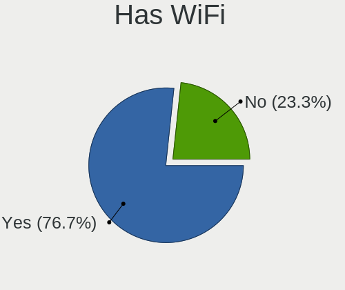
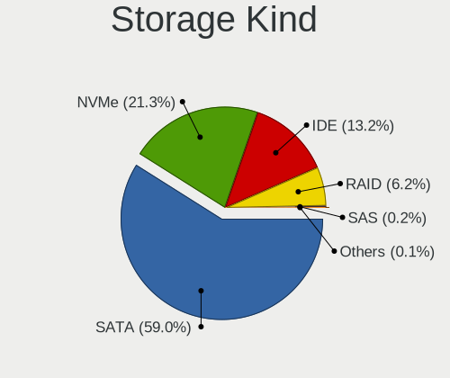

Linux Mint - Tested Hardware & Statistics
-----------------------------------------

A project to collect tested hardware configurations for Linux Mint.

Anyone can contribute to this report by the [hw-probe](https://github.com/linuxhw/hw-probe) tool:

    sudo -E hw-probe -all -upload

Please contribute! Especially if your hardware is rare.

This is a report for all computer types. See also reports for [desktops](/Dist/Linux_Mint/Desktop/README.md) and [notebooks](/Dist/Linux_Mint/Notebook/README.md).

Contents
--------

* [ Test Cases ](#test-cases)

* [ System ](#system)
  - [ OS                       ](#os)
  - [ OS Family                ](#os-family)
  - [ Kernel                   ](#kernel)
  - [ Kernel Family            ](#kernel-family)
  - [ Kernel Major Ver.        ](#kernel-major-ver)
  - [ Arch                     ](#arch)
  - [ DE                       ](#de)
  - [ Display Server           ](#display-server)
  - [ Display Manager          ](#display-manager)
  - [ OS Lang                  ](#os-lang)
  - [ Boot Mode                ](#boot-mode)
  - [ Filesystem               ](#filesystem)
  - [ Part. scheme             ](#part-scheme)
  - [ Dual Boot with Linux/BSD ](#dual-boot-with-linuxbsd)
  - [ Dual Boot (Win)          ](#dual-boot-win)

* [ Board ](#board)
  - [ Vendor                   ](#vendor)
  - [ Model                    ](#model)
  - [ Model Family             ](#model-family)
  - [ MFG Year                 ](#mfg-year)
  - [ Form Factor              ](#form-factor)
  - [ Secure Boot              ](#secure-boot)
  - [ Coreboot                 ](#coreboot)
  - [ RAM Size                 ](#ram-size)
  - [ RAM Used                 ](#ram-used)
  - [ Total Drives             ](#total-drives)
  - [ Has CD-ROM               ](#has-cd-rom)
  - [ Has Ethernet             ](#has-ethernet)
  - [ Has WiFi                 ](#has-wifi)
  - [ Has Bluetooth            ](#has-bluetooth)

* [ Location ](#location)
  - [ Country                  ](#country)
  - [ City                     ](#city)

* [ Drives ](#drives)
  - [ Drive Vendor             ](#drive-vendor)
  - [ Drive Model              ](#drive-model)
  - [ HDD Vendor               ](#hdd-vendor)
  - [ SSD Vendor               ](#ssd-vendor)
  - [ Drive Kind               ](#drive-kind)
  - [ Drive Connector          ](#drive-connector)
  - [ Drive Size               ](#drive-size)
  - [ Space Total              ](#space-total)
  - [ Space Used               ](#space-used)
  - [ Malfunc. Drives          ](#malfunc-drives)
  - [ Malfunc. Drive Vendor    ](#malfunc-drive-vendor)
  - [ Malfunc. HDD Vendor      ](#malfunc-hdd-vendor)
  - [ Malfunc. Drive Kind      ](#malfunc-drive-kind)
  - [ Failed Drives            ](#failed-drives)
  - [ Failed Drive Vendor      ](#failed-drive-vendor)
  - [ Drive Status             ](#drive-status)

* [ Storage controller ](#storage-controller)
  - [ Storage Vendor           ](#storage-vendor)
  - [ Storage Model            ](#storage-model)
  - [ Storage Kind             ](#storage-kind)

* [ Processor ](#processor)
  - [ CPU Vendor               ](#cpu-vendor)
  - [ CPU Model                ](#cpu-model)
  - [ CPU Model Family         ](#cpu-model-family)
  - [ CPU Cores                ](#cpu-cores)
  - [ CPU Sockets              ](#cpu-sockets)
  - [ CPU Threads              ](#cpu-threads)
  - [ CPU Op-Modes             ](#cpu-op-modes)
  - [ CPU Microcode            ](#cpu-microcode)
  - [ CPU Microarch            ](#cpu-microarch)

* [ Graphics ](#graphics)
  - [ GPU Vendor               ](#gpu-vendor)
  - [ GPU Model                ](#gpu-model)
  - [ GPU Combo                ](#gpu-combo)
  - [ GPU Driver               ](#gpu-driver)
  - [ GPU Memory               ](#gpu-memory)

* [ Monitor ](#monitor)
  - [ Monitor Vendor           ](#monitor-vendor)
  - [ Monitor Model            ](#monitor-model)
  - [ Monitor Resolution       ](#monitor-resolution)
  - [ Monitor Diagonal         ](#monitor-diagonal)
  - [ Monitor Width            ](#monitor-width)
  - [ Aspect Ratio             ](#aspect-ratio)
  - [ Monitor Area             ](#monitor-area)
  - [ Pixel Density            ](#pixel-density)
  - [ Multiple Monitors        ](#multiple-monitors)

* [ Network ](#network)
  - [ Net Controller Vendor    ](#net-controller-vendor)
  - [ Net Controller Model     ](#net-controller-model)
  - [ Wireless Vendor          ](#wireless-vendor)
  - [ Wireless Model           ](#wireless-model)
  - [ Ethernet Vendor          ](#ethernet-vendor)
  - [ Ethernet Model           ](#ethernet-model)
  - [ Net Controller Kind      ](#net-controller-kind)
  - [ Used Controller          ](#used-controller)
  - [ NICs                     ](#nics)
  - [ IPv6                     ](#ipv6)

* [ Bluetooth ](#bluetooth)
  - [ Bluetooth Vendor         ](#bluetooth-vendor)
  - [ Bluetooth Model          ](#bluetooth-model)

* [ Sound ](#sound)
  - [ Sound Vendor             ](#sound-vendor)
  - [ Sound Model              ](#sound-model)

* [ Memory ](#memory)
  - [ Memory Vendor            ](#memory-vendor)
  - [ Memory Model             ](#memory-model)
  - [ Memory Kind              ](#memory-kind)
  - [ Memory Form Factor       ](#memory-form-factor)
  - [ Memory Size              ](#memory-size)
  - [ Memory Speed             ](#memory-speed)

* [ Printers & scanners ](#printers--scanners)
  - [ Printer Vendor           ](#printer-vendor)
  - [ Printer Model            ](#printer-model)
  - [ Scanner Vendor           ](#scanner-vendor)
  - [ Scanner Model            ](#scanner-model)

* [ Camera ](#camera)
  - [ Camera Vendor            ](#camera-vendor)
  - [ Camera Model             ](#camera-model)

* [ Security ](#security)
  - [ Fingerprint Vendor       ](#fingerprint-vendor)
  - [ Fingerprint Model        ](#fingerprint-model)
  - [ Chipcard Vendor          ](#chipcard-vendor)
  - [ Chipcard Model           ](#chipcard-model)

* [ Unsupported ](#unsupported)
  - [ Unsupported Devices      ](#unsupported-devices)
  - [ Unsupported Device Types ](#unsupported-device-types)

Test Cases
----------

Total: 30465

| Vendor        | Model                       | Form-Factor | Probe                                                      | Date         |
|---------------|-----------------------------|-------------|------------------------------------------------------------|--------------|
| Gigabyte      | AB350N-Gaming WIFI-CF       | Desktop     | [24166c136e](https://linux-hardware.org/?probe=24166c136e) | Jan 02, 2024 |
| ASUSTek       | X75VC                       | Notebook    | [c80297163a](https://linux-hardware.org/?probe=c80297163a) | Jan 02, 2024 |
| HP            | Pavilion dm4                | Notebook    | [7b2206d3e1](https://linux-hardware.org/?probe=7b2206d3e1) | Jan 02, 2024 |
| HP            | Pavilion dm4                | Notebook    | [97f8b54561](https://linux-hardware.org/?probe=97f8b54561) | Jan 02, 2024 |
| MSI           | GS65 Stealth 9SG            | Notebook    | [6f3ddca46b](https://linux-hardware.org/?probe=6f3ddca46b) | Jan 02, 2024 |
| ASUSTek       | ROG STRIX B650E-E GAMING... | Desktop     | [57a12c9041](https://linux-hardware.org/?probe=57a12c9041) | Jan 02, 2024 |
| Acer          | Aspire A515-51G             | Notebook    | [e7b0efb20a](https://linux-hardware.org/?probe=e7b0efb20a) | Jan 02, 2024 |
| MSI           | MS-B9181                    | Desktop     | [56b0ad4a01](https://linux-hardware.org/?probe=56b0ad4a01) | Jan 02, 2024 |
| ASUSTek       | Vivobook Go E1504FA_E150... | Notebook    | [83ae2c858c](https://linux-hardware.org/?probe=83ae2c858c) | Jan 01, 2024 |
| ASUSTek       | Vivobook Go E1504FA_E150... | Notebook    | [4ec973722a](https://linux-hardware.org/?probe=4ec973722a) | Jan 01, 2024 |
| Fujitsu       | LIFEBOOK E780               | Notebook    | [6606e3d150](https://linux-hardware.org/?probe=6606e3d150) | Jan 01, 2024 |
| HP            | G60                         | Notebook    | [a151a8084c](https://linux-hardware.org/?probe=a151a8084c) | Jan 01, 2024 |
| ASUSTek       | P8Z77-V LX                  | Desktop     | [148f8c250f](https://linux-hardware.org/?probe=148f8c250f) | Jan 01, 2024 |
| ASUSTek       | K52Jc                       | Notebook    | [5f0c993270](https://linux-hardware.org/?probe=5f0c993270) | Jan 01, 2024 |
| ASUSTek       | M5A99X EVO R2.0             | Desktop     | [aedbae5d00](https://linux-hardware.org/?probe=aedbae5d00) | Jan 01, 2024 |
| ASUSTek       | P8H67-M EVO                 | Desktop     | [7c95d175bb](https://linux-hardware.org/?probe=7c95d175bb) | Jan 01, 2024 |
| Gigabyte      | A320M-S2H-CF                | Desktop     | [ac00eb404d](https://linux-hardware.org/?probe=ac00eb404d) | Jan 01, 2024 |
| HP            | EliteBook 820 G1            | Notebook    | [60a0cb2296](https://linux-hardware.org/?probe=60a0cb2296) | Jan 01, 2024 |
| Gigabyte      | 970A-DS3P                   | Desktop     | [74a0ff16d4](https://linux-hardware.org/?probe=74a0ff16d4) | Jan 01, 2024 |
| Dell          | Inspiron 5379               | Notebook    | [c3c47e54db](https://linux-hardware.org/?probe=c3c47e54db) | Jan 01, 2024 |
| Unknown       | Unknown                     | Desktop     | [3be8582d82](https://linux-hardware.org/?probe=3be8582d82) | Jan 01, 2024 |
| Dell          | Inspiron 5402               | Notebook    | [388a6a9fc1](https://linux-hardware.org/?probe=388a6a9fc1) | Jan 01, 2024 |
| Microsoft     | Surface Pro 8               | Tablet      | [eca0b8e39a](https://linux-hardware.org/?probe=eca0b8e39a) | Jan 01, 2024 |
| Sony          | VPCSB1V9E                   | Notebook    | [31cb181036](https://linux-hardware.org/?probe=31cb181036) | Jan 01, 2024 |
| MSI           | B550M PRO-VDH WIFI          | Desktop     | [b1f90491ab](https://linux-hardware.org/?probe=b1f90491ab) | Jan 01, 2024 |
| Lenovo        | ThinkPad E14 Gen 2 20T7S... | Notebook    | [6a6513cf92](https://linux-hardware.org/?probe=6a6513cf92) | Jan 01, 2024 |
| ASUSTek       | X75VC                       | Notebook    | [cb47b15eb9](https://linux-hardware.org/?probe=cb47b15eb9) | Jan 01, 2024 |
| ASUSTek       | G75VW                       | Notebook    | [56e330d7bc](https://linux-hardware.org/?probe=56e330d7bc) | Dec 31, 2023 |
| ASUSTek       | TUF Gaming B650M-PLUS WI... | Desktop     | [8635d2ee55](https://linux-hardware.org/?probe=8635d2ee55) | Dec 31, 2023 |
| Acer          | Nitro AN515-55              | Notebook    | [14f7c6a9df](https://linux-hardware.org/?probe=14f7c6a9df) | Dec 31, 2023 |
| Shenzhen M... | F7BFD                       | Desktop     | [a55f5157bc](https://linux-hardware.org/?probe=a55f5157bc) | Dec 31, 2023 |
| HP            | Laptop 17-cn0xxx            | Notebook    | [b3568ff9cb](https://linux-hardware.org/?probe=b3568ff9cb) | Dec 31, 2023 |
| MSI           | PRO Z790-A WIFI             | Desktop     | [40362f198b](https://linux-hardware.org/?probe=40362f198b) | Dec 31, 2023 |
| Positivo      | POS-PIH55BXA                | Desktop     | [6ab5cb395f](https://linux-hardware.org/?probe=6ab5cb395f) | Dec 31, 2023 |
| Alienware     | 0VDT73 A00                  | Desktop     | [2a4b22a489](https://linux-hardware.org/?probe=2a4b22a489) | Dec 31, 2023 |
| Fujitsu Si... | LIFEBOOK E8410              | Notebook    | [eeba7c76f2](https://linux-hardware.org/?probe=eeba7c76f2) | Dec 31, 2023 |
| Gigabyte      | B450 AORUS M                | Desktop     | [76a4e84057](https://linux-hardware.org/?probe=76a4e84057) | Dec 31, 2023 |
| ASUSTek       | P8Z77-V LX                  | Desktop     | [109efb840b](https://linux-hardware.org/?probe=109efb840b) | Dec 31, 2023 |
| MSI           | X58 Pro-E                   | Desktop     | [59b2e1dab3](https://linux-hardware.org/?probe=59b2e1dab3) | Dec 31, 2023 |
| HP            | 84F5                        | Mini pc     | [b4c20746bb](https://linux-hardware.org/?probe=b4c20746bb) | Dec 31, 2023 |
| Dell          | Latitude E4310              | Notebook    | [10397fd191](https://linux-hardware.org/?probe=10397fd191) | Dec 31, 2023 |
| Medion        | M14L-256                    | Notebook    | [0dbbd4db74](https://linux-hardware.org/?probe=0dbbd4db74) | Dec 31, 2023 |
| ASUSTek       | P8Z77-V LX                  | Desktop     | [bb0f439fbe](https://linux-hardware.org/?probe=bb0f439fbe) | Dec 31, 2023 |
| HP            | 872E                        | Mini pc     | [5791679f5b](https://linux-hardware.org/?probe=5791679f5b) | Dec 31, 2023 |
| MSI           | 970 GAMING                  | Desktop     | [aa028d5af2](https://linux-hardware.org/?probe=aa028d5af2) | Dec 31, 2023 |
| HP            | 2AF7                        | Desktop     | [8bae22b1aa](https://linux-hardware.org/?probe=8bae22b1aa) | Dec 31, 2023 |
| Lenovo        | IdeaPad 320-14IAP 80XQ      | Notebook    | [1fedc1bf30](https://linux-hardware.org/?probe=1fedc1bf30) | Dec 31, 2023 |
| HP            | OMEN by Laptop              | Notebook    | [8b1ac4e80c](https://linux-hardware.org/?probe=8b1ac4e80c) | Dec 31, 2023 |
| HP            | 3047h                       | Desktop     | [b7a000586f](https://linux-hardware.org/?probe=b7a000586f) | Dec 31, 2023 |
| ASUSTek       | PRIME A320M-K               | Desktop     | [f45ebb1f0d](https://linux-hardware.org/?probe=f45ebb1f0d) | Dec 31, 2023 |
| ASRock        | B450M Pro4 R2.0             | Desktop     | [f70bdb7fa5](https://linux-hardware.org/?probe=f70bdb7fa5) | Dec 31, 2023 |
| ASUSTek       | ROG STRIX B650E-I GAMING... | Desktop     | [ca4a3eaa00](https://linux-hardware.org/?probe=ca4a3eaa00) | Dec 31, 2023 |
| Lenovo        | ThinkPad T480s 20L8S35G0... | Notebook    | [f2357e961c](https://linux-hardware.org/?probe=f2357e961c) | Dec 31, 2023 |
| Toshiba       | Satellite P55-B             | Notebook    | [9a1e5dc1f6](https://linux-hardware.org/?probe=9a1e5dc1f6) | Dec 31, 2023 |
| Dell          | Latitude E4300              | Notebook    | [528165bb06](https://linux-hardware.org/?probe=528165bb06) | Dec 31, 2023 |
| Dell          | Latitude E5430 non-vPro     | Notebook    | [e27c2e0ade](https://linux-hardware.org/?probe=e27c2e0ade) | Dec 31, 2023 |
| Apple         | Mac-35C5E08120C7EEAF Mac... | Mini pc     | [12c41e6a5f](https://linux-hardware.org/?probe=12c41e6a5f) | Dec 31, 2023 |
| Apple         | Mac-35C5E08120C7EEAF Mac... | Mini pc     | [c0381749ea](https://linux-hardware.org/?probe=c0381749ea) | Dec 31, 2023 |
| ASUSTek       | VivoBook_ASUSLaptop X170... | Notebook    | [9c355f1603](https://linux-hardware.org/?probe=9c355f1603) | Dec 31, 2023 |
| ASRock        | Q1900M                      | Desktop     | [67778ed569](https://linux-hardware.org/?probe=67778ed569) | Dec 31, 2023 |
| HP            | 8918                        | Desktop     | [0e8d4a626d](https://linux-hardware.org/?probe=0e8d4a626d) | Dec 31, 2023 |
| ASRock        | Z97X Killer                 | Desktop     | [9508234fa4](https://linux-hardware.org/?probe=9508234fa4) | Dec 31, 2023 |
| Microsoft     | Surface Pro                 | Tablet      | [f6c29ea729](https://linux-hardware.org/?probe=f6c29ea729) | Dec 31, 2023 |
| Dell          | Latitude E6440              | Notebook    | [f4ba63ff52](https://linux-hardware.org/?probe=f4ba63ff52) | Dec 30, 2023 |
| Dell          | 0GN6JF A01                  | Desktop     | [19456ad0cb](https://linux-hardware.org/?probe=19456ad0cb) | Dec 30, 2023 |
| Toshiba       | Satellite Pro C50-A-1C8     | Notebook    | [8b28cb5a8f](https://linux-hardware.org/?probe=8b28cb5a8f) | Dec 30, 2023 |
| Lenovo        | IdeaPad 320S-13IKB 81AK     | Notebook    | [11892aa026](https://linux-hardware.org/?probe=11892aa026) | Dec 30, 2023 |
| ASUSTek       | PN50                        | Mini pc     | [bf96c5a66e](https://linux-hardware.org/?probe=bf96c5a66e) | Dec 30, 2023 |
| ASUSTek       | PN50                        | Mini pc     | [458091606d](https://linux-hardware.org/?probe=458091606d) | Dec 30, 2023 |
| Dell          | 0GN6JF A01                  | Desktop     | [fcf352f5e9](https://linux-hardware.org/?probe=fcf352f5e9) | Dec 30, 2023 |
| Medion        | Akoya E6240T                | Notebook    | [f23e5a29d5](https://linux-hardware.org/?probe=f23e5a29d5) | Dec 30, 2023 |
| HP            | 81B4                        | Desktop     | [b596129d5d](https://linux-hardware.org/?probe=b596129d5d) | Dec 30, 2023 |
| Dell          | Latitude E7450              | Notebook    | [dd5f4a17c4](https://linux-hardware.org/?probe=dd5f4a17c4) | Dec 30, 2023 |
| ASUSTek       | TUF Gaming H670-PRO WIFI... | Desktop     | [3b26c92d22](https://linux-hardware.org/?probe=3b26c92d22) | Dec 30, 2023 |
| Microtech     | CoreBook                    | Notebook    | [f82534d32b](https://linux-hardware.org/?probe=f82534d32b) | Dec 30, 2023 |
| ASUSTek       | M5A78L-M LX3                | Desktop     | [c4b0b7c31a](https://linux-hardware.org/?probe=c4b0b7c31a) | Dec 30, 2023 |
| Samsung       | R530/R730/R540              | Notebook    | [c914756956](https://linux-hardware.org/?probe=c914756956) | Dec 30, 2023 |
| Fujitsu       | D3222-A1 S26361-D3222-A1    | Desktop     | [7e628cb2ca](https://linux-hardware.org/?probe=7e628cb2ca) | Dec 30, 2023 |
| Dell          | Latitude E6440              | Notebook    | [8c8ec73113](https://linux-hardware.org/?probe=8c8ec73113) | Dec 30, 2023 |
| ANGXUN        | X79 (INTEL Xeon E5/Corei... | Desktop     | [92d3ce2ee5](https://linux-hardware.org/?probe=92d3ce2ee5) | Dec 30, 2023 |
| HUAWEI        | KLVL-WXX9                   | Notebook    | [f8aeb2c6c3](https://linux-hardware.org/?probe=f8aeb2c6c3) | Dec 30, 2023 |
| HP            | EliteBook Folio 1040 G3     | Notebook    | [98f6888dcd](https://linux-hardware.org/?probe=98f6888dcd) | Dec 30, 2023 |
| HP            | EliteBook Folio 1040 G3     | Notebook    | [cb51f62169](https://linux-hardware.org/?probe=cb51f62169) | Dec 30, 2023 |
| Dell          | 0KV62T A02                  | Desktop     | [0722563902](https://linux-hardware.org/?probe=0722563902) | Dec 30, 2023 |
| Lenovo        | B590 20206                  | Notebook    | [d3c6913a54](https://linux-hardware.org/?probe=d3c6913a54) | Dec 30, 2023 |
| HP            | Laptop 15-dy2xxx            | Notebook    | [2a29a4613c](https://linux-hardware.org/?probe=2a29a4613c) | Dec 30, 2023 |
| Positivo      | Harrison                    | Notebook    | [bf31594bef](https://linux-hardware.org/?probe=bf31594bef) | Dec 30, 2023 |
| HP            | Laptop 15-dy2xxx            | Notebook    | [9ee9bc6de8](https://linux-hardware.org/?probe=9ee9bc6de8) | Dec 30, 2023 |
| Acer          | Aspire A517-52              | Notebook    | [0dfed3df52](https://linux-hardware.org/?probe=0dfed3df52) | Dec 30, 2023 |
| ASUSTek       | ROG STRIX B350-F GAMING     | Desktop     | [b8c7cbf672](https://linux-hardware.org/?probe=b8c7cbf672) | Dec 30, 2023 |
| Acer          | Aspire A517-52              | Notebook    | [1c4684011d](https://linux-hardware.org/?probe=1c4684011d) | Dec 30, 2023 |
| Google        | Reef                        | Notebook    | [362a174638](https://linux-hardware.org/?probe=362a174638) | Dec 30, 2023 |
| HP            | EliteBook x360 1030 G3      | Convertible | [a110775379](https://linux-hardware.org/?probe=a110775379) | Dec 29, 2023 |
| ASUSTek       | VivoBook_ASUSLaptop X513... | Notebook    | [61c1444cfc](https://linux-hardware.org/?probe=61c1444cfc) | Dec 29, 2023 |
| Lenovo        | ThinkPad X280 20KF0025US    | Notebook    | [5766ed7c57](https://linux-hardware.org/?probe=5766ed7c57) | Dec 29, 2023 |
| MSI           | 760GMA-P34                  | Desktop     | [4d6001354b](https://linux-hardware.org/?probe=4d6001354b) | Dec 29, 2023 |
| Gigabyte      | GA-78LMT-S2P                | Desktop     | [658dc99555](https://linux-hardware.org/?probe=658dc99555) | Dec 29, 2023 |
| ASUSTek       | TUF Gaming B550M-PLUS       | Desktop     | [aa1befaf25](https://linux-hardware.org/?probe=aa1befaf25) | Dec 29, 2023 |
| LG Electro... | P420-N.AE21G                | Notebook    | [3fdf04ae52](https://linux-hardware.org/?probe=3fdf04ae52) | Dec 29, 2023 |
| Intel         | NUC6i3SYB H81132-503        | Mini pc     | [c834d2e2e0](https://linux-hardware.org/?probe=c834d2e2e0) | Dec 29, 2023 |
| Dell          | Latitude E7450              | Notebook    | [0d3dc05a2d](https://linux-hardware.org/?probe=0d3dc05a2d) | Dec 29, 2023 |
| ASRock        | H310CM-HDV                  | Desktop     | [df518ecaf1](https://linux-hardware.org/?probe=df518ecaf1) | Dec 29, 2023 |
| Lenovo        | G50-80 80E5                 | Notebook    | [0e612ffdf7](https://linux-hardware.org/?probe=0e612ffdf7) | Dec 29, 2023 |
| Lenovo        | ThinkPad E580 20KTS0TF00    | Notebook    | [fe64fba0a5](https://linux-hardware.org/?probe=fe64fba0a5) | Dec 29, 2023 |
| ASUSTek       | K72JT                       | Notebook    | [51117cd448](https://linux-hardware.org/?probe=51117cd448) | Dec 29, 2023 |
| ASUSTek       | ROG STRIX B450-F GAMING ... | Desktop     | [7108d28aab](https://linux-hardware.org/?probe=7108d28aab) | Dec 29, 2023 |
| ASUSTek       | K53SV                       | Notebook    | [c285275ef1](https://linux-hardware.org/?probe=c285275ef1) | Dec 29, 2023 |
| MSI           | 760GMA-P34                  | Desktop     | [0e59657bca](https://linux-hardware.org/?probe=0e59657bca) | Dec 29, 2023 |
| MSI           | H310M PRO-VD PLUS           | Desktop     | [d7083ded0a](https://linux-hardware.org/?probe=d7083ded0a) | Dec 29, 2023 |
| ASUSTek       | ASUS EXPERTBOOK B9400CBA... | Notebook    | [f37cd9143d](https://linux-hardware.org/?probe=f37cd9143d) | Dec 29, 2023 |
| eMachines     | EMCP73VT-PM                 | Desktop     | [cd0de3ca07](https://linux-hardware.org/?probe=cd0de3ca07) | Dec 29, 2023 |
| ASRock        | Z68 Professional Gen3       | Desktop     | [730262494e](https://linux-hardware.org/?probe=730262494e) | Dec 29, 2023 |
| ASUSTek       | P5QL-E                      | Desktop     | [fb478f78b1](https://linux-hardware.org/?probe=fb478f78b1) | Dec 29, 2023 |
| Dell          | Inspiron 3584               | Notebook    | [818e96295f](https://linux-hardware.org/?probe=818e96295f) | Dec 29, 2023 |
| Apple         | Mac-77EB7D7DAF985301 iMa... | All in one  | [d1657d2b79](https://linux-hardware.org/?probe=d1657d2b79) | Dec 29, 2023 |
| MSI           | H510M PRO                   | Desktop     | [642f22170e](https://linux-hardware.org/?probe=642f22170e) | Dec 29, 2023 |
| Microsoft     | Surface Pro 3               | Tablet      | [f1b87f3d0e](https://linux-hardware.org/?probe=f1b87f3d0e) | Dec 29, 2023 |
| Gigabyte      | B450M GAMING                | Desktop     | [d91ba814ed](https://linux-hardware.org/?probe=d91ba814ed) | Dec 29, 2023 |
| HP            | 8455                        | Desktop     | [3fb91b1137](https://linux-hardware.org/?probe=3fb91b1137) | Dec 29, 2023 |
| HP            | 8455                        | Desktop     | [1cb18d157d](https://linux-hardware.org/?probe=1cb18d157d) | Dec 29, 2023 |
| T-bao         | MINI PC                     | Desktop     | [ad89280fd6](https://linux-hardware.org/?probe=ad89280fd6) | Dec 29, 2023 |
| HP            | Compaq Presario A900        | Notebook    | [e22eed28b4](https://linux-hardware.org/?probe=e22eed28b4) | Dec 29, 2023 |
| Lenovo        | SDK0F82990 WIN              | All in one  | [532a81f70f](https://linux-hardware.org/?probe=532a81f70f) | Dec 29, 2023 |
| ASUSTek       | ROG STRIX Z790-E GAMING ... | Desktop     | [6954b67b3e](https://linux-hardware.org/?probe=6954b67b3e) | Dec 29, 2023 |
| HUAWEI        | NBLB-WAX9N                  | Notebook    | [6de199d009](https://linux-hardware.org/?probe=6de199d009) | Dec 29, 2023 |
| Lenovo        | Yoga 510-14AST 80S9         | Convertible | [45be79a808](https://linux-hardware.org/?probe=45be79a808) | Dec 29, 2023 |
| Lenovo        | V145-15AST 81MT             | Notebook    | [fa95062029](https://linux-hardware.org/?probe=fa95062029) | Dec 28, 2023 |
| ASUSTek       | M5A97 R2.0                  | Desktop     | [5ec001ca66](https://linux-hardware.org/?probe=5ec001ca66) | Dec 28, 2023 |
| ASRock        | H61M-S                      | Desktop     | [2321baa69b](https://linux-hardware.org/?probe=2321baa69b) | Dec 28, 2023 |
| Unknown       | Unknown                     | Notebook    | [89a77455e5](https://linux-hardware.org/?probe=89a77455e5) | Dec 28, 2023 |
| ASRock        | H61M-S                      | Desktop     | [466863e657](https://linux-hardware.org/?probe=466863e657) | Dec 28, 2023 |
| MSI           | Z77 MPower                  | Desktop     | [54a4a451c1](https://linux-hardware.org/?probe=54a4a451c1) | Dec 28, 2023 |
| Gigabyte      | GA-MA790FXT-UD5P            | Desktop     | [e29421585d](https://linux-hardware.org/?probe=e29421585d) | Dec 28, 2023 |
| Lenovo        | ThinkPad L390 20NSS29K00    | Notebook    | [a0860fbefb](https://linux-hardware.org/?probe=a0860fbefb) | Dec 28, 2023 |
| Lenovo        | IdeaPad Gaming 3 15ARH05... | Notebook    | [5b2dd63a52](https://linux-hardware.org/?probe=5b2dd63a52) | Dec 28, 2023 |
| Positivo      | Harrison                    | Notebook    | [e12b67378a](https://linux-hardware.org/?probe=e12b67378a) | Dec 28, 2023 |
| LG Electro... | S510-X.CBCKG                | Notebook    | [41f03f323d](https://linux-hardware.org/?probe=41f03f323d) | Dec 28, 2023 |
| LG Electro... | S510-X.CBCKG                | Notebook    | [1348f972c2](https://linux-hardware.org/?probe=1348f972c2) | Dec 28, 2023 |
| Lenovo        | ThinkPad P16s Gen 2 21K9... | Notebook    | [08fc99186e](https://linux-hardware.org/?probe=08fc99186e) | Dec 28, 2023 |
| Medion        | E7220                       | Notebook    | [8a10d2f8d1](https://linux-hardware.org/?probe=8a10d2f8d1) | Dec 28, 2023 |
| Dell          | 0K216C                      | Desktop     | [203ef6afde](https://linux-hardware.org/?probe=203ef6afde) | Dec 28, 2023 |
| Fujitsu       | LIFEBOOK T902               | Notebook    | [050f6ca09e](https://linux-hardware.org/?probe=050f6ca09e) | Dec 28, 2023 |
| Unknown       | HX90                        | Desktop     | [1162cbcaa5](https://linux-hardware.org/?probe=1162cbcaa5) | Dec 28, 2023 |
| Dell          | Latitude 5510               | Notebook    | [ebe9c1f033](https://linux-hardware.org/?probe=ebe9c1f033) | Dec 28, 2023 |
| Gigabyte      | AB350M-Gaming 3-CF          | Desktop     | [550c477d53](https://linux-hardware.org/?probe=550c477d53) | Dec 28, 2023 |
| ASUSTek       | Z170-K                      | Desktop     | [87feadebd0](https://linux-hardware.org/?probe=87feadebd0) | Dec 28, 2023 |
| ASUSTek       | Z170-K                      | Desktop     | [2e68fcc0d0](https://linux-hardware.org/?probe=2e68fcc0d0) | Dec 28, 2023 |
| Acer          | Aspire V5-123               | Notebook    | [4220993372](https://linux-hardware.org/?probe=4220993372) | Dec 28, 2023 |
| MSI           | Z170A GAMING PRO CARBON     | Desktop     | [dfdfad519d](https://linux-hardware.org/?probe=dfdfad519d) | Dec 28, 2023 |
| Lenovo        | IdeaPad 5 15IAL7 82SF       | Notebook    | [da8a8d5994](https://linux-hardware.org/?probe=da8a8d5994) | Dec 28, 2023 |
| MSI           | GF65 Thin 10SDR             | Notebook    | [18a746317d](https://linux-hardware.org/?probe=18a746317d) | Dec 28, 2023 |
| HP            | 876C SMVB                   | Desktop     | [7082e52b57](https://linux-hardware.org/?probe=7082e52b57) | Dec 27, 2023 |
| ASUSTek       | Crosshair IV Formula        | Desktop     | [f426fd6d36](https://linux-hardware.org/?probe=f426fd6d36) | Dec 27, 2023 |
| Apple         | MacBookAir6,2               | Notebook    | [eaa0ff8b0c](https://linux-hardware.org/?probe=eaa0ff8b0c) | Dec 27, 2023 |
| Apple         | MacBookAir6,2               | Notebook    | [4a28e0da3c](https://linux-hardware.org/?probe=4a28e0da3c) | Dec 27, 2023 |
| MSI           | H110M PRO-VD                | Desktop     | [86eb28c296](https://linux-hardware.org/?probe=86eb28c296) | Dec 27, 2023 |
| Lenovo        | ThinkPad X1 Carbon 6th 2... | Notebook    | [3fd67d4da9](https://linux-hardware.org/?probe=3fd67d4da9) | Dec 27, 2023 |
| HUAWEI        | NBLB-WAX9N                  | Notebook    | [84bc2c3915](https://linux-hardware.org/?probe=84bc2c3915) | Dec 27, 2023 |
| Gigabyte      | B550 GAMING X V2            | Desktop     | [452b67f058](https://linux-hardware.org/?probe=452b67f058) | Dec 27, 2023 |
| MSI           | MEG X570S ACE MAX           | Desktop     | [cb4d6d8724](https://linux-hardware.org/?probe=cb4d6d8724) | Dec 27, 2023 |
| Inter Sale... | NID-11125DE                 | Notebook    | [b3e9e05ed1](https://linux-hardware.org/?probe=b3e9e05ed1) | Dec 27, 2023 |
| HP            | 3397                        | Desktop     | [de93e38762](https://linux-hardware.org/?probe=de93e38762) | Dec 27, 2023 |
| HP            | 255 G7 Notebook PC          | Notebook    | [8b217c5f35](https://linux-hardware.org/?probe=8b217c5f35) | Dec 27, 2023 |
| HP            | Laptop 17-bs0xx             | Notebook    | [07f0d2eb99](https://linux-hardware.org/?probe=07f0d2eb99) | Dec 27, 2023 |
| Dell          | G3 3590                     | Notebook    | [681f15e9c0](https://linux-hardware.org/?probe=681f15e9c0) | Dec 27, 2023 |
| Lenovo        | IdeaPad 5 15IAL7 82SF       | Notebook    | [418992da4d](https://linux-hardware.org/?probe=418992da4d) | Dec 27, 2023 |
| Dell          | Latitude E7440              | Notebook    | [6e44f58de9](https://linux-hardware.org/?probe=6e44f58de9) | Dec 27, 2023 |
| ASRock        | H61M-DGS R2.0               | Desktop     | [fd5af25b3b](https://linux-hardware.org/?probe=fd5af25b3b) | Dec 27, 2023 |
| ASUSTek       | M5A78L-M PLUS/USB3          | Desktop     | [8319279670](https://linux-hardware.org/?probe=8319279670) | Dec 27, 2023 |
| Gigabyte      | F2A68HM-S1                  | Desktop     | [dc498a88a6](https://linux-hardware.org/?probe=dc498a88a6) | Dec 27, 2023 |
| Lenovo        | IdeaPad S145-14API 81UV     | Notebook    | [bd8145e3db](https://linux-hardware.org/?probe=bd8145e3db) | Dec 27, 2023 |
| Lenovo        | G510 20238                  | Notebook    | [d91e69cc3a](https://linux-hardware.org/?probe=d91e69cc3a) | Dec 27, 2023 |
| Unknown       | Unknown                     | Notebook    | [0d550e2115](https://linux-hardware.org/?probe=0d550e2115) | Dec 27, 2023 |
| ASUSTek       | VivoBook_ASUSLaptop X150... | Notebook    | [58080b01c8](https://linux-hardware.org/?probe=58080b01c8) | Dec 27, 2023 |
| Dell          | Latitude 5400               | Notebook    | [4c2ddb74c4](https://linux-hardware.org/?probe=4c2ddb74c4) | Dec 27, 2023 |
| HP            | 3397                        | Desktop     | [d7bbeccfe9](https://linux-hardware.org/?probe=d7bbeccfe9) | Dec 27, 2023 |
| Unknown       | Unknown                     | Notebook    | [2bb2a6cd8b](https://linux-hardware.org/?probe=2bb2a6cd8b) | Dec 27, 2023 |
| MSI           | MS-B1591                    | Desktop     | [8baf11e980](https://linux-hardware.org/?probe=8baf11e980) | Dec 27, 2023 |
| ASUSTek       | K53E                        | Notebook    | [42082143bc](https://linux-hardware.org/?probe=42082143bc) | Dec 26, 2023 |
| ASRock        | B450M Pro4 R2.0             | Desktop     | [ab795ed232](https://linux-hardware.org/?probe=ab795ed232) | Dec 26, 2023 |
| Lenovo        | ThinkPad X1 Carbon 5th 2... | Notebook    | [7a0c2d1a36](https://linux-hardware.org/?probe=7a0c2d1a36) | Dec 26, 2023 |
| Gigabyte      | B75M-D3H                    | Desktop     | [c7a5f771ce](https://linux-hardware.org/?probe=c7a5f771ce) | Dec 26, 2023 |
| Acer          | Predator G9-793             | Notebook    | [cd39cff277](https://linux-hardware.org/?probe=cd39cff277) | Dec 26, 2023 |
| Acer          | Nitro ANV15-51              | Notebook    | [0e1146871b](https://linux-hardware.org/?probe=0e1146871b) | Dec 26, 2023 |
| Apple         | Mac-FC02E91DDD3FA6A4 iMa... | All in one  | [2abc54d852](https://linux-hardware.org/?probe=2abc54d852) | Dec 26, 2023 |
| Samsung       | RV411/RV511/E3511/S3511/... | Notebook    | [8b68f422dd](https://linux-hardware.org/?probe=8b68f422dd) | Dec 26, 2023 |
| Pegatron      | EVANS                       | Desktop     | [657b94df2b](https://linux-hardware.org/?probe=657b94df2b) | Dec 26, 2023 |
| PCWare        | IPMH310G PRO                | Desktop     | [c4668fe41d](https://linux-hardware.org/?probe=c4668fe41d) | Dec 26, 2023 |
| ASUSTek       | PRIME B450M-A               | Desktop     | [b93ec9563c](https://linux-hardware.org/?probe=b93ec9563c) | Dec 26, 2023 |
| Samsung       | 350V5C/351V5C/3540VC/344... | Notebook    | [ed9f6e6354](https://linux-hardware.org/?probe=ed9f6e6354) | Dec 26, 2023 |
| ASUSTek       | M5A78L-M LE/USB3            | Desktop     | [fd68915b97](https://linux-hardware.org/?probe=fd68915b97) | Dec 26, 2023 |
| Lenovo        | B51-35 80LH                 | Notebook    | [85a89b00af](https://linux-hardware.org/?probe=85a89b00af) | Dec 26, 2023 |
| MSI           | PRO B660-A DDR4             | Desktop     | [e86c539df8](https://linux-hardware.org/?probe=e86c539df8) | Dec 26, 2023 |
| Acer          | Aspire 4750                 | Notebook    | [9f4b6b970d](https://linux-hardware.org/?probe=9f4b6b970d) | Dec 26, 2023 |
| Irbis         | NB 111                      | Convertible | [195566f103](https://linux-hardware.org/?probe=195566f103) | Dec 26, 2023 |
| Gigabyte      | B560M DS3H V2               | Desktop     | [af65354320](https://linux-hardware.org/?probe=af65354320) | Dec 26, 2023 |
| HP            | Pavilion dv6                | Notebook    | [5d0a172259](https://linux-hardware.org/?probe=5d0a172259) | Dec 26, 2023 |
| Dell          | 0K240Y A02                  | Desktop     | [c9ace2ba93](https://linux-hardware.org/?probe=c9ace2ba93) | Dec 26, 2023 |
| Chuwi         | GemiBook Pro                | Notebook    | [52f704d54a](https://linux-hardware.org/?probe=52f704d54a) | Dec 26, 2023 |
| ASUSTek       | ZenBook UX433FN_UX433FN     | Notebook    | [2197c3b926](https://linux-hardware.org/?probe=2197c3b926) | Dec 26, 2023 |
| HP            | Pavilion dm4                | Notebook    | [f077672580](https://linux-hardware.org/?probe=f077672580) | Dec 25, 2023 |
| HP            | G62                         | Notebook    | [434b8aa389](https://linux-hardware.org/?probe=434b8aa389) | Dec 25, 2023 |
| HP            | 2ADE                        | Desktop     | [294857f38f](https://linux-hardware.org/?probe=294857f38f) | Dec 25, 2023 |
| Lenovo        | B590 20208                  | Notebook    | [0ae0c3dd40](https://linux-hardware.org/?probe=0ae0c3dd40) | Dec 25, 2023 |
| AZW           | MINI S 10                   | Desktop     | [fbeeeb79f5](https://linux-hardware.org/?probe=fbeeeb79f5) | Dec 25, 2023 |
| Acer          | Aspire ES1-572              | Notebook    | [64d63264dc](https://linux-hardware.org/?probe=64d63264dc) | Dec 25, 2023 |
| Acer          | Aspire ES1-572              | Notebook    | [2698d102c0](https://linux-hardware.org/?probe=2698d102c0) | Dec 25, 2023 |
| Acer          | Aspire A315-24P             | Notebook    | [7f11ff0265](https://linux-hardware.org/?probe=7f11ff0265) | Dec 25, 2023 |
| HP            | EliteBook 840 G3            | Notebook    | [c395b5cd61](https://linux-hardware.org/?probe=c395b5cd61) | Dec 25, 2023 |
| MSI           | GP60 2OD                    | Notebook    | [496ea3ab9c](https://linux-hardware.org/?probe=496ea3ab9c) | Dec 25, 2023 |
| ASUSTek       | TUF Gaming B650M-PLUS WI... | Desktop     | [a5ca58e524](https://linux-hardware.org/?probe=a5ca58e524) | Dec 25, 2023 |
| ASRock        | H61M-DGS R2.0               | Desktop     | [de35c0b58a](https://linux-hardware.org/?probe=de35c0b58a) | Dec 25, 2023 |
| Gigabyte      | 990FXA-UD7                  | Desktop     | [9bc8844164](https://linux-hardware.org/?probe=9bc8844164) | Dec 25, 2023 |
| Acer          | Extensa 2540                | Notebook    | [353ebde365](https://linux-hardware.org/?probe=353ebde365) | Dec 25, 2023 |
| ASUSTek       | CG5275                      | Desktop     | [07c6264eec](https://linux-hardware.org/?probe=07c6264eec) | Dec 25, 2023 |
| MSI           | GX70 3CC                    | Notebook    | [30d22e2d74](https://linux-hardware.org/?probe=30d22e2d74) | Dec 25, 2023 |
| ASUSTek       | ASUS TUF Gaming F15 FX50... | Notebook    | [08e2f4eacc](https://linux-hardware.org/?probe=08e2f4eacc) | Dec 25, 2023 |
| Toshiba       | Satellite L70-A             | Notebook    | [e5ed4a0805](https://linux-hardware.org/?probe=e5ed4a0805) | Dec 25, 2023 |
| Toshiba       | Satellite L70-A             | Notebook    | [7f05fe91ae](https://linux-hardware.org/?probe=7f05fe91ae) | Dec 25, 2023 |
| Apple         | MacBookPro16,2              | Notebook    | [c52e64f2ed](https://linux-hardware.org/?probe=c52e64f2ed) | Dec 25, 2023 |
| Dell          | Inspiron 3531               | Notebook    | [6f8e8606e2](https://linux-hardware.org/?probe=6f8e8606e2) | Dec 25, 2023 |
| Acer          | Aspire A515-51G             | Notebook    | [6705535031](https://linux-hardware.org/?probe=6705535031) | Dec 25, 2023 |
| Acer          | Predator PH317-53           | Notebook    | [fcc1b4896e](https://linux-hardware.org/?probe=fcc1b4896e) | Dec 25, 2023 |
| Intel         | H61                         | Desktop     | [0396f0429a](https://linux-hardware.org/?probe=0396f0429a) | Dec 24, 2023 |
| Gigabyte      | AX370M-Gaming 3-CF          | Desktop     | [c4fe258ada](https://linux-hardware.org/?probe=c4fe258ada) | Dec 24, 2023 |
| HP            | ProBook 650 G2              | Notebook    | [4d94b390ca](https://linux-hardware.org/?probe=4d94b390ca) | Dec 24, 2023 |
| Apple         | Mac-F4238CC8 PVT            | All in one  | [f76dd451a4](https://linux-hardware.org/?probe=f76dd451a4) | Dec 24, 2023 |
| HP            | 255 G7 Notebook PC          | Notebook    | [d37994124a](https://linux-hardware.org/?probe=d37994124a) | Dec 24, 2023 |
| Intel         | B75                         | Desktop     | [65bfc8c4cf](https://linux-hardware.org/?probe=65bfc8c4cf) | Dec 24, 2023 |
| Lenovo        | ThinkPad Edge E530c 3366... | Notebook    | [5267b86c06](https://linux-hardware.org/?probe=5267b86c06) | Dec 24, 2023 |
| Gigabyte      | B550 GAMING X V2            | Desktop     | [0102708c19](https://linux-hardware.org/?probe=0102708c19) | Dec 24, 2023 |
| ASUSTek       | ROG STRIX X670E-E GAMING... | Desktop     | [4b08f610ed](https://linux-hardware.org/?probe=4b08f610ed) | Dec 24, 2023 |
| Lenovo        | ThinkPad Edge E530 62722... | Notebook    | [28ab1a916a](https://linux-hardware.org/?probe=28ab1a916a) | Dec 24, 2023 |
| Gigabyte      | Z87X-UD3H-CF                | Desktop     | [736c52940a](https://linux-hardware.org/?probe=736c52940a) | Dec 24, 2023 |
| Lenovo        | Yoga 510-14AST 80S9         | Convertible | [a5ef57e596](https://linux-hardware.org/?probe=a5ef57e596) | Dec 24, 2023 |
| HP            | 1497                        | Desktop     | [c17c12a021](https://linux-hardware.org/?probe=c17c12a021) | Dec 24, 2023 |
| Lenovo        | 317E SDK0J40700 WIN 3258... | Desktop     | [2bf8854e33](https://linux-hardware.org/?probe=2bf8854e33) | Dec 24, 2023 |
| Lenovo        | ThinkPad T520 4242CW5       | Notebook    | [0bd929d735](https://linux-hardware.org/?probe=0bd929d735) | Dec 24, 2023 |
| ASUSTek       | Z97-K                       | Desktop     | [2474ae00d3](https://linux-hardware.org/?probe=2474ae00d3) | Dec 24, 2023 |
| Dell          | Inspiron 5482               | Convertible | [e084484713](https://linux-hardware.org/?probe=e084484713) | Dec 24, 2023 |
| ASUSTek       | G75VW                       | Notebook    | [63fa97bd36](https://linux-hardware.org/?probe=63fa97bd36) | Dec 24, 2023 |
| Acer          | Aspire 5250                 | Notebook    | [224ca602f3](https://linux-hardware.org/?probe=224ca602f3) | Dec 24, 2023 |
| Acer          | Aspire 5750G                | Notebook    | [a12f3e5ce6](https://linux-hardware.org/?probe=a12f3e5ce6) | Dec 24, 2023 |
| Acer          | Aspire 5750G                | Notebook    | [1a31482d70](https://linux-hardware.org/?probe=1a31482d70) | Dec 24, 2023 |
| Lenovo        | Yoga 9 14ITL5 82BG          | Convertible | [234581f461](https://linux-hardware.org/?probe=234581f461) | Dec 24, 2023 |
| Dell          | Latitude E7450              | Notebook    | [6758499db8](https://linux-hardware.org/?probe=6758499db8) | Dec 24, 2023 |
| Dell          | Latitude E7450              | Notebook    | [d3eb47d0a5](https://linux-hardware.org/?probe=d3eb47d0a5) | Dec 24, 2023 |
| HP            | Unknown                     | Notebook    | [3bc06ba7d3](https://linux-hardware.org/?probe=3bc06ba7d3) | Dec 24, 2023 |
| HP            | Presario CQ61               | Notebook    | [249a217a7c](https://linux-hardware.org/?probe=249a217a7c) | Dec 24, 2023 |
| Lenovo        | V15 G4 AMN 82YU             | Notebook    | [d7518dd730](https://linux-hardware.org/?probe=d7518dd730) | Dec 24, 2023 |
| MSI           | 970 GAMING                  | Desktop     | [275aa2eb92](https://linux-hardware.org/?probe=275aa2eb92) | Dec 23, 2023 |
| Lenovo        | V15 G4 AMN 82YU             | Notebook    | [a4b5f3a556](https://linux-hardware.org/?probe=a4b5f3a556) | Dec 23, 2023 |
| ASUSTek       | PRIME B450-PLUS             | Desktop     | [a32ea319ca](https://linux-hardware.org/?probe=a32ea319ca) | Dec 23, 2023 |
| Lenovo        | Yoga 510-14AST 80S9         | Convertible | [ce31053fe2](https://linux-hardware.org/?probe=ce31053fe2) | Dec 23, 2023 |
| Acer          | Aspire ES1-572              | Notebook    | [e726ce9f63](https://linux-hardware.org/?probe=e726ce9f63) | Dec 23, 2023 |
| MSI           | PRO Z790-A WIFI             | Desktop     | [8becdfe1a4](https://linux-hardware.org/?probe=8becdfe1a4) | Dec 23, 2023 |
| Acer          | Aspire A515-55              | Notebook    | [9412d138fb](https://linux-hardware.org/?probe=9412d138fb) | Dec 23, 2023 |
| Acer          | Aspire A515-55              | Notebook    | [4166459262](https://linux-hardware.org/?probe=4166459262) | Dec 23, 2023 |
| Toshiba       | Satellite A660              | Notebook    | [d0415e05d3](https://linux-hardware.org/?probe=d0415e05d3) | Dec 23, 2023 |
| HP            | Victus by Gaming Laptop ... | Notebook    | [95adcc5c56](https://linux-hardware.org/?probe=95adcc5c56) | Dec 23, 2023 |
| Dell          | 0VHWTR A02                  | Desktop     | [86e89b6ffd](https://linux-hardware.org/?probe=86e89b6ffd) | Dec 23, 2023 |
| Lenovo        | NOK                         | Desktop     | [35841ab3ed](https://linux-hardware.org/?probe=35841ab3ed) | Dec 23, 2023 |
| Apple         | MacBookAir3,1               | Notebook    | [860a7b9b4c](https://linux-hardware.org/?probe=860a7b9b4c) | Dec 23, 2023 |
| HP            | ENVY x360 Convertible 15... | Convertible | [51eda90982](https://linux-hardware.org/?probe=51eda90982) | Dec 23, 2023 |
| Unknown       | Unknown                     | Notebook    | [006211d916](https://linux-hardware.org/?probe=006211d916) | Dec 23, 2023 |
| Lenovo        | 3115 SDK0J40697 WIN 3305... | All in one  | [69406da1d4](https://linux-hardware.org/?probe=69406da1d4) | Dec 23, 2023 |
| Dell          | 0D6H9T A00                  | Desktop     | [f6dd1b447a](https://linux-hardware.org/?probe=f6dd1b447a) | Dec 23, 2023 |
| ASUSTek       | X555LAB                     | Notebook    | [6a3b9f5bb2](https://linux-hardware.org/?probe=6a3b9f5bb2) | Dec 23, 2023 |
| MSI           | PRO Z790-A WIFI             | Desktop     | [ff13629db9](https://linux-hardware.org/?probe=ff13629db9) | Dec 23, 2023 |
| Dell          | Latitude E6540              | Notebook    | [9e3371b6b2](https://linux-hardware.org/?probe=9e3371b6b2) | Dec 23, 2023 |
| Dell          | 0NW73C A00                  | Desktop     | [5ac83b9740](https://linux-hardware.org/?probe=5ac83b9740) | Dec 23, 2023 |
| ASUSTek       | M4A89GTD-PRO                | Desktop     | [05b49062ef](https://linux-hardware.org/?probe=05b49062ef) | Dec 23, 2023 |
| HP            | Pavilion dv6                | Notebook    | [c4a6b58303](https://linux-hardware.org/?probe=c4a6b58303) | Dec 23, 2023 |
| Apple         | MacBookAir7,2               | Notebook    | [18ef14b687](https://linux-hardware.org/?probe=18ef14b687) | Dec 23, 2023 |
| HP            | ENVY x360 2-in-1 Laptop ... | Convertible | [b646451269](https://linux-hardware.org/?probe=b646451269) | Dec 23, 2023 |
| AZW           | SER V1                      | Desktop     | [73cc7b7f87](https://linux-hardware.org/?probe=73cc7b7f87) | Dec 22, 2023 |
| ASUSTek       | PRIME B450-PLUS             | Desktop     | [852693eb71](https://linux-hardware.org/?probe=852693eb71) | Dec 22, 2023 |
| HP            | Pavilion Notebook           | Notebook    | [7afecc25eb](https://linux-hardware.org/?probe=7afecc25eb) | Dec 22, 2023 |
| HP            | 84F5                        | Mini pc     | [e91c19712f](https://linux-hardware.org/?probe=e91c19712f) | Dec 22, 2023 |
| ASUSTek       | X555LJ                      | Notebook    | [8f1a82681b](https://linux-hardware.org/?probe=8f1a82681b) | Dec 22, 2023 |
| ASUSTek       | X555LJ                      | Notebook    | [44b0b8bd05](https://linux-hardware.org/?probe=44b0b8bd05) | Dec 22, 2023 |
| ASUSTek       | VivoBook_ASUSLaptop X530... | Notebook    | [3f903fafe6](https://linux-hardware.org/?probe=3f903fafe6) | Dec 22, 2023 |
| AZW           | MINI S 10                   | Desktop     | [59d6fa667d](https://linux-hardware.org/?probe=59d6fa667d) | Dec 22, 2023 |
| HP            | Laptop 15-bs0xx             | Notebook    | [e42f9ff8f6](https://linux-hardware.org/?probe=e42f9ff8f6) | Dec 22, 2023 |
| HP            | EliteBook 655 15.6 inch ... | Notebook    | [72084f8af0](https://linux-hardware.org/?probe=72084f8af0) | Dec 22, 2023 |
| MSI           | B450M PRO-VDH MAX           | Desktop     | [94462e79e4](https://linux-hardware.org/?probe=94462e79e4) | Dec 22, 2023 |
| Toshiba       | Satellite Pro C50-A-1C8     | Notebook    | [bfc1ebaf00](https://linux-hardware.org/?probe=bfc1ebaf00) | Dec 22, 2023 |
| Positivo      | W940TU                      | Notebook    | [40dff18a74](https://linux-hardware.org/?probe=40dff18a74) | Dec 22, 2023 |
| HP            | ENVY Laptop 17-ch0xxx       | Notebook    | [38a9810e94](https://linux-hardware.org/?probe=38a9810e94) | Dec 22, 2023 |
| Dell          | Latitude 5540               | Notebook    | [3716993a6e](https://linux-hardware.org/?probe=3716993a6e) | Dec 22, 2023 |
| Framework     | Laptop (13th Gen Intel C... | Notebook    | [fa4275395f](https://linux-hardware.org/?probe=fa4275395f) | Dec 22, 2023 |
| ASRock        | FM2A68M-HD+                 | Desktop     | [83fd663b68](https://linux-hardware.org/?probe=83fd663b68) | Dec 22, 2023 |
| Toshiba       | Satellite Pro L850-1L2      | Notebook    | [c3bfd150bc](https://linux-hardware.org/?probe=c3bfd150bc) | Dec 22, 2023 |
| HP            | EliteBook x360 1020 G2      | Convertible | [18fc29611b](https://linux-hardware.org/?probe=18fc29611b) | Dec 22, 2023 |
| Dell          | Inspiron 7572               | Notebook    | [b6a03a82a6](https://linux-hardware.org/?probe=b6a03a82a6) | Dec 22, 2023 |
| Lenovo        | IdeaPad 3 15IIL05 81WE      | Notebook    | [684b42a95a](https://linux-hardware.org/?probe=684b42a95a) | Dec 22, 2023 |
| Dell          | Precision M6600             | Notebook    | [5e387ee3ac](https://linux-hardware.org/?probe=5e387ee3ac) | Dec 21, 2023 |
| Dell          | 0KWVT8 A03                  | Desktop     | [82a8bc3c6e](https://linux-hardware.org/?probe=82a8bc3c6e) | Dec 21, 2023 |
| ASUSTek       | ROG STRIX X670E-E GAMING... | Desktop     | [278967cf92](https://linux-hardware.org/?probe=278967cf92) | Dec 21, 2023 |
| ASUSTek       | M3N78-VM                    | Desktop     | [bd28c77bd4](https://linux-hardware.org/?probe=bd28c77bd4) | Dec 21, 2023 |
| HP            | 876C SMVB                   | Desktop     | [c13f4eb91b](https://linux-hardware.org/?probe=c13f4eb91b) | Dec 21, 2023 |
| ASRock        | H61M-DGS R2.0               | Desktop     | [5693d09326](https://linux-hardware.org/?probe=5693d09326) | Dec 21, 2023 |
| ASUSTek       | PRIME H610M-R D4            | Desktop     | [5e7428fc75](https://linux-hardware.org/?probe=5e7428fc75) | Dec 21, 2023 |
| Toshiba       | Satellite L15-B             | Notebook    | [0b1e126b9b](https://linux-hardware.org/?probe=0b1e126b9b) | Dec 21, 2023 |
| Inter Sale... | NID-11125DE                 | Notebook    | [d65538541d](https://linux-hardware.org/?probe=d65538541d) | Dec 21, 2023 |
| Gigabyte      | GA-MA790FXT-UD5P            | Desktop     | [5fa215a8cd](https://linux-hardware.org/?probe=5fa215a8cd) | Dec 21, 2023 |
| Shenzhen M... | F7BSC                       | Desktop     | [70147072be](https://linux-hardware.org/?probe=70147072be) | Dec 21, 2023 |
| Acer          | Aspire M3970                | Desktop     | [5da3b6c46f](https://linux-hardware.org/?probe=5da3b6c46f) | Dec 21, 2023 |
| Lenovo        | ThinkPad T490 20RY0002US    | Notebook    | [95dfdb9327](https://linux-hardware.org/?probe=95dfdb9327) | Dec 21, 2023 |
| ASUSTek       | VivoBook_ASUSLaptop X421... | Notebook    | [5632b47c38](https://linux-hardware.org/?probe=5632b47c38) | Dec 21, 2023 |
| Google        | Casta                       | Notebook    | [70f6e5e978](https://linux-hardware.org/?probe=70f6e5e978) | Dec 21, 2023 |
| ASUSTek       | VX7                         | Notebook    | [df8564bf5b](https://linux-hardware.org/?probe=df8564bf5b) | Dec 21, 2023 |
| Gigabyte      | Z390 DESIGNARE-CF           | Desktop     | [680a9f5001](https://linux-hardware.org/?probe=680a9f5001) | Dec 20, 2023 |
| Lenovo        | IdeaPad S340-15APITOUCH ... | Notebook    | [0eb3eaa1c6](https://linux-hardware.org/?probe=0eb3eaa1c6) | Dec 20, 2023 |
| ASUSTek       | M4A785TD-M EVO              | Desktop     | [ae2fef5c99](https://linux-hardware.org/?probe=ae2fef5c99) | Dec 20, 2023 |
| HP            | 805D                        | Desktop     | [6768e6fc48](https://linux-hardware.org/?probe=6768e6fc48) | Dec 20, 2023 |
| ASUSTek       | PRIME B250M-A               | Desktop     | [11628f388e](https://linux-hardware.org/?probe=11628f388e) | Dec 20, 2023 |
| HP            | 1632                        | Desktop     | [e9f36a25a0](https://linux-hardware.org/?probe=e9f36a25a0) | Dec 20, 2023 |
| Pegatron      | TRUCKEE                     | Desktop     | [dbf9508eef](https://linux-hardware.org/?probe=dbf9508eef) | Dec 20, 2023 |
| Intel         | DX58SO AAE29331-701         | Desktop     | [2d58e75a01](https://linux-hardware.org/?probe=2d58e75a01) | Dec 20, 2023 |
| HP            | Laptop 15-dw3xxx            | Notebook    | [17ce825521](https://linux-hardware.org/?probe=17ce825521) | Dec 20, 2023 |
| HP            | 3047h                       | Desktop     | [8f868cea54](https://linux-hardware.org/?probe=8f868cea54) | Dec 20, 2023 |
| Dell          | Latitude 7490               | Notebook    | [058142d276](https://linux-hardware.org/?probe=058142d276) | Dec 20, 2023 |
| HP            | EliteBook 8560p             | Notebook    | [b9e00df8b5](https://linux-hardware.org/?probe=b9e00df8b5) | Dec 20, 2023 |
| HP            | 3047h                       | Desktop     | [6e6ab07000](https://linux-hardware.org/?probe=6e6ab07000) | Dec 20, 2023 |
| HP            | EliteBook 8560p             | Notebook    | [334bc9d94f](https://linux-hardware.org/?probe=334bc9d94f) | Dec 20, 2023 |
| HP            | 3047h                       | Desktop     | [a1f3ed3f68](https://linux-hardware.org/?probe=a1f3ed3f68) | Dec 20, 2023 |
| Unknown       | Unknown                     | Desktop     | [675b79ace4](https://linux-hardware.org/?probe=675b79ace4) | Dec 20, 2023 |
| Lenovo        | V15 G2 ALC Ua 82KD          | Notebook    | [870842c348](https://linux-hardware.org/?probe=870842c348) | Dec 20, 2023 |
| ASRock        | B550 Pro4                   | Desktop     | [786ded3bc9](https://linux-hardware.org/?probe=786ded3bc9) | Dec 20, 2023 |
| Gigabyte      | Z390 UD                     | Desktop     | [d2841c3b1e](https://linux-hardware.org/?probe=d2841c3b1e) | Dec 20, 2023 |
| Inter Sale... | NID-11125DE                 | Notebook    | [17af2fca66](https://linux-hardware.org/?probe=17af2fca66) | Dec 20, 2023 |
| MSI           | B150M MORTAR                | Desktop     | [d0276bd5b7](https://linux-hardware.org/?probe=d0276bd5b7) | Dec 20, 2023 |
| MSI           | 970 GAMING                  | Desktop     | [cb71670ca0](https://linux-hardware.org/?probe=cb71670ca0) | Dec 20, 2023 |
| HP            | 18E7                        | Desktop     | [fad52327eb](https://linux-hardware.org/?probe=fad52327eb) | Dec 20, 2023 |
| ASUSTek       | M3N78-VM                    | Desktop     | [5d7048af51](https://linux-hardware.org/?probe=5d7048af51) | Dec 20, 2023 |
| ASUSTek       | X550LA                      | Notebook    | [fd673bac37](https://linux-hardware.org/?probe=fd673bac37) | Dec 20, 2023 |
| Samsung       | 350V5C/351V5C/3540VC/344... | Notebook    | [5615091c1d](https://linux-hardware.org/?probe=5615091c1d) | Dec 20, 2023 |
| Dell          | Inspiron 3721               | Notebook    | [2fd8b3f8fc](https://linux-hardware.org/?probe=2fd8b3f8fc) | Dec 20, 2023 |
| ASUSTek       | ROG STRIX B550-F GAMING     | Desktop     | [84530cb3ca](https://linux-hardware.org/?probe=84530cb3ca) | Dec 20, 2023 |
| ASUSTek       | ROG STRIX Z690-F GAMING ... | Desktop     | [176468573a](https://linux-hardware.org/?probe=176468573a) | Dec 19, 2023 |
| Gigabyte      | Z77-DS3H                    | Desktop     | [6c1f758e88](https://linux-hardware.org/?probe=6c1f758e88) | Dec 19, 2023 |
| Lenovo        | ThinkPad T480s 20L8S3SW0... | Notebook    | [eebb86b95f](https://linux-hardware.org/?probe=eebb86b95f) | Dec 19, 2023 |
| HP            | EliteBook 8460p             | Notebook    | [38ac246006](https://linux-hardware.org/?probe=38ac246006) | Dec 19, 2023 |
| Gigabyte      | B85M-D3H                    | Desktop     | [1dd35fdb02](https://linux-hardware.org/?probe=1dd35fdb02) | Dec 19, 2023 |
| Lenovo        | 313F SEK0N11856 IOT 3288... | Desktop     | [1a65cf0f52](https://linux-hardware.org/?probe=1a65cf0f52) | Dec 19, 2023 |
| ASUSTek       | PRIME B450M-A               | Desktop     | [e66c224547](https://linux-hardware.org/?probe=e66c224547) | Dec 19, 2023 |
| Lenovo        | ThinkPad X1 Carbon 4th 2... | Notebook    | [da74c3a382](https://linux-hardware.org/?probe=da74c3a382) | Dec 19, 2023 |
| ECS           | Nettle2                     | Desktop     | [b6a487a1d8](https://linux-hardware.org/?probe=b6a487a1d8) | Dec 19, 2023 |
| Gigabyte      | B450M DS3H-CF               | Desktop     | [cc583aec32](https://linux-hardware.org/?probe=cc583aec32) | Dec 19, 2023 |
| MSI           | Creator 15M A10SD           | Notebook    | [5ed074ddfb](https://linux-hardware.org/?probe=5ed074ddfb) | Dec 19, 2023 |
| Standard      | SF20BA2                     | Notebook    | [431580b18d](https://linux-hardware.org/?probe=431580b18d) | Dec 19, 2023 |
| Panasonic     | CFSZ5-3                     | Notebook    | [73265b056e](https://linux-hardware.org/?probe=73265b056e) | Dec 19, 2023 |
| Apple         | MacBookPro7,1               | Notebook    | [79499893b8](https://linux-hardware.org/?probe=79499893b8) | Dec 19, 2023 |
| Acer          | Aspire M3970                | Desktop     | [5767513b0e](https://linux-hardware.org/?probe=5767513b0e) | Dec 19, 2023 |
| HP            | Unknown                     | Notebook    | [43fae5ce53](https://linux-hardware.org/?probe=43fae5ce53) | Dec 19, 2023 |
| MSI           | B450 GAMING PLUS MAX        | Desktop     | [ed64e6b1ec](https://linux-hardware.org/?probe=ed64e6b1ec) | Dec 19, 2023 |
| Intel         | DH61WW AAG23116-206         | Desktop     | [c387c14ff7](https://linux-hardware.org/?probe=c387c14ff7) | Dec 18, 2023 |
| Intel         | DH61WW AAG23116-206         | Desktop     | [a1760c437e](https://linux-hardware.org/?probe=a1760c437e) | Dec 18, 2023 |
| Acer          | TravelMate Spin P614RN-5... | Convertible | [ebf90075c5](https://linux-hardware.org/?probe=ebf90075c5) | Dec 18, 2023 |
| MSI           | MAG X570 TOMAHAWK WIFI      | Desktop     | [e4916226ac](https://linux-hardware.org/?probe=e4916226ac) | Dec 18, 2023 |
| Dell          | Latitude E6440              | Notebook    | [8d1b130773](https://linux-hardware.org/?probe=8d1b130773) | Dec 18, 2023 |
| MSI           | B560M PRO-E                 | Desktop     | [f8bcb73f0b](https://linux-hardware.org/?probe=f8bcb73f0b) | Dec 18, 2023 |
| Fujitsu       | D3161-A1 S26361-D3161-A1    | Desktop     | [985b139723](https://linux-hardware.org/?probe=985b139723) | Dec 18, 2023 |
| HP            | 1632                        | Desktop     | [db207cb310](https://linux-hardware.org/?probe=db207cb310) | Dec 18, 2023 |
| MSI           | Z77A-GD65                   | Desktop     | [a6d9b065a7](https://linux-hardware.org/?probe=a6d9b065a7) | Dec 18, 2023 |
| MSI           | B550-A PRO                  | Desktop     | [d333f0b082](https://linux-hardware.org/?probe=d333f0b082) | Dec 18, 2023 |
| ASUSTek       | H110M-D                     | Desktop     | [c26e0d3896](https://linux-hardware.org/?probe=c26e0d3896) | Dec 18, 2023 |
| Lenovo        | MAHOBAY No DPK              | All in one  | [e1acdde6d8](https://linux-hardware.org/?probe=e1acdde6d8) | Dec 18, 2023 |
| HP            | Victus by Gaming Laptop ... | Notebook    | [fd092daf92](https://linux-hardware.org/?probe=fd092daf92) | Dec 18, 2023 |
| HP            | EliteBook 8440p             | Notebook    | [4a83771100](https://linux-hardware.org/?probe=4a83771100) | Dec 18, 2023 |
| HUAWEI        | NBLB-WAX9N                  | Notebook    | [1f03d33b22](https://linux-hardware.org/?probe=1f03d33b22) | Dec 18, 2023 |
| BESSTAR Te... | UM700                       | Desktop     | [ac4adad071](https://linux-hardware.org/?probe=ac4adad071) | Dec 18, 2023 |
| Packard Be... | EasyNote TE69BM             | Notebook    | [6a4bc96f4b](https://linux-hardware.org/?probe=6a4bc96f4b) | Dec 18, 2023 |
| ASUSTek       | Z87-A                       | Desktop     | [4824537107](https://linux-hardware.org/?probe=4824537107) | Dec 18, 2023 |
| ASRock        | H61M-DGS R2.0               | Desktop     | [dc6e7e06c3](https://linux-hardware.org/?probe=dc6e7e06c3) | Dec 18, 2023 |
| ASUSTek       | Zenbook UM5302LA_UM5302L... | Notebook    | [29ee1d8ad5](https://linux-hardware.org/?probe=29ee1d8ad5) | Dec 18, 2023 |
| HP            | 8952                        | Mini pc     | [c9e359c6ee](https://linux-hardware.org/?probe=c9e359c6ee) | Dec 18, 2023 |
| Medion        | S17403                      | Notebook    | [250e479ad5](https://linux-hardware.org/?probe=250e479ad5) | Dec 18, 2023 |
| BESSTAR Te... | T3 MRD                      | Desktop     | [56e6c430f4](https://linux-hardware.org/?probe=56e6c430f4) | Dec 18, 2023 |
| BESSTAR Te... | T3 MRD                      | Desktop     | [03025f41df](https://linux-hardware.org/?probe=03025f41df) | Dec 18, 2023 |
| ASRock        | B550 Pro4                   | Desktop     | [1a4597db9e](https://linux-hardware.org/?probe=1a4597db9e) | Dec 18, 2023 |
| ASUSTek       | X550LA                      | Notebook    | [759db70e03](https://linux-hardware.org/?probe=759db70e03) | Dec 18, 2023 |
| ASUSTek       | ZenBook UX434IQ_Q407IQ      | Notebook    | [81ea786e13](https://linux-hardware.org/?probe=81ea786e13) | Dec 18, 2023 |
| Dell          | Latitude E6410              | Notebook    | [ad9c836840](https://linux-hardware.org/?probe=ad9c836840) | Dec 18, 2023 |
| MSI           | Katana GF66 11SC            | Notebook    | [96407da6d4](https://linux-hardware.org/?probe=96407da6d4) | Dec 18, 2023 |
| Dell          | 051FJ8 A00                  | Desktop     | [18f1d4c5d0](https://linux-hardware.org/?probe=18f1d4c5d0) | Dec 18, 2023 |
| MSI           | MAG X570 TOMAHAWK WIFI      | Desktop     | [2c85a450a7](https://linux-hardware.org/?probe=2c85a450a7) | Dec 18, 2023 |
| ASRock        | H61M-HP4                    | Desktop     | [05fe81411e](https://linux-hardware.org/?probe=05fe81411e) | Dec 18, 2023 |
| MSI           | Z87-G45 GAMING              | Desktop     | [e728e078f2](https://linux-hardware.org/?probe=e728e078f2) | Dec 18, 2023 |
| Microsoft     | Surface Laptop Go           | Tablet      | [b1d44e2673](https://linux-hardware.org/?probe=b1d44e2673) | Dec 17, 2023 |
| Dell          | Latitude E6400              | Notebook    | [855a8f55c4](https://linux-hardware.org/?probe=855a8f55c4) | Dec 17, 2023 |
| HP            | Compaq CQ45                 | Notebook    | [2d0f39803d](https://linux-hardware.org/?probe=2d0f39803d) | Dec 17, 2023 |
| Acer          | Aspire A315-51              | Notebook    | [4169b122de](https://linux-hardware.org/?probe=4169b122de) | Dec 17, 2023 |
| Acer          | Aspire 5920G                | Notebook    | [40545204ea](https://linux-hardware.org/?probe=40545204ea) | Dec 17, 2023 |
| Acer          | Aspire 5920G                | Notebook    | [4ace5aeebe](https://linux-hardware.org/?probe=4ace5aeebe) | Dec 17, 2023 |
| ASUSTek       | PRIME X470-PRO              | Desktop     | [294d96c3dd](https://linux-hardware.org/?probe=294d96c3dd) | Dec 17, 2023 |
| Lenovo        | ThinkPad T440p 20AWA0W9A... | Notebook    | [e97e362650](https://linux-hardware.org/?probe=e97e362650) | Dec 17, 2023 |
| Dell          | Precision 5510              | Notebook    | [d723f4a031](https://linux-hardware.org/?probe=d723f4a031) | Dec 17, 2023 |
| HUAWEI        | NBLB-WAX9N                  | Notebook    | [16ebb489d4](https://linux-hardware.org/?probe=16ebb489d4) | Dec 17, 2023 |
| HP            | Notebook                    | Notebook    | [09981b3a71](https://linux-hardware.org/?probe=09981b3a71) | Dec 17, 2023 |
| ASUSTek       | CROSSHAIR VI HERO           | Desktop     | [b595a47be1](https://linux-hardware.org/?probe=b595a47be1) | Dec 17, 2023 |
| GIADA         | Cherry Trail CR JHS60V      | Notebook    | [18734ee033](https://linux-hardware.org/?probe=18734ee033) | Dec 17, 2023 |
| Dell          | Latitude E6440              | Notebook    | [b91055b95e](https://linux-hardware.org/?probe=b91055b95e) | Dec 17, 2023 |
| Medion        | B660H7-M20                  | Desktop     | [749b3e49ca](https://linux-hardware.org/?probe=749b3e49ca) | Dec 17, 2023 |
| ASUSTek       | PRIME B550-PLUS             | Desktop     | [39c5fad7d0](https://linux-hardware.org/?probe=39c5fad7d0) | Dec 17, 2023 |
| ASUSTek       | PRIME B550-PLUS             | Desktop     | [d3ff600405](https://linux-hardware.org/?probe=d3ff600405) | Dec 17, 2023 |
| ASRock        | G41C-GS                     | Desktop     | [cea8e45a31](https://linux-hardware.org/?probe=cea8e45a31) | Dec 17, 2023 |
| ASUSTek       | X580VD                      | Notebook    | [8629995933](https://linux-hardware.org/?probe=8629995933) | Dec 17, 2023 |
| PC Special... | MP 17 Recoil Master         | Notebook    | [f199dc6e36](https://linux-hardware.org/?probe=f199dc6e36) | Dec 17, 2023 |
| ASRock        | H61M-DGS R2.0               | Desktop     | [b8bef59357](https://linux-hardware.org/?probe=b8bef59357) | Dec 17, 2023 |
| Lenovo        | IdeaPad 320-15IKB 80XL      | Notebook    | [02fb9a3f3b](https://linux-hardware.org/?probe=02fb9a3f3b) | Dec 17, 2023 |
| ASRock        | H61M-DGS R2.0               | Desktop     | [d60c1bd23e](https://linux-hardware.org/?probe=d60c1bd23e) | Dec 17, 2023 |
| ASUSTek       | TUF B450M-PRO GAMING        | Desktop     | [c6fa46e494](https://linux-hardware.org/?probe=c6fa46e494) | Dec 17, 2023 |
| ASRock        | H61M-DGS R2.0               | Desktop     | [f627f950ab](https://linux-hardware.org/?probe=f627f950ab) | Dec 17, 2023 |
| Acer          | Aspire M5-583P              | Notebook    | [34b9748756](https://linux-hardware.org/?probe=34b9748756) | Dec 17, 2023 |
| Toshiba       | PORTEGE Z20t-C              | Notebook    | [eb941689a4](https://linux-hardware.org/?probe=eb941689a4) | Dec 17, 2023 |
| Apple         | Mac-942B59F58194171B iMa... | All in one  | [4672cb8d76](https://linux-hardware.org/?probe=4672cb8d76) | Dec 17, 2023 |
| Toshiba       | Satellite C50D-C            | Notebook    | [476915f215](https://linux-hardware.org/?probe=476915f215) | Dec 17, 2023 |
| ASUSTek       | VivoBook_ASUSLaptop M160... | Notebook    | [0f49954dd1](https://linux-hardware.org/?probe=0f49954dd1) | Dec 17, 2023 |
| HP            | ProBook 455 G2              | Notebook    | [4935ac1297](https://linux-hardware.org/?probe=4935ac1297) | Dec 17, 2023 |
| HP            | 2B5B                        | Desktop     | [fb3877b170](https://linux-hardware.org/?probe=fb3877b170) | Dec 17, 2023 |
| Samsung       | RV410/RV510/S3510/E3510     | Notebook    | [be717cf064](https://linux-hardware.org/?probe=be717cf064) | Dec 16, 2023 |
| Lenovo        | V110-15IAP 80TG             | Notebook    | [8bb410ae42](https://linux-hardware.org/?probe=8bb410ae42) | Dec 16, 2023 |
| MSI           | Z97-G43                     | Desktop     | [84486f678f](https://linux-hardware.org/?probe=84486f678f) | Dec 16, 2023 |
| HP            | Pavilion Gaming Laptop 1... | Notebook    | [3324746751](https://linux-hardware.org/?probe=3324746751) | Dec 16, 2023 |
| Lenovo        | ThinkPad T14 Gen 4 21K3C... | Notebook    | [66a8c2ad4c](https://linux-hardware.org/?probe=66a8c2ad4c) | Dec 16, 2023 |
| Dell          | 08WKV3 A00                  | Desktop     | [75274d24c0](https://linux-hardware.org/?probe=75274d24c0) | Dec 16, 2023 |
| Gigabyte      | Z77-D3H                     | Desktop     | [52012e39df](https://linux-hardware.org/?probe=52012e39df) | Dec 16, 2023 |
| MSI           | Z77A-G43                    | Desktop     | [9afc3e4d49](https://linux-hardware.org/?probe=9afc3e4d49) | Dec 16, 2023 |
| Acer          | Aspire 6920                 | Notebook    | [716c31a854](https://linux-hardware.org/?probe=716c31a854) | Dec 16, 2023 |
| ASUSTek       | PRIME B450-PLUS             | Desktop     | [05f4c47ed0](https://linux-hardware.org/?probe=05f4c47ed0) | Dec 16, 2023 |
| Sony          | VGN-FW51MF_H                | Notebook    | [5cb2ea3418](https://linux-hardware.org/?probe=5cb2ea3418) | Dec 16, 2023 |
| Toshiba       | Satellite C660D             | Notebook    | [4277f53694](https://linux-hardware.org/?probe=4277f53694) | Dec 16, 2023 |
| Lenovo        | G570 20079                  | Notebook    | [7928703207](https://linux-hardware.org/?probe=7928703207) | Dec 16, 2023 |
| AMI           | Intel                       | Desktop     | [9564eaaec0](https://linux-hardware.org/?probe=9564eaaec0) | Dec 16, 2023 |
| MSI           | Z77A-G43                    | Desktop     | [25c5c9bb33](https://linux-hardware.org/?probe=25c5c9bb33) | Dec 16, 2023 |
| Dell          | 0MY764 A00                  | All in one  | [2fd4dc6486](https://linux-hardware.org/?probe=2fd4dc6486) | Dec 16, 2023 |
| Dell          | 0MY764 A00                  | All in one  | [ad39174db9](https://linux-hardware.org/?probe=ad39174db9) | Dec 16, 2023 |
| Lenovo        | ThinkPad Yoga 370 20JJ00... | Convertible | [5382e06902](https://linux-hardware.org/?probe=5382e06902) | Dec 16, 2023 |
| Dell          | Latitude E6440              | Notebook    | [bfbadf07a9](https://linux-hardware.org/?probe=bfbadf07a9) | Dec 16, 2023 |
| Dell          | Latitude E6440              | Notebook    | [bde33cad70](https://linux-hardware.org/?probe=bde33cad70) | Dec 16, 2023 |
| Dell          | Latitude E6440              | Notebook    | [5d02de18b4](https://linux-hardware.org/?probe=5d02de18b4) | Dec 16, 2023 |
| Lenovo        | ThinkPad T14s Gen 1 20T1... | Notebook    | [0121e6cb47](https://linux-hardware.org/?probe=0121e6cb47) | Dec 15, 2023 |
| ASUSTek       | VivoBook_ASUSLaptop X515... | Notebook    | [7a1a444ed0](https://linux-hardware.org/?probe=7a1a444ed0) | Dec 15, 2023 |
| HP            | 84FD                        | Desktop     | [288748c642](https://linux-hardware.org/?probe=288748c642) | Dec 15, 2023 |
| Dell          | Vostro 3525                 | Notebook    | [c9de3b068b](https://linux-hardware.org/?probe=c9de3b068b) | Dec 15, 2023 |
| MSI           | B450 TOMAHAWK MAX II        | Desktop     | [8fc6a74916](https://linux-hardware.org/?probe=8fc6a74916) | Dec 15, 2023 |
| MSI           | Z77A-GD65                   | Desktop     | [61b10e308f](https://linux-hardware.org/?probe=61b10e308f) | Dec 15, 2023 |
| HP            | 81C5 MVB                    | Desktop     | [f595f75af9](https://linux-hardware.org/?probe=f595f75af9) | Dec 15, 2023 |
| Dell          | 03NVJ6 A02                  | Desktop     | [7f5a3db82c](https://linux-hardware.org/?probe=7f5a3db82c) | Dec 15, 2023 |
| Acer          | Swift SFX14-41G             | Notebook    | [49d4000148](https://linux-hardware.org/?probe=49d4000148) | Dec 15, 2023 |
| Supermicro    | X10SAE                      | Server      | [a3dda288d1](https://linux-hardware.org/?probe=a3dda288d1) | Dec 15, 2023 |
| Acer          | Aspire 5741G                | Notebook    | [2c456f017e](https://linux-hardware.org/?probe=2c456f017e) | Dec 15, 2023 |
| Acer          | Aspire 5741G                | Notebook    | [6aed980ba9](https://linux-hardware.org/?probe=6aed980ba9) | Dec 15, 2023 |
| Dell          | Precision 5540              | Notebook    | [beae57f4bb](https://linux-hardware.org/?probe=beae57f4bb) | Dec 14, 2023 |
| Dell          | Precision M6800             | Notebook    | [c3ff8fa4c5](https://linux-hardware.org/?probe=c3ff8fa4c5) | Dec 14, 2023 |
| Lenovo        | ThinkPad SL510 28477MG      | Notebook    | [7a1dc9b889](https://linux-hardware.org/?probe=7a1dc9b889) | Dec 14, 2023 |
| ASUSTek       | TUF Gaming B650M-PLUS       | Desktop     | [a142ccc9e7](https://linux-hardware.org/?probe=a142ccc9e7) | Dec 14, 2023 |
| Timi          | TM1701                      | Notebook    | [5b3c697954](https://linux-hardware.org/?probe=5b3c697954) | Dec 14, 2023 |
| ASUSTek       | VivoBook_ASUS Laptop E40... | Notebook    | [05141b9b76](https://linux-hardware.org/?probe=05141b9b76) | Dec 14, 2023 |
| ASUSTek       | VivoBook_ASUS Laptop E40... | Notebook    | [a869524ac6](https://linux-hardware.org/?probe=a869524ac6) | Dec 14, 2023 |
| Lenovo        | ThinkPad T480s 20L8S3SW0... | Notebook    | [990fd9f312](https://linux-hardware.org/?probe=990fd9f312) | Dec 14, 2023 |
| HP            | Victus by Laptop 16-e0xx... | Notebook    | [8dd696472d](https://linux-hardware.org/?probe=8dd696472d) | Dec 14, 2023 |
| ECS           | G31T-M9                     | Desktop     | [30204f2a00](https://linux-hardware.org/?probe=30204f2a00) | Dec 14, 2023 |
| Lenovo        | ThinkPad T450 20BUS50Q16    | Notebook    | [789b2d6914](https://linux-hardware.org/?probe=789b2d6914) | Dec 14, 2023 |
| Gigabyte      | A320M-S2H-CF                | Desktop     | [eddc4eec8d](https://linux-hardware.org/?probe=eddc4eec8d) | Dec 14, 2023 |
| Acidanther... | Mac-63001698E7A34814 iMa... | All in one  | [7b96685bff](https://linux-hardware.org/?probe=7b96685bff) | Dec 14, 2023 |
| HP            | 3047h                       | Desktop     | [d7d067e46c](https://linux-hardware.org/?probe=d7d067e46c) | Dec 14, 2023 |
| HP            | Unknown                     | Notebook    | [6a46b87d41](https://linux-hardware.org/?probe=6a46b87d41) | Dec 14, 2023 |
| Biostar       | X370GT3                     | Desktop     | [b910738e8f](https://linux-hardware.org/?probe=b910738e8f) | Dec 14, 2023 |
| MSI           | B365M PRO-VDH               | Desktop     | [72a4579df1](https://linux-hardware.org/?probe=72a4579df1) | Dec 14, 2023 |
| HP            | Pavilion 17                 | Notebook    | [81e5865518](https://linux-hardware.org/?probe=81e5865518) | Dec 14, 2023 |
| Unknown       | Unknown                     | Desktop     | [7c84d77c07](https://linux-hardware.org/?probe=7c84d77c07) | Dec 14, 2023 |
| Microsoft     | Surface Pro                 | Tablet      | [1415106440](https://linux-hardware.org/?probe=1415106440) | Dec 14, 2023 |
| HP            | ZBook 15 G6                 | Notebook    | [1d935cbf02](https://linux-hardware.org/?probe=1d935cbf02) | Dec 13, 2023 |
| HP            | 15                          | Notebook    | [2343c72691](https://linux-hardware.org/?probe=2343c72691) | Dec 13, 2023 |
| HP            | ZBook 15 G6                 | Notebook    | [3deb250922](https://linux-hardware.org/?probe=3deb250922) | Dec 13, 2023 |
| Schenker      | XMG NEO (E23)               | Notebook    | [ce84d5a464](https://linux-hardware.org/?probe=ce84d5a464) | Dec 13, 2023 |
| Lenovo        | G580 20150                  | Notebook    | [c6c8d22a8e](https://linux-hardware.org/?probe=c6c8d22a8e) | Dec 13, 2023 |
| HP            | Spectre x360 2-in-1 Lapt... | Convertible | [1b81d3191b](https://linux-hardware.org/?probe=1b81d3191b) | Dec 13, 2023 |
| HP            | 82A2                        | Desktop     | [5e0e98b1ec](https://linux-hardware.org/?probe=5e0e98b1ec) | Dec 13, 2023 |
| HP            | EliteBook 655 15.6 inch ... | Notebook    | [ba6f8efad6](https://linux-hardware.org/?probe=ba6f8efad6) | Dec 13, 2023 |
| Toshiba       | Satellite Pro C50-A-1C8     | Notebook    | [a56ec48040](https://linux-hardware.org/?probe=a56ec48040) | Dec 13, 2023 |
| Toshiba       | Satellite Pro C50-A-1C8     | Notebook    | [490ceeb636](https://linux-hardware.org/?probe=490ceeb636) | Dec 13, 2023 |
| Lenovo        | 1031 SDK0J40697 WIN 3305... | Desktop     | [f04b854d78](https://linux-hardware.org/?probe=f04b854d78) | Dec 13, 2023 |
| Gigabyte      | A620I AX                    | Desktop     | [4dfc898722](https://linux-hardware.org/?probe=4dfc898722) | Dec 13, 2023 |
| Fujitsu       | LIFEBOOK U7413              | Notebook    | [088a24eb7d](https://linux-hardware.org/?probe=088a24eb7d) | Dec 13, 2023 |
| HP            | 8169                        | Desktop     | [4f4439a6fb](https://linux-hardware.org/?probe=4f4439a6fb) | Dec 13, 2023 |
| Dell          | Latitude E7240              | Notebook    | [4fcd011c61](https://linux-hardware.org/?probe=4fcd011c61) | Dec 13, 2023 |
| Apple         | Mac-942B5BF58194151B        | All in one  | [9b20467a02](https://linux-hardware.org/?probe=9b20467a02) | Dec 13, 2023 |
| Dell          | System XPS L502X            | Notebook    | [75c612f90d](https://linux-hardware.org/?probe=75c612f90d) | Dec 13, 2023 |
| MSI           | Z77A-GD65                   | Desktop     | [ce6556590b](https://linux-hardware.org/?probe=ce6556590b) | Dec 13, 2023 |
| HP            | Pavilion dv6                | Notebook    | [ebc05992b6](https://linux-hardware.org/?probe=ebc05992b6) | Dec 13, 2023 |
| Lenovo        | 1038 SDK0Q40104 WIN 3305... | Server      | [f2240b183a](https://linux-hardware.org/?probe=f2240b183a) | Dec 12, 2023 |
| Lenovo        | ThinkPad X270 20HMS0TD00    | Notebook    | [e9df2cf93b](https://linux-hardware.org/?probe=e9df2cf93b) | Dec 12, 2023 |
| MSI           | GL62M 7RD                   | Notebook    | [fd87c3c373](https://linux-hardware.org/?probe=fd87c3c373) | Dec 12, 2023 |
| Biostar       | B560MHP                     | Desktop     | [51c947f8c6](https://linux-hardware.org/?probe=51c947f8c6) | Dec 12, 2023 |
| HP            | 1497                        | Desktop     | [f2951d81c8](https://linux-hardware.org/?probe=f2951d81c8) | Dec 12, 2023 |
| HP            | 829A                        | Mini pc     | [ba2b33f645](https://linux-hardware.org/?probe=ba2b33f645) | Dec 12, 2023 |
| Lenovo        | IdeaPad S145-15IWL 81S9     | Notebook    | [74c0490d28](https://linux-hardware.org/?probe=74c0490d28) | Dec 12, 2023 |
| Pegatron      | 2AC2                        | Desktop     | [92c7121765](https://linux-hardware.org/?probe=92c7121765) | Dec 12, 2023 |
| Lenovo        | ThinkPad X250 20CM001PGE    | Notebook    | [920f198d61](https://linux-hardware.org/?probe=920f198d61) | Dec 12, 2023 |
| Inter Sale... | NID-11125DE                 | Notebook    | [373498e89a](https://linux-hardware.org/?probe=373498e89a) | Dec 12, 2023 |
| ASRock        | Z170 Extreme4               | Desktop     | [dceaa713f6](https://linux-hardware.org/?probe=dceaa713f6) | Dec 12, 2023 |
| Apple         | MacBookPro11,2              | Notebook    | [cc03da082a](https://linux-hardware.org/?probe=cc03da082a) | Dec 12, 2023 |
| ASUSTek       | VivoBook_ASUSLaptop M150... | Notebook    | [e617c5041f](https://linux-hardware.org/?probe=e617c5041f) | Dec 12, 2023 |
| ASUSTek       | TUF Gaming X570-PLUS        | Desktop     | [9aca5f97c6](https://linux-hardware.org/?probe=9aca5f97c6) | Dec 12, 2023 |
| Acer          | WG43M                       | Desktop     | [b1fcb17dea](https://linux-hardware.org/?probe=b1fcb17dea) | Dec 11, 2023 |
| Packard Be... | EasyNote MH36               | Notebook    | [9607b32c37](https://linux-hardware.org/?probe=9607b32c37) | Dec 11, 2023 |
| Dell          | Precision 7520              | Notebook    | [d0f203dcb1](https://linux-hardware.org/?probe=d0f203dcb1) | Dec 11, 2023 |
| Gigabyte      | GA-78LMT-S2P                | Desktop     | [132b7b57ba](https://linux-hardware.org/?probe=132b7b57ba) | Dec 11, 2023 |
| Unknown       | X99H                        | Desktop     | [799324c839](https://linux-hardware.org/?probe=799324c839) | Dec 11, 2023 |
| Dell          | Precision 7520              | Notebook    | [2e02455101](https://linux-hardware.org/?probe=2e02455101) | Dec 11, 2023 |
| Acer          | Aspire 5750                 | Notebook    | [584a9a153e](https://linux-hardware.org/?probe=584a9a153e) | Dec 11, 2023 |
| Shuttle       | SH55J V10                   | Desktop     | [d7ca143ac0](https://linux-hardware.org/?probe=d7ca143ac0) | Dec 11, 2023 |
| Dell          | Latitude E6540              | Notebook    | [0d56fcda0e](https://linux-hardware.org/?probe=0d56fcda0e) | Dec 11, 2023 |
| MSI           | Z170-A PRO                  | Desktop     | [8d77ff0fe8](https://linux-hardware.org/?probe=8d77ff0fe8) | Dec 11, 2023 |
| Gigabyte      | GA-78LMT-S2P                | Desktop     | [3818e85705](https://linux-hardware.org/?probe=3818e85705) | Dec 11, 2023 |
| MSI           | X470 GAMING PLUS MAX        | Desktop     | [8a8dc0ce48](https://linux-hardware.org/?probe=8a8dc0ce48) | Dec 11, 2023 |
| Acer          | Aspire A515-52G             | Notebook    | [c6ac91a53c](https://linux-hardware.org/?probe=c6ac91a53c) | Dec 11, 2023 |
| HP            | Compaq Presario CQ60        | Notebook    | [0bf86693bc](https://linux-hardware.org/?probe=0bf86693bc) | Dec 11, 2023 |
| Lenovo        | IdeaPad 3 15IIL05 81WE      | Notebook    | [dac56d16cd](https://linux-hardware.org/?probe=dac56d16cd) | Dec 11, 2023 |
| Acer          | Extensa 5630                | Notebook    | [4709657363](https://linux-hardware.org/?probe=4709657363) | Dec 11, 2023 |
| Dell          | Inspiron 5755               | Notebook    | [4b70400e52](https://linux-hardware.org/?probe=4b70400e52) | Dec 11, 2023 |
| PCWare        | IPMH61R1                    | Desktop     | [0d3a1ef029](https://linux-hardware.org/?probe=0d3a1ef029) | Dec 11, 2023 |
| ASUSTek       | Zenbook UN5401QA_UN5401Q... | Convertible | [1f61ed59d7](https://linux-hardware.org/?probe=1f61ed59d7) | Dec 10, 2023 |
| Gigabyte      | B550M AORUS ELITE           | Desktop     | [60ea2483e2](https://linux-hardware.org/?probe=60ea2483e2) | Dec 10, 2023 |
| ASUSTek       | T101HA                      | Tablet      | [350f7fc217](https://linux-hardware.org/?probe=350f7fc217) | Dec 10, 2023 |
| Acer          | Aspire A515-56              | Notebook    | [ec970d7248](https://linux-hardware.org/?probe=ec970d7248) | Dec 10, 2023 |
| Acer          | Aspire ES1-572              | Notebook    | [c66bd8de67](https://linux-hardware.org/?probe=c66bd8de67) | Dec 10, 2023 |
| ASUSTek       | M5A97 LE R2.0               | Desktop     | [322e9eb3c7](https://linux-hardware.org/?probe=322e9eb3c7) | Dec 10, 2023 |
| Dell          | Latitude E6410              | Notebook    | [0b8db8ccee](https://linux-hardware.org/?probe=0b8db8ccee) | Dec 10, 2023 |
| Apple         | MacBookAir6,2               | Notebook    | [62734db5de](https://linux-hardware.org/?probe=62734db5de) | Dec 10, 2023 |
| Casper        | *SP*                        | Notebook    | [5fb7fac59d](https://linux-hardware.org/?probe=5fb7fac59d) | Dec 10, 2023 |
| Casper        | *SP*                        | Notebook    | [5a1d880754](https://linux-hardware.org/?probe=5a1d880754) | Dec 10, 2023 |
| Lenovo        | Bantry CRB SDK0J40709 WI... | All in one  | [1acdbb1c74](https://linux-hardware.org/?probe=1acdbb1c74) | Dec 10, 2023 |
| Lenovo        | Bantry CRB SDK0J40709 WI... | All in one  | [def1d2da47](https://linux-hardware.org/?probe=def1d2da47) | Dec 10, 2023 |
| ASRock        | H81M-HDS                    | Desktop     | [6e718e8473](https://linux-hardware.org/?probe=6e718e8473) | Dec 10, 2023 |
| Acer          | Nitro AN515-54              | Notebook    | [a29797fb65](https://linux-hardware.org/?probe=a29797fb65) | Dec 10, 2023 |
| Toshiba       | PORTEGE Z930                | Notebook    | [5ad98ef7f6](https://linux-hardware.org/?probe=5ad98ef7f6) | Dec 10, 2023 |
| Lenovo        | SHARKBAY NOK                | Desktop     | [cdf1824579](https://linux-hardware.org/?probe=cdf1824579) | Dec 10, 2023 |
| HP            | ProBook 6460b               | Notebook    | [99fa9c84ca](https://linux-hardware.org/?probe=99fa9c84ca) | Dec 10, 2023 |
| Lenovo        | ThinkPad T14 Gen 2a 20XK... | Notebook    | [f91ead8a19](https://linux-hardware.org/?probe=f91ead8a19) | Dec 10, 2023 |
| MSI           | Modern 15 B7M               | Notebook    | [cc6c41e7fd](https://linux-hardware.org/?probe=cc6c41e7fd) | Dec 10, 2023 |
| ASUSTek       | Q87M-E                      | Desktop     | [9bb3c76c9f](https://linux-hardware.org/?probe=9bb3c76c9f) | Dec 10, 2023 |
| Unknown       | Unknown                     | Desktop     | [e3a3265aef](https://linux-hardware.org/?probe=e3a3265aef) | Dec 10, 2023 |
| ASUSTek       | TUF Gaming X670E-PLUS WI... | Desktop     | [eaa1ac53a4](https://linux-hardware.org/?probe=eaa1ac53a4) | Dec 10, 2023 |
| HP            | Pavilion 17                 | Notebook    | [6822e2b412](https://linux-hardware.org/?probe=6822e2b412) | Dec 10, 2023 |
| MSI           | PRO B650-P WIFI             | Desktop     | [edd17a5f0a](https://linux-hardware.org/?probe=edd17a5f0a) | Dec 10, 2023 |
| HP            | 3397                        | Desktop     | [00bdd1f8a2](https://linux-hardware.org/?probe=00bdd1f8a2) | Dec 10, 2023 |
| Lenovo        | G50-70 20351                | Notebook    | [fab1403ca7](https://linux-hardware.org/?probe=fab1403ca7) | Dec 10, 2023 |
| Acer          | Aspire A515-54              | Notebook    | [d3869522c0](https://linux-hardware.org/?probe=d3869522c0) | Dec 10, 2023 |
| Sony          | SVE1511K1EW                 | Notebook    | [34875b90c4](https://linux-hardware.org/?probe=34875b90c4) | Dec 10, 2023 |
| Gigabyte      | A520M S2H                   | Desktop     | [27101e8e16](https://linux-hardware.org/?probe=27101e8e16) | Dec 10, 2023 |
| Lenovo        | ThinkPad T14 Gen 2a 20XK... | Notebook    | [cedb8ab2b7](https://linux-hardware.org/?probe=cedb8ab2b7) | Dec 10, 2023 |
| MSI           | GS43VR 7RE                  | Notebook    | [23feee91ff](https://linux-hardware.org/?probe=23feee91ff) | Dec 10, 2023 |
| Lenovo        | ThinkPad T480 20L6S4G700    | Notebook    | [a1ebdec411](https://linux-hardware.org/?probe=a1ebdec411) | Dec 10, 2023 |
| Google        | Gallop                      | Notebook    | [83663e2906](https://linux-hardware.org/?probe=83663e2906) | Dec 09, 2023 |
| PCWare        | IPMH310G PRO                | Desktop     | [2abdb88ca3](https://linux-hardware.org/?probe=2abdb88ca3) | Dec 09, 2023 |
| HP            | EliteBook 820 G3            | Notebook    | [50335a1ca6](https://linux-hardware.org/?probe=50335a1ca6) | Dec 09, 2023 |
| Dell          | Latitude 7490               | Notebook    | [bbbf303467](https://linux-hardware.org/?probe=bbbf303467) | Dec 09, 2023 |
| BOSGAME       | DNB20 series                | Notebook    | [d825ed757b](https://linux-hardware.org/?probe=d825ed757b) | Dec 09, 2023 |
| Toshiba       | Satellite L650D             | Notebook    | [90ec46f444](https://linux-hardware.org/?probe=90ec46f444) | Dec 09, 2023 |
| MSI           | MAG B650 TOMAHAWK WIFI      | Desktop     | [09e302c4ab](https://linux-hardware.org/?probe=09e302c4ab) | Dec 09, 2023 |
| ASRock        | A520M-HDV                   | Desktop     | [c274f291c4](https://linux-hardware.org/?probe=c274f291c4) | Dec 09, 2023 |
| Toshiba       | Satellite C870D-116         | Notebook    | [78a800febe](https://linux-hardware.org/?probe=78a800febe) | Dec 09, 2023 |
| HUAWEI        | NBLB-WAX9N                  | Notebook    | [be35efa2be](https://linux-hardware.org/?probe=be35efa2be) | Dec 09, 2023 |
| MSI           | B550-A PRO                  | Desktop     | [f4033fbe79](https://linux-hardware.org/?probe=f4033fbe79) | Dec 09, 2023 |
| MSI           | H110M GAMING                | Desktop     | [c1f16cd93f](https://linux-hardware.org/?probe=c1f16cd93f) | Dec 09, 2023 |
| Unknown       | NY-02                       | Notebook    | [d894eced77](https://linux-hardware.org/?probe=d894eced77) | Dec 09, 2023 |
| Samsung       | 90X3A                       | Notebook    | [45697431c1](https://linux-hardware.org/?probe=45697431c1) | Dec 09, 2023 |
| Dell          | Latitude E6400              | Notebook    | [0f4aeac8ca](https://linux-hardware.org/?probe=0f4aeac8ca) | Dec 09, 2023 |
| Dell          | G15 5515                    | Notebook    | [d815dec1af](https://linux-hardware.org/?probe=d815dec1af) | Dec 09, 2023 |
| Wortmann      | 1220561_1470059             | Tablet      | [dd7d907141](https://linux-hardware.org/?probe=dd7d907141) | Dec 09, 2023 |
| Unknown       | Unknown                     | Notebook    | [185aa8e9fe](https://linux-hardware.org/?probe=185aa8e9fe) | Dec 09, 2023 |
| HP            | Pavilion dv8000 (ET839UA... | Notebook    | [b743ce445f](https://linux-hardware.org/?probe=b743ce445f) | Dec 09, 2023 |
| Fujitsu Si... | LIFEBOOK T5010              | Notebook    | [7a66cc4016](https://linux-hardware.org/?probe=7a66cc4016) | Dec 09, 2023 |
| Dell          | 0JCTF8 A00                  | Desktop     | [30be77ff04](https://linux-hardware.org/?probe=30be77ff04) | Dec 09, 2023 |
| HP            | 1998                        | Desktop     | [936ab51d4e](https://linux-hardware.org/?probe=936ab51d4e) | Dec 09, 2023 |
| ASRock        | AB350 Pro4                  | Desktop     | [514239398e](https://linux-hardware.org/?probe=514239398e) | Dec 09, 2023 |
| Microsoft     | Surface Pro 4               | Tablet      | [d4958d9e5e](https://linux-hardware.org/?probe=d4958d9e5e) | Dec 09, 2023 |
| Unknown       | Unknown                     | Notebook    | [f6c17cee3d](https://linux-hardware.org/?probe=f6c17cee3d) | Dec 08, 2023 |
| Medion        | B360H4-EM V1.0              | Desktop     | [a0d6ba0881](https://linux-hardware.org/?probe=a0d6ba0881) | Dec 08, 2023 |
| TECNO Mobi... | MEGABOOK T15DA              | Notebook    | [afe1407fd9](https://linux-hardware.org/?probe=afe1407fd9) | Dec 08, 2023 |
| TUXEDO        | U931                        | Notebook    | [a73533a163](https://linux-hardware.org/?probe=a73533a163) | Dec 08, 2023 |
| ASUSTek       | TUF Gaming B760M-PLUS       | Desktop     | [a6d71c281f](https://linux-hardware.org/?probe=a6d71c281f) | Dec 08, 2023 |
| Medion        | E11201                      | Notebook    | [8e7e346f7f](https://linux-hardware.org/?probe=8e7e346f7f) | Dec 08, 2023 |
| Acer          | Aspire A517-53G             | Notebook    | [11208976d5](https://linux-hardware.org/?probe=11208976d5) | Dec 08, 2023 |
| ASUSTek       | ROG STRIX B550-A GAMING     | Desktop     | [07f1a6b2f7](https://linux-hardware.org/?probe=07f1a6b2f7) | Dec 08, 2023 |
| Apple         | MacBookAir7,2               | Notebook    | [e3b462d63d](https://linux-hardware.org/?probe=e3b462d63d) | Dec 08, 2023 |
| Apple         | MacBook5,1                  | Notebook    | [e6e9d305e9](https://linux-hardware.org/?probe=e6e9d305e9) | Dec 08, 2023 |
| Lenovo        | G50-80 80E5                 | Notebook    | [d0e32e1ab3](https://linux-hardware.org/?probe=d0e32e1ab3) | Dec 08, 2023 |
| Acer          | Aspire A315-41              | Notebook    | [778176acbe](https://linux-hardware.org/?probe=778176acbe) | Dec 08, 2023 |
| Lenovo        | G50-80 80E5                 | Notebook    | [d1ad1e6658](https://linux-hardware.org/?probe=d1ad1e6658) | Dec 08, 2023 |
| MSI           | GF615M-P33                  | Desktop     | [577b12bc67](https://linux-hardware.org/?probe=577b12bc67) | Dec 08, 2023 |
| Apple         | Mac-F2268CC8                | All in one  | [d20dcc81df](https://linux-hardware.org/?probe=d20dcc81df) | Dec 08, 2023 |
| ASUSTek       | B85M-E                      | Desktop     | [0677dbe5ce](https://linux-hardware.org/?probe=0677dbe5ce) | Dec 08, 2023 |
| HP            | Pavilion dv6                | Notebook    | [e6522f1c77](https://linux-hardware.org/?probe=e6522f1c77) | Dec 08, 2023 |
| Apple         | MacBook4,1                  | Notebook    | [dfd1f871b8](https://linux-hardware.org/?probe=dfd1f871b8) | Dec 08, 2023 |
| HP            | 250 G8 Notebook PC          | Notebook    | [4efdc6d768](https://linux-hardware.org/?probe=4efdc6d768) | Dec 07, 2023 |
| Samsung       | 750XED                      | Notebook    | [5263f7ebc0](https://linux-hardware.org/?probe=5263f7ebc0) | Dec 07, 2023 |
| Lenovo        | Yoga Slim 6 14IRH8 83E0     | Notebook    | [a8b759b4a8](https://linux-hardware.org/?probe=a8b759b4a8) | Dec 07, 2023 |
| Toshiba       | Satellite S50D-A            | Notebook    | [eaa6d2bf5e](https://linux-hardware.org/?probe=eaa6d2bf5e) | Dec 07, 2023 |
| Toshiba       | Satellite S50D-A            | Notebook    | [749ddd65d7](https://linux-hardware.org/?probe=749ddd65d7) | Dec 07, 2023 |
| Shenzhen M... | F7BFD                       | Desktop     | [9a042578ee](https://linux-hardware.org/?probe=9a042578ee) | Dec 07, 2023 |
| HP            | 255 G7 Notebook PC          | Notebook    | [a39b24be90](https://linux-hardware.org/?probe=a39b24be90) | Dec 07, 2023 |
| HP            | 255 G7 Notebook PC          | Notebook    | [7da432cd55](https://linux-hardware.org/?probe=7da432cd55) | Dec 07, 2023 |
| Unknown       | NY-02                       | Notebook    | [8d1cd2ab24](https://linux-hardware.org/?probe=8d1cd2ab24) | Dec 07, 2023 |
| ASUSTek       | Z170-P                      | Desktop     | [d15f2a367c](https://linux-hardware.org/?probe=d15f2a367c) | Dec 07, 2023 |
| HP            | 3398                        | Desktop     | [7046f0cd90](https://linux-hardware.org/?probe=7046f0cd90) | Dec 07, 2023 |
| Dell          | 0NW73C A00                  | Desktop     | [4c87b0a972](https://linux-hardware.org/?probe=4c87b0a972) | Dec 07, 2023 |
| Dell          | 0WR7PY A02                  | Desktop     | [29f1aea560](https://linux-hardware.org/?probe=29f1aea560) | Dec 07, 2023 |
| MSI           | B450 TOMAHAWK               | Desktop     | [8dcf63961f](https://linux-hardware.org/?probe=8dcf63961f) | Dec 07, 2023 |
| MSI           | GF63 Thin 10SC              | Notebook    | [9c8600990d](https://linux-hardware.org/?probe=9c8600990d) | Dec 07, 2023 |
| MSI           | Z490-A PRO                  | Desktop     | [8d3648a498](https://linux-hardware.org/?probe=8d3648a498) | Dec 07, 2023 |
| Acer          | Aspire A315-51              | Notebook    | [66fc06c54d](https://linux-hardware.org/?probe=66fc06c54d) | Dec 07, 2023 |
| ASUSTek       | M4A87TD EVO                 | Desktop     | [58a4befaf3](https://linux-hardware.org/?probe=58a4befaf3) | Dec 06, 2023 |
| Intel         | Unknown                     | Desktop     | [1e70326ef4](https://linux-hardware.org/?probe=1e70326ef4) | Dec 06, 2023 |
| HP            | Laptop 15-db0xxx            | Notebook    | [8b324f5c18](https://linux-hardware.org/?probe=8b324f5c18) | Dec 06, 2023 |
| ASUSTek       | M4A88T-M/USB3               | Desktop     | [cf4258942d](https://linux-hardware.org/?probe=cf4258942d) | Dec 06, 2023 |
| Lenovo        | IdeaPad 3 15ITL05 81X8      | Notebook    | [6623cb7bdc](https://linux-hardware.org/?probe=6623cb7bdc) | Dec 06, 2023 |
| HP            | EliteBook 840 G3            | Notebook    | [c9f70274cf](https://linux-hardware.org/?probe=c9f70274cf) | Dec 06, 2023 |
| Apple         | Mac-F2268CC8                | All in one  | [38d0f75f20](https://linux-hardware.org/?probe=38d0f75f20) | Dec 06, 2023 |
| HP            | ENVY 17                     | Notebook    | [b6048f107e](https://linux-hardware.org/?probe=b6048f107e) | Dec 06, 2023 |
| ASUSTek       | K45A                        | Notebook    | [a5e618b2f9](https://linux-hardware.org/?probe=a5e618b2f9) | Dec 06, 2023 |
| ASUSTek       | K45A                        | Notebook    | [96d1051ede](https://linux-hardware.org/?probe=96d1051ede) | Dec 06, 2023 |
| ASUSTek       | M3A78-CM                    | Desktop     | [1ceb5c4792](https://linux-hardware.org/?probe=1ceb5c4792) | Dec 06, 2023 |
| ASUSTek       | M4A89GTD-PRO                | Desktop     | [086d8b6cd1](https://linux-hardware.org/?probe=086d8b6cd1) | Dec 06, 2023 |
| ASUSTek       | ROG Maximus Z790 HERO       | Desktop     | [8b1b158b97](https://linux-hardware.org/?probe=8b1b158b97) | Dec 06, 2023 |
| HP            | ZBook Firefly 16 inch G9... | Notebook    | [aa183c25d7](https://linux-hardware.org/?probe=aa183c25d7) | Dec 06, 2023 |
| BESSTAR Te... | B550                        | Desktop     | [fb50a6bd26](https://linux-hardware.org/?probe=fb50a6bd26) | Dec 06, 2023 |
| ASRock        | X570 Taichi                 | Desktop     | [6c6c722015](https://linux-hardware.org/?probe=6c6c722015) | Dec 06, 2023 |
| Gigabyte      | B650 AORUS PRO AX           | Desktop     | [0dade4f111](https://linux-hardware.org/?probe=0dade4f111) | Dec 06, 2023 |
| HP            | 8054                        | Desktop     | [d5e57e23bb](https://linux-hardware.org/?probe=d5e57e23bb) | Dec 06, 2023 |
| Lenovo        | IdeaPad Y700-15ISK 80NV     | Notebook    | [e6657bb173](https://linux-hardware.org/?probe=e6657bb173) | Dec 06, 2023 |
| GPU Compan... | GWTC116-2                   | Notebook    | [db1b3d8020](https://linux-hardware.org/?probe=db1b3d8020) | Dec 06, 2023 |
| MSI           | 2A9C                        | Desktop     | [a3fb3626d9](https://linux-hardware.org/?probe=a3fb3626d9) | Dec 06, 2023 |
| Tactus        | IOTA Flo                    | Notebook    | [a79fecbfad](https://linux-hardware.org/?probe=a79fecbfad) | Dec 06, 2023 |
| Acer          | TravelMate Spin P614RN-5... | Convertible | [8ed8e8f644](https://linux-hardware.org/?probe=8ed8e8f644) | Dec 05, 2023 |
| HP            | 245 G5 Notebook PC          | Notebook    | [f3abc9d11d](https://linux-hardware.org/?probe=f3abc9d11d) | Dec 05, 2023 |
| Lenovo        | ThinkPad E570 20H50048US    | Notebook    | [70b5d1cb69](https://linux-hardware.org/?probe=70b5d1cb69) | Dec 05, 2023 |
| HP            | Laptop 17-cp0xxx            | Notebook    | [9d4a4790f4](https://linux-hardware.org/?probe=9d4a4790f4) | Dec 05, 2023 |
| Fujitsu       | D3164-C2 S26361-D3164-C2    | Desktop     | [2c7e824ceb](https://linux-hardware.org/?probe=2c7e824ceb) | Dec 05, 2023 |
| Toshiba       | Satellite C55D-C            | Notebook    | [888584071d](https://linux-hardware.org/?probe=888584071d) | Dec 05, 2023 |
| Dell          | Inspiron 15 5510            | Notebook    | [f20f7f2563](https://linux-hardware.org/?probe=f20f7f2563) | Dec 05, 2023 |
| HP            | 3047h                       | Desktop     | [4e580a9467](https://linux-hardware.org/?probe=4e580a9467) | Dec 05, 2023 |
| Alienware     | 17                          | Notebook    | [77103bfec3](https://linux-hardware.org/?probe=77103bfec3) | Dec 05, 2023 |
| ASUSTek       | ROG STRIX Z490-G GAMING     | Desktop     | [fca34ce9bc](https://linux-hardware.org/?probe=fca34ce9bc) | Dec 05, 2023 |
| Acer          | Aspire A314-23P             | Notebook    | [ad97d6f3c6](https://linux-hardware.org/?probe=ad97d6f3c6) | Dec 05, 2023 |
| MSI           | Z490-A PRO                  | Desktop     | [443436c7ab](https://linux-hardware.org/?probe=443436c7ab) | Dec 05, 2023 |
| Lenovo        | G480                        | Notebook    | [e82d31d252](https://linux-hardware.org/?probe=e82d31d252) | Dec 05, 2023 |
| ASUSTek       | V-P7H55E                    | Desktop     | [c20a63636f](https://linux-hardware.org/?probe=c20a63636f) | Dec 05, 2023 |
| Acer          | Aspire AV15-51              | Notebook    | [2691ac3f7d](https://linux-hardware.org/?probe=2691ac3f7d) | Dec 05, 2023 |
| Apple         | MacBookPro15,1              | Notebook    | [60aacd19d6](https://linux-hardware.org/?probe=60aacd19d6) | Dec 05, 2023 |
| HP            | Spectre x360 Convertible... | Convertible | [d4ea4ffbae](https://linux-hardware.org/?probe=d4ea4ffbae) | Dec 05, 2023 |
| ASUSTek       | X751LN                      | Notebook    | [72bc3137f4](https://linux-hardware.org/?probe=72bc3137f4) | Dec 05, 2023 |
| ASRock        | H110M-DVS R3.0              | Desktop     | [21e6cb8e9b](https://linux-hardware.org/?probe=21e6cb8e9b) | Dec 05, 2023 |
| Gigabyte      | B450M DS3H-CF               | Desktop     | [f71125c80a](https://linux-hardware.org/?probe=f71125c80a) | Dec 05, 2023 |
| MSI           | MAG B550M MORTAR            | Desktop     | [d6edae5cc8](https://linux-hardware.org/?probe=d6edae5cc8) | Dec 05, 2023 |
| HP            | Victus by Gaming Laptop ... | Notebook    | [aa291d8bae](https://linux-hardware.org/?probe=aa291d8bae) | Dec 05, 2023 |
| Acer          | Aspire AV15-51              | Notebook    | [758a277d68](https://linux-hardware.org/?probe=758a277d68) | Dec 04, 2023 |
| HP            | Victus by Gaming Laptop ... | Notebook    | [faed8ef1d8](https://linux-hardware.org/?probe=faed8ef1d8) | Dec 04, 2023 |
| Apple         | MacBookAir4,2               | Notebook    | [2b7a417b76](https://linux-hardware.org/?probe=2b7a417b76) | Dec 04, 2023 |
| HP            | Laptop 15-bs0xx             | Notebook    | [efedef5a13](https://linux-hardware.org/?probe=efedef5a13) | Dec 04, 2023 |
| Lenovo        | 1038 SDK0Q40104 WIN 3305... | Server      | [1a4b0ab519](https://linux-hardware.org/?probe=1a4b0ab519) | Dec 04, 2023 |
| ASUSTek       | B121                        | Notebook    | [25eda5a74a](https://linux-hardware.org/?probe=25eda5a74a) | Dec 04, 2023 |
| Wortmann      | 1220657_1470295             | Notebook    | [74bac21281](https://linux-hardware.org/?probe=74bac21281) | Dec 04, 2023 |
| Lenovo        | ThinkPad T450 20BUS50Q16    | Notebook    | [ad47002b34](https://linux-hardware.org/?probe=ad47002b34) | Dec 04, 2023 |
| HP            | Pavilion x360 Convertibl... | Convertible | [11e2a72440](https://linux-hardware.org/?probe=11e2a72440) | Dec 04, 2023 |
| ASUSTek       | VivoBook_ASUSLaptop X705... | Notebook    | [54ecb0a8b8](https://linux-hardware.org/?probe=54ecb0a8b8) | Dec 04, 2023 |
| Medion        | MS-7848                     | Desktop     | [e13ee73f9e](https://linux-hardware.org/?probe=e13ee73f9e) | Dec 04, 2023 |
| HP            | Stream Notebook             | Notebook    | [2f50077231](https://linux-hardware.org/?probe=2f50077231) | Dec 04, 2023 |
| Dell          | Latitude E6410              | Notebook    | [65b6e47cf8](https://linux-hardware.org/?probe=65b6e47cf8) | Dec 04, 2023 |
| Lenovo        | 312D SDK0J40697 WIN 3305... | Mini pc     | [e0ac6e916d](https://linux-hardware.org/?probe=e0ac6e916d) | Dec 04, 2023 |
| ASUSTek       | TUF Gaming B560-PLUS WIF... | Desktop     | [325091c7a2](https://linux-hardware.org/?probe=325091c7a2) | Dec 04, 2023 |
| Lenovo        | 30D2 SDK0J40705 WIN 3425... | Desktop     | [ea1f25bd1d](https://linux-hardware.org/?probe=ea1f25bd1d) | Dec 04, 2023 |
| Lenovo        | 30D2 SDK0J40705 WIN 3425... | Desktop     | [d56aca7ad8](https://linux-hardware.org/?probe=d56aca7ad8) | Dec 04, 2023 |
| HP            | 81B7                        | All in one  | [424db7451d](https://linux-hardware.org/?probe=424db7451d) | Dec 04, 2023 |
| MSI           | Modern 15 B7M               | Notebook    | [f1757e8248](https://linux-hardware.org/?probe=f1757e8248) | Dec 04, 2023 |
| MSI           | B450 TOMAHAWK               | Desktop     | [001185a53f](https://linux-hardware.org/?probe=001185a53f) | Dec 04, 2023 |
| Lenovo        | ThinkPad X1 Carbon 6th 2... | Notebook    | [db9e1baffe](https://linux-hardware.org/?probe=db9e1baffe) | Dec 04, 2023 |
| AZW           | S5 V01                      | Mini pc     | [326e621078](https://linux-hardware.org/?probe=326e621078) | Dec 04, 2023 |
| HP            | Notebook                    | Notebook    | [f347c4437d](https://linux-hardware.org/?probe=f347c4437d) | Dec 04, 2023 |
| HP            | 0AECh D                     | Desktop     | [2a30f0332a](https://linux-hardware.org/?probe=2a30f0332a) | Dec 04, 2023 |
| Apple         | Mac-F2218FC8                | All in one  | [187195424f](https://linux-hardware.org/?probe=187195424f) | Dec 04, 2023 |
| Intel         | DP965LT AAD41694-207        | Desktop     | [fe8b5b0a62](https://linux-hardware.org/?probe=fe8b5b0a62) | Dec 04, 2023 |
| HP            | 0AECh D                     | Desktop     | [689f0d6876](https://linux-hardware.org/?probe=689f0d6876) | Dec 04, 2023 |
| MSI           | B450 GAMING PLUS MAX        | Desktop     | [ce304df98f](https://linux-hardware.org/?probe=ce304df98f) | Dec 04, 2023 |
| Lenovo        | ThinkPad T530 2392ASU       | Notebook    | [859f5cb215](https://linux-hardware.org/?probe=859f5cb215) | Dec 04, 2023 |
| HP            | 625                         | Notebook    | [b2a08fa60e](https://linux-hardware.org/?probe=b2a08fa60e) | Dec 04, 2023 |
| Lenovo        | IdeaPadFlex 5 14ALC7 82R... | Convertible | [0184d32d26](https://linux-hardware.org/?probe=0184d32d26) | Dec 04, 2023 |
| HP            | Laptop 15s-fq3xxx           | Notebook    | [e9d509dd95](https://linux-hardware.org/?probe=e9d509dd95) | Dec 03, 2023 |
| ASUSTek       | K54C                        | Notebook    | [8f1abfdd9a](https://linux-hardware.org/?probe=8f1abfdd9a) | Dec 03, 2023 |
| ASUSTek       | K54C                        | Notebook    | [6702d5257d](https://linux-hardware.org/?probe=6702d5257d) | Dec 03, 2023 |
| Dell          | 0HD5W2 A01                  | Desktop     | [b1b80bfd4e](https://linux-hardware.org/?probe=b1b80bfd4e) | Dec 03, 2023 |
| Gigabyte      | GA-78LMT-S2 sex             | Desktop     | [9c9a12b12c](https://linux-hardware.org/?probe=9c9a12b12c) | Dec 03, 2023 |
| Lenovo        | ThinkPad X1 Carbon Gen 1... | Notebook    | [1af4b60513](https://linux-hardware.org/?probe=1af4b60513) | Dec 03, 2023 |
| Fujitsu       | D3233-A1 S26361-D3233-A1    | Desktop     | [ace4fe2fd9](https://linux-hardware.org/?probe=ace4fe2fd9) | Dec 03, 2023 |
| HP            | Notebook                    | Notebook    | [8d58f80f77](https://linux-hardware.org/?probe=8d58f80f77) | Dec 03, 2023 |
| Dell          | Latitude E6530              | Notebook    | [514326bb46](https://linux-hardware.org/?probe=514326bb46) | Dec 03, 2023 |
| Trigkey       | Green G4 10                 | Desktop     | [bade24732d](https://linux-hardware.org/?probe=bade24732d) | Dec 03, 2023 |
| Trigkey       | Green G4 10                 | Desktop     | [b3d175cddb](https://linux-hardware.org/?probe=b3d175cddb) | Dec 03, 2023 |
| Samsung       | 350V5C/351V5C/3540VC/344... | Notebook    | [9abcd3c636](https://linux-hardware.org/?probe=9abcd3c636) | Dec 03, 2023 |
| ASUSTek       | X705UDR                     | Notebook    | [ea5c2b889d](https://linux-hardware.org/?probe=ea5c2b889d) | Dec 03, 2023 |
| Lenovo        | ThinkPad W500 40624DG       | Notebook    | [920dc046a3](https://linux-hardware.org/?probe=920dc046a3) | Dec 03, 2023 |
| HP            | Laptop 15-dw2xxx            | Notebook    | [44390c058f](https://linux-hardware.org/?probe=44390c058f) | Dec 03, 2023 |
| HP            | Laptop 15-dw2xxx            | Notebook    | [e9530a4f63](https://linux-hardware.org/?probe=e9530a4f63) | Dec 03, 2023 |
| Toshiba       | Satellite L305              | Notebook    | [a2ac14b9d1](https://linux-hardware.org/?probe=a2ac14b9d1) | Dec 03, 2023 |
| Fujitsu       | LIFEBOOK S751               | Notebook    | [a86f7ce9cc](https://linux-hardware.org/?probe=a86f7ce9cc) | Dec 03, 2023 |
| Gigabyte      | B560M DS3H V2               | Desktop     | [5412eafff1](https://linux-hardware.org/?probe=5412eafff1) | Dec 03, 2023 |
| AZW           | MINI S 10                   | Desktop     | [2775dce4a8](https://linux-hardware.org/?probe=2775dce4a8) | Dec 03, 2023 |
| AZW           | MINI S 10                   | Desktop     | [ca55c41f60](https://linux-hardware.org/?probe=ca55c41f60) | Dec 03, 2023 |
| Acer          | Aspire V3-771               | Notebook    | [28345ccbfb](https://linux-hardware.org/?probe=28345ccbfb) | Dec 02, 2023 |
| Lenovo        | ThinkPad T420 4180AP3       | Notebook    | [b517b29f25](https://linux-hardware.org/?probe=b517b29f25) | Dec 02, 2023 |
| Polaroid      | MP1464PR001                 | Notebook    | [bd3fa27cfe](https://linux-hardware.org/?probe=bd3fa27cfe) | Dec 02, 2023 |
| ASUSTek       | K56CB                       | Notebook    | [97e892b8ef](https://linux-hardware.org/?probe=97e892b8ef) | Dec 02, 2023 |
| JINGSHA       | X99-D8I                     | Desktop     | [a142726fb0](https://linux-hardware.org/?probe=a142726fb0) | Dec 02, 2023 |
| JINGSHA       | X99-D8I                     | Desktop     | [52a45bbcdb](https://linux-hardware.org/?probe=52a45bbcdb) | Dec 02, 2023 |
| Samsung       | R610                        | Notebook    | [63c97d55c8](https://linux-hardware.org/?probe=63c97d55c8) | Dec 02, 2023 |
| ASUSTek       | CROSSHAIR                   | Desktop     | [2b2a87350b](https://linux-hardware.org/?probe=2b2a87350b) | Dec 02, 2023 |
| HP            | EliteBook 840 G5            | Notebook    | [05b5607e47](https://linux-hardware.org/?probe=05b5607e47) | Dec 02, 2023 |
| Acer          | Aspire E5-771G              | Notebook    | [907744429e](https://linux-hardware.org/?probe=907744429e) | Dec 02, 2023 |
| Lenovo        | IdeaPad 100-15IBD 80QQ      | Notebook    | [3316107191](https://linux-hardware.org/?probe=3316107191) | Dec 02, 2023 |
| HP            | 3047h                       | Desktop     | [754e0de21d](https://linux-hardware.org/?probe=754e0de21d) | Dec 02, 2023 |
| Dell          | Precision 5540              | Notebook    | [b347a82e85](https://linux-hardware.org/?probe=b347a82e85) | Dec 02, 2023 |
| Dell          | Latitude 7400               | Notebook    | [acfa4488ca](https://linux-hardware.org/?probe=acfa4488ca) | Dec 02, 2023 |
| Unknown       | Unknown                     | Desktop     | [3d2c916554](https://linux-hardware.org/?probe=3d2c916554) | Dec 02, 2023 |
| MSI           | PRO B650M-A WIFI            | Desktop     | [f0bf1afdd3](https://linux-hardware.org/?probe=f0bf1afdd3) | Dec 02, 2023 |
| LG Electro... | 24V360 FAB2                 | All in one  | [d364581a07](https://linux-hardware.org/?probe=d364581a07) | Dec 02, 2023 |
| Gigabyte      | GA-E6010N                   | Desktop     | [f36369aec0](https://linux-hardware.org/?probe=f36369aec0) | Dec 02, 2023 |
| Dell          | Vostro 3525                 | Notebook    | [6d84ce1284](https://linux-hardware.org/?probe=6d84ce1284) | Dec 01, 2023 |
| Lenovo        | IdeaPad S20-30              | Notebook    | [ae69cb9115](https://linux-hardware.org/?probe=ae69cb9115) | Dec 01, 2023 |
| Dell          | Inspiron 15-3567            | Notebook    | [520e1bdfa8](https://linux-hardware.org/?probe=520e1bdfa8) | Dec 01, 2023 |
| Gigabyte      | Z270P-D3-CF                 | Desktop     | [7955929e6a](https://linux-hardware.org/?probe=7955929e6a) | Dec 01, 2023 |
| ASUSTek       | P7P55D-E                    | Desktop     | [8d95019eec](https://linux-hardware.org/?probe=8d95019eec) | Dec 01, 2023 |
| Intel         | B75                         | Desktop     | [488e28204b](https://linux-hardware.org/?probe=488e28204b) | Dec 01, 2023 |
| ASRock        | X570 Taichi                 | Desktop     | [1767ff70e0](https://linux-hardware.org/?probe=1767ff70e0) | Dec 01, 2023 |
| Dell          | Vostro 1510                 | Notebook    | [65480134bd](https://linux-hardware.org/?probe=65480134bd) | Dec 01, 2023 |
| HP            | Presario CQ43               | Notebook    | [5edf6adf85](https://linux-hardware.org/?probe=5edf6adf85) | Dec 01, 2023 |
| Lenovo        | ThinkPad P50 20EQS0VV0R     | Notebook    | [933f88f7e6](https://linux-hardware.org/?probe=933f88f7e6) | Dec 01, 2023 |
| Lenovo        | IdeaPad 100-15IBD 80QQ      | Notebook    | [20ad6cbe8e](https://linux-hardware.org/?probe=20ad6cbe8e) | Dec 01, 2023 |
| Gigabyte      | B460M DS3H V2               | Desktop     | [1f2d64879c](https://linux-hardware.org/?probe=1f2d64879c) | Dec 01, 2023 |
| ASUSTek       | VivoBook_ASUSLaptop M160... | Notebook    | [17b807be9d](https://linux-hardware.org/?probe=17b807be9d) | Dec 01, 2023 |
| Fujitsu       | LIFEBOOK A555/G             | Notebook    | [5b088fb31f](https://linux-hardware.org/?probe=5b088fb31f) | Dec 01, 2023 |
| Fujitsu       | LIFEBOOK A555/G             | Notebook    | [c0f107065e](https://linux-hardware.org/?probe=c0f107065e) | Dec 01, 2023 |
| NEC Comput... | PC-LS150BS6R                | Notebook    | [ffb64219bf](https://linux-hardware.org/?probe=ffb64219bf) | Dec 01, 2023 |
| Dell          | Latitude E6530              | Notebook    | [a9b4f4fa6c](https://linux-hardware.org/?probe=a9b4f4fa6c) | Dec 01, 2023 |
| Acer          | Aspire A715-74G             | Notebook    | [52a7a60343](https://linux-hardware.org/?probe=52a7a60343) | Dec 01, 2023 |
| HP            | 805D                        | Desktop     | [4733a9082a](https://linux-hardware.org/?probe=4733a9082a) | Dec 01, 2023 |
| Toshiba       | Satellite A215              | Notebook    | [dcde3a9390](https://linux-hardware.org/?probe=dcde3a9390) | Dec 01, 2023 |
| ASUSTek       | T100HAN                     | Notebook    | [8ffd531af0](https://linux-hardware.org/?probe=8ffd531af0) | Dec 01, 2023 |
| Medion        | E6226                       | Notebook    | [8422a61bf7](https://linux-hardware.org/?probe=8422a61bf7) | Dec 01, 2023 |
| HP            | ProBook 650 G1              | Notebook    | [a3bf52bd5d](https://linux-hardware.org/?probe=a3bf52bd5d) | Nov 30, 2023 |
| Qilive        | QW2214FR                    | Notebook    | [8daddd5057](https://linux-hardware.org/?probe=8daddd5057) | Nov 30, 2023 |
| Google        | Jinlon                      | Notebook    | [563dc8024c](https://linux-hardware.org/?probe=563dc8024c) | Nov 30, 2023 |
| Gigabyte      | H110M-H-CF                  | Desktop     | [a17de72370](https://linux-hardware.org/?probe=a17de72370) | Nov 30, 2023 |
| ASUSTek       | P8H61-M LX3 R2.0            | Desktop     | [ad8164f124](https://linux-hardware.org/?probe=ad8164f124) | Nov 30, 2023 |
| ILLEGEAR      | RAVEN SE                    | Notebook    | [3248206a01](https://linux-hardware.org/?probe=3248206a01) | Nov 30, 2023 |
| Lenovo        | NO DPK                      | Desktop     | [1ba43c09a6](https://linux-hardware.org/?probe=1ba43c09a6) | Nov 30, 2023 |
| Dell          | Latitude E5530 non-vPro     | Notebook    | [a8532d8b7b](https://linux-hardware.org/?probe=a8532d8b7b) | Nov 30, 2023 |
| Lenovo        | ThinkPad X1 Carbon 6th 2... | Notebook    | [1999f34fd0](https://linux-hardware.org/?probe=1999f34fd0) | Nov 30, 2023 |
| Lenovo        | Legion 5 15ARH05H 82B1      | Notebook    | [7f260cf5f4](https://linux-hardware.org/?probe=7f260cf5f4) | Nov 30, 2023 |
| Dell          | 0YXT71 A01                  | Desktop     | [73fb774b15](https://linux-hardware.org/?probe=73fb774b15) | Nov 30, 2023 |
| ASUSTek       | ProArt X670E-CREATOR WIF... | Desktop     | [8da975749c](https://linux-hardware.org/?probe=8da975749c) | Nov 30, 2023 |
| MSI           | PRO H610M-G DDR4            | Desktop     | [81aca77f2e](https://linux-hardware.org/?probe=81aca77f2e) | Nov 30, 2023 |
| Dell          | 0P301D A00                  | Desktop     | [0d448c331c](https://linux-hardware.org/?probe=0d448c331c) | Nov 30, 2023 |
| ASUSTek       | TUF Gaming Z690-PLUS D4     | Desktop     | [cc47b08289](https://linux-hardware.org/?probe=cc47b08289) | Nov 30, 2023 |
| HP            | Laptop 17-ca0xxx            | Notebook    | [0ab91a2ff5](https://linux-hardware.org/?probe=0ab91a2ff5) | Nov 30, 2023 |
| ILLEGEAR      | RAVEN SE                    | Notebook    | [f3b42d14f6](https://linux-hardware.org/?probe=f3b42d14f6) | Nov 30, 2023 |
| Dell          | 0Y2MRG A00                  | Desktop     | [f9ef74f243](https://linux-hardware.org/?probe=f9ef74f243) | Nov 29, 2023 |
| ASUSTek       | P8H61-MX USB3               | Desktop     | [c464dd98f8](https://linux-hardware.org/?probe=c464dd98f8) | Nov 29, 2023 |
| Lenovo        | ThinkPad T460s 20FA0046M... | Notebook    | [978ee0fa18](https://linux-hardware.org/?probe=978ee0fa18) | Nov 29, 2023 |
| ASUSTek       | PRIME B450M-A               | Desktop     | [e47384c541](https://linux-hardware.org/?probe=e47384c541) | Nov 29, 2023 |
| MSI           | Modern 15 A5M               | Notebook    | [c0e81cdc2c](https://linux-hardware.org/?probe=c0e81cdc2c) | Nov 29, 2023 |
| ASUSTek       | P8H61-MX USB3               | Desktop     | [49ff7bc16f](https://linux-hardware.org/?probe=49ff7bc16f) | Nov 29, 2023 |
| Unknown       | HX90                        | Desktop     | [e4bfb6b06a](https://linux-hardware.org/?probe=e4bfb6b06a) | Nov 29, 2023 |
| Apple         | MacBookPro7,1               | Notebook    | [a680e370dc](https://linux-hardware.org/?probe=a680e370dc) | Nov 29, 2023 |
| Apple         | MacBookPro7,1               | Notebook    | [71c73a255e](https://linux-hardware.org/?probe=71c73a255e) | Nov 29, 2023 |
| HP            | 339A                        | Desktop     | [893510e509](https://linux-hardware.org/?probe=893510e509) | Nov 29, 2023 |
| ASUSTek       | TUF Gaming B550M-PLUS       | Desktop     | [a326b802a3](https://linux-hardware.org/?probe=a326b802a3) | Nov 29, 2023 |
| Dell          | 0F896N A02                  | Desktop     | [e8f1ff0835](https://linux-hardware.org/?probe=e8f1ff0835) | Nov 29, 2023 |
| HP            | 3647h                       | Desktop     | [6133a6d503](https://linux-hardware.org/?probe=6133a6d503) | Nov 29, 2023 |
| Acer          | Aspire 4732Z                | Notebook    | [6a849535fb](https://linux-hardware.org/?probe=6a849535fb) | Nov 29, 2023 |
| Acer          | Swift SF114-34              | Notebook    | [1d9149c4e9](https://linux-hardware.org/?probe=1d9149c4e9) | Nov 28, 2023 |
| HP            | ProBook 4530s               | Notebook    | [5743a3e441](https://linux-hardware.org/?probe=5743a3e441) | Nov 28, 2023 |
| Dell          | Latitude E6540              | Notebook    | [9b16b68bbe](https://linux-hardware.org/?probe=9b16b68bbe) | Nov 28, 2023 |
| ASUSTek       | Q550LF                      | Notebook    | [c09615021b](https://linux-hardware.org/?probe=c09615021b) | Nov 28, 2023 |
| HP            | 2B3C                        | Desktop     | [022f87f538](https://linux-hardware.org/?probe=022f87f538) | Nov 28, 2023 |
| HONOR         | HLYL-WXX9                   | Notebook    | [fa6847a75b](https://linux-hardware.org/?probe=fa6847a75b) | Nov 28, 2023 |
| HP            | Presario CQ43               | Notebook    | [eaab50d59c](https://linux-hardware.org/?probe=eaab50d59c) | Nov 28, 2023 |
| MSI           | MS-B1591                    | Desktop     | [1f97b0b293](https://linux-hardware.org/?probe=1f97b0b293) | Nov 28, 2023 |
| ASRock        | B550M Pro4                  | Desktop     | [364235417e](https://linux-hardware.org/?probe=364235417e) | Nov 28, 2023 |
| Apple         | MacBookPro12,1              | Notebook    | [0bf3c142b3](https://linux-hardware.org/?probe=0bf3c142b3) | Nov 28, 2023 |
| Apple         | MacBookPro12,1              | Notebook    | [f9512696d3](https://linux-hardware.org/?probe=f9512696d3) | Nov 28, 2023 |
| MSI           | X470 GAMING PLUS MAX        | Desktop     | [39cd133974](https://linux-hardware.org/?probe=39cd133974) | Nov 28, 2023 |
| ASRock        | 960GM-GS3 FX                | Desktop     | [312461ed56](https://linux-hardware.org/?probe=312461ed56) | Nov 28, 2023 |
| Dell          | Latitude E6540              | Notebook    | [0346e7ea11](https://linux-hardware.org/?probe=0346e7ea11) | Nov 28, 2023 |
| Sony          | VPCSB1Z9E                   | Notebook    | [4eed6bb4ef](https://linux-hardware.org/?probe=4eed6bb4ef) | Nov 28, 2023 |
| ASUSTek       | Z87-WS                      | Desktop     | [f9e6179a85](https://linux-hardware.org/?probe=f9e6179a85) | Nov 28, 2023 |
| Toshiba       | Satellite L305              | Notebook    | [59abc93874](https://linux-hardware.org/?probe=59abc93874) | Nov 28, 2023 |
| MSI           | GF63 Thin 10SCXR            | Notebook    | [20e52e5c9b](https://linux-hardware.org/?probe=20e52e5c9b) | Nov 28, 2023 |
| MSI           | GF63 Thin 10SCXR            | Notebook    | [09dfe90de1](https://linux-hardware.org/?probe=09dfe90de1) | Nov 28, 2023 |
| Lenovo        | SHARKBAY 0B98401 PRO        | Desktop     | [a99472dbd3](https://linux-hardware.org/?probe=a99472dbd3) | Nov 28, 2023 |
| GPU Compan... | GWTC116-2                   | Notebook    | [3363b8258e](https://linux-hardware.org/?probe=3363b8258e) | Nov 28, 2023 |
| Gigabyte      | H61M-DS2                    | Desktop     | [cea3a3ff15](https://linux-hardware.org/?probe=cea3a3ff15) | Nov 28, 2023 |
| MSI           | MS-B1591                    | Desktop     | [d5ff2835f3](https://linux-hardware.org/?probe=d5ff2835f3) | Nov 28, 2023 |
| ASUSTek       | PRIME X670-P                | Desktop     | [1ace58fcdf](https://linux-hardware.org/?probe=1ace58fcdf) | Nov 28, 2023 |
| Dell          | 0P301D A00                  | Desktop     | [719e31cd97](https://linux-hardware.org/?probe=719e31cd97) | Nov 27, 2023 |
| Lenovo        | IdeaPad Y700-15ISK 80NV     | Notebook    | [0a4f97781c](https://linux-hardware.org/?probe=0a4f97781c) | Nov 27, 2023 |
| HP            | 250 G3                      | Notebook    | [4bb11e9f60](https://linux-hardware.org/?probe=4bb11e9f60) | Nov 27, 2023 |
| Lenovo        | ThinkPad T480 20L6S42P00    | Notebook    | [bab4b2e0cf](https://linux-hardware.org/?probe=bab4b2e0cf) | Nov 27, 2023 |
| Lenovo        | B590 20208                  | Notebook    | [fd5004acd4](https://linux-hardware.org/?probe=fd5004acd4) | Nov 27, 2023 |
| Acer          | Aspire A315-42G             | Notebook    | [bd498a1e04](https://linux-hardware.org/?probe=bd498a1e04) | Nov 27, 2023 |
| MSI           | GP60 2QE                    | Notebook    | [f45ab6d514](https://linux-hardware.org/?probe=f45ab6d514) | Nov 27, 2023 |
| Dell          | 0NW6H5 A00                  | Desktop     | [1a855ee74d](https://linux-hardware.org/?probe=1a855ee74d) | Nov 27, 2023 |
| ASUSTek       | P8Z68-V PRO GEN3            | Desktop     | [b2deb81c19](https://linux-hardware.org/?probe=b2deb81c19) | Nov 27, 2023 |
| Acer          | Aspire A315-42G             | Notebook    | [e86c1bf644](https://linux-hardware.org/?probe=e86c1bf644) | Nov 27, 2023 |
| ASUSTek       | P53E                        | Notebook    | [4ae691e974](https://linux-hardware.org/?probe=4ae691e974) | Nov 27, 2023 |
| HP            | 250 G3                      | Notebook    | [275991de58](https://linux-hardware.org/?probe=275991de58) | Nov 27, 2023 |
| Lenovo        | IdeaPad 5 15ITL05 82FG      | Notebook    | [ada466b7a0](https://linux-hardware.org/?probe=ada466b7a0) | Nov 27, 2023 |
| Dell          | Precision M4600             | Notebook    | [487510b166](https://linux-hardware.org/?probe=487510b166) | Nov 27, 2023 |
| Pegatron      | IPM41-D3                    | Desktop     | [0ce4abd06b](https://linux-hardware.org/?probe=0ce4abd06b) | Nov 27, 2023 |
| Acer          | Nitro AN515-54              | Notebook    | [e4cbe05d6d](https://linux-hardware.org/?probe=e4cbe05d6d) | Nov 27, 2023 |
| HP            | EliteBook 655 15.6 inch ... | Notebook    | [2a870ea79e](https://linux-hardware.org/?probe=2a870ea79e) | Nov 27, 2023 |
| HP            | Elite x2 1012 G1            | Notebook    | [388c6ba69d](https://linux-hardware.org/?probe=388c6ba69d) | Nov 27, 2023 |
| HP            | Pavilion dv6                | Notebook    | [5887d4ee16](https://linux-hardware.org/?probe=5887d4ee16) | Nov 27, 2023 |
| ASRock        | H61M-DGS R2.0               | Desktop     | [47b2127822](https://linux-hardware.org/?probe=47b2127822) | Nov 27, 2023 |
| Dell          | Latitude 5300 2-in-1        | Convertible | [3f5a0110eb](https://linux-hardware.org/?probe=3f5a0110eb) | Nov 27, 2023 |
| Shenzhen M... | F7BSC                       | Mini pc     | [0b30cbf2ae](https://linux-hardware.org/?probe=0b30cbf2ae) | Nov 27, 2023 |
| Dell          | Inspiron 3537               | Notebook    | [d69ca1d353](https://linux-hardware.org/?probe=d69ca1d353) | Nov 27, 2023 |
| ASRock        | Z77 Pro4                    | Desktop     | [619c36fb07](https://linux-hardware.org/?probe=619c36fb07) | Nov 27, 2023 |
| Sony          | VPCSB16FH                   | Notebook    | [9e4d687ce4](https://linux-hardware.org/?probe=9e4d687ce4) | Nov 27, 2023 |
| HP            | Laptop 15-dy5xxx            | Notebook    | [4169d58764](https://linux-hardware.org/?probe=4169d58764) | Nov 27, 2023 |
| ASUSTek       | S301LA                      | Notebook    | [a42a950602](https://linux-hardware.org/?probe=a42a950602) | Nov 27, 2023 |
| Dell          | Vostro 1510                 | Notebook    | [8cb1e628c2](https://linux-hardware.org/?probe=8cb1e628c2) | Nov 27, 2023 |
| Toshiba       | Satellite Z30-B             | Notebook    | [80f2583617](https://linux-hardware.org/?probe=80f2583617) | Nov 27, 2023 |
| Fujitsu       | LIFEBOOK U7413              | Notebook    | [b8569ba845](https://linux-hardware.org/?probe=b8569ba845) | Nov 27, 2023 |
| Acer          | Swift SFE16-43              | Notebook    | [849f368635](https://linux-hardware.org/?probe=849f368635) | Nov 27, 2023 |
| Lenovo        | ThinkPad T410 2522F25       | Notebook    | [d6988c10b5](https://linux-hardware.org/?probe=d6988c10b5) | Nov 27, 2023 |
| Lenovo        | ThinkPad T410 2522F25       | Notebook    | [aadbbad61f](https://linux-hardware.org/?probe=aadbbad61f) | Nov 27, 2023 |
| HP            | Pavilion Notebook           | Notebook    | [2ccf3a5db5](https://linux-hardware.org/?probe=2ccf3a5db5) | Nov 26, 2023 |
| Lenovo        | ThinkBook 16 G6 IRL 21KH    | Notebook    | [b605ecdf31](https://linux-hardware.org/?probe=b605ecdf31) | Nov 26, 2023 |
| Acer          | Aspire ES1-520              | Notebook    | [235bae508c](https://linux-hardware.org/?probe=235bae508c) | Nov 26, 2023 |
| Acer          | Aspire 8950G                | Notebook    | [7f8fcd90dd](https://linux-hardware.org/?probe=7f8fcd90dd) | Nov 26, 2023 |
| BESSTAR Te... | UM700 V1.0                  | Desktop     | [67225ae87e](https://linux-hardware.org/?probe=67225ae87e) | Nov 26, 2023 |
| Pegatron      | 2AC3A                       | Desktop     | [3a130c05f9](https://linux-hardware.org/?probe=3a130c05f9) | Nov 26, 2023 |
| ASUSTek       | M5A97 LE R2.0               | Desktop     | [abd8491208](https://linux-hardware.org/?probe=abd8491208) | Nov 26, 2023 |
| Lenovo        | G40-30 80FY                 | Notebook    | [6c102c1e42](https://linux-hardware.org/?probe=6c102c1e42) | Nov 26, 2023 |
| Lenovo        | ThinkPad Yoga 370 20JJS0... | Convertible | [fdfc56bb5f](https://linux-hardware.org/?probe=fdfc56bb5f) | Nov 26, 2023 |
| VALE          | Notebook Classic C170       | Notebook    | [fcb0ab721b](https://linux-hardware.org/?probe=fcb0ab721b) | Nov 26, 2023 |
| Lenovo        | ThinkPad T490 20N3S5DV0Y    | Notebook    | [c68289cf4c](https://linux-hardware.org/?probe=c68289cf4c) | Nov 26, 2023 |
| HP            | Laptop 17-cp0xxx            | Notebook    | [fe7c9a705c](https://linux-hardware.org/?probe=fe7c9a705c) | Nov 26, 2023 |
| HP            | 2820h                       | Desktop     | [b1659e17cb](https://linux-hardware.org/?probe=b1659e17cb) | Nov 26, 2023 |
| ASRock        | B550M PG Riptide            | Desktop     | [d88ceb16df](https://linux-hardware.org/?probe=d88ceb16df) | Nov 26, 2023 |
| Lenovo        | SHARKBAY NO DPK             | Desktop     | [c38359c001](https://linux-hardware.org/?probe=c38359c001) | Nov 26, 2023 |
| HP            | 245 G6 Notebook PC          | Notebook    | [1256303ece](https://linux-hardware.org/?probe=1256303ece) | Nov 26, 2023 |
| HP            | Unknown                     | Notebook    | [74afdb551a](https://linux-hardware.org/?probe=74afdb551a) | Nov 26, 2023 |
| Foxconn       | 2ABF                        | Desktop     | [875c5eb0aa](https://linux-hardware.org/?probe=875c5eb0aa) | Nov 26, 2023 |
| HP            | 245 G6 Notebook PC          | Notebook    | [0b00139036](https://linux-hardware.org/?probe=0b00139036) | Nov 26, 2023 |
| HP            | Unknown                     | Notebook    | [6d4bc0aed6](https://linux-hardware.org/?probe=6d4bc0aed6) | Nov 26, 2023 |
| ASUSTek       | X540SA                      | Notebook    | [df8b6199fc](https://linux-hardware.org/?probe=df8b6199fc) | Nov 26, 2023 |
| Gigabyte      | Z270X-Gaming SOC-CF         | Desktop     | [4631cd6f1c](https://linux-hardware.org/?probe=4631cd6f1c) | Nov 26, 2023 |
| Timi          | TM1701                      | Notebook    | [f0eb78725f](https://linux-hardware.org/?probe=f0eb78725f) | Nov 26, 2023 |
| Toshiba       | TECRA R940                  | Notebook    | [14de9f481a](https://linux-hardware.org/?probe=14de9f481a) | Nov 26, 2023 |
| ASUSTek       | PN53-G                      | Mini pc     | [0f779e5db7](https://linux-hardware.org/?probe=0f779e5db7) | Nov 26, 2023 |
| ASUSTek       | TUF Gaming B550M-PLUS       | Desktop     | [3545a1a483](https://linux-hardware.org/?probe=3545a1a483) | Nov 26, 2023 |
| Lenovo        | 3102 NOK                    | Desktop     | [817b9e98e9](https://linux-hardware.org/?probe=817b9e98e9) | Nov 26, 2023 |
| Gigabyte      | Z590 GAMING X               | Desktop     | [4b886fb042](https://linux-hardware.org/?probe=4b886fb042) | Nov 26, 2023 |
| Dell          | 0RN4PJ A01                  | Server      | [9fc2f8332a](https://linux-hardware.org/?probe=9fc2f8332a) | Nov 26, 2023 |
| Dell          | 0NW73C A00                  | Desktop     | [eef7971d44](https://linux-hardware.org/?probe=eef7971d44) | Nov 26, 2023 |
| Dell          | 0NW73C A00                  | Desktop     | [9fd25914ff](https://linux-hardware.org/?probe=9fd25914ff) | Nov 26, 2023 |
| MSI           | MS-7358 Fab D               | Desktop     | [689ffd51f0](https://linux-hardware.org/?probe=689ffd51f0) | Nov 26, 2023 |
| MSI           | B450M MORTAR TITANIUM       | Desktop     | [6e4c9833cd](https://linux-hardware.org/?probe=6e4c9833cd) | Nov 26, 2023 |
| AMI           | Aptio CRB                   | Mini pc     | [8ce722dacd](https://linux-hardware.org/?probe=8ce722dacd) | Nov 26, 2023 |
| Acer          | Aspire A515-45G             | Notebook    | [d9f708d5f2](https://linux-hardware.org/?probe=d9f708d5f2) | Nov 26, 2023 |
| AMI           | Aptio CRB                   | Mini pc     | [568b4fa435](https://linux-hardware.org/?probe=568b4fa435) | Nov 26, 2023 |
| HP            | 81C5 MVB                    | Desktop     | [90d11dd2b3](https://linux-hardware.org/?probe=90d11dd2b3) | Nov 25, 2023 |
| Gigabyte      | B550 AORUS ELITE AX V2      | Desktop     | [44dfa50d7d](https://linux-hardware.org/?probe=44dfa50d7d) | Nov 25, 2023 |
| Lenovo        | ThinkPad T580 20LAS1KA00    | Notebook    | [2cb6b8bc4c](https://linux-hardware.org/?probe=2cb6b8bc4c) | Nov 25, 2023 |
| HP            | ProBook 470 G5              | Notebook    | [58452288b1](https://linux-hardware.org/?probe=58452288b1) | Nov 25, 2023 |
| Supermicro    | X9SCL/X9SCMA                | Desktop     | [1a9a7819ce](https://linux-hardware.org/?probe=1a9a7819ce) | Nov 25, 2023 |
| HP            | Laptop 15s-eq2xxx           | Notebook    | [94927ee986](https://linux-hardware.org/?probe=94927ee986) | Nov 25, 2023 |
| ASUSTek       | Zenbook 15 UM3504DA_UM35... | Notebook    | [3b163ea99b](https://linux-hardware.org/?probe=3b163ea99b) | Nov 25, 2023 |
| ASUSTek       | PRIME B560-PLUS AC-HES      | Desktop     | [aed5686f55](https://linux-hardware.org/?probe=aed5686f55) | Nov 25, 2023 |
| Lenovo        | SHARKBAY NO DPK             | Desktop     | [b25d3c281d](https://linux-hardware.org/?probe=b25d3c281d) | Nov 25, 2023 |
| HP            | 2AE5 A01                    | Desktop     | [d23f45244b](https://linux-hardware.org/?probe=d23f45244b) | Nov 25, 2023 |
| MSI           | Modern 14 B11MOU            | Notebook    | [a3ff822987](https://linux-hardware.org/?probe=a3ff822987) | Nov 25, 2023 |
| Fujitsu       | D3161-A1 S26361-D3161-A1    | Desktop     | [29e5f23c70](https://linux-hardware.org/?probe=29e5f23c70) | Nov 25, 2023 |
| Acer          | Aspire C24-320              | All in one  | [ff2982a895](https://linux-hardware.org/?probe=ff2982a895) | Nov 25, 2023 |
| ASUSTek       | K54L                        | Notebook    | [a60f9f6279](https://linux-hardware.org/?probe=a60f9f6279) | Nov 25, 2023 |
| ASUSTek       | M32CD_A_F_K20CD_K31CD       | Desktop     | [a76eab064b](https://linux-hardware.org/?probe=a76eab064b) | Nov 25, 2023 |
| Acer          | Aspire C24-320              | All in one  | [df6b292a1c](https://linux-hardware.org/?probe=df6b292a1c) | Nov 25, 2023 |
| Dell          | G3 3590                     | Notebook    | [f009abd381](https://linux-hardware.org/?probe=f009abd381) | Nov 25, 2023 |
| HP            | Pavilion 15                 | Notebook    | [1aa46b36ee](https://linux-hardware.org/?probe=1aa46b36ee) | Nov 25, 2023 |
| RCA           | W122SC24T2                  | Tablet      | [8fcab1e292](https://linux-hardware.org/?probe=8fcab1e292) | Nov 25, 2023 |
| Acer          | Aspire 7750G                | Notebook    | [9d5b39aa8b](https://linux-hardware.org/?probe=9d5b39aa8b) | Nov 25, 2023 |
| Acer          | Aspire 7741                 | Notebook    | [d1e2c905e1](https://linux-hardware.org/?probe=d1e2c905e1) | Nov 25, 2023 |
| PC Special... | Ionico 16                   | Notebook    | [2e5bce2d86](https://linux-hardware.org/?probe=2e5bce2d86) | Nov 24, 2023 |
| ECS           | G41T-M5                     | Desktop     | [12302fb1a3](https://linux-hardware.org/?probe=12302fb1a3) | Nov 24, 2023 |
| Positivo      | S14CT01                     | Notebook    | [c1b3f4bc65](https://linux-hardware.org/?probe=c1b3f4bc65) | Nov 24, 2023 |
| ECS           | G41T-M5                     | Desktop     | [95038a0bab](https://linux-hardware.org/?probe=95038a0bab) | Nov 24, 2023 |
| MSI           | A320M PRO-VH PLUS           | Desktop     | [d781187df4](https://linux-hardware.org/?probe=d781187df4) | Nov 24, 2023 |
| MSI           | A320M PRO-VD/S              | Desktop     | [79b6cf831c](https://linux-hardware.org/?probe=79b6cf831c) | Nov 24, 2023 |
| ASUSTek       | PN53-G                      | Mini pc     | [a9474555ee](https://linux-hardware.org/?probe=a9474555ee) | Nov 24, 2023 |
| Lenovo        | V17 G3 IAP 82U1             | Notebook    | [87205535c7](https://linux-hardware.org/?probe=87205535c7) | Nov 24, 2023 |
| Lenovo        | IdeaPad S145-15IWL 81MV     | Notebook    | [3ea30bf13e](https://linux-hardware.org/?probe=3ea30bf13e) | Nov 24, 2023 |
| Lenovo        | IdeaPad S145-15IWL 81MV     | Notebook    | [8fd3c93367](https://linux-hardware.org/?probe=8fd3c93367) | Nov 24, 2023 |
| ASUSTek       | Vivobook Go E1504FA_E150... | Notebook    | [94886bc9d7](https://linux-hardware.org/?probe=94886bc9d7) | Nov 24, 2023 |
| Foxconn       | 2AB1                        | Desktop     | [1f6e992876](https://linux-hardware.org/?probe=1f6e992876) | Nov 23, 2023 |
| Gigabyte      | X570 AORUS ULTRA            | Desktop     | [4a18f0945f](https://linux-hardware.org/?probe=4a18f0945f) | Nov 23, 2023 |
| Dell          | 0HD5W2 A01                  | Desktop     | [39ece54548](https://linux-hardware.org/?probe=39ece54548) | Nov 23, 2023 |
| Dell          | 08NPPY A00                  | Desktop     | [c0c9296b6b](https://linux-hardware.org/?probe=c0c9296b6b) | Nov 23, 2023 |
| Dell          | Latitude D820               | Notebook    | [b4944d7c0a](https://linux-hardware.org/?probe=b4944d7c0a) | Nov 23, 2023 |
| MSI           | MAG Z590 TOMAHAWK WIFI      | Desktop     | [030f5d7836](https://linux-hardware.org/?probe=030f5d7836) | Nov 23, 2023 |
| Acer          | Extensa 2540                | Notebook    | [872332e774](https://linux-hardware.org/?probe=872332e774) | Nov 23, 2023 |
| Lenovo        | ThinkPad E450 20DC008DMC    | Notebook    | [56fc21d585](https://linux-hardware.org/?probe=56fc21d585) | Nov 23, 2023 |
| Avell High... | A70 MOB                     | Notebook    | [d936aa95ef](https://linux-hardware.org/?probe=d936aa95ef) | Nov 23, 2023 |
| Medion        | E6226                       | Notebook    | [d290548caf](https://linux-hardware.org/?probe=d290548caf) | Nov 23, 2023 |
| Gigabyte      | X470 AORUS ULTRA GAMING-... | Desktop     | [f34b79c5eb](https://linux-hardware.org/?probe=f34b79c5eb) | Nov 23, 2023 |
| HP            | EliteBook 840 G5            | Notebook    | [30f2717a78](https://linux-hardware.org/?probe=30f2717a78) | Nov 23, 2023 |
| HP            | EliteBook 840 G3            | Notebook    | [7a52012e4f](https://linux-hardware.org/?probe=7a52012e4f) | Nov 23, 2023 |
| Dell          | 0JC474                      | Desktop     | [c0f2f63941](https://linux-hardware.org/?probe=c0f2f63941) | Nov 23, 2023 |
| Dell          | Latitude 5400               | Notebook    | [d79c953f28](https://linux-hardware.org/?probe=d79c953f28) | Nov 23, 2023 |
| Dell          | Precision M4700             | Notebook    | [bb717e3193](https://linux-hardware.org/?probe=bb717e3193) | Nov 23, 2023 |
| Apple         | Mac-F221BEC8                | Desktop     | [b23acc09e0](https://linux-hardware.org/?probe=b23acc09e0) | Nov 23, 2023 |
| Acer          | Nitro N50-610               | Desktop     | [d51c803308](https://linux-hardware.org/?probe=d51c803308) | Nov 23, 2023 |
| Unknown       | Unknown                     | Desktop     | [b3287ea2f2](https://linux-hardware.org/?probe=b3287ea2f2) | Nov 23, 2023 |
| Apple         | Mac-F2268DC8                | All in one  | [c9e9ff9765](https://linux-hardware.org/?probe=c9e9ff9765) | Nov 23, 2023 |
| HP            | 2B2C                        | Desktop     | [406c00d62a](https://linux-hardware.org/?probe=406c00d62a) | Nov 23, 2023 |
| ASUSTek       | K54LY                       | Notebook    | [4ebc53e69c](https://linux-hardware.org/?probe=4ebc53e69c) | Nov 23, 2023 |
| Lenovo        | ThinkPad T460 20FMS57C00    | Notebook    | [467b2f3c4e](https://linux-hardware.org/?probe=467b2f3c4e) | Nov 23, 2023 |
| Lenovo        | Unknown                     | Notebook    | [2ab4754aa8](https://linux-hardware.org/?probe=2ab4754aa8) | Nov 23, 2023 |
| Lenovo        | SHARKBAY SDK0E50510 WIN     | Desktop     | [6bb22f8ebd](https://linux-hardware.org/?probe=6bb22f8ebd) | Nov 23, 2023 |
| Trigkey       | S5 V2.0                     | Mini pc     | [2c0d0a3fb3](https://linux-hardware.org/?probe=2c0d0a3fb3) | Nov 23, 2023 |
| Lenovo        | SHARKBAY SDK0E50510 WIN     | Desktop     | [5eaf549e65](https://linux-hardware.org/?probe=5eaf549e65) | Nov 23, 2023 |
| Gigabyte      | Z370 AORUS Gaming 3         | Desktop     | [1097230d3f](https://linux-hardware.org/?probe=1097230d3f) | Nov 23, 2023 |
| Gigabyte      | X570 AORUS ULTRA            | Desktop     | [0ea9603f31](https://linux-hardware.org/?probe=0ea9603f31) | Nov 23, 2023 |
| ASUSTek       | M3N78-VM                    | Desktop     | [1790fdb82e](https://linux-hardware.org/?probe=1790fdb82e) | Nov 22, 2023 |
| ASUSTek       | P5KPL-AM EPU                | Desktop     | [1a8702d13b](https://linux-hardware.org/?probe=1a8702d13b) | Nov 22, 2023 |
| ASUSTek       | TUF Gaming B550M-PLUS       | Desktop     | [1d10317040](https://linux-hardware.org/?probe=1d10317040) | Nov 22, 2023 |
| Lenovo        | Yoga Slim 7 Pro 14ACH5 O... | Notebook    | [e1375b1bca](https://linux-hardware.org/?probe=e1375b1bca) | Nov 22, 2023 |
| Lenovo        | ThinkPad X1 Carbon 6th 2... | Notebook    | [a1ff8b615f](https://linux-hardware.org/?probe=a1ff8b615f) | Nov 22, 2023 |
| ASRock        | N68-VS3 FX                  | Desktop     | [2248b23cde](https://linux-hardware.org/?probe=2248b23cde) | Nov 22, 2023 |
| Gigabyte      | B550I AORUS PRO AX          | Desktop     | [ce3c79e275](https://linux-hardware.org/?probe=ce3c79e275) | Nov 22, 2023 |
| Packard Be... | FMP55                       | Desktop     | [be803156dc](https://linux-hardware.org/?probe=be803156dc) | Nov 22, 2023 |
| Gigabyte      | F2A75M-HD2                  | Desktop     | [1370f43083](https://linux-hardware.org/?probe=1370f43083) | Nov 22, 2023 |
| Lenovo        | ThinkCentre M90p 3282B5G    | Desktop     | [6269daf388](https://linux-hardware.org/?probe=6269daf388) | Nov 22, 2023 |
| Unknown       | Unknown                     | Desktop     | [34559c1aa3](https://linux-hardware.org/?probe=34559c1aa3) | Nov 22, 2023 |
| Lenovo        | LOQ 15IRH8 82XV             | Notebook    | [6785d4e239](https://linux-hardware.org/?probe=6785d4e239) | Nov 22, 2023 |
| Fujitsu       | LIFEBOOK A530               | Notebook    | [d1351ee5be](https://linux-hardware.org/?probe=d1351ee5be) | Nov 22, 2023 |
| HP            | Pavilion dv8000 (ET839UA... | Notebook    | [5f281a926a](https://linux-hardware.org/?probe=5f281a926a) | Nov 22, 2023 |
| Google        | Bluebird                    | Notebook    | [3e2dd5433f](https://linux-hardware.org/?probe=3e2dd5433f) | Nov 22, 2023 |
| Google        | Bluebird                    | Notebook    | [d267ea0312](https://linux-hardware.org/?probe=d267ea0312) | Nov 22, 2023 |
| ASUSTek       | H97-PRO                     | Desktop     | [92e445a4fc](https://linux-hardware.org/?probe=92e445a4fc) | Nov 22, 2023 |
| ASUSTek       | VivoBook_ASUSLaptop K370... | Notebook    | [17ba2ef64a](https://linux-hardware.org/?probe=17ba2ef64a) | Nov 22, 2023 |
| HP            | 250 G7 Notebook PC          | Notebook    | [e73f1050cc](https://linux-hardware.org/?probe=e73f1050cc) | Nov 22, 2023 |
| Fujitsu       | LIFEBOOK E736               | Notebook    | [f046d0c414](https://linux-hardware.org/?probe=f046d0c414) | Nov 22, 2023 |
| Acer          | Aspire A515-56              | Notebook    | [28729f536b](https://linux-hardware.org/?probe=28729f536b) | Nov 22, 2023 |
| Acer          | Aspire A515-56              | Notebook    | [4d128b611f](https://linux-hardware.org/?probe=4d128b611f) | Nov 22, 2023 |
| Acer          | Aspire A515-56              | Notebook    | [f1adb28e44](https://linux-hardware.org/?probe=f1adb28e44) | Nov 21, 2023 |
| TUXEDO        | InfinityBook Pro Gen8 (M... | Notebook    | [4aa46817c3](https://linux-hardware.org/?probe=4aa46817c3) | Nov 21, 2023 |
| Lenovo        | LOQ 15IRH8 82XV             | Notebook    | [aa9cb9ab67](https://linux-hardware.org/?probe=aa9cb9ab67) | Nov 21, 2023 |
| Dell          | Latitude 7440               | Convertible | [2f33b08515](https://linux-hardware.org/?probe=2f33b08515) | Nov 21, 2023 |
| Gigabyte      | P67A-UD3P-B3                | Desktop     | [182a1c4293](https://linux-hardware.org/?probe=182a1c4293) | Nov 21, 2023 |
| Gigabyte      | H81M-D2V                    | Desktop     | [db14f85966](https://linux-hardware.org/?probe=db14f85966) | Nov 21, 2023 |
| Gigabyte      | H81M-D2V                    | Desktop     | [43ee7dd2b9](https://linux-hardware.org/?probe=43ee7dd2b9) | Nov 21, 2023 |
| ASRock        | H61M-VS                     | Desktop     | [b380bd45bd](https://linux-hardware.org/?probe=b380bd45bd) | Nov 21, 2023 |
| ASUSTek       | PRIME X570-PRO              | Desktop     | [936b04414c](https://linux-hardware.org/?probe=936b04414c) | Nov 21, 2023 |
| MSI           | B550-A PRO                  | Desktop     | [1a76ee51c6](https://linux-hardware.org/?probe=1a76ee51c6) | Nov 21, 2023 |
| Apple         | MacBookPro5,5               | Notebook    | [a87476e787](https://linux-hardware.org/?probe=a87476e787) | Nov 21, 2023 |
| Fujitsu       | LIFEBOOK T936               | Notebook    | [524d4c2bdd](https://linux-hardware.org/?probe=524d4c2bdd) | Nov 21, 2023 |
| Apple         | MacBookPro5,4               | Notebook    | [7045b84f52](https://linux-hardware.org/?probe=7045b84f52) | Nov 21, 2023 |
| ASRock        | A300M-STX                   | Desktop     | [b5a017b437](https://linux-hardware.org/?probe=b5a017b437) | Nov 21, 2023 |
| Gigabyte      | B450M DS3H-CF               | Desktop     | [9aabcafea9](https://linux-hardware.org/?probe=9aabcafea9) | Nov 21, 2023 |
| Samsung       | 350V5C/351V5C/3540VC/344... | Notebook    | [aeb55b832b](https://linux-hardware.org/?probe=aeb55b832b) | Nov 21, 2023 |
| Lenovo        | 3706 NOK                    | Desktop     | [217aeae75c](https://linux-hardware.org/?probe=217aeae75c) | Nov 21, 2023 |
| ASUSTek       | PRIME B450M-A II            | Desktop     | [eda4b1d020](https://linux-hardware.org/?probe=eda4b1d020) | Nov 21, 2023 |
| Panasonic     | CF-53JAWZYFG                | Notebook    | [cb1ce8efd5](https://linux-hardware.org/?probe=cb1ce8efd5) | Nov 20, 2023 |
| HP            | EliteBook 840 G3            | Notebook    | [a286df39d9](https://linux-hardware.org/?probe=a286df39d9) | Nov 20, 2023 |
| Lenovo        | 3730 SDK0T76465 WIN 3422... | Desktop     | [b95977fce2](https://linux-hardware.org/?probe=b95977fce2) | Nov 20, 2023 |
| VALE          | Notebook Classic C140       | Notebook    | [8066e591b1](https://linux-hardware.org/?probe=8066e591b1) | Nov 20, 2023 |
| VALE          | Notebook Classic C140       | Notebook    | [ac2a036a3c](https://linux-hardware.org/?probe=ac2a036a3c) | Nov 20, 2023 |
| ASUSTek       | X555YI                      | Notebook    | [4464a0ee93](https://linux-hardware.org/?probe=4464a0ee93) | Nov 20, 2023 |
| Medion        | MS-7728                     | Desktop     | [d61f69eb37](https://linux-hardware.org/?probe=d61f69eb37) | Nov 20, 2023 |
| Dell          | 0C27VV A01                  | Desktop     | [402608ffea](https://linux-hardware.org/?probe=402608ffea) | Nov 20, 2023 |
| Lenovo        | ThinkPad X1 Carbon 4th 2... | Notebook    | [3d7006e8b3](https://linux-hardware.org/?probe=3d7006e8b3) | Nov 20, 2023 |
| Acer          | Aspire A315-56              | Notebook    | [b2b85808ca](https://linux-hardware.org/?probe=b2b85808ca) | Nov 20, 2023 |
| Lenovo        | IdeaPad 3 14ALC6 82KT       | Notebook    | [7273b32790](https://linux-hardware.org/?probe=7273b32790) | Nov 20, 2023 |
| Lenovo        | 3706 NOK                    | Desktop     | [6b574437e8](https://linux-hardware.org/?probe=6b574437e8) | Nov 20, 2023 |
| HP            | Laptop 15s-du1xxx           | Notebook    | [a49d6872fd](https://linux-hardware.org/?probe=a49d6872fd) | Nov 20, 2023 |
| Gateway       | DX4885                      | Desktop     | [7336ad7d04](https://linux-hardware.org/?probe=7336ad7d04) | Nov 20, 2023 |
| Toshiba       | Satellite L755              | Notebook    | [9392b89fe2](https://linux-hardware.org/?probe=9392b89fe2) | Nov 20, 2023 |
| HP            | Pavilion dv6                | Notebook    | [7c2ae53c17](https://linux-hardware.org/?probe=7c2ae53c17) | Nov 20, 2023 |
| Toshiba       | Satellite L755              | Notebook    | [e2c96d8a97](https://linux-hardware.org/?probe=e2c96d8a97) | Nov 20, 2023 |
| ASUSTek       | ROG STRIX X670E-E GAMING... | Desktop     | [db14a6cc67](https://linux-hardware.org/?probe=db14a6cc67) | Nov 20, 2023 |
| Dell          | 088DT1 A01                  | Desktop     | [de76978dd5](https://linux-hardware.org/?probe=de76978dd5) | Nov 20, 2023 |
| Lenovo        | 3706 NOK                    | Desktop     | [75a75b4495](https://linux-hardware.org/?probe=75a75b4495) | Nov 20, 2023 |
| HP            | Laptop 17-cp0xxx            | Notebook    | [a01b705317](https://linux-hardware.org/?probe=a01b705317) | Nov 19, 2023 |
| Dell          | Latitude E5520              | Notebook    | [c8e072f47b](https://linux-hardware.org/?probe=c8e072f47b) | Nov 19, 2023 |
| Dell          | Inspiron 3583               | Notebook    | [62a9e9f64e](https://linux-hardware.org/?probe=62a9e9f64e) | Nov 19, 2023 |

...

See full list of test cases in the file [Test_Cases.md](</Dist/Linux_Mint/All/Test_Cases.md>).

System
------

OS
--

Installed operating systems

| Name              | Computers | Percent |
|-------------------|-----------|---------|
| Linux Mint 20.3   | 3215      | 15.4%   |
| Linux Mint 21.1   | 2751      | 13.18%  |
| Linux Mint 20.2   | 2437      | 11.67%  |
| Linux Mint 20.1   | 2267      | 10.86%  |
| Linux Mint 19.3   | 2204      | 10.56%  |
| Linux Mint 20     | 2033      | 9.74%   |
| Linux Mint 21.2   | 2011      | 9.63%   |
| Linux Mint 21     | 1486      | 7.12%   |
| Linux Mint 19.1   | 913       | 4.37%   |
| Linux Mint 19.2   | 779       | 3.73%   |
| Linux Mint 19     | 355       | 1.7%    |
| Linux Mint 18.3   | 297       | 1.42%   |
| Linux Mint 18.2   | 57        | 0.27%   |
| Linux Mint 18.1   | 24        | 0.11%   |
| Linux Mint 18     | 21        | 0.1%    |
| Linux Mint 17.3   | 9         | 0.04%   |
| Linux Mint 21.3   | 8         | 0.04%   |
| Linux Mint 21.2.0 | 2         | 0.01%   |
| Linux Mint 17.1   | 2         | 0.01%   |
| Linux Mint 17     | 2         | 0.01%   |
| Linux Mint 13     | 2         | 0.01%   |
| Linux Mint 21.2.1 | 1         | 0.005%  |
| Linux Mint 17.2   | 1         | 0.005%  |
| Linux Mint 15     | 1         | 0.005%  |

OS Family
---------

OS without a version

| Name       | Computers | Percent |
|------------|-----------|---------|
| Linux Mint | 19254     | 100%    |

Kernel
------

Version of the Linux kernel

| Version           | Computers | Percent |
|-------------------|-----------|---------|
| 5.4.0-91-generic  | 694       | 2.96%   |
| 5.15.0-56-generic | 686       | 2.93%   |
| 5.4.0-58-generic  | 524       | 2.24%   |
| 5.15.0-76-generic | 516       | 2.2%    |
| 5.4.0-74-generic  | 441       | 1.88%   |
| 5.4.0-42-generic  | 382       | 1.63%   |
| 5.15.0-58-generic | 371       | 1.58%   |
| 5.0.0-32-generic  | 348       | 1.49%   |
| 5.4.0-65-generic  | 332       | 1.42%   |
| 5.15.0-67-generic | 312       | 1.33%   |
| 5.4.0-77-generic  | 299       | 1.28%   |
| 5.15.0-60-generic | 291       | 1.24%   |
| 5.4.0-81-generic  | 284       | 1.21%   |
| 5.4.0-66-generic  | 281       | 1.2%    |
| 5.4.0-80-generic  | 273       | 1.17%   |
| 5.15.0-91-generic | 267       | 1.14%   |
| 5.4.0-72-generic  | 266       | 1.14%   |
| 5.4.0-73-generic  | 255       | 1.09%   |
| 5.15.0-69-generic | 254       | 1.08%   |
| 5.4.0-100-generic | 250       | 1.07%   |
| 4.15.0-54-generic | 249       | 1.06%   |
| 5.4.0-122-generic | 247       | 1.05%   |
| 5.4.0-90-generic  | 245       | 1.05%   |
| 5.4.0-70-generic  | 244       | 1.04%   |
| 4.15.0-20-generic | 243       | 1.04%   |
| 5.4.0-88-generic  | 240       | 1.02%   |
| 5.15.0-88-generic | 240       | 1.02%   |
| 5.15.0-78-generic | 240       | 1.02%   |
| 5.4.0-107-generic | 233       | 0.99%   |
| 5.15.0-52-generic | 233       | 0.99%   |
| 5.4.0-89-generic  | 230       | 0.98%   |
| 5.4.0-26-generic  | 228       | 0.97%   |
| 5.15.0-71-generic | 222       | 0.95%   |
| 5.15.0-41-generic | 221       | 0.94%   |
| 5.4.0-109-generic | 206       | 0.88%   |
| 5.15.0-89-generic | 195       | 0.83%   |
| 5.4.0-48-generic  | 190       | 0.81%   |
| 5.15.0-73-generic | 176       | 0.75%   |
| 5.4.0-121-generic | 172       | 0.73%   |
| 5.4.0-96-generic  | 165       | 0.7%    |

Kernel Family
-------------

Linux kernel without a distro release

| Version | Computers | Percent |
|---------|-----------|---------|
| 5.4.0   | 8909      | 43.5%   |
| 5.15.0  | 5533      | 27.01%  |
| 4.15.0  | 2058      | 10.05%  |
| 5.3.0   | 901       | 4.4%    |
| 5.0.0   | 543       | 2.65%   |
| 5.13.0  | 347       | 1.69%   |
| 6.2.0   | 324       | 1.58%   |
| 5.8.0   | 298       | 1.45%   |
| 5.11.0  | 252       | 1.23%   |
| 5.19.0  | 213       | 1.04%   |
| 4.10.0  | 90        | 0.44%   |
| 4.4.0   | 71        | 0.35%   |
| 4.18.0  | 63        | 0.31%   |
| 5.14.0  | 61        | 0.3%    |
| 4.13.0  | 59        | 0.29%   |
| 6.1.0   | 54        | 0.26%   |
| 6.5.0   | 43        | 0.21%   |
| 5.10.0  | 35        | 0.17%   |
| 4.8.0   | 29        | 0.14%   |
| 6.0.0   | 28        | 0.14%   |
| 5.17.0  | 19        | 0.09%   |
| 5.6.0   | 15        | 0.07%   |
| 5.7.1   | 10        | 0.05%   |
| 5.9.0   | 9         | 0.04%   |
| 6.4.3   | 7         | 0.03%   |
| 6.3.7   | 7         | 0.03%   |
| 6.3.4   | 6         | 0.03%   |
| 5.3.6   | 6         | 0.03%   |
| 6.0.9   | 5         | 0.02%   |
| 5.8.18  | 5         | 0.02%   |
| 5.7.0   | 5         | 0.02%   |
| 5.18.12 | 5         | 0.02%   |
| 5.16.0  | 5         | 0.02%   |
| Unknown | 5         | 0.02%   |
| 6.6.0   | 4         | 0.02%   |
| 6.5.7   | 4         | 0.02%   |
| 6.4.11  | 4         | 0.02%   |
| 6.4.0   | 4         | 0.02%   |
| 6.3.5   | 4         | 0.02%   |
| 6.2.8   | 4         | 0.02%   |

Kernel Major Ver.
-----------------

Linux kernel major version

| Version | Computers | Percent |
|---------|-----------|---------|
| 5.4     | 8926      | 43.62%  |
| 5.15    | 5564      | 27.19%  |
| 4.15    | 2061      | 10.07%  |
| 5.3     | 918       | 4.49%   |
| 5.0     | 558       | 2.73%   |
| 5.13    | 357       | 1.74%   |
| 6.2     | 353       | 1.72%   |
| 5.8     | 315       | 1.54%   |
| 5.11    | 262       | 1.28%   |
| 5.19    | 220       | 1.08%   |
| 4.10    | 90        | 0.44%   |
| 6.1     | 75        | 0.37%   |
| 4.4     | 71        | 0.35%   |
| 5.14    | 68        | 0.33%   |
| 4.18    | 66        | 0.32%   |
| 4.13    | 61        | 0.3%    |
| 5.10    | 59        | 0.29%   |
| 6.5     | 57        | 0.28%   |
| 6.0     | 43        | 0.21%   |
| 5.17    | 34        | 0.17%   |
| 6.4     | 29        | 0.14%   |
| 6.3     | 29        | 0.14%   |
| 4.8     | 29        | 0.14%   |
| 5.9     | 27        | 0.13%   |
| 5.7     | 26        | 0.13%   |
| 5.6     | 24        | 0.12%   |
| 5.18    | 17        | 0.08%   |
| 5.12    | 17        | 0.08%   |
| 5.16    | 16        | 0.08%   |
| 6.6     | 14        | 0.07%   |
| 4.20    | 11        | 0.05%   |
| 5.5     | 9         | 0.04%   |
| 5.2     | 8         | 0.04%   |
| 5.1     | 8         | 0.04%   |
| 4.19    | 7         | 0.03%   |
| Unknown | 5         | 0.02%   |
| 4.16    | 4         | 0.02%   |
| 4.11    | 4         | 0.02%   |
| 3.13    | 4         | 0.02%   |
| 4.14    | 3         | 0.01%   |

Arch
----

OS architecture (x86_64, i586, etc.)

| Name   | Computers | Percent |
|--------|-----------|---------|
| x86_64 | 18649     | 96.81%  |
| i686   | 615       | 3.19%   |

DE
--

Desktop Environment

| Name            | Computers | Percent |
|-----------------|-----------|---------|
| X-Cinnamon      | 12065     | 61.09%  |
| MATE            | 2229      | 11.29%  |
| XFCE            | 1977      | 10.01%  |
| Cinnamon        | 1616      | 8.18%   |
| Unknown         | 1304      | 6.6%    |
| GNOME           | 382       | 1.93%   |
| KDE5            | 76        | 0.38%   |
| KDE             | 42        | 0.21%   |
| i3              | 14        | 0.07%   |
| LXDE            | 11        | 0.06%   |
| Budgie          | 6         | 0.03%   |
| Pantheon        | 4         | 0.02%   |
| KDE4            | 3         | 0.02%   |
| Deepin          | 3         | 0.02%   |
| Trinity         | 2         | 0.01%   |
| qtile           | 2         | 0.01%   |
| LXQt            | 2         | 0.01%   |
| GNOME Classic   | 2         | 0.01%   |
| sway            | 1         | 0.01%   |
| openbox         | 1         | 0.01%   |
| Jwm             | 1         | 0.01%   |
| ICEWM           | 1         | 0.01%   |
| i3-with-shmlog  | 1         | 0.01%   |
| GNUstep         | 1         | 0.01%   |
| GNOME Flashback | 1         | 0.01%   |
| fluxbox         | 1         | 0.01%   |
| enlightenment   | 1         | 0.01%   |
| awesome         | 1         | 0.01%   |

Display Server
--------------

X11 or Wayland

| Name    | Computers | Percent |
|---------|-----------|---------|
| X11     | 19156     | 99.33%  |
| Tty     | 73        | 0.38%   |
| Wayland | 48        | 0.25%   |
| Unknown | 9         | 0.05%   |

Display Manager
---------------

SDDM, LightDM, etc.

| Name    | Computers | Percent |
|---------|-----------|---------|
| Unknown | 11376     | 57.99%  |
| LightDM | 5820      | 29.67%  |
| TDM     | 2213      | 11.28%  |
| MDM     | 82        | 0.42%   |
| SDDM    | 58        | 0.3%    |
| GDM     | 40        | 0.2%    |
| GDM3    | 24        | 0.12%   |
| LXDM    | 4         | 0.02%   |
| Ly      | 1         | 0.01%   |

OS Lang
-------

Language

| Lang    | Computers | Percent |
|---------|-----------|---------|
| en_US   | 5337      | 27.35%  |
| de_DE   | 2739      | 14.04%  |
| Unknown | 1695      | 8.69%   |
| pt_BR   | 1426      | 7.31%   |
| fr_FR   | 837       | 4.29%   |
| en_GB   | 811       | 4.16%   |
| ru_RU   | 809       | 4.15%   |
| C       | 681       | 3.49%   |
| it_IT   | 578       | 2.96%   |
| en_CA   | 445       | 2.28%   |
| es_ES   | 415       | 2.13%   |
| pl_PL   | 365       | 1.87%   |
| en_AU   | 323       | 1.66%   |
| nl_NL   | 213       | 1.09%   |
| en_IN   | 189       | 0.97%   |
| es_AR   | 158       | 0.81%   |
| es_MX   | 150       | 0.77%   |
| cs_CZ   | 138       | 0.71%   |
| hu_HU   | 129       | 0.66%   |
| de_AT   | 127       | 0.65%   |
| en_ZA   | 121       | 0.62%   |
| pt_PT   | 120       | 0.61%   |
| de_CH   | 107       | 0.55%   |
| ru_UA   | 92        | 0.47%   |
| tr_TR   | 85        | 0.44%   |
| fi_FI   | 80        | 0.41%   |
| sv_SE   | 79        | 0.4%    |
| fr_CA   | 77        | 0.39%   |
| sk_SK   | 68        | 0.35%   |
| en_NZ   | 68        | 0.35%   |
| es_CO   | 65        | 0.33%   |
| fr_BE   | 61        | 0.31%   |
| es_CL   | 61        | 0.31%   |
| en_IE   | 55        | 0.28%   |
| el_GR   | 54        | 0.28%   |
| zh_CN   | 46        | 0.24%   |
| uk_UA   | 43        | 0.22%   |
| nl_BE   | 43        | 0.22%   |
| en_PH   | 43        | 0.22%   |
| da_DK   | 38        | 0.19%   |

Boot Mode
---------

EFI or BIOS

| Mode | Computers | Percent |
|------|-----------|---------|
| EFI  | 10325     | 52.81%  |
| BIOS | 9226      | 47.19%  |

Filesystem
----------

Type of filesystem

| Type     | Computers | Percent |
|----------|-----------|---------|
| Ext4     | 17049     | 87.44%  |
| Unknown  | 1193      | 6.12%   |
| Overlay  | 594       | 3.05%   |
| Btrfs    | 312       | 1.6%    |
| Zfs      | 104       | 0.53%   |
| Tmpfs    | 95        | 0.49%   |
| Xfs      | 60        | 0.31%   |
| Ext3     | 42        | 0.22%   |
| Ext2     | 38        | 0.19%   |
| Aufs     | 4         | 0.02%   |
| Jfs      | 3         | 0.02%   |
| XXXXX    | 1         | 0.01%   |
| XXXX     | 1         | 0.01%   |
| Reiserfs | 1         | 0.01%   |
| ExX4     | 1         | 0.01%   |

Part. scheme
------------

Scheme of partitioning

| Type    | Computers | Percent |
|---------|-----------|---------|
| Unknown | 11507     | 58.87%  |
| GPT     | 5964      | 30.51%  |
| MBR     | 2076      | 10.62%  |

Dual Boot with Linux/BSD
------------------------

Hosting more than one Linux/BSD

| Dual boot | Computers | Percent |
|-----------|-----------|---------|
| No        | 17943     | 92.44%  |
| Yes       | 1467      | 7.56%   |

Dual Boot (Win)
---------------

Hosting Linux and Windows

| Dual boot | Computers | Percent |
|-----------|-----------|---------|
| No        | 15601     | 80.26%  |
| Yes       | 3838      | 19.74%  |

Board
-----

Vendor
------

Motherboard manufacturer

| Name                | Computers | Percent |
|---------------------|-----------|---------|
| ASUSTek Computer    | 2956      | 15.35%  |
| Hewlett-Packard     | 2923      | 15.18%  |
| Lenovo              | 2431      | 12.63%  |
| Dell                | 2242      | 11.64%  |
| Gigabyte Technology | 1282      | 6.66%   |
| Acer                | 1281      | 6.65%   |
| MSI                 | 998       | 5.18%   |
| ASRock              | 680       | 3.53%   |
| Apple               | 444       | 2.31%   |
| Toshiba             | 373       | 1.94%   |
| Intel               | 327       | 1.7%    |
| Samsung Electronics | 322       | 1.67%   |
| Unknown             | 190       | 0.99%   |
| Sony                | 186       | 0.97%   |
| Fujitsu             | 171       | 0.89%   |
| Medion              | 168       | 0.87%   |
| Positivo            | 128       | 0.66%   |
| Pegatron            | 118       | 0.61%   |
| Google              | 100       | 0.52%   |
| HUAWEI              | 84        | 0.44%   |
| Foxconn             | 84        | 0.44%   |
| Fujitsu Siemens     | 83        | 0.43%   |
| Biostar             | 81        | 0.42%   |
| Packard Bell        | 73        | 0.38%   |
| ECS                 | 71        | 0.37%   |
| Notebook            | 62        | 0.32%   |
| Microsoft           | 54        | 0.28%   |
| AMI                 | 47        | 0.24%   |
| Alienware           | 47        | 0.24%   |
| Gateway             | 46        | 0.24%   |
| AZW                 | 43        | 0.22%   |
| LG Electronics      | 39        | 0.2%    |
| eMachines           | 37        | 0.19%   |
| Chuwi               | 33        | 0.17%   |
| GPU Company         | 31        | 0.16%   |
| Timi                | 30        | 0.16%   |
| Itautec             | 30        | 0.16%   |
| BESSTAR Tech        | 28        | 0.15%   |
| Semp Toshiba        | 27        | 0.14%   |
| Supermicro          | 24        | 0.12%   |

Model
-----

Motherboard model

| Name                      | Computers | Percent |
|---------------------------|-----------|---------|
| Unknown                   | 250       | 1.3%    |
| ASUS All Series           | 159       | 0.83%   |
| HP Notebook               | 79        | 0.41%   |
| HP Pavilion g6            | 52        | 0.27%   |
| HP Pavilion dv6           | 49        | 0.25%   |
| HP Pavilion 15            | 42        | 0.22%   |
| HP Pavilion dv7           | 39        | 0.2%    |
| Dell OptiPlex 790         | 36        | 0.19%   |
| MSI MS-7693               | 34        | 0.18%   |
| Gigabyte B450M DS3H       | 34        | 0.18%   |
| Dell OptiPlex 780         | 34        | 0.18%   |
| Dell OptiPlex 7010        | 34        | 0.18%   |
| ASUS M5A78L-M/USB3        | 34        | 0.18%   |
| MSI MS-7C02               | 31        | 0.16%   |
| HP Laptop 15-bw0xx        | 31        | 0.16%   |
| ASUS PRIME A320M-K        | 31        | 0.16%   |
| Dell Latitude E6410       | 30        | 0.16%   |
| ASUS TUF Gaming X570-PLUS | 30        | 0.16%   |
| ASUS P50IJ                | 30        | 0.16%   |
| MSI MS-7B86               | 28        | 0.15%   |
| Dell OptiPlex 3020        | 28        | 0.15%   |
| Dell Inspiron 15-3567     | 28        | 0.15%   |
| MSI MS-7C56               | 27        | 0.14%   |
| MSI MS-7C37               | 27        | 0.14%   |
| Positivo Mobile           | 26        | 0.14%   |
| HP Compaq Elite 8300 SFF  | 26        | 0.14%   |
| Dell OptiPlex 9020        | 26        | 0.14%   |
| MSI MS-7817               | 25        | 0.13%   |
| HP Pavilion Notebook      | 25        | 0.13%   |
| HP Pavilion g7            | 25        | 0.13%   |
| HP Laptop 15-bs0xx        | 25        | 0.13%   |
| Dell Latitude E6540       | 25        | 0.13%   |
| HP 15                     | 24        | 0.12%   |
| Dell Latitude E6430       | 24        | 0.12%   |
| MSI MS-7721               | 23        | 0.12%   |
| Dell Latitude E6420       | 23        | 0.12%   |
| Apple MacBookPro9,2       | 23        | 0.12%   |
| Gigabyte 970A-DS3P        | 22        | 0.11%   |
| Dell OptiPlex 755         | 22        | 0.11%   |
| Dell Latitude E6400       | 22        | 0.11%   |

Model Family
------------

Motherboard model prefix

| Name                  | Computers | Percent |
|-----------------------|-----------|---------|
| Acer Aspire           | 937       | 4.87%   |
| Lenovo ThinkPad       | 928       | 4.82%   |
| Dell Inspiron         | 664       | 3.45%   |
| Dell Latitude         | 606       | 3.15%   |
| HP Pavilion           | 565       | 2.93%   |
| Lenovo IdeaPad        | 543       | 2.82%   |
| Dell OptiPlex         | 389       | 2.02%   |
| HP Laptop             | 350       | 1.82%   |
| HP Compaq             | 343       | 1.78%   |
| HP EliteBook          | 313       | 1.63%   |
| Toshiba Satellite     | 312       | 1.62%   |
| ASUS PRIME            | 282       | 1.46%   |
| HP ProBook            | 275       | 1.43%   |
| Unknown               | 250       | 1.3%    |
| ASUS ROG              | 200       | 1.04%   |
| Lenovo ThinkCentre    | 198       | 1.03%   |
| ASUS VivoBook         | 175       | 0.91%   |
| ASUS All              | 159       | 0.83%   |
| ASUS TUF              | 148       | 0.77%   |
| Dell Precision        | 147       | 0.76%   |
| Dell XPS              | 144       | 0.75%   |
| Dell Vostro           | 139       | 0.72%   |
| HP ENVY               | 105       | 0.55%   |
| ASUS M5A78L-M         | 83        | 0.43%   |
| Fujitsu LIFEBOOK      | 81        | 0.42%   |
| HP Notebook           | 79        | 0.41%   |
| Lenovo Yoga           | 78        | 0.41%   |
| HP EliteDesk          | 76        | 0.39%   |
| ASUS Zenbook          | 69        | 0.36%   |
| Acer Swift            | 67        | 0.35%   |
| Lenovo Legion         | 62        | 0.32%   |
| HP 250                | 62        | 0.32%   |
| HP ProDesk            | 61        | 0.32%   |
| Fujitsu ESPRIMO       | 58        | 0.3%    |
| Microsoft Surface     | 54        | 0.28%   |
| HP ZBook              | 52        | 0.27%   |
| Gigabyte B450M        | 51        | 0.26%   |
| Acer TravelMate       | 51        | 0.26%   |
| Packard Bell EasyNote | 50        | 0.26%   |
| ASUS P8H61-M          | 47        | 0.24%   |

MFG Year
--------

Motherboard manufacture year

| Year    | Computers | Percent |
|---------|-----------|---------|
| 2012    | 1779      | 9.24%   |
| 2011    | 1667      | 8.66%   |
| 2013    | 1539      | 7.99%   |
| 2018    | 1451      | 7.54%   |
| 2020    | 1309      | 6.8%    |
| 2019    | 1289      | 6.69%   |
| 2017    | 1201      | 6.24%   |
| 2010    | 1174      | 6.1%    |
| 2014    | 1171      | 6.08%   |
| 2021    | 1169      | 6.07%   |
| 2016    | 975       | 5.06%   |
| 2015    | 972       | 5.05%   |
| 2009    | 947       | 4.92%   |
| 2008    | 899       | 4.67%   |
| 2007    | 611       | 3.17%   |
| 2022    | 546       | 2.84%   |
| 2006    | 250       | 1.3%    |
| 2023    | 177       | 0.92%   |
| 2005    | 69        | 0.36%   |
| 2004    | 26        | 0.14%   |
| 2003    | 15        | 0.08%   |
| Unknown | 15        | 0.08%   |
| 2002    | 3         | 0.02%   |

Form Factor
-----------

Physical design of the computer

| Name        | Computers | Percent |
|-------------|-----------|---------|
| Notebook    | 10709     | 55.62%  |
| Desktop     | 7481      | 38.85%  |
| Convertible | 339       | 1.76%   |
| Mini pc     | 259       | 1.35%   |
| All in one  | 259       | 1.35%   |
| Tablet      | 145       | 0.75%   |
| Server      | 60        | 0.31%   |
| Stick pc    | 2         | 0.01%   |

Secure Boot
-----------

Enabled or disabled

| State    | Computers | Percent |
|----------|-----------|---------|
| Disabled | 17697     | 91.29%  |
| Enabled  | 1688      | 8.71%   |

Coreboot
--------

Have coreboot on board

| Used | Computers | Percent |
|------|-----------|---------|
| No   | 19141     | 99.41%  |
| Yes  | 114       | 0.59%   |

RAM Size
--------

Total RAM memory

| Size in GB      | Computers | Percent |
|-----------------|-----------|---------|
| 4.01-8.0        | 4786      | 24.44%  |
| 3.01-4.0        | 4380      | 22.37%  |
| 16.01-24.0      | 3500      | 17.87%  |
| 8.01-16.0       | 3422      | 17.47%  |
| 32.01-64.0      | 1376      | 7.03%   |
| 1.01-2.0        | 1009      | 5.15%   |
| 2.01-3.0        | 372       | 1.9%    |
| 64.01-256.0     | 322       | 1.64%   |
| 24.01-32.0      | 279       | 1.42%   |
| 0.51-1.0        | 129       | 0.66%   |
| More than 256.0 | 6         | 0.03%   |
| 0.01-0.5        | 2         | 0.01%   |

RAM Used
--------

Used RAM memory

| Used GB         | Computers | Percent |
|-----------------|-----------|---------|
| 1.01-2.0        | 8305      | 38.71%  |
| 2.01-3.0        | 5840      | 27.22%  |
| 3.01-4.0        | 2559      | 11.93%  |
| 4.01-8.0        | 2459      | 11.46%  |
| 0.51-1.0        | 1551      | 7.23%   |
| 8.01-16.0       | 537       | 2.5%    |
| 0.01-0.5        | 92        | 0.43%   |
| 16.01-24.0      | 74        | 0.34%   |
| 24.01-32.0      | 24        | 0.11%   |
| Unknown         | 7         | 0.03%   |
| 32.01-64.0      | 6         | 0.03%   |
| More than 256.0 | 1         | 0.005%  |

Total Drives
------------

Number of drives on board

| Drives  | Computers | Percent |
|---------|-----------|---------|
| 1       | 11761     | 59.16%  |
| 2       | 5136      | 25.84%  |
| 3       | 1590      | 8%      |
| 4       | 691       | 3.48%   |
| 5       | 315       | 1.58%   |
| 0       | 134       | 0.67%   |
| 6       | 130       | 0.65%   |
| 7       | 66        | 0.33%   |
| 8       | 28        | 0.14%   |
| 9       | 13        | 0.07%   |
| 10      | 4         | 0.02%   |
| 14      | 3         | 0.02%   |
| Unknown | 3         | 0.02%   |
| 27      | 2         | 0.01%   |
| 28      | 1         | 0.01%   |
| 22      | 1         | 0.01%   |
| 11      | 1         | 0.01%   |

Has CD-ROM
----------

Has CD-ROM on board

| Presented | Computers | Percent |
|-----------|-----------|---------|
| No        | 10297     | 53.04%  |
| Yes       | 9117      | 46.96%  |

Has Ethernet
------------

Has Ethernet on board

| Presented | Computers | Percent |
|-----------|-----------|---------|
| Yes       | 17075     | 88.49%  |
| No        | 2221      | 11.51%  |

Has WiFi
--------

Has WiFi module

| Presented | Computers | Percent |
|-----------|-----------|---------|
| Yes       | 14796     | 76.3%   |
| No        | 4596      | 23.7%   |

Has Bluetooth
-------------

Has Bluetooth module

| Presented | Computers | Percent |
|-----------|-----------|---------|
| Yes       | 10771     | 55.17%  |
| No        | 8753      | 44.83%  |

Location
--------

Country
-------

Geographic location (country)

| Country      | Computers | Percent |
|--------------|-----------|---------|
| USA          | 3217      | 16.61%  |
| Germany      | 3132      | 16.17%  |
| Brazil       | 1938      | 10.01%  |
| Russia       | 1168      | 6.03%   |
| France       | 902       | 4.66%   |
| UK           | 784       | 4.05%   |
| Italy        | 719       | 3.71%   |
| Canada       | 601       | 3.1%    |
| Spain        | 515       | 2.66%   |
| Poland       | 459       | 2.37%   |
| Netherlands  | 413       | 2.13%   |
| Australia    | 365       | 1.88%   |
| Ukraine      | 290       | 1.5%    |
| Switzerland  | 228       | 1.18%   |
| India        | 226       | 1.17%   |
| Mexico       | 225       | 1.16%   |
| Austria      | 216       | 1.12%   |
| Czechia      | 205       | 1.06%   |
| Argentina    | 199       | 1.03%   |
| Belgium      | 197       | 1.02%   |
| Sweden       | 179       | 0.92%   |
| Hungary      | 172       | 0.89%   |
| Portugal     | 167       | 0.86%   |
| Turkey       | 157       | 0.81%   |
| South Africa | 138       | 0.71%   |
| Finland      | 132       | 0.68%   |
| Greece       | 127       | 0.66%   |
| Romania      | 119       | 0.61%   |
| Slovakia     | 103       | 0.53%   |
| Colombia     | 101       | 0.52%   |
| Denmark      | 93        | 0.48%   |
| Bulgaria     | 93        | 0.48%   |
| Indonesia    | 87        | 0.45%   |
| New Zealand  | 79        | 0.41%   |
| Chile        | 78        | 0.4%    |
| Belarus      | 71        | 0.37%   |
| Norway       | 70        | 0.36%   |
| Ireland      | 68        | 0.35%   |
| Japan        | 62        | 0.32%   |
| Israel       | 57        | 0.29%   |

City
----

Geographic location (city)

| City              | Computers | Percent |
|-------------------|-----------|---------|
| Moscow            | 270       | 1.31%   |
| Berlin            | 247       | 1.2%    |
| Sao Paulo         | 216       | 1.05%   |
| Vienna            | 136       | 0.66%   |
| Paris             | 123       | 0.6%    |
| Hamburg           | 123       | 0.6%    |
| Rio de Janeiro    | 118       | 0.57%   |
| St Petersburg     | 113       | 0.55%   |
| Sydney            | 105       | 0.51%   |
| Warsaw            | 103       | 0.5%    |
| Munich            | 101       | 0.49%   |
| Milan             | 97        | 0.47%   |
| Frankfurt am Main | 93        | 0.45%   |
| Cologne           | 87        | 0.42%   |
| Kyiv              | 83        | 0.4%    |
| Rome              | 81        | 0.39%   |
| Amsterdam         | 80        | 0.39%   |
| Madrid            | 79        | 0.38%   |
| Montreal          | 71        | 0.34%   |
| Melbourne         | 70        | 0.34%   |
| Budapest          | 69        | 0.33%   |
| Rockville         | 67        | 0.32%   |
| London            | 67        | 0.32%   |
| Chicago           | 67        | 0.32%   |
| Prague            | 62        | 0.3%    |
| Helsinki          | 60        | 0.29%   |
| Curitiba          | 60        | 0.29%   |
| Toronto           | 59        | 0.29%   |
| Leipzig           | 58        | 0.28%   |
| Brisbane          | 56        | 0.27%   |
| Barcelona         | 55        | 0.27%   |
| Zurich            | 54        | 0.26%   |
| Braslia         | 54        | 0.26%   |
| Athens            | 54        | 0.26%   |
| Istanbul          | 53        | 0.26%   |
| Porto Alegre      | 52        | 0.25%   |
| Belo Horizonte    | 51        | 0.25%   |
| Stuttgart         | 48        | 0.23%   |
| New York          | 48        | 0.23%   |
| Sofia             | 47        | 0.23%   |

Drives
------

Drive Vendor
------------

Hard drive vendors

| Vendor                      | Computers | Drives | Percent |
|-----------------------------|-----------|--------|---------|
| WDC                         | 4604      | 7046   | 16.35%  |
| Seagate                     | 4437      | 6695   | 15.76%  |
| Samsung Electronics         | 3899      | 5841   | 13.85%  |
| Toshiba                     | 1796      | 2311   | 6.38%   |
| Kingston                    | 1616      | 2117   | 5.74%   |
| SanDisk                     | 1412      | 1960   | 5.02%   |
| Unknown                     | 1136      | 1600   | 4.04%   |
| Crucial                     | 1097      | 1555   | 3.9%    |
| Hitachi                     | 1034      | 1323   | 3.67%   |
| Intel                       | 554       | 740    | 1.97%   |
| SK hynix                    | 513       | 587    | 1.82%   |
| HGST                        | 490       | 652    | 1.74%   |
| A-DATA Technology           | 389       | 517    | 1.38%   |
| China                       | 350       | 430    | 1.24%   |
| Micron Technology           | 325       | 415    | 1.15%   |
| Intenso                     | 217       | 288    | 0.77%   |
| Apple                       | 190       | 240    | 0.67%   |
| PNY                         | 158       | 213    | 0.56%   |
| SPCC                        | 149       | 193    | 0.53%   |
| KIOXIA                      | 148       | 176    | 0.53%   |
| Maxtor                      | 141       | 192    | 0.5%    |
| Fujitsu                     | 141       | 195    | 0.5%    |
| Phison                      | 137       | 185    | 0.49%   |
| Patriot                     | 131       | 164    | 0.47%   |
| OCZ                         | 120       | 151    | 0.43%   |
| Transcend                   | 118       | 162    | 0.42%   |
| Micron/Crucial Technology   | 114       | 186    | 0.4%    |
| Unknown                     | 113       | 140    | 0.4%    |
| Silicon Motion              | 109       | 154    | 0.39%   |
| LITEON                      | 104       | 128    | 0.37%   |
| JMicron Technology          | 94        | 124    | 0.33%   |
| GOODRAM                     | 94        | 127    | 0.33%   |
| Corsair                     | 86        | 101    | 0.31%   |
| Kingston Technology Company | 76        | 89     | 0.27%   |
| Apacer                      | 69        | 81     | 0.25%   |
| KingSpec                    | 65        | 92     | 0.23%   |
| Team                        | 64        | 88     | 0.23%   |
| Phison Electronics          | 63        | 90     | 0.22%   |
| LITEONIT                    | 60        | 69     | 0.21%   |
| Netac                       | 59        | 76     | 0.21%   |

Drive Model
-----------

Hard drive models

| Model                                               | Computers | Percent |
|-----------------------------------------------------|-----------|---------|
| Kingston SA400S37240G 240GB SSD                     | 401       | 1.3%    |
| Samsung SSD 850 EVO 250GB                           | 234       | 0.76%   |
| Unknown MMC Card  32GB                              | 232       | 0.75%   |
| Seagate ST500DM002-1BD142 500GB                     | 232       | 0.75%   |
| Seagate ST1000LM035-1RK172 1TB                      | 223       | 0.72%   |
| Seagate ST1000LM024 HN-M101MBB 1TB                  | 219       | 0.71%   |
| Samsung SSD 860 EVO 500GB                           | 218       | 0.71%   |
| Toshiba MQ01ABD100 1TB                              | 205       | 0.66%   |
| Unknown MMC Card  64GB                              | 200       | 0.65%   |
| Kingston SA400S37480G 480GB SSD                     | 186       | 0.6%    |
| Kingston SA400S37120G 120GB SSD                     | 185       | 0.6%    |
| Samsung SSD 850 EVO 500GB                           | 170       | 0.55%   |
| Samsung SSD 860 EVO 1TB                             | 161       | 0.52%   |
| Toshiba MQ01ABF050 500GB                            | 160       | 0.52%   |
| Seagate ST1000DM010-2EP102 1TB                      | 152       | 0.49%   |
| Crucial CT500MX500SSD1 500GB                        | 151       | 0.49%   |
| Toshiba DT01ACA100 1TB                              | 150       | 0.49%   |
| Crucial CT1000MX500SSD1 1TB                         | 147       | 0.48%   |
| Seagate ST500LT012-1DG142 500GB                     | 140       | 0.45%   |
| Crucial CT240BX500SSD1 240GB                        | 137       | 0.44%   |
| Kingston SV300S37A120G 120GB SSD                    | 136       | 0.44%   |
| Unknown SD/MMC/MS PRO 512GB                         | 134       | 0.43%   |
| Seagate ST2000DM008-2FR102 2TB                      | 127       | 0.41%   |
| Samsung NVMe SSD Controller SM981/PM981/PM983 512GB | 127       | 0.41%   |
| Toshiba MQ04ABF100 1TB                              | 126       | 0.41%   |
| Seagate ST9500325AS 500GB                           | 124       | 0.4%    |
| WDC WD10EZEX-08WN4A0 1TB                            | 117       | 0.38%   |
| Samsung SSD 860 EVO 250GB                           | 116       | 0.38%   |
| Unknown MMC Card  128GB                             | 115       | 0.37%   |
| Unknown                                             | 113       | 0.37%   |
| Seagate Expansion 2TB                               | 112       | 0.36%   |
| Seagate ST3500418AS 500GB                           | 106       | 0.34%   |
| Seagate ST1000DM003-1CH162 1TB                      | 105       | 0.34%   |
| Seagate ST1000DM003-1ER162 1TB                      | 104       | 0.34%   |
| Seagate ST500LM012 HN-M500MBB 500GB                 | 101       | 0.33%   |
| HGST HTS721010A9E630 1TB                            | 101       | 0.33%   |
| WDC WDS240G2G0A-00JH30 240GB SSD                    | 99        | 0.32%   |
| SanDisk SSD PLUS 240GB                              | 99        | 0.32%   |
| Crucial CT480BX500SSD1 480GB                        | 89        | 0.29%   |
| WDC WDS500G2B0A-00SM50 500GB SSD                    | 82        | 0.27%   |

HDD Vendor
----------

Hard disk drive vendors

| Vendor              | Computers | Drives | Percent |
|---------------------|-----------|--------|---------|
| Seagate             | 4352      | 6514   | 34.58%  |
| WDC                 | 3820      | 5866   | 30.35%  |
| Toshiba             | 1491      | 1890   | 11.85%  |
| Hitachi             | 1034      | 1323   | 8.21%   |
| Samsung Electronics | 658       | 929    | 5.23%   |
| HGST                | 490       | 652    | 3.89%   |
| Unknown             | 145       | 184    | 1.15%   |
| Fujitsu             | 139       | 192    | 1.1%    |
| Maxtor              | 137       | 188    | 1.09%   |
| Apple               | 53        | 61     | 0.42%   |
| SABRENT             | 41        | 49     | 0.33%   |
| TO Exter            | 25        | 34     | 0.2%    |
| Intenso             | 19        | 24     | 0.15%   |
| ASMT                | 17        | 28     | 0.14%   |
| External            | 14        | 15     | 0.11%   |
| USB3.0              | 12        | 13     | 0.1%    |
| Hewlett-Packard     | 11        | 21     | 0.09%   |
| JMicron Technology  | 10        | 21     | 0.08%   |
| HGST HTS            | 9         | 12     | 0.07%   |
| USB                 | 8         | 9      | 0.06%   |
| ExcelStor           | 7         | 9      | 0.06%   |
| WD MediaMax         | 6         | 15     | 0.05%   |
| ASMedia             | 6         | 8      | 0.05%   |
| StoreJet            | 5         | 7      | 0.04%   |
| Pioneer             | 5         | 6      | 0.04%   |
| SAGE                | 4         | 5      | 0.03%   |
| Maxone              | 4         | 5      | 0.03%   |
| LaCie               | 4         | 4      | 0.03%   |
| Inateck             | 4         | 4      | 0.03%   |
| HPE                 | 4         | 5      | 0.03%   |
| Apricorn            | 4         | 6      | 0.03%   |
| Unknown             | 4         | 6      | 0.03%   |
| SSK                 | 3         | 3      | 0.02%   |
| KESU                | 3         | 4      | 0.02%   |
| ASMT109x            | 3         | 3      | 0.02%   |
| XrayDisk            | 2         | 4      | 0.02%   |
| TDAS                | 2         | 7      | 0.02%   |
| RSH-319             | 2         | 2      | 0.02%   |
| Maxtor 6            | 2         | 3      | 0.02%   |
| Initio              | 2         | 2      | 0.02%   |

SSD Vendor
----------

Solid state drive vendors

| Vendor              | Computers | Drives | Percent |
|---------------------|-----------|--------|---------|
| Samsung Electronics | 2080      | 3018   | 21.48%  |
| Kingston            | 1369      | 1803   | 14.14%  |
| Crucial             | 1008      | 1422   | 10.41%  |
| SanDisk             | 963       | 1330   | 9.94%   |
| WDC                 | 583       | 765    | 6.02%   |
| China               | 346       | 426    | 3.57%   |
| A-DATA Technology   | 322       | 436    | 3.33%   |
| Intel               | 215       | 280    | 2.22%   |
| Intenso             | 167       | 219    | 1.72%   |
| PNY                 | 147       | 201    | 1.52%   |
| Toshiba             | 142       | 182    | 1.47%   |
| Micron Technology   | 139       | 185    | 1.44%   |
| SPCC                | 133       | 175    | 1.37%   |
| Patriot             | 120       | 153    | 1.24%   |
| OCZ                 | 119       | 149    | 1.23%   |
| SK hynix            | 110       | 133    | 1.14%   |
| Transcend           | 106       | 142    | 1.09%   |
| LITEON              | 95        | 119    | 0.98%   |
| Apple               | 95        | 106    | 0.98%   |
| GOODRAM             | 91        | 124    | 0.94%   |
| KingSpec            | 64        | 91     | 0.66%   |
| Apacer              | 64        | 76     | 0.66%   |
| Team                | 60        | 83     | 0.62%   |
| LITEONIT            | 60        | 69     | 0.62%   |
| Corsair             | 53        | 63     | 0.55%   |
| Netac               | 52        | 68     | 0.54%   |
| Lexar               | 51        | 65     | 0.53%   |
| Plextor             | 47        | 58     | 0.49%   |
| JMicron Technology  | 45        | 55     | 0.46%   |
| Unknown             | 41        | 56     | 0.42%   |
| Hewlett-Packard     | 27        | 30     | 0.28%   |
| Seagate             | 26        | 45     | 0.27%   |
| KingDian            | 25        | 39     | 0.26%   |
| Gigabyte Technology | 24        | 38     | 0.25%   |
| Dogfish             | 24        | 30     | 0.25%   |
| ASMT                | 24        | 32     | 0.25%   |
| Verbatim            | 23        | 38     | 0.24%   |
| Leven               | 18        | 22     | 0.19%   |
| Fanxiang            | 18        | 23     | 0.19%   |
| Mushkin             | 17        | 30     | 0.18%   |

Drive Kind
----------

HDD or SSD

| Kind    | Computers | Drives | Percent |
|---------|-----------|--------|---------|
| HDD     | 10610     | 18166  | 42.21%  |
| SSD     | 8548      | 13061  | 34.01%  |
| NVMe    | 4523      | 6368   | 17.99%  |
| MMC     | 1011      | 1390   | 4.02%   |
| Unknown | 445       | 656    | 1.77%   |

Drive Connector
---------------

SATA, SAS, NVMe, etc.

| Type | Computers | Drives | Percent |
|------|-----------|--------|---------|
| SATA | 15719     | 30049  | 69.97%  |
| NVMe | 4516      | 6341   | 20.1%   |
| SAS  | 1220      | 1861   | 5.43%   |
| MMC  | 1011      | 1390   | 4.5%    |

Drive Size
----------

Size of hard drive

| Size in TB      | Computers | Drives | Percent |
|-----------------|-----------|--------|---------|
| 0.01-0.5        | 11732     | 18470  | 58.74%  |
| 0.51-1.0        | 5622      | 8362   | 28.15%  |
| 1.01-2.0        | 1610      | 2662   | 8.06%   |
| 3.01-4.0        | 414       | 731    | 2.07%   |
| 4.01-10.0       | 279       | 447    | 1.4%    |
| 2.01-3.0        | 270       | 442    | 1.35%   |
| 10.01-20.0      | 43        | 110    | 0.22%   |
| 0               | 2         | 2      | 0.01%   |
| More than 100.0 | 1         | 1      | 0.01%   |

Space Total
-----------

Amount of disk space available on the file system

| Size in GB     | Computers | Percent |
|----------------|-----------|---------|
| 101-250        | 5905      | 29.15%  |
| 251-500        | 4936      | 24.37%  |
| 501-1000       | 3188      | 15.74%  |
| 1001-2000      | 1698      | 8.38%   |
| 51-100         | 1342      | 6.63%   |
| More than 3000 | 1044      | 5.15%   |
| 21-50          | 732       | 3.61%   |
| 2001-3000      | 656       | 3.24%   |
| 1-20           | 600       | 2.96%   |
| Unknown        | 153       | 0.76%   |

Space Used
----------

Amount of used disk space

| Used GB        | Computers | Percent |
|----------------|-----------|---------|
| 1-20           | 5581      | 26.23%  |
| 21-50          | 4672      | 21.96%  |
| 101-250        | 3280      | 15.42%  |
| 51-100         | 3072      | 14.44%  |
| 251-500        | 1813      | 8.52%   |
| 501-1000       | 1291      | 6.07%   |
| 1001-2000      | 727       | 3.42%   |
| More than 3000 | 399       | 1.88%   |
| 2001-3000      | 288       | 1.35%   |
| Unknown        | 153       | 0.72%   |

Malfunc. Drives
---------------

Drive models with a malfunction

| Model                               | Computers | Drives | Percent |
|-------------------------------------|-----------|--------|---------|
| Seagate ST500DM002-1BD142 500GB     | 33        | 40     | 1.8%    |
| Seagate ST9500325AS 500GB           | 32        | 36     | 1.75%   |
| Seagate ST1000LM024 HN-M101MBB 1TB  | 31        | 32     | 1.69%   |
| Seagate ST3500418AS 500GB           | 23        | 27     | 1.26%   |
| Seagate ST1000LM035-1RK172 1TB      | 23        | 31     | 1.26%   |
| Seagate ST500LT012-9WS142 500GB     | 22        | 24     | 1.2%    |
| Seagate ST500LT012-1DG142 500GB     | 21        | 22     | 1.15%   |
| HGST HTS545050A7E680 500GB          | 20        | 42     | 1.09%   |
| Toshiba MQ01ABF050 500GB            | 17        | 18     | 0.93%   |
| Toshiba MQ01ABD100 1TB              | 17        | 19     | 0.93%   |
| Seagate ST500LM012 HN-M500MBB 500GB | 16        | 17     | 0.87%   |
| HGST HTS721010A9E630 1TB            | 15        | 15     | 0.82%   |
| Seagate ST31000528AS 1TB            | 14        | 16     | 0.77%   |
| Seagate ST9320325AS 320GB           | 11        | 11     | 0.6%    |
| LITEON CV8-8E128-HP 128GB SSD       | 11        | 13     | 0.6%    |
| HGST HTS725050A7E630 500GB          | 11        | 11     | 0.6%    |
| Crucial CT525MX300SSD1 528GB        | 11        | 11     | 0.6%    |
| HGST HTS541010A9E680 1TB            | 10        | 10     | 0.55%   |
| WDC WD10EARS-00Y5B1 1TB             | 8         | 8      | 0.44%   |
| Toshiba MQ04ABF100 1TB              | 8         | 8      | 0.44%   |
| Seagate ST9500420AS 500GB           | 8         | 8      | 0.44%   |
| Seagate ST9250315AS 250GB           | 8         | 8      | 0.44%   |
| Seagate ST1000DM003-9YN162 1TB      | 8         | 9      | 0.44%   |
| Hitachi HTS547550A9E384 500GB       | 8         | 8      | 0.44%   |
| WDC WD5000LPVX-22V0TT0 500GB        | 7         | 7      | 0.38%   |
| WDC WD10JPVX-22JC3T0 1TB            | 7         | 7      | 0.38%   |
| Toshiba MK7575GSX 752GB             | 7         | 7      | 0.38%   |
| Seagate ST3500320AS 500GB           | 7         | 9      | 0.38%   |
| Seagate ST31000524AS 1TB            | 7         | 8      | 0.38%   |
| Seagate ST1000DM003-1CH162 1TB      | 7         | 8      | 0.38%   |
| Samsung Electronics HD322HJ 320GB   | 7         | 17     | 0.38%   |
| Kingston SV300S37A120G 120GB SSD    | 7         | 7      | 0.38%   |
| Kingston SA400S37240G 240GB SSD     | 7         | 7      | 0.38%   |
| Hitachi HTS547575A9E384 752GB       | 7         | 7      | 0.38%   |
| Hitachi HTS545032B9A300 320GB       | 7         | 7      | 0.38%   |
| HGST HTS545050A7E380 500GB          | 7         | 8      | 0.38%   |
| WDC WD5000AAKX-001CA0 500GB         | 6         | 7      | 0.33%   |
| WDC WD10EZEX-00BN5A0 1TB            | 6         | 7      | 0.33%   |
| Toshiba DT01ACA100 1TB              | 6         | 7      | 0.33%   |
| Seagate ST500LM021-1KJ152 500GB     | 6         | 6      | 0.33%   |

Malfunc. Drive Vendor
---------------------

Vendors of faulty drives

| Vendor              | Computers | Drives | Percent |
|---------------------|-----------|--------|---------|
| Seagate             | 523       | 612    | 29.48%  |
| WDC                 | 362       | 444    | 20.41%  |
| Hitachi             | 154       | 170    | 8.68%   |
| Toshiba             | 139       | 149    | 7.84%   |
| Samsung Electronics | 132       | 170    | 7.44%   |
| HGST                | 76        | 101    | 4.28%   |
| SanDisk             | 53        | 61     | 2.99%   |
| Kingston            | 47        | 49     | 2.65%   |
| Crucial             | 45        | 55     | 2.54%   |
| Intel               | 33        | 33     | 1.86%   |
| SK hynix            | 23        | 27     | 1.3%    |
| Maxtor              | 22        | 28     | 1.24%   |
| China               | 18        | 21     | 1.01%   |
| LITEON              | 14        | 16     | 0.79%   |
| A-DATA Technology   | 12        | 12     | 0.68%   |
| Fujitsu             | 10        | 20     | 0.56%   |
| OCZ                 | 8         | 9      | 0.45%   |
| Micron Technology   | 8         | 11     | 0.45%   |
| Apple               | 8         | 8      | 0.45%   |
| LITEONIT            | 6         | 6      | 0.34%   |
| Corsair             | 6         | 9      | 0.34%   |
| Transcend           | 5         | 5      | 0.28%   |
| Intenso             | 5         | 5      | 0.28%   |
| KingSpec            | 4         | 4      | 0.23%   |
| XPG                 | 3         | 4      | 0.17%   |
| SPCC                | 3         | 4      | 0.17%   |
| Lenovo              | 3         | 3      | 0.17%   |
| ASMT                | 3         | 4      | 0.17%   |
| SSSTC               | 2         | 2      | 0.11%   |
| PNY                 | 2         | 5      | 0.11%   |
| Plextor             | 2         | 2      | 0.11%   |
| Patriot             | 2         | 2      | 0.11%   |
| Leven               | 2         | 2      | 0.11%   |
| LDLC                | 2         | 2      | 0.11%   |
| Kingmax             | 2         | 2      | 0.11%   |
| Hewlett-Packard     | 2         | 2      | 0.11%   |
| Unknown             | 2         | 3      | 0.11%   |
| XrayDisk            | 1         | 1      | 0.06%   |
| WDC WDS2            | 1         | 1      | 0.06%   |
| USB3.0              | 1         | 1      | 0.06%   |

Malfunc. HDD Vendor
-------------------

Vendors of faulty HDD drives

| Vendor              | Computers | Drives | Percent |
|---------------------|-----------|--------|---------|
| Seagate             | 523       | 612    | 38.2%   |
| WDC                 | 347       | 426    | 25.35%  |
| Hitachi             | 154       | 170    | 11.25%  |
| Toshiba             | 133       | 142    | 9.72%   |
| Samsung Electronics | 84        | 117    | 6.14%   |
| HGST                | 76        | 101    | 5.55%   |
| Maxtor              | 22        | 28     | 1.61%   |
| Fujitsu             | 10        | 20     | 0.73%   |
| Apple               | 5         | 5      | 0.37%   |
| ASMT                | 3         | 4      | 0.22%   |
| USB3.0              | 1         | 1      | 0.07%   |
| Unknown             | 1         | 1      | 0.07%   |
| StoreJet            | 1         | 1      | 0.07%   |
| MDT                 | 1         | 1      | 0.07%   |
| JMicron Technology  | 1         | 1      | 0.07%   |
| Inateck             | 1         | 1      | 0.07%   |
| HGST HTS            | 1         | 1      | 0.07%   |
| Hewlett-Packard     | 1         | 1      | 0.07%   |
| FEASSO              | 1         | 2      | 0.07%   |
| ExcelStor           | 1         | 1      | 0.07%   |
| ASMedia             | 1         | 1      | 0.07%   |
| Unknown             | 1         | 2      | 0.07%   |

Malfunc. Drive Kind
-------------------

Kinds of faulty drives

| Kind | Computers | Drives | Percent |
|------|-----------|--------|---------|
| HDD  | 1292      | 1639   | 76.18%  |
| SSD  | 352       | 396    | 20.75%  |
| NVMe | 52        | 60     | 3.07%   |

Failed Drives
-------------

Failed drive models

| Model                                           | Computers | Drives | Percent |
|-------------------------------------------------|-----------|--------|---------|
| WDC WD5000LPVX-80V0TT0 500GB                    | 2         | 2      | 7.69%   |
| Toshiba DT01ACA100 1TB                          | 2         | 2      | 7.69%   |
| Samsung Electronics HD252HJ 250GB               | 2         | 2      | 7.69%   |
| WDC WD2003FYYS-18W0B0 2TB                       | 1         | 1      | 3.85%   |
| Toshiba THNSN5512GPU7 512GB                     | 1         | 1      | 3.85%   |
| Toshiba MQ01ABF032 320GB                        | 1         | 1      | 3.85%   |
| Toshiba MQ01ABD075 752GB                        | 1         | 1      | 3.85%   |
| Seagate ST9160821AS 160GB                       | 1         | 1      | 3.85%   |
| Seagate ST500LM012 HN-M500MBB 500GB             | 1         | 1      | 3.85%   |
| Seagate ST1000LM 024 HN-M101MBB 1TB             | 1         | 1      | 3.85%   |
| Samsung Electronics SSD 980 1TB                 | 1         | 1      | 3.85%   |
| Samsung Electronics MZMPC032HBCD-000H1 32GB SSD | 1         | 1      | 3.85%   |
| Samsung Electronics HM160HC 160GB               | 1         | 5      | 3.85%   |
| Samsung Electronics HD322GJ 320GB               | 1         | 1      | 3.85%   |
| Mushkin MKNSSDEC120GB                           | 1         | 1      | 3.85%   |
| Micron Technology 1100_MTFDDAV256TBN 256GB SSD  | 1         | 1      | 3.85%   |
| Maxtor STM3320820AS 320GB                       | 1         | 1      | 3.85%   |
| JMicron Technology Tech 250GB                   | 1         | 1      | 3.85%   |
| Hitachi HTS547550A9E384 500GB                   | 1         | 1      | 3.85%   |
| Hitachi HDS721050DLE630 500GB                   | 1         | 1      | 3.85%   |
| Hitachi HDS721050CLA362 500GB                   | 1         | 1      | 3.85%   |
| HGST HTS545050A7E380 500GB                      | 1         | 1      | 3.85%   |
| HGST HTS541010B7E610 1TB                        | 1         | 1      | 3.85%   |

Failed Drive Vendor
-------------------

Failed drive vendors

| Vendor              | Computers | Drives | Percent |
|---------------------|-----------|--------|---------|
| Samsung Electronics | 6         | 10     | 23.08%  |
| Toshiba             | 5         | 5      | 19.23%  |
| WDC                 | 3         | 3      | 11.54%  |
| Seagate             | 3         | 3      | 11.54%  |
| Hitachi             | 3         | 3      | 11.54%  |
| HGST                | 2         | 2      | 7.69%   |
| Mushkin             | 1         | 1      | 3.85%   |
| Micron Technology   | 1         | 1      | 3.85%   |
| Maxtor              | 1         | 1      | 3.85%   |
| JMicron Technology  | 1         | 1      | 3.85%   |

Drive Status
------------

Number of failed and malfunc. drives

| Status   | Computers | Drives | Percent |
|----------|-----------|--------|---------|
| Detected | 12322     | 26120  | 59.18%  |
| Works    | 6820      | 11395  | 32.75%  |
| Malfunc  | 1653      | 2095   | 7.94%   |
| Failed   | 26        | 30     | 0.12%   |
| Limited  | 1         | 1      | 0.005%  |

Storage controller
------------------

Storage Vendor
--------------

Storage controller vendors

| Vendor                           | Computers | Percent |
|----------------------------------|-----------|---------|
| Intel                            | 13212     | 56.75%  |
| AMD                              | 3795      | 16.3%   |
| Samsung Electronics              | 1485      | 6.38%   |
| SanDisk                          | 741       | 3.18%   |
| Nvidia                           | 432       | 1.86%   |
| SK hynix                         | 387       | 1.66%   |
| ASMedia Technology               | 351       | 1.51%   |
| Kingston Technology Company      | 330       | 1.42%   |
| Marvell Technology Group         | 280       | 1.2%    |
| Phison Electronics               | 271       | 1.16%   |
| JMicron Technology               | 271       | 1.16%   |
| Micron/Crucial Technology        | 210       | 0.9%    |
| Micron Technology                | 189       | 0.81%   |
| Toshiba America Info Systems     | 174       | 0.75%   |
| KIOXIA                           | 160       | 0.69%   |
| Silicon Motion                   | 157       | 0.67%   |
| ADATA Technology                 | 115       | 0.49%   |
| VIA Technologies                 | 111       | 0.48%   |
| Silicon Integrated Systems [SiS] | 79        | 0.34%   |
| Realtek Semiconductor            | 67        | 0.29%   |
| Union Memory (Shenzhen)          | 64        | 0.27%   |
| Solid State Storage Technology   | 43        | 0.18%   |
| Apple                            | 42        | 0.18%   |
| LSI Logic / Symbios Logic        | 40        | 0.17%   |
| Silicon Image                    | 35        | 0.15%   |
| MAXIO Technology (Hangzhou)      | 34        | 0.15%   |
| Lite-On Technology               | 30        | 0.13%   |
| Broadcom / LSI                   | 23        | 0.1%    |
| Adaptec                          | 21        | 0.09%   |
| Seagate Technology               | 20        | 0.09%   |
| Shenzhen Longsys Electronics     | 19        | 0.08%   |
| Lenovo                           | 14        | 0.06%   |
| Hewlett-Packard                  | 11        | 0.05%   |
| Integrated Technology Express    | 8         | 0.03%   |
| Yangtze Memory Technologies      | 6         | 0.03%   |
| Transcend                        | 6         | 0.03%   |
| OCZ Technology Group             | 6         | 0.03%   |
| HighPoint Technologies           | 6         | 0.03%   |
| Solidigm                         | 5         | 0.02%   |
| ULi Electronics                  | 4         | 0.02%   |

Storage Model
-------------

Storage controller models

| Model                                                                                   | Computers | Percent |
|-----------------------------------------------------------------------------------------|-----------|---------|
| AMD FCH SATA Controller [AHCI mode]                                                     | 2278      | 8.29%   |
| Intel 7 Series Chipset Family 6-port SATA Controller [AHCI mode]                        | 988       | 3.59%   |
| Intel Sunrise Point-LP SATA Controller [AHCI mode]                                      | 901       | 3.28%   |
| Intel 8 Series/C220 Series Chipset Family 6-port SATA Controller 1 [AHCI mode]          | 877       | 3.19%   |
| Intel 6 Series/C200 Series Chipset Family 6 port Mobile SATA AHCI Controller            | 713       | 2.59%   |
| Samsung NVMe SSD Controller SM981/PM981/PM983                                           | 697       | 2.54%   |
| Intel 82801 Mobile SATA Controller [RAID mode]                                          | 611       | 2.22%   |
| AMD SB7x0/SB8x0/SB9x0 SATA Controller [AHCI mode]                                       | 580       | 2.11%   |
| AMD SB7x0/SB8x0/SB9x0 IDE Controller                                                    | 538       | 1.96%   |
| Intel 6 Series/C200 Series Chipset Family 6 port Desktop SATA AHCI Controller           | 499       | 1.82%   |
| Intel 8 Series SATA Controller 1 [AHCI mode]                                            | 498       | 1.81%   |
| Intel 82801IBM/IEM (ICH9M/ICH9M-E) 4 port SATA Controller [AHCI mode]                   | 485       | 1.76%   |
| AMD 400 Series Chipset SATA Controller                                                  | 437       | 1.59%   |
| Intel Q170/Q150/B150/H170/H110/Z170/CM236 Chipset SATA Controller [AHCI Mode]           | 430       | 1.56%   |
| Intel NM10/ICH7 Family SATA Controller [IDE mode]                                       | 416       | 1.51%   |
| Intel 82801G (ICH7 Family) IDE Controller                                               | 402       | 1.46%   |
| Intel 5 Series/3400 Series Chipset 4 port SATA AHCI Controller                          | 368       | 1.34%   |
| Intel 7 Series/C210 Series Chipset Family 6-port SATA Controller [AHCI mode]            | 352       | 1.28%   |
| AMD SB7x0/SB8x0/SB9x0 SATA Controller [IDE mode]                                        | 352       | 1.28%   |
| Intel Wildcat Point-LP SATA Controller [AHCI Mode]                                      | 331       | 1.2%    |
| Samsung NVMe SSD Controller 980 (DRAM-less)                                             | 321       | 1.17%   |
| Intel Volume Management Device NVMe RAID Controller                                     | 321       | 1.17%   |
| Intel Celeron/Pentium Silver Processor SATA Controller                                  | 314       | 1.14%   |
| ASMedia ASM1062 Serial ATA Controller                                                   | 314       | 1.14%   |
| Intel 5 Series/3400 Series Chipset 6 port SATA AHCI Controller                          | 297       | 1.08%   |
| Intel 200 Series PCH SATA controller [AHCI mode]                                        | 294       | 1.07%   |
| AMD 500 Series Chipset SATA Controller                                                  | 289       | 1.05%   |
| Intel 82801HM/HEM (ICH8M/ICH8M-E) IDE Controller                                        | 276       | 1%      |
| Intel SATA Controller [RAID mode]                                                       | 274       | 1%      |
| Intel 82801HM/HEM (ICH8M/ICH8M-E) SATA Controller [AHCI mode]                           | 240       | 0.87%   |
| Intel 6 Series/C200 Series Chipset Family Desktop SATA Controller (IDE mode, ports 0-3) | 236       | 0.86%   |
| Intel 6 Series/C200 Series Chipset Family Desktop SATA Controller (IDE mode, ports 4-5) | 235       | 0.85%   |
| Intel Atom Processor E3800 Series SATA AHCI Controller                                  | 228       | 0.83%   |
| Intel Cannon Lake PCH SATA AHCI Controller                                              | 209       | 0.76%   |
| SanDisk Ultra 3D / WD Blue SN550 NVMe SSD                                               | 202       | 0.73%   |
| Samsung NVMe SSD Controller PM9A1/PM9A3/980PRO                                          | 191       | 0.69%   |
| Intel Cannon Lake Mobile PCH SATA AHCI Controller                                       | 191       | 0.69%   |
| Intel Comet Lake SATA AHCI Controller                                                   | 182       | 0.66%   |
| Nvidia MCP61 SATA Controller                                                            | 179       | 0.65%   |
| Intel Atom/Celeron/Pentium Processor x5-E8000/J3xxx/N3xxx Series SATA Controller        | 176       | 0.64%   |

Storage Kind
------------

Kind of storage controller (IDE, SATA, NVMe, SAS, ...)

| Kind | Computers | Percent |
|------|-----------|---------|
| SATA | 14377     | 60.16%  |
| NVMe | 4533      | 18.97%  |
| IDE  | 3478      | 14.55%  |
| RAID | 1422      | 5.95%   |
| SAS  | 51        | 0.21%   |
| SCSI | 38        | 0.16%   |

Processor
---------

CPU Vendor
----------

Processor vendors

| Vendor       | Computers | Percent |
|--------------|-----------|---------|
| Intel        | 14625     | 75.96%  |
| AMD          | 4624      | 24.02%  |
| CentaurHauls | 5         | 0.03%   |

CPU Model
---------

Processor models

| Model                                         | Computers | Percent |
|-----------------------------------------------|-----------|---------|
| Intel Core i5-7200U CPU @ 2.50GHz             | 172       | 0.89%   |
| Intel 11th Gen Core i5-1135G7 @ 2.40GHz       | 151       | 0.78%   |
| Intel Core i5-8250U CPU @ 1.60GHz             | 148       | 0.77%   |
| Intel Core i5-3210M CPU @ 2.50GHz             | 132       | 0.68%   |
| Intel Atom x5-Z8350 CPU @ 1.44GHz             | 132       | 0.68%   |
| Intel Core i5-2520M CPU @ 2.50GHz             | 123       | 0.64%   |
| Intel 11th Gen Core i7-1165G7 @ 2.80GHz       | 123       | 0.64%   |
| AMD Ryzen 5 3600 6-Core Processor             | 123       | 0.64%   |
| Intel Core i7-8550U CPU @ 1.80GHz             | 121       | 0.63%   |
| Intel Core i5-3470 CPU @ 3.20GHz              | 113       | 0.59%   |
| Intel Core i5-8265U CPU @ 1.60GHz             | 110       | 0.57%   |
| Intel Core i5-6200U CPU @ 2.30GHz             | 110       | 0.57%   |
| Intel Celeron N4020 CPU @ 1.10GHz             | 106       | 0.55%   |
| Intel Core i5-3320M CPU @ 2.60GHz             | 102       | 0.53%   |
| AMD Ryzen 5 3500U with Radeon Vega Mobile Gfx | 102       | 0.53%   |
| Intel Core i7-8565U CPU @ 1.80GHz             | 100       | 0.52%   |
| AMD FX-8350 Eight-Core Processor              | 100       | 0.52%   |
| Intel Core i5-4210U CPU @ 1.70GHz             | 99        | 0.51%   |
| Intel Core i5-2400 CPU @ 3.10GHz              | 99        | 0.51%   |
| Intel Core i7-3770 CPU @ 3.40GHz              | 95        | 0.49%   |
| Intel Celeron CPU N3060 @ 1.60GHz             | 93        | 0.48%   |
| Intel Core i7-2600 CPU @ 3.40GHz              | 92        | 0.48%   |
| AMD Ryzen 5 5500U with Radeon Graphics        | 90        | 0.47%   |
| Intel Core i5-4200U CPU @ 1.60GHz             | 89        | 0.46%   |
| Intel Core i5-6300U CPU @ 2.40GHz             | 87        | 0.45%   |
| Intel Core i5-5200U CPU @ 2.20GHz             | 87        | 0.45%   |
| Intel Core i3-6006U CPU @ 2.00GHz             | 85        | 0.44%   |
| AMD Ryzen 7 3700X 8-Core Processor            | 83        | 0.43%   |
| AMD FX-6300 Six-Core Processor                | 83        | 0.43%   |
| Intel Core i5-3230M CPU @ 2.60GHz             | 82        | 0.42%   |
| Intel Core i5-2450M CPU @ 2.50GHz             | 82        | 0.42%   |
| Intel Core i5 CPU M 520 @ 2.40GHz             | 81        | 0.42%   |
| Intel Core i3-2120 CPU @ 3.30GHz              | 81        | 0.42%   |
| Intel Core 2 Duo CPU E8400 @ 3.00GHz          | 81        | 0.42%   |
| Intel Celeron CPU N3350 @ 1.10GHz             | 81        | 0.42%   |
| Intel Core i7-8750H CPU @ 2.20GHz             | 80        | 0.41%   |
| Intel Core i5-10210U CPU @ 1.60GHz            | 76        | 0.39%   |
| Intel Core i7-7500U CPU @ 2.70GHz             | 75        | 0.39%   |
| Intel Core i3-5005U CPU @ 2.00GHz             | 75        | 0.39%   |
| Intel Core i7-7700HQ CPU @ 2.80GHz            | 72        | 0.37%   |

CPU Model Family
----------------

Processor model prefix

| Model                   | Computers | Percent |
|-------------------------|-----------|---------|
| Intel Core i5           | 4224      | 21.9%   |
| Intel Core i7           | 2962      | 15.35%  |
| Intel Core i3           | 1689      | 8.76%   |
| Intel Celeron           | 1143      | 5.93%   |
| AMD Ryzen 5             | 1003      | 5.2%    |
| Intel Core 2 Duo        | 994       | 5.15%   |
| Other                   | 961       | 4.98%   |
| AMD Ryzen 7             | 687       | 3.56%   |
| Intel Pentium           | 615       | 3.19%   |
| Intel Atom              | 439       | 2.28%   |
| AMD FX                  | 396       | 2.05%   |
| Intel Xeon              | 361       | 1.87%   |
| Intel Pentium Dual-Core | 301       | 1.56%   |
| AMD Ryzen 3             | 234       | 1.21%   |
| Intel Core 2 Quad       | 223       | 1.16%   |
| AMD A6                  | 204       | 1.06%   |
| AMD A8                  | 182       | 0.94%   |
| AMD A4                  | 170       | 0.88%   |
| AMD Ryzen 9             | 167       | 0.87%   |
| Intel Pentium Dual      | 159       | 0.82%   |
| AMD A10                 | 143       | 0.74%   |
| Intel Core 2            | 140       | 0.73%   |
| AMD Phenom II X4        | 131       | 0.68%   |
| AMD Athlon 64 X2        | 116       | 0.6%    |
| AMD Athlon II X2        | 106       | 0.55%   |
| AMD E                   | 94        | 0.49%   |
| Intel Pentium Silver    | 85        | 0.44%   |
| Intel Core i9           | 83        | 0.43%   |
| Intel Genuine           | 82        | 0.43%   |
| AMD E2                  | 74        | 0.38%   |
| AMD E1                  | 69        | 0.36%   |
| AMD Athlon              | 68        | 0.35%   |
| Intel Pentium 4         | 65        | 0.34%   |
| AMD Athlon II X4        | 64        | 0.33%   |
| AMD Ryzen 5 PRO         | 51        | 0.26%   |
| AMD Turion 64 X2 Mobile | 49        | 0.25%   |
| AMD Ryzen 7 PRO         | 48        | 0.25%   |
| Intel Pentium D         | 44        | 0.23%   |
| AMD Phenom II X6        | 44        | 0.23%   |
| Intel Pentium Gold      | 37        | 0.19%   |

CPU Cores
---------

Number of processor cores

| Number  | Computers | Percent |
|---------|-----------|---------|
| 2       | 9022      | 46.75%  |
| 4       | 6455      | 33.45%  |
| 6       | 1531      | 7.93%   |
| 8       | 999       | 5.18%   |
| 1       | 583       | 3.02%   |
| 12      | 212       | 1.1%    |
| 3       | 171       | 0.89%   |
| 10      | 125       | 0.65%   |
| 16      | 76        | 0.39%   |
| 14      | 74        | 0.38%   |
| 24      | 18        | 0.09%   |
| Unknown | 9         | 0.05%   |
| 20      | 6         | 0.03%   |
| 18      | 5         | 0.03%   |
| 5       | 5         | 0.03%   |
| 36      | 2         | 0.01%   |
| 32      | 2         | 0.01%   |
| 64      | 1         | 0.01%   |
| 40      | 1         | 0.01%   |
| 22      | 1         | 0.01%   |

CPU Sockets
-----------

Number of sockets

| Number | Computers | Percent |
|--------|-----------|---------|
| 1      | 19155     | 99.49%  |
| 2      | 99        | 0.51%   |

CPU Threads
-----------

Threads per core (Hyper-Threading)

| Number  | Computers | Percent |
|---------|-----------|---------|
| 2       | 11641     | 60.37%  |
| 1       | 7629      | 39.57%  |
| Unknown | 9         | 0.05%   |
| 4       | 2         | 0.01%   |
| 8       | 1         | 0.01%   |

CPU Op-Modes
------------

CPU Operation Modes (32-bit, 64-bit)

| Op mode        | Computers | Percent |
|----------------|-----------|---------|
| 32-bit, 64-bit | 18261     | 94.2%   |
| Unknown        | 939       | 4.84%   |
| 32-bit         | 186       | 0.96%   |

CPU Microcode
-------------

Microcode number

| Number     | Computers | Percent |
|------------|-----------|---------|
| Unknown    | 1976      | 10%     |
| 0x206a7    | 1507      | 7.62%   |
| 0x306a9    | 1397      | 7.07%   |
| 0x306c3    | 1021      | 5.17%   |
| 0x1067a    | 948       | 4.8%    |
| 0x40651    | 532       | 2.69%   |
| 0x20655    | 465       | 2.35%   |
| 0x906ea    | 420       | 2.12%   |
| 0x506e3    | 404       | 2.04%   |
| 0x406e3    | 403       | 2.04%   |
| 0x806ea    | 376       | 1.9%    |
| 0x306d4    | 368       | 1.86%   |
| 0x806c1    | 362       | 1.83%   |
| 0x806e9    | 361       | 1.83%   |
| 0x6fd      | 353       | 1.79%   |
| 0x906e9    | 333       | 1.68%   |
| 0x806ec    | 310       | 1.57%   |
| 0x06000852 | 280       | 1.42%   |
| 0x406c4    | 266       | 1.35%   |
| 0x010000c8 | 258       | 1.31%   |
| 0x30678    | 246       | 1.24%   |
| 0x10676    | 237       | 1.2%    |
| 0x08108109 | 237       | 1.2%    |
| 0x08701021 | 224       | 1.13%   |
| 0x20652    | 221       | 1.12%   |
| 0x706a8    | 188       | 0.95%   |
| 0x06001119 | 186       | 0.94%   |
| 0x0800820d | 174       | 0.88%   |
| 0x0a50000c | 172       | 0.87%   |
| 0x6fb      | 153       | 0.77%   |
| 0x506c9    | 150       | 0.76%   |
| 0x706e5    | 149       | 0.75%   |
| 0x08600106 | 147       | 0.74%   |
| 0x06006705 | 144       | 0.73%   |
| 0x706a1    | 142       | 0.72%   |
| 0x05000119 | 137       | 0.69%   |
| 0x406c3    | 133       | 0.67%   |
| 0x08608103 | 130       | 0.66%   |
| 0x106e5    | 124       | 0.63%   |
| 0x08108102 | 109       | 0.55%   |

CPU Microarch
-------------

Microarchitecture

| Name             | Computers | Percent |
|------------------|-----------|---------|
| KabyLake         | 2273      | 11.78%  |
| Haswell          | 1740      | 9.02%   |
| SandyBridge      | 1647      | 8.54%   |
| IvyBridge        | 1539      | 7.98%   |
| Penryn           | 1278      | 6.63%   |
| Skylake          | 919       | 4.76%   |
| Westmere         | 774       | 4.01%   |
| Core             | 758       | 3.93%   |
| Silvermont       | 715       | 3.71%   |
| Zen 2            | 607       | 3.15%   |
| Zen+             | 567       | 2.94%   |
| K10              | 540       | 2.8%    |
| Piledriver       | 517       | 2.68%   |
| Unknown          | 478       | 2.48%   |
| Zen 3            | 477       | 2.47%   |
| TigerLake        | 425       | 2.2%    |
| Broadwell        | 416       | 2.16%   |
| Goldmont plus    | 344       | 1.78%   |
| Excavator        | 327       | 1.7%    |
| Zen              | 310       | 1.61%   |
| CometLake        | 305       | 1.58%   |
| Icelake          | 250       | 1.3%    |
| K8 Hammer        | 242       | 1.25%   |
| Alderlake Hybrid | 228       | 1.18%   |
| Bonnell          | 199       | 1.03%   |
| Nehalem          | 198       | 1.03%   |
| Bobcat           | 185       | 0.96%   |
| Goldmont         | 176       | 0.91%   |
| Puma             | 149       | 0.77%   |
| NetBurst         | 126       | 0.65%   |
| P6               | 111       | 0.58%   |
| K10 Llano        | 108       | 0.56%   |
| Jaguar           | 99        | 0.51%   |
| Steamroller      | 91        | 0.47%   |
| Bulldozer        | 81        | 0.42%   |
| Tremont          | 48        | 0.25%   |
| K8 & K10 hybrid  | 28        | 0.15%   |
| Gracemont        | 10        | 0.05%   |
| K6               | 5         | 0.03%   |

Graphics
--------

GPU Vendor
----------

Vendors of graphics cards

| Vendor                                       | Computers | Percent |
|----------------------------------------------|-----------|---------|
| Intel                                        | 11177     | 50.31%  |
| Nvidia                                       | 5653      | 25.45%  |
| AMD                                          | 5226      | 23.52%  |
| Silicon Integrated Systems [SiS]             | 62        | 0.28%   |
| Matrox Electronics Systems                   | 39        | 0.18%   |
| VIA Technologies                             | 36        | 0.16%   |
| ASPEED Technology                            | 9         | 0.04%   |
| ATI Technologies                             | 7         | 0.03%   |
| S3 Graphics                                  | 4         | 0.02%   |
| XGI Technology (eXtreme Graphics Innovation) | 2         | 0.01%   |

GPU Model
---------

Graphics card models

| Model                                                                                    | Computers | Percent |
|------------------------------------------------------------------------------------------|-----------|---------|
| Intel 2nd Generation Core Processor Family Integrated Graphics Controller                | 1249      | 5.43%   |
| Intel 3rd Gen Core processor Graphics Controller                                         | 894       | 3.88%   |
| Intel Haswell-ULT Integrated Graphics Controller                                         | 555       | 2.41%   |
| Intel Core Processor Integrated Graphics Controller                                      | 502       | 2.18%   |
| Intel Atom/Celeron/Pentium Processor x5-E8000/J3xxx/N3xxx Integrated Graphics Controller | 417       | 1.81%   |
| Intel Mobile 4 Series Chipset Integrated Graphics Controller                             | 408       | 1.77%   |
| Intel Skylake GT2 [HD Graphics 520]                                                      | 387       | 1.68%   |
| Intel Xeon E3-1200 v3/4th Gen Core Processor Integrated Graphics Controller              | 380       | 1.65%   |
| Intel HD Graphics 620                                                                    | 373       | 1.62%   |
| Intel UHD Graphics 620                                                                   | 370       | 1.61%   |
| AMD Picasso/Raven 2 [Radeon Vega Series / Radeon Vega Mobile Series]                     | 362       | 1.57%   |
| Intel TigerLake-LP GT2 [Iris Xe Graphics]                                                | 338       | 1.47%   |
| Intel HD Graphics 5500                                                                   | 325       | 1.41%   |
| Intel 4th Gen Core Processor Integrated Graphics Controller                              | 312       | 1.36%   |
| Intel Atom Processor Z36xxx/Z37xxx Series Graphics & Display                             | 297       | 1.29%   |
| Intel HD Graphics 530                                                                    | 286       | 1.24%   |
| Intel GeminiLake [UHD Graphics 600]                                                      | 284       | 1.23%   |
| Intel WhiskeyLake-U GT2 [UHD Graphics 620]                                               | 265       | 1.15%   |
| AMD Ellesmere [Radeon RX 470/480/570/570X/580/580X/590]                                  | 264       | 1.15%   |
| AMD Renoir [Radeon RX Vega 6 (Ryzen 4000/5000 Mobile Series)]                            | 251       | 1.09%   |
| Intel Xeon E3-1200 v2/3rd Gen Core processor Graphics Controller                         | 242       | 1.05%   |
| AMD Cezanne [Radeon Vega Series / Radeon Vega Mobile Series]                             | 226       | 0.98%   |
| Intel CoffeeLake-H GT2 [UHD Graphics 630]                                                | 221       | 0.96%   |
| Intel HD Graphics 630                                                                    | 215       | 0.93%   |
| Nvidia GK208B [GeForce GT 710]                                                           | 206       | 0.89%   |
| AMD Stoney [Radeon R2/R3/R4/R5 Graphics]                                                 | 203       | 0.88%   |
| Intel Mobile GM965/GL960 Integrated Graphics Controller (secondary)                      | 184       | 0.8%    |
| Intel Mobile GM965/GL960 Integrated Graphics Controller (primary)                        | 184       | 0.8%    |
| Nvidia GP107 [GeForce GTX 1050 Ti]                                                       | 181       | 0.79%   |
| Intel 4 Series Chipset Integrated Graphics Controller                                    | 181       | 0.79%   |
| Intel CometLake-U GT2 [UHD Graphics]                                                     | 171       | 0.74%   |
| AMD Lucienne                                                                             | 171       | 0.74%   |
| Intel Mobile 945GM/GMS/GME, 943/940GML Express Integrated Graphics Controller            | 148       | 0.64%   |
| Intel CoffeeLake-S GT2 [UHD Graphics 630]                                                | 146       | 0.63%   |
| AMD Raven Ridge [Radeon Vega Series / Radeon Vega Mobile Series]                         | 139       | 0.6%    |
| Intel HD Graphics 500                                                                    | 137       | 0.6%    |
| Nvidia GF117M [GeForce 610M/710M/810M/820M / GT 620M/625M/630M/720M]                     | 136       | 0.59%   |
| Nvidia GP108 [GeForce GT 1030]                                                           | 128       | 0.56%   |
| AMD Sun XT [Radeon HD 8670A/8670M/8690M / R5 M330 / M430 / Radeon 520 Mobile]            | 127       | 0.55%   |
| Nvidia GT218 [GeForce 210]                                                               | 126       | 0.55%   |

GPU Combo
---------

Combinations of graphics cards

| Name                | Computers | Percent |
|---------------------|-----------|---------|
| 1 x Intel           | 8556      | 44.18%  |
| 1 x AMD             | 4147      | 21.41%  |
| 1 x Nvidia          | 3501      | 18.08%  |
| Intel + Nvidia      | 1860      | 9.6%    |
| Intel + AMD         | 534       | 2.76%   |
| 2 x AMD             | 321       | 1.66%   |
| AMD + Nvidia        | 221       | 1.14%   |
| 1 x SiS             | 62        | 0.32%   |
| 2 x Nvidia          | 50        | 0.26%   |
| 1 x VIA             | 36        | 0.19%   |
| 1 x Matrox          | 29        | 0.15%   |
| Other               | 14        | 0.07%   |
| Nvidia + Matrox     | 7         | 0.04%   |
| 3 x AMD             | 5         | 0.03%   |
| 1 x ASPEED          | 5         | 0.03%   |
| Nvidia + ASPEED     | 4         | 0.02%   |
| AMD + Matrox        | 4         | 0.02%   |
| 1 x S3 Graphics     | 3         | 0.02%   |
| Nvidia + XGI        | 2         | 0.01%   |
| Intel + 2 x Nvidia  | 2         | 0.01%   |
| 2 x Intel           | 1         | 0.01%   |
| Intel + S3 Graphics | 1         | 0.01%   |
| AMD + 2 x Nvidia    | 1         | 0.01%   |

GPU Driver
----------

Free vs proprietary

| Driver      | Computers | Percent |
|-------------|-----------|---------|
| Free        | 14889     | 76.24%  |
| Proprietary | 3759      | 19.25%  |
| Unknown     | 880       | 4.51%   |

GPU Memory
----------

Total video memory

| Size in GB | Computers | Percent |
|------------|-----------|---------|
| Unknown    | 9554      | 48.39%  |
| 1.01-2.0   | 2925      | 14.81%  |
| 0.01-0.5   | 2810      | 14.23%  |
| 0.51-1.0   | 1781      | 9.02%   |
| 3.01-4.0   | 1289      | 6.53%   |
| 7.01-8.0   | 637       | 3.23%   |
| 5.01-6.0   | 406       | 2.06%   |
| 8.01-16.0  | 184       | 0.93%   |
| 2.01-3.0   | 131       | 0.66%   |
| 16.01-24.0 | 24        | 0.12%   |
| 4.01-5.0   | 3         | 0.02%   |

Monitor
-------

Monitor Vendor
--------------

Monitor vendors

| Vendor                  | Computers | Percent |
|-------------------------|-----------|---------|
| Samsung Electronics     | 2671      | 13.21%  |
| AU Optronics            | 2391      | 11.82%  |
| LG Display              | 1807      | 8.94%   |
| Chimei Innolux          | 1551      | 7.67%   |
| BOE                     | 1511      | 7.47%   |
| Goldstar                | 1086      | 5.37%   |
| Dell                    | 1006      | 4.98%   |
| Hewlett-Packard         | 735       | 3.63%   |
| Acer                    | 730       | 3.61%   |
| AOC                     | 505       | 2.5%    |
| Philips                 | 452       | 2.24%   |
| BenQ                    | 439       | 2.17%   |
| Ancor Communications    | 431       | 2.13%   |
| Apple                   | 400       | 1.98%   |
| Lenovo                  | 344       | 1.7%    |
| Chi Mei Optoelectronics | 343       | 1.7%    |
| ViewSonic               | 194       | 0.96%   |
| Iiyama                  | 188       | 0.93%   |
| LG Electronics          | 187       | 0.92%   |
| Sharp                   | 178       | 0.88%   |
| Sony                    | 167       | 0.83%   |
| Unknown                 | 166       | 0.82%   |
| InfoVision              | 142       | 0.7%    |
| LG Philips              | 141       | 0.7%    |
| PANDA                   | 140       | 0.69%   |
| ASUSTek Computer        | 132       | 0.65%   |
| Eizo                    | 94        | 0.46%   |
| HannStar                | 90        | 0.45%   |
| Fujitsu Siemens         | 88        | 0.44%   |
| NEC Computers           | 80        | 0.4%    |
| Toshiba                 | 75        | 0.37%   |
| Panasonic               | 70        | 0.35%   |
| CPT                     | 66        | 0.33%   |
| Vizio                   | 58        | 0.29%   |
| MSI                     | 54        | 0.27%   |
| Unknown                 | 47        | 0.23%   |
| Sceptre Tech            | 46        | 0.23%   |
| Medion                  | 43        | 0.21%   |
| Vestel Elektronik       | 42        | 0.21%   |
| Seiko/Epson             | 40        | 0.2%    |

Monitor Model
-------------

Monitor models

| Model                                                                     | Computers | Percent |
|---------------------------------------------------------------------------|-----------|---------|
| Samsung Electronics LCD Monitor SEC5441 1366x768 344x194mm 15.5-inch      | 105       | 0.5%    |
| Chimei Innolux LCD Monitor CMN15DB 1366x768 344x193mm 15.5-inch           | 96        | 0.46%   |
| AU Optronics LCD Monitor AUO38ED 1920x1080 344x193mm 15.5-inch            | 89        | 0.43%   |
| LG Display LCD Monitor LGD02DC 1366x768 344x194mm 15.5-inch               | 87        | 0.42%   |
| AU Optronics LCD Monitor AUO21ED 1920x1080 344x193mm 15.5-inch            | 66        | 0.32%   |
| AU Optronics LCD Monitor AUO71EC 1366x768 344x193mm 15.5-inch             | 65        | 0.31%   |
| AU Optronics LCD Monitor AUO23EC 1366x768 344x193mm 15.5-inch             | 63        | 0.3%    |
| Goldstar FULL HD GSM5B55 1920x1080 480x270mm 21.7-inch                    | 61        | 0.29%   |
| AU Optronics LCD Monitor AUO22EC 1366x768 344x193mm 15.5-inch             | 58        | 0.28%   |
| Chimei Innolux LCD Monitor CMN14D4 1920x1080 309x173mm 13.9-inch          | 57        | 0.27%   |
| AU Optronics LCD Monitor AUO26EC 1366x768 344x193mm 15.5-inch             | 57        | 0.27%   |
| Chimei Innolux LCD Monitor CMN15F5 1920x1080 344x193mm 15.5-inch          | 56        | 0.27%   |
| AU Optronics LCD Monitor AUO45EC 1366x768 344x193mm 15.5-inch             | 50        | 0.24%   |
| Goldstar ULTRAWIDE GSM59F1 2560x1080 673x284mm 28.8-inch                  | 49        | 0.23%   |
| Chimei Innolux LCD Monitor CMN15E7 1920x1080 344x193mm 15.5-inch          | 49        | 0.23%   |
| Chimei Innolux LCD Monitor CMN15E6 1366x768 344x193mm 15.5-inch           | 48        | 0.23%   |
| AU Optronics LCD Monitor AUO2E3C 1366x768 309x173mm 13.9-inch             | 47        | 0.22%   |
| Unknown                                                                   | 47        | 0.22%   |
| LG Display LCD Monitor LGD033A 1366x768 344x194mm 15.5-inch               | 45        | 0.22%   |
| Chi Mei Optoelectronics LCD Monitor CMO15A7 1366x768 344x193mm 15.5-inch  | 45        | 0.22%   |
| BOE LCD Monitor BOE06A5 1366x768 344x194mm 15.5-inch                      | 45        | 0.22%   |
| Samsung Electronics C24F390 SAM0D2C 1920x1080 521x293mm 23.5-inch         | 44        | 0.21%   |
| Vestel Elektronik 55UHD_LCD_TV VES3700 3840x2160 1872x1053mm 84.6-inch    | 42        | 0.2%    |
| BOE LCD Monitor BOE0696 1366x768 309x173mm 13.9-inch                      | 40        | 0.19%   |
| Chimei Innolux LCD Monitor CMN15DC 1366x768 344x193mm 15.5-inch           | 39        | 0.19%   |
| AU Optronics LCD Monitor AUO21EC 1366x768 344x193mm 15.5-inch             | 39        | 0.19%   |
| Samsung Electronics C27F390 SAM0D32 1920x1080 598x336mm 27.0-inch         | 38        | 0.18%   |
| AU Optronics LCD Monitor AUO20EC 1366x768 344x193mm 15.5-inch             | 38        | 0.18%   |
| BOE LCD Monitor BOE06A4 1366x768 344x194mm 15.5-inch                      | 35        | 0.17%   |
| BOE LCD Monitor BOE0687 1920x1080 344x193mm 15.5-inch                     | 35        | 0.17%   |
| InfoVision LCD Monitor IVO03F4 1920x1080 309x173mm 13.9-inch              | 34        | 0.16%   |
| Chimei Innolux LCD Monitor CMN15CA 1366x768 344x193mm 15.5-inch           | 34        | 0.16%   |
| AU Optronics LCD Monitor AUO139E 1600x900 382x214mm 17.2-inch             | 34        | 0.16%   |
| BOE LCD Monitor BOE0812 1920x1080 344x194mm 15.5-inch                     | 32        | 0.15%   |
| AU Optronics LCD Monitor AUO313C 1366x768 309x173mm 13.9-inch             | 32        | 0.15%   |
| AU Optronics LCD Monitor AUO106C 1366x768 277x156mm 12.5-inch             | 32        | 0.15%   |
| Chi Mei Optoelectronics LCD Monitor CMO1720 1920x1080 380x210mm 17.1-inch | 31        | 0.15%   |
| AU Optronics LCD Monitor AUO10EC 1366x768 344x193mm 15.5-inch             | 31        | 0.15%   |
| LG Display LCD Monitor LGD039F 1366x768 345x194mm 15.6-inch               | 30        | 0.14%   |
| Goldstar LG IPS FULLHD GSM5AB8 1920x1080 480x270mm 21.7-inch              | 30        | 0.14%   |

Monitor Resolution
------------------

Monitor screen resolution

| Resolution         | Computers | Percent |
|--------------------|-----------|---------|
| 1920x1080 (FHD)    | 7538      | 38.39%  |
| 1366x768 (WXGA)    | 4678      | 23.83%  |
| 1600x900 (HD+)     | 1051      | 5.35%   |
| 3840x2160 (4K)     | 903       | 4.6%    |
| 1280x1024 (SXGA)   | 697       | 3.55%   |
| 1440x900 (WXGA+)   | 603       | 3.07%   |
| 1280x800 (WXGA)    | 602       | 3.07%   |
| 2560x1440 (QHD)    | 591       | 3.01%   |
| 1680x1050 (WSXGA+) | 587       | 2.99%   |
| 1920x1200 (WUXGA)  | 441       | 2.25%   |
| Unknown            | 302       | 1.54%   |
| 1360x768           | 230       | 1.17%   |
| 2560x1080          | 163       | 0.83%   |
| 3440x1440          | 121       | 0.62%   |
| 3840x1080          | 112       | 0.57%   |
| 2560x1600          | 105       | 0.53%   |
| 1024x768 (XGA)     | 94        | 0.48%   |
| 1024x600           | 92        | 0.47%   |
| 2880x1800          | 67        | 0.34%   |
| 1920x540           | 60        | 0.31%   |
| 1600x1200          | 54        | 0.28%   |
| 1280x720 (HD)      | 38        | 0.19%   |
| 2160x1440          | 33        | 0.17%   |
| 2736x1824          | 30        | 0.15%   |
| 3200x1800 (QHD+)   | 21        | 0.11%   |
| 3200x1080          | 20        | 0.1%    |
| 1680x945           | 20        | 0.1%    |
| 3840x1200          | 17        | 0.09%   |
| 3600x1080          | 16        | 0.08%   |
| 3000x2000          | 16        | 0.08%   |
| 3840x2400          | 15        | 0.08%   |
| 1920x1280          | 14        | 0.07%   |
| 3072x1920          | 12        | 0.06%   |
| 1280x960           | 12        | 0.06%   |
| 5760x1080          | 11        | 0.06%   |
| 2288x1287          | 11        | 0.06%   |
| 1280x768           | 11        | 0.06%   |
| 4480x1440          | 10        | 0.05%   |
| 2256x1504          | 10        | 0.05%   |
| 3200x2000          | 9         | 0.05%   |

Monitor Diagonal
----------------

Diagonal size in inches

| Inches  | Computers | Percent |
|---------|-----------|---------|
| 15      | 5200      | 25.81%  |
| 13      | 1543      | 7.66%   |
| Unknown | 1469      | 7.29%   |
| 14      | 1429      | 7.09%   |
| 17      | 1334      | 6.62%   |
| 24      | 1285      | 6.38%   |
| 23      | 1158      | 5.75%   |
| 27      | 1147      | 5.69%   |
| 21      | 1065      | 5.29%   |
| 19      | 651       | 3.23%   |
| 18      | 520       | 2.58%   |
| 31      | 369       | 1.83%   |
| 20      | 365       | 1.81%   |
| 22      | 364       | 1.81%   |
| 12      | 329       | 1.63%   |
| 11      | 316       | 1.57%   |
| 34      | 238       | 1.18%   |
| 84      | 146       | 0.72%   |
| 16      | 133       | 0.66%   |
| 72      | 121       | 0.6%    |
| 10      | 114       | 0.57%   |
| 40      | 113       | 0.56%   |
| 32      | 101       | 0.5%    |
| 54      | 92        | 0.46%   |
| 25      | 60        | 0.3%    |
| 26      | 55        | 0.27%   |
| 46      | 33        | 0.16%   |
| 52      | 29        | 0.14%   |
| 28      | 29        | 0.14%   |
| 65      | 25        | 0.12%   |
| 48      | 24        | 0.12%   |
| 37      | 23        | 0.11%   |
| 36      | 23        | 0.11%   |
| 29      | 23        | 0.11%   |
| 42      | 19        | 0.09%   |
| 39      | 19        | 0.09%   |
| 33      | 17        | 0.08%   |
| 49      | 14        | 0.07%   |
| 74      | 12        | 0.06%   |
| 60      | 12        | 0.06%   |

Monitor Width
-------------

Physical width

| Width in mm    | Computers | Percent |
|----------------|-----------|---------|
| 301-350        | 7667      | 38.57%  |
| 501-600        | 3390      | 17.05%  |
| 401-500        | 2561      | 12.88%  |
| 351-400        | 1613      | 8.11%   |
| Unknown        | 1469      | 7.39%   |
| 201-300        | 1449      | 7.29%   |
| 601-700        | 548       | 2.76%   |
| 701-800        | 378       | 1.9%    |
| 1501-2000      | 289       | 1.45%   |
| 1001-1500      | 282       | 1.42%   |
| 801-900        | 179       | 0.9%    |
| 901-1000       | 33        | 0.17%   |
| 101-200        | 12        | 0.06%   |
| More than 2000 | 6         | 0.03%   |
| 1-100          | 2         | 0.01%   |

Aspect Ratio
------------

Proportional relationship between the width and the height

| Ratio   | Computers | Percent |
|---------|-----------|---------|
| 16/9    | 13546     | 73.21%  |
| 16/10   | 2316      | 12.52%  |
| Unknown | 1297      | 7.01%   |
| 5/4     | 621       | 3.36%   |
| 21/9    | 260       | 1.41%   |
| 4/3     | 202       | 1.09%   |
| 3/2     | 170       | 0.92%   |
| 32/9    | 34        | 0.18%   |
| 6/5     | 27        | 0.15%   |
| 1.00    | 7         | 0.04%   |
| 0.56    | 7         | 0.04%   |
| 1.96    | 5         | 0.03%   |
| 2.00    | 2         | 0.01%   |
| 0.62    | 2         | 0.01%   |
| 3.40    | 1         | 0.01%   |
| 3.20    | 1         | 0.01%   |
| 11/10   | 1         | 0.01%   |
| 0.89    | 1         | 0.01%   |
| 0.80    | 1         | 0.01%   |
| 0.75    | 1         | 0.01%   |
| 0.67    | 1         | 0.01%   |
| 0.65    | 1         | 0.01%   |

Monitor Area
------------

Area in inch

| Area in inch | Computers | Percent |
|----------------|-----------|---------|
| 101-110        | 5181      | 25.92%  |
| 201-250        | 3107      | 15.54%  |
| 81-90          | 2442      | 12.21%  |
| Unknown        | 1469      | 7.35%   |
| 151-200        | 1352      | 6.76%   |
| 301-350        | 1180      | 5.9%    |
| 121-130        | 862       | 4.31%   |
| 351-500        | 772       | 3.86%   |
| 141-150        | 715       | 3.58%   |
| 71-80          | 547       | 2.74%   |
| More than 1000 | 499       | 2.5%    |
| 251-300        | 482       | 2.41%   |
| 51-60          | 318       | 1.59%   |
| 501-1000       | 296       | 1.48%   |
| 61-70          | 282       | 1.41%   |
| 131-140        | 205       | 1.03%   |
| 41-50          | 115       | 0.58%   |
| 111-120        | 106       | 0.53%   |
| 91-100         | 49        | 0.25%   |
| 1-40           | 13        | 0.07%   |

Pixel Density
-------------

Pixels per inch

| Density       | Computers | Percent |
|---------------|-----------|---------|
| 51-100        | 6542      | 33.59%  |
| 101-120       | 5848      | 30.03%  |
| 121-160       | 4147      | 21.29%  |
| Unknown       | 1469      | 7.54%   |
| 161-240       | 710       | 3.65%   |
| 1-50          | 514       | 2.64%   |
| More than 240 | 246       | 1.26%   |

Multiple Monitors
-----------------

Total monitors connected

| Total | Computers | Percent |
|-------|-----------|---------|
| 1     | 15926     | 81.2%   |
| 2     | 2562      | 13.06%  |
| 0     | 859       | 4.38%   |
| 3     | 247       | 1.26%   |
| 4     | 17        | 0.09%   |
| 6     | 1         | 0.01%   |
| 5     | 1         | 0.01%   |

Network
-------

Net Controller Vendor
---------------------

Controller vendors

| Vendor                            | Computers | Percent |
|-----------------------------------|-----------|---------|
| Realtek Semiconductor             | 11070     | 37.3%   |
| Intel                             | 7869      | 26.51%  |
| Qualcomm Atheros                  | 3803      | 12.81%  |
| Broadcom                          | 1805      | 6.08%   |
| Ralink Technology                 | 474       | 1.6%    |
| Broadcom Limited                  | 421       | 1.42%   |
| Marvell Technology Group          | 420       | 1.41%   |
| Ralink                            | 413       | 1.39%   |
| TP-Link                           | 397       | 1.34%   |
| MediaTek                          | 357       | 1.2%    |
| Nvidia                            | 339       | 1.14%   |
| Samsung Electronics               | 162       | 0.55%   |
| ASIX Electronics                  | 140       | 0.47%   |
| Qualcomm Atheros Communications   | 117       | 0.39%   |
| Xiaomi                            | 108       | 0.36%   |
| NetGear                           | 100       | 0.34%   |
| Huawei Technologies               | 86        | 0.29%   |
| Dell                              | 80        | 0.27%   |
| D-Link                            | 79        | 0.27%   |
| D-Link System                     | 78        | 0.26%   |
| ASUSTek Computer                  | 75        | 0.25%   |
| Ericsson Business Mobile Networks | 72        | 0.24%   |
| JMicron Technology                | 71        | 0.24%   |
| Sierra Wireless                   | 66        | 0.22%   |
| Silicon Integrated Systems [SiS]  | 64        | 0.22%   |
| VIA Technologies                  | 63        | 0.21%   |
| Hewlett-Packard                   | 57        | 0.19%   |
| Qualcomm                          | 52        | 0.18%   |
| Edimax Technology                 | 51        | 0.17%   |
| DisplayLink                       | 51        | 0.17%   |
| Motorola PCS                      | 49        | 0.17%   |
| Microsoft                         | 49        | 0.17%   |
| Linksys                           | 39        | 0.13%   |
| Belkin Components                 | 39        | 0.13%   |
| Aquantia                          | 34        | 0.11%   |
| Lenovo                            | 31        | 0.1%    |
| AVM                               | 27        | 0.09%   |
| IMC Networks                      | 25        | 0.08%   |
| OPPO Electronics                  | 21        | 0.07%   |
| ICS Advent                        | 20        | 0.07%   |

Net Controller Model
--------------------

Controller models

| Model                                                                   | Computers | Percent |
|-------------------------------------------------------------------------|-----------|---------|
| Realtek RTL8111/8168/8411 PCI Express Gigabit Ethernet Controller       | 7341      | 21.17%  |
| Realtek RTL810xE PCI Express Fast Ethernet controller                   | 1651      | 4.76%   |
| Intel 82579LM Gigabit Network Connection (Lewisville)                   | 800       | 2.31%   |
| Qualcomm Atheros AR9485 Wireless Network Adapter                        | 542       | 1.56%   |
| Qualcomm Atheros QCA9377 802.11ac Wireless Network Adapter              | 531       | 1.53%   |
| Qualcomm Atheros AR9285 Wireless Network Adapter (PCI-Express)          | 529       | 1.53%   |
| Intel Wi-Fi 6 AX200                                                     | 510       | 1.47%   |
| Realtek RTL8821CE 802.11ac PCIe Wireless Network Adapter                | 473       | 1.36%   |
| Qualcomm Atheros QCA9565 / AR9565 Wireless Network Adapter              | 464       | 1.34%   |
| Intel Wireless 7260                                                     | 396       | 1.14%   |
| Intel Wireless 8265 / 8275                                              | 381       | 1.1%    |
| Intel Wireless 7265                                                     | 361       | 1.04%   |
| Realtek RTL8153 Gigabit Ethernet Adapter                                | 316       | 0.91%   |
| Realtek RTL8125 2.5GbE Controller                                       | 316       | 0.91%   |
| Intel Centrino Advanced-N 6205 [Taylor Peak]                            | 307       | 0.89%   |
| Intel Wi-Fi 6 AX201                                                     | 297       | 0.86%   |
| Intel Ethernet Connection I217-LM                                       | 278       | 0.8%    |
| Broadcom BCM4313 802.11bgn Wireless Network Adapter                     | 272       | 0.78%   |
| Intel Wireless 3165                                                     | 270       | 0.78%   |
| Intel Wireless 8260                                                     | 269       | 0.78%   |
| Intel Ethernet Connection (2) I219-V                                    | 258       | 0.74%   |
| Realtek RTL8822CE 802.11ac PCIe Wireless Network Adapter                | 253       | 0.73%   |
| Intel I211 Gigabit Network Connection                                   | 249       | 0.72%   |
| Qualcomm Atheros QCA6174 802.11ac Wireless Network Adapter              | 238       | 0.69%   |
| Qualcomm Atheros AR8151 v2.0 Gigabit Ethernet                           | 226       | 0.65%   |
| Realtek RTL8723BE PCIe Wireless Network Adapter                         | 215       | 0.62%   |
| Broadcom BCM43142 802.11b/g/n                                           | 212       | 0.61%   |
| Realtek 802.11ac NIC                                                    | 199       | 0.57%   |
| Ralink MT7601U Wireless Adapter                                         | 192       | 0.55%   |
| Realtek RTL88x2bu [AC1200 Techkey]                                      | 189       | 0.54%   |
| Intel Dual Band Wireless-AC 3168NGW [Stone Peak]                        | 189       | 0.54%   |
| Intel Cannon Lake PCH CNVi WiFi                                         | 188       | 0.54%   |
| Realtek RTL8188CE 802.11b/g/n WiFi Adapter                              | 179       | 0.52%   |
| Intel Wireless 3160                                                     | 178       | 0.51%   |
| Intel PRO/Wireless 3945ABG [Golan] Network Connection                   | 176       | 0.51%   |
| Intel Ethernet Controller I225-V                                        | 171       | 0.49%   |
| Realtek RTL-8100/8101L/8139 PCI Fast Ethernet Adapter                   | 170       | 0.49%   |
| Qualcomm Atheros AR242x / AR542x Wireless Network Adapter (PCI-Express) | 166       | 0.48%   |
| Realtek RTL8188EUS 802.11n Wireless Network Adapter                     | 165       | 0.48%   |
| Intel Cannon Point-LP CNVi [Wireless-AC]                                | 159       | 0.46%   |

Wireless Vendor
---------------

Wireless vendors

| Vendor                                | Computers | Percent |
|---------------------------------------|-----------|---------|
| Intel                                 | 5759      | 36.27%  |
| Realtek Semiconductor                 | 3057      | 19.25%  |
| Qualcomm Atheros                      | 3041      | 19.15%  |
| Broadcom                              | 1210      | 7.62%   |
| Ralink Technology                     | 474       | 2.99%   |
| Ralink                                | 413       | 2.6%    |
| TP-Link                               | 386       | 2.43%   |
| MediaTek                              | 323       | 2.03%   |
| Broadcom Limited                      | 249       | 1.57%   |
| Qualcomm Atheros Communications       | 117       | 0.74%   |
| NetGear                               | 99        | 0.62%   |
| D-Link                                | 77        | 0.48%   |
| ASUSTek Computer                      | 75        | 0.47%   |
| Sierra Wireless                       | 66        | 0.42%   |
| D-Link System                         | 53        | 0.33%   |
| Dell                                  | 51        | 0.32%   |
| Edimax Technology                     | 45        | 0.28%   |
| Microsoft                             | 42        | 0.26%   |
| Marvell Technology Group              | 41        | 0.26%   |
| Linksys                               | 37        | 0.23%   |
| Belkin Components                     | 36        | 0.23%   |
| AVM                                   | 27        | 0.17%   |
| IMC Networks                          | 25        | 0.16%   |
| Ericsson Business Mobile Networks     | 18        | 0.11%   |
| Qualcomm                              | 17        | 0.11%   |
| Sitecom Europe                        | 13        | 0.08%   |
| Hewlett-Packard                       | 12        | 0.08%   |
| Fibocom                               | 9         | 0.06%   |
| 802.11g Adapter [Linksys WUSB54GC v3] | 9         | 0.06%   |
| ZyDAS                                 | 8         | 0.05%   |
| Tenda                                 | 8         | 0.05%   |
| Accton Technology                     | 7         | 0.04%   |
| ZyXEL Communications                  | 6         | 0.04%   |
| TRENDnet                              | 6         | 0.04%   |
| Texas Instruments                     | 6         | 0.04%   |
| Micro Star International              | 6         | 0.04%   |
| Gemtek                                | 6         | 0.04%   |
| Mercucys                              | 5         | 0.03%   |
| Fujitsu Siemens Computers             | 4         | 0.03%   |
| Philips (or NXP)                      | 3         | 0.02%   |

Wireless Model
--------------

Wireless models

| Model                                                                   | Computers | Percent |
|-------------------------------------------------------------------------|-----------|---------|
| Qualcomm Atheros AR9485 Wireless Network Adapter                        | 542       | 3.38%   |
| Qualcomm Atheros QCA9377 802.11ac Wireless Network Adapter              | 531       | 3.31%   |
| Qualcomm Atheros AR9285 Wireless Network Adapter (PCI-Express)          | 529       | 3.3%    |
| Intel Wi-Fi 6 AX200                                                     | 510       | 3.18%   |
| Realtek RTL8821CE 802.11ac PCIe Wireless Network Adapter                | 473       | 2.95%   |
| Qualcomm Atheros QCA9565 / AR9565 Wireless Network Adapter              | 464       | 2.89%   |
| Intel Wireless 7260                                                     | 396       | 2.47%   |
| Intel Wireless 8265 / 8275                                              | 381       | 2.38%   |
| Intel Wireless 7265                                                     | 361       | 2.25%   |
| Intel Centrino Advanced-N 6205 [Taylor Peak]                            | 307       | 1.91%   |
| Intel Wi-Fi 6 AX201                                                     | 297       | 1.85%   |
| Broadcom BCM4313 802.11bgn Wireless Network Adapter                     | 272       | 1.7%    |
| Intel Wireless 3165                                                     | 270       | 1.68%   |
| Intel Wireless 8260                                                     | 269       | 1.68%   |
| Realtek RTL8822CE 802.11ac PCIe Wireless Network Adapter                | 253       | 1.58%   |
| Qualcomm Atheros QCA6174 802.11ac Wireless Network Adapter              | 238       | 1.48%   |
| Realtek RTL8723BE PCIe Wireless Network Adapter                         | 215       | 1.34%   |
| Broadcom BCM43142 802.11b/g/n                                           | 212       | 1.32%   |
| Realtek 802.11ac NIC                                                    | 199       | 1.24%   |
| Ralink MT7601U Wireless Adapter                                         | 192       | 1.2%    |
| Realtek RTL88x2bu [AC1200 Techkey]                                      | 189       | 1.18%   |
| Intel Dual Band Wireless-AC 3168NGW [Stone Peak]                        | 189       | 1.18%   |
| Intel Cannon Lake PCH CNVi WiFi                                         | 188       | 1.17%   |
| Realtek RTL8188CE 802.11b/g/n WiFi Adapter                              | 179       | 1.12%   |
| Intel Wireless 3160                                                     | 178       | 1.11%   |
| Intel PRO/Wireless 3945ABG [Golan] Network Connection                   | 176       | 1.1%    |
| Qualcomm Atheros AR242x / AR542x Wireless Network Adapter (PCI-Express) | 166       | 1.04%   |
| Realtek RTL8188EUS 802.11n Wireless Network Adapter                     | 165       | 1.03%   |
| Intel Cannon Point-LP CNVi [Wireless-AC]                                | 159       | 0.99%   |
| Intel Comet Lake PCH-LP CNVi WiFi                                       | 153       | 0.95%   |
| MediaTek MT7921 802.11ax PCI Express Wireless Network Adapter           | 149       | 0.93%   |
| Realtek RTL8723DE Wireless Network Adapter                              | 146       | 0.91%   |
| Qualcomm Atheros AR9462 Wireless Network Adapter                        | 142       | 0.89%   |
| Qualcomm Atheros AR9287 Wireless Network Adapter (PCI-Express)          | 137       | 0.85%   |
| Realtek RTL8822BE 802.11a/b/g/n/ac WiFi adapter                         | 134       | 0.84%   |
| Ralink RT3290 Wireless 802.11n 1T/1R PCIe                               | 128       | 0.8%    |
| Intel Wi-Fi 6 AX210/AX211/AX411 160MHz                                  | 126       | 0.79%   |
| Intel Alder Lake-P PCH CNVi WiFi                                        | 121       | 0.75%   |
| Qualcomm Atheros AR928X Wireless Network Adapter (PCI-Express)          | 120       | 0.75%   |
| Intel Wireless-AC 9260                                                  | 120       | 0.75%   |

Ethernet Vendor
---------------

Ethernet vendors

| Vendor                                 | Computers | Percent |
|----------------------------------------|-----------|---------|
| Realtek Semiconductor                  | 9849      | 54.86%  |
| Intel                                  | 4124      | 22.97%  |
| Qualcomm Atheros                       | 1157      | 6.44%   |
| Broadcom                               | 832       | 4.63%   |
| Marvell Technology Group               | 379       | 2.11%   |
| Nvidia                                 | 338       | 1.88%   |
| Broadcom Limited                       | 180       | 1%      |
| ASIX Electronics                       | 140       | 0.78%   |
| Samsung Electronics                    | 114       | 0.64%   |
| Xiaomi                                 | 106       | 0.59%   |
| JMicron Technology                     | 71        | 0.4%    |
| Silicon Integrated Systems [SiS]       | 61        | 0.34%   |
| VIA Technologies                       | 60        | 0.33%   |
| Huawei Technologies                    | 53        | 0.3%    |
| DisplayLink                            | 51        | 0.28%   |
| Motorola PCS                           | 37        | 0.21%   |
| Aquantia                               | 34        | 0.19%   |
| MediaTek                               | 32        | 0.18%   |
| Qualcomm                               | 31        | 0.17%   |
| Lenovo                                 | 30        | 0.17%   |
| D-Link System                          | 25        | 0.14%   |
| Hewlett-Packard                        | 22        | 0.12%   |
| OPPO Electronics                       | 20        | 0.11%   |
| ICS Advent                             | 20        | 0.11%   |
| Google                                 | 18        | 0.1%    |
| Attansic Technology                    | 17        | 0.09%   |
| Apple                                  | 13        | 0.07%   |
| TP-Link                                | 11        | 0.06%   |
| Sundance Technology Inc / IC Plus      | 11        | 0.06%   |
| ZTE WCDMA Technologies MSM             | 8         | 0.04%   |
| T & A Mobile Phones                    | 7         | 0.04%   |
| Sony Ericsson Mobile Communications AB | 7         | 0.04%   |
| Microsoft                              | 6         | 0.03%   |
| LG Electronics                         | 6         | 0.03%   |
| HMD Global                             | 6         | 0.03%   |
| Edimax Technology                      | 6         | 0.03%   |
| OnePlus Technology (Shenzhen)          | 5         | 0.03%   |
| Novatel Wireless                       | 4         | 0.02%   |
| Microchip Technology                   | 4         | 0.02%   |
| HTC (High Tech Computer)               | 4         | 0.02%   |

Ethernet Model
--------------

Ethernet models

| Model                                                             | Computers | Percent |
|-------------------------------------------------------------------|-----------|---------|
| Realtek RTL8111/8168/8411 PCI Express Gigabit Ethernet Controller | 7341      | 40.21%  |
| Realtek RTL810xE PCI Express Fast Ethernet controller             | 1651      | 9.04%   |
| Intel 82579LM Gigabit Network Connection (Lewisville)             | 800       | 4.38%   |
| Realtek RTL8153 Gigabit Ethernet Adapter                          | 316       | 1.73%   |
| Realtek RTL8125 2.5GbE Controller                                 | 316       | 1.73%   |
| Intel Ethernet Connection I217-LM                                 | 278       | 1.52%   |
| Intel Ethernet Connection (2) I219-V                              | 258       | 1.41%   |
| Intel I211 Gigabit Network Connection                             | 249       | 1.36%   |
| Qualcomm Atheros AR8151 v2.0 Gigabit Ethernet                     | 226       | 1.24%   |
| Intel Ethernet Controller I225-V                                  | 171       | 0.94%   |
| Realtek RTL-8100/8101L/8139 PCI Fast Ethernet Adapter             | 170       | 0.93%   |
| Intel 82577LM Gigabit Network Connection                          | 151       | 0.83%   |
| Nvidia MCP61 Ethernet                                             | 150       | 0.82%   |
| Intel 82579V Gigabit Network Connection                           | 150       | 0.82%   |
| Intel Ethernet Connection (7) I219-V                              | 124       | 0.68%   |
| Intel Ethernet Connection I219-LM                                 | 123       | 0.67%   |
| Intel Ethernet Connection I217-V                                  | 122       | 0.67%   |
| Qualcomm Atheros AR8161 Gigabit Ethernet                          | 117       | 0.64%   |
| Intel 82567LM-3 Gigabit Network Connection                        | 117       | 0.64%   |
| Intel Ethernet Connection I218-LM                                 | 115       | 0.63%   |
| Intel Ethernet Connection (4) I219-LM                             | 115       | 0.63%   |
| Samsung Galaxy series, misc. (tethering mode)                     | 109       | 0.6%    |
| Intel Ethernet Connection (2) I219-LM                             | 107       | 0.59%   |
| ASIX AX88179 Gigabit Ethernet                                     | 107       | 0.59%   |
| Qualcomm Atheros AR8131 Gigabit Ethernet                          | 106       | 0.58%   |
| Qualcomm Atheros AR8121/AR8113/AR8114 Gigabit or Fast Ethernet    | 106       | 0.58%   |
| Qualcomm Atheros Killer E220x Gigabit Ethernet Controller         | 102       | 0.56%   |
| Intel 82567LM Gigabit Network Connection                          | 99        | 0.54%   |
| Intel Ethernet Connection (3) I218-LM                             | 95        | 0.52%   |
| Broadcom NetXtreme BCM57765 Gigabit Ethernet PCIe                 | 95        | 0.52%   |
| Qualcomm Atheros AR8152 v2.0 Fast Ethernet                        | 88        | 0.48%   |
| Xiaomi Mi/Redmi series (RNDIS)                                    | 85        | 0.47%   |
| Marvell Group 88E8040 PCI-E Fast Ethernet Controller              | 83        | 0.45%   |
| Broadcom NetLink BCM57780 Gigabit Ethernet PCIe                   | 83        | 0.45%   |
| Broadcom NetLink BCM57785 Gigabit Ethernet PCIe                   | 82        | 0.45%   |
| Broadcom NetXtreme BCM5761 Gigabit Ethernet PCIe                  | 74        | 0.41%   |
| Intel Ethernet Connection (2) I218-V                              | 73        | 0.4%    |
| Broadcom NetXtreme BCM5764M Gigabit Ethernet PCIe                 | 73        | 0.4%    |
| Nvidia MCP79 Ethernet                                             | 69        | 0.38%   |
| Intel 82574L Gigabit Network Connection                           | 68        | 0.37%   |

Net Controller Kind
-------------------

Ethernet, WiFi or modem

| Kind     | Computers | Percent |
|----------|-----------|---------|
| Ethernet | 17054     | 52.91%  |
| WiFi     | 14790     | 45.89%  |
| Modem    | 332       | 1.03%   |
| Unknown  | 54        | 0.17%   |

Used Controller
---------------

Currently used network controller

| Kind     | Computers | Percent |
|----------|-----------|---------|
| WiFi     | 11496     | 57.05%  |
| Ethernet | 8638      | 42.87%  |
| Unknown  | 8         | 0.04%   |
| Modem    | 7         | 0.03%   |

NICs
----

Total network controllers on board

| Total | Computers | Percent |
|-------|-----------|---------|
| 2     | 10864     | 56.23%  |
| 1     | 7775      | 40.24%  |
| 0     | 364       | 1.88%   |
| 3     | 273       | 1.41%   |
| 4     | 30        | 0.16%   |
| 5     | 8         | 0.04%   |
| 6     | 4         | 0.02%   |
| 7     | 3         | 0.02%   |
| 10    | 1         | 0.01%   |

IPv6
----

IPv6 vs IPv4

| Used    | Computers | Percent |
|---------|-----------|---------|
| No      | 15072     | 76.7%   |
| Yes     | 4578      | 23.3%   |
| Unknown | 1         | 0.01%   |

Bluetooth
---------

Bluetooth Vendor
----------------

Controller vendors

| Vendor                          | Computers | Percent |
|---------------------------------|-----------|---------|
| Intel                           | 4289      | 39.27%  |
| Realtek Semiconductor           | 1320      | 12.09%  |
| Qualcomm Atheros Communications | 992       | 9.08%   |
| Cambridge Silicon Radio         | 814       | 7.45%   |
| Broadcom                        | 693       | 6.34%   |
| IMC Networks                    | 450       | 4.12%   |
| Lite-On Technology              | 436       | 3.99%   |
| Apple                           | 400       | 3.66%   |
| Foxconn / Hon Hai               | 340       | 3.11%   |
| Dell                            | 178       | 1.63%   |
| ASUSTek Computer                | 165       | 1.51%   |
| Hewlett-Packard                 | 148       | 1.36%   |
| Ralink                          | 128       | 1.17%   |
| Toshiba                         | 100       | 0.92%   |
| MediaTek                        | 65        | 0.6%    |
| Realtek                         | 49        | 0.45%   |
| Alps Electric                   | 39        | 0.36%   |
| Foxconn International           | 37        | 0.34%   |
| Marvell Semiconductor           | 36        | 0.33%   |
| Ralink Technology               | 33        | 0.3%    |
| TP-Link                         | 28        | 0.26%   |
| Integrated System Solution      | 20        | 0.18%   |
| Taiyo Yuden                     | 14        | 0.13%   |
| Qcom                            | 14        | 0.13%   |
| Askey Computer                  | 14        | 0.13%   |
| Edimax Technology               | 13        | 0.12%   |
| Chicony Electronics             | 12        | 0.11%   |
| Belkin Components               | 12        | 0.11%   |
| Smart Modular Technologies      | 9         | 0.08%   |
| Dynex                           | 8         | 0.07%   |
| Unknown                         | 8         | 0.07%   |
| Micro Star International        | 7         | 0.06%   |
| Opticis                         | 6         | 0.05%   |
| Fujitsu                         | 6         | 0.05%   |
| Actions                         | 6         | 0.05%   |
| USI                             | 5         | 0.05%   |
| Logitech                        | 5         | 0.05%   |
| Conwise Technology              | 5         | 0.05%   |
| Roper                           | 2         | 0.02%   |
| Primax Electronics              | 2         | 0.02%   |

Bluetooth Model
---------------

Controller models

| Model                                               | Computers | Percent |
|-----------------------------------------------------|-----------|---------|
| Intel Bluetooth wireless interface                  | 1797      | 16.43%  |
| Realtek Bluetooth Radio                             | 818       | 7.48%   |
| Cambridge Silicon Radio Bluetooth Dongle (HCI mode) | 813       | 7.44%   |
| Intel Bluetooth Device                              | 754       | 6.9%    |
| Intel Bluetooth 9460/9560 Jefferson Peak (JfP)      | 555       | 5.08%   |
| Intel AX200 Bluetooth                               | 477       | 4.36%   |
| Qualcomm Atheros  Bluetooth Device                  | 450       | 4.12%   |
| Realtek  Bluetooth 4.2 Adapter                      | 357       | 3.27%   |
| Intel Centrino Bluetooth Wireless Transceiver       | 201       | 1.84%   |
| Intel Wireless-AC 3168 Bluetooth                    | 183       | 1.67%   |
| Qualcomm Atheros AR3011 Bluetooth                   | 172       | 1.57%   |
| Apple Bluetooth Host Controller                     | 153       | 1.4%    |
| Lite-On Qualcomm Atheros QCA9377 Bluetooth          | 149       | 1.36%   |
| Qualcomm Atheros AR3012 Bluetooth 4.0               | 148       | 1.35%   |
| IMC Networks Bluetooth Device                       | 136       | 1.24%   |
| IMC Networks Bluetooth Radio                        | 132       | 1.21%   |
| Ralink RT3290 Bluetooth                             | 128       | 1.17%   |
| Intel AX210 Bluetooth                               | 121       | 1.11%   |
| Apple Bluetooth USB Host Controller                 | 121       | 1.11%   |
| Intel Wireless-AC 9260 Bluetooth Adapter            | 116       | 1.06%   |
| Broadcom BCM20702A0 Bluetooth 4.0                   | 98        | 0.9%    |
| Qualcomm Atheros QCA61x4 Bluetooth 4.0              | 96        | 0.88%   |
| Lite-On Bluetooth Device                            | 96        | 0.88%   |
| Intel Centrino Advanced-N 6230 Bluetooth adapter    | 92        | 0.84%   |
| Foxconn / Hon Hai Bluetooth Device                  | 90        | 0.82%   |
| IMC Networks Wireless_Device                        | 83        | 0.76%   |
| HP Broadcom 2070 Bluetooth Combo                    | 79        | 0.72%   |
| Lite-On Atheros AR3012 Bluetooth                    | 78        | 0.71%   |
| Broadcom BCM2045B (BDC-2.1)                         | 76        | 0.7%    |
| Apple Built-in Bluetooth 2.0+EDR HCI                | 72        | 0.66%   |
| HP Bluetooth 2.0 Interface [Broadcom BCM2045]       | 63        | 0.58%   |
| Broadcom BCM2045 Bluetooth                          | 62        | 0.57%   |
| Qualcomm Atheros AR9462 Bluetooth                   | 61        | 0.56%   |
| Dell DW375 Bluetooth Module                         | 60        | 0.55%   |
| MediaTek Wireless_Device                            | 57        | 0.52%   |
| Broadcom BCM20702 Bluetooth 4.0 [ThinkPad]          | 56        | 0.51%   |
| ASUS Broadcom BCM20702A0 Bluetooth                  | 55        | 0.5%    |
| Apple Bluetooth HCI                                 | 54        | 0.49%   |
| Realtek Bluetooth Radio                             | 49        | 0.45%   |
| Realtek RTL8821A Bluetooth                          | 48        | 0.44%   |

Sound
-----

Sound Vendor
------------

Sound card vendors

| Vendor                           | Computers | Percent |
|----------------------------------|-----------|---------|
| Intel                            | 13916     | 53.6%   |
| AMD                              | 5467      | 21.06%  |
| Nvidia                           | 4107      | 15.82%  |
| C-Media Electronics              | 447       | 1.72%   |
| Creative Labs                    | 195       | 0.75%   |
| Logitech                         | 184       | 0.71%   |
| Texas Instruments                | 106       | 0.41%   |
| Generalplus Technology           | 100       | 0.39%   |
| VIA Technologies                 | 84        | 0.32%   |
| JMTek                            | 83        | 0.32%   |
| Silicon Integrated Systems [SiS] | 79        | 0.3%    |
| GN Netcom                        | 77        | 0.3%    |
| Kingston Technology              | 69        | 0.27%   |
| ASUSTek Computer                 | 51        | 0.2%    |
| Creative Technology              | 50        | 0.19%   |
| Plantronics                      | 48        | 0.18%   |
| Realtek Semiconductor            | 45        | 0.17%   |
| Razer USA                        | 40        | 0.15%   |
| SteelSeries ApS                  | 38        | 0.15%   |
| Focusrite-Novation               | 36        | 0.14%   |
| Lenovo                           | 35        | 0.13%   |
| Corsair                          | 35        | 0.13%   |
| Apple                            | 27        | 0.1%    |
| Micro Star International         | 25        | 0.1%    |
| Tenx Technology                  | 23        | 0.09%   |
| Hewlett-Packard                  | 23        | 0.09%   |
| Blue Microphones                 | 20        | 0.08%   |
| Samson Technologies              | 19        | 0.07%   |
| Microsoft                        | 18        | 0.07%   |
| DSEA A/S                         | 18        | 0.07%   |
| Dell                             | 17        | 0.07%   |
| BR23                             | 17        | 0.07%   |
| Sony                             | 15        | 0.06%   |
| BEHRINGER International          | 15        | 0.06%   |
| XMOS                             | 12        | 0.05%   |
| M-Audio                          | 12        | 0.05%   |
| KTMicro                          | 11        | 0.04%   |
| Yamaha                           | 10        | 0.04%   |
| Ensoniq                          | 10        | 0.04%   |
| Asahi Kasei Microsystems         | 10        | 0.04%   |

Sound Model
-----------

Sound card models

| Model                                                                                             | Computers | Percent |
|---------------------------------------------------------------------------------------------------|-----------|---------|
| Intel 7 Series/C216 Chipset Family High Definition Audio Controller                               | 1553      | 5.02%   |
| Intel 6 Series/C200 Series Chipset Family High Definition Audio Controller                        | 1525      | 4.93%   |
| AMD Family 17h/19h HD Audio Controller                                                            | 1350      | 4.36%   |
| Intel Sunrise Point-LP HD Audio                                                                   | 1249      | 4.04%   |
| Intel 8 Series/C220 Series Chipset High Definition Audio Controller                               | 986       | 3.19%   |
| AMD SBx00 Azalia (Intel HDA)                                                                      | 969       | 3.13%   |
| Intel 5 Series/3400 Series Chipset High Definition Audio                                          | 843       | 2.72%   |
| Intel 82801I (ICH9 Family) HD Audio Controller                                                    | 736       | 2.38%   |
| Intel NM10/ICH7 Family High Definition Audio Controller                                           | 715       | 2.31%   |
| Intel Xeon E3-1200 v3/4th Gen Core Processor HD Audio Controller                                  | 712       | 2.3%    |
| AMD FCH Azalia Controller                                                                         | 711       | 2.3%    |
| AMD Renoir Radeon High Definition Audio Controller                                                | 684       | 2.21%   |
| Intel 8 Series HD Audio Controller                                                                | 562       | 1.82%   |
| Intel Haswell-ULT HD Audio Controller                                                             | 558       | 1.8%    |
| Intel 100 Series/C230 Series Chipset Family HD Audio Controller                                   | 502       | 1.62%   |
| AMD Starship/Matisse HD Audio Controller                                                          | 497       | 1.61%   |
| AMD Raven/Raven2/Fenghuang HDMI/DP Audio Controller                                               | 484       | 1.56%   |
| Intel Cannon Lake PCH cAVS                                                                        | 471       | 1.52%   |
| Intel Tiger Lake-LP Smart Sound Technology Audio Controller                                       | 424       | 1.37%   |
| Intel Broadwell-U Audio Controller                                                                | 396       | 1.28%   |
| Intel Wildcat Point-LP High Definition Audio Controller                                           | 384       | 1.24%   |
| Intel 82801H (ICH8 Family) HD Audio Controller                                                    | 347       | 1.12%   |
| AMD Kabini HDMI/DP Audio                                                                          | 343       | 1.11%   |
| Nvidia GK208 HDMI/DP Audio Controller                                                             | 341       | 1.1%    |
| Intel Celeron/Pentium Silver Processor High Definition Audio                                      | 341       | 1.1%    |
| AMD Family 17h (Models 00h-0fh) HD Audio Controller                                               | 338       | 1.09%   |
| Intel 200 Series PCH HD Audio                                                                     | 316       | 1.02%   |
| Nvidia GP107GL High Definition Audio Controller                                                   | 315       | 1.02%   |
| Intel Cannon Point-LP High Definition Audio Controller                                            | 302       | 0.98%   |
| AMD Family 15h (Models 60h-6fh) Audio Controller                                                  | 296       | 0.96%   |
| AMD Ellesmere HDMI Audio [Radeon RX 470/480 / 570/580/590]                                        | 278       | 0.9%    |
| Nvidia GF108 High Definition Audio Controller                                                     | 276       | 0.89%   |
| Nvidia High Definition Audio Controller                                                           | 267       | 0.86%   |
| Intel Atom Processor Z36xxx/Z37xxx Series High Definition Audio Controller                        | 254       | 0.82%   |
| AMD Oland/Hainan/Cape Verde/Pitcairn HDMI Audio [Radeon HD 7000 Series]                           | 252       | 0.81%   |
| Intel Atom/Celeron/Pentium Processor x5-E8000/J3xxx/N3xxx Series High Definition Audio Controller | 227       | 0.73%   |
| AMD Cedar HDMI Audio [Radeon HD 5400/6300/7300 Series]                                            | 206       | 0.67%   |
| Intel 82801JI (ICH10 Family) HD Audio Controller                                                  | 202       | 0.65%   |
| AMD High Definition Audio Controller                                                              | 202       | 0.65%   |
| Intel Comet Lake PCH-LP cAVS                                                                      | 198       | 0.64%   |

Memory
------

Memory Vendor
-------------

Memory module vendors

| Vendor              | Computers | Percent |
|---------------------|-----------|---------|
| Samsung Electronics | 2132      | 20.91%  |
| SK hynix            | 1815      | 17.8%   |
| Kingston            | 1124      | 11.02%  |
| Unknown             | 993       | 9.74%   |
| Micron Technology   | 947       | 9.29%   |
| Crucial             | 618       | 6.06%   |
| Corsair             | 511       | 5.01%   |
| G.Skill             | 331       | 3.25%   |
| Elpida              | 203       | 1.99%   |
| A-DATA Technology   | 194       | 1.9%    |
| Ramaxel Technology  | 184       | 1.8%    |
| Unknown (ABCD)      | 154       | 1.51%   |
| Nanya Technology    | 132       | 1.29%   |
| Smart               | 91        | 0.89%   |
| Team                | 75        | 0.74%   |
| Unknown             | 68        | 0.67%   |
| Patriot             | 62        | 0.61%   |
| GOODRAM             | 38        | 0.37%   |
| Transcend           | 37        | 0.36%   |
| AMD                 | 28        | 0.27%   |
| Apacer              | 26        | 0.25%   |
| Teikon              | 25        | 0.25%   |
| PNY                 | 17        | 0.17%   |
| ASint Technology    | 17        | 0.17%   |
| Avant               | 16        | 0.16%   |
| Silicon Power       | 14        | 0.14%   |
| Qimonda             | 14        | 0.14%   |
| Unifosa             | 13        | 0.13%   |
| Sesame              | 13        | 0.13%   |
| Kingmax             | 12        | 0.12%   |
| Smart Brazil        | 11        | 0.11%   |
| Multilaser          | 11        | 0.11%   |
| Kllisre             | 10        | 0.1%    |
| Goldkey             | 10        | 0.1%    |
| GeIL                | 10        | 0.1%    |
| Timetec             | 9         | 0.09%   |
| CSX                 | 9         | 0.09%   |
| PUSKILL             | 8         | 0.08%   |
| High Bridge         | 7         | 0.07%   |
| SHARETRONIC         | 6         | 0.06%   |

Memory Model
------------

Memory module models

| Model                                                            | Computers | Percent |
|------------------------------------------------------------------|-----------|---------|
| Unknown (ABCD) RAM 123456789012345678 2GB SODIMM LPDDR4 2400MT/s | 122       | 1.11%   |
| SK hynix RAM HMT451S6BFR8A-PB 4GB SODIMM DDR3 1600MT/s           | 89        | 0.81%   |
| SK hynix RAM HMA81GS6AFR8N-UH 8GB SODIMM DDR4 2667MT/s           | 86        | 0.79%   |
| Samsung RAM M471A5244CB0-CTD 4GB SODIMM DDR4 3266MT/s            | 80        | 0.73%   |
| Samsung RAM M471B5273DH0-CH9 4096MB SODIMM DDR3 1334MT/s         | 73        | 0.67%   |
| Samsung RAM M471B5173DB0-YK0 4GB SODIMM DDR3 1600MT/s            | 70        | 0.64%   |
| Samsung RAM M471B5173QH0-YK0 4GB SODIMM DDR3 1600MT/s            | 68        | 0.62%   |
| Unknown                                                          | 68        | 0.62%   |
| SK hynix RAM HMT351S6CFR8C-PB 4GB SODIMM DDR3 1600MT/s           | 67        | 0.61%   |
| SK hynix RAM HMT41GS6BFR8A-PB 8GB SODIMM DDR3 1600MT/s           | 63        | 0.58%   |
| Samsung RAM M471B5173EB0-YK0 4GB SODIMM DDR3 1600MT/s            | 63        | 0.58%   |
| Samsung RAM M471A5244CB0-CRC 4096MB SODIMM DDR4 2667MT/s         | 60        | 0.55%   |
| Samsung RAM M471A1G44AB0-CWE 8GB SODIMM DDR4 3200MT/s            | 59        | 0.54%   |
| Samsung RAM M471A5244CB0-CWE 4GB SODIMM DDR4 3200MT/s            | 57        | 0.52%   |
| SK hynix RAM HMAA1GS6CJR6N-XN 8GB SODIMM DDR4 3200MT/s           | 56        | 0.51%   |
| Samsung RAM M471B1G73QH0-YK0 8GB SODIMM DDR3 1867MT/s            | 55        | 0.5%    |
| Samsung RAM M471A1K43CB1-CRC 8GB SODIMM DDR4 2667MT/s            | 53        | 0.48%   |
| Samsung RAM M471B5273CH0-CH9 4096MB SODIMM DDR3 1334MT/s         | 52        | 0.48%   |
| Samsung RAM M471A1K43EB1-CWE 8GB SODIMM DDR4 3200MT/s            | 51        | 0.47%   |
| Micron RAM 4ATF51264HZ-2G6E1 4GB SODIMM DDR4 2667MT/s            | 50        | 0.46%   |
| Samsung RAM M471B1G73DB0-YK0 8GB SODIMM DDR3 1600MT/s            | 49        | 0.45%   |
| Samsung RAM M471A1K43DB1-CWE 8GB SODIMM DDR4 3200MT/s            | 46        | 0.42%   |
| Samsung RAM M471A1K43CB1-CTD 8192MB SODIMM DDR4 2667MT/s         | 43        | 0.39%   |
| SK hynix RAM HMA81GS6DJR8N-XN 8GB SODIMM DDR4 3200MT/s           | 41        | 0.37%   |
| Corsair RAM CMK16GX4M2B3200C16 8GB DIMM DDR4 3600MT/s            | 40        | 0.37%   |
| SK hynix RAM HMA81GS6CJR8N-VK 8GB SODIMM DDR4 2667MT/s           | 37        | 0.34%   |
| SK hynix RAM HMA81GS6JJR8N-VK 8GB SODIMM DDR4 2667MT/s           | 36        | 0.33%   |
| SK hynix RAM HMA851S6CJR6N-VK 4GB SODIMM DDR4 2667MT/s           | 35        | 0.32%   |
| Samsung RAM M471B1G73EB0-YK0 8192MB SODIMM DDR3 1600MT/s         | 35        | 0.32%   |
| Samsung RAM M471A1G44AB0-CWE 8GB Row Of Chips DDR4 3200MT/s      | 35        | 0.32%   |
| Micron RAM 4ATF51264HZ-3G2J1 4GB SODIMM DDR4 3200MT/s            | 35        | 0.32%   |
| Unknown RAM Module 4096MB DIMM 1333MT/s                          | 33        | 0.3%    |
| SK hynix RAM HMT41GS6AFR8A-PB 8GB SODIMM DDR3 1600MT/s           | 33        | 0.3%    |
| SK hynix RAM HMA851S6AFR6N-UH 4096MB SODIMM DDR4 2667MT/s        | 33        | 0.3%    |
| Samsung RAM M471A1K43DB1-CTD 8GB SODIMM DDR4 2667MT/s            | 33        | 0.3%    |
| Unknown (ABCD) RAM 123456789012345678 2GB DIMM LPDDR4 2400MT/s   | 32        | 0.29%   |
| Samsung RAM M471B5773CHS-CH9 2GB SODIMM DDR3 4199MT/s            | 32        | 0.29%   |
| SK hynix RAM HMT451S6AFR8A-PB 4096MB SODIMM DDR3 1600MT/s        | 31        | 0.28%   |
| Samsung RAM M471B5273DH0-CK0 4GB SODIMM DDR3 1600MT/s            | 31        | 0.28%   |
| Micron RAM 4ATF1G64HZ-3G2E1 8GB SODIMM DDR4 3200MT/s             | 31        | 0.28%   |

Memory Kind
-----------

Memory module kinds

| Kind         | Computers | Percent |
|--------------|-----------|---------|
| DDR4         | 3602      | 41.14%  |
| DDR3         | 3414      | 38.99%  |
| DDR2         | 419       | 4.79%   |
| LPDDR4       | 374       | 4.27%   |
| SDRAM        | 268       | 3.06%   |
| Unknown      | 249       | 2.84%   |
| LPDDR3       | 170       | 1.94%   |
| DDR5         | 108       | 1.23%   |
| DDR          | 64        | 0.73%   |
| LPDDR5       | 62        | 0.71%   |
| DRAM         | 21        | 0.24%   |
| RAM          | 2         | 0.02%   |
| EEPROM       | 1         | 0.01%   |
| DDR2 FB-DIMM | 1         | 0.01%   |

Memory Form Factor
------------------

Physical design of the memory module

| Name         | Computers | Percent |
|--------------|-----------|---------|
| SODIMM       | 5209      | 59.89%  |
| DIMM         | 2909      | 33.44%  |
| Row Of Chips | 498       | 5.73%   |
| Unknown      | 35        | 0.4%    |
| Chip         | 34        | 0.39%   |
| FB-DIMM      | 9         | 0.1%    |
| RIMM         | 4         | 0.05%   |

Memory Size
-----------

Memory module size

| Size  | Computers | Percent |
|-------|-----------|---------|
| 8192  | 3591      | 37.45%  |
| 4096  | 2910      | 30.35%  |
| 2048  | 1397      | 14.57%  |
| 16384 | 1107      | 11.54%  |
| 1024  | 307       | 3.2%    |
| 32768 | 227       | 2.37%   |
| 512   | 33        | 0.34%   |
| 1536  | 6         | 0.06%   |
| 256   | 4         | 0.04%   |
| 3072  | 3         | 0.03%   |
| 49152 | 1         | 0.01%   |
| 16    | 1         | 0.01%   |
| 8     | 1         | 0.01%   |
| 1     | 1         | 0.01%   |

Memory Speed
------------

Memory module speed

| Speed   | Computers | Percent |
|---------|-----------|---------|
| 1600    | 2187      | 22.89%  |
| 3200    | 1240      | 12.98%  |
| 2667    | 1178      | 12.33%  |
| 1333    | 795       | 8.32%   |
| 2400    | 718       | 7.52%   |
| 2133    | 402       | 4.21%   |
| 1334    | 358       | 3.75%   |
| 667     | 231       | 2.42%   |
| 800     | 221       | 2.31%   |
| 3600    | 200       | 2.09%   |
| Unknown | 191       | 2%      |
| 1867    | 173       | 1.81%   |
| 1067    | 132       | 1.38%   |
| 4267    | 108       | 1.13%   |
| 3266    | 98        | 1.03%   |
| 1066    | 92        | 0.96%   |
| 4800    | 75        | 0.79%   |
| 1800    | 72        | 0.75%   |
| 3733    | 70        | 0.73%   |
| 4199    | 69        | 0.72%   |
| 3000    | 68        | 0.71%   |
| 2933    | 64        | 0.67%   |
| 1866    | 64        | 0.67%   |
| 6400    | 62        | 0.65%   |
| 3400    | 52        | 0.54%   |
| 2048    | 49        | 0.51%   |
| 2666    | 38        | 0.4%    |
| 3800    | 32        | 0.33%   |
| 3866    | 30        | 0.31%   |
| 3533    | 28        | 0.29%   |
| 8400    | 27        | 0.28%   |
| 533     | 26        | 0.27%   |
| 2800    | 25        | 0.26%   |
| 400     | 24        | 0.25%   |
| 975     | 22        | 0.23%   |
| 4266    | 21        | 0.22%   |
| 3466    | 21        | 0.22%   |
| 333     | 21        | 0.22%   |
| 3666    | 19        | 0.2%    |
| 5600    | 18        | 0.19%   |

Printers & scanners
-------------------

Printer Vendor
--------------

Printer device vendors

| Vendor                   | Computers | Percent |
|--------------------------|-----------|---------|
| Hewlett-Packard          | 250       | 34.87%  |
| Brother Industries       | 156       | 21.76%  |
| Canon                    | 115       | 16.04%  |
| Samsung Electronics      | 65        | 9.07%   |
| Seiko Epson              | 58        | 8.09%   |
| QinHeng Electronics      | 9         | 1.26%   |
| Prolific Technology      | 8         | 1.12%   |
| Kyocera                  | 8         | 1.12%   |
| Pantum                   | 7         | 0.98%   |
| Dymo-CoStar              | 6         | 0.84%   |
| Ricoh                    | 5         | 0.7%    |
| Xerox                    | 4         | 0.56%   |
| Oki Data                 | 4         | 0.56%   |
| Lexmark International    | 4         | 0.56%   |
| Panasonic (Matsushita)   | 3         | 0.42%   |
| Dell                     | 3         | 0.42%   |
| STMicroelectronics       | 2         | 0.28%   |
| Seiko Instruments        | 2         | 0.28%   |
| Zebra                    | 1         | 0.14%   |
| Sato                     | 1         | 0.14%   |
| NXP Semiconductors       | 1         | 0.14%   |
| Magic Control Technology | 1         | 0.14%   |
| Fuji Xerox               | 1         | 0.14%   |
| BIXOLON                  | 1         | 0.14%   |
| Agere Systems (Lucent)   | 1         | 0.14%   |
| Unknown                  | 1         | 0.14%   |

Printer Model
-------------

Printer device models

| Model                            | Computers | Percent |
|----------------------------------|-----------|---------|
| HP LaserJet 1020                 | 13        | 1.8%    |
| Samsung M2020 Series             | 12        | 1.66%   |
| Samsung M2070 Series             | 10        | 1.38%   |
| Seiko Epson L3150 Series         | 9         | 1.24%   |
| QinHeng CH340S                   | 9         | 1.24%   |
| HP DeskJet 2700 series           | 9         | 1.24%   |
| Prolific PL2305 Parallel Port    | 8         | 1.1%    |
| HP LaserJet P1005                | 8         | 1.1%    |
| HP LaserJet 1018                 | 8         | 1.1%    |
| HP DeskJet 2600 series           | 8         | 1.1%    |
| Canon LiDE 400                   | 8         | 1.1%    |
| Brother Printer                  | 8         | 1.1%    |
| Samsung M267x 287x Series        | 6         | 0.83%   |
| HP LaserJet Professional P1102w  | 6         | 0.83%   |
| HP DeskJet 3630 series           | 6         | 0.83%   |
| HP DeskJet 2130 series           | 6         | 0.83%   |
| HP Deskjet 2050 J510             | 6         | 0.83%   |
| Canon PIXMA MG2500 Series        | 6         | 0.83%   |
| Brother HL-L2360D series         | 6         | 0.83%   |
| Brother HL-2270DW Laser Printer  | 6         | 0.83%   |
| Brother HL-1210W series          | 6         | 0.83%   |
| Samsung SCX-3400 Series          | 5         | 0.69%   |
| HP OfficeJet 5200 series         | 5         | 0.69%   |
| HP Officejet 4620 series         | 5         | 0.69%   |
| HP Officejet 4500 G510n-z        | 5         | 0.69%   |
| HP LaserJet Professional P 1102w | 5         | 0.69%   |
| HP ENVY 5000 series              | 5         | 0.69%   |
| HP ENVY 4520 series              | 5         | 0.69%   |
| HP Deskjet 2540 series           | 5         | 0.69%   |
| Seiko Epson L210 Series          | 4         | 0.55%   |
| Samsung C48x Series              | 4         | 0.55%   |
| Oki Data USB Device              | 4         | 0.55%   |
| HP OfficeJet 3830 series         | 4         | 0.55%   |
| HP LaserJet P1102                | 4         | 0.55%   |
| HP Ink Tank Wireless 410 series  | 4         | 0.55%   |
| HP ENVY 5540 series              | 4         | 0.55%   |
| HP DeskJet F4200 series          | 4         | 0.55%   |
| HP Deskjet 1000 J110 series      | 4         | 0.55%   |
| Canon TR4500 series              | 4         | 0.55%   |
| Canon PIXMA MX920 Series         | 4         | 0.55%   |

Scanner Vendor
--------------

Scanner device vendors

| Vendor                      | Computers | Percent |
|-----------------------------|-----------|---------|
| Canon                       | 107       | 60.8%   |
| Seiko Epson                 | 31        | 17.61%  |
| Hewlett-Packard             | 19        | 10.8%   |
| Mustek Systems              | 6         | 3.41%   |
| AGFA-Gevaert NV             | 4         | 2.27%   |
| Ultima Electronics          | 2         | 1.14%   |
| Acer Peripherals (now BenQ) | 2         | 1.14%   |
| UMAX                        | 1         | 0.57%   |
| Salix Technology            | 1         | 0.57%   |
| Plustek                     | 1         | 0.57%   |
| Microtek International      | 1         | 0.57%   |
| Canon Electronics           | 1         | 0.57%   |

Scanner Model
-------------

Scanner device models

| Model                                                                                 | Computers | Percent |
|---------------------------------------------------------------------------------------|-----------|---------|
| Canon CanoScan LiDE 110                                                               | 16        | 9.04%   |
| Canon CanoScan LIDE 25                                                                | 11        | 6.21%   |
| Canon CanoScan LiDE 120                                                               | 11        | 6.21%   |
| Canon CanoScan N670U/N676U/LiDE 20                                                    | 10        | 5.65%   |
| Canon CanoScan LiDE 220                                                               | 10        | 5.65%   |
| Canon CanoScan LiDE 210                                                               | 7         | 3.95%   |
| Canon CanoScan LiDE 700F                                                              | 6         | 3.39%   |
| Seiko Epson GT-X820 [Perfection V600 Photo]                                           | 5         | 2.82%   |
| Canon CanoScan LiDE 60                                                                | 5         | 2.82%   |
| Canon CanoScan LiDE 100                                                               | 5         | 2.82%   |
| Seiko Epson GT-F520/GT-F570 [Perfection 3590 PHOTO]                                   | 4         | 2.26%   |
| Mustek Systems ScanExpress 1200 UB                                                    | 4         | 2.26%   |
| Canon CanoScan LiDE 200                                                               | 4         | 2.26%   |
| Seiko Epson GT-F500/GT-F550 [Perfection 2480/2580 PHOTO]                              | 3         | 1.69%   |
| HP Scanjet 300                                                                        | 3         | 1.69%   |
| HP ScanJet 2400c                                                                      | 3         | 1.69%   |
| HP ScanJet 2200c                                                                      | 3         | 1.69%   |
| Canon CanoScan N650U/N656U                                                            | 3         | 1.69%   |
| Canon CanoScan LiDE 90                                                                | 3         | 1.69%   |
| Ultima Artec Ultima 2000 (GT6801 based)/Lifetec LT9385/ScanMagic 1200 UB Plus Scanner | 2         | 1.13%   |
| Seiko Epson GT-F730 [GT-S630/Perfection V33/V330 Photo]                               | 2         | 1.13%   |
| Seiko Epson GT-6600U [Perfection 610]                                                 | 2         | 1.13%   |
| Seiko Epson ES-D200 [GT-S50]                                                          | 2         | 1.13%   |
| Mustek Systems SNAPSCAN e22                                                           | 2         | 1.13%   |
| HP ScanJet 3800c                                                                      | 2         | 1.13%   |
| Canon CanoScan N1240U/LiDE 30                                                         | 2         | 1.13%   |
| Canon CanoScan LiDE 500F                                                              | 2         | 1.13%   |
| Canon CanoScan LiDE 50/LiDE 35/LiDE 40                                                | 2         | 1.13%   |
| Canon CanoScan 9000F Mark II                                                          | 2         | 1.13%   |
| Canon CanoScan 4400F                                                                  | 2         | 1.13%   |
| AGFA-Gevaert NV SnapScan 1212U (?)                                                    | 2         | 1.13%   |
| Acer Peripherals (now BenQ) S2W 3300U/4300U                                           | 2         | 1.13%   |
| UMAX Astra 4400/4450                                                                  | 1         | 0.56%   |
| Seiko Epson Stylus Photo RX500/510                                                    | 1         | 0.56%   |
| Seiko Epson GT-X900 [Perfection V700/V750 Photo]                                      | 1         | 0.56%   |
| Seiko Epson GT-X800 [Perfection 4990 PHOTO]                                           | 1         | 0.56%   |
| Seiko Epson GT-X770 [Perfection V500]                                                 | 1         | 0.56%   |
| Seiko Epson GT-F650 [GT-S600/Perfection V10/V100]                                     | 1         | 0.56%   |
| Seiko Epson GT-F600 [Perfection 4180]                                                 | 1         | 0.56%   |
| Seiko Epson GT-9300UF [Perfection 2400 PHOTO]                                         | 1         | 0.56%   |

Camera
------

Camera Vendor
-------------

Camera device vendors

| Vendor                                 | Computers | Percent |
|----------------------------------------|-----------|---------|
| Chicony Electronics                    | 2517      | 21.9%   |
| Microdia                               | 896       | 7.8%    |
| IMC Networks                           | 877       | 7.63%   |
| Realtek Semiconductor                  | 786       | 6.84%   |
| Logitech                               | 649       | 5.65%   |
| Sunplus Innovation Technology          | 627       | 5.46%   |
| Bison Electronics                      | 569       | 4.95%   |
| Quanta                                 | 540       | 4.7%    |
| Cheng Uei Precision Industry (Foxlink) | 491       | 4.27%   |
| Suyin                                  | 445       | 3.87%   |
| Apple                                  | 321       | 2.79%   |
| Syntek                                 | 270       | 2.35%   |
| Silicon Motion                         | 238       | 2.07%   |
| Acer                                   | 196       | 1.71%   |
| Lite-On Technology                     | 192       | 1.67%   |
| Alcor Micro                            | 186       | 1.62%   |
| Samsung Electronics                    | 138       | 1.2%    |
| Luxvisions Innotech Limited            | 135       | 1.17%   |
| Microsoft                              | 123       | 1.07%   |
| Ricoh                                  | 116       | 1.01%   |
| Z-Star Microelectronics                | 115       | 1%      |
| Generalplus Technology                 | 60        | 0.52%   |
| Lenovo                                 | 59        | 0.51%   |
| Importek                               | 53        | 0.46%   |
| Sonix Technology                       | 52        | 0.45%   |
| ALi                                    | 49        | 0.43%   |
| Primax Electronics                     | 42        | 0.37%   |
| icSpring                               | 40        | 0.35%   |
| SunplusIT                              | 39        | 0.34%   |
| GEMBIRD                                | 37        | 0.32%   |
| Creative Technology                    | 36        | 0.31%   |
| KYE Systems (Mouse Systems)            | 33        | 0.29%   |
| ARC International                      | 31        | 0.27%   |
| OmniVision Technologies                | 26        | 0.23%   |
| Y Media                                | 23        | 0.2%    |
| DigiTech                               | 21        | 0.18%   |
| Sunplus Technology                     | 20        | 0.17%   |
| MacroSilicon                           | 20        | 0.17%   |
| Jieli Technology                       | 20        | 0.17%   |
| Aveo Technology                        | 20        | 0.17%   |

Camera Model
------------

Camera device models

| Model                                            | Computers | Percent |
|--------------------------------------------------|-----------|---------|
| Chicony Integrated Camera                        | 374       | 3.24%   |
| Chicony HD WebCam                                | 243       | 2.1%    |
| Microdia Integrated_Webcam_HD                    | 226       | 1.96%   |
| IMC Networks USB2.0 HD UVC WebCam                | 197       | 1.71%   |
| IMC Networks Integrated Camera                   | 187       | 1.62%   |
| Sunplus Integrated_Webcam_HD                     | 185       | 1.6%    |
| Realtek Integrated_Webcam_HD                     | 182       | 1.58%   |
| Bison Integrated Camera                          | 164       | 1.42%   |
| Logitech Webcam C270                             | 152       | 1.32%   |
| Samsung Galaxy series, misc. (MTP mode)          | 135       | 1.17%   |
| Realtek USB camera                               | 114       | 0.99%   |
| Syntek Integrated Camera                         | 108       | 0.93%   |
| Apple Built-in iSight                            | 105       | 0.91%   |
| IMC Networks USB2.0 VGA UVC WebCam               | 104       | 0.9%    |
| Chicony HP Truevision HD                         | 95        | 0.82%   |
| Microdia Integrated Webcam                       | 92        | 0.8%    |
| Chicony USB 2.0 Camera                           | 90        | 0.78%   |
| Chicony USB2.0 HD UVC WebCam                     | 89        | 0.77%   |
| Chicony EasyCamera                               | 85        | 0.74%   |
| Quanta HD User Facing                            | 84        | 0.73%   |
| Chicony HP HD Camera                             | 83        | 0.72%   |
| Chicony HP TrueVision HD Camera                  | 82        | 0.71%   |
| Sunplus HD WebCam                                | 78        | 0.68%   |
| Apple iPhone 5/5C/5S/6/SE                        | 77        | 0.67%   |
| Logitech HD Pro Webcam C920                      | 76        | 0.66%   |
| Alcor Micro USB 2.0 Camera                       | 75        | 0.65%   |
| Chicony HP Webcam                                | 74        | 0.64%   |
| Quanta HP TrueVision HD Camera                   | 72        | 0.62%   |
| Chicony TOSHIBA Web Camera - HD                  | 72        | 0.62%   |
| Microdia Webcam Vitade AF                        | 71        | 0.61%   |
| Chicony HD User Facing                           | 71        | 0.61%   |
| Cheng Uei Precision Industry (Foxlink) HP Webcam | 70        | 0.61%   |
| Chicony USB2.0 VGA UVC WebCam                    | 69        | 0.6%    |
| Lite-On Integrated Camera                        | 67        | 0.58%   |
| Chicony Lenovo EasyCamera                        | 67        | 0.58%   |
| Chicony VGA WebCam                               | 64        | 0.55%   |
| Apple FaceTime HD Camera                         | 64        | 0.55%   |
| Syntek Lenovo EasyCamera                         | 63        | 0.55%   |
| Apple FaceTime HD Camera (Built-in)              | 62        | 0.54%   |
| Bison Lenovo EasyCamera                          | 61        | 0.53%   |

Security
--------

Fingerprint Vendor
------------------

Fingerprint sensor vendors

| Vendor                             | Computers | Percent |
|------------------------------------|-----------|---------|
| Validity Sensors                   | 671       | 39.47%  |
| Synaptics                          | 327       | 19.24%  |
| Shenzhen Goodix Technology         | 170       | 10%     |
| AuthenTec                          | 159       | 9.35%   |
| Upek                               | 124       | 7.29%   |
| Elan Microelectronics              | 113       | 6.65%   |
| LighTuning Technology              | 73        | 4.29%   |
| STMicroelectronics                 | 29        | 1.71%   |
| Focal-systems.Corp                 | 10        | 0.59%   |
| HOLTEK                             | 7         | 0.41%   |
| Samsung Electronics                | 5         | 0.29%   |
| Realtek USB2.0 Finger Print Bridge | 5         | 0.29%   |
| Next Biometrics                    | 2         | 0.12%   |
| Suprema                            | 1         | 0.06%   |
| Microsoft                          | 1         | 0.06%   |
| GDMicroelectronics                 | 1         | 0.06%   |
| Futronic Technology                | 1         | 0.06%   |
| Dell                               | 1         | 0.06%   |

Fingerprint Model
-----------------

Fingerprint sensor models

| Model                                                                      | Computers | Percent |
|----------------------------------------------------------------------------|-----------|---------|
| Validity Sensors VFS495 Fingerprint Reader                                 | 149       | 8.76%   |
| Upek Biometric Touchchip/Touchstrip Fingerprint Sensor                     | 119       | 7%      |
| Shenzhen Goodix  Fingerprint Device                                        | 96        | 5.65%   |
| Validity Sensors VFS 5011 fingerprint sensor                               | 72        | 4.24%   |
| Synaptics Prometheus MIS Touch Fingerprint Reader                          | 72        | 4.24%   |
| Validity Sensors VFS5011 Fingerprint Reader                                | 64        | 3.76%   |
| Shenzhen Goodix Fingerprint Reader                                         | 59        | 3.47%   |
| Validity Sensors VFS471 Fingerprint Reader                                 | 58        | 3.41%   |
| Elan ELAN:Fingerprint                                                      | 57        | 3.35%   |
| Validity Sensors Synaptics WBDI                                            | 50        | 2.94%   |
| Validity Sensors Fingerprint scanner                                       | 49        | 2.88%   |
| AuthenTec AES2810                                                          | 48        | 2.82%   |
| Elan ELAN:ARM-M4                                                           | 47        | 2.76%   |
| Synaptics Metallica MIS Touch Fingerprint Reader                           | 44        | 2.59%   |
| Validity Sensors VFS491                                                    | 43        | 2.53%   |
| Validity Sensors VFS451 Fingerprint Reader                                 | 35        | 2.06%   |
| LighTuning EgisTec Touch Fingerprint Sensor                                | 34        | 2%      |
| Synaptics WBDI                                                             | 32        | 1.88%   |
| Synaptics  WBDI                                                            | 32        | 1.88%   |
| AuthenTec AES1600                                                          | 30        | 1.76%   |
| STMicroelectronics Fingerprint Reader                                      | 29        | 1.71%   |
| Validity Sensors Swipe Fingerprint Sensor                                  | 28        | 1.65%   |
| AuthenTec Fingerprint Sensor                                               | 28        | 1.65%   |
| AuthenTec AES2501 Fingerprint Sensor                                       | 27        | 1.59%   |
| Validity Sensors VFS101 Fingerprint Reader                                 | 26        | 1.53%   |
| Validity Sensors VFS7500 Touch Fingerprint Sensor                          | 25        | 1.47%   |
| Validity Sensors VFS301 Fingerprint Reader                                 | 24        | 1.41%   |
| Validity Sensors Synaptics VFS7552 Touch Fingerprint Sensor with PurePrint | 24        | 1.41%   |
| Synaptics Fingerprint reader [HP G6]                                       | 23        | 1.35%   |
| Synaptics UWP WBDI                                                         | 20        | 1.18%   |
| Synaptics  FS7604 Touch Fingerprint Sensor with PurePrint                  | 20        | 1.18%   |
| Synaptics Metallica MOH Touch Fingerprint Reader                           | 19        | 1.12%   |
| LighTuning ES603 Swipe Fingerprint Sensor                                  | 19        | 1.12%   |
| LighTuning Fingerprint Reader                                              | 17        | 1%      |
| Synaptics FS7604 Touch Fingerprint Sensor with PurePrint                   | 16        | 0.94%   |
| Shenzhen Goodix FingerPrint                                                | 15        | 0.88%   |
| Synaptics WBDI Fingerprint Reader USB 086                                  | 14        | 0.82%   |
| AuthenTec AES2550 Fingerprint Sensor                                       | 14        | 0.82%   |
| Synaptics UWP WBDI Device                                                  | 11        | 0.65%   |
| AuthenTec AES1660 Fingerprint Sensor                                       | 11        | 0.65%   |

Chipcard Vendor
---------------

Chipcard module vendors

| Vendor                            | Computers | Percent |
|-----------------------------------|-----------|---------|
| Broadcom                          | 372       | 46.21%  |
| Alcor Micro                       | 186       | 23.11%  |
| O2 Micro                          | 77        | 9.57%   |
| Upek                              | 53        | 6.58%   |
| Lenovo                            | 44        | 5.47%   |
| Gemalto (was Gemplus)             | 13        | 1.61%   |
| SCM Microsystems                  | 12        | 1.49%   |
| OmniKey                           | 10        | 1.24%   |
| Realtek Semiconductor             | 7         | 0.87%   |
| Reiner SCT Kartensysteme          | 5         | 0.62%   |
| Advanced Card Systems             | 4         | 0.5%    |
| Cherry                            | 3         | 0.37%   |
| In Focus Systems                  | 2         | 0.25%   |
| Giesecke & Devrient               | 2         | 0.25%   |
| Chicony Electronics               | 2         | 0.25%   |
| Bit4id                            | 2         | 0.25%   |
| Aladdin Knowledge Systems         | 2         | 0.25%   |
| VASCO Data Security International | 1         | 0.12%   |
| Precise Biometrics                | 1         | 0.12%   |
| NXP Semiconductors                | 1         | 0.12%   |
| Hewlett-Packard                   | 1         | 0.12%   |
| Fujitsu Siemens Computers         | 1         | 0.12%   |
| Clay Logic                        | 1         | 0.12%   |
| C3PO                              | 1         | 0.12%   |
| Aladdin R.D.                      | 1         | 0.12%   |
| Aktiv                             | 1         | 0.12%   |

Chipcard Model
--------------

Chipcard module models

| Model                                                                        | Computers | Percent |
|------------------------------------------------------------------------------|-----------|---------|
| Alcor Micro AU9540 Smartcard Reader                                          | 175       | 21.74%  |
| Broadcom BCM5880 Secure Applications Processor                               | 163       | 20.25%  |
| Broadcom BCM5880 Secure Applications Processor with fingerprint swipe sensor | 80        | 9.94%   |
| Broadcom 5880                                                                | 70        | 8.7%    |
| O2 Micro OZ776 CCID Smartcard Reader                                         | 63        | 7.83%   |
| Upek TouchChip Fingerprint Coprocessor (WBF advanced mode)                   | 53        | 6.58%   |
| Broadcom 58200                                                               | 53        | 6.58%   |
| Lenovo Integrated Smart Card Reader                                          | 44        | 5.47%   |
| O2 Micro Oz776 SmartCard Reader                                              | 14        | 1.74%   |
| Alcor Micro Watchdata W 1981                                                 | 10        | 1.24%   |
| Gemalto (was Gemplus) GemPC Twin SmartCard Reader                            | 8         | 0.99%   |
| Realtek Semiconductor Smart Card Reader Interface                            | 7         | 0.87%   |
| SCM Microsystems SCR331-LC1 / SCR3310 SmartCard Reader                       | 6         | 0.75%   |
| Broadcom BCM5880 Secure Applications Processor with fingerprint touch sensor | 6         | 0.75%   |
| OmniKey CardMan 3021 / 3121                                                  | 5         | 0.62%   |
| Gemalto (was Gemplus) Compact Smart Card Reader Writer                       | 5         | 0.62%   |
| Reiner SCT Kartensysteme cyberJack RFID basis contactless smartcard reader   | 4         | 0.5%    |
| SCM Microsystems SCR35xx Smart Card Reader                                   | 2         | 0.25%   |
| SCM Microsystems SCR3340 - ExpressCard54 Smart Card Reader                   | 2         | 0.25%   |
| OmniKey CardMan 1021                                                         | 2         | 0.25%   |
| In Focus Systems EMV Smartcard Reader                                        | 2         | 0.25%   |
| Giesecke & Devrient StarSign CUT                                             | 2         | 0.25%   |
| Chicony Electronics HP Skylab USB Smartcard Keyboard                         | 2         | 0.25%   |
| Cherry SmartCard Reader Keyboard KC 1000 SC                                  | 2         | 0.25%   |
| Aladdin Knowledge Systems Token JC                                           | 2         | 0.25%   |
| Advanced Card Systems ACR38 SmartCard Reader                                 | 2         | 0.25%   |
| Advanced Card Systems ACR122U                                                | 2         | 0.25%   |
| VASCO Data Security International Digipass 905 SmartCard Reader              | 1         | 0.12%   |
| SCM Microsystems uTrust 3700 F CL Reader                                     | 1         | 0.12%   |
| SCM Microsystems SCR331 SmartCard Reader                                     | 1         | 0.12%   |
| Reiner SCT Kartensysteme tanJack USB                                         | 1         | 0.12%   |
| Precise Biometrics 200 MC FingerPrint and SmartCard Reader                   | 1         | 0.12%   |
| OmniKey CardMan 4321                                                         | 1         | 0.12%   |
| OmniKey CardMan 3121 (HID Technologies)                                      | 1         | 0.12%   |
| OmniKey 5422 Smartcard Reader                                                | 1         | 0.12%   |
| NXP Semiconductors PR533                                                     | 1         | 0.12%   |
| Hewlett-Packard SC Keyboard - Apollo (Liteon)                                | 1         | 0.12%   |
| Fujitsu Siemens Computers SmartCard Reader 2A                                | 1         | 0.12%   |
| Clay Logic Nitrokey Pro                                                      | 1         | 0.12%   |
| Cherry SmartTerminal XX44                                                    | 1         | 0.12%   |

Unsupported
-----------

Unsupported Devices
-------------------

Total unsupported devices on board

| Total | Computers | Percent |
|-------|-----------|---------|
| 0     | 13670     | 69.26%  |
| 1     | 4794      | 24.29%  |
| 2     | 1007      | 5.1%    |
| 3     | 185       | 0.94%   |
| 4     | 49        | 0.25%   |
| 5     | 16        | 0.08%   |
| 6     | 12        | 0.06%   |
| 7     | 3         | 0.02%   |
| 8     | 1         | 0.01%   |

Unsupported Device Types
------------------------

Types of unsupported devices

| Type                     | Computers | Percent |
|--------------------------|-----------|---------|
| Graphics card            | 1862      | 25.32%  |
| Fingerprint reader       | 1674      | 22.76%  |
| Net/wireless             | 1182      | 16.07%  |
| Chipcard                 | 754       | 10.25%  |
| Multimedia controller    | 445       | 6.05%   |
| Communication controller | 291       | 3.96%   |
| Bluetooth                | 236       | 3.21%   |
| Camera                   | 186       | 2.53%   |
| Sound                    | 139       | 1.89%   |
| Storage                  | 129       | 1.75%   |
| Unassigned class         | 87        | 1.18%   |
| Net/ethernet             | 64        | 0.87%   |
| Card reader              | 64        | 0.87%   |
| Network                  | 59        | 0.8%    |
| Modem                    | 54        | 0.73%   |
| Storage/ide              | 31        | 0.42%   |
| Storage/raid             | 28        | 0.38%   |
| Flash memory             | 28        | 0.38%   |
| Dvb card                 | 13        | 0.18%   |
| Firewire controller      | 9         | 0.12%   |
| Unclassified device      | 5         | 0.07%   |
| Tv card                  | 4         | 0.05%   |
| Wireless                 | 3         | 0.04%   |
| Storage/nvme             | 3         | 0.04%   |
| Video                    | 2         | 0.03%   |
| Storage/ata              | 2         | 0.03%   |

