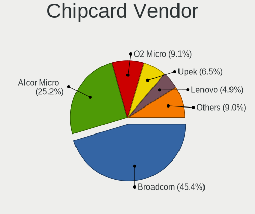

Linux Mint - Tested Hardware & Statistics
-----------------------------------------

A project to collect tested hardware configurations for Linux Mint.

Anyone can contribute to this report by the [hw-probe](https://github.com/linuxhw/hw-probe) tool:

    sudo -E hw-probe -all -upload

Please contribute! Especially if your hardware is rare.

This is a report for all computer types. See also reports for [desktops](/Dist/Linux_Mint/Desktop/README.md) and [notebooks](/Dist/Linux_Mint/Notebook/README.md).

Contents
--------

* [ Test Cases ](#test-cases)

* [ System ](#system)
  - [ OS                       ](#os)
  - [ OS Family                ](#os-family)
  - [ Kernel                   ](#kernel)
  - [ Kernel Family            ](#kernel-family)
  - [ Kernel Major Ver.        ](#kernel-major-ver)
  - [ Arch                     ](#arch)
  - [ DE                       ](#de)
  - [ Display Server           ](#display-server)
  - [ Display Manager          ](#display-manager)
  - [ OS Lang                  ](#os-lang)
  - [ Boot Mode                ](#boot-mode)
  - [ Filesystem               ](#filesystem)
  - [ Part. scheme             ](#part-scheme)
  - [ Dual Boot with Linux/BSD ](#dual-boot-with-linuxbsd)
  - [ Dual Boot (Win)          ](#dual-boot-win)

* [ Board ](#board)
  - [ Vendor                   ](#vendor)
  - [ Model                    ](#model)
  - [ Model Family             ](#model-family)
  - [ MFG Year                 ](#mfg-year)
  - [ Form Factor              ](#form-factor)
  - [ Secure Boot              ](#secure-boot)
  - [ Coreboot                 ](#coreboot)
  - [ RAM Size                 ](#ram-size)
  - [ RAM Used                 ](#ram-used)
  - [ Total Drives             ](#total-drives)
  - [ Has CD-ROM               ](#has-cd-rom)
  - [ Has Ethernet             ](#has-ethernet)
  - [ Has WiFi                 ](#has-wifi)
  - [ Has Bluetooth            ](#has-bluetooth)

* [ Location ](#location)
  - [ Country                  ](#country)
  - [ City                     ](#city)

* [ Drives ](#drives)
  - [ Drive Vendor             ](#drive-vendor)
  - [ Drive Model              ](#drive-model)
  - [ HDD Vendor               ](#hdd-vendor)
  - [ SSD Vendor               ](#ssd-vendor)
  - [ Drive Kind               ](#drive-kind)
  - [ Drive Connector          ](#drive-connector)
  - [ Drive Size               ](#drive-size)
  - [ Space Total              ](#space-total)
  - [ Space Used               ](#space-used)
  - [ Malfunc. Drives          ](#malfunc-drives)
  - [ Malfunc. Drive Vendor    ](#malfunc-drive-vendor)
  - [ Malfunc. HDD Vendor      ](#malfunc-hdd-vendor)
  - [ Malfunc. Drive Kind      ](#malfunc-drive-kind)
  - [ Failed Drives            ](#failed-drives)
  - [ Failed Drive Vendor      ](#failed-drive-vendor)
  - [ Drive Status             ](#drive-status)

* [ Storage controller ](#storage-controller)
  - [ Storage Vendor           ](#storage-vendor)
  - [ Storage Model            ](#storage-model)
  - [ Storage Kind             ](#storage-kind)

* [ Processor ](#processor)
  - [ CPU Vendor               ](#cpu-vendor)
  - [ CPU Model                ](#cpu-model)
  - [ CPU Model Family         ](#cpu-model-family)
  - [ CPU Cores                ](#cpu-cores)
  - [ CPU Sockets              ](#cpu-sockets)
  - [ CPU Threads              ](#cpu-threads)
  - [ CPU Op-Modes             ](#cpu-op-modes)
  - [ CPU Microcode            ](#cpu-microcode)
  - [ CPU Microarch            ](#cpu-microarch)

* [ Graphics ](#graphics)
  - [ GPU Vendor               ](#gpu-vendor)
  - [ GPU Model                ](#gpu-model)
  - [ GPU Combo                ](#gpu-combo)
  - [ GPU Driver               ](#gpu-driver)
  - [ GPU Memory               ](#gpu-memory)

* [ Monitor ](#monitor)
  - [ Monitor Vendor           ](#monitor-vendor)
  - [ Monitor Model            ](#monitor-model)
  - [ Monitor Resolution       ](#monitor-resolution)
  - [ Monitor Diagonal         ](#monitor-diagonal)
  - [ Monitor Width            ](#monitor-width)
  - [ Aspect Ratio             ](#aspect-ratio)
  - [ Monitor Area             ](#monitor-area)
  - [ Pixel Density            ](#pixel-density)
  - [ Multiple Monitors        ](#multiple-monitors)

* [ Network ](#network)
  - [ Net Controller Vendor    ](#net-controller-vendor)
  - [ Net Controller Model     ](#net-controller-model)
  - [ Wireless Vendor          ](#wireless-vendor)
  - [ Wireless Model           ](#wireless-model)
  - [ Ethernet Vendor          ](#ethernet-vendor)
  - [ Ethernet Model           ](#ethernet-model)
  - [ Net Controller Kind      ](#net-controller-kind)
  - [ Used Controller          ](#used-controller)
  - [ NICs                     ](#nics)
  - [ IPv6                     ](#ipv6)

* [ Bluetooth ](#bluetooth)
  - [ Bluetooth Vendor         ](#bluetooth-vendor)
  - [ Bluetooth Model          ](#bluetooth-model)

* [ Sound ](#sound)
  - [ Sound Vendor             ](#sound-vendor)
  - [ Sound Model              ](#sound-model)

* [ Memory ](#memory)
  - [ Memory Vendor            ](#memory-vendor)
  - [ Memory Model             ](#memory-model)
  - [ Memory Kind              ](#memory-kind)
  - [ Memory Form Factor       ](#memory-form-factor)
  - [ Memory Size              ](#memory-size)
  - [ Memory Speed             ](#memory-speed)

* [ Printers & scanners ](#printers--scanners)
  - [ Printer Vendor           ](#printer-vendor)
  - [ Printer Model            ](#printer-model)
  - [ Scanner Vendor           ](#scanner-vendor)
  - [ Scanner Model            ](#scanner-model)

* [ Camera ](#camera)
  - [ Camera Vendor            ](#camera-vendor)
  - [ Camera Model             ](#camera-model)

* [ Security ](#security)
  - [ Fingerprint Vendor       ](#fingerprint-vendor)
  - [ Fingerprint Model        ](#fingerprint-model)
  - [ Chipcard Vendor          ](#chipcard-vendor)
  - [ Chipcard Model           ](#chipcard-model)

* [ Unsupported ](#unsupported)
  - [ Unsupported Devices      ](#unsupported-devices)
  - [ Unsupported Device Types ](#unsupported-device-types)

Test Cases
----------

Total: 25974

| Vendor        | Model                       | Form-Factor | Probe                                                      | Date         |
|---------------|-----------------------------|-------------|------------------------------------------------------------|--------------|
| Lenovo        | ThinkPad T440p 20AN0069U... | Notebook    | [a2ddfa44e7](https://linux-hardware.org/?probe=a2ddfa44e7) | Jun 10, 2023 |
| MSI           | MS-B0621 100                | All in one  | [aa67f8201a](https://linux-hardware.org/?probe=aa67f8201a) | Jun 10, 2023 |
| AMI           | Aptio CRB                   | Mini pc     | [edec9d7178](https://linux-hardware.org/?probe=edec9d7178) | Jun 10, 2023 |
| Gigabyte      | H57M-USB3                   | Desktop     | [91b1655f60](https://linux-hardware.org/?probe=91b1655f60) | Jun 10, 2023 |
| Apple         | MacBookPro11,3              | Notebook    | [b7dfbae839](https://linux-hardware.org/?probe=b7dfbae839) | Jun 10, 2023 |
| HP            | Pavilion dv6                | Notebook    | [1388a433de](https://linux-hardware.org/?probe=1388a433de) | Jun 10, 2023 |
| Lenovo        | IdeaPad N580 20182          | Notebook    | [8990fd0b51](https://linux-hardware.org/?probe=8990fd0b51) | Jun 10, 2023 |
| ASRock        | H61M-DGS R2.0               | Desktop     | [cc206f52b1](https://linux-hardware.org/?probe=cc206f52b1) | Jun 10, 2023 |
| ASUSTek       | P8H61-M LX                  | Desktop     | [9d9872a84a](https://linux-hardware.org/?probe=9d9872a84a) | Jun 10, 2023 |
| HP            | EliteBook 840 G2            | Notebook    | [770045a9fc](https://linux-hardware.org/?probe=770045a9fc) | Jun 10, 2023 |
| HP            | ENVY x360 2-in-1 Laptop ... | Convertible | [d3480eedcd](https://linux-hardware.org/?probe=d3480eedcd) | Jun 10, 2023 |
| HP            | ENVY x360 2-in-1 Laptop ... | Convertible | [8d07581960](https://linux-hardware.org/?probe=8d07581960) | Jun 10, 2023 |
| ASUSTek       | ASUS BR1100FKA BR1100FKA    | Convertible | [0239123977](https://linux-hardware.org/?probe=0239123977) | Jun 10, 2023 |
| Apple         | MacBookPro9,2               | Notebook    | [3554e00d28](https://linux-hardware.org/?probe=3554e00d28) | Jun 10, 2023 |
| ASUSTek       | ASUS BR1100FKA BR1100FKA    | Convertible | [e45eaed9f1](https://linux-hardware.org/?probe=e45eaed9f1) | Jun 10, 2023 |
| Samsung       | N102SP/N100SP/N101SP        | Notebook    | [c31b0e5f30](https://linux-hardware.org/?probe=c31b0e5f30) | Jun 10, 2023 |
| Lenovo        | IdeaPad Gaming 3 15ARH05... | Notebook    | [bdca36306b](https://linux-hardware.org/?probe=bdca36306b) | Jun 10, 2023 |
| Gigabyte      | P57V6                       | Notebook    | [a2ce7ccc80](https://linux-hardware.org/?probe=a2ce7ccc80) | Jun 09, 2023 |
| ASUSTek       | P8H61-M LX                  | Desktop     | [bd22edfae7](https://linux-hardware.org/?probe=bd22edfae7) | Jun 09, 2023 |
| MSI           | MPG X570 GAMING EDGE WIF... | Desktop     | [0e34d2ee28](https://linux-hardware.org/?probe=0e34d2ee28) | Jun 09, 2023 |
| Dell          | Vostro 3500                 | Notebook    | [c64ff76dba](https://linux-hardware.org/?probe=c64ff76dba) | Jun 09, 2023 |
| ASUSTek       | ROG STRIX Z690-A GAMING ... | Desktop     | [afa2a30d75](https://linux-hardware.org/?probe=afa2a30d75) | Jun 09, 2023 |
| ASRock        | H61M-DGS R2.0               | Desktop     | [37c25e136f](https://linux-hardware.org/?probe=37c25e136f) | Jun 09, 2023 |
| Sony          | VPCEB2AFD                   | Notebook    | [1d9d6ddd74](https://linux-hardware.org/?probe=1d9d6ddd74) | Jun 09, 2023 |
| Lenovo        | ThinkStation E20 422237U    | Desktop     | [2756905647](https://linux-hardware.org/?probe=2756905647) | Jun 09, 2023 |
| Dell          | Latitude 5420               | Notebook    | [956a995580](https://linux-hardware.org/?probe=956a995580) | Jun 09, 2023 |
| Dell          | Precision M4600             | Notebook    | [a79a783515](https://linux-hardware.org/?probe=a79a783515) | Jun 09, 2023 |
| HP            | 255 15.6 inch G9 Noteboo... | Notebook    | [50c36acc0d](https://linux-hardware.org/?probe=50c36acc0d) | Jun 09, 2023 |
| Fujitsu       | LIFEBOOK E754               | Notebook    | [4d09f42447](https://linux-hardware.org/?probe=4d09f42447) | Jun 09, 2023 |
| HP            | EliteBook 8440p             | Notebook    | [b88712538e](https://linux-hardware.org/?probe=b88712538e) | Jun 09, 2023 |
| Dell          | 0YXT71 A00                  | Desktop     | [477afe615b](https://linux-hardware.org/?probe=477afe615b) | Jun 09, 2023 |
| Dell          | 0YXT71 A00                  | Desktop     | [463dfa5d83](https://linux-hardware.org/?probe=463dfa5d83) | Jun 09, 2023 |
| Biostar       | A68N-2100K                  | Desktop     | [9ac86a512d](https://linux-hardware.org/?probe=9ac86a512d) | Jun 09, 2023 |
| Panasonic     | CF-S10CDHEDM                | Notebook    | [19b6085754](https://linux-hardware.org/?probe=19b6085754) | Jun 09, 2023 |
| Lenovo        | IdeaPad 3 14ALC6 82KT       | Notebook    | [c35e22de2b](https://linux-hardware.org/?probe=c35e22de2b) | Jun 09, 2023 |
| Lenovo        | IdeaPad 3 14ALC6 82KT       | Notebook    | [68be9da7f1](https://linux-hardware.org/?probe=68be9da7f1) | Jun 09, 2023 |
| HP            | Notebook                    | Notebook    | [e292bb9d5a](https://linux-hardware.org/?probe=e292bb9d5a) | Jun 09, 2023 |
| HP            | EliteBook 8440p             | Notebook    | [51bfdec531](https://linux-hardware.org/?probe=51bfdec531) | Jun 09, 2023 |
| ASUSTek       | PRIME A320M-K               | Desktop     | [2dfd2a0844](https://linux-hardware.org/?probe=2dfd2a0844) | Jun 08, 2023 |
| HP            | Laptop 15-ef1xxx            | Notebook    | [931b9e2b05](https://linux-hardware.org/?probe=931b9e2b05) | Jun 08, 2023 |
| Lenovo        | ThinkPad X280 20KES5SE22    | Notebook    | [c25a510191](https://linux-hardware.org/?probe=c25a510191) | Jun 08, 2023 |
| ASUSTek       | H81M-R                      | Desktop     | [10d01671ad](https://linux-hardware.org/?probe=10d01671ad) | Jun 08, 2023 |
| Lenovo        | Z50-70 20354                | Notebook    | [28a5b69096](https://linux-hardware.org/?probe=28a5b69096) | Jun 08, 2023 |
| ASUSTek       | X580VN                      | Notebook    | [8c1cf3f164](https://linux-hardware.org/?probe=8c1cf3f164) | Jun 08, 2023 |
| MSI           | Z87-G43                     | Desktop     | [554f8ea405](https://linux-hardware.org/?probe=554f8ea405) | Jun 08, 2023 |
| MSI           | X58M                        | Desktop     | [7f0ef36058](https://linux-hardware.org/?probe=7f0ef36058) | Jun 08, 2023 |
| MSI           | H510M-A PRO                 | Desktop     | [86dfe28c7a](https://linux-hardware.org/?probe=86dfe28c7a) | Jun 08, 2023 |
| HP            | 1494                        | Desktop     | [7e431c0351](https://linux-hardware.org/?probe=7e431c0351) | Jun 08, 2023 |
| HP            | EliteBook 840 G3            | Notebook    | [cd3bb98a1e](https://linux-hardware.org/?probe=cd3bb98a1e) | Jun 08, 2023 |
| Micro Comp... | NUCXI7                      | Notebook    | [3b930f4e22](https://linux-hardware.org/?probe=3b930f4e22) | Jun 08, 2023 |
| ASUSTek       | VivoBook_ASUSLaptop X160... | Notebook    | [3acaedf40f](https://linux-hardware.org/?probe=3acaedf40f) | Jun 08, 2023 |
| ASRock        | M3A770DE                    | Desktop     | [aa9ddf538e](https://linux-hardware.org/?probe=aa9ddf538e) | Jun 08, 2023 |
| Apple         | MacBook4,1                  | Notebook    | [c8ee97b7b9](https://linux-hardware.org/?probe=c8ee97b7b9) | Jun 07, 2023 |
| Gigabyte      | B450 AORUS ELITE            | Desktop     | [1d84d556bf](https://linux-hardware.org/?probe=1d84d556bf) | Jun 07, 2023 |
| ASUSTek       | STRIX Z270I GAMING          | Desktop     | [f836a7d0ff](https://linux-hardware.org/?probe=f836a7d0ff) | Jun 07, 2023 |
| HP            | 255 15.6 inch G9 Noteboo... | Notebook    | [73fa9d854f](https://linux-hardware.org/?probe=73fa9d854f) | Jun 07, 2023 |
| ASUSTek       | ASUS TUF Gaming A15 FA50... | Notebook    | [6a98d856ee](https://linux-hardware.org/?probe=6a98d856ee) | Jun 07, 2023 |
| Lenovo        | IdeaPad S340-15IIL 81WL     | Notebook    | [6062ee64a9](https://linux-hardware.org/?probe=6062ee64a9) | Jun 07, 2023 |
| HP            | 1494                        | Desktop     | [0f032c101b](https://linux-hardware.org/?probe=0f032c101b) | Jun 07, 2023 |
| Gigabyte      | B250M-D3H-CF                | Desktop     | [14016f0f6f](https://linux-hardware.org/?probe=14016f0f6f) | Jun 07, 2023 |
| Acer          | Predator PT515-51           | Notebook    | [0a6efd54ad](https://linux-hardware.org/?probe=0a6efd54ad) | Jun 07, 2023 |
| MSI           | MS-7513                     | Desktop     | [ed69341f3c](https://linux-hardware.org/?probe=ed69341f3c) | Jun 07, 2023 |
| HP            | Pavilion Notebook           | Notebook    | [9ef95ad480](https://linux-hardware.org/?probe=9ef95ad480) | Jun 07, 2023 |
| HP            | 0A60h                       | Desktop     | [f0498c1a54](https://linux-hardware.org/?probe=f0498c1a54) | Jun 07, 2023 |
| Samsung       | 450R5J/450R5Q/4550RJ        | Notebook    | [4b679d78eb](https://linux-hardware.org/?probe=4b679d78eb) | Jun 07, 2023 |
| ZOTAC         | ZBOX-CI622/CI642/CI662NA... | Mini pc     | [bc11217633](https://linux-hardware.org/?probe=bc11217633) | Jun 06, 2023 |
| MSI           | GE70 2PE                    | Notebook    | [c62d13879f](https://linux-hardware.org/?probe=c62d13879f) | Jun 06, 2023 |
| Fujitsu Si... | D2811-A1 S26361-D2811-A1    | Desktop     | [bcb9105121](https://linux-hardware.org/?probe=bcb9105121) | Jun 06, 2023 |
| Gigabyte      | Z68P-DS3                    | Desktop     | [3371099509](https://linux-hardware.org/?probe=3371099509) | Jun 06, 2023 |
| HP            | 8643 SMVB                   | Desktop     | [0fd8af3392](https://linux-hardware.org/?probe=0fd8af3392) | Jun 06, 2023 |
| Intel         | NUC5i5MYBE H47797-206       | Mini pc     | [a860a6cf23](https://linux-hardware.org/?probe=a860a6cf23) | Jun 06, 2023 |
| ASUSTek       | VivoBook_ASUSLaptop M650... | Notebook    | [1e5a50fa47](https://linux-hardware.org/?probe=1e5a50fa47) | Jun 06, 2023 |
| Lenovo        | V330-15IKB 81AX             | Notebook    | [476a44deee](https://linux-hardware.org/?probe=476a44deee) | Jun 06, 2023 |
| Gigabyte      | H61M-S2PV                   | Desktop     | [a34c3550be](https://linux-hardware.org/?probe=a34c3550be) | Jun 06, 2023 |
| Lenovo        | IdeaPad Z500 20202          | Notebook    | [2f138401f6](https://linux-hardware.org/?probe=2f138401f6) | Jun 06, 2023 |
| Unknown       | Unknown                     | Desktop     | [e8df83921f](https://linux-hardware.org/?probe=e8df83921f) | Jun 06, 2023 |
| Acer          | Aspire V5-572P              | Notebook    | [cdb5005799](https://linux-hardware.org/?probe=cdb5005799) | Jun 06, 2023 |
| Acer          | Aspire V5-572P              | Notebook    | [49745927a0](https://linux-hardware.org/?probe=49745927a0) | Jun 06, 2023 |
| Dell          | Precision M4800             | Notebook    | [f1c43c9acd](https://linux-hardware.org/?probe=f1c43c9acd) | Jun 06, 2023 |
| Dell          | 0Y2K8N A01                  | Desktop     | [13a93fdc21](https://linux-hardware.org/?probe=13a93fdc21) | Jun 05, 2023 |
| ASUSTek       | CROSSHAIR VI HERO           | Desktop     | [9286154198](https://linux-hardware.org/?probe=9286154198) | Jun 05, 2023 |
| ASUSTek       | M5A88-M                     | Desktop     | [bb29b433c0](https://linux-hardware.org/?probe=bb29b433c0) | Jun 05, 2023 |
| Acer          | Aspire A517-53              | Notebook    | [a039ca0054](https://linux-hardware.org/?probe=a039ca0054) | Jun 05, 2023 |
| Compaq        | CQ-27                       | Notebook    | [ae3d9bce8c](https://linux-hardware.org/?probe=ae3d9bce8c) | Jun 05, 2023 |
| Acer          | Nitro AN515-52              | Notebook    | [e9d79e576b](https://linux-hardware.org/?probe=e9d79e576b) | Jun 05, 2023 |
| Acer          | Aspire ES1-711              | Notebook    | [5534470ef5](https://linux-hardware.org/?probe=5534470ef5) | Jun 05, 2023 |
| Acer          | Aspire ES1-571              | Notebook    | [ed19db3614](https://linux-hardware.org/?probe=ed19db3614) | Jun 05, 2023 |
| AMI           | Intel                       | Desktop     | [7990e6561b](https://linux-hardware.org/?probe=7990e6561b) | Jun 05, 2023 |
| ASUSTek       | ROG Maximus XI HERO         | Desktop     | [8ba3a60a93](https://linux-hardware.org/?probe=8ba3a60a93) | Jun 05, 2023 |
| HP            | Laptop 17-cp0xxx            | Notebook    | [b142b6de06](https://linux-hardware.org/?probe=b142b6de06) | Jun 05, 2023 |
| Dell          | 0KWVT8 A03                  | Desktop     | [e974c8cdcd](https://linux-hardware.org/?probe=e974c8cdcd) | Jun 05, 2023 |
| MSI           | B450-A PRO MAX              | Desktop     | [202c4ee201](https://linux-hardware.org/?probe=202c4ee201) | Jun 04, 2023 |
| AMI           | Intel                       | Desktop     | [966c93cbdb](https://linux-hardware.org/?probe=966c93cbdb) | Jun 04, 2023 |
| ASUSTek       | M5A88-M                     | Desktop     | [e750392f99](https://linux-hardware.org/?probe=e750392f99) | Jun 04, 2023 |
| HP            | EliteBook 840 G3            | Notebook    | [7c35e9a268](https://linux-hardware.org/?probe=7c35e9a268) | Jun 04, 2023 |
| Jumper        | EZbook                      | Notebook    | [950179fe29](https://linux-hardware.org/?probe=950179fe29) | Jun 04, 2023 |
| Lenovo        | ThinkPad T480 20L6S29E1S    | Notebook    | [4d9e4fb129](https://linux-hardware.org/?probe=4d9e4fb129) | Jun 04, 2023 |
| Dell          | Latitude E5440              | Notebook    | [02b3462a2c](https://linux-hardware.org/?probe=02b3462a2c) | Jun 04, 2023 |
| HP            | Compaq Presario CQ60        | Notebook    | [5716ed966d](https://linux-hardware.org/?probe=5716ed966d) | Jun 04, 2023 |
| HP            | Compaq Presario CQ60        | Notebook    | [a3d127e3ba](https://linux-hardware.org/?probe=a3d127e3ba) | Jun 04, 2023 |
| Acer          | Aspire E5-573G              | Notebook    | [3ef3c9ec82](https://linux-hardware.org/?probe=3ef3c9ec82) | Jun 04, 2023 |
| HP            | EliteBook 840 G1            | Notebook    | [4840dda2e3](https://linux-hardware.org/?probe=4840dda2e3) | Jun 04, 2023 |
| Gigabyte      | Z87-HD3                     | Desktop     | [228a46e465](https://linux-hardware.org/?probe=228a46e465) | Jun 04, 2023 |
| Acer          | Swift SF316-51              | Notebook    | [4ba1405836](https://linux-hardware.org/?probe=4ba1405836) | Jun 04, 2023 |
| Gigabyte      | G33M-S2                     | Desktop     | [17ed1704c5](https://linux-hardware.org/?probe=17ed1704c5) | Jun 04, 2023 |
| HP            | 1493                        | Desktop     | [b7432a020a](https://linux-hardware.org/?probe=b7432a020a) | Jun 04, 2023 |
| Gigabyte      | G33M-S2                     | Desktop     | [82bab4dd6d](https://linux-hardware.org/?probe=82bab4dd6d) | Jun 04, 2023 |
| ASUSTek       | PN53                        | Mini pc     | [e541266510](https://linux-hardware.org/?probe=e541266510) | Jun 04, 2023 |
| Unknown       | Unknown                     | Desktop     | [77d585fa03](https://linux-hardware.org/?probe=77d585fa03) | Jun 04, 2023 |
| Biostar       | B350GT5                     | Desktop     | [18e1da8cce](https://linux-hardware.org/?probe=18e1da8cce) | Jun 04, 2023 |
| Acer          | Aspire E1-572P              | Notebook    | [a90316cac7](https://linux-hardware.org/?probe=a90316cac7) | Jun 04, 2023 |
| ASUSTek       | M5A78L-M PLUS/USB3          | Desktop     | [6167898a10](https://linux-hardware.org/?probe=6167898a10) | Jun 04, 2023 |
| Biostar       | B350GT5                     | Desktop     | [123beb390f](https://linux-hardware.org/?probe=123beb390f) | Jun 04, 2023 |
| ASUSTek       | P5G41T-M                    | Desktop     | [8706eff580](https://linux-hardware.org/?probe=8706eff580) | Jun 04, 2023 |
| MSI           | H81M-P32                    | Desktop     | [f2423b3ef9](https://linux-hardware.org/?probe=f2423b3ef9) | Jun 04, 2023 |
| MSI           | H81M-P32                    | Desktop     | [f1d0b1d487](https://linux-hardware.org/?probe=f1d0b1d487) | Jun 04, 2023 |
| Toshiba       | Satellite Pro L300          | Notebook    | [968005c798](https://linux-hardware.org/?probe=968005c798) | Jun 04, 2023 |
| HP            | 2AE5 A01                    | Desktop     | [ab3ab74fb6](https://linux-hardware.org/?probe=ab3ab74fb6) | Jun 04, 2023 |
| ASUSTek       | PRIME H310M-A R2.0          | Desktop     | [60749b6e47](https://linux-hardware.org/?probe=60749b6e47) | Jun 04, 2023 |
| MSI           | P55-CD53                    | Desktop     | [88efe4b48c](https://linux-hardware.org/?probe=88efe4b48c) | Jun 04, 2023 |
| ZOTAC         | ZBOX-CI622/CI642/CI662NA... | Mini pc     | [737168e339](https://linux-hardware.org/?probe=737168e339) | Jun 04, 2023 |
| HP            | 2B43                        | Desktop     | [d66cd5f48e](https://linux-hardware.org/?probe=d66cd5f48e) | Jun 04, 2023 |
| Dell          | 0KWVT8 A03                  | Desktop     | [2250609446](https://linux-hardware.org/?probe=2250609446) | Jun 04, 2023 |
| Gigabyte      | B250M-D3H-CF                | Desktop     | [d8f9165fec](https://linux-hardware.org/?probe=d8f9165fec) | Jun 04, 2023 |
| Dell          | 0KWVT8 A03                  | Desktop     | [7f73996b8e](https://linux-hardware.org/?probe=7f73996b8e) | Jun 04, 2023 |
| ASRock        | Z590 Phantom Gaming 4       | Desktop     | [1e9eef0102](https://linux-hardware.org/?probe=1e9eef0102) | Jun 03, 2023 |
| Lenovo        | ThinkPad T430 2349DS5       | Notebook    | [e6492d37d8](https://linux-hardware.org/?probe=e6492d37d8) | Jun 03, 2023 |
| Alienware     | M15x                        | Notebook    | [4b17185ae7](https://linux-hardware.org/?probe=4b17185ae7) | Jun 03, 2023 |
| Gigabyte      | Z690 AORUS ULTRA            | Desktop     | [50cdb8a60a](https://linux-hardware.org/?probe=50cdb8a60a) | Jun 03, 2023 |
| ASUSTek       | ROG Strix G712LW_G712LW     | Notebook    | [04fdc3c3b8](https://linux-hardware.org/?probe=04fdc3c3b8) | Jun 03, 2023 |
| MSI           | B550M PRO-VDH               | Desktop     | [d09ba05086](https://linux-hardware.org/?probe=d09ba05086) | Jun 03, 2023 |
| ASUSTek       | P8B75-M LE                  | Desktop     | [640faccae0](https://linux-hardware.org/?probe=640faccae0) | Jun 03, 2023 |
| MSI           | B550M PRO-VDH               | Desktop     | [9f13a5184c](https://linux-hardware.org/?probe=9f13a5184c) | Jun 03, 2023 |
| MSI           | PRO B760M-A WIFI DDR4       | Desktop     | [4d24b9b7d5](https://linux-hardware.org/?probe=4d24b9b7d5) | Jun 03, 2023 |
| Acer          | Veriton M2631 V:1.0         | Desktop     | [e64369d2ec](https://linux-hardware.org/?probe=e64369d2ec) | Jun 03, 2023 |
| Dell          | Precision 5540              | Notebook    | [f9f2304792](https://linux-hardware.org/?probe=f9f2304792) | Jun 03, 2023 |
| HP            | Compaq Presario CQ60        | Notebook    | [2378902ae8](https://linux-hardware.org/?probe=2378902ae8) | Jun 03, 2023 |
| Gigabyte      | X79-UP4                     | Desktop     | [e3fd506f5e](https://linux-hardware.org/?probe=e3fd506f5e) | Jun 03, 2023 |
| ASUSTek       | PRIME Z390-P                | Desktop     | [64c321d474](https://linux-hardware.org/?probe=64c321d474) | Jun 03, 2023 |
| ASUSTek       | TUF Gaming B550M-PLUS       | Desktop     | [7b513e678c](https://linux-hardware.org/?probe=7b513e678c) | Jun 03, 2023 |
| Toshiba       | Satellite C55t-C            | Notebook    | [3b83df3cc9](https://linux-hardware.org/?probe=3b83df3cc9) | Jun 03, 2023 |
| Toshiba       | Satellite L50-C             | Notebook    | [7b1b547b11](https://linux-hardware.org/?probe=7b1b547b11) | Jun 03, 2023 |
| HP            | Laptop 14-bw0xx             | Notebook    | [3958079ad5](https://linux-hardware.org/?probe=3958079ad5) | Jun 03, 2023 |
| Dell          | 0DKKCF A00                  | All in one  | [48c5e3c802](https://linux-hardware.org/?probe=48c5e3c802) | Jun 03, 2023 |
| Gigabyte      | B450 AORUS ELITE            | Desktop     | [8e46a969c7](https://linux-hardware.org/?probe=8e46a969c7) | Jun 03, 2023 |
| Gigabyte      | B550 AORUS MASTER           | Desktop     | [80e9681888](https://linux-hardware.org/?probe=80e9681888) | Jun 03, 2023 |
| Positivo      | POS-EINM70CS POS            | Desktop     | [80260b495c](https://linux-hardware.org/?probe=80260b495c) | Jun 03, 2023 |
| Lenovo        | ThinkPad 11e 5th Gen 20L... | Notebook    | [2f018635f3](https://linux-hardware.org/?probe=2f018635f3) | Jun 03, 2023 |
| MSI           | MPG Z790 EDGE WIFI          | Desktop     | [dae8469b17](https://linux-hardware.org/?probe=dae8469b17) | Jun 02, 2023 |
| MSI           | B450M PRO-VDH PLUS          | Desktop     | [9a0f40789b](https://linux-hardware.org/?probe=9a0f40789b) | Jun 02, 2023 |
| Acer          | Aspire A515-45              | Notebook    | [f661806559](https://linux-hardware.org/?probe=f661806559) | Jun 02, 2023 |
| Apple         | Mac-942B5BF58194151B        | All in one  | [bdad1d1d9e](https://linux-hardware.org/?probe=bdad1d1d9e) | Jun 02, 2023 |
| Dell          | Latitude E5470              | Notebook    | [daa15a6cb0](https://linux-hardware.org/?probe=daa15a6cb0) | Jun 02, 2023 |
| Dell          | Latitude E5470              | Notebook    | [92d3a8b502](https://linux-hardware.org/?probe=92d3a8b502) | Jun 02, 2023 |
| Dell          | Latitude E6410              | Notebook    | [096873c567](https://linux-hardware.org/?probe=096873c567) | Jun 02, 2023 |
| Dell          | Inspiron N4030              | Notebook    | [3c92b81349](https://linux-hardware.org/?probe=3c92b81349) | Jun 02, 2023 |
| Dell          | Inspiron N4030              | Notebook    | [1aca93ba38](https://linux-hardware.org/?probe=1aca93ba38) | Jun 02, 2023 |
| HP            | 2AE5 A01                    | Desktop     | [c37afc3b8a](https://linux-hardware.org/?probe=c37afc3b8a) | Jun 02, 2023 |
| Gigabyte      | A320M-S2H-CF                | Desktop     | [914fa73266](https://linux-hardware.org/?probe=914fa73266) | Jun 02, 2023 |
| ASUSTek       | ROG STRIX B550-A GAMING     | Desktop     | [25721b28d3](https://linux-hardware.org/?probe=25721b28d3) | Jun 02, 2023 |
| Gigabyte      | H81M-S2H                    | Desktop     | [2604bac5a5](https://linux-hardware.org/?probe=2604bac5a5) | Jun 02, 2023 |
| ECS           | Nettle2                     | Desktop     | [6fe297e475](https://linux-hardware.org/?probe=6fe297e475) | Jun 02, 2023 |
| Lenovo        | ThinkPad T470 W10DG 20JN... | Notebook    | [2cacb34a0d](https://linux-hardware.org/?probe=2cacb34a0d) | Jun 02, 2023 |
| ASUSTek       | M4A89GTD-PRO/USB3           | Desktop     | [7a83a98e37](https://linux-hardware.org/?probe=7a83a98e37) | Jun 02, 2023 |
| Apple         | MacBookPro12,1              | Notebook    | [f8e0e519ad](https://linux-hardware.org/?probe=f8e0e519ad) | Jun 02, 2023 |
| ASUSTek       | M4A89GTD-PRO/USB3           | Desktop     | [a78aee5f7f](https://linux-hardware.org/?probe=a78aee5f7f) | Jun 02, 2023 |
| MSI           | P55-CD53                    | Desktop     | [4f87990649](https://linux-hardware.org/?probe=4f87990649) | Jun 02, 2023 |
| Lenovo        | IdeaPad 320-15IKB 80YH      | Notebook    | [55c7d4b615](https://linux-hardware.org/?probe=55c7d4b615) | Jun 02, 2023 |
| HP            | 420                         | Notebook    | [0e369b273b](https://linux-hardware.org/?probe=0e369b273b) | Jun 02, 2023 |
| HP            | 1497                        | Desktop     | [9ce66d3e2e](https://linux-hardware.org/?probe=9ce66d3e2e) | Jun 02, 2023 |
| Acer          | Aspire XC-780               | Desktop     | [7789b12750](https://linux-hardware.org/?probe=7789b12750) | Jun 02, 2023 |
| HP            | Split 13 x2 PC              | Notebook    | [5e3ae671cc](https://linux-hardware.org/?probe=5e3ae671cc) | Jun 01, 2023 |
| Apple         | Mac-F2218EA9                | All in one  | [2b3a9c8097](https://linux-hardware.org/?probe=2b3a9c8097) | Jun 01, 2023 |
| MSI           | X470 GAMING PLUS MAX        | Desktop     | [5430a83fca](https://linux-hardware.org/?probe=5430a83fca) | Jun 01, 2023 |
| MSI           | PRO B650-P WIFI             | Desktop     | [53d24a5962](https://linux-hardware.org/?probe=53d24a5962) | Jun 01, 2023 |
| MSI           | PRO B760M-A WIFI DDR4       | Desktop     | [e98b2555d7](https://linux-hardware.org/?probe=e98b2555d7) | Jun 01, 2023 |
| MSI           | PRO B650-P WIFI             | Desktop     | [0143308fee](https://linux-hardware.org/?probe=0143308fee) | Jun 01, 2023 |
| MSI           | H81M-E33                    | Desktop     | [50f664d550](https://linux-hardware.org/?probe=50f664d550) | Jun 01, 2023 |
| MSI           | H81M-E33                    | Desktop     | [eb2a33204c](https://linux-hardware.org/?probe=eb2a33204c) | Jun 01, 2023 |
| Lenovo        | IdeaPad 5 14ALC05 82LM      | Notebook    | [97b54068b7](https://linux-hardware.org/?probe=97b54068b7) | Jun 01, 2023 |
| HP            | ENVY x360 2-in-1 Laptop ... | Convertible | [fe247a0885](https://linux-hardware.org/?probe=fe247a0885) | Jun 01, 2023 |
| Portwell      | CAPB-3000VR                 | Desktop     | [53558af2be](https://linux-hardware.org/?probe=53558af2be) | Jun 01, 2023 |
| ASUSTek       | Z97-P                       | Desktop     | [b819db60d1](https://linux-hardware.org/?probe=b819db60d1) | Jun 01, 2023 |
| Packard Be... | EasyNote TK11BZ             | Notebook    | [b1cbe3b6a6](https://linux-hardware.org/?probe=b1cbe3b6a6) | Jun 01, 2023 |
| HP            | Pavilion dv6600             | Notebook    | [5e2867ee61](https://linux-hardware.org/?probe=5e2867ee61) | Jun 01, 2023 |
| Lenovo        | ThinkPad W510 4391B49       | Notebook    | [1e1004a387](https://linux-hardware.org/?probe=1e1004a387) | Jun 01, 2023 |
| Acer          | Aspire A515-45              | Notebook    | [17621fb846](https://linux-hardware.org/?probe=17621fb846) | Jun 01, 2023 |
| ASUSTek       | N750JV                      | Notebook    | [acc54fe70f](https://linux-hardware.org/?probe=acc54fe70f) | Jun 01, 2023 |
| Gigabyte      | EP45T-DS3                   | Desktop     | [0dd3baa28d](https://linux-hardware.org/?probe=0dd3baa28d) | Jun 01, 2023 |
| Acer          | Aspire A515-45              | Notebook    | [a57949da97](https://linux-hardware.org/?probe=a57949da97) | Jun 01, 2023 |
| ASUSTek       | M3A78-T                     | Desktop     | [e59673dcf2](https://linux-hardware.org/?probe=e59673dcf2) | Jun 01, 2023 |
| Lenovo        | V17 G3 IAP 82U1             | Notebook    | [1be071e25d](https://linux-hardware.org/?probe=1be071e25d) | May 31, 2023 |
| HP            | 1497                        | Desktop     | [cc138de04b](https://linux-hardware.org/?probe=cc138de04b) | May 31, 2023 |
| ASRock        | 970M Pro3                   | Desktop     | [58b09c521b](https://linux-hardware.org/?probe=58b09c521b) | May 31, 2023 |
| ASRock        | H81M-HDS R2.0               | Desktop     | [810f6b35ea](https://linux-hardware.org/?probe=810f6b35ea) | May 31, 2023 |
| Sony          | SVT1121B2EW                 | Notebook    | [67819a243c](https://linux-hardware.org/?probe=67819a243c) | May 31, 2023 |
| HP            | Pavilion Laptop 15-cs2xx... | Notebook    | [2bb50cdcc7](https://linux-hardware.org/?probe=2bb50cdcc7) | May 31, 2023 |
| Lenovo        | V15 G2 ALC 82KD             | Notebook    | [f168bc9d53](https://linux-hardware.org/?probe=f168bc9d53) | May 31, 2023 |
| ECS           | A890GXM-A2                  | Desktop     | [c207b5f41c](https://linux-hardware.org/?probe=c207b5f41c) | May 31, 2023 |
| Fujitsu Si... | D2811-A1 S26361-D2811-A1    | Desktop     | [c0ff761729](https://linux-hardware.org/?probe=c0ff761729) | May 31, 2023 |
| Acer          | Aspire A515-45              | Notebook    | [f93dd394e8](https://linux-hardware.org/?probe=f93dd394e8) | May 31, 2023 |
| ASUSTek       | VivoBook_ASUSLaptop X515... | Notebook    | [1ea9c869ff](https://linux-hardware.org/?probe=1ea9c869ff) | May 31, 2023 |
| Apple         | Mac-F2268DC8                | All in one  | [ecc39bf44b](https://linux-hardware.org/?probe=ecc39bf44b) | May 31, 2023 |
| HP            | 158A                        | Desktop     | [39d4ab7307](https://linux-hardware.org/?probe=39d4ab7307) | May 31, 2023 |
| Toshiba       | Satellite C645D             | Notebook    | [dc642a7011](https://linux-hardware.org/?probe=dc642a7011) | May 31, 2023 |
| Toshiba       | Satellite C645D             | Notebook    | [32407daaa6](https://linux-hardware.org/?probe=32407daaa6) | May 31, 2023 |
| ASUSTek       | TUF Gaming X570-PLUS        | Desktop     | [d1f02a3055](https://linux-hardware.org/?probe=d1f02a3055) | May 31, 2023 |
| Google        | Bobba                       | Notebook    | [d47a75a3aa](https://linux-hardware.org/?probe=d47a75a3aa) | May 31, 2023 |
| HP            | 8648                        | Desktop     | [11e777087a](https://linux-hardware.org/?probe=11e777087a) | May 31, 2023 |
| Google        | Bobba                       | Notebook    | [9e2c41879c](https://linux-hardware.org/?probe=9e2c41879c) | May 31, 2023 |
| Lenovo        | IdeaPad 320-15IKB 80YH      | Notebook    | [1b457302ec](https://linux-hardware.org/?probe=1b457302ec) | May 31, 2023 |
| ASUSTek       | ZenBook UX425EA_UX425EA     | Notebook    | [b4b6bfda0c](https://linux-hardware.org/?probe=b4b6bfda0c) | May 31, 2023 |
| Gigabyte      | X570 AORUS ULTRA            | Desktop     | [9d3023fd1d](https://linux-hardware.org/?probe=9d3023fd1d) | May 31, 2023 |
| Acer          | E5-551G-871W                | Notebook    | [8034a1ee0b](https://linux-hardware.org/?probe=8034a1ee0b) | May 30, 2023 |
| ASRock        | Q1900B-ITX                  | Desktop     | [88e4924fa2](https://linux-hardware.org/?probe=88e4924fa2) | May 30, 2023 |
| Fujitsu       | LIFEBOOK T936               | Convertible | [fefb17a829](https://linux-hardware.org/?probe=fefb17a829) | May 30, 2023 |
| Samsung       | R610                        | Notebook    | [4e3be533ba](https://linux-hardware.org/?probe=4e3be533ba) | May 30, 2023 |
| Acer          | Aspire 5749                 | Notebook    | [3bca2af88d](https://linux-hardware.org/?probe=3bca2af88d) | May 30, 2023 |
| Gigabyte      | Z97-HD3                     | Desktop     | [8505864d45](https://linux-hardware.org/?probe=8505864d45) | May 30, 2023 |
| Toshiba       | Satellite R630              | Notebook    | [5bf801ac1f](https://linux-hardware.org/?probe=5bf801ac1f) | May 30, 2023 |
| HP            | ENVY 15                     | Notebook    | [ad3cf182fe](https://linux-hardware.org/?probe=ad3cf182fe) | May 30, 2023 |
| Biostar       | B450MH                      | Desktop     | [36947ca7e1](https://linux-hardware.org/?probe=36947ca7e1) | May 30, 2023 |
| Dell          | Vostro 15 3515              | Notebook    | [6bec5a03df](https://linux-hardware.org/?probe=6bec5a03df) | May 30, 2023 |
| Gigabyte      | Z170-HD3P-CF                | Desktop     | [e51651a755](https://linux-hardware.org/?probe=e51651a755) | May 30, 2023 |
| Dell          | Inspiron 15-3567            | Notebook    | [dc6256036e](https://linux-hardware.org/?probe=dc6256036e) | May 30, 2023 |
| ASUSTek       | ROG STRIX B550-F GAMING     | Desktop     | [c2d144c313](https://linux-hardware.org/?probe=c2d144c313) | May 30, 2023 |
| ASUSTek       | ROG STRIX B550-F GAMING     | Desktop     | [4d7ccd868f](https://linux-hardware.org/?probe=4d7ccd868f) | May 30, 2023 |
| MSI           | A68HM-E33 V2                | Desktop     | [24775c04a5](https://linux-hardware.org/?probe=24775c04a5) | May 30, 2023 |
| MSI           | A68HM-E33 V2                | Desktop     | [d6a2216b0f](https://linux-hardware.org/?probe=d6a2216b0f) | May 30, 2023 |
| ASUSTek       | VivoBook_ASUSLaptop M650... | Notebook    | [7653baa0f8](https://linux-hardware.org/?probe=7653baa0f8) | May 30, 2023 |
| Dell          | Latitude 5400               | Notebook    | [fb192b5416](https://linux-hardware.org/?probe=fb192b5416) | May 30, 2023 |
| Lenovo        | Y520-15IKBN 80WK            | Notebook    | [e9830d0123](https://linux-hardware.org/?probe=e9830d0123) | May 29, 2023 |
| Dell          | Latitude 5400               | Notebook    | [838b2db21b](https://linux-hardware.org/?probe=838b2db21b) | May 29, 2023 |
| Fujitsu       | D3233-A1 S26361-D3233-A1    | Desktop     | [4679a6e565](https://linux-hardware.org/?probe=4679a6e565) | May 29, 2023 |
| Fujitsu       | D3233-A1 S26361-D3233-A1    | Desktop     | [ec89dcb694](https://linux-hardware.org/?probe=ec89dcb694) | May 29, 2023 |
| MSI           | Z170A MPOWER GAMING TITA... | Desktop     | [0e9239c5f7](https://linux-hardware.org/?probe=0e9239c5f7) | May 29, 2023 |
| ASUSTek       | VivoBook_ASUSLaptop M650... | Notebook    | [89bb5ff663](https://linux-hardware.org/?probe=89bb5ff663) | May 29, 2023 |
| MSI           | 970A-G46                    | Desktop     | [180eb351d7](https://linux-hardware.org/?probe=180eb351d7) | May 29, 2023 |
| ASUSTek       | VivoBook_ASUSLaptop X415... | Notebook    | [9fce8d1e40](https://linux-hardware.org/?probe=9fce8d1e40) | May 29, 2023 |
| Gigabyte      | Z77X-UD5H                   | Desktop     | [e947dd7da1](https://linux-hardware.org/?probe=e947dd7da1) | May 29, 2023 |
| Acer          | Aspire ES1-571              | Notebook    | [6f75ba50c1](https://linux-hardware.org/?probe=6f75ba50c1) | May 29, 2023 |
| ASUSTek       | VivoBook_ASUSLaptop X515... | Notebook    | [04e1a849d0](https://linux-hardware.org/?probe=04e1a849d0) | May 29, 2023 |
| ASUSTek       | M5A97 R2.0                  | Desktop     | [f4a8ca4825](https://linux-hardware.org/?probe=f4a8ca4825) | May 29, 2023 |
| ASUSTek       | X550LD                      | Notebook    | [e091c09373](https://linux-hardware.org/?probe=e091c09373) | May 29, 2023 |
| GPU Compan... | GWTC116-2                   | Notebook    | [075486801a](https://linux-hardware.org/?probe=075486801a) | May 29, 2023 |
| Fujitsu       | CELSIUS H720                | Notebook    | [d7d19435c2](https://linux-hardware.org/?probe=d7d19435c2) | May 29, 2023 |
| HP            | Laptop 17-cp0xxx            | Notebook    | [5ac36928a5](https://linux-hardware.org/?probe=5ac36928a5) | May 28, 2023 |
| Lenovo        | MIIX 300-10IBY 80NR         | Tablet      | [92b569d076](https://linux-hardware.org/?probe=92b569d076) | May 28, 2023 |
| ASUSTek       | H81M-R                      | Desktop     | [1a69603cc6](https://linux-hardware.org/?probe=1a69603cc6) | May 28, 2023 |
| MSI           | Z390-A PRO                  | Desktop     | [cf1c884051](https://linux-hardware.org/?probe=cf1c884051) | May 28, 2023 |
| Pegatron      | NARRA3                      | Desktop     | [5c016d4faf](https://linux-hardware.org/?probe=5c016d4faf) | May 28, 2023 |
| Acer          | Aspire ES1-571              | Notebook    | [a3da42e0e9](https://linux-hardware.org/?probe=a3da42e0e9) | May 28, 2023 |
| ASUSTek       | ZenBook UX431DA_UM431DA     | Notebook    | [22cbc01649](https://linux-hardware.org/?probe=22cbc01649) | May 28, 2023 |
| HP            | Compaq 6730s                | Notebook    | [fe2b8b63ac](https://linux-hardware.org/?probe=fe2b8b63ac) | May 28, 2023 |
| MSI           | Z390-A PRO                  | Desktop     | [6b863cd4a3](https://linux-hardware.org/?probe=6b863cd4a3) | May 28, 2023 |
| ASUSTek       | TUF Gaming B650-PLUS WIF... | Desktop     | [8fe1188fd8](https://linux-hardware.org/?probe=8fe1188fd8) | May 28, 2023 |
| Dell          | 0WR7PY A02                  | Desktop     | [b5aa372117](https://linux-hardware.org/?probe=b5aa372117) | May 28, 2023 |
| Apple         | MacBookPro16,2              | Notebook    | [993b013d0a](https://linux-hardware.org/?probe=993b013d0a) | May 28, 2023 |
| ASUSTek       | M4A88TD-V EVO/USB3          | Desktop     | [8d008658ce](https://linux-hardware.org/?probe=8d008658ce) | May 28, 2023 |
| ASRock        | A320M-HDV R4.0              | Desktop     | [e2e38da09f](https://linux-hardware.org/?probe=e2e38da09f) | May 28, 2023 |
| ASUSTek       | ROG Strix G713RW_G713RW     | Notebook    | [ef1ea73723](https://linux-hardware.org/?probe=ef1ea73723) | May 27, 2023 |
| ASUSTek       | ROG STRIX B550-F GAMING ... | Desktop     | [6465343084](https://linux-hardware.org/?probe=6465343084) | May 27, 2023 |
| ASUSTek       | TUF Gaming FX505DT_FX505... | Notebook    | [cb238efd5e](https://linux-hardware.org/?probe=cb238efd5e) | May 27, 2023 |
| Acer          | TravelMate 5735Z            | Notebook    | [9eea76e3ee](https://linux-hardware.org/?probe=9eea76e3ee) | May 27, 2023 |
| Wortmann      | CR700                       | Notebook    | [189f1ae92b](https://linux-hardware.org/?probe=189f1ae92b) | May 27, 2023 |
| ASRock        | B550 Pro4                   | Desktop     | [741e0e805b](https://linux-hardware.org/?probe=741e0e805b) | May 27, 2023 |
| HP            | 15                          | Notebook    | [f5373f2397](https://linux-hardware.org/?probe=f5373f2397) | May 27, 2023 |
| Acer          | Aspire ES1-571              | Notebook    | [029ea88e3b](https://linux-hardware.org/?probe=029ea88e3b) | May 27, 2023 |
| HP            | 15                          | Notebook    | [f30c3b3a95](https://linux-hardware.org/?probe=f30c3b3a95) | May 27, 2023 |
| Apple         | MacBookPro15,4              | Notebook    | [9ee2d1266b](https://linux-hardware.org/?probe=9ee2d1266b) | May 27, 2023 |
| Gigabyte      | B450M DS3H-CF               | Desktop     | [0149ec9c81](https://linux-hardware.org/?probe=0149ec9c81) | May 27, 2023 |
| Samsung       | 355V4C/356V4C/3445VC/354... | Notebook    | [9984b363d1](https://linux-hardware.org/?probe=9984b363d1) | May 27, 2023 |
| Gigabyte      | GA-MA785GM-US2H             | Desktop     | [7284c23b76](https://linux-hardware.org/?probe=7284c23b76) | May 27, 2023 |
| Lenovo        | 3716 SDK0T76461 WIN 3422... | Desktop     | [2f3952dcfe](https://linux-hardware.org/?probe=2f3952dcfe) | May 27, 2023 |
| ASUSTek       | H81M-R                      | Desktop     | [8edf21a203](https://linux-hardware.org/?probe=8edf21a203) | May 27, 2023 |
| PCChips       | P17G ECS                    | Desktop     | [0518fce589](https://linux-hardware.org/?probe=0518fce589) | May 27, 2023 |
| ASUSTek       | M4A785-M                    | Desktop     | [ff2e86c530](https://linux-hardware.org/?probe=ff2e86c530) | May 27, 2023 |
| Samsung       | 270E5G/270E5U               | Notebook    | [affdf49716](https://linux-hardware.org/?probe=affdf49716) | May 27, 2023 |
| ASUSTek       | Z170M-PLUS                  | Desktop     | [0577b02521](https://linux-hardware.org/?probe=0577b02521) | May 27, 2023 |
| ASUSTek       | ASUS TUF Gaming A17 FA70... | Notebook    | [efe0b55153](https://linux-hardware.org/?probe=efe0b55153) | May 27, 2023 |
| Lenovo        | ThinkPad L512 44473HU       | Notebook    | [f9a27ab76b](https://linux-hardware.org/?probe=f9a27ab76b) | May 27, 2023 |
| Samsung       | 270E5G/270E5U               | Notebook    | [106bd355da](https://linux-hardware.org/?probe=106bd355da) | May 27, 2023 |
| Positivo      | C14CR21TV                   | Notebook    | [f3907d940d](https://linux-hardware.org/?probe=f3907d940d) | May 27, 2023 |
| Lenovo        | 3716 SDK0R32862 WIN 3258... | Desktop     | [d3137742ae](https://linux-hardware.org/?probe=d3137742ae) | May 27, 2023 |
| HP            | 81B9 1000                   | All in one  | [55380f30ca](https://linux-hardware.org/?probe=55380f30ca) | May 27, 2023 |
| HP            | 1000                        | Notebook    | [f3b014fa71](https://linux-hardware.org/?probe=f3b014fa71) | May 27, 2023 |
| Lenovo        | Unknown                     | Notebook    | [dbf5c576b2](https://linux-hardware.org/?probe=dbf5c576b2) | May 27, 2023 |
| Dell          | Latitude 5430               | Notebook    | [a0697218cc](https://linux-hardware.org/?probe=a0697218cc) | May 27, 2023 |
| Dell          | 00V62H A01                  | Desktop     | [0d8c590c8d](https://linux-hardware.org/?probe=0d8c590c8d) | May 27, 2023 |
| HP            | 0B4Ch D                     | Desktop     | [0f593c947e](https://linux-hardware.org/?probe=0f593c947e) | May 27, 2023 |
| HP            | 0B4Ch D                     | Desktop     | [e7a8d68439](https://linux-hardware.org/?probe=e7a8d68439) | May 27, 2023 |
| HP            | Pavilion dm4                | Notebook    | [708daa02e2](https://linux-hardware.org/?probe=708daa02e2) | May 26, 2023 |
| Dell          | 0TP406                      | Desktop     | [c7300f35f4](https://linux-hardware.org/?probe=c7300f35f4) | May 26, 2023 |
| HP            | Pavilion Laptop 14-ec0xx... | Notebook    | [4662e37743](https://linux-hardware.org/?probe=4662e37743) | May 26, 2023 |
| MSI           | B550M PRO-VDH               | Desktop     | [f7fddb36e8](https://linux-hardware.org/?probe=f7fddb36e8) | May 26, 2023 |
| MSI           | CX700                       | Notebook    | [ecb1aaf9c1](https://linux-hardware.org/?probe=ecb1aaf9c1) | May 26, 2023 |
| Intel         | NUC5i5RYB H40999-502        | Mini pc     | [c008c6243e](https://linux-hardware.org/?probe=c008c6243e) | May 26, 2023 |
| Compumax C... | ONIX-CEL-0001               | Notebook    | [2f5d8e6789](https://linux-hardware.org/?probe=2f5d8e6789) | May 26, 2023 |
| ASUSTek       | PRIME B450M-GAMING/BR       | Desktop     | [1cbedc352f](https://linux-hardware.org/?probe=1cbedc352f) | May 26, 2023 |
| ASUSTek       | M5A78L-M PLUS/USB3          | Desktop     | [6bcf3cf056](https://linux-hardware.org/?probe=6bcf3cf056) | May 26, 2023 |
| HP            | ZBook Firefly 15 G7 Mobi... | Notebook    | [1b3b8c1912](https://linux-hardware.org/?probe=1b3b8c1912) | May 26, 2023 |
| Lenovo        | ThinkPad P51 20HJS01Q04     | Notebook    | [520eb0074c](https://linux-hardware.org/?probe=520eb0074c) | May 26, 2023 |
| Lenovo        | Slim 7 ProX 14ARH7 82V2     | Notebook    | [8558865a17](https://linux-hardware.org/?probe=8558865a17) | May 26, 2023 |
| Lenovo        | ThinkPad T450 20BUS06B00    | Notebook    | [d86873ceab](https://linux-hardware.org/?probe=d86873ceab) | May 26, 2023 |
| Itautec       | Infoway                     | Notebook    | [03be6afc10](https://linux-hardware.org/?probe=03be6afc10) | May 26, 2023 |
| Lenovo        | IdeaPadFlex 5 14ARE05 81... | Convertible | [0796332e87](https://linux-hardware.org/?probe=0796332e87) | May 26, 2023 |
| Gigabyte      | B450 AORUS M                | Desktop     | [40af2d79f9](https://linux-hardware.org/?probe=40af2d79f9) | May 26, 2023 |
| Dell          | Latitude 7400               | Notebook    | [11ee0dea04](https://linux-hardware.org/?probe=11ee0dea04) | May 26, 2023 |
| Dell          | XPS 15 9570                 | Notebook    | [9723f3e325](https://linux-hardware.org/?probe=9723f3e325) | May 26, 2023 |
| LG Electro... | V720                        | All in one  | [5dbe7c937c](https://linux-hardware.org/?probe=5dbe7c937c) | May 26, 2023 |
| Intel Clie... | LAPBC710                    | Notebook    | [7ed6d7079c](https://linux-hardware.org/?probe=7ed6d7079c) | May 26, 2023 |
| HP            | ZBook 15 G2                 | Notebook    | [b6d4eff333](https://linux-hardware.org/?probe=b6d4eff333) | May 26, 2023 |
| Acer          | TravelMate 6292             | Notebook    | [0a4cb3e4b3](https://linux-hardware.org/?probe=0a4cb3e4b3) | May 25, 2023 |
| HP            | ZBook 15 G2                 | Notebook    | [baae1e4c8b](https://linux-hardware.org/?probe=baae1e4c8b) | May 25, 2023 |
| Sony          | SVF1521B4E                  | Notebook    | [d6eaf68ef4](https://linux-hardware.org/?probe=d6eaf68ef4) | May 25, 2023 |
| Acer          | Aspire A515-54G             | Notebook    | [a6c2011fb0](https://linux-hardware.org/?probe=a6c2011fb0) | May 25, 2023 |
| Sony          | SVF1521B4E                  | Notebook    | [03c5deb4cc](https://linux-hardware.org/?probe=03c5deb4cc) | May 25, 2023 |
| Acer          | Aspire V3-371               | Notebook    | [f9200e891b](https://linux-hardware.org/?probe=f9200e891b) | May 25, 2023 |
| Acer          | Aspire A515-54G             | Notebook    | [e58d4b4aee](https://linux-hardware.org/?probe=e58d4b4aee) | May 25, 2023 |
| ASRock        | AB350 Pro4                  | Desktop     | [53db1863ab](https://linux-hardware.org/?probe=53db1863ab) | May 25, 2023 |
| Lenovo        | IdeaPad Flex-14API 81SS     | Notebook    | [6e2419fcbf](https://linux-hardware.org/?probe=6e2419fcbf) | May 25, 2023 |
| Lenovo        | IdeaPad 3 15ADA05 81W1      | Notebook    | [3f7beed595](https://linux-hardware.org/?probe=3f7beed595) | May 25, 2023 |
| Lenovo        | IdeaPad 500-15ISK 80NT      | Notebook    | [a88cd7c5a6](https://linux-hardware.org/?probe=a88cd7c5a6) | May 25, 2023 |
| ASUSTek       | X551MA                      | Notebook    | [d72352c0dc](https://linux-hardware.org/?probe=d72352c0dc) | May 25, 2023 |
| Dell          | Latitude D630               | Notebook    | [ac84af2a69](https://linux-hardware.org/?probe=ac84af2a69) | May 25, 2023 |
| Foxconn       | 2ABF                        | Desktop     | [a764ae9f3c](https://linux-hardware.org/?probe=a764ae9f3c) | May 25, 2023 |
| Wortmann      | 1220552_1470050             | Tablet      | [5717e92355](https://linux-hardware.org/?probe=5717e92355) | May 25, 2023 |
| Compal        | JHL90 REFERENCE             | Notebook    | [0c115d29f3](https://linux-hardware.org/?probe=0c115d29f3) | May 25, 2023 |
| Fujitsu       | D3227-A1 S26361-D3227-A1    | Desktop     | [769f5c0d23](https://linux-hardware.org/?probe=769f5c0d23) | May 25, 2023 |
| Dell          | Latitude 3330               | Notebook    | [a4c33168fa](https://linux-hardware.org/?probe=a4c33168fa) | May 25, 2023 |
| HP            | 21D0                        | Desktop     | [4cac4f8654](https://linux-hardware.org/?probe=4cac4f8654) | May 25, 2023 |
| HP            | 21D0                        | Desktop     | [589c780060](https://linux-hardware.org/?probe=589c780060) | May 25, 2023 |
| Biostar       | A68MHE                      | Desktop     | [d1ef52da36](https://linux-hardware.org/?probe=d1ef52da36) | May 25, 2023 |
| PHILCO ELE... | PNB15.6AP34H1W10            | Notebook    | [dc91cb92af](https://linux-hardware.org/?probe=dc91cb92af) | May 25, 2023 |
| Biostar       | A68MHE                      | Desktop     | [e2244a8ed0](https://linux-hardware.org/?probe=e2244a8ed0) | May 25, 2023 |
| ASUSTek       | ASUS TUF Gaming A17 FA70... | Notebook    | [ab42ac444e](https://linux-hardware.org/?probe=ab42ac444e) | May 24, 2023 |
| Fujitsu       | LIFEBOOK E752               | Notebook    | [0c7493d8d3](https://linux-hardware.org/?probe=0c7493d8d3) | May 24, 2023 |
| Foxconn       | 2ABF                        | Desktop     | [9fbeb26e54](https://linux-hardware.org/?probe=9fbeb26e54) | May 24, 2023 |
| Lenovo        | ThinkPad T431s 20ACA01V0... | Notebook    | [253f7d5359](https://linux-hardware.org/?probe=253f7d5359) | May 24, 2023 |
| Lenovo        | SHARKBAY 0B98401 WIN        | Desktop     | [1523787171](https://linux-hardware.org/?probe=1523787171) | May 24, 2023 |
| Lenovo        | SHARKBAY 0B98401 PRO        | Desktop     | [89d040ffaf](https://linux-hardware.org/?probe=89d040ffaf) | May 24, 2023 |
| Gigabyte      | B650 AORUS ELITE AX         | Desktop     | [ddfad3653a](https://linux-hardware.org/?probe=ddfad3653a) | May 24, 2023 |
| Lenovo        | SHARKBAY 0B98401 WIN        | Desktop     | [0a2dc161fe](https://linux-hardware.org/?probe=0a2dc161fe) | May 24, 2023 |
| ASUSTek       | ROG STRIX X399-E GAMING     | Desktop     | [647a30ff09](https://linux-hardware.org/?probe=647a30ff09) | May 24, 2023 |
| Dell          | Latitude D630               | Notebook    | [9e4709b942](https://linux-hardware.org/?probe=9e4709b942) | May 24, 2023 |
| Dell          | Inspiron 5567               | Notebook    | [24e9acec30](https://linux-hardware.org/?probe=24e9acec30) | May 24, 2023 |
| MSI           | B550-A PRO                  | Desktop     | [f77697fdd0](https://linux-hardware.org/?probe=f77697fdd0) | May 24, 2023 |
| Dell          | Precision 5570              | Notebook    | [f014c35d45](https://linux-hardware.org/?probe=f014c35d45) | May 24, 2023 |
| Acer          | Aspire V3-731               | Notebook    | [d07d017c32](https://linux-hardware.org/?probe=d07d017c32) | May 24, 2023 |
| ASRock        | B85M-HDS                    | Desktop     | [fc128a2474](https://linux-hardware.org/?probe=fc128a2474) | May 24, 2023 |
| IX1401        | Unknown                     | Notebook    | [f1799b6c3a](https://linux-hardware.org/?probe=f1799b6c3a) | May 24, 2023 |
| DEXP          | Aquilon C14                 | Notebook    | [357a7caaf8](https://linux-hardware.org/?probe=357a7caaf8) | May 24, 2023 |
| DEXP          | Aquilon C14                 | Notebook    | [cd3dc35687](https://linux-hardware.org/?probe=cd3dc35687) | May 24, 2023 |
| Lenovo        | SKYBAY SDK0J40705 WIN 34... | Desktop     | [3a26097c6a](https://linux-hardware.org/?probe=3a26097c6a) | May 24, 2023 |
| Lenovo        | ThinkPad T410 2537AT1       | Notebook    | [babbb757c6](https://linux-hardware.org/?probe=babbb757c6) | May 24, 2023 |
| Acer          | Aspire E5-571G              | Notebook    | [6531b22151](https://linux-hardware.org/?probe=6531b22151) | May 24, 2023 |
| ASUSTek       | K73BR                       | Notebook    | [2b59c4c84c](https://linux-hardware.org/?probe=2b59c4c84c) | May 24, 2023 |
| ASRock        | A320M-HDV R4.0              | Desktop     | [deff44e62e](https://linux-hardware.org/?probe=deff44e62e) | May 24, 2023 |
| Lenovo        | IdeaPad S340-15IIL 81WL     | Notebook    | [e8bc14fc34](https://linux-hardware.org/?probe=e8bc14fc34) | May 23, 2023 |
| Lenovo        | IdeaPad S340-15IIL 81WL     | Notebook    | [c5615351bb](https://linux-hardware.org/?probe=c5615351bb) | May 23, 2023 |
| HP            | Laptop 17-by3xxx            | Notebook    | [dcafbb2a69](https://linux-hardware.org/?probe=dcafbb2a69) | May 23, 2023 |
| HP            | Laptop 17-by3xxx            | Notebook    | [cbe27885cb](https://linux-hardware.org/?probe=cbe27885cb) | May 23, 2023 |
| MSI           | 970 GAMING                  | Desktop     | [2bed616680](https://linux-hardware.org/?probe=2bed616680) | May 23, 2023 |
| ASRock        | AB350M Pro4                 | Desktop     | [9f7d80df58](https://linux-hardware.org/?probe=9f7d80df58) | May 23, 2023 |
| ASUSTek       | ROG STRIX X399-E GAMING     | Desktop     | [fcefb35b05](https://linux-hardware.org/?probe=fcefb35b05) | May 23, 2023 |
| Unknown       | Unknown                     | Notebook    | [da302bee4e](https://linux-hardware.org/?probe=da302bee4e) | May 23, 2023 |
| Lenovo        | ThinkPad Z13 Gen 1 21D2C... | Notebook    | [2cf9c98869](https://linux-hardware.org/?probe=2cf9c98869) | May 23, 2023 |
| Lenovo        | ThinkPad Z13 Gen 1 21D2C... | Notebook    | [4da667cc7e](https://linux-hardware.org/?probe=4da667cc7e) | May 23, 2023 |
| Dell          | Inspiron 5759               | Notebook    | [52b95d45ca](https://linux-hardware.org/?probe=52b95d45ca) | May 23, 2023 |
| Lenovo        | ThinkPad X250 20CLS65E00    | Notebook    | [e65932f3a9](https://linux-hardware.org/?probe=e65932f3a9) | May 23, 2023 |
| Acer          | Aspire A515-54              | Notebook    | [8db69494ad](https://linux-hardware.org/?probe=8db69494ad) | May 23, 2023 |
| ASUSTek       | B85M-G                      | Desktop     | [49bd7863b7](https://linux-hardware.org/?probe=49bd7863b7) | May 23, 2023 |
| Lenovo        | ThinkPad E460 20ETCTO1WW    | Notebook    | [cd2c3fbd45](https://linux-hardware.org/?probe=cd2c3fbd45) | May 23, 2023 |
| Gigabyte      | A320M-S2H-CF SE1            | Desktop     | [61ede8f95d](https://linux-hardware.org/?probe=61ede8f95d) | May 23, 2023 |
| HP            | Notebook                    | Notebook    | [6e7c128799](https://linux-hardware.org/?probe=6e7c128799) | May 23, 2023 |
| ASUSTek       | TUF X299 MARK 1             | Desktop     | [89b378457d](https://linux-hardware.org/?probe=89b378457d) | May 23, 2023 |
| Matsushita... | CF-W7BWAYZL3                | Notebook    | [a00f38be95](https://linux-hardware.org/?probe=a00f38be95) | May 23, 2023 |
| Sony          | SVE1513Q1ESI                | Notebook    | [eef57d6c26](https://linux-hardware.org/?probe=eef57d6c26) | May 23, 2023 |
| HP            | 1495                        | Desktop     | [200cab3da9](https://linux-hardware.org/?probe=200cab3da9) | May 23, 2023 |
| MSI           | 970 GAMING                  | Desktop     | [785f4bad86](https://linux-hardware.org/?probe=785f4bad86) | May 23, 2023 |
| Medion        | E6224                       | Notebook    | [65c26a4a09](https://linux-hardware.org/?probe=65c26a4a09) | May 23, 2023 |
| Medion        | E6224                       | Notebook    | [8e10b22b1f](https://linux-hardware.org/?probe=8e10b22b1f) | May 23, 2023 |
| ASUSTek       | TUF X299 MARK 1             | Desktop     | [2f194363a7](https://linux-hardware.org/?probe=2f194363a7) | May 23, 2023 |
| MSI           | B550-A PRO                  | Desktop     | [1ec3710265](https://linux-hardware.org/?probe=1ec3710265) | May 23, 2023 |
| HP            | 158Ch                       | Mini pc     | [436915ebe8](https://linux-hardware.org/?probe=436915ebe8) | May 23, 2023 |
| Unknown       | Unknown                     | Desktop     | [de52b8f296](https://linux-hardware.org/?probe=de52b8f296) | May 22, 2023 |
| Dell          | Latitude 7490               | Notebook    | [f689b559e8](https://linux-hardware.org/?probe=f689b559e8) | May 22, 2023 |
| Acer          | Aspire V3-371               | Notebook    | [c6276aaa0c](https://linux-hardware.org/?probe=c6276aaa0c) | May 22, 2023 |
| ASUSTek       | Zenbook UM6702RA_RM6702R... | Notebook    | [03e6dd8808](https://linux-hardware.org/?probe=03e6dd8808) | May 22, 2023 |
| MSI           | MS-7A66                     | Desktop     | [9be9117e62](https://linux-hardware.org/?probe=9be9117e62) | May 22, 2023 |
| MSI           | B550-A PRO                  | Desktop     | [0a952bd502](https://linux-hardware.org/?probe=0a952bd502) | May 22, 2023 |
| Gigabyte      | GA-78LMT-S2                 | Desktop     | [3c708a54f5](https://linux-hardware.org/?probe=3c708a54f5) | May 22, 2023 |
| ASUSTek       | M4A785TD-V EVO              | Desktop     | [692ba9d18f](https://linux-hardware.org/?probe=692ba9d18f) | May 22, 2023 |
| Lenovo        | 36C8 SDK0J40700 WIN 3258... | Desktop     | [7e8b42ab5f](https://linux-hardware.org/?probe=7e8b42ab5f) | May 22, 2023 |
| Acer          | Extensa 5635Z               | Notebook    | [dcff2c30c6](https://linux-hardware.org/?probe=dcff2c30c6) | May 22, 2023 |
| MSI           | B360M PRO-VDH               | Desktop     | [93a41eca5e](https://linux-hardware.org/?probe=93a41eca5e) | May 22, 2023 |
| Dell          | Inspiron 3443               | Notebook    | [35923f74b5](https://linux-hardware.org/?probe=35923f74b5) | May 22, 2023 |
| MSI           | PRO Z690-A DDR4             | Desktop     | [b3fb445705](https://linux-hardware.org/?probe=b3fb445705) | May 22, 2023 |
| Pegatron      | Benicia                     | Desktop     | [bcfa2151fc](https://linux-hardware.org/?probe=bcfa2151fc) | May 22, 2023 |
| MSI           | 760GMA-P34                  | Desktop     | [de97b76fed](https://linux-hardware.org/?probe=de97b76fed) | May 22, 2023 |
| Lenovo        | ThinkPad X230 2325AC2       | Notebook    | [bc1633cf27](https://linux-hardware.org/?probe=bc1633cf27) | May 22, 2023 |
| Lenovo        | Unknown                     | Notebook    | [563922ce1c](https://linux-hardware.org/?probe=563922ce1c) | May 22, 2023 |
| HP            | Laptop 17-cp0xxx            | Notebook    | [0148c19bc7](https://linux-hardware.org/?probe=0148c19bc7) | May 22, 2023 |
| Alienware     | 0H869M A00                  | Desktop     | [0bac54e4b2](https://linux-hardware.org/?probe=0bac54e4b2) | May 22, 2023 |
| HP            | 805D                        | Desktop     | [2ac4992bcd](https://linux-hardware.org/?probe=2ac4992bcd) | May 22, 2023 |
| Acer          | Aspire E1-470P              | Notebook    | [aecff3f4a9](https://linux-hardware.org/?probe=aecff3f4a9) | May 21, 2023 |
| Acer          | Aspire E5-571P              | Notebook    | [7130cf8b4e](https://linux-hardware.org/?probe=7130cf8b4e) | May 21, 2023 |
| Dell          | Inspiron 5402               | Notebook    | [0bc344e305](https://linux-hardware.org/?probe=0bc344e305) | May 21, 2023 |
| Lenovo        | ThinkPad T410 2537V32       | Notebook    | [cece14e931](https://linux-hardware.org/?probe=cece14e931) | May 21, 2023 |
| HP            | 2B5E                        | Desktop     | [a221629f4d](https://linux-hardware.org/?probe=a221629f4d) | May 21, 2023 |
| Acer          | Aspire A515-52G             | Notebook    | [a80648e2a4](https://linux-hardware.org/?probe=a80648e2a4) | May 21, 2023 |
| Samsung       | 350V5C/351V5C/3540VC/344... | Notebook    | [03b17bc271](https://linux-hardware.org/?probe=03b17bc271) | May 21, 2023 |
| Acer          | Aspire V5-572P              | Notebook    | [99f4730d26](https://linux-hardware.org/?probe=99f4730d26) | May 21, 2023 |
| Sony          | SVF1521B4E                  | Notebook    | [89c04d3b34](https://linux-hardware.org/?probe=89c04d3b34) | May 21, 2023 |
| MSI           | B550M PRO-VDH               | Desktop     | [3f5a6968d4](https://linux-hardware.org/?probe=3f5a6968d4) | May 21, 2023 |
| HP            | Unknown                     | Notebook    | [8894bf0f31](https://linux-hardware.org/?probe=8894bf0f31) | May 21, 2023 |
| Gigabyte      | GA-78LMT-S2PT               | Desktop     | [04ea462ce6](https://linux-hardware.org/?probe=04ea462ce6) | May 21, 2023 |
| Lenovo        | 316E NOK                    | Mini pc     | [019a851aeb](https://linux-hardware.org/?probe=019a851aeb) | May 21, 2023 |
| ASRock        | 775Dual-VSTA                | Desktop     | [2eb8cdff34](https://linux-hardware.org/?probe=2eb8cdff34) | May 21, 2023 |
| Gigabyte      | B450M DS3H-CF               | Desktop     | [b344b7ea03](https://linux-hardware.org/?probe=b344b7ea03) | May 21, 2023 |
| Apple         | MacBookPro15,1              | Notebook    | [438d9b5e18](https://linux-hardware.org/?probe=438d9b5e18) | May 21, 2023 |
| Sony          | VPCEL36FJ                   | Notebook    | [c372bac204](https://linux-hardware.org/?probe=c372bac204) | May 21, 2023 |
| Lenovo        | MIIX 300-10IBY 80NR         | Tablet      | [f7d7036598](https://linux-hardware.org/?probe=f7d7036598) | May 21, 2023 |
| Acer          | Aspire V5-572P              | Notebook    | [456d6c8887](https://linux-hardware.org/?probe=456d6c8887) | May 21, 2023 |
| ASUSTek       | M5A99FX PRO R2.0            | Desktop     | [8dcb326301](https://linux-hardware.org/?probe=8dcb326301) | May 21, 2023 |
| Gigabyte      | B450 AORUS M                | Desktop     | [71a87fa176](https://linux-hardware.org/?probe=71a87fa176) | May 20, 2023 |
| ASRock        | H670M Pro RS                | Desktop     | [5e17710256](https://linux-hardware.org/?probe=5e17710256) | May 20, 2023 |
| ASRock        | H670M Pro RS                | Desktop     | [d217d78446](https://linux-hardware.org/?probe=d217d78446) | May 20, 2023 |
| Apple         | MacBookAir7,2               | Notebook    | [7687732509](https://linux-hardware.org/?probe=7687732509) | May 20, 2023 |
| ASUSTek       | EB1035                      | All in one  | [ec3d9bc454](https://linux-hardware.org/?probe=ec3d9bc454) | May 20, 2023 |
| Dell          | Inspiron N4050              | Notebook    | [ec1357e74e](https://linux-hardware.org/?probe=ec1357e74e) | May 20, 2023 |
| ASUSTek       | SABERTOOTH 990FX R2.0       | Desktop     | [7aef6229db](https://linux-hardware.org/?probe=7aef6229db) | May 20, 2023 |
| Alienware     | 17 R4                       | Notebook    | [c928d1557b](https://linux-hardware.org/?probe=c928d1557b) | May 20, 2023 |
| Lenovo        | G580 20150                  | Notebook    | [87e60904b9](https://linux-hardware.org/?probe=87e60904b9) | May 20, 2023 |
| Toshiba       | Satellite C870-1FZ          | Notebook    | [1f2563578e](https://linux-hardware.org/?probe=1f2563578e) | May 20, 2023 |
| HP            | EliteBook 840 G2            | Notebook    | [f0eaf024c8](https://linux-hardware.org/?probe=f0eaf024c8) | May 20, 2023 |
| HP            | Compaq 6730s                | Notebook    | [632961079b](https://linux-hardware.org/?probe=632961079b) | May 20, 2023 |
| ASUSTek       | ROG STRIX B550-A GAMING     | Desktop     | [0c87a87d33](https://linux-hardware.org/?probe=0c87a87d33) | May 20, 2023 |
| Sony          | VPCSB35FG                   | Notebook    | [81d2592989](https://linux-hardware.org/?probe=81d2592989) | May 20, 2023 |
| Sony          | VPCSB35FG                   | Notebook    | [828fb24994](https://linux-hardware.org/?probe=828fb24994) | May 20, 2023 |
| Packard Be... | EasyNote MH36               | Notebook    | [a77cfa4947](https://linux-hardware.org/?probe=a77cfa4947) | May 20, 2023 |
| Foxconn       | 2A92                        | Desktop     | [225fee02ae](https://linux-hardware.org/?probe=225fee02ae) | May 20, 2023 |
| Gigabyte      | EP45T-UD3R                  | Desktop     | [848d0db1b2](https://linux-hardware.org/?probe=848d0db1b2) | May 19, 2023 |
| Lenovo        | ThinkPad L15 Gen 1 20U7S... | Notebook    | [2e78e77fef](https://linux-hardware.org/?probe=2e78e77fef) | May 19, 2023 |
| Eii           | WSA116                      | Notebook    | [cff66832fd](https://linux-hardware.org/?probe=cff66832fd) | May 19, 2023 |
| HP            | Notebook                    | Notebook    | [3664846c35](https://linux-hardware.org/?probe=3664846c35) | May 19, 2023 |
| ASRock        | A320M-HDV R4.0              | Desktop     | [b07192ce16](https://linux-hardware.org/?probe=b07192ce16) | May 19, 2023 |
| ASUSTek       | ASUS EXPERTBOOK B2402CBA... | Notebook    | [13d783ec86](https://linux-hardware.org/?probe=13d783ec86) | May 19, 2023 |
| Dell          | Inspiron 7586               | Convertible | [f4aaec3fda](https://linux-hardware.org/?probe=f4aaec3fda) | May 19, 2023 |
| Dell          | Latitude E5430 non-vPro     | Notebook    | [6d6cdfc735](https://linux-hardware.org/?probe=6d6cdfc735) | May 19, 2023 |
| Apple         | MacBookPro11,3              | Notebook    | [3de00073ba](https://linux-hardware.org/?probe=3de00073ba) | May 19, 2023 |
| HP            | 21B4 A01                    | Desktop     | [b57059fe59](https://linux-hardware.org/?probe=b57059fe59) | May 19, 2023 |
| Unknown       | V00                         | Mini pc     | [3abd6900c9](https://linux-hardware.org/?probe=3abd6900c9) | May 19, 2023 |
| Fujitsu       | D3161-A1 S26361-D3161-A1    | Desktop     | [76a17acffb](https://linux-hardware.org/?probe=76a17acffb) | May 19, 2023 |
| Microsoft     | Surface Pro 8               | Tablet      | [8f2c1d7d81](https://linux-hardware.org/?probe=8f2c1d7d81) | May 19, 2023 |
| Lenovo        | C205                        | All in one  | [16ecd2d81d](https://linux-hardware.org/?probe=16ecd2d81d) | May 19, 2023 |
| Lenovo        | C205                        | All in one  | [dfb0b6c8f3](https://linux-hardware.org/?probe=dfb0b6c8f3) | May 19, 2023 |
| ASRock        | Z77 Extreme4                | Desktop     | [2ecf8b48ab](https://linux-hardware.org/?probe=2ecf8b48ab) | May 19, 2023 |
| HP            | Laptop 17-ca0xxx            | Notebook    | [c1f8fc5eed](https://linux-hardware.org/?probe=c1f8fc5eed) | May 19, 2023 |
| Dell          | 0KWVT8 A01                  | Desktop     | [2159a4cc95](https://linux-hardware.org/?probe=2159a4cc95) | May 18, 2023 |
| ASUSTek       | P5B                         | Desktop     | [9d815bcd44](https://linux-hardware.org/?probe=9d815bcd44) | May 18, 2023 |
| ASUSTek       | P5B                         | Desktop     | [70be41e795](https://linux-hardware.org/?probe=70be41e795) | May 18, 2023 |
| Lenovo        | ThinkPad T400 2767E53       | Notebook    | [5cd6c87b7e](https://linux-hardware.org/?probe=5cd6c87b7e) | May 18, 2023 |
| ASUSTek       | PRIME B460-PLUS             | Desktop     | [97149ea35b](https://linux-hardware.org/?probe=97149ea35b) | May 18, 2023 |
| Megaware      | MW-H61M-2H v1.3 - 17/07/... | Desktop     | [72303201a3](https://linux-hardware.org/?probe=72303201a3) | May 18, 2023 |
| ASRock        | FM2A68M-DG3+                | Desktop     | [ca3fda27b5](https://linux-hardware.org/?probe=ca3fda27b5) | May 18, 2023 |
| Lenovo        | ThinkPad T490s 20NXS01Y0... | Notebook    | [277ed003ce](https://linux-hardware.org/?probe=277ed003ce) | May 18, 2023 |
| HP            | EliteBook 745 G4            | Notebook    | [7c6154717b](https://linux-hardware.org/?probe=7c6154717b) | May 18, 2023 |
| HP            | Laptop 14s-dq0xxx           | Notebook    | [6173aa2164](https://linux-hardware.org/?probe=6173aa2164) | May 18, 2023 |
| HP            | Stream Notebook PC 14       | Notebook    | [835c46e8e2](https://linux-hardware.org/?probe=835c46e8e2) | May 18, 2023 |
| Acer          | Veriton M2610G              | Desktop     | [001e547ddf](https://linux-hardware.org/?probe=001e547ddf) | May 18, 2023 |
| Gigabyte      | B450M DS3H V2               | Desktop     | [c9f5da779c](https://linux-hardware.org/?probe=c9f5da779c) | May 18, 2023 |
| HP            | 3398                        | Desktop     | [a49cbc797b](https://linux-hardware.org/?probe=a49cbc797b) | May 18, 2023 |
| HP            | 18E9                        | Desktop     | [2128541eb5](https://linux-hardware.org/?probe=2128541eb5) | May 18, 2023 |
| ASUSTek       | K73SV                       | Notebook    | [d1d5700b2c](https://linux-hardware.org/?probe=d1d5700b2c) | May 18, 2023 |
| Lenovo        | ThinkPad Z13 Gen 1 21D20... | Notebook    | [8c15641d9d](https://linux-hardware.org/?probe=8c15641d9d) | May 18, 2023 |
| Microsoft     | Surface Pro 8               | Tablet      | [4b28001974](https://linux-hardware.org/?probe=4b28001974) | May 18, 2023 |
| ASUSTek       | PRIME Z270-A                | Desktop     | [790c5137ba](https://linux-hardware.org/?probe=790c5137ba) | May 18, 2023 |
| Dell          | Latitude E7240              | Notebook    | [208261238e](https://linux-hardware.org/?probe=208261238e) | May 18, 2023 |
| Dell          | Latitude E7240              | Notebook    | [faf148036f](https://linux-hardware.org/?probe=faf148036f) | May 18, 2023 |
| Dell          | Latitude E6410              | Notebook    | [3718cd0c74](https://linux-hardware.org/?probe=3718cd0c74) | May 18, 2023 |
| Gigabyte      | X570 AORUS XTREME           | Desktop     | [fac077457d](https://linux-hardware.org/?probe=fac077457d) | May 18, 2023 |
| ASUSTek       | X541SA                      | Notebook    | [c88acf1dbc](https://linux-hardware.org/?probe=c88acf1dbc) | May 18, 2023 |
| Unknown       | T100                        | Desktop     | [c4a7218b7b](https://linux-hardware.org/?probe=c4a7218b7b) | May 18, 2023 |
| Medion        | E6232                       | Notebook    | [a447a0aba0](https://linux-hardware.org/?probe=a447a0aba0) | May 18, 2023 |
| Alcor Digi... | Snugbook N1431              | Notebook    | [a04e4c387e](https://linux-hardware.org/?probe=a04e4c387e) | May 17, 2023 |
| Dell          | 0GXM1W A00                  | Desktop     | [908f915724](https://linux-hardware.org/?probe=908f915724) | May 17, 2023 |
| Intel         | DH57JG AAE70930-304         | Desktop     | [925438abbb](https://linux-hardware.org/?probe=925438abbb) | May 17, 2023 |
| ASUSTek       | CROSSHAIR VI HERO           | Desktop     | [bb4c9d6b4c](https://linux-hardware.org/?probe=bb4c9d6b4c) | May 17, 2023 |
| ASUSTek       | P5G41T-M                    | Desktop     | [89d938fcef](https://linux-hardware.org/?probe=89d938fcef) | May 17, 2023 |
| HP            | Pavilion Laptop 15-eg1xx... | Notebook    | [b5aef01bc9](https://linux-hardware.org/?probe=b5aef01bc9) | May 17, 2023 |
| HP            | EliteBook 820 G2            | Notebook    | [200610da74](https://linux-hardware.org/?probe=200610da74) | May 17, 2023 |
| Unknown       | Unknown                     | Notebook    | [0323142e79](https://linux-hardware.org/?probe=0323142e79) | May 17, 2023 |
| MSI           | B550-A PRO                  | Desktop     | [bc68a82a48](https://linux-hardware.org/?probe=bc68a82a48) | May 17, 2023 |
| HP            | Laptop 17-ca0xxx            | Notebook    | [f93ee0d717](https://linux-hardware.org/?probe=f93ee0d717) | May 17, 2023 |
| Unknown       | Unknown                     | Notebook    | [d734e52f59](https://linux-hardware.org/?probe=d734e52f59) | May 17, 2023 |
| HP            | Laptop 14s-dq0xxx           | Notebook    | [0a08d453f7](https://linux-hardware.org/?probe=0a08d453f7) | May 17, 2023 |
| Dell          | Latitude E7240              | Notebook    | [1990186432](https://linux-hardware.org/?probe=1990186432) | May 17, 2023 |
| Lenovo        | ThinkPad Edge E530 62722... | Notebook    | [baa1b942cf](https://linux-hardware.org/?probe=baa1b942cf) | May 17, 2023 |
| Lenovo        | 317E SDK0J40700 WIN 3258... | Desktop     | [281042ebf0](https://linux-hardware.org/?probe=281042ebf0) | May 17, 2023 |
| ASUSTek       | G750JM                      | Notebook    | [2a93ec6ed8](https://linux-hardware.org/?probe=2a93ec6ed8) | May 17, 2023 |
| Lenovo        | ThinkPad Yoga 460 20EM00... | Convertible | [83edbdf941](https://linux-hardware.org/?probe=83edbdf941) | May 17, 2023 |
| Dell          | Vostro 5402                 | Notebook    | [00e3bf6a3e](https://linux-hardware.org/?probe=00e3bf6a3e) | May 17, 2023 |
| Lenovo        | ThinkPad T470 W10DG 20JN... | Notebook    | [44bc1d8d62](https://linux-hardware.org/?probe=44bc1d8d62) | May 17, 2023 |
| Dell          | Latitude E5510              | Notebook    | [74ecc09f16](https://linux-hardware.org/?probe=74ecc09f16) | May 17, 2023 |
| ASUSTek       | PRIME B365M-A               | Desktop     | [e0fb89fec8](https://linux-hardware.org/?probe=e0fb89fec8) | May 17, 2023 |
| Dell          | 048DY8 A00                  | Desktop     | [1456bc7f66](https://linux-hardware.org/?probe=1456bc7f66) | May 17, 2023 |
| Dell          | Latitude 7430               | Notebook    | [eb576d7c2a](https://linux-hardware.org/?probe=eb576d7c2a) | May 17, 2023 |
| Dell          | Inspiron 5759               | Notebook    | [228fa2798d](https://linux-hardware.org/?probe=228fa2798d) | May 16, 2023 |
| Gigabyte      | B450M DS3H-CF               | Desktop     | [87a75f9dd9](https://linux-hardware.org/?probe=87a75f9dd9) | May 16, 2023 |
| Dell          | Inspiron 5759               | Notebook    | [32d4567b37](https://linux-hardware.org/?probe=32d4567b37) | May 16, 2023 |
| HP            | Laptop 15-bw0xx             | Notebook    | [87689f0ec7](https://linux-hardware.org/?probe=87689f0ec7) | May 16, 2023 |
| Lenovo        | V14 G2 ALC 82KC             | Notebook    | [de2456eae8](https://linux-hardware.org/?probe=de2456eae8) | May 16, 2023 |
| Intel         | SHARKBAY                    | Desktop     | [03b576ccc8](https://linux-hardware.org/?probe=03b576ccc8) | May 16, 2023 |
| Acer          | Nitro AN515-45              | Notebook    | [62e3c494bd](https://linux-hardware.org/?probe=62e3c494bd) | May 16, 2023 |
| HUAWEI        | KLVD-WXX9                   | Notebook    | [93805fe2f6](https://linux-hardware.org/?probe=93805fe2f6) | May 16, 2023 |
| Dell          | Latitude E5530 non-vPro     | Notebook    | [1d5a340968](https://linux-hardware.org/?probe=1d5a340968) | May 16, 2023 |
| SLIMBOOK      | Executive                   | Notebook    | [0a70f31ce9](https://linux-hardware.org/?probe=0a70f31ce9) | May 16, 2023 |
| ASUSTek       | X541UAK                     | Notebook    | [00685614c4](https://linux-hardware.org/?probe=00685614c4) | May 16, 2023 |
| HP            | EliteBook 850 G5            | Notebook    | [1b444989b5](https://linux-hardware.org/?probe=1b444989b5) | May 16, 2023 |
| Unknown       | Unknown                     | Desktop     | [baa2041a25](https://linux-hardware.org/?probe=baa2041a25) | May 16, 2023 |
| ASUSTek       | H170-PRO/USB                | Desktop     | [2cefbf1505](https://linux-hardware.org/?probe=2cefbf1505) | May 16, 2023 |
| ASUSTek       | VivoBook_ASUSLaptop X515... | Notebook    | [c62b63f5bf](https://linux-hardware.org/?probe=c62b63f5bf) | May 16, 2023 |
| MSI           | MS-7369                     | Desktop     | [4a083f89af](https://linux-hardware.org/?probe=4a083f89af) | May 16, 2023 |
| Lenovo        | ThinkPad L15 Gen 2 20X30... | Notebook    | [24cb48f7d7](https://linux-hardware.org/?probe=24cb48f7d7) | May 16, 2023 |
| HP            | ProBook 6570b               | Notebook    | [7d8b9d4be1](https://linux-hardware.org/?probe=7d8b9d4be1) | May 16, 2023 |
| Acer          | One Z1402                   | Notebook    | [390a684064](https://linux-hardware.org/?probe=390a684064) | May 16, 2023 |
| Lenovo        | ThinkCentre M90z 5205CTO    | All in one  | [6353fe7194](https://linux-hardware.org/?probe=6353fe7194) | May 16, 2023 |
| Dell          | Precision 5540              | Notebook    | [a97a05dd0e](https://linux-hardware.org/?probe=a97a05dd0e) | May 16, 2023 |
| PHILCO ELE... | PNB15.6AP34H1W10            | Notebook    | [4c4c7467ec](https://linux-hardware.org/?probe=4c4c7467ec) | May 16, 2023 |
| Positivo      | Q4128C-S                    | Notebook    | [05c0522fe3](https://linux-hardware.org/?probe=05c0522fe3) | May 16, 2023 |
| ASRock        | X370 Killer SLI/ac          | Desktop     | [353c940897](https://linux-hardware.org/?probe=353c940897) | May 15, 2023 |
| eMachines     | E625                        | Notebook    | [8638b2b8c8](https://linux-hardware.org/?probe=8638b2b8c8) | May 15, 2023 |
| Lenovo        | IdeaPad 320-15IKB 80YH      | Notebook    | [fe4f47ccc9](https://linux-hardware.org/?probe=fe4f47ccc9) | May 15, 2023 |
| Unknown       | Unknown                     | Desktop     | [39f109f45a](https://linux-hardware.org/?probe=39f109f45a) | May 15, 2023 |
| ASRock        | X370 Killer SLI/ac          | Desktop     | [fea0d3465f](https://linux-hardware.org/?probe=fea0d3465f) | May 15, 2023 |
| HP            | 18E9                        | Desktop     | [59a47f84ec](https://linux-hardware.org/?probe=59a47f84ec) | May 15, 2023 |
| Dell          | Inspiron N5010              | Notebook    | [98f448ed70](https://linux-hardware.org/?probe=98f448ed70) | May 15, 2023 |
| Sony          | SVF1521B4E                  | Notebook    | [ec03e769b8](https://linux-hardware.org/?probe=ec03e769b8) | May 15, 2023 |
| Dell          | Precision 7520              | Notebook    | [cbfb960bae](https://linux-hardware.org/?probe=cbfb960bae) | May 15, 2023 |
| Dell          | Precision 7520              | Notebook    | [a42d1a8bf5](https://linux-hardware.org/?probe=a42d1a8bf5) | May 15, 2023 |
| Toshiba       | Satellite Pro R50-B         | Notebook    | [dda235ab03](https://linux-hardware.org/?probe=dda235ab03) | May 15, 2023 |
| Toshiba       | Satellite Pro R50-B         | Notebook    | [f9535b38b0](https://linux-hardware.org/?probe=f9535b38b0) | May 15, 2023 |
| Dell          | Latitude E6530              | Notebook    | [632b8094e3](https://linux-hardware.org/?probe=632b8094e3) | May 15, 2023 |
| HP            | 3398                        | Desktop     | [858590e655](https://linux-hardware.org/?probe=858590e655) | May 15, 2023 |
| ASUSTek       | VivoBook_ASUSLaptop M760... | Notebook    | [a8bef903b0](https://linux-hardware.org/?probe=a8bef903b0) | May 15, 2023 |
| ASUSTek       | M4A89GTD-PRO/USB3           | Desktop     | [5c97b405b5](https://linux-hardware.org/?probe=5c97b405b5) | May 15, 2023 |
| Lenovo        | IdeaPad S145-15API 81UT     | Notebook    | [3466945196](https://linux-hardware.org/?probe=3466945196) | May 15, 2023 |
| HP            | 339A                        | Desktop     | [35fdefb4eb](https://linux-hardware.org/?probe=35fdefb4eb) | May 15, 2023 |
| Gigabyte      | Z77X-D3H                    | Desktop     | [2e2744285f](https://linux-hardware.org/?probe=2e2744285f) | May 15, 2023 |
| ASUSTek       | TUF Gaming X570-PLUS        | Desktop     | [aa218c643d](https://linux-hardware.org/?probe=aa218c643d) | May 14, 2023 |
| MSI           | B550-A PRO                  | Desktop     | [c226d29f06](https://linux-hardware.org/?probe=c226d29f06) | May 14, 2023 |
| Gigabyte      | X570 AORUS XTREME           | Desktop     | [408344938a](https://linux-hardware.org/?probe=408344938a) | May 14, 2023 |
| Sony          | VGN-FW51MF_H                | Notebook    | [572b403a00](https://linux-hardware.org/?probe=572b403a00) | May 14, 2023 |
| Sony          | VGN-FW51MF_H                | Notebook    | [0b0cc4f60e](https://linux-hardware.org/?probe=0b0cc4f60e) | May 14, 2023 |
| Lenovo        | ThinkBook 15p Gen 2 21B1    | Notebook    | [83537861c1](https://linux-hardware.org/?probe=83537861c1) | May 14, 2023 |
| Microsoft     | Surface Pro 8               | Tablet      | [fd5d8ff96d](https://linux-hardware.org/?probe=fd5d8ff96d) | May 14, 2023 |
| Foxconn       | 2ADA                        | Desktop     | [6392906ad5](https://linux-hardware.org/?probe=6392906ad5) | May 14, 2023 |
| ASUSTek       | ROG STRIX B450-F GAMING     | Desktop     | [41dee90f85](https://linux-hardware.org/?probe=41dee90f85) | May 14, 2023 |
| ASRock        | B650E PG Riptide WiFi       | Desktop     | [9243456914](https://linux-hardware.org/?probe=9243456914) | May 14, 2023 |
| HP            | 829D                        | Desktop     | [a9358c228a](https://linux-hardware.org/?probe=a9358c228a) | May 14, 2023 |
| Unknown       | T100                        | Desktop     | [977cdddeb1](https://linux-hardware.org/?probe=977cdddeb1) | May 14, 2023 |
| Mediacom      | SmartBook 14 FullHD - SB... | Notebook    | [ca65ed1052](https://linux-hardware.org/?probe=ca65ed1052) | May 14, 2023 |
| MSI           | GF65 Thin 10UE              | Notebook    | [7d8bb12818](https://linux-hardware.org/?probe=7d8bb12818) | May 14, 2023 |
| Dell          | Precision 5540              | Notebook    | [22e1b4dbd4](https://linux-hardware.org/?probe=22e1b4dbd4) | May 14, 2023 |
| ASRock        | H110M-HDV PS                | Desktop     | [ba4344ac6e](https://linux-hardware.org/?probe=ba4344ac6e) | May 14, 2023 |
| Microsoft     | Surface Pro 7               | Tablet      | [6941dd1931](https://linux-hardware.org/?probe=6941dd1931) | May 14, 2023 |
| Mediacom      | SmartBook 14 FullHD - SB... | Notebook    | [1bb0ed422e](https://linux-hardware.org/?probe=1bb0ed422e) | May 14, 2023 |
| Lenovo        | Legion Y540-15IRH 81RJ      | Notebook    | [9eb38c956d](https://linux-hardware.org/?probe=9eb38c956d) | May 14, 2023 |
| ASUSTek       | S451LB                      | Notebook    | [f43e2b2679](https://linux-hardware.org/?probe=f43e2b2679) | May 13, 2023 |
| HP            | 3397                        | Desktop     | [c6f97f09f1](https://linux-hardware.org/?probe=c6f97f09f1) | May 13, 2023 |
| ASUSTek       | P5N-E SLI                   | Desktop     | [56783f77b9](https://linux-hardware.org/?probe=56783f77b9) | May 13, 2023 |
| HP            | Pavilion g6                 | Notebook    | [ae314222ad](https://linux-hardware.org/?probe=ae314222ad) | May 13, 2023 |
| ASUSTek       | X551CA                      | Notebook    | [df0583682c](https://linux-hardware.org/?probe=df0583682c) | May 13, 2023 |
| ASUSTek       | Z170M-PLUS                  | Desktop     | [2d1acb409a](https://linux-hardware.org/?probe=2d1acb409a) | May 13, 2023 |
| Gigabyte      | X570 AORUS ULTRA            | Desktop     | [8318e2ea17](https://linux-hardware.org/?probe=8318e2ea17) | May 13, 2023 |
| Acer          | Aspire ES1-531              | Notebook    | [56cdac831f](https://linux-hardware.org/?probe=56cdac831f) | May 13, 2023 |
| Dell          | 0C2XKD A01                  | Desktop     | [abffd54472](https://linux-hardware.org/?probe=abffd54472) | May 13, 2023 |
| MSI           | MEG X399 CREATION           | Desktop     | [7f11045d3f](https://linux-hardware.org/?probe=7f11045d3f) | May 13, 2023 |
| ASUSTek       | PRIME A520M-K               | Desktop     | [d266be713a](https://linux-hardware.org/?probe=d266be713a) | May 13, 2023 |
| Gigabyte      | AB350-Gaming 3-CF           | Desktop     | [405a45c188](https://linux-hardware.org/?probe=405a45c188) | May 13, 2023 |
| Lenovo        | IdeaPad 3 15ITL05 81X8      | Notebook    | [01506a3b08](https://linux-hardware.org/?probe=01506a3b08) | May 13, 2023 |
| Jumper        | EZbook                      | Notebook    | [56321a4f9c](https://linux-hardware.org/?probe=56321a4f9c) | May 13, 2023 |
| Fujitsu Si... | LIFEBOOK T5010              | Notebook    | [374128840e](https://linux-hardware.org/?probe=374128840e) | May 13, 2023 |
| ASRock        | B365M Pro4                  | Desktop     | [264720475a](https://linux-hardware.org/?probe=264720475a) | May 13, 2023 |
| HP            | Notebook                    | Notebook    | [ee7a6bde04](https://linux-hardware.org/?probe=ee7a6bde04) | May 13, 2023 |
| Lenovo        | ThinkCentre A57 9702AB7     | Desktop     | [f045709958](https://linux-hardware.org/?probe=f045709958) | May 12, 2023 |
| Gigabyte      | B450M AORUS ELITE           | Desktop     | [3a0e10e849](https://linux-hardware.org/?probe=3a0e10e849) | May 12, 2023 |
| ASUSTek       | X411UA                      | Notebook    | [bd54bb7c02](https://linux-hardware.org/?probe=bd54bb7c02) | May 12, 2023 |
| Samsung       | 350V5C/351V5C/3540VC/344... | Notebook    | [6950584e4c](https://linux-hardware.org/?probe=6950584e4c) | May 12, 2023 |
| GPU Compan... | GWTN156-5                   | Notebook    | [be1ad465e4](https://linux-hardware.org/?probe=be1ad465e4) | May 12, 2023 |
| Lenovo        | 3708 SDK0T76465 WIN 3422... | Desktop     | [daf667dad2](https://linux-hardware.org/?probe=daf667dad2) | May 12, 2023 |
| Digma         | EVE 15 P417 NP3158CXW01     | Notebook    | [2a93dcb797](https://linux-hardware.org/?probe=2a93dcb797) | May 12, 2023 |
| Lenovo        | ThinkPad X230 232578G       | Notebook    | [d71435c79a](https://linux-hardware.org/?probe=d71435c79a) | May 12, 2023 |
| Lenovo        | ThinkPad X230 232578G       | Notebook    | [62e7f77fdc](https://linux-hardware.org/?probe=62e7f77fdc) | May 12, 2023 |
| ASRock        | 775Dual-VSTA                | Desktop     | [4e603c1756](https://linux-hardware.org/?probe=4e603c1756) | May 12, 2023 |
| ASUSTek       | H110-PLUS                   | Desktop     | [c0db0f99d2](https://linux-hardware.org/?probe=c0db0f99d2) | May 12, 2023 |
| ASRock        | 775Dual-VSTA                | Desktop     | [5379481e09](https://linux-hardware.org/?probe=5379481e09) | May 12, 2023 |
| HP            | Pavilion Sleekbook 15       | Notebook    | [db2c740451](https://linux-hardware.org/?probe=db2c740451) | May 12, 2023 |
| Dell          | Latitude E7450              | Notebook    | [9dbbae1356](https://linux-hardware.org/?probe=9dbbae1356) | May 12, 2023 |
| Lenovo        | ThinkCentre M58 7373A5G     | Desktop     | [4318c51164](https://linux-hardware.org/?probe=4318c51164) | May 12, 2023 |
| ASRock        | Z270 Killer SLI/ac          | Desktop     | [0953c12312](https://linux-hardware.org/?probe=0953c12312) | May 12, 2023 |
| HP            | 255 G7 Notebook PC          | Notebook    | [341a5673f2](https://linux-hardware.org/?probe=341a5673f2) | May 12, 2023 |
| Intel         | H55AD17                     | Desktop     | [7d393c3814](https://linux-hardware.org/?probe=7d393c3814) | May 11, 2023 |
| Gigabyte      | X570 AORUS ULTRA            | Desktop     | [db82b23476](https://linux-hardware.org/?probe=db82b23476) | May 11, 2023 |
| Unknown       | Unknown                     | Notebook    | [00f98129ce](https://linux-hardware.org/?probe=00f98129ce) | May 11, 2023 |
| Acer          | Aspire E5-553G              | Notebook    | [cd65f81693](https://linux-hardware.org/?probe=cd65f81693) | May 11, 2023 |
| HP            | Laptop 14-dk0xxx            | Notebook    | [e644ef3b24](https://linux-hardware.org/?probe=e644ef3b24) | May 11, 2023 |
| Gigabyte      | B550 AORUS ELITE V2         | Desktop     | [64159d4a10](https://linux-hardware.org/?probe=64159d4a10) | May 11, 2023 |
| Gigabyte      | B550 AORUS ELITE V2         | Desktop     | [68caa87cfd](https://linux-hardware.org/?probe=68caa87cfd) | May 11, 2023 |
| Lenovo        | ThinkPad P50 20EN0037MD     | Notebook    | [f1a58d3a7f](https://linux-hardware.org/?probe=f1a58d3a7f) | May 11, 2023 |
| Dell          | Vostro 3501                 | Notebook    | [c6cb7f265a](https://linux-hardware.org/?probe=c6cb7f265a) | May 11, 2023 |
| MSI           | B150M PRO-VDH               | Desktop     | [59efd46e1c](https://linux-hardware.org/?probe=59efd46e1c) | May 11, 2023 |
| ASUSTek       | VivoBook 15_ASUS Laptop ... | Notebook    | [af96be2497](https://linux-hardware.org/?probe=af96be2497) | May 11, 2023 |
| Dell          | Latitude E6430              | Notebook    | [48d104f2db](https://linux-hardware.org/?probe=48d104f2db) | May 11, 2023 |
| ASUSTek       | ProArt Z790-CREATOR WIFI    | Desktop     | [525c91648c](https://linux-hardware.org/?probe=525c91648c) | May 11, 2023 |
| ASUSTek       | ProArt Z790-CREATOR WIFI    | Desktop     | [18a732cf40](https://linux-hardware.org/?probe=18a732cf40) | May 11, 2023 |
| MSI           | MAG Z590 TOMAHAWK WIFI      | Desktop     | [ec1f5e50b8](https://linux-hardware.org/?probe=ec1f5e50b8) | May 11, 2023 |
| Dell          | XPS 15 9560                 | Notebook    | [62abfc3d83](https://linux-hardware.org/?probe=62abfc3d83) | May 11, 2023 |
| Dell          | XPS 15 9560                 | Notebook    | [4c714fc6ea](https://linux-hardware.org/?probe=4c714fc6ea) | May 11, 2023 |
| MSI           | K9N6PGM2-V2                 | Desktop     | [a011c93e5a](https://linux-hardware.org/?probe=a011c93e5a) | May 11, 2023 |
| MSI           | K9N6PGM2-V2                 | Desktop     | [175c8a6b39](https://linux-hardware.org/?probe=175c8a6b39) | May 11, 2023 |
| MSI           | A75MA-P35                   | Desktop     | [18b29879dd](https://linux-hardware.org/?probe=18b29879dd) | May 11, 2023 |
| MSI           | A75MA-P35                   | Desktop     | [abcfdbcbfc](https://linux-hardware.org/?probe=abcfdbcbfc) | May 11, 2023 |
| HP            | EliteBook 840 G6            | Notebook    | [bd7c97ad54](https://linux-hardware.org/?probe=bd7c97ad54) | May 11, 2023 |
| Mediacom      | SmartBook 14 FullHD - SB... | Notebook    | [e03da60adf](https://linux-hardware.org/?probe=e03da60adf) | May 11, 2023 |
| Medion        | MS-7848                     | Desktop     | [e5e1e75529](https://linux-hardware.org/?probe=e5e1e75529) | May 11, 2023 |
| Gigabyte      | P67A-D3-B3                  | Desktop     | [41d9417c57](https://linux-hardware.org/?probe=41d9417c57) | May 11, 2023 |
| ASUSTek       | X411UA                      | Notebook    | [bc27160391](https://linux-hardware.org/?probe=bc27160391) | May 10, 2023 |
| ASRock        | J4125M                      | Desktop     | [bf3fa2ddd3](https://linux-hardware.org/?probe=bf3fa2ddd3) | May 10, 2023 |
| Toshiba       | Satellite C660D             | Notebook    | [0337ec13a6](https://linux-hardware.org/?probe=0337ec13a6) | May 10, 2023 |
| ASUSTek       | X75VC                       | Notebook    | [cb14c4b8e0](https://linux-hardware.org/?probe=cb14c4b8e0) | May 10, 2023 |
| Dell          | Latitude E5530 non-vPro     | Notebook    | [07bcb8d332](https://linux-hardware.org/?probe=07bcb8d332) | May 10, 2023 |
| Acer          | Aspire 5332                 | Notebook    | [e74870bf17](https://linux-hardware.org/?probe=e74870bf17) | May 10, 2023 |
| MSI           | MS-7513                     | Desktop     | [1e14e5d3e6](https://linux-hardware.org/?probe=1e14e5d3e6) | May 10, 2023 |
| HP            | Pavilion Gaming Laptop 1... | Notebook    | [b192a6461f](https://linux-hardware.org/?probe=b192a6461f) | May 10, 2023 |
| HP            | Presario CQ62               | Notebook    | [7619e0cff9](https://linux-hardware.org/?probe=7619e0cff9) | May 10, 2023 |
| HP            | Pavilion g7                 | Notebook    | [3a153ae1cb](https://linux-hardware.org/?probe=3a153ae1cb) | May 10, 2023 |
| Gigabyte      | F2A55M-HD2                  | Desktop     | [efca4bf9af](https://linux-hardware.org/?probe=efca4bf9af) | May 10, 2023 |
| HP            | Pavilion Gaming Laptop 1... | Notebook    | [3ea1fd6554](https://linux-hardware.org/?probe=3ea1fd6554) | May 10, 2023 |
| Medion        | E6232                       | Notebook    | [46e240ed2c](https://linux-hardware.org/?probe=46e240ed2c) | May 10, 2023 |
| Irbis         | NB143                       | Notebook    | [b4dd25345a](https://linux-hardware.org/?probe=b4dd25345a) | May 10, 2023 |
| HP            | Laptop 17-by2xxx            | Notebook    | [21faeddba9](https://linux-hardware.org/?probe=21faeddba9) | May 10, 2023 |
| Dell          | Latitude E5530 non-vPro     | Notebook    | [c821704a04](https://linux-hardware.org/?probe=c821704a04) | May 10, 2023 |
| ASUSTek       | PRIME H310M-R R2.0          | Desktop     | [6dab6243c2](https://linux-hardware.org/?probe=6dab6243c2) | May 10, 2023 |
| ASUSTek       | PRIME H310M-R R2.0          | Desktop     | [aa5ebc6727](https://linux-hardware.org/?probe=aa5ebc6727) | May 10, 2023 |
| HP            | 2ADE                        | Desktop     | [ef4aa64bd5](https://linux-hardware.org/?probe=ef4aa64bd5) | May 10, 2023 |
| Acer          | Aspire E5-553G              | Notebook    | [5312325c90](https://linux-hardware.org/?probe=5312325c90) | May 10, 2023 |
| HP            | Laptop 17-cp0xxx            | Notebook    | [b32a7122fc](https://linux-hardware.org/?probe=b32a7122fc) | May 10, 2023 |
| Dell          | XPS 9315                    | Notebook    | [291a190f04](https://linux-hardware.org/?probe=291a190f04) | May 10, 2023 |
| Notebook      | N150ZU                      | Notebook    | [bfd69adf4e](https://linux-hardware.org/?probe=bfd69adf4e) | May 10, 2023 |
| HP            | Pavilion dv6                | Notebook    | [735f9b7ee4](https://linux-hardware.org/?probe=735f9b7ee4) | May 10, 2023 |
| ASUSTek       | ROG STRIX B550-F GAMING     | Desktop     | [8e2913d24f](https://linux-hardware.org/?probe=8e2913d24f) | May 10, 2023 |
| ASUSTek       | ROG STRIX B550-F GAMING     | Desktop     | [7fb3092ad1](https://linux-hardware.org/?probe=7fb3092ad1) | May 10, 2023 |
| Acer          | Nitro AN515-42              | Notebook    | [ecc5e7ad1f](https://linux-hardware.org/?probe=ecc5e7ad1f) | May 10, 2023 |
| ASUSTek       | TUF Gaming X570-PLUS        | Desktop     | [2ae1b4ca54](https://linux-hardware.org/?probe=2ae1b4ca54) | May 10, 2023 |
| Acer          | Nitro AN515-42              | Notebook    | [9e6cff0c4b](https://linux-hardware.org/?probe=9e6cff0c4b) | May 10, 2023 |
| ASUSTek       | TUF Gaming X570-PLUS        | Desktop     | [02db88a814](https://linux-hardware.org/?probe=02db88a814) | May 10, 2023 |
| Alienware     | m15 R4                      | Notebook    | [fd952a9ef1](https://linux-hardware.org/?probe=fd952a9ef1) | May 09, 2023 |
| Lenovo        | ThinkPad T440s 20ARS06C0... | Notebook    | [543cce00c7](https://linux-hardware.org/?probe=543cce00c7) | May 09, 2023 |
| Dell          | Latitude 7420               | Notebook    | [4b8927333b](https://linux-hardware.org/?probe=4b8927333b) | May 09, 2023 |
| ASUSTek       | ROG Zephyrus G14 GA402RJ... | Notebook    | [8284f97803](https://linux-hardware.org/?probe=8284f97803) | May 09, 2023 |
| ASUSTek       | ROG STRIX B550-A GAMING     | Desktop     | [f2f9e06eaf](https://linux-hardware.org/?probe=f2f9e06eaf) | May 09, 2023 |
| Lenovo        | 3743 SDK0T76463 WIN 3422... | Desktop     | [434f1425a4](https://linux-hardware.org/?probe=434f1425a4) | May 09, 2023 |
| Lenovo        | 3743 SDK0T76463 WIN 3422... | Desktop     | [9a4e4763d4](https://linux-hardware.org/?probe=9a4e4763d4) | May 09, 2023 |
| ASUSTek       | M5A78L-M LX3                | Desktop     | [7a623e22fc](https://linux-hardware.org/?probe=7a623e22fc) | May 09, 2023 |
| Sony          | SVT1312B4E                  | Notebook    | [dc0f581bc3](https://linux-hardware.org/?probe=dc0f581bc3) | May 09, 2023 |
| ASUSTek       | PRIME B450M-A II            | Desktop     | [aee249559e](https://linux-hardware.org/?probe=aee249559e) | May 09, 2023 |
| ASRock        | A55M-DGS                    | Desktop     | [528232ffb1](https://linux-hardware.org/?probe=528232ffb1) | May 09, 2023 |
| Lenovo        | ThinkPad T480 20L6S91L00    | Notebook    | [82c3d7dd74](https://linux-hardware.org/?probe=82c3d7dd74) | May 09, 2023 |
| Dell          | Latitude 7400               | Notebook    | [dd232bb43b](https://linux-hardware.org/?probe=dd232bb43b) | May 09, 2023 |
| Gigabyte      | B550 GAMING X V2            | Desktop     | [666c071a8b](https://linux-hardware.org/?probe=666c071a8b) | May 09, 2023 |
| ASUSTek       | H110M-K                     | Desktop     | [c4a2b98dc5](https://linux-hardware.org/?probe=c4a2b98dc5) | May 09, 2023 |
| MSI           | B85-G43                     | Desktop     | [461e3ed4bc](https://linux-hardware.org/?probe=461e3ed4bc) | May 09, 2023 |
| Bluechip C... | TRAVELline B15W33           | Notebook    | [53091b3af6](https://linux-hardware.org/?probe=53091b3af6) | May 09, 2023 |
| ASUSTek       | X553MA                      | Notebook    | [4ab42c06ea](https://linux-hardware.org/?probe=4ab42c06ea) | May 09, 2023 |
| ASUSTek       | X553MA                      | Notebook    | [0952e2922b](https://linux-hardware.org/?probe=0952e2922b) | May 09, 2023 |
| ASRock        | AB350 Pro4                  | Desktop     | [baa9914fa3](https://linux-hardware.org/?probe=baa9914fa3) | May 09, 2023 |
| Acer          | Aspire A515-45              | Notebook    | [922a0d7b9e](https://linux-hardware.org/?probe=922a0d7b9e) | May 09, 2023 |
| Acer          | Aspire A515-45              | Notebook    | [4df8233d54](https://linux-hardware.org/?probe=4df8233d54) | May 09, 2023 |
| Gigabyte      | A320M-S2H-CF                | Desktop     | [4a5b6f3528](https://linux-hardware.org/?probe=4a5b6f3528) | May 09, 2023 |
| Gigabyte      | A320M-S2H-CF                | Desktop     | [3ba2cf5123](https://linux-hardware.org/?probe=3ba2cf5123) | May 09, 2023 |
| MSI           | MS-7502 Fab D               | Desktop     | [ca5881d77e](https://linux-hardware.org/?probe=ca5881d77e) | May 09, 2023 |
| Acer          | Aspire A514-54              | Notebook    | [dafa2886a3](https://linux-hardware.org/?probe=dafa2886a3) | May 09, 2023 |
| ASRock        | N68-VS3 FX                  | Desktop     | [974c00cb61](https://linux-hardware.org/?probe=974c00cb61) | May 09, 2023 |
| Lenovo        | ThinkPad P14s Gen 2a 21A... | Notebook    | [fba089b3d4](https://linux-hardware.org/?probe=fba089b3d4) | May 09, 2023 |
| Lenovo        | ThinkPad P14s Gen 2a 21A... | Notebook    | [f3abd29ef8](https://linux-hardware.org/?probe=f3abd29ef8) | May 09, 2023 |
| Fujitsu Si... | AMILO Pro Series V3525      | Notebook    | [6272f76b0b](https://linux-hardware.org/?probe=6272f76b0b) | May 09, 2023 |
| HP            | 255 G5                      | Notebook    | [4ed50eeba3](https://linux-hardware.org/?probe=4ed50eeba3) | May 09, 2023 |
| Lenovo        | ThinkPad T420 4180DS6       | Notebook    | [0d214af5a5](https://linux-hardware.org/?probe=0d214af5a5) | May 09, 2023 |
| Lenovo        | IdeaPad Gaming 3 15ARH05... | Notebook    | [4e95a5b88e](https://linux-hardware.org/?probe=4e95a5b88e) | May 08, 2023 |
| HP            | 0AA8h                       | Desktop     | [684ffd20f9](https://linux-hardware.org/?probe=684ffd20f9) | May 08, 2023 |
| Fujitsu Si... | AMILO Pro Series V3525      | Notebook    | [e3cc11d5e4](https://linux-hardware.org/?probe=e3cc11d5e4) | May 08, 2023 |
| Acer          | Aspire A515-45              | Notebook    | [8f9a64c245](https://linux-hardware.org/?probe=8f9a64c245) | May 08, 2023 |
| ASUSTek       | ROG Strix G513QY_G513QY     | Notebook    | [3211c828a2](https://linux-hardware.org/?probe=3211c828a2) | May 08, 2023 |
| HP            | Compaq 6910p                | Notebook    | [c17dc1abcf](https://linux-hardware.org/?probe=c17dc1abcf) | May 08, 2023 |
| HP            | 2ADE                        | Desktop     | [bb8ee11580](https://linux-hardware.org/?probe=bb8ee11580) | May 08, 2023 |
| Samsung       | 550XBE/350XBE               | Notebook    | [479ad5c021](https://linux-hardware.org/?probe=479ad5c021) | May 08, 2023 |
| HP            | Laptop 15-da1xxx            | Notebook    | [e1313af3e6](https://linux-hardware.org/?probe=e1313af3e6) | May 08, 2023 |
| Acer          | Aspire M1930                | Desktop     | [712a246ce4](https://linux-hardware.org/?probe=712a246ce4) | May 08, 2023 |
| Lenovo        | G700 20251                  | Notebook    | [de7d5668d5](https://linux-hardware.org/?probe=de7d5668d5) | May 08, 2023 |
| HP            | Laptop 14-dq2xxx            | Notebook    | [0a639ba55d](https://linux-hardware.org/?probe=0a639ba55d) | May 08, 2023 |
| HP            | ProLiant MicroServer        | Desktop     | [8e4cbc4837](https://linux-hardware.org/?probe=8e4cbc4837) | May 08, 2023 |
| Acer          | Aspire 5732Z                | Notebook    | [ec45ea6206](https://linux-hardware.org/?probe=ec45ea6206) | May 08, 2023 |
| ASUSTek       | TUF Gaming X570-PLUS        | Desktop     | [4e424e0ad2](https://linux-hardware.org/?probe=4e424e0ad2) | May 08, 2023 |
| HUAWEI        | NBLB-WAX9N                  | Notebook    | [0ebb311510](https://linux-hardware.org/?probe=0ebb311510) | May 08, 2023 |
| Fujitsu       | LIFEBOOK E751               | Notebook    | [8a3bd16269](https://linux-hardware.org/?probe=8a3bd16269) | May 08, 2023 |
| ASUSTek       | M5A99X EVO                  | Desktop     | [f5499886e9](https://linux-hardware.org/?probe=f5499886e9) | May 08, 2023 |
| ASUSTek       | M5A78L LE                   | Desktop     | [e3dc27eee1](https://linux-hardware.org/?probe=e3dc27eee1) | May 08, 2023 |
| Gigabyte      | F2A68HM-H                   | Desktop     | [97986b63ad](https://linux-hardware.org/?probe=97986b63ad) | May 08, 2023 |
| Dell          | Precision 7520              | Notebook    | [351f777615](https://linux-hardware.org/?probe=351f777615) | May 08, 2023 |
| MSI           | B450 GAMING PRO CARBON M... | Desktop     | [b2782d28f7](https://linux-hardware.org/?probe=b2782d28f7) | May 08, 2023 |
| ASUSTek       | ROG STRIX X570-F GAMING     | Desktop     | [36f1aa431d](https://linux-hardware.org/?probe=36f1aa431d) | May 08, 2023 |
| Apple         | MacBook3,1                  | Notebook    | [fca1201c9f](https://linux-hardware.org/?probe=fca1201c9f) | May 07, 2023 |
| Samsung       | DP500A2D-A01UK SEC_SW_RE... | All in one  | [332c45b4be](https://linux-hardware.org/?probe=332c45b4be) | May 07, 2023 |
| Dell          | 00V62H A01                  | Desktop     | [758eb60fa3](https://linux-hardware.org/?probe=758eb60fa3) | May 07, 2023 |
| Samsung       | DP500A2D-A01UK SEC_SW_RE... | All in one  | [2e778bdf24](https://linux-hardware.org/?probe=2e778bdf24) | May 07, 2023 |
| ASRock        | Z690M-ITX/ax                | Desktop     | [1f232288d7](https://linux-hardware.org/?probe=1f232288d7) | May 07, 2023 |
| Gigabyte      | P35-DS4                     | Desktop     | [fd830a3568](https://linux-hardware.org/?probe=fd830a3568) | May 07, 2023 |
| Lenovo        | 364F SDK0J40700 WIN 3258... | Desktop     | [3ac194e77a](https://linux-hardware.org/?probe=3ac194e77a) | May 07, 2023 |
| Gigabyte      | B450M DS3H-CF               | Desktop     | [2a09fb1d81](https://linux-hardware.org/?probe=2a09fb1d81) | May 07, 2023 |
| Lenovo        | 364F SDK0J40700 WIN 3258... | Desktop     | [1c84c61678](https://linux-hardware.org/?probe=1c84c61678) | May 07, 2023 |
| Medion        | MS-7797                     | Desktop     | [590e39bef4](https://linux-hardware.org/?probe=590e39bef4) | May 07, 2023 |
| ZOTAC         | ZBOX-ECM73070C/7307LH/53... | Mini pc     | [6184308bd3](https://linux-hardware.org/?probe=6184308bd3) | May 07, 2023 |
| ASUSTek       | M5A78L-M PLUS/USB3          | Desktop     | [31123c256d](https://linux-hardware.org/?probe=31123c256d) | May 07, 2023 |
| ASUSTek       | M5A78L-M PLUS/USB3          | Desktop     | [1e62d5884b](https://linux-hardware.org/?probe=1e62d5884b) | May 07, 2023 |
| Acer          | Aspire 8930                 | Notebook    | [1ec5df3fc1](https://linux-hardware.org/?probe=1ec5df3fc1) | May 07, 2023 |
| ASUSTek       | PRIME A320M-K               | Desktop     | [369bf3dc68](https://linux-hardware.org/?probe=369bf3dc68) | May 07, 2023 |
| ASUSTek       | PRIME B550M-K               | Desktop     | [c0ade7c98e](https://linux-hardware.org/?probe=c0ade7c98e) | May 07, 2023 |
| MSI           | GS70 2PC Stealth            | Notebook    | [370f9304b6](https://linux-hardware.org/?probe=370f9304b6) | May 07, 2023 |
| Toshiba       | Satellite C660              | Notebook    | [e80daaa2a0](https://linux-hardware.org/?probe=e80daaa2a0) | May 07, 2023 |
| Medion        | MS-7797                     | Desktop     | [d7eb2caa26](https://linux-hardware.org/?probe=d7eb2caa26) | May 07, 2023 |
| Toshiba       | PORTEGE Z930                | Notebook    | [f87cd6e36c](https://linux-hardware.org/?probe=f87cd6e36c) | May 07, 2023 |
| Acer          | Aspire A715-72G             | Notebook    | [4915fb92ad](https://linux-hardware.org/?probe=4915fb92ad) | May 07, 2023 |
| Apple         | Mac-8ED6AF5B48C039E1 Mac... | Mini pc     | [0ccfb5109b](https://linux-hardware.org/?probe=0ccfb5109b) | May 07, 2023 |
| ASRock        | B650E PG Riptide WiFi       | Desktop     | [ed03df615e](https://linux-hardware.org/?probe=ed03df615e) | May 07, 2023 |
| HP            | Pavilion 11                 | Notebook    | [696ac990d2](https://linux-hardware.org/?probe=696ac990d2) | May 07, 2023 |
| ASUSTek       | M4N68T-M LE                 | Desktop     | [0c3f2af7ad](https://linux-hardware.org/?probe=0c3f2af7ad) | May 07, 2023 |
| Itautec       | Infoway a7420               | Notebook    | [52788f2c92](https://linux-hardware.org/?probe=52788f2c92) | May 07, 2023 |
| ASUSTek       | WS X299 SAGE                | Desktop     | [1c9e5ee2a6](https://linux-hardware.org/?probe=1c9e5ee2a6) | May 07, 2023 |
| HP            | 2000                        | Notebook    | [0b62e5790b](https://linux-hardware.org/?probe=0b62e5790b) | May 07, 2023 |
| Dell          | 0XC7MM A01                  | Desktop     | [ed36a220c4](https://linux-hardware.org/?probe=ed36a220c4) | May 06, 2023 |
| Fujitsu       | T900                        | Notebook    | [d0233bc511](https://linux-hardware.org/?probe=d0233bc511) | May 06, 2023 |
| MSI           | H310M PRO-VD                | Desktop     | [33b7a6ba7c](https://linux-hardware.org/?probe=33b7a6ba7c) | May 06, 2023 |
| Gigabyte      | A320M-S2H-CF                | Desktop     | [42a38fb30a](https://linux-hardware.org/?probe=42a38fb30a) | May 06, 2023 |
| HP            | Laptop 17-ca0xxx            | Notebook    | [96099a3217](https://linux-hardware.org/?probe=96099a3217) | May 06, 2023 |
| Acer          | Predator PO3-640            | Desktop     | [6417de34e5](https://linux-hardware.org/?probe=6417de34e5) | May 06, 2023 |
| MSI           | MS-7502 Fab D               | Desktop     | [9b80139aca](https://linux-hardware.org/?probe=9b80139aca) | May 06, 2023 |
| Lenovo        | 1038 SDK0Q40104 WIN 3305... | Server      | [7630762f0e](https://linux-hardware.org/?probe=7630762f0e) | May 06, 2023 |
| Dell          | Latitude E5430 non-vPro     | Notebook    | [59cdec7fce](https://linux-hardware.org/?probe=59cdec7fce) | May 06, 2023 |
| Lenovo        | SHARKBAY 0B98401 PRO        | Desktop     | [f4e56e51d7](https://linux-hardware.org/?probe=f4e56e51d7) | May 06, 2023 |
| Gigabyte      | B550M DS3H                  | Desktop     | [ae040331e6](https://linux-hardware.org/?probe=ae040331e6) | May 06, 2023 |
| HP            | 81BB                        | All in one  | [8c50716d55](https://linux-hardware.org/?probe=8c50716d55) | May 06, 2023 |
| Medion        | MS-7621                     | Desktop     | [83c862da24](https://linux-hardware.org/?probe=83c862da24) | May 06, 2023 |
| eMachines     | eME728                      | Notebook    | [031e24359e](https://linux-hardware.org/?probe=031e24359e) | May 06, 2023 |
| Sony          | SVF1521M6E                  | Notebook    | [82f869d683](https://linux-hardware.org/?probe=82f869d683) | May 06, 2023 |
| MSI           | GS43VR 7RE                  | Notebook    | [4eb5973faa](https://linux-hardware.org/?probe=4eb5973faa) | May 06, 2023 |
| HP            | Pavilion 15                 | Notebook    | [308afd60ea](https://linux-hardware.org/?probe=308afd60ea) | May 06, 2023 |
| Lenovo        | IdeaPad U510 20191          | Notebook    | [23414f0626](https://linux-hardware.org/?probe=23414f0626) | May 06, 2023 |
| Pegatron      | Benicia                     | Desktop     | [ff6049b22e](https://linux-hardware.org/?probe=ff6049b22e) | May 06, 2023 |
| HP            | Notebook                    | Notebook    | [74f9f1122e](https://linux-hardware.org/?probe=74f9f1122e) | May 06, 2023 |
| ASUSTek       | Zenbook UP5401EA_UP5401E... | Convertible | [01e1d2ef02](https://linux-hardware.org/?probe=01e1d2ef02) | May 05, 2023 |
| Acer          | Aspire E5-571G              | Notebook    | [4b45fabd96](https://linux-hardware.org/?probe=4b45fabd96) | May 05, 2023 |
| Lenovo        | IdeaPad 330-15AST 81D6      | Notebook    | [483415e8cb](https://linux-hardware.org/?probe=483415e8cb) | May 05, 2023 |
| Medion        | P8614                       | Notebook    | [831518705e](https://linux-hardware.org/?probe=831518705e) | May 05, 2023 |
| HP            | Pavilion 15                 | Notebook    | [2f59970cf9](https://linux-hardware.org/?probe=2f59970cf9) | May 05, 2023 |
| Acer          | Aspire E5-576               | Notebook    | [a73b11b28f](https://linux-hardware.org/?probe=a73b11b28f) | May 05, 2023 |
| Dell          | Latitude E5430 non-vPro     | Notebook    | [e9cfd8b8c4](https://linux-hardware.org/?probe=e9cfd8b8c4) | May 05, 2023 |
| Lenovo        | ThinkPad Edge E320 12988... | Notebook    | [5d3d3fb42e](https://linux-hardware.org/?probe=5d3d3fb42e) | May 05, 2023 |
| HUAWEI        | NBD-WXX9                    | Notebook    | [207442de78](https://linux-hardware.org/?probe=207442de78) | May 05, 2023 |
| Gigabyte      | EX58-UD5                    | Desktop     | [1f8f3c96a5](https://linux-hardware.org/?probe=1f8f3c96a5) | May 05, 2023 |
| Gigabyte      | EX58-UD5                    | Desktop     | [43f32e7ed8](https://linux-hardware.org/?probe=43f32e7ed8) | May 05, 2023 |
| Dell          | 0F896N A03                  | Desktop     | [39ad7c90c7](https://linux-hardware.org/?probe=39ad7c90c7) | May 05, 2023 |
| ASUSTek       | ROG Strix G513RC_G513RC     | Notebook    | [d1dc588f69](https://linux-hardware.org/?probe=d1dc588f69) | May 05, 2023 |
| Lenovo        | ThinkPad W540 20BHS1J000    | Notebook    | [228aec8c45](https://linux-hardware.org/?probe=228aec8c45) | May 05, 2023 |
| ASUSTek       | P8B75-M LE                  | Desktop     | [f839b22217](https://linux-hardware.org/?probe=f839b22217) | May 05, 2023 |
| Dell          | Latitude 5401               | Notebook    | [671e11d184](https://linux-hardware.org/?probe=671e11d184) | May 05, 2023 |
| HP            | Pavilion g4                 | Notebook    | [55a4a7978e](https://linux-hardware.org/?probe=55a4a7978e) | May 04, 2023 |
| HP            | Laptop 14-dq2xxx            | Notebook    | [856494ea85](https://linux-hardware.org/?probe=856494ea85) | May 04, 2023 |
| HP            | Pavilion Laptop 15-eh1xx... | Notebook    | [cc11b2dcde](https://linux-hardware.org/?probe=cc11b2dcde) | May 04, 2023 |
| Lenovo        | G50-30 80G0                 | Notebook    | [b322652461](https://linux-hardware.org/?probe=b322652461) | May 04, 2023 |
| Avell High... | C62 LIV                     | Notebook    | [b53a07f1a3](https://linux-hardware.org/?probe=b53a07f1a3) | May 04, 2023 |
| MSI           | X299 SLI PLUS               | Desktop     | [db983da641](https://linux-hardware.org/?probe=db983da641) | May 04, 2023 |
| MouseCompu... | B75M-D3V-JP                 | Desktop     | [a72531bd2d](https://linux-hardware.org/?probe=a72531bd2d) | May 04, 2023 |
| HP            | ProBook 650 G1              | Notebook    | [0cbc314c84](https://linux-hardware.org/?probe=0cbc314c84) | May 04, 2023 |
| ASUSTek       | ROG Strix G513RC_G513RC     | Notebook    | [9d3ea79ded](https://linux-hardware.org/?probe=9d3ea79ded) | May 04, 2023 |
| ASUSTek       | Z170I PRO GAMING            | Desktop     | [da8be5a40f](https://linux-hardware.org/?probe=da8be5a40f) | May 04, 2023 |
| ASUSTek       | K61IC                       | Notebook    | [727b9fae92](https://linux-hardware.org/?probe=727b9fae92) | May 03, 2023 |
| Medion        | MS-7848                     | Desktop     | [ab7b4e658f](https://linux-hardware.org/?probe=ab7b4e658f) | May 03, 2023 |
| ASUSTek       | PRIME B550-PLUS             | Desktop     | [caf5cbc634](https://linux-hardware.org/?probe=caf5cbc634) | May 03, 2023 |
| Gigabyte      | B650 AORUS PRO AX           | Desktop     | [92747af7e1](https://linux-hardware.org/?probe=92747af7e1) | May 03, 2023 |
| Sony          | SVF1521G1EW                 | Notebook    | [b84b2ed08a](https://linux-hardware.org/?probe=b84b2ed08a) | May 03, 2023 |
| Acer          | Swift SF515-51T             | Notebook    | [80d7446f47](https://linux-hardware.org/?probe=80d7446f47) | May 03, 2023 |
| Dell          | Latitude E6420              | Notebook    | [3a89155791](https://linux-hardware.org/?probe=3a89155791) | May 03, 2023 |
| ASUSTek       | SABERTOOTH 990FX R2.0       | Desktop     | [d0df4d195a](https://linux-hardware.org/?probe=d0df4d195a) | May 03, 2023 |
| HP            | Pavilion dm4                | Notebook    | [cb567d8263](https://linux-hardware.org/?probe=cb567d8263) | May 03, 2023 |
| Acer          | TravelMate 5720             | Notebook    | [ad56dc6f51](https://linux-hardware.org/?probe=ad56dc6f51) | May 03, 2023 |
| Dell          | 00V62H A01                  | Desktop     | [a8d6e3cb45](https://linux-hardware.org/?probe=a8d6e3cb45) | May 03, 2023 |
| Lenovo        | Yoga 7 16IRL8 82YN          | Notebook    | [71ec2fc5ea](https://linux-hardware.org/?probe=71ec2fc5ea) | May 03, 2023 |
| Lenovo        | Yoga 7 16IRL8 82YN          | Notebook    | [6936dcf305](https://linux-hardware.org/?probe=6936dcf305) | May 03, 2023 |
| MACHINIST     | E5 MR9A PRO MAX V1.1        | Desktop     | [7a44b651f4](https://linux-hardware.org/?probe=7a44b651f4) | May 03, 2023 |
| HUAWEI        | BOM-WXX9                    | Notebook    | [fd0dee0606](https://linux-hardware.org/?probe=fd0dee0606) | May 03, 2023 |
| Dell          | Latitude 5480               | Notebook    | [a8b85d06d8](https://linux-hardware.org/?probe=a8b85d06d8) | May 03, 2023 |
| Fujitsu       | LIFEBOOK E752               | Notebook    | [22f50229d9](https://linux-hardware.org/?probe=22f50229d9) | May 03, 2023 |
| Apple         | MacBookPro12,1              | Notebook    | [ff5236b993](https://linux-hardware.org/?probe=ff5236b993) | May 03, 2023 |
| ASUSTek       | PRIME H310I-PLUS            | Desktop     | [4e928c0b98](https://linux-hardware.org/?probe=4e928c0b98) | May 03, 2023 |
| ASUSTek       | P8H67-M PRO                 | Desktop     | [ee72f0090b](https://linux-hardware.org/?probe=ee72f0090b) | May 03, 2023 |
| Gigabyte      | B560M AORUS ELITE           | Desktop     | [f4678817a9](https://linux-hardware.org/?probe=f4678817a9) | May 03, 2023 |
| HP            | EliteBook 840 G3            | Notebook    | [f87b1ac774](https://linux-hardware.org/?probe=f87b1ac774) | May 03, 2023 |
| HP            | EliteBook 840 G3            | Notebook    | [d8b268f8f7](https://linux-hardware.org/?probe=d8b268f8f7) | May 03, 2023 |
| ASUSTek       | ROG CROSSHAIR VIII HERO     | Desktop     | [e055c16455](https://linux-hardware.org/?probe=e055c16455) | May 03, 2023 |
| Gigabyte      | X670E AORUS MASTER          | Desktop     | [f115308631](https://linux-hardware.org/?probe=f115308631) | May 03, 2023 |
| Acer          | Aspire V5-572P              | Notebook    | [a2e6cae633](https://linux-hardware.org/?probe=a2e6cae633) | May 02, 2023 |
| Acer          | Aspire V5-572P              | Notebook    | [00d2e57fb9](https://linux-hardware.org/?probe=00d2e57fb9) | May 02, 2023 |
| HP            | 83E2                        | Desktop     | [7facfe6465](https://linux-hardware.org/?probe=7facfe6465) | May 02, 2023 |
| ASUSTek       | ROG STRIX B650E-E GAMING... | Desktop     | [9bb83ed0d4](https://linux-hardware.org/?probe=9bb83ed0d4) | May 02, 2023 |
| Packard Be... | EasyNote LJ65               | Notebook    | [795672236a](https://linux-hardware.org/?probe=795672236a) | May 02, 2023 |
| Dell          | 0GM819                      | Desktop     | [568f7928b2](https://linux-hardware.org/?probe=568f7928b2) | May 02, 2023 |
| Packard Be... | EasyNote LJ65               | Notebook    | [77860cab79](https://linux-hardware.org/?probe=77860cab79) | May 02, 2023 |
| MSI           | B550-A PRO                  | Desktop     | [97620ac3e7](https://linux-hardware.org/?probe=97620ac3e7) | May 02, 2023 |
| ECS           | H81H3-WM                    | Desktop     | [187ab29e36](https://linux-hardware.org/?probe=187ab29e36) | May 02, 2023 |
| Dell          | 0V52N7 A00                  | Server      | [0d3437e666](https://linux-hardware.org/?probe=0d3437e666) | May 02, 2023 |
| MSI           | K9N6PGM2-V2                 | Desktop     | [d7c60c4667](https://linux-hardware.org/?probe=d7c60c4667) | May 02, 2023 |
| Dell          | Latitude 5400               | Notebook    | [62ecd90f1f](https://linux-hardware.org/?probe=62ecd90f1f) | May 02, 2023 |
| Unknown       | Unknown                     | Notebook    | [5434cb77bf](https://linux-hardware.org/?probe=5434cb77bf) | May 02, 2023 |
| Lenovo        | ThinkBook 15p Gen 2 21B1    | Notebook    | [0a9bdb3cea](https://linux-hardware.org/?probe=0a9bdb3cea) | May 02, 2023 |
| HP            | EliteBook 845 14 inch G9... | Notebook    | [528ba302c0](https://linux-hardware.org/?probe=528ba302c0) | May 02, 2023 |
| Google        | Kip                         | Notebook    | [19b726ec68](https://linux-hardware.org/?probe=19b726ec68) | May 02, 2023 |
| MSI           | G41M-P28                    | Desktop     | [797731b58b](https://linux-hardware.org/?probe=797731b58b) | May 02, 2023 |
| HP            | Pavilion g4                 | Notebook    | [1b616f1b81](https://linux-hardware.org/?probe=1b616f1b81) | May 02, 2023 |
| ASUSTek       | A55M-E                      | Desktop     | [927efc8106](https://linux-hardware.org/?probe=927efc8106) | May 02, 2023 |
| Intel Clie... | LAPRC510                    | Notebook    | [40c181b615](https://linux-hardware.org/?probe=40c181b615) | May 02, 2023 |
| Acer          | H11H4-AI V:1.0              | Desktop     | [12d9338aba](https://linux-hardware.org/?probe=12d9338aba) | May 02, 2023 |
| Acer          | H11H4-AI V:1.0              | Desktop     | [eaa909b055](https://linux-hardware.org/?probe=eaa909b055) | May 02, 2023 |
| MSI           | A320M-A PRO MAX             | Desktop     | [6bfbb6bee6](https://linux-hardware.org/?probe=6bfbb6bee6) | May 01, 2023 |
| ASUSTek       | ROG STRIX Z690-F GAMING ... | Desktop     | [a720d9d42e](https://linux-hardware.org/?probe=a720d9d42e) | May 01, 2023 |
| Apple         | MacBook5,1                  | Notebook    | [69bee37d88](https://linux-hardware.org/?probe=69bee37d88) | May 01, 2023 |
| Toshiba       | Satellite C870-1FZ          | Notebook    | [dfbf38e06f](https://linux-hardware.org/?probe=dfbf38e06f) | May 01, 2023 |
| Timi          | RedmiBook 16                | Notebook    | [01706331eb](https://linux-hardware.org/?probe=01706331eb) | May 01, 2023 |
| ASUSTek       | PRIME H410M-A               | Desktop     | [147006a71f](https://linux-hardware.org/?probe=147006a71f) | May 01, 2023 |
| Dell          | XPS 15 9570                 | Notebook    | [5b8daf89b4](https://linux-hardware.org/?probe=5b8daf89b4) | May 01, 2023 |
| Dell          | XPS 15 9570                 | Notebook    | [0f39841ca1](https://linux-hardware.org/?probe=0f39841ca1) | May 01, 2023 |
| Gigabyte      | B660M DS3H DDR4             | Desktop     | [ab48e66c38](https://linux-hardware.org/?probe=ab48e66c38) | May 01, 2023 |
| Gigabyte      | B660M DS3H DDR4             | Desktop     | [0e035d415e](https://linux-hardware.org/?probe=0e035d415e) | May 01, 2023 |
| ASUSTek       | ZenBook UX535LI             | Notebook    | [35adc352dd](https://linux-hardware.org/?probe=35adc352dd) | May 01, 2023 |
| Dell          | 0WR7PY A01                  | Desktop     | [dfe07c7749](https://linux-hardware.org/?probe=dfe07c7749) | May 01, 2023 |
| ASUSTek       | K52Jc                       | Notebook    | [ae414cf185](https://linux-hardware.org/?probe=ae414cf185) | May 01, 2023 |
| Gigabyte      | AB350M-DS3H-CF              | Desktop     | [e0fb1006d4](https://linux-hardware.org/?probe=e0fb1006d4) | May 01, 2023 |
| Acer          | Aspire E5-521G              | Notebook    | [9ddcbd7a95](https://linux-hardware.org/?probe=9ddcbd7a95) | May 01, 2023 |
| Lenovo        | IdeaPad 320-15IKB 80XL      | Notebook    | [1605338d8f](https://linux-hardware.org/?probe=1605338d8f) | May 01, 2023 |
| HP            | 15                          | Notebook    | [17b9906d58](https://linux-hardware.org/?probe=17b9906d58) | May 01, 2023 |
| MSI           | MPG X570 GAMING PLUS        | Desktop     | [cae5c89e4d](https://linux-hardware.org/?probe=cae5c89e4d) | May 01, 2023 |
| HP            | 15                          | Notebook    | [8fb1f3c8f8](https://linux-hardware.org/?probe=8fb1f3c8f8) | May 01, 2023 |
| Lenovo        | IdeaPad 1 15AMN7 82VG       | Notebook    | [4607549f5a](https://linux-hardware.org/?probe=4607549f5a) | May 01, 2023 |
| ASUSTek       | VivoBook_ASUSLaptop X712... | Notebook    | [925b5748b9](https://linux-hardware.org/?probe=925b5748b9) | May 01, 2023 |
| ASUSTek       | VivoBook_ASUSLaptop E410... | Notebook    | [44bea19730](https://linux-hardware.org/?probe=44bea19730) | May 01, 2023 |
| Lenovo        | IdeaPad 1 15AMN7 82VG       | Notebook    | [754b22a59c](https://linux-hardware.org/?probe=754b22a59c) | May 01, 2023 |
| ASUSTek       | VivoBook_ASUSLaptop E410... | Notebook    | [3de4215710](https://linux-hardware.org/?probe=3de4215710) | May 01, 2023 |
| ASUSTek       | T103HAF                     | Tablet      | [961e13c584](https://linux-hardware.org/?probe=961e13c584) | May 01, 2023 |
| Lenovo        | ThinkPad T480 20L6S91L00    | Notebook    | [fe2f2e420f](https://linux-hardware.org/?probe=fe2f2e420f) | May 01, 2023 |
| Unknown       | Unknown                     | Desktop     | [31f41f9646](https://linux-hardware.org/?probe=31f41f9646) | May 01, 2023 |
| MSI           | Z77A-G43                    | Desktop     | [02c2bfee54](https://linux-hardware.org/?probe=02c2bfee54) | May 01, 2023 |
| ASUSTek       | ASUS TUF Gaming F15 FX50... | Notebook    | [d1b974c33a](https://linux-hardware.org/?probe=d1b974c33a) | May 01, 2023 |
| Lenovo        | B490 20205                  | Notebook    | [c786307607](https://linux-hardware.org/?probe=c786307607) | May 01, 2023 |
| ASUSTek       | A55M-E                      | Desktop     | [ee1054dc5c](https://linux-hardware.org/?probe=ee1054dc5c) | May 01, 2023 |
| ASUSTek       | PRIME J4005I-C              | Desktop     | [611ed4a200](https://linux-hardware.org/?probe=611ed4a200) | May 01, 2023 |
| Lenovo        | B490 20205                  | Notebook    | [bc1fdb2575](https://linux-hardware.org/?probe=bc1fdb2575) | May 01, 2023 |
| ASRock        | Z170 Gaming K4              | Desktop     | [a38bf561f7](https://linux-hardware.org/?probe=a38bf561f7) | May 01, 2023 |
| ASRock        | Z170 Gaming K4              | Desktop     | [b5ce5ff271](https://linux-hardware.org/?probe=b5ce5ff271) | May 01, 2023 |
| Dell          | Inspiron 5567               | Notebook    | [910f08075b](https://linux-hardware.org/?probe=910f08075b) | Apr 30, 2023 |
| ASUSTek       | VivoBook_ASUSLaptop E510... | Notebook    | [2dd85470a0](https://linux-hardware.org/?probe=2dd85470a0) | Apr 30, 2023 |
| Intel         | NUC12WSBi7 M46422-303       | Mini pc     | [1e10eaa9ae](https://linux-hardware.org/?probe=1e10eaa9ae) | Apr 30, 2023 |
| Lenovo        | ThinkPad T470s W10DG 20J... | Notebook    | [3695c070f9](https://linux-hardware.org/?probe=3695c070f9) | Apr 30, 2023 |
| Medion        | P6630                       | Notebook    | [93abad41dd](https://linux-hardware.org/?probe=93abad41dd) | Apr 30, 2023 |
| Lenovo        | ThinkPad X230 2325V1K       | Notebook    | [d630569df9](https://linux-hardware.org/?probe=d630569df9) | Apr 30, 2023 |
| MSI           | X570-A PRO                  | Desktop     | [4d31b88bbf](https://linux-hardware.org/?probe=4d31b88bbf) | Apr 30, 2023 |
| MSI           | X570-A PRO                  | Desktop     | [47a253784a](https://linux-hardware.org/?probe=47a253784a) | Apr 30, 2023 |
| Dell          | 0YF8P5 A00                  | Desktop     | [4f5262d2c9](https://linux-hardware.org/?probe=4f5262d2c9) | Apr 30, 2023 |
| Thomson       | NEO14A-4WH128               | Notebook    | [be47cb81e5](https://linux-hardware.org/?probe=be47cb81e5) | Apr 30, 2023 |
| MSI           | 760GM-P23                   | Desktop     | [4ac55a6bbe](https://linux-hardware.org/?probe=4ac55a6bbe) | Apr 30, 2023 |
| Gigabyte      | P75-D3                      | Desktop     | [4f6987c722](https://linux-hardware.org/?probe=4f6987c722) | Apr 30, 2023 |
| Fujitsu       | LIFEBOOK E734               | Notebook    | [f99ecceaeb](https://linux-hardware.org/?probe=f99ecceaeb) | Apr 30, 2023 |
| Fujitsu       | LIFEBOOK E734               | Notebook    | [31fa8aa587](https://linux-hardware.org/?probe=31fa8aa587) | Apr 30, 2023 |
| Dell          | Latitude E5520              | Notebook    | [43e2d970b5](https://linux-hardware.org/?probe=43e2d970b5) | Apr 30, 2023 |
| ASUSTek       | ROG Zephyrus Duo 16 GX65... | Notebook    | [cc20d89b69](https://linux-hardware.org/?probe=cc20d89b69) | Apr 30, 2023 |
| ASUSTek       | TUF Gaming B550M-PLUS       | Desktop     | [c83cb7e3ec](https://linux-hardware.org/?probe=c83cb7e3ec) | Apr 30, 2023 |
| Toshiba       | Satellite Pro R50-C         | Notebook    | [56f112d60c](https://linux-hardware.org/?probe=56f112d60c) | Apr 30, 2023 |
| HP            | 255 G6 Notebook PC          | Notebook    | [d99135522b](https://linux-hardware.org/?probe=d99135522b) | Apr 30, 2023 |
| Lenovo        | IdeaPad 330-15IKB 81DE      | Notebook    | [1ba3883d83](https://linux-hardware.org/?probe=1ba3883d83) | Apr 30, 2023 |
| Lenovo        | ThinkPad T14 Gen 1 20S0S... | Notebook    | [2bc3c5303f](https://linux-hardware.org/?probe=2bc3c5303f) | Apr 30, 2023 |
| MSI           | H310M PRO-VD                | Desktop     | [c2e2e1d130](https://linux-hardware.org/?probe=c2e2e1d130) | Apr 30, 2023 |
| AMI           | INTEL                       | Convertible | [9b8a3c6371](https://linux-hardware.org/?probe=9b8a3c6371) | Apr 29, 2023 |
| HP            | EliteBook 840 G1            | Notebook    | [6f4c134615](https://linux-hardware.org/?probe=6f4c134615) | Apr 29, 2023 |
| ASUSTek       | PRIME H410M-E               | Desktop     | [44a08af32f](https://linux-hardware.org/?probe=44a08af32f) | Apr 29, 2023 |
| Gigabyte      | B450 AORUS M                | Desktop     | [ccc2fbf8a9](https://linux-hardware.org/?probe=ccc2fbf8a9) | Apr 29, 2023 |
| MSI           | P65 Creator 9SF             | Notebook    | [4e682b2c20](https://linux-hardware.org/?probe=4e682b2c20) | Apr 29, 2023 |
| Dell          | 0WR7PY A01                  | Desktop     | [e585f66f17](https://linux-hardware.org/?probe=e585f66f17) | Apr 29, 2023 |
| Acer          | Aspire E5-722               | Notebook    | [d02052aeab](https://linux-hardware.org/?probe=d02052aeab) | Apr 29, 2023 |
| Gigabyte      | GA-MA790FXT-UD5P            | Desktop     | [910d4a6ad8](https://linux-hardware.org/?probe=910d4a6ad8) | Apr 29, 2023 |
| ASRock        | Z370 Gaming K6              | Desktop     | [a5ff738639](https://linux-hardware.org/?probe=a5ff738639) | Apr 29, 2023 |
| Lenovo        | Legion 5 17ACH6H 82JY       | Notebook    | [32f6248b20](https://linux-hardware.org/?probe=32f6248b20) | Apr 29, 2023 |
| Lenovo        | Legion 5 17ACH6H 82JY       | Notebook    | [9f604fc816](https://linux-hardware.org/?probe=9f604fc816) | Apr 29, 2023 |
| Medion        | X681X                       | Notebook    | [f65ca1e461](https://linux-hardware.org/?probe=f65ca1e461) | Apr 29, 2023 |
| MSI           | B85M-E45                    | Desktop     | [db824980e5](https://linux-hardware.org/?probe=db824980e5) | Apr 29, 2023 |
| Acer          | Aspire 8950G                | Notebook    | [348a7d728c](https://linux-hardware.org/?probe=348a7d728c) | Apr 29, 2023 |
| MSI           | B85M-E45                    | Desktop     | [42703e0a76](https://linux-hardware.org/?probe=42703e0a76) | Apr 29, 2023 |
| Intel         | S5500BC E25124-453          | Server      | [94527a8584](https://linux-hardware.org/?probe=94527a8584) | Apr 29, 2023 |
| KEIAN         | KBM101K                     | Tablet      | [20982ffeb1](https://linux-hardware.org/?probe=20982ffeb1) | Apr 29, 2023 |
| Acer          | Aspire V5-552G              | Notebook    | [07c58a5169](https://linux-hardware.org/?probe=07c58a5169) | Apr 29, 2023 |
| ASUSTek       | TUF B450M-PRO GAMING        | Desktop     | [081551c776](https://linux-hardware.org/?probe=081551c776) | Apr 29, 2023 |
| Apple         | Mac-BE088AF8C5EB4FA2 iMa... | All in one  | [ee288626f4](https://linux-hardware.org/?probe=ee288626f4) | Apr 29, 2023 |
| ASRock        | Z370 Extreme4               | Desktop     | [0f126ade53](https://linux-hardware.org/?probe=0f126ade53) | Apr 29, 2023 |
| ASUSTek       | P8H61-M LE/BR               | Desktop     | [425f1a3e08](https://linux-hardware.org/?probe=425f1a3e08) | Apr 29, 2023 |
| HP            | Pavilion dv8000 (ET839UA... | Notebook    | [59b9a9ceb3](https://linux-hardware.org/?probe=59b9a9ceb3) | Apr 29, 2023 |
| ASUSTek       | H170I-PRO                   | Desktop     | [b166ca425b](https://linux-hardware.org/?probe=b166ca425b) | Apr 29, 2023 |
| Apple         | Mac-F2218EA9                | All in one  | [87d4b56fee](https://linux-hardware.org/?probe=87d4b56fee) | Apr 29, 2023 |
| Lenovo        | ThinkPad T16 Gen 1 21BWS... | Notebook    | [09d6d7e570](https://linux-hardware.org/?probe=09d6d7e570) | Apr 28, 2023 |
| Toshiba       | Satellite C55t-C            | Notebook    | [8e2bc6ab21](https://linux-hardware.org/?probe=8e2bc6ab21) | Apr 28, 2023 |
| Gigabyte      | H410M H V2                  | Desktop     | [8a23a0fef0](https://linux-hardware.org/?probe=8a23a0fef0) | Apr 28, 2023 |
| HP            | Pavilion dv7                | Notebook    | [e3f05fe37f](https://linux-hardware.org/?probe=e3f05fe37f) | Apr 28, 2023 |
| HP            | Pavilion dv7                | Notebook    | [da542ba626](https://linux-hardware.org/?probe=da542ba626) | Apr 28, 2023 |
| ASRock        | Z790 Steel Legend WiFi      | Desktop     | [36175223a5](https://linux-hardware.org/?probe=36175223a5) | Apr 28, 2023 |
| HP            | 339A                        | Desktop     | [4f9a0b2661](https://linux-hardware.org/?probe=4f9a0b2661) | Apr 28, 2023 |
| Notebook      | W35xSTQ_370ST               | Notebook    | [a68f02482d](https://linux-hardware.org/?probe=a68f02482d) | Apr 28, 2023 |
| Samsung       | 300E4A/300E5A/300E7A        | Notebook    | [1e7a947d41](https://linux-hardware.org/?probe=1e7a947d41) | Apr 28, 2023 |
| Intel         | S5500BC E25124-453          | Server      | [567a76c24f](https://linux-hardware.org/?probe=567a76c24f) | Apr 28, 2023 |
| Lenovo        | IdeaPad 330-15IKB 81DE      | Notebook    | [8c4ba894b4](https://linux-hardware.org/?probe=8c4ba894b4) | Apr 28, 2023 |
| ASUSTek       | TUF Gaming X570-PLUS        | Desktop     | [278ed4fdd2](https://linux-hardware.org/?probe=278ed4fdd2) | Apr 28, 2023 |
| MSI           | MPG X570S CARBON MAX WIF... | Desktop     | [d472fb0a32](https://linux-hardware.org/?probe=d472fb0a32) | Apr 28, 2023 |
| Foxconn       | H67MP-S/-V/H67MP            | Desktop     | [c8fe6ab042](https://linux-hardware.org/?probe=c8fe6ab042) | Apr 28, 2023 |
| MSI           | B450-A PRO                  | Desktop     | [9f88a0a110](https://linux-hardware.org/?probe=9f88a0a110) | Apr 28, 2023 |
| Dell          | Latitude 5430               | Notebook    | [644e44f95a](https://linux-hardware.org/?probe=644e44f95a) | Apr 28, 2023 |
| Dell          | Latitude D630               | Notebook    | [0fecf73eea](https://linux-hardware.org/?probe=0fecf73eea) | Apr 28, 2023 |
| HP            | ProLiant ML350e Gen8 v2     | Desktop     | [968f941e2d](https://linux-hardware.org/?probe=968f941e2d) | Apr 28, 2023 |
| Dell          | 040DDP A01                  | Desktop     | [9d7528d062](https://linux-hardware.org/?probe=9d7528d062) | Apr 28, 2023 |
| Lenovo        | IdeaPad 330-14AST 81D5      | Notebook    | [c1616fcd6c](https://linux-hardware.org/?probe=c1616fcd6c) | Apr 28, 2023 |
| Lenovo        | ThinkPad X1 Carbon Gen 9... | Notebook    | [ed7c1abb38](https://linux-hardware.org/?probe=ed7c1abb38) | Apr 28, 2023 |
| Acer          | Aspire V5-572P              | Notebook    | [4fa79fb180](https://linux-hardware.org/?probe=4fa79fb180) | Apr 28, 2023 |
| HP            | Presario CQ43               | Notebook    | [c14c79b3cf](https://linux-hardware.org/?probe=c14c79b3cf) | Apr 28, 2023 |
| Dell          | 051FJ8 A00                  | Desktop     | [f2b702b631](https://linux-hardware.org/?probe=f2b702b631) | Apr 28, 2023 |
| Acer          | Aspire V5-572P              | Notebook    | [fdc85a159b](https://linux-hardware.org/?probe=fdc85a159b) | Apr 28, 2023 |
| Dell          | 0XCR8D A01                  | Desktop     | [2e228e1b38](https://linux-hardware.org/?probe=2e228e1b38) | Apr 28, 2023 |
| ASUSTek       | ROG Zephyrus G15 GA503QE... | Notebook    | [9a7a15dae3](https://linux-hardware.org/?probe=9a7a15dae3) | Apr 27, 2023 |
| GPU Compan... | GWTN141-4                   | Notebook    | [633f19ff2d](https://linux-hardware.org/?probe=633f19ff2d) | Apr 27, 2023 |
| HUAWEI        | BOHB-WAX9                   | Notebook    | [858404838d](https://linux-hardware.org/?probe=858404838d) | Apr 27, 2023 |
| HUAWEI        | BOHB-WAX9                   | Notebook    | [0bf066e179](https://linux-hardware.org/?probe=0bf066e179) | Apr 27, 2023 |
| ASUSTek       | ASUS BR1100CKA BR1100CKA... | Notebook    | [c5db27dd0c](https://linux-hardware.org/?probe=c5db27dd0c) | Apr 27, 2023 |
| Lenovo        | ThinkPad T470 W10DG 20JN... | Notebook    | [57261fe5ec](https://linux-hardware.org/?probe=57261fe5ec) | Apr 27, 2023 |
| Dell          | 0XCR8D A01                  | Desktop     | [395e698d44](https://linux-hardware.org/?probe=395e698d44) | Apr 27, 2023 |
| Dell          | Latitude E7270              | Notebook    | [5bacf4eea3](https://linux-hardware.org/?probe=5bacf4eea3) | Apr 27, 2023 |
| Lenovo        | IdeaPad 5 14ALC05 82LM      | Notebook    | [e1b7846c92](https://linux-hardware.org/?probe=e1b7846c92) | Apr 27, 2023 |
| ASUSTek       | ASUS TUF Gaming A15 FA50... | Notebook    | [b6bd42eb71](https://linux-hardware.org/?probe=b6bd42eb71) | Apr 27, 2023 |
| ASUSTek       | ROG Zephyrus G15 GA503QE... | Notebook    | [754fc44526](https://linux-hardware.org/?probe=754fc44526) | Apr 27, 2023 |
| Apple         | Mac-F2218EA9                | All in one  | [00fe705be0](https://linux-hardware.org/?probe=00fe705be0) | Apr 27, 2023 |
| HP            | 2000                        | Notebook    | [d0fa0a6256](https://linux-hardware.org/?probe=d0fa0a6256) | Apr 26, 2023 |
| ASUSTek       | P8H67-M                     | Desktop     | [7bed835979](https://linux-hardware.org/?probe=7bed835979) | Apr 26, 2023 |
| Acer          | TravelMate 6593             | Notebook    | [58dce8147e](https://linux-hardware.org/?probe=58dce8147e) | Apr 26, 2023 |
| Timi          | RedmiBook Pro 15S           | Notebook    | [7153e7fbe0](https://linux-hardware.org/?probe=7153e7fbe0) | Apr 26, 2023 |
| ASUSTek       | VivoBook_ASUSLaptop X509... | Notebook    | [e0f4a4d0f4](https://linux-hardware.org/?probe=e0f4a4d0f4) | Apr 26, 2023 |
| Acer          | Aspire 7250                 | Notebook    | [8e8e082e3d](https://linux-hardware.org/?probe=8e8e082e3d) | Apr 26, 2023 |
| ASUSTek       | P8H61-M LX3 PLUS R2.0       | Desktop     | [a89604dccd](https://linux-hardware.org/?probe=a89604dccd) | Apr 26, 2023 |
| ASUSTek       | M5A97 LE R2.0               | Desktop     | [64b15b4b1d](https://linux-hardware.org/?probe=64b15b4b1d) | Apr 26, 2023 |
| HP            | EliteBook 840 G2            | Notebook    | [a3065a1b59](https://linux-hardware.org/?probe=a3065a1b59) | Apr 26, 2023 |
| Wortmann      | TERRA_MOBILE_1749           | Notebook    | [2d40a711f9](https://linux-hardware.org/?probe=2d40a711f9) | Apr 26, 2023 |
| Lenovo        | ThinkPad P15s Gen 1 20T4... | Notebook    | [67a77ff775](https://linux-hardware.org/?probe=67a77ff775) | Apr 26, 2023 |
| Dell          | G15 5510                    | Notebook    | [1a6db1dc2b](https://linux-hardware.org/?probe=1a6db1dc2b) | Apr 26, 2023 |
| ASUSTek       | X550LB                      | Notebook    | [053e93702b](https://linux-hardware.org/?probe=053e93702b) | Apr 26, 2023 |
| Lenovo        | V14 G2 ALC 82KC             | Notebook    | [f9671dc0a4](https://linux-hardware.org/?probe=f9671dc0a4) | Apr 26, 2023 |
| HP            | Pavilion 15                 | Notebook    | [a8bd7a401e](https://linux-hardware.org/?probe=a8bd7a401e) | Apr 26, 2023 |
| ASRock        | Z690M-ITX/ax                | Desktop     | [76674fb178](https://linux-hardware.org/?probe=76674fb178) | Apr 26, 2023 |
| Apple         | MacBookAir7,2               | Notebook    | [7cbf188375](https://linux-hardware.org/?probe=7cbf188375) | Apr 26, 2023 |
| Apple         | MacBookAir7,2               | Notebook    | [b94d783285](https://linux-hardware.org/?probe=b94d783285) | Apr 26, 2023 |
| ASUSTek       | K73BR                       | Notebook    | [547b19cd2c](https://linux-hardware.org/?probe=547b19cd2c) | Apr 26, 2023 |
| Dell          | Latitude 5430               | Notebook    | [75ac9d10bf](https://linux-hardware.org/?probe=75ac9d10bf) | Apr 26, 2023 |
| ASUSTek       | ROG Zephyrus G15 GA503QE... | Notebook    | [379a1710e5](https://linux-hardware.org/?probe=379a1710e5) | Apr 25, 2023 |
| Inventec      | Z CLASS A02                 | Desktop     | [44b6a5142e](https://linux-hardware.org/?probe=44b6a5142e) | Apr 25, 2023 |
| HP            | 2000                        | Notebook    | [14e1ed7540](https://linux-hardware.org/?probe=14e1ed7540) | Apr 25, 2023 |
| HP            | 2000                        | Notebook    | [9e1ae856e4](https://linux-hardware.org/?probe=9e1ae856e4) | Apr 25, 2023 |
| ASUSTek       | PRIME X570-P                | Desktop     | [7967ed6e8f](https://linux-hardware.org/?probe=7967ed6e8f) | Apr 25, 2023 |
| Dell          | 03NVJ6 A02                  | Desktop     | [74a0632f6e](https://linux-hardware.org/?probe=74a0632f6e) | Apr 25, 2023 |
| Lenovo        | ThinkPad T520 4243W4L       | Notebook    | [bcdd9e5f74](https://linux-hardware.org/?probe=bcdd9e5f74) | Apr 25, 2023 |
| Dell          | Inspiron 5570               | Notebook    | [dd27aa0575](https://linux-hardware.org/?probe=dd27aa0575) | Apr 25, 2023 |
| Dell          | Latitude E5470              | Notebook    | [3eb401d939](https://linux-hardware.org/?probe=3eb401d939) | Apr 25, 2023 |
| Dell          | Inspiron 5570               | Notebook    | [e0eef23b19](https://linux-hardware.org/?probe=e0eef23b19) | Apr 25, 2023 |
| Samsung       | RV411/RV511/E3511/S3511/... | Notebook    | [afcce1c52c](https://linux-hardware.org/?probe=afcce1c52c) | Apr 25, 2023 |
| ASUSTek       | K52JK                       | Notebook    | [dd0ced2f54](https://linux-hardware.org/?probe=dd0ced2f54) | Apr 25, 2023 |
| Dell          | 073MMW A02                  | Desktop     | [890ea0fd78](https://linux-hardware.org/?probe=890ea0fd78) | Apr 25, 2023 |
| HUAWEI        | BOHB-WAX9                   | Notebook    | [40df32580a](https://linux-hardware.org/?probe=40df32580a) | Apr 25, 2023 |
| Dell          | Latitude 5420               | Notebook    | [8c1a7992c0](https://linux-hardware.org/?probe=8c1a7992c0) | Apr 25, 2023 |
| MSI           | B560M PRO-VDH               | Desktop     | [61cdcbbe0c](https://linux-hardware.org/?probe=61cdcbbe0c) | Apr 25, 2023 |
| Acer          | Aspire A514-54              | Notebook    | [19ca73662f](https://linux-hardware.org/?probe=19ca73662f) | Apr 25, 2023 |
| Google        | Sasuke                      | Notebook    | [7615a1b1e5](https://linux-hardware.org/?probe=7615a1b1e5) | Apr 25, 2023 |
| Gigabyte      | H61M-S2-B3                  | Desktop     | [cd95f8ec71](https://linux-hardware.org/?probe=cd95f8ec71) | Apr 25, 2023 |
| HP            | Pavilion dv8000 (ET839UA... | Notebook    | [cc14ce03b0](https://linux-hardware.org/?probe=cc14ce03b0) | Apr 25, 2023 |
| ASUSTek       | B85M-E                      | Desktop     | [135216cc27](https://linux-hardware.org/?probe=135216cc27) | Apr 25, 2023 |
| ASUSTek       | VivoBook_ASUSLaptop X513... | Notebook    | [ebc99a93ab](https://linux-hardware.org/?probe=ebc99a93ab) | Apr 25, 2023 |
| GPU Compan... | GWTN156-5                   | Notebook    | [afe12152a5](https://linux-hardware.org/?probe=afe12152a5) | Apr 25, 2023 |
| Lenovo        | ThinkPad W520 4270CTO       | Notebook    | [029abbccfc](https://linux-hardware.org/?probe=029abbccfc) | Apr 25, 2023 |
| Dell          | Latitude E5470              | Notebook    | [37fabb89aa](https://linux-hardware.org/?probe=37fabb89aa) | Apr 25, 2023 |
| ASUSTek       | PRIME B550M-A               | Desktop     | [e4c737a64d](https://linux-hardware.org/?probe=e4c737a64d) | Apr 25, 2023 |
| HP            | 81BB                        | All in one  | [65fb6f51d1](https://linux-hardware.org/?probe=65fb6f51d1) | Apr 24, 2023 |

...

See full list of test cases in the file [Test_Cases.md](</Dist/Linux_Mint/All/Test_Cases.md>).

System
------

OS
--

Installed operating systems

| Name            | Computers | Percent |
|-----------------|-----------|---------|
| Linux Mint 20.3 | 3043      | 17.1%   |
| Linux Mint 20.2 | 2400      | 13.49%  |
| Linux Mint 20.1 | 2250      | 12.65%  |
| Linux Mint 19.3 | 2181      | 12.26%  |
| Linux Mint 21.1 | 2097      | 11.79%  |
| Linux Mint 20   | 2004      | 11.26%  |
| Linux Mint 21   | 1368      | 7.69%   |
| Linux Mint 19.1 | 910       | 5.11%   |
| Linux Mint 19.2 | 775       | 4.36%   |
| Linux Mint 19   | 355       | 2%      |
| Linux Mint 18.3 | 291       | 1.64%   |
| Linux Mint 18.2 | 55        | 0.31%   |
| Linux Mint 18.1 | 24        | 0.13%   |
| Linux Mint 18   | 21        | 0.12%   |
| Linux Mint 17.3 | 9         | 0.05%   |
| Linux Mint 17.1 | 2         | 0.01%   |
| Linux Mint 17   | 2         | 0.01%   |
| Linux Mint 13   | 2         | 0.01%   |
| Linux Mint 17.2 | 1         | 0.01%   |
| Linux Mint 15   | 1         | 0.01%   |

OS Family
---------

OS without a version

| Name       | Computers | Percent |
|------------|-----------|---------|
| Linux Mint | 16504     | 100%    |

Kernel
------

Version of the Linux kernel

| Version           | Computers | Percent |
|-------------------|-----------|---------|
| 5.4.0-91-generic  | 684       | 3.44%   |
| 5.15.0-56-generic | 610       | 3.07%   |
| 5.4.0-58-generic  | 518       | 2.6%    |
| 5.4.0-74-generic  | 433       | 2.18%   |
| 5.4.0-42-generic  | 382       | 1.92%   |
| 5.15.0-58-generic | 370       | 1.86%   |
| 5.0.0-32-generic  | 346       | 1.74%   |
| 5.4.0-65-generic  | 332       | 1.67%   |
| 5.15.0-67-generic | 308       | 1.55%   |
| 5.4.0-77-generic  | 299       | 1.5%    |
| 5.15.0-60-generic | 287       | 1.44%   |
| 5.4.0-81-generic  | 284       | 1.43%   |
| 5.4.0-66-generic  | 281       | 1.41%   |
| 5.4.0-80-generic  | 273       | 1.37%   |
| 5.4.0-72-generic  | 266       | 1.34%   |
| 5.4.0-73-generic  | 255       | 1.28%   |
| 5.4.0-100-generic | 250       | 1.26%   |
| 5.15.0-69-generic | 249       | 1.25%   |
| 5.4.0-122-generic | 247       | 1.24%   |
| 4.15.0-54-generic | 246       | 1.24%   |
| 5.4.0-90-generic  | 245       | 1.23%   |
| 5.4.0-70-generic  | 244       | 1.23%   |
| 4.15.0-20-generic | 243       | 1.22%   |
| 5.4.0-88-generic  | 239       | 1.2%    |
| 5.4.0-107-generic | 233       | 1.17%   |
| 5.15.0-52-generic | 231       | 1.16%   |
| 5.4.0-89-generic  | 230       | 1.16%   |
| 5.4.0-26-generic  | 223       | 1.12%   |
| 5.15.0-71-generic | 220       | 1.11%   |
| 5.15.0-41-generic | 208       | 1.05%   |
| 5.4.0-109-generic | 206       | 1.04%   |
| 5.4.0-48-generic  | 190       | 0.95%   |
| 5.4.0-121-generic | 172       | 0.86%   |
| 5.4.0-96-generic  | 165       | 0.83%   |
| 5.15.0-48-generic | 164       | 0.82%   |
| 5.15.0-47-generic | 163       | 0.82%   |
| 5.15.0-46-generic | 157       | 0.79%   |
| 5.4.0-84-generic  | 156       | 0.78%   |
| 5.3.0-46-generic  | 153       | 0.77%   |
| 5.15.0-72-generic | 147       | 0.74%   |

Kernel Family
-------------

Linux kernel without a distro release

| Version | Computers | Percent |
|---------|-----------|---------|
| 5.4.0   | 8692      | 49.62%  |
| 5.15.0  | 3337      | 19.05%  |
| 4.15.0  | 2044      | 11.67%  |
| 5.3.0   | 901       | 5.14%   |
| 5.0.0   | 539       | 3.08%   |
| 5.13.0  | 346       | 1.98%   |
| 5.8.0   | 298       | 1.7%    |
| 5.11.0  | 251       | 1.43%   |
| 5.19.0  | 170       | 0.97%   |
| 4.10.0  | 90        | 0.51%   |
| 4.4.0   | 70        | 0.4%    |
| 4.18.0  | 63        | 0.36%   |
| 5.14.0  | 59        | 0.34%   |
| 4.13.0  | 59        | 0.34%   |
| 5.10.0  | 34        | 0.19%   |
| 4.8.0   | 27        | 0.15%   |
| 6.0.0   | 25        | 0.14%   |
| 6.1.0   | 24        | 0.14%   |
| 5.17.0  | 18        | 0.1%    |
| 5.6.0   | 15        | 0.09%   |
| 5.7.1   | 10        | 0.06%   |
| 5.9.0   | 9         | 0.05%   |
| 6.2.0   | 6         | 0.03%   |
| 5.3.6   | 6         | 0.03%   |
| 6.3.4   | 5         | 0.03%   |
| 6.0.9   | 5         | 0.03%   |
| 5.8.18  | 5         | 0.03%   |
| 5.7.0   | 5         | 0.03%   |
| 5.18.12 | 5         | 0.03%   |
| 5.16.0  | 5         | 0.03%   |
| Unknown | 5         | 0.03%   |
| 6.2.8   | 4         | 0.02%   |
| 6.2.2   | 4         | 0.02%   |
| 6.1.4   | 4         | 0.02%   |
| 5.9.8   | 4         | 0.02%   |
| 5.9.1   | 4         | 0.02%   |
| 5.5.0   | 4         | 0.02%   |
| 5.4.1   | 4         | 0.02%   |
| 5.17.5  | 4         | 0.02%   |
| 5.12.0  | 4         | 0.02%   |

Kernel Major Ver.
-----------------

Linux kernel major version

| Version | Computers | Percent |
|---------|-----------|---------|
| 5.4     | 8708      | 49.75%  |
| 5.15    | 3367      | 19.23%  |
| 4.15    | 2047      | 11.69%  |
| 5.3     | 918       | 5.24%   |
| 5.0     | 554       | 3.16%   |
| 5.13    | 356       | 2.03%   |
| 5.8     | 315       | 1.8%    |
| 5.11    | 261       | 1.49%   |
| 5.19    | 177       | 1.01%   |
| 4.10    | 90        | 0.51%   |
| 4.4     | 70        | 0.4%    |
| 5.14    | 66        | 0.38%   |
| 4.18    | 66        | 0.38%   |
| 4.13    | 61        | 0.35%   |
| 5.10    | 58        | 0.33%   |
| 6.1     | 44        | 0.25%   |
| 6.0     | 39        | 0.22%   |
| 6.2     | 33        | 0.19%   |
| 5.17    | 33        | 0.19%   |
| 5.9     | 27        | 0.15%   |
| 4.8     | 27        | 0.15%   |
| 5.7     | 26        | 0.15%   |
| 5.6     | 23        | 0.13%   |
| 5.18    | 17        | 0.1%    |
| 5.12    | 17        | 0.1%    |
| 5.16    | 16        | 0.09%   |
| 6.3     | 12        | 0.07%   |
| 4.20    | 11        | 0.06%   |
| 5.5     | 9         | 0.05%   |
| 5.2     | 8         | 0.05%   |
| 5.1     | 8         | 0.05%   |
| 4.19    | 7         | 0.04%   |
| Unknown | 5         | 0.03%   |
| 4.16    | 4         | 0.02%   |
| 4.11    | 4         | 0.02%   |
| 3.13    | 4         | 0.02%   |
| 4.14    | 3         | 0.02%   |
| 4.12    | 3         | 0.02%   |
| 3.19    | 3         | 0.02%   |
| 4.17    | 2         | 0.01%   |

Arch
----

OS architecture (x86_64, i586, etc.)

| Name   | Computers | Percent |
|--------|-----------|---------|
| x86_64 | 15901     | 96.29%  |
| i686   | 613       | 3.71%   |

DE
--

Desktop Environment

| Name            | Computers | Percent |
|-----------------|-----------|---------|
| X-Cinnamon      | 9979      | 58.84%  |
| MATE            | 1953      | 11.52%  |
| XFCE            | 1673      | 9.86%   |
| Cinnamon        | 1564      | 9.22%   |
| Unknown         | 1284      | 7.57%   |
| GNOME           | 352       | 2.08%   |
| KDE5            | 62        | 0.37%   |
| KDE             | 40        | 0.24%   |
| i3              | 12        | 0.07%   |
| LXDE            | 10        | 0.06%   |
| Budgie          | 5         | 0.03%   |
| Pantheon        | 4         | 0.02%   |
| KDE4            | 3         | 0.02%   |
| Deepin          | 3         | 0.02%   |
| Trinity         | 2         | 0.01%   |
| qtile           | 2         | 0.01%   |
| LXQt            | 2         | 0.01%   |
| GNOME Classic   | 2         | 0.01%   |
| openbox         | 1         | 0.01%   |
| Jwm             | 1         | 0.01%   |
| ICEWM           | 1         | 0.01%   |
| i3-with-shmlog  | 1         | 0.01%   |
| GNUstep         | 1         | 0.01%   |
| GNOME Flashback | 1         | 0.01%   |
| fluxbox         | 1         | 0.01%   |
| enlightenment   | 1         | 0.01%   |

Display Server
--------------

X11 or Wayland

| Name    | Computers | Percent |
|---------|-----------|---------|
| X11     | 16428     | 99.41%  |
| Tty     | 55        | 0.33%   |
| Wayland | 34        | 0.21%   |
| Unknown | 9         | 0.05%   |

Display Manager
---------------

SDDM, LightDM, etc.

| Name    | Computers | Percent |
|---------|-----------|---------|
| Unknown | 9966      | 59.24%  |
| LightDM | 4450      | 26.45%  |
| TDM     | 2213      | 13.15%  |
| MDM     | 82        | 0.49%   |
| SDDM    | 50        | 0.3%    |
| GDM     | 40        | 0.24%   |
| GDM3    | 17        | 0.1%    |
| LXDM    | 4         | 0.02%   |
| Ly      | 1         | 0.01%   |

OS Lang
-------

Language

| Lang    | Computers | Percent |
|---------|-----------|---------|
| en_US   | 4444      | 26.54%  |
| de_DE   | 2329      | 13.91%  |
| Unknown | 1676      | 10.01%  |
| pt_BR   | 1244      | 7.43%   |
| ru_RU   | 719       | 4.29%   |
| fr_FR   | 717       | 4.28%   |
| en_GB   | 687       | 4.1%    |
| C       | 554       | 3.31%   |
| it_IT   | 459       | 2.74%   |
| en_CA   | 380       | 2.27%   |
| es_ES   | 358       | 2.14%   |
| pl_PL   | 322       | 1.92%   |
| en_AU   | 266       | 1.59%   |
| nl_NL   | 188       | 1.12%   |
| en_IN   | 160       | 0.96%   |
| es_AR   | 135       | 0.81%   |
| cs_CZ   | 123       | 0.73%   |
| es_MX   | 120       | 0.72%   |
| en_ZA   | 109       | 0.65%   |
| hu_HU   | 106       | 0.63%   |
| de_AT   | 104       | 0.62%   |
| pt_PT   | 103       | 0.62%   |
| de_CH   | 86        | 0.51%   |
| ru_UA   | 85        | 0.51%   |
| sv_SE   | 68        | 0.41%   |
| fi_FI   | 66        | 0.39%   |
| fr_CA   | 62        | 0.37%   |
| tr_TR   | 61        | 0.36%   |
| sk_SK   | 60        | 0.36%   |
| en_NZ   | 60        | 0.36%   |
| es_CL   | 51        | 0.3%    |
| fr_BE   | 48        | 0.29%   |
| en_IE   | 48        | 0.29%   |
| es_CO   | 47        | 0.28%   |
| el_GR   | 46        | 0.27%   |
| zh_CN   | 41        | 0.24%   |
| uk_UA   | 40        | 0.24%   |
| nl_BE   | 36        | 0.22%   |
| en_PH   | 34        | 0.2%    |
| bg_BG   | 34        | 0.2%    |

Boot Mode
---------

EFI or BIOS

| Mode | Computers | Percent |
|------|-----------|---------|
| EFI  | 8379      | 50.07%  |
| BIOS | 8355      | 49.93%  |

Filesystem
----------

Type of filesystem

| Type     | Computers | Percent |
|----------|-----------|---------|
| Ext4     | 14578     | 87.23%  |
| Unknown  | 1193      | 7.14%   |
| Overlay  | 491       | 2.94%   |
| Btrfs    | 256       | 1.53%   |
| Zfs      | 56        | 0.34%   |
| Xfs      | 47        | 0.28%   |
| Ext3     | 34        | 0.2%    |
| Ext2     | 33        | 0.2%    |
| Tmpfs    | 15        | 0.09%   |
| Aufs     | 4         | 0.02%   |
| Jfs      | 3         | 0.02%   |
| XXXXX    | 1         | 0.01%   |
| Reiserfs | 1         | 0.01%   |
| ExX4     | 1         | 0.01%   |

Part. scheme
------------

Scheme of partitioning

| Type    | Computers | Percent |
|---------|-----------|---------|
| Unknown | 10125     | 60.44%  |
| GPT     | 4714      | 28.14%  |
| MBR     | 1912      | 11.41%  |

Dual Boot with Linux/BSD
------------------------

Hosting more than one Linux/BSD

| Dual boot | Computers | Percent |
|-----------|-----------|---------|
| No        | 15400     | 92.55%  |
| Yes       | 1239      | 7.45%   |

Dual Boot (Win)
---------------

Hosting Linux and Windows

| Dual boot | Computers | Percent |
|-----------|-----------|---------|
| No        | 13446     | 80.7%   |
| Yes       | 3215      | 19.3%   |

Board
-----

Vendor
------

Motherboard manufacturer

| Name                | Computers | Percent |
|---------------------|-----------|---------|
| ASUSTek Computer    | 2544      | 15.41%  |
| Hewlett-Packard     | 2518      | 15.26%  |
| Lenovo              | 2043      | 12.38%  |
| Dell                | 1943      | 11.77%  |
| Acer                | 1119      | 6.78%   |
| Gigabyte Technology | 1115      | 6.76%   |
| MSI                 | 824       | 4.99%   |
| ASRock              | 599       | 3.63%   |
| Apple               | 357       | 2.16%   |
| Toshiba             | 324       | 1.96%   |
| Samsung Electronics | 291       | 1.76%   |
| Intel               | 286       | 1.73%   |
| Sony                | 164       | 0.99%   |
| Medion              | 151       | 0.91%   |
| Unknown             | 150       | 0.91%   |
| Fujitsu             | 139       | 0.84%   |
| Positivo            | 114       | 0.69%   |
| Pegatron            | 108       | 0.65%   |
| Google              | 84        | 0.51%   |
| Foxconn             | 80        | 0.48%   |
| Fujitsu Siemens     | 77        | 0.47%   |
| Biostar             | 74        | 0.45%   |
| Packard Bell        | 64        | 0.39%   |
| ECS                 | 63        | 0.38%   |
| HUAWEI              | 62        | 0.38%   |
| Notebook            | 57        | 0.35%   |
| Microsoft           | 45        | 0.27%   |
| AMI                 | 39        | 0.24%   |
| Gateway             | 38        | 0.23%   |
| Alienware           | 37        | 0.22%   |
| LG Electronics      | 33        | 0.2%    |
| eMachines           | 33        | 0.2%    |
| Itautec             | 28        | 0.17%   |
| Semp Toshiba        | 27        | 0.16%   |
| GPU Company         | 27        | 0.16%   |
| AZW                 | 25        | 0.15%   |
| Chuwi               | 24        | 0.15%   |
| Timi                | 22        | 0.13%   |
| OEM                 | 22        | 0.13%   |
| PCWare              | 21        | 0.13%   |

Model
-----

Motherboard model

| Name                      | Computers | Percent |
|---------------------------|-----------|---------|
| Unknown                   | 202       | 1.22%   |
| ASUS All Series           | 136       | 0.82%   |
| HP Notebook               | 69        | 0.42%   |
| HP Pavilion g6            | 48        | 0.29%   |
| HP Pavilion dv6           | 43        | 0.26%   |
| HP Pavilion 15            | 40        | 0.24%   |
| HP Pavilion dv7           | 37        | 0.22%   |
| Gigabyte B450M DS3H       | 32        | 0.19%   |
| Dell OptiPlex 7010        | 32        | 0.19%   |
| Dell OptiPlex 790         | 31        | 0.19%   |
| Dell OptiPlex 780         | 31        | 0.19%   |
| HP Laptop 15-bw0xx        | 30        | 0.18%   |
| ASUS P50IJ                | 30        | 0.18%   |
| MSI MS-7693               | 29        | 0.18%   |
| ASUS TUF Gaming X570-PLUS | 28        | 0.17%   |
| ASUS M5A78L-M/USB3        | 28        | 0.17%   |
| ASUS PRIME A320M-K        | 26        | 0.16%   |
| Positivo Mobile           | 25        | 0.15%   |
| MSI MS-7C56               | 25        | 0.15%   |
| MSI MS-7C37               | 25        | 0.15%   |
| Dell Inspiron 15-3567     | 24        | 0.15%   |
| MSI MS-7C02               | 23        | 0.14%   |
| MSI MS-7817               | 23        | 0.14%   |
| Dell Latitude E6410       | 23        | 0.14%   |
| MSI MS-7B86               | 22        | 0.13%   |
| MSI MS-7721               | 22        | 0.13%   |
| HP Laptop 15-bs0xx        | 22        | 0.13%   |
| Dell OptiPlex 3020        | 22        | 0.13%   |
| Dell Latitude E6430       | 22        | 0.13%   |
| HP 15                     | 21        | 0.13%   |
| Dell OptiPlex 9020        | 21        | 0.13%   |
| Dell OptiPlex 755         | 21        | 0.13%   |
| Dell Latitude E6420       | 21        | 0.13%   |
| HP Pavilion Notebook      | 20        | 0.12%   |
| HP Pavilion g7            | 20        | 0.12%   |
| HP Compaq Elite 8300 SFF  | 20        | 0.12%   |
| Dell Inspiron 1545        | 20        | 0.12%   |
| Apple MacBookPro9,2       | 20        | 0.12%   |
| HP EliteBook 840 G1       | 19        | 0.12%   |
| Dell OptiPlex 3010        | 19        | 0.12%   |

Model Family
------------

Motherboard model prefix

| Name                  | Computers | Percent |
|-----------------------|-----------|---------|
| Acer Aspire           | 819       | 4.96%   |
| Lenovo ThinkPad       | 789       | 4.78%   |
| Dell Inspiron         | 607       | 3.68%   |
| HP Pavilion           | 511       | 3.1%    |
| Dell Latitude         | 497       | 3.01%   |
| Lenovo IdeaPad        | 456       | 2.76%   |
| Dell OptiPlex         | 330       | 2%      |
| HP Compaq             | 307       | 1.86%   |
| HP Laptop             | 296       | 1.79%   |
| Toshiba Satellite     | 274       | 1.66%   |
| HP EliteBook          | 266       | 1.61%   |
| ASUS PRIME            | 241       | 1.46%   |
| HP ProBook            | 240       | 1.45%   |
| Unknown               | 202       | 1.22%   |
| Lenovo ThinkCentre    | 162       | 0.98%   |
| ASUS ROG              | 150       | 0.91%   |
| ASUS All              | 136       | 0.82%   |
| ASUS VivoBook         | 130       | 0.79%   |
| Dell Precision        | 129       | 0.78%   |
| ASUS TUF              | 126       | 0.76%   |
| Dell Vostro           | 123       | 0.75%   |
| Dell XPS              | 120       | 0.73%   |
| HP ENVY               | 93        | 0.56%   |
| ASUS M5A78L-M         | 73        | 0.44%   |
| HP Notebook           | 69        | 0.42%   |
| Fujitsu LIFEBOOK      | 66        | 0.4%    |
| Lenovo Yoga           | 65        | 0.39%   |
| HP EliteDesk          | 61        | 0.37%   |
| HP 250                | 54        | 0.33%   |
| ASUS ZenBook          | 53        | 0.32%   |
| Acer Swift            | 51        | 0.31%   |
| Acer TravelMate       | 49        | 0.3%    |
| HP ProDesk            | 48        | 0.29%   |
| Microsoft Surface     | 45        | 0.27%   |
| HP ZBook              | 45        | 0.27%   |
| Gigabyte B450M        | 45        | 0.27%   |
| Packard Bell EasyNote | 44        | 0.27%   |
| Lenovo Legion         | 44        | 0.27%   |
| Fujitsu ESPRIMO       | 44        | 0.27%   |
| ASUS P8H61-M          | 42        | 0.25%   |

MFG Year
--------

Motherboard manufacture year

| Year    | Computers | Percent |
|---------|-----------|---------|
| 2012    | 1560      | 9.45%   |
| 2011    | 1472      | 8.92%   |
| 2013    | 1330      | 8.06%   |
| 2018    | 1239      | 7.51%   |
| 2019    | 1127      | 6.83%   |
| 2020    | 1126      | 6.82%   |
| 2010    | 1048      | 6.35%   |
| 2017    | 1030      | 6.24%   |
| 2014    | 983       | 5.96%   |
| 2021    | 926       | 5.61%   |
| 2015    | 873       | 5.29%   |
| 2016    | 846       | 5.13%   |
| 2009    | 846       | 5.13%   |
| 2008    | 825       | 5%      |
| 2007    | 554       | 3.36%   |
| 2022    | 329       | 1.99%   |
| 2006    | 235       | 1.42%   |
| 2005    | 68        | 0.41%   |
| 2023    | 31        | 0.19%   |
| 2004    | 26        | 0.16%   |
| 2003    | 14        | 0.08%   |
| Unknown | 13        | 0.08%   |
| 2002    | 3         | 0.02%   |

Form Factor
-----------

Physical design of the computer

| Name        | Computers | Percent |
|-------------|-----------|---------|
| Notebook    | 9202      | 55.76%  |
| Desktop     | 6446      | 39.06%  |
| Convertible | 267       | 1.62%   |
| Mini pc     | 207       | 1.25%   |
| All in one  | 207       | 1.25%   |
| Tablet      | 121       | 0.73%   |
| Server      | 52        | 0.32%   |
| Stick pc    | 2         | 0.01%   |

Secure Boot
-----------

Enabled or disabled

| State    | Computers | Percent |
|----------|-----------|---------|
| Disabled | 15159     | 91.3%   |
| Enabled  | 1445      | 8.7%    |

Coreboot
--------

Have coreboot on board

| Used | Computers | Percent |
|------|-----------|---------|
| No   | 16410     | 99.42%  |
| Yes  | 95        | 0.58%   |

RAM Size
--------

Total RAM memory

| Size in GB      | Computers | Percent |
|-----------------|-----------|---------|
| 4.01-8.0        | 4021      | 24.01%  |
| 3.01-4.0        | 3889      | 23.22%  |
| 8.01-16.0       | 2973      | 17.75%  |
| 16.01-24.0      | 2931      | 17.5%   |
| 32.01-64.0      | 1082      | 6.46%   |
| 1.01-2.0        | 939       | 5.61%   |
| 2.01-3.0        | 339       | 2.02%   |
| 64.01-256.0     | 247       | 1.47%   |
| 24.01-32.0      | 199       | 1.19%   |
| 0.51-1.0        | 124       | 0.74%   |
| More than 256.0 | 4         | 0.02%   |
| 0.01-0.5        | 2         | 0.01%   |

RAM Used
--------

Used RAM memory

| Used GB         | Computers | Percent |
|-----------------|-----------|---------|
| 1.01-2.0        | 7320      | 39.94%  |
| 2.01-3.0        | 4837      | 26.39%  |
| 3.01-4.0        | 2130      | 11.62%  |
| 4.01-8.0        | 1983      | 10.82%  |
| 0.51-1.0        | 1466      | 8%      |
| 8.01-16.0       | 421       | 2.3%    |
| 0.01-0.5        | 91        | 0.5%    |
| 16.01-24.0      | 51        | 0.28%   |
| 24.01-32.0      | 18        | 0.1%    |
| Unknown         | 7         | 0.04%   |
| 32.01-64.0      | 3         | 0.02%   |
| More than 256.0 | 1         | 0.01%   |

Total Drives
------------

Number of drives on board

| Drives  | Computers | Percent |
|---------|-----------|---------|
| 1       | 10064     | 59.18%  |
| 2       | 4419      | 25.99%  |
| 3       | 1343      | 7.9%    |
| 4       | 586       | 3.45%   |
| 5       | 264       | 1.55%   |
| 0       | 117       | 0.69%   |
| 6       | 107       | 0.63%   |
| 7       | 55        | 0.32%   |
| 8       | 25        | 0.15%   |
| 9       | 11        | 0.06%   |
| 10      | 4         | 0.02%   |
| 14      | 3         | 0.02%   |
| Unknown | 3         | 0.02%   |
| 27      | 2         | 0.01%   |
| 28      | 1         | 0.01%   |
| 22      | 1         | 0.01%   |

Has CD-ROM
----------

Has CD-ROM on board

| Presented | Computers | Percent |
|-----------|-----------|---------|
| No        | 8604      | 51.73%  |
| Yes       | 8029      | 48.27%  |

Has Ethernet
------------

Has Ethernet on board

| Presented | Computers | Percent |
|-----------|-----------|---------|
| Yes       | 14742     | 89.12%  |
| No        | 1800      | 10.88%  |

Has WiFi
--------

Has WiFi module

| Presented | Computers | Percent |
|-----------|-----------|---------|
| Yes       | 12574     | 75.7%   |
| No        | 4036      | 24.3%   |

Has Bluetooth
-------------

Has Bluetooth module

| Presented | Computers | Percent |
|-----------|-----------|---------|
| Yes       | 9015      | 53.9%   |
| No        | 7709      | 46.1%   |

Location
--------

Country
-------

Geographic location (country)

| Country      | Computers | Percent |
|--------------|-----------|---------|
| USA          | 2736      | 16.48%  |
| Germany      | 2660      | 16.03%  |
| Brazil       | 1727      | 10.4%   |
| Russia       | 1063      | 6.4%    |
| France       | 775       | 4.67%   |
| UK           | 662       | 3.99%   |
| Italy        | 571       | 3.44%   |
| Canada       | 510       | 3.07%   |
| Spain        | 448       | 2.7%    |
| Poland       | 406       | 2.45%   |
| Netherlands  | 351       | 2.11%   |
| Australia    | 304       | 1.83%   |
| Ukraine      | 277       | 1.67%   |
| India        | 194       | 1.17%   |
| Switzerland  | 187       | 1.13%   |
| Mexico       | 180       | 1.08%   |
| Austria      | 179       | 1.08%   |
| Czechia      | 175       | 1.05%   |
| Belgium      | 166       | 1%      |
| Argentina    | 166       | 1%      |
| Sweden       | 149       | 0.9%    |
| Portugal     | 140       | 0.84%   |
| Hungary      | 139       | 0.84%   |
| Turkey       | 127       | 0.77%   |
| South Africa | 124       | 0.75%   |
| Greece       | 113       | 0.68%   |
| Finland      | 111       | 0.67%   |
| Romania      | 99        | 0.6%    |
| Slovakia     | 86        | 0.52%   |
| Bulgaria     | 81        | 0.49%   |
| Colombia     | 78        | 0.47%   |
| Denmark      | 77        | 0.46%   |
| New Zealand  | 70        | 0.42%   |
| Indonesia    | 69        | 0.42%   |
| Chile        | 65        | 0.39%   |
| Belarus      | 64        | 0.39%   |
| Norway       | 60        | 0.36%   |
| Ireland      | 60        | 0.36%   |
| Israel       | 51        | 0.31%   |
| Japan        | 50        | 0.3%    |

City
----

Geographic location (city)

| City              | Computers | Percent |
|-------------------|-----------|---------|
| Moscow            | 247       | 1.4%    |
| Berlin            | 214       | 1.21%   |
| Sao Paulo         | 193       | 1.09%   |
| Vienna            | 112       | 0.64%   |
| St Petersburg     | 107       | 0.61%   |
| Rio de Janeiro    | 105       | 0.6%    |
| Hamburg           | 104       | 0.59%   |
| Paris             | 103       | 0.58%   |
| Munich            | 92        | 0.52%   |
| Warsaw            | 90        | 0.51%   |
| Sydney            | 84        | 0.48%   |
| Frankfurt am Main | 84        | 0.48%   |
| Milan             | 79        | 0.45%   |
| Kyiv              | 79        | 0.45%   |
| Madrid            | 70        | 0.4%    |
| Amsterdam         | 69        | 0.39%   |
| Rockville         | 66        | 0.37%   |
| Rome              | 65        | 0.37%   |
| Cologne           | 65        | 0.37%   |
| London            | 60        | 0.34%   |
| Chicago           | 59        | 0.33%   |
| Montreal          | 57        | 0.32%   |
| Melbourne         | 56        | 0.32%   |
| Budapest          | 56        | 0.32%   |
| Curitiba          | 51        | 0.29%   |
| Prague            | 50        | 0.28%   |
| Toronto           | 49        | 0.28%   |
| Leipzig           | 49        | 0.28%   |
| Helsinki          | 49        | 0.28%   |
| Barcelona         | 49        | 0.28%   |
| Athens            | 49        | 0.28%   |
| Porto Alegre      | 47        | 0.27%   |
| Braslia         | 47        | 0.27%   |
| Belo Horizonte    | 46        | 0.26%   |
| Zurich            | 45        | 0.26%   |
| Stuttgart         | 45        | 0.26%   |
| Brisbane          | 43        | 0.24%   |
| Sofia             | 41        | 0.23%   |
| Istanbul          | 41        | 0.23%   |
| Lisbon            | 38        | 0.22%   |

Drives
------

Drive Vendor
------------

Hard drive vendors

| Vendor                    | Computers | Drives | Percent |
|---------------------------|-----------|--------|---------|
| WDC                       | 4026      | 6151   | 16.75%  |
| Seagate                   | 3935      | 5880   | 16.37%  |
| Samsung Electronics       | 3286      | 4856   | 13.67%  |
| Toshiba                   | 1588      | 2005   | 6.61%   |
| Kingston                  | 1372      | 1789   | 5.71%   |
| SanDisk                   | 1171      | 1597   | 4.87%   |
| Unknown                   | 980       | 1352   | 4.08%   |
| Hitachi                   | 936       | 1189   | 3.89%   |
| Crucial                   | 879       | 1222   | 3.66%   |
| Intel                     | 463       | 615    | 1.93%   |
| HGST                      | 448       | 598    | 1.86%   |
| SK hynix                  | 432       | 492    | 1.8%    |
| A-DATA Technology         | 342       | 451    | 1.42%   |
| China                     | 273       | 336    | 1.14%   |
| Micron Technology         | 244       | 308    | 1.02%   |
| Intenso                   | 173       | 229    | 0.72%   |
| Apple                     | 148       | 191    | 0.62%   |
| PNY                       | 135       | 167    | 0.56%   |
| Maxtor                    | 135       | 184    | 0.56%   |
| Phison                    | 128       | 175    | 0.53%   |
| Fujitsu                   | 127       | 167    | 0.53%   |
| SPCC                      | 120       | 158    | 0.5%    |
| Patriot                   | 111       | 141    | 0.46%   |
| KIOXIA                    | 110       | 130    | 0.46%   |
| OCZ                       | 109       | 139    | 0.45%   |
| Transcend                 | 102       | 138    | 0.42%   |
| LITEON                    | 91        | 112    | 0.38%   |
| Unknown                   | 86        | 105    | 0.36%   |
| GOODRAM                   | 84        | 112    | 0.35%   |
| Silicon Motion            | 83        | 118    | 0.35%   |
| JMicron Technology        | 80        | 105    | 0.33%   |
| Corsair                   | 80        | 92     | 0.33%   |
| Micron/Crucial Technology | 64        | 93     | 0.27%   |
| LITEONIT                  | 59        | 68     | 0.25%   |
| Apacer                    | 59        | 69     | 0.25%   |
| KingSpec                  | 55        | 75     | 0.23%   |
| Team                      | 49        | 64     | 0.2%    |
| Plextor                   | 49        | 62     | 0.2%    |
| Netac                     | 48        | 62     | 0.2%    |
| Lexar                     | 48        | 59     | 0.2%    |

Drive Model
-----------

Hard drive models

| Model                                               | Computers | Percent |
|-----------------------------------------------------|-----------|---------|
| Kingston SA400S37240G 240GB SSD                     | 352       | 1.34%   |
| Unknown MMC Card  32GB                              | 207       | 0.79%   |
| Seagate ST500DM002-1BD142 500GB                     | 205       | 0.78%   |
| Samsung SSD 850 EVO 250GB                           | 200       | 0.76%   |
| Seagate ST1000LM024 HN-M101MBB 1TB                  | 198       | 0.75%   |
| Seagate ST1000LM035-1RK172 1TB                      | 197       | 0.75%   |
| Samsung SSD 860 EVO 500GB                           | 196       | 0.74%   |
| Toshiba MQ01ABD100 1TB                              | 181       | 0.69%   |
| Unknown MMC Card  64GB                              | 172       | 0.65%   |
| Kingston SA400S37120G 120GB SSD                     | 166       | 0.63%   |
| Kingston SA400S37480G 480GB SSD                     | 155       | 0.59%   |
| Samsung SSD 850 EVO 500GB                           | 145       | 0.55%   |
| Toshiba MQ01ABF050 500GB                            | 140       | 0.53%   |
| Seagate ST1000DM010-2EP102 1TB                      | 135       | 0.51%   |
| Toshiba DT01ACA100 1TB                              | 133       | 0.5%    |
| Samsung SSD 860 EVO 1TB                             | 131       | 0.5%    |
| Seagate ST500LT012-1DG142 500GB                     | 121       | 0.46%   |
| Crucial CT1000MX500SSD1 1TB                         | 119       | 0.45%   |
| Kingston SV300S37A120G 120GB SSD                    | 118       | 0.45%   |
| Crucial CT500MX500SSD1 500GB                        | 118       | 0.45%   |
| Crucial CT240BX500SSD1 240GB                        | 116       | 0.44%   |
| Seagate ST9500325AS 500GB                           | 113       | 0.43%   |
| Unknown SD/MMC/MS PRO 64GB                          | 107       | 0.41%   |
| Toshiba MQ04ABF100 1TB                              | 105       | 0.4%    |
| Unknown MMC Card  128GB                             | 103       | 0.39%   |
| Seagate ST2000DM008-2FR102 2TB                      | 102       | 0.39%   |
| Samsung SSD 860 EVO 250GB                           | 101       | 0.38%   |
| WDC WD10EZEX-08WN4A0 1TB                            | 99        | 0.38%   |
| Seagate Expansion 1TB                               | 99        | 0.38%   |
| Seagate ST1000DM003-1CH162 1TB                      | 97        | 0.37%   |
| Seagate ST3500418AS 500GB                           | 94        | 0.36%   |
| Seagate ST500LM012 HN-M500MBB 500GB                 | 92        | 0.35%   |
| HGST HTS721010A9E630 1TB                            | 91        | 0.35%   |
| WDC WDS240G2G0A-00JH30 240GB SSD                    | 90        | 0.34%   |
| SanDisk SSD PLUS 240GB                              | 88        | 0.33%   |
| Unknown                                             | 86        | 0.33%   |
| Seagate ST1000DM003-1ER162 1TB                      | 85        | 0.32%   |
| Samsung NVMe SSD Drive 500GB                        | 81        | 0.31%   |
| Samsung NVMe SSD Controller SM981/PM981/PM983 256GB | 78        | 0.3%    |
| WDC WDS500G2B0A-00SM50 500GB SSD                    | 76        | 0.29%   |

HDD Vendor
----------

Hard disk drive vendors

| Vendor              | Computers | Drives | Percent |
|---------------------|-----------|--------|---------|
| Seagate             | 3867      | 5728   | 34.78%  |
| WDC                 | 3347      | 5137   | 30.1%   |
| Toshiba             | 1325      | 1659   | 11.92%  |
| Hitachi             | 936       | 1189   | 8.42%   |
| Samsung Electronics | 605       | 849    | 5.44%   |
| HGST                | 448       | 598    | 4.03%   |
| Maxtor              | 131       | 180    | 1.18%   |
| Fujitsu             | 125       | 164    | 1.12%   |
| Unknown             | 117       | 150    | 1.05%   |
| Apple               | 43        | 50     | 0.39%   |
| Intenso             | 17        | 20     | 0.15%   |
| ASMT                | 17        | 27     | 0.15%   |
| ASMedia             | 15        | 17     | 0.13%   |
| External            | 13        | 14     | 0.12%   |
| USB3.0              | 10        | 11     | 0.09%   |
| JMicron Technology  | 10        | 19     | 0.09%   |
| HGST HTS            | 7         | 10     | 0.06%   |
| Hewlett-Packard     | 7         | 11     | 0.06%   |
| ExcelStor           | 7         | 9      | 0.06%   |
| WD MediaMax         | 6         | 14     | 0.05%   |
| Pioneer             | 5         | 6      | 0.04%   |
| PHD 3.0             | 4         | 5      | 0.04%   |
| SAGE                | 3         | 4      | 0.03%   |
| SABRENT             | 3         | 3      | 0.03%   |
| Maxone              | 3         | 3      | 0.03%   |
| KESU                | 3         | 4      | 0.03%   |
| HPE                 | 3         | 4      | 0.03%   |
| ASMT109x            | 3         | 3      | 0.03%   |
| Apricorn            | 3         | 5      | 0.03%   |
| USB                 | 2         | 2      | 0.02%   |
| SSK                 | 2         | 2      | 0.02%   |
| RSH-319             | 2         | 2      | 0.02%   |
| Maxtor 6            | 2         | 3      | 0.02%   |
| LaCie               | 2         | 2      | 0.02%   |
| Inateck             | 2         | 2      | 0.02%   |
| IBM/Hitachi         | 2         | 2      | 0.02%   |
| HGST HUS            | 2         | 2      | 0.02%   |
| Unknown             | 2         | 4      | 0.02%   |
| USB 3.0             | 1         | 4      | 0.01%   |
| TANDBERG            | 1         | 1      | 0.01%   |

SSD Vendor
----------

Solid state drive vendors

| Vendor              | Computers | Drives | Percent |
|---------------------|-----------|--------|---------|
| Samsung Electronics | 1763      | 2515   | 21.39%  |
| Kingston            | 1173      | 1536   | 14.23%  |
| SanDisk             | 843       | 1154   | 10.23%  |
| Crucial             | 816       | 1140   | 9.9%    |
| WDC                 | 510       | 663    | 6.19%   |
| A-DATA Technology   | 285       | 380    | 3.46%   |
| China               | 271       | 334    | 3.29%   |
| Intel               | 188       | 250    | 2.28%   |
| Intenso             | 133       | 176    | 1.61%   |
| PNY                 | 125       | 156    | 1.52%   |
| Toshiba             | 118       | 148    | 1.43%   |
| Micron Technology   | 113       | 146    | 1.37%   |
| SPCC                | 109       | 146    | 1.32%   |
| OCZ                 | 108       | 137    | 1.31%   |
| Patriot             | 105       | 135    | 1.27%   |
| SK hynix            | 95        | 117    | 1.15%   |
| Transcend           | 92        | 120    | 1.12%   |
| LITEON              | 84        | 105    | 1.02%   |
| GOODRAM             | 82        | 110    | 0.99%   |
| Apple               | 70        | 81     | 0.85%   |
| LITEONIT            | 59        | 68     | 0.72%   |
| Apacer              | 55        | 65     | 0.67%   |
| KingSpec            | 54        | 74     | 0.66%   |
| Corsair             | 51        | 59     | 0.62%   |
| Team                | 46        | 61     | 0.56%   |
| Lexar               | 45        | 56     | 0.55%   |
| Plextor             | 44        | 54     | 0.53%   |
| Netac               | 43        | 56     | 0.52%   |
| JMicron Technology  | 39        | 48     | 0.47%   |
| Unknown             | 36        | 47     | 0.44%   |
| SABRENT             | 31        | 38     | 0.38%   |
| TO Exter            | 24        | 32     | 0.29%   |
| Seagate             | 24        | 40     | 0.29%   |
| Hewlett-Packard     | 24        | 27     | 0.29%   |
| KingDian            | 23        | 34     | 0.28%   |
| Gigabyte Technology | 20        | 33     | 0.24%   |
| Dogfish             | 20        | 26     | 0.24%   |
| ASMT                | 18        | 24     | 0.22%   |
| Verbatim            | 15        | 25     | 0.18%   |
| Leven               | 15        | 19     | 0.18%   |

Drive Kind
----------

HDD or SSD

| Kind    | Computers | Drives | Percent |
|---------|-----------|--------|---------|
| HDD     | 9386      | 15940  | 43.71%  |
| SSD     | 7283      | 11010  | 33.92%  |
| NVMe    | 3549      | 4872   | 16.53%  |
| MMC     | 885       | 1191   | 4.12%   |
| Unknown | 369       | 531    | 1.72%   |

Drive Connector
---------------

SATA, SAS, NVMe, etc.

| Type | Computers | Drives | Percent |
|------|-----------|--------|---------|
| SATA | 13693     | 25999  | 71.62%  |
| NVMe | 3545      | 4855   | 18.54%  |
| SAS  | 996       | 1499   | 5.21%   |
| MMC  | 885       | 1191   | 4.63%   |

Drive Size
----------

Size of hard drive

| Size in TB | Computers | Drives | Percent |
|------------|-----------|--------|---------|
| 0.01-0.5   | 10435     | 16435  | 60.36%  |
| 0.51-1.0   | 4811      | 7077   | 27.83%  |
| 1.01-2.0   | 1187      | 2003   | 6.87%   |
| 3.01-4.0   | 345       | 609    | 2%      |
| 2.01-3.0   | 242       | 386    | 1.4%    |
| 4.01-10.0  | 204       | 323    | 1.18%   |
| 10.01-20.0 | 62        | 115    | 0.36%   |
| 0          | 2         | 2      | 0.01%   |

Space Total
-----------

Amount of disk space available on the file system

| Size in GB     | Computers | Percent |
|----------------|-----------|---------|
| 101-250        | 5095      | 29.4%   |
| 251-500        | 4263      | 24.6%   |
| 501-1000       | 2689      | 15.52%  |
| 1001-2000      | 1437      | 8.29%   |
| 51-100         | 1183      | 6.83%   |
| More than 3000 | 855       | 4.93%   |
| 21-50          | 653       | 3.77%   |
| 2001-3000      | 552       | 3.19%   |
| 1-20           | 490       | 2.83%   |
| Unknown        | 110       | 0.63%   |

Space Used
----------

Amount of used disk space

| Used GB        | Computers | Percent |
|----------------|-----------|---------|
| 1-20           | 4911      | 27.02%  |
| 21-50          | 3979      | 21.9%   |
| 101-250        | 2753      | 15.15%  |
| 51-100         | 2617      | 14.4%   |
| 251-500        | 1529      | 8.41%   |
| 501-1000       | 1100      | 6.05%   |
| 1001-2000      | 606       | 3.33%   |
| More than 3000 | 325       | 1.79%   |
| 2001-3000      | 243       | 1.34%   |
| Unknown        | 110       | 0.61%   |

Malfunc. Drives
---------------

Drive models with a malfunction

| Model                               | Computers | Drives | Percent |
|-------------------------------------|-----------|--------|---------|
| Seagate ST9500325AS 500GB           | 29        | 33     | 1.86%   |
| Seagate ST1000LM024 HN-M101MBB 1TB  | 29        | 30     | 1.86%   |
| Seagate ST500DM002-1BD142 500GB     | 27        | 28     | 1.74%   |
| Seagate ST1000LM035-1RK172 1TB      | 20        | 27     | 1.29%   |
| Seagate ST500LT012-9WS142 500GB     | 19        | 21     | 1.22%   |
| Seagate ST3500418AS 500GB           | 19        | 21     | 1.22%   |
| HGST HTS545050A7E680 500GB          | 19        | 41     | 1.22%   |
| Seagate ST500LT012-1DG142 500GB     | 17        | 18     | 1.09%   |
| Seagate ST500LM012 HN-M500MBB 500GB | 15        | 16     | 0.96%   |
| Toshiba MQ01ABD100 1TB              | 14        | 16     | 0.9%    |
| HGST HTS721010A9E630 1TB            | 13        | 13     | 0.84%   |
| Toshiba MQ01ABF050 500GB            | 12        | 13     | 0.77%   |
| Seagate ST9320325AS 320GB           | 10        | 10     | 0.64%   |
| Seagate ST31000528AS 1TB            | 10        | 12     | 0.64%   |
| HGST HTS725050A7E630 500GB          | 10        | 10     | 0.64%   |
| HGST HTS541010A9E680 1TB            | 10        | 10     | 0.64%   |
| LITEON CV8-8E128-HP 128GB SSD       | 9         | 11     | 0.58%   |
| Crucial CT525MX300SSD1 528GB        | 9         | 9      | 0.58%   |
| Seagate ST9500420AS 500GB           | 8         | 8      | 0.51%   |
| Seagate ST9250315AS 250GB           | 8         | 8      | 0.51%   |
| Seagate ST1000DM003-9YN162 1TB      | 8         | 9      | 0.51%   |
| WDC WD10EARS-00Y5B1 1TB             | 7         | 7      | 0.45%   |
| Toshiba MQ04ABF100 1TB              | 7         | 7      | 0.45%   |
| Toshiba MK7575GSX 752GB             | 7         | 7      | 0.45%   |
| Seagate ST3500320AS 500GB           | 7         | 9      | 0.45%   |
| Kingston SV300S37A120G 120GB SSD    | 7         | 7      | 0.45%   |
| Hitachi HTS547575A9E384 752GB       | 7         | 7      | 0.45%   |
| HGST HTS545050A7E380 500GB          | 7         | 8      | 0.45%   |
| WDC WD5000LPVX-22V0TT0 500GB        | 6         | 6      | 0.39%   |
| WDC WD10JPVX-22JC3T0 1TB            | 6         | 6      | 0.39%   |
| Seagate ST31000524AS 1TB            | 6         | 7      | 0.39%   |
| SanDisk SSD PLUS 240GB              | 6         | 6      | 0.39%   |
| Hitachi HTS725050A9A364 500GB       | 6         | 7      | 0.39%   |
| Hitachi HTS547550A9E384 500GB       | 6         | 6      | 0.39%   |
| Hitachi HTS545050B9A300 500GB       | 6         | 7      | 0.39%   |
| Hitachi HTS545050A7E380 500GB       | 6         | 6      | 0.39%   |
| Hitachi HTS545025B9A300 250GB       | 6         | 6      | 0.39%   |
| WDC WDS240G2G0A-00JH30 240GB SSD    | 5         | 5      | 0.32%   |
| WDC WD5000AAKX-001CA0 500GB         | 5         | 6      | 0.32%   |
| WDC WD10EZEX-00BN5A0 1TB            | 5         | 6      | 0.32%   |

Malfunc. Drive Vendor
---------------------

Vendors of faulty drives

| Vendor              | Computers | Drives | Percent |
|---------------------|-----------|--------|---------|
| Seagate             | 459       | 532    | 30.44%  |
| WDC                 | 299       | 369    | 19.83%  |
| Hitachi             | 135       | 147    | 8.95%   |
| Toshiba             | 122       | 131    | 8.09%   |
| Samsung Electronics | 104       | 131    | 6.9%    |
| HGST                | 70        | 95     | 4.64%   |
| SanDisk             | 48        | 56     | 3.18%   |
| Kingston            | 39        | 41     | 2.59%   |
| Crucial             | 36        | 45     | 2.39%   |
| Intel               | 26        | 26     | 1.72%   |
| Maxtor              | 22        | 28     | 1.46%   |
| SK hynix            | 18        | 22     | 1.19%   |
| China               | 12        | 13     | 0.8%    |
| LITEON              | 11        | 13     | 0.73%   |
| A-DATA Technology   | 11        | 11     | 0.73%   |
| Fujitsu             | 9         | 13     | 0.6%    |
| OCZ                 | 7         | 8      | 0.46%   |
| Micron Technology   | 7         | 10     | 0.46%   |
| LITEONIT            | 6         | 6      | 0.4%    |
| Corsair             | 6         | 9      | 0.4%    |
| Transcend           | 5         | 5      | 0.33%   |
| Apple               | 5         | 5      | 0.33%   |
| XPG                 | 3         | 4      | 0.2%    |
| SPCC                | 3         | 4      | 0.2%    |
| Lenovo              | 3         | 3      | 0.2%    |
| KingSpec            | 3         | 3      | 0.2%    |
| Intenso             | 3         | 3      | 0.2%    |
| Plextor             | 2         | 2      | 0.13%   |
| Patriot             | 2         | 2      | 0.13%   |
| Leven               | 2         | 2      | 0.13%   |
| LDLC                | 2         | 2      | 0.13%   |
| Kingmax             | 2         | 2      | 0.13%   |
| Hewlett-Packard     | 2         | 2      | 0.13%   |
| WDC WDS2            | 1         | 1      | 0.07%   |
| USB3.0              | 1         | 1      | 0.07%   |
| Unknown             | 1         | 1      | 0.07%   |
| TrekStor            | 1         | 1      | 0.07%   |
| Team                | 1         | 1      | 0.07%   |
| SSSTC               | 1         | 1      | 0.07%   |
| Silicon Motion      | 1         | 1      | 0.07%   |

Malfunc. HDD Vendor
-------------------

Vendors of faulty HDD drives

| Vendor              | Computers | Drives | Percent |
|---------------------|-----------|--------|---------|
| Seagate             | 459       | 532    | 38.83%  |
| WDC                 | 287       | 354    | 24.28%  |
| Hitachi             | 135       | 147    | 11.42%  |
| Toshiba             | 116       | 124    | 9.81%   |
| Samsung Electronics | 71        | 96     | 6.01%   |
| HGST                | 70        | 95     | 5.92%   |
| Maxtor              | 22        | 28     | 1.86%   |
| Fujitsu             | 9         | 13     | 0.76%   |
| Apple               | 3         | 3      | 0.25%   |
| USB3.0              | 1         | 1      | 0.08%   |
| Unknown             | 1         | 1      | 0.08%   |
| JMicron Technology  | 1         | 1      | 0.08%   |
| HGST HTS            | 1         | 1      | 0.08%   |
| Hewlett-Packard     | 1         | 1      | 0.08%   |
| FEASSO              | 1         | 2      | 0.08%   |
| ExcelStor           | 1         | 1      | 0.08%   |
| ASMT                | 1         | 1      | 0.08%   |
| ASMedia             | 1         | 1      | 0.08%   |
| Unknown             | 1         | 2      | 0.08%   |

Malfunc. Drive Kind
-------------------

Kinds of faulty drives

| Kind | Computers | Drives | Percent |
|------|-----------|--------|---------|
| HDD  | 1117      | 1404   | 77.46%  |
| SSD  | 287       | 325    | 19.9%   |
| NVMe | 38        | 43     | 2.64%   |

Failed Drives
-------------

Failed drive models

| Model                                          | Computers | Drives | Percent |
|------------------------------------------------|-----------|--------|---------|
| WDC WD5000LPVX-80V0TT0 500GB                   | 2         | 2      | 9.52%   |
| Toshiba DT01ACA100 1TB                         | 2         | 2      | 9.52%   |
| Samsung Electronics HD252HJ 250GB              | 2         | 2      | 9.52%   |
| WDC WD2003FYYS-18W0B0 2TB                      | 1         | 1      | 4.76%   |
| Toshiba THNSN5512GPU7 512GB                    | 1         | 1      | 4.76%   |
| Toshiba MQ01ABF032 320GB                       | 1         | 1      | 4.76%   |
| Toshiba MQ01ABD075 752GB                       | 1         | 1      | 4.76%   |
| Seagate ST9160821AS 160GB                      | 1         | 1      | 4.76%   |
| Seagate ST500LM012 HN-M500MBB 500GB            | 1         | 1      | 4.76%   |
| Seagate ST1000LM 024 HN-M101MBB 1TB            | 1         | 1      | 4.76%   |
| Samsung Electronics SSD 980 1TB                | 1         | 1      | 4.76%   |
| Samsung Electronics HD322GJ 320GB              | 1         | 1      | 4.76%   |
| Micron Technology 1100_MTFDDAV256TBN 256GB SSD | 1         | 1      | 4.76%   |
| Hitachi HTS547550A9E384 500GB                  | 1         | 1      | 4.76%   |
| Hitachi HDS721050DLE630 500GB                  | 1         | 1      | 4.76%   |
| Hitachi HDS721050CLA362 500GB                  | 1         | 1      | 4.76%   |
| HGST HTS545050A7E380 500GB                     | 1         | 1      | 4.76%   |
| HGST HTS541010B7E610 1TB                       | 1         | 1      | 4.76%   |

Failed Drive Vendor
-------------------

Failed drive vendors

| Vendor              | Computers | Drives | Percent |
|---------------------|-----------|--------|---------|
| Toshiba             | 5         | 5      | 23.81%  |
| Samsung Electronics | 4         | 4      | 19.05%  |
| WDC                 | 3         | 3      | 14.29%  |
| Seagate             | 3         | 3      | 14.29%  |
| Hitachi             | 3         | 3      | 14.29%  |
| HGST                | 2         | 2      | 9.52%   |
| Micron Technology   | 1         | 1      | 4.76%   |

Drive Status
------------

Number of failed and malfunc. drives

| Status   | Computers | Drives | Percent |
|----------|-----------|--------|---------|
| Detected | 10732     | 22336  | 60.23%  |
| Works    | 5656      | 9414   | 31.74%  |
| Malfunc  | 1408      | 1772   | 7.9%    |
| Failed   | 21        | 21     | 0.12%   |
| Limited  | 1         | 1      | 0.01%   |

Storage controller
------------------

Storage Vendor
--------------

Storage controller vendors

| Vendor                           | Computers | Percent |
|----------------------------------|-----------|---------|
| Intel                            | 11395     | 57.77%  |
| AMD                              | 3272      | 16.59%  |
| Samsung Electronics              | 1183      | 6%      |
| SanDisk                          | 576       | 2.92%   |
| Nvidia                           | 397       | 2.01%   |
| SK hynix                         | 322       | 1.63%   |
| ASMedia Technology               | 291       | 1.48%   |
| JMicron Technology               | 245       | 1.24%   |
| Marvell Technology Group         | 242       | 1.23%   |
| Kingston Technology Company      | 240       | 1.22%   |
| Phison Electronics               | 223       | 1.13%   |
| Toshiba America Info Systems     | 152       | 0.77%   |
| Micron Technology                | 133       | 0.67%   |
| Micron/Crucial Technology        | 130       | 0.66%   |
| KIOXIA                           | 119       | 0.6%    |
| Silicon Motion                   | 118       | 0.6%    |
| VIA Technologies                 | 101       | 0.51%   |
| ADATA Technology                 | 95        | 0.48%   |
| Silicon Integrated Systems [SiS] | 78        | 0.4%    |
| Union Memory (Shenzhen)          | 57        | 0.29%   |
| Realtek Semiconductor            | 56        | 0.28%   |
| Solid State Storage Technology   | 34        | 0.17%   |
| Apple                            | 34        | 0.17%   |
| LSI Logic / Symbios Logic        | 32        | 0.16%   |
| Silicon Image                    | 28        | 0.14%   |
| Lite-On Technology               | 28        | 0.14%   |
| Broadcom / LSI                   | 21        | 0.11%   |
| Adaptec                          | 19        | 0.1%    |
| Shenzhen Longsys Electronics     | 12        | 0.06%   |
| Seagate Technology               | 12        | 0.06%   |
| MAXIO Technology (Hangzhou)      | 12        | 0.06%   |
| Lenovo                           | 12        | 0.06%   |
| Hewlett-Packard                  | 10        | 0.05%   |
| Integrated Technology Express    | 7         | 0.04%   |
| Transcend                        | 5         | 0.03%   |
| OCZ Technology Group             | 5         | 0.03%   |
| ULi Electronics                  | 4         | 0.02%   |
| HighPoint Technologies           | 4         | 0.02%   |
| Yangtze Memory Technologies      | 3         | 0.02%   |
| Lite-On IT Corp. / Plextor       | 3         | 0.02%   |

Storage Model
-------------

Storage controller models

| Model                                                                                   | Computers | Percent |
|-----------------------------------------------------------------------------------------|-----------|---------|
| AMD FCH SATA Controller [AHCI mode]                                                     | 1958      | 8.34%   |
| Intel 7 Series Chipset Family 6-port SATA Controller [AHCI mode]                        | 874       | 3.72%   |
| Intel Sunrise Point-LP SATA Controller [AHCI mode]                                      | 754       | 3.21%   |
| Intel 8 Series/C220 Series Chipset Family 6-port SATA Controller 1 [AHCI mode]          | 741       | 3.16%   |
| Intel 6 Series/C200 Series Chipset Family 6 port Mobile SATA AHCI Controller            | 618       | 2.63%   |
| Samsung NVMe SSD Controller SM981/PM981/PM983                                           | 577       | 2.46%   |
| AMD SB7x0/SB8x0/SB9x0 SATA Controller [AHCI mode]                                       | 530       | 2.26%   |
| Intel 82801 Mobile SATA Controller [RAID mode]                                          | 527       | 2.24%   |
| AMD SB7x0/SB8x0/SB9x0 IDE Controller                                                    | 477       | 2.03%   |
| Intel 82801IBM/IEM (ICH9M/ICH9M-E) 4 port SATA Controller [AHCI mode]                   | 441       | 1.88%   |
| Intel 8 Series SATA Controller 1 [AHCI mode]                                            | 436       | 1.86%   |
| Intel 6 Series/C200 Series Chipset Family 6 port Desktop SATA AHCI Controller           | 430       | 1.83%   |
| Intel NM10/ICH7 Family SATA Controller [IDE mode]                                       | 385       | 1.64%   |
| Intel 82801G (ICH7 Family) IDE Controller                                               | 371       | 1.58%   |
| Intel Q170/Q150/B150/H170/H110/Z170/CM236 Chipset SATA Controller [AHCI Mode]           | 362       | 1.54%   |
| AMD 400 Series Chipset SATA Controller                                                  | 361       | 1.54%   |
| Intel 5 Series/3400 Series Chipset 4 port SATA AHCI Controller                          | 324       | 1.38%   |
| AMD SB7x0/SB8x0/SB9x0 SATA Controller [IDE mode]                                        | 311       | 1.32%   |
| Intel 7 Series/C210 Series Chipset Family 6-port SATA Controller [AHCI mode]            | 305       | 1.3%    |
| Intel Wildcat Point-LP SATA Controller [AHCI Mode]                                      | 285       | 1.21%   |
| Intel 5 Series/3400 Series Chipset 6 port SATA AHCI Controller                          | 265       | 1.13%   |
| ASMedia ASM1062 Serial ATA Controller                                                   | 262       | 1.12%   |
| Samsung NVMe SSD Controller 980                                                         | 261       | 1.11%   |
| Intel Celeron/Pentium Silver Processor SATA Controller                                  | 259       | 1.1%    |
| Intel 82801HM/HEM (ICH8M/ICH8M-E) IDE Controller                                        | 251       | 1.07%   |
| Intel Volume Management Device NVMe RAID Controller                                     | 247       | 1.05%   |
| Intel 200 Series PCH SATA controller [AHCI mode]                                        | 247       | 1.05%   |
| Intel SATA Controller [RAID mode]                                                       | 230       | 0.98%   |
| AMD 500 Series Chipset SATA Controller                                                  | 219       | 0.93%   |
| Intel 82801HM/HEM (ICH8M/ICH8M-E) SATA Controller [AHCI mode]                           | 216       | 0.92%   |
| Intel 6 Series/C200 Series Chipset Family Desktop SATA Controller (IDE mode, ports 0-3) | 214       | 0.91%   |
| Intel 6 Series/C200 Series Chipset Family Desktop SATA Controller (IDE mode, ports 4-5) | 213       | 0.91%   |
| Intel Atom Processor E3800 Series SATA AHCI Controller                                  | 198       | 0.84%   |
| Intel Cannon Lake PCH SATA AHCI Controller                                              | 172       | 0.73%   |
| Nvidia MCP61 SATA Controller                                                            | 170       | 0.72%   |
| SanDisk WD Blue SN550 NVMe SSD                                                          | 169       | 0.72%   |
| Intel Cannon Lake Mobile PCH SATA AHCI Controller                                       | 165       | 0.7%    |
| Intel Atom/Celeron/Pentium Processor x5-E8000/J3xxx/N3xxx Series SATA Controller        | 159       | 0.68%   |
| Intel Comet Lake SATA AHCI Controller                                                   | 145       | 0.62%   |
| Intel SSD 660P Series                                                                   | 140       | 0.6%    |

Storage Kind
------------

Kind of storage controller (IDE, SATA, NVMe, SAS, ...)

| Kind | Computers | Percent |
|------|-----------|---------|
| SATA | 12339     | 60.66%  |
| NVMe | 3563      | 17.52%  |
| IDE  | 3181      | 15.64%  |
| RAID | 1183      | 5.82%   |
| SAS  | 42        | 0.21%   |
| SCSI | 34        | 0.17%   |

Processor
---------

CPU Vendor
----------

Processor vendors

| Vendor       | Computers | Percent |
|--------------|-----------|---------|
| Intel        | 12559     | 76.1%   |
| AMD          | 3940      | 23.87%  |
| CentaurHauls | 5         | 0.03%   |

CPU Model
---------

Processor models

| Model                                         | Computers | Percent |
|-----------------------------------------------|-----------|---------|
| Intel Core i5-7200U CPU @ 2.50GHz             | 142       | 0.86%   |
| Intel 11th Gen Core i5-1135G7 @ 2.40GHz       | 132       | 0.8%    |
| Intel Core i5-8250U CPU @ 1.60GHz             | 125       | 0.76%   |
| Intel Core i5-3210M CPU @ 2.50GHz             | 121       | 0.73%   |
| Intel Atom x5-Z8350 CPU @ 1.44GHz             | 113       | 0.68%   |
| Intel Core i5-2520M CPU @ 2.50GHz             | 107       | 0.65%   |
| Intel 11th Gen Core i7-1165G7 @ 2.80GHz       | 107       | 0.65%   |
| Intel Core i5-3470 CPU @ 3.20GHz              | 101       | 0.61%   |
| Intel Core i7-8550U CPU @ 1.80GHz             | 98        | 0.59%   |
| AMD Ryzen 5 3600 6-Core Processor             | 97        | 0.59%   |
| Intel Core i5-3320M CPU @ 2.60GHz             | 95        | 0.57%   |
| Intel Core i5-8265U CPU @ 1.60GHz             | 94        | 0.57%   |
| AMD Ryzen 5 3500U with Radeon Vega Mobile Gfx | 93        | 0.56%   |
| Intel Core i7-8565U CPU @ 1.80GHz             | 92        | 0.56%   |
| Intel Core i5-6200U CPU @ 2.30GHz             | 90        | 0.54%   |
| AMD FX-8350 Eight-Core Processor              | 90        | 0.54%   |
| Intel Core i5-2400 CPU @ 3.10GHz              | 87        | 0.53%   |
| Intel Core i5-4210U CPU @ 1.70GHz             | 86        | 0.52%   |
| Intel Celeron CPU N3060 @ 1.60GHz             | 84        | 0.51%   |
| Intel Celeron N4020 CPU @ 1.10GHz             | 82        | 0.5%    |
| Intel Core i7-3770 CPU @ 3.40GHz              | 79        | 0.48%   |
| Intel Core i7-8750H CPU @ 2.20GHz             | 75        | 0.45%   |
| Intel Core i7-2600 CPU @ 3.40GHz              | 75        | 0.45%   |
| Intel Core i5-5200U CPU @ 2.20GHz             | 74        | 0.45%   |
| AMD Ryzen 7 3700X 8-Core Processor            | 74        | 0.45%   |
| Intel Core i5-2450M CPU @ 2.50GHz             | 73        | 0.44%   |
| Intel Core i3-2120 CPU @ 3.30GHz              | 73        | 0.44%   |
| Intel Core i5-4200U CPU @ 1.60GHz             | 72        | 0.44%   |
| Intel Core i5-3230M CPU @ 2.60GHz             | 72        | 0.44%   |
| Intel Core i5-6300U CPU @ 2.40GHz             | 71        | 0.43%   |
| Intel Core i3-6006U CPU @ 2.00GHz             | 71        | 0.43%   |
| AMD FX-6300 Six-Core Processor                | 71        | 0.43%   |
| Intel Core 2 Duo CPU E8400 @ 3.00GHz          | 70        | 0.42%   |
| Intel Core i5 CPU M 520 @ 2.40GHz             | 69        | 0.42%   |
| AMD Ryzen 5 5500U with Radeon Graphics        | 68        | 0.41%   |
| Intel Core i3-5005U CPU @ 2.00GHz             | 67        | 0.41%   |
| Intel Core i5-10210U CPU @ 1.60GHz            | 65        | 0.39%   |
| Intel Celeron CPU N3350 @ 1.10GHz             | 64        | 0.39%   |
| Intel Core i7-7700HQ CPU @ 2.80GHz            | 63        | 0.38%   |
| Intel Core i7-7500U CPU @ 2.70GHz             | 63        | 0.38%   |

CPU Model Family
----------------

Processor model prefix

| Model                   | Computers | Percent |
|-------------------------|-----------|---------|
| Intel Core i5           | 3587      | 21.7%   |
| Intel Core i7           | 2520      | 15.24%  |
| Intel Core i3           | 1466      | 8.87%   |
| Intel Celeron           | 986       | 5.96%   |
| Intel Core 2 Duo        | 897       | 5.43%   |
| AMD Ryzen 5             | 807       | 4.88%   |
| Other                   | 684       | 4.14%   |
| Intel Pentium           | 553       | 3.34%   |
| AMD Ryzen 7             | 536       | 3.24%   |
| Intel Atom              | 401       | 2.43%   |
| AMD FX                  | 359       | 2.17%   |
| Intel Xeon              | 320       | 1.94%   |
| Intel Pentium Dual-Core | 284       | 1.72%   |
| AMD Ryzen 3             | 203       | 1.23%   |
| Intel Core 2 Quad       | 201       | 1.22%   |
| AMD A6                  | 175       | 1.06%   |
| AMD A8                  | 163       | 0.99%   |
| AMD A4                  | 156       | 0.94%   |
| Intel Pentium Dual      | 148       | 0.9%    |
| Intel Core 2            | 131       | 0.79%   |
| AMD Ryzen 9             | 125       | 0.76%   |
| AMD A10                 | 123       | 0.74%   |
| AMD Phenom II X4        | 110       | 0.67%   |
| AMD Athlon 64 X2        | 108       | 0.65%   |
| AMD Athlon II X2        | 97        | 0.59%   |
| AMD E                   | 88        | 0.53%   |
| Intel Genuine           | 79        | 0.48%   |
| Intel Pentium Silver    | 74        | 0.45%   |
| Intel Core i9           | 68        | 0.41%   |
| AMD E2                  | 63        | 0.38%   |
| AMD E1                  | 62        | 0.38%   |
| AMD Athlon II X4        | 62        | 0.38%   |
| Intel Pentium 4         | 60        | 0.36%   |
| AMD Athlon              | 58        | 0.35%   |
| AMD Turion 64 X2 Mobile | 46        | 0.28%   |
| Intel Pentium D         | 43        | 0.26%   |
| AMD Ryzen 7 PRO         | 41        | 0.25%   |
| AMD Phenom II X6        | 40        | 0.24%   |
| AMD Ryzen 5 PRO         | 39        | 0.24%   |
| Intel Pentium Gold      | 32        | 0.19%   |

CPU Cores
---------

Number of processor cores

| Number  | Computers | Percent |
|---------|-----------|---------|
| 2       | 7930      | 47.94%  |
| 4       | 5521      | 33.38%  |
| 6       | 1247      | 7.54%   |
| 8       | 778       | 4.7%    |
| 1       | 554       | 3.35%   |
| 12      | 154       | 0.93%   |
| 3       | 151       | 0.91%   |
| 10      | 68        | 0.41%   |
| 16      | 57        | 0.34%   |
| 14      | 44        | 0.27%   |
| Unknown | 9         | 0.05%   |
| 24      | 7         | 0.04%   |
| 20      | 6         | 0.04%   |
| 18      | 5         | 0.03%   |
| 5       | 4         | 0.02%   |
| 32      | 2         | 0.01%   |
| 64      | 1         | 0.01%   |
| 40      | 1         | 0.01%   |
| 36      | 1         | 0.01%   |

CPU Sockets
-----------

Number of sockets

| Number | Computers | Percent |
|--------|-----------|---------|
| 1      | 16412     | 99.44%  |
| 2      | 92        | 0.56%   |

CPU Threads
-----------

Threads per core (Hyper-Threading)

| Number  | Computers | Percent |
|---------|-----------|---------|
| 2       | 9780      | 59.17%  |
| 1       | 6736      | 40.76%  |
| Unknown | 9         | 0.05%   |
| 4       | 2         | 0.01%   |
| 8       | 1         | 0.01%   |

CPU Op-Modes
------------

CPU Operation Modes (32-bit, 64-bit)

| Op mode        | Computers | Percent |
|----------------|-----------|---------|
| 32-bit, 64-bit | 15510     | 93.24%  |
| Unknown        | 939       | 5.65%   |
| 32-bit         | 185       | 1.11%   |

CPU Microcode
-------------

Microcode number

| Number     | Computers | Percent |
|------------|-----------|---------|
| Unknown    | 1508      | 8.93%   |
| 0x206a7    | 1324      | 7.84%   |
| 0x306a9    | 1226      | 7.26%   |
| 0x306c3    | 869       | 5.15%   |
| 0x1067a    | 863       | 5.11%   |
| 0x40651    | 464       | 2.75%   |
| 0x20655    | 408       | 2.42%   |
| 0x906ea    | 365       | 2.16%   |
| 0x506e3    | 341       | 2.02%   |
| 0x406e3    | 341       | 2.02%   |
| 0x6fd      | 326       | 1.93%   |
| 0x306d4    | 321       | 1.9%    |
| 0x806ea    | 318       | 1.88%   |
| 0x806c1    | 317       | 1.88%   |
| 0x806e9    | 303       | 1.79%   |
| 0x906e9    | 286       | 1.69%   |
| 0x806ec    | 273       | 1.62%   |
| 0x06000852 | 253       | 1.5%    |
| 0x406c4    | 237       | 1.4%    |
| 0x010000c8 | 231       | 1.37%   |
| 0x30678    | 219       | 1.3%    |
| 0x10676    | 217       | 1.29%   |
| 0x08108109 | 204       | 1.21%   |
| 0x08701021 | 194       | 1.15%   |
| 0x20652    | 193       | 1.14%   |
| 0x06001119 | 167       | 0.99%   |
| 0x0800820d | 152       | 0.9%    |
| 0x706a8    | 150       | 0.89%   |
| 0x0a50000c | 146       | 0.86%   |
| 0x6fb      | 142       | 0.84%   |
| 0x506c9    | 134       | 0.79%   |
| 0x05000119 | 130       | 0.77%   |
| 0x08600106 | 129       | 0.76%   |
| 0x706e5    | 125       | 0.74%   |
| 0x706a1    | 124       | 0.73%   |
| 0x406c3    | 118       | 0.7%    |
| 0x06006705 | 117       | 0.69%   |
| 0x106e5    | 112       | 0.66%   |
| 0x08108102 | 99        | 0.59%   |
| 0x08608103 | 98        | 0.58%   |

CPU Microarch
-------------

Microarchitecture

| Name             | Computers | Percent |
|------------------|-----------|---------|
| KabyLake         | 1921      | 11.62%  |
| Haswell          | 1483      | 8.97%   |
| SandyBridge      | 1435      | 8.68%   |
| IvyBridge        | 1350      | 8.17%   |
| Penryn           | 1158      | 7.01%   |
| Skylake          | 765       | 4.63%   |
| Core             | 706       | 4.27%   |
| Westmere         | 681       | 4.12%   |
| Silvermont       | 632       | 3.82%   |
| Zen 2            | 517       | 3.13%   |
| Zen+             | 499       | 3.02%   |
| K10              | 486       | 2.94%   |
| Piledriver       | 468       | 2.83%   |
| Broadwell        | 354       | 2.14%   |
| TigerLake        | 350       | 2.12%   |
| Zen 3            | 337       | 2.04%   |
| Unknown          | 287       | 1.74%   |
| Goldmont plus    | 284       | 1.72%   |
| Zen              | 279       | 1.69%   |
| Excavator        | 278       | 1.68%   |
| CometLake        | 247       | 1.49%   |
| K8 Hammer        | 227       | 1.37%   |
| IceLake          | 200       | 1.21%   |
| Bonnell          | 191       | 1.16%   |
| Bobcat           | 176       | 1.06%   |
| Nehalem          | 172       | 1.04%   |
| Goldmont         | 148       | 0.9%    |
| Alderlake Hybrid | 129       | 0.78%   |
| Puma             | 128       | 0.77%   |
| NetBurst         | 120       | 0.73%   |
| P6               | 110       | 0.67%   |
| K10 Llano        | 97        | 0.59%   |
| Jaguar           | 88        | 0.53%   |
| Steamroller      | 82        | 0.5%    |
| Bulldozer        | 73        | 0.44%   |
| Tremont          | 36        | 0.22%   |
| K8 & K10 hybrid  | 28        | 0.17%   |
| K6               | 5         | 0.03%   |
| Gracemont        | 1         | 0.01%   |

Graphics
--------

GPU Vendor
----------

Vendors of graphics cards

| Vendor                                       | Computers | Percent |
|----------------------------------------------|-----------|---------|
| Intel                                        | 9545      | 50.24%  |
| Nvidia                                       | 4845      | 25.5%   |
| AMD                                          | 4462      | 23.48%  |
| Silicon Integrated Systems [SiS]             | 61        | 0.32%   |
| VIA Technologies                             | 34        | 0.18%   |
| Matrox Electronics Systems                   | 34        | 0.18%   |
| ASPEED Technology                            | 8         | 0.04%   |
| ATI Technologies                             | 5         | 0.03%   |
| S3 Graphics                                  | 4         | 0.02%   |
| XGI Technology (eXtreme Graphics Innovation) | 2         | 0.01%   |

GPU Model
---------

Graphics card models

| Model                                                                                    | Computers | Percent |
|------------------------------------------------------------------------------------------|-----------|---------|
| Intel 2nd Generation Core Processor Family Integrated Graphics Controller                | 1091      | 5.53%   |
| Intel 3rd Gen Core processor Graphics Controller                                         | 790       | 4.01%   |
| Intel Haswell-ULT Integrated Graphics Controller                                         | 481       | 2.44%   |
| Intel Core Processor Integrated Graphics Controller                                      | 439       | 2.23%   |
| Intel Mobile 4 Series Chipset Integrated Graphics Controller                             | 372       | 1.89%   |
| Intel Atom/Celeron/Pentium Processor x5-E8000/J3xxx/N3xxx Integrated Graphics Controller | 369       | 1.87%   |
| Intel Skylake GT2 [HD Graphics 520]                                                      | 320       | 1.62%   |
| AMD Picasso/Raven 2 [Radeon Vega Series / Radeon Vega Mobile Series]                     | 316       | 1.6%    |
| Intel Xeon E3-1200 v3/4th Gen Core Processor Integrated Graphics Controller              | 310       | 1.57%   |
| Intel HD Graphics 620                                                                    | 308       | 1.56%   |
| Intel UHD Graphics 620                                                                   | 300       | 1.52%   |
| Intel TigerLake-LP GT2 [Iris Xe Graphics]                                                | 285       | 1.45%   |
| Intel HD Graphics 5500                                                                   | 281       | 1.43%   |
| Intel 4th Gen Core Processor Integrated Graphics Controller                              | 271       | 1.37%   |
| Intel Atom Processor Z36xxx/Z37xxx Series Graphics & Display                             | 262       | 1.33%   |
| Intel HD Graphics 530                                                                    | 238       | 1.21%   |
| AMD Ellesmere [Radeon RX 470/480/570/570X/580/580X/590]                                  | 234       | 1.19%   |
| Intel WhiskeyLake-U GT2 [UHD Graphics 620]                                               | 231       | 1.17%   |
| Intel GeminiLake [UHD Graphics 600]                                                      | 230       | 1.17%   |
| AMD Renoir                                                                               | 224       | 1.14%   |
| Intel Xeon E3-1200 v2/3rd Gen Core processor Graphics Controller                         | 212       | 1.08%   |
| Intel CoffeeLake-H GT2 [UHD Graphics 630]                                                | 198       | 1%      |
| Nvidia GK208B [GeForce GT 710]                                                           | 181       | 0.92%   |
| Intel HD Graphics 630                                                                    | 180       | 0.91%   |
| Intel Mobile GM965/GL960 Integrated Graphics Controller (secondary)                      | 169       | 0.86%   |
| Intel Mobile GM965/GL960 Integrated Graphics Controller (primary)                        | 169       | 0.86%   |
| Intel 4 Series Chipset Integrated Graphics Controller                                    | 167       | 0.85%   |
| AMD Stoney [Radeon R2/R3/R4/R5 Graphics]                                                 | 167       | 0.85%   |
| Nvidia GP107 [GeForce GTX 1050 Ti]                                                       | 162       | 0.82%   |
| AMD Cezanne [Radeon Vega Series / Radeon Vega Mobile Series]                             | 162       | 0.82%   |
| Intel CometLake-U GT2 [UHD Graphics]                                                     | 148       | 0.75%   |
| Intel Mobile 945GM/GMS/GME, 943/940GML Express Integrated Graphics Controller            | 143       | 0.73%   |
| AMD Lucienne                                                                             | 128       | 0.65%   |
| AMD Raven Ridge [Radeon Vega Series / Radeon Vega Mobile Series]                         | 122       | 0.62%   |
| Nvidia GT218 [GeForce 210]                                                               | 120       | 0.61%   |
| Nvidia GF117M [GeForce 610M/710M/810M/820M / GT 620M/625M/630M/720M]                     | 120       | 0.61%   |
| Intel CoffeeLake-S GT2 [UHD Graphics 630]                                                | 120       | 0.61%   |
| Intel HD Graphics 500                                                                    | 113       | 0.57%   |
| AMD Sun XT [Radeon HD 8670A/8670M/8690M / R5 M330 / M430 / Radeon 520 Mobile]            | 111       | 0.56%   |
| Nvidia GP108 [GeForce GT 1030]                                                           | 108       | 0.55%   |

GPU Combo
---------

Combinations of graphics cards

| Name                | Computers | Percent |
|---------------------|-----------|---------|
| 1 x Intel           | 7304      | 44.02%  |
| 1 x AMD             | 3560      | 21.46%  |
| 1 x Nvidia          | 3031      | 18.27%  |
| Intel + Nvidia      | 1596      | 9.62%   |
| Intel + AMD         | 457       | 2.75%   |
| 2 x AMD             | 278       | 1.68%   |
| AMD + Nvidia        | 159       | 0.96%   |
| 1 x SiS             | 61        | 0.37%   |
| 2 x Nvidia          | 42        | 0.25%   |
| 1 x VIA             | 34        | 0.2%    |
| 1 x Matrox          | 26        | 0.16%   |
| Other               | 13        | 0.08%   |
| 3 x AMD             | 5         | 0.03%   |
| Nvidia + Matrox     | 5         | 0.03%   |
| 1 x ASPEED          | 5         | 0.03%   |
| AMD + Matrox        | 4         | 0.02%   |
| 1 x S3 Graphics     | 3         | 0.02%   |
| Nvidia + ASPEED     | 3         | 0.02%   |
| Nvidia + XGI        | 2         | 0.01%   |
| Intel + 2 x Nvidia  | 1         | 0.01%   |
| Intel + S3 Graphics | 1         | 0.01%   |
| AMD + 2 x Nvidia    | 1         | 0.01%   |

GPU Driver
----------

Free vs proprietary

| Driver      | Computers | Percent |
|-------------|-----------|---------|
| Free        | 12720     | 76.04%  |
| Proprietary | 3233      | 19.33%  |
| Unknown     | 774       | 4.63%   |

GPU Memory
----------

Total video memory

| Size in GB | Computers | Percent |
|------------|-----------|---------|
| Unknown    | 8032      | 47.47%  |
| 1.01-2.0   | 2609      | 15.42%  |
| 0.01-0.5   | 2462      | 14.55%  |
| 0.51-1.0   | 1571      | 9.29%   |
| 3.01-4.0   | 1144      | 6.76%   |
| 7.01-8.0   | 506       | 2.99%   |
| 5.01-6.0   | 337       | 1.99%   |
| 8.01-16.0  | 126       | 0.74%   |
| 2.01-3.0   | 116       | 0.69%   |
| 16.01-24.0 | 14        | 0.08%   |
| 4.01-5.0   | 2         | 0.01%   |

Monitor
-------

Monitor Vendor
--------------

Monitor vendors

| Vendor                  | Computers | Percent |
|-------------------------|-----------|---------|
| Samsung Electronics     | 2290      | 13.3%   |
| AU Optronics            | 2070      | 12.02%  |
| LG Display              | 1571      | 9.13%   |
| Chimei Innolux          | 1284      | 7.46%   |
| BOE                     | 1221      | 7.09%   |
| Goldstar                | 934       | 5.43%   |
| Dell                    | 853       | 4.95%   |
| Acer                    | 618       | 3.59%   |
| Hewlett-Packard         | 614       | 3.57%   |
| AOC                     | 433       | 2.52%   |
| Philips                 | 381       | 2.21%   |
| Ancor Communications    | 376       | 2.18%   |
| BenQ                    | 370       | 2.15%   |
| Apple                   | 321       | 1.86%   |
| Chi Mei Optoelectronics | 297       | 1.73%   |
| Lenovo                  | 285       | 1.66%   |
| LG Electronics          | 180       | 1.05%   |
| Iiyama                  | 164       | 0.95%   |
| ViewSonic               | 161       | 0.94%   |
| Unknown                 | 157       | 0.91%   |
| Sharp                   | 149       | 0.87%   |
| Sony                    | 144       | 0.84%   |
| LG Philips              | 133       | 0.77%   |
| PANDA                   | 121       | 0.7%    |
| InfoVision              | 116       | 0.67%   |
| ASUSTek Computer        | 104       | 0.6%    |
| HannStar                | 84        | 0.49%   |
| Eizo                    | 82        | 0.48%   |
| Fujitsu Siemens         | 74        | 0.43%   |
| NEC Computers           | 73        | 0.42%   |
| Toshiba                 | 70        | 0.41%   |
| CPT                     | 64        | 0.37%   |
| Panasonic               | 58        | 0.34%   |
| Vizio                   | 50        | 0.29%   |
| Medion                  | 41        | 0.24%   |
| Sceptre Tech            | 40        | 0.23%   |
| Unknown                 | 39        | 0.23%   |
| Seiko/Epson             | 37        | 0.21%   |
| MSI                     | 37        | 0.21%   |
| Vestel Elektronik       | 34        | 0.2%    |

Monitor Model
-------------

Monitor models

| Model                                                                    | Computers | Percent |
|--------------------------------------------------------------------------|-----------|---------|
| Samsung Electronics LCD Monitor SEC5441 1280x800 331x207mm 15.4-inch     | 95        | 0.53%   |
| Chimei Innolux LCD Monitor CMN15DB 1366x768 344x193mm 15.5-inch          | 87        | 0.49%   |
| AU Optronics LCD Monitor AUO38ED 1920x1080 344x193mm 15.5-inch           | 78        | 0.44%   |
| LG Display LCD Monitor LGD02DC 1366x768 344x194mm 15.5-inch              | 72        | 0.4%    |
| AU Optronics LCD Monitor AUO23EC 1366x768 344x193mm 15.5-inch            | 59        | 0.33%   |
| AU Optronics LCD Monitor AUO21ED 1920x1080 344x194mm 15.5-inch           | 58        | 0.33%   |
| AU Optronics LCD Monitor AUO71EC 1366x768 344x193mm 15.5-inch            | 57        | 0.32%   |
| Goldstar FULL HD GSM5B55 1920x1080 480x270mm 21.7-inch                   | 51        | 0.29%   |
| AU Optronics LCD Monitor AUO22EC 1366x768 344x193mm 15.5-inch            | 50        | 0.28%   |
| Chimei Innolux LCD Monitor CMN15F5 1920x1080 344x193mm 15.5-inch         | 48        | 0.27%   |
| Chimei Innolux LCD Monitor CMN14D4 1920x1080 309x173mm 13.9-inch         | 48        | 0.27%   |
| AU Optronics LCD Monitor AUO26EC 1366x768 344x193mm 15.5-inch            | 48        | 0.27%   |
| BOE LCD Monitor BOE06A5 1366x768 344x194mm 15.5-inch                     | 44        | 0.25%   |
| AU Optronics LCD Monitor AUO45EC 1366x768 344x193mm 15.5-inch            | 44        | 0.25%   |
| Goldstar ULTRAWIDE GSM59F1 2560x1080 673x284mm 28.8-inch                 | 42        | 0.24%   |
| LG Display LCD Monitor LGD033A 1366x768 344x194mm 15.5-inch              | 41        | 0.23%   |
| Chi Mei Optoelectronics LCD Monitor CMO15A7 1366x768 344x193mm 15.5-inch | 41        | 0.23%   |
| AU Optronics LCD Monitor AUO2E3C 1366x768 309x173mm 13.9-inch            | 39        | 0.22%   |
| Unknown                                                                  | 39        | 0.22%   |
| Chimei Innolux LCD Monitor CMN15E7 1920x1080 344x193mm 15.5-inch         | 38        | 0.21%   |
| AU Optronics LCD Monitor AUO21EC 1366x768 344x193mm 15.5-inch            | 38        | 0.21%   |
| Samsung Electronics C24F390 SAM0D2C 1920x1080 521x293mm 23.5-inch        | 37        | 0.21%   |
| Chimei Innolux LCD Monitor CMN15E6 1366x768 344x193mm 15.5-inch          | 37        | 0.21%   |
| BOE LCD Monitor BOE0696 1366x768 309x173mm 13.9-inch                     | 35        | 0.2%    |
| Vestel Elektronik 43UHD_LCD_TV VES3700 3840x2160 950x540mm 43.0-inch     | 34        | 0.19%   |
| InfoVision LCD Monitor IVO03F4 1024x600 223x125mm 10.1-inch              | 34        | 0.19%   |
| Chimei Innolux LCD Monitor CMN15DC 1366x768 344x193mm 15.5-inch          | 34        | 0.19%   |
| AU Optronics LCD Monitor AUO20EC 1366x768 344x193mm 15.5-inch            | 33        | 0.19%   |
| BOE LCD Monitor BOE0687 1920x1080 344x193mm 15.5-inch                    | 31        | 0.17%   |
| AU Optronics LCD Monitor AUO313C 1366x768 309x173mm 13.9-inch            | 31        | 0.17%   |
| Samsung Electronics C27F390 SAM0D32 1920x1080 598x336mm 27.0-inch        | 30        | 0.17%   |
| Goldstar IPS FULLHD GSM5AB8 1920x1080 480x270mm 21.7-inch                | 29        | 0.16%   |
| AU Optronics LCD Monitor AUO183C 1366x768 309x173mm 13.9-inch            | 29        | 0.16%   |
| AU Optronics LCD Monitor AUO139E 1600x900 382x214mm 17.2-inch            | 29        | 0.16%   |
| AU Optronics LCD Monitor AUO106C 1366x768 276x155mm 12.5-inch            | 28        | 0.16%   |
| Chimei Innolux LCD Monitor CMN15CA 1366x768 344x193mm 15.5-inch          | 27        | 0.15%   |
| AU Optronics LCD Monitor AUO40EC 1366x768 344x193mm 15.5-inch            | 27        | 0.15%   |
| LG Display LCD Monitor LGD039F 1366x768 345x194mm 15.6-inch              | 26        | 0.15%   |
| Chimei Innolux LCD Monitor CMN1735 1920x1080 382x215mm 17.3-inch         | 26        | 0.15%   |
| BOE LCD Monitor BOE0812 1920x1080 344x194mm 15.5-inch                    | 26        | 0.15%   |

Monitor Resolution
------------------

Monitor screen resolution

| Resolution         | Computers | Percent |
|--------------------|-----------|---------|
| 1920x1080 (FHD)    | 6272      | 37.41%  |
| 1366x768 (WXGA)    | 4093      | 24.41%  |
| 1600x900 (HD+)     | 925       | 5.52%   |
| 3840x2160 (4K)     | 727       | 4.34%   |
| 1280x1024 (SXGA)   | 625       | 3.73%   |
| 1280x800 (WXGA)    | 549       | 3.27%   |
| 1440x900 (WXGA+)   | 530       | 3.16%   |
| 1680x1050 (WSXGA+) | 529       | 3.16%   |
| 2560x1440 (QHD)    | 473       | 2.82%   |
| 1920x1200 (WUXGA)  | 357       | 2.13%   |
| Unknown            | 288       | 1.72%   |
| 1360x768           | 204       | 1.22%   |
| 2560x1080          | 142       | 0.85%   |
| 3840x1080          | 100       | 0.6%    |
| 1024x600           | 88        | 0.52%   |
| 1024x768 (XGA)     | 85        | 0.51%   |
| 3440x1440          | 82        | 0.49%   |
| 2560x1600          | 72        | 0.43%   |
| 1920x540           | 53        | 0.32%   |
| 1600x1200          | 51        | 0.3%    |
| 2880x1800          | 44        | 0.26%   |
| 1280x720 (HD)      | 31        | 0.18%   |
| 2160x1440          | 27        | 0.16%   |
| 2736x1824          | 24        | 0.14%   |
| 3200x1080          | 20        | 0.12%   |
| 3200x1800 (QHD+)   | 18        | 0.11%   |
| 1680x945           | 18        | 0.11%   |
| 3840x1200          | 16        | 0.1%    |
| 3600x1080          | 16        | 0.1%    |
| 3000x2000          | 13        | 0.08%   |
| 3840x2400          | 12        | 0.07%   |
| 5760x1080          | 11        | 0.07%   |
| 1280x960           | 11        | 0.07%   |
| 4480x1440          | 10        | 0.06%   |
| 3072x1920          | 10        | 0.06%   |
| 1280x768           | 10        | 0.06%   |
| 2256x1504          | 9         | 0.05%   |
| 1920x1280          | 9         | 0.05%   |
| 5120x1440          | 8         | 0.05%   |
| 3520x1080          | 8         | 0.05%   |

Monitor Diagonal
----------------

Diagonal size in inches

| Inches  | Computers | Percent |
|---------|-----------|---------|
| 15      | 4471      | 26.08%  |
| Unknown | 1369      | 7.99%   |
| 13      | 1294      | 7.55%   |
| 14      | 1218      | 7.11%   |
| 17      | 1142      | 6.66%   |
| 24      | 1053      | 6.14%   |
| 23      | 982       | 5.73%   |
| 27      | 902       | 5.26%   |
| 21      | 893       | 5.21%   |
| 19      | 568       | 3.31%   |
| 18      | 453       | 2.64%   |
| 22      | 326       | 1.9%    |
| 20      | 325       | 1.9%    |
| 31      | 303       | 1.77%   |
| 12      | 277       | 1.62%   |
| 11      | 269       | 1.57%   |
| 34      | 184       | 1.07%   |
| 84      | 116       | 0.68%   |
| 10      | 106       | 0.62%   |
| 72      | 105       | 0.61%   |
| 40      | 96        | 0.56%   |
| 32      | 89        | 0.52%   |
| 16      | 84        | 0.49%   |
| 54      | 68        | 0.4%    |
| 25      | 56        | 0.33%   |
| 26      | 49        | 0.29%   |
| 46      | 26        | 0.15%   |
| 52      | 23        | 0.13%   |
| 28      | 22        | 0.13%   |
| 48      | 21        | 0.12%   |
| 65      | 19        | 0.11%   |
| 36      | 19        | 0.11%   |
| 47      | 18        | 0.11%   |
| 37      | 18        | 0.11%   |
| 29      | 16        | 0.09%   |
| 39      | 15        | 0.09%   |
| 33      | 15        | 0.09%   |
| 42      | 14        | 0.08%   |
| 74      | 10        | 0.06%   |
| 55      | 10        | 0.06%   |

Monitor Width
-------------

Physical width

| Width in mm    | Computers | Percent |
|----------------|-----------|---------|
| 301-350        | 6542      | 38.65%  |
| 501-600        | 2796      | 16.52%  |
| 401-500        | 2209      | 13.05%  |
| 351-400        | 1378      | 8.14%   |
| Unknown        | 1369      | 8.09%   |
| 201-300        | 1231      | 7.27%   |
| 601-700        | 445       | 2.63%   |
| 701-800        | 307       | 1.81%   |
| 1501-2000      | 239       | 1.41%   |
| 1001-1500      | 222       | 1.31%   |
| 801-900        | 147       | 0.87%   |
| 901-1000       | 25        | 0.15%   |
| 101-200        | 10        | 0.06%   |
| More than 2000 | 3         | 0.02%   |
| 1-100          | 2         | 0.01%   |

Aspect Ratio
------------

Proportional relationship between the width and the height

| Ratio   | Computers | Percent |
|---------|-----------|---------|
| 16/9    | 11453     | 72.54%  |
| 16/10   | 1967      | 12.46%  |
| Unknown | 1224      | 7.75%   |
| 5/4     | 547       | 3.46%   |
| 21/9    | 201       | 1.27%   |
| 4/3     | 186       | 1.18%   |
| 3/2     | 143       | 0.91%   |
| 6/5     | 25        | 0.16%   |
| 32/9    | 24        | 0.15%   |
| 1.96    | 5         | 0.03%   |
| 1.00    | 4         | 0.03%   |
| 3.40    | 1         | 0.01%   |
| 3.20    | 1         | 0.01%   |
| 2.00    | 1         | 0.01%   |
| 11/10   | 1         | 0.01%   |
| 0.80    | 1         | 0.01%   |
| 0.75    | 1         | 0.01%   |
| 0.67    | 1         | 0.01%   |
| 0.62    | 1         | 0.01%   |
| 0.56    | 1         | 0.01%   |

Monitor Area
------------

Area in inch

| Area in inch | Computers | Percent |
|----------------|-----------|---------|
| 101-110        | 4444      | 26.12%  |
| 201-250        | 2626      | 15.43%  |
| 81-90          | 2065      | 12.14%  |
| Unknown        | 1369      | 8.05%   |
| 151-200        | 1179      | 6.93%   |
| 301-350        | 933       | 5.48%   |
| 121-130        | 729       | 4.28%   |
| 351-500        | 628       | 3.69%   |
| 141-150        | 626       | 3.68%   |
| 71-80          | 460       | 2.7%    |
| 251-300        | 397       | 2.33%   |
| More than 1000 | 395       | 2.32%   |
| 51-60          | 271       | 1.59%   |
| 501-1000       | 247       | 1.45%   |
| 61-70          | 238       | 1.4%    |
| 131-140        | 172       | 1.01%   |
| 41-50          | 107       | 0.63%   |
| 111-120        | 74        | 0.43%   |
| 91-100         | 45        | 0.26%   |
| 1-40           | 11        | 0.06%   |

Pixel Density
-------------

Pixels per inch

| Density       | Computers | Percent |
|---------------|-----------|---------|
| 51-100        | 5606      | 33.8%   |
| 101-120       | 5028      | 30.32%  |
| 121-160       | 3408      | 20.55%  |
| Unknown       | 1369      | 8.25%   |
| 161-240       | 547       | 3.3%    |
| 1-50          | 427       | 2.57%   |
| More than 240 | 199       | 1.2%    |

Multiple Monitors
-----------------

Total monitors connected

| Total | Computers | Percent |
|-------|-----------|---------|
| 1     | 13637     | 81.25%  |
| 2     | 2177      | 12.97%  |
| 0     | 757       | 4.51%   |
| 3     | 199       | 1.19%   |
| 4     | 12        | 0.07%   |
| 5     | 1         | 0.01%   |

Network
-------

Net Controller Vendor
---------------------

Controller vendors

| Vendor                            | Computers | Percent |
|-----------------------------------|-----------|---------|
| Realtek Semiconductor             | 9496      | 37.26%  |
| Intel                             | 6618      | 25.96%  |
| Qualcomm Atheros                  | 3381      | 13.26%  |
| Broadcom                          | 1582      | 6.21%   |
| Ralink Technology                 | 431       | 1.69%   |
| Marvell Technology Group          | 390       | 1.53%   |
| Broadcom Limited                  | 370       | 1.45%   |
| Ralink                            | 369       | 1.45%   |
| TP-Link                           | 334       | 1.31%   |
| Nvidia                            | 314       | 1.23%   |
| MediaTek                          | 230       | 0.9%    |
| Samsung Electronics               | 134       | 0.53%   |
| ASIX Electronics                  | 115       | 0.45%   |
| Qualcomm Atheros Communications   | 100       | 0.39%   |
| Xiaomi                            | 89        | 0.35%   |
| NetGear                           | 83        | 0.33%   |
| Huawei Technologies               | 77        | 0.3%    |
| D-Link                            | 70        | 0.27%   |
| D-Link System                     | 67        | 0.26%   |
| ASUSTek Computer                  | 67        | 0.26%   |
| JMicron Technology                | 66        | 0.26%   |
| Ericsson Business Mobile Networks | 64        | 0.25%   |
| Dell                              | 64        | 0.25%   |
| Silicon Integrated Systems [SiS]  | 63        | 0.25%   |
| VIA Technologies                  | 58        | 0.23%   |
| Sierra Wireless                   | 52        | 0.2%    |
| Hewlett-Packard                   | 46        | 0.18%   |
| Edimax Technology                 | 45        | 0.18%   |
| Qualcomm                          | 43        | 0.17%   |
| Microsoft                         | 42        | 0.16%   |
| Motorola PCS                      | 38        | 0.15%   |
| Belkin Components                 | 37        | 0.15%   |
| DisplayLink                       | 36        | 0.14%   |
| Linksys                           | 34        | 0.13%   |
| IMC Networks                      | 25        | 0.1%    |
| Aquantia                          | 25        | 0.1%    |
| Lenovo                            | 23        | 0.09%   |
| ICS Advent                        | 19        | 0.07%   |
| AVM                               | 19        | 0.07%   |
| Attansic Technology               | 17        | 0.07%   |

Net Controller Model
--------------------

Controller models

| Model                                                                   | Computers | Percent |
|-------------------------------------------------------------------------|-----------|---------|
| Realtek RTL8111/8168/8411 PCI Express Gigabit Ethernet Controller       | 6345      | 21.35%  |
| Realtek RTL810xE PCI Express Fast Ethernet controller                   | 1469      | 4.94%   |
| Intel 82579LM Gigabit Network Connection (Lewisville)                   | 701       | 2.36%   |
| Qualcomm Atheros AR9285 Wireless Network Adapter (PCI-Express)          | 487       | 1.64%   |
| Qualcomm Atheros AR9485 Wireless Network Adapter                        | 484       | 1.63%   |
| Qualcomm Atheros QCA9377 802.11ac Wireless Network Adapter              | 463       | 1.56%   |
| Intel Wi-Fi 6 AX200                                                     | 434       | 1.46%   |
| Qualcomm Atheros QCA9565 / AR9565 Wireless Network Adapter              | 417       | 1.4%    |
| Realtek RTL8821CE 802.11ac PCIe Wireless Network Adapter                | 387       | 1.3%    |
| Intel Wireless 7260                                                     | 348       | 1.17%   |
| Intel Wireless 8265 / 8275                                              | 305       | 1.03%   |
| Intel Wireless 7265                                                     | 304       | 1.02%   |
| Intel Centrino Advanced-N 6205 [Taylor Peak]                            | 267       | 0.9%    |
| Realtek RTL8153 Gigabit Ethernet Adapter                                | 263       | 0.88%   |
| Intel Wi-Fi 6 AX201                                                     | 244       | 0.82%   |
| Broadcom BCM4313 802.11bgn Wireless Network Adapter                     | 239       | 0.8%    |
| Intel Wireless 3165                                                     | 234       | 0.79%   |
| Intel Ethernet Connection (2) I219-V                                    | 224       | 0.75%   |
| Realtek RTL8125 2.5GbE Controller                                       | 222       | 0.75%   |
| Intel Wireless 8260                                                     | 222       | 0.75%   |
| Intel Ethernet Connection I217-LM                                       | 222       | 0.75%   |
| Realtek RTL8822CE 802.11ac PCIe Wireless Network Adapter                | 214       | 0.72%   |
| Intel I211 Gigabit Network Connection                                   | 214       | 0.72%   |
| Qualcomm Atheros QCA6174 802.11ac Wireless Network Adapter              | 208       | 0.7%    |
| Qualcomm Atheros AR8151 v2.0 Gigabit Ethernet                           | 198       | 0.67%   |
| Broadcom BCM43142 802.11b/g/n                                           | 185       | 0.62%   |
| Realtek RTL8723BE PCIe Wireless Network Adapter                         | 181       | 0.61%   |
| Ralink MT7601U Wireless Adapter                                         | 177       | 0.6%    |
| Intel Cannon Lake PCH CNVi WiFi                                         | 165       | 0.56%   |
| Intel PRO/Wireless 3945ABG [Golan] Network Connection                   | 163       | 0.55%   |
| Intel Dual Band Wireless-AC 3168NGW [Stone Peak]                        | 163       | 0.55%   |
| Realtek RTL-8100/8101L/8139 PCI Fast Ethernet Adapter                   | 162       | 0.55%   |
| Realtek 802.11ac NIC                                                    | 161       | 0.54%   |
| Realtek RTL8188CE 802.11b/g/n WiFi Adapter                              | 156       | 0.52%   |
| Qualcomm Atheros AR242x / AR542x Wireless Network Adapter (PCI-Express) | 156       | 0.52%   |
| Realtek RTL88x2bu [AC1200 Techkey]                                      | 155       | 0.52%   |
| Intel Wireless 3160                                                     | 152       | 0.51%   |
| Nvidia MCP61 Ethernet                                                   | 142       | 0.48%   |
| Realtek RTL8188EUS 802.11n Wireless Network Adapter                     | 139       | 0.47%   |
| Intel Cannon Point-LP CNVi [Wireless-AC]                                | 139       | 0.47%   |

Wireless Vendor
---------------

Wireless vendors

| Vendor                                | Computers | Percent |
|---------------------------------------|-----------|---------|
| Intel                                 | 4817      | 35.78%  |
| Qualcomm Atheros                      | 2708      | 20.11%  |
| Realtek Semiconductor                 | 2560      | 19.01%  |
| Broadcom                              | 1057      | 7.85%   |
| Ralink Technology                     | 431       | 3.2%    |
| Ralink                                | 369       | 2.74%   |
| TP-Link                               | 304       | 2.26%   |
| Broadcom Limited                      | 212       | 1.57%   |
| MediaTek                              | 198       | 1.47%   |
| Qualcomm Atheros Communications       | 100       | 0.74%   |
| NetGear                               | 82        | 0.61%   |
| D-Link                                | 68        | 0.51%   |
| ASUSTek Computer                      | 67        | 0.5%    |
| Sierra Wireless                       | 52        | 0.39%   |
| D-Link System                         | 46        | 0.34%   |
| Edimax Technology                     | 45        | 0.33%   |
| Microsoft                             | 36        | 0.27%   |
| Marvell Technology Group              | 35        | 0.26%   |
| Belkin Components                     | 35        | 0.26%   |
| Dell                                  | 33        | 0.25%   |
| Linksys                               | 32        | 0.24%   |
| IMC Networks                          | 25        | 0.19%   |
| AVM                                   | 19        | 0.14%   |
| Sitecom Europe                        | 12        | 0.09%   |
| Qualcomm                              | 11        | 0.08%   |
| Hewlett-Packard                       | 9         | 0.07%   |
| 802.11g Adapter [Linksys WUSB54GC v3] | 9         | 0.07%   |
| ZyDAS                                 | 7         | 0.05%   |
| Realtek                               | 7         | 0.05%   |
| Fibocom                               | 7         | 0.05%   |
| TRENDnet                              | 6         | 0.04%   |
| Texas Instruments                     | 6         | 0.04%   |
| Micro Star International              | 6         | 0.04%   |
| Gemtek                                | 6         | 0.04%   |
| Accton Technology                     | 6         | 0.04%   |
| ZyXEL Communications                  | 4         | 0.03%   |
| Philips (or NXP)                      | 3         | 0.02%   |
| Mercucys                              | 3         | 0.02%   |
| Fujitsu Siemens Computers             | 3         | 0.02%   |
| Z-Com                                 | 2         | 0.01%   |

Wireless Model
--------------

Wireless models

| Model                                                                   | Computers | Percent |
|-------------------------------------------------------------------------|-----------|---------|
| Qualcomm Atheros AR9285 Wireless Network Adapter (PCI-Express)          | 487       | 3.58%   |
| Qualcomm Atheros AR9485 Wireless Network Adapter                        | 484       | 3.56%   |
| Qualcomm Atheros QCA9377 802.11ac Wireless Network Adapter              | 463       | 3.4%    |
| Intel Wi-Fi 6 AX200                                                     | 434       | 3.19%   |
| Qualcomm Atheros QCA9565 / AR9565 Wireless Network Adapter              | 417       | 3.07%   |
| Realtek RTL8821CE 802.11ac PCIe Wireless Network Adapter                | 387       | 2.84%   |
| Intel Wireless 7260                                                     | 348       | 2.56%   |
| Intel Wireless 8265 / 8275                                              | 305       | 2.24%   |
| Intel Wireless 7265                                                     | 304       | 2.23%   |
| Intel Centrino Advanced-N 6205 [Taylor Peak]                            | 267       | 1.96%   |
| Intel Wi-Fi 6 AX201                                                     | 244       | 1.79%   |
| Broadcom BCM4313 802.11bgn Wireless Network Adapter                     | 239       | 1.76%   |
| Intel Wireless 3165                                                     | 234       | 1.72%   |
| Intel Wireless 8260                                                     | 222       | 1.63%   |
| Realtek RTL8822CE 802.11ac PCIe Wireless Network Adapter                | 214       | 1.57%   |
| Qualcomm Atheros QCA6174 802.11ac Wireless Network Adapter              | 208       | 1.53%   |
| Broadcom BCM43142 802.11b/g/n                                           | 185       | 1.36%   |
| Realtek RTL8723BE PCIe Wireless Network Adapter                         | 181       | 1.33%   |
| Ralink MT7601U Wireless Adapter                                         | 177       | 1.3%    |
| Intel Cannon Lake PCH CNVi WiFi                                         | 165       | 1.21%   |
| Intel PRO/Wireless 3945ABG [Golan] Network Connection                   | 163       | 1.2%    |
| Intel Dual Band Wireless-AC 3168NGW [Stone Peak]                        | 163       | 1.2%    |
| Realtek 802.11ac NIC                                                    | 161       | 1.18%   |
| Realtek RTL8188CE 802.11b/g/n WiFi Adapter                              | 156       | 1.15%   |
| Qualcomm Atheros AR242x / AR542x Wireless Network Adapter (PCI-Express) | 156       | 1.15%   |
| Realtek RTL88x2bu [AC1200 Techkey]                                      | 155       | 1.14%   |
| Intel Wireless 3160                                                     | 152       | 1.12%   |
| Realtek RTL8188EUS 802.11n Wireless Network Adapter                     | 139       | 1.02%   |
| Intel Cannon Point-LP CNVi [Wireless-AC]                                | 139       | 1.02%   |
| Intel Comet Lake PCH-LP CNVi WiFi                                       | 134       | 0.99%   |
| Realtek RTL8723DE Wireless Network Adapter                              | 127       | 0.93%   |
| Qualcomm Atheros AR9462 Wireless Network Adapter                        | 121       | 0.89%   |
| Realtek RTL8822BE 802.11a/b/g/n/ac WiFi adapter                         | 119       | 0.87%   |
| Qualcomm Atheros AR9287 Wireless Network Adapter (PCI-Express)          | 113       | 0.83%   |
| Ralink RT3290 Wireless 802.11n 1T/1R PCIe                               | 111       | 0.82%   |
| Qualcomm Atheros AR928X Wireless Network Adapter (PCI-Express)          | 111       | 0.82%   |
| MediaTek MT7921 802.11ax PCI Express Wireless Network Adapter           | 110       | 0.81%   |
| Intel WiFi Link 5100                                                    | 109       | 0.8%    |
| Intel Wireless-AC 9260                                                  | 101       | 0.74%   |
| Intel Centrino Advanced-N 6200                                          | 100       | 0.74%   |

Ethernet Vendor
---------------

Ethernet vendors

| Vendor                                 | Computers | Percent |
|----------------------------------------|-----------|---------|
| Realtek Semiconductor                  | 8508      | 54.85%  |
| Intel                                  | 3476      | 22.41%  |
| Qualcomm Atheros                       | 1024      | 6.6%    |
| Broadcom                               | 720       | 4.64%   |
| Marvell Technology Group               | 355       | 2.29%   |
| Nvidia                                 | 313       | 2.02%   |
| Broadcom Limited                       | 165       | 1.06%   |
| ASIX Electronics                       | 115       | 0.74%   |
| Samsung Electronics                    | 98        | 0.63%   |
| Xiaomi                                 | 87        | 0.56%   |
| JMicron Technology                     | 66        | 0.43%   |
| Silicon Integrated Systems [SiS]       | 60        | 0.39%   |
| VIA Technologies                       | 55        | 0.35%   |
| Huawei Technologies                    | 47        | 0.3%    |
| DisplayLink                            | 36        | 0.23%   |
| TP-Link                                | 31        | 0.2%    |
| MediaTek                               | 30        | 0.19%   |
| Qualcomm                               | 28        | 0.18%   |
| Motorola PCS                           | 26        | 0.17%   |
| Aquantia                               | 25        | 0.16%   |
| Lenovo                                 | 23        | 0.15%   |
| D-Link System                          | 21        | 0.14%   |
| ICS Advent                             | 19        | 0.12%   |
| Attansic Technology                    | 17        | 0.11%   |
| Hewlett-Packard                        | 16        | 0.1%    |
| OPPO Electronics                       | 15        | 0.1%    |
| Google                                 | 15        | 0.1%    |
| Sundance Technology Inc / IC Plus      | 11        | 0.07%   |
| Apple                                  | 10        | 0.06%   |
| ZTE WCDMA Technologies MSM             | 6         | 0.04%   |
| Sony Ericsson Mobile Communications AB | 6         | 0.04%   |
| Microsoft                              | 6         | 0.04%   |
| LG Electronics                         | 6         | 0.04%   |
| HMD Global                             | 6         | 0.04%   |
| T & A Mobile Phones                    | 5         | 0.03%   |
| OnePlus Technology (Shenzhen)          | 4         | 0.03%   |
| Microchip Technology                   | 4         | 0.03%   |
| HTC (High Tech Computer)               | 4         | 0.03%   |
| 3Com                                   | 4         | 0.03%   |
| Spreadtrum Communications              | 3         | 0.02%   |

Ethernet Model
--------------

Ethernet models

| Model                                                             | Computers | Percent |
|-------------------------------------------------------------------|-----------|---------|
| Realtek RTL8111/8168/8411 PCI Express Gigabit Ethernet Controller | 6345      | 40.26%  |
| Realtek RTL810xE PCI Express Fast Ethernet controller             | 1469      | 9.32%   |
| Intel 82579LM Gigabit Network Connection (Lewisville)             | 701       | 4.45%   |
| Realtek RTL8153 Gigabit Ethernet Adapter                          | 263       | 1.67%   |
| Intel Ethernet Connection (2) I219-V                              | 224       | 1.42%   |
| Realtek RTL8125 2.5GbE Controller                                 | 222       | 1.41%   |
| Intel Ethernet Connection I217-LM                                 | 222       | 1.41%   |
| Intel I211 Gigabit Network Connection                             | 214       | 1.36%   |
| Qualcomm Atheros AR8151 v2.0 Gigabit Ethernet                     | 198       | 1.26%   |
| Realtek RTL-8100/8101L/8139 PCI Fast Ethernet Adapter             | 162       | 1.03%   |
| Nvidia MCP61 Ethernet                                             | 142       | 0.9%    |
| Intel 82579V Gigabit Network Connection                           | 134       | 0.85%   |
| Intel 82577LM Gigabit Network Connection                          | 127       | 0.81%   |
| Intel Ethernet Controller I225-V                                  | 120       | 0.76%   |
| Intel Ethernet Connection I218-LM                                 | 107       | 0.68%   |
| Intel 82567LM-3 Gigabit Network Connection                        | 106       | 0.67%   |
| Intel Ethernet Connection (7) I219-V                              | 103       | 0.65%   |
| Intel Ethernet Connection I217-V                                  | 102       | 0.65%   |
| Qualcomm Atheros AR8161 Gigabit Ethernet                          | 101       | 0.64%   |
| Intel Ethernet Connection I219-LM                                 | 101       | 0.64%   |
| Qualcomm Atheros AR8121/AR8113/AR8114 Gigabit or Fast Ethernet    | 97        | 0.62%   |
| Qualcomm Atheros AR8131 Gigabit Ethernet                          | 95        | 0.6%    |
| Samsung Galaxy series, misc. (tethering mode)                     | 93        | 0.59%   |
| Intel 82567LM Gigabit Network Connection                          | 86        | 0.55%   |
| ASIX AX88179 Gigabit Ethernet                                     | 86        | 0.55%   |
| Intel Ethernet Connection (2) I219-LM                             | 84        | 0.53%   |
| Qualcomm Atheros Killer E220x Gigabit Ethernet Controller         | 83        | 0.53%   |
| Intel Ethernet Connection (4) I219-LM                             | 82        | 0.52%   |
| Intel Ethernet Connection (3) I218-LM                             | 82        | 0.52%   |
| Qualcomm Atheros AR8152 v2.0 Fast Ethernet                        | 79        | 0.5%    |
| Marvell Group 88E8040 PCI-E Fast Ethernet Controller              | 78        | 0.49%   |
| Broadcom NetXtreme BCM57765 Gigabit Ethernet PCIe                 | 78        | 0.49%   |
| Xiaomi Mi/Redmi series (RNDIS)                                    | 73        | 0.46%   |
| Broadcom NetLink BCM57780 Gigabit Ethernet PCIe                   | 73        | 0.46%   |
| Broadcom NetLink BCM57785 Gigabit Ethernet PCIe                   | 68        | 0.43%   |
| Intel Ethernet Connection (2) I218-V                              | 65        | 0.41%   |
| Intel 82574L Gigabit Network Connection                           | 61        | 0.39%   |
| Nvidia MCP79 Ethernet                                             | 60        | 0.38%   |
| Broadcom NetXtreme BCM5764M Gigabit Ethernet PCIe                 | 60        | 0.38%   |
| Qualcomm Atheros QCA8171 Gigabit Ethernet                         | 59        | 0.37%   |

Net Controller Kind
-------------------

Ethernet, WiFi or modem

| Kind     | Computers | Percent |
|----------|-----------|---------|
| Ethernet | 14725     | 53.24%  |
| WiFi     | 12572     | 45.46%  |
| Modem    | 309       | 1.12%   |
| Unknown  | 50        | 0.18%   |

Used Controller
---------------

Currently used network controller

| Kind     | Computers | Percent |
|----------|-----------|---------|
| WiFi     | 9789      | 56.7%   |
| Ethernet | 7462      | 43.22%  |
| Unknown  | 8         | 0.05%   |
| Modem    | 6         | 0.03%   |

NICs
----

Total network controllers on board

| Total | Computers | Percent |
|-------|-----------|---------|
| 2     | 9335      | 56.39%  |
| 1     | 6643      | 40.13%  |
| 0     | 308       | 1.86%   |
| 3     | 229       | 1.38%   |
| 4     | 25        | 0.15%   |
| 5     | 7         | 0.04%   |
| 6     | 4         | 0.02%   |
| 7     | 3         | 0.02%   |
| 10    | 1         | 0.01%   |

IPv6
----

IPv6 vs IPv4

| Used    | Computers | Percent |
|---------|-----------|---------|
| No      | 13250     | 78.75%  |
| Yes     | 3575      | 21.25%  |
| Unknown | 1         | 0.01%   |

Bluetooth
---------

Bluetooth Vendor
----------------

Controller vendors

| Vendor                          | Computers | Percent |
|---------------------------------|-----------|---------|
| Intel                           | 3528      | 38.65%  |
| Realtek Semiconductor           | 1082      | 11.85%  |
| Qualcomm Atheros Communications | 879       | 9.63%   |
| Cambridge Silicon Radio         | 705       | 7.72%   |
| Broadcom                        | 613       | 6.72%   |
| Lite-On Technology              | 388       | 4.25%   |
| IMC Networks                    | 356       | 3.9%    |
| Apple                           | 319       | 3.49%   |
| Foxconn / Hon Hai               | 256       | 2.8%    |
| Dell                            | 158       | 1.73%   |
| ASUSTek Computer                | 152       | 1.67%   |
| Hewlett-Packard                 | 131       | 1.44%   |
| Ralink                          | 111       | 1.22%   |
| Toshiba                         | 88        | 0.96%   |
| MediaTek                        | 37        | 0.41%   |
| Realtek                         | 36        | 0.39%   |
| Foxconn International           | 34        | 0.37%   |
| Alps Electric                   | 34        | 0.37%   |
| Ralink Technology               | 31        | 0.34%   |
| Marvell Semiconductor           | 31        | 0.34%   |
| TP-Link                         | 18        | 0.2%    |
| Integrated System Solution      | 17        | 0.19%   |
| Taiyo Yuden                     | 13        | 0.14%   |
| Qcom                            | 12        | 0.13%   |
| Edimax Technology               | 11        | 0.12%   |
| Chicony Electronics             | 11        | 0.12%   |
| Belkin Components               | 10        | 0.11%   |
| Smart Modular Technologies      | 9         | 0.1%    |
| Micro Star International        | 7         | 0.08%   |
| Dynex                           | 7         | 0.08%   |
| Askey Computer                  | 7         | 0.08%   |
| Conwise Technology              | 5         | 0.05%   |
| Logitech                        | 4         | 0.04%   |
| Unknown                         | 4         | 0.04%   |
| USI                             | 3         | 0.03%   |
| Opticis                         | 3         | 0.03%   |
| Fujitsu                         | 3         | 0.03%   |
| Primax Electronics              | 2         | 0.02%   |
| Motorola PCS                    | 2         | 0.02%   |
| Sitecom Europe                  | 1         | 0.01%   |

Bluetooth Model
---------------

Controller models

| Model                                               | Computers | Percent |
|-----------------------------------------------------|-----------|---------|
| Intel Bluetooth wireless interface                  | 1510      | 16.52%  |
| Cambridge Silicon Radio Bluetooth Dongle (HCI mode) | 704       | 7.7%    |
| Realtek Bluetooth Radio                             | 638       | 6.98%   |
| Intel AX201 Bluetooth                               | 492       | 5.38%   |
| Intel Bluetooth 9460/9560 Jefferson Peak (JfP)      | 472       | 5.17%   |
| Intel AX200 Bluetooth                               | 404       | 4.42%   |
| Qualcomm Atheros  Bluetooth Device                  | 392       | 4.29%   |
| Realtek  Bluetooth 4.2 Adapter                      | 317       | 3.47%   |
| Intel Centrino Bluetooth Wireless Transceiver       | 169       | 1.85%   |
| Intel Wireless-AC 3168 Bluetooth                    | 156       | 1.71%   |
| Qualcomm Atheros AR3011 Bluetooth                   | 154       | 1.69%   |
| Intel Bluetooth Device                              | 151       | 1.65%   |
| Qualcomm Atheros AR3012 Bluetooth 4.0               | 138       | 1.51%   |
| Lite-On Qualcomm Atheros QCA9377 Bluetooth          | 133       | 1.46%   |
| Apple Bluetooth Host Controller                     | 132       | 1.44%   |
| IMC Networks Bluetooth Device                       | 116       | 1.27%   |
| Ralink RT3290 Bluetooth                             | 111       | 1.21%   |
| IMC Networks Bluetooth Radio                        | 107       | 1.17%   |
| Intel Wireless-AC 9260 Bluetooth Adapter            | 98        | 1.07%   |
| Broadcom BCM20702A0 Bluetooth 4.0                   | 87        | 0.95%   |
| Lite-On Bluetooth Device                            | 84        | 0.92%   |
| Apple Bluetooth USB Host Controller                 | 83        | 0.91%   |
| Qualcomm Atheros QCA61x4 Bluetooth 4.0              | 81        | 0.89%   |
| Intel AX210 Bluetooth                               | 81        | 0.89%   |
| Foxconn / Hon Hai Bluetooth Device                  | 76        | 0.83%   |
| Lite-On Atheros AR3012 Bluetooth                    | 74        | 0.81%   |
| HP Broadcom 2070 Bluetooth Combo                    | 68        | 0.74%   |
| Broadcom BCM2045B (BDC-2.1)                         | 65        | 0.71%   |
| HP Bluetooth 2.0 Interface [Broadcom BCM2045]       | 57        | 0.62%   |
| Broadcom BCM2045 Bluetooth                          | 55        | 0.6%    |
| Apple Built-in Bluetooth 2.0+EDR HCI                | 55        | 0.6%    |
| Qualcomm Atheros AR9462 Bluetooth                   | 54        | 0.59%   |
| Dell DW375 Bluetooth Module                         | 53        | 0.58%   |
| Broadcom BCM20702 Bluetooth 4.0 [ThinkPad]          | 53        | 0.58%   |
| Apple Bluetooth HCI                                 | 49        | 0.54%   |
| IMC Networks Wireless_Device                        | 48        | 0.53%   |
| ASUS Broadcom BCM20702A0 Bluetooth                  | 47        | 0.51%   |
| Broadcom BCM43142A0 Bluetooth 4.0                   | 43        | 0.47%   |
| Realtek RTL8821A Bluetooth                          | 41        | 0.45%   |
| Broadcom BCM2070 Bluetooth 2.1 + EDR                | 38        | 0.42%   |

Sound
-----

Sound Vendor
------------

Sound card vendors

| Vendor                           | Computers | Percent |
|----------------------------------|-----------|---------|
| Intel                            | 11925     | 53.93%  |
| AMD                              | 4663      | 21.09%  |
| Nvidia                           | 3488      | 15.77%  |
| C-Media Electronics              | 377       | 1.7%    |
| Creative Labs                    | 171       | 0.77%   |
| Logitech                         | 161       | 0.73%   |
| Texas Instruments                | 88        | 0.4%    |
| Silicon Integrated Systems [SiS] | 78        | 0.35%   |
| VIA Technologies                 | 77        | 0.35%   |
| Generalplus Technology           | 76        | 0.34%   |
| JMTek                            | 71        | 0.32%   |
| GN Netcom                        | 60        | 0.27%   |
| Kingston Technology              | 57        | 0.26%   |
| Creative Technology              | 44        | 0.2%    |
| Plantronics                      | 43        | 0.19%   |
| Realtek Semiconductor            | 37        | 0.17%   |
| Razer USA                        | 33        | 0.15%   |
| Focusrite-Novation               | 30        | 0.14%   |
| SteelSeries ApS                  | 29        | 0.13%   |
| ASUSTek Computer                 | 28        | 0.13%   |
| Lenovo                           | 27        | 0.12%   |
| Corsair                          | 26        | 0.12%   |
| Apple                            | 22        | 0.1%    |
| Tenx Technology                  | 19        | 0.09%   |
| Samson Technologies              | 18        | 0.08%   |
| Microsoft                        | 17        | 0.08%   |
| Hewlett-Packard                  | 16        | 0.07%   |
| DSEA A/S                         | 13        | 0.06%   |
| Dell                             | 13        | 0.06%   |
| Micro Star International         | 12        | 0.05%   |
| M-Audio                          | 12        | 0.05%   |
| BR23                             | 12        | 0.05%   |
| BEHRINGER International          | 12        | 0.05%   |
| XMOS                             | 11        | 0.05%   |
| Sony                             | 11        | 0.05%   |
| Blue Microphones                 | 10        | 0.05%   |
| Yamaha                           | 9         | 0.04%   |
| Trust                            | 9         | 0.04%   |
| Ensoniq                          | 9         | 0.04%   |
| KTMicro                          | 8         | 0.04%   |

Sound Model
-----------

Sound card models

| Model                                                                                             | Computers | Percent |
|---------------------------------------------------------------------------------------------------|-----------|---------|
| Intel 7 Series/C216 Chipset Family High Definition Audio Controller                               | 1359      | 5.17%   |
| Intel 6 Series/C200 Series Chipset Family High Definition Audio Controller                        | 1329      | 5.06%   |
| AMD Family 17h/19h HD Audio Controller                                                            | 1050      | 3.99%   |
| Intel Sunrise Point-LP HD Audio                                                                   | 1029      | 3.91%   |
| AMD SBx00 Azalia (Intel HDA)                                                                      | 881       | 3.35%   |
| Intel 8 Series/C220 Series Chipset High Definition Audio Controller                               | 827       | 3.15%   |
| Intel 5 Series/3400 Series Chipset High Definition Audio                                          | 739       | 2.81%   |
| Intel 82801I (ICH9 Family) HD Audio Controller                                                    | 674       | 2.56%   |
| Intel NM10/ICH7 Family High Definition Audio Controller                                           | 667       | 2.54%   |
| AMD FCH Azalia Controller                                                                         | 635       | 2.42%   |
| Intel Xeon E3-1200 v3/4th Gen Core Processor HD Audio Controller                                  | 591       | 2.25%   |
| AMD Renoir Radeon High Definition Audio Controller                                                | 526       | 2%      |
| Intel 8 Series HD Audio Controller                                                                | 486       | 1.85%   |
| Intel Haswell-ULT HD Audio Controller                                                             | 483       | 1.84%   |
| Intel 100 Series/C230 Series Chipset Family HD Audio Controller                                   | 425       | 1.62%   |
| AMD Raven/Raven2/Fenghuang HDMI/DP Audio Controller                                               | 421       | 1.6%    |
| AMD Starship/Matisse HD Audio Controller                                                          | 404       | 1.54%   |
| Intel Cannon Lake PCH cAVS                                                                        | 401       | 1.53%   |
| Intel Tiger Lake-LP Smart Sound Technology Audio Controller                                       | 349       | 1.33%   |
| Intel Broadwell-U Audio Controller                                                                | 340       | 1.29%   |
| Intel Wildcat Point-LP High Definition Audio Controller                                           | 329       | 1.25%   |
| Intel 82801H (ICH8 Family) HD Audio Controller                                                    | 317       | 1.21%   |
| AMD Family 17h (Models 00h-0fh) HD Audio Controller                                               | 306       | 1.16%   |
| AMD Kabini HDMI/DP Audio                                                                          | 300       | 1.14%   |
| Nvidia GK208 HDMI/DP Audio Controller                                                             | 293       | 1.11%   |
| Intel Celeron/Pentium Silver Processor High Definition Audio                                      | 281       | 1.07%   |
| Nvidia GP107GL High Definition Audio Controller                                                   | 279       | 1.06%   |
| Intel Cannon Point-LP High Definition Audio Controller                                            | 264       | 1%      |
| Intel 200 Series PCH HD Audio                                                                     | 262       | 1%      |
| AMD Family 15h (Models 60h-6fh) Audio Controller                                                  | 254       | 0.97%   |
| AMD Ellesmere HDMI Audio [Radeon RX 470/480 / 570/580/590]                                        | 243       | 0.92%   |
| Nvidia High Definition Audio Controller                                                           | 241       | 0.92%   |
| Nvidia GF108 High Definition Audio Controller                                                     | 241       | 0.92%   |
| AMD Oland/Hainan/Cape Verde/Pitcairn HDMI Audio [Radeon HD 7000 Series]                           | 223       | 0.85%   |
| Intel Atom Processor Z36xxx/Z37xxx Series High Definition Audio Controller                        | 221       | 0.84%   |
| Intel Atom/Celeron/Pentium Processor x5-E8000/J3xxx/N3xxx Series High Definition Audio Controller | 206       | 0.78%   |
| AMD Cedar HDMI Audio [Radeon HD 5400/6300/7300 Series]                                            | 186       | 0.71%   |
| Intel 82801JI (ICH10 Family) HD Audio Controller                                                  | 178       | 0.68%   |
| Nvidia GP106 High Definition Audio Controller                                                     | 176       | 0.67%   |
| Intel Comet Lake PCH-LP cAVS                                                                      | 172       | 0.65%   |

Memory
------

Memory Vendor
-------------

Memory module vendors

| Vendor              | Computers | Percent |
|---------------------|-----------|---------|
| Samsung Electronics | 1788      | 20.93%  |
| SK hynix            | 1489      | 17.43%  |
| Kingston            | 950       | 11.12%  |
| Unknown             | 884       | 10.35%  |
| Micron Technology   | 772       | 9.04%   |
| Crucial             | 510       | 5.97%   |
| Corsair             | 430       | 5.03%   |
| G.Skill             | 266       | 3.11%   |
| Ramaxel Technology  | 168       | 1.97%   |
| Elpida              | 165       | 1.93%   |
| A-DATA Technology   | 165       | 1.93%   |
| Unknown (ABCD)      | 117       | 1.37%   |
| Nanya Technology    | 117       | 1.37%   |
| Smart               | 84        | 0.98%   |
| Team                | 64        | 0.75%   |
| Patriot             | 54        | 0.63%   |
| Unknown             | 44        | 0.52%   |
| GOODRAM             | 33        | 0.39%   |
| Transcend           | 32        | 0.37%   |
| Teikon              | 24        | 0.28%   |
| Apacer              | 24        | 0.28%   |
| AMD                 | 23        | 0.27%   |
| ASint Technology    | 16        | 0.19%   |
| PNY                 | 15        | 0.18%   |
| Avant               | 14        | 0.16%   |
| Sesame              | 13        | 0.15%   |
| Qimonda             | 13        | 0.15%   |
| Unifosa             | 12        | 0.14%   |
| Kingmax             | 12        | 0.14%   |
| Silicon Power       | 11        | 0.13%   |
| Smart Brazil        | 10        | 0.12%   |
| Kllisre             | 10        | 0.12%   |
| Multilaser          | 8         | 0.09%   |
| Goldkey             | 8         | 0.09%   |
| GeIL                | 8         | 0.09%   |
| Timetec             | 7         | 0.08%   |
| PUSKILL             | 6         | 0.07%   |
| fef5                | 6         | 0.07%   |
| CSX                 | 6         | 0.07%   |
| 48spaces            | 6         | 0.07%   |

Memory Model
------------

Memory module models

| Model                                                            | Computers | Percent |
|------------------------------------------------------------------|-----------|---------|
| Unknown (ABCD) RAM 123456789012345678 2GB SODIMM LPDDR4 2400MT/s | 92        | 1%      |
| SK hynix RAM HMT451S6BFR8A-PB 4GB SODIMM DDR3 1600MT/s           | 77        | 0.84%   |
| Samsung RAM M471A5244CB0-CTD 4GB SODIMM DDR4 3266MT/s            | 73        | 0.79%   |
| SK hynix RAM HMA81GS6AFR8N-UH 8GB SODIMM DDR4 2667MT/s           | 72        | 0.78%   |
| Samsung RAM M471B5273DH0-CH9 4GB SODIMM DDR3 1334MT/s            | 64        | 0.7%    |
| Samsung RAM M471B5173DB0-YK0 4GB SODIMM DDR3 1600MT/s            | 60        | 0.65%   |
| Samsung RAM M471B5173QH0-YK0 4GB SODIMM DDR3 1600MT/s            | 59        | 0.64%   |
| SK hynix RAM HMT41GS6BFR8A-PB 8GB SODIMM DDR3 1600MT/s           | 57        | 0.62%   |
| SK hynix RAM HMT351S6CFR8C-PB 4GB SODIMM DDR3 1600MT/s           | 57        | 0.62%   |
| Samsung RAM M471B5173EB0-YK0 4GB SODIMM DDR3 1600MT/s            | 57        | 0.62%   |
| Samsung RAM M471B5273CH0-CH9 4GB SODIMM DDR3 1334MT/s            | 49        | 0.53%   |
| Samsung RAM M471A5244CB0-CRC 4GB SODIMM DDR4 2667MT/s            | 49        | 0.53%   |
| Samsung RAM M471A1G44AB0-CWE 8GB SODIMM DDR4 3200MT/s            | 48        | 0.52%   |
| SK hynix RAM HMT451S6AFR8A-PB 4GB SODIMM DDR3 1600MT/s           | 46        | 0.5%    |
| Samsung RAM M471A5244CB0-CWE 4GB SODIMM DDR4 3200MT/s            | 46        | 0.5%    |
| Samsung RAM M471A1K43CB1-CRC 8GB SODIMM DDR4 2667MT/s            | 45        | 0.49%   |
| Samsung RAM M471B1G73QH0-YK0 8GB SODIMM DDR3 1867MT/s            | 44        | 0.48%   |
| Unknown                                                          | 44        | 0.48%   |
| Micron RAM 4ATF51264HZ-2G6E1 4GB SODIMM DDR4 2667MT/s            | 43        | 0.47%   |
| Samsung RAM M471A1K43DB1-CWE 8GB SODIMM DDR4 3200MT/s            | 42        | 0.46%   |
| Samsung RAM M471B1G73DB0-YK0 8GB SODIMM DDR3 1600MT/s            | 40        | 0.44%   |
| Samsung RAM M471A1K43CB1-CTD 8GB SODIMM DDR4 2667MT/s            | 38        | 0.41%   |
| Samsung RAM M471A1K43EB1-CWE 8GB SODIMM DDR4 3200MT/s            | 37        | 0.4%    |
| SK hynix RAM HMA81GS6DJR8N-XN 8GB SODIMM DDR4 3200MT/s           | 36        | 0.39%   |
| SK hynix RAM HMA81GS6CJR8N-VK 8GB SODIMM DDR4 2667MT/s           | 36        | 0.39%   |
| Corsair RAM CMK16GX4M2B3200C16 8GB DIMM DDR4 3600MT/s            | 34        | 0.37%   |
| Micron RAM 4ATF51264HZ-3G2J1 4GB SODIMM DDR4 3200MT/s            | 33        | 0.36%   |
| Unknown RAM Module 4096MB DIMM 1333MT/s                          | 32        | 0.35%   |
| Unknown RAM Module 2048MB DIMM DDR2 800MT/s                      | 30        | 0.33%   |
| Samsung RAM M471A1G44AB0-CWE 8GB Row Of Chips DDR4 3200MT/s      | 30        | 0.33%   |
| Unknown RAM Module 2048MB SODIMM DDR2 667MT/s                    | 29        | 0.32%   |
| SK hynix RAM HMA851S6AFR6N-UH 4GB SODIMM DDR4 2667MT/s           | 29        | 0.32%   |
| Samsung RAM M471B1G73EB0-YK0 8GB SODIMM DDR3 1600MT/s            | 29        | 0.32%   |
| SK hynix RAM HMT41GS6AFR8A-PB 8GB SODIMM DDR3 1600MT/s           | 28        | 0.3%    |
| SK hynix RAM HMAA1GS6CJR6N-XN 8GB SODIMM DDR4 3200MT/s           | 28        | 0.3%    |
| Samsung RAM M471B5273DH0-CK0 4GB SODIMM DDR3 1600MT/s            | 28        | 0.3%    |
| SK hynix RAM HMT351S6EFR8A-PB 4GB SODIMM DDR3 1600MT/s           | 27        | 0.29%   |
| SK hynix RAM HMA851S6CJR6N-VK 4GB SODIMM DDR4 2667MT/s           | 27        | 0.29%   |
| Samsung RAM M471B5773CHS-CH9 2GB SODIMM DDR3 4199MT/s            | 27        | 0.29%   |
| Micron RAM 8ATF1G64HZ-2G6E1 8GB SODIMM DDR4 2667MT/s             | 27        | 0.29%   |

Memory Kind
-----------

Memory module kinds

| Kind         | Computers | Percent |
|--------------|-----------|---------|
| DDR4         | 2980      | 40.58%  |
| DDR3         | 2937      | 39.99%  |
| DDR2         | 381       | 5.19%   |
| LPDDR4       | 292       | 3.98%   |
| SDRAM        | 237       | 3.23%   |
| Unknown      | 225       | 3.06%   |
| LPDDR3       | 136       | 1.85%   |
| DDR          | 60        | 0.82%   |
| DDR5         | 48        | 0.65%   |
| LPDDR5       | 25        | 0.34%   |
| DRAM         | 19        | 0.26%   |
| RAM          | 2         | 0.03%   |
| EEPROM       | 1         | 0.01%   |
| DDR2 FB-DIMM | 1         | 0.01%   |

Memory Form Factor
------------------

Physical design of the memory module

| Name         | Computers | Percent |
|--------------|-----------|---------|
| SODIMM       | 4355      | 59.79%  |
| DIMM         | 2481      | 34.06%  |
| Row Of Chips | 375       | 5.15%   |
| Chip         | 31        | 0.43%   |
| Unknown      | 31        | 0.43%   |
| FB-DIMM      | 8         | 0.11%   |
| RIMM         | 3         | 0.04%   |

Memory Size
-----------

Memory module size

| Size  | Computers | Percent |
|-------|-----------|---------|
| 8192  | 2879      | 35.98%  |
| 4096  | 2524      | 31.54%  |
| 2048  | 1229      | 15.36%  |
| 16384 | 886       | 11.07%  |
| 1024  | 284       | 3.55%   |
| 32768 | 155       | 1.94%   |
| 512   | 32        | 0.4%    |
| 1536  | 5         | 0.06%   |
| 256   | 4         | 0.05%   |
| 3072  | 1         | 0.01%   |
| 16    | 1         | 0.01%   |
| 8     | 1         | 0.01%   |
| 1     | 1         | 0.01%   |

Memory Speed
------------

Memory module speed

| Speed   | Computers | Percent |
|---------|-----------|---------|
| 1600    | 1893      | 23.68%  |
| 2667    | 1000      | 12.51%  |
| 3200    | 951       | 11.89%  |
| 1333    | 679       | 8.49%   |
| 2400    | 609       | 7.62%   |
| 2133    | 336       | 4.2%    |
| 1334    | 321       | 4.02%   |
| 800     | 204       | 2.55%   |
| 667     | 204       | 2.55%   |
| 3600    | 174       | 2.18%   |
| Unknown | 173       | 2.16%   |
| 1867    | 143       | 1.79%   |
| 1067    | 114       | 1.43%   |
| 3266    | 97        | 1.21%   |
| 4267    | 85        | 1.06%   |
| 1066    | 81        | 1.01%   |
| 3000    | 61        | 0.76%   |
| 4199    | 60        | 0.75%   |
| 1866    | 56        | 0.7%    |
| 1800    | 51        | 0.64%   |
| 2933    | 49        | 0.61%   |
| 4800    | 43        | 0.54%   |
| 2048    | 42        | 0.53%   |
| 3400    | 39        | 0.49%   |
| 3733    | 37        | 0.46%   |
| 2666    | 27        | 0.34%   |
| 6400    | 26        | 0.33%   |
| 3800    | 26        | 0.33%   |
| 533     | 24        | 0.3%    |
| 8400    | 23        | 0.29%   |
| 2800    | 23        | 0.29%   |
| 400     | 23        | 0.29%   |
| 3866    | 21        | 0.26%   |
| 3533    | 21        | 0.26%   |
| 3466    | 21        | 0.26%   |
| 975     | 20        | 0.25%   |
| 333     | 20        | 0.25%   |
| 4266    | 14        | 0.18%   |
| 1639    | 14        | 0.18%   |
| 3666    | 12        | 0.15%   |

Printers & scanners
-------------------

Printer Vendor
--------------

Printer device vendors

| Vendor                   | Computers | Percent |
|--------------------------|-----------|---------|
| Hewlett-Packard          | 222       | 35.92%  |
| Brother Industries       | 128       | 20.71%  |
| Canon                    | 103       | 16.67%  |
| Samsung Electronics      | 54        | 8.74%   |
| Seiko Epson              | 49        | 7.93%   |
| QinHeng Electronics      | 9         | 1.46%   |
| Kyocera                  | 8         | 1.29%   |
| Prolific Technology      | 7         | 1.13%   |
| Dymo-CoStar              | 5         | 0.81%   |
| Xerox                    | 4         | 0.65%   |
| Ricoh                    | 4         | 0.65%   |
| Pantum                   | 3         | 0.49%   |
| Panasonic (Matsushita)   | 3         | 0.49%   |
| Oki Data                 | 3         | 0.49%   |
| Lexmark International    | 3         | 0.49%   |
| Dell                     | 3         | 0.49%   |
| Seiko Instruments        | 2         | 0.32%   |
| STMicroelectronics       | 1         | 0.16%   |
| Sato                     | 1         | 0.16%   |
| NXP Semiconductors       | 1         | 0.16%   |
| Magic Control Technology | 1         | 0.16%   |
| Fuji Xerox               | 1         | 0.16%   |
| BIXOLON                  | 1         | 0.16%   |
| Agere Systems (Lucent)   | 1         | 0.16%   |
| Unknown                  | 1         | 0.16%   |

Printer Model
-------------

Printer device models

| Model                            | Computers | Percent |
|----------------------------------|-----------|---------|
| HP LaserJet 1020                 | 10        | 1.6%    |
| Samsung M2020 Series             | 9         | 1.44%   |
| QinHeng CH340S                   | 9         | 1.44%   |
| Samsung M2070 Series             | 8         | 1.28%   |
| Seiko Epson ET-2710 Series       | 7         | 1.12%   |
| Prolific PL2305 Parallel Port    | 7         | 1.12%   |
| HP DeskJet 2600 series           | 7         | 1.12%   |
| Brother Printer                  | 7         | 1.12%   |
| HP LaserJet Professional P1102w  | 6         | 0.96%   |
| HP LaserJet 1018                 | 6         | 0.96%   |
| HP DeskJet 2700 series           | 6         | 0.96%   |
| HP Deskjet 2050 J510             | 6         | 0.96%   |
| Canon PIXMA MG2500 Series        | 6         | 0.96%   |
| Canon LiDE 400                   | 6         | 0.96%   |
| Samsung SCX-3400 Series          | 5         | 0.8%    |
| HP OfficeJet 5200 series         | 5         | 0.8%    |
| HP Officejet 4620 series         | 5         | 0.8%    |
| HP Officejet 4500 G510n-z        | 5         | 0.8%    |
| HP LaserJet Professional P 1102w | 5         | 0.8%    |
| HP LaserJet P1005                | 5         | 0.8%    |
| HP ENVY 5000 series              | 5         | 0.8%    |
| HP ENVY 4520 series              | 5         | 0.8%    |
| HP DeskJet 3630 series           | 5         | 0.8%    |
| HP Deskjet 2540 series           | 5         | 0.8%    |
| Brother HL-L2360D series         | 5         | 0.8%    |
| Brother HL-1210W series          | 5         | 0.8%    |
| Samsung C48x Series              | 4         | 0.64%   |
| HP OfficeJet 3830 series         | 4         | 0.64%   |
| HP LaserJet P1102                | 4         | 0.64%   |
| HP Ink Tank Wireless 410 series  | 4         | 0.64%   |
| HP DeskJet F4200 series          | 4         | 0.64%   |
| HP DeskJet 2130 series           | 4         | 0.64%   |
| HP Deskjet 1000 J110 series      | 4         | 0.64%   |
| Canon PIXMA MX920 Series         | 4         | 0.64%   |
| Brother HL-L2340D series         | 4         | 0.64%   |
| Brother HL-1110 series           | 4         | 0.64%   |
| Brother DCP-7055 scanner/printer | 4         | 0.64%   |
| Seiko Epson WF-3520 Series       | 3         | 0.48%   |
| Seiko Epson L210 Series          | 3         | 0.48%   |
| Samsung M267x 287x Series        | 3         | 0.48%   |

Scanner Vendor
--------------

Scanner device vendors

| Vendor                      | Computers | Percent |
|-----------------------------|-----------|---------|
| Canon                       | 96        | 60.76%  |
| Seiko Epson                 | 29        | 18.35%  |
| Hewlett-Packard             | 17        | 10.76%  |
| Mustek Systems              | 5         | 3.16%   |
| AGFA-Gevaert NV             | 3         | 1.9%    |
| Ultima Electronics          | 2         | 1.27%   |
| Acer Peripherals (now BenQ) | 2         | 1.27%   |
| UMAX                        | 1         | 0.63%   |
| Salix Technology            | 1         | 0.63%   |
| Microtek International      | 1         | 0.63%   |
| Canon Electronics           | 1         | 0.63%   |

Scanner Model
-------------

Scanner device models

| Model                                                                                 | Computers | Percent |
|---------------------------------------------------------------------------------------|-----------|---------|
| Canon CanoScan LiDE 110                                                               | 14        | 8.81%   |
| Canon CanoScan LIDE 25                                                                | 11        | 6.92%   |
| Canon CanoScan LiDE 120                                                               | 11        | 6.92%   |
| Canon CanoScan N670U/N676U/LiDE 20                                                    | 9         | 5.66%   |
| Canon CanoScan LiDE 220                                                               | 8         | 5.03%   |
| Canon CanoScan LiDE 700F                                                              | 6         | 3.77%   |
| Canon CanoScan LiDE 210                                                               | 6         | 3.77%   |
| Canon CanoScan LiDE 100                                                               | 5         | 3.14%   |
| Seiko Epson GT-X820 [Perfection V600 Photo]                                           | 4         | 2.52%   |
| Seiko Epson GT-F520/GT-F570 [Perfection 3590 PHOTO]                                   | 4         | 2.52%   |
| Canon CanoScan LiDE 60                                                                | 4         | 2.52%   |
| Seiko Epson GT-F500/GT-F550 [Perfection 2480/2580 PHOTO]                              | 3         | 1.89%   |
| Mustek Systems ScanExpress 1200 UB                                                    | 3         | 1.89%   |
| HP ScanJet 2400c                                                                      | 3         | 1.89%   |
| Canon CanoScan N650U/N656U                                                            | 3         | 1.89%   |
| Canon CanoScan LiDE 90                                                                | 3         | 1.89%   |
| Ultima Artec Ultima 2000 (GT6801 based)/Lifetec LT9385/ScanMagic 1200 UB Plus Scanner | 2         | 1.26%   |
| Seiko Epson GT-F730 [GT-S630/Perfection V33/V330 Photo]                               | 2         | 1.26%   |
| Seiko Epson GT-6600U [Perfection 610]                                                 | 2         | 1.26%   |
| Seiko Epson ES-D200 [GT-S50]                                                          | 2         | 1.26%   |
| Mustek Systems SNAPSCAN e22                                                           | 2         | 1.26%   |
| HP ScanJet 3800c                                                                      | 2         | 1.26%   |
| HP Scanjet 300                                                                        | 2         | 1.26%   |
| HP ScanJet 2200c                                                                      | 2         | 1.26%   |
| Canon CanoScan N1240U/LiDE 30                                                         | 2         | 1.26%   |
| Canon CanoScan LiDE 50/LiDE 35/LiDE 40                                                | 2         | 1.26%   |
| Canon CanoScan LiDE 200                                                               | 2         | 1.26%   |
| Canon CanoScan 9000F Mark II                                                          | 2         | 1.26%   |
| AGFA-Gevaert NV SnapScan 1212U (?)                                                    | 2         | 1.26%   |
| Acer Peripherals (now BenQ) S2W 3300U/4300U                                           | 2         | 1.26%   |
| UMAX Astra 4400/4450                                                                  | 1         | 0.63%   |
| Seiko Epson Stylus Photo RX500/510                                                    | 1         | 0.63%   |
| Seiko Epson GT-X900 [Perfection V700/V750 Photo]                                      | 1         | 0.63%   |
| Seiko Epson GT-X800 [Perfection 4990 PHOTO]                                           | 1         | 0.63%   |
| Seiko Epson GT-X770 [Perfection V500]                                                 | 1         | 0.63%   |
| Seiko Epson GT-F650 [GT-S600/Perfection V10/V100]                                     | 1         | 0.63%   |
| Seiko Epson GT-F600 [Perfection 4180]                                                 | 1         | 0.63%   |
| Seiko Epson GT-9300UF [Perfection 2400 PHOTO]                                         | 1         | 0.63%   |
| Seiko Epson GT-8400UF [Perfection 1670/1670 PHOTO]                                    | 1         | 0.63%   |
| Seiko Epson GT-8300UF [Perfection 1660 PHOTO]                                         | 1         | 0.63%   |

Camera
------

Camera Vendor
-------------

Camera device vendors

| Vendor                                 | Computers | Percent |
|----------------------------------------|-----------|---------|
| Chicony Electronics                    | 2156      | 22.07%  |
| Microdia                               | 764       | 7.82%   |
| IMC Networks                           | 733       | 7.5%    |
| Realtek Semiconductor                  | 682       | 6.98%   |
| Logitech                               | 549       | 5.62%   |
| Sunplus Innovation Technology          | 531       | 5.44%   |
| Quanta                                 | 444       | 4.55%   |
| Cheng Uei Precision Industry (Foxlink) | 432       | 4.42%   |
| Bison Electronics                      | 393       | 4.02%   |
| Suyin                                  | 392       | 4.01%   |
| Acer                                   | 268       | 2.74%   |
| Apple                                  | 256       | 2.62%   |
| Syntek                                 | 232       | 2.38%   |
| Silicon Motion                         | 212       | 2.17%   |
| Lite-On Technology                     | 172       | 1.76%   |
| Alcor Micro                            | 164       | 1.68%   |
| Samsung Electronics                    | 128       | 1.31%   |
| Microsoft                              | 106       | 1.09%   |
| Z-Star Microelectronics                | 101       | 1.03%   |
| Luxvisions Innotech Limited            | 99        | 1.01%   |
| Ricoh                                  | 97        | 0.99%   |
| Lenovo                                 | 54        | 0.55%   |
| Generalplus Technology                 | 54        | 0.55%   |
| Importek                               | 47        | 0.48%   |
| ALi                                    | 42        | 0.43%   |
| Sonix Technology                       | 35        | 0.36%   |
| Primax Electronics                     | 34        | 0.35%   |
| GEMBIRD                                | 33        | 0.34%   |
| Creative Technology                    | 30        | 0.31%   |
| KYE Systems (Mouse Systems)            | 29        | 0.3%    |
| icSpring                               | 28        | 0.29%   |
| ARC International                      | 25        | 0.26%   |
| OmniVision Technologies                | 22        | 0.23%   |
| DigiTech                               | 19        | 0.19%   |
| Aveo Technology                        | 19        | 0.19%   |
| SunplusIT                              | 18        | 0.18%   |
| Jieli Technology                       | 18        | 0.18%   |
| Y Media                                | 16        | 0.16%   |
| Sunplus Technology                     | 15        | 0.15%   |
| LG Electronics                         | 15        | 0.15%   |

Camera Model
------------

Camera device models

| Model                                            | Computers | Percent |
|--------------------------------------------------|-----------|---------|
| Chicony Integrated Camera                        | 314       | 3.2%    |
| Chicony HD WebCam                                | 222       | 2.26%   |
| Microdia Integrated_Webcam_HD                    | 201       | 2.05%   |
| IMC Networks USB2.0 HD UVC WebCam                | 162       | 1.65%   |
| Realtek Integrated_Webcam_HD                     | 157       | 1.6%    |
| Sunplus Integrated_Webcam_HD                     | 140       | 1.43%   |
| IMC Networks Integrated Camera                   | 137       | 1.4%    |
| Logitech Webcam C270                             | 128       | 1.3%    |
| Samsung Galaxy series, misc. (MTP mode)          | 125       | 1.27%   |
| Bison Integrated Camera                          | 100       | 1.02%   |
| Syntek Integrated Camera                         | 88        | 0.9%    |
| IMC Networks USB2.0 VGA UVC WebCam               | 87        | 0.89%   |
| Apple Built-in iSight                            | 83        | 0.85%   |
| Chicony HP Truevision HD                         | 80        | 0.82%   |
| Realtek USB Camera                               | 79        | 0.81%   |
| Logitech HD Pro Webcam C920                      | 79        | 0.81%   |
| Chicony USB2.0 HD UVC WebCam                     | 77        | 0.78%   |
| Microdia Integrated Webcam                       | 76        | 0.77%   |
| Chicony HP HD Camera                             | 75        | 0.76%   |
| Chicony EasyCamera                               | 73        | 0.74%   |
| Chicony USB 2.0 Camera                           | 71        | 0.72%   |
| Cheng Uei Precision Industry (Foxlink) HP Webcam | 66        | 0.67%   |
| Sunplus HD WebCam                                | 65        | 0.66%   |
| Quanta VGA WebCam                                | 65        | 0.66%   |
| Quanta HD User Facing                            | 65        | 0.66%   |
| Chicony HP Webcam                                | 65        | 0.66%   |
| Apple iPhone 5/5C/5S/6/SE/7/8/X                  | 64        | 0.65%   |
| Chicony HP Truevision HD camera                  | 63        | 0.64%   |
| Chicony HD User Facing                           | 63        | 0.64%   |
| Quanta HP TrueVision HD Camera                   | 62        | 0.63%   |
| Chicony Lenovo EasyCamera                        | 60        | 0.61%   |
| Alcor Micro USB 2.0 Camera                       | 60        | 0.61%   |
| Microdia Webcam Vitade AF                        | 58        | 0.59%   |
| Lite-On Integrated Camera                        | 58        | 0.59%   |
| Acer Integrated Camera                           | 58        | 0.59%   |
| Chicony USB2.0 VGA UVC WebCam                    | 56        | 0.57%   |
| Chicony TOSHIBA Web Camera - HD                  | 56        | 0.57%   |
| Chicony VGA Webcam                               | 55        | 0.56%   |
| Syntek Lenovo EasyCamera                         | 54        | 0.55%   |
| Apple FaceTime HD Camera                         | 53        | 0.54%   |

Security
--------

Fingerprint Vendor
------------------

Fingerprint sensor vendors

| Vendor                             | Computers | Percent |
|------------------------------------|-----------|---------|
| Validity Sensors                   | 572       | 39.92%  |
| Synaptics                          | 268       | 18.7%   |
| AuthenTec                          | 138       | 9.63%   |
| Shenzhen Goodix Technology         | 134       | 9.35%   |
| Upek                               | 112       | 7.82%   |
| Elan Microelectronics              | 90        | 6.28%   |
| LighTuning Technology              | 67        | 4.68%   |
| STMicroelectronics                 | 25        | 1.74%   |
| Focal-systems.Corp                 | 8         | 0.56%   |
| Samsung Electronics                | 5         | 0.35%   |
| HOLTEK                             | 5         | 0.35%   |
| Realtek USB2.0 Finger Print Bridge | 3         | 0.21%   |
| Next Biometrics                    | 2         | 0.14%   |
| Suprema                            | 1         | 0.07%   |
| Microsoft                          | 1         | 0.07%   |
| GDMicroelectronics                 | 1         | 0.07%   |
| Futronic Technology                | 1         | 0.07%   |

Fingerprint Model
-----------------

Fingerprint sensor models

| Model                                                                      | Computers | Percent |
|----------------------------------------------------------------------------|-----------|---------|
| Validity Sensors VFS495 Fingerprint Reader                                 | 124       | 8.65%   |
| Upek Biometric Touchchip/Touchstrip Fingerprint Sensor                     | 108       | 7.54%   |
| Shenzhen Goodix  Fingerprint Device                                        | 76        | 5.3%    |
| Validity Sensors VFS 5011 fingerprint sensor                               | 64        | 4.47%   |
| Synaptics Prometheus MIS Touch Fingerprint Reader                          | 62        | 4.33%   |
| Validity Sensors VFS5011 Fingerprint Reader                                | 55        | 3.84%   |
| Validity Sensors VFS471 Fingerprint Reader                                 | 49        | 3.42%   |
| Shenzhen Goodix Fingerprint Reader                                         | 45        | 3.14%   |
| Validity Sensors Fingerprint scanner                                       | 42        | 2.93%   |
| AuthenTec AES2810                                                          | 42        | 2.93%   |
| Elan ELAN:Fingerprint                                                      | 41        | 2.86%   |
| Elan ELAN:ARM-M4                                                           | 40        | 2.79%   |
| Validity Sensors VFS491                                                    | 39        | 2.72%   |
| Validity Sensors Synaptics WBDI                                            | 39        | 2.72%   |
| Validity Sensors VFS451 Fingerprint Reader                                 | 31        | 2.16%   |
| Synaptics Metallica MIS Touch Fingerprint Reader                           | 30        | 2.09%   |
| Synaptics  WBDI                                                            | 28        | 1.95%   |
| LighTuning EgisTec Touch Fingerprint Sensor                                | 28        | 1.95%   |
| AuthenTec AES1600                                                          | 27        | 1.88%   |
| Synaptics UWP WBDI                                                         | 26        | 1.81%   |
| Synaptics WBDI                                                             | 25        | 1.74%   |
| STMicroelectronics Fingerprint Reader                                      | 25        | 1.74%   |
| Validity Sensors Swipe Fingerprint Sensor                                  | 24        | 1.67%   |
| AuthenTec Fingerprint Sensor                                               | 24        | 1.67%   |
| Validity Sensors VFS301 Fingerprint Reader                                 | 23        | 1.61%   |
| AuthenTec AES2501 Fingerprint Sensor                                       | 22        | 1.54%   |
| Validity Sensors VFS7500 Touch Fingerprint Sensor                          | 21        | 1.47%   |
| Synaptics  VFS7552 Touch Fingerprint Sensor with PurePrint                 | 21        | 1.47%   |
| Validity Sensors VFS101 Fingerprint Reader                                 | 20        | 1.4%    |
| Validity Sensors Synaptics VFS7552 Touch Fingerprint Sensor with PurePrint | 20        | 1.4%    |
| Synaptics  FS7604 Touch Fingerprint Sensor with PurePrint                  | 19        | 1.33%   |
| LighTuning ES603 Swipe Fingerprint Sensor                                  | 19        | 1.33%   |
| LighTuning Fingerprint Reader                                              | 17        | 1.19%   |
| Synaptics Metallica MOH Touch Fingerprint Reader                           | 16        | 1.12%   |
| Shenzhen Goodix FingerPrint                                                | 13        | 0.91%   |
| AuthenTec AES2550 Fingerprint Sensor                                       | 13        | 0.91%   |
| Synaptics WBDI Fingerprint Reader USB 086                                  | 11        | 0.77%   |
| Validity Sensors VFS Fingerprint sensor                                    | 9         | 0.63%   |
| Synaptics FS7604 Touch Fingerprint Sensor with PurePrint                   | 9         | 0.63%   |
| Elan fingerprint sensor [FeinTech FPS00200]                                | 9         | 0.63%   |

Chipcard Vendor
---------------

Chipcard module vendors

| Vendor                            | Computers | Percent |
|-----------------------------------|-----------|---------|
| Broadcom                          | 306       | 44.8%   |
| Alcor Micro                       | 160       | 23.43%  |
| O2 Micro                          | 67        | 9.81%   |
| Upek                              | 46        | 6.73%   |
| Lenovo                            | 42        | 6.15%   |
| Gemalto (was Gemplus)             | 12        | 1.76%   |
| SCM Microsystems                  | 10        | 1.46%   |
| OmniKey                           | 9         | 1.32%   |
| Realtek Semiconductor             | 6         | 0.88%   |
| Reiner SCT Kartensysteme          | 3         | 0.44%   |
| In Focus Systems                  | 2         | 0.29%   |
| Giesecke & Devrient               | 2         | 0.29%   |
| Chicony Electronics               | 2         | 0.29%   |
| Cherry                            | 2         | 0.29%   |
| Bit4id                            | 2         | 0.29%   |
| Aladdin Knowledge Systems         | 2         | 0.29%   |
| VASCO Data Security International | 1         | 0.15%   |
| Precise Biometrics                | 1         | 0.15%   |
| NXP Semiconductors                | 1         | 0.15%   |
| Hewlett-Packard                   | 1         | 0.15%   |
| Fujitsu Siemens Computers         | 1         | 0.15%   |
| Clay Logic                        | 1         | 0.15%   |
| C3PO                              | 1         | 0.15%   |
| Aladdin R.D.                      | 1         | 0.15%   |
| Aktiv                             | 1         | 0.15%   |
| Advanced Card Systems             | 1         | 0.15%   |

Chipcard Model
--------------

Chipcard module models

| Model                                                                        | Computers | Percent |
|------------------------------------------------------------------------------|-----------|---------|
| Alcor Micro AU9540 Smartcard Reader                                          | 150       | 21.96%  |
| Broadcom BCM5880 Secure Applications Processor                               | 140       | 20.5%   |
| Broadcom BCM5880 Secure Applications Processor with fingerprint swipe sensor | 66        | 9.66%   |
| Broadcom 5880                                                                | 58        | 8.49%   |
| O2 Micro OZ776 CCID Smartcard Reader                                         | 55        | 8.05%   |
| Upek TouchChip Fingerprint Coprocessor (WBF advanced mode)                   | 46        | 6.73%   |
| Lenovo Integrated Smart Card Reader                                          | 42        | 6.15%   |
| Broadcom 58200                                                               | 38        | 5.56%   |
| O2 Micro Oz776 SmartCard Reader                                              | 12        | 1.76%   |
| Alcor Micro Watchdata W 1981                                                 | 9         | 1.32%   |
| Gemalto (was Gemplus) GemPC Twin SmartCard Reader                            | 7         | 1.02%   |
| Realtek Semiconductor Smart Card Reader Interface                            | 6         | 0.88%   |
| SCM Microsystems SCR331-LC1 / SCR3310 SmartCard Reader                       | 5         | 0.73%   |
| Gemalto (was Gemplus) Compact Smart Card Reader Writer                       | 5         | 0.73%   |
| OmniKey CardMan 3021 / 3121                                                  | 4         | 0.59%   |
| Broadcom BCM5880 Secure Applications Processor with fingerprint touch sensor | 4         | 0.59%   |
| SCM Microsystems SCR35xx Smart Card Reader                                   | 2         | 0.29%   |
| SCM Microsystems SCR3340 - ExpressCard54 Smart Card Reader                   | 2         | 0.29%   |
| Reiner SCT Kartensysteme cyberJack RFID basis contactless smartcard reader   | 2         | 0.29%   |
| OmniKey CardMan 1021                                                         | 2         | 0.29%   |
| In Focus Systems EMV Smartcard Reader                                        | 2         | 0.29%   |
| Giesecke & Devrient StarSign CUT                                             | 2         | 0.29%   |
| Chicony Electronics HP Skylab USB Smartcard Keyboard                         | 2         | 0.29%   |
| Aladdin Knowledge Systems Token JC                                           | 2         | 0.29%   |
| VASCO Data Security International Digipass 905 SmartCard Reader              | 1         | 0.15%   |
| SCM Microsystems SCR331 SmartCard Reader                                     | 1         | 0.15%   |
| Reiner SCT Kartensysteme tanJack USB                                         | 1         | 0.15%   |
| Precise Biometrics 200 MC FingerPrint and SmartCard Reader                   | 1         | 0.15%   |
| OmniKey CardMan 4321                                                         | 1         | 0.15%   |
| OmniKey CardMan 3121 (HID Technologies)                                      | 1         | 0.15%   |
| OmniKey 5422 Smartcard Reader                                                | 1         | 0.15%   |
| NXP Semiconductors PR533                                                     | 1         | 0.15%   |
| Hewlett-Packard SC Keyboard - Apollo (Liteon)                                | 1         | 0.15%   |
| Fujitsu Siemens Computers SmartCard Reader 2A                                | 1         | 0.15%   |
| Clay Logic Nitrokey Pro                                                      | 1         | 0.15%   |
| Cherry SmartTerminal XX44                                                    | 1         | 0.15%   |
| Cherry SmartCard Reader Keyboard KC 1000 SC                                  | 1         | 0.15%   |
| C3PO USB SMART CARD READER                                                   | 1         | 0.15%   |
| Bit4id miniLector-s                                                          | 1         | 0.15%   |
| BIT4ID miniLector EVO                                                        | 1         | 0.15%   |

Unsupported
-----------

Unsupported Devices
-------------------

Total unsupported devices on board

| Total | Computers | Percent |
|-------|-----------|---------|
| 0     | 11857     | 70.17%  |
| 1     | 3956      | 23.41%  |
| 2     | 861       | 5.1%    |
| 3     | 151       | 0.89%   |
| 4     | 46        | 0.27%   |
| 5     | 15        | 0.09%   |
| 6     | 9         | 0.05%   |
| 7     | 2         | 0.01%   |

Unsupported Device Types
------------------------

Types of unsupported devices

| Type                     | Computers | Percent |
|--------------------------|-----------|---------|
| Graphics card            | 1504      | 24.52%  |
| Fingerprint reader       | 1415      | 23.07%  |
| Net/wireless             | 1001      | 16.32%  |
| Chipcard                 | 638       | 10.4%   |
| Multimedia controller    | 360       | 5.87%   |
| Communication controller | 266       | 4.34%   |
| Bluetooth                | 198       | 3.23%   |
| Camera                   | 133       | 2.17%   |
| Sound                    | 115       | 1.88%   |
| Storage                  | 109       | 1.78%   |
| Unassigned class         | 75        | 1.22%   |
| Card reader              | 56        | 0.91%   |
| Net/ethernet             | 53        | 0.86%   |
| Network                  | 52        | 0.85%   |
| Modem                    | 52        | 0.85%   |
| Flash memory             | 27        | 0.44%   |
| Storage/ide              | 24        | 0.39%   |
| Storage/raid             | 23        | 0.38%   |
| Dvb card                 | 12        | 0.2%    |
| Firewire controller      | 6         | 0.1%    |
| Unclassified device      | 4         | 0.07%   |
| Tv card                  | 4         | 0.07%   |
| Storage/nvme             | 3         | 0.05%   |
| Storage/ata              | 2         | 0.03%   |
| Wireless                 | 1         | 0.02%   |

