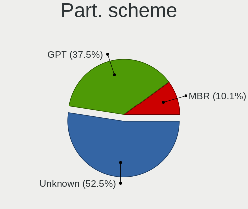
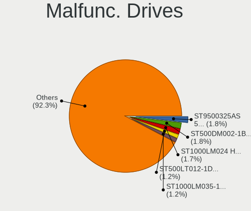
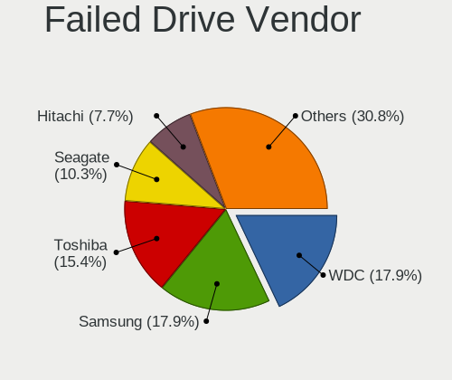
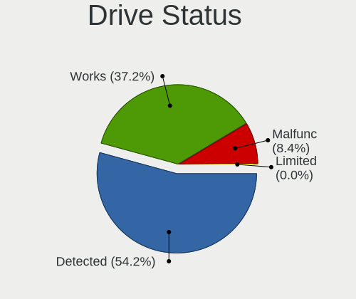
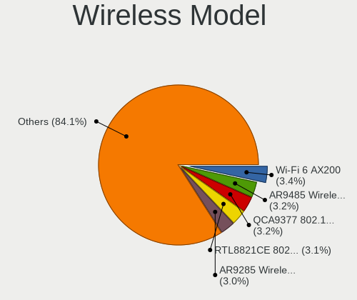

Linux Mint - Tested Hardware & Statistics
-----------------------------------------

A project to collect tested hardware configurations for Linux Mint.

Anyone can contribute to this report by the [hw-probe](https://github.com/linuxhw/hw-probe) tool:

    sudo -E hw-probe -all -upload

Please contribute! Especially if your hardware is rare.

This is a report for all computer types. See also reports for [desktops](/Dist/Linux_Mint/Desktop/README.md) and [notebooks](/Dist/Linux_Mint/Notebook/README.md).

Contents
--------

* [ Test Cases ](#test-cases)

* [ System ](#system)
  - [ OS                       ](#os)
  - [ OS Family                ](#os-family)
  - [ Kernel                   ](#kernel)
  - [ Kernel Family            ](#kernel-family)
  - [ Kernel Major Ver.        ](#kernel-major-ver)
  - [ Arch                     ](#arch)
  - [ DE                       ](#de)
  - [ Display Server           ](#display-server)
  - [ Display Manager          ](#display-manager)
  - [ OS Lang                  ](#os-lang)
  - [ Boot Mode                ](#boot-mode)
  - [ Filesystem               ](#filesystem)
  - [ Part. scheme             ](#part-scheme)
  - [ Dual Boot with Linux/BSD ](#dual-boot-with-linuxbsd)
  - [ Dual Boot (Win)          ](#dual-boot-win)

* [ Board ](#board)
  - [ Vendor                   ](#vendor)
  - [ Model                    ](#model)
  - [ Model Family             ](#model-family)
  - [ MFG Year                 ](#mfg-year)
  - [ Form Factor              ](#form-factor)
  - [ Secure Boot              ](#secure-boot)
  - [ Coreboot                 ](#coreboot)
  - [ RAM Size                 ](#ram-size)
  - [ RAM Used                 ](#ram-used)
  - [ Total Drives             ](#total-drives)
  - [ Has CD-ROM               ](#has-cd-rom)
  - [ Has Ethernet             ](#has-ethernet)
  - [ Has WiFi                 ](#has-wifi)
  - [ Has Bluetooth            ](#has-bluetooth)

* [ Location ](#location)
  - [ Country                  ](#country)
  - [ City                     ](#city)

* [ Drives ](#drives)
  - [ Drive Vendor             ](#drive-vendor)
  - [ Drive Model              ](#drive-model)
  - [ HDD Vendor               ](#hdd-vendor)
  - [ SSD Vendor               ](#ssd-vendor)
  - [ Drive Kind               ](#drive-kind)
  - [ Drive Connector          ](#drive-connector)
  - [ Drive Size               ](#drive-size)
  - [ Space Total              ](#space-total)
  - [ Space Used               ](#space-used)
  - [ Malfunc. Drives          ](#malfunc-drives)
  - [ Malfunc. Drive Vendor    ](#malfunc-drive-vendor)
  - [ Malfunc. HDD Vendor      ](#malfunc-hdd-vendor)
  - [ Malfunc. Drive Kind      ](#malfunc-drive-kind)
  - [ Failed Drives            ](#failed-drives)
  - [ Failed Drive Vendor      ](#failed-drive-vendor)
  - [ Drive Status             ](#drive-status)

* [ Storage controller ](#storage-controller)
  - [ Storage Vendor           ](#storage-vendor)
  - [ Storage Model            ](#storage-model)
  - [ Storage Kind             ](#storage-kind)

* [ Processor ](#processor)
  - [ CPU Vendor               ](#cpu-vendor)
  - [ CPU Model                ](#cpu-model)
  - [ CPU Model Family         ](#cpu-model-family)
  - [ CPU Cores                ](#cpu-cores)
  - [ CPU Sockets              ](#cpu-sockets)
  - [ CPU Threads              ](#cpu-threads)
  - [ CPU Op-Modes             ](#cpu-op-modes)
  - [ CPU Microcode            ](#cpu-microcode)
  - [ CPU Microarch            ](#cpu-microarch)

* [ Graphics ](#graphics)
  - [ GPU Vendor               ](#gpu-vendor)
  - [ GPU Model                ](#gpu-model)
  - [ GPU Combo                ](#gpu-combo)
  - [ GPU Driver               ](#gpu-driver)
  - [ GPU Memory               ](#gpu-memory)

* [ Monitor ](#monitor)
  - [ Monitor Vendor           ](#monitor-vendor)
  - [ Monitor Model            ](#monitor-model)
  - [ Monitor Resolution       ](#monitor-resolution)
  - [ Monitor Diagonal         ](#monitor-diagonal)
  - [ Monitor Width            ](#monitor-width)
  - [ Aspect Ratio             ](#aspect-ratio)
  - [ Monitor Area             ](#monitor-area)
  - [ Pixel Density            ](#pixel-density)
  - [ Multiple Monitors        ](#multiple-monitors)

* [ Network ](#network)
  - [ Net Controller Vendor    ](#net-controller-vendor)
  - [ Net Controller Model     ](#net-controller-model)
  - [ Wireless Vendor          ](#wireless-vendor)
  - [ Wireless Model           ](#wireless-model)
  - [ Ethernet Vendor          ](#ethernet-vendor)
  - [ Ethernet Model           ](#ethernet-model)
  - [ Net Controller Kind      ](#net-controller-kind)
  - [ Used Controller          ](#used-controller)
  - [ NICs                     ](#nics)
  - [ IPv6                     ](#ipv6)

* [ Bluetooth ](#bluetooth)
  - [ Bluetooth Vendor         ](#bluetooth-vendor)
  - [ Bluetooth Model          ](#bluetooth-model)

* [ Sound ](#sound)
  - [ Sound Vendor             ](#sound-vendor)
  - [ Sound Model              ](#sound-model)

* [ Memory ](#memory)
  - [ Memory Vendor            ](#memory-vendor)
  - [ Memory Model             ](#memory-model)
  - [ Memory Kind              ](#memory-kind)
  - [ Memory Form Factor       ](#memory-form-factor)
  - [ Memory Size              ](#memory-size)
  - [ Memory Speed             ](#memory-speed)

* [ Printers & scanners ](#printers--scanners)
  - [ Printer Vendor           ](#printer-vendor)
  - [ Printer Model            ](#printer-model)
  - [ Scanner Vendor           ](#scanner-vendor)
  - [ Scanner Model            ](#scanner-model)

* [ Camera ](#camera)
  - [ Camera Vendor            ](#camera-vendor)
  - [ Camera Model             ](#camera-model)

* [ Security ](#security)
  - [ Fingerprint Vendor       ](#fingerprint-vendor)
  - [ Fingerprint Model        ](#fingerprint-model)
  - [ Chipcard Vendor          ](#chipcard-vendor)
  - [ Chipcard Model           ](#chipcard-model)

* [ Unsupported ](#unsupported)
  - [ Unsupported Devices      ](#unsupported-devices)
  - [ Unsupported Device Types ](#unsupported-device-types)

Test Cases
----------

Total: 29114

| Vendor        | Model                       | Form-Factor | Probe                                                      | Date         |
|---------------|-----------------------------|-------------|------------------------------------------------------------|--------------|
| MSI           | B450M MORTAR TITANIUM       | Desktop     | [a22610f17c](https://linux-hardware.org/?probe=a22610f17c) | Nov 06, 2023 |
| Unknown       | HX90                        | Desktop     | [bc832d475f](https://linux-hardware.org/?probe=bc832d475f) | Nov 06, 2023 |
| Unknown       | HX90                        | Desktop     | [91269ec2b8](https://linux-hardware.org/?probe=91269ec2b8) | Nov 06, 2023 |
| HP            | Pavilion dv8000 (ET839UA... | Notebook    | [ad7dc81954](https://linux-hardware.org/?probe=ad7dc81954) | Nov 06, 2023 |
| ASUSTek       | TUF Gaming B450-PLUS II     | Desktop     | [9e50325ddd](https://linux-hardware.org/?probe=9e50325ddd) | Nov 06, 2023 |
| HP            | Laptop 15-bw0xx             | Notebook    | [bd3e108e8a](https://linux-hardware.org/?probe=bd3e108e8a) | Nov 06, 2023 |
| Gigabyte      | B560M AORUS PRO AX          | Desktop     | [04327aa85c](https://linux-hardware.org/?probe=04327aa85c) | Nov 06, 2023 |
| Lenovo        | ThinkPad T420 4180FB5       | Notebook    | [5abc3caec3](https://linux-hardware.org/?probe=5abc3caec3) | Nov 06, 2023 |
| Lenovo        | MIIX 320-10ICR 80XF         | Tablet      | [415cb187a2](https://linux-hardware.org/?probe=415cb187a2) | Nov 05, 2023 |
| HP            | 198E                        | Desktop     | [f1d1b6839f](https://linux-hardware.org/?probe=f1d1b6839f) | Nov 05, 2023 |
| Dell          | 042P49 A02                  | Desktop     | [b8808915ed](https://linux-hardware.org/?probe=b8808915ed) | Nov 05, 2023 |
| Lenovo        | ThinkPad T520 4243RU3       | Notebook    | [5095529d19](https://linux-hardware.org/?probe=5095529d19) | Nov 05, 2023 |
| MSI           | Z77 MPower                  | Desktop     | [9a199b462a](https://linux-hardware.org/?probe=9a199b462a) | Nov 05, 2023 |
| Inter Sale... | NID-11125DE                 | Notebook    | [aca3d534de](https://linux-hardware.org/?probe=aca3d534de) | Nov 05, 2023 |
| Sony          | VGN-N21S_W                  | Notebook    | [6ff4658440](https://linux-hardware.org/?probe=6ff4658440) | Nov 05, 2023 |
| Sony          | VGN-N21S_W                  | Notebook    | [266bedfdc3](https://linux-hardware.org/?probe=266bedfdc3) | Nov 05, 2023 |
| HP            | Unknown                     | Notebook    | [c8cff9e339](https://linux-hardware.org/?probe=c8cff9e339) | Nov 05, 2023 |
| ASUSTek       | ROG STRIX X670E-E GAMING... | Desktop     | [f48ca40214](https://linux-hardware.org/?probe=f48ca40214) | Nov 05, 2023 |
| ASUSTek       | PRIME J4005I-C              | Desktop     | [76b89da142](https://linux-hardware.org/?probe=76b89da142) | Nov 05, 2023 |
| Chuwi         | LarkBox X                   | Mini pc     | [21d2f3c41d](https://linux-hardware.org/?probe=21d2f3c41d) | Nov 05, 2023 |
| Lenovo        | Legion 5 17ITH6H 82JM       | Notebook    | [7bde99341f](https://linux-hardware.org/?probe=7bde99341f) | Nov 05, 2023 |
| HP            | Notebook                    | Notebook    | [8eea1901f7](https://linux-hardware.org/?probe=8eea1901f7) | Nov 05, 2023 |
| Alienware     | 0N43JM A01                  | Desktop     | [7bd0e03c1b](https://linux-hardware.org/?probe=7bd0e03c1b) | Nov 05, 2023 |
| ASUSTek       | ROG STRIX B650E-E GAMING... | Desktop     | [60f590c96c](https://linux-hardware.org/?probe=60f590c96c) | Nov 05, 2023 |
| ASUSTek       | VivoBook_ASUSLaptop X512... | Notebook    | [b2cfb39c04](https://linux-hardware.org/?probe=b2cfb39c04) | Nov 05, 2023 |
| Toshiba       | QOSMIO X505                 | Notebook    | [e5e5eb9254](https://linux-hardware.org/?probe=e5e5eb9254) | Nov 05, 2023 |
| Digibras      | NH4CU53                     | Notebook    | [2c274cbad8](https://linux-hardware.org/?probe=2c274cbad8) | Nov 05, 2023 |
| ASUSTek       | Maximus IX FORMULA          | Desktop     | [45e65903ff](https://linux-hardware.org/?probe=45e65903ff) | Nov 04, 2023 |
| Gigabyte      | H510M S2H V2                | Desktop     | [29fc753f1e](https://linux-hardware.org/?probe=29fc753f1e) | Nov 04, 2023 |
| Unknown       | Unknown                     | Desktop     | [f1e059fa93](https://linux-hardware.org/?probe=f1e059fa93) | Nov 04, 2023 |
| Dell          | Latitude E6430              | Notebook    | [6a724d5aa8](https://linux-hardware.org/?probe=6a724d5aa8) | Nov 04, 2023 |
| HP            | EliteBook 850 G2            | Notebook    | [36646aca12](https://linux-hardware.org/?probe=36646aca12) | Nov 04, 2023 |
| HP            | 21D0                        | Desktop     | [160964fbab](https://linux-hardware.org/?probe=160964fbab) | Nov 04, 2023 |
| HP            | 8767 A                      | Desktop     | [307b4eb17b](https://linux-hardware.org/?probe=307b4eb17b) | Nov 04, 2023 |
| ASUSTek       | TUF Gaming B550-PLUS        | Desktop     | [e6f4957064](https://linux-hardware.org/?probe=e6f4957064) | Nov 04, 2023 |
| ASUSTek       | X550LC                      | Notebook    | [bd59b07dbf](https://linux-hardware.org/?probe=bd59b07dbf) | Nov 04, 2023 |
| ASUSTek       | X550LC                      | Notebook    | [b7fa2bbb0b](https://linux-hardware.org/?probe=b7fa2bbb0b) | Nov 04, 2023 |
| ASUSTek       | ROG STRIX X370-F GAMING     | Desktop     | [03f8b26adb](https://linux-hardware.org/?probe=03f8b26adb) | Nov 04, 2023 |
| Lenovo        | ThinkPad T460s 20FAS1NF0... | Notebook    | [8528f9946b](https://linux-hardware.org/?probe=8528f9946b) | Nov 04, 2023 |
| Toshiba       | Satellite L70-A             | Notebook    | [bf7be11ced](https://linux-hardware.org/?probe=bf7be11ced) | Nov 04, 2023 |
| Gigabyte      | 945GM-S2                    | Desktop     | [f71f764594](https://linux-hardware.org/?probe=f71f764594) | Nov 04, 2023 |
| Lenovo        | 80SY                        | Notebook    | [7c7a6ba82f](https://linux-hardware.org/?probe=7c7a6ba82f) | Nov 04, 2023 |
| HP            | ZBook 17 G3                 | Notebook    | [7d38ea5f87](https://linux-hardware.org/?probe=7d38ea5f87) | Nov 04, 2023 |
| Lenovo        | IdeaPad Gaming 3 15ARH05... | Notebook    | [3922b02290](https://linux-hardware.org/?probe=3922b02290) | Nov 04, 2023 |
| HP            | Pavilion 17                 | Notebook    | [54cf91ddc7](https://linux-hardware.org/?probe=54cf91ddc7) | Nov 04, 2023 |
| Acer          | Aspire A514-55              | Notebook    | [b9ad0e270f](https://linux-hardware.org/?probe=b9ad0e270f) | Nov 04, 2023 |
| HP            | Laptop 14-bw0xx             | Notebook    | [aea5699bb8](https://linux-hardware.org/?probe=aea5699bb8) | Nov 04, 2023 |
| HP            | 8767 A                      | Desktop     | [a9d65549d2](https://linux-hardware.org/?probe=a9d65549d2) | Nov 04, 2023 |
| Lenovo        | IdeaPad Gaming 3 15ARH05... | Notebook    | [bb7622a7ba](https://linux-hardware.org/?probe=bb7622a7ba) | Nov 04, 2023 |
| HP            | Elite x2 1012 G2 Tablet     | Tablet      | [8e563a8223](https://linux-hardware.org/?probe=8e563a8223) | Nov 03, 2023 |
| Intel         | NUC7i5BNB J31144-314        | Mini pc     | [5949f1fc04](https://linux-hardware.org/?probe=5949f1fc04) | Nov 03, 2023 |
| ECS           | A890GXM-A2                  | Desktop     | [3e5d819c23](https://linux-hardware.org/?probe=3e5d819c23) | Nov 03, 2023 |
| ECS           | A890GXM-A2                  | Desktop     | [9fb5c6d4d3](https://linux-hardware.org/?probe=9fb5c6d4d3) | Nov 03, 2023 |
| Gigabyte      | H510M S2H V2                | Desktop     | [2d4845b6b9](https://linux-hardware.org/?probe=2d4845b6b9) | Nov 03, 2023 |
| ASUSTek       | PRIME Z370-A                | Desktop     | [ae66cf41f9](https://linux-hardware.org/?probe=ae66cf41f9) | Nov 03, 2023 |
| ASUSTek       | PRIME Z370-A                | Desktop     | [92b484d86d](https://linux-hardware.org/?probe=92b484d86d) | Nov 03, 2023 |
| Toshiba       | Satellite C660D             | Notebook    | [de50c92d6c](https://linux-hardware.org/?probe=de50c92d6c) | Nov 03, 2023 |
| Lenovo        | IdeaPad 5 14ARE05 81YM      | Notebook    | [4ccd2ef567](https://linux-hardware.org/?probe=4ccd2ef567) | Nov 03, 2023 |
| HP            | 843B                        | Desktop     | [8fdaf74414](https://linux-hardware.org/?probe=8fdaf74414) | Nov 03, 2023 |
| HP            | 843B                        | Desktop     | [ba22079238](https://linux-hardware.org/?probe=ba22079238) | Nov 03, 2023 |
| ASUSTek       | X510URR                     | Notebook    | [645fbe9fc3](https://linux-hardware.org/?probe=645fbe9fc3) | Nov 03, 2023 |
| HP            | 21D0                        | Desktop     | [c634d51a77](https://linux-hardware.org/?probe=c634d51a77) | Nov 03, 2023 |
| ASUSTek       | G20AJ                       | Desktop     | [f9942dbf89](https://linux-hardware.org/?probe=f9942dbf89) | Nov 03, 2023 |
| ASUSTek       | K53SD                       | Notebook    | [e26ed8b740](https://linux-hardware.org/?probe=e26ed8b740) | Nov 03, 2023 |
| Schenker      | XMG CORE (REN/E21)          | Notebook    | [9edac2c8ee](https://linux-hardware.org/?probe=9edac2c8ee) | Nov 03, 2023 |
| Medion        | MS-7848                     | Desktop     | [ced5528ea5](https://linux-hardware.org/?probe=ced5528ea5) | Nov 03, 2023 |
| Dell          | Latitude E5530 non-vPro     | Notebook    | [491aa458cc](https://linux-hardware.org/?probe=491aa458cc) | Nov 03, 2023 |
| Fujitsu       | LIFEBOOK S710               | Notebook    | [b0ee1e5f32](https://linux-hardware.org/?probe=b0ee1e5f32) | Nov 03, 2023 |
| Acer          | Aspire V3-771               | Notebook    | [3a0023b4ba](https://linux-hardware.org/?probe=3a0023b4ba) | Nov 03, 2023 |
| Lenovo        | ThinkPad T480s 20L8S35G0... | Notebook    | [14074a05b9](https://linux-hardware.org/?probe=14074a05b9) | Nov 02, 2023 |
| ASUSTek       | X580VD                      | Notebook    | [5bb358c66e](https://linux-hardware.org/?probe=5bb358c66e) | Nov 02, 2023 |
| Toshiba       | Satellite Pro L770-12Q      | Notebook    | [bd3567b828](https://linux-hardware.org/?probe=bd3567b828) | Nov 02, 2023 |
| Acer          | AO722                       | Notebook    | [3464dc7b3c](https://linux-hardware.org/?probe=3464dc7b3c) | Nov 02, 2023 |
| Lenovo        | Unknown                     | Notebook    | [3b5aa652dc](https://linux-hardware.org/?probe=3b5aa652dc) | Nov 02, 2023 |
| Lenovo        | Unknown                     | Notebook    | [da6aff8db2](https://linux-hardware.org/?probe=da6aff8db2) | Nov 02, 2023 |
| HP            | ProBook 450 G5              | Notebook    | [b012e30cb6](https://linux-hardware.org/?probe=b012e30cb6) | Nov 02, 2023 |
| MSI           | Prestige 14 A11SCS          | Notebook    | [e114e8ae5b](https://linux-hardware.org/?probe=e114e8ae5b) | Nov 02, 2023 |
| Lenovo        | ThinkPad X1 Carbon Gen 9... | Notebook    | [3c92af97b9](https://linux-hardware.org/?probe=3c92af97b9) | Nov 02, 2023 |
| HP            | EliteBook Folio 1040 G2     | Notebook    | [5c4a8fa3ed](https://linux-hardware.org/?probe=5c4a8fa3ed) | Nov 02, 2023 |
| HP            | Laptop 17-cp0xxx            | Notebook    | [c7760958c8](https://linux-hardware.org/?probe=c7760958c8) | Nov 02, 2023 |
| HP            | Laptop 15-gw0xxx            | Notebook    | [35f5c2edc0](https://linux-hardware.org/?probe=35f5c2edc0) | Nov 02, 2023 |
| HP            | 8924 0101                   | All in one  | [2a4ccfce66](https://linux-hardware.org/?probe=2a4ccfce66) | Nov 02, 2023 |
| ASUSTek       | G20AJ                       | Desktop     | [ca1a60e2df](https://linux-hardware.org/?probe=ca1a60e2df) | Nov 02, 2023 |
| Dell          | Latitude 3440               | Notebook    | [b50ed47992](https://linux-hardware.org/?probe=b50ed47992) | Nov 02, 2023 |
| Dell          | Latitude 3440               | Notebook    | [9426910684](https://linux-hardware.org/?probe=9426910684) | Nov 02, 2023 |
| Dell          | 096JG8 A00                  | Desktop     | [eb001cdbf5](https://linux-hardware.org/?probe=eb001cdbf5) | Nov 02, 2023 |
| HP            | Pavilion g6                 | Notebook    | [e6f697f0c0](https://linux-hardware.org/?probe=e6f697f0c0) | Nov 02, 2023 |
| ASRock        | 990FX Extreme3              | Desktop     | [ad8e4a9dae](https://linux-hardware.org/?probe=ad8e4a9dae) | Nov 02, 2023 |
| AMI           | Intel                       | Desktop     | [8685e22886](https://linux-hardware.org/?probe=8685e22886) | Nov 01, 2023 |
| HP            | 822A                        | Desktop     | [59c055e360](https://linux-hardware.org/?probe=59c055e360) | Nov 01, 2023 |
| ASRock        | B450M Steel Legend          | Desktop     | [ebfb135726](https://linux-hardware.org/?probe=ebfb135726) | Nov 01, 2023 |
| ASUSTek       | PRIME X570-P                | Desktop     | [f54d8e7dea](https://linux-hardware.org/?probe=f54d8e7dea) | Nov 01, 2023 |
| Lenovo        | B71-80 80RJ                 | Notebook    | [93507b3ead](https://linux-hardware.org/?probe=93507b3ead) | Nov 01, 2023 |
| HP            | 630                         | Notebook    | [634f46006b](https://linux-hardware.org/?probe=634f46006b) | Nov 01, 2023 |
| HP            | Laptop 17-ca0xxx            | Notebook    | [888ed977bc](https://linux-hardware.org/?probe=888ed977bc) | Nov 01, 2023 |
| Lenovo        | ThinkPad T400 6475JR8       | Notebook    | [82b16f0e20](https://linux-hardware.org/?probe=82b16f0e20) | Nov 01, 2023 |
| ASUSTek       | CROSSHAIR VI HERO           | Desktop     | [4fc590fe55](https://linux-hardware.org/?probe=4fc590fe55) | Nov 01, 2023 |
| ASUSTek       | ROG STRIX X370-F GAMING     | Desktop     | [bbbdb78ae3](https://linux-hardware.org/?probe=bbbdb78ae3) | Nov 01, 2023 |
| Apple         | MacBookPro11,5              | Notebook    | [99e5155c24](https://linux-hardware.org/?probe=99e5155c24) | Nov 01, 2023 |
| Apple         | MacBook7,1                  | Notebook    | [60edf3f76c](https://linux-hardware.org/?probe=60edf3f76c) | Nov 01, 2023 |
| Toshiba       | Satellite A215              | Notebook    | [de8e05d9e3](https://linux-hardware.org/?probe=de8e05d9e3) | Nov 01, 2023 |
| Toshiba       | Satellite A215              | Notebook    | [4c2cc71fc2](https://linux-hardware.org/?probe=4c2cc71fc2) | Nov 01, 2023 |
| Dell          | 0RF705                      | Desktop     | [b287691e11](https://linux-hardware.org/?probe=b287691e11) | Nov 01, 2023 |
| Acer          | Aspire A514-55              | Notebook    | [985bf8e919](https://linux-hardware.org/?probe=985bf8e919) | Nov 01, 2023 |
| Dell          | Latitude E7450              | Notebook    | [5e39e2bc88](https://linux-hardware.org/?probe=5e39e2bc88) | Nov 01, 2023 |
| ASUSTek       | PRIME X570-P                | Desktop     | [9a2f1f7750](https://linux-hardware.org/?probe=9a2f1f7750) | Nov 01, 2023 |
| ASUSTek       | VivoBook_ASUSLaptop X509... | Notebook    | [7c297acb1f](https://linux-hardware.org/?probe=7c297acb1f) | Nov 01, 2023 |
| MSI           | MAG Z390 TOMAHAWK           | Desktop     | [a31e5e0862](https://linux-hardware.org/?probe=a31e5e0862) | Nov 01, 2023 |
| ASUSTek       | VivoBook_ASUSLaptop X513... | Notebook    | [19d017bb7d](https://linux-hardware.org/?probe=19d017bb7d) | Nov 01, 2023 |
| Apple         | Mac-F2268DAE                | All in one  | [dcf2614ccc](https://linux-hardware.org/?probe=dcf2614ccc) | Nov 01, 2023 |
| HP            | 1497                        | Desktop     | [0fd6a908fe](https://linux-hardware.org/?probe=0fd6a908fe) | Nov 01, 2023 |
| AMI           | Intel                       | Desktop     | [fa89237919](https://linux-hardware.org/?probe=fa89237919) | Nov 01, 2023 |
| Lenovo        | ThinkPad T480s 20L8S2SX0... | Notebook    | [d5fee530ee](https://linux-hardware.org/?probe=d5fee530ee) | Nov 01, 2023 |
| Lenovo        | ThinkPad T420 42369U7       | Notebook    | [8de4ad6ae1](https://linux-hardware.org/?probe=8de4ad6ae1) | Nov 01, 2023 |
| Apple         | Mac-F2268DAE                | All in one  | [0d0622f1e9](https://linux-hardware.org/?probe=0d0622f1e9) | Nov 01, 2023 |
| MSI           | B450M PRO-VDH MAX           | Desktop     | [d73c8ca742](https://linux-hardware.org/?probe=d73c8ca742) | Nov 01, 2023 |
| Sapphire      | PE-AM2RS690V2               | Desktop     | [2b2de28f02](https://linux-hardware.org/?probe=2b2de28f02) | Nov 01, 2023 |
| Lenovo        | ThinkPad L15 Gen 2 20X30... | Notebook    | [6cce294b99](https://linux-hardware.org/?probe=6cce294b99) | Nov 01, 2023 |
| Lenovo        | ThinkPad L15 Gen 2 20X30... | Notebook    | [c985fdb0b7](https://linux-hardware.org/?probe=c985fdb0b7) | Nov 01, 2023 |
| MSI           | B550 GAMING GEN3            | Desktop     | [bd3efc9d84](https://linux-hardware.org/?probe=bd3efc9d84) | Nov 01, 2023 |
| Medion        | MS-7800                     | Desktop     | [8ebfbd5941](https://linux-hardware.org/?probe=8ebfbd5941) | Nov 01, 2023 |
| HP            | Pavilion g7                 | Notebook    | [157c592b3a](https://linux-hardware.org/?probe=157c592b3a) | Nov 01, 2023 |
| ASUSTek       | B85M-E                      | Desktop     | [6709fd475b](https://linux-hardware.org/?probe=6709fd475b) | Nov 01, 2023 |
| Lenovo        | IdeaPad 320-17ABR 80YN      | Notebook    | [96bda876c8](https://linux-hardware.org/?probe=96bda876c8) | Nov 01, 2023 |
| HP            | 2000                        | Notebook    | [f586263d64](https://linux-hardware.org/?probe=f586263d64) | Nov 01, 2023 |
| Apple         | MacBookPro8,1               | Notebook    | [b03928bc33](https://linux-hardware.org/?probe=b03928bc33) | Nov 01, 2023 |
| MSI           | H110M ECO                   | Desktop     | [d2f60e8bc9](https://linux-hardware.org/?probe=d2f60e8bc9) | Nov 01, 2023 |
| HP            | 2B2C                        | Desktop     | [1ed40f19d9](https://linux-hardware.org/?probe=1ed40f19d9) | Nov 01, 2023 |
| ASUSTek       | UX430UA                     | Notebook    | [d99926d970](https://linux-hardware.org/?probe=d99926d970) | Nov 01, 2023 |
| HP            | EliteBook 850 G8 Noteboo... | Notebook    | [7c07fc9bbe](https://linux-hardware.org/?probe=7c07fc9bbe) | Oct 31, 2023 |
| Google        | Akemi                       | Notebook    | [a5cea3a369](https://linux-hardware.org/?probe=a5cea3a369) | Oct 31, 2023 |
| MSI           | Z87-G45 GAMING              | Desktop     | [962f4ccb9e](https://linux-hardware.org/?probe=962f4ccb9e) | Oct 31, 2023 |
| HP            | 246 G6 Notebook PC          | Notebook    | [60a551c8f4](https://linux-hardware.org/?probe=60a551c8f4) | Oct 31, 2023 |
| AMD           | A88K                        | Desktop     | [963e38ef9a](https://linux-hardware.org/?probe=963e38ef9a) | Oct 31, 2023 |
| Gigabyte      | B450M S2H                   | Desktop     | [d099ae69e8](https://linux-hardware.org/?probe=d099ae69e8) | Oct 31, 2023 |
| HP            | G56                         | Notebook    | [db44e7df47](https://linux-hardware.org/?probe=db44e7df47) | Oct 31, 2023 |
| Gigabyte      | Z370 AORUS Gaming 3         | Desktop     | [d2072a9949](https://linux-hardware.org/?probe=d2072a9949) | Oct 31, 2023 |
| ION Comput... | LAPBC510                    | Notebook    | [24a1cafad9](https://linux-hardware.org/?probe=24a1cafad9) | Oct 31, 2023 |
| ASUSTek       | TUF Gaming B550-PLUS        | Desktop     | [16c9a49c7d](https://linux-hardware.org/?probe=16c9a49c7d) | Oct 31, 2023 |
| HP            | 255 15.6 inch G9 Noteboo... | Notebook    | [3446eef35d](https://linux-hardware.org/?probe=3446eef35d) | Oct 31, 2023 |
| ASUSTek       | P8H67-M EVO                 | Desktop     | [64a6524677](https://linux-hardware.org/?probe=64a6524677) | Oct 31, 2023 |
| Lenovo        | V15 G2 ITL 82KB             | Notebook    | [4f6d9ac7b5](https://linux-hardware.org/?probe=4f6d9ac7b5) | Oct 31, 2023 |
| Apple         | MacBookPro8,1               | Notebook    | [27c6a9540f](https://linux-hardware.org/?probe=27c6a9540f) | Oct 31, 2023 |
| Lenovo        | ThinkPad E14 Gen 3 20YD0... | Notebook    | [5b8af0fd77](https://linux-hardware.org/?probe=5b8af0fd77) | Oct 31, 2023 |
| Fujitsu       | LIFEBOOK S710               | Notebook    | [a8ae4206d4](https://linux-hardware.org/?probe=a8ae4206d4) | Oct 31, 2023 |
| Lenovo        | ThinkPad X1 Carbon 6th 2... | Notebook    | [ded975e57f](https://linux-hardware.org/?probe=ded975e57f) | Oct 31, 2023 |
| Lenovo        | ThinkPad X1 Carbon 6th 2... | Notebook    | [c90a14fcf5](https://linux-hardware.org/?probe=c90a14fcf5) | Oct 31, 2023 |
| Intel         | NUC11ATBPE M49844-400       | Mini pc     | [78fabfef55](https://linux-hardware.org/?probe=78fabfef55) | Oct 31, 2023 |
| Intel         | NUC11ATBPE M49844-400       | Mini pc     | [623c5e86d7](https://linux-hardware.org/?probe=623c5e86d7) | Oct 31, 2023 |
| Gigabyte      | Z97P-D3                     | Desktop     | [cf26456a24](https://linux-hardware.org/?probe=cf26456a24) | Oct 31, 2023 |
| Fujitsu       | LIFEBOOK E5511              | Notebook    | [c4dbce515a](https://linux-hardware.org/?probe=c4dbce515a) | Oct 31, 2023 |
| Gigabyte      | Z97-D3H-CF                  | Desktop     | [56e4a560bc](https://linux-hardware.org/?probe=56e4a560bc) | Oct 31, 2023 |
| ASRock        | B450M Pro4                  | Desktop     | [3880922e48](https://linux-hardware.org/?probe=3880922e48) | Oct 31, 2023 |
| Toshiba       | TECRA S11                   | Notebook    | [e2a669bf1a](https://linux-hardware.org/?probe=e2a669bf1a) | Oct 31, 2023 |
| ASUSTek       | X550EP                      | Notebook    | [81fdd48960](https://linux-hardware.org/?probe=81fdd48960) | Oct 31, 2023 |
| ASUSTek       | TUF Gaming B550-PLUS        | Desktop     | [25aa8e9401](https://linux-hardware.org/?probe=25aa8e9401) | Oct 31, 2023 |
| ASUSTek       | P8H67-M LE                  | Desktop     | [d4a5c11db9](https://linux-hardware.org/?probe=d4a5c11db9) | Oct 31, 2023 |
| ASUSTek       | SABERTOOTH Z97 MARK 2/US... | Desktop     | [95a0ff1bb1](https://linux-hardware.org/?probe=95a0ff1bb1) | Oct 31, 2023 |
| Apple         | MacBookAir6,2               | Notebook    | [edd3006f12](https://linux-hardware.org/?probe=edd3006f12) | Oct 31, 2023 |
| Intel         | H311 DS3 V1.0               | Desktop     | [2eabffe817](https://linux-hardware.org/?probe=2eabffe817) | Oct 31, 2023 |
| ASUSTek       | H81M-C/BR                   | Desktop     | [b92870ed6a](https://linux-hardware.org/?probe=b92870ed6a) | Oct 31, 2023 |
| ASUSTek       | VivoBook_ASUSLaptop X571... | Notebook    | [53cd13281b](https://linux-hardware.org/?probe=53cd13281b) | Oct 31, 2023 |
| Dell          | Latitude 5520               | Notebook    | [3803e551f1](https://linux-hardware.org/?probe=3803e551f1) | Oct 31, 2023 |
| Apple         | MacBook7,1                  | Notebook    | [11ada26a4c](https://linux-hardware.org/?probe=11ada26a4c) | Oct 31, 2023 |
| Acer          | Aspire V3-771               | Notebook    | [00ffbda72d](https://linux-hardware.org/?probe=00ffbda72d) | Oct 31, 2023 |
| Lenovo        | ThinkPad P50 20EQS4QL11     | Notebook    | [9fd9ad0312](https://linux-hardware.org/?probe=9fd9ad0312) | Oct 31, 2023 |
| HP            | 250 G6 Notebook PC          | Notebook    | [c1d956674a](https://linux-hardware.org/?probe=c1d956674a) | Oct 31, 2023 |
| Toshiba       | Satellite C660D             | Notebook    | [26479d99b9](https://linux-hardware.org/?probe=26479d99b9) | Oct 31, 2023 |
| Lenovo        | ThinkPad T60 1952WUV        | Notebook    | [4ecf9f7f50](https://linux-hardware.org/?probe=4ecf9f7f50) | Oct 30, 2023 |
| ASUSTek       | PRIME X570-PRO              | Desktop     | [0251ada092](https://linux-hardware.org/?probe=0251ada092) | Oct 30, 2023 |
| ASUSTek       | X555LP                      | Notebook    | [1f57f57452](https://linux-hardware.org/?probe=1f57f57452) | Oct 30, 2023 |
| Lenovo        | ThinkPad T560 20FJS44L0B    | Notebook    | [12c0c78dc8](https://linux-hardware.org/?probe=12c0c78dc8) | Oct 30, 2023 |
| Cincoze       | DX-1000.01.001              | Desktop     | [fb33e90b93](https://linux-hardware.org/?probe=fb33e90b93) | Oct 30, 2023 |
| ASUSTek       | B85M-G                      | Desktop     | [e4b4cf1229](https://linux-hardware.org/?probe=e4b4cf1229) | Oct 30, 2023 |
| MSI           | B560M PRO-VDH WIFI          | Desktop     | [a2faa2b06a](https://linux-hardware.org/?probe=a2faa2b06a) | Oct 30, 2023 |
| ASUSTek       | TUF Gaming B550M-PLUS       | Desktop     | [28ddca3b76](https://linux-hardware.org/?probe=28ddca3b76) | Oct 30, 2023 |
| MSI           | Z87-G45 GAMING              | Desktop     | [731cb3b152](https://linux-hardware.org/?probe=731cb3b152) | Oct 30, 2023 |
| Lenovo        | ThinkPad X220 4286CTO       | Notebook    | [237d2ca8b5](https://linux-hardware.org/?probe=237d2ca8b5) | Oct 30, 2023 |
| Lenovo        | ThinkPad T14 Gen 1 20UDC... | Notebook    | [1a7844f56d](https://linux-hardware.org/?probe=1a7844f56d) | Oct 30, 2023 |
| Toshiba       | Satellite L875              | Notebook    | [de5babbde5](https://linux-hardware.org/?probe=de5babbde5) | Oct 30, 2023 |
| ASUSTek       | F5N                         | Notebook    | [67f3a19888](https://linux-hardware.org/?probe=67f3a19888) | Oct 30, 2023 |
| MSI           | Z490-A PRO                  | Desktop     | [449c0df691](https://linux-hardware.org/?probe=449c0df691) | Oct 30, 2023 |
| Mediacom      | WinPad 11,6 FullHD- WPU1... | Notebook    | [b3e37008cb](https://linux-hardware.org/?probe=b3e37008cb) | Oct 30, 2023 |
| Inter Sale... | NID-11125DE                 | Notebook    | [2ba3404987](https://linux-hardware.org/?probe=2ba3404987) | Oct 30, 2023 |
| ASRockRack    | C236 WS                     | Desktop     | [1e6fea20e9](https://linux-hardware.org/?probe=1e6fea20e9) | Oct 30, 2023 |
| ASUSTek       | VivoBook_ASUSLaptop E410... | Notebook    | [bb991098d1](https://linux-hardware.org/?probe=bb991098d1) | Oct 30, 2023 |
| HP            | Unknown                     | Notebook    | [3aadbc5c33](https://linux-hardware.org/?probe=3aadbc5c33) | Oct 30, 2023 |
| ASRock        | H61M-DGS R2.0               | Desktop     | [d8bd0d7795](https://linux-hardware.org/?probe=d8bd0d7795) | Oct 30, 2023 |
| HP            | EliteBook 8560w             | Notebook    | [cd7ef88b8a](https://linux-hardware.org/?probe=cd7ef88b8a) | Oct 30, 2023 |
| ZOTAC         | ZBOX-CI669/CI649NANO        | Mini pc     | [7822c87b1f](https://linux-hardware.org/?probe=7822c87b1f) | Oct 30, 2023 |
| Acer          | Aspire 5733                 | Notebook    | [8a925b3630](https://linux-hardware.org/?probe=8a925b3630) | Oct 30, 2023 |
| Gigabyte      | F2A88X-D3H                  | Desktop     | [aa9ef029e5](https://linux-hardware.org/?probe=aa9ef029e5) | Oct 30, 2023 |
| Dell          | Latitude 7430               | Notebook    | [b72f3f4264](https://linux-hardware.org/?probe=b72f3f4264) | Oct 30, 2023 |
| Dell          | Latitude E7250              | Notebook    | [a83b95ce44](https://linux-hardware.org/?probe=a83b95ce44) | Oct 30, 2023 |
| ASRock        | G41M-VS3                    | Desktop     | [908b330ba2](https://linux-hardware.org/?probe=908b330ba2) | Oct 29, 2023 |
| Notebook      | NS5x_NS7xAU                 | Notebook    | [151d6e2c69](https://linux-hardware.org/?probe=151d6e2c69) | Oct 29, 2023 |
| Dell          | Precision M6600             | Notebook    | [30e8d1522d](https://linux-hardware.org/?probe=30e8d1522d) | Oct 29, 2023 |
| Microsoft     | Surface Book                | Tablet      | [7b82f936a1](https://linux-hardware.org/?probe=7b82f936a1) | Oct 29, 2023 |
| ASUSTek       | Z87-DELUXE                  | Desktop     | [00b15965c5](https://linux-hardware.org/?probe=00b15965c5) | Oct 29, 2023 |
| HP            | 829A                        | Mini pc     | [b079de79bf](https://linux-hardware.org/?probe=b079de79bf) | Oct 29, 2023 |
| Biostar       | H610MH                      | Desktop     | [82198b27e1](https://linux-hardware.org/?probe=82198b27e1) | Oct 29, 2023 |
| Foxconn       | 2ADA                        | Desktop     | [ce19056aa6](https://linux-hardware.org/?probe=ce19056aa6) | Oct 29, 2023 |
| Samsung       | 940XFG                      | Notebook    | [70cda4e8b4](https://linux-hardware.org/?probe=70cda4e8b4) | Oct 29, 2023 |
| ASUSTek       | X75VC                       | Notebook    | [9b8051fb79](https://linux-hardware.org/?probe=9b8051fb79) | Oct 29, 2023 |
| Acer          | Aspire 5810T                | Notebook    | [9b65c56faa](https://linux-hardware.org/?probe=9b65c56faa) | Oct 29, 2023 |
| MSI           | B450 TOMAHAWK MAX II        | Desktop     | [67a61bc860](https://linux-hardware.org/?probe=67a61bc860) | Oct 29, 2023 |
| ASUSTek       | M4N72-E                     | Desktop     | [199a901e5c](https://linux-hardware.org/?probe=199a901e5c) | Oct 29, 2023 |
| Acer          | Aspire ES1-572              | Notebook    | [12b1df4e2b](https://linux-hardware.org/?probe=12b1df4e2b) | Oct 29, 2023 |
| Notebook      | N85_N87HCHNHZ               | Notebook    | [751a447386](https://linux-hardware.org/?probe=751a447386) | Oct 28, 2023 |
| Dell          | Latitude E6410              | Notebook    | [4eecd92a1e](https://linux-hardware.org/?probe=4eecd92a1e) | Oct 28, 2023 |
| Acer          | Nitro AN515-57              | Notebook    | [5d047c6d80](https://linux-hardware.org/?probe=5d047c6d80) | Oct 28, 2023 |
| Fujitsu       | D3222-A1 S26361-D3222-A1    | Desktop     | [db992da5fa](https://linux-hardware.org/?probe=db992da5fa) | Oct 28, 2023 |
| HP            | 8918                        | Desktop     | [12336ce9fe](https://linux-hardware.org/?probe=12336ce9fe) | Oct 28, 2023 |
| Dell          | Latitude E6500              | Notebook    | [41e90a6524](https://linux-hardware.org/?probe=41e90a6524) | Oct 28, 2023 |
| HUAWEI        | NBLB-WAX9N                  | Notebook    | [1ad2b79950](https://linux-hardware.org/?probe=1ad2b79950) | Oct 28, 2023 |
| HUAWEI        | NBLB-WAX9N                  | Notebook    | [ab6e0c5094](https://linux-hardware.org/?probe=ab6e0c5094) | Oct 28, 2023 |
| HP            | Laptop 17-cn2xxx            | Notebook    | [b6025e5485](https://linux-hardware.org/?probe=b6025e5485) | Oct 28, 2023 |
| Lenovo        | ThinkPad E520 1143A22       | Notebook    | [cd1af5dc70](https://linux-hardware.org/?probe=cd1af5dc70) | Oct 28, 2023 |
| Samsung       | 300E4Z/300E5Z/300E7Z        | Notebook    | [37e69bd8a8](https://linux-hardware.org/?probe=37e69bd8a8) | Oct 28, 2023 |
| ASRock        | Z97 Killer                  | Desktop     | [b26c6bcd4b](https://linux-hardware.org/?probe=b26c6bcd4b) | Oct 28, 2023 |
| ASUSTek       | P8H67-M EVO                 | Desktop     | [a4bed1729d](https://linux-hardware.org/?probe=a4bed1729d) | Oct 28, 2023 |
| Lenovo        | IdeaPad 520-15IKB 81BF      | Notebook    | [ee5373bbe1](https://linux-hardware.org/?probe=ee5373bbe1) | Oct 28, 2023 |
| ZOTAC         | ZBOX-CI669/CI649NANO        | Mini pc     | [f090267683](https://linux-hardware.org/?probe=f090267683) | Oct 28, 2023 |
| Dell          | XPS 13 9365                 | Convertible | [c320669b39](https://linux-hardware.org/?probe=c320669b39) | Oct 28, 2023 |
| Lenovo        | ThinkPad X1 Yoga 3rd 20L... | Convertible | [53365d4f51](https://linux-hardware.org/?probe=53365d4f51) | Oct 28, 2023 |
| Lenovo        | IdeaPad Yoga 13 2191        | Notebook    | [219a94f546](https://linux-hardware.org/?probe=219a94f546) | Oct 28, 2023 |
| Gigabyte      | 970A-DS3P                   | Desktop     | [e9d377b8cd](https://linux-hardware.org/?probe=e9d377b8cd) | Oct 28, 2023 |
| Dell          | 08NPPY A01                  | Desktop     | [62bc2b3e7a](https://linux-hardware.org/?probe=62bc2b3e7a) | Oct 28, 2023 |
| ASUSTek       | VivoBook_ASUSLaptop M350... | Notebook    | [7259ae55c2](https://linux-hardware.org/?probe=7259ae55c2) | Oct 28, 2023 |
| Lenovo        | IdeaPad Gaming 3 15IHU6 ... | Notebook    | [49982fda5c](https://linux-hardware.org/?probe=49982fda5c) | Oct 28, 2023 |
| Lenovo        | IdeaPad 320-15AST 80XV      | Notebook    | [9c28038bcb](https://linux-hardware.org/?probe=9c28038bcb) | Oct 28, 2023 |
| Lenovo        | IdeaPad 320-15AST 80XV      | Notebook    | [f7556d51ff](https://linux-hardware.org/?probe=f7556d51ff) | Oct 28, 2023 |
| Lenovo        | ThinkPad X220 4286CTO       | Notebook    | [2a27fbfe9c](https://linux-hardware.org/?probe=2a27fbfe9c) | Oct 27, 2023 |
| Lenovo        | ThinkPad T410 2537GN8       | Notebook    | [b01c537756](https://linux-hardware.org/?probe=b01c537756) | Oct 27, 2023 |
| HC Technol... | HCAR5000-MI                 | Desktop     | [0c3d1e964a](https://linux-hardware.org/?probe=0c3d1e964a) | Oct 27, 2023 |
| Fujitsu       | D3501-A1 S26361-D3501-A1    | Desktop     | [637a5897b7](https://linux-hardware.org/?probe=637a5897b7) | Oct 27, 2023 |
| Lenovo        | ThinkPad T410 2537GN8       | Notebook    | [a465f0d88d](https://linux-hardware.org/?probe=a465f0d88d) | Oct 27, 2023 |
| Lenovo        | ThinkPad T410 2537JC6       | Notebook    | [c84f5cb370](https://linux-hardware.org/?probe=c84f5cb370) | Oct 27, 2023 |
| ASUSTek       | X75VC                       | Notebook    | [be944959dc](https://linux-hardware.org/?probe=be944959dc) | Oct 27, 2023 |
| Dell          | Latitude 5480               | Notebook    | [200d747791](https://linux-hardware.org/?probe=200d747791) | Oct 27, 2023 |
| Lenovo        | ThinkPad T410 2537JC6       | Notebook    | [51b394c8c9](https://linux-hardware.org/?probe=51b394c8c9) | Oct 27, 2023 |
| Dell          | 040DDP A01                  | Desktop     | [6d081e2627](https://linux-hardware.org/?probe=6d081e2627) | Oct 27, 2023 |
| HP            | Notebook                    | Notebook    | [1f270f615f](https://linux-hardware.org/?probe=1f270f615f) | Oct 27, 2023 |
| HP            | 8399                        | Desktop     | [35351ed170](https://linux-hardware.org/?probe=35351ed170) | Oct 27, 2023 |
| MSI           | Z170A PC MATE               | Desktop     | [e76ead66bc](https://linux-hardware.org/?probe=e76ead66bc) | Oct 27, 2023 |
| Samsung       | 935QDB                      | Convertible | [0b2ea617b5](https://linux-hardware.org/?probe=0b2ea617b5) | Oct 27, 2023 |
| Razer         | Blade 15 Base Model (Ear... | Notebook    | [d0f571ffa0](https://linux-hardware.org/?probe=d0f571ffa0) | Oct 27, 2023 |
| ASUSTek       | CM6850                      | Desktop     | [b6819e8599](https://linux-hardware.org/?probe=b6819e8599) | Oct 27, 2023 |
| HP            | Laptop 15-ef2xxx            | Notebook    | [01f4f7926d](https://linux-hardware.org/?probe=01f4f7926d) | Oct 27, 2023 |
| MSI           | MS-1736                     | Notebook    | [929f0d008e](https://linux-hardware.org/?probe=929f0d008e) | Oct 26, 2023 |
| Dell          | 0NW6H5 A00                  | Desktop     | [95858bf436](https://linux-hardware.org/?probe=95858bf436) | Oct 26, 2023 |
| Dell          | 0RY007                      | Desktop     | [56af1be7cc](https://linux-hardware.org/?probe=56af1be7cc) | Oct 26, 2023 |
| Samsung       | 3570R/370R/470R/450R/510... | Notebook    | [7f10f1b379](https://linux-hardware.org/?probe=7f10f1b379) | Oct 26, 2023 |
| Gigabyte      | 945GM-S2                    | Desktop     | [baaa212a39](https://linux-hardware.org/?probe=baaa212a39) | Oct 26, 2023 |
| MSI           | B450M MORTAR MAX            | Desktop     | [ab3b2be8f5](https://linux-hardware.org/?probe=ab3b2be8f5) | Oct 26, 2023 |
| MSI           | B450M MORTAR MAX            | Desktop     | [8f83740c8d](https://linux-hardware.org/?probe=8f83740c8d) | Oct 26, 2023 |
| MSI           | MAG Z390 TOMAHAWK           | Desktop     | [0a305499ef](https://linux-hardware.org/?probe=0a305499ef) | Oct 26, 2023 |
| Dell          | Latitude E6440              | Notebook    | [b72f1e313e](https://linux-hardware.org/?probe=b72f1e313e) | Oct 26, 2023 |
| ASUSTek       | ROG STRIX X670E-E GAMING... | Desktop     | [8926585836](https://linux-hardware.org/?probe=8926585836) | Oct 26, 2023 |
| MSI           | Stealth 16Studio A13VG      | Notebook    | [2009a0a84b](https://linux-hardware.org/?probe=2009a0a84b) | Oct 26, 2023 |
| ASUSTek       | P5K-V                       | Desktop     | [d49d2a9835](https://linux-hardware.org/?probe=d49d2a9835) | Oct 26, 2023 |
| Dell          | Inspiron 3437               | Notebook    | [a57068abbc](https://linux-hardware.org/?probe=a57068abbc) | Oct 26, 2023 |
| Lenovo        | IdeaPadFlex 15D 20334       | Notebook    | [ef8b5632b4](https://linux-hardware.org/?probe=ef8b5632b4) | Oct 26, 2023 |
| Novatech      | C141EK5-CI5TX               | Notebook    | [71f7f1372a](https://linux-hardware.org/?probe=71f7f1372a) | Oct 26, 2023 |
| HP            | Pavilion g7                 | Notebook    | [5f67a1eab5](https://linux-hardware.org/?probe=5f67a1eab5) | Oct 26, 2023 |
| Dell          | 0N4YC8 A00                  | Desktop     | [f54b1a097e](https://linux-hardware.org/?probe=f54b1a097e) | Oct 26, 2023 |
| Gigabyte      | B560M DS3H V2               | Desktop     | [b66ca0672b](https://linux-hardware.org/?probe=b66ca0672b) | Oct 25, 2023 |
| Gigabyte      | B560M DS3H V2               | Desktop     | [64908ddca3](https://linux-hardware.org/?probe=64908ddca3) | Oct 25, 2023 |
| Intel         | JSL MRD                     | Desktop     | [4cf2468a9c](https://linux-hardware.org/?probe=4cf2468a9c) | Oct 25, 2023 |
| MSI           | H81M-P33                    | Desktop     | [f59a3c2021](https://linux-hardware.org/?probe=f59a3c2021) | Oct 25, 2023 |
| Lenovo        | G780 2182                   | Notebook    | [5c9917344a](https://linux-hardware.org/?probe=5c9917344a) | Oct 25, 2023 |
| ASUSTek       | Leonite2                    | Desktop     | [f2ac570d7b](https://linux-hardware.org/?probe=f2ac570d7b) | Oct 25, 2023 |
| Intel         | DX79TO AAG28805-401         | Desktop     | [75e8f73b6a](https://linux-hardware.org/?probe=75e8f73b6a) | Oct 25, 2023 |
| Gigabyte      | B550M AORUS ELITE           | Desktop     | [138843c6dc](https://linux-hardware.org/?probe=138843c6dc) | Oct 25, 2023 |
| HP            | EliteBook 820 G2            | Notebook    | [d6d5273a5a](https://linux-hardware.org/?probe=d6d5273a5a) | Oct 25, 2023 |
| Gigabyte      | 945GM-S2                    | Desktop     | [259ddccf1b](https://linux-hardware.org/?probe=259ddccf1b) | Oct 25, 2023 |
| Acer          | Nitro NP515-51              | Convertible | [ce16663fee](https://linux-hardware.org/?probe=ce16663fee) | Oct 25, 2023 |
| Dell          | Inspiron 11-3168            | Notebook    | [07fd1e8be9](https://linux-hardware.org/?probe=07fd1e8be9) | Oct 25, 2023 |
| Lenovo        | ThinkPad P1 20MES05502      | Notebook    | [699bed0bd4](https://linux-hardware.org/?probe=699bed0bd4) | Oct 25, 2023 |
| HP            | 2B3B                        | All in one  | [b2dac4adaa](https://linux-hardware.org/?probe=b2dac4adaa) | Oct 25, 2023 |
| ASUSTek       | ROG STRIX B760-I GAMING ... | Desktop     | [e0dc5536a8](https://linux-hardware.org/?probe=e0dc5536a8) | Oct 25, 2023 |
| ASUSTek       | P5KPL-AM IN/ROEM/SI         | Desktop     | [56826e6464](https://linux-hardware.org/?probe=56826e6464) | Oct 25, 2023 |
| ASUSTek       | P5KPL-AM IN/ROEM/SI         | Desktop     | [b4e2c4d9b6](https://linux-hardware.org/?probe=b4e2c4d9b6) | Oct 25, 2023 |
| Samsung       | 3570R/370R/470R/450R/510... | Notebook    | [6c88fcef70](https://linux-hardware.org/?probe=6c88fcef70) | Oct 25, 2023 |
| Toshiba       | Satellite C660D             | Notebook    | [011e4e4756](https://linux-hardware.org/?probe=011e4e4756) | Oct 25, 2023 |
| Lenovo        | IdeaPadFlex 15D 20334       | Notebook    | [861e2b3154](https://linux-hardware.org/?probe=861e2b3154) | Oct 25, 2023 |
| Apple         | Mac-35C5E08120C7EEAF Mac... | Mini pc     | [a1155f53be](https://linux-hardware.org/?probe=a1155f53be) | Oct 25, 2023 |
| Toshiba       | Satellite L655              | Notebook    | [504b65f326](https://linux-hardware.org/?probe=504b65f326) | Oct 25, 2023 |
| Toshiba       | Satellite L655              | Notebook    | [6f1c644900](https://linux-hardware.org/?probe=6f1c644900) | Oct 25, 2023 |
| ASUSTek       | VivoBook_ASUSLaptop X515... | Notebook    | [76d22d10e6](https://linux-hardware.org/?probe=76d22d10e6) | Oct 25, 2023 |
| Dell          | Latitude E6540              | Notebook    | [dfb08d307b](https://linux-hardware.org/?probe=dfb08d307b) | Oct 25, 2023 |
| Lenovo        | V110-15IAP 80TG             | Notebook    | [455780b267](https://linux-hardware.org/?probe=455780b267) | Oct 25, 2023 |
| Gigabyte      | 990FXA-UD7                  | Desktop     | [eb3960a181](https://linux-hardware.org/?probe=eb3960a181) | Oct 25, 2023 |
| Medion        | Akoya E6240T                | Notebook    | [67dbd98f9b](https://linux-hardware.org/?probe=67dbd98f9b) | Oct 24, 2023 |
| Toshiba       | Satellite NB10t-A-102       | Notebook    | [85f85dffbd](https://linux-hardware.org/?probe=85f85dffbd) | Oct 24, 2023 |
| Acer          | Nitro AN515-44              | Notebook    | [20f40f9f55](https://linux-hardware.org/?probe=20f40f9f55) | Oct 24, 2023 |
| ASRock        | H87M Pro4                   | Desktop     | [64ba15c5e5](https://linux-hardware.org/?probe=64ba15c5e5) | Oct 24, 2023 |
| ASUSTek       | X75VC                       | Notebook    | [9e53bba398](https://linux-hardware.org/?probe=9e53bba398) | Oct 24, 2023 |
| ASRock        | H87M Pro4                   | Desktop     | [4677d3d0b8](https://linux-hardware.org/?probe=4677d3d0b8) | Oct 24, 2023 |
| Gigabyte      | A320M-S2H-CF                | Desktop     | [3b5b639e73](https://linux-hardware.org/?probe=3b5b639e73) | Oct 24, 2023 |
| Acer          | Aspire V3-572               | Notebook    | [f873d7efd9](https://linux-hardware.org/?probe=f873d7efd9) | Oct 24, 2023 |
| Gigabyte      | Z97X-Gaming 3               | Desktop     | [279929b8c5](https://linux-hardware.org/?probe=279929b8c5) | Oct 24, 2023 |
| ASUSTek       | X541UJ                      | Notebook    | [833d4435d4](https://linux-hardware.org/?probe=833d4435d4) | Oct 24, 2023 |
| MSI           | GP62M 7REX                  | Notebook    | [5fbee8e341](https://linux-hardware.org/?probe=5fbee8e341) | Oct 24, 2023 |
| MSI           | GP62M 7REX                  | Notebook    | [a95ab8b563](https://linux-hardware.org/?probe=a95ab8b563) | Oct 24, 2023 |
| HP            | 255 G5                      | Notebook    | [30164a995c](https://linux-hardware.org/?probe=30164a995c) | Oct 24, 2023 |
| HP            | ENVY x360 2-in-1 Laptop ... | Convertible | [b82599c22e](https://linux-hardware.org/?probe=b82599c22e) | Oct 24, 2023 |
| Gigabyte      | B560M AORUS ELITE           | Desktop     | [61d3768e3f](https://linux-hardware.org/?probe=61d3768e3f) | Oct 24, 2023 |
| Alienware     | m15 Ryzen Ed. R5            | Notebook    | [d9b9718eee](https://linux-hardware.org/?probe=d9b9718eee) | Oct 24, 2023 |
| Dell          | 0200DY A01                  | Desktop     | [9b6ccf43a5](https://linux-hardware.org/?probe=9b6ccf43a5) | Oct 24, 2023 |
| Gigabyte      | A520I AC                    | Desktop     | [fc82aed364](https://linux-hardware.org/?probe=fc82aed364) | Oct 23, 2023 |
| Apple         | MacBookPro14,3              | Notebook    | [b706665251](https://linux-hardware.org/?probe=b706665251) | Oct 23, 2023 |
| HP            | ProBook 450 G6              | Notebook    | [5dc90618a7](https://linux-hardware.org/?probe=5dc90618a7) | Oct 23, 2023 |
| Intel         | H61 V124                    | Desktop     | [2405df9db3](https://linux-hardware.org/?probe=2405df9db3) | Oct 23, 2023 |
| Eii           | WSA116                      | Notebook    | [85da70314e](https://linux-hardware.org/?probe=85da70314e) | Oct 23, 2023 |
| HP            | 81C9                        | Desktop     | [39a3586ed1](https://linux-hardware.org/?probe=39a3586ed1) | Oct 23, 2023 |
| Dell          | Vostro 3400                 | Notebook    | [9c24bc3329](https://linux-hardware.org/?probe=9c24bc3329) | Oct 23, 2023 |
| Lenovo        | ThinkPad X1 Carbon 4th 2... | Notebook    | [66d2dedb14](https://linux-hardware.org/?probe=66d2dedb14) | Oct 23, 2023 |
| Acer          | Nitro AN515-45              | Notebook    | [61791a9250](https://linux-hardware.org/?probe=61791a9250) | Oct 23, 2023 |
| HP            | 8876 11                     | Desktop     | [e7f8609b12](https://linux-hardware.org/?probe=e7f8609b12) | Oct 23, 2023 |
| Lenovo        | 364A SDK0J40700 WIN 3258... | Desktop     | [48de72a7a6](https://linux-hardware.org/?probe=48de72a7a6) | Oct 23, 2023 |
| Panasonic     | CF-53SV64CLM                | Notebook    | [7702a1e73b](https://linux-hardware.org/?probe=7702a1e73b) | Oct 23, 2023 |
| ASRock        | H61M-DGS R2.0               | Desktop     | [24d1406cad](https://linux-hardware.org/?probe=24d1406cad) | Oct 23, 2023 |
| ASUSTek       | ROG STRIX X570-E GAMING     | Desktop     | [d3e630e86d](https://linux-hardware.org/?probe=d3e630e86d) | Oct 23, 2023 |
| Lenovo        | ThinkPad X1 Carbon 6th 2... | Notebook    | [e34ccf8825](https://linux-hardware.org/?probe=e34ccf8825) | Oct 23, 2023 |
| Lenovo        | ThinkPad X1 Carbon 4th 2... | Notebook    | [ca685c37ad](https://linux-hardware.org/?probe=ca685c37ad) | Oct 23, 2023 |
| ASUSTek       | X555YI                      | Notebook    | [0028f82c4d](https://linux-hardware.org/?probe=0028f82c4d) | Oct 23, 2023 |
| MSI           | B450M PRO-VDH MAX           | Desktop     | [b981ef3e39](https://linux-hardware.org/?probe=b981ef3e39) | Oct 23, 2023 |
| Acer          | Aspire V3-572               | Notebook    | [974d64f7a8](https://linux-hardware.org/?probe=974d64f7a8) | Oct 23, 2023 |
| Dell          | XPS 15 7590                 | Notebook    | [e9ecf74d68](https://linux-hardware.org/?probe=e9ecf74d68) | Oct 23, 2023 |
| Acer          | Aspire R3-431T              | Notebook    | [eb6c623c2d](https://linux-hardware.org/?probe=eb6c623c2d) | Oct 23, 2023 |
| Dell          | G15 5515                    | Notebook    | [758d007f45](https://linux-hardware.org/?probe=758d007f45) | Oct 23, 2023 |
| Dell          | G15 5515                    | Notebook    | [5853f5312f](https://linux-hardware.org/?probe=5853f5312f) | Oct 23, 2023 |
| Lenovo        | Legion Y7000P 2019 81Q5     | Notebook    | [e0e939db95](https://linux-hardware.org/?probe=e0e939db95) | Oct 23, 2023 |
| Panasonic     | CFSZ5-3                     | Notebook    | [a70e21055d](https://linux-hardware.org/?probe=a70e21055d) | Oct 23, 2023 |
| Dell          | 09KPNV A00                  | Desktop     | [e7d2257726](https://linux-hardware.org/?probe=e7d2257726) | Oct 23, 2023 |
| AZW           | BT3 X                       | Desktop     | [c1e3c10fc4](https://linux-hardware.org/?probe=c1e3c10fc4) | Oct 23, 2023 |
| AZW           | BT3 X                       | Desktop     | [78328e112b](https://linux-hardware.org/?probe=78328e112b) | Oct 23, 2023 |
| Acer          | TravelMate P259-M           | Notebook    | [d6096c6736](https://linux-hardware.org/?probe=d6096c6736) | Oct 23, 2023 |
| Apple         | Mac-942B5BF58194151B        | All in one  | [7041a7ac55](https://linux-hardware.org/?probe=7041a7ac55) | Oct 23, 2023 |
| Gigabyte      | B550 AORUS ELITE V2         | Desktop     | [948da1d335](https://linux-hardware.org/?probe=948da1d335) | Oct 22, 2023 |
| ASUSTek       | PRIME B450M-K II            | Desktop     | [4123085fec](https://linux-hardware.org/?probe=4123085fec) | Oct 22, 2023 |
| Dell          | Inspiron 3521               | Notebook    | [43b2c926ef](https://linux-hardware.org/?probe=43b2c926ef) | Oct 22, 2023 |
| HP            | Pavilion x360 Convertibl... | Convertible | [6b90afaeb1](https://linux-hardware.org/?probe=6b90afaeb1) | Oct 22, 2023 |
| MSI           | MS-B0621 100                | All in one  | [f1b56a371d](https://linux-hardware.org/?probe=f1b56a371d) | Oct 22, 2023 |
| Gigabyte      | B550M DS3H                  | Desktop     | [8bfba005ad](https://linux-hardware.org/?probe=8bfba005ad) | Oct 22, 2023 |
| Gigabyte      | B550M DS3H                  | Desktop     | [6677da99ae](https://linux-hardware.org/?probe=6677da99ae) | Oct 22, 2023 |
| Dell          | Latitude E6440              | Notebook    | [9db156fcaf](https://linux-hardware.org/?probe=9db156fcaf) | Oct 22, 2023 |
| Lenovo        | 364A SDK0J40700 WIN 3258... | Desktop     | [8a9d0ba0e6](https://linux-hardware.org/?probe=8a9d0ba0e6) | Oct 22, 2023 |
| HP            | ProBook 6550b               | Notebook    | [da6e693794](https://linux-hardware.org/?probe=da6e693794) | Oct 22, 2023 |
| ASUSTek       | Zenbook UX7602VI_UX7602V... | Notebook    | [96e2577624](https://linux-hardware.org/?probe=96e2577624) | Oct 22, 2023 |
| Gigabyte      | A320M-S2H-CF                | Desktop     | [b3113ef419](https://linux-hardware.org/?probe=b3113ef419) | Oct 22, 2023 |
| Lenovo        | IdeaPad 5 Pro 16ARH7 82S... | Notebook    | [1a08930082](https://linux-hardware.org/?probe=1a08930082) | Oct 22, 2023 |
| HP            | Laptop 15-db0xxx            | Notebook    | [d2a789473e](https://linux-hardware.org/?probe=d2a789473e) | Oct 22, 2023 |
| ASUSTek       | VivoBook_ASUSLaptop X512... | Notebook    | [22e4fe8966](https://linux-hardware.org/?probe=22e4fe8966) | Oct 22, 2023 |
| Clevo         | M660SR                      | Notebook    | [56f8ab01f9](https://linux-hardware.org/?probe=56f8ab01f9) | Oct 22, 2023 |
| Unknown       | GB01                        | Desktop     | [5c0f72d3f0](https://linux-hardware.org/?probe=5c0f72d3f0) | Oct 22, 2023 |
| Lenovo        | IdeaPad 320-15ABR 80XS      | Notebook    | [037cfc67ae](https://linux-hardware.org/?probe=037cfc67ae) | Oct 22, 2023 |
| Lenovo        | ThinkPad T450 20BUS50Q16    | Notebook    | [a79018d74a](https://linux-hardware.org/?probe=a79018d74a) | Oct 22, 2023 |
| Lenovo        | ThinkPad T450 20BUS50Q16    | Notebook    | [df9da08050](https://linux-hardware.org/?probe=df9da08050) | Oct 22, 2023 |
| HP            | Pavilion g6                 | Notebook    | [2fc9736b9e](https://linux-hardware.org/?probe=2fc9736b9e) | Oct 22, 2023 |
| Gigabyte      | GA-78LMT-USB3 R2 sex        | Desktop     | [588ad7e7ef](https://linux-hardware.org/?probe=588ad7e7ef) | Oct 22, 2023 |
| HP            | Pavilion g6                 | Notebook    | [7514db3c84](https://linux-hardware.org/?probe=7514db3c84) | Oct 22, 2023 |
| Dell          | Latitude E6430              | Notebook    | [890d4dcb0e](https://linux-hardware.org/?probe=890d4dcb0e) | Oct 22, 2023 |
| ASUSTek       | ROG Maximus XI HERO         | Desktop     | [ec2248edc2](https://linux-hardware.org/?probe=ec2248edc2) | Oct 22, 2023 |
| HP            | 2000                        | Notebook    | [743e2b0bdf](https://linux-hardware.org/?probe=743e2b0bdf) | Oct 22, 2023 |
| Gigabyte      | Z490 VISION D               | Desktop     | [fb9dd530e9](https://linux-hardware.org/?probe=fb9dd530e9) | Oct 21, 2023 |
| Lenovo        | ThinkPad T440p 20AN0069U... | Notebook    | [0a5d896798](https://linux-hardware.org/?probe=0a5d896798) | Oct 21, 2023 |
| Acer          | Aspire M3450                | Desktop     | [7bbabe59d7](https://linux-hardware.org/?probe=7bbabe59d7) | Oct 21, 2023 |
| MSI           | MAG B550M MORTAR WIFI       | Desktop     | [d3298d136b](https://linux-hardware.org/?probe=d3298d136b) | Oct 21, 2023 |
| Lenovo        | ThinkPad L15 Gen 1 20U8S... | Notebook    | [63924140af](https://linux-hardware.org/?probe=63924140af) | Oct 21, 2023 |
| ASUSTek       | X200MA                      | Notebook    | [41f4b8a93a](https://linux-hardware.org/?probe=41f4b8a93a) | Oct 21, 2023 |
| Dell          | Inspiron 3437               | Notebook    | [331cbd427d](https://linux-hardware.org/?probe=331cbd427d) | Oct 21, 2023 |
| Acer          | Aspire ES1-572              | Notebook    | [b4e1647054](https://linux-hardware.org/?probe=b4e1647054) | Oct 21, 2023 |
| VALE          | Notebook Classic C140       | Notebook    | [885bd9c1cf](https://linux-hardware.org/?probe=885bd9c1cf) | Oct 21, 2023 |
| Thomson       | X15I5-8TU512                | Notebook    | [68099cb005](https://linux-hardware.org/?probe=68099cb005) | Oct 21, 2023 |
| MSI           | H81M-P33                    | Desktop     | [04b9d686b6](https://linux-hardware.org/?probe=04b9d686b6) | Oct 21, 2023 |
| MSI           | B550-A PRO                  | Desktop     | [8db756bae3](https://linux-hardware.org/?probe=8db756bae3) | Oct 21, 2023 |
| ASUSTek       | VivoBook_ASUSLaptop K340... | Notebook    | [5f376e3415](https://linux-hardware.org/?probe=5f376e3415) | Oct 21, 2023 |
| Gigabyte      | B75M-D3H                    | Desktop     | [eb8522ff13](https://linux-hardware.org/?probe=eb8522ff13) | Oct 21, 2023 |
| HP            | ProBook 650 G2              | Notebook    | [33216a8361](https://linux-hardware.org/?probe=33216a8361) | Oct 21, 2023 |
| Apple         | Mac-F4238CC8 PVT            | All in one  | [4227545bf9](https://linux-hardware.org/?probe=4227545bf9) | Oct 21, 2023 |
| Toshiba       | Satellite Pro C50-A-1C8     | Notebook    | [801d54f088](https://linux-hardware.org/?probe=801d54f088) | Oct 21, 2023 |
| HP            | Pavilion dv7                | Notebook    | [d2beead33c](https://linux-hardware.org/?probe=d2beead33c) | Oct 21, 2023 |
| ASUSTek       | ROG STRIX B550-A GAMING     | Desktop     | [87212fc8b1](https://linux-hardware.org/?probe=87212fc8b1) | Oct 21, 2023 |
| ASUSTek       | PRIME A320M-K               | Desktop     | [57a08b87d8](https://linux-hardware.org/?probe=57a08b87d8) | Oct 21, 2023 |
| Sony          | SVF1521K6EW                 | Notebook    | [f179781ca4](https://linux-hardware.org/?probe=f179781ca4) | Oct 21, 2023 |
| ASRock        | B650E PG Riptide WiFi       | Desktop     | [24304767eb](https://linux-hardware.org/?probe=24304767eb) | Oct 21, 2023 |
| ASRock        | FM2A68M-HD+                 | Desktop     | [aed5514f95](https://linux-hardware.org/?probe=aed5514f95) | Oct 21, 2023 |
| ASRock        | FM2A68M-HD+                 | Desktop     | [4aa0e3a887](https://linux-hardware.org/?probe=4aa0e3a887) | Oct 21, 2023 |
| ASUSTek       | ROG Maximus XI HERO         | Desktop     | [07a0ae59da](https://linux-hardware.org/?probe=07a0ae59da) | Oct 21, 2023 |
| HP            | 2215                        | Desktop     | [d244e54a96](https://linux-hardware.org/?probe=d244e54a96) | Oct 21, 2023 |
| Dell          | 0RY007                      | Desktop     | [084ad13415](https://linux-hardware.org/?probe=084ad13415) | Oct 21, 2023 |
| Gigabyte      | B75M-D3H                    | Desktop     | [deb1dc3eaa](https://linux-hardware.org/?probe=deb1dc3eaa) | Oct 21, 2023 |
| Acer          | Aspire M3450                | Desktop     | [f1c898ed29](https://linux-hardware.org/?probe=f1c898ed29) | Oct 21, 2023 |
| Dell          | Latitude E6410              | Notebook    | [5b363ffe33](https://linux-hardware.org/?probe=5b363ffe33) | Oct 21, 2023 |
| LG Electro... | R410-G.BP21P1               | Notebook    | [36849f1a4c](https://linux-hardware.org/?probe=36849f1a4c) | Oct 21, 2023 |
| HP            | ProBook 450 15.6 inch G1... | Notebook    | [97607b5959](https://linux-hardware.org/?probe=97607b5959) | Oct 20, 2023 |
| HP            | Pavilion dv6                | Notebook    | [83e83b7e1c](https://linux-hardware.org/?probe=83e83b7e1c) | Oct 20, 2023 |
| Dell          | 0KC9NP A01                  | Desktop     | [c38e54817a](https://linux-hardware.org/?probe=c38e54817a) | Oct 20, 2023 |
| Packard Be... | IMEDIA S2380                | Desktop     | [905b7ea7f0](https://linux-hardware.org/?probe=905b7ea7f0) | Oct 20, 2023 |
| Dell          | Latitude E6400              | Notebook    | [5e09b89469](https://linux-hardware.org/?probe=5e09b89469) | Oct 20, 2023 |
| ASUSTek       | H81M-E                      | Desktop     | [6577940606](https://linux-hardware.org/?probe=6577940606) | Oct 20, 2023 |
| ASUSTek       | H81M-E                      | Desktop     | [86b16af8d5](https://linux-hardware.org/?probe=86b16af8d5) | Oct 20, 2023 |
| ASUSTek       | X555LF                      | Notebook    | [b762dc0df0](https://linux-hardware.org/?probe=b762dc0df0) | Oct 20, 2023 |
| Dell          | 0KV3RP A00                  | Desktop     | [aa258ef607](https://linux-hardware.org/?probe=aa258ef607) | Oct 20, 2023 |
| ASRock        | Q1900-ITX                   | Desktop     | [d4d8b74595](https://linux-hardware.org/?probe=d4d8b74595) | Oct 20, 2023 |
| Acer          | Aspire 6530                 | Notebook    | [8e3114f3f0](https://linux-hardware.org/?probe=8e3114f3f0) | Oct 20, 2023 |
| MSI           | MPG Z490 GAMING EDGE WIF... | Desktop     | [b50515e464](https://linux-hardware.org/?probe=b50515e464) | Oct 20, 2023 |
| ASUSTek       | X555LF                      | Notebook    | [ee44c25ed9](https://linux-hardware.org/?probe=ee44c25ed9) | Oct 20, 2023 |
| HP            | Laptop 17-by2xxx            | Notebook    | [6255c5d9ac](https://linux-hardware.org/?probe=6255c5d9ac) | Oct 20, 2023 |
| Inter Sale... | NID-11125DE                 | Notebook    | [166e30e45b](https://linux-hardware.org/?probe=166e30e45b) | Oct 20, 2023 |
| MSI           | H510M-A PRO                 | Desktop     | [f927a69d11](https://linux-hardware.org/?probe=f927a69d11) | Oct 20, 2023 |
| Samsung       | 530U3C/530U4C               | Notebook    | [8d85a5bd07](https://linux-hardware.org/?probe=8d85a5bd07) | Oct 20, 2023 |
| Dell          | Latitude 7280               | Notebook    | [3b88974986](https://linux-hardware.org/?probe=3b88974986) | Oct 20, 2023 |
| Gigabyte      | Z97X-Gaming 3               | Desktop     | [7cd181ad3b](https://linux-hardware.org/?probe=7cd181ad3b) | Oct 20, 2023 |
| Dell          | 0XCR8D A03                  | Desktop     | [84eb6ce25e](https://linux-hardware.org/?probe=84eb6ce25e) | Oct 20, 2023 |
| Chuwi         | MiniBook                    | Notebook    | [baaf33908c](https://linux-hardware.org/?probe=baaf33908c) | Oct 20, 2023 |
| Lenovo        | ThinkPad T510 4384DJ3       | Notebook    | [bd0354850e](https://linux-hardware.org/?probe=bd0354850e) | Oct 19, 2023 |
| MSI           | MS-7309                     | Desktop     | [2d1eefe4be](https://linux-hardware.org/?probe=2d1eefe4be) | Oct 19, 2023 |
| HP            | Laptop 15-ef2xxx            | Notebook    | [3db54e9b6c](https://linux-hardware.org/?probe=3db54e9b6c) | Oct 19, 2023 |
| ASUSTek       | ROG Maximus XI HERO         | Desktop     | [95c5dfe865](https://linux-hardware.org/?probe=95c5dfe865) | Oct 19, 2023 |
| Lenovo        | ThinkPad T510 4384DJ3       | Notebook    | [85099af926](https://linux-hardware.org/?probe=85099af926) | Oct 19, 2023 |
| Toshiba       | Satellite Pro C50-A-1C8     | Notebook    | [69d0758d3d](https://linux-hardware.org/?probe=69d0758d3d) | Oct 19, 2023 |
| HP            | Laptop 15-ef2xxx            | Notebook    | [e6a88c63b6](https://linux-hardware.org/?probe=e6a88c63b6) | Oct 19, 2023 |
| HP            | Victus by Laptop 16-e0xx... | Notebook    | [a7dbe29bbe](https://linux-hardware.org/?probe=a7dbe29bbe) | Oct 19, 2023 |
| Fujitsu       | D3432-A1 S26361-D3432-A1    | Desktop     | [87d2e5945b](https://linux-hardware.org/?probe=87d2e5945b) | Oct 19, 2023 |
| Dell          | 073MMW A02                  | Desktop     | [1c1ea56be3](https://linux-hardware.org/?probe=1c1ea56be3) | Oct 19, 2023 |
| ASUSTek       | M4A78LT-M                   | Desktop     | [cc8d1f7fb2](https://linux-hardware.org/?probe=cc8d1f7fb2) | Oct 19, 2023 |
| Dell          | Latitude E6530              | Notebook    | [e3126b26df](https://linux-hardware.org/?probe=e3126b26df) | Oct 19, 2023 |
| MSI           | MPG Z490 GAMING EDGE WIF... | Desktop     | [b7f7dc5f46](https://linux-hardware.org/?probe=b7f7dc5f46) | Oct 19, 2023 |
| HP            | Pavilion g7                 | Notebook    | [11f3136e05](https://linux-hardware.org/?probe=11f3136e05) | Oct 19, 2023 |
| Pegatron      | Benicia                     | Desktop     | [c8ec5c8db0](https://linux-hardware.org/?probe=c8ec5c8db0) | Oct 19, 2023 |
| Fujitsu Si... | D2828-A1 S26361-D2828-A1    | Desktop     | [c04e21ae93](https://linux-hardware.org/?probe=c04e21ae93) | Oct 19, 2023 |
| Novatech      | W9x0LU                      | Notebook    | [b6e3d3dfc9](https://linux-hardware.org/?probe=b6e3d3dfc9) | Oct 19, 2023 |
| Apple         | MacBookPro8,3               | Notebook    | [4df4c395df](https://linux-hardware.org/?probe=4df4c395df) | Oct 19, 2023 |
| ASUSTek       | Zenbook 15 UM3504DA_UM35... | Notebook    | [2e7d97492d](https://linux-hardware.org/?probe=2e7d97492d) | Oct 19, 2023 |
| Pegatron      | 2AC2                        | Desktop     | [d8eafcf145](https://linux-hardware.org/?probe=d8eafcf145) | Oct 19, 2023 |
| Pegatron      | 2AC2                        | Desktop     | [bc37a84914](https://linux-hardware.org/?probe=bc37a84914) | Oct 19, 2023 |
| ASUSTek       | PRIME B550M-A WIFI II       | Desktop     | [8f7a837f4f](https://linux-hardware.org/?probe=8f7a837f4f) | Oct 19, 2023 |
| Samsung       | 700T1C                      | Notebook    | [f5668a0ef6](https://linux-hardware.org/?probe=f5668a0ef6) | Oct 19, 2023 |
| Lenovo        | G505s 20255                 | Notebook    | [0e81bd9537](https://linux-hardware.org/?probe=0e81bd9537) | Oct 19, 2023 |
| ASUSTek       | PRIME B450M-A               | Desktop     | [ad5d949eba](https://linux-hardware.org/?probe=ad5d949eba) | Oct 19, 2023 |
| MSI           | Z590-A PRO                  | Desktop     | [804682ff68](https://linux-hardware.org/?probe=804682ff68) | Oct 19, 2023 |
| Compaq        | Presario CQ-23              | Notebook    | [15c10707d0](https://linux-hardware.org/?probe=15c10707d0) | Oct 19, 2023 |
| Gigabyte      | B450M DS3H WIFI-CF          | Desktop     | [9998c3eea0](https://linux-hardware.org/?probe=9998c3eea0) | Oct 19, 2023 |
| HP            | Stream Laptop 14-ax0XX      | Notebook    | [67e51cbac1](https://linux-hardware.org/?probe=67e51cbac1) | Oct 19, 2023 |
| Acer          | Aspire A3SP14-31PT          | Convertible | [1a0fc9b575](https://linux-hardware.org/?probe=1a0fc9b575) | Oct 19, 2023 |
| ASUSTek       | ROG Strix G513IC_G513IC     | Notebook    | [f10e780f12](https://linux-hardware.org/?probe=f10e780f12) | Oct 19, 2023 |
| HP            | EliteBook Folio 1040 G3     | Notebook    | [cf4c60a0a8](https://linux-hardware.org/?probe=cf4c60a0a8) | Oct 18, 2023 |
| MSI           | MAG B650 TOMAHAWK WIFI      | Desktop     | [1748fce718](https://linux-hardware.org/?probe=1748fce718) | Oct 18, 2023 |
| ASUSTek       | PRIME Z370-P                | Desktop     | [aa01fa43ac](https://linux-hardware.org/?probe=aa01fa43ac) | Oct 18, 2023 |
| Lenovo        | ThinkPad X1 Carbon 6th 2... | Notebook    | [6b616c60de](https://linux-hardware.org/?probe=6b616c60de) | Oct 18, 2023 |
| Sony          | VPCEA23FB                   | Notebook    | [dbfa513b31](https://linux-hardware.org/?probe=dbfa513b31) | Oct 18, 2023 |
| Lenovo        | 364A SDK0J40700 WIN 3258... | Desktop     | [070de2c38f](https://linux-hardware.org/?probe=070de2c38f) | Oct 18, 2023 |
| MSI           | H77MA-G43                   | Desktop     | [b741ca0ecc](https://linux-hardware.org/?probe=b741ca0ecc) | Oct 18, 2023 |
| EPSON DIRE... | MR4400E                     | Desktop     | [3c07bfb5a0](https://linux-hardware.org/?probe=3c07bfb5a0) | Oct 18, 2023 |
| Acidanther... | Mac-AA95B1DDAB278B95 iMa... | All in one  | [d042dee2d6](https://linux-hardware.org/?probe=d042dee2d6) | Oct 18, 2023 |
| HUAWEI        | NBLK-WAX9X                  | Notebook    | [4593a22b63](https://linux-hardware.org/?probe=4593a22b63) | Oct 18, 2023 |
| Acer          | Swift SF314-54              | Notebook    | [0df63f5012](https://linux-hardware.org/?probe=0df63f5012) | Oct 17, 2023 |
| Dell          | 0NKW6Y A02                  | Desktop     | [5810a2ef0a](https://linux-hardware.org/?probe=5810a2ef0a) | Oct 17, 2023 |
| Dell          | 0NKW6Y A02                  | Desktop     | [ad07e33f54](https://linux-hardware.org/?probe=ad07e33f54) | Oct 17, 2023 |
| HP            | 84F5                        | Mini pc     | [1098a16b10](https://linux-hardware.org/?probe=1098a16b10) | Oct 17, 2023 |
| ASUSTek       | PRIME B360-PLUS             | Desktop     | [c9f674352d](https://linux-hardware.org/?probe=c9f674352d) | Oct 17, 2023 |
| Acer          | Swift SF314-54              | Notebook    | [0bb3061070](https://linux-hardware.org/?probe=0bb3061070) | Oct 17, 2023 |
| ASRock        | A320M-HD                    | Desktop     | [27d26a4a15](https://linux-hardware.org/?probe=27d26a4a15) | Oct 17, 2023 |
| Acer          | Aspire A315-56              | Notebook    | [9eb823dcdd](https://linux-hardware.org/?probe=9eb823dcdd) | Oct 17, 2023 |
| MicroByte     | ezbook                      | Notebook    | [c67055c10c](https://linux-hardware.org/?probe=c67055c10c) | Oct 17, 2023 |
| Dell          | Latitude E6430              | Notebook    | [b9a404b9e2](https://linux-hardware.org/?probe=b9a404b9e2) | Oct 17, 2023 |
| ASUSTek       | P5K-V                       | Desktop     | [ca8e1433c5](https://linux-hardware.org/?probe=ca8e1433c5) | Oct 17, 2023 |
| XIAOMI        | Redmi Book Pro 15 2023      | Notebook    | [0f6a579d4f](https://linux-hardware.org/?probe=0f6a579d4f) | Oct 17, 2023 |
| MicroByte     | ezbook                      | Notebook    | [5018eaffae](https://linux-hardware.org/?probe=5018eaffae) | Oct 17, 2023 |
| ASRock        | X570 Phantom Gaming 4       | Desktop     | [78e9e09f46](https://linux-hardware.org/?probe=78e9e09f46) | Oct 17, 2023 |
| ASUSTek       | UX310UQK                    | Notebook    | [9c8029cd07](https://linux-hardware.org/?probe=9c8029cd07) | Oct 17, 2023 |
| Pegatron      | IPM41-D3                    | Desktop     | [54150823a1](https://linux-hardware.org/?probe=54150823a1) | Oct 17, 2023 |
| Pegatron      | IPM41-D3                    | Desktop     | [e567a72b4c](https://linux-hardware.org/?probe=e567a72b4c) | Oct 17, 2023 |
| Dell          | 09KPNV A00                  | Desktop     | [f739f7caf6](https://linux-hardware.org/?probe=f739f7caf6) | Oct 17, 2023 |
| EPSON DIRE... | MR4400E                     | Desktop     | [8559cb634e](https://linux-hardware.org/?probe=8559cb634e) | Oct 17, 2023 |
| MSI           | Prestige 14H B12UCX         | Notebook    | [17314417bf](https://linux-hardware.org/?probe=17314417bf) | Oct 17, 2023 |
| Chuwi         | CoreBook XPro               | Notebook    | [02ab9e7a40](https://linux-hardware.org/?probe=02ab9e7a40) | Oct 17, 2023 |
| Alienware     | m15                         | Notebook    | [34919bdeca](https://linux-hardware.org/?probe=34919bdeca) | Oct 17, 2023 |
| Lenovo        | ThinkPad E460 20ET0014US    | Notebook    | [41b0fccb1e](https://linux-hardware.org/?probe=41b0fccb1e) | Oct 17, 2023 |
| Acer          | Aspire 4750                 | Notebook    | [fa78f5938c](https://linux-hardware.org/?probe=fa78f5938c) | Oct 17, 2023 |
| HP            | G62                         | Notebook    | [7b4645719a](https://linux-hardware.org/?probe=7b4645719a) | Oct 17, 2023 |
| MSI           | B450 TOMAHAWK MAX           | Desktop     | [c2191c4438](https://linux-hardware.org/?probe=c2191c4438) | Oct 17, 2023 |
| Apple         | MacBookPro11,1              | Notebook    | [33cba76fe6](https://linux-hardware.org/?probe=33cba76fe6) | Oct 17, 2023 |
| Google        | Treeya                      | Notebook    | [1cf43225f5](https://linux-hardware.org/?probe=1cf43225f5) | Oct 17, 2023 |
| Google        | Treeya                      | Notebook    | [6f05b84b18](https://linux-hardware.org/?probe=6f05b84b18) | Oct 17, 2023 |
| ASUSTek       | H61M-A/BR                   | Desktop     | [c615f7ee38](https://linux-hardware.org/?probe=c615f7ee38) | Oct 17, 2023 |
| Sony          | SVF1421L1EW                 | Notebook    | [60cbc4c236](https://linux-hardware.org/?probe=60cbc4c236) | Oct 17, 2023 |
| ASUSTek       | X500MA                      | Desktop     | [2ffe0522e1](https://linux-hardware.org/?probe=2ffe0522e1) | Oct 17, 2023 |
| Sony          | SVE15128CCW                 | Notebook    | [2d2c699b43](https://linux-hardware.org/?probe=2d2c699b43) | Oct 16, 2023 |
| XIAOMI        | Redmi Book Pro 15 2023      | Notebook    | [322171fcdd](https://linux-hardware.org/?probe=322171fcdd) | Oct 16, 2023 |
| HP            | 250 G6 Notebook PC          | Notebook    | [66cb1cf832](https://linux-hardware.org/?probe=66cb1cf832) | Oct 16, 2023 |
| Gigabyte      | B550M AORUS PRO-P           | Desktop     | [61c4ebff0f](https://linux-hardware.org/?probe=61c4ebff0f) | Oct 16, 2023 |
| ASRock        | B550 Steel Legend           | Desktop     | [dba8d15f50](https://linux-hardware.org/?probe=dba8d15f50) | Oct 16, 2023 |
| Intel         | H61                         | Desktop     | [2bd77947d1](https://linux-hardware.org/?probe=2bd77947d1) | Oct 16, 2023 |
| Toshiba       | Satellite L645              | Notebook    | [5bea545bf5](https://linux-hardware.org/?probe=5bea545bf5) | Oct 16, 2023 |
| ASUSTek       | VivoBook_ASUSLaptop X170... | Notebook    | [8e489a0275](https://linux-hardware.org/?probe=8e489a0275) | Oct 16, 2023 |
| HP            | Laptop 17-ca0xxx            | Notebook    | [37564ba566](https://linux-hardware.org/?probe=37564ba566) | Oct 16, 2023 |
| HP            | Laptop 17-ca0xxx            | Notebook    | [189f8ff7d0](https://linux-hardware.org/?probe=189f8ff7d0) | Oct 16, 2023 |
| Gigabyte      | B450M DS3H WIFI-CF          | Desktop     | [5b226d6424](https://linux-hardware.org/?probe=5b226d6424) | Oct 16, 2023 |
| ASUSTek       | ASUS BR1100FKA BR1100FKA    | Convertible | [8a481b29ae](https://linux-hardware.org/?probe=8a481b29ae) | Oct 16, 2023 |
| Gigabyte      | Z790 AORUS ELITE AX         | Desktop     | [7edc965933](https://linux-hardware.org/?probe=7edc965933) | Oct 16, 2023 |
| ASUSTek       | VivoBook_ASUSLaptop X170... | Notebook    | [d01a91e5bb](https://linux-hardware.org/?probe=d01a91e5bb) | Oct 15, 2023 |
| HP            | Laptop 17-cp0xxx            | Notebook    | [7841cb689e](https://linux-hardware.org/?probe=7841cb689e) | Oct 15, 2023 |
| Lenovo        | SHARKBAY NOK                | Desktop     | [084e18e78d](https://linux-hardware.org/?probe=084e18e78d) | Oct 15, 2023 |
| HP            | 8055                        | Desktop     | [5fe9038a50](https://linux-hardware.org/?probe=5fe9038a50) | Oct 15, 2023 |
| MSI           | Prestige 14Evo A12M         | Notebook    | [9bcdff9506](https://linux-hardware.org/?probe=9bcdff9506) | Oct 15, 2023 |
| Pegatron      | 2ACD                        | Desktop     | [45315e3a0c](https://linux-hardware.org/?probe=45315e3a0c) | Oct 15, 2023 |
| Toshiba       | PORTEGE Z10T-A              | Notebook    | [e505fdce19](https://linux-hardware.org/?probe=e505fdce19) | Oct 15, 2023 |
| Toshiba       | PORTEGE Z10T-A              | Notebook    | [e715a98daa](https://linux-hardware.org/?probe=e715a98daa) | Oct 15, 2023 |
| Gigabyte      | GA-78LMT-USB3 x.x           | Desktop     | [066851473c](https://linux-hardware.org/?probe=066851473c) | Oct 15, 2023 |
| LG Electro... | 14Z990-V.AR52D              | Notebook    | [9e7942d027](https://linux-hardware.org/?probe=9e7942d027) | Oct 15, 2023 |
| HP            | 8055                        | Desktop     | [8a74853b61](https://linux-hardware.org/?probe=8a74853b61) | Oct 15, 2023 |
| HP            | Pavilion dv5                | Notebook    | [3c1dec39e3](https://linux-hardware.org/?probe=3c1dec39e3) | Oct 15, 2023 |
| Lenovo        | ThinkPad X1 Carbon Gen 1... | Notebook    | [2a5d18299e](https://linux-hardware.org/?probe=2a5d18299e) | Oct 15, 2023 |
| MSI           | B450M PRO-M2                | Desktop     | [d6e1f3c3b8](https://linux-hardware.org/?probe=d6e1f3c3b8) | Oct 15, 2023 |
| HP            | 212B                        | Desktop     | [8a59414060](https://linux-hardware.org/?probe=8a59414060) | Oct 15, 2023 |
| MSI           | B450M PRO-M2                | Desktop     | [c99b37a865](https://linux-hardware.org/?probe=c99b37a865) | Oct 15, 2023 |
| Shuttle       | FD37V10                     | Desktop     | [929e944dd3](https://linux-hardware.org/?probe=929e944dd3) | Oct 15, 2023 |
| Shuttle       | FD37V10                     | Desktop     | [d9043c11bd](https://linux-hardware.org/?probe=d9043c11bd) | Oct 15, 2023 |
| Wortmann      | CR700                       | Notebook    | [916c9bceda](https://linux-hardware.org/?probe=916c9bceda) | Oct 15, 2023 |
| MECHREVO      | WUJIE14 PRO                 | Notebook    | [422e2e497a](https://linux-hardware.org/?probe=422e2e497a) | Oct 15, 2023 |
| Lenovo        | Yoga 7 14ARB7 82QF          | Convertible | [4abfd4c7aa](https://linux-hardware.org/?probe=4abfd4c7aa) | Oct 15, 2023 |
| HP            | ProBook 4535s               | Notebook    | [0eb08faa29](https://linux-hardware.org/?probe=0eb08faa29) | Oct 15, 2023 |
| Apple         | MacBookPro7,1               | Notebook    | [79f75a3746](https://linux-hardware.org/?probe=79f75a3746) | Oct 15, 2023 |
| Gigabyte      | B85M-D3H                    | Desktop     | [3fca075f42](https://linux-hardware.org/?probe=3fca075f42) | Oct 15, 2023 |
| ASUSTek       | ROG STRIX B450-I GAMING     | Desktop     | [b9f47c0a25](https://linux-hardware.org/?probe=b9f47c0a25) | Oct 15, 2023 |
| Dell          | 0NW6H5 A00                  | Desktop     | [54a3d7c0ea](https://linux-hardware.org/?probe=54a3d7c0ea) | Oct 15, 2023 |
| ONDA          | H110CD3 VER1.01             | Desktop     | [df23b03be3](https://linux-hardware.org/?probe=df23b03be3) | Oct 15, 2023 |
| ECS           | G31T-M                      | Desktop     | [8f11ce9a6a](https://linux-hardware.org/?probe=8f11ce9a6a) | Oct 15, 2023 |
| Lenovo        | IdeaPad Y700-15ISK 80NV     | Notebook    | [fd52faa27e](https://linux-hardware.org/?probe=fd52faa27e) | Oct 15, 2023 |
| Lenovo        | IdeaPad Y700-15ISK 80NV     | Notebook    | [39d3b3133e](https://linux-hardware.org/?probe=39d3b3133e) | Oct 14, 2023 |
| ASUSTek       | X550LA                      | Notebook    | [0d7a699d73](https://linux-hardware.org/?probe=0d7a699d73) | Oct 14, 2023 |
| Acer          | Aspire 5749                 | Notebook    | [0a04dad507](https://linux-hardware.org/?probe=0a04dad507) | Oct 14, 2023 |
| UNOWHY        | Y13G011S4EI                 | Notebook    | [15ee1d73bb](https://linux-hardware.org/?probe=15ee1d73bb) | Oct 14, 2023 |
| Unknown       | Unknown                     | Desktop     | [b45f1baf7a](https://linux-hardware.org/?probe=b45f1baf7a) | Oct 14, 2023 |
| Apple         | MacBookAir5,2               | Notebook    | [44bec21d8e](https://linux-hardware.org/?probe=44bec21d8e) | Oct 14, 2023 |
| BESSTAR Te... | UM250 V1.0                  | Desktop     | [b4697a227f](https://linux-hardware.org/?probe=b4697a227f) | Oct 14, 2023 |
| MSI           | MAG B550 TORPEDO            | Desktop     | [2bb3baf0f6](https://linux-hardware.org/?probe=2bb3baf0f6) | Oct 14, 2023 |
| Dell          | Latitude E4200              | Notebook    | [2a5bbc07aa](https://linux-hardware.org/?probe=2a5bbc07aa) | Oct 14, 2023 |
| ASUSTek       | ASUS TUF Gaming A15 FA50... | Notebook    | [b2250f3c59](https://linux-hardware.org/?probe=b2250f3c59) | Oct 14, 2023 |
| HP            | Compaq Presario CQ40        | Notebook    | [f6373646f3](https://linux-hardware.org/?probe=f6373646f3) | Oct 14, 2023 |
| MSI           | MPG X570 GAMING PLUS        | Desktop     | [eaf16e3ac3](https://linux-hardware.org/?probe=eaf16e3ac3) | Oct 14, 2023 |
| Acer          | Aspire A315-21              | Notebook    | [270a6baf5e](https://linux-hardware.org/?probe=270a6baf5e) | Oct 14, 2023 |
| ASUSTek       | PRIME A320M-K               | Desktop     | [e44d1b7e3c](https://linux-hardware.org/?probe=e44d1b7e3c) | Oct 14, 2023 |
| ASRock        | H55M-LE                     | Desktop     | [444d608969](https://linux-hardware.org/?probe=444d608969) | Oct 14, 2023 |
| Gigabyte      | Z97N-WIFI                   | Desktop     | [560c190c99](https://linux-hardware.org/?probe=560c190c99) | Oct 14, 2023 |
| ASUSTek       | ROG STRIX B660-F GAMING ... | Desktop     | [618fcf6a1e](https://linux-hardware.org/?probe=618fcf6a1e) | Oct 14, 2023 |
| Gigabyte      | B450M GAMING                | Desktop     | [4280b509c6](https://linux-hardware.org/?probe=4280b509c6) | Oct 14, 2023 |
| ASUSTek       | PRIME B450M-A II            | Desktop     | [4ba8548e96](https://linux-hardware.org/?probe=4ba8548e96) | Oct 14, 2023 |
| Gigabyte      | B450M GAMING                | Desktop     | [06aa8e692c](https://linux-hardware.org/?probe=06aa8e692c) | Oct 14, 2023 |
| Lenovo        | 310B SDK0J40697 WIN 3305... | Mini pc     | [fbaebb19da](https://linux-hardware.org/?probe=fbaebb19da) | Oct 14, 2023 |
| Dell          | 0WR7PY A02                  | Desktop     | [bcdb61bd85](https://linux-hardware.org/?probe=bcdb61bd85) | Oct 14, 2023 |
| Intel         | DH55HC AAE70933-501         | Desktop     | [447110886e](https://linux-hardware.org/?probe=447110886e) | Oct 14, 2023 |
| Samsung       | 550XBE/350XBE               | Notebook    | [27ea9922a6](https://linux-hardware.org/?probe=27ea9922a6) | Oct 13, 2023 |
| Gigabyte      | Z170M-D3H-CF                | Desktop     | [c090855f1d](https://linux-hardware.org/?probe=c090855f1d) | Oct 13, 2023 |
| Inter Sale... | NID-11125DE                 | Notebook    | [1e44f2ed5f](https://linux-hardware.org/?probe=1e44f2ed5f) | Oct 13, 2023 |
| Unknown       | MZ-B75-S                    | Desktop     | [6d58c79c33](https://linux-hardware.org/?probe=6d58c79c33) | Oct 13, 2023 |
| ASUSTek       | K70IO                       | Notebook    | [e9d2ce541a](https://linux-hardware.org/?probe=e9d2ce541a) | Oct 13, 2023 |
| ASUSTek       | M5A78L-M LX3                | Desktop     | [88f08528f7](https://linux-hardware.org/?probe=88f08528f7) | Oct 13, 2023 |
| ZOTAC         | ZBOX-MI643/MI623 Rev.00     | Mini pc     | [6c8521c902](https://linux-hardware.org/?probe=6c8521c902) | Oct 13, 2023 |
| ASRock        | H61M-DGS R2.0               | Desktop     | [8ca3e29982](https://linux-hardware.org/?probe=8ca3e29982) | Oct 13, 2023 |
| Lenovo        | IdeaPad 3 14ALC6 82KT       | Notebook    | [fb51024b14](https://linux-hardware.org/?probe=fb51024b14) | Oct 13, 2023 |
| Dell          | System Inspiron N7110       | Notebook    | [1ad49cf994](https://linux-hardware.org/?probe=1ad49cf994) | Oct 13, 2023 |
| HP            | EliteBook 8560w             | Notebook    | [fe609f2137](https://linux-hardware.org/?probe=fe609f2137) | Oct 13, 2023 |
| Gigabyte      | AX370M-Gaming 3-CF          | Desktop     | [dbc150b2b5](https://linux-hardware.org/?probe=dbc150b2b5) | Oct 13, 2023 |
| Lenovo        | Yoga 7 16IRL8 82YN          | Convertible | [b593a4511e](https://linux-hardware.org/?probe=b593a4511e) | Oct 13, 2023 |
| Lenovo        | ThinkPad X250 20CM0048US    | Notebook    | [cf66338531](https://linux-hardware.org/?probe=cf66338531) | Oct 13, 2023 |
| HP            | Notebook                    | Notebook    | [a636c2dac6](https://linux-hardware.org/?probe=a636c2dac6) | Oct 12, 2023 |
| MSI           | B350 GAMING PRO CARBON      | Desktop     | [f164204da9](https://linux-hardware.org/?probe=f164204da9) | Oct 12, 2023 |
| HP            | 8430 1000                   | All in one  | [1d37a2c0a1](https://linux-hardware.org/?probe=1d37a2c0a1) | Oct 12, 2023 |
| Gigabyte      | EX58-EXTREME                | Desktop     | [662889cd52](https://linux-hardware.org/?probe=662889cd52) | Oct 12, 2023 |
| Gigabyte      | B250M-DS3H-CF               | Desktop     | [99092f3766](https://linux-hardware.org/?probe=99092f3766) | Oct 12, 2023 |
| Gigabyte      | B250M-DS3H-CF               | Desktop     | [0723750e07](https://linux-hardware.org/?probe=0723750e07) | Oct 12, 2023 |
| Lenovo        | 36D9 SDK0J40700 WIN 3258... | Desktop     | [0400bae582](https://linux-hardware.org/?probe=0400bae582) | Oct 12, 2023 |
| ASRock        | A320M-HD R4.0               | Desktop     | [1b1dd0c7fd](https://linux-hardware.org/?probe=1b1dd0c7fd) | Oct 12, 2023 |
| ASUSTek       | VivoBook_ASUSLaptop X150... | Notebook    | [abc976eaa0](https://linux-hardware.org/?probe=abc976eaa0) | Oct 12, 2023 |
| Lenovo        | Yoga 7 14ARB7 82QF          | Convertible | [38c92044db](https://linux-hardware.org/?probe=38c92044db) | Oct 12, 2023 |
| Toshiba       | Satellite C55D-C            | Notebook    | [2d067797db](https://linux-hardware.org/?probe=2d067797db) | Oct 12, 2023 |
| Dell          | 00V62H A01                  | Desktop     | [4957e141ac](https://linux-hardware.org/?probe=4957e141ac) | Oct 12, 2023 |
| HP            | 82F2                        | Desktop     | [6a5c62ec30](https://linux-hardware.org/?probe=6a5c62ec30) | Oct 12, 2023 |
| HP            | 82F2                        | Desktop     | [ebf3c3339a](https://linux-hardware.org/?probe=ebf3c3339a) | Oct 12, 2023 |
| Sony          | VPCEA2JFX                   | Notebook    | [f4359a3cef](https://linux-hardware.org/?probe=f4359a3cef) | Oct 12, 2023 |
| HP            | ENVY x360 2-in-1 Laptop ... | Convertible | [02d301fff5](https://linux-hardware.org/?probe=02d301fff5) | Oct 12, 2023 |
| MSI           | PRO B650M-A WIFI            | Desktop     | [d20a5d2c71](https://linux-hardware.org/?probe=d20a5d2c71) | Oct 12, 2023 |
| Lenovo        | ThinkPad L14 Gen 1 20U10... | Notebook    | [c91d331bf0](https://linux-hardware.org/?probe=c91d331bf0) | Oct 12, 2023 |
| ASUSTek       | Z87-K                       | Desktop     | [55af6adcc5](https://linux-hardware.org/?probe=55af6adcc5) | Oct 11, 2023 |
| HP            | 81C9                        | Desktop     | [279889bb45](https://linux-hardware.org/?probe=279889bb45) | Oct 11, 2023 |
| Lenovo        | ThinkPad L14 Gen 1 20U10... | Notebook    | [dbc6f4ecc9](https://linux-hardware.org/?probe=dbc6f4ecc9) | Oct 11, 2023 |
| ASUSTek       | VivoBook_ASUSLaptop X512... | Notebook    | [21e9b8cbc9](https://linux-hardware.org/?probe=21e9b8cbc9) | Oct 11, 2023 |
| Lenovo        | G40-45 80E1                 | Notebook    | [365f77219e](https://linux-hardware.org/?probe=365f77219e) | Oct 11, 2023 |
| HP            | 8437                        | Desktop     | [ac8d6773a3](https://linux-hardware.org/?probe=ac8d6773a3) | Oct 11, 2023 |
| Toshiba       | QOSMIO X70-B                | Notebook    | [fc0abd191f](https://linux-hardware.org/?probe=fc0abd191f) | Oct 11, 2023 |
| Gigabyte      | B550M AORUS ELITE           | Desktop     | [a6e6952b42](https://linux-hardware.org/?probe=a6e6952b42) | Oct 11, 2023 |
| Lenovo        | 3130 SDK0J40697 WIN 3305... | Mini pc     | [5a8c03bc6a](https://linux-hardware.org/?probe=5a8c03bc6a) | Oct 11, 2023 |
| Lenovo        | 3000 G530 4151/200          | Notebook    | [093b1381d7](https://linux-hardware.org/?probe=093b1381d7) | Oct 11, 2023 |
| Foxconn       | 2AB1                        | Desktop     | [d30d9f59a8](https://linux-hardware.org/?probe=d30d9f59a8) | Oct 11, 2023 |
| HP            | ProBook 4540s               | Notebook    | [649a18af71](https://linux-hardware.org/?probe=649a18af71) | Oct 10, 2023 |
| Gigabyte      | Z68MA-D2H-B3                | Desktop     | [a646cc1cc1](https://linux-hardware.org/?probe=a646cc1cc1) | Oct 10, 2023 |
| Intel         | NUC5i5MYBE H47797-203       | Mini pc     | [1ea031d4d9](https://linux-hardware.org/?probe=1ea031d4d9) | Oct 10, 2023 |
| Gigabyte      | Z68MA-D2H-B3                | Desktop     | [d731fb0868](https://linux-hardware.org/?probe=d731fb0868) | Oct 10, 2023 |
| HP            | Notebook                    | Notebook    | [7bdb1a31d4](https://linux-hardware.org/?probe=7bdb1a31d4) | Oct 10, 2023 |
| Gigabyte      | Z97P-D3                     | Desktop     | [e8d34cd0b9](https://linux-hardware.org/?probe=e8d34cd0b9) | Oct 10, 2023 |
| Acer          | Aspire ES1-520              | Notebook    | [d7418fb673](https://linux-hardware.org/?probe=d7418fb673) | Oct 10, 2023 |
| Gigabyte      | H81M-S2V                    | Desktop     | [bad4423bfe](https://linux-hardware.org/?probe=bad4423bfe) | Oct 10, 2023 |
| Lenovo        | ThinkPad E14 Gen 5 21JRC... | Notebook    | [a5e4eeba7f](https://linux-hardware.org/?probe=a5e4eeba7f) | Oct 10, 2023 |
| ASRock        | X570 Phantom Gaming 4       | Desktop     | [24e0ada60a](https://linux-hardware.org/?probe=24e0ada60a) | Oct 10, 2023 |
| ASUSTek       | M5A78L-M/USB3               | Desktop     | [ec66d208a0](https://linux-hardware.org/?probe=ec66d208a0) | Oct 10, 2023 |
| Lenovo        | ThinkPad X270 W10DG 20K5... | Notebook    | [ec7aee0455](https://linux-hardware.org/?probe=ec7aee0455) | Oct 10, 2023 |
| Gigabyte      | Z690 UD DDR4                | Desktop     | [8b0cd9f9f7](https://linux-hardware.org/?probe=8b0cd9f9f7) | Oct 10, 2023 |
| Lenovo        | ThinkPad L490 20Q6S07X00    | Notebook    | [07ebe46482](https://linux-hardware.org/?probe=07ebe46482) | Oct 10, 2023 |
| AZW           | SEi                         | Notebook    | [ed42118987](https://linux-hardware.org/?probe=ed42118987) | Oct 10, 2023 |
| HP            | Notebook                    | Notebook    | [2de7180927](https://linux-hardware.org/?probe=2de7180927) | Oct 10, 2023 |
| Apple         | MacBookPro11,1              | Notebook    | [8a64a738ca](https://linux-hardware.org/?probe=8a64a738ca) | Oct 10, 2023 |
| Apple         | MacBookPro8,1               | Notebook    | [2192f74b2d](https://linux-hardware.org/?probe=2192f74b2d) | Oct 09, 2023 |
| Acer          | Aspire 5732Z                | Notebook    | [d9c5086891](https://linux-hardware.org/?probe=d9c5086891) | Oct 09, 2023 |
| HUAWEI        | BOM-WXX9                    | Notebook    | [e6ebe1a37b](https://linux-hardware.org/?probe=e6ebe1a37b) | Oct 09, 2023 |
| NF-M2S        | ABIT                        | Desktop     | [d34c0b839e](https://linux-hardware.org/?probe=d34c0b839e) | Oct 09, 2023 |
| ASUSTek       | N75SL                       | Notebook    | [8d6fe1b102](https://linux-hardware.org/?probe=8d6fe1b102) | Oct 09, 2023 |
| HP            | Elite x2 1012 G1            | Notebook    | [f35db27578](https://linux-hardware.org/?probe=f35db27578) | Oct 09, 2023 |
| MSI           | PRO B660-A DDR4             | Desktop     | [8c734131f3](https://linux-hardware.org/?probe=8c734131f3) | Oct 09, 2023 |
| Dell          | XPS 15 9550                 | Notebook    | [a5ef1797e7](https://linux-hardware.org/?probe=a5ef1797e7) | Oct 09, 2023 |
| Lenovo        | IdeaPad 530S-15IKB 81EV     | Notebook    | [8d074caf6b](https://linux-hardware.org/?probe=8d074caf6b) | Oct 09, 2023 |
| ASRock        | H97 Anniversary             | Desktop     | [c9e7861ff4](https://linux-hardware.org/?probe=c9e7861ff4) | Oct 09, 2023 |
| Acer          | Aspire A114-33              | Notebook    | [53a1dce896](https://linux-hardware.org/?probe=53a1dce896) | Oct 09, 2023 |
| Dell          | 0WMJ54 A01                  | Desktop     | [58b4471d7e](https://linux-hardware.org/?probe=58b4471d7e) | Oct 09, 2023 |
| Dell          | XPS 9320                    | Notebook    | [1cd3d3eb22](https://linux-hardware.org/?probe=1cd3d3eb22) | Oct 09, 2023 |
| Lenovo        | ThinkPad L470 W10DG 20JV... | Notebook    | [6ffcd3c463](https://linux-hardware.org/?probe=6ffcd3c463) | Oct 09, 2023 |
| ASUSTek       | P5B                         | Desktop     | [c572658076](https://linux-hardware.org/?probe=c572658076) | Oct 09, 2023 |
| Samsung       | 940XFG                      | Notebook    | [1d5d40339f](https://linux-hardware.org/?probe=1d5d40339f) | Oct 09, 2023 |
| MSI           | MAG B660M MORTAR WIFI       | Desktop     | [51302ad94d](https://linux-hardware.org/?probe=51302ad94d) | Oct 09, 2023 |
| HP            | 81B7                        | All in one  | [3da4ea64e2](https://linux-hardware.org/?probe=3da4ea64e2) | Oct 09, 2023 |
| Samsung       | 940XFG                      | Notebook    | [296bb96498](https://linux-hardware.org/?probe=296bb96498) | Oct 09, 2023 |
| MACHINIST     | E5-MR9A V1.0                | Desktop     | [4be00bee3e](https://linux-hardware.org/?probe=4be00bee3e) | Oct 09, 2023 |
| Apple         | Mac-942B59F58194171B iMa... | All in one  | [d7fe481fad](https://linux-hardware.org/?probe=d7fe481fad) | Oct 09, 2023 |
| Dell          | Latitude E6400              | Notebook    | [12ad8a9467](https://linux-hardware.org/?probe=12ad8a9467) | Oct 09, 2023 |
| Dell          | Latitude E5530 non-vPro     | Notebook    | [df4f5f4e21](https://linux-hardware.org/?probe=df4f5f4e21) | Oct 09, 2023 |
| ASUSTek       | Strix 15 GL503GE            | Notebook    | [95ef83d6fd](https://linux-hardware.org/?probe=95ef83d6fd) | Oct 08, 2023 |
| Dell          | Latitude E6420              | Notebook    | [7525104b29](https://linux-hardware.org/?probe=7525104b29) | Oct 08, 2023 |
| Lenovo        | Legion 5 15ARH7H 82RD       | Notebook    | [f10ccf75df](https://linux-hardware.org/?probe=f10ccf75df) | Oct 08, 2023 |
| ASRock        | A320M-HD R4.0               | Desktop     | [84fc58ce28](https://linux-hardware.org/?probe=84fc58ce28) | Oct 08, 2023 |
| Intel         | DG41WV AAE90316-102         | Desktop     | [c666aa6077](https://linux-hardware.org/?probe=c666aa6077) | Oct 08, 2023 |
| Alienware     | P53IN1                      | Notebook    | [49c6f1cb7c](https://linux-hardware.org/?probe=49c6f1cb7c) | Oct 08, 2023 |
| ASUSTek       | H81M-A/BR                   | Desktop     | [b580accff5](https://linux-hardware.org/?probe=b580accff5) | Oct 08, 2023 |
| Lenovo        | ThinkPad E14 20RB0028BR     | Notebook    | [bb9133e0b8](https://linux-hardware.org/?probe=bb9133e0b8) | Oct 08, 2023 |
| Lenovo        | ThinkPad T540p 20BE0086M... | Notebook    | [afff949494](https://linux-hardware.org/?probe=afff949494) | Oct 08, 2023 |
| MACHINIST     | E5-MR9A V1.0                | Desktop     | [68e7f53229](https://linux-hardware.org/?probe=68e7f53229) | Oct 08, 2023 |
| ASUSTek       | B85M-G                      | Desktop     | [b87a632a3b](https://linux-hardware.org/?probe=b87a632a3b) | Oct 08, 2023 |
| HP            | ENVY dv7                    | Notebook    | [05ca6a125d](https://linux-hardware.org/?probe=05ca6a125d) | Oct 08, 2023 |
| ASUSTek       | UX32A                       | Notebook    | [81ea4b540a](https://linux-hardware.org/?probe=81ea4b540a) | Oct 08, 2023 |
| Intel         | NUC5CPYB H61145-408         | Mini pc     | [62fb7072e8](https://linux-hardware.org/?probe=62fb7072e8) | Oct 08, 2023 |
| Gigabyte      | Z170-HD3P-CF                | Desktop     | [fb4e034718](https://linux-hardware.org/?probe=fb4e034718) | Oct 08, 2023 |
| ASUSTek       | X541UV                      | Notebook    | [c1d97cebe1](https://linux-hardware.org/?probe=c1d97cebe1) | Oct 08, 2023 |
| MSI           | GT73EVR 7RE                 | Notebook    | [b68e25b341](https://linux-hardware.org/?probe=b68e25b341) | Oct 08, 2023 |
| Toshiba       | Satellite L50-C             | Notebook    | [35c575a788](https://linux-hardware.org/?probe=35c575a788) | Oct 08, 2023 |
| Google        | Fleex                       | Notebook    | [07055af310](https://linux-hardware.org/?probe=07055af310) | Oct 08, 2023 |
| HP            | ProBook x360 440 G1         | Convertible | [e66ce305a4](https://linux-hardware.org/?probe=e66ce305a4) | Oct 08, 2023 |
| HP            | 18E7                        | Desktop     | [ec69c74dde](https://linux-hardware.org/?probe=ec69c74dde) | Oct 08, 2023 |
| HP            | Laptop 15-ef2xxx            | Notebook    | [2a90fc3ec5](https://linux-hardware.org/?probe=2a90fc3ec5) | Oct 08, 2023 |
| ASUSTek       | G60JX                       | Notebook    | [e455f7fb08](https://linux-hardware.org/?probe=e455f7fb08) | Oct 08, 2023 |
| ASUSTek       | G60JX                       | Notebook    | [335e991de2](https://linux-hardware.org/?probe=335e991de2) | Oct 08, 2023 |
| ASRock        | Z77 Extreme4                | Desktop     | [e1cfe6d474](https://linux-hardware.org/?probe=e1cfe6d474) | Oct 08, 2023 |
| MSI           | X58 Pro-E                   | Desktop     | [939bfb5fe4](https://linux-hardware.org/?probe=939bfb5fe4) | Oct 08, 2023 |
| MSI           | X58 Pro-E                   | Desktop     | [fcf3cf909a](https://linux-hardware.org/?probe=fcf3cf909a) | Oct 08, 2023 |
| HP            | Pavilion g4                 | Notebook    | [83fd464aa8](https://linux-hardware.org/?probe=83fd464aa8) | Oct 08, 2023 |
| HP            | Pavilion g4                 | Notebook    | [035c4dbf68](https://linux-hardware.org/?probe=035c4dbf68) | Oct 08, 2023 |
| AZW           | SER V1.0                    | Mini pc     | [94fea3679a](https://linux-hardware.org/?probe=94fea3679a) | Oct 08, 2023 |
| ASUSTek       | Vivobook Go E1504FA_E150... | Notebook    | [c360c7552a](https://linux-hardware.org/?probe=c360c7552a) | Oct 08, 2023 |
| MSI           | MAG B660M MORTAR WIFI       | Desktop     | [dbeecdf3ee](https://linux-hardware.org/?probe=dbeecdf3ee) | Oct 08, 2023 |
| HP            | 81C9                        | Desktop     | [9c1de82ad4](https://linux-hardware.org/?probe=9c1de82ad4) | Oct 08, 2023 |
| HP            | OMEN by Laptop 17-an0xx     | Notebook    | [c975944c8e](https://linux-hardware.org/?probe=c975944c8e) | Oct 07, 2023 |
| Acer          | Aspire 5741G                | Notebook    | [ade2b406fd](https://linux-hardware.org/?probe=ade2b406fd) | Oct 07, 2023 |
| Dell          | Latitude 7400               | Notebook    | [1c4da154d8](https://linux-hardware.org/?probe=1c4da154d8) | Oct 07, 2023 |
| Lenovo        | ThinkPad L470 W10DG 20JV... | Notebook    | [7f27dfbc34](https://linux-hardware.org/?probe=7f27dfbc34) | Oct 07, 2023 |
| Notebook      | P7xxTM1                     | Notebook    | [2f5a95356e](https://linux-hardware.org/?probe=2f5a95356e) | Oct 07, 2023 |
| Lenovo        | IdeaPad 100S-14IBR 80R9     | Notebook    | [99a0f38fa9](https://linux-hardware.org/?probe=99a0f38fa9) | Oct 07, 2023 |
| Lenovo        | IdeaPad 100S-14IBR 80R9     | Notebook    | [d5f9c98015](https://linux-hardware.org/?probe=d5f9c98015) | Oct 07, 2023 |
| Dell          | Inspiron 5558               | Notebook    | [db0de746f0](https://linux-hardware.org/?probe=db0de746f0) | Oct 07, 2023 |
| ASUSTek       | Zenbook UX7602VI_UX7602V... | Notebook    | [93faa713c7](https://linux-hardware.org/?probe=93faa713c7) | Oct 07, 2023 |
| Unknown       | Unknown                     | Notebook    | [40463d8b35](https://linux-hardware.org/?probe=40463d8b35) | Oct 07, 2023 |
| Dell          | 0TTDMJ A00                  | Desktop     | [9dd974d98f](https://linux-hardware.org/?probe=9dd974d98f) | Oct 07, 2023 |
| Fujitsu       | D3432-A1 S26361-D3432-A1    | Desktop     | [100eb19d44](https://linux-hardware.org/?probe=100eb19d44) | Oct 07, 2023 |
| ASUSTek       | BM1AF_BP1AF_BM6AF           | Desktop     | [bad5263013](https://linux-hardware.org/?probe=bad5263013) | Oct 07, 2023 |
| HP            | 158A                        | Desktop     | [c2cb1b9180](https://linux-hardware.org/?probe=c2cb1b9180) | Oct 07, 2023 |
| HP            | 21D0                        | Desktop     | [2a90ec5b5a](https://linux-hardware.org/?probe=2a90ec5b5a) | Oct 07, 2023 |
| MSI           | Pulse 15 B13VFK             | Notebook    | [3c26fda1f5](https://linux-hardware.org/?probe=3c26fda1f5) | Oct 07, 2023 |
| MSI           | MPG Z390 GAMING PLUS        | Desktop     | [c2dac7521b](https://linux-hardware.org/?probe=c2dac7521b) | Oct 07, 2023 |
| Dell          | 0PU052                      | Desktop     | [c32b862792](https://linux-hardware.org/?probe=c32b862792) | Oct 07, 2023 |
| Foxconn       | 2AB1                        | Desktop     | [718bd3f802](https://linux-hardware.org/?probe=718bd3f802) | Oct 07, 2023 |
| Gigabyte      | A520M K V2                  | Desktop     | [839ad0c4b6](https://linux-hardware.org/?probe=839ad0c4b6) | Oct 07, 2023 |
| Gigabyte      | A520M K V2                  | Desktop     | [f3e7c14b62](https://linux-hardware.org/?probe=f3e7c14b62) | Oct 07, 2023 |
| ASUSTek       | M5A88-V EVO                 | Desktop     | [58f48d2153](https://linux-hardware.org/?probe=58f48d2153) | Oct 07, 2023 |
| ASUSTek       | B85M-G                      | Desktop     | [dbe9a8352b](https://linux-hardware.org/?probe=dbe9a8352b) | Oct 07, 2023 |
| Dell          | 0NW6H5 A00                  | Desktop     | [665a7ff2eb](https://linux-hardware.org/?probe=665a7ff2eb) | Oct 06, 2023 |
| Pegatron      | 2AC2                        | Desktop     | [34169e1b27](https://linux-hardware.org/?probe=34169e1b27) | Oct 06, 2023 |
| Lenovo        | 364F SDK0J40700 WIN 3258... | Desktop     | [dcc7e8da51](https://linux-hardware.org/?probe=dcc7e8da51) | Oct 06, 2023 |
| Dell          | Latitude 5431               | Notebook    | [a85fc8f829](https://linux-hardware.org/?probe=a85fc8f829) | Oct 06, 2023 |
| ASUSTek       | P8H77-M PRO                 | Desktop     | [355bc3fdfc](https://linux-hardware.org/?probe=355bc3fdfc) | Oct 06, 2023 |
| Lenovo        | ThinkPad T560 20FJS44L0B    | Notebook    | [97e3298feb](https://linux-hardware.org/?probe=97e3298feb) | Oct 06, 2023 |
| Packard Be... | EasyNote TE11HC             | Notebook    | [75cbcab213](https://linux-hardware.org/?probe=75cbcab213) | Oct 06, 2023 |
| Apple         | MacBookAir6,1               | Notebook    | [9bd895191b](https://linux-hardware.org/?probe=9bd895191b) | Oct 06, 2023 |
| AZW           | SER V1.0                    | Mini pc     | [ab139fecf1](https://linux-hardware.org/?probe=ab139fecf1) | Oct 06, 2023 |
| Unknown       | H102150IWU                  | Tablet      | [47f7356154](https://linux-hardware.org/?probe=47f7356154) | Oct 06, 2023 |
| Gigabyte      | GA-A75M-S2V                 | Desktop     | [3da2ab0f79](https://linux-hardware.org/?probe=3da2ab0f79) | Oct 06, 2023 |
| Gigabyte      | B450 I AORUS PRO WIFI-CF    | Desktop     | [8ad2fc1fd8](https://linux-hardware.org/?probe=8ad2fc1fd8) | Oct 06, 2023 |
| HP            | EliteBook x360 1030 G4      | Convertible | [3c7f490b86](https://linux-hardware.org/?probe=3c7f490b86) | Oct 06, 2023 |
| HP            | Notebook                    | Notebook    | [d969d67716](https://linux-hardware.org/?probe=d969d67716) | Oct 06, 2023 |
| HP            | Pavilion dv8000 (ET839UA... | Notebook    | [84eebff0a6](https://linux-hardware.org/?probe=84eebff0a6) | Oct 06, 2023 |
| Unknown       | Unknown                     | Desktop     | [dd213b27e1](https://linux-hardware.org/?probe=dd213b27e1) | Oct 06, 2023 |
| Sony          | VGN-SR150A                  | Notebook    | [f8fcbe4227](https://linux-hardware.org/?probe=f8fcbe4227) | Oct 06, 2023 |
| Unknown       | 1.0                         | Desktop     | [f0cef2eaac](https://linux-hardware.org/?probe=f0cef2eaac) | Oct 06, 2023 |
| Lenovo        | 3148 SDK0J40700 WIN 3258... | Desktop     | [06814a2a87](https://linux-hardware.org/?probe=06814a2a87) | Oct 06, 2023 |
| Lenovo        | 312D SDK0J40697 WIN 3305... | Mini pc     | [d5f3037077](https://linux-hardware.org/?probe=d5f3037077) | Oct 05, 2023 |
| Gigabyte      | GA-A75M-S2V                 | Desktop     | [aa3a892278](https://linux-hardware.org/?probe=aa3a892278) | Oct 05, 2023 |
| Samsung       | 870Z5E/880Z5E/680Z5E        | Notebook    | [96e7982f87](https://linux-hardware.org/?probe=96e7982f87) | Oct 05, 2023 |
| ASUSTek       | M5A78L-M/USB3               | Desktop     | [a2df1f8024](https://linux-hardware.org/?probe=a2df1f8024) | Oct 05, 2023 |
| ASUSTek       | M4A78T-E                    | Desktop     | [2eadbdec5d](https://linux-hardware.org/?probe=2eadbdec5d) | Oct 05, 2023 |
| Dell          | Latitude E5530 non-vPro     | Notebook    | [eb92998eac](https://linux-hardware.org/?probe=eb92998eac) | Oct 05, 2023 |
| Chuwi         | LarkBox X                   | Mini pc     | [74c1d9ddfb](https://linux-hardware.org/?probe=74c1d9ddfb) | Oct 05, 2023 |
| Fujitsu Si... | AMILO Li 2727               | Notebook    | [a95e5535f4](https://linux-hardware.org/?probe=a95e5535f4) | Oct 05, 2023 |
| Dell          | Latitude 5520               | Notebook    | [5b2909c7d8](https://linux-hardware.org/?probe=5b2909c7d8) | Oct 05, 2023 |
| Sony          | SVE1513Q1ESI                | Notebook    | [7cb96797da](https://linux-hardware.org/?probe=7cb96797da) | Oct 05, 2023 |
| ASUSTek       | VivoBook_ASUS Laptop X51... | Notebook    | [bdf9fff544](https://linux-hardware.org/?probe=bdf9fff544) | Oct 05, 2023 |
| Fujitsu Si... | AMILO Li 2727               | Notebook    | [fd0dc36129](https://linux-hardware.org/?probe=fd0dc36129) | Oct 05, 2023 |
| Dell          | Precision 5540              | Notebook    | [117d31349f](https://linux-hardware.org/?probe=117d31349f) | Oct 05, 2023 |
| HP            | ProBook 440 G3              | Notebook    | [789ae9e2e6](https://linux-hardware.org/?probe=789ae9e2e6) | Oct 05, 2023 |
| HUAWEI        | NBLK-WAX9X                  | Notebook    | [e656c80657](https://linux-hardware.org/?probe=e656c80657) | Oct 05, 2023 |
| HP            | Laptop 15-db0xxx            | Notebook    | [9b841951f2](https://linux-hardware.org/?probe=9b841951f2) | Oct 05, 2023 |
| Apple         | MacBookPro11,1              | Notebook    | [e346a58990](https://linux-hardware.org/?probe=e346a58990) | Oct 05, 2023 |
| ASUSTek       | TUF Gaming X570-PLUS        | Desktop     | [d5b22876c6](https://linux-hardware.org/?probe=d5b22876c6) | Oct 04, 2023 |
| Acer          | Extensa 215-55              | Notebook    | [6a8c204e97](https://linux-hardware.org/?probe=6a8c204e97) | Oct 04, 2023 |
| Lenovo        | IdeaPad Slim 1-14AST-05 ... | Notebook    | [c090368594](https://linux-hardware.org/?probe=c090368594) | Oct 04, 2023 |
| ASUSTek       | E402BA                      | Notebook    | [ff16ab19fd](https://linux-hardware.org/?probe=ff16ab19fd) | Oct 04, 2023 |
| Gigabyte      | B560M AORUS ELITE           | Desktop     | [80010c71e1](https://linux-hardware.org/?probe=80010c71e1) | Oct 04, 2023 |
| ASUSTek       | VivoBook_ASUSLaptop X509... | Notebook    | [24abe90441](https://linux-hardware.org/?probe=24abe90441) | Oct 04, 2023 |
| ASUSTek       | VivoBook_ASUSLaptop X509... | Notebook    | [b47c0e8e2d](https://linux-hardware.org/?probe=b47c0e8e2d) | Oct 04, 2023 |
| Lenovo        | IdeaPad 710S-13IKB 80VQ     | Notebook    | [f74e0492f6](https://linux-hardware.org/?probe=f74e0492f6) | Oct 04, 2023 |
| Sony          | SVE1511K1ESI                | Notebook    | [935bdcf05c](https://linux-hardware.org/?probe=935bdcf05c) | Oct 04, 2023 |
| GPU Compan... | GWTN156-11                  | Notebook    | [8a684c7512](https://linux-hardware.org/?probe=8a684c7512) | Oct 04, 2023 |
| ASUSTek       | Z87-K                       | Desktop     | [60f9987e7d](https://linux-hardware.org/?probe=60f9987e7d) | Oct 04, 2023 |
| Dell          | Latitude E6530              | Notebook    | [a426b30b67](https://linux-hardware.org/?probe=a426b30b67) | Oct 04, 2023 |
| Dell          | Latitude 5540               | Notebook    | [186d25b236](https://linux-hardware.org/?probe=186d25b236) | Oct 04, 2023 |
| Acer          | Swift SF314-511             | Notebook    | [86cd22fdcd](https://linux-hardware.org/?probe=86cd22fdcd) | Oct 04, 2023 |
| Packard Be... | EasyNote TK85               | Notebook    | [319d1c9284](https://linux-hardware.org/?probe=319d1c9284) | Oct 04, 2023 |
| ASRock        | Z97 Extreme4                | Desktop     | [eec7dacbba](https://linux-hardware.org/?probe=eec7dacbba) | Oct 04, 2023 |
| Lenovo        | ThinkPad X240 20AMS0J003    | Notebook    | [7119b5c3da](https://linux-hardware.org/?probe=7119b5c3da) | Oct 04, 2023 |
| Medion        | S6219 MD60808               | Notebook    | [cb30ae0c64](https://linux-hardware.org/?probe=cb30ae0c64) | Oct 04, 2023 |
| HP            | Laptop 15-db0xxx            | Notebook    | [d2e42707c6](https://linux-hardware.org/?probe=d2e42707c6) | Oct 04, 2023 |
| ASUSTek       | PRIME H610M-R D4            | Desktop     | [9272efa028](https://linux-hardware.org/?probe=9272efa028) | Oct 04, 2023 |
| Gigabyte      | GA-MA790XT-UD4P             | Desktop     | [dcdb58537e](https://linux-hardware.org/?probe=dcdb58537e) | Oct 04, 2023 |
| Acer          | Aspire G7760                | Desktop     | [a6d77a2162](https://linux-hardware.org/?probe=a6d77a2162) | Oct 04, 2023 |
| HP            | 18E7                        | Desktop     | [13028106c6](https://linux-hardware.org/?probe=13028106c6) | Oct 04, 2023 |
| HP            | 1905                        | Desktop     | [c4c0e2e0b9](https://linux-hardware.org/?probe=c4c0e2e0b9) | Oct 04, 2023 |
| ASRock        | B450M Pro4                  | Desktop     | [67198e4902](https://linux-hardware.org/?probe=67198e4902) | Oct 04, 2023 |
| ASUSTek       | PRIME B550-PLUS             | Desktop     | [9e62c6ffa3](https://linux-hardware.org/?probe=9e62c6ffa3) | Oct 03, 2023 |
| ASUSTek       | ROG STRIX Z690-F GAMING ... | Desktop     | [8d69a9df41](https://linux-hardware.org/?probe=8d69a9df41) | Oct 03, 2023 |
| ASUSTek       | ROG Strix G713RM_G713RM     | Notebook    | [01886580a1](https://linux-hardware.org/?probe=01886580a1) | Oct 03, 2023 |
| Gigabyte      | A320M-S2H-CF                | Desktop     | [ae9334124d](https://linux-hardware.org/?probe=ae9334124d) | Oct 03, 2023 |
| Gigabyte      | 945GM-S2                    | Desktop     | [a445c2511c](https://linux-hardware.org/?probe=a445c2511c) | Oct 03, 2023 |
| Gigabyte      | 945GM-S2                    | Desktop     | [49cddeaaea](https://linux-hardware.org/?probe=49cddeaaea) | Oct 03, 2023 |
| ASUSTek       | M5A78L-M/USB3               | Desktop     | [f289b8e738](https://linux-hardware.org/?probe=f289b8e738) | Oct 03, 2023 |
| Apple         | MacBookPro8,1               | Notebook    | [cf2552023d](https://linux-hardware.org/?probe=cf2552023d) | Oct 03, 2023 |
| Acer          | Aspire 7750G                | Notebook    | [49b9b6fc3a](https://linux-hardware.org/?probe=49b9b6fc3a) | Oct 03, 2023 |
| Dell          | 0NK5PH A00                  | Desktop     | [acf4a7170d](https://linux-hardware.org/?probe=acf4a7170d) | Oct 03, 2023 |
| Pegatron      | 2AC2                        | Desktop     | [847357e51f](https://linux-hardware.org/?probe=847357e51f) | Oct 03, 2023 |
| Lenovo        | ThinkPad L15 Gen 2 20X30... | Notebook    | [3fdbdfe773](https://linux-hardware.org/?probe=3fdbdfe773) | Oct 03, 2023 |
| HP            | Pavilion dv8000 (ET839UA... | Notebook    | [dfeeeb9cbc](https://linux-hardware.org/?probe=dfeeeb9cbc) | Oct 03, 2023 |
| HUAWEI        | NBD-WXX9                    | Notebook    | [b978b6c62f](https://linux-hardware.org/?probe=b978b6c62f) | Oct 03, 2023 |
| Dell          | Precision 5540              | Notebook    | [2bf28ed41e](https://linux-hardware.org/?probe=2bf28ed41e) | Oct 03, 2023 |
| Intel         | H61                         | Desktop     | [977f3d58ab](https://linux-hardware.org/?probe=977f3d58ab) | Oct 03, 2023 |
| Lenovo        | IdeaPad 130-15AST 81H5      | Notebook    | [d3659d7417](https://linux-hardware.org/?probe=d3659d7417) | Oct 03, 2023 |
| Medion        | MS-7713                     | Desktop     | [511fe2eef1](https://linux-hardware.org/?probe=511fe2eef1) | Oct 02, 2023 |
| Lenovo        | ThinkPad Edge E431 62779... | Notebook    | [9574c05fb2](https://linux-hardware.org/?probe=9574c05fb2) | Oct 02, 2023 |
| ASUSTek       | ROG Strix G513IH_G513IH     | Notebook    | [7d076d124e](https://linux-hardware.org/?probe=7d076d124e) | Oct 02, 2023 |
| HP            | 3397                        | Desktop     | [d147b43cb6](https://linux-hardware.org/?probe=d147b43cb6) | Oct 02, 2023 |
| Lenovo        | IdeaPad 700-15ISK 80RU      | Notebook    | [9b38690634](https://linux-hardware.org/?probe=9b38690634) | Oct 02, 2023 |
| Dynabook      | Satellite Pro C50-E-11H     | Notebook    | [29d9d8dd30](https://linux-hardware.org/?probe=29d9d8dd30) | Oct 02, 2023 |
| Shuttle       | DS47D                       | Notebook    | [d4c27bdf9e](https://linux-hardware.org/?probe=d4c27bdf9e) | Oct 02, 2023 |
| Gigabyte      | H77M-D3H                    | Desktop     | [1d1c00db51](https://linux-hardware.org/?probe=1d1c00db51) | Oct 02, 2023 |
| ASUSTek       | VivoBook_ASUSLaptop X150... | Notebook    | [7ebc133bf7](https://linux-hardware.org/?probe=7ebc133bf7) | Oct 02, 2023 |
| Acer          | Aspire A315-24P             | Notebook    | [f8033479b2](https://linux-hardware.org/?probe=f8033479b2) | Oct 02, 2023 |
| Dell          | 0WMJ54 A01                  | Desktop     | [479028c9e5](https://linux-hardware.org/?probe=479028c9e5) | Oct 02, 2023 |
| HP            | Pavilion dv6000 (RV010UA... | Notebook    | [f9d8d6e9ad](https://linux-hardware.org/?probe=f9d8d6e9ad) | Oct 02, 2023 |
| ASUSTek       | P5K-V                       | Desktop     | [899f52c343](https://linux-hardware.org/?probe=899f52c343) | Oct 02, 2023 |
| Gigabyte      | Z170-HD3P-CF                | Desktop     | [7a0bb156df](https://linux-hardware.org/?probe=7a0bb156df) | Oct 02, 2023 |
| HP            | ENVY x360 Convertible 15... | Convertible | [2c55283681](https://linux-hardware.org/?probe=2c55283681) | Oct 02, 2023 |
| Acer          | Aspire A315-59              | Notebook    | [4c34ba59ba](https://linux-hardware.org/?probe=4c34ba59ba) | Oct 02, 2023 |
| Toshiba       | Satellite U400              | Notebook    | [394ad8616c](https://linux-hardware.org/?probe=394ad8616c) | Oct 02, 2023 |
| TH510         | D4 v2.3                     | All in one  | [36210c2a9c](https://linux-hardware.org/?probe=36210c2a9c) | Oct 02, 2023 |
| Dell          | 0J3C2F A00                  | Desktop     | [b08d3ee33c](https://linux-hardware.org/?probe=b08d3ee33c) | Oct 02, 2023 |
| Dell          | 0Y2K8N A01                  | Desktop     | [21d6bfc066](https://linux-hardware.org/?probe=21d6bfc066) | Oct 02, 2023 |
| ASUSTek       | A88XM-A/USB                 | Desktop     | [5a154d10af](https://linux-hardware.org/?probe=5a154d10af) | Oct 01, 2023 |
| Lenovo        | V15 G2 ALC 82KD             | Notebook    | [3a5617ed7c](https://linux-hardware.org/?probe=3a5617ed7c) | Oct 01, 2023 |
| HP            | ProBook 6560b               | Notebook    | [c4710bf9c2](https://linux-hardware.org/?probe=c4710bf9c2) | Oct 01, 2023 |
| Lenovo        | ThinkPad X220 Tablet 429... | Notebook    | [4179e1907e](https://linux-hardware.org/?probe=4179e1907e) | Oct 01, 2023 |
| MSI           | MAG Z790 TOMAHAWK WIFI      | Desktop     | [4869929ae9](https://linux-hardware.org/?probe=4869929ae9) | Oct 01, 2023 |
| Lenovo        | IdeaPad 510-15IKB 80SV      | Notebook    | [0d2ad9eb61](https://linux-hardware.org/?probe=0d2ad9eb61) | Oct 01, 2023 |
| ASRock        | H61M-DGS R2.0               | Desktop     | [44eaf9c58d](https://linux-hardware.org/?probe=44eaf9c58d) | Oct 01, 2023 |
| Toshiba       | Satellite P750              | Notebook    | [6edbfaa1b1](https://linux-hardware.org/?probe=6edbfaa1b1) | Oct 01, 2023 |
| Google        | Fleex                       | Notebook    | [e09439c06e](https://linux-hardware.org/?probe=e09439c06e) | Oct 01, 2023 |
| HP            | Elite x2 1012 G1            | Notebook    | [5911146609](https://linux-hardware.org/?probe=5911146609) | Oct 01, 2023 |
| Lenovo        | V15 G4 IRU 83A1             | Notebook    | [c71241f73d](https://linux-hardware.org/?probe=c71241f73d) | Oct 01, 2023 |
| Lenovo        | V15 G4 IRU 83A1             | Notebook    | [b1af5494c8](https://linux-hardware.org/?probe=b1af5494c8) | Oct 01, 2023 |
| Panasonic     | CFSZ5-3                     | Notebook    | [9d0b849593](https://linux-hardware.org/?probe=9d0b849593) | Oct 01, 2023 |
| HP            | EliteBook 840 G8 Noteboo... | Notebook    | [9121e2ab8d](https://linux-hardware.org/?probe=9121e2ab8d) | Oct 01, 2023 |
| Panasonic     | CFSZ5-3                     | Notebook    | [f2c369cb00](https://linux-hardware.org/?probe=f2c369cb00) | Oct 01, 2023 |
| Lenovo        | Legion 5 Pro 16ITH6H 82J... | Notebook    | [61a08e5e89](https://linux-hardware.org/?probe=61a08e5e89) | Oct 01, 2023 |
| Apple         | Mac-942B59F58194171B iMa... | All in one  | [1204d2da33](https://linux-hardware.org/?probe=1204d2da33) | Sep 30, 2023 |
| HP            | Laptop 17-cn2xxx            | Notebook    | [4a15c84784](https://linux-hardware.org/?probe=4a15c84784) | Sep 30, 2023 |
| Lenovo        | ThinkPad Yoga 370 20JJS0... | Convertible | [e6e1c9bac9](https://linux-hardware.org/?probe=e6e1c9bac9) | Sep 30, 2023 |
| ASUSTek       | Zenbook UX562UG_UM562UG     | Convertible | [12b00e912f](https://linux-hardware.org/?probe=12b00e912f) | Sep 30, 2023 |
| ASUSTek       | Zenbook UX562UG_UM562UG     | Convertible | [2f6c62d407](https://linux-hardware.org/?probe=2f6c62d407) | Sep 30, 2023 |
| Lenovo        | G505s 20255                 | Notebook    | [58a1c6e106](https://linux-hardware.org/?probe=58a1c6e106) | Sep 30, 2023 |
| ASUSTek       | A55BM-K                     | Desktop     | [532e0b0654](https://linux-hardware.org/?probe=532e0b0654) | Sep 30, 2023 |
| ASRock        | B75 Pro3-M                  | Desktop     | [05c68ef556](https://linux-hardware.org/?probe=05c68ef556) | Sep 30, 2023 |
| ASRock        | H61M-DGS R2.0               | Desktop     | [6074f655ad](https://linux-hardware.org/?probe=6074f655ad) | Sep 30, 2023 |
| Lenovo        | IdeaPad Y700-15ISK 80NV     | Notebook    | [d180995f93](https://linux-hardware.org/?probe=d180995f93) | Sep 30, 2023 |
| ASUSTek       | P8H77-M PRO                 | Desktop     | [63c99972d1](https://linux-hardware.org/?probe=63c99972d1) | Sep 30, 2023 |
| HP            | Pavilion Gaming Laptop 1... | Notebook    | [b3959728d3](https://linux-hardware.org/?probe=b3959728d3) | Sep 30, 2023 |
| Acer          | Aspire E5-571G              | Notebook    | [b223d9b4f5](https://linux-hardware.org/?probe=b223d9b4f5) | Sep 30, 2023 |
| Lenovo        | ThinkPad Edge E530 62722... | Notebook    | [681d3e6c86](https://linux-hardware.org/?probe=681d3e6c86) | Sep 30, 2023 |
| HP            | ProBook 645 G1              | Notebook    | [f5f538105c](https://linux-hardware.org/?probe=f5f538105c) | Sep 30, 2023 |
| Toshiba       | QOSMIO X770                 | Notebook    | [c747b27390](https://linux-hardware.org/?probe=c747b27390) | Sep 30, 2023 |
| Dell          | Latitude 7390               | Notebook    | [bd6d90d41e](https://linux-hardware.org/?probe=bd6d90d41e) | Sep 30, 2023 |
| Unknown       | Phitronics N68C-M           | Desktop     | [72b5c903d3](https://linux-hardware.org/?probe=72b5c903d3) | Sep 30, 2023 |
| Acer          | Aspire 7741                 | Notebook    | [80d27e2808](https://linux-hardware.org/?probe=80d27e2808) | Sep 30, 2023 |
| HP            | ZBook Studio G5             | Notebook    | [3f96bd2883](https://linux-hardware.org/?probe=3f96bd2883) | Sep 30, 2023 |
| ASUSTek       | ROG Strix G713PI_G713PI     | Notebook    | [a3af35a207](https://linux-hardware.org/?probe=a3af35a207) | Sep 29, 2023 |
| ASUSTek       | P5B                         | Desktop     | [cb521fc290](https://linux-hardware.org/?probe=cb521fc290) | Sep 29, 2023 |
| Sony          | VPCEB4J0E                   | Notebook    | [05864978df](https://linux-hardware.org/?probe=05864978df) | Sep 29, 2023 |
| Dell          | 0Y2K8N A01                  | Desktop     | [46ac9f9904](https://linux-hardware.org/?probe=46ac9f9904) | Sep 29, 2023 |
| Lenovo        | Legion 5 Pro 16ITH6H 82J... | Notebook    | [6e7e482b2d](https://linux-hardware.org/?probe=6e7e482b2d) | Sep 29, 2023 |
| Tectoy        | Pense Bem Notebook          | Notebook    | [6a6e6af34c](https://linux-hardware.org/?probe=6a6e6af34c) | Sep 29, 2023 |
| ASUSTek       | A5401WRP                    | All in one  | [354c1dc0ba](https://linux-hardware.org/?probe=354c1dc0ba) | Sep 29, 2023 |
| Lenovo        | 1038 NO DPK                 | Server      | [d74284aa9f](https://linux-hardware.org/?probe=d74284aa9f) | Sep 29, 2023 |
| Intel         | D33217CK G76541-302         | Desktop     | [d1aab6a8d0](https://linux-hardware.org/?probe=d1aab6a8d0) | Sep 29, 2023 |
| Dell          | XPS 13 9380                 | Notebook    | [9c2ba935b9](https://linux-hardware.org/?probe=9c2ba935b9) | Sep 29, 2023 |
| ASUSTek       | K55VJ                       | Notebook    | [4befa6db63](https://linux-hardware.org/?probe=4befa6db63) | Sep 29, 2023 |
| MSI           | MAG B650 TOMAHAWK WIFI      | Desktop     | [f79a27e406](https://linux-hardware.org/?probe=f79a27e406) | Sep 29, 2023 |
| HP            | ZBook Studio G5             | Notebook    | [239b5a3fd5](https://linux-hardware.org/?probe=239b5a3fd5) | Sep 29, 2023 |
| MSI           | MAG B550M MORTAR            | Desktop     | [ed0e5eee5a](https://linux-hardware.org/?probe=ed0e5eee5a) | Sep 29, 2023 |
| Acer          | Swift SF114-34              | Notebook    | [9d618e345a](https://linux-hardware.org/?probe=9d618e345a) | Sep 29, 2023 |
| Dell          | Latitude E5450              | Notebook    | [0b77908612](https://linux-hardware.org/?probe=0b77908612) | Sep 29, 2023 |
| ASUSTek       | PRIME B450M-A II            | Desktop     | [0e4e90fac1](https://linux-hardware.org/?probe=0e4e90fac1) | Sep 29, 2023 |
| Lenovo        | 312A SDK0J40697 WIN 3305... | Desktop     | [7c8b825512](https://linux-hardware.org/?probe=7c8b825512) | Sep 29, 2023 |
| Dell          | Inspiron 7548               | Notebook    | [2c407b4ff5](https://linux-hardware.org/?probe=2c407b4ff5) | Sep 29, 2023 |
| Packard Be... | EasyNote TK36               | Notebook    | [1e8f79c726](https://linux-hardware.org/?probe=1e8f79c726) | Sep 29, 2023 |
| Lenovo        | ThinkPad T420s 4174PEG      | Notebook    | [cf650bb4af](https://linux-hardware.org/?probe=cf650bb4af) | Sep 29, 2023 |
| Toshiba       | Satellite P50-B-117         | Notebook    | [cecfba4e8f](https://linux-hardware.org/?probe=cecfba4e8f) | Sep 28, 2023 |
| Lenovo        | IdeaPad Y530                | Notebook    | [83a6d1b19b](https://linux-hardware.org/?probe=83a6d1b19b) | Sep 28, 2023 |
| Dell          | Latitude E6420              | Notebook    | [935d96843b](https://linux-hardware.org/?probe=935d96843b) | Sep 28, 2023 |
| Fujitsu       | D3222-A1 S26361-D3222-A1    | Desktop     | [a40dc4964e](https://linux-hardware.org/?probe=a40dc4964e) | Sep 28, 2023 |
| Biostar       | B450MH                      | Desktop     | [e932e22b99](https://linux-hardware.org/?probe=e932e22b99) | Sep 28, 2023 |
| HP            | OMEN Laptop 15-en1xxx       | Notebook    | [0a51882a60](https://linux-hardware.org/?probe=0a51882a60) | Sep 28, 2023 |
| HP            | OMEN Laptop 15-en1xxx       | Notebook    | [96ee1b2b2a](https://linux-hardware.org/?probe=96ee1b2b2a) | Sep 28, 2023 |
| HP            | Pavilion Laptop 14-ce3xx... | Notebook    | [3ecf3ff165](https://linux-hardware.org/?probe=3ecf3ff165) | Sep 28, 2023 |
| HP            | Pavilion Laptop 14-ce3xx... | Notebook    | [4c8dbd0780](https://linux-hardware.org/?probe=4c8dbd0780) | Sep 28, 2023 |
| Lenovo        | IdeaPad 3 14ALC6 82KT       | Notebook    | [dcf11408af](https://linux-hardware.org/?probe=dcf11408af) | Sep 28, 2023 |
| HP            | 843C                        | Desktop     | [4af4a9e798](https://linux-hardware.org/?probe=4af4a9e798) | Sep 28, 2023 |
| ASUSTek       | UX330CAK                    | Notebook    | [97bb5f9ea1](https://linux-hardware.org/?probe=97bb5f9ea1) | Sep 28, 2023 |
| Packard Be... | DOT S                       | Notebook    | [ccf952e34c](https://linux-hardware.org/?probe=ccf952e34c) | Sep 28, 2023 |
| Lenovo        | IdeaPad Gaming 3 15ACH6 ... | Notebook    | [426e8bd9c0](https://linux-hardware.org/?probe=426e8bd9c0) | Sep 28, 2023 |
| HP            | Victus by Gaming Laptop ... | Notebook    | [3c4c65947a](https://linux-hardware.org/?probe=3c4c65947a) | Sep 28, 2023 |
| Dell          | Inspiron 15-3567            | Notebook    | [d53c8ae481](https://linux-hardware.org/?probe=d53c8ae481) | Sep 28, 2023 |
| Dell          | XPS 17 9700                 | Notebook    | [38196b3712](https://linux-hardware.org/?probe=38196b3712) | Sep 28, 2023 |
| Packard Be... | EasyNote MH36               | Notebook    | [91fcf40898](https://linux-hardware.org/?probe=91fcf40898) | Sep 28, 2023 |
| ASUSTek       | TUF Gaming B450-PLUS II     | Desktop     | [1f3c152dc3](https://linux-hardware.org/?probe=1f3c152dc3) | Sep 28, 2023 |
| Gigabyte      | F2A88X-D3H                  | Desktop     | [13e1dcb2be](https://linux-hardware.org/?probe=13e1dcb2be) | Sep 28, 2023 |
| HP            | 8265                        | Desktop     | [2ae07c2008](https://linux-hardware.org/?probe=2ae07c2008) | Sep 28, 2023 |
| Intel         | X99H                        | Desktop     | [d5390cf599](https://linux-hardware.org/?probe=d5390cf599) | Sep 28, 2023 |
| Lenovo        | IdeaPad 320-15ABR 80XS      | Notebook    | [61980df9bc](https://linux-hardware.org/?probe=61980df9bc) | Sep 28, 2023 |
| Gigabyte      | P35V3                       | Notebook    | [573f9ea2f5](https://linux-hardware.org/?probe=573f9ea2f5) | Sep 28, 2023 |
| Sony          | VPCEB4J0E                   | Notebook    | [354e2be55e](https://linux-hardware.org/?probe=354e2be55e) | Sep 27, 2023 |
| Positivo      | POS-RIH470EM 11179450       | Desktop     | [cf8e3e73bb](https://linux-hardware.org/?probe=cf8e3e73bb) | Sep 27, 2023 |
| Lenovo        | ThinkPad T430 2349S6S       | Notebook    | [e9b81983f2](https://linux-hardware.org/?probe=e9b81983f2) | Sep 27, 2023 |
| HUAWEI        | BOM-WXX9                    | Notebook    | [b5ce99a949](https://linux-hardware.org/?probe=b5ce99a949) | Sep 27, 2023 |
| Lenovo        | ThinkPad T480 20L6S5M000    | Notebook    | [58ddf5337a](https://linux-hardware.org/?probe=58ddf5337a) | Sep 27, 2023 |
| Apple         | Mac-35C5E08120C7EEAF Mac... | Mini pc     | [dd7145f468](https://linux-hardware.org/?probe=dd7145f468) | Sep 27, 2023 |
| Toshiba       | Satellite P50-B-117         | Notebook    | [3931144171](https://linux-hardware.org/?probe=3931144171) | Sep 27, 2023 |
| Lenovo        | S10-3c 20074                | Notebook    | [b8adc3cf3e](https://linux-hardware.org/?probe=b8adc3cf3e) | Sep 27, 2023 |
| Lenovo        | 310B SDK0J40697 WIN 3305... | Mini pc     | [5991ea82e7](https://linux-hardware.org/?probe=5991ea82e7) | Sep 27, 2023 |
| HP            | 2ADE                        | Desktop     | [b701a5c589](https://linux-hardware.org/?probe=b701a5c589) | Sep 27, 2023 |
| Dell          | XPS 17 9700                 | Notebook    | [c341826b7a](https://linux-hardware.org/?probe=c341826b7a) | Sep 27, 2023 |
| HP            | 3398                        | Desktop     | [fed07fc26f](https://linux-hardware.org/?probe=fed07fc26f) | Sep 27, 2023 |
| HP            | 3398                        | Desktop     | [5f4cd7d05b](https://linux-hardware.org/?probe=5f4cd7d05b) | Sep 27, 2023 |
| ASUSTek       | PRIME B450M-A II            | Desktop     | [8e70938939](https://linux-hardware.org/?probe=8e70938939) | Sep 27, 2023 |
| Acer          | Nitro AN515-44              | Notebook    | [0ba9157463](https://linux-hardware.org/?probe=0ba9157463) | Sep 27, 2023 |
| Acer          | Aspire A315-53              | Notebook    | [c20a9f8f96](https://linux-hardware.org/?probe=c20a9f8f96) | Sep 27, 2023 |
| Chuwi         | GemiBook Pro                | Notebook    | [4ea2bab759](https://linux-hardware.org/?probe=4ea2bab759) | Sep 27, 2023 |
| Gigabyte      | B550 GAMING X V2            | Desktop     | [d656cacdd8](https://linux-hardware.org/?probe=d656cacdd8) | Sep 26, 2023 |
| AZW           | Green G2                    | Desktop     | [cb9b97f24b](https://linux-hardware.org/?probe=cb9b97f24b) | Sep 26, 2023 |
| Lenovo        | IdeaPad Duet 3 10IGL5-LT... | Tablet      | [d0b85eac7a](https://linux-hardware.org/?probe=d0b85eac7a) | Sep 26, 2023 |
| Apple         | Mac-F226BEC8 PVT            | All in one  | [2bdd48e441](https://linux-hardware.org/?probe=2bdd48e441) | Sep 26, 2023 |
| ASUSTek       | Rampage IV EXTREME          | Desktop     | [def181c0e4](https://linux-hardware.org/?probe=def181c0e4) | Sep 26, 2023 |
| HP            | Pavilion dv6                | Notebook    | [5eaa895f6e](https://linux-hardware.org/?probe=5eaa895f6e) | Sep 26, 2023 |
| HP            | Pavilion dv6                | Notebook    | [f785da65ca](https://linux-hardware.org/?probe=f785da65ca) | Sep 26, 2023 |
| Apple         | Mac-77F17D7DA9285301 iMa... | All in one  | [81540c48ee](https://linux-hardware.org/?probe=81540c48ee) | Sep 26, 2023 |
| Lenovo        | ThinkPad T480s 20L8S77U1... | Notebook    | [4a3185fd78](https://linux-hardware.org/?probe=4a3185fd78) | Sep 26, 2023 |
| Acer          | Swift SF314-512             | Notebook    | [afdb68ccfe](https://linux-hardware.org/?probe=afdb68ccfe) | Sep 26, 2023 |
| ASUSTek       | PRIME B450M-A II            | Desktop     | [d94b85c889](https://linux-hardware.org/?probe=d94b85c889) | Sep 26, 2023 |
| Acer          | Swift SF314-512             | Notebook    | [d6982725f2](https://linux-hardware.org/?probe=d6982725f2) | Sep 26, 2023 |
| ASRock        | H61M-DGS R2.0               | Desktop     | [5ace4ce0ad](https://linux-hardware.org/?probe=5ace4ce0ad) | Sep 26, 2023 |
| Gigabyte      | GA-MA790XT-UD4P             | Desktop     | [3e59f9341a](https://linux-hardware.org/?probe=3e59f9341a) | Sep 26, 2023 |
| HP            | ZBook Studio x360 G5        | Convertible | [dd0d8dda44](https://linux-hardware.org/?probe=dd0d8dda44) | Sep 26, 2023 |
| HP            | ProBook 430 G3              | Notebook    | [cc34f92566](https://linux-hardware.org/?probe=cc34f92566) | Sep 26, 2023 |
| Lenovo        | IdeaPad S340-15IIL 81WL     | Notebook    | [17bb721483](https://linux-hardware.org/?probe=17bb721483) | Sep 26, 2023 |
| AIR           | CX28000W                    | Notebook    | [b4a65a0403](https://linux-hardware.org/?probe=b4a65a0403) | Sep 26, 2023 |
| Apple         | Mac-FFE5EF870D7BA81A iMa... | All in one  | [bd541ed832](https://linux-hardware.org/?probe=bd541ed832) | Sep 26, 2023 |
| Acer          | Aspire 5750                 | Notebook    | [89dc9a349f](https://linux-hardware.org/?probe=89dc9a349f) | Sep 26, 2023 |
| Lenovo        | ThinkPad T430 2347H6U       | Notebook    | [7fc871cd5e](https://linux-hardware.org/?probe=7fc871cd5e) | Sep 26, 2023 |
| ASRock        | H61M-HVS                    | Desktop     | [44c939ded2](https://linux-hardware.org/?probe=44c939ded2) | Sep 26, 2023 |
| ASRock        | H61M-HVS                    | Desktop     | [79309ad820](https://linux-hardware.org/?probe=79309ad820) | Sep 26, 2023 |
| BESSTAR Te... | UM700                       | Desktop     | [efd53d662d](https://linux-hardware.org/?probe=efd53d662d) | Sep 25, 2023 |
| Acer          | Extensa 5635Z               | Notebook    | [19afe08920](https://linux-hardware.org/?probe=19afe08920) | Sep 25, 2023 |
| Microsoft     | Surface Pro 7+              | Tablet      | [d823ee6c59](https://linux-hardware.org/?probe=d823ee6c59) | Sep 25, 2023 |
| Samsung       | 300E5M/300E5L               | Notebook    | [1df46b6215](https://linux-hardware.org/?probe=1df46b6215) | Sep 25, 2023 |
| ASUSTek       | P7P55D LE                   | Desktop     | [f47493454f](https://linux-hardware.org/?probe=f47493454f) | Sep 25, 2023 |
| Google        | Banon                       | Notebook    | [172d512653](https://linux-hardware.org/?probe=172d512653) | Sep 25, 2023 |
| Google        | Banon                       | Notebook    | [0766aa6565](https://linux-hardware.org/?probe=0766aa6565) | Sep 25, 2023 |
| HP            | Notebook                    | Notebook    | [b59281115b](https://linux-hardware.org/?probe=b59281115b) | Sep 25, 2023 |
| ASUSTek       | H81I-PLUS                   | Desktop     | [e7a6f47b2f](https://linux-hardware.org/?probe=e7a6f47b2f) | Sep 25, 2023 |
| HP            | Notebook                    | Notebook    | [896e2216de](https://linux-hardware.org/?probe=896e2216de) | Sep 25, 2023 |
| ASUSTek       | H81I-PLUS                   | Desktop     | [8b10c3ad64](https://linux-hardware.org/?probe=8b10c3ad64) | Sep 25, 2023 |
| HP            | 2ADE                        | Desktop     | [ec7d683b49](https://linux-hardware.org/?probe=ec7d683b49) | Sep 25, 2023 |
| Acer          | Aspire A315-510P            | Notebook    | [794f8f35c8](https://linux-hardware.org/?probe=794f8f35c8) | Sep 25, 2023 |
| Acer          | Aspire A315-510P            | Notebook    | [89ba5bd7dd](https://linux-hardware.org/?probe=89ba5bd7dd) | Sep 25, 2023 |
| AMI           | Aptio CRB                   | Mini pc     | [3ff47e3efd](https://linux-hardware.org/?probe=3ff47e3efd) | Sep 25, 2023 |
| HP            | Laptop 17-ca0xxx            | Notebook    | [b094bb2ed3](https://linux-hardware.org/?probe=b094bb2ed3) | Sep 25, 2023 |
| Samsung       | 300E5M/300E5L               | Notebook    | [1d90b7b714](https://linux-hardware.org/?probe=1d90b7b714) | Sep 25, 2023 |
| Acer          | Nitro AN515-58              | Notebook    | [0c17f26ed8](https://linux-hardware.org/?probe=0c17f26ed8) | Sep 25, 2023 |
| Samsung       | N102SP/N100SP/N101SP        | Notebook    | [1aee55feca](https://linux-hardware.org/?probe=1aee55feca) | Sep 25, 2023 |
| HP            | Presario CQ43               | Notebook    | [b2663eb2fa](https://linux-hardware.org/?probe=b2663eb2fa) | Sep 25, 2023 |
| Gigabyte      | H310M M.2 x.x               | Desktop     | [69cccf347a](https://linux-hardware.org/?probe=69cccf347a) | Sep 25, 2023 |
| HP            | 0B4Ch D                     | Desktop     | [8aeccd1d55](https://linux-hardware.org/?probe=8aeccd1d55) | Sep 25, 2023 |
| Gigabyte      | 970A-DS3P                   | Desktop     | [6dc2bcb097](https://linux-hardware.org/?probe=6dc2bcb097) | Sep 25, 2023 |
| ASUSTek       | X550DP                      | Notebook    | [a743f84823](https://linux-hardware.org/?probe=a743f84823) | Sep 24, 2023 |
| ASUSTek       | P8H77-M PRO                 | Desktop     | [3afc2a0804](https://linux-hardware.org/?probe=3afc2a0804) | Sep 24, 2023 |
| Lenovo        | IdeaPad 330-17AST 81D7      | Notebook    | [0b8e5fc8d0](https://linux-hardware.org/?probe=0b8e5fc8d0) | Sep 24, 2023 |
| ASUSTek       | K55VM                       | Notebook    | [3dd45a6297](https://linux-hardware.org/?probe=3dd45a6297) | Sep 24, 2023 |
| HP            | Pavilion Laptop 15-eh2xx... | Notebook    | [b42e3e4395](https://linux-hardware.org/?probe=b42e3e4395) | Sep 24, 2023 |
| Lenovo        | ThinkPad T60 2623DAU        | Notebook    | [b5edbc8fbf](https://linux-hardware.org/?probe=b5edbc8fbf) | Sep 24, 2023 |
| Lenovo        | ThinkPad T60 2623DAU        | Notebook    | [144d6b3290](https://linux-hardware.org/?probe=144d6b3290) | Sep 24, 2023 |
| HP            | ProBook 6545b               | Notebook    | [b0abb62083](https://linux-hardware.org/?probe=b0abb62083) | Sep 24, 2023 |
| TrekStor      | Primebook P14               | Notebook    | [6664054d96](https://linux-hardware.org/?probe=6664054d96) | Sep 24, 2023 |
| Acer          | Aspire R3-131T              | Notebook    | [bf8f7a55ae](https://linux-hardware.org/?probe=bf8f7a55ae) | Sep 24, 2023 |
| Acer          | Aspire R3-131T              | Notebook    | [a426f4a94e](https://linux-hardware.org/?probe=a426f4a94e) | Sep 24, 2023 |
| Foxconn       | H67MP-S/-V/H67MP            | Desktop     | [67b0050938](https://linux-hardware.org/?probe=67b0050938) | Sep 24, 2023 |
| Lenovo        | ThinkPad T470s 20HGS0YE0... | Notebook    | [20c9a90aca](https://linux-hardware.org/?probe=20c9a90aca) | Sep 24, 2023 |
| ASUSTek       | PRIME X370-PRO              | Desktop     | [da4274c691](https://linux-hardware.org/?probe=da4274c691) | Sep 24, 2023 |
| HP            | 18E7                        | Desktop     | [6257920a37](https://linux-hardware.org/?probe=6257920a37) | Sep 24, 2023 |
| HUAWEI        | BOD-WXX9                    | Notebook    | [e688665729](https://linux-hardware.org/?probe=e688665729) | Sep 24, 2023 |
| Timi          | TM1701                      | Notebook    | [0e127afa68](https://linux-hardware.org/?probe=0e127afa68) | Sep 24, 2023 |
| Dell          | Latitude E5270              | Notebook    | [d091c4fa0e](https://linux-hardware.org/?probe=d091c4fa0e) | Sep 24, 2023 |
| HP            | 843B                        | Desktop     | [4e11e8ae1a](https://linux-hardware.org/?probe=4e11e8ae1a) | Sep 24, 2023 |
| Dell          | Latitude 7430               | Notebook    | [eb37e129e6](https://linux-hardware.org/?probe=eb37e129e6) | Sep 24, 2023 |
| MSI           | B550-A PRO                  | Desktop     | [3fce945550](https://linux-hardware.org/?probe=3fce945550) | Sep 23, 2023 |
| Lenovo        | 364F SDK0J40700 WIN 3258... | Desktop     | [de5a55aa7b](https://linux-hardware.org/?probe=de5a55aa7b) | Sep 23, 2023 |
| ASRock        | N68C-GS FX                  | Desktop     | [f1d9cc16ad](https://linux-hardware.org/?probe=f1d9cc16ad) | Sep 23, 2023 |
| HP            | 81C9                        | Desktop     | [12bbb1608c](https://linux-hardware.org/?probe=12bbb1608c) | Sep 23, 2023 |
| HP            | Laptop 15-bs0xx             | Notebook    | [21620e61e1](https://linux-hardware.org/?probe=21620e61e1) | Sep 23, 2023 |
| Lenovo        | IdeaPad 330S-15ARR 81FB     | Notebook    | [b61b5cb7e3](https://linux-hardware.org/?probe=b61b5cb7e3) | Sep 23, 2023 |
| HP            | 1494                        | Desktop     | [bb1123c49e](https://linux-hardware.org/?probe=bb1123c49e) | Sep 23, 2023 |
| Dell          | Inspiron 1564               | Notebook    | [f4232cfca8](https://linux-hardware.org/?probe=f4232cfca8) | Sep 23, 2023 |
| BESSTAR Te... | HM80                        | Desktop     | [909cdffc4d](https://linux-hardware.org/?probe=909cdffc4d) | Sep 23, 2023 |
| Dell          | Latitude 3410               | Notebook    | [c5473f5f6c](https://linux-hardware.org/?probe=c5473f5f6c) | Sep 23, 2023 |
| HP            | 255 G8 Notebook PC          | Notebook    | [7fcb0a9529](https://linux-hardware.org/?probe=7fcb0a9529) | Sep 23, 2023 |
| Lenovo        | IdeaPad S145-15IIL 81W8     | Notebook    | [1809080d01](https://linux-hardware.org/?probe=1809080d01) | Sep 23, 2023 |
| Lenovo        | Y50-70 20378                | Notebook    | [d967e2d2a3](https://linux-hardware.org/?probe=d967e2d2a3) | Sep 23, 2023 |
| Lenovo        | Y50-70 20378                | Notebook    | [477998353b](https://linux-hardware.org/?probe=477998353b) | Sep 23, 2023 |
| HP            | Presario CQ43               | Notebook    | [d5ee5e4318](https://linux-hardware.org/?probe=d5ee5e4318) | Sep 23, 2023 |
| Dell          | Inspiron 1564               | Notebook    | [c84457748d](https://linux-hardware.org/?probe=c84457748d) | Sep 23, 2023 |
| Acer          | Aspire E5-574G              | Notebook    | [7ca9ce046e](https://linux-hardware.org/?probe=7ca9ce046e) | Sep 23, 2023 |
| HP            | 2B34                        | Desktop     | [101780dee0](https://linux-hardware.org/?probe=101780dee0) | Sep 23, 2023 |
| MSI           | B460M PRO-VDH               | Desktop     | [c5429120bb](https://linux-hardware.org/?probe=c5429120bb) | Sep 23, 2023 |
| HP            | Laptop 17-bs1xx             | Notebook    | [eb600e003d](https://linux-hardware.org/?probe=eb600e003d) | Sep 23, 2023 |
| Microsoft     | Surface Book 3              | Tablet      | [3445512eea](https://linux-hardware.org/?probe=3445512eea) | Sep 23, 2023 |
| HP            | 1494                        | Desktop     | [0e1ff4e8d5](https://linux-hardware.org/?probe=0e1ff4e8d5) | Sep 23, 2023 |
| HUAWEI        | BOM-WXX9                    | Notebook    | [830bf573b1](https://linux-hardware.org/?probe=830bf573b1) | Sep 23, 2023 |
| Turbo-X       | III_IPS64gb                 | Notebook    | [82a144fc1a](https://linux-hardware.org/?probe=82a144fc1a) | Sep 22, 2023 |
| ASRock        | Z68 Pro3                    | Desktop     | [6f9b69be0e](https://linux-hardware.org/?probe=6f9b69be0e) | Sep 22, 2023 |
| Gigabyte      | B550 AORUS PRO V2           | Desktop     | [c545236a4c](https://linux-hardware.org/?probe=c545236a4c) | Sep 22, 2023 |
| Lenovo        | ThinkPad X1 Yoga 3rd 20L... | Convertible | [fd0da8d5ba](https://linux-hardware.org/?probe=fd0da8d5ba) | Sep 22, 2023 |
| ASUSTek       | PRIME X370-PRO              | Desktop     | [759b15046b](https://linux-hardware.org/?probe=759b15046b) | Sep 22, 2023 |
| ASRock        | B450 Pro4                   | Desktop     | [667afb7552](https://linux-hardware.org/?probe=667afb7552) | Sep 22, 2023 |
| HP            | 1998                        | Desktop     | [f2c4af4cb6](https://linux-hardware.org/?probe=f2c4af4cb6) | Sep 22, 2023 |
| HP            | 1998                        | Desktop     | [ef51f7d583](https://linux-hardware.org/?probe=ef51f7d583) | Sep 22, 2023 |
| Gigabyte      | GA-880GMA-UD2H              | Desktop     | [20d494d943](https://linux-hardware.org/?probe=20d494d943) | Sep 22, 2023 |
| Gigabyte      | GA-880GMA-UD2H              | Desktop     | [6e8c507d61](https://linux-hardware.org/?probe=6e8c507d61) | Sep 22, 2023 |
| ASUSTek       | PRIME B365M-A               | Desktop     | [17bbb23241](https://linux-hardware.org/?probe=17bbb23241) | Sep 22, 2023 |
| HP            | EliteBook x360 1040 G6      | Convertible | [bdd8beafed](https://linux-hardware.org/?probe=bdd8beafed) | Sep 22, 2023 |
| Dell          | 0X2MKR A00                  | All in one  | [d141e26999](https://linux-hardware.org/?probe=d141e26999) | Sep 22, 2023 |
| HP            | ProBook 430 G3              | Notebook    | [67ac6fc0d9](https://linux-hardware.org/?probe=67ac6fc0d9) | Sep 22, 2023 |
| HP            | ProBook 430 G3              | Notebook    | [519a567ecb](https://linux-hardware.org/?probe=519a567ecb) | Sep 22, 2023 |
| Lenovo        | ThinkPad X1 Yoga 4th 20Q... | Convertible | [4c12bddd77](https://linux-hardware.org/?probe=4c12bddd77) | Sep 22, 2023 |
| Lenovo        | ThinkPad X1 Yoga 4th 20Q... | Convertible | [80e28a9df2](https://linux-hardware.org/?probe=80e28a9df2) | Sep 22, 2023 |
| Dell          | 0Y2MRG A00                  | Desktop     | [c5880f7fa9](https://linux-hardware.org/?probe=c5880f7fa9) | Sep 22, 2023 |
| Gigabyte      | F2A88X-D3H                  | Desktop     | [106ba73af5](https://linux-hardware.org/?probe=106ba73af5) | Sep 22, 2023 |
| ASRock        | Z68 Pro3                    | Desktop     | [19c8215a05](https://linux-hardware.org/?probe=19c8215a05) | Sep 22, 2023 |
| ASRock        | H61M-DGS R2.0               | Desktop     | [96847f97e6](https://linux-hardware.org/?probe=96847f97e6) | Sep 21, 2023 |

...

See full list of test cases in the file [Test_Cases.md](</Dist/Linux_Mint/All/Test_Cases.md>).

System
------

OS
--

Installed operating systems

| Name              | Computers | Percent |
|-------------------|-----------|---------|
| Linux Mint 20.3   | 3169      | 15.89%  |
| Linux Mint 21.1   | 2690      | 13.48%  |
| Linux Mint 20.2   | 2427      | 12.17%  |
| Linux Mint 20.1   | 2262      | 11.34%  |
| Linux Mint 19.3   | 2199      | 11.02%  |
| Linux Mint 20     | 2026      | 10.16%  |
| Linux Mint 21     | 1453      | 7.28%   |
| Linux Mint 21.2   | 1261      | 6.32%   |
| Linux Mint 19.1   | 912       | 4.57%   |
| Linux Mint 19.2   | 779       | 3.9%    |
| Linux Mint 19     | 355       | 1.78%   |
| Linux Mint 18.3   | 295       | 1.48%   |
| Linux Mint 18.2   | 56        | 0.28%   |
| Linux Mint 18.1   | 24        | 0.12%   |
| Linux Mint 18     | 21        | 0.11%   |
| Linux Mint 17.3   | 9         | 0.05%   |
| Linux Mint 21.2.0 | 2         | 0.01%   |
| Linux Mint 17.1   | 2         | 0.01%   |
| Linux Mint 17     | 2         | 0.01%   |
| Linux Mint 13     | 2         | 0.01%   |
| Linux Mint 21.2.1 | 1         | 0.01%   |
| Linux Mint 17.2   | 1         | 0.01%   |
| Linux Mint 15     | 1         | 0.01%   |

OS Family
---------

OS without a version

| Name       | Computers | Percent |
|------------|-----------|---------|
| Linux Mint | 18416     | 100%    |

Kernel
------

Version of the Linux kernel

| Version           | Computers | Percent |
|-------------------|-----------|---------|
| 5.4.0-91-generic  | 693       | 3.1%    |
| 5.15.0-56-generic | 681       | 3.05%   |
| 5.4.0-58-generic  | 522       | 2.34%   |
| 5.4.0-74-generic  | 439       | 1.96%   |
| 5.15.0-76-generic | 434       | 1.94%   |
| 5.4.0-42-generic  | 382       | 1.71%   |
| 5.15.0-58-generic | 371       | 1.66%   |
| 5.0.0-32-generic  | 348       | 1.56%   |
| 5.4.0-65-generic  | 332       | 1.49%   |
| 5.15.0-67-generic | 312       | 1.4%    |
| 5.4.0-77-generic  | 299       | 1.34%   |
| 5.15.0-60-generic | 290       | 1.3%    |
| 5.4.0-81-generic  | 284       | 1.27%   |
| 5.4.0-66-generic  | 281       | 1.26%   |
| 5.4.0-80-generic  | 273       | 1.22%   |
| 5.4.0-72-generic  | 266       | 1.19%   |
| 5.4.0-73-generic  | 255       | 1.14%   |
| 5.15.0-69-generic | 253       | 1.13%   |
| 5.4.0-100-generic | 250       | 1.12%   |
| 4.15.0-54-generic | 249       | 1.11%   |
| 5.4.0-122-generic | 247       | 1.1%    |
| 5.4.0-90-generic  | 245       | 1.1%    |
| 5.4.0-70-generic  | 244       | 1.09%   |
| 4.15.0-20-generic | 243       | 1.09%   |
| 5.4.0-88-generic  | 240       | 1.07%   |
| 5.15.0-78-generic | 237       | 1.06%   |
| 5.4.0-107-generic | 233       | 1.04%   |
| 5.15.0-52-generic | 233       | 1.04%   |
| 5.4.0-89-generic  | 230       | 1.03%   |
| 5.4.0-26-generic  | 227       | 1.02%   |
| 5.15.0-71-generic | 222       | 0.99%   |
| 5.15.0-41-generic | 219       | 0.98%   |
| 5.4.0-109-generic | 206       | 0.92%   |
| 5.4.0-48-generic  | 190       | 0.85%   |
| 5.15.0-73-generic | 175       | 0.78%   |
| 5.4.0-121-generic | 172       | 0.77%   |
| 5.4.0-96-generic  | 165       | 0.74%   |
| 5.15.0-48-generic | 165       | 0.74%   |
| 5.15.0-47-generic | 164       | 0.73%   |
| 5.15.0-72-generic | 161       | 0.72%   |

Kernel Family
-------------

Linux kernel without a distro release

| Version | Computers | Percent |
|---------|-----------|---------|
| 5.4.0   | 8849      | 45.21%  |
| 5.15.0  | 4876      | 24.91%  |
| 4.15.0  | 2056      | 10.5%   |
| 5.3.0   | 901       | 4.6%    |
| 5.0.0   | 543       | 2.77%   |
| 5.13.0  | 347       | 1.77%   |
| 5.8.0   | 298       | 1.52%   |
| 5.11.0  | 252       | 1.29%   |
| 5.19.0  | 213       | 1.09%   |
| 6.2.0   | 198       | 1.01%   |
| 4.10.0  | 90        | 0.46%   |
| 4.4.0   | 70        | 0.36%   |
| 4.18.0  | 63        | 0.32%   |
| 5.14.0  | 61        | 0.31%   |
| 4.13.0  | 59        | 0.3%    |
| 6.1.0   | 48        | 0.25%   |
| 5.10.0  | 35        | 0.18%   |
| 6.0.0   | 28        | 0.14%   |
| 4.8.0   | 28        | 0.14%   |
| 5.17.0  | 19        | 0.1%    |
| 5.6.0   | 15        | 0.08%   |
| 6.5.0   | 10        | 0.05%   |
| 5.7.1   | 10        | 0.05%   |
| 5.9.0   | 9         | 0.05%   |
| 6.3.7   | 7         | 0.04%   |
| 6.4.3   | 6         | 0.03%   |
| 6.3.4   | 6         | 0.03%   |
| 5.3.6   | 6         | 0.03%   |
| 6.5.7   | 5         | 0.03%   |
| 6.0.9   | 5         | 0.03%   |
| 5.8.18  | 5         | 0.03%   |
| 5.7.0   | 5         | 0.03%   |
| 5.18.12 | 5         | 0.03%   |
| 5.16.0  | 5         | 0.03%   |
| Unknown | 5         | 0.03%   |
| 6.4.11  | 4         | 0.02%   |
| 6.4.0   | 4         | 0.02%   |
| 6.2.8   | 4         | 0.02%   |
| 6.2.2   | 4         | 0.02%   |
| 6.2.1   | 4         | 0.02%   |

Kernel Major Ver.
-----------------

Linux kernel major version

| Version | Computers | Percent |
|---------|-----------|---------|
| 5.4     | 8866      | 45.33%  |
| 5.15    | 4907      | 25.09%  |
| 4.15    | 2059      | 10.53%  |
| 5.3     | 918       | 4.69%   |
| 5.0     | 558       | 2.85%   |
| 5.13    | 357       | 1.83%   |
| 5.8     | 315       | 1.61%   |
| 5.11    | 262       | 1.34%   |
| 6.2     | 226       | 1.16%   |
| 5.19    | 220       | 1.12%   |
| 4.10    | 90        | 0.46%   |
| 4.4     | 70        | 0.36%   |
| 6.1     | 68        | 0.35%   |
| 5.14    | 68        | 0.35%   |
| 4.18    | 66        | 0.34%   |
| 4.13    | 61        | 0.31%   |
| 5.10    | 59        | 0.3%    |
| 6.0     | 42        | 0.21%   |
| 5.17    | 34        | 0.17%   |
| 6.4     | 28        | 0.14%   |
| 4.8     | 28        | 0.14%   |
| 5.9     | 27        | 0.14%   |
| 6.3     | 26        | 0.13%   |
| 5.7     | 26        | 0.13%   |
| 5.6     | 24        | 0.12%   |
| 6.5     | 23        | 0.12%   |
| 5.18    | 17        | 0.09%   |
| 5.12    | 17        | 0.09%   |
| 5.16    | 16        | 0.08%   |
| 4.20    | 11        | 0.06%   |
| 5.5     | 9         | 0.05%   |
| 5.2     | 8         | 0.04%   |
| 5.1     | 8         | 0.04%   |
| 4.19    | 7         | 0.04%   |
| Unknown | 5         | 0.03%   |
| 4.16    | 4         | 0.02%   |
| 4.11    | 4         | 0.02%   |
| 3.13    | 4         | 0.02%   |
| 4.14    | 3         | 0.02%   |
| 4.12    | 3         | 0.02%   |

Arch
----

OS architecture (x86_64, i586, etc.)

| Name   | Computers | Percent |
|--------|-----------|---------|
| x86_64 | 17812     | 96.67%  |
| i686   | 614       | 3.33%   |

DE
--

Desktop Environment

| Name            | Computers | Percent |
|-----------------|-----------|---------|
| X-Cinnamon      | 11431     | 60.49%  |
| MATE            | 2147      | 11.36%  |
| XFCE            | 1880      | 9.95%   |
| Cinnamon        | 1599      | 8.46%   |
| Unknown         | 1296      | 6.86%   |
| GNOME           | 373       | 1.97%   |
| KDE5            | 72        | 0.38%   |
| KDE             | 41        | 0.22%   |
| i3              | 14        | 0.07%   |
| LXDE            | 11        | 0.06%   |
| Budgie          | 6         | 0.03%   |
| Pantheon        | 4         | 0.02%   |
| KDE4            | 3         | 0.02%   |
| Deepin          | 3         | 0.02%   |
| Trinity         | 2         | 0.01%   |
| qtile           | 2         | 0.01%   |
| LXQt            | 2         | 0.01%   |
| GNOME Classic   | 2         | 0.01%   |
| sway            | 1         | 0.01%   |
| openbox         | 1         | 0.01%   |
| Jwm             | 1         | 0.01%   |
| ICEWM           | 1         | 0.01%   |
| i3-with-shmlog  | 1         | 0.01%   |
| GNUstep         | 1         | 0.01%   |
| GNOME Flashback | 1         | 0.01%   |
| fluxbox         | 1         | 0.01%   |
| enlightenment   | 1         | 0.01%   |
| awesome         | 1         | 0.01%   |

Display Server
--------------

X11 or Wayland

| Name    | Computers | Percent |
|---------|-----------|---------|
| X11     | 18325     | 99.35%  |
| Tty     | 66        | 0.36%   |
| Wayland | 45        | 0.24%   |
| Unknown | 9         | 0.05%   |

Display Manager
---------------

SDDM, LightDM, etc.

| Name    | Computers | Percent |
|---------|-----------|---------|
| Unknown | 10933     | 58.27%  |
| LightDM | 5414      | 28.85%  |
| TDM     | 2213      | 11.79%  |
| MDM     | 82        | 0.44%   |
| SDDM    | 55        | 0.29%   |
| GDM     | 40        | 0.21%   |
| GDM3    | 22        | 0.12%   |
| LXDM    | 4         | 0.02%   |
| Ly      | 1         | 0.01%   |

OS Lang
-------

Language

| Lang    | Computers | Percent |
|---------|-----------|---------|
| en_US   | 5049      | 27.04%  |
| de_DE   | 2615      | 14%     |
| Unknown | 1687      | 9.03%   |
| pt_BR   | 1384      | 7.41%   |
| fr_FR   | 804       | 4.31%   |
| ru_RU   | 782       | 4.19%   |
| en_GB   | 777       | 4.16%   |
| C       | 641       | 3.43%   |
| it_IT   | 525       | 2.81%   |
| en_CA   | 425       | 2.28%   |
| es_ES   | 397       | 2.13%   |
| pl_PL   | 351       | 1.88%   |
| en_AU   | 305       | 1.63%   |
| nl_NL   | 209       | 1.12%   |
| en_IN   | 185       | 0.99%   |
| es_AR   | 154       | 0.82%   |
| es_MX   | 140       | 0.75%   |
| cs_CZ   | 136       | 0.73%   |
| hu_HU   | 123       | 0.66%   |
| de_AT   | 122       | 0.65%   |
| en_ZA   | 118       | 0.63%   |
| pt_PT   | 115       | 0.62%   |
| de_CH   | 99        | 0.53%   |
| ru_UA   | 90        | 0.48%   |
| tr_TR   | 80        | 0.43%   |
| fi_FI   | 78        | 0.42%   |
| sv_SE   | 77        | 0.41%   |
| fr_CA   | 72        | 0.39%   |
| sk_SK   | 65        | 0.35%   |
| en_NZ   | 63        | 0.34%   |
| es_CO   | 60        | 0.32%   |
| es_CL   | 58        | 0.31%   |
| fr_BE   | 57        | 0.31%   |
| el_GR   | 52        | 0.28%   |
| en_IE   | 51        | 0.27%   |
| zh_CN   | 45        | 0.24%   |
| uk_UA   | 43        | 0.23%   |
| nl_BE   | 41        | 0.22%   |
| en_PH   | 40        | 0.21%   |
| da_DK   | 36        | 0.19%   |

Boot Mode
---------

EFI or BIOS

| Mode | Computers | Percent |
|------|-----------|---------|
| EFI  | 9725      | 52.02%  |
| BIOS | 8970      | 47.98%  |

Filesystem
----------

Type of filesystem

| Type     | Computers | Percent |
|----------|-----------|---------|
| Ext4     | 16289     | 87.34%  |
| Unknown  | 1193      | 6.4%    |
| Overlay  | 561       | 3.01%   |
| Btrfs    | 300       | 1.61%   |
| Zfs      | 93        | 0.5%    |
| Tmpfs    | 73        | 0.39%   |
| Xfs      | 53        | 0.28%   |
| Ext3     | 42        | 0.23%   |
| Ext2     | 36        | 0.19%   |
| Aufs     | 4         | 0.02%   |
| Jfs      | 3         | 0.02%   |
| XXXXX    | 1         | 0.01%   |
| XXXX     | 1         | 0.01%   |
| Reiserfs | 1         | 0.01%   |
| ExX4     | 1         | 0.01%   |

Part. scheme
------------

Scheme of partitioning

| Type    | Computers | Percent |
|---------|-----------|---------|
| Unknown | 11074     | 59.24%  |
| GPT     | 5590      | 29.9%   |
| MBR     | 2029      | 10.85%  |

Dual Boot with Linux/BSD
------------------------

Hosting more than one Linux/BSD

| Dual boot | Computers | Percent |
|-----------|-----------|---------|
| No        | 17169     | 92.47%  |
| Yes       | 1399      | 7.53%   |

Dual Boot (Win)
---------------

Hosting Linux and Windows

| Dual boot | Computers | Percent |
|-----------|-----------|---------|
| No        | 14947     | 80.4%   |
| Yes       | 3644      | 19.6%   |

Board
-----

Vendor
------

Motherboard manufacturer

| Name                | Computers | Percent |
|---------------------|-----------|---------|
| ASUSTek Computer    | 2832      | 15.38%  |
| Hewlett-Packard     | 2800      | 15.2%   |
| Lenovo              | 2315      | 12.57%  |
| Dell                | 2156      | 11.71%  |
| Gigabyte Technology | 1239      | 6.73%   |
| Acer                | 1234      | 6.7%    |
| MSI                 | 939       | 5.1%    |
| ASRock              | 654       | 3.55%   |
| Apple               | 412       | 2.24%   |
| Toshiba             | 357       | 1.94%   |
| Intel               | 317       | 1.72%   |
| Samsung Electronics | 314       | 1.71%   |
| Sony                | 180       | 0.98%   |
| Unknown             | 177       | 0.96%   |
| Medion              | 163       | 0.89%   |
| Fujitsu             | 157       | 0.85%   |
| Positivo            | 124       | 0.67%   |
| Pegatron            | 113       | 0.61%   |
| Google              | 94        | 0.51%   |
| Foxconn             | 84        | 0.46%   |
| HUAWEI              | 82        | 0.45%   |
| Fujitsu Siemens     | 82        | 0.45%   |
| Biostar             | 80        | 0.43%   |
| Packard Bell        | 69        | 0.37%   |
| ECS                 | 66        | 0.36%   |
| Notebook            | 62        | 0.34%   |
| Microsoft           | 50        | 0.27%   |
| Gateway             | 45        | 0.24%   |
| AMI                 | 44        | 0.24%   |
| Alienware           | 44        | 0.24%   |
| LG Electronics      | 36        | 0.2%    |
| eMachines           | 35        | 0.19%   |
| AZW                 | 35        | 0.19%   |
| Chuwi               | 32        | 0.17%   |
| Itautec             | 30        | 0.16%   |
| GPU Company         | 29        | 0.16%   |
| Timi                | 28        | 0.15%   |
| Semp Toshiba        | 27        | 0.15%   |
| OEM                 | 24        | 0.13%   |
| BESSTAR Tech        | 24        | 0.13%   |

Model
-----

Motherboard model

| Name                      | Computers | Percent |
|---------------------------|-----------|---------|
| Unknown                   | 234       | 1.27%   |
| ASUS All Series           | 155       | 0.84%   |
| HP Notebook               | 78        | 0.42%   |
| HP Pavilion g6            | 52        | 0.28%   |
| HP Pavilion dv6           | 47        | 0.26%   |
| HP Pavilion 15            | 42        | 0.23%   |
| HP Pavilion dv7           | 39        | 0.21%   |
| Dell OptiPlex 790         | 36        | 0.2%    |
| ASUS M5A78L-M/USB3        | 34        | 0.18%   |
| Dell OptiPlex 780         | 33        | 0.18%   |
| Dell OptiPlex 7010        | 33        | 0.18%   |
| MSI MS-7693               | 32        | 0.17%   |
| Gigabyte B450M DS3H       | 32        | 0.17%   |
| HP Laptop 15-bw0xx        | 31        | 0.17%   |
| ASUS PRIME A320M-K        | 31        | 0.17%   |
| ASUS TUF Gaming X570-PLUS | 30        | 0.16%   |
| ASUS P50IJ                | 30        | 0.16%   |
| MSI MS-7C02               | 28        | 0.15%   |
| Dell Inspiron 15-3567     | 28        | 0.15%   |
| MSI MS-7C56               | 27        | 0.15%   |
| Dell Latitude E6410       | 27        | 0.15%   |
| Positivo Mobile           | 26        | 0.14%   |
| MSI MS-7C37               | 26        | 0.14%   |
| Dell OptiPlex 9020        | 26        | 0.14%   |
| Dell OptiPlex 3020        | 26        | 0.14%   |
| MSI MS-7B86               | 25        | 0.14%   |
| MSI MS-7817               | 25        | 0.14%   |
| HP Pavilion g7            | 24        | 0.13%   |
| HP Laptop 15-bs0xx        | 24        | 0.13%   |
| Dell Latitude E6430       | 24        | 0.13%   |
| MSI MS-7721               | 23        | 0.12%   |
| HP Compaq Elite 8300 SFF  | 23        | 0.12%   |
| HP 15                     | 23        | 0.12%   |
| Dell Latitude E6420       | 23        | 0.12%   |
| HP Pavilion Notebook      | 22        | 0.12%   |
| Gigabyte 970A-DS3P        | 22        | 0.12%   |
| Dell OptiPlex 755         | 22        | 0.12%   |
| Dell Latitude E6540       | 22        | 0.12%   |
| Apple MacBookPro8,1       | 22        | 0.12%   |
| Apple MacBookPro9,2       | 21        | 0.11%   |

Model Family
------------

Motherboard model prefix

| Name                  | Computers | Percent |
|-----------------------|-----------|---------|
| Acer Aspire           | 904       | 4.91%   |
| Lenovo ThinkPad       | 880       | 4.78%   |
| Dell Inspiron         | 647       | 3.51%   |
| Dell Latitude         | 571       | 3.1%    |
| HP Pavilion           | 553       | 3%      |
| Lenovo IdeaPad        | 523       | 2.84%   |
| Dell OptiPlex         | 377       | 2.05%   |
| HP Laptop             | 340       | 1.85%   |
| HP Compaq             | 325       | 1.76%   |
| Toshiba Satellite     | 300       | 1.63%   |
| HP EliteBook          | 296       | 1.61%   |
| ASUS PRIME            | 270       | 1.47%   |
| HP ProBook            | 268       | 1.46%   |
| Unknown               | 234       | 1.27%   |
| Lenovo ThinkCentre    | 189       | 1.03%   |
| ASUS ROG              | 185       | 1%      |
| ASUS VivoBook         | 158       | 0.86%   |
| ASUS All              | 155       | 0.84%   |
| Dell XPS              | 138       | 0.75%   |
| Dell Precision        | 138       | 0.75%   |
| ASUS TUF              | 137       | 0.74%   |
| Dell Vostro           | 135       | 0.73%   |
| HP ENVY               | 101       | 0.55%   |
| ASUS M5A78L-M         | 82        | 0.45%   |
| HP Notebook           | 78        | 0.42%   |
| Lenovo Yoga           | 73        | 0.4%    |
| Fujitsu LIFEBOOK      | 73        | 0.4%    |
| HP EliteDesk          | 72        | 0.39%   |
| ASUS ZenBook          | 65        | 0.35%   |
| Acer Swift            | 63        | 0.34%   |
| Lenovo Legion         | 59        | 0.32%   |
| HP 250                | 59        | 0.32%   |
| HP ProDesk            | 56        | 0.3%    |
| Fujitsu ESPRIMO       | 54        | 0.29%   |
| Microsoft Surface     | 50        | 0.27%   |
| HP ZBook              | 50        | 0.27%   |
| Acer TravelMate       | 50        | 0.27%   |
| Gigabyte B450M        | 48        | 0.26%   |
| Packard Bell EasyNote | 47        | 0.26%   |
| ASUS P8H61-M          | 46        | 0.25%   |

MFG Year
--------

Motherboard manufacture year

| Year    | Computers | Percent |
|---------|-----------|---------|
| 2012    | 1704      | 9.25%   |
| 2011    | 1612      | 8.75%   |
| 2013    | 1479      | 8.03%   |
| 2018    | 1388      | 7.54%   |
| 2020    | 1248      | 6.78%   |
| 2019    | 1239      | 6.73%   |
| 2017    | 1154      | 6.27%   |
| 2014    | 1136      | 6.17%   |
| 2010    | 1131      | 6.14%   |
| 2021    | 1104      | 5.99%   |
| 2016    | 939       | 5.1%    |
| 2015    | 928       | 5.04%   |
| 2009    | 911       | 4.95%   |
| 2008    | 878       | 4.77%   |
| 2007    | 592       | 3.21%   |
| 2022    | 487       | 2.64%   |
| 2006    | 247       | 1.34%   |
| 2023    | 113       | 0.61%   |
| 2005    | 68        | 0.37%   |
| 2004    | 26        | 0.14%   |
| 2003    | 15        | 0.08%   |
| Unknown | 14        | 0.08%   |
| 2002    | 3         | 0.02%   |

Form Factor
-----------

Physical design of the computer

| Name        | Computers | Percent |
|-------------|-----------|---------|
| Notebook    | 10256     | 55.69%  |
| Desktop     | 7157      | 38.86%  |
| Convertible | 318       | 1.73%   |
| Mini pc     | 244       | 1.32%   |
| All in one  | 242       | 1.31%   |
| Tablet      | 138       | 0.75%   |
| Server      | 59        | 0.32%   |
| Stick pc    | 2         | 0.01%   |

Secure Boot
-----------

Enabled or disabled

| State    | Computers | Percent |
|----------|-----------|---------|
| Disabled | 16926     | 91.31%  |
| Enabled  | 1610      | 8.69%   |

Coreboot
--------

Have coreboot on board

| Used | Computers | Percent |
|------|-----------|---------|
| No   | 18309     | 99.41%  |
| Yes  | 108       | 0.59%   |

RAM Size
--------

Total RAM memory

| Size in GB      | Computers | Percent |
|-----------------|-----------|---------|
| 4.01-8.0        | 4557      | 24.35%  |
| 3.01-4.0        | 4234      | 22.62%  |
| 16.01-24.0      | 3326      | 17.77%  |
| 8.01-16.0       | 3281      | 17.53%  |
| 32.01-64.0      | 1279      | 6.83%   |
| 1.01-2.0        | 992       | 5.3%    |
| 2.01-3.0        | 364       | 1.94%   |
| 64.01-256.0     | 301       | 1.61%   |
| 24.01-32.0      | 247       | 1.32%   |
| 0.51-1.0        | 129       | 0.69%   |
| More than 256.0 | 5         | 0.03%   |
| 0.01-0.5        | 2         | 0.01%   |

RAM Used
--------

Used RAM memory

| Used GB         | Computers | Percent |
|-----------------|-----------|---------|
| 1.01-2.0        | 8017      | 39.1%   |
| 2.01-3.0        | 5536      | 27%     |
| 3.01-4.0        | 2432      | 11.86%  |
| 4.01-8.0        | 2290      | 11.17%  |
| 0.51-1.0        | 1524      | 7.43%   |
| 8.01-16.0       | 507       | 2.47%   |
| 0.01-0.5        | 92        | 0.45%   |
| 16.01-24.0      | 69        | 0.34%   |
| 24.01-32.0      | 22        | 0.11%   |
| Unknown         | 7         | 0.03%   |
| 32.01-64.0      | 6         | 0.03%   |
| More than 256.0 | 1         | 0.005%  |

Total Drives
------------

Number of drives on board

| Drives  | Computers | Percent |
|---------|-----------|---------|
| 1       | 11221     | 59.02%  |
| 2       | 4934      | 25.95%  |
| 3       | 1530      | 8.05%   |
| 4       | 659       | 3.47%   |
| 5       | 305       | 1.6%    |
| 0       | 129       | 0.68%   |
| 6       | 121       | 0.64%   |
| 7       | 60        | 0.32%   |
| 8       | 27        | 0.14%   |
| 9       | 12        | 0.06%   |
| 10      | 4         | 0.02%   |
| 14      | 3         | 0.02%   |
| Unknown | 3         | 0.02%   |
| 27      | 2         | 0.01%   |
| 28      | 1         | 0.01%   |
| 22      | 1         | 0.01%   |

Has CD-ROM
----------

Has CD-ROM on board

| Presented | Computers | Percent |
|-----------|-----------|---------|
| No        | 9808      | 52.86%  |
| Yes       | 8747      | 47.14%  |

Has Ethernet
------------

Has Ethernet on board

| Presented | Computers | Percent |
|-----------|-----------|---------|
| Yes       | 16366     | 88.67%  |
| No        | 2091      | 11.33%  |

Has WiFi
--------

Has WiFi module

| Presented | Computers | Percent |
|-----------|-----------|---------|
| Yes       | 14127     | 76.16%  |
| No        | 4421      | 23.84%  |

Has Bluetooth
-------------

Has Bluetooth module

| Presented | Computers | Percent |
|-----------|-----------|---------|
| Yes       | 10219     | 54.72%  |
| No        | 8456      | 45.28%  |

Location
--------

Country
-------

Geographic location (country)

| Country      | Computers | Percent |
|--------------|-----------|---------|
| USA          | 3059      | 16.51%  |
| Germany      | 2988      | 16.13%  |
| Brazil       | 1889      | 10.2%   |
| Russia       | 1140      | 6.15%   |
| France       | 865       | 4.67%   |
| UK           | 751       | 4.05%   |
| Italy        | 653       | 3.52%   |
| Canada       | 572       | 3.09%   |
| Spain        | 495       | 2.67%   |
| Poland       | 443       | 2.39%   |
| Netherlands  | 398       | 2.15%   |
| Australia    | 345       | 1.86%   |
| Ukraine      | 286       | 1.54%   |
| India        | 222       | 1.2%    |
| Switzerland  | 210       | 1.13%   |
| Mexico       | 210       | 1.13%   |
| Austria      | 205       | 1.11%   |
| Czechia      | 201       | 1.08%   |
| Argentina    | 193       | 1.04%   |
| Belgium      | 185       | 1%      |
| Sweden       | 169       | 0.91%   |
| Hungary      | 161       | 0.87%   |
| Portugal     | 160       | 0.86%   |
| Turkey       | 152       | 0.82%   |
| South Africa | 135       | 0.73%   |
| Finland      | 129       | 0.7%    |
| Greece       | 123       | 0.66%   |
| Romania      | 112       | 0.6%    |
| Slovakia     | 96        | 0.52%   |
| Colombia     | 96        | 0.52%   |
| Denmark      | 89        | 0.48%   |
| Bulgaria     | 89        | 0.48%   |
| Indonesia    | 81        | 0.44%   |
| New Zealand  | 74        | 0.4%    |
| Chile        | 73        | 0.39%   |
| Norway       | 69        | 0.37%   |
| Belarus      | 68        | 0.37%   |
| Ireland      | 64        | 0.35%   |
| Japan        | 59        | 0.32%   |
| Israel       | 55        | 0.3%    |

City
----

Geographic location (city)

| City              | Computers | Percent |
|-------------------|-----------|---------|
| Moscow            | 265       | 1.34%   |
| Berlin            | 239       | 1.21%   |
| Sao Paulo         | 205       | 1.04%   |
| Vienna            | 129       | 0.65%   |
| Paris             | 120       | 0.61%   |
| Rio de Janeiro    | 118       | 0.6%    |
| Hamburg           | 118       | 0.6%    |
| St Petersburg     | 111       | 0.56%   |
| Warsaw            | 99        | 0.5%    |
| Munich            | 98        | 0.5%    |
| Sydney            | 97        | 0.49%   |
| Frankfurt am Main | 90        | 0.46%   |
| Milan             | 88        | 0.45%   |
| Kyiv              | 82        | 0.42%   |
| Amsterdam         | 78        | 0.4%    |
| Cologne           | 77        | 0.39%   |
| Madrid            | 76        | 0.39%   |
| Rome              | 72        | 0.37%   |
| Rockville         | 67        | 0.34%   |
| Montreal          | 67        | 0.34%   |
| Melbourne         | 65        | 0.33%   |
| Chicago           | 65        | 0.33%   |
| London            | 64        | 0.32%   |
| Prague            | 61        | 0.31%   |
| Curitiba          | 60        | 0.3%    |
| Budapest          | 60        | 0.3%    |
| Helsinki          | 58        | 0.29%   |
| Leipzig           | 55        | 0.28%   |
| Barcelona         | 54        | 0.27%   |
| Toronto           | 53        | 0.27%   |
| Braslia         | 53        | 0.27%   |
| Brisbane          | 52        | 0.26%   |
| Athens            | 52        | 0.26%   |
| Porto Alegre      | 50        | 0.25%   |
| Belo Horizonte    | 50        | 0.25%   |
| Zurich            | 48        | 0.24%   |
| Istanbul          | 48        | 0.24%   |
| Stuttgart         | 46        | 0.23%   |
| Sofia             | 45        | 0.23%   |
| Krasnodar         | 44        | 0.22%   |

Drives
------

Drive Vendor
------------

Hard drive vendors

| Vendor                      | Computers | Drives | Percent |
|-----------------------------|-----------|--------|---------|
| WDC                         | 4445      | 6784   | 16.51%  |
| Seagate                     | 4289      | 6453   | 15.93%  |
| Samsung Electronics         | 3710      | 5530   | 13.78%  |
| Toshiba                     | 1730      | 2210   | 6.42%   |
| Kingston                    | 1536      | 2013   | 5.7%    |
| SanDisk                     | 1340      | 1851   | 4.98%   |
| Unknown                     | 1094      | 1530   | 4.06%   |
| Crucial                     | 1028      | 1454   | 3.82%   |
| Hitachi                     | 1004      | 1285   | 3.73%   |
| Intel                       | 531       | 710    | 1.97%   |
| SK hynix                    | 492       | 565    | 1.83%   |
| HGST                        | 479       | 639    | 1.78%   |
| A-DATA Technology           | 374       | 497    | 1.39%   |
| China                       | 332       | 405    | 1.23%   |
| Micron Technology           | 299       | 378    | 1.11%   |
| Intenso                     | 205       | 272    | 0.76%   |
| Apple                       | 177       | 227    | 0.66%   |
| PNY                         | 151       | 196    | 0.56%   |
| SPCC                        | 140       | 184    | 0.52%   |
| KIOXIA                      | 140       | 164    | 0.52%   |
| Maxtor                      | 136       | 187    | 0.51%   |
| Fujitsu                     | 136       | 187    | 0.51%   |
| Phison                      | 132       | 180    | 0.49%   |
| Patriot                     | 123       | 156    | 0.46%   |
| OCZ                         | 114       | 145    | 0.42%   |
| Transcend                   | 110       | 151    | 0.41%   |
| Unknown                     | 109       | 133    | 0.4%    |
| Silicon Motion              | 103       | 145    | 0.38%   |
| LITEON                      | 101       | 124    | 0.38%   |
| Micron/Crucial Technology   | 95        | 156    | 0.35%   |
| GOODRAM                     | 92        | 125    | 0.34%   |
| JMicron Technology          | 88        | 117    | 0.33%   |
| Corsair                     | 83        | 98     | 0.31%   |
| Apacer                      | 68        | 79     | 0.25%   |
| KingSpec                    | 65        | 89     | 0.24%   |
| LITEONIT                    | 60        | 69     | 0.22%   |
| Kingston Technology Company | 59        | 70     | 0.22%   |
| Team                        | 58        | 79     | 0.22%   |
| Phison Electronics          | 56        | 81     | 0.21%   |
| Netac                       | 56        | 73     | 0.21%   |

Drive Model
-----------

Hard drive models

| Model                                             | Computers | Percent |
|---------------------------------------------------|-----------|---------|
| Kingston SA400S37240G 240GB SSD                   | 388       | 1.31%   |
| Samsung SSD 850 EVO 250GB                         | 230       | 0.78%   |
| Unknown MMC Card  32GB                            | 226       | 0.77%   |
| Seagate ST500DM002-1BD142 500GB                   | 218       | 0.74%   |
| Seagate ST1000LM024 HN-M101MBB 1TB                | 215       | 0.73%   |
| Seagate ST1000LM035-1RK172 1TB                    | 214       | 0.72%   |
| Samsung SSD 860 EVO 500GB                         | 211       | 0.71%   |
| Toshiba MQ01ABD100 1TB                            | 201       | 0.68%   |
| Unknown MMC Card  64GB                            | 192       | 0.65%   |
| Kingston SA400S37120G 120GB SSD                   | 178       | 0.6%    |
| Kingston SA400S37480G 480GB SSD                   | 175       | 0.59%   |
| Samsung SSD 850 EVO 500GB                         | 164       | 0.56%   |
| Toshiba MQ01ABF050 500GB                          | 155       | 0.53%   |
| Samsung SSD 860 EVO 1TB                           | 153       | 0.52%   |
| Seagate ST1000DM010-2EP102 1TB                    | 148       | 0.5%    |
| Crucial CT500MX500SSD1 500GB                      | 144       | 0.49%   |
| Toshiba DT01ACA100 1TB                            | 141       | 0.48%   |
| Crucial CT1000MX500SSD1 1TB                       | 136       | 0.46%   |
| Kingston SV300S37A120G 120GB SSD                  | 133       | 0.45%   |
| Crucial CT240BX500SSD1 240GB                      | 132       | 0.45%   |
| Seagate ST500LT012-1DG142 500GB                   | 131       | 0.44%   |
| Unknown SD/MMC/MS PRO 16GB                        | 128       | 0.43%   |
| Toshiba MQ04ABF100 1TB                            | 121       | 0.41%   |
| Seagate ST9500325AS 500GB                         | 120       | 0.41%   |
| Seagate ST2000DM008-2FR102 2TB                    | 117       | 0.4%    |
| WDC WD10EZEX-08WN4A0 1TB                          | 113       | 0.38%   |
| Unknown MMC Card  128GB                           | 111       | 0.38%   |
| Samsung SSD 860 EVO 250GB                         | 111       | 0.38%   |
| Unknown                                           | 109       | 0.37%   |
| Seagate Expansion 1TB                             | 107       | 0.36%   |
| Samsung NVMe SSD Controller SM981/PM981/PM983 1TB | 106       | 0.36%   |
| Seagate ST3500418AS 500GB                         | 105       | 0.36%   |
| Seagate ST1000DM003-1CH162 1TB                    | 104       | 0.35%   |
| Seagate ST500LM012 HN-M500MBB 500GB               | 99        | 0.34%   |
| WDC WDS240G2G0A-00JH30 240GB SSD                  | 97        | 0.33%   |
| Seagate ST1000DM003-1ER162 1TB                    | 97        | 0.33%   |
| SanDisk SSD PLUS 240GB                            | 96        | 0.33%   |
| HGST HTS721010A9E630 1TB                          | 96        | 0.33%   |
| Crucial CT480BX500SSD1 480GB                      | 83        | 0.28%   |
| Samsung NVMe SSD Drive 500GB                      | 81        | 0.27%   |

HDD Vendor
----------

Hard disk drive vendors

| Vendor              | Computers | Drives | Percent |
|---------------------|-----------|--------|---------|
| Seagate             | 4207      | 6279   | 34.76%  |
| WDC                 | 3685      | 5642   | 30.45%  |
| Toshiba             | 1440      | 1815   | 11.9%   |
| Hitachi             | 1004      | 1285   | 8.3%    |
| Samsung Electronics | 646       | 909    | 5.34%   |
| HGST                | 479       | 639    | 3.96%   |
| Unknown             | 139       | 175    | 1.15%   |
| Fujitsu             | 134       | 184    | 1.11%   |
| Maxtor              | 132       | 183    | 1.09%   |
| Apple               | 50        | 58     | 0.41%   |
| Intenso             | 19        | 23     | 0.16%   |
| External            | 14        | 15     | 0.12%   |
| ASMT                | 13        | 22     | 0.11%   |
| USB3.0              | 11        | 12     | 0.09%   |
| Hewlett-Packard     | 11        | 18     | 0.09%   |
| JMicron Technology  | 10        | 21     | 0.08%   |
| HGST HTS            | 9         | 12     | 0.07%   |
| USB                 | 8         | 9      | 0.07%   |
| ExcelStor           | 7         | 9      | 0.06%   |
| WD MediaMax         | 6         | 15     | 0.05%   |
| ASMedia             | 6         | 8      | 0.05%   |
| Pioneer             | 5         | 6      | 0.04%   |
| SAGE                | 4         | 5      | 0.03%   |
| Maxone              | 4         | 5      | 0.03%   |
| HPE                 | 4         | 5      | 0.03%   |
| Unknown             | 4         | 6      | 0.03%   |
| SSK                 | 3         | 3      | 0.02%   |
| LaCie               | 3         | 3      | 0.02%   |
| KESU                | 3         | 4      | 0.02%   |
| ASMT109x            | 3         | 3      | 0.02%   |
| Apricorn            | 3         | 5      | 0.02%   |
| TDAS                | 2         | 7      | 0.02%   |
| SABRENT             | 2         | 2      | 0.02%   |
| RSH-319             | 2         | 2      | 0.02%   |
| Maxtor 6            | 2         | 3      | 0.02%   |
| Initio              | 2         | 2      | 0.02%   |
| IBM/Hitachi         | 2         | 2      | 0.02%   |
| HGST HUS            | 2         | 2      | 0.02%   |
| China               | 2         | 2      | 0.02%   |
| WD_BLACK            | 1         | 1      | 0.01%   |

SSD Vendor
----------

Solid state drive vendors

| Vendor              | Computers | Drives | Percent |
|---------------------|-----------|--------|---------|
| Samsung Electronics | 1978      | 2856   | 21.35%  |
| Kingston            | 1311      | 1725   | 14.15%  |
| Crucial             | 948       | 1338   | 10.23%  |
| SanDisk             | 924       | 1269   | 9.97%   |
| WDC                 | 563       | 741    | 6.08%   |
| China               | 328       | 401    | 3.54%   |
| A-DATA Technology   | 313       | 422    | 3.38%   |
| Intel               | 212       | 277    | 2.29%   |
| Intenso             | 157       | 206    | 1.69%   |
| PNY                 | 140       | 184    | 1.51%   |
| Toshiba             | 132       | 171    | 1.42%   |
| Micron Technology   | 130       | 171    | 1.4%    |
| SPCC                | 125       | 167    | 1.35%   |
| Patriot             | 114       | 147    | 1.23%   |
| OCZ                 | 113       | 143    | 1.22%   |
| SK hynix            | 107       | 130    | 1.15%   |
| Transcend           | 99        | 132    | 1.07%   |
| LITEON              | 92        | 115    | 0.99%   |
| GOODRAM             | 90        | 123    | 0.97%   |
| Apple               | 87        | 98     | 0.94%   |
| KingSpec            | 64        | 88     | 0.69%   |
| Apacer              | 63        | 74     | 0.68%   |
| LITEONIT            | 60        | 69     | 0.65%   |
| Team                | 55        | 75     | 0.59%   |
| Corsair             | 52        | 62     | 0.56%   |
| Netac               | 49        | 65     | 0.53%   |
| Lexar               | 49        | 63     | 0.53%   |
| Plextor             | 45        | 56     | 0.49%   |
| Unknown             | 40        | 53     | 0.43%   |
| SABRENT             | 39        | 46     | 0.42%   |
| Hewlett-Packard     | 26        | 29     | 0.28%   |
| ASMT                | 26        | 34     | 0.28%   |
| TO Exter            | 25        | 34     | 0.27%   |
| Seagate             | 25        | 44     | 0.27%   |
| KingDian            | 25        | 38     | 0.27%   |
| Gigabyte Technology | 23        | 37     | 0.25%   |
| Verbatim            | 22        | 36     | 0.24%   |
| Dogfish             | 22        | 28     | 0.24%   |
| Leven               | 18        | 22     | 0.19%   |
| KingFast            | 17        | 17     | 0.18%   |

Drive Kind
----------

HDD or SSD

| Kind    | Computers | Drives | Percent |
|---------|-----------|--------|---------|
| HDD     | 10223     | 17427  | 42.52%  |
| SSD     | 8169      | 12467  | 33.98%  |
| NVMe    | 4250      | 5965   | 17.68%  |
| MMC     | 979       | 1339   | 4.07%   |
| Unknown | 421       | 621    | 1.75%   |

Drive Connector
---------------

SATA, SAS, NVMe, etc.

| Type | Computers | Drives | Percent |
|------|-----------|--------|---------|
| SATA | 15110     | 28848  | 70.43%  |
| NVMe | 4209      | 5878   | 19.62%  |
| SAS  | 1157      | 1754   | 5.39%   |
| MMC  | 979       | 1339   | 4.56%   |

Drive Size
----------

Size of hard drive

| Size in TB      | Computers | Drives | Percent |
|-----------------|-----------|--------|---------|
| 0.01-0.5        | 11396     | 17996  | 59.6%   |
| 0.51-1.0        | 5389      | 7949   | 28.19%  |
| 1.01-2.0        | 1356      | 2282   | 7.09%   |
| 3.01-4.0        | 379       | 687    | 1.98%   |
| 2.01-3.0        | 332       | 522    | 1.74%   |
| 4.01-10.0       | 227       | 359    | 1.19%   |
| 10.01-20.0      | 38        | 96     | 0.2%    |
| 0               | 2         | 2      | 0.01%   |
| More than 100.0 | 1         | 1      | 0.01%   |

Space Total
-----------

Amount of disk space available on the file system

| Size in GB     | Computers | Percent |
|----------------|-----------|---------|
| 101-250        | 5650      | 29.17%  |
| 251-500        | 4734      | 24.44%  |
| 501-1000       | 3050      | 15.75%  |
| 1001-2000      | 1619      | 8.36%   |
| 51-100         | 1292      | 6.67%   |
| More than 3000 | 981       | 5.07%   |
| 21-50          | 710       | 3.67%   |
| 2001-3000      | 621       | 3.21%   |
| 1-20           | 567       | 2.93%   |
| Unknown        | 143       | 0.74%   |

Space Used
----------

Amount of used disk space

| Used GB        | Computers | Percent |
|----------------|-----------|---------|
| 1-20           | 5368      | 26.4%   |
| 21-50          | 4477      | 22.02%  |
| 101-250        | 3124      | 15.36%  |
| 51-100         | 2917      | 14.35%  |
| 251-500        | 1740      | 8.56%   |
| 501-1000       | 1237      | 6.08%   |
| 1001-2000      | 680       | 3.34%   |
| More than 3000 | 376       | 1.85%   |
| 2001-3000      | 272       | 1.34%   |
| Unknown        | 143       | 0.7%    |

Malfunc. Drives
---------------

Drive models with a malfunction

| Model                               | Computers | Drives | Percent |
|-------------------------------------|-----------|--------|---------|
| Seagate ST9500325AS 500GB           | 31        | 35     | 1.77%   |
| Seagate ST500DM002-1BD142 500GB     | 31        | 36     | 1.77%   |
| Seagate ST1000LM024 HN-M101MBB 1TB  | 29        | 30     | 1.65%   |
| Seagate ST500LT012-9WS142 500GB     | 22        | 24     | 1.25%   |
| Seagate ST3500418AS 500GB           | 22        | 26     | 1.25%   |
| Seagate ST1000LM035-1RK172 1TB      | 22        | 30     | 1.25%   |
| HGST HTS545050A7E680 500GB          | 20        | 42     | 1.14%   |
| Seagate ST500LT012-1DG142 500GB     | 19        | 20     | 1.08%   |
| Toshiba MQ01ABD100 1TB              | 17        | 19     | 0.97%   |
| Toshiba MQ01ABF050 500GB            | 16        | 17     | 0.91%   |
| Seagate ST500LM012 HN-M500MBB 500GB | 16        | 17     | 0.91%   |
| HGST HTS721010A9E630 1TB            | 14        | 14     | 0.8%    |
| Seagate ST31000528AS 1TB            | 12        | 14     | 0.68%   |
| Seagate ST9320325AS 320GB           | 11        | 11     | 0.63%   |
| LITEON CV8-8E128-HP 128GB SSD       | 11        | 13     | 0.63%   |
| HGST HTS725050A7E630 500GB          | 11        | 11     | 0.63%   |
| HGST HTS541010A9E680 1TB            | 10        | 10     | 0.57%   |
| Crucial CT525MX300SSD1 528GB        | 10        | 10     | 0.57%   |
| WDC WD10EARS-00Y5B1 1TB             | 8         | 8      | 0.46%   |
| Toshiba MQ04ABF100 1TB              | 8         | 8      | 0.46%   |
| Seagate ST9500420AS 500GB           | 8         | 8      | 0.46%   |
| Seagate ST9250315AS 250GB           | 8         | 8      | 0.46%   |
| Seagate ST1000DM003-9YN162 1TB      | 8         | 9      | 0.46%   |
| WDC WD5000LPVX-22V0TT0 500GB        | 7         | 7      | 0.4%    |
| WDC WD10JPVX-22JC3T0 1TB            | 7         | 7      | 0.4%    |
| Toshiba MK7575GSX 752GB             | 7         | 7      | 0.4%    |
| Seagate ST3500320AS 500GB           | 7         | 9      | 0.4%    |
| Seagate ST1000DM003-1CH162 1TB      | 7         | 8      | 0.4%    |
| Samsung Electronics HD322HJ 320GB   | 7         | 16     | 0.4%    |
| Kingston SV300S37A120G 120GB SSD    | 7         | 7      | 0.4%    |
| Hitachi HTS547575A9E384 752GB       | 7         | 7      | 0.4%    |
| Hitachi HTS547550A9E384 500GB       | 7         | 7      | 0.4%    |
| Hitachi HTS545032B9A300 320GB       | 7         | 7      | 0.4%    |
| HGST HTS545050A7E380 500GB          | 7         | 8      | 0.4%    |
| WDC WD10EZEX-00BN5A0 1TB            | 6         | 7      | 0.34%   |
| Seagate ST3500413AS 500GB           | 6         | 8      | 0.34%   |
| Seagate ST31000524AS 1TB            | 6         | 7      | 0.34%   |
| Seagate ST2000DM001-1CH164 2TB      | 6         | 6      | 0.34%   |
| SanDisk SSD PLUS 240GB              | 6         | 6      | 0.34%   |
| Samsung Electronics HD502HI 500GB   | 6         | 6      | 0.34%   |

Malfunc. Drive Vendor
---------------------

Vendors of faulty drives

| Vendor              | Computers | Drives | Percent |
|---------------------|-----------|--------|---------|
| Seagate             | 500       | 587    | 29.45%  |
| WDC                 | 348       | 429    | 20.49%  |
| Hitachi             | 147       | 163    | 8.66%   |
| Toshiba             | 133       | 143    | 7.83%   |
| Samsung Electronics | 126       | 162    | 7.42%   |
| HGST                | 75        | 100    | 4.42%   |
| SanDisk             | 52        | 60     | 3.06%   |
| Kingston            | 45        | 47     | 2.65%   |
| Crucial             | 42        | 52     | 2.47%   |
| Intel               | 32        | 32     | 1.88%   |
| SK hynix            | 22        | 26     | 1.3%    |
| Maxtor              | 21        | 27     | 1.24%   |
| China               | 15        | 18     | 0.88%   |
| LITEON              | 14        | 16     | 0.82%   |
| A-DATA Technology   | 11        | 11     | 0.65%   |
| Fujitsu             | 10        | 19     | 0.59%   |
| Micron Technology   | 8         | 11     | 0.47%   |
| OCZ                 | 7         | 8      | 0.41%   |
| Apple               | 7         | 7      | 0.41%   |
| LITEONIT            | 6         | 6      | 0.35%   |
| Corsair             | 6         | 9      | 0.35%   |
| Transcend           | 5         | 5      | 0.29%   |
| KingSpec            | 4         | 4      | 0.24%   |
| Intenso             | 4         | 4      | 0.24%   |
| XPG                 | 3         | 4      | 0.18%   |
| SPCC                | 3         | 4      | 0.18%   |
| Lenovo              | 3         | 3      | 0.18%   |
| SSSTC               | 2         | 2      | 0.12%   |
| PNY                 | 2         | 4      | 0.12%   |
| Plextor             | 2         | 2      | 0.12%   |
| Patriot             | 2         | 2      | 0.12%   |
| Leven               | 2         | 2      | 0.12%   |
| LDLC                | 2         | 2      | 0.12%   |
| Kingmax             | 2         | 2      | 0.12%   |
| Hewlett-Packard     | 2         | 2      | 0.12%   |
| ASMT                | 2         | 3      | 0.12%   |
| Unknown             | 2         | 3      | 0.12%   |
| XrayDisk            | 1         | 1      | 0.06%   |
| WDC WDS2            | 1         | 1      | 0.06%   |
| USB3.0              | 1         | 1      | 0.06%   |

Malfunc. HDD Vendor
-------------------

Vendors of faulty HDD drives

| Vendor              | Computers | Drives | Percent |
|---------------------|-----------|--------|---------|
| Seagate             | 500       | 587    | 38.17%  |
| WDC                 | 334       | 412    | 25.5%   |
| Hitachi             | 147       | 163    | 11.22%  |
| Toshiba             | 127       | 136    | 9.69%   |
| Samsung Electronics | 81        | 112    | 6.18%   |
| HGST                | 75        | 100    | 5.73%   |
| Maxtor              | 21        | 27     | 1.6%    |
| Fujitsu             | 10        | 19     | 0.76%   |
| Apple               | 4         | 4      | 0.31%   |
| USB3.0              | 1         | 1      | 0.08%   |
| Unknown             | 1         | 1      | 0.08%   |
| MDT                 | 1         | 1      | 0.08%   |
| JMicron Technology  | 1         | 1      | 0.08%   |
| HGST HTS            | 1         | 1      | 0.08%   |
| Hewlett-Packard     | 1         | 1      | 0.08%   |
| FEASSO              | 1         | 2      | 0.08%   |
| ExcelStor           | 1         | 1      | 0.08%   |
| ASMT                | 1         | 1      | 0.08%   |
| ASMedia             | 1         | 1      | 0.08%   |
| Unknown             | 1         | 2      | 0.08%   |

Malfunc. Drive Kind
-------------------

Kinds of faulty drives

| Kind | Computers | Drives | Percent |
|------|-----------|--------|---------|
| HDD  | 1236      | 1573   | 76.16%  |
| SSD  | 338       | 381    | 20.83%  |
| NVMe | 49        | 57     | 3.02%   |

Failed Drives
-------------

Failed drive models

| Model                                           | Computers | Drives | Percent |
|-------------------------------------------------|-----------|--------|---------|
| WDC WD5000LPVX-80V0TT0 500GB                    | 2         | 2      | 8.7%    |
| Toshiba DT01ACA100 1TB                          | 2         | 2      | 8.7%    |
| Samsung Electronics HD252HJ 250GB               | 2         | 2      | 8.7%    |
| WDC WD2003FYYS-18W0B0 2TB                       | 1         | 1      | 4.35%   |
| Toshiba THNSN5512GPU7 512GB                     | 1         | 1      | 4.35%   |
| Toshiba MQ01ABF032 320GB                        | 1         | 1      | 4.35%   |
| Toshiba MQ01ABD075 752GB                        | 1         | 1      | 4.35%   |
| Seagate ST9160821AS 160GB                       | 1         | 1      | 4.35%   |
| Seagate ST500LM012 HN-M500MBB 500GB             | 1         | 1      | 4.35%   |
| Seagate ST1000LM 024 HN-M101MBB 1TB             | 1         | 1      | 4.35%   |
| Samsung Electronics SSD 980 1TB                 | 1         | 1      | 4.35%   |
| Samsung Electronics MZMPC032HBCD-000H1 32GB SSD | 1         | 1      | 4.35%   |
| Samsung Electronics HM160HC 160GB               | 1         | 4      | 4.35%   |
| Samsung Electronics HD322GJ 320GB               | 1         | 1      | 4.35%   |
| Micron Technology 1100_MTFDDAV256TBN 256GB SSD  | 1         | 1      | 4.35%   |
| Hitachi HTS547550A9E384 500GB                   | 1         | 1      | 4.35%   |
| Hitachi HDS721050DLE630 500GB                   | 1         | 1      | 4.35%   |
| Hitachi HDS721050CLA362 500GB                   | 1         | 1      | 4.35%   |
| HGST HTS545050A7E380 500GB                      | 1         | 1      | 4.35%   |
| HGST HTS541010B7E610 1TB                        | 1         | 1      | 4.35%   |

Failed Drive Vendor
-------------------

Failed drive vendors

| Vendor              | Computers | Drives | Percent |
|---------------------|-----------|--------|---------|
| Samsung Electronics | 6         | 9      | 26.09%  |
| Toshiba             | 5         | 5      | 21.74%  |
| WDC                 | 3         | 3      | 13.04%  |
| Seagate             | 3         | 3      | 13.04%  |
| Hitachi             | 3         | 3      | 13.04%  |
| HGST                | 2         | 2      | 8.7%    |
| Micron Technology   | 1         | 1      | 4.35%   |

Drive Status
------------

Number of failed and malfunc. drives

| Status   | Computers | Drives | Percent |
|----------|-----------|--------|---------|
| Detected | 11834     | 25009  | 59.46%  |
| Works    | 6463      | 10772  | 32.47%  |
| Malfunc  | 1583      | 2011   | 7.95%   |
| Failed   | 23        | 26     | 0.12%   |
| Limited  | 1         | 1      | 0.01%   |

Storage controller
------------------

Storage Vendor
--------------

Storage controller vendors

| Vendor                           | Computers | Percent |
|----------------------------------|-----------|---------|
| Intel                            | 12661     | 57.06%  |
| AMD                              | 3639      | 16.4%   |
| Samsung Electronics              | 1382      | 6.23%   |
| SanDisk                          | 702       | 3.16%   |
| Nvidia                           | 417       | 1.88%   |
| SK hynix                         | 369       | 1.66%   |
| ASMedia Technology               | 335       | 1.51%   |
| Kingston Technology Company      | 294       | 1.32%   |
| Marvell Technology Group         | 265       | 1.19%   |
| JMicron Technology               | 262       | 1.18%   |
| Phison Electronics               | 255       | 1.15%   |
| Micron/Crucial Technology        | 180       | 0.81%   |
| Micron Technology                | 171       | 0.77%   |
| Toshiba America Info Systems     | 166       | 0.75%   |
| KIOXIA                           | 149       | 0.67%   |
| Silicon Motion                   | 146       | 0.66%   |
| VIA Technologies                 | 109       | 0.49%   |
| ADATA Technology                 | 108       | 0.49%   |
| Silicon Integrated Systems [SiS] | 79        | 0.36%   |
| Realtek Semiconductor            | 65        | 0.29%   |
| Union Memory (Shenzhen)          | 62        | 0.28%   |
| Solid State Storage Technology   | 41        | 0.18%   |
| Apple                            | 40        | 0.18%   |
| LSI Logic / Symbios Logic        | 37        | 0.17%   |
| Silicon Image                    | 34        | 0.15%   |
| Lite-On Technology               | 30        | 0.14%   |
| MAXIO Technology (Hangzhou)      | 25        | 0.11%   |
| Broadcom / LSI                   | 23        | 0.1%    |
| Adaptec                          | 21        | 0.09%   |
| Shenzhen Longsys Electronics     | 17        | 0.08%   |
| Seagate Technology               | 17        | 0.08%   |
| Lenovo                           | 13        | 0.06%   |
| Hewlett-Packard                  | 11        | 0.05%   |
| Integrated Technology Express    | 8         | 0.04%   |
| Yangtze Memory Technologies      | 6         | 0.03%   |
| HighPoint Technologies           | 6         | 0.03%   |
| Transcend                        | 5         | 0.02%   |
| OCZ Technology Group             | 5         | 0.02%   |
| ULi Electronics                  | 4         | 0.02%   |
| Solidigm                         | 4         | 0.02%   |

Storage Model
-------------

Storage controller models

| Model                                                                                   | Computers | Percent |
|-----------------------------------------------------------------------------------------|-----------|---------|
| AMD FCH SATA Controller [AHCI mode]                                                     | 2182      | 8.31%   |
| Intel 7 Series Chipset Family 6-port SATA Controller [AHCI mode]                        | 962       | 3.66%   |
| Intel Sunrise Point-LP SATA Controller [AHCI mode]                                      | 861       | 3.28%   |
| Intel 8 Series/C220 Series Chipset Family 6-port SATA Controller 1 [AHCI mode]          | 832       | 3.17%   |
| Intel 6 Series/C200 Series Chipset Family 6 port Mobile SATA AHCI Controller            | 681       | 2.59%   |
| Samsung NVMe SSD Controller SM981/PM981/PM983                                           | 657       | 2.5%    |
| Intel 82801 Mobile SATA Controller [RAID mode]                                          | 586       | 2.23%   |
| AMD SB7x0/SB8x0/SB9x0 SATA Controller [AHCI mode]                                       | 566       | 2.16%   |
| AMD SB7x0/SB8x0/SB9x0 IDE Controller                                                    | 522       | 1.99%   |
| Intel 8 Series SATA Controller 1 [AHCI mode]                                            | 478       | 1.82%   |
| Intel 6 Series/C200 Series Chipset Family 6 port Desktop SATA AHCI Controller           | 478       | 1.82%   |
| Intel 82801IBM/IEM (ICH9M/ICH9M-E) 4 port SATA Controller [AHCI mode]                   | 469       | 1.79%   |
| AMD 400 Series Chipset SATA Controller                                                  | 411       | 1.57%   |
| Intel NM10/ICH7 Family SATA Controller [IDE mode]                                       | 408       | 1.55%   |
| Intel Q170/Q150/B150/H170/H110/Z170/CM236 Chipset SATA Controller [AHCI Mode]           | 400       | 1.52%   |
| Intel 82801G (ICH7 Family) IDE Controller                                               | 396       | 1.51%   |
| Intel 5 Series/3400 Series Chipset 4 port SATA AHCI Controller                          | 357       | 1.36%   |
| AMD SB7x0/SB8x0/SB9x0 SATA Controller [IDE mode]                                        | 338       | 1.29%   |
| Intel 7 Series/C210 Series Chipset Family 6-port SATA Controller [AHCI mode]            | 331       | 1.26%   |
| Intel Wildcat Point-LP SATA Controller [AHCI Mode]                                      | 322       | 1.23%   |
| ASMedia ASM1062 Serial ATA Controller                                                   | 301       | 1.15%   |
| Samsung NVMe SSD Controller 980 (DRAM-less)                                             | 300       | 1.14%   |
| Intel Volume Management Device NVMe RAID Controller                                     | 294       | 1.12%   |
| Intel Celeron/Pentium Silver Processor SATA Controller                                  | 294       | 1.12%   |
| Intel 5 Series/3400 Series Chipset 6 port SATA AHCI Controller                          | 286       | 1.09%   |
| Intel 200 Series PCH SATA controller [AHCI mode]                                        | 277       | 1.05%   |
| Intel 82801HM/HEM (ICH8M/ICH8M-E) IDE Controller                                        | 271       | 1.03%   |
| AMD 500 Series Chipset SATA Controller                                                  | 269       | 1.02%   |
| Intel SATA Controller [RAID mode]                                                       | 262       | 1%      |
| Intel 82801HM/HEM (ICH8M/ICH8M-E) SATA Controller [AHCI mode]                           | 235       | 0.89%   |
| Intel 6 Series/C200 Series Chipset Family Desktop SATA Controller (IDE mode, ports 0-3) | 227       | 0.86%   |
| Intel 6 Series/C200 Series Chipset Family Desktop SATA Controller (IDE mode, ports 4-5) | 226       | 0.86%   |
| Intel Atom Processor E3800 Series SATA AHCI Controller                                  | 219       | 0.83%   |
| Intel Cannon Lake PCH SATA AHCI Controller                                              | 202       | 0.77%   |
| SanDisk Ultra 3D / WD Blue SN550 NVMe SSD                                               | 192       | 0.73%   |
| Intel Cannon Lake Mobile PCH SATA AHCI Controller                                       | 185       | 0.7%    |
| Nvidia MCP61 SATA Controller                                                            | 177       | 0.67%   |
| Intel Comet Lake SATA AHCI Controller                                                   | 175       | 0.67%   |
| Intel Atom/Celeron/Pentium Processor x5-E8000/J3xxx/N3xxx Series SATA Controller        | 172       | 0.65%   |
| Samsung NVMe SSD Controller PM9A1/PM9A3/980PRO                                          | 170       | 0.65%   |

Storage Kind
------------

Kind of storage controller (IDE, SATA, NVMe, SAS, ...)

| Kind | Computers | Percent |
|------|-----------|---------|
| SATA | 13755     | 60.33%  |
| NVMe | 4220      | 18.51%  |
| IDE  | 3396      | 14.89%  |
| RAID | 1343      | 5.89%   |
| SAS  | 50        | 0.22%   |
| SCSI | 36        | 0.16%   |

Processor
---------

CPU Vendor
----------

Processor vendors

| Vendor       | Computers | Percent |
|--------------|-----------|---------|
| Intel        | 13990     | 75.97%  |
| AMD          | 4421      | 24.01%  |
| CentaurHauls | 5         | 0.03%   |

CPU Model
---------

Processor models

| Model                                         | Computers | Percent |
|-----------------------------------------------|-----------|---------|
| Intel Core i5-7200U CPU @ 2.50GHz             | 162       | 0.88%   |
| Intel 11th Gen Core i5-1135G7 @ 2.40GHz       | 145       | 0.79%   |
| Intel Core i5-8250U CPU @ 1.60GHz             | 144       | 0.78%   |
| Intel Core i5-3210M CPU @ 2.50GHz             | 128       | 0.69%   |
| Intel Atom x5-Z8350 CPU @ 1.44GHz             | 128       | 0.69%   |
| Intel Core i5-2520M CPU @ 2.50GHz             | 118       | 0.64%   |
| Intel 11th Gen Core i7-1165G7 @ 2.80GHz       | 116       | 0.63%   |
| AMD Ryzen 5 3600 6-Core Processor             | 116       | 0.63%   |
| Intel Core i7-8550U CPU @ 1.80GHz             | 111       | 0.6%    |
| Intel Core i5-6200U CPU @ 2.30GHz             | 108       | 0.58%   |
| Intel Core i5-3470 CPU @ 3.20GHz              | 108       | 0.58%   |
| Intel Core i5-8265U CPU @ 1.60GHz             | 104       | 0.56%   |
| Intel Core i5-3320M CPU @ 2.60GHz             | 100       | 0.54%   |
| Intel Core i7-8565U CPU @ 1.80GHz             | 99        | 0.54%   |
| AMD Ryzen 5 3500U with Radeon Vega Mobile Gfx | 99        | 0.54%   |
| AMD FX-8350 Eight-Core Processor              | 98        | 0.53%   |
| Intel Core i5-2400 CPU @ 3.10GHz              | 95        | 0.51%   |
| Intel Celeron N4020 CPU @ 1.10GHz             | 95        | 0.51%   |
| Intel Core i5-4210U CPU @ 1.70GHz             | 94        | 0.51%   |
| Intel Celeron CPU N3060 @ 1.60GHz             | 92        | 0.5%    |
| Intel Core i7-2600 CPU @ 3.40GHz              | 87        | 0.47%   |
| Intel Core i7-3770 CPU @ 3.40GHz              | 86        | 0.47%   |
| AMD Ryzen 5 5500U with Radeon Graphics        | 86        | 0.47%   |
| Intel Core i3-6006U CPU @ 2.00GHz             | 85        | 0.46%   |
| Intel Core i5-4200U CPU @ 1.60GHz             | 84        | 0.45%   |
| Intel Core i5-5200U CPU @ 2.20GHz             | 82        | 0.44%   |
| AMD Ryzen 7 3700X 8-Core Processor            | 82        | 0.44%   |
| Intel Core i5-3230M CPU @ 2.60GHz             | 81        | 0.44%   |
| Intel Core i7-8750H CPU @ 2.20GHz             | 80        | 0.43%   |
| Intel Core i5-6300U CPU @ 2.40GHz             | 80        | 0.43%   |
| Intel Core i5 CPU M 520 @ 2.40GHz             | 80        | 0.43%   |
| AMD FX-6300 Six-Core Processor                | 80        | 0.43%   |
| Intel Core i5-2450M CPU @ 2.50GHz             | 79        | 0.43%   |
| Intel Core i3-2120 CPU @ 3.30GHz              | 79        | 0.43%   |
| Intel Core 2 Duo CPU E8400 @ 3.00GHz          | 78        | 0.42%   |
| Intel Celeron CPU N3350 @ 1.10GHz             | 76        | 0.41%   |
| Intel Core i7-7500U CPU @ 2.70GHz             | 75        | 0.41%   |
| Intel Core i3-5005U CPU @ 2.00GHz             | 75        | 0.41%   |
| Intel Core i5-10210U CPU @ 1.60GHz            | 73        | 0.4%    |
| Intel Core i3-3110M CPU @ 2.40GHz             | 70        | 0.38%   |

CPU Model Family
----------------

Processor model prefix

| Model                   | Computers | Percent |
|-------------------------|-----------|---------|
| Intel Core i5           | 4025      | 21.81%  |
| Intel Core i7           | 2833      | 15.35%  |
| Intel Core i3           | 1624      | 8.8%    |
| Intel Celeron           | 1098      | 5.95%   |
| Intel Core 2 Duo        | 960       | 5.2%    |
| AMD Ryzen 5             | 943       | 5.11%   |
| Other                   | 871       | 4.72%   |
| AMD Ryzen 7             | 640       | 3.47%   |
| Intel Pentium           | 594       | 3.22%   |
| Intel Atom              | 430       | 2.33%   |
| AMD FX                  | 388       | 2.1%    |
| Intel Xeon              | 347       | 1.88%   |
| Intel Pentium Dual-Core | 292       | 1.58%   |
| AMD Ryzen 3             | 224       | 1.21%   |
| Intel Core 2 Quad       | 216       | 1.17%   |
| AMD A6                  | 198       | 1.07%   |
| AMD A8                  | 176       | 0.95%   |
| AMD A4                  | 168       | 0.91%   |
| Intel Pentium Dual      | 157       | 0.85%   |
| AMD Ryzen 9             | 153       | 0.83%   |
| AMD A10                 | 139       | 0.75%   |
| Intel Core 2            | 138       | 0.75%   |
| AMD Phenom II X4        | 124       | 0.67%   |
| AMD Athlon 64 X2        | 114       | 0.62%   |
| AMD Athlon II X2        | 100       | 0.54%   |
| AMD E                   | 92        | 0.5%    |
| Intel Genuine           | 82        | 0.44%   |
| Intel Pentium Silver    | 81        | 0.44%   |
| Intel Core i9           | 80        | 0.43%   |
| AMD E2                  | 72        | 0.39%   |
| AMD Athlon              | 66        | 0.36%   |
| AMD E1                  | 65        | 0.35%   |
| Intel Pentium 4         | 64        | 0.35%   |
| AMD Athlon II X4        | 63        | 0.34%   |
| AMD Turion 64 X2 Mobile | 49        | 0.27%   |
| AMD Ryzen 7 PRO         | 46        | 0.25%   |
| Intel Pentium D         | 44        | 0.24%   |
| AMD Ryzen 5 PRO         | 44        | 0.24%   |
| AMD Phenom II X6        | 42        | 0.23%   |
| Intel Pentium Gold      | 37        | 0.2%    |

CPU Cores
---------

Number of processor cores

| Number  | Computers | Percent |
|---------|-----------|---------|
| 2       | 8687      | 47.06%  |
| 4       | 6167      | 33.41%  |
| 6       | 1436      | 7.78%   |
| 8       | 935       | 5.07%   |
| 1       | 576       | 3.12%   |
| 12      | 202       | 1.09%   |
| 3       | 168       | 0.91%   |
| 10      | 108       | 0.59%   |
| 16      | 71        | 0.38%   |
| 14      | 66        | 0.36%   |
| 24      | 12        | 0.07%   |
| Unknown | 9         | 0.05%   |
| 20      | 6         | 0.03%   |
| 18      | 5         | 0.03%   |
| 5       | 5         | 0.03%   |
| 36      | 2         | 0.01%   |
| 32      | 2         | 0.01%   |
| 64      | 1         | 0.01%   |
| 40      | 1         | 0.01%   |

CPU Sockets
-----------

Number of sockets

| Number | Computers | Percent |
|--------|-----------|---------|
| 1      | 18317     | 99.46%  |
| 2      | 99        | 0.54%   |

CPU Threads
-----------

Threads per core (Hyper-Threading)

| Number  | Computers | Percent |
|---------|-----------|---------|
| 2       | 11069     | 60.02%  |
| 1       | 7362      | 39.92%  |
| Unknown | 9         | 0.05%   |
| 4       | 2         | 0.01%   |
| 8       | 1         | 0.01%   |

CPU Op-Modes
------------

CPU Operation Modes (32-bit, 64-bit)

| Op mode        | Computers | Percent |
|----------------|-----------|---------|
| 32-bit, 64-bit | 17423     | 93.93%  |
| Unknown        | 939       | 5.06%   |
| 32-bit         | 186       | 1%      |

CPU Microcode
-------------

Microcode number

| Number     | Computers | Percent |
|------------|-----------|---------|
| Unknown    | 1811      | 9.59%   |
| 0x206a7    | 1464      | 7.75%   |
| 0x306a9    | 1343      | 7.11%   |
| 0x306c3    | 976       | 5.17%   |
| 0x1067a    | 915       | 4.85%   |
| 0x40651    | 509       | 2.7%    |
| 0x20655    | 443       | 2.35%   |
| 0x906ea    | 407       | 2.16%   |
| 0x406e3    | 390       | 2.07%   |
| 0x506e3    | 383       | 2.03%   |
| 0x306d4    | 357       | 1.89%   |
| 0x806ea    | 356       | 1.89%   |
| 0x806c1    | 352       | 1.86%   |
| 0x6fd      | 348       | 1.84%   |
| 0x806e9    | 344       | 1.82%   |
| 0x906e9    | 315       | 1.67%   |
| 0x806ec    | 297       | 1.57%   |
| 0x06000852 | 273       | 1.45%   |
| 0x406c4    | 261       | 1.38%   |
| 0x010000c8 | 245       | 1.3%    |
| 0x30678    | 239       | 1.27%   |
| 0x10676    | 227       | 1.2%    |
| 0x08108109 | 227       | 1.2%    |
| 0x08701021 | 219       | 1.16%   |
| 0x20652    | 215       | 1.14%   |
| 0x06001119 | 181       | 0.96%   |
| 0x706a8    | 173       | 0.92%   |
| 0x0a50000c | 165       | 0.87%   |
| 0x0800820d | 165       | 0.87%   |
| 0x6fb      | 151       | 0.8%    |
| 0x506c9    | 146       | 0.77%   |
| 0x706e5    | 142       | 0.75%   |
| 0x08600106 | 140       | 0.74%   |
| 0x06006705 | 140       | 0.74%   |
| 0x706a1    | 135       | 0.71%   |
| 0x05000119 | 135       | 0.71%   |
| 0x406c3    | 127       | 0.67%   |
| 0x08608103 | 125       | 0.66%   |
| 0x106e5    | 123       | 0.65%   |
| 0x08108102 | 104       | 0.55%   |

CPU Microarch
-------------

Microarchitecture

| Name             | Computers | Percent |
|------------------|-----------|---------|
| KabyLake         | 2156      | 11.69%  |
| Haswell          | 1663      | 9.01%   |
| SandyBridge      | 1586      | 8.6%    |
| IvyBridge        | 1479      | 8.02%   |
| Penryn           | 1230      | 6.67%   |
| Skylake          | 872       | 4.73%   |
| Core             | 749       | 4.06%   |
| Westmere         | 743       | 4.03%   |
| Silvermont       | 693       | 3.76%   |
| Zen 2            | 584       | 3.17%   |
| Zen+             | 544       | 2.95%   |
| K10              | 518       | 2.81%   |
| Piledriver       | 505       | 2.74%   |
| Zen 3            | 434       | 2.35%   |
| Unknown          | 410       | 2.22%   |
| Broadwell        | 402       | 2.18%   |
| TigerLake        | 399       | 2.16%   |
| Goldmont plus    | 322       | 1.75%   |
| Excavator        | 319       | 1.73%   |
| Zen              | 300       | 1.63%   |
| CometLake        | 291       | 1.58%   |
| K8 Hammer        | 240       | 1.3%    |
| Icelake          | 234       | 1.27%   |
| Alderlake Hybrid | 200       | 1.08%   |
| Bonnell          | 199       | 1.08%   |
| Nehalem          | 193       | 1.05%   |
| Bobcat           | 182       | 0.99%   |
| Goldmont         | 168       | 0.91%   |
| Puma             | 142       | 0.77%   |
| NetBurst         | 125       | 0.68%   |
| P6               | 111       | 0.6%    |
| K10 Llano        | 107       | 0.58%   |
| Jaguar           | 96        | 0.52%   |
| Steamroller      | 89        | 0.48%   |
| Bulldozer        | 80        | 0.43%   |
| Tremont          | 44        | 0.24%   |
| K8 & K10 hybrid  | 28        | 0.15%   |
| Gracemont        | 7         | 0.04%   |
| K6               | 5         | 0.03%   |

Graphics
--------

GPU Vendor
----------

Vendors of graphics cards

| Vendor                                       | Computers | Percent |
|----------------------------------------------|-----------|---------|
| Intel                                        | 10683     | 50.28%  |
| Nvidia                                       | 5407      | 25.45%  |
| AMD                                          | 5000      | 23.53%  |
| Silicon Integrated Systems [SiS]             | 62        | 0.29%   |
| Matrox Electronics Systems                   | 38        | 0.18%   |
| VIA Technologies                             | 36        | 0.17%   |
| ASPEED Technology                            | 9         | 0.04%   |
| ATI Technologies                             | 7         | 0.03%   |
| S3 Graphics                                  | 4         | 0.02%   |
| XGI Technology (eXtreme Graphics Innovation) | 2         | 0.01%   |

GPU Model
---------

Graphics card models

| Model                                                                                    | Computers | Percent |
|------------------------------------------------------------------------------------------|-----------|---------|
| Intel 2nd Generation Core Processor Family Integrated Graphics Controller                | 1202      | 5.46%   |
| Intel 3rd Gen Core processor Graphics Controller                                         | 869       | 3.94%   |
| Intel Haswell-ULT Integrated Graphics Controller                                         | 531       | 2.41%   |
| Intel Core Processor Integrated Graphics Controller                                      | 483       | 2.19%   |
| Intel Atom/Celeron/Pentium Processor x5-E8000/J3xxx/N3xxx Integrated Graphics Controller | 405       | 1.84%   |
| Intel Mobile 4 Series Chipset Integrated Graphics Controller                             | 394       | 1.79%   |
| Intel Skylake GT2 [HD Graphics 520]                                                      | 371       | 1.68%   |
| Intel Xeon E3-1200 v3/4th Gen Core Processor Integrated Graphics Controller              | 367       | 1.67%   |
| Intel HD Graphics 620                                                                    | 351       | 1.59%   |
| Intel UHD Graphics 620                                                                   | 347       | 1.58%   |
| AMD Picasso/Raven 2 [Radeon Vega Series / Radeon Vega Mobile Series]                     | 347       | 1.58%   |
| Intel TigerLake-LP GT2 [Iris Xe Graphics]                                                | 320       | 1.45%   |
| Intel HD Graphics 5500                                                                   | 317       | 1.44%   |
| Intel 4th Gen Core Processor Integrated Graphics Controller                              | 299       | 1.36%   |
| Intel Atom Processor Z36xxx/Z37xxx Series Graphics & Display                             | 287       | 1.3%    |
| Intel HD Graphics 530                                                                    | 268       | 1.22%   |
| Intel GeminiLake [UHD Graphics 600]                                                      | 263       | 1.19%   |
| AMD Ellesmere [Radeon RX 470/480/570/570X/580/580X/590]                                  | 255       | 1.16%   |
| Intel WhiskeyLake-U GT2 [UHD Graphics 620]                                               | 253       | 1.15%   |
| AMD Renoir [Radeon RX Vega 6 (Ryzen 4000/5000 Mobile Series)]                            | 246       | 1.12%   |
| Intel Xeon E3-1200 v2/3rd Gen Core processor Graphics Controller                         | 232       | 1.05%   |
| Intel CoffeeLake-H GT2 [UHD Graphics 630]                                                | 215       | 0.98%   |
| AMD Cezanne [Radeon Vega Series / Radeon Vega Mobile Series]                             | 206       | 0.94%   |
| Intel HD Graphics 630                                                                    | 203       | 0.92%   |
| Nvidia GK208B [GeForce GT 710]                                                           | 197       | 0.89%   |
| AMD Stoney [Radeon R2/R3/R4/R5 Graphics]                                                 | 197       | 0.89%   |
| Intel Mobile GM965/GL960 Integrated Graphics Controller (secondary)                      | 181       | 0.82%   |
| Intel Mobile GM965/GL960 Integrated Graphics Controller (primary)                        | 181       | 0.82%   |
| Nvidia GP107 [GeForce GTX 1050 Ti]                                                       | 175       | 0.79%   |
| Intel 4 Series Chipset Integrated Graphics Controller                                    | 175       | 0.79%   |
| Intel CometLake-U GT2 [UHD Graphics]                                                     | 163       | 0.74%   |
| AMD Lucienne                                                                             | 162       | 0.74%   |
| Intel Mobile 945GM/GMS/GME, 943/940GML Express Integrated Graphics Controller            | 147       | 0.67%   |
| Intel CoffeeLake-S GT2 [UHD Graphics 630]                                                | 137       | 0.62%   |
| AMD Raven Ridge [Radeon Vega Series / Radeon Vega Mobile Series]                         | 134       | 0.61%   |
| Nvidia GF117M [GeForce 610M/710M/810M/820M / GT 620M/625M/630M/720M]                     | 132       | 0.6%    |
| Intel HD Graphics 500                                                                    | 130       | 0.59%   |
| AMD Sun XT [Radeon HD 8670A/8670M/8690M / R5 M330 / M430 / Radeon 520 Mobile]            | 125       | 0.57%   |
| Nvidia GT218 [GeForce 210]                                                               | 124       | 0.56%   |
| Nvidia GP108 [GeForce GT 1030]                                                           | 124       | 0.56%   |

GPU Combo
---------

Combinations of graphics cards

| Name                | Computers | Percent |
|---------------------|-----------|---------|
| 1 x Intel           | 8167      | 44.1%   |
| 1 x AMD             | 3967      | 21.42%  |
| 1 x Nvidia          | 3348      | 18.08%  |
| Intel + Nvidia      | 1788      | 9.65%   |
| Intel + AMD         | 515       | 2.78%   |
| 2 x AMD             | 310       | 1.67%   |
| AMD + Nvidia        | 204       | 1.1%    |
| 1 x SiS             | 62        | 0.33%   |
| 2 x Nvidia          | 48        | 0.26%   |
| 1 x VIA             | 36        | 0.19%   |
| 1 x Matrox          | 29        | 0.16%   |
| Other               | 13        | 0.07%   |
| Nvidia + Matrox     | 6         | 0.03%   |
| 3 x AMD             | 5         | 0.03%   |
| 1 x ASPEED          | 5         | 0.03%   |
| Nvidia + ASPEED     | 4         | 0.02%   |
| AMD + Matrox        | 4         | 0.02%   |
| 1 x S3 Graphics     | 3         | 0.02%   |
| Nvidia + XGI        | 2         | 0.01%   |
| 2 x Intel           | 1         | 0.01%   |
| Intel + 2 x Nvidia  | 1         | 0.01%   |
| Intel + S3 Graphics | 1         | 0.01%   |
| AMD + 2 x Nvidia    | 1         | 0.01%   |

GPU Driver
----------

Free vs proprietary

| Driver      | Computers | Percent |
|-------------|-----------|---------|
| Free        | 14226     | 76.18%  |
| Proprietary | 3599      | 19.27%  |
| Unknown     | 849       | 4.55%   |

GPU Memory
----------

Total video memory

| Size in GB | Computers | Percent |
|------------|-----------|---------|
| Unknown    | 9098      | 48.18%  |
| 1.01-2.0   | 2827      | 14.97%  |
| 0.01-0.5   | 2708      | 14.34%  |
| 0.51-1.0   | 1717      | 9.09%   |
| 3.01-4.0   | 1246      | 6.6%    |
| 7.01-8.0   | 595       | 3.15%   |
| 5.01-6.0   | 380       | 2.01%   |
| 8.01-16.0  | 165       | 0.87%   |
| 2.01-3.0   | 124       | 0.66%   |
| 16.01-24.0 | 20        | 0.11%   |
| 4.01-5.0   | 3         | 0.02%   |

Monitor
-------

Monitor Vendor
--------------

Monitor vendors

| Vendor                  | Computers | Percent |
|-------------------------|-----------|---------|
| Samsung Electronics     | 2547      | 13.19%  |
| AU Optronics            | 2297      | 11.9%   |
| LG Display              | 1747      | 9.05%   |
| Chimei Innolux          | 1483      | 7.68%   |
| BOE                     | 1418      | 7.35%   |
| Goldstar                | 1047      | 5.42%   |
| Dell                    | 959       | 4.97%   |
| Hewlett-Packard         | 703       | 3.64%   |
| Acer                    | 697       | 3.61%   |
| AOC                     | 485       | 2.51%   |
| BenQ                    | 422       | 2.19%   |
| Philips                 | 421       | 2.18%   |
| Ancor Communications    | 416       | 2.15%   |
| Apple                   | 370       | 1.92%   |
| Chi Mei Optoelectronics | 332       | 1.72%   |
| Lenovo                  | 322       | 1.67%   |
| LG Electronics          | 187       | 0.97%   |
| ViewSonic               | 185       | 0.96%   |
| Iiyama                  | 179       | 0.93%   |
| Sharp                   | 170       | 0.88%   |
| Unknown                 | 164       | 0.85%   |
| Sony                    | 159       | 0.82%   |
| LG Philips              | 140       | 0.73%   |
| PANDA                   | 133       | 0.69%   |
| InfoVision              | 132       | 0.68%   |
| ASUSTek Computer        | 122       | 0.63%   |
| Eizo                    | 91        | 0.47%   |
| HannStar                | 88        | 0.46%   |
| Fujitsu Siemens         | 81        | 0.42%   |
| NEC Computers           | 75        | 0.39%   |
| Toshiba                 | 73        | 0.38%   |
| Panasonic               | 67        | 0.35%   |
| CPT                     | 66        | 0.34%   |
| Vizio                   | 54        | 0.28%   |
| MSI                     | 48        | 0.25%   |
| Sceptre Tech            | 44        | 0.23%   |
| Medion                  | 42        | 0.22%   |
| Unknown                 | 42        | 0.22%   |
| Vestel Elektronik       | 41        | 0.21%   |
| Seiko/Epson             | 37        | 0.19%   |

Monitor Model
-------------

Monitor models

| Model                                                                     | Computers | Percent |
|---------------------------------------------------------------------------|-----------|---------|
| Samsung Electronics LCD Monitor SEC5441 1366x768 309x174mm 14.0-inch      | 103       | 0.52%   |
| Chimei Innolux LCD Monitor CMN15DB 1366x768 344x193mm 15.5-inch           | 95        | 0.48%   |
| AU Optronics LCD Monitor AUO38ED 1920x1080 344x193mm 15.5-inch            | 87        | 0.44%   |
| LG Display LCD Monitor LGD02DC 1366x768 344x194mm 15.5-inch               | 82        | 0.41%   |
| AU Optronics LCD Monitor AUO71EC 1366x768 344x193mm 15.5-inch             | 64        | 0.32%   |
| AU Optronics LCD Monitor AUO21ED 1920x1080 344x194mm 15.5-inch            | 63        | 0.32%   |
| AU Optronics LCD Monitor AUO23EC 1366x768 344x193mm 15.5-inch             | 62        | 0.31%   |
| Goldstar FULL HD GSM5B55 1920x1080 480x270mm 21.7-inch                    | 61        | 0.31%   |
| AU Optronics LCD Monitor AUO22EC 1366x768 344x193mm 15.5-inch             | 58        | 0.29%   |
| Chimei Innolux LCD Monitor CMN15F5 1920x1080 344x193mm 15.5-inch          | 55        | 0.28%   |
| Chimei Innolux LCD Monitor CMN14D4 1920x1080 309x173mm 13.9-inch          | 54        | 0.27%   |
| AU Optronics LCD Monitor AUO26EC 1366x768 344x193mm 15.5-inch             | 54        | 0.27%   |
| Goldstar LG ULTRAWIDE GSM59F1 2560x1080 800x340mm 34.2-inch               | 48        | 0.24%   |
| AU Optronics LCD Monitor AUO45EC 1366x768 344x193mm 15.5-inch             | 48        | 0.24%   |
| Chimei Innolux LCD Monitor CMN15E6 1366x768 344x193mm 15.5-inch           | 47        | 0.24%   |
| LG Display LCD Monitor LGD033A 1366x768 344x194mm 15.5-inch               | 44        | 0.22%   |
| Chimei Innolux LCD Monitor CMN15E7 1920x1080 344x193mm 15.5-inch          | 44        | 0.22%   |
| Chi Mei Optoelectronics LCD Monitor CMO15A7 1366x768 344x193mm 15.5-inch  | 44        | 0.22%   |
| BOE LCD Monitor BOE06A5 1366x768 344x194mm 15.5-inch                      | 44        | 0.22%   |
| AU Optronics LCD Monitor AUO2E3C 1366x768 309x173mm 13.9-inch             | 43        | 0.22%   |
| Unknown                                                                   | 42        | 0.21%   |
| Vestel Elektronik 42 FHD_LCD-TV VES3700 1920x540                          | 41        | 0.21%   |
| Samsung Electronics C24F390 SAM0D2C 1920x1080 521x293mm 23.5-inch         | 41        | 0.21%   |
| BOE LCD Monitor BOE0696 1366x768 309x173mm 13.9-inch                      | 40        | 0.2%    |
| AU Optronics LCD Monitor AUO21EC 1366x768 344x193mm 15.5-inch             | 38        | 0.19%   |
| Chimei Innolux LCD Monitor CMN15DC 1366x768 344x193mm 15.5-inch           | 37        | 0.19%   |
| Samsung Electronics C27F390 SAM0D32 1920x1080 598x336mm 27.0-inch         | 35        | 0.18%   |
| BOE LCD Monitor BOE06A4 1366x768 344x194mm 15.5-inch                      | 35        | 0.18%   |
| AU Optronics LCD Monitor AUO20EC 1366x768 344x193mm 15.5-inch             | 35        | 0.18%   |
| InfoVision LCD Monitor IVO03F4 1024x600 223x125mm 10.1-inch               | 34        | 0.17%   |
| BOE LCD Monitor BOE0687 1920x1080 344x193mm 15.5-inch                     | 34        | 0.17%   |
| Chimei Innolux LCD Monitor CMN15CA 1366x768 344x193mm 15.5-inch           | 33        | 0.17%   |
| AU Optronics LCD Monitor AUO139E 1600x900 382x214mm 17.2-inch             | 33        | 0.17%   |
| AU Optronics LCD Monitor AUO313C 1366x768 309x173mm 13.9-inch             | 32        | 0.16%   |
| AU Optronics LCD Monitor AUO106C 1366x768 276x155mm 12.5-inch             | 32        | 0.16%   |
| BOE LCD Monitor BOE0812 1920x1080 344x194mm 15.5-inch                     | 31        | 0.16%   |
| Goldstar LG IPS FULLHD GSM5AB8 1920x1080 480x270mm 21.7-inch              | 30        | 0.15%   |
| LG Display LCD Monitor LGD039F 1366x768 345x194mm 15.6-inch               | 29        | 0.15%   |
| Chi Mei Optoelectronics LCD Monitor CMO1720 1920x1080 382x215mm 17.3-inch | 29        | 0.15%   |
| AU Optronics LCD Monitor AUO183C 1366x768 309x173mm 13.9-inch             | 29        | 0.15%   |

Monitor Resolution
------------------

Monitor screen resolution

| Resolution         | Computers | Percent |
|--------------------|-----------|---------|
| 1920x1080 (FHD)    | 7139      | 38.06%  |
| 1366x768 (WXGA)    | 4522      | 24.11%  |
| 1600x900 (HD+)     | 1018      | 5.43%   |
| 3840x2160 (4K)     | 855       | 4.56%   |
| 1280x1024 (SXGA)   | 669       | 3.57%   |
| 1280x800 (WXGA)    | 583       | 3.11%   |
| 1440x900 (WXGA+)   | 579       | 3.09%   |
| 1680x1050 (WSXGA+) | 566       | 3.02%   |
| 2560x1440 (QHD)    | 545       | 2.91%   |
| 1920x1200 (WUXGA)  | 416       | 2.22%   |
| Unknown            | 298       | 1.59%   |
| 1360x768           | 220       | 1.17%   |
| 2560x1080          | 156       | 0.83%   |
| 3440x1440          | 111       | 0.59%   |
| 3840x1080          | 107       | 0.57%   |
| 2560x1600          | 96        | 0.51%   |
| 1024x600           | 92        | 0.49%   |
| 1024x768 (XGA)     | 91        | 0.49%   |
| 2880x1800          | 61        | 0.33%   |
| 1920x540           | 60        | 0.32%   |
| 1600x1200          | 53        | 0.28%   |
| 1280x720 (HD)      | 36        | 0.19%   |
| 2160x1440          | 29        | 0.15%   |
| 2736x1824          | 27        | 0.14%   |
| 3200x1800 (QHD+)   | 20        | 0.11%   |
| 3200x1080          | 20        | 0.11%   |
| 1680x945           | 20        | 0.11%   |
| 3840x1200          | 17        | 0.09%   |
| 3600x1080          | 16        | 0.09%   |
| 3000x2000          | 15        | 0.08%   |
| 3840x2400          | 14        | 0.07%   |
| 3072x1920          | 12        | 0.06%   |
| 1920x1280          | 12        | 0.06%   |
| 5760x1080          | 11        | 0.06%   |
| 2288x1287          | 11        | 0.06%   |
| 1280x960           | 11        | 0.06%   |
| 4480x1440          | 10        | 0.05%   |
| 2256x1504          | 10        | 0.05%   |
| 1280x768           | 10        | 0.05%   |
| 5120x1440          | 8         | 0.04%   |

Monitor Diagonal
----------------

Diagonal size in inches

| Inches  | Computers | Percent |
|---------|-----------|---------|
| 15      | 4983      | 25.91%  |
| 13      | 1460      | 7.59%   |
| Unknown | 1432      | 7.45%   |
| 14      | 1367      | 7.11%   |
| 17      | 1282      | 6.67%   |
| 24      | 1223      | 6.36%   |
| 23      | 1113      | 5.79%   |
| 27      | 1071      | 5.57%   |
| 21      | 1002      | 5.21%   |
| 19      | 625       | 3.25%   |
| 18      | 499       | 2.59%   |
| 20      | 354       | 1.84%   |
| 22      | 350       | 1.82%   |
| 31      | 346       | 1.8%    |
| 12      | 310       | 1.61%   |
| 11      | 303       | 1.58%   |
| 34      | 224       | 1.16%   |
| 84      | 138       | 0.72%   |
| 16      | 121       | 0.63%   |
| 72      | 115       | 0.6%    |
| 10      | 113       | 0.59%   |
| 40      | 108       | 0.56%   |
| 32      | 93        | 0.48%   |
| 54      | 91        | 0.47%   |
| 25      | 58        | 0.3%    |
| 26      | 51        | 0.27%   |
| 46      | 31        | 0.16%   |
| 52      | 29        | 0.15%   |
| 28      | 26        | 0.14%   |
| 48      | 22        | 0.11%   |
| 36      | 22        | 0.11%   |
| 29      | 22        | 0.11%   |
| 65      | 20        | 0.1%    |
| 37      | 20        | 0.1%    |
| 39      | 18        | 0.09%   |
| 42      | 15        | 0.08%   |
| 33      | 15        | 0.08%   |
| 74      | 12        | 0.06%   |
| 49      | 12        | 0.06%   |
| 60      | 11        | 0.06%   |

Monitor Width
-------------

Physical width

| Width in mm    | Computers | Percent |
|----------------|-----------|---------|
| 301-350        | 7335      | 38.67%  |
| 501-600        | 3211      | 16.93%  |
| 401-500        | 2443      | 12.88%  |
| 351-400        | 1547      | 8.16%   |
| Unknown        | 1432      | 7.55%   |
| 201-300        | 1372      | 7.23%   |
| 601-700        | 517       | 2.73%   |
| 701-800        | 354       | 1.87%   |
| 1501-2000      | 274       | 1.44%   |
| 1001-1500      | 266       | 1.4%    |
| 801-900        | 167       | 0.88%   |
| 901-1000       | 29        | 0.15%   |
| 101-200        | 12        | 0.06%   |
| More than 2000 | 6         | 0.03%   |
| 1-100          | 2         | 0.01%   |

Aspect Ratio
------------

Proportional relationship between the width and the height

| Ratio   | Computers | Percent |
|---------|-----------|---------|
| 16/9    | 12915     | 73.11%  |
| 16/10   | 2203      | 12.47%  |
| Unknown | 1268      | 7.18%   |
| 5/4     | 593       | 3.36%   |
| 21/9    | 244       | 1.38%   |
| 4/3     | 193       | 1.09%   |
| 3/2     | 161       | 0.91%   |
| 32/9    | 31        | 0.18%   |
| 6/5     | 27        | 0.15%   |
| 1.00    | 7         | 0.04%   |
| 0.56    | 7         | 0.04%   |
| 1.96    | 5         | 0.03%   |
| 0.62    | 2         | 0.01%   |
| 3.40    | 1         | 0.01%   |
| 3.20    | 1         | 0.01%   |
| 2.00    | 1         | 0.01%   |
| 11/10   | 1         | 0.01%   |
| 0.89    | 1         | 0.01%   |
| 0.80    | 1         | 0.01%   |
| 0.75    | 1         | 0.01%   |
| 0.67    | 1         | 0.01%   |
| 0.65    | 1         | 0.01%   |

Monitor Area
------------

Area in inch

| Area in inch | Computers | Percent |
|----------------|-----------|---------|
| 101-110        | 4961      | 26%     |
| 201-250        | 2968      | 15.56%  |
| 81-90          | 2326      | 12.19%  |
| Unknown        | 1432      | 7.51%   |
| 151-200        | 1291      | 6.77%   |
| 301-350        | 1101      | 5.77%   |
| 121-130        | 827       | 4.33%   |
| 351-500        | 724       | 3.79%   |
| 141-150        | 687       | 3.6%    |
| 71-80          | 515       | 2.7%    |
| More than 1000 | 475       | 2.49%   |
| 251-300        | 453       | 2.37%   |
| 51-60          | 305       | 1.6%    |
| 501-1000       | 273       | 1.43%   |
| 61-70          | 267       | 1.4%    |
| 131-140        | 199       | 1.04%   |
| 41-50          | 114       | 0.6%    |
| 111-120        | 99        | 0.52%   |
| 91-100         | 48        | 0.25%   |
| 1-40           | 13        | 0.07%   |

Pixel Density
-------------

Pixels per inch

| Density       | Computers | Percent |
|---------------|-----------|---------|
| 51-100        | 6260      | 33.67%  |
| 101-120       | 5606      | 30.16%  |
| 121-160       | 3914      | 21.05%  |
| Unknown       | 1432      | 7.7%    |
| 161-240       | 655       | 3.52%   |
| 1-50          | 488       | 2.63%   |
| More than 240 | 235       | 1.26%   |

Multiple Monitors
-----------------

Total monitors connected

| Total | Computers | Percent |
|-------|-----------|---------|
| 1     | 15221     | 81.19%  |
| 2     | 2453      | 13.08%  |
| 0     | 826       | 4.41%   |
| 3     | 230       | 1.23%   |
| 4     | 16        | 0.09%   |
| 6     | 1         | 0.01%   |
| 5     | 1         | 0.01%   |

Network
-------

Net Controller Vendor
---------------------

Controller vendors

| Vendor                            | Computers | Percent |
|-----------------------------------|-----------|---------|
| Realtek Semiconductor             | 10620     | 37.39%  |
| Intel                             | 7472      | 26.3%   |
| Qualcomm Atheros                  | 3669      | 12.92%  |
| Broadcom                          | 1745      | 6.14%   |
| Ralink Technology                 | 465       | 1.64%   |
| Marvell Technology Group          | 411       | 1.45%   |
| Broadcom Limited                  | 410       | 1.44%   |
| Ralink                            | 398       | 1.4%    |
| TP-Link                           | 374       | 1.32%   |
| Nvidia                            | 331       | 1.17%   |
| MediaTek                          | 308       | 1.08%   |
| Samsung Electronics               | 157       | 0.55%   |
| ASIX Electronics                  | 135       | 0.48%   |
| Qualcomm Atheros Communications   | 113       | 0.4%    |
| Xiaomi                            | 98        | 0.34%   |
| NetGear                           | 92        | 0.32%   |
| Huawei Technologies               | 85        | 0.3%    |
| Dell                              | 76        | 0.27%   |
| D-Link                            | 75        | 0.26%   |
| D-Link System                     | 72        | 0.25%   |
| ASUSTek Computer                  | 72        | 0.25%   |
| Ericsson Business Mobile Networks | 71        | 0.25%   |
| JMicron Technology                | 70        | 0.25%   |
| Silicon Integrated Systems [SiS]  | 64        | 0.23%   |
| VIA Technologies                  | 63        | 0.22%   |
| Sierra Wireless                   | 59        | 0.21%   |
| Hewlett-Packard                   | 52        | 0.18%   |
| Edimax Technology                 | 51        | 0.18%   |
| Qualcomm                          | 49        | 0.17%   |
| Microsoft                         | 45        | 0.16%   |
| Motorola PCS                      | 44        | 0.15%   |
| Linksys                           | 39        | 0.14%   |
| Belkin Components                 | 39        | 0.14%   |
| DisplayLink                       | 37        | 0.13%   |
| Aquantia                          | 32        | 0.11%   |
| Lenovo                            | 29        | 0.1%    |
| IMC Networks                      | 25        | 0.09%   |
| AVM                               | 25        | 0.09%   |
| OPPO Electronics                  | 21        | 0.07%   |
| ICS Advent                        | 20        | 0.07%   |

Net Controller Model
--------------------

Controller models

| Model                                                                   | Computers | Percent |
|-------------------------------------------------------------------------|-----------|---------|
| Realtek RTL8111/8168/8411 PCI Express Gigabit Ethernet Controller       | 7054      | 21.27%  |
| Realtek RTL810xE PCI Express Fast Ethernet controller                   | 1601      | 4.83%   |
| Intel 82579LM Gigabit Network Connection (Lewisville)                   | 766       | 2.31%   |
| Qualcomm Atheros AR9485 Wireless Network Adapter                        | 524       | 1.58%   |
| Qualcomm Atheros AR9285 Wireless Network Adapter (PCI-Express)          | 515       | 1.55%   |
| Qualcomm Atheros QCA9377 802.11ac Wireless Network Adapter              | 512       | 1.54%   |
| Intel Wi-Fi 6 AX200                                                     | 488       | 1.47%   |
| Realtek RTL8821CE 802.11ac PCIe Wireless Network Adapter                | 451       | 1.36%   |
| Qualcomm Atheros QCA9565 / AR9565 Wireless Network Adapter              | 451       | 1.36%   |
| Intel Wireless 7260                                                     | 383       | 1.15%   |
| Intel Wireless 8265 / 8275                                              | 349       | 1.05%   |
| Intel Wireless 7265                                                     | 346       | 1.04%   |
| Realtek RTL8153 Gigabit Ethernet Adapter                                | 297       | 0.9%    |
| Intel Centrino Advanced-N 6205 [Taylor Peak]                            | 296       | 0.89%   |
| Realtek RTL8125 2.5GbE Controller                                       | 286       | 0.86%   |
| Intel Wi-Fi 6 AX201                                                     | 281       | 0.85%   |
| Broadcom BCM4313 802.11bgn Wireless Network Adapter                     | 264       | 0.8%    |
| Intel Wireless 3165                                                     | 262       | 0.79%   |
| Intel Ethernet Connection I217-LM                                       | 260       | 0.78%   |
| Intel Wireless 8260                                                     | 251       | 0.76%   |
| Intel Ethernet Connection (2) I219-V                                    | 249       | 0.75%   |
| Realtek RTL8822CE 802.11ac PCIe Wireless Network Adapter                | 247       | 0.74%   |
| Intel I211 Gigabit Network Connection                                   | 237       | 0.71%   |
| Qualcomm Atheros QCA6174 802.11ac Wireless Network Adapter              | 229       | 0.69%   |
| Qualcomm Atheros AR8151 v2.0 Gigabit Ethernet                           | 212       | 0.64%   |
| Broadcom BCM43142 802.11b/g/n                                           | 206       | 0.62%   |
| Realtek RTL8723BE PCIe Wireless Network Adapter                         | 205       | 0.62%   |
| Realtek 802.11ac NIC                                                    | 197       | 0.59%   |
| Ralink MT7601U Wireless Adapter                                         | 189       | 0.57%   |
| Intel Dual Band Wireless-AC 3168NGW [Stone Peak]                        | 185       | 0.56%   |
| Intel Cannon Lake PCH CNVi WiFi                                         | 183       | 0.55%   |
| Realtek RTL88x2bu [AC1200 Techkey]                                      | 175       | 0.53%   |
| Realtek RTL8188CE 802.11b/g/n WiFi Adapter                              | 174       | 0.52%   |
| Intel PRO/Wireless 3945ABG [Golan] Network Connection                   | 174       | 0.52%   |
| Intel Wireless 3160                                                     | 171       | 0.52%   |
| Realtek RTL-8100/8101L/8139 PCI Fast Ethernet Adapter                   | 167       | 0.5%    |
| Qualcomm Atheros AR242x / AR542x Wireless Network Adapter (PCI-Express) | 164       | 0.49%   |
| Realtek RTL8188EUS 802.11n Wireless Network Adapter                     | 156       | 0.47%   |
| Intel Ethernet Controller I225-V                                        | 151       | 0.46%   |
| Intel Cannon Point-LP CNVi [Wireless-AC]                                | 150       | 0.45%   |

Wireless Vendor
---------------

Wireless vendors

| Vendor                                | Computers | Percent |
|---------------------------------------|-----------|---------|
| Intel                                 | 5454      | 36.01%  |
| Qualcomm Atheros                      | 2945      | 19.44%  |
| Realtek Semiconductor                 | 2924      | 19.3%   |
| Broadcom                              | 1170      | 7.72%   |
| Ralink Technology                     | 465       | 3.07%   |
| Ralink                                | 398       | 2.63%   |
| TP-Link                               | 363       | 2.4%    |
| MediaTek                              | 275       | 1.82%   |
| Broadcom Limited                      | 238       | 1.57%   |
| Qualcomm Atheros Communications       | 113       | 0.75%   |
| NetGear                               | 91        | 0.6%    |
| D-Link                                | 73        | 0.48%   |
| ASUSTek Computer                      | 72        | 0.48%   |
| Sierra Wireless                       | 59        | 0.39%   |
| Edimax Technology                     | 51        | 0.34%   |
| D-Link System                         | 49        | 0.32%   |
| Microsoft                             | 39        | 0.26%   |
| Dell                                  | 39        | 0.26%   |
| Marvell Technology Group              | 38        | 0.25%   |
| Linksys                               | 37        | 0.24%   |
| Belkin Components                     | 36        | 0.24%   |
| IMC Networks                          | 25        | 0.17%   |
| AVM                                   | 25        | 0.17%   |
| Ericsson Business Mobile Networks     | 18        | 0.12%   |
| Qualcomm                              | 14        | 0.09%   |
| Sitecom Europe                        | 12        | 0.08%   |
| Hewlett-Packard                       | 10        | 0.07%   |
| Fibocom                               | 9         | 0.06%   |
| 802.11g Adapter [Linksys WUSB54GC v3] | 9         | 0.06%   |
| ZyDAS                                 | 8         | 0.05%   |
| Tenda                                 | 8         | 0.05%   |
| Accton Technology                     | 7         | 0.05%   |
| ZyXEL Communications                  | 6         | 0.04%   |
| TRENDnet                              | 6         | 0.04%   |
| Texas Instruments                     | 6         | 0.04%   |
| Micro Star International              | 6         | 0.04%   |
| Gemtek                                | 6         | 0.04%   |
| Mercucys                              | 4         | 0.03%   |
| Fujitsu Siemens Computers             | 4         | 0.03%   |
| Philips (or NXP)                      | 3         | 0.02%   |

Wireless Model
--------------

Wireless models

| Model                                                                   | Computers | Percent |
|-------------------------------------------------------------------------|-----------|---------|
| Qualcomm Atheros AR9485 Wireless Network Adapter                        | 524       | 3.42%   |
| Qualcomm Atheros AR9285 Wireless Network Adapter (PCI-Express)          | 515       | 3.37%   |
| Qualcomm Atheros QCA9377 802.11ac Wireless Network Adapter              | 512       | 3.35%   |
| Intel Wi-Fi 6 AX200                                                     | 488       | 3.19%   |
| Realtek RTL8821CE 802.11ac PCIe Wireless Network Adapter                | 451       | 2.95%   |
| Qualcomm Atheros QCA9565 / AR9565 Wireless Network Adapter              | 451       | 2.95%   |
| Intel Wireless 7260                                                     | 383       | 2.5%    |
| Intel Wireless 8265 / 8275                                              | 349       | 2.28%   |
| Intel Wireless 7265                                                     | 346       | 2.26%   |
| Intel Centrino Advanced-N 6205 [Taylor Peak]                            | 296       | 1.93%   |
| Intel Wi-Fi 6 AX201                                                     | 281       | 1.84%   |
| Broadcom BCM4313 802.11bgn Wireless Network Adapter                     | 264       | 1.73%   |
| Intel Wireless 3165                                                     | 262       | 1.71%   |
| Intel Wireless 8260                                                     | 251       | 1.64%   |
| Realtek RTL8822CE 802.11ac PCIe Wireless Network Adapter                | 247       | 1.61%   |
| Qualcomm Atheros QCA6174 802.11ac Wireless Network Adapter              | 229       | 1.5%    |
| Broadcom BCM43142 802.11b/g/n                                           | 206       | 1.35%   |
| Realtek RTL8723BE PCIe Wireless Network Adapter                         | 205       | 1.34%   |
| Realtek 802.11ac NIC                                                    | 197       | 1.29%   |
| Ralink MT7601U Wireless Adapter                                         | 189       | 1.24%   |
| Intel Dual Band Wireless-AC 3168NGW [Stone Peak]                        | 185       | 1.21%   |
| Intel Cannon Lake PCH CNVi WiFi                                         | 183       | 1.2%    |
| Realtek RTL88x2bu [AC1200 Techkey]                                      | 175       | 1.14%   |
| Realtek RTL8188CE 802.11b/g/n WiFi Adapter                              | 174       | 1.14%   |
| Intel PRO/Wireless 3945ABG [Golan] Network Connection                   | 174       | 1.14%   |
| Intel Wireless 3160                                                     | 171       | 1.12%   |
| Qualcomm Atheros AR242x / AR542x Wireless Network Adapter (PCI-Express) | 164       | 1.07%   |
| Realtek RTL8188EUS 802.11n Wireless Network Adapter                     | 156       | 1.02%   |
| Intel Cannon Point-LP CNVi [Wireless-AC]                                | 150       | 0.98%   |
| Intel Comet Lake PCH-LP CNVi WiFi                                       | 146       | 0.95%   |
| Realtek RTL8723DE Wireless Network Adapter                              | 141       | 0.92%   |
| Qualcomm Atheros AR9462 Wireless Network Adapter                        | 139       | 0.91%   |
| MediaTek MT7921 802.11ax PCI Express Wireless Network Adapter           | 133       | 0.87%   |
| Realtek RTL8822BE 802.11a/b/g/n/ac WiFi adapter                         | 130       | 0.85%   |
| Qualcomm Atheros AR9287 Wireless Network Adapter (PCI-Express)          | 126       | 0.82%   |
| Ralink RT3290 Wireless 802.11n 1T/1R PCIe                               | 123       | 0.8%    |
| Intel WiFi Link 5100                                                    | 118       | 0.77%   |
| Intel Wireless-AC 9260                                                  | 117       | 0.76%   |
| Qualcomm Atheros AR928X Wireless Network Adapter (PCI-Express)          | 116       | 0.76%   |
| Intel Centrino Advanced-N 6200                                          | 112       | 0.73%   |

Ethernet Vendor
---------------

Ethernet vendors

| Vendor                                 | Computers | Percent |
|----------------------------------------|-----------|---------|
| Realtek Semiconductor                  | 9460      | 54.9%   |
| Intel                                  | 3906      | 22.67%  |
| Qualcomm Atheros                       | 1107      | 6.42%   |
| Broadcom                               | 801       | 4.65%   |
| Marvell Technology Group               | 373       | 2.16%   |
| Nvidia                                 | 330       | 1.92%   |
| Broadcom Limited                       | 180       | 1.04%   |
| Samsung Electronics                    | 153       | 0.89%   |
| ASIX Electronics                       | 135       | 0.78%   |
| Xiaomi                                 | 96        | 0.56%   |
| JMicron Technology                     | 70        | 0.41%   |
| Silicon Integrated Systems [SiS]       | 61        | 0.35%   |
| VIA Technologies                       | 60        | 0.35%   |
| Huawei Technologies                    | 52        | 0.3%    |
| DisplayLink                            | 37        | 0.21%   |
| Motorola PCS                           | 32        | 0.19%   |
| Aquantia                               | 32        | 0.19%   |
| Qualcomm                               | 31        | 0.18%   |
| MediaTek                               | 31        | 0.18%   |
| Lenovo                                 | 28        | 0.16%   |
| D-Link System                          | 23        | 0.13%   |
| OPPO Electronics                       | 20        | 0.12%   |
| ICS Advent                             | 20        | 0.12%   |
| Hewlett-Packard                        | 20        | 0.12%   |
| Google                                 | 17        | 0.1%    |
| Attansic Technology                    | 17        | 0.1%    |
| Apple                                  | 12        | 0.07%   |
| TP-Link                                | 11        | 0.06%   |
| Sundance Technology Inc / IC Plus      | 11        | 0.06%   |
| ZTE WCDMA Technologies MSM             | 8         | 0.05%   |
| T & A Mobile Phones                    | 7         | 0.04%   |
| Sony Ericsson Mobile Communications AB | 6         | 0.03%   |
| Microsoft                              | 6         | 0.03%   |
| LG Electronics                         | 6         | 0.03%   |
| HMD Global                             | 6         | 0.03%   |
| OnePlus Technology (Shenzhen)          | 5         | 0.03%   |
| Microchip Technology                   | 4         | 0.02%   |
| HTC (High Tech Computer)               | 4         | 0.02%   |
| 3Com                                   | 4         | 0.02%   |
| Spreadtrum Communications              | 3         | 0.02%   |

Ethernet Model
--------------

Ethernet models

| Model                                                             | Computers | Percent |
|-------------------------------------------------------------------|-----------|---------|
| Realtek RTL8111/8168/8411 PCI Express Gigabit Ethernet Controller | 7054      | 40.25%  |
| Realtek RTL810xE PCI Express Fast Ethernet controller             | 1601      | 9.14%   |
| Intel 82579LM Gigabit Network Connection (Lewisville)             | 766       | 4.37%   |
| Realtek RTL8153 Gigabit Ethernet Adapter                          | 297       | 1.69%   |
| Realtek RTL8125 2.5GbE Controller                                 | 286       | 1.63%   |
| Intel Ethernet Connection I217-LM                                 | 260       | 1.48%   |
| Intel Ethernet Connection (2) I219-V                              | 249       | 1.42%   |
| Intel I211 Gigabit Network Connection                             | 237       | 1.35%   |
| Qualcomm Atheros AR8151 v2.0 Gigabit Ethernet                     | 212       | 1.21%   |
| Realtek RTL-8100/8101L/8139 PCI Fast Ethernet Adapter             | 167       | 0.95%   |
| Intel Ethernet Controller I225-V                                  | 151       | 0.86%   |
| Nvidia MCP61 Ethernet                                             | 149       | 0.85%   |
| Intel 82579V Gigabit Network Connection                           | 146       | 0.83%   |
| Intel 82577LM Gigabit Network Connection                          | 144       | 0.82%   |
| Intel Ethernet Connection I217-V                                  | 119       | 0.68%   |
| Intel Ethernet Connection (7) I219-V                              | 119       | 0.68%   |
| Qualcomm Atheros AR8161 Gigabit Ethernet                          | 114       | 0.65%   |
| Intel Ethernet Connection I219-LM                                 | 114       | 0.65%   |
| Intel 82567LM-3 Gigabit Network Connection                        | 114       | 0.65%   |
| Intel Ethernet Connection I218-LM                                 | 112       | 0.64%   |
| Samsung Galaxy series, misc. (tethering mode)                     | 107       | 0.61%   |
| Qualcomm Atheros AR8131 Gigabit Ethernet                          | 103       | 0.59%   |
| ASIX AX88179 Gigabit Ethernet                                     | 103       | 0.59%   |
| Qualcomm Atheros AR8121/AR8113/AR8114 Gigabit or Fast Ethernet    | 101       | 0.58%   |
| Intel Ethernet Connection (4) I219-LM                             | 101       | 0.58%   |
| Intel Ethernet Connection (3) I218-LM                             | 94        | 0.54%   |
| Intel Ethernet Connection (2) I219-LM                             | 94        | 0.54%   |
| Qualcomm Atheros Killer E220x Gigabit Ethernet Controller         | 93        | 0.53%   |
| Intel 82567LM Gigabit Network Connection                          | 93        | 0.53%   |
| Broadcom NetXtreme BCM57765 Gigabit Ethernet PCIe                 | 90        | 0.51%   |
| Qualcomm Atheros AR8152 v2.0 Fast Ethernet                        | 85        | 0.49%   |
| Marvell Group 88E8040 PCI-E Fast Ethernet Controller              | 81        | 0.46%   |
| Broadcom NetLink BCM57780 Gigabit Ethernet PCIe                   | 81        | 0.46%   |
| Xiaomi Mi/Redmi series (RNDIS)                                    | 78        | 0.45%   |
| Broadcom NetLink BCM57785 Gigabit Ethernet PCIe                   | 78        | 0.45%   |
| Intel Ethernet Connection (2) I218-V                              | 72        | 0.41%   |
| Broadcom NetXtreme BCM5761 Gigabit Ethernet PCIe                  | 68        | 0.39%   |
| Broadcom NetXtreme BCM5764M Gigabit Ethernet PCIe                 | 67        | 0.38%   |
| Intel 82574L Gigabit Network Connection                           | 65        | 0.37%   |
| Nvidia MCP79 Ethernet                                             | 63        | 0.36%   |

Net Controller Kind
-------------------

Ethernet, WiFi or modem

| Kind     | Computers | Percent |
|----------|-----------|---------|
| Ethernet | 16349     | 53.06%  |
| WiFi     | 14121     | 45.83%  |
| Modem    | 291       | 0.94%   |
| Unknown  | 51        | 0.17%   |

Used Controller
---------------

Currently used network controller

| Kind     | Computers | Percent |
|----------|-----------|---------|
| WiFi     | 10989     | 56.97%  |
| Ethernet | 8289      | 42.97%  |
| Unknown  | 8         | 0.04%   |
| Modem    | 2         | 0.01%   |

NICs
----

Total network controllers on board

| Total | Computers | Percent |
|-------|-----------|---------|
| 2     | 10400     | 56.27%  |
| 1     | 7426      | 40.18%  |
| 0     | 348       | 1.88%   |
| 3     | 261       | 1.41%   |
| 4     | 30        | 0.16%   |
| 5     | 8         | 0.04%   |
| 6     | 4         | 0.02%   |
| 7     | 3         | 0.02%   |
| 10    | 1         | 0.01%   |

IPv6
----

IPv6 vs IPv4

| Used    | Computers | Percent |
|---------|-----------|---------|
| No      | 14509     | 77.24%  |
| Yes     | 4274      | 22.75%  |
| Unknown | 1         | 0.01%   |

Bluetooth
---------

Bluetooth Vendor
----------------

Controller vendors

| Vendor                          | Computers | Percent |
|---------------------------------|-----------|---------|
| Intel                           | 4043      | 39.04%  |
| Realtek Semiconductor           | 1261      | 12.18%  |
| Qualcomm Atheros Communications | 960       | 9.27%   |
| Cambridge Silicon Radio         | 783       | 7.56%   |
| Broadcom                        | 656       | 6.34%   |
| Lite-On Technology              | 417       | 4.03%   |
| IMC Networks                    | 417       | 4.03%   |
| Apple                           | 370       | 3.57%   |
| Foxconn / Hon Hai               | 316       | 3.05%   |
| Dell                            | 175       | 1.69%   |
| ASUSTek Computer                | 170       | 1.64%   |
| Hewlett-Packard                 | 139       | 1.34%   |
| Ralink                          | 123       | 1.19%   |
| Toshiba                         | 96        | 0.93%   |
| MediaTek                        | 53        | 0.51%   |
| Realtek                         | 48        | 0.46%   |
| Alps Electric                   | 37        | 0.36%   |
| Foxconn International           | 36        | 0.35%   |
| Marvell Semiconductor           | 33        | 0.32%   |
| Ralink Technology               | 32        | 0.31%   |
| TP-Link                         | 23        | 0.22%   |
| Integrated System Solution      | 18        | 0.17%   |
| Qcom                            | 14        | 0.14%   |
| Taiyo Yuden                     | 13        | 0.13%   |
| Edimax Technology               | 12        | 0.12%   |
| Chicony Electronics             | 12        | 0.12%   |
| Belkin Components               | 12        | 0.12%   |
| Askey Computer                  | 11        | 0.11%   |
| Smart Modular Technologies      | 9         | 0.09%   |
| Micro Star International        | 7         | 0.07%   |
| Dynex                           | 7         | 0.07%   |
| Opticis                         | 6         | 0.06%   |
| Unknown                         | 6         | 0.06%   |
| Logitech                        | 5         | 0.05%   |
| Fujitsu                         | 5         | 0.05%   |
| Conwise Technology              | 5         | 0.05%   |
| Actions                         | 4         | 0.04%   |
| USI                             | 3         | 0.03%   |
| Roper                           | 2         | 0.02%   |
| Primax Electronics              | 2         | 0.02%   |

Bluetooth Model
---------------

Controller models

| Model                                               | Computers | Percent |
|-----------------------------------------------------|-----------|---------|
| Intel Bluetooth wireless interface                  | 1700      | 16.4%   |
| Cambridge Silicon Radio Bluetooth Dongle (HCI mode) | 782       | 7.54%   |
| Realtek Bluetooth Radio                             | 778       | 7.51%   |
| Intel AX201 Bluetooth                               | 570       | 5.5%    |
| Intel Bluetooth 9460/9560 Jefferson Peak (JfP)      | 528       | 5.09%   |
| Intel AX200 Bluetooth                               | 457       | 4.41%   |
| Qualcomm Atheros  Bluetooth Device                  | 431       | 4.16%   |
| Realtek  Bluetooth 4.2 Adapter                      | 348       | 3.36%   |
| Intel Bluetooth Device                              | 206       | 1.99%   |
| Intel Centrino Bluetooth Wireless Transceiver       | 190       | 1.83%   |
| Intel Wireless-AC 3168 Bluetooth                    | 179       | 1.73%   |
| Qualcomm Atheros AR3011 Bluetooth                   | 166       | 1.6%    |
| Apple Bluetooth Host Controller                     | 154       | 1.49%   |
| Qualcomm Atheros AR3012 Bluetooth 4.0               | 147       | 1.42%   |
| Lite-On Qualcomm Atheros QCA9377 Bluetooth          | 144       | 1.39%   |
| IMC Networks Bluetooth Device                       | 131       | 1.26%   |
| Ralink RT3290 Bluetooth                             | 123       | 1.19%   |
| IMC Networks Bluetooth Radio                        | 122       | 1.18%   |
| Intel Wireless-AC 9260 Bluetooth Adapter            | 113       | 1.09%   |
| Intel AX210 Bluetooth                               | 106       | 1.02%   |
| Apple Bluetooth USB Host Controller                 | 98        | 0.95%   |
| Qualcomm Atheros QCA61x4 Bluetooth 4.0              | 94        | 0.91%   |
| Broadcom BCM20702A0 Bluetooth 4.0                   | 94        | 0.91%   |
| Lite-On Bluetooth Device                            | 93        | 0.9%    |
| Foxconn / Hon Hai Bluetooth Device                  | 88        | 0.85%   |
| Lite-On Atheros AR3012 Bluetooth                    | 76        | 0.73%   |
| HP Broadcom 2070 Bluetooth Combo                    | 73        | 0.7%    |
| Broadcom BCM2045B (BDC-2.1)                         | 73        | 0.7%    |
| IMC Networks Wireless_Device                        | 72        | 0.69%   |
| Foxconn / Hon Hai Wireless_Device                   | 70        | 0.68%   |
| Apple Built-in Bluetooth 2.0+EDR HCI                | 65        | 0.63%   |
| HP Bluetooth 2.0 Interface [Broadcom BCM2045]       | 60        | 0.58%   |
| Qualcomm Atheros AR9462 Bluetooth                   | 59        | 0.57%   |
| Dell DW375 Bluetooth Module                         | 59        | 0.57%   |
| Broadcom BCM2045 Bluetooth                          | 58        | 0.56%   |
| Broadcom BCM20702 Bluetooth 4.0 [ThinkPad]          | 54        | 0.52%   |
| Apple Bluetooth HCI                                 | 53        | 0.51%   |
| ASUS Broadcom BCM20702A0 Bluetooth                  | 52        | 0.5%    |
| Realtek RTL8821A Bluetooth                          | 48        | 0.46%   |
| Realtek Bluetooth Radio                             | 48        | 0.46%   |

Sound
-----

Sound Vendor
------------

Sound card vendors

| Vendor                           | Computers | Percent |
|----------------------------------|-----------|---------|
| Intel                            | 13307     | 53.66%  |
| AMD                              | 5227      | 21.08%  |
| Nvidia                           | 3913      | 15.78%  |
| C-Media Electronics              | 426       | 1.72%   |
| Creative Labs                    | 185       | 0.75%   |
| Logitech                         | 177       | 0.71%   |
| Texas Instruments                | 101       | 0.41%   |
| Generalplus Technology           | 96        | 0.39%   |
| VIA Technologies                 | 83        | 0.33%   |
| Silicon Integrated Systems [SiS] | 79        | 0.32%   |
| JMTek                            | 78        | 0.31%   |
| GN Netcom                        | 75        | 0.3%    |
| Kingston Technology              | 66        | 0.27%   |
| Creative Technology              | 49        | 0.2%    |
| Plantronics                      | 46        | 0.19%   |
| Realtek Semiconductor            | 44        | 0.18%   |
| ASUSTek Computer                 | 41        | 0.17%   |
| Razer USA                        | 37        | 0.15%   |
| Corsair                          | 35        | 0.14%   |
| Lenovo                           | 34        | 0.14%   |
| SteelSeries ApS                  | 33        | 0.13%   |
| Focusrite-Novation               | 32        | 0.13%   |
| Apple                            | 25        | 0.1%    |
| Tenx Technology                  | 22        | 0.09%   |
| Hewlett-Packard                  | 22        | 0.09%   |
| Micro Star International         | 21        | 0.08%   |
| Samson Technologies              | 19        | 0.08%   |
| Microsoft                        | 17        | 0.07%   |
| Dell                             | 17        | 0.07%   |
| Sennheiser Communications        | 16        | 0.06%   |
| Sony                             | 15        | 0.06%   |
| Jieli Technology                 | 15        | 0.06%   |
| Blue Microphones                 | 15        | 0.06%   |
| BEHRINGER International          | 15        | 0.06%   |
| M-Audio                          | 12        | 0.05%   |
| XMOS                             | 11        | 0.04%   |
| KTMicro                          | 10        | 0.04%   |
| Asahi Kasei Microsystems         | 10        | 0.04%   |
| Yamaha                           | 9         | 0.04%   |
| Trust                            | 9         | 0.04%   |

Sound Model
-----------

Sound card models

| Model                                                                                             | Computers | Percent |
|---------------------------------------------------------------------------------------------------|-----------|---------|
| Intel 7 Series/C216 Chipset Family High Definition Audio Controller                               | 1497      | 5.07%   |
| Intel 6 Series/C200 Series Chipset Family High Definition Audio Controller                        | 1462      | 4.95%   |
| AMD Family 17h/19h HD Audio Controller                                                            | 1246      | 4.22%   |
| Intel Sunrise Point-LP HD Audio                                                                   | 1183      | 4.01%   |
| AMD SBx00 Azalia (Intel HDA)                                                                      | 942       | 3.19%   |
| Intel 8 Series/C220 Series Chipset High Definition Audio Controller                               | 939       | 3.18%   |
| Intel 5 Series/3400 Series Chipset High Definition Audio                                          | 812       | 2.75%   |
| Intel 82801I (ICH9 Family) HD Audio Controller                                                    | 714       | 2.42%   |
| Intel NM10/ICH7 Family High Definition Audio Controller                                           | 706       | 2.39%   |
| AMD FCH Azalia Controller                                                                         | 692       | 2.34%   |
| Intel Xeon E3-1200 v3/4th Gen Core Processor HD Audio Controller                                  | 679       | 2.3%    |
| AMD Renoir Radeon High Definition Audio Controller                                                | 638       | 2.16%   |
| Intel 8 Series HD Audio Controller                                                                | 537       | 1.82%   |
| Intel Haswell-ULT HD Audio Controller                                                             | 533       | 1.81%   |
| AMD Starship/Matisse HD Audio Controller                                                          | 472       | 1.6%    |
| Intel 100 Series/C230 Series Chipset Family HD Audio Controller                                   | 469       | 1.59%   |
| AMD Raven/Raven2/Fenghuang HDMI/DP Audio Controller                                               | 464       | 1.57%   |
| Intel Cannon Lake PCH cAVS                                                                        | 454       | 1.54%   |
| Intel Tiger Lake-LP Smart Sound Technology Audio Controller                                       | 398       | 1.35%   |
| Intel Broadwell-U Audio Controller                                                                | 384       | 1.3%    |
| Intel Wildcat Point-LP High Definition Audio Controller                                           | 372       | 1.26%   |
| Intel 82801H (ICH8 Family) HD Audio Controller                                                    | 340       | 1.15%   |
| AMD Kabini HDMI/DP Audio                                                                          | 332       | 1.12%   |
| AMD Family 17h (Models 00h-0fh) HD Audio Controller                                               | 328       | 1.11%   |
| Nvidia GK208 HDMI/DP Audio Controller                                                             | 325       | 1.1%    |
| Intel Celeron/Pentium Silver Processor High Definition Audio                                      | 319       | 1.08%   |
| Nvidia GP107GL High Definition Audio Controller                                                   | 304       | 1.03%   |
| Intel 200 Series PCH HD Audio                                                                     | 298       | 1.01%   |
| AMD Family 15h (Models 60h-6fh) Audio Controller                                                  | 289       | 0.98%   |
| Intel Cannon Point-LP High Definition Audio Controller                                            | 288       | 0.98%   |
| AMD Ellesmere HDMI Audio [Radeon RX 470/480 / 570/580/590]                                        | 266       | 0.9%    |
| Nvidia GF108 High Definition Audio Controller                                                     | 261       | 0.88%   |
| Nvidia High Definition Audio Controller                                                           | 259       | 0.88%   |
| Intel Atom Processor Z36xxx/Z37xxx Series High Definition Audio Controller                        | 245       | 0.83%   |
| AMD Oland/Hainan/Cape Verde/Pitcairn HDMI Audio [Radeon HD 7000 Series]                           | 243       | 0.82%   |
| Intel Atom/Celeron/Pentium Processor x5-E8000/J3xxx/N3xxx Series High Definition Audio Controller | 222       | 0.75%   |
| AMD Cedar HDMI Audio [Radeon HD 5400/6300/7300 Series]                                            | 198       | 0.67%   |
| AMD High Definition Audio Controller                                                              | 196       | 0.66%   |
| Intel 82801JI (ICH10 Family) HD Audio Controller                                                  | 193       | 0.65%   |
| Intel Comet Lake PCH-LP cAVS                                                                      | 189       | 0.64%   |

Memory
------

Memory Vendor
-------------

Memory module vendors

| Vendor              | Computers | Percent |
|---------------------|-----------|---------|
| Samsung Electronics | 2017      | 20.8%   |
| SK hynix            | 1724      | 17.78%  |
| Kingston            | 1076      | 11.1%   |
| Unknown             | 966       | 9.96%   |
| Micron Technology   | 890       | 9.18%   |
| Crucial             | 588       | 6.06%   |
| Corsair             | 489       | 5.04%   |
| G.Skill             | 310       | 3.2%    |
| Elpida              | 192       | 1.98%   |
| A-DATA Technology   | 187       | 1.93%   |
| Ramaxel Technology  | 178       | 1.84%   |
| Unknown (ABCD)      | 142       | 1.46%   |
| Nanya Technology    | 125       | 1.29%   |
| Smart               | 90        | 0.93%   |
| Team                | 72        | 0.74%   |
| Patriot             | 59        | 0.61%   |
| Unknown             | 56        | 0.58%   |
| GOODRAM             | 36        | 0.37%   |
| Transcend           | 34        | 0.35%   |
| AMD                 | 27        | 0.28%   |
| Apacer              | 26        | 0.27%   |
| Teikon              | 25        | 0.26%   |
| PNY                 | 16        | 0.17%   |
| ASint Technology    | 16        | 0.17%   |
| Avant               | 15        | 0.15%   |
| Unifosa             | 13        | 0.13%   |
| Silicon Power       | 13        | 0.13%   |
| Sesame              | 13        | 0.13%   |
| Qimonda             | 13        | 0.13%   |
| Kingmax             | 12        | 0.12%   |
| Smart Brazil        | 11        | 0.11%   |
| Multilaser          | 11        | 0.11%   |
| Kllisre             | 10        | 0.1%    |
| GeIL                | 10        | 0.1%    |
| CSX                 | 9         | 0.09%   |
| Goldkey             | 8         | 0.08%   |
| Timetec             | 7         | 0.07%   |
| PUSKILL             | 7         | 0.07%   |
| SHARETRONIC         | 6         | 0.06%   |
| Qumo                | 6         | 0.06%   |

Memory Model
------------

Memory module models

| Model                                                            | Computers | Percent |
|------------------------------------------------------------------|-----------|---------|
| Unknown (ABCD) RAM 123456789012345678 2GB SODIMM LPDDR4 2400MT/s | 112       | 1.08%   |
| SK hynix RAM HMA81GS6AFR8N-UH 8GB SODIMM DDR4 2667MT/s           | 82        | 0.79%   |
| SK hynix RAM HMT451S6BFR8A-PB 4GB SODIMM DDR3 1600MT/s           | 79        | 0.76%   |
| Samsung RAM M471A5244CB0-CTD 4GB SODIMM DDR4 3266MT/s            | 77        | 0.74%   |
| Samsung RAM M471B5273DH0-CH9 4GB SODIMM DDR3 1334MT/s            | 69        | 0.66%   |
| Samsung RAM M471B5173QH0-YK0 4GB SODIMM DDR3 1600MT/s            | 65        | 0.62%   |
| Samsung RAM M471B5173DB0-YK0 4GB SODIMM DDR3 1600MT/s            | 65        | 0.62%   |
| SK hynix RAM HMT351S6CFR8C-PB 4GB SODIMM DDR3 1600MT/s           | 64        | 0.61%   |
| Samsung RAM M471B5173EB0-YK0 4GB SODIMM DDR3 1600MT/s            | 61        | 0.59%   |
| Samsung RAM M471A5244CB0-CRC 4GB SODIMM DDR4 2667MT/s            | 58        | 0.56%   |
| Samsung RAM M471A1G44AB0-CWE 8GB SODIMM DDR4 3200MT/s            | 57        | 0.55%   |
| Unknown                                                          | 56        | 0.54%   |
| SK hynix RAM HMAA1GS6CJR6N-XN 8GB SODIMM DDR4 3200MT/s           | 55        | 0.53%   |
| Samsung RAM M471A5244CB0-CWE 4GB SODIMM DDR4 3200MT/s            | 55        | 0.53%   |
| Samsung RAM M471B5273CH0-CH9 4GB SODIMM DDR3 1334MT/s            | 52        | 0.5%    |
| Samsung RAM M471B1G73QH0-YK0 8GB SODIMM DDR3 1867MT/s            | 51        | 0.49%   |
| SK hynix RAM HMT41GS6BFR8A-PB 8192MB SODIMM DDR3 1600MT/s        | 50        | 0.48%   |
| Samsung RAM M471A1K43CB1-CRC 8GB SODIMM DDR4 2667MT/s            | 49        | 0.47%   |
| Samsung RAM M471B1G73DB0-YK0 8GB SODIMM DDR3 1600MT/s            | 48        | 0.46%   |
| Micron RAM 4ATF51264HZ-2G6E1 4GB SODIMM DDR4 2667MT/s            | 48        | 0.46%   |
| SK hynix RAM HMT451S6AFR8A-PB 4GB SODIMM DDR3 1600MT/s           | 47        | 0.45%   |
| Samsung RAM M471A1K43EB1-CWE 8GB SODIMM DDR4 3200MT/s            | 46        | 0.44%   |
| Samsung RAM M471A1K43DB1-CWE 8GB SODIMM DDR4 3200MT/s            | 44        | 0.42%   |
| Samsung RAM M471A1K43CB1-CTD 8GB SODIMM DDR4 2667MT/s            | 41        | 0.39%   |
| SK hynix RAM HMA81GS6DJR8N-XN 8GB SODIMM DDR4 3200MT/s           | 40        | 0.38%   |
| Corsair RAM CMK16GX4M2B3200C16 8GB DIMM DDR4 3600MT/s            | 38        | 0.37%   |
| SK hynix RAM HMA81GS6CJR8N-VK 8GB SODIMM DDR4 2667MT/s           | 37        | 0.36%   |
| Samsung RAM M471A1G44AB0-CWE 8GB Row Of Chips DDR4 3200MT/s      | 34        | 0.33%   |
| Unknown RAM Module 4096MB DIMM 1333MT/s                          | 33        | 0.32%   |
| SK hynix RAM HMT41GS6AFR8A-PB 8GB SODIMM DDR3 1600MT/s           | 33        | 0.32%   |
| SK hynix RAM HMA81GS6JJR8N-VK 8GB SODIMM DDR4 2667MT/s           | 33        | 0.32%   |
| Samsung RAM M471B1G73EB0-YK0 8GB SODIMM DDR3 1600MT/s            | 33        | 0.32%   |
| Micron RAM 4ATF51264HZ-3G2J1 4GB SODIMM DDR4 3200MT/s            | 33        | 0.32%   |
| Samsung RAM M471B5773CHS-CH9 2GB SODIMM 4199MT/s                 | 32        | 0.31%   |
| Samsung RAM M471A1K43DB1-CTD 8GB SODIMM DDR4 2667MT/s            | 32        | 0.31%   |
| SK hynix RAM HMA851S6CJR6N-VK 4GB SODIMM DDR4 2667MT/s           | 31        | 0.3%    |
| SK hynix RAM HMA851S6AFR6N-UH 4GB SODIMM DDR4 2667MT/s           | 31        | 0.3%    |
| Samsung RAM M471B5273DH0-CK0 4GB SODIMM DDR3 1600MT/s            | 31        | 0.3%    |
| Unknown RAM Module 2048MB DIMM DDR2 800MT/s                      | 30        | 0.29%   |
| Unknown (ABCD) RAM 123456789012345678 2GB DIMM LPDDR4 2400MT/s   | 30        | 0.29%   |

Memory Kind
-----------

Memory module kinds

| Kind         | Computers | Percent |
|--------------|-----------|---------|
| DDR4         | 3422      | 41.07%  |
| DDR3         | 3268      | 39.22%  |
| DDR2         | 410       | 4.92%   |
| LPDDR4       | 348       | 4.18%   |
| SDRAM        | 259       | 3.11%   |
| Unknown      | 243       | 2.92%   |
| LPDDR3       | 161       | 1.93%   |
| DDR5         | 86        | 1.03%   |
| DDR          | 62        | 0.74%   |
| LPDDR5       | 49        | 0.59%   |
| DRAM         | 21        | 0.25%   |
| RAM          | 2         | 0.02%   |
| EEPROM       | 1         | 0.01%   |
| DDR2 FB-DIMM | 1         | 0.01%   |

Memory Form Factor
------------------

Physical design of the memory module

| Name         | Computers | Percent |
|--------------|-----------|---------|
| SODIMM       | 4956      | 59.91%  |
| DIMM         | 2771      | 33.5%   |
| Row Of Chips | 469       | 5.67%   |
| Chip         | 32        | 0.39%   |
| Unknown      | 32        | 0.39%   |
| FB-DIMM      | 9         | 0.11%   |
| RIMM         | 3         | 0.04%   |

Memory Size
-----------

Memory module size

| Size  | Computers | Percent |
|-------|-----------|---------|
| 8192  | 3412      | 37.43%  |
| 4096  | 2780      | 30.5%   |
| 2048  | 1331      | 14.6%   |
| 16384 | 1034      | 11.34%  |
| 1024  | 301       | 3.3%    |
| 32768 | 210       | 2.3%    |
| 512   | 33        | 0.36%   |
| 1536  | 5         | 0.05%   |
| 256   | 4         | 0.04%   |
| 3072  | 3         | 0.03%   |
| 16    | 1         | 0.01%   |
| 8     | 1         | 0.01%   |
| 1     | 1         | 0.01%   |

Memory Speed
------------

Memory module speed

| Speed   | Computers | Percent |
|---------|-----------|---------|
| 1600    | 2095      | 23.07%  |
| 3200    | 1166      | 12.84%  |
| 2667    | 1128      | 12.42%  |
| 1333    | 758       | 8.35%   |
| 2400    | 686       | 7.55%   |
| 2133    | 379       | 4.17%   |
| 1334    | 342       | 3.77%   |
| 667     | 224       | 2.47%   |
| 800     | 216       | 2.38%   |
| Unknown | 184       | 2.03%   |
| 3600    | 180       | 1.98%   |
| 1867    | 164       | 1.81%   |
| 1067    | 124       | 1.37%   |
| 3266    | 105       | 1.16%   |
| 4267    | 102       | 1.12%   |
| 1066    | 89        | 0.98%   |
| 1800    | 70        | 0.77%   |
| 4199    | 68        | 0.75%   |
| 3000    | 68        | 0.75%   |
| 4800    | 64        | 0.7%    |
| 3733    | 63        | 0.69%   |
| 1866    | 62        | 0.68%   |
| 2933    | 58        | 0.64%   |
| 6400    | 52        | 0.57%   |
| 2048    | 47        | 0.52%   |
| 3400    | 44        | 0.48%   |
| 2666    | 35        | 0.39%   |
| 3866    | 29        | 0.32%   |
| 3800    | 29        | 0.32%   |
| 8400    | 27        | 0.3%    |
| 2800    | 26        | 0.29%   |
| 533     | 26        | 0.29%   |
| 3533    | 25        | 0.28%   |
| 400     | 24        | 0.26%   |
| 975     | 22        | 0.24%   |
| 3466    | 21        | 0.23%   |
| 333     | 20        | 0.22%   |
| 4266    | 18        | 0.2%    |
| 3666    | 14        | 0.15%   |
| 1639    | 14        | 0.15%   |

Printers & scanners
-------------------

Printer Vendor
--------------

Printer device vendors

| Vendor                   | Computers | Percent |
|--------------------------|-----------|---------|
| Hewlett-Packard          | 239       | 34.69%  |
| Brother Industries       | 149       | 21.63%  |
| Canon                    | 114       | 16.55%  |
| Samsung Electronics      | 62        | 9%      |
| Seiko Epson              | 55        | 7.98%   |
| QinHeng Electronics      | 9         | 1.31%   |
| Prolific Technology      | 8         | 1.16%   |
| Kyocera                  | 8         | 1.16%   |
| Pantum                   | 6         | 0.87%   |
| Dymo-CoStar              | 6         | 0.87%   |
| Xerox                    | 4         | 0.58%   |
| Ricoh                    | 4         | 0.58%   |
| Oki Data                 | 4         | 0.58%   |
| Lexmark International    | 4         | 0.58%   |
| Panasonic (Matsushita)   | 3         | 0.44%   |
| Dell                     | 3         | 0.44%   |
| Seiko Instruments        | 2         | 0.29%   |
| Zebra                    | 1         | 0.15%   |
| STMicroelectronics       | 1         | 0.15%   |
| Sato                     | 1         | 0.15%   |
| NXP Semiconductors       | 1         | 0.15%   |
| Magic Control Technology | 1         | 0.15%   |
| Fuji Xerox               | 1         | 0.15%   |
| BIXOLON                  | 1         | 0.15%   |
| Agere Systems (Lucent)   | 1         | 0.15%   |
| Unknown                  | 1         | 0.15%   |

Printer Model
-------------

Printer device models

| Model                            | Computers | Percent |
|----------------------------------|-----------|---------|
| Samsung M2020 Series             | 11        | 1.58%   |
| HP LaserJet 1020                 | 11        | 1.58%   |
| Samsung M2070 Series             | 9         | 1.29%   |
| QinHeng CH340S                   | 9         | 1.29%   |
| Seiko Epson ET-2710 Series       | 8         | 1.15%   |
| Prolific PL2305 Parallel Port    | 8         | 1.15%   |
| HP LaserJet 1018                 | 8         | 1.15%   |
| HP DeskJet 2700 series           | 8         | 1.15%   |
| Canon LiDE 400                   | 8         | 1.15%   |
| Brother Printer                  | 8         | 1.15%   |
| HP DeskJet 2600 series           | 7         | 1.01%   |
| HP LaserJet Professional P1102w  | 6         | 0.86%   |
| HP LaserJet P1005                | 6         | 0.86%   |
| HP DeskJet 3630 series           | 6         | 0.86%   |
| HP Deskjet 2050 J510             | 6         | 0.86%   |
| Canon PIXMA MG2500 Series        | 6         | 0.86%   |
| Brother HL-L2360D series         | 6         | 0.86%   |
| Samsung SCX-3400 Series          | 5         | 0.72%   |
| Samsung M267x 287x Series        | 5         | 0.72%   |
| HP OfficeJet 5200 series         | 5         | 0.72%   |
| HP Officejet 4620 series         | 5         | 0.72%   |
| HP Officejet 4500 G510n-z        | 5         | 0.72%   |
| HP LaserJet Professional P 1102w | 5         | 0.72%   |
| HP ENVY 5000 series              | 5         | 0.72%   |
| HP ENVY 4520 series              | 5         | 0.72%   |
| HP Deskjet 2540 series           | 5         | 0.72%   |
| HP DeskJet 2130 series           | 5         | 0.72%   |
| Brother HL-2270DW Laser Printer  | 5         | 0.72%   |
| Brother HL-1210W series          | 5         | 0.72%   |
| Seiko Epson L210 Series          | 4         | 0.57%   |
| Samsung C48x Series              | 4         | 0.57%   |
| Oki Data USB Device              | 4         | 0.57%   |
| HP OfficeJet 3830 series         | 4         | 0.57%   |
| HP LaserJet P1102                | 4         | 0.57%   |
| HP Ink Tank Wireless 410 series  | 4         | 0.57%   |
| HP DeskJet F4200 series          | 4         | 0.57%   |
| HP Deskjet 1000 J110 series      | 4         | 0.57%   |
| Canon TR4500 series              | 4         | 0.57%   |
| Canon PIXMA MX920 Series         | 4         | 0.57%   |
| Canon LiDE 300                   | 4         | 0.57%   |

Scanner Vendor
--------------

Scanner device vendors

| Vendor                      | Computers | Percent |
|-----------------------------|-----------|---------|
| Canon                       | 106       | 61.63%  |
| Seiko Epson                 | 30        | 17.44%  |
| Hewlett-Packard             | 18        | 10.47%  |
| Mustek Systems              | 6         | 3.49%   |
| AGFA-Gevaert NV             | 3         | 1.74%   |
| Ultima Electronics          | 2         | 1.16%   |
| Acer Peripherals (now BenQ) | 2         | 1.16%   |
| UMAX                        | 1         | 0.58%   |
| Salix Technology            | 1         | 0.58%   |
| Plustek                     | 1         | 0.58%   |
| Microtek International      | 1         | 0.58%   |
| Canon Electronics           | 1         | 0.58%   |

Scanner Model
-------------

Scanner device models

| Model                                                                                 | Computers | Percent |
|---------------------------------------------------------------------------------------|-----------|---------|
| Canon CanoScan LiDE 110                                                               | 16        | 9.25%   |
| Canon CanoScan LIDE 25                                                                | 11        | 6.36%   |
| Canon CanoScan LiDE 120                                                               | 11        | 6.36%   |
| Canon CanoScan LiDE 220                                                               | 10        | 5.78%   |
| Canon CanoScan N670U/N676U/LiDE 20                                                    | 9         | 5.2%    |
| Canon CanoScan LiDE 210                                                               | 7         | 4.05%   |
| Canon CanoScan LiDE 700F                                                              | 6         | 3.47%   |
| Canon CanoScan LiDE 60                                                                | 5         | 2.89%   |
| Canon CanoScan LiDE 100                                                               | 5         | 2.89%   |
| Seiko Epson GT-X820 [Perfection V600 Photo]                                           | 4         | 2.31%   |
| Seiko Epson GT-F520/GT-F570 [Perfection 3590 PHOTO]                                   | 4         | 2.31%   |
| Mustek Systems ScanExpress 1200 UB                                                    | 4         | 2.31%   |
| Canon CanoScan LiDE 200                                                               | 4         | 2.31%   |
| Seiko Epson GT-F500/GT-F550 [Perfection 2480/2580 PHOTO]                              | 3         | 1.73%   |
| HP ScanJet 2400c                                                                      | 3         | 1.73%   |
| HP ScanJet 2200c                                                                      | 3         | 1.73%   |
| Canon CanoScan N650U/N656U                                                            | 3         | 1.73%   |
| Canon CanoScan LiDE 90                                                                | 3         | 1.73%   |
| Ultima Artec Ultima 2000 (GT6801 based)/Lifetec LT9385/ScanMagic 1200 UB Plus Scanner | 2         | 1.16%   |
| Seiko Epson GT-F730 [GT-S630/Perfection V33/V330 Photo]                               | 2         | 1.16%   |
| Seiko Epson GT-6600U [Perfection 610]                                                 | 2         | 1.16%   |
| Seiko Epson ES-D200 [GT-S50]                                                          | 2         | 1.16%   |
| Mustek Systems SNAPSCAN e22                                                           | 2         | 1.16%   |
| HP ScanJet 3800c                                                                      | 2         | 1.16%   |
| HP Scanjet 300                                                                        | 2         | 1.16%   |
| Canon CanoScan N1240U/LiDE 30                                                         | 2         | 1.16%   |
| Canon CanoScan LiDE 500F                                                              | 2         | 1.16%   |
| Canon CanoScan LiDE 50/LiDE 35/LiDE 40                                                | 2         | 1.16%   |
| Canon CanoScan 9000F Mark II                                                          | 2         | 1.16%   |
| Canon CanoScan 4400F                                                                  | 2         | 1.16%   |
| AGFA-Gevaert NV SnapScan 1212U (?)                                                    | 2         | 1.16%   |
| Acer Peripherals (now BenQ) S2W 3300U/4300U                                           | 2         | 1.16%   |
| UMAX Astra 4400/4450                                                                  | 1         | 0.58%   |
| Seiko Epson Stylus Photo RX500/510                                                    | 1         | 0.58%   |
| Seiko Epson GT-X900 [Perfection V700/V750 Photo]                                      | 1         | 0.58%   |
| Seiko Epson GT-X800 [Perfection 4990 PHOTO]                                           | 1         | 0.58%   |
| Seiko Epson GT-X770 [Perfection V500]                                                 | 1         | 0.58%   |
| Seiko Epson GT-F650 [GT-S600/Perfection V10/V100]                                     | 1         | 0.58%   |
| Seiko Epson GT-F600 [Perfection 4180]                                                 | 1         | 0.58%   |
| Seiko Epson GT-9300UF [Perfection 2400 PHOTO]                                         | 1         | 0.58%   |

Camera
------

Camera Vendor
-------------

Camera device vendors

| Vendor                                 | Computers | Percent |
|----------------------------------------|-----------|---------|
| Chicony Electronics                    | 2412      | 22.01%  |
| Microdia                               | 858       | 7.83%   |
| IMC Networks                           | 831       | 7.58%   |
| Realtek Semiconductor                  | 752       | 6.86%   |
| Logitech                               | 623       | 5.68%   |
| Sunplus Innovation Technology          | 596       | 5.44%   |
| Bison Electronics                      | 561       | 5.12%   |
| Quanta                                 | 513       | 4.68%   |
| Cheng Uei Precision Industry (Foxlink) | 472       | 4.31%   |
| Suyin                                  | 427       | 3.9%    |
| Apple                                  | 295       | 2.69%   |
| Syntek                                 | 259       | 2.36%   |
| Silicon Motion                         | 230       | 2.1%    |
| Lite-On Technology                     | 186       | 1.7%    |
| Alcor Micro                            | 178       | 1.62%   |
| Acer                                   | 168       | 1.53%   |
| Samsung Electronics                    | 133       | 1.21%   |
| Luxvisions Innotech Limited            | 124       | 1.13%   |
| Microsoft                              | 118       | 1.08%   |
| Z-Star Microelectronics                | 110       | 1%      |
| Ricoh                                  | 108       | 0.99%   |
| Generalplus Technology                 | 59        | 0.54%   |
| Lenovo                                 | 57        | 0.52%   |
| Importek                               | 50        | 0.46%   |
| ALi                                    | 48        | 0.44%   |
| Sonix Technology                       | 46        | 0.42%   |
| Primax Electronics                     | 40        | 0.36%   |
| icSpring                               | 37        | 0.34%   |
| GEMBIRD                                | 35        | 0.32%   |
| Creative Technology                    | 33        | 0.3%    |
| KYE Systems (Mouse Systems)            | 32        | 0.29%   |
| SunplusIT                              | 31        | 0.28%   |
| ARC International                      | 27        | 0.25%   |
| OmniVision Technologies                | 25        | 0.23%   |
| Y Media                                | 21        | 0.19%   |
| DigiTech                               | 20        | 0.18%   |
| Aveo Technology                        | 20        | 0.18%   |
| Sunplus Technology                     | 19        | 0.17%   |
| MacroSilicon                           | 19        | 0.17%   |
| Jieli Technology                       | 19        | 0.17%   |

Camera Model
------------

Camera device models

| Model                                            | Computers | Percent |
|--------------------------------------------------|-----------|---------|
| Chicony integrated camera                        | 354       | 3.21%   |
| Microdia Integrated_Webcam_HD                    | 223       | 2.03%   |
| Chicony HD Webcam                                | 223       | 2.03%   |
| IMC Networks USB2.0 HD UVC WebCam                | 187       | 1.7%    |
| Realtek Integrated_Webcam_HD                     | 173       | 1.57%   |
| IMC Networks Integrated Camera                   | 157       | 1.43%   |
| Sunplus Integrated_Webcam_HD                     | 152       | 1.38%   |
| Logitech Webcam C270                             | 145       | 1.32%   |
| Samsung Galaxy series, misc. (MTP mode)          | 130       | 1.18%   |
| Bison Integrated Camera                          | 107       | 0.97%   |
| Syntek Integrated Camera                         | 101       | 0.92%   |
| IMC Networks USB2.0 VGA UVC WebCam               | 100       | 0.91%   |
| Apple Built-in iSight                            | 95        | 0.86%   |
| Chicony HP TrueVision HD                         | 91        | 0.83%   |
| Chicony USB2.0 HD UVC WebCam                     | 87        | 0.79%   |
| Microdia Integrated Webcam                       | 86        | 0.78%   |
| Sunplus HD WebCam                                | 83        | 0.75%   |
| Chicony EasyCamera                               | 83        | 0.75%   |
| Chicony HP TrueVision HD Camera                  | 82        | 0.74%   |
| Chicony HP HD Camera                             | 81        | 0.74%   |
| Chicony USB 2.0 Camera                           | 80        | 0.73%   |
| Quanta HD User Facing                            | 76        | 0.69%   |
| Acer Integrated Camera                           | 75        | 0.68%   |
| Chicony HP Webcam                                | 73        | 0.66%   |
| Quanta VGA WebCam                                | 70        | 0.64%   |
| Logitech HD Pro Webcam C920                      | 70        | 0.64%   |
| Bison Lenovo EasyCamera                          | 70        | 0.64%   |
| Apple iPhone 5/5C/5S/6/SE/7/8/X                  | 70        | 0.64%   |
| Quanta HP TrueVision HD Camera                   | 69        | 0.63%   |
| Cheng Uei Precision Industry (Foxlink) HP Webcam | 69        | 0.63%   |
| Realtek USB Camera                               | 67        | 0.61%   |
| Chicony USB2.0 VGA UVC WebCam                    | 67        | 0.61%   |
| Chicony TOSHIBA Web Camera - HD                  | 66        | 0.6%    |
| Chicony HD User Facing                           | 66        | 0.6%    |
| Lite-On Integrated Camera                        | 65        | 0.59%   |
| Chicony Lenovo EasyCamera                        | 65        | 0.59%   |
| Alcor Micro USB 2.0 Camera                       | 65        | 0.59%   |
| Microdia Webcam Vitade AF                        | 64        | 0.58%   |
| Microdia USB 2.0 Camera                          | 62        | 0.56%   |
| Chicony VGA Webcam                               | 61        | 0.55%   |

Security
--------

Fingerprint Vendor
------------------

Fingerprint sensor vendors

| Vendor                             | Computers | Percent |
|------------------------------------|-----------|---------|
| Validity Sensors                   | 634       | 39.28%  |
| Synaptics                          | 309       | 19.14%  |
| Shenzhen Goodix Technology         | 163       | 10.1%   |
| AuthenTec                          | 149       | 9.23%   |
| Upek                               | 122       | 7.56%   |
| Elan Microelectronics              | 104       | 6.44%   |
| LighTuning Technology              | 73        | 4.52%   |
| STMicroelectronics                 | 29        | 1.8%    |
| Focal-systems.Corp                 | 9         | 0.56%   |
| Samsung Electronics                | 5         | 0.31%   |
| Realtek USB2.0 Finger Print Bridge | 5         | 0.31%   |
| HOLTEK                             | 5         | 0.31%   |
| Next Biometrics                    | 2         | 0.12%   |
| Suprema                            | 1         | 0.06%   |
| Microsoft                          | 1         | 0.06%   |
| GDMicroelectronics                 | 1         | 0.06%   |
| Futronic Technology                | 1         | 0.06%   |
| Dell                               | 1         | 0.06%   |

Fingerprint Model
-----------------

Fingerprint sensor models

| Model                                                                      | Computers | Percent |
|----------------------------------------------------------------------------|-----------|---------|
| Validity Sensors VFS495 Fingerprint Reader                                 | 141       | 8.74%   |
| Upek Biometric Touchchip/Touchstrip Fingerprint Sensor                     | 118       | 7.31%   |
| Shenzhen Goodix  Fingerprint Device                                        | 92        | 5.7%    |
| Validity Sensors VFS 5011 fingerprint sensor                               | 71        | 4.4%    |
| Synaptics Prometheus MIS Touch Fingerprint Reader                          | 68        | 4.21%   |
| Validity Sensors VFS5011 Fingerprint Reader                                | 61        | 3.78%   |
| Shenzhen Goodix Fingerprint Reader                                         | 56        | 3.47%   |
| Validity Sensors VFS471 Fingerprint Reader                                 | 54        | 3.35%   |
| Elan ELAN:Fingerprint                                                      | 49        | 3.04%   |
| Validity Sensors Fingerprint scanner                                       | 47        | 2.91%   |
| Elan ELAN:ARM-M4                                                           | 46        | 2.85%   |
| AuthenTec AES2810                                                          | 46        | 2.85%   |
| Validity Sensors Synaptics WBDI                                            | 44        | 2.73%   |
| Validity Sensors VFS491                                                    | 43        | 2.66%   |
| Synaptics Metallica MIS Touch Fingerprint Reader                           | 40        | 2.48%   |
| Validity Sensors VFS451 Fingerprint Reader                                 | 34        | 2.11%   |
| LighTuning EgisTec Touch Fingerprint Sensor                                | 34        | 2.11%   |
| Synaptics  WBDI                                                            | 31        | 1.92%   |
| Synaptics WBDI                                                             | 29        | 1.8%    |
| STMicroelectronics Fingerprint Reader                                      | 29        | 1.8%    |
| AuthenTec AES1600                                                          | 29        | 1.8%    |
| Validity Sensors Swipe Fingerprint Sensor                                  | 26        | 1.61%   |
| AuthenTec AES2501 Fingerprint Sensor                                       | 26        | 1.61%   |
| AuthenTec Fingerprint Sensor                                               | 25        | 1.55%   |
| Validity Sensors VFS301 Fingerprint Reader                                 | 23        | 1.43%   |
| Validity Sensors VFS101 Fingerprint Reader                                 | 23        | 1.43%   |
| Synaptics Fingerprint reader [HP G6]                                       | 23        | 1.43%   |
| Validity Sensors VFS7500 Touch Fingerprint Sensor                          | 22        | 1.36%   |
| Validity Sensors Synaptics VFS7552 Touch Fingerprint Sensor with PurePrint | 22        | 1.36%   |
| Synaptics UWP WBDI                                                         | 20        | 1.24%   |
| Synaptics  FS7604 Touch Fingerprint Sensor with PurePrint                  | 20        | 1.24%   |
| LighTuning ES603 Swipe Fingerprint Sensor                                  | 19        | 1.18%   |
| Synaptics Metallica MOH Touch Fingerprint Reader                           | 17        | 1.05%   |
| LighTuning Fingerprint Reader                                              | 17        | 1.05%   |
| Synaptics FS7604 Touch Fingerprint Sensor with PurePrint                   | 15        | 0.93%   |
| Shenzhen Goodix FingerPrint                                                | 15        | 0.93%   |
| Synaptics WBDI Fingerprint Reader USB 086                                  | 14        | 0.87%   |
| AuthenTec AES2550 Fingerprint Sensor                                       | 13        | 0.81%   |
| Validity Sensors VFS Fingerprint sensor                                    | 10        | 0.62%   |
| Synaptics UWP WBDI Device                                                  | 9         | 0.56%   |

Chipcard Vendor
---------------

Chipcard module vendors

| Vendor                            | Computers | Percent |
|-----------------------------------|-----------|---------|
| Broadcom                          | 348       | 46.03%  |
| Alcor Micro                       | 175       | 23.15%  |
| O2 Micro                          | 70        | 9.26%   |
| Upek                              | 51        | 6.75%   |
| Lenovo                            | 44        | 5.82%   |
| Gemalto (was Gemplus)             | 12        | 1.59%   |
| SCM Microsystems                  | 11        | 1.46%   |
| OmniKey                           | 10        | 1.32%   |
| Realtek Semiconductor             | 7         | 0.93%   |
| Reiner SCT Kartensysteme          | 3         | 0.4%    |
| Cherry                            | 3         | 0.4%    |
| Advanced Card Systems             | 3         | 0.4%    |
| In Focus Systems                  | 2         | 0.26%   |
| Giesecke & Devrient               | 2         | 0.26%   |
| Chicony Electronics               | 2         | 0.26%   |
| Bit4id                            | 2         | 0.26%   |
| Aladdin Knowledge Systems         | 2         | 0.26%   |
| VASCO Data Security International | 1         | 0.13%   |
| Precise Biometrics                | 1         | 0.13%   |
| NXP Semiconductors                | 1         | 0.13%   |
| Hewlett-Packard                   | 1         | 0.13%   |
| Fujitsu Siemens Computers         | 1         | 0.13%   |
| Clay Logic                        | 1         | 0.13%   |
| C3PO                              | 1         | 0.13%   |
| Aladdin R.D.                      | 1         | 0.13%   |
| Aktiv                             | 1         | 0.13%   |

Chipcard Model
--------------

Chipcard module models

| Model                                                                        | Computers | Percent |
|------------------------------------------------------------------------------|-----------|---------|
| Alcor Micro AU9540 Smartcard Reader                                          | 164       | 21.69%  |
| Broadcom BCM5880 Secure Applications Processor                               | 156       | 20.63%  |
| Broadcom BCM5880 Secure Applications Processor with fingerprint swipe sensor | 76        | 10.05%  |
| Broadcom 5880                                                                | 65        | 8.6%    |
| O2 Micro OZ776 CCID Smartcard Reader                                         | 57        | 7.54%   |
| Upek TouchChip Fingerprint Coprocessor (WBF advanced mode)                   | 51        | 6.75%   |
| Broadcom 58200                                                               | 46        | 6.08%   |
| Lenovo Integrated Smart Card Reader                                          | 44        | 5.82%   |
| O2 Micro Oz776 SmartCard Reader                                              | 13        | 1.72%   |
| Alcor Micro Watchdata W 1981                                                 | 10        | 1.32%   |
| Realtek Semiconductor Smart Card Reader Interface                            | 7         | 0.93%   |
| Gemalto (was Gemplus) GemPC Twin SmartCard Reader                            | 7         | 0.93%   |
| SCM Microsystems SCR331-LC1 / SCR3310 SmartCard Reader                       | 6         | 0.79%   |
| OmniKey CardMan 3021 / 3121                                                  | 5         | 0.66%   |
| Gemalto (was Gemplus) Compact Smart Card Reader Writer                       | 5         | 0.66%   |
| Broadcom BCM5880 Secure Applications Processor with fingerprint touch sensor | 5         | 0.66%   |
| SCM Microsystems SCR35xx Smart Card Reader                                   | 2         | 0.26%   |
| SCM Microsystems SCR3340 - ExpressCard54 Smart Card Reader                   | 2         | 0.26%   |
| Reiner SCT Kartensysteme cyberJack RFID basis contactless smartcard reader   | 2         | 0.26%   |
| OmniKey CardMan 1021                                                         | 2         | 0.26%   |
| In Focus Systems EMV Smartcard Reader                                        | 2         | 0.26%   |
| Giesecke & Devrient StarSign CUT                                             | 2         | 0.26%   |
| Chicony Electronics HP Skylab USB Smartcard Keyboard                         | 2         | 0.26%   |
| Cherry SmartCard Reader Keyboard KC 1000 SC                                  | 2         | 0.26%   |
| Aladdin Knowledge Systems Token JC                                           | 2         | 0.26%   |
| Advanced Card Systems ACR122U                                                | 2         | 0.26%   |
| VASCO Data Security International Digipass 905 SmartCard Reader              | 1         | 0.13%   |
| SCM Microsystems SCR331 SmartCard Reader                                     | 1         | 0.13%   |
| Reiner SCT Kartensysteme tanJack USB                                         | 1         | 0.13%   |
| Precise Biometrics 200 MC FingerPrint and SmartCard Reader                   | 1         | 0.13%   |
| OmniKey CardMan 4321                                                         | 1         | 0.13%   |
| OmniKey CardMan 3121 (HID Technologies)                                      | 1         | 0.13%   |
| OmniKey 5422 Smartcard Reader                                                | 1         | 0.13%   |
| NXP Semiconductors PR533                                                     | 1         | 0.13%   |
| Hewlett-Packard SC Keyboard - Apollo (Liteon)                                | 1         | 0.13%   |
| Fujitsu Siemens Computers SmartCard Reader 2A                                | 1         | 0.13%   |
| Clay Logic Nitrokey Pro                                                      | 1         | 0.13%   |
| Cherry SmartTerminal XX44                                                    | 1         | 0.13%   |
| C3PO USB SMART CARD READER                                                   | 1         | 0.13%   |
| Bit4id miniLector-s                                                          | 1         | 0.13%   |

Unsupported
-----------

Unsupported Devices
-------------------

Total unsupported devices on board

| Total | Computers | Percent |
|-------|-----------|---------|
| 0     | 13130     | 69.57%  |
| 1     | 4533      | 24.02%  |
| 2     | 958       | 5.08%   |
| 3     | 175       | 0.93%   |
| 4     | 48        | 0.25%   |
| 5     | 16        | 0.08%   |
| 6     | 10        | 0.05%   |
| 7     | 3         | 0.02%   |
| 8     | 1         | 0.01%   |

Unsupported Device Types
------------------------

Types of unsupported devices

| Type                     | Computers | Percent |
|--------------------------|-----------|---------|
| Graphics card            | 1745      | 25.08%  |
| Fingerprint reader       | 1589      | 22.83%  |
| Net/wireless             | 1126      | 16.18%  |
| Chipcard                 | 706       | 10.15%  |
| Multimedia controller    | 423       | 6.08%   |
| Communication controller | 285       | 4.1%    |
| Bluetooth                | 224       | 3.22%   |
| Camera                   | 168       | 2.41%   |
| Sound                    | 132       | 1.9%    |
| Storage                  | 124       | 1.78%   |
| Unassigned class         | 83        | 1.19%   |
| Net/ethernet             | 62        | 0.89%   |
| Card reader              | 61        | 0.88%   |
| Network                  | 57        | 0.82%   |
| Modem                    | 53        | 0.76%   |
| Storage/ide              | 29        | 0.42%   |
| Flash memory             | 28        | 0.4%    |
| Storage/raid             | 25        | 0.36%   |
| Dvb card                 | 12        | 0.17%   |
| Firewire controller      | 9         | 0.13%   |
| Unclassified device      | 5         | 0.07%   |
| Tv card                  | 4         | 0.06%   |
| Wireless                 | 3         | 0.04%   |
| Storage/nvme             | 3         | 0.04%   |
| Storage/ata              | 2         | 0.03%   |
| Video                    | 1         | 0.01%   |

