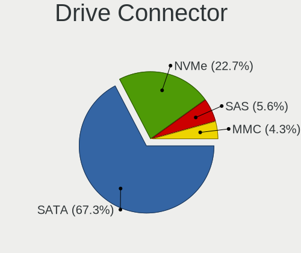
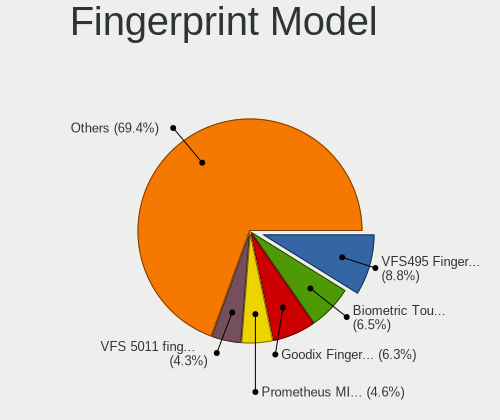

Linux Mint - Tested Hardware & Statistics
-----------------------------------------

A project to collect tested hardware configurations for Linux Mint.

Anyone can contribute to this report by the [hw-probe](https://github.com/linuxhw/hw-probe) tool:

    sudo -E hw-probe -all -upload

Please contribute! Especially if your hardware is rare.

This is a report for all computer types. See also reports for [desktops](/Dist/Linux_Mint/Desktop/README.md) and [notebooks](/Dist/Linux_Mint/Notebook/README.md).

Contents
--------

* [ Test Cases ](#test-cases)

* [ System ](#system)
  - [ OS                       ](#os)
  - [ OS Family                ](#os-family)
  - [ Kernel                   ](#kernel)
  - [ Kernel Family            ](#kernel-family)
  - [ Kernel Major Ver.        ](#kernel-major-ver)
  - [ Arch                     ](#arch)
  - [ DE                       ](#de)
  - [ Display Server           ](#display-server)
  - [ Display Manager          ](#display-manager)
  - [ OS Lang                  ](#os-lang)
  - [ Boot Mode                ](#boot-mode)
  - [ Filesystem               ](#filesystem)
  - [ Part. scheme             ](#part-scheme)
  - [ Dual Boot with Linux/BSD ](#dual-boot-with-linuxbsd)
  - [ Dual Boot (Win)          ](#dual-boot-win)

* [ Board ](#board)
  - [ Vendor                   ](#vendor)
  - [ Model                    ](#model)
  - [ Model Family             ](#model-family)
  - [ MFG Year                 ](#mfg-year)
  - [ Form Factor              ](#form-factor)
  - [ Secure Boot              ](#secure-boot)
  - [ Coreboot                 ](#coreboot)
  - [ RAM Size                 ](#ram-size)
  - [ RAM Used                 ](#ram-used)
  - [ Total Drives             ](#total-drives)
  - [ Has CD-ROM               ](#has-cd-rom)
  - [ Has Ethernet             ](#has-ethernet)
  - [ Has WiFi                 ](#has-wifi)
  - [ Has Bluetooth            ](#has-bluetooth)

* [ Location ](#location)
  - [ Country                  ](#country)
  - [ City                     ](#city)

* [ Drives ](#drives)
  - [ Drive Vendor             ](#drive-vendor)
  - [ Drive Model              ](#drive-model)
  - [ HDD Vendor               ](#hdd-vendor)
  - [ SSD Vendor               ](#ssd-vendor)
  - [ Drive Kind               ](#drive-kind)
  - [ Drive Connector          ](#drive-connector)
  - [ Drive Size               ](#drive-size)
  - [ Space Total              ](#space-total)
  - [ Space Used               ](#space-used)
  - [ Malfunc. Drives          ](#malfunc-drives)
  - [ Malfunc. Drive Vendor    ](#malfunc-drive-vendor)
  - [ Malfunc. HDD Vendor      ](#malfunc-hdd-vendor)
  - [ Malfunc. Drive Kind      ](#malfunc-drive-kind)
  - [ Failed Drives            ](#failed-drives)
  - [ Failed Drive Vendor      ](#failed-drive-vendor)
  - [ Drive Status             ](#drive-status)

* [ Storage controller ](#storage-controller)
  - [ Storage Vendor           ](#storage-vendor)
  - [ Storage Model            ](#storage-model)
  - [ Storage Kind             ](#storage-kind)

* [ Processor ](#processor)
  - [ CPU Vendor               ](#cpu-vendor)
  - [ CPU Model                ](#cpu-model)
  - [ CPU Model Family         ](#cpu-model-family)
  - [ CPU Cores                ](#cpu-cores)
  - [ CPU Sockets              ](#cpu-sockets)
  - [ CPU Threads              ](#cpu-threads)
  - [ CPU Op-Modes             ](#cpu-op-modes)
  - [ CPU Microcode            ](#cpu-microcode)
  - [ CPU Microarch            ](#cpu-microarch)

* [ Graphics ](#graphics)
  - [ GPU Vendor               ](#gpu-vendor)
  - [ GPU Model                ](#gpu-model)
  - [ GPU Combo                ](#gpu-combo)
  - [ GPU Driver               ](#gpu-driver)
  - [ GPU Memory               ](#gpu-memory)

* [ Monitor ](#monitor)
  - [ Monitor Vendor           ](#monitor-vendor)
  - [ Monitor Model            ](#monitor-model)
  - [ Monitor Resolution       ](#monitor-resolution)
  - [ Monitor Diagonal         ](#monitor-diagonal)
  - [ Monitor Width            ](#monitor-width)
  - [ Aspect Ratio             ](#aspect-ratio)
  - [ Monitor Area             ](#monitor-area)
  - [ Pixel Density            ](#pixel-density)
  - [ Multiple Monitors        ](#multiple-monitors)

* [ Network ](#network)
  - [ Net Controller Vendor    ](#net-controller-vendor)
  - [ Net Controller Model     ](#net-controller-model)
  - [ Wireless Vendor          ](#wireless-vendor)
  - [ Wireless Model           ](#wireless-model)
  - [ Ethernet Vendor          ](#ethernet-vendor)
  - [ Ethernet Model           ](#ethernet-model)
  - [ Net Controller Kind      ](#net-controller-kind)
  - [ Used Controller          ](#used-controller)
  - [ NICs                     ](#nics)
  - [ IPv6                     ](#ipv6)

* [ Bluetooth ](#bluetooth)
  - [ Bluetooth Vendor         ](#bluetooth-vendor)
  - [ Bluetooth Model          ](#bluetooth-model)

* [ Sound ](#sound)
  - [ Sound Vendor             ](#sound-vendor)
  - [ Sound Model              ](#sound-model)

* [ Memory ](#memory)
  - [ Memory Vendor            ](#memory-vendor)
  - [ Memory Model             ](#memory-model)
  - [ Memory Kind              ](#memory-kind)
  - [ Memory Form Factor       ](#memory-form-factor)
  - [ Memory Size              ](#memory-size)
  - [ Memory Speed             ](#memory-speed)

* [ Printers & scanners ](#printers--scanners)
  - [ Printer Vendor           ](#printer-vendor)
  - [ Printer Model            ](#printer-model)
  - [ Scanner Vendor           ](#scanner-vendor)
  - [ Scanner Model            ](#scanner-model)

* [ Camera ](#camera)
  - [ Camera Vendor            ](#camera-vendor)
  - [ Camera Model             ](#camera-model)

* [ Security ](#security)
  - [ Fingerprint Vendor       ](#fingerprint-vendor)
  - [ Fingerprint Model        ](#fingerprint-model)
  - [ Chipcard Vendor          ](#chipcard-vendor)
  - [ Chipcard Model           ](#chipcard-model)

* [ Unsupported ](#unsupported)
  - [ Unsupported Devices      ](#unsupported-devices)
  - [ Unsupported Device Types ](#unsupported-device-types)

Test Cases
----------

Total: 23684

| Vendor        | Model                       | Form-Factor | Probe                                                      | Date         |
|---------------|-----------------------------|-------------|------------------------------------------------------------|--------------|
| MSI           | H110M PRO-VH                | Desktop     | [9b0b5b79f0](https://linux-hardware.org/?probe=9b0b5b79f0) | Mar 01, 2023 |
| Gigabyte      | B450M DS3H-CF               | Desktop     | [52522a762d](https://linux-hardware.org/?probe=52522a762d) | Feb 28, 2023 |
| Acer          | Aspire E5-571G              | Notebook    | [fc0bc59c04](https://linux-hardware.org/?probe=fc0bc59c04) | Feb 28, 2023 |
| ASUSTek       | P8H61-M LX3 PLUS R2.0       | Desktop     | [2b434f0b1d](https://linux-hardware.org/?probe=2b434f0b1d) | Feb 28, 2023 |
| Lenovo        | ThinkPad T460 20FMS0700A    | Notebook    | [89a11e0826](https://linux-hardware.org/?probe=89a11e0826) | Feb 28, 2023 |
| Lenovo        | ThinkPad T430 2349KDG       | Notebook    | [ea95af537c](https://linux-hardware.org/?probe=ea95af537c) | Feb 28, 2023 |
| Dell          | Inspiron N5010              | Notebook    | [a1a44c0054](https://linux-hardware.org/?probe=a1a44c0054) | Feb 28, 2023 |
| Lenovo        | ThinkPad T460 20FMS0700A    | Notebook    | [c45e0040f7](https://linux-hardware.org/?probe=c45e0040f7) | Feb 28, 2023 |
| Lenovo        | ThinkPad T460 20FMS78014    | Notebook    | [6fb2d54abe](https://linux-hardware.org/?probe=6fb2d54abe) | Feb 28, 2023 |
| Gigabyte      | AERO 15-X9                  | Notebook    | [18d00993bf](https://linux-hardware.org/?probe=18d00993bf) | Feb 28, 2023 |
| HP            | ENVY x360 2-in-1 Laptop ... | Convertible | [9c65dcac2b](https://linux-hardware.org/?probe=9c65dcac2b) | Feb 28, 2023 |
| Lenovo        | ThinkBook 14 G3 ACL 21A2    | Notebook    | [470d9f4591](https://linux-hardware.org/?probe=470d9f4591) | Feb 28, 2023 |
| AZW           | Speed S                     | Desktop     | [e44ff0faf0](https://linux-hardware.org/?probe=e44ff0faf0) | Feb 28, 2023 |
| ASUSTek       | P8H61-M LX                  | Desktop     | [5721cbc403](https://linux-hardware.org/?probe=5721cbc403) | Feb 28, 2023 |
| ASUSTek       | E202SA                      | Notebook    | [bccde0c9a5](https://linux-hardware.org/?probe=bccde0c9a5) | Feb 28, 2023 |
| BESSTAR Te... | UM250 V1.0                  | Desktop     | [2ef76c6dff](https://linux-hardware.org/?probe=2ef76c6dff) | Feb 28, 2023 |
| HP            | Laptop 15-gw0xxx            | Notebook    | [e05606240c](https://linux-hardware.org/?probe=e05606240c) | Feb 28, 2023 |
| Dell          | Inspiron N5110              | Notebook    | [e35a1076a1](https://linux-hardware.org/?probe=e35a1076a1) | Feb 28, 2023 |
| Biostar       | H81MLV3                     | Desktop     | [ccba1a8217](https://linux-hardware.org/?probe=ccba1a8217) | Feb 28, 2023 |
| Gigabyte      | Q87M-D2H                    | Desktop     | [c2eff23772](https://linux-hardware.org/?probe=c2eff23772) | Feb 28, 2023 |
| Lenovo        | Yoga 7 15ITL5 82BJ          | Convertible | [7d60e37ac0](https://linux-hardware.org/?probe=7d60e37ac0) | Feb 28, 2023 |
| Dell          | Inspiron N5110              | Notebook    | [5a6d88e081](https://linux-hardware.org/?probe=5a6d88e081) | Feb 28, 2023 |
| HP            | 240 G4 Notebook PC          | Notebook    | [02744836e7](https://linux-hardware.org/?probe=02744836e7) | Feb 28, 2023 |
| ASRock        | Z97 Pro3                    | Desktop     | [506d56faff](https://linux-hardware.org/?probe=506d56faff) | Feb 28, 2023 |
| Toshiba       | Satellite S70-A             | Notebook    | [7e849f93ca](https://linux-hardware.org/?probe=7e849f93ca) | Feb 28, 2023 |
| Acer          | Aspire 5750G                | Notebook    | [34b5806bcf](https://linux-hardware.org/?probe=34b5806bcf) | Feb 28, 2023 |
| Foxconn       | 2ABF                        | Desktop     | [ad46fcc88d](https://linux-hardware.org/?probe=ad46fcc88d) | Feb 28, 2023 |
| Intel Clie... | LAPRC510                    | Notebook    | [6d9a8edb0c](https://linux-hardware.org/?probe=6d9a8edb0c) | Feb 28, 2023 |
| Acer          | Aspire A715-76              | Notebook    | [b9f52dc0f3](https://linux-hardware.org/?probe=b9f52dc0f3) | Feb 27, 2023 |
| HP            | Pavilion dv6                | Notebook    | [a19aa34db7](https://linux-hardware.org/?probe=a19aa34db7) | Feb 27, 2023 |
| Gigabyte      | H61M-S1                     | Desktop     | [ee8e20d95e](https://linux-hardware.org/?probe=ee8e20d95e) | Feb 27, 2023 |
| Dell          | XPS 15 7590                 | Notebook    | [e1777784ac](https://linux-hardware.org/?probe=e1777784ac) | Feb 27, 2023 |
| PCWare        | IPMH61R2                    | Desktop     | [52a17bf9c1](https://linux-hardware.org/?probe=52a17bf9c1) | Feb 27, 2023 |
| HP            | 3047h                       | Desktop     | [db6be92c4f](https://linux-hardware.org/?probe=db6be92c4f) | Feb 27, 2023 |
| Dell          | 0D6H9T A00                  | Desktop     | [70bdf485da](https://linux-hardware.org/?probe=70bdf485da) | Feb 27, 2023 |
| Dell          | XPS 13 9360                 | Notebook    | [08cdbe3442](https://linux-hardware.org/?probe=08cdbe3442) | Feb 27, 2023 |
| HP            | ENVY Laptop 17-cr0xxx       | Notebook    | [3f0d63ab15](https://linux-hardware.org/?probe=3f0d63ab15) | Feb 27, 2023 |
| ASUSTek       | VivoBook_ASUS Laptop X50... | Notebook    | [05d3c9f96c](https://linux-hardware.org/?probe=05d3c9f96c) | Feb 27, 2023 |
| ASUSTek       | VivoBook_ASUS Laptop X50... | Notebook    | [f70d3317a2](https://linux-hardware.org/?probe=f70d3317a2) | Feb 27, 2023 |
| ASRock        | Z97 Pro3                    | Desktop     | [626e67df35](https://linux-hardware.org/?probe=626e67df35) | Feb 27, 2023 |
| Cincoze       | DX-1000.01.001              | Desktop     | [64496d4ab7](https://linux-hardware.org/?probe=64496d4ab7) | Feb 27, 2023 |
| Gigabyte      | H97-HD3                     | Desktop     | [bb2cac1486](https://linux-hardware.org/?probe=bb2cac1486) | Feb 27, 2023 |
| ASUSTek       | E402MA                      | Notebook    | [c49b50f583](https://linux-hardware.org/?probe=c49b50f583) | Feb 27, 2023 |
| ASUSTek       | E402MA                      | Notebook    | [4083a9232f](https://linux-hardware.org/?probe=4083a9232f) | Feb 27, 2023 |
| HP            | Pavilion TS 14              | Notebook    | [37296c42c3](https://linux-hardware.org/?probe=37296c42c3) | Feb 27, 2023 |
| HP            | ENVY x360 Convertible 13... | Convertible | [17429e7813](https://linux-hardware.org/?probe=17429e7813) | Feb 27, 2023 |
| Dell          | 0XHGV1 A00                  | Desktop     | [75249be116](https://linux-hardware.org/?probe=75249be116) | Feb 27, 2023 |
| Gigabyte      | H87M-D3H                    | Desktop     | [3c50af5218](https://linux-hardware.org/?probe=3c50af5218) | Feb 27, 2023 |
| Apple         | MacBookAir6,2               | Notebook    | [0fb60ed4e2](https://linux-hardware.org/?probe=0fb60ed4e2) | Feb 27, 2023 |
| Gigabyte      | B650 GAMING X AX            | Desktop     | [c2b3e01a45](https://linux-hardware.org/?probe=c2b3e01a45) | Feb 27, 2023 |
| Lenovo        | ThinkPad Edge E540 20C60... | Notebook    | [8de57c03d5](https://linux-hardware.org/?probe=8de57c03d5) | Feb 27, 2023 |
| Dell          | Latitude E5440              | Notebook    | [25cf039ffd](https://linux-hardware.org/?probe=25cf039ffd) | Feb 27, 2023 |
| ASUSTek       | X751LK                      | Notebook    | [ba7e4e84ff](https://linux-hardware.org/?probe=ba7e4e84ff) | Feb 27, 2023 |
| Dell          | Latitude E5440              | Notebook    | [5546f00169](https://linux-hardware.org/?probe=5546f00169) | Feb 26, 2023 |
| Gigabyte      | G41MT-S2                    | Desktop     | [7f72d6bba7](https://linux-hardware.org/?probe=7f72d6bba7) | Feb 26, 2023 |
| Cincoze       | DX-1000.01.001              | Desktop     | [7923f1dc21](https://linux-hardware.org/?probe=7923f1dc21) | Feb 26, 2023 |
| Gigabyte      | X670E AORUS MASTER          | Desktop     | [589b06afc1](https://linux-hardware.org/?probe=589b06afc1) | Feb 26, 2023 |
| HP            | 430                         | Notebook    | [f90c967f06](https://linux-hardware.org/?probe=f90c967f06) | Feb 26, 2023 |
| ASUSTek       | TUF Gaming B550M-PLUS WI... | Desktop     | [9b2a57b7d2](https://linux-hardware.org/?probe=9b2a57b7d2) | Feb 26, 2023 |
| Dell          | 0RN4PJ A01                  | Server      | [8bd95e51d2](https://linux-hardware.org/?probe=8bd95e51d2) | Feb 26, 2023 |
| Lenovo        | MAHOBAY NO DPK              | Desktop     | [310a65baea](https://linux-hardware.org/?probe=310a65baea) | Feb 26, 2023 |
| Lenovo        | IdeaPad 3 15IML05 81WR      | Notebook    | [b19a229c5c](https://linux-hardware.org/?probe=b19a229c5c) | Feb 26, 2023 |
| Acer          | Aspire V3-371               | Notebook    | [0855d319b4](https://linux-hardware.org/?probe=0855d319b4) | Feb 26, 2023 |
| ASUSTek       | EB1035                      | All in one  | [1ba71d8407](https://linux-hardware.org/?probe=1ba71d8407) | Feb 26, 2023 |
| Dell          | Latitude E5450              | Notebook    | [62ce48db27](https://linux-hardware.org/?probe=62ce48db27) | Feb 26, 2023 |
| ASUSTek       | X540NA                      | Notebook    | [8bca0d4eb5](https://linux-hardware.org/?probe=8bca0d4eb5) | Feb 26, 2023 |
| HP            | 8643 SMVB                   | Desktop     | [4f36e23485](https://linux-hardware.org/?probe=4f36e23485) | Feb 26, 2023 |
| Samsung       | N150P                       | Notebook    | [436f0b863b](https://linux-hardware.org/?probe=436f0b863b) | Feb 26, 2023 |
| HP            | 3397                        | Desktop     | [a1840ee53d](https://linux-hardware.org/?probe=a1840ee53d) | Feb 26, 2023 |
| Gigabyte      | Q87M-D2H                    | Desktop     | [ee31b8fa71](https://linux-hardware.org/?probe=ee31b8fa71) | Feb 26, 2023 |
| ASUSTek       | M5A97 R2.0                  | Desktop     | [a758475e11](https://linux-hardware.org/?probe=a758475e11) | Feb 26, 2023 |
| HP            | ProBook 470 G1              | Notebook    | [8044704386](https://linux-hardware.org/?probe=8044704386) | Feb 26, 2023 |
| Dell          | 0K6VXP A00                  | Mini pc     | [9357168131](https://linux-hardware.org/?probe=9357168131) | Feb 26, 2023 |
| Dell          | 0NKW6Y A01                  | Desktop     | [62e7760c7a](https://linux-hardware.org/?probe=62e7760c7a) | Feb 26, 2023 |
| FIC           | PTM33 PCB                   | Desktop     | [b70b076cda](https://linux-hardware.org/?probe=b70b076cda) | Feb 26, 2023 |
| HP            | Notebook                    | Notebook    | [06dba3c8b3](https://linux-hardware.org/?probe=06dba3c8b3) | Feb 26, 2023 |
| Lenovo        | IdeaPad 3 15IGL05 82BU      | Notebook    | [75e601b927](https://linux-hardware.org/?probe=75e601b927) | Feb 26, 2023 |
| Dell          | Inspiron 16 5620            | Notebook    | [1b83626bdf](https://linux-hardware.org/?probe=1b83626bdf) | Feb 26, 2023 |
| Direkt-Tek    | DTLAPY133-1                 | Notebook    | [df87b3b645](https://linux-hardware.org/?probe=df87b3b645) | Feb 26, 2023 |
| Dell          | XPS L701X                   | Notebook    | [ad6ca78b72](https://linux-hardware.org/?probe=ad6ca78b72) | Feb 26, 2023 |
| ASUSTek       | T100HAN                     | Notebook    | [bde9736ffd](https://linux-hardware.org/?probe=bde9736ffd) | Feb 26, 2023 |
| ASRock        | H61M-DGS R2.0               | Desktop     | [630c0e41b1](https://linux-hardware.org/?probe=630c0e41b1) | Feb 25, 2023 |
| GPU Compan... | GWTC116-2                   | Notebook    | [1475770a2a](https://linux-hardware.org/?probe=1475770a2a) | Feb 25, 2023 |
| Acer          | Aspire A715-42G             | Notebook    | [c7ef2b6e58](https://linux-hardware.org/?probe=c7ef2b6e58) | Feb 25, 2023 |
| HP            | 250 G3                      | Notebook    | [6a3d2238ba](https://linux-hardware.org/?probe=6a3d2238ba) | Feb 25, 2023 |
| HP            | Pavilion Gaming Laptop 1... | Notebook    | [3aae5788cf](https://linux-hardware.org/?probe=3aae5788cf) | Feb 25, 2023 |
| Medion        | Akoya E6412T                | Notebook    | [9859dd29a7](https://linux-hardware.org/?probe=9859dd29a7) | Feb 25, 2023 |
| Gigabyte      | B250M-D3H-CF                | Desktop     | [de180bd339](https://linux-hardware.org/?probe=de180bd339) | Feb 25, 2023 |
| MSI           | X570-A PRO                  | Desktop     | [922ba2355e](https://linux-hardware.org/?probe=922ba2355e) | Feb 25, 2023 |
| Lenovo        | V130-15IKB 81HN             | Notebook    | [9ac60693d9](https://linux-hardware.org/?probe=9ac60693d9) | Feb 25, 2023 |
| HP            | Laptop 15s-eq2xxx           | Notebook    | [3142c6a90c](https://linux-hardware.org/?probe=3142c6a90c) | Feb 25, 2023 |
| Gigabyte      | GA-78LMT-USB3 R2 sex        | Desktop     | [585e02a6dc](https://linux-hardware.org/?probe=585e02a6dc) | Feb 25, 2023 |
| ASUSTek       | PRIME A520M-A II            | Desktop     | [8e913f4c3e](https://linux-hardware.org/?probe=8e913f4c3e) | Feb 25, 2023 |
| HP            | 3047h                       | Desktop     | [8f7d5acf1f](https://linux-hardware.org/?probe=8f7d5acf1f) | Feb 25, 2023 |
| ASUSTek       | T100HAN                     | Notebook    | [fd75fdb59f](https://linux-hardware.org/?probe=fd75fdb59f) | Feb 25, 2023 |
| MSI           | Modern 14 B10MW             | Notebook    | [4f9e90413b](https://linux-hardware.org/?probe=4f9e90413b) | Feb 25, 2023 |
| ASUSTek       | PRIME H610M-R D4            | Desktop     | [3f2e38e322](https://linux-hardware.org/?probe=3f2e38e322) | Feb 25, 2023 |
| Lenovo        | SHARKBAY SDK0E50510 WIN     | Desktop     | [32453b16fb](https://linux-hardware.org/?probe=32453b16fb) | Feb 25, 2023 |
| Acer          | Aspire E1-572G              | Notebook    | [438df492a0](https://linux-hardware.org/?probe=438df492a0) | Feb 25, 2023 |
| Gigabyte      | B75M-HD3                    | Desktop     | [29b1432f2c](https://linux-hardware.org/?probe=29b1432f2c) | Feb 25, 2023 |
| HP            | 2AA2                        | Desktop     | [b9411eadb7](https://linux-hardware.org/?probe=b9411eadb7) | Feb 25, 2023 |
| Gigabyte      | G41MT-S2                    | Desktop     | [d81c35b55b](https://linux-hardware.org/?probe=d81c35b55b) | Feb 25, 2023 |
| HP            | ENVY 17                     | Notebook    | [08db7a8be2](https://linux-hardware.org/?probe=08db7a8be2) | Feb 25, 2023 |
| HP            | ENVY 17                     | Notebook    | [0ad15a7e01](https://linux-hardware.org/?probe=0ad15a7e01) | Feb 25, 2023 |
| ASUSTek       | A88XM-A                     | Desktop     | [dff66700c0](https://linux-hardware.org/?probe=dff66700c0) | Feb 25, 2023 |
| Samsung       | RV415/RV515                 | Notebook    | [23c0509d46](https://linux-hardware.org/?probe=23c0509d46) | Feb 25, 2023 |
| Lenovo        | ThinkPad T460 20FMS78014    | Notebook    | [4eb96e5571](https://linux-hardware.org/?probe=4eb96e5571) | Feb 25, 2023 |
| HP            | Pavilion Gaming Laptop 1... | Notebook    | [c85bd630f0](https://linux-hardware.org/?probe=c85bd630f0) | Feb 25, 2023 |
| ASRock        | N68-GS4 FX R2.0             | Desktop     | [6d03ea4905](https://linux-hardware.org/?probe=6d03ea4905) | Feb 24, 2023 |
| Apple         | MacBookPro5,5               | Notebook    | [faf8e8fcc4](https://linux-hardware.org/?probe=faf8e8fcc4) | Feb 24, 2023 |
| Dell          | 08HPGT A02                  | Desktop     | [69288a8011](https://linux-hardware.org/?probe=69288a8011) | Feb 24, 2023 |
| Lenovo        | SHARKBAY SDK0E50510 WIN     | Desktop     | [cbadc857a2](https://linux-hardware.org/?probe=cbadc857a2) | Feb 24, 2023 |
| PCWare        | IPMH61R2                    | Desktop     | [eda674b9a5](https://linux-hardware.org/?probe=eda674b9a5) | Feb 24, 2023 |
| HP            | EliteBook Folio 9470m       | Notebook    | [8cc1fdf5b4](https://linux-hardware.org/?probe=8cc1fdf5b4) | Feb 24, 2023 |
| HP            | Compaq 6715s (KE061ET#AB... | Notebook    | [ba0a8c88a7](https://linux-hardware.org/?probe=ba0a8c88a7) | Feb 24, 2023 |
| Lenovo        | ThinkPad T15g Gen 2i 20Y... | Notebook    | [faeee1c46c](https://linux-hardware.org/?probe=faeee1c46c) | Feb 24, 2023 |
| ASRock        | H670M Pro RS                | Desktop     | [91bcaa987c](https://linux-hardware.org/?probe=91bcaa987c) | Feb 24, 2023 |
| Lenovo        | G50-80 80E5                 | Notebook    | [759b3114be](https://linux-hardware.org/?probe=759b3114be) | Feb 24, 2023 |
| Dell          | Latitude 5490               | Notebook    | [ccde867e7d](https://linux-hardware.org/?probe=ccde867e7d) | Feb 24, 2023 |
| ASRock        | Q1900-ITX                   | Desktop     | [4ed48d952c](https://linux-hardware.org/?probe=4ed48d952c) | Feb 24, 2023 |
| HP            | ProLiant MicroServer        | Desktop     | [f91140d700](https://linux-hardware.org/?probe=f91140d700) | Feb 24, 2023 |
| Acer          | Aspire E1-572G              | Notebook    | [39bfe03a28](https://linux-hardware.org/?probe=39bfe03a28) | Feb 24, 2023 |
| MSI           | PRO B660M-A DDR4            | Desktop     | [66b104fc61](https://linux-hardware.org/?probe=66b104fc61) | Feb 24, 2023 |
| HP            | ProLiant MicroServer        | Desktop     | [7233b168b4](https://linux-hardware.org/?probe=7233b168b4) | Feb 24, 2023 |
| Gigabyte      | Q87M-D2H                    | Desktop     | [dde739ae8a](https://linux-hardware.org/?probe=dde739ae8a) | Feb 24, 2023 |
| MSI           | PRO B660M-A DDR4            | Desktop     | [9398719812](https://linux-hardware.org/?probe=9398719812) | Feb 24, 2023 |
| Dell          | Precision M4600             | Notebook    | [901a8de667](https://linux-hardware.org/?probe=901a8de667) | Feb 24, 2023 |
| ASUSTek       | M5A97 R2.0                  | Desktop     | [c34909b191](https://linux-hardware.org/?probe=c34909b191) | Feb 24, 2023 |
| Acer          | Aspire 5732Z                | Notebook    | [2cb9f58eae](https://linux-hardware.org/?probe=2cb9f58eae) | Feb 24, 2023 |
| Lenovo        | ThinkPad T460 20FMS78014    | Notebook    | [1a7328ecb9](https://linux-hardware.org/?probe=1a7328ecb9) | Feb 24, 2023 |
| Positivo      | Q464C-O                     | Notebook    | [cda1faecb1](https://linux-hardware.org/?probe=cda1faecb1) | Feb 24, 2023 |
| HP            | 1497                        | Desktop     | [478a5730f6](https://linux-hardware.org/?probe=478a5730f6) | Feb 23, 2023 |
| HP            | Pavilion Laptop 15-cs3xx... | Notebook    | [a8fbcbec0e](https://linux-hardware.org/?probe=a8fbcbec0e) | Feb 23, 2023 |
| ASUSTek       | PRIME B450-PLUS             | Desktop     | [d93c7d5661](https://linux-hardware.org/?probe=d93c7d5661) | Feb 23, 2023 |
| ASUSTek       | PRIME B450-PLUS             | Desktop     | [7cdbd101a4](https://linux-hardware.org/?probe=7cdbd101a4) | Feb 23, 2023 |
| Toshiba       | Satellite C70D-B            | Notebook    | [0c69e8ef9b](https://linux-hardware.org/?probe=0c69e8ef9b) | Feb 23, 2023 |
| ASUSTek       | ROG STRIX B450-F GAMING     | Desktop     | [142a12ded0](https://linux-hardware.org/?probe=142a12ded0) | Feb 23, 2023 |
| Toshiba       | Satellite C70D-B            | Notebook    | [bcae8ff254](https://linux-hardware.org/?probe=bcae8ff254) | Feb 23, 2023 |
| Apple         | Mac-942B5BF58194151B        | All in one  | [dfded02e75](https://linux-hardware.org/?probe=dfded02e75) | Feb 23, 2023 |
| Dell          | Latitude 5530               | Notebook    | [dbbcb7502c](https://linux-hardware.org/?probe=dbbcb7502c) | Feb 23, 2023 |
| Dell          | Latitude 5530               | Notebook    | [d620cdcce0](https://linux-hardware.org/?probe=d620cdcce0) | Feb 23, 2023 |
| ASUSTek       | X553MA                      | Notebook    | [09df6de7db](https://linux-hardware.org/?probe=09df6de7db) | Feb 23, 2023 |
| Dell          | Latitude 3420               | Notebook    | [86fd73d1e3](https://linux-hardware.org/?probe=86fd73d1e3) | Feb 23, 2023 |
| Lenovo        | ThinkPad T460 20FMS78014    | Notebook    | [5d98aa89cd](https://linux-hardware.org/?probe=5d98aa89cd) | Feb 23, 2023 |
| ASUSTek       | SABERTOOTH 990FX R2.0       | Desktop     | [455b0e1401](https://linux-hardware.org/?probe=455b0e1401) | Feb 23, 2023 |
| Medion        | E6214                       | Notebook    | [601f9c64cf](https://linux-hardware.org/?probe=601f9c64cf) | Feb 23, 2023 |
| Gigabyte      | H81M-S2H                    | Desktop     | [c3d9b18f7c](https://linux-hardware.org/?probe=c3d9b18f7c) | Feb 23, 2023 |
| Samsung       | 700Z3A/700Z4A/700Z5A/700... | Notebook    | [fe07c5db6d](https://linux-hardware.org/?probe=fe07c5db6d) | Feb 23, 2023 |
| HP            | 18E6                        | Desktop     | [294fa26b04](https://linux-hardware.org/?probe=294fa26b04) | Feb 23, 2023 |
| MSI           | GE63VR 7RF                  | Notebook    | [b9aeb1ce18](https://linux-hardware.org/?probe=b9aeb1ce18) | Feb 23, 2023 |
| HP            | 2ADE                        | Desktop     | [b4309c2b06](https://linux-hardware.org/?probe=b4309c2b06) | Feb 23, 2023 |
| HP            | Laptop 15-da0xxx            | Notebook    | [78c0de43af](https://linux-hardware.org/?probe=78c0de43af) | Feb 23, 2023 |
| ASUSTek       | M3N78-VM                    | Desktop     | [246492391c](https://linux-hardware.org/?probe=246492391c) | Feb 23, 2023 |
| HP            | Pavilion 15                 | Notebook    | [48439104ea](https://linux-hardware.org/?probe=48439104ea) | Feb 23, 2023 |
| HP            | 0AA8h                       | Desktop     | [8bb60bdebb](https://linux-hardware.org/?probe=8bb60bdebb) | Feb 22, 2023 |
| Positivo      | Q464C                       | Notebook    | [1b08f16a08](https://linux-hardware.org/?probe=1b08f16a08) | Feb 22, 2023 |
| Dell          | Inspiron 5565               | Notebook    | [d88dce11ff](https://linux-hardware.org/?probe=d88dce11ff) | Feb 22, 2023 |
| PCWare        | IPMH61R2                    | Desktop     | [f02c3d5895](https://linux-hardware.org/?probe=f02c3d5895) | Feb 22, 2023 |
| Dell          | Inspiron N5110              | Notebook    | [9b00bf7704](https://linux-hardware.org/?probe=9b00bf7704) | Feb 22, 2023 |
| ASUSTek       | ROG STRIX B450-F GAMING     | Desktop     | [06138e952c](https://linux-hardware.org/?probe=06138e952c) | Feb 22, 2023 |
| ASUSTek       | VivoBook_ASUSLaptop X509... | Notebook    | [0dba794459](https://linux-hardware.org/?probe=0dba794459) | Feb 22, 2023 |
| AWOW          | NY PC BOX                   | Mini pc     | [3e9e7c877c](https://linux-hardware.org/?probe=3e9e7c877c) | Feb 22, 2023 |
| HP            | EliteBook 820 G4            | Notebook    | [de79cbb975](https://linux-hardware.org/?probe=de79cbb975) | Feb 22, 2023 |
| Google        | Astronaut                   | Notebook    | [71e8582f54](https://linux-hardware.org/?probe=71e8582f54) | Feb 22, 2023 |
| Google        | Astronaut                   | Notebook    | [4949e50dad](https://linux-hardware.org/?probe=4949e50dad) | Feb 22, 2023 |
| Unknown       | Unknown                     | Notebook    | [68e0988789](https://linux-hardware.org/?probe=68e0988789) | Feb 22, 2023 |
| Sony          | SVE1713A6EW                 | Notebook    | [55d2085f4b](https://linux-hardware.org/?probe=55d2085f4b) | Feb 22, 2023 |
| Lenovo        | G50-80 80E5                 | Notebook    | [d196877f8d](https://linux-hardware.org/?probe=d196877f8d) | Feb 22, 2023 |
| Dell          | 0WMJ54 A01                  | Desktop     | [e7175cb8fe](https://linux-hardware.org/?probe=e7175cb8fe) | Feb 22, 2023 |
| HUAWEI        | CREF-XX                     | Notebook    | [e523c006bf](https://linux-hardware.org/?probe=e523c006bf) | Feb 22, 2023 |
| Sony          | VGN-NW11S_T                 | Notebook    | [ee3de294d6](https://linux-hardware.org/?probe=ee3de294d6) | Feb 22, 2023 |
| ASUSTek       | PRIME H610M-R D4            | Desktop     | [2993295e62](https://linux-hardware.org/?probe=2993295e62) | Feb 22, 2023 |
| Foxconn       | Lucknow                     | Desktop     | [3ca9a4f66e](https://linux-hardware.org/?probe=3ca9a4f66e) | Feb 22, 2023 |
| Lenovo        | G50-80 80E5                 | Notebook    | [9485c15a78](https://linux-hardware.org/?probe=9485c15a78) | Feb 22, 2023 |
| Lenovo        | ThinkPad X1 Carbon 5th 2... | Notebook    | [d47bf72cc8](https://linux-hardware.org/?probe=d47bf72cc8) | Feb 22, 2023 |
| HP            | Laptop 15-ef1xxx            | Notebook    | [0897c4ed73](https://linux-hardware.org/?probe=0897c4ed73) | Feb 22, 2023 |
| ASRock        | 970A-G                      | Desktop     | [80648218db](https://linux-hardware.org/?probe=80648218db) | Feb 22, 2023 |
| HP            | ENVY 17                     | Notebook    | [f705060f1e](https://linux-hardware.org/?probe=f705060f1e) | Feb 22, 2023 |
| HP            | ENVY 17                     | Notebook    | [bf86e7904b](https://linux-hardware.org/?probe=bf86e7904b) | Feb 22, 2023 |
| Gateway       | NV79                        | Notebook    | [e66a3dc233](https://linux-hardware.org/?probe=e66a3dc233) | Feb 22, 2023 |
| ASUSTek       | ROG STRIX B550-A GAMING     | Desktop     | [0d0a828b39](https://linux-hardware.org/?probe=0d0a828b39) | Feb 22, 2023 |
| ASUSTek       | TUF B450-PLUS GAMING        | Desktop     | [29673d3e8f](https://linux-hardware.org/?probe=29673d3e8f) | Feb 22, 2023 |
| MSI           | PRO B650M-A WIFI            | Desktop     | [cd66af8994](https://linux-hardware.org/?probe=cd66af8994) | Feb 21, 2023 |
| Acer          | TravelMate P256-MG          | Notebook    | [4dbdb229c5](https://linux-hardware.org/?probe=4dbdb229c5) | Feb 21, 2023 |
| ASUSTek       | PRIME H610M-R D4            | Desktop     | [c23f2f53ed](https://linux-hardware.org/?probe=c23f2f53ed) | Feb 21, 2023 |
| Lenovo        | ThinkPad T520 4243RP3       | Notebook    | [06f3b4eece](https://linux-hardware.org/?probe=06f3b4eece) | Feb 21, 2023 |
| HP            | 250 G3                      | Notebook    | [638d8fa72b](https://linux-hardware.org/?probe=638d8fa72b) | Feb 21, 2023 |
| HP            | 250 G3                      | Notebook    | [eaf1a8a9ca](https://linux-hardware.org/?probe=eaf1a8a9ca) | Feb 21, 2023 |
| MSI           | GF72 8RD                    | Notebook    | [cf6dad63da](https://linux-hardware.org/?probe=cf6dad63da) | Feb 21, 2023 |
| ASRock        | X470 Master SLI/ac          | Desktop     | [9c11797d60](https://linux-hardware.org/?probe=9c11797d60) | Feb 21, 2023 |
| Dell          | 0K6VXP A00                  | Mini pc     | [c3ddf6d592](https://linux-hardware.org/?probe=c3ddf6d592) | Feb 21, 2023 |
| ASUSTek       | PRIME H510M-K               | Desktop     | [5fb951a350](https://linux-hardware.org/?probe=5fb951a350) | Feb 21, 2023 |
| ASUSTek       | TUF Gaming B460M-PLUS       | Desktop     | [ae2e7a22a0](https://linux-hardware.org/?probe=ae2e7a22a0) | Feb 21, 2023 |
| Lenovo        | Yoga 7 15ITL5 82BJ          | Convertible | [75ddf34841](https://linux-hardware.org/?probe=75ddf34841) | Feb 21, 2023 |
| Lenovo        | B570e HuronRiver Platfor... | Notebook    | [be36fee6eb](https://linux-hardware.org/?probe=be36fee6eb) | Feb 21, 2023 |
| HP            | 339A                        | Desktop     | [d4ee04127e](https://linux-hardware.org/?probe=d4ee04127e) | Feb 21, 2023 |
| HP            | Pavilion dv7                | Notebook    | [1ecf49cbaf](https://linux-hardware.org/?probe=1ecf49cbaf) | Feb 21, 2023 |
| Dell          | Latitude E7470              | Notebook    | [6b5f9db086](https://linux-hardware.org/?probe=6b5f9db086) | Feb 21, 2023 |
| Lenovo        | ThinkPad X1 Yoga 3rd 20L... | Convertible | [e9cfac6aa3](https://linux-hardware.org/?probe=e9cfac6aa3) | Feb 21, 2023 |
| ASUSTek       | TUF Gaming B550M-PLUS       | Desktop     | [09c45a0b09](https://linux-hardware.org/?probe=09c45a0b09) | Feb 21, 2023 |
| ASUSTek       | TUF Gaming B550M-PLUS       | Desktop     | [f5a22b7bb9](https://linux-hardware.org/?probe=f5a22b7bb9) | Feb 21, 2023 |
| ASUSTek       | K70IC                       | Notebook    | [e5aad61a1b](https://linux-hardware.org/?probe=e5aad61a1b) | Feb 21, 2023 |
| Acer          | Aspire V5-552PG             | Notebook    | [6030cc4d8a](https://linux-hardware.org/?probe=6030cc4d8a) | Feb 21, 2023 |
| Tactus        | GeoBook 140                 | Notebook    | [e6ab3a56ec](https://linux-hardware.org/?probe=e6ab3a56ec) | Feb 21, 2023 |
| Dell          | Precision M4600             | Notebook    | [2bdbf753b0](https://linux-hardware.org/?probe=2bdbf753b0) | Feb 21, 2023 |
| HP            | 1000                        | Notebook    | [91faf9460d](https://linux-hardware.org/?probe=91faf9460d) | Feb 21, 2023 |
| Dell          | Latitude 5420               | Notebook    | [231c7534d3](https://linux-hardware.org/?probe=231c7534d3) | Feb 21, 2023 |
| Lenovo        | ThinkPad R61 8933W4S        | Notebook    | [fec1a43d91](https://linux-hardware.org/?probe=fec1a43d91) | Feb 21, 2023 |
| Insyde        | CherryTrail                 | Notebook    | [819fd0183b](https://linux-hardware.org/?probe=819fd0183b) | Feb 21, 2023 |
| ASUSTek       | UX410UQK                    | Notebook    | [0a23974b1b](https://linux-hardware.org/?probe=0a23974b1b) | Feb 21, 2023 |
| Dell          | 0M5DCD A00                  | Desktop     | [9bfd5f9a7f](https://linux-hardware.org/?probe=9bfd5f9a7f) | Feb 21, 2023 |
| Dell          | 0M5DCD A00                  | Desktop     | [afd4e480d4](https://linux-hardware.org/?probe=afd4e480d4) | Feb 20, 2023 |
| TUXEDO        | Pulse 15 Gen1               | Notebook    | [e1c694b371](https://linux-hardware.org/?probe=e1c694b371) | Feb 20, 2023 |
| MSI           | 970A-G43                    | Desktop     | [5fab82df57](https://linux-hardware.org/?probe=5fab82df57) | Feb 20, 2023 |
| Fujitsu       | D3161-A1 S26361-D3161-A1    | Desktop     | [a37ae03564](https://linux-hardware.org/?probe=a37ae03564) | Feb 20, 2023 |
| Fujitsu       | D3161-A1 S26361-D3161-A1    | Desktop     | [c17db0329f](https://linux-hardware.org/?probe=c17db0329f) | Feb 20, 2023 |
| ASUSTek       | ROG Zephyrus M16 GU603HE... | Notebook    | [c51d4ef82a](https://linux-hardware.org/?probe=c51d4ef82a) | Feb 20, 2023 |
| HP            | 3398                        | Desktop     | [3ea3d01398](https://linux-hardware.org/?probe=3ea3d01398) | Feb 20, 2023 |
| Dell          | Vostro 3491                 | Notebook    | [d557c581cf](https://linux-hardware.org/?probe=d557c581cf) | Feb 20, 2023 |
| Lenovo        | G40-80 80JE                 | Notebook    | [e7e12370af](https://linux-hardware.org/?probe=e7e12370af) | Feb 20, 2023 |
| Acer          | Aspire 5740                 | Notebook    | [2b9a742da7](https://linux-hardware.org/?probe=2b9a742da7) | Feb 20, 2023 |
| Apple         | Mac-F227BEC8 PVT            | All in one  | [640cad4ab6](https://linux-hardware.org/?probe=640cad4ab6) | Feb 20, 2023 |
| HP            | Laptop 15-rb0xx             | Notebook    | [3dd7359a43](https://linux-hardware.org/?probe=3dd7359a43) | Feb 20, 2023 |
| HP            | 1497                        | Desktop     | [47ffeac7cf](https://linux-hardware.org/?probe=47ffeac7cf) | Feb 20, 2023 |
| Lenovo        | 30BC SDK0J40697 WIN 3305... | Desktop     | [2a403bdb2b](https://linux-hardware.org/?probe=2a403bdb2b) | Feb 20, 2023 |
| HP            | Laptop 15-rb0xx             | Notebook    | [53ef54922c](https://linux-hardware.org/?probe=53ef54922c) | Feb 20, 2023 |
| Dell          | 0K6VXP A00                  | Mini pc     | [a691e5fdbb](https://linux-hardware.org/?probe=a691e5fdbb) | Feb 20, 2023 |
| AMD           | A78FX VER                   | Desktop     | [36eb566c26](https://linux-hardware.org/?probe=36eb566c26) | Feb 20, 2023 |
| ASUSTek       | B85M-G                      | Desktop     | [501a95ac36](https://linux-hardware.org/?probe=501a95ac36) | Feb 20, 2023 |
| TUXEDO        | Unknown                     | Notebook    | [0f60fd3519](https://linux-hardware.org/?probe=0f60fd3519) | Feb 20, 2023 |
| TUXEDO        | Unknown                     | Notebook    | [5faa7cf993](https://linux-hardware.org/?probe=5faa7cf993) | Feb 20, 2023 |
| Acer          | Aspire M5-583P              | Notebook    | [0beb710e7c](https://linux-hardware.org/?probe=0beb710e7c) | Feb 20, 2023 |
| MSI           | B450M PRO-VDH V2            | Desktop     | [a3124367c3](https://linux-hardware.org/?probe=a3124367c3) | Feb 20, 2023 |
| Acer          | Aspire M5-583P              | Notebook    | [e4e9744dc5](https://linux-hardware.org/?probe=e4e9744dc5) | Feb 20, 2023 |
| HP            | EliteBook 840 G3            | Notebook    | [b20071bc70](https://linux-hardware.org/?probe=b20071bc70) | Feb 20, 2023 |
| HP            | 3398                        | Desktop     | [6b616a9a10](https://linux-hardware.org/?probe=6b616a9a10) | Feb 20, 2023 |
| ASUSTek       | ROG Zephyrus M16 GU603HE... | Notebook    | [2ccbfb422e](https://linux-hardware.org/?probe=2ccbfb422e) | Feb 20, 2023 |
| ASUSTek       | TUF B450-PLUS GAMING        | Desktop     | [f75f800bd4](https://linux-hardware.org/?probe=f75f800bd4) | Feb 20, 2023 |
| Gigabyte      | B450M DS3H WIFI-CF          | Desktop     | [a3f2825d3d](https://linux-hardware.org/?probe=a3f2825d3d) | Feb 20, 2023 |
| HP            | Pavilion 15                 | Notebook    | [7c652212fb](https://linux-hardware.org/?probe=7c652212fb) | Feb 19, 2023 |
| Acer          | Aspire 5734Z                | Notebook    | [a6cb13e7d4](https://linux-hardware.org/?probe=a6cb13e7d4) | Feb 19, 2023 |
| Medion        | Akoya E4214 MD99570         | Notebook    | [3cd9667646](https://linux-hardware.org/?probe=3cd9667646) | Feb 19, 2023 |
| HP            | Pavilion 15                 | Notebook    | [cecc8c4a23](https://linux-hardware.org/?probe=cecc8c4a23) | Feb 19, 2023 |
| Acer          | Aspire A317-33              | Notebook    | [7427fa6886](https://linux-hardware.org/?probe=7427fa6886) | Feb 19, 2023 |
| Lenovo        | Legion 5 15ACH6A 82NW       | Notebook    | [8ca2b786db](https://linux-hardware.org/?probe=8ca2b786db) | Feb 19, 2023 |
| Gigabyte      | MRHM3AP                     | Desktop     | [9f4978d79f](https://linux-hardware.org/?probe=9f4978d79f) | Feb 19, 2023 |
| Gigabyte      | X570S AORUS ELITE AX        | Desktop     | [7e45218236](https://linux-hardware.org/?probe=7e45218236) | Feb 19, 2023 |
| Unknown       | Unknown                     | Notebook    | [e48cf758d0](https://linux-hardware.org/?probe=e48cf758d0) | Feb 19, 2023 |
| ASUSTek       | M3N78-VM                    | Desktop     | [c124cec382](https://linux-hardware.org/?probe=c124cec382) | Feb 19, 2023 |
| Gigabyte      | Z270-HD3-CF                 | Desktop     | [e958da375f](https://linux-hardware.org/?probe=e958da375f) | Feb 19, 2023 |
| HP            | Pavilion g6                 | Notebook    | [39b27e9850](https://linux-hardware.org/?probe=39b27e9850) | Feb 19, 2023 |
| Gigabyte      | Z270-HD3-CF                 | Desktop     | [e47bb0ee84](https://linux-hardware.org/?probe=e47bb0ee84) | Feb 19, 2023 |
| AZW           | GTi                         | Desktop     | [17bb698441](https://linux-hardware.org/?probe=17bb698441) | Feb 19, 2023 |
| Gigabyte      | GA-MA785GMT-UD2H            | Desktop     | [06c110e6f1](https://linux-hardware.org/?probe=06c110e6f1) | Feb 19, 2023 |
| Dell          | Latitude E5450              | Notebook    | [2642ea7e3d](https://linux-hardware.org/?probe=2642ea7e3d) | Feb 19, 2023 |
| ASUSTek       | P553UA                      | Notebook    | [b999af6719](https://linux-hardware.org/?probe=b999af6719) | Feb 19, 2023 |
| ASRock        | 970M Pro3                   | Desktop     | [fe75bac6ce](https://linux-hardware.org/?probe=fe75bac6ce) | Feb 19, 2023 |
| ASRock        | 970M Pro3                   | Desktop     | [605089c66c](https://linux-hardware.org/?probe=605089c66c) | Feb 19, 2023 |
| Lenovo        | ThinkPad P50 20EQS14H00     | Notebook    | [de5c7ac3f6](https://linux-hardware.org/?probe=de5c7ac3f6) | Feb 19, 2023 |
| HP            | Stream Laptop 14-ax0XX      | Notebook    | [47e6250a37](https://linux-hardware.org/?probe=47e6250a37) | Feb 19, 2023 |
| HP            | EliteBook 840 G1            | Notebook    | [b916da5116](https://linux-hardware.org/?probe=b916da5116) | Feb 19, 2023 |
| Packard Be... | EasyNote TJ65               | Notebook    | [2c98b99901](https://linux-hardware.org/?probe=2c98b99901) | Feb 19, 2023 |
| ASUSTek       | X202E                       | Notebook    | [6627e10e70](https://linux-hardware.org/?probe=6627e10e70) | Feb 19, 2023 |
| AMD           | 970A-D3                     | Desktop     | [bc2f6d8481](https://linux-hardware.org/?probe=bc2f6d8481) | Feb 19, 2023 |
| ASRock        | B450 Pro4                   | Desktop     | [092f97e245](https://linux-hardware.org/?probe=092f97e245) | Feb 19, 2023 |
| Gigabyte      | B365M D3H-CF                | Desktop     | [aa49c18960](https://linux-hardware.org/?probe=aa49c18960) | Feb 19, 2023 |
| Apple         | Mac-F42386C8 PVT            | All in one  | [25c0c6a51d](https://linux-hardware.org/?probe=25c0c6a51d) | Feb 19, 2023 |
| Apple         | Mac-F42386C8 PVT            | All in one  | [a16b534383](https://linux-hardware.org/?probe=a16b534383) | Feb 19, 2023 |
| Acer          | Aspire A515-41G             | Notebook    | [e06b3509f1](https://linux-hardware.org/?probe=e06b3509f1) | Feb 19, 2023 |
| Gigabyte      | F2A68HM-H                   | Desktop     | [6be03ad579](https://linux-hardware.org/?probe=6be03ad579) | Feb 19, 2023 |
| Panasonic     | CF-S10CDHEDM                | Notebook    | [7228f7a915](https://linux-hardware.org/?probe=7228f7a915) | Feb 19, 2023 |
| HP            | 0AACh                       | Desktop     | [3ff53d69b2](https://linux-hardware.org/?probe=3ff53d69b2) | Feb 19, 2023 |
| Dell          | 088DT1 A01                  | Desktop     | [4ecc419f83](https://linux-hardware.org/?probe=4ecc419f83) | Feb 18, 2023 |
| Inventec      | VXC Class A02               | Desktop     | [ddea00ed0c](https://linux-hardware.org/?probe=ddea00ed0c) | Feb 18, 2023 |
| Lenovo        | B590 20208                  | Notebook    | [59810216a8](https://linux-hardware.org/?probe=59810216a8) | Feb 18, 2023 |
| Samsung       | 350V5C/351V5C/3540VC/344... | Notebook    | [238f636180](https://linux-hardware.org/?probe=238f636180) | Feb 18, 2023 |
| HP            | 17E2                        | Mini pc     | [58b70e409c](https://linux-hardware.org/?probe=58b70e409c) | Feb 18, 2023 |
| Avell High... | B.ON                        | Notebook    | [d7f2dafd5e](https://linux-hardware.org/?probe=d7f2dafd5e) | Feb 18, 2023 |
| HP            | Pavilion dv8000 (ET839UA... | Notebook    | [6b7a3b68f3](https://linux-hardware.org/?probe=6b7a3b68f3) | Feb 18, 2023 |
| Gigabyte      | MRHM3AP                     | Desktop     | [a427da167b](https://linux-hardware.org/?probe=a427da167b) | Feb 18, 2023 |
| MSI           | MPG X570 GAMING PRO CARB... | Desktop     | [eff21e4d65](https://linux-hardware.org/?probe=eff21e4d65) | Feb 18, 2023 |
| Gigabyte      | H81M-H                      | Desktop     | [d773500fcb](https://linux-hardware.org/?probe=d773500fcb) | Feb 18, 2023 |
| Medion        | Akoya S4220 MD99820         | Notebook    | [31e6881e43](https://linux-hardware.org/?probe=31e6881e43) | Feb 18, 2023 |
| MSI           | PRO B650M-A WIFI            | Desktop     | [5857177f10](https://linux-hardware.org/?probe=5857177f10) | Feb 18, 2023 |
| Chuwi         | HeroBook Pro                | Notebook    | [f49ba07c1e](https://linux-hardware.org/?probe=f49ba07c1e) | Feb 18, 2023 |
| Acer          | Aspire E1-572G              | Notebook    | [b98e23ae68](https://linux-hardware.org/?probe=b98e23ae68) | Feb 18, 2023 |
| Lenovo        | ThinkPad E14 Gen 3 20Y70... | Notebook    | [ce2d0361d1](https://linux-hardware.org/?probe=ce2d0361d1) | Feb 18, 2023 |
| ASUSTek       | M5A97 R2.0                  | Desktop     | [8fb0aec13d](https://linux-hardware.org/?probe=8fb0aec13d) | Feb 18, 2023 |
| Acer          | Aspire 5920G                | Notebook    | [5132814eb1](https://linux-hardware.org/?probe=5132814eb1) | Feb 18, 2023 |
| Acer          | Aspire A515-45              | Notebook    | [01a17523fa](https://linux-hardware.org/?probe=01a17523fa) | Feb 18, 2023 |
| Acer          | Aspire A515-45              | Notebook    | [6b59c75dec](https://linux-hardware.org/?probe=6b59c75dec) | Feb 18, 2023 |
| Jumper        | EZbook                      | Notebook    | [35f7c6a28a](https://linux-hardware.org/?probe=35f7c6a28a) | Feb 18, 2023 |
| ASUSTek       | CM6330_CM6630_CM6730_CM6... | Desktop     | [0428793835](https://linux-hardware.org/?probe=0428793835) | Feb 18, 2023 |
| CSL-Comput... | YOGABOOK                    | Notebook    | [89abf11ce7](https://linux-hardware.org/?probe=89abf11ce7) | Feb 18, 2023 |
| Apple         | MacBookPro5,5               | Notebook    | [595103a203](https://linux-hardware.org/?probe=595103a203) | Feb 18, 2023 |
| Dell          | Latitude E6440              | Notebook    | [96e9e43a2e](https://linux-hardware.org/?probe=96e9e43a2e) | Feb 17, 2023 |
| Sony          | VGN-NW21MF_W                | Notebook    | [e46cfcff64](https://linux-hardware.org/?probe=e46cfcff64) | Feb 17, 2023 |
| ASUSTek       | SABERTOOTH Z77              | Desktop     | [af7c933bf3](https://linux-hardware.org/?probe=af7c933bf3) | Feb 17, 2023 |
| Acer          | Aspire A515-57              | Notebook    | [d1cf9358f7](https://linux-hardware.org/?probe=d1cf9358f7) | Feb 17, 2023 |
| Toshiba       | Satellite S70-A             | Notebook    | [3361f06add](https://linux-hardware.org/?probe=3361f06add) | Feb 17, 2023 |
| Insyde        | CherryTrail                 | Notebook    | [5a9384c22b](https://linux-hardware.org/?probe=5a9384c22b) | Feb 17, 2023 |
| HP            | Pavilion Laptop 15-eg0xx... | Notebook    | [4577d3d99d](https://linux-hardware.org/?probe=4577d3d99d) | Feb 17, 2023 |
| Dell          | 0XC7MM A01                  | Desktop     | [93ccca9fdd](https://linux-hardware.org/?probe=93ccca9fdd) | Feb 17, 2023 |
| Dell          | 0T10XW A02                  | Desktop     | [0f6c993491](https://linux-hardware.org/?probe=0f6c993491) | Feb 17, 2023 |
| Dell          | 0200DY A02                  | Desktop     | [fdab522500](https://linux-hardware.org/?probe=fdab522500) | Feb 17, 2023 |
| Dell          | 0200DY A02                  | Desktop     | [dd863b4bdf](https://linux-hardware.org/?probe=dd863b4bdf) | Feb 17, 2023 |
| ASUSTek       | PRIME A320M-K               | Desktop     | [667dc13294](https://linux-hardware.org/?probe=667dc13294) | Feb 17, 2023 |
| AAEON         | PICO-APL3 V1.0              | Desktop     | [4ef4f86a2e](https://linux-hardware.org/?probe=4ef4f86a2e) | Feb 17, 2023 |
| MSI           | Modern 14 B5M               | Notebook    | [d951f389f3](https://linux-hardware.org/?probe=d951f389f3) | Feb 17, 2023 |
| ASUSTek       | X553SA                      | Notebook    | [dc294f018e](https://linux-hardware.org/?probe=dc294f018e) | Feb 17, 2023 |
| Acer          | Batman A01                  | Desktop     | [d7aaa8f1c8](https://linux-hardware.org/?probe=d7aaa8f1c8) | Feb 17, 2023 |
| Lenovo        | ThinkPad T520 4243W83       | Notebook    | [e6abb63f33](https://linux-hardware.org/?probe=e6abb63f33) | Feb 17, 2023 |
| Gigabyte      | Z590 AORUS ELITE AX         | Desktop     | [8da7f7cbdc](https://linux-hardware.org/?probe=8da7f7cbdc) | Feb 17, 2023 |
| HP            | Laptop 15-gw0xxx            | Notebook    | [4bcd17d5a6](https://linux-hardware.org/?probe=4bcd17d5a6) | Feb 17, 2023 |
| ASUSTek       | ZenBook UX425EA_UX425EA     | Notebook    | [bb1c4209c7](https://linux-hardware.org/?probe=bb1c4209c7) | Feb 17, 2023 |
| Dell          | 051FJ8 A00                  | Desktop     | [8de835c5da](https://linux-hardware.org/?probe=8de835c5da) | Feb 17, 2023 |
| Acer          | Aspire XC-230               | Desktop     | [e01d812902](https://linux-hardware.org/?probe=e01d812902) | Feb 17, 2023 |
| Acer          | Aspire XC-230               | Desktop     | [52b4d00a5a](https://linux-hardware.org/?probe=52b4d00a5a) | Feb 17, 2023 |
| MSI           | MPG X570 GAMING PLUS        | Desktop     | [0d5eded653](https://linux-hardware.org/?probe=0d5eded653) | Feb 17, 2023 |
| Google        | Coral                       | Notebook    | [7a9869ff50](https://linux-hardware.org/?probe=7a9869ff50) | Feb 17, 2023 |
| Dell          | 03NVJ6 A02                  | Desktop     | [5201547dce](https://linux-hardware.org/?probe=5201547dce) | Feb 17, 2023 |
| Dell          | 03NVJ6 A02                  | Desktop     | [a77d2c8a54](https://linux-hardware.org/?probe=a77d2c8a54) | Feb 17, 2023 |
| AZW           | Green G3                    | Desktop     | [ee25777882](https://linux-hardware.org/?probe=ee25777882) | Feb 17, 2023 |
| HP            | G61                         | Notebook    | [52bb3c7afb](https://linux-hardware.org/?probe=52bb3c7afb) | Feb 17, 2023 |
| Acer          | Aspire A515-43              | Notebook    | [d78b367423](https://linux-hardware.org/?probe=d78b367423) | Feb 17, 2023 |
| AZW           | SER V1.0                    | Mini pc     | [8345efb961](https://linux-hardware.org/?probe=8345efb961) | Feb 17, 2023 |
| HP            | 2B36                        | Desktop     | [81833a42d2](https://linux-hardware.org/?probe=81833a42d2) | Feb 17, 2023 |
| Lenovo        | ThinkBook 14-IIL 20SL       | Notebook    | [3042108dae](https://linux-hardware.org/?probe=3042108dae) | Feb 16, 2023 |
| Acer          | Aspire 5741G                | Notebook    | [b39c940cfd](https://linux-hardware.org/?probe=b39c940cfd) | Feb 16, 2023 |
| Medion        | P651x series                | Notebook    | [23b3fb7ce5](https://linux-hardware.org/?probe=23b3fb7ce5) | Feb 16, 2023 |
| HP            | ENVY x360 Convertible 13... | Convertible | [53055b0d6e](https://linux-hardware.org/?probe=53055b0d6e) | Feb 16, 2023 |
| MSI           | X470 GAMING PRO CARBON A... | Desktop     | [beec8fdf56](https://linux-hardware.org/?probe=beec8fdf56) | Feb 16, 2023 |
| MSI           | GF75 Thin 10UEK             | Notebook    | [a1b9683bcc](https://linux-hardware.org/?probe=a1b9683bcc) | Feb 16, 2023 |
| Acer          | Aspire V3-372               | Notebook    | [bde68b3ed7](https://linux-hardware.org/?probe=bde68b3ed7) | Feb 16, 2023 |
| Lenovo        | ThinkPad X250 20CM001XMC    | Notebook    | [1026c10fa9](https://linux-hardware.org/?probe=1026c10fa9) | Feb 16, 2023 |
| ASUSTek       | P5Q-PRO                     | Desktop     | [f01a1d6c70](https://linux-hardware.org/?probe=f01a1d6c70) | Feb 16, 2023 |
| Toshiba       | Satellite P750              | Notebook    | [6f5f99b514](https://linux-hardware.org/?probe=6f5f99b514) | Feb 16, 2023 |
| Apple         | Mac-F60DEB81FF30ACF6 Mac... | Desktop     | [3b0150685c](https://linux-hardware.org/?probe=3b0150685c) | Feb 16, 2023 |
| HP            | Pavilion dv7                | Notebook    | [130fe12846](https://linux-hardware.org/?probe=130fe12846) | Feb 16, 2023 |
| HP            | Pavilion dv7                | Notebook    | [7ca9bf386b](https://linux-hardware.org/?probe=7ca9bf386b) | Feb 16, 2023 |
| Lenovo        | ThinkCentre M58p 9728W47    | Desktop     | [9d197fed1d](https://linux-hardware.org/?probe=9d197fed1d) | Feb 16, 2023 |
| Inventec      | VXC Class A02               | Desktop     | [6e36781784](https://linux-hardware.org/?probe=6e36781784) | Feb 16, 2023 |
| Inventec      | VXC Class A02               | Desktop     | [f85ac5bc8a](https://linux-hardware.org/?probe=f85ac5bc8a) | Feb 16, 2023 |
| Inventec      | VXC Class A02               | Desktop     | [b1266a1e15](https://linux-hardware.org/?probe=b1266a1e15) | Feb 16, 2023 |
| ASRock        | B360M Xtreme                | Desktop     | [c10563291e](https://linux-hardware.org/?probe=c10563291e) | Feb 16, 2023 |
| ASUSTek       | ROG STRIX B350-F GAMING     | Desktop     | [f0105f57bf](https://linux-hardware.org/?probe=f0105f57bf) | Feb 16, 2023 |
| HP            | ENVY Laptop 17m-cg1xxx      | Notebook    | [7db097724e](https://linux-hardware.org/?probe=7db097724e) | Feb 16, 2023 |
| MSI           | PRO B650M-A WIFI            | Desktop     | [38c3a4311b](https://linux-hardware.org/?probe=38c3a4311b) | Feb 16, 2023 |
| HP            | 18E9                        | Desktop     | [e3461fcb74](https://linux-hardware.org/?probe=e3461fcb74) | Feb 16, 2023 |
| Medion        | E7220                       | Notebook    | [dd9de8bf69](https://linux-hardware.org/?probe=dd9de8bf69) | Feb 15, 2023 |
| Acer          | Aspire ES1-512              | Notebook    | [a21a70af4c](https://linux-hardware.org/?probe=a21a70af4c) | Feb 15, 2023 |
| Intel         | X79M-S                      | Desktop     | [2d3579e9b7](https://linux-hardware.org/?probe=2d3579e9b7) | Feb 15, 2023 |
| Gigabyte      | H97M-D3H                    | Desktop     | [2ae439ec07](https://linux-hardware.org/?probe=2ae439ec07) | Feb 15, 2023 |
| HP            | Laptop 15-ef2xxx            | Notebook    | [6f8fadfe19](https://linux-hardware.org/?probe=6f8fadfe19) | Feb 15, 2023 |
| HP            | 1497                        | Desktop     | [1d55830595](https://linux-hardware.org/?probe=1d55830595) | Feb 15, 2023 |
| Acer          | Extensa 215-21              | Notebook    | [917c8f4ccb](https://linux-hardware.org/?probe=917c8f4ccb) | Feb 15, 2023 |
| Lenovo        | Larne CRB 31900058 WIN 2... | All in one  | [4891d8306b](https://linux-hardware.org/?probe=4891d8306b) | Feb 15, 2023 |
| Medion        | MS-7616                     | Desktop     | [0655a4e58c](https://linux-hardware.org/?probe=0655a4e58c) | Feb 15, 2023 |
| HP            | ProBook x360 11 G5 EE       | Convertible | [2a3b26b186](https://linux-hardware.org/?probe=2a3b26b186) | Feb 15, 2023 |
| ASUSTek       | F6A                         | Notebook    | [3660446fe5](https://linux-hardware.org/?probe=3660446fe5) | Feb 15, 2023 |
| HP            | Pavilion Gaming Laptop 1... | Notebook    | [138e1ff0a8](https://linux-hardware.org/?probe=138e1ff0a8) | Feb 15, 2023 |
| Acer          | Swift SF314-42              | Notebook    | [938edcc32a](https://linux-hardware.org/?probe=938edcc32a) | Feb 15, 2023 |
| ASRock        | H61M-DGS                    | Desktop     | [9716d5ed72](https://linux-hardware.org/?probe=9716d5ed72) | Feb 15, 2023 |
| Dell          | G3 3779                     | Notebook    | [cc77f75f3d](https://linux-hardware.org/?probe=cc77f75f3d) | Feb 15, 2023 |
| ASUSTek       | V-P7H55E                    | Desktop     | [27ddce20a1](https://linux-hardware.org/?probe=27ddce20a1) | Feb 15, 2023 |
| ASUSTek       | X750JN                      | Notebook    | [ef05f94b03](https://linux-hardware.org/?probe=ef05f94b03) | Feb 15, 2023 |
| Lenovo        | G470 20078                  | Notebook    | [8385999199](https://linux-hardware.org/?probe=8385999199) | Feb 15, 2023 |
| Gigabyte      | B250M-D3H-CF                | Desktop     | [8689383fea](https://linux-hardware.org/?probe=8689383fea) | Feb 15, 2023 |
| GPU Compan... | GWTN141-4                   | Notebook    | [1492f5c475](https://linux-hardware.org/?probe=1492f5c475) | Feb 15, 2023 |
| ASUSTek       | PRIME Z590-V                | Desktop     | [4d00371a70](https://linux-hardware.org/?probe=4d00371a70) | Feb 15, 2023 |
| Inventec      | VXC Class A02               | Desktop     | [52b2c70658](https://linux-hardware.org/?probe=52b2c70658) | Feb 14, 2023 |
| ASUSTek       | SABERTOOTH Z77              | Desktop     | [f298c1fc7e](https://linux-hardware.org/?probe=f298c1fc7e) | Feb 14, 2023 |
| Unknown       | Unknown                     | Desktop     | [69c7852df8](https://linux-hardware.org/?probe=69c7852df8) | Feb 14, 2023 |
| ASUSTek       | SABERTOOTH Z77              | Desktop     | [45cfd72091](https://linux-hardware.org/?probe=45cfd72091) | Feb 14, 2023 |
| Google        | Dragonair                   | Notebook    | [446b22bd3f](https://linux-hardware.org/?probe=446b22bd3f) | Feb 14, 2023 |
| Apple         | Mac-77F17D7DA9285301 iMa... | All in one  | [3f40aab3d2](https://linux-hardware.org/?probe=3f40aab3d2) | Feb 14, 2023 |
| IBM           | 811328U                     | Desktop     | [dc9536a0f2](https://linux-hardware.org/?probe=dc9536a0f2) | Feb 14, 2023 |
| IBM           | 811328U                     | Desktop     | [6ad9b1f22a](https://linux-hardware.org/?probe=6ad9b1f22a) | Feb 14, 2023 |
| Dell          | Latitude E7240              | Notebook    | [6c131e6c56](https://linux-hardware.org/?probe=6c131e6c56) | Feb 14, 2023 |
| Lenovo        | ThinkPad T460 20FMS1GX0C    | Notebook    | [22ee871680](https://linux-hardware.org/?probe=22ee871680) | Feb 14, 2023 |
| Lenovo        | ThinkPad T430 2349KDG       | Notebook    | [a471eab123](https://linux-hardware.org/?probe=a471eab123) | Feb 14, 2023 |
| Lenovo        | 312A NOK                    | Desktop     | [0b0a816ecc](https://linux-hardware.org/?probe=0b0a816ecc) | Feb 14, 2023 |
| ASUSTek       | PRIME A320M-K               | Desktop     | [47f61b3037](https://linux-hardware.org/?probe=47f61b3037) | Feb 14, 2023 |
| Lenovo        | ThinkPad E14 Gen 4 21EB0... | Notebook    | [6c07807921](https://linux-hardware.org/?probe=6c07807921) | Feb 14, 2023 |
| Pegatron      | Narra6                      | Desktop     | [13f0acba4c](https://linux-hardware.org/?probe=13f0acba4c) | Feb 14, 2023 |
| Intel         | X99 V1.0                    | Desktop     | [0bfbfe2876](https://linux-hardware.org/?probe=0bfbfe2876) | Feb 14, 2023 |
| Acer          | Aspire 7250G                | Notebook    | [5f5cec8261](https://linux-hardware.org/?probe=5f5cec8261) | Feb 14, 2023 |
| Acer          | Aspire V5-123               | Notebook    | [30a24a1bb6](https://linux-hardware.org/?probe=30a24a1bb6) | Feb 14, 2023 |
| Lenovo        | ThinkPad X1 Carbon 5th 2... | Notebook    | [1a20fdd090](https://linux-hardware.org/?probe=1a20fdd090) | Feb 14, 2023 |
| Lenovo        | ThinkPad X1 Carbon 5th 2... | Notebook    | [3384ced1ca](https://linux-hardware.org/?probe=3384ced1ca) | Feb 14, 2023 |
| Gigabyte      | B450 AORUS ELITE            | Desktop     | [1943e44d42](https://linux-hardware.org/?probe=1943e44d42) | Feb 14, 2023 |
| Fujitsu       | LIFEBOOK E754               | Notebook    | [469896ac73](https://linux-hardware.org/?probe=469896ac73) | Feb 14, 2023 |
| EPSON DIRE... | Endeavor NY2200S            | Notebook    | [2be0a1a8a0](https://linux-hardware.org/?probe=2be0a1a8a0) | Feb 14, 2023 |
| EPSON DIRE... | Endeavor NY2200S            | Notebook    | [29b669f143](https://linux-hardware.org/?probe=29b669f143) | Feb 14, 2023 |
| HP            | Laptop 15-da2xxx            | Notebook    | [41bf5d50f8](https://linux-hardware.org/?probe=41bf5d50f8) | Feb 14, 2023 |
| HP            | Pavilion 15                 | Notebook    | [7f54c595f1](https://linux-hardware.org/?probe=7f54c595f1) | Feb 14, 2023 |
| Lenovo        | ThinkPad E14 Gen 2 20TBS... | Notebook    | [28db1ad82e](https://linux-hardware.org/?probe=28db1ad82e) | Feb 14, 2023 |
| Dell          | 051FJ8 A00                  | Desktop     | [e689bce0ca](https://linux-hardware.org/?probe=e689bce0ca) | Feb 14, 2023 |
| HP            | ENVY 17                     | Notebook    | [d07a7a99de](https://linux-hardware.org/?probe=d07a7a99de) | Feb 14, 2023 |
| Acer          | Nitro AN517-55              | Notebook    | [65a9371e13](https://linux-hardware.org/?probe=65a9371e13) | Feb 14, 2023 |
| DIEBOLD       | NM70-I                      | Desktop     | [ed4d687c32](https://linux-hardware.org/?probe=ed4d687c32) | Feb 14, 2023 |
| Dell          | 051FJ8 A00                  | Desktop     | [bc1c7ec97f](https://linux-hardware.org/?probe=bc1c7ec97f) | Feb 14, 2023 |
| Dell          | Inspiron 5402               | Notebook    | [805931ad5f](https://linux-hardware.org/?probe=805931ad5f) | Feb 14, 2023 |
| Toshiba       | Satellite S70-A             | Notebook    | [dae43cdc3b](https://linux-hardware.org/?probe=dae43cdc3b) | Feb 14, 2023 |
| ASUSTek       | ProArt Z490-CREATOR 10G     | Desktop     | [500a5cf614](https://linux-hardware.org/?probe=500a5cf614) | Feb 14, 2023 |
| Lenovo        | SHARKBAY NOK                | Desktop     | [fea9318890](https://linux-hardware.org/?probe=fea9318890) | Feb 13, 2023 |
| Samsung       | R530/R730/P530              | Notebook    | [c3bef1932e](https://linux-hardware.org/?probe=c3bef1932e) | Feb 13, 2023 |
| Dell          | Inspiron 3505               | Notebook    | [ba53e8885b](https://linux-hardware.org/?probe=ba53e8885b) | Feb 13, 2023 |
| ASRock        | IMB-195                     | Desktop     | [91da0807bb](https://linux-hardware.org/?probe=91da0807bb) | Feb 13, 2023 |
| Toshiba       | Satellite S70-A             | Notebook    | [c946e26e5e](https://linux-hardware.org/?probe=c946e26e5e) | Feb 13, 2023 |
| MSI           | B450M PRO-VDH V2            | Desktop     | [a3a21b9c18](https://linux-hardware.org/?probe=a3a21b9c18) | Feb 13, 2023 |
| Apple         | MacBook5,2                  | Notebook    | [72b8d495ff](https://linux-hardware.org/?probe=72b8d495ff) | Feb 13, 2023 |
| ASUSTek       | Rampage IV EXTREME          | Desktop     | [60ddb51b98](https://linux-hardware.org/?probe=60ddb51b98) | Feb 13, 2023 |
| Positivo      | CHT14B                      | Notebook    | [859e8a3c17](https://linux-hardware.org/?probe=859e8a3c17) | Feb 13, 2023 |
| MSI           | Z370 PC PRO                 | Desktop     | [b5744eb259](https://linux-hardware.org/?probe=b5744eb259) | Feb 13, 2023 |
| Acer          | Predator G3-571             | Notebook    | [5253b17542](https://linux-hardware.org/?probe=5253b17542) | Feb 13, 2023 |
| Apple         | Mac-F60DEB81FF30ACF6 Mac... | Desktop     | [3e54cb20fd](https://linux-hardware.org/?probe=3e54cb20fd) | Feb 13, 2023 |
| HP            | ProBook 4340s               | Notebook    | [caed0e9f2d](https://linux-hardware.org/?probe=caed0e9f2d) | Feb 13, 2023 |
| Acer          | TravelMate 8572G            | Notebook    | [7049ab32d4](https://linux-hardware.org/?probe=7049ab32d4) | Feb 13, 2023 |
| Positivo      | CHT14B                      | Notebook    | [2d5b910ed3](https://linux-hardware.org/?probe=2d5b910ed3) | Feb 13, 2023 |
| Dell          | Latitude E5570              | Notebook    | [16e090c63c](https://linux-hardware.org/?probe=16e090c63c) | Feb 13, 2023 |
| Lenovo        | ThinkBook 16p Gen 2 20YM    | Notebook    | [eb40144624](https://linux-hardware.org/?probe=eb40144624) | Feb 13, 2023 |
| Acer          | Aspire M1930                | Desktop     | [3b78f6fb4e](https://linux-hardware.org/?probe=3b78f6fb4e) | Feb 13, 2023 |
| ASRock        | 4Core1600P35-WiFi+          | Desktop     | [7901a0c0ec](https://linux-hardware.org/?probe=7901a0c0ec) | Feb 13, 2023 |
| ASRock        | 4Core1600P35-WiFi+          | Desktop     | [fc5af11584](https://linux-hardware.org/?probe=fc5af11584) | Feb 13, 2023 |
| Dell          | 0YKH50 A01                  | Desktop     | [d2a3255f21](https://linux-hardware.org/?probe=d2a3255f21) | Feb 13, 2023 |
| ASUSTek       | H81M-K                      | Desktop     | [6fe888ea28](https://linux-hardware.org/?probe=6fe888ea28) | Feb 13, 2023 |
| ASUSTek       | TUF Z390M-PRO GAMING        | Desktop     | [ecf4603ab4](https://linux-hardware.org/?probe=ecf4603ab4) | Feb 13, 2023 |
| HP            | Stream Laptop 14-ax0XX      | Notebook    | [cfeb6479d1](https://linux-hardware.org/?probe=cfeb6479d1) | Feb 13, 2023 |
| MSI           | B450M PRO-VDH MAX           | Desktop     | [b45d61318e](https://linux-hardware.org/?probe=b45d61318e) | Feb 13, 2023 |
| HP            | ZBook Firefly 16 inch G9... | Notebook    | [d1c4626fd3](https://linux-hardware.org/?probe=d1c4626fd3) | Feb 13, 2023 |
| Lenovo        | ThinkPad T440s 20ARS1VL0... | Notebook    | [d4b5ca228c](https://linux-hardware.org/?probe=d4b5ca228c) | Feb 13, 2023 |
| HP            | Pavilion dv2500             | Notebook    | [bea8c0162f](https://linux-hardware.org/?probe=bea8c0162f) | Feb 12, 2023 |
| MSI           | PRO B650M-A WIFI            | Desktop     | [672b71db3e](https://linux-hardware.org/?probe=672b71db3e) | Feb 12, 2023 |
| Gigabyte      | Q87M-D2H                    | Desktop     | [1788a41484](https://linux-hardware.org/?probe=1788a41484) | Feb 12, 2023 |
| Intel         | H61                         | Desktop     | [f220565e36](https://linux-hardware.org/?probe=f220565e36) | Feb 12, 2023 |
| ASRock        | X570 Phantom Gaming-ITX/... | Desktop     | [4eb6264a20](https://linux-hardware.org/?probe=4eb6264a20) | Feb 12, 2023 |
| Gigabyte      | Q87M-D2H                    | Desktop     | [0742700581](https://linux-hardware.org/?probe=0742700581) | Feb 12, 2023 |
| ASUSTek       | TUF Gaming X570-PLUS        | Desktop     | [09a78143b4](https://linux-hardware.org/?probe=09a78143b4) | Feb 12, 2023 |
| HP            | ENVY 15                     | Notebook    | [efc0c8427a](https://linux-hardware.org/?probe=efc0c8427a) | Feb 12, 2023 |
| ASUSTek       | K45VS                       | Notebook    | [faf4fc0251](https://linux-hardware.org/?probe=faf4fc0251) | Feb 12, 2023 |
| MSI           | Z270 GAMING M3              | Desktop     | [39b7eef9e8](https://linux-hardware.org/?probe=39b7eef9e8) | Feb 12, 2023 |
| Apple         | MacBookPro11,5              | Notebook    | [78e7a0ae85](https://linux-hardware.org/?probe=78e7a0ae85) | Feb 12, 2023 |
| ASUSTek       | ROG STRIX B550-A GAMING     | Desktop     | [c9d3e3c1cb](https://linux-hardware.org/?probe=c9d3e3c1cb) | Feb 12, 2023 |
| Unknown       | Unknown                     | Desktop     | [f2f95aef80](https://linux-hardware.org/?probe=f2f95aef80) | Feb 12, 2023 |
| Dell          | Vostro 3400                 | Notebook    | [89365a25ee](https://linux-hardware.org/?probe=89365a25ee) | Feb 12, 2023 |
| Gigabyte      | B550M AORUS ELITE           | Desktop     | [f6ed3beac1](https://linux-hardware.org/?probe=f6ed3beac1) | Feb 12, 2023 |
| Lenovo        | ThinkPad T470s 20HGS1LM0... | Notebook    | [8ee6dd00d1](https://linux-hardware.org/?probe=8ee6dd00d1) | Feb 12, 2023 |
| Lenovo        | ThinkPad L460 20FVS25H01    | Notebook    | [37383d8798](https://linux-hardware.org/?probe=37383d8798) | Feb 12, 2023 |
| Acer          | Aspire 8942G                | Notebook    | [d517f63625](https://linux-hardware.org/?probe=d517f63625) | Feb 12, 2023 |
| Intel         | H61                         | Desktop     | [7a6e4d8211](https://linux-hardware.org/?probe=7a6e4d8211) | Feb 12, 2023 |
| HUAWEI        | BOM-WXX9                    | Notebook    | [c798855263](https://linux-hardware.org/?probe=c798855263) | Feb 12, 2023 |
| ASUSTek       | ROG STRIX B450-F GAMING     | Desktop     | [a034121d24](https://linux-hardware.org/?probe=a034121d24) | Feb 12, 2023 |
| Pegatron      | Narra6                      | Desktop     | [77bed4b6f3](https://linux-hardware.org/?probe=77bed4b6f3) | Feb 12, 2023 |
| HP            | Compaq 6720s                | Notebook    | [4b8e0e10e0](https://linux-hardware.org/?probe=4b8e0e10e0) | Feb 12, 2023 |
| HP            | Compaq 6720s                | Notebook    | [a23186bb63](https://linux-hardware.org/?probe=a23186bb63) | Feb 11, 2023 |
| Dell          | XPS 15 9500                 | Notebook    | [6c7c2ab736](https://linux-hardware.org/?probe=6c7c2ab736) | Feb 11, 2023 |
| Lenovo        | ThinkPad T440p 20AWS0XX0... | Notebook    | [404cac8b60](https://linux-hardware.org/?probe=404cac8b60) | Feb 11, 2023 |
| HP            | Notebook                    | Notebook    | [b0f08012f1](https://linux-hardware.org/?probe=b0f08012f1) | Feb 11, 2023 |
| Lenovo        | ThinkPad X270 20HN001NUS    | Notebook    | [4ea8b48d8d](https://linux-hardware.org/?probe=4ea8b48d8d) | Feb 11, 2023 |
| MSI           | MPG Z490 GAMING PLUS        | Desktop     | [2a8f60a103](https://linux-hardware.org/?probe=2a8f60a103) | Feb 11, 2023 |
| Compaq        | Presario CQ-14              | Desktop     | [515b629bbc](https://linux-hardware.org/?probe=515b629bbc) | Feb 11, 2023 |
| MSI           | GX700                       | Notebook    | [11154709fd](https://linux-hardware.org/?probe=11154709fd) | Feb 11, 2023 |
| TrekStor      | YOURBOOK C11B               | Convertible | [c65b530677](https://linux-hardware.org/?probe=c65b530677) | Feb 11, 2023 |
| HUAWEI        | BOD-WXX9                    | Notebook    | [18cd6aad2c](https://linux-hardware.org/?probe=18cd6aad2c) | Feb 11, 2023 |
| ASUSTek       | CM5571                      | Desktop     | [c58cb005b5](https://linux-hardware.org/?probe=c58cb005b5) | Feb 11, 2023 |
| Lenovo        | ThinkPad Yoga 460 20EM00... | Convertible | [3931c9e0ba](https://linux-hardware.org/?probe=3931c9e0ba) | Feb 11, 2023 |
| Acer          | Aspire V3-772               | Notebook    | [95875d4afc](https://linux-hardware.org/?probe=95875d4afc) | Feb 11, 2023 |
| HP            | Notebook                    | Notebook    | [523c719e5b](https://linux-hardware.org/?probe=523c719e5b) | Feb 11, 2023 |
| HP            | Notebook                    | Notebook    | [d4e29128dd](https://linux-hardware.org/?probe=d4e29128dd) | Feb 11, 2023 |
| ASRock        | B450 Pro4                   | Desktop     | [c9a6a6e981](https://linux-hardware.org/?probe=c9a6a6e981) | Feb 11, 2023 |
| Acer          | Aspire E1-572G              | Notebook    | [0498a9f264](https://linux-hardware.org/?probe=0498a9f264) | Feb 11, 2023 |
| Acer          | Aspire TC-1760              | Desktop     | [a0db2f09b6](https://linux-hardware.org/?probe=a0db2f09b6) | Feb 11, 2023 |
| Acer          | Aspire E1-572G              | Notebook    | [b844af0fa2](https://linux-hardware.org/?probe=b844af0fa2) | Feb 11, 2023 |
| AZW           | Green G3                    | Desktop     | [152433615a](https://linux-hardware.org/?probe=152433615a) | Feb 11, 2023 |
| Lenovo        | ThinkPad T560 20FHA03TGE    | Notebook    | [31ae950d04](https://linux-hardware.org/?probe=31ae950d04) | Feb 11, 2023 |
| HP            | ZBook 17 G3                 | Notebook    | [f0dff8ed53](https://linux-hardware.org/?probe=f0dff8ed53) | Feb 11, 2023 |
| Gigabyte      | MZBSWAP-K4                  | Desktop     | [325c9ef37b](https://linux-hardware.org/?probe=325c9ef37b) | Feb 11, 2023 |
| Intel         | NUC7i3BNB J22859-313        | Mini pc     | [5efdb1c88a](https://linux-hardware.org/?probe=5efdb1c88a) | Feb 11, 2023 |
| HP            | Presario V6000 (RN927UA#... | Notebook    | [0524b3b524](https://linux-hardware.org/?probe=0524b3b524) | Feb 11, 2023 |
| HP            | 82A2                        | Desktop     | [fe327d8caa](https://linux-hardware.org/?probe=fe327d8caa) | Feb 11, 2023 |
| ASRock        | 990FX Extreme4              | Desktop     | [4af6878800](https://linux-hardware.org/?probe=4af6878800) | Feb 11, 2023 |
| ASUSTek       | M5A78L-M LX/BR              | Desktop     | [d85a564e73](https://linux-hardware.org/?probe=d85a564e73) | Feb 11, 2023 |
| MSI           | GL73 8RC                    | Notebook    | [cb01fc38d0](https://linux-hardware.org/?probe=cb01fc38d0) | Feb 10, 2023 |
| MSI           | PRO B650M-A WIFI            | Desktop     | [f5a8290d38](https://linux-hardware.org/?probe=f5a8290d38) | Feb 10, 2023 |
| HP            | EliteBook 820 G3            | Notebook    | [c1ac37fee3](https://linux-hardware.org/?probe=c1ac37fee3) | Feb 10, 2023 |
| MSI           | Prestige 15 A11SCX          | Notebook    | [a82372e461](https://linux-hardware.org/?probe=a82372e461) | Feb 10, 2023 |
| ASRock        | Z170 Extreme6+              | Desktop     | [9b9b84473b](https://linux-hardware.org/?probe=9b9b84473b) | Feb 10, 2023 |
| Lenovo        | Yoga 530-14IKB 81EK         | Convertible | [200c5bc81b](https://linux-hardware.org/?probe=200c5bc81b) | Feb 10, 2023 |
| ASUSTek       | 1015PE                      | Notebook    | [81f71f26fc](https://linux-hardware.org/?probe=81f71f26fc) | Feb 10, 2023 |
| HUAWEI        | KLVD-WXX9                   | Notebook    | [ade78d235c](https://linux-hardware.org/?probe=ade78d235c) | Feb 10, 2023 |
| Sony          | SVE1713A6EW                 | Notebook    | [69f94c30bf](https://linux-hardware.org/?probe=69f94c30bf) | Feb 10, 2023 |
| HP            | Pavilion dv7                | Notebook    | [2d2e867259](https://linux-hardware.org/?probe=2d2e867259) | Feb 10, 2023 |
| HP            | ZBook 17 G3                 | Notebook    | [bd09c6036f](https://linux-hardware.org/?probe=bd09c6036f) | Feb 10, 2023 |
| Biostar       | A68N-5100                   | Desktop     | [4c44b82580](https://linux-hardware.org/?probe=4c44b82580) | Feb 10, 2023 |
| HP            | 8653 A                      | Desktop     | [5854a10eb0](https://linux-hardware.org/?probe=5854a10eb0) | Feb 10, 2023 |
| Fujitsu Si... | LIFEBOOK S6410              | Notebook    | [427ae6ff82](https://linux-hardware.org/?probe=427ae6ff82) | Feb 10, 2023 |
| Intel         | JSL MRD                     | Desktop     | [5a876c1bb0](https://linux-hardware.org/?probe=5a876c1bb0) | Feb 10, 2023 |
| Dell          | Latitude 5290 2-in-1        | Notebook    | [c56001eede](https://linux-hardware.org/?probe=c56001eede) | Feb 10, 2023 |
| ASUSTek       | X75VC                       | Notebook    | [7ae38b7947](https://linux-hardware.org/?probe=7ae38b7947) | Feb 10, 2023 |
| Lenovo        | IdeaPad 3 17IML05 81WC      | Notebook    | [9da08e5265](https://linux-hardware.org/?probe=9da08e5265) | Feb 10, 2023 |
| Intel         | HuronRiver Platform         | Notebook    | [e3ad5a0e88](https://linux-hardware.org/?probe=e3ad5a0e88) | Feb 10, 2023 |
| Dell          | 0D28YY A00                  | Desktop     | [ea48b51678](https://linux-hardware.org/?probe=ea48b51678) | Feb 10, 2023 |
| ASRock        | X399 Phantom Gaming 6       | Desktop     | [7b2f03d111](https://linux-hardware.org/?probe=7b2f03d111) | Feb 10, 2023 |
| MSI           | PH61-SP35                   | Desktop     | [ffd100018d](https://linux-hardware.org/?probe=ffd100018d) | Feb 10, 2023 |
| ASUSTek       | PRIME Z270-K                | Desktop     | [298bbec731](https://linux-hardware.org/?probe=298bbec731) | Feb 10, 2023 |
| Gigabyte      | H77N-WIFI                   | Desktop     | [756bc1fc3b](https://linux-hardware.org/?probe=756bc1fc3b) | Feb 10, 2023 |
| Gigabyte      | H77N-WIFI                   | Desktop     | [769b226f8e](https://linux-hardware.org/?probe=769b226f8e) | Feb 10, 2023 |
| Intel         | NUC8i7HVB J68196-502        | Mini pc     | [b11ab46e6e](https://linux-hardware.org/?probe=b11ab46e6e) | Feb 10, 2023 |
| Gigabyte      | H410M H V3                  | Desktop     | [1360d3227f](https://linux-hardware.org/?probe=1360d3227f) | Feb 10, 2023 |
| Fujitsu       | D3233-A1 S26361-D3233-A1    | Desktop     | [def22e6194](https://linux-hardware.org/?probe=def22e6194) | Feb 10, 2023 |
| Lenovo        | ThinkPad Yoga 460 20EM00... | Convertible | [a68c6fb795](https://linux-hardware.org/?probe=a68c6fb795) | Feb 10, 2023 |
| Sony          | SVE1713A6EW                 | Notebook    | [61bffa9573](https://linux-hardware.org/?probe=61bffa9573) | Feb 10, 2023 |
| HP            | Pavilion 15                 | Notebook    | [8e014440da](https://linux-hardware.org/?probe=8e014440da) | Feb 10, 2023 |
| Gateway       | ZX6961                      | All in one  | [03aa683a29](https://linux-hardware.org/?probe=03aa683a29) | Feb 10, 2023 |
| HP            | Pavilion 15                 | Notebook    | [65cc737783](https://linux-hardware.org/?probe=65cc737783) | Feb 10, 2023 |
| HP            | Pavilion dv8000 (ET839UA... | Notebook    | [0a74293474](https://linux-hardware.org/?probe=0a74293474) | Feb 10, 2023 |
| Dell          | Inspiron 5402               | Notebook    | [52125d1623](https://linux-hardware.org/?probe=52125d1623) | Feb 10, 2023 |
| HP            | Pavilion dv9500             | Notebook    | [0d7e58014a](https://linux-hardware.org/?probe=0d7e58014a) | Feb 10, 2023 |
| Gateway       | ZX6961                      | All in one  | [537a4f39fa](https://linux-hardware.org/?probe=537a4f39fa) | Feb 10, 2023 |
| ASUSTek       | UX430UNR                    | Notebook    | [f0b972d056](https://linux-hardware.org/?probe=f0b972d056) | Feb 10, 2023 |
| Dell          | 02YYK5 A00                  | Desktop     | [83aeaf3b0e](https://linux-hardware.org/?probe=83aeaf3b0e) | Feb 10, 2023 |
| Schenker      | XMG CORE (REN/E21)          | Notebook    | [d5ae0e820f](https://linux-hardware.org/?probe=d5ae0e820f) | Feb 10, 2023 |
| ASUSTek       | M5A99X EVO                  | Desktop     | [55dd77bf13](https://linux-hardware.org/?probe=55dd77bf13) | Feb 10, 2023 |
| ASUSTek       | M5A99X EVO                  | Desktop     | [09bac39306](https://linux-hardware.org/?probe=09bac39306) | Feb 10, 2023 |
| Lenovo        | ThinkPad E15 Gen 4 21EES... | Notebook    | [22012a9e81](https://linux-hardware.org/?probe=22012a9e81) | Feb 09, 2023 |
| Lenovo        | Yoga 500-15IBD 80N6         | Notebook    | [077853b2db](https://linux-hardware.org/?probe=077853b2db) | Feb 09, 2023 |
| ASUSTek       | X455YA                      | Notebook    | [ba987663d8](https://linux-hardware.org/?probe=ba987663d8) | Feb 09, 2023 |
| MSI           | PH61-SP35                   | Desktop     | [579c7bc265](https://linux-hardware.org/?probe=579c7bc265) | Feb 09, 2023 |
| HUAWEI        | BOD-WXX9                    | Notebook    | [a410a7b784](https://linux-hardware.org/?probe=a410a7b784) | Feb 09, 2023 |
| Gigabyte      | Q87M-D2H                    | Desktop     | [b38d2821bf](https://linux-hardware.org/?probe=b38d2821bf) | Feb 09, 2023 |
| Gigabyte      | Q87M-D2H                    | Desktop     | [a26baa69ab](https://linux-hardware.org/?probe=a26baa69ab) | Feb 09, 2023 |
| Dell          | Latitude E6510              | Notebook    | [1588e685b9](https://linux-hardware.org/?probe=1588e685b9) | Feb 09, 2023 |
| Heptagon S... | HQ-BOX2 Server              | Notebook    | [476197a287](https://linux-hardware.org/?probe=476197a287) | Feb 09, 2023 |
| ASUSTek       | ZenBook UX425JA_UX425JA     | Notebook    | [a087803ded](https://linux-hardware.org/?probe=a087803ded) | Feb 09, 2023 |
| Lenovo        | ThinkPad T460 20FMS78014    | Notebook    | [c5d2f396c3](https://linux-hardware.org/?probe=c5d2f396c3) | Feb 09, 2023 |
| Medion        | MS-7797                     | Desktop     | [3421cd9be4](https://linux-hardware.org/?probe=3421cd9be4) | Feb 09, 2023 |
| Lenovo        | IdeaPad 320-15AST 80XV      | Notebook    | [08f3d3b7d8](https://linux-hardware.org/?probe=08f3d3b7d8) | Feb 09, 2023 |
| Lenovo        | IdeaPad 320-15AST 80XV      | Notebook    | [0cb6963914](https://linux-hardware.org/?probe=0cb6963914) | Feb 09, 2023 |
| Apple         | MacBook10,1                 | Notebook    | [1d29cd0c56](https://linux-hardware.org/?probe=1d29cd0c56) | Feb 09, 2023 |
| HP            | 2215                        | Desktop     | [68d2f417bf](https://linux-hardware.org/?probe=68d2f417bf) | Feb 09, 2023 |
| Fujitsu       | D3221-A1 S26361-D3221-A1    | Desktop     | [46193e11d4](https://linux-hardware.org/?probe=46193e11d4) | Feb 09, 2023 |
| ASRock        | Z68 Extreme4 Gen3           | Desktop     | [4548de054f](https://linux-hardware.org/?probe=4548de054f) | Feb 09, 2023 |
| HUAWEI        | BOD-WXX9                    | Notebook    | [1d05e35623](https://linux-hardware.org/?probe=1d05e35623) | Feb 09, 2023 |
| ASUSTek       | TUF Gaming B560-PLUS WIF... | Desktop     | [9523b275e8](https://linux-hardware.org/?probe=9523b275e8) | Feb 09, 2023 |
| Gigabyte      | X670E AORUS MASTER          | Desktop     | [ddaad5aa0d](https://linux-hardware.org/?probe=ddaad5aa0d) | Feb 09, 2023 |
| HP            | 2215                        | Desktop     | [a13f0cb4d3](https://linux-hardware.org/?probe=a13f0cb4d3) | Feb 09, 2023 |
| HP            | Pavilion dv8000 (ET839UA... | Notebook    | [d236f5fa51](https://linux-hardware.org/?probe=d236f5fa51) | Feb 09, 2023 |
| Intel         | DH55TC AAE70932-302         | Desktop     | [efb8f59f69](https://linux-hardware.org/?probe=efb8f59f69) | Feb 09, 2023 |
| Intel         | DH55TC AAE70932-302         | Desktop     | [634fb755fa](https://linux-hardware.org/?probe=634fb755fa) | Feb 09, 2023 |
| Dell          | Latitude E6430              | Notebook    | [3321163984](https://linux-hardware.org/?probe=3321163984) | Feb 09, 2023 |
| HP            | 8459                        | Desktop     | [5e71f95f59](https://linux-hardware.org/?probe=5e71f95f59) | Feb 08, 2023 |
| MSI           | PRO B650M-A WIFI            | Desktop     | [0779ef912a](https://linux-hardware.org/?probe=0779ef912a) | Feb 08, 2023 |
| Lenovo        | ThinkPad E15 Gen 4 21EES... | Notebook    | [5a4721b1bd](https://linux-hardware.org/?probe=5a4721b1bd) | Feb 08, 2023 |
| Lenovo        | IdeaPad S145-15IWL 81S9     | Notebook    | [43968e7a27](https://linux-hardware.org/?probe=43968e7a27) | Feb 08, 2023 |
| Lenovo        | 3853RN9                     | Desktop     | [0a5837a556](https://linux-hardware.org/?probe=0a5837a556) | Feb 08, 2023 |
| HP            | EliteBook 850 G3            | Notebook    | [7091e6ba95](https://linux-hardware.org/?probe=7091e6ba95) | Feb 08, 2023 |
| HP            | 872E                        | Mini pc     | [f809835619](https://linux-hardware.org/?probe=f809835619) | Feb 08, 2023 |
| HP            | 872E                        | Mini pc     | [4a097af2fc](https://linux-hardware.org/?probe=4a097af2fc) | Feb 08, 2023 |
| Acer          | Aspire S7-391               | Notebook    | [3777a7d1e9](https://linux-hardware.org/?probe=3777a7d1e9) | Feb 08, 2023 |
| Dell          | Latitude 7390               | Notebook    | [9f8f6c68cc](https://linux-hardware.org/?probe=9f8f6c68cc) | Feb 08, 2023 |
| Acer          | Aspire A317-33              | Notebook    | [9c91956bd3](https://linux-hardware.org/?probe=9c91956bd3) | Feb 08, 2023 |
| Lenovo        | ThinkPad X121e 305166G      | Notebook    | [04993e2b06](https://linux-hardware.org/?probe=04993e2b06) | Feb 08, 2023 |
| Gigabyte      | X670E AORUS MASTER          | Desktop     | [2b4bc22652](https://linux-hardware.org/?probe=2b4bc22652) | Feb 08, 2023 |
| Dell          | Latitude E7450              | Notebook    | [2513ec83c8](https://linux-hardware.org/?probe=2513ec83c8) | Feb 08, 2023 |
| HP            | ProBook x360 11 G5 EE       | Convertible | [f1b6e67a01](https://linux-hardware.org/?probe=f1b6e67a01) | Feb 08, 2023 |
| Alienware     | M14xR2                      | Notebook    | [601b0373af](https://linux-hardware.org/?probe=601b0373af) | Feb 08, 2023 |
| Lenovo        | 3741 NOK                    | Desktop     | [eeb2a331be](https://linux-hardware.org/?probe=eeb2a331be) | Feb 08, 2023 |
| HP            | EliteBook 745 G2            | Notebook    | [35cb1bce53](https://linux-hardware.org/?probe=35cb1bce53) | Feb 08, 2023 |
| Gigabyte      | B660M DS3H DDR4             | Desktop     | [6161d6b31d](https://linux-hardware.org/?probe=6161d6b31d) | Feb 08, 2023 |
| ASUSTek       | P5Q3 DELUXE                 | Desktop     | [16c72d3532](https://linux-hardware.org/?probe=16c72d3532) | Feb 08, 2023 |
| MSI           | X570-A PRO                  | Desktop     | [8193758f55](https://linux-hardware.org/?probe=8193758f55) | Feb 08, 2023 |
| MSI           | B350 TOMAHAWK ARCTIC        | Desktop     | [b853a9ecfc](https://linux-hardware.org/?probe=b853a9ecfc) | Feb 08, 2023 |
| Dell          | 0CRH6C A00                  | Desktop     | [fe0e64b291](https://linux-hardware.org/?probe=fe0e64b291) | Feb 08, 2023 |
| ASRock        | B550M-C                     | Desktop     | [a094d92a80](https://linux-hardware.org/?probe=a094d92a80) | Feb 08, 2023 |
| Google        | Nautilus                    | Convertible | [c12a934a8f](https://linux-hardware.org/?probe=c12a934a8f) | Feb 08, 2023 |
| Google        | Nautilus                    | Convertible | [ff79dbf52b](https://linux-hardware.org/?probe=ff79dbf52b) | Feb 08, 2023 |
| HP            | EliteBook 745 G2            | Notebook    | [ce120b023c](https://linux-hardware.org/?probe=ce120b023c) | Feb 08, 2023 |
| ASRock        | H310M-STX                   | Desktop     | [faadf8b29c](https://linux-hardware.org/?probe=faadf8b29c) | Feb 08, 2023 |
| HP            | ZBook 15 G2                 | Notebook    | [20d7058e4f](https://linux-hardware.org/?probe=20d7058e4f) | Feb 08, 2023 |
| Apple         | MacBookAir6,1               | Notebook    | [72d2220b42](https://linux-hardware.org/?probe=72d2220b42) | Feb 07, 2023 |
| ASUSTek       | VivoBook_ASUSLaptop X521... | Notebook    | [d47dacfb72](https://linux-hardware.org/?probe=d47dacfb72) | Feb 07, 2023 |
| Dell          | 0DR845                      | Desktop     | [537252420b](https://linux-hardware.org/?probe=537252420b) | Feb 07, 2023 |
| MSI           | CX600                       | Notebook    | [7478d44927](https://linux-hardware.org/?probe=7478d44927) | Feb 07, 2023 |
| Acer          | Aspire E5-553               | Notebook    | [5e951ad06d](https://linux-hardware.org/?probe=5e951ad06d) | Feb 07, 2023 |
| Acer          | Aspire A515-57G             | Notebook    | [dd6c2cbcc6](https://linux-hardware.org/?probe=dd6c2cbcc6) | Feb 07, 2023 |
| Google        | Grunt                       | Notebook    | [1bbc4ae776](https://linux-hardware.org/?probe=1bbc4ae776) | Feb 07, 2023 |
| ASUSTek       | ROG STRIX B450-F GAMING     | Desktop     | [e88f84967d](https://linux-hardware.org/?probe=e88f84967d) | Feb 07, 2023 |
| Acer          | Aspire A515-57G             | Notebook    | [470857588f](https://linux-hardware.org/?probe=470857588f) | Feb 07, 2023 |
| Gateway       | ZX6961                      | All in one  | [308a2e4dd6](https://linux-hardware.org/?probe=308a2e4dd6) | Feb 07, 2023 |
| Acer          | Aspire ES1-524              | Notebook    | [04bdcf0721](https://linux-hardware.org/?probe=04bdcf0721) | Feb 07, 2023 |
| Dell          | Latitude E4300              | Notebook    | [aaad0477e4](https://linux-hardware.org/?probe=aaad0477e4) | Feb 07, 2023 |
| Unknown       | Unknown                     | Notebook    | [83e2eaf929](https://linux-hardware.org/?probe=83e2eaf929) | Feb 07, 2023 |
| Fujitsu       | LIFEBOOK T938               | Convertible | [a38e54fc5f](https://linux-hardware.org/?probe=a38e54fc5f) | Feb 07, 2023 |
| Dell          | Latitude 7390               | Notebook    | [698cdea248](https://linux-hardware.org/?probe=698cdea248) | Feb 07, 2023 |
| Toshiba       | Satellite P75-A             | Notebook    | [eacc9fb2eb](https://linux-hardware.org/?probe=eacc9fb2eb) | Feb 07, 2023 |
| ASUSTek       | X455LF                      | Notebook    | [d60cd149fb](https://linux-hardware.org/?probe=d60cd149fb) | Feb 07, 2023 |
| MSI           | B450 GAMING PLUS MAX        | Desktop     | [0f4be18646](https://linux-hardware.org/?probe=0f4be18646) | Feb 07, 2023 |
| ZOTAC         | ZBOX-CI622/CI642/CI662NA... | Mini pc     | [56feb890ff](https://linux-hardware.org/?probe=56feb890ff) | Feb 07, 2023 |
| HP            | ENVY Laptop 17-cr0xxx       | Notebook    | [b7ab00ddb1](https://linux-hardware.org/?probe=b7ab00ddb1) | Feb 07, 2023 |
| Gateway       | ZX6961                      | All in one  | [5523a9cb50](https://linux-hardware.org/?probe=5523a9cb50) | Feb 07, 2023 |
| Toshiba       | Satellite C850D-B615        | Notebook    | [66a7f0123f](https://linux-hardware.org/?probe=66a7f0123f) | Feb 07, 2023 |
| HP            | ENVY 4                      | Notebook    | [0344f89eea](https://linux-hardware.org/?probe=0344f89eea) | Feb 07, 2023 |
| Lenovo        | G470 20078                  | Notebook    | [eca9b95b61](https://linux-hardware.org/?probe=eca9b95b61) | Feb 07, 2023 |
| ASUSTek       | VivoBook_ASUSLaptop X712... | Notebook    | [8b26ec07a6](https://linux-hardware.org/?probe=8b26ec07a6) | Feb 07, 2023 |
| HP            | Pavilion dv8000 (ET839UA... | Notebook    | [ebe5940bd7](https://linux-hardware.org/?probe=ebe5940bd7) | Feb 07, 2023 |
| Google        | Asuka                       | Notebook    | [f4287eb578](https://linux-hardware.org/?probe=f4287eb578) | Feb 07, 2023 |
| HP            | EliteBook 835 G8 Noteboo... | Notebook    | [3797cf0990](https://linux-hardware.org/?probe=3797cf0990) | Feb 07, 2023 |
| Apple         | MacBookAir7,2               | Notebook    | [0a94d67455](https://linux-hardware.org/?probe=0a94d67455) | Feb 07, 2023 |
| Lenovo        | Yoga 7 14ACN6 82N7          | Convertible | [397ff2069f](https://linux-hardware.org/?probe=397ff2069f) | Feb 07, 2023 |
| Dell          | Inspiron N5010              | Notebook    | [c3f85cc6ff](https://linux-hardware.org/?probe=c3f85cc6ff) | Feb 07, 2023 |
| Lenovo        | Yoga 710-11IKB 80V6         | Notebook    | [b76e804001](https://linux-hardware.org/?probe=b76e804001) | Feb 07, 2023 |
| ASUSTek       | X75VC                       | Notebook    | [d383aec031](https://linux-hardware.org/?probe=d383aec031) | Feb 06, 2023 |
| HP            | Laptop 17-cp2xxx            | Notebook    | [1274b728e9](https://linux-hardware.org/?probe=1274b728e9) | Feb 06, 2023 |
| ASUSTek       | PRIME A320M-K               | Desktop     | [69012dacaa](https://linux-hardware.org/?probe=69012dacaa) | Feb 06, 2023 |
| Acer          | Aspire ES1-512              | Notebook    | [75b3a6b384](https://linux-hardware.org/?probe=75b3a6b384) | Feb 06, 2023 |
| HP            | ProBook 4720s               | Notebook    | [96ec8d979e](https://linux-hardware.org/?probe=96ec8d979e) | Feb 06, 2023 |
| HP            | Laptop 17z-ca200            | Notebook    | [4866eb7547](https://linux-hardware.org/?probe=4866eb7547) | Feb 06, 2023 |
| Gigabyte      | X570 AORUS ELITE            | Desktop     | [b4b14d9d66](https://linux-hardware.org/?probe=b4b14d9d66) | Feb 06, 2023 |
| Lenovo        | ThinkPad T460 20FMS0VG25    | Notebook    | [9a537c89c7](https://linux-hardware.org/?probe=9a537c89c7) | Feb 06, 2023 |
| Acer          | Aspire A515-44              | Notebook    | [62c2c59f82](https://linux-hardware.org/?probe=62c2c59f82) | Feb 06, 2023 |
| ASUSTek       | X550JF                      | Notebook    | [c8f1b71cfd](https://linux-hardware.org/?probe=c8f1b71cfd) | Feb 06, 2023 |
| Acer          | Aspire XC-895 V:1.0         | Desktop     | [e553ba2549](https://linux-hardware.org/?probe=e553ba2549) | Feb 06, 2023 |
| Acer          | Aspire XC-895 V:1.0         | Desktop     | [d888ff5291](https://linux-hardware.org/?probe=d888ff5291) | Feb 06, 2023 |
| Fujitsu Si... | AMILO Pa 1538               | Notebook    | [a2876a567b](https://linux-hardware.org/?probe=a2876a567b) | Feb 06, 2023 |
| Lenovo        | IdeaPad 5 Pro 16ARH7 82S... | Notebook    | [e0a869c67b](https://linux-hardware.org/?probe=e0a869c67b) | Feb 06, 2023 |
| Notebook      | W35xSTQ_370ST               | Notebook    | [0a4e03a5e7](https://linux-hardware.org/?probe=0a4e03a5e7) | Feb 06, 2023 |
| Notebook      | W35xSTQ_370ST               | Notebook    | [8f088caae3](https://linux-hardware.org/?probe=8f088caae3) | Feb 06, 2023 |
| Lenovo        | ThinkPad T410 2537AT1       | Notebook    | [8b3c0ec4e9](https://linux-hardware.org/?probe=8b3c0ec4e9) | Feb 06, 2023 |
| ASUSTek       | TUF Gaming X570-PLUS_BR     | Desktop     | [cfdb3767fb](https://linux-hardware.org/?probe=cfdb3767fb) | Feb 06, 2023 |
| HP            | Notebook                    | Notebook    | [41f5c97a09](https://linux-hardware.org/?probe=41f5c97a09) | Feb 06, 2023 |
| Lenovo        | ThinkPad SL510 2847A72      | Notebook    | [dbde7285e5](https://linux-hardware.org/?probe=dbde7285e5) | Feb 06, 2023 |
| ASUSTek       | TUF Gaming X570-PLUS_BR     | Desktop     | [f0aa46956b](https://linux-hardware.org/?probe=f0aa46956b) | Feb 06, 2023 |
| Dell          | Inspiron 1764               | Notebook    | [fe67ffc7e9](https://linux-hardware.org/?probe=fe67ffc7e9) | Feb 06, 2023 |
| Dell          | 0TTDMJ A00                  | Desktop     | [0bd327136a](https://linux-hardware.org/?probe=0bd327136a) | Feb 06, 2023 |
| MSI           | PRO H610M-B DDR4            | Desktop     | [6217fdc070](https://linux-hardware.org/?probe=6217fdc070) | Feb 06, 2023 |
| Dell          | Latitude E7470              | Notebook    | [5c8d26c4ff](https://linux-hardware.org/?probe=5c8d26c4ff) | Feb 05, 2023 |
| Dell          | Latitude E7470              | Notebook    | [d68227808b](https://linux-hardware.org/?probe=d68227808b) | Feb 05, 2023 |
| Acer          | Aspire A515-44              | Notebook    | [daac708489](https://linux-hardware.org/?probe=daac708489) | Feb 05, 2023 |
| HP            | Pavilion Gaming Laptop 1... | Notebook    | [24a06b8c0c](https://linux-hardware.org/?probe=24a06b8c0c) | Feb 05, 2023 |
| MSI           | MPG X570 GAMING PLUS        | Desktop     | [e281d5800f](https://linux-hardware.org/?probe=e281d5800f) | Feb 05, 2023 |
| HP            | EliteBook 820 G2            | Notebook    | [e8c0f3b7de](https://linux-hardware.org/?probe=e8c0f3b7de) | Feb 05, 2023 |
| Dell          | G15 5515                    | Notebook    | [8624b4209d](https://linux-hardware.org/?probe=8624b4209d) | Feb 05, 2023 |
| HP            | EliteBook 820 G2            | Notebook    | [eb5a23a73b](https://linux-hardware.org/?probe=eb5a23a73b) | Feb 05, 2023 |
| Acer          | Aspire A515-52G             | Notebook    | [3152274587](https://linux-hardware.org/?probe=3152274587) | Feb 05, 2023 |
| Fujitsu Si... | AMILO Pro Edition V3505     | Notebook    | [475265e1f8](https://linux-hardware.org/?probe=475265e1f8) | Feb 05, 2023 |
| ASUSTek       | M4A78T-E                    | Desktop     | [365f2be75e](https://linux-hardware.org/?probe=365f2be75e) | Feb 05, 2023 |
| Toshiba       | Satellite A300              | Notebook    | [d9e6b637ca](https://linux-hardware.org/?probe=d9e6b637ca) | Feb 05, 2023 |
| Dell          | Inspiron 7586               | Convertible | [732b3c8fb1](https://linux-hardware.org/?probe=732b3c8fb1) | Feb 05, 2023 |
| ASUSTek       | M3A78-T                     | Desktop     | [fb4c0de8e9](https://linux-hardware.org/?probe=fb4c0de8e9) | Feb 05, 2023 |
| Medion        | Akoya E6240T                | Desktop     | [3707cf7d95](https://linux-hardware.org/?probe=3707cf7d95) | Feb 05, 2023 |
| HP            | 3397                        | Desktop     | [ea72001991](https://linux-hardware.org/?probe=ea72001991) | Feb 05, 2023 |
| Acer          | Aspire E1-572G              | Notebook    | [c22ab7647c](https://linux-hardware.org/?probe=c22ab7647c) | Feb 05, 2023 |
| ASRock        | 775Dual-VSTA                | Desktop     | [945a366595](https://linux-hardware.org/?probe=945a366595) | Feb 05, 2023 |
| ASUSTek       | M5A99X EVO                  | Desktop     | [2bf0bbb10a](https://linux-hardware.org/?probe=2bf0bbb10a) | Feb 05, 2023 |
| Sony          | VPCEH1J8E                   | Notebook    | [073520ab38](https://linux-hardware.org/?probe=073520ab38) | Feb 05, 2023 |
| HP            | 3396                        | Desktop     | [96a3376aa0](https://linux-hardware.org/?probe=96a3376aa0) | Feb 05, 2023 |
| Lenovo        | ThinkBook 14s-IWL 20RM      | Notebook    | [dbef2c679a](https://linux-hardware.org/?probe=dbef2c679a) | Feb 05, 2023 |
| Apple         | MacBookPro6,2               | Notebook    | [4d2653610f](https://linux-hardware.org/?probe=4d2653610f) | Feb 05, 2023 |
| Foxconn       | 17A0                        | Desktop     | [1a98ed31ed](https://linux-hardware.org/?probe=1a98ed31ed) | Feb 05, 2023 |
| Lenovo        | G50-80 80E5                 | Notebook    | [baf04bdc65](https://linux-hardware.org/?probe=baf04bdc65) | Feb 05, 2023 |
| MSI           | B450 GAMING PLUS MAX        | Desktop     | [2b9cb5eea6](https://linux-hardware.org/?probe=2b9cb5eea6) | Feb 05, 2023 |
| Acer          | Aspire E5-573G              | Notebook    | [b7760210a8](https://linux-hardware.org/?probe=b7760210a8) | Feb 05, 2023 |
| HP            | 8433 11                     | Desktop     | [ccf76a52c8](https://linux-hardware.org/?probe=ccf76a52c8) | Feb 05, 2023 |
| Dell          | Precision M4800             | Notebook    | [adf2618bce](https://linux-hardware.org/?probe=adf2618bce) | Feb 05, 2023 |
| ASUSTek       | H110M-K                     | Desktop     | [9299261af6](https://linux-hardware.org/?probe=9299261af6) | Feb 05, 2023 |
| Lenovo        | ThinkBook 14s-IWL 20RM      | Notebook    | [14fb68ece0](https://linux-hardware.org/?probe=14fb68ece0) | Feb 05, 2023 |
| Gigabyte      | B450M DS3H-CF               | Desktop     | [863b642a91](https://linux-hardware.org/?probe=863b642a91) | Feb 05, 2023 |
| Unknown       | M-140BI5                    | Notebook    | [32f4028033](https://linux-hardware.org/?probe=32f4028033) | Feb 05, 2023 |
| HP            | Pavilion dv8000 (ET839UA... | Notebook    | [f3f4d9fc40](https://linux-hardware.org/?probe=f3f4d9fc40) | Feb 04, 2023 |
| Evolute       | SFX-65                      | Notebook    | [7b37b32f92](https://linux-hardware.org/?probe=7b37b32f92) | Feb 04, 2023 |
| Lenovo        | ThinkPad T410 2537CS0       | Notebook    | [8b6fbfa8f5](https://linux-hardware.org/?probe=8b6fbfa8f5) | Feb 04, 2023 |
| HP            | 84FD                        | Desktop     | [87bd065604](https://linux-hardware.org/?probe=87bd065604) | Feb 04, 2023 |
| Medion        | B660H7-M20                  | Desktop     | [90cdf106b9](https://linux-hardware.org/?probe=90cdf106b9) | Feb 04, 2023 |
| HP            | 0A98h                       | Desktop     | [1d3ae20ff5](https://linux-hardware.org/?probe=1d3ae20ff5) | Feb 04, 2023 |
| ASUSTek       | PRO H410M-C                 | Desktop     | [486f19af99](https://linux-hardware.org/?probe=486f19af99) | Feb 04, 2023 |
| Gigabyte      | H81M-H                      | Desktop     | [5dbc22fda8](https://linux-hardware.org/?probe=5dbc22fda8) | Feb 04, 2023 |
| HP            | Pavilion dv7                | Notebook    | [e7b6c27948](https://linux-hardware.org/?probe=e7b6c27948) | Feb 04, 2023 |
| Gigabyte      | H81M-H                      | Desktop     | [4626133ef2](https://linux-hardware.org/?probe=4626133ef2) | Feb 04, 2023 |
| HP            | Pavilion 15                 | Notebook    | [00ebdfe948](https://linux-hardware.org/?probe=00ebdfe948) | Feb 04, 2023 |
| HP            | Pavilion dv7                | Notebook    | [b08ab3c55c](https://linux-hardware.org/?probe=b08ab3c55c) | Feb 04, 2023 |
| GEO           | GeoBook 240                 | Notebook    | [861adcda52](https://linux-hardware.org/?probe=861adcda52) | Feb 04, 2023 |
| Gigabyte      | Z87-HD3                     | Desktop     | [d214fb8d55](https://linux-hardware.org/?probe=d214fb8d55) | Feb 04, 2023 |
| Teclast       | F7S                         | Notebook    | [d4384ca831](https://linux-hardware.org/?probe=d4384ca831) | Feb 04, 2023 |
| GEO           | GeoBook 140                 | Notebook    | [a91fdaa5da](https://linux-hardware.org/?probe=a91fdaa5da) | Feb 04, 2023 |
| Acer          | Nitro AN515-43              | Notebook    | [8fd252af27](https://linux-hardware.org/?probe=8fd252af27) | Feb 04, 2023 |
| ASUSTek       | X550LC                      | Notebook    | [f22682c35f](https://linux-hardware.org/?probe=f22682c35f) | Feb 04, 2023 |
| Intel         | X99 V1.0                    | Desktop     | [b8de53522e](https://linux-hardware.org/?probe=b8de53522e) | Feb 04, 2023 |
| HP            | Pavilion 15                 | Notebook    | [a5508059a1](https://linux-hardware.org/?probe=a5508059a1) | Feb 04, 2023 |
| Lenovo        | IdeaPad S130-14IGM 81J2     | Notebook    | [bac184b151](https://linux-hardware.org/?probe=bac184b151) | Feb 04, 2023 |
| MSI           | PRO H610M-G DDR4            | Desktop     | [a7ca7dfcd9](https://linux-hardware.org/?probe=a7ca7dfcd9) | Feb 04, 2023 |
| HP            | Compaq Presario CQ40        | Notebook    | [de29ca3277](https://linux-hardware.org/?probe=de29ca3277) | Feb 04, 2023 |
| HP            | Pavilion Laptop 15-cw1xx... | Notebook    | [44aed7e81a](https://linux-hardware.org/?probe=44aed7e81a) | Feb 04, 2023 |
| MSI           | Z97 GAMING 7                | Desktop     | [f485f21128](https://linux-hardware.org/?probe=f485f21128) | Feb 04, 2023 |
| HP            | 1496                        | Desktop     | [4464356ef0](https://linux-hardware.org/?probe=4464356ef0) | Feb 04, 2023 |
| ASUSTek       | ROG STRIX B650E-F GAMING... | Desktop     | [bb7b67d9ef](https://linux-hardware.org/?probe=bb7b67d9ef) | Feb 04, 2023 |
| Dell          | Precision 7550              | Notebook    | [9608ff008d](https://linux-hardware.org/?probe=9608ff008d) | Feb 04, 2023 |
| HP            | 3396                        | Desktop     | [3d32b32b4a](https://linux-hardware.org/?probe=3d32b32b4a) | Feb 04, 2023 |
| HP            | 805D                        | Desktop     | [109d9e2356](https://linux-hardware.org/?probe=109d9e2356) | Feb 04, 2023 |
| MSI           | GF63 Thin 11UD              | Notebook    | [8b60b63594](https://linux-hardware.org/?probe=8b60b63594) | Feb 04, 2023 |
| Acer          | Aspire ES1-512              | Notebook    | [278fbf008f](https://linux-hardware.org/?probe=278fbf008f) | Feb 03, 2023 |
| MSI           | H270 PC MATE                | Desktop     | [dafdc36e54](https://linux-hardware.org/?probe=dafdc36e54) | Feb 03, 2023 |
| Gigabyte      | B450 I AORUS PRO WIFI-CF    | Desktop     | [bb6553a9c3](https://linux-hardware.org/?probe=bb6553a9c3) | Feb 03, 2023 |
| Foxconn       | 2ABF                        | Desktop     | [54a305f83e](https://linux-hardware.org/?probe=54a305f83e) | Feb 03, 2023 |
| Apple         | Mac-BE088AF8C5EB4FA2 iMa... | All in one  | [38625b9f02](https://linux-hardware.org/?probe=38625b9f02) | Feb 03, 2023 |
| HP            | 805D                        | Desktop     | [ed417f3a04](https://linux-hardware.org/?probe=ed417f3a04) | Feb 03, 2023 |
| HP            | 805D                        | Desktop     | [7a8522045b](https://linux-hardware.org/?probe=7a8522045b) | Feb 03, 2023 |
| Microsoft     | Surface Pro                 | Tablet      | [7581d83856](https://linux-hardware.org/?probe=7581d83856) | Feb 03, 2023 |
| HP            | Spectre x360 Convertible... | Convertible | [97aee04498](https://linux-hardware.org/?probe=97aee04498) | Feb 03, 2023 |
| Apple         | Mac-BE088AF8C5EB4FA2 iMa... | All in one  | [6ffe048ee2](https://linux-hardware.org/?probe=6ffe048ee2) | Feb 03, 2023 |
| HUAWEI        | KLVD-WXX9                   | Notebook    | [9b4215e241](https://linux-hardware.org/?probe=9b4215e241) | Feb 03, 2023 |
| HUAWEI        | KLVD-WXX9                   | Notebook    | [c0cd867b7b](https://linux-hardware.org/?probe=c0cd867b7b) | Feb 03, 2023 |
| HP            | 250 G6 Notebook PC          | Notebook    | [2be7a67960](https://linux-hardware.org/?probe=2be7a67960) | Feb 03, 2023 |
| Microsoft     | Surface Pro                 | Tablet      | [838de293f2](https://linux-hardware.org/?probe=838de293f2) | Feb 03, 2023 |
| HP            | 1905                        | Desktop     | [9ddf75323e](https://linux-hardware.org/?probe=9ddf75323e) | Feb 03, 2023 |
| ASRock        | Z370 Gaming K6              | Desktop     | [203d5736d7](https://linux-hardware.org/?probe=203d5736d7) | Feb 03, 2023 |
| Gigabyte      | G1.Sniper 3                 | Desktop     | [f7f587188e](https://linux-hardware.org/?probe=f7f587188e) | Feb 03, 2023 |
| Lenovo        | ThinkPad T480 20L6S29E1S    | Notebook    | [3f3e5b3a1e](https://linux-hardware.org/?probe=3f3e5b3a1e) | Feb 03, 2023 |
| Lenovo        | ThinkPad X220 4291W3B       | Notebook    | [7f21116bf5](https://linux-hardware.org/?probe=7f21116bf5) | Feb 03, 2023 |
| ASRock        | Z97 Killer                  | Desktop     | [6ef63fb3ba](https://linux-hardware.org/?probe=6ef63fb3ba) | Feb 03, 2023 |
| Unknown       | Unknown                     | Notebook    | [473e2a88ed](https://linux-hardware.org/?probe=473e2a88ed) | Feb 02, 2023 |
| Unknown       | Unknown                     | Notebook    | [fcf96d41f6](https://linux-hardware.org/?probe=fcf96d41f6) | Feb 02, 2023 |
| Dell          | Latitude 3330               | Notebook    | [4f60600638](https://linux-hardware.org/?probe=4f60600638) | Feb 02, 2023 |
| Lenovo        | G700 20251                  | Notebook    | [2eb468b1b9](https://linux-hardware.org/?probe=2eb468b1b9) | Feb 02, 2023 |
| Lenovo        | ThinkPad T420s 4173CTO      | Notebook    | [232ff7a382](https://linux-hardware.org/?probe=232ff7a382) | Feb 02, 2023 |
| ASUSTek       | M5A99X EVO                  | Desktop     | [a6035b01eb](https://linux-hardware.org/?probe=a6035b01eb) | Feb 02, 2023 |
| ASUSTek       | M5A99X EVO                  | Desktop     | [a84ffe2c81](https://linux-hardware.org/?probe=a84ffe2c81) | Feb 02, 2023 |
| Intel         | SKYBAY                      | Desktop     | [7f8e95e496](https://linux-hardware.org/?probe=7f8e95e496) | Feb 02, 2023 |
| HP            | 212B                        | Desktop     | [cb1e6fa666](https://linux-hardware.org/?probe=cb1e6fa666) | Feb 02, 2023 |
| ASUSTek       | Z170-DELUXE                 | Desktop     | [d0cf3a9d76](https://linux-hardware.org/?probe=d0cf3a9d76) | Feb 02, 2023 |
| HP            | 212B                        | Desktop     | [e3e8d72420](https://linux-hardware.org/?probe=e3e8d72420) | Feb 02, 2023 |
| HP            | 250 G6 Notebook PC          | Notebook    | [a0b5d1c73c](https://linux-hardware.org/?probe=a0b5d1c73c) | Feb 02, 2023 |
| Acer          | Aspire ES1-572              | Notebook    | [09d76d7d2a](https://linux-hardware.org/?probe=09d76d7d2a) | Feb 02, 2023 |
| Samsung       | 340XAA/350XAA/550XAA        | Notebook    | [92d639c0f4](https://linux-hardware.org/?probe=92d639c0f4) | Feb 02, 2023 |
| Dell          | XPS 13 7390                 | Notebook    | [f86eaa6db8](https://linux-hardware.org/?probe=f86eaa6db8) | Feb 02, 2023 |
| AVITA         | NE14A2                      | Notebook    | [c5d9f8e3ac](https://linux-hardware.org/?probe=c5d9f8e3ac) | Feb 02, 2023 |
| ASUSTek       | VivoBook_ASUSLaptop TP47... | Convertible | [f44739eab1](https://linux-hardware.org/?probe=f44739eab1) | Feb 02, 2023 |
| Pegatron      | 2ACF                        | Desktop     | [03fada2d4c](https://linux-hardware.org/?probe=03fada2d4c) | Feb 02, 2023 |
| PCWare        | IPMH61R3                    | Desktop     | [e296e8530f](https://linux-hardware.org/?probe=e296e8530f) | Feb 02, 2023 |
| HP            | Presario CQ43               | Notebook    | [76bfeffd5f](https://linux-hardware.org/?probe=76bfeffd5f) | Feb 02, 2023 |
| ASUSTek       | P5QPL-AM                    | Desktop     | [c8ee9be68c](https://linux-hardware.org/?probe=c8ee9be68c) | Feb 02, 2023 |
| Gigabyte      | GA-MA785GM-US2H             | Desktop     | [d2696b9042](https://linux-hardware.org/?probe=d2696b9042) | Feb 02, 2023 |
| Lenovo        | G40-80 80JE                 | Notebook    | [9a5e6fd61e](https://linux-hardware.org/?probe=9a5e6fd61e) | Feb 02, 2023 |
| ECS           | A55F-M4                     | Desktop     | [08af507321](https://linux-hardware.org/?probe=08af507321) | Feb 01, 2023 |
| ASUSTek       | ROG STRIX X370-F GAMING     | Desktop     | [899544eff2](https://linux-hardware.org/?probe=899544eff2) | Feb 01, 2023 |
| HP            | 2B47                        | Desktop     | [0e0607c1f2](https://linux-hardware.org/?probe=0e0607c1f2) | Feb 01, 2023 |
| Acer          | Aspire E1-572               | Notebook    | [c4e6e989f5](https://linux-hardware.org/?probe=c4e6e989f5) | Feb 01, 2023 |
| ECS           | G31T-M7                     | Desktop     | [76be6a1404](https://linux-hardware.org/?probe=76be6a1404) | Feb 01, 2023 |
| Apple         | MacBookPro12,1              | Notebook    | [6e089e22b1](https://linux-hardware.org/?probe=6e089e22b1) | Feb 01, 2023 |
| ASUSTek       | TUF B450-PLUS GAMING        | Desktop     | [d44fb4f702](https://linux-hardware.org/?probe=d44fb4f702) | Feb 01, 2023 |
| Gigabyte      | GA-78LMT-USB3 SEx           | Desktop     | [6aa10285fe](https://linux-hardware.org/?probe=6aa10285fe) | Feb 01, 2023 |
| Lenovo        | ThinkPad T400 6473PMG       | Notebook    | [07cba1c44b](https://linux-hardware.org/?probe=07cba1c44b) | Feb 01, 2023 |
| Lenovo        | 3111 NOK                    | Desktop     | [4f7d6b345c](https://linux-hardware.org/?probe=4f7d6b345c) | Feb 01, 2023 |
| Lenovo        | 3111 NOK                    | Desktop     | [03df681b38](https://linux-hardware.org/?probe=03df681b38) | Feb 01, 2023 |
| Acer          | Aspire 5750G                | Notebook    | [a8a3f37ad8](https://linux-hardware.org/?probe=a8a3f37ad8) | Feb 01, 2023 |
| Lenovo        | IdeaPad 3 17ITL6 82H9       | Notebook    | [eaaf15f3f6](https://linux-hardware.org/?probe=eaaf15f3f6) | Feb 01, 2023 |
| ECS           | G31T-M7                     | Desktop     | [9b0f53b46c](https://linux-hardware.org/?probe=9b0f53b46c) | Feb 01, 2023 |
| Dell          | Latitude E6440              | Notebook    | [8712bed802](https://linux-hardware.org/?probe=8712bed802) | Feb 01, 2023 |
| Dell          | Latitude E6440              | Notebook    | [09b61adc0b](https://linux-hardware.org/?probe=09b61adc0b) | Feb 01, 2023 |
| Fujitsu       | LIFEBOOK E744               | Notebook    | [b048f7d3e1](https://linux-hardware.org/?probe=b048f7d3e1) | Feb 01, 2023 |
| Gigabyte      | Z170X-Gaming 3              | Desktop     | [b0697611f6](https://linux-hardware.org/?probe=b0697611f6) | Feb 01, 2023 |
| Dell          | 06D7TR A02                  | Desktop     | [b3bb51473f](https://linux-hardware.org/?probe=b3bb51473f) | Feb 01, 2023 |
| Gigabyte      | B550M AORUS ELITE           | Desktop     | [a8f54f681a](https://linux-hardware.org/?probe=a8f54f681a) | Feb 01, 2023 |
| Gigabyte      | H55M-UD2H                   | Desktop     | [9337f49fff](https://linux-hardware.org/?probe=9337f49fff) | Feb 01, 2023 |
| Lenovo        | ThinkPad T560 20FJS44L0B    | Notebook    | [06bf3870a5](https://linux-hardware.org/?probe=06bf3870a5) | Jan 31, 2023 |
| Lenovo        | ThinkPad T530 2394A11       | Notebook    | [e7946fa600](https://linux-hardware.org/?probe=e7946fa600) | Jan 31, 2023 |
| ASUSTek       | VivoBook_ASUS Laptop E21... | Notebook    | [478c456288](https://linux-hardware.org/?probe=478c456288) | Jan 31, 2023 |
| ASUSTek       | PRIME B660-PLUS D4          | Desktop     | [f1a9c37047](https://linux-hardware.org/?probe=f1a9c37047) | Jan 31, 2023 |
| HP            | ENVY 15                     | Notebook    | [c688eb85bb](https://linux-hardware.org/?probe=c688eb85bb) | Jan 31, 2023 |
| ASUSTek       | PRIME B660-PLUS D4          | Desktop     | [fe2a413caa](https://linux-hardware.org/?probe=fe2a413caa) | Jan 31, 2023 |
| Dell          | 042P49 A01                  | Desktop     | [2791787281](https://linux-hardware.org/?probe=2791787281) | Jan 31, 2023 |
| MSI           | H510M-A PRO                 | Desktop     | [609fc1e9bb](https://linux-hardware.org/?probe=609fc1e9bb) | Jan 31, 2023 |
| ASUSTek       | P5QL PRO                    | Desktop     | [77cc2bd640](https://linux-hardware.org/?probe=77cc2bd640) | Jan 31, 2023 |
| Notebook      | W35xSTQ_370ST               | Notebook    | [b52cc29e08](https://linux-hardware.org/?probe=b52cc29e08) | Jan 31, 2023 |
| HP            | 255 15.6 inch G9 Noteboo... | Notebook    | [7758d7c535](https://linux-hardware.org/?probe=7758d7c535) | Jan 31, 2023 |
| HP            | 18E4                        | Desktop     | [50c68be419](https://linux-hardware.org/?probe=50c68be419) | Jan 31, 2023 |
| ASUSTek       | VivoBook_ASUSLaptop X421... | Notebook    | [1cfa73407d](https://linux-hardware.org/?probe=1cfa73407d) | Jan 31, 2023 |
| HP            | 18E4                        | Desktop     | [d038da9e08](https://linux-hardware.org/?probe=d038da9e08) | Jan 31, 2023 |
| Acer          | Aspire E5-575G              | Notebook    | [463b7f859f](https://linux-hardware.org/?probe=463b7f859f) | Jan 31, 2023 |
| AMD           | Inagua CRB                  | Desktop     | [3f497311dd](https://linux-hardware.org/?probe=3f497311dd) | Jan 31, 2023 |
| Gigabyte      | B560M H                     | Desktop     | [65f58e4e39](https://linux-hardware.org/?probe=65f58e4e39) | Jan 31, 2023 |
| MSI           | B550-A PRO                  | Desktop     | [78ab25ef78](https://linux-hardware.org/?probe=78ab25ef78) | Jan 31, 2023 |
| HP            | EliteBook 840 G1            | Notebook    | [9b91cecab9](https://linux-hardware.org/?probe=9b91cecab9) | Jan 31, 2023 |
| Notebook      | W35xSTQ_370ST               | Notebook    | [b33ec828fc](https://linux-hardware.org/?probe=b33ec828fc) | Jan 31, 2023 |
| MSI           | B550-A PRO                  | Desktop     | [2458455037](https://linux-hardware.org/?probe=2458455037) | Jan 31, 2023 |
| Toshiba       | Satellite R630              | Notebook    | [52ffe609b8](https://linux-hardware.org/?probe=52ffe609b8) | Jan 31, 2023 |
| Dell          | Latitude E6530              | Notebook    | [140543c98c](https://linux-hardware.org/?probe=140543c98c) | Jan 31, 2023 |
| ASUSTek       | Z97-PRO GAMER               | Desktop     | [9ce51b923e](https://linux-hardware.org/?probe=9ce51b923e) | Jan 31, 2023 |
| ASUSTek       | P5V800-MX                   | Desktop     | [a8696956aa](https://linux-hardware.org/?probe=a8696956aa) | Jan 31, 2023 |
| HP            | EliteBook 2560p             | Notebook    | [798466ab86](https://linux-hardware.org/?probe=798466ab86) | Jan 31, 2023 |
| Lenovo        | ThinkPad T440 20B7S2GS0W    | Notebook    | [46008b3d38](https://linux-hardware.org/?probe=46008b3d38) | Jan 31, 2023 |
| Fujitsu       | D3041-A1 S26361-D3041-A1    | Desktop     | [00fcd39954](https://linux-hardware.org/?probe=00fcd39954) | Jan 31, 2023 |
| HP            | Pavilion Gaming Laptop 1... | Notebook    | [9fd1916420](https://linux-hardware.org/?probe=9fd1916420) | Jan 31, 2023 |
| HP            | Sona                        | Notebook    | [36a3d72172](https://linux-hardware.org/?probe=36a3d72172) | Jan 31, 2023 |
| HP            | Pavilion Gaming Laptop 1... | Notebook    | [318f007db6](https://linux-hardware.org/?probe=318f007db6) | Jan 31, 2023 |
| Cube          | SurfTab twin 11.6           | Convertible | [ab9b9ee0b8](https://linux-hardware.org/?probe=ab9b9ee0b8) | Jan 31, 2023 |
| ASUSTek       | B85M-G                      | Desktop     | [44c2ca8150](https://linux-hardware.org/?probe=44c2ca8150) | Jan 31, 2023 |
| Lenovo        | G40-80 80JE                 | Notebook    | [bb5d758714](https://linux-hardware.org/?probe=bb5d758714) | Jan 31, 2023 |
| Lenovo        | ThinkPad E560 20EV002FUS    | Notebook    | [0110b731e7](https://linux-hardware.org/?probe=0110b731e7) | Jan 31, 2023 |
| HP            | Pavilion dv6                | Notebook    | [c84439bfbf](https://linux-hardware.org/?probe=c84439bfbf) | Jan 31, 2023 |
| Acer          | MCP73VE NVIDIA MCP73        | Desktop     | [840102fa91](https://linux-hardware.org/?probe=840102fa91) | Jan 31, 2023 |
| Lenovo        | ThinkPad E560 20EV002FUS    | Notebook    | [faa0a5a1ff](https://linux-hardware.org/?probe=faa0a5a1ff) | Jan 31, 2023 |
| Lenovo        | G40-80 80JE                 | Notebook    | [e5dc585024](https://linux-hardware.org/?probe=e5dc585024) | Jan 31, 2023 |
| MSI           | PRO B650M-A WIFI            | Desktop     | [30a093116e](https://linux-hardware.org/?probe=30a093116e) | Jan 30, 2023 |
| Lenovo        | ThinkPad T500 2055AZ1       | Notebook    | [1086813401](https://linux-hardware.org/?probe=1086813401) | Jan 30, 2023 |
| Lenovo        | ThinkPad T500 2055AZ1       | Notebook    | [0b43f40c2a](https://linux-hardware.org/?probe=0b43f40c2a) | Jan 30, 2023 |
| Dell          | 0P01GV A03                  | Desktop     | [b029e941fb](https://linux-hardware.org/?probe=b029e941fb) | Jan 30, 2023 |
| HP            | 255 15.6 inch G9 Noteboo... | Notebook    | [5201a076f6](https://linux-hardware.org/?probe=5201a076f6) | Jan 30, 2023 |
| HP            | Pavilion 15                 | Notebook    | [e3adac798e](https://linux-hardware.org/?probe=e3adac798e) | Jan 30, 2023 |
| Acer          | Aspire ES1-512              | Notebook    | [0d254e85dd](https://linux-hardware.org/?probe=0d254e85dd) | Jan 30, 2023 |
| Acer          | Aspire E5-575G              | Notebook    | [532f5a8dbe](https://linux-hardware.org/?probe=532f5a8dbe) | Jan 30, 2023 |
| Dell          | 0TP412                      | Desktop     | [5db177340d](https://linux-hardware.org/?probe=5db177340d) | Jan 30, 2023 |
| Lenovo        | ThinkPad E15 Gen 2 20TD0... | Notebook    | [f6be582448](https://linux-hardware.org/?probe=f6be582448) | Jan 30, 2023 |
| Lenovo        | 1046 SDK0T08861 WIN 3305... | Desktop     | [fa81cc9dea](https://linux-hardware.org/?probe=fa81cc9dea) | Jan 30, 2023 |
| Apple         | MacBookPro5,2               | Notebook    | [4cb11c2a78](https://linux-hardware.org/?probe=4cb11c2a78) | Jan 30, 2023 |
| MSI           | Raider GE76 12UE            | Notebook    | [c69bbc917b](https://linux-hardware.org/?probe=c69bbc917b) | Jan 30, 2023 |
| Acer          | Aspire E5-771               | Notebook    | [389651889c](https://linux-hardware.org/?probe=389651889c) | Jan 30, 2023 |
| HP            | Laptop 17-ak0xx             | Notebook    | [6e6f32430a](https://linux-hardware.org/?probe=6e6f32430a) | Jan 30, 2023 |
| Fujitsu Si... | LIFEBOOK E8310              | Notebook    | [bc685693a6](https://linux-hardware.org/?probe=bc685693a6) | Jan 30, 2023 |
| Dell          | Latitude E6420              | Notebook    | [68908b991a](https://linux-hardware.org/?probe=68908b991a) | Jan 30, 2023 |
| Gigabyte      | GA-990FXA-UD3               | Desktop     | [78cd3f7f65](https://linux-hardware.org/?probe=78cd3f7f65) | Jan 30, 2023 |
| HP            | EliteBook 8560p             | Notebook    | [f03a63f76a](https://linux-hardware.org/?probe=f03a63f76a) | Jan 30, 2023 |
| Gigabyte      | B450M DS3H V2               | Desktop     | [b5f1f3cb42](https://linux-hardware.org/?probe=b5f1f3cb42) | Jan 30, 2023 |
| PCWare        | IPMH110G                    | Desktop     | [95fe94d9f4](https://linux-hardware.org/?probe=95fe94d9f4) | Jan 30, 2023 |
| ASUSTek       | X550LC                      | Notebook    | [4c50999862](https://linux-hardware.org/?probe=4c50999862) | Jan 30, 2023 |
| ASUSTek       | X550LC                      | Notebook    | [41d606bbe8](https://linux-hardware.org/?probe=41d606bbe8) | Jan 30, 2023 |
| MSI           | GE75 Raider 10SF            | Notebook    | [85d2ae302d](https://linux-hardware.org/?probe=85d2ae302d) | Jan 30, 2023 |
| HP            | ProLiant DL360p Gen8        | Server      | [452a50e49c](https://linux-hardware.org/?probe=452a50e49c) | Jan 30, 2023 |
| ASUSTek       | F5VL                        | Notebook    | [07e0539a43](https://linux-hardware.org/?probe=07e0539a43) | Jan 30, 2023 |
| Avell High... | B.ON                        | Notebook    | [721fbbdeb2](https://linux-hardware.org/?probe=721fbbdeb2) | Jan 30, 2023 |
| ASUSTek       | PRIME B450-PLUS             | Desktop     | [4cb7a5f214](https://linux-hardware.org/?probe=4cb7a5f214) | Jan 30, 2023 |
| Dell          | 0D28YY A00                  | Desktop     | [63b753b56e](https://linux-hardware.org/?probe=63b753b56e) | Jan 30, 2023 |
| AZW           | S5 V1.0                     | Mini pc     | [380088c986](https://linux-hardware.org/?probe=380088c986) | Jan 30, 2023 |
| ASUSTek       | X507UA                      | Notebook    | [49cc52b5b2](https://linux-hardware.org/?probe=49cc52b5b2) | Jan 29, 2023 |
| Lenovo        | ThinkPad L15 Gen 2 20X30... | Notebook    | [fddcdb0f47](https://linux-hardware.org/?probe=fddcdb0f47) | Jan 29, 2023 |
| Lenovo        | V15 G2 ALC 82KD             | Notebook    | [9f76193ccc](https://linux-hardware.org/?probe=9f76193ccc) | Jan 29, 2023 |
| ASUSTek       | P8Q77-M                     | Desktop     | [be0ebca5cc](https://linux-hardware.org/?probe=be0ebca5cc) | Jan 29, 2023 |
| Acer          | Aspire E5-553               | Notebook    | [8200b57a5b](https://linux-hardware.org/?probe=8200b57a5b) | Jan 29, 2023 |
| MSI           | PRO H610M-G DDR4            | Desktop     | [358b908129](https://linux-hardware.org/?probe=358b908129) | Jan 29, 2023 |
| HP            | Pavilion 15                 | Notebook    | [c5ac9f6d89](https://linux-hardware.org/?probe=c5ac9f6d89) | Jan 29, 2023 |
| MSI           | X399 SLI PLUS               | Desktop     | [f7008e788b](https://linux-hardware.org/?probe=f7008e788b) | Jan 29, 2023 |
| HP            | 339A                        | Desktop     | [5bd8bab56c](https://linux-hardware.org/?probe=5bd8bab56c) | Jan 29, 2023 |
| Acer          | Aspire E5-553               | Notebook    | [3ac195a476](https://linux-hardware.org/?probe=3ac195a476) | Jan 29, 2023 |
| MSI           | CR700                       | Notebook    | [35d1ff1eac](https://linux-hardware.org/?probe=35d1ff1eac) | Jan 29, 2023 |
| HP            | 8643 SMVB                   | Desktop     | [d9047d3c7b](https://linux-hardware.org/?probe=d9047d3c7b) | Jan 29, 2023 |
| Alienware     | x17 R2                      | Notebook    | [d004749696](https://linux-hardware.org/?probe=d004749696) | Jan 29, 2023 |
| Alienware     | x17 R2                      | Notebook    | [350244db5d](https://linux-hardware.org/?probe=350244db5d) | Jan 29, 2023 |
| Lenovo        | ThinkPad E14 Gen 3 20Y7C... | Notebook    | [66ab929a6c](https://linux-hardware.org/?probe=66ab929a6c) | Jan 29, 2023 |
| HP            | ProBook 640 G2              | Notebook    | [7b08eeb50c](https://linux-hardware.org/?probe=7b08eeb50c) | Jan 29, 2023 |
| HP            | Pavilion dv7                | Notebook    | [f27e7c24c1](https://linux-hardware.org/?probe=f27e7c24c1) | Jan 29, 2023 |
| Acer          | Aspire C24-1650             | All in one  | [221c45eb1b](https://linux-hardware.org/?probe=221c45eb1b) | Jan 29, 2023 |
| Lenovo        | Yoga Slim 7 Carbon 13ITL... | Notebook    | [d3936466af](https://linux-hardware.org/?probe=d3936466af) | Jan 29, 2023 |
| MSI           | A68HM GRENADE               | Desktop     | [696581b7b6](https://linux-hardware.org/?probe=696581b7b6) | Jan 28, 2023 |
| HP            | Laptop 17-cp2xxx            | Notebook    | [e04f33db90](https://linux-hardware.org/?probe=e04f33db90) | Jan 28, 2023 |
| Dell          | 0PXWHK A00                  | Desktop     | [1866c91eb9](https://linux-hardware.org/?probe=1866c91eb9) | Jan 28, 2023 |
| INSYS         | GW1-W149                    | Notebook    | [5a4337006d](https://linux-hardware.org/?probe=5a4337006d) | Jan 28, 2023 |
| ASUSTek       | ROG STRIX B650E-F GAMING... | Desktop     | [2d2e42ae23](https://linux-hardware.org/?probe=2d2e42ae23) | Jan 28, 2023 |
| HP            | Pavilion dv8000 (ET839UA... | Notebook    | [3e7c902731](https://linux-hardware.org/?probe=3e7c902731) | Jan 28, 2023 |
| Lenovo        | ThinkPad L15 Gen 1 20U4S... | Notebook    | [a8e2d5b5f0](https://linux-hardware.org/?probe=a8e2d5b5f0) | Jan 28, 2023 |
| MSI           | B85M-E45                    | Desktop     | [335cebea8b](https://linux-hardware.org/?probe=335cebea8b) | Jan 28, 2023 |
| MSI           | H410M PRO                   | Desktop     | [d8c1dc4e25](https://linux-hardware.org/?probe=d8c1dc4e25) | Jan 28, 2023 |
| Gigabyte      | AX370-Gaming K7             | Desktop     | [e369c6e5b8](https://linux-hardware.org/?probe=e369c6e5b8) | Jan 28, 2023 |
| ASUSTek       | X200MA                      | Notebook    | [1c1f2d4d5b](https://linux-hardware.org/?probe=1c1f2d4d5b) | Jan 28, 2023 |
| Lenovo        | 3111 SDK0J40697 WIN 3305... | Mini pc     | [cbd1d84f00](https://linux-hardware.org/?probe=cbd1d84f00) | Jan 28, 2023 |
| AZW           | Gemini M                    | Desktop     | [5534667621](https://linux-hardware.org/?probe=5534667621) | Jan 28, 2023 |
| Microsoft     | Surface Pro                 | Tablet      | [292892acd3](https://linux-hardware.org/?probe=292892acd3) | Jan 28, 2023 |
| Lenovo        | IdeaPad 330S-15ARR 81FB     | Notebook    | [95053898dc](https://linux-hardware.org/?probe=95053898dc) | Jan 28, 2023 |
| Acer          | Aspire ES1-711              | Notebook    | [3aa8f67a82](https://linux-hardware.org/?probe=3aa8f67a82) | Jan 28, 2023 |
| MSI           | H410M PRO                   | Desktop     | [72f5a735fb](https://linux-hardware.org/?probe=72f5a735fb) | Jan 28, 2023 |
| Lenovo        | Yoga 510-14IKB 80VB         | Convertible | [473f9c9cb3](https://linux-hardware.org/?probe=473f9c9cb3) | Jan 28, 2023 |
| Apple         | MacBookPro16,1              | Notebook    | [06f297243d](https://linux-hardware.org/?probe=06f297243d) | Jan 28, 2023 |
| ASUSTek       | SABERTOOTH Z77              | Desktop     | [b588302693](https://linux-hardware.org/?probe=b588302693) | Jan 28, 2023 |
| Notebook      | P9XXEN_EF_ED                | Notebook    | [991bb71df8](https://linux-hardware.org/?probe=991bb71df8) | Jan 28, 2023 |
| Notebook      | P9XXEN_EF_ED                | Notebook    | [d86e915f12](https://linux-hardware.org/?probe=d86e915f12) | Jan 28, 2023 |
| MSI           | MS-7513                     | Desktop     | [3953f1b447](https://linux-hardware.org/?probe=3953f1b447) | Jan 28, 2023 |
| ASUSTek       | SABERTOOTH Z77              | Desktop     | [493be38a2b](https://linux-hardware.org/?probe=493be38a2b) | Jan 28, 2023 |
| ASUSTek       | TUF Gaming X570-PLUS        | Desktop     | [c67c5a3cfe](https://linux-hardware.org/?probe=c67c5a3cfe) | Jan 28, 2023 |
| ASUSTek       | TUF Gaming X570-PLUS        | Desktop     | [6cdea948c5](https://linux-hardware.org/?probe=6cdea948c5) | Jan 28, 2023 |
| Lenovo        | ThinkPad X270 W10DG 20K6... | Notebook    | [ee4a3f359b](https://linux-hardware.org/?probe=ee4a3f359b) | Jan 27, 2023 |
| Samsung       | RV415/RV515                 | Notebook    | [fd9d67e4b8](https://linux-hardware.org/?probe=fd9d67e4b8) | Jan 27, 2023 |
| ASRock        | B550M-HDV                   | Desktop     | [29bdcc85ad](https://linux-hardware.org/?probe=29bdcc85ad) | Jan 27, 2023 |
| Acer          | Aspire E5-774               | Notebook    | [86e3285b31](https://linux-hardware.org/?probe=86e3285b31) | Jan 27, 2023 |
| HP            | Laptop 15-bs0xx             | Notebook    | [9b10308469](https://linux-hardware.org/?probe=9b10308469) | Jan 27, 2023 |
| ASUSTek       | PRIME H310M-K R2.0          | Desktop     | [b7377ee894](https://linux-hardware.org/?probe=b7377ee894) | Jan 27, 2023 |
| HP            | 805A                        | Desktop     | [b33510966e](https://linux-hardware.org/?probe=b33510966e) | Jan 27, 2023 |
| HP            | Laptop 17-cp2xxx            | Notebook    | [e0a29b46da](https://linux-hardware.org/?probe=e0a29b46da) | Jan 27, 2023 |
| HP            | ZBook 15 G2                 | Notebook    | [b9793eca79](https://linux-hardware.org/?probe=b9793eca79) | Jan 27, 2023 |
| Gigabyte      | Z170X-UD5 TH-CF             | Desktop     | [0d9491187e](https://linux-hardware.org/?probe=0d9491187e) | Jan 27, 2023 |
| HP            | 255 G8 Notebook PC          | Notebook    | [23a84c76b8](https://linux-hardware.org/?probe=23a84c76b8) | Jan 27, 2023 |
| Gigabyte      | G41MT-S2                    | Desktop     | [774f8eb27f](https://linux-hardware.org/?probe=774f8eb27f) | Jan 27, 2023 |
| HUAWEI        | HVY-WXX9                    | Notebook    | [dddf41f4e3](https://linux-hardware.org/?probe=dddf41f4e3) | Jan 27, 2023 |
| Lenovo        | IdeaPad 330-17IKB 81DM      | Notebook    | [117d80ff4d](https://linux-hardware.org/?probe=117d80ff4d) | Jan 27, 2023 |
| HP            | ENVY 4                      | Notebook    | [55ee9d4ca9](https://linux-hardware.org/?probe=55ee9d4ca9) | Jan 27, 2023 |
| Lenovo        | IdeaPad 3 15ALC6 82MF       | Notebook    | [93be3d62c4](https://linux-hardware.org/?probe=93be3d62c4) | Jan 27, 2023 |
| Lenovo        | IdeaPad S145-15AST 81N3     | Notebook    | [c354539ab4](https://linux-hardware.org/?probe=c354539ab4) | Jan 27, 2023 |
| Samsung       | 340XAA/350XAA/550XAA        | Notebook    | [b4d0bbaf56](https://linux-hardware.org/?probe=b4d0bbaf56) | Jan 27, 2023 |
| Dell          | Latitude E6540              | Notebook    | [2e014cf1ba](https://linux-hardware.org/?probe=2e014cf1ba) | Jan 27, 2023 |
| MSI           | B550M PRO-VDH WIFI          | Desktop     | [eec3afb06e](https://linux-hardware.org/?probe=eec3afb06e) | Jan 27, 2023 |
| Dell          | Inspiron 5468               | Notebook    | [d155136857](https://linux-hardware.org/?probe=d155136857) | Jan 27, 2023 |
| AZW           | S5 V1.0                     | Mini pc     | [a0b14899a8](https://linux-hardware.org/?probe=a0b14899a8) | Jan 27, 2023 |
| AZW           | S5 V1.0                     | Mini pc     | [3963660171](https://linux-hardware.org/?probe=3963660171) | Jan 27, 2023 |
| AXDIA Inte... | WINPAD V10                  | Notebook    | [ba8bdae82f](https://linux-hardware.org/?probe=ba8bdae82f) | Jan 27, 2023 |
| Samsung       | 340XAA/350XAA/550XAA        | Notebook    | [05dac90dec](https://linux-hardware.org/?probe=05dac90dec) | Jan 27, 2023 |
| HP            | x2 210 G2                   | Tablet      | [863136882e](https://linux-hardware.org/?probe=863136882e) | Jan 26, 2023 |
| HP            | 3397                        | Desktop     | [ab38ecfb97](https://linux-hardware.org/?probe=ab38ecfb97) | Jan 26, 2023 |
| Dell          | 0Y2MRG A00                  | Desktop     | [54ba66711b](https://linux-hardware.org/?probe=54ba66711b) | Jan 26, 2023 |
| Gigabyte      | G41MT-S2                    | Desktop     | [06cd0f5943](https://linux-hardware.org/?probe=06cd0f5943) | Jan 26, 2023 |
| MSI           | X99A SLI PLUS               | Desktop     | [931a186515](https://linux-hardware.org/?probe=931a186515) | Jan 26, 2023 |
| Gigabyte      | GA-78LMT-USB3 SEx           | Desktop     | [90de00d686](https://linux-hardware.org/?probe=90de00d686) | Jan 26, 2023 |
| Timi          | Mi NoteBook Pro             | Notebook    | [33905a4ee9](https://linux-hardware.org/?probe=33905a4ee9) | Jan 26, 2023 |
| UMAX          | VisionBook 10Wr Tab         | Convertible | [6d747e3841](https://linux-hardware.org/?probe=6d747e3841) | Jan 26, 2023 |
| HP            | EliteBook Folio 1040 G1     | Notebook    | [4811286faf](https://linux-hardware.org/?probe=4811286faf) | Jan 26, 2023 |
| Lenovo        | SHARKBAY 0B98401 PRO        | Desktop     | [01e47b07a8](https://linux-hardware.org/?probe=01e47b07a8) | Jan 26, 2023 |
| Lenovo        | SHARKBAY 0B98401 PRO        | Desktop     | [4ae098906f](https://linux-hardware.org/?probe=4ae098906f) | Jan 26, 2023 |
| Toshiba       | Satellite Pro C50-A-1FD     | Notebook    | [7f7198cdcb](https://linux-hardware.org/?probe=7f7198cdcb) | Jan 26, 2023 |
| Lenovo        | Yoga 2 11 20332             | Notebook    | [6faa58b4a1](https://linux-hardware.org/?probe=6faa58b4a1) | Jan 26, 2023 |
| Lenovo        | Yoga 2 11 20332             | Notebook    | [f437e45107](https://linux-hardware.org/?probe=f437e45107) | Jan 26, 2023 |
| Dell          | Vostro 3458                 | Notebook    | [3beffe6710](https://linux-hardware.org/?probe=3beffe6710) | Jan 26, 2023 |
| Google        | Robo360                     | Notebook    | [ea88345040](https://linux-hardware.org/?probe=ea88345040) | Jan 26, 2023 |
| Google        | Robo360                     | Notebook    | [8bd94d81f4](https://linux-hardware.org/?probe=8bd94d81f4) | Jan 26, 2023 |
| Dell          | Latitude 5490               | Notebook    | [b392e71ce5](https://linux-hardware.org/?probe=b392e71ce5) | Jan 26, 2023 |
| HP            | 355 G2                      | Notebook    | [66f901e77a](https://linux-hardware.org/?probe=66f901e77a) | Jan 26, 2023 |
| HP            | Pavilion 15                 | Notebook    | [e3ac708616](https://linux-hardware.org/?probe=e3ac708616) | Jan 26, 2023 |
| Dell          | XPS 17 9700                 | Notebook    | [759ae65214](https://linux-hardware.org/?probe=759ae65214) | Jan 26, 2023 |
| Apple         | MacBookAir4,1               | Notebook    | [45ea832a59](https://linux-hardware.org/?probe=45ea832a59) | Jan 26, 2023 |
| MSI           | B550M PRO-VDH WIFI          | Desktop     | [3ccebf50c2](https://linux-hardware.org/?probe=3ccebf50c2) | Jan 25, 2023 |
| Lenovo        | V14-ADA 82C6                | Notebook    | [4d5aa34028](https://linux-hardware.org/?probe=4d5aa34028) | Jan 25, 2023 |
| HP            | 255 G8 Notebook PC          | Notebook    | [d8e161e2b0](https://linux-hardware.org/?probe=d8e161e2b0) | Jan 25, 2023 |
| Acer          | Aspire E1-571G              | Notebook    | [ed297cfa3b](https://linux-hardware.org/?probe=ed297cfa3b) | Jan 25, 2023 |
| Lenovo        | Yoga 2 11 20332             | Notebook    | [9dfb8ac7b0](https://linux-hardware.org/?probe=9dfb8ac7b0) | Jan 25, 2023 |
| ASUSTek       | P8H67-M LX                  | Desktop     | [b8045702e2](https://linux-hardware.org/?probe=b8045702e2) | Jan 25, 2023 |
| Medion        | MS-7728                     | Desktop     | [76298f7282](https://linux-hardware.org/?probe=76298f7282) | Jan 25, 2023 |
| Intel         | DG31PR AAE58249-306         | Desktop     | [a123c38d76](https://linux-hardware.org/?probe=a123c38d76) | Jan 25, 2023 |
| ASUSTek       | B150M-A/M.2                 | Desktop     | [5c1d469037](https://linux-hardware.org/?probe=5c1d469037) | Jan 25, 2023 |
| Acer          | Aspire A315-55G             | Notebook    | [70559c048c](https://linux-hardware.org/?probe=70559c048c) | Jan 25, 2023 |
| ASUSTek       | VivoBook_ASUSLaptop X712... | Notebook    | [26abf66da5](https://linux-hardware.org/?probe=26abf66da5) | Jan 25, 2023 |
| HP            | Laptop 15-bw0xx             | Notebook    | [821bd6d2aa](https://linux-hardware.org/?probe=821bd6d2aa) | Jan 25, 2023 |
| Dell          | 06D7TR A02                  | Desktop     | [cd487a22cd](https://linux-hardware.org/?probe=cd487a22cd) | Jan 25, 2023 |
| Medion        | MS-7728                     | Desktop     | [5759a31d8f](https://linux-hardware.org/?probe=5759a31d8f) | Jan 25, 2023 |
| HP            | EliteBook 820 G2            | Notebook    | [7b93d7477b](https://linux-hardware.org/?probe=7b93d7477b) | Jan 25, 2023 |
| ASUSTek       | TUF Gaming X570-PLUS        | Desktop     | [93a260a42e](https://linux-hardware.org/?probe=93a260a42e) | Jan 25, 2023 |
| Acer          | Aspire A517-53G             | Notebook    | [2a1ad07cce](https://linux-hardware.org/?probe=2a1ad07cce) | Jan 25, 2023 |
| MSI           | B550-A PRO                  | Desktop     | [0bbf395806](https://linux-hardware.org/?probe=0bbf395806) | Jan 25, 2023 |
| Dell          | 08HPGT A01                  | Desktop     | [d2482dec3a](https://linux-hardware.org/?probe=d2482dec3a) | Jan 25, 2023 |
| ASUSTek       | K72Jr                       | Notebook    | [9b7c80b059](https://linux-hardware.org/?probe=9b7c80b059) | Jan 25, 2023 |
| HP            | ProBook 6440b               | Notebook    | [25c4dbbe9c](https://linux-hardware.org/?probe=25c4dbbe9c) | Jan 24, 2023 |
| Dell          | 08HPGT A01                  | Desktop     | [69fdb4710d](https://linux-hardware.org/?probe=69fdb4710d) | Jan 24, 2023 |
| Lenovo        | IdeaPad 310-15IKB 80TV      | Notebook    | [cfd65f9e9e](https://linux-hardware.org/?probe=cfd65f9e9e) | Jan 24, 2023 |
| ASUSTek       | SABERTOOTH 990FX R2.0       | Desktop     | [68c58308b8](https://linux-hardware.org/?probe=68c58308b8) | Jan 24, 2023 |
| Sony          | VGN-NW21MF_W                | Notebook    | [dd4ac0a026](https://linux-hardware.org/?probe=dd4ac0a026) | Jan 24, 2023 |
| Digibras      | NH4CU03                     | Notebook    | [7de7df58a3](https://linux-hardware.org/?probe=7de7df58a3) | Jan 24, 2023 |
| Digibras      | NH4CU03                     | Notebook    | [fce5f618d8](https://linux-hardware.org/?probe=fce5f618d8) | Jan 24, 2023 |
| LG Electro... | 16T90Q-K.AAG6U1             | Convertible | [e9c7b8529d](https://linux-hardware.org/?probe=e9c7b8529d) | Jan 24, 2023 |
| ASUSTek       | X540LJ                      | Notebook    | [41c91fdc7b](https://linux-hardware.org/?probe=41c91fdc7b) | Jan 24, 2023 |
| ASUSTek       | X540LJ                      | Notebook    | [199569e288](https://linux-hardware.org/?probe=199569e288) | Jan 24, 2023 |
| LG Electro... | 17Z90Q-G.AA79G              | Notebook    | [275f0a83ab](https://linux-hardware.org/?probe=275f0a83ab) | Jan 24, 2023 |
| HP            | EliteBook 2560p             | Notebook    | [f57750e125](https://linux-hardware.org/?probe=f57750e125) | Jan 24, 2023 |
| UMAX          | VisionBook 14Wr Plus        | Notebook    | [16e64883d7](https://linux-hardware.org/?probe=16e64883d7) | Jan 24, 2023 |
| Gigabyte      | B450M DS3H-CF               | Desktop     | [610ffedb4c](https://linux-hardware.org/?probe=610ffedb4c) | Jan 24, 2023 |
| HP            | EliteBook 745 G2            | Notebook    | [0d073c35f4](https://linux-hardware.org/?probe=0d073c35f4) | Jan 24, 2023 |
| HP            | Pavilion g6                 | Notebook    | [c34bc63cb0](https://linux-hardware.org/?probe=c34bc63cb0) | Jan 24, 2023 |
| HP            | Pavilion g6                 | Notebook    | [a9a199e6f7](https://linux-hardware.org/?probe=a9a199e6f7) | Jan 24, 2023 |
| ASUSTek       | PRIME Z690-A                | Desktop     | [ea5c2d01c2](https://linux-hardware.org/?probe=ea5c2d01c2) | Jan 24, 2023 |
| HP            | 339A                        | Desktop     | [a2784a6575](https://linux-hardware.org/?probe=a2784a6575) | Jan 24, 2023 |
| Intel         | NUC7i5BNB J31144-309        | Mini pc     | [6c40659202](https://linux-hardware.org/?probe=6c40659202) | Jan 24, 2023 |
| HP            | Pavilion Laptop 15-eh1xx... | Notebook    | [11cca63b74](https://linux-hardware.org/?probe=11cca63b74) | Jan 24, 2023 |
| ASUSTek       | H81M-K                      | Desktop     | [cb932accdb](https://linux-hardware.org/?probe=cb932accdb) | Jan 24, 2023 |
| Intel         | NUC8i7HVB J68196-502        | Mini pc     | [9d0f65f90f](https://linux-hardware.org/?probe=9d0f65f90f) | Jan 24, 2023 |
| Intel         | NUC8i7HVB J68196-502        | Mini pc     | [3e7a2dabb5](https://linux-hardware.org/?probe=3e7a2dabb5) | Jan 24, 2023 |
| Lenovo        | ThinkPad T470p 20J60018G... | Notebook    | [b45a52bc35](https://linux-hardware.org/?probe=b45a52bc35) | Jan 24, 2023 |
| Lenovo        | G700 20251                  | Notebook    | [0745c6189f](https://linux-hardware.org/?probe=0745c6189f) | Jan 23, 2023 |
| ASUSTek       | M51Tr                       | Notebook    | [03ed788f55](https://linux-hardware.org/?probe=03ed788f55) | Jan 23, 2023 |
| ASUSTek       | M51Tr                       | Notebook    | [d1f821e376](https://linux-hardware.org/?probe=d1f821e376) | Jan 23, 2023 |
| Acer          | Aspire 5734Z                | Notebook    | [aaa9f9e142](https://linux-hardware.org/?probe=aaa9f9e142) | Jan 23, 2023 |
| Notebook      | W65_67SH                    | Notebook    | [f80b7fddba](https://linux-hardware.org/?probe=f80b7fddba) | Jan 23, 2023 |
| Dell          | Inspiron N5040              | Notebook    | [d3d4b5a577](https://linux-hardware.org/?probe=d3d4b5a577) | Jan 23, 2023 |
| Dell          | 0KV62T A00                  | Desktop     | [6c671720a9](https://linux-hardware.org/?probe=6c671720a9) | Jan 23, 2023 |
| Lenovo        | ThinkPad X1 Yoga 1st 20F... | Convertible | [94b9e6c3f5](https://linux-hardware.org/?probe=94b9e6c3f5) | Jan 23, 2023 |
| Lenovo        | ThinkPad Edge E540 20C60... | Notebook    | [cbd812094c](https://linux-hardware.org/?probe=cbd812094c) | Jan 23, 2023 |
| Acer          | Aspire E1-421               | Notebook    | [16277f992b](https://linux-hardware.org/?probe=16277f992b) | Jan 23, 2023 |
| Lenovo        | ThinkPad X121e 3055A18      | Notebook    | [97ef868fa0](https://linux-hardware.org/?probe=97ef868fa0) | Jan 23, 2023 |
| Dell          | 0PXWHK A00                  | Desktop     | [d2e447ffe9](https://linux-hardware.org/?probe=d2e447ffe9) | Jan 23, 2023 |
| Lenovo        | ThinkPad X121e 3055A18      | Notebook    | [780e3b2071](https://linux-hardware.org/?probe=780e3b2071) | Jan 23, 2023 |
| Dell          | 0PXWHK A00                  | Desktop     | [e5ea087a6b](https://linux-hardware.org/?probe=e5ea087a6b) | Jan 23, 2023 |
| MicroByte     | ezbook                      | Notebook    | [ee3c30939d](https://linux-hardware.org/?probe=ee3c30939d) | Jan 23, 2023 |
| ASUSTek       | G75VW                       | Notebook    | [917f63e659](https://linux-hardware.org/?probe=917f63e659) | Jan 23, 2023 |
| Packard Be... | EG43M                       | Desktop     | [92810508a2](https://linux-hardware.org/?probe=92810508a2) | Jan 23, 2023 |
| Fujitsu       | LIFEBOOK A544               | Notebook    | [972194ff6e](https://linux-hardware.org/?probe=972194ff6e) | Jan 23, 2023 |
| HP            | ZBook 15 G2                 | Notebook    | [5e4253b22d](https://linux-hardware.org/?probe=5e4253b22d) | Jan 23, 2023 |
| ASRock        | N68-S                       | Desktop     | [aeadf689c9](https://linux-hardware.org/?probe=aeadf689c9) | Jan 23, 2023 |
| Lenovo        | IdeaPad 100-15IBD 80QQ      | Notebook    | [e9124adb70](https://linux-hardware.org/?probe=e9124adb70) | Jan 23, 2023 |
| MSI           | B550-A PRO                  | Desktop     | [88c03a1f6f](https://linux-hardware.org/?probe=88c03a1f6f) | Jan 23, 2023 |
| Acer          | Aspire 5680                 | Notebook    | [b4b7ebe3f9](https://linux-hardware.org/?probe=b4b7ebe3f9) | Jan 23, 2023 |
| HP            | ZBook 15 G4                 | Notebook    | [81ec9ba8b3](https://linux-hardware.org/?probe=81ec9ba8b3) | Jan 23, 2023 |
| Gigabyte      | A520M S2H                   | Desktop     | [08f11b861b](https://linux-hardware.org/?probe=08f11b861b) | Jan 23, 2023 |
| ASUSTek       | P8H61-I R2.0                | Desktop     | [37c4aa5f03](https://linux-hardware.org/?probe=37c4aa5f03) | Jan 23, 2023 |
| Fujitsu       | D3233-A1 S26361-D3233-A1    | Desktop     | [8b280b4152](https://linux-hardware.org/?probe=8b280b4152) | Jan 23, 2023 |
| ASUSTek       | K72Jr                       | Notebook    | [54313c1c76](https://linux-hardware.org/?probe=54313c1c76) | Jan 23, 2023 |
| Apple         | MacBook5,1                  | Notebook    | [094f86e39f](https://linux-hardware.org/?probe=094f86e39f) | Jan 23, 2023 |
| HUAWEI        | KLVL-WXX9                   | Notebook    | [5cd697d63d](https://linux-hardware.org/?probe=5cd697d63d) | Jan 23, 2023 |
| Dell          | 0TP406                      | Desktop     | [e169f52d32](https://linux-hardware.org/?probe=e169f52d32) | Jan 23, 2023 |

...

See full list of test cases in the file [Test_Cases.md](</Dist/Linux_Mint/All/Test_Cases.md>).

System
------

OS
--

Installed operating systems

| Name            | Computers | Percent |
|-----------------|-----------|---------|
| Linux Mint 20.3 | 2877      | 17.7%   |
| Linux Mint 20.2 | 2379      | 14.64%  |
| Linux Mint 20.1 | 2234      | 13.74%  |
| Linux Mint 19.3 | 2170      | 13.35%  |
| Linux Mint 20   | 1989      | 12.24%  |
| Linux Mint 21   | 1261      | 7.76%   |
| Linux Mint 21.1 | 912       | 5.61%   |
| Linux Mint 19.1 | 908       | 5.59%   |
| Linux Mint 19.2 | 771       | 4.74%   |
| Linux Mint 19   | 352       | 2.17%   |
| Linux Mint 18.3 | 286       | 1.76%   |
| Linux Mint 18.2 | 54        | 0.33%   |
| Linux Mint 18.1 | 24        | 0.15%   |
| Linux Mint 18   | 21        | 0.13%   |
| Linux Mint 17.3 | 9         | 0.06%   |
| Linux Mint 17.1 | 2         | 0.01%   |
| Linux Mint 17   | 2         | 0.01%   |
| Linux Mint 13   | 2         | 0.01%   |
| Linux Mint 17.2 | 1         | 0.01%   |
| Linux Mint 15   | 1         | 0.01%   |

OS Family
---------

OS without a version

| Name       | Computers | Percent |
|------------|-----------|---------|
| Linux Mint | 15091     | 100%    |

Kernel
------

Version of the Linux kernel

| Version           | Computers | Percent |
|-------------------|-----------|---------|
| 5.4.0-91-generic  | 679       | 3.75%   |
| 5.4.0-58-generic  | 513       | 2.83%   |
| 5.15.0-56-generic | 490       | 2.7%    |
| 5.4.0-74-generic  | 431       | 2.38%   |
| 5.4.0-42-generic  | 382       | 2.11%   |
| 5.15.0-58-generic | 356       | 1.97%   |
| 5.0.0-32-generic  | 346       | 1.91%   |
| 5.4.0-65-generic  | 332       | 1.83%   |
| 5.4.0-77-generic  | 298       | 1.65%   |
| 5.4.0-81-generic  | 284       | 1.57%   |
| 5.4.0-66-generic  | 280       | 1.55%   |
| 5.4.0-80-generic  | 273       | 1.51%   |
| 5.4.0-72-generic  | 266       | 1.47%   |
| 5.4.0-73-generic  | 254       | 1.4%    |
| 5.4.0-100-generic | 250       | 1.38%   |
| 5.15.0-60-generic | 247       | 1.36%   |
| 5.4.0-122-generic | 246       | 1.36%   |
| 5.4.0-90-generic  | 245       | 1.35%   |
| 5.4.0-70-generic  | 244       | 1.35%   |
| 4.15.0-20-generic | 243       | 1.34%   |
| 4.15.0-54-generic | 242       | 1.34%   |
| 5.4.0-88-generic  | 238       | 1.31%   |
| 5.4.0-107-generic | 233       | 1.29%   |
| 5.4.0-89-generic  | 230       | 1.27%   |
| 5.15.0-52-generic | 228       | 1.26%   |
| 5.4.0-26-generic  | 220       | 1.21%   |
| 5.4.0-109-generic | 205       | 1.13%   |
| 5.4.0-48-generic  | 190       | 1.05%   |
| 5.15.0-41-generic | 190       | 1.05%   |
| 5.4.0-121-generic | 171       | 0.94%   |
| 5.4.0-96-generic  | 165       | 0.91%   |
| 5.15.0-48-generic | 163       | 0.9%    |
| 5.15.0-47-generic | 163       | 0.9%    |
| 5.15.0-46-generic | 157       | 0.87%   |
| 5.4.0-84-generic  | 155       | 0.86%   |
| 5.3.0-46-generic  | 153       | 0.84%   |
| 5.4.0-104-generic | 143       | 0.79%   |
| 5.4.0-52-generic  | 142       | 0.78%   |
| 4.15.0-46-generic | 141       | 0.78%   |
| 5.4.0-113-generic | 132       | 0.73%   |

Kernel Family
-------------

Linux kernel without a distro release

| Version | Computers | Percent |
|---------|-----------|---------|
| 5.4.0   | 8511      | 53.21%  |
| 5.15.0  | 2215      | 13.85%  |
| 4.15.0  | 2031      | 12.7%   |
| 5.3.0   | 901       | 5.63%   |
| 5.0.0   | 538       | 3.36%   |
| 5.13.0  | 345       | 2.16%   |
| 5.8.0   | 298       | 1.86%   |
| 5.11.0  | 251       | 1.57%   |
| 4.10.0  | 88        | 0.55%   |
| 4.4.0   | 70        | 0.44%   |
| 4.18.0  | 63        | 0.39%   |
| 4.13.0  | 59        | 0.37%   |
| 5.14.0  | 58        | 0.36%   |
| 5.19.0  | 48        | 0.3%    |
| 5.10.0  | 34        | 0.21%   |
| 4.8.0   | 26        | 0.16%   |
| 6.0.0   | 20        | 0.13%   |
| 5.6.0   | 15        | 0.09%   |
| 5.17.0  | 15        | 0.09%   |
| 5.7.1   | 10        | 0.06%   |
| 5.9.0   | 9         | 0.06%   |
| 6.1.0   | 6         | 0.04%   |
| 5.3.6   | 6         | 0.04%   |
| 5.8.18  | 5         | 0.03%   |
| 5.7.0   | 5         | 0.03%   |
| 5.18.12 | 5         | 0.03%   |
| 5.16.0  | 5         | 0.03%   |
| Unknown | 5         | 0.03%   |
| 6.0.9   | 4         | 0.03%   |
| 5.9.8   | 4         | 0.03%   |
| 5.9.1   | 4         | 0.03%   |
| 5.5.0   | 4         | 0.03%   |
| 5.4.1   | 4         | 0.03%   |
| 5.17.5  | 4         | 0.03%   |
| 5.12.0  | 4         | 0.03%   |
| 5.10.4  | 4         | 0.03%   |
| 5.0.9   | 4         | 0.03%   |
| 4.11.0  | 4         | 0.03%   |
| 3.13.0  | 4         | 0.03%   |
| 6.1.8   | 3         | 0.02%   |

Kernel Major Ver.
-----------------

Linux kernel major version

| Version | Computers | Percent |
|---------|-----------|---------|
| 5.4     | 8527      | 53.35%  |
| 5.15    | 2246      | 14.05%  |
| 4.15    | 2034      | 12.73%  |
| 5.3     | 918       | 5.74%   |
| 5.0     | 553       | 3.46%   |
| 5.13    | 355       | 2.22%   |
| 5.8     | 315       | 1.97%   |
| 5.11    | 261       | 1.63%   |
| 4.10    | 88        | 0.55%   |
| 4.4     | 70        | 0.44%   |
| 4.18    | 66        | 0.41%   |
| 5.14    | 65        | 0.41%   |
| 4.13    | 61        | 0.38%   |
| 5.10    | 58        | 0.36%   |
| 5.19    | 54        | 0.34%   |
| 6.0     | 32        | 0.2%    |
| 5.17    | 29        | 0.18%   |
| 5.9     | 27        | 0.17%   |
| 5.7     | 26        | 0.16%   |
| 4.8     | 26        | 0.16%   |
| 5.6     | 23        | 0.14%   |
| 6.1     | 20        | 0.13%   |
| 5.18    | 17        | 0.11%   |
| 5.12    | 17        | 0.11%   |
| 5.16    | 16        | 0.1%    |
| 4.20    | 11        | 0.07%   |
| 5.5     | 9         | 0.06%   |
| 5.2     | 8         | 0.05%   |
| 5.1     | 8         | 0.05%   |
| 4.19    | 7         | 0.04%   |
| Unknown | 5         | 0.03%   |
| 4.16    | 4         | 0.03%   |
| 4.11    | 4         | 0.03%   |
| 3.13    | 4         | 0.03%   |
| 6.2     | 3         | 0.02%   |
| 4.14    | 3         | 0.02%   |
| 4.12    | 3         | 0.02%   |
| 3.19    | 3         | 0.02%   |
| 4.17    | 2         | 0.01%   |
| 3.2     | 2         | 0.01%   |

Arch
----

OS architecture (x86_64, i586, etc.)

| Name   | Computers | Percent |
|--------|-----------|---------|
| x86_64 | 14489     | 95.95%  |
| i686   | 612       | 4.05%   |

DE
--

Desktop Environment

| Name            | Computers | Percent |
|-----------------|-----------|---------|
| X-Cinnamon      | 8958      | 57.76%  |
| MATE            | 1781      | 11.48%  |
| Cinnamon        | 1530      | 9.87%   |
| XFCE            | 1486      | 9.58%   |
| Unknown         | 1280      | 8.25%   |
| GNOME           | 335       | 2.16%   |
| KDE5            | 52        | 0.34%   |
| KDE             | 39        | 0.25%   |
| i3              | 11        | 0.07%   |
| LXDE            | 10        | 0.06%   |
| Pantheon        | 4         | 0.03%   |
| Budgie          | 4         | 0.03%   |
| KDE4            | 3         | 0.02%   |
| Deepin          | 3         | 0.02%   |
| Trinity         | 2         | 0.01%   |
| qtile           | 2         | 0.01%   |
| LXQt            | 2         | 0.01%   |
| GNOME Classic   | 2         | 0.01%   |
| openbox         | 1         | 0.01%   |
| i3-with-shmlog  | 1         | 0.01%   |
| GNOME Flashback | 1         | 0.01%   |
| enlightenment   | 1         | 0.01%   |

Display Server
--------------

X11 or Wayland

| Name    | Computers | Percent |
|---------|-----------|---------|
| X11     | 15024     | 99.42%  |
| Tty     | 49        | 0.32%   |
| Wayland | 29        | 0.19%   |
| Unknown | 9         | 0.06%   |

Display Manager
---------------

SDDM, LightDM, etc.

| Name    | Computers | Percent |
|---------|-----------|---------|
| Unknown | 9272      | 60.27%  |
| LightDM | 3722      | 24.19%  |
| TDM     | 2213      | 14.38%  |
| MDM     | 82        | 0.53%   |
| SDDM    | 42        | 0.27%   |
| GDM     | 39        | 0.25%   |
| GDM3    | 11        | 0.07%   |
| LXDM    | 3         | 0.02%   |
| Ly      | 1         | 0.01%   |

OS Lang
-------

Language

| Lang    | Computers | Percent |
|---------|-----------|---------|
| en_US   | 4004      | 26.14%  |
| de_DE   | 2107      | 13.76%  |
| Unknown | 1672      | 10.92%  |
| pt_BR   | 1180      | 7.7%    |
| ru_RU   | 664       | 4.34%   |
| en_GB   | 622       | 4.06%   |
| fr_FR   | 619       | 4.04%   |
| C       | 491       | 3.21%   |
| it_IT   | 407       | 2.66%   |
| en_CA   | 345       | 2.25%   |
| es_ES   | 324       | 2.12%   |
| pl_PL   | 289       | 1.89%   |
| en_AU   | 242       | 1.58%   |
| nl_NL   | 168       | 1.1%    |
| en_IN   | 143       | 0.93%   |
| es_AR   | 124       | 0.81%   |
| cs_CZ   | 115       | 0.75%   |
| es_MX   | 103       | 0.67%   |
| hu_HU   | 100       | 0.65%   |
| pt_PT   | 99        | 0.65%   |
| en_ZA   | 97        | 0.63%   |
| de_AT   | 91        | 0.59%   |
| ru_UA   | 84        | 0.55%   |
| de_CH   | 75        | 0.49%   |
| sv_SE   | 63        | 0.41%   |
| fr_CA   | 59        | 0.39%   |
| fi_FI   | 57        | 0.37%   |
| tr_TR   | 56        | 0.37%   |
| en_NZ   | 52        | 0.34%   |
| sk_SK   | 51        | 0.33%   |
| es_CL   | 46        | 0.3%    |
| fr_BE   | 44        | 0.29%   |
| el_GR   | 43        | 0.28%   |
| es_CO   | 42        | 0.27%   |
| en_IE   | 41        | 0.27%   |
| zh_CN   | 38        | 0.25%   |
| uk_UA   | 35        | 0.23%   |
| nl_BE   | 35        | 0.23%   |
| bg_BG   | 33        | 0.22%   |
| en_PH   | 32        | 0.21%   |

Boot Mode
---------

EFI or BIOS

| Mode | Computers | Percent |
|------|-----------|---------|
| BIOS | 7873      | 51.48%  |
| EFI  | 7419      | 48.52%  |

Filesystem
----------

Type of filesystem

| Type     | Computers | Percent |
|----------|-----------|---------|
| Ext4     | 13279     | 86.87%  |
| Unknown  | 1193      | 7.8%    |
| Overlay  | 433       | 2.83%   |
| Btrfs    | 230       | 1.5%    |
| Xfs      | 41        | 0.27%   |
| Ext3     | 34        | 0.22%   |
| Ext2     | 33        | 0.22%   |
| Zfs      | 32        | 0.21%   |
| Aufs     | 4         | 0.03%   |
| Jfs      | 3         | 0.02%   |
| XXXXX    | 1         | 0.01%   |
| Tmpfs    | 1         | 0.01%   |
| Reiserfs | 1         | 0.01%   |
| ExX4     | 1         | 0.01%   |

Part. scheme
------------

Scheme of partitioning

| Type    | Computers | Percent |
|---------|-----------|---------|
| Unknown | 9437      | 61.64%  |
| GPT     | 4061      | 26.52%  |
| MBR     | 1813      | 11.84%  |

Dual Boot with Linux/BSD
------------------------

Hosting more than one Linux/BSD

| Dual boot | Computers | Percent |
|-----------|-----------|---------|
| No        | 14109     | 92.79%  |
| Yes       | 1096      | 7.21%   |

Dual Boot (Win)
---------------

Hosting Linux and Windows

| Dual boot | Computers | Percent |
|-----------|-----------|---------|
| No        | 12345     | 81.07%  |
| Yes       | 2882      | 18.93%  |

Board
-----

Vendor
------

Motherboard manufacturer

| Name                | Computers | Percent |
|---------------------|-----------|---------|
| Hewlett-Packard     | 2317      | 15.35%  |
| ASUSTek Computer    | 2313      | 15.33%  |
| Lenovo              | 1845      | 12.23%  |
| Dell                | 1791      | 11.87%  |
| Gigabyte Technology | 1021      | 6.77%   |
| Acer                | 1021      | 6.77%   |
| MSI                 | 744       | 4.93%   |
| ASRock              | 561       | 3.72%   |
| Apple               | 314       | 2.08%   |
| Toshiba             | 302       | 2%      |
| Samsung Electronics | 268       | 1.78%   |
| Intel               | 267       | 1.77%   |
| Sony                | 151       | 1%      |
| Unknown             | 138       | 0.91%   |
| Medion              | 136       | 0.9%    |
| Fujitsu             | 124       | 0.82%   |
| Positivo            | 108       | 0.72%   |
| Pegatron            | 103       | 0.68%   |
| Google              | 75        | 0.5%    |
| Fujitsu Siemens     | 73        | 0.48%   |
| Foxconn             | 71        | 0.47%   |
| Biostar             | 69        | 0.46%   |
| ECS                 | 62        | 0.41%   |
| Packard Bell        | 60        | 0.4%    |
| Notebook            | 54        | 0.36%   |
| HUAWEI              | 52        | 0.34%   |
| Microsoft           | 39        | 0.26%   |
| Gateway             | 37        | 0.25%   |
| Alienware           | 34        | 0.23%   |
| LG Electronics      | 32        | 0.21%   |
| AMI                 | 32        | 0.21%   |
| eMachines           | 31        | 0.21%   |
| Semp Toshiba        | 27        | 0.18%   |
| Itautec             | 27        | 0.18%   |
| GPU Company         | 23        | 0.15%   |
| Chuwi               | 23        | 0.15%   |
| AZW                 | 22        | 0.15%   |
| Timi                | 21        | 0.14%   |
| PCWare              | 20        | 0.13%   |
| OEM                 | 19        | 0.13%   |

Model
-----

Motherboard model

| Name                         | Computers | Percent |
|------------------------------|-----------|---------|
| Unknown                      | 185       | 1.23%   |
| ASUS All Series              | 129       | 0.85%   |
| HP Notebook                  | 64        | 0.42%   |
| HP Pavilion g6               | 45        | 0.3%    |
| HP Pavilion dv6              | 40        | 0.27%   |
| HP Pavilion 15               | 35        | 0.23%   |
| HP Pavilion dv7              | 32        | 0.21%   |
| HP Laptop 15-bw0xx           | 30        | 0.2%    |
| Dell OptiPlex 790            | 30        | 0.2%    |
| ASUS P50IJ                   | 30        | 0.2%    |
| Dell OptiPlex 780            | 29        | 0.19%   |
| Dell OptiPlex 7010           | 29        | 0.19%   |
| MSI MS-7693                  | 28        | 0.19%   |
| ASUS M5A78L-M/USB3           | 28        | 0.19%   |
| Positivo Mobile              | 25        | 0.17%   |
| Gigabyte B450M DS3H          | 25        | 0.17%   |
| Dell Inspiron 15-3567        | 24        | 0.16%   |
| ASUS TUF Gaming X570-PLUS    | 24        | 0.16%   |
| ASUS PRIME A320M-K           | 24        | 0.16%   |
| MSI MS-7C37                  | 22        | 0.15%   |
| MSI MS-7C02                  | 22        | 0.15%   |
| MSI MS-7817                  | 21        | 0.14%   |
| HP Laptop 15-bs0xx           | 21        | 0.14%   |
| Dell Latitude E6420          | 21        | 0.14%   |
| MSI MS-7721                  | 20        | 0.13%   |
| HP 15                        | 20        | 0.13%   |
| Dell OptiPlex 755            | 20        | 0.13%   |
| Dell Latitude E6410          | 20        | 0.13%   |
| Dell Inspiron 1545           | 20        | 0.13%   |
| MSI MS-7C56                  | 19        | 0.13%   |
| MSI MS-7B86                  | 19        | 0.13%   |
| HP Pavilion Notebook         | 19        | 0.13%   |
| HP Pavilion g7               | 19        | 0.13%   |
| HP Compaq Elite 8300 SFF     | 19        | 0.13%   |
| Dell OptiPlex 3020           | 19        | 0.13%   |
| Dell Latitude E6430          | 19        | 0.13%   |
| Dell OptiPlex 9020           | 18        | 0.12%   |
| Dell OptiPlex 390            | 18        | 0.12%   |
| Dell Latitude E6540          | 18        | 0.12%   |
| ASUS ROG STRIX B450-F GAMING | 18        | 0.12%   |

Model Family
------------

Motherboard model prefix

| Name                  | Computers | Percent |
|-----------------------|-----------|---------|
| Acer Aspire           | 753       | 4.99%   |
| Lenovo ThinkPad       | 710       | 4.7%    |
| Dell Inspiron         | 578       | 3.83%   |
| HP Pavilion           | 466       | 3.09%   |
| Dell Latitude         | 446       | 2.96%   |
| Lenovo IdeaPad        | 416       | 2.76%   |
| Dell OptiPlex         | 309       | 2.05%   |
| HP Compaq             | 282       | 1.87%   |
| HP Laptop             | 275       | 1.82%   |
| Toshiba Satellite     | 256       | 1.7%    |
| HP EliteBook          | 238       | 1.58%   |
| HP ProBook            | 228       | 1.51%   |
| ASUS PRIME            | 218       | 1.44%   |
| Unknown               | 185       | 1.23%   |
| Lenovo ThinkCentre    | 140       | 0.93%   |
| ASUS All              | 129       | 0.85%   |
| ASUS ROG              | 121       | 0.8%    |
| Dell Vostro           | 116       | 0.77%   |
| Dell Precision        | 112       | 0.74%   |
| ASUS VivoBook         | 112       | 0.74%   |
| ASUS TUF              | 112       | 0.74%   |
| Dell XPS              | 102       | 0.68%   |
| HP ENVY               | 89        | 0.59%   |
| ASUS M5A78L-M         | 69        | 0.46%   |
| HP Notebook           | 64        | 0.42%   |
| Fujitsu LIFEBOOK      | 61        | 0.4%    |
| HP EliteDesk          | 57        | 0.38%   |
| Lenovo Yoga           | 56        | 0.37%   |
| HP 250                | 51        | 0.34%   |
| Acer Swift            | 48        | 0.32%   |
| HP ZBook              | 43        | 0.28%   |
| ASUS ZenBook          | 43        | 0.28%   |
| Packard Bell EasyNote | 41        | 0.27%   |
| HP ProDesk            | 41        | 0.27%   |
| ASUS P8H61-M          | 41        | 0.27%   |
| Microsoft Surface     | 39        | 0.26%   |
| ASUS M5A97            | 39        | 0.26%   |
| Acer TravelMate       | 39        | 0.26%   |
| Fujitsu ESPRIMO       | 38        | 0.25%   |
| Gigabyte B450         | 37        | 0.25%   |

MFG Year
--------

Motherboard manufacture year

| Year    | Computers | Percent |
|---------|-----------|---------|
| 2012    | 1437      | 9.52%   |
| 2011    | 1378      | 9.13%   |
| 2013    | 1230      | 8.15%   |
| 2018    | 1147      | 7.6%    |
| 2019    | 1031      | 6.83%   |
| 2020    | 1017      | 6.74%   |
| 2010    | 966       | 6.4%    |
| 2017    | 961       | 6.37%   |
| 2014    | 905       | 6%      |
| 2015    | 790       | 5.23%   |
| 2021    | 788       | 5.22%   |
| 2008    | 785       | 5.2%    |
| 2016    | 780       | 5.17%   |
| 2009    | 779       | 5.16%   |
| 2007    | 522       | 3.46%   |
| 2006    | 224       | 1.48%   |
| 2022    | 221       | 1.46%   |
| 2005    | 67        | 0.44%   |
| 2004    | 26        | 0.17%   |
| 2003    | 14        | 0.09%   |
| Unknown | 12        | 0.08%   |
| 2023    | 8         | 0.05%   |
| 2002    | 3         | 0.02%   |

Form Factor
-----------

Physical design of the computer

| Name        | Computers | Percent |
|-------------|-----------|---------|
| Notebook    | 8432      | 55.87%  |
| Desktop     | 5892      | 39.04%  |
| Convertible | 245       | 1.62%   |
| Mini pc     | 184       | 1.22%   |
| All in one  | 183       | 1.21%   |
| Tablet      | 107       | 0.71%   |
| Server      | 46        | 0.3%    |
| Stick pc    | 2         | 0.01%   |

Secure Boot
-----------

Enabled or disabled

| State    | Computers | Percent |
|----------|-----------|---------|
| Disabled | 13853     | 91.29%  |
| Enabled  | 1322      | 8.71%   |

Coreboot
--------

Have coreboot on board

| Used | Computers | Percent |
|------|-----------|---------|
| No   | 15006     | 99.43%  |
| Yes  | 86        | 0.57%   |

RAM Size
--------

Total RAM memory

| Size in GB      | Computers | Percent |
|-----------------|-----------|---------|
| 4.01-8.0        | 3665      | 23.94%  |
| 3.01-4.0        | 3632      | 23.73%  |
| 8.01-16.0       | 2710      | 17.7%   |
| 16.01-24.0      | 2648      | 17.3%   |
| 32.01-64.0      | 945       | 6.17%   |
| 1.01-2.0        | 894       | 5.84%   |
| 2.01-3.0        | 318       | 2.08%   |
| 64.01-256.0     | 199       | 1.3%    |
| 24.01-32.0      | 168       | 1.1%    |
| 0.51-1.0        | 124       | 0.81%   |
| More than 256.0 | 3         | 0.02%   |
| 0.01-0.5        | 2         | 0.01%   |

RAM Used
--------

Used RAM memory

| Used GB    | Computers | Percent |
|------------|-----------|---------|
| 1.01-2.0   | 6817      | 40.73%  |
| 2.01-3.0   | 4338      | 25.92%  |
| 3.01-4.0   | 1907      | 11.4%   |
| 4.01-8.0   | 1749      | 10.45%  |
| 0.51-1.0   | 1409      | 8.42%   |
| 8.01-16.0  | 363       | 2.17%   |
| 0.01-0.5   | 90        | 0.54%   |
| 16.01-24.0 | 39        | 0.23%   |
| 24.01-32.0 | 14        | 0.08%   |
| Unknown    | 7         | 0.04%   |
| 32.01-64.0 | 2         | 0.01%   |

Total Drives
------------

Number of drives on board

| Drives  | Computers | Percent |
|---------|-----------|---------|
| 1       | 9230      | 59.43%  |
| 2       | 4033      | 25.97%  |
| 3       | 1211      | 7.8%    |
| 4       | 529       | 3.41%   |
| 5       | 233       | 1.5%    |
| 0       | 115       | 0.74%   |
| 6       | 93        | 0.6%    |
| 7       | 49        | 0.32%   |
| 8       | 19        | 0.12%   |
| 9       | 9         | 0.06%   |
| 10      | 4         | 0.03%   |
| Unknown | 3         | 0.02%   |
| 14      | 2         | 0.01%   |
| 27      | 1         | 0.01%   |
| 22      | 1         | 0.01%   |

Has CD-ROM
----------

Has CD-ROM on board

| Presented | Computers | Percent |
|-----------|-----------|---------|
| No        | 7767      | 51.1%   |
| Yes       | 7432      | 48.9%   |

Has Ethernet
------------

Has Ethernet on board

| Presented | Computers | Percent |
|-----------|-----------|---------|
| Yes       | 13521     | 89.4%   |
| No        | 1604      | 10.6%   |

Has WiFi
--------

Has WiFi module

| Presented | Computers | Percent |
|-----------|-----------|---------|
| Yes       | 11469     | 75.51%  |
| No        | 3719      | 24.49%  |

Has Bluetooth
-------------

Has Bluetooth module

| Presented | Computers | Percent |
|-----------|-----------|---------|
| Yes       | 8152      | 53.32%  |
| No        | 7137      | 46.68%  |

Location
--------

Country
-------

Geographic location (country)

| Country      | Computers | Percent |
|--------------|-----------|---------|
| USA          | 2498      | 16.46%  |
| Germany      | 2410      | 15.88%  |
| Brazil       | 1650      | 10.87%  |
| Russia       | 1012      | 6.67%   |
| France       | 678       | 4.47%   |
| UK           | 598       | 3.94%   |
| Italy        | 509       | 3.35%   |
| Canada       | 468       | 3.08%   |
| Spain        | 407       | 2.68%   |
| Poland       | 356       | 2.35%   |
| Netherlands  | 315       | 2.08%   |
| Australia    | 279       | 1.84%   |
| Ukraine      | 270       | 1.78%   |
| India        | 174       | 1.15%   |
| Switzerland  | 164       | 1.08%   |
| Austria      | 164       | 1.08%   |
| Czechia      | 162       | 1.07%   |
| Mexico       | 161       | 1.06%   |
| Belgium      | 159       | 1.05%   |
| Argentina    | 152       | 1%      |
| Portugal     | 135       | 0.89%   |
| Sweden       | 132       | 0.87%   |
| Hungary      | 129       | 0.85%   |
| Turkey       | 115       | 0.76%   |
| South Africa | 111       | 0.73%   |
| Greece       | 100       | 0.66%   |
| Finland      | 97        | 0.64%   |
| Romania      | 85        | 0.56%   |
| Bulgaria     | 77        | 0.51%   |
| Slovakia     | 76        | 0.5%    |
| Denmark      | 72        | 0.47%   |
| Colombia     | 69        | 0.45%   |
| New Zealand  | 62        | 0.41%   |
| Belarus      | 60        | 0.4%    |
| Indonesia    | 59        | 0.39%   |
| Chile        | 58        | 0.38%   |
| Norway       | 55        | 0.36%   |
| Ireland      | 52        | 0.34%   |
| Israel       | 48        | 0.32%   |
| Serbia       | 44        | 0.29%   |

City
----

Geographic location (city)

| City              | Computers | Percent |
|-------------------|-----------|---------|
| Moscow            | 234       | 1.46%   |
| Berlin            | 197       | 1.23%   |
| Sao Paulo         | 186       | 1.16%   |
| St Petersburg     | 103       | 0.64%   |
| Vienna            | 102       | 0.64%   |
| Rio de Janeiro    | 98        | 0.61%   |
| Hamburg           | 95        | 0.59%   |
| Paris             | 92        | 0.57%   |
| Munich            | 79        | 0.49%   |
| Kyiv              | 78        | 0.49%   |
| Sydney            | 76        | 0.47%   |
| Milan             | 76        | 0.47%   |
| Warsaw            | 75        | 0.47%   |
| Frankfurt am Main | 74        | 0.46%   |
| Rockville         | 66        | 0.41%   |
| Madrid            | 65        | 0.4%    |
| Amsterdam         | 59        | 0.37%   |
| Rome              | 57        | 0.35%   |
| London            | 56        | 0.35%   |
| Cologne           | 56        | 0.35%   |
| Chicago           | 56        | 0.35%   |
| Montreal          | 52        | 0.32%   |
| Melbourne         | 52        | 0.32%   |
| Budapest          | 50        | 0.31%   |
| Prague            | 47        | 0.29%   |
| Curitiba          | 47        | 0.29%   |
| Porto Alegre      | 46        | 0.29%   |
| Braslia         | 46        | 0.29%   |
| Athens            | 46        | 0.29%   |
| Leipzig           | 45        | 0.28%   |
| Barcelona         | 45        | 0.28%   |
| Toronto           | 44        | 0.27%   |
| Belo Horizonte    | 43        | 0.27%   |
| Stuttgart         | 42        | 0.26%   |
| Helsinki          | 42        | 0.26%   |
| Zurich            | 39        | 0.24%   |
| Istanbul          | 38        | 0.24%   |
| Sofia             | 37        | 0.23%   |
| Brisbane          | 37        | 0.23%   |
| Mexico City       | 36        | 0.22%   |

Drives
------

Drive Vendor
------------

Hard drive vendors

| Vendor                    | Computers | Drives | Percent |
|---------------------------|-----------|--------|---------|
| WDC                       | 3732      | 5661   | 17.08%  |
| Seagate                   | 3637      | 5389   | 16.64%  |
| Samsung Electronics       | 2984      | 4364   | 13.66%  |
| Toshiba                   | 1477      | 1842   | 6.76%   |
| Kingston                  | 1250      | 1611   | 5.72%   |
| SanDisk                   | 1035      | 1414   | 4.74%   |
| Unknown                   | 905       | 1236   | 4.14%   |
| Hitachi                   | 863       | 1097   | 3.95%   |
| Crucial                   | 789       | 1099   | 3.61%   |
| HGST                      | 418       | 557    | 1.91%   |
| Intel                     | 414       | 555    | 1.89%   |
| SK hynix                  | 372       | 430    | 1.7%    |
| A-DATA Technology         | 307       | 407    | 1.4%    |
| China                     | 235       | 290    | 1.08%   |
| Micron Technology         | 209       | 263    | 0.96%   |
| Intenso                   | 153       | 198    | 0.7%    |
| Apple                     | 130       | 165    | 0.59%   |
| Maxtor                    | 127       | 175    | 0.58%   |
| Phison                    | 121       | 167    | 0.55%   |
| Fujitsu                   | 121       | 158    | 0.55%   |
| PNY                       | 113       | 141    | 0.52%   |
| SPCC                      | 111       | 144    | 0.51%   |
| OCZ                       | 107       | 134    | 0.49%   |
| Patriot                   | 99        | 127    | 0.45%   |
| KIOXIA                    | 96        | 115    | 0.44%   |
| Transcend                 | 92        | 124    | 0.42%   |
| LITEON                    | 83        | 103    | 0.38%   |
| GOODRAM                   | 76        | 97     | 0.35%   |
| Corsair                   | 75        | 86     | 0.34%   |
| Silicon Motion            | 73        | 104    | 0.33%   |
| JMicron Technology        | 67        | 87     | 0.31%   |
| Unknown                   | 67        | 83     | 0.31%   |
| LITEONIT                  | 55        | 64     | 0.25%   |
| Apacer                    | 53        | 60     | 0.24%   |
| KingSpec                  | 50        | 69     | 0.23%   |
| Micron/Crucial Technology | 47        | 67     | 0.22%   |
| Plextor                   | 44        | 56     | 0.2%    |
| Team                      | 43        | 53     | 0.2%    |
| Netac                     | 43        | 54     | 0.2%    |
| Lexar                     | 41        | 50     | 0.19%   |

Drive Model
-----------

Hard drive models

| Model                               | Computers | Percent |
|-------------------------------------|-----------|---------|
| Kingston SA400S37240G 240GB SSD     | 315       | 1.32%   |
| Unknown MMC Card  32GB              | 196       | 0.82%   |
| Seagate ST500DM002-1BD142 500GB     | 190       | 0.79%   |
| Seagate ST1000LM024 HN-M101MBB 1TB  | 183       | 0.76%   |
| Seagate ST1000LM035-1RK172 1TB      | 179       | 0.75%   |
| Samsung SSD 850 EVO 250GB           | 177       | 0.74%   |
| Samsung SSD 860 EVO 500GB           | 176       | 0.74%   |
| Toshiba MQ01ABD100 1TB              | 170       | 0.71%   |
| Unknown MMC Card  64GB              | 159       | 0.66%   |
| Kingston SA400S37120G 120GB SSD     | 152       | 0.63%   |
| Kingston SA400S37480G 480GB SSD     | 141       | 0.59%   |
| Toshiba MQ01ABF050 500GB            | 135       | 0.56%   |
| Samsung SSD 850 EVO 500GB           | 131       | 0.55%   |
| Samsung SSD 860 EVO 1TB             | 125       | 0.52%   |
| Toshiba DT01ACA100 1TB              | 124       | 0.52%   |
| Seagate ST1000DM010-2EP102 1TB      | 123       | 0.51%   |
| Kingston SV300S37A120G 120GB SSD    | 115       | 0.48%   |
| Seagate ST500LT012-1DG142 500GB     | 113       | 0.47%   |
| Crucial CT500MX500SSD1 500GB        | 112       | 0.47%   |
| Crucial CT240BX500SSD1 240GB        | 109       | 0.46%   |
| Seagate ST9500325AS 500GB           | 108       | 0.45%   |
| Crucial CT1000MX500SSD1 1TB         | 107       | 0.45%   |
| Toshiba MQ04ABF100 1TB              | 99        | 0.41%   |
| Samsung SSD 860 EVO 250GB           | 97        | 0.41%   |
| Unknown MMC Card  128GB             | 96        | 0.4%    |
| Unknown SD/MMC/MS PRO 16GB          | 95        | 0.4%    |
| WDC WD10EZEX-08WN4A0 1TB            | 92        | 0.38%   |
| Seagate Expansion 1TB               | 90        | 0.38%   |
| Seagate ST3500418AS 500GB           | 87        | 0.36%   |
| Seagate ST1000DM003-1CH162 1TB      | 87        | 0.36%   |
| Seagate ST500LM012 HN-M500MBB 500GB | 86        | 0.36%   |
| Seagate ST2000DM008-2FR102 2TB      | 86        | 0.36%   |
| SanDisk SSD PLUS 240GB              | 86        | 0.36%   |
| HGST HTS721010A9E630 1TB            | 84        | 0.35%   |
| WDC WDS240G2G0A-00JH30 240GB SSD    | 81        | 0.34%   |
| Samsung NVMe SSD Drive 500GB        | 81        | 0.34%   |
| Seagate ST1000DM003-1ER162 1TB      | 75        | 0.31%   |
| HGST HTS545050A7E680 500GB          | 72        | 0.3%    |
| Samsung NVMe SSD Drive 512GB        | 67        | 0.28%   |
| Unknown                             | 67        | 0.28%   |

HDD Vendor
----------

Hard disk drive vendors

| Vendor              | Computers | Drives | Percent |
|---------------------|-----------|--------|---------|
| Seagate             | 3579      | 5256   | 34.47%  |
| WDC                 | 3114      | 4742   | 29.99%  |
| Toshiba             | 1238      | 1530   | 11.92%  |
| Hitachi             | 863       | 1097   | 8.31%   |
| Samsung Electronics | 582       | 809    | 5.6%    |
| HGST                | 418       | 557    | 4.03%   |
| Maxtor              | 123       | 171    | 1.18%   |
| Fujitsu             | 119       | 155    | 1.15%   |
| Unknown             | 104       | 134    | 1%      |
| JMicron Technology  | 40        | 52     | 0.39%   |
| Apple               | 40        | 45     | 0.39%   |
| SABRENT             | 30        | 37     | 0.29%   |
| ASMT                | 15        | 26     | 0.14%   |
| Intenso             | 14        | 15     | 0.13%   |
| USB3.0              | 9         | 10     | 0.09%   |
| ASMedia             | 9         | 11     | 0.09%   |
| HGST HTS            | 7         | 10     | 0.07%   |
| Hewlett-Packard     | 7         | 11     | 0.07%   |
| ExcelStor           | 7         | 9      | 0.07%   |
| WD MediaMax         | 6         | 14     | 0.06%   |
| Pioneer             | 5         | 6      | 0.05%   |
| USB                 | 4         | 4      | 0.04%   |
| PHD 3.0             | 4         | 5      | 0.04%   |
| SAGE                | 3         | 4      | 0.03%   |
| KESU                | 3         | 4      | 0.03%   |
| HPE                 | 3         | 4      | 0.03%   |
| ASMT109x            | 3         | 3      | 0.03%   |
| Apricorn            | 3         | 5      | 0.03%   |
| RSH-319             | 2         | 2      | 0.02%   |
| Maxtor 6            | 2         | 3      | 0.02%   |
| Maxone              | 2         | 2      | 0.02%   |
| IBM/Hitachi         | 2         | 2      | 0.02%   |
| HGST HUS            | 2         | 2      | 0.02%   |
| Unknown             | 2         | 4      | 0.02%   |
| USB 3.0             | 1         | 4      | 0.01%   |
| TrueNAS             | 1         | 3      | 0.01%   |
| TANDBERG            | 1         | 1      | 0.01%   |
| Synology            | 1         | 1      | 0.01%   |
| Storeva             | 1         | 1      | 0.01%   |
| SILICONMOTION       | 1         | 2      | 0.01%   |

SSD Vendor
----------

Solid state drive vendors

| Vendor              | Computers | Drives | Percent |
|---------------------|-----------|--------|---------|
| Samsung Electronics | 1601      | 2274   | 21.63%  |
| Kingston            | 1072      | 1387   | 14.48%  |
| SanDisk             | 771       | 1056   | 10.41%  |
| Crucial             | 738       | 1035   | 9.97%   |
| WDC                 | 469       | 610    | 6.34%   |
| A-DATA Technology   | 256       | 344    | 3.46%   |
| China               | 232       | 286    | 3.13%   |
| Intel               | 175       | 234    | 2.36%   |
| Intenso             | 118       | 154    | 1.59%   |
| Toshiba             | 107       | 134    | 1.45%   |
| OCZ                 | 106       | 132    | 1.43%   |
| PNY                 | 105       | 132    | 1.42%   |
| Micron Technology   | 103       | 135    | 1.39%   |
| SPCC                | 102       | 135    | 1.38%   |
| Patriot             | 94        | 122    | 1.27%   |
| SK hynix            | 89        | 110    | 1.2%    |
| Transcend           | 83        | 108    | 1.12%   |
| LITEON              | 78        | 98     | 1.05%   |
| GOODRAM             | 74        | 95     | 1%      |
| Apple               | 62        | 71     | 0.84%   |
| LITEONIT            | 55        | 64     | 0.74%   |
| KingSpec            | 50        | 69     | 0.68%   |
| Apacer              | 49        | 56     | 0.66%   |
| Corsair             | 48        | 55     | 0.65%   |
| Team                | 41        | 51     | 0.55%   |
| Plextor             | 39        | 48     | 0.53%   |
| Netac               | 39        | 49     | 0.53%   |
| Lexar               | 38        | 47     | 0.51%   |
| Unknown             | 28        | 39     | 0.38%   |
| TO Exter            | 23        | 31     | 0.31%   |
| Seagate             | 22        | 36     | 0.3%    |
| Hewlett-Packard     | 21        | 24     | 0.28%   |
| KingDian            | 20        | 30     | 0.27%   |
| Dogfish             | 20        | 26     | 0.27%   |
| Gigabyte Technology | 19        | 30     | 0.26%   |
| ASMT                | 16        | 22     | 0.22%   |
| AMD                 | 15        | 16     | 0.2%    |
| Mushkin             | 14        | 26     | 0.19%   |
| Leven               | 14        | 18     | 0.19%   |
| Teclast             | 13        | 14     | 0.18%   |

Drive Kind
----------

HDD or SSD

| Kind    | Computers | Drives | Percent |
|---------|-----------|--------|---------|
| HDD     | 8753      | 14770  | 44.8%   |
| SSD     | 6590      | 9866   | 33.73%  |
| NVMe    | 3045      | 4148   | 15.58%  |
| MMC     | 814       | 1087   | 4.17%   |
| Unknown | 337       | 467    | 1.72%   |

Drive Connector
---------------

SATA, SAS, NVMe, etc.

| Type | Computers | Drives | Percent |
|------|-----------|--------|---------|
| SATA | 12631     | 23800  | 72.71%  |
| NVMe | 3035      | 4123   | 17.47%  |
| SAS  | 891       | 1328   | 5.13%   |
| MMC  | 814       | 1087   | 4.69%   |

Drive Size
----------

Size of hard drive

| Size in TB | Computers | Drives | Percent |
|------------|-----------|--------|---------|
| 0.01-0.5   | 9680      | 15213  | 60.9%   |
| 0.51-1.0   | 4386      | 6376   | 27.59%  |
| 1.01-2.0   | 1081      | 1808   | 6.8%    |
| 3.01-4.0   | 282       | 497    | 1.77%   |
| 2.01-3.0   | 231       | 361    | 1.45%   |
| 4.01-10.0  | 213       | 332    | 1.34%   |
| 10.01-20.0 | 21        | 47     | 0.13%   |
| 0          | 2         | 2      | 0.01%   |

Space Total
-----------

Amount of disk space available on the file system

| Size in GB     | Computers | Percent |
|----------------|-----------|---------|
| 101-250        | 4673      | 29.54%  |
| 251-500        | 3900      | 24.66%  |
| 501-1000       | 2447      | 15.47%  |
| 1001-2000      | 1298      | 8.21%   |
| 51-100         | 1106      | 6.99%   |
| More than 3000 | 753       | 4.76%   |
| 21-50          | 612       | 3.87%   |
| 2001-3000      | 498       | 3.15%   |
| 1-20           | 431       | 2.72%   |
| Unknown        | 99        | 0.63%   |

Space Used
----------

Amount of used disk space

| Used GB        | Computers | Percent |
|----------------|-----------|---------|
| 1-20           | 4575      | 27.58%  |
| 21-50          | 3608      | 21.75%  |
| 101-250        | 2526      | 15.23%  |
| 51-100         | 2375      | 14.32%  |
| 251-500        | 1375      | 8.29%   |
| 501-1000       | 985       | 5.94%   |
| 1001-2000      | 550       | 3.32%   |
| More than 3000 | 283       | 1.71%   |
| 2001-3000      | 211       | 1.27%   |
| Unknown        | 99        | 0.6%    |

Malfunc. Drives
---------------

Drive models with a malfunction

| Model                               | Computers | Drives | Percent |
|-------------------------------------|-----------|--------|---------|
| Seagate ST500DM002-1BD142 500GB     | 25        | 25     | 1.8%    |
| Seagate ST9500325AS 500GB           | 24        | 27     | 1.73%   |
| Seagate ST1000LM024 HN-M101MBB 1TB  | 24        | 25     | 1.73%   |
| Seagate ST1000LM035-1RK172 1TB      | 20        | 27     | 1.44%   |
| HGST HTS545050A7E680 500GB          | 19        | 40     | 1.37%   |
| Seagate ST3500418AS 500GB           | 18        | 20     | 1.3%    |
| Seagate ST500LT012-9WS142 500GB     | 17        | 18     | 1.23%   |
| Seagate ST500LT012-1DG142 500GB     | 16        | 17     | 1.15%   |
| Seagate ST500LM012 HN-M500MBB 500GB | 13        | 14     | 0.94%   |
| Toshiba MQ01ABF050 500GB            | 12        | 13     | 0.87%   |
| Toshiba MQ01ABD100 1TB              | 12        | 14     | 0.87%   |
| HGST HTS721010A9E630 1TB            | 12        | 12     | 0.87%   |
| HGST HTS725050A7E630 500GB          | 10        | 10     | 0.72%   |
| Seagate ST9320325AS 320GB           | 9         | 9      | 0.65%   |
| Seagate ST31000528AS 1TB            | 9         | 11     | 0.65%   |
| LITEON CV8-8E128-HP 128GB SSD       | 9         | 11     | 0.65%   |
| HGST HTS541010A9E680 1TB            | 9         | 9      | 0.65%   |
| Seagate ST9500420AS 500GB           | 8         | 8      | 0.58%   |
| Seagate ST9250315AS 250GB           | 8         | 8      | 0.58%   |
| Seagate ST1000DM003-9YN162 1TB      | 8         | 8      | 0.58%   |
| Crucial CT525MX300SSD1 528GB        | 8         | 8      | 0.58%   |
| Toshiba MQ04ABF100 1TB              | 7         | 7      | 0.5%    |
| Toshiba MK7575GSX 752GB             | 7         | 7      | 0.5%    |
| Hitachi HTS547575A9E384 752GB       | 7         | 7      | 0.5%    |
| HGST HTS545050A7E380 500GB          | 7         | 8      | 0.5%    |
| WDC WD10JPVX-22JC3T0 1TB            | 6         | 6      | 0.43%   |
| WDC WD10EARS-00Y5B1 1TB             | 6         | 6      | 0.43%   |
| Seagate ST3500320AS 500GB           | 6         | 8      | 0.43%   |
| Seagate ST31000524AS 1TB            | 6         | 7      | 0.43%   |
| SanDisk SSD PLUS 240GB              | 6         | 6      | 0.43%   |
| Kingston SV300S37A120G 120GB SSD    | 6         | 6      | 0.43%   |
| WDC WDS240G2G0A-00JH30 240GB SSD    | 5         | 5      | 0.36%   |
| WDC WD10EZEX-00BN5A0 1TB            | 5         | 6      | 0.36%   |
| Toshiba MK3265GSX 320GB             | 5         | 5      | 0.36%   |
| Seagate ST9250410AS 250GB           | 5         | 5      | 0.36%   |
| Seagate ST3500413AS 500GB           | 5         | 7      | 0.36%   |
| Seagate ST3250318AS 250GB           | 5         | 6      | 0.36%   |
| Seagate ST2000DM001-9YN164 2TB      | 5         | 5      | 0.36%   |
| Seagate ST2000DM001-1CH164 2TB      | 5         | 5      | 0.36%   |
| Seagate ST1500DL003-9VT16L 1TB      | 5         | 5      | 0.36%   |

Malfunc. Drive Vendor
---------------------

Vendors of faulty drives

| Vendor              | Computers | Drives | Percent |
|---------------------|-----------|--------|---------|
| Seagate             | 417       | 483    | 31%     |
| WDC                 | 263       | 323    | 19.55%  |
| Hitachi             | 115       | 125    | 8.55%   |
| Toshiba             | 109       | 117    | 8.1%    |
| Samsung Electronics | 95        | 118    | 7.06%   |
| HGST                | 68        | 91     | 5.06%   |
| SanDisk             | 46        | 53     | 3.42%   |
| Kingston            | 36        | 37     | 2.68%   |
| Crucial             | 31        | 40     | 2.3%    |
| Intel               | 24        | 24     | 1.78%   |
| Maxtor              | 19        | 25     | 1.41%   |
| SK hynix            | 14        | 17     | 1.04%   |
| LITEON              | 9         | 11     | 0.67%   |
| China               | 9         | 10     | 0.67%   |
| Fujitsu             | 8         | 10     | 0.59%   |
| A-DATA Technology   | 8         | 8      | 0.59%   |
| OCZ                 | 7         | 8      | 0.52%   |
| Micron Technology   | 7         | 10     | 0.52%   |
| LITEONIT            | 6         | 6      | 0.45%   |
| Corsair             | 6         | 9      | 0.45%   |
| Transcend           | 3         | 3      | 0.22%   |
| SPCC                | 3         | 4      | 0.22%   |
| Lenovo              | 3         | 3      | 0.22%   |
| KingSpec            | 3         | 3      | 0.22%   |
| Apple               | 3         | 3      | 0.22%   |
| XPG                 | 2         | 2      | 0.15%   |
| Plextor             | 2         | 2      | 0.15%   |
| Leven               | 2         | 2      | 0.15%   |
| LDLC                | 2         | 2      | 0.15%   |
| Kingmax             | 2         | 2      | 0.15%   |
| Intenso             | 2         | 2      | 0.15%   |
| Hewlett-Packard     | 2         | 2      | 0.15%   |
| WDC WDS2            | 1         | 1      | 0.07%   |
| USB3.0              | 1         | 1      | 0.07%   |
| Unknown             | 1         | 1      | 0.07%   |
| TrekStor            | 1         | 1      | 0.07%   |
| SSSTC               | 1         | 1      | 0.07%   |
| s60                 | 1         | 1      | 0.07%   |
| PNY                 | 1         | 2      | 0.07%   |
| Patriot             | 1         | 1      | 0.07%   |

Malfunc. HDD Vendor
-------------------

Vendors of faulty HDD drives

| Vendor              | Computers | Drives | Percent |
|---------------------|-----------|--------|---------|
| Seagate             | 417       | 483    | 39.27%  |
| WDC                 | 252       | 311    | 23.73%  |
| Hitachi             | 115       | 125    | 10.83%  |
| Toshiba             | 104       | 111    | 9.79%   |
| Samsung Electronics | 69        | 90     | 6.5%    |
| HGST                | 68        | 91     | 6.4%    |
| Maxtor              | 19        | 25     | 1.79%   |
| Fujitsu             | 8         | 10     | 0.75%   |
| USB3.0              | 1         | 1      | 0.09%   |
| Unknown             | 1         | 1      | 0.09%   |
| JMicron Technology  | 1         | 1      | 0.09%   |
| HGST HTS            | 1         | 1      | 0.09%   |
| Hewlett-Packard     | 1         | 1      | 0.09%   |
| FEASSO              | 1         | 2      | 0.09%   |
| ExcelStor           | 1         | 1      | 0.09%   |
| ASMedia             | 1         | 1      | 0.09%   |
| Apple               | 1         | 1      | 0.09%   |
| Unknown             | 1         | 2      | 0.09%   |

Malfunc. Drive Kind
-------------------

Kinds of faulty drives

| Kind | Computers | Drives | Percent |
|------|-----------|--------|---------|
| HDD  | 999       | 1258   | 77.99%  |
| SSD  | 254       | 287    | 19.83%  |
| NVMe | 28        | 32     | 2.19%   |

Failed Drives
-------------

Failed drive models

| Model                                          | Computers | Drives | Percent |
|------------------------------------------------|-----------|--------|---------|
| WDC WD5000LPVX-80V0TT0 500GB                   | 2         | 2      | 10%     |
| Samsung Electronics HD252HJ 250GB              | 2         | 2      | 10%     |
| WDC WD2003FYYS-18W0B0 2TB                      | 1         | 1      | 5%      |
| Toshiba THNSN5512GPU7 512GB                    | 1         | 1      | 5%      |
| Toshiba MQ01ABF032 320GB                       | 1         | 1      | 5%      |
| Toshiba MQ01ABD075 752GB                       | 1         | 1      | 5%      |
| Toshiba DT01ACA100 1TB                         | 1         | 1      | 5%      |
| Seagate ST9160821AS 160GB                      | 1         | 1      | 5%      |
| Seagate ST500LM012 HN-M500MBB 500GB            | 1         | 1      | 5%      |
| Seagate ST1000LM 024 HN-M101MBB 1TB            | 1         | 1      | 5%      |
| Samsung Electronics SSD 980 1TB                | 1         | 1      | 5%      |
| Samsung Electronics HD322GJ 320GB              | 1         | 1      | 5%      |
| Micron Technology 1100_MTFDDAV256TBN 256GB SSD | 1         | 1      | 5%      |
| Hitachi HTS547550A9E384 500GB                  | 1         | 1      | 5%      |
| Hitachi HDS721050DLE630 500GB                  | 1         | 1      | 5%      |
| Hitachi HDS721050CLA362 500GB                  | 1         | 1      | 5%      |
| HGST HTS545050A7E380 500GB                     | 1         | 1      | 5%      |
| HGST HTS541010B7E610 1TB                       | 1         | 1      | 5%      |

Failed Drive Vendor
-------------------

Failed drive vendors

| Vendor              | Computers | Drives | Percent |
|---------------------|-----------|--------|---------|
| Toshiba             | 4         | 4      | 20%     |
| Samsung Electronics | 4         | 4      | 20%     |
| WDC                 | 3         | 3      | 15%     |
| Seagate             | 3         | 3      | 15%     |
| Hitachi             | 3         | 3      | 15%     |
| HGST                | 2         | 2      | 10%     |
| Micron Technology   | 1         | 1      | 5%      |

Drive Status
------------

Number of failed and malfunc. drives

| Status   | Computers | Drives | Percent |
|----------|-----------|--------|---------|
| Detected | 9941      | 20404  | 61.2%   |
| Works    | 5028      | 8336   | 30.95%  |
| Malfunc  | 1253      | 1577   | 7.71%   |
| Failed   | 20        | 20     | 0.12%   |
| Limited  | 1         | 1      | 0.01%   |

Storage controller
------------------

Storage Vendor
--------------

Storage controller vendors

| Vendor                           | Computers | Percent |
|----------------------------------|-----------|---------|
| Intel                            | 10488     | 58.69%  |
| AMD                              | 2975      | 16.65%  |
| Samsung Electronics              | 1031      | 5.77%   |
| SanDisk                          | 476       | 2.66%   |
| Nvidia                           | 369       | 2.07%   |
| SK hynix                         | 269       | 1.51%   |
| ASMedia Technology               | 256       | 1.43%   |
| Marvell Technology Group         | 224       | 1.25%   |
| JMicron Technology               | 224       | 1.25%   |
| Kingston Technology Company      | 200       | 1.12%   |
| Phison Electronics               | 198       | 1.11%   |
| Toshiba America Info Systems     | 142       | 0.79%   |
| Micron Technology                | 108       | 0.6%    |
| Silicon Motion                   | 103       | 0.58%   |
| KIOXIA                           | 102       | 0.57%   |
| Micron/Crucial Technology        | 98        | 0.55%   |
| VIA Technologies                 | 95        | 0.53%   |
| ADATA Technology                 | 81        | 0.45%   |
| Silicon Integrated Systems [SiS] | 76        | 0.43%   |
| Union Memory (Shenzhen)          | 49        | 0.27%   |
| Realtek Semiconductor            | 47        | 0.26%   |
| Solid State Storage Technology   | 30        | 0.17%   |
| Apple                            | 29        | 0.16%   |
| LSI Logic / Symbios Logic        | 27        | 0.15%   |
| Silicon Image                    | 25        | 0.14%   |
| Lite-On Technology               | 24        | 0.13%   |
| Broadcom / LSI                   | 20        | 0.11%   |
| Adaptec                          | 14        | 0.08%   |
| Lenovo                           | 12        | 0.07%   |
| Seagate Technology               | 10        | 0.06%   |
| Shenzhen Longsys Electronics     | 9         | 0.05%   |
| Hewlett-Packard                  | 9         | 0.05%   |
| Integrated Technology Express    | 7         | 0.04%   |
| OCZ Technology Group             | 5         | 0.03%   |
| MAXIO Technology (Hangzhou)      | 5         | 0.03%   |
| ULi Electronics                  | 4         | 0.02%   |
| Transcend                        | 4         | 0.02%   |
| Yangtze Memory Technologies      | 3         | 0.02%   |
| Lite-On IT Corp. / Plextor       | 3         | 0.02%   |
| HighPoint Technologies           | 3         | 0.02%   |

Storage Model
-------------

Storage controller models

| Model                                                                                   | Computers | Percent |
|-----------------------------------------------------------------------------------------|-----------|---------|
| AMD FCH SATA Controller [AHCI mode]                                                     | 1773      | 8.31%   |
| Intel 7 Series Chipset Family 6-port SATA Controller [AHCI mode]                        | 809       | 3.79%   |
| Intel Sunrise Point-LP SATA Controller [AHCI mode]                                      | 706       | 3.31%   |
| Intel 8 Series/C220 Series Chipset Family 6-port SATA Controller 1 [AHCI mode]          | 673       | 3.15%   |
| Intel 6 Series/C200 Series Chipset Family 6 port Mobile SATA AHCI Controller            | 580       | 2.72%   |
| Samsung NVMe SSD Controller SM981/PM981/PM983                                           | 516       | 2.42%   |
| Intel 82801 Mobile SATA Controller [RAID mode]                                          | 487       | 2.28%   |
| AMD SB7x0/SB8x0/SB9x0 SATA Controller [AHCI mode]                                       | 486       | 2.28%   |
| AMD SB7x0/SB8x0/SB9x0 IDE Controller                                                    | 444       | 2.08%   |
| Intel 82801IBM/IEM (ICH9M/ICH9M-E) 4 port SATA Controller [AHCI mode]                   | 412       | 1.93%   |
| Intel 8 Series SATA Controller 1 [AHCI mode]                                            | 406       | 1.9%    |
| Intel 6 Series/C200 Series Chipset Family 6 port Desktop SATA AHCI Controller           | 401       | 1.88%   |
| Intel NM10/ICH7 Family SATA Controller [IDE mode]                                       | 370       | 1.73%   |
| Intel 82801G (ICH7 Family) IDE Controller                                               | 355       | 1.66%   |
| AMD 400 Series Chipset SATA Controller                                                  | 326       | 1.53%   |
| Intel Q170/Q150/B150/H170/H110/Z170/CM236 Chipset SATA Controller [AHCI Mode]           | 320       | 1.5%    |
| Intel 5 Series/3400 Series Chipset 4 port SATA AHCI Controller                          | 299       | 1.4%    |
| AMD SB7x0/SB8x0/SB9x0 SATA Controller [IDE mode]                                        | 288       | 1.35%   |
| Intel 7 Series/C210 Series Chipset Family 6-port SATA Controller [AHCI mode]            | 279       | 1.31%   |
| Intel Wildcat Point-LP SATA Controller [AHCI Mode]                                      | 252       | 1.18%   |
| Intel 82801HM/HEM (ICH8M/ICH8M-E) IDE Controller                                        | 236       | 1.11%   |
| Intel 5 Series/3400 Series Chipset 6 port SATA AHCI Controller                          | 235       | 1.1%    |
| ASMedia ASM1062 Serial ATA Controller                                                   | 234       | 1.1%    |
| Intel Celeron/Pentium Silver Processor SATA Controller                                  | 230       | 1.08%   |
| Intel 200 Series PCH SATA controller [AHCI mode]                                        | 228       | 1.07%   |
| Samsung NVMe SSD Controller 980                                                         | 224       | 1.05%   |
| Intel SATA Controller [RAID mode]                                                       | 208       | 0.97%   |
| Intel Volume Management Device NVMe RAID Controller                                     | 207       | 0.97%   |
| Intel 82801HM/HEM (ICH8M/ICH8M-E) SATA Controller [AHCI mode]                           | 205       | 0.96%   |
| Intel 6 Series/C200 Series Chipset Family Desktop SATA Controller (IDE mode, ports 0-3) | 204       | 0.96%   |
| Intel 6 Series/C200 Series Chipset Family Desktop SATA Controller (IDE mode, ports 4-5) | 203       | 0.95%   |
| Intel Atom Processor E3800 Series SATA AHCI Controller                                  | 186       | 0.87%   |
| AMD 500 Series Chipset SATA Controller                                                  | 185       | 0.87%   |
| Nvidia MCP61 SATA Controller                                                            | 161       | 0.75%   |
| Intel Cannon Lake PCH SATA AHCI Controller                                              | 159       | 0.75%   |
| Intel Atom/Celeron/Pentium Processor x5-E8000/J3xxx/N3xxx Series SATA Controller        | 153       | 0.72%   |
| Intel Cannon Lake Mobile PCH SATA AHCI Controller                                       | 151       | 0.71%   |
| SanDisk WD Blue SN550 NVMe SSD                                                          | 144       | 0.67%   |
| Intel Comet Lake SATA AHCI Controller                                                   | 134       | 0.63%   |
| Intel SSD 660P Series                                                                   | 131       | 0.61%   |

Storage Kind
------------

Kind of storage controller (IDE, SATA, NVMe, SAS, ...)

| Kind | Computers | Percent |
|------|-----------|---------|
| SATA | 11290     | 61.12%  |
| NVMe | 3052      | 16.52%  |
| IDE  | 3004      | 16.26%  |
| RAID | 1060      | 5.74%   |
| SAS  | 37        | 0.2%    |
| SCSI | 30        | 0.16%   |

Processor
---------

CPU Vendor
----------

Processor vendors

| Vendor       | Computers | Percent |
|--------------|-----------|---------|
| Intel        | 11522     | 76.35%  |
| AMD          | 3565      | 23.62%  |
| CentaurHauls | 4         | 0.03%   |

CPU Model
---------

Processor models

| Model                                         | Computers | Percent |
|-----------------------------------------------|-----------|---------|
| Intel Core i5-7200U CPU @ 2.50GHz             | 129       | 0.85%   |
| Intel Core i5-8250U CPU @ 1.60GHz             | 120       | 0.79%   |
| Intel Core i5-3210M CPU @ 2.50GHz             | 116       | 0.77%   |
| Intel 11th Gen Core i5-1135G7 @ 2.40GHz       | 116       | 0.77%   |
| Intel Atom x5-Z8350 CPU @ 1.44GHz             | 105       | 0.69%   |
| Intel Core i5-2520M CPU @ 2.50GHz             | 99        | 0.65%   |
| Intel 11th Gen Core i7-1165G7 @ 2.80GHz       | 97        | 0.64%   |
| Intel Core i5-3470 CPU @ 3.20GHz              | 94        | 0.62%   |
| Intel Core i7-8550U CPU @ 1.80GHz             | 93        | 0.61%   |
| AMD Ryzen 5 3600 6-Core Processor             | 89        | 0.59%   |
| Intel Core i7-8565U CPU @ 1.80GHz             | 87        | 0.58%   |
| AMD Ryzen 5 3500U with Radeon Vega Mobile Gfx | 87        | 0.58%   |
| AMD FX-8350 Eight-Core Processor              | 87        | 0.58%   |
| Intel Core i5-3320M CPU @ 2.60GHz             | 85        | 0.56%   |
| Intel Core i5-8265U CPU @ 1.60GHz             | 83        | 0.55%   |
| Intel Core i5-6200U CPU @ 2.30GHz             | 81        | 0.54%   |
| Intel Celeron CPU N3060 @ 1.60GHz             | 81        | 0.54%   |
| Intel Core i5-2400 CPU @ 3.10GHz              | 80        | 0.53%   |
| Intel Core i5-4210U CPU @ 1.70GHz             | 79        | 0.52%   |
| Intel Core i7-3770 CPU @ 3.40GHz              | 71        | 0.47%   |
| Intel Core i7-8750H CPU @ 2.20GHz             | 70        | 0.46%   |
| Intel Core i3-6006U CPU @ 2.00GHz             | 70        | 0.46%   |
| Intel Celeron N4020 CPU @ 1.10GHz             | 69        | 0.46%   |
| AMD FX-6300 Six-Core Processor                | 69        | 0.46%   |
| Intel Core i7-2600 CPU @ 3.40GHz              | 68        | 0.45%   |
| Intel Core 2 Duo CPU E8400 @ 3.00GHz          | 68        | 0.45%   |
| Intel Core i5-2450M CPU @ 2.50GHz             | 67        | 0.44%   |
| Intel Core i3-2120 CPU @ 3.30GHz              | 66        | 0.44%   |
| Intel Core i5-6300U CPU @ 2.40GHz             | 65        | 0.43%   |
| Intel Core i5-5200U CPU @ 2.20GHz             | 65        | 0.43%   |
| Intel Core i5-4200U CPU @ 1.60GHz             | 65        | 0.43%   |
| Intel Core i5-3230M CPU @ 2.60GHz             | 65        | 0.43%   |
| AMD Ryzen 7 3700X 8-Core Processor            | 65        | 0.43%   |
| Intel Core i3-5005U CPU @ 2.00GHz             | 59        | 0.39%   |
| Intel Celeron CPU N2840 @ 2.16GHz             | 59        | 0.39%   |
| Intel Core i7-7500U CPU @ 2.70GHz             | 58        | 0.38%   |
| Intel Core i7-6700HQ CPU @ 2.60GHz            | 58        | 0.38%   |
| Intel Core i5-10210U CPU @ 1.60GHz            | 58        | 0.38%   |
| Intel Core i5 CPU M 520 @ 2.40GHz             | 58        | 0.38%   |
| AMD Ryzen 5 4500U with Radeon Graphics        | 58        | 0.38%   |

CPU Model Family
----------------

Processor model prefix

| Model                   | Computers | Percent |
|-------------------------|-----------|---------|
| Intel Core i5           | 3272      | 21.65%  |
| Intel Core i7           | 2298      | 15.2%   |
| Intel Core i3           | 1359      | 8.99%   |
| Intel Celeron           | 900       | 5.95%   |
| Intel Core 2 Duo        | 846       | 5.6%    |
| AMD Ryzen 5             | 710       | 4.7%    |
| Other                   | 563       | 3.73%   |
| Intel Pentium           | 519       | 3.43%   |
| AMD Ryzen 7             | 466       | 3.08%   |
| Intel Atom              | 382       | 2.53%   |
| AMD FX                  | 345       | 2.28%   |
| Intel Xeon              | 293       | 1.94%   |
| Intel Pentium Dual-Core | 260       | 1.72%   |
| Intel Core 2 Quad       | 188       | 1.24%   |
| AMD Ryzen 3             | 180       | 1.19%   |
| AMD A6                  | 162       | 1.07%   |
| AMD A8                  | 154       | 1.02%   |
| AMD A4                  | 147       | 0.97%   |
| Intel Pentium Dual      | 145       | 0.96%   |
| Intel Core 2            | 126       | 0.83%   |
| AMD A10                 | 114       | 0.75%   |
| AMD Athlon 64 X2        | 100       | 0.66%   |
| AMD Ryzen 9             | 97        | 0.64%   |
| AMD Phenom II X4        | 94        | 0.62%   |
| AMD Athlon II X2        | 89        | 0.59%   |
| Intel Genuine           | 78        | 0.52%   |
| AMD E                   | 73        | 0.48%   |
| Intel Pentium Silver    | 69        | 0.46%   |
| Intel Core i9           | 64        | 0.42%   |
| AMD E2                  | 63        | 0.42%   |
| Intel Pentium 4         | 60        | 0.4%    |
| AMD E1                  | 59        | 0.39%   |
| AMD Athlon II X4        | 59        | 0.39%   |
| AMD Athlon              | 52        | 0.34%   |
| AMD Turion 64 X2 Mobile | 45        | 0.3%    |
| Intel Pentium D         | 41        | 0.27%   |
| AMD Ryzen 7 PRO         | 35        | 0.23%   |
| AMD Phenom II X6        | 35        | 0.23%   |
| AMD Ryzen 5 PRO         | 34        | 0.22%   |
| Intel Celeron M         | 32        | 0.21%   |

CPU Cores
---------

Number of processor cores

| Number  | Computers | Percent |
|---------|-----------|---------|
| 2       | 7357      | 48.65%  |
| 4       | 5026      | 33.24%  |
| 6       | 1110      | 7.34%   |
| 8       | 674       | 4.46%   |
| 1       | 534       | 3.53%   |
| 3       | 143       | 0.95%   |
| 12      | 123       | 0.81%   |
| 10      | 51        | 0.34%   |
| 16      | 44        | 0.29%   |
| 14      | 30        | 0.2%    |
| Unknown | 9         | 0.06%   |
| 24      | 6         | 0.04%   |
| 20      | 5         | 0.03%   |
| 18      | 3         | 0.02%   |
| 5       | 3         | 0.02%   |
| 64      | 1         | 0.01%   |
| 40      | 1         | 0.01%   |
| 32      | 1         | 0.01%   |

CPU Sockets
-----------

Number of sockets

| Number | Computers | Percent |
|--------|-----------|---------|
| 1      | 15006     | 99.44%  |
| 2      | 85        | 0.56%   |

CPU Threads
-----------

Threads per core (Hyper-Threading)

| Number  | Computers | Percent |
|---------|-----------|---------|
| 2       | 8835      | 58.46%  |
| 1       | 6267      | 41.46%  |
| Unknown | 9         | 0.06%   |
| 4       | 2         | 0.01%   |
| 8       | 1         | 0.01%   |

CPU Op-Modes
------------

CPU Operation Modes (32-bit, 64-bit)

| Op mode        | Computers | Percent |
|----------------|-----------|---------|
| 32-bit, 64-bit | 14096     | 92.62%  |
| Unknown        | 938       | 6.16%   |
| 32-bit         | 185       | 1.22%   |

CPU Microcode
-------------

Microcode number

| Number     | Computers | Percent |
|------------|-----------|---------|
| Unknown    | 1362      | 8.83%   |
| 0x206a7    | 1241      | 8.04%   |
| 0x306a9    | 1125      | 7.29%   |
| 0x1067a    | 805       | 5.22%   |
| 0x306c3    | 799       | 5.18%   |
| 0x40651    | 431       | 2.79%   |
| 0x20655    | 376       | 2.44%   |
| 0x906ea    | 340       | 2.2%    |
| 0x406e3    | 318       | 2.06%   |
| 0x6fd      | 314       | 2.04%   |
| 0x506e3    | 305       | 1.98%   |
| 0x806ea    | 291       | 1.89%   |
| 0x806c1    | 284       | 1.84%   |
| 0x306d4    | 284       | 1.84%   |
| 0x806e9    | 282       | 1.83%   |
| 0x906e9    | 257       | 1.67%   |
| 0x06000852 | 245       | 1.59%   |
| 0x806ec    | 243       | 1.58%   |
| 0x406c4    | 224       | 1.45%   |
| 0x010000c8 | 212       | 1.37%   |
| 0x30678    | 207       | 1.34%   |
| 0x10676    | 207       | 1.34%   |
| 0x08108109 | 183       | 1.19%   |
| 0x20652    | 179       | 1.16%   |
| 0x08701021 | 177       | 1.15%   |
| 0x06001119 | 155       | 1%      |
| 0x0800820d | 137       | 0.89%   |
| 0x706a8    | 130       | 0.84%   |
| 0x6fb      | 127       | 0.82%   |
| 0x506c9    | 124       | 0.8%    |
| 0x0a50000c | 123       | 0.8%    |
| 0x08600106 | 118       | 0.76%   |
| 0x05000119 | 116       | 0.75%   |
| 0x706a1    | 114       | 0.74%   |
| 0x406c3    | 112       | 0.73%   |
| 0x706e5    | 110       | 0.71%   |
| 0x06006705 | 110       | 0.71%   |
| 0x106e5    | 98        | 0.64%   |
| 0x08108102 | 95        | 0.62%   |
| 0x6f6      | 92        | 0.6%    |

CPU Microarch
-------------

Microarchitecture

| Name             | Computers | Percent |
|------------------|-----------|---------|
| KabyLake         | 1753      | 11.6%   |
| Haswell          | 1363      | 9.02%   |
| SandyBridge      | 1343      | 8.89%   |
| IvyBridge        | 1243      | 8.23%   |
| Penryn           | 1086      | 7.19%   |
| Skylake          | 695       | 4.6%    |
| Core             | 668       | 4.42%   |
| Westmere         | 628       | 4.16%   |
| Silvermont       | 598       | 3.96%   |
| Zen 2            | 474       | 3.14%   |
| Zen+             | 456       | 3.02%   |
| K10              | 447       | 2.96%   |
| Piledriver       | 445       | 2.95%   |
| Broadwell        | 310       | 2.05%   |
| TigerLake        | 303       | 2.01%   |
| Zen 3            | 266       | 1.76%   |
| Excavator        | 265       | 1.75%   |
| Zen              | 256       | 1.69%   |
| Goldmont plus    | 250       | 1.65%   |
| CometLake        | 226       | 1.5%    |
| K8 Hammer        | 215       | 1.42%   |
| Unknown          | 214       | 1.42%   |
| Bonnell          | 185       | 1.22%   |
| Icelake          | 171       | 1.13%   |
| Bobcat           | 155       | 1.03%   |
| Nehalem          | 151       | 1%      |
| Goldmont         | 136       | 0.9%    |
| Puma             | 118       | 0.78%   |
| NetBurst         | 118       | 0.78%   |
| P6               | 110       | 0.73%   |
| K10 Llano        | 94        | 0.62%   |
| Alderlake Hybrid | 88        | 0.58%   |
| Jaguar           | 83        | 0.55%   |
| Steamroller      | 72        | 0.48%   |
| Bulldozer        | 70        | 0.46%   |
| K8 & K10 hybrid  | 25        | 0.17%   |
| Tremont          | 24        | 0.16%   |
| K6               | 5         | 0.03%   |

Graphics
--------

GPU Vendor
----------

Vendors of graphics cards

| Vendor                                       | Computers | Percent |
|----------------------------------------------|-----------|---------|
| Intel                                        | 8743      | 50.39%  |
| Nvidia                                       | 4407      | 25.4%   |
| AMD                                          | 4060      | 23.4%   |
| Silicon Integrated Systems [SiS]             | 61        | 0.35%   |
| VIA Technologies                             | 32        | 0.18%   |
| Matrox Electronics Systems                   | 30        | 0.17%   |
| ASPEED Technology                            | 8         | 0.05%   |
| ATI Technologies                             | 5         | 0.03%   |
| S3 Graphics                                  | 4         | 0.02%   |
| XGI Technology (eXtreme Graphics Innovation) | 2         | 0.01%   |

GPU Model
---------

Graphics card models

| Model                                                                                    | Computers | Percent |
|------------------------------------------------------------------------------------------|-----------|---------|
| Intel 2nd Generation Core Processor Family Integrated Graphics Controller                | 1020      | 5.66%   |
| Intel 3rd Gen Core processor Graphics Controller                                         | 724       | 4.02%   |
| Intel Haswell-ULT Integrated Graphics Controller                                         | 448       | 2.49%   |
| Intel Core Processor Integrated Graphics Controller                                      | 404       | 2.24%   |
| Intel Mobile 4 Series Chipset Integrated Graphics Controller                             | 351       | 1.95%   |
| Intel Atom/Celeron/Pentium Processor x5-E8000/J3xxx/N3xxx Integrated Graphics Controller | 350       | 1.94%   |
| Intel Skylake GT2 [HD Graphics 520]                                                      | 297       | 1.65%   |
| AMD Picasso/Raven 2 [Radeon Vega Series / Radeon Vega Mobile Series]                     | 288       | 1.6%    |
| Intel Xeon E3-1200 v3/4th Gen Core Processor Integrated Graphics Controller              | 287       | 1.59%   |
| Intel HD Graphics 620                                                                    | 280       | 1.55%   |
| Intel UHD Graphics 620                                                                   | 276       | 1.53%   |
| Intel 4th Gen Core Processor Integrated Graphics Controller                              | 252       | 1.4%    |
| Intel HD Graphics 5500                                                                   | 249       | 1.38%   |
| Intel Atom Processor Z36xxx/Z37xxx Series Graphics & Display                             | 247       | 1.37%   |
| Intel TigerLake-LP GT2 [Iris Xe Graphics]                                                | 246       | 1.36%   |
| Intel HD Graphics 530                                                                    | 211       | 1.17%   |
| AMD Ellesmere [Radeon RX 470/480/570/570X/580/580X/590]                                  | 209       | 1.16%   |
| AMD Renoir                                                                               | 208       | 1.15%   |
| Intel WhiskeyLake-U GT2 [UHD Graphics 620]                                               | 205       | 1.14%   |
| Intel Xeon E3-1200 v2/3rd Gen Core processor Graphics Controller                         | 201       | 1.11%   |
| Intel GeminiLake [UHD Graphics 600]                                                      | 200       | 1.11%   |
| Intel CoffeeLake-H GT2 [UHD Graphics 630]                                                | 184       | 1.02%   |
| Nvidia GK208B [GeForce GT 710]                                                           | 162       | 0.9%    |
| AMD Stoney [Radeon R2/R3/R4/R5 Graphics]                                                 | 161       | 0.89%   |
| Intel HD Graphics 630                                                                    | 158       | 0.88%   |
| Intel Mobile GM965/GL960 Integrated Graphics Controller (secondary)                      | 157       | 0.87%   |
| Intel Mobile GM965/GL960 Integrated Graphics Controller (primary)                        | 157       | 0.87%   |
| Intel 4 Series Chipset Integrated Graphics Controller                                    | 156       | 0.87%   |
| Nvidia GP107 [GeForce GTX 1050 Ti]                                                       | 149       | 0.83%   |
| Intel Mobile 945GM/GMS/GME, 943/940GML Express Integrated Graphics Controller            | 140       | 0.78%   |
| Intel CometLake-U GT2 [UHD Graphics]                                                     | 135       | 0.75%   |
| AMD Cezanne [Radeon Vega Series / Radeon Vega Mobile Series]                             | 131       | 0.73%   |
| AMD Raven Ridge [Radeon Vega Series / Radeon Vega Mobile Series]                         | 116       | 0.64%   |
| Intel CoffeeLake-S GT2 [UHD Graphics 630]                                                | 112       | 0.62%   |
| Nvidia GT218 [GeForce 210]                                                               | 109       | 0.6%    |
| Intel HD Graphics 500                                                                    | 104       | 0.58%   |
| Nvidia GF117M [GeForce 610M/710M/810M/820M / GT 620M/625M/630M/720M]                     | 103       | 0.57%   |
| AMD Lucienne                                                                             | 103       | 0.57%   |
| AMD Sun XT [Radeon HD 8670A/8670M/8690M / R5 M330 / M430 / Radeon 520 Mobile]            | 99        | 0.55%   |
| AMD Cedar [Radeon HD 5000/6000/7350/8350 Series]                                         | 99        | 0.55%   |

GPU Combo
---------

Combinations of graphics cards

| Name                | Computers | Percent |
|---------------------|-----------|---------|
| 1 x Intel           | 6701      | 44.17%  |
| 1 x AMD             | 3243      | 21.37%  |
| 1 x Nvidia          | 2771      | 18.26%  |
| Intel + Nvidia      | 1457      | 9.6%    |
| Intel + AMD         | 421       | 2.77%   |
| 2 x AMD             | 263       | 1.73%   |
| AMD + Nvidia        | 125       | 0.82%   |
| 1 x SiS             | 61        | 0.4%    |
| 2 x Nvidia          | 37        | 0.24%   |
| 1 x VIA             | 32        | 0.21%   |
| 1 x Matrox          | 24        | 0.16%   |
| Other               | 10        | 0.07%   |
| 1 x ASPEED          | 5         | 0.03%   |
| 3 x AMD             | 4         | 0.03%   |
| AMD + Matrox        | 4         | 0.03%   |
| 1 x S3 Graphics     | 3         | 0.02%   |
| Nvidia + Matrox     | 3         | 0.02%   |
| Nvidia + ASPEED     | 3         | 0.02%   |
| Nvidia + XGI        | 2         | 0.01%   |
| Intel + 2 x Nvidia  | 1         | 0.01%   |
| Intel + S3 Graphics | 1         | 0.01%   |
| AMD + 2 x Nvidia    | 1         | 0.01%   |

GPU Driver
----------

Free vs proprietary

| Driver      | Computers | Percent |
|-------------|-----------|---------|
| Free        | 11615     | 75.94%  |
| Proprietary | 2942      | 19.24%  |
| Unknown     | 737       | 4.82%   |

GPU Memory
----------

Total video memory

| Size in GB | Computers | Percent |
|------------|-----------|---------|
| Unknown    | 7299      | 47.2%   |
| 1.01-2.0   | 2446      | 15.82%  |
| 0.01-0.5   | 2276      | 14.72%  |
| 0.51-1.0   | 1446      | 9.35%   |
| 3.01-4.0   | 1049      | 6.78%   |
| 7.01-8.0   | 442       | 2.86%   |
| 5.01-6.0   | 301       | 1.95%   |
| 2.01-3.0   | 102       | 0.66%   |
| 8.01-16.0  | 91        | 0.59%   |
| 16.01-24.0 | 11        | 0.07%   |
| 4.01-5.0   | 2         | 0.01%   |

Monitor
-------

Monitor Vendor
--------------

Monitor vendors

| Vendor                  | Computers | Percent |
|-------------------------|-----------|---------|
| Samsung Electronics     | 2110      | 13.38%  |
| AU Optronics            | 1945      | 12.33%  |
| LG Display              | 1443      | 9.15%   |
| Chimei Innolux          | 1159      | 7.35%   |
| BOE                     | 1112      | 7.05%   |
| Goldstar                | 860       | 5.45%   |
| Dell                    | 772       | 4.9%    |
| Acer                    | 570       | 3.61%   |
| Hewlett-Packard         | 547       | 3.47%   |
| AOC                     | 397       | 2.52%   |
| Philips                 | 355       | 2.25%   |
| Ancor Communications    | 348       | 2.21%   |
| BenQ                    | 339       | 2.15%   |
| Apple                   | 280       | 1.78%   |
| Chi Mei Optoelectronics | 279       | 1.77%   |
| Lenovo                  | 255       | 1.62%   |
| LG Electronics          | 169       | 1.07%   |
| Unknown                 | 153       | 0.97%   |
| ViewSonic               | 145       | 0.92%   |
| Iiyama                  | 139       | 0.88%   |
| Sony                    | 136       | 0.86%   |
| Sharp                   | 131       | 0.83%   |
| LG Philips              | 129       | 0.82%   |
| PANDA                   | 109       | 0.69%   |
| InfoVision              | 105       | 0.67%   |
| ASUSTek Computer        | 92        | 0.58%   |
| HannStar                | 77        | 0.49%   |
| Eizo                    | 75        | 0.48%   |
| NEC Computers           | 70        | 0.44%   |
| Fujitsu Siemens         | 65        | 0.41%   |
| Toshiba                 | 63        | 0.4%    |
| CPT                     | 63        | 0.4%    |
| Panasonic               | 55        | 0.35%   |
| Vizio                   | 43        | 0.27%   |
| Medion                  | 41        | 0.26%   |
| Sceptre Tech            | 37        | 0.23%   |
| Seiko/Epson             | 35        | 0.22%   |
| Unknown                 | 33        | 0.21%   |
| InnoLux Display         | 31        | 0.2%    |
| LGD                     | 30        | 0.19%   |

Monitor Model
-------------

Monitor models

| Model                                                                    | Computers | Percent |
|--------------------------------------------------------------------------|-----------|---------|
| Samsung Electronics LCD Monitor SEC5441 1366x768 293x165mm 13.2-inch     | 89        | 0.55%   |
| Chimei Innolux LCD Monitor CMN15DB 1366x768 344x193mm 15.5-inch          | 81        | 0.5%    |
| AU Optronics LCD Monitor AUO38ED 1920x1080 344x193mm 15.5-inch           | 73        | 0.45%   |
| LG Display LCD Monitor LGD02DC 1366x768 344x194mm 15.5-inch              | 69        | 0.42%   |
| AU Optronics LCD Monitor AUO23EC 1366x768 344x193mm 15.5-inch            | 56        | 0.34%   |
| AU Optronics LCD Monitor AUO71EC 1366x768 344x193mm 15.5-inch            | 55        | 0.34%   |
| AU Optronics LCD Monitor AUO21ED 1920x1080 344x193mm 15.5-inch           | 54        | 0.33%   |
| AU Optronics LCD Monitor AUO22EC 1366x768 344x193mm 15.5-inch            | 49        | 0.3%    |
| Goldstar FULL HD GSM5B55 1920x1080 480x270mm 21.7-inch                   | 48        | 0.29%   |
| Chimei Innolux LCD Monitor CMN14D4 1920x1080 309x173mm 13.9-inch         | 44        | 0.27%   |
| AU Optronics LCD Monitor AUO61ED 1920x1080 344x193mm 15.5-inch           | 44        | 0.27%   |
| AU Optronics LCD Monitor AUO26EC 1366x768 344x193mm 15.5-inch            | 44        | 0.27%   |
| BOE LCD Monitor BOE06A5 1366x768 344x194mm 15.5-inch                     | 43        | 0.26%   |
| AU Optronics LCD Monitor AUO45EC 1366x768 344x193mm 15.5-inch            | 41        | 0.25%   |
| Chimei Innolux LCD Monitor CMN15F5 1920x1080 344x193mm 15.5-inch         | 40        | 0.25%   |
| Chi Mei Optoelectronics LCD Monitor CMO15A7 1366x768 344x193mm 15.5-inch | 40        | 0.25%   |
| AU Optronics LCD Monitor AUO2E3C 1366x768 309x173mm 13.9-inch            | 38        | 0.23%   |
| LG Display LCD Monitor LGD033A 1366x768 344x194mm 15.5-inch              | 37        | 0.23%   |
| Goldstar ULTRAWIDE GSM59F1 2560x1080 798x334mm 34.1-inch                 | 37        | 0.23%   |
| Chimei Innolux LCD Monitor CMN15E6 1366x768 344x193mm 15.5-inch          | 35        | 0.21%   |
| AU Optronics LCD Monitor AUO21EC 1366x768 344x193mm 15.5-inch            | 35        | 0.21%   |
| Samsung Electronics C24F390 SAM0D2C 1920x1080 521x293mm 23.5-inch        | 34        | 0.21%   |
| InfoVision LCD Monitor IVO03F4 1024x600 223x125mm 10.1-inch              | 34        | 0.21%   |
| BOE LCD Monitor BOE0696 1366x768 309x173mm 13.9-inch                     | 34        | 0.21%   |
| Chimei Innolux LCD Monitor CMN15E7 1920x1080 344x193mm 15.5-inch         | 33        | 0.2%    |
| Chimei Innolux LCD Monitor CMN15DC 1366x768 344x193mm 15.5-inch          | 33        | 0.2%    |
| Unknown                                                                  | 33        | 0.2%    |
| Samsung Electronics C27F390 SAM0D32 1920x1080 598x336mm 27.0-inch        | 29        | 0.18%   |
| BOE LCD Monitor BOE0687 1920x1080 344x193mm 15.5-inch                    | 29        | 0.18%   |
| Vestel Elektronik 42 FHD_LCD-TV VES3700 1920x540                         | 28        | 0.17%   |
| AU Optronics LCD Monitor AUO313C 1366x768 309x173mm 13.9-inch            | 28        | 0.17%   |
| AU Optronics LCD Monitor AUO183C 1366x768 309x173mm 13.9-inch            | 28        | 0.17%   |
| AU Optronics LCD Monitor AUO20EC 1366x768 344x193mm 15.5-inch            | 27        | 0.17%   |
| AU Optronics LCD Monitor AUO40EC 1366x768 344x193mm 15.5-inch            | 26        | 0.16%   |
| Goldstar IPS FULLHD GSM5AB8 1920x1080 480x270mm 21.7-inch                | 25        | 0.15%   |
| BOE LCD Monitor BOE0812 1920x1080 344x194mm 15.5-inch                    | 25        | 0.15%   |
| AU Optronics LCD Monitor AUO235C 1366x768 256x144mm 11.6-inch            | 25        | 0.15%   |
| AU Optronics LCD Monitor AUO139E 1600x900 382x214mm 17.2-inch            | 25        | 0.15%   |
| BOE LCD Monitor BOE06A4 1366x768 344x194mm 15.5-inch                     | 24        | 0.15%   |
| BOE LCD Monitor BOE0672 1366x768 344x194mm 15.5-inch                     | 24        | 0.15%   |

Monitor Resolution
------------------

Monitor screen resolution

| Resolution         | Computers | Percent |
|--------------------|-----------|---------|
| 1920x1080 (FHD)    | 5698      | 37.1%   |
| 1366x768 (WXGA)    | 3814      | 24.83%  |
| 1600x900 (HD+)     | 848       | 5.52%   |
| 3840x2160 (4K)     | 654       | 4.26%   |
| 1280x1024 (SXGA)   | 596       | 3.88%   |
| 1280x800 (WXGA)    | 519       | 3.38%   |
| 1440x900 (WXGA+)   | 494       | 3.22%   |
| 1680x1050 (WSXGA+) | 489       | 3.18%   |
| 2560x1440 (QHD)    | 399       | 2.6%    |
| 1920x1200 (WUXGA)  | 324       | 2.11%   |
| Unknown            | 264       | 1.72%   |
| 1360x768           | 195       | 1.27%   |
| 2560x1080          | 128       | 0.83%   |
| 3840x1080          | 89        | 0.58%   |
| 1024x600           | 86        | 0.56%   |
| 1024x768 (XGA)     | 81        | 0.53%   |
| 3440x1440          | 63        | 0.41%   |
| 2560x1600          | 58        | 0.38%   |
| 1600x1200          | 48        | 0.31%   |
| 1920x540           | 46        | 0.3%    |
| 2880x1800          | 30        | 0.2%    |
| 1280x720 (HD)      | 28        | 0.18%   |
| 2160x1440          | 26        | 0.17%   |
| 2736x1824          | 21        | 0.14%   |
| 3200x1080          | 19        | 0.12%   |
| 3200x1800 (QHD+)   | 18        | 0.12%   |
| 1680x945           | 17        | 0.11%   |
| 3600x1080          | 16        | 0.1%    |
| 3840x1200          | 15        | 0.1%    |
| 3000x2000          | 12        | 0.08%   |
| 5760x1080          | 11        | 0.07%   |
| 4480x1440          | 10        | 0.07%   |
| 3840x2400          | 10        | 0.07%   |
| 1280x960           | 10        | 0.07%   |
| 1280x768           | 10        | 0.07%   |
| 3072x1920          | 9         | 0.06%   |
| 2256x1504          | 9         | 0.06%   |
| 5120x1440          | 8         | 0.05%   |
| 3520x1080          | 8         | 0.05%   |
| 3286x1080          | 8         | 0.05%   |

Monitor Diagonal
----------------

Diagonal size in inches

| Inches  | Computers | Percent |
|---------|-----------|---------|
| 15      | 4151      | 26.46%  |
| Unknown | 1288      | 8.21%   |
| 13      | 1185      | 7.55%   |
| 14      | 1086      | 6.92%   |
| 17      | 1054      | 6.72%   |
| 24      | 943       | 6.01%   |
| 23      | 892       | 5.69%   |
| 21      | 806       | 5.14%   |
| 27      | 794       | 5.06%   |
| 19      | 524       | 3.34%   |
| 18      | 424       | 2.7%    |
| 22      | 311       | 1.98%   |
| 20      | 298       | 1.9%    |
| 31      | 275       | 1.75%   |
| 12      | 256       | 1.63%   |
| 11      | 247       | 1.57%   |
| 34      | 156       | 0.99%   |
| 84      | 104       | 0.66%   |
| 10      | 104       | 0.66%   |
| 72      | 93        | 0.59%   |
| 40      | 88        | 0.56%   |
| 32      | 84        | 0.54%   |
| 16      | 71        | 0.45%   |
| 54      | 63        | 0.4%    |
| 25      | 51        | 0.33%   |
| 26      | 42        | 0.27%   |
| 46      | 24        | 0.15%   |
| 52      | 19        | 0.12%   |
| 48      | 19        | 0.12%   |
| 28      | 19        | 0.12%   |
| 65      | 17        | 0.11%   |
| 39      | 15        | 0.1%    |
| 37      | 15        | 0.1%    |
| 33      | 15        | 0.1%    |
| 47      | 13        | 0.08%   |
| 29      | 13        | 0.08%   |
| 42      | 12        | 0.08%   |
| 36      | 12        | 0.08%   |
| 74      | 10        | 0.06%   |
| 60      | 9         | 0.06%   |

Monitor Width
-------------

Physical width

| Width in mm    | Computers | Percent |
|----------------|-----------|---------|
| 301-350        | 6031      | 38.92%  |
| 501-600        | 2508      | 16.18%  |
| 401-500        | 2019      | 13.03%  |
| Unknown        | 1288      | 8.31%   |
| 351-400        | 1266      | 8.17%   |
| 201-300        | 1132      | 7.3%    |
| 601-700        | 407       | 2.63%   |
| 701-800        | 267       | 1.72%   |
| 1501-2000      | 215       | 1.39%   |
| 1001-1500      | 198       | 1.28%   |
| 801-900        | 130       | 0.84%   |
| 901-1000       | 23        | 0.15%   |
| 101-200        | 9         | 0.06%   |
| More than 2000 | 3         | 0.02%   |
| 1-100          | 1         | 0.01%   |

Aspect Ratio
------------

Proportional relationship between the width and the height

| Ratio   | Computers | Percent |
|---------|-----------|---------|
| 16/9    | 10468     | 72.34%  |
| 16/10   | 1795      | 12.4%   |
| Unknown | 1158      | 8%      |
| 5/4     | 522       | 3.61%   |
| 4/3     | 176       | 1.22%   |
| 21/9    | 167       | 1.15%   |
| 3/2     | 125       | 0.86%   |
| 6/5     | 24        | 0.17%   |
| 32/9    | 19        | 0.13%   |
| 1.96    | 5         | 0.03%   |
| 1.00    | 4         | 0.03%   |
| 3.20    | 1         | 0.01%   |
| 2.00    | 1         | 0.01%   |
| 11/10   | 1         | 0.01%   |
| 0.80    | 1         | 0.01%   |
| 0.75    | 1         | 0.01%   |
| 0.62    | 1         | 0.01%   |
| 0.56    | 1         | 0.01%   |

Monitor Area
------------

Area in inch

| Area in inch | Computers | Percent |
|----------------|-----------|---------|
| 101-110        | 4128      | 26.51%  |
| 201-250        | 2379      | 15.28%  |
| 81-90          | 1861      | 11.95%  |
| Unknown        | 1288      | 8.27%   |
| 151-200        | 1085      | 6.97%   |
| 301-350        | 822       | 5.28%   |
| 121-130        | 660       | 4.24%   |
| 141-150        | 593       | 3.81%   |
| 351-500        | 556       | 3.57%   |
| 71-80          | 425       | 2.73%   |
| 251-300        | 360       | 2.31%   |
| More than 1000 | 357       | 2.29%   |
| 51-60          | 248       | 1.59%   |
| 61-70          | 219       | 1.41%   |
| 501-1000       | 216       | 1.39%   |
| 131-140        | 160       | 1.03%   |
| 41-50          | 105       | 0.67%   |
| 111-120        | 59        | 0.38%   |
| 91-100         | 42        | 0.27%   |
| 1-40           | 9         | 0.06%   |

Pixel Density
-------------

Pixels per inch

| Density       | Computers | Percent |
|---------------|-----------|---------|
| 51-100        | 5141      | 33.84%  |
| 101-120       | 4621      | 30.42%  |
| 121-160       | 3089      | 20.33%  |
| Unknown       | 1288      | 8.48%   |
| 161-240       | 490       | 3.23%   |
| 1-50          | 396       | 2.61%   |
| More than 240 | 167       | 1.1%    |

Multiple Monitors
-----------------

Total monitors connected

| Total | Computers | Percent |
|-------|-----------|---------|
| 1     | 12477     | 81.3%   |
| 2     | 1975      | 12.87%  |
| 0     | 718       | 4.68%   |
| 3     | 165       | 1.08%   |
| 4     | 11        | 0.07%   |

Network
-------

Net Controller Vendor
---------------------

Controller vendors

| Vendor                            | Computers | Percent |
|-----------------------------------|-----------|---------|
| Realtek Semiconductor             | 8714      | 37.34%  |
| Intel                             | 5976      | 25.61%  |
| Qualcomm Atheros                  | 3174      | 13.6%   |
| Broadcom                          | 1452      | 6.22%   |
| Ralink Technology                 | 411       | 1.76%   |
| Marvell Technology Group          | 367       | 1.57%   |
| Ralink                            | 348       | 1.49%   |
| Broadcom Limited                  | 344       | 1.47%   |
| Nvidia                            | 294       | 1.26%   |
| TP-Link                           | 288       | 1.23%   |
| MediaTek                          | 174       | 0.75%   |
| Samsung Electronics               | 121       | 0.52%   |
| ASIX Electronics                  | 98        | 0.42%   |
| Qualcomm Atheros Communications   | 95        | 0.41%   |
| Xiaomi                            | 82        | 0.35%   |
| NetGear                           | 76        | 0.33%   |
| Huawei Technologies               | 74        | 0.32%   |
| D-Link                            | 65        | 0.28%   |
| D-Link System                     | 63        | 0.27%   |
| Dell                              | 61        | 0.26%   |
| Silicon Integrated Systems [SiS]  | 60        | 0.26%   |
| ASUSTek Computer                  | 60        | 0.26%   |
| JMicron Technology                | 59        | 0.25%   |
| VIA Technologies                  | 56        | 0.24%   |
| Ericsson Business Mobile Networks | 53        | 0.23%   |
| Sierra Wireless                   | 48        | 0.21%   |
| Hewlett-Packard                   | 43        | 0.18%   |
| Edimax Technology                 | 42        | 0.18%   |
| Microsoft                         | 36        | 0.15%   |
| Motorola PCS                      | 35        | 0.15%   |
| Belkin Components                 | 35        | 0.15%   |
| Qualcomm                          | 33        | 0.14%   |
| DisplayLink                       | 33        | 0.14%   |
| Linksys                           | 28        | 0.12%   |
| IMC Networks                      | 24        | 0.1%    |
| Aquantia                          | 22        | 0.09%   |
| Lenovo                            | 19        | 0.08%   |
| Attansic Technology               | 17        | 0.07%   |
| ICS Advent                        | 16        | 0.07%   |
| AVM                               | 16        | 0.07%   |

Net Controller Model
--------------------

Controller models

| Model                                                                   | Computers | Percent |
|-------------------------------------------------------------------------|-----------|---------|
| Realtek RTL8111/8168/8411 PCI Express Gigabit Ethernet Controller       | 5820      | 21.42%  |
| Realtek RTL810xE PCI Express Fast Ethernet controller                   | 1380      | 5.08%   |
| Intel 82579LM Gigabit Network Connection (Lewisville)                   | 646       | 2.38%   |
| Qualcomm Atheros AR9285 Wireless Network Adapter (PCI-Express)          | 464       | 1.71%   |
| Qualcomm Atheros AR9485 Wireless Network Adapter                        | 458       | 1.69%   |
| Qualcomm Atheros QCA9377 802.11ac Wireless Network Adapter              | 439       | 1.62%   |
| Intel Wi-Fi 6 AX200                                                     | 392       | 1.44%   |
| Qualcomm Atheros QCA9565 / AR9565 Wireless Network Adapter              | 391       | 1.44%   |
| Realtek RTL8821CE 802.11ac PCIe Wireless Network Adapter                | 348       | 1.28%   |
| Intel Wireless 7260                                                     | 319       | 1.17%   |
| Intel Wireless 8265 / 8275                                              | 272       | 1%      |
| Intel Wireless 7265                                                     | 272       | 1%      |
| Intel Centrino Advanced-N 6205 [Taylor Peak]                            | 242       | 0.89%   |
| Realtek RTL8153 Gigabit Ethernet Adapter                                | 234       | 0.86%   |
| Broadcom BCM4313 802.11bgn Wireless Network Adapter                     | 230       | 0.85%   |
| Intel Wireless 3165                                                     | 218       | 0.8%    |
| Intel Wi-Fi 6 AX201                                                     | 214       | 0.79%   |
| Intel Ethernet Connection (2) I219-V                                    | 202       | 0.74%   |
| Intel Wireless 8260                                                     | 201       | 0.74%   |
| Intel Ethernet Connection I217-LM                                       | 199       | 0.73%   |
| Intel I211 Gigabit Network Connection                                   | 195       | 0.72%   |
| Realtek RTL8125 2.5GbE Controller                                       | 186       | 0.68%   |
| Qualcomm Atheros QCA6174 802.11ac Wireless Network Adapter              | 185       | 0.68%   |
| Qualcomm Atheros AR8151 v2.0 Gigabit Ethernet                           | 184       | 0.68%   |
| Realtek RTL8822CE 802.11ac PCIe Wireless Network Adapter                | 181       | 0.67%   |
| Realtek RTL8723BE PCIe Wireless Network Adapter                         | 167       | 0.61%   |
| Broadcom BCM43142 802.11b/g/n                                           | 167       | 0.61%   |
| Ralink MT7601U Wireless Adapter                                         | 165       | 0.61%   |
| Realtek RTL-8100/8101L/8139 PCI Fast Ethernet Adapter                   | 159       | 0.59%   |
| Intel PRO/Wireless 3945ABG [Golan] Network Connection                   | 157       | 0.58%   |
| Intel Cannon Lake PCH CNVi WiFi                                         | 157       | 0.58%   |
| Qualcomm Atheros AR242x / AR542x Wireless Network Adapter (PCI-Express) | 152       | 0.56%   |
| Intel Dual Band Wireless-AC 3168NGW [Stone Peak]                        | 151       | 0.56%   |
| Realtek 802.11ac NIC                                                    | 148       | 0.54%   |
| Realtek RTL8188CE 802.11b/g/n WiFi Adapter                              | 147       | 0.54%   |
| Intel Wireless 3160                                                     | 140       | 0.52%   |
| Realtek RTL88x2bu [AC1200 Techkey]                                      | 137       | 0.5%    |
| Nvidia MCP61 Ethernet                                                   | 135       | 0.5%    |
| Realtek RTL8188EUS 802.11n Wireless Network Adapter                     | 126       | 0.46%   |
| Intel Comet Lake PCH-LP CNVi WiFi                                       | 123       | 0.45%   |

Wireless Vendor
---------------

Wireless vendors

| Vendor                                | Computers | Percent |
|---------------------------------------|-----------|---------|
| Intel                                 | 4338      | 35.29%  |
| Qualcomm Atheros                      | 2545      | 20.71%  |
| Realtek Semiconductor                 | 2328      | 18.94%  |
| Broadcom                              | 968       | 7.88%   |
| Ralink Technology                     | 411       | 3.34%   |
| Ralink                                | 348       | 2.83%   |
| TP-Link                               | 281       | 2.29%   |
| Broadcom Limited                      | 199       | 1.62%   |
| MediaTek                              | 125       | 1.02%   |
| Qualcomm Atheros Communications       | 95        | 0.77%   |
| NetGear                               | 75        | 0.61%   |
| D-Link                                | 64        | 0.52%   |
| ASUSTek Computer                      | 60        | 0.49%   |
| Sierra Wireless                       | 48        | 0.39%   |
| Edimax Technology                     | 42        | 0.34%   |
| D-Link System                         | 42        | 0.34%   |
| Marvell Technology Group              | 33        | 0.27%   |
| Belkin Components                     | 33        | 0.27%   |
| Dell                                  | 31        | 0.25%   |
| Microsoft                             | 30        | 0.24%   |
| Linksys                               | 26        | 0.21%   |
| IMC Networks                          | 24        | 0.2%    |
| AVM                                   | 16        | 0.13%   |
| Sitecom Europe                        | 12        | 0.1%    |
| Ericsson Business Mobile Networks     | 12        | 0.1%    |
| Hewlett-Packard                       | 9         | 0.07%   |
| 802.11g Adapter [Linksys WUSB54GC v3] | 9         | 0.07%   |
| ZyDAS                                 | 7         | 0.06%   |
| Qualcomm                              | 7         | 0.06%   |
| TRENDnet                              | 6         | 0.05%   |
| Gemtek                                | 6         | 0.05%   |
| Fibocom                               | 6         | 0.05%   |
| Texas Instruments                     | 5         | 0.04%   |
| Micro Star International              | 5         | 0.04%   |
| Accton Technology                     | 5         | 0.04%   |
| Tenda                                 | 4         | 0.03%   |
| ZyXEL Communications                  | 3         | 0.02%   |
| Philips (or NXP)                      | 3         | 0.02%   |
| Mercucys                              | 3         | 0.02%   |
| Fujitsu Siemens Computers             | 3         | 0.02%   |

Wireless Model
--------------

Wireless models

| Model                                                                   | Computers | Percent |
|-------------------------------------------------------------------------|-----------|---------|
| Qualcomm Atheros AR9285 Wireless Network Adapter (PCI-Express)          | 464       | 3.74%   |
| Qualcomm Atheros AR9485 Wireless Network Adapter                        | 458       | 3.69%   |
| Qualcomm Atheros QCA9377 802.11ac Wireless Network Adapter              | 439       | 3.53%   |
| Intel Wi-Fi 6 AX200                                                     | 392       | 3.16%   |
| Qualcomm Atheros QCA9565 / AR9565 Wireless Network Adapter              | 391       | 3.15%   |
| Realtek RTL8821CE 802.11ac PCIe Wireless Network Adapter                | 348       | 2.8%    |
| Intel Wireless 7260                                                     | 319       | 2.57%   |
| Intel Wireless 8265 / 8275                                              | 272       | 2.19%   |
| Intel Wireless 7265                                                     | 272       | 2.19%   |
| Intel Centrino Advanced-N 6205 [Taylor Peak]                            | 242       | 1.95%   |
| Broadcom BCM4313 802.11bgn Wireless Network Adapter                     | 230       | 1.85%   |
| Intel Wireless 3165                                                     | 218       | 1.75%   |
| Intel Wi-Fi 6 AX201                                                     | 214       | 1.72%   |
| Intel Wireless 8260                                                     | 201       | 1.62%   |
| Qualcomm Atheros QCA6174 802.11ac Wireless Network Adapter              | 185       | 1.49%   |
| Realtek RTL8822CE 802.11ac PCIe Wireless Network Adapter                | 181       | 1.46%   |
| Realtek RTL8723BE PCIe Wireless Network Adapter                         | 167       | 1.34%   |
| Broadcom BCM43142 802.11b/g/n                                           | 167       | 1.34%   |
| Ralink MT7601U Wireless Adapter                                         | 165       | 1.33%   |
| Intel PRO/Wireless 3945ABG [Golan] Network Connection                   | 157       | 1.26%   |
| Intel Cannon Lake PCH CNVi WiFi                                         | 157       | 1.26%   |
| Qualcomm Atheros AR242x / AR542x Wireless Network Adapter (PCI-Express) | 152       | 1.22%   |
| Intel Dual Band Wireless-AC 3168NGW [Stone Peak]                        | 151       | 1.22%   |
| Realtek 802.11ac NIC                                                    | 148       | 1.19%   |
| Realtek RTL8188CE 802.11b/g/n WiFi Adapter                              | 147       | 1.18%   |
| Intel Wireless 3160                                                     | 140       | 1.13%   |
| Realtek RTL88x2bu [AC1200 Techkey]                                      | 137       | 1.1%    |
| Realtek RTL8188EUS 802.11n Wireless Network Adapter                     | 126       | 1.01%   |
| Intel Comet Lake PCH-LP CNVi WiFi                                       | 123       | 0.99%   |
| Intel Cannon Point-LP CNVi [Wireless-AC]                                | 123       | 0.99%   |
| Realtek RTL8723DE Wireless Network Adapter                              | 122       | 0.98%   |
| Qualcomm Atheros AR9462 Wireless Network Adapter                        | 116       | 0.93%   |
| Realtek RTL8822BE 802.11a/b/g/n/ac WiFi adapter                         | 115       | 0.93%   |
| Ralink RT3290 Wireless 802.11n 1T/1R PCIe                               | 103       | 0.83%   |
| Qualcomm Atheros AR9287 Wireless Network Adapter (PCI-Express)          | 103       | 0.83%   |
| Intel WiFi Link 5100                                                    | 102       | 0.82%   |
| Qualcomm Atheros AR928X Wireless Network Adapter (PCI-Express)          | 101       | 0.81%   |
| Intel Centrino Ultimate-N 6300                                          | 92        | 0.74%   |
| Intel Centrino Wireless-N 2230                                          | 91        | 0.73%   |
| Intel Wireless-AC 9260                                                  | 90        | 0.72%   |

Ethernet Vendor
---------------

Ethernet vendors

| Vendor                                 | Computers | Percent |
|----------------------------------------|-----------|---------|
| Realtek Semiconductor                  | 7823      | 54.93%  |
| Intel                                  | 3124      | 21.93%  |
| Qualcomm Atheros                       | 957       | 6.72%   |
| Broadcom                               | 667       | 4.68%   |
| Marvell Technology Group               | 334       | 2.35%   |
| Nvidia                                 | 293       | 2.06%   |
| Broadcom Limited                       | 152       | 1.07%   |
| Samsung Electronics                    | 117       | 0.82%   |
| ASIX Electronics                       | 98        | 0.69%   |
| Xiaomi                                 | 80        | 0.56%   |
| JMicron Technology                     | 59        | 0.41%   |
| Silicon Integrated Systems [SiS]       | 58        | 0.41%   |
| VIA Technologies                       | 53        | 0.37%   |
| MediaTek                               | 48        | 0.34%   |
| Huawei Technologies                    | 47        | 0.33%   |
| DisplayLink                            | 33        | 0.23%   |
| Qualcomm                               | 23        | 0.16%   |
| Motorola PCS                           | 23        | 0.16%   |
| Aquantia                               | 22        | 0.15%   |
| D-Link System                          | 21        | 0.15%   |
| Lenovo                                 | 19        | 0.13%   |
| Attansic Technology                    | 17        | 0.12%   |
| ICS Advent                             | 16        | 0.11%   |
| Hewlett-Packard                        | 13        | 0.09%   |
| Google                                 | 12        | 0.08%   |
| OPPO                                   | 11        | 0.08%   |
| Sundance Technology Inc / IC Plus      | 10        | 0.07%   |
| Apple                                  | 9         | 0.06%   |
| TP-Link                                | 7         | 0.05%   |
| ZTE WCDMA Technologies MSM             | 6         | 0.04%   |
| Sony Ericsson Mobile Communications AB | 6         | 0.04%   |
| Microsoft                              | 6         | 0.04%   |
| LG Electronics                         | 6         | 0.04%   |
| HMD Global                             | 6         | 0.04%   |
| T & A Mobile Phones                    | 5         | 0.04%   |
| OnePlus Technology (Shenzhen)          | 4         | 0.03%   |
| Microchip Technology                   | 4         | 0.03%   |
| HTC (High Tech Computer)               | 4         | 0.03%   |
| 3Com                                   | 4         | 0.03%   |
| Spreadtrum Communications              | 3         | 0.02%   |

Ethernet Model
--------------

Ethernet models

| Model                                                             | Computers | Percent |
|-------------------------------------------------------------------|-----------|---------|
| Realtek RTL8111/8168/8411 PCI Express Gigabit Ethernet Controller | 5820      | 40.25%  |
| Realtek RTL810xE PCI Express Fast Ethernet controller             | 1380      | 9.54%   |
| Intel 82579LM Gigabit Network Connection (Lewisville)             | 646       | 4.47%   |
| Realtek RTL8153 Gigabit Ethernet Adapter                          | 234       | 1.62%   |
| Intel Ethernet Connection (2) I219-V                              | 202       | 1.4%    |
| Intel Ethernet Connection I217-LM                                 | 199       | 1.38%   |
| Intel I211 Gigabit Network Connection                             | 195       | 1.35%   |
| Realtek RTL8125 2.5GbE Controller                                 | 186       | 1.29%   |
| Qualcomm Atheros AR8151 v2.0 Gigabit Ethernet                     | 184       | 1.27%   |
| Realtek RTL-8100/8101L/8139 PCI Fast Ethernet Adapter             | 159       | 1.1%    |
| Nvidia MCP61 Ethernet                                             | 135       | 0.93%   |
| Intel 82579V Gigabit Network Connection                           | 123       | 0.85%   |
| Intel 82577LM Gigabit Network Connection                          | 112       | 0.77%   |
| Intel 82567LM-3 Gigabit Network Connection                        | 101       | 0.7%    |
| Intel Ethernet Connection (7) I219-V                              | 100       | 0.69%   |
| Intel Ethernet Connection I218-LM                                 | 99        | 0.68%   |
| Intel Ethernet Connection I217-V                                  | 95        | 0.66%   |
| Qualcomm Atheros AR8121/AR8113/AR8114 Gigabit or Fast Ethernet    | 94        | 0.65%   |
| Qualcomm Atheros AR8161 Gigabit Ethernet                          | 93        | 0.64%   |
| Intel Ethernet Connection I219-LM                                 | 92        | 0.64%   |
| Intel Ethernet Controller I225-V                                  | 89        | 0.62%   |
| Qualcomm Atheros AR8131 Gigabit Ethernet                          | 86        | 0.59%   |
| Samsung Galaxy series, misc. (tethering mode)                     | 84        | 0.58%   |
| Intel 82567LM Gigabit Network Connection                          | 82        | 0.57%   |
| Qualcomm Atheros Killer E220x Gigabit Ethernet Controller         | 77        | 0.53%   |
| Marvell Group 88E8040 PCI-E Fast Ethernet Controller              | 75        | 0.52%   |
| Qualcomm Atheros AR8152 v2.0 Fast Ethernet                        | 72        | 0.5%    |
| Intel Ethernet Connection (3) I218-LM                             | 72        | 0.5%    |
| Intel Ethernet Connection (2) I219-LM                             | 72        | 0.5%    |
| ASIX AX88179 Gigabit Ethernet                                     | 71        | 0.49%   |
| Intel Ethernet Connection (4) I219-LM                             | 68        | 0.47%   |
| Broadcom NetXtreme BCM57765 Gigabit Ethernet PCIe                 | 68        | 0.47%   |
| Broadcom NetLink BCM57785 Gigabit Ethernet PCIe                   | 67        | 0.46%   |
| Xiaomi Mi/Redmi series (RNDIS)                                    | 66        | 0.46%   |
| Broadcom NetLink BCM57780 Gigabit Ethernet PCIe                   | 66        | 0.46%   |
| Intel Ethernet Connection (2) I218-V                              | 63        | 0.44%   |
| Broadcom NetXtreme BCM5764M Gigabit Ethernet PCIe                 | 55        | 0.38%   |
| Silicon Integrated Systems [SiS] 191 Gigabit Ethernet Adapter     | 53        | 0.37%   |
| Qualcomm Atheros QCA8171 Gigabit Ethernet                         | 53        | 0.37%   |
| Nvidia MCP79 Ethernet                                             | 53        | 0.37%   |

Net Controller Kind
-------------------

Ethernet, WiFi or modem

| Kind     | Computers | Percent |
|----------|-----------|---------|
| Ethernet | 13507     | 53.47%  |
| WiFi     | 11468     | 45.4%   |
| Modem    | 240       | 0.95%   |
| Unknown  | 46        | 0.18%   |

Used Controller
---------------

Currently used network controller

| Kind     | Computers | Percent |
|----------|-----------|---------|
| WiFi     | 8918      | 56.57%  |
| Ethernet | 6837      | 43.37%  |
| Unknown  | 7         | 0.04%   |
| Modem    | 2         | 0.01%   |

NICs
----

Total network controllers on board

| Total | Computers | Percent |
|-------|-----------|---------|
| 2     | 8556      | 56.52%  |
| 1     | 6054      | 39.99%  |
| 0     | 283       | 1.87%   |
| 3     | 208       | 1.37%   |
| 4     | 23        | 0.15%   |
| 5     | 6         | 0.04%   |
| 6     | 4         | 0.03%   |
| 7     | 3         | 0.02%   |

IPv6
----

IPv6 vs IPv4

| Used    | Computers | Percent |
|---------|-----------|---------|
| No      | 12316     | 80.09%  |
| Yes     | 3060      | 19.9%   |
| Unknown | 1         | 0.01%   |

Bluetooth
---------

Bluetooth Vendor
----------------

Controller vendors

| Vendor                          | Computers | Percent |
|---------------------------------|-----------|---------|
| Intel                           | 3151      | 38.2%   |
| Realtek Semiconductor           | 970       | 11.76%  |
| Qualcomm Atheros Communications | 823       | 9.98%   |
| Cambridge Silicon Radio         | 647       | 7.84%   |
| Broadcom                        | 561       | 6.8%    |
| Lite-On Technology              | 354       | 4.29%   |
| IMC Networks                    | 327       | 3.96%   |
| Apple                           | 284       | 3.44%   |
| Foxconn / Hon Hai               | 220       | 2.67%   |
| Dell                            | 149       | 1.81%   |
| ASUSTek Computer                | 137       | 1.66%   |
| Hewlett-Packard                 | 125       | 1.52%   |
| Ralink                          | 103       | 1.25%   |
| Toshiba                         | 80        | 0.97%   |
| Foxconn International           | 33        | 0.4%    |
| Alps Electric                   | 33        | 0.4%    |
| Realtek                         | 29        | 0.35%   |
| Ralink Technology               | 29        | 0.35%   |
| Marvell Semiconductor           | 29        | 0.35%   |
| MediaTek                        | 28        | 0.34%   |
| Integrated System Solution      | 17        | 0.21%   |
| Qcom                            | 12        | 0.15%   |
| TP-Link                         | 11        | 0.13%   |
| Edimax Technology               | 11        | 0.13%   |
| Chicony Electronics             | 11        | 0.13%   |
| Taiyo Yuden                     | 10        | 0.12%   |
| Belkin Components               | 10        | 0.12%   |
| Unknown                         | 8         | 0.1%    |
| Dynex                           | 7         | 0.08%   |
| Askey Computer                  | 7         | 0.08%   |
| Micro Star International        | 5         | 0.06%   |
| Conwise Technology              | 5         | 0.06%   |
| Logitech                        | 3         | 0.04%   |
| Fujitsu                         | 3         | 0.04%   |
| Primax Electronics              | 2         | 0.02%   |
| Opticis                         | 2         | 0.02%   |
| Motorola PCS                    | 2         | 0.02%   |
| Unknown                         | 2         | 0.02%   |
| Sitecom Europe                  | 1         | 0.01%   |
| SINO WEALTH                     | 1         | 0.01%   |

Bluetooth Model
---------------

Controller models

| Model                                               | Computers | Percent |
|-----------------------------------------------------|-----------|---------|
| Intel Bluetooth wireless interface                  | 1371      | 16.61%  |
| Cambridge Silicon Radio Bluetooth Dongle (HCI mode) | 646       | 7.82%   |
| Realtek Bluetooth Radio                             | 555       | 6.72%   |
| Intel Bluetooth 9460/9560 Jefferson Peak (JfP)      | 432       | 5.23%   |
| Intel AX201 Bluetooth                               | 428       | 5.18%   |
| Qualcomm Atheros  Bluetooth Device                  | 367       | 4.45%   |
| Intel AX200 Bluetooth                               | 364       | 4.41%   |
| Realtek  Bluetooth 4.2 Adapter                      | 301       | 3.65%   |
| Intel Centrino Bluetooth Wireless Transceiver       | 151       | 1.83%   |
| Intel Wireless-AC 3168 Bluetooth                    | 146       | 1.77%   |
| Qualcomm Atheros AR3011 Bluetooth                   | 145       | 1.76%   |
| Qualcomm Atheros AR3012 Bluetooth 4.0               | 131       | 1.59%   |
| Lite-On Qualcomm Atheros QCA9377 Bluetooth          | 130       | 1.57%   |
| IMC Networks Bluetooth Device                       | 110       | 1.33%   |
| Apple Bluetooth Host Controller                     | 105       | 1.27%   |
| Ralink RT3290 Bluetooth                             | 103       | 1.25%   |
| IMC Networks Bluetooth Radio                        | 96        | 1.16%   |
| Intel Wireless-AC 9260 Bluetooth Adapter            | 87        | 1.05%   |
| Apple Bluetooth USB Host Controller                 | 86        | 1.04%   |
| Broadcom BCM20702A0 Bluetooth 4.0                   | 81        | 0.98%   |
| Lite-On Bluetooth Device                            | 78        | 0.94%   |
| Intel Centrino Advanced-N 6230 Bluetooth adapter    | 76        | 0.92%   |
| Qualcomm Atheros QCA61x4 Bluetooth 4.0              | 73        | 0.88%   |
| Foxconn / Hon Hai Bluetooth Device                  | 70        | 0.85%   |
| Lite-On Atheros AR3012 Bluetooth                    | 66        | 0.8%    |
| HP Broadcom 2070 Bluetooth Combo                    | 65        | 0.79%   |
| Intel AX210 Bluetooth                               | 64        | 0.78%   |
| Broadcom BCM2045B (BDC-2.1)                         | 55        | 0.67%   |
| HP Bluetooth 2.0 Interface [Broadcom BCM2045]       | 54        | 0.65%   |
| Qualcomm Atheros AR9462 Bluetooth                   | 52        | 0.63%   |
| Dell DW375 Bluetooth Module                         | 49        | 0.59%   |
| Broadcom BCM2045 Bluetooth                          | 48        | 0.58%   |
| Apple Built-in Bluetooth 2.0+EDR HCI                | 48        | 0.58%   |
| Broadcom BCM20702 Bluetooth 4.0 [ThinkPad]          | 47        | 0.57%   |
| Apple Bluetooth HCI                                 | 45        | 0.55%   |
| ASUS Broadcom BCM20702A0 Bluetooth                  | 42        | 0.51%   |
| Broadcom BCM43142A0 Bluetooth 4.0                   | 40        | 0.48%   |
| IMC Networks Wireless_Device                        | 38        | 0.46%   |
| Realtek RTL8821A Bluetooth                          | 37        | 0.45%   |
| Intel Bluetooth Device                              | 37        | 0.45%   |

Sound
-----

Sound Vendor
------------

Sound card vendors

| Vendor                           | Computers | Percent |
|----------------------------------|-----------|---------|
| Intel                            | 10929     | 54.28%  |
| AMD                              | 4234      | 21.03%  |
| Nvidia                           | 3154      | 15.66%  |
| C-Media Electronics              | 342       | 1.7%    |
| Creative Labs                    | 159       | 0.79%   |
| Logitech                         | 140       | 0.7%    |
| Texas Instruments                | 78        | 0.39%   |
| Silicon Integrated Systems [SiS] | 76        | 0.38%   |
| VIA Technologies                 | 73        | 0.36%   |
| JMTek                            | 67        | 0.33%   |
| Generalplus Technology           | 64        | 0.32%   |
| GN Netcom                        | 52        | 0.26%   |
| Kingston Technology              | 48        | 0.24%   |
| Creative Technology              | 42        | 0.21%   |
| Plantronics                      | 38        | 0.19%   |
| Realtek Semiconductor            | 33        | 0.16%   |
| Razer USA                        | 31        | 0.15%   |
| SteelSeries ApS                  | 27        | 0.13%   |
| Corsair                          | 24        | 0.12%   |
| Lenovo                           | 23        | 0.11%   |
| Focusrite-Novation               | 23        | 0.11%   |
| Tenx Technology                  | 19        | 0.09%   |
| Apple                            | 19        | 0.09%   |
| ASUSTek Computer                 | 18        | 0.09%   |
| Microsoft                        | 17        | 0.08%   |
| Samson Technologies              | 16        | 0.08%   |
| Hewlett-Packard                  | 15        | 0.07%   |
| DSEA A/S                         | 13        | 0.06%   |
| M-Audio                          | 12        | 0.06%   |
| Sony                             | 11        | 0.05%   |
| Dell                             | 11        | 0.05%   |
| BEHRINGER International          | 11        | 0.05%   |
| Jieli Technology                 | 10        | 0.05%   |
| Blue Microphones                 | 9         | 0.04%   |
| Yamaha                           | 8         | 0.04%   |
| XMOS                             | 8         | 0.04%   |
| Ensoniq                          | 8         | 0.04%   |
| Trust                            | 7         | 0.03%   |
| KTMicro                          | 7         | 0.03%   |
| Asahi Kasei Microsystems         | 7         | 0.03%   |

Sound Model
-----------

Sound card models

| Model                                                                                             | Computers | Percent |
|---------------------------------------------------------------------------------------------------|-----------|---------|
| Intel 7 Series/C216 Chipset Family High Definition Audio Controller                               | 1251      | 5.23%   |
| Intel 6 Series/C200 Series Chipset Family High Definition Audio Controller                        | 1246      | 5.21%   |
| Intel Sunrise Point-LP HD Audio                                                                   | 950       | 3.97%   |
| AMD Family 17h/19h HD Audio Controller                                                            | 910       | 3.81%   |
| AMD SBx00 Azalia (Intel HDA)                                                                      | 812       | 3.4%    |
| Intel 8 Series/C220 Series Chipset High Definition Audio Controller                               | 753       | 3.15%   |
| Intel 5 Series/3400 Series Chipset High Definition Audio                                          | 677       | 2.83%   |
| Intel NM10/ICH7 Family High Definition Audio Controller                                           | 646       | 2.7%    |
| Intel 82801I (ICH9 Family) HD Audio Controller                                                    | 627       | 2.62%   |
| AMD FCH Azalia Controller                                                                         | 594       | 2.48%   |
| Intel Xeon E3-1200 v3/4th Gen Core Processor HD Audio Controller                                  | 548       | 2.29%   |
| Intel 8 Series HD Audio Controller                                                                | 452       | 1.89%   |
| AMD Renoir Radeon High Definition Audio Controller                                                | 450       | 1.88%   |
| Intel Haswell-ULT HD Audio Controller                                                             | 448       | 1.87%   |
| AMD Raven/Raven2/Fenghuang HDMI/DP Audio Controller                                               | 388       | 1.62%   |
| Intel 100 Series/C230 Series Chipset Family HD Audio Controller                                   | 378       | 1.58%   |
| Intel Cannon Lake PCH cAVS                                                                        | 373       | 1.56%   |
| AMD Starship/Matisse HD Audio Controller                                                          | 352       | 1.47%   |
| Intel Tiger Lake-LP Smart Sound Technology Audio Controller                                       | 302       | 1.26%   |
| Intel Broadwell-U Audio Controller                                                                | 299       | 1.25%   |
| Intel 82801H (ICH8 Family) HD Audio Controller                                                    | 298       | 1.25%   |
| Intel Wildcat Point-LP High Definition Audio Controller                                           | 291       | 1.22%   |
| AMD Family 17h (Models 00h-0fh) HD Audio Controller                                               | 279       | 1.17%   |
| AMD Kabini HDMI/DP Audio                                                                          | 278       | 1.16%   |
| Nvidia GK208 HDMI/DP Audio Controller                                                             | 265       | 1.11%   |
| Nvidia GP107GL High Definition Audio Controller                                                   | 261       | 1.09%   |
| Intel Celeron/Pentium Silver Processor High Definition Audio                                      | 248       | 1.04%   |
| AMD Family 15h (Models 60h-6fh) Audio Controller                                                  | 243       | 1.02%   |
| Intel 200 Series PCH HD Audio                                                                     | 240       | 1%      |
| Intel Cannon Point-LP High Definition Audio Controller                                            | 235       | 0.98%   |
| Nvidia GF108 High Definition Audio Controller                                                     | 224       | 0.94%   |
| Nvidia High Definition Audio Controller                                                           | 217       | 0.91%   |
| AMD Ellesmere HDMI Audio [Radeon RX 470/480 / 570/580/590]                                        | 212       | 0.89%   |
| AMD Oland/Hainan/Cape Verde/Pitcairn HDMI Audio [Radeon HD 7000 Series]                           | 209       | 0.87%   |
| Intel Atom Processor Z36xxx/Z37xxx Series High Definition Audio Controller                        | 208       | 0.87%   |
| Intel Atom/Celeron/Pentium Processor x5-E8000/J3xxx/N3xxx Series High Definition Audio Controller | 198       | 0.83%   |
| AMD Cedar HDMI Audio [Radeon HD 5400/6300/7300 Series]                                            | 178       | 0.74%   |
| Intel 82801JI (ICH10 Family) HD Audio Controller                                                  | 164       | 0.69%   |
| AMD High Definition Audio Controller                                                              | 160       | 0.67%   |
| Intel Comet Lake PCH-LP cAVS                                                                      | 159       | 0.66%   |

Memory
------

Memory Vendor
-------------

Memory module vendors

| Vendor              | Computers | Percent |
|---------------------|-----------|---------|
| Samsung Electronics | 1600      | 20.9%   |
| SK hynix            | 1321      | 17.25%  |
| Kingston            | 868       | 11.34%  |
| Unknown             | 817       | 10.67%  |
| Micron Technology   | 684       | 8.93%   |
| Crucial             | 452       | 5.9%    |
| Corsair             | 380       | 4.96%   |
| G.Skill             | 240       | 3.13%   |
| A-DATA Technology   | 149       | 1.95%   |
| Ramaxel Technology  | 148       | 1.93%   |
| Elpida              | 147       | 1.92%   |
| Nanya Technology    | 108       | 1.41%   |
| Unknown (ABCD)      | 104       | 1.36%   |
| Smart               | 77        | 1.01%   |
| Team                | 53        | 0.69%   |
| Patriot             | 48        | 0.63%   |
| Unknown             | 38        | 0.5%    |
| Transcend           | 29        | 0.38%   |
| GOODRAM             | 29        | 0.38%   |
| Teikon              | 23        | 0.3%    |
| Apacer              | 23        | 0.3%    |
| AMD                 | 21        | 0.27%   |
| ASint Technology    | 15        | 0.2%    |
| PNY                 | 14        | 0.18%   |
| Sesame              | 12        | 0.16%   |
| Avant               | 12        | 0.16%   |
| Kingmax             | 11        | 0.14%   |
| Unifosa             | 10        | 0.13%   |
| Smart Brazil        | 10        | 0.13%   |
| Kllisre             | 10        | 0.13%   |
| Silicon Power       | 9         | 0.12%   |
| Qimonda             | 9         | 0.12%   |
| Multilaser          | 8         | 0.1%    |
| Goldkey             | 8         | 0.1%    |
| GeIL                | 8         | 0.1%    |
| CSX                 | 6         | 0.08%   |
| Timetec             | 5         | 0.07%   |
| SHARETRONIC         | 5         | 0.07%   |
| Qumo                | 5         | 0.07%   |
| PUSKILL             | 5         | 0.07%   |

Memory Model
------------

Memory module models

| Model                                                            | Computers | Percent |
|------------------------------------------------------------------|-----------|---------|
| Unknown (ABCD) RAM 123456789012345678 2GB SODIMM LPDDR4 2400MT/s | 81        | 0.98%   |
| SK hynix RAM HMT451S6BFR8A-PB 4GB SODIMM DDR3 1600MT/s           | 73        | 0.89%   |
| Samsung RAM M471A5244CB0-CTD 4GB SODIMM DDR4 3266MT/s            | 71        | 0.86%   |
| SK hynix RAM HMA81GS6AFR8N-UH 8GB SODIMM DDR4 2667MT/s           | 65        | 0.79%   |
| Samsung RAM M471B5273DH0-CH9 4GB SODIMM DDR3 1334MT/s            | 60        | 0.73%   |
| Samsung RAM M471B5173DB0-YK0 4GB SODIMM DDR3 1600MT/s            | 56        | 0.68%   |
| Samsung RAM M471B5173EB0-YK0 4GB SODIMM DDR3 1600MT/s            | 53        | 0.64%   |
| Samsung RAM M471B5173QH0-YK0 4GB SODIMM DDR3 1600MT/s            | 52        | 0.63%   |
| SK hynix RAM HMT41GS6BFR8A-PB 8GB SODIMM DDR3 1600MT/s           | 51        | 0.62%   |
| SK hynix RAM HMT351S6CFR8C-PB 4GB SODIMM DDR3 1600MT/s           | 50        | 0.61%   |
| Samsung RAM M471A1G44AB0-CWE 8GB SODIMM DDR4 3200MT/s            | 46        | 0.56%   |
| Samsung RAM M471A5244CB0-CRC 4GB SODIMM DDR4 2667MT/s            | 45        | 0.55%   |
| Samsung RAM M471A1K43CB1-CRC 8GB SODIMM DDR4 2667MT/s            | 43        | 0.52%   |
| Samsung RAM M471B5273CH0-CH9 4GB SODIMM DDR3 1334MT/s            | 42        | 0.51%   |
| Samsung RAM M471A5244CB0-CWE 4GB SODIMM DDR4 3200MT/s            | 41        | 0.5%    |
| Micron RAM 4ATF51264HZ-2G6E1 4GB SODIMM DDR4 2667MT/s            | 41        | 0.5%    |
| SK hynix RAM HMT451S6AFR8A-PB 4GB SODIMM DDR3 1600MT/s           | 40        | 0.49%   |
| Samsung RAM M471A1K43DB1-CWE 8GB SODIMM DDR4 3200MT/s            | 40        | 0.49%   |
| Samsung RAM M471B1G73QH0-YK0 8GB SODIMM DDR3 1867MT/s            | 38        | 0.46%   |
| Unknown                                                          | 38        | 0.46%   |
| Samsung RAM M471B1G73DB0-YK0 8192MB SODIMM DDR3 1600MT/s         | 36        | 0.44%   |
| Samsung RAM M471A1K43CB1-CTD 8GB SODIMM DDR4 2667MT/s            | 33        | 0.4%    |
| Unknown RAM Module 4096MB DIMM 1333MT/s                          | 32        | 0.39%   |
| SK hynix RAM HMA81GS6CJR8N-VK 8GB SODIMM DDR4 2667MT/s           | 32        | 0.39%   |
| Samsung RAM M471A1K43EB1-CWE 8GB SODIMM DDR4 3200MT/s            | 31        | 0.38%   |
| Micron RAM 4ATF51264HZ-3G2J1 4GB SODIMM DDR4 3200MT/s            | 30        | 0.36%   |
| Unknown RAM Module 2048MB SODIMM DDR2 667MT/s                    | 29        | 0.35%   |
| SK hynix RAM HMA81GS6DJR8N-XN 8GB SODIMM DDR4 3200MT/s           | 29        | 0.35%   |
| Unknown RAM Module 2048MB DIMM DDR2 800MT/s                      | 28        | 0.34%   |
| SK hynix RAM HMA851S6AFR6N-UH 4GB SODIMM DDR4 2667MT/s           | 28        | 0.34%   |
| Samsung RAM M471B1G73EB0-YK0 8192MB SODIMM DDR3 1600MT/s         | 28        | 0.34%   |
| Corsair RAM CMK16GX4M2B3200C16 8GB DIMM DDR4 3600MT/s            | 27        | 0.33%   |
| SK hynix RAM HMA851S6CJR6N-VK 4GB SODIMM DDR4 2667MT/s           | 26        | 0.32%   |
| Micron RAM 8ATF1G64HZ-2G6E1 8GB SODIMM DDR4 2667MT/s             | 26        | 0.32%   |
| Samsung RAM M471B5273DH0-CK0 4GB SODIMM DDR3 1600MT/s            | 25        | 0.3%    |
| Samsung RAM M471A1K43DB1-CTD 8GB SODIMM DDR4 2667MT/s            | 25        | 0.3%    |
| SK hynix RAM HMT351S6EFR8A-PB 4GB SODIMM DDR3 1600MT/s           | 24        | 0.29%   |
| Samsung RAM M471B5773CHS-CH9 2GB SODIMM DDR3 4199MT/s            | 24        | 0.29%   |
| Samsung RAM M471A1G44AB0-CWE 8GB Row Of Chips DDR4 3200MT/s      | 24        | 0.29%   |
| Unknown (ABCD) RAM 123456789012345678 2GB DIMM LPDDR4 2400MT/s   | 23        | 0.28%   |

Memory Kind
-----------

Memory module kinds

| Kind         | Computers | Percent |
|--------------|-----------|---------|
| DDR3         | 2663      | 40.51%  |
| DDR4         | 2653      | 40.36%  |
| DDR2         | 341       | 5.19%   |
| LPDDR4       | 253       | 3.85%   |
| SDRAM        | 217       | 3.3%    |
| Unknown      | 208       | 3.16%   |
| LPDDR3       | 125       | 1.9%    |
| DDR          | 57        | 0.87%   |
| DDR5         | 25        | 0.38%   |
| DRAM         | 19        | 0.29%   |
| LPDDR5       | 10        | 0.15%   |
| RAM          | 2         | 0.03%   |
| DDR2 FB-DIMM | 1         | 0.02%   |

Memory Form Factor
------------------

Physical design of the memory module

| Name         | Computers | Percent |
|--------------|-----------|---------|
| SODIMM       | 3897      | 59.78%  |
| DIMM         | 2241      | 34.38%  |
| Row Of Chips | 319       | 4.89%   |
| Chip         | 27        | 0.41%   |
| Unknown      | 24        | 0.37%   |
| FB-DIMM      | 8         | 0.12%   |
| RIMM         | 3         | 0.05%   |

Memory Size
-----------

Memory module size

| Size  | Computers | Percent |
|-------|-----------|---------|
| 8192  | 2550      | 35.7%   |
| 4096  | 2316      | 32.42%  |
| 2048  | 1119      | 15.67%  |
| 16384 | 731       | 10.23%  |
| 1024  | 256       | 3.58%   |
| 32768 | 129       | 1.81%   |
| 512   | 31        | 0.43%   |
| 1536  | 4         | 0.06%   |
| 256   | 4         | 0.06%   |
| 3072  | 1         | 0.01%   |
| 16    | 1         | 0.01%   |
| 8     | 1         | 0.01%   |

Memory Speed
------------

Memory module speed

| Speed   | Computers | Percent |
|---------|-----------|---------|
| 1600    | 1734      | 24.19%  |
| 2667    | 900       | 12.55%  |
| 3200    | 805       | 11.23%  |
| 1333    | 623       | 8.69%   |
| 2400    | 560       | 7.81%   |
| 2133    | 306       | 4.27%   |
| 1334    | 280       | 3.91%   |
| 667     | 186       | 2.59%   |
| 800     | 181       | 2.52%   |
| Unknown | 164       | 2.29%   |
| 3600    | 146       | 2.04%   |
| 1867    | 133       | 1.86%   |
| 1067    | 100       | 1.39%   |
| 3266    | 98        | 1.37%   |
| 1066    | 75        | 1.05%   |
| 4267    | 71        | 0.99%   |
| 3000    | 60        | 0.84%   |
| 4199    | 56        | 0.78%   |
| 1866    | 53        | 0.74%   |
| 2933    | 46        | 0.64%   |
| 3400    | 39        | 0.54%   |
| 3466    | 38        | 0.53%   |
| 2048    | 37        | 0.52%   |
| 3733    | 31        | 0.43%   |
| 1800    | 31        | 0.43%   |
| 2666    | 27        | 0.38%   |
| 4800    | 26        | 0.36%   |
| 3800    | 23        | 0.32%   |
| 533     | 22        | 0.31%   |
| 400     | 22        | 0.31%   |
| 8400    | 21        | 0.29%   |
| 2800    | 21        | 0.29%   |
| 975     | 19        | 0.27%   |
| 3866    | 18        | 0.25%   |
| 333     | 17        | 0.24%   |
| 4266    | 12        | 0.17%   |
| 1639    | 12        | 0.17%   |
| 6400    | 10        | 0.14%   |
| 3666    | 10        | 0.14%   |
| 1648    | 10        | 0.14%   |

Printers & scanners
-------------------

Printer Vendor
--------------

Printer device vendors

| Vendor                   | Computers | Percent |
|--------------------------|-----------|---------|
| Hewlett-Packard          | 203       | 36.19%  |
| Brother Industries       | 118       | 21.03%  |
| Canon                    | 92        | 16.4%   |
| Samsung Electronics      | 50        | 8.91%   |
| Seiko Epson              | 43        | 7.66%   |
| QinHeng Electronics      | 8         | 1.43%   |
| Prolific Technology      | 7         | 1.25%   |
| Kyocera                  | 7         | 1.25%   |
| Dymo-CoStar              | 4         | 0.71%   |
| Ricoh                    | 3         | 0.53%   |
| Pantum                   | 3         | 0.53%   |
| Panasonic (Matsushita)   | 3         | 0.53%   |
| Oki Data                 | 3         | 0.53%   |
| Dell                     | 3         | 0.53%   |
| Xerox                    | 2         | 0.36%   |
| Seiko Instruments        | 2         | 0.36%   |
| Lexmark International    | 2         | 0.36%   |
| STMicroelectronics       | 1         | 0.18%   |
| Sato                     | 1         | 0.18%   |
| NXP Semiconductors       | 1         | 0.18%   |
| Magic Control Technology | 1         | 0.18%   |
| Fuji Xerox               | 1         | 0.18%   |
| BIXOLON                  | 1         | 0.18%   |
| Agere Systems (Lucent)   | 1         | 0.18%   |
| Unknown                  | 1         | 0.18%   |

Printer Model
-------------

Printer device models

| Model                              | Computers | Percent |
|------------------------------------|-----------|---------|
| Samsung M2020 Series               | 8         | 1.41%   |
| QinHeng CH340S                     | 8         | 1.41%   |
| HP LaserJet 1020                   | 8         | 1.41%   |
| Seiko Epson ET-2710 Series         | 7         | 1.23%   |
| Samsung M2070 Series               | 7         | 1.23%   |
| Prolific PL2305 Parallel Port      | 7         | 1.23%   |
| Brother Printer                    | 7         | 1.23%   |
| HP LaserJet Professional P1102w    | 6         | 1.06%   |
| HP LaserJet 1018                   | 6         | 1.06%   |
| HP DeskJet 2620 All-in-One Printer | 6         | 1.06%   |
| HP Deskjet 2050 J510               | 6         | 1.06%   |
| Samsung SCX-3400 Series            | 5         | 0.88%   |
| HP OfficeJet 5200 series           | 5         | 0.88%   |
| HP Officejet 4620 series           | 5         | 0.88%   |
| HP Officejet 4500 G510n-z          | 5         | 0.88%   |
| HP LaserJet P1005                  | 5         | 0.88%   |
| HP ENVY 4520 series                | 5         | 0.88%   |
| HP DeskJet 3630 series             | 5         | 0.88%   |
| HP DeskJet 2700 series             | 5         | 0.88%   |
| HP Deskjet 2540 series             | 5         | 0.88%   |
| Canon PIXMA MG2500 Series          | 5         | 0.88%   |
| Canon LiDE 400                     | 5         | 0.88%   |
| Brother HL-L2360D series           | 5         | 0.88%   |
| Samsung C48x Series                | 4         | 0.71%   |
| HP OfficeJet 3830 series           | 4         | 0.71%   |
| HP LaserJet Professional P 1102w   | 4         | 0.71%   |
| HP Ink Tank Wireless 410 series    | 4         | 0.71%   |
| HP ENVY 5000 series                | 4         | 0.71%   |
| HP DeskJet F4200 series            | 4         | 0.71%   |
| HP DeskJet 2130 series             | 4         | 0.71%   |
| HP Deskjet 1000 J110 series        | 4         | 0.71%   |
| Canon PIXMA MX920 Series           | 4         | 0.71%   |
| Brother HL-1110 series             | 4         | 0.71%   |
| Brother DCP-7055 scanner/printer   | 4         | 0.71%   |
| Seiko Epson L210 Series            | 3         | 0.53%   |
| Samsung M267x 287x Series          | 3         | 0.53%   |
| Panasonic (Matsushita) KX-MB1500RU | 3         | 0.53%   |
| Oki Data USB Device                | 3         | 0.53%   |
| HP OfficeJet Pro 8020 series       | 3         | 0.53%   |
| HP OfficeJet Pro 69                | 3         | 0.53%   |

Scanner Vendor
--------------

Scanner device vendors

| Vendor                      | Computers | Percent |
|-----------------------------|-----------|---------|
| Canon                       | 87        | 61.27%  |
| Seiko Epson                 | 26        | 18.31%  |
| Hewlett-Packard             | 15        | 10.56%  |
| Mustek Systems              | 4         | 2.82%   |
| AGFA-Gevaert NV             | 3         | 2.11%   |
| Ultima Electronics          | 2         | 1.41%   |
| Acer Peripherals (now BenQ) | 2         | 1.41%   |
| UMAX                        | 1         | 0.7%    |
| Microtek International      | 1         | 0.7%    |
| Canon Electronics           | 1         | 0.7%    |

Scanner Model
-------------

Scanner device models

| Model                                                                                 | Computers | Percent |
|---------------------------------------------------------------------------------------|-----------|---------|
| Canon CanoScan LiDE 110                                                               | 14        | 9.79%   |
| Canon CanoScan LIDE 25                                                                | 10        | 6.99%   |
| Canon CanoScan N670U/N676U/LiDE 20                                                    | 9         | 6.29%   |
| Canon CanoScan LiDE 120                                                               | 9         | 6.29%   |
| Canon CanoScan LiDE 700F                                                              | 6         | 4.2%    |
| Canon CanoScan LiDE 220                                                               | 6         | 4.2%    |
| Canon CanoScan LiDE 210                                                               | 5         | 3.5%    |
| Seiko Epson GT-X820 [Perfection V600 Photo]                                           | 4         | 2.8%    |
| Seiko Epson GT-F520/GT-F570 [Perfection 3590 PHOTO]                                   | 4         | 2.8%    |
| Canon CanoScan LiDE 60                                                                | 4         | 2.8%    |
| Seiko Epson GT-F500/GT-F550 [Perfection 2480/2580 PHOTO]                              | 3         | 2.1%    |
| HP ScanJet 2400c                                                                      | 3         | 2.1%    |
| Canon CanoScan N650U/N656U                                                            | 3         | 2.1%    |
| Canon CanoScan LiDE 90                                                                | 3         | 2.1%    |
| Canon CanoScan LiDE 100                                                               | 3         | 2.1%    |
| Ultima Artec Ultima 2000 (GT6801 based)/Lifetec LT9385/ScanMagic 1200 UB Plus Scanner | 2         | 1.4%    |
| Seiko Epson GT-F730 [GT-S630/Perfection V33/V330 Photo]                               | 2         | 1.4%    |
| Seiko Epson GT-6600U [Perfection 610]                                                 | 2         | 1.4%    |
| Mustek Systems SNAPSCAN e22                                                           | 2         | 1.4%    |
| Mustek Systems ScanExpress 1200 UB                                                    | 2         | 1.4%    |
| HP ScanJet 2200c                                                                      | 2         | 1.4%    |
| Canon CanoScan N1240U/LiDE 30                                                         | 2         | 1.4%    |
| Canon CanoScan LiDE 50/LiDE 35/LiDE 40                                                | 2         | 1.4%    |
| Canon CanoScan 9000F Mark II                                                          | 2         | 1.4%    |
| AGFA-Gevaert NV SnapScan 1212U (?)                                                    | 2         | 1.4%    |
| Acer Peripherals (now BenQ) S2W 3300U/4300U                                           | 2         | 1.4%    |
| UMAX Astra 4400/4450                                                                  | 1         | 0.7%    |
| Seiko Epson Stylus Photo RX500/510                                                    | 1         | 0.7%    |
| Seiko Epson GT-X800 [Perfection 4990 PHOTO]                                           | 1         | 0.7%    |
| Seiko Epson GT-X770 [Perfection V500]                                                 | 1         | 0.7%    |
| Seiko Epson GT-F650 [GT-S600/Perfection V10/V100]                                     | 1         | 0.7%    |
| Seiko Epson GT-F600 [Perfection 4180]                                                 | 1         | 0.7%    |
| Seiko Epson GT-9300UF [Perfection 2400 PHOTO]                                         | 1         | 0.7%    |
| Seiko Epson GT-8400UF [Perfection 1670/1670 PHOTO]                                    | 1         | 0.7%    |
| Seiko Epson GT-8300UF [Perfection 1660 PHOTO]                                         | 1         | 0.7%    |
| Seiko Epson GT-8200U/GT-8200UF [Perfection 1650/1650 PHOTO]                           | 1         | 0.7%    |
| Seiko Epson GT-7400U [Perfection 1270]                                                | 1         | 0.7%    |
| Seiko Epson GT-7300U [Perfection 1260/1260 PHOTO]                                     | 1         | 0.7%    |
| Microtek International USB1200 Scanner                                                | 1         | 0.7%    |
| HP ScanJet G3010                                                                      | 1         | 0.7%    |

Camera
------

Camera Vendor
-------------

Camera device vendors

| Vendor                                 | Computers | Percent |
|----------------------------------------|-----------|---------|
| Chicony Electronics                    | 1965      | 22.01%  |
| Microdia                               | 700       | 7.84%   |
| IMC Networks                           | 664       | 7.44%   |
| Realtek Semiconductor                  | 633       | 7.09%   |
| Acer                                   | 599       | 6.71%   |
| Logitech                               | 494       | 5.53%   |
| Sunplus Innovation Technology          | 493       | 5.52%   |
| Quanta                                 | 400       | 4.48%   |
| Cheng Uei Precision Industry (Foxlink) | 394       | 4.41%   |
| Suyin                                  | 368       | 4.12%   |
| Apple                                  | 229       | 2.57%   |
| Syntek                                 | 212       | 2.37%   |
| Silicon Motion                         | 196       | 2.2%    |
| Lite-On Technology                     | 160       | 1.79%   |
| Alcor Micro                            | 152       | 1.7%    |
| Samsung Electronics                    | 120       | 1.34%   |
| Microsoft                              | 100       | 1.12%   |
| Z-Star Microelectronics                | 94        | 1.05%   |
| Ricoh                                  | 90        | 1.01%   |
| Luxvisions Innotech Limited            | 74        | 0.83%   |
| Generalplus Technology                 | 50        | 0.56%   |
| Lenovo                                 | 45        | 0.5%    |
| Importek                               | 45        | 0.5%    |
| ALi                                    | 35        | 0.39%   |
| Primax Electronics                     | 33        | 0.37%   |
| GEMBIRD                                | 33        | 0.37%   |
| KYE Systems (Mouse Systems)            | 28        | 0.31%   |
| Creative Technology                    | 27        | 0.3%    |
| Sonix Technology                       | 26        | 0.29%   |
| ARC International                      | 24        | 0.27%   |
| icSpring                               | 23        | 0.26%   |
| OmniVision Technologies                | 21        | 0.24%   |
| DigiTech                               | 19        | 0.21%   |
| Aveo Technology                        | 18        | 0.2%    |
| Jieli Technology                       | 17        | 0.19%   |
| SunplusIT                              | 16        | 0.18%   |
| Sunplus Technology                     | 15        | 0.17%   |
| Arkmicro Technologies                  | 15        | 0.17%   |
| Unknown                                | 14        | 0.16%   |
| LG Electronics                         | 14        | 0.16%   |

Camera Model
------------

Camera device models

| Model                                            | Computers | Percent |
|--------------------------------------------------|-----------|---------|
| Chicony Integrated Camera                        | 275       | 3.07%   |
| Chicony HD WebCam                                | 211       | 2.35%   |
| Microdia Integrated_Webcam_HD                    | 181       | 2.02%   |
| Realtek Integrated_Webcam_HD                     | 145       | 1.62%   |
| IMC Networks USB2.0 HD UVC WebCam                | 139       | 1.55%   |
| Acer Integrated Camera                           | 138       | 1.54%   |
| Sunplus Integrated_Webcam_HD                     | 129       | 1.44%   |
| IMC Networks Integrated Camera                   | 124       | 1.38%   |
| Logitech Webcam C270                             | 118       | 1.32%   |
| Samsung Galaxy A5 (MTP)                          | 117       | 1.3%    |
| IMC Networks USB2.0 VGA UVC WebCam               | 82        | 0.91%   |
| Syntek Integrated Camera                         | 78        | 0.87%   |
| Acer Lenovo EasyCamera                           | 74        | 0.83%   |
| Microdia Integrated Webcam                       | 73        | 0.81%   |
| Chicony HP Truevision HD                         | 73        | 0.81%   |
| Apple Built-in iSight                            | 73        | 0.81%   |
| Chicony USB2.0 HD UVC WebCam                     | 71        | 0.79%   |
| Chicony EasyCamera                               | 71        | 0.79%   |
| Chicony USB 2.0 Camera                           | 69        | 0.77%   |
| Chicony HP HD Camera                             | 66        | 0.74%   |
| Cheng Uei Precision Industry (Foxlink) HP Webcam | 65        | 0.72%   |
| Sunplus HD WebCam                                | 62        | 0.69%   |
| Chicony HP Webcam                                | 62        | 0.69%   |
| Chicony HP TrueVision HD Camera                  | 61        | 0.68%   |
| Apple iPhone 5/5C/5S/6/SE                        | 60        | 0.67%   |
| Logitech HD Pro Webcam C920                      | 59        | 0.66%   |
| Chicony Lenovo EasyCamera                        | 58        | 0.65%   |
| Realtek USB Camera                               | 56        | 0.62%   |
| Quanta HD User Facing                            | 55        | 0.61%   |
| Microdia Webcam Vitade AF                        | 55        | 0.61%   |
| Lite-On Integrated Camera                        | 55        | 0.61%   |
| Quanta HP TrueVision HD Camera                   | 54        | 0.6%    |
| Acer BisonCam, NB Pro                            | 54        | 0.6%    |
| Chicony HD User Facing                           | 53        | 0.59%   |
| Quanta VGA WebCam                                | 52        | 0.58%   |
| Chicony VGA WebCam                               | 51        | 0.57%   |
| Chicony USB2.0 VGA UVC WebCam                    | 51        | 0.57%   |
| Syntek Lenovo EasyCamera                         | 50        | 0.56%   |
| Chicony TOSHIBA Web Camera - HD                  | 49        | 0.55%   |
| Apple FaceTime HD Camera                         | 49        | 0.55%   |

Security
--------

Fingerprint Vendor
------------------

Fingerprint sensor vendors

| Vendor                     | Computers | Percent |
|----------------------------|-----------|---------|
| Validity Sensors           | 528       | 40.74%  |
| Synaptics                  | 238       | 18.36%  |
| AuthenTec                  | 123       | 9.49%   |
| Shenzhen Goodix Technology | 117       | 9.03%   |
| Upek                       | 101       | 7.79%   |
| Elan Microelectronics      | 83        | 6.4%    |
| LighTuning Technology      | 62        | 4.78%   |
| STMicroelectronics         | 23        | 1.77%   |
| Focal-systems.Corp         | 7         | 0.54%   |
| Samsung Electronics        | 5         | 0.39%   |
| HOLTEK                     | 4         | 0.31%   |
| Next Biometrics            | 2         | 0.15%   |
| Suprema                    | 1         | 0.08%   |
| GDMicroelectronics         | 1         | 0.08%   |
| Futronic Technology        | 1         | 0.08%   |

Fingerprint Model
-----------------

Fingerprint sensor models

| Model                                                                      | Computers | Percent |
|----------------------------------------------------------------------------|-----------|---------|
| Validity Sensors VFS495 Fingerprint Reader                                 | 114       | 8.8%    |
| Upek Biometric Touchchip/Touchstrip Fingerprint Sensor                     | 97        | 7.48%   |
| Unknown                                                                    | 77        | 5.94%   |
| Shenzhen Goodix  FingerPrint Device                                        | 62        | 4.78%   |
| Validity Sensors VFS 5011 fingerprint sensor                               | 59        | 4.55%   |
| Synaptics Prometheus MIS Touch Fingerprint Reader                          | 55        | 4.24%   |
| Validity Sensors VFS5011 Fingerprint Reader                                | 54        | 4.17%   |
| Validity Sensors VFS471 Fingerprint Reader                                 | 48        | 3.7%    |
| Shenzhen Goodix Fingerprint Reader                                         | 42        | 3.24%   |
| Elan ELAN:Fingerprint                                                      | 41        | 3.16%   |
| Validity Sensors Fingerprint scanner                                       | 39        | 3.01%   |
| AuthenTec AES2810                                                          | 39        | 3.01%   |
| Validity Sensors VFS491                                                    | 37        | 2.85%   |
| Validity Sensors Synaptics WBDI                                            | 34        | 2.62%   |
| Elan ELAN:ARM-M4                                                           | 33        | 2.55%   |
| Validity Sensors VFS451 Fingerprint Reader                                 | 28        | 2.16%   |
| LighTuning EgisTec Touch Fingerprint Sensor                                | 27        | 2.08%   |
| Synaptics  WBDI                                                            | 26        | 2.01%   |
| AuthenTec AES1600                                                          | 26        | 2.01%   |
| Synaptics Metallica MIS Touch Fingerprint Reader                           | 25        | 1.93%   |
| Validity Sensors Swipe Fingerprint Sensor                                  | 24        | 1.85%   |
| STMicroelectronics Fingerprint Reader                                      | 23        | 1.77%   |
| AuthenTec AES2501 Fingerprint Sensor                                       | 21        | 1.62%   |
| Validity Sensors VFS301 Fingerprint Reader                                 | 20        | 1.54%   |
| Validity Sensors VFS7500 Touch Fingerprint Sensor                          | 18        | 1.39%   |
| Synaptics  VFS7552 Touch Fingerprint Sensor with PurePrint                 | 18        | 1.39%   |
| LighTuning ES603 Swipe Fingerprint Sensor                                  | 18        | 1.39%   |
| AuthenTec Fingerprint Sensor                                               | 18        | 1.39%   |
| Validity Sensors VFS101 Fingerprint Reader                                 | 17        | 1.31%   |
| Validity Sensors Synaptics VFS7552 Touch Fingerprint Sensor with PurePrint | 16        | 1.23%   |
| Synaptics  FS7604 Touch Fingerprint Sensor with PurePrint                  | 16        | 1.23%   |
| Synaptics Metallica MOH Touch Fingerprint Reader                           | 16        | 1.23%   |
| LighTuning Fingerprint Reader                                              | 15        | 1.16%   |
| Shenzhen Goodix FingerPrint                                                | 13        | 1%      |
| AuthenTec AES2550 Fingerprint Sensor                                       | 10        | 0.77%   |
| Validity Sensors VFS Fingerprint sensor                                    | 9         | 0.69%   |
| Elan fingerprint sensor [FeinTech FPS00200]                                | 9         | 0.69%   |
| AuthenTec AES1660 Fingerprint Sensor                                       | 8         | 0.62%   |
| Focal-systems.Corp FT9201Fingerprint.                                      | 7         | 0.54%   |
| Validity Sensors VFS300 Fingerprint Reader                                 | 6         | 0.46%   |

Chipcard Vendor
---------------

Chipcard module vendors

| Vendor                            | Computers | Percent |
|-----------------------------------|-----------|---------|
| Broadcom                          | 279       | 45.44%  |
| Alcor Micro                       | 143       | 23.29%  |
| O2 Micro                          | 59        | 9.61%   |
| Upek                              | 39        | 6.35%   |
| Lenovo                            | 38        | 6.19%   |
| SCM Microsystems                  | 10        | 1.63%   |
| Gemalto (was Gemplus)             | 10        | 1.63%   |
| OmniKey                           | 7         | 1.14%   |
| Realtek Semiconductor             | 6         | 0.98%   |
| Reiner SCT Kartensysteme          | 2         | 0.33%   |
| In Focus Systems                  | 2         | 0.33%   |
| Giesecke & Devrient               | 2         | 0.33%   |
| Chicony Electronics               | 2         | 0.33%   |
| Cherry                            | 2         | 0.33%   |
| Aladdin Knowledge Systems         | 2         | 0.33%   |
| VASCO Data Security International | 1         | 0.16%   |
| Precise Biometrics                | 1         | 0.16%   |
| NXP Semiconductors                | 1         | 0.16%   |
| Hewlett-Packard                   | 1         | 0.16%   |
| Fujitsu Siemens Computers         | 1         | 0.16%   |
| Clay Logic                        | 1         | 0.16%   |
| C3PO                              | 1         | 0.16%   |
| BIT4ID                            | 1         | 0.16%   |
| Aladdin R.D.                      | 1         | 0.16%   |
| Aktiv                             | 1         | 0.16%   |
| Advanced Card Systems             | 1         | 0.16%   |

Chipcard Model
--------------

Chipcard module models

| Model                                                                        | Computers | Percent |
|------------------------------------------------------------------------------|-----------|---------|
| Alcor Micro AU9540 Smartcard Reader                                          | 134       | 21.82%  |
| Broadcom BCM5880 Secure Applications Processor                               | 132       | 21.5%   |
| Broadcom BCM5880 Secure Applications Processor with fingerprint swipe sensor | 62        | 10.1%   |
| Broadcom 5880                                                                | 52        | 8.47%   |
| O2 Micro OZ776 CCID Smartcard Reader                                         | 47        | 7.65%   |
| Upek TouchChip Fingerprint Coprocessor (WBF advanced mode)                   | 39        | 6.35%   |
| Lenovo Integrated Smart Card Reader                                          | 38        | 6.19%   |
| Broadcom 58200                                                               | 29        | 4.72%   |
| O2 Micro Oz776 SmartCard Reader                                              | 12        | 1.95%   |
| Alcor Micro Watchdata W 1981                                                 | 9         | 1.47%   |
| Realtek Semiconductor Smart Card Reader Interface                            | 6         | 0.98%   |
| SCM Microsystems SCR331-LC1 / SCR3310 SmartCard Reader                       | 5         | 0.81%   |
| Gemalto (was Gemplus) GemPC Twin SmartCard Reader                            | 5         | 0.81%   |
| Gemalto (was Gemplus) Compact Smart Card Reader Writer                       | 5         | 0.81%   |
| Broadcom BCM5880 Secure Applications Processor with fingerprint touch sensor | 4         | 0.65%   |
| OmniKey CardMan 3021 / 3121                                                  | 3         | 0.49%   |
| SCM Microsystems SCR35xx Smart Card Reader                                   | 2         | 0.33%   |
| SCM Microsystems SCR3340 - ExpressCard54 Smart Card Reader                   | 2         | 0.33%   |
| OmniKey CardMan 1021                                                         | 2         | 0.33%   |
| In Focus Systems EMV Smartcard Reader                                        | 2         | 0.33%   |
| Giesecke & Devrient StarSign CUT                                             | 2         | 0.33%   |
| Chicony Electronics HP Skylab USB Smartcard Keyboard                         | 2         | 0.33%   |
| Aladdin Knowledge Systems Token JC                                           | 2         | 0.33%   |
| VASCO Data Security International Digipass 905 SmartCard Reader              | 1         | 0.16%   |
| SCM Microsystems SCR331 SmartCard Reader                                     | 1         | 0.16%   |
| Reiner SCT Kartensysteme tanJack USB                                         | 1         | 0.16%   |
| Reiner SCT Kartensysteme cyberJack RFID basis contactless smartcard reader   | 1         | 0.16%   |
| Precise Biometrics 200 MC FingerPrint and SmartCard Reader                   | 1         | 0.16%   |
| OmniKey CardMan 4321                                                         | 1         | 0.16%   |
| OmniKey 5422 Smartcard Reader                                                | 1         | 0.16%   |
| NXP Semiconductors PR533                                                     | 1         | 0.16%   |
| Hewlett-Packard SC Keyboard - Apollo (Liteon)                                | 1         | 0.16%   |
| Fujitsu Siemens Computers SmartCard Reader 2A                                | 1         | 0.16%   |
| Clay Logic Nitrokey Pro                                                      | 1         | 0.16%   |
| Cherry SmartTerminal XX44                                                    | 1         | 0.16%   |
| Cherry SmartCard Reader Keyboard KC 1000 SC                                  | 1         | 0.16%   |
| C3PO USB SMART CARD READER                                                   | 1         | 0.16%   |
| BIT4ID miniLector-S                                                          | 1         | 0.16%   |
| Aladdin R.D. JaCarta                                                         | 1         | 0.16%   |
| Aktiv Rutoken lite                                                           | 1         | 0.16%   |

Unsupported
-----------

Unsupported Devices
-------------------

Total unsupported devices on board

| Total | Computers | Percent |
|-------|-----------|---------|
| 0     | 10840     | 70.23%  |
| 1     | 3588      | 23.25%  |
| 2     | 800       | 5.18%   |
| 3     | 139       | 0.9%    |
| 4     | 42        | 0.27%   |
| 5     | 15        | 0.1%    |
| 6     | 9         | 0.06%   |
| 7     | 2         | 0.01%   |

Unsupported Device Types
------------------------

Types of unsupported devices

| Type                     | Computers | Percent |
|--------------------------|-----------|---------|
| Graphics card            | 1436      | 25.6%   |
| Fingerprint reader       | 1276      | 22.75%  |
| Net/wireless             | 905       | 16.13%  |
| Chipcard                 | 572       | 10.2%   |
| Multimedia controller    | 311       | 5.54%   |
| Communication controller | 251       | 4.47%   |
| Bluetooth                | 179       | 3.19%   |
| Camera                   | 109       | 1.94%   |
| Sound                    | 108       | 1.93%   |
| Storage                  | 102       | 1.82%   |
| Unassigned class         | 71        | 1.27%   |
| Card reader              | 52        | 0.93%   |
| Modem                    | 48        | 0.86%   |
| Net/ethernet             | 47        | 0.84%   |
| Network                  | 46        | 0.82%   |
| Flash memory             | 25        | 0.45%   |
| Storage/raid             | 21        | 0.37%   |
| Storage/ide              | 21        | 0.37%   |
| Dvb card                 | 11        | 0.2%    |
| Firewire controller      | 6         | 0.11%   |
| Tv card                  | 4         | 0.07%   |
| Unclassified device      | 3         | 0.05%   |
| Storage/nvme             | 2         | 0.04%   |
| Storage/ata              | 2         | 0.04%   |
| Wireless                 | 1         | 0.02%   |

