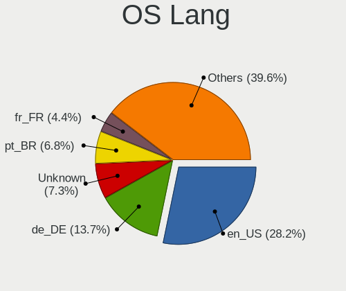
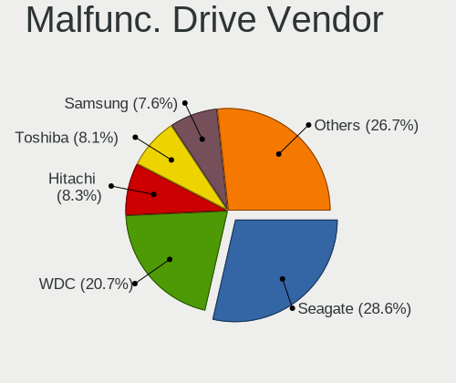
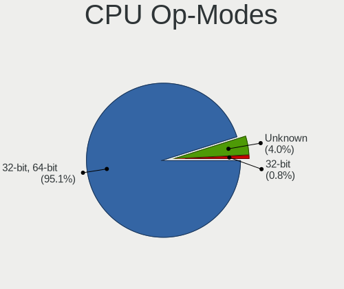

Linux Mint - Tested Hardware & Statistics
-----------------------------------------

A project to collect tested hardware configurations for Linux Mint.

Anyone can contribute to this report by the [hw-probe](https://github.com/linuxhw/hw-probe) tool:

    sudo -E hw-probe -all -upload

Please contribute! Especially if your hardware is rare.

This is a report for all computer types. See also reports for [desktops](/Dist/Linux_Mint/Desktop/README.md) and [notebooks](/Dist/Linux_Mint/Notebook/README.md).

Contents
--------

* [ Test Cases ](#test-cases)

* [ System ](#system)
  - [ OS                       ](#os)
  - [ OS Family                ](#os-family)
  - [ Kernel                   ](#kernel)
  - [ Kernel Family            ](#kernel-family)
  - [ Kernel Major Ver.        ](#kernel-major-ver)
  - [ Arch                     ](#arch)
  - [ DE                       ](#de)
  - [ Display Server           ](#display-server)
  - [ Display Manager          ](#display-manager)
  - [ OS Lang                  ](#os-lang)
  - [ Boot Mode                ](#boot-mode)
  - [ Filesystem               ](#filesystem)
  - [ Part. scheme             ](#part-scheme)
  - [ Dual Boot with Linux/BSD ](#dual-boot-with-linuxbsd)
  - [ Dual Boot (Win)          ](#dual-boot-win)

* [ Board ](#board)
  - [ Vendor                   ](#vendor)
  - [ Model                    ](#model)
  - [ Model Family             ](#model-family)
  - [ MFG Year                 ](#mfg-year)
  - [ Form Factor              ](#form-factor)
  - [ Secure Boot              ](#secure-boot)
  - [ Coreboot                 ](#coreboot)
  - [ RAM Size                 ](#ram-size)
  - [ RAM Used                 ](#ram-used)
  - [ Total Drives             ](#total-drives)
  - [ Has CD-ROM               ](#has-cd-rom)
  - [ Has Ethernet             ](#has-ethernet)
  - [ Has WiFi                 ](#has-wifi)
  - [ Has Bluetooth            ](#has-bluetooth)

* [ Location ](#location)
  - [ Country                  ](#country)
  - [ City                     ](#city)

* [ Drives ](#drives)
  - [ Drive Vendor             ](#drive-vendor)
  - [ Drive Model              ](#drive-model)
  - [ HDD Vendor               ](#hdd-vendor)
  - [ SSD Vendor               ](#ssd-vendor)
  - [ Drive Kind               ](#drive-kind)
  - [ Drive Connector          ](#drive-connector)
  - [ Drive Size               ](#drive-size)
  - [ Space Total              ](#space-total)
  - [ Space Used               ](#space-used)
  - [ Malfunc. Drives          ](#malfunc-drives)
  - [ Malfunc. Drive Vendor    ](#malfunc-drive-vendor)
  - [ Malfunc. HDD Vendor      ](#malfunc-hdd-vendor)
  - [ Malfunc. Drive Kind      ](#malfunc-drive-kind)
  - [ Failed Drives            ](#failed-drives)
  - [ Failed Drive Vendor      ](#failed-drive-vendor)
  - [ Drive Status             ](#drive-status)

* [ Storage controller ](#storage-controller)
  - [ Storage Vendor           ](#storage-vendor)
  - [ Storage Model            ](#storage-model)
  - [ Storage Kind             ](#storage-kind)

* [ Processor ](#processor)
  - [ CPU Vendor               ](#cpu-vendor)
  - [ CPU Model                ](#cpu-model)
  - [ CPU Model Family         ](#cpu-model-family)
  - [ CPU Cores                ](#cpu-cores)
  - [ CPU Sockets              ](#cpu-sockets)
  - [ CPU Threads              ](#cpu-threads)
  - [ CPU Op-Modes             ](#cpu-op-modes)
  - [ CPU Microcode            ](#cpu-microcode)
  - [ CPU Microarch            ](#cpu-microarch)

* [ Graphics ](#graphics)
  - [ GPU Vendor               ](#gpu-vendor)
  - [ GPU Model                ](#gpu-model)
  - [ GPU Combo                ](#gpu-combo)
  - [ GPU Driver               ](#gpu-driver)
  - [ GPU Memory               ](#gpu-memory)

* [ Monitor ](#monitor)
  - [ Monitor Vendor           ](#monitor-vendor)
  - [ Monitor Model            ](#monitor-model)
  - [ Monitor Resolution       ](#monitor-resolution)
  - [ Monitor Diagonal         ](#monitor-diagonal)
  - [ Monitor Width            ](#monitor-width)
  - [ Aspect Ratio             ](#aspect-ratio)
  - [ Monitor Area             ](#monitor-area)
  - [ Pixel Density            ](#pixel-density)
  - [ Multiple Monitors        ](#multiple-monitors)

* [ Network ](#network)
  - [ Net Controller Vendor    ](#net-controller-vendor)
  - [ Net Controller Model     ](#net-controller-model)
  - [ Wireless Vendor          ](#wireless-vendor)
  - [ Wireless Model           ](#wireless-model)
  - [ Ethernet Vendor          ](#ethernet-vendor)
  - [ Ethernet Model           ](#ethernet-model)
  - [ Net Controller Kind      ](#net-controller-kind)
  - [ Used Controller          ](#used-controller)
  - [ NICs                     ](#nics)
  - [ IPv6                     ](#ipv6)

* [ Bluetooth ](#bluetooth)
  - [ Bluetooth Vendor         ](#bluetooth-vendor)
  - [ Bluetooth Model          ](#bluetooth-model)

* [ Sound ](#sound)
  - [ Sound Vendor             ](#sound-vendor)
  - [ Sound Model              ](#sound-model)

* [ Memory ](#memory)
  - [ Memory Vendor            ](#memory-vendor)
  - [ Memory Model             ](#memory-model)
  - [ Memory Kind              ](#memory-kind)
  - [ Memory Form Factor       ](#memory-form-factor)
  - [ Memory Size              ](#memory-size)
  - [ Memory Speed             ](#memory-speed)

* [ Printers & scanners ](#printers--scanners)
  - [ Printer Vendor           ](#printer-vendor)
  - [ Printer Model            ](#printer-model)
  - [ Scanner Vendor           ](#scanner-vendor)
  - [ Scanner Model            ](#scanner-model)

* [ Camera ](#camera)
  - [ Camera Vendor            ](#camera-vendor)
  - [ Camera Model             ](#camera-model)

* [ Security ](#security)
  - [ Fingerprint Vendor       ](#fingerprint-vendor)
  - [ Fingerprint Model        ](#fingerprint-model)
  - [ Chipcard Vendor          ](#chipcard-vendor)
  - [ Chipcard Model           ](#chipcard-model)

* [ Unsupported ](#unsupported)
  - [ Unsupported Devices      ](#unsupported-devices)
  - [ Unsupported Device Types ](#unsupported-device-types)

Test Cases
----------

Total: 19204

| Vendor        | Model                       | Form-Factor | Probe                                                      | Date         |
|---------------|-----------------------------|-------------|------------------------------------------------------------|--------------|
| Lenovo        | ThinkPad X230 23245NJ       | Notebook    | [3c85e43b86](https://linux-hardware.org/?probe=3c85e43b86) | Aug 01, 2022 |
| Lenovo        | MIIX 310-10ICR 80SG         | Tablet      | [d5cc0b11b3](https://linux-hardware.org/?probe=d5cc0b11b3) | Aug 01, 2022 |
| HP            | 1493                        | Desktop     | [2925e7a321](https://linux-hardware.org/?probe=2925e7a321) | Aug 01, 2022 |
| Lenovo        | MIIX 310-10ICR 80SG         | Tablet      | [ac55d79050](https://linux-hardware.org/?probe=ac55d79050) | Aug 01, 2022 |
| Lenovo        | IdeaPad C340-14IWL 81N4     | Convertible | [1364037a8f](https://linux-hardware.org/?probe=1364037a8f) | Aug 01, 2022 |
| AZW           | Green G2                    | Desktop     | [d2607d160f](https://linux-hardware.org/?probe=d2607d160f) | Aug 01, 2022 |
| MSI           | X370 KRAIT GAMING           | Desktop     | [fe950a68a3](https://linux-hardware.org/?probe=fe950a68a3) | Aug 01, 2022 |
| Acer          | Aspire 7741                 | Notebook    | [4e266f6d7f](https://linux-hardware.org/?probe=4e266f6d7f) | Jul 31, 2022 |
| Acer          | Aspire X3470                | Desktop     | [88ad041430](https://linux-hardware.org/?probe=88ad041430) | Jul 31, 2022 |
| Acer          | Aspire 7741                 | Notebook    | [932a460553](https://linux-hardware.org/?probe=932a460553) | Jul 31, 2022 |
| ASRock        | N68-S3 UCC                  | Desktop     | [bcb1d1da28](https://linux-hardware.org/?probe=bcb1d1da28) | Jul 31, 2022 |
| MSI           | Z97 PC Mate                 | Desktop     | [73ebbe2902](https://linux-hardware.org/?probe=73ebbe2902) | Jul 31, 2022 |
| MSI           | Z97 PC Mate                 | Desktop     | [22a32957dc](https://linux-hardware.org/?probe=22a32957dc) | Jul 31, 2022 |
| Gigabyte      | Z87-HD3                     | Desktop     | [83936d3cf0](https://linux-hardware.org/?probe=83936d3cf0) | Jul 31, 2022 |
| Lenovo        | IdeaPad 110S-11IBR          | Notebook    | [22ac116859](https://linux-hardware.org/?probe=22ac116859) | Jul 31, 2022 |
| Lenovo        | IdeaPad 110S-11IBR          | Notebook    | [02e0db6837](https://linux-hardware.org/?probe=02e0db6837) | Jul 31, 2022 |
| Dell          | Latitude E6400              | Notebook    | [6962d36f57](https://linux-hardware.org/?probe=6962d36f57) | Jul 31, 2022 |
| Gigabyte      | G33M-S2                     | Desktop     | [219dd022c6](https://linux-hardware.org/?probe=219dd022c6) | Jul 31, 2022 |
| HP            | Stream Notebook PC 13       | Notebook    | [d736692861](https://linux-hardware.org/?probe=d736692861) | Jul 31, 2022 |
| MSI           | Z490-A PRO                  | Desktop     | [054fdc9187](https://linux-hardware.org/?probe=054fdc9187) | Jul 31, 2022 |
| ASUSTek       | PRIME X570-P                | Desktop     | [e962ba603d](https://linux-hardware.org/?probe=e962ba603d) | Jul 31, 2022 |
| HP            | ProBook 645 G1              | Notebook    | [f5035ff86e](https://linux-hardware.org/?probe=f5035ff86e) | Jul 31, 2022 |
| Google        | Cyan                        | Notebook    | [34f759ebd1](https://linux-hardware.org/?probe=34f759ebd1) | Jul 31, 2022 |
| HP            | Laptop 15-dy3xxx            | Notebook    | [e54cde5e86](https://linux-hardware.org/?probe=e54cde5e86) | Jul 31, 2022 |
| HP            | Pavilion TS 14 Sleekbook    | Notebook    | [9264052a8c](https://linux-hardware.org/?probe=9264052a8c) | Jul 31, 2022 |
| Fujitsu       | LIFEBOOK S936               | Notebook    | [90a08a49a3](https://linux-hardware.org/?probe=90a08a49a3) | Jul 31, 2022 |
| ASUSTek       | PRIME Z490-A                | Desktop     | [a1923838e1](https://linux-hardware.org/?probe=a1923838e1) | Jul 31, 2022 |
| Fujitsu       | LIFEBOOK S936               | Notebook    | [1af46d1c56](https://linux-hardware.org/?probe=1af46d1c56) | Jul 31, 2022 |
| MSI           | MAG B550M MORTAR            | Desktop     | [8614c5b8df](https://linux-hardware.org/?probe=8614c5b8df) | Jul 30, 2022 |
| Apple         | Mac-942B5BF58194151B        | All in one  | [a654f941dd](https://linux-hardware.org/?probe=a654f941dd) | Jul 30, 2022 |
| Acer          | Aspire A315-54K             | Notebook    | [d090bce067](https://linux-hardware.org/?probe=d090bce067) | Jul 30, 2022 |
| ASUSTek       | ROG STRIX X370-F GAMING     | Desktop     | [b0265ffd70](https://linux-hardware.org/?probe=b0265ffd70) | Jul 30, 2022 |
| Dell          | XPS 13 9380                 | Notebook    | [7463861dcf](https://linux-hardware.org/?probe=7463861dcf) | Jul 30, 2022 |
| ASUSTek       | ROG STRIX X370-F GAMING     | Desktop     | [af062992d8](https://linux-hardware.org/?probe=af062992d8) | Jul 30, 2022 |
| Gigabyte      | G33M-S2                     | Desktop     | [0a96778f7c](https://linux-hardware.org/?probe=0a96778f7c) | Jul 30, 2022 |
| Sony          | SVE1511Y1ESI                | Notebook    | [7e5ced1b91](https://linux-hardware.org/?probe=7e5ced1b91) | Jul 30, 2022 |
| Dell          | 06NWYK A00                  | Desktop     | [1182388bb6](https://linux-hardware.org/?probe=1182388bb6) | Jul 30, 2022 |
| Lenovo        | ThinkPad T14 Gen 2i 20W0... | Notebook    | [a2f1dbe3f7](https://linux-hardware.org/?probe=a2f1dbe3f7) | Jul 30, 2022 |
| MSI           | A320M-A PRO MAX             | Desktop     | [3249abb411](https://linux-hardware.org/?probe=3249abb411) | Jul 30, 2022 |
| MSI           | A320M-A PRO MAX             | Desktop     | [5a750a1294](https://linux-hardware.org/?probe=5a750a1294) | Jul 30, 2022 |
| Google        | Auron_Paine                 | Notebook    | [0ac60b52f1](https://linux-hardware.org/?probe=0ac60b52f1) | Jul 30, 2022 |
| Acer          | Peppy                       | Notebook    | [d8f9cbdb86](https://linux-hardware.org/?probe=d8f9cbdb86) | Jul 30, 2022 |
| Lenovo        | IdeaPad Gaming 3 15ACH6 ... | Notebook    | [0dce3ee4a5](https://linux-hardware.org/?probe=0dce3ee4a5) | Jul 30, 2022 |
| Acer          | Peppy                       | Notebook    | [6f4ce7e1f9](https://linux-hardware.org/?probe=6f4ce7e1f9) | Jul 30, 2022 |
| Lenovo        | IdeaPad Gaming 3 15ACH6 ... | Notebook    | [90fec04191](https://linux-hardware.org/?probe=90fec04191) | Jul 30, 2022 |
| Apple         | Mac-F2268CC8                | All in one  | [c8401bd031](https://linux-hardware.org/?probe=c8401bd031) | Jul 30, 2022 |
| AMI           | T3 MRD                      | Notebook    | [7e0a2ced92](https://linux-hardware.org/?probe=7e0a2ced92) | Jul 29, 2022 |
| ASUSTek       | T100TAM                     | Notebook    | [fca54dfc19](https://linux-hardware.org/?probe=fca54dfc19) | Jul 29, 2022 |
| ASUSTek       | T100TAM                     | Notebook    | [4321f0776b](https://linux-hardware.org/?probe=4321f0776b) | Jul 29, 2022 |
| HP            | 18E7                        | Desktop     | [3d7c1549eb](https://linux-hardware.org/?probe=3d7c1549eb) | Jul 29, 2022 |
| HP            | 255 G8 Notebook PC          | Notebook    | [e271ff9bf8](https://linux-hardware.org/?probe=e271ff9bf8) | Jul 29, 2022 |
| Gigabyte      | B550 AORUS ELITE AX         | Desktop     | [eee9c60bec](https://linux-hardware.org/?probe=eee9c60bec) | Jul 29, 2022 |
| HP            | EliteBook 8570w             | Notebook    | [37c6d6abde](https://linux-hardware.org/?probe=37c6d6abde) | Jul 29, 2022 |
| AZW           | Green G2                    | Desktop     | [755b99362f](https://linux-hardware.org/?probe=755b99362f) | Jul 29, 2022 |
| ASRock        | B85 Pro4                    | Desktop     | [98e02ef2cd](https://linux-hardware.org/?probe=98e02ef2cd) | Jul 29, 2022 |
| ASRock        | B85 Pro4                    | Desktop     | [ec68a40236](https://linux-hardware.org/?probe=ec68a40236) | Jul 29, 2022 |
| Biostar       | A880G+                      | Desktop     | [5f10c78e54](https://linux-hardware.org/?probe=5f10c78e54) | Jul 29, 2022 |
| Dell          | Latitude 9420               | Notebook    | [1ee70bdfc6](https://linux-hardware.org/?probe=1ee70bdfc6) | Jul 29, 2022 |
| Gigabyte      | H510M S2H                   | Desktop     | [7c42ac18e4](https://linux-hardware.org/?probe=7c42ac18e4) | Jul 29, 2022 |
| HP            | 339A                        | Desktop     | [fa0d80162a](https://linux-hardware.org/?probe=fa0d80162a) | Jul 29, 2022 |
| HP            | Pavilion Laptop 15-eh1xx... | Notebook    | [53a117cd64](https://linux-hardware.org/?probe=53a117cd64) | Jul 29, 2022 |
| HP            | Pavilion Laptop 15-eh1xx... | Notebook    | [e943a26cec](https://linux-hardware.org/?probe=e943a26cec) | Jul 29, 2022 |
| MSI           | Z390-A PRO                  | Desktop     | [32c295bae1](https://linux-hardware.org/?probe=32c295bae1) | Jul 29, 2022 |
| Intel         | NUC6i5SYB H81131-505        | Mini pc     | [51695dd3ea](https://linux-hardware.org/?probe=51695dd3ea) | Jul 29, 2022 |
| HP            | Pavilion 15                 | Notebook    | [e6bfde2a29](https://linux-hardware.org/?probe=e6bfde2a29) | Jul 29, 2022 |
| Intel         | NUC6i5SYB H81131-505        | Mini pc     | [2381ee35c0](https://linux-hardware.org/?probe=2381ee35c0) | Jul 29, 2022 |
| ASUSTek       | PRIME B450M-GAMING II       | Desktop     | [0cc1bc9401](https://linux-hardware.org/?probe=0cc1bc9401) | Jul 29, 2022 |
| ASUSTek       | M4N78                       | Desktop     | [870702db59](https://linux-hardware.org/?probe=870702db59) | Jul 29, 2022 |
| Biostar       | B350GTN                     | Desktop     | [75d6302ab0](https://linux-hardware.org/?probe=75d6302ab0) | Jul 29, 2022 |
| ASUSTek       | P8B75-M LX                  | Desktop     | [af972287a0](https://linux-hardware.org/?probe=af972287a0) | Jul 29, 2022 |
| AZW           | Green G2                    | Desktop     | [c3e6905701](https://linux-hardware.org/?probe=c3e6905701) | Jul 29, 2022 |
| AZW           | Green G2                    | Desktop     | [acf3761817](https://linux-hardware.org/?probe=acf3761817) | Jul 29, 2022 |
| Acer          | Aspire 7520                 | Notebook    | [934f648cb3](https://linux-hardware.org/?probe=934f648cb3) | Jul 28, 2022 |
| ASUSTek       | TUF Gaming B550-PLUS        | Desktop     | [2953cb274f](https://linux-hardware.org/?probe=2953cb274f) | Jul 28, 2022 |
| MSI           | GT72S 6QE                   | Notebook    | [9cb4896eba](https://linux-hardware.org/?probe=9cb4896eba) | Jul 28, 2022 |
| HP            | 21F5                        | Desktop     | [27cf2d6a42](https://linux-hardware.org/?probe=27cf2d6a42) | Jul 28, 2022 |
| ASUSTek       | X75A                        | Notebook    | [646a5239a8](https://linux-hardware.org/?probe=646a5239a8) | Jul 28, 2022 |
| HP            | OMEN by Laptop 15-dc0xxx    | Notebook    | [ec8af984d2](https://linux-hardware.org/?probe=ec8af984d2) | Jul 28, 2022 |
| ASUSTek       | ProArt X570-CREATOR WIFI    | Desktop     | [297217baa1](https://linux-hardware.org/?probe=297217baa1) | Jul 28, 2022 |
| Notebook      | NL4x_NL5xLU                 | Notebook    | [12d6dbed8b](https://linux-hardware.org/?probe=12d6dbed8b) | Jul 28, 2022 |
| HP            | Laptop 15-bw0xx             | Notebook    | [1c661d6eea](https://linux-hardware.org/?probe=1c661d6eea) | Jul 28, 2022 |
| Acer          | Aspire 5755G                | Notebook    | [ba944df1b9](https://linux-hardware.org/?probe=ba944df1b9) | Jul 28, 2022 |
| Gigabyte      | H410M H                     | Desktop     | [eb92148078](https://linux-hardware.org/?probe=eb92148078) | Jul 28, 2022 |
| HP            | 255 G8 Notebook PC          | Notebook    | [ceb1b7da41](https://linux-hardware.org/?probe=ceb1b7da41) | Jul 28, 2022 |
| MSI           | B550-A PRO                  | Desktop     | [f597d7cc46](https://linux-hardware.org/?probe=f597d7cc46) | Jul 28, 2022 |
| ASUSTek       | G10DK                       | Desktop     | [70a71d84a6](https://linux-hardware.org/?probe=70a71d84a6) | Jul 28, 2022 |
| Positivo      | POS-RIB360EE 11158935       | Desktop     | [1c687dcef7](https://linux-hardware.org/?probe=1c687dcef7) | Jul 28, 2022 |
| HP            | OMEN by Laptop 15-dc0xxx    | Notebook    | [cd00cf1bbe](https://linux-hardware.org/?probe=cd00cf1bbe) | Jul 28, 2022 |
| MSI           | B550-A PRO                  | Desktop     | [2ae0b5a47a](https://linux-hardware.org/?probe=2ae0b5a47a) | Jul 28, 2022 |
| ASUSTek       | PRIME X470-PRO              | Desktop     | [ce5af45a80](https://linux-hardware.org/?probe=ce5af45a80) | Jul 28, 2022 |
| HP            | ProBook 645 G1              | Notebook    | [5e19387465](https://linux-hardware.org/?probe=5e19387465) | Jul 28, 2022 |
| HP            | ProBook 645 G1              | Notebook    | [8774828c9b](https://linux-hardware.org/?probe=8774828c9b) | Jul 28, 2022 |
| HP            | ZBook Fury 15.6 inch G8 ... | Notebook    | [ce7d32f9d0](https://linux-hardware.org/?probe=ce7d32f9d0) | Jul 28, 2022 |
| Lenovo        | Tiger Hill                  | Desktop     | [66597a565e](https://linux-hardware.org/?probe=66597a565e) | Jul 28, 2022 |
| Gigabyte      | Z97X-UD5H                   | Desktop     | [9b3bb82b80](https://linux-hardware.org/?probe=9b3bb82b80) | Jul 28, 2022 |
| ASUSTek       | Z170-A                      | Desktop     | [47f6481e91](https://linux-hardware.org/?probe=47f6481e91) | Jul 28, 2022 |
| Positivo      | Mobile                      | Notebook    | [a8719171ea](https://linux-hardware.org/?probe=a8719171ea) | Jul 28, 2022 |
| Lenovo        | IdeaPadFlex 5 14ITL05 82... | Convertible | [85b1941239](https://linux-hardware.org/?probe=85b1941239) | Jul 28, 2022 |
| Lenovo        | IdeaPadFlex 5 14ITL05 82... | Convertible | [a2aacf1d30](https://linux-hardware.org/?probe=a2aacf1d30) | Jul 28, 2022 |
| Positivo      | Mobile                      | Notebook    | [422b663a21](https://linux-hardware.org/?probe=422b663a21) | Jul 28, 2022 |
| Intel         | X99 V1.0                    | Desktop     | [da677f5a3b](https://linux-hardware.org/?probe=da677f5a3b) | Jul 28, 2022 |
| Unknown       | Unknown                     | Notebook    | [f14e834c32](https://linux-hardware.org/?probe=f14e834c32) | Jul 28, 2022 |
| HP            | 806A                        | Desktop     | [6a6df5d868](https://linux-hardware.org/?probe=6a6df5d868) | Jul 28, 2022 |
| HP            | Pavilion g7                 | Notebook    | [02040b1ca1](https://linux-hardware.org/?probe=02040b1ca1) | Jul 27, 2022 |
| Lenovo        | ThinkPad P50 20EQS4QL11     | Notebook    | [bc3633b5a0](https://linux-hardware.org/?probe=bc3633b5a0) | Jul 27, 2022 |
| Dell          | 06NWYK A00                  | Desktop     | [4f90c96687](https://linux-hardware.org/?probe=4f90c96687) | Jul 27, 2022 |
| HP            | Pavilion dv5                | Notebook    | [5e73f42d72](https://linux-hardware.org/?probe=5e73f42d72) | Jul 27, 2022 |
| Acer          | Aspire 4732Z                | Notebook    | [3d23b4bbdc](https://linux-hardware.org/?probe=3d23b4bbdc) | Jul 27, 2022 |
| ASRock        | H310CM-ITX/ac               | Desktop     | [df9564b6b3](https://linux-hardware.org/?probe=df9564b6b3) | Jul 27, 2022 |
| Dell          | Latitude 7480               | Notebook    | [86fd278e6d](https://linux-hardware.org/?probe=86fd278e6d) | Jul 27, 2022 |
| Notebook      | P7xxDM(-G)                  | Notebook    | [5ec2e8ed2b](https://linux-hardware.org/?probe=5ec2e8ed2b) | Jul 27, 2022 |
| Lenovo        | ThinkBook 15 G3 ACL 21A4    | Notebook    | [b4a9542143](https://linux-hardware.org/?probe=b4a9542143) | Jul 27, 2022 |
| HP            | 250 G6 Notebook PC          | Notebook    | [ae677e8869](https://linux-hardware.org/?probe=ae677e8869) | Jul 27, 2022 |
| HP            | Pavilion g6                 | Notebook    | [a57cf84361](https://linux-hardware.org/?probe=a57cf84361) | Jul 27, 2022 |
| AZW           | Green G2                    | Desktop     | [16a89e4be5](https://linux-hardware.org/?probe=16a89e4be5) | Jul 27, 2022 |
| Lenovo        | IdeaPad 120S-11IAP 81A4     | Notebook    | [c872c322dc](https://linux-hardware.org/?probe=c872c322dc) | Jul 27, 2022 |
| HP            | Laptop 17-cp0xxx            | Notebook    | [761563e485](https://linux-hardware.org/?probe=761563e485) | Jul 27, 2022 |
| HP            | Pavilion dv2                | Notebook    | [1d7f92e6ac](https://linux-hardware.org/?probe=1d7f92e6ac) | Jul 27, 2022 |
| ASUSTek       | TUF B450-PRO GAMING         | Desktop     | [cb4bc3fa42](https://linux-hardware.org/?probe=cb4bc3fa42) | Jul 27, 2022 |
| ASUSTek       | TUF B450-PRO GAMING         | Desktop     | [9f5bf108ac](https://linux-hardware.org/?probe=9f5bf108ac) | Jul 27, 2022 |
| MSI           | 970A-G43                    | Desktop     | [9095b31f2f](https://linux-hardware.org/?probe=9095b31f2f) | Jul 26, 2022 |
| ASUSTek       | P5KC                        | Desktop     | [7e9c9d2fc4](https://linux-hardware.org/?probe=7e9c9d2fc4) | Jul 26, 2022 |
| Dell          | 06NWYK A00                  | Desktop     | [effad14bc0](https://linux-hardware.org/?probe=effad14bc0) | Jul 26, 2022 |
| HP            | EliteBook 840 G1            | Notebook    | [2dc0ffa0d1](https://linux-hardware.org/?probe=2dc0ffa0d1) | Jul 26, 2022 |
| Gigabyte      | EP45-DS3                    | Desktop     | [5b5fe46f75](https://linux-hardware.org/?probe=5b5fe46f75) | Jul 26, 2022 |
| Intel         | powered classmate PC        | Notebook    | [5ef3ce99dc](https://linux-hardware.org/?probe=5ef3ce99dc) | Jul 26, 2022 |
| HUAWEI        | BOM-WXX9                    | Notebook    | [d748013457](https://linux-hardware.org/?probe=d748013457) | Jul 26, 2022 |
| Gigabyte      | Z590 AORUS MASTER           | Desktop     | [300ddea4d6](https://linux-hardware.org/?probe=300ddea4d6) | Jul 26, 2022 |
| HP            | OMEN by Laptop 15z-en100    | Notebook    | [d796f6c916](https://linux-hardware.org/?probe=d796f6c916) | Jul 26, 2022 |
| Intel         | powered classmate PC        | Notebook    | [53e2fcbd36](https://linux-hardware.org/?probe=53e2fcbd36) | Jul 26, 2022 |
| Lenovo        | G50-70 20351                | Notebook    | [4ddfbb6ad8](https://linux-hardware.org/?probe=4ddfbb6ad8) | Jul 26, 2022 |
| Lenovo        | ThinkPad SL510 28477MG      | Notebook    | [23c5c0f139](https://linux-hardware.org/?probe=23c5c0f139) | Jul 26, 2022 |
| ASUSTek       | PRIME B450-PLUS             | Desktop     | [32045fd953](https://linux-hardware.org/?probe=32045fd953) | Jul 26, 2022 |
| Gigabyte      | B85-HD3                     | Desktop     | [9447f1eb98](https://linux-hardware.org/?probe=9447f1eb98) | Jul 26, 2022 |
| Gigabyte      | Z590 GAMING X               | Desktop     | [6701685bb5](https://linux-hardware.org/?probe=6701685bb5) | Jul 26, 2022 |
| Acer          | WMCP78M                     | Desktop     | [fa9866b7e5](https://linux-hardware.org/?probe=fa9866b7e5) | Jul 26, 2022 |
| Gigabyte      | H110M-S2H DDR3-CF           | Desktop     | [e471e3ed10](https://linux-hardware.org/?probe=e471e3ed10) | Jul 26, 2022 |
| Dell          | Inspiron 14-3467            | Notebook    | [1c2babaa0a](https://linux-hardware.org/?probe=1c2babaa0a) | Jul 26, 2022 |
| Gigabyte      | Z87-D3HP-CF                 | Desktop     | [88b45b1956](https://linux-hardware.org/?probe=88b45b1956) | Jul 26, 2022 |
| eMachines     | D730                        | Notebook    | [4cba9849a0](https://linux-hardware.org/?probe=4cba9849a0) | Jul 26, 2022 |
| Dell          | Latitude 3400               | Notebook    | [3412e8deac](https://linux-hardware.org/?probe=3412e8deac) | Jul 26, 2022 |
| GPU Compan... | GWNR71517                   | Notebook    | [44ce7e516b](https://linux-hardware.org/?probe=44ce7e516b) | Jul 26, 2022 |
| MSI           | GS40 6QE Phantom            | Notebook    | [137d7c8701](https://linux-hardware.org/?probe=137d7c8701) | Jul 26, 2022 |
| MSI           | GS40 6QE Phantom            | Notebook    | [76bd6feebe](https://linux-hardware.org/?probe=76bd6feebe) | Jul 26, 2022 |
| Daten Tecn... | DT02-M4                     | Notebook    | [8719e60f77](https://linux-hardware.org/?probe=8719e60f77) | Jul 25, 2022 |
| HP            | 245 G7 Notebook PC          | Notebook    | [07c70033f5](https://linux-hardware.org/?probe=07c70033f5) | Jul 25, 2022 |
| Dell          | Latitude 3440               | Notebook    | [a47121441e](https://linux-hardware.org/?probe=a47121441e) | Jul 25, 2022 |
| ASUSTek       | X751LD                      | Notebook    | [0c7a0b98b4](https://linux-hardware.org/?probe=0c7a0b98b4) | Jul 25, 2022 |
| Apple         | Mac-F4238CC8 PVT            | All in one  | [82b1be3c9f](https://linux-hardware.org/?probe=82b1be3c9f) | Jul 25, 2022 |
| Acer          | Aspire 5749                 | Notebook    | [fa3b08453b](https://linux-hardware.org/?probe=fa3b08453b) | Jul 25, 2022 |
| Notebook      | N150ZU                      | Notebook    | [6956315543](https://linux-hardware.org/?probe=6956315543) | Jul 25, 2022 |
| MSI           | H510M PRO                   | Desktop     | [07c98d99d5](https://linux-hardware.org/?probe=07c98d99d5) | Jul 25, 2022 |
| HP            | EliteBook 855 G8 Noteboo... | Notebook    | [d93f50bcf7](https://linux-hardware.org/?probe=d93f50bcf7) | Jul 25, 2022 |
| Panasonic     | FZ55-2                      | Notebook    | [a190a7d890](https://linux-hardware.org/?probe=a190a7d890) | Jul 25, 2022 |
| Apple         | MacBookAir6,2               | Notebook    | [608ea688bb](https://linux-hardware.org/?probe=608ea688bb) | Jul 25, 2022 |
| ASUSTek       | VivoBook 15_ASUS Laptop ... | Notebook    | [414aede111](https://linux-hardware.org/?probe=414aede111) | Jul 25, 2022 |
| MSI           | H510M PRO                   | Desktop     | [e8693a9212](https://linux-hardware.org/?probe=e8693a9212) | Jul 25, 2022 |
| AZW           | SEi                         | Desktop     | [00755b9883](https://linux-hardware.org/?probe=00755b9883) | Jul 25, 2022 |
| HP            | G61                         | Notebook    | [1586fc0cba](https://linux-hardware.org/?probe=1586fc0cba) | Jul 25, 2022 |
| Fujitsu Si... | AMILO Pi 3540               | Notebook    | [3a17370c3f](https://linux-hardware.org/?probe=3a17370c3f) | Jul 25, 2022 |
| HP            | 8381 1000                   | All in one  | [6745fd4bac](https://linux-hardware.org/?probe=6745fd4bac) | Jul 25, 2022 |
| Lenovo        | G570 4334                   | Notebook    | [e4c223e83e](https://linux-hardware.org/?probe=e4c223e83e) | Jul 25, 2022 |
| Chuwi         | GemiBook Pro                | Notebook    | [fbc796621e](https://linux-hardware.org/?probe=fbc796621e) | Jul 25, 2022 |
| Dell          | G3 3579                     | Notebook    | [96fab186c3](https://linux-hardware.org/?probe=96fab186c3) | Jul 24, 2022 |
| Dell          | Latitude E6540              | Notebook    | [281f1b4a30](https://linux-hardware.org/?probe=281f1b4a30) | Jul 24, 2022 |
| Packard Be... | EasyNote_MX52-B-122GE       | Notebook    | [4072fa2654](https://linux-hardware.org/?probe=4072fa2654) | Jul 24, 2022 |
| HUAWEI        | BOM-WXX9                    | Notebook    | [0b50c88cc8](https://linux-hardware.org/?probe=0b50c88cc8) | Jul 24, 2022 |
| AZW           | Green G2                    | Desktop     | [caf6905841](https://linux-hardware.org/?probe=caf6905841) | Jul 24, 2022 |
| Gigabyte      | Z390 M-CF                   | Desktop     | [ae2926d93e](https://linux-hardware.org/?probe=ae2926d93e) | Jul 24, 2022 |
| Intel         | X99                         | Desktop     | [046538e5fc](https://linux-hardware.org/?probe=046538e5fc) | Jul 24, 2022 |
| Dell          | 0WN7Y6 A02                  | Desktop     | [4059b7a331](https://linux-hardware.org/?probe=4059b7a331) | Jul 24, 2022 |
| Dell          | Latitude E4300              | Notebook    | [47cbd9b7d7](https://linux-hardware.org/?probe=47cbd9b7d7) | Jul 24, 2022 |
| ASUSTek       | P8H61-MX                    | Desktop     | [6614f30e6a](https://linux-hardware.org/?probe=6614f30e6a) | Jul 24, 2022 |
| Google        | Auron_Paine                 | Notebook    | [d3ec1ad15c](https://linux-hardware.org/?probe=d3ec1ad15c) | Jul 24, 2022 |
| ASRock        | X470 Gaming K4              | Desktop     | [4f26f0dbda](https://linux-hardware.org/?probe=4f26f0dbda) | Jul 24, 2022 |
| Unknown       | Unknown                     | Notebook    | [d1cdc426eb](https://linux-hardware.org/?probe=d1cdc426eb) | Jul 24, 2022 |
| Unknown       | Unknown                     | Notebook    | [e2718112a7](https://linux-hardware.org/?probe=e2718112a7) | Jul 24, 2022 |
| HP            | 255 G7 Notebook PC          | Notebook    | [8dba689d5c](https://linux-hardware.org/?probe=8dba689d5c) | Jul 24, 2022 |
| HUAWEI        | BOM-WXX9                    | Notebook    | [10c3aa036f](https://linux-hardware.org/?probe=10c3aa036f) | Jul 23, 2022 |
| HUAWEI        | BOM-WXX9                    | Notebook    | [2c2ddc37dd](https://linux-hardware.org/?probe=2c2ddc37dd) | Jul 23, 2022 |
| Lenovo        | Yoga 730-15IKB 81CU         | Convertible | [c260cca889](https://linux-hardware.org/?probe=c260cca889) | Jul 23, 2022 |
| Gigabyte      | MJPLNAB-00                  | Desktop     | [d414e51a0c](https://linux-hardware.org/?probe=d414e51a0c) | Jul 23, 2022 |
| ASUSTek       | P5E3 PRO                    | Desktop     | [357b10a053](https://linux-hardware.org/?probe=357b10a053) | Jul 23, 2022 |
| Gigabyte      | MJPLNAB-00                  | Desktop     | [9dcb499f3e](https://linux-hardware.org/?probe=9dcb499f3e) | Jul 23, 2022 |
| HP            | Laptop 14-df0xxx            | Notebook    | [b17f379bd1](https://linux-hardware.org/?probe=b17f379bd1) | Jul 23, 2022 |
| Minix         | NEO Z83-4 V1.1              | Desktop     | [e8c6448552](https://linux-hardware.org/?probe=e8c6448552) | Jul 23, 2022 |
| HP            | EliteBook 2560p             | Notebook    | [6493da2069](https://linux-hardware.org/?probe=6493da2069) | Jul 23, 2022 |
| MSI           | G31TM-P21                   | Desktop     | [abc0948b06](https://linux-hardware.org/?probe=abc0948b06) | Jul 23, 2022 |
| HP            | 339A                        | Desktop     | [313af629be](https://linux-hardware.org/?probe=313af629be) | Jul 23, 2022 |
| Apple         | MacBook4,1                  | Notebook    | [012b0c7fa9](https://linux-hardware.org/?probe=012b0c7fa9) | Jul 23, 2022 |
| HP            | EliteBook 8470p             | Notebook    | [886e4c6e35](https://linux-hardware.org/?probe=886e4c6e35) | Jul 23, 2022 |
| ASUSTek       | X540LJ                      | Notebook    | [fc5c252e6e](https://linux-hardware.org/?probe=fc5c252e6e) | Jul 23, 2022 |
| Acer          | Aspire 5730                 | Notebook    | [b4877f21ad](https://linux-hardware.org/?probe=b4877f21ad) | Jul 23, 2022 |
| Apple         | Mac-F2268CC8                | All in one  | [c59a4196e3](https://linux-hardware.org/?probe=c59a4196e3) | Jul 23, 2022 |
| HP            | Compaq CQ58                 | Notebook    | [73199f32a4](https://linux-hardware.org/?probe=73199f32a4) | Jul 23, 2022 |
| MSI           | 970 GAMING                  | Desktop     | [2814270f24](https://linux-hardware.org/?probe=2814270f24) | Jul 23, 2022 |
| Wortmann      | CR700                       | Notebook    | [3aa2d086b9](https://linux-hardware.org/?probe=3aa2d086b9) | Jul 23, 2022 |
| Wortmann      | CR700                       | Notebook    | [27d04b5577](https://linux-hardware.org/?probe=27d04b5577) | Jul 23, 2022 |
| Lenovo        | G50-30 80G0                 | Notebook    | [597fb27e56](https://linux-hardware.org/?probe=597fb27e56) | Jul 23, 2022 |
| HP            | EliteBook Folio 1040 G1     | Notebook    | [4c0cb4fd92](https://linux-hardware.org/?probe=4c0cb4fd92) | Jul 23, 2022 |
| Pegatron      | 2ACD                        | Desktop     | [c8ce65cd26](https://linux-hardware.org/?probe=c8ce65cd26) | Jul 23, 2022 |
| ASRock        | Z270 Professional Gaming... | Desktop     | [c84ebb5a1a](https://linux-hardware.org/?probe=c84ebb5a1a) | Jul 23, 2022 |
| Acer          | Aspire 5735                 | Notebook    | [f9c86e76f8](https://linux-hardware.org/?probe=f9c86e76f8) | Jul 23, 2022 |
| ASUSTek       | P8P67 PRO                   | Desktop     | [54e6e291bd](https://linux-hardware.org/?probe=54e6e291bd) | Jul 22, 2022 |
| Dell          | 0P01GV A03                  | Desktop     | [60b77cc6b5](https://linux-hardware.org/?probe=60b77cc6b5) | Jul 22, 2022 |
| ASUSTek       | P8H61-M LX3 PLUS            | Desktop     | [3c5c67efc0](https://linux-hardware.org/?probe=3c5c67efc0) | Jul 22, 2022 |
| HP            | 08B4h                       | Desktop     | [8ff662507a](https://linux-hardware.org/?probe=8ff662507a) | Jul 22, 2022 |
| Lenovo        | G50-30 80G0                 | Notebook    | [8b1930ddbd](https://linux-hardware.org/?probe=8b1930ddbd) | Jul 22, 2022 |
| MSI           | Raider GE76 12UGS           | Notebook    | [65c50de21a](https://linux-hardware.org/?probe=65c50de21a) | Jul 22, 2022 |
| MSI           | Raider GE76 12UGS           | Notebook    | [6dba304ba4](https://linux-hardware.org/?probe=6dba304ba4) | Jul 22, 2022 |
| Apple         | MacBookPro5,1               | Notebook    | [4bae560f04](https://linux-hardware.org/?probe=4bae560f04) | Jul 22, 2022 |
| Dell          | Latitude E5450              | Notebook    | [b3e3c79dae](https://linux-hardware.org/?probe=b3e3c79dae) | Jul 22, 2022 |
| Intel         | Z77                         | Desktop     | [c858c41f36](https://linux-hardware.org/?probe=c858c41f36) | Jul 22, 2022 |
| Intel         | Z77                         | Desktop     | [d1f38293b3](https://linux-hardware.org/?probe=d1f38293b3) | Jul 22, 2022 |
| HP            | Laptop 14-dq0xxx            | Notebook    | [c1674c5929](https://linux-hardware.org/?probe=c1674c5929) | Jul 22, 2022 |
| MSI           | Z77A-GD65                   | Desktop     | [f0cf5d1f55](https://linux-hardware.org/?probe=f0cf5d1f55) | Jul 22, 2022 |
| ASUSTek       | ROG STRIX X570-E GAMING ... | Desktop     | [2986a26253](https://linux-hardware.org/?probe=2986a26253) | Jul 22, 2022 |
| MSI           | Z77A-GD65                   | Desktop     | [edfa6cb848](https://linux-hardware.org/?probe=edfa6cb848) | Jul 22, 2022 |
| Lenovo        | IdeaPad 120S-11IAP 81A4     | Notebook    | [85475685f1](https://linux-hardware.org/?probe=85475685f1) | Jul 22, 2022 |
| ASUSTek       | X750JN                      | Notebook    | [4b0039d0ae](https://linux-hardware.org/?probe=4b0039d0ae) | Jul 22, 2022 |
| Lenovo        | ThinkPad T450 20BUS04A0B    | Notebook    | [afc6d3d00a](https://linux-hardware.org/?probe=afc6d3d00a) | Jul 22, 2022 |
| Sony          | SVF15318SNB                 | Notebook    | [176c871bf8](https://linux-hardware.org/?probe=176c871bf8) | Jul 22, 2022 |
| Unknown       | Unknown                     | Notebook    | [a93e6b77ec](https://linux-hardware.org/?probe=a93e6b77ec) | Jul 22, 2022 |
| Lenovo        | NOK                         | Desktop     | [a47a727578](https://linux-hardware.org/?probe=a47a727578) | Jul 22, 2022 |
| HP            | 0AECh D                     | Desktop     | [ca7abdaae0](https://linux-hardware.org/?probe=ca7abdaae0) | Jul 22, 2022 |
| ASUSTek       | P8B75-M LE                  | Desktop     | [f5c169fed7](https://linux-hardware.org/?probe=f5c169fed7) | Jul 22, 2022 |
| Dell          | Latitude E5450              | Notebook    | [aed8e36388](https://linux-hardware.org/?probe=aed8e36388) | Jul 22, 2022 |
| ASUSTek       | ROG CROSSHAIR VIII HERO     | Desktop     | [b6fc243a07](https://linux-hardware.org/?probe=b6fc243a07) | Jul 22, 2022 |
| ASUSTek       | PRIME Z390-A                | Desktop     | [83d47fc3dc](https://linux-hardware.org/?probe=83d47fc3dc) | Jul 22, 2022 |
| Gigabyte      | H370 AORUS GAMING 3 WIFI... | Desktop     | [b08505b90e](https://linux-hardware.org/?probe=b08505b90e) | Jul 21, 2022 |
| HP            | Spectre Folio Convertibl... | Convertible | [5851c79747](https://linux-hardware.org/?probe=5851c79747) | Jul 21, 2022 |
| ASUSTek       | ROG STRIX B550-I GAMING     | Desktop     | [2e97c3de0b](https://linux-hardware.org/?probe=2e97c3de0b) | Jul 21, 2022 |
| ASUSTek       | ROG STRIX B550-I GAMING     | Desktop     | [d567131bf9](https://linux-hardware.org/?probe=d567131bf9) | Jul 21, 2022 |
| Apple         | MacBook4,1                  | Notebook    | [c444890ad0](https://linux-hardware.org/?probe=c444890ad0) | Jul 21, 2022 |
| Toshiba       | Satellite U920T             | Notebook    | [6915cd343b](https://linux-hardware.org/?probe=6915cd343b) | Jul 21, 2022 |
| Gigabyte      | 970A-DS3P                   | Desktop     | [210b75c48e](https://linux-hardware.org/?probe=210b75c48e) | Jul 21, 2022 |
| Gigabyte      | G41MT-S2PT                  | Desktop     | [b291af1e34](https://linux-hardware.org/?probe=b291af1e34) | Jul 21, 2022 |
| Unknown       | Unknown                     | Desktop     | [752319bda0](https://linux-hardware.org/?probe=752319bda0) | Jul 21, 2022 |
| Apple         | Mac-7BA5B2D9E42DDD94 iMa... | Desktop     | [e80a3e71e2](https://linux-hardware.org/?probe=e80a3e71e2) | Jul 21, 2022 |
| Dell          | Latitude E5450              | Notebook    | [c0e1145ccf](https://linux-hardware.org/?probe=c0e1145ccf) | Jul 21, 2022 |
| Dell          | Latitude E6540              | Notebook    | [4688c6f312](https://linux-hardware.org/?probe=4688c6f312) | Jul 21, 2022 |
| HP            | Laptop 17-cp0xxx            | Notebook    | [30229a5c84](https://linux-hardware.org/?probe=30229a5c84) | Jul 21, 2022 |
| Apple         | MacBook4,1                  | Notebook    | [9122678102](https://linux-hardware.org/?probe=9122678102) | Jul 21, 2022 |
| Intel         | STK1AW32SC H91596-307       | Desktop     | [78225ba5b9](https://linux-hardware.org/?probe=78225ba5b9) | Jul 21, 2022 |
| Lenovo        | B40-70 80F3                 | Notebook    | [6f5d960fdc](https://linux-hardware.org/?probe=6f5d960fdc) | Jul 21, 2022 |
| Lenovo        | B40-70 80F3                 | Notebook    | [2543aa4d88](https://linux-hardware.org/?probe=2543aa4d88) | Jul 21, 2022 |
| ASUSTek       | A88X-PRO                    | Desktop     | [be81f08ed2](https://linux-hardware.org/?probe=be81f08ed2) | Jul 21, 2022 |
| AZW           | Green G2                    | Desktop     | [3041918dfa](https://linux-hardware.org/?probe=3041918dfa) | Jul 21, 2022 |
| Lenovo        | ThinkPad T470 20HES0MV00    | Notebook    | [15d59d77ec](https://linux-hardware.org/?probe=15d59d77ec) | Jul 21, 2022 |
| ASUSTek       | M5A78L-M PLUS/USB3          | Desktop     | [6de28040de](https://linux-hardware.org/?probe=6de28040de) | Jul 21, 2022 |
| Panasonic     | CF-53JAWZYDE                | Notebook    | [c1c835cb11](https://linux-hardware.org/?probe=c1c835cb11) | Jul 21, 2022 |
| Acer          | Aspire R3-131T              | Notebook    | [c3722806fe](https://linux-hardware.org/?probe=c3722806fe) | Jul 21, 2022 |
| MSI           | MAG B550 TOMAHAWK           | Desktop     | [06b84340f2](https://linux-hardware.org/?probe=06b84340f2) | Jul 21, 2022 |
| HP            | 2AF7                        | Desktop     | [3791eccf74](https://linux-hardware.org/?probe=3791eccf74) | Jul 20, 2022 |
| HP            | 2AF7                        | Desktop     | [43cc1f3d0a](https://linux-hardware.org/?probe=43cc1f3d0a) | Jul 20, 2022 |
| Acer          | Aspire V5-572P              | Notebook    | [b86d775234](https://linux-hardware.org/?probe=b86d775234) | Jul 20, 2022 |
| ARCELIK       | 1S7-GNB1586B1I5             | Notebook    | [e9a81688b3](https://linux-hardware.org/?probe=e9a81688b3) | Jul 20, 2022 |
| HP            | Spectre Folio Convertibl... | Convertible | [96897aa5e4](https://linux-hardware.org/?probe=96897aa5e4) | Jul 20, 2022 |
| AZW           | Green G2                    | Desktop     | [d4144bc083](https://linux-hardware.org/?probe=d4144bc083) | Jul 20, 2022 |
| ASUSTek       | Z87M-PLUS                   | Desktop     | [da502f8dfd](https://linux-hardware.org/?probe=da502f8dfd) | Jul 20, 2022 |
| Alienware     | 17 R5                       | Notebook    | [29b538f1c0](https://linux-hardware.org/?probe=29b538f1c0) | Jul 20, 2022 |
| ASUSTek       | ASUS TUF Gaming F17 FX70... | Notebook    | [891e670c98](https://linux-hardware.org/?probe=891e670c98) | Jul 20, 2022 |
| Dell          | Latitude E5430 non-vPro     | Notebook    | [cb0d99b389](https://linux-hardware.org/?probe=cb0d99b389) | Jul 20, 2022 |
| ASUSTek       | ASUS TUF Gaming F17 FX70... | Notebook    | [8c6669501d](https://linux-hardware.org/?probe=8c6669501d) | Jul 20, 2022 |
| Foxconn       | ETON                        | Desktop     | [1686897e74](https://linux-hardware.org/?probe=1686897e74) | Jul 20, 2022 |
| Dell          | Latitude 7390               | Notebook    | [805bb4b206](https://linux-hardware.org/?probe=805bb4b206) | Jul 20, 2022 |
| Dell          | Latitude E5440              | Notebook    | [3b30865387](https://linux-hardware.org/?probe=3b30865387) | Jul 20, 2022 |
| ASUSTek       | P8Z68-V LX                  | Desktop     | [0de7d2f427](https://linux-hardware.org/?probe=0de7d2f427) | Jul 20, 2022 |
| Gigabyte      | 970A-DS3P                   | Desktop     | [17befc2dd5](https://linux-hardware.org/?probe=17befc2dd5) | Jul 20, 2022 |
| Lenovo        | V145-15AST 81MT             | Notebook    | [1fe9c66d6d](https://linux-hardware.org/?probe=1fe9c66d6d) | Jul 20, 2022 |
| Gigabyte      | H410M H V3                  | Desktop     | [37521f84c8](https://linux-hardware.org/?probe=37521f84c8) | Jul 20, 2022 |
| Lenovo        | SHARKBAY 0B98401 WIN        | Desktop     | [0ce9af7993](https://linux-hardware.org/?probe=0ce9af7993) | Jul 20, 2022 |
| AZW           | Green G2                    | Desktop     | [c12dbe72f1](https://linux-hardware.org/?probe=c12dbe72f1) | Jul 20, 2022 |
| HP            | 1998                        | Desktop     | [08e093657d](https://linux-hardware.org/?probe=08e093657d) | Jul 20, 2022 |
| ASUSTek       | VivoBook 15_ASUS Laptop ... | Notebook    | [69bd4cdcd9](https://linux-hardware.org/?probe=69bd4cdcd9) | Jul 19, 2022 |
| ASUSTek       | X555LN                      | Notebook    | [f74458bf19](https://linux-hardware.org/?probe=f74458bf19) | Jul 19, 2022 |
| HP            | Pavilion 17                 | Notebook    | [95a312c2f8](https://linux-hardware.org/?probe=95a312c2f8) | Jul 19, 2022 |
| ASUSTek       | X555LN                      | Notebook    | [720cc9c1ce](https://linux-hardware.org/?probe=720cc9c1ce) | Jul 19, 2022 |
| Gigabyte      | B150M-D3H-CF                | Desktop     | [65fb347b62](https://linux-hardware.org/?probe=65fb347b62) | Jul 19, 2022 |
| Gigabyte      | EP45-UD3P                   | Desktop     | [888e64f06a](https://linux-hardware.org/?probe=888e64f06a) | Jul 19, 2022 |
| ECS           | A990FXM-A                   | Desktop     | [6351c9023d](https://linux-hardware.org/?probe=6351c9023d) | Jul 19, 2022 |
| MSI           | B450-A PRO MAX              | Desktop     | [2e74bdb9aa](https://linux-hardware.org/?probe=2e74bdb9aa) | Jul 19, 2022 |
| Lenovo        | B580 4377A5G                | Notebook    | [09d503e36e](https://linux-hardware.org/?probe=09d503e36e) | Jul 19, 2022 |
| Digma         | EVE 14 C411                 | Notebook    | [73153be7cd](https://linux-hardware.org/?probe=73153be7cd) | Jul 19, 2022 |
| Lenovo        | B560                        | Notebook    | [c21d90f29d](https://linux-hardware.org/?probe=c21d90f29d) | Jul 19, 2022 |
| Foxconn       | 2ABF                        | Desktop     | [765d75028c](https://linux-hardware.org/?probe=765d75028c) | Jul 19, 2022 |
| MACHINIST     | X79 V2.82H                  | Desktop     | [67faad589b](https://linux-hardware.org/?probe=67faad589b) | Jul 19, 2022 |
| HP            | EliteBook 8560p             | Notebook    | [584fe927af](https://linux-hardware.org/?probe=584fe927af) | Jul 19, 2022 |
| Dell          | 08WKV3 A00                  | Desktop     | [05fb8c3ed5](https://linux-hardware.org/?probe=05fb8c3ed5) | Jul 19, 2022 |
| MSI           | G31M3-L V2                  | Desktop     | [cd6d617e34](https://linux-hardware.org/?probe=cd6d617e34) | Jul 19, 2022 |
| MSI           | G31M3-L V2                  | Desktop     | [aaa3013f66](https://linux-hardware.org/?probe=aaa3013f66) | Jul 18, 2022 |
| Dell          | 0D28YY A00                  | Desktop     | [129009177c](https://linux-hardware.org/?probe=129009177c) | Jul 18, 2022 |
| Dell          | 0D28YY A00                  | Desktop     | [3a633633a2](https://linux-hardware.org/?probe=3a633633a2) | Jul 18, 2022 |
| ASUSTek       | T100HAN                     | Notebook    | [1f0ac1399c](https://linux-hardware.org/?probe=1f0ac1399c) | Jul 18, 2022 |
| ASUSTek       | ZenBook UX534FTC_UX534FT    | Notebook    | [359405a48a](https://linux-hardware.org/?probe=359405a48a) | Jul 18, 2022 |
| ASUSTek       | PRIME A320M-K               | Desktop     | [48d9b9f502](https://linux-hardware.org/?probe=48d9b9f502) | Jul 18, 2022 |
| MSI           | B450M MORTAR TITANIUM       | Desktop     | [6aac7a75e7](https://linux-hardware.org/?probe=6aac7a75e7) | Jul 18, 2022 |
| ASUSTek       | PRIME H410M-E               | Desktop     | [db7cb6f32b](https://linux-hardware.org/?probe=db7cb6f32b) | Jul 18, 2022 |
| ASUSTek       | P8B75-M LE                  | Desktop     | [34f50b057e](https://linux-hardware.org/?probe=34f50b057e) | Jul 18, 2022 |
| ASUSTek       | SABERTOOTH Z87              | Desktop     | [64d5fa573d](https://linux-hardware.org/?probe=64d5fa573d) | Jul 18, 2022 |
| Lenovo        | G700                        | Notebook    | [8a01327fb1](https://linux-hardware.org/?probe=8a01327fb1) | Jul 18, 2022 |
| HP            | ProBook 645 G1              | Notebook    | [4fae290326](https://linux-hardware.org/?probe=4fae290326) | Jul 18, 2022 |
| HP            | ProBook 645 G1              | Notebook    | [98df31ec81](https://linux-hardware.org/?probe=98df31ec81) | Jul 18, 2022 |
| ASUSTek       | SABERTOOTH Z77              | Desktop     | [d6c5a9efaf](https://linux-hardware.org/?probe=d6c5a9efaf) | Jul 18, 2022 |
| Pegatron      | 2ACD                        | Desktop     | [2864879f93](https://linux-hardware.org/?probe=2864879f93) | Jul 18, 2022 |
| ASUSTek       | SABERTOOTH Z77              | Desktop     | [24c82034e6](https://linux-hardware.org/?probe=24c82034e6) | Jul 18, 2022 |
| HP            | ProBook 6570b               | Notebook    | [db3db082b6](https://linux-hardware.org/?probe=db3db082b6) | Jul 18, 2022 |
| HP            | ProBook 650 G1              | Notebook    | [e540c6e30d](https://linux-hardware.org/?probe=e540c6e30d) | Jul 18, 2022 |
| Apple         | MacBookPro9,1               | Notebook    | [ced057bb18](https://linux-hardware.org/?probe=ced057bb18) | Jul 17, 2022 |
| ASUSTek       | PRIME X570-P                | Desktop     | [8c48826e45](https://linux-hardware.org/?probe=8c48826e45) | Jul 17, 2022 |
| ASUSTek       | TUF Gaming X570-PLUS        | Desktop     | [dac8603f3d](https://linux-hardware.org/?probe=dac8603f3d) | Jul 17, 2022 |
| Apple         | MacBookPro14,1              | Notebook    | [f69082ab85](https://linux-hardware.org/?probe=f69082ab85) | Jul 17, 2022 |
| Acer          | Aspire SW3-016              | Notebook    | [c48cdf5576](https://linux-hardware.org/?probe=c48cdf5576) | Jul 17, 2022 |
| Dell          | System Vostro 3450          | Notebook    | [8c0f346c80](https://linux-hardware.org/?probe=8c0f346c80) | Jul 17, 2022 |
| Fujitsu       | LIFEBOOK A512               | Notebook    | [10d55703f6](https://linux-hardware.org/?probe=10d55703f6) | Jul 17, 2022 |
| Gigabyte      | G33M-S2                     | Desktop     | [c6c4a561e1](https://linux-hardware.org/?probe=c6c4a561e1) | Jul 17, 2022 |
| ASUSTek       | X450CC                      | Notebook    | [34e900f5f3](https://linux-hardware.org/?probe=34e900f5f3) | Jul 17, 2022 |
| Gigabyte      | F2A85XM-D3H                 | Desktop     | [38ebe8f368](https://linux-hardware.org/?probe=38ebe8f368) | Jul 17, 2022 |
| Gigabyte      | F2A85XM-D3H                 | Desktop     | [129bcce64f](https://linux-hardware.org/?probe=129bcce64f) | Jul 17, 2022 |
| Gigabyte      | B560M DS3H V2               | Desktop     | [43d7f05696](https://linux-hardware.org/?probe=43d7f05696) | Jul 17, 2022 |
| HP            | 1998                        | Desktop     | [8aa7e05c70](https://linux-hardware.org/?probe=8aa7e05c70) | Jul 17, 2022 |
| Apple         | Mac-F221BEC8                | Desktop     | [5f5367ebdd](https://linux-hardware.org/?probe=5f5367ebdd) | Jul 17, 2022 |
| Acer          | V3-771                      | Notebook    | [809bd80b9a](https://linux-hardware.org/?probe=809bd80b9a) | Jul 17, 2022 |
| ASUSTek       | TUF Gaming Z690-PLUS WIF... | Desktop     | [68d8843883](https://linux-hardware.org/?probe=68d8843883) | Jul 17, 2022 |
| Intel         | NUC8BEB J72693-307          | Mini pc     | [35dcfb8f90](https://linux-hardware.org/?probe=35dcfb8f90) | Jul 17, 2022 |
| Lenovo        | Bantry CRB NOK              | Desktop     | [0fdca53da8](https://linux-hardware.org/?probe=0fdca53da8) | Jul 17, 2022 |
| BESSTAR Te... | HM90                        | Desktop     | [ee18049d28](https://linux-hardware.org/?probe=ee18049d28) | Jul 17, 2022 |
| ASRock        | H110M-DGS R3.0              | Desktop     | [895550b6d3](https://linux-hardware.org/?probe=895550b6d3) | Jul 17, 2022 |
| Dell          | 08NPPY A00                  | Desktop     | [23d9101cd2](https://linux-hardware.org/?probe=23d9101cd2) | Jul 17, 2022 |
| Apple         | MacBookAir6,2               | Notebook    | [cc9185a171](https://linux-hardware.org/?probe=cc9185a171) | Jul 17, 2022 |
| HP            | Pavilion TS 14 Sleekbook    | Notebook    | [3ad14bad6c](https://linux-hardware.org/?probe=3ad14bad6c) | Jul 17, 2022 |
| HP            | Pavilion TS 14 Sleekbook    | Notebook    | [3cb2b54c37](https://linux-hardware.org/?probe=3cb2b54c37) | Jul 17, 2022 |
| ASUSTek       | TUF B450-PRO GAMING         | Desktop     | [7142849ed0](https://linux-hardware.org/?probe=7142849ed0) | Jul 17, 2022 |
| Acer          | Aspire 5100                 | Notebook    | [9c493e29aa](https://linux-hardware.org/?probe=9c493e29aa) | Jul 17, 2022 |
| Acer          | Aspire 5100                 | Notebook    | [b84af59235](https://linux-hardware.org/?probe=b84af59235) | Jul 17, 2022 |
| Unknown       | Unknown                     | Notebook    | [765fbc916f](https://linux-hardware.org/?probe=765fbc916f) | Jul 16, 2022 |
| ASUSTek       | TUF Gaming Z690-PLUS WIF... | Desktop     | [057b18a904](https://linux-hardware.org/?probe=057b18a904) | Jul 16, 2022 |
| HP            | Pavilion g7                 | Notebook    | [9230cd5f0e](https://linux-hardware.org/?probe=9230cd5f0e) | Jul 16, 2022 |
| Gigabyte      | M57SLI-S4                   | Desktop     | [288984fb9e](https://linux-hardware.org/?probe=288984fb9e) | Jul 16, 2022 |
| HP            | Victus by Laptop 16-e1xx... | Notebook    | [7d2b9cb588](https://linux-hardware.org/?probe=7d2b9cb588) | Jul 16, 2022 |
| HP            | Laptop 17-cp0xxx            | Notebook    | [17803a39aa](https://linux-hardware.org/?probe=17803a39aa) | Jul 16, 2022 |
| Dell          | Studio 1737                 | Notebook    | [b31591dce2](https://linux-hardware.org/?probe=b31591dce2) | Jul 16, 2022 |
| Dell          | Studio 1737                 | Notebook    | [963aa6b87f](https://linux-hardware.org/?probe=963aa6b87f) | Jul 16, 2022 |
| Lenovo        | ThinkPad W550s 20E2000PU... | Notebook    | [ee30c1c248](https://linux-hardware.org/?probe=ee30c1c248) | Jul 16, 2022 |
| HP            | ProBook 650 G5              | Notebook    | [471b64a407](https://linux-hardware.org/?probe=471b64a407) | Jul 16, 2022 |
| Lenovo        | ThinkPad T410 25379UG       | Notebook    | [00478c63ba](https://linux-hardware.org/?probe=00478c63ba) | Jul 16, 2022 |
| Acer          | Aspire A515-55              | Notebook    | [e762750617](https://linux-hardware.org/?probe=e762750617) | Jul 16, 2022 |
| Lenovo        | 3102 SDK0J40697 WIN 3305... | Desktop     | [5b07f65ff5](https://linux-hardware.org/?probe=5b07f65ff5) | Jul 16, 2022 |
| HP            | Compaq nx7300 (RU373ES#A... | Notebook    | [3004f1d2b9](https://linux-hardware.org/?probe=3004f1d2b9) | Jul 16, 2022 |
| Dell          | Inspiron 5584               | Notebook    | [d40f956c16](https://linux-hardware.org/?probe=d40f956c16) | Jul 16, 2022 |
| ASUSTek       | CM6870                      | Desktop     | [b52692fd5e](https://linux-hardware.org/?probe=b52692fd5e) | Jul 16, 2022 |
| Dell          | Inspiron 7520               | Notebook    | [018cb3fd15](https://linux-hardware.org/?probe=018cb3fd15) | Jul 16, 2022 |
| Acer          | Aspire A515-55              | Notebook    | [c020ff87e8](https://linux-hardware.org/?probe=c020ff87e8) | Jul 16, 2022 |
| Toshiba       | Satellite Pro C660          | Notebook    | [9196a0ceb8](https://linux-hardware.org/?probe=9196a0ceb8) | Jul 16, 2022 |
| NSX           | SB142G                      | Notebook    | [12329702b6](https://linux-hardware.org/?probe=12329702b6) | Jul 15, 2022 |
| Dell          | Inspiron 15-3552            | Notebook    | [d0bd509f9f](https://linux-hardware.org/?probe=d0bd509f9f) | Jul 15, 2022 |
| Toshiba       | Satellite Pro C660          | Notebook    | [fe173bf190](https://linux-hardware.org/?probe=fe173bf190) | Jul 15, 2022 |
| Dell          | Inspiron 15-3552            | Notebook    | [8366fa0fe6](https://linux-hardware.org/?probe=8366fa0fe6) | Jul 15, 2022 |
| Lenovo        | ThinkPad X220 4291W3B       | Notebook    | [050bd3b17d](https://linux-hardware.org/?probe=050bd3b17d) | Jul 15, 2022 |
| MSI           | Boston                      | Desktop     | [c1474f9d2f](https://linux-hardware.org/?probe=c1474f9d2f) | Jul 15, 2022 |
| MSI           | MAG Z390 TOMAHAWK           | Desktop     | [75e4cc3704](https://linux-hardware.org/?probe=75e4cc3704) | Jul 15, 2022 |
| Intel         | H61                         | Desktop     | [8865d7959a](https://linux-hardware.org/?probe=8865d7959a) | Jul 15, 2022 |
| HP            | Laptop 17-ca1xxx            | Notebook    | [68e5da78cd](https://linux-hardware.org/?probe=68e5da78cd) | Jul 15, 2022 |
| ASUSTek       | P5E3 PRO                    | Desktop     | [b4c3e4eeb0](https://linux-hardware.org/?probe=b4c3e4eeb0) | Jul 15, 2022 |
| Lenovo        | 3102 SDK0J40697 WIN 3305... | Desktop     | [cb6916e513](https://linux-hardware.org/?probe=cb6916e513) | Jul 15, 2022 |
| Positivo      | S14CT01                     | Notebook    | [eac9cd386b](https://linux-hardware.org/?probe=eac9cd386b) | Jul 15, 2022 |
| ASUSTek       | T200TA                      | Notebook    | [294375ffbd](https://linux-hardware.org/?probe=294375ffbd) | Jul 15, 2022 |
| Dell          | Latitude E7450              | Notebook    | [4bab712ccc](https://linux-hardware.org/?probe=4bab712ccc) | Jul 15, 2022 |
| ASUSTek       | H81M-K                      | Desktop     | [1d2991137d](https://linux-hardware.org/?probe=1d2991137d) | Jul 15, 2022 |
| Lenovo        | ThinkPad X250 20CLA1VECD    | Notebook    | [f3e0ebd16e](https://linux-hardware.org/?probe=f3e0ebd16e) | Jul 15, 2022 |
| Lenovo        | ThinkPad X250 20CLA1VECD    | Notebook    | [ab1472b3cd](https://linux-hardware.org/?probe=ab1472b3cd) | Jul 15, 2022 |
| Medion        | MS-7633                     | Desktop     | [35af25c619](https://linux-hardware.org/?probe=35af25c619) | Jul 15, 2022 |
| Apple         | MacBookAir9,1               | Notebook    | [eb3aef5b3d](https://linux-hardware.org/?probe=eb3aef5b3d) | Jul 15, 2022 |
| Acer          | Extensa 215-32              | Notebook    | [bd34d99acc](https://linux-hardware.org/?probe=bd34d99acc) | Jul 15, 2022 |
| Gigabyte      | Z390 DESIGNARE-CF           | Desktop     | [a81e48e206](https://linux-hardware.org/?probe=a81e48e206) | Jul 15, 2022 |
| Lenovo        | B40-70 80F3                 | Notebook    | [e862c2992c](https://linux-hardware.org/?probe=e862c2992c) | Jul 15, 2022 |
| ECS           | H81H3-WM                    | Desktop     | [e38b93a0c9](https://linux-hardware.org/?probe=e38b93a0c9) | Jul 15, 2022 |
| ASUSTek       | K54LY                       | Notebook    | [9b66e8ad0e](https://linux-hardware.org/?probe=9b66e8ad0e) | Jul 14, 2022 |
| ASUSTek       | ProArt X570-CREATOR WIFI    | Desktop     | [fecf83d1eb](https://linux-hardware.org/?probe=fecf83d1eb) | Jul 14, 2022 |
| ASUSTek       | M4A78 PRO                   | Desktop     | [119c291cd5](https://linux-hardware.org/?probe=119c291cd5) | Jul 14, 2022 |
| Intel         | V14                         | Notebook    | [ae556446b0](https://linux-hardware.org/?probe=ae556446b0) | Jul 14, 2022 |
| Lenovo        | IdeaPad 3 15ITL6 82H8       | Notebook    | [a8d726c8b2](https://linux-hardware.org/?probe=a8d726c8b2) | Jul 14, 2022 |
| ASUSTek       | ProArt X570-CREATOR WIFI    | Desktop     | [0893dc4cc3](https://linux-hardware.org/?probe=0893dc4cc3) | Jul 14, 2022 |
| Dell          | Inspiron 3583               | Notebook    | [7d979b7804](https://linux-hardware.org/?probe=7d979b7804) | Jul 14, 2022 |
| Dell          | Inspiron 3583               | Notebook    | [a9c5381fd8](https://linux-hardware.org/?probe=a9c5381fd8) | Jul 14, 2022 |
| Lenovo        | V470 HuronRiver Platform    | Notebook    | [021fb24a0a](https://linux-hardware.org/?probe=021fb24a0a) | Jul 14, 2022 |
| Lenovo        | V470 HuronRiver Platform    | Notebook    | [f3b112e72a](https://linux-hardware.org/?probe=f3b112e72a) | Jul 14, 2022 |
| Dell          | 0MGK50 A02                  | Desktop     | [0c0ac374b4](https://linux-hardware.org/?probe=0c0ac374b4) | Jul 14, 2022 |
| ASUSTek       | TUF B450M-PLUS GAMING       | Desktop     | [9da64b4efa](https://linux-hardware.org/?probe=9da64b4efa) | Jul 14, 2022 |
| Dell          | 0MFHTR A00                  | Desktop     | [2ba698429a](https://linux-hardware.org/?probe=2ba698429a) | Jul 14, 2022 |
| ASUSTek       | P50IJ                       | Notebook    | [889eae47c2](https://linux-hardware.org/?probe=889eae47c2) | Jul 14, 2022 |
| AMI           | T3 MRD                      | Notebook    | [d29d5d14c8](https://linux-hardware.org/?probe=d29d5d14c8) | Jul 14, 2022 |
| Lenovo        | SHARKBAY 0B98401 PRO        | Desktop     | [386dd1ac4b](https://linux-hardware.org/?probe=386dd1ac4b) | Jul 14, 2022 |
| Gigabyte      | B365 HD3                    | Desktop     | [c40e564503](https://linux-hardware.org/?probe=c40e564503) | Jul 14, 2022 |
| Gigabyte      | B365 HD3                    | Desktop     | [985ec392f9](https://linux-hardware.org/?probe=985ec392f9) | Jul 14, 2022 |
| Lenovo        | MAHOBAY NO DPK              | Desktop     | [3a443e4fcb](https://linux-hardware.org/?probe=3a443e4fcb) | Jul 14, 2022 |
| Dell          | Inspiron 5437               | Notebook    | [1f59d159c7](https://linux-hardware.org/?probe=1f59d159c7) | Jul 14, 2022 |
| HP            | 250 G6 Notebook PC          | Notebook    | [00deb1f759](https://linux-hardware.org/?probe=00deb1f759) | Jul 13, 2022 |
| Lenovo        | G50-45 80E3                 | Notebook    | [10f3f2b135](https://linux-hardware.org/?probe=10f3f2b135) | Jul 13, 2022 |
| Toshiba       | Satellite L55-B             | Notebook    | [0e0ba8274b](https://linux-hardware.org/?probe=0e0ba8274b) | Jul 13, 2022 |
| Toshiba       | Satellite L55-B             | Notebook    | [a7bebd622f](https://linux-hardware.org/?probe=a7bebd622f) | Jul 13, 2022 |
| Gigabyte      | Z490 AORUS ELITE AC         | Desktop     | [050da1ebe6](https://linux-hardware.org/?probe=050da1ebe6) | Jul 13, 2022 |
| MSI           | Z77A-GD65                   | Desktop     | [b2990d4341](https://linux-hardware.org/?probe=b2990d4341) | Jul 13, 2022 |
| ASUSTek       | VivoBook_ASUSLaptop X515... | Notebook    | [1843672503](https://linux-hardware.org/?probe=1843672503) | Jul 13, 2022 |
| MSI           | B365M PRO-VDH               | Desktop     | [7ff6dc5131](https://linux-hardware.org/?probe=7ff6dc5131) | Jul 13, 2022 |
| HP            | 0AE8h C                     | Desktop     | [9e71cf3fbc](https://linux-hardware.org/?probe=9e71cf3fbc) | Jul 13, 2022 |
| Lenovo        | G700                        | Notebook    | [570674bf0a](https://linux-hardware.org/?probe=570674bf0a) | Jul 13, 2022 |
| MSI           | X370 GAMING M7 ACK          | Desktop     | [df70d8d905](https://linux-hardware.org/?probe=df70d8d905) | Jul 13, 2022 |
| Panasonic     | CF-S10EYADR                 | Notebook    | [1990cd2a08](https://linux-hardware.org/?probe=1990cd2a08) | Jul 13, 2022 |
| Dell          | 0WR7PY A01                  | Desktop     | [5f479562d2](https://linux-hardware.org/?probe=5f479562d2) | Jul 13, 2022 |
| ASUSTek       | V241DA                      | All in one  | [51c040abed](https://linux-hardware.org/?probe=51c040abed) | Jul 13, 2022 |
| ASUSTek       | ROG STRIX X370-F GAMING     | Desktop     | [5537dda056](https://linux-hardware.org/?probe=5537dda056) | Jul 13, 2022 |
| Lenovo        | B40-70 80F3                 | Notebook    | [12ed88e5d1](https://linux-hardware.org/?probe=12ed88e5d1) | Jul 13, 2022 |
| Sony          | VPCEB3L1E                   | Notebook    | [310a2ada05](https://linux-hardware.org/?probe=310a2ada05) | Jul 13, 2022 |
| ASRock        | B365M Pro4                  | Desktop     | [5701f5019e](https://linux-hardware.org/?probe=5701f5019e) | Jul 13, 2022 |
| Acer          | Predator G9-792             | Notebook    | [d0d99a1c25](https://linux-hardware.org/?probe=d0d99a1c25) | Jul 13, 2022 |
| PCWare        | IPMH61R3                    | Desktop     | [6d92dfd343](https://linux-hardware.org/?probe=6d92dfd343) | Jul 13, 2022 |
| Sony          | VPCEB3L1E                   | Notebook    | [247411abde](https://linux-hardware.org/?probe=247411abde) | Jul 13, 2022 |
| Acer          | Aspire R3-131T              | Notebook    | [4126a95603](https://linux-hardware.org/?probe=4126a95603) | Jul 13, 2022 |
| PCWare        | IPMH61R3                    | Desktop     | [ac21298dd8](https://linux-hardware.org/?probe=ac21298dd8) | Jul 13, 2022 |
| MSI           | MEG B550 UNIFY-X            | Desktop     | [bb5cce0952](https://linux-hardware.org/?probe=bb5cce0952) | Jul 12, 2022 |
| Dell          | 0C27VV A02                  | Desktop     | [d08ca1549c](https://linux-hardware.org/?probe=d08ca1549c) | Jul 12, 2022 |
| Acer          | Aspire X3470                | Desktop     | [61b7216da0](https://linux-hardware.org/?probe=61b7216da0) | Jul 12, 2022 |
| Apple         | Mac-35C5E08120C7EEAF Mac... | Mini pc     | [885d2b0bc2](https://linux-hardware.org/?probe=885d2b0bc2) | Jul 12, 2022 |
| ASUSTek       | ROG Maximus X HERO          | Desktop     | [575388d90b](https://linux-hardware.org/?probe=575388d90b) | Jul 12, 2022 |
| ASUSTek       | VivoBook_ASUSLaptop X515... | Notebook    | [6f4f758127](https://linux-hardware.org/?probe=6f4f758127) | Jul 12, 2022 |
| ECS           | H61H2-WM                    | Desktop     | [f0a17960d3](https://linux-hardware.org/?probe=f0a17960d3) | Jul 12, 2022 |
| MSI           | Katana GF66 12UD            | Notebook    | [2822036910](https://linux-hardware.org/?probe=2822036910) | Jul 12, 2022 |
| MSI           | Katana GF66 12UD            | Notebook    | [470a18c94b](https://linux-hardware.org/?probe=470a18c94b) | Jul 12, 2022 |
| Lenovo        | Yoga 500-15IBD 80N6         | Notebook    | [b9a6630267](https://linux-hardware.org/?probe=b9a6630267) | Jul 12, 2022 |
| Lenovo        | MAHOBAY Win8 Pro DPK TPG    | Desktop     | [320a4240ce](https://linux-hardware.org/?probe=320a4240ce) | Jul 12, 2022 |
| Dell          | Inspiron N5040              | Notebook    | [1d5f083ba9](https://linux-hardware.org/?probe=1d5f083ba9) | Jul 12, 2022 |
| Lenovo        | ThinkBook 13s-IML 20RR      | Notebook    | [be909dd3b4](https://linux-hardware.org/?probe=be909dd3b4) | Jul 12, 2022 |
| Acer          | Aspire one 1-431            | Notebook    | [cc1080bf2f](https://linux-hardware.org/?probe=cc1080bf2f) | Jul 12, 2022 |
| Apple         | MacBookPro14,1              | Notebook    | [4bffd61105](https://linux-hardware.org/?probe=4bffd61105) | Jul 12, 2022 |
| Dell          | Inspiron 14-3467            | Notebook    | [0b8175d706](https://linux-hardware.org/?probe=0b8175d706) | Jul 12, 2022 |
| Intel         | X99 V1.0                    | Desktop     | [f60857de09](https://linux-hardware.org/?probe=f60857de09) | Jul 12, 2022 |
| Intel         | NUC10i7FNB K61360-302       | Mini pc     | [5a80cfa254](https://linux-hardware.org/?probe=5a80cfa254) | Jul 12, 2022 |
| Dell          | 0P01GV A03                  | Desktop     | [6b4cd20919](https://linux-hardware.org/?probe=6b4cd20919) | Jul 12, 2022 |
| MSI           | H310M PRO-VDH PLUS          | Desktop     | [aba10c973c](https://linux-hardware.org/?probe=aba10c973c) | Jul 11, 2022 |
| AZW           | Green G2                    | Desktop     | [2940e9d90b](https://linux-hardware.org/?probe=2940e9d90b) | Jul 11, 2022 |
| ASUSTek       | P5E3 PRO                    | Desktop     | [4703d86794](https://linux-hardware.org/?probe=4703d86794) | Jul 11, 2022 |
| Samsung       | 905S3G/906S3G/915S3G/930... | Notebook    | [24dc866c51](https://linux-hardware.org/?probe=24dc866c51) | Jul 11, 2022 |
| Dell          | 0200DY A01                  | Desktop     | [99eacb5700](https://linux-hardware.org/?probe=99eacb5700) | Jul 11, 2022 |
| ZOTAC         | ZBOXNANO-AQ02               | Mini pc     | [619bd547d1](https://linux-hardware.org/?probe=619bd547d1) | Jul 11, 2022 |
| ASRock        | P43DE                       | Desktop     | [0dbb7293a1](https://linux-hardware.org/?probe=0dbb7293a1) | Jul 11, 2022 |
| Dell          | Latitude E6500              | Notebook    | [e1ad93da4a](https://linux-hardware.org/?probe=e1ad93da4a) | Jul 11, 2022 |
| Dell          | 0WCWFJ A00                  | All in one  | [89a6f4711c](https://linux-hardware.org/?probe=89a6f4711c) | Jul 11, 2022 |
| Positivo      | POS-MI945AA                 | Desktop     | [ab451b5409](https://linux-hardware.org/?probe=ab451b5409) | Jul 11, 2022 |
| ASUSTek       | TUF Gaming B550-PLUS        | Desktop     | [0e8e13e1f2](https://linux-hardware.org/?probe=0e8e13e1f2) | Jul 10, 2022 |
| HUAWEI        | NBLK-WAX9X                  | Notebook    | [3699c0b282](https://linux-hardware.org/?probe=3699c0b282) | Jul 10, 2022 |
| ASUSTek       | VivoBook_ASUSLaptop X521... | Notebook    | [66d25fd585](https://linux-hardware.org/?probe=66d25fd585) | Jul 10, 2022 |
| Dell          | Inspiron 14-3467            | Notebook    | [6f6ccba766](https://linux-hardware.org/?probe=6f6ccba766) | Jul 10, 2022 |
| Sony          | VGN-NW270F                  | Notebook    | [81c369f3c6](https://linux-hardware.org/?probe=81c369f3c6) | Jul 10, 2022 |
| TPVAOC        | AA183M                      | Notebook    | [a2dcc0c977](https://linux-hardware.org/?probe=a2dcc0c977) | Jul 10, 2022 |
| Acer          | Aspire A715-75G             | Notebook    | [4d0187940b](https://linux-hardware.org/?probe=4d0187940b) | Jul 10, 2022 |
| HP            | Laptop 15s-eq0xxx           | Notebook    | [c57f2f9a8b](https://linux-hardware.org/?probe=c57f2f9a8b) | Jul 10, 2022 |
| Gigabyte      | B450M DS3H-CF               | Desktop     | [c350afe818](https://linux-hardware.org/?probe=c350afe818) | Jul 10, 2022 |
| ASRock        | P43DE                       | Desktop     | [2aa8290d56](https://linux-hardware.org/?probe=2aa8290d56) | Jul 10, 2022 |
| Toshiba       | Satellite C660              | Notebook    | [fe5741239b](https://linux-hardware.org/?probe=fe5741239b) | Jul 10, 2022 |
| Apple         | Mac-F2268DAE                | All in one  | [2435f08ee8](https://linux-hardware.org/?probe=2435f08ee8) | Jul 10, 2022 |
| Gigabyte      | B450 AORUS M                | Desktop     | [39e99bec7a](https://linux-hardware.org/?probe=39e99bec7a) | Jul 10, 2022 |
| Lenovo        | ThinkPad T530 2392ARU       | Notebook    | [91e0a1ac52](https://linux-hardware.org/?probe=91e0a1ac52) | Jul 10, 2022 |
| Dell          | Latitude E7440              | Notebook    | [f9e4c6639d](https://linux-hardware.org/?probe=f9e4c6639d) | Jul 09, 2022 |
| ASUSTek       | X75A1                       | Notebook    | [4bd18943fb](https://linux-hardware.org/?probe=4bd18943fb) | Jul 09, 2022 |
| ASUSTek       | X75A1                       | Notebook    | [3da162d001](https://linux-hardware.org/?probe=3da162d001) | Jul 09, 2022 |
| HP            | Laptop 15s-eq0xxx           | Notebook    | [21a1d522e9](https://linux-hardware.org/?probe=21a1d522e9) | Jul 09, 2022 |
| Apple         | Mac-F2268DAE                | All in one  | [3dc1d7b18a](https://linux-hardware.org/?probe=3dc1d7b18a) | Jul 09, 2022 |
| ASUSTek       | M4A88T-M/USB3               | Desktop     | [abe1c10adf](https://linux-hardware.org/?probe=abe1c10adf) | Jul 09, 2022 |
| MSI           | B450-A PRO MAX              | Desktop     | [00495f3422](https://linux-hardware.org/?probe=00495f3422) | Jul 09, 2022 |
| Dell          | Latitude E6440              | Notebook    | [495237a0b0](https://linux-hardware.org/?probe=495237a0b0) | Jul 09, 2022 |
| ASUSTek       | P5E3 PRO                    | Desktop     | [0bc17db2de](https://linux-hardware.org/?probe=0bc17db2de) | Jul 09, 2022 |
| Gigabyte      | M57SLI-S4                   | Desktop     | [938c441bfe](https://linux-hardware.org/?probe=938c441bfe) | Jul 09, 2022 |
| MSI           | B450 GAMING PLUS MAX        | Desktop     | [8434bd1682](https://linux-hardware.org/?probe=8434bd1682) | Jul 09, 2022 |
| Dell          | 0Y2MRG A00                  | Desktop     | [43118c9fc8](https://linux-hardware.org/?probe=43118c9fc8) | Jul 09, 2022 |
| Dell          | 0Y2MRG A00                  | Desktop     | [1a6fd4101e](https://linux-hardware.org/?probe=1a6fd4101e) | Jul 09, 2022 |
| MSI           | B450 GAMING PLUS MAX        | Desktop     | [49cc36caf5](https://linux-hardware.org/?probe=49cc36caf5) | Jul 09, 2022 |
| ASRock        | AMCP7A-ION                  | Desktop     | [5852afeb48](https://linux-hardware.org/?probe=5852afeb48) | Jul 09, 2022 |
| Samsung       | 750XDA                      | Notebook    | [ea175c3e28](https://linux-hardware.org/?probe=ea175c3e28) | Jul 09, 2022 |
| Dell          | Latitude 5520               | Notebook    | [6e9be54f47](https://linux-hardware.org/?probe=6e9be54f47) | Jul 09, 2022 |
| MSI           | GF63 Thin 11UC              | Notebook    | [ecfb5f39c5](https://linux-hardware.org/?probe=ecfb5f39c5) | Jul 09, 2022 |
| ASUSTek       | TUF Gaming X570-PLUS        | Desktop     | [0c96551a28](https://linux-hardware.org/?probe=0c96551a28) | Jul 09, 2022 |
| AZW           | Green G2                    | Desktop     | [ab0d6161d0](https://linux-hardware.org/?probe=ab0d6161d0) | Jul 09, 2022 |
| Coradir       | Coradir/ES10IS5             | Notebook    | [f6e9e6fb39](https://linux-hardware.org/?probe=f6e9e6fb39) | Jul 09, 2022 |
| Acer          | Aspire 5349                 | Notebook    | [6772c90520](https://linux-hardware.org/?probe=6772c90520) | Jul 08, 2022 |
| MSI           | GP60 2QE                    | Notebook    | [9ca68d3ac0](https://linux-hardware.org/?probe=9ca68d3ac0) | Jul 08, 2022 |
| Timi          | RedmiBook 16                | Notebook    | [f0965eac08](https://linux-hardware.org/?probe=f0965eac08) | Jul 08, 2022 |
| Unknown       | HX90                        | Desktop     | [1ae069958c](https://linux-hardware.org/?probe=1ae069958c) | Jul 08, 2022 |
| Acer          | Aspire R3-131T              | Notebook    | [749a597089](https://linux-hardware.org/?probe=749a597089) | Jul 08, 2022 |
| Prestigio     | Multipad Visconte V         | Notebook    | [d582eea1af](https://linux-hardware.org/?probe=d582eea1af) | Jul 08, 2022 |
| Sony          | VPCEB3L1E                   | Notebook    | [9af59fca26](https://linux-hardware.org/?probe=9af59fca26) | Jul 08, 2022 |
| Lenovo        | ThinkPad T14s Gen 2a 20X... | Notebook    | [b28cec57f9](https://linux-hardware.org/?probe=b28cec57f9) | Jul 07, 2022 |
| Lenovo        | ThinkPad E590 20NB004RAD    | Notebook    | [0fae763631](https://linux-hardware.org/?probe=0fae763631) | Jul 07, 2022 |
| Medion        | Iron238KR                   | All in one  | [ff6bf1bc47](https://linux-hardware.org/?probe=ff6bf1bc47) | Jul 07, 2022 |
| HP            | 2B2C                        | Desktop     | [0ba46e3565](https://linux-hardware.org/?probe=0ba46e3565) | Jul 07, 2022 |
| Gigabyte      | GA-MA790XT-UD4P             | Desktop     | [46c7d18e75](https://linux-hardware.org/?probe=46c7d18e75) | Jul 07, 2022 |
| Dell          | Inspiron 1440               | Notebook    | [cb9b1dda1f](https://linux-hardware.org/?probe=cb9b1dda1f) | Jul 07, 2022 |
| HP            | 250 G5 Notebook PC          | Notebook    | [8bc3b9d194](https://linux-hardware.org/?probe=8bc3b9d194) | Jul 07, 2022 |
| Gigabyte      | X570 AORUS PRO WIFI         | Desktop     | [503c38154f](https://linux-hardware.org/?probe=503c38154f) | Jul 07, 2022 |
| Lenovo        | ThinkPad T410 2537W2L       | Notebook    | [a2e55ad8ac](https://linux-hardware.org/?probe=a2e55ad8ac) | Jul 07, 2022 |
| Lenovo        | IdeaPad 3 17ADA05 81W2      | Notebook    | [e8806ee656](https://linux-hardware.org/?probe=e8806ee656) | Jul 07, 2022 |
| Samsung       | Q430/Q530                   | Notebook    | [a3b8c95131](https://linux-hardware.org/?probe=a3b8c95131) | Jul 07, 2022 |
| Acer          | Nitro AN515-51              | Notebook    | [0b57ab5b5b](https://linux-hardware.org/?probe=0b57ab5b5b) | Jul 07, 2022 |
| Dell          | 0DR845                      | Desktop     | [424649e737](https://linux-hardware.org/?probe=424649e737) | Jul 07, 2022 |
| ASRock        | P67 Pro3                    | Desktop     | [b70f0fde7a](https://linux-hardware.org/?probe=b70f0fde7a) | Jul 07, 2022 |
| Acer          | Swift SFX14-41G             | Notebook    | [24ad86ecb9](https://linux-hardware.org/?probe=24ad86ecb9) | Jul 07, 2022 |
| ASUSTek       | X553MA                      | Notebook    | [80d9c382cd](https://linux-hardware.org/?probe=80d9c382cd) | Jul 07, 2022 |
| ASUSTek       | X553MA                      | Notebook    | [9082e63d7d](https://linux-hardware.org/?probe=9082e63d7d) | Jul 07, 2022 |
| Timi          | RedmiBook 16                | Notebook    | [7e2193bae0](https://linux-hardware.org/?probe=7e2193bae0) | Jul 07, 2022 |
| ASUSTek       | VivoBook 15_ASUS Laptop ... | Notebook    | [9a1caea5bf](https://linux-hardware.org/?probe=9a1caea5bf) | Jul 07, 2022 |
| ASUSTek       | VivoBook 15_ASUS Laptop ... | Notebook    | [274f459142](https://linux-hardware.org/?probe=274f459142) | Jul 07, 2022 |
| Sony          | VGN-FS415B                  | Notebook    | [0387163846](https://linux-hardware.org/?probe=0387163846) | Jul 06, 2022 |
| Acer          | Aspire 5742G                | Notebook    | [3d76189da7](https://linux-hardware.org/?probe=3d76189da7) | Jul 06, 2022 |
| MSI           | Prestige 14 A10SC           | Notebook    | [f1632a7901](https://linux-hardware.org/?probe=f1632a7901) | Jul 06, 2022 |
| HP            | ProBook 4530s               | Notebook    | [db207530bc](https://linux-hardware.org/?probe=db207530bc) | Jul 06, 2022 |
| ASUSTek       | PRIME X570-P                | Desktop     | [28b43e6c1f](https://linux-hardware.org/?probe=28b43e6c1f) | Jul 06, 2022 |
| HP            | Notebook                    | Notebook    | [9b87d6ee2d](https://linux-hardware.org/?probe=9b87d6ee2d) | Jul 06, 2022 |
| Tactus        | GeoPad 220                  | Tablet      | [e8980ffba5](https://linux-hardware.org/?probe=e8980ffba5) | Jul 06, 2022 |
| Dell          | Inspiron 7560               | Notebook    | [d9e6fd6bc2](https://linux-hardware.org/?probe=d9e6fd6bc2) | Jul 06, 2022 |
| HP            | Pavilion x360 Convertibl... | Convertible | [66c6d1cd37](https://linux-hardware.org/?probe=66c6d1cd37) | Jul 06, 2022 |
| Dell          | Inspiron 3580               | Notebook    | [d4b0749f86](https://linux-hardware.org/?probe=d4b0749f86) | Jul 06, 2022 |
| HP            | Pavilion dv7                | Notebook    | [ee1a040981](https://linux-hardware.org/?probe=ee1a040981) | Jul 06, 2022 |
| Google        | Aleena                      | Notebook    | [33110c34a9](https://linux-hardware.org/?probe=33110c34a9) | Jul 06, 2022 |
| Positivo      | POS-MIG31AG                 | Desktop     | [3a03195633](https://linux-hardware.org/?probe=3a03195633) | Jul 06, 2022 |
| Dell          | 0WG864                      | Desktop     | [8ba728c209](https://linux-hardware.org/?probe=8ba728c209) | Jul 06, 2022 |
| ASUSTek       | M2N68-AM SE2                | Desktop     | [602e9ed838](https://linux-hardware.org/?probe=602e9ed838) | Jul 05, 2022 |
| HP            | 250 G8 Notebook PC          | Notebook    | [ad7894af25](https://linux-hardware.org/?probe=ad7894af25) | Jul 05, 2022 |
| Acer          | Aspire 5738                 | Notebook    | [3b93414575](https://linux-hardware.org/?probe=3b93414575) | Jul 05, 2022 |
| ASUSTek       | PN50-E1                     | Mini pc     | [984770369e](https://linux-hardware.org/?probe=984770369e) | Jul 05, 2022 |
| Lenovo        | IdeaPad 5 14ALC05 82LM      | Notebook    | [876553ad6c](https://linux-hardware.org/?probe=876553ad6c) | Jul 05, 2022 |
| HP            | ZBook 14u G4                | Notebook    | [834c8034b6](https://linux-hardware.org/?probe=834c8034b6) | Jul 05, 2022 |
| HP            | Compaq Presario CQ40        | Notebook    | [ca07c0428a](https://linux-hardware.org/?probe=ca07c0428a) | Jul 05, 2022 |
| HP            | EliteBook 840 G6            | Notebook    | [d6dccd6ed7](https://linux-hardware.org/?probe=d6dccd6ed7) | Jul 05, 2022 |
| Dell          | Latitude E7450              | Notebook    | [0826a3ca22](https://linux-hardware.org/?probe=0826a3ca22) | Jul 05, 2022 |
| ASUSTek       | P5KPL-AM IN/ROEM/SI         | Desktop     | [aed7de4f94](https://linux-hardware.org/?probe=aed7de4f94) | Jul 05, 2022 |
| Dell          | 09KPNV A00                  | Desktop     | [7eb69e794e](https://linux-hardware.org/?probe=7eb69e794e) | Jul 05, 2022 |
| Medion        | MS-7713                     | Desktop     | [c99970c90f](https://linux-hardware.org/?probe=c99970c90f) | Jul 05, 2022 |
| ASUSTek       | IP4BL-ME_S                  | Desktop     | [63a5ec5213](https://linux-hardware.org/?probe=63a5ec5213) | Jul 05, 2022 |
| MSI           | A88X-G43                    | Desktop     | [c8261ecc77](https://linux-hardware.org/?probe=c8261ecc77) | Jul 05, 2022 |
| Acer          | Nitro AN515-54              | Notebook    | [2292096a08](https://linux-hardware.org/?probe=2292096a08) | Jul 05, 2022 |
| Samsung       | 300E5M/300E5L               | Notebook    | [03926dc548](https://linux-hardware.org/?probe=03926dc548) | Jul 05, 2022 |
| Acer          | Aspire R3-131T              | Notebook    | [748f42be21](https://linux-hardware.org/?probe=748f42be21) | Jul 05, 2022 |
| Unknown       | Unknown                     | All in one  | [1498908025](https://linux-hardware.org/?probe=1498908025) | Jul 05, 2022 |
| ASRock        | X370 Gaming K4              | Desktop     | [f3c391da3b](https://linux-hardware.org/?probe=f3c391da3b) | Jul 05, 2022 |
| Dell          | Inspiron 13-5378            | Notebook    | [f941e990ab](https://linux-hardware.org/?probe=f941e990ab) | Jul 04, 2022 |
| HP            | ProBook 4530s               | Notebook    | [75f69f2c15](https://linux-hardware.org/?probe=75f69f2c15) | Jul 04, 2022 |
| ASUSTek       | FX503VD                     | Notebook    | [3f26062c31](https://linux-hardware.org/?probe=3f26062c31) | Jul 04, 2022 |
| ASUSTek       | FX503VD                     | Notebook    | [3749a75218](https://linux-hardware.org/?probe=3749a75218) | Jul 04, 2022 |
| ASRock        | X370 Pro4                   | Desktop     | [d77bbb292c](https://linux-hardware.org/?probe=d77bbb292c) | Jul 04, 2022 |
| ASRock        | X370 Pro4                   | Desktop     | [31d8330aaa](https://linux-hardware.org/?probe=31d8330aaa) | Jul 04, 2022 |
| Lenovo        | IdeaPad 700-15ISK 80RU      | Notebook    | [582d281a5c](https://linux-hardware.org/?probe=582d281a5c) | Jul 04, 2022 |
| Pegatron      | 2ACD                        | Desktop     | [e5b9545aa4](https://linux-hardware.org/?probe=e5b9545aa4) | Jul 04, 2022 |
| Acer          | Aspire R3-131T              | Notebook    | [f525b5f3b0](https://linux-hardware.org/?probe=f525b5f3b0) | Jul 04, 2022 |
| HP            | 3048h                       | Desktop     | [a007a37d76](https://linux-hardware.org/?probe=a007a37d76) | Jul 04, 2022 |
| HP            | ZBook 15 G3                 | Notebook    | [da3ec8c317](https://linux-hardware.org/?probe=da3ec8c317) | Jul 04, 2022 |
| Microsoft     | Surface Pro 4               | Tablet      | [be8acb70d6](https://linux-hardware.org/?probe=be8acb70d6) | Jul 04, 2022 |
| Microsoft     | Surface Pro 4               | Tablet      | [c0645aaa1c](https://linux-hardware.org/?probe=c0645aaa1c) | Jul 04, 2022 |
| Lenovo        | IdeaPad S145-15IIL 81W8     | Notebook    | [31226ebc70](https://linux-hardware.org/?probe=31226ebc70) | Jul 04, 2022 |
| Thomson       | N17CSL512                   | Notebook    | [11d0b3229b](https://linux-hardware.org/?probe=11d0b3229b) | Jul 04, 2022 |
| Lenovo        | ThinkPad Edge E320 1298A... | Notebook    | [842be4aea2](https://linux-hardware.org/?probe=842be4aea2) | Jul 04, 2022 |
| Biostar       | J3060NH                     | Desktop     | [63d3e6c980](https://linux-hardware.org/?probe=63d3e6c980) | Jul 04, 2022 |
| NSX           | SB142G                      | Notebook    | [58158ab261](https://linux-hardware.org/?probe=58158ab261) | Jul 04, 2022 |
| AZW           | Green G2                    | Desktop     | [8104b2d04e](https://linux-hardware.org/?probe=8104b2d04e) | Jul 04, 2022 |
| ASUSTek       | VivoBook_ASUSLaptop X530... | Notebook    | [eb9c212159](https://linux-hardware.org/?probe=eb9c212159) | Jul 04, 2022 |
| HP            | ENVY 17                     | Notebook    | [213f20a93a](https://linux-hardware.org/?probe=213f20a93a) | Jul 03, 2022 |
| ASUSTek       | P5E3 PRO                    | Desktop     | [aed74cd5a2](https://linux-hardware.org/?probe=aed74cd5a2) | Jul 03, 2022 |
| System76      | Oryx Pro                    | Notebook    | [ecc1d416a9](https://linux-hardware.org/?probe=ecc1d416a9) | Jul 03, 2022 |
| Gigabyte      | B550 AORUS ELITE V2         | Desktop     | [2cabe9acd0](https://linux-hardware.org/?probe=2cabe9acd0) | Jul 03, 2022 |
| HP            | 2AA6 PVT                    | Desktop     | [965700558a](https://linux-hardware.org/?probe=965700558a) | Jul 03, 2022 |
| Dell          | 0MFHTR A00                  | Desktop     | [2967b54913](https://linux-hardware.org/?probe=2967b54913) | Jul 03, 2022 |
| ASRock        | B365M Pro4                  | Desktop     | [8b2e08891d](https://linux-hardware.org/?probe=8b2e08891d) | Jul 03, 2022 |
| ASUSTek       | M4A87TD/USB3                | Desktop     | [537a056c32](https://linux-hardware.org/?probe=537a056c32) | Jul 03, 2022 |
| Lenovo        | G550 2958                   | Notebook    | [028f85bee3](https://linux-hardware.org/?probe=028f85bee3) | Jul 03, 2022 |
| Thomson       | N17V3C8WH512                | Notebook    | [118835a499](https://linux-hardware.org/?probe=118835a499) | Jul 03, 2022 |
| ASRock        | J4105M                      | Desktop     | [502c01c109](https://linux-hardware.org/?probe=502c01c109) | Jul 03, 2022 |
| Dell          | Latitude E5530 non-vPro     | Notebook    | [81344973a1](https://linux-hardware.org/?probe=81344973a1) | Jul 03, 2022 |
| Lenovo        | ThinkPad W520 4284D47       | Notebook    | [a5ad48eeb5](https://linux-hardware.org/?probe=a5ad48eeb5) | Jul 03, 2022 |
| Intel         | NUC10i7FNB K61360-303       | Mini pc     | [fc29bb14e9](https://linux-hardware.org/?probe=fc29bb14e9) | Jul 03, 2022 |
| Gigabyte      | Z170X-GamingG1              | Desktop     | [3f04cb8ead](https://linux-hardware.org/?probe=3f04cb8ead) | Jul 03, 2022 |
| Pegatron      | 2ACD                        | Desktop     | [caa5c4917c](https://linux-hardware.org/?probe=caa5c4917c) | Jul 03, 2022 |
| Dell          | Inspiron 14 7420 2-in-1     | Convertible | [f2a1afe8eb](https://linux-hardware.org/?probe=f2a1afe8eb) | Jul 03, 2022 |
| Dell          | Inspiron 14 7420 2-in-1     | Convertible | [1295c3de55](https://linux-hardware.org/?probe=1295c3de55) | Jul 03, 2022 |
| ASRock        | X470 Gaming K4              | Desktop     | [4496c249aa](https://linux-hardware.org/?probe=4496c249aa) | Jul 03, 2022 |
| ASRock        | A320M-HDV R4.0              | Desktop     | [a746300279](https://linux-hardware.org/?probe=a746300279) | Jul 03, 2022 |
| AVERATEC      | 2500 Series                 | Notebook    | [4d793c3846](https://linux-hardware.org/?probe=4d793c3846) | Jul 03, 2022 |
| Dell          | Latitude E7450              | Notebook    | [3fb39439f1](https://linux-hardware.org/?probe=3fb39439f1) | Jul 03, 2022 |
| Dell          | Venue 10 Pro 5056           | Notebook    | [7676cdf093](https://linux-hardware.org/?probe=7676cdf093) | Jul 02, 2022 |
| HP            | Laptop 17-ca0xxx            | Notebook    | [acf74c21f8](https://linux-hardware.org/?probe=acf74c21f8) | Jul 02, 2022 |
| Dell          | 042P49 A01                  | Desktop     | [a4042d3acc](https://linux-hardware.org/?probe=a4042d3acc) | Jul 02, 2022 |
| Lenovo        | Yoga 330-11IGM 81A6         | Convertible | [0dd2016d18](https://linux-hardware.org/?probe=0dd2016d18) | Jul 02, 2022 |
| Dell          | Latitude E6530              | Notebook    | [80c63376ae](https://linux-hardware.org/?probe=80c63376ae) | Jul 02, 2022 |
| Lenovo        | B590 37612ZG                | Notebook    | [fd6668e0e7](https://linux-hardware.org/?probe=fd6668e0e7) | Jul 02, 2022 |
| ASRock        | AM1B-M                      | Desktop     | [e0e4a278c9](https://linux-hardware.org/?probe=e0e4a278c9) | Jul 02, 2022 |
| Lenovo        | Tablet 10 20L3000RUK        | Tablet      | [05a11b612c](https://linux-hardware.org/?probe=05a11b612c) | Jul 02, 2022 |
| Medion        | MS-7667                     | Desktop     | [22ac257e4a](https://linux-hardware.org/?probe=22ac257e4a) | Jul 02, 2022 |
| Dell          | Inspiron 5415               | Notebook    | [d906735fe5](https://linux-hardware.org/?probe=d906735fe5) | Jul 02, 2022 |
| TrekStor      | Primebook P14               | Notebook    | [b98e31f342](https://linux-hardware.org/?probe=b98e31f342) | Jul 02, 2022 |
| Lenovo        | IdeaPad S145-15IIL 81W8     | Notebook    | [dffcf6cd44](https://linux-hardware.org/?probe=dffcf6cd44) | Jul 02, 2022 |
| Lenovo        | IdeaPad S145-15IIL 81W8     | Notebook    | [54a9d6bcb3](https://linux-hardware.org/?probe=54a9d6bcb3) | Jul 02, 2022 |
| TrekStor      | Primebook P14               | Notebook    | [1097411bc8](https://linux-hardware.org/?probe=1097411bc8) | Jul 02, 2022 |
| Lenovo        | ThinkPad P15s Gen 1 20T4... | Notebook    | [0e23c1fc2b](https://linux-hardware.org/?probe=0e23c1fc2b) | Jul 02, 2022 |
| Intel         | D2500CC AAG81477-400        | Desktop     | [c9a6658803](https://linux-hardware.org/?probe=c9a6658803) | Jul 02, 2022 |
| Dell          | Latitude E6400              | Notebook    | [d7b28806a9](https://linux-hardware.org/?probe=d7b28806a9) | Jul 02, 2022 |
| ASRock        | P67 Pro3                    | Desktop     | [9f1ed28d62](https://linux-hardware.org/?probe=9f1ed28d62) | Jul 02, 2022 |
| HP            | 0A64h                       | Desktop     | [bb600b4036](https://linux-hardware.org/?probe=bb600b4036) | Jul 02, 2022 |
| Dell          | Inspiron 3790               | Notebook    | [be4d1d8e1a](https://linux-hardware.org/?probe=be4d1d8e1a) | Jul 02, 2022 |
| Dell          | Inspiron 3790               | Notebook    | [6499131c93](https://linux-hardware.org/?probe=6499131c93) | Jul 02, 2022 |
| Dell          | 0YXT71 A00                  | Desktop     | [4779be3ea5](https://linux-hardware.org/?probe=4779be3ea5) | Jul 02, 2022 |
| Dell          | 0YXT71 A00                  | Desktop     | [c2b1c8f011](https://linux-hardware.org/?probe=c2b1c8f011) | Jul 02, 2022 |
| Dell          | 09KPNV A00                  | Desktop     | [163fad4354](https://linux-hardware.org/?probe=163fad4354) | Jul 02, 2022 |
| Dell          | 054KM3 A01                  | Desktop     | [149f746382](https://linux-hardware.org/?probe=149f746382) | Jul 02, 2022 |
| Samsung       | RV420/RV520/RV720/E3530/... | Notebook    | [affc21d7de](https://linux-hardware.org/?probe=affc21d7de) | Jul 02, 2022 |
| HP            | ProBook 440 G5              | Notebook    | [f2efd3673e](https://linux-hardware.org/?probe=f2efd3673e) | Jul 01, 2022 |
| Dell          | Latitude 7530               | Notebook    | [0d40af60b2](https://linux-hardware.org/?probe=0d40af60b2) | Jul 01, 2022 |
| Acer          | Aspire 5536                 | Notebook    | [67bb645804](https://linux-hardware.org/?probe=67bb645804) | Jul 01, 2022 |
| Tactus        | GeoPad 220                  | Tablet      | [0be548592c](https://linux-hardware.org/?probe=0be548592c) | Jul 01, 2022 |
| Tactus        | GeoPad 220                  | Tablet      | [f0421c3e3f](https://linux-hardware.org/?probe=f0421c3e3f) | Jul 01, 2022 |
| ASRock        | P67 Pro3                    | Desktop     | [403db88011](https://linux-hardware.org/?probe=403db88011) | Jul 01, 2022 |
| ASRock        | P67 Pro3                    | Desktop     | [4ba5c0b79e](https://linux-hardware.org/?probe=4ba5c0b79e) | Jul 01, 2022 |
| Sony          | VPCEA26FG                   | Notebook    | [b72a4de42b](https://linux-hardware.org/?probe=b72a4de42b) | Jul 01, 2022 |
| Dell          | 0MFHTR A00                  | Desktop     | [bb4d1c2872](https://linux-hardware.org/?probe=bb4d1c2872) | Jul 01, 2022 |
| Tactus        | GeoPad 220                  | Tablet      | [a7e3223fa6](https://linux-hardware.org/?probe=a7e3223fa6) | Jul 01, 2022 |
| Lenovo        | ThinkPad T430 23501F9       | Notebook    | [e4bd671886](https://linux-hardware.org/?probe=e4bd671886) | Jul 01, 2022 |
| Lenovo        | G700                        | Notebook    | [b0c0b2b8ef](https://linux-hardware.org/?probe=b0c0b2b8ef) | Jul 01, 2022 |
| Lenovo        | ThinkBook 15 G2 ITL 20VE    | Notebook    | [7cdf221ced](https://linux-hardware.org/?probe=7cdf221ced) | Jul 01, 2022 |
| ASUSTek       | H81M-K                      | Desktop     | [08ed20d4da](https://linux-hardware.org/?probe=08ed20d4da) | Jul 01, 2022 |
| Dell          | 0P01GV A03                  | Desktop     | [0bbac8ce1f](https://linux-hardware.org/?probe=0bbac8ce1f) | Jul 01, 2022 |
| Biostar       | TA790GX 128M                | Desktop     | [c7021e0b8c](https://linux-hardware.org/?probe=c7021e0b8c) | Jul 01, 2022 |
| Pegatron      | 2ACD                        | Desktop     | [3979af0018](https://linux-hardware.org/?probe=3979af0018) | Jul 01, 2022 |
| ASRock        | P67 Pro3                    | Desktop     | [632dbea587](https://linux-hardware.org/?probe=632dbea587) | Jul 01, 2022 |
| Lenovo        | ThinkPad T430 2342CTO       | Notebook    | [eaba15d64b](https://linux-hardware.org/?probe=eaba15d64b) | Jul 01, 2022 |
| ASUSTek       | K30BF_M32BF                 | Desktop     | [dac4b154d6](https://linux-hardware.org/?probe=dac4b154d6) | Jul 01, 2022 |
| Unknown       | ARM5                        | Mini pc     | [fba4faa579](https://linux-hardware.org/?probe=fba4faa579) | Jun 30, 2022 |
| ASRock        | B450M Pro4 R2.0             | Desktop     | [d17c3a2817](https://linux-hardware.org/?probe=d17c3a2817) | Jun 30, 2022 |
| HP            | Presario CQ56               | Notebook    | [af108b4933](https://linux-hardware.org/?probe=af108b4933) | Jun 30, 2022 |
| Thomson       | N17V3C8WH512                | Notebook    | [518a227ae9](https://linux-hardware.org/?probe=518a227ae9) | Jun 30, 2022 |
| MSI           | Z87 MPOWER                  | Desktop     | [ba26baf84a](https://linux-hardware.org/?probe=ba26baf84a) | Jun 30, 2022 |
| Unknown       | ARM5                        | Mini pc     | [ae4a9b6b4d](https://linux-hardware.org/?probe=ae4a9b6b4d) | Jun 30, 2022 |
| Dell          | Inspiron N5110              | Notebook    | [142c1c4ef2](https://linux-hardware.org/?probe=142c1c4ef2) | Jun 30, 2022 |
| MSI           | MEG X570 ACE                | Desktop     | [6dff126482](https://linux-hardware.org/?probe=6dff126482) | Jun 30, 2022 |
| ASUSTek       | PRIME H310M-E R2.0          | Desktop     | [a40fb66860](https://linux-hardware.org/?probe=a40fb66860) | Jun 30, 2022 |
| ASRock        | 775Dual-VSTA                | Desktop     | [31825f35da](https://linux-hardware.org/?probe=31825f35da) | Jun 30, 2022 |
| ASUSTek       | PRIME X570-P                | Desktop     | [7eeeee6c93](https://linux-hardware.org/?probe=7eeeee6c93) | Jun 30, 2022 |
| ASUSTek       | PRIME X570-P                | Desktop     | [53dac35f18](https://linux-hardware.org/?probe=53dac35f18) | Jun 30, 2022 |
| Dell          | Inspiron 1720               | Notebook    | [67853c7ab3](https://linux-hardware.org/?probe=67853c7ab3) | Jun 30, 2022 |
| ASUSTek       | M5A78L-M LX V2              | Desktop     | [c12aa3088a](https://linux-hardware.org/?probe=c12aa3088a) | Jun 30, 2022 |
| Lenovo        | G500 20236                  | Notebook    | [32916f6607](https://linux-hardware.org/?probe=32916f6607) | Jun 30, 2022 |
| ASUSTek       | ZenBook UX435EG_UX435EG     | Notebook    | [8a63aad484](https://linux-hardware.org/?probe=8a63aad484) | Jun 30, 2022 |
| ASUSTek       | ZenBook UX435EG_UX435EG     | Notebook    | [1aafce44d8](https://linux-hardware.org/?probe=1aafce44d8) | Jun 30, 2022 |
| ASRock        | P67 Pro3                    | Desktop     | [aaf8589ded](https://linux-hardware.org/?probe=aaf8589ded) | Jun 30, 2022 |
| Toshiba       | Satellite A665              | Notebook    | [72011aa2aa](https://linux-hardware.org/?probe=72011aa2aa) | Jun 30, 2022 |
| Gigabyte      | Z87-HD3                     | Desktop     | [8d9a85c7f3](https://linux-hardware.org/?probe=8d9a85c7f3) | Jun 30, 2022 |
| HP            | ENVY x360 Convertible 15... | Convertible | [af29dc9fe1](https://linux-hardware.org/?probe=af29dc9fe1) | Jun 30, 2022 |
| Lenovo        | IdeaPad L340-15IWL 81LG     | Notebook    | [99c4a61b01](https://linux-hardware.org/?probe=99c4a61b01) | Jun 30, 2022 |
| Gigabyte      | B460M D3H                   | Desktop     | [d620225518](https://linux-hardware.org/?probe=d620225518) | Jun 30, 2022 |
| MSI           | A320M-A PRO MAX             | Desktop     | [9a35c1249b](https://linux-hardware.org/?probe=9a35c1249b) | Jun 30, 2022 |
| HP            | EliteBook Folio 9470m       | Notebook    | [7c7fdefa8d](https://linux-hardware.org/?probe=7c7fdefa8d) | Jun 30, 2022 |
| Lenovo        | IdeaPad S145-14AST 81ST     | Notebook    | [0e09c926c1](https://linux-hardware.org/?probe=0e09c926c1) | Jun 30, 2022 |
| MSI           | A320M-A PRO MAX             | Desktop     | [c8f0217b26](https://linux-hardware.org/?probe=c8f0217b26) | Jun 29, 2022 |
| MSI           | A320M-A PRO MAX             | Desktop     | [0cafb4009d](https://linux-hardware.org/?probe=0cafb4009d) | Jun 29, 2022 |
| Gigabyte      | GA-78LMT-USB3               | Desktop     | [608388f911](https://linux-hardware.org/?probe=608388f911) | Jun 29, 2022 |
| MSI           | A320M-A PRO MAX             | Desktop     | [68d1c799f2](https://linux-hardware.org/?probe=68d1c799f2) | Jun 29, 2022 |
| MSI           | A320M-A PRO MAX             | Desktop     | [d3af5b938a](https://linux-hardware.org/?probe=d3af5b938a) | Jun 29, 2022 |
| Gigabyte      | X570 AORUS MASTER           | Desktop     | [6b034bb489](https://linux-hardware.org/?probe=6b034bb489) | Jun 29, 2022 |
| PCWare        | IPMH61R3                    | Desktop     | [5622f8ecd0](https://linux-hardware.org/?probe=5622f8ecd0) | Jun 29, 2022 |
| PCWare        | IPMH61R3                    | Desktop     | [492951e8cf](https://linux-hardware.org/?probe=492951e8cf) | Jun 29, 2022 |
| Dell          | Latitude E6410              | Notebook    | [f0fd0d2bd0](https://linux-hardware.org/?probe=f0fd0d2bd0) | Jun 29, 2022 |
| Lenovo        | IdeaPad 3 14IML05 81WA      | Notebook    | [282d2ad16b](https://linux-hardware.org/?probe=282d2ad16b) | Jun 29, 2022 |
| Dell          | Latitude 3410               | Notebook    | [050678128c](https://linux-hardware.org/?probe=050678128c) | Jun 29, 2022 |
| Lenovo        | ThinkPad T530 24295L4       | Notebook    | [1bdf25550e](https://linux-hardware.org/?probe=1bdf25550e) | Jun 29, 2022 |
| ASRock        | X470 Gaming K4              | Desktop     | [2ec3c19308](https://linux-hardware.org/?probe=2ec3c19308) | Jun 29, 2022 |
| Gigabyte      | GA-870A-UD3                 | Desktop     | [7b07f30b17](https://linux-hardware.org/?probe=7b07f30b17) | Jun 29, 2022 |
| ASRock        | P67 Pro3                    | Desktop     | [bdecafbe1d](https://linux-hardware.org/?probe=bdecafbe1d) | Jun 29, 2022 |
| Acer          | Aspire A314-35              | Notebook    | [dfdd48254c](https://linux-hardware.org/?probe=dfdd48254c) | Jun 29, 2022 |
| ASUSTek       | VivoBook_ASUSLaptop X530... | Notebook    | [9de675d3d1](https://linux-hardware.org/?probe=9de675d3d1) | Jun 29, 2022 |
| ASUSTek       | Zephyrus G GU502DU_GA502... | Notebook    | [17cb04c5f5](https://linux-hardware.org/?probe=17cb04c5f5) | Jun 29, 2022 |
| Gigabyte      | Z87-HD3                     | Desktop     | [e1fbeb3d53](https://linux-hardware.org/?probe=e1fbeb3d53) | Jun 29, 2022 |
| HP            | 8643 SMVB                   | Desktop     | [a0bf95fa0c](https://linux-hardware.org/?probe=a0bf95fa0c) | Jun 29, 2022 |
| Acer          | Aspire Z3-615               | All in one  | [cccd2abbc8](https://linux-hardware.org/?probe=cccd2abbc8) | Jun 28, 2022 |
| Acer          | Aspire Z3-615               | All in one  | [34700612aa](https://linux-hardware.org/?probe=34700612aa) | Jun 28, 2022 |
| MSI           | H310M PRO-VD                | Desktop     | [1aec9e08e9](https://linux-hardware.org/?probe=1aec9e08e9) | Jun 28, 2022 |
| ASRock        | P43DE                       | Desktop     | [f52d106d92](https://linux-hardware.org/?probe=f52d106d92) | Jun 28, 2022 |
| Acer          | Predator G3-572             | Notebook    | [505efe3b72](https://linux-hardware.org/?probe=505efe3b72) | Jun 28, 2022 |
| Dell          | Inspiron 1720               | Notebook    | [dff7498f41](https://linux-hardware.org/?probe=dff7498f41) | Jun 28, 2022 |
| Dell          | 0Y3R3K A01                  | Desktop     | [d6465d0684](https://linux-hardware.org/?probe=d6465d0684) | Jun 28, 2022 |
| Acer          | Aspire E5-722               | Notebook    | [eda8e07df0](https://linux-hardware.org/?probe=eda8e07df0) | Jun 28, 2022 |
| ASUSTek       | TUF Gaming H670-PRO WIFI... | Desktop     | [ea4459628e](https://linux-hardware.org/?probe=ea4459628e) | Jun 28, 2022 |
| Acer          | Aspire E5-722               | Notebook    | [7270206115](https://linux-hardware.org/?probe=7270206115) | Jun 28, 2022 |
| Gigabyte      | Z87X-D3H-CF                 | Desktop     | [ff60a3cb61](https://linux-hardware.org/?probe=ff60a3cb61) | Jun 28, 2022 |
| MSI           | B450M PRO-VDH MAX           | Desktop     | [291139aa4f](https://linux-hardware.org/?probe=291139aa4f) | Jun 28, 2022 |
| TYAN Compu... | S7010                       | Server      | [af4d333445](https://linux-hardware.org/?probe=af4d333445) | Jun 28, 2022 |
| MSI           | B550M PRO-VDH WIFI          | Desktop     | [6ca667e6c4](https://linux-hardware.org/?probe=6ca667e6c4) | Jun 28, 2022 |
| MSI           | B450M PRO-VDH MAX           | Desktop     | [369f504484](https://linux-hardware.org/?probe=369f504484) | Jun 28, 2022 |
| ASUSTek       | A88X-GAMER                  | Desktop     | [b7e193f50c](https://linux-hardware.org/?probe=b7e193f50c) | Jun 28, 2022 |
| MSI           | H310M PRO-VD                | Desktop     | [1812911a41](https://linux-hardware.org/?probe=1812911a41) | Jun 28, 2022 |
| Dell          | 0WN7Y6 A01                  | Desktop     | [a07a657c67](https://linux-hardware.org/?probe=a07a657c67) | Jun 28, 2022 |
| ASRock        | 970M Pro3                   | Desktop     | [f817d55df3](https://linux-hardware.org/?probe=f817d55df3) | Jun 28, 2022 |
| Dell          | 02YYK5 A01                  | Desktop     | [ab6a2f07c6](https://linux-hardware.org/?probe=ab6a2f07c6) | Jun 28, 2022 |
| HP            | Pavilion Laptop 15-eg0xx... | Notebook    | [3fd9c5042f](https://linux-hardware.org/?probe=3fd9c5042f) | Jun 27, 2022 |
| Lenovo        | IdeaPad 3 14ITL05 81X7      | Notebook    | [326fe14258](https://linux-hardware.org/?probe=326fe14258) | Jun 27, 2022 |
| HP            | Pavilion Laptop 15-eg0xx... | Notebook    | [bde3725b5d](https://linux-hardware.org/?probe=bde3725b5d) | Jun 27, 2022 |
| ASUSTek       | P5KPL-AM                    | Desktop     | [f9a3a492d9](https://linux-hardware.org/?probe=f9a3a492d9) | Jun 27, 2022 |
| Dell          | Latitude E5430 non-vPro     | Notebook    | [f5c50bf737](https://linux-hardware.org/?probe=f5c50bf737) | Jun 27, 2022 |
| Lenovo        | ThinkPad W520 4270CTO       | Notebook    | [3d239f8254](https://linux-hardware.org/?probe=3d239f8254) | Jun 27, 2022 |
| Gigabyte      | G33M-S2                     | Desktop     | [1acedf0aa3](https://linux-hardware.org/?probe=1acedf0aa3) | Jun 26, 2022 |
| Unknown       | ARM5                        | Mini pc     | [5ef510ec55](https://linux-hardware.org/?probe=5ef510ec55) | Jun 26, 2022 |
| Apple         | MacBook5,2                  | Notebook    | [11aefd7938](https://linux-hardware.org/?probe=11aefd7938) | Jun 26, 2022 |
| HP            | EliteBook 2560p             | Notebook    | [47b4db95ed](https://linux-hardware.org/?probe=47b4db95ed) | Jun 26, 2022 |
| Dell          | 0P01GV A03                  | Desktop     | [74401fdf8b](https://linux-hardware.org/?probe=74401fdf8b) | Jun 26, 2022 |
| HP            | Laptop 17-by4xxx            | Notebook    | [8e280af34e](https://linux-hardware.org/?probe=8e280af34e) | Jun 26, 2022 |
| Positivo      | S14CT01                     | Notebook    | [b973795a61](https://linux-hardware.org/?probe=b973795a61) | Jun 26, 2022 |
| HP            | 82A2                        | Desktop     | [cbc788e1d4](https://linux-hardware.org/?probe=cbc788e1d4) | Jun 26, 2022 |
| ASUSTek       | FX503VD                     | Notebook    | [f0e913f715](https://linux-hardware.org/?probe=f0e913f715) | Jun 26, 2022 |
| ASUSTek       | PRIME Z270-A                | Desktop     | [8c2de24375](https://linux-hardware.org/?probe=8c2de24375) | Jun 26, 2022 |
| HP            | 1496                        | Desktop     | [97616aecd6](https://linux-hardware.org/?probe=97616aecd6) | Jun 26, 2022 |
| MSI           | MAG B550 TOMAHAWK           | Desktop     | [e457a60dd4](https://linux-hardware.org/?probe=e457a60dd4) | Jun 26, 2022 |
| Lenovo        | IdeaPadFlex 5-1570 81CA     | Convertible | [c3c3da1bcc](https://linux-hardware.org/?probe=c3c3da1bcc) | Jun 26, 2022 |
| ASUSTek       | TUF B450M-PRO GAMING        | Desktop     | [5047471b41](https://linux-hardware.org/?probe=5047471b41) | Jun 26, 2022 |
| ASRock        | A320M-HDV R4.0              | Desktop     | [547346f0a9](https://linux-hardware.org/?probe=547346f0a9) | Jun 26, 2022 |
| HP            | 1496                        | Desktop     | [3ab73cb742](https://linux-hardware.org/?probe=3ab73cb742) | Jun 26, 2022 |
| Gigabyte      | G31M-ES2L                   | Desktop     | [fc35cfc7f6](https://linux-hardware.org/?probe=fc35cfc7f6) | Jun 25, 2022 |
| ASRock        | Z77 Extreme4                | Desktop     | [8caff7e62e](https://linux-hardware.org/?probe=8caff7e62e) | Jun 25, 2022 |
| Fujitsu       | D3041-A1 S26361-D3041-A1    | Desktop     | [ac7c0c7169](https://linux-hardware.org/?probe=ac7c0c7169) | Jun 25, 2022 |
| Foxconn       | G31MXP/G31MXP-K FAB:1.0     | Desktop     | [1faf7dc08f](https://linux-hardware.org/?probe=1faf7dc08f) | Jun 25, 2022 |
| HP            | Pavilion dv7                | Notebook    | [5dd67bc68a](https://linux-hardware.org/?probe=5dd67bc68a) | Jun 25, 2022 |
| HP            | 8457                        | Mini pc     | [9b6e5bb6ea](https://linux-hardware.org/?probe=9b6e5bb6ea) | Jun 25, 2022 |
| HP            | 8457                        | Mini pc     | [55d5331958](https://linux-hardware.org/?probe=55d5331958) | Jun 25, 2022 |
| Intel         | AB2L .A001                  | All in one  | [2368b40c21](https://linux-hardware.org/?probe=2368b40c21) | Jun 25, 2022 |
| MSI           | B450 TOMAHAWK MAX II        | Desktop     | [fe8f74c9c1](https://linux-hardware.org/?probe=fe8f74c9c1) | Jun 25, 2022 |
| Dell          | 0XHGV1 A01                  | Desktop     | [9d9ae107c9](https://linux-hardware.org/?probe=9d9ae107c9) | Jun 25, 2022 |
| Intel         | X99 V1.0                    | Desktop     | [17e64443b0](https://linux-hardware.org/?probe=17e64443b0) | Jun 25, 2022 |
| Acer          | Aspire 5736Z                | Notebook    | [868525a45e](https://linux-hardware.org/?probe=868525a45e) | Jun 25, 2022 |
| Acer          | Aspire 5736Z                | Notebook    | [ba78e0dde2](https://linux-hardware.org/?probe=ba78e0dde2) | Jun 24, 2022 |
| Acer          | Aspire M1470                | Desktop     | [c36091e1c4](https://linux-hardware.org/?probe=c36091e1c4) | Jun 24, 2022 |
| HUAWEI        | NBLK-WAX9X                  | Notebook    | [93ba65d03c](https://linux-hardware.org/?probe=93ba65d03c) | Jun 24, 2022 |
| Gigabyte      | G33M-S2                     | Desktop     | [949fb9a5e7](https://linux-hardware.org/?probe=949fb9a5e7) | Jun 24, 2022 |
| ASRock        | P43DE                       | Desktop     | [80f90e4fcd](https://linux-hardware.org/?probe=80f90e4fcd) | Jun 24, 2022 |
| Sony          | VGN-FS415B                  | Notebook    | [00d146d9f4](https://linux-hardware.org/?probe=00d146d9f4) | Jun 24, 2022 |
| MSI           | B450 TOMAHAWK MAX II        | Desktop     | [6a5e82663e](https://linux-hardware.org/?probe=6a5e82663e) | Jun 24, 2022 |
| HP            | 8265                        | Desktop     | [3de1cae37a](https://linux-hardware.org/?probe=3de1cae37a) | Jun 24, 2022 |
| Foxconn       | G31MXP/G31MXP-K FAB:1.0     | Desktop     | [87e5572caa](https://linux-hardware.org/?probe=87e5572caa) | Jun 24, 2022 |
| Samsung       | 370E4K                      | Notebook    | [d930d75576](https://linux-hardware.org/?probe=d930d75576) | Jun 24, 2022 |
| Medion        | E6416 MD99553               | Notebook    | [565cf137ea](https://linux-hardware.org/?probe=565cf137ea) | Jun 24, 2022 |
| MSI           | MAG B550M MORTAR            | Desktop     | [4140ae9d15](https://linux-hardware.org/?probe=4140ae9d15) | Jun 24, 2022 |
| HP            | 15                          | Notebook    | [91c97ad34a](https://linux-hardware.org/?probe=91c97ad34a) | Jun 24, 2022 |
| Google        | Kip                         | Notebook    | [d21adde488](https://linux-hardware.org/?probe=d21adde488) | Jun 24, 2022 |
| Intel         | D2550MUD2 AAG73892-600      | Desktop     | [3902def32a](https://linux-hardware.org/?probe=3902def32a) | Jun 24, 2022 |
| Dell          | 0XR1GT A00                  | Desktop     | [319b0094a5](https://linux-hardware.org/?probe=319b0094a5) | Jun 24, 2022 |
| Gigabyte      | GA-MA785GM-US2H             | Desktop     | [d9e6c94ff9](https://linux-hardware.org/?probe=d9e6c94ff9) | Jun 24, 2022 |
| Intel         | H61                         | Desktop     | [e5a2c316f3](https://linux-hardware.org/?probe=e5a2c316f3) | Jun 24, 2022 |
| Intel         | H61                         | Desktop     | [d3b87d18d8](https://linux-hardware.org/?probe=d3b87d18d8) | Jun 24, 2022 |
| Apple         | MacBook9,1                  | Notebook    | [e6f1068c91](https://linux-hardware.org/?probe=e6f1068c91) | Jun 24, 2022 |
| HP            | Presario CQ62               | Notebook    | [2f136051c9](https://linux-hardware.org/?probe=2f136051c9) | Jun 24, 2022 |
| HP            | Laptop 17-by4xxx            | Notebook    | [da0fba3690](https://linux-hardware.org/?probe=da0fba3690) | Jun 24, 2022 |
| Intel         | H55                         | Desktop     | [853a94f10d](https://linux-hardware.org/?probe=853a94f10d) | Jun 23, 2022 |
| ASRock        | H97M Anniversary            | Desktop     | [c207afc887](https://linux-hardware.org/?probe=c207afc887) | Jun 23, 2022 |
| Samsung       | RF510/RF410/RF710           | Notebook    | [c68de3d559](https://linux-hardware.org/?probe=c68de3d559) | Jun 23, 2022 |
| Lenovo        | IdeaPad 330-15ARR 81D2      | Notebook    | [822554f0be](https://linux-hardware.org/?probe=822554f0be) | Jun 23, 2022 |
| Dell          | 0W0CHX A00                  | Desktop     | [874e7081c6](https://linux-hardware.org/?probe=874e7081c6) | Jun 23, 2022 |
| HP            | Presario CQ62               | Notebook    | [9beeb6d3c2](https://linux-hardware.org/?probe=9beeb6d3c2) | Jun 23, 2022 |
| Gigabyte      | Z87-HD3                     | Desktop     | [21d2b9f0fb](https://linux-hardware.org/?probe=21d2b9f0fb) | Jun 23, 2022 |
| MSI           | MAG B550M MORTAR            | Desktop     | [209001317a](https://linux-hardware.org/?probe=209001317a) | Jun 23, 2022 |
| MSI           | X570-A PRO                  | Desktop     | [f23e2ad2eb](https://linux-hardware.org/?probe=f23e2ad2eb) | Jun 23, 2022 |
| Lenovo        | ThinkPad E490s 20NG0002A... | Notebook    | [4cce05dc1c](https://linux-hardware.org/?probe=4cce05dc1c) | Jun 23, 2022 |
| HP            | ProBook 470 G5              | Notebook    | [eb69e60578](https://linux-hardware.org/?probe=eb69e60578) | Jun 23, 2022 |
| Apple         | MacBook5,1                  | Notebook    | [1860dff362](https://linux-hardware.org/?probe=1860dff362) | Jun 23, 2022 |
| Gigabyte      | B450M S2H                   | Desktop     | [6dd752fab5](https://linux-hardware.org/?probe=6dd752fab5) | Jun 23, 2022 |
| ASUSTek       | ZenBook 13 UX331UAL         | Notebook    | [2a6cf3648a](https://linux-hardware.org/?probe=2a6cf3648a) | Jun 23, 2022 |
| ASUSTek       | ZenBook 13 UX331UAL         | Notebook    | [8f59d4ab27](https://linux-hardware.org/?probe=8f59d4ab27) | Jun 23, 2022 |
| ASUSTek       | TUF Gaming B550M-PLUS WI... | Desktop     | [914da7c9a4](https://linux-hardware.org/?probe=914da7c9a4) | Jun 23, 2022 |
| Dell          | 0XHGV1 A01                  | Desktop     | [656f558626](https://linux-hardware.org/?probe=656f558626) | Jun 23, 2022 |
| ASRock        | A320M-HDV R4.0              | Desktop     | [cf4479fbe9](https://linux-hardware.org/?probe=cf4479fbe9) | Jun 22, 2022 |
| HP            | Pavilion Laptop 15-cs3xx... | Notebook    | [13d9478b12](https://linux-hardware.org/?probe=13d9478b12) | Jun 22, 2022 |
| Acer          | Aspire R5-571T              | Convertible | [cb5a658b44](https://linux-hardware.org/?probe=cb5a658b44) | Jun 22, 2022 |
| Clevo         | C5500Q/C4505                | Notebook    | [3e8926ebed](https://linux-hardware.org/?probe=3e8926ebed) | Jun 22, 2022 |
| Clevo         | C5500Q/C4505                | Notebook    | [86f38f22bc](https://linux-hardware.org/?probe=86f38f22bc) | Jun 22, 2022 |
| Gigabyte      | F2A68HM-S1                  | Desktop     | [3c8fa6df0d](https://linux-hardware.org/?probe=3c8fa6df0d) | Jun 22, 2022 |
| Lenovo        | IdeaPadFlex 3 11ADA05 82... | Convertible | [0a88380fcd](https://linux-hardware.org/?probe=0a88380fcd) | Jun 22, 2022 |
| Intel         | DX58SO AAE29331-703         | Desktop     | [edb0ff1a68](https://linux-hardware.org/?probe=edb0ff1a68) | Jun 22, 2022 |
| HP            | Laptop 15s-fq3xxx           | Notebook    | [7c68febb1e](https://linux-hardware.org/?probe=7c68febb1e) | Jun 22, 2022 |
| HP            | 3397                        | Desktop     | [337e956c95](https://linux-hardware.org/?probe=337e956c95) | Jun 22, 2022 |
| Gigabyte      | GA-MA78GM-S2H               | Desktop     | [ca1f97100c](https://linux-hardware.org/?probe=ca1f97100c) | Jun 22, 2022 |
| ASUSTek       | PRIME Z270-A                | Desktop     | [463b7612de](https://linux-hardware.org/?probe=463b7612de) | Jun 22, 2022 |
| Lenovo        | 30C0 SDK0J40705 WIN 3425... | Desktop     | [62aec95456](https://linux-hardware.org/?probe=62aec95456) | Jun 22, 2022 |
| Lenovo        | G50-30 80G0                 | Notebook    | [f82628e802](https://linux-hardware.org/?probe=f82628e802) | Jun 21, 2022 |
| Toshiba       | Satellite L50D-B            | Notebook    | [500756a7e3](https://linux-hardware.org/?probe=500756a7e3) | Jun 21, 2022 |
| Lenovo        | G50-30 80G0                 | Notebook    | [402aec2b04](https://linux-hardware.org/?probe=402aec2b04) | Jun 21, 2022 |
| Dell          | 0C7195                      | Desktop     | [de1b3a50c4](https://linux-hardware.org/?probe=de1b3a50c4) | Jun 21, 2022 |
| Dell          | 0C7195                      | Desktop     | [849bd15857](https://linux-hardware.org/?probe=849bd15857) | Jun 21, 2022 |
| Dell          | Latitude E5530 non-vPro     | Notebook    | [2229f26fdc](https://linux-hardware.org/?probe=2229f26fdc) | Jun 21, 2022 |
| Lenovo        | IdeaPad 330-15ARR 81D2      | Notebook    | [47b04cd99f](https://linux-hardware.org/?probe=47b04cd99f) | Jun 21, 2022 |
| Dell          | 0XR1GT A00                  | Desktop     | [9a2a323056](https://linux-hardware.org/?probe=9a2a323056) | Jun 21, 2022 |
| Lenovo        | ThinkPad W541 20EFCTO1WW    | Notebook    | [8b520f803c](https://linux-hardware.org/?probe=8b520f803c) | Jun 21, 2022 |
| Dell          | Inspiron 15 7000 Gaming     | Notebook    | [d98d060a72](https://linux-hardware.org/?probe=d98d060a72) | Jun 21, 2022 |
| Lenovo        | V14 G2 ITL 82NM             | Notebook    | [8c6cc60dc6](https://linux-hardware.org/?probe=8c6cc60dc6) | Jun 21, 2022 |
| Unknown       | ARM5                        | Mini pc     | [d46a0c6dc8](https://linux-hardware.org/?probe=d46a0c6dc8) | Jun 20, 2022 |
| Lenovo        | G500 20236                  | Notebook    | [0b0fd88a41](https://linux-hardware.org/?probe=0b0fd88a41) | Jun 20, 2022 |
| Google        | Eve                         | Convertible | [c989750df7](https://linux-hardware.org/?probe=c989750df7) | Jun 20, 2022 |
| Dell          | 0GY6Y8 A03                  | Desktop     | [d830a11b04](https://linux-hardware.org/?probe=d830a11b04) | Jun 20, 2022 |
| HP            | 1495                        | Desktop     | [23d2147ac4](https://linux-hardware.org/?probe=23d2147ac4) | Jun 20, 2022 |
| Gigabyte      | 970A-D3P                    | Desktop     | [d0b9dab8ea](https://linux-hardware.org/?probe=d0b9dab8ea) | Jun 20, 2022 |
| Dell          | Inspiron 15-7568            | Notebook    | [289df144af](https://linux-hardware.org/?probe=289df144af) | Jun 20, 2022 |
| ASUSTek       | TUF Gaming B550M-PLUS       | Desktop     | [3fad3e1c0b](https://linux-hardware.org/?probe=3fad3e1c0b) | Jun 19, 2022 |
| MSI           | CR70 2M/CX70 2OC/CX70 2O... | Notebook    | [e6bb96869e](https://linux-hardware.org/?probe=e6bb96869e) | Jun 19, 2022 |
| Google        | Cyan                        | Notebook    | [2bc717cb69](https://linux-hardware.org/?probe=2bc717cb69) | Jun 19, 2022 |
| Samsung       | 730QDA                      | Convertible | [e1b88eae79](https://linux-hardware.org/?probe=e1b88eae79) | Jun 19, 2022 |
| ASRock        | H55M                        | Desktop     | [980af488d9](https://linux-hardware.org/?probe=980af488d9) | Jun 19, 2022 |
| Lenovo        | IdeaPadFlex 5 16ALC7 82R... | Convertible | [5cde38b27f](https://linux-hardware.org/?probe=5cde38b27f) | Jun 19, 2022 |
| HP            | 550                         | Notebook    | [1db816d0b2](https://linux-hardware.org/?probe=1db816d0b2) | Jun 19, 2022 |
| HP            | EliteBook 855 G8 Noteboo... | Notebook    | [3633097ca7](https://linux-hardware.org/?probe=3633097ca7) | Jun 19, 2022 |
| Apple         | MacBookAir6,1               | Notebook    | [665cfa446b](https://linux-hardware.org/?probe=665cfa446b) | Jun 18, 2022 |
| HP            | Laptop 15-bs0xx             | Notebook    | [aa89682b09](https://linux-hardware.org/?probe=aa89682b09) | Jun 18, 2022 |
| Dell          | Latitude E6540              | Notebook    | [e023336620](https://linux-hardware.org/?probe=e023336620) | Jun 18, 2022 |
| Lenovo        | ThinkPad T470 W10DG 20JN... | Notebook    | [f399990b6e](https://linux-hardware.org/?probe=f399990b6e) | Jun 18, 2022 |
| Acer          | Predator PT515-51           | Notebook    | [24bd2a69db](https://linux-hardware.org/?probe=24bd2a69db) | Jun 18, 2022 |
| HP            | EliteBook 855 G8 Noteboo... | Notebook    | [18ab49a0b4](https://linux-hardware.org/?probe=18ab49a0b4) | Jun 18, 2022 |
| ASRock        | P67 Pro3                    | Desktop     | [9804004de5](https://linux-hardware.org/?probe=9804004de5) | Jun 18, 2022 |
| ASRock        | X470 Gaming K4              | Desktop     | [cbd28eb0ed](https://linux-hardware.org/?probe=cbd28eb0ed) | Jun 18, 2022 |
| HP            | 1825                        | Desktop     | [493985b52d](https://linux-hardware.org/?probe=493985b52d) | Jun 18, 2022 |
| MSI           | 760GM-P23                   | Desktop     | [7780379c50](https://linux-hardware.org/?probe=7780379c50) | Jun 18, 2022 |
| MSI           | 760GM-P23                   | Desktop     | [77f495e6f2](https://linux-hardware.org/?probe=77f495e6f2) | Jun 18, 2022 |
| ASRock        | P67 Pro3                    | Desktop     | [2c0a807c9c](https://linux-hardware.org/?probe=2c0a807c9c) | Jun 17, 2022 |
| Lenovo        | IdeaPad 3 14IML05 81WA      | Notebook    | [5caa4002f1](https://linux-hardware.org/?probe=5caa4002f1) | Jun 17, 2022 |
| HP            | 255 G7 Notebook PC          | Notebook    | [b64463b913](https://linux-hardware.org/?probe=b64463b913) | Jun 17, 2022 |
| Gigabyte      | B550 AORUS PRO AC           | Desktop     | [4a18a31e47](https://linux-hardware.org/?probe=4a18a31e47) | Jun 17, 2022 |
| Gigabyte      | B550 AORUS PRO AC           | Desktop     | [c8ff6a7094](https://linux-hardware.org/?probe=c8ff6a7094) | Jun 17, 2022 |
| Gigabyte      | H310M S2H x.x               | Desktop     | [1cc4490d99](https://linux-hardware.org/?probe=1cc4490d99) | Jun 17, 2022 |
| HP            | 2B29                        | Desktop     | [a845bb9ffa](https://linux-hardware.org/?probe=a845bb9ffa) | Jun 17, 2022 |
| Samsung       | 700Z3A/700Z4A/700Z5A/700... | Notebook    | [615f9fac37](https://linux-hardware.org/?probe=615f9fac37) | Jun 17, 2022 |
| HP            | 1589                        | Desktop     | [1d686eba5c](https://linux-hardware.org/?probe=1d686eba5c) | Jun 17, 2022 |
| Lenovo        | IdeaPad 100-15IBY 80MJ      | Notebook    | [73f958fb35](https://linux-hardware.org/?probe=73f958fb35) | Jun 17, 2022 |
| Dell          | 0Y2G6P A03                  | Server      | [927cc06dcd](https://linux-hardware.org/?probe=927cc06dcd) | Jun 17, 2022 |
| iClever       | IC-T01                      | Notebook    | [f82c34c612](https://linux-hardware.org/?probe=f82c34c612) | Jun 17, 2022 |
| Chuwi         | HeroBook Air                | Notebook    | [e2bfe7dd8f](https://linux-hardware.org/?probe=e2bfe7dd8f) | Jun 17, 2022 |
| Acer          | Aspire TC-230               | Desktop     | [ac205eb1ec](https://linux-hardware.org/?probe=ac205eb1ec) | Jun 17, 2022 |
| Dell          | Latitude E6420              | Notebook    | [5ed4263a65](https://linux-hardware.org/?probe=5ed4263a65) | Jun 17, 2022 |
| MSI           | H310M PRO-VD                | Desktop     | [6516a467b5](https://linux-hardware.org/?probe=6516a467b5) | Jun 17, 2022 |
| Apple         | MacBookAir6,2               | Notebook    | [f75b5004f9](https://linux-hardware.org/?probe=f75b5004f9) | Jun 17, 2022 |
| Gateway       | NE513                       | Notebook    | [c33ad72253](https://linux-hardware.org/?probe=c33ad72253) | Jun 17, 2022 |
| MSI           | 970A-G43                    | Desktop     | [9514e1e2ef](https://linux-hardware.org/?probe=9514e1e2ef) | Jun 16, 2022 |
| Dell          | Latitude E7470              | Notebook    | [38f779438a](https://linux-hardware.org/?probe=38f779438a) | Jun 16, 2022 |
| Dell          | 0TP412                      | Desktop     | [aa585dda89](https://linux-hardware.org/?probe=aa585dda89) | Jun 16, 2022 |
| ASUSTek       | K46CA                       | Notebook    | [51480da29e](https://linux-hardware.org/?probe=51480da29e) | Jun 16, 2022 |
| Lenovo        | G70-70 80HW                 | Notebook    | [de123e03c3](https://linux-hardware.org/?probe=de123e03c3) | Jun 16, 2022 |
| Lenovo        | G70-70 80HW                 | Notebook    | [31aa19ff98](https://linux-hardware.org/?probe=31aa19ff98) | Jun 16, 2022 |
| ASUSTek       | PRIME X570-P                | Desktop     | [d1c0e8e35c](https://linux-hardware.org/?probe=d1c0e8e35c) | Jun 16, 2022 |
| Samsung       | 530U3C/530U4C/532U3C        | Notebook    | [b07048db74](https://linux-hardware.org/?probe=b07048db74) | Jun 16, 2022 |
| Dell          | 0C7195                      | Desktop     | [fd059539b2](https://linux-hardware.org/?probe=fd059539b2) | Jun 16, 2022 |
| Dell          | 0C7195                      | Desktop     | [192423f74c](https://linux-hardware.org/?probe=192423f74c) | Jun 16, 2022 |
| MSI           | B550M PRO-VDH WIFI          | Desktop     | [58e8e1ab87](https://linux-hardware.org/?probe=58e8e1ab87) | Jun 16, 2022 |
| Unknown       | Unknown                     | Notebook    | [812caba8bf](https://linux-hardware.org/?probe=812caba8bf) | Jun 16, 2022 |
| AZW           | Gemini T34                  | Desktop     | [553b174ce2](https://linux-hardware.org/?probe=553b174ce2) | Jun 16, 2022 |
| Dell          | Latitude 3510               | Notebook    | [4b6e3aeb9e](https://linux-hardware.org/?probe=4b6e3aeb9e) | Jun 16, 2022 |
| Lenovo        | B40-70 80F3                 | Notebook    | [91d92999db](https://linux-hardware.org/?probe=91d92999db) | Jun 16, 2022 |
| Lenovo        | B40-70 80F3                 | Notebook    | [41495c085a](https://linux-hardware.org/?probe=41495c085a) | Jun 16, 2022 |
| Lenovo        | ThinkPad X230 232032U       | Notebook    | [5485a88d4c](https://linux-hardware.org/?probe=5485a88d4c) | Jun 16, 2022 |
| HP            | Laptop 15-ra0xx             | Notebook    | [947ca74beb](https://linux-hardware.org/?probe=947ca74beb) | Jun 16, 2022 |
| Positivo      | S14CT01                     | Notebook    | [8305005ba5](https://linux-hardware.org/?probe=8305005ba5) | Jun 16, 2022 |
| HP            | Laptop 15-ra0xx             | Notebook    | [70ed4ebad8](https://linux-hardware.org/?probe=70ed4ebad8) | Jun 16, 2022 |
| HP            | ProBook 455 G3              | Notebook    | [507dcf06fc](https://linux-hardware.org/?probe=507dcf06fc) | Jun 16, 2022 |
| Tactus        | GeoBook 140                 | Notebook    | [f90bf7ff86](https://linux-hardware.org/?probe=f90bf7ff86) | Jun 16, 2022 |
| HP            | ProBook 455 G3              | Notebook    | [64794fafd4](https://linux-hardware.org/?probe=64794fafd4) | Jun 16, 2022 |
| Gigabyte      | Z68X-UD3H-B3                | Desktop     | [bce90f59c8](https://linux-hardware.org/?probe=bce90f59c8) | Jun 16, 2022 |
| ASRock        | H370M-HDV                   | Desktop     | [4d6a88cd74](https://linux-hardware.org/?probe=4d6a88cd74) | Jun 16, 2022 |
| Gigabyte      | Z68X-UD3H-B3                | Desktop     | [6c1c388f3a](https://linux-hardware.org/?probe=6c1c388f3a) | Jun 15, 2022 |
| HP            | 1790                        | Desktop     | [341a6c4c70](https://linux-hardware.org/?probe=341a6c4c70) | Jun 15, 2022 |
| Gigabyte      | GA-990FXA-UD5               | Desktop     | [7803ca2a79](https://linux-hardware.org/?probe=7803ca2a79) | Jun 15, 2022 |
| Acer          | Aspire XC-830               | Desktop     | [bad3539617](https://linux-hardware.org/?probe=bad3539617) | Jun 15, 2022 |
| Dell          | 05R2TK A00                  | All in one  | [5e0726466b](https://linux-hardware.org/?probe=5e0726466b) | Jun 15, 2022 |
| Lenovo        | IdeaPad 5 14ARE05 81YM      | Notebook    | [322a8b0f1b](https://linux-hardware.org/?probe=322a8b0f1b) | Jun 15, 2022 |
| AMI           | PCHK-Z83 Poslab_ECO         | Desktop     | [cfdb13aaed](https://linux-hardware.org/?probe=cfdb13aaed) | Jun 15, 2022 |
| mPTech        | ARC 11.6 128GB HD           | Notebook    | [b9469e3ae8](https://linux-hardware.org/?probe=b9469e3ae8) | Jun 15, 2022 |
| MSI           | B350M MORTAR ARCTIC         | Desktop     | [57ad2e9147](https://linux-hardware.org/?probe=57ad2e9147) | Jun 15, 2022 |
| Gigabyte      | B85M-D3H                    | Desktop     | [028b64776a](https://linux-hardware.org/?probe=028b64776a) | Jun 15, 2022 |
| HP            | ENVY x360 m6 Convertible    | Convertible | [80582b8ef7](https://linux-hardware.org/?probe=80582b8ef7) | Jun 15, 2022 |
| Positivo      | W540EU                      | Notebook    | [d3a4747118](https://linux-hardware.org/?probe=d3a4747118) | Jun 15, 2022 |
| ASRock        | H310M-ITX/ac                | Desktop     | [17063e8cc6](https://linux-hardware.org/?probe=17063e8cc6) | Jun 15, 2022 |
| Gigabyte      | B85M-D3H                    | Desktop     | [eef8a87283](https://linux-hardware.org/?probe=eef8a87283) | Jun 15, 2022 |
| Positivo      | W540EU                      | Notebook    | [f11b5a9607](https://linux-hardware.org/?probe=f11b5a9607) | Jun 15, 2022 |
| Lenovo        | IdeaPad Gaming 3 15ACH6 ... | Notebook    | [324a862c58](https://linux-hardware.org/?probe=324a862c58) | Jun 14, 2022 |
| Dell          | Inspiron N7010              | Notebook    | [149eb0bab7](https://linux-hardware.org/?probe=149eb0bab7) | Jun 14, 2022 |
| Dell          | Precision 7730              | Notebook    | [25e4063967](https://linux-hardware.org/?probe=25e4063967) | Jun 14, 2022 |
| Supermicro    | X11SSW-F                    | Server      | [83a6dfff47](https://linux-hardware.org/?probe=83a6dfff47) | Jun 14, 2022 |
| Unknown       | Unknown                     | Notebook    | [80289b06c1](https://linux-hardware.org/?probe=80289b06c1) | Jun 14, 2022 |
| HP            | 1589                        | Desktop     | [84975145b5](https://linux-hardware.org/?probe=84975145b5) | Jun 14, 2022 |
| HP            | 1589                        | Desktop     | [d1900e1d60](https://linux-hardware.org/?probe=d1900e1d60) | Jun 14, 2022 |
| Medion        | Cattle24 1M                 | Desktop     | [6d125575d3](https://linux-hardware.org/?probe=6d125575d3) | Jun 14, 2022 |
| Acer          | Aspire 5742G                | Notebook    | [54117a5f91](https://linux-hardware.org/?probe=54117a5f91) | Jun 14, 2022 |
| Acer          | Aspire E5-722               | Notebook    | [3085e9b7ad](https://linux-hardware.org/?probe=3085e9b7ad) | Jun 14, 2022 |
| ASUSTek       | H110M-R                     | Desktop     | [74d3cc8728](https://linux-hardware.org/?probe=74d3cc8728) | Jun 14, 2022 |
| Dell          | 0KJCC5 A00                  | Desktop     | [334e57a8b2](https://linux-hardware.org/?probe=334e57a8b2) | Jun 14, 2022 |
| Lenovo        | ThinkPad X220 4291W3B       | Notebook    | [d93e3607c6](https://linux-hardware.org/?probe=d93e3607c6) | Jun 14, 2022 |
| MSI           | Modern 15 A5M               | Notebook    | [bd16d5829c](https://linux-hardware.org/?probe=bd16d5829c) | Jun 14, 2022 |
| Lenovo        | IdeaPad 3 15IML05 81WB      | Notebook    | [aa4ef3154d](https://linux-hardware.org/?probe=aa4ef3154d) | Jun 14, 2022 |
| ASRock        | P67 Pro3                    | Desktop     | [d56de69a04](https://linux-hardware.org/?probe=d56de69a04) | Jun 14, 2022 |
| Toshiba       | Satellite C75D-B            | Notebook    | [4aadb94aa0](https://linux-hardware.org/?probe=4aadb94aa0) | Jun 14, 2022 |
| Gigabyte      | H110-D3A-CF                 | Desktop     | [aca5883c17](https://linux-hardware.org/?probe=aca5883c17) | Jun 14, 2022 |
| Dell          | 0HD5W2 A00                  | Desktop     | [45014b0ff8](https://linux-hardware.org/?probe=45014b0ff8) | Jun 14, 2022 |
| Lenovo        | Yoga 520-14IKB 80X8         | Convertible | [fb157585e5](https://linux-hardware.org/?probe=fb157585e5) | Jun 14, 2022 |
| ASRock        | B85M-HDS                    | Desktop     | [c85e275160](https://linux-hardware.org/?probe=c85e275160) | Jun 14, 2022 |
| Pegatron      | Benicia                     | Desktop     | [393861cd07](https://linux-hardware.org/?probe=393861cd07) | Jun 13, 2022 |
| Sony          | VPCM120AL                   | Notebook    | [9eb0e19bd0](https://linux-hardware.org/?probe=9eb0e19bd0) | Jun 13, 2022 |
| ASUSTek       | X55U                        | Notebook    | [187c8f0949](https://linux-hardware.org/?probe=187c8f0949) | Jun 13, 2022 |
| ASUSTek       | P5KC                        | Desktop     | [489dd3049e](https://linux-hardware.org/?probe=489dd3049e) | Jun 13, 2022 |
| HP            | 255 G6 Notebook PC          | Notebook    | [81cc363d30](https://linux-hardware.org/?probe=81cc363d30) | Jun 13, 2022 |
| Intel         | (R) Education Tablet        | Notebook    | [a776aa706c](https://linux-hardware.org/?probe=a776aa706c) | Jun 13, 2022 |
| Clevo         | W150ER                      | Notebook    | [9121da24a8](https://linux-hardware.org/?probe=9121da24a8) | Jun 13, 2022 |
| Fujitsu       | LIFEBOOK E734               | Notebook    | [58d2209eba](https://linux-hardware.org/?probe=58d2209eba) | Jun 13, 2022 |
| Fujitsu       | LIFEBOOK E734               | Notebook    | [c4a3df9d50](https://linux-hardware.org/?probe=c4a3df9d50) | Jun 13, 2022 |
| Intel         | (R) Education Tablet        | Notebook    | [8c47e36905](https://linux-hardware.org/?probe=8c47e36905) | Jun 13, 2022 |
| ASRock        | P67 Pro3                    | Desktop     | [48cc60a732](https://linux-hardware.org/?probe=48cc60a732) | Jun 13, 2022 |
| ECS           | IC55H-A                     | Desktop     | [6056b39f07](https://linux-hardware.org/?probe=6056b39f07) | Jun 13, 2022 |
| Lenovo        | V17-IIL 82GX                | Notebook    | [a639f862ec](https://linux-hardware.org/?probe=a639f862ec) | Jun 13, 2022 |
| ASRock        | Z590M Pro4                  | Desktop     | [fc2d03e4a2](https://linux-hardware.org/?probe=fc2d03e4a2) | Jun 13, 2022 |
| Positivo      | W540EU                      | Notebook    | [4f2ffc5663](https://linux-hardware.org/?probe=4f2ffc5663) | Jun 13, 2022 |
| ASRock        | Z77 Extreme3                | Desktop     | [ed78c98285](https://linux-hardware.org/?probe=ed78c98285) | Jun 12, 2022 |
| Lenovo        | G50-70 20351                | Notebook    | [b4b03244a8](https://linux-hardware.org/?probe=b4b03244a8) | Jun 12, 2022 |
| Dell          | 0RW203                      | Desktop     | [d53558bc85](https://linux-hardware.org/?probe=d53558bc85) | Jun 12, 2022 |
| HUAWEI        | NBLK-WAX9X                  | Notebook    | [390f872011](https://linux-hardware.org/?probe=390f872011) | Jun 12, 2022 |
| Dell          | Inspiron 15 7000 Gaming     | Notebook    | [7a52f63b9e](https://linux-hardware.org/?probe=7a52f63b9e) | Jun 12, 2022 |
| HP            | 1496                        | Desktop     | [d6fba97175](https://linux-hardware.org/?probe=d6fba97175) | Jun 12, 2022 |
| Biostar       | A320MH                      | Desktop     | [f9c8923f35](https://linux-hardware.org/?probe=f9c8923f35) | Jun 12, 2022 |
| HP            | 0AECh D                     | Desktop     | [4710a6a676](https://linux-hardware.org/?probe=4710a6a676) | Jun 12, 2022 |
| Google        | Babytiger                   | Notebook    | [18f6f97122](https://linux-hardware.org/?probe=18f6f97122) | Jun 12, 2022 |
| Dell          | Latitude E5440              | Notebook    | [1b298e03e4](https://linux-hardware.org/?probe=1b298e03e4) | Jun 12, 2022 |
| Lenovo        | B570e HuronRiver Platfor... | Notebook    | [36d14e049c](https://linux-hardware.org/?probe=36d14e049c) | Jun 12, 2022 |
| HUAWEI        | NBLK-WAX9X                  | Notebook    | [d711509916](https://linux-hardware.org/?probe=d711509916) | Jun 12, 2022 |
| Lenovo        | M490s 20214                 | Notebook    | [961e8807e9](https://linux-hardware.org/?probe=961e8807e9) | Jun 12, 2022 |
| Acer          | Aspire TC-391               | Desktop     | [0925911d72](https://linux-hardware.org/?probe=0925911d72) | Jun 12, 2022 |
| Dell          | 0YF8P5 A00                  | Desktop     | [01080c1f01](https://linux-hardware.org/?probe=01080c1f01) | Jun 12, 2022 |
| Gigabyte      | MZBSWAP-00                  | Desktop     | [6999f0da8f](https://linux-hardware.org/?probe=6999f0da8f) | Jun 12, 2022 |
| Razer         | Blade                       | Notebook    | [5c32fa6f6d](https://linux-hardware.org/?probe=5c32fa6f6d) | Jun 12, 2022 |
| Lenovo        | ThinkPad X250 20CLA1VECD    | Notebook    | [e3df184136](https://linux-hardware.org/?probe=e3df184136) | Jun 12, 2022 |
| HP            | ProBook 470 G4              | Notebook    | [29f73d7f11](https://linux-hardware.org/?probe=29f73d7f11) | Jun 12, 2022 |
| Google        | Relm                        | Notebook    | [e2f09e631c](https://linux-hardware.org/?probe=e2f09e631c) | Jun 12, 2022 |
| Google        | Relm                        | Notebook    | [640d21afcb](https://linux-hardware.org/?probe=640d21afcb) | Jun 12, 2022 |
| Samsung       | 300E5K/300E5Q               | Notebook    | [d327f4dd9d](https://linux-hardware.org/?probe=d327f4dd9d) | Jun 12, 2022 |
| Lenovo        | MIIX710-12IKB 80W1          | Tablet      | [50d3528425](https://linux-hardware.org/?probe=50d3528425) | Jun 12, 2022 |
| HUAWEI        | HBB-WX9                     | Notebook    | [879560b5fd](https://linux-hardware.org/?probe=879560b5fd) | Jun 12, 2022 |
| Dell          | 0P01GV A03                  | Desktop     | [c1e6618ac5](https://linux-hardware.org/?probe=c1e6618ac5) | Jun 12, 2022 |
| ASUSTek       | X750JN                      | Notebook    | [519b2526f2](https://linux-hardware.org/?probe=519b2526f2) | Jun 11, 2022 |
| HP            | Pavilion dv6                | Notebook    | [c8e7eea8fc](https://linux-hardware.org/?probe=c8e7eea8fc) | Jun 11, 2022 |
| ASRock        | X99 Extreme4                | Desktop     | [40b1802c1d](https://linux-hardware.org/?probe=40b1802c1d) | Jun 11, 2022 |
| Lenovo        | MIIX710-12IKB 80W1          | Tablet      | [6e29236ae6](https://linux-hardware.org/?probe=6e29236ae6) | Jun 11, 2022 |
| MSI           | MAG B550 TOMAHAWK           | Desktop     | [8b6be95d65](https://linux-hardware.org/?probe=8b6be95d65) | Jun 11, 2022 |
| Gigabyte      | M57SLI-S4                   | Desktop     | [dda722eb80](https://linux-hardware.org/?probe=dda722eb80) | Jun 11, 2022 |
| MSI           | Z77A-G43                    | Desktop     | [1e309ebe77](https://linux-hardware.org/?probe=1e309ebe77) | Jun 11, 2022 |
| Acer          | Aspire A315-55G             | Notebook    | [54d5f67813](https://linux-hardware.org/?probe=54d5f67813) | Jun 11, 2022 |
| Dell          | Inspiron 15-3567            | Notebook    | [fbb6c8fdcf](https://linux-hardware.org/?probe=fbb6c8fdcf) | Jun 11, 2022 |
| Acer          | Aspire F5-571G              | Notebook    | [1b8a4ba214](https://linux-hardware.org/?probe=1b8a4ba214) | Jun 11, 2022 |
| Acer          | Aspire E1-572G              | Notebook    | [18543989e5](https://linux-hardware.org/?probe=18543989e5) | Jun 11, 2022 |
| Dell          | Vostro 5470                 | Notebook    | [8268a00416](https://linux-hardware.org/?probe=8268a00416) | Jun 11, 2022 |
| Gigabyte      | Z97-HD3P                    | Desktop     | [9ecc25b156](https://linux-hardware.org/?probe=9ecc25b156) | Jun 11, 2022 |
| IP3 Tech      | VB2                         | Mini pc     | [a8ae899e1e](https://linux-hardware.org/?probe=a8ae899e1e) | Jun 11, 2022 |
| Lenovo        | Yoga 7 14ITL5 82BH          | Convertible | [37b5a904ae](https://linux-hardware.org/?probe=37b5a904ae) | Jun 11, 2022 |
| MSI           | B450 GAMING PLUS MAX        | Desktop     | [ca6ea930ff](https://linux-hardware.org/?probe=ca6ea930ff) | Jun 11, 2022 |
| Toshiba       | Satellite Pro S300L         | Notebook    | [1d2ccb561b](https://linux-hardware.org/?probe=1d2ccb561b) | Jun 11, 2022 |
| ASUSTek       | K52F                        | Notebook    | [cce08db024](https://linux-hardware.org/?probe=cce08db024) | Jun 11, 2022 |
| ASUSTek       | K52F                        | Notebook    | [c0f08a9b2a](https://linux-hardware.org/?probe=c0f08a9b2a) | Jun 11, 2022 |
| Dell          | 0HJ859 A01                  | Server      | [9a384def54](https://linux-hardware.org/?probe=9a384def54) | Jun 10, 2022 |
| Acer          | Aspire A514-54              | Notebook    | [cae48f5ba1](https://linux-hardware.org/?probe=cae48f5ba1) | Jun 10, 2022 |
| Lenovo        | Yoga 7 14ITL5 82BH          | Convertible | [cbfafce90d](https://linux-hardware.org/?probe=cbfafce90d) | Jun 10, 2022 |
| Packard Be... | EasyNote LJ71               | Notebook    | [9d7b8418c9](https://linux-hardware.org/?probe=9d7b8418c9) | Jun 10, 2022 |
| Toshiba       | Satellite L50-B             | Notebook    | [ce4d95c7bf](https://linux-hardware.org/?probe=ce4d95c7bf) | Jun 10, 2022 |
| Unknown       | Unknown                     | Notebook    | [4588bf49bf](https://linux-hardware.org/?probe=4588bf49bf) | Jun 10, 2022 |
| Dell          | 0654JC A01                  | Desktop     | [4e2df23454](https://linux-hardware.org/?probe=4e2df23454) | Jun 10, 2022 |
| Dell          | Latitude D630               | Notebook    | [7e2c04fe28](https://linux-hardware.org/?probe=7e2c04fe28) | Jun 10, 2022 |
| Dell          | Latitude E5430 non-vPro     | Notebook    | [1522067ebd](https://linux-hardware.org/?probe=1522067ebd) | Jun 10, 2022 |
| HP            | 2AF9                        | Desktop     | [005b85e6bb](https://linux-hardware.org/?probe=005b85e6bb) | Jun 10, 2022 |
| Gadnic        | NOT00A1                     | Notebook    | [d63fbf4c2e](https://linux-hardware.org/?probe=d63fbf4c2e) | Jun 10, 2022 |
| Lenovo        | IdeaPad Y700-15ACZ 80NY     | Notebook    | [479a01b8d8](https://linux-hardware.org/?probe=479a01b8d8) | Jun 10, 2022 |
| ASRock        | B450M Steel Legend          | Desktop     | [9744f09d7e](https://linux-hardware.org/?probe=9744f09d7e) | Jun 09, 2022 |
| ASRock        | B450M Steel Legend          | Desktop     | [75510afde6](https://linux-hardware.org/?probe=75510afde6) | Jun 09, 2022 |
| Dell          | G3 3500                     | Notebook    | [6bd6190df7](https://linux-hardware.org/?probe=6bd6190df7) | Jun 09, 2022 |
| MSI           | B85M-E45                    | Desktop     | [e2055b48e0](https://linux-hardware.org/?probe=e2055b48e0) | Jun 09, 2022 |
| HP            | Compaq 6715b (GR667ET#AB... | Notebook    | [44de2345bb](https://linux-hardware.org/?probe=44de2345bb) | Jun 09, 2022 |
| HUAWEI        | NBLB-WAX9N                  | Notebook    | [e24239a843](https://linux-hardware.org/?probe=e24239a843) | Jun 09, 2022 |
| HP            | EliteBook 8460p             | Notebook    | [81563f56b6](https://linux-hardware.org/?probe=81563f56b6) | Jun 09, 2022 |
| Biostar       | A320MH                      | Desktop     | [470c22417a](https://linux-hardware.org/?probe=470c22417a) | Jun 09, 2022 |
| Acer          | Aspire A315-56              | Notebook    | [013eee2829](https://linux-hardware.org/?probe=013eee2829) | Jun 09, 2022 |
| ASRock        | 970 Extreme3 R2.0           | Desktop     | [9dc62331f5](https://linux-hardware.org/?probe=9dc62331f5) | Jun 09, 2022 |
| Lenovo        | ThinkPad T430 2349BZ7       | Notebook    | [9bdfb4461b](https://linux-hardware.org/?probe=9bdfb4461b) | Jun 09, 2022 |
| ASUSTek       | PRIME B350-PLUS             | Desktop     | [7cdc9be674](https://linux-hardware.org/?probe=7cdc9be674) | Jun 09, 2022 |
| ASUSTek       | A68HM-K                     | Desktop     | [93096f9e98](https://linux-hardware.org/?probe=93096f9e98) | Jun 09, 2022 |
| Hardkernel    | ODROID-H2                   | Desktop     | [a2a5c1a659](https://linux-hardware.org/?probe=a2a5c1a659) | Jun 09, 2022 |
| Lenovo        | ThinkPad T480 20L60016TX    | Notebook    | [5fd8ac7ab6](https://linux-hardware.org/?probe=5fd8ac7ab6) | Jun 09, 2022 |
| Dell          | Latitude E5570              | Notebook    | [ce4d3bb373](https://linux-hardware.org/?probe=ce4d3bb373) | Jun 09, 2022 |
| ASUSTek       | TUF Gaming X570-PLUS_BR     | Desktop     | [d0fa25e5f0](https://linux-hardware.org/?probe=d0fa25e5f0) | Jun 08, 2022 |
| Acer          | Aspire V5-531               | Notebook    | [3a462d28a4](https://linux-hardware.org/?probe=3a462d28a4) | Jun 08, 2022 |
| Shuttle       | FH61V                       | Desktop     | [465dc41fdb](https://linux-hardware.org/?probe=465dc41fdb) | Jun 08, 2022 |
| Acer          | Aspire E5-722               | Notebook    | [a096ce91cf](https://linux-hardware.org/?probe=a096ce91cf) | Jun 08, 2022 |
| Acer          | Aspire E5-722               | Notebook    | [10fbd3326b](https://linux-hardware.org/?probe=10fbd3326b) | Jun 08, 2022 |
| Dell          | Inspiron 13-7378            | Notebook    | [347f139fde](https://linux-hardware.org/?probe=347f139fde) | Jun 08, 2022 |
| Apple         | Mac-F221BEC8                | Desktop     | [b56845a5b8](https://linux-hardware.org/?probe=b56845a5b8) | Jun 08, 2022 |
| Lenovo        | SHARKBAY SDK0E50510 WIN     | Desktop     | [576c9acdaa](https://linux-hardware.org/?probe=576c9acdaa) | Jun 08, 2022 |
| ASUSTek       | K54LY                       | Notebook    | [39ad69783e](https://linux-hardware.org/?probe=39ad69783e) | Jun 08, 2022 |
| Lenovo        | ThinkPad L540 20AUA06000    | Notebook    | [b92aaddad5](https://linux-hardware.org/?probe=b92aaddad5) | Jun 07, 2022 |
| Acer          | Aspire XC-830               | Desktop     | [8f2c9a5210](https://linux-hardware.org/?probe=8f2c9a5210) | Jun 07, 2022 |
| Acer          | WG43M                       | Desktop     | [dc4b41b107](https://linux-hardware.org/?probe=dc4b41b107) | Jun 07, 2022 |
| Lenovo        | IdeaPadFlex 3 11IGL05 82... | Notebook    | [5ffb0e31a2](https://linux-hardware.org/?probe=5ffb0e31a2) | Jun 07, 2022 |
| Positivo      | NP11G-ER4                   | Convertible | [3faead76ab](https://linux-hardware.org/?probe=3faead76ab) | Jun 07, 2022 |
| ASUSTek       | ROG STRIX B460-G GAMING     | Desktop     | [03aa0a045a](https://linux-hardware.org/?probe=03aa0a045a) | Jun 07, 2022 |
| Microsoft     | Surface Pro 4               | Tablet      | [0fbbdf9197](https://linux-hardware.org/?probe=0fbbdf9197) | Jun 07, 2022 |
| Lenovo        | 0B98401 PRO                 | Desktop     | [67cfa56623](https://linux-hardware.org/?probe=67cfa56623) | Jun 07, 2022 |
| HP            | 805D                        | Desktop     | [78c1a75dfd](https://linux-hardware.org/?probe=78c1a75dfd) | Jun 07, 2022 |
| Toshiba       | Satellite L55-B             | Notebook    | [38c0d1cebc](https://linux-hardware.org/?probe=38c0d1cebc) | Jun 07, 2022 |
| ASRock        | H110M-HG4                   | Desktop     | [a25254d5c3](https://linux-hardware.org/?probe=a25254d5c3) | Jun 07, 2022 |
| Acer          | Aspire R3-131T              | Notebook    | [1dab354de2](https://linux-hardware.org/?probe=1dab354de2) | Jun 07, 2022 |
| ASUSTek       | P7F-X Series                | Desktop     | [282b61400a](https://linux-hardware.org/?probe=282b61400a) | Jun 07, 2022 |
| ASUSTek       | P5B                         | Desktop     | [e9ac251f37](https://linux-hardware.org/?probe=e9ac251f37) | Jun 07, 2022 |
| Gigabyte      | H410M H V3                  | Desktop     | [5f4169a05e](https://linux-hardware.org/?probe=5f4169a05e) | Jun 07, 2022 |
| ASUSTek       | P5KPL-AM SE                 | Desktop     | [179f1f6c84](https://linux-hardware.org/?probe=179f1f6c84) | Jun 06, 2022 |
| ASRock        | 775Dual-VSTA                | Desktop     | [5dca8ae4cb](https://linux-hardware.org/?probe=5dca8ae4cb) | Jun 06, 2022 |
| ASUSTek       | TUF Gaming FX705DT_FX705... | Notebook    | [9400ad4984](https://linux-hardware.org/?probe=9400ad4984) | Jun 06, 2022 |
| Lenovo        | Legion 5 17ACH6H 82JY       | Notebook    | [56ab62d27b](https://linux-hardware.org/?probe=56ab62d27b) | Jun 06, 2022 |
| ASRock        | P67 Pro3                    | Desktop     | [30155bb328](https://linux-hardware.org/?probe=30155bb328) | Jun 06, 2022 |
| ASUSTek       | ROG STRIX H370-I GAMING     | Desktop     | [814967f881](https://linux-hardware.org/?probe=814967f881) | Jun 06, 2022 |
| ASUSTek       | VivoBook_ASUSLaptop X512... | Notebook    | [bb45ea0490](https://linux-hardware.org/?probe=bb45ea0490) | Jun 06, 2022 |
| ASRock        | 775Dual-VSTA                | Desktop     | [b627c94dff](https://linux-hardware.org/?probe=b627c94dff) | Jun 06, 2022 |
| ASUSTek       | H87-PRO                     | Desktop     | [fd496870e4](https://linux-hardware.org/?probe=fd496870e4) | Jun 06, 2022 |
| ASRock        | P67 Pro3                    | Desktop     | [a0cc6d57b8](https://linux-hardware.org/?probe=a0cc6d57b8) | Jun 06, 2022 |
| Gigabyte      | H81M-S1                     | Desktop     | [6a2b3dfc3e](https://linux-hardware.org/?probe=6a2b3dfc3e) | Jun 06, 2022 |
| Alienware     | M15x                        | Notebook    | [6d4e513283](https://linux-hardware.org/?probe=6d4e513283) | Jun 06, 2022 |
| HP            | ProBook 440 G2              | Notebook    | [47ef7a04b9](https://linux-hardware.org/?probe=47ef7a04b9) | Jun 06, 2022 |
| Lenovo        | ThinkPad T480 20L5000AUK    | Notebook    | [0bf67e4018](https://linux-hardware.org/?probe=0bf67e4018) | Jun 06, 2022 |
| ASRock        | H55M-GE                     | Desktop     | [7284c6acc2](https://linux-hardware.org/?probe=7284c6acc2) | Jun 06, 2022 |
| Lenovo        | Yoga 7 15ITL5 82BJ          | Convertible | [08050253c8](https://linux-hardware.org/?probe=08050253c8) | Jun 05, 2022 |
| HP            | 2215                        | Desktop     | [a61d73aa0c](https://linux-hardware.org/?probe=a61d73aa0c) | Jun 05, 2022 |
| ASUSTek       | TUF Gaming B550-PLUS        | Desktop     | [c076ddaf30](https://linux-hardware.org/?probe=c076ddaf30) | Jun 05, 2022 |
| BESSTAR Te... | GB7                         | Mini pc     | [080adc93b4](https://linux-hardware.org/?probe=080adc93b4) | Jun 05, 2022 |
| HP            | Pavilion 17                 | Notebook    | [b2a29d34f0](https://linux-hardware.org/?probe=b2a29d34f0) | Jun 05, 2022 |
| Lenovo        | IdeaPad S145-15IIL 81W8     | Notebook    | [5f64f824aa](https://linux-hardware.org/?probe=5f64f824aa) | Jun 05, 2022 |
| Lenovo        | ThinkCentre M57p 9088B2U    | Desktop     | [0c3fae8149](https://linux-hardware.org/?probe=0c3fae8149) | Jun 05, 2022 |
| Lenovo        | ThinkCentre M57p 9088B2U    | Desktop     | [b8e8ac24b4](https://linux-hardware.org/?probe=b8e8ac24b4) | Jun 05, 2022 |
| Pegatron      | A15W8                       | Notebook    | [251e5009f4](https://linux-hardware.org/?probe=251e5009f4) | Jun 05, 2022 |
| Acer          | Aspire XC-830               | Desktop     | [0976fa3abf](https://linux-hardware.org/?probe=0976fa3abf) | Jun 05, 2022 |
| ASUSTek       | ROG STRIX B550-E GAMING     | Desktop     | [f312ce5167](https://linux-hardware.org/?probe=f312ce5167) | Jun 05, 2022 |
| Itautec       | Infoway w7430               | Notebook    | [51234f2d08](https://linux-hardware.org/?probe=51234f2d08) | Jun 04, 2022 |
| HP            | Victus by Laptop 16z-e00... | Notebook    | [577c6ab744](https://linux-hardware.org/?probe=577c6ab744) | Jun 04, 2022 |
| MSI           | GP72 6QF                    | Notebook    | [4f62904f80](https://linux-hardware.org/?probe=4f62904f80) | Jun 04, 2022 |
| Lenovo        | G505s 20255                 | Notebook    | [bb717ce01e](https://linux-hardware.org/?probe=bb717ce01e) | Jun 04, 2022 |
| Lenovo        | IdeaPad 530S-15IKB 81EV     | Notebook    | [41f0428c2b](https://linux-hardware.org/?probe=41f0428c2b) | Jun 04, 2022 |
| HP            | Victus by Laptop 16z-e00... | Notebook    | [ac91896c8d](https://linux-hardware.org/?probe=ac91896c8d) | Jun 04, 2022 |
| Lenovo        | ThinkPad T430 2349NM8       | Notebook    | [44e08ed5c6](https://linux-hardware.org/?probe=44e08ed5c6) | Jun 04, 2022 |
| Medion        | P6630                       | Notebook    | [c1de1611b8](https://linux-hardware.org/?probe=c1de1611b8) | Jun 04, 2022 |
| Lenovo        | MIIX 300-10IBY 80NR         | Tablet      | [13a3f2e1cd](https://linux-hardware.org/?probe=13a3f2e1cd) | Jun 04, 2022 |
| Lenovo        | IdeaPad S145-15IIL 81W8     | Notebook    | [b563da5d39](https://linux-hardware.org/?probe=b563da5d39) | Jun 04, 2022 |
| Lenovo        | ThinkPad T460 20FMS2A200    | Notebook    | [4fdc64b516](https://linux-hardware.org/?probe=4fdc64b516) | Jun 04, 2022 |
| Lenovo        | ThinkPad E470 20H2S01A00    | Notebook    | [b98fdbbd2b](https://linux-hardware.org/?probe=b98fdbbd2b) | Jun 04, 2022 |
| Packard Be... | EasyNote LS11HR             | Notebook    | [78cae55082](https://linux-hardware.org/?probe=78cae55082) | Jun 04, 2022 |
| Dell          | Inspiron 13 5310            | Notebook    | [5a1a71dcfd](https://linux-hardware.org/?probe=5a1a71dcfd) | Jun 03, 2022 |
| Dell          | Inspiron 3542               | Notebook    | [cf46fd5c4e](https://linux-hardware.org/?probe=cf46fd5c4e) | Jun 03, 2022 |
| Lenovo        | Z51-70 80K6                 | Notebook    | [b29848facc](https://linux-hardware.org/?probe=b29848facc) | Jun 03, 2022 |
| ASUSTek       | X202EP                      | Notebook    | [58fed0acb4](https://linux-hardware.org/?probe=58fed0acb4) | Jun 03, 2022 |
| win elemen... | MoreFine S500+              | Notebook    | [eafff91c80](https://linux-hardware.org/?probe=eafff91c80) | Jun 03, 2022 |
| HP            | Pavilion dm1                | Notebook    | [2ca6074176](https://linux-hardware.org/?probe=2ca6074176) | Jun 03, 2022 |
| HP            | Pavilion dm1                | Notebook    | [daf8d1688d](https://linux-hardware.org/?probe=daf8d1688d) | Jun 03, 2022 |
| HP            | Pavilion Laptop 15-cs3xx... | Notebook    | [c07bc79afc](https://linux-hardware.org/?probe=c07bc79afc) | Jun 03, 2022 |
| Gigabyte      | B450 AORUS M                | Desktop     | [bb96d40d38](https://linux-hardware.org/?probe=bb96d40d38) | Jun 03, 2022 |
| Gigabyte      | GA-78LMT-USB3               | Desktop     | [fed2077ec5](https://linux-hardware.org/?probe=fed2077ec5) | Jun 03, 2022 |
| eMachines     | eME732                      | Notebook    | [c6d57c850c](https://linux-hardware.org/?probe=c6d57c850c) | Jun 03, 2022 |
| Dell          | Inspiron 3542               | Notebook    | [94db4f10be](https://linux-hardware.org/?probe=94db4f10be) | Jun 03, 2022 |
| Gigabyte      | GA-78LMT-USB3               | Desktop     | [714b071c59](https://linux-hardware.org/?probe=714b071c59) | Jun 03, 2022 |
| Pegatron      | NARRA5                      | Desktop     | [1111bdbd75](https://linux-hardware.org/?probe=1111bdbd75) | Jun 03, 2022 |
| ASUSTek       | 1001PX                      | Notebook    | [097a218d03](https://linux-hardware.org/?probe=097a218d03) | Jun 03, 2022 |
| ASUSTek       | ZenBook UX534FTC_UX534FT    | Notebook    | [bee032d58f](https://linux-hardware.org/?probe=bee032d58f) | Jun 03, 2022 |
| TPV-INVENT... | 2AD6 A01                    | Desktop     | [f2a54a7cc4](https://linux-hardware.org/?probe=f2a54a7cc4) | Jun 03, 2022 |
| TPV-INVENT... | 2AD6 A01                    | Desktop     | [deed95f1d2](https://linux-hardware.org/?probe=deed95f1d2) | Jun 03, 2022 |
| ASUSTek       | U52F                        | Notebook    | [7c956a7bb0](https://linux-hardware.org/?probe=7c956a7bb0) | Jun 03, 2022 |
| Dell          | Inspiron N5040              | Notebook    | [de5931de8c](https://linux-hardware.org/?probe=de5931de8c) | Jun 03, 2022 |
| Acer          | Aspire XC-830               | Desktop     | [5d508f6e59](https://linux-hardware.org/?probe=5d508f6e59) | Jun 03, 2022 |
| Lenovo        | ThinkPad L540 20AUA06000    | Notebook    | [e092cd8ab5](https://linux-hardware.org/?probe=e092cd8ab5) | Jun 02, 2022 |
| HP            | Laptop 17-cn0xxx            | Notebook    | [fdadc859f1](https://linux-hardware.org/?probe=fdadc859f1) | Jun 02, 2022 |
| LG Electro... | P420-G.BC43P1               | Notebook    | [79d3401930](https://linux-hardware.org/?probe=79d3401930) | Jun 02, 2022 |
| ASUSTek       | PRIME Z270-A                | Desktop     | [5b481a2d9f](https://linux-hardware.org/?probe=5b481a2d9f) | Jun 02, 2022 |
| Gigabyte      | B550 AORUS ELITE V2         | Desktop     | [ee38b0dd57](https://linux-hardware.org/?probe=ee38b0dd57) | Jun 02, 2022 |
| Dell          | 0XR1GT A00                  | Desktop     | [45162be5bc](https://linux-hardware.org/?probe=45162be5bc) | Jun 02, 2022 |
| ASRock        | B450 Gaming-ITX/ac          | Desktop     | [0d24b53837](https://linux-hardware.org/?probe=0d24b53837) | Jun 02, 2022 |
| Dell          | G5 5590                     | Notebook    | [4e53892479](https://linux-hardware.org/?probe=4e53892479) | Jun 02, 2022 |
| Samsung       | 750XED                      | Notebook    | [1a900ee340](https://linux-hardware.org/?probe=1a900ee340) | Jun 02, 2022 |
| HP            | Compaq nx7300 (RU464EA#A... | Notebook    | [a44ec57985](https://linux-hardware.org/?probe=a44ec57985) | Jun 02, 2022 |
| ASUSTek       | PRIME Z270-A                | Desktop     | [d1cd1862cf](https://linux-hardware.org/?probe=d1cd1862cf) | Jun 02, 2022 |
| HP            | Presario CQ57               | Notebook    | [9f87592293](https://linux-hardware.org/?probe=9f87592293) | Jun 02, 2022 |
| Toshiba       | Satellite L755D             | Notebook    | [f8a7342871](https://linux-hardware.org/?probe=f8a7342871) | Jun 02, 2022 |
| ASRock        | P67 Pro3                    | Desktop     | [be79ac4787](https://linux-hardware.org/?probe=be79ac4787) | Jun 02, 2022 |
| Acer          | Extensa 5230                | Notebook    | [c91bfad8ad](https://linux-hardware.org/?probe=c91bfad8ad) | Jun 02, 2022 |
| Dell          | 0WG855                      | Desktop     | [729ea1be7d](https://linux-hardware.org/?probe=729ea1be7d) | Jun 02, 2022 |
| ASUSTek       | ROG STRIX B450-F GAMING     | Desktop     | [d4925f48cb](https://linux-hardware.org/?probe=d4925f48cb) | Jun 02, 2022 |
| LG Electro... | P420-G.BC43P1               | Notebook    | [a7ea71d295](https://linux-hardware.org/?probe=a7ea71d295) | Jun 02, 2022 |
| Monster       | ABRA A5 V15.8               | Notebook    | [a284d50bb9](https://linux-hardware.org/?probe=a284d50bb9) | Jun 01, 2022 |
| HP            | Pavilion 17                 | Notebook    | [426dba3868](https://linux-hardware.org/?probe=426dba3868) | Jun 01, 2022 |
| HP            | HDX 18                      | Notebook    | [1faddc5267](https://linux-hardware.org/?probe=1faddc5267) | Jun 01, 2022 |
| Positivo      | Mobile                      | Notebook    | [96a729443e](https://linux-hardware.org/?probe=96a729443e) | Jun 01, 2022 |
| Acer          | Aspire S3                   | Notebook    | [a78c44019e](https://linux-hardware.org/?probe=a78c44019e) | Jun 01, 2022 |
| Acer          | Aspire 5742G                | Notebook    | [65f67bae3c](https://linux-hardware.org/?probe=65f67bae3c) | Jun 01, 2022 |
| HP            | 339A                        | Desktop     | [c3c520f59b](https://linux-hardware.org/?probe=c3c520f59b) | Jun 01, 2022 |
| ASUSTek       | ROG Zephyrus G14 GA401QM    | Notebook    | [8db5953984](https://linux-hardware.org/?probe=8db5953984) | Jun 01, 2022 |
| Positivo      | Mobile                      | Notebook    | [f1346a5d99](https://linux-hardware.org/?probe=f1346a5d99) | Jun 01, 2022 |
| Acer          | Aspire 5742G                | Notebook    | [41cad28720](https://linux-hardware.org/?probe=41cad28720) | Jun 01, 2022 |
| Dell          | 084J0R A00                  | Desktop     | [2cd23f63f0](https://linux-hardware.org/?probe=2cd23f63f0) | Jun 01, 2022 |
| Dell          | XPS 15 9560                 | Notebook    | [52d59f2e3c](https://linux-hardware.org/?probe=52d59f2e3c) | Jun 01, 2022 |
| MSI           | B550M-A PRO                 | Desktop     | [94a496851b](https://linux-hardware.org/?probe=94a496851b) | Jun 01, 2022 |
| Supermicro    | H8SCM                       | Server      | [c425ce191d](https://linux-hardware.org/?probe=c425ce191d) | Jun 01, 2022 |
| HP            | 18E7                        | Desktop     | [9ac6453b0c](https://linux-hardware.org/?probe=9ac6453b0c) | Jun 01, 2022 |
| Lenovo        | G450 2949                   | Notebook    | [081d9f0387](https://linux-hardware.org/?probe=081d9f0387) | Jun 01, 2022 |
| Intel         | DH55TC AAE70932-206         | Desktop     | [923699ceec](https://linux-hardware.org/?probe=923699ceec) | Jun 01, 2022 |
| ASRock        | P67 Pro3                    | Desktop     | [cd48749015](https://linux-hardware.org/?probe=cd48749015) | Jun 01, 2022 |
| VIT           | M2420                       | Notebook    | [c2ea650175](https://linux-hardware.org/?probe=c2ea650175) | Jun 01, 2022 |
| Acer          | AOD270                      | Notebook    | [383c9f83c6](https://linux-hardware.org/?probe=383c9f83c6) | Jun 01, 2022 |
| ASUSTek       | P8B75-M LE                  | Desktop     | [8ee7ddfd56](https://linux-hardware.org/?probe=8ee7ddfd56) | Jun 01, 2022 |
| Dell          | Inspiron 5521               | Notebook    | [4fdf9880d4](https://linux-hardware.org/?probe=4fdf9880d4) | May 31, 2022 |
| Unknown       | Unknown                     | Desktop     | [2b7ddd025b](https://linux-hardware.org/?probe=2b7ddd025b) | May 31, 2022 |
| HP            | Presario C500 (RT155EA#A... | Notebook    | [5eb3ee9cc2](https://linux-hardware.org/?probe=5eb3ee9cc2) | May 31, 2022 |
| ASRock        | P67 Pro3                    | Desktop     | [0494b65f2c](https://linux-hardware.org/?probe=0494b65f2c) | May 31, 2022 |
| HP            | EliteBook 8440p             | Notebook    | [4df2d3c129](https://linux-hardware.org/?probe=4df2d3c129) | May 31, 2022 |
| Lenovo        | G450 2949                   | Notebook    | [20a00b739f](https://linux-hardware.org/?probe=20a00b739f) | May 31, 2022 |
| Lenovo        | IdeaPad S145-14IWL 81MU     | Notebook    | [0709fef0e8](https://linux-hardware.org/?probe=0709fef0e8) | May 31, 2022 |
| HP            | EliteBook 2570p             | Notebook    | [dabb678748](https://linux-hardware.org/?probe=dabb678748) | May 31, 2022 |
| Positivo      | C14CR21TV                   | Notebook    | [caf01d40f1](https://linux-hardware.org/?probe=caf01d40f1) | May 31, 2022 |
| ASUSTek       | P7H55-USB3                  | Desktop     | [69107f5575](https://linux-hardware.org/?probe=69107f5575) | May 31, 2022 |
| MSI           | Z370M MORTAR                | Desktop     | [adf569334b](https://linux-hardware.org/?probe=adf569334b) | May 31, 2022 |
| ASUSTek       | H81M-K                      | Desktop     | [512fb81a9b](https://linux-hardware.org/?probe=512fb81a9b) | May 31, 2022 |
| Acer          | Aspire A315-55G             | Notebook    | [8fb35bd970](https://linux-hardware.org/?probe=8fb35bd970) | May 31, 2022 |
| Apple         | MacBookAir4,1               | Notebook    | [a0b4c18cd0](https://linux-hardware.org/?probe=a0b4c18cd0) | May 31, 2022 |
| Gigabyte      | B450 AORUS M                | Desktop     | [eec83e91f0](https://linux-hardware.org/?probe=eec83e91f0) | May 31, 2022 |
| ASUSTek       | P5QPL-AM                    | Desktop     | [accc8d064e](https://linux-hardware.org/?probe=accc8d064e) | May 31, 2022 |
| Acer          | TravelMate P256-MG          | Notebook    | [22b617425d](https://linux-hardware.org/?probe=22b617425d) | May 31, 2022 |
| Acer          | TravelMate P256-MG          | Notebook    | [ab330f08f1](https://linux-hardware.org/?probe=ab330f08f1) | May 31, 2022 |
| Purism        | Librem Mini v2              | Desktop     | [a0a090240d](https://linux-hardware.org/?probe=a0a090240d) | May 30, 2022 |
| ASRock        | A75M-HVS                    | Desktop     | [8acb02e08e](https://linux-hardware.org/?probe=8acb02e08e) | May 30, 2022 |
| HP            | 2B02                        | Desktop     | [d7c68e4767](https://linux-hardware.org/?probe=d7c68e4767) | May 30, 2022 |
| Dell          | Vostro 3590                 | Notebook    | [e7f7489e9e](https://linux-hardware.org/?probe=e7f7489e9e) | May 30, 2022 |
| ASRock        | N68C-GS4 FX                 | Desktop     | [d7db5b0968](https://linux-hardware.org/?probe=d7db5b0968) | May 30, 2022 |
| Lenovo        | ThinkPad T530 2394C98       | Notebook    | [b5aebb2490](https://linux-hardware.org/?probe=b5aebb2490) | May 30, 2022 |
| HP            | 339A                        | Desktop     | [a637c54b40](https://linux-hardware.org/?probe=a637c54b40) | May 30, 2022 |
| HP            | 829A                        | Mini pc     | [534d46fcab](https://linux-hardware.org/?probe=534d46fcab) | May 30, 2022 |
| Notebook      | V15x_V17xPNKPNJPNH          | Notebook    | [9ded10943d](https://linux-hardware.org/?probe=9ded10943d) | May 30, 2022 |
| HP            | 0AECh D                     | Desktop     | [09438db418](https://linux-hardware.org/?probe=09438db418) | May 30, 2022 |
| HP            | ProLiant DL380 Gen9         | Server      | [2a3de77b66](https://linux-hardware.org/?probe=2a3de77b66) | May 30, 2022 |
| Dell          | Latitude 5400               | Notebook    | [0440362644](https://linux-hardware.org/?probe=0440362644) | May 30, 2022 |
| MSI           | FM2-A75MA-E35               | Desktop     | [b19d5dd73f](https://linux-hardware.org/?probe=b19d5dd73f) | May 30, 2022 |
| Dell          | Latitude 5520               | Notebook    | [03622600a8](https://linux-hardware.org/?probe=03622600a8) | May 30, 2022 |
| Dell          | 0GDG8Y A00                  | Desktop     | [623aaff733](https://linux-hardware.org/?probe=623aaff733) | May 30, 2022 |
| MSI           | FM2-A75MA-E35               | Desktop     | [586597ee3b](https://linux-hardware.org/?probe=586597ee3b) | May 30, 2022 |
| Lenovo        | SHARKBAY NOK                | Desktop     | [2292ca3341](https://linux-hardware.org/?probe=2292ca3341) | May 30, 2022 |
| Intel         | H61                         | Desktop     | [7f87ff703e](https://linux-hardware.org/?probe=7f87ff703e) | May 30, 2022 |
| HP            | 3398                        | Desktop     | [3ef17274f8](https://linux-hardware.org/?probe=3ef17274f8) | May 30, 2022 |
| MSI           | A68HM-E33 V2                | Desktop     | [c7d90aab1f](https://linux-hardware.org/?probe=c7d90aab1f) | May 30, 2022 |
| ASRock        | P67 Pro3                    | Desktop     | [e01dc9eb3d](https://linux-hardware.org/?probe=e01dc9eb3d) | May 30, 2022 |
| MSI           | A68HM-E33 V2                | Desktop     | [4df785d4ff](https://linux-hardware.org/?probe=4df785d4ff) | May 30, 2022 |
| ASUSTek       | Maximus VII RANGER          | Desktop     | [68103ecbe5](https://linux-hardware.org/?probe=68103ecbe5) | May 29, 2022 |
| Positivo      | ONE700                      | All in one  | [0675afbbfb](https://linux-hardware.org/?probe=0675afbbfb) | May 29, 2022 |
| HP            | G62                         | Notebook    | [34f47b753d](https://linux-hardware.org/?probe=34f47b753d) | May 29, 2022 |
| Dell          | 0C522T A03                  | Desktop     | [b1323f0c11](https://linux-hardware.org/?probe=b1323f0c11) | May 29, 2022 |
| Acer          | Swift SF314-54              | Notebook    | [cacc1a50c2](https://linux-hardware.org/?probe=cacc1a50c2) | May 29, 2022 |
| HP            | 240 G2                      | Notebook    | [6fc3a4bb99](https://linux-hardware.org/?probe=6fc3a4bb99) | May 29, 2022 |
| Biostar       | A960D+V2                    | Desktop     | [e14b3c6b95](https://linux-hardware.org/?probe=e14b3c6b95) | May 29, 2022 |
| Biostar       | A960D+V2                    | Desktop     | [fcf9116768](https://linux-hardware.org/?probe=fcf9116768) | May 29, 2022 |
| Lenovo        | G580 20150                  | Notebook    | [60128f5782](https://linux-hardware.org/?probe=60128f5782) | May 29, 2022 |
| Lenovo        | 30C7 SDK0J40688 WIN 3424... | Desktop     | [93ffb95e1a](https://linux-hardware.org/?probe=93ffb95e1a) | May 29, 2022 |
| ASUSTek       | M4A88TD-V EVO/USB3          | Desktop     | [8de22bccc5](https://linux-hardware.org/?probe=8de22bccc5) | May 29, 2022 |
| ASUSTek       | F1A55-M LX                  | Desktop     | [eeeb2c5bfa](https://linux-hardware.org/?probe=eeeb2c5bfa) | May 29, 2022 |
| HP            | 0AECh D                     | Desktop     | [f415a5920f](https://linux-hardware.org/?probe=f415a5920f) | May 29, 2022 |
| Gigabyte      | H81M-S                      | Desktop     | [143b8e7ea9](https://linux-hardware.org/?probe=143b8e7ea9) | May 29, 2022 |
| Acer          | Swift SF314-54              | Notebook    | [eb522816a1](https://linux-hardware.org/?probe=eb522816a1) | May 29, 2022 |
| ASRock        | P67 Pro3                    | Desktop     | [40ac10c85e](https://linux-hardware.org/?probe=40ac10c85e) | May 29, 2022 |
| MSI           | X79A-GD45                   | Desktop     | [16379fe38e](https://linux-hardware.org/?probe=16379fe38e) | May 29, 2022 |
| Positivo B... | VJFE51F11X-B0111H           | Notebook    | [68a3e8d432](https://linux-hardware.org/?probe=68a3e8d432) | May 29, 2022 |
| Gigabyte      | H310M H                     | Desktop     | [60e8f2017c](https://linux-hardware.org/?probe=60e8f2017c) | May 29, 2022 |
| Gigabyte      | B75M-D3V                    | Desktop     | [30be732591](https://linux-hardware.org/?probe=30be732591) | May 29, 2022 |
| ASUSTek       | ASUS EXPERTBOOK P5440FA_... | Notebook    | [a0e5cf5b03](https://linux-hardware.org/?probe=a0e5cf5b03) | May 29, 2022 |
| Lenovo        | ThinkPad L15 Gen 2 20X30... | Notebook    | [03a4099a33](https://linux-hardware.org/?probe=03a4099a33) | May 28, 2022 |
| Samsung       | 535U3C                      | Notebook    | [e9f7102573](https://linux-hardware.org/?probe=e9f7102573) | May 28, 2022 |
| ASRock        | P67 Pro3                    | Desktop     | [bd8541bdaa](https://linux-hardware.org/?probe=bd8541bdaa) | May 28, 2022 |
| Microsoft     | Surface Pro 4               | Tablet      | [4111506bc3](https://linux-hardware.org/?probe=4111506bc3) | May 28, 2022 |
| Pegatron      | 2A73h                       | Desktop     | [c9af41f21f](https://linux-hardware.org/?probe=c9af41f21f) | May 28, 2022 |
| Pegatron      | 2A73h                       | Desktop     | [d09310f985](https://linux-hardware.org/?probe=d09310f985) | May 28, 2022 |
| Medion        | P6630                       | Notebook    | [7f5b714dfc](https://linux-hardware.org/?probe=7f5b714dfc) | May 28, 2022 |
| HP            | 0AECh D                     | Desktop     | [c178fb2398](https://linux-hardware.org/?probe=c178fb2398) | May 28, 2022 |
| MSI           | X570-A PRO                  | Desktop     | [6e231b1970](https://linux-hardware.org/?probe=6e231b1970) | May 28, 2022 |
| Dell          | G3 3590                     | Notebook    | [59b0590542](https://linux-hardware.org/?probe=59b0590542) | May 28, 2022 |
| HP            | 250 G3                      | Notebook    | [bddc428262](https://linux-hardware.org/?probe=bddc428262) | May 28, 2022 |
| HP            | 250 G3                      | Notebook    | [911bf39209](https://linux-hardware.org/?probe=911bf39209) | May 28, 2022 |
| HP            | 255 G7 Notebook PC          | Notebook    | [6d1dde1e5f](https://linux-hardware.org/?probe=6d1dde1e5f) | May 28, 2022 |
| ASUSTek       | P5Q DELUXE                  | Desktop     | [65bb3086df](https://linux-hardware.org/?probe=65bb3086df) | May 28, 2022 |
| Dell          | 0NW6H5 A00                  | Desktop     | [b722cdafe4](https://linux-hardware.org/?probe=b722cdafe4) | May 28, 2022 |
| Medion        | E6220                       | Notebook    | [7eae842473](https://linux-hardware.org/?probe=7eae842473) | May 28, 2022 |
| ECS           | G31T-M7                     | Desktop     | [706532d328](https://linux-hardware.org/?probe=706532d328) | May 28, 2022 |
| ASUSTek       | P5Q DELUXE                  | Desktop     | [fcff479318](https://linux-hardware.org/?probe=fcff479318) | May 28, 2022 |
| ASRock        | P67 Pro3                    | Desktop     | [79a9263b65](https://linux-hardware.org/?probe=79a9263b65) | May 28, 2022 |
| Medion        | P6812                       | Notebook    | [b5416af5fd](https://linux-hardware.org/?probe=b5416af5fd) | May 28, 2022 |
| Lenovo        | ThinkCentre M81 5049W15     | Desktop     | [df4917e32f](https://linux-hardware.org/?probe=df4917e32f) | May 28, 2022 |
| Framework     | Laptop                      | Notebook    | [03475f758c](https://linux-hardware.org/?probe=03475f758c) | May 28, 2022 |
| HP            | 0AECh D                     | Desktop     | [c4db4a5384](https://linux-hardware.org/?probe=c4db4a5384) | May 28, 2022 |
| Dell          | 096JG8 A01                  | Desktop     | [c932e2dd60](https://linux-hardware.org/?probe=c932e2dd60) | May 27, 2022 |
| Microsoft     | Surface Go 2                | Tablet      | [2e809f0e07](https://linux-hardware.org/?probe=2e809f0e07) | May 27, 2022 |
| Medion        | X6816                       | Notebook    | [69e3c742fe](https://linux-hardware.org/?probe=69e3c742fe) | May 27, 2022 |
| MSI           | PR600                       | Notebook    | [09b736e706](https://linux-hardware.org/?probe=09b736e706) | May 27, 2022 |
| HP            | ENVY TS 15                  | Notebook    | [cde5dba599](https://linux-hardware.org/?probe=cde5dba599) | May 27, 2022 |
| HP            | ENVY TS 15                  | Notebook    | [e6ee61fdd8](https://linux-hardware.org/?probe=e6ee61fdd8) | May 27, 2022 |
| Lenovo        | V320-17IKB 81AH             | Notebook    | [c5d9a03264](https://linux-hardware.org/?probe=c5d9a03264) | May 27, 2022 |
| ASRock        | N68C-GS4 FX                 | Desktop     | [e78421dc9f](https://linux-hardware.org/?probe=e78421dc9f) | May 27, 2022 |
| YANYU         | ITX-N29 VER:1.3             | Desktop     | [b577dd621f](https://linux-hardware.org/?probe=b577dd621f) | May 27, 2022 |
| AMI           | PCHK-Z83 Poslab_ECO         | Desktop     | [a3d73b70b2](https://linux-hardware.org/?probe=a3d73b70b2) | May 27, 2022 |
| Lenovo        | IdeaPad 520-15IKB 81BF      | Notebook    | [37d87b9245](https://linux-hardware.org/?probe=37d87b9245) | May 27, 2022 |
| Lenovo        | ThinkPad E15 Gen 3 20YG0... | Notebook    | [071bc80c0b](https://linux-hardware.org/?probe=071bc80c0b) | May 27, 2022 |
| Intel         | DX58SO AAE29331-501         | Desktop     | [c574de14a5](https://linux-hardware.org/?probe=c574de14a5) | May 27, 2022 |
| Intel         | DX58SO AAE29331-501         | Desktop     | [7bbcdf39b4](https://linux-hardware.org/?probe=7bbcdf39b4) | May 27, 2022 |
| Acer          | Aspire A315-55G             | Notebook    | [c6088aecb4](https://linux-hardware.org/?probe=c6088aecb4) | May 27, 2022 |
| Dell          | Latitude 5480               | Notebook    | [6056df9c22](https://linux-hardware.org/?probe=6056df9c22) | May 27, 2022 |
| Dell          | 0GDG8Y A00                  | Desktop     | [6fddb5c0b2](https://linux-hardware.org/?probe=6fddb5c0b2) | May 27, 2022 |
| Google        | Kasumi                      | Notebook    | [112d887e7a](https://linux-hardware.org/?probe=112d887e7a) | May 27, 2022 |
| Google        | Kasumi                      | Notebook    | [9c5ae593d2](https://linux-hardware.org/?probe=9c5ae593d2) | May 27, 2022 |
| ASUSTek       | F1A55-M LX                  | Desktop     | [ec77008f63](https://linux-hardware.org/?probe=ec77008f63) | May 26, 2022 |
| Intel         | NUC11ATBPE M49844-202       | Mini pc     | [e42cf4ab1f](https://linux-hardware.org/?probe=e42cf4ab1f) | May 26, 2022 |
| ASUSTek       | 970 PRO GAMING/AURA         | Desktop     | [24b4b7cb04](https://linux-hardware.org/?probe=24b4b7cb04) | May 26, 2022 |
| Acer          | AOD257                      | Notebook    | [149baf3a7b](https://linux-hardware.org/?probe=149baf3a7b) | May 26, 2022 |
| Medion        | MS-7621                     | Desktop     | [185387c178](https://linux-hardware.org/?probe=185387c178) | May 26, 2022 |
| Lenovo        | 11051CS ThinkServer TS13... | Desktop     | [48e6a5501d](https://linux-hardware.org/?probe=48e6a5501d) | May 26, 2022 |
| Acer          | Swift SF314-42              | Notebook    | [42577fc274](https://linux-hardware.org/?probe=42577fc274) | May 26, 2022 |
| Acer          | Swift SF314-42              | Notebook    | [08f7af683d](https://linux-hardware.org/?probe=08f7af683d) | May 26, 2022 |
| Dell          | 08NPPY A00                  | Desktop     | [e1e9853d49](https://linux-hardware.org/?probe=e1e9853d49) | May 26, 2022 |
| Lenovo        | ThinkPad T430 23501F9       | Notebook    | [4144c1bc41](https://linux-hardware.org/?probe=4144c1bc41) | May 26, 2022 |
| ASUSTek       | PRIME X570-P                | Desktop     | [db51e7c435](https://linux-hardware.org/?probe=db51e7c435) | May 26, 2022 |
| LG Electro... | 17Z90P-G.AA89G              | Notebook    | [2908c86fa6](https://linux-hardware.org/?probe=2908c86fa6) | May 26, 2022 |
| Fujitsu Si... | AMILO Xi 3650               | Notebook    | [1a6213307d](https://linux-hardware.org/?probe=1a6213307d) | May 26, 2022 |
| HONOR         | HLYL-WXX9                   | Notebook    | [57d71fca8a](https://linux-hardware.org/?probe=57d71fca8a) | May 26, 2022 |
| ASUSTek       | P8B75-M LE                  | Desktop     | [af3a0a674a](https://linux-hardware.org/?probe=af3a0a674a) | May 26, 2022 |
| ASUSTek       | P5KPL/1600                  | Desktop     | [4198598e6f](https://linux-hardware.org/?probe=4198598e6f) | May 26, 2022 |
| ASUSTek       | TUF Gaming B550M-PLUS       | Desktop     | [cca34ae407](https://linux-hardware.org/?probe=cca34ae407) | May 26, 2022 |
| ASUSTek       | TUF Gaming B550M-PLUS       | Desktop     | [d998776096](https://linux-hardware.org/?probe=d998776096) | May 26, 2022 |
| Samsung       | 550XDA                      | Notebook    | [6a497c5971](https://linux-hardware.org/?probe=6a497c5971) | May 25, 2022 |
| Alienware     | x17 R1                      | Notebook    | [a4cfdafe9d](https://linux-hardware.org/?probe=a4cfdafe9d) | May 25, 2022 |
| Acer          | Aspire 6930G                | Notebook    | [a07fb7cbcd](https://linux-hardware.org/?probe=a07fb7cbcd) | May 25, 2022 |
| Acer          | Aspire A315-56              | Notebook    | [8a2f221830](https://linux-hardware.org/?probe=8a2f221830) | May 25, 2022 |
| Dell          | Latitude 5420               | Notebook    | [fedd7d10fb](https://linux-hardware.org/?probe=fedd7d10fb) | May 25, 2022 |
| Itautec       | Infoway w7430               | Notebook    | [876a0fae15](https://linux-hardware.org/?probe=876a0fae15) | May 25, 2022 |
| Acer          | Aspire S3                   | Notebook    | [d91145e274](https://linux-hardware.org/?probe=d91145e274) | May 25, 2022 |
| MSI           | GP70 2PE                    | Notebook    | [8c01d681b1](https://linux-hardware.org/?probe=8c01d681b1) | May 25, 2022 |
| Dell          | Studio 1555                 | Notebook    | [2b61592333](https://linux-hardware.org/?probe=2b61592333) | May 25, 2022 |
| Lenovo        | G400 20235                  | Notebook    | [351b94ec15](https://linux-hardware.org/?probe=351b94ec15) | May 25, 2022 |
| Lenovo        | ThinkPad T470 W10DG 20JM... | Notebook    | [284a30af50](https://linux-hardware.org/?probe=284a30af50) | May 25, 2022 |
| Acer          | Aspire S3-391               | Notebook    | [d7289b7bd6](https://linux-hardware.org/?probe=d7289b7bd6) | May 25, 2022 |
| Dell          | Inspiron 15-7568            | Notebook    | [7e52decd6c](https://linux-hardware.org/?probe=7e52decd6c) | May 25, 2022 |
| Lenovo        | IdeaPad 5 Pro 16ACH6 82L... | Notebook    | [2d28231751](https://linux-hardware.org/?probe=2d28231751) | May 25, 2022 |
| Dell          | Latitude E7450              | Notebook    | [3f8f8b3b23](https://linux-hardware.org/?probe=3f8f8b3b23) | May 25, 2022 |
| Wortmann      | TERRA_MOBILE_1450           | Notebook    | [8606815d58](https://linux-hardware.org/?probe=8606815d58) | May 24, 2022 |
| ASUSTek       | M5A97 EVO R2.0              | Desktop     | [257b7363bd](https://linux-hardware.org/?probe=257b7363bd) | May 24, 2022 |
| ASUSTek       | M5A97 EVO R2.0              | Desktop     | [666b9afd8f](https://linux-hardware.org/?probe=666b9afd8f) | May 24, 2022 |
| HP            | Pavilion TS 14 Sleekbook    | Notebook    | [18a9e78640](https://linux-hardware.org/?probe=18a9e78640) | May 24, 2022 |
| ASUSTek       | 1001PXD                     | Notebook    | [8c3e0451e1](https://linux-hardware.org/?probe=8c3e0451e1) | May 24, 2022 |
| HP            | 83EE                        | Desktop     | [dba7684d63](https://linux-hardware.org/?probe=dba7684d63) | May 24, 2022 |
| Lenovo        | ThinkPad E14 20RAS0KX00     | Notebook    | [9df127ec26](https://linux-hardware.org/?probe=9df127ec26) | May 24, 2022 |
| ASUSTek       | VivoBook 15_ASUS Laptop ... | Notebook    | [4f941ba9fe](https://linux-hardware.org/?probe=4f941ba9fe) | May 24, 2022 |
| ASUSTek       | PRIME B350-PLUS             | Desktop     | [f87621c475](https://linux-hardware.org/?probe=f87621c475) | May 24, 2022 |
| HP            | 250 G6 Notebook PC          | Notebook    | [e9ef612051](https://linux-hardware.org/?probe=e9ef612051) | May 23, 2022 |
| Dell          | 08NPPY A00                  | Desktop     | [62c1081de8](https://linux-hardware.org/?probe=62c1081de8) | May 23, 2022 |
| Dell          | XPS 13 9360                 | Notebook    | [d49650c67c](https://linux-hardware.org/?probe=d49650c67c) | May 23, 2022 |
| Dell          | Inspiron 3502               | Notebook    | [b934f2b201](https://linux-hardware.org/?probe=b934f2b201) | May 23, 2022 |
| Fujitsu       | D3822-A1 S26361-D3822-A1... | Desktop     | [3aa973e069](https://linux-hardware.org/?probe=3aa973e069) | May 23, 2022 |
| BOX           | W54_W94_W955TU,-T,-C        | Notebook    | [a36f54939d](https://linux-hardware.org/?probe=a36f54939d) | May 23, 2022 |
| Lenovo        | ThinkPad T440p 20AWS17N0... | Notebook    | [0a9f7ecc76](https://linux-hardware.org/?probe=0a9f7ecc76) | May 23, 2022 |
| Dell          | 0F6X5P A00                  | Desktop     | [506150769b](https://linux-hardware.org/?probe=506150769b) | May 23, 2022 |
| Lenovo        | IdeaPad S145-14IWL 81MU     | Notebook    | [add4882c79](https://linux-hardware.org/?probe=add4882c79) | May 23, 2022 |
| ASUSTek       | TUF Z390-PLUS GAMING        | Desktop     | [192f2ac212](https://linux-hardware.org/?probe=192f2ac212) | May 23, 2022 |
| LG Electro... | 17Z90P-G.AA89G              | Notebook    | [62c8debd61](https://linux-hardware.org/?probe=62c8debd61) | May 23, 2022 |
| Sony          | SVE14113ELW                 | Notebook    | [647c09a7be](https://linux-hardware.org/?probe=647c09a7be) | May 23, 2022 |
| ASUSTek       | VivoBook_ASUSLaptop X509... | Notebook    | [68b7552bfa](https://linux-hardware.org/?probe=68b7552bfa) | May 23, 2022 |
| Acer          | Aspire A115-32              | Notebook    | [c850b0c266](https://linux-hardware.org/?probe=c850b0c266) | May 23, 2022 |
| Dell          | 0KRC95 A00                  | Desktop     | [8b45e8387c](https://linux-hardware.org/?probe=8b45e8387c) | May 23, 2022 |
| Toshiba       | TECRA R850                  | Notebook    | [aa0bfd6c6a](https://linux-hardware.org/?probe=aa0bfd6c6a) | May 22, 2022 |
| Lenovo        | IdeaPad S206 2638           | Notebook    | [2cc2003078](https://linux-hardware.org/?probe=2cc2003078) | May 22, 2022 |
| Acer          | TravelMate P2510-G2-MG      | Notebook    | [d736bb9da8](https://linux-hardware.org/?probe=d736bb9da8) | May 22, 2022 |
| MSI           | B350 TOMAHAWK               | Desktop     | [0a640ad729](https://linux-hardware.org/?probe=0a640ad729) | May 22, 2022 |
| Lenovo        | B490 37722FP                | Notebook    | [ec2c933c63](https://linux-hardware.org/?probe=ec2c933c63) | May 22, 2022 |
| Acer          | Aspire XC600 v1.0           | Desktop     | [d3b38962f8](https://linux-hardware.org/?probe=d3b38962f8) | May 22, 2022 |
| AMI           | Cherry Trail CR             | Desktop     | [e3860849ce](https://linux-hardware.org/?probe=e3860849ce) | May 22, 2022 |
| Acer          | Aspire XC600 v1.0           | Desktop     | [15fe2a020b](https://linux-hardware.org/?probe=15fe2a020b) | May 22, 2022 |
| Gigabyte      | H81M-D2W                    | Desktop     | [6c87e24016](https://linux-hardware.org/?probe=6c87e24016) | May 22, 2022 |
| Intel         | NUC8BEB J72693-305          | Mini pc     | [85fe027fff](https://linux-hardware.org/?probe=85fe027fff) | May 22, 2022 |
| ASRock        | P67 Pro3                    | Desktop     | [6bb8448487](https://linux-hardware.org/?probe=6bb8448487) | May 22, 2022 |
| Apple         | Mac-942B5BF58194151B        | All in one  | [ccd1bfb682](https://linux-hardware.org/?probe=ccd1bfb682) | May 22, 2022 |
| ASRock        | X570 Pro4                   | Desktop     | [da35dd6295](https://linux-hardware.org/?probe=da35dd6295) | May 22, 2022 |
| Toshiba       | Satellite Radius P55W-B     | Notebook    | [5b9c197c67](https://linux-hardware.org/?probe=5b9c197c67) | May 22, 2022 |
| ASUSTek       | H81M-CS/BR                  | Desktop     | [d7908e91b2](https://linux-hardware.org/?probe=d7908e91b2) | May 22, 2022 |
| Samsung       | RF510/RF410/RF710           | Notebook    | [c146b79bd6](https://linux-hardware.org/?probe=c146b79bd6) | May 22, 2022 |
| Gigabyte      | B250M-D3H-CF                | Desktop     | [a4275c42f4](https://linux-hardware.org/?probe=a4275c42f4) | May 22, 2022 |
| HP            | EliteBook 8470p             | Notebook    | [ba9a4dd332](https://linux-hardware.org/?probe=ba9a4dd332) | May 22, 2022 |
| Intel         | Q3XXG4-P V1.0               | Desktop     | [5f6635f148](https://linux-hardware.org/?probe=5f6635f148) | May 21, 2022 |
| Lenovo        | IdeaPad 5 Pro 14ITL6 82L... | Notebook    | [aaf4857517](https://linux-hardware.org/?probe=aaf4857517) | May 21, 2022 |
| Samsung       | 550XDA                      | Notebook    | [37cd026470](https://linux-hardware.org/?probe=37cd026470) | May 21, 2022 |
| Samsung       | 550XDA                      | Notebook    | [dc90dc647b](https://linux-hardware.org/?probe=dc90dc647b) | May 21, 2022 |
| Google        | Kasumi                      | Notebook    | [6e04238da2](https://linux-hardware.org/?probe=6e04238da2) | May 21, 2022 |
| Acer          | Aspire E5-573               | Notebook    | [e31114a6b2](https://linux-hardware.org/?probe=e31114a6b2) | May 21, 2022 |
| ASRock        | P67 Pro3                    | Desktop     | [855045a0fa](https://linux-hardware.org/?probe=855045a0fa) | May 21, 2022 |
| Gigabyte      | Z690 AORUS ELITE AX DDR4    | Desktop     | [7ba08ba4b5](https://linux-hardware.org/?probe=7ba08ba4b5) | May 21, 2022 |
| Gigabyte      | Z690 AORUS ELITE AX DDR4    | Desktop     | [81aa40219e](https://linux-hardware.org/?probe=81aa40219e) | May 21, 2022 |
| ECS           | IC780M-A2                   | Desktop     | [135f0a4328](https://linux-hardware.org/?probe=135f0a4328) | May 21, 2022 |
| ASRock        | P67 Pro3                    | Desktop     | [1cbf12b67a](https://linux-hardware.org/?probe=1cbf12b67a) | May 21, 2022 |
| Gigabyte      | X99-Designare EX-CF         | Desktop     | [365368c750](https://linux-hardware.org/?probe=365368c750) | May 21, 2022 |
| HP            | Notebook                    | Notebook    | [7e7b774d40](https://linux-hardware.org/?probe=7e7b774d40) | May 21, 2022 |
| Packard Be... | MCP73PV                     | Desktop     | [14085bdcf2](https://linux-hardware.org/?probe=14085bdcf2) | May 20, 2022 |
| Gigabyte      | GA-MA770-UD3                | Desktop     | [0861065332](https://linux-hardware.org/?probe=0861065332) | May 20, 2022 |
| Dell          | Inspiron 15-3567            | Notebook    | [327da044de](https://linux-hardware.org/?probe=327da044de) | May 20, 2022 |
| Dell          | Inspiron 5452               | Notebook    | [16cb0f8cab](https://linux-hardware.org/?probe=16cb0f8cab) | May 20, 2022 |
| Dell          | 0P01GV A03                  | Desktop     | [45fa54c9ff](https://linux-hardware.org/?probe=45fa54c9ff) | May 20, 2022 |
| MSI           | H510M PRO                   | Desktop     | [838a31905c](https://linux-hardware.org/?probe=838a31905c) | May 20, 2022 |
| Acer          | V3-771                      | Notebook    | [8bcab66496](https://linux-hardware.org/?probe=8bcab66496) | May 20, 2022 |
| Acer          | Aspire A315-56              | Notebook    | [7ee53cbe1b](https://linux-hardware.org/?probe=7ee53cbe1b) | May 20, 2022 |
| Acer          | Extensa 2509                | Notebook    | [46df59d8b3](https://linux-hardware.org/?probe=46df59d8b3) | May 19, 2022 |
| Gigabyte      | H67MA-USB3-B3               | Desktop     | [8fd26320ef](https://linux-hardware.org/?probe=8fd26320ef) | May 19, 2022 |
| Lenovo        | ThinkPad X230 23255Z6       | Notebook    | [a3bc898bef](https://linux-hardware.org/?probe=a3bc898bef) | May 19, 2022 |
| ASUSTek       | P50IJ                       | Notebook    | [5458cbfe9b](https://linux-hardware.org/?probe=5458cbfe9b) | May 19, 2022 |
| Lenovo        | IdeaPad S145-15IGM 81WT     | Notebook    | [08052ba55e](https://linux-hardware.org/?probe=08052ba55e) | May 19, 2022 |
| Acer          | Aspire TC-780               | Desktop     | [8392fa13b2](https://linux-hardware.org/?probe=8392fa13b2) | May 19, 2022 |
| ASUSTek       | PRIME Z270-A                | Desktop     | [f11849c880](https://linux-hardware.org/?probe=f11849c880) | May 19, 2022 |
| HP            | 8381 1000                   | All in one  | [04684aee01](https://linux-hardware.org/?probe=04684aee01) | May 19, 2022 |
| HP            | 8381 1000                   | All in one  | [57e63582bf](https://linux-hardware.org/?probe=57e63582bf) | May 19, 2022 |
| Dell          | Precision M4500             | Notebook    | [8f3b6f7e89](https://linux-hardware.org/?probe=8f3b6f7e89) | May 19, 2022 |
| ASUSTek       | P5K-V                       | Desktop     | [148b64ffd8](https://linux-hardware.org/?probe=148b64ffd8) | May 19, 2022 |
| Packard Be... | DOT S                       | Notebook    | [2ccdc340c9](https://linux-hardware.org/?probe=2ccdc340c9) | May 19, 2022 |
| ASUSTek       | H81M-K                      | Desktop     | [22fb59a94a](https://linux-hardware.org/?probe=22fb59a94a) | May 19, 2022 |
| ASUSTek       | K73BR                       | Notebook    | [9344159530](https://linux-hardware.org/?probe=9344159530) | May 19, 2022 |
| Dell          | Inspiron 5755               | Notebook    | [f0e2daf83f](https://linux-hardware.org/?probe=f0e2daf83f) | May 18, 2022 |
| MSI           | PS63 Modern 8M              | Notebook    | [1c7a25463d](https://linux-hardware.org/?probe=1c7a25463d) | May 18, 2022 |
| Lenovo        | ThinkPad L540 20AUA06000    | Notebook    | [6406f26e69](https://linux-hardware.org/?probe=6406f26e69) | May 18, 2022 |
| Lenovo        | G505 20240                  | Notebook    | [6c4aff8f5f](https://linux-hardware.org/?probe=6c4aff8f5f) | May 18, 2022 |
| ASUSTek       | VivoBook_ASUSLaptop X530... | Notebook    | [020f190608](https://linux-hardware.org/?probe=020f190608) | May 18, 2022 |
| Acer          | Aspire A315-21              | Notebook    | [8f9f8c2634](https://linux-hardware.org/?probe=8f9f8c2634) | May 18, 2022 |
| MSI           | GS63 Stealth 8RE            | Notebook    | [fead5c194e](https://linux-hardware.org/?probe=fead5c194e) | May 18, 2022 |
| MSI           | GS63 Stealth 8RE            | Notebook    | [da579f24ed](https://linux-hardware.org/?probe=da579f24ed) | May 18, 2022 |
| HP            | Pavilion Notebook           | Notebook    | [2e663e698c](https://linux-hardware.org/?probe=2e663e698c) | May 18, 2022 |
| HP            | Laptop 17-cn0xxx            | Notebook    | [39bb2b41e5](https://linux-hardware.org/?probe=39bb2b41e5) | May 18, 2022 |
| Acer          | Aspire 3100                 | Notebook    | [47e42883f4](https://linux-hardware.org/?probe=47e42883f4) | May 18, 2022 |
| Acer          | Extensa 5230                | Notebook    | [c3bc919821](https://linux-hardware.org/?probe=c3bc919821) | May 18, 2022 |
| Gigabyte      | A520M AORUS ELITE           | Desktop     | [959370d8dc](https://linux-hardware.org/?probe=959370d8dc) | May 18, 2022 |
| Gigabyte      | A520M AORUS ELITE           | Desktop     | [3f7443585b](https://linux-hardware.org/?probe=3f7443585b) | May 18, 2022 |
| Apple         | Mac-F2238BAE iMac11,3       | All in one  | [48b2a9b021](https://linux-hardware.org/?probe=48b2a9b021) | May 17, 2022 |
| Gigabyte      | GA-78LMT-USB3               | Desktop     | [b93895e03f](https://linux-hardware.org/?probe=b93895e03f) | May 17, 2022 |
| Gigabyte      | Z170X-Gaming 7              | Desktop     | [813349f89b](https://linux-hardware.org/?probe=813349f89b) | May 17, 2022 |
| Dell          | Inspiron 3442               | Notebook    | [5c9ce47f76](https://linux-hardware.org/?probe=5c9ce47f76) | May 17, 2022 |
| Gigabyte      | GA-78LMT-USB3               | Desktop     | [b9f903a680](https://linux-hardware.org/?probe=b9f903a680) | May 17, 2022 |
| HP            | 8704                        | Desktop     | [84fd199efc](https://linux-hardware.org/?probe=84fd199efc) | May 17, 2022 |
| ASUSTek       | TUF Gaming X570-PLUS        | Desktop     | [713dcb3d05](https://linux-hardware.org/?probe=713dcb3d05) | May 17, 2022 |
| Lenovo        | G580 20150                  | Notebook    | [ec5867b2f7](https://linux-hardware.org/?probe=ec5867b2f7) | May 17, 2022 |
| MSI           | H310M PRO-VD                | Desktop     | [70a3302b36](https://linux-hardware.org/?probe=70a3302b36) | May 17, 2022 |
| MSI           | H310M PRO-VD                | Desktop     | [a04d3bd332](https://linux-hardware.org/?probe=a04d3bd332) | May 17, 2022 |
| Lenovo        | G580 20150                  | Notebook    | [9b06242456](https://linux-hardware.org/?probe=9b06242456) | May 17, 2022 |
| HP            | 8704                        | Desktop     | [863dcbe2ae](https://linux-hardware.org/?probe=863dcbe2ae) | May 17, 2022 |
| ASUSTek       | X55U                        | Notebook    | [29fe54133b](https://linux-hardware.org/?probe=29fe54133b) | May 17, 2022 |
| Gigabyte      | G31M-ES2L                   | Desktop     | [06d20940b6](https://linux-hardware.org/?probe=06d20940b6) | May 17, 2022 |
| Medion        | E2293 MD61491               | Convertible | [e999c40f96](https://linux-hardware.org/?probe=e999c40f96) | May 17, 2022 |
| Intel         | DG41KR AAE62839-304         | Desktop     | [d6fa39e82f](https://linux-hardware.org/?probe=d6fa39e82f) | May 16, 2022 |
| Dell          | System Vostro 3450          | Notebook    | [b2a981160c](https://linux-hardware.org/?probe=b2a981160c) | May 16, 2022 |
| Dell          | System Vostro 3450          | Notebook    | [e311d7c4c2](https://linux-hardware.org/?probe=e311d7c4c2) | May 16, 2022 |
| GPU Compan... | GWTC116-2                   | Notebook    | [e0c17d6d85](https://linux-hardware.org/?probe=e0c17d6d85) | May 16, 2022 |
| Gigabyte      | X48T-DQ6                    | Desktop     | [2953148fae](https://linux-hardware.org/?probe=2953148fae) | May 16, 2022 |
| Acer          | Aspire 5810T                | Notebook    | [1cf713e3df](https://linux-hardware.org/?probe=1cf713e3df) | May 16, 2022 |
| HP            | 0A98h                       | Desktop     | [9b081ee4ad](https://linux-hardware.org/?probe=9b081ee4ad) | May 16, 2022 |
| HP            | Pavilion g6                 | Notebook    | [a81310b255](https://linux-hardware.org/?probe=a81310b255) | May 16, 2022 |
| HP            | 86F1 10100                  | All in one  | [6790e43c6e](https://linux-hardware.org/?probe=6790e43c6e) | May 16, 2022 |
| Lenovo        | ThinkPad W520 4270CTO       | Notebook    | [bc304649a7](https://linux-hardware.org/?probe=bc304649a7) | May 16, 2022 |
| MSI           | B550-A PRO                  | Desktop     | [874d108fe3](https://linux-hardware.org/?probe=874d108fe3) | May 16, 2022 |
| HP            | EliteBook 840 G1            | Notebook    | [8cf3f8fd7c](https://linux-hardware.org/?probe=8cf3f8fd7c) | May 16, 2022 |
| ASUSTek       | SABERTOOTH 990FX R2.0       | Desktop     | [a83bed6668](https://linux-hardware.org/?probe=a83bed6668) | May 16, 2022 |
| Dell          | Latitude 7480               | Notebook    | [72c4d9450d](https://linux-hardware.org/?probe=72c4d9450d) | May 16, 2022 |
| HP            | EliteBook 2560p             | Notebook    | [04c60d52d9](https://linux-hardware.org/?probe=04c60d52d9) | May 16, 2022 |
| HP            | 18E7                        | Desktop     | [68a129b7be](https://linux-hardware.org/?probe=68a129b7be) | May 16, 2022 |
| Notebook      | N8xEJEK                     | Notebook    | [e214afb251](https://linux-hardware.org/?probe=e214afb251) | May 16, 2022 |
| MSI           | MPG B560I GAMING EDGE WI... | Desktop     | [ad085c0d4e](https://linux-hardware.org/?probe=ad085c0d4e) | May 16, 2022 |
| HP            | ProBook 6550b               | Notebook    | [30fe7aecd2](https://linux-hardware.org/?probe=30fe7aecd2) | May 16, 2022 |
| Apple         | MacBookAir4,1               | Notebook    | [c4773713e6](https://linux-hardware.org/?probe=c4773713e6) | May 16, 2022 |
| Apple         | MacBookAir4,1               | Notebook    | [928416ecd0](https://linux-hardware.org/?probe=928416ecd0) | May 16, 2022 |
| Packard Be... | EasyNote LE69KB             | Notebook    | [71c0982b04](https://linux-hardware.org/?probe=71c0982b04) | May 15, 2022 |
| Gigabyte      | Z97-HD3P                    | Desktop     | [930f69def5](https://linux-hardware.org/?probe=930f69def5) | May 15, 2022 |
| Acer          | Aspire 7560G                | Notebook    | [ad0230c428](https://linux-hardware.org/?probe=ad0230c428) | May 15, 2022 |
| Supermicro    | X9SRA/X9SRA-3               | Server      | [7ae64fe38b](https://linux-hardware.org/?probe=7ae64fe38b) | May 15, 2022 |
| HP            | 1497                        | Desktop     | [8e1f6e127f](https://linux-hardware.org/?probe=8e1f6e127f) | May 15, 2022 |
| Clevo         | M540SS                      | Notebook    | [9860619027](https://linux-hardware.org/?probe=9860619027) | May 15, 2022 |
| Clevo         | M540SS                      | Notebook    | [e2fa8573fb](https://linux-hardware.org/?probe=e2fa8573fb) | May 15, 2022 |
| Lenovo        | 3168 NOK                    | Desktop     | [273ebcdba6](https://linux-hardware.org/?probe=273ebcdba6) | May 15, 2022 |
| HP            | 1589                        | Desktop     | [fb9e076bb8](https://linux-hardware.org/?probe=fb9e076bb8) | May 15, 2022 |
| Dell          | Inspiron 3583               | Notebook    | [3589bb82ad](https://linux-hardware.org/?probe=3589bb82ad) | May 15, 2022 |
| Lenovo        | 3132 SDK0J40697 WIN 3305... | Desktop     | [903b5a7b61](https://linux-hardware.org/?probe=903b5a7b61) | May 15, 2022 |
| Lenovo        | ThinkPad T450s 20BWS4X50... | Notebook    | [0fb588c686](https://linux-hardware.org/?probe=0fb588c686) | May 15, 2022 |
| Dell          | Inspiron N5110              | Notebook    | [2555fd899e](https://linux-hardware.org/?probe=2555fd899e) | May 15, 2022 |
| Google        | Candy                       | Notebook    | [5d6a19a743](https://linux-hardware.org/?probe=5d6a19a743) | May 15, 2022 |
| Unknown       | NF-MCP78                    | Desktop     | [0265fc0430](https://linux-hardware.org/?probe=0265fc0430) | May 14, 2022 |
| Gigabyte      | GA-78LMT-USB3               | Desktop     | [baed77fcdc](https://linux-hardware.org/?probe=baed77fcdc) | May 14, 2022 |
| Gigabyte      | GA-78LMT-USB3               | Desktop     | [f39cf5fba1](https://linux-hardware.org/?probe=f39cf5fba1) | May 14, 2022 |
| MSI           | MPG B550 GAMING PLUS        | Desktop     | [a48bb9c613](https://linux-hardware.org/?probe=a48bb9c613) | May 14, 2022 |
| Irbis         | NB144                       | Notebook    | [abb6000f0b](https://linux-hardware.org/?probe=abb6000f0b) | May 14, 2022 |
| Lenovo        | ThinkPad L420 7829AA4       | Notebook    | [9c1bbe8cf2](https://linux-hardware.org/?probe=9c1bbe8cf2) | May 14, 2022 |
| AXDIA Inte... | MYBOOK 14                   | Notebook    | [8b3a5eff38](https://linux-hardware.org/?probe=8b3a5eff38) | May 14, 2022 |
| Lenovo        | G500 20236                  | Notebook    | [5f97d51402](https://linux-hardware.org/?probe=5f97d51402) | May 14, 2022 |
| HP            | 0A64h                       | Desktop     | [dfa8e73918](https://linux-hardware.org/?probe=dfa8e73918) | May 14, 2022 |
| MSI           | 970A SLI Krait Edition      | Desktop     | [45a26a9322](https://linux-hardware.org/?probe=45a26a9322) | May 14, 2022 |
| HP            | 8924 0100                   | All in one  | [e4fdb39fd8](https://linux-hardware.org/?probe=e4fdb39fd8) | May 14, 2022 |
| MSI           | 970 GAMING                  | Desktop     | [bb9d221b00](https://linux-hardware.org/?probe=bb9d221b00) | May 14, 2022 |
| ECS           | G41T-R3                     | Desktop     | [ed8d019c1e](https://linux-hardware.org/?probe=ed8d019c1e) | May 14, 2022 |
| ECS           | G41T-R3                     | Desktop     | [1bf10674d0](https://linux-hardware.org/?probe=1bf10674d0) | May 14, 2022 |
| AXDIA Inte... | MYBOOK 14                   | Notebook    | [cd683452e0](https://linux-hardware.org/?probe=cd683452e0) | May 14, 2022 |
| HP            | ProBook 645 G1              | Notebook    | [771f25ecc9](https://linux-hardware.org/?probe=771f25ecc9) | May 14, 2022 |
| Google        | Careena                     | Notebook    | [ac42795ee1](https://linux-hardware.org/?probe=ac42795ee1) | May 14, 2022 |
| ASUSTek       | VivoBook_ASUSLaptop X515... | Notebook    | [60d56e6b15](https://linux-hardware.org/?probe=60d56e6b15) | May 13, 2022 |
| Sony          | VGN-SZ430N                  | Notebook    | [7cb5638ef4](https://linux-hardware.org/?probe=7cb5638ef4) | May 13, 2022 |
| HP            | 8704                        | Desktop     | [979caa0192](https://linux-hardware.org/?probe=979caa0192) | May 13, 2022 |
| Acer          | Aspire C24-1650             | All in one  | [a28b44985d](https://linux-hardware.org/?probe=a28b44985d) | May 13, 2022 |
| ASUSTek       | M5A78L-M/USB3               | Desktop     | [2ac5991afa](https://linux-hardware.org/?probe=2ac5991afa) | May 13, 2022 |
| Dell          | XPS 15 9520                 | Notebook    | [dc49445fa0](https://linux-hardware.org/?probe=dc49445fa0) | May 13, 2022 |
| ASUSTek       | P8Q77-M                     | Desktop     | [e475e77554](https://linux-hardware.org/?probe=e475e77554) | May 13, 2022 |
| Lenovo        | G500s Touch 20263           | Notebook    | [b4eee1a9d3](https://linux-hardware.org/?probe=b4eee1a9d3) | May 13, 2022 |
| Positivo      | POS-PIH77CM POSITIVO        | Desktop     | [8dbd7b8e3a](https://linux-hardware.org/?probe=8dbd7b8e3a) | May 13, 2022 |
| Lenovo        | ThinkPad X61 7673AQ5        | Notebook    | [42a17c86f4](https://linux-hardware.org/?probe=42a17c86f4) | May 13, 2022 |
| ASUSTek       | TUF Gaming X570-PLUS        | Desktop     | [f2f965ba56](https://linux-hardware.org/?probe=f2f965ba56) | May 13, 2022 |
| Gigabyte      | HA65M-UD3H-B3               | Desktop     | [d368918a0b](https://linux-hardware.org/?probe=d368918a0b) | May 13, 2022 |
| Dell          | G3 3779                     | Notebook    | [75a0c428dd](https://linux-hardware.org/?probe=75a0c428dd) | May 13, 2022 |
| HP            | Elite x2 1012 G2            | Tablet      | [8a27d18cd7](https://linux-hardware.org/?probe=8a27d18cd7) | May 13, 2022 |
| HP            | Laptop 15-db1xxx            | Notebook    | [f6262ce7f2](https://linux-hardware.org/?probe=f6262ce7f2) | May 12, 2022 |
| Pegatron      | IPMIP-GS                    | Desktop     | [76783b5ce4](https://linux-hardware.org/?probe=76783b5ce4) | May 12, 2022 |
| Pegatron      | IPMIP-GS                    | Desktop     | [1f60b52d11](https://linux-hardware.org/?probe=1f60b52d11) | May 12, 2022 |
| Lenovo        | G500s Touch 20263           | Notebook    | [ec66549e3a](https://linux-hardware.org/?probe=ec66549e3a) | May 12, 2022 |
| Apple         | Mac-F2218EA9                | All in one  | [9722abbde0](https://linux-hardware.org/?probe=9722abbde0) | May 12, 2022 |
| Acer          | Aspire 5737Z                | Notebook    | [47aec48396](https://linux-hardware.org/?probe=47aec48396) | May 12, 2022 |
| Dell          | Inspiron 7786               | Convertible | [7df1484700](https://linux-hardware.org/?probe=7df1484700) | May 12, 2022 |
| HP            | ProBook 4330s               | Notebook    | [52494be83b](https://linux-hardware.org/?probe=52494be83b) | May 12, 2022 |
| Samsung       | 340XAA/350XAA/550XAA        | Notebook    | [c5f3dd19f8](https://linux-hardware.org/?probe=c5f3dd19f8) | May 12, 2022 |
| Samsung       | 550XDA                      | Notebook    | [c65f7949af](https://linux-hardware.org/?probe=c65f7949af) | May 12, 2022 |
| ASUSTek       | A68HM-PLUS                  | Desktop     | [433432f3ee](https://linux-hardware.org/?probe=433432f3ee) | May 12, 2022 |
| Samsung       | RF510/RF410/RF710           | Notebook    | [8134289438](https://linux-hardware.org/?probe=8134289438) | May 12, 2022 |
| Acer          | Aspire E5-476G              | Notebook    | [98b0999339](https://linux-hardware.org/?probe=98b0999339) | May 12, 2022 |
| HP            | 8526 MVB, A                 | Desktop     | [50b2aa8de2](https://linux-hardware.org/?probe=50b2aa8de2) | May 12, 2022 |
| Acer          | Aspire E5-476G              | Notebook    | [c4e0e740bb](https://linux-hardware.org/?probe=c4e0e740bb) | May 12, 2022 |
| HP            | 1495                        | Desktop     | [024e4d36fb](https://linux-hardware.org/?probe=024e4d36fb) | May 12, 2022 |
| Dell          | Inspiron N4050              | Notebook    | [6f91dbbb6b](https://linux-hardware.org/?probe=6f91dbbb6b) | May 12, 2022 |
| HP            | EliteBook 8470p             | Notebook    | [0773b6244e](https://linux-hardware.org/?probe=0773b6244e) | May 11, 2022 |
| ASUSTek       | GA35DX                      | Desktop     | [f604073d1f](https://linux-hardware.org/?probe=f604073d1f) | May 11, 2022 |
| HP            | 2AA6 PVT                    | Desktop     | [18fb552bc2](https://linux-hardware.org/?probe=18fb552bc2) | May 11, 2022 |
| Dell          | Inspiron 3583               | Notebook    | [5b2b56f445](https://linux-hardware.org/?probe=5b2b56f445) | May 11, 2022 |
| GPU Compan... | GWTC116-2                   | Notebook    | [365b5a7ab2](https://linux-hardware.org/?probe=365b5a7ab2) | May 11, 2022 |
| Dell          | Inspiron 3543               | Notebook    | [3a940a3394](https://linux-hardware.org/?probe=3a940a3394) | May 11, 2022 |
| ASUSTek       | PN63-S1                     | Mini pc     | [bf3d5ff386](https://linux-hardware.org/?probe=bf3d5ff386) | May 11, 2022 |
| Lenovo        | V15-IIL 82C5                | Notebook    | [b02040672d](https://linux-hardware.org/?probe=b02040672d) | May 11, 2022 |
| ASUSTek       | Z87-A                       | Desktop     | [62ffc7ab1a](https://linux-hardware.org/?probe=62ffc7ab1a) | May 11, 2022 |
| Dell          | Vostro 3560                 | Notebook    | [81285b26f8](https://linux-hardware.org/?probe=81285b26f8) | May 11, 2022 |
| Acer          | Aspire 5742G                | Notebook    | [f720d9e031](https://linux-hardware.org/?probe=f720d9e031) | May 11, 2022 |
| Lenovo        | ZHAOYANG K4e-ITL 82F8       | Notebook    | [b0db2e2b60](https://linux-hardware.org/?probe=b0db2e2b60) | May 11, 2022 |
| Lenovo        | ZHAOYANG K4e-ITL 82F8       | Notebook    | [f62715aee5](https://linux-hardware.org/?probe=f62715aee5) | May 11, 2022 |
| Acer          | Aspire 6930                 | Notebook    | [18c49ee073](https://linux-hardware.org/?probe=18c49ee073) | May 11, 2022 |
| ASUSTek       | ROG STRIX B350-F GAMING     | Desktop     | [5d59ce5dd7](https://linux-hardware.org/?probe=5d59ce5dd7) | May 11, 2022 |
| ASUSTek       | ROG STRIX B550-F GAMING     | Desktop     | [65c4ec5d82](https://linux-hardware.org/?probe=65c4ec5d82) | May 11, 2022 |
| Chuwi         | HeroBook Air                | Notebook    | [7a535f9f30](https://linux-hardware.org/?probe=7a535f9f30) | May 11, 2022 |
| Acer          | Nitro AN515-54              | Notebook    | [db343a530d](https://linux-hardware.org/?probe=db343a530d) | May 11, 2022 |
| HP            | Pavilion Laptop 14-ec0xx... | Notebook    | [1745c245c9](https://linux-hardware.org/?probe=1745c245c9) | May 10, 2022 |
| Dell          | Latitude E6540              | Notebook    | [c56dd08285](https://linux-hardware.org/?probe=c56dd08285) | May 10, 2022 |
| Lenovo        | G500 20236                  | Notebook    | [844405420f](https://linux-hardware.org/?probe=844405420f) | May 10, 2022 |
| HP            | Spectre x360 Convertible    | Convertible | [d6dab8b59c](https://linux-hardware.org/?probe=d6dab8b59c) | May 10, 2022 |
| Dell          | Latitude 5414               | Notebook    | [dcc032e592](https://linux-hardware.org/?probe=dcc032e592) | May 10, 2022 |
| Lenovo        | G500 20236                  | Notebook    | [84c21454ef](https://linux-hardware.org/?probe=84c21454ef) | May 10, 2022 |
| Lenovo        | IdeaPad Z400 Touch VIWZ1    | Notebook    | [d15f71eff4](https://linux-hardware.org/?probe=d15f71eff4) | May 10, 2022 |
| ASUSTek       | SABERTOOTH 990FX            | Desktop     | [721318ecd3](https://linux-hardware.org/?probe=721318ecd3) | May 10, 2022 |
| ASUSTek       | PRIME Z370-A                | Desktop     | [e930eaf7f8](https://linux-hardware.org/?probe=e930eaf7f8) | May 10, 2022 |
| HP            | EliteBook 2560p             | Notebook    | [debc8c7d47](https://linux-hardware.org/?probe=debc8c7d47) | May 10, 2022 |
| Acer          | Aspire E5-551               | Notebook    | [bef0e3659e](https://linux-hardware.org/?probe=bef0e3659e) | May 10, 2022 |
| HP            | ProBook 4540s               | Notebook    | [6a2ef09e6e](https://linux-hardware.org/?probe=6a2ef09e6e) | May 10, 2022 |
| Unknown       | Unknown                     | Notebook    | [0099d17388](https://linux-hardware.org/?probe=0099d17388) | May 10, 2022 |
| Lenovo        | Flex 2-14 20404             | Notebook    | [92ea1dc23f](https://linux-hardware.org/?probe=92ea1dc23f) | May 10, 2022 |
| Intel         | H61                         | Desktop     | [28277b5d5a](https://linux-hardware.org/?probe=28277b5d5a) | May 10, 2022 |
| Lenovo        | 0B98401 WIN                 | Desktop     | [34cb3eed39](https://linux-hardware.org/?probe=34cb3eed39) | May 10, 2022 |
| ASUSTek       | PRIME B350M-E               | Desktop     | [11a6c9f35a](https://linux-hardware.org/?probe=11a6c9f35a) | May 10, 2022 |
| Apple         | MacBookPro9,2               | Notebook    | [4be09b4aae](https://linux-hardware.org/?probe=4be09b4aae) | May 10, 2022 |
| Acer          | Aspire 6930                 | Notebook    | [ed0189e5ec](https://linux-hardware.org/?probe=ed0189e5ec) | May 10, 2022 |
| Acer          | Aspire 6930                 | Notebook    | [5a43e79289](https://linux-hardware.org/?probe=5a43e79289) | May 09, 2022 |
| HP            | 1497                        | Desktop     | [f3ec5981f7](https://linux-hardware.org/?probe=f3ec5981f7) | May 09, 2022 |
| MSI           | X370 GAMING PRO CARBON      | Desktop     | [c8eccf75df](https://linux-hardware.org/?probe=c8eccf75df) | May 09, 2022 |
| MSI           | X370 GAMING PRO CARBON      | Desktop     | [ca1de5c6ae](https://linux-hardware.org/?probe=ca1de5c6ae) | May 09, 2022 |
| Samsung       | 350V5C/351V5C/3540VC/344... | Notebook    | [9e81b04453](https://linux-hardware.org/?probe=9e81b04453) | May 09, 2022 |
| HP            | 2AF7                        | Desktop     | [57c5e74cb1](https://linux-hardware.org/?probe=57c5e74cb1) | May 09, 2022 |
| Dell          | 07T4MC A06                  | Desktop     | [34e338f194](https://linux-hardware.org/?probe=34e338f194) | May 09, 2022 |
| DTRI          | DT592BU                     | Notebook    | [dcfbac9737](https://linux-hardware.org/?probe=dcfbac9737) | May 09, 2022 |
| HP            | G62                         | Notebook    | [51ef1487fb](https://linux-hardware.org/?probe=51ef1487fb) | May 09, 2022 |
| HP            | G62                         | Notebook    | [e6f78066c8](https://linux-hardware.org/?probe=e6f78066c8) | May 09, 2022 |
| Dell          | Latitude E7240              | Notebook    | [993f764137](https://linux-hardware.org/?probe=993f764137) | May 08, 2022 |
| Dell          | Latitude E7240              | Notebook    | [f0ad64884c](https://linux-hardware.org/?probe=f0ad64884c) | May 08, 2022 |
| MSI           | Z87M GAMING                 | Desktop     | [7e95657ad7](https://linux-hardware.org/?probe=7e95657ad7) | May 08, 2022 |
| MSI           | Summit E16Flip A12UCT       | Notebook    | [f36a82b0fb](https://linux-hardware.org/?probe=f36a82b0fb) | May 08, 2022 |
| MSI           | Summit E16Flip A12UCT       | Notebook    | [70da3bb599](https://linux-hardware.org/?probe=70da3bb599) | May 08, 2022 |
| Lenovo        | IdeaPad S340-14IWL 81N7     | Notebook    | [98439b17f3](https://linux-hardware.org/?probe=98439b17f3) | May 08, 2022 |
| AMI           | Cherry Trail CR             | Desktop     | [9d60dd629a](https://linux-hardware.org/?probe=9d60dd629a) | May 08, 2022 |
| ASUSTek       | K93SM                       | Notebook    | [c756deba7d](https://linux-hardware.org/?probe=c756deba7d) | May 08, 2022 |
| ASUSTek       | ROG STRIX X470-F GAMING     | Desktop     | [a3e95474a0](https://linux-hardware.org/?probe=a3e95474a0) | May 08, 2022 |
| Lenovo        | G510 20238                  | Notebook    | [8a5f88eca1](https://linux-hardware.org/?probe=8a5f88eca1) | May 08, 2022 |
| BESSTAR Te... | GB1B                        | Mini pc     | [7d0c493e7c](https://linux-hardware.org/?probe=7d0c493e7c) | May 08, 2022 |
| Lenovo        | ThinkPad X220 4291WSH       | Notebook    | [8080b9becd](https://linux-hardware.org/?probe=8080b9becd) | May 08, 2022 |
| HP            | Compaq Presario CQ60        | Notebook    | [9d27bd494e](https://linux-hardware.org/?probe=9d27bd494e) | May 08, 2022 |
| Gigabyte      | H310M S2P                   | Desktop     | [9c3fe6427a](https://linux-hardware.org/?probe=9c3fe6427a) | May 08, 2022 |
| Dell          | 0Y958C A00                  | Desktop     | [5ae3c49fcd](https://linux-hardware.org/?probe=5ae3c49fcd) | May 08, 2022 |
| Alienware     | Area-51m R2                 | Notebook    | [73f52aff10](https://linux-hardware.org/?probe=73f52aff10) | May 08, 2022 |
| Lenovo        | IdeaPad S145-15IIL 81W8     | Notebook    | [dd31ac3d4d](https://linux-hardware.org/?probe=dd31ac3d4d) | May 08, 2022 |
| ASRock        | N68-GS4 FX                  | Desktop     | [8926d96550](https://linux-hardware.org/?probe=8926d96550) | May 07, 2022 |
| Acer          | F690GVM                     | Desktop     | [4883e77b23](https://linux-hardware.org/?probe=4883e77b23) | May 07, 2022 |
| Medion        | E15303                      | Notebook    | [2373b66a69](https://linux-hardware.org/?probe=2373b66a69) | May 07, 2022 |
| Gigabyte      | GA-MA770-UD3                | Desktop     | [44e7203a5b](https://linux-hardware.org/?probe=44e7203a5b) | May 07, 2022 |
| Medion        | E15303                      | Notebook    | [ce48fe222c](https://linux-hardware.org/?probe=ce48fe222c) | May 07, 2022 |
| Lenovo        | IdeaPad Y910-17ISK 80V1     | Notebook    | [24fd8458cf](https://linux-hardware.org/?probe=24fd8458cf) | May 07, 2022 |
| Gigabyte      | 970A-DS3P                   | Desktop     | [8e2da684e0](https://linux-hardware.org/?probe=8e2da684e0) | May 07, 2022 |
| Lenovo        | ThinkCentre M81 5049W16     | Desktop     | [56136c4857](https://linux-hardware.org/?probe=56136c4857) | May 07, 2022 |
| HP            | ZBook 15 G5                 | Notebook    | [4a3960f047](https://linux-hardware.org/?probe=4a3960f047) | May 07, 2022 |
| ASRock        | 970M Pro3                   | Desktop     | [fcb2ca0b6e](https://linux-hardware.org/?probe=fcb2ca0b6e) | May 07, 2022 |
| ASUSTek       | VivoBook_ASUSLaptop X515... | Notebook    | [bd6e42ac60](https://linux-hardware.org/?probe=bd6e42ac60) | May 07, 2022 |
| HP            | Pavilion 11 x360 PC         | Notebook    | [a1271c4465](https://linux-hardware.org/?probe=a1271c4465) | May 07, 2022 |
| ASUSTek       | PRIME A320M-K               | Desktop     | [39beda4841](https://linux-hardware.org/?probe=39beda4841) | May 07, 2022 |
| Acer          | Aspire 5810T                | Notebook    | [8d9b944789](https://linux-hardware.org/?probe=8d9b944789) | May 07, 2022 |
| Dell          | 03NVJ6 A02                  | Desktop     | [9e90322621](https://linux-hardware.org/?probe=9e90322621) | May 06, 2022 |
| MSI           | X370 KRAIT GAMING           | Desktop     | [83101fe031](https://linux-hardware.org/?probe=83101fe031) | May 06, 2022 |
| Lenovo        | MAHOBAY NO DPK              | Desktop     | [d58aad0813](https://linux-hardware.org/?probe=d58aad0813) | May 06, 2022 |
| Lenovo        | ThinkPad T440p 20AN00DEU... | Notebook    | [b13325e763](https://linux-hardware.org/?probe=b13325e763) | May 06, 2022 |
| Dell          | 025M63 A00                  | All in one  | [515f746557](https://linux-hardware.org/?probe=515f746557) | May 06, 2022 |
| HP            | Laptop 17-by4xxx            | Notebook    | [f9fa385bcf](https://linux-hardware.org/?probe=f9fa385bcf) | May 06, 2022 |
| MSI           | Z370-A PRO                  | Desktop     | [b8cd5b5109](https://linux-hardware.org/?probe=b8cd5b5109) | May 06, 2022 |
| ASRock        | Z390 Taichi Ultimate        | Desktop     | [738ea70d2a](https://linux-hardware.org/?probe=738ea70d2a) | May 06, 2022 |
| ASRock        | Z390 Taichi Ultimate        | Desktop     | [a97d89680b](https://linux-hardware.org/?probe=a97d89680b) | May 06, 2022 |
| ASUSTek       | M5A97 LE R2.0               | Desktop     | [f84e562503](https://linux-hardware.org/?probe=f84e562503) | May 06, 2022 |
| MSI           | H310M PRO-VD                | Desktop     | [5f977ecef6](https://linux-hardware.org/?probe=5f977ecef6) | May 06, 2022 |
| HP            | Laptop 14-bw0xx             | Notebook    | [018dd03bdb](https://linux-hardware.org/?probe=018dd03bdb) | May 06, 2022 |
| ASUSTek       | M4A78LT-M                   | Desktop     | [2a10a13430](https://linux-hardware.org/?probe=2a10a13430) | May 06, 2022 |
| ASUSTek       | Maximus VI EXTREME          | Desktop     | [21e4e874a2](https://linux-hardware.org/?probe=21e4e874a2) | May 06, 2022 |
| ASUSTek       | Maximus VI EXTREME          | Desktop     | [37e77cbfe5](https://linux-hardware.org/?probe=37e77cbfe5) | May 06, 2022 |
| Apple         | MacBookPro8,2               | Notebook    | [87e8930fcf](https://linux-hardware.org/?probe=87e8930fcf) | May 06, 2022 |
| HP            | 0B4Ch D                     | Desktop     | [47982d615d](https://linux-hardware.org/?probe=47982d615d) | May 05, 2022 |
| Gigabyte      | GA-78LMT-S2P                | Desktop     | [a6fcd090d0](https://linux-hardware.org/?probe=a6fcd090d0) | May 05, 2022 |
| HUAWEI        | BOM-WXX9                    | Notebook    | [35746e52a6](https://linux-hardware.org/?probe=35746e52a6) | May 05, 2022 |
| Lenovo        | IdeaPad S340-15API 81NC     | Notebook    | [be10abdbfc](https://linux-hardware.org/?probe=be10abdbfc) | May 05, 2022 |
| Lenovo        | IdeaPad 3 15ALC6 82KU       | Notebook    | [3d07e8a45e](https://linux-hardware.org/?probe=3d07e8a45e) | May 05, 2022 |
| Dell          | Latitude E5430 non-vPro     | Notebook    | [2075bfcc02](https://linux-hardware.org/?probe=2075bfcc02) | May 05, 2022 |
| Gigabyte      | GA-78LMT-S2P                | Desktop     | [b2b025fb12](https://linux-hardware.org/?probe=b2b025fb12) | May 05, 2022 |
| Dell          | Latitude E5430 non-vPro     | Notebook    | [71f8f45765](https://linux-hardware.org/?probe=71f8f45765) | May 05, 2022 |
| HP            | ProBook 450 G5              | Notebook    | [cfa52783d2](https://linux-hardware.org/?probe=cfa52783d2) | May 05, 2022 |
| Dell          | 0D6H9T A00                  | Desktop     | [9fe037820e](https://linux-hardware.org/?probe=9fe037820e) | May 05, 2022 |
| Acer          | Aspire A315-41G             | Notebook    | [af3af97b7d](https://linux-hardware.org/?probe=af3af97b7d) | May 05, 2022 |
| Dell          | Studio 1555                 | Notebook    | [c02949a388](https://linux-hardware.org/?probe=c02949a388) | May 05, 2022 |
| Apple         | MacBookPro5,1               | Notebook    | [d6293e8334](https://linux-hardware.org/?probe=d6293e8334) | May 05, 2022 |
| Dell          | Latitude 3420               | Notebook    | [9cb2524716](https://linux-hardware.org/?probe=9cb2524716) | May 04, 2022 |
| Azulle        | Access4                     | Stick pc    | [c54b619851](https://linux-hardware.org/?probe=c54b619851) | May 04, 2022 |
| Dell          | 03NVJ6 A02                  | Desktop     | [08e665f8bf](https://linux-hardware.org/?probe=08e665f8bf) | May 04, 2022 |
| Azulle        | Access4                     | Stick pc    | [d8472da434](https://linux-hardware.org/?probe=d8472da434) | May 04, 2022 |
| Pegatron      | IPPPV-D3G                   | Desktop     | [bf56539e57](https://linux-hardware.org/?probe=bf56539e57) | May 04, 2022 |
| ASUSTek       | K93SM                       | Notebook    | [e59c89868b](https://linux-hardware.org/?probe=e59c89868b) | May 04, 2022 |
| Notebook      | PD5x_7xPNP_PNN_PNT          | Notebook    | [0afdbf373d](https://linux-hardware.org/?probe=0afdbf373d) | May 04, 2022 |
| Notebook      | PD5x_7xPNP_PNN_PNT          | Notebook    | [a30b11f1a0](https://linux-hardware.org/?probe=a30b11f1a0) | May 04, 2022 |
| MSI           | Z77A-GD65                   | Desktop     | [35fda687da](https://linux-hardware.org/?probe=35fda687da) | May 04, 2022 |
| Acer          | Aspire A315-34              | Notebook    | [3ed5a6d961](https://linux-hardware.org/?probe=3ed5a6d961) | May 04, 2022 |
| Dell          | 0N4YC8 A00                  | Desktop     | [83ed9adfc1](https://linux-hardware.org/?probe=83ed9adfc1) | May 04, 2022 |
| ASUSTek       | PRIME X570-P                | Desktop     | [246546447c](https://linux-hardware.org/?probe=246546447c) | May 04, 2022 |
| BESSTAR Te... | GB1B                        | Mini pc     | [9a83464a3b](https://linux-hardware.org/?probe=9a83464a3b) | May 04, 2022 |
| MSI           | Z77A-GD65                   | Desktop     | [b6ddc1be0e](https://linux-hardware.org/?probe=b6ddc1be0e) | May 04, 2022 |
| MSI           | Prestige 15 A12UC           | Notebook    | [2b86e2ca60](https://linux-hardware.org/?probe=2b86e2ca60) | May 04, 2022 |
| ASRock        | A320M/ac                    | Desktop     | [297c3bf935](https://linux-hardware.org/?probe=297c3bf935) | May 04, 2022 |
| Gigabyte      | B550M AORUS PRO             | Desktop     | [dd95306834](https://linux-hardware.org/?probe=dd95306834) | May 04, 2022 |
| MSI           | Z87-G45 GAMING              | Desktop     | [c642093ad4](https://linux-hardware.org/?probe=c642093ad4) | May 04, 2022 |
| ASRock        | Z87M Extreme4               | Desktop     | [f07e1c9d1c](https://linux-hardware.org/?probe=f07e1c9d1c) | May 04, 2022 |
| MSI           | Z77A-G43                    | Desktop     | [362ea22fd2](https://linux-hardware.org/?probe=362ea22fd2) | May 04, 2022 |
| Lenovo        | V310-15ISK 80SY             | Notebook    | [1a791b0fd5](https://linux-hardware.org/?probe=1a791b0fd5) | May 04, 2022 |
| Lenovo        | V310-15ISK 80SY             | Notebook    | [3846d07c7f](https://linux-hardware.org/?probe=3846d07c7f) | May 04, 2022 |
| HP            | ProBook 640 G2              | Notebook    | [50ccff3e1a](https://linux-hardware.org/?probe=50ccff3e1a) | May 04, 2022 |
| MSI           | CR70 2M/CX70 2OC/CX70 2O... | Notebook    | [c72447a3ea](https://linux-hardware.org/?probe=c72447a3ea) | May 03, 2022 |
| Lenovo        | ThinkPad X230 2325H50       | Notebook    | [5bd84d8490](https://linux-hardware.org/?probe=5bd84d8490) | May 03, 2022 |
| MSI           | PRO H610M-G DDR4            | Desktop     | [04b90d62d9](https://linux-hardware.org/?probe=04b90d62d9) | May 03, 2022 |
| MSI           | H97M-G43                    | Desktop     | [498fd4cdca](https://linux-hardware.org/?probe=498fd4cdca) | May 03, 2022 |
| Lenovo        | G50-70 20351                | Notebook    | [95a85a5620](https://linux-hardware.org/?probe=95a85a5620) | May 03, 2022 |
| Lenovo        | ThinkPad E15 Gen 2 20T80... | Notebook    | [f9db97e5d3](https://linux-hardware.org/?probe=f9db97e5d3) | May 03, 2022 |
| Gigabyte      | B550M AORUS PRO             | Desktop     | [6649f5164e](https://linux-hardware.org/?probe=6649f5164e) | May 03, 2022 |
| HP            | Pavilion Laptop 14-bf0xx    | Notebook    | [4dcc86a60e](https://linux-hardware.org/?probe=4dcc86a60e) | May 03, 2022 |
| HP            | Compaq 15                   | Notebook    | [201778c9ef](https://linux-hardware.org/?probe=201778c9ef) | May 03, 2022 |
| Lenovo        | ThinkPad X131e 336838U      | Notebook    | [543ee221b3](https://linux-hardware.org/?probe=543ee221b3) | May 03, 2022 |
| Gigabyte      | 970A-DS3P                   | Desktop     | [f337a6103d](https://linux-hardware.org/?probe=f337a6103d) | May 03, 2022 |
| ASUSTek       | H81M-K                      | Desktop     | [77a56428e7](https://linux-hardware.org/?probe=77a56428e7) | May 03, 2022 |
| Azulle        | Access4                     | Stick pc    | [3fce0e8ce2](https://linux-hardware.org/?probe=3fce0e8ce2) | May 03, 2022 |
| Lenovo        | IdeaPad 100S-14IBR 80R9     | Notebook    | [d8b5fec9fe](https://linux-hardware.org/?probe=d8b5fec9fe) | May 03, 2022 |
| Lenovo        | IdeaPad Slim 7 14ITL05 8... | Notebook    | [3eaa8fece6](https://linux-hardware.org/?probe=3eaa8fece6) | May 03, 2022 |
| Dell          | 0200DY A03                  | Desktop     | [116d1b0421](https://linux-hardware.org/?probe=116d1b0421) | May 02, 2022 |
| Acer          | Aspire 5742G                | Notebook    | [37dfe53a95](https://linux-hardware.org/?probe=37dfe53a95) | May 02, 2022 |
| Acer          | Aspire 5742G                | Notebook    | [aff42aff28](https://linux-hardware.org/?probe=aff42aff28) | May 02, 2022 |
| Lenovo        | ThinkCentre M57e 6176A13    | Desktop     | [c920b52ec3](https://linux-hardware.org/?probe=c920b52ec3) | May 02, 2022 |
| HP            | 1497                        | Desktop     | [16c772cb33](https://linux-hardware.org/?probe=16c772cb33) | May 02, 2022 |
| Lenovo        | ThinkPad X240 20AL00FGMB    | Notebook    | [afba42bf24](https://linux-hardware.org/?probe=afba42bf24) | May 02, 2022 |
| HP            | 1497                        | Desktop     | [a680758da3](https://linux-hardware.org/?probe=a680758da3) | May 02, 2022 |
| Lenovo        | ThinkPad T420 4177Q5U       | Notebook    | [b4c3ba0e32](https://linux-hardware.org/?probe=b4c3ba0e32) | May 02, 2022 |
| Lenovo        | ThinkPad T420 4177Q5U       | Notebook    | [81a02f0bb6](https://linux-hardware.org/?probe=81a02f0bb6) | May 02, 2022 |
| ASUSTek       | X705UAP                     | Notebook    | [5703c517d1](https://linux-hardware.org/?probe=5703c517d1) | May 02, 2022 |
| HP            | EliteBook 8470p             | Notebook    | [990f36a507](https://linux-hardware.org/?probe=990f36a507) | May 02, 2022 |
| Lenovo        | IdeaPadFlex 5 14ALC05 82... | Convertible | [1c3645cb67](https://linux-hardware.org/?probe=1c3645cb67) | May 02, 2022 |
| MSI           | PRO H610M-G DDR4            | Desktop     | [152b42c7c6](https://linux-hardware.org/?probe=152b42c7c6) | May 02, 2022 |
| Acer          | Aspire E1-532               | Notebook    | [88080c45b1](https://linux-hardware.org/?probe=88080c45b1) | May 02, 2022 |
| AZW           | GTR V01                     | Mini pc     | [8b16cdb8b3](https://linux-hardware.org/?probe=8b16cdb8b3) | May 02, 2022 |
| ASUSTek       | X580VD                      | Notebook    | [920fb8f8d8](https://linux-hardware.org/?probe=920fb8f8d8) | May 01, 2022 |
| Apple         | Mac-942B5BF58194151B        | All in one  | [80919bcd33](https://linux-hardware.org/?probe=80919bcd33) | May 01, 2022 |
| Pegatron      | 2AB5                        | Desktop     | [5ad527dcd2](https://linux-hardware.org/?probe=5ad527dcd2) | May 01, 2022 |
| ASRock        | B450 Pro4                   | Desktop     | [a8e967a378](https://linux-hardware.org/?probe=a8e967a378) | May 01, 2022 |
| HP            | 1850                        | Desktop     | [1a2271c939](https://linux-hardware.org/?probe=1a2271c939) | May 01, 2022 |
| HP            | Notebook                    | Notebook    | [3bdd2a5e96](https://linux-hardware.org/?probe=3bdd2a5e96) | May 01, 2022 |
| Gigabyte      | B85M-D3H                    | Desktop     | [e00cc77c41](https://linux-hardware.org/?probe=e00cc77c41) | May 01, 2022 |
| Fujitsu Si... | AMILO Xi 3650               | Notebook    | [f28a16f8de](https://linux-hardware.org/?probe=f28a16f8de) | May 01, 2022 |
| Lenovo        | IdeaPad 3 15ALC6 82KU       | Notebook    | [7206b41211](https://linux-hardware.org/?probe=7206b41211) | May 01, 2022 |
| Biostar       | A960D+V2                    | Desktop     | [136145a59c](https://linux-hardware.org/?probe=136145a59c) | May 01, 2022 |
| Dell          | Inspiron 7559               | Notebook    | [37b324ecf9](https://linux-hardware.org/?probe=37b324ecf9) | May 01, 2022 |
| Lenovo        | ThinkCentre M58p 6137E61    | Desktop     | [dbf0d596fc](https://linux-hardware.org/?probe=dbf0d596fc) | May 01, 2022 |
| HP            | 3047h                       | Desktop     | [ce68f3ee8c](https://linux-hardware.org/?probe=ce68f3ee8c) | May 01, 2022 |
| HP            | ProBook 640 G8 Notebook ... | Notebook    | [dc1b877e42](https://linux-hardware.org/?probe=dc1b877e42) | May 01, 2022 |
| Pegatron      | 2AB5                        | Desktop     | [534476ac99](https://linux-hardware.org/?probe=534476ac99) | Apr 30, 2022 |
| Dell          | Precision M2800             | Notebook    | [deffc81ac5](https://linux-hardware.org/?probe=deffc81ac5) | Apr 30, 2022 |
| LattePanda    | Alpha                       | Desktop     | [4e0dc573e1](https://linux-hardware.org/?probe=4e0dc573e1) | Apr 30, 2022 |
| MSI           | PRO H610M-G DDR4            | Desktop     | [f7806fa6f0](https://linux-hardware.org/?probe=f7806fa6f0) | Apr 30, 2022 |
| HP            | 0AECh D                     | Desktop     | [89441b750f](https://linux-hardware.org/?probe=89441b750f) | Apr 30, 2022 |
| Lenovo        | G510 20238                  | Notebook    | [07e8a61019](https://linux-hardware.org/?probe=07e8a61019) | Apr 30, 2022 |
| ASUSTek       | UX31A                       | Notebook    | [59228e735e](https://linux-hardware.org/?probe=59228e735e) | Apr 30, 2022 |
| ASUSTek       | P8H61-M                     | Desktop     | [942f86f88a](https://linux-hardware.org/?probe=942f86f88a) | Apr 30, 2022 |
| Dell          | Inspiron N4050              | Notebook    | [6d8f615203](https://linux-hardware.org/?probe=6d8f615203) | Apr 30, 2022 |
| Lenovo        | IdeaPad Z510 20287          | Notebook    | [058184d73c](https://linux-hardware.org/?probe=058184d73c) | Apr 30, 2022 |
| ASUSTek       | Lancaster8                  | Desktop     | [912f9bb3f9](https://linux-hardware.org/?probe=912f9bb3f9) | Apr 30, 2022 |
| Acer          | Aspire E5-774G              | Notebook    | [32426089be](https://linux-hardware.org/?probe=32426089be) | Apr 30, 2022 |
| HP            | Pavilion dv7                | Notebook    | [f66df9ca5b](https://linux-hardware.org/?probe=f66df9ca5b) | Apr 30, 2022 |
| HP            | Pavilion dv7                | Notebook    | [150931746e](https://linux-hardware.org/?probe=150931746e) | Apr 30, 2022 |
| MSI           | PS63 Modern 8M              | Notebook    | [06f3f7a100](https://linux-hardware.org/?probe=06f3f7a100) | Apr 30, 2022 |
| Dell          | Latitude 7390               | Notebook    | [bbf3908118](https://linux-hardware.org/?probe=bbf3908118) | Apr 30, 2022 |
| ASUSTek       | UX303LAB                    | Notebook    | [4d47234d72](https://linux-hardware.org/?probe=4d47234d72) | Apr 30, 2022 |
| Medion        | Cattle24 1M                 | Desktop     | [920d1b35ab](https://linux-hardware.org/?probe=920d1b35ab) | Apr 30, 2022 |
| Timi          | TM1701                      | Notebook    | [f81bb7efbe](https://linux-hardware.org/?probe=f81bb7efbe) | Apr 30, 2022 |
| HP            | Spectre x360 Convertible    | Convertible | [90d6769c58](https://linux-hardware.org/?probe=90d6769c58) | Apr 30, 2022 |
| Gigabyte      | GA-970A-UD3                 | Desktop     | [0158bc69ec](https://linux-hardware.org/?probe=0158bc69ec) | Apr 30, 2022 |
| Lenovo        | IdeaPad S145-15IWL 81MV     | Notebook    | [05db30a69b](https://linux-hardware.org/?probe=05db30a69b) | Apr 30, 2022 |
| Dell          | Latitude 5490               | Notebook    | [9445f416cb](https://linux-hardware.org/?probe=9445f416cb) | Apr 30, 2022 |
| Gigabyte      | B560M DS3H V2               | Desktop     | [c2096251fc](https://linux-hardware.org/?probe=c2096251fc) | Apr 30, 2022 |
| Gigabyte      | GA-MA770-UD3                | Desktop     | [4924979f39](https://linux-hardware.org/?probe=4924979f39) | Apr 29, 2022 |
| Lenovo        | Legion 7 16ACHg6 82N6       | Notebook    | [bad5b7036e](https://linux-hardware.org/?probe=bad5b7036e) | Apr 29, 2022 |
| Dell          | Latitude 5520               | Notebook    | [d35917a603](https://linux-hardware.org/?probe=d35917a603) | Apr 29, 2022 |
| Supermicro    | X9DRW-7TPF+                 | Server      | [6bd590bc17](https://linux-hardware.org/?probe=6bd590bc17) | Apr 29, 2022 |
| Dell          | Latitude 5520               | Notebook    | [9851c7847d](https://linux-hardware.org/?probe=9851c7847d) | Apr 29, 2022 |
| Dell          | 0G261D A00                  | Desktop     | [860d883e5b](https://linux-hardware.org/?probe=860d883e5b) | Apr 29, 2022 |
| Toshiba       | Satellite C650              | Notebook    | [58539bbf0a](https://linux-hardware.org/?probe=58539bbf0a) | Apr 29, 2022 |
| Dell          | 0GY6Y8 A03                  | Desktop     | [b4946e7399](https://linux-hardware.org/?probe=b4946e7399) | Apr 29, 2022 |
| MSI           | Z390-A PRO                  | Desktop     | [e2f7ad0f81](https://linux-hardware.org/?probe=e2f7ad0f81) | Apr 29, 2022 |
| MSI           | CR70 2M/CX70 2OC/CX70 2O... | Notebook    | [454226474b](https://linux-hardware.org/?probe=454226474b) | Apr 29, 2022 |
| HP            | ProBook 645 G4              | Notebook    | [0a4b56ae27](https://linux-hardware.org/?probe=0a4b56ae27) | Apr 29, 2022 |
| Lenovo        | ThinkPad E15 Gen 2 20T80... | Notebook    | [637af2dcc6](https://linux-hardware.org/?probe=637af2dcc6) | Apr 29, 2022 |
| Apple         | MacBookPro8,2               | Notebook    | [50c8a02c35](https://linux-hardware.org/?probe=50c8a02c35) | Apr 29, 2022 |
| Apple         | Mac-F226BEC8 PVT            | All in one  | [681aa1a670](https://linux-hardware.org/?probe=681aa1a670) | Apr 29, 2022 |
| HP            | Pavilion x360 Convertibl... | Convertible | [fec983464c](https://linux-hardware.org/?probe=fec983464c) | Apr 29, 2022 |
| Intel         | MAHOBAY                     | Desktop     | [ca65be05f0](https://linux-hardware.org/?probe=ca65be05f0) | Apr 28, 2022 |
| Lenovo        | ThinkPad T420 4180PC4       | Notebook    | [6c69039594](https://linux-hardware.org/?probe=6c69039594) | Apr 28, 2022 |
| Dell          | Inspiron 5570               | Notebook    | [8105c6bf09](https://linux-hardware.org/?probe=8105c6bf09) | Apr 28, 2022 |
| HP            | ProBook 645 G4              | Notebook    | [1546b59830](https://linux-hardware.org/?probe=1546b59830) | Apr 28, 2022 |
| HP            | Pavilion Laptop 15-cs3xx... | Notebook    | [ac2800ef82](https://linux-hardware.org/?probe=ac2800ef82) | Apr 28, 2022 |
| Acer          | Swift SF314-57              | Notebook    | [d48d0527ee](https://linux-hardware.org/?probe=d48d0527ee) | Apr 28, 2022 |
| ASUSTek       | PRIME B450M-A II            | Desktop     | [21b89b5942](https://linux-hardware.org/?probe=21b89b5942) | Apr 28, 2022 |
| Lenovo        | G50-45 80E3                 | Notebook    | [910267bbd5](https://linux-hardware.org/?probe=910267bbd5) | Apr 28, 2022 |
| Gigabyte      | B450 AORUS M                | Desktop     | [13f68cfe10](https://linux-hardware.org/?probe=13f68cfe10) | Apr 28, 2022 |
| Lenovo        | G50-45 80E3                 | Notebook    | [22dd67107b](https://linux-hardware.org/?probe=22dd67107b) | Apr 28, 2022 |
| Notebook      | W65_67SZ                    | Notebook    | [11d3972448](https://linux-hardware.org/?probe=11d3972448) | Apr 28, 2022 |
| Lenovo        | V14 G2 ITL Ua 82KA          | Notebook    | [f191c49754](https://linux-hardware.org/?probe=f191c49754) | Apr 28, 2022 |
| Unknown       | Unknown                     | Notebook    | [a55db1f065](https://linux-hardware.org/?probe=a55db1f065) | Apr 28, 2022 |
| Sony          | VPCEH3F1R                   | Notebook    | [2d78f4b2b5](https://linux-hardware.org/?probe=2d78f4b2b5) | Apr 28, 2022 |
| Lenovo        | Legion 5 15ACH6 82JW        | Notebook    | [e962d2016e](https://linux-hardware.org/?probe=e962d2016e) | Apr 28, 2022 |
| MSI           | MAG B550M MORTAR WIFI       | Desktop     | [8d8cef9b7d](https://linux-hardware.org/?probe=8d8cef9b7d) | Apr 28, 2022 |
| Dell          | Inspiron 3583               | Notebook    | [740919a383](https://linux-hardware.org/?probe=740919a383) | Apr 28, 2022 |
| MSI           | MAG B550M MORTAR WIFI       | Desktop     | [6f320b7fcb](https://linux-hardware.org/?probe=6f320b7fcb) | Apr 28, 2022 |
| Packard Be... | DOT S                       | Notebook    | [d0231bab8b](https://linux-hardware.org/?probe=d0231bab8b) | Apr 28, 2022 |
| Unknown       | Unknown                     | Notebook    | [5e2ffd2f9a](https://linux-hardware.org/?probe=5e2ffd2f9a) | Apr 28, 2022 |
| Apple         | Mac-35C5E08120C7EEAF Mac... | Mini pc     | [e3001e38a3](https://linux-hardware.org/?probe=e3001e38a3) | Apr 27, 2022 |
| Apple         | Mac-35C5E08120C7EEAF Mac... | Mini pc     | [a4d49bf6d9](https://linux-hardware.org/?probe=a4d49bf6d9) | Apr 27, 2022 |
| Dell          | Inspiron 3543               | Notebook    | [7fb19b7da4](https://linux-hardware.org/?probe=7fb19b7da4) | Apr 27, 2022 |
| HP            | EliteBook 840 G2            | Notebook    | [8c0c59e517](https://linux-hardware.org/?probe=8c0c59e517) | Apr 27, 2022 |
| Lenovo        | ThinkPad R61 7735WRF        | Notebook    | [81c8577ab7](https://linux-hardware.org/?probe=81c8577ab7) | Apr 27, 2022 |
| ASRock        | B550M Pro4                  | Desktop     | [99b46394bf](https://linux-hardware.org/?probe=99b46394bf) | Apr 27, 2022 |
| HP            | 8437                        | Desktop     | [c9444c57eb](https://linux-hardware.org/?probe=c9444c57eb) | Apr 27, 2022 |
| HP            | 8437                        | Desktop     | [cb1aa84569](https://linux-hardware.org/?probe=cb1aa84569) | Apr 27, 2022 |
| Pegatron      | 2A99                        | Desktop     | [92c0dec6fa](https://linux-hardware.org/?probe=92c0dec6fa) | Apr 27, 2022 |
| Medion        | B360H4-EM V1.0              | Desktop     | [9ed05797b0](https://linux-hardware.org/?probe=9ed05797b0) | Apr 27, 2022 |
| Medion        | B360H4-EM V1.0              | Desktop     | [7a35687e1d](https://linux-hardware.org/?probe=7a35687e1d) | Apr 27, 2022 |
| Alienware     | M18xR2                      | Notebook    | [3853b17e46](https://linux-hardware.org/?probe=3853b17e46) | Apr 27, 2022 |
| ASUSTek       | TUF Z390-PLUS GAMING        | Desktop     | [77c2b99e9b](https://linux-hardware.org/?probe=77c2b99e9b) | Apr 27, 2022 |
| Lenovo        | ThinkPad T470 W10DG 20JM... | Notebook    | [81aed15a37](https://linux-hardware.org/?probe=81aed15a37) | Apr 27, 2022 |
| Lenovo        | ThinkPad X220 4291WSH       | Notebook    | [21fcbc1850](https://linux-hardware.org/?probe=21fcbc1850) | Apr 27, 2022 |
| Toshiba       | Satellite L735D             | Notebook    | [4bd23809e6](https://linux-hardware.org/?probe=4bd23809e6) | Apr 27, 2022 |
| Biostar       | G41D3C                      | Desktop     | [a6db6a2cdf](https://linux-hardware.org/?probe=a6db6a2cdf) | Apr 27, 2022 |
| MSI           | MPG X570 GAMING PLUS        | Desktop     | [bd185a521b](https://linux-hardware.org/?probe=bd185a521b) | Apr 27, 2022 |
| MSI           | Z97-G45 GAMING              | Desktop     | [6660cb5133](https://linux-hardware.org/?probe=6660cb5133) | Apr 27, 2022 |
| ASUSTek       | Maximus II Formula          | Desktop     | [66a4342140](https://linux-hardware.org/?probe=66a4342140) | Apr 26, 2022 |
| ASUSTek       | X705UA                      | Notebook    | [8c12b4587e](https://linux-hardware.org/?probe=8c12b4587e) | Apr 26, 2022 |
| Samsung       | 755XDA                      | Notebook    | [eea7e3a0d3](https://linux-hardware.org/?probe=eea7e3a0d3) | Apr 26, 2022 |
| Lenovo        | AILZx                       | Notebook    | [efa15d667f](https://linux-hardware.org/?probe=efa15d667f) | Apr 26, 2022 |
| ASRock        | X300M-STX                   | Desktop     | [35a063e4e9](https://linux-hardware.org/?probe=35a063e4e9) | Apr 26, 2022 |
| HP            | Laptop 14-cf3xxx            | Notebook    | [e049bbd414](https://linux-hardware.org/?probe=e049bbd414) | Apr 26, 2022 |
| Acer          | NC-E5-573-36PM              | Notebook    | [a98a807776](https://linux-hardware.org/?probe=a98a807776) | Apr 26, 2022 |
| Itautec       | NT 2030                     | Desktop     | [ce556d6808](https://linux-hardware.org/?probe=ce556d6808) | Apr 26, 2022 |
| HP            | Notebook                    | Notebook    | [975bc190a2](https://linux-hardware.org/?probe=975bc190a2) | Apr 26, 2022 |
| Fujitsu Si... | AMILO Xi 3650               | Notebook    | [5661c025c7](https://linux-hardware.org/?probe=5661c025c7) | Apr 26, 2022 |
| Notebook      | W35xSTQ_370ST               | Notebook    | [ef4f066fba](https://linux-hardware.org/?probe=ef4f066fba) | Apr 26, 2022 |
| Fujitsu Si... | AMILO Xi 3650               | Notebook    | [c33c4a0ca2](https://linux-hardware.org/?probe=c33c4a0ca2) | Apr 26, 2022 |
| Fujitsu       | LIFEBOOK A531               | Notebook    | [4d2a2873fb](https://linux-hardware.org/?probe=4d2a2873fb) | Apr 26, 2022 |
| Google        | Relm                        | Notebook    | [edd0a8864b](https://linux-hardware.org/?probe=edd0a8864b) | Apr 26, 2022 |
| Dell          | Latitude E6540              | Notebook    | [c3e7bcf701](https://linux-hardware.org/?probe=c3e7bcf701) | Apr 26, 2022 |
| Dell          | 0WMJ54 A01                  | Desktop     | [ff9f82ef2d](https://linux-hardware.org/?probe=ff9f82ef2d) | Apr 26, 2022 |
| HP            | Stream Laptop 11-ak0xxx     | Notebook    | [8bd50984ef](https://linux-hardware.org/?probe=8bd50984ef) | Apr 25, 2022 |
| Lenovo        | Legion 7 16ACHg6 82N6       | Notebook    | [a65d23d316](https://linux-hardware.org/?probe=a65d23d316) | Apr 25, 2022 |
| Toshiba       | Satellite S55-C             | Notebook    | [05afb55e10](https://linux-hardware.org/?probe=05afb55e10) | Apr 25, 2022 |
| ASRock        | H61M-DGS                    | Desktop     | [c8019d43f7](https://linux-hardware.org/?probe=c8019d43f7) | Apr 25, 2022 |
| HP            | EliteBook 8440p             | Notebook    | [c854b74386](https://linux-hardware.org/?probe=c854b74386) | Apr 25, 2022 |
| Lenovo        | ThinkPad T400 2767B77       | Notebook    | [54b2615503](https://linux-hardware.org/?probe=54b2615503) | Apr 25, 2022 |
| HP            | 82FE 11                     | Desktop     | [1b7d145108](https://linux-hardware.org/?probe=1b7d145108) | Apr 25, 2022 |
| ASUSTek       | P5G41T-M LX3                | Desktop     | [43adb86887](https://linux-hardware.org/?probe=43adb86887) | Apr 25, 2022 |
| ASUSTek       | P5G41T-M LX3                | Desktop     | [ba9b8d5ac1](https://linux-hardware.org/?probe=ba9b8d5ac1) | Apr 25, 2022 |
| MSI           | MEG X570 ACE                | Desktop     | [6807da5804](https://linux-hardware.org/?probe=6807da5804) | Apr 25, 2022 |
| HP            | Pro Tablet 608 G1           | Notebook    | [a8b97ee7cf](https://linux-hardware.org/?probe=a8b97ee7cf) | Apr 25, 2022 |
| MSI           | MEG X570 ACE                | Desktop     | [e558893ff0](https://linux-hardware.org/?probe=e558893ff0) | Apr 25, 2022 |
| HP            | 82FE 11                     | Desktop     | [895a0442d0](https://linux-hardware.org/?probe=895a0442d0) | Apr 25, 2022 |
| Dell          | Inspiron 15 7000 Gaming     | Notebook    | [b1b4ea439d](https://linux-hardware.org/?probe=b1b4ea439d) | Apr 25, 2022 |
| Gigabyte      | GA-870A-UD3                 | Desktop     | [37314a1343](https://linux-hardware.org/?probe=37314a1343) | Apr 25, 2022 |
| HP            | Pavilion 17                 | Notebook    | [8a86695a31](https://linux-hardware.org/?probe=8a86695a31) | Apr 25, 2022 |
| Lenovo        | IdeaPad D330-10IGL 82H0     | Tablet      | [59a3e6a130](https://linux-hardware.org/?probe=59a3e6a130) | Apr 24, 2022 |
| Lenovo        | Yoga C940-14IIL 81Q9        | Convertible | [bf7a7381a8](https://linux-hardware.org/?probe=bf7a7381a8) | Apr 24, 2022 |
| Notebook      | NLx0MU                      | Notebook    | [5d65012d75](https://linux-hardware.org/?probe=5d65012d75) | Apr 24, 2022 |
| MSI           | GP72 6QF                    | Notebook    | [8a2ac9964c](https://linux-hardware.org/?probe=8a2ac9964c) | Apr 24, 2022 |
| Positivo      | POS-EIBTDB                  | Desktop     | [2b6822eb50](https://linux-hardware.org/?probe=2b6822eb50) | Apr 24, 2022 |
| Toshiba       | PORTEGE M800                | Notebook    | [20f2ac516c](https://linux-hardware.org/?probe=20f2ac516c) | Apr 24, 2022 |
| Lenovo        | ThinkPad P1 Gen 4i 20Y30... | Notebook    | [b1895460f6](https://linux-hardware.org/?probe=b1895460f6) | Apr 24, 2022 |
| Lenovo        | ThinkPad P1 Gen 4i 20Y30... | Notebook    | [11e7429c51](https://linux-hardware.org/?probe=11e7429c51) | Apr 24, 2022 |
| Alienware     | 17 R2                       | Notebook    | [93cc7785c3](https://linux-hardware.org/?probe=93cc7785c3) | Apr 24, 2022 |
| HP            | Pavilion dv6                | Notebook    | [83093f24ef](https://linux-hardware.org/?probe=83093f24ef) | Apr 24, 2022 |
| Dell          | Latitude E6530              | Notebook    | [87a016871d](https://linux-hardware.org/?probe=87a016871d) | Apr 24, 2022 |
| BLAUPUNKT     | Discovery 1011WI            | Notebook    | [c20b87673e](https://linux-hardware.org/?probe=c20b87673e) | Apr 24, 2022 |
| Apple         | MacBookAir6,1               | Notebook    | [6c717bc636](https://linux-hardware.org/?probe=6c717bc636) | Apr 24, 2022 |
| ASRock        | X300M-STX                   | Desktop     | [096a0bc434](https://linux-hardware.org/?probe=096a0bc434) | Apr 24, 2022 |
| Biostar       | NM70I-1017U                 | Desktop     | [c27061c8f4](https://linux-hardware.org/?probe=c27061c8f4) | Apr 24, 2022 |
| ASRock        | X300M-STX                   | Desktop     | [3e5e1e7137](https://linux-hardware.org/?probe=3e5e1e7137) | Apr 24, 2022 |
| Dell          | 0GY6Y8 A03                  | Desktop     | [58065270dd](https://linux-hardware.org/?probe=58065270dd) | Apr 24, 2022 |
| ASRock        | B550M Pro4                  | Desktop     | [3d46ae9ba9](https://linux-hardware.org/?probe=3d46ae9ba9) | Apr 23, 2022 |
| HP            | Pavilion Gaming Laptop 1... | Notebook    | [2bb4e3b744](https://linux-hardware.org/?probe=2bb4e3b744) | Apr 23, 2022 |
| HP            | Pavilion Gaming Laptop 1... | Notebook    | [9beab176cd](https://linux-hardware.org/?probe=9beab176cd) | Apr 23, 2022 |
| Dell          | Latitude 5401               | Notebook    | [d115db916d](https://linux-hardware.org/?probe=d115db916d) | Apr 23, 2022 |
| Dell          | Latitude 5401               | Notebook    | [c9f380ea26](https://linux-hardware.org/?probe=c9f380ea26) | Apr 23, 2022 |
| HP            | EliteBook 8440p             | Notebook    | [487f1a4924](https://linux-hardware.org/?probe=487f1a4924) | Apr 23, 2022 |
| Pegatron      | IPPPV-D3G                   | Desktop     | [2eea78768b](https://linux-hardware.org/?probe=2eea78768b) | Apr 23, 2022 |
| Gigabyte      | GB-BRR7H-4800               | Desktop     | [475131a6f4](https://linux-hardware.org/?probe=475131a6f4) | Apr 23, 2022 |
| Biostar       | G41D3C                      | Desktop     | [ac5c2d8b54](https://linux-hardware.org/?probe=ac5c2d8b54) | Apr 23, 2022 |
| Biostar       | G41D3C                      | Desktop     | [6fdf919c55](https://linux-hardware.org/?probe=6fdf919c55) | Apr 23, 2022 |
| ASRock        | B85M Pro3                   | Desktop     | [551ea1b91f](https://linux-hardware.org/?probe=551ea1b91f) | Apr 23, 2022 |
| MSI           | H510M PRO                   | Desktop     | [62b9c33cba](https://linux-hardware.org/?probe=62b9c33cba) | Apr 23, 2022 |
| HP            | 0AECh D                     | Desktop     | [5fd33a9a4e](https://linux-hardware.org/?probe=5fd33a9a4e) | Apr 23, 2022 |
| Gigabyte      | B550M DS3H                  | Desktop     | [c668e0d48e](https://linux-hardware.org/?probe=c668e0d48e) | Apr 23, 2022 |
| ASUSTek       | PRIME Z590-A                | Desktop     | [7f7ea99704](https://linux-hardware.org/?probe=7f7ea99704) | Apr 23, 2022 |
| HP            | Pavilion 17                 | Notebook    | [851d01ca2e](https://linux-hardware.org/?probe=851d01ca2e) | Apr 23, 2022 |
| MSI           | 770-G45                     | Desktop     | [5c1bce29f2](https://linux-hardware.org/?probe=5c1bce29f2) | Apr 23, 2022 |
| Dell          | 0XR1GT A00                  | Desktop     | [fb3d31a363](https://linux-hardware.org/?probe=fb3d31a363) | Apr 23, 2022 |
| Dell          | 0XR1GT A00                  | Desktop     | [a0eb199a0c](https://linux-hardware.org/?probe=a0eb199a0c) | Apr 23, 2022 |
| ASUSTek       | ROG STRIX Z390-F GAMING     | Desktop     | [7ad6e17281](https://linux-hardware.org/?probe=7ad6e17281) | Apr 23, 2022 |
| Dell          | 0HY9JP A00                  | Desktop     | [9a884ccaa8](https://linux-hardware.org/?probe=9a884ccaa8) | Apr 23, 2022 |
| Lenovo        | IdeaPad 3 15ITL6 82H8       | Notebook    | [d1111c70c7](https://linux-hardware.org/?probe=d1111c70c7) | Apr 23, 2022 |
| Dell          | Inspiron 3583               | Notebook    | [d9c8361847](https://linux-hardware.org/?probe=d9c8361847) | Apr 23, 2022 |
| Dell          | Inspiron 3542               | Notebook    | [0c301210d8](https://linux-hardware.org/?probe=0c301210d8) | Apr 22, 2022 |
| Lenovo        | NO DPK                      | Desktop     | [709f4d5f8c](https://linux-hardware.org/?probe=709f4d5f8c) | Apr 22, 2022 |
| HP            | Pavilion dv6                | Notebook    | [16e2c4e6d3](https://linux-hardware.org/?probe=16e2c4e6d3) | Apr 22, 2022 |
| ASUSTek       | PRIME X570-P                | Desktop     | [2c7cee55b7](https://linux-hardware.org/?probe=2c7cee55b7) | Apr 22, 2022 |
| Lenovo        | ThinkPad L15 Gen 1 20U70... | Notebook    | [618d8cab02](https://linux-hardware.org/?probe=618d8cab02) | Apr 22, 2022 |
| Medion        | H110H4-EM                   | Desktop     | [bdbf84afd8](https://linux-hardware.org/?probe=bdbf84afd8) | Apr 22, 2022 |
| Acer          | Aspire V3-771               | Notebook    | [f36e209172](https://linux-hardware.org/?probe=f36e209172) | Apr 22, 2022 |
| Lenovo        | IdeaPad 320-15IKB 80YH      | Notebook    | [f5f36d1c44](https://linux-hardware.org/?probe=f5f36d1c44) | Apr 22, 2022 |
| MSI           | Pulse GL76 11UEK            | Notebook    | [beff2fb2f8](https://linux-hardware.org/?probe=beff2fb2f8) | Apr 22, 2022 |
| HP            | Compaq nx7300 (RU608ES#A... | Notebook    | [8910c29183](https://linux-hardware.org/?probe=8910c29183) | Apr 22, 2022 |
| Gigabyte      | Z370 HD3-CF                 | Desktop     | [8888cb88d3](https://linux-hardware.org/?probe=8888cb88d3) | Apr 22, 2022 |
| Google        | Enguarde                    | Notebook    | [dbace8fc61](https://linux-hardware.org/?probe=dbace8fc61) | Apr 22, 2022 |
| Acer          | Aspire 8930                 | Notebook    | [aaf1f1994a](https://linux-hardware.org/?probe=aaf1f1994a) | Apr 22, 2022 |
| Acer          | Extensa 2519                | Notebook    | [f8cca8cf47](https://linux-hardware.org/?probe=f8cca8cf47) | Apr 21, 2022 |
| Samsung       | 730QDA                      | Convertible | [3a9f66fbd6](https://linux-hardware.org/?probe=3a9f66fbd6) | Apr 21, 2022 |
| HP            | EliteBook Folio 9470m       | Notebook    | [13136bcf8d](https://linux-hardware.org/?probe=13136bcf8d) | Apr 21, 2022 |
| Intel         | X99                         | Desktop     | [f7410bb2fd](https://linux-hardware.org/?probe=f7410bb2fd) | Apr 21, 2022 |
| Lenovo        | IdeaPad 3 17ITL6 82H9       | Notebook    | [e958c0d823](https://linux-hardware.org/?probe=e958c0d823) | Apr 21, 2022 |
| Acer          | TravelMate P653-M           | Notebook    | [208913a075](https://linux-hardware.org/?probe=208913a075) | Apr 21, 2022 |
| Apple         | MacBookPro7,1               | Notebook    | [2641eee3f1](https://linux-hardware.org/?probe=2641eee3f1) | Apr 21, 2022 |
| Dell          | Inspiron 15-3567            | Notebook    | [761f4046fa](https://linux-hardware.org/?probe=761f4046fa) | Apr 21, 2022 |
| ASUSTek       | 970 PRO GAMING/AURA         | Desktop     | [9a6d4db5b7](https://linux-hardware.org/?probe=9a6d4db5b7) | Apr 21, 2022 |
| Lenovo        | 3000 N200 0769EQG           | Notebook    | [d9bbff0c4d](https://linux-hardware.org/?probe=d9bbff0c4d) | Apr 21, 2022 |
| Toshiba       | Satellite P75-A             | Notebook    | [7530153886](https://linux-hardware.org/?probe=7530153886) | Apr 21, 2022 |
| Toshiba       | Satellite P75-A             | Notebook    | [c9e373245c](https://linux-hardware.org/?probe=c9e373245c) | Apr 21, 2022 |
| Dell          | 042P49 A02                  | Desktop     | [40c3ccc42c](https://linux-hardware.org/?probe=40c3ccc42c) | Apr 21, 2022 |
| ASUSTek       | ROG STRIX B550-F GAMING     | Desktop     | [ff5e15c4d9](https://linux-hardware.org/?probe=ff5e15c4d9) | Apr 21, 2022 |
| Toshiba       | Satellite C55-C             | Notebook    | [a7dd57eb03](https://linux-hardware.org/?probe=a7dd57eb03) | Apr 21, 2022 |
| Acer          | Nitro AN515-55              | Notebook    | [49bb0bd1ff](https://linux-hardware.org/?probe=49bb0bd1ff) | Apr 21, 2022 |
| Gigabyte      | B85M-D3H                    | Desktop     | [3e69787ee4](https://linux-hardware.org/?probe=3e69787ee4) | Apr 21, 2022 |
| Toshiba       | Satellite Pro L850-B339     | Notebook    | [d884eeae8f](https://linux-hardware.org/?probe=d884eeae8f) | Apr 20, 2022 |
| Lenovo        | ThinkPad T440p 20AWS1Y90... | Notebook    | [de746c72d1](https://linux-hardware.org/?probe=de746c72d1) | Apr 20, 2022 |
| Acer          | Swift SF114-34              | Notebook    | [f2bfb22fea](https://linux-hardware.org/?probe=f2bfb22fea) | Apr 20, 2022 |
| Dell          | Inspiron N5040              | Notebook    | [9069ecddb3](https://linux-hardware.org/?probe=9069ecddb3) | Apr 20, 2022 |
| Lenovo        | G50-70 20351                | Notebook    | [270da8f08a](https://linux-hardware.org/?probe=270da8f08a) | Apr 20, 2022 |
| HP            | Pavilion dv6                | Notebook    | [8a3a510921](https://linux-hardware.org/?probe=8a3a510921) | Apr 20, 2022 |
| Acer          | Aspire A315-23              | Notebook    | [5593faa826](https://linux-hardware.org/?probe=5593faa826) | Apr 20, 2022 |
| HP            | 625                         | Notebook    | [1d14c84fe9](https://linux-hardware.org/?probe=1d14c84fe9) | Apr 20, 2022 |
| MSI           | X470 GAMING PLUS            | Desktop     | [54084b1049](https://linux-hardware.org/?probe=54084b1049) | Apr 20, 2022 |
| Notebook      | NL5xNU                      | Notebook    | [bc83a39684](https://linux-hardware.org/?probe=bc83a39684) | Apr 20, 2022 |
| Lenovo        | ThinkPad L390 20NR001EPG    | Notebook    | [d83b89a414](https://linux-hardware.org/?probe=d83b89a414) | Apr 20, 2022 |
| Dell          | 06D7TR A01                  | Desktop     | [fe1217f09c](https://linux-hardware.org/?probe=fe1217f09c) | Apr 20, 2022 |
| eMachines     | D730                        | Notebook    | [09350021b3](https://linux-hardware.org/?probe=09350021b3) | Apr 20, 2022 |
| Lenovo        | ThinkPad E480 20KN001QGE    | Notebook    | [6d0ba64623](https://linux-hardware.org/?probe=6d0ba64623) | Apr 19, 2022 |
| Dell          | Latitude E6520              | Notebook    | [33502900d8](https://linux-hardware.org/?probe=33502900d8) | Apr 19, 2022 |
| HP            | Laptop 15-da1xxx            | Notebook    | [85f9b41fe4](https://linux-hardware.org/?probe=85f9b41fe4) | Apr 19, 2022 |
| ASRock        | B450M Pro4-F                | Desktop     | [68d9ef89c7](https://linux-hardware.org/?probe=68d9ef89c7) | Apr 19, 2022 |
| Acer          | Aspire A315-23              | Notebook    | [4b9d2c67fe](https://linux-hardware.org/?probe=4b9d2c67fe) | Apr 19, 2022 |
| Toshiba       | Satellite C850-F31Q         | Notebook    | [e7a2a2ff69](https://linux-hardware.org/?probe=e7a2a2ff69) | Apr 19, 2022 |
| Microtech     | ebookPro                    | Notebook    | [78932bce82](https://linux-hardware.org/?probe=78932bce82) | Apr 19, 2022 |
| Medion        | D3F3-EM2                    | Desktop     | [733df830d1](https://linux-hardware.org/?probe=733df830d1) | Apr 19, 2022 |
| HP            | Laptop 15-db1xxx            | Notebook    | [93159530ba](https://linux-hardware.org/?probe=93159530ba) | Apr 19, 2022 |
| Sony          | VGN-SZ120P                  | Notebook    | [550f0939eb](https://linux-hardware.org/?probe=550f0939eb) | Apr 19, 2022 |
| Samsung       | 370E4K                      | Notebook    | [b3d7575f01](https://linux-hardware.org/?probe=b3d7575f01) | Apr 18, 2022 |
| Sony          | VGN-SZ120P                  | Notebook    | [d8af65a51a](https://linux-hardware.org/?probe=d8af65a51a) | Apr 18, 2022 |
| Acer          | Aspire V7-482PG             | Notebook    | [40eb526de9](https://linux-hardware.org/?probe=40eb526de9) | Apr 18, 2022 |
| MSI           | B450 TOMAHAWK MAX           | Desktop     | [5d0b8a14f2](https://linux-hardware.org/?probe=5d0b8a14f2) | Apr 18, 2022 |
| HP            | Laptop 15-dw1xxx            | Notebook    | [f3b566f07e](https://linux-hardware.org/?probe=f3b566f07e) | Apr 18, 2022 |
| ASUSTek       | M4A87TD/USB3                | Desktop     | [bee196bace](https://linux-hardware.org/?probe=bee196bace) | Apr 18, 2022 |
| HP            | Laptop 15-dw1xxx            | Notebook    | [f94fb1535f](https://linux-hardware.org/?probe=f94fb1535f) | Apr 18, 2022 |
| Dell          | 06D7TR A01                  | Desktop     | [36f481beb4](https://linux-hardware.org/?probe=36f481beb4) | Apr 18, 2022 |
| ASRock        | 970 Pro3 R2.0               | Desktop     | [fefd073d6d](https://linux-hardware.org/?probe=fefd073d6d) | Apr 18, 2022 |
| Gigabyte      | GA-78LMT-USB3 SEx           | Desktop     | [179b76718e](https://linux-hardware.org/?probe=179b76718e) | Apr 18, 2022 |
| ASUSTek       | PRIME Z390-A                | Desktop     | [81d7ace164](https://linux-hardware.org/?probe=81d7ace164) | Apr 18, 2022 |
| HP            | OMEN by Laptop              | Notebook    | [7178bd9e1d](https://linux-hardware.org/?probe=7178bd9e1d) | Apr 18, 2022 |
| Gigabyte      | X570 GAMING X               | Desktop     | [d0cd53048e](https://linux-hardware.org/?probe=d0cd53048e) | Apr 18, 2022 |
| Packard Be... | EasyNote LE69KB             | Notebook    | [0afcb896ee](https://linux-hardware.org/?probe=0afcb896ee) | Apr 18, 2022 |
| Gigabyte      | X570 GAMING X               | Desktop     | [8436ff452b](https://linux-hardware.org/?probe=8436ff452b) | Apr 18, 2022 |
| Acer          | Aspire 7730ZG               | Notebook    | [4129ff8d3a](https://linux-hardware.org/?probe=4129ff8d3a) | Apr 18, 2022 |
| Lenovo        | ThinkPad Edge E430 3254C... | Notebook    | [df0e3664e4](https://linux-hardware.org/?probe=df0e3664e4) | Apr 17, 2022 |
| HP            | Laptop 17-ca3xxx            | Notebook    | [3fa04a4195](https://linux-hardware.org/?probe=3fa04a4195) | Apr 17, 2022 |
| Dell          | Latitude E6440              | Notebook    | [33955db41e](https://linux-hardware.org/?probe=33955db41e) | Apr 17, 2022 |
| MSI           | Z77A-GD65                   | Desktop     | [0350456f3b](https://linux-hardware.org/?probe=0350456f3b) | Apr 17, 2022 |
| Gigabyte      | B550 AORUS ELITE V2         | Desktop     | [b35ed6654a](https://linux-hardware.org/?probe=b35ed6654a) | Apr 17, 2022 |
| Dell          | Latitude 5490               | Notebook    | [04964a95f3](https://linux-hardware.org/?probe=04964a95f3) | Apr 17, 2022 |
| Positivo      | Mobile                      | Notebook    | [0cfa1a5e22](https://linux-hardware.org/?probe=0cfa1a5e22) | Apr 17, 2022 |
| Lenovo        | ThinkPad L15 Gen 1 20U4S... | Notebook    | [e5c667382f](https://linux-hardware.org/?probe=e5c667382f) | Apr 17, 2022 |
| Lenovo        | ThinkPad L14 Gen 2 20X2S... | Notebook    | [e0676b8bc5](https://linux-hardware.org/?probe=e0676b8bc5) | Apr 17, 2022 |
| HP            | Victus by Laptop 16-d0xx... | Notebook    | [020929c7b4](https://linux-hardware.org/?probe=020929c7b4) | Apr 17, 2022 |
| Lenovo        | ThinkPad L14 Gen 2 20X2S... | Notebook    | [61bf43c506](https://linux-hardware.org/?probe=61bf43c506) | Apr 17, 2022 |
| HP            | 3396                        | Desktop     | [2c07ec89d4](https://linux-hardware.org/?probe=2c07ec89d4) | Apr 17, 2022 |
| HP            | Pavilion Laptop 14-dv0xx... | Notebook    | [e040a4511b](https://linux-hardware.org/?probe=e040a4511b) | Apr 17, 2022 |
| Acer          | Aspire R3-131T              | Notebook    | [48f584f713](https://linux-hardware.org/?probe=48f584f713) | Apr 17, 2022 |
| ASUSTek       | PU401LAC                    | Notebook    | [08a76b8cb8](https://linux-hardware.org/?probe=08a76b8cb8) | Apr 17, 2022 |
| Dell          | Inspiron 1501               | Notebook    | [ef65603ba9](https://linux-hardware.org/?probe=ef65603ba9) | Apr 17, 2022 |
| ASRock        | B450 Gaming-ITX/ac          | Desktop     | [063cead5c3](https://linux-hardware.org/?probe=063cead5c3) | Apr 17, 2022 |
| Apple         | MacBookPro8,2               | Notebook    | [f273c6051a](https://linux-hardware.org/?probe=f273c6051a) | Apr 17, 2022 |
| ASUSTek       | P5GC-MX                     | Desktop     | [55cd1e5c8f](https://linux-hardware.org/?probe=55cd1e5c8f) | Apr 17, 2022 |
| HP            | Pavilion dv6500             | Notebook    | [000a991767](https://linux-hardware.org/?probe=000a991767) | Apr 17, 2022 |
| Apple         | MacBookPro7,1               | Notebook    | [4def2a51dc](https://linux-hardware.org/?probe=4def2a51dc) | Apr 17, 2022 |
| MSI           | H510M PRO                   | Desktop     | [a9ce7c295a](https://linux-hardware.org/?probe=a9ce7c295a) | Apr 17, 2022 |
| HP            | Laptop 17-cp0xxx            | Notebook    | [e9fccc0549](https://linux-hardware.org/?probe=e9fccc0549) | Apr 16, 2022 |
| AZW           | U59                         | Desktop     | [fc7e5f0c5c](https://linux-hardware.org/?probe=fc7e5f0c5c) | Apr 16, 2022 |
| AZW           | U59                         | Desktop     | [377d280037](https://linux-hardware.org/?probe=377d280037) | Apr 16, 2022 |
| Dell          | Latitude 7480               | Notebook    | [7c543b7a6e](https://linux-hardware.org/?probe=7c543b7a6e) | Apr 16, 2022 |
| ASUSTek       | P6T DELUXE                  | Desktop     | [1ceaddfc92](https://linux-hardware.org/?probe=1ceaddfc92) | Apr 16, 2022 |
| ASUSTek       | A68HM-PLUS                  | Desktop     | [0bfefd6499](https://linux-hardware.org/?probe=0bfefd6499) | Apr 16, 2022 |
| MSI           | B560M-A PRO                 | Desktop     | [c394557d17](https://linux-hardware.org/?probe=c394557d17) | Apr 16, 2022 |
| Dell          | Venue 11 Pro 5130           | Notebook    | [333287a94f](https://linux-hardware.org/?probe=333287a94f) | Apr 16, 2022 |
| MSI           | H110M PRO-VD                | Desktop     | [2fc240d0aa](https://linux-hardware.org/?probe=2fc240d0aa) | Apr 16, 2022 |
| ASUSTek       | A88XM-A                     | Desktop     | [427335d90c](https://linux-hardware.org/?probe=427335d90c) | Apr 16, 2022 |
| Dell          | 06D7TR A01                  | Desktop     | [9a21a6c0f4](https://linux-hardware.org/?probe=9a21a6c0f4) | Apr 16, 2022 |
| ASUSTek       | P5VD2-MX                    | Desktop     | [57fec52891](https://linux-hardware.org/?probe=57fec52891) | Apr 16, 2022 |
| HP            | Pavilion Laptop 14-dv0xx... | Notebook    | [579d91eebd](https://linux-hardware.org/?probe=579d91eebd) | Apr 16, 2022 |
| Dell          | XPS 15 9560                 | Notebook    | [c540449ce7](https://linux-hardware.org/?probe=c540449ce7) | Apr 16, 2022 |
| Supermicro    | H8QG6                       | Desktop     | [060f1e3d34](https://linux-hardware.org/?probe=060f1e3d34) | Apr 16, 2022 |
| Dell          | 0VYXHD A00                  | Desktop     | [4280de633d](https://linux-hardware.org/?probe=4280de633d) | Apr 16, 2022 |
| ASUSTek       | M5A97 R2.0                  | Desktop     | [6f358d55e7](https://linux-hardware.org/?probe=6f358d55e7) | Apr 16, 2022 |
| ASUSTek       | X550LN                      | Notebook    | [2a0b2ae677](https://linux-hardware.org/?probe=2a0b2ae677) | Apr 16, 2022 |
| Fujitsu Si... | D2750-A2 S26361-D2750-A2    | Desktop     | [44b99daa8e](https://linux-hardware.org/?probe=44b99daa8e) | Apr 16, 2022 |
| HP            | Pavilion 17                 | Notebook    | [acb0c7fd0e](https://linux-hardware.org/?probe=acb0c7fd0e) | Apr 16, 2022 |
| Lenovo        | ThinkPad T440p 20AWS1Y90... | Notebook    | [a572c901ca](https://linux-hardware.org/?probe=a572c901ca) | Apr 15, 2022 |
| Dell          | Inspiron 5570               | Notebook    | [066d125002](https://linux-hardware.org/?probe=066d125002) | Apr 15, 2022 |
| HP            | Pavilion Laptop 15-eg0xx... | Notebook    | [53cc2d28a7](https://linux-hardware.org/?probe=53cc2d28a7) | Apr 15, 2022 |
| ASUSTek       | M5A99FX PRO R2.0            | Desktop     | [d7f72a830c](https://linux-hardware.org/?probe=d7f72a830c) | Apr 15, 2022 |
| HP            | Pavilion 17                 | Notebook    | [014f42ecee](https://linux-hardware.org/?probe=014f42ecee) | Apr 15, 2022 |
| Lenovo        | IdeaPad 3 15ALC6 82KU       | Notebook    | [4645168704](https://linux-hardware.org/?probe=4645168704) | Apr 15, 2022 |
| HP            | Pavilion Laptop 15-eg0xx... | Notebook    | [b1e71b5b4c](https://linux-hardware.org/?probe=b1e71b5b4c) | Apr 15, 2022 |
| Gigabyte      | GA-78LMT-USB3 SEx           | Desktop     | [623024de22](https://linux-hardware.org/?probe=623024de22) | Apr 15, 2022 |
| Gigabyte      | B550I AORUS PRO AX          | Desktop     | [9d2aeecf05](https://linux-hardware.org/?probe=9d2aeecf05) | Apr 15, 2022 |
| Gigabyte      | H370M DS3H-CF               | Desktop     | [c3eadb27ad](https://linux-hardware.org/?probe=c3eadb27ad) | Apr 15, 2022 |
| Lenovo        | ThinkPad E14 Gen 2 20TB0... | Notebook    | [3b30ef3d55](https://linux-hardware.org/?probe=3b30ef3d55) | Apr 15, 2022 |
| BESSTAR Te... | TL50                        | Desktop     | [28dba12634](https://linux-hardware.org/?probe=28dba12634) | Apr 15, 2022 |
| ASUSTek       | P8Z77-V LX                  | Desktop     | [997b338c67](https://linux-hardware.org/?probe=997b338c67) | Apr 15, 2022 |
| Lenovo        | ThinkPad T495 20NK000MGE    | Notebook    | [558688bdc2](https://linux-hardware.org/?probe=558688bdc2) | Apr 15, 2022 |
| Dell          | 0P01GV A03                  | Desktop     | [7d156875bb](https://linux-hardware.org/?probe=7d156875bb) | Apr 15, 2022 |
| Toshiba       | NB520                       | Notebook    | [105666a973](https://linux-hardware.org/?probe=105666a973) | Apr 15, 2022 |
| HP            | ProBook 430 G1              | Notebook    | [c42de00504](https://linux-hardware.org/?probe=c42de00504) | Apr 15, 2022 |
| HP            | ProBook 430 G7              | Notebook    | [a084a48023](https://linux-hardware.org/?probe=a084a48023) | Apr 15, 2022 |
| Lenovo        | ThinkPad E14 Gen 3 20YDS... | Notebook    | [b228a9bf01](https://linux-hardware.org/?probe=b228a9bf01) | Apr 15, 2022 |
| Dell          | 06X1TJ A00                  | Desktop     | [d92d515d6b](https://linux-hardware.org/?probe=d92d515d6b) | Apr 15, 2022 |
| Dell          | 06X1TJ A00                  | Desktop     | [32b40d296d](https://linux-hardware.org/?probe=32b40d296d) | Apr 15, 2022 |
| ASUSTek       | ROG CROSSHAIR VIII HERO     | Desktop     | [96faf32841](https://linux-hardware.org/?probe=96faf32841) | Apr 15, 2022 |
| Dell          | Inspiron 3542               | Notebook    | [78da1f043b](https://linux-hardware.org/?probe=78da1f043b) | Apr 15, 2022 |
| Gigabyte      | B85-HD3                     | Desktop     | [89fb08092b](https://linux-hardware.org/?probe=89fb08092b) | Apr 15, 2022 |
| Lenovo        | ThinkPad E15 Gen 2 20T80... | Notebook    | [77cf6f482e](https://linux-hardware.org/?probe=77cf6f482e) | Apr 15, 2022 |
| ASUSTek       | P7P55D LE                   | Desktop     | [381477f3e6](https://linux-hardware.org/?probe=381477f3e6) | Apr 15, 2022 |
| Dell          | 0200DY A00                  | Desktop     | [1b0ad4ce13](https://linux-hardware.org/?probe=1b0ad4ce13) | Apr 14, 2022 |
| Dell          | Latitude E5470              | Notebook    | [9391400fc7](https://linux-hardware.org/?probe=9391400fc7) | Apr 14, 2022 |
| Acer          | TravelMate P256-MG          | Notebook    | [55b07b48b3](https://linux-hardware.org/?probe=55b07b48b3) | Apr 14, 2022 |
| HP            | ENVY 13                     | Notebook    | [4b0b543bdf](https://linux-hardware.org/?probe=4b0b543bdf) | Apr 14, 2022 |
| Dell          | 0WPG9H A01                  | All in one  | [f5abf0c2d1](https://linux-hardware.org/?probe=f5abf0c2d1) | Apr 14, 2022 |
| Lenovo        | ThinkPad T450 20BV000AUS    | Notebook    | [85267dc4f7](https://linux-hardware.org/?probe=85267dc4f7) | Apr 14, 2022 |
| ASUSTek       | TUF Gaming X570-PLUS        | Desktop     | [b30795783f](https://linux-hardware.org/?probe=b30795783f) | Apr 14, 2022 |
| HP            | 3048h                       | Desktop     | [2d19799047](https://linux-hardware.org/?probe=2d19799047) | Apr 14, 2022 |
| HP            | G42                         | Notebook    | [e717533860](https://linux-hardware.org/?probe=e717533860) | Apr 14, 2022 |
| ASUSTek       | PRIME X570-P                | Desktop     | [57a3a5a999](https://linux-hardware.org/?probe=57a3a5a999) | Apr 14, 2022 |
| Biostar       | H61MHV2                     | Desktop     | [e05349d6a0](https://linux-hardware.org/?probe=e05349d6a0) | Apr 14, 2022 |
| ASUSTek       | PRIME X570-P                | Desktop     | [f9b71f206c](https://linux-hardware.org/?probe=f9b71f206c) | Apr 14, 2022 |
| Lenovo        | Legion 7 15IMH05 81YT       | Notebook    | [25c2200e11](https://linux-hardware.org/?probe=25c2200e11) | Apr 14, 2022 |
| Dell          | 0773VG A00                  | Desktop     | [3f0d544715](https://linux-hardware.org/?probe=3f0d544715) | Apr 14, 2022 |
| ASUSTek       | P8H67-M                     | Desktop     | [ca7dd7880b](https://linux-hardware.org/?probe=ca7dd7880b) | Apr 14, 2022 |
| Dell          | 0D28YY A02                  | Desktop     | [c1ff26008f](https://linux-hardware.org/?probe=c1ff26008f) | Apr 14, 2022 |
| Lenovo        | ThinkPad T490s 20NX003UM... | Notebook    | [60dca75a93](https://linux-hardware.org/?probe=60dca75a93) | Apr 14, 2022 |
| Dell          | Latitude E6520              | Notebook    | [b10c0f8457](https://linux-hardware.org/?probe=b10c0f8457) | Apr 14, 2022 |
| Apple         | MacBookPro10,1              | Notebook    | [471a8b1d51](https://linux-hardware.org/?probe=471a8b1d51) | Apr 14, 2022 |
| HP            | 18E5                        | Desktop     | [3b4f9e8525](https://linux-hardware.org/?probe=3b4f9e8525) | Apr 13, 2022 |
| Lenovo        | ThinkPad Edge E430 3254C... | Notebook    | [155a0f970f](https://linux-hardware.org/?probe=155a0f970f) | Apr 13, 2022 |
| MSI           | H81M-E33                    | Desktop     | [460099f77f](https://linux-hardware.org/?probe=460099f77f) | Apr 13, 2022 |
| Dell          | Latitude D630               | Notebook    | [dbee98e342](https://linux-hardware.org/?probe=dbee98e342) | Apr 13, 2022 |
| Apple         | Mac-35C5E08120C7EEAF Mac... | Mini pc     | [c8b5583e88](https://linux-hardware.org/?probe=c8b5583e88) | Apr 13, 2022 |
| Dell          | 0773VG A00                  | Desktop     | [e0ebd58f3d](https://linux-hardware.org/?probe=e0ebd58f3d) | Apr 13, 2022 |
| ASUSTek       | X99-A                       | Desktop     | [2ac66bb174](https://linux-hardware.org/?probe=2ac66bb174) | Apr 13, 2022 |
| Acer          | Swift SF114-32              | Notebook    | [e970f67c93](https://linux-hardware.org/?probe=e970f67c93) | Apr 13, 2022 |
| Dell          | 0GY6Y8 A02                  | Desktop     | [5f2f221d6c](https://linux-hardware.org/?probe=5f2f221d6c) | Apr 13, 2022 |
| TUXEDO        | InfinityBook S 15 Gen6      | Notebook    | [d198614ac8](https://linux-hardware.org/?probe=d198614ac8) | Apr 13, 2022 |
| Dell          | Precision 5760              | Notebook    | [546a52d1a9](https://linux-hardware.org/?probe=546a52d1a9) | Apr 13, 2022 |
| Dell          | Precision 5760              | Notebook    | [11cd26ed64](https://linux-hardware.org/?probe=11cd26ed64) | Apr 13, 2022 |
| IP3 Tech      | GB3B                        | Mini pc     | [f0f5bfea81](https://linux-hardware.org/?probe=f0f5bfea81) | Apr 13, 2022 |
| Apple         | MacBookPro11,1              | Notebook    | [3f181a161f](https://linux-hardware.org/?probe=3f181a161f) | Apr 13, 2022 |
| LG Electro... | 16Z90P-K.AA78A1             | Notebook    | [f7d44e9cd6](https://linux-hardware.org/?probe=f7d44e9cd6) | Apr 13, 2022 |
| HP            | ZBook 17 G3                 | Notebook    | [24b2dc344a](https://linux-hardware.org/?probe=24b2dc344a) | Apr 13, 2022 |
| ASUSTek       | ROG STRIX B550-I GAMING     | Desktop     | [13ad3d5cb4](https://linux-hardware.org/?probe=13ad3d5cb4) | Apr 13, 2022 |
| Unknown       | Unknown                     | Notebook    | [3a9245cdab](https://linux-hardware.org/?probe=3a9245cdab) | Apr 13, 2022 |
| Acer          | Aspire 7750G                | Notebook    | [64ff7776eb](https://linux-hardware.org/?probe=64ff7776eb) | Apr 13, 2022 |
| Dell          | 0XCR8D A00                  | Desktop     | [d0f55067b0](https://linux-hardware.org/?probe=d0f55067b0) | Apr 13, 2022 |
| Lenovo        | ThinkPad T14 Gen 1 20UDC... | Notebook    | [3005f99e03](https://linux-hardware.org/?probe=3005f99e03) | Apr 13, 2022 |
| Dell          | Inspiron 3542               | Notebook    | [b41fc0fac0](https://linux-hardware.org/?probe=b41fc0fac0) | Apr 13, 2022 |
| Fujitsu       | D3162-C1 S26361-D3162-C1    | Desktop     | [5f4fac95df](https://linux-hardware.org/?probe=5f4fac95df) | Apr 13, 2022 |
| ASRock        | X570 Phantom Gaming 4       | Desktop     | [4a91953dcb](https://linux-hardware.org/?probe=4a91953dcb) | Apr 13, 2022 |
| Gigabyte      | H87M-D3H                    | Desktop     | [f638f9b557](https://linux-hardware.org/?probe=f638f9b557) | Apr 13, 2022 |
| Dell          | 0HY9JP A02                  | Desktop     | [ee1ec3e09d](https://linux-hardware.org/?probe=ee1ec3e09d) | Apr 13, 2022 |
| HP            | EliteBook 840 G1            | Notebook    | [d06a50d75c](https://linux-hardware.org/?probe=d06a50d75c) | Apr 13, 2022 |
| Dell          | Inspiron 5502               | Notebook    | [f39e4ba3dd](https://linux-hardware.org/?probe=f39e4ba3dd) | Apr 13, 2022 |
| Dell          | 0YXT71 A01                  | Desktop     | [682a5bc6cc](https://linux-hardware.org/?probe=682a5bc6cc) | Apr 13, 2022 |
| ASUSTek       | PRIME A320M-K               | Desktop     | [7d0cde0bcd](https://linux-hardware.org/?probe=7d0cde0bcd) | Apr 13, 2022 |
| ASUSTek       | ROG STRIX B550-I GAMING     | Desktop     | [f75dc153d0](https://linux-hardware.org/?probe=f75dc153d0) | Apr 13, 2022 |
| ASUSTek       | ROG STRIX B550-I GAMING     | Desktop     | [438f675016](https://linux-hardware.org/?probe=438f675016) | Apr 13, 2022 |
| Dell          | Inspiron 5415               | Notebook    | [5ad4aa0994](https://linux-hardware.org/?probe=5ad4aa0994) | Apr 13, 2022 |
| Gigabyte      | H61M-DS2                    | Desktop     | [af56c63db4](https://linux-hardware.org/?probe=af56c63db4) | Apr 12, 2022 |
| Lenovo        | MAHOBAY 31900005 STD        | Desktop     | [d82d73ba0a](https://linux-hardware.org/?probe=d82d73ba0a) | Apr 12, 2022 |
| Sony          | VGN-CS31S_W                 | Notebook    | [148f5f1564](https://linux-hardware.org/?probe=148f5f1564) | Apr 12, 2022 |
| ASUSTek       | H110M-R                     | Desktop     | [eaf3d1ac6f](https://linux-hardware.org/?probe=eaf3d1ac6f) | Apr 12, 2022 |
| Fujitsu       | LIFEBOOK E751               | Notebook    | [54de39efb5](https://linux-hardware.org/?probe=54de39efb5) | Apr 12, 2022 |
| MSI           | X570-A PRO                  | Desktop     | [5d33b64d12](https://linux-hardware.org/?probe=5d33b64d12) | Apr 12, 2022 |
| Lenovo        | IdeaPad 3 15ALC6 82KU       | Notebook    | [6565c955db](https://linux-hardware.org/?probe=6565c955db) | Apr 12, 2022 |
| MSI           | H510M PRO                   | Desktop     | [19dffc4e17](https://linux-hardware.org/?probe=19dffc4e17) | Apr 12, 2022 |
| MSI           | H510M PRO                   | Desktop     | [c4cd29bb7f](https://linux-hardware.org/?probe=c4cd29bb7f) | Apr 12, 2022 |
| Toshiba       | STI 010433                  | Desktop     | [9eb114e523](https://linux-hardware.org/?probe=9eb114e523) | Apr 12, 2022 |
| ASUSTek       | M5A97 EVO R2.0              | Desktop     | [3930b32e77](https://linux-hardware.org/?probe=3930b32e77) | Apr 12, 2022 |
| ASUSTek       | M5A97 EVO R2.0              | Desktop     | [1e302e1cce](https://linux-hardware.org/?probe=1e302e1cce) | Apr 12, 2022 |
| ASUSTek       | P5KPL-AM-CKD-VISUM-SI       | Desktop     | [f4cb39e804](https://linux-hardware.org/?probe=f4cb39e804) | Apr 12, 2022 |
| ASUSTek       | P5KPL-AM-CKD-VISUM-SI       | Desktop     | [80c51dad27](https://linux-hardware.org/?probe=80c51dad27) | Apr 12, 2022 |
| HP            | ZBook Power G7 Mobile Wo... | Notebook    | [fba984b898](https://linux-hardware.org/?probe=fba984b898) | Apr 11, 2022 |
| Dell          | 0HD5W2 A00                  | Desktop     | [ee2c10f4b2](https://linux-hardware.org/?probe=ee2c10f4b2) | Apr 11, 2022 |
| Lenovo        | Y310                        | Notebook    | [09b47046f3](https://linux-hardware.org/?probe=09b47046f3) | Apr 11, 2022 |
| ASUSTek       | P5B                         | Desktop     | [c8191103ef](https://linux-hardware.org/?probe=c8191103ef) | Apr 11, 2022 |
| Lenovo        | ThinkPad P51 20HJS1GU00     | Notebook    | [8f92a8ffda](https://linux-hardware.org/?probe=8f92a8ffda) | Apr 11, 2022 |
| Dell          | Latitude E5530 non-vPro     | Notebook    | [7a90612309](https://linux-hardware.org/?probe=7a90612309) | Apr 11, 2022 |
| Lenovo        | ThinkCentre M81 5049W16     | Desktop     | [201076a42a](https://linux-hardware.org/?probe=201076a42a) | Apr 11, 2022 |
| ASUSTek       | Z87-K                       | Desktop     | [c80f104836](https://linux-hardware.org/?probe=c80f104836) | Apr 11, 2022 |
| Medion        | P6612                       | Notebook    | [14a3483a73](https://linux-hardware.org/?probe=14a3483a73) | Apr 11, 2022 |
| Medion        | P6612                       | Notebook    | [7ac5186e28](https://linux-hardware.org/?probe=7ac5186e28) | Apr 11, 2022 |
| Google        | Akali 360                   | Notebook    | [dccccb359b](https://linux-hardware.org/?probe=dccccb359b) | Apr 11, 2022 |
| HP            | Notebook                    | Notebook    | [de9a13770b](https://linux-hardware.org/?probe=de9a13770b) | Apr 11, 2022 |
| Lenovo        | ThinkPad X230 23255Z6       | Notebook    | [4a9a1b9415](https://linux-hardware.org/?probe=4a9a1b9415) | Apr 11, 2022 |
| Toshiba       | Satellite C50D-A0386        | Notebook    | [31b131cc55](https://linux-hardware.org/?probe=31b131cc55) | Apr 11, 2022 |
| Gigabyte      | Z97-HD3                     | Desktop     | [0f28cbb37d](https://linux-hardware.org/?probe=0f28cbb37d) | Apr 11, 2022 |
| Acer          | Aspire E5-571G              | Notebook    | [8afbbeeec0](https://linux-hardware.org/?probe=8afbbeeec0) | Apr 11, 2022 |
| Samsung       | SX10P                       | Notebook    | [818c4884b1](https://linux-hardware.org/?probe=818c4884b1) | Apr 11, 2022 |
| ASUSTek       | Amberine M                  | Desktop     | [e47a1f2886](https://linux-hardware.org/?probe=e47a1f2886) | Apr 11, 2022 |
| HP            | Pavilion g6                 | Notebook    | [19ccaef18f](https://linux-hardware.org/?probe=19ccaef18f) | Apr 11, 2022 |
| HP            | Pavilion g6                 | Notebook    | [dabfb4bb05](https://linux-hardware.org/?probe=dabfb4bb05) | Apr 11, 2022 |
| Toshiba       | Satellite L735D             | Notebook    | [47f0119635](https://linux-hardware.org/?probe=47f0119635) | Apr 10, 2022 |
| Intel         | DH67BL AAG10189-211         | Desktop     | [e664ba6c5a](https://linux-hardware.org/?probe=e664ba6c5a) | Apr 10, 2022 |
| Dell          | 08NPPY A00                  | Desktop     | [5c2b30a7e1](https://linux-hardware.org/?probe=5c2b30a7e1) | Apr 10, 2022 |
| MSI           | B350I PRO AC                | Desktop     | [8065d41c05](https://linux-hardware.org/?probe=8065d41c05) | Apr 10, 2022 |
| Lenovo        | IdeaPad 110-15ISK 80UD      | Notebook    | [e1b3743bc7](https://linux-hardware.org/?probe=e1b3743bc7) | Apr 10, 2022 |
| TUXEDO        | N15_17RD                    | Notebook    | [f4ad87db26](https://linux-hardware.org/?probe=f4ad87db26) | Apr 10, 2022 |
| Dell          | 0200DY A00                  | Desktop     | [38488f5c3a](https://linux-hardware.org/?probe=38488f5c3a) | Apr 10, 2022 |
| HP            | 0A64h                       | Desktop     | [45c89ff83d](https://linux-hardware.org/?probe=45c89ff83d) | Apr 10, 2022 |
| Lenovo        | G500 20236                  | Notebook    | [6feb6018af](https://linux-hardware.org/?probe=6feb6018af) | Apr 10, 2022 |
| Lenovo        | IdeaPadFlex 5 14ITL05 82... | Convertible | [8cdc4f4558](https://linux-hardware.org/?probe=8cdc4f4558) | Apr 10, 2022 |
| ASUSTek       | VivoBook_ASUSLaptop X509... | Notebook    | [f4d9933ef2](https://linux-hardware.org/?probe=f4d9933ef2) | Apr 10, 2022 |
| Lenovo        | IdeaPadFlex 5 14ARE05 81... | Convertible | [76b5ee9d73](https://linux-hardware.org/?probe=76b5ee9d73) | Apr 10, 2022 |
| ASUSTek       | PRIME B350-PLUS             | Desktop     | [9971d706c5](https://linux-hardware.org/?probe=9971d706c5) | Apr 10, 2022 |
| Acer          | Aspire A517-52G             | Notebook    | [27d8eebf76](https://linux-hardware.org/?probe=27d8eebf76) | Apr 10, 2022 |
| MECHREVO      | Taitan Series GM7TG0M       | Notebook    | [948d29a218](https://linux-hardware.org/?probe=948d29a218) | Apr 10, 2022 |
| HP            | G7000                       | Notebook    | [11280d88c6](https://linux-hardware.org/?probe=11280d88c6) | Apr 10, 2022 |
| Lenovo        | ThinkPad X220 4291AN3       | Notebook    | [848b7902d8](https://linux-hardware.org/?probe=848b7902d8) | Apr 10, 2022 |
| HP            | Laptop 15-da0xxx            | Notebook    | [7187b2e6ee](https://linux-hardware.org/?probe=7187b2e6ee) | Apr 10, 2022 |
| Fujitsu       | D2912-A1 S26361-D2912-A1    | Desktop     | [c344a9c7b9](https://linux-hardware.org/?probe=c344a9c7b9) | Apr 10, 2022 |
| Acer          | Aspire 5742G                | Notebook    | [cff76ec96f](https://linux-hardware.org/?probe=cff76ec96f) | Apr 10, 2022 |
| Acer          | Aspire 5742G                | Notebook    | [d61b8a12b8](https://linux-hardware.org/?probe=d61b8a12b8) | Apr 10, 2022 |
| ASUSTek       | TUF Gaming B560-PLUS WIF... | Desktop     | [0bac47f3e6](https://linux-hardware.org/?probe=0bac47f3e6) | Apr 09, 2022 |
| Acer          | TravelMate 4670             | Notebook    | [f5067e581b](https://linux-hardware.org/?probe=f5067e581b) | Apr 09, 2022 |
| HP            | Pavilion TS 11              | Notebook    | [9a817f6695](https://linux-hardware.org/?probe=9a817f6695) | Apr 09, 2022 |
| Acer          | Veriton M6660G V:1.0        | Desktop     | [a41ffdc22b](https://linux-hardware.org/?probe=a41ffdc22b) | Apr 09, 2022 |
| Gigabyte      | B550 AORUS ELITE AX V2      | Desktop     | [59b9f6ab96](https://linux-hardware.org/?probe=59b9f6ab96) | Apr 09, 2022 |
| HP            | 81C9                        | Desktop     | [2eff1b8a02](https://linux-hardware.org/?probe=2eff1b8a02) | Apr 09, 2022 |
| Acer          | Aspire E5-774G              | Notebook    | [5d6cbe9aa4](https://linux-hardware.org/?probe=5d6cbe9aa4) | Apr 09, 2022 |
| Gigabyte      | B550 AORUS ELITE AX V2      | Desktop     | [27e9b2e124](https://linux-hardware.org/?probe=27e9b2e124) | Apr 09, 2022 |
| ASUSTek       | PRIME B550M-K               | Desktop     | [acff685c08](https://linux-hardware.org/?probe=acff685c08) | Apr 09, 2022 |
| Foxconn       | A7DA 3 series               | Desktop     | [2fc0654e61](https://linux-hardware.org/?probe=2fc0654e61) | Apr 09, 2022 |
| Lenovo        | IdeaPad U430 Touch 20270    | Notebook    | [dc2a98fe3d](https://linux-hardware.org/?probe=dc2a98fe3d) | Apr 09, 2022 |
| ASUSTek       | P50IJ                       | Notebook    | [406b6b3862](https://linux-hardware.org/?probe=406b6b3862) | Apr 09, 2022 |
| eMachines     | eM350                       | Notebook    | [13c805d75b](https://linux-hardware.org/?probe=13c805d75b) | Apr 09, 2022 |
| MSI           | X470 GAMING PLUS MAX        | Desktop     | [8d440b5da5](https://linux-hardware.org/?probe=8d440b5da5) | Apr 09, 2022 |
| ASUSTek       | X750JN                      | Notebook    | [dad9d965c5](https://linux-hardware.org/?probe=dad9d965c5) | Apr 09, 2022 |
| Lenovo        | ThinkPad T470 20HD000VUS    | Notebook    | [6bcb6b6f6d](https://linux-hardware.org/?probe=6bcb6b6f6d) | Apr 09, 2022 |
| ASUSTek       | X553MA                      | Notebook    | [68e49479b4](https://linux-hardware.org/?probe=68e49479b4) | Apr 09, 2022 |
| ASRock        | X299 Gaming K6              | Desktop     | [86fc074c1f](https://linux-hardware.org/?probe=86fc074c1f) | Apr 09, 2022 |
| HP            | Compaq 15                   | Notebook    | [e3c3ac6478](https://linux-hardware.org/?probe=e3c3ac6478) | Apr 09, 2022 |
| Dell          | 033FF6 A00                  | Desktop     | [5a96e1cad1](https://linux-hardware.org/?probe=5a96e1cad1) | Apr 09, 2022 |
| Lenovo        | IdeaPad 5 14ALC05 82LM      | Notebook    | [225f8e5c86](https://linux-hardware.org/?probe=225f8e5c86) | Apr 09, 2022 |
| HP            | G42                         | Notebook    | [32fad98d60](https://linux-hardware.org/?probe=32fad98d60) | Apr 09, 2022 |
| Gigabyte      | 970A-DS3P                   | Desktop     | [f45b500a83](https://linux-hardware.org/?probe=f45b500a83) | Apr 09, 2022 |
| Lenovo        | IdeaPad S206 2638           | Notebook    | [6236abf04e](https://linux-hardware.org/?probe=6236abf04e) | Apr 08, 2022 |
| Dell          | 072XWF A01                  | Server      | [cc03fc608a](https://linux-hardware.org/?probe=cc03fc608a) | Apr 08, 2022 |
| Positivo      | S14CT01                     | Notebook    | [a98fcbb9f2](https://linux-hardware.org/?probe=a98fcbb9f2) | Apr 08, 2022 |
| Lenovo        | IdeaPad 100-15IBY 80MJ      | Notebook    | [cc20b36aaa](https://linux-hardware.org/?probe=cc20b36aaa) | Apr 08, 2022 |
| MSI           | X470 GAMING PLUS MAX        | Desktop     | [d973a4378b](https://linux-hardware.org/?probe=d973a4378b) | Apr 08, 2022 |
| ASRock        | B450 Pro4                   | Desktop     | [16ac7687a0](https://linux-hardware.org/?probe=16ac7687a0) | Apr 08, 2022 |
| Apple         | Mac-35C5E08120C7EEAF Mac... | Mini pc     | [76ed100020](https://linux-hardware.org/?probe=76ed100020) | Apr 08, 2022 |
| AZW           | U59                         | Desktop     | [d84f7caf26](https://linux-hardware.org/?probe=d84f7caf26) | Apr 08, 2022 |
| ASUSTek       | ROG STRIX B450-F GAMING     | Desktop     | [fc6b27af99](https://linux-hardware.org/?probe=fc6b27af99) | Apr 08, 2022 |
| Toshiba       | Satellite C655D             | Notebook    | [a9090685e6](https://linux-hardware.org/?probe=a9090685e6) | Apr 08, 2022 |
| MSI           | FM2-A75MA-E35               | Desktop     | [5d1a0661c9](https://linux-hardware.org/?probe=5d1a0661c9) | Apr 08, 2022 |
| HP            | Pavilion Laptop 15-cc1xx    | Notebook    | [a8c92b8a4c](https://linux-hardware.org/?probe=a8c92b8a4c) | Apr 08, 2022 |
| Dell          | Latitude E7250              | Notebook    | [ba9c744af5](https://linux-hardware.org/?probe=ba9c744af5) | Apr 08, 2022 |
| HP            | ENVY 17                     | Notebook    | [dc478e704e](https://linux-hardware.org/?probe=dc478e704e) | Apr 08, 2022 |
| HP            | ENVY 17                     | Notebook    | [41b4c812c5](https://linux-hardware.org/?probe=41b4c812c5) | Apr 08, 2022 |
| Lenovo        | ThinkPad E15 Gen 2 20T80... | Notebook    | [556d9d27ef](https://linux-hardware.org/?probe=556d9d27ef) | Apr 07, 2022 |
| HP            | 81C9                        | Desktop     | [80ec21f760](https://linux-hardware.org/?probe=80ec21f760) | Apr 07, 2022 |
| Foxconn       | Kangaroo Mobile Desktop     | Notebook    | [8e602bc358](https://linux-hardware.org/?probe=8e602bc358) | Apr 07, 2022 |
| Foxconn       | Kangaroo Mobile Desktop     | Notebook    | [7309102f77](https://linux-hardware.org/?probe=7309102f77) | Apr 07, 2022 |
| Dell          | Inspiron 3543               | Notebook    | [a03fac6f8d](https://linux-hardware.org/?probe=a03fac6f8d) | Apr 07, 2022 |
| Dell          | 042P49 A02                  | Desktop     | [527c75b918](https://linux-hardware.org/?probe=527c75b918) | Apr 07, 2022 |
| Dell          | Inspiron 3543               | Notebook    | [cd57728495](https://linux-hardware.org/?probe=cd57728495) | Apr 07, 2022 |
| ECS           | IC55H-A                     | Desktop     | [932ee208e2](https://linux-hardware.org/?probe=932ee208e2) | Apr 07, 2022 |
| MSI           | FM2-A75MA-E35               | Desktop     | [b691235c0f](https://linux-hardware.org/?probe=b691235c0f) | Apr 07, 2022 |
| HP            | EliteBook 840 G2            | Notebook    | [691c061ef4](https://linux-hardware.org/?probe=691c061ef4) | Apr 07, 2022 |
| ASUSTek       | B85M-G                      | Desktop     | [c58e24cff5](https://linux-hardware.org/?probe=c58e24cff5) | Apr 07, 2022 |
| Lenovo        | ThinkPad T470 20HD000VUS    | Notebook    | [8067eb22b2](https://linux-hardware.org/?probe=8067eb22b2) | Apr 07, 2022 |
| Lenovo        | G560 20042                  | Notebook    | [945def6907](https://linux-hardware.org/?probe=945def6907) | Apr 07, 2022 |
| Lenovo        | ThinkPad T450s 20BWS0PF0... | Notebook    | [e73d2ba91e](https://linux-hardware.org/?probe=e73d2ba91e) | Apr 07, 2022 |
| Dell          | 0TP406                      | Desktop     | [13fa76c1c5](https://linux-hardware.org/?probe=13fa76c1c5) | Apr 07, 2022 |
| Lenovo        | ThinkPad W540 20BHS07808    | Notebook    | [3c88ca7afd](https://linux-hardware.org/?probe=3c88ca7afd) | Apr 07, 2022 |
| ASRock        | H310CM-ITX/ac               | Desktop     | [60948d1473](https://linux-hardware.org/?probe=60948d1473) | Apr 07, 2022 |
| ASUSTek       | TUF Gaming B560-PLUS WIF... | Desktop     | [b9eb04d2d8](https://linux-hardware.org/?probe=b9eb04d2d8) | Apr 07, 2022 |
| ASUSTek       | N750JV                      | Notebook    | [9b4200359d](https://linux-hardware.org/?probe=9b4200359d) | Apr 07, 2022 |
| HP            | 625                         | Notebook    | [940d71be52](https://linux-hardware.org/?probe=940d71be52) | Apr 07, 2022 |
| Lenovo        | MAHOBAY                     | All in one  | [787307fc39](https://linux-hardware.org/?probe=787307fc39) | Apr 07, 2022 |
| Unknown       | K8M800-8237                 | Desktop     | [791e4eeaae](https://linux-hardware.org/?probe=791e4eeaae) | Apr 07, 2022 |
| Dell          | Studio 1747                 | Notebook    | [e1e79d7825](https://linux-hardware.org/?probe=e1e79d7825) | Apr 07, 2022 |
| Lenovo        | ThinkPad X1 Yoga 1st 20F... | Convertible | [c5278a4104](https://linux-hardware.org/?probe=c5278a4104) | Apr 07, 2022 |
| ASUSTek       | P5Q-E                       | Desktop     | [224591ad3c](https://linux-hardware.org/?probe=224591ad3c) | Apr 07, 2022 |
| ASUSTek       | P5Q-E                       | Desktop     | [93aa02920a](https://linux-hardware.org/?probe=93aa02920a) | Apr 07, 2022 |
| Medion        | WIM2140                     | Notebook    | [881f38fd33](https://linux-hardware.org/?probe=881f38fd33) | Apr 06, 2022 |
| ASUSTek       | M51Vr                       | Notebook    | [8c372dbb91](https://linux-hardware.org/?probe=8c372dbb91) | Apr 06, 2022 |
| ASUSTek       | M51Vr                       | Notebook    | [c59285fd20](https://linux-hardware.org/?probe=c59285fd20) | Apr 06, 2022 |
| Biostar       | A55ML2                      | Desktop     | [11d2b22b90](https://linux-hardware.org/?probe=11d2b22b90) | Apr 06, 2022 |
| Dell          | 0VNP2H A01                  | Desktop     | [ce01d1704a](https://linux-hardware.org/?probe=ce01d1704a) | Apr 06, 2022 |
| Dell          | 0U880P A01                  | Desktop     | [584ec9a64f](https://linux-hardware.org/?probe=584ec9a64f) | Apr 06, 2022 |
| Dell          | 0U880P A01                  | Desktop     | [54c8306a14](https://linux-hardware.org/?probe=54c8306a14) | Apr 06, 2022 |
| Dell          | 0TP406                      | Desktop     | [28425b209c](https://linux-hardware.org/?probe=28425b209c) | Apr 06, 2022 |
| Dell          | Studio 1747                 | Notebook    | [4c452dc4f5](https://linux-hardware.org/?probe=4c452dc4f5) | Apr 06, 2022 |
| ASUSTek       | VivoBook E14 E402YA_E402... | Notebook    | [9536873aca](https://linux-hardware.org/?probe=9536873aca) | Apr 06, 2022 |
| Packard Be... | EasyNote MH45               | Notebook    | [5e33894ebd](https://linux-hardware.org/?probe=5e33894ebd) | Apr 06, 2022 |
| Positivo      | Mobile                      | Notebook    | [024848f840](https://linux-hardware.org/?probe=024848f840) | Apr 06, 2022 |
| Gigabyte      | GA-78LMT-USB3 SEx           | Desktop     | [802551fe50](https://linux-hardware.org/?probe=802551fe50) | Apr 06, 2022 |
| Intel         | DH55TC AAE70932-204         | Desktop     | [336fcaa613](https://linux-hardware.org/?probe=336fcaa613) | Apr 05, 2022 |
| ASRock        | X399 Phantom Gaming 6       | Desktop     | [939722b6a7](https://linux-hardware.org/?probe=939722b6a7) | Apr 05, 2022 |
| Lenovo        | IdeaPad L3 15IML05 81Y3     | Notebook    | [03b34db583](https://linux-hardware.org/?probe=03b34db583) | Apr 05, 2022 |
| Lenovo        | Legion 5 15ACH6 82JW        | Notebook    | [de29cbd8d8](https://linux-hardware.org/?probe=de29cbd8d8) | Apr 05, 2022 |
| Toshiba       | Satellite P755              | Notebook    | [b3601d9299](https://linux-hardware.org/?probe=b3601d9299) | Apr 05, 2022 |
| LincPlus      | LINNCPLUS P1                | Notebook    | [742273ee3f](https://linux-hardware.org/?probe=742273ee3f) | Apr 05, 2022 |
| HP            | EliteBook 6930p             | Notebook    | [7427928bef](https://linux-hardware.org/?probe=7427928bef) | Apr 05, 2022 |
| BESSTAR Te... | GB1B                        | Mini pc     | [64204171bd](https://linux-hardware.org/?probe=64204171bd) | Apr 05, 2022 |
| ASUSTek       | ROG Strix G513QM_G513QM     | Notebook    | [bdca066ba3](https://linux-hardware.org/?probe=bdca066ba3) | Apr 05, 2022 |
| Dell          | XPS 15 9560                 | Notebook    | [02f61ec71d](https://linux-hardware.org/?probe=02f61ec71d) | Apr 05, 2022 |
| Lenovo        | ThinkBook 13s G2 ITL 20V... | Notebook    | [38036fe92b](https://linux-hardware.org/?probe=38036fe92b) | Apr 05, 2022 |
| Dell          | Latitude E7270              | Notebook    | [e71de9a286](https://linux-hardware.org/?probe=e71de9a286) | Apr 04, 2022 |
| Dell          | 0T656F A02                  | Desktop     | [260c2183c2](https://linux-hardware.org/?probe=260c2183c2) | Apr 04, 2022 |
| Dell          | Latitude 3190               | Notebook    | [bac14a83cf](https://linux-hardware.org/?probe=bac14a83cf) | Apr 04, 2022 |
| MSI           | H510M PRO                   | Desktop     | [0874882b3f](https://linux-hardware.org/?probe=0874882b3f) | Apr 04, 2022 |
| Apple         | MacBookPro9,2               | Notebook    | [6fe78737f4](https://linux-hardware.org/?probe=6fe78737f4) | Apr 04, 2022 |
| Dell          | 02YRK5 A03                  | Desktop     | [8f30fb0a3f](https://linux-hardware.org/?probe=8f30fb0a3f) | Apr 04, 2022 |
| Dell          | 02YRK5 A03                  | Desktop     | [4014bf184c](https://linux-hardware.org/?probe=4014bf184c) | Apr 04, 2022 |
| ASRock        | Z270 Killer SLI/ac          | Desktop     | [cd29715a0d](https://linux-hardware.org/?probe=cd29715a0d) | Apr 04, 2022 |
| Lenovo        | ThinkPad L470 20J5A240CD    | Notebook    | [2c7d1c1f02](https://linux-hardware.org/?probe=2c7d1c1f02) | Apr 04, 2022 |
| ASUSTek       | X550LC                      | Notebook    | [bc017137e8](https://linux-hardware.org/?probe=bc017137e8) | Apr 04, 2022 |
| ECS           | IC55H-A                     | Desktop     | [a0287a7cca](https://linux-hardware.org/?probe=a0287a7cca) | Apr 04, 2022 |
| MSI           | H510M PRO                   | Desktop     | [e11c2453c5](https://linux-hardware.org/?probe=e11c2453c5) | Apr 04, 2022 |
| HP            | 8643 SMVB                   | Desktop     | [f6e3225172](https://linux-hardware.org/?probe=f6e3225172) | Apr 04, 2022 |
| ASUSTek       | H81M-E                      | Desktop     | [2659a11330](https://linux-hardware.org/?probe=2659a11330) | Apr 04, 2022 |
| Lenovo        | IdeaPad L3 15IML05 81Y3     | Notebook    | [e7a152d30a](https://linux-hardware.org/?probe=e7a152d30a) | Apr 04, 2022 |
| Acer          | AO725                       | Notebook    | [2dbcfcbab4](https://linux-hardware.org/?probe=2dbcfcbab4) | Apr 04, 2022 |
| HP            | 630                         | Notebook    | [555bedb0cd](https://linux-hardware.org/?probe=555bedb0cd) | Apr 04, 2022 |
| Gigabyte      | B75M-D3V                    | Desktop     | [16d1981053](https://linux-hardware.org/?probe=16d1981053) | Apr 04, 2022 |
| MSI           | B450 TOMAHAWK               | Desktop     | [4008f4f114](https://linux-hardware.org/?probe=4008f4f114) | Apr 04, 2022 |
| ASUSTek       | ZenBook UX434DA_UM433DA     | Notebook    | [d7d4ac2b9a](https://linux-hardware.org/?probe=d7d4ac2b9a) | Apr 04, 2022 |
| HP            | 1998                        | Desktop     | [d30791d695](https://linux-hardware.org/?probe=d30791d695) | Apr 04, 2022 |
| Gigabyte      | B450M S2H V2                | Desktop     | [f3fde51c72](https://linux-hardware.org/?probe=f3fde51c72) | Apr 03, 2022 |
| ASRock        | 970 Extreme4                | Desktop     | [cc65547e82](https://linux-hardware.org/?probe=cc65547e82) | Apr 03, 2022 |
| ASRock        | H670M-ITX/ax                | Desktop     | [d4dc39b64e](https://linux-hardware.org/?probe=d4dc39b64e) | Apr 03, 2022 |
| Acer          | Predator G3-605             | Desktop     | [7e8eef4976](https://linux-hardware.org/?probe=7e8eef4976) | Apr 03, 2022 |
| Medion        | E6228                       | Notebook    | [c3fadd4b16](https://linux-hardware.org/?probe=c3fadd4b16) | Apr 03, 2022 |
| HP            | 1790                        | Desktop     | [9b8f0779ab](https://linux-hardware.org/?probe=9b8f0779ab) | Apr 03, 2022 |
| Quanmax       | Platin SE                   | Notebook    | [5090da9cbf](https://linux-hardware.org/?probe=5090da9cbf) | Apr 03, 2022 |
| Lenovo        | ThinkPad T14 Gen 1 20UES... | Notebook    | [94a9015090](https://linux-hardware.org/?probe=94a9015090) | Apr 03, 2022 |
| ASRock        | H670M-ITX/ax                | Desktop     | [d97f9a02fe](https://linux-hardware.org/?probe=d97f9a02fe) | Apr 03, 2022 |
| Lenovo        | ThinkPad X220 Tablet 429... | Notebook    | [aea5a553d9](https://linux-hardware.org/?probe=aea5a553d9) | Apr 03, 2022 |
| Lenovo        | G50-30 80G0                 | Notebook    | [be1de1d236](https://linux-hardware.org/?probe=be1de1d236) | Apr 03, 2022 |
| HP            | 1998                        | Desktop     | [4b6628b734](https://linux-hardware.org/?probe=4b6628b734) | Apr 03, 2022 |
| Lenovo        | ThinkPad L430 2465D16       | Notebook    | [411bc7237f](https://linux-hardware.org/?probe=411bc7237f) | Apr 03, 2022 |
| ASRock        | A320M-HDV R4.0              | Desktop     | [73cf5373cf](https://linux-hardware.org/?probe=73cf5373cf) | Apr 03, 2022 |
| ASRock        | A320M-HDV R4.0              | Desktop     | [f76380fdae](https://linux-hardware.org/?probe=f76380fdae) | Apr 03, 2022 |
| HP            | ProBook 445 G8 Notebook ... | Notebook    | [2f79554fe5](https://linux-hardware.org/?probe=2f79554fe5) | Apr 03, 2022 |
| HP            | Stream Notebook PC 13       | Notebook    | [1874ac7edf](https://linux-hardware.org/?probe=1874ac7edf) | Apr 03, 2022 |
| Quanmax       | Platin SE                   | Notebook    | [2388fe9587](https://linux-hardware.org/?probe=2388fe9587) | Apr 03, 2022 |
| Apple         | Mac-FA842E06C61E91C5 iMa... | All in one  | [9fec361e22](https://linux-hardware.org/?probe=9fec361e22) | Apr 03, 2022 |
| ASUSTek       | ZenBook UX434DA_UM433DA     | Notebook    | [f9ab989993](https://linux-hardware.org/?probe=f9ab989993) | Apr 02, 2022 |
| MSI           | H510M-A PRO                 | Desktop     | [b3dfc0ae31](https://linux-hardware.org/?probe=b3dfc0ae31) | Apr 02, 2022 |
| Dell          | XPS 13 9343                 | Notebook    | [cf8c999bb1](https://linux-hardware.org/?probe=cf8c999bb1) | Apr 02, 2022 |
| Gigabyte      | MZBSWAP-K4                  | Desktop     | [dfcfb79dcb](https://linux-hardware.org/?probe=dfcfb79dcb) | Apr 02, 2022 |
| Gigabyte      | MZBSWAP-K4                  | Desktop     | [78665d8f57](https://linux-hardware.org/?probe=78665d8f57) | Apr 02, 2022 |
| Positivo      | S14CT01                     | Notebook    | [93170d0c1b](https://linux-hardware.org/?probe=93170d0c1b) | Apr 02, 2022 |
| ASUSTek       | PRIME B250M-PLUS            | Desktop     | [77e2c60730](https://linux-hardware.org/?probe=77e2c60730) | Apr 02, 2022 |
| Apple         | Mac-942B59F58194171B iMa... | All in one  | [c5df2732a7](https://linux-hardware.org/?probe=c5df2732a7) | Apr 02, 2022 |
| ASRock        | B85M Pro3                   | Desktop     | [8d14068c4b](https://linux-hardware.org/?probe=8d14068c4b) | Apr 02, 2022 |
| Medion        | E6228                       | Notebook    | [07c511bcb4](https://linux-hardware.org/?probe=07c511bcb4) | Apr 02, 2022 |
| ASRock        | B85M-HDS R2.0               | Desktop     | [9a446ac5fd](https://linux-hardware.org/?probe=9a446ac5fd) | Apr 02, 2022 |
| ASUSTek       | P8H67-M LE                  | Desktop     | [01a521b3d1](https://linux-hardware.org/?probe=01a521b3d1) | Apr 02, 2022 |
| AMI           | Aptio CRB                   | Mini pc     | [89f864e1d2](https://linux-hardware.org/?probe=89f864e1d2) | Apr 02, 2022 |
| Lenovo        | ThinkPad T520 4243W83       | Notebook    | [79c6231f19](https://linux-hardware.org/?probe=79c6231f19) | Apr 02, 2022 |
| Dell          | Inspiron 7386               | Convertible | [0052645485](https://linux-hardware.org/?probe=0052645485) | Apr 02, 2022 |
| CSL-Comput... | R Evolve C14i               | Notebook    | [4b2a6fd90c](https://linux-hardware.org/?probe=4b2a6fd90c) | Apr 02, 2022 |
| Lenovo        | MAHOBAY NOK                 | Desktop     | [ba7b7abd34](https://linux-hardware.org/?probe=ba7b7abd34) | Apr 02, 2022 |
| Dell          | XPS 13 9360                 | Notebook    | [0c15b6cd16](https://linux-hardware.org/?probe=0c15b6cd16) | Apr 02, 2022 |
| Gigabyte      | H410M S2H V3                | Desktop     | [0c9c9dd7e9](https://linux-hardware.org/?probe=0c9c9dd7e9) | Apr 02, 2022 |
| MSI           | B450 TOMAHAWK MAX II        | Desktop     | [2d4957c88f](https://linux-hardware.org/?probe=2d4957c88f) | Apr 02, 2022 |
| Toshiba       | STI 010433                  | Desktop     | [daa5ae86bc](https://linux-hardware.org/?probe=daa5ae86bc) | Apr 01, 2022 |
| ASUSTek       | N551ZU                      | Notebook    | [30a4ec4504](https://linux-hardware.org/?probe=30a4ec4504) | Apr 01, 2022 |
| Acer          | Aspire 5735                 | Notebook    | [9e91d55a6d](https://linux-hardware.org/?probe=9e91d55a6d) | Apr 01, 2022 |
| HP            | 3047h                       | Desktop     | [356fac6a3a](https://linux-hardware.org/?probe=356fac6a3a) | Apr 01, 2022 |
| HP            | 3047h                       | Desktop     | [d4c9852b3c](https://linux-hardware.org/?probe=d4c9852b3c) | Apr 01, 2022 |
| Toshiba       | Satellite L300              | Notebook    | [d3d1814f5d](https://linux-hardware.org/?probe=d3d1814f5d) | Apr 01, 2022 |
| ASUSTek       | VivoBook_ASUSLaptop X513... | Notebook    | [086261ecef](https://linux-hardware.org/?probe=086261ecef) | Apr 01, 2022 |
| ASUSTek       | M5A78L-M LE/USB3            | Desktop     | [07d499a6f9](https://linux-hardware.org/?probe=07d499a6f9) | Apr 01, 2022 |
| HP            | G42                         | Notebook    | [4768d00265](https://linux-hardware.org/?probe=4768d00265) | Apr 01, 2022 |
| ASRock        | 775Dual-VSTA                | Desktop     | [f5aea8ce64](https://linux-hardware.org/?probe=f5aea8ce64) | Apr 01, 2022 |
| ASUSTek       | M3A78-EMH HDMI              | Desktop     | [4462ffed73](https://linux-hardware.org/?probe=4462ffed73) | Apr 01, 2022 |
| Toshiba       | TECRA M11                   | Notebook    | [c81e18c0f3](https://linux-hardware.org/?probe=c81e18c0f3) | Apr 01, 2022 |
| HP            | 1998                        | Desktop     | [23ca5d6703](https://linux-hardware.org/?probe=23ca5d6703) | Apr 01, 2022 |
| Samsung       | 305U1A                      | Notebook    | [f69394d574](https://linux-hardware.org/?probe=f69394d574) | Apr 01, 2022 |
| Lenovo        | 3717 SDK0J40700 WIN 3258... | Desktop     | [7633664f7f](https://linux-hardware.org/?probe=7633664f7f) | Apr 01, 2022 |
| ASUSTek       | P5KPL/1600                  | Desktop     | [4da992cdb7](https://linux-hardware.org/?probe=4da992cdb7) | Apr 01, 2022 |
| Samsung       | 300E4Z/300E5Z/300E7Z        | Notebook    | [071753c493](https://linux-hardware.org/?probe=071753c493) | Mar 31, 2022 |
| Chuwi         | GemiBook Pro                | Notebook    | [d8f7bd6e5d](https://linux-hardware.org/?probe=d8f7bd6e5d) | Mar 31, 2022 |
| Microtech     | ebookPro                    | Notebook    | [8f16156037](https://linux-hardware.org/?probe=8f16156037) | Mar 31, 2022 |
| Acer          | Aspire A315-21              | Notebook    | [b0bacf15b5](https://linux-hardware.org/?probe=b0bacf15b5) | Mar 31, 2022 |
| Dell          | Latitude 6430U              | Notebook    | [5a17c91b91](https://linux-hardware.org/?probe=5a17c91b91) | Mar 31, 2022 |
| HP            | Pavilion Aero Laptop 13-... | Notebook    | [a167953088](https://linux-hardware.org/?probe=a167953088) | Mar 31, 2022 |
| Dell          | Vostro 3550                 | Notebook    | [ad4ec3bdab](https://linux-hardware.org/?probe=ad4ec3bdab) | Mar 31, 2022 |
| Fujitsu Si... | ESPRIMO Mobile V5535        | Notebook    | [1a946533b6](https://linux-hardware.org/?probe=1a946533b6) | Mar 31, 2022 |
| Exo           | Smart XQ5c                  | Notebook    | [5653a02bd3](https://linux-hardware.org/?probe=5653a02bd3) | Mar 31, 2022 |
| Lenovo        | IdeaPad 5 14IIL05 81YH      | Notebook    | [9db5eb67b3](https://linux-hardware.org/?probe=9db5eb67b3) | Mar 31, 2022 |
| MSI           | Alpha15 A3DD                | Notebook    | [f65aacae8e](https://linux-hardware.org/?probe=f65aacae8e) | Mar 31, 2022 |
| Lenovo        | IdeaPad 5 14IIL05 81YH      | Notebook    | [90ec98a922](https://linux-hardware.org/?probe=90ec98a922) | Mar 31, 2022 |
| HP            | ProBook 4340s               | Notebook    | [01f68c1cca](https://linux-hardware.org/?probe=01f68c1cca) | Mar 31, 2022 |
| Intel         | D33217GKE G76540-201        | Desktop     | [04874b84db](https://linux-hardware.org/?probe=04874b84db) | Mar 31, 2022 |
| Lenovo        | ThinkPad P50 20EQS4QL11     | Notebook    | [3c1ccf405a](https://linux-hardware.org/?probe=3c1ccf405a) | Mar 31, 2022 |
| ASRock        | 960GM-GS3 FX                | Desktop     | [2c9c93fcb5](https://linux-hardware.org/?probe=2c9c93fcb5) | Mar 31, 2022 |
| MSI           | Alpha15 A3DD                | Notebook    | [92d79067a7](https://linux-hardware.org/?probe=92d79067a7) | Mar 31, 2022 |
| HP            | Laptop 17-ca2xxx            | Notebook    | [216b7bdf70](https://linux-hardware.org/?probe=216b7bdf70) | Mar 31, 2022 |
| HP            | 8457                        | Mini pc     | [da32c501fe](https://linux-hardware.org/?probe=da32c501fe) | Mar 31, 2022 |
| Schenker      | XMG NEO (M19, RTX 2060)     | Notebook    | [5c85c4efaf](https://linux-hardware.org/?probe=5c85c4efaf) | Mar 31, 2022 |
| ASUSTek       | ProArt B550-CREATOR         | Desktop     | [a33c598546](https://linux-hardware.org/?probe=a33c598546) | Mar 31, 2022 |
| Gigabyte      | H61M-DS2V                   | Desktop     | [830357fbc8](https://linux-hardware.org/?probe=830357fbc8) | Mar 31, 2022 |
| Gigabyte      | AX370-Gaming K3             | Desktop     | [63f7d865d3](https://linux-hardware.org/?probe=63f7d865d3) | Mar 31, 2022 |
| HP            | 630                         | Notebook    | [889f8a3ade](https://linux-hardware.org/?probe=889f8a3ade) | Mar 31, 2022 |
| Acer          | Aspire A315-55G             | Notebook    | [d5e0c99be3](https://linux-hardware.org/?probe=d5e0c99be3) | Mar 30, 2022 |
| Dell          | Latitude 3410               | Notebook    | [fd37f4137d](https://linux-hardware.org/?probe=fd37f4137d) | Mar 30, 2022 |
| HP            | 255 G5                      | Notebook    | [a90f8842e7](https://linux-hardware.org/?probe=a90f8842e7) | Mar 30, 2022 |
| HP            | Laptop 17-ca2xxx            | Notebook    | [d0de552c9f](https://linux-hardware.org/?probe=d0de552c9f) | Mar 30, 2022 |
| HP            | Laptop 14-dq1xxx            | Notebook    | [9a1238141d](https://linux-hardware.org/?probe=9a1238141d) | Mar 30, 2022 |
| ASRock        | B75M R2.0                   | Desktop     | [ee7a1d8721](https://linux-hardware.org/?probe=ee7a1d8721) | Mar 30, 2022 |
| ASUSTek       | P50IJ                       | Notebook    | [7b544e4318](https://linux-hardware.org/?probe=7b544e4318) | Mar 30, 2022 |
| Shenzhen B... | NBPC1078                    | Tablet      | [33e297566b](https://linux-hardware.org/?probe=33e297566b) | Mar 30, 2022 |
| ASRock        | B75M-GL R2.0                | Desktop     | [84625838c2](https://linux-hardware.org/?probe=84625838c2) | Mar 30, 2022 |
| HP            | ProBook 440 G5              | Notebook    | [5ef3a5fd60](https://linux-hardware.org/?probe=5ef3a5fd60) | Mar 30, 2022 |
| Toshiba       | Satellite C655              | Notebook    | [dfa1ad49a0](https://linux-hardware.org/?probe=dfa1ad49a0) | Mar 30, 2022 |
| Toshiba       | Satellite C50-A             | Notebook    | [6616cb2c88](https://linux-hardware.org/?probe=6616cb2c88) | Mar 30, 2022 |
| Dell          | Studio 1555                 | Notebook    | [db9f06343c](https://linux-hardware.org/?probe=db9f06343c) | Mar 30, 2022 |
| eMachines     | E725                        | Notebook    | [b9538ae9f6](https://linux-hardware.org/?probe=b9538ae9f6) | Mar 30, 2022 |
| HP            | Pavilion dv6700             | Notebook    | [a1f8e27996](https://linux-hardware.org/?probe=a1f8e27996) | Mar 30, 2022 |
| Dell          | Inspiron 15-3567            | Notebook    | [323f2d9a1c](https://linux-hardware.org/?probe=323f2d9a1c) | Mar 30, 2022 |
| Apple         | Mac-77F17D7DA9285301 iMa... | All in one  | [6dcbfc4389](https://linux-hardware.org/?probe=6dcbfc4389) | Mar 30, 2022 |
| eMachines     | E725                        | Notebook    | [df552113fb](https://linux-hardware.org/?probe=df552113fb) | Mar 30, 2022 |
| Lenovo        | ThinkPad W520 42823CG       | Notebook    | [81d5068bf3](https://linux-hardware.org/?probe=81d5068bf3) | Mar 29, 2022 |
| Maita         | NUCCF01                     | Desktop     | [ef888d0be5](https://linux-hardware.org/?probe=ef888d0be5) | Mar 29, 2022 |
| Maita         | NUCCF01                     | Desktop     | [c3c283c0f6](https://linux-hardware.org/?probe=c3c283c0f6) | Mar 29, 2022 |
| ASUSTek       | P8H67-M LE                  | Desktop     | [3a33018680](https://linux-hardware.org/?probe=3a33018680) | Mar 29, 2022 |
| Lenovo        | IdeaPad 3 15IML05 81WR      | Notebook    | [8d3e053ed8](https://linux-hardware.org/?probe=8d3e053ed8) | Mar 29, 2022 |
| Fujitsu       | LIFEBOOK S752               | Notebook    | [73c18f75a9](https://linux-hardware.org/?probe=73c18f75a9) | Mar 29, 2022 |
| Fujitsu Si... | ESPRIMO Mobile V6555        | Notebook    | [b6b724342d](https://linux-hardware.org/?probe=b6b724342d) | Mar 29, 2022 |
| Dell          | Latitude 9410               | Convertible | [e541a22d07](https://linux-hardware.org/?probe=e541a22d07) | Mar 29, 2022 |
| ASUSTek       | ET2700I                     | Desktop     | [8379cf3a4a](https://linux-hardware.org/?probe=8379cf3a4a) | Mar 29, 2022 |
| MSI           | Stealth GS77 12UGS          | Notebook    | [d36f19cf34](https://linux-hardware.org/?probe=d36f19cf34) | Mar 29, 2022 |
| ASRock        | B550M Pro4                  | Desktop     | [6755915c96](https://linux-hardware.org/?probe=6755915c96) | Mar 29, 2022 |
| HP            | Notebook                    | Notebook    | [c53a6a41a2](https://linux-hardware.org/?probe=c53a6a41a2) | Mar 29, 2022 |
| Dell          | 0K83V0 A00                  | Desktop     | [0428ae1966](https://linux-hardware.org/?probe=0428ae1966) | Mar 29, 2022 |
| Dell          | 0K83V0 A00                  | Desktop     | [ef509c5553](https://linux-hardware.org/?probe=ef509c5553) | Mar 29, 2022 |
| Apple         | MacBookPro9,2               | Notebook    | [1ea47adec9](https://linux-hardware.org/?probe=1ea47adec9) | Mar 29, 2022 |
| MSI           | Z270 PC MATE                | Desktop     | [8193ff7289](https://linux-hardware.org/?probe=8193ff7289) | Mar 29, 2022 |
| Lenovo        | SHARKBAY SDK0E50510 PRO     | Desktop     | [de17fecb09](https://linux-hardware.org/?probe=de17fecb09) | Mar 28, 2022 |
| HP            | Pavilion ze2000 (EK813EA... | Notebook    | [fc14123c0f](https://linux-hardware.org/?probe=fc14123c0f) | Mar 28, 2022 |
| Lenovo        | ThinkPad X200 7458FDG       | Notebook    | [273e92c386](https://linux-hardware.org/?probe=273e92c386) | Mar 28, 2022 |
| GPU Compan... | GWTC116-2                   | Notebook    | [9163c709cf](https://linux-hardware.org/?probe=9163c709cf) | Mar 28, 2022 |
| HP            | Stream Laptop 14-ax0XX      | Notebook    | [2b7fe29925](https://linux-hardware.org/?probe=2b7fe29925) | Mar 28, 2022 |
| ASUSTek       | M5A99FX PRO R2.0            | Desktop     | [9aa5a3401d](https://linux-hardware.org/?probe=9aa5a3401d) | Mar 28, 2022 |
| Apple         | MacBookPro14,1              | Notebook    | [35d3d94c48](https://linux-hardware.org/?probe=35d3d94c48) | Mar 28, 2022 |
| Dell          | 0C27VV A04                  | Desktop     | [168c917da8](https://linux-hardware.org/?probe=168c917da8) | Mar 28, 2022 |
| Acer          | Predator G9-792             | Notebook    | [79ee722c5d](https://linux-hardware.org/?probe=79ee722c5d) | Mar 28, 2022 |
| Acer          | Predator G9-792             | Notebook    | [ad06ecca1d](https://linux-hardware.org/?probe=ad06ecca1d) | Mar 28, 2022 |
| ASUSTek       | P8H61-M LX R2.0             | Desktop     | [9688bbdb3f](https://linux-hardware.org/?probe=9688bbdb3f) | Mar 28, 2022 |
| ASUSTek       | H110M-K                     | Desktop     | [4e238835bd](https://linux-hardware.org/?probe=4e238835bd) | Mar 28, 2022 |
| HP            | 81BB                        | All in one  | [cb07426c3e](https://linux-hardware.org/?probe=cb07426c3e) | Mar 28, 2022 |
| Chuwi         | LapBook SE                  | Notebook    | [69b963a8c0](https://linux-hardware.org/?probe=69b963a8c0) | Mar 28, 2022 |
| Toshiba       | Satellite C70-C-1G2         | Notebook    | [034bb894e8](https://linux-hardware.org/?probe=034bb894e8) | Mar 28, 2022 |
| HP            | Laptop 17-ca2xxx            | Notebook    | [f499c7de86](https://linux-hardware.org/?probe=f499c7de86) | Mar 28, 2022 |
| HP            | 81BB                        | All in one  | [d3fec7d8f4](https://linux-hardware.org/?probe=d3fec7d8f4) | Mar 28, 2022 |
| Multilaser    | PC13X_DS                    | Notebook    | [7f7481d038](https://linux-hardware.org/?probe=7f7481d038) | Mar 27, 2022 |
| Lenovo        | IdeaPad 500-15ISK 80NT      | Notebook    | [cbff113cb3](https://linux-hardware.org/?probe=cbff113cb3) | Mar 27, 2022 |
| Lenovo        | IdeaPad 500-15ISK 80NT      | Notebook    | [a725ee0e42](https://linux-hardware.org/?probe=a725ee0e42) | Mar 27, 2022 |
| Lenovo        | ThinkPad X200 7458FDG       | Notebook    | [c53390efae](https://linux-hardware.org/?probe=c53390efae) | Mar 27, 2022 |
| SHENZHEN Y... | A8S PRO                     | Notebook    | [b4a38330e4](https://linux-hardware.org/?probe=b4a38330e4) | Mar 27, 2022 |
| ASUSTek       | ROG STRIX B350-I GAMING     | Desktop     | [36e8a83674](https://linux-hardware.org/?probe=36e8a83674) | Mar 27, 2022 |
| ASUSTek       | PRIME B250M-A               | Desktop     | [1260b540e7](https://linux-hardware.org/?probe=1260b540e7) | Mar 27, 2022 |
| ASRock        | B450 Gaming-ITX/ac          | Desktop     | [a96405351a](https://linux-hardware.org/?probe=a96405351a) | Mar 27, 2022 |
| Dell          | Vostro 2520                 | Notebook    | [3e2f399fd8](https://linux-hardware.org/?probe=3e2f399fd8) | Mar 27, 2022 |
| ASUSTek       | P8Z77 WS                    | Desktop     | [069d2c186e](https://linux-hardware.org/?probe=069d2c186e) | Mar 27, 2022 |
| HP            | EliteBook 2560p             | Notebook    | [124d170dc9](https://linux-hardware.org/?probe=124d170dc9) | Mar 27, 2022 |
| Gigabyte      | M61VME-S2                   | Desktop     | [4e68853105](https://linux-hardware.org/?probe=4e68853105) | Mar 27, 2022 |
| Lenovo        | 370A SDK0J40697 WIN 3305... | Desktop     | [5efb11c731](https://linux-hardware.org/?probe=5efb11c731) | Mar 27, 2022 |
| Acer          | Aspire E1-472               | Notebook    | [e2a4e96dff](https://linux-hardware.org/?probe=e2a4e96dff) | Mar 27, 2022 |
| Gigabyte      | B450 AORUS M                | Desktop     | [9e095340f3](https://linux-hardware.org/?probe=9e095340f3) | Mar 27, 2022 |
| Samsung       | RV420/RV520/RV720/E3530/... | Notebook    | [972823a7b3](https://linux-hardware.org/?probe=972823a7b3) | Mar 27, 2022 |
| Toshiba       | Satellite A105              | Notebook    | [5e63e884cf](https://linux-hardware.org/?probe=5e63e884cf) | Mar 26, 2022 |
| MSI           | PRO Z690-P DDR4             | Desktop     | [7aac216113](https://linux-hardware.org/?probe=7aac216113) | Mar 26, 2022 |
| Intel         | S3420GP E51976-406          | Server      | [e61ebb59c3](https://linux-hardware.org/?probe=e61ebb59c3) | Mar 26, 2022 |
| Gigabyte      | Z270-Gaming K3              | Desktop     | [fb365f1b1e](https://linux-hardware.org/?probe=fb365f1b1e) | Mar 26, 2022 |
| HP            | Laptop 17-cn0xxx            | Notebook    | [e058d02926](https://linux-hardware.org/?probe=e058d02926) | Mar 26, 2022 |
| HP            | Pavilion g6                 | Notebook    | [79ebe026b7](https://linux-hardware.org/?probe=79ebe026b7) | Mar 26, 2022 |
| Acer          | Aspire 6530                 | Notebook    | [d5dbe99079](https://linux-hardware.org/?probe=d5dbe99079) | Mar 26, 2022 |
| MAXDATA       | ECO4510IW                   | Notebook    | [d731c99bf8](https://linux-hardware.org/?probe=d731c99bf8) | Mar 26, 2022 |
| Sony          | VGN-FW21E                   | Notebook    | [77c49f23fd](https://linux-hardware.org/?probe=77c49f23fd) | Mar 26, 2022 |
| ASUSTek       | M5A78L-M LE/USB3            | Desktop     | [b31460778c](https://linux-hardware.org/?probe=b31460778c) | Mar 26, 2022 |
| ASUSTek       | H110M-K                     | Desktop     | [14f509aa32](https://linux-hardware.org/?probe=14f509aa32) | Mar 26, 2022 |
| ASUSTek       | H110M-K                     | Desktop     | [31098e4c80](https://linux-hardware.org/?probe=31098e4c80) | Mar 26, 2022 |
| MSI           | B450 TOMAHAWK MAX           | Desktop     | [6ebd5ce185](https://linux-hardware.org/?probe=6ebd5ce185) | Mar 26, 2022 |
| MSI           | MAG Z590 TOMAHAWK WIFI      | Desktop     | [e4526228cd](https://linux-hardware.org/?probe=e4526228cd) | Mar 26, 2022 |
| MSI           | MAG Z590 TOMAHAWK WIFI      | Desktop     | [402c4d5758](https://linux-hardware.org/?probe=402c4d5758) | Mar 26, 2022 |
| SHENZHEN Y... | A8S PRO                     | Notebook    | [90d0fd195b](https://linux-hardware.org/?probe=90d0fd195b) | Mar 26, 2022 |
| ASRock        | P67 Pro3                    | Desktop     | [515f03c954](https://linux-hardware.org/?probe=515f03c954) | Mar 26, 2022 |
| MSI           | B350I PRO AC                | Desktop     | [9d5ead8832](https://linux-hardware.org/?probe=9d5ead8832) | Mar 26, 2022 |
| MSI           | B450 GAMING PLUS MAX        | Desktop     | [02a3f1feaf](https://linux-hardware.org/?probe=02a3f1feaf) | Mar 26, 2022 |
| HP            | Pavilion g6                 | Notebook    | [4a6403215e](https://linux-hardware.org/?probe=4a6403215e) | Mar 26, 2022 |
| HP            | Laptop 15-dw3xxx            | Notebook    | [49eb5762eb](https://linux-hardware.org/?probe=49eb5762eb) | Mar 26, 2022 |
| Gigabyte      | Z270-Gaming K3              | Desktop     | [d8b099aefa](https://linux-hardware.org/?probe=d8b099aefa) | Mar 26, 2022 |
| ASUSTek       | P50IJ                       | Notebook    | [4f3b835a1e](https://linux-hardware.org/?probe=4f3b835a1e) | Mar 26, 2022 |
| Dell          | 0TDG4V A01                  | Desktop     | [4df00a11b0](https://linux-hardware.org/?probe=4df00a11b0) | Mar 25, 2022 |
| Samsung       | RV420/RV520/RV720/E3530/... | Notebook    | [a087e0e731](https://linux-hardware.org/?probe=a087e0e731) | Mar 25, 2022 |
| MSI           | B450 GAMING PLUS MAX        | Desktop     | [243d5352ef](https://linux-hardware.org/?probe=243d5352ef) | Mar 25, 2022 |
| ASUSTek       | K70IJ                       | Notebook    | [90b9aed933](https://linux-hardware.org/?probe=90b9aed933) | Mar 25, 2022 |
| HP            | ProBook 6460b               | Notebook    | [fcba632427](https://linux-hardware.org/?probe=fcba632427) | Mar 25, 2022 |
| HP            | Pavilion Gaming Laptop 1... | Notebook    | [c527847cd3](https://linux-hardware.org/?probe=c527847cd3) | Mar 25, 2022 |
| HP            | ProBook 6460b               | Notebook    | [c301eab574](https://linux-hardware.org/?probe=c301eab574) | Mar 25, 2022 |
| Lenovo        | SHARKBAY 0B98401 WIN        | Desktop     | [023e66a08d](https://linux-hardware.org/?probe=023e66a08d) | Mar 25, 2022 |
| HP            | EliteBook Folio 1040 G1     | Notebook    | [bbdb3c316f](https://linux-hardware.org/?probe=bbdb3c316f) | Mar 25, 2022 |
| HP            | EliteBook Folio 1040 G1     | Notebook    | [6096fbc1ba](https://linux-hardware.org/?probe=6096fbc1ba) | Mar 25, 2022 |
| Apple         | MacBookPro7,1               | Notebook    | [6e0eef7b54](https://linux-hardware.org/?probe=6e0eef7b54) | Mar 25, 2022 |
| HP            | 630                         | Notebook    | [dcad0005cb](https://linux-hardware.org/?probe=dcad0005cb) | Mar 25, 2022 |
| ASUSTek       | G75VW                       | Notebook    | [2e006b534b](https://linux-hardware.org/?probe=2e006b534b) | Mar 25, 2022 |
| Lenovo        | MAHOBAY Win8 Pro DPK TPG    | Desktop     | [2a333a0767](https://linux-hardware.org/?probe=2a333a0767) | Mar 25, 2022 |
| Gigabyte      | GA-990X-Gaming SLI-CF       | Desktop     | [381e2b1130](https://linux-hardware.org/?probe=381e2b1130) | Mar 25, 2022 |
| Samsung       | 550XDA                      | Notebook    | [3b0cca4251](https://linux-hardware.org/?probe=3b0cca4251) | Mar 25, 2022 |
| Dell          | 0JP3NX A01                  | Desktop     | [60eeaf871f](https://linux-hardware.org/?probe=60eeaf871f) | Mar 25, 2022 |
| Sony          | SVE14A25CLB                 | Notebook    | [2e6afba454](https://linux-hardware.org/?probe=2e6afba454) | Mar 25, 2022 |
| ASUSTek       | P9X79 PRO                   | Desktop     | [4f717acbaa](https://linux-hardware.org/?probe=4f717acbaa) | Mar 24, 2022 |
| ASUSTek       | ROG STRIX X470-F GAMING     | Desktop     | [55171208ed](https://linux-hardware.org/?probe=55171208ed) | Mar 24, 2022 |
| Lenovo        | MAHOBAY Win8 STD MM DPK ... | Desktop     | [80fa34cf94](https://linux-hardware.org/?probe=80fa34cf94) | Mar 24, 2022 |
| HP            | Laptop 17-cn0xxx            | Notebook    | [9400fdbebf](https://linux-hardware.org/?probe=9400fdbebf) | Mar 24, 2022 |
| Lenovo        | G500 20236                  | Notebook    | [bb5a60710e](https://linux-hardware.org/?probe=bb5a60710e) | Mar 24, 2022 |
| ASUSTek       | PRIME Z690-P WIFI D4        | Desktop     | [4ce05dd1e2](https://linux-hardware.org/?probe=4ce05dd1e2) | Mar 24, 2022 |
| ASRock        | N68C-S UCC                  | Desktop     | [da1fd40737](https://linux-hardware.org/?probe=da1fd40737) | Mar 24, 2022 |
| Gigabyte      | X570S AORUS ELITE AX        | Desktop     | [090041bea7](https://linux-hardware.org/?probe=090041bea7) | Mar 24, 2022 |
| Dell          | 0M863N A01                  | Desktop     | [c05eaeb499](https://linux-hardware.org/?probe=c05eaeb499) | Mar 24, 2022 |
| HP            | Victus by Laptop 16-e0xx... | Notebook    | [4ba4683a05](https://linux-hardware.org/?probe=4ba4683a05) | Mar 24, 2022 |
| HP            | Laptop 14s-fq0xxx           | Notebook    | [0a68b0e55c](https://linux-hardware.org/?probe=0a68b0e55c) | Mar 24, 2022 |
| HP            | Laptop 15-dy3xxx            | Notebook    | [a3e561b9bc](https://linux-hardware.org/?probe=a3e561b9bc) | Mar 24, 2022 |
| Acer          | Aspire 5740                 | Notebook    | [853a141588](https://linux-hardware.org/?probe=853a141588) | Mar 24, 2022 |
| Notebook      | NL5xRU                      | Notebook    | [2766f55bb8](https://linux-hardware.org/?probe=2766f55bb8) | Mar 24, 2022 |
| Lenovo        | G500 20236                  | Notebook    | [da34cf7e5c](https://linux-hardware.org/?probe=da34cf7e5c) | Mar 24, 2022 |
| Lenovo        | ThinkPad L15 Gen 2 20X30... | Notebook    | [ed949b0853](https://linux-hardware.org/?probe=ed949b0853) | Mar 24, 2022 |
| Lenovo        | ThinkPad L15 Gen 2 20X30... | Notebook    | [684a4fd3c3](https://linux-hardware.org/?probe=684a4fd3c3) | Mar 24, 2022 |
| HP            | G60                         | Notebook    | [f45e7aa896](https://linux-hardware.org/?probe=f45e7aa896) | Mar 24, 2022 |
| Lenovo        | IdeaPad D330-10IGL 82H0     | Tablet      | [d3623fd756](https://linux-hardware.org/?probe=d3623fd756) | Mar 24, 2022 |
| Lenovo        | IdeaPad D330-10IGL 82H0     | Tablet      | [1057b723a8](https://linux-hardware.org/?probe=1057b723a8) | Mar 24, 2022 |
| HP            | 1998                        | Desktop     | [ec47a4edb9](https://linux-hardware.org/?probe=ec47a4edb9) | Mar 24, 2022 |
| Shuttle       | FH61V                       | Desktop     | [9b18d7b2ed](https://linux-hardware.org/?probe=9b18d7b2ed) | Mar 23, 2022 |
| HP            | ENVY Laptop 13-ad0xx        | Notebook    | [9d5011b41d](https://linux-hardware.org/?probe=9d5011b41d) | Mar 23, 2022 |
| Sony          | VPCSB35FG                   | Notebook    | [79d0465072](https://linux-hardware.org/?probe=79d0465072) | Mar 23, 2022 |
| Teclast       | F15Plus 2                   | Notebook    | [0aa346d34a](https://linux-hardware.org/?probe=0aa346d34a) | Mar 23, 2022 |
| Toshiba       | Satellite C75D-A            | Notebook    | [8e595c777b](https://linux-hardware.org/?probe=8e595c777b) | Mar 23, 2022 |
| HP            | Laptop 17-by1xxx            | Notebook    | [b56ffe462f](https://linux-hardware.org/?probe=b56ffe462f) | Mar 23, 2022 |
| Positivo      | H14BT58                     | Notebook    | [3380c2e20d](https://linux-hardware.org/?probe=3380c2e20d) | Mar 23, 2022 |
| Gigabyte      | X99-Designare EX-CF         | Desktop     | [868791f75e](https://linux-hardware.org/?probe=868791f75e) | Mar 23, 2022 |
| ASUSTek       | 970 PRO GAMING/AURA         | Desktop     | [39b19d4ecf](https://linux-hardware.org/?probe=39b19d4ecf) | Mar 22, 2022 |
| HP            | 3397                        | Desktop     | [51dd330f09](https://linux-hardware.org/?probe=51dd330f09) | Mar 22, 2022 |
| Biostar       | H61MLV2                     | Desktop     | [1bce4dc771](https://linux-hardware.org/?probe=1bce4dc771) | Mar 22, 2022 |
| Biostar       | H61MLV2                     | Desktop     | [4d97559516](https://linux-hardware.org/?probe=4d97559516) | Mar 22, 2022 |
| Dell          | Latitude E5420              | Notebook    | [b15d85a6e9](https://linux-hardware.org/?probe=b15d85a6e9) | Mar 22, 2022 |
| Thomson       | N17C8SR1T                   | Notebook    | [cbdfe9edf6](https://linux-hardware.org/?probe=cbdfe9edf6) | Mar 22, 2022 |
| Gigabyte      | GA-78LMT-USB3               | Desktop     | [5298f9dcc9](https://linux-hardware.org/?probe=5298f9dcc9) | Mar 22, 2022 |
| Thomson       | N17C8SR1T                   | Notebook    | [1e426be12c](https://linux-hardware.org/?probe=1e426be12c) | Mar 22, 2022 |
| ASUSTek       | K50IN                       | Notebook    | [02326ae250](https://linux-hardware.org/?probe=02326ae250) | Mar 22, 2022 |
| Samsung       | 950QDB                      | Convertible | [7ed28a1254](https://linux-hardware.org/?probe=7ed28a1254) | Mar 22, 2022 |
| Apple         | Mac-F227BEC8 PVT            | All in one  | [7d4cbd9fd5](https://linux-hardware.org/?probe=7d4cbd9fd5) | Mar 22, 2022 |
| Lenovo        | 370A SDK0J40697 WIN 3305... | Desktop     | [d1fd7ebdcc](https://linux-hardware.org/?probe=d1fd7ebdcc) | Mar 22, 2022 |
| Toshiba       | Satellite P755              | Notebook    | [f8d12d8ab9](https://linux-hardware.org/?probe=f8d12d8ab9) | Mar 22, 2022 |
| ASUSTek       | X99-M WS                    | Desktop     | [5f29519a18](https://linux-hardware.org/?probe=5f29519a18) | Mar 22, 2022 |
| Acer          | Aspire A515-51              | Notebook    | [d4a6d3de3e](https://linux-hardware.org/?probe=d4a6d3de3e) | Mar 22, 2022 |
| MSI           | 970 GAMING                  | Desktop     | [45c6461d6c](https://linux-hardware.org/?probe=45c6461d6c) | Mar 22, 2022 |
| ASRock        | Z370 Extreme4               | Desktop     | [f39b16204a](https://linux-hardware.org/?probe=f39b16204a) | Mar 22, 2022 |
| Acer          | Aspire 5100                 | Notebook    | [87b141a6ce](https://linux-hardware.org/?probe=87b141a6ce) | Mar 22, 2022 |
| Gigabyte      | X470 AORUS GAMING 7 WIFI... | Desktop     | [e3d131ff9a](https://linux-hardware.org/?probe=e3d131ff9a) | Mar 22, 2022 |
| Samsung       | 730QDA                      | Convertible | [c2354d6e00](https://linux-hardware.org/?probe=c2354d6e00) | Mar 22, 2022 |
| Gigabyte      | 970A-DS3P                   | Desktop     | [012e192ece](https://linux-hardware.org/?probe=012e192ece) | Mar 22, 2022 |
| Dell          | Inspiron 7547               | Notebook    | [af0de64399](https://linux-hardware.org/?probe=af0de64399) | Mar 22, 2022 |
| ASUSTek       | VivoBook_ASUSLaptop TP40... | Convertible | [30529b1b3a](https://linux-hardware.org/?probe=30529b1b3a) | Mar 22, 2022 |
| Dell          | Inspiron 5437               | Notebook    | [3b5a987609](https://linux-hardware.org/?probe=3b5a987609) | Mar 22, 2022 |
| Alienware     | M15x                        | Notebook    | [d4ec607218](https://linux-hardware.org/?probe=d4ec607218) | Mar 22, 2022 |
| LG Electro... | R480-L.B211P1               | Notebook    | [0ab46e5aba](https://linux-hardware.org/?probe=0ab46e5aba) | Mar 22, 2022 |
| ASUSTek       | K40AD                       | Notebook    | [fb42294eb8](https://linux-hardware.org/?probe=fb42294eb8) | Mar 21, 2022 |
| HP            | 250 G3                      | Notebook    | [78f15f6ada](https://linux-hardware.org/?probe=78f15f6ada) | Mar 21, 2022 |
| Gigabyte      | AERO 15 YD                  | Notebook    | [ce6cc28ca1](https://linux-hardware.org/?probe=ce6cc28ca1) | Mar 21, 2022 |
| MSI           | B450 GAMING PLUS MAX        | Desktop     | [4492e433cd](https://linux-hardware.org/?probe=4492e433cd) | Mar 21, 2022 |
| MSI           | MPG B550 GAMING PLUS        | Desktop     | [366258c1f2](https://linux-hardware.org/?probe=366258c1f2) | Mar 21, 2022 |
| Gigabyte      | AERO 15 YD                  | Notebook    | [35da4bbe2c](https://linux-hardware.org/?probe=35da4bbe2c) | Mar 21, 2022 |
| Acer          | TravelMate P256-MG          | Notebook    | [ec8aff9fc7](https://linux-hardware.org/?probe=ec8aff9fc7) | Mar 21, 2022 |
| MSI           | PRO B660M-A WIFI DDR4       | Desktop     | [dd7543bdb3](https://linux-hardware.org/?probe=dd7543bdb3) | Mar 21, 2022 |
| Lenovo        | ThinkPad T430s 2356GRU      | Notebook    | [d19e2a8c06](https://linux-hardware.org/?probe=d19e2a8c06) | Mar 21, 2022 |
| Fujitsu Si... | ESPRIMO Mobile V5505        | Notebook    | [db687b8693](https://linux-hardware.org/?probe=db687b8693) | Mar 21, 2022 |
| LincPlus      | LINNCPLUS P1                | Notebook    | [ae221ac3a7](https://linux-hardware.org/?probe=ae221ac3a7) | Mar 21, 2022 |
| HP            | 3032h                       | Desktop     | [e57d52908c](https://linux-hardware.org/?probe=e57d52908c) | Mar 21, 2022 |
| ASUSTek       | TUF Gaming B550-PLUS        | Desktop     | [f4552c4008](https://linux-hardware.org/?probe=f4552c4008) | Mar 21, 2022 |
| Fujitsu Si... | AMILO Pro Edition V3545     | Notebook    | [be2c23f4a5](https://linux-hardware.org/?probe=be2c23f4a5) | Mar 21, 2022 |
| HP            | ProBook 430 G2              | Notebook    | [57038c6fd7](https://linux-hardware.org/?probe=57038c6fd7) | Mar 21, 2022 |
| DIODE         | MS-N014                     | Notebook    | [0b95290c21](https://linux-hardware.org/?probe=0b95290c21) | Mar 21, 2022 |
| ASUSTek       | Crosshair IV Formula        | Desktop     | [b379b1157c](https://linux-hardware.org/?probe=b379b1157c) | Mar 21, 2022 |
| Lenovo        | ThinkPad X230 23251Q0       | Notebook    | [0a705ba05c](https://linux-hardware.org/?probe=0a705ba05c) | Mar 21, 2022 |
| Lenovo        | IdeaPad 520-15IKB 81BF      | Notebook    | [26545ed686](https://linux-hardware.org/?probe=26545ed686) | Mar 21, 2022 |
| Gigabyte      | Z490 VISION D               | Desktop     | [da9773a25d](https://linux-hardware.org/?probe=da9773a25d) | Mar 21, 2022 |
| HP            | ProBook 430 G1              | Notebook    | [9f295312dc](https://linux-hardware.org/?probe=9f295312dc) | Mar 21, 2022 |
| MSI           | Z87-G45 GAMING              | Desktop     | [a4d8d08ea6](https://linux-hardware.org/?probe=a4d8d08ea6) | Mar 21, 2022 |
| ASUSTek       | X705UA                      | Notebook    | [5b05567a86](https://linux-hardware.org/?probe=5b05567a86) | Mar 21, 2022 |
| Lenovo        | ThinkPad 20LB000DZA         | Notebook    | [e4b122e82a](https://linux-hardware.org/?probe=e4b122e82a) | Mar 21, 2022 |
| Intel         | DH55TC AAE70932-301         | Desktop     | [e0c4ac33b9](https://linux-hardware.org/?probe=e0c4ac33b9) | Mar 21, 2022 |
| HP            | 2000                        | Notebook    | [88c00b222a](https://linux-hardware.org/?probe=88c00b222a) | Mar 21, 2022 |
| Google        | Nautilus                    | Notebook    | [a0b462dbe1](https://linux-hardware.org/?probe=a0b462dbe1) | Mar 21, 2022 |
| HP            | 2000                        | Notebook    | [a81c5796af](https://linux-hardware.org/?probe=a81c5796af) | Mar 20, 2022 |
| Lenovo        | ThinkPad T430 2349D53       | Notebook    | [26cd5cf250](https://linux-hardware.org/?probe=26cd5cf250) | Mar 20, 2022 |
| Acer          | Aspire A515-41G             | Notebook    | [50fe287748](https://linux-hardware.org/?probe=50fe287748) | Mar 20, 2022 |
| MSI           | X570-A PRO                  | Desktop     | [622384c18e](https://linux-hardware.org/?probe=622384c18e) | Mar 20, 2022 |
| HP            | ProBook 445 G8 Notebook ... | Notebook    | [a4c3638822](https://linux-hardware.org/?probe=a4c3638822) | Mar 20, 2022 |
| Lenovo        | ThinkPad 20LB000DZA         | Notebook    | [879224cf79](https://linux-hardware.org/?probe=879224cf79) | Mar 20, 2022 |
| HP            | 3397                        | Desktop     | [60dc930e32](https://linux-hardware.org/?probe=60dc930e32) | Mar 20, 2022 |
| VIA Techno... | KM266-8235                  | Desktop     | [ad3f9e9e12](https://linux-hardware.org/?probe=ad3f9e9e12) | Mar 20, 2022 |
| MicroByte     | ezbook                      | Notebook    | [d1e89638df](https://linux-hardware.org/?probe=d1e89638df) | Mar 20, 2022 |
| Dell          | 042P49 A02                  | Desktop     | [1a94f7526c](https://linux-hardware.org/?probe=1a94f7526c) | Mar 20, 2022 |
| Gigabyte      | H510M H                     | Desktop     | [4e555a8efa](https://linux-hardware.org/?probe=4e555a8efa) | Mar 20, 2022 |
| HP            | G60                         | Notebook    | [1c6928748c](https://linux-hardware.org/?probe=1c6928748c) | Mar 20, 2022 |
| Gigabyte      | G41MT-S2PT                  | Desktop     | [ddc4f4eb12](https://linux-hardware.org/?probe=ddc4f4eb12) | Mar 20, 2022 |
| MSI           | PRO B660M-A WIFI DDR4       | Desktop     | [991793e09e](https://linux-hardware.org/?probe=991793e09e) | Mar 20, 2022 |
| ASRock        | H370M-HDV                   | Desktop     | [9945efc3fa](https://linux-hardware.org/?probe=9945efc3fa) | Mar 20, 2022 |
| Lenovo        | ThinkPad P72 20MBCTO1WW     | Notebook    | [ceb4f22239](https://linux-hardware.org/?probe=ceb4f22239) | Mar 20, 2022 |
| Lenovo        | ThinkPad Edge E330 33544... | Notebook    | [f7a309abe4](https://linux-hardware.org/?probe=f7a309abe4) | Mar 20, 2022 |
| Lenovo        | G510 20238                  | Notebook    | [2de5cec732](https://linux-hardware.org/?probe=2de5cec732) | Mar 20, 2022 |
| ASUSTek       | K73SV                       | Notebook    | [515f3d895e](https://linux-hardware.org/?probe=515f3d895e) | Mar 19, 2022 |
| ASUSTek       | K73SV                       | Notebook    | [34bd1f29eb](https://linux-hardware.org/?probe=34bd1f29eb) | Mar 19, 2022 |
| Lenovo        | ThinkPad P72 20MBCTO1WW     | Notebook    | [7a5bd54a22](https://linux-hardware.org/?probe=7a5bd54a22) | Mar 19, 2022 |
| HP            | ProBook 640 G2              | Notebook    | [17ceb0fd9f](https://linux-hardware.org/?probe=17ceb0fd9f) | Mar 19, 2022 |
| Dell          | 0P01GV A03                  | Desktop     | [54c52f2837](https://linux-hardware.org/?probe=54c52f2837) | Mar 19, 2022 |
| Apple         | MacBookPro5,5               | Notebook    | [1570699278](https://linux-hardware.org/?probe=1570699278) | Mar 19, 2022 |
| HP            | OMEN by Laptop 16-c0xxx     | Notebook    | [2b2b775570](https://linux-hardware.org/?probe=2b2b775570) | Mar 19, 2022 |
| Dell          | Latitude E6400              | Notebook    | [a4e3e37f01](https://linux-hardware.org/?probe=a4e3e37f01) | Mar 19, 2022 |
| Toshiba       | Satellite A215              | Notebook    | [71640615db](https://linux-hardware.org/?probe=71640615db) | Mar 19, 2022 |
| Insignia      | NS-P11W7100                 | Notebook    | [20aa266b33](https://linux-hardware.org/?probe=20aa266b33) | Mar 19, 2022 |
| ASUSTek       | 1001PXD                     | Notebook    | [dada1a7622](https://linux-hardware.org/?probe=dada1a7622) | Mar 19, 2022 |
| Sony          | VPCEB1S1E                   | Notebook    | [4b9ad8654e](https://linux-hardware.org/?probe=4b9ad8654e) | Mar 19, 2022 |
| ASRock        | A55M-HVS                    | Desktop     | [b10a9e37bb](https://linux-hardware.org/?probe=b10a9e37bb) | Mar 19, 2022 |
| ASUSTek       | X705UAR                     | Notebook    | [c84459b828](https://linux-hardware.org/?probe=c84459b828) | Mar 19, 2022 |
| Acer          | Aspire XC600 v1.0           | Desktop     | [4191a185d4](https://linux-hardware.org/?probe=4191a185d4) | Mar 19, 2022 |
| Dell          | 0R6PCT A01                  | Desktop     | [de08cb0741](https://linux-hardware.org/?probe=de08cb0741) | Mar 19, 2022 |
| Lenovo        | ThinkPad X380 Yoga S1 20... | Convertible | [2483796507](https://linux-hardware.org/?probe=2483796507) | Mar 19, 2022 |
| Toshiba       | Satellite C70-C-1G2         | Notebook    | [ebd5bb48d0](https://linux-hardware.org/?probe=ebd5bb48d0) | Mar 19, 2022 |
| Lenovo        | G50-70 20351                | Notebook    | [a129b881b0](https://linux-hardware.org/?probe=a129b881b0) | Mar 19, 2022 |
| ECS           | A990FXM-A                   | Desktop     | [32deb5b6a1](https://linux-hardware.org/?probe=32deb5b6a1) | Mar 19, 2022 |
| Dell          | Latitude 3510               | Notebook    | [f24ba2791e](https://linux-hardware.org/?probe=f24ba2791e) | Mar 19, 2022 |
| Unknown       | X79-P3                      | Desktop     | [df0d4ee1a9](https://linux-hardware.org/?probe=df0d4ee1a9) | Mar 19, 2022 |
| Unknown       | X79-P3                      | Desktop     | [ab104fe8c0](https://linux-hardware.org/?probe=ab104fe8c0) | Mar 19, 2022 |
| HP            | EliteBook 8460p             | Notebook    | [6004782573](https://linux-hardware.org/?probe=6004782573) | Mar 19, 2022 |
| ASUSTek       | K52F                        | Notebook    | [b064184bd6](https://linux-hardware.org/?probe=b064184bd6) | Mar 19, 2022 |
| Quanta        | XV1                         | All in one  | [664ab2f9a0](https://linux-hardware.org/?probe=664ab2f9a0) | Mar 19, 2022 |
| MSI           | X370 GAMING M7 ACK          | Desktop     | [336e7a8d1d](https://linux-hardware.org/?probe=336e7a8d1d) | Mar 19, 2022 |
| Acer          | Swift SF114-34              | Notebook    | [0bdc39720e](https://linux-hardware.org/?probe=0bdc39720e) | Mar 19, 2022 |
| ASUSTek       | TUF Gaming X570-PLUS        | Desktop     | [6dd4a41851](https://linux-hardware.org/?probe=6dd4a41851) | Mar 19, 2022 |
| HP            | ProBook 640 G2              | Notebook    | [9024337e9f](https://linux-hardware.org/?probe=9024337e9f) | Mar 19, 2022 |
| HP            | Laptop 15s-fq2xxx           | Notebook    | [3e69b565cd](https://linux-hardware.org/?probe=3e69b565cd) | Mar 19, 2022 |
| Samsung       | N150/N210/N220              | Notebook    | [7f8d86ea0e](https://linux-hardware.org/?probe=7f8d86ea0e) | Mar 19, 2022 |
| ASUSTek       | ROG STRIX X470-F GAMING     | Desktop     | [a5d1f1ec32](https://linux-hardware.org/?probe=a5d1f1ec32) | Mar 18, 2022 |
| Acer          | Aspire A517-52              | Notebook    | [29db8ae2f8](https://linux-hardware.org/?probe=29db8ae2f8) | Mar 18, 2022 |
| ASUSTek       | H81M-K                      | Desktop     | [9055c398c9](https://linux-hardware.org/?probe=9055c398c9) | Mar 18, 2022 |
| Dell          | 08WKV3 A00                  | Desktop     | [147bdbc26d](https://linux-hardware.org/?probe=147bdbc26d) | Mar 18, 2022 |
| Gigabyte      | X48T-DQ6                    | Desktop     | [f63c898bc3](https://linux-hardware.org/?probe=f63c898bc3) | Mar 18, 2022 |
| Acer          | Swift SF114-34              | Notebook    | [3de3cfea52](https://linux-hardware.org/?probe=3de3cfea52) | Mar 18, 2022 |
| ASUSTek       | M5A78L LE                   | Desktop     | [d50c3e8e85](https://linux-hardware.org/?probe=d50c3e8e85) | Mar 18, 2022 |
| ASRock        | H570M Pro4                  | Desktop     | [b04e0c4c1c](https://linux-hardware.org/?probe=b04e0c4c1c) | Mar 18, 2022 |
| HP            | ENVY x360 Convertible 13... | Convertible | [6a2f913bcf](https://linux-hardware.org/?probe=6a2f913bcf) | Mar 18, 2022 |
| HP            | Pavilion 15                 | Notebook    | [efb1a65f52](https://linux-hardware.org/?probe=efb1a65f52) | Mar 18, 2022 |
| HP            | Pavilion 15                 | Notebook    | [a2c3aac64f](https://linux-hardware.org/?probe=a2c3aac64f) | Mar 18, 2022 |
| ASRock        | B560M-ITX/ac                | Desktop     | [58d3e7c461](https://linux-hardware.org/?probe=58d3e7c461) | Mar 18, 2022 |
| Samsung       | R59P/R60P/R61P              | Notebook    | [3c656a76fc](https://linux-hardware.org/?probe=3c656a76fc) | Mar 18, 2022 |
| Itautec       | Infoway w7535               | Notebook    | [e963149321](https://linux-hardware.org/?probe=e963149321) | Mar 18, 2022 |
| Microsoft     | Surface Pro                 | Tablet      | [35b41c3626](https://linux-hardware.org/?probe=35b41c3626) | Mar 18, 2022 |
| Dell          | 0Y5DDC A00                  | Desktop     | [ddca79ef25](https://linux-hardware.org/?probe=ddca79ef25) | Mar 17, 2022 |
| MSI           | GT80 2QE                    | Notebook    | [d49ae40664](https://linux-hardware.org/?probe=d49ae40664) | Mar 17, 2022 |
| Quanta        | XV1                         | All in one  | [254f07ab99](https://linux-hardware.org/?probe=254f07ab99) | Mar 17, 2022 |
| Dell          | 0HD5W2 A00                  | Desktop     | [14d41935a3](https://linux-hardware.org/?probe=14d41935a3) | Mar 17, 2022 |
| Lenovo        | IdeaPad 3 15ALC6 82KU       | Notebook    | [12249482c6](https://linux-hardware.org/?probe=12249482c6) | Mar 17, 2022 |
| Fujitsu Si... | D2750-A2 S26361-D2750-A2    | Desktop     | [0a880e2e5c](https://linux-hardware.org/?probe=0a880e2e5c) | Mar 17, 2022 |
| ASUSTek       | Rampage IV FORMULA          | Desktop     | [433ed3c3d7](https://linux-hardware.org/?probe=433ed3c3d7) | Mar 17, 2022 |
| HP            | Presario CQ57               | Notebook    | [052d5a695c](https://linux-hardware.org/?probe=052d5a695c) | Mar 17, 2022 |
| HP            | ENVY 15                     | Notebook    | [dedaac11a1](https://linux-hardware.org/?probe=dedaac11a1) | Mar 17, 2022 |
| HP            | 1408h                       | Desktop     | [d80307d774](https://linux-hardware.org/?probe=d80307d774) | Mar 17, 2022 |
| HP            | ENVY dv6                    | Notebook    | [39ff0aa86d](https://linux-hardware.org/?probe=39ff0aa86d) | Mar 17, 2022 |
| Lenovo        | ThinkPad T570 20HAS0QB00    | Notebook    | [b5b110b57d](https://linux-hardware.org/?probe=b5b110b57d) | Mar 17, 2022 |
| HP            | 15                          | Notebook    | [ed686ef502](https://linux-hardware.org/?probe=ed686ef502) | Mar 17, 2022 |
| Alienware     | 0PGRP5 A02                  | Desktop     | [8a28919b48](https://linux-hardware.org/?probe=8a28919b48) | Mar 17, 2022 |
| HP            | Laptop 14-cf3xxx            | Notebook    | [faae36d70e](https://linux-hardware.org/?probe=faae36d70e) | Mar 17, 2022 |
| Positivo      | VJF155F11UAR                | Notebook    | [39b60a2ef4](https://linux-hardware.org/?probe=39b60a2ef4) | Mar 17, 2022 |
| HP            | Laptop 14-cf3xxx            | Notebook    | [4d5aa250a1](https://linux-hardware.org/?probe=4d5aa250a1) | Mar 17, 2022 |
| Gigabyte      | EX58-UD5                    | Desktop     | [f445174807](https://linux-hardware.org/?probe=f445174807) | Mar 17, 2022 |
| Intel         | NUC8i7HVB J68196-503        | Mini pc     | [690ba35870](https://linux-hardware.org/?probe=690ba35870) | Mar 17, 2022 |
| ASUSTek       | PRIME A320M-K               | Desktop     | [cb5c244ae1](https://linux-hardware.org/?probe=cb5c244ae1) | Mar 17, 2022 |
| Sony          | VGN-NR11Z_S                 | Notebook    | [db19537f6e](https://linux-hardware.org/?probe=db19537f6e) | Mar 16, 2022 |
| HP            | Laptop 15-bw0xx             | Notebook    | [221de9592b](https://linux-hardware.org/?probe=221de9592b) | Mar 16, 2022 |
| Lenovo        | ThinkPad X1 Carbon Gen 9... | Notebook    | [8c94df31c1](https://linux-hardware.org/?probe=8c94df31c1) | Mar 16, 2022 |
| HP            | ProBook 455 G8 Notebook ... | Notebook    | [f2d0951af4](https://linux-hardware.org/?probe=f2d0951af4) | Mar 16, 2022 |
| Toshiba       | Satellite C75-A             | Notebook    | [3a690077f0](https://linux-hardware.org/?probe=3a690077f0) | Mar 16, 2022 |
| Intel         | S3420GPV E80883-108         | Server      | [4578cc36e9](https://linux-hardware.org/?probe=4578cc36e9) | Mar 16, 2022 |
| ASUSTek       | Z87-A                       | Desktop     | [b671affabe](https://linux-hardware.org/?probe=b671affabe) | Mar 16, 2022 |
| Acer          | Aspire V5-531               | Notebook    | [35a2f77398](https://linux-hardware.org/?probe=35a2f77398) | Mar 16, 2022 |
| Dell          | 0D28YY A02                  | Desktop     | [a00f7419d4](https://linux-hardware.org/?probe=a00f7419d4) | Mar 16, 2022 |
| Dell          | XPS 17 9710                 | Notebook    | [34da0f3cdb](https://linux-hardware.org/?probe=34da0f3cdb) | Mar 16, 2022 |
| HP            | Beats 15                    | Notebook    | [7313ce7e1c](https://linux-hardware.org/?probe=7313ce7e1c) | Mar 16, 2022 |
| ASUSTek       | P8H77-M PRO                 | Desktop     | [f7ee97d348](https://linux-hardware.org/?probe=f7ee97d348) | Mar 16, 2022 |
| Intel         | X99 V1.0                    | Desktop     | [3e1b96fe9f](https://linux-hardware.org/?probe=3e1b96fe9f) | Mar 16, 2022 |
| ASUSTek       | TUF Gaming X570-PLUS        | Desktop     | [2f4e37d664](https://linux-hardware.org/?probe=2f4e37d664) | Mar 16, 2022 |
| Samsung       | RV420/RV520/RV720/E3530/... | Notebook    | [13baa252d4](https://linux-hardware.org/?probe=13baa252d4) | Mar 16, 2022 |
| HP            | Laptop 17-cn0xxx            | Notebook    | [cf2893ebfd](https://linux-hardware.org/?probe=cf2893ebfd) | Mar 16, 2022 |
| Dell          | XPS 15 7590                 | Notebook    | [624b149362](https://linux-hardware.org/?probe=624b149362) | Mar 15, 2022 |
| Dell          | 05R2TK A01                  | All in one  | [d678cbb1cc](https://linux-hardware.org/?probe=d678cbb1cc) | Mar 15, 2022 |
| HP            | Notebook                    | Notebook    | [9f8b00a91e](https://linux-hardware.org/?probe=9f8b00a91e) | Mar 15, 2022 |
| LincPlus      | LINNCPLUS P1                | Notebook    | [7ae63f253a](https://linux-hardware.org/?probe=7ae63f253a) | Mar 15, 2022 |
| ASRock        | X470 Gaming K4              | Desktop     | [90eaa170d1](https://linux-hardware.org/?probe=90eaa170d1) | Mar 15, 2022 |
| Acer          | Aspire 7750G                | Notebook    | [880e4559ea](https://linux-hardware.org/?probe=880e4559ea) | Mar 15, 2022 |
| Acer          | Aspire 3830T                | Notebook    | [bad3a5c2d7](https://linux-hardware.org/?probe=bad3a5c2d7) | Mar 15, 2022 |
| Lenovo        | IdeaPad 130S-11IGM 81KT     | Notebook    | [11141a22b9](https://linux-hardware.org/?probe=11141a22b9) | Mar 15, 2022 |
| Lenovo        | ThinkPad X200 7458FDG       | Notebook    | [0fa518d174](https://linux-hardware.org/?probe=0fa518d174) | Mar 15, 2022 |
| HP            | Laptop 15-dy3xxx            | Notebook    | [181a27f454](https://linux-hardware.org/?probe=181a27f454) | Mar 15, 2022 |
| Dell          | 0P01GV A03                  | Desktop     | [1272dc8512](https://linux-hardware.org/?probe=1272dc8512) | Mar 14, 2022 |
| Positivo      | POS-PIH77CM POSITIVO        | Desktop     | [8420ad7ef2](https://linux-hardware.org/?probe=8420ad7ef2) | Mar 14, 2022 |
| Dell          | 0HD5W2 A00                  | Desktop     | [7284aabd99](https://linux-hardware.org/?probe=7284aabd99) | Mar 14, 2022 |
| MSI           | X99A SLI PLUS               | Desktop     | [3e6960fead](https://linux-hardware.org/?probe=3e6960fead) | Mar 14, 2022 |
| Lenovo        | ThinkStation S20 4157E92    | Desktop     | [a94f68e4dd](https://linux-hardware.org/?probe=a94f68e4dd) | Mar 14, 2022 |
| ASUSTek       | H87-PLUS                    | Desktop     | [41d61ba64b](https://linux-hardware.org/?probe=41d61ba64b) | Mar 14, 2022 |
| Lenovo        | MAHOBAY Win8 STD MM DPK ... | Desktop     | [314443b85b](https://linux-hardware.org/?probe=314443b85b) | Mar 14, 2022 |
| HP            | 1589                        | Desktop     | [41622b6b2d](https://linux-hardware.org/?probe=41622b6b2d) | Mar 14, 2022 |
| ASUSTek       | M5A78L-M/USB3               | Desktop     | [34c10545c2](https://linux-hardware.org/?probe=34c10545c2) | Mar 14, 2022 |
| Dell          | XPS 13 9310                 | Notebook    | [acef37559c](https://linux-hardware.org/?probe=acef37559c) | Mar 14, 2022 |
| HP            | ENVY x360 Convertible 13... | Convertible | [35fed967dd](https://linux-hardware.org/?probe=35fed967dd) | Mar 14, 2022 |
| Dell          | XPS 13 9310                 | Notebook    | [884e853e6f](https://linux-hardware.org/?probe=884e853e6f) | Mar 14, 2022 |
| Lenovo        | MAHOBAY NOK                 | Desktop     | [5c3993ef06](https://linux-hardware.org/?probe=5c3993ef06) | Mar 14, 2022 |
| Biostar       | Hi-Fi H61S3                 | Desktop     | [469edf935f](https://linux-hardware.org/?probe=469edf935f) | Mar 14, 2022 |
| Acer          | Aspire V5-531               | Notebook    | [29bb11a9da](https://linux-hardware.org/?probe=29bb11a9da) | Mar 14, 2022 |
| Dell          | G3 3500                     | Notebook    | [65879fdfa3](https://linux-hardware.org/?probe=65879fdfa3) | Mar 14, 2022 |
| MSI           | B450M BAZOOKA V2            | Desktop     | [3dcd349d64](https://linux-hardware.org/?probe=3dcd349d64) | Mar 14, 2022 |
| Purism        | Librem Mini v2              | Desktop     | [909124577c](https://linux-hardware.org/?probe=909124577c) | Mar 14, 2022 |
| Positivo      | C14RV01                     | Notebook    | [c3bea5a62d](https://linux-hardware.org/?probe=c3bea5a62d) | Mar 14, 2022 |
| Lenovo        | IdeaPad 5 14ALC05 82LM      | Notebook    | [6e3228111a](https://linux-hardware.org/?probe=6e3228111a) | Mar 14, 2022 |
| Dell          | Inspiron 3521               | Notebook    | [7bf2683ce7](https://linux-hardware.org/?probe=7bf2683ce7) | Mar 13, 2022 |
| Gigabyte      | B660M AORUS PRO AX DDR4     | Desktop     | [e062006ffe](https://linux-hardware.org/?probe=e062006ffe) | Mar 13, 2022 |
| Lenovo        | 3000 N200 0769ALU           | Notebook    | [f30edee226](https://linux-hardware.org/?probe=f30edee226) | Mar 13, 2022 |
| Dell          | 0GM819                      | Desktop     | [bf94874639](https://linux-hardware.org/?probe=bf94874639) | Mar 13, 2022 |
| Apple         | Mac-F2268CC8                | All in one  | [d3cf4d161d](https://linux-hardware.org/?probe=d3cf4d161d) | Mar 13, 2022 |
| MSI           | B360M MORTAR                | Desktop     | [a00a055108](https://linux-hardware.org/?probe=a00a055108) | Mar 13, 2022 |
| HP            | Pavilion Gaming Laptop 1... | Notebook    | [79a7c69b79](https://linux-hardware.org/?probe=79a7c69b79) | Mar 13, 2022 |
| HP            | 1589                        | Desktop     | [95af16db2e](https://linux-hardware.org/?probe=95af16db2e) | Mar 13, 2022 |
| ASUSTek       | TUF Gaming X570-PLUS        | Desktop     | [561a945c5a](https://linux-hardware.org/?probe=561a945c5a) | Mar 13, 2022 |
| ASRock        | Q1900M                      | Desktop     | [44eb8c4b87](https://linux-hardware.org/?probe=44eb8c4b87) | Mar 13, 2022 |
| HP            | Laptop 15s-eq0xxx           | Notebook    | [321ad64376](https://linux-hardware.org/?probe=321ad64376) | Mar 13, 2022 |
| Gigabyte      | B550 AORUS ELITE            | Desktop     | [ee1dd1170b](https://linux-hardware.org/?probe=ee1dd1170b) | Mar 13, 2022 |
| ASUSTek       | PN61                        | Mini pc     | [d9003d95d7](https://linux-hardware.org/?probe=d9003d95d7) | Mar 13, 2022 |
| ASUSTek       | M4A87TD                     | Desktop     | [aded9135ae](https://linux-hardware.org/?probe=aded9135ae) | Mar 13, 2022 |
| ASRock        | A320M-HDV R4.0              | Desktop     | [84d1a5e923](https://linux-hardware.org/?probe=84d1a5e923) | Mar 13, 2022 |
| Dell          | 0GM819                      | Desktop     | [acc1399bb2](https://linux-hardware.org/?probe=acc1399bb2) | Mar 13, 2022 |
| Samsung       | RV420/RV520/RV720/E3530/... | Notebook    | [a4b13c65c3](https://linux-hardware.org/?probe=a4b13c65c3) | Mar 13, 2022 |
| Acer          | TravelMate B113             | Notebook    | [e4b608fade](https://linux-hardware.org/?probe=e4b608fade) | Mar 13, 2022 |
| Lenovo        | IdeaPad 100-15IBY 80MJ      | Notebook    | [1a9459872a](https://linux-hardware.org/?probe=1a9459872a) | Mar 13, 2022 |
| Gigabyte      | GA-MA770-UD3                | Desktop     | [7092d99cc8](https://linux-hardware.org/?probe=7092d99cc8) | Mar 13, 2022 |
| Acer          | Nitro AN515-52              | Notebook    | [ffe65ae454](https://linux-hardware.org/?probe=ffe65ae454) | Mar 13, 2022 |
| HP            | Pavilion Laptop 14-ec0xx... | Notebook    | [207cbc96ad](https://linux-hardware.org/?probe=207cbc96ad) | Mar 13, 2022 |
| Dell          | Inspiron 5770               | Notebook    | [fc12718113](https://linux-hardware.org/?probe=fc12718113) | Mar 13, 2022 |
| Dell          | Inspiron 5770               | Notebook    | [8a7c1daf70](https://linux-hardware.org/?probe=8a7c1daf70) | Mar 13, 2022 |
| ASUSTek       | ROG CROSSHAIR VIII HERO     | Desktop     | [b46a2338a9](https://linux-hardware.org/?probe=b46a2338a9) | Mar 13, 2022 |
| Visum         | A6VMX 0A                    | Desktop     | [82a79d1b3c](https://linux-hardware.org/?probe=82a79d1b3c) | Mar 13, 2022 |
| HP            | ProBook 4530s               | Notebook    | [061de41ec5](https://linux-hardware.org/?probe=061de41ec5) | Mar 13, 2022 |
| ASRock        | B85M-ITX                    | Desktop     | [252e96684a](https://linux-hardware.org/?probe=252e96684a) | Mar 13, 2022 |
| HP            | Laptop 15s-eq0xxx           | Notebook    | [d5bc8e4202](https://linux-hardware.org/?probe=d5bc8e4202) | Mar 13, 2022 |
| ASUSTek       | X540YA                      | Notebook    | [189a024100](https://linux-hardware.org/?probe=189a024100) | Mar 12, 2022 |
| HP            | Pavilion dm4                | Notebook    | [994eb45f2d](https://linux-hardware.org/?probe=994eb45f2d) | Mar 12, 2022 |
| ASUSTek       | X540YA                      | Notebook    | [5ad420d2d3](https://linux-hardware.org/?probe=5ad420d2d3) | Mar 12, 2022 |
| HP            | Pavilion dm4                | Notebook    | [603ede9010](https://linux-hardware.org/?probe=603ede9010) | Mar 12, 2022 |
| HP            | Pavilion Laptop 14-ec0xx... | Notebook    | [8bef130be1](https://linux-hardware.org/?probe=8bef130be1) | Mar 12, 2022 |
| Lenovo        | ThinkCentre M90p 5536K6M    | Desktop     | [353245bef3](https://linux-hardware.org/?probe=353245bef3) | Mar 12, 2022 |
| Dell          | Latitude E5420              | Notebook    | [330df8b88f](https://linux-hardware.org/?probe=330df8b88f) | Mar 12, 2022 |
| Lenovo        | ThinkPad X220 4291WSH       | Notebook    | [e1e251e8aa](https://linux-hardware.org/?probe=e1e251e8aa) | Mar 12, 2022 |
| Dell          | Latitude 5480               | Notebook    | [d7fe091593](https://linux-hardware.org/?probe=d7fe091593) | Mar 12, 2022 |
| ASUSTek       | TUF Gaming Z690-PLUS WIF... | Desktop     | [f9345bd168](https://linux-hardware.org/?probe=f9345bd168) | Mar 12, 2022 |
| ASUSTek       | TUF Gaming Z690-PLUS WIF... | Desktop     | [84e80f8c56](https://linux-hardware.org/?probe=84e80f8c56) | Mar 12, 2022 |
| HP            | EliteBook 2560p             | Notebook    | [b12027d55b](https://linux-hardware.org/?probe=b12027d55b) | Mar 12, 2022 |
| Lenovo        | ThinkPad E15 20RES12P00     | Notebook    | [200b3a0b69](https://linux-hardware.org/?probe=200b3a0b69) | Mar 12, 2022 |
| ASUSTek       | F5RL                        | Notebook    | [aed8a7279f](https://linux-hardware.org/?probe=aed8a7279f) | Mar 12, 2022 |
| Lenovo        | Y310                        | Notebook    | [96745135a2](https://linux-hardware.org/?probe=96745135a2) | Mar 12, 2022 |
| Samsung       | R59P/R60P/R61P              | Notebook    | [733d90f097](https://linux-hardware.org/?probe=733d90f097) | Mar 12, 2022 |
| Packard Be... | EasyNote TS13SB             | Notebook    | [9d702d33cb](https://linux-hardware.org/?probe=9d702d33cb) | Mar 12, 2022 |
| Dell          | 0M863N A01                  | Desktop     | [b8bdf93d55](https://linux-hardware.org/?probe=b8bdf93d55) | Mar 12, 2022 |
| Acer          | Swift SF314-42              | Notebook    | [1ff677c35a](https://linux-hardware.org/?probe=1ff677c35a) | Mar 12, 2022 |
| Lenovo        | MAHOBAY 0B98401 PRO         | Desktop     | [446c4bf806](https://linux-hardware.org/?probe=446c4bf806) | Mar 12, 2022 |
| HP            | Compaq Presario CQ60        | Notebook    | [767b1b8d8a](https://linux-hardware.org/?probe=767b1b8d8a) | Mar 12, 2022 |
| ASUSTek       | G11CD-K                     | Desktop     | [f3347643b0](https://linux-hardware.org/?probe=f3347643b0) | Mar 12, 2022 |
| Dell          | Inspiron 3185               | Notebook    | [aeb0fd4285](https://linux-hardware.org/?probe=aeb0fd4285) | Mar 12, 2022 |
| Dell          | Inspiron 3185               | Notebook    | [d5da8049b1](https://linux-hardware.org/?probe=d5da8049b1) | Mar 12, 2022 |
| MSI           | 970 GAMING                  | Desktop     | [72e05276c6](https://linux-hardware.org/?probe=72e05276c6) | Mar 12, 2022 |
| MSI           | 970 GAMING                  | Desktop     | [1d740c1027](https://linux-hardware.org/?probe=1d740c1027) | Mar 12, 2022 |
| Acer          | Aspire A515-54              | Notebook    | [e5242e79bd](https://linux-hardware.org/?probe=e5242e79bd) | Mar 11, 2022 |
| HP            | 0AECh D                     | Desktop     | [2c677684a5](https://linux-hardware.org/?probe=2c677684a5) | Mar 11, 2022 |
| Gigabyte      | B550I AORUS PRO AX          | Desktop     | [67369297e2](https://linux-hardware.org/?probe=67369297e2) | Mar 11, 2022 |
| Fujitsu       | Unknown                     | Notebook    | [f5e22dbcd5](https://linux-hardware.org/?probe=f5e22dbcd5) | Mar 11, 2022 |
| HP            | 1497                        | Desktop     | [3c01ac84d3](https://linux-hardware.org/?probe=3c01ac84d3) | Mar 11, 2022 |
| Toshiba       | Satellite L350D             | Notebook    | [9e9c1b741b](https://linux-hardware.org/?probe=9e9c1b741b) | Mar 11, 2022 |
| Dell          | 0F6X5P A00                  | Desktop     | [b58520e2a7](https://linux-hardware.org/?probe=b58520e2a7) | Mar 11, 2022 |
| ASUSTek       | VivoBook 15_ASUS Laptop ... | Notebook    | [f735730566](https://linux-hardware.org/?probe=f735730566) | Mar 11, 2022 |
| ASUSTek       | VivoBook 15_ASUS Laptop ... | Notebook    | [e8ffb57db8](https://linux-hardware.org/?probe=e8ffb57db8) | Mar 11, 2022 |
| ASUSTek       | P6T WS PRO                  | Desktop     | [4414e91602](https://linux-hardware.org/?probe=4414e91602) | Mar 11, 2022 |
| MSI           | MS-7091                     | Desktop     | [6ff1d651e4](https://linux-hardware.org/?probe=6ff1d651e4) | Mar 11, 2022 |
| Lenovo        | ThinkPad T460 20FN002SUS    | Notebook    | [841857dd45](https://linux-hardware.org/?probe=841857dd45) | Mar 11, 2022 |
| Apple         | Mac-F2268CC8                | All in one  | [fe9ab2819c](https://linux-hardware.org/?probe=fe9ab2819c) | Mar 11, 2022 |
| Dell          | XPS 13 9305                 | Notebook    | [69fd2b147f](https://linux-hardware.org/?probe=69fd2b147f) | Mar 11, 2022 |
| MSI           | Z490-A PRO                  | Desktop     | [5e908476ac](https://linux-hardware.org/?probe=5e908476ac) | Mar 11, 2022 |
| Acer          | Aspire 3100                 | Notebook    | [0429db8c01](https://linux-hardware.org/?probe=0429db8c01) | Mar 11, 2022 |
| Apple         | Mac-F227BEC8 PVT            | All in one  | [5c0115e49d](https://linux-hardware.org/?probe=5c0115e49d) | Mar 10, 2022 |
| HP            | Pavilion g6                 | Notebook    | [570c07ee5c](https://linux-hardware.org/?probe=570c07ee5c) | Mar 10, 2022 |
| Dell          | Latitude E6440              | Notebook    | [b15d6eb8fb](https://linux-hardware.org/?probe=b15d6eb8fb) | Mar 10, 2022 |
| Dell          | Precision M4500             | Notebook    | [e7bec31798](https://linux-hardware.org/?probe=e7bec31798) | Mar 10, 2022 |
| Dell          | Precision M4500             | Notebook    | [7df433d476](https://linux-hardware.org/?probe=7df433d476) | Mar 10, 2022 |
| Megaware      | MW-H61M-2H                  | Desktop     | [ceb5a251e7](https://linux-hardware.org/?probe=ceb5a251e7) | Mar 10, 2022 |
| HP            | Pavilion dv7                | Notebook    | [d4c070b714](https://linux-hardware.org/?probe=d4c070b714) | Mar 10, 2022 |
| Lenovo        | IdeaPad 3 15ALC6 82KU       | Notebook    | [8f01a08655](https://linux-hardware.org/?probe=8f01a08655) | Mar 10, 2022 |
| MSI           | VR630                       | Notebook    | [323001418f](https://linux-hardware.org/?probe=323001418f) | Mar 10, 2022 |
| ASUSTek       | PRIME Z370-P                | Desktop     | [7a11ca484c](https://linux-hardware.org/?probe=7a11ca484c) | Mar 10, 2022 |
| ASUSTek       | M5A78L-M/USB3               | Desktop     | [7b7cf41624](https://linux-hardware.org/?probe=7b7cf41624) | Mar 10, 2022 |
| Quanta        | TW8/SW8/DW8                 | Notebook    | [463ca7f3a3](https://linux-hardware.org/?probe=463ca7f3a3) | Mar 10, 2022 |
| ASUSTek       | M5A78L-M/USB3               | Desktop     | [418dc14fe7](https://linux-hardware.org/?probe=418dc14fe7) | Mar 10, 2022 |
| Dell          | Latitude E5430 non-vPro     | Notebook    | [282f0e1f65](https://linux-hardware.org/?probe=282f0e1f65) | Mar 10, 2022 |
| Dell          | 04G47W A00                  | All in one  | [ea489d447c](https://linux-hardware.org/?probe=ea489d447c) | Mar 10, 2022 |
| Positivo      | S14CT01                     | Notebook    | [89ff3431e1](https://linux-hardware.org/?probe=89ff3431e1) | Mar 09, 2022 |
| ASUSTek       | P5GC-MX/MEDION/SI           | Desktop     | [2a7edc452e](https://linux-hardware.org/?probe=2a7edc452e) | Mar 09, 2022 |
| Dell          | Vostro 3560                 | Notebook    | [42f4724835](https://linux-hardware.org/?probe=42f4724835) | Mar 09, 2022 |
| ASRock        | N68C-S UCC                  | Desktop     | [28e6a0766d](https://linux-hardware.org/?probe=28e6a0766d) | Mar 09, 2022 |
| ASRock        | N68C-S UCC                  | Desktop     | [8e6ae6265b](https://linux-hardware.org/?probe=8e6ae6265b) | Mar 09, 2022 |
| ASUSTek       | P8B75-M LX                  | Desktop     | [d52d9feb9e](https://linux-hardware.org/?probe=d52d9feb9e) | Mar 09, 2022 |
| ASUSTek       | PRIME B350-PLUS             | Desktop     | [4a89454909](https://linux-hardware.org/?probe=4a89454909) | Mar 09, 2022 |
| Unknown       | Unknown                     | Desktop     | [c9ba6eb4ae](https://linux-hardware.org/?probe=c9ba6eb4ae) | Mar 09, 2022 |
| Dell          | 0M5DCD A02                  | Desktop     | [01cae1bb94](https://linux-hardware.org/?probe=01cae1bb94) | Mar 09, 2022 |
| Toshiba       | TECRA Z50-A                 | Notebook    | [cc5f0f79dd](https://linux-hardware.org/?probe=cc5f0f79dd) | Mar 09, 2022 |
| HP            | EliteBook 840 G2            | Notebook    | [b22eb4fbeb](https://linux-hardware.org/?probe=b22eb4fbeb) | Mar 09, 2022 |
| Gigabyte      | Z97X-Gaming 3               | Desktop     | [5aa4d54781](https://linux-hardware.org/?probe=5aa4d54781) | Mar 09, 2022 |
| Lenovo        | G510 20238                  | Notebook    | [c8929cd98b](https://linux-hardware.org/?probe=c8929cd98b) | Mar 09, 2022 |
| HP            | 83E9                        | Desktop     | [3c45f526d3](https://linux-hardware.org/?probe=3c45f526d3) | Mar 09, 2022 |
| Gigabyte      | B450 AORUS M                | Desktop     | [a5c7569f3c](https://linux-hardware.org/?probe=a5c7569f3c) | Mar 09, 2022 |
| Apple         | Mac-35C5E08120C7EEAF Mac... | Mini pc     | [5550136ffd](https://linux-hardware.org/?probe=5550136ffd) | Mar 09, 2022 |
| Acer          | Swift SF314-42              | Notebook    | [b8d6b520a5](https://linux-hardware.org/?probe=b8d6b520a5) | Mar 08, 2022 |
| MSI           | B450M GAMING PLUS           | Desktop     | [283c6ec3a9](https://linux-hardware.org/?probe=283c6ec3a9) | Mar 08, 2022 |
| Gigabyte      | GA-A75-UD4H                 | Desktop     | [7d31af4995](https://linux-hardware.org/?probe=7d31af4995) | Mar 08, 2022 |
| ASUSTek       | PRIME B360M-A               | Desktop     | [038e9b79ef](https://linux-hardware.org/?probe=038e9b79ef) | Mar 08, 2022 |
| MSI           | H510M-A PRO                 | Desktop     | [bbd0c9e387](https://linux-hardware.org/?probe=bbd0c9e387) | Mar 08, 2022 |
| Fujitsu       | D3162-A1 S26361-D3162-A1    | Desktop     | [bd1f2169bf](https://linux-hardware.org/?probe=bd1f2169bf) | Mar 08, 2022 |
| ASUSTek       | PRIME A320M-K               | Desktop     | [9695618053](https://linux-hardware.org/?probe=9695618053) | Mar 08, 2022 |
| ASUSTek       | X541UV                      | Notebook    | [6bed69bcdb](https://linux-hardware.org/?probe=6bed69bcdb) | Mar 08, 2022 |
| Micromax      | Canvas Laptab LT777         | Notebook    | [7ff8a61256](https://linux-hardware.org/?probe=7ff8a61256) | Mar 08, 2022 |
| Lenovo        | ThinkPad L15 Gen 2a 20X7... | Notebook    | [68422c3f35](https://linux-hardware.org/?probe=68422c3f35) | Mar 08, 2022 |
| HP            | Pavilion zd8000 (EL052EA... | Notebook    | [18f42a184c](https://linux-hardware.org/?probe=18f42a184c) | Mar 08, 2022 |
| HP            | ProBook 6560b               | Notebook    | [42020405ab](https://linux-hardware.org/?probe=42020405ab) | Mar 08, 2022 |
| Dell          | Vostro 5391                 | Notebook    | [2dddd7b8df](https://linux-hardware.org/?probe=2dddd7b8df) | Mar 08, 2022 |
| HP            | 1589                        | Desktop     | [eceb34c7fa](https://linux-hardware.org/?probe=eceb34c7fa) | Mar 08, 2022 |
| Dell          | 0F2A30 A00                  | All in one  | [2cd2af2acb](https://linux-hardware.org/?probe=2cd2af2acb) | Mar 08, 2022 |
| ASUSTek       | Z170-P                      | Desktop     | [fac84edcf2](https://linux-hardware.org/?probe=fac84edcf2) | Mar 08, 2022 |
| Pegatron      | NARRA5                      | Desktop     | [c2d96b88c5](https://linux-hardware.org/?probe=c2d96b88c5) | Mar 08, 2022 |
| Dell          | 0M5DCD A02                  | Desktop     | [9435c7f3b8](https://linux-hardware.org/?probe=9435c7f3b8) | Mar 08, 2022 |
| Sony          | VPCSB35FG                   | Notebook    | [b8a266ddc0](https://linux-hardware.org/?probe=b8a266ddc0) | Mar 08, 2022 |
| Acer          | Swift SF314-42              | Notebook    | [ee29c46e67](https://linux-hardware.org/?probe=ee29c46e67) | Mar 08, 2022 |
| Gigabyte      | A520M DS3H                  | Desktop     | [1e28e34bca](https://linux-hardware.org/?probe=1e28e34bca) | Mar 08, 2022 |
| HP            | EliteBook 2760p             | Notebook    | [04f075f04a](https://linux-hardware.org/?probe=04f075f04a) | Mar 08, 2022 |
| Lenovo        | Legion 5 15ACH6 82JW        | Notebook    | [7cf1e6f3af](https://linux-hardware.org/?probe=7cf1e6f3af) | Mar 08, 2022 |
| Dell          | Latitude E6430              | Notebook    | [e32f5b40a1](https://linux-hardware.org/?probe=e32f5b40a1) | Mar 07, 2022 |
| HP            | EliteBook 745 G3            | Notebook    | [64771feb72](https://linux-hardware.org/?probe=64771feb72) | Mar 07, 2022 |
| ASUSTek       | P5QPL-AM                    | Desktop     | [5c6c47dafa](https://linux-hardware.org/?probe=5c6c47dafa) | Mar 07, 2022 |
| AZW           | GTR V01                     | Mini pc     | [8a85aeaf5a](https://linux-hardware.org/?probe=8a85aeaf5a) | Mar 07, 2022 |
| Gigabyte      | Z97-HD3                     | Desktop     | [9bc2f4ce28](https://linux-hardware.org/?probe=9bc2f4ce28) | Mar 07, 2022 |
| Acer          | Aspire E5-551G              | Notebook    | [18bc15734f](https://linux-hardware.org/?probe=18bc15734f) | Mar 07, 2022 |
| Gigabyte      | B450M DS3H-CF               | Desktop     | [b69a703ea3](https://linux-hardware.org/?probe=b69a703ea3) | Mar 07, 2022 |
| Fujitsu       | LIFEBOOK E751               | Notebook    | [c46fa05c07](https://linux-hardware.org/?probe=c46fa05c07) | Mar 07, 2022 |
| Lenovo        | ThinkPad X250 20CM001XMC    | Notebook    | [3667f5b9e9](https://linux-hardware.org/?probe=3667f5b9e9) | Mar 07, 2022 |
| Sony          | SVE15111EBS                 | Notebook    | [5e2a00d875](https://linux-hardware.org/?probe=5e2a00d875) | Mar 07, 2022 |
| HP            | 255 G3                      | Notebook    | [cd0bde08da](https://linux-hardware.org/?probe=cd0bde08da) | Mar 07, 2022 |
| Intel         | DG41RQ AAE54511-205         | Desktop     | [36979f5dde](https://linux-hardware.org/?probe=36979f5dde) | Mar 07, 2022 |
| HP            | G42                         | Notebook    | [a6ea4c70b4](https://linux-hardware.org/?probe=a6ea4c70b4) | Mar 07, 2022 |
| HP            | G42                         | Notebook    | [77c16390cc](https://linux-hardware.org/?probe=77c16390cc) | Mar 07, 2022 |
| Sony          | SVE15111EBS                 | Notebook    | [49294d3345](https://linux-hardware.org/?probe=49294d3345) | Mar 06, 2022 |
| Sony          | SVE15111EBS                 | Notebook    | [f6c420fad1](https://linux-hardware.org/?probe=f6c420fad1) | Mar 06, 2022 |
| Sony          | SVE15111EBS                 | Notebook    | [2a9bee0a38](https://linux-hardware.org/?probe=2a9bee0a38) | Mar 06, 2022 |
| Acer          | Aspire A315-55G             | Notebook    | [2dd27496c9](https://linux-hardware.org/?probe=2dd27496c9) | Mar 06, 2022 |
| ASUSTek       | ASUS TUF Gaming A15 FA50... | Notebook    | [5546a82362](https://linux-hardware.org/?probe=5546a82362) | Mar 06, 2022 |
| Lenovo        | Z50-75 80EC                 | Notebook    | [ff0b74c0b7](https://linux-hardware.org/?probe=ff0b74c0b7) | Mar 06, 2022 |
| Lenovo        | IdeaPad 1 11IGL05 81VT      | Notebook    | [35f0ef9cb6](https://linux-hardware.org/?probe=35f0ef9cb6) | Mar 06, 2022 |
| HP            | Pavilion Gaming Laptop 1... | Notebook    | [c0af09f04d](https://linux-hardware.org/?probe=c0af09f04d) | Mar 06, 2022 |
| Gigabyte      | X48T-DQ6                    | Desktop     | [593cb60512](https://linux-hardware.org/?probe=593cb60512) | Mar 06, 2022 |
| ASUSTek       | M5A97 R2.0                  | Desktop     | [3a889dd69f](https://linux-hardware.org/?probe=3a889dd69f) | Mar 06, 2022 |
| MSI           | H61MA-E35                   | Desktop     | [f95f2cdf47](https://linux-hardware.org/?probe=f95f2cdf47) | Mar 06, 2022 |
| Acer          | Aspire E5-571               | Notebook    | [c2f6faf193](https://linux-hardware.org/?probe=c2f6faf193) | Mar 06, 2022 |
| ASRock        | B550M Steel Legend          | Desktop     | [d20b4fcfa5](https://linux-hardware.org/?probe=d20b4fcfa5) | Mar 06, 2022 |
| ASRock        | B550M Steel Legend          | Desktop     | [fea067392c](https://linux-hardware.org/?probe=fea067392c) | Mar 06, 2022 |
| Dell          | Inspiron 5437               | Notebook    | [6b892c83ff](https://linux-hardware.org/?probe=6b892c83ff) | Mar 06, 2022 |
| Lenovo        | IdeaPadFlex 15D 20334       | Notebook    | [f5724fa5f6](https://linux-hardware.org/?probe=f5724fa5f6) | Mar 06, 2022 |
| Lenovo        | IdeaPadFlex 15D 20334       | Notebook    | [8955525fc5](https://linux-hardware.org/?probe=8955525fc5) | Mar 06, 2022 |
| ASUSTek       | ROG STRIX X570-E GAMING     | Desktop     | [dff6b97b90](https://linux-hardware.org/?probe=dff6b97b90) | Mar 05, 2022 |
| Dell          | Inspiron 5570               | Notebook    | [c2d75f15a4](https://linux-hardware.org/?probe=c2d75f15a4) | Mar 05, 2022 |
| Dell          | Inspiron 5570               | Notebook    | [8965098d65](https://linux-hardware.org/?probe=8965098d65) | Mar 05, 2022 |
| MSI           | P67A-GD65                   | Desktop     | [b79a915db5](https://linux-hardware.org/?probe=b79a915db5) | Mar 05, 2022 |
| Lenovo        | ThinkPad T530 2359CTO       | Notebook    | [ceec77f198](https://linux-hardware.org/?probe=ceec77f198) | Mar 05, 2022 |
| Positivo B... | VJC141F11X-B0111L           | Notebook    | [5699a5d3e2](https://linux-hardware.org/?probe=5699a5d3e2) | Mar 05, 2022 |
| HP            | EliteBook 2560p             | Notebook    | [0d4a567ac4](https://linux-hardware.org/?probe=0d4a567ac4) | Mar 05, 2022 |
| ASUSTek       | K30AD_M31AD_M51AD_M32AD     | Desktop     | [e1090a394c](https://linux-hardware.org/?probe=e1090a394c) | Mar 05, 2022 |
| HP            | 8381 1000                   | All in one  | [0dc8027649](https://linux-hardware.org/?probe=0dc8027649) | Mar 05, 2022 |
| Unknown       | Unknown                     | Notebook    | [c447074d2b](https://linux-hardware.org/?probe=c447074d2b) | Mar 05, 2022 |
| HP            | Pavilion Laptop 15-eh0xx... | Notebook    | [441febf3e4](https://linux-hardware.org/?probe=441febf3e4) | Mar 05, 2022 |
| Teclast       | F15Plus 2                   | Notebook    | [35e76a0681](https://linux-hardware.org/?probe=35e76a0681) | Mar 05, 2022 |
| Acer          | TravelMate B113             | Notebook    | [12d09f53a2](https://linux-hardware.org/?probe=12d09f53a2) | Mar 05, 2022 |
| Lenovo        | G50-70 20351                | Notebook    | [0f4e501d1f](https://linux-hardware.org/?probe=0f4e501d1f) | Mar 05, 2022 |
| Lenovo        | ThinkPad X1 Carbon 3rd 2... | Notebook    | [c719d350e4](https://linux-hardware.org/?probe=c719d350e4) | Mar 05, 2022 |
| Dell          | Inspiron 3501               | Notebook    | [b3ed851b52](https://linux-hardware.org/?probe=b3ed851b52) | Mar 05, 2022 |
| Dell          | Inspiron 3501               | Notebook    | [3422206208](https://linux-hardware.org/?probe=3422206208) | Mar 05, 2022 |
| Samsung       | 767XCL                      | Notebook    | [fddef2f8df](https://linux-hardware.org/?probe=fddef2f8df) | Mar 05, 2022 |
| HP            | Pavilion Notebook 15-bc5... | Notebook    | [2862f94170](https://linux-hardware.org/?probe=2862f94170) | Mar 05, 2022 |
| Foxconn       | A74ML/A74ML-K 3.0 1.0       | Desktop     | [61c50ec77f](https://linux-hardware.org/?probe=61c50ec77f) | Mar 04, 2022 |
| ASUSTek       | X705UA                      | Notebook    | [90b627cc35](https://linux-hardware.org/?probe=90b627cc35) | Mar 04, 2022 |
| ASUSTek       | VivoBook_ASUSLaptop X530... | Notebook    | [3e2bee1e62](https://linux-hardware.org/?probe=3e2bee1e62) | Mar 04, 2022 |
| Apple         | MacBookPro8,3               | Notebook    | [87a5df55b8](https://linux-hardware.org/?probe=87a5df55b8) | Mar 04, 2022 |
| ASUSTek       | M2N-CM DVI                  | Desktop     | [499346b7ab](https://linux-hardware.org/?probe=499346b7ab) | Mar 04, 2022 |
| Lenovo        | SHARKBAY NOK                | Desktop     | [55ba5029ac](https://linux-hardware.org/?probe=55ba5029ac) | Mar 04, 2022 |
| ASUSTek       | M5A78L-M PLUS/USB3          | Desktop     | [1a54683c7c](https://linux-hardware.org/?probe=1a54683c7c) | Mar 04, 2022 |
| Intel         | DH55TC AAE70932-301         | Desktop     | [2780250f97](https://linux-hardware.org/?probe=2780250f97) | Mar 04, 2022 |
| HP            | Spectre x360 Convertible... | Convertible | [a83c0a9cda](https://linux-hardware.org/?probe=a83c0a9cda) | Mar 04, 2022 |
| Lenovo        | SHARKBAY 0B98401 WIN        | Desktop     | [1a5f917071](https://linux-hardware.org/?probe=1a5f917071) | Mar 04, 2022 |
| MSI           | B450 GAMING PLUS MAX        | Desktop     | [61ae40f852](https://linux-hardware.org/?probe=61ae40f852) | Mar 04, 2022 |
| Dell          | 0HR330                      | Desktop     | [9e351420b6](https://linux-hardware.org/?probe=9e351420b6) | Mar 04, 2022 |
| Acer          | Aspire E5-553G              | Notebook    | [5597750b89](https://linux-hardware.org/?probe=5597750b89) | Mar 03, 2022 |
| ASUSTek       | ROG Strix G513IC_G513IC     | Notebook    | [c480ac2c0f](https://linux-hardware.org/?probe=c480ac2c0f) | Mar 03, 2022 |
| Lenovo        | ThinkPad X260 20F5S5QU00    | Notebook    | [a715e66cac](https://linux-hardware.org/?probe=a715e66cac) | Mar 03, 2022 |
| Acer          | Aspire R3-131T              | Notebook    | [98d5649b75](https://linux-hardware.org/?probe=98d5649b75) | Mar 03, 2022 |
| ASUSTek       | UX303LAB                    | Notebook    | [019eeb069d](https://linux-hardware.org/?probe=019eeb069d) | Mar 03, 2022 |
| HP            | EliteBook 2560p             | Notebook    | [bfe5a63158](https://linux-hardware.org/?probe=bfe5a63158) | Mar 03, 2022 |
| HP            | 3031h                       | Desktop     | [52a519941d](https://linux-hardware.org/?probe=52a519941d) | Mar 03, 2022 |
| Kllisre       | B75 V1.1                    | Desktop     | [f29cfed3d4](https://linux-hardware.org/?probe=f29cfed3d4) | Mar 03, 2022 |
| ASUSTek       | P8B75-M LX                  | Desktop     | [8d3f72c54f](https://linux-hardware.org/?probe=8d3f72c54f) | Mar 03, 2022 |
| HP            | 15                          | Notebook    | [1d090e42e2](https://linux-hardware.org/?probe=1d090e42e2) | Mar 03, 2022 |
| HP            | 15                          | Notebook    | [c9a13c5150](https://linux-hardware.org/?probe=c9a13c5150) | Mar 03, 2022 |
| Lenovo        | IdeaPad Gaming 3 15ACH6 ... | Notebook    | [53d74176e9](https://linux-hardware.org/?probe=53d74176e9) | Mar 03, 2022 |
| Gigabyte      | G31M-S2L                    | Desktop     | [dd40993d97](https://linux-hardware.org/?probe=dd40993d97) | Mar 03, 2022 |
| Unknown       | Unknown                     | Notebook    | [40bfdf6d39](https://linux-hardware.org/?probe=40bfdf6d39) | Mar 03, 2022 |
| ASUSTek       | VivoBook_ASUSLaptop X513... | Notebook    | [2c44722344](https://linux-hardware.org/?probe=2c44722344) | Mar 03, 2022 |
| HP            | Laptop 15-bs0xx             | Notebook    | [fd7ea23a2a](https://linux-hardware.org/?probe=fd7ea23a2a) | Mar 03, 2022 |
| ASRock        | N68C-GS FX                  | Desktop     | [bdba90c583](https://linux-hardware.org/?probe=bdba90c583) | Mar 03, 2022 |
| HP            | ZBook 15                    | Notebook    | [e6360d2766](https://linux-hardware.org/?probe=e6360d2766) | Mar 03, 2022 |
| ASUSTek       | PRIME Z590M-PLUS            | Desktop     | [9e20fdfe99](https://linux-hardware.org/?probe=9e20fdfe99) | Mar 03, 2022 |
| MSI           | A68HM-E33 V2                | Desktop     | [0875be36f0](https://linux-hardware.org/?probe=0875be36f0) | Mar 03, 2022 |
| Dell          | 0XHGV1 A02                  | Desktop     | [768657efd5](https://linux-hardware.org/?probe=768657efd5) | Mar 03, 2022 |
| Lenovo        | IdeaPad 1 11IGL05 81VT      | Notebook    | [806101c474](https://linux-hardware.org/?probe=806101c474) | Mar 03, 2022 |
| ASRock        | J5005-ITX                   | Desktop     | [39757e65f1](https://linux-hardware.org/?probe=39757e65f1) | Mar 02, 2022 |
| ASUSTek       | E200HA                      | Notebook    | [69ec87e43a](https://linux-hardware.org/?probe=69ec87e43a) | Mar 02, 2022 |
| Biostar       | A75MG                       | Desktop     | [9199cd8e0f](https://linux-hardware.org/?probe=9199cd8e0f) | Mar 02, 2022 |
| ASUSTek       | P8P67 LE                    | Desktop     | [6cc4fbe484](https://linux-hardware.org/?probe=6cc4fbe484) | Mar 02, 2022 |
| Lenovo        | ThinkPad X250 20CM001XMC    | Notebook    | [66cdff8786](https://linux-hardware.org/?probe=66cdff8786) | Mar 02, 2022 |
| Gigabyte      | Z77-DS3H                    | Desktop     | [9ab077cead](https://linux-hardware.org/?probe=9ab077cead) | Mar 02, 2022 |
| Positivo      | S14SL01                     | Notebook    | [7cea537f9c](https://linux-hardware.org/?probe=7cea537f9c) | Mar 02, 2022 |
| MSI           | B350 TOMAHAWK ARCTIC        | Desktop     | [933aecdfff](https://linux-hardware.org/?probe=933aecdfff) | Mar 02, 2022 |
| Positivo      | S14SL01                     | Notebook    | [066bae4a89](https://linux-hardware.org/?probe=066bae4a89) | Mar 02, 2022 |
| HP            | 8054                        | Desktop     | [272944ecda](https://linux-hardware.org/?probe=272944ecda) | Mar 02, 2022 |
| Unknown       | Unknown                     | Notebook    | [b048e096b2](https://linux-hardware.org/?probe=b048e096b2) | Mar 02, 2022 |
| ASUSTek       | H81M-K                      | Desktop     | [2789dc5384](https://linux-hardware.org/?probe=2789dc5384) | Mar 02, 2022 |
| Lenovo        | ThinkPad W520 4282A62       | Notebook    | [e099871671](https://linux-hardware.org/?probe=e099871671) | Mar 02, 2022 |
| Acer          | Aspire A514-54              | Notebook    | [15a6be2c77](https://linux-hardware.org/?probe=15a6be2c77) | Mar 02, 2022 |
| HP            | Unknown                     | Notebook    | [4c84c909eb](https://linux-hardware.org/?probe=4c84c909eb) | Mar 02, 2022 |
| Gigabyte      | Z590 UD AC                  | Desktop     | [5e75b405ea](https://linux-hardware.org/?probe=5e75b405ea) | Mar 02, 2022 |
| Gigabyte      | Z590 UD AC                  | Desktop     | [74601a3854](https://linux-hardware.org/?probe=74601a3854) | Mar 02, 2022 |
| Gigabyte      | 970A-DS3P                   | Desktop     | [b6502f1cf3](https://linux-hardware.org/?probe=b6502f1cf3) | Mar 02, 2022 |
| AMI           | Aptio CRB                   | Mini pc     | [c197c7fd6e](https://linux-hardware.org/?probe=c197c7fd6e) | Mar 02, 2022 |
| HP            | 2AFB                        | Desktop     | [d2ebb4b0b8](https://linux-hardware.org/?probe=d2ebb4b0b8) | Mar 02, 2022 |
| Lenovo        | ThinkPad E14 Gen 3 20YDS... | Notebook    | [ac1c3aef05](https://linux-hardware.org/?probe=ac1c3aef05) | Mar 02, 2022 |
| Apple         | MacBookPro14,1              | Notebook    | [d49f254257](https://linux-hardware.org/?probe=d49f254257) | Mar 01, 2022 |
| Acer          | Aspire A515-54G             | Notebook    | [06455796f9](https://linux-hardware.org/?probe=06455796f9) | Mar 01, 2022 |
| HP            | Pavilion dv7                | Notebook    | [f1e2817a55](https://linux-hardware.org/?probe=f1e2817a55) | Mar 01, 2022 |
| Gigabyte      | B460M DS3H V2               | Desktop     | [a6f3637be8](https://linux-hardware.org/?probe=a6f3637be8) | Mar 01, 2022 |
| HP            | Laptop 17-bs0xx             | Notebook    | [86ed155040](https://linux-hardware.org/?probe=86ed155040) | Mar 01, 2022 |
| Apple         | MacBookPro14,1              | Notebook    | [f7ec74d562](https://linux-hardware.org/?probe=f7ec74d562) | Mar 01, 2022 |
| Acer          | TravelMate 5760Z            | Notebook    | [b22c36a345](https://linux-hardware.org/?probe=b22c36a345) | Mar 01, 2022 |
| Dell          | G5 5590                     | Notebook    | [8ad93084cd](https://linux-hardware.org/?probe=8ad93084cd) | Mar 01, 2022 |
| Clevo         | M540SS                      | Notebook    | [50fafbe5e8](https://linux-hardware.org/?probe=50fafbe5e8) | Mar 01, 2022 |
| Samsung       | 940X5N                      | Convertible | [ff8e77c616](https://linux-hardware.org/?probe=ff8e77c616) | Mar 01, 2022 |
| Apple         | MacBookPro14,1              | Notebook    | [2f3df06ebb](https://linux-hardware.org/?probe=2f3df06ebb) | Mar 01, 2022 |
| Samsung       | 350V5C/350V5X/350V4C/350... | Notebook    | [693e94bdb6](https://linux-hardware.org/?probe=693e94bdb6) | Mar 01, 2022 |
| HP            | ENVY x360 Convertible 15... | Convertible | [c2633ca615](https://linux-hardware.org/?probe=c2633ca615) | Mar 01, 2022 |
| Apple         | MacBookPro14,1              | Notebook    | [602b7a92c8](https://linux-hardware.org/?probe=602b7a92c8) | Mar 01, 2022 |
| Samsung       | 370E4K                      | Notebook    | [2aaabbb5c7](https://linux-hardware.org/?probe=2aaabbb5c7) | Mar 01, 2022 |
| Dell          | 0HR330                      | Desktop     | [7e4c13a9bd](https://linux-hardware.org/?probe=7e4c13a9bd) | Mar 01, 2022 |
| HP            | ZBook 15 G2                 | Notebook    | [d0945e8b7d](https://linux-hardware.org/?probe=d0945e8b7d) | Feb 28, 2022 |
| Acer          | Aspire E5-553G              | Notebook    | [f38fb6bf3f](https://linux-hardware.org/?probe=f38fb6bf3f) | Feb 28, 2022 |
| HP            | Pavilion Laptop 15z-eh00... | Notebook    | [4a1ecb3836](https://linux-hardware.org/?probe=4a1ecb3836) | Feb 28, 2022 |
| HP            | ProBook 4520s               | Notebook    | [05dc6c2114](https://linux-hardware.org/?probe=05dc6c2114) | Feb 28, 2022 |
| ASUSTek       | Q552UB                      | Notebook    | [4e9d83f1db](https://linux-hardware.org/?probe=4e9d83f1db) | Feb 28, 2022 |
| HP            | 0AA8h                       | Desktop     | [e6f96c5f67](https://linux-hardware.org/?probe=e6f96c5f67) | Feb 28, 2022 |
| Toshiba       | Satellite S55-C             | Notebook    | [e194d9993d](https://linux-hardware.org/?probe=e194d9993d) | Feb 28, 2022 |
| Lenovo        | ThinkPad W520 4282A62       | Notebook    | [db22c50475](https://linux-hardware.org/?probe=db22c50475) | Feb 28, 2022 |
| Acer          | TravelMate 5760Z            | Notebook    | [da8a65dcfc](https://linux-hardware.org/?probe=da8a65dcfc) | Feb 28, 2022 |
| ASUSTek       | P8Q67-M DO/TPM              | Desktop     | [ee784c0a7e](https://linux-hardware.org/?probe=ee784c0a7e) | Feb 28, 2022 |
| Lenovo        | ThinkPad L420 7829W8S       | Notebook    | [beb58a9384](https://linux-hardware.org/?probe=beb58a9384) | Feb 28, 2022 |
| Sony          | VPCEH2E0E                   | Notebook    | [8f42776e23](https://linux-hardware.org/?probe=8f42776e23) | Feb 28, 2022 |
| ASRock        | X370 Taichi                 | Desktop     | [9315349aa3](https://linux-hardware.org/?probe=9315349aa3) | Feb 28, 2022 |
| ASUSTek       | ASUS EXPERTBOOK P2451FA_... | Notebook    | [6875bd20ab](https://linux-hardware.org/?probe=6875bd20ab) | Feb 28, 2022 |
| ASRock        | X370 Taichi                 | Desktop     | [4fe10bf579](https://linux-hardware.org/?probe=4fe10bf579) | Feb 28, 2022 |
| HONOR         | HLYL-WXX9                   | Notebook    | [c2de0e3f1c](https://linux-hardware.org/?probe=c2de0e3f1c) | Feb 28, 2022 |
| HP            | 350 G2                      | Notebook    | [61e56d2d17](https://linux-hardware.org/?probe=61e56d2d17) | Feb 28, 2022 |
| Gigabyte      | Z68X-UD3H-B3                | Desktop     | [8f5984b3b6](https://linux-hardware.org/?probe=8f5984b3b6) | Feb 28, 2022 |
| ASUSTek       | Q552UB                      | Notebook    | [a7b0988441](https://linux-hardware.org/?probe=a7b0988441) | Feb 28, 2022 |
| HP            | ProBook 450 G8 Notebook ... | Notebook    | [c4b3104959](https://linux-hardware.org/?probe=c4b3104959) | Feb 28, 2022 |
| Lenovo        | Z50-75 80EC                 | Notebook    | [7b706624c6](https://linux-hardware.org/?probe=7b706624c6) | Feb 27, 2022 |
| Lenovo        | Z50-75 80EC                 | Notebook    | [edf65ba872](https://linux-hardware.org/?probe=edf65ba872) | Feb 27, 2022 |
| ASUSTek       | X705UA                      | Notebook    | [7259618c61](https://linux-hardware.org/?probe=7259618c61) | Feb 27, 2022 |
| Medion        | E6226                       | Notebook    | [ef3a4be7c2](https://linux-hardware.org/?probe=ef3a4be7c2) | Feb 27, 2022 |
| Medion        | P6812                       | Notebook    | [b458fbb9de](https://linux-hardware.org/?probe=b458fbb9de) | Feb 27, 2022 |
| Toshiba       | QOSMIO F60                  | Notebook    | [20bc8b40ec](https://linux-hardware.org/?probe=20bc8b40ec) | Feb 27, 2022 |
| Dell          | 0HY9JP A02                  | Desktop     | [398b45ed60](https://linux-hardware.org/?probe=398b45ed60) | Feb 27, 2022 |
| ASUSTek       | PRIME B450M-A               | Desktop     | [a688333ca8](https://linux-hardware.org/?probe=a688333ca8) | Feb 27, 2022 |
| Toshiba       | Satellite P875              | Notebook    | [293395fb3d](https://linux-hardware.org/?probe=293395fb3d) | Feb 27, 2022 |
| Toshiba       | Satellite P875              | Notebook    | [5633c3611b](https://linux-hardware.org/?probe=5633c3611b) | Feb 27, 2022 |
| ASUSTek       | PRIME B450M-A               | Desktop     | [de3e77f3b2](https://linux-hardware.org/?probe=de3e77f3b2) | Feb 27, 2022 |
| Foxconn       | G41MX/G41MX-K 2.0 1.0       | Desktop     | [b1e2e1baa3](https://linux-hardware.org/?probe=b1e2e1baa3) | Feb 27, 2022 |
| HP            | EliteBook 8570w             | Notebook    | [a97a0ba0ee](https://linux-hardware.org/?probe=a97a0ba0ee) | Feb 27, 2022 |
| Samsung       | NC210/NC110                 | Notebook    | [a593b663f7](https://linux-hardware.org/?probe=a593b663f7) | Feb 27, 2022 |
| ECT           | ONE UNIQUE BOOK R4-0        | Notebook    | [e4cacb360f](https://linux-hardware.org/?probe=e4cacb360f) | Feb 27, 2022 |
| Samsung       | NC210/NC110                 | Notebook    | [c9670fc791](https://linux-hardware.org/?probe=c9670fc791) | Feb 27, 2022 |
| ASUSTek       | K43E                        | Notebook    | [484fd9a41a](https://linux-hardware.org/?probe=484fd9a41a) | Feb 27, 2022 |
| Lenovo        | 3704 SDK0R32862 WIN 3258... | Desktop     | [82d65e49e3](https://linux-hardware.org/?probe=82d65e49e3) | Feb 27, 2022 |
| ASUSTek       | P5KPL-AM SE                 | Desktop     | [e79a48e141](https://linux-hardware.org/?probe=e79a48e141) | Feb 27, 2022 |
| Apple         | Mac-F2268CC8                | All in one  | [9b86c3fb93](https://linux-hardware.org/?probe=9b86c3fb93) | Feb 27, 2022 |
| HP            | Spectre x360 Convertible... | Convertible | [088ab8e83e](https://linux-hardware.org/?probe=088ab8e83e) | Feb 27, 2022 |
| HP            | ENVY x360 Convertible 15... | Convertible | [b2f7222ddb](https://linux-hardware.org/?probe=b2f7222ddb) | Feb 27, 2022 |
| Acer          | Aspire E1-472               | Notebook    | [3a735fdbc9](https://linux-hardware.org/?probe=3a735fdbc9) | Feb 27, 2022 |
| EVGA          | 132-CK-NF79 2               | Desktop     | [5fa52d2663](https://linux-hardware.org/?probe=5fa52d2663) | Feb 27, 2022 |
| Lenovo        | Bantry CRB 31900058 STD     | Desktop     | [74057c64c8](https://linux-hardware.org/?probe=74057c64c8) | Feb 27, 2022 |
| Dell          | Latitude 5410               | Notebook    | [e60bd93366](https://linux-hardware.org/?probe=e60bd93366) | Feb 26, 2022 |
| Dell          | Latitude 5410               | Notebook    | [c45d593e00](https://linux-hardware.org/?probe=c45d593e00) | Feb 26, 2022 |
| Microsoft     | Surface Pro                 | Tablet      | [56c75f9229](https://linux-hardware.org/?probe=56c75f9229) | Feb 26, 2022 |
| HP            | 2000                        | Notebook    | [b7ee3a3415](https://linux-hardware.org/?probe=b7ee3a3415) | Feb 26, 2022 |
| AIO           | H87H3-TI                    | All in one  | [40ce8c87cb](https://linux-hardware.org/?probe=40ce8c87cb) | Feb 26, 2022 |
| Lenovo        | ThinkPad 10 20C3S0P900      | Tablet      | [a7034fd62e](https://linux-hardware.org/?probe=a7034fd62e) | Feb 26, 2022 |
| ASRock        | H170M Pro4                  | Desktop     | [c86d644cbc](https://linux-hardware.org/?probe=c86d644cbc) | Feb 26, 2022 |
| Lenovo        | ThinkPad 10 20C3S0P900      | Tablet      | [61c4a46887](https://linux-hardware.org/?probe=61c4a46887) | Feb 26, 2022 |
| Gigabyte      | H510M S2H                   | Desktop     | [1cddab051d](https://linux-hardware.org/?probe=1cddab051d) | Feb 26, 2022 |
| ASUSTek       | ROG STRIX Z590-F GAMING ... | Desktop     | [d61754bba9](https://linux-hardware.org/?probe=d61754bba9) | Feb 26, 2022 |
| Lenovo        | ThinkPad T520 4243W4K       | Notebook    | [41c5dd8a4a](https://linux-hardware.org/?probe=41c5dd8a4a) | Feb 26, 2022 |
| Intel         | NUC7i5BNB J31144-311        | Mini pc     | [7f8770afc4](https://linux-hardware.org/?probe=7f8770afc4) | Feb 26, 2022 |
| Gigabyte      | H510M S2H                   | Desktop     | [9773c6c6bd](https://linux-hardware.org/?probe=9773c6c6bd) | Feb 26, 2022 |
| HP            | Laptop 17-cn0xxx            | Notebook    | [7da971b4f7](https://linux-hardware.org/?probe=7da971b4f7) | Feb 26, 2022 |
| HP            | Laptop 17-cn0xxx            | Notebook    | [9baeef9b55](https://linux-hardware.org/?probe=9baeef9b55) | Feb 26, 2022 |
| Dell          | Inspiron 13-7378            | Notebook    | [4f3c001854](https://linux-hardware.org/?probe=4f3c001854) | Feb 26, 2022 |
| Positivo B... | VJFE52F11X-B1111S           | Notebook    | [893011f788](https://linux-hardware.org/?probe=893011f788) | Feb 26, 2022 |
| ASUSTek       | ASUS TUF Gaming A15 FA50... | Notebook    | [ea12d27cf9](https://linux-hardware.org/?probe=ea12d27cf9) | Feb 26, 2022 |
| ASUSTek       | VivoBook_ASUS Laptop E41... | Notebook    | [c0adf77f3f](https://linux-hardware.org/?probe=c0adf77f3f) | Feb 26, 2022 |
| Microsoft     | Surface Pro 6               | Tablet      | [2fc5ea1396](https://linux-hardware.org/?probe=2fc5ea1396) | Feb 26, 2022 |
| Lenovo        | 40684WG                     | Notebook    | [a384c932ce](https://linux-hardware.org/?probe=a384c932ce) | Feb 26, 2022 |
| HP            | Laptop 17-ca0xxx            | Notebook    | [1605fccc92](https://linux-hardware.org/?probe=1605fccc92) | Feb 26, 2022 |
| ASUSTek       | ROG STRIX X299-XE GAMING    | Desktop     | [a441cb78ea](https://linux-hardware.org/?probe=a441cb78ea) | Feb 26, 2022 |
| Gateway       | FX6860                      | Desktop     | [ea79bb0df8](https://linux-hardware.org/?probe=ea79bb0df8) | Feb 26, 2022 |
| Dell          | XPS 15 9570                 | Notebook    | [bdf3ae4fb0](https://linux-hardware.org/?probe=bdf3ae4fb0) | Feb 26, 2022 |
| Lenovo        | ThinkPad E15 20RD001CGE     | Notebook    | [caae85eba1](https://linux-hardware.org/?probe=caae85eba1) | Feb 25, 2022 |
| Lenovo        | IdeaPad 5 15ARE05 81YQ      | Notebook    | [261cea53b5](https://linux-hardware.org/?probe=261cea53b5) | Feb 25, 2022 |
| Dell          | XPS 13 9343                 | Notebook    | [f2cb3c2498](https://linux-hardware.org/?probe=f2cb3c2498) | Feb 25, 2022 |
| Lenovo        | IdeaPad 330-15ARR 81D2      | Notebook    | [dfa7bfc79a](https://linux-hardware.org/?probe=dfa7bfc79a) | Feb 25, 2022 |
| Acer          | Aspire 6530                 | Notebook    | [70fdb15452](https://linux-hardware.org/?probe=70fdb15452) | Feb 25, 2022 |
| HP            | Pavilion x360 Convertibl... | Convertible | [71a28af480](https://linux-hardware.org/?probe=71a28af480) | Feb 25, 2022 |
| Lenovo        | IdeaPad 310-15ISK 80UH      | Notebook    | [9e276a3e5b](https://linux-hardware.org/?probe=9e276a3e5b) | Feb 25, 2022 |
| ASUSTek       | ASUS TUF Gaming A15 FA50... | Notebook    | [b3e65653c6](https://linux-hardware.org/?probe=b3e65653c6) | Feb 25, 2022 |
| Dell          | Venue 10 Pro 5056           | Notebook    | [faf162367f](https://linux-hardware.org/?probe=faf162367f) | Feb 25, 2022 |
| Monster       | ABRA A5 V16.6               | Notebook    | [61707e5a4b](https://linux-hardware.org/?probe=61707e5a4b) | Feb 25, 2022 |
| HP            | 3397                        | Desktop     | [96bb93ffa4](https://linux-hardware.org/?probe=96bb93ffa4) | Feb 25, 2022 |
| Microsoft     | Surface Book                | Tablet      | [dc0e450d2c](https://linux-hardware.org/?probe=dc0e450d2c) | Feb 25, 2022 |
| MSI           | H81M-E34                    | Desktop     | [af63be0001](https://linux-hardware.org/?probe=af63be0001) | Feb 25, 2022 |
| Dell          | 0FJ030                      | Desktop     | [7a5ba0085b](https://linux-hardware.org/?probe=7a5ba0085b) | Feb 25, 2022 |
| ASUSTek       | H81M-C/BR                   | Desktop     | [7e14c1aa3b](https://linux-hardware.org/?probe=7e14c1aa3b) | Feb 25, 2022 |
| Dell          | Inspiron 7501               | Notebook    | [5da52fb35a](https://linux-hardware.org/?probe=5da52fb35a) | Feb 25, 2022 |
| Dell          | Latitude E5500              | Notebook    | [a3969591c7](https://linux-hardware.org/?probe=a3969591c7) | Feb 25, 2022 |
| Lenovo        | ThinkPad E15 Gen 2 20TD0... | Notebook    | [8166a6711c](https://linux-hardware.org/?probe=8166a6711c) | Feb 25, 2022 |
| Google        | Stout                       | Notebook    | [5d6d43c8d1](https://linux-hardware.org/?probe=5d6d43c8d1) | Feb 25, 2022 |
| Lenovo        | IdeaPad S540-14API 81NH     | Notebook    | [4cb3686ee5](https://linux-hardware.org/?probe=4cb3686ee5) | Feb 24, 2022 |
| Fujitsu Si... | D2151-A1 S26361-D2151-A1    | Desktop     | [866eeb024c](https://linux-hardware.org/?probe=866eeb024c) | Feb 24, 2022 |
| Fujitsu Si... | D2151-A1 S26361-D2151-A1    | Desktop     | [9e1c3db4b1](https://linux-hardware.org/?probe=9e1c3db4b1) | Feb 24, 2022 |
| HP            | EliteBook 820 G4            | Notebook    | [2d4387b0f4](https://linux-hardware.org/?probe=2d4387b0f4) | Feb 24, 2022 |
| Acer          | Aspire A517-52G             | Notebook    | [640aca6d9f](https://linux-hardware.org/?probe=640aca6d9f) | Feb 24, 2022 |
| Lenovo        | ThinkPad T61 6468AE1        | Notebook    | [8ce87acc24](https://linux-hardware.org/?probe=8ce87acc24) | Feb 24, 2022 |
| Gigabyte      | B85M-HD3                    | Desktop     | [160a1d60b3](https://linux-hardware.org/?probe=160a1d60b3) | Feb 24, 2022 |
| ASUSTek       | ROG STRIX B450-F GAMING     | Desktop     | [5e9d5e778e](https://linux-hardware.org/?probe=5e9d5e778e) | Feb 24, 2022 |
| HP            | ProBook 4540s               | Notebook    | [6bc6c84af5](https://linux-hardware.org/?probe=6bc6c84af5) | Feb 24, 2022 |
| Dell          | 0GDG8Y A00                  | Desktop     | [2d0234e231](https://linux-hardware.org/?probe=2d0234e231) | Feb 24, 2022 |
| Dell          | Latitude E5570              | Notebook    | [c74046ca07](https://linux-hardware.org/?probe=c74046ca07) | Feb 24, 2022 |
| ASRock        | N68C-S UCC                  | Desktop     | [8bff68d779](https://linux-hardware.org/?probe=8bff68d779) | Feb 24, 2022 |
| MSI           | A320M GAMING PRO            | Desktop     | [9cc531a056](https://linux-hardware.org/?probe=9cc531a056) | Feb 24, 2022 |
| ASUSTek       | X751LK                      | Notebook    | [231b6d4413](https://linux-hardware.org/?probe=231b6d4413) | Feb 24, 2022 |
| Lenovo        | 0B98401 PRO                 | Desktop     | [c332efa9f8](https://linux-hardware.org/?probe=c332efa9f8) | Feb 24, 2022 |
| Samsung       | RV411/RV511/E3511/S3511/... | Notebook    | [7f2fc1617a](https://linux-hardware.org/?probe=7f2fc1617a) | Feb 24, 2022 |
| Lenovo        | Bantry CRB 31900058 STD     | Desktop     | [73de78c7d0](https://linux-hardware.org/?probe=73de78c7d0) | Feb 24, 2022 |
| HP            | Pavilion dm1                | Notebook    | [cc944526a3](https://linux-hardware.org/?probe=cc944526a3) | Feb 24, 2022 |
| ASRock        | G31M-S                      | Desktop     | [1ecf0fe3af](https://linux-hardware.org/?probe=1ecf0fe3af) | Feb 24, 2022 |
| HP            | Pavilion dm1                | Notebook    | [6553871bc1](https://linux-hardware.org/?probe=6553871bc1) | Feb 24, 2022 |
| Lenovo        | IdeaPadFlex 4-1470 80SA     | Convertible | [328b21b91f](https://linux-hardware.org/?probe=328b21b91f) | Feb 24, 2022 |
| ASUSTek       | X551MA                      | Notebook    | [4796f04ae9](https://linux-hardware.org/?probe=4796f04ae9) | Feb 24, 2022 |
| ASUSTek       | ASUS EXPERTBOOK B1500CEA... | Notebook    | [ffa7218795](https://linux-hardware.org/?probe=ffa7218795) | Feb 24, 2022 |
| ASUSTek       | X551MA                      | Notebook    | [1a3cbf4e30](https://linux-hardware.org/?probe=1a3cbf4e30) | Feb 24, 2022 |
| Lenovo        | ThinkCentre M58 7637AC6     | Desktop     | [bb3efc6bb4](https://linux-hardware.org/?probe=bb3efc6bb4) | Feb 24, 2022 |
| Toshiba       | Satellite C50-A             | Notebook    | [b1f2dbfcc3](https://linux-hardware.org/?probe=b1f2dbfcc3) | Feb 23, 2022 |
| HP            | Compaq 6730s                | Notebook    | [4ef0d3d150](https://linux-hardware.org/?probe=4ef0d3d150) | Feb 23, 2022 |
| Google        | Terra                       | Notebook    | [54163369b2](https://linux-hardware.org/?probe=54163369b2) | Feb 23, 2022 |
| HP            | Laptop 15s-eq2xxx           | Notebook    | [5710ee5e2e](https://linux-hardware.org/?probe=5710ee5e2e) | Feb 23, 2022 |
| Acer          | Spin SP111-32N              | Convertible | [d7b0376061](https://linux-hardware.org/?probe=d7b0376061) | Feb 23, 2022 |
| HP            | Laptop 15s-eq2xxx           | Notebook    | [d271d58ebd](https://linux-hardware.org/?probe=d271d58ebd) | Feb 23, 2022 |
| HP            | Pavilion Notebook 15-bc5... | Notebook    | [46b3194e02](https://linux-hardware.org/?probe=46b3194e02) | Feb 23, 2022 |
| ASRock        | A320M-DGS                   | Desktop     | [f01c5c6bb8](https://linux-hardware.org/?probe=f01c5c6bb8) | Feb 23, 2022 |
| ASUSTek       | PN41                        | Mini pc     | [974ddb36b1](https://linux-hardware.org/?probe=974ddb36b1) | Feb 23, 2022 |
| HP            | Laptop 15-db0xxx            | Notebook    | [8443b3c441](https://linux-hardware.org/?probe=8443b3c441) | Feb 23, 2022 |
| Acer          | Aspire 5920G                | Notebook    | [57bf2bd14b](https://linux-hardware.org/?probe=57bf2bd14b) | Feb 23, 2022 |
| Sony          | VPCEC2S1E                   | Notebook    | [be321607b0](https://linux-hardware.org/?probe=be321607b0) | Feb 23, 2022 |
| HP            | 2000                        | Notebook    | [e467d658a8](https://linux-hardware.org/?probe=e467d658a8) | Feb 23, 2022 |
| Intel         | H55                         | Desktop     | [39bf688b34](https://linux-hardware.org/?probe=39bf688b34) | Feb 23, 2022 |
| HP            | ZBook 15 G2                 | Notebook    | [9da3311797](https://linux-hardware.org/?probe=9da3311797) | Feb 23, 2022 |
| Acer          | Nitro AN515-54              | Notebook    | [ab7a966683](https://linux-hardware.org/?probe=ab7a966683) | Feb 23, 2022 |
| HP            | Pavilion 17                 | Notebook    | [a764257e87](https://linux-hardware.org/?probe=a764257e87) | Feb 23, 2022 |
| ASUSTek       | M4N68T-M LE                 | Desktop     | [da3e382cd2](https://linux-hardware.org/?probe=da3e382cd2) | Feb 23, 2022 |
| TYAN Compu... | D1691 S26361-D1691          | Desktop     | [2e2ef200f8](https://linux-hardware.org/?probe=2e2ef200f8) | Feb 23, 2022 |
| TYAN Compu... | D1691 S26361-D1691          | Desktop     | [7d04325630](https://linux-hardware.org/?probe=7d04325630) | Feb 22, 2022 |
| HP            | Pavilion 17                 | Notebook    | [fb04348031](https://linux-hardware.org/?probe=fb04348031) | Feb 22, 2022 |
| Lenovo        | IdeaPad N581 7505           | Notebook    | [1d5722d382](https://linux-hardware.org/?probe=1d5722d382) | Feb 22, 2022 |
| MicroStar ... | MS-7248-030 A-13            | Desktop     | [7316e5c5cf](https://linux-hardware.org/?probe=7316e5c5cf) | Feb 22, 2022 |
| Dell          | Latitude E5550              | Notebook    | [7eb0675554](https://linux-hardware.org/?probe=7eb0675554) | Feb 22, 2022 |
| Lenovo        | ThinkPad T14s Gen 1 20UH... | Notebook    | [2f36c10f42](https://linux-hardware.org/?probe=2f36c10f42) | Feb 22, 2022 |
| Lenovo        | ThinkPad Edge E540 20C60... | Notebook    | [bedd29ee73](https://linux-hardware.org/?probe=bedd29ee73) | Feb 22, 2022 |
| Dell          | Inspiron 7348               | Notebook    | [0565061605](https://linux-hardware.org/?probe=0565061605) | Feb 22, 2022 |
| HP            | Pavilion TS 11              | Notebook    | [31b6cc89df](https://linux-hardware.org/?probe=31b6cc89df) | Feb 22, 2022 |
| Apple         | MacBookPro1,1               | Notebook    | [555ecdf4e9](https://linux-hardware.org/?probe=555ecdf4e9) | Feb 22, 2022 |
| Apple         | MacBookPro1,1               | Notebook    | [8ebe1ad906](https://linux-hardware.org/?probe=8ebe1ad906) | Feb 22, 2022 |
| HP            | Laptop 17-ca0xxx            | Notebook    | [bd328495db](https://linux-hardware.org/?probe=bd328495db) | Feb 22, 2022 |
| HP            | Mini 210-1100               | Notebook    | [fabcf91b6c](https://linux-hardware.org/?probe=fabcf91b6c) | Feb 22, 2022 |
| HP            | Mini 210-1100               | Notebook    | [55d5641a6b](https://linux-hardware.org/?probe=55d5641a6b) | Feb 22, 2022 |
| MSI           | MPG X570 GAMING EDGE WIF... | Desktop     | [4a5f73ba98](https://linux-hardware.org/?probe=4a5f73ba98) | Feb 21, 2022 |
| HP            | Laptop 15-bw0xx             | Notebook    | [c0e22044ea](https://linux-hardware.org/?probe=c0e22044ea) | Feb 21, 2022 |
| Lenovo        | Yoga 7 15ITL5 82BJ          | Convertible | [5df3f1805e](https://linux-hardware.org/?probe=5df3f1805e) | Feb 21, 2022 |
| HP            | ENVY x360 Convertible 15... | Convertible | [27c1245d17](https://linux-hardware.org/?probe=27c1245d17) | Feb 21, 2022 |
| Gigabyte      | F2A88XM-HD3P                | Desktop     | [1c3e6a4af1](https://linux-hardware.org/?probe=1c3e6a4af1) | Feb 21, 2022 |
| Dell          | Inspiron 5759               | Notebook    | [89c67bc757](https://linux-hardware.org/?probe=89c67bc757) | Feb 21, 2022 |
| ASUSTek       | F1A55-M LX                  | Desktop     | [c032200973](https://linux-hardware.org/?probe=c032200973) | Feb 21, 2022 |
| ASUSTek       | F1A55-M LX                  | Desktop     | [1980619c3c](https://linux-hardware.org/?probe=1980619c3c) | Feb 21, 2022 |
| MicroStar ... | MS-7248-030 A-13            | Desktop     | [912154e93f](https://linux-hardware.org/?probe=912154e93f) | Feb 21, 2022 |
| Acer          | Aspire 7750G                | Notebook    | [7dd126b81d](https://linux-hardware.org/?probe=7dd126b81d) | Feb 21, 2022 |
| MicroStar ... | MS-7248-030 A-13            | Desktop     | [27ff75d34a](https://linux-hardware.org/?probe=27ff75d34a) | Feb 21, 2022 |
| System76      | Oryx Pro                    | Notebook    | [866ec3184e](https://linux-hardware.org/?probe=866ec3184e) | Feb 21, 2022 |
| ASUSTek       | ROG CROSSHAIR VIII HERO     | Desktop     | [03aa2b6723](https://linux-hardware.org/?probe=03aa2b6723) | Feb 21, 2022 |
| Notebook      | NP5x_NP7xHH_HJ_HK           | Notebook    | [04622692c4](https://linux-hardware.org/?probe=04622692c4) | Feb 21, 2022 |
| Unknown       | PCWARE APMCP68              | Desktop     | [4a123c183a](https://linux-hardware.org/?probe=4a123c183a) | Feb 21, 2022 |
| Pegatron      | 2AB5                        | Desktop     | [2bb0bac8e9](https://linux-hardware.org/?probe=2bb0bac8e9) | Feb 21, 2022 |
| Lenovo        | ThinkPad X230 2324UN9       | Notebook    | [be259bc9c2](https://linux-hardware.org/?probe=be259bc9c2) | Feb 21, 2022 |
| HP            | ENVY dv6                    | Notebook    | [6d07aead9f](https://linux-hardware.org/?probe=6d07aead9f) | Feb 21, 2022 |
| MSI           | GT70 2OC/2OD                | Notebook    | [bae169d343](https://linux-hardware.org/?probe=bae169d343) | Feb 21, 2022 |
| Gigabyte      | GA-990XA-UD3                | Desktop     | [d24cd3d1e1](https://linux-hardware.org/?probe=d24cd3d1e1) | Feb 21, 2022 |
| Acer          | Extensa 2530                | Notebook    | [208565c7ea](https://linux-hardware.org/?probe=208565c7ea) | Feb 21, 2022 |
| Gigabyte      | H370M DS3H-CF               | Desktop     | [c6baf7375d](https://linux-hardware.org/?probe=c6baf7375d) | Feb 21, 2022 |
| Acer          | AOD270                      | Notebook    | [491fbe6832](https://linux-hardware.org/?probe=491fbe6832) | Feb 21, 2022 |
| Acer          | AOD270                      | Notebook    | [90f9f56240](https://linux-hardware.org/?probe=90f9f56240) | Feb 21, 2022 |
| Gigabyte      | AB350M-DS3H V2-CF           | Desktop     | [c671dad477](https://linux-hardware.org/?probe=c671dad477) | Feb 21, 2022 |
| Gigabyte      | AB350M-DS3H V2-CF           | Desktop     | [6e37f69275](https://linux-hardware.org/?probe=6e37f69275) | Feb 21, 2022 |
| Gigabyte      | AB350M-DS3H V2-CF           | Desktop     | [5031241166](https://linux-hardware.org/?probe=5031241166) | Feb 21, 2022 |
| ASUSTek       | VivoBook 15_ASUS Laptop ... | Notebook    | [41b5d73df1](https://linux-hardware.org/?probe=41b5d73df1) | Feb 21, 2022 |
| ASUSTek       | P5G41T-M LX2/BR             | Desktop     | [d6b6cbe6c9](https://linux-hardware.org/?probe=d6b6cbe6c9) | Feb 21, 2022 |
| ASUSTek       | P5G41T-M LX2/BR             | Desktop     | [5431dfb2ef](https://linux-hardware.org/?probe=5431dfb2ef) | Feb 21, 2022 |
| Gigabyte      | B360N WIFI-CF               | Desktop     | [6fd8316a53](https://linux-hardware.org/?probe=6fd8316a53) | Feb 20, 2022 |
| ASUSTek       | P6X58D-E                    | Desktop     | [c7a12417f1](https://linux-hardware.org/?probe=c7a12417f1) | Feb 20, 2022 |
| Microsoft     | Surface 3                   | Tablet      | [ff26269775](https://linux-hardware.org/?probe=ff26269775) | Feb 20, 2022 |
| Lenovo        | Y520-15IKBN 80WK            | Notebook    | [59476747e2](https://linux-hardware.org/?probe=59476747e2) | Feb 20, 2022 |
| Lenovo        | IdeaPad N581 7505           | Notebook    | [cef4ec8fe6](https://linux-hardware.org/?probe=cef4ec8fe6) | Feb 20, 2022 |
| HP            | EliteBook 2560p             | Notebook    | [aea94057eb](https://linux-hardware.org/?probe=aea94057eb) | Feb 20, 2022 |
| Gigabyte      | B460 HD3                    | Desktop     | [ceeb703cf4](https://linux-hardware.org/?probe=ceeb703cf4) | Feb 20, 2022 |
| HP            | 250 G4 Notebook PC          | Notebook    | [7d3c0014c0](https://linux-hardware.org/?probe=7d3c0014c0) | Feb 20, 2022 |
| Unknown       | Unknown                     | Desktop     | [de7189b0d4](https://linux-hardware.org/?probe=de7189b0d4) | Feb 20, 2022 |
| Dell          | Latitude E7240              | Notebook    | [56e2e00db1](https://linux-hardware.org/?probe=56e2e00db1) | Feb 20, 2022 |
| Dell          | Latitude E7240              | Notebook    | [2d5df75b0d](https://linux-hardware.org/?probe=2d5df75b0d) | Feb 20, 2022 |
| Gigabyte      | X570 AORUS MASTER           | Desktop     | [83ea68c8d9](https://linux-hardware.org/?probe=83ea68c8d9) | Feb 20, 2022 |
| Chuwi         | GemiBook Pro                | Notebook    | [2b35ab322f](https://linux-hardware.org/?probe=2b35ab322f) | Feb 20, 2022 |
| Lenovo        | ThinkPad S1 Yoga 20CD003... | Notebook    | [14748ba63b](https://linux-hardware.org/?probe=14748ba63b) | Feb 20, 2022 |
| Fujitsu       | LIFEBOOK E734               | Notebook    | [d521b9e2fa](https://linux-hardware.org/?probe=d521b9e2fa) | Feb 20, 2022 |
| Timi          | TM1701                      | Notebook    | [587e166278](https://linux-hardware.org/?probe=587e166278) | Feb 20, 2022 |
| Lenovo        | G50-70 20351                | Notebook    | [5ff1a9a4b3](https://linux-hardware.org/?probe=5ff1a9a4b3) | Feb 20, 2022 |
| ASUSTek       | U32U                        | Notebook    | [f7b7d4d2db](https://linux-hardware.org/?probe=f7b7d4d2db) | Feb 20, 2022 |
| ASUSTek       | U32U                        | Notebook    | [1cb943e596](https://linux-hardware.org/?probe=1cb943e596) | Feb 20, 2022 |
| ZEPTO         | ZNOTE                       | Notebook    | [5ff5c2b966](https://linux-hardware.org/?probe=5ff5c2b966) | Feb 20, 2022 |
| HP            | Pavilion dv9700             | Notebook    | [13e90c97af](https://linux-hardware.org/?probe=13e90c97af) | Feb 20, 2022 |
| ASUSTek       | Maximus IV GENE-Z/GEN3      | Desktop     | [9244fdd04c](https://linux-hardware.org/?probe=9244fdd04c) | Feb 20, 2022 |
| Toshiba       | Satellite Pro C850          | Notebook    | [132557a51b](https://linux-hardware.org/?probe=132557a51b) | Feb 20, 2022 |
| Acer          | Aspire M5-583P              | Notebook    | [b821aeba3b](https://linux-hardware.org/?probe=b821aeba3b) | Feb 20, 2022 |
| Intel         | D2550MUD2 AAG73892-600      | Desktop     | [bcae2aafa6](https://linux-hardware.org/?probe=bcae2aafa6) | Feb 20, 2022 |
| HP            | EliteBook x360 1030 G4      | Convertible | [9e4a5dd9c5](https://linux-hardware.org/?probe=9e4a5dd9c5) | Feb 20, 2022 |
| ASRock        | H110M-HDV R3.0              | Desktop     | [6fd6345632](https://linux-hardware.org/?probe=6fd6345632) | Feb 20, 2022 |
| ASRock        | H110M-HDV R3.0              | Desktop     | [f9923aebcb](https://linux-hardware.org/?probe=f9923aebcb) | Feb 20, 2022 |
| Dell          | 07N90W A02                  | Desktop     | [caa8d90509](https://linux-hardware.org/?probe=caa8d90509) | Feb 20, 2022 |
| HP            | 2AFA                        | Desktop     | [afbac16eec](https://linux-hardware.org/?probe=afbac16eec) | Feb 20, 2022 |
| Gigabyte      | F2A88XM-HD3P                | Desktop     | [ed1a78c5a6](https://linux-hardware.org/?probe=ed1a78c5a6) | Feb 20, 2022 |
| HP            | Notebook                    | Notebook    | [6d501d45fd](https://linux-hardware.org/?probe=6d501d45fd) | Feb 20, 2022 |
| Dell          | Inspiron 7737               | Notebook    | [cc09141607](https://linux-hardware.org/?probe=cc09141607) | Feb 19, 2022 |
| MSI           | MAG B550 TOMAHAWK           | Desktop     | [803b4d504c](https://linux-hardware.org/?probe=803b4d504c) | Feb 19, 2022 |
| Dell          | 0KV3RP A00                  | Desktop     | [e22b54e00d](https://linux-hardware.org/?probe=e22b54e00d) | Feb 19, 2022 |
| Gigabyte      | B85M-DS3H-A                 | Desktop     | [ce7bffffc0](https://linux-hardware.org/?probe=ce7bffffc0) | Feb 19, 2022 |
| MSI           | B350M MORTAR                | Desktop     | [c27ff0d580](https://linux-hardware.org/?probe=c27ff0d580) | Feb 19, 2022 |
| Mediacom      | SmartBook 14 FullHD - SB... | Notebook    | [bf747a6763](https://linux-hardware.org/?probe=bf747a6763) | Feb 19, 2022 |
| Dell          | Inspiron 5590               | Notebook    | [f1f8a3c656](https://linux-hardware.org/?probe=f1f8a3c656) | Feb 19, 2022 |
| ASUSTek       | PRIME B350-PLUS             | Desktop     | [e4f6077e95](https://linux-hardware.org/?probe=e4f6077e95) | Feb 19, 2022 |
| Lenovo        | G50-70 20351                | Notebook    | [9c8c1d0b8d](https://linux-hardware.org/?probe=9c8c1d0b8d) | Feb 19, 2022 |
| Acer          | Aspire A515-46              | Notebook    | [cd29d4f87f](https://linux-hardware.org/?probe=cd29d4f87f) | Feb 19, 2022 |
| Acer          | Aspire A515-46              | Notebook    | [2e76e65b0b](https://linux-hardware.org/?probe=2e76e65b0b) | Feb 19, 2022 |
| HP            | 3397                        | Desktop     | [05cb6a1cf3](https://linux-hardware.org/?probe=05cb6a1cf3) | Feb 19, 2022 |
| HP            | 255 G7 Notebook PC          | Notebook    | [42d59b0801](https://linux-hardware.org/?probe=42d59b0801) | Feb 19, 2022 |
| HP            | 255 G7 Notebook PC          | Notebook    | [bd096baf97](https://linux-hardware.org/?probe=bd096baf97) | Feb 19, 2022 |
| MSI           | 970A SLI Krait Edition      | Desktop     | [794369f273](https://linux-hardware.org/?probe=794369f273) | Feb 19, 2022 |
| Lenovo        | ThinkPad Yoga 11e 20DAS0... | Notebook    | [49f5048540](https://linux-hardware.org/?probe=49f5048540) | Feb 19, 2022 |
| Lenovo        | IdeaPad N581 7505           | Notebook    | [71d0987faf](https://linux-hardware.org/?probe=71d0987faf) | Feb 19, 2022 |
| Lenovo        | G50-70 20351                | Notebook    | [c88beca866](https://linux-hardware.org/?probe=c88beca866) | Feb 19, 2022 |
| Toshiba       | Satellite S855D             | Notebook    | [2bbaf480f8](https://linux-hardware.org/?probe=2bbaf480f8) | Feb 19, 2022 |
| TUXEDO        | InfinityBook Pro 14 Gen6    | Notebook    | [16e742d300](https://linux-hardware.org/?probe=16e742d300) | Feb 19, 2022 |
| MSI           | MAG B550 TOMAHAWK           | Desktop     | [70de36a2bb](https://linux-hardware.org/?probe=70de36a2bb) | Feb 19, 2022 |
| MSI           | GE60 2OC\2OD\2OE            | Notebook    | [9a1b100a82](https://linux-hardware.org/?probe=9a1b100a82) | Feb 19, 2022 |
| Gigabyte      | H77-DS3H                    | Desktop     | [417a759484](https://linux-hardware.org/?probe=417a759484) | Feb 18, 2022 |
| ASRock        | Z68 Extreme4 Gen3           | Desktop     | [91f7933c5b](https://linux-hardware.org/?probe=91f7933c5b) | Feb 18, 2022 |
| Biostar       | A75MG                       | Desktop     | [1e051ea4d2](https://linux-hardware.org/?probe=1e051ea4d2) | Feb 18, 2022 |
| Intel         | powered classmate PC        | Tablet      | [a2b7a04dfa](https://linux-hardware.org/?probe=a2b7a04dfa) | Feb 18, 2022 |
| Chuwi         | HeroBook Air                | Notebook    | [1955975178](https://linux-hardware.org/?probe=1955975178) | Feb 18, 2022 |
| Gigabyte      | X570 AORUS MASTER           | Desktop     | [66024b31ba](https://linux-hardware.org/?probe=66024b31ba) | Feb 18, 2022 |
| Gigabyte      | B450 AORUS ELITE            | Desktop     | [e9ac28286b](https://linux-hardware.org/?probe=e9ac28286b) | Feb 18, 2022 |
| Dell          | Inspiron 7773               | Notebook    | [f2f40a2b71](https://linux-hardware.org/?probe=f2f40a2b71) | Feb 18, 2022 |
| Toshiba       | Satellite L350D             | Notebook    | [00eac655e9](https://linux-hardware.org/?probe=00eac655e9) | Feb 18, 2022 |
| Gigabyte      | B360M H                     | Desktop     | [17959e46ab](https://linux-hardware.org/?probe=17959e46ab) | Feb 18, 2022 |
| HP            | Laptop 15-da2xxx            | Notebook    | [a504846e92](https://linux-hardware.org/?probe=a504846e92) | Feb 18, 2022 |
| Unknown       | Unknown                     | Notebook    | [e0ce842fa6](https://linux-hardware.org/?probe=e0ce842fa6) | Feb 18, 2022 |

...

See full list of test cases in the file [Test_Cases.md](</Dist/Linux_Mint/All/Test_Cases.md>).

System
------

OS
--

Installed operating systems

| Name            | Computers | Percent |
|-----------------|-----------|---------|
| Linux Mint 20.2 | 2298      | 17.39%  |
| Linux Mint 20.3 | 2235      | 16.92%  |
| Linux Mint 20.1 | 2204      | 16.68%  |
| Linux Mint 19.3 | 2124      | 16.08%  |
| Linux Mint 20   | 1940      | 14.68%  |
| Linux Mint 19.1 | 900       | 6.81%   |
| Linux Mint 19.2 | 762       | 5.77%   |
| Linux Mint 19   | 344       | 2.6%    |
| Linux Mint 18.3 | 282       | 2.13%   |
| Linux Mint 18.2 | 53        | 0.4%    |
| Linux Mint 18.1 | 24        | 0.18%   |
| Linux Mint 18   | 20        | 0.15%   |
| Linux Mint 21   | 10        | 0.08%   |
| Linux Mint 17.3 | 9         | 0.07%   |
| Linux Mint 17.1 | 2         | 0.02%   |
| Linux Mint 17   | 2         | 0.02%   |
| Linux Mint 13   | 2         | 0.02%   |
| Linux Mint 17.2 | 1         | 0.01%   |
| Linux Mint 15   | 1         | 0.01%   |

OS Family
---------

OS without a version

| Name       | Computers | Percent |
|------------|-----------|---------|
| Linux Mint | 12329     | 100%    |

Kernel
------

Version of the Linux kernel

| Version           | Computers | Percent |
|-------------------|-----------|---------|
| 5.4.0-91-generic  | 642       | 4.36%   |
| 5.4.0-58-generic  | 510       | 3.47%   |
| 5.4.0-74-generic  | 422       | 2.87%   |
| 5.4.0-42-generic  | 382       | 2.6%    |
| 5.0.0-32-generic  | 341       | 2.32%   |
| 5.4.0-65-generic  | 329       | 2.24%   |
| 5.4.0-77-generic  | 296       | 2.01%   |
| 5.4.0-81-generic  | 284       | 1.93%   |
| 5.4.0-66-generic  | 280       | 1.9%    |
| 5.4.0-80-generic  | 271       | 1.84%   |
| 5.4.0-72-generic  | 266       | 1.81%   |
| 5.4.0-73-generic  | 254       | 1.73%   |
| 5.4.0-100-generic | 246       | 1.67%   |
| 5.4.0-90-generic  | 244       | 1.66%   |
| 5.4.0-70-generic  | 244       | 1.66%   |
| 5.4.0-88-generic  | 239       | 1.62%   |
| 4.15.0-54-generic | 238       | 1.62%   |
| 4.15.0-20-generic | 235       | 1.6%    |
| 5.4.0-89-generic  | 229       | 1.56%   |
| 5.4.0-107-generic | 227       | 1.54%   |
| 5.4.0-26-generic  | 210       | 1.43%   |
| 5.4.0-109-generic | 199       | 1.35%   |
| 5.4.0-48-generic  | 190       | 1.29%   |
| 5.4.0-122-generic | 181       | 1.23%   |
| 5.4.0-121-generic | 168       | 1.14%   |
| 5.4.0-96-generic  | 165       | 1.12%   |
| 5.4.0-84-generic  | 155       | 1.05%   |
| 5.3.0-46-generic  | 153       | 1.04%   |
| 5.4.0-52-generic  | 142       | 0.97%   |
| 5.4.0-104-generic | 141       | 0.96%   |
| 4.15.0-46-generic | 141       | 0.96%   |
| 5.3.0-51-generic  | 129       | 0.88%   |
| 5.4.0-113-generic | 126       | 0.86%   |
| 5.3.0-53-generic  | 125       | 0.85%   |
| 5.4.0-99-generic  | 124       | 0.84%   |
| 5.0.0-37-generic  | 124       | 0.84%   |
| 5.3.0-40-generic  | 121       | 0.82%   |
| 5.4.0-40-generic  | 118       | 0.8%    |
| 5.4.0-110-generic | 117       | 0.8%    |
| 5.4.0-67-generic  | 113       | 0.77%   |
| 5.4.0-92-generic  | 109       | 0.74%   |
| 5.4.0-62-generic  | 106       | 0.72%   |
| 4.15.0-72-generic | 104       | 0.71%   |
| 5.4.0-54-generic  | 102       | 0.69%   |
| 4.15.0-70-generic | 98        | 0.67%   |
| 5.4.0-64-generic  | 97        | 0.66%   |
| 5.4.0-60-generic  | 97        | 0.66%   |
| 5.4.0-97-generic  | 96        | 0.65%   |
| 5.4.0-56-generic  | 96        | 0.65%   |
| 4.15.0-66-generic | 96        | 0.65%   |
| 5.3.0-28-generic  | 95        | 0.65%   |
| 5.4.0-47-generic  | 94        | 0.64%   |
| 5.4.0-105-generic | 91        | 0.62%   |
| 4.15.0-65-generic | 83        | 0.56%   |
| 5.4.0-94-generic  | 81        | 0.55%   |
| 4.15.0-47-generic | 80        | 0.54%   |
| 4.15.0-58-generic | 79        | 0.54%   |
| 4.15.0-55-generic | 79        | 0.54%   |
| 5.4.0-45-generic  | 78        | 0.53%   |
| 5.3.0-42-generic  | 75        | 0.51%   |

Kernel Family
-------------

Linux kernel without a distro release

| Version | Computers | Percent |
|---------|-----------|---------|
| 5.4.0   | 7854      | 60.37%  |
| 4.15.0  | 2000      | 15.37%  |
| 5.3.0   | 901       | 6.93%   |
| 5.0.0   | 531       | 4.08%   |
| 5.13.0  | 337       | 2.59%   |
| 5.8.0   | 296       | 2.28%   |
| 5.11.0  | 247       | 1.9%    |
| 5.15.0  | 91        | 0.7%    |
| 4.10.0  | 88        | 0.68%   |
| 4.4.0   | 69        | 0.53%   |
| 4.18.0  | 62        | 0.48%   |
| 4.13.0  | 59        | 0.45%   |
| 5.14.0  | 41        | 0.32%   |
| 5.10.0  | 33        | 0.25%   |
| 4.8.0   | 25        | 0.19%   |
| 5.6.0   | 15        | 0.12%   |
| 5.9.0   | 9         | 0.07%   |
| 5.7.1   | 9         | 0.07%   |
| 5.3.6   | 6         | 0.05%   |
| 5.8.18  | 5         | 0.04%   |
| 5.7.0   | 5         | 0.04%   |
| 5.18.12 | 5         | 0.04%   |
| 5.17.0  | 5         | 0.04%   |
| 5.16.0  | 5         | 0.04%   |
| 5.9.8   | 4         | 0.03%   |
| 5.9.1   | 4         | 0.03%   |
| 5.5.0   | 4         | 0.03%   |
| 5.4.1   | 4         | 0.03%   |
| 5.17.5  | 4         | 0.03%   |
| 5.12.0  | 4         | 0.03%   |
| 5.10.4  | 4         | 0.03%   |
| 5.0.9   | 4         | 0.03%   |
| 4.11.0  | 4         | 0.03%   |
| 3.13.0  | 4         | 0.03%   |
| Unknown | 4         | 0.03%   |
| 5.9.16  | 3         | 0.02%   |
| 5.7.11  | 3         | 0.02%   |
| 5.4.2   | 3         | 0.02%   |
| 5.2.0   | 3         | 0.02%   |
| 5.18.2  | 3         | 0.02%   |
| 5.15.5  | 3         | 0.02%   |
| 5.15.13 | 3         | 0.02%   |
| 5.15.10 | 3         | 0.02%   |
| 5.13.4  | 3         | 0.02%   |
| 5.12.9  | 3         | 0.02%   |
| 5.11.6  | 3         | 0.02%   |
| 5.0.12  | 3         | 0.02%   |
| 4.20.17 | 3         | 0.02%   |
| 4.16.0  | 3         | 0.02%   |
| 3.19.0  | 3         | 0.02%   |
| 5.9.4   | 2         | 0.02%   |
| 5.9.10  | 2         | 0.02%   |
| 5.8.9   | 2         | 0.02%   |
| 5.8.3   | 2         | 0.02%   |
| 5.8.16  | 2         | 0.02%   |
| 5.8.10  | 2         | 0.02%   |
| 5.7.19  | 2         | 0.02%   |
| 5.7.10  | 2         | 0.02%   |
| 5.6.2   | 2         | 0.02%   |
| 5.6.17  | 2         | 0.02%   |

Kernel Major Ver.
-----------------

Linux kernel major version

| Version | Computers | Percent |
|---------|-----------|---------|
| 5.4     | 7870      | 60.55%  |
| 4.15    | 2003      | 15.41%  |
| 5.3     | 918       | 7.06%   |
| 5.0     | 546       | 4.2%    |
| 5.13    | 347       | 2.67%   |
| 5.8     | 313       | 2.41%   |
| 5.11    | 257       | 1.98%   |
| 5.15    | 117       | 0.9%    |
| 4.10    | 88        | 0.68%   |
| 4.4     | 69        | 0.53%   |
| 4.18    | 65        | 0.5%    |
| 4.13    | 61        | 0.47%   |
| 5.10    | 56        | 0.43%   |
| 5.14    | 48        | 0.37%   |
| 5.9     | 27        | 0.21%   |
| 5.7     | 25        | 0.19%   |
| 4.8     | 25        | 0.19%   |
| 5.6     | 23        | 0.18%   |
| 5.17    | 18        | 0.14%   |
| 5.12    | 17        | 0.13%   |
| 5.16    | 15        | 0.12%   |
| 5.18    | 14        | 0.11%   |
| 4.20    | 11        | 0.08%   |
| 5.5     | 9         | 0.07%   |
| 5.2     | 8         | 0.06%   |
| 5.1     | 8         | 0.06%   |
| 4.19    | 7         | 0.05%   |
| 4.16    | 4         | 0.03%   |
| 4.11    | 4         | 0.03%   |
| 3.13    | 4         | 0.03%   |
| Unknown | 4         | 0.03%   |
| 4.14    | 3         | 0.02%   |
| 4.12    | 3         | 0.02%   |
| 3.19    | 3         | 0.02%   |
| 4.17    | 2         | 0.02%   |
| 3.2     | 2         | 0.02%   |
| 5       | 1         | 0.01%   |
| 4.7     | 1         | 0.01%   |
| 3.8     | 1         | 0.01%   |
| 3.16    | 1         | 0.01%   |

Arch
----

OS architecture (x86_64, i586, etc.)

| Name   | Computers | Percent |
|--------|-----------|---------|
| x86_64 | 11736     | 95.11%  |
| i686   | 603       | 4.89%   |

DE
--

Desktop Environment

| Name            | Computers | Percent |
|-----------------|-----------|---------|
| X-Cinnamon      | 6961      | 54.85%  |
| MATE            | 1463      | 11.53%  |
| Cinnamon        | 1425      | 11.23%  |
| Unknown         | 1267      | 9.98%   |
| XFCE            | 1180      | 9.3%    |
| GNOME           | 285       | 2.25%   |
| KDE             | 39        | 0.31%   |
| KDE5            | 35        | 0.28%   |
| i3              | 9         | 0.07%   |
| LXDE            | 8         | 0.06%   |
| Budgie          | 4         | 0.03%   |
| KDE4            | 3         | 0.02%   |
| Deepin          | 3         | 0.02%   |
| Pantheon        | 2         | 0.02%   |
| LXQt            | 2         | 0.02%   |
| GNOME Classic   | 2         | 0.02%   |
| Trinity         | 1         | 0.01%   |
| qtile           | 1         | 0.01%   |
| GNOME Flashback | 1         | 0.01%   |
| enlightenment   | 1         | 0.01%   |

Display Server
--------------

X11 or Wayland

| Name    | Computers | Percent |
|---------|-----------|---------|
| X11     | 12279     | 99.48%  |
| Tty     | 38        | 0.31%   |
| Wayland | 18        | 0.15%   |
| Unknown | 8         | 0.06%   |

Display Manager
---------------

SDDM, LightDM, etc.

| Name    | Computers | Percent |
|---------|-----------|---------|
| Unknown | 7880      | 62.76%  |
| LightDM | 2311      | 18.41%  |
| TDM     | 2213      | 17.63%  |
| MDM     | 80        | 0.64%   |
| GDM     | 36        | 0.29%   |
| SDDM    | 34        | 0.27%   |
| Ly      | 1         | 0.01%   |
| GDM3    | 1         | 0.01%   |

OS Lang
-------

Language

| Lang    | Computers | Percent |
|---------|-----------|---------|
| en_US   | 3115      | 24.86%  |
| de_DE   | 1732      | 13.82%  |
| Unknown | 1663      | 13.27%  |
| pt_BR   | 1020      | 8.14%   |
| ru_RU   | 530       | 4.23%   |
| en_GB   | 507       | 4.05%   |
| fr_FR   | 470       | 3.75%   |
| C       | 387       | 3.09%   |
| en_CA   | 264       | 2.11%   |
| es_ES   | 255       | 2.03%   |
| it_IT   | 245       | 1.95%   |
| pl_PL   | 237       | 1.89%   |
| en_AU   | 186       | 1.48%   |
| nl_NL   | 133       | 1.06%   |
| en_IN   | 119       | 0.95%   |
| es_AR   | 107       | 0.85%   |
| cs_CZ   | 92        | 0.73%   |
| en_ZA   | 86        | 0.69%   |
| pt_PT   | 82        | 0.65%   |
| es_MX   | 82        | 0.65%   |
| hu_HU   | 80        | 0.64%   |
| ru_UA   | 79        | 0.63%   |
| de_AT   | 73        | 0.58%   |
| de_CH   | 66        | 0.53%   |
| fi_FI   | 51        | 0.41%   |
| sv_SE   | 50        | 0.4%    |
| fr_CA   | 47        | 0.38%   |
| tr_TR   | 45        | 0.36%   |
| sk_SK   | 41        | 0.33%   |
| fr_BE   | 38        | 0.3%    |
| es_CO   | 36        | 0.29%   |
| en_NZ   | 36        | 0.29%   |
| el_GR   | 35        | 0.28%   |
| zh_CN   | 34        | 0.27%   |
| es_CL   | 34        | 0.27%   |
| uk_UA   | 32        | 0.26%   |
| en_IE   | 31        | 0.25%   |
| nl_BE   | 28        | 0.22%   |
| bg_BG   | 27        | 0.22%   |
| da_DK   | 25        | 0.2%    |
| en_PH   | 24        | 0.19%   |
| es_PE   | 19        | 0.15%   |
| en_IL   | 18        | 0.14%   |
| ro_RO   | 17        | 0.14%   |
| ca_ES   | 17        | 0.14%   |
| fr_CH   | 16        | 0.13%   |
| es_UY   | 16        | 0.13%   |
| ja_JP   | 15        | 0.12%   |
| es_VE   | 15        | 0.12%   |
| hr_HR   | 14        | 0.11%   |
| es_EC   | 12        | 0.1%    |
| nb_NO   | 11        | 0.09%   |
| ko_KR   | 7         | 0.06%   |
| he_IL   | 7         | 0.06%   |
| es_US   | 7         | 0.06%   |
| de_BE   | 7         | 0.06%   |
| zh_TW   | 6         | 0.05%   |
| sr_RS   | 6         | 0.05%   |
| lv_LV   | 6         | 0.05%   |
| es_CR   | 6         | 0.05%   |

Boot Mode
---------

EFI or BIOS

| Mode | Computers | Percent |
|------|-----------|---------|
| BIOS | 6855      | 54.94%  |
| EFI  | 5623      | 45.06%  |

Filesystem
----------

Type of filesystem

| Type     | Computers | Percent |
|----------|-----------|---------|
| Ext4     | 10686     | 85.42%  |
| Unknown  | 1193      | 9.54%   |
| Overlay  | 343       | 2.74%   |
| Btrfs    | 183       | 1.46%   |
| Xfs      | 31        | 0.25%   |
| Ext3     | 31        | 0.25%   |
| Ext2     | 27        | 0.22%   |
| Zfs      | 5         | 0.04%   |
| Aufs     | 4         | 0.03%   |
| Jfs      | 3         | 0.02%   |
| XXXXX    | 1         | 0.01%   |
| Tmpfs    | 1         | 0.01%   |
| Reiserfs | 1         | 0.01%   |
| ExX4     | 1         | 0.01%   |

Part. scheme
------------

Scheme of partitioning

| Type    | Computers | Percent |
|---------|-----------|---------|
| Unknown | 8040      | 64.41%  |
| GPT     | 2890      | 23.15%  |
| MBR     | 1553      | 12.44%  |

Dual Boot with Linux/BSD
------------------------

Hosting more than one Linux/BSD

| Dual boot | Computers | Percent |
|-----------|-----------|---------|
| No        | 11562     | 93.12%  |
| Yes       | 854       | 6.88%   |

Dual Boot (Win)
---------------

Hosting Linux and Windows

| Dual boot | Computers | Percent |
|-----------|-----------|---------|
| No        | 10152     | 81.63%  |
| Yes       | 2285      | 18.37%  |

Board
-----

Vendor
------

Motherboard manufacturer

| Name                | Computers | Percent |
|---------------------|-----------|---------|
| ASUSTek Computer    | 1898      | 15.39%  |
| Hewlett-Packard     | 1894      | 15.36%  |
| Dell                | 1479      | 12%     |
| Lenovo              | 1470      | 11.92%  |
| Acer                | 847       | 6.87%   |
| Gigabyte Technology | 828       | 6.72%   |
| MSI                 | 604       | 4.9%    |
| ASRock              | 475       | 3.85%   |
| Toshiba             | 261       | 2.12%   |
| Samsung Electronics | 233       | 1.89%   |
| Apple               | 229       | 1.86%   |
| Intel               | 225       | 1.82%   |
| Sony                | 131       | 1.06%   |
| Medion              | 116       | 0.94%   |
| Unknown             | 109       | 0.88%   |
| Fujitsu             | 100       | 0.81%   |
| Positivo            | 96        | 0.78%   |
| Pegatron            | 90        | 0.73%   |
| Fujitsu Siemens     | 66        | 0.54%   |
| Biostar             | 61        | 0.49%   |
| Foxconn             | 58        | 0.47%   |
| ECS                 | 54        | 0.44%   |
| Packard Bell        | 53        | 0.43%   |
| Notebook            | 49        | 0.4%    |
| Google              | 48        | 0.39%   |
| HUAWEI              | 32        | 0.26%   |
| Gateway             | 32        | 0.26%   |
| Microsoft           | 31        | 0.25%   |
| eMachines           | 30        | 0.24%   |
| Alienware           | 28        | 0.23%   |
| Itautec             | 27        | 0.22%   |
| LG Electronics      | 26        | 0.21%   |
| Semp Toshiba        | 25        | 0.2%    |
| AMI                 | 25        | 0.2%    |
| Timi                | 17        | 0.14%   |
| Digibras            | 17        | 0.14%   |
| Chuwi               | 17        | 0.14%   |
| Supermicro          | 16        | 0.13%   |
| PCWare              | 16        | 0.13%   |
| OEM                 | 16        | 0.13%   |
| Clevo               | 15        | 0.12%   |
| ZOTAC               | 13        | 0.11%   |
| Quanta              | 13        | 0.11%   |
| Panasonic           | 13        | 0.11%   |
| TUXEDO              | 12        | 0.1%    |
| Shuttle             | 12        | 0.1%    |
| BESSTAR Tech        | 12        | 0.1%    |
| AZW                 | 12        | 0.1%    |
| GPU Company         | 10        | 0.08%   |
| Digma               | 9         | 0.07%   |
| Teclast             | 8         | 0.06%   |
| Compal              | 8         | 0.06%   |
| Wortmann AG         | 7         | 0.06%   |
| Schenker            | 7         | 0.06%   |
| IBM                 | 7         | 0.06%   |
| Huanan              | 7         | 0.06%   |
| Compaq              | 7         | 0.06%   |
| TYAN Computer       | 6         | 0.05%   |
| TrekStor            | 6         | 0.05%   |
| Philco              | 6         | 0.05%   |

Model
-----

Motherboard model

| Name                         | Computers | Percent |
|------------------------------|-----------|---------|
| Unknown                      | 148       | 1.2%    |
| ASUS All Series              | 115       | 0.93%   |
| HP Notebook                  | 57        | 0.46%   |
| HP Pavilion g6               | 36        | 0.29%   |
| HP Pavilion dv6              | 34        | 0.28%   |
| ASUS P50IJ                   | 30        | 0.24%   |
| HP Laptop 15-bw0xx           | 29        | 0.24%   |
| HP Pavilion dv7              | 27        | 0.22%   |
| HP Pavilion 15               | 27        | 0.22%   |
| Dell OptiPlex 790            | 26        | 0.21%   |
| MSI MS-7693                  | 25        | 0.2%    |
| Dell OptiPlex 7010           | 25        | 0.2%    |
| Positivo Mobile              | 24        | 0.19%   |
| Dell OptiPlex 780            | 24        | 0.19%   |
| ASUS M5A78L-M/USB3           | 24        | 0.19%   |
| ASUS PRIME A320M-K           | 21        | 0.17%   |
| Dell Inspiron 15-3567        | 20        | 0.16%   |
| ASUS TUF Gaming X570-PLUS    | 20        | 0.16%   |
| HP Laptop 15-bs0xx           | 18        | 0.15%   |
| Gigabyte B450M DS3H          | 18        | 0.15%   |
| Dell Latitude E6420          | 18        | 0.15%   |
| Dell Latitude E6410          | 18        | 0.15%   |
| Dell Inspiron 1545           | 18        | 0.15%   |
| MSI MS-7C37                  | 17        | 0.14%   |
| MSI MS-7C02                  | 17        | 0.14%   |
| MSI MS-7817                  | 17        | 0.14%   |
| MSI MS-7721                  | 17        | 0.14%   |
| Dell OptiPlex 755            | 17        | 0.14%   |
| HP Pavilion g7               | 16        | 0.13%   |
| HP EliteDesk 800 G1 SFF      | 16        | 0.13%   |
| HP 15                        | 16        | 0.13%   |
| Dell OptiPlex 9020           | 16        | 0.13%   |
| Gigabyte 970A-DS3P           | 15        | 0.12%   |
| Dell OptiPlex 390            | 15        | 0.12%   |
| Dell OptiPlex 3020           | 15        | 0.12%   |
| Dell Latitude E6430          | 15        | 0.12%   |
| Dell Latitude E6400          | 15        | 0.12%   |
| ASUS M5A78L-M PLUS/USB3      | 15        | 0.12%   |
| MSI MS-7B79                  | 14        | 0.11%   |
| HP ProBook 4540s             | 14        | 0.11%   |
| HP Pavilion Notebook         | 14        | 0.11%   |
| HP Compaq Elite 8300 SFF     | 14        | 0.11%   |
| HP Compaq 8200 Elite SFF PC  | 14        | 0.11%   |
| Gigabyte G31M-ES2L           | 14        | 0.11%   |
| Dell Inspiron 1525           | 14        | 0.11%   |
| ASUS ROG STRIX B450-F GAMING | 14        | 0.11%   |
| ASUS M5A97 R2.0              | 14        | 0.11%   |
| Apple MacBookPro8,1          | 14        | 0.11%   |
| Samsung 300E4C/300E5C/300E7C | 13        | 0.11%   |
| MSI MS-7C56                  | 13        | 0.11%   |
| MSI MS-7B86                  | 13        | 0.11%   |
| Intel H61                    | 13        | 0.11%   |
| Dell OptiPlex 745            | 13        | 0.11%   |
| Dell Latitude E6540          | 13        | 0.11%   |
| Dell Inspiron 3583           | 13        | 0.11%   |
| MSI MS-7A34                  | 12        | 0.1%    |
| Lenovo G50-70 20351          | 12        | 0.1%    |
| HP Laptop 15-bs1xx           | 12        | 0.1%    |
| HP G42                       | 12        | 0.1%    |
| HP EliteBook 8460p           | 12        | 0.1%    |

Model Family
------------

Motherboard model prefix

| Name                    | Computers | Percent |
|-------------------------|-----------|---------|
| Acer Aspire             | 616       | 5%      |
| Lenovo ThinkPad         | 562       | 4.56%   |
| Dell Inspiron           | 491       | 3.98%   |
| HP Pavilion             | 387       | 3.14%   |
| Dell Latitude           | 352       | 2.86%   |
| Lenovo IdeaPad          | 339       | 2.75%   |
| Dell OptiPlex           | 256       | 2.08%   |
| HP Compaq               | 240       | 1.95%   |
| HP Laptop               | 235       | 1.91%   |
| Toshiba Satellite       | 221       | 1.79%   |
| HP ProBook              | 195       | 1.58%   |
| HP EliteBook            | 185       | 1.5%    |
| ASUS PRIME              | 183       | 1.48%   |
| Unknown                 | 148       | 1.2%    |
| ASUS All                | 115       | 0.93%   |
| Lenovo ThinkCentre      | 111       | 0.9%    |
| Dell Vostro             | 108       | 0.88%   |
| ASUS TUF                | 90        | 0.73%   |
| ASUS ROG                | 90        | 0.73%   |
| Dell Precision          | 85        | 0.69%   |
| Dell XPS                | 81        | 0.66%   |
| ASUS VivoBook           | 78        | 0.63%   |
| HP ENVY                 | 67        | 0.54%   |
| ASUS M5A78L-M           | 59        | 0.48%   |
| HP Notebook             | 57        | 0.46%   |
| Fujitsu LIFEBOOK        | 51        | 0.41%   |
| HP EliteDesk            | 45        | 0.36%   |
| Lenovo Yoga             | 44        | 0.36%   |
| HP 250                  | 43        | 0.35%   |
| Acer Swift              | 38        | 0.31%   |
| Packard Bell EasyNote   | 36        | 0.29%   |
| ASUS P8H61-M            | 36        | 0.29%   |
| ASUS M5A97              | 35        | 0.28%   |
| Acer TravelMate         | 32        | 0.26%   |
| Microsoft Surface       | 31        | 0.25%   |
| Acer Extensa            | 31        | 0.25%   |
| HP ZBook                | 30        | 0.24%   |
| ASUS ZenBook            | 30        | 0.24%   |
| ASUS P50IJ              | 30        | 0.24%   |
| Fujitsu ESPRIMO         | 29        | 0.24%   |
| Gigabyte B450           | 28        | 0.23%   |
| Lenovo IdeaPadFlex      | 27        | 0.22%   |
| HP 255                  | 27        | 0.22%   |
| Fujitsu Siemens ESPRIMO | 27        | 0.22%   |
| Lenovo Legion           | 26        | 0.21%   |
| Itautec Infoway         | 26        | 0.21%   |
| Gigabyte GA-78LMT-USB3  | 26        | 0.21%   |
| MSI MS-7693             | 25        | 0.2%    |
| HP ProDesk              | 25        | 0.2%    |
| HP Presario             | 25        | 0.2%    |
| HP OMEN                 | 25        | 0.2%    |
| ASUS SABERTOOTH         | 25        | 0.2%    |
| ASRock B450M            | 25        | 0.2%    |
| Positivo Mobile         | 24        | 0.19%   |
| Gigabyte B450M          | 24        | 0.19%   |
| Fujitsu Siemens AMILO   | 23        | 0.19%   |
| Acer Nitro              | 23        | 0.19%   |
| Apple MacBookPro8       | 22        | 0.18%   |
| Acer Veriton            | 22        | 0.18%   |
| Lenovo IdeaCentre       | 20        | 0.16%   |

MFG Year
--------

Motherboard manufacture year

| Year    | Computers | Percent |
|---------|-----------|---------|
| 2012    | 1198      | 9.72%   |
| 2011    | 1168      | 9.47%   |
| 2013    | 1027      | 8.33%   |
| 2018    | 945       | 7.66%   |
| 2019    | 860       | 6.98%   |
| 2010    | 826       | 6.7%    |
| 2020    | 802       | 6.5%    |
| 2017    | 802       | 6.5%    |
| 2014    | 746       | 6.05%   |
| 2009    | 679       | 5.51%   |
| 2008    | 670       | 5.43%   |
| 2016    | 648       | 5.26%   |
| 2015    | 634       | 5.14%   |
| 2021    | 501       | 4.06%   |
| 2007    | 466       | 3.78%   |
| 2006    | 196       | 1.59%   |
| 2005    | 65        | 0.53%   |
| 2022    | 42        | 0.34%   |
| 2004    | 25        | 0.2%    |
| 2003    | 14        | 0.11%   |
| Unknown | 12        | 0.1%    |
| 2002    | 3         | 0.02%   |

Form Factor
-----------

Physical design of the computer

| Name        | Computers | Percent |
|-------------|-----------|---------|
| Notebook    | 6867      | 55.7%   |
| Desktop     | 4872      | 39.52%  |
| Convertible | 185       | 1.5%    |
| All in one  | 139       | 1.13%   |
| Mini pc     | 134       | 1.09%   |
| Tablet      | 88        | 0.71%   |
| Server      | 42        | 0.34%   |
| Stick pc    | 2         | 0.02%   |

Secure Boot
-----------

Enabled or disabled

| State    | Computers | Percent |
|----------|-----------|---------|
| Disabled | 11400     | 91.99%  |
| Enabled  | 993       | 8.01%   |

Coreboot
--------

Have coreboot on board

| Used | Computers | Percent |
|------|-----------|---------|
| No   | 12273     | 99.55%  |
| Yes  | 56        | 0.45%   |

RAM Size
--------

Total RAM memory

| Size in GB      | Computers | Percent |
|-----------------|-----------|---------|
| 3.01-4.0        | 3085      | 24.67%  |
| 4.01-8.0        | 2928      | 23.42%  |
| 8.01-16.0       | 2225      | 17.8%   |
| 16.01-24.0      | 2094      | 16.75%  |
| 1.01-2.0        | 784       | 6.27%   |
| 32.01-64.0      | 731       | 5.85%   |
| 2.01-3.0        | 284       | 2.27%   |
| 64.01-256.0     | 133       | 1.06%   |
| 24.01-32.0      | 118       | 0.94%   |
| 0.51-1.0        | 118       | 0.94%   |
| 0.01-0.5        | 2         | 0.02%   |
| More than 256.0 | 1         | 0.01%   |

RAM Used
--------

Used RAM memory

| Used GB    | Computers | Percent |
|------------|-----------|---------|
| 1.01-2.0   | 5693      | 41.77%  |
| 2.01-3.0   | 3428      | 25.15%  |
| 3.01-4.0   | 1451      | 10.65%  |
| 4.01-8.0   | 1357      | 9.96%   |
| 0.51-1.0   | 1280      | 9.39%   |
| 8.01-16.0  | 280       | 2.05%   |
| 0.01-0.5   | 87        | 0.64%   |
| 16.01-24.0 | 31        | 0.23%   |
| 24.01-32.0 | 12        | 0.09%   |
| Unknown    | 7         | 0.05%   |
| 32.01-64.0 | 2         | 0.01%   |

Total Drives
------------

Number of drives on board

| Drives  | Computers | Percent |
|---------|-----------|---------|
| 1       | 7523      | 59.32%  |
| 2       | 3320      | 26.18%  |
| 3       | 999       | 7.88%   |
| 4       | 421       | 3.32%   |
| 5       | 178       | 1.4%    |
| 0       | 101       | 0.8%    |
| 6       | 68        | 0.54%   |
| 7       | 39        | 0.31%   |
| 8       | 17        | 0.13%   |
| 9       | 8         | 0.06%   |
| 10      | 3         | 0.02%   |
| Unknown | 3         | 0.02%   |
| 14      | 2         | 0.02%   |
| 22      | 1         | 0.01%   |

Has CD-ROM
----------

Has CD-ROM on board

| Presented | Computers | Percent |
|-----------|-----------|---------|
| Yes       | 6306      | 50.8%   |
| No        | 6108      | 49.2%   |

Has Ethernet
------------

Has Ethernet on board

| Presented | Computers | Percent |
|-----------|-----------|---------|
| Yes       | 11143     | 90.2%   |
| No        | 1211      | 9.8%    |

Has WiFi
--------

Has WiFi module

| Presented | Computers | Percent |
|-----------|-----------|---------|
| Yes       | 9279      | 74.78%  |
| No        | 3130      | 25.22%  |

Has Bluetooth
-------------

Has Bluetooth module

| Presented | Computers | Percent |
|-----------|-----------|---------|
| Yes       | 6436      | 51.54%  |
| No        | 6051      | 48.46%  |

Location
--------

Country
-------

Geographic location (country)

| Country      | Computers | Percent |
|--------------|-----------|---------|
| USA          | 2024      | 16.34%  |
| Germany      | 1991      | 16.07%  |
| Brazil       | 1455      | 11.74%  |
| Russia       | 881       | 7.11%   |
| France       | 525       | 4.24%   |
| UK           | 500       | 4.04%   |
| Canada       | 368       | 2.97%   |
| Spain        | 323       | 2.61%   |
| Italy        | 297       | 2.4%    |
| Poland       | 290       | 2.34%   |
| Ukraine      | 258       | 2.08%   |
| Netherlands  | 248       | 2%      |
| Australia    | 216       | 1.74%   |
| India        | 147       | 1.19%   |
| Switzerland  | 137       | 1.11%   |
| Mexico       | 131       | 1.06%   |
| Belgium      | 131       | 1.06%   |
| Austria      | 129       | 1.04%   |
| Argentina    | 129       | 1.04%   |
| Czechia      | 126       | 1.02%   |
| Portugal     | 109       | 0.88%   |
| Sweden       | 107       | 0.86%   |
| Hungary      | 106       | 0.86%   |
| South Africa | 98        | 0.79%   |
| Turkey       | 84        | 0.68%   |
| Finland      | 81        | 0.65%   |
| Greece       | 72        | 0.58%   |
| Romania      | 69        | 0.56%   |
| Bulgaria     | 65        | 0.52%   |
| Colombia     | 61        | 0.49%   |
| Slovakia     | 59        | 0.48%   |
| Denmark      | 59        | 0.48%   |
| Belarus      | 49        | 0.4%    |
| Indonesia    | 48        | 0.39%   |
| Norway       | 46        | 0.37%   |
| New Zealand  | 46        | 0.37%   |
| Chile        | 46        | 0.37%   |
| China        | 41        | 0.33%   |
| Ireland      | 38        | 0.31%   |
| Serbia       | 37        | 0.3%    |
| Japan        | 35        | 0.28%   |
| Israel       | 35        | 0.28%   |
| Philippines  | 30        | 0.24%   |
| Croatia      | 29        | 0.23%   |
| Latvia       | 25        | 0.2%    |
| Thailand     | 23        | 0.19%   |
| Egypt        | 23        | 0.19%   |
| Uruguay      | 20        | 0.16%   |
| Ecuador      | 20        | 0.16%   |
| South Korea  | 19        | 0.15%   |
| Peru         | 19        | 0.15%   |
| Venezuela    | 18        | 0.15%   |
| Taiwan       | 18        | 0.15%   |
| Iran         | 18        | 0.15%   |
| Morocco      | 17        | 0.14%   |
| Malaysia     | 17        | 0.14%   |
| Lithuania    | 17        | 0.14%   |
| Moldova      | 15        | 0.12%   |
| Slovenia     | 14        | 0.11%   |
| Pakistan     | 14        | 0.11%   |

City
----

Geographic location (city)

| City              | Computers | Percent |
|-------------------|-----------|---------|
| Moscow            | 199       | 1.52%   |
| Sao Paulo         | 164       | 1.26%   |
| Berlin            | 163       | 1.25%   |
| St Petersburg     | 88        | 0.67%   |
| Rio de Janeiro    | 86        | 0.66%   |
| Vienna            | 82        | 0.63%   |
| Paris             | 75        | 0.57%   |
| Kyiv              | 75        | 0.57%   |
| Hamburg           | 74        | 0.57%   |
| Warsaw            | 66        | 0.51%   |
| Rockville         | 66        | 0.51%   |
| Munich            | 64        | 0.49%   |
| Sydney            | 57        | 0.44%   |
| Frankfurt am Main | 54        | 0.41%   |
| Cologne           | 48        | 0.37%   |
| Madrid            | 46        | 0.35%   |
| Chicago           | 46        | 0.35%   |
| Milan             | 45        | 0.34%   |
| Montreal          | 44        | 0.34%   |
| London            | 43        | 0.33%   |
| Braslia         | 43        | 0.33%   |
| Leipzig           | 42        | 0.32%   |
| Amsterdam         | 42        | 0.32%   |
| Porto Alegre      | 41        | 0.31%   |
| Curitiba          | 40        | 0.31%   |
| Stuttgart         | 38        | 0.29%   |
| Budapest          | 38        | 0.29%   |
| Toronto           | 37        | 0.28%   |
| Prague            | 36        | 0.28%   |
| Melbourne         | 36        | 0.28%   |
| Belo Horizonte    | 36        | 0.28%   |
| Brisbane          | 33        | 0.25%   |
| Barcelona         | 33        | 0.25%   |
| Zurich            | 32        | 0.25%   |
| Sofia             | 32        | 0.25%   |
| Rome              | 32        | 0.25%   |
| Helsinki          | 32        | 0.25%   |
| Mexico City       | 31        | 0.24%   |
| Athens            | 30        | 0.23%   |
| Nuremberg         | 29        | 0.22%   |
| New York          | 29        | 0.22%   |
| Istanbul          | 29        | 0.22%   |
| Bogot           | 29        | 0.22%   |
| Recife            | 28        | 0.21%   |
| Fortaleza         | 28        | 0.21%   |
| Lisbon            | 27        | 0.21%   |
| Krasnodar         | 27        | 0.21%   |
| Belgrade          | 27        | 0.21%   |
| Minsk             | 26        | 0.2%    |
| Johannesburg      | 26        | 0.2%    |
| Novosibirsk       | 25        | 0.19%   |
| Buenos Aires      | 25        | 0.19%   |
| Brussels          | 25        | 0.19%   |
| Vancouver         | 24        | 0.18%   |
| Dsseldorf       | 24        | 0.18%   |
| Dresden           | 24        | 0.18%   |
| Bratislava        | 24        | 0.18%   |
| Los Angeles       | 23        | 0.18%   |
| Dallas            | 23        | 0.18%   |
| Bucharest         | 23        | 0.18%   |

Drives
------

Drive Vendor
------------

Hard drive vendors

| Vendor                    | Computers | Drives | Percent |
|---------------------------|-----------|--------|---------|
| WDC                       | 3145      | 4734   | 17.74%  |
| Seagate                   | 3101      | 4544   | 17.49%  |
| Samsung Electronics       | 2392      | 3470   | 13.49%  |
| Toshiba                   | 1247      | 1533   | 7.03%   |
| Kingston                  | 1010      | 1289   | 5.7%    |
| SanDisk                   | 820       | 1118   | 4.63%   |
| Hitachi                   | 756       | 967    | 4.26%   |
| Unknown                   | 699       | 949    | 3.94%   |
| Crucial                   | 606       | 834    | 3.42%   |
| HGST                      | 345       | 457    | 1.95%   |
| Intel                     | 319       | 428    | 1.8%    |
| SK hynix                  | 282       | 328    | 1.59%   |
| A-DATA Technology         | 250       | 334    | 1.41%   |
| China                     | 165       | 202    | 0.93%   |
| Micron Technology         | 139       | 173    | 0.78%   |
| Intenso                   | 116       | 147    | 0.65%   |
| Phison                    | 107       | 147    | 0.6%    |
| Maxtor                    | 107       | 146    | 0.6%    |
| Fujitsu                   | 104       | 129    | 0.59%   |
| Apple                     | 98        | 128    | 0.55%   |
| SPCC                      | 89        | 119    | 0.5%    |
| OCZ                       | 87        | 110    | 0.49%   |
| PNY                       | 83        | 103    | 0.47%   |
| Patriot                   | 77        | 96     | 0.43%   |
| Transcend                 | 74        | 103    | 0.42%   |
| KIOXIA                    | 71        | 84     | 0.4%    |
| LITEON                    | 69        | 87     | 0.39%   |
| Corsair                   | 63        | 73     | 0.36%   |
| GOODRAM                   | 59        | 75     | 0.33%   |
| LITEONIT                  | 49        | 57     | 0.28%   |
| JMicron Technology        | 48        | 61     | 0.27%   |
| Silicon Motion            | 47        | 74     | 0.27%   |
| Apacer                    | 45        | 51     | 0.25%   |
| KingSpec                  | 42        | 60     | 0.24%   |
| Plextor                   | 40        | 52     | 0.23%   |
| Unknown                   | 37        | 48     | 0.21%   |
| Micron/Crucial Technology | 34        | 44     | 0.19%   |
| Team                      | 33        | 39     | 0.19%   |
| XPG                       | 32        | 42     | 0.18%   |
| ASMT                      | 32        | 47     | 0.18%   |
| Hewlett-Packard           | 30        | 33     | 0.17%   |
| Netac                     | 27        | 31     | 0.15%   |
| SABRENT                   | 26        | 31     | 0.15%   |
| Lexar                     | 26        | 32     | 0.15%   |
| Gigabyte Technology       | 24        | 36     | 0.14%   |
| TO Exter                  | 19        | 24     | 0.11%   |
| Realtek Semiconductor     | 18        | 25     | 0.1%    |
| SSSTC                     | 17        | 17     | 0.1%    |
| KingDian                  | 17        | 23     | 0.1%    |
| Dogfish                   | 16        | 16     | 0.09%   |
| KingFast                  | 14        | 17     | 0.08%   |
| Lenovo                    | 13        | 17     | 0.07%   |
| ASMedia                   | 13        | 15     | 0.07%   |
| WD MediaMax               | 12        | 20     | 0.07%   |
| Union Memory              | 12        | 14     | 0.07%   |
| Mushkin                   | 12        | 21     | 0.07%   |
| Lite-On                   | 12        | 14     | 0.07%   |
| Emtec                     | 12        | 15     | 0.07%   |
| AMD                       | 11        | 11     | 0.06%   |
| Verbatim                  | 10        | 19     | 0.06%   |

Drive Model
-----------

Hard drive models

| Model                               | Computers | Percent |
|-------------------------------------|-----------|---------|
| Kingston SA400S37240G 240GB SSD     | 250       | 1.29%   |
| Seagate ST1000LM024 HN-M101MBB 1TB  | 163       | 0.84%   |
| Unknown MMC Card  32GB              | 160       | 0.83%   |
| Seagate ST500DM002-1BD142 500GB     | 160       | 0.83%   |
| Seagate ST1000LM035-1RK172 1TB      | 153       | 0.79%   |
| Toshiba MQ01ABD100 1TB              | 147       | 0.76%   |
| Samsung SSD 860 EVO 500GB           | 141       | 0.73%   |
| Samsung SSD 850 EVO 250GB           | 139       | 0.72%   |
| Kingston SA400S37120G 120GB SSD     | 136       | 0.7%    |
| Unknown MMC Card  64GB              | 111       | 0.57%   |
| Toshiba MQ01ABF050 500GB            | 108       | 0.56%   |
| Toshiba DT01ACA100 1TB              | 107       | 0.55%   |
| Seagate ST1000DM010-2EP102 1TB      | 107       | 0.55%   |
| Samsung SSD 850 EVO 500GB           | 107       | 0.55%   |
| Kingston SA400S37480G 480GB SSD     | 106       | 0.55%   |
| Seagate ST500LT012-1DG142 500GB     | 100       | 0.52%   |
| Samsung SSD 860 EVO 1TB             | 99        | 0.51%   |
| Kingston SV300S37A120G 120GB SSD    | 98        | 0.51%   |
| Seagate ST9500325AS 500GB           | 95        | 0.49%   |
| Crucial CT240BX500SSD1 240GB        | 86        | 0.44%   |
| Toshiba MQ04ABF100 1TB              | 84        | 0.43%   |
| Samsung SSD 860 EVO 250GB           | 84        | 0.43%   |
| Crucial CT500MX500SSD1 500GB        | 83        | 0.43%   |
| Crucial CT1000MX500SSD1 1TB         | 78        | 0.4%    |
| Seagate ST500LM012 HN-M500MBB 500GB | 77        | 0.4%    |
| Seagate Expansion 1TB               | 76        | 0.39%   |
| SanDisk SSD PLUS 240GB              | 76        | 0.39%   |
| Samsung NVMe SSD Drive 500GB        | 76        | 0.39%   |
| WDC WD10EZEX-08WN4A0 1TB            | 75        | 0.39%   |
| Seagate ST1000DM003-1CH162 1TB      | 75        | 0.39%   |
| Unknown SD/MMC/MS PRO 64GB          | 74        | 0.38%   |
| Seagate ST3500418AS 500GB           | 73        | 0.38%   |
| Unknown MMC Card  128GB             | 72        | 0.37%   |
| HGST HTS721010A9E630 1TB            | 69        | 0.36%   |
| Seagate ST2000DM008-2FR102 2TB      | 67        | 0.35%   |
| Seagate ST1000DM003-1ER162 1TB      | 67        | 0.35%   |
| WDC WDS240G2G0A-00JH30 240GB SSD    | 66        | 0.34%   |
| Samsung NVMe SSD Drive 512GB        | 62        | 0.32%   |
| HGST HTS545050A7E680 500GB          | 62        | 0.32%   |
| Samsung NVMe SSD Drive 256GB        | 60        | 0.31%   |
| Seagate ST2000DM006-2DM164 2TB      | 56        | 0.29%   |
| WDC WDS500G2B0A-00SM50 500GB SSD    | 55        | 0.28%   |
| WDC WD10JPVX-22JC3T0 1TB            | 54        | 0.28%   |
| Unknown MMC Card  16GB              | 53        | 0.27%   |
| SanDisk SDSSDA240G 240GB            | 52        | 0.27%   |
| WDC WD10EZEX-00BN5A0 1TB            | 51        | 0.26%   |
| Seagate ST31000524AS 1TB            | 51        | 0.26%   |
| Seagate ST500LT012-9WS142 500GB     | 48        | 0.25%   |
| Toshiba HDWD110 1TB                 | 47        | 0.24%   |
| Seagate ST31000528AS 1TB            | 47        | 0.24%   |
| SanDisk NVMe SSD Drive 512GB        | 47        | 0.24%   |
| Samsung SSD 840 EVO 500GB           | 47        | 0.24%   |
| Samsung SSD 840 EVO 250GB           | 47        | 0.24%   |
| Samsung SSD 860 QVO 1TB             | 45        | 0.23%   |
| Kingston SV300S37A240G 240GB SSD    | 45        | 0.23%   |
| Crucial CT480BX500SSD1 480GB        | 45        | 0.23%   |
| Seagate ST9320325AS 320GB           | 44        | 0.23%   |
| Seagate ST3500413AS 500GB           | 44        | 0.23%   |
| HGST HTS541010A9E680 1TB            | 44        | 0.23%   |
| WDC WD20EZRZ-00Z5HB0 2TB            | 41        | 0.21%   |

HDD Vendor
----------

Hard disk drive vendors

| Vendor              | Computers | Drives | Percent |
|---------------------|-----------|--------|---------|
| Seagate             | 3049      | 4427   | 34.48%  |
| WDC                 | 2653      | 4005   | 30%     |
| Toshiba             | 1059      | 1287   | 11.98%  |
| Hitachi             | 756       | 967    | 8.55%   |
| Samsung Electronics | 525       | 715    | 5.94%   |
| HGST                | 345       | 457    | 3.9%    |
| Maxtor              | 104       | 143    | 1.18%   |
| Fujitsu             | 103       | 127    | 1.16%   |
| Unknown             | 80        | 102    | 0.9%    |
| Apple               | 31        | 35     | 0.35%   |
| SABRENT             | 25        | 30     | 0.28%   |
| ASMT                | 22        | 33     | 0.25%   |
| Intenso             | 11        | 12     | 0.12%   |
| ASMedia             | 8         | 8      | 0.09%   |
| ExcelStor           | 6         | 8      | 0.07%   |
| WD MediaMax         | 5         | 12     | 0.06%   |
| HGST HTS            | 4         | 6      | 0.05%   |
| Hewlett-Packard     | 4         | 4      | 0.05%   |
| USB3.0              | 3         | 3      | 0.03%   |
| USB                 | 3         | 3      | 0.03%   |
| PHD 3.0             | 3         | 4      | 0.03%   |
| JMicron Technology  | 3         | 6      | 0.03%   |
| ASMT109x            | 3         | 3      | 0.03%   |
| Apricorn            | 3         | 5      | 0.03%   |
| SAGE                | 2         | 3      | 0.02%   |
| Maxtor 6            | 2         | 3      | 0.02%   |
| Maxone              | 2         | 2      | 0.02%   |
| KESU                | 2         | 2      | 0.02%   |
| IBM/Hitachi         | 2         | 2      | 0.02%   |
| HPE                 | 2         | 3      | 0.02%   |
| HGST HUS            | 2         | 2      | 0.02%   |
| Unknown             | 2         | 4      | 0.02%   |
| USB 3.0             | 1         | 3      | 0.01%   |
| TrueNAS             | 1         | 3      | 0.01%   |
| Synology            | 1         | 1      | 0.01%   |
| SILICONMOTION       | 1         | 2      | 0.01%   |
| SATAFIRM            | 1         | 1      | 0.01%   |
| Quantum             | 1         | 1      | 0.01%   |
| MaxDigital          | 1         | 1      | 0.01%   |
| MARVELL             | 1         | 1      | 0.01%   |
| Magnetic Data       | 1         | 1      | 0.01%   |
| LaCie               | 1         | 1      | 0.01%   |
| IB                  | 1         | 2      | 0.01%   |
| FEASSO              | 1         | 2      | 0.01%   |
| Dell                | 1         | 1      | 0.01%   |
| Config              | 1         | 1      | 0.01%   |
| CLOVER              | 1         | 1      | 0.01%   |
| China               | 1         | 1      | 0.01%   |
| ASUSTOR             | 1         | 2      | 0.01%   |
| APPLE HD            | 1         | 1      | 0.01%   |

SSD Vendor
----------

Solid state drive vendors

| Vendor              | Computers | Drives | Percent |
|---------------------|-----------|--------|---------|
| Samsung Electronics | 1285      | 1818   | 21.81%  |
| Kingston            | 877       | 1123   | 14.88%  |
| SanDisk             | 629       | 856    | 10.67%  |
| Crucial             | 573       | 795    | 9.72%   |
| WDC                 | 388       | 501    | 6.58%   |
| A-DATA Technology   | 209       | 286    | 3.55%   |
| China               | 163       | 200    | 2.77%   |
| Intel               | 141       | 192    | 2.39%   |
| Toshiba             | 90        | 112    | 1.53%   |
| Intenso             | 90        | 116    | 1.53%   |
| OCZ                 | 86        | 108    | 1.46%   |
| SPCC                | 83        | 113    | 1.41%   |
| Micron Technology   | 83        | 106    | 1.41%   |
| PNY                 | 77        | 96     | 1.31%   |
| Patriot             | 72        | 91     | 1.22%   |
| SK hynix            | 70        | 88     | 1.19%   |
| Transcend           | 68        | 90     | 1.15%   |
| LITEON              | 65        | 83     | 1.1%    |
| GOODRAM             | 58        | 74     | 0.98%   |
| LITEONIT            | 49        | 57     | 0.83%   |
| Corsair             | 44        | 50     | 0.75%   |
| Apple               | 44        | 52     | 0.75%   |
| KingSpec            | 42        | 60     | 0.71%   |
| Apacer              | 41        | 47     | 0.7%    |
| Plextor             | 35        | 44     | 0.59%   |
| Team                | 31        | 37     | 0.53%   |
| Netac               | 24        | 28     | 0.41%   |
| Lexar               | 24        | 30     | 0.41%   |
| Seagate             | 21        | 35     | 0.36%   |
| TO Exter            | 19        | 24     | 0.32%   |
| Hewlett-Packard     | 19        | 22     | 0.32%   |
| Unknown             | 18        | 26     | 0.31%   |
| KingDian            | 17        | 23     | 0.29%   |
| Gigabyte Technology | 17        | 28     | 0.29%   |
| Dogfish             | 16        | 16     | 0.27%   |
| Unknown             | 11        | 11     | 0.19%   |
| Mushkin             | 11        | 20     | 0.19%   |
| Verbatim            | 10        | 19     | 0.17%   |
| Teclast             | 10        | 11     | 0.17%   |
| Leven               | 8         | 9      | 0.14%   |
| BHT                 | 8         | 8      | 0.14%   |
| AMD                 | 8         | 8      | 0.14%   |
| Smartbuy            | 7         | 11     | 0.12%   |
| Pioneer             | 7         | 8      | 0.12%   |
| Emtec               | 7         | 8      | 0.12%   |
| BIWIN               | 7         | 7      | 0.12%   |
| Union Memory        | 6         | 7      | 0.1%    |
| Phison              | 6         | 9      | 0.1%    |
| LDLC                | 6         | 7      | 0.1%    |
| KingFast            | 6         | 6      | 0.1%    |
| Drevo               | 6         | 6      | 0.1%    |
| TCSUNBOW            | 5         | 12     | 0.08%   |
| Smart               | 5         | 5      | 0.08%   |
| KIOXIA-EXCERIA      | 5         | 6      | 0.08%   |
| JMicron Technology  | 5         | 5      | 0.08%   |
| INNOVATION IT       | 5         | 6      | 0.08%   |
| ASMT                | 5         | 8      | 0.08%   |
| Vaseky              | 4         | 8      | 0.07%   |
| USB30               | 4         | 4      | 0.07%   |
| TrekStor            | 4         | 4      | 0.07%   |

Drive Kind
----------

HDD or SSD

| Kind    | Computers | Drives | Percent |
|---------|-----------|--------|---------|
| HDD     | 7499      | 12449  | 47.24%  |
| SSD     | 5251      | 7828   | 33.08%  |
| NVMe    | 2255      | 3042   | 14.2%   |
| MMC     | 617       | 834    | 3.89%   |
| Unknown | 253       | 339    | 1.59%   |

Drive Connector
---------------

SATA, SAS, NVMe, etc.

| Type | Computers | Drives | Percent |
|------|-----------|--------|---------|
| SATA | 10527     | 19613  | 74.71%  |
| NVMe | 2234      | 2998   | 15.85%  |
| SAS  | 713       | 1047   | 5.06%   |
| MMC  | 617       | 834    | 4.38%   |

Drive Size
----------

Size of hard drive

| Size in TB | Computers | Drives | Percent |
|------------|-----------|--------|---------|
| 0.01-0.5   | 8021      | 12495  | 60.82%  |
| 0.51-1.0   | 3745      | 5424   | 28.4%   |
| 1.01-2.0   | 857       | 1397   | 6.5%    |
| 3.01-4.0   | 276       | 481    | 2.09%   |
| 2.01-3.0   | 170       | 275    | 1.29%   |
| 4.01-10.0  | 101       | 171    | 0.77%   |
| 10.01-20.0 | 16        | 32     | 0.12%   |
| 0          | 2         | 2      | 0.02%   |

Space Total
-----------

Amount of disk space available on the file system

| Size in GB     | Computers | Percent |
|----------------|-----------|---------|
| 101-250        | 3782      | 29.32%  |
| 251-500        | 3196      | 24.78%  |
| 501-1000       | 2008      | 15.57%  |
| 1001-2000      | 1058      | 8.2%    |
| 51-100         | 913       | 7.08%   |
| More than 3000 | 596       | 4.62%   |
| 21-50          | 520       | 4.03%   |
| 2001-3000      | 408       | 3.16%   |
| 1-20           | 341       | 2.64%   |
| Unknown        | 76        | 0.59%   |

Space Used
----------

Amount of used disk space

| Used GB        | Computers | Percent |
|----------------|-----------|---------|
| 1-20           | 3813      | 28.21%  |
| 21-50          | 2924      | 21.63%  |
| 101-250        | 2053      | 15.19%  |
| 51-100         | 1908      | 14.12%  |
| 251-500        | 1112      | 8.23%   |
| 501-1000       | 798       | 5.9%    |
| 1001-2000      | 454       | 3.36%   |
| More than 3000 | 213       | 1.58%   |
| 2001-3000      | 166       | 1.23%   |
| Unknown        | 76        | 0.56%   |

Malfunc. Drives
---------------

Drive models with a malfunction

| Model                               | Computers | Drives | Percent |
|-------------------------------------|-----------|--------|---------|
| Seagate ST500DM002-1BD142 500GB     | 23        | 23     | 2.05%   |
| Seagate ST9500325AS 500GB           | 20        | 22     | 1.78%   |
| Seagate ST1000LM024 HN-M101MBB 1TB  | 20        | 21     | 1.78%   |
| Seagate ST1000LM035-1RK172 1TB      | 17        | 24     | 1.51%   |
| Seagate ST3500418AS 500GB           | 16        | 18     | 1.42%   |
| HGST HTS545050A7E680 500GB          | 15        | 36     | 1.33%   |
| Seagate ST500LT012-1DG142 500GB     | 14        | 15     | 1.25%   |
| Seagate ST500LM012 HN-M500MBB 500GB | 13        | 14     | 1.16%   |
| Seagate ST500LT012-9WS142 500GB     | 12        | 13     | 1.07%   |
| HGST HTS721010A9E630 1TB            | 11        | 11     | 0.98%   |
| Toshiba MQ01ABD100 1TB              | 10        | 11     | 0.89%   |
| Seagate ST9320325AS 320GB           | 9         | 9      | 0.8%    |
| HGST HTS725050A7E630 500GB          | 9         | 9      | 0.8%    |
| Toshiba MQ01ABF050 500GB            | 8         | 9      | 0.71%   |
| Seagate ST9500420AS 500GB           | 8         | 8      | 0.71%   |
| LITEON CV8-8E128-HP 128GB SSD       | 8         | 10     | 0.71%   |
| Crucial CT525MX300SSD1 528GB        | 8         | 8      | 0.71%   |
| Toshiba MK7575GSX 752GB             | 7         | 7      | 0.62%   |
| Seagate ST9250315AS 250GB           | 7         | 7      | 0.62%   |
| Hitachi HTS547575A9E384 752GB       | 7         | 7      | 0.62%   |
| HGST HTS541010A9E680 1TB            | 7         | 7      | 0.62%   |
| WDC WD10EARS-00Y5B1 1TB             | 6         | 6      | 0.53%   |
| Seagate ST31000524AS 1TB            | 6         | 7      | 0.53%   |
| Seagate ST1000DM003-9YN162 1TB      | 6         | 6      | 0.53%   |
| WDC WD10JPVX-22JC3T0 1TB            | 5         | 5      | 0.44%   |
| WDC WD10EZEX-00BN5A0 1TB            | 5         | 6      | 0.44%   |
| Toshiba MQ04ABF100 1TB              | 5         | 5      | 0.44%   |
| Toshiba MK3265GSX 320GB             | 5         | 5      | 0.44%   |
| Seagate ST3500320AS 500GB           | 5         | 7      | 0.44%   |
| Seagate ST31000528AS 1TB            | 5         | 5      | 0.44%   |
| Seagate ST1000DM003-1CH162 1TB      | 5         | 6      | 0.44%   |
| SanDisk SD9SN8W-128G-1006 128GB SSD | 5         | 5      | 0.44%   |
| SanDisk SD8SN8U-128G-1006 128GB SSD | 5         | 7      | 0.44%   |
| Samsung Electronics HD502HI 500GB   | 5         | 5      | 0.44%   |
| Samsung Electronics HD322HJ 320GB   | 5         | 6      | 0.44%   |
| Hitachi HTS547550A9E384 500GB       | 5         | 5      | 0.44%   |
| Hitachi HTS545025B9A300 250GB       | 5         | 5      | 0.44%   |
| WDC WDS240G2G0B-00EPW0 240GB SSD    | 4         | 4      | 0.36%   |
| WDC WD5000LPVX-22V0TT0 500GB        | 4         | 4      | 0.36%   |
| WDC WD3200AAJS-00L7A0 320GB         | 4         | 4      | 0.36%   |
| WDC WD10JPVX-60JC3T0 1TB            | 4         | 5      | 0.36%   |
| Toshiba MK1652GSX 160GB             | 4         | 4      | 0.36%   |
| Seagate ST9250410AS 250GB           | 4         | 4      | 0.36%   |
| Seagate ST500LM021-1KJ152 500GB     | 4         | 4      | 0.36%   |
| Seagate ST500LM000-SSHD-8GB         | 4         | 4      | 0.36%   |
| Seagate ST3500413AS 500GB           | 4         | 6      | 0.36%   |
| Seagate ST3250318AS 250GB           | 4         | 5      | 0.36%   |
| Seagate ST320LT020-9YG142 320GB     | 4         | 4      | 0.36%   |
| Seagate ST31500341AS 1TB            | 4         | 5      | 0.36%   |
| Seagate ST2000DM001-9YN164 2TB      | 4         | 4      | 0.36%   |
| SanDisk SSD PLUS 240GB              | 4         | 4      | 0.36%   |
| Samsung Electronics HD501LJ 500GB   | 4         | 5      | 0.36%   |
| Samsung Electronics HD161HJ 160GB   | 4         | 4      | 0.36%   |
| Samsung Electronics HD103UJ 1TB     | 4         | 4      | 0.36%   |
| Maxtor STM3250310AS 250GB           | 4         | 5      | 0.36%   |
| Kingston SV300S37A120G 120GB SSD    | 4         | 4      | 0.36%   |
| Hitachi HTS545050A7E380 500GB       | 4         | 4      | 0.36%   |
| Hitachi HTS545032B9A300 320GB       | 4         | 4      | 0.36%   |
| Hitachi HTS543232A7A384 320GB       | 4         | 4      | 0.36%   |
| Hitachi HDS721010CLA332 1TB         | 4         | 4      | 0.36%   |

Malfunc. Drive Vendor
---------------------

Vendors of faulty drives

| Vendor              | Computers | Drives | Percent |
|---------------------|-----------|--------|---------|
| Seagate             | 335       | 381    | 30.68%  |
| WDC                 | 220       | 269    | 20.15%  |
| Hitachi             | 101       | 111    | 9.25%   |
| Toshiba             | 90        | 97     | 8.24%   |
| Samsung Electronics | 79        | 91     | 7.23%   |
| HGST                | 53        | 75     | 4.85%   |
| SanDisk             | 38        | 44     | 3.48%   |
| Crucial             | 28        | 34     | 2.56%   |
| Kingston            | 27        | 28     | 2.47%   |
| Intel               | 16        | 16     | 1.47%   |
| Maxtor              | 13        | 17     | 1.19%   |
| SK hynix            | 9         | 11     | 0.82%   |
| LITEON              | 8         | 10     | 0.73%   |
| OCZ                 | 6         | 6      | 0.55%   |
| Fujitsu             | 6         | 7      | 0.55%   |
| Corsair             | 6         | 9      | 0.55%   |
| A-DATA Technology   | 6         | 6      | 0.55%   |
| Micron Technology   | 5         | 7      | 0.46%   |
| LITEONIT            | 5         | 5      | 0.46%   |
| China               | 4         | 5      | 0.37%   |
| Transcend           | 3         | 3      | 0.27%   |
| Apple               | 3         | 3      | 0.27%   |
| SPCC                | 2         | 3      | 0.18%   |
| Plextor             | 2         | 2      | 0.18%   |
| Lenovo              | 2         | 2      | 0.18%   |
| LDLC                | 2         | 2      | 0.18%   |
| KingSpec            | 2         | 2      | 0.18%   |
| Kingmax             | 2         | 2      | 0.18%   |
| Intenso             | 2         | 2      | 0.18%   |
| XPG                 | 1         | 1      | 0.09%   |
| WDC WDS2            | 1         | 1      | 0.09%   |
| Unknown             | 1         | 1      | 0.09%   |
| TrekStor            | 1         | 1      | 0.09%   |
| SSSTC               | 1         | 1      | 0.09%   |
| PNY                 | 1         | 1      | 0.09%   |
| Patriot             | 1         | 1      | 0.09%   |
| Mushkin             | 1         | 1      | 0.09%   |
| Leven               | 1         | 1      | 0.09%   |
| JDa                 | 1         | 1      | 0.09%   |
| HS-SSD-E100         | 1         | 1      | 0.09%   |
| HGST HTS            | 1         | 1      | 0.09%   |
| Hewlett-Packard     | 1         | 1      | 0.09%   |
| FEASSO              | 1         | 2      | 0.09%   |
| ExcelStor           | 1         | 1      | 0.09%   |
| ASMedia             | 1         | 1      | 0.09%   |
| Unknown             | 1         | 2      | 0.09%   |

Malfunc. HDD Vendor
-------------------

Vendors of faulty HDD drives

| Vendor              | Computers | Drives | Percent |
|---------------------|-----------|--------|---------|
| Seagate             | 335       | 381    | 38.15%  |
| WDC                 | 213       | 262    | 24.26%  |
| Hitachi             | 101       | 111    | 11.5%   |
| Toshiba             | 85        | 91     | 9.68%   |
| Samsung Electronics | 64        | 74     | 7.29%   |
| HGST                | 53        | 75     | 6.04%   |
| Maxtor              | 13        | 17     | 1.48%   |
| Fujitsu             | 6         | 7      | 0.68%   |
| Unknown             | 1         | 1      | 0.11%   |
| HGST HTS            | 1         | 1      | 0.11%   |
| Hewlett-Packard     | 1         | 1      | 0.11%   |
| FEASSO              | 1         | 2      | 0.11%   |
| ExcelStor           | 1         | 1      | 0.11%   |
| ASMedia             | 1         | 1      | 0.11%   |
| Apple               | 1         | 1      | 0.11%   |
| Unknown             | 1         | 2      | 0.11%   |

Malfunc. Drive Kind
-------------------

Kinds of faulty drives

| Kind | Computers | Drives | Percent |
|------|-----------|--------|---------|
| HDD  | 826       | 1028   | 79.58%  |
| SSD  | 194       | 220    | 18.69%  |
| NVMe | 18        | 21     | 1.73%   |

Failed Drives
-------------

Failed drive models

| Model                                          | Computers | Drives | Percent |
|------------------------------------------------|-----------|--------|---------|
| WDC WD5000LPVX-80V0TT0 500GB                   | 2         | 2      | 11.76%  |
| Samsung Electronics HD252HJ 250GB              | 2         | 2      | 11.76%  |
| WDC WD2003FYYS-18W0B0 2TB                      | 1         | 1      | 5.88%   |
| Toshiba THNSN5512GPU7 512GB                    | 1         | 1      | 5.88%   |
| Toshiba MQ01ABF032 320GB                       | 1         | 1      | 5.88%   |
| Toshiba MQ01ABD075 752GB                       | 1         | 1      | 5.88%   |
| Toshiba DT01ACA100 1TB                         | 1         | 1      | 5.88%   |
| Seagate ST9160821AS 160GB                      | 1         | 1      | 5.88%   |
| Seagate ST500LM012 HN-M500MBB 500GB            | 1         | 1      | 5.88%   |
| Seagate ST1000LM 024 HN-M101MBB 1TB            | 1         | 1      | 5.88%   |
| Samsung Electronics HD322GJ 320GB              | 1         | 1      | 5.88%   |
| Micron Technology 1100_MTFDDAV256TBN 256GB SSD | 1         | 1      | 5.88%   |
| Hitachi HTS547550A9E384 500GB                  | 1         | 1      | 5.88%   |
| Hitachi HDS721050DLE630 500GB                  | 1         | 1      | 5.88%   |
| HGST HTS545050A7E380 500GB                     | 1         | 1      | 5.88%   |

Failed Drive Vendor
-------------------

Failed drive vendors

| Vendor              | Computers | Drives | Percent |
|---------------------|-----------|--------|---------|
| Toshiba             | 4         | 4      | 23.53%  |
| WDC                 | 3         | 3      | 17.65%  |
| Seagate             | 3         | 3      | 17.65%  |
| Samsung Electronics | 3         | 3      | 17.65%  |
| Hitachi             | 2         | 2      | 11.76%  |
| Micron Technology   | 1         | 1      | 5.88%   |
| HGST                | 1         | 1      | 5.88%   |

Drive Status
------------

Number of failed and malfunc. drives

| Status   | Computers | Drives | Percent |
|----------|-----------|--------|---------|
| Detected | 8328      | 16862  | 63.08%  |
| Works    | 3841      | 6344   | 29.09%  |
| Malfunc  | 1016      | 1269   | 7.7%    |
| Failed   | 17        | 17     | 0.13%   |

Storage controller
------------------

Storage Vendor
--------------

Storage controller vendors

| Vendor                           | Computers | Percent |
|----------------------------------|-----------|---------|
| Intel                            | 8635      | 59.75%  |
| AMD                              | 2440      | 16.88%  |
| Samsung Electronics              | 761       | 5.27%   |
| SanDisk                          | 347       | 2.4%    |
| Nvidia                           | 318       | 2.2%    |
| SK hynix                         | 205       | 1.42%   |
| ASMedia Technology               | 201       | 1.39%   |
| JMicron Technology               | 191       | 1.32%   |
| Marvell Technology Group         | 187       | 1.29%   |
| Phison Electronics               | 149       | 1.03%   |
| Kingston Technology Company      | 140       | 0.97%   |
| Toshiba America Info Systems     | 109       | 0.75%   |
| VIA Technologies                 | 85        | 0.59%   |
| KIOXIA                           | 77        | 0.53%   |
| Silicon Motion                   | 75        | 0.52%   |
| ADATA Technology                 | 68        | 0.47%   |
| Silicon Integrated Systems [SiS] | 66        | 0.46%   |
| Micron/Crucial Technology        | 65        | 0.45%   |
| Micron Technology                | 58        | 0.4%    |
| Realtek Semiconductor            | 35        | 0.24%   |
| Union Memory (Shenzhen)          | 30        | 0.21%   |
| Solid State Storage Technology   | 25        | 0.17%   |
| LSI Logic / Symbios Logic        | 24        | 0.17%   |
| Silicon Image                    | 23        | 0.16%   |
| Apple                            | 23        | 0.16%   |
| Lite-On Technology               | 21        | 0.15%   |
| Broadcom / LSI                   | 16        | 0.11%   |
| Adaptec                          | 12        | 0.08%   |
| Seagate Technology               | 10        | 0.07%   |
| Lenovo                           | 10        | 0.07%   |
| Integrated Technology Express    | 6         | 0.04%   |
| Hewlett-Packard                  | 6         | 0.04%   |
| Shenzhen Longsys Electronics     | 5         | 0.03%   |
| ULi Electronics                  | 4         | 0.03%   |
| OCZ Technology Group             | 4         | 0.03%   |
| MAXIO Technology (Hangzhou)      | 3         | 0.02%   |
| Lite-On IT Corp. / Plextor       | 3         | 0.02%   |
| HighPoint Technologies           | 3         | 0.02%   |
| Unknown                          | 2         | 0.01%   |
| Dell                             | 2         | 0.01%   |
| Biwin Storage Technology         | 2         | 0.01%   |
| 3ware                            | 2         | 0.01%   |
| Yangtze Memory Technologies      | 1         | 0.01%   |
| Promise Technology               | 1         | 0.01%   |
| Broadcom                         | 1         | 0.01%   |
| Artop Electronic                 | 1         | 0.01%   |

Storage Model
-------------

Storage controller models

| Model                                                                                   | Computers | Percent |
|-----------------------------------------------------------------------------------------|-----------|---------|
| AMD FCH SATA Controller [AHCI mode]                                                     | 1460      | 8.4%    |
| Intel 7 Series Chipset Family 6-port SATA Controller [AHCI mode]                        | 684       | 3.94%   |
| Intel Sunrise Point-LP SATA Controller [AHCI mode]                                      | 570       | 3.28%   |
| Intel 8 Series/C220 Series Chipset Family 6-port SATA Controller 1 [AHCI mode]          | 550       | 3.16%   |
| Intel 6 Series/C200 Series Chipset Family 6 port Mobile SATA AHCI Controller            | 492       | 2.83%   |
| AMD SB7x0/SB8x0/SB9x0 SATA Controller [AHCI mode]                                       | 410       | 2.36%   |
| Samsung NVMe SSD Controller SM981/PM981/PM983                                           | 409       | 2.35%   |
| Intel 82801 Mobile SATA Controller [RAID mode]                                          | 392       | 2.26%   |
| AMD SB7x0/SB8x0/SB9x0 IDE Controller                                                    | 377       | 2.17%   |
| Intel 82801IBM/IEM (ICH9M/ICH9M-E) 4 port SATA Controller [AHCI mode]                   | 364       | 2.09%   |
| Intel 8 Series SATA Controller 1 [AHCI mode]                                            | 338       | 1.94%   |
| Intel 6 Series/C200 Series Chipset Family 6 port Desktop SATA AHCI Controller           | 331       | 1.9%    |
| Intel NM10/ICH7 Family SATA Controller [IDE mode]                                       | 328       | 1.89%   |
| Intel 82801G (ICH7 Family) IDE Controller                                               | 320       | 1.84%   |
| Intel Q170/Q150/B150/H170/H110/Z170/CM236 Chipset SATA Controller [AHCI Mode]           | 258       | 1.48%   |
| AMD 400 Series Chipset SATA Controller                                                  | 256       | 1.47%   |
| Intel 5 Series/3400 Series Chipset 4 port SATA AHCI Controller                          | 249       | 1.43%   |
| AMD SB7x0/SB8x0/SB9x0 SATA Controller [IDE mode]                                        | 246       | 1.42%   |
| Intel 7 Series/C210 Series Chipset Family 6-port SATA Controller [AHCI mode]            | 230       | 1.32%   |
| Intel 82801HM/HEM (ICH8M/ICH8M-E) IDE Controller                                        | 204       | 1.17%   |
| Intel Wildcat Point-LP SATA Controller [AHCI Mode]                                      | 203       | 1.17%   |
| Intel 5 Series/3400 Series Chipset 6 port SATA AHCI Controller                          | 197       | 1.13%   |
| Intel 200 Series PCH SATA controller [AHCI mode]                                        | 187       | 1.08%   |
| ASMedia ASM1062 Serial ATA Controller                                                   | 187       | 1.08%   |
| Intel SATA Controller [RAID mode]                                                       | 177       | 1.02%   |
| Intel 82801HM/HEM (ICH8M/ICH8M-E) SATA Controller [AHCI mode]                           | 173       | 1%      |
| Intel 6 Series/C200 Series Chipset Family Desktop SATA Controller (IDE mode, ports 0-3) | 172       | 0.99%   |
| Intel 6 Series/C200 Series Chipset Family Desktop SATA Controller (IDE mode, ports 4-5) | 171       | 0.98%   |
| Intel Atom Processor E3800 Series SATA AHCI Controller                                  | 156       | 0.9%    |
| Intel Celeron/Pentium Silver Processor SATA Controller                                  | 148       | 0.85%   |
| Samsung NVMe SSD Controller 980                                                         | 147       | 0.85%   |
| Nvidia MCP61 SATA Controller                                                            | 147       | 0.85%   |
| AMD 500 Series Chipset SATA Controller                                                  | 136       | 0.78%   |
| Intel Cannon Lake PCH SATA AHCI Controller                                              | 135       | 0.78%   |
| Intel Volume Management Device NVMe RAID Controller                                     | 130       | 0.75%   |
| Intel Cannon Lake Mobile PCH SATA AHCI Controller                                       | 127       | 0.73%   |
| Intel Atom/Celeron/Pentium Processor x5-E8000/J3xxx/N3xxx Series SATA Controller        | 124       | 0.71%   |
| Nvidia MCP61 IDE                                                                        | 118       | 0.68%   |
| Intel 5 Series/3400 Series Chipset 4 port SATA IDE Controller                           | 112       | 0.64%   |
| Intel Cannon Point-LP SATA Controller [AHCI Mode]                                       | 111       | 0.64%   |
| Intel 82801GBM/GHM (ICH7-M Family) SATA Controller [IDE mode]                           | 111       | 0.64%   |
| Intel Comet Lake SATA AHCI Controller                                                   | 107       | 0.62%   |
| SanDisk WD Blue SN550 NVMe SSD                                                          | 106       | 0.61%   |
| Samsung NVMe SSD Controller SM961/PM961/SM963                                           | 104       | 0.6%    |
| Intel 5 Series/3400 Series Chipset 2 port SATA IDE Controller                           | 104       | 0.6%    |
| Intel NM10/ICH7 Family SATA Controller [AHCI mode]                                      | 100       | 0.58%   |
| Intel HM170/QM170 Chipset SATA Controller [AHCI Mode]                                   | 99        | 0.57%   |
| Intel Celeron N3350/Pentium N4200/Atom E3900 Series SATA AHCI Controller                | 97        | 0.56%   |
| Intel SSD 660P Series                                                                   | 95        | 0.55%   |
| AMD FCH SATA Controller D                                                               | 92        | 0.53%   |
| JMicron JMB363 SATA/IDE Controller                                                      | 87        | 0.5%    |
| Intel Tiger Lake-LP SATA Controller                                                     | 84        | 0.48%   |
| Intel 4 Series Chipset PT IDER Controller                                               | 82        | 0.47%   |
| AMD 300 Series Chipset SATA Controller                                                  | 82        | 0.47%   |
| SanDisk WD Black SN750 / PC SN730 NVMe SSD                                              | 81        | 0.47%   |
| Intel 9 Series Chipset Family SATA Controller [AHCI Mode]                               | 80        | 0.46%   |
| Phison E12 NVMe Controller                                                              | 79        | 0.45%   |
| Intel 82801I (ICH9 Family) 2 port SATA Controller [IDE mode]                            | 75        | 0.43%   |
| KIOXIA NVMe SSD Controller BG4                                                          | 73        | 0.42%   |
| AMD FCH IDE Controller                                                                  | 72        | 0.41%   |

Storage Kind
------------

Kind of storage controller (IDE, SATA, NVMe, SAS, ...)

| Kind | Computers | Percent |
|------|-----------|---------|
| SATA | 9220      | 61.54%  |
| IDE  | 2622      | 17.5%   |
| NVMe | 2251      | 15.02%  |
| RAID | 834       | 5.57%   |
| SAS  | 29        | 0.19%   |
| SCSI | 27        | 0.18%   |

Processor
---------

CPU Vendor
----------

Processor vendors

| Vendor       | Computers | Percent |
|--------------|-----------|---------|
| Intel        | 9419      | 76.4%   |
| AMD          | 2907      | 23.58%  |
| CentaurHauls | 3         | 0.02%   |

CPU Model
---------

Processor models

| Model                                         | Computers | Percent |
|-----------------------------------------------|-----------|---------|
| Intel Core i5-7200U CPU @ 2.50GHz             | 107       | 0.87%   |
| Intel Core i5-8250U CPU @ 1.60GHz             | 103       | 0.83%   |
| Intel Core i5-3210M CPU @ 2.50GHz             | 91        | 0.74%   |
| Intel Atom x5-Z8350 CPU @ 1.44GHz             | 85        | 0.69%   |
| Intel Core i5-2520M CPU @ 2.50GHz             | 84        | 0.68%   |
| Intel 11th Gen Core i5-1135G7 @ 2.40GHz       | 82        | 0.66%   |
| AMD Ryzen 5 3500U with Radeon Vega Mobile Gfx | 77        | 0.62%   |
| Intel Core i7-8565U CPU @ 1.80GHz             | 75        | 0.61%   |
| Intel Core i7-8550U CPU @ 1.80GHz             | 75        | 0.61%   |
| Intel Core i5-8265U CPU @ 1.60GHz             | 74        | 0.6%    |
| Intel Core i5-3470 CPU @ 3.20GHz              | 73        | 0.59%   |
| AMD Ryzen 5 3600 6-Core Processor             | 73        | 0.59%   |
| Intel 11th Gen Core i7-1165G7 @ 2.80GHz       | 72        | 0.58%   |
| Intel Core i5-3320M CPU @ 2.60GHz             | 70        | 0.57%   |
| Intel Celeron CPU N3060 @ 1.60GHz             | 70        | 0.57%   |
| AMD FX-8350 Eight-Core Processor              | 69        | 0.56%   |
| Intel Core i5-4210U CPU @ 1.70GHz             | 68        | 0.55%   |
| Intel Core i5-2400 CPU @ 3.10GHz              | 63        | 0.51%   |
| Intel Core i3-6006U CPU @ 2.00GHz             | 61        | 0.49%   |
| AMD FX-6300 Six-Core Processor                | 61        | 0.49%   |
| Intel Core i7-8750H CPU @ 2.20GHz             | 59        | 0.48%   |
| Intel Core i7-2600 CPU @ 3.40GHz              | 59        | 0.48%   |
| Intel Core i5-6200U CPU @ 2.30GHz             | 59        | 0.48%   |
| Intel Core i5-2450M CPU @ 2.50GHz             | 58        | 0.47%   |
| Intel Core 2 Duo CPU E8400 @ 3.00GHz          | 58        | 0.47%   |
| Intel Core i7-3770 CPU @ 3.40GHz              | 57        | 0.46%   |
| Intel Core i5-4200U CPU @ 1.60GHz             | 56        | 0.45%   |
| Intel Core i5-3230M CPU @ 2.60GHz             | 56        | 0.45%   |
| Intel Core i3-2120 CPU @ 3.30GHz              | 55        | 0.45%   |
| Intel Core i5-5200U CPU @ 2.20GHz             | 53        | 0.43%   |
| Intel Core i7-7500U CPU @ 2.70GHz             | 52        | 0.42%   |
| Intel Core i5 CPU M 520 @ 2.40GHz             | 52        | 0.42%   |
| AMD Ryzen 7 3700X 8-Core Processor            | 52        | 0.42%   |
| Intel Core i7-9750H CPU @ 2.60GHz             | 50        | 0.4%    |
| Intel Core i3-5005U CPU @ 2.00GHz             | 50        | 0.4%    |
| AMD Ryzen 5 4500U with Radeon Graphics        | 50        | 0.4%    |
| Intel Core i5-10210U CPU @ 1.60GHz            | 49        | 0.4%    |
| Intel Core i3-3220 CPU @ 3.30GHz              | 49        | 0.4%    |
| Intel Core i7-6700HQ CPU @ 2.60GHz            | 48        | 0.39%   |
| Intel Core i3-2350M CPU @ 2.30GHz             | 48        | 0.39%   |
| Intel Core i7-10510U CPU @ 1.80GHz            | 47        | 0.38%   |
| Intel Core i3-3110M CPU @ 2.40GHz             | 47        | 0.38%   |
| Intel Core 2 Duo CPU E7500 @ 2.93GHz          | 47        | 0.38%   |
| Intel Core 2 Quad CPU Q6600 @ 2.40GHz         | 46        | 0.37%   |
| AMD Ryzen 5 1600 Six-Core Processor           | 46        | 0.37%   |
| Intel Core i5-6300U CPU @ 2.40GHz             | 45        | 0.36%   |
| Intel Celeron CPU N2840 @ 2.16GHz             | 45        | 0.36%   |
| Intel Core i5-2410M CPU @ 2.30GHz             | 44        | 0.36%   |
| Intel Core i7-7700HQ CPU @ 2.80GHz            | 43        | 0.35%   |
| Intel Core i5-4570 CPU @ 3.20GHz              | 43        | 0.35%   |
| Intel Core i7-4790 CPU @ 3.60GHz              | 42        | 0.34%   |
| Intel Core i3-2100 CPU @ 3.10GHz              | 41        | 0.33%   |
| Intel Core i3 CPU M 370 @ 2.40GHz             | 41        | 0.33%   |
| Intel Core i7-5500U CPU @ 2.40GHz             | 40        | 0.32%   |
| Intel Core i7-4500U CPU @ 1.80GHz             | 40        | 0.32%   |
| Intel Core i5-4590 CPU @ 3.30GHz              | 40        | 0.32%   |
| Intel Core i5 CPU 650 @ 3.20GHz               | 40        | 0.32%   |
| Intel Core i3-2310M CPU @ 2.10GHz             | 40        | 0.32%   |
| Intel Core 2 Duo CPU P8600 @ 2.40GHz          | 40        | 0.32%   |
| Intel Core i7-2670QM CPU @ 2.20GHz            | 39        | 0.32%   |

CPU Model Family
----------------

Processor model prefix

| Model                   | Computers | Percent |
|-------------------------|-----------|---------|
| Intel Core i5           | 2624      | 21.25%  |
| Intel Core i7           | 1906      | 15.44%  |
| Intel Core i3           | 1128      | 9.14%   |
| Intel Core 2 Duo        | 721       | 5.84%   |
| Intel Celeron           | 696       | 5.64%   |
| AMD Ryzen 5             | 536       | 4.34%   |
| Intel Pentium           | 447       | 3.62%   |
| Other                   | 357       | 2.89%   |
| AMD Ryzen 7             | 352       | 2.85%   |
| Intel Atom              | 332       | 2.69%   |
| AMD FX                  | 294       | 2.38%   |
| Intel Xeon              | 237       | 1.92%   |
| Intel Pentium Dual-Core | 229       | 1.85%   |
| Intel Core 2 Quad       | 164       | 1.33%   |
| AMD Ryzen 3             | 143       | 1.16%   |
| AMD A6                  | 135       | 1.09%   |
| AMD A8                  | 133       | 1.08%   |
| AMD A4                  | 133       | 1.08%   |
| Intel Pentium Dual      | 129       | 1.04%   |
| Intel Core 2            | 114       | 0.92%   |
| AMD A10                 | 101       | 0.82%   |
| AMD Athlon 64 X2        | 84        | 0.68%   |
| AMD Phenom II X4        | 83        | 0.67%   |
| AMD Athlon II X2        | 78        | 0.63%   |
| Intel Genuine           | 73        | 0.59%   |
| AMD Ryzen 9             | 68        | 0.55%   |
| AMD E                   | 58        | 0.47%   |
| Intel Pentium 4         | 57        | 0.46%   |
| Intel Pentium Silver    | 56        | 0.45%   |
| Intel Core i9           | 52        | 0.42%   |
| AMD Athlon II X4        | 51        | 0.41%   |
| AMD E2                  | 49        | 0.4%    |
| AMD E1                  | 49        | 0.4%    |
| AMD Athlon              | 47        | 0.38%   |
| AMD Turion 64 X2 Mobile | 39        | 0.32%   |
| Intel Pentium D         | 34        | 0.28%   |
| AMD Phenom II X6        | 32        | 0.26%   |
| Intel Celeron M         | 31        | 0.25%   |
| AMD Sempron             | 30        | 0.24%   |
| AMD Ryzen 7 PRO         | 29        | 0.23%   |
| Intel Pentium Gold      | 27        | 0.22%   |
| AMD Ryzen 5 PRO         | 26        | 0.21%   |
| AMD Phenom              | 24        | 0.19%   |
| Intel Pentium M         | 22        | 0.18%   |
| AMD Athlon II X3        | 20        | 0.16%   |
| Intel Celeron Dual-Core | 18        | 0.15%   |
| AMD Athlon X4           | 18        | 0.15%   |
| AMD A12                 | 18        | 0.15%   |
| AMD Phenom II X2        | 15        | 0.12%   |
| Intel Core Duo          | 14        | 0.11%   |
| AMD C-60                | 14        | 0.11%   |
| AMD Athlon X2           | 14        | 0.11%   |
| AMD Athlon II Dual-Core | 14        | 0.11%   |
| AMD Athlon II           | 14        | 0.11%   |
| Intel Core m3           | 12        | 0.1%    |
| AMD Athlon 64           | 12        | 0.1%    |
| AMD Turion 64 Mobile    | 10        | 0.08%   |
| AMD Ryzen Threadripper  | 9         | 0.07%   |
| AMD Athlon Dual Core    | 9         | 0.07%   |
| AMD Turion II           | 7         | 0.06%   |

CPU Cores
---------

Number of processor cores

| Number  | Computers | Percent |
|---------|-----------|---------|
| 2       | 6139      | 49.68%  |
| 4       | 4070      | 32.94%  |
| 6       | 861       | 6.97%   |
| 8       | 509       | 4.12%   |
| 1       | 489       | 3.96%   |
| 3       | 125       | 1.01%   |
| 12      | 78        | 0.63%   |
| 10      | 30        | 0.24%   |
| 16      | 26        | 0.21%   |
| Unknown | 9         | 0.07%   |
| 14      | 8         | 0.06%   |
| 24      | 5         | 0.04%   |
| 20      | 3         | 0.02%   |
| 5       | 2         | 0.02%   |
| 32      | 1         | 0.01%   |
| 18      | 1         | 0.01%   |

CPU Sockets
-----------

Number of sockets

| Number | Computers | Percent |
|--------|-----------|---------|
| 1      | 12258     | 99.42%  |
| 2      | 71        | 0.58%   |

CPU Threads
-----------

Threads per core (Hyper-Threading)

| Number  | Computers | Percent |
|---------|-----------|---------|
| 2       | 7088      | 57.38%  |
| 1       | 5253      | 42.53%  |
| Unknown | 9         | 0.07%   |
| 8       | 1         | 0.01%   |
| 4       | 1         | 0.01%   |

CPU Op-Modes
------------

CPU Operation Modes (32-bit, 64-bit)

| Op mode        | Computers | Percent |
|----------------|-----------|---------|
| 32-bit, 64-bit | 11334     | 91.01%  |
| Unknown        | 938       | 7.53%   |
| 32-bit         | 182       | 1.46%   |

CPU Microcode
-------------

Microcode number

| Number     | Computers | Percent |
|------------|-----------|---------|
| Unknown    | 1116      | 8.87%   |
| 0x206a7    | 1048      | 8.33%   |
| 0x306a9    | 926       | 7.36%   |
| 0x1067a    | 697       | 5.54%   |
| 0x306c3    | 652       | 5.18%   |
| 0x40651    | 358       | 2.84%   |
| 0x20655    | 323       | 2.57%   |
| 0x906ea    | 288       | 2.29%   |
| 0x6fd      | 272       | 2.16%   |
| 0x406e3    | 243       | 1.93%   |
| 0x506e3    | 238       | 1.89%   |
| 0x806ea    | 237       | 1.88%   |
| 0x806e9    | 229       | 1.82%   |
| 0x306d4    | 222       | 1.76%   |
| 0x906e9    | 219       | 1.74%   |
| 0x806c1    | 209       | 1.66%   |
| 0x06000852 | 207       | 1.64%   |
| 0x806ec    | 194       | 1.54%   |
| 0x010000c8 | 189       | 1.5%    |
| 0x406c4    | 184       | 1.46%   |
| 0x10676    | 179       | 1.42%   |
| 0x30678    | 174       | 1.38%   |
| 0x20652    | 145       | 1.15%   |
| 0x08108109 | 144       | 1.14%   |
| 0x08701021 | 137       | 1.09%   |
| 0x06001119 | 136       | 1.08%   |
| 0x6fb      | 113       | 0.9%    |
| 0x0800820d | 110       | 0.87%   |
| 0x05000119 | 94        | 0.75%   |
| 0x506c9    | 92        | 0.73%   |
| 0x106e5    | 90        | 0.72%   |
| 0x08600106 | 90        | 0.72%   |
| 0x06006705 | 90        | 0.72%   |
| 0x406c3    | 89        | 0.71%   |
| 0x706a1    | 86        | 0.68%   |
| 0x08108102 | 85        | 0.68%   |
| 0x6f6      | 83        | 0.66%   |
| 0x706e5    | 80        | 0.64%   |
| 0x106ca    | 80        | 0.64%   |
| 0x806eb    | 75        | 0.6%    |
| 0x03000027 | 75        | 0.6%    |
| 0x0a50000c | 74        | 0.59%   |
| 0x706a8    | 69        | 0.55%   |
| 0x07030105 | 68        | 0.54%   |
| 0x08701013 | 61        | 0.48%   |
| 0x0700010f | 60        | 0.48%   |
| 0x0810100b | 58        | 0.46%   |
| 0x08608103 | 57        | 0.45%   |
| 0x106c2    | 55        | 0.44%   |
| 0xa0655    | 54        | 0.43%   |
| 0xa0652    | 54        | 0.43%   |
| 0x906ed    | 54        | 0.43%   |
| 0x0600611a | 54        | 0.43%   |
| 0x010000db | 52        | 0.41%   |
| 0x0600063e | 51        | 0.41%   |
| 0x06003106 | 48        | 0.38%   |
| 0x6e8      | 47        | 0.37%   |
| 0x08600104 | 43        | 0.34%   |
| 0x08001138 | 40        | 0.32%   |
| 0x6f2      | 39        | 0.31%   |

CPU Microarch
-------------

Microarchitecture

| Name             | Computers | Percent |
|------------------|-----------|---------|
| KabyLake         | 1454      | 11.79%  |
| SandyBridge      | 1128      | 9.14%   |
| Haswell          | 1118      | 9.06%   |
| IvyBridge        | 1025      | 8.31%   |
| Penryn           | 939       | 7.61%   |
| Core             | 586       | 4.75%   |
| Skylake          | 541       | 4.39%   |
| Westmere         | 532       | 4.31%   |
| Silvermont       | 492       | 3.99%   |
| K10              | 395       | 3.2%    |
| Piledriver       | 387       | 3.14%   |
| Zen 2            | 382       | 3.1%    |
| Zen+             | 377       | 3.06%   |
| Broadwell        | 242       | 1.96%   |
| Excavator        | 224       | 1.82%   |
| TigerLake        | 216       | 1.75%   |
| Zen              | 212       | 1.72%   |
| K8 Hammer        | 187       | 1.52%   |
| Bonnell          | 174       | 1.41%   |
| CometLake        | 167       | 1.35%   |
| Goldmont plus    | 161       | 1.31%   |
| Zen 3            | 153       | 1.24%   |
| Unknown          | 143       | 1.16%   |
| Nehalem          | 134       | 1.09%   |
| Bobcat           | 123       | 1%      |
| IceLake          | 111       | 0.9%    |
| NetBurst         | 108       | 0.88%   |
| P6               | 107       | 0.87%   |
| Goldmont         | 100       | 0.81%   |
| Puma             | 98        | 0.79%   |
| K10 Llano        | 80        | 0.65%   |
| Jaguar           | 69        | 0.56%   |
| Steamroller      | 64        | 0.52%   |
| Bulldozer        | 59        | 0.48%   |
| K8 & K10 hybrid  | 21        | 0.17%   |
| Alderlake Hybrid | 13        | 0.11%   |
| Tremont          | 10        | 0.08%   |
| K6               | 5         | 0.04%   |

Graphics
--------

GPU Vendor
----------

Vendors of graphics cards

| Vendor                                       | Computers | Percent |
|----------------------------------------------|-----------|---------|
| Intel                                        | 7100      | 50.18%  |
| Nvidia                                       | 3573      | 25.25%  |
| AMD                                          | 3349      | 23.67%  |
| Silicon Integrated Systems [SiS]             | 56        | 0.4%    |
| VIA Technologies                             | 28        | 0.2%    |
| Matrox Electronics Systems                   | 27        | 0.19%   |
| ASPEED Technology                            | 6         | 0.04%   |
| ATI Technologies                             | 5         | 0.04%   |
| S3 Graphics                                  | 4         | 0.03%   |
| XGI Technology (eXtreme Graphics Innovation) | 2         | 0.01%   |

GPU Model
---------

Graphics card models

| Model                                                                                    | Computers | Percent |
|------------------------------------------------------------------------------------------|-----------|---------|
| Intel 2nd Generation Core Processor Family Integrated Graphics Controller                | 861       | 5.84%   |
| Intel 3rd Gen Core processor Graphics Controller                                         | 608       | 4.12%   |
| Intel Haswell-ULT Integrated Graphics Controller                                         | 368       | 2.5%    |
| Intel Core Processor Integrated Graphics Controller                                      | 342       | 2.32%   |
| Intel Mobile 4 Series Chipset Integrated Graphics Controller                             | 313       | 2.12%   |
| Intel Atom/Celeron/Pentium Processor x5-E8000/J3xxx/N3xxx Integrated Graphics Controller | 285       | 1.93%   |
| Intel Xeon E3-1200 v3/4th Gen Core Processor Integrated Graphics Controller              | 242       | 1.64%   |
| AMD Picasso/Raven 2 [Radeon Vega Series / Radeon Vega Mobile Series]                     | 235       | 1.59%   |
| Intel Skylake GT2 [HD Graphics 520]                                                      | 230       | 1.56%   |
| Intel UHD Graphics 620                                                                   | 224       | 1.52%   |
| Intel HD Graphics 620                                                                    | 223       | 1.51%   |
| Intel Atom Processor Z36xxx/Z37xxx Series Graphics & Display                             | 206       | 1.4%    |
| Intel 4th Gen Core Processor Integrated Graphics Controller                              | 200       | 1.36%   |
| Intel HD Graphics 5500                                                                   | 198       | 1.34%   |
| AMD Ellesmere [Radeon RX 470/480/570/570X/580/580X/590]                                  | 186       | 1.26%   |
| Intel TigerLake-LP GT2 [Iris Xe Graphics]                                                | 176       | 1.19%   |
| Intel WhiskeyLake-U GT2 [UHD Graphics 620]                                               | 175       | 1.19%   |
| AMD Renoir                                                                               | 169       | 1.15%   |
| Intel HD Graphics 530                                                                    | 167       | 1.13%   |
| Intel Xeon E3-1200 v2/3rd Gen Core processor Graphics Controller                         | 161       | 1.09%   |
| Intel CoffeeLake-H GT2 [UHD Graphics 630]                                                | 154       | 1.04%   |
| Intel Mobile GM965/GL960 Integrated Graphics Controller (secondary)                      | 143       | 0.97%   |
| Intel Mobile GM965/GL960 Integrated Graphics Controller (primary)                        | 143       | 0.97%   |
| Intel 4 Series Chipset Integrated Graphics Controller                                    | 136       | 0.92%   |
| Nvidia GK208B [GeForce GT 710]                                                           | 135       | 0.92%   |
| AMD Stoney [Radeon R2/R3/R4/R5 Graphics]                                                 | 135       | 0.92%   |
| Intel Mobile 945GM/GMS/GME, 943/940GML Express Integrated Graphics Controller            | 134       | 0.91%   |
| Intel HD Graphics 630                                                                    | 129       | 0.88%   |
| Nvidia GP107 [GeForce GTX 1050 Ti]                                                       | 122       | 0.83%   |
| Intel GeminiLake [UHD Graphics 600]                                                      | 121       | 0.82%   |
| Intel CometLake-U GT2 [UHD Graphics]                                                     | 102       | 0.69%   |
| Intel CoffeeLake-S GT2 [UHD Graphics 630]                                                | 94        | 0.64%   |
| Nvidia GT218 [GeForce 210]                                                               | 93        | 0.63%   |
| AMD Raven Ridge [Radeon Vega Series / Radeon Vega Mobile Series]                         | 92        | 0.62%   |
| Intel Mobile 945GM/GMS, 943/940GML Express Integrated Graphics Controller                | 90        | 0.61%   |
| Intel 82G33/G31 Express Integrated Graphics Controller                                   | 86        | 0.58%   |
| AMD Sun XT [Radeon HD 8670A/8670M/8690M / R5 M330 / M430 / Radeon 520 Mobile]            | 85        | 0.58%   |
| AMD Cedar [Radeon HD 5000/6000/7350/8350 Series]                                         | 85        | 0.58%   |
| AMD Topaz XT [Radeon R7 M260/M265 / M340/M360 / M440/M445 / 530/535 / 620/625 Mobile]    | 83        | 0.56%   |
| AMD Cezanne                                                                              | 80        | 0.54%   |
| Intel Atom Processor D4xx/D5xx/N4xx/N5xx Integrated Graphics Controller                  | 79        | 0.54%   |
| Nvidia GF117M [GeForce 610M/710M/810M/820M / GT 620M/625M/630M/720M]                     | 78        | 0.53%   |
| Intel HD Graphics 500                                                                    | 78        | 0.53%   |
| AMD Wani [Radeon R5/R6/R7 Graphics]                                                      | 74        | 0.5%    |
| Nvidia GP106 [GeForce GTX 1060 6GB]                                                      | 73        | 0.5%    |
| AMD Lucienne                                                                             | 73        | 0.5%    |
| Nvidia GP108 [GeForce GT 1030]                                                           | 71        | 0.48%   |
| AMD Seymour [Radeon HD 6400M/7400M Series]                                               | 70        | 0.47%   |
| AMD Caicos [Radeon HD 6450/7450/8450 / R5 230 OEM]                                       | 69        | 0.47%   |
| Nvidia GP107M [GeForce GTX 1050 Mobile]                                                  | 63        | 0.43%   |
| AMD RS780L [Radeon 3000]                                                                 | 59        | 0.4%    |
| AMD Park [Mobility Radeon HD 5430/5450/5470]                                             | 59        | 0.4%    |
| AMD Mullins [Radeon R4/R5 Graphics]                                                      | 57        | 0.39%   |
| Intel Iris Plus Graphics G1 (Ice Lake)                                                   | 55        | 0.37%   |
| Nvidia GM107 [GeForce GTX 750 Ti]                                                        | 51        | 0.35%   |
| Intel CometLake-H GT2 [UHD Graphics]                                                     | 51        | 0.35%   |
| Silicon Integrated Systems [SiS] 771/671 PCIE VGA Display Adapter                        | 50        | 0.34%   |
| Nvidia GK208B [GeForce GT 730]                                                           | 48        | 0.33%   |
| Nvidia GM108M [GeForce 840M]                                                             | 47        | 0.32%   |
| Intel 82945G/GZ Integrated Graphics Controller                                           | 46        | 0.31%   |

GPU Combo
---------

Combinations of graphics cards

| Name                | Computers | Percent |
|---------------------|-----------|---------|
| 1 x Intel           | 5443      | 43.93%  |
| 1 x AMD             | 2676      | 21.6%   |
| 1 x Nvidia          | 2276      | 18.37%  |
| Intel + Nvidia      | 1167      | 9.42%   |
| Intel + AMD         | 362       | 2.92%   |
| 2 x AMD             | 216       | 1.74%   |
| AMD + Nvidia        | 88        | 0.71%   |
| 1 x SiS             | 56        | 0.45%   |
| 2 x Nvidia          | 30        | 0.24%   |
| 1 x VIA             | 28        | 0.23%   |
| 1 x Matrox          | 21        | 0.17%   |
| 1 x ASPEED          | 4         | 0.03%   |
| AMD + Matrox        | 4         | 0.03%   |
| Other               | 3         | 0.02%   |
| 3 x AMD             | 3         | 0.02%   |
| 1 x S3 Graphics     | 3         | 0.02%   |
| Nvidia + Matrox     | 3         | 0.02%   |
| Nvidia + XGI        | 2         | 0.02%   |
| Nvidia + ASPEED     | 2         | 0.02%   |
| Intel + 2 x Nvidia  | 1         | 0.01%   |
| Intel + S3 Graphics | 1         | 0.01%   |

GPU Driver
----------

Free vs proprietary

| Driver      | Computers | Percent |
|-------------|-----------|---------|
| Free        | 9420      | 75.41%  |
| Proprietary | 2411      | 19.3%   |
| Unknown     | 661       | 5.29%   |

GPU Memory
----------

Total video memory

| Size in GB | Computers | Percent |
|------------|-----------|---------|
| Unknown    | 5766      | 45.66%  |
| 1.01-2.0   | 2114      | 16.74%  |
| 0.01-0.5   | 1911      | 15.13%  |
| 0.51-1.0   | 1207      | 9.56%   |
| 3.01-4.0   | 902       | 7.14%   |
| 7.01-8.0   | 354       | 2.8%    |
| 5.01-6.0   | 238       | 1.88%   |
| 2.01-3.0   | 85        | 0.67%   |
| 8.01-16.0  | 45        | 0.36%   |
| 16.01-24.0 | 6         | 0.05%   |
| 4.01-5.0   | 1         | 0.01%   |

Monitor
-------

Monitor Vendor
--------------

Monitor vendors

| Vendor                  | Computers | Percent |
|-------------------------|-----------|---------|
| Samsung Electronics     | 1745      | 13.67%  |
| AU Optronics            | 1573      | 12.33%  |
| LG Display              | 1203      | 9.43%   |
| Chimei Innolux          | 877       | 6.87%   |
| BOE                     | 834       | 6.54%   |
| Goldstar                | 694       | 5.44%   |
| Dell                    | 634       | 4.97%   |
| Acer                    | 457       | 3.58%   |
| Hewlett-Packard         | 443       | 3.47%   |
| AOC                     | 337       | 2.64%   |
| Philips                 | 290       | 2.27%   |
| BenQ                    | 284       | 2.23%   |
| Ancor Communications    | 280       | 2.19%   |
| Chi Mei Optoelectronics | 249       | 1.95%   |
| Lenovo                  | 208       | 1.63%   |
| Apple                   | 204       | 1.6%    |
| LG Electronics          | 157       | 1.23%   |
| Unknown                 | 142       | 1.11%   |
| Sony                    | 120       | 0.94%   |
| Iiyama                  | 114       | 0.89%   |
| ViewSonic               | 112       | 0.88%   |
| LG Philips              | 111       | 0.87%   |
| Sharp                   | 104       | 0.81%   |
| PANDA                   | 84        | 0.66%   |
| InfoVision              | 83        | 0.65%   |
| HannStar                | 68        | 0.53%   |
| ASUSTek Computer        | 64        | 0.5%    |
| NEC Computers           | 57        | 0.45%   |
| Eizo                    | 56        | 0.44%   |
| Fujitsu Siemens         | 55        | 0.43%   |
| CPT                     | 55        | 0.43%   |
| Toshiba                 | 51        | 0.4%    |
| Panasonic               | 46        | 0.36%   |
| Vizio                   | 36        | 0.28%   |
| Medion                  | 36        | 0.28%   |
| Seiko/Epson             | 32        | 0.25%   |
| Sceptre Tech            | 28        | 0.22%   |
| InnoLux Display         | 27        | 0.21%   |
| LGD                     | 26        | 0.2%    |
| Quanta Display          | 22        | 0.17%   |
| Vestel Elektronik       | 21        | 0.16%   |
| Unknown                 | 21        | 0.16%   |
| Idek Iiyama             | 19        | 0.15%   |
| MSI                     | 18        | 0.14%   |
| Insignia                | 16        | 0.13%   |
| Hitachi                 | 16        | 0.13%   |
| AUS                     | 15        | 0.12%   |
| ___                     | 14        | 0.11%   |
| Lenovo Group Limited    | 14        | 0.11%   |
| FUS                     | 14        | 0.11%   |
| Packard Bell            | 13        | 0.1%    |
| Gateway                 | 13        | 0.1%    |
| MStar                   | 12        | 0.09%   |
| IBM                     | 12        | 0.09%   |
| VIZ                     | 11        | 0.09%   |
| RTK                     | 11        | 0.09%   |
| Plain Tree Systems      | 11        | 0.09%   |
| DENON                   | 10        | 0.08%   |
| Unknown (XXX)           | 9         | 0.07%   |
| SKY                     | 9         | 0.07%   |

Monitor Model
-------------

Monitor models

| Model                                                                     | Computers | Percent |
|---------------------------------------------------------------------------|-----------|---------|
| Samsung Electronics LCD Monitor SEC5441 1366x768 344x194mm 15.5-inch      | 74        | 0.56%   |
| Chimei Innolux LCD Monitor CMN15DB 1366x768 344x193mm 15.5-inch           | 70        | 0.53%   |
| AU Optronics LCD Monitor AUO38ED 1920x1080 344x193mm 15.5-inch            | 64        | 0.48%   |
| AU Optronics LCD Monitor AUO23EC 1366x768 344x193mm 15.5-inch             | 51        | 0.39%   |
| LG Display LCD Monitor LGD02DC 1366x768 344x194mm 15.5-inch               | 50        | 0.38%   |
| AU Optronics LCD Monitor AUO71EC 1366x768 344x193mm 15.5-inch             | 50        | 0.38%   |
| AU Optronics LCD Monitor AUO21ED 1920x1080 344x194mm 15.5-inch            | 49        | 0.37%   |
| AU Optronics LCD Monitor AUO22EC 1366x768 344x193mm 15.5-inch             | 46        | 0.35%   |
| AU Optronics LCD Monitor AUO61ED 1920x1080 344x193mm 15.5-inch            | 40        | 0.3%    |
| Goldstar FULL HD GSM5B55 1920x1080 480x270mm 21.7-inch                    | 39        | 0.3%    |
| BOE LCD Monitor BOE06A5 1366x768 344x194mm 15.5-inch                      | 38        | 0.29%   |
| AU Optronics LCD Monitor AUO26EC 1366x768 344x193mm 15.5-inch             | 37        | 0.28%   |
| Chi Mei Optoelectronics LCD Monitor CMO15A7 1366x768 344x193mm 15.5-inch  | 36        | 0.27%   |
| AU Optronics LCD Monitor AUO45EC 1366x768 344x193mm 15.5-inch             | 34        | 0.26%   |
| LG Display LCD Monitor LGD033A 1366x768 344x194mm 15.5-inch               | 33        | 0.25%   |
| Goldstar ULTRAWIDE GSM59F1 2560x1080 673x284mm 28.8-inch                  | 32        | 0.24%   |
| Chimei Innolux LCD Monitor CMN14D4 1920x1080 309x173mm 13.9-inch          | 32        | 0.24%   |
| AU Optronics LCD Monitor AUO2E3C 1366x768 309x173mm 13.9-inch             | 31        | 0.23%   |
| BOE LCD Monitor BOE0696 1366x768 309x173mm 13.9-inch                      | 30        | 0.23%   |
| InfoVision LCD Monitor IVO03F4 1024x600 223x125mm 10.1-inch               | 29        | 0.22%   |
| Chimei Innolux LCD Monitor CMN15F5 1920x1080 344x193mm 15.5-inch          | 29        | 0.22%   |
| AU Optronics LCD Monitor AUO21EC 1366x768 344x193mm 15.5-inch             | 29        | 0.22%   |
| Chimei Innolux LCD Monitor CMN15E6 1366x768 344x193mm 15.5-inch           | 28        | 0.21%   |
| BOE LCD Monitor BOE0687 1920x1080 344x193mm 15.5-inch                     | 27        | 0.2%    |
| Samsung Electronics C27F390 SAM0D32 1920x1080 598x336mm 27.0-inch         | 23        | 0.17%   |
| Samsung Electronics C24F390 SAM0D2C 1920x1080 521x293mm 23.5-inch         | 23        | 0.17%   |
| Chimei Innolux LCD Monitor CMN15DC 1366x768 344x193mm 15.5-inch           | 23        | 0.17%   |
| AU Optronics LCD Monitor AUO40EC 1366x768 344x193mm 15.5-inch             | 23        | 0.17%   |
| AU Optronics LCD Monitor AUO313C 1366x768 309x173mm 13.9-inch             | 23        | 0.17%   |
| LG Display LCD Monitor LGD039F 1366x768 345x194mm 15.6-inch               | 22        | 0.17%   |
| Chi Mei Optoelectronics LCD Monitor CMO1720 1920x1080 382x215mm 17.3-inch | 22        | 0.17%   |
| BOE LCD Monitor BOE06A4 1366x768 344x194mm 15.5-inch                      | 22        | 0.17%   |
| AU Optronics LCD Monitor AUO20EC 1366x768 344x193mm 15.5-inch             | 22        | 0.17%   |
| AU Optronics LCD Monitor AUO183C 1366x768 309x173mm 13.9-inch             | 22        | 0.17%   |
| Vestel Elektronik 39FHD_LCD_TV VES3700 1920x1080 1280x720mm 57.8-inch     | 21        | 0.16%   |
| Lenovo LCD Monitor LEN40B0 1366x768 344x194mm 15.5-inch                   | 21        | 0.16%   |
| AU Optronics LCD Monitor AUO139E 1600x900 382x214mm 17.2-inch             | 21        | 0.16%   |
| Unknown                                                                   | 21        | 0.16%   |
| LG Display LCD Monitor LGD038E 1366x768 344x194mm 15.5-inch               | 20        | 0.15%   |
| Chimei Innolux LCD Monitor CMN15D5 1920x1080 344x193mm 15.5-inch          | 20        | 0.15%   |
| BOE LCD Monitor BOE0812 1920x1080 344x194mm 15.5-inch                     | 20        | 0.15%   |
| BOE LCD Monitor BOE0672 1366x768 344x194mm 15.5-inch                      | 20        | 0.15%   |
| Chimei Innolux LCD Monitor CMN15AB 1366x768 344x193mm 15.5-inch           | 19        | 0.14%   |
| Chi Mei Optoelectronics LCD Monitor CMO1592 1366x768 344x193mm 15.5-inch  | 19        | 0.14%   |
| AU Optronics LCD Monitor AUO70EC 1366x768 344x193mm 15.5-inch             | 19        | 0.14%   |
| LG Display LCD Monitor LGD046F 1920x1080 345x194mm 15.6-inch              | 18        | 0.14%   |
| LG Display LCD Monitor LGD0456 1366x768 344x194mm 15.5-inch               | 18        | 0.14%   |
| Chimei Innolux LCD Monitor CMN1735 1920x1080 381x214mm 17.2-inch          | 18        | 0.14%   |
| Chimei Innolux LCD Monitor CMN15CA 1366x768 344x193mm 15.5-inch           | 18        | 0.14%   |
| AU Optronics LCD Monitor AUO235C 1366x768 256x144mm 11.6-inch             | 18        | 0.14%   |
| AU Optronics LCD Monitor AUO159E 1600x900 382x214mm 17.2-inch             | 18        | 0.14%   |
| AU Optronics LCD Monitor AUO106C 1366x768 277x156mm 12.5-inch             | 18        | 0.14%   |
| LG Display LCD Monitor LGD033B 1366x768 344x194mm 15.5-inch               | 17        | 0.13%   |
| Lenovo LCD Monitor LEN40B1 1600x900 344x193mm 15.5-inch                   | 17        | 0.13%   |
| HannStar HSD101PFW2 HSD03E9 1024x600 222x125mm 10.0-inch                  | 17        | 0.13%   |
| Goldstar IPS FULLHD GSM5AB8 1920x1080 480x270mm 21.7-inch                 | 17        | 0.13%   |
| Dell U2412M DELA07A 1920x1200 518x324mm 24.1-inch                         | 17        | 0.13%   |
| Chimei Innolux LCD Monitor CMN15E7 1920x1080 344x193mm 15.5-inch          | 17        | 0.13%   |
| AU Optronics LCD Monitor AUO10EC 1366x768 344x193mm 15.5-inch             | 17        | 0.13%   |
| Samsung Electronics LCD Monitor SEC3245 1280x800 331x207mm 15.4-inch      | 16        | 0.12%   |

Monitor Resolution
------------------

Monitor screen resolution

| Resolution         | Computers | Percent |
|--------------------|-----------|---------|
| 1920x1080 (FHD)    | 4459      | 35.82%  |
| 1366x768 (WXGA)    | 3202      | 25.72%  |
| 1600x900 (HD+)     | 685       | 5.5%    |
| 1280x1024 (SXGA)   | 526       | 4.23%   |
| 3840x2160 (4K)     | 495       | 3.98%   |
| 1280x800 (WXGA)    | 445       | 3.57%   |
| 1440x900 (WXGA+)   | 424       | 3.41%   |
| 1680x1050 (WSXGA+) | 410       | 3.29%   |
| 2560x1440 (QHD)    | 291       | 2.34%   |
| 1920x1200 (WUXGA)  | 254       | 2.04%   |
| Unknown            | 235       | 1.89%   |
| 1360x768           | 166       | 1.33%   |
| 2560x1080          | 96        | 0.77%   |
| 1024x600           | 81        | 0.65%   |
| 3840x1080          | 74        | 0.59%   |
| 1024x768 (XGA)     | 73        | 0.59%   |
| 3440x1440          | 46        | 0.37%   |
| 1600x1200          | 38        | 0.31%   |
| 1920x540           | 37        | 0.3%    |
| 2560x1600          | 35        | 0.28%   |
| 1280x720 (HD)      | 24        | 0.19%   |
| 2880x1800          | 19        | 0.15%   |
| 3200x1080          | 18        | 0.14%   |
| 2160x1440          | 17        | 0.14%   |
| 3600x1080          | 15        | 0.12%   |
| 3200x1800 (QHD+)   | 15        | 0.12%   |
| 2736x1824          | 15        | 0.12%   |
| 1680x945           | 15        | 0.12%   |
| 4480x1440          | 10        | 0.08%   |
| 3840x1200          | 10        | 0.08%   |
| 5760x1080          | 9         | 0.07%   |
| 3000x2000          | 9         | 0.07%   |
| 1280x768           | 9         | 0.07%   |
| 3520x1080          | 8         | 0.06%   |
| 3286x1080          | 8         | 0.06%   |
| 1280x960           | 8         | 0.06%   |
| 1152x864           | 7         | 0.06%   |
| 5120x1440          | 6         | 0.05%   |
| 3840x2400          | 6         | 0.05%   |
| 3360x1050          | 6         | 0.05%   |
| 3072x1920          | 6         | 0.05%   |
| 1400x1050          | 6         | 0.05%   |
| 5120x1080          | 5         | 0.04%   |
| 3280x1080          | 5         | 0.04%   |
| 2288x1287          | 5         | 0.04%   |
| 2256x1504          | 5         | 0.04%   |
| 1920x1280          | 5         | 0.04%   |
| 3840x1600          | 4         | 0.03%   |
| 3200x1200          | 4         | 0.03%   |
| 2960x1050          | 4         | 0.03%   |
| 2560x1024          | 4         | 0.03%   |
| 3360x1080          | 3         | 0.02%   |
| 2944x1080          | 3         | 0.02%   |
| 2048x1152          | 3         | 0.02%   |
| 1800x1200          | 3         | 0.02%   |
| 8960x2160          | 2         | 0.02%   |
| 7680x1080          | 2         | 0.02%   |
| 5760x2160          | 2         | 0.02%   |
| 5200x1200          | 2         | 0.02%   |
| 4480x1080          | 2         | 0.02%   |

Monitor Diagonal
----------------

Diagonal size in inches

| Inches  | Computers | Percent |
|---------|-----------|---------|
| 15      | 3422      | 26.98%  |
| Unknown | 1151      | 9.07%   |
| 13      | 899       | 7.09%   |
| 14      | 864       | 6.81%   |
| 17      | 854       | 6.73%   |
| 24      | 724       | 5.71%   |
| 23      | 698       | 5.5%    |
| 21      | 649       | 5.12%   |
| 27      | 622       | 4.9%    |
| 19      | 447       | 3.52%   |
| 18      | 359       | 2.83%   |
| 22      | 254       | 2%      |
| 20      | 246       | 1.94%   |
| 12      | 206       | 1.62%   |
| 11      | 203       | 1.6%    |
| 31      | 200       | 1.58%   |
| 34      | 116       | 0.91%   |
| 10      | 96        | 0.76%   |
| 84      | 80        | 0.63%   |
| 72      | 80        | 0.63%   |
| 32      | 64        | 0.5%    |
| 40      | 55        | 0.43%   |
| 54      | 54        | 0.43%   |
| 25      | 44        | 0.35%   |
| 16      | 43        | 0.34%   |
| 26      | 33        | 0.26%   |
| 46      | 20        | 0.16%   |
| 65      | 16        | 0.13%   |
| 28      | 15        | 0.12%   |
| 52      | 14        | 0.11%   |
| 37      | 14        | 0.11%   |
| 39      | 13        | 0.1%    |
| 33      | 12        | 0.09%   |
| 48      | 11        | 0.09%   |
| 47      | 10        | 0.08%   |
| 36      | 9         | 0.07%   |
| 29      | 9         | 0.07%   |
| 74      | 8         | 0.06%   |
| 55      | 8         | 0.06%   |
| 49      | 7         | 0.06%   |
| 42      | 7         | 0.06%   |
| 8       | 7         | 0.06%   |
| 60      | 6         | 0.05%   |
| 30      | 5         | 0.04%   |
| 44      | 4         | 0.03%   |
| 41      | 4         | 0.03%   |
| 69      | 3         | 0.02%   |
| 50      | 3         | 0.02%   |
| 43      | 3         | 0.02%   |
| 38      | 3         | 0.02%   |
| 35      | 3         | 0.02%   |
| 57      | 2         | 0.02%   |
| 9       | 2         | 0.02%   |
| 142     | 1         | 0.01%   |
| 80      | 1         | 0.01%   |
| 75      | 1         | 0.01%   |
| 3       | 1         | 0.01%   |

Monitor Width
-------------

Physical width

| Width in mm    | Computers | Percent |
|----------------|-----------|---------|
| 301-350        | 4904      | 39.11%  |
| 501-600        | 1964      | 15.66%  |
| 401-500        | 1663      | 13.26%  |
| Unknown        | 1151      | 9.18%   |
| 351-400        | 1021      | 8.14%   |
| 201-300        | 896       | 7.15%   |
| 601-700        | 301       | 2.4%    |
| 701-800        | 201       | 1.6%    |
| 1501-2000      | 173       | 1.38%   |
| 1001-1500      | 149       | 1.19%   |
| 801-900        | 88        | 0.7%    |
| 901-1000       | 18        | 0.14%   |
| 101-200        | 8         | 0.06%   |
| More than 2000 | 1         | 0.01%   |
| 1-100          | 1         | 0.01%   |

Aspect Ratio
------------

Proportional relationship between the width and the height

| Ratio   | Computers | Percent |
|---------|-----------|---------|
| 16/9    | 8362      | 71.26%  |
| 16/10   | 1462      | 12.46%  |
| Unknown | 1048      | 8.93%   |
| 5/4     | 454       | 3.87%   |
| 4/3     | 150       | 1.28%   |
| 21/9    | 122       | 1.04%   |
| 3/2     | 93        | 0.79%   |
| 6/5     | 21        | 0.18%   |
| 32/9    | 11        | 0.09%   |
| 1.96    | 5         | 0.04%   |
| 11/10   | 2         | 0.02%   |
| 1.00    | 2         | 0.02%   |
| 0.80    | 1         | 0.01%   |
| 0.75    | 1         | 0.01%   |

Monitor Area
------------

Area in inch

| Area in inch | Computers | Percent |
|----------------|-----------|---------|
| 101-110        | 3396      | 26.94%  |
| 201-250        | 1897      | 15.05%  |
| 81-90          | 1451      | 11.51%  |
| Unknown        | 1151      | 9.13%   |
| 151-200        | 912       | 7.23%   |
| 301-350        | 642       | 5.09%   |
| 121-130        | 521       | 4.13%   |
| 141-150        | 500       | 3.97%   |
| 351-500        | 413       | 3.28%   |
| 71-80          | 322       | 2.55%   |
| More than 1000 | 278       | 2.21%   |
| 251-300        | 276       | 2.19%   |
| 51-60          | 204       | 1.62%   |
| 61-70          | 179       | 1.42%   |
| 501-1000       | 155       | 1.23%   |
| 131-140        | 130       | 1.03%   |
| 41-50          | 97        | 0.77%   |
| 111-120        | 37        | 0.29%   |
| 91-100         | 37        | 0.29%   |
| 1-40           | 8         | 0.06%   |

Pixel Density
-------------

Pixels per inch

| Density       | Computers | Percent |
|---------------|-----------|---------|
| 51-100        | 4170      | 33.93%  |
| 101-120       | 3802      | 30.94%  |
| 121-160       | 2364      | 19.24%  |
| Unknown       | 1151      | 9.37%   |
| 161-240       | 347       | 2.82%   |
| 1-50          | 327       | 2.66%   |
| More than 240 | 129       | 1.05%   |

Multiple Monitors
-----------------

Total monitors connected

| Total | Computers | Percent |
|-------|-----------|---------|
| 1     | 10158     | 81.15%  |
| 2     | 1579      | 12.61%  |
| 0     | 636       | 5.08%   |
| 3     | 135       | 1.08%   |
| 4     | 9         | 0.07%   |

Network
-------

Net Controller Vendor
---------------------

Controller vendors

| Vendor                                 | Computers | Percent |
|----------------------------------------|-----------|---------|
| Realtek Semiconductor                  | 7154      | 37.47%  |
| Intel                                  | 4782      | 25.04%  |
| Qualcomm Atheros                       | 2678      | 14.02%  |
| Broadcom                               | 1210      | 6.34%   |
| Ralink Technology                      | 338       | 1.77%   |
| Marvell Technology Group               | 318       | 1.67%   |
| Ralink                                 | 303       | 1.59%   |
| Broadcom Limited                       | 277       | 1.45%   |
| Nvidia                                 | 253       | 1.32%   |
| TP-Link                                | 211       | 1.11%   |
| MediaTek                               | 101       | 0.53%   |
| Samsung Electronics                    | 99        | 0.52%   |
| Qualcomm Atheros Communications        | 83        | 0.43%   |
| ASIX Electronics                       | 72        | 0.38%   |
| Xiaomi                                 | 63        | 0.33%   |
| NetGear                                | 60        | 0.31%   |
| Huawei Technologies                    | 59        | 0.31%   |
| D-Link                                 | 56        | 0.29%   |
| Silicon Integrated Systems [SiS]       | 54        | 0.28%   |
| D-Link System                          | 54        | 0.28%   |
| JMicron Technology                     | 53        | 0.28%   |
| VIA Technologies                       | 52        | 0.27%   |
| Ericsson Business Mobile Networks      | 49        | 0.26%   |
| Dell                                   | 49        | 0.26%   |
| ASUSTek Computer                       | 43        | 0.23%   |
| Edimax Technology                      | 36        | 0.19%   |
| Sierra Wireless                        | 35        | 0.18%   |
| Hewlett-Packard                        | 35        | 0.18%   |
| Belkin Components                      | 34        | 0.18%   |
| Microsoft                              | 29        | 0.15%   |
| Motorola PCS                           | 27        | 0.14%   |
| DisplayLink                            | 25        | 0.13%   |
| Linksys                                | 23        | 0.12%   |
| Qualcomm                               | 21        | 0.11%   |
| IMC Networks                           | 21        | 0.11%   |
| Aquantia                               | 17        | 0.09%   |
| Attansic Technology                    | 16        | 0.08%   |
| AVM                                    | 14        | 0.07%   |
| Sitecom Europe                         | 12        | 0.06%   |
| Lenovo                                 | 12        | 0.06%   |
| ICS Advent                             | 11        | 0.06%   |
| Google                                 | 10        | 0.05%   |
| Sundance Technology Inc / IC Plus      | 9         | 0.05%   |
| 802.11g Adapter [Linksys WUSB54GC v3]  | 9         | 0.05%   |
| LG Electronics                         | 8         | 0.04%   |
| Apple                                  | 8         | 0.04%   |
| ZTE WCDMA Technologies MSM             | 7         | 0.04%   |
| T & A Mobile Phones                    | 7         | 0.04%   |
| OPPO Electronics                       | 7         | 0.04%   |
| OnePlus Technology (Shenzhen)          | 7         | 0.04%   |
| Arduino SA                             | 7         | 0.04%   |
| ZyDAS                                  | 6         | 0.03%   |
| TRENDnet                               | 6         | 0.03%   |
| Microchip Technology                   | 6         | 0.03%   |
| Gemtek                                 | 6         | 0.03%   |
| AMD                                    | 6         | 0.03%   |
| Accton Technology                      | 6         | 0.03%   |
| Sony Ericsson Mobile Communications AB | 5         | 0.03%   |
| Motorola                               | 5         | 0.03%   |
| HMD Global                             | 5         | 0.03%   |

Net Controller Model
--------------------

Controller models

| Model                                                                   | Computers | Percent |
|-------------------------------------------------------------------------|-----------|---------|
| Realtek RTL8111/8168/8411 PCI Express Gigabit Ethernet Controller       | 4790      | 21.61%  |
| Realtek RTL810xE PCI Express Fast Ethernet controller                   | 1184      | 5.34%   |
| Intel 82579LM Gigabit Network Connection (Lewisville)                   | 534       | 2.41%   |
| Qualcomm Atheros AR9485 Wireless Network Adapter                        | 398       | 1.8%    |
| Qualcomm Atheros AR9285 Wireless Network Adapter (PCI-Express)          | 393       | 1.77%   |
| Qualcomm Atheros QCA9377 802.11ac Wireless Network Adapter              | 356       | 1.61%   |
| Qualcomm Atheros QCA9565 / AR9565 Wireless Network Adapter              | 322       | 1.45%   |
| Intel Wi-Fi 6 AX200                                                     | 300       | 1.35%   |
| Intel Wireless 7260                                                     | 264       | 1.19%   |
| Realtek RTL8821CE 802.11ac PCIe Wireless Network Adapter                | 256       | 1.16%   |
| Intel Centrino Advanced-N 6205 [Taylor Peak]                            | 213       | 0.96%   |
| Intel Wireless 8265 / 8275                                              | 210       | 0.95%   |
| Intel Wireless 7265                                                     | 204       | 0.92%   |
| Broadcom BCM4313 802.11bgn Wireless Network Adapter                     | 199       | 0.9%    |
| Realtek RTL8153 Gigabit Ethernet Adapter                                | 180       | 0.81%   |
| Intel Wireless 3165                                                     | 178       | 0.8%    |
| Intel Ethernet Connection (2) I219-V                                    | 164       | 0.74%   |
| Intel I211 Gigabit Network Connection                                   | 158       | 0.71%   |
| Intel Ethernet Connection I217-LM                                       | 155       | 0.7%    |
| Qualcomm Atheros AR8151 v2.0 Gigabit Ethernet                           | 154       | 0.69%   |
| Intel Wi-Fi 6 AX201                                                     | 150       | 0.68%   |
| Qualcomm Atheros QCA6174 802.11ac Wireless Network Adapter              | 149       | 0.67%   |
| Intel Wireless 8260                                                     | 148       | 0.67%   |
| Realtek RTL-8100/8101L/8139 PCI Fast Ethernet Adapter                   | 147       | 0.66%   |
| Intel PRO/Wireless 3945ABG [Golan] Network Connection                   | 144       | 0.65%   |
| Realtek RTL8822CE 802.11ac PCIe Wireless Network Adapter                | 143       | 0.65%   |
| Ralink MT7601U Wireless Adapter                                         | 143       | 0.65%   |
| Broadcom BCM43142 802.11b/g/n                                           | 141       | 0.64%   |
| Qualcomm Atheros AR242x / AR542x Wireless Network Adapter (PCI-Express) | 136       | 0.61%   |
| Realtek RTL8723BE PCIe Wireless Network Adapter                         | 132       | 0.6%    |
| Intel Dual Band Wireless-AC 3168NGW [Stone Peak]                        | 131       | 0.59%   |
| Realtek RTL8125 2.5GbE Controller                                       | 130       | 0.59%   |
| Intel Cannon Lake PCH CNVi WiFi                                         | 130       | 0.59%   |
| Realtek RTL8188CE 802.11b/g/n WiFi Adapter                              | 126       | 0.57%   |
| Nvidia MCP61 Ethernet                                                   | 122       | 0.55%   |
| Intel Wireless 3160                                                     | 114       | 0.51%   |
| Realtek RTL8723DE Wireless Network Adapter                              | 109       | 0.49%   |
| Realtek RTL8188EUS 802.11n Wireless Network Adapter                     | 105       | 0.47%   |
| Realtek 802.11ac NIC                                                    | 105       | 0.47%   |
| Intel 82579V Gigabit Network Connection                                 | 105       | 0.47%   |
| Intel Cannon Point-LP CNVi [Wireless-AC]                                | 104       | 0.47%   |
| Intel 82577LM Gigabit Network Connection                                | 100       | 0.45%   |
| Realtek RTL8822BE 802.11a/b/g/n/ac WiFi adapter                         | 99        | 0.45%   |
| Realtek RTL88x2bu [AC1200 Techkey]                                      | 98        | 0.44%   |
| Qualcomm Atheros AR9462 Wireless Network Adapter                        | 95        | 0.43%   |
| Intel Comet Lake PCH-LP CNVi WiFi                                       | 92        | 0.42%   |
| Qualcomm Atheros AR9287 Wireless Network Adapter (PCI-Express)          | 90        | 0.41%   |
| Intel 82567LM-3 Gigabit Network Connection                              | 90        | 0.41%   |
| Qualcomm Atheros AR928X Wireless Network Adapter (PCI-Express)          | 89        | 0.4%    |
| Intel WiFi Link 5100                                                    | 88        | 0.4%    |
| Intel Ethernet Connection (7) I219-V                                    | 85        | 0.38%   |
| Qualcomm Atheros AR8121/AR8113/AR8114 Gigabit or Fast Ethernet          | 83        | 0.37%   |
| Ralink RT3290 Wireless 802.11n 1T/1R PCIe                               | 82        | 0.37%   |
| Qualcomm Atheros AR8161 Gigabit Ethernet                                | 82        | 0.37%   |
| Intel Ethernet Connection I217-V                                        | 81        | 0.37%   |
| Intel Centrino Wireless-N 2230                                          | 81        | 0.37%   |
| Intel Centrino Advanced-N 6200                                          | 81        | 0.37%   |
| Qualcomm Atheros AR8131 Gigabit Ethernet                                | 76        | 0.34%   |
| Intel Ethernet Connection I218-LM                                       | 76        | 0.34%   |
| Intel Centrino Ultimate-N 6300                                          | 75        | 0.34%   |

Wireless Vendor
---------------

Wireless vendors

| Vendor                                | Computers | Percent |
|---------------------------------------|-----------|---------|
| Intel                                 | 3437      | 34.68%  |
| Qualcomm Atheros                      | 2137      | 21.56%  |
| Realtek Semiconductor                 | 1844      | 18.6%   |
| Broadcom                              | 806       | 8.13%   |
| Ralink Technology                     | 338       | 3.41%   |
| Ralink                                | 303       | 3.06%   |
| TP-Link                               | 205       | 2.07%   |
| Broadcom Limited                      | 151       | 1.52%   |
| Qualcomm Atheros Communications       | 83        | 0.84%   |
| MediaTek                              | 78        | 0.79%   |
| NetGear                               | 59        | 0.6%    |
| D-Link                                | 55        | 0.55%   |
| ASUSTek Computer                      | 43        | 0.43%   |
| Edimax Technology                     | 36        | 0.36%   |
| D-Link System                         | 36        | 0.36%   |
| Sierra Wireless                       | 35        | 0.35%   |
| Belkin Components                     | 32        | 0.32%   |
| Marvell Technology Group              | 29        | 0.29%   |
| Microsoft                             | 25        | 0.25%   |
| Dell                                  | 24        | 0.24%   |
| Linksys                               | 21        | 0.21%   |
| IMC Networks                          | 21        | 0.21%   |
| AVM                                   | 14        | 0.14%   |
| Sitecom Europe                        | 12        | 0.12%   |
| 802.11g Adapter [Linksys WUSB54GC v3] | 9         | 0.09%   |
| Hewlett-Packard                       | 7         | 0.07%   |
| ZyDAS                                 | 6         | 0.06%   |
| TRENDnet                              | 6         | 0.06%   |
| Gemtek                                | 5         | 0.05%   |
| Accton Technology                     | 5         | 0.05%   |
| Texas Instruments                     | 4         | 0.04%   |
| Qualcomm                              | 4         | 0.04%   |
| Micro Star International              | 4         | 0.04%   |
| Fibocom                               | 4         | 0.04%   |
| Realtek                               | 3         | 0.03%   |
| Mercucys                              | 3         | 0.03%   |
| Fujitsu Siemens Computers             | 3         | 0.03%   |
| ZyXEL Communications                  | 2         | 0.02%   |
| Xiaomi                                | 2         | 0.02%   |
| Wacom                                 | 2         | 0.02%   |
| Samsung Electronics                   | 2         | 0.02%   |
| Philips (or NXP)                      | 2         | 0.02%   |
| Winbond Electronics                   | 1         | 0.01%   |
| VIA Technologies                      | 1         | 0.01%   |
| Silicon Integrated Systems [SiS]      | 1         | 0.01%   |
| Senao                                 | 1         | 0.01%   |
| Sagem                                 | 1         | 0.01%   |
| PLANEX                                | 1         | 0.01%   |
| Pegatron                              | 1         | 0.01%   |
| Netopia                               | 1         | 0.01%   |
| Guillemot                             | 1         | 0.01%   |
| Encore Electronics                    | 1         | 0.01%   |
| BUFFALO                               | 1         | 0.01%   |
| Atmel                                 | 1         | 0.01%   |
| AirVast                               | 1         | 0.01%   |
| Acer NeWeb                            | 1         | 0.01%   |
| AboCom Systems                        | 1         | 0.01%   |

Wireless Model
--------------

Wireless models

| Model                                                                   | Computers | Percent |
|-------------------------------------------------------------------------|-----------|---------|
| Qualcomm Atheros AR9485 Wireless Network Adapter                        | 398       | 3.97%   |
| Qualcomm Atheros AR9285 Wireless Network Adapter (PCI-Express)          | 393       | 3.92%   |
| Qualcomm Atheros QCA9377 802.11ac Wireless Network Adapter              | 356       | 3.55%   |
| Qualcomm Atheros QCA9565 / AR9565 Wireless Network Adapter              | 322       | 3.21%   |
| Intel Wi-Fi 6 AX200                                                     | 300       | 2.99%   |
| Intel Wireless 7260                                                     | 264       | 2.64%   |
| Realtek RTL8821CE 802.11ac PCIe Wireless Network Adapter                | 256       | 2.56%   |
| Intel Centrino Advanced-N 6205 [Taylor Peak]                            | 213       | 2.13%   |
| Intel Wireless 8265 / 8275                                              | 210       | 2.1%    |
| Intel Wireless 7265                                                     | 204       | 2.04%   |
| Broadcom BCM4313 802.11bgn Wireless Network Adapter                     | 199       | 1.99%   |
| Intel Wireless 3165                                                     | 178       | 1.78%   |
| Intel Wi-Fi 6 AX201                                                     | 150       | 1.5%    |
| Qualcomm Atheros QCA6174 802.11ac Wireless Network Adapter              | 149       | 1.49%   |
| Intel Wireless 8260                                                     | 148       | 1.48%   |
| Intel PRO/Wireless 3945ABG [Golan] Network Connection                   | 144       | 1.44%   |
| Realtek RTL8822CE 802.11ac PCIe Wireless Network Adapter                | 143       | 1.43%   |
| Ralink MT7601U Wireless Adapter                                         | 143       | 1.43%   |
| Broadcom BCM43142 802.11b/g/n                                           | 141       | 1.41%   |
| Qualcomm Atheros AR242x / AR542x Wireless Network Adapter (PCI-Express) | 136       | 1.36%   |
| Realtek RTL8723BE PCIe Wireless Network Adapter                         | 132       | 1.32%   |
| Intel Dual Band Wireless-AC 3168NGW [Stone Peak]                        | 131       | 1.31%   |
| Intel Cannon Lake PCH CNVi WiFi                                         | 130       | 1.3%    |
| Realtek RTL8188CE 802.11b/g/n WiFi Adapter                              | 126       | 1.26%   |
| Intel Wireless 3160                                                     | 114       | 1.14%   |
| Realtek RTL8723DE Wireless Network Adapter                              | 109       | 1.09%   |
| Realtek RTL8188EUS 802.11n Wireless Network Adapter                     | 105       | 1.05%   |
| Realtek 802.11ac NIC                                                    | 105       | 1.05%   |
| Intel Cannon Point-LP CNVi [Wireless-AC]                                | 104       | 1.04%   |
| Realtek RTL8822BE 802.11a/b/g/n/ac WiFi adapter                         | 99        | 0.99%   |
| Realtek RTL88x2bu [AC1200 Techkey]                                      | 98        | 0.98%   |
| Qualcomm Atheros AR9462 Wireless Network Adapter                        | 95        | 0.95%   |
| Intel Comet Lake PCH-LP CNVi WiFi                                       | 92        | 0.92%   |
| Qualcomm Atheros AR9287 Wireless Network Adapter (PCI-Express)          | 90        | 0.9%    |
| Qualcomm Atheros AR928X Wireless Network Adapter (PCI-Express)          | 89        | 0.89%   |
| Intel WiFi Link 5100                                                    | 88        | 0.88%   |
| Ralink RT3290 Wireless 802.11n 1T/1R PCIe                               | 82        | 0.82%   |
| Intel Centrino Wireless-N 2230                                          | 81        | 0.81%   |
| Intel Centrino Advanced-N 6200                                          | 81        | 0.81%   |
| Intel Centrino Ultimate-N 6300                                          | 75        | 0.75%   |
| Realtek RTL8188EE Wireless Network Adapter                              | 73        | 0.73%   |
| Intel Wireless-AC 9260                                                  | 71        | 0.71%   |
| Intel Dual Band Wireless-AC 3165 Plus Bluetooth                         | 69        | 0.69%   |
| Ralink RT5370 Wireless Adapter                                          | 67        | 0.67%   |
| Qualcomm Atheros AR9271 802.11n                                         | 67        | 0.67%   |
| Intel Centrino Advanced-N 6235                                          | 67        | 0.67%   |
| Intel Comet Lake PCH CNVi WiFi                                          | 61        | 0.61%   |
| Intel PRO/Wireless 4965 AG or AGN [Kedron] Network Connection           | 56        | 0.56%   |
| TP-Link TL-WN823N v2/v3 [Realtek RTL8192EU]                             | 53        | 0.53%   |
| Realtek RTL8191SEvB Wireless LAN Controller                             | 53        | 0.53%   |
| Ralink RT2870/RT3070 Wireless Adapter                                   | 53        | 0.53%   |
| Ralink RT5390 Wireless 802.11n 1T/1R PCIe                               | 52        | 0.52%   |
| Ralink RT3090 Wireless 802.11n 1T/1R PCIe                               | 52        | 0.52%   |
| Broadcom BCM43228 802.11a/b/g/n                                         | 50        | 0.5%    |
| Broadcom BCM4312 802.11b/g LP-PHY                                       | 49        | 0.49%   |
| Intel Centrino Wireless-N 1030 [Rainbow Peak]                           | 48        | 0.48%   |
| Realtek RTL8192CU 802.11n WLAN Adapter                                  | 47        | 0.47%   |
| Realtek RTL8821AE 802.11ac PCIe Wireless Network Adapter                | 46        | 0.46%   |
| MediaTek MT7921 802.11ax PCI Express Wireless Network Adapter           | 45        | 0.45%   |
| Intel Centrino Wireless-N 1000 [Condor Peak]                            | 45        | 0.45%   |

Ethernet Vendor
---------------

Ethernet vendors

| Vendor                                 | Computers | Percent |
|----------------------------------------|-----------|---------|
| Realtek Semiconductor                  | 6471      | 55.19%  |
| Intel                                  | 2512      | 21.42%  |
| Qualcomm Atheros                       | 816       | 6.96%   |
| Broadcom                               | 547       | 4.67%   |
| Marvell Technology Group               | 289       | 2.46%   |
| Nvidia                                 | 252       | 2.15%   |
| Broadcom Limited                       | 132       | 1.13%   |
| Samsung Electronics                    | 95        | 0.81%   |
| ASIX Electronics                       | 72        | 0.61%   |
| Xiaomi                                 | 61        | 0.52%   |
| JMicron Technology                     | 53        | 0.45%   |
| Silicon Integrated Systems [SiS]       | 52        | 0.44%   |
| VIA Technologies                       | 50        | 0.43%   |
| Huawei Technologies                    | 36        | 0.31%   |
| DisplayLink                            | 25        | 0.21%   |
| MediaTek                               | 22        | 0.19%   |
| Motorola PCS                           | 19        | 0.16%   |
| D-Link System                          | 18        | 0.15%   |
| Aquantia                               | 17        | 0.14%   |
| Attansic Technology                    | 16        | 0.14%   |
| Qualcomm                               | 14        | 0.12%   |
| Lenovo                                 | 12        | 0.1%    |
| ICS Advent                             | 11        | 0.09%   |
| Google                                 | 10        | 0.09%   |
| Sundance Technology Inc / IC Plus      | 9         | 0.08%   |
| Hewlett-Packard                        | 9         | 0.08%   |
| Apple                                  | 8         | 0.07%   |
| ZTE WCDMA Technologies MSM             | 6         | 0.05%   |
| TP-Link                                | 6         | 0.05%   |
| OPPO Electronics                       | 6         | 0.05%   |
| T & A Mobile Phones                    | 5         | 0.04%   |
| Sony Ericsson Mobile Communications AB | 5         | 0.04%   |
| LG Electronics                         | 5         | 0.04%   |
| HMD Global                             | 5         | 0.04%   |
| OnePlus Technology (Shenzhen)          | 4         | 0.03%   |
| Microsoft                              | 4         | 0.03%   |
| Microchip Technology                   | 3         | 0.03%   |
| HTC (High Tech Computer)               | 3         | 0.03%   |
| Davicom Semiconductor                  | 3         | 0.03%   |
| ADMtek                                 | 3         | 0.03%   |
| 3Com                                   | 3         | 0.03%   |
| ULi Electronics                        | 2         | 0.02%   |
| Spreadtrum Communications              | 2         | 0.02%   |
| Novatel Wireless                       | 2         | 0.02%   |
| MosChip Semiconductor                  | 2         | 0.02%   |
| Mellanox Technologies                  | 2         | 0.02%   |
| Linksys                                | 2         | 0.02%   |
| IBM                                    | 2         | 0.02%   |
| Android                                | 2         | 0.02%   |
| vivo                                   | 1         | 0.01%   |
| Vimtron Electronics                    | 1         | 0.01%   |
| Trendchip Technologies                 | 1         | 0.01%   |
| Tehuti Networks                        | 1         | 0.01%   |
| NTmore                                 | 1         | 0.01%   |
| Nokia Mobile Phones                    | 1         | 0.01%   |
| NetXen Incorporated                    | 1         | 0.01%   |
| NetGear                                | 1         | 0.01%   |
| Netchip Technology                     | 1         | 0.01%   |
| National Semiconductor                 | 1         | 0.01%   |
| Gemtek                                 | 1         | 0.01%   |

Ethernet Model
--------------

Ethernet models

| Model                                                                          | Computers | Percent |
|--------------------------------------------------------------------------------|-----------|---------|
| Realtek RTL8111/8168/8411 PCI Express Gigabit Ethernet Controller              | 4790      | 40.28%  |
| Realtek RTL810xE PCI Express Fast Ethernet controller                          | 1184      | 9.96%   |
| Intel 82579LM Gigabit Network Connection (Lewisville)                          | 534       | 4.49%   |
| Realtek RTL8153 Gigabit Ethernet Adapter                                       | 180       | 1.51%   |
| Intel Ethernet Connection (2) I219-V                                           | 164       | 1.38%   |
| Intel I211 Gigabit Network Connection                                          | 158       | 1.33%   |
| Intel Ethernet Connection I217-LM                                              | 155       | 1.3%    |
| Qualcomm Atheros AR8151 v2.0 Gigabit Ethernet                                  | 154       | 1.3%    |
| Realtek RTL-8100/8101L/8139 PCI Fast Ethernet Adapter                          | 147       | 1.24%   |
| Realtek RTL8125 2.5GbE Controller                                              | 130       | 1.09%   |
| Nvidia MCP61 Ethernet                                                          | 122       | 1.03%   |
| Intel 82579V Gigabit Network Connection                                        | 105       | 0.88%   |
| Intel 82577LM Gigabit Network Connection                                       | 100       | 0.84%   |
| Intel 82567LM-3 Gigabit Network Connection                                     | 90        | 0.76%   |
| Intel Ethernet Connection (7) I219-V                                           | 85        | 0.71%   |
| Qualcomm Atheros AR8121/AR8113/AR8114 Gigabit or Fast Ethernet                 | 83        | 0.7%    |
| Qualcomm Atheros AR8161 Gigabit Ethernet                                       | 82        | 0.69%   |
| Intel Ethernet Connection I217-V                                               | 81        | 0.68%   |
| Qualcomm Atheros AR8131 Gigabit Ethernet                                       | 76        | 0.64%   |
| Intel Ethernet Connection I218-LM                                              | 76        | 0.64%   |
| Intel 82567LM Gigabit Network Connection                                       | 70        | 0.59%   |
| Samsung Galaxy series, misc. (tethering mode)                                  | 67        | 0.56%   |
| Qualcomm Atheros Killer E220x Gigabit Ethernet Controller                      | 67        | 0.56%   |
| Marvell Group 88E8040 PCI-E Fast Ethernet Controller                           | 66        | 0.56%   |
| Intel Ethernet Connection I219-LM                                              | 62        | 0.52%   |
| Qualcomm Atheros AR8152 v2.0 Fast Ethernet                                     | 61        | 0.51%   |
| Broadcom NetLink BCM57785 Gigabit Ethernet PCIe                                | 56        | 0.47%   |
| Broadcom NetLink BCM57780 Gigabit Ethernet PCIe                                | 56        | 0.47%   |
| Intel Ethernet Connection (2) I218-V                                           | 54        | 0.45%   |
| Intel Ethernet Connection (3) I218-LM                                          | 52        | 0.44%   |
| Intel Ethernet Connection (2) I219-LM                                          | 52        | 0.44%   |
| Xiaomi Mi/Redmi series (RNDIS)                                                 | 50        | 0.42%   |
| Intel Ethernet Controller I225-V                                               | 50        | 0.42%   |
| ASIX AX88179 Gigabit Ethernet                                                  | 50        | 0.42%   |
| Broadcom NetXtreme BCM5764M Gigabit Ethernet PCIe                              | 48        | 0.4%    |
| Silicon Integrated Systems [SiS] 191 Gigabit Ethernet Adapter                  | 47        | 0.4%    |
| Broadcom NetXtreme BCM57765 Gigabit Ethernet PCIe                              | 46        | 0.39%   |
| Intel Ethernet Connection (4) I219-LM                                          | 43        | 0.36%   |
| Intel 82574L Gigabit Network Connection                                        | 42        | 0.35%   |
| Broadcom NetXtreme BCM5761 Gigabit Ethernet PCIe                               | 41        | 0.34%   |
| Realtek RTL8169 PCI Gigabit Ethernet Controller                                | 40        | 0.34%   |
| Qualcomm Atheros QCA8171 Gigabit Ethernet                                      | 39        | 0.33%   |
| JMicron JMC250 PCI Express Gigabit Ethernet Controller                         | 39        | 0.33%   |
| Nvidia MCP79 Ethernet                                                          | 38        | 0.32%   |
| Intel Ethernet Connection (6) I219-V                                           | 38        | 0.32%   |
| Qualcomm Atheros AR8132 Fast Ethernet                                          | 37        | 0.31%   |
| VIA VT6102/VT6103 [Rhine-II]                                                   | 36        | 0.3%    |
| Qualcomm Atheros QCA8172 Fast Ethernet                                         | 36        | 0.3%    |
| Qualcomm Atheros Killer E2400 Gigabit Ethernet Controller                      | 36        | 0.3%    |
| Marvell Group 88E8056 PCI-E Gigabit Ethernet Controller                        | 36        | 0.3%    |
| Intel Ethernet Connection (4) I219-V                                           | 36        | 0.3%    |
| Intel 82578DM Gigabit Network Connection                                       | 33        | 0.28%   |
| Qualcomm Atheros AR8162 Fast Ethernet                                          | 32        | 0.27%   |
| Realtek RTL8152 Fast Ethernet Adapter                                          | 31        | 0.26%   |
| Intel 82566DM-2 Gigabit Network Connection                                     | 31        | 0.26%   |
| Marvell Group Yukon Optima 88E8059 [PCIe Gigabit Ethernet Controller with AVB] | 30        | 0.25%   |
| Marvell Group 88E8055 PCI-E Gigabit Ethernet Controller                        | 30        | 0.25%   |
| Qualcomm Atheros Killer E2500 Gigabit Ethernet Controller                      | 29        | 0.24%   |
| Intel Ethernet Connection I219-V                                               | 29        | 0.24%   |
| Broadcom NetLink BCM5787M Gigabit Ethernet PCI Express                         | 28        | 0.24%   |

Net Controller Kind
-------------------

Ethernet, WiFi or modem

| Kind     | Computers | Percent |
|----------|-----------|---------|
| Ethernet | 11134     | 53.87%  |
| WiFi     | 9279      | 44.9%   |
| Modem    | 219       | 1.06%   |
| Unknown  | 36        | 0.17%   |

Used Controller
---------------

Currently used network controller

| Kind     | Computers | Percent |
|----------|-----------|---------|
| WiFi     | 7191      | 55.89%  |
| Ethernet | 5670      | 44.07%  |
| Unknown  | 4         | 0.03%   |
| Modem    | 1         | 0.01%   |

NICs
----

Total network controllers on board

| Total | Computers | Percent |
|-------|-----------|---------|
| 2     | 7024      | 56.81%  |
| 1     | 4944      | 39.98%  |
| 0     | 207       | 1.67%   |
| 3     | 161       | 1.3%    |
| 4     | 19        | 0.15%   |
| 5     | 5         | 0.04%   |
| 6     | 4         | 0.03%   |
| 7     | 1         | 0.01%   |

IPv6
----

IPv6 vs IPv4

| Used    | Computers | Percent |
|---------|-----------|---------|
| No      | 10418     | 83.05%  |
| Yes     | 2126      | 16.95%  |
| Unknown | 1         | 0.01%   |

Bluetooth
---------

Bluetooth Vendor
----------------

Controller vendors

| Vendor                          | Computers | Percent |
|---------------------------------|-----------|---------|
| Intel                           | 2414      | 37.09%  |
| Realtek Semiconductor           | 754       | 11.59%  |
| Qualcomm Atheros Communications | 704       | 10.82%  |
| Cambridge Silicon Radio         | 534       | 8.21%   |
| Broadcom                        | 477       | 7.33%   |
| Lite-On Technology              | 272       | 4.18%   |
| IMC Networks                    | 241       | 3.7%    |
| Apple                           | 204       | 3.13%   |
| Foxconn / Hon Hai               | 170       | 2.61%   |
| Dell                            | 123       | 1.89%   |
| ASUSTek Computer                | 110       | 1.69%   |
| Hewlett-Packard                 | 103       | 1.58%   |
| Ralink                          | 82        | 1.26%   |
| Toshiba                         | 63        | 0.97%   |
| Ralink Technology               | 28        | 0.43%   |
| Foxconn International           | 28        | 0.43%   |
| Alps Electric                   | 28        | 0.43%   |
| Marvell Semiconductor           | 25        | 0.38%   |
| Realtek                         | 21        | 0.32%   |
| MediaTek                        | 16        | 0.25%   |
| Integrated System Solution      | 14        | 0.22%   |
| Qcom                            | 11        | 0.17%   |
| Chicony Electronics             | 11        | 0.17%   |
| Edimax Technology               | 9         | 0.14%   |
| Unknown                         | 8         | 0.12%   |
| Belkin Components               | 8         | 0.12%   |
| Taiyo Yuden                     | 7         | 0.11%   |
| Askey Computer                  | 7         | 0.11%   |
| Dynex                           | 6         | 0.09%   |
| Micro Star International        | 5         | 0.08%   |
| Conwise Technology              | 5         | 0.08%   |
| TP-Link                         | 4         | 0.06%   |
| Logitech                        | 3         | 0.05%   |
| Fujitsu                         | 3         | 0.05%   |
| Primax Electronics              | 2         | 0.03%   |
| Motorola PCS                    | 2         | 0.03%   |
| Roper                           | 1         | 0.02%   |
| Microsoft                       | 1         | 0.02%   |
| Kensington                      | 1         | 0.02%   |
| HTC (High Tech Computer)        | 1         | 0.02%   |
| Fujitsu Siemens Computers       | 1         | 0.02%   |
| D-Link                          | 1         | 0.02%   |

Bluetooth Model
---------------

Controller models

| Model                                                                               | Computers | Percent |
|-------------------------------------------------------------------------------------|-----------|---------|
| Intel Bluetooth wireless interface                                                  | 1072      | 16.46%  |
| Cambridge Silicon Radio Bluetooth Dongle (HCI mode)                                 | 533       | 8.18%   |
| Realtek Bluetooth Radio                                                             | 404       | 6.2%    |
| Qualcomm Atheros  Bluetooth Device                                                  | 374       | 5.74%   |
| Intel Bluetooth 9460/9560 Jefferson Peak (JfP)                                      | 345       | 5.3%    |
| Intel AX201 Bluetooth                                                               | 285       | 4.38%   |
| Intel AX200 Bluetooth                                                               | 279       | 4.28%   |
| Realtek  Bluetooth 4.2 Adapter                                                      | 257       | 3.95%   |
| Intel Bluetooth Device                                                              | 141       | 2.16%   |
| Intel Centrino Bluetooth Wireless Transceiver                                       | 130       | 2%      |
| Intel Wireless-AC 3168 Bluetooth                                                    | 127       | 1.95%   |
| Qualcomm Atheros AR3011 Bluetooth                                                   | 123       | 1.89%   |
| Qualcomm Atheros AR3012 Bluetooth 4.0                                               | 113       | 1.73%   |
| Lite-On Qualcomm Atheros QCA9377 Bluetooth                                          | 102       | 1.57%   |
| Ralink RT3290 Bluetooth                                                             | 82        | 1.26%   |
| IMC Networks Bluetooth Radio                                                        | 75        | 1.15%   |
| Apple Bluetooth Host Controller                                                     | 75        | 1.15%   |
| IMC Networks Bluetooth Device                                                       | 74        | 1.14%   |
| Broadcom BCM20702A0 Bluetooth 4.0                                                   | 63        | 0.97%   |
| Foxconn / Hon Hai Bluetooth Device                                                  | 62        | 0.95%   |
| Lite-On Bluetooth Device                                                            | 59        | 0.91%   |
| Apple Bluetooth USB Host Controller                                                 | 56        | 0.86%   |
| Lite-On Atheros AR3012 Bluetooth                                                    | 52        | 0.8%    |
| HP Broadcom 2070 Bluetooth Combo                                                    | 52        | 0.8%    |
| Broadcom BCM2045B (BDC-2.1)                                                         | 48        | 0.74%   |
| HP Bluetooth 2.0 Interface [Broadcom BCM2045]                                       | 45        | 0.69%   |
| Qualcomm Atheros AR9462 Bluetooth                                                   | 44        | 0.68%   |
| Broadcom BCM20702 Bluetooth 4.0 [ThinkPad]                                          | 40        | 0.61%   |
| Dell DW375 Bluetooth Module                                                         | 39        | 0.6%    |
| Broadcom BCM2045 Bluetooth                                                          | 39        | 0.6%    |
| Intel AX210 Bluetooth                                                               | 38        | 0.58%   |
| Apple Built-in Bluetooth 2.0+EDR HCI                                                | 38        | 0.58%   |
| Apple Bluetooth HCI                                                                 | 35        | 0.54%   |
| Broadcom BCM43142A0 Bluetooth 4.0                                                   | 34        | 0.52%   |
| ASUS Broadcom BCM20702A0 Bluetooth                                                  | 34        | 0.52%   |
| Qualcomm Atheros Bluetooth USB Host Controller                                      | 33        | 0.51%   |
| IMC Networks Atheros AR3012 Bluetooth 4.0 Adapter                                   | 30        | 0.46%   |
| Broadcom BCM2070 Bluetooth 2.1 + EDR                                                | 30        | 0.46%   |
| Realtek RTL8822BE Bluetooth 4.2 Adapter                                             | 28        | 0.43%   |
| Foxconn International BCM43142A0 Bluetooth module                                   | 28        | 0.43%   |
| Foxconn / Hon Hai Bluetooth USB Host Controller                                     | 28        | 0.43%   |
| Realtek RTL8723B Bluetooth                                                          | 27        | 0.41%   |
| Realtek RTL8821A Bluetooth                                                          | 25        | 0.38%   |
| Broadcom HP Portable SoftSailing                                                    | 25        | 0.38%   |
| Ralink Motorola BC4 Bluetooth 3.0+HS Adapter                                        | 24        | 0.37%   |
| Broadcom BCM2070 Bluetooth Device                                                   | 22        | 0.34%   |
| Realtek Bluetooth Radio                                                             | 21        | 0.32%   |
| Marvell Bluetooth and Wireless LAN Composite                                        | 21        | 0.32%   |
| Dell BCM20702A0 Bluetooth Module                                                    | 20        | 0.31%   |
| IMC Networks Wireless_Device                                                        | 19        | 0.29%   |
| Dell Wireless 370 Bluetooth Mini-card                                               | 19        | 0.29%   |
| Foxconn / Hon Hai Foxconn T77H114 BCM2070 [Single-Chip Bluetooth 2.1 + EDR Adapter] | 18        | 0.28%   |
| Foxconn / Hon Hai BCM20702A0                                                        | 18        | 0.28%   |
| Broadcom BCM43142A0 Bluetooth Device                                                | 18        | 0.28%   |
| Broadcom BCM43142 Bluetooth 4.0                                                     | 18        | 0.28%   |
| Broadcom BCM2045B (BDC-2.1) [Bluetooth Controller]                                  | 18        | 0.28%   |
| IMC Networks Bluetooth                                                              | 16        | 0.25%   |
| Broadcom HP Portable Bumble Bee                                                     | 16        | 0.25%   |
| Broadcom BCM20702A0                                                                 | 16        | 0.25%   |
| Lite-On Wireless_Device                                                             | 15        | 0.23%   |

Sound
-----

Sound Vendor
------------

Sound card vendors

| Vendor                                          | Computers | Percent |
|-------------------------------------------------|-----------|---------|
| Intel                                           | 8922      | 54.55%  |
| AMD                                             | 3479      | 21.27%  |
| Nvidia                                          | 2530      | 15.47%  |
| C-Media Electronics                             | 283       | 1.73%   |
| Creative Labs                                   | 132       | 0.81%   |
| Logitech                                        | 116       | 0.71%   |
| Silicon Integrated Systems [SiS]                | 66        | 0.4%    |
| VIA Technologies                                | 65        | 0.4%    |
| Texas Instruments                               | 59        | 0.36%   |
| JMTek                                           | 52        | 0.32%   |
| Generalplus Technology                          | 52        | 0.32%   |
| Creative Technology                             | 35        | 0.21%   |
| Kingston Technology                             | 34        | 0.21%   |
| GN Netcom                                       | 32        | 0.2%    |
| Plantronics                                     | 31        | 0.19%   |
| Realtek Semiconductor                           | 27        | 0.17%   |
| Razer USA                                       | 24        | 0.15%   |
| SteelSeries ApS                                 | 21        | 0.13%   |
| Corsair                                         | 19        | 0.12%   |
| Tenx Technology                                 | 17        | 0.1%    |
| Focusrite-Novation                              | 17        | 0.1%    |
| Microsoft                                       | 16        | 0.1%    |
| Apple                                           | 14        | 0.09%   |
| Lenovo                                          | 13        | 0.08%   |
| Sennheiser Communications                       | 11        | 0.07%   |
| M-Audio                                         | 11        | 0.07%   |
| Samson Technologies                             | 9         | 0.06%   |
| ASUSTek Computer                                | 9         | 0.06%   |
| Hewlett-Packard                                 | 8         | 0.05%   |
| Ensoniq                                         | 8         | 0.05%   |
| Dell                                            | 8         | 0.05%   |
| BEHRINGER International                         | 8         | 0.05%   |
| Yamaha                                          | 7         | 0.04%   |
| Sony                                            | 7         | 0.04%   |
| XMOS                                            | 6         | 0.04%   |
| Licensed by Sony Computer Entertainment America | 6         | 0.04%   |
| ATI Technologies                                | 6         | 0.04%   |
| Asahi Kasei Microsystems                        | 6         | 0.04%   |
| RODE Microphones                                | 5         | 0.03%   |
| Jieli Technology                                | 5         | 0.03%   |
| ULi Electronics                                 | 4         | 0.02%   |
| Turtle Beach                                    | 4         | 0.02%   |
| Trust                                           | 4         | 0.02%   |
| PreSonus Audio Electronics                      | 4         | 0.02%   |
| KTMicro                                         | 4         | 0.02%   |
| Elite Silicon                                   | 4         | 0.02%   |
| Bose                                            | 4         | 0.02%   |
| AKAI Professional M.I.                          | 4         | 0.02%   |
| ROCCAT                                          | 3         | 0.02%   |
| ONN                                             | 3         | 0.02%   |
| Microchip Technology                            | 3         | 0.02%   |
| Micro Star International                        | 3         | 0.02%   |
| Medeli Electronics                              | 3         | 0.02%   |
| KORG                                            | 3         | 0.02%   |
| INSIGNIA                                        | 3         | 0.02%   |
| GYROCOM C&C                                     | 3         | 0.02%   |
| Evolution Electronics                           | 3         | 0.02%   |
| Cambridge Silicon Radio                         | 3         | 0.02%   |
| Blue Microphones                                | 3         | 0.02%   |
| A4Tech                                          | 3         | 0.02%   |

Sound Model
-----------

Sound card models

| Model                                                                                             | Computers | Percent |
|---------------------------------------------------------------------------------------------------|-----------|---------|
| Intel 6 Series/C200 Series Chipset Family High Definition Audio Controller                        | 1042      | 5.37%   |
| Intel 7 Series/C216 Chipset Family High Definition Audio Controller                               | 1041      | 5.36%   |
| Intel Sunrise Point-LP HD Audio                                                                   | 757       | 3.9%    |
| AMD SBx00 Azalia (Intel HDA)                                                                      | 695       | 3.58%   |
| AMD Family 17h/19h HD Audio Controller                                                            | 681       | 3.51%   |
| Intel 8 Series/C220 Series Chipset High Definition Audio Controller                               | 616       | 3.17%   |
| Intel NM10/ICH7 Family High Definition Audio Controller                                           | 583       | 3%      |
| Intel 5 Series/3400 Series Chipset High Definition Audio                                          | 580       | 2.99%   |
| Intel 82801I (ICH9 Family) HD Audio Controller                                                    | 549       | 2.83%   |
| AMD FCH Azalia Controller                                                                         | 511       | 2.63%   |
| Intel Xeon E3-1200 v3/4th Gen Core Processor HD Audio Controller                                  | 445       | 2.29%   |
| Intel 8 Series HD Audio Controller                                                                | 372       | 1.92%   |
| Intel Haswell-ULT HD Audio Controller                                                             | 369       | 1.9%    |
| AMD Renoir Radeon High Definition Audio Controller                                                | 315       | 1.62%   |
| AMD Raven/Raven2/Fenghuang HDMI/DP Audio Controller                                               | 315       | 1.62%   |
| Intel Cannon Lake PCH cAVS                                                                        | 314       | 1.62%   |
| Intel 100 Series/C230 Series Chipset Family HD Audio Controller                                   | 308       | 1.59%   |
| AMD Starship/Matisse HD Audio Controller                                                          | 266       | 1.37%   |
| Intel 82801H (ICH8 Family) HD Audio Controller                                                    | 259       | 1.33%   |
| AMD Family 17h (Models 00h-0fh) HD Audio Controller                                               | 235       | 1.21%   |
| Intel Broadwell-U Audio Controller                                                                | 234       | 1.21%   |
| AMD Kabini HDMI/DP Audio                                                                          | 232       | 1.19%   |
| Intel Wildcat Point-LP High Definition Audio Controller                                           | 228       | 1.17%   |
| Nvidia GK208 HDMI/DP Audio Controller                                                             | 220       | 1.13%   |
| Intel Tiger Lake-LP Smart Sound Technology Audio Controller                                       | 215       | 1.11%   |
| Nvidia GP107GL High Definition Audio Controller                                                   | 209       | 1.08%   |
| AMD Family 15h (Models 60h-6fh) Audio Controller                                                  | 207       | 1.07%   |
| Intel Cannon Point-LP High Definition Audio Controller                                            | 205       | 1.06%   |
| Intel 200 Series PCH HD Audio                                                                     | 198       | 1.02%   |
| AMD Oland/Hainan/Cape Verde/Pitcairn HDMI Audio [Radeon HD 7000 Series]                           | 191       | 0.98%   |
| Nvidia High Definition Audio Controller                                                           | 187       | 0.96%   |
| AMD Ellesmere HDMI Audio [Radeon RX 470/480 / 570/580/590]                                        | 186       | 0.96%   |
| Nvidia GF108 High Definition Audio Controller                                                     | 179       | 0.92%   |
| Intel Atom Processor Z36xxx/Z37xxx Series High Definition Audio Controller                        | 175       | 0.9%    |
| Intel Atom/Celeron/Pentium Processor x5-E8000/J3xxx/N3xxx Series High Definition Audio Controller | 163       | 0.84%   |
| Intel Celeron/Pentium Silver Processor High Definition Audio                                      | 159       | 0.82%   |
| AMD Cedar HDMI Audio [Radeon HD 5400/6300/7300 Series]                                            | 159       | 0.82%   |
| Nvidia MCP61 High Definition Audio                                                                | 143       | 0.74%   |
| Intel 82801JI (ICH10 Family) HD Audio Controller                                                  | 136       | 0.7%    |
| AMD High Definition Audio Controller                                                              | 134       | 0.69%   |
| Nvidia GP106 High Definition Audio Controller                                                     | 127       | 0.65%   |
| AMD Caicos HDMI Audio [Radeon HD 6450 / 7450/8450/8490 OEM / R5 230/235/235X OEM]                 | 124       | 0.64%   |
| Intel Comet Lake PCH-LP cAVS                                                                      | 122       | 0.63%   |
| AMD RV710/730 HDMI Audio [Radeon HD 4000 series]                                                  | 115       | 0.59%   |
| Nvidia GK107 HDMI Audio Controller                                                                | 114       | 0.59%   |
| Nvidia GM107 High Definition Audio Controller [GeForce 940MX]                                     | 112       | 0.58%   |
| Nvidia TU116 High Definition Audio Controller                                                     | 110       | 0.57%   |
| AMD Trinity HDMI Audio Controller                                                                 | 108       | 0.56%   |
| Nvidia GP104 High Definition Audio Controller                                                     | 104       | 0.54%   |
| Intel 82801JD/DO (ICH10 Family) HD Audio Controller                                               | 102       | 0.53%   |
| Intel Celeron N3350/Pentium N4200/Atom E3900 Series Audio Cluster                                 | 100       | 0.52%   |
| AMD Baffin HDMI/DP Audio [Radeon RX 550 640SP / RX 560/560X]                                      | 99        | 0.51%   |
| Nvidia TU107 GeForce GTX 1650 High Definition Audio Controller                                    | 98        | 0.5%    |
| Intel Comet Lake PCH cAVS                                                                         | 96        | 0.49%   |
| Nvidia GF119 HDMI Audio Controller                                                                | 87        | 0.45%   |
| AMD Wrestler HDMI Audio                                                                           | 83        | 0.43%   |
| AMD Turks HDMI Audio [Radeon HD 6500/6600 / 6700M Series]                                         | 83        | 0.43%   |
| Intel 9 Series Chipset Family HD Audio Controller                                                 | 82        | 0.42%   |
| Nvidia TU106 High Definition Audio Controller                                                     | 81        | 0.42%   |
| Intel Ice Lake-LP Smart Sound Technology Audio Controller                                         | 81        | 0.42%   |

Memory
------

Memory Vendor
-------------

Memory module vendors

| Vendor                               | Computers | Percent |
|--------------------------------------|-----------|---------|
| Samsung Electronics                  | 1212      | 20.35%  |
| SK hynix                             | 1029      | 17.28%  |
| Kingston                             | 706       | 11.86%  |
| Unknown                              | 668       | 11.22%  |
| Micron Technology                    | 513       | 8.61%   |
| Crucial                              | 338       | 5.68%   |
| Corsair                              | 294       | 4.94%   |
| G.Skill                              | 193       | 3.24%   |
| A-DATA Technology                    | 121       | 2.03%   |
| Ramaxel Technology                   | 120       | 2.02%   |
| Elpida                               | 115       | 1.93%   |
| Nanya Technology                     | 87        | 1.46%   |
| Smart                                | 69        | 1.16%   |
| Unknown (ABCD)                       | 65        | 1.09%   |
| Patriot                              | 40        | 0.67%   |
| Team                                 | 39        | 0.65%   |
| Goodram                              | 23        | 0.39%   |
| Transcend                            | 21        | 0.35%   |
| Teikon                               | 21        | 0.35%   |
| AMD                                  | 18        | 0.3%    |
| Unknown                              | 18        | 0.3%    |
| Apacer                               | 17        | 0.29%   |
| ASint Technology                     | 13        | 0.22%   |
| Silicon Power                        | 9         | 0.15%   |
| Kingmax                              | 9         | 0.15%   |
| Avant                                | 9         | 0.15%   |
| Unifosa                              | 8         | 0.13%   |
| Smart Brazil                         | 8         | 0.13%   |
| Qimonda                              | 8         | 0.13%   |
| Multilaser                           | 8         | 0.13%   |
| Kllisre                              | 8         | 0.13%   |
| GeIL                                 | 8         | 0.13%   |
| PNY                                  | 7         | 0.12%   |
| Goldkey                              | 7         | 0.12%   |
| Sesame                               | 6         | 0.1%    |
| CSX                                  | 6         | 0.1%    |
| Wilk Elektronik                      | 4         | 0.07%   |
| SHARETRONIC                          | 4         | 0.07%   |
| Qumo                                 | 4         | 0.07%   |
| OCZ                                  | 4         | 0.07%   |
| 48spaces                             | 4         | 0.07%   |
| Wilk                                 | 3         | 0.05%   |
| Unknown (0x8551)                     | 3         | 0.05%   |
| Toshiba                              | 3         | 0.05%   |
| Timetec                              | 3         | 0.05%   |
| Ramos Technology                     | 3         | 0.05%   |
| PUSKILL                              | 3         | 0.05%   |
| KETECH                               | 3         | 0.05%   |
| High Bridge                          | 3         | 0.05%   |
| V-Color                              | 2         | 0.03%   |
| Unknown (094A)                       | 2         | 0.03%   |
| Unknown (08AE)                       | 2         | 0.03%   |
| TakeMS                               | 2         | 0.03%   |
| Patriot Memory (PDP Systems)         | 2         | 0.03%   |
| Neo Forza                            | 2         | 0.03%   |
| Mushkin                              | 2         | 0.03%   |
| Lexar                                | 2         | 0.03%   |
| Chun Well Technology Holding Limited | 2         | 0.03%   |
| Axiom                                | 2         | 0.03%   |
| ZIFEI                                | 1         | 0.02%   |

Memory Model
------------

Memory module models

| Model                                                            | Computers | Percent |
|------------------------------------------------------------------|-----------|---------|
| Samsung RAM M471A5244CB0-CTD 4096MB SODIMM DDR4 3266MT/s         | 59        | 0.92%   |
| SK hynix RAM HMT451S6BFR8A-PB 4GB SODIMM DDR3 1600MT/s           | 56        | 0.87%   |
| Unknown (ABCD) RAM 123456789012345678 4GB SODIMM LPDDR4 2400MT/s | 52        | 0.81%   |
| SK hynix RAM HMA81GS6AFR8N-UH 8GB SODIMM DDR4 2667MT/s           | 51        | 0.8%    |
| Samsung RAM M471B5273DH0-CH9 4GB SODIMM DDR3 1334MT/s            | 51        | 0.8%    |
| Samsung RAM M471B5173DB0-YK0 4GB SODIMM DDR3 1600MT/s            | 44        | 0.69%   |
| Samsung RAM M471B5173QH0-YK0 4GB SODIMM DDR3 1600MT/s            | 41        | 0.64%   |
| SK hynix RAM HMT351S6CFR8C-PB 4GB SODIMM DDR3 1600MT/s           | 38        | 0.59%   |
| Samsung RAM M471B5173EB0-YK0 4GB SODIMM DDR3 1600MT/s            | 37        | 0.58%   |
| Samsung RAM M471A5244CB0-CRC 4GB SODIMM DDR4 2667MT/s            | 37        | 0.58%   |
| Samsung RAM M471A1G44AB0-CWE 8192MB SODIMM DDR4 3200MT/s         | 36        | 0.56%   |
| Samsung RAM M471B5273CH0-CH9 4GB SODIMM DDR3 1334MT/s            | 35        | 0.55%   |
| Samsung RAM M471A1K43CB1-CRC 8GB SODIMM DDR4 2667MT/s            | 34        | 0.53%   |
| SK hynix RAM HMT41GS6BFR8A-PB 8GB SODIMM DDR3 1600MT/s           | 33        | 0.51%   |
| Micron RAM 4ATF51264HZ-2G6E1 4GB SODIMM DDR4 2667MT/s            | 32        | 0.5%    |
| Samsung RAM M471A1K43DB1-CWE 8GB SODIMM DDR4 3200MT/s            | 31        | 0.48%   |
| Samsung RAM M471A5244CB0-CWE 4GB SODIMM DDR4 3200MT/s            | 30        | 0.47%   |
| Unknown RAM Module 4096MB DIMM 1333MT/s                          | 27        | 0.42%   |
| Samsung RAM M471B1G73QH0-YK0 8GB SODIMM DDR3 1600MT/s            | 26        | 0.41%   |
| Samsung RAM M471A1K43CB1-CTD 8GB SODIMM DDR4 2667MT/s            | 26        | 0.41%   |
| Unknown RAM Module 2048MB DIMM DDR2 800MT/s                      | 25        | 0.39%   |
| Unknown RAM Module 2048MB SODIMM DDR2 667MT/s                    | 24        | 0.37%   |
| SK hynix RAM HMA81GS6CJR8N-VK 8GB SODIMM DDR4 2667MT/s           | 24        | 0.37%   |
| Samsung RAM M471B1G73DB0-YK0 8GB SODIMM DDR3 1600MT/s            | 24        | 0.37%   |
| Micron RAM 8ATF1G64HZ-2G6E1 8GB SODIMM DDR4 2667MT/s             | 24        | 0.37%   |
| SK hynix RAM HMT451S6AFR8A-PB 4GB SODIMM DDR3 1600MT/s           | 23        | 0.36%   |
| SK hynix RAM HMA851S6AFR6N-UH 4GB SODIMM DDR4 2667MT/s           | 23        | 0.36%   |
| Samsung RAM M471B5273DH0-CK0 4GB SODIMM DDR3 1600MT/s            | 23        | 0.36%   |
| Micron RAM 4ATF51264HZ-3G2J1 4GB SODIMM DDR4 3200MT/s            | 23        | 0.36%   |
| Unknown RAM Module 4096MB DIMM DDR3 1333MT/s                     | 22        | 0.34%   |
| SK hynix RAM HMA851S6CJR6N-VK 4GB SODIMM DDR4 2667MT/s           | 22        | 0.34%   |
| Samsung RAM M471A1K43DB1-CTD 8192MB SODIMM DDR4 2667MT/s         | 22        | 0.34%   |
| Unknown RAM Module 2048MB DIMM 1333MT/s                          | 21        | 0.33%   |
| SK hynix RAM HMT41GS6AFR8A-PB 8GB SODIMM DDR3 1600MT/s           | 21        | 0.33%   |
| Samsung RAM M471B5773CHS-CH9 2GB SODIMM DDR3 4199MT/s            | 21        | 0.33%   |
| SK hynix RAM HMA81GS6JJR8N-VK 8GB SODIMM DDR4 2667MT/s           | 20        | 0.31%   |
| SK hynix RAM HMA81GS6DJR8N-XN 8GB SODIMM DDR4 3200MT/s           | 20        | 0.31%   |
| Samsung RAM M471B1G73EB0-YK0 8GB SODIMM DDR3 1600MT/s            | 20        | 0.31%   |
| Unknown RAM Module 2048MB DIMM SDRAM                             | 19        | 0.3%    |
| SK hynix RAM HMT351S6EFR8A-PB 4GB SODIMM DDR3 1600MT/s           | 19        | 0.3%    |
| Unknown RAM Module 4096MB SODIMM DDR3                            | 18        | 0.28%   |
| Samsung RAM M471B5773DH0-CH9 2GB SODIMM DDR3 1600MT/s            | 18        | 0.28%   |
| Samsung RAM M471A1K43EB1-CWE 8192MB SODIMM DDR4 3200MT/s         | 18        | 0.28%   |
| Corsair RAM CMK16GX4M2B3200C16 8GB DIMM DDR4 3600MT/s            | 18        | 0.28%   |
| Unknown                                                          | 18        | 0.28%   |
| SK hynix RAM HMAA1GS6CJR6N-XN 8GB SODIMM DDR4 3200MT/s           | 17        | 0.27%   |
| Samsung RAM M471B5273CH0-CK0 4GB SODIMM DDR3 1600MT/s            | 17        | 0.27%   |
| Crucial RAM CT102464BF160B.C16 8GB SODIMM DDR3 1600MT/s          | 17        | 0.27%   |
| Unknown RAM Module 8192MB DIMM DDR3 1600MT/s                     | 16        | 0.25%   |
| Unknown RAM Module 8192MB DIMM DDR3 1333MT/s                     | 16        | 0.25%   |
| Micron RAM 4ATF1G64HZ-3G2E1 8GB SODIMM DDR4 3200MT/s             | 16        | 0.25%   |
| G.Skill RAM F4-3200C16-16GVK 16GB DIMM DDR4 3600MT/s             | 16        | 0.25%   |
| Unknown RAM Module 2048MB SODIMM DDR2                            | 15        | 0.23%   |
| Samsung RAM M471A5244BB0-CRC 4096MB SODIMM DDR4 2667MT/s         | 15        | 0.23%   |
| Micron RAM 8KTF51264HZ-1G6E1 4GB SODIMM DDR3 1600MT/s            | 15        | 0.23%   |
| Kingston RAM KHX3200C16D4/8GX 8GB DIMM DDR4 3600MT/s             | 15        | 0.23%   |
| Unknown RAM Module 2048MB DIMM 800MT/s                           | 14        | 0.22%   |
| SK hynix RAM HMA82GS6JJR8N-VK 16GB SODIMM DDR4 2667MT/s          | 14        | 0.22%   |
| Samsung RAM M471A2K43DB1-CWE 16GB SODIMM DDR4 3200MT/s           | 14        | 0.22%   |
| Samsung RAM M471A1G44AB0-CWE 8GB Row Of Chips DDR4 3200MT/s      | 14        | 0.22%   |

Memory Kind
-----------

Memory module kinds

| Kind         | Computers | Percent |
|--------------|-----------|---------|
| DDR3         | 2151      | 42.06%  |
| DDR4         | 2007      | 39.25%  |
| DDR2         | 278       | 5.44%   |
| Unknown      | 179       | 3.5%    |
| SDRAM        | 175       | 3.42%   |
| LPDDR4       | 167       | 3.27%   |
| LPDDR3       | 90        | 1.76%   |
| DDR          | 49        | 0.96%   |
| DRAM         | 15        | 0.29%   |
| RAM          | 2         | 0.04%   |
| DDR2 FB-DIMM | 1         | 0.02%   |

Memory Form Factor
------------------

Physical design of the memory module

| Name         | Computers | Percent |
|--------------|-----------|---------|
| SODIMM       | 3028      | 59.79%  |
| DIMM         | 1788      | 35.31%  |
| Row Of Chips | 213       | 4.21%   |
| Chip         | 14        | 0.28%   |
| Unknown      | 13        | 0.26%   |
| FB-DIMM      | 6         | 0.12%   |
| RIMM         | 2         | 0.04%   |

Memory Size
-----------

Memory module size

| Size  | Computers | Percent |
|-------|-----------|---------|
| 4096  | 1936      | 34.68%  |
| 8192  | 1866      | 33.42%  |
| 2048  | 938       | 16.8%   |
| 16384 | 518       | 9.28%   |
| 1024  | 209       | 3.74%   |
| 32768 | 78        | 1.4%    |
| 512   | 29        | 0.52%   |
| 1536  | 4         | 0.07%   |
| 256   | 4         | 0.07%   |
| 16    | 1         | 0.02%   |

Memory Speed
------------

Memory module speed

| Speed   | Computers | Percent |
|---------|-----------|---------|
| 1600    | 1383      | 24.85%  |
| 2667    | 725       | 13.03%  |
| 3200    | 568       | 10.2%   |
| 1333    | 529       | 9.5%    |
| 2400    | 418       | 7.51%   |
| 2133    | 244       | 4.38%   |
| 1334    | 235       | 4.22%   |
| 667     | 152       | 2.73%   |
| 800     | 149       | 2.68%   |
| Unknown | 143       | 2.57%   |
| 3600    | 120       | 2.16%   |
| 1867    | 91        | 1.63%   |
| 1067    | 80        | 1.44%   |
| 1066    | 64        | 1.15%   |
| 3266    | 63        | 1.13%   |
| 4267    | 49        | 0.88%   |
| 3000    | 45        | 0.81%   |
| 4199    | 42        | 0.75%   |
| 1866    | 41        | 0.74%   |
| 2933    | 39        | 0.7%    |
| 3466    | 35        | 0.63%   |
| 2048    | 32        | 0.57%   |
| 1800    | 25        | 0.45%   |
| 2666    | 23        | 0.41%   |
| 533     | 19        | 0.34%   |
| 3733    | 17        | 0.31%   |
| 400     | 17        | 0.31%   |
| 8400    | 14        | 0.25%   |
| 2800    | 14        | 0.25%   |
| 975     | 14        | 0.25%   |
| 3400    | 13        | 0.23%   |
| 333     | 12        | 0.22%   |
| 3800    | 11        | 0.2%    |
| 4800    | 9         | 0.16%   |
| 1639    | 9         | 0.16%   |
| 4266    | 8         | 0.14%   |
| 3151    | 7         | 0.13%   |
| 2733    | 7         | 0.13%   |
| 1400    | 7         | 0.13%   |
| 2000    | 6         | 0.11%   |
| 3866    | 5         | 0.09%   |
| 3007    | 5         | 0.09%   |
| 1200    | 5         | 0.09%   |
| 49926   | 4         | 0.07%   |
| 3334    | 4         | 0.07%   |
| 3100    | 4         | 0.07%   |
| 933     | 4         | 0.07%   |
| 3500    | 3         | 0.05%   |
| 3333    | 3         | 0.05%   |
| 2866    | 3         | 0.05%   |
| 2465    | 3         | 0.05%   |
| 2200    | 3         | 0.05%   |
| 2134    | 3         | 0.05%   |
| 2132    | 3         | 0.05%   |
| 266     | 3         | 0.05%   |
| 4333    | 2         | 0.04%   |
| 4000    | 2         | 0.04%   |
| 3067    | 2         | 0.04%   |
| 3066    | 2         | 0.04%   |
| 2934    | 2         | 0.04%   |

Printers & scanners
-------------------

Printer Vendor
--------------

Printer device vendors

| Vendor                   | Computers | Percent |
|--------------------------|-----------|---------|
| Hewlett-Packard          | 173       | 36.34%  |
| Brother Industries       | 97        | 20.38%  |
| Canon                    | 83        | 17.44%  |
| Samsung Electronics      | 41        | 8.61%   |
| Seiko Epson              | 36        | 7.56%   |
| QinHeng Electronics      | 8         | 1.68%   |
| Prolific Technology      | 6         | 1.26%   |
| Kyocera                  | 6         | 1.26%   |
| Oki Data                 | 3         | 0.63%   |
| Dymo-CoStar              | 3         | 0.63%   |
| Dell                     | 3         | 0.63%   |
| Xerox                    | 2         | 0.42%   |
| Seiko Instruments        | 2         | 0.42%   |
| Pantum                   | 2         | 0.42%   |
| Panasonic (Matsushita)   | 2         | 0.42%   |
| STMicroelectronics       | 1         | 0.21%   |
| Sato                     | 1         | 0.21%   |
| Ricoh                    | 1         | 0.21%   |
| NXP Semiconductors       | 1         | 0.21%   |
| Magic Control Technology | 1         | 0.21%   |
| Lexmark International    | 1         | 0.21%   |
| Fuji Xerox               | 1         | 0.21%   |
| Agere Systems (Lucent)   | 1         | 0.21%   |
| Unknown                  | 1         | 0.21%   |

Printer Model
-------------

Printer device models

| Model                                                 | Computers | Percent |
|-------------------------------------------------------|-----------|---------|
| QinHeng CH340S                                        | 8         | 1.67%   |
| HP LaserJet 1020                                      | 8         | 1.67%   |
| Samsung M2070 Series                                  | 6         | 1.25%   |
| Samsung M2020 Series                                  | 6         | 1.25%   |
| Prolific PL2305 Parallel Port                         | 6         | 1.25%   |
| Brother Printer                                       | 6         | 1.25%   |
| Seiko Epson L3150 Series                              | 5         | 1.04%   |
| HP Officejet 4500 G510n-z                             | 5         | 1.04%   |
| HP LaserJet 1018                                      | 5         | 1.04%   |
| HP ENVY 4520 series                                   | 5         | 1.04%   |
| HP DeskJet 3630 series                                | 5         | 1.04%   |
| HP DeskJet 2620 All-in-One Printer                    | 5         | 1.04%   |
| HP Deskjet 2540 series                                | 5         | 1.04%   |
| Canon PIXMA MG2500 Series                             | 5         | 1.04%   |
| Brother HL-L2360D series                              | 5         | 1.04%   |
| Samsung SCX-3400 Series                               | 4         | 0.83%   |
| HP OfficeJet 5200 series                              | 4         | 0.83%   |
| HP OfficeJet 3830 series                              | 4         | 0.83%   |
| HP LaserJet Professional P 1102w                      | 4         | 0.83%   |
| HP LaserJet P1005                                     | 4         | 0.83%   |
| HP DeskJet F4200 series                               | 4         | 0.83%   |
| HP DeskJet 2700 series                                | 4         | 0.83%   |
| HP DeskJet 2130 series                                | 4         | 0.83%   |
| HP Deskjet 1000 J110 series                           | 4         | 0.83%   |
| Canon LiDE 400                                        | 4         | 0.83%   |
| Seiko Epson L210 Series                               | 3         | 0.63%   |
| Samsung C48x Series Color Laser Multifunction Printer | 3         | 0.63%   |
| Oki Data USB Device                                   | 3         | 0.63%   |
| HP OfficeJet Pro 69                                   | 3         | 0.63%   |
| HP LaserJet Professional P1102w                       | 3         | 0.63%   |
| HP ENVY 5540 series                                   | 3         | 0.63%   |
| HP ENVY 5000 series                                   | 3         | 0.63%   |
| HP Deskjet 3050 J610 series                           | 3         | 0.63%   |
| HP Deskjet 2050 J510                                  | 3         | 0.63%   |
| Canon TR4500 series                                   | 3         | 0.63%   |
| Canon PIXMA MX920 Series                              | 3         | 0.63%   |
| Canon PIXMA MX490 Series                              | 3         | 0.63%   |
| Canon PIXMA MG3600 Series                             | 3         | 0.63%   |
| Canon LBP2900                                         | 3         | 0.63%   |
| Brother MFC-L8600CDW                                  | 3         | 0.63%   |
| Brother MFC-L2710DW series                            | 3         | 0.63%   |
| Brother MFC-J497DW                                    | 3         | 0.63%   |
| Brother HL-2270DW Laser Printer                       | 3         | 0.63%   |
| Brother HL-1210W series                               | 3         | 0.63%   |
| Brother HL-1110 series                                | 3         | 0.63%   |
| Brother DCP-7055 scanner/printer                      | 3         | 0.63%   |
| Seiko Epson WF-3520 Series                            | 2         | 0.42%   |
| Seiko Epson Printer                                   | 2         | 0.42%   |
| Seiko Epson L805 Series                               | 2         | 0.42%   |
| Seiko Epson L395 Series                               | 2         | 0.42%   |
| Seiko Epson L365 Series                               | 2         | 0.42%   |
| Seiko Epson L220 Series                               | 2         | 0.42%   |
| Samsung M267x 287x Series                             | 2         | 0.42%   |
| Panasonic (Matsushita) KX-MB1500RU                    | 2         | 0.42%   |
| Kyocera Mita FS-820                                   | 2         | 0.42%   |
| HP OfficeJet Pro 8020 series                          | 2         | 0.42%   |
| HP OfficeJet 6950                                     | 2         | 0.42%   |
| HP OfficeJet 4650 series                              | 2         | 0.42%   |
| HP Officejet 4620 series                              | 2         | 0.42%   |
| HP LaserJet P2055 series                              | 2         | 0.42%   |

Scanner Vendor
--------------

Scanner device vendors

| Vendor                      | Computers | Percent |
|-----------------------------|-----------|---------|
| Canon                       | 74        | 60.16%  |
| Seiko Epson                 | 21        | 17.07%  |
| Hewlett-Packard             | 14        | 11.38%  |
| Mustek Systems              | 4         | 3.25%   |
| AGFA-Gevaert NV             | 3         | 2.44%   |
| Ultima Electronics          | 2         | 1.63%   |
| Acer Peripherals (now BenQ) | 2         | 1.63%   |
| UMAX                        | 1         | 0.81%   |
| Microtek International      | 1         | 0.81%   |
| Canon Electronics           | 1         | 0.81%   |

Scanner Model
-------------

Scanner device models

| Model                                                                                 | Computers | Percent |
|---------------------------------------------------------------------------------------|-----------|---------|
| Canon CanoScan LiDE 110                                                               | 12        | 9.68%   |
| Canon CanoScan LIDE 25                                                                | 10        | 8.06%   |
| Canon CanoScan N670U/N676U/LiDE 20                                                    | 8         | 6.45%   |
| Canon CanoScan LiDE 700F                                                              | 6         | 4.84%   |
| Canon CanoScan LiDE 120                                                               | 6         | 4.84%   |
| Canon CanoScan LiDE 220                                                               | 5         | 4.03%   |
| Seiko Epson GT-X820 [Perfection V600 Photo]                                           | 4         | 3.23%   |
| Seiko Epson GT-F520/GT-F570 [Perfection 3590 PHOTO]                                   | 4         | 3.23%   |
| HP ScanJet 2400c                                                                      | 3         | 2.42%   |
| Canon CanoScan LiDE 90                                                                | 3         | 2.42%   |
| Canon CanoScan LiDE 60                                                                | 3         | 2.42%   |
| Canon CanoScan LiDE 210                                                               | 3         | 2.42%   |
| Ultima Artec Ultima 2000 (GT6801 based)/Lifetec LT9385/ScanMagic 1200 UB Plus Scanner | 2         | 1.61%   |
| Seiko Epson GT-F730 [GT-S630/Perfection V33/V330 Photo]                               | 2         | 1.61%   |
| Seiko Epson GT-F500/GT-F550 [Perfection 2480/2580 PHOTO]                              | 2         | 1.61%   |
| Mustek Systems SNAPSCAN e22                                                           | 2         | 1.61%   |
| Mustek Systems ScanExpress 1200 UB                                                    | 2         | 1.61%   |
| HP ScanJet 2200c                                                                      | 2         | 1.61%   |
| Canon CanoScan N650U/N656U                                                            | 2         | 1.61%   |
| Canon CanoScan N1240U/LiDE 30                                                         | 2         | 1.61%   |
| Canon CanoScan LiDE 50/LiDE 35/LiDE 40                                                | 2         | 1.61%   |
| Canon CanoScan LiDE 100                                                               | 2         | 1.61%   |
| Canon CanoScan 9000F Mark II                                                          | 2         | 1.61%   |
| AGFA-Gevaert NV SnapScan 1212U (?)                                                    | 2         | 1.61%   |
| Acer Peripherals (now BenQ) S2W 3300U/4300U                                           | 2         | 1.61%   |
| UMAX Astra 4400/4450                                                                  | 1         | 0.81%   |
| Seiko Epson Stylus Photo RX500/510                                                    | 1         | 0.81%   |
| Seiko Epson GT-X800 [Perfection 4990 PHOTO]                                           | 1         | 0.81%   |
| Seiko Epson GT-X770 [Perfection V500]                                                 | 1         | 0.81%   |
| Seiko Epson GT-F650 [GT-S600/Perfection V10/V100]                                     | 1         | 0.81%   |
| Seiko Epson GT-F600 [Perfection 4180]                                                 | 1         | 0.81%   |
| Seiko Epson GT-9300UF [Perfection 2400 PHOTO]                                         | 1         | 0.81%   |
| Seiko Epson GT-8400UF [Perfection 1670/1670 PHOTO]                                    | 1         | 0.81%   |
| Seiko Epson GT-8300UF [Perfection 1660 PHOTO]                                         | 1         | 0.81%   |
| Seiko Epson GT-7400U [Perfection 1270]                                                | 1         | 0.81%   |
| Microtek International USB1200 Scanner                                                | 1         | 0.81%   |
| HP ScanJet G3010                                                                      | 1         | 0.81%   |
| HP ScanJet 5300c/5370c                                                                | 1         | 0.81%   |
| HP ScanJet 5200c                                                                      | 1         | 0.81%   |
| HP ScanJet 4070 PhotoSmart                                                            | 1         | 0.81%   |
| HP ScanJet 3800c                                                                      | 1         | 0.81%   |
| HP ScanJet 3670                                                                       | 1         | 0.81%   |
| HP Scanjet 300                                                                        | 1         | 0.81%   |
| HP Scanjet 200                                                                        | 1         | 0.81%   |
| HP HP4470C                                                                            | 1         | 0.81%   |
| Canon P-150 Scanner                                                                   | 1         | 0.81%   |
| Canon CanoScan LiDE 600F                                                              | 1         | 0.81%   |
| Canon CanoScan LiDE 500F                                                              | 1         | 0.81%   |
| Canon CanoScan LiDE 200                                                               | 1         | 0.81%   |
| Canon CanoScan 8000F                                                                  | 1         | 0.81%   |
| Canon CanoScan 4400F                                                                  | 1         | 0.81%   |
| Canon CanoScan 4200F                                                                  | 1         | 0.81%   |
| Canon CanoScan 3200F                                                                  | 1         | 0.81%   |
| Canon CanoScan 1220U                                                                  | 1         | 0.81%   |
| Canon CanoScan                                                                        | 1         | 0.81%   |
| AGFA-Gevaert NV SnapScan 1212U                                                        | 1         | 0.81%   |

Camera
------

Camera Vendor
-------------

Camera device vendors

| Vendor                                 | Computers | Percent |
|----------------------------------------|-----------|---------|
| Chicony Electronics                    | 1592      | 22.14%  |
| Microdia                               | 554       | 7.71%   |
| IMC Networks                           | 522       | 7.26%   |
| Realtek Semiconductor                  | 517       | 7.19%   |
| Acer                                   | 472       | 6.57%   |
| Logitech                               | 402       | 5.59%   |
| Sunplus Innovation Technology          | 400       | 5.56%   |
| Cheng Uei Precision Industry (Foxlink) | 321       | 4.47%   |
| Quanta                                 | 320       | 4.45%   |
| Suyin                                  | 318       | 4.42%   |
| Syntek                                 | 183       | 2.55%   |
| Silicon Motion                         | 175       | 2.43%   |
| Apple                                  | 164       | 2.28%   |
| Lite-On Technology                     | 128       | 1.78%   |
| Alcor Micro                            | 125       | 1.74%   |
| Samsung Electronics                    | 94        | 1.31%   |
| Ricoh                                  | 81        | 1.13%   |
| Microsoft                              | 81        | 1.13%   |
| Z-Star Microelectronics                | 75        | 1.04%   |
| Luxvisions Innotech Limited            | 57        | 0.79%   |
| Importek                               | 43        | 0.6%    |
| Generalplus Technology                 | 36        | 0.5%    |
| Lenovo                                 | 35        | 0.49%   |
| GEMBIRD                                | 30        | 0.42%   |
| ALi                                    | 30        | 0.42%   |
| Primax Electronics                     | 28        | 0.39%   |
| Creative Technology                    | 25        | 0.35%   |
| KYE Systems (Mouse Systems)            | 24        | 0.33%   |
| OmniVision Technologies                | 18        | 0.25%   |
| Aveo Technology                        | 17        | 0.24%   |
| ARC International                      | 17        | 0.24%   |
| Sonix Technology                       | 16        | 0.22%   |
| DigiTech                               | 16        | 0.22%   |
| Sunplus Technology                     | 13        | 0.18%   |
| LG Electronics                         | 13        | 0.18%   |
| Jieli Technology                       | 13        | 0.18%   |
| Arkmicro Technologies                  | 13        | 0.18%   |
| Cubeternet                             | 12        | 0.17%   |
| MacroSilicon                           | 11        | 0.15%   |
| Genesys Logic                          | 11        | 0.15%   |
| Unknown                                | 10        | 0.14%   |
| SunplusIT                              | 9         | 0.13%   |
| Pixart Imaging                         | 8         | 0.11%   |
| Novatek Microelectronics               | 8         | 0.11%   |
| icSpring                               | 8         | 0.11%   |
| Trust                                  | 7         | 0.1%    |
| Y Media                                | 6         | 0.08%   |
| Philips (or NXP)                       | 6         | 0.08%   |
| Intel                                  | 6         | 0.08%   |
| Huawei Technologies                    | 6         | 0.08%   |
| Hewlett-Packard                        | 6         | 0.08%   |
| SJ-180517-N                            | 5         | 0.07%   |
| Image Processor                        | 5         | 0.07%   |
| 2M UVC CAMERA                          | 5         | 0.07%   |
| AVerMedia Technologies                 | 4         | 0.06%   |
| Asuscom Network                        | 4         | 0.06%   |
| Alpha Imaging Technology               | 4         | 0.06%   |
| Xiaomi                                 | 3         | 0.04%   |
| lihappe8                               | 3         | 0.04%   |
| HD USB Camera                          | 3         | 0.04%   |

Camera Model
------------

Camera device models

| Model                                                   | Computers | Percent |
|---------------------------------------------------------|-----------|---------|
| Chicony Integrated Camera                               | 209       | 2.9%    |
| Chicony HD WebCam                                       | 158       | 2.19%   |
| Microdia Integrated_Webcam_HD                           | 145       | 2.01%   |
| Sunplus Integrated_Webcam_HD                            | 119       | 1.65%   |
| Realtek Integrated_Webcam_HD                            | 114       | 1.58%   |
| IMC Networks USB2.0 HD UVC WebCam                       | 107       | 1.48%   |
| IMC Networks Integrated Camera                          | 106       | 1.47%   |
| Logitech Webcam C270                                    | 104       | 1.44%   |
| Acer Integrated Camera                                  | 93        | 1.29%   |
| Samsung Galaxy A5 (MTP)                                 | 92        | 1.27%   |
| Syntek Integrated Camera                                | 62        | 0.86%   |
| Chicony HP Truevision HD                                | 61        | 0.85%   |
| IMC Networks USB2.0 VGA UVC WebCam                      | 60        | 0.83%   |
| Chicony USB2.0 HD UVC WebCam                            | 59        | 0.82%   |
| Chicony USB 2.0 Camera                                  | 59        | 0.82%   |
| Chicony EasyCamera                                      | 59        | 0.82%   |
| Acer Lenovo EasyCamera                                  | 58        | 0.8%    |
| Cheng Uei Precision Industry (Foxlink) HP Webcam        | 57        | 0.79%   |
| Microdia Integrated Webcam                              | 55        | 0.76%   |
| Chicony HP Webcam                                       | 53        | 0.73%   |
| Apple Built-in iSight                                   | 52        | 0.72%   |
| Chicony Lenovo EasyCamera                               | 51        | 0.71%   |
| Acer BisonCam, NB Pro                                   | 51        | 0.71%   |
| Sunplus HD WebCam                                       | 50        | 0.69%   |
| Logitech HD Pro Webcam C920                             | 49        | 0.68%   |
| Chicony HP TrueVision HD Camera                         | 49        | 0.68%   |
| Realtek USB Camera                                      | 48        | 0.67%   |
| Chicony HP HD Camera                                    | 48        | 0.67%   |
| Syntek Lenovo EasyCamera                                | 46        | 0.64%   |
| Quanta VGA WebCam                                       | 46        | 0.64%   |
| Acer EasyCamera                                         | 45        | 0.62%   |
| Quanta HP TrueVision HD Camera                          | 44        | 0.61%   |
| Quanta HD User Facing                                   | 44        | 0.61%   |
| Lite-On Integrated Camera                               | 44        | 0.61%   |
| Chicony HD User Facing                                  | 44        | 0.61%   |
| Apple iPhone 5/5C/5S/6/SE                               | 44        | 0.61%   |
| Quanta HP Webcam                                        | 42        | 0.58%   |
| Chicony VGA WebCam                                      | 42        | 0.58%   |
| Microdia Amcrest AWC2198 USB Webcam                     | 40        | 0.55%   |
| Suyin Acer/HP Integrated Webcam [CN0314]                | 39        | 0.54%   |
| Cheng Uei Precision Industry (Foxlink) Webcam           | 39        | 0.54%   |
| Realtek Integrated Webcam                               | 38        | 0.53%   |
| Chicony TOSHIBA Web Camera - HD                         | 37        | 0.51%   |
| Alcor Micro USB 2.0 PC cam                              | 37        | 0.51%   |
| Microdia Sonix USB 2.0 Camera                           | 36        | 0.5%    |
| Chicony USB2.0 VGA UVC WebCam                           | 36        | 0.5%    |
| Acer Lenovo Integrated Webcam                           | 36        | 0.5%    |
| Suyin HP Truevision HD                                  | 35        | 0.49%   |
| Cheng Uei Precision Industry (Foxlink) HP Truevision HD | 35        | 0.49%   |
| Apple FaceTime HD Camera                                | 35        | 0.49%   |
| Microsoft LifeCam HD-3000                               | 34        | 0.47%   |
| Quanta HD Webcam                                        | 33        | 0.46%   |
| IMC Networks USB2.0 UVC VGA WebCam                      | 33        | 0.46%   |
| Chicony FJ Camera                                       | 33        | 0.46%   |
| Acer HD Webcam                                          | 33        | 0.46%   |
| Microdia Laptop_Integrated_Webcam_HD                    | 32        | 0.44%   |
| Quanta HP Wide Vision HD Camera                         | 31        | 0.43%   |
| Chicony HP Wide Vision HD Camera                        | 31        | 0.43%   |
| IMC Networks UVC VGA Webcam                             | 30        | 0.42%   |
| Chicony HP HD Webcam                                    | 30        | 0.42%   |

Security
--------

Fingerprint Vendor
------------------

Fingerprint sensor vendors

| Vendor                     | Computers | Percent |
|----------------------------|-----------|---------|
| Validity Sensors           | 416       | 40.43%  |
| Synaptics                  | 186       | 18.08%  |
| AuthenTec                  | 101       | 9.82%   |
| Upek                       | 93        | 9.04%   |
| Shenzhen Goodix Technology | 84        | 8.16%   |
| Elan Microelectronics      | 66        | 6.41%   |
| LighTuning Technology      | 48        | 4.66%   |
| STMicroelectronics         | 23        | 2.24%   |
| Samsung Electronics        | 4         | 0.39%   |
| Focal-systems.Corp         | 4         | 0.39%   |
| HOLTEK                     | 3         | 0.29%   |
| Suprema                    | 1         | 0.1%    |

Fingerprint Model
-----------------

Fingerprint sensor models

| Model                                                                      | Computers | Percent |
|----------------------------------------------------------------------------|-----------|---------|
| Upek Biometric Touchchip/Touchstrip Fingerprint Sensor                     | 89        | 8.65%   |
| Validity Sensors VFS495 Fingerprint Reader                                 | 88        | 8.55%   |
| Unknown                                                                    | 55        | 5.34%   |
| Validity Sensors VFS5011 Fingerprint Reader                                | 46        | 4.47%   |
| Synaptics Prometheus MIS Touch Fingerprint Reader                          | 43        | 4.18%   |
| Elan ELAN:Fingerprint                                                      | 43        | 4.18%   |
| Validity Sensors VFS 5011 fingerprint sensor                               | 42        | 4.08%   |
| Shenzhen Goodix  Fingerprint Device                                        | 40        | 3.89%   |
| Validity Sensors VFS471 Fingerprint Reader                                 | 37        | 3.6%    |
| Validity Sensors Fingerprint scanner                                       | 35        | 3.4%    |
| Shenzhen Goodix Fingerprint Reader                                         | 35        | 3.4%    |
| Validity Sensors VFS491                                                    | 32        | 3.11%   |
| AuthenTec AES2810                                                          | 26        | 2.53%   |
| STMicroelectronics Fingerprint Reader                                      | 23        | 2.24%   |
| Elan ELAN:ARM-M4                                                           | 23        | 2.24%   |
| AuthenTec AES1600                                                          | 23        | 2.24%   |
| Validity Sensors VFS451 Fingerprint Reader                                 | 22        | 2.14%   |
| Validity Sensors Synaptics WBDI                                            | 22        | 2.14%   |
| Synaptics  WBDI                                                            | 22        | 2.14%   |
| LighTuning EgisTec Touch Fingerprint Sensor                                | 20        | 1.94%   |
| Validity Sensors VFS301 Fingerprint Reader                                 | 19        | 1.85%   |
| Validity Sensors Swipe Fingerprint Sensor                                  | 19        | 1.85%   |
| AuthenTec AES2501 Fingerprint Sensor                                       | 18        | 1.75%   |
| Synaptics Metallica MIS Touch Fingerprint Reader                           | 17        | 1.65%   |
| Synaptics  VFS7552 Touch Fingerprint Sensor with PurePrint                 | 16        | 1.55%   |
| LighTuning ES603 Swipe Fingerprint Sensor                                  | 16        | 1.55%   |
| AuthenTec Fingerprint Sensor                                               | 16        | 1.55%   |
| Validity Sensors VFS101 Fingerprint Reader                                 | 14        | 1.36%   |
| Synaptics  FS7604 Touch Fingerprint Sensor with PurePrint                  | 14        | 1.36%   |
| Synaptics Metallica MOH Touch Fingerprint Reader                           | 14        | 1.36%   |
| Validity Sensors VFS7500 Touch Fingerprint Sensor                          | 12        | 1.17%   |
| Validity Sensors Synaptics VFS7552 Touch Fingerprint Sensor with PurePrint | 11        | 1.07%   |
| LighTuning Fingerprint Reader                                              | 11        | 1.07%   |
| AuthenTec AES2550 Fingerprint Sensor                                       | 10        | 0.97%   |
| Shenzhen Goodix FingerPrint                                                | 9         | 0.87%   |
| Validity Sensors VFS Fingerprint sensor                                    | 7         | 0.68%   |
| AuthenTec AES1660 Fingerprint Sensor                                       | 7         | 0.68%   |
| Validity Sensors VFS300 Fingerprint Reader                                 | 6         | 0.58%   |
| Upek TCS5B Fingerprint sensor                                              | 4         | 0.39%   |
| Samsung Fingerprint Sensor Device - 730B                                   | 4         | 0.39%   |
| Focal-systems.Corp FT9201Fingerprint.                                      | 4         | 0.39%   |
| Synaptics WBDI Device                                                      | 3         | 0.29%   |
| HOLTEK FocalTech Fingerprint Device                                        | 3         | 0.29%   |
| Validity Sensors VFS7552 Touch Fingerprint Sensor                          | 2         | 0.19%   |
| Validity Sensors Synaptics VFS7552 Touch Fingerprint Sensor                | 2         | 0.19%   |
| Synaptics  WBDI Fingerprint Reader - USB 052                               | 2         | 0.19%   |
| Suprema SUP-SFR400(A) BioMini Fingerprint Reader                           | 1         | 0.1%    |
| LighTuning Fingerprint Sensor                                              | 1         | 0.1%    |
| AuthenTec AES3500 TruePrint Sensor                                         | 1         | 0.1%    |

Chipcard Vendor
---------------

Chipcard module vendors

| Vendor                            | Computers | Percent |
|-----------------------------------|-----------|---------|
| Broadcom                          | 221       | 45.1%   |
| Alcor Micro                       | 105       | 21.43%  |
| O2 Micro                          | 54        | 11.02%  |
| Upek                              | 34        | 6.94%   |
| Lenovo                            | 33        | 6.73%   |
| SCM Microsystems                  | 7         | 1.43%   |
| Gemalto (was Gemplus)             | 7         | 1.43%   |
| Realtek Semiconductor             | 5         | 1.02%   |
| OmniKey                           | 5         | 1.02%   |
| In Focus Systems                  | 2         | 0.41%   |
| Giesecke & Devrient               | 2         | 0.41%   |
| Chicony Electronics               | 2         | 0.41%   |
| Cherry                            | 2         | 0.41%   |
| Aladdin Knowledge Systems         | 2         | 0.41%   |
| VASCO Data Security International | 1         | 0.2%    |
| Reiner SCT Kartensysteme          | 1         | 0.2%    |
| Hewlett-Packard                   | 1         | 0.2%    |
| Fujitsu Siemens Computers         | 1         | 0.2%    |
| C3PO                              | 1         | 0.2%    |
| BIT4ID                            | 1         | 0.2%    |
| Aladdin R.D.                      | 1         | 0.2%    |
| Aktiv                             | 1         | 0.2%    |
| Advanced Card Systems             | 1         | 0.2%    |

Chipcard Model
--------------

Chipcard module models

| Model                                                                        | Computers | Percent |
|------------------------------------------------------------------------------|-----------|---------|
| Broadcom BCM5880 Secure Applications Processor                               | 110       | 22.45%  |
| Alcor Micro AU9540 Smartcard Reader                                          | 97        | 19.8%   |
| Broadcom BCM5880 Secure Applications Processor with fingerprint swipe sensor | 48        | 9.8%    |
| O2 Micro OZ776 CCID Smartcard Reader                                         | 43        | 8.78%   |
| Broadcom 5880                                                                | 39        | 7.96%   |
| Upek TouchChip Fingerprint Coprocessor (WBF advanced mode)                   | 34        | 6.94%   |
| Lenovo Integrated Smart Card Reader                                          | 33        | 6.73%   |
| Broadcom 58200                                                               | 21        | 4.29%   |
| O2 Micro Oz776 SmartCard Reader                                              | 11        | 2.24%   |
| Alcor Micro Watchdata W 1981                                                 | 8         | 1.63%   |
| Realtek Semiconductor Smart Card Reader Interface                            | 5         | 1.02%   |
| Gemalto (was Gemplus) Compact Smart Card Reader Writer                       | 4         | 0.82%   |
| OmniKey CardMan 3021 / 3121                                                  | 3         | 0.61%   |
| Gemalto (was Gemplus) GemPC Twin SmartCard Reader                            | 3         | 0.61%   |
| Broadcom BCM5880 Secure Applications Processor with fingerprint touch sensor | 3         | 0.61%   |
| SCM Microsystems SCR35xx Smart Card Reader                                   | 2         | 0.41%   |
| SCM Microsystems SCR3340 - ExpressCard54 Smart Card Reader                   | 2         | 0.41%   |
| SCM Microsystems SCR331-LC1 / SCR3310 SmartCard Reader                       | 2         | 0.41%   |
| In Focus Systems EMV Smartcard Reader                                        | 2         | 0.41%   |
| Giesecke & Devrient StarSign CUT                                             | 2         | 0.41%   |
| Chicony Electronics HP Skylab USB Smartcard Keyboard                         | 2         | 0.41%   |
| Aladdin Knowledge Systems Token JC                                           | 2         | 0.41%   |
| VASCO Data Security International Digipass 905 SmartCard Reader              | 1         | 0.2%    |
| SCM Microsystems SCR331 SmartCard Reader                                     | 1         | 0.2%    |
| Reiner SCT Kartensysteme tanJack USB                                         | 1         | 0.2%    |
| OmniKey CardMan 4321                                                         | 1         | 0.2%    |
| OmniKey CardMan 1021                                                         | 1         | 0.2%    |
| Hewlett-Packard SC Keyboard - Apollo (Liteon)                                | 1         | 0.2%    |
| Fujitsu Siemens Computers SmartCard Reader 2A                                | 1         | 0.2%    |
| Cherry SmartTerminal XX44                                                    | 1         | 0.2%    |
| Cherry SmartCard Reader Keyboard KC 1000 SC                                  | 1         | 0.2%    |
| C3PO USB SMART CARD READER                                                   | 1         | 0.2%    |
| BIT4ID miniLector-S                                                          | 1         | 0.2%    |
| Aladdin R.D. JaCarta                                                         | 1         | 0.2%    |
| Aktiv Rutoken lite                                                           | 1         | 0.2%    |
| Advanced Card Systems ACR122U                                                | 1         | 0.2%    |

Unsupported
-----------

Unsupported Devices
-------------------

Total unsupported devices on board

| Total | Computers | Percent |
|-------|-----------|---------|
| 0     | 8916      | 70.81%  |
| 1     | 2875      | 22.83%  |
| 2     | 622       | 4.94%   |
| 3     | 120       | 0.95%   |
| 4     | 36        | 0.29%   |
| 5     | 12        | 0.1%    |
| 6     | 8         | 0.06%   |
| 7     | 2         | 0.02%   |

Unsupported Device Types
------------------------

Types of unsupported devices

| Type                     | Computers | Percent |
|--------------------------|-----------|---------|
| Graphics card            | 1158      | 25.69%  |
| Fingerprint reader       | 1017      | 22.56%  |
| Net/wireless             | 733       | 16.26%  |
| Chipcard                 | 456       | 10.12%  |
| Multimedia controller    | 251       | 5.57%   |
| Communication controller | 224       | 4.97%   |
| Bluetooth                | 139       | 3.08%   |
| Sound                    | 88        | 1.95%   |
| Storage                  | 84        | 1.86%   |
| Camera                   | 70        | 1.55%   |
| Unassigned class         | 58        | 1.29%   |
| Modem                    | 45        | 1%      |
| Card reader              | 41        | 0.91%   |
| Net/ethernet             | 37        | 0.82%   |
| Network                  | 33        | 0.73%   |
| Flash memory             | 23        | 0.51%   |
| Storage/ide              | 16        | 0.35%   |
| Storage/raid             | 13        | 0.29%   |
| Dvb card                 | 9         | 0.2%    |
| Firewire controller      | 5         | 0.11%   |
| Tv card                  | 3         | 0.07%   |
| Unclassified device      | 2         | 0.04%   |
| Storage/nvme             | 2         | 0.04%   |
| Storage/ata              | 1         | 0.02%   |

