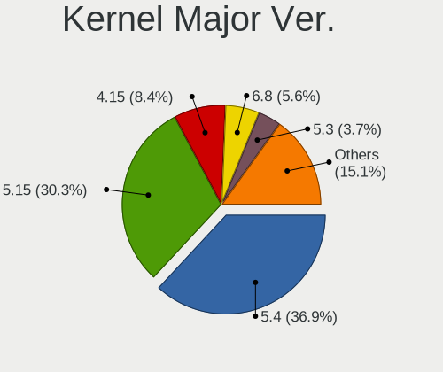
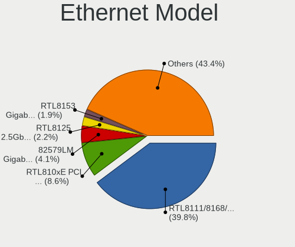
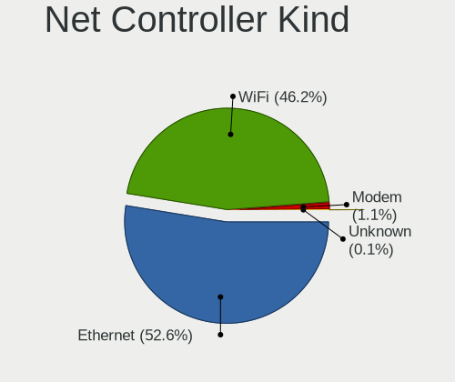
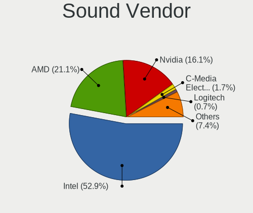
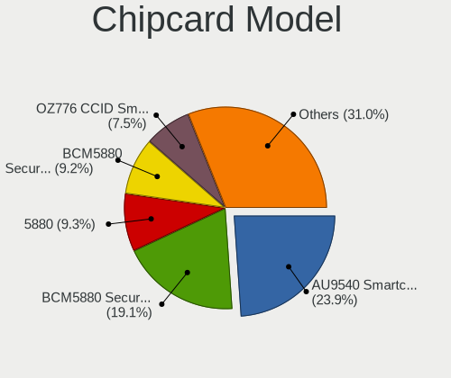

Linux Mint - Tested Hardware & Statistics
-----------------------------------------

A project to collect tested hardware configurations for Linux Mint.

Anyone can contribute to this report by the [hw-probe](https://github.com/linuxhw/hw-probe) tool:

    sudo -E hw-probe -all -upload

Please contribute! Especially if your hardware is rare.

This is a report for all computer types. See also reports for [desktops](/Dist/Linux_Mint/Desktop/README.md) and [notebooks](/Dist/Linux_Mint/Notebook/README.md).

Contents
--------

* [ Test Cases ](#test-cases)

* [ System ](#system)
  - [ OS                       ](#os)
  - [ OS Family                ](#os-family)
  - [ Kernel                   ](#kernel)
  - [ Kernel Family            ](#kernel-family)
  - [ Kernel Major Ver.        ](#kernel-major-ver)
  - [ Arch                     ](#arch)
  - [ DE                       ](#de)
  - [ Display Server           ](#display-server)
  - [ Display Manager          ](#display-manager)
  - [ OS Lang                  ](#os-lang)
  - [ Boot Mode                ](#boot-mode)
  - [ Filesystem               ](#filesystem)
  - [ Part. scheme             ](#part-scheme)
  - [ Dual Boot with Linux/BSD ](#dual-boot-with-linuxbsd)
  - [ Dual Boot (Win)          ](#dual-boot-win)

* [ Board ](#board)
  - [ Vendor                   ](#vendor)
  - [ Model                    ](#model)
  - [ Model Family             ](#model-family)
  - [ MFG Year                 ](#mfg-year)
  - [ Form Factor              ](#form-factor)
  - [ Secure Boot              ](#secure-boot)
  - [ Coreboot                 ](#coreboot)
  - [ RAM Size                 ](#ram-size)
  - [ RAM Used                 ](#ram-used)
  - [ Total Drives             ](#total-drives)
  - [ Has CD-ROM               ](#has-cd-rom)
  - [ Has Ethernet             ](#has-ethernet)
  - [ Has WiFi                 ](#has-wifi)
  - [ Has Bluetooth            ](#has-bluetooth)

* [ Location ](#location)
  - [ Country                  ](#country)
  - [ City                     ](#city)

* [ Drives ](#drives)
  - [ Drive Vendor             ](#drive-vendor)
  - [ Drive Model              ](#drive-model)
  - [ HDD Vendor               ](#hdd-vendor)
  - [ SSD Vendor               ](#ssd-vendor)
  - [ Drive Kind               ](#drive-kind)
  - [ Drive Connector          ](#drive-connector)
  - [ Drive Size               ](#drive-size)
  - [ Space Total              ](#space-total)
  - [ Space Used               ](#space-used)
  - [ Malfunc. Drives          ](#malfunc-drives)
  - [ Malfunc. Drive Vendor    ](#malfunc-drive-vendor)
  - [ Malfunc. HDD Vendor      ](#malfunc-hdd-vendor)
  - [ Malfunc. Drive Kind      ](#malfunc-drive-kind)
  - [ Failed Drives            ](#failed-drives)
  - [ Failed Drive Vendor      ](#failed-drive-vendor)
  - [ Drive Status             ](#drive-status)

* [ Storage controller ](#storage-controller)
  - [ Storage Vendor           ](#storage-vendor)
  - [ Storage Model            ](#storage-model)
  - [ Storage Kind             ](#storage-kind)

* [ Processor ](#processor)
  - [ CPU Vendor               ](#cpu-vendor)
  - [ CPU Model                ](#cpu-model)
  - [ CPU Model Family         ](#cpu-model-family)
  - [ CPU Cores                ](#cpu-cores)
  - [ CPU Sockets              ](#cpu-sockets)
  - [ CPU Threads              ](#cpu-threads)
  - [ CPU Op-Modes             ](#cpu-op-modes)
  - [ CPU Microcode            ](#cpu-microcode)
  - [ CPU Microarch            ](#cpu-microarch)

* [ Graphics ](#graphics)
  - [ GPU Vendor               ](#gpu-vendor)
  - [ GPU Model                ](#gpu-model)
  - [ GPU Combo                ](#gpu-combo)
  - [ GPU Driver               ](#gpu-driver)
  - [ GPU Memory               ](#gpu-memory)

* [ Monitor ](#monitor)
  - [ Monitor Vendor           ](#monitor-vendor)
  - [ Monitor Model            ](#monitor-model)
  - [ Monitor Resolution       ](#monitor-resolution)
  - [ Monitor Diagonal         ](#monitor-diagonal)
  - [ Monitor Width            ](#monitor-width)
  - [ Aspect Ratio             ](#aspect-ratio)
  - [ Monitor Area             ](#monitor-area)
  - [ Pixel Density            ](#pixel-density)
  - [ Multiple Monitors        ](#multiple-monitors)

* [ Network ](#network)
  - [ Net Controller Vendor    ](#net-controller-vendor)
  - [ Net Controller Model     ](#net-controller-model)
  - [ Wireless Vendor          ](#wireless-vendor)
  - [ Wireless Model           ](#wireless-model)
  - [ Ethernet Vendor          ](#ethernet-vendor)
  - [ Ethernet Model           ](#ethernet-model)
  - [ Net Controller Kind      ](#net-controller-kind)
  - [ Used Controller          ](#used-controller)
  - [ NICs                     ](#nics)
  - [ IPv6                     ](#ipv6)

* [ Bluetooth ](#bluetooth)
  - [ Bluetooth Vendor         ](#bluetooth-vendor)
  - [ Bluetooth Model          ](#bluetooth-model)

* [ Sound ](#sound)
  - [ Sound Vendor             ](#sound-vendor)
  - [ Sound Model              ](#sound-model)

* [ Memory ](#memory)
  - [ Memory Vendor            ](#memory-vendor)
  - [ Memory Model             ](#memory-model)
  - [ Memory Kind              ](#memory-kind)
  - [ Memory Form Factor       ](#memory-form-factor)
  - [ Memory Size              ](#memory-size)
  - [ Memory Speed             ](#memory-speed)

* [ Printers & scanners ](#printers--scanners)
  - [ Printer Vendor           ](#printer-vendor)
  - [ Printer Model            ](#printer-model)
  - [ Scanner Vendor           ](#scanner-vendor)
  - [ Scanner Model            ](#scanner-model)

* [ Camera ](#camera)
  - [ Camera Vendor            ](#camera-vendor)
  - [ Camera Model             ](#camera-model)

* [ Security ](#security)
  - [ Fingerprint Vendor       ](#fingerprint-vendor)
  - [ Fingerprint Model        ](#fingerprint-model)
  - [ Chipcard Vendor          ](#chipcard-vendor)
  - [ Chipcard Model           ](#chipcard-model)

* [ Unsupported ](#unsupported)
  - [ Unsupported Devices      ](#unsupported-devices)
  - [ Unsupported Device Types ](#unsupported-device-types)

Test Cases
----------

Total: 36349

| Vendor        | Model                       | Form-Factor | Probe                                                      | Date         |
|---------------|-----------------------------|-------------|------------------------------------------------------------|--------------|
| Samsung       | 940XGK                      | Notebook    | [7e994928cf](https://linux-hardware.org/?probe=7e994928cf) | Jan 06, 2025 |
| HP            | Laptop 15-bw0xx             | Notebook    | [63a7238333](https://linux-hardware.org/?probe=63a7238333) | Jan 06, 2025 |
| Intel Clie... | LAPBC710                    | Notebook    | [27e1a6b6c4](https://linux-hardware.org/?probe=27e1a6b6c4) | Jan 06, 2025 |
| ASRock        | 970M Pro3                   | Desktop     | [8eda0b8fbf](https://linux-hardware.org/?probe=8eda0b8fbf) | Jan 06, 2025 |
| MSI           | 760GM-P21                   | Desktop     | [93d5fbc0a8](https://linux-hardware.org/?probe=93d5fbc0a8) | Jan 06, 2025 |
| Acer          | Nitro ANV15-51              | Notebook    | [657a86fee0](https://linux-hardware.org/?probe=657a86fee0) | Jan 06, 2025 |
| Dell          | Vostro 14-5480              | Notebook    | [30963b610d](https://linux-hardware.org/?probe=30963b610d) | Jan 06, 2025 |
| ASUSTek       | ROG STRIX B365-F GAMING     | Desktop     | [01012c9b3b](https://linux-hardware.org/?probe=01012c9b3b) | Jan 06, 2025 |
| ASUSTek       | TUF Gaming B650M-E WIFI     | Desktop     | [250c829e77](https://linux-hardware.org/?probe=250c829e77) | Jan 05, 2025 |
| Dell          | Vostro 14-5480              | Notebook    | [5232467681](https://linux-hardware.org/?probe=5232467681) | Jan 05, 2025 |
| MSI           | A520M-A PRO                 | Desktop     | [17c782de89](https://linux-hardware.org/?probe=17c782de89) | Jan 05, 2025 |
| Gigabyte      | Z68AP-D3                    | Desktop     | [7f798e706e](https://linux-hardware.org/?probe=7f798e706e) | Jan 05, 2025 |
| ASUSTek       | VivoBook_ASUSLaptop M370... | Notebook    | [3a6262bc2c](https://linux-hardware.org/?probe=3a6262bc2c) | Jan 05, 2025 |
| HP            | 250 G7 Notebook PC          | Notebook    | [0562d753f2](https://linux-hardware.org/?probe=0562d753f2) | Jan 05, 2025 |
| HP            | 250 G7 Notebook PC          | Notebook    | [0cf6343ea2](https://linux-hardware.org/?probe=0cf6343ea2) | Jan 05, 2025 |
| Acer          | Aspire 7520                 | Notebook    | [8633b8ad2a](https://linux-hardware.org/?probe=8633b8ad2a) | Jan 05, 2025 |
| Lenovo        | ThinkPad X1 Carbon 6th 2... | Notebook    | [34234d8404](https://linux-hardware.org/?probe=34234d8404) | Jan 05, 2025 |
| Dell          | XPS 13 9360                 | Notebook    | [fc246315b0](https://linux-hardware.org/?probe=fc246315b0) | Jan 05, 2025 |
| Fujitsu       | STYLISTIC Q7310             | Tablet      | [e7db77a1ce](https://linux-hardware.org/?probe=e7db77a1ce) | Jan 05, 2025 |
| ASUSTek       | M4A79T Deluxe               | Desktop     | [0b63013a2a](https://linux-hardware.org/?probe=0b63013a2a) | Jan 05, 2025 |
| Acer          | Aspire A515-43              | Notebook    | [9afd1ddd9e](https://linux-hardware.org/?probe=9afd1ddd9e) | Jan 05, 2025 |
| Packard Be... | EasyNote TJ65               | Notebook    | [ef9f9ac2c6](https://linux-hardware.org/?probe=ef9f9ac2c6) | Jan 05, 2025 |
| Apple         | MacBookPro9,1               | Notebook    | [ae5a71dde0](https://linux-hardware.org/?probe=ae5a71dde0) | Jan 05, 2025 |
| Lenovo        | ThinkPad E580 20KTS0TF00    | Notebook    | [220c6d82f3](https://linux-hardware.org/?probe=220c6d82f3) | Jan 05, 2025 |
| HP            | Laptop 17-cp2xxx            | Notebook    | [f8146603c3](https://linux-hardware.org/?probe=f8146603c3) | Jan 05, 2025 |
| HP            | ProBook 445 G7              | Notebook    | [30f8996b5f](https://linux-hardware.org/?probe=30f8996b5f) | Jan 05, 2025 |
| HP            | 8906 SMVB                   | Desktop     | [6fc944e5ec](https://linux-hardware.org/?probe=6fc944e5ec) | Jan 05, 2025 |
| Dell          | 0VNP2H A00                  | Desktop     | [eb43deacf0](https://linux-hardware.org/?probe=eb43deacf0) | Jan 05, 2025 |
| HP            | Laptop 17-cp2xxx            | Notebook    | [48236cccfb](https://linux-hardware.org/?probe=48236cccfb) | Jan 05, 2025 |
| Samsung       | 300E4A/300E5A/300E7A/343... | Notebook    | [6bf558bdd0](https://linux-hardware.org/?probe=6bf558bdd0) | Jan 05, 2025 |
| Lenovo        | ThinkPad L15 Gen 1 20U30... | Notebook    | [b0b56ec993](https://linux-hardware.org/?probe=b0b56ec993) | Jan 05, 2025 |
| Dell          | 0JP3NX A01                  | Desktop     | [954d7d9768](https://linux-hardware.org/?probe=954d7d9768) | Jan 04, 2025 |
| LG Electro... | 22V280 FAB1                 | All in one  | [a595c7b829](https://linux-hardware.org/?probe=a595c7b829) | Jan 04, 2025 |
| Lenovo        | ThinkPad T440p 20AN0069U... | Notebook    | [dbdff3ab95](https://linux-hardware.org/?probe=dbdff3ab95) | Jan 04, 2025 |
| ASRock        | X570M Pro4                  | Desktop     | [a049693dcf](https://linux-hardware.org/?probe=a049693dcf) | Jan 04, 2025 |
| Acer          | Swift SF713-51              | Notebook    | [0b49901d64](https://linux-hardware.org/?probe=0b49901d64) | Jan 04, 2025 |
| Acer          | Swift SF713-51              | Notebook    | [9dc8059968](https://linux-hardware.org/?probe=9dc8059968) | Jan 04, 2025 |
| ASRock        | H61M-S                      | Desktop     | [313d81da9f](https://linux-hardware.org/?probe=313d81da9f) | Jan 04, 2025 |
| ASRock        | 970 Extreme3                | Desktop     | [8455ec6772](https://linux-hardware.org/?probe=8455ec6772) | Jan 04, 2025 |
| Acer          | Aspire 5680                 | Notebook    | [404c14f822](https://linux-hardware.org/?probe=404c14f822) | Jan 04, 2025 |
| Lenovo        | ThinkPad E16 Gen 2 21M5C... | Notebook    | [891b36fe2c](https://linux-hardware.org/?probe=891b36fe2c) | Jan 04, 2025 |
| Lenovo        | ThinkPad E16 Gen 2 21M5C... | Notebook    | [7b5bde2cbf](https://linux-hardware.org/?probe=7b5bde2cbf) | Jan 04, 2025 |
| Gigabyte      | X670E AORUS MASTER          | Desktop     | [30d29839dc](https://linux-hardware.org/?probe=30d29839dc) | Jan 04, 2025 |
| Gigabyte      | B650M AORUS ELITE AX        | Desktop     | [e0e8e3f7e0](https://linux-hardware.org/?probe=e0e8e3f7e0) | Jan 04, 2025 |
| Gigabyte      | MZBSWMP-00                  | Desktop     | [f24a8a2441](https://linux-hardware.org/?probe=f24a8a2441) | Jan 04, 2025 |
| ASUSTek       | M5A97 R2.0                  | Desktop     | [ced881b7bd](https://linux-hardware.org/?probe=ced881b7bd) | Jan 04, 2025 |
| Dell          | Precision M4800             | Notebook    | [7c360180e7](https://linux-hardware.org/?probe=7c360180e7) | Jan 04, 2025 |
| ASUSTek       | VivoBook_ASUSLaptop X515... | Notebook    | [3eeaef91d5](https://linux-hardware.org/?probe=3eeaef91d5) | Jan 04, 2025 |
| ASUSTek       | VivoBook_ASUSLaptop X515... | Notebook    | [ca47c65b3a](https://linux-hardware.org/?probe=ca47c65b3a) | Jan 04, 2025 |
| Lenovo        | IdeaPad Slim 3 15AMN8 82... | Notebook    | [70d641dc76](https://linux-hardware.org/?probe=70d641dc76) | Jan 04, 2025 |
| Apple         | MacBookPro9,2               | Notebook    | [bc4630757c](https://linux-hardware.org/?probe=bc4630757c) | Jan 04, 2025 |
| Lenovo        | IdeaPad Slim 3 15AMN8 82... | Notebook    | [5c063c3aee](https://linux-hardware.org/?probe=5c063c3aee) | Jan 04, 2025 |
| Lenovo        | 1030                        | Desktop     | [aab2f96127](https://linux-hardware.org/?probe=aab2f96127) | Jan 03, 2025 |
| Sony          | VPCSB1V9E                   | Notebook    | [b96a412efa](https://linux-hardware.org/?probe=b96a412efa) | Jan 03, 2025 |
| Alienware     | m16 R1                      | Notebook    | [a61a1d8c59](https://linux-hardware.org/?probe=a61a1d8c59) | Jan 03, 2025 |
| Apple         | MacBookPro9,2               | Notebook    | [905b0da038](https://linux-hardware.org/?probe=905b0da038) | Jan 03, 2025 |
| ASUSTek       | PRIME X570-P                | Desktop     | [d19c6cfd10](https://linux-hardware.org/?probe=d19c6cfd10) | Jan 03, 2025 |
| Acer          | Predator PO3-640            | Desktop     | [6fef01063d](https://linux-hardware.org/?probe=6fef01063d) | Jan 03, 2025 |
| Acer          | Predator PO3-640            | Desktop     | [391df0e144](https://linux-hardware.org/?probe=391df0e144) | Jan 03, 2025 |
| ASUSTek       | Z87-A                       | Desktop     | [09a6966e22](https://linux-hardware.org/?probe=09a6966e22) | Jan 03, 2025 |
| ASUSTek       | Z87-A                       | Desktop     | [123503d16c](https://linux-hardware.org/?probe=123503d16c) | Jan 03, 2025 |
| ASUSTek       | K55DR                       | Notebook    | [2a17dca919](https://linux-hardware.org/?probe=2a17dca919) | Jan 03, 2025 |
| ASRock        | H61M-DGS R2.0               | Desktop     | [7c2b340f98](https://linux-hardware.org/?probe=7c2b340f98) | Jan 03, 2025 |
| ASUSTek       | PN50                        | Mini pc     | [0c16b7182b](https://linux-hardware.org/?probe=0c16b7182b) | Jan 03, 2025 |
| ASUSTek       | PN50                        | Mini pc     | [5227f55572](https://linux-hardware.org/?probe=5227f55572) | Jan 03, 2025 |
| ASRock        | Z170 Extreme4               | Desktop     | [cec21335ef](https://linux-hardware.org/?probe=cec21335ef) | Jan 03, 2025 |
| Intel         | NUC13SBBi9 M58736-302       | Mini pc     | [5d9f2b4584](https://linux-hardware.org/?probe=5d9f2b4584) | Jan 03, 2025 |
| HP            | Pavilion dv5                | Notebook    | [994c479b50](https://linux-hardware.org/?probe=994c479b50) | Jan 02, 2025 |
| Unknown       | Unknown                     | Desktop     | [e4a99f7f2d](https://linux-hardware.org/?probe=e4a99f7f2d) | Jan 02, 2025 |
| HP            | OMEN by Laptop 15-dh1xxx    | Notebook    | [c1c82e2ff7](https://linux-hardware.org/?probe=c1c82e2ff7) | Jan 02, 2025 |
| MACHINIST     | E5-MR9A V1.0                | Desktop     | [302d708c3c](https://linux-hardware.org/?probe=302d708c3c) | Jan 02, 2025 |
| Acer          | Aspire A315-24P             | Notebook    | [40320094a6](https://linux-hardware.org/?probe=40320094a6) | Jan 02, 2025 |
| Dell          | 0PU052                      | Desktop     | [5dbb155ab6](https://linux-hardware.org/?probe=5dbb155ab6) | Jan 02, 2025 |
| MSI           | P45 Neo3                    | Desktop     | [022b141025](https://linux-hardware.org/?probe=022b141025) | Jan 02, 2025 |
| Sony          | VPCSB1V9E                   | Notebook    | [4a49ef6e88](https://linux-hardware.org/?probe=4a49ef6e88) | Jan 02, 2025 |
| HP            | Notebook                    | Notebook    | [06877f4048](https://linux-hardware.org/?probe=06877f4048) | Jan 02, 2025 |
| Lenovo        | ThinkPad T450s 20BX0011G... | Notebook    | [6e3771b5de](https://linux-hardware.org/?probe=6e3771b5de) | Jan 02, 2025 |
| Unknown       | MZ-B75-S                    | Desktop     | [81ac458db0](https://linux-hardware.org/?probe=81ac458db0) | Jan 02, 2025 |
| Lenovo        | Legion Slim 5 16ARP9 83E... | Notebook    | [f2904a45ad](https://linux-hardware.org/?probe=f2904a45ad) | Jan 02, 2025 |
| HP            | ENVY Laptop 17t-da000       | Notebook    | [c5fcd7ff93](https://linux-hardware.org/?probe=c5fcd7ff93) | Jan 02, 2025 |
| ASRock        | AB350 Pro4                  | Desktop     | [669da3420f](https://linux-hardware.org/?probe=669da3420f) | Jan 02, 2025 |
| ASUSTek       | P7P55D DELUXE               | Desktop     | [12d33ee44d](https://linux-hardware.org/?probe=12d33ee44d) | Jan 02, 2025 |
| ASUSTek       | M3A                         | Desktop     | [35dd91fa94](https://linux-hardware.org/?probe=35dd91fa94) | Jan 01, 2025 |
| ASRock        | A520M-HVS                   | Desktop     | [57e6177738](https://linux-hardware.org/?probe=57e6177738) | Jan 01, 2025 |
| HP            | 15                          | Notebook    | [683e4b72b8](https://linux-hardware.org/?probe=683e4b72b8) | Jan 01, 2025 |
| ASUSTek       | ASUS TUF Gaming A16 FA60... | Notebook    | [bfe08359ed](https://linux-hardware.org/?probe=bfe08359ed) | Jan 01, 2025 |
| Lenovo        | IdeaPad S400 20195          | Notebook    | [9cb18b3ddd](https://linux-hardware.org/?probe=9cb18b3ddd) | Jan 01, 2025 |
| Notebook      | PD5x_7xSNC_SND_SNE          | Notebook    | [5765389ba6](https://linux-hardware.org/?probe=5765389ba6) | Jan 01, 2025 |
| HP            | Unknown                     | Notebook    | [d415ba61b5](https://linux-hardware.org/?probe=d415ba61b5) | Jan 01, 2025 |
| HP            | Unknown                     | Notebook    | [ce24e826ba](https://linux-hardware.org/?probe=ce24e826ba) | Jan 01, 2025 |
| HP            | 8433 11                     | Desktop     | [94d39a7f10](https://linux-hardware.org/?probe=94d39a7f10) | Jan 01, 2025 |
| HP            | Pavilion Notebook           | Notebook    | [2cd285f25b](https://linux-hardware.org/?probe=2cd285f25b) | Jan 01, 2025 |
| HP            | Pavilion Notebook           | Notebook    | [b20e70da0c](https://linux-hardware.org/?probe=b20e70da0c) | Jan 01, 2025 |
| ASRock        | H61M-DGS R2.0               | Desktop     | [7e66f7b517](https://linux-hardware.org/?probe=7e66f7b517) | Jan 01, 2025 |
| ASRock        | A520M-HVS                   | Desktop     | [9478ad6eab](https://linux-hardware.org/?probe=9478ad6eab) | Jan 01, 2025 |
| Lenovo        | V15 G3 IAP 82TT             | Notebook    | [6bab72d854](https://linux-hardware.org/?probe=6bab72d854) | Jan 01, 2025 |
| Lenovo        | V15 G3 IAP 82TT             | Notebook    | [924cbed836](https://linux-hardware.org/?probe=924cbed836) | Jan 01, 2025 |
| Lenovo        | SHARKBAY 0B98401 WIN        | Desktop     | [612e46a0e7](https://linux-hardware.org/?probe=612e46a0e7) | Jan 01, 2025 |
| Apple         | Mac-F65AE981FFA204ED Mac... | Mini pc     | [6f31b0c5a7](https://linux-hardware.org/?probe=6f31b0c5a7) | Jan 01, 2025 |
| Gigabyte      | B650 AORUS ELITE AX V2      | Desktop     | [00b2a8ffad](https://linux-hardware.org/?probe=00b2a8ffad) | Jan 01, 2025 |
| Apple         | Mac-F65AE981FFA204ED Mac... | Mini pc     | [bf173b637e](https://linux-hardware.org/?probe=bf173b637e) | Jan 01, 2025 |
| Gigabyte      | X670E AORUS MASTER          | Desktop     | [ea5e598ed5](https://linux-hardware.org/?probe=ea5e598ed5) | Jan 01, 2025 |
| Dell          | Precision M4800             | Notebook    | [4e3bd9cbb4](https://linux-hardware.org/?probe=4e3bd9cbb4) | Jan 01, 2025 |
| Dell          | XPS 15 9575                 | Convertible | [0795b7d84f](https://linux-hardware.org/?probe=0795b7d84f) | Jan 01, 2025 |
| Toshiba       | Satellite C55-B             | Notebook    | [57036129ee](https://linux-hardware.org/?probe=57036129ee) | Jan 01, 2025 |
| Google        | Caroline                    | Notebook    | [4aef1f789f](https://linux-hardware.org/?probe=4aef1f789f) | Jan 01, 2025 |
| Dell          | 0P096C A00                  | Desktop     | [7a9c5b5c35](https://linux-hardware.org/?probe=7a9c5b5c35) | Jan 01, 2025 |
| ASUSTek       | G20CB                       | Desktop     | [3f76019e9e](https://linux-hardware.org/?probe=3f76019e9e) | Dec 31, 2024 |
| HUAWEI        | BoDE-WXX9                   | Notebook    | [b88f684622](https://linux-hardware.org/?probe=b88f684622) | Dec 31, 2024 |
| HP            | Pavilion Sleekbook 15       | Notebook    | [eb0ead6c49](https://linux-hardware.org/?probe=eb0ead6c49) | Dec 31, 2024 |
| Dell          | Latitude E6400              | Notebook    | [d5dcfbc839](https://linux-hardware.org/?probe=d5dcfbc839) | Dec 31, 2024 |
| Medion        | E3224                       | Convertible | [9def2aed31](https://linux-hardware.org/?probe=9def2aed31) | Dec 31, 2024 |
| ASUSTek       | TUF Gaming A620M-PLUS       | Desktop     | [248853b59c](https://linux-hardware.org/?probe=248853b59c) | Dec 31, 2024 |
| Lenovo        | 3098 0B98401 PRO            | Desktop     | [2f09544e8b](https://linux-hardware.org/?probe=2f09544e8b) | Dec 31, 2024 |
| HP            | 805A                        | Desktop     | [06248fdac7](https://linux-hardware.org/?probe=06248fdac7) | Dec 31, 2024 |
| Samsung       | 350V5C/351V5C/3540VC/344... | Notebook    | [299e38a1c7](https://linux-hardware.org/?probe=299e38a1c7) | Dec 31, 2024 |
| ASUSTek       | ROG STRIX B650E-I GAMING... | Desktop     | [a66ac9e217](https://linux-hardware.org/?probe=a66ac9e217) | Dec 31, 2024 |
| Apple         | Mac-F65AE981FFA204ED Mac... | Mini pc     | [e4d51f2e6a](https://linux-hardware.org/?probe=e4d51f2e6a) | Dec 31, 2024 |
| Acer          | Aspire A515-45              | Notebook    | [1a20ef9a3c](https://linux-hardware.org/?probe=1a20ef9a3c) | Dec 30, 2024 |
| ASUSTek       | K53BR                       | Notebook    | [077a4205f3](https://linux-hardware.org/?probe=077a4205f3) | Dec 30, 2024 |
| Gigabyte      | B650M DS3H                  | Desktop     | [47cda9caab](https://linux-hardware.org/?probe=47cda9caab) | Dec 30, 2024 |
| ASUSTek       | X71SL                       | Notebook    | [e9857b1f50](https://linux-hardware.org/?probe=e9857b1f50) | Dec 30, 2024 |
| ASRock        | H61M-DGS R2.0               | Desktop     | [242dfca6c8](https://linux-hardware.org/?probe=242dfca6c8) | Dec 30, 2024 |
| HP            | EliteBook 655 15.6 inch ... | Notebook    | [6278369011](https://linux-hardware.org/?probe=6278369011) | Dec 30, 2024 |
| Lenovo        | IdeaPad 1 15IAU7 82QD       | Notebook    | [3d855d3f86](https://linux-hardware.org/?probe=3d855d3f86) | Dec 30, 2024 |
| Lenovo        | IdeaPad S340-15API 81NC     | Notebook    | [33dad31e6e](https://linux-hardware.org/?probe=33dad31e6e) | Dec 30, 2024 |
| VALE          | Notebook Slim S132          | Notebook    | [3275a28486](https://linux-hardware.org/?probe=3275a28486) | Dec 30, 2024 |
| Dell          | 0P096C A00                  | Desktop     | [f85266bf30](https://linux-hardware.org/?probe=f85266bf30) | Dec 30, 2024 |
| HUAWEI        | KLVL-WXX9                   | Notebook    | [50d20229d8](https://linux-hardware.org/?probe=50d20229d8) | Dec 30, 2024 |
| Dell          | 0G3HR7 A00                  | Desktop     | [68a7e872ce](https://linux-hardware.org/?probe=68a7e872ce) | Dec 30, 2024 |
| Unknown       | MZ-B75-S                    | Desktop     | [b0af06f0f4](https://linux-hardware.org/?probe=b0af06f0f4) | Dec 30, 2024 |
| Unknown       | MZ-B75-S                    | Desktop     | [9b5c7009ad](https://linux-hardware.org/?probe=9b5c7009ad) | Dec 30, 2024 |
| Acer          | Aspire A515-45              | Notebook    | [9a29af74ff](https://linux-hardware.org/?probe=9a29af74ff) | Dec 30, 2024 |
| Dell          | Latitude E6320              | Notebook    | [0d3a82be0d](https://linux-hardware.org/?probe=0d3a82be0d) | Dec 30, 2024 |
| Lenovo        | Unknown                     | Notebook    | [89b1437fa2](https://linux-hardware.org/?probe=89b1437fa2) | Dec 29, 2024 |
| Lenovo        | ThinkPad E580 20KTS0TF00    | Notebook    | [3ca3276427](https://linux-hardware.org/?probe=3ca3276427) | Dec 29, 2024 |
| Apple         | MacBookPro5,5               | Notebook    | [843455b524](https://linux-hardware.org/?probe=843455b524) | Dec 29, 2024 |
| Acer          | TMP645-M                    | Notebook    | [0355ef9fb3](https://linux-hardware.org/?probe=0355ef9fb3) | Dec 29, 2024 |
| Foxconn       | P4M900-8237A                | Desktop     | [861a2b8a1d](https://linux-hardware.org/?probe=861a2b8a1d) | Dec 29, 2024 |
| HP            | 18E7                        | Desktop     | [47d21f72aa](https://linux-hardware.org/?probe=47d21f72aa) | Dec 29, 2024 |
| Apple         | MacBookAir2,1               | Notebook    | [3a01cb6d48](https://linux-hardware.org/?probe=3a01cb6d48) | Dec 29, 2024 |
| Gigabyte      | B760 GAMING X               | Desktop     | [88448d92de](https://linux-hardware.org/?probe=88448d92de) | Dec 29, 2024 |
| Dell          | Latitude E7270              | Notebook    | [5e521085a0](https://linux-hardware.org/?probe=5e521085a0) | Dec 29, 2024 |
| Lenovo        | ThinkBook 15 G5 ABP 21JF    | Notebook    | [ec36d41ebe](https://linux-hardware.org/?probe=ec36d41ebe) | Dec 29, 2024 |
| GEEKOM        | A7                          | Desktop     | [366484f41f](https://linux-hardware.org/?probe=366484f41f) | Dec 29, 2024 |
| Maibenben     | Typhoon Series              | Notebook    | [6b1a0a45d2](https://linux-hardware.org/?probe=6b1a0a45d2) | Dec 29, 2024 |
| Dell          | Latitude E6420              | Notebook    | [462ab6cc57](https://linux-hardware.org/?probe=462ab6cc57) | Dec 29, 2024 |
| MSI           | B450-A PRO MAX              | Desktop     | [2a3140ff53](https://linux-hardware.org/?probe=2a3140ff53) | Dec 29, 2024 |
| MSI           | X470 GAMING PLUS MAX        | Desktop     | [b5263fe645](https://linux-hardware.org/?probe=b5263fe645) | Dec 29, 2024 |
| Foxconn       | 2AB1                        | Desktop     | [e4c7b07722](https://linux-hardware.org/?probe=e4c7b07722) | Dec 28, 2024 |
| Unknown       | Unknown                     | Desktop     | [09a3128900](https://linux-hardware.org/?probe=09a3128900) | Dec 28, 2024 |
| ASUSTek       | PRIME Z270-P                | Desktop     | [83bbeb0374](https://linux-hardware.org/?probe=83bbeb0374) | Dec 28, 2024 |
| Dell          | XPS 15 9575                 | Convertible | [ab8de4a881](https://linux-hardware.org/?probe=ab8de4a881) | Dec 28, 2024 |
| Dell          | 0WVYMC A00                  | Desktop     | [44cd35cf64](https://linux-hardware.org/?probe=44cd35cf64) | Dec 28, 2024 |
| Apple         | MacBookPro11,4              | Notebook    | [6f5640dbff](https://linux-hardware.org/?probe=6f5640dbff) | Dec 28, 2024 |
| MSI           | GS60 6QE                    | Notebook    | [d2355f1bc6](https://linux-hardware.org/?probe=d2355f1bc6) | Dec 28, 2024 |
| MSI           | GS60 6QE                    | Notebook    | [335d033bc6](https://linux-hardware.org/?probe=335d033bc6) | Dec 28, 2024 |
| Acer          | Veriton N4640G              | Desktop     | [3713dbb1e6](https://linux-hardware.org/?probe=3713dbb1e6) | Dec 28, 2024 |
| Acer          | Aspire A715-76G             | Notebook    | [2eac48d513](https://linux-hardware.org/?probe=2eac48d513) | Dec 28, 2024 |
| HP            | Laptop 15s-eq1xxx           | Notebook    | [9ce5b91ecb](https://linux-hardware.org/?probe=9ce5b91ecb) | Dec 28, 2024 |
| ASUSTek       | TUF Gaming X570-PLUS        | Desktop     | [b654a18eee](https://linux-hardware.org/?probe=b654a18eee) | Dec 28, 2024 |
| ASUSTek       | TUF Gaming X570-PLUS        | Desktop     | [81e034c5f8](https://linux-hardware.org/?probe=81e034c5f8) | Dec 28, 2024 |
| Google        | Robo                        | Notebook    | [fcc74e4162](https://linux-hardware.org/?probe=fcc74e4162) | Dec 28, 2024 |
| Apple         | MacBookPro8,1               | Notebook    | [c7e5641996](https://linux-hardware.org/?probe=c7e5641996) | Dec 27, 2024 |
| HP            | 2AE5 A01                    | Desktop     | [37a58aa15b](https://linux-hardware.org/?probe=37a58aa15b) | Dec 27, 2024 |
| Intel         | D54250WYK H13922-303        | Desktop     | [77fd66459a](https://linux-hardware.org/?probe=77fd66459a) | Dec 27, 2024 |
| Foxconn       | 2AB1                        | Desktop     | [2667fc30e8](https://linux-hardware.org/?probe=2667fc30e8) | Dec 27, 2024 |
| ASUSTek       | TUF Gaming B550M-ZAKU       | Desktop     | [2f86029430](https://linux-hardware.org/?probe=2f86029430) | Dec 27, 2024 |
| HP            | EliteBook x360 1030 G2      | Convertible | [79016b31bb](https://linux-hardware.org/?probe=79016b31bb) | Dec 27, 2024 |
| AZW           | SER V10                     | Mini pc     | [cdbc4af61e](https://linux-hardware.org/?probe=cdbc4af61e) | Dec 27, 2024 |
| ASUSTek       | VivoBook_ASUSLaptop K660... | Notebook    | [b9d5bc89b8](https://linux-hardware.org/?probe=b9d5bc89b8) | Dec 27, 2024 |
| ASUSTek       | VivoBook_ASUSLaptop K660... | Notebook    | [03ce070dd2](https://linux-hardware.org/?probe=03ce070dd2) | Dec 27, 2024 |
| Lenovo        | G50-80 80E5                 | Notebook    | [fc91ff6b9f](https://linux-hardware.org/?probe=fc91ff6b9f) | Dec 27, 2024 |
| MSI           | B550M PRO-VDH WIFI          | Desktop     | [27f73d7e4e](https://linux-hardware.org/?probe=27f73d7e4e) | Dec 27, 2024 |
| Acer          | Aspire 5515                 | Notebook    | [65f32786d9](https://linux-hardware.org/?probe=65f32786d9) | Dec 27, 2024 |
| HP            | Pavilion Gaming Laptop 1... | Notebook    | [701ff9b72f](https://linux-hardware.org/?probe=701ff9b72f) | Dec 27, 2024 |
| Toshiba       | Satellite L850              | Notebook    | [9c4810944d](https://linux-hardware.org/?probe=9c4810944d) | Dec 27, 2024 |
| Dell          | 08NPPY A00                  | Desktop     | [785f5a5f70](https://linux-hardware.org/?probe=785f5a5f70) | Dec 27, 2024 |
| Lenovo        | IdeaPad L340-15IRH Gamin... | Notebook    | [234883eac2](https://linux-hardware.org/?probe=234883eac2) | Dec 27, 2024 |
| ASRock        | B450M Pro4                  | Desktop     | [e4aa8e8128](https://linux-hardware.org/?probe=e4aa8e8128) | Dec 26, 2024 |
| Lenovo        | ThinkPad T14 Gen 2i 20W0... | Notebook    | [369cdd52d8](https://linux-hardware.org/?probe=369cdd52d8) | Dec 26, 2024 |
| Foxconn       | 2AB1                        | Desktop     | [70925114c3](https://linux-hardware.org/?probe=70925114c3) | Dec 26, 2024 |
| ASUSTek       | K53E                        | Notebook    | [33ce8daf57](https://linux-hardware.org/?probe=33ce8daf57) | Dec 26, 2024 |
| MicroByte     | ezbook                      | Notebook    | [0e74630fca](https://linux-hardware.org/?probe=0e74630fca) | Dec 26, 2024 |
| MicroByte     | ezbook                      | Notebook    | [89e57e9b60](https://linux-hardware.org/?probe=89e57e9b60) | Dec 26, 2024 |
| Lenovo        | ThinkPad T14 Gen 2i 20W0... | Notebook    | [41e3dac21e](https://linux-hardware.org/?probe=41e3dac21e) | Dec 26, 2024 |
| ASRock        | N68-GE                      | Desktop     | [7f7f614f22](https://linux-hardware.org/?probe=7f7f614f22) | Dec 26, 2024 |
| Microsoft     | Surface 3                   | Tablet      | [3c5d9b1b2b](https://linux-hardware.org/?probe=3c5d9b1b2b) | Dec 26, 2024 |
| HP            | EliteBook 820 G3            | Notebook    | [4804abe046](https://linux-hardware.org/?probe=4804abe046) | Dec 26, 2024 |
| Gateway       | NV55C                       | Notebook    | [060f326f5d](https://linux-hardware.org/?probe=060f326f5d) | Dec 26, 2024 |
| Gateway       | NV55C                       | Notebook    | [3cacf3568a](https://linux-hardware.org/?probe=3cacf3568a) | Dec 26, 2024 |
| ASUSTek       | Z170-A                      | Desktop     | [96e5e9d5fd](https://linux-hardware.org/?probe=96e5e9d5fd) | Dec 26, 2024 |
| ASUSTek       | BM1AF_BP1AF_BM6AF           | Desktop     | [622f9ae7f4](https://linux-hardware.org/?probe=622f9ae7f4) | Dec 25, 2024 |
| Apple         | MacBookPro11,3              | Notebook    | [f82f2bf488](https://linux-hardware.org/?probe=f82f2bf488) | Dec 25, 2024 |
| MSI           | X470 GAMING PLUS MAX        | Desktop     | [25790885cb](https://linux-hardware.org/?probe=25790885cb) | Dec 25, 2024 |
| Acer          | Aspire A317-52              | Notebook    | [75800ca5ab](https://linux-hardware.org/?probe=75800ca5ab) | Dec 25, 2024 |
| Acer          | Aspire A317-52              | Notebook    | [7893251832](https://linux-hardware.org/?probe=7893251832) | Dec 25, 2024 |
| Microsoft     | Surface Pro 3               | Tablet      | [be39955885](https://linux-hardware.org/?probe=be39955885) | Dec 25, 2024 |
| Microsoft     | Surface Pro 3               | Tablet      | [759312327c](https://linux-hardware.org/?probe=759312327c) | Dec 25, 2024 |
| Unknown       | MX16                        | Notebook    | [45e7d14b5b](https://linux-hardware.org/?probe=45e7d14b5b) | Dec 25, 2024 |
| ASUSTek       | PRIME B660M-A D4            | Desktop     | [d314c49ee9](https://linux-hardware.org/?probe=d314c49ee9) | Dec 25, 2024 |
| ASUSTek       | PRIME B660M-A D4            | Desktop     | [f39ab795bb](https://linux-hardware.org/?probe=f39ab795bb) | Dec 25, 2024 |
| Acer          | Extensa 5630                | Notebook    | [f522d51182](https://linux-hardware.org/?probe=f522d51182) | Dec 25, 2024 |
| HP            | EliteBook 840 G3            | Notebook    | [bae2eb1cb6](https://linux-hardware.org/?probe=bae2eb1cb6) | Dec 25, 2024 |
| Gigabyte      | B85-HD3                     | Desktop     | [9fc43e3fa9](https://linux-hardware.org/?probe=9fc43e3fa9) | Dec 25, 2024 |
| Intel         | NUC5i3MYBE H47781-209       | Mini pc     | [90bba668e6](https://linux-hardware.org/?probe=90bba668e6) | Dec 25, 2024 |
| ASUSTek       | VivoBook_ASUSLaptop X140... | Notebook    | [466079d6a0](https://linux-hardware.org/?probe=466079d6a0) | Dec 25, 2024 |
| Toshiba       | Satellite C655D             | Notebook    | [6d0f797746](https://linux-hardware.org/?probe=6d0f797746) | Dec 24, 2024 |
| ASUSTek       | ROG STRIX X370-F GAMING     | Desktop     | [6e24ffa9a1](https://linux-hardware.org/?probe=6e24ffa9a1) | Dec 24, 2024 |
| Lenovo        | IdeaPad Gaming 3 16ARH7 ... | Notebook    | [8a07ac474c](https://linux-hardware.org/?probe=8a07ac474c) | Dec 24, 2024 |
| Fujitsu       | LIFEBOOK A357               | Notebook    | [695f75c7e1](https://linux-hardware.org/?probe=695f75c7e1) | Dec 24, 2024 |
| Acer          | Aspire E5-571               | Notebook    | [30ee5ab8eb](https://linux-hardware.org/?probe=30ee5ab8eb) | Dec 24, 2024 |
| Acer          | Aspire 5515                 | Notebook    | [b42e71f029](https://linux-hardware.org/?probe=b42e71f029) | Dec 24, 2024 |
| HP            | EliteBook 850 G4            | Notebook    | [d577b1a30c](https://linux-hardware.org/?probe=d577b1a30c) | Dec 24, 2024 |
| Unknown       | Unknown                     | Desktop     | [7119a317d5](https://linux-hardware.org/?probe=7119a317d5) | Dec 24, 2024 |
| Win elemen... | M600 V01                    | Mini pc     | [eb3ebcc1fd](https://linux-hardware.org/?probe=eb3ebcc1fd) | Dec 24, 2024 |
| ASUSTek       | M4A79T Deluxe               | Desktop     | [54be938049](https://linux-hardware.org/?probe=54be938049) | Dec 24, 2024 |
| Lenovo        | ThinkCentre A70 7099S3A     | Desktop     | [1ed214159d](https://linux-hardware.org/?probe=1ed214159d) | Dec 24, 2024 |
| Acer          | Aspire 5742                 | Notebook    | [1464964b4c](https://linux-hardware.org/?probe=1464964b4c) | Dec 24, 2024 |
| Acer          | Swift SF314-59              | Notebook    | [fb10309ad2](https://linux-hardware.org/?probe=fb10309ad2) | Dec 24, 2024 |
| Acer          | Swift SF314-59              | Notebook    | [dc8395bb56](https://linux-hardware.org/?probe=dc8395bb56) | Dec 24, 2024 |
| MSI           | 990FXA-GD65                 | Desktop     | [f62a826f4d](https://linux-hardware.org/?probe=f62a826f4d) | Dec 24, 2024 |
| Fujitsu       | STYLISTIC Q7310             | Tablet      | [a4723c1caa](https://linux-hardware.org/?probe=a4723c1caa) | Dec 24, 2024 |
| eMachines     | E725                        | Notebook    | [c4c6cfaa36](https://linux-hardware.org/?probe=c4c6cfaa36) | Dec 23, 2024 |
| Intel         | NUC8BEB J72693-307          | Mini pc     | [6ca113b8e1](https://linux-hardware.org/?probe=6ca113b8e1) | Dec 23, 2024 |
| ASUSTek       | ROG STRIX X670E-E GAMING... | Desktop     | [65b8d941dc](https://linux-hardware.org/?probe=65b8d941dc) | Dec 23, 2024 |
| MSI           | Z77A-GD65                   | Desktop     | [2bda3d9800](https://linux-hardware.org/?probe=2bda3d9800) | Dec 23, 2024 |
| Lenovo        | ThinkPad X1 Carbon 6th 2... | Notebook    | [07df89f610](https://linux-hardware.org/?probe=07df89f610) | Dec 23, 2024 |
| ASUSTek       | N55SF                       | Notebook    | [6858c89a4c](https://linux-hardware.org/?probe=6858c89a4c) | Dec 23, 2024 |
| Dell          | 018D1Y A00                  | Desktop     | [41a23c9b5a](https://linux-hardware.org/?probe=41a23c9b5a) | Dec 23, 2024 |
| Lenovo        | ThinkPad T460s 20FAS09L0... | Notebook    | [e7eac1f625](https://linux-hardware.org/?probe=e7eac1f625) | Dec 23, 2024 |
| HP            | 1497                        | Desktop     | [245a5c3c47](https://linux-hardware.org/?probe=245a5c3c47) | Dec 23, 2024 |
| Acer          | Aspire 5517                 | Notebook    | [e8dbb7c265](https://linux-hardware.org/?probe=e8dbb7c265) | Dec 23, 2024 |
| Lenovo        | SHARKBAY 0B98417 PRO        | Desktop     | [c7502297f0](https://linux-hardware.org/?probe=c7502297f0) | Dec 23, 2024 |
| ASUSTek       | H81M-K                      | Desktop     | [f02c49baa6](https://linux-hardware.org/?probe=f02c49baa6) | Dec 22, 2024 |
| TECNO Mobi... | MEGABOOK T15DA              | Notebook    | [eb2b432d23](https://linux-hardware.org/?probe=eb2b432d23) | Dec 22, 2024 |
| ASUSTek       | X555YI                      | Notebook    | [220480564a](https://linux-hardware.org/?probe=220480564a) | Dec 22, 2024 |
| Packard Be... | WMCP78M                     | Desktop     | [b9f3620021](https://linux-hardware.org/?probe=b9f3620021) | Dec 22, 2024 |
| Packard Be... | WMCP78M                     | Desktop     | [9d24c10673](https://linux-hardware.org/?probe=9d24c10673) | Dec 22, 2024 |
| Lenovo        | ThinkPad T430 2347G2P       | Notebook    | [31c6e468d6](https://linux-hardware.org/?probe=31c6e468d6) | Dec 22, 2024 |
| Dell          | Latitude E7470              | Notebook    | [2cc5b158d0](https://linux-hardware.org/?probe=2cc5b158d0) | Dec 22, 2024 |
| Toshiba       | Satellite Pro S500          | Notebook    | [4e2a69384d](https://linux-hardware.org/?probe=4e2a69384d) | Dec 22, 2024 |
| Lenovo        | ThinkPad X220 4290W4H       | Notebook    | [90831fdec2](https://linux-hardware.org/?probe=90831fdec2) | Dec 22, 2024 |
| Lenovo        | ThinkPad X220 4290W4H       | Notebook    | [c3d75237a3](https://linux-hardware.org/?probe=c3d75237a3) | Dec 22, 2024 |
| ASUSTek       | ROG STRIX B660-A GAMING ... | Desktop     | [8bf0b50eb2](https://linux-hardware.org/?probe=8bf0b50eb2) | Dec 22, 2024 |
| Acer          | Spin SP314-54N              | Convertible | [d8d98d6396](https://linux-hardware.org/?probe=d8d98d6396) | Dec 22, 2024 |
| Toshiba       | Satellite L850              | Notebook    | [e71308eb8c](https://linux-hardware.org/?probe=e71308eb8c) | Dec 22, 2024 |
| HP            | Pavilion x360 Convertibl... | Convertible | [4f874e00d3](https://linux-hardware.org/?probe=4f874e00d3) | Dec 22, 2024 |
| Unknown       | MX16                        | Notebook    | [0c0601e23c](https://linux-hardware.org/?probe=0c0601e23c) | Dec 21, 2024 |
| MSI           | X299 SLI PLUS               | Desktop     | [6aee2c68c6](https://linux-hardware.org/?probe=6aee2c68c6) | Dec 21, 2024 |
| Dell          | G15 5530                    | Notebook    | [c5dd0f5822](https://linux-hardware.org/?probe=c5dd0f5822) | Dec 21, 2024 |
| MSI           | H110M PRO-D                 | Desktop     | [fefcbf513b](https://linux-hardware.org/?probe=fefcbf513b) | Dec 21, 2024 |
| Lenovo        | ThinkPad T430 2347G2P       | Notebook    | [76ea7c137e](https://linux-hardware.org/?probe=76ea7c137e) | Dec 21, 2024 |
| Acer          | Swift SFG14-63              | Notebook    | [fcebbc10bd](https://linux-hardware.org/?probe=fcebbc10bd) | Dec 21, 2024 |
| Lenovo        | ThinkPad X250 20CLS11W0W    | Notebook    | [ca04e40dd4](https://linux-hardware.org/?probe=ca04e40dd4) | Dec 21, 2024 |
| HP            | EliteBook 8460p             | Notebook    | [963d7abc23](https://linux-hardware.org/?probe=963d7abc23) | Dec 21, 2024 |
| MSI           | CR61 2M/CX61 2OC/CX61 2O... | Notebook    | [7c8e20f877](https://linux-hardware.org/?probe=7c8e20f877) | Dec 21, 2024 |
| Dell          | G15 5530                    | Notebook    | [10287313ac](https://linux-hardware.org/?probe=10287313ac) | Dec 21, 2024 |
| HP            | Victus by Gaming Laptop ... | Notebook    | [7acc8a5af8](https://linux-hardware.org/?probe=7acc8a5af8) | Dec 21, 2024 |
| ASUSTek       | VivoBook_ASUSLaptop M160... | Notebook    | [c846ce8e60](https://linux-hardware.org/?probe=c846ce8e60) | Dec 21, 2024 |
| HP            | ENVY Laptop 13-ba1xxx       | Notebook    | [d286a3fd4a](https://linux-hardware.org/?probe=d286a3fd4a) | Dec 21, 2024 |
| HUAWEI        | MDG-XX                      | Notebook    | [1f5ee29f02](https://linux-hardware.org/?probe=1f5ee29f02) | Dec 21, 2024 |
| MSI           | MS-B090                     | All in one  | [d80b4e7372](https://linux-hardware.org/?probe=d80b4e7372) | Dec 21, 2024 |
| Apple         | Mac-63001698E7A34814 iMa... | All in one  | [0c36bc1e93](https://linux-hardware.org/?probe=0c36bc1e93) | Dec 21, 2024 |
| HP            | 255 G7 Notebook PC          | Notebook    | [441e9a9166](https://linux-hardware.org/?probe=441e9a9166) | Dec 21, 2024 |
| MACHINIST     | E5-MR9A V1.0                | Desktop     | [f14a3b5ccf](https://linux-hardware.org/?probe=f14a3b5ccf) | Dec 20, 2024 |
| MSI           | H110M PRO-D                 | Desktop     | [c72cef4631](https://linux-hardware.org/?probe=c72cef4631) | Dec 20, 2024 |
| ASRock        | B450M-HDV R4.0              | Desktop     | [0f8384fde3](https://linux-hardware.org/?probe=0f8384fde3) | Dec 20, 2024 |
| ASUSTek       | N501VW                      | Notebook    | [a68fb2f096](https://linux-hardware.org/?probe=a68fb2f096) | Dec 20, 2024 |
| Acer          | Aspire V3-371               | Notebook    | [ed218c23ae](https://linux-hardware.org/?probe=ed218c23ae) | Dec 20, 2024 |
| Dell          | 0XCR8D A00                  | Desktop     | [b17e5e9125](https://linux-hardware.org/?probe=b17e5e9125) | Dec 20, 2024 |
| Unknown       | Unknown                     | Notebook    | [cec2654e16](https://linux-hardware.org/?probe=cec2654e16) | Dec 20, 2024 |
| AZW           | SER V2.0                    | Mini pc     | [ee8b7348c6](https://linux-hardware.org/?probe=ee8b7348c6) | Dec 20, 2024 |
| Lenovo        | ThinkPad T430 23499C5       | Notebook    | [04426df402](https://linux-hardware.org/?probe=04426df402) | Dec 20, 2024 |
| ASUSTek       | PRIME H310M-E R2.0          | Desktop     | [d5fd6f7a36](https://linux-hardware.org/?probe=d5fd6f7a36) | Dec 20, 2024 |
| MSI           | Z77A-G43                    | Desktop     | [9d4a34b339](https://linux-hardware.org/?probe=9d4a34b339) | Dec 20, 2024 |
| Acer          | TravelMate Spin P414RN-5... | Convertible | [db63d13ddb](https://linux-hardware.org/?probe=db63d13ddb) | Dec 20, 2024 |
| Unknown       | Unknown                     | Notebook    | [8cedb6a671](https://linux-hardware.org/?probe=8cedb6a671) | Dec 20, 2024 |
| HP            | 829E                        | Mini pc     | [246c5d2532](https://linux-hardware.org/?probe=246c5d2532) | Dec 20, 2024 |
| Dell          | Latitude 5500               | Notebook    | [23faa70238](https://linux-hardware.org/?probe=23faa70238) | Dec 20, 2024 |
| Shuttle       | FH270                       | Desktop     | [068d900b56](https://linux-hardware.org/?probe=068d900b56) | Dec 19, 2024 |
| ASRock        | A520M-HVS                   | Desktop     | [47c40e8f1b](https://linux-hardware.org/?probe=47c40e8f1b) | Dec 19, 2024 |
| MSI           | B450M MORTAR MAX            | Desktop     | [597e16ba37](https://linux-hardware.org/?probe=597e16ba37) | Dec 19, 2024 |
| ASUSTek       | ET1620I                     | Desktop     | [961909e36f](https://linux-hardware.org/?probe=961909e36f) | Dec 19, 2024 |
| ASRock        | A520M-HVS                   | Desktop     | [4807d91515](https://linux-hardware.org/?probe=4807d91515) | Dec 19, 2024 |
| HP            | 18E7                        | Desktop     | [1e44952230](https://linux-hardware.org/?probe=1e44952230) | Dec 19, 2024 |
| HP            | ProBook 450 G5              | Notebook    | [d884bdac45](https://linux-hardware.org/?probe=d884bdac45) | Dec 19, 2024 |
| Apple         | MacBookPro8,1               | Notebook    | [4d69e2afb5](https://linux-hardware.org/?probe=4d69e2afb5) | Dec 19, 2024 |
| Acer          | TravelMate 6292             | Notebook    | [a81468385b](https://linux-hardware.org/?probe=a81468385b) | Dec 19, 2024 |
| HP            | Pavilion dv6                | Notebook    | [d532497c6d](https://linux-hardware.org/?probe=d532497c6d) | Dec 19, 2024 |
| ASUSTek       | GA15DH                      | Desktop     | [97bd3b6074](https://linux-hardware.org/?probe=97bd3b6074) | Dec 19, 2024 |
| Samsung       | 550P5C/550P7C               | Notebook    | [0f7b61cd39](https://linux-hardware.org/?probe=0f7b61cd39) | Dec 19, 2024 |
| Lenovo        | ThinkPad E16 Gen 1 21JN0... | Notebook    | [dae98f533a](https://linux-hardware.org/?probe=dae98f533a) | Dec 19, 2024 |
| Lenovo        | ThinkPad E16 Gen 1 21JN0... | Notebook    | [5655debff7](https://linux-hardware.org/?probe=5655debff7) | Dec 19, 2024 |
| ASUSTek       | SABERTOOTH Z77              | Desktop     | [7d20b9caf7](https://linux-hardware.org/?probe=7d20b9caf7) | Dec 19, 2024 |
| ASUSTek       | VC65R                       | Desktop     | [4448e95ce5](https://linux-hardware.org/?probe=4448e95ce5) | Dec 19, 2024 |
| ASUSTek       | VC65R                       | Desktop     | [62a516f5ab](https://linux-hardware.org/?probe=62a516f5ab) | Dec 19, 2024 |
| Apple         | MacBookAir6,1               | Notebook    | [ec57f00f41](https://linux-hardware.org/?probe=ec57f00f41) | Dec 19, 2024 |
| Apple         | MacBookAir6,1               | Notebook    | [16547e9167](https://linux-hardware.org/?probe=16547e9167) | Dec 19, 2024 |
| Lenovo        | ThinkPad X1 Carbon 2nd 2... | Notebook    | [5b148e6851](https://linux-hardware.org/?probe=5b148e6851) | Dec 19, 2024 |
| Dell          | 06X1TJ A00                  | Desktop     | [7db2715b22](https://linux-hardware.org/?probe=7db2715b22) | Dec 19, 2024 |
| Acer          | Aspire A515-45              | Notebook    | [3cd12c751c](https://linux-hardware.org/?probe=3cd12c751c) | Dec 19, 2024 |
| Acer          | Aspire A515-57              | Notebook    | [5872cea5da](https://linux-hardware.org/?probe=5872cea5da) | Dec 19, 2024 |
| Lenovo        | ThinkPad E16 Gen 2 21M5C... | Notebook    | [224bf763b0](https://linux-hardware.org/?probe=224bf763b0) | Dec 19, 2024 |
| ASUSTek       | PRIME H310-PLUS R2.0        | Desktop     | [1acad3b822](https://linux-hardware.org/?probe=1acad3b822) | Dec 18, 2024 |
| AZW           | MINI S                      | Desktop     | [bb9a63ad1b](https://linux-hardware.org/?probe=bb9a63ad1b) | Dec 18, 2024 |
| ASUSTek       | SABERTOOTH Z97 MARK 1       | Desktop     | [c565398bf1](https://linux-hardware.org/?probe=c565398bf1) | Dec 18, 2024 |
| Acer          | Aspire A515-45              | Notebook    | [67b8e4d3e7](https://linux-hardware.org/?probe=67b8e4d3e7) | Dec 18, 2024 |
| ASUSTek       | SABERTOOTH Z97 MARK 1       | Desktop     | [5dc92f19cf](https://linux-hardware.org/?probe=5dc92f19cf) | Dec 18, 2024 |
| Dell          | Latitude 7390               | Notebook    | [d446a06dc6](https://linux-hardware.org/?probe=d446a06dc6) | Dec 18, 2024 |
| Fujitsu       | D3601-A1 S26361-D3601-A1    | Desktop     | [153f551d38](https://linux-hardware.org/?probe=153f551d38) | Dec 18, 2024 |
| Lenovo        | IdeaPad S340-15IWL 81N8     | Notebook    | [ccee342e62](https://linux-hardware.org/?probe=ccee342e62) | Dec 18, 2024 |
| Acer          | Veriton X2631G              | Desktop     | [c603e73396](https://linux-hardware.org/?probe=c603e73396) | Dec 18, 2024 |
| ASUSTek       | X556UJ                      | Notebook    | [39a4e3dc48](https://linux-hardware.org/?probe=39a4e3dc48) | Dec 18, 2024 |
| Lenovo        | ThinkPad L13 Gen 1 20R4S... | Notebook    | [72af0dcd5c](https://linux-hardware.org/?probe=72af0dcd5c) | Dec 18, 2024 |
| ASUSTek       | VivoBook_ASUSLaptop X412... | Notebook    | [2748e82ed7](https://linux-hardware.org/?probe=2748e82ed7) | Dec 18, 2024 |
| Acer          | Aspire 1810TZ               | Notebook    | [1dd425b482](https://linux-hardware.org/?probe=1dd425b482) | Dec 17, 2024 |
| ASUSTek       | M4A88TD-V EVO/USB3          | Desktop     | [6f3a9094fe](https://linux-hardware.org/?probe=6f3a9094fe) | Dec 17, 2024 |
| ASUSTek       | X550JF                      | Notebook    | [b2ddf9ed9e](https://linux-hardware.org/?probe=b2ddf9ed9e) | Dec 17, 2024 |
| Gigabyte      | B760M G AX                  | Desktop     | [b0a2fd8b02](https://linux-hardware.org/?probe=b0a2fd8b02) | Dec 17, 2024 |
| Lenovo        | ThinkPad E16 Gen 2 21M5C... | Notebook    | [6a35db1aff](https://linux-hardware.org/?probe=6a35db1aff) | Dec 17, 2024 |
| Intel         | NUC10i3FNB K61362-303       | Mini pc     | [955e66136d](https://linux-hardware.org/?probe=955e66136d) | Dec 17, 2024 |
| Sony          | VGN-FZ31M                   | Notebook    | [11db51fc55](https://linux-hardware.org/?probe=11db51fc55) | Dec 17, 2024 |
| ASUSTek       | TUF B450M-PRO GAMING        | Desktop     | [8322276a80](https://linux-hardware.org/?probe=8322276a80) | Dec 17, 2024 |
| ASUSTek       | TUF Gaming B560-PLUS WIF... | Notebook    | [7e4e6bb310](https://linux-hardware.org/?probe=7e4e6bb310) | Dec 17, 2024 |
| Intel         | H61                         | Desktop     | [c4217d24f6](https://linux-hardware.org/?probe=c4217d24f6) | Dec 17, 2024 |
| Lenovo        | G570 PIWG1                  | Notebook    | [b41ab58347](https://linux-hardware.org/?probe=b41ab58347) | Dec 17, 2024 |
| Apple         | Mac-AA95B1DDAB278B95 iMa... | All in one  | [1877b2792f](https://linux-hardware.org/?probe=1877b2792f) | Dec 17, 2024 |
| Lenovo        | IdeaPad 1 15ALC7 82R4       | Notebook    | [1fd8e049e6](https://linux-hardware.org/?probe=1fd8e049e6) | Dec 17, 2024 |
| Lenovo        | LOQ 15IAX9 83GS             | Notebook    | [9121321176](https://linux-hardware.org/?probe=9121321176) | Dec 17, 2024 |
| HP            | Pavilion Gaming Laptop 1... | Notebook    | [d3c1363556](https://linux-hardware.org/?probe=d3c1363556) | Dec 17, 2024 |
| MSI           | H110M PRO-VD                | Desktop     | [3c491227b7](https://linux-hardware.org/?probe=3c491227b7) | Dec 16, 2024 |
| Lenovo        | IdeaPad 1 15IGL7 82V7       | Notebook    | [273d602adb](https://linux-hardware.org/?probe=273d602adb) | Dec 16, 2024 |
| Acer          | Aspire A315-23              | Notebook    | [e51fcf8215](https://linux-hardware.org/?probe=e51fcf8215) | Dec 16, 2024 |
| Gigabyte      | Z270N-WIFI-CF               | Desktop     | [21910e2c4a](https://linux-hardware.org/?probe=21910e2c4a) | Dec 16, 2024 |
| Foxconn       | 2ABF                        | Desktop     | [34c40afb92](https://linux-hardware.org/?probe=34c40afb92) | Dec 16, 2024 |
| ASUSTek       | ASUS TUF Gaming F15 FX50... | Notebook    | [c955d4b757](https://linux-hardware.org/?probe=c955d4b757) | Dec 16, 2024 |
| HP            | Pavilion Laptop 15-eh3xx... | Notebook    | [2b58ebfebe](https://linux-hardware.org/?probe=2b58ebfebe) | Dec 16, 2024 |
| MSI           | MPG B550 GAMING CARBON W... | Desktop     | [3893ecf2d0](https://linux-hardware.org/?probe=3893ecf2d0) | Dec 16, 2024 |
| Apple         | MacBookPro11,1              | Notebook    | [a1a1361aa6](https://linux-hardware.org/?probe=a1a1361aa6) | Dec 16, 2024 |
| HP            | 84DE 01100                  | All in one  | [a7f55be076](https://linux-hardware.org/?probe=a7f55be076) | Dec 16, 2024 |
| ASUSTek       | P8Z77-V LX                  | Desktop     | [40c4cef0ef](https://linux-hardware.org/?probe=40c4cef0ef) | Dec 16, 2024 |
| ASUSTek       | K55A                        | Notebook    | [7cba33fcaa](https://linux-hardware.org/?probe=7cba33fcaa) | Dec 15, 2024 |
| HP            | 250 G3                      | Notebook    | [33fd855839](https://linux-hardware.org/?probe=33fd855839) | Dec 15, 2024 |
| Lenovo        | SHARKBAY NOK                | Desktop     | [7bcee07c07](https://linux-hardware.org/?probe=7bcee07c07) | Dec 15, 2024 |
| HP            | OMEN by Laptop 17-ck1xxx    | Notebook    | [a39d299b50](https://linux-hardware.org/?probe=a39d299b50) | Dec 15, 2024 |
| HUAWEI        | KPL-W0X                     | Notebook    | [d28acee099](https://linux-hardware.org/?probe=d28acee099) | Dec 15, 2024 |
| Lenovo        | ThinkPad T560 20FH0023MB    | Notebook    | [b073c6e731](https://linux-hardware.org/?probe=b073c6e731) | Dec 15, 2024 |
| ASUSTek       | PRIME A520M-K               | Desktop     | [4a1f51c600](https://linux-hardware.org/?probe=4a1f51c600) | Dec 15, 2024 |
| HP            | Laptop 15-bw0xx             | Notebook    | [821c2b9cb8](https://linux-hardware.org/?probe=821c2b9cb8) | Dec 15, 2024 |
| HP            | Laptop 15s-eq2xxx           | Notebook    | [29ff45ca2d](https://linux-hardware.org/?probe=29ff45ca2d) | Dec 15, 2024 |
| Medion        | T11X5A16                    | Desktop     | [14404cc77d](https://linux-hardware.org/?probe=14404cc77d) | Dec 15, 2024 |
| Medion        | T11X5A16                    | Desktop     | [1fc28c5865](https://linux-hardware.org/?probe=1fc28c5865) | Dec 15, 2024 |
| MSI           | MAG X870 TOMAHAWK WIFI      | Desktop     | [83ca588caa](https://linux-hardware.org/?probe=83ca588caa) | Dec 15, 2024 |
| ASUSTek       | K56CA                       | Notebook    | [89f8be5027](https://linux-hardware.org/?probe=89f8be5027) | Dec 15, 2024 |
| BESSTAR Te... | UM700                       | Desktop     | [ff83fe1d3e](https://linux-hardware.org/?probe=ff83fe1d3e) | Dec 15, 2024 |
| ECS           | Nettle2                     | Desktop     | [caffafd1eb](https://linux-hardware.org/?probe=caffafd1eb) | Dec 15, 2024 |
| ASUSTek       | 970 PRO GAMING/AURA         | Desktop     | [834cca8e2b](https://linux-hardware.org/?probe=834cca8e2b) | Dec 15, 2024 |
| ASUSTek       | P7P55D-E                    | Desktop     | [5eedc626d9](https://linux-hardware.org/?probe=5eedc626d9) | Dec 15, 2024 |
| Lenovo        | SHARKBAY NOK                | Desktop     | [e5fd8952ae](https://linux-hardware.org/?probe=e5fd8952ae) | Dec 14, 2024 |
| AZW           | U59                         | Desktop     | [cfcb774dd7](https://linux-hardware.org/?probe=cfcb774dd7) | Dec 14, 2024 |
| Apple         | Mac-8ED6AF5B48C039E1 Mac... | Mini pc     | [4bbd294790](https://linux-hardware.org/?probe=4bbd294790) | Dec 14, 2024 |
| Clevo         | W25xHPx                     | Notebook    | [d99db89bfa](https://linux-hardware.org/?probe=d99db89bfa) | Dec 14, 2024 |
| Dell          | XPS 15 9510                 | Notebook    | [f66ce0b3ee](https://linux-hardware.org/?probe=f66ce0b3ee) | Dec 14, 2024 |
| Dell          | 0WMJ54 A01                  | Desktop     | [00c962b29d](https://linux-hardware.org/?probe=00c962b29d) | Dec 14, 2024 |
| Lenovo        | SHARKBAY SDK0E50510 WIN     | Desktop     | [36c0ecd50a](https://linux-hardware.org/?probe=36c0ecd50a) | Dec 14, 2024 |
| Lenovo        | SHARKBAY SDK0E50510 WIN     | Desktop     | [cf56d42225](https://linux-hardware.org/?probe=cf56d42225) | Dec 14, 2024 |
| HP            | Pavilion g6                 | Notebook    | [ef81588017](https://linux-hardware.org/?probe=ef81588017) | Dec 14, 2024 |
| Lenovo        | ThinkPad P53 20QQS6BR01     | Notebook    | [1fdb59d03d](https://linux-hardware.org/?probe=1fdb59d03d) | Dec 14, 2024 |
| Fujitsu       | LIFEBOOK E756               | Notebook    | [dc1040b8a0](https://linux-hardware.org/?probe=dc1040b8a0) | Dec 14, 2024 |
| HP            | 2187 A01                    | Desktop     | [fe4a768b42](https://linux-hardware.org/?probe=fe4a768b42) | Dec 14, 2024 |
| Dell          | Inspiron 5570               | Notebook    | [2219eae21d](https://linux-hardware.org/?probe=2219eae21d) | Dec 14, 2024 |
| HP            | 3047h                       | Desktop     | [60b8d8c582](https://linux-hardware.org/?probe=60b8d8c582) | Dec 14, 2024 |
| Lenovo        | ThinkPad E580 20KTS0TF00    | Notebook    | [3b4adb5d69](https://linux-hardware.org/?probe=3b4adb5d69) | Dec 13, 2024 |
| Apple         | Mac-7BA5B2794B2CDB12 Mac... | Mini pc     | [3cd46a8dad](https://linux-hardware.org/?probe=3cd46a8dad) | Dec 13, 2024 |
| Samsung       | 550XDA                      | Notebook    | [6013fd585a](https://linux-hardware.org/?probe=6013fd585a) | Dec 13, 2024 |
| MSI           | GT70                        | Notebook    | [518f6c347b](https://linux-hardware.org/?probe=518f6c347b) | Dec 13, 2024 |
| ASUSTek       | ROG STRIX B450-F GAMING     | Desktop     | [41c0acdaab](https://linux-hardware.org/?probe=41c0acdaab) | Dec 13, 2024 |
| ASUSTek       | TUF H370-PRO GAMING         | Desktop     | [f39f2cc1a5](https://linux-hardware.org/?probe=f39f2cc1a5) | Dec 13, 2024 |
| ASUSTek       | ZenBook Pro Duo UX582HS_... | Notebook    | [bb2f76bd02](https://linux-hardware.org/?probe=bb2f76bd02) | Dec 13, 2024 |
| HP            | 15                          | Notebook    | [8fa4cdeeac](https://linux-hardware.org/?probe=8fa4cdeeac) | Dec 13, 2024 |
| HP            | 250 G4                      | Notebook    | [0d0786ce85](https://linux-hardware.org/?probe=0d0786ce85) | Dec 13, 2024 |
| Acer          | Predator PH315-51           | Notebook    | [e0925f342c](https://linux-hardware.org/?probe=e0925f342c) | Dec 13, 2024 |
| Fujitsu       | LIFEBOOK E756               | Notebook    | [a30104ce39](https://linux-hardware.org/?probe=a30104ce39) | Dec 13, 2024 |
| Dell          | Inspiron 3482               | Notebook    | [68b2169ef5](https://linux-hardware.org/?probe=68b2169ef5) | Dec 13, 2024 |
| Acer          | Veriton X2631G              | Desktop     | [2413d11f75](https://linux-hardware.org/?probe=2413d11f75) | Dec 13, 2024 |
| Apple         | Mac-CFF7D910A743CAAF iMa... | All in one  | [e4774620da](https://linux-hardware.org/?probe=e4774620da) | Dec 13, 2024 |
| Lenovo        | Legion Y7000P-1060 81LF     | Notebook    | [88846b9776](https://linux-hardware.org/?probe=88846b9776) | Dec 13, 2024 |
| Dell          | 0PU052                      | Desktop     | [af8780c5be](https://linux-hardware.org/?probe=af8780c5be) | Dec 13, 2024 |
| ASUSTek       | A68HM-PLUS                  | Desktop     | [f234970cc5](https://linux-hardware.org/?probe=f234970cc5) | Dec 12, 2024 |
| Unknown       | Unknown                     | Tablet      | [026269e60b](https://linux-hardware.org/?probe=026269e60b) | Dec 12, 2024 |
| HP            | Pavilion g6                 | Notebook    | [f6edf49c41](https://linux-hardware.org/?probe=f6edf49c41) | Dec 12, 2024 |
| Lenovo        | IdeaPad 320-15ISK 80XH      | Notebook    | [c32e429bab](https://linux-hardware.org/?probe=c32e429bab) | Dec 12, 2024 |
| Lenovo        | IdeaPad 320-15ISK 80XH      | Notebook    | [6a39708a5f](https://linux-hardware.org/?probe=6a39708a5f) | Dec 12, 2024 |
| Acer          | Nitro AN515-58              | Notebook    | [444ca7d70a](https://linux-hardware.org/?probe=444ca7d70a) | Dec 12, 2024 |
| Lenovo        | Yoga 720-13IKB 81C3         | Convertible | [ffa399c8a0](https://linux-hardware.org/?probe=ffa399c8a0) | Dec 12, 2024 |
| Acer          | Swift SF514-54G             | Notebook    | [d8035002bc](https://linux-hardware.org/?probe=d8035002bc) | Dec 12, 2024 |
| Acer          | Aspire 5755G                | Notebook    | [b0c3abdc3c](https://linux-hardware.org/?probe=b0c3abdc3c) | Dec 12, 2024 |
| MSI           | B365M PRO-VH                | Desktop     | [aca7e6786e](https://linux-hardware.org/?probe=aca7e6786e) | Dec 12, 2024 |
| Acer          | Nitro AN515-58              | Notebook    | [b18d1c210a](https://linux-hardware.org/?probe=b18d1c210a) | Dec 12, 2024 |
| Biostar       | B550MX/E PRO                | Desktop     | [30e7b6d1fa](https://linux-hardware.org/?probe=30e7b6d1fa) | Dec 12, 2024 |
| Dell          | Latitude E5520              | Notebook    | [ae424c49a4](https://linux-hardware.org/?probe=ae424c49a4) | Dec 12, 2024 |
| AMI           | Aptio CRB                   | Mini pc     | [51528b49b0](https://linux-hardware.org/?probe=51528b49b0) | Dec 12, 2024 |
| Dell          | Inspiron 15-3567            | Notebook    | [587f8ef283](https://linux-hardware.org/?probe=587f8ef283) | Dec 12, 2024 |
| MSI           | GL63 8RC                    | Notebook    | [d60ec33bf8](https://linux-hardware.org/?probe=d60ec33bf8) | Dec 12, 2024 |
| ASUSTek       | ROG STRIX B450-F GAMING     | Desktop     | [9f1726cead](https://linux-hardware.org/?probe=9f1726cead) | Dec 11, 2024 |
| HP            | EliteBook 840 G6            | Notebook    | [23b390bd89](https://linux-hardware.org/?probe=23b390bd89) | Dec 11, 2024 |
| Lenovo        | 30BC SDK0J40697 WIN 3305... | Desktop     | [2790c6fce6](https://linux-hardware.org/?probe=2790c6fce6) | Dec 11, 2024 |
| Chuwi         | RZBOX                       | Desktop     | [ceebadbef7](https://linux-hardware.org/?probe=ceebadbef7) | Dec 11, 2024 |
| GEEKOM        | AE7                         | Desktop     | [c337bf3de6](https://linux-hardware.org/?probe=c337bf3de6) | Dec 11, 2024 |
| Foxconn       | 2A8C                        | Desktop     | [5c5f617649](https://linux-hardware.org/?probe=5c5f617649) | Dec 11, 2024 |
| Gigabyte      | B450 GAMING X               | Desktop     | [69eca05028](https://linux-hardware.org/?probe=69eca05028) | Dec 11, 2024 |
| Shuttle       | SH310V2                     | Desktop     | [e3abcefd64](https://linux-hardware.org/?probe=e3abcefd64) | Dec 11, 2024 |
| Lenovo        | Legion Pro 7 16ARX8H 82W... | Notebook    | [dd80038de7](https://linux-hardware.org/?probe=dd80038de7) | Dec 11, 2024 |
| Lenovo        | SKYBAY SDK0J40705 WIN 34... | Desktop     | [76f3b7fbe1](https://linux-hardware.org/?probe=76f3b7fbe1) | Dec 11, 2024 |
| Acer          | TravelMate Spin P414RN-5... | Convertible | [61b38849c9](https://linux-hardware.org/?probe=61b38849c9) | Dec 11, 2024 |
| Dell          | 0C27VV A01                  | Desktop     | [97b465f827](https://linux-hardware.org/?probe=97b465f827) | Dec 11, 2024 |
| HP            | ProBook 450 G8 Notebook ... | Notebook    | [54e889ddda](https://linux-hardware.org/?probe=54e889ddda) | Dec 11, 2024 |
| Apple         | MacBookPro12,1              | Notebook    | [229c569c62](https://linux-hardware.org/?probe=229c569c62) | Dec 10, 2024 |
| Apple         | MacBookPro12,1              | Notebook    | [deca3fd9a5](https://linux-hardware.org/?probe=deca3fd9a5) | Dec 10, 2024 |
| ASUSTek       | K46CA                       | Notebook    | [3f1038d713](https://linux-hardware.org/?probe=3f1038d713) | Dec 10, 2024 |
| ASUSTek       | X555QG                      | Notebook    | [4dadfdc86a](https://linux-hardware.org/?probe=4dadfdc86a) | Dec 10, 2024 |
| Gigabyte      | X670 GAMING X AX V2         | Desktop     | [95159b5753](https://linux-hardware.org/?probe=95159b5753) | Dec 10, 2024 |
| ASUSTek       | X551CA                      | Notebook    | [16fcf7261f](https://linux-hardware.org/?probe=16fcf7261f) | Dec 10, 2024 |
| Gigabyte      | H610M H                     | Desktop     | [045fc5193c](https://linux-hardware.org/?probe=045fc5193c) | Dec 10, 2024 |
| Acer          | Aspire 7745G                | Notebook    | [ec6388b8ee](https://linux-hardware.org/?probe=ec6388b8ee) | Dec 10, 2024 |
| Gigabyte      | A320M-S2H V2-CF             | Desktop     | [99750c7f81](https://linux-hardware.org/?probe=99750c7f81) | Dec 10, 2024 |
| QTQD          | Unknown                     | Desktop     | [fe9c71e541](https://linux-hardware.org/?probe=fe9c71e541) | Dec 10, 2024 |
| ASUSTek       | TUF Gaming B460-PLUS        | Desktop     | [7aace976f0](https://linux-hardware.org/?probe=7aace976f0) | Dec 10, 2024 |
| ASUSTek       | M3A76-CM                    | Desktop     | [1b5bbe8b9b](https://linux-hardware.org/?probe=1b5bbe8b9b) | Dec 10, 2024 |
| Toshiba       | PORTEGE X30-E               | Notebook    | [6c8506b8a9](https://linux-hardware.org/?probe=6c8506b8a9) | Dec 10, 2024 |
| ASUSTek       | TUF Gaming A620M-PLUS       | Desktop     | [44ba385052](https://linux-hardware.org/?probe=44ba385052) | Dec 10, 2024 |
| Acer          | Aspire E5-573               | Notebook    | [0f87e3502b](https://linux-hardware.org/?probe=0f87e3502b) | Dec 10, 2024 |
| Acer          | Aspire E5-573               | Notebook    | [1d8c086425](https://linux-hardware.org/?probe=1d8c086425) | Dec 10, 2024 |
| ASUSTek       | UX550VD                     | Notebook    | [ec8a75d03e](https://linux-hardware.org/?probe=ec8a75d03e) | Dec 09, 2024 |
| Lenovo        | ThinkPad T540p 20BE004EU... | Notebook    | [78000a21a2](https://linux-hardware.org/?probe=78000a21a2) | Dec 09, 2024 |
| Gigabyte      | B550M AORUS PRO-P           | Desktop     | [4972873070](https://linux-hardware.org/?probe=4972873070) | Dec 09, 2024 |
| ASUSTek       | F3Sr                        | Notebook    | [5ae3280aa4](https://linux-hardware.org/?probe=5ae3280aa4) | Dec 09, 2024 |
| HP            | EliteBook x360 830 G6       | Convertible | [0bfb23b000](https://linux-hardware.org/?probe=0bfb23b000) | Dec 09, 2024 |
| Apple         | MacBookPro11,1              | Notebook    | [f210133353](https://linux-hardware.org/?probe=f210133353) | Dec 09, 2024 |
| NZXT          | N7 Z370                     | Desktop     | [980901a248](https://linux-hardware.org/?probe=980901a248) | Dec 09, 2024 |
| Dell          | XPS 15 9510                 | Notebook    | [ff4cc61f47](https://linux-hardware.org/?probe=ff4cc61f47) | Dec 09, 2024 |
| Lenovo        | IdeaPad 3 15IML05 81WR      | Notebook    | [54ae692554](https://linux-hardware.org/?probe=54ae692554) | Dec 09, 2024 |
| Toshiba       | PORTEGE X30-E               | Notebook    | [1be2e9c5d1](https://linux-hardware.org/?probe=1be2e9c5d1) | Dec 09, 2024 |
| ASRock        | Z270 Pro4                   | Desktop     | [cfd1ab354a](https://linux-hardware.org/?probe=cfd1ab354a) | Dec 09, 2024 |
| Dell          | Inspiron 16 7640 2-in-1     | Notebook    | [8a6a2e5326](https://linux-hardware.org/?probe=8a6a2e5326) | Dec 09, 2024 |
| NZXT          | N7 Z370                     | Desktop     | [6dcbea3fcf](https://linux-hardware.org/?probe=6dcbea3fcf) | Dec 09, 2024 |
| Dell          | XPS 13 9310                 | Notebook    | [f7daee63db](https://linux-hardware.org/?probe=f7daee63db) | Dec 09, 2024 |
| Dell          | Inspiron 5502               | Notebook    | [7bac372167](https://linux-hardware.org/?probe=7bac372167) | Dec 09, 2024 |
| Samsung       | 550XDA                      | Notebook    | [c9233c6566](https://linux-hardware.org/?probe=c9233c6566) | Dec 08, 2024 |
| Samsung       | 700T1C                      | Notebook    | [65e3d49cf3](https://linux-hardware.org/?probe=65e3d49cf3) | Dec 08, 2024 |
| MSI           | B650 GAMING PLUS WIFI       | Desktop     | [7d4db42978](https://linux-hardware.org/?probe=7d4db42978) | Dec 08, 2024 |
| Apple         | MacBookAir6,2               | Notebook    | [372b55e089](https://linux-hardware.org/?probe=372b55e089) | Dec 08, 2024 |
| Apple         | MacBookAir6,2               | Notebook    | [665e0a1167](https://linux-hardware.org/?probe=665e0a1167) | Dec 08, 2024 |
| HP            | ENVY Laptop 13-ba1xxx       | Notebook    | [01bb9bade5](https://linux-hardware.org/?probe=01bb9bade5) | Dec 08, 2024 |
| Acer          | Veriton M4630G V:1.0        | Desktop     | [e53c39772b](https://linux-hardware.org/?probe=e53c39772b) | Dec 08, 2024 |
| ASRock        | B85M Pro4                   | Desktop     | [6590a75db3](https://linux-hardware.org/?probe=6590a75db3) | Dec 08, 2024 |
| Biostar       | A520MT                      | Desktop     | [937f0e5324](https://linux-hardware.org/?probe=937f0e5324) | Dec 08, 2024 |
| HP            | Laptop 15-bs0xx             | Notebook    | [03a9b913af](https://linux-hardware.org/?probe=03a9b913af) | Dec 08, 2024 |
| ASUSTek       | M3A76-CM                    | Desktop     | [fb83a1efd1](https://linux-hardware.org/?probe=fb83a1efd1) | Dec 08, 2024 |
| Lenovo        | ThinkPad T14 Gen 5 21ML0... | Notebook    | [875b1f63f7](https://linux-hardware.org/?probe=875b1f63f7) | Dec 08, 2024 |
| HUAWEI        | HVY-WXX9                    | Notebook    | [f5257ff538](https://linux-hardware.org/?probe=f5257ff538) | Dec 07, 2024 |
| Lenovo        | ThinkPad X131e 33671P9      | Notebook    | [ac080feaa5](https://linux-hardware.org/?probe=ac080feaa5) | Dec 07, 2024 |
| Dell          | Latitude E5530 non-vPro     | Notebook    | [0bce668ad9](https://linux-hardware.org/?probe=0bce668ad9) | Dec 07, 2024 |
| ASUSTek       | ROG STRIX B550-F GAMING     | Desktop     | [eba104f14a](https://linux-hardware.org/?probe=eba104f14a) | Dec 07, 2024 |
| Apple         | Mac-F4238CC8 PVT            | All in one  | [c038891949](https://linux-hardware.org/?probe=c038891949) | Dec 07, 2024 |
| ASUSTek       | ZenBook Pro Duo UX582HS_... | Notebook    | [1771070dd0](https://linux-hardware.org/?probe=1771070dd0) | Dec 07, 2024 |
| Intel         | Unknown                     | Desktop     | [423e3be5d1](https://linux-hardware.org/?probe=423e3be5d1) | Dec 07, 2024 |
| ASUSTek       | P8B75-M LE                  | Desktop     | [e7f0693f7c](https://linux-hardware.org/?probe=e7f0693f7c) | Dec 07, 2024 |
| HP            | Victus by Gaming Laptop ... | Notebook    | [b05f7c1be0](https://linux-hardware.org/?probe=b05f7c1be0) | Dec 07, 2024 |
| Gigabyte      | B365M H                     | Desktop     | [a922a7763f](https://linux-hardware.org/?probe=a922a7763f) | Dec 07, 2024 |
| Unknown       | MX16                        | Notebook    | [b1e596210e](https://linux-hardware.org/?probe=b1e596210e) | Dec 07, 2024 |
| Dell          | 0HC3G4 A00                  | Mini pc     | [b779fddaf2](https://linux-hardware.org/?probe=b779fddaf2) | Dec 07, 2024 |
| ASUSTek       | ASUS Vivobook S 16 M5606... | Notebook    | [a3dad268d2](https://linux-hardware.org/?probe=a3dad268d2) | Dec 06, 2024 |
| Lenovo        | ThinkPad X131e 33671P9      | Notebook    | [2ae8fcd4f0](https://linux-hardware.org/?probe=2ae8fcd4f0) | Dec 06, 2024 |
| Acer          | Swift SF314-52              | Notebook    | [4ac3dc04a3](https://linux-hardware.org/?probe=4ac3dc04a3) | Dec 06, 2024 |
| Lenovo        | IdeaPad Pro 5 16AHP9 83D... | Notebook    | [e6ba3df934](https://linux-hardware.org/?probe=e6ba3df934) | Dec 06, 2024 |
| Dell          | 0200DY A02                  | Desktop     | [4cf84c1ce5](https://linux-hardware.org/?probe=4cf84c1ce5) | Dec 06, 2024 |
| Lenovo        | IdeaPad 3 15ALC6 82KU       | Notebook    | [fdd1f52e06](https://linux-hardware.org/?probe=fdd1f52e06) | Dec 06, 2024 |
| HP            | 3646h                       | Desktop     | [a878c4299b](https://linux-hardware.org/?probe=a878c4299b) | Dec 06, 2024 |
| Dell          | Latitude 7410               | Notebook    | [08d8affa67](https://linux-hardware.org/?probe=08d8affa67) | Dec 06, 2024 |
| ASUSTek       | VivoBook 14_ASUS Laptop ... | Notebook    | [1b7baa72c2](https://linux-hardware.org/?probe=1b7baa72c2) | Dec 06, 2024 |
| Lenovo        | G580 2689K9G                | Notebook    | [e20fe2c6e5](https://linux-hardware.org/?probe=e20fe2c6e5) | Dec 06, 2024 |
| HP            | ProBook 650 G4              | Notebook    | [55466442f3](https://linux-hardware.org/?probe=55466442f3) | Dec 06, 2024 |
| NEC Comput... | PC-GN174FAAU                | Notebook    | [c90b112e13](https://linux-hardware.org/?probe=c90b112e13) | Dec 06, 2024 |
| Gigabyte      | Q87M-D2H                    | Desktop     | [8331103e77](https://linux-hardware.org/?probe=8331103e77) | Dec 06, 2024 |
| Gigabyte      | M68MT-S2                    | Desktop     | [2bad0fcf88](https://linux-hardware.org/?probe=2bad0fcf88) | Dec 06, 2024 |
| eMachines     | E525                        | Notebook    | [b178c43fa2](https://linux-hardware.org/?probe=b178c43fa2) | Dec 06, 2024 |
| HUAWEI        | KPL-W0X                     | Notebook    | [4ae5f14084](https://linux-hardware.org/?probe=4ae5f14084) | Dec 06, 2024 |
| ASUSTek       | ASUS TUF Dash F15 FX517Z... | Notebook    | [c7fd2abe95](https://linux-hardware.org/?probe=c7fd2abe95) | Dec 06, 2024 |
| Lenovo        | ThinkPad X1 Carbon 6th 2... | Notebook    | [47ec30dab5](https://linux-hardware.org/?probe=47ec30dab5) | Dec 05, 2024 |
| Intel         | NUC8i7HNB J68197-603        | Mini pc     | [99045d77bc](https://linux-hardware.org/?probe=99045d77bc) | Dec 05, 2024 |
| Positivo      | Q4128C                      | Notebook    | [866dca1d74](https://linux-hardware.org/?probe=866dca1d74) | Dec 05, 2024 |
| Fujitsu       | D3430-A1 S26361-D3430-A1    | Desktop     | [a701c134d6](https://linux-hardware.org/?probe=a701c134d6) | Dec 05, 2024 |
| ASUSTek       | ROG Strix G512LI            | Notebook    | [2d4be2eb08](https://linux-hardware.org/?probe=2d4be2eb08) | Dec 05, 2024 |
| ASUSTek       | ROG Strix G512LI            | Notebook    | [779e5bad75](https://linux-hardware.org/?probe=779e5bad75) | Dec 05, 2024 |
| Lenovo        | G500 20236                  | Notebook    | [4fad953dd2](https://linux-hardware.org/?probe=4fad953dd2) | Dec 05, 2024 |
| ASUSTek       | M5A78L-M LX3                | Desktop     | [93d9e2c966](https://linux-hardware.org/?probe=93d9e2c966) | Dec 05, 2024 |
| HP            | Pavilion 17                 | Notebook    | [12a5dae4b2](https://linux-hardware.org/?probe=12a5dae4b2) | Dec 05, 2024 |
| Packard Be... | IMEDIA S1300                | Desktop     | [b02a054b44](https://linux-hardware.org/?probe=b02a054b44) | Dec 05, 2024 |
| Fujitsu Si... | ESPRIMO Mobile D9510        | Notebook    | [4c23833013](https://linux-hardware.org/?probe=4c23833013) | Dec 05, 2024 |
| Acer          | Aspire VN7-592G             | Notebook    | [523273e955](https://linux-hardware.org/?probe=523273e955) | Dec 05, 2024 |
| HP            | ZBook Firefly 14 inch G9... | Notebook    | [77757b5ac1](https://linux-hardware.org/?probe=77757b5ac1) | Dec 05, 2024 |
| Lenovo        | IdeaPad Slim 5 16AHP9 83... | Notebook    | [a7fb4f1bc4](https://linux-hardware.org/?probe=a7fb4f1bc4) | Dec 04, 2024 |
| MSI           | GE60 2PE                    | Notebook    | [bab5d77c34](https://linux-hardware.org/?probe=bab5d77c34) | Dec 04, 2024 |
| Dell          | XPS 15 9575                 | Convertible | [7c71819fcc](https://linux-hardware.org/?probe=7c71819fcc) | Dec 04, 2024 |
| Dell          | Inspiron 3505               | Notebook    | [3485dcd3fa](https://linux-hardware.org/?probe=3485dcd3fa) | Dec 04, 2024 |
| HP            | Laptop 15-db0xxx            | Notebook    | [7ded60c94b](https://linux-hardware.org/?probe=7ded60c94b) | Dec 04, 2024 |
| Lenovo        | ThinkPad E16 Gen 2 21MA0... | Notebook    | [32cafe357c](https://linux-hardware.org/?probe=32cafe357c) | Dec 04, 2024 |
| ASUSTek       | TUF Gaming B650-PLUS WIF... | Desktop     | [d28adbcef7](https://linux-hardware.org/?probe=d28adbcef7) | Dec 04, 2024 |
| Lenovo        | B590 20208                  | Notebook    | [493ce963ab](https://linux-hardware.org/?probe=493ce963ab) | Dec 04, 2024 |
| Apple         | MacBookPro13,2              | Notebook    | [2e9baf39a4](https://linux-hardware.org/?probe=2e9baf39a4) | Dec 04, 2024 |
| Dell          | Latitude E6410              | Notebook    | [208eeccf87](https://linux-hardware.org/?probe=208eeccf87) | Dec 04, 2024 |
| BESSTAR Te... | UM700                       | Desktop     | [2cd4fbc3fc](https://linux-hardware.org/?probe=2cd4fbc3fc) | Dec 04, 2024 |
| Win Elemen... | M9S                         | Desktop     | [eed675eadb](https://linux-hardware.org/?probe=eed675eadb) | Dec 04, 2024 |
| Dell          | Inspiron 3542               | Notebook    | [f75f271653](https://linux-hardware.org/?probe=f75f271653) | Dec 03, 2024 |
| Dell          | Inspiron 3542               | Notebook    | [841b30c302](https://linux-hardware.org/?probe=841b30c302) | Dec 03, 2024 |
| ASUSTek       | ASUS TUF Gaming F15 FX50... | Notebook    | [5e4d4ad56d](https://linux-hardware.org/?probe=5e4d4ad56d) | Dec 03, 2024 |
| Win Elemen... | M9S                         | Desktop     | [403a04b12f](https://linux-hardware.org/?probe=403a04b12f) | Dec 03, 2024 |
| MSI           | Modern 15 A11MU             | Notebook    | [e338458691](https://linux-hardware.org/?probe=e338458691) | Dec 03, 2024 |
| Acer          | Swift SF314-43              | Notebook    | [133b87bc4b](https://linux-hardware.org/?probe=133b87bc4b) | Dec 03, 2024 |
| HP            | EliteBook x360 1030 G2      | Convertible | [d2d77ad0f8](https://linux-hardware.org/?probe=d2d77ad0f8) | Dec 03, 2024 |
| HP            | 8245 001                    | All in one  | [544f0d3076](https://linux-hardware.org/?probe=544f0d3076) | Dec 03, 2024 |
| ASUSTek       | M5A78L-M LX3                | Desktop     | [28ba9ba8b9](https://linux-hardware.org/?probe=28ba9ba8b9) | Dec 03, 2024 |
| MSI           | PRO H610M-E DDR4            | Desktop     | [009d15e28b](https://linux-hardware.org/?probe=009d15e28b) | Dec 03, 2024 |
| AMI           | Intel                       | Desktop     | [cecf6051ca](https://linux-hardware.org/?probe=cecf6051ca) | Dec 03, 2024 |
| Lenovo        | ThinkPad T14 Gen 5 21MC0... | Notebook    | [e2e17a6a88](https://linux-hardware.org/?probe=e2e17a6a88) | Dec 03, 2024 |
| Acer          | Aspire 5517                 | Notebook    | [5c94640290](https://linux-hardware.org/?probe=5c94640290) | Dec 02, 2024 |
| ASUSTek       | X302LA                      | Notebook    | [772896b9d3](https://linux-hardware.org/?probe=772896b9d3) | Dec 02, 2024 |
| ASUSTek       | VivoBook_ASUSLaptop X140... | Notebook    | [bdb95c5d82](https://linux-hardware.org/?probe=bdb95c5d82) | Dec 02, 2024 |
| ASUSTek       | PRIME H310M-E R2.0          | Desktop     | [d5cf17fa53](https://linux-hardware.org/?probe=d5cf17fa53) | Dec 02, 2024 |
| AZW           | SER V01                     | Mini pc     | [af90c92fbc](https://linux-hardware.org/?probe=af90c92fbc) | Dec 02, 2024 |
| MSI           | MAG B550M MORTAR WIFI       | Desktop     | [c0c49d4324](https://linux-hardware.org/?probe=c0c49d4324) | Dec 02, 2024 |
| ASUSTek       | VivoBook_ASUSLaptop M760... | Notebook    | [8150c1fd65](https://linux-hardware.org/?probe=8150c1fd65) | Dec 02, 2024 |
| Sony          | VPCEA290X                   | Notebook    | [2b91ccab1c](https://linux-hardware.org/?probe=2b91ccab1c) | Dec 02, 2024 |
| Unknown       | Unknown                     | Desktop     | [c6604dc6a1](https://linux-hardware.org/?probe=c6604dc6a1) | Dec 02, 2024 |
| Fujitsu       | STYLISTIC Q7310             | Tablet      | [acde8299c2](https://linux-hardware.org/?probe=acde8299c2) | Dec 02, 2024 |
| Apple         | Mac-942B5BF58194151B        | All in one  | [d431ac00b1](https://linux-hardware.org/?probe=d431ac00b1) | Dec 02, 2024 |
| Acer          | Aspire Z3-615               | All in one  | [1cdbfbb642](https://linux-hardware.org/?probe=1cdbfbb642) | Dec 02, 2024 |
| HP            | ENVY m6 Sleekbook           | Notebook    | [1c326a70b7](https://linux-hardware.org/?probe=1c326a70b7) | Dec 02, 2024 |
| HP            | 843F                        | Desktop     | [57d6dec6d5](https://linux-hardware.org/?probe=57d6dec6d5) | Dec 02, 2024 |
| MSI           | MAG B760M MORTAR WIFI       | Desktop     | [70ca834172](https://linux-hardware.org/?probe=70ca834172) | Dec 02, 2024 |
| Intel         | B75/Q75/Q77                 | Desktop     | [2462350161](https://linux-hardware.org/?probe=2462350161) | Dec 02, 2024 |
| Fujitsu       | D3430-A1 S26361-D3430-A1    | Desktop     | [1ef9f00235](https://linux-hardware.org/?probe=1ef9f00235) | Dec 02, 2024 |
| HP            | 250 G8 Notebook PC          | Notebook    | [20b2aa3eef](https://linux-hardware.org/?probe=20b2aa3eef) | Dec 01, 2024 |
| ASUSTek       | TUF Gaming X670E-PLUS WI... | Desktop     | [0065a1abc8](https://linux-hardware.org/?probe=0065a1abc8) | Dec 01, 2024 |
| LG Electro... | 17Z90R-K.AA78A9             | Notebook    | [fb890bfff0](https://linux-hardware.org/?probe=fb890bfff0) | Dec 01, 2024 |
| ASUSTek       | ASUS TUF Gaming F15 FX50... | Notebook    | [eec68584ed](https://linux-hardware.org/?probe=eec68584ed) | Dec 01, 2024 |
| ASUSTek       | X450LN                      | Notebook    | [e249015d69](https://linux-hardware.org/?probe=e249015d69) | Dec 01, 2024 |
| Gigabyte      | 945P-S3                     | Desktop     | [7c7775d296](https://linux-hardware.org/?probe=7c7775d296) | Dec 01, 2024 |
| GMKtec        | NucBox M2 Pro               | Other       | [fde14cef9a](https://linux-hardware.org/?probe=fde14cef9a) | Dec 01, 2024 |
| Acer          | Aspire A315-54K             | Notebook    | [6b2b116a91](https://linux-hardware.org/?probe=6b2b116a91) | Dec 01, 2024 |
| HP            | Laptop 15-bw0xx             | Notebook    | [4809801b37](https://linux-hardware.org/?probe=4809801b37) | Dec 01, 2024 |
| HP            | ProBook 4720s               | Notebook    | [64ba29b9f2](https://linux-hardware.org/?probe=64ba29b9f2) | Dec 01, 2024 |
| HP            | ProBook 4720s               | Notebook    | [9cf24341ad](https://linux-hardware.org/?probe=9cf24341ad) | Dec 01, 2024 |
| HP            | 843F                        | Desktop     | [38c42e1258](https://linux-hardware.org/?probe=38c42e1258) | Dec 01, 2024 |
| MSI           | H110M PRO-D                 | Desktop     | [b8889031de](https://linux-hardware.org/?probe=b8889031de) | Dec 01, 2024 |
| MSI           | B450 TOMAHAWK MAX II        | Desktop     | [00d4ce0f70](https://linux-hardware.org/?probe=00d4ce0f70) | Dec 01, 2024 |
| ASRock        | Z490 Phantom Gaming 4       | Desktop     | [b8890d5a6a](https://linux-hardware.org/?probe=b8890d5a6a) | Dec 01, 2024 |
| ASUSTek       | ROG Zephyrus G16 GA605WI... | Notebook    | [a238dc1bf5](https://linux-hardware.org/?probe=a238dc1bf5) | Dec 01, 2024 |
| Acer          | Aspire A515-56              | Notebook    | [fc032f32ca](https://linux-hardware.org/?probe=fc032f32ca) | Dec 01, 2024 |
| Dell          | Inspiron 5559               | Notebook    | [bcea3803cc](https://linux-hardware.org/?probe=bcea3803cc) | Dec 01, 2024 |
| HP            | Pavilion Notebook           | Notebook    | [a3bbd871c9](https://linux-hardware.org/?probe=a3bbd871c9) | Dec 01, 2024 |
| ASUSTek       | VivoBook_ASUSLaptop X140... | Notebook    | [dce5b2ffb8](https://linux-hardware.org/?probe=dce5b2ffb8) | Dec 01, 2024 |
| ASUSTek       | TUF X470-PLUS GAMING        | Desktop     | [18449824d9](https://linux-hardware.org/?probe=18449824d9) | Dec 01, 2024 |
| Gigabyte      | B360M D3H-CF                | Desktop     | [7f3136b79b](https://linux-hardware.org/?probe=7f3136b79b) | Dec 01, 2024 |
| HP            | 3646h                       | Desktop     | [d16e3af848](https://linux-hardware.org/?probe=d16e3af848) | Dec 01, 2024 |
| Gigabyte      | B550M S2H                   | Desktop     | [720b4133da](https://linux-hardware.org/?probe=720b4133da) | Dec 01, 2024 |
| Gigabyte      | B550M S2H                   | Desktop     | [9dcd09de35](https://linux-hardware.org/?probe=9dcd09de35) | Dec 01, 2024 |
| ASUSTek       | ROG STRIX Z790-E GAMING ... | Desktop     | [36f3a130a7](https://linux-hardware.org/?probe=36f3a130a7) | Dec 01, 2024 |
| ASRock        | B550 Phantom Gaming-ITX/... | Desktop     | [ec171317bb](https://linux-hardware.org/?probe=ec171317bb) | Nov 30, 2024 |
| ASRock        | B450M/ac R2.0               | Desktop     | [ff1182600d](https://linux-hardware.org/?probe=ff1182600d) | Nov 30, 2024 |
| Dell          | 0KWVT8 A00                  | Desktop     | [693cea0d9c](https://linux-hardware.org/?probe=693cea0d9c) | Nov 30, 2024 |
| Intel         | DG31PR AAD97573-205         | Desktop     | [41414033c3](https://linux-hardware.org/?probe=41414033c3) | Nov 30, 2024 |
| Gigabyte      | GA-870A-UD3                 | Desktop     | [2facd09c85](https://linux-hardware.org/?probe=2facd09c85) | Nov 30, 2024 |
| Lenovo        | ThinkPad W530 2447L96       | Notebook    | [1259802e27](https://linux-hardware.org/?probe=1259802e27) | Nov 30, 2024 |
| Dell          | 0FG47G A02                  | Desktop     | [f386de5564](https://linux-hardware.org/?probe=f386de5564) | Nov 30, 2024 |
| Gigabyte      | Q77M-D2H                    | Desktop     | [344a0d242e](https://linux-hardware.org/?probe=344a0d242e) | Nov 30, 2024 |
| MSI           | MPG B560I GAMING EDGE WI... | Desktop     | [d2f72bf9ab](https://linux-hardware.org/?probe=d2f72bf9ab) | Nov 30, 2024 |
| Samsung       | 350V5C/351V5C/3540VC/344... | Notebook    | [e73426df00](https://linux-hardware.org/?probe=e73426df00) | Nov 30, 2024 |
| HP            | Spectre x360 Convertible... | Convertible | [4ffb4a2a39](https://linux-hardware.org/?probe=4ffb4a2a39) | Nov 30, 2024 |
| Dell          | 0T10XW A02                  | Desktop     | [47d585660f](https://linux-hardware.org/?probe=47d585660f) | Nov 30, 2024 |
| HUAWEI        | KPL-W0X                     | Notebook    | [09208f9363](https://linux-hardware.org/?probe=09208f9363) | Nov 29, 2024 |
| GPU Compan... | GWTN141-4                   | Notebook    | [b460de278e](https://linux-hardware.org/?probe=b460de278e) | Nov 29, 2024 |
| Foxconn       | 2A8C                        | Desktop     | [2852c45500](https://linux-hardware.org/?probe=2852c45500) | Nov 29, 2024 |
| Lenovo        | 3106 SDK0J40697 WIN 3305... | Desktop     | [5f1a0866e9](https://linux-hardware.org/?probe=5f1a0866e9) | Nov 29, 2024 |
| Lenovo        | 3106 SDK0J40697 WIN 3305... | Desktop     | [8c009c7dc1](https://linux-hardware.org/?probe=8c009c7dc1) | Nov 29, 2024 |
| ASRock        | H61M-DGS R2.0               | Desktop     | [4a13470c53](https://linux-hardware.org/?probe=4a13470c53) | Nov 29, 2024 |
| Gigabyte      | X570 AORUS MASTER           | Desktop     | [880eb76c45](https://linux-hardware.org/?probe=880eb76c45) | Nov 29, 2024 |
| Gigabyte      | B550M AORUS ELITE           | Desktop     | [39b6cb411f](https://linux-hardware.org/?probe=39b6cb411f) | Nov 29, 2024 |
| HP            | Pavilion x360 Convertibl... | Convertible | [b6c39c161d](https://linux-hardware.org/?probe=b6c39c161d) | Nov 29, 2024 |
| Lenovo        | ThinkPad T14 Gen 5 21MC0... | Notebook    | [a529dc0e1a](https://linux-hardware.org/?probe=a529dc0e1a) | Nov 29, 2024 |
| HP            | Pavilion x360 Convertibl... | Convertible | [374734cc0b](https://linux-hardware.org/?probe=374734cc0b) | Nov 29, 2024 |
| HP            | EliteBook 8540w             | Notebook    | [791b33a243](https://linux-hardware.org/?probe=791b33a243) | Nov 29, 2024 |
| Lenovo        | ThinkPad X260 20F5S39S03    | Notebook    | [84b5466fd5](https://linux-hardware.org/?probe=84b5466fd5) | Nov 29, 2024 |
| Lenovo        | ThinkPad T420 4236MBS       | Notebook    | [fa4e312428](https://linux-hardware.org/?probe=fa4e312428) | Nov 29, 2024 |
| Fujitsu       | LIFEBOOK U7410              | Notebook    | [44fe7ab3c3](https://linux-hardware.org/?probe=44fe7ab3c3) | Nov 29, 2024 |
| Lenovo        | ThinkPad T420 4236MBS       | Notebook    | [a0c22f5c5c](https://linux-hardware.org/?probe=a0c22f5c5c) | Nov 29, 2024 |
| Acer          | Aspire A315-51              | Notebook    | [faeb785d5d](https://linux-hardware.org/?probe=faeb785d5d) | Nov 29, 2024 |
| Acer          | Aspire A315-51              | Notebook    | [556d7a4e02](https://linux-hardware.org/?probe=556d7a4e02) | Nov 29, 2024 |
| Lenovo        | ThinkPad X260 20F5S39S03    | Notebook    | [85ba713a0d](https://linux-hardware.org/?probe=85ba713a0d) | Nov 28, 2024 |
| ASRock        | B450 Steel Legend           | Desktop     | [2744870a51](https://linux-hardware.org/?probe=2744870a51) | Nov 28, 2024 |
| Acer          | Aspire A515-57              | Notebook    | [1efaac112f](https://linux-hardware.org/?probe=1efaac112f) | Nov 28, 2024 |
| Lenovo        | IdeaPadFlex 6-14IKB 81EM    | Convertible | [6b9c9760ac](https://linux-hardware.org/?probe=6b9c9760ac) | Nov 28, 2024 |
| MSI           | Prestige 15 A12SC           | Notebook    | [5479ee3a49](https://linux-hardware.org/?probe=5479ee3a49) | Nov 28, 2024 |
| Lenovo        | IdeaPad S540-15IWL 81NE     | Notebook    | [df0fa44b5d](https://linux-hardware.org/?probe=df0fa44b5d) | Nov 28, 2024 |
| ASUSTek       | Leonite2                    | Desktop     | [725af27634](https://linux-hardware.org/?probe=725af27634) | Nov 28, 2024 |
| ASUSTek       | K55A                        | Notebook    | [1cf283b131](https://linux-hardware.org/?probe=1cf283b131) | Nov 28, 2024 |
| Intel         | JSL MRD                     | Desktop     | [d5b5938271](https://linux-hardware.org/?probe=d5b5938271) | Nov 27, 2024 |
| Lenovo        | IdeaPad S145-15IWL 81S9     | Notebook    | [29af941409](https://linux-hardware.org/?probe=29af941409) | Nov 27, 2024 |
| ASUSTek       | ROG STRIX Z790-E GAMING ... | Desktop     | [005802da6e](https://linux-hardware.org/?probe=005802da6e) | Nov 27, 2024 |
| Lenovo        | IdeaPad Y530                | Notebook    | [7581417b3e](https://linux-hardware.org/?probe=7581417b3e) | Nov 27, 2024 |
| ASRock        | Z97 Extreme4                | Desktop     | [2daa59942e](https://linux-hardware.org/?probe=2daa59942e) | Nov 27, 2024 |
| ASUSTek       | ROG Strix G513IH_G513IH     | Notebook    | [00247be989](https://linux-hardware.org/?probe=00247be989) | Nov 27, 2024 |
| ASUSTek       | VivoBook_ASUSLaptop X712... | Notebook    | [e54c39ef6b](https://linux-hardware.org/?probe=e54c39ef6b) | Nov 27, 2024 |
| GTZS          | Unknown                     | Notebook    | [4d0aa1fbf2](https://linux-hardware.org/?probe=4d0aa1fbf2) | Nov 27, 2024 |
| Lenovo        | ThinkPad X1 Yoga 1st 20F... | Convertible | [228a12053f](https://linux-hardware.org/?probe=228a12053f) | Nov 27, 2024 |
| ASUSTek       | P5QL/EPU                    | Desktop     | [2a7b69e02e](https://linux-hardware.org/?probe=2a7b69e02e) | Nov 27, 2024 |
| Gigabyte      | B450 AORUS M                | Desktop     | [58f017f1d5](https://linux-hardware.org/?probe=58f017f1d5) | Nov 27, 2024 |
| Lenovo        | ThinkPad X1 Carbon 6th 2... | Notebook    | [5f5ae67cd6](https://linux-hardware.org/?probe=5f5ae67cd6) | Nov 27, 2024 |
| GTZS          | Unknown                     | Notebook    | [149906ed64](https://linux-hardware.org/?probe=149906ed64) | Nov 27, 2024 |
| MSI           | MPG B550 GAMING PLUS        | Desktop     | [7abfcb89dd](https://linux-hardware.org/?probe=7abfcb89dd) | Nov 27, 2024 |
| HP            | 245 G8 Notebook PC          | Notebook    | [ab39483aa3](https://linux-hardware.org/?probe=ab39483aa3) | Nov 27, 2024 |
| HP            | Laptop 15-bw0xx             | Notebook    | [91bb956a52](https://linux-hardware.org/?probe=91bb956a52) | Nov 27, 2024 |
| Lenovo        | ThinkPad T540p 20BE00B1G... | Notebook    | [48dc32bd2f](https://linux-hardware.org/?probe=48dc32bd2f) | Nov 27, 2024 |
| Sony          | VGN-AR290G                  | Notebook    | [08f071931c](https://linux-hardware.org/?probe=08f071931c) | Nov 27, 2024 |
| HUAWEI        | KLVL-WXXW                   | Notebook    | [acfddbe112](https://linux-hardware.org/?probe=acfddbe112) | Nov 27, 2024 |
| ASRock        | H81M-VG4 R2.0               | Desktop     | [776ce0bcf1](https://linux-hardware.org/?probe=776ce0bcf1) | Nov 27, 2024 |
| ASUSTek       | S301LA                      | Notebook    | [433fca092e](https://linux-hardware.org/?probe=433fca092e) | Nov 27, 2024 |
| ASUSTek       | S301LA                      | Notebook    | [7a061c369d](https://linux-hardware.org/?probe=7a061c369d) | Nov 27, 2024 |
| IBM           | 00D3729 SVT                 | Server      | [c15b3de94e](https://linux-hardware.org/?probe=c15b3de94e) | Nov 27, 2024 |
| ASUSTek       | PN52                        | Mini pc     | [195b7ac36c](https://linux-hardware.org/?probe=195b7ac36c) | Nov 27, 2024 |
| Lenovo        | ThinkPad L430 24686FG       | Notebook    | [4e8a8081b5](https://linux-hardware.org/?probe=4e8a8081b5) | Nov 27, 2024 |
| HP            | ENVY Notebook               | Notebook    | [8f8d1df803](https://linux-hardware.org/?probe=8f8d1df803) | Nov 26, 2024 |
| ECS           | 945GCT-M3                   | Desktop     | [47b8e0556e](https://linux-hardware.org/?probe=47b8e0556e) | Nov 26, 2024 |
| Lenovo        | 31900003 STD                | All in one  | [71f424691e](https://linux-hardware.org/?probe=71f424691e) | Nov 26, 2024 |
| IBM           | 00D3729 SVT                 | Server      | [0b20352c06](https://linux-hardware.org/?probe=0b20352c06) | Nov 26, 2024 |
| ASUSTek       | Vivobook Go E1504FA_E150... | Notebook    | [305862420b](https://linux-hardware.org/?probe=305862420b) | Nov 26, 2024 |
| Acer          | Aspire A515-57              | Notebook    | [188c6dd437](https://linux-hardware.org/?probe=188c6dd437) | Nov 26, 2024 |
| Dell          | Precision M4600             | Notebook    | [b5825ab65b](https://linux-hardware.org/?probe=b5825ab65b) | Nov 26, 2024 |
| ASUSTek       | UX360UAK                    | Convertible | [b619b20d5f](https://linux-hardware.org/?probe=b619b20d5f) | Nov 26, 2024 |
| SHENZHEN Y... | FLEXONES                    | Convertible | [41b3f04583](https://linux-hardware.org/?probe=41b3f04583) | Nov 26, 2024 |
| ASRock        | B365M IB-R                  | Desktop     | [ace12206b9](https://linux-hardware.org/?probe=ace12206b9) | Nov 26, 2024 |
| Lenovo        | IdeaPadFlex 6-14IKB 81EM    | Convertible | [799a5ecff4](https://linux-hardware.org/?probe=799a5ecff4) | Nov 26, 2024 |
| ASUSTek       | X550JX                      | Notebook    | [11c59b25e3](https://linux-hardware.org/?probe=11c59b25e3) | Nov 26, 2024 |
| Unknown       | Unknown                     | Desktop     | [1543b6ff21](https://linux-hardware.org/?probe=1543b6ff21) | Nov 26, 2024 |
| Samsung       | 550XDA                      | Notebook    | [489626fc5e](https://linux-hardware.org/?probe=489626fc5e) | Nov 25, 2024 |
| ASRock        | B550M Pro4                  | Desktop     | [9a00405288](https://linux-hardware.org/?probe=9a00405288) | Nov 25, 2024 |
| HP            | Pavilion dv6700             | Notebook    | [773caa366b](https://linux-hardware.org/?probe=773caa366b) | Nov 25, 2024 |
| ASUSTek       | ROG STRIX Z390-F GAMING     | Desktop     | [d0a689e692](https://linux-hardware.org/?probe=d0a689e692) | Nov 25, 2024 |
| Gigabyte      | B450M DS3H WIFI-CF          | Desktop     | [322feab71d](https://linux-hardware.org/?probe=322feab71d) | Nov 25, 2024 |
| Gigabyte      | X58A-UD3R                   | Desktop     | [8a9846c516](https://linux-hardware.org/?probe=8a9846c516) | Nov 25, 2024 |
| ASRock        | X870E Taichi Lite           | Desktop     | [10ce3630ff](https://linux-hardware.org/?probe=10ce3630ff) | Nov 25, 2024 |
| Dell          | 0T7D40 A01                  | Desktop     | [7b3a8c21d0](https://linux-hardware.org/?probe=7b3a8c21d0) | Nov 25, 2024 |
| Lenovo        | G50-80 80E5                 | Notebook    | [25e30e94f0](https://linux-hardware.org/?probe=25e30e94f0) | Nov 25, 2024 |
| Dell          | Latitude D620               | Notebook    | [b6bcc2c7f0](https://linux-hardware.org/?probe=b6bcc2c7f0) | Nov 25, 2024 |
| MSI           | H310M PRO-VDH PLUS          | Desktop     | [0766cb5641](https://linux-hardware.org/?probe=0766cb5641) | Nov 25, 2024 |
| Dell          | Inspiron MM061              | Notebook    | [b0e7029133](https://linux-hardware.org/?probe=b0e7029133) | Nov 24, 2024 |
| Lenovo        | IdeaPad 510-15IKB 80SV      | Notebook    | [fb7f3e2d23](https://linux-hardware.org/?probe=fb7f3e2d23) | Nov 24, 2024 |
| Toshiba       | Satellite C870-1FZ          | Notebook    | [c562c674ef](https://linux-hardware.org/?probe=c562c674ef) | Nov 24, 2024 |
| HP            | 350 G1                      | Notebook    | [cd83f0bc1a](https://linux-hardware.org/?probe=cd83f0bc1a) | Nov 24, 2024 |
| Daten Tecn... | DT1800Z                     | Desktop     | [5e3cb6ad18](https://linux-hardware.org/?probe=5e3cb6ad18) | Nov 24, 2024 |
| Daten Tecn... | DT1800Z                     | Desktop     | [2e4bcb8ea6](https://linux-hardware.org/?probe=2e4bcb8ea6) | Nov 24, 2024 |
| ECS           | H55H-I                      | Desktop     | [30ab02e0cf](https://linux-hardware.org/?probe=30ab02e0cf) | Nov 24, 2024 |
| ECS           | H55H-I                      | Desktop     | [e15c44d10c](https://linux-hardware.org/?probe=e15c44d10c) | Nov 24, 2024 |
| Lenovo        | IdeaPadFlex 5 14ALC7 82R... | Convertible | [4b7c9bcf47](https://linux-hardware.org/?probe=4b7c9bcf47) | Nov 24, 2024 |
| Apple         | Mac-F65AE981FFA204ED Mac... | Mini pc     | [f261ef2f3b](https://linux-hardware.org/?probe=f261ef2f3b) | Nov 24, 2024 |
| Lenovo        | G50-70 20351                | Notebook    | [6026b41852](https://linux-hardware.org/?probe=6026b41852) | Nov 24, 2024 |
| Lenovo        | ThinkPad E16 Gen 2 21MA0... | Notebook    | [1eef0335ea](https://linux-hardware.org/?probe=1eef0335ea) | Nov 24, 2024 |
| HP            | ZBook 15 G6                 | Notebook    | [481018cc85](https://linux-hardware.org/?probe=481018cc85) | Nov 24, 2024 |
| HP            | ZBook 15 G6                 | Notebook    | [6ff9c4de66](https://linux-hardware.org/?probe=6ff9c4de66) | Nov 23, 2024 |
| HP            | Pavilion Gaming Laptop 1... | Notebook    | [29f3adc75f](https://linux-hardware.org/?probe=29f3adc75f) | Nov 23, 2024 |
| Dell          | Latitude D630               | Notebook    | [05aad5cca5](https://linux-hardware.org/?probe=05aad5cca5) | Nov 23, 2024 |
| HP            | 18E7                        | Desktop     | [39492841b7](https://linux-hardware.org/?probe=39492841b7) | Nov 23, 2024 |
| Lenovo        | IdeaPad 3 15ADA05 81W1      | Notebook    | [e591ff3d77](https://linux-hardware.org/?probe=e591ff3d77) | Nov 23, 2024 |
| Gigabyte      | X870E AORUS ELITE WIFI7     | Desktop     | [2f72b28eda](https://linux-hardware.org/?probe=2f72b28eda) | Nov 23, 2024 |
| ASRock        | H61M-DGS R2.0               | Desktop     | [369dbc0ee1](https://linux-hardware.org/?probe=369dbc0ee1) | Nov 23, 2024 |
| Lenovo        | IdeaPad Gaming 3 15ARH7 ... | Notebook    | [9456b52471](https://linux-hardware.org/?probe=9456b52471) | Nov 23, 2024 |
| HP            | 845A                        | Desktop     | [6fcba62b48](https://linux-hardware.org/?probe=6fcba62b48) | Nov 23, 2024 |
| Acer          | Aspire VN7-791              | Notebook    | [44d9810a30](https://linux-hardware.org/?probe=44d9810a30) | Nov 23, 2024 |
| Medion        | MS-7728                     | Desktop     | [a68ecaf010](https://linux-hardware.org/?probe=a68ecaf010) | Nov 23, 2024 |
| Lenovo        | ThinkPad L540 20AUS2JN00    | Notebook    | [69abfc5625](https://linux-hardware.org/?probe=69abfc5625) | Nov 23, 2024 |
| Lenovo        | ThinkPad L540 20AUS2JN00    | Notebook    | [eb120ca60e](https://linux-hardware.org/?probe=eb120ca60e) | Nov 23, 2024 |
| ASUSTek       | P8H77-M LE                  | Desktop     | [949fefc3e0](https://linux-hardware.org/?probe=949fefc3e0) | Nov 23, 2024 |
| HP            | Laptop 15-dy2xxx            | Notebook    | [5c7f57dd6e](https://linux-hardware.org/?probe=5c7f57dd6e) | Nov 23, 2024 |
| HP            | Laptop 15-dw1xxx            | Notebook    | [ece4a1b062](https://linux-hardware.org/?probe=ece4a1b062) | Nov 23, 2024 |
| Gigabyte      | H61M-S2PV                   | Desktop     | [6a961e6e3e](https://linux-hardware.org/?probe=6a961e6e3e) | Nov 23, 2024 |
| Dell          | Inspiron 16 Plus 7630       | Notebook    | [77ad7bcfd0](https://linux-hardware.org/?probe=77ad7bcfd0) | Nov 23, 2024 |
| ASUSTek       | M50SA                       | Notebook    | [132bb63eb4](https://linux-hardware.org/?probe=132bb63eb4) | Nov 23, 2024 |
| ASUSTek       | X550LA                      | Notebook    | [665f2c90f8](https://linux-hardware.org/?probe=665f2c90f8) | Nov 23, 2024 |
| Valve         | Jupiter                     | Notebook    | [686f29388c](https://linux-hardware.org/?probe=686f29388c) | Nov 23, 2024 |
| Lenovo        | ThinkPad X1 Carbon 3448B... | Notebook    | [d4fe97da45](https://linux-hardware.org/?probe=d4fe97da45) | Nov 23, 2024 |
| Clevo         | W240EL/W250ELQ/W270ELQ      | Notebook    | [d6a2cc4e3b](https://linux-hardware.org/?probe=d6a2cc4e3b) | Nov 23, 2024 |
| ASUSTek       | TUF Gaming B650-PLUS WIF... | Desktop     | [cc807fac09](https://linux-hardware.org/?probe=cc807fac09) | Nov 23, 2024 |
| ASRock        | X370 Killer SLI             | Desktop     | [adfd69ffdb](https://linux-hardware.org/?probe=adfd69ffdb) | Nov 23, 2024 |
| ASRock        | X870E Nova WiFi             | Desktop     | [8b6d3be567](https://linux-hardware.org/?probe=8b6d3be567) | Nov 23, 2024 |
| Dell          | Inspiron 5570               | Notebook    | [4791473238](https://linux-hardware.org/?probe=4791473238) | Nov 22, 2024 |
| HP            | 829A                        | Mini pc     | [72247f64a0](https://linux-hardware.org/?probe=72247f64a0) | Nov 22, 2024 |
| MSI           | B450M MORTAR MAX            | Desktop     | [d30ecaec23](https://linux-hardware.org/?probe=d30ecaec23) | Nov 22, 2024 |
| ASUSTek       | N550JV                      | Notebook    | [9601e6c7a2](https://linux-hardware.org/?probe=9601e6c7a2) | Nov 22, 2024 |
| Apple         | MacBookPro11,3              | Notebook    | [43150c24ec](https://linux-hardware.org/?probe=43150c24ec) | Nov 22, 2024 |
| HUAWEI        | MACH-WX9                    | Notebook    | [ff5d8bcb47](https://linux-hardware.org/?probe=ff5d8bcb47) | Nov 22, 2024 |
| Gigabyte      | Z690 UD AX DDR4             | Desktop     | [bd8d7ee0a7](https://linux-hardware.org/?probe=bd8d7ee0a7) | Nov 22, 2024 |
| MSI           | GT75 Titan 8RG              | Notebook    | [4687248040](https://linux-hardware.org/?probe=4687248040) | Nov 22, 2024 |
| Gigabyte      | B85M-D3H-A                  | Desktop     | [e9bbed01d3](https://linux-hardware.org/?probe=e9bbed01d3) | Nov 22, 2024 |
| Medion        | MS-7800                     | Desktop     | [619160ee6e](https://linux-hardware.org/?probe=619160ee6e) | Nov 22, 2024 |
| Medion        | MS-7800                     | Desktop     | [83d62f0306](https://linux-hardware.org/?probe=83d62f0306) | Nov 22, 2024 |
| ASUSTek       | X550JX                      | Notebook    | [34bfe8d2b6](https://linux-hardware.org/?probe=34bfe8d2b6) | Nov 22, 2024 |
| ASUSTek       | X550JX                      | Notebook    | [3ee3360b2c](https://linux-hardware.org/?probe=3ee3360b2c) | Nov 22, 2024 |
| HP            | 2B3E                        | All in one  | [a36307e124](https://linux-hardware.org/?probe=a36307e124) | Nov 22, 2024 |
| GEEKOM        | AX8Pro                      | Desktop     | [e066394d3f](https://linux-hardware.org/?probe=e066394d3f) | Nov 22, 2024 |
| Lenovo        | ThinkPad E15 20RD001FGE     | Notebook    | [5f9ff35459](https://linux-hardware.org/?probe=5f9ff35459) | Nov 22, 2024 |
| MSI           | CR70 2M/CX70 2OC/CX70 2O... | Notebook    | [28c28f679e](https://linux-hardware.org/?probe=28c28f679e) | Nov 21, 2024 |
| Apple         | Mac-35C5E08120C7EEAF Mac... | Mini pc     | [1963359dee](https://linux-hardware.org/?probe=1963359dee) | Nov 21, 2024 |
| HP            | Laptop 15-db0xxx            | Notebook    | [b32dd763f8](https://linux-hardware.org/?probe=b32dd763f8) | Nov 21, 2024 |
| HP            | Laptop 15-db0xxx            | Notebook    | [10a67e0a3b](https://linux-hardware.org/?probe=10a67e0a3b) | Nov 21, 2024 |
| Gigabyte      | Z97P-D3                     | Desktop     | [0bbffa2886](https://linux-hardware.org/?probe=0bbffa2886) | Nov 21, 2024 |
| Gigabyte      | Z97P-D3                     | Desktop     | [4ee9972791](https://linux-hardware.org/?probe=4ee9972791) | Nov 21, 2024 |
| MSI           | X470 GAMING PRO CARBON      | Desktop     | [8ef382c079](https://linux-hardware.org/?probe=8ef382c079) | Nov 21, 2024 |
| Apple         | Mac-F2208EC8                | Mini pc     | [892e57ae56](https://linux-hardware.org/?probe=892e57ae56) | Nov 21, 2024 |
| HONOR         | BRI-XX                      | Notebook    | [fee72d5d1f](https://linux-hardware.org/?probe=fee72d5d1f) | Nov 21, 2024 |
| Dell          | Inspiron 7348               | Notebook    | [b06e93e9b8](https://linux-hardware.org/?probe=b06e93e9b8) | Nov 21, 2024 |
| GEEKOM        | AX8Pro                      | Desktop     | [7c747dd91c](https://linux-hardware.org/?probe=7c747dd91c) | Nov 21, 2024 |
| BTO           | 15U1135                     | Notebook    | [cbb759b013](https://linux-hardware.org/?probe=cbb759b013) | Nov 21, 2024 |
| HP            | 83E2                        | Desktop     | [8cdf08d1de](https://linux-hardware.org/?probe=8cdf08d1de) | Nov 21, 2024 |
| HP            | 83E2                        | Desktop     | [50c935c498](https://linux-hardware.org/?probe=50c935c498) | Nov 21, 2024 |
| ASUSTek       | P5K-E                       | Desktop     | [f27932b7fc](https://linux-hardware.org/?probe=f27932b7fc) | Nov 21, 2024 |
| Dell          | 0HD5W2 A01                  | Desktop     | [ecff12e057](https://linux-hardware.org/?probe=ecff12e057) | Nov 21, 2024 |
| Lenovo        | ThinkPad X260 20F5S39S03    | Notebook    | [4d8f0f1f80](https://linux-hardware.org/?probe=4d8f0f1f80) | Nov 21, 2024 |
| Toshiba       | Satellite L55-C             | Notebook    | [e54f3fdcb1](https://linux-hardware.org/?probe=e54f3fdcb1) | Nov 21, 2024 |
| Lenovo        | V15 G4 IRU 83A1             | Notebook    | [d6a394affa](https://linux-hardware.org/?probe=d6a394affa) | Nov 21, 2024 |
| Dell          | 0KWVT8 A03                  | Desktop     | [7b6369a210](https://linux-hardware.org/?probe=7b6369a210) | Nov 21, 2024 |
| Samsung       | 340XAA/350XAA/550XAA        | Notebook    | [02d7d6b714](https://linux-hardware.org/?probe=02d7d6b714) | Nov 21, 2024 |
| Juana Mans... | SF20GM7                     | Notebook    | [3a223bc471](https://linux-hardware.org/?probe=3a223bc471) | Nov 21, 2024 |
| Lenovo        | 3135 000000B98417 WIN 18... | Mini pc     | [a23b8bcd4c](https://linux-hardware.org/?probe=a23b8bcd4c) | Nov 21, 2024 |
| Dell          | 084J0R A00                  | Desktop     | [4f45821f74](https://linux-hardware.org/?probe=4f45821f74) | Nov 20, 2024 |
| ASUSTek       | Z170-A                      | Desktop     | [268e62aeb8](https://linux-hardware.org/?probe=268e62aeb8) | Nov 20, 2024 |
| HP            | EliteBook 840 G3            | Notebook    | [351278b423](https://linux-hardware.org/?probe=351278b423) | Nov 20, 2024 |
| Acer          | Nitro AN16-41               | Notebook    | [951075dc66](https://linux-hardware.org/?probe=951075dc66) | Nov 20, 2024 |
| Apple         | MacBookPro11,3              | Notebook    | [696a65a496](https://linux-hardware.org/?probe=696a65a496) | Nov 20, 2024 |
| Notebook      | NJx0PU                      | Notebook    | [08850b8a76](https://linux-hardware.org/?probe=08850b8a76) | Nov 20, 2024 |
| Dell          | 0WMJ54 A01                  | Desktop     | [16f22944e3](https://linux-hardware.org/?probe=16f22944e3) | Nov 20, 2024 |
| Acer          | Nitro AN515-55              | Notebook    | [410a568ba4](https://linux-hardware.org/?probe=410a568ba4) | Nov 20, 2024 |
| ASUSTek       | VivoBook_ASUSLaptop M160... | Notebook    | [3d82ed94f2](https://linux-hardware.org/?probe=3d82ed94f2) | Nov 20, 2024 |
| Lenovo        | IdeaPad Slim 5 14AHP9 83... | Notebook    | [8ef5a175e9](https://linux-hardware.org/?probe=8ef5a175e9) | Nov 20, 2024 |
| HP            | ENVY x360 2-in-1 Laptop ... | Convertible | [4a6cf9a818](https://linux-hardware.org/?probe=4a6cf9a818) | Nov 20, 2024 |
| HUAWEI        | HLYL-WXX9                   | Notebook    | [5c935e8904](https://linux-hardware.org/?probe=5c935e8904) | Nov 20, 2024 |
| Dell          | 0P01GV A02                  | Desktop     | [b7831d6f60](https://linux-hardware.org/?probe=b7831d6f60) | Nov 20, 2024 |
| Dell          | 0P01GV A02                  | Desktop     | [e1682b686c](https://linux-hardware.org/?probe=e1682b686c) | Nov 20, 2024 |
| Morshow       | v1.0                        | Mini pc     | [75f7559d30](https://linux-hardware.org/?probe=75f7559d30) | Nov 20, 2024 |
| HP            | EliteBook 645 G10           | Notebook    | [8dd0ba197c](https://linux-hardware.org/?probe=8dd0ba197c) | Nov 20, 2024 |
| ASUSTek       | VivoBook_ASUSLaptop X150... | Notebook    | [9365a57030](https://linux-hardware.org/?probe=9365a57030) | Nov 20, 2024 |
| ASUSTek       | TUF Gaming B660M-PLUS WI... | Desktop     | [5b576dfbd4](https://linux-hardware.org/?probe=5b576dfbd4) | Nov 19, 2024 |
| Gigabyte      | AORUS 15G XC                | Notebook    | [8c74e5e5a5](https://linux-hardware.org/?probe=8c74e5e5a5) | Nov 19, 2024 |
| ASUSTek       | H81M-PLUS                   | Desktop     | [336352af0c](https://linux-hardware.org/?probe=336352af0c) | Nov 19, 2024 |
| MSI           | Alpha 15 A4DEK              | Notebook    | [3712d8cab2](https://linux-hardware.org/?probe=3712d8cab2) | Nov 19, 2024 |
| MSI           | Alpha 15 A4DEK              | Notebook    | [6fce0dbd22](https://linux-hardware.org/?probe=6fce0dbd22) | Nov 19, 2024 |
| HP            | Pavilion Notebook           | Notebook    | [2b9dd0def5](https://linux-hardware.org/?probe=2b9dd0def5) | Nov 19, 2024 |
| Acer          | Nitro AN515-57              | Notebook    | [f639409dd9](https://linux-hardware.org/?probe=f639409dd9) | Nov 19, 2024 |
| Schenker      | WORK (M23)                  | Notebook    | [723ace2ce7](https://linux-hardware.org/?probe=723ace2ce7) | Nov 18, 2024 |
| ASUSTek       | ROG Zephyrus G14 GA401IV... | Notebook    | [b2a47cfa3d](https://linux-hardware.org/?probe=b2a47cfa3d) | Nov 18, 2024 |
| ASUSTek       | A55BM-PLUS                  | Desktop     | [5c07ce3429](https://linux-hardware.org/?probe=5c07ce3429) | Nov 18, 2024 |
| Fujitsu       | LIFEBOOK A3511              | Notebook    | [24fd2be895](https://linux-hardware.org/?probe=24fd2be895) | Nov 18, 2024 |
| Lenovo        | Yoga 7 16IAH7 82UF          | Convertible | [64c284bbb0](https://linux-hardware.org/?probe=64c284bbb0) | Nov 18, 2024 |
| Acer          | Aspire E1-531G              | Notebook    | [0dc612c4a9](https://linux-hardware.org/?probe=0dc612c4a9) | Nov 18, 2024 |
| Lenovo        | IdeaPad 3 17IAU7 82RL       | Notebook    | [dfef517ff6](https://linux-hardware.org/?probe=dfef517ff6) | Nov 18, 2024 |
| Chuwi         | CoreBook X                  | Notebook    | [da340df136](https://linux-hardware.org/?probe=da340df136) | Nov 18, 2024 |
| ASUSTek       | ASUS TUF Gaming F17 FX70... | Notebook    | [840bd96126](https://linux-hardware.org/?probe=840bd96126) | Nov 18, 2024 |
| Fujitsu       | LIFEBOOK S782               | Notebook    | [c1c26c2a49](https://linux-hardware.org/?probe=c1c26c2a49) | Nov 18, 2024 |
| ASUSTek       | Vivobook_S_Flip TN3604YA... | Convertible | [4b573057c6](https://linux-hardware.org/?probe=4b573057c6) | Nov 18, 2024 |
| ASUSTek       | BM1AF_BP1AF_BM6AF           | Desktop     | [1b4a636ed3](https://linux-hardware.org/?probe=1b4a636ed3) | Nov 18, 2024 |
| ASUSTek       | PRIME B450M-K               | Desktop     | [578f7f03df](https://linux-hardware.org/?probe=578f7f03df) | Nov 18, 2024 |
| Toshiba       | Satellite C55-A-1H9         | Notebook    | [936476ea78](https://linux-hardware.org/?probe=936476ea78) | Nov 17, 2024 |
| ASUSTek       | ASUS TUF Gaming A15 FA50... | Notebook    | [42db53d080](https://linux-hardware.org/?probe=42db53d080) | Nov 17, 2024 |
| ASUSTek       | ASUS TUF Gaming A15 FA50... | Notebook    | [2ce961a6cc](https://linux-hardware.org/?probe=2ce961a6cc) | Nov 17, 2024 |
| ASRock        | Z87 Killer                  | Desktop     | [d9801f6f57](https://linux-hardware.org/?probe=d9801f6f57) | Nov 17, 2024 |
| Samsung       | 350V5C/351V5C/3540VC/344... | Notebook    | [4dc44df22b](https://linux-hardware.org/?probe=4dc44df22b) | Nov 17, 2024 |
| MSI           | B450 TOMAHAWK MAX           | Desktop     | [2bb8be3c1b](https://linux-hardware.org/?probe=2bb8be3c1b) | Nov 17, 2024 |
| ASUSTek       | ZenBook UX325EA_UX325EA     | Notebook    | [e1173e004c](https://linux-hardware.org/?probe=e1173e004c) | Nov 17, 2024 |
| ASRock        | 760GM-HD                    | Desktop     | [663f2190fd](https://linux-hardware.org/?probe=663f2190fd) | Nov 17, 2024 |
| Fujitsu       | D3313-A1 S26361-D3313-A1    | Desktop     | [1414aa0ee1](https://linux-hardware.org/?probe=1414aa0ee1) | Nov 16, 2024 |
| HP            | Laptop 15-db0xxx            | Notebook    | [2991c67e5b](https://linux-hardware.org/?probe=2991c67e5b) | Nov 16, 2024 |
| Lenovo        | ThinkPad R500 2718WYZ       | Notebook    | [3fdd5bf502](https://linux-hardware.org/?probe=3fdd5bf502) | Nov 16, 2024 |
| Acer          | Aspire A315-59              | Notebook    | [2618a7a41d](https://linux-hardware.org/?probe=2618a7a41d) | Nov 16, 2024 |
| Apple         | MacBookAir7,2               | Notebook    | [32f96f8055](https://linux-hardware.org/?probe=32f96f8055) | Nov 16, 2024 |
| Acer          | Aspire E5-573G              | Notebook    | [f165a8de28](https://linux-hardware.org/?probe=f165a8de28) | Nov 16, 2024 |
| Gigabyte      | B550 AORUS ELITE V2         | Desktop     | [4892f1748d](https://linux-hardware.org/?probe=4892f1748d) | Nov 16, 2024 |
| Compaq        | Presario CQ-14              | Desktop     | [30684eb29e](https://linux-hardware.org/?probe=30684eb29e) | Nov 16, 2024 |
| Lenovo        | Yoga C940-14IIL 81Q9        | Convertible | [30cd0900ab](https://linux-hardware.org/?probe=30cd0900ab) | Nov 16, 2024 |
| Compaq        | Presario CQ-14              | Desktop     | [6727371af6](https://linux-hardware.org/?probe=6727371af6) | Nov 16, 2024 |
| HP            | 2B56                        | All in one  | [643913d6e0](https://linux-hardware.org/?probe=643913d6e0) | Nov 16, 2024 |
| HP            | Victus by Gaming Laptop ... | Notebook    | [85f56f1048](https://linux-hardware.org/?probe=85f56f1048) | Nov 16, 2024 |
| Gigabyte      | B550 AORUS ELITE V2         | Desktop     | [fd769cfe8f](https://linux-hardware.org/?probe=fd769cfe8f) | Nov 16, 2024 |
| Lenovo        | IdeaPadFlex 5 16ABR8 82X... | Convertible | [3a7f1209f6](https://linux-hardware.org/?probe=3a7f1209f6) | Nov 16, 2024 |
| ASRock        | H310CM-HDV/M.2              | Desktop     | [2de543880c](https://linux-hardware.org/?probe=2de543880c) | Nov 16, 2024 |
| Dell          | XPS 15 9550                 | Notebook    | [dbb67f8f26](https://linux-hardware.org/?probe=dbb67f8f26) | Nov 16, 2024 |
| Unknown       | Unknown                     | Notebook    | [1b2213821a](https://linux-hardware.org/?probe=1b2213821a) | Nov 16, 2024 |
| HP            | 0B4Ch D                     | Desktop     | [b0e9a86d51](https://linux-hardware.org/?probe=b0e9a86d51) | Nov 16, 2024 |
| ECS           | A55F-M4                     | Desktop     | [337e0bd665](https://linux-hardware.org/?probe=337e0bd665) | Nov 16, 2024 |
| ASUSTek       | X541NA                      | Notebook    | [7da3668ced](https://linux-hardware.org/?probe=7da3668ced) | Nov 16, 2024 |
| Lenovo        | ThinkPad X230 2325FG0       | Notebook    | [fa4cd28ac7](https://linux-hardware.org/?probe=fa4cd28ac7) | Nov 15, 2024 |
| Lenovo        | ThinkPad E580 20KTS0TF00    | Notebook    | [e31ae6a9c2](https://linux-hardware.org/?probe=e31ae6a9c2) | Nov 15, 2024 |
| HP            | 0B4Ch D                     | Desktop     | [5936f4bfdd](https://linux-hardware.org/?probe=5936f4bfdd) | Nov 15, 2024 |
| Toshiba       | Satellite C670-12E          | Notebook    | [937c86a907](https://linux-hardware.org/?probe=937c86a907) | Nov 15, 2024 |
| Acer          | Swift SF314-56              | Notebook    | [bff66e9070](https://linux-hardware.org/?probe=bff66e9070) | Nov 15, 2024 |
| Acer          | Swift SF314-56              | Notebook    | [6eb39aba44](https://linux-hardware.org/?probe=6eb39aba44) | Nov 15, 2024 |
| Pegatron      | Eureka3                     | Desktop     | [66657932eb](https://linux-hardware.org/?probe=66657932eb) | Nov 15, 2024 |
| AZW           | SER V2.0                    | Mini pc     | [03af37f782](https://linux-hardware.org/?probe=03af37f782) | Nov 15, 2024 |
| Apple         | MacBook5,2                  | Notebook    | [3473ef622c](https://linux-hardware.org/?probe=3473ef622c) | Nov 15, 2024 |
| ASUSTek       | TUF Gaming B650-PLUS WIF... | Desktop     | [eb53e59c15](https://linux-hardware.org/?probe=eb53e59c15) | Nov 15, 2024 |
| HP            | Victus by Gaming Laptop ... | Notebook    | [315e6340af](https://linux-hardware.org/?probe=315e6340af) | Nov 15, 2024 |
| HP            | EliteBook 2560p             | Notebook    | [8284360284](https://linux-hardware.org/?probe=8284360284) | Nov 15, 2024 |
| MSI           | X570-A PRO                  | Desktop     | [8dfb4a1ecd](https://linux-hardware.org/?probe=8dfb4a1ecd) | Nov 15, 2024 |
| Lenovo        | Legion Slim 5 16APH8 82Y... | Notebook    | [9c6847a0db](https://linux-hardware.org/?probe=9c6847a0db) | Nov 15, 2024 |
| Lenovo        | ThinkPad P15 Gen 2i 20YR... | Notebook    | [2e78d797ba](https://linux-hardware.org/?probe=2e78d797ba) | Nov 15, 2024 |
| Acer          | Aspire X1430                | Desktop     | [76aefc3961](https://linux-hardware.org/?probe=76aefc3961) | Nov 15, 2024 |
| Lenovo        | IdeaPadFlex 14D 20333       | Notebook    | [31832a497f](https://linux-hardware.org/?probe=31832a497f) | Nov 15, 2024 |
| Gigabyte      | X570 I AORUS PRO WIFI       | Desktop     | [b9d1ead15b](https://linux-hardware.org/?probe=b9d1ead15b) | Nov 14, 2024 |
| Acer          | Aspire A15-41M              | Notebook    | [66ce96d1eb](https://linux-hardware.org/?probe=66ce96d1eb) | Nov 14, 2024 |
| ASUSTek       | Z170-DELUXE                 | Desktop     | [400f57dabd](https://linux-hardware.org/?probe=400f57dabd) | Nov 14, 2024 |
| Lenovo        | S40-70 80GQ                 | Notebook    | [b0d5d5f873](https://linux-hardware.org/?probe=b0d5d5f873) | Nov 14, 2024 |
| Dell          | Inspiron 16 7640 2-in-1     | Notebook    | [9f8600194b](https://linux-hardware.org/?probe=9f8600194b) | Nov 14, 2024 |
| ASUSTek       | TUF Gaming X570-PLUS        | Desktop     | [5c42efb88e](https://linux-hardware.org/?probe=5c42efb88e) | Nov 14, 2024 |
| Shuttle       | FS77U                       | Desktop     | [1b7d0b4aea](https://linux-hardware.org/?probe=1b7d0b4aea) | Nov 14, 2024 |
| VALE          | Notebook V15N               | Notebook    | [e67eac725e](https://linux-hardware.org/?probe=e67eac725e) | Nov 14, 2024 |
| Lenovo        | Yoga 7 2-in-1 14AHP9 83D... | Convertible | [b258affdbd](https://linux-hardware.org/?probe=b258affdbd) | Nov 14, 2024 |
| Acer          | Aspire E5-573               | Notebook    | [898f0996ec](https://linux-hardware.org/?probe=898f0996ec) | Nov 14, 2024 |
| Apple         | MacBook5,1                  | Notebook    | [53e7f70e1d](https://linux-hardware.org/?probe=53e7f70e1d) | Nov 14, 2024 |
| Acer          | Aspire A114-31              | Notebook    | [f5c25ddebd](https://linux-hardware.org/?probe=f5c25ddebd) | Nov 14, 2024 |
| Apple         | MacBookPro14,1              | Notebook    | [d91dbccfee](https://linux-hardware.org/?probe=d91dbccfee) | Nov 13, 2024 |
| Schenker      | WORK (M23)                  | Notebook    | [e020544efb](https://linux-hardware.org/?probe=e020544efb) | Nov 13, 2024 |
| Acer          | Aspire E5-573               | Notebook    | [a38cf11ac1](https://linux-hardware.org/?probe=a38cf11ac1) | Nov 13, 2024 |
| HP            | EliteBook 8560p             | Notebook    | [3444aec985](https://linux-hardware.org/?probe=3444aec985) | Nov 13, 2024 |
| HP            | Laptop 15-db0xxx            | Notebook    | [2a24099cf1](https://linux-hardware.org/?probe=2a24099cf1) | Nov 13, 2024 |
| Gigabyte      | B550 AORUS ELITE V2         | Desktop     | [7203c8be29](https://linux-hardware.org/?probe=7203c8be29) | Nov 13, 2024 |
| Fujitsu       | D3531-A1 S26361-D3531-A1    | Desktop     | [724193b6ec](https://linux-hardware.org/?probe=724193b6ec) | Nov 13, 2024 |
| iRU           | LPGR.469559.017             | Desktop     | [de9966820f](https://linux-hardware.org/?probe=de9966820f) | Nov 13, 2024 |
| Advent        | Quantum Q200                | Notebook    | [bfc86b2a40](https://linux-hardware.org/?probe=bfc86b2a40) | Nov 13, 2024 |
| Advent        | Quantum Q200                | Notebook    | [7f8191560c](https://linux-hardware.org/?probe=7f8191560c) | Nov 13, 2024 |
| Advent        | Quantum Q200                | Notebook    | [234c47715e](https://linux-hardware.org/?probe=234c47715e) | Nov 13, 2024 |
| Advent        | Quantum Q200                | Notebook    | [8e96516066](https://linux-hardware.org/?probe=8e96516066) | Nov 13, 2024 |
| Advent        | Quantum Q200                | Notebook    | [fe6f2cf181](https://linux-hardware.org/?probe=fe6f2cf181) | Nov 13, 2024 |
| Supermicro    | X7DWE                       | Desktop     | [47fd5c92f2](https://linux-hardware.org/?probe=47fd5c92f2) | Nov 13, 2024 |
| Advent        | Quantum Q200                | Notebook    | [0e59f90633](https://linux-hardware.org/?probe=0e59f90633) | Nov 13, 2024 |
| ASUSTek       | K52F                        | Notebook    | [b060379c4a](https://linux-hardware.org/?probe=b060379c4a) | Nov 12, 2024 |
| ASUSTek       | PRIME B360M-A               | Desktop     | [db45407bc0](https://linux-hardware.org/?probe=db45407bc0) | Nov 12, 2024 |
| Gigabyte      | H61M-S1                     | Desktop     | [53a7db0de1](https://linux-hardware.org/?probe=53a7db0de1) | Nov 12, 2024 |
| ASRock        | A520M-HVS                   | Desktop     | [fd707dafc0](https://linux-hardware.org/?probe=fd707dafc0) | Nov 12, 2024 |
| Unknown       | Unknown                     | Desktop     | [706ea4dec5](https://linux-hardware.org/?probe=706ea4dec5) | Nov 12, 2024 |
| ASRock        | A520M-HVS                   | Desktop     | [3d132b71f8](https://linux-hardware.org/?probe=3d132b71f8) | Nov 12, 2024 |
| HP            | Compaq Presario CQ60        | Notebook    | [9a7a4cf8eb](https://linux-hardware.org/?probe=9a7a4cf8eb) | Nov 12, 2024 |
| ASUSTek       | ASUS EXPERTBOOK B5602FBA... | Convertible | [29fde3002c](https://linux-hardware.org/?probe=29fde3002c) | Nov 12, 2024 |
| Lenovo        | Legion S7 15ACH6 82K8       | Notebook    | [da707a443b](https://linux-hardware.org/?probe=da707a443b) | Nov 12, 2024 |
| Toshiba       | Satellite C50-B             | Notebook    | [1d473c3a6c](https://linux-hardware.org/?probe=1d473c3a6c) | Nov 12, 2024 |
| Acer          | Swift SFG14-63              | Notebook    | [a78bb7be5a](https://linux-hardware.org/?probe=a78bb7be5a) | Nov 12, 2024 |
| iRU           | LPGR.469559.017             | Desktop     | [ea882be205](https://linux-hardware.org/?probe=ea882be205) | Nov 12, 2024 |
| HP            | 1589                        | Desktop     | [6ef0cdecf7](https://linux-hardware.org/?probe=6ef0cdecf7) | Nov 12, 2024 |
| Dell          | Inspiron 5537               | Notebook    | [4590721008](https://linux-hardware.org/?probe=4590721008) | Nov 12, 2024 |
| ASUSTek       | P8H61-M LE/USB3             | Desktop     | [3c297ff15f](https://linux-hardware.org/?probe=3c297ff15f) | Nov 12, 2024 |
| Lenovo        | 36FB SDK0J40700 WIN 3258... | All in one  | [9043416985](https://linux-hardware.org/?probe=9043416985) | Nov 12, 2024 |
| Lenovo        | ThinkPad T490 20N3SAM500    | Notebook    | [c665d500e4](https://linux-hardware.org/?probe=c665d500e4) | Nov 12, 2024 |
| ASUSTek       | PRIME B650M-A AX II         | Desktop     | [41d8f38cfb](https://linux-hardware.org/?probe=41d8f38cfb) | Nov 12, 2024 |
| Toshiba       | Satellite L500              | Notebook    | [2ca4dd21b6](https://linux-hardware.org/?probe=2ca4dd21b6) | Nov 12, 2024 |
| HP            | Laptop 15-bw0xx             | Notebook    | [ee5c517d7f](https://linux-hardware.org/?probe=ee5c517d7f) | Nov 12, 2024 |
| mPTech        | ARC 11.6 128GB HD           | Notebook    | [107d02aac0](https://linux-hardware.org/?probe=107d02aac0) | Nov 12, 2024 |
| Lenovo        | ThinkPad E15 20RES6DF01     | Notebook    | [00f82a6232](https://linux-hardware.org/?probe=00f82a6232) | Nov 11, 2024 |
| Gigabyte      | H61M-S2PV                   | Desktop     | [fb1cba8a45](https://linux-hardware.org/?probe=fb1cba8a45) | Nov 11, 2024 |
| Lenovo        | ThinkPad T460 20FMA09CGE    | Notebook    | [59f383a676](https://linux-hardware.org/?probe=59f383a676) | Nov 11, 2024 |
| ASUSTek       | VivoBook_ASUSLaptop X350... | Notebook    | [bb36db3f35](https://linux-hardware.org/?probe=bb36db3f35) | Nov 11, 2024 |
| ASUSTek       | X550CC                      | Notebook    | [9c9f50e48d](https://linux-hardware.org/?probe=9c9f50e48d) | Nov 11, 2024 |
| ASUSTek       | X550CC                      | Notebook    | [62c26e414e](https://linux-hardware.org/?probe=62c26e414e) | Nov 11, 2024 |
| HP            | Pavilion Laptop 15-eh2xx... | Notebook    | [db44b5c0bc](https://linux-hardware.org/?probe=db44b5c0bc) | Nov 11, 2024 |
| Unknown       | Unknown                     | Desktop     | [666bcb85a5](https://linux-hardware.org/?probe=666bcb85a5) | Nov 11, 2024 |
| Dell          | 0P01GV A03                  | Desktop     | [33df1e3f43](https://linux-hardware.org/?probe=33df1e3f43) | Nov 11, 2024 |
| Unknown       | Unknown                     | Desktop     | [952850003e](https://linux-hardware.org/?probe=952850003e) | Nov 11, 2024 |
| HP            | Laptop 14s-fq0xxx           | Notebook    | [3bd3e36ae6](https://linux-hardware.org/?probe=3bd3e36ae6) | Nov 11, 2024 |
| ASUSTek       | Z170 PRO GAMING             | Desktop     | [e72fa9024e](https://linux-hardware.org/?probe=e72fa9024e) | Nov 10, 2024 |
| Lenovo        | ThinkPad X1 Carbon 6th 2... | Notebook    | [42460bd9bc](https://linux-hardware.org/?probe=42460bd9bc) | Nov 10, 2024 |
| Lenovo        | ThinkPad E490 20N8005UGE    | Notebook    | [8e3ec37ecb](https://linux-hardware.org/?probe=8e3ec37ecb) | Nov 10, 2024 |
| Apple         | MacBookPro11,1              | Notebook    | [49ea5db275](https://linux-hardware.org/?probe=49ea5db275) | Nov 10, 2024 |
| Lenovo        | ThinkPad X280 20KF0020US    | Notebook    | [d19401684e](https://linux-hardware.org/?probe=d19401684e) | Nov 10, 2024 |
| HP            | 8436                        | Desktop     | [d12b5fc880](https://linux-hardware.org/?probe=d12b5fc880) | Nov 10, 2024 |
| Unknown       | Unknown                     | Notebook    | [029b61efe8](https://linux-hardware.org/?probe=029b61efe8) | Nov 10, 2024 |
| Medion        | MS-7800                     | Desktop     | [b772a8fc86](https://linux-hardware.org/?probe=b772a8fc86) | Nov 10, 2024 |
| HP            | 18E9                        | Desktop     | [242f67a98e](https://linux-hardware.org/?probe=242f67a98e) | Nov 10, 2024 |
| Gigabyte      | X870E AORUS ELITE WIFI7     | Desktop     | [f9a0942efc](https://linux-hardware.org/?probe=f9a0942efc) | Nov 10, 2024 |
| Unknown       | Unknown                     | Notebook    | [f906247244](https://linux-hardware.org/?probe=f906247244) | Nov 10, 2024 |
| Lenovo        | ThinkPad E580 20KTS0TF00    | Notebook    | [c8e4e4682f](https://linux-hardware.org/?probe=c8e4e4682f) | Nov 10, 2024 |
| HP            | ENVY x360 2-in-1 Laptop ... | Convertible | [0d9a6c88a5](https://linux-hardware.org/?probe=0d9a6c88a5) | Nov 10, 2024 |
| MSI           | MAG X670E TOMAHAWK WIFI     | Desktop     | [6d094b0bef](https://linux-hardware.org/?probe=6d094b0bef) | Nov 10, 2024 |
| ASUSTek       | ROG STRIX Z890-A GAMING ... | Desktop     | [5fbf701ed7](https://linux-hardware.org/?probe=5fbf701ed7) | Nov 10, 2024 |
| Google        | Sasuke                      | Notebook    | [753719e3df](https://linux-hardware.org/?probe=753719e3df) | Nov 10, 2024 |
| MSI           | X470 GAMING PLUS MAX        | Desktop     | [a2c99d3dfd](https://linux-hardware.org/?probe=a2c99d3dfd) | Nov 10, 2024 |
| MSI           | MEG X570S ACE MAX           | Desktop     | [7770b44a45](https://linux-hardware.org/?probe=7770b44a45) | Nov 09, 2024 |
| Lenovo        | IdeaPad 100-15IBD 80QQ      | Notebook    | [67ea5c25e9](https://linux-hardware.org/?probe=67ea5c25e9) | Nov 09, 2024 |
| MSI           | MEG X570S ACE MAX           | Desktop     | [5ba7cfcdcc](https://linux-hardware.org/?probe=5ba7cfcdcc) | Nov 09, 2024 |
| Apple         | Mac-F4238CC8 PVT            | All in one  | [25c29471ce](https://linux-hardware.org/?probe=25c29471ce) | Nov 09, 2024 |
| Packard Be... | EasyNote TE69BM             | Notebook    | [c2296e4817](https://linux-hardware.org/?probe=c2296e4817) | Nov 09, 2024 |
| HP            | Pavilion Notebook           | Notebook    | [f28a41ee26](https://linux-hardware.org/?probe=f28a41ee26) | Nov 09, 2024 |
| ASUSTek       | H170-PLUS D3                | Desktop     | [f27a8f1d91](https://linux-hardware.org/?probe=f27a8f1d91) | Nov 09, 2024 |
| HP            | ProBook 645 G4              | Notebook    | [fd6948a4e9](https://linux-hardware.org/?probe=fd6948a4e9) | Nov 09, 2024 |
| Lenovo        | ThinkPad P53 20QQS6BR01     | Notebook    | [73680bda72](https://linux-hardware.org/?probe=73680bda72) | Nov 09, 2024 |
| Lenovo        | ThinkPad T460s 20FAS03K0... | Notebook    | [e94531763d](https://linux-hardware.org/?probe=e94531763d) | Nov 09, 2024 |
| Medion        | MS-7800                     | Desktop     | [cf4e10c88e](https://linux-hardware.org/?probe=cf4e10c88e) | Nov 09, 2024 |
| ASRock        | B550M Pro4                  | Desktop     | [0655c261f9](https://linux-hardware.org/?probe=0655c261f9) | Nov 09, 2024 |
| Gigabyte      | A520M DS3H V2               | Desktop     | [31a2b0708a](https://linux-hardware.org/?probe=31a2b0708a) | Nov 09, 2024 |
| ASRock        | FM2A68M-DG3+                | Desktop     | [50988a1e09](https://linux-hardware.org/?probe=50988a1e09) | Nov 09, 2024 |
| Fujitsu       | D3233-A1 S26361-D3233-A1    | Desktop     | [ade06d4b6d](https://linux-hardware.org/?probe=ade06d4b6d) | Nov 09, 2024 |
| ASUSTek       | ROG STRIX B550-F GAMING     | Desktop     | [b231e402e5](https://linux-hardware.org/?probe=b231e402e5) | Nov 09, 2024 |
| Lenovo        | ThinkPad E14 Gen 2 20T60... | Notebook    | [74b0d14e18](https://linux-hardware.org/?probe=74b0d14e18) | Nov 09, 2024 |
| ASUSTek       | VivoBook_ASUSLaptop X160... | Notebook    | [65814c0eac](https://linux-hardware.org/?probe=65814c0eac) | Nov 09, 2024 |
| Lenovo        | Yoga C740-15IML 81TD        | Convertible | [a65de8341c](https://linux-hardware.org/?probe=a65de8341c) | Nov 09, 2024 |
| Acer          | Predator PH315-53           | Notebook    | [f1266330e4](https://linux-hardware.org/?probe=f1266330e4) | Nov 08, 2024 |
| Acer          | Nitro AN517-55              | Notebook    | [1ef6262fa9](https://linux-hardware.org/?probe=1ef6262fa9) | Nov 08, 2024 |
| Lenovo        | Legion 5 Pro 16ITH6H 82J... | Notebook    | [f6e6f8fc08](https://linux-hardware.org/?probe=f6e6f8fc08) | Nov 08, 2024 |
| HP            | EliteBook 645 G10           | Notebook    | [2036b52974](https://linux-hardware.org/?probe=2036b52974) | Nov 08, 2024 |
| Dell          | 0GY6Y8 A03                  | Desktop     | [50d30106ed](https://linux-hardware.org/?probe=50d30106ed) | Nov 08, 2024 |
| Intel         | HM570                       | Desktop     | [20d344cbd2](https://linux-hardware.org/?probe=20d344cbd2) | Nov 08, 2024 |
| Apple         | Mac-63001698E7A34814 iMa... | All in one  | [aba226ae5b](https://linux-hardware.org/?probe=aba226ae5b) | Nov 08, 2024 |
| Dell          | XPS 13 9360                 | Notebook    | [67aea4785f](https://linux-hardware.org/?probe=67aea4785f) | Nov 08, 2024 |
| ASUSTek       | VivoBook_ASUSLaptop X340... | Notebook    | [467624f847](https://linux-hardware.org/?probe=467624f847) | Nov 08, 2024 |
| Google        | Phaser360                   | Notebook    | [ec6d54d78d](https://linux-hardware.org/?probe=ec6d54d78d) | Nov 08, 2024 |
| Google        | Phaser360                   | Notebook    | [4ea8772907](https://linux-hardware.org/?probe=4ea8772907) | Nov 08, 2024 |
| ASUSTek       | CM6330_CM6630_CM6730_CM6... | Desktop     | [d6d52be38a](https://linux-hardware.org/?probe=d6d52be38a) | Nov 08, 2024 |
| Unknown       | Unknown                     | Desktop     | [8d0bf1b519](https://linux-hardware.org/?probe=8d0bf1b519) | Nov 08, 2024 |
| ASUSTek       | ROG STRIX B550-F GAMING ... | Desktop     | [2234bd93cd](https://linux-hardware.org/?probe=2234bd93cd) | Nov 08, 2024 |
| HP            | Laptop 15s-eq2xxx           | Notebook    | [79fe2bcc6c](https://linux-hardware.org/?probe=79fe2bcc6c) | Nov 07, 2024 |
| Dell          | Inspiron 5590               | Notebook    | [7ff5741bda](https://linux-hardware.org/?probe=7ff5741bda) | Nov 07, 2024 |
| Lenovo        | 0B98401 WIN                 | Desktop     | [b9b7250eff](https://linux-hardware.org/?probe=b9b7250eff) | Nov 07, 2024 |
| Acer          | Aspire A317-54              | Notebook    | [8416c77efd](https://linux-hardware.org/?probe=8416c77efd) | Nov 07, 2024 |
| AXIOO         | Mybook-14E                  | Notebook    | [32f6d232e2](https://linux-hardware.org/?probe=32f6d232e2) | Nov 07, 2024 |
| Lenovo        | ThinkPad X200 7458AU2       | Notebook    | [37097fba8e](https://linux-hardware.org/?probe=37097fba8e) | Nov 07, 2024 |
| Lenovo        | ThinkPad L430 24686FG       | Notebook    | [ad1f01a426](https://linux-hardware.org/?probe=ad1f01a426) | Nov 07, 2024 |
| ASRock        | B650M-H/M.2+                | Desktop     | [2b900bec7d](https://linux-hardware.org/?probe=2b900bec7d) | Nov 07, 2024 |
| Dell          | XPS 13 9350                 | Notebook    | [990fb18551](https://linux-hardware.org/?probe=990fb18551) | Nov 07, 2024 |
| ASUSTek       | BM1AF_BP1AF_BM6AF           | Desktop     | [eca8a968d1](https://linux-hardware.org/?probe=eca8a968d1) | Nov 07, 2024 |
| Lenovo        | IdeaPad Slim 3 15IAN8 82... | Notebook    | [08157e80b5](https://linux-hardware.org/?probe=08157e80b5) | Nov 07, 2024 |
| GEEKOM        | GT13 Pro                    | Server      | [df42f11e59](https://linux-hardware.org/?probe=df42f11e59) | Nov 07, 2024 |
| MSI           | PRO Z690-A WIFI             | Desktop     | [905856e1f4](https://linux-hardware.org/?probe=905856e1f4) | Nov 06, 2024 |
| HP            | ENVY x360 Convertible 15... | Convertible | [80cef5a2ae](https://linux-hardware.org/?probe=80cef5a2ae) | Nov 06, 2024 |
| Sony          | SVE1412BCXB                 | Notebook    | [5ea1638ede](https://linux-hardware.org/?probe=5ea1638ede) | Nov 06, 2024 |
| ASUSTek       | P8P67 PRO                   | Desktop     | [a5e3cf6695](https://linux-hardware.org/?probe=a5e3cf6695) | Nov 06, 2024 |
| HP            | 805E                        | All in one  | [eb19c3207d](https://linux-hardware.org/?probe=eb19c3207d) | Nov 06, 2024 |
| Lenovo        | ThinkBook 13s-IML 20RR      | Notebook    | [bb20c1474d](https://linux-hardware.org/?probe=bb20c1474d) | Nov 06, 2024 |
| Unknown       | V00                         | Mini pc     | [df677ef518](https://linux-hardware.org/?probe=df677ef518) | Nov 06, 2024 |
| Acer          | Aspire A315-42              | Notebook    | [ca4ae3882e](https://linux-hardware.org/?probe=ca4ae3882e) | Nov 06, 2024 |
| MSI           | B450 TOMAHAWK MAX II        | Desktop     | [e4d1dac742](https://linux-hardware.org/?probe=e4d1dac742) | Nov 06, 2024 |
| Dell          | 0P096C A01                  | Desktop     | [67d0f27de8](https://linux-hardware.org/?probe=67d0f27de8) | Nov 06, 2024 |
| Acer          | Aspire XC-840               | Desktop     | [ae1020a30f](https://linux-hardware.org/?probe=ae1020a30f) | Nov 06, 2024 |
| Unknown       | Unknown                     | Notebook    | [9e2dbb429e](https://linux-hardware.org/?probe=9e2dbb429e) | Nov 06, 2024 |
| Unknown       | Unknown                     | Notebook    | [723fee0d9d](https://linux-hardware.org/?probe=723fee0d9d) | Nov 06, 2024 |
| Gigabyte      | B250M-D3H-CF                | Desktop     | [14acb7ae41](https://linux-hardware.org/?probe=14acb7ae41) | Nov 06, 2024 |
| MSI           | Stealth 16Studio A13VG      | Notebook    | [91aabef817](https://linux-hardware.org/?probe=91aabef817) | Nov 06, 2024 |
| HP            | EliteBook 840 G6            | Notebook    | [8393c4a337](https://linux-hardware.org/?probe=8393c4a337) | Nov 06, 2024 |
| Acer          | Veriton X2610G              | Desktop     | [943c9b333b](https://linux-hardware.org/?probe=943c9b333b) | Nov 06, 2024 |
| Acer          | Veriton X2610G              | Desktop     | [ac729c4f71](https://linux-hardware.org/?probe=ac729c4f71) | Nov 06, 2024 |
| BESSTAR Te... | KB1B                        | Mini pc     | [5d0255b550](https://linux-hardware.org/?probe=5d0255b550) | Nov 06, 2024 |
| BESSTAR Te... | KB1B                        | Mini pc     | [86dad02f98](https://linux-hardware.org/?probe=86dad02f98) | Nov 06, 2024 |
| Gigabyte      | Z68X-UD3-B3                 | Desktop     | [f7ae922544](https://linux-hardware.org/?probe=f7ae922544) | Nov 06, 2024 |
| Gigabyte      | Z68X-UD3-B3                 | Desktop     | [3dee17dba4](https://linux-hardware.org/?probe=3dee17dba4) | Nov 06, 2024 |
| Dell          | 0PU052                      | Desktop     | [715778241f](https://linux-hardware.org/?probe=715778241f) | Nov 05, 2024 |
| SiComputer    | Nauta 01C                   | Notebook    | [8b68db0b84](https://linux-hardware.org/?probe=8b68db0b84) | Nov 05, 2024 |
| Dell          | XPS 13 9360                 | Notebook    | [41513bfa20](https://linux-hardware.org/?probe=41513bfa20) | Nov 05, 2024 |
| SiComputer    | Nauta 01C                   | Notebook    | [5ba3b6a0ce](https://linux-hardware.org/?probe=5ba3b6a0ce) | Nov 05, 2024 |
| Lenovo        | ThinkPad E14 Gen 6 21M3C... | Notebook    | [1d4fa6a2ca](https://linux-hardware.org/?probe=1d4fa6a2ca) | Nov 05, 2024 |
| Acer          | Aspire A515-47              | Notebook    | [8fda5ad748](https://linux-hardware.org/?probe=8fda5ad748) | Nov 05, 2024 |
| Apple         | Mac-63001698E7A34814 iMa... | All in one  | [a4f5537bcd](https://linux-hardware.org/?probe=a4f5537bcd) | Nov 05, 2024 |
| HP            | ProBook 430 G7              | Notebook    | [b26cf16938](https://linux-hardware.org/?probe=b26cf16938) | Nov 05, 2024 |
| Dell          | Latitude E5550              | Notebook    | [3084a85733](https://linux-hardware.org/?probe=3084a85733) | Nov 05, 2024 |
| Dell          | 0PJDGF A02                  | Desktop     | [7d9db2e575](https://linux-hardware.org/?probe=7d9db2e575) | Nov 05, 2024 |
| ASUSTek       | G75VW                       | Notebook    | [a51b619e09](https://linux-hardware.org/?probe=a51b619e09) | Nov 05, 2024 |
| Fujitsu       | D3531-A1 S26361-D3531-A1    | Desktop     | [8ddc0c1d89](https://linux-hardware.org/?probe=8ddc0c1d89) | Nov 05, 2024 |
| Gigabyte      | B660 DS3H DDR4              | Desktop     | [c86bce35fb](https://linux-hardware.org/?probe=c86bce35fb) | Nov 05, 2024 |
| Medion        | Erazer P6679 MD60382        | Notebook    | [356678288a](https://linux-hardware.org/?probe=356678288a) | Nov 05, 2024 |
| Medion        | Erazer P6679 MD60382        | Notebook    | [a1fafb8c25](https://linux-hardware.org/?probe=a1fafb8c25) | Nov 05, 2024 |
| ASUSTek       | X555LAB                     | Notebook    | [dfd0aff2e1](https://linux-hardware.org/?probe=dfd0aff2e1) | Nov 05, 2024 |
| ASUSTek       | ROG STRIX B550-F GAMING     | Desktop     | [4e846dd208](https://linux-hardware.org/?probe=4e846dd208) | Nov 04, 2024 |
| ASUSTek       | PRIME B450M-A II            | Desktop     | [6e3f8fd593](https://linux-hardware.org/?probe=6e3f8fd593) | Nov 04, 2024 |
| MSI           | MPG B650I EDGE WIFI         | Desktop     | [5934f01b38](https://linux-hardware.org/?probe=5934f01b38) | Nov 04, 2024 |
| Gigabyte      | H310M H x.x                 | Desktop     | [50298be9fe](https://linux-hardware.org/?probe=50298be9fe) | Nov 04, 2024 |
| Intel         | NUC10i7FNB M38062-307       | Mini pc     | [128a76a4b2](https://linux-hardware.org/?probe=128a76a4b2) | Nov 04, 2024 |
| Toshiba       | Satellite L300              | Notebook    | [d155ee5eff](https://linux-hardware.org/?probe=d155ee5eff) | Nov 04, 2024 |
| MSI           | MAG B650 TOMAHAWK WIFI      | Desktop     | [f0b8294d19](https://linux-hardware.org/?probe=f0b8294d19) | Nov 04, 2024 |
| MACHINIST     | X99-K9 V2.0                 | Desktop     | [35c38d5e95](https://linux-hardware.org/?probe=35c38d5e95) | Nov 04, 2024 |
| ASUSTek       | TP300LD                     | Notebook    | [3a6d49031d](https://linux-hardware.org/?probe=3a6d49031d) | Nov 04, 2024 |
| Acer          | Aspire X1700                | Desktop     | [772d91c939](https://linux-hardware.org/?probe=772d91c939) | Nov 04, 2024 |
| Acer          | Aspire XC-840               | Desktop     | [4a797f7b20](https://linux-hardware.org/?probe=4a797f7b20) | Nov 04, 2024 |
| HP            | Pavilion x360 Convertibl... | Convertible | [cc75b776fc](https://linux-hardware.org/?probe=cc75b776fc) | Nov 04, 2024 |
| Gigabyte      | B550 AORUS PRO V2           | Desktop     | [b4b0de54fd](https://linux-hardware.org/?probe=b4b0de54fd) | Nov 04, 2024 |
| MSI           | Z97 PC Mate                 | Desktop     | [730e9f9969](https://linux-hardware.org/?probe=730e9f9969) | Nov 03, 2024 |
| MSI           | B460M PRO-VDH WIFI          | Desktop     | [0534e8d28b](https://linux-hardware.org/?probe=0534e8d28b) | Nov 03, 2024 |
| Dell          | Latitude 5440               | Notebook    | [b13672d2ba](https://linux-hardware.org/?probe=b13672d2ba) | Nov 03, 2024 |
| ASUSTek       | TP300LD                     | Notebook    | [551c5bff17](https://linux-hardware.org/?probe=551c5bff17) | Nov 03, 2024 |
| Notebook      | W35xSTQ_370ST               | Notebook    | [952a8dfa82](https://linux-hardware.org/?probe=952a8dfa82) | Nov 03, 2024 |
| Gigabyte      | P35-DS3R                    | Desktop     | [29cf823892](https://linux-hardware.org/?probe=29cf823892) | Nov 03, 2024 |
| Apple         | MacBookAir7,2               | Notebook    | [7bae0fc172](https://linux-hardware.org/?probe=7bae0fc172) | Nov 03, 2024 |
| Lenovo        | LOQ 15IRH8 83EU             | Notebook    | [78e8d0380e](https://linux-hardware.org/?probe=78e8d0380e) | Nov 03, 2024 |
| Lenovo        | E31-80 80MX                 | Notebook    | [9819e05017](https://linux-hardware.org/?probe=9819e05017) | Nov 03, 2024 |
| ASUSTek       | PRIME H310M-A R2.0          | Desktop     | [1647f2e7a2](https://linux-hardware.org/?probe=1647f2e7a2) | Nov 03, 2024 |
| Dell          | XPS 13 9343                 | Notebook    | [fd2b22b4e7](https://linux-hardware.org/?probe=fd2b22b4e7) | Nov 03, 2024 |
| Acer          | Aspire 8930                 | Notebook    | [539b9d9106](https://linux-hardware.org/?probe=539b9d9106) | Nov 03, 2024 |

...

See full list of test cases in the file [Test_Cases.md](</Dist/Linux_Mint/All/Test_Cases.md>).

System
------

OS
--

Installed operating systems

| Name              | Computers | Percent |
|-------------------|-----------|---------|
| Linux Mint 20.3   | 3351      | 13.31%  |
| Linux Mint 21.1   | 2889      | 11.48%  |
| Linux Mint 21.2   | 2513      | 9.98%   |
| Linux Mint 20.2   | 2464      | 9.79%   |
| Linux Mint 20.1   | 2289      | 9.09%   |
| Linux Mint 19.3   | 2228      | 8.85%   |
| Linux Mint 21.3   | 2074      | 8.24%   |
| Linux Mint 20     | 2060      | 8.18%   |
| Linux Mint 21     | 1546      | 6.14%   |
| Linux Mint 22     | 1263      | 5.02%   |
| Linux Mint 19.1   | 916       | 3.64%   |
| Linux Mint 19.2   | 780       | 3.1%    |
| Linux Mint 19     | 363       | 1.44%   |
| Linux Mint 18.3   | 298       | 1.18%   |
| Linux Mint 18.2   | 58        | 0.23%   |
| Linux Mint 18.1   | 24        | 0.1%    |
| Linux Mint 18     | 22        | 0.09%   |
| Linux Mint 22.1   | 11        | 0.04%   |
| Linux Mint 17.3   | 9         | 0.04%   |
| Linux Mint 21.2.0 | 4         | 0.02%   |
| Linux Mint 17.1   | 2         | 0.01%   |
| Linux Mint 17     | 2         | 0.01%   |
| Linux Mint 13     | 2         | 0.01%   |
| Linux Mint 21.3.0 | 1         | 0.004%  |
| Linux Mint 21.2.1 | 1         | 0.004%  |
| Linux Mint 17.2   | 1         | 0.004%  |
| Linux Mint 15     | 1         | 0.004%  |

OS Family
---------

OS without a version

| Name       | Computers | Percent |
|------------|-----------|---------|
| Linux Mint | 23116     | 100%    |

Kernel
------

Version of the Linux kernel

| Version           | Computers | Percent |
|-------------------|-----------|---------|
| 5.15.0-91-generic | 707       | 2.5%    |
| 5.4.0-91-generic  | 700       | 2.48%   |
| 5.15.0-56-generic | 699       | 2.47%   |
| 5.15.0-76-generic | 574       | 2.03%   |
| 5.4.0-58-generic  | 521       | 1.84%   |
| 5.4.0-74-generic  | 443       | 1.57%   |
| 5.4.0-42-generic  | 382       | 1.35%   |
| 5.15.0-58-generic | 371       | 1.31%   |
| 5.0.0-32-generic  | 352       | 1.25%   |
| 5.4.0-65-generic  | 333       | 1.18%   |
| 5.15.0-67-generic | 316       | 1.12%   |
| 5.4.0-77-generic  | 298       | 1.06%   |
| 5.15.0-60-generic | 291       | 1.03%   |
| 5.4.0-81-generic  | 284       | 1.01%   |
| 5.4.0-66-generic  | 281       | 0.99%   |
| 5.4.0-80-generic  | 274       | 0.97%   |
| 5.4.0-72-generic  | 266       | 0.94%   |
| 5.4.0-73-generic  | 255       | 0.9%    |
| 5.15.0-69-generic | 252       | 0.89%   |
| 5.4.0-122-generic | 250       | 0.89%   |
| 4.15.0-54-generic | 250       | 0.89%   |
| 5.4.0-100-generic | 248       | 0.88%   |
| 5.4.0-90-generic  | 245       | 0.87%   |
| 5.4.0-70-generic  | 245       | 0.87%   |
| 5.15.0-88-generic | 245       | 0.87%   |
| 5.15.0-78-generic | 243       | 0.86%   |
| 4.15.0-20-generic | 242       | 0.86%   |
| 5.4.0-88-generic  | 239       | 0.85%   |
| 5.15.0-52-generic | 234       | 0.83%   |
| 5.4.0-26-generic  | 231       | 0.82%   |
| 5.4.0-107-generic | 230       | 0.81%   |
| 5.4.0-89-generic  | 229       | 0.81%   |
| 6.8.0-45-generic  | 227       | 0.8%    |
| 5.15.0-41-generic | 225       | 0.8%    |
| 5.15.0-71-generic | 223       | 0.79%   |
| 5.15.0-89-generic | 207       | 0.73%   |
| 5.4.0-109-generic | 206       | 0.73%   |
| 6.8.0-49-generic  | 196       | 0.69%   |
| 5.4.0-48-generic  | 190       | 0.67%   |
| 5.15.0-73-generic | 176       | 0.62%   |

Kernel Family
-------------

Linux kernel without a distro release

| Version | Computers | Percent |
|---------|-----------|---------|
| 5.4.0   | 9080      | 36.81%  |
| 5.15.0  | 7441      | 30.16%  |
| 4.15.0  | 2074      | 8.41%   |
| 6.8.0   | 1362      | 5.52%   |
| 5.3.0   | 901       | 3.65%   |
| 6.5.0   | 577       | 2.34%   |
| 5.0.0   | 549       | 2.23%   |
| 5.13.0  | 363       | 1.47%   |
| 6.2.0   | 359       | 1.46%   |
| 5.8.0   | 299       | 1.21%   |
| 5.11.0  | 255       | 1.03%   |
| 5.19.0  | 216       | 0.88%   |
| 4.10.0  | 90        | 0.36%   |
| 4.4.0   | 72        | 0.29%   |
| 6.1.0   | 67        | 0.27%   |
| 4.18.0  | 62        | 0.25%   |
| 5.14.0  | 61        | 0.25%   |
| 4.13.0  | 60        | 0.24%   |
| 5.10.0  | 37        | 0.15%   |
| 4.8.0   | 30        | 0.12%   |
| 6.0.0   | 27        | 0.11%   |
| 5.17.0  | 20        | 0.08%   |
| 5.6.0   | 15        | 0.06%   |
| 5.7.1   | 10        | 0.04%   |
| 5.9.0   | 9         | 0.04%   |
| 6.3.7   | 8         | 0.03%   |
| 6.11.0  | 8         | 0.03%   |
| 6.5.7   | 7         | 0.03%   |
| 6.4.3   | 7         | 0.03%   |
| 6.9.3   | 6         | 0.02%   |
| 6.3.4   | 6         | 0.02%   |
| 5.3.6   | 6         | 0.02%   |
| 6.7.3   | 5         | 0.02%   |
| 6.6.0   | 5         | 0.02%   |
| 6.4.11  | 5         | 0.02%   |
| 6.3.0   | 5         | 0.02%   |
| 6.10.3  | 5         | 0.02%   |
| 6.0.9   | 5         | 0.02%   |
| 5.8.18  | 5         | 0.02%   |
| 5.7.0   | 5         | 0.02%   |

Kernel Major Ver.
-----------------

Linux kernel major version

| Version | Computers | Percent |
|---------|-----------|---------|
| 5.4     | 9097      | 36.9%   |
| 5.15    | 7472      | 30.31%  |
| 4.15    | 2077      | 8.43%   |
| 6.8     | 1370      | 5.56%   |
| 5.3     | 918       | 3.72%   |
| 6.5     | 597       | 2.42%   |
| 5.0     | 564       | 2.29%   |
| 6.2     | 389       | 1.58%   |
| 5.13    | 373       | 1.51%   |
| 5.8     | 316       | 1.28%   |
| 5.11    | 266       | 1.08%   |
| 5.19    | 224       | 0.91%   |
| 6.1     | 91        | 0.37%   |
| 4.10    | 90        | 0.37%   |
| 4.4     | 72        | 0.29%   |
| 5.14    | 68        | 0.28%   |
| 4.18    | 65        | 0.26%   |
| 4.13    | 62        | 0.25%   |
| 5.10    | 61        | 0.25%   |
| 6.0     | 43        | 0.17%   |
| 5.17    | 37        | 0.15%   |
| 6.3     | 32        | 0.13%   |
| 4.8     | 30        | 0.12%   |
| 6.4     | 29        | 0.12%   |
| 5.9     | 26        | 0.11%   |
| 5.7     | 26        | 0.11%   |
| 5.6     | 24        | 0.1%    |
| 6.6     | 21        | 0.09%   |
| 6.10    | 20        | 0.08%   |
| 6.7     | 18        | 0.07%   |
| 6.9     | 17        | 0.07%   |
| 5.18    | 17        | 0.07%   |
| 6.11    | 16        | 0.06%   |
| 5.12    | 16        | 0.06%   |
| 5.16    | 15        | 0.06%   |
| 6.12    | 13        | 0.05%   |
| 4.20    | 11        | 0.04%   |
| 5.5     | 9         | 0.04%   |
| 5.2     | 8         | 0.03%   |
| 5.1     | 8         | 0.03%   |

Arch
----

OS architecture (x86_64, i586, etc.)

| Name   | Computers | Percent |
|--------|-----------|---------|
| x86_64 | 22504     | 97.31%  |
| i686   | 623       | 2.69%   |

DE
--

Desktop Environment

| Name            | Computers | Percent |
|-----------------|-----------|---------|
| X-Cinnamon      | 15069     | 63.65%  |
| MATE            | 2557      | 10.8%   |
| XFCE            | 2392      | 10.1%   |
| Cinnamon        | 1664      | 7.03%   |
| Unknown         | 1335      | 5.64%   |
| GNOME           | 428       | 1.81%   |
| KDE5            | 106       | 0.45%   |
| KDE             | 44        | 0.19%   |
| i3              | 20        | 0.08%   |
| LXDE            | 13        | 0.05%   |
| LXQt            | 7         | 0.03%   |
| Budgie          | 6         | 0.03%   |
| Pantheon        | 5         | 0.02%   |
| KDE4            | 3         | 0.01%   |
| Deepin          | 3         | 0.01%   |
| Trinity         | 2         | 0.01%   |
| qtile           | 2         | 0.01%   |
| jwm             | 2         | 0.01%   |
| ICEWM           | 2         | 0.01%   |
| GNOME Classic   | 2         | 0.01%   |
| Enlightenment   | 2         | 0.01%   |
| bspwm           | 2         | 0.01%   |
| sway            | 1         | 0.004%  |
| openbox         | 1         | 0.004%  |
| i3-with-shmlog  | 1         | 0.004%  |
| GNUstep         | 1         | 0.004%  |
| GNOME Flashback | 1         | 0.004%  |
| fluxbox         | 1         | 0.004%  |
| awesome         | 1         | 0.004%  |

Display Server
--------------

X11 or Wayland

| Name    | Computers | Percent |
|---------|-----------|---------|
| X11     | 22970     | 99.17%  |
| Tty     | 98        | 0.42%   |
| Wayland | 84        | 0.36%   |
| Unknown | 10        | 0.04%   |

Display Manager
---------------

SDDM, LightDM, etc.

| Name    | Computers | Percent |
|---------|-----------|---------|
| Unknown | 12238     | 51.88%  |
| LightDM | 8873      | 37.61%  |
| TDM     | 2224      | 9.43%   |
| MDM     | 83        | 0.35%   |
| SDDM    | 75        | 0.32%   |
| GDM3    | 51        | 0.22%   |
| GDM     | 41        | 0.17%   |
| LXDM    | 5         | 0.02%   |
| Ly      | 1         | 0.004%  |

OS Lang
-------

Language

| Lang    | Computers | Percent |
|---------|-----------|---------|
| en_US   | 6612      | 28.24%  |
| de_DE   | 3203      | 13.68%  |
| Unknown | 1719      | 7.34%   |
| pt_BR   | 1584      | 6.77%   |
| fr_FR   | 1023      | 4.37%   |
| en_GB   | 993       | 4.24%   |
| ru_RU   | 976       | 4.17%   |
| it_IT   | 975       | 4.16%   |
| C       | 886       | 3.78%   |
| en_CA   | 541       | 2.31%   |
| es_ES   | 485       | 2.07%   |
| pl_PL   | 418       | 1.79%   |
| en_AU   | 406       | 1.73%   |
| nl_NL   | 247       | 1.06%   |
| en_IN   | 241       | 1.03%   |
| es_AR   | 188       | 0.8%    |
| es_MX   | 171       | 0.73%   |
| hu_HU   | 156       | 0.67%   |
| de_AT   | 154       | 0.66%   |
| cs_CZ   | 151       | 0.64%   |
| en_ZA   | 138       | 0.59%   |
| de_CH   | 128       | 0.55%   |
| pt_PT   | 125       | 0.53%   |
| tr_TR   | 120       | 0.51%   |
| fi_FI   | 95        | 0.41%   |
| ru_UA   | 93        | 0.4%    |
| sv_SE   | 85        | 0.36%   |
| fr_CA   | 85        | 0.36%   |
| es_CO   | 80        | 0.34%   |
| es_CL   | 78        | 0.33%   |
| en_NZ   | 77        | 0.33%   |
| sk_SK   | 74        | 0.32%   |
| en_IE   | 73        | 0.31%   |
| fr_BE   | 72        | 0.31%   |
| el_GR   | 60        | 0.26%   |
| zh_CN   | 57        | 0.24%   |
| en_PH   | 57        | 0.24%   |
| nl_BE   | 53        | 0.23%   |
| uk_UA   | 48        | 0.21%   |
| da_DK   | 48        | 0.21%   |

Boot Mode
---------

EFI or BIOS

| Mode | Computers | Percent |
|------|-----------|---------|
| EFI  | 13329     | 56.79%  |
| BIOS | 10142     | 43.21%  |

Filesystem
----------

Type of filesystem

| Type     | Computers | Percent |
|----------|-----------|---------|
| Ext4     | 20515     | 87.65%  |
| Unknown  | 1192      | 5.09%   |
| Overlay  | 774       | 3.31%   |
| Btrfs    | 382       | 1.63%   |
| Tmpfs    | 219       | 0.94%   |
| Zfs      | 146       | 0.62%   |
| Xfs      | 70        | 0.3%    |
| Ext3     | 54        | 0.23%   |
| Ext2     | 41        | 0.18%   |
| Jfs      | 4         | 0.02%   |
| Aufs     | 4         | 0.02%   |
| XXXXX    | 1         | 0.004%  |
| XXXX     | 1         | 0.004%  |
| Reiserfs | 1         | 0.004%  |
| ExX4     | 1         | 0.004%  |

Part. scheme
------------

Scheme of partitioning

| Type    | Computers | Percent |
|---------|-----------|---------|
| Unknown | 12336     | 52.46%  |
| GPT     | 8815      | 37.48%  |
| MBR     | 2366      | 10.06%  |

Dual Boot with Linux/BSD
------------------------

Hosting more than one Linux/BSD

| Dual boot | Computers | Percent |
|-----------|-----------|---------|
| No        | 21381     | 91.63%  |
| Yes       | 1953      | 8.37%   |

Dual Boot (Win)
---------------

Hosting Linux and Windows

| Dual boot | Computers | Percent |
|-----------|-----------|---------|
| No        | 18213     | 77.94%  |
| Yes       | 5155      | 22.06%  |

Board
-----

Vendor
------

Motherboard manufacturer

| Name                | Computers | Percent |
|---------------------|-----------|---------|
| ASUSTek Computer    | 3610      | 15.62%  |
| Hewlett-Packard     | 3462      | 14.98%  |
| Lenovo              | 2959      | 12.8%   |
| Dell                | 2655      | 11.49%  |
| Acer                | 1535      | 6.64%   |
| Gigabyte Technology | 1517      | 6.56%   |
| MSI                 | 1216      | 5.26%   |
| ASRock              | 795       | 3.44%   |
| Apple               | 590       | 2.55%   |
| Toshiba             | 412       | 1.78%   |
| Intel               | 396       | 1.71%   |
| Samsung Electronics | 360       | 1.56%   |
| Unknown             | 246       | 1.06%   |
| Fujitsu             | 215       | 0.93%   |
| Sony                | 212       | 0.92%   |
| Medion              | 192       | 0.83%   |
| Positivo            | 142       | 0.61%   |
| Pegatron            | 132       | 0.57%   |
| Google              | 120       | 0.52%   |
| HUAWEI              | 114       | 0.49%   |
| Foxconn             | 98        | 0.42%   |
| Biostar             | 96        | 0.42%   |
| Packard Bell        | 91        | 0.39%   |
| Fujitsu Siemens     | 88        | 0.38%   |
| ECS                 | 84        | 0.36%   |
| Notebook            | 76        | 0.33%   |
| AZW                 | 66        | 0.29%   |
| Microsoft           | 65        | 0.28%   |
| AMI                 | 55        | 0.24%   |
| Alienware           | 55        | 0.24%   |
| Gateway             | 48        | 0.21%   |
| LG Electronics      | 47        | 0.2%    |
| eMachines           | 40        | 0.17%   |
| Chuwi               | 40        | 0.17%   |
| BESSTAR Tech        | 36        | 0.16%   |
| GPU Company         | 35        | 0.15%   |
| Timi                | 34        | 0.15%   |
| Itautec             | 31        | 0.13%   |
| Supermicro          | 30        | 0.13%   |
| Semp Toshiba        | 28        | 0.12%   |

Model
-----

Motherboard model

| Name                      | Computers | Percent |
|---------------------------|-----------|---------|
| Unknown                   | 317       | 1.37%   |
| ASUS All Series           | 186       | 0.8%    |
| HP Notebook               | 94        | 0.41%   |
| HP Pavilion g6            | 62        | 0.27%   |
| HP Pavilion dv6           | 57        | 0.25%   |
| HP Pavilion 15            | 47        | 0.2%    |
| Dell OptiPlex 7010        | 43        | 0.19%   |
| HP Pavilion dv7           | 40        | 0.17%   |
| ASUS TUF Gaming X570-PLUS | 39        | 0.17%   |
| ASUS PRIME A320M-K        | 39        | 0.17%   |
| MSI MS-7C02               | 38        | 0.16%   |
| Gigabyte B450M DS3H       | 38        | 0.16%   |
| HP Pavilion Notebook      | 37        | 0.16%   |
| Dell OptiPlex 9020        | 37        | 0.16%   |
| Dell OptiPlex 790         | 37        | 0.16%   |
| Dell OptiPlex 780         | 37        | 0.16%   |
| MSI MS-7693               | 36        | 0.16%   |
| HP Laptop 15-bw0xx        | 36        | 0.16%   |
| Dell Latitude E6410       | 34        | 0.15%   |
| ASUS M5A78L-M/USB3        | 34        | 0.15%   |
| Dell Inspiron 15-3567     | 33        | 0.14%   |
| MSI MS-7C37               | 32        | 0.14%   |
| MSI MS-7C56               | 31        | 0.13%   |
| HP Pavilion g7            | 31        | 0.13%   |
| HP Laptop 15-bs0xx        | 31        | 0.13%   |
| ASUS P50IJ                | 31        | 0.13%   |
| MSI MS-7B86               | 30        | 0.13%   |
| Dell OptiPlex 3020        | 30        | 0.13%   |
| Dell Latitude E6540       | 30        | 0.13%   |
| Positivo Mobile           | 29        | 0.13%   |
| HP Compaq Elite 8300 SFF  | 29        | 0.13%   |
| Dell Latitude E6430       | 29        | 0.13%   |
| Apple MacBookPro9,2       | 29        | 0.13%   |
| HP 15                     | 28        | 0.12%   |
| Apple MacBookPro8,1       | 28        | 0.12%   |
| MSI MS-7C91               | 27        | 0.12%   |
| MSI MS-7817               | 26        | 0.11%   |
| Intel H61                 | 26        | 0.11%   |
| HP Pavilion 17            | 26        | 0.11%   |
| Dell Latitude E6420       | 26        | 0.11%   |

Model Family
------------

Motherboard model prefix

| Name               | Computers | Percent |
|--------------------|-----------|---------|
| Lenovo ThinkPad    | 1132      | 4.9%    |
| Acer Aspire        | 1097      | 4.75%   |
| Dell Inspiron      | 772       | 3.34%   |
| Dell Latitude      | 720       | 3.11%   |
| HP Pavilion        | 670       | 2.9%    |
| Lenovo IdeaPad     | 660       | 2.86%   |
| Dell OptiPlex      | 465       | 2.01%   |
| HP Laptop          | 419       | 1.81%   |
| HP Compaq          | 390       | 1.69%   |
| HP EliteBook       | 373       | 1.61%   |
| ASUS PRIME         | 371       | 1.6%    |
| Toshiba Satellite  | 345       | 1.49%   |
| HP ProBook         | 324       | 1.4%    |
| Unknown            | 317       | 1.37%   |
| ASUS VivoBook      | 271       | 1.17%   |
| ASUS ROG           | 269       | 1.16%   |
| Lenovo ThinkCentre | 231       | 1%      |
| ASUS TUF           | 200       | 0.87%   |
| ASUS All           | 186       | 0.8%    |
| Dell Precision     | 184       | 0.8%    |
| Dell XPS           | 179       | 0.77%   |
| Dell Vostro        | 153       | 0.66%   |
| HP ENVY            | 130       | 0.56%   |
| Lenovo Yoga        | 106       | 0.46%   |
| Fujitsu LIFEBOOK   | 103       | 0.45%   |
| HP EliteDesk       | 95        | 0.41%   |
| HP Notebook        | 94        | 0.41%   |
| Acer Swift         | 90        | 0.39%   |
| ASUS Zenbook       | 88        | 0.38%   |
| ASUS M5A78L-M      | 85        | 0.37%   |
| Lenovo Legion      | 80        | 0.35%   |
| ASUS ASUS          | 78        | 0.34%   |
| HP ProDesk         | 77        | 0.33%   |
| Acer Nitro         | 73        | 0.32%   |
| Fujitsu ESPRIMO    | 72        | 0.31%   |
| HP 250             | 69        | 0.3%    |
| HP ZBook           | 68        | 0.29%   |
| Microsoft Surface  | 65        | 0.28%   |
| Gigabyte B450M     | 64        | 0.28%   |
| Acer TravelMate    | 60        | 0.26%   |

MFG Year
--------

Motherboard manufacture year

| Year    | Computers | Percent |
|---------|-----------|---------|
| 2012    | 2049      | 8.86%   |
| 2011    | 1874      | 8.11%   |
| 2013    | 1817      | 7.86%   |
| 2018    | 1692      | 7.32%   |
| 2020    | 1605      | 6.94%   |
| 2019    | 1535      | 6.64%   |
| 2021    | 1466      | 6.34%   |
| 2017    | 1453      | 6.29%   |
| 2014    | 1358      | 5.87%   |
| 2010    | 1327      | 5.74%   |
| 2015    | 1138      | 4.92%   |
| 2016    | 1136      | 4.91%   |
| 2009    | 1060      | 4.59%   |
| 2008    | 1021      | 4.42%   |
| 2022    | 855       | 3.7%    |
| 2007    | 680       | 2.94%   |
| 2023    | 508       | 2.2%    |
| 2006    | 268       | 1.16%   |
| 2024    | 144       | 0.62%   |
| 2005    | 70        | 0.3%    |
| 2004    | 26        | 0.11%   |
| Unknown | 16        | 0.07%   |
| 2003    | 15        | 0.06%   |
| 2002    | 3         | 0.01%   |

Form Factor
-----------

Physical design of the computer

| Name        | Computers | Percent |
|-------------|-----------|---------|
| Notebook    | 12856     | 55.62%  |
| Desktop     | 8889      | 38.45%  |
| Convertible | 446       | 1.93%   |
| Mini pc     | 340       | 1.47%   |
| All in one  | 338       | 1.46%   |
| Tablet      | 172       | 0.74%   |
| Server      | 71        | 0.31%   |
| Other       | 2         | 0.01%   |
| Stick pc    | 2         | 0.01%   |

Secure Boot
-----------

Enabled or disabled

| State    | Computers | Percent |
|----------|-----------|---------|
| Disabled | 21132     | 90.79%  |
| Enabled  | 2144      | 9.21%   |

Coreboot
--------

Have coreboot on board

| Used | Computers | Percent |
|------|-----------|---------|
| No   | 22976     | 99.39%  |
| Yes  | 141       | 0.61%   |

RAM Size
--------

Total RAM memory

| Size in GB      | Computers | Percent |
|-----------------|-----------|---------|
| 4.01-8.0        | 5776      | 24.57%  |
| 3.01-4.0        | 4905      | 20.86%  |
| 16.01-24.0      | 4339      | 18.46%  |
| 8.01-16.0       | 4110      | 17.48%  |
| 32.01-64.0      | 1856      | 7.89%   |
| 1.01-2.0        | 1081      | 4.6%    |
| 64.01-256.0     | 487       | 2.07%   |
| 24.01-32.0      | 410       | 1.74%   |
| 2.01-3.0        | 404       | 1.72%   |
| 0.51-1.0        | 132       | 0.56%   |
| More than 256.0 | 8         | 0.03%   |
| 0.01-0.5        | 2         | 0.01%   |

RAM Used
--------

Used RAM memory

| Used GB         | Computers | Percent |
|-----------------|-----------|---------|
| 1.01-2.0        | 9394      | 36.42%  |
| 2.01-3.0        | 7217      | 27.98%  |
| 3.01-4.0        | 3309      | 12.83%  |
| 4.01-8.0        | 3220      | 12.48%  |
| 0.51-1.0        | 1671      | 6.48%   |
| 8.01-16.0       | 738       | 2.86%   |
| 16.01-24.0      | 101       | 0.39%   |
| 0.01-0.5        | 95        | 0.37%   |
| 24.01-32.0      | 28        | 0.11%   |
| 32.01-64.0      | 13        | 0.05%   |
| Unknown         | 7         | 0.03%   |
| More than 256.0 | 1         | 0.004%  |
| 64.01-256.0     | 1         | 0.004%  |

Total Drives
------------

Number of drives on board

| Drives  | Computers | Percent |
|---------|-----------|---------|
| 1       | 14125     | 59.17%  |
| 2       | 6121      | 25.64%  |
| 3       | 1944      | 8.14%   |
| 4       | 828       | 3.47%   |
| 5       | 376       | 1.58%   |
| 6       | 162       | 0.68%   |
| 0       | 156       | 0.65%   |
| 7       | 84        | 0.35%   |
| 8       | 36        | 0.15%   |
| 9       | 17        | 0.07%   |
| 10      | 6         | 0.03%   |
| 14      | 3         | 0.01%   |
| 13      | 3         | 0.01%   |
| 11      | 3         | 0.01%   |
| Unknown | 3         | 0.01%   |
| 27      | 2         | 0.01%   |
| 28      | 1         | 0.004%  |
| 22      | 1         | 0.004%  |

Has CD-ROM
----------

Has CD-ROM on board

| Presented | Computers | Percent |
|-----------|-----------|---------|
| No        | 12940     | 55.5%   |
| Yes       | 10374     | 44.5%   |

Has Ethernet
------------

Has Ethernet on board

| Presented | Computers | Percent |
|-----------|-----------|---------|
| Yes       | 20331     | 87.74%  |
| No        | 2840      | 12.26%  |

Has WiFi
--------

Has WiFi module

| Presented | Computers | Percent |
|-----------|-----------|---------|
| Yes       | 17861     | 76.69%  |
| No        | 5430      | 23.31%  |

Has Bluetooth
-------------

Has Bluetooth module

| Presented | Computers | Percent |
|-----------|-----------|---------|
| Yes       | 13392     | 57.16%  |
| No        | 10038     | 42.84%  |

Location
--------

Country
-------

Geographic location (country)

| Country      | Computers | Percent |
|--------------|-----------|---------|
| USA          | 3905      | 16.79%  |
| Germany      | 3679      | 15.81%  |
| Brazil       | 2154      | 9.26%   |
| Russia       | 1342      | 5.77%   |
| Italy        | 1157      | 4.97%   |
| France       | 1121      | 4.82%   |
| UK           | 952       | 4.09%   |
| Canada       | 712       | 3.06%   |
| Spain        | 605       | 2.6%    |
| Poland       | 524       | 2.25%   |
| Netherlands  | 488       | 2.1%    |
| Australia    | 454       | 1.95%   |
| Ukraine      | 294       | 1.26%   |
| Switzerland  | 291       | 1.25%   |
| India        | 291       | 1.25%   |
| Austria      | 265       | 1.14%   |
| Mexico       | 256       | 1.1%    |
| Argentina    | 240       | 1.03%   |
| Belgium      | 234       | 1.01%   |
| Czechia      | 227       | 0.98%   |
| Sweden       | 210       | 0.9%    |
| Hungary      | 209       | 0.9%    |
| Turkey       | 207       | 0.89%   |
| Portugal     | 185       | 0.8%    |
| South Africa | 159       | 0.68%   |
| Finland      | 156       | 0.67%   |
| Romania      | 153       | 0.66%   |
| Greece       | 149       | 0.64%   |
| Colombia     | 123       | 0.53%   |
| Bulgaria     | 113       | 0.49%   |
| Slovakia     | 111       | 0.48%   |
| Indonesia    | 111       | 0.48%   |
| Denmark      | 110       | 0.47%   |
| Chile        | 99        | 0.43%   |
| New Zealand  | 92        | 0.4%    |
| Norway       | 88        | 0.38%   |
| Ireland      | 88        | 0.38%   |
| Japan        | 80        | 0.34%   |
| Belarus      | 79        | 0.34%   |
| Philippines  | 67        | 0.29%   |

City
----

Geographic location (city)

| City              | Computers | Percent |
|-------------------|-----------|---------|
| Moscow            | 311       | 1.25%   |
| Berlin            | 291       | 1.17%   |
| Sao Paulo         | 240       | 0.97%   |
| Vienna            | 169       | 0.68%   |
| Milan             | 158       | 0.64%   |
| Hamburg           | 142       | 0.57%   |
| Paris             | 136       | 0.55%   |
| Sydney            | 130       | 0.52%   |
| St Petersburg     | 129       | 0.52%   |
| Rio de Janeiro    | 126       | 0.51%   |
| Rome              | 124       | 0.5%    |
| Munich            | 121       | 0.49%   |
| Warsaw            | 112       | 0.45%   |
| Frankfurt am Main | 109       | 0.44%   |
| Amsterdam         | 107       | 0.43%   |
| Cologne           | 96        | 0.39%   |
| Madrid            | 93        | 0.37%   |
| Melbourne         | 92        | 0.37%   |
| Budapest          | 89        | 0.36%   |
| Kyiv              | 84        | 0.34%   |
| Chicago           | 81        | 0.33%   |
| Montreal          | 79        | 0.32%   |
| London            | 76        | 0.31%   |
| Helsinki          | 76        | 0.31%   |
| Prague            | 73        | 0.29%   |
| Brisbane          | 72        | 0.29%   |
| Istanbul          | 71        | 0.29%   |
| Toronto           | 68        | 0.27%   |
| Rockville         | 68        | 0.27%   |
| Leipzig           | 68        | 0.27%   |
| New York          | 65        | 0.26%   |
| Curitiba          | 65        | 0.26%   |
| Braslia         | 65        | 0.26%   |
| Athens            | 64        | 0.26%   |
| Zurich            | 61        | 0.25%   |
| Barcelona         | 61        | 0.25%   |
| Los Angeles       | 60        | 0.24%   |
| Porto Alegre      | 57        | 0.23%   |
| Sofia             | 56        | 0.23%   |
| Belo Horizonte    | 56        | 0.23%   |

Drives
------

Drive Vendor
------------

Hard drive vendors

| Vendor                      | Computers | Drives | Percent |
|-----------------------------|-----------|--------|---------|
| WDC                         | 5316      | 8171   | 15.65%  |
| Seagate                     | 5078      | 7745   | 14.95%  |
| Samsung Electronics         | 4820      | 7341   | 14.19%  |
| Toshiba                     | 2041      | 2646   | 6.01%   |
| Kingston                    | 1963      | 2590   | 5.78%   |
| SanDisk                     | 1778      | 2477   | 5.23%   |
| Crucial                     | 1421      | 2051   | 4.18%   |
| Unknown                     | 1337      | 1917   | 3.94%   |
| Hitachi                     | 1133      | 1454   | 3.33%   |
| SK hynix                    | 672       | 782    | 1.98%   |
| Intel                       | 671       | 900    | 1.97%   |
| HGST                        | 548       | 725    | 1.61%   |
| Micron Technology           | 489       | 605    | 1.44%   |
| A-DATA Technology           | 459       | 607    | 1.35%   |
| China                       | 411       | 508    | 1.21%   |
| Intenso                     | 283       | 370    | 0.83%   |
| Apple                       | 277       | 350    | 0.82%   |
| KIOXIA                      | 204       | 243    | 0.6%    |
| SPCC                        | 199       | 251    | 0.59%   |
| PNY                         | 184       | 251    | 0.54%   |
| Unknown                     | 171       | 219    | 0.5%    |
| Phison                      | 166       | 219    | 0.49%   |
| Patriot                     | 166       | 203    | 0.49%   |
| Fujitsu                     | 153       | 208    | 0.45%   |
| Maxtor                      | 152       | 211    | 0.45%   |
| Transcend                   | 145       | 198    | 0.43%   |
| Micron/Crucial Technology   | 140       | 252    | 0.41%   |
| Silicon Motion              | 137       | 188    | 0.4%    |
| OCZ                         | 133       | 167    | 0.39%   |
| LITEON                      | 123       | 152    | 0.36%   |
| JMicron Technology          | 121       | 159    | 0.36%   |
| Kingston Technology Company | 109       | 140    | 0.32%   |
| GOODRAM                     | 109       | 145    | 0.32%   |
| Phison Electronics          | 104       | 141    | 0.31%   |
| Corsair                     | 100       | 117    | 0.29%   |
| Lexar                       | 97        | 115    | 0.29%   |
| Team                        | 92        | 128    | 0.27%   |
| Apacer                      | 79        | 95     | 0.23%   |
| Netac                       | 78        | 108    | 0.23%   |
| KingSpec                    | 75        | 104    | 0.22%   |

Drive Model
-----------

Hard drive models

| Model                                               | Computers | Percent |
|-----------------------------------------------------|-----------|---------|
| Kingston SA400S37240G 240GB SSD                     | 489       | 1.31%   |
| Samsung SSD 850 EVO 250GB                           | 272       | 0.73%   |
| Seagate ST500DM002-1BD142 500GB                     | 266       | 0.71%   |
| Seagate ST1000LM035-1RK172 1TB                      | 252       | 0.67%   |
| Samsung SSD 860 EVO 500GB                           | 251       | 0.67%   |
| Unknown MMC Card  32GB                              | 247       | 0.66%   |
| Seagate ST1000LM024 HN-M101MBB 1TB                  | 242       | 0.65%   |
| Kingston SA400S37480G 480GB SSD                     | 239       | 0.64%   |
| Toshiba MQ01ABD100 1TB                              | 230       | 0.62%   |
| Kingston SA400S37120G 120GB SSD                     | 211       | 0.57%   |
| Unknown MMC Card  64GB                              | 208       | 0.56%   |
| Samsung SSD 850 EVO 500GB                           | 196       | 0.52%   |
| Crucial CT500MX500SSD1 500GB                        | 193       | 0.52%   |
| Seagate ST1000DM010-2EP102 1TB                      | 185       | 0.5%    |
| Samsung SSD 860 EVO 1TB                             | 185       | 0.5%    |
| Crucial CT1000MX500SSD1 1TB                         | 182       | 0.49%   |
| Toshiba MQ01ABF050 500GB                            | 180       | 0.48%   |
| Samsung NVMe SSD Controller SM981/PM981/PM983 512GB | 172       | 0.46%   |
| Unknown                                             | 171       | 0.46%   |
| Toshiba DT01ACA100 1TB                              | 165       | 0.44%   |
| Seagate ST500LT012-1DG142 500GB                     | 163       | 0.44%   |
| Crucial CT240BX500SSD1 240GB                        | 158       | 0.42%   |
| Unknown SD/MMC/MS PRO 128GB                         | 157       | 0.42%   |
| Kingston SV300S37A120G 120GB SSD                    | 157       | 0.42%   |
| Seagate ST2000DM008-2FR102 2TB                      | 150       | 0.4%    |
| WDC WD10EZEX-08WN4A0 1TB                            | 147       | 0.39%   |
| Seagate ST9500325AS 500GB                           | 146       | 0.39%   |
| Toshiba MQ04ABF100 1TB                              | 140       | 0.37%   |
| Samsung SSD 860 EVO 250GB                           | 132       | 0.35%   |
| Seagate Expansion 1TB                               | 125       | 0.33%   |
| Unknown MMC Card  128GB                             | 124       | 0.33%   |
| WDC WDS240G2G0A-00JH30 240GB SSD                    | 120       | 0.32%   |
| Seagate ST3500418AS 500GB                           | 119       | 0.32%   |
| Seagate ST1000DM003-1CH162 1TB                      | 117       | 0.31%   |
| Seagate ST1000DM003-1ER162 1TB                      | 116       | 0.31%   |
| HGST HTS721010A9E630 1TB                            | 115       | 0.31%   |
| SanDisk NVMe SSD Drive 1TB                          | 114       | 0.31%   |
| Crucial CT480BX500SSD1 480GB                        | 113       | 0.3%    |
| Seagate ST500LM012 HN-M500MBB 500GB                 | 111       | 0.3%    |
| SanDisk SSD PLUS 240GB                              | 110       | 0.29%   |

HDD Vendor
----------

Hard disk drive vendors

| Vendor              | Computers | Drives | Percent |
|---------------------|-----------|--------|---------|
| Seagate             | 4975      | 7532   | 34.71%  |
| WDC                 | 4346      | 6707   | 30.32%  |
| Toshiba             | 1672      | 2140   | 11.67%  |
| Hitachi             | 1133      | 1454   | 7.9%    |
| Samsung Electronics | 714       | 1012   | 4.98%   |
| HGST                | 548       | 725    | 3.82%   |
| Unknown             | 169       | 212    | 1.18%   |
| Fujitsu             | 151       | 205    | 1.05%   |
| Maxtor              | 147       | 206    | 1.03%   |
| Apple               | 77        | 92     | 0.54%   |
| JMicron Technology  | 70        | 97     | 0.49%   |
| SABRENT             | 57        | 76     | 0.4%    |
| ASMT                | 36        | 57     | 0.25%   |
| TO Exter            | 31        | 43     | 0.22%   |
| Intenso             | 24        | 29     | 0.17%   |
| Hewlett-Packard     | 22        | 62     | 0.15%   |
| External            | 20        | 21     | 0.14%   |
| ASMedia             | 15        | 17     | 0.1%    |
| HGST HTS            | 11        | 14     | 0.08%   |
| WD MediaMax         | 8         | 17     | 0.06%   |
| USB                 | 8         | 9      | 0.06%   |
| ExcelStor           | 8         | 10     | 0.06%   |
| Inateck             | 6         | 8      | 0.04%   |
| SAGE                | 5         | 6      | 0.03%   |
| Maxone              | 5         | 7      | 0.03%   |
| HPE                 | 5         | 6      | 0.03%   |
| USB3.0              | 4         | 5      | 0.03%   |
| LaCie               | 4         | 4      | 0.03%   |
| Apricorn            | 4         | 6      | 0.03%   |
| Unknown             | 4         | 6      | 0.03%   |
| TDAS                | 3         | 11     | 0.02%   |
| RSH-319             | 3         | 3      | 0.02%   |
| KESU                | 3         | 4      | 0.02%   |
| IBM/Hitachi         | 3         | 3      | 0.02%   |
| ASMT109x            | 3         | 3      | 0.02%   |
| XrayDisk            | 2         | 4      | 0.01%   |
| WD_BLACK            | 2         | 2      | 0.01%   |
| Maxtor 6            | 2         | 3      | 0.01%   |
| Initio              | 2         | 2      | 0.01%   |
| HGST HUS            | 2         | 2      | 0.01%   |

SSD Vendor
----------

Solid state drive vendors

| Vendor              | Computers | Drives | Percent |
|---------------------|-----------|--------|---------|
| Samsung Electronics | 2506      | 3673   | 21.31%  |
| Kingston            | 1632      | 2157   | 13.88%  |
| Crucial             | 1249      | 1791   | 10.62%  |
| SanDisk             | 1123      | 1564   | 9.55%   |
| WDC                 | 700       | 929    | 5.95%   |
| China               | 407       | 504    | 3.46%   |
| A-DATA Technology   | 366       | 496    | 3.11%   |
| Intel               | 250       | 321    | 2.13%   |
| Intenso             | 224       | 290    | 1.9%    |
| Micron Technology   | 174       | 230    | 1.48%   |
| PNY                 | 173       | 239    | 1.47%   |
| SPCC                | 171       | 219    | 1.45%   |
| Toshiba             | 167       | 216    | 1.42%   |
| Patriot             | 147       | 184    | 1.25%   |
| SK hynix            | 146       | 179    | 1.24%   |
| Apple               | 144       | 162    | 1.22%   |
| OCZ                 | 132       | 165    | 1.12%   |
| Transcend           | 131       | 174    | 1.11%   |
| LITEON              | 113       | 142    | 0.96%   |
| GOODRAM             | 104       | 140    | 0.88%   |
| Team                | 80        | 109    | 0.68%   |
| KingSpec            | 74        | 103    | 0.63%   |
| Lexar               | 72        | 88     | 0.61%   |
| Apacer              | 71        | 87     | 0.6%    |
| LITEONIT            | 70        | 82     | 0.6%    |
| Netac               | 69        | 95     | 0.59%   |
| Unknown             | 63        | 86     | 0.54%   |
| Corsair             | 58        | 70     | 0.49%   |
| Plextor             | 49        | 60     | 0.42%   |
| Verbatim            | 38        | 56     | 0.32%   |
| Hewlett-Packard     | 35        | 41     | 0.3%    |
| Seagate             | 34        | 56     | 0.29%   |
| Gigabyte Technology | 33        | 48     | 0.28%   |
| KingDian            | 30        | 47     | 0.26%   |
| Fanxiang            | 30        | 38     | 0.26%   |
| Dogfish             | 28        | 37     | 0.24%   |
| AMD                 | 24        | 27     | 0.2%    |
| Leven               | 21        | 25     | 0.18%   |
| Teclast             | 20        | 21     | 0.17%   |
| Unknown             | 18        | 19     | 0.15%   |

Drive Kind
----------

HDD or SSD

| Kind    | Computers | Drives | Percent |
|---------|-----------|--------|---------|
| HDD     | 12077     | 20860  | 39.82%  |
| SSD     | 10361     | 15932  | 34.16%  |
| NVMe    | 6194      | 8905   | 20.42%  |
| MMC     | 1170      | 1589   | 3.86%   |
| Unknown | 530       | 843    | 1.75%   |

Drive Connector
---------------

SATA, SAS, NVMe, etc.

| Type | Computers | Drives | Percent |
|------|-----------|--------|---------|
| SATA | 18307     | 35245  | 67.35%  |
| NVMe | 6179      | 8830   | 22.73%  |
| SAS  | 1526      | 2465   | 5.61%   |
| MMC  | 1170      | 1589   | 4.3%    |

Drive Size
----------

Size of hard drive

| Size in TB | Computers | Drives | Percent |
|------------|-----------|--------|---------|
| 0.01-0.5   | 13693     | 21717  | 58.68%  |
| 0.51-1.0   | 6554      | 9818   | 28.08%  |
| 1.01-2.0   | 1832      | 3055   | 7.85%   |
| 3.01-4.0   | 551       | 987    | 2.36%   |
| 2.01-3.0   | 310       | 503    | 1.33%   |
| 4.01-10.0  | 307       | 534    | 1.32%   |
| 10.01-20.0 | 87        | 174    | 0.37%   |
| 0          | 2         | 2      | 0.01%   |
| 20.01-50.0 | 1         | 2      | 0.004%  |

Space Total
-----------

Amount of disk space available on the file system

| Size in GB     | Computers | Percent |
|----------------|-----------|---------|
| 101-250        | 6967      | 28.65%  |
| 251-500        | 5984      | 24.61%  |
| 501-1000       | 3851      | 15.84%  |
| 1001-2000      | 2091      | 8.6%    |
| 51-100         | 1542      | 6.34%   |
| More than 3000 | 1300      | 5.35%   |
| 21-50          | 821       | 3.38%   |
| 2001-3000      | 801       | 3.29%   |
| 1-20           | 770       | 3.17%   |
| Unknown        | 191       | 0.79%   |

Space Used
----------

Amount of used disk space

| Used GB        | Computers | Percent |
|----------------|-----------|---------|
| 1-20           | 6514      | 25.51%  |
| 21-50          | 5601      | 21.94%  |
| 101-250        | 4011      | 15.71%  |
| 51-100         | 3665      | 14.35%  |
| 251-500        | 2216      | 8.68%   |
| 501-1000       | 1582      | 6.2%    |
| 1001-2000      | 899       | 3.52%   |
| More than 3000 | 507       | 1.99%   |
| 2001-3000      | 347       | 1.36%   |
| Unknown        | 191       | 0.75%   |

Malfunc. Drives
---------------

Drive models with a malfunction

| Model                               | Computers | Drives | Percent |
|-------------------------------------|-----------|--------|---------|
| Seagate ST9500325AS 500GB           | 43        | 48     | 1.84%   |
| Seagate ST500DM002-1BD142 500GB     | 42        | 61     | 1.79%   |
| Seagate ST1000LM024 HN-M101MBB 1TB  | 39        | 40     | 1.67%   |
| Seagate ST500LT012-1DG142 500GB     | 28        | 29     | 1.2%    |
| Seagate ST1000LM035-1RK172 1TB      | 28        | 36     | 1.2%    |
| Seagate ST500LT012-9WS142 500GB     | 27        | 30     | 1.15%   |
| Seagate ST3500418AS 500GB           | 27        | 31     | 1.15%   |
| HGST HTS545050A7E680 500GB          | 26        | 49     | 1.11%   |
| Toshiba MQ01ABD100 1TB              | 24        | 27     | 1.03%   |
| Toshiba MQ01ABF050 500GB            | 22        | 24     | 0.94%   |
| HGST HTS721010A9E630 1TB            | 19        | 19     | 0.81%   |
| Seagate ST500LM012 HN-M500MBB 500GB | 18        | 19     | 0.77%   |
| Seagate ST31000528AS 1TB            | 18        | 20     | 0.77%   |
| Kingston SA400S37240G 240GB SSD     | 14        | 14     | 0.6%    |
| Crucial CT525MX300SSD1 528GB        | 13        | 13     | 0.56%   |
| Seagate ST9320325AS 320GB           | 12        | 12     | 0.51%   |
| WDC WDS240G2G0A-00JH30 240GB SSD    | 11        | 12     | 0.47%   |
| WDC WD10EARS-00Y5B1 1TB             | 11        | 11     | 0.47%   |
| Seagate ST500LM021-1KJ152 500GB     | 11        | 11     | 0.47%   |
| LITEON CV8-8E128-HP 128GB SSD       | 11        | 13     | 0.47%   |
| Hitachi HTS547550A9E384 500GB       | 11        | 11     | 0.47%   |
| HGST HTS725050A7E630 500GB          | 11        | 11     | 0.47%   |
| HGST HTS541010A9E680 1TB            | 11        | 11     | 0.47%   |
| Seagate ST9500420AS 500GB           | 10        | 10     | 0.43%   |
| Seagate ST31000524AS 1TB            | 10        | 13     | 0.43%   |
| Seagate ST1000DM003-9YN162 1TB      | 10        | 12     | 0.43%   |
| Hitachi HTS547575A9E384 752GB       | 10        | 10     | 0.43%   |
| HGST HTS545050A7E380 500GB          | 10        | 11     | 0.43%   |
| WDC WD5000LPVX-22V0TT0 500GB        | 9         | 9      | 0.38%   |
| Toshiba MQ04ABF100 1TB              | 9         | 9      | 0.38%   |
| Toshiba DT01ACA100 1TB              | 9         | 10     | 0.38%   |
| Seagate ST9250315AS 250GB           | 9         | 9      | 0.38%   |
| Seagate ST2000DL003-9VT166 2TB      | 9         | 10     | 0.38%   |
| Hitachi HTS545032B9A300 320GB       | 9         | 10     | 0.38%   |
| WDC WD5000AAKX-001CA0 500GB         | 8         | 9      | 0.34%   |
| Toshiba DT01ACA050 500GB            | 8         | 8      | 0.34%   |
| Seagate ST3500413AS 500GB           | 8         | 10     | 0.34%   |
| Seagate ST3500320AS 500GB           | 8         | 10     | 0.34%   |
| Seagate ST2000DM001-1CH164 2TB      | 8         | 8      | 0.34%   |
| Seagate ST1000DM003-1CH162 1TB      | 8         | 9      | 0.34%   |

Malfunc. Drive Vendor
---------------------

Vendors of faulty drives

| Vendor              | Computers | Drives | Percent |
|---------------------|-----------|--------|---------|
| Seagate             | 651       | 772    | 28.57%  |
| WDC                 | 472       | 563    | 20.71%  |
| Hitachi             | 189       | 209    | 8.29%   |
| Toshiba             | 185       | 199    | 8.12%   |
| Samsung Electronics | 173       | 220    | 7.59%   |
| HGST                | 92        | 118    | 4.04%   |
| Kingston            | 68        | 70     | 2.98%   |
| SanDisk             | 65        | 75     | 2.85%   |
| Crucial             | 61        | 74     | 2.68%   |
| Intel               | 42        | 42     | 1.84%   |
| SK hynix            | 34        | 40     | 1.49%   |
| Maxtor              | 26        | 32     | 1.14%   |
| China               | 21        | 25     | 0.92%   |
| A-DATA Technology   | 19        | 19     | 0.83%   |
| LITEON              | 15        | 17     | 0.66%   |
| Apple               | 15        | 16     | 0.66%   |
| OCZ                 | 12        | 13     | 0.53%   |
| Fujitsu             | 11        | 21     | 0.48%   |
| Micron Technology   | 10        | 13     | 0.44%   |
| LITEONIT            | 8         | 8      | 0.35%   |
| Intenso             | 6         | 6      | 0.26%   |
| Corsair             | 6         | 9      | 0.26%   |
| Transcend           | 5         | 5      | 0.22%   |
| SSSTC               | 5         | 5      | 0.22%   |
| SPCC                | 5         | 6      | 0.22%   |
| KingSpec            | 5         | 6      | 0.22%   |
| XPG                 | 4         | 5      | 0.18%   |
| Hewlett-Packard     | 4         | 4      | 0.18%   |
| Patriot             | 3         | 3      | 0.13%   |
| Leven               | 3         | 3      | 0.13%   |
| Lenovo              | 3         | 3      | 0.13%   |
| ASMT                | 3         | 4      | 0.13%   |
| ASMedia             | 3         | 3      | 0.13%   |
| Unknown             | 3         | 5      | 0.13%   |
| Verbatim            | 2         | 3      | 0.09%   |
| PNY                 | 2         | 5      | 0.09%   |
| Plextor             | 2         | 2      | 0.09%   |
| Neo                 | 2         | 2      | 0.09%   |
| LDLC                | 2         | 2      | 0.09%   |
| Kingmax             | 2         | 2      | 0.09%   |

Malfunc. HDD Vendor
-------------------

Vendors of faulty HDD drives

| Vendor              | Computers | Drives | Percent |
|---------------------|-----------|--------|---------|
| Seagate             | 651       | 772    | 38.05%  |
| WDC                 | 442       | 529    | 25.83%  |
| Hitachi             | 189       | 209    | 11.05%  |
| Toshiba             | 177       | 190    | 10.34%  |
| Samsung Electronics | 97        | 135    | 5.67%   |
| HGST                | 92        | 118    | 5.38%   |
| Maxtor              | 26        | 32     | 1.52%   |
| Fujitsu             | 11        | 21     | 0.64%   |
| Apple               | 10        | 11     | 0.58%   |
| ASMedia             | 3         | 3      | 0.18%   |
| Hewlett-Packard     | 2         | 2      | 0.12%   |
| Unknown             | 1         | 1      | 0.06%   |
| TPH01203000GB       | 1         | 1      | 0.06%   |
| StoreJet            | 1         | 1      | 0.06%   |
| SABRENT             | 1         | 1      | 0.06%   |
| MDT                 | 1         | 1      | 0.06%   |
| JMicron Technology  | 1         | 1      | 0.06%   |
| Inateck             | 1         | 1      | 0.06%   |
| HGST HTS            | 1         | 1      | 0.06%   |
| FEASSO              | 1         | 2      | 0.06%   |
| ExcelStor           | 1         | 1      | 0.06%   |
| Unknown             | 1         | 2      | 0.06%   |

Malfunc. Drive Kind
-------------------

Kinds of faulty drives

| Kind | Computers | Drives | Percent |
|------|-----------|--------|---------|
| HDD  | 1619      | 2035   | 74.13%  |
| SSD  | 486       | 547    | 22.25%  |
| NVMe | 79        | 90     | 3.62%   |

Failed Drives
-------------

Failed drive models

| Model                                            | Computers | Drives | Percent |
|--------------------------------------------------|-----------|--------|---------|
| WDC WD5000LPVX-80V0TT0 500GB                     | 2         | 2      | 5.13%   |
| Toshiba DT01ACA100 1TB                           | 2         | 2      | 5.13%   |
| Samsung Electronics HD252HJ 250GB                | 2         | 2      | 5.13%   |
| WDC WD5000BEVT-00ZAT0 500GB                      | 1         | 1      | 2.56%   |
| WDC WD3200AAJS-60Z0A0 320GB                      | 1         | 1      | 2.56%   |
| WDC WD3200AAJS-00YZCA0 320GB                     | 1         | 1      | 2.56%   |
| WDC WD2003FYYS-18W0B0 2TB                        | 1         | 1      | 2.56%   |
| WDC WD10SPZX-21Z10T0 1TB                         | 1         | 1      | 2.56%   |
| WD MediaMax WL1000GSA1672 1TB                    | 1         | 1      | 2.56%   |
| Transcend TS120GSSD220S 120GB                    | 1         | 1      | 2.56%   |
| Toshiba THNSN5512GPU7 512GB                      | 1         | 1      | 2.56%   |
| Toshiba MQ01ABF032 320GB                         | 1         | 1      | 2.56%   |
| Toshiba MQ01ABD075 752GB                         | 1         | 1      | 2.56%   |
| Toshiba HDWD130 3TB                              | 1         | 1      | 2.56%   |
| SK hynix BC501 NVMe Solid State Drive 512GB      | 1         | 1      | 2.56%   |
| Seagate ST9160821AS 160GB                        | 1         | 1      | 2.56%   |
| Seagate ST500LM012 HN-M500MBB 500GB              | 1         | 1      | 2.56%   |
| Seagate ST32000542AS 2TB                         | 1         | 1      | 2.56%   |
| Seagate ST1000LM 024 HN-M101MBB 1TB              | 1         | 1      | 2.56%   |
| SanDisk SSD i100 24GB                            | 1         | 1      | 2.56%   |
| Samsung Electronics SSD 980 1TB                  | 1         | 1      | 2.56%   |
| Samsung Electronics MZMPC032HBCD-000H1 32GB SSD  | 1         | 1      | 2.56%   |
| Samsung Electronics MZ7TY256HDHP-000L1 256GB SSD | 1         | 1      | 2.56%   |
| Samsung Electronics HM160HC 160GB                | 1         | 5      | 2.56%   |
| Samsung Electronics HD322GJ 320GB                | 1         | 1      | 2.56%   |
| Mushkin MKNSSDEC120GB                            | 1         | 1      | 2.56%   |
| Micron Technology 1100_MTFDDAV256TBN 256GB SSD   | 1         | 1      | 2.56%   |
| Maxtor STM3320820AS 320GB                        | 1         | 1      | 2.56%   |
| JMicron Technology Tech 250GB                    | 1         | 1      | 2.56%   |
| JM icron Tech 2TB                                | 1         | 1      | 2.56%   |
| Intel SSDSA2M080G2GC 80GB                        | 1         | 1      | 2.56%   |
| Hitachi HTS547550A9E384 500GB                    | 1         | 1      | 2.56%   |
| Hitachi HDS721050DLE630 500GB                    | 1         | 1      | 2.56%   |
| Hitachi HDS721050CLA362 500GB                    | 1         | 1      | 2.56%   |
| HGST HTS545050A7E380 500GB                       | 1         | 1      | 2.56%   |
| HGST HTS541010B7E610 1TB                         | 1         | 1      | 2.56%   |

Failed Drive Vendor
-------------------

Failed drive vendors

| Vendor              | Computers | Drives | Percent |
|---------------------|-----------|--------|---------|
| WDC                 | 7         | 7      | 17.95%  |
| Samsung Electronics | 7         | 11     | 17.95%  |
| Toshiba             | 6         | 6      | 15.38%  |
| Seagate             | 4         | 4      | 10.26%  |
| Hitachi             | 3         | 3      | 7.69%   |
| HGST                | 2         | 2      | 5.13%   |
| WD MediaMax         | 1         | 1      | 2.56%   |
| Transcend           | 1         | 1      | 2.56%   |
| SK hynix            | 1         | 1      | 2.56%   |
| SanDisk             | 1         | 1      | 2.56%   |
| Mushkin             | 1         | 1      | 2.56%   |
| Micron Technology   | 1         | 1      | 2.56%   |
| Maxtor              | 1         | 1      | 2.56%   |
| JMicron Technology  | 1         | 1      | 2.56%   |
| JM icron            | 1         | 1      | 2.56%   |
| Intel               | 1         | 1      | 2.56%   |

Drive Status
------------

Number of failed and malfunc. drives

| Status   | Computers | Drives | Percent |
|----------|-----------|--------|---------|
| Detected | 13693     | 29583  | 54.25%  |
| Works    | 9384      | 15828  | 37.18%  |
| Malfunc  | 2125      | 2672   | 8.42%   |
| Failed   | 38        | 43     | 0.15%   |
| Limited  | 2         | 3      | 0.01%   |

Storage controller
------------------

Storage Vendor
--------------

Storage controller vendors

| Vendor                           | Computers | Percent |
|----------------------------------|-----------|---------|
| Intel                            | 15641     | 55.01%  |
| AMD                              | 4510      | 15.86%  |
| Samsung Electronics              | 2005      | 7.05%   |
| SanDisk                          | 1032      | 3.63%   |
| SK hynix                         | 506       | 1.78%   |
| Nvidia                           | 484       | 1.7%    |
| Kingston Technology Company      | 448       | 1.58%   |
| ASMedia Technology               | 432       | 1.52%   |
| Phison Electronics               | 371       | 1.3%    |
| Micron Technology                | 332       | 1.17%   |
| Marvell Technology Group         | 315       | 1.11%   |
| Micron/Crucial Technology        | 312       | 1.1%    |
| JMicron Technology               | 311       | 1.09%   |
| Toshiba America Info Systems     | 214       | 0.75%   |
| KIOXIA                           | 213       | 0.75%   |
| Silicon Motion                   | 201       | 0.71%   |
| ADATA Technology                 | 155       | 0.55%   |
| VIA Technologies                 | 121       | 0.43%   |
| Realtek Semiconductor            | 88        | 0.31%   |
| MAXIO Technology (Hangzhou)      | 86        | 0.3%    |
| Silicon Integrated Systems [SiS] | 85        | 0.3%    |
| Union Memory (Shenzhen)          | 76        | 0.27%   |
| Solid State Storage Technology   | 55        | 0.19%   |
| Apple                            | 53        | 0.19%   |
| Shenzhen Longsys Electronics     | 46        | 0.16%   |
| LSI Logic / Symbios Logic        | 43        | 0.15%   |
| Silicon Image                    | 36        | 0.13%   |
| Lite-On Technology               | 32        | 0.11%   |
| Seagate Technology               | 28        | 0.1%    |
| Broadcom / LSI                   | 26        | 0.09%   |
| Solidigm                         | 23        | 0.08%   |
| Adaptec                          | 23        | 0.08%   |
| Lenovo                           | 17        | 0.06%   |
| Yangtze Memory Technologies      | 12        | 0.04%   |
| Hewlett-Packard                  | 11        | 0.04%   |
| Transcend                        | 10        | 0.04%   |
| Integrated Technology Express    | 9         | 0.03%   |
| Netac Technology                 | 8         | 0.03%   |
| INNOGRIT                         | 7         | 0.02%   |
| Biwin Storage Technology         | 7         | 0.02%   |

Storage Model
-------------

Storage controller models

| Model                                                                                   | Computers | Percent |
|-----------------------------------------------------------------------------------------|-----------|---------|
| AMD FCH SATA Controller [AHCI mode]                                                     | 2610      | 7.85%   |
| Intel 7 Series Chipset Family 6-port SATA Controller [AHCI mode]                        | 1159      | 3.48%   |
| Intel Sunrise Point-LP SATA Controller [AHCI mode]                                      | 1087      | 3.27%   |
| Intel 8 Series/C220 Series Chipset Family 6-port SATA Controller 1 [AHCI mode]          | 1043      | 3.14%   |
| Samsung NVMe SSD Controller SM981/PM981/PM983                                           | 865       | 2.6%    |
| Intel 6 Series/C200 Series Chipset Family 6 port Mobile SATA AHCI Controller            | 809       | 2.43%   |
| Intel 82801 Mobile SATA Controller [RAID mode]                                          | 720       | 2.16%   |
| AMD SB7x0/SB8x0/SB9x0 SATA Controller [AHCI mode]                                       | 648       | 1.95%   |
| AMD SB7x0/SB8x0/SB9x0 IDE Controller                                                    | 598       | 1.8%    |
| Intel 8 Series SATA Controller 1 [AHCI mode]                                            | 587       | 1.76%   |
| Intel 6 Series/C200 Series Chipset Family 6 port Desktop SATA AHCI Controller           | 575       | 1.73%   |
| Intel 82801IBM/IEM (ICH9M/ICH9M-E) 4 port SATA Controller [AHCI mode]                   | 534       | 1.61%   |
| AMD 400 Series Chipset SATA Controller                                                  | 524       | 1.58%   |
| Intel Q170/Q150/B150/H170/H110/Z170/CM236 Chipset SATA Controller [AHCI Mode]           | 519       | 1.56%   |
| Intel Volume Management Device NVMe RAID Controller                                     | 477       | 1.43%   |
| Intel NM10/ICH7 Family SATA Controller [IDE mode]                                       | 450       | 1.35%   |
| Intel 82801G (ICH7 Family) IDE Controller                                               | 432       | 1.3%    |
| Intel 5 Series/3400 Series Chipset 4 port SATA AHCI Controller                          | 426       | 1.28%   |
| Samsung NVMe SSD Controller 980 (DRAM-less)                                             | 423       | 1.27%   |
| Intel 7 Series/C210 Series Chipset Family 6-port SATA Controller [AHCI mode]            | 402       | 1.21%   |
| Intel Wildcat Point-LP SATA Controller [AHCI Mode]                                      | 392       | 1.18%   |
| AMD 500 Series Chipset SATA Controller                                                  | 392       | 1.18%   |
| AMD SB7x0/SB8x0/SB9x0 SATA Controller [IDE mode]                                        | 384       | 1.15%   |
| ASMedia ASM1061/ASM1062 Serial ATA Controller                                           | 383       | 1.15%   |
| Intel Celeron/Pentium Silver Processor SATA Controller                                  | 382       | 1.15%   |
| Intel 200 Series PCH SATA controller [AHCI mode]                                        | 361       | 1.09%   |
| Intel SATA Controller [RAID mode]                                                       | 356       | 1.07%   |
| Intel 5 Series/3400 Series Chipset 6 port SATA AHCI Controller                          | 332       | 1%      |
| Intel 82801HM/HEM (ICH8M/ICH8M-E) IDE Controller                                        | 309       | 0.93%   |
| Samsung NVMe SSD Controller PM9A1/PM9A3/980PRO                                          | 282       | 0.85%   |
| Intel Cannon Lake PCH SATA AHCI Controller                                              | 279       | 0.84%   |
| Intel 82801HM/HEM (ICH8M/ICH8M-E) SATA Controller [AHCI mode]                           | 268       | 0.81%   |
| Intel 6 Series/C200 Series Chipset Family Desktop SATA Controller (IDE mode, ports 0-3) | 266       | 0.8%    |
| Intel 6 Series/C200 Series Chipset Family Desktop SATA Controller (IDE mode, ports 4-5) | 265       | 0.8%    |
| Intel Atom Processor E3800 Series SATA AHCI Controller                                  | 248       | 0.75%   |
| SanDisk Ultra 3D / WD PC SN530, IX SN530, Blue SN550 NVMe SSD (DRAM-less)               | 246       | 0.74%   |
| Intel Comet Lake SATA AHCI Controller                                                   | 227       | 0.68%   |
| Intel Cannon Lake Mobile PCH SATA AHCI Controller                                       | 226       | 0.68%   |
| Intel Tiger Lake-LP SATA Controller                                                     | 215       | 0.65%   |
| Intel Atom/Celeron/Pentium Processor x5-E8000/J3xxx/N3xxx Series SATA Controller        | 203       | 0.61%   |

Storage Kind
------------

Kind of storage controller (IDE, SATA, NVMe, SAS, ...)

| Kind | Computers | Percent |
|------|-----------|---------|
| SATA | 17118     | 58.96%  |
| NVMe | 6186      | 21.31%  |
| IDE  | 3825      | 13.17%  |
| RAID | 1807      | 6.22%   |
| SAS  | 59        | 0.2%    |
| SCSI | 40        | 0.14%   |

Processor
---------

CPU Vendor
----------

Processor vendors

| Vendor       | Computers | Percent |
|--------------|-----------|---------|
| Intel        | 17473     | 75.59%  |
| AMD          | 5639      | 24.39%  |
| CentaurHauls | 5         | 0.02%   |

CPU Model
---------

Processor models

| Model                                         | Computers | Percent |
|-----------------------------------------------|-----------|---------|
| Intel Core i5-7200U CPU @ 2.50GHz             | 208       | 0.9%    |
| Intel 11th Gen Core i5-1135G7 @ 2.40GHz       | 191       | 0.82%   |
| Intel Core i5-8250U CPU @ 1.60GHz             | 189       | 0.82%   |
| Intel Core i5-3210M CPU @ 2.50GHz             | 156       | 0.67%   |
| Intel 11th Gen Core i7-1165G7 @ 2.80GHz       | 148       | 0.64%   |
| Intel Atom x5-Z8350 CPU @ 1.44GHz             | 143       | 0.62%   |
| Intel Core i7-8550U CPU @ 1.80GHz             | 142       | 0.61%   |
| Intel Core i5-6200U CPU @ 2.30GHz             | 141       | 0.61%   |
| Intel Core i5-2520M CPU @ 2.50GHz             | 141       | 0.61%   |
| AMD Ryzen 5 3600 6-Core Processor             | 137       | 0.59%   |
| Intel Core i5-3470 CPU @ 3.20GHz              | 132       | 0.57%   |
| AMD Ryzen 5 3500U with Radeon Vega Mobile Gfx | 131       | 0.57%   |
| Intel Core i5-8265U CPU @ 1.60GHz             | 128       | 0.55%   |
| Intel Celeron N4020 CPU @ 1.10GHz             | 126       | 0.54%   |
| Intel Core i5-4210U CPU @ 1.70GHz             | 120       | 0.52%   |
| Intel Core i7-8565U CPU @ 1.80GHz             | 115       | 0.5%    |
| Intel Core i7-3770 CPU @ 3.40GHz              | 114       | 0.49%   |
| Intel Core i5-2400 CPU @ 3.10GHz              | 114       | 0.49%   |
| AMD Ryzen 5 5500U with Radeon Graphics        | 114       | 0.49%   |
| Intel Core i5-3320M CPU @ 2.60GHz             | 110       | 0.47%   |
| Intel Core i5-6300U CPU @ 2.40GHz             | 108       | 0.47%   |
| AMD FX-8350 Eight-Core Processor              | 107       | 0.46%   |
| Intel Celeron CPU N3060 @ 1.60GHz             | 104       | 0.45%   |
| Intel Core i5-5200U CPU @ 2.20GHz             | 102       | 0.44%   |
| Intel Core i7-2600 CPU @ 3.40GHz              | 101       | 0.44%   |
| AMD Ryzen 7 3700X 8-Core Processor            | 101       | 0.44%   |
| Intel Core i7-7500U CPU @ 2.70GHz             | 98        | 0.42%   |
| Intel Core i5-4200U CPU @ 1.60GHz             | 98        | 0.42%   |
| Intel Celeron CPU N3350 @ 1.10GHz             | 98        | 0.42%   |
| Intel Core i5-3230M CPU @ 2.60GHz             | 97        | 0.42%   |
| Intel Core i5-10210U CPU @ 1.60GHz            | 96        | 0.41%   |
| Intel Core i7-8750H CPU @ 2.20GHz             | 92        | 0.4%    |
| Intel Core i7-7700HQ CPU @ 2.80GHz            | 91        | 0.39%   |
| Intel Core i5 CPU M 520 @ 2.40GHz             | 91        | 0.39%   |
| AMD FX-6300 Six-Core Processor                | 91        | 0.39%   |
| Intel Core i3-6006U CPU @ 2.00GHz             | 90        | 0.39%   |
| Intel Core i5-2450M CPU @ 2.50GHz             | 89        | 0.38%   |
| Intel Core i5-1035G1 CPU @ 1.00GHz            | 89        | 0.38%   |
| Intel Core i3-5005U CPU @ 2.00GHz             | 89        | 0.38%   |
| Intel Core i3-2120 CPU @ 3.30GHz              | 88        | 0.38%   |

CPU Model Family
----------------

Processor model prefix

| Model                   | Computers | Percent |
|-------------------------|-----------|---------|
| Intel Core i5           | 5074      | 21.91%  |
| Intel Core i7           | 3558      | 15.36%  |
| Intel Core i3           | 1978      | 8.54%   |
| Other                   | 1422      | 6.14%   |
| Intel Celeron           | 1325      | 5.72%   |
| AMD Ryzen 5             | 1297      | 5.6%    |
| Intel Core 2 Duo        | 1115      | 4.81%   |
| AMD Ryzen 7             | 964       | 4.16%   |
| Intel Pentium           | 697       | 3.01%   |
| Intel Atom              | 479       | 2.07%   |
| AMD FX                  | 436       | 1.88%   |
| Intel Xeon              | 430       | 1.86%   |
| Intel Pentium Dual-Core | 328       | 1.42%   |
| AMD Ryzen 3             | 286       | 1.23%   |
| AMD Ryzen 9             | 259       | 1.12%   |
| Intel Core 2 Quad       | 241       | 1.04%   |
| AMD A6                  | 228       | 0.98%   |
| AMD A8                  | 212       | 0.92%   |
| AMD A4                  | 183       | 0.79%   |
| Intel Pentium Dual      | 169       | 0.73%   |
| AMD A10                 | 165       | 0.71%   |
| Intel Core 2            | 152       | 0.66%   |
| AMD Phenom II X4        | 142       | 0.61%   |
| Intel Core i9           | 124       | 0.54%   |
| AMD Athlon 64 X2        | 123       | 0.53%   |
| AMD Athlon II X2        | 122       | 0.53%   |
| Intel Pentium Silver    | 104       | 0.45%   |
| AMD E                   | 104       | 0.45%   |
| Intel Genuine           | 88        | 0.38%   |
| AMD E2                  | 81        | 0.35%   |
| AMD Athlon              | 77        | 0.33%   |
| AMD E1                  | 76        | 0.33%   |
| AMD Athlon II X4        | 70        | 0.3%    |
| Intel Pentium 4         | 68        | 0.29%   |
| AMD Ryzen 5 PRO         | 68        | 0.29%   |
| AMD Turion 64 X2 Mobile | 56        | 0.24%   |
| AMD Ryzen 7 PRO         | 56        | 0.24%   |
| AMD Phenom II X6        | 54        | 0.23%   |
| Intel Pentium D         | 47        | 0.2%    |
| AMD Phenom              | 41        | 0.18%   |

CPU Cores
---------

Number of processor cores

| Number  | Computers | Percent |
|---------|-----------|---------|
| 2       | 10383     | 44.81%  |
| 4       | 7711      | 33.28%  |
| 6       | 1986      | 8.57%   |
| 8       | 1400      | 6.04%   |
| 1       | 610       | 2.63%   |
| 12      | 329       | 1.42%   |
| 10      | 218       | 0.94%   |
| 3       | 183       | 0.79%   |
| 16      | 130       | 0.56%   |
| 14      | 128       | 0.55%   |
| 24      | 44        | 0.19%   |
| 20      | 15        | 0.06%   |
| Unknown | 9         | 0.04%   |
| 18      | 8         | 0.03%   |
| 5       | 5         | 0.02%   |
| 36      | 3         | 0.01%   |
| 32      | 3         | 0.01%   |
| 28      | 3         | 0.01%   |
| 64      | 2         | 0.01%   |
| 40      | 1         | 0.004%  |
| 22      | 1         | 0.004%  |
| 11      | 1         | 0.004%  |

CPU Sockets
-----------

Number of sockets

| Number | Computers | Percent |
|--------|-----------|---------|
| 1      | 22999     | 99.49%  |
| 2      | 115       | 0.5%    |
| 20     | 1         | 0.004%  |
| 11     | 1         | 0.004%  |

CPU Threads
-----------

Threads per core (Hyper-Threading)

| Number  | Computers | Percent |
|---------|-----------|---------|
| 2       | 14456     | 62.44%  |
| 1       | 8682      | 37.5%   |
| Unknown | 9         | 0.04%   |
| 4       | 2         | 0.01%   |
| 8       | 1         | 0.004%  |

CPU Op-Modes
------------

CPU Operation Modes (32-bit, 64-bit)

| Op mode        | Computers | Percent |
|----------------|-----------|---------|
| 32-bit, 64-bit | 22122     | 95.15%  |
| Unknown        | 940       | 4.04%   |
| 32-bit         | 188       | 0.81%   |

CPU Microcode
-------------

Microcode number

| Number     | Computers | Percent |
|------------|-----------|---------|
| Unknown    | 3876      | 16.27%  |
| 0x206a7    | 1639      | 6.88%   |
| 0x306a9    | 1549      | 6.5%    |
| 0x306c3    | 1145      | 4.81%   |
| 0x1067a    | 1014      | 4.26%   |
| 0x40651    | 609       | 2.56%   |
| 0x20655    | 509       | 2.14%   |
| 0x906ea    | 479       | 2.01%   |
| 0x506e3    | 465       | 1.95%   |
| 0x406e3    | 455       | 1.91%   |
| 0x806ea    | 430       | 1.8%    |
| 0x806e9    | 417       | 1.75%   |
| 0x306d4    | 415       | 1.74%   |
| 0x806c1    | 400       | 1.68%   |
| 0x6fd      | 377       | 1.58%   |
| 0x906e9    | 373       | 1.57%   |
| 0x806ec    | 352       | 1.48%   |
| 0x06000852 | 299       | 1.25%   |
| 0x406c4    | 287       | 1.2%    |
| 0x010000c8 | 280       | 1.18%   |
| 0x08108109 | 268       | 1.12%   |
| 0x30678    | 262       | 1.1%    |
| 0x10676    | 257       | 1.08%   |
| 0x08701021 | 249       | 1.05%   |
| 0x20652    | 240       | 1.01%   |
| 0x706a8    | 213       | 0.89%   |
| 0x06001119 | 201       | 0.84%   |
| 0x0800820d | 200       | 0.84%   |
| 0x0a50000c | 188       | 0.79%   |
| 0x706e5    | 168       | 0.71%   |
| 0x506c9    | 166       | 0.7%    |
| 0x6fb      | 165       | 0.69%   |
| 0x08600106 | 165       | 0.69%   |
| 0x06006705 | 154       | 0.65%   |
| 0x706a1    | 153       | 0.64%   |
| 0x406c3    | 147       | 0.62%   |
| 0x0a50000d | 145       | 0.61%   |
| 0x05000119 | 145       | 0.61%   |
| 0x08608103 | 137       | 0.58%   |
| 0x106e5    | 132       | 0.55%   |

CPU Microarch
-------------

Microarchitecture

| Name              | Computers | Percent |
|-------------------|-----------|---------|
| KabyLake          | 2832      | 12.22%  |
| Haswell           | 2087      | 9.01%   |
| SandyBridge       | 1878      | 8.11%   |
| IvyBridge         | 1787      | 7.71%   |
| Penryn            | 1411      | 6.09%   |
| Skylake           | 1118      | 4.83%   |
| Westmere          | 877       | 3.79%   |
| Unknown           | 844       | 3.64%   |
| Core              | 831       | 3.59%   |
| Silvermont        | 796       | 3.44%   |
| Zen 2             | 731       | 3.15%   |
| Zen 3             | 679       | 2.93%   |
| Zen+              | 666       | 2.87%   |
| K10               | 607       | 2.62%   |
| Piledriver        | 568       | 2.45%   |
| TigerLake         | 539       | 2.33%   |
| Broadwell         | 505       | 2.18%   |
| Alderlake Hybrid  | 471       | 2.03%   |
| Goldmont plus     | 415       | 1.79%   |
| CometLake         | 378       | 1.63%   |
| Excavator         | 366       | 1.58%   |
| Zen               | 362       | 1.56%   |
| IceLake           | 320       | 1.38%   |
| K8 Hammer         | 260       | 1.12%   |
| Nehalem           | 225       | 0.97%   |
| Bonnell           | 212       | 0.91%   |
| Goldmont          | 211       | 0.91%   |
| Bobcat            | 197       | 0.85%   |
| Puma              | 163       | 0.7%    |
| NetBurst          | 132       | 0.57%   |
| K10 Llano         | 121       | 0.52%   |
| Jaguar            | 114       | 0.49%   |
| P6                | 111       | 0.48%   |
| Steamroller       | 106       | 0.46%   |
| Bulldozer         | 92        | 0.4%    |
| Tremont           | 75        | 0.32%   |
| K8 & K10 hybrid   | 30        | 0.13%   |
| Gracemont         | 27        | 0.12%   |
| Meteorlake Hybrid | 21        | 0.09%   |
| K6                | 5         | 0.02%   |

Graphics
--------

GPU Vendor
----------

Vendors of graphics cards

| Vendor                                       | Computers | Percent |
|----------------------------------------------|-----------|---------|
| Intel                                        | 13456     | 50.18%  |
| Nvidia                                       | 6865      | 25.6%   |
| AMD                                          | 6314      | 23.55%  |
| Silicon Integrated Systems [SiS]             | 66        | 0.25%   |
| Matrox Electronics Systems                   | 43        | 0.16%   |
| VIA Technologies                             | 38        | 0.14%   |
| ASPEED Technology                            | 15        | 0.06%   |
| ATI Technologies                             | 10        | 0.04%   |
| S3 Graphics                                  | 4         | 0.01%   |
| XGI Technology (eXtreme Graphics Innovation) | 2         | 0.01%   |

GPU Model
---------

Graphics card models

| Model                                                                                    | Computers | Percent |
|------------------------------------------------------------------------------------------|-----------|---------|
| Intel 2nd Generation Core Processor Family Integrated Graphics Controller                | 1424      | 5.13%   |
| Intel 3rd Gen Core processor Graphics Controller                                         | 1044      | 3.76%   |
| Intel Haswell-ULT Integrated Graphics Controller                                         | 666       | 2.4%    |
| Intel Core Processor Integrated Graphics Controller                                      | 569       | 2.05%   |
| Intel UHD Graphics 620                                                                   | 475       | 1.71%   |
| Intel Atom/Celeron/Pentium Processor x5-E8000/J3xxx/N3xxx Integrated Graphics Controller | 475       | 1.71%   |
| Intel Skylake GT2 [HD Graphics 520]                                                      | 462       | 1.67%   |
| Intel HD Graphics 620                                                                    | 458       | 1.65%   |
| Intel Xeon E3-1200 v3/4th Gen Core Processor Integrated Graphics Controller              | 452       | 1.63%   |
| Intel Mobile 4 Series Chipset Integrated Graphics Controller                             | 448       | 1.61%   |
| Intel TigerLake-LP GT2 [Iris Xe Graphics]                                                | 429       | 1.55%   |
| AMD Picasso/Raven 2 [Radeon Vega Series / Radeon Vega Mobile Series]                     | 429       | 1.55%   |
| Intel HD Graphics 5500                                                                   | 381       | 1.37%   |
| Intel 4th Gen Core Processor Integrated Graphics Controller                              | 362       | 1.3%    |
| Intel HD Graphics 530                                                                    | 356       | 1.28%   |
| Intel GeminiLake [UHD Graphics 600]                                                      | 344       | 1.24%   |
| Intel Atom Processor Z36xxx/Z37xxx Series Graphics & Display                             | 320       | 1.15%   |
| AMD Ellesmere [Radeon RX 470/480/570/570X/580/580X/590]                                  | 316       | 1.14%   |
| Intel WhiskeyLake-U GT2 [UHD Graphics 620]                                               | 315       | 1.14%   |
| AMD Renoir [Radeon Vega Series / Radeon Vega Mobile Series]                              | 307       | 1.11%   |
| Intel Xeon E3-1200 v2/3rd Gen Core processor Graphics Controller                         | 286       | 1.03%   |
| AMD Cezanne [Radeon Vega Series / Radeon Vega Mobile Series]                             | 282       | 1.02%   |
| Intel HD Graphics 630                                                                    | 268       | 0.97%   |
| Intel CoffeeLake-H GT2 [UHD Graphics 630]                                                | 261       | 0.94%   |
| Nvidia GK208B [GeForce GT 710]                                                           | 238       | 0.86%   |
| AMD Lucienne                                                                             | 227       | 0.82%   |
| AMD Stoney [Radeon R2/R3/R4/R5 Graphics]                                                 | 225       | 0.81%   |
| Intel CometLake-U GT2 [UHD Graphics]                                                     | 223       | 0.8%    |
| Nvidia GP107 [GeForce GTX 1050 Ti]                                                       | 209       | 0.75%   |
| Intel Mobile GM965/GL960 Integrated Graphics Controller (secondary)                      | 202       | 0.73%   |
| Intel Mobile GM965/GL960 Integrated Graphics Controller (primary)                        | 202       | 0.73%   |
| Intel 4 Series Chipset Integrated Graphics Controller                                    | 199       | 0.72%   |
| Intel CoffeeLake-S GT2 [UHD Graphics 630]                                                | 193       | 0.7%    |
| Intel HD Graphics 500                                                                    | 165       | 0.59%   |
| AMD Raven Ridge [Radeon Vega Series / Radeon Vega Mobile Series]                         | 163       | 0.59%   |
| Nvidia GF117M [GeForce 610M/710M/810M/820M / GT 620M/625M/630M/720M]                     | 155       | 0.56%   |
| Intel Mobile 945GM/GMS/GME, 943/940GML Express Integrated Graphics Controller            | 152       | 0.55%   |
| AMD Sun XT [Radeon HD 8670A/8670M/8690M / R5 M330 / M430 / Radeon 520 Mobile]            | 150       | 0.54%   |
| Nvidia GP108 [GeForce GT 1030]                                                           | 147       | 0.53%   |
| Nvidia TU117M [GeForce GTX 1650 Mobile / Max-Q]                                          | 144       | 0.52%   |

GPU Combo
---------

Combinations of graphics cards

| Name                 | Computers | Percent |
|----------------------|-----------|---------|
| 1 x Intel            | 10223     | 43.95%  |
| 1 x AMD              | 4955      | 21.3%   |
| 1 x Nvidia           | 4130      | 17.76%  |
| Intel + Nvidia       | 2319      | 9.97%   |
| Intel + AMD          | 626       | 2.69%   |
| 2 x AMD              | 400       | 1.72%   |
| AMD + Nvidia         | 336       | 1.44%   |
| 1 x SiS              | 66        | 0.28%   |
| 2 x Nvidia           | 61        | 0.26%   |
| 1 x VIA              | 38        | 0.16%   |
| 1 x Matrox           | 33        | 0.14%   |
| 2 x Intel            | 18        | 0.08%   |
| Other                | 15        | 0.06%   |
| Nvidia + ASPEED      | 8         | 0.03%   |
| Nvidia + Matrox      | 7         | 0.03%   |
| 1 x ASPEED           | 7         | 0.03%   |
| 3 x AMD              | 5         | 0.02%   |
| AMD + Matrox         | 4         | 0.02%   |
| 1 x S3 Graphics      | 3         | 0.01%   |
| Nvidia + XGI         | 2         | 0.01%   |
| Intel + 2 x Nvidia   | 2         | 0.01%   |
| 2 x AMD + 1 x Nvidia | 1         | 0.004%  |
| Intel + S3 Graphics  | 1         | 0.004%  |
| AMD + 2 x Nvidia     | 1         | 0.004%  |

GPU Driver
----------

Free vs proprietary

| Driver      | Computers | Percent |
|-------------|-----------|---------|
| Free        | 17769     | 75.77%  |
| Proprietary | 4540      | 19.36%  |
| Unknown     | 1142      | 4.87%   |

GPU Memory
----------

Total video memory

| Size in GB | Computers | Percent |
|------------|-----------|---------|
| Unknown    | 11656     | 49.19%  |
| 1.01-2.0   | 3328      | 14.05%  |
| 0.01-0.5   | 3302      | 13.94%  |
| 0.51-1.0   | 2048      | 8.64%   |
| 3.01-4.0   | 1494      | 6.31%   |
| 7.01-8.0   | 849       | 3.58%   |
| 5.01-6.0   | 490       | 2.07%   |
| 8.01-16.0  | 320       | 1.35%   |
| 2.01-3.0   | 153       | 0.65%   |
| 16.01-24.0 | 47        | 0.2%    |
| 4.01-5.0   | 7         | 0.03%   |
| 32.01-64.0 | 1         | 0.004%  |

Monitor
-------

Monitor Vendor
--------------

Monitor vendors

| Vendor                  | Computers | Percent |
|-------------------------|-----------|---------|
| Samsung Electronics     | 3225      | 13.2%   |
| AU Optronics            | 2866      | 11.73%  |
| LG Display              | 2100      | 8.59%   |
| BOE                     | 1941      | 7.94%   |
| Chimei Innolux          | 1917      | 7.84%   |
| Goldstar                | 1307      | 5.35%   |
| Dell                    | 1203      | 4.92%   |
| Hewlett-Packard         | 880       | 3.6%    |
| Acer                    | 865       | 3.54%   |
| AOC                     | 600       | 2.45%   |
| Philips                 | 543       | 2.22%   |
| Apple                   | 533       | 2.18%   |
| BenQ                    | 527       | 2.16%   |
| Ancor Communications    | 514       | 2.1%    |
| Lenovo                  | 436       | 1.78%   |
| Chi Mei Optoelectronics | 394       | 1.61%   |
| Iiyama                  | 232       | 0.95%   |
| ViewSonic               | 229       | 0.94%   |
| Sharp                   | 225       | 0.92%   |
| Sony                    | 203       | 0.83%   |
| Unknown                 | 199       | 0.81%   |
| LG Electronics          | 194       | 0.79%   |
| ASUSTek Computer        | 187       | 0.77%   |
| PANDA                   | 180       | 0.74%   |
| InfoVision              | 168       | 0.69%   |
| LG Philips              | 155       | 0.63%   |
| Eizo                    | 108       | 0.44%   |
| HannStar                | 106       | 0.43%   |
| Fujitsu Siemens         | 102       | 0.42%   |
| NEC Computers           | 89        | 0.36%   |
| Panasonic               | 85        | 0.35%   |
| Toshiba                 | 82        | 0.34%   |
| MSI                     | 75        | 0.31%   |
| Vizio                   | 71        | 0.29%   |
| CPT                     | 70        | 0.29%   |
| Sceptre Tech            | 62        | 0.25%   |
| Unknown                 | 55        | 0.23%   |
| Medion                  | 53        | 0.22%   |
| CSO                     | 53        | 0.22%   |
| Vestel Elektronik       | 50        | 0.2%    |

Monitor Model
-------------

Monitor models

| Model                                                                    | Computers | Percent |
|--------------------------------------------------------------------------|-----------|---------|
| Samsung Electronics LCD Monitor SEC5441 1280x800 286x179mm 13.3-inch     | 123       | 0.49%   |
| AU Optronics LCD Monitor AUO38ED 1920x1080 344x193mm 15.5-inch           | 108       | 0.43%   |
| Chimei Innolux LCD Monitor CMN15DB 1366x768 344x193mm 15.5-inch          | 106       | 0.42%   |
| LG Display LCD Monitor LGD02DC 1366x768 344x194mm 15.5-inch              | 99        | 0.39%   |
| AU Optronics LCD Monitor AUO21ED 1920x1080 344x193mm 15.5-inch           | 82        | 0.32%   |
| Chimei Innolux LCD Monitor CMN15F5 1920x1080 344x193mm 15.5-inch         | 81        | 0.32%   |
| Goldstar FULL HD GSM5B55 1920x1080 480x270mm 21.7-inch                   | 75        | 0.3%    |
| Chimei Innolux LCD Monitor CMN15E7 1920x1080 344x193mm 15.5-inch         | 74        | 0.29%   |
| Chimei Innolux LCD Monitor CMN14D4 1920x1080 309x173mm 13.9-inch         | 73        | 0.29%   |
| AU Optronics LCD Monitor AUO22EC 1366x768 344x193mm 15.5-inch            | 72        | 0.29%   |
| AU Optronics LCD Monitor AUO71EC 1366x768 344x193mm 15.5-inch            | 71        | 0.28%   |
| AU Optronics LCD Monitor AUO23EC 1366x768 344x193mm 15.5-inch            | 68        | 0.27%   |
| AU Optronics LCD Monitor AUO26EC 1366x768 344x193mm 15.5-inch            | 64        | 0.25%   |
| Goldstar ULTRAWIDE GSM59F1 2560x1080 677x290mm 29.0-inch                 | 56        | 0.22%   |
| AU Optronics LCD Monitor AUO45EC 1366x768 344x193mm 15.5-inch            | 56        | 0.22%   |
| Chimei Innolux LCD Monitor CMN15E6 1366x768 344x193mm 15.5-inch          | 55        | 0.22%   |
| Chi Mei Optoelectronics LCD Monitor CMO15A7 1366x768 344x193mm 15.5-inch | 55        | 0.22%   |
| Unknown                                                                  | 55        | 0.22%   |
| Samsung Electronics C24F390 SAM0D2C 1920x1080 521x293mm 23.5-inch        | 52        | 0.21%   |
| Vestel Elektronik 49FHD_LCD_TV VES3700 1920x1080 1280x720mm 57.8-inch    | 50        | 0.2%    |
| BOE LCD Monitor BOE06A5 1366x768 344x194mm 15.5-inch                     | 49        | 0.19%   |
| AU Optronics LCD Monitor AUO2E3C 1366x768 309x173mm 13.9-inch            | 49        | 0.19%   |
| LG Display LCD Monitor LGD033A 1366x768 340x190mm 15.3-inch              | 48        | 0.19%   |
| Samsung Electronics C27F390 SAM0D32 1920x1080 600x340mm 27.2-inch        | 46        | 0.18%   |
| Chimei Innolux LCD Monitor CMN15DC 1366x768 344x193mm 15.5-inch          | 46        | 0.18%   |
| BOE LCD Monitor BOE06A4 1366x768 344x194mm 15.5-inch                     | 43        | 0.17%   |
| BOE LCD Monitor BOE0696 1366x768 309x173mm 13.9-inch                     | 43        | 0.17%   |
| AU Optronics LCD Monitor AUO21EC 1366x768 344x193mm 15.5-inch            | 42        | 0.17%   |
| AU Optronics LCD Monitor AUO20EC 1366x768 344x193mm 15.5-inch            | 42        | 0.17%   |
| BOE LCD Monitor BOE0687 1920x1080 344x193mm 15.5-inch                    | 41        | 0.16%   |
| Chimei Innolux LCD Monitor CMN1521 1920x1080 344x193mm 15.5-inch         | 38        | 0.15%   |
| AU Optronics LCD Monitor AUO139E 1600x900 382x214mm 17.2-inch            | 38        | 0.15%   |
| Chimei Innolux LCD Monitor CMN15CA 1366x768 344x193mm 15.5-inch          | 37        | 0.15%   |
| AU Optronics LCD Monitor AUO403D 1920x1080 309x174mm 14.0-inch           | 37        | 0.15%   |
| AU Optronics LCD Monitor AUO10EC 1366x768 344x193mm 15.5-inch            | 37        | 0.15%   |
| InfoVision LCD Monitor IVO03F4 1920x1080 309x173mm 13.9-inch             | 36        | 0.14%   |
| AU Optronics LCD Monitor AUO106C 1366x768 277x156mm 12.5-inch            | 36        | 0.14%   |
| Unknown LCD Monitor FFFF 2288x1287 2550x2550mm 142.0-inch                | 35        | 0.14%   |
| LG Display LCD Monitor LGD039F 1366x768 345x194mm 15.6-inch              | 35        | 0.14%   |
| Lenovo LCD Monitor LEN40B1 1600x900 344x193mm 15.5-inch                  | 35        | 0.14%   |

Monitor Resolution
------------------

Monitor screen resolution

| Resolution         | Computers | Percent |
|--------------------|-----------|---------|
| 1920x1080 (FHD)    | 9365      | 39.57%  |
| 1366x768 (WXGA)    | 5288      | 22.34%  |
| 1600x900 (HD+)     | 1206      | 5.1%    |
| 3840x2160 (4K)     | 1204      | 5.09%   |
| 2560x1440 (QHD)    | 811       | 3.43%   |
| 1280x1024 (SXGA)   | 777       | 3.28%   |
| 1440x900 (WXGA+)   | 692       | 2.92%   |
| 1280x800 (WXGA)    | 684       | 2.89%   |
| 1680x1050 (WSXGA+) | 679       | 2.87%   |
| 1920x1200 (WUXGA)  | 630       | 2.66%   |
| Unknown            | 314       | 1.33%   |
| 1360x768           | 248       | 1.05%   |
| 2560x1080          | 192       | 0.81%   |
| 3440x1440          | 185       | 0.78%   |
| 2560x1600          | 151       | 0.64%   |
| 3840x1080          | 130       | 0.55%   |
| 2880x1800          | 107       | 0.45%   |
| 1024x768 (XGA)     | 102       | 0.43%   |
| 1024x600           | 96        | 0.41%   |
| 1920x540           | 65        | 0.27%   |
| 1600x1200          | 59        | 0.25%   |
| 1280x720 (HD)      | 43        | 0.18%   |
| 2160x1440          | 42        | 0.18%   |
| 2288x1287          | 41        | 0.17%   |
| 2880x1920          | 29        | 0.12%   |
| 3840x2400          | 26        | 0.11%   |
| 3200x1800 (QHD+)   | 26        | 0.11%   |
| 1920x1280          | 24        | 0.1%    |
| 3200x1080          | 21        | 0.09%   |
| 1680x945           | 21        | 0.09%   |
| 3072x1920          | 19        | 0.08%   |
| 3840x1200          | 17        | 0.07%   |
| 3600x1080          | 17        | 0.07%   |
| 3200x2000          | 17        | 0.07%   |
| 3000x2000          | 17        | 0.07%   |
| 2256x1504          | 13        | 0.05%   |
| 1280x960           | 13        | 0.05%   |
| 5760x1080          | 11        | 0.05%   |
| 1280x768           | 11        | 0.05%   |
| 4480x1440          | 10        | 0.04%   |

Monitor Diagonal
----------------

Diagonal size in inches

| Inches  | Computers | Percent |
|---------|-----------|---------|
| 15      | 6269      | 25.71%  |
| 13      | 1906      | 7.82%   |
| 14      | 1718      | 7.05%   |
| 24      | 1606      | 6.59%   |
| Unknown | 1550      | 6.36%   |
| 17      | 1546      | 6.34%   |
| 27      | 1532      | 6.28%   |
| 23      | 1391      | 5.71%   |
| 21      | 1214      | 4.98%   |
| 19      | 742       | 3.04%   |
| 31      | 600       | 2.46%   |
| 18      | 593       | 2.43%   |
| 22      | 432       | 1.77%   |
| 20      | 411       | 1.69%   |
| 12      | 363       | 1.49%   |
| 11      | 351       | 1.44%   |
| 34      | 321       | 1.32%   |
| 16      | 258       | 1.06%   |
| 84      | 186       | 0.76%   |
| 72      | 144       | 0.59%   |
| 32      | 139       | 0.57%   |
| 40      | 128       | 0.52%   |
| 10      | 121       | 0.5%    |
| 54      | 116       | 0.48%   |
| 25      | 80        | 0.33%   |
| 26      | 69        | 0.28%   |
| 46      | 40        | 0.16%   |
| 48      | 39        | 0.16%   |
| 52      | 36        | 0.15%   |
| 142     | 35        | 0.14%   |
| 28      | 35        | 0.14%   |
| 65      | 34        | 0.14%   |
| 29      | 28        | 0.11%   |
| 42      | 26        | 0.11%   |
| 37      | 26        | 0.11%   |
| 33      | 25        | 0.1%    |
| 39      | 24        | 0.1%    |
| 36      | 24        | 0.1%    |
| 49      | 22        | 0.09%   |
| 47      | 17        | 0.07%   |

Monitor Width
-------------

Physical width

| Width in mm    | Computers | Percent |
|----------------|-----------|---------|
| 301-350        | 9315      | 38.74%  |
| 501-600        | 4277      | 17.79%  |
| 401-500        | 2949      | 12.27%  |
| 351-400        | 1857      | 7.72%   |
| 201-300        | 1723      | 7.17%   |
| Unknown        | 1550      | 6.45%   |
| 601-700        | 819       | 3.41%   |
| 701-800        | 508       | 2.11%   |
| 1001-1500      | 372       | 1.55%   |
| 1501-2000      | 365       | 1.52%   |
| 801-900        | 209       | 0.87%   |
| 901-1000       | 47        | 0.2%    |
| More than 2000 | 36        | 0.15%   |
| 101-200        | 14        | 0.06%   |
| 1-100          | 3         | 0.01%   |

Aspect Ratio
------------

Proportional relationship between the width and the height

| Ratio   | Computers | Percent |
|---------|-----------|---------|
| 16/9    | 16490     | 73.81%  |
| 16/10   | 2868      | 12.84%  |
| Unknown | 1352      | 6.05%   |
| 5/4     | 700       | 3.13%   |
| 21/9    | 354       | 1.58%   |
| 4/3     | 217       | 0.97%   |
| 3/2     | 214       | 0.96%   |
| 32/9    | 51        | 0.23%   |
| 1.00    | 35        | 0.16%   |
| 6/5     | 30        | 0.13%   |
| 0.56    | 9         | 0.04%   |
| 1.96    | 6         | 0.03%   |
| 3.40    | 2         | 0.01%   |
| 2.00    | 2         | 0.01%   |
| 0.67    | 2         | 0.01%   |
| 0.62    | 2         | 0.01%   |
| 3.20    | 1         | 0.004%  |
| 2.50    | 1         | 0.004%  |
| 2.12    | 1         | 0.004%  |
| 11/10   | 1         | 0.004%  |
| 0.89    | 1         | 0.004%  |
| 0.80    | 1         | 0.004%  |
| 0.75    | 1         | 0.004%  |
| 0.65    | 1         | 0.004%  |

Monitor Area
------------

Area in inch

| Area in inch | Computers | Percent |
|----------------|-----------|---------|
| 101-110        | 6254      | 25.86%  |
| 201-250        | 3694      | 15.27%  |
| 81-90          | 2940      | 12.15%  |
| 301-350        | 1574      | 6.51%   |
| Unknown        | 1550      | 6.41%   |
| 151-200        | 1538      | 6.36%   |
| 351-500        | 1144      | 4.73%   |
| 121-130        | 1012      | 4.18%   |
| 141-150        | 821       | 3.39%   |
| 71-80          | 677       | 2.8%    |
| More than 1000 | 663       | 2.74%   |
| 251-300        | 623       | 2.58%   |
| 501-1000       | 367       | 1.52%   |
| 51-60          | 354       | 1.46%   |
| 61-70          | 334       | 1.38%   |
| 131-140        | 231       | 0.96%   |
| 111-120        | 218       | 0.9%    |
| 41-50          | 123       | 0.51%   |
| 91-100         | 56        | 0.23%   |
| 1-40           | 15        | 0.06%   |

Pixel Density
-------------

Pixels per inch

| Density       | Computers | Percent |
|---------------|-----------|---------|
| 51-100        | 7953      | 33.8%   |
| 101-120       | 6789      | 28.85%  |
| 121-160       | 5263      | 22.37%  |
| Unknown       | 1550      | 6.59%   |
| 161-240       | 992       | 4.22%   |
| 1-50          | 658       | 2.8%    |
| More than 240 | 327       | 1.39%   |

Multiple Monitors
-----------------

Total monitors connected

| Total | Computers | Percent |
|-------|-----------|---------|
| 1     | 19110     | 81.14%  |
| 2     | 3131      | 13.29%  |
| 0     | 982       | 4.17%   |
| 3     | 307       | 1.3%    |
| 4     | 19        | 0.08%   |
| 5     | 2         | 0.01%   |
| 6     | 1         | 0.004%  |

Network
-------

Net Controller Vendor
---------------------

Controller vendors

| Vendor                            | Computers | Percent |
|-----------------------------------|-----------|---------|
| Realtek Semiconductor             | 13241     | 37.17%  |
| Intel                             | 9640      | 27.06%  |
| Qualcomm Atheros                  | 4333      | 12.16%  |
| Broadcom                          | 2094      | 5.88%   |
| MediaTek                          | 658       | 1.85%   |
| Ralink Technology                 | 536       | 1.5%    |
| Broadcom Limited                  | 507       | 1.42%   |
| TP-Link                           | 487       | 1.37%   |
| Ralink                            | 470       | 1.32%   |
| Marvell Technology Group          | 462       | 1.3%    |
| Nvidia                            | 382       | 1.07%   |
| Samsung Electronics               | 216       | 0.61%   |
| ASIX Electronics                  | 177       | 0.5%    |
| Xiaomi                            | 139       | 0.39%   |
| Qualcomm Atheros Communications   | 131       | 0.37%   |
| NetGear                           | 110       | 0.31%   |
| Dell                              | 101       | 0.28%   |
| D-Link                            | 101       | 0.28%   |
| Huawei Technologies               | 98        | 0.28%   |
| ASUSTek Computer                  | 92        | 0.26%   |
| Sierra Wireless                   | 89        | 0.25%   |
| JMicron Technology                | 85        | 0.24%   |
| D-Link System                     | 85        | 0.24%   |
| Ericsson Business Mobile Networks | 79        | 0.22%   |
| Silicon Integrated Systems [SiS]  | 70        | 0.2%    |
| Qualcomm                          | 68        | 0.19%   |
| VIA Technologies                  | 66        | 0.19%   |
| Hewlett-Packard                   | 66        | 0.19%   |
| DisplayLink                       | 66        | 0.19%   |
| Motorola PCS                      | 63        | 0.18%   |
| Microsoft                         | 59        | 0.17%   |
| Edimax Technology                 | 58        | 0.16%   |
| Linksys                           | 52        | 0.15%   |
| Belkin Components                 | 44        | 0.12%   |
| Aquantia                          | 44        | 0.12%   |
| Lenovo                            | 40        | 0.11%   |
| AVM                               | 32        | 0.09%   |
| OPPO Electronics                  | 31        | 0.09%   |
| Google                            | 30        | 0.08%   |
| IMC Networks                      | 28        | 0.08%   |

Net Controller Model
--------------------

Controller models

| Model                                                                  | Computers | Percent |
|------------------------------------------------------------------------|-----------|---------|
| Realtek RTL8111/8168/8211/8411 PCI Express Gigabit Ethernet Controller | 8706      | 20.87%  |
| Realtek RTL810xE PCI Express Fast Ethernet controller                  | 1874      | 4.49%   |
| Intel 82579LM Gigabit Network Connection (Lewisville)                  | 908       | 2.18%   |
| Intel Wi-Fi 6 AX200                                                    | 658       | 1.58%   |
| Qualcomm Atheros AR9485 Wireless Network Adapter                       | 621       | 1.49%   |
| Qualcomm Atheros QCA9377 802.11ac Wireless Network Adapter             | 614       | 1.47%   |
| Realtek RTL8821CE 802.11ac PCIe Wireless Network Adapter               | 608       | 1.46%   |
| Qualcomm Atheros AR9285 Wireless Network Adapter (PCI-Express)         | 583       | 1.4%    |
| Qualcomm Atheros QCA9565 / AR9565 Wireless Network Adapter             | 531       | 1.27%   |
| Intel Wireless 8265 / 8275                                             | 499       | 1.2%    |
| Realtek RTL8125 2.5GbE Controller                                      | 492       | 1.18%   |
| Intel Wireless 7260                                                    | 449       | 1.08%   |
| Intel Wireless 7265                                                    | 441       | 1.06%   |
| Realtek RTL8153 Gigabit Ethernet Adapter                               | 413       | 0.99%   |
| Intel Wi-Fi 6 AX201                                                    | 378       | 0.91%   |
| Intel Centrino Advanced-N 6205 [Taylor Peak]                           | 349       | 0.84%   |
| Intel Ethernet Connection I217-LM                                      | 344       | 0.82%   |
| Intel Wireless 8260                                                    | 331       | 0.79%   |
| Intel Wireless 3165                                                    | 313       | 0.75%   |
| Intel Ethernet Connection (2) I219-V                                   | 313       | 0.75%   |
| Realtek RTL8822CE 802.11ac PCIe Wireless Network Adapter               | 312       | 0.75%   |
| Broadcom BCM4313 802.11bgn Wireless Network Adapter                    | 312       | 0.75%   |
| Intel I211 Gigabit Network Connection                                  | 291       | 0.7%    |
| Qualcomm Atheros QCA6174 802.11ac Wireless Network Adapter             | 287       | 0.69%   |
| Realtek 802.11ac NIC                                                   | 260       | 0.62%   |
| Qualcomm Atheros AR8151 v2.0 Gigabit Ethernet                          | 254       | 0.61%   |
| Realtek RTL8723BE PCIe Wireless Network Adapter                        | 253       | 0.61%   |
| Intel Ethernet Controller I225-V                                       | 248       | 0.59%   |
| Broadcom BCM43142 802.11b/g/n                                          | 242       | 0.58%   |
| Realtek RTL88x2bu [AC1200 Techkey]                                     | 226       | 0.54%   |
| MediaTek MT7921 802.11ax PCI Express Wireless Network Adapter          | 223       | 0.53%   |
| Intel Dual Band Wireless-AC 3168NGW [Stone Peak]                       | 221       | 0.53%   |
| Intel Cannon Lake PCH CNVi WiFi                                        | 221       | 0.53%   |
| Ralink MT7601U Wireless Adapter                                        | 215       | 0.52%   |
| Realtek RTL8188EUS 802.11n Wireless Network Adapter                    | 200       | 0.48%   |
| Intel Wireless 3160                                                    | 200       | 0.48%   |
| Intel Wi-Fi 6E(802.11ax) AX210/AX1675* 2x2 [Typhoon Peak]              | 200       | 0.48%   |
| Intel Comet Lake PCH-LP CNVi WiFi                                      | 199       | 0.48%   |
| Intel Alder Lake-P PCH CNVi WiFi                                       | 196       | 0.47%   |
| Realtek RTL8188CE 802.11b/g/n WiFi Adapter                             | 195       | 0.47%   |

Wireless Vendor
---------------

Wireless vendors

| Vendor                                | Computers | Percent |
|---------------------------------------|-----------|---------|
| Intel                                 | 7101      | 37.1%   |
| Realtek Semiconductor                 | 3695      | 19.3%   |
| Qualcomm Atheros                      | 3464      | 18.1%   |
| Broadcom                              | 1410      | 7.37%   |
| MediaTek                              | 543       | 2.84%   |
| Ralink Technology                     | 536       | 2.8%    |
| TP-Link                               | 470       | 2.46%   |
| Ralink                                | 470       | 2.46%   |
| Broadcom Limited                      | 319       | 1.67%   |
| Qualcomm Atheros Communications       | 131       | 0.68%   |
| NetGear                               | 109       | 0.57%   |
| D-Link                                | 99        | 0.52%   |
| ASUSTek Computer                      | 90        | 0.47%   |
| Sierra Wireless                       | 89        | 0.46%   |
| Edimax Technology                     | 58        | 0.3%    |
| D-Link System                         | 56        | 0.29%   |
| Dell                                  | 53        | 0.28%   |
| Microsoft                             | 50        | 0.26%   |
| Linksys                               | 49        | 0.26%   |
| Marvell Technology Group              | 48        | 0.25%   |
| Belkin Components                     | 38        | 0.2%    |
| AVM                                   | 32        | 0.17%   |
| IMC Networks                          | 28        | 0.15%   |
| Qualcomm                              | 27        | 0.14%   |
| Sitecom Europe                        | 17        | 0.09%   |
| Hewlett-Packard                       | 17        | 0.09%   |
| Fibocom                               | 15        | 0.08%   |
| 802.11g Adapter [Linksys WUSB54GC v3] | 10        | 0.05%   |
| Tenda                                 | 9         | 0.05%   |
| ZyDAS                                 | 8         | 0.04%   |
| Mercucys                              | 8         | 0.04%   |
| Micro Star International              | 7         | 0.04%   |
| Accton Technology                     | 7         | 0.04%   |
| ZyXEL Communications                  | 6         | 0.03%   |
| TRENDnet                              | 6         | 0.03%   |
| Texas Instruments                     | 6         | 0.03%   |
| Gemtek                                | 6         | 0.03%   |
| Realtek                               | 4         | 0.02%   |
| Qualcomm Technologies                 | 4         | 0.02%   |
| Fujitsu Siemens Computers             | 4         | 0.02%   |

Wireless Model
--------------

Wireless models

| Model                                                                   | Computers | Percent |
|-------------------------------------------------------------------------|-----------|---------|
| Intel Wi-Fi 6 AX200                                                     | 658       | 3.4%    |
| Qualcomm Atheros AR9485 Wireless Network Adapter                        | 621       | 3.21%   |
| Qualcomm Atheros QCA9377 802.11ac Wireless Network Adapter              | 614       | 3.17%   |
| Realtek RTL8821CE 802.11ac PCIe Wireless Network Adapter                | 608       | 3.14%   |
| Qualcomm Atheros AR9285 Wireless Network Adapter (PCI-Express)          | 583       | 3.01%   |
| Qualcomm Atheros QCA9565 / AR9565 Wireless Network Adapter              | 531       | 2.75%   |
| Intel Wireless 8265 / 8275                                              | 499       | 2.58%   |
| Intel Wireless 7260                                                     | 449       | 2.32%   |
| Intel Wireless 7265                                                     | 441       | 2.28%   |
| Intel Wi-Fi 6 AX201                                                     | 378       | 1.95%   |
| Intel Centrino Advanced-N 6205 [Taylor Peak]                            | 349       | 1.8%    |
| Intel Wireless 8260                                                     | 331       | 1.71%   |
| Intel Wireless 3165                                                     | 313       | 1.62%   |
| Realtek RTL8822CE 802.11ac PCIe Wireless Network Adapter                | 312       | 1.61%   |
| Broadcom BCM4313 802.11bgn Wireless Network Adapter                     | 312       | 1.61%   |
| Qualcomm Atheros QCA6174 802.11ac Wireless Network Adapter              | 287       | 1.48%   |
| Realtek 802.11ac NIC                                                    | 260       | 1.34%   |
| Realtek RTL8723BE PCIe Wireless Network Adapter                         | 253       | 1.31%   |
| Broadcom BCM43142 802.11b/g/n                                           | 242       | 1.25%   |
| Realtek RTL88x2bu [AC1200 Techkey]                                      | 226       | 1.17%   |
| MediaTek MT7921 802.11ax PCI Express Wireless Network Adapter           | 223       | 1.15%   |
| Intel Dual Band Wireless-AC 3168NGW [Stone Peak]                        | 221       | 1.14%   |
| Intel Cannon Lake PCH CNVi WiFi                                         | 221       | 1.14%   |
| Ralink MT7601U Wireless Adapter                                         | 215       | 1.11%   |
| Realtek RTL8188EUS 802.11n Wireless Network Adapter                     | 200       | 1.03%   |
| Intel Wireless 3160                                                     | 200       | 1.03%   |
| Intel Wi-Fi 6E(802.11ax) AX210/AX1675* 2x2 [Typhoon Peak]               | 200       | 1.03%   |
| Intel Comet Lake PCH-LP CNVi WiFi                                       | 199       | 1.03%   |
| Realtek RTL8188CE 802.11b/g/n WiFi Adapter                              | 195       | 1.01%   |
| Intel Cannon Point-LP CNVi [Wireless-AC]                                | 195       | 1.01%   |
| Intel Alder Lake-P PCH CNVi WiFi                                        | 195       | 1.01%   |
| Intel PRO/Wireless 3945ABG [Golan] Network Connection                   | 190       | 0.98%   |
| Qualcomm Atheros AR242x / AR542x Wireless Network Adapter (PCI-Express) | 176       | 0.91%   |
| Realtek RTL8723DE Wireless Network Adapter                              | 162       | 0.84%   |
| Realtek RTL8822BE 802.11a/b/g/n/ac WiFi adapter                         | 159       | 0.82%   |
| Qualcomm Atheros AR9287 Wireless Network Adapter (PCI-Express)          | 158       | 0.82%   |
| Qualcomm Atheros AR9462 Wireless Network Adapter                        | 157       | 0.81%   |
| Ralink RT3290 Wireless 802.11n 1T/1R PCIe                               | 143       | 0.74%   |
| Realtek RTL8188EE Wireless Network Adapter                              | 142       | 0.73%   |
| Intel Comet Lake PCH CNVi WiFi                                          | 142       | 0.73%   |

Ethernet Vendor
---------------

Ethernet vendors

| Vendor                                 | Computers | Percent |
|----------------------------------------|-----------|---------|
| Realtek Semiconductor                  | 11746     | 54.72%  |
| Intel                                  | 5027      | 23.42%  |
| Qualcomm Atheros                       | 1302      | 6.07%   |
| Broadcom                               | 976       | 4.55%   |
| Marvell Technology Group               | 414       | 1.93%   |
| Nvidia                                 | 381       | 1.77%   |
| Broadcom Limited                       | 196       | 0.91%   |
| ASIX Electronics                       | 177       | 0.82%   |
| Samsung Electronics                    | 145       | 0.68%   |
| Xiaomi                                 | 137       | 0.64%   |
| MediaTek                               | 110       | 0.51%   |
| JMicron Technology                     | 85        | 0.4%    |
| Silicon Integrated Systems [SiS]       | 67        | 0.31%   |
| DisplayLink                            | 66        | 0.31%   |
| VIA Technologies                       | 63        | 0.29%   |
| Motorola PCS                           | 63        | 0.29%   |
| Huawei Technologies                    | 60        | 0.28%   |
| Aquantia                               | 44        | 0.2%    |
| Lenovo                                 | 38        | 0.18%   |
| Qualcomm                               | 37        | 0.17%   |
| OPPO Electronics                       | 31        | 0.14%   |
| Google                                 | 30        | 0.14%   |
| D-Link System                          | 29        | 0.14%   |
| Hewlett-Packard                        | 25        | 0.12%   |
| ICS Advent                             | 20        | 0.09%   |
| Attansic Technology                    | 18        | 0.08%   |
| TP-Link                                | 17        | 0.08%   |
| Apple                                  | 17        | 0.08%   |
| T & A Mobile Phones                    | 12        | 0.06%   |
| Sundance Technology Inc / IC Plus      | 12        | 0.06%   |
| Sony Ericsson Mobile Communications AB | 8         | 0.04%   |
| Microsoft                              | 8         | 0.04%   |
| LG Electronics                         | 8         | 0.04%   |
| ZTE WCDMA Technologies MSM             | 7         | 0.03%   |
| HMD Global                             | 7         | 0.03%   |
| OnePlus Technology (Shenzhen)          | 6         | 0.03%   |
| Belkin Components                      | 5         | 0.02%   |
| Novatel Wireless                       | 4         | 0.02%   |
| Microchip Technology                   | 4         | 0.02%   |
| HTC (High Tech Computer)               | 4         | 0.02%   |

Ethernet Model
--------------

Ethernet models

| Model                                                                  | Computers | Percent |
|------------------------------------------------------------------------|-----------|---------|
| Realtek RTL8111/8168/8211/8411 PCI Express Gigabit Ethernet Controller | 8706      | 39.76%  |
| Realtek RTL810xE PCI Express Fast Ethernet controller                  | 1874      | 8.56%   |
| Intel 82579LM Gigabit Network Connection (Lewisville)                  | 908       | 4.15%   |
| Realtek RTL8125 2.5GbE Controller                                      | 492       | 2.25%   |
| Realtek RTL8153 Gigabit Ethernet Adapter                               | 413       | 1.89%   |
| Intel Ethernet Connection I217-LM                                      | 344       | 1.57%   |
| Intel Ethernet Connection (2) I219-V                                   | 313       | 1.43%   |
| Intel I211 Gigabit Network Connection                                  | 291       | 1.33%   |
| Qualcomm Atheros AR8151 v2.0 Gigabit Ethernet                          | 254       | 1.16%   |
| Intel Ethernet Controller I225-V                                       | 248       | 1.13%   |
| Realtek RTL-8100/8101L/8139 PCI Fast Ethernet Adapter                  | 176       | 0.8%    |
| Intel 82579V Gigabit Network Connection                                | 170       | 0.78%   |
| Intel Ethernet Connection (4) I219-LM                                  | 169       | 0.77%   |
| Intel 82577LM Gigabit Network Connection                               | 169       | 0.77%   |
| Nvidia MCP61 Ethernet                                                  | 161       | 0.74%   |
| Intel Ethernet Connection I219-LM                                      | 150       | 0.69%   |
| Intel Ethernet Connection (7) I219-V                                   | 147       | 0.67%   |
| Samsung Galaxy series, misc. (tethering mode)                          | 145       | 0.66%   |
| Intel Ethernet Connection I217-V                                       | 144       | 0.66%   |
| Intel Ethernet Connection (2) I219-LM                                  | 138       | 0.63%   |
| ASIX AX88179 Gigabit Ethernet                                          | 137       | 0.63%   |
| Intel Ethernet Connection I218-LM                                      | 135       | 0.62%   |
| Qualcomm Atheros AR8161 Gigabit Ethernet                               | 133       | 0.61%   |
| Intel 82567LM-3 Gigabit Network Connection                             | 131       | 0.6%    |
| Broadcom NetXtreme BCM57765 Gigabit Ethernet PCIe                      | 121       | 0.55%   |
| Qualcomm Atheros Killer E220x Gigabit Ethernet Controller              | 116       | 0.53%   |
| Qualcomm Atheros AR8131 Gigabit Ethernet                               | 115       | 0.53%   |
| Qualcomm Atheros AR8121/AR8113/AR8114 Gigabit or Fast Ethernet         | 114       | 0.52%   |
| Intel Ethernet Connection (3) I218-LM                                  | 113       | 0.52%   |
| Xiaomi Mi/Redmi series (RNDIS)                                         | 110       | 0.5%    |
| Intel 82567LM Gigabit Network Connection                               | 108       | 0.49%   |
| Broadcom NetLink BCM57785 Gigabit Ethernet PCIe                        | 98        | 0.45%   |
| Qualcomm Atheros AR8152 v2.0 Fast Ethernet                             | 95        | 0.43%   |
| Realtek RTL8152 Fast Ethernet Adapter                                  | 92        | 0.42%   |
| Broadcom NetLink BCM57780 Gigabit Ethernet PCIe                        | 92        | 0.42%   |
| Marvell Group 88E8040 PCI-E Fast Ethernet Controller                   | 88        | 0.4%    |
| Intel Ethernet Connection (4) I219-V                                   | 88        | 0.4%    |
| Nvidia MCP79 Ethernet                                                  | 87        | 0.4%    |
| Intel Ethernet Connection (2) I218-V                                   | 87        | 0.4%    |
| Broadcom NetXtreme BCM5764M Gigabit Ethernet PCIe                      | 86        | 0.39%   |

Net Controller Kind
-------------------

Ethernet, WiFi or modem

| Kind     | Computers | Percent |
|----------|-----------|---------|
| Ethernet | 20302     | 52.56%  |
| WiFi     | 17849     | 46.21%  |
| Modem    | 437       | 1.13%   |
| Unknown  | 41        | 0.11%   |

Used Controller
---------------

Currently used network controller

| Kind     | Computers | Percent |
|----------|-----------|---------|
| WiFi     | 13871     | 57.42%  |
| Ethernet | 10271     | 42.52%  |
| Modem    | 8         | 0.03%   |
| Unknown  | 7         | 0.03%   |

NICs
----

Total network controllers on board

| Total | Computers | Percent |
|-------|-----------|---------|
| 2     | 12986     | 55.97%  |
| 1     | 9382      | 40.44%  |
| 0     | 427       | 1.84%   |
| 3     | 350       | 1.51%   |
| 4     | 37        | 0.16%   |
| 5     | 10        | 0.04%   |
| 6     | 5         | 0.02%   |
| 7     | 3         | 0.01%   |
| 10    | 1         | 0.004%  |

IPv6
----

IPv6 vs IPv4

| Used    | Computers | Percent |
|---------|-----------|---------|
| No      | 17697     | 74.94%  |
| Yes     | 5916      | 25.05%  |
| Unknown | 1         | 0.004%  |

Bluetooth
---------

Bluetooth Vendor
----------------

Controller vendors

| Vendor                          | Computers | Percent |
|---------------------------------|-----------|---------|
| Intel                           | 5444      | 40.03%  |
| Realtek Semiconductor           | 1660      | 12.2%   |
| Qualcomm Atheros Communications | 1134      | 8.34%   |
| Cambridge Silicon Radio         | 942       | 6.93%   |
| Broadcom                        | 775       | 5.7%    |
| IMC Networks                    | 641       | 4.71%   |
| Apple                           | 527       | 3.87%   |
| Lite-On Technology              | 516       | 3.79%   |
| Foxconn / Hon Hai               | 484       | 3.56%   |
| Dell                            | 210       | 1.54%   |
| ASUSTek Computer                | 209       | 1.54%   |
| Hewlett-Packard                 | 165       | 1.21%   |
| Ralink                          | 143       | 1.05%   |
| MediaTek                        | 130       | 0.96%   |
| Toshiba                         | 109       | 0.8%    |
| Realtek                         | 63        | 0.46%   |
| TP-Link                         | 50        | 0.37%   |
| Marvell Semiconductor           | 45        | 0.33%   |
| Alps Electric                   | 43        | 0.32%   |
| Foxconn International           | 41        | 0.3%    |
| Ralink Technology               | 34        | 0.25%   |
| Unknown                         | 21        | 0.15%   |
| Integrated System Solution      | 20        | 0.15%   |
| Edimax Technology               | 18        | 0.13%   |
| Askey Computer                  | 17        | 0.12%   |
| Belkin Components               | 16        | 0.12%   |
| Taiyo Yuden                     | 14        | 0.1%    |
| Qcom                            | 14        | 0.1%    |
| Chicony Electronics             | 14        | 0.1%    |
| Smart Modular Technologies      | 11        | 0.08%   |
| Actions                         | 11        | 0.08%   |
| USI                             | 10        | 0.07%   |
| Fujitsu                         | 9         | 0.07%   |
| Opticis                         | 8         | 0.06%   |
| Micro Star International        | 8         | 0.06%   |
| Dynex                           | 8         | 0.06%   |
| Conwise Technology              | 7         | 0.05%   |
| Logitech                        | 6         | 0.04%   |
| HTC (High Tech Computer)        | 3         | 0.02%   |
| SINO WEALTH                     | 2         | 0.01%   |

Bluetooth Model
---------------

Controller models

| Model                                               | Computers | Percent |
|-----------------------------------------------------|-----------|---------|
| Intel Bluetooth wireless interface                  | 2159      | 15.85%  |
| Realtek Bluetooth Radio                             | 974       | 7.15%   |
| Cambridge Silicon Radio Bluetooth Dongle (HCI mode) | 941       | 6.91%   |
| Intel AX201 Bluetooth                               | 831       | 6.1%    |
| Intel Bluetooth 9460/9560 Jefferson Peak (JfP)      | 695       | 5.1%    |
| Intel AX200 Bluetooth                               | 621       | 4.56%   |
| Qualcomm Atheros  Bluetooth Device                  | 519       | 3.81%   |
| Realtek  Bluetooth 4.2 Adapter                      | 418       | 3.07%   |
| Intel AX211 Bluetooth                               | 270       | 1.98%   |
| Intel Centrino Bluetooth Wireless Transceiver       | 232       | 1.7%    |
| Apple Bluetooth Host Controller                     | 217       | 1.59%   |
| Intel Wireless-AC 3168 Bluetooth                    | 215       | 1.58%   |
| Qualcomm Atheros AR3011 Bluetooth                   | 191       | 1.4%    |
| Intel AX210 Bluetooth                               | 191       | 1.4%    |
| IMC Networks Bluetooth Radio                        | 187       | 1.37%   |
| IMC Networks Wireless_Device                        | 185       | 1.36%   |
| Lite-On Qualcomm Atheros QCA9377 Bluetooth          | 176       | 1.29%   |
| Qualcomm Atheros AR3012 Bluetooth 4.0               | 172       | 1.26%   |
| Apple Bluetooth USB Host Controller                 | 156       | 1.15%   |
| IMC Networks Bluetooth Device                       | 154       | 1.13%   |
| Ralink RT3290 Bluetooth                             | 143       | 1.05%   |
| Intel Wireless-AC 9260 Bluetooth Adapter            | 135       | 0.99%   |
| MediaTek Wireless_Device                            | 122       | 0.9%    |
| Lite-On Bluetooth Device                            | 116       | 0.85%   |
| Qualcomm Atheros QCA61x4 Bluetooth 4.0              | 111       | 0.81%   |
| Foxconn / Hon Hai Bluetooth Device                  | 111       | 0.81%   |
| Broadcom BCM20702A0 Bluetooth 4.0                   | 109       | 0.8%    |
| Realtek 802.11ac WLAN Adapter                       | 102       | 0.75%   |
| Foxconn / Hon Hai Wireless_Device                   | 101       | 0.74%   |
| Intel Centrino Advanced-N 6230 Bluetooth adapter    | 100       | 0.73%   |
| Apple Built-in Bluetooth 2.0+EDR HCI                | 93        | 0.68%   |
| HP Broadcom 2070 Bluetooth Combo                    | 91        | 0.67%   |
| Broadcom BCM2045B (BDC-2.1)                         | 90        | 0.66%   |
| Lite-On Atheros AR3012 Bluetooth                    | 84        | 0.62%   |
| Qualcomm Atheros AR9462 Bluetooth                   | 72        | 0.53%   |
| Dell DW375 Bluetooth Module                         | 72        | 0.53%   |
| Broadcom BCM20702 Bluetooth 4.0 [ThinkPad]          | 70        | 0.51%   |
| Broadcom BCM2045 Bluetooth                          | 68        | 0.5%    |
| HP Bluetooth 2.0 Interface [Broadcom BCM2045]       | 67        | 0.49%   |
| Foxconn / Hon Hai MediaTek Bluetooth Adapter        | 67        | 0.49%   |

Sound
-----

Sound Vendor
------------

Sound card vendors

| Vendor                                       | Computers | Percent |
|----------------------------------------------|-----------|---------|
| Intel                                        | 16677     | 52.92%  |
| AMD                                          | 6642      | 21.08%  |
| Nvidia                                       | 5080      | 16.12%  |
| C-Media Electronics                          | 549       | 1.74%   |
| Logitech                                     | 236       | 0.75%   |
| Creative Labs                                | 219       | 0.69%   |
| Texas Instruments                            | 127       | 0.4%    |
| Generalplus Technology                       | 124       | 0.39%   |
| GN Netcom                                    | 103       | 0.33%   |
| JMTek                                        | 100       | 0.32%   |
| VIA Technologies                             | 89        | 0.28%   |
| Silicon Integrated Systems [SiS]             | 85        | 0.27%   |
| Kingston Technology                          | 77        | 0.24%   |
| ASUSTek Computer                             | 74        | 0.23%   |
| SteelSeries ApS                              | 61        | 0.19%   |
| Razer USA                                    | 60        | 0.19%   |
| Realtek Semiconductor                        | 59        | 0.19%   |
| Creative Technology                          | 58        | 0.18%   |
| Plantronics                                  | 54        | 0.17%   |
| Focusrite-Novation                           | 50        | 0.16%   |
| Lenovo                                       | 44        | 0.14%   |
| Corsair                                      | 43        | 0.14%   |
| Micro Star International                     | 41        | 0.13%   |
| Apple                                        | 35        | 0.11%   |
| Hewlett-Packard                              | 34        | 0.11%   |
| Tenx Technology                              | 32        | 0.1%    |
| Zoran Co. Personal Media Division (Nogatech) | 26        | 0.08%   |
| Blue Microphones                             | 26        | 0.08%   |
| Sony                                         | 25        | 0.08%   |
| KTMicro                                      | 24        | 0.08%   |
| DSEA A/S                                     | 24        | 0.08%   |
| Samson Technologies                          | 22        | 0.07%   |
| Jieli Technology                             | 22        | 0.07%   |
| Dell                                         | 22        | 0.07%   |
| Microsoft                                    | 20        | 0.06%   |
| BEHRINGER International                      | 19        | 0.06%   |
| M-Audio                                      | 16        | 0.05%   |
| XMOS                                         | 13        | 0.04%   |
| Yamaha                                       | 12        | 0.04%   |
| Trust                                        | 12        | 0.04%   |

Sound Model
-----------

Sound card models

| Model                                                                                             | Computers | Percent |
|---------------------------------------------------------------------------------------------------|-----------|---------|
| AMD Family 17h/19h/1ah HD Audio Controller                                                        | 1903      | 5.05%   |
| Intel 7 Series/C216 Chipset Family High Definition Audio Controller                               | 1804      | 4.79%   |
| Intel 6 Series/C200 Series Chipset Family High Definition Audio Controller                        | 1743      | 4.63%   |
| Intel Sunrise Point-LP HD Audio                                                                   | 1549      | 4.11%   |
| Intel 8 Series/C220 Series Chipset High Definition Audio Controller                               | 1180      | 3.13%   |
| AMD SBx00 Azalia (Intel HDA)                                                                      | 1071      | 2.84%   |
| Intel 5 Series/3400 Series Chipset High Definition Audio                                          | 959       | 2.55%   |
| AMD Renoir Radeon High Definition Audio Controller                                                | 921       | 2.45%   |
| Intel Xeon E3-1200 v3/4th Gen Core Processor HD Audio Controller                                  | 839       | 2.23%   |
| Intel 82801I (ICH9 Family) HD Audio Controller                                                    | 803       | 2.13%   |
| AMD FCH Azalia Controller                                                                         | 795       | 2.11%   |
| Intel NM10/ICH7 Family High Definition Audio Controller                                           | 767       | 2.04%   |
| Intel 8 Series HD Audio Controller                                                                | 675       | 1.79%   |
| Intel Haswell-ULT HD Audio Controller                                                             | 671       | 1.78%   |
| AMD Starship/Matisse HD Audio Controller                                                          | 628       | 1.67%   |
| Intel 100 Series/C230 Series Chipset Family HD Audio Controller                                   | 609       | 1.62%   |
| Intel Cannon Lake PCH cAVS                                                                        | 590       | 1.57%   |
| AMD Raven/Raven2/Fenghuang HDMI/DP Audio Controller                                               | 573       | 1.52%   |
| Intel Tiger Lake-LP Smart Sound Technology Audio Controller                                       | 537       | 1.43%   |
| Intel Broadwell-U Audio Controller                                                                | 473       | 1.26%   |
| Intel Wildcat Point-LP High Definition Audio Controller                                           | 460       | 1.22%   |
| Intel Celeron/Pentium Silver Processor High Definition Audio                                      | 412       | 1.09%   |
| Nvidia GK208 HDMI/DP Audio Controller                                                             | 406       | 1.08%   |
| Intel 200 Series PCH HD Audio                                                                     | 393       | 1.04%   |
| AMD Family 17h (Models 00h-0fh) HD Audio Controller                                               | 392       | 1.04%   |
| Intel 82801H (ICH8 Family) HD Audio Controller                                                    | 385       | 1.02%   |
| AMD Kabini HDMI/DP Audio                                                                          | 385       | 1.02%   |
| Nvidia GP107GL High Definition Audio Controller                                                   | 374       | 0.99%   |
| Intel Cannon Point-LP High Definition Audio Controller                                            | 363       | 0.96%   |
| AMD Ellesmere HDMI Audio [Radeon RX 470/480 / 570/580/590]                                        | 340       | 0.9%    |
| AMD Family 15h (Models 60h-6fh) Audio Controller                                                  | 334       | 0.89%   |
| Nvidia GF108 High Definition Audio Controller                                                     | 325       | 0.86%   |
| AMD Rembrandt Radeon High Definition Audio Controller                                             | 322       | 0.86%   |
| Nvidia High Definition Audio Controller                                                           | 307       | 0.82%   |
| AMD Oland/Hainan/Cape Verde/Pitcairn HDMI Audio [Radeon HD 7000 Series]                           | 281       | 0.75%   |
| Intel Atom Processor Z36xxx/Z37xxx Series High Definition Audio Controller                        | 276       | 0.73%   |
| Intel Alder Lake PCH-P High Definition Audio Controller                                           | 274       | 0.73%   |
| Intel Atom/Celeron/Pentium Processor x5-E8000/J3xxx/N3xxx Series High Definition Audio Controller | 260       | 0.69%   |
| Intel Comet Lake PCH-LP cAVS                                                                      | 256       | 0.68%   |
| Nvidia GP106 High Definition Audio Controller                                                     | 238       | 0.63%   |

Memory
------

Memory Vendor
-------------

Memory module vendors

| Vendor              | Computers | Percent |
|---------------------|-----------|---------|
| Samsung Electronics | 2903      | 21.15%  |
| SK hynix            | 2413      | 17.58%  |
| Kingston            | 1470      | 10.71%  |
| Micron Technology   | 1377      | 10.03%  |
| Unknown             | 1236      | 9.01%   |
| Crucial             | 815       | 5.94%   |
| Corsair             | 731       | 5.33%   |
| G.Skill             | 453       | 3.3%    |
| Elpida              | 263       | 1.92%   |
| A-DATA Technology   | 258       | 1.88%   |
| Ramaxel Technology  | 237       | 1.73%   |
| Unknown (ABCD)      | 209       | 1.52%   |
| Nanya Technology    | 161       | 1.17%   |
| Unknown             | 139       | 1.01%   |
| Team                | 111       | 0.81%   |
| Smart               | 107       | 0.78%   |
| Patriot             | 82        | 0.6%    |
| Transcend           | 52        | 0.38%   |
| GOODRAM             | 49        | 0.36%   |
| Apacer              | 36        | 0.26%   |
| AMD                 | 34        | 0.25%   |
| Teikon              | 28        | 0.2%    |
| ASint Technology    | 23        | 0.17%   |
| PNY                 | 22        | 0.16%   |
| Avant               | 21        | 0.15%   |
| Timetec             | 19        | 0.14%   |
| Unifosa             | 18        | 0.13%   |
| Silicon Power       | 18        | 0.13%   |
| Qimonda             | 16        | 0.12%   |
| Sesame              | 15        | 0.11%   |
| Kingmax             | 15        | 0.11%   |
| Smart Brazil        | 14        | 0.1%    |
| Multilaser          | 14        | 0.1%    |
| Kllisre             | 13        | 0.09%   |
| GeIL                | 13        | 0.09%   |
| PUSKILL             | 11        | 0.08%   |
| Lexar               | 10        | 0.07%   |
| Goldkey             | 10        | 0.07%   |
| CSX                 | 9         | 0.07%   |
| Unknown (AB)        | 7         | 0.05%   |

Memory Model
------------

Memory module models

| Model                                                            | Computers | Percent |
|------------------------------------------------------------------|-----------|---------|
| Unknown (ABCD) RAM 123456789012345678 2GB SODIMM LPDDR3 2400MT/s | 162       | 1.1%    |
| Unknown                                                          | 139       | 0.95%   |
| SK hynix RAM HMA81GS6AFR8N-UH 8GB SODIMM DDR4 2667MT/s           | 114       | 0.78%   |
| Samsung RAM M471A5244CB0-CTD 4GB SODIMM DDR4 3266MT/s            | 110       | 0.75%   |
| Samsung RAM M471B5273DH0-CH9 4GB SODIMM DDR3 1334MT/s            | 92        | 0.63%   |
| Samsung RAM M471B5173DB0-YK0 4GB SODIMM DDR3 1600MT/s            | 91        | 0.62%   |
| Samsung RAM M471B5173QH0-YK0 4GB SODIMM DDR3 1600MT/s            | 86        | 0.59%   |
| Samsung RAM M471A5244CB0-CWE 4096MB SODIMM DDR4 3200MT/s         | 86        | 0.59%   |
| SK hynix RAM HMT41GS6BFR8A-PB 8GB SODIMM DDR3 1600MT/s           | 80        | 0.54%   |
| SK hynix RAM HMT351S6CFR8C-PB 4GB SODIMM DDR3 1600MT/s           | 80        | 0.54%   |
| Samsung RAM M471A1K43EB1-CWE 8GB SODIMM DDR4 3200MT/s            | 80        | 0.54%   |
| Samsung RAM M471B5173EB0-YK0 4GB SODIMM DDR3 1600MT/s            | 79        | 0.54%   |
| Samsung RAM M471A1G44AB0-CWE 8GB SODIMM DDR4 3200MT/s            | 77        | 0.52%   |
| SK hynix RAM HMAA1GS6CJR6N-XN 8GB SODIMM DDR4 3200MT/s           | 76        | 0.52%   |
| Samsung RAM M471A5244CB0-CRC 4GB SODIMM DDR4 2667MT/s            | 75        | 0.51%   |
| SK hynix RAM HMT451S6BFR8A-PB 4096MB SODIMM DDR3 1600MT/s        | 73        | 0.5%    |
| Samsung RAM M471A1K43CB1-CRC 8GB SODIMM DDR4 2667MT/s            | 71        | 0.48%   |
| Samsung RAM M471B1G73QH0-YK0 8GB SODIMM DDR3 1600MT/s            | 67        | 0.46%   |
| Samsung RAM M471B5273CH0-CH9 4GB SODIMM DDR3 1334MT/s            | 66        | 0.45%   |
| SK hynix RAM HMT451S6AFR8A-PB 4GB SODIMM DDR3 1600MT/s           | 63        | 0.43%   |
| Samsung RAM M471B1G73DB0-YK0 8GB SODIMM DDR3 1600MT/s            | 62        | 0.42%   |
| Micron RAM 4ATF51264HZ-2G6E1 4GB SODIMM DDR4 2667MT/s            | 62        | 0.42%   |
| Samsung RAM M471A1K43DB1-CWE 8GB SODIMM DDR4 3200MT/s            | 57        | 0.39%   |
| Samsung RAM M471A1K43CB1-CTD 8GB SODIMM DDR4 2667MT/s            | 57        | 0.39%   |
| SK hynix RAM HMA81GS6DJR8N-XN 8GB SODIMM DDR4 3200MT/s           | 54        | 0.37%   |
| Samsung RAM M471A1G44BB0-CWE 8GB SODIMM DDR4 3200MT/s            | 54        | 0.37%   |
| Corsair RAM CMK16GX4M2B3200C16 8GB DIMM DDR4 3600MT/s            | 53        | 0.36%   |
| SK hynix RAM HMA851S6CJR6N-VK 4GB SODIMM DDR4 2667MT/s           | 48        | 0.33%   |
| Unknown (ABCD) RAM 123456789012345678 2GB DIMM DDR3 2400MT/s     | 47        | 0.32%   |
| SK hynix RAM HMA81GS6CJR8N-VK 8GB SODIMM DDR4 2667MT/s           | 46        | 0.31%   |
| Samsung RAM M471A1G44AB0-CWE 8GB Row Of Chips DDR4 3200MT/s      | 46        | 0.31%   |
| Samsung RAM M471B1G73EB0-YK0 8GB SODIMM DDR3 1600MT/s            | 45        | 0.31%   |
| SK hynix RAM HMA81GS6JJR8N-VK 8GB SODIMM DDR4 2667MT/s           | 44        | 0.3%    |
| Samsung RAM M471B5273DH0-CK0 4GB SODIMM DDR3 2400MT/s            | 44        | 0.3%    |
| Micron RAM 4ATF51264HZ-3G2J1 4GB SODIMM DDR4 3200MT/s            | 43        | 0.29%   |
| Samsung RAM M471A1K43DB1-CTD 8GB SODIMM DDR4 2667MT/s            | 42        | 0.29%   |
| Micron RAM 4ATF1G64HZ-3G2F1 8GB SODIMM DDR4 3200MT/s             | 42        | 0.29%   |
| Micron RAM 8ATF1G64HZ-3G2R1 8GB SODIMM DDR4 3200MT/s             | 40        | 0.27%   |
| SK hynix RAM HMT451S6BFR8A-PB 4GB SODIMM DDR3 1600MT/s           | 39        | 0.27%   |
| SK hynix RAM HMA851S6AFR6N-UH 4GB SODIMM DDR4 2667MT/s           | 39        | 0.27%   |

Memory Kind
-----------

Memory module kinds

| Kind         | Computers | Percent |
|--------------|-----------|---------|
| DDR4         | 5006      | 42.33%  |
| DDR3         | 4333      | 36.64%  |
| DDR2         | 509       | 4.3%    |
| LPDDR4       | 505       | 4.27%   |
| DDR5         | 331       | 2.8%    |
| SDRAM        | 318       | 2.69%   |
| Unknown      | 300       | 2.54%   |
| LPDDR3       | 234       | 1.98%   |
| LPDDR5       | 180       | 1.52%   |
| DDR          | 74        | 0.63%   |
| DRAM         | 31        | 0.26%   |
| RAM          | 2         | 0.02%   |
| DDR2 FB-DIMM | 2         | 0.02%   |
| EEPROM       | 1         | 0.01%   |

Memory Form Factor
------------------

Physical design of the memory module

| Name         | Computers | Percent |
|--------------|-----------|---------|
| SODIMM       | 7046      | 60.02%  |
| DIMM         | 3844      | 32.74%  |
| Row Of Chips | 737       | 6.28%   |
| Chip         | 49        | 0.42%   |
| Unknown      | 48        | 0.41%   |
| FB-DIMM      | 11        | 0.09%   |
| RIMM         | 5         | 0.04%   |

Memory Size
-----------

Memory module size

| Size  | Computers | Percent |
|-------|-----------|---------|
| 8192  | 4900      | 37.82%  |
| 4096  | 3731      | 28.8%   |
| 16384 | 1791      | 13.82%  |
| 2048  | 1704      | 13.15%  |
| 32768 | 394       | 3.04%   |
| 1024  | 369       | 2.85%   |
| 512   | 37        | 0.29%   |
| 49152 | 6         | 0.05%   |
| 1536  | 6         | 0.05%   |
| 3072  | 4         | 0.03%   |
| 256   | 4         | 0.03%   |
| 65536 | 2         | 0.02%   |
| 24576 | 2         | 0.02%   |
| 12288 | 2         | 0.02%   |
| 16    | 1         | 0.01%   |
| 8     | 1         | 0.01%   |
| 1     | 1         | 0.01%   |

Memory Speed
------------

Memory module speed

| Speed   | Computers | Percent |
|---------|-----------|---------|
| 1600    | 2772      | 21.53%  |
| 3200    | 1825      | 14.17%  |
| 2667    | 1598      | 12.41%  |
| 1333    | 964       | 7.49%   |
| 2400    | 961       | 7.46%   |
| 2133    | 543       | 4.22%   |
| 1334    | 445       | 3.46%   |
| 3600    | 302       | 2.35%   |
| 800     | 281       | 2.18%   |
| 667     | 274       | 2.13%   |
| 1867    | 233       | 1.81%   |
| Unknown | 229       | 1.78%   |
| 1067    | 169       | 1.31%   |
| 6400    | 149       | 1.16%   |
| 4267    | 149       | 1.16%   |
| 4800    | 147       | 1.14%   |
| 3266    | 129       | 1%      |
| 1066    | 117       | 0.91%   |
| 1800    | 101       | 0.78%   |
| 3733    | 100       | 0.78%   |
| 5600    | 90        | 0.7%    |
| 3800    | 89        | 0.69%   |
| 1866    | 82        | 0.64%   |
| 4199    | 80        | 0.62%   |
| 3000    | 77        | 0.6%    |
| 2933    | 72        | 0.56%   |
| 2666    | 62        | 0.48%   |
| 2048    | 59        | 0.46%   |
| 3400    | 54        | 0.42%   |
| 6000    | 53        | 0.41%   |
| 4000    | 38        | 0.3%    |
| 8400    | 36        | 0.28%   |
| 3466    | 36        | 0.28%   |
| 4266    | 30        | 0.23%   |
| 533     | 30        | 0.23%   |
| 2800    | 29        | 0.23%   |
| 975     | 28        | 0.22%   |
| 333     | 27        | 0.21%   |
| 7500    | 25        | 0.19%   |
| 3666    | 25        | 0.19%   |

Printers & scanners
-------------------

Printer Vendor
--------------

Printer device vendors

| Vendor                   | Computers | Percent |
|--------------------------|-----------|---------|
| Hewlett-Packard          | 277       | 32.98%  |
| Brother Industries       | 175       | 20.83%  |
| Canon                    | 133       | 15.83%  |
| Seiko Epson              | 84        | 10%     |
| Samsung Electronics      | 84        | 10%     |
| QinHeng Electronics      | 9         | 1.07%   |
| Prolific Technology      | 9         | 1.07%   |
| Kyocera                  | 9         | 1.07%   |
| Pantum                   | 7         | 0.83%   |
| Dymo-CoStar              | 7         | 0.83%   |
| Xerox                    | 6         | 0.71%   |
| Ricoh                    | 6         | 0.71%   |
| Oki Data                 | 5         | 0.6%    |
| STMicroelectronics       | 4         | 0.48%   |
| Panasonic (Matsushita)   | 4         | 0.48%   |
| Lexmark International    | 4         | 0.48%   |
| Dell                     | 4         | 0.48%   |
| Zebra                    | 3         | 0.36%   |
| Seiko Instruments        | 2         | 0.24%   |
| Sato                     | 1         | 0.12%   |
| NXP Semiconductors       | 1         | 0.12%   |
| Magic Control Technology | 1         | 0.12%   |
| iDPRT                    | 1         | 0.12%   |
| Fuji Xerox               | 1         | 0.12%   |
| BIXOLON                  | 1         | 0.12%   |
| Agere Systems (Lucent)   | 1         | 0.12%   |
| Unknown                  | 1         | 0.12%   |

Printer Model
-------------

Printer device models

| Model                                                 | Computers | Percent |
|-------------------------------------------------------|-----------|---------|
| Samsung M2020 Series                                  | 15        | 1.77%   |
| Samsung M2070 Series                                  | 13        | 1.53%   |
| HP LaserJet 1020                                      | 13        | 1.53%   |
| Seiko Epson L3150 Series                              | 11        | 1.3%    |
| HP DeskJet 2700 series                                | 10        | 1.18%   |
| Canon LiDE 400                                        | 10        | 1.18%   |
| QinHeng CH340S                                        | 9         | 1.06%   |
| Prolific PL2305 Parallel Port                         | 9         | 1.06%   |
| HP LaserJet P1005                                     | 8         | 0.94%   |
| HP LaserJet 1018                                      | 8         | 0.94%   |
| HP DeskJet 2620 All-in-One Printer                    | 8         | 0.94%   |
| Brother Printer                                       | 8         | 0.94%   |
| Seiko Epson ET-2810 Series                            | 7         | 0.83%   |
| HP DeskJet 3630 series                                | 7         | 0.83%   |
| HP Deskjet 2540 series                                | 7         | 0.83%   |
| Brother HL-1210W series                               | 7         | 0.83%   |
| Samsung SCX-3400 Series                               | 6         | 0.71%   |
| Samsung M267x 287x Series                             | 6         | 0.71%   |
| HP OfficeJet 5200 series                              | 6         | 0.71%   |
| HP OfficeJet 3830 series                              | 6         | 0.71%   |
| HP LaserJet Professional P1102w                       | 6         | 0.71%   |
| HP LaserJet Professional P 1102w                      | 6         | 0.71%   |
| HP ENVY 5540 series                                   | 6         | 0.71%   |
| HP ENVY 5000 series                                   | 6         | 0.71%   |
| HP DeskJet 2130 series                                | 6         | 0.71%   |
| HP Deskjet 2050 J510                                  | 6         | 0.71%   |
| Canon PIXMA MG2500 Series                             | 6         | 0.71%   |
| Canon CanoScan LiDE 300                               | 6         | 0.71%   |
| Brother HL-L2360D series                              | 6         | 0.71%   |
| Brother HL-2270DW Laser Printer                       | 6         | 0.71%   |
| Seiko Epson L210 Series                               | 5         | 0.59%   |
| Samsung C48x Series Color Laser Multifunction Printer | 5         | 0.59%   |
| HP Officejet 4620 series                              | 5         | 0.59%   |
| HP Officejet 4500 G510n-z                             | 5         | 0.59%   |
| HP ENVY 4520 series                                   | 5         | 0.59%   |
| HP DeskJet F4200 series                               | 5         | 0.59%   |
| HP Deskjet 1000 J110 series                           | 5         | 0.59%   |
| Canon TR4500 series                                   | 5         | 0.59%   |
| Canon PIXMA MX920 Series                              | 5         | 0.59%   |
| Brother HL-L2340D series                              | 5         | 0.59%   |

Scanner Vendor
--------------

Scanner device vendors

| Vendor                      | Computers | Percent |
|-----------------------------|-----------|---------|
| Canon                       | 122       | 60.1%   |
| Seiko Epson                 | 39        | 19.21%  |
| Hewlett-Packard             | 23        | 11.33%  |
| Mustek Systems              | 6         | 2.96%   |
| AGFA-Gevaert NV             | 4         | 1.97%   |
| Ultima Electronics          | 2         | 0.99%   |
| Acer Peripherals (now BenQ) | 2         | 0.99%   |
| UMAX                        | 1         | 0.49%   |
| Salix Technology            | 1         | 0.49%   |
| Plustek                     | 1         | 0.49%   |
| Microtek International      | 1         | 0.49%   |
| Canon Electronics           | 1         | 0.49%   |

Scanner Model
-------------

Scanner device models

| Model                                                                                 | Computers | Percent |
|---------------------------------------------------------------------------------------|-----------|---------|
| Canon CanoScan LiDE 110                                                               | 18        | 8.82%   |
| Canon CanoScan LIDE 25                                                                | 14        | 6.86%   |
| Canon CanoScan LiDE 220                                                               | 12        | 5.88%   |
| Canon CanoScan LiDE 120                                                               | 12        | 5.88%   |
| Canon CanoScan N670U/N676U/LiDE 20                                                    | 10        | 4.9%    |
| Canon CanoScan LiDE 210                                                               | 9         | 4.41%   |
| Seiko Epson GT-X820 [Perfection V600 Photo]                                           | 6         | 2.94%   |
| Canon CanoScan LiDE 700F                                                              | 6         | 2.94%   |
| Canon CanoScan LiDE 60                                                                | 6         | 2.94%   |
| Canon CanoScan LiDE 100                                                               | 6         | 2.94%   |
| Seiko Epson Perfection V37/V370                                                       | 5         | 2.45%   |
| Canon CanoScan LiDE 200                                                               | 5         | 2.45%   |
| Seiko Epson GT-F520/GT-F570 [Perfection 3590 PHOTO]                                   | 4         | 1.96%   |
| Mustek Systems ScanExpress 1200 UB                                                    | 4         | 1.96%   |
| HP Scanjet 300                                                                        | 4         | 1.96%   |
| Canon CanoScan LiDE 50/LiDE 35/LiDE 40                                                | 4         | 1.96%   |
| Seiko Epson GT-F500/GT-F550 [Perfection 2480/2580 PHOTO]                              | 3         | 1.47%   |
| HP ScanJet 2400c                                                                      | 3         | 1.47%   |
| HP ScanJet 2200c                                                                      | 3         | 1.47%   |
| Canon CanoScan N650U/N656U                                                            | 3         | 1.47%   |
| Canon CanoScan LiDE 90                                                                | 3         | 1.47%   |
| Ultima Artec Ultima 2000 (GT6801 based)/Lifetec LT9385/ScanMagic 1200 UB Plus Scanner | 2         | 0.98%   |
| Seiko Epson GT-F730 [GT-S630/Perfection V33/V330 Photo]                               | 2         | 0.98%   |
| Seiko Epson GT-F650 [GT-S600/Perfection V10/V100]                                     | 2         | 0.98%   |
| Seiko Epson GT-9300UF [Perfection 2400 PHOTO]                                         | 2         | 0.98%   |
| Seiko Epson GT-6600U [Perfection 610]                                                 | 2         | 0.98%   |
| Seiko Epson ES-D200 [GT-S50]                                                          | 2         | 0.98%   |
| Mustek Systems SNAPSCAN e22                                                           | 2         | 0.98%   |
| HP ScanJet 3800c                                                                      | 2         | 0.98%   |
| Canon CanoScan N1240U/LiDE 30                                                         | 2         | 0.98%   |
| Canon CanoScan LiDE 500F                                                              | 2         | 0.98%   |
| Canon CanoScan 9000F Mark II                                                          | 2         | 0.98%   |
| Canon CanoScan 4400F                                                                  | 2         | 0.98%   |
| AGFA-Gevaert NV SnapScan 1212U (?)                                                    | 2         | 0.98%   |
| Acer Peripherals (now BenQ) S2W 3300U/4300U                                           | 2         | 0.98%   |
| UMAX Astra 4400/4450                                                                  | 1         | 0.49%   |
| Seiko Epson Stylus Photo RX500/510                                                    | 1         | 0.49%   |
| Seiko Epson GT-X900 [Perfection V700/V750 Photo]                                      | 1         | 0.49%   |
| Seiko Epson GT-X800 [Perfection 4990 PHOTO]                                           | 1         | 0.49%   |
| Seiko Epson GT-X770 [Perfection V500]                                                 | 1         | 0.49%   |

Camera
------

Camera Vendor
-------------

Camera device vendors

| Vendor                                 | Computers | Percent |
|----------------------------------------|-----------|---------|
| Chicony Electronics                    | 3008      | 21.58%  |
| Microdia                               | 1064      | 7.63%   |
| IMC Networks                           | 1062      | 7.62%   |
| Realtek Semiconductor                  | 956       | 6.86%   |
| Logitech                               | 798       | 5.72%   |
| Sunplus Innovation Technology          | 752       | 5.39%   |
| Bison Electronics                      | 738       | 5.29%   |
| Quanta                                 | 704       | 5.05%   |
| Cheng Uei Precision Industry (Foxlink) | 565       | 4.05%   |
| Suyin                                  | 505       | 3.62%   |
| Apple                                  | 418       | 3%      |
| Syntek                                 | 325       | 2.33%   |
| Silicon Motion                         | 269       | 1.93%   |
| Lite-On Technology                     | 238       | 1.71%   |
| Luxvisions Innotech Limited            | 228       | 1.64%   |
| Alcor Micro                            | 226       | 1.62%   |
| Acer                                   | 182       | 1.31%   |
| Samsung Electronics                    | 155       | 1.11%   |
| Microsoft                              | 143       | 1.03%   |
| Ricoh                                  | 136       | 0.98%   |
| Z-Star Microelectronics                | 122       | 0.88%   |
| Sonix Technology                       | 88        | 0.63%   |
| Generalplus Technology                 | 71        | 0.51%   |
| Lenovo                                 | 69        | 0.49%   |
| Importek                               | 58        | 0.42%   |
| ALi                                    | 56        | 0.4%    |
| icSpring                               | 53        | 0.38%   |
| ShineTech                              | 49        | 0.35%   |
| SunplusIT                              | 48        | 0.34%   |
| Primax Electronics                     | 45        | 0.32%   |
| GEMBIRD                                | 45        | 0.32%   |
| KYE Systems (Mouse Systems)            | 41        | 0.29%   |
| Creative Technology                    | 38        | 0.27%   |
| ARC International                      | 38        | 0.27%   |
| OmniVision Technologies                | 28        | 0.2%    |
| MacroSilicon                           | 28        | 0.2%    |
| Jieli Technology                       | 27        | 0.19%   |
| Y Media                                | 26        | 0.19%   |
| DigiTech                               | 26        | 0.19%   |
| Arkmicro Technologies                  | 23        | 0.16%   |

Camera Model
------------

Camera device models

| Model                                               | Computers | Percent |
|-----------------------------------------------------|-----------|---------|
| Chicony Integrated Camera                           | 471       | 3.36%   |
| Microdia Integrated_Webcam_HD                       | 274       | 1.95%   |
| Chicony HD WebCam                                   | 271       | 1.93%   |
| IMC Networks USB2.0 HD UVC WebCam                   | 267       | 1.9%    |
| Realtek Integrated_Webcam_HD                        | 231       | 1.65%   |
| IMC Networks Integrated Camera                      | 214       | 1.53%   |
| Bison Integrated Camera                             | 209       | 1.49%   |
| Sunplus Integrated_Webcam_HD                        | 185       | 1.32%   |
| Logitech Webcam C270                                | 184       | 1.31%   |
| Samsung Galaxy series, misc. (MTP mode)             | 152       | 1.08%   |
| Syntek Integrated Camera                            | 141       | 1.01%   |
| Logitech HD Pro Webcam C920                         | 135       | 0.96%   |
| Apple Built-in iSight                               | 133       | 0.95%   |
| IMC Networks USB2.0 VGA UVC WebCam                  | 119       | 0.85%   |
| Microdia Integrated Webcam                          | 110       | 0.78%   |
| Quanta HD User Facing                               | 109       | 0.78%   |
| Chicony HP TrueVision HD                            | 108       | 0.77%   |
| Chicony HP HD Camera                                | 106       | 0.76%   |
| Chicony HP Truevision HD camera                     | 104       | 0.74%   |
| Sunplus HD WebCam                                   | 103       | 0.73%   |
| Chicony USB2.0 HD UVC WebCam                        | 103       | 0.73%   |
| Apple iPhone 5/5C/5S/6/SE/7/8/X/XR                  | 99        | 0.71%   |
| Apple FaceTime HD Camera (Built-in)                 | 95        | 0.68%   |
| Chicony EasyCamera                                  | 93        | 0.66%   |
| Chicony HD User Facing                              | 91        | 0.65%   |
| Realtek USB Camera                                  | 90        | 0.64%   |
| Microdia USB 2.0 Camera                             | 89        | 0.63%   |
| Quanta HP TrueVision HD Camera                      | 85        | 0.61%   |
| Microdia Webcam Vitade AF                           | 84        | 0.6%    |
| Chicony USB 2.0 Camera                              | 84        | 0.6%    |
| Chicony HP Webcam                                   | 83        | 0.59%   |
| Chicony TOSHIBA Web Camera - HD                     | 82        | 0.59%   |
| Lite-On Integrated Camera                           | 79        | 0.56%   |
| Chicony USB2.0 VGA UVC WebCam                       | 79        | 0.56%   |
| Chicony Lenovo EasyCamera                           | 79        | 0.56%   |
| Cheng Uei Precision Industry (Foxlink) HP Webcam    | 79        | 0.56%   |
| Alcor Micro USB 2.0 Camera                          | 79        | 0.56%   |
| Apple FaceTime HD Camera                            | 78        | 0.56%   |
| Syntek Lenovo EasyCamera                            | 73        | 0.52%   |
| Luxvisions Innotech Limited HP TrueVision HD Camera | 73        | 0.52%   |

Security
--------

Fingerprint Vendor
------------------

Fingerprint sensor vendors

| Vendor                             | Computers | Percent |
|------------------------------------|-----------|---------|
| Validity Sensors                   | 782       | 38.02%  |
| Synaptics                          | 433       | 21.05%  |
| Shenzhen Goodix Technology         | 225       | 10.94%  |
| AuthenTec                          | 174       | 8.46%   |
| Elan Microelectronics              | 141       | 6.85%   |
| Upek                               | 140       | 6.81%   |
| LighTuning Technology              | 91        | 4.42%   |
| STMicroelectronics                 | 30        | 1.46%   |
| Focal-systems.Corp                 | 10        | 0.49%   |
| Realtek USB2.0 Finger Print Bridge | 7         | 0.34%   |
| HOLTEK                             | 6         | 0.29%   |
| Samsung Electronics                | 5         | 0.24%   |
| Next Biometrics                    | 3         | 0.15%   |
| FocalTech                          | 3         | 0.15%   |
| Suprema                            | 2         | 0.1%    |
| Microsoft                          | 1         | 0.05%   |
| GDMicroelectronics                 | 1         | 0.05%   |
| Futronic Technology                | 1         | 0.05%   |
| DigitalPersona                     | 1         | 0.05%   |
| Dell                               | 1         | 0.05%   |

Fingerprint Model
-----------------

Fingerprint sensor models

| Model                                                                      | Computers | Percent |
|----------------------------------------------------------------------------|-----------|---------|
| Validity Sensors VFS495 Fingerprint Reader                                 | 182       | 8.85%   |
| Upek Biometric Touchchip/Touchstrip Fingerprint Sensor                     | 134       | 6.51%   |
| Shenzhen Goodix  Fingerprint Device                                        | 130       | 6.32%   |
| Synaptics Prometheus MIS Touch Fingerprint Reader                          | 94        | 4.57%   |
| Validity Sensors VFS 5011 fingerprint sensor                               | 89        | 4.33%   |
| Shenzhen Goodix Fingerprint Reader                                         | 76        | 3.69%   |
| Validity Sensors VFS5011 Fingerprint Reader                                | 71        | 3.45%   |
| Synaptics Metallica MIS Touch Fingerprint Reader                           | 69        | 3.35%   |
| Elan ELAN:ARM-M4                                                           | 63        | 3.06%   |
| Validity Sensors VFS471 Fingerprint Reader                                 | 62        | 3.01%   |
| Validity Sensors Synaptics WBDI                                            | 59        | 2.87%   |
| Validity Sensors Fingerprint scanner                                       | 55        | 2.67%   |
| Elan ELAN:Fingerprint                                                      | 53        | 2.58%   |
| AuthenTec AES2810                                                          | 52        | 2.53%   |
| Validity Sensors VFS491                                                    | 49        | 2.38%   |
| LighTuning EgisTec Touch Fingerprint Sensor                                | 41        | 1.99%   |
| Validity Sensors VFS451 Fingerprint Reader                                 | 40        | 1.94%   |
| Synaptics  WBDI                                                            | 40        | 1.94%   |
| Synaptics WBDI                                                             | 38        | 1.85%   |
| Validity Sensors Swipe Fingerprint Sensor                                  | 33        | 1.6%    |
| AuthenTec AES2501 Fingerprint Sensor                                       | 33        | 1.6%    |
| AuthenTec AES1600                                                          | 32        | 1.56%   |
| Validity Sensors VFS7500 Touch Fingerprint Sensor                          | 31        | 1.51%   |
| Synaptics Fingerprint reader [HP G6]                                       | 31        | 1.51%   |
| Validity Sensors Synaptics VFS7552 Touch Fingerprint Sensor with PurePrint | 30        | 1.46%   |
| STMicroelectronics Fingerprint Reader                                      | 30        | 1.46%   |
| AuthenTec Fingerprint Sensor                                               | 29        | 1.41%   |
| Validity Sensors VFS101 Fingerprint Reader                                 | 27        | 1.31%   |
| Synaptics UWP WBDI                                                         | 26        | 1.26%   |
| LighTuning ES603 Swipe Fingerprint Sensor                                  | 26        | 1.26%   |
| Validity Sensors VFS301 Fingerprint Reader                                 | 24        | 1.17%   |
| Synaptics  FS7604 Touch Fingerprint Sensor with PurePrint                  | 23        | 1.12%   |
| Synaptics Metallica MOH Touch Fingerprint Reader                           | 22        | 1.07%   |
| Synaptics FS7604 Touch Fingerprint Sensor with PurePrint                   | 22        | 1.07%   |
| LighTuning Fingerprint Reader                                              | 20        | 0.97%   |
| Shenzhen Goodix FingerPrint                                                | 19        | 0.92%   |
| Synaptics WBDI Fingerprint Reader USB 086                                  | 17        | 0.83%   |
| Elan WBF Fingerprint Sensor                                                | 15        | 0.73%   |
| Synaptics UWP WBDI Device                                                  | 14        | 0.68%   |
| AuthenTec AES2550 Fingerprint Sensor                                       | 14        | 0.68%   |

Chipcard Vendor
---------------

Chipcard module vendors

| Vendor                            | Computers | Percent |
|-----------------------------------|-----------|---------|
| Broadcom                          | 446       | 45.37%  |
| Alcor Micro                       | 248       | 25.23%  |
| O2 Micro                          | 89        | 9.05%   |
| Upek                              | 64        | 6.51%   |
| Lenovo                            | 48        | 4.88%   |
| Gemalto (was Gemplus)             | 15        | 1.53%   |
| SCM Microsystems                  | 14        | 1.42%   |
| OmniKey                           | 13        | 1.32%   |
| Realtek Semiconductor             | 8         | 0.81%   |
| Reiner SCT Kartensysteme          | 6         | 0.61%   |
| CHERRY                            | 4         | 0.41%   |
| Bit4id                            | 4         | 0.41%   |
| Advanced Card Systems             | 4         | 0.41%   |
| Giesecke & Devrient               | 3         | 0.31%   |
| Chicony Electronics               | 3         | 0.31%   |
| Aladdin Knowledge Systems         | 3         | 0.31%   |
| In Focus Systems                  | 2         | 0.2%    |
| VASCO Data Security International | 1         | 0.1%    |
| Precise Biometrics                | 1         | 0.1%    |
| NXP Semiconductors                | 1         | 0.1%    |
| Hewlett-Packard                   | 1         | 0.1%    |
| Fujitsu Siemens Computers         | 1         | 0.1%    |
| Clay Logic                        | 1         | 0.1%    |
| C3PO                              | 1         | 0.1%    |
| Aladdin R.D.                      | 1         | 0.1%    |
| Aktiv                             | 1         | 0.1%    |

Chipcard Model
--------------

Chipcard module models

| Model                                                                        | Computers | Percent |
|------------------------------------------------------------------------------|-----------|---------|
| Alcor Micro AU9540 Smartcard Reader                                          | 235       | 23.91%  |
| Broadcom BCM5880 Secure Applications Processor                               | 188       | 19.13%  |
| Broadcom 5880                                                                | 91        | 9.26%   |
| Broadcom BCM5880 Secure Applications Processor with fingerprint swipe sensor | 90        | 9.16%   |
| O2 Micro OZ776 CCID Smartcard Reader                                         | 74        | 7.53%   |
| Broadcom 58200                                                               | 71        | 7.22%   |
| Upek TouchChip Fingerprint Coprocessor (WBF advanced mode)                   | 64        | 6.51%   |
| Lenovo Integrated Smart Card Reader                                          | 48        | 4.88%   |
| O2 Micro Oz776 SmartCard Reader                                              | 15        | 1.53%   |
| Alcor Micro Watchdata W 1981                                                 | 12        | 1.22%   |
| Gemalto (was Gemplus) GemPC Twin SmartCard Reader                            | 9         | 0.92%   |
| Realtek Semiconductor Smart Card Reader Interface                            | 8         | 0.81%   |
| SCM Microsystems SCR331-LC1 / SCR3310 SmartCard Reader                       | 7         | 0.71%   |
| OmniKey CardMan 3021 / 3121                                                  | 6         | 0.61%   |
| Broadcom BCM5880 Secure Applications Processor with fingerprint touch sensor | 6         | 0.61%   |
| Reiner SCT Kartensysteme cyberJack RFID basis contactless smartcard reader   | 5         | 0.51%   |
| Gemalto (was Gemplus) Compact Smart Card Reader Writer                       | 5         | 0.51%   |
| SCM Microsystems SCR3340 - ExpressCard54 Smart Card Reader                   | 3         | 0.31%   |
| Giesecke & Devrient StarSign CUT                                             | 3         | 0.31%   |
| Chicony Electronics HP Skylab USB Smartcard Keyboard                         | 3         | 0.31%   |
| CHERRY SmartCard Reader Keyboard KC 1000 SC                                  | 3         | 0.31%   |
| Aladdin Knowledge Systems Token JC                                           | 3         | 0.31%   |
| SCM Microsystems SCR35xx Smart Card Reader                                   | 2         | 0.2%    |
| OmniKey CardMan 3121 (HID Technologies)                                      | 2         | 0.2%    |
| OmniKey CardMan 1021                                                         | 2         | 0.2%    |
| In Focus Systems EMV Smartcard Reader                                        | 2         | 0.2%    |
| Bit4id miniLector-s                                                          | 2         | 0.2%    |
| Bit4id miniLector EVO                                                        | 2         | 0.2%    |
| Advanced Card Systems ACR38 SmartCard Reader                                 | 2         | 0.2%    |
| Advanced Card Systems ACR122U                                                | 2         | 0.2%    |
| VASCO Data Security International Digipass 905 SmartCard Reader              | 1         | 0.1%    |
| SCM Microsystems uTrust 3700 F CL Reader                                     | 1         | 0.1%    |
| SCM Microsystems SCR331 SmartCard Reader                                     | 1         | 0.1%    |
| Reiner SCT Kartensysteme tanJack USB                                         | 1         | 0.1%    |
| Precise Biometrics 200 MC FingerPrint and SmartCard Reader                   | 1         | 0.1%    |
| OmniKey CardMan Smart@Link                                                   | 1         | 0.1%    |
| OmniKey CardMan 4321                                                         | 1         | 0.1%    |
| OmniKey 5422 Smartcard Reader                                                | 1         | 0.1%    |
| NXP Semiconductors PR533                                                     | 1         | 0.1%    |
| Hewlett-Packard SC Keyboard - Apollo (Liteon)                                | 1         | 0.1%    |

Unsupported
-----------

Unsupported Devices
-------------------

Total unsupported devices on board

| Total | Computers | Percent |
|-------|-----------|---------|
| 0     | 16329     | 68.85%  |
| 1     | 5791      | 24.42%  |
| 2     | 1261      | 5.32%   |
| 3     | 237       | 1%      |
| 4     | 58        | 0.24%   |
| 5     | 20        | 0.08%   |
| 6     | 15        | 0.06%   |
| 7     | 3         | 0.01%   |
| 8     | 2         | 0.01%   |
| 9     | 1         | 0.004%  |

Unsupported Device Types
------------------------

Types of unsupported devices

| Type                     | Computers | Percent |
|--------------------------|-----------|---------|
| Graphics card            | 2365      | 26.28%  |
| Fingerprint reader       | 2028      | 22.54%  |
| Net/wireless             | 1412      | 15.69%  |
| Chipcard                 | 919       | 10.21%  |
| Multimedia controller    | 542       | 6.02%   |
| Communication controller | 321       | 3.57%   |
| Bluetooth                | 283       | 3.15%   |
| Camera                   | 263       | 2.92%   |
| Sound                    | 168       | 1.87%   |
| Storage                  | 150       | 1.67%   |
| Unassigned class         | 114       | 1.27%   |
| Card reader              | 78        | 0.87%   |
| Network                  | 76        | 0.84%   |
| Net/ethernet             | 74        | 0.82%   |
| Modem                    | 56        | 0.62%   |
| Storage/raid             | 34        | 0.38%   |
| Flash memory             | 34        | 0.38%   |
| Storage/ide              | 33        | 0.37%   |
| Dvb card                 | 17        | 0.19%   |
| Firewire controller      | 11        | 0.12%   |
| Unclassified device      | 5         | 0.06%   |
| Wireless                 | 4         | 0.04%   |
| Tv card                  | 4         | 0.04%   |
| Storage/nvme             | 3         | 0.03%   |
| Video                    | 2         | 0.02%   |
| Storage/ata              | 2         | 0.02%   |

