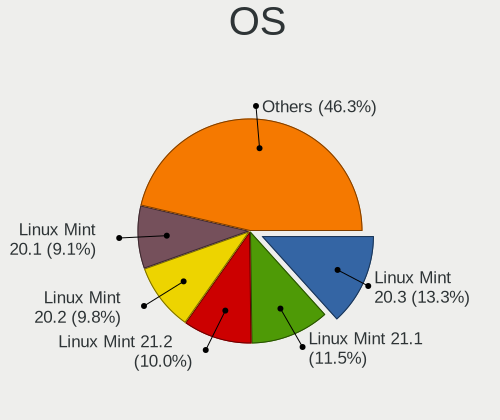
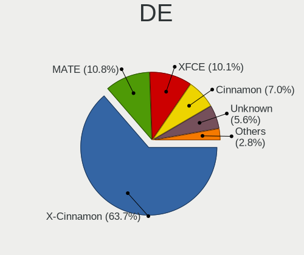
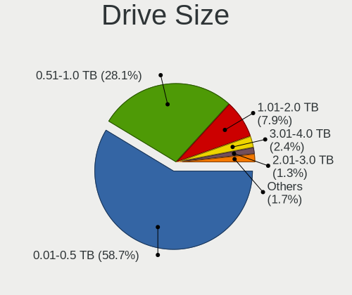
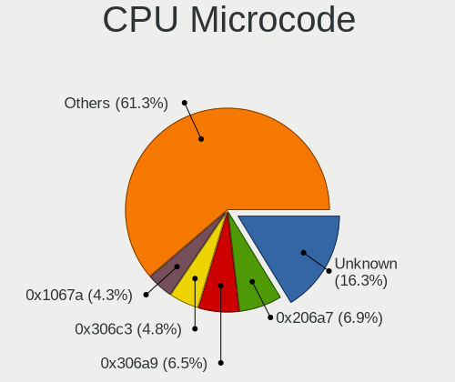
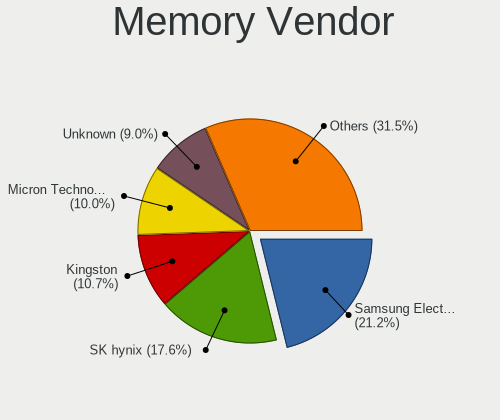
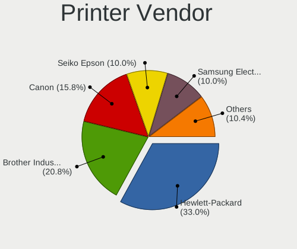
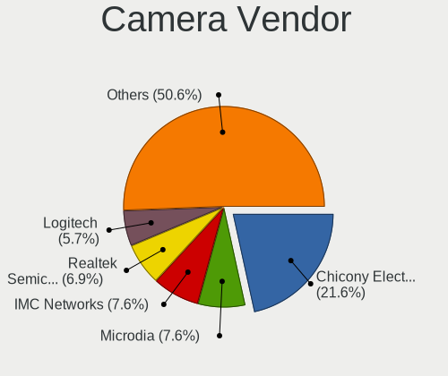

Linux Mint - Tested Hardware & Statistics
-----------------------------------------

A project to collect tested hardware configurations for Linux Mint.

Anyone can contribute to this report by the [hw-probe](https://github.com/linuxhw/hw-probe) tool:

    sudo -E hw-probe -all -upload

Please contribute! Especially if your hardware is rare.

This is a report for all computer types. See also reports for [desktops](/Dist/Linux_Mint/Desktop/README.md) and [notebooks](/Dist/Linux_Mint/Notebook/README.md).

Contents
--------

* [ Test Cases ](#test-cases)

* [ System ](#system)
  - [ OS                       ](#os)
  - [ OS Family                ](#os-family)
  - [ Kernel                   ](#kernel)
  - [ Kernel Family            ](#kernel-family)
  - [ Kernel Major Ver.        ](#kernel-major-ver)
  - [ Arch                     ](#arch)
  - [ DE                       ](#de)
  - [ Display Server           ](#display-server)
  - [ Display Manager          ](#display-manager)
  - [ OS Lang                  ](#os-lang)
  - [ Boot Mode                ](#boot-mode)
  - [ Filesystem               ](#filesystem)
  - [ Part. scheme             ](#part-scheme)
  - [ Dual Boot with Linux/BSD ](#dual-boot-with-linuxbsd)
  - [ Dual Boot (Win)          ](#dual-boot-win)

* [ Board ](#board)
  - [ Vendor                   ](#vendor)
  - [ Model                    ](#model)
  - [ Model Family             ](#model-family)
  - [ MFG Year                 ](#mfg-year)
  - [ Form Factor              ](#form-factor)
  - [ Secure Boot              ](#secure-boot)
  - [ Coreboot                 ](#coreboot)
  - [ RAM Size                 ](#ram-size)
  - [ RAM Used                 ](#ram-used)
  - [ Total Drives             ](#total-drives)
  - [ Has CD-ROM               ](#has-cd-rom)
  - [ Has Ethernet             ](#has-ethernet)
  - [ Has WiFi                 ](#has-wifi)
  - [ Has Bluetooth            ](#has-bluetooth)

* [ Location ](#location)
  - [ Country                  ](#country)
  - [ City                     ](#city)

* [ Drives ](#drives)
  - [ Drive Vendor             ](#drive-vendor)
  - [ Drive Model              ](#drive-model)
  - [ HDD Vendor               ](#hdd-vendor)
  - [ SSD Vendor               ](#ssd-vendor)
  - [ Drive Kind               ](#drive-kind)
  - [ Drive Connector          ](#drive-connector)
  - [ Drive Size               ](#drive-size)
  - [ Space Total              ](#space-total)
  - [ Space Used               ](#space-used)
  - [ Malfunc. Drives          ](#malfunc-drives)
  - [ Malfunc. Drive Vendor    ](#malfunc-drive-vendor)
  - [ Malfunc. HDD Vendor      ](#malfunc-hdd-vendor)
  - [ Malfunc. Drive Kind      ](#malfunc-drive-kind)
  - [ Failed Drives            ](#failed-drives)
  - [ Failed Drive Vendor      ](#failed-drive-vendor)
  - [ Drive Status             ](#drive-status)

* [ Storage controller ](#storage-controller)
  - [ Storage Vendor           ](#storage-vendor)
  - [ Storage Model            ](#storage-model)
  - [ Storage Kind             ](#storage-kind)

* [ Processor ](#processor)
  - [ CPU Vendor               ](#cpu-vendor)
  - [ CPU Model                ](#cpu-model)
  - [ CPU Model Family         ](#cpu-model-family)
  - [ CPU Cores                ](#cpu-cores)
  - [ CPU Sockets              ](#cpu-sockets)
  - [ CPU Threads              ](#cpu-threads)
  - [ CPU Op-Modes             ](#cpu-op-modes)
  - [ CPU Microcode            ](#cpu-microcode)
  - [ CPU Microarch            ](#cpu-microarch)

* [ Graphics ](#graphics)
  - [ GPU Vendor               ](#gpu-vendor)
  - [ GPU Model                ](#gpu-model)
  - [ GPU Combo                ](#gpu-combo)
  - [ GPU Driver               ](#gpu-driver)
  - [ GPU Memory               ](#gpu-memory)

* [ Monitor ](#monitor)
  - [ Monitor Vendor           ](#monitor-vendor)
  - [ Monitor Model            ](#monitor-model)
  - [ Monitor Resolution       ](#monitor-resolution)
  - [ Monitor Diagonal         ](#monitor-diagonal)
  - [ Monitor Width            ](#monitor-width)
  - [ Aspect Ratio             ](#aspect-ratio)
  - [ Monitor Area             ](#monitor-area)
  - [ Pixel Density            ](#pixel-density)
  - [ Multiple Monitors        ](#multiple-monitors)

* [ Network ](#network)
  - [ Net Controller Vendor    ](#net-controller-vendor)
  - [ Net Controller Model     ](#net-controller-model)
  - [ Wireless Vendor          ](#wireless-vendor)
  - [ Wireless Model           ](#wireless-model)
  - [ Ethernet Vendor          ](#ethernet-vendor)
  - [ Ethernet Model           ](#ethernet-model)
  - [ Net Controller Kind      ](#net-controller-kind)
  - [ Used Controller          ](#used-controller)
  - [ NICs                     ](#nics)
  - [ IPv6                     ](#ipv6)

* [ Bluetooth ](#bluetooth)
  - [ Bluetooth Vendor         ](#bluetooth-vendor)
  - [ Bluetooth Model          ](#bluetooth-model)

* [ Sound ](#sound)
  - [ Sound Vendor             ](#sound-vendor)
  - [ Sound Model              ](#sound-model)

* [ Memory ](#memory)
  - [ Memory Vendor            ](#memory-vendor)
  - [ Memory Model             ](#memory-model)
  - [ Memory Kind              ](#memory-kind)
  - [ Memory Form Factor       ](#memory-form-factor)
  - [ Memory Size              ](#memory-size)
  - [ Memory Speed             ](#memory-speed)

* [ Printers & scanners ](#printers--scanners)
  - [ Printer Vendor           ](#printer-vendor)
  - [ Printer Model            ](#printer-model)
  - [ Scanner Vendor           ](#scanner-vendor)
  - [ Scanner Model            ](#scanner-model)

* [ Camera ](#camera)
  - [ Camera Vendor            ](#camera-vendor)
  - [ Camera Model             ](#camera-model)

* [ Security ](#security)
  - [ Fingerprint Vendor       ](#fingerprint-vendor)
  - [ Fingerprint Model        ](#fingerprint-model)
  - [ Chipcard Vendor          ](#chipcard-vendor)
  - [ Chipcard Model           ](#chipcard-model)

* [ Unsupported ](#unsupported)
  - [ Unsupported Devices      ](#unsupported-devices)
  - [ Unsupported Device Types ](#unsupported-device-types)

Test Cases
----------

Total: 22064

| Vendor        | Model                       | Form-Factor | Probe                                                      | Date         |
|---------------|-----------------------------|-------------|------------------------------------------------------------|--------------|
| HUAWEI        | NBLK-WAX9X                  | Notebook    | [2391058f73](https://linux-hardware.org/?probe=2391058f73) | Jan 01, 2023 |
| Dell          | Inspiron 14 7420 2-in-1     | Convertible | [fa5ce31d04](https://linux-hardware.org/?probe=fa5ce31d04) | Jan 01, 2023 |
| HP            | 806A                        | Desktop     | [72e5b78d96](https://linux-hardware.org/?probe=72e5b78d96) | Dec 31, 2022 |
| Lenovo        | ThinkCentre M90 3692X01     | Desktop     | [702838caff](https://linux-hardware.org/?probe=702838caff) | Dec 31, 2022 |
| Dell          | 0JP3NX A01                  | Desktop     | [0749146323](https://linux-hardware.org/?probe=0749146323) | Dec 31, 2022 |
| Apple         | Mac-942B5BF58194151B        | All in one  | [d82f6dded4](https://linux-hardware.org/?probe=d82f6dded4) | Dec 31, 2022 |
| Dell          | Latitude 7370               | Notebook    | [cf1f751fbf](https://linux-hardware.org/?probe=cf1f751fbf) | Dec 31, 2022 |
| Gigabyte      | B75M-D3V                    | Desktop     | [ce23d2f7cd](https://linux-hardware.org/?probe=ce23d2f7cd) | Dec 31, 2022 |
| ASUSTek       | UX31E                       | Notebook    | [58391b15a5](https://linux-hardware.org/?probe=58391b15a5) | Dec 31, 2022 |
| ASUSTek       | X540YA                      | Notebook    | [37ef421251](https://linux-hardware.org/?probe=37ef421251) | Dec 31, 2022 |
| Dell          | Inspiron 1420               | Notebook    | [fe6a8714da](https://linux-hardware.org/?probe=fe6a8714da) | Dec 31, 2022 |
| ASRock        | B360M Performance           | Desktop     | [679d25f9be](https://linux-hardware.org/?probe=679d25f9be) | Dec 31, 2022 |
| Lenovo        | ThinkCentre M58p 9728W47    | Desktop     | [68bc291efd](https://linux-hardware.org/?probe=68bc291efd) | Dec 31, 2022 |
| AZW           | Green G2                    | Desktop     | [257948e699](https://linux-hardware.org/?probe=257948e699) | Dec 31, 2022 |
| Dell          | Latitude 7370               | Notebook    | [c9423665bb](https://linux-hardware.org/?probe=c9423665bb) | Dec 31, 2022 |
| Lenovo        | HASWELLREFRESHDT 3190005... | All in one  | [3fdb423e72](https://linux-hardware.org/?probe=3fdb423e72) | Dec 31, 2022 |
| Dell          | Latitude D620               | Notebook    | [5337d0b0f9](https://linux-hardware.org/?probe=5337d0b0f9) | Dec 31, 2022 |
| Dell          | Latitude D620               | Notebook    | [ea81d9f6a5](https://linux-hardware.org/?probe=ea81d9f6a5) | Dec 31, 2022 |
| HP            | Pavilion 17                 | Notebook    | [c87d61d0cd](https://linux-hardware.org/?probe=c87d61d0cd) | Dec 31, 2022 |
| HP            | Pavilion 17                 | Notebook    | [bbf52af119](https://linux-hardware.org/?probe=bbf52af119) | Dec 31, 2022 |
| ASUSTek       | Benicia                     | Desktop     | [9d307c5f2f](https://linux-hardware.org/?probe=9d307c5f2f) | Dec 31, 2022 |
| Lenovo        | IdeaPad 320-15ISK 80XH      | Notebook    | [fc108fb0d8](https://linux-hardware.org/?probe=fc108fb0d8) | Dec 31, 2022 |
| ASUSTek       | Benicia                     | Desktop     | [bc835cbca9](https://linux-hardware.org/?probe=bc835cbca9) | Dec 31, 2022 |
| Foxconn       | 2ADA                        | Desktop     | [92ce347d5f](https://linux-hardware.org/?probe=92ce347d5f) | Dec 31, 2022 |
| MSI           | Boston                      | Desktop     | [a5fd252dc2](https://linux-hardware.org/?probe=a5fd252dc2) | Dec 30, 2022 |
| Dell          | G15 5520                    | Notebook    | [2e82f45fb6](https://linux-hardware.org/?probe=2e82f45fb6) | Dec 30, 2022 |
| Gigabyte      | H55M-USB3                   | Desktop     | [8fdced7ae8](https://linux-hardware.org/?probe=8fdced7ae8) | Dec 30, 2022 |
| Acer          | Aspire E5-576G              | Notebook    | [883bd1cd8d](https://linux-hardware.org/?probe=883bd1cd8d) | Dec 30, 2022 |
| Chuwi         | HeroBook Pro                | Notebook    | [cdc31b8338](https://linux-hardware.org/?probe=cdc31b8338) | Dec 30, 2022 |
| Acer          | Predator G3-572             | Notebook    | [ab03199a79](https://linux-hardware.org/?probe=ab03199a79) | Dec 30, 2022 |
| Compaq        | CQ-27                       | Notebook    | [fc5b98e1db](https://linux-hardware.org/?probe=fc5b98e1db) | Dec 30, 2022 |
| Gigabyte      | GA-78LMT-USB3               | Desktop     | [6de26a316e](https://linux-hardware.org/?probe=6de26a316e) | Dec 30, 2022 |
| AZW           | Green G2                    | Desktop     | [33f1a5c1a9](https://linux-hardware.org/?probe=33f1a5c1a9) | Dec 30, 2022 |
| ASRock        | X670E Steel Legend          | Desktop     | [6aa950201f](https://linux-hardware.org/?probe=6aa950201f) | Dec 30, 2022 |
| Lenovo        | ThinkPad T14 Gen 1 20S00... | Notebook    | [347dc56d43](https://linux-hardware.org/?probe=347dc56d43) | Dec 30, 2022 |
| HP            | Pavilion Gaming Laptop 1... | Notebook    | [c28fb2edb2](https://linux-hardware.org/?probe=c28fb2edb2) | Dec 30, 2022 |
| MSI           | 760GM-P23                   | Desktop     | [06c8e21a6f](https://linux-hardware.org/?probe=06c8e21a6f) | Dec 30, 2022 |
| Lenovo        | G575 4383                   | Notebook    | [7c203c43cc](https://linux-hardware.org/?probe=7c203c43cc) | Dec 30, 2022 |
| ASUSTek       | P7P55D-E                    | Desktop     | [f725a0095a](https://linux-hardware.org/?probe=f725a0095a) | Dec 30, 2022 |
| ASRock        | H270 Pro4                   | Desktop     | [669d1fd05e](https://linux-hardware.org/?probe=669d1fd05e) | Dec 30, 2022 |
| Lenovo        | G575 4383                   | Notebook    | [c9656285fc](https://linux-hardware.org/?probe=c9656285fc) | Dec 30, 2022 |
| HP            | Pavilion dv7                | Notebook    | [6ba364face](https://linux-hardware.org/?probe=6ba364face) | Dec 30, 2022 |
| HP            | 2B36                        | Desktop     | [4b363628a9](https://linux-hardware.org/?probe=4b363628a9) | Dec 30, 2022 |
| HP            | 2B36                        | Desktop     | [be6670b1ad](https://linux-hardware.org/?probe=be6670b1ad) | Dec 30, 2022 |
| Gigabyte      | H55M-USB3                   | Desktop     | [6621ba66ac](https://linux-hardware.org/?probe=6621ba66ac) | Dec 30, 2022 |
| HP            | Laptop 17-ca2xxx            | Notebook    | [add21e3026](https://linux-hardware.org/?probe=add21e3026) | Dec 30, 2022 |
| HP            | 250 G8 Notebook PC          | Notebook    | [6b8db26ab8](https://linux-hardware.org/?probe=6b8db26ab8) | Dec 30, 2022 |
| Acer          | Aspire A115-32              | Notebook    | [7c8ec90c8a](https://linux-hardware.org/?probe=7c8ec90c8a) | Dec 30, 2022 |
| Dell          | Inspiron 5593               | Notebook    | [bf0f36d69a](https://linux-hardware.org/?probe=bf0f36d69a) | Dec 30, 2022 |
| Lenovo        | ThinkPad T430 23426FU       | Notebook    | [eec74990ca](https://linux-hardware.org/?probe=eec74990ca) | Dec 30, 2022 |
| Dell          | Inspiron N5110              | Notebook    | [08682d735c](https://linux-hardware.org/?probe=08682d735c) | Dec 30, 2022 |
| Acer          | Predator G3-572             | Notebook    | [f99480426f](https://linux-hardware.org/?probe=f99480426f) | Dec 29, 2022 |
| Dell          | Latitude E6430              | Notebook    | [8ecaae98d3](https://linux-hardware.org/?probe=8ecaae98d3) | Dec 29, 2022 |
| Lenovo        | G40-30 80FY                 | Notebook    | [49bb82ca4b](https://linux-hardware.org/?probe=49bb82ca4b) | Dec 29, 2022 |
| MSI           | X570-A PRO                  | Desktop     | [7af9125172](https://linux-hardware.org/?probe=7af9125172) | Dec 29, 2022 |
| Lenovo        | IdeaPad 320-14IAP 80XQ      | Notebook    | [e133481ab3](https://linux-hardware.org/?probe=e133481ab3) | Dec 29, 2022 |
| Lenovo        | IdeaPad 5 Pro 14ITL6 82L... | Notebook    | [6c836dde26](https://linux-hardware.org/?probe=6c836dde26) | Dec 29, 2022 |
| Dell          | 0UW457 A04                  | Desktop     | [047e7036d4](https://linux-hardware.org/?probe=047e7036d4) | Dec 29, 2022 |
| HP            | Pavilion x360 Convertibl... | Convertible | [9d5d98e818](https://linux-hardware.org/?probe=9d5d98e818) | Dec 29, 2022 |
| Dell          | Latitude E6410              | Notebook    | [0ee655e2cc](https://linux-hardware.org/?probe=0ee655e2cc) | Dec 29, 2022 |
| Acer          | Aspire 4820TG               | Notebook    | [77721c13c4](https://linux-hardware.org/?probe=77721c13c4) | Dec 29, 2022 |
| Acer          | Aspire A515-55              | Notebook    | [296961ae2d](https://linux-hardware.org/?probe=296961ae2d) | Dec 29, 2022 |
| ASUSTek       | GL553VD                     | Notebook    | [9c4eab8774](https://linux-hardware.org/?probe=9c4eab8774) | Dec 29, 2022 |
| Acer          | Aspire AV14-51              | Notebook    | [4f92ccde69](https://linux-hardware.org/?probe=4f92ccde69) | Dec 29, 2022 |
| Acer          | Aspire 5680                 | Notebook    | [c14cfe5386](https://linux-hardware.org/?probe=c14cfe5386) | Dec 29, 2022 |
| Shenzhen W... | TANK56                      | Notebook    | [4cd3e6c8e4](https://linux-hardware.org/?probe=4cd3e6c8e4) | Dec 29, 2022 |
| ASUSTek       | N551JM                      | Notebook    | [932615a484](https://linux-hardware.org/?probe=932615a484) | Dec 29, 2022 |
| TrekStor      | Primebook P14               | Notebook    | [c22676280e](https://linux-hardware.org/?probe=c22676280e) | Dec 29, 2022 |
| Acer          | Aspire V3-772               | Notebook    | [9f431b484a](https://linux-hardware.org/?probe=9f431b484a) | Dec 29, 2022 |
| Lenovo        | IdeaPad 330-15IKB 81DE      | Notebook    | [2ea31ca86e](https://linux-hardware.org/?probe=2ea31ca86e) | Dec 29, 2022 |
| Lenovo        | ThinkPad X240 20AL007AMZ    | Notebook    | [bcb9b7a061](https://linux-hardware.org/?probe=bcb9b7a061) | Dec 29, 2022 |
| Gigabyte      | M61SME-S2L                  | Desktop     | [660194090d](https://linux-hardware.org/?probe=660194090d) | Dec 29, 2022 |
| Gigabyte      | M61SME-S2L                  | Desktop     | [7ba365cac3](https://linux-hardware.org/?probe=7ba365cac3) | Dec 29, 2022 |
| HP            | ZBook 17 G4                 | Notebook    | [86eec5f93c](https://linux-hardware.org/?probe=86eec5f93c) | Dec 29, 2022 |
| ASUSTek       | Z87M-PLUS                   | Desktop     | [6dac0c0943](https://linux-hardware.org/?probe=6dac0c0943) | Dec 29, 2022 |
| Lenovo        | ThinkPad T430 23426FU       | Notebook    | [9e4e7d1738](https://linux-hardware.org/?probe=9e4e7d1738) | Dec 29, 2022 |
| Lenovo        | ThinkPad T490s 20NYS9MJ0... | Notebook    | [8489abdbe7](https://linux-hardware.org/?probe=8489abdbe7) | Dec 29, 2022 |
| Unknown       | Unknown                     | Notebook    | [0c7bea2d0f](https://linux-hardware.org/?probe=0c7bea2d0f) | Dec 29, 2022 |
| ASUSTek       | ROG STRIX B450-F GAMING     | Desktop     | [2d47973101](https://linux-hardware.org/?probe=2d47973101) | Dec 29, 2022 |
| Lenovo        | IdeaPad Gaming 3 15ACH6 ... | Notebook    | [0760eec7e2](https://linux-hardware.org/?probe=0760eec7e2) | Dec 28, 2022 |
| HP            | Compaq 6730s                | Notebook    | [9294bf57da](https://linux-hardware.org/?probe=9294bf57da) | Dec 28, 2022 |
| HP            | EliteBook 2540p             | Notebook    | [ec9251ac5d](https://linux-hardware.org/?probe=ec9251ac5d) | Dec 28, 2022 |
| Gigabyte      | Z77M-D3H                    | Desktop     | [f20c6365d3](https://linux-hardware.org/?probe=f20c6365d3) | Dec 28, 2022 |
| HP            | Mini 100e                   | Notebook    | [dd184e04ad](https://linux-hardware.org/?probe=dd184e04ad) | Dec 28, 2022 |
| Gigabyte      | A320M-H-CF                  | Desktop     | [83608f4248](https://linux-hardware.org/?probe=83608f4248) | Dec 28, 2022 |
| ASUSTek       | PRIME B450-PLUS             | Desktop     | [e9a313bb81](https://linux-hardware.org/?probe=e9a313bb81) | Dec 28, 2022 |
| Gigabyte      | Z370XP SLI-CF               | Desktop     | [be56999d2a](https://linux-hardware.org/?probe=be56999d2a) | Dec 28, 2022 |
| HP            | 339A                        | Desktop     | [eb2bb9bcec](https://linux-hardware.org/?probe=eb2bb9bcec) | Dec 28, 2022 |
| Fujitsu       | LIFEBOOK A544               | Notebook    | [efdc6bb5cb](https://linux-hardware.org/?probe=efdc6bb5cb) | Dec 28, 2022 |
| ASUSTek       | M5A78L-M LE/USB3            | Desktop     | [d0969c6a4c](https://linux-hardware.org/?probe=d0969c6a4c) | Dec 28, 2022 |
| ASUSTek       | M5A78L-M LE/USB3            | Desktop     | [8a4dce4662](https://linux-hardware.org/?probe=8a4dce4662) | Dec 28, 2022 |
| Dell          | 0D883F A06                  | Desktop     | [23c5689182](https://linux-hardware.org/?probe=23c5689182) | Dec 28, 2022 |
| Dell          | 0D883F A06                  | Desktop     | [8e9e780028](https://linux-hardware.org/?probe=8e9e780028) | Dec 28, 2022 |
| Dell          | 0JP3NX A01                  | Desktop     | [acbe3ce1ef](https://linux-hardware.org/?probe=acbe3ce1ef) | Dec 28, 2022 |
| Dell          | 0YXT71 A01                  | Desktop     | [ed5e31a6bc](https://linux-hardware.org/?probe=ed5e31a6bc) | Dec 28, 2022 |
| MSI           | MAG B550M MORTAR            | Desktop     | [bf50da5153](https://linux-hardware.org/?probe=bf50da5153) | Dec 28, 2022 |
| ASUSTek       | ROG STRIX B350-F GAMING     | Desktop     | [71bccea2dc](https://linux-hardware.org/?probe=71bccea2dc) | Dec 28, 2022 |
| HP            | EliteBook 850 G6            | Notebook    | [b30d6f1b58](https://linux-hardware.org/?probe=b30d6f1b58) | Dec 28, 2022 |
| ASRock        | H270 Pro4                   | Desktop     | [18c67453d3](https://linux-hardware.org/?probe=18c67453d3) | Dec 28, 2022 |
| ASRock        | H270 Pro4                   | Desktop     | [411b246a3f](https://linux-hardware.org/?probe=411b246a3f) | Dec 28, 2022 |
| AZW           | GTR V01                     | Mini pc     | [408691cd85](https://linux-hardware.org/?probe=408691cd85) | Dec 28, 2022 |
| HP            | Laptop 15-dw0xxx            | Notebook    | [7c2b9af9c3](https://linux-hardware.org/?probe=7c2b9af9c3) | Dec 28, 2022 |
| HP            | EliteBook 820 G3            | Notebook    | [3c494dd1eb](https://linux-hardware.org/?probe=3c494dd1eb) | Dec 28, 2022 |
| Apple         | Mac-F221BEC8                | Desktop     | [85730ed1a1](https://linux-hardware.org/?probe=85730ed1a1) | Dec 28, 2022 |
| ASRock        | 4CoreDual-SATA2             | Desktop     | [05ae1afd3f](https://linux-hardware.org/?probe=05ae1afd3f) | Dec 28, 2022 |
| Apple         | Mac-F221BEC8                | Desktop     | [94ae481e51](https://linux-hardware.org/?probe=94ae481e51) | Dec 27, 2022 |
| HP            | EliteBook 8440p             | Notebook    | [6674099744](https://linux-hardware.org/?probe=6674099744) | Dec 27, 2022 |
| HP            | 304Bh                       | Desktop     | [d85d0d4017](https://linux-hardware.org/?probe=d85d0d4017) | Dec 27, 2022 |
| MSI           | Z97 PC Mate                 | Desktop     | [defccc0ef1](https://linux-hardware.org/?probe=defccc0ef1) | Dec 27, 2022 |
| Packard Be... | EasyNote TJ65               | Notebook    | [57bfe7c99d](https://linux-hardware.org/?probe=57bfe7c99d) | Dec 27, 2022 |
| Unknown       | Unknown                     | Desktop     | [ccce0caf7e](https://linux-hardware.org/?probe=ccce0caf7e) | Dec 27, 2022 |
| ASUSTek       | VivoBook_ASUSLaptop X712... | Notebook    | [2c2b5135eb](https://linux-hardware.org/?probe=2c2b5135eb) | Dec 27, 2022 |
| Dell          | Latitude 5420               | Notebook    | [06dc453cbc](https://linux-hardware.org/?probe=06dc453cbc) | Dec 27, 2022 |
| ASUSTek       | PRIME X570-P                | Desktop     | [fba6e6e090](https://linux-hardware.org/?probe=fba6e6e090) | Dec 27, 2022 |
| Megaware      | MW-H61M-2H v1.3 - 17/07/... | Desktop     | [868a87a1f8](https://linux-hardware.org/?probe=868a87a1f8) | Dec 27, 2022 |
| HP            | EliteBook 820 G3            | Notebook    | [95555948a2](https://linux-hardware.org/?probe=95555948a2) | Dec 27, 2022 |
| MSI           | MPG Z390 GAMING EDGE AC     | Desktop     | [31f25029c1](https://linux-hardware.org/?probe=31f25029c1) | Dec 27, 2022 |
| HP            | 255 15.6 inch G9 Noteboo... | Notebook    | [dc9d334f95](https://linux-hardware.org/?probe=dc9d334f95) | Dec 27, 2022 |
| HP            | Pavilion x360 Convertibl... | Convertible | [6258876628](https://linux-hardware.org/?probe=6258876628) | Dec 27, 2022 |
| Dell          | Venue 11 Pro 5130           | Notebook    | [c68cba64e9](https://linux-hardware.org/?probe=c68cba64e9) | Dec 27, 2022 |
| Dell          | Latitude 3510               | Notebook    | [ac931934de](https://linux-hardware.org/?probe=ac931934de) | Dec 27, 2022 |
| Dell          | Latitude 3510               | Notebook    | [5db1cf6cb6](https://linux-hardware.org/?probe=5db1cf6cb6) | Dec 27, 2022 |
| HP            | Notebook                    | Notebook    | [8ba42c8ebc](https://linux-hardware.org/?probe=8ba42c8ebc) | Dec 27, 2022 |
| Lenovo        | ThinkPad X1 Carbon 6th 2... | Notebook    | [a7b2bad562](https://linux-hardware.org/?probe=a7b2bad562) | Dec 27, 2022 |
| Dell          | Inspiron 5579               | Notebook    | [6fbb0cbd09](https://linux-hardware.org/?probe=6fbb0cbd09) | Dec 27, 2022 |
| Dell          | Inspiron 5579               | Notebook    | [838cda532a](https://linux-hardware.org/?probe=838cda532a) | Dec 27, 2022 |
| Dell          | 040DDP A01                  | Desktop     | [92825b79ee](https://linux-hardware.org/?probe=92825b79ee) | Dec 27, 2022 |
| HP            | Spectre x360 Convertible... | Convertible | [56d60b7366](https://linux-hardware.org/?probe=56d60b7366) | Dec 27, 2022 |
| Gigabyte      | GA-890XA-UD3                | Desktop     | [492719506f](https://linux-hardware.org/?probe=492719506f) | Dec 27, 2022 |
| HP            | 304Bh                       | Desktop     | [02c61d35f2](https://linux-hardware.org/?probe=02c61d35f2) | Dec 27, 2022 |
| GPU Compan... | GWTN156-3BK                 | Notebook    | [7c9c57b704](https://linux-hardware.org/?probe=7c9c57b704) | Dec 27, 2022 |
| Acer          | Swift SF314-56              | Notebook    | [41ca6b15cf](https://linux-hardware.org/?probe=41ca6b15cf) | Dec 26, 2022 |
| ASUSTek       | M4A89GTD-PRO/USB3           | Desktop     | [f51a366bc2](https://linux-hardware.org/?probe=f51a366bc2) | Dec 26, 2022 |
| HP            | Mini 100e                   | Notebook    | [bf749ac406](https://linux-hardware.org/?probe=bf749ac406) | Dec 26, 2022 |
| Lenovo        | Legion Y7000P 81LD          | Notebook    | [d27a1b703b](https://linux-hardware.org/?probe=d27a1b703b) | Dec 26, 2022 |
| HP            | Laptop 15-dy2xxx            | Notebook    | [8e2393e7b4](https://linux-hardware.org/?probe=8e2393e7b4) | Dec 26, 2022 |
| MSI           | MPG B550 GAMING PLUS        | Desktop     | [305018336b](https://linux-hardware.org/?probe=305018336b) | Dec 26, 2022 |
| ASUSTek       | K61IC                       | Notebook    | [4c34b8d5a1](https://linux-hardware.org/?probe=4c34b8d5a1) | Dec 26, 2022 |
| ASUSTek       | ROG STRIX B550-E GAMING     | Desktop     | [e8dce940d8](https://linux-hardware.org/?probe=e8dce940d8) | Dec 26, 2022 |
| Dell          | Latitude E6400              | Notebook    | [435ac90ddc](https://linux-hardware.org/?probe=435ac90ddc) | Dec 26, 2022 |
| HP            | Compaq 6730s                | Notebook    | [ac1ae104e8](https://linux-hardware.org/?probe=ac1ae104e8) | Dec 26, 2022 |
| Dell          | Latitude E4310              | Notebook    | [f63df6ad2c](https://linux-hardware.org/?probe=f63df6ad2c) | Dec 26, 2022 |
| HP            | Compaq 6730s                | Notebook    | [0cc88159aa](https://linux-hardware.org/?probe=0cc88159aa) | Dec 26, 2022 |
| ASUSTek       | X550LD                      | Notebook    | [e0a09344e0](https://linux-hardware.org/?probe=e0a09344e0) | Dec 26, 2022 |
| ASUSTek       | M4A88T-V EVO/USB3           | Desktop     | [05163a2fb9](https://linux-hardware.org/?probe=05163a2fb9) | Dec 26, 2022 |
| ASUSTek       | X550LD                      | Notebook    | [d6948e7207](https://linux-hardware.org/?probe=d6948e7207) | Dec 26, 2022 |
| Samsung       | RV420/RV520/RV720/E3530/... | Notebook    | [4665d79293](https://linux-hardware.org/?probe=4665d79293) | Dec 25, 2022 |
| MSI           | CR700                       | Notebook    | [92b97fec48](https://linux-hardware.org/?probe=92b97fec48) | Dec 25, 2022 |
| MSI           | CR700                       | Notebook    | [df25c10894](https://linux-hardware.org/?probe=df25c10894) | Dec 25, 2022 |
| Microsoft     | Surface Laptop Go           | Tablet      | [cb4b71069c](https://linux-hardware.org/?probe=cb4b71069c) | Dec 25, 2022 |
| Lenovo        | IdeaPad 3 15ADA05 81W1      | Notebook    | [ff90a6a029](https://linux-hardware.org/?probe=ff90a6a029) | Dec 25, 2022 |
| Lenovo        | ThinkPad L14 Gen 3 21C1C... | Notebook    | [f27b950cd8](https://linux-hardware.org/?probe=f27b950cd8) | Dec 25, 2022 |
| ECS           | H81H3-WM                    | Desktop     | [6791862ef9](https://linux-hardware.org/?probe=6791862ef9) | Dec 25, 2022 |
| HP            | 1495                        | Desktop     | [681abdb8a2](https://linux-hardware.org/?probe=681abdb8a2) | Dec 25, 2022 |
| Acer          | Aspire A515-57G             | Notebook    | [2e82fb3f66](https://linux-hardware.org/?probe=2e82fb3f66) | Dec 25, 2022 |
| HP            | 2000                        | Notebook    | [7abc0ff528](https://linux-hardware.org/?probe=7abc0ff528) | Dec 25, 2022 |
| Sony          | SVE15133CNB                 | Notebook    | [40ac0f9ffc](https://linux-hardware.org/?probe=40ac0f9ffc) | Dec 25, 2022 |
| ASUSTek       | F1A55-M LX R2.0             | Desktop     | [177c5ee2a6](https://linux-hardware.org/?probe=177c5ee2a6) | Dec 25, 2022 |
| Lenovo        | ThinkPad T500 2055A38       | Notebook    | [90a67d3589](https://linux-hardware.org/?probe=90a67d3589) | Dec 25, 2022 |
| MSI           | GP62M 7REX                  | Notebook    | [f49c90b8dc](https://linux-hardware.org/?probe=f49c90b8dc) | Dec 25, 2022 |
| ASUSTek       | X750JN                      | Notebook    | [a604b57c92](https://linux-hardware.org/?probe=a604b57c92) | Dec 25, 2022 |
| ASUSTek       | M3N-HT DELUXE               | Desktop     | [cbbfeef21b](https://linux-hardware.org/?probe=cbbfeef21b) | Dec 25, 2022 |
| ASUSTek       | M3N-HT DELUXE               | Desktop     | [30c464408a](https://linux-hardware.org/?probe=30c464408a) | Dec 25, 2022 |
| Lenovo        | ThinkBook 15p Gen 2 21B1    | Notebook    | [bc961748be](https://linux-hardware.org/?probe=bc961748be) | Dec 25, 2022 |
| Lenovo        | ThinkPad L530 24781P9       | Notebook    | [fd8de03405](https://linux-hardware.org/?probe=fd8de03405) | Dec 25, 2022 |
| Acer          | Iconia Tab W501             | Tablet      | [196d64e793](https://linux-hardware.org/?probe=196d64e793) | Dec 25, 2022 |
| Lenovo        | Yoga 2 13 20344             | Notebook    | [9d8bce4c41](https://linux-hardware.org/?probe=9d8bce4c41) | Dec 25, 2022 |
| Acer          | Iconia Tab W501             | Tablet      | [32f9cc7e0b](https://linux-hardware.org/?probe=32f9cc7e0b) | Dec 25, 2022 |
| HP            | 8265                        | Desktop     | [30ff2fbdaa](https://linux-hardware.org/?probe=30ff2fbdaa) | Dec 25, 2022 |
| Acer          | Aspire ES1-523              | Notebook    | [41211efaae](https://linux-hardware.org/?probe=41211efaae) | Dec 25, 2022 |
| Chuwi         | HeroBook Air                | Notebook    | [ccd5d4bac3](https://linux-hardware.org/?probe=ccd5d4bac3) | Dec 25, 2022 |
| ASUSTek       | M32CD_A_F_K20CD_K31CD       | Desktop     | [384d09ccdb](https://linux-hardware.org/?probe=384d09ccdb) | Dec 25, 2022 |
| Dell          | 0DN075                      | Desktop     | [9fd08be389](https://linux-hardware.org/?probe=9fd08be389) | Dec 25, 2022 |
| Lenovo        | IdeaPad S145-15API 81V7     | Notebook    | [c95a4418f0](https://linux-hardware.org/?probe=c95a4418f0) | Dec 24, 2022 |
| ASUSTek       | Q502LA                      | Notebook    | [386702ad8a](https://linux-hardware.org/?probe=386702ad8a) | Dec 24, 2022 |
| HP            | Stream Laptop 14-cb1xxx     | Notebook    | [a36ea47b5c](https://linux-hardware.org/?probe=a36ea47b5c) | Dec 24, 2022 |
| HP            | 8265                        | Desktop     | [188eaf4f00](https://linux-hardware.org/?probe=188eaf4f00) | Dec 24, 2022 |
| ASRock        | FM2A78M-HD+ R2.0            | Desktop     | [ff69d47b58](https://linux-hardware.org/?probe=ff69d47b58) | Dec 24, 2022 |
| ASRock        | FM2A78M-HD+ R2.0            | Desktop     | [696403dae4](https://linux-hardware.org/?probe=696403dae4) | Dec 24, 2022 |
| ASUSTek       | P7P55D-E                    | Desktop     | [a6be229477](https://linux-hardware.org/?probe=a6be229477) | Dec 24, 2022 |
| Toshiba       | Satellite P755              | Notebook    | [723232bde6](https://linux-hardware.org/?probe=723232bde6) | Dec 24, 2022 |
| Lenovo        | IdeaPad Gaming 3 15ARH7 ... | Notebook    | [44c6de2137](https://linux-hardware.org/?probe=44c6de2137) | Dec 24, 2022 |
| ASUSTek       | ZenBook UX463FA_UX463FA     | Convertible | [355d32cbac](https://linux-hardware.org/?probe=355d32cbac) | Dec 24, 2022 |
| AMI           | Cherry Trail FFD            | Desktop     | [7070bf387d](https://linux-hardware.org/?probe=7070bf387d) | Dec 24, 2022 |
| Gigabyte      | GA-78LMT-USB3               | Desktop     | [03c35b7588](https://linux-hardware.org/?probe=03c35b7588) | Dec 24, 2022 |
| ASUSTek       | PRIME Z390-A                | Desktop     | [da48bed048](https://linux-hardware.org/?probe=da48bed048) | Dec 24, 2022 |
| HP            | 8061                        | Desktop     | [4427032526](https://linux-hardware.org/?probe=4427032526) | Dec 24, 2022 |
| MiTAC         | PD14RI                      | Desktop     | [eb02828e7c](https://linux-hardware.org/?probe=eb02828e7c) | Dec 24, 2022 |
| Samsung       | RF511/RF411/RF711           | Notebook    | [b0a9f1ed91](https://linux-hardware.org/?probe=b0a9f1ed91) | Dec 24, 2022 |
| MSI           | H61M-P20                    | Desktop     | [07b5fe983c](https://linux-hardware.org/?probe=07b5fe983c) | Dec 24, 2022 |
| MSI           | H61M-P20                    | Desktop     | [e1d50cc8f4](https://linux-hardware.org/?probe=e1d50cc8f4) | Dec 24, 2022 |
| ASUSTek       | K52JT                       | Notebook    | [915e35ba2b](https://linux-hardware.org/?probe=915e35ba2b) | Dec 24, 2022 |
| ASUSTek       | X750JN                      | Notebook    | [cc5facc858](https://linux-hardware.org/?probe=cc5facc858) | Dec 23, 2022 |
| HP            | Pavilion g7                 | Notebook    | [5620f164c9](https://linux-hardware.org/?probe=5620f164c9) | Dec 23, 2022 |
| Lenovo        | Legion 7 16ITHg6 82K6       | Notebook    | [2c6f47974f](https://linux-hardware.org/?probe=2c6f47974f) | Dec 23, 2022 |
| Chuwi         | HeroBook Air                | Notebook    | [8f4eea6be8](https://linux-hardware.org/?probe=8f4eea6be8) | Dec 23, 2022 |
| MSI           | B450 TOMAHAWK MAX           | Desktop     | [568df9daf7](https://linux-hardware.org/?probe=568df9daf7) | Dec 23, 2022 |
| ASUSTek       | M2N-SLI DELUXE              | Desktop     | [0836c3b800](https://linux-hardware.org/?probe=0836c3b800) | Dec 23, 2022 |
| HP            | ZBook Firefly 15 G7 Mobi... | Notebook    | [64e7d7f26c](https://linux-hardware.org/?probe=64e7d7f26c) | Dec 23, 2022 |
| Lenovo        | Y50-70 Touch 20349          | Notebook    | [9266f8399c](https://linux-hardware.org/?probe=9266f8399c) | Dec 23, 2022 |
| ASUSTek       | ROG STRIX Z590-F GAMING ... | Desktop     | [9e19c2db67](https://linux-hardware.org/?probe=9e19c2db67) | Dec 23, 2022 |
| Acer          | Aspire ES1-523              | Notebook    | [476f9315a1](https://linux-hardware.org/?probe=476f9315a1) | Dec 23, 2022 |
| ASUSTek       | 970 PRO GAMING/AURA         | Desktop     | [723811132a](https://linux-hardware.org/?probe=723811132a) | Dec 23, 2022 |
| Gigabyte      | Z170X-Gaming 3              | Desktop     | [3073d2d4e1](https://linux-hardware.org/?probe=3073d2d4e1) | Dec 23, 2022 |
| Google        | Bobba360                    | Notebook    | [bdad461cec](https://linux-hardware.org/?probe=bdad461cec) | Dec 23, 2022 |
| Acer          | Aspire M5-481T              | Notebook    | [22eafd12e4](https://linux-hardware.org/?probe=22eafd12e4) | Dec 23, 2022 |
| Acer          | Aspire M5-481T              | Notebook    | [f250052dff](https://linux-hardware.org/?probe=f250052dff) | Dec 23, 2022 |
| ASUSTek       | VivoBook_ASUSLaptop X521... | Notebook    | [aeb7addbc3](https://linux-hardware.org/?probe=aeb7addbc3) | Dec 23, 2022 |
| ASUSTek       | VivoBook_ASUSLaptop X521... | Notebook    | [2a0cacc27e](https://linux-hardware.org/?probe=2a0cacc27e) | Dec 23, 2022 |
| Positivo      | C4128E-S                    | Notebook    | [2fce43e57f](https://linux-hardware.org/?probe=2fce43e57f) | Dec 23, 2022 |
| Toshiba       | Satellite C70D-B            | Notebook    | [82cc0b362d](https://linux-hardware.org/?probe=82cc0b362d) | Dec 23, 2022 |
| HP            | Laptop 15-db0xxx            | Notebook    | [3e269dcad0](https://linux-hardware.org/?probe=3e269dcad0) | Dec 23, 2022 |
| HP            | Laptop 15-db0xxx            | Notebook    | [27f289cf57](https://linux-hardware.org/?probe=27f289cf57) | Dec 23, 2022 |
| Dell          | Latitude 7490               | Notebook    | [d5223c073b](https://linux-hardware.org/?probe=d5223c073b) | Dec 23, 2022 |
| ASUSTek       | TUF Gaming FX705DT_FX705... | Notebook    | [5ce0dacccf](https://linux-hardware.org/?probe=5ce0dacccf) | Dec 23, 2022 |
| Fujitsu       | LIFEBOOK AH544              | Notebook    | [431eac7d11](https://linux-hardware.org/?probe=431eac7d11) | Dec 22, 2022 |
| ASUSTek       | M4A89GTD-PRO/USB3           | Desktop     | [73c8ec2eb1](https://linux-hardware.org/?probe=73c8ec2eb1) | Dec 22, 2022 |
| HP            | Compaq 6730b (GW687AV)      | Notebook    | [8c936284b0](https://linux-hardware.org/?probe=8c936284b0) | Dec 22, 2022 |
| Acer          | Aspire ES1-311              | Notebook    | [e5d7bd61f1](https://linux-hardware.org/?probe=e5d7bd61f1) | Dec 22, 2022 |
| Unknown       | Unknown                     | Notebook    | [c9637c2acf](https://linux-hardware.org/?probe=c9637c2acf) | Dec 22, 2022 |
| Lenovo        | ThinkPad T14 Gen 2i 20W0... | Notebook    | [451f22ab12](https://linux-hardware.org/?probe=451f22ab12) | Dec 22, 2022 |
| ASUSTek       | ROG STRIX Z590-F GAMING ... | Desktop     | [ec808658f8](https://linux-hardware.org/?probe=ec808658f8) | Dec 22, 2022 |
| Intel         | X99                         | Desktop     | [24e1c625cb](https://linux-hardware.org/?probe=24e1c625cb) | Dec 22, 2022 |
| Lenovo        | IdeaPad 3 17ABA7 82RQ       | Notebook    | [9100b276c2](https://linux-hardware.org/?probe=9100b276c2) | Dec 22, 2022 |
| eMachines     | E725                        | Notebook    | [86939210d0](https://linux-hardware.org/?probe=86939210d0) | Dec 22, 2022 |
| Gigabyte      | GA-990FXA-D3                | Desktop     | [30822e6e18](https://linux-hardware.org/?probe=30822e6e18) | Dec 22, 2022 |
| HP            | Pavilion Laptop 15-cs3xx... | Notebook    | [a62d8c781d](https://linux-hardware.org/?probe=a62d8c781d) | Dec 22, 2022 |
| Lenovo        | G510 20238                  | Notebook    | [b5fcbb8663](https://linux-hardware.org/?probe=b5fcbb8663) | Dec 22, 2022 |
| Lenovo        | G510 20238                  | Notebook    | [2489f01426](https://linux-hardware.org/?probe=2489f01426) | Dec 22, 2022 |
| Dell          | 0H4VK7 A01                  | Desktop     | [c2f0c73bec](https://linux-hardware.org/?probe=c2f0c73bec) | Dec 22, 2022 |
| Acer          | Aspire ES1-523              | Notebook    | [d034bb7c92](https://linux-hardware.org/?probe=d034bb7c92) | Dec 22, 2022 |
| ASUSTek       | Z170-A                      | Desktop     | [9790670c6f](https://linux-hardware.org/?probe=9790670c6f) | Dec 22, 2022 |
| Acer          | Aspire ES1-523              | Notebook    | [806aa49648](https://linux-hardware.org/?probe=806aa49648) | Dec 22, 2022 |
| Dell          | Latitude E7250              | Notebook    | [9d6fed05b1](https://linux-hardware.org/?probe=9d6fed05b1) | Dec 22, 2022 |
| Apple         | Mac-F2208EC8                | Mini pc     | [55b839628d](https://linux-hardware.org/?probe=55b839628d) | Dec 22, 2022 |
| Apple         | Mac-F2208EC8                | Mini pc     | [073ce6be81](https://linux-hardware.org/?probe=073ce6be81) | Dec 22, 2022 |
| HP            | 8027                        | Desktop     | [752200e795](https://linux-hardware.org/?probe=752200e795) | Dec 22, 2022 |
| HP            | ProBook 450 15.6 inch G9... | Notebook    | [e160bf6ea0](https://linux-hardware.org/?probe=e160bf6ea0) | Dec 22, 2022 |
| ASUSTek       | Z87-K                       | Desktop     | [41fcdb5532](https://linux-hardware.org/?probe=41fcdb5532) | Dec 22, 2022 |
| Lenovo        | ThinkPad T470 W10DG 20JN... | Notebook    | [54fb90def3](https://linux-hardware.org/?probe=54fb90def3) | Dec 22, 2022 |
| HP            | 8265                        | Desktop     | [9050546a5b](https://linux-hardware.org/?probe=9050546a5b) | Dec 22, 2022 |
| Dell          | 0T10XW A00                  | Desktop     | [b8f7268dcf](https://linux-hardware.org/?probe=b8f7268dcf) | Dec 22, 2022 |
| Lenovo        | ThinkPad X1 Carbon 4th 2... | Notebook    | [a2d763d722](https://linux-hardware.org/?probe=a2d763d722) | Dec 21, 2022 |
| ASUSTek       | ASUS TUF Gaming A15 FA50... | Notebook    | [92515d8a95](https://linux-hardware.org/?probe=92515d8a95) | Dec 21, 2022 |
| ASUSTek       | M5A78L-M/USB3               | Desktop     | [ec54aedcc6](https://linux-hardware.org/?probe=ec54aedcc6) | Dec 21, 2022 |
| Dell          | 0RY007                      | Desktop     | [0cdfef97e7](https://linux-hardware.org/?probe=0cdfef97e7) | Dec 21, 2022 |
| Acer          | Gateway NE46Rs1             | Notebook    | [45a25a89d7](https://linux-hardware.org/?probe=45a25a89d7) | Dec 21, 2022 |
| Dell          | 018D1Y A00                  | Desktop     | [d63c07df34](https://linux-hardware.org/?probe=d63c07df34) | Dec 21, 2022 |
| ASUSTek       | S500CA                      | Notebook    | [305c04a6ce](https://linux-hardware.org/?probe=305c04a6ce) | Dec 21, 2022 |
| Acer          | Aspire ES1-523              | Notebook    | [3528a9d40f](https://linux-hardware.org/?probe=3528a9d40f) | Dec 21, 2022 |
| HP            | 339A                        | Desktop     | [77b8b56b9d](https://linux-hardware.org/?probe=77b8b56b9d) | Dec 21, 2022 |
| Acer          | Aspire 5680                 | Notebook    | [9b188c358e](https://linux-hardware.org/?probe=9b188c358e) | Dec 21, 2022 |
| HP            | 3047h                       | Desktop     | [f5492c4ad4](https://linux-hardware.org/?probe=f5492c4ad4) | Dec 21, 2022 |
| HP            | 255 15.6 inch G9 Noteboo... | Notebook    | [54b5dfbdbb](https://linux-hardware.org/?probe=54b5dfbdbb) | Dec 21, 2022 |
| ASUSTek       | P8Z77-M PRO                 | Desktop     | [afc187a5af](https://linux-hardware.org/?probe=afc187a5af) | Dec 21, 2022 |
| Schenker      | XMG APEX 15 MAX (E22)       | Notebook    | [6b46538fea](https://linux-hardware.org/?probe=6b46538fea) | Dec 21, 2022 |
| ASUSTek       | ZenBook UX363EA_UX363EA     | Convertible | [20150bbe50](https://linux-hardware.org/?probe=20150bbe50) | Dec 21, 2022 |
| Lenovo        | IdeaPad 510S-14ISK 80TK     | Notebook    | [97d8552a67](https://linux-hardware.org/?probe=97d8552a67) | Dec 21, 2022 |
| ASUSTek       | N55SF                       | Notebook    | [b1d6a6a73d](https://linux-hardware.org/?probe=b1d6a6a73d) | Dec 21, 2022 |
| Dell          | Inspiron 15 3511            | Notebook    | [e7bf0c0a09](https://linux-hardware.org/?probe=e7bf0c0a09) | Dec 21, 2022 |
| Lenovo        | ThinkPad X250 20CM001PGE    | Notebook    | [8d98e783c2](https://linux-hardware.org/?probe=8d98e783c2) | Dec 21, 2022 |
| Intel         | X99 V1.0                    | Desktop     | [20c96ed6dd](https://linux-hardware.org/?probe=20c96ed6dd) | Dec 21, 2022 |
| ASUSTek       | N55SF                       | Notebook    | [bbec56fa90](https://linux-hardware.org/?probe=bbec56fa90) | Dec 21, 2022 |
| Intel         | B75                         | Desktop     | [368e71afd7](https://linux-hardware.org/?probe=368e71afd7) | Dec 21, 2022 |
| Gigabyte      | B85M-D3H                    | Desktop     | [0b63acf3b2](https://linux-hardware.org/?probe=0b63acf3b2) | Dec 20, 2022 |
| Dell          | Latitude E6420              | Notebook    | [3244fe3048](https://linux-hardware.org/?probe=3244fe3048) | Dec 20, 2022 |
| Lenovo        | ThinkPad X230 2325AEG       | Notebook    | [5000a7274b](https://linux-hardware.org/?probe=5000a7274b) | Dec 20, 2022 |
| Apple         | Mac-942B5BF58194151B        | All in one  | [aa6f672c23](https://linux-hardware.org/?probe=aa6f672c23) | Dec 20, 2022 |
| Medion        | P7621                       | Notebook    | [eced009b2a](https://linux-hardware.org/?probe=eced009b2a) | Dec 20, 2022 |
| Lenovo        | IdeaPad S145-15AST 81N3     | Notebook    | [87d3186549](https://linux-hardware.org/?probe=87d3186549) | Dec 20, 2022 |
| ASUSTek       | ZenBook UX363EA_UX363EA     | Convertible | [d949885cee](https://linux-hardware.org/?probe=d949885cee) | Dec 20, 2022 |
| Foxconn       | 17A0                        | Desktop     | [58a3486afd](https://linux-hardware.org/?probe=58a3486afd) | Dec 20, 2022 |
| Acidanther... | Mac-BE088AF8C5EB4FA2 iMa... | All in one  | [405443fc24](https://linux-hardware.org/?probe=405443fc24) | Dec 20, 2022 |
| HP            | 806A                        | Desktop     | [2bd948ac57](https://linux-hardware.org/?probe=2bd948ac57) | Dec 20, 2022 |
| Acer          | Swift SF314-56              | Notebook    | [ffeb38a953](https://linux-hardware.org/?probe=ffeb38a953) | Dec 20, 2022 |
| ASUSTek       | PRIME B350-PLUS             | Desktop     | [5d3e747abe](https://linux-hardware.org/?probe=5d3e747abe) | Dec 20, 2022 |
| ASUSTek       | M4A89GTD-PRO/USB3           | Desktop     | [a92a6ed3bb](https://linux-hardware.org/?probe=a92a6ed3bb) | Dec 20, 2022 |
| Dell          | Latitude E6430              | Notebook    | [a1db0f0a18](https://linux-hardware.org/?probe=a1db0f0a18) | Dec 20, 2022 |
| Lenovo        | IdeaPad 5 Pro 14ITL6 82L... | Notebook    | [a7364cab6e](https://linux-hardware.org/?probe=a7364cab6e) | Dec 20, 2022 |
| Multilaser    | UB23X LINUX                 | Notebook    | [9f7503d89d](https://linux-hardware.org/?probe=9f7503d89d) | Dec 20, 2022 |
| Dell          | Latitude E6420              | Notebook    | [7d592f1759](https://linux-hardware.org/?probe=7d592f1759) | Dec 20, 2022 |
| Lenovo        | IdeaPad S145-15AST 81N3     | Notebook    | [d79e681980](https://linux-hardware.org/?probe=d79e681980) | Dec 19, 2022 |
| Multilaser    | UB23X LINUX                 | Notebook    | [502d9cd6ce](https://linux-hardware.org/?probe=502d9cd6ce) | Dec 19, 2022 |
| Dell          | Inspiron N5050              | Notebook    | [41fb3c537a](https://linux-hardware.org/?probe=41fb3c537a) | Dec 19, 2022 |
| Lenovo        | IdeaPad S145-15AST 81N3     | Notebook    | [72bfd0a0f6](https://linux-hardware.org/?probe=72bfd0a0f6) | Dec 19, 2022 |
| Fujitsu Si... | LIFEBOOK T5010              | Notebook    | [9f5485a1ed](https://linux-hardware.org/?probe=9f5485a1ed) | Dec 19, 2022 |
| Fujitsu Si... | LIFEBOOK T5010              | Notebook    | [e7fe928198](https://linux-hardware.org/?probe=e7fe928198) | Dec 19, 2022 |
| HP            | Pavilion g6                 | Notebook    | [4ffa593ffe](https://linux-hardware.org/?probe=4ffa593ffe) | Dec 19, 2022 |
| HP            | Pavilion g6                 | Notebook    | [ede790ce3c](https://linux-hardware.org/?probe=ede790ce3c) | Dec 19, 2022 |
| ASUSTek       | ZenBook UX363EA_UX363EA     | Convertible | [7808d8a51f](https://linux-hardware.org/?probe=7808d8a51f) | Dec 19, 2022 |
| Lenovo        | ThinkPad T450 20BUS0EW11    | Notebook    | [9fca55febc](https://linux-hardware.org/?probe=9fca55febc) | Dec 19, 2022 |
| Gigabyte      | GA-MA790FXT-UD5P            | Desktop     | [47397487a7](https://linux-hardware.org/?probe=47397487a7) | Dec 19, 2022 |
| Gigabyte      | GA-MA790FXT-UD5P            | Desktop     | [e954c9ca37](https://linux-hardware.org/?probe=e954c9ca37) | Dec 19, 2022 |
| Lenovo        | ThinkPad T450 20BUS0EW11    | Notebook    | [57605a26eb](https://linux-hardware.org/?probe=57605a26eb) | Dec 19, 2022 |
| Packard Be... | EasyNote TR85               | Notebook    | [6c56016ed0](https://linux-hardware.org/?probe=6c56016ed0) | Dec 19, 2022 |
| Packard Be... | EasyNote TR85               | Notebook    | [abd93a5cca](https://linux-hardware.org/?probe=abd93a5cca) | Dec 19, 2022 |
| Lenovo        | IdeaPad 5 14ARE05 81YM      | Notebook    | [c20be92503](https://linux-hardware.org/?probe=c20be92503) | Dec 19, 2022 |
| HP            | 620                         | Notebook    | [c5ed6ae3bf](https://linux-hardware.org/?probe=c5ed6ae3bf) | Dec 19, 2022 |
| Lenovo        | ThinkPad T430 2347CM9       | Notebook    | [cc1c68fe85](https://linux-hardware.org/?probe=cc1c68fe85) | Dec 19, 2022 |
| MSI           | X470 GAMING PLUS MAX        | Desktop     | [831f650b05](https://linux-hardware.org/?probe=831f650b05) | Dec 19, 2022 |
| Dell          | MXG071                      | Notebook    | [b999ae7bba](https://linux-hardware.org/?probe=b999ae7bba) | Dec 19, 2022 |
| Dell          | MXG071                      | Notebook    | [587b5fb932](https://linux-hardware.org/?probe=587b5fb932) | Dec 19, 2022 |
| AMI           | Cherry Trail CR             | Desktop     | [ad74aff6fa](https://linux-hardware.org/?probe=ad74aff6fa) | Dec 19, 2022 |
| Lenovo        | ThinkPad L15 Gen 2 20X30... | Notebook    | [3a6e0b953f](https://linux-hardware.org/?probe=3a6e0b953f) | Dec 19, 2022 |
| HP            | 2AA7 H                      | Desktop     | [4da43e6303](https://linux-hardware.org/?probe=4da43e6303) | Dec 19, 2022 |
| HP            | 2AA7 H                      | Desktop     | [9d33375e52](https://linux-hardware.org/?probe=9d33375e52) | Dec 19, 2022 |
| Dell          | Latitude E6440              | Notebook    | [3b6ac9ce59](https://linux-hardware.org/?probe=3b6ac9ce59) | Dec 19, 2022 |
| HP            | ProBook 4530s               | Notebook    | [2c6a27a08d](https://linux-hardware.org/?probe=2c6a27a08d) | Dec 19, 2022 |
| HP            | ProBook 4530s               | Notebook    | [19892439d6](https://linux-hardware.org/?probe=19892439d6) | Dec 19, 2022 |
| HUAWEI        | NBLK-WAX9X                  | Notebook    | [686a93a02a](https://linux-hardware.org/?probe=686a93a02a) | Dec 19, 2022 |
| Intel         | D34010WYK H14771-304        | Desktop     | [c47ff5ba34](https://linux-hardware.org/?probe=c47ff5ba34) | Dec 19, 2022 |
| HP            | 83EF                        | Desktop     | [755cb8dac5](https://linux-hardware.org/?probe=755cb8dac5) | Dec 19, 2022 |
| ASUSTek       | M2N-TE                      | Desktop     | [b67e414d65](https://linux-hardware.org/?probe=b67e414d65) | Dec 19, 2022 |
| Lenovo        | ThinkCentre M70E 0830W4E    | Desktop     | [199c8776ef](https://linux-hardware.org/?probe=199c8776ef) | Dec 18, 2022 |
| UMAX          | 13Wr-Flex                   | Convertible | [487bef515a](https://linux-hardware.org/?probe=487bef515a) | Dec 18, 2022 |
| ASUSTek       | ASUS EXPERTBOOK B1400CEA... | Notebook    | [1489f7e01d](https://linux-hardware.org/?probe=1489f7e01d) | Dec 18, 2022 |
| Samsung       | 350V5C/351V5C/3540VC/344... | Notebook    | [44a96b54b6](https://linux-hardware.org/?probe=44a96b54b6) | Dec 18, 2022 |
| UMAX          | 13Wr-Flex                   | Convertible | [669c43b4f3](https://linux-hardware.org/?probe=669c43b4f3) | Dec 18, 2022 |
| Acer          | Swift SF314-56              | Notebook    | [3d8b3f7f82](https://linux-hardware.org/?probe=3d8b3f7f82) | Dec 18, 2022 |
| AXDIA Inte... | myBook PRO14 SE V2          | Notebook    | [14b79d7a8b](https://linux-hardware.org/?probe=14b79d7a8b) | Dec 18, 2022 |
| Gigabyte      | GA-78LMT-USB3               | Desktop     | [e8b08e9f68](https://linux-hardware.org/?probe=e8b08e9f68) | Dec 18, 2022 |
| Dell          | Inspiron 7720               | Notebook    | [f29071b4a8](https://linux-hardware.org/?probe=f29071b4a8) | Dec 18, 2022 |
| Dell          | 018D1Y A00                  | Desktop     | [03db07e80d](https://linux-hardware.org/?probe=03db07e80d) | Dec 18, 2022 |
| Acer          | Aspire A517-52G             | Notebook    | [225e2eaae8](https://linux-hardware.org/?probe=225e2eaae8) | Dec 18, 2022 |
| GTZS          | Unknown                     | Notebook    | [e3260fee79](https://linux-hardware.org/?probe=e3260fee79) | Dec 18, 2022 |
| ASUSTek       | PRIME B550M-A WIFI II       | Desktop     | [2d5d4c1d6b](https://linux-hardware.org/?probe=2d5d4c1d6b) | Dec 18, 2022 |
| Dell          | Latitude E7470              | Notebook    | [262849f0f6](https://linux-hardware.org/?probe=262849f0f6) | Dec 18, 2022 |
| ASRock        | Z77 Extreme4                | Desktop     | [ac3472dcd0](https://linux-hardware.org/?probe=ac3472dcd0) | Dec 18, 2022 |
| ASUSTek       | K55A                        | Notebook    | [6129e825d9](https://linux-hardware.org/?probe=6129e825d9) | Dec 18, 2022 |
| ASUSTek       | ROG STRIX X670E-A GAMING... | Desktop     | [39bac65c16](https://linux-hardware.org/?probe=39bac65c16) | Dec 18, 2022 |
| HP            | ProLiant ML350 G6           | Desktop     | [3b242628e4](https://linux-hardware.org/?probe=3b242628e4) | Dec 18, 2022 |
| ASUSTek       | X555UJ                      | Notebook    | [94a9979dd8](https://linux-hardware.org/?probe=94a9979dd8) | Dec 18, 2022 |
| ASUSTek       | PRIME Z270-A                | Desktop     | [43da35f265](https://linux-hardware.org/?probe=43da35f265) | Dec 18, 2022 |
| ASUSTek       | PRIME Z270-A                | Desktop     | [8044fca8f3](https://linux-hardware.org/?probe=8044fca8f3) | Dec 18, 2022 |
| Lenovo        | ThinkBook 15 G3 ACL 21A4    | Notebook    | [4b86a906e7](https://linux-hardware.org/?probe=4b86a906e7) | Dec 18, 2022 |
| Dell          | 018D1Y A00                  | Desktop     | [b43ca20e72](https://linux-hardware.org/?probe=b43ca20e72) | Dec 18, 2022 |
| Supermicro    | X9SCL/X9SCM                 | Desktop     | [ff98a90e45](https://linux-hardware.org/?probe=ff98a90e45) | Dec 18, 2022 |
| ASUSTek       | P7H55D-M EVO                | Desktop     | [1e294ecd38](https://linux-hardware.org/?probe=1e294ecd38) | Dec 18, 2022 |
| Lenovo        | IdeaPad Z570 10249UU        | Notebook    | [2160e3e2c3](https://linux-hardware.org/?probe=2160e3e2c3) | Dec 18, 2022 |
| ASUSTek       | VivoBook_ASUSLaptop X530... | Notebook    | [071b57d5f6](https://linux-hardware.org/?probe=071b57d5f6) | Dec 18, 2022 |
| AZW           | Green G2                    | Desktop     | [a0a0c95e0b](https://linux-hardware.org/?probe=a0a0c95e0b) | Dec 17, 2022 |
| HP            | Laptop 15s-fq2xxx           | Notebook    | [ab6fd91b71](https://linux-hardware.org/?probe=ab6fd91b71) | Dec 17, 2022 |
| Acer          | Aspire 5680                 | Notebook    | [64f5eb2f4b](https://linux-hardware.org/?probe=64f5eb2f4b) | Dec 17, 2022 |
| Lenovo        | Yoga 7 15ITL5 82BJ          | Convertible | [35c3bb8b8c](https://linux-hardware.org/?probe=35c3bb8b8c) | Dec 17, 2022 |
| Samsung       | RV415/RV515                 | Notebook    | [dcf4e8200b](https://linux-hardware.org/?probe=dcf4e8200b) | Dec 17, 2022 |
| Dell          | 018D1Y A00                  | Desktop     | [d2076f2a7a](https://linux-hardware.org/?probe=d2076f2a7a) | Dec 17, 2022 |
| Acer          | Aspire E1-531               | Notebook    | [633910e332](https://linux-hardware.org/?probe=633910e332) | Dec 17, 2022 |
| Sony          | VPCCW21FX                   | Notebook    | [9d82e3655b](https://linux-hardware.org/?probe=9d82e3655b) | Dec 17, 2022 |
| Lenovo        | 31900058 STD                | All in one  | [b6c7b47859](https://linux-hardware.org/?probe=b6c7b47859) | Dec 17, 2022 |
| ASRock        | 960GC-GS FX                 | Desktop     | [a61b5c0129](https://linux-hardware.org/?probe=a61b5c0129) | Dec 17, 2022 |
| HP            | 18E7                        | Desktop     | [31011a35a4](https://linux-hardware.org/?probe=31011a35a4) | Dec 17, 2022 |
| MSI           | GF75 Thin 10SCSXR           | Notebook    | [09cdbbcf3f](https://linux-hardware.org/?probe=09cdbbcf3f) | Dec 17, 2022 |
| Toshiba       | Satellite S70-A             | Notebook    | [3eddeb0d68](https://linux-hardware.org/?probe=3eddeb0d68) | Dec 17, 2022 |
| Acer          | Aspire XC-1660 V:1.1        | Desktop     | [88aa1f841a](https://linux-hardware.org/?probe=88aa1f841a) | Dec 17, 2022 |
| Lenovo        | ThinkPad E15 Gen 3 20YG0... | Notebook    | [f82368713d](https://linux-hardware.org/?probe=f82368713d) | Dec 17, 2022 |
| ASRock        | Z77 Extreme4                | Desktop     | [84c83fa399](https://linux-hardware.org/?probe=84c83fa399) | Dec 17, 2022 |
| Gigabyte      | Z390 UD                     | Desktop     | [3af8ddb8cc](https://linux-hardware.org/?probe=3af8ddb8cc) | Dec 17, 2022 |
| Foxconn       | 17A0                        | Desktop     | [be57227f43](https://linux-hardware.org/?probe=be57227f43) | Dec 17, 2022 |
| HUAWEI        | KLVL-WXXW                   | Notebook    | [1deb35f268](https://linux-hardware.org/?probe=1deb35f268) | Dec 17, 2022 |
| Dell          | 0WR7PY A01                  | Desktop     | [5c1e2b0030](https://linux-hardware.org/?probe=5c1e2b0030) | Dec 17, 2022 |
| HP            | 8027                        | Desktop     | [07834099d5](https://linux-hardware.org/?probe=07834099d5) | Dec 17, 2022 |
| Toshiba       | Satellite C70D-B            | Notebook    | [182e467ce6](https://linux-hardware.org/?probe=182e467ce6) | Dec 17, 2022 |
| Unknown       | AM02                        | Mini pc     | [e60a6e7777](https://linux-hardware.org/?probe=e60a6e7777) | Dec 17, 2022 |
| MSI           | GF75 Thin 10SCSXR           | Notebook    | [8f884fc451](https://linux-hardware.org/?probe=8f884fc451) | Dec 17, 2022 |
| Apple         | MacBookPro8,2               | Notebook    | [4ed1785ef7](https://linux-hardware.org/?probe=4ed1785ef7) | Dec 17, 2022 |
| HP            | Spectre x360 Convertible... | Convertible | [aa337278dd](https://linux-hardware.org/?probe=aa337278dd) | Dec 17, 2022 |
| HP            | EliteBook 820 G3            | Notebook    | [5e5909e93f](https://linux-hardware.org/?probe=5e5909e93f) | Dec 17, 2022 |
| HP            | Spectre x360 Convertible... | Convertible | [d7756f4d3a](https://linux-hardware.org/?probe=d7756f4d3a) | Dec 17, 2022 |
| ASUSTek       | TUF Gaming X570-PLUS        | Desktop     | [823a0ca3c4](https://linux-hardware.org/?probe=823a0ca3c4) | Dec 17, 2022 |
| Dell          | Inspiron N7010              | Notebook    | [de5dc0c3ea](https://linux-hardware.org/?probe=de5dc0c3ea) | Dec 17, 2022 |
| Dell          | Latitude E5570              | Notebook    | [cc58177561](https://linux-hardware.org/?probe=cc58177561) | Dec 17, 2022 |
| Acer          | Extensa 7630EZ              | Notebook    | [e17ca259c0](https://linux-hardware.org/?probe=e17ca259c0) | Dec 16, 2022 |
| HP            | Pavilion Aero Laptop 13-... | Notebook    | [9f0911ee6b](https://linux-hardware.org/?probe=9f0911ee6b) | Dec 16, 2022 |
| Acer          | Extensa 7630EZ              | Notebook    | [fac3dd4a6c](https://linux-hardware.org/?probe=fac3dd4a6c) | Dec 16, 2022 |
| Lenovo        | ThinkPad T570 20H9S04C00    | Notebook    | [f3093ba13c](https://linux-hardware.org/?probe=f3093ba13c) | Dec 16, 2022 |
| Chuwi         | HeroBook Air                | Notebook    | [6da143680b](https://linux-hardware.org/?probe=6da143680b) | Dec 16, 2022 |
| Intel         | H55                         | Desktop     | [c034f3b3db](https://linux-hardware.org/?probe=c034f3b3db) | Dec 16, 2022 |
| Gigabyte      | B85-HD3                     | Desktop     | [d314ce4539](https://linux-hardware.org/?probe=d314ce4539) | Dec 16, 2022 |
| Gigabyte      | B85-HD3                     | Desktop     | [e87a16ee1f](https://linux-hardware.org/?probe=e87a16ee1f) | Dec 16, 2022 |
| Dell          | Inspiron 1501               | Notebook    | [1bb0000755](https://linux-hardware.org/?probe=1bb0000755) | Dec 16, 2022 |
| HP            | 1998                        | Desktop     | [5c59186efc](https://linux-hardware.org/?probe=5c59186efc) | Dec 16, 2022 |
| Acer          | Aspire A515-57              | Notebook    | [4e9bbbaa1f](https://linux-hardware.org/?probe=4e9bbbaa1f) | Dec 16, 2022 |
| ASUSTek       | P5LD2-VM                    | Desktop     | [b2ae663fec](https://linux-hardware.org/?probe=b2ae663fec) | Dec 16, 2022 |
| AZW           | Green G2                    | Desktop     | [2491cf766c](https://linux-hardware.org/?probe=2491cf766c) | Dec 16, 2022 |
| Foxconn       | 17A0                        | Desktop     | [b2185eeab5](https://linux-hardware.org/?probe=b2185eeab5) | Dec 16, 2022 |
| HUAWEI        | BOM-WXX9                    | Notebook    | [dd664077fe](https://linux-hardware.org/?probe=dd664077fe) | Dec 16, 2022 |
| AZW           | Green G2                    | Desktop     | [58411901b6](https://linux-hardware.org/?probe=58411901b6) | Dec 16, 2022 |
| Apple         | Mac-F2238BAE iMac11,3       | All in one  | [8f89f95e37](https://linux-hardware.org/?probe=8f89f95e37) | Dec 16, 2022 |
| HP            | Laptop 15s-fq2xxx           | Notebook    | [d9c3d0a5cd](https://linux-hardware.org/?probe=d9c3d0a5cd) | Dec 16, 2022 |
| Apple         | Mac-F2238BAE iMac11,3       | All in one  | [e4734e61ed](https://linux-hardware.org/?probe=e4734e61ed) | Dec 15, 2022 |
| HP            | HDX16                       | Notebook    | [6be9713552](https://linux-hardware.org/?probe=6be9713552) | Dec 15, 2022 |
| Gigabyte      | GA-M56S-S3                  | Desktop     | [077f863ca3](https://linux-hardware.org/?probe=077f863ca3) | Dec 15, 2022 |
| Avell High... | A60 MUV                     | Notebook    | [204d35bad7](https://linux-hardware.org/?probe=204d35bad7) | Dec 15, 2022 |
| ASRock        | X570 Steel Legend           | Desktop     | [0de958194e](https://linux-hardware.org/?probe=0de958194e) | Dec 15, 2022 |
| Gigabyte      | B550M DS3H                  | Desktop     | [81092c4ca4](https://linux-hardware.org/?probe=81092c4ca4) | Dec 15, 2022 |
| HP            | EliteBook x360 1030 G2      | Convertible | [2751fbc549](https://linux-hardware.org/?probe=2751fbc549) | Dec 15, 2022 |
| HP            | EliteBook 850 G2            | Notebook    | [d0d30cd96f](https://linux-hardware.org/?probe=d0d30cd96f) | Dec 14, 2022 |
| ASUSTek       | K53U                        | Notebook    | [cbbffb5194](https://linux-hardware.org/?probe=cbbffb5194) | Dec 14, 2022 |
| Lenovo        | IdeaPadFlex 5 14ALC05 82... | Convertible | [8ac2a474db](https://linux-hardware.org/?probe=8ac2a474db) | Dec 14, 2022 |
| Lenovo        | IdeaPadFlex 5 14ALC05 82... | Convertible | [e7894642cb](https://linux-hardware.org/?probe=e7894642cb) | Dec 14, 2022 |
| HP            | Laptop 15-da2xxx            | Notebook    | [cd64f27416](https://linux-hardware.org/?probe=cd64f27416) | Dec 14, 2022 |
| Lenovo        | IdeaPad S145-15IWL 81MV     | Notebook    | [b7d1538f13](https://linux-hardware.org/?probe=b7d1538f13) | Dec 14, 2022 |
| Dell          | 0M5DCD A00                  | Desktop     | [5357f2124d](https://linux-hardware.org/?probe=5357f2124d) | Dec 14, 2022 |
| ASUSTek       | X550VX                      | Notebook    | [0ee46688fb](https://linux-hardware.org/?probe=0ee46688fb) | Dec 14, 2022 |
| HP            | 843C                        | Desktop     | [e647aa1207](https://linux-hardware.org/?probe=e647aa1207) | Dec 14, 2022 |
| Inventec      | D CLASS A02                 | Desktop     | [a607679697](https://linux-hardware.org/?probe=a607679697) | Dec 14, 2022 |
| Inventec      | D CLASS A02                 | Desktop     | [9bd8fecf82](https://linux-hardware.org/?probe=9bd8fecf82) | Dec 14, 2022 |
| Gigabyte      | B75-D3V                     | Desktop     | [f46b869c82](https://linux-hardware.org/?probe=f46b869c82) | Dec 14, 2022 |
| Google        | Panther                     | Desktop     | [a46174ed14](https://linux-hardware.org/?probe=a46174ed14) | Dec 14, 2022 |
| VXL           | M6V90AI-VL                  | Desktop     | [a16094bb41](https://linux-hardware.org/?probe=a16094bb41) | Dec 14, 2022 |
| Acer          | Aspire ES1-531              | Notebook    | [36bd6688bb](https://linux-hardware.org/?probe=36bd6688bb) | Dec 14, 2022 |
| Acer          | Aspire ES1-531              | Notebook    | [ed5d274c1a](https://linux-hardware.org/?probe=ed5d274c1a) | Dec 14, 2022 |
| ASUSTek       | ZenBook UX363EA_UX363EA     | Convertible | [c8207bdc43](https://linux-hardware.org/?probe=c8207bdc43) | Dec 14, 2022 |
| Gigabyte      | GA-970A-D3                  | Desktop     | [9bc1aec0dc](https://linux-hardware.org/?probe=9bc1aec0dc) | Dec 14, 2022 |
| Lenovo        | ThinkPad W541 20EGS06T00    | Notebook    | [2cdb5f249e](https://linux-hardware.org/?probe=2cdb5f249e) | Dec 14, 2022 |
| MSI           | GL73 8RC                    | Notebook    | [770d74f714](https://linux-hardware.org/?probe=770d74f714) | Dec 14, 2022 |
| Dell          | Latitude E7450              | Notebook    | [196b96ea5e](https://linux-hardware.org/?probe=196b96ea5e) | Dec 14, 2022 |
| HP            | Pavilion Gaming Laptop 1... | Notebook    | [c476fb8f49](https://linux-hardware.org/?probe=c476fb8f49) | Dec 13, 2022 |
| Intel         | DP67BG AAG10491-401         | Desktop     | [3b1fe2cc85](https://linux-hardware.org/?probe=3b1fe2cc85) | Dec 13, 2022 |
| LG Electro... | 22V240 FAB3                 | All in one  | [eea5c9c900](https://linux-hardware.org/?probe=eea5c9c900) | Dec 13, 2022 |
| Lenovo        | Yoga Slim 7 14ARE05 82A2    | Notebook    | [6e2b72eefe](https://linux-hardware.org/?probe=6e2b72eefe) | Dec 13, 2022 |
| Dell          | Latitude E4310              | Notebook    | [dd3e716d03](https://linux-hardware.org/?probe=dd3e716d03) | Dec 13, 2022 |
| Lenovo        | B71-80 80RJ                 | Notebook    | [8369524e4e](https://linux-hardware.org/?probe=8369524e4e) | Dec 13, 2022 |
| Lenovo        | IdeaPad 110-15ACL 80TJ      | Notebook    | [5d00840ad3](https://linux-hardware.org/?probe=5d00840ad3) | Dec 13, 2022 |
| Lenovo        | Yoga Slim 7 14ARE05 82A2    | Notebook    | [5dd8c45fee](https://linux-hardware.org/?probe=5dd8c45fee) | Dec 13, 2022 |
| Lenovo        | ThinkPad P14s Gen 2a 21A... | Notebook    | [1129626fee](https://linux-hardware.org/?probe=1129626fee) | Dec 13, 2022 |
| ECS           | GeForce7050M-M              | Desktop     | [118a28442e](https://linux-hardware.org/?probe=118a28442e) | Dec 13, 2022 |
| Intel         | X79 (INTEL Xeon E5/Corei... | Desktop     | [70506a428c](https://linux-hardware.org/?probe=70506a428c) | Dec 13, 2022 |
| Dynabook      | Satellite Pro C50-H-11D     | Notebook    | [f2f233cc99](https://linux-hardware.org/?probe=f2f233cc99) | Dec 13, 2022 |
| HP            | EliteBook 820 G3            | Notebook    | [ff5b82cee3](https://linux-hardware.org/?probe=ff5b82cee3) | Dec 13, 2022 |
| Lenovo        | IdeaPad S145-14IGM 81MW     | Notebook    | [9866855d37](https://linux-hardware.org/?probe=9866855d37) | Dec 13, 2022 |
| Lenovo        | ThinkPad SL510 2847A72      | Notebook    | [77518bc6c6](https://linux-hardware.org/?probe=77518bc6c6) | Dec 13, 2022 |
| ASRock        | H510M-HDV                   | Desktop     | [16d5f27d87](https://linux-hardware.org/?probe=16d5f27d87) | Dec 13, 2022 |
| Dell          | System Inspiron 7720        | Notebook    | [8e5e2683e3](https://linux-hardware.org/?probe=8e5e2683e3) | Dec 13, 2022 |
| Lenovo        | ThinkPad T400 647419G       | Notebook    | [a73b681605](https://linux-hardware.org/?probe=a73b681605) | Dec 13, 2022 |
| Apple         | MacBookPro8,2               | Notebook    | [05ef133104](https://linux-hardware.org/?probe=05ef133104) | Dec 12, 2022 |
| MSI           | Z490-A PRO                  | Desktop     | [8fc0ca8378](https://linux-hardware.org/?probe=8fc0ca8378) | Dec 12, 2022 |
| HP            | 1998                        | Desktop     | [358e1a1af1](https://linux-hardware.org/?probe=358e1a1af1) | Dec 12, 2022 |
| AMI           | Cherry Trail CR             | Desktop     | [868f4725db](https://linux-hardware.org/?probe=868f4725db) | Dec 12, 2022 |
| ASUSTek       | M5A99FX PRO R2.0            | Desktop     | [259f85d65b](https://linux-hardware.org/?probe=259f85d65b) | Dec 12, 2022 |
| Biostar       | A960D+V2                    | Desktop     | [6dea2bd72f](https://linux-hardware.org/?probe=6dea2bd72f) | Dec 12, 2022 |
| ASUSTek       | VivoBook_ASUSLaptop X530... | Notebook    | [ca560a74e4](https://linux-hardware.org/?probe=ca560a74e4) | Dec 12, 2022 |
| ASRock        | N68C-S UCC                  | Desktop     | [c405e5bd16](https://linux-hardware.org/?probe=c405e5bd16) | Dec 12, 2022 |
| Intel         | NUC7JYB J67967-405          | Mini pc     | [9fac25564e](https://linux-hardware.org/?probe=9fac25564e) | Dec 12, 2022 |
| ASUSTek       | PRIME B660M-A WIFI D4       | Desktop     | [9a73e431ee](https://linux-hardware.org/?probe=9a73e431ee) | Dec 12, 2022 |
| HP            | EliteBook 820 G3            | Notebook    | [1e0eec72b2](https://linux-hardware.org/?probe=1e0eec72b2) | Dec 12, 2022 |
| HP            | 339A                        | Desktop     | [63c184fafd](https://linux-hardware.org/?probe=63c184fafd) | Dec 12, 2022 |
| Unknown       | Unknown                     | Notebook    | [535aa05a37](https://linux-hardware.org/?probe=535aa05a37) | Dec 12, 2022 |
| ASRock        | N68C-S UCC                  | Desktop     | [6fa4a67111](https://linux-hardware.org/?probe=6fa4a67111) | Dec 12, 2022 |
| GPU Compan... | GWTC116-2                   | Notebook    | [fcb499b33f](https://linux-hardware.org/?probe=fcb499b33f) | Dec 12, 2022 |
| GPU Compan... | GWTC116-2                   | Notebook    | [d29d953915](https://linux-hardware.org/?probe=d29d953915) | Dec 12, 2022 |
| HP            | Spectre x360 Convertible... | Convertible | [39c188fa83](https://linux-hardware.org/?probe=39c188fa83) | Dec 12, 2022 |
| Dell          | 042P49 A01                  | Desktop     | [fc5be35686](https://linux-hardware.org/?probe=fc5be35686) | Dec 12, 2022 |
| Intel         | NUC6i7KYB H90766-404        | Mini pc     | [aa2341a4b1](https://linux-hardware.org/?probe=aa2341a4b1) | Dec 12, 2022 |
| Dell          | XPS L521X                   | Notebook    | [c69c906797](https://linux-hardware.org/?probe=c69c906797) | Dec 12, 2022 |
| ASUSTek       | VivoBook 15_ASUS Laptop ... | Notebook    | [ce1ae34933](https://linux-hardware.org/?probe=ce1ae34933) | Dec 12, 2022 |
| Lenovo        | ThinkPad T61 8891CTO        | Notebook    | [438785c8af](https://linux-hardware.org/?probe=438785c8af) | Dec 12, 2022 |
| Toshiba       | Satellite C70D-B            | Notebook    | [56adac1fcb](https://linux-hardware.org/?probe=56adac1fcb) | Dec 12, 2022 |
| HP            | 1998                        | Desktop     | [935ab0a3a2](https://linux-hardware.org/?probe=935ab0a3a2) | Dec 11, 2022 |
| MSI           | Summit E16FlipEvo A12MT     | Notebook    | [426289da4e](https://linux-hardware.org/?probe=426289da4e) | Dec 11, 2022 |
| HP            | 8924 0101                   | All in one  | [53f993bf5d](https://linux-hardware.org/?probe=53f993bf5d) | Dec 11, 2022 |
| HP            | EliteBook 8570w             | Notebook    | [367579550b](https://linux-hardware.org/?probe=367579550b) | Dec 11, 2022 |
| HP            | 1589                        | Desktop     | [4aa31e9d16](https://linux-hardware.org/?probe=4aa31e9d16) | Dec 11, 2022 |
| Gigabyte      | F2A88X-D3H                  | Desktop     | [31cd7cded9](https://linux-hardware.org/?probe=31cd7cded9) | Dec 11, 2022 |
| Biostar       | A520MH                      | Desktop     | [b6c4fdd80b](https://linux-hardware.org/?probe=b6c4fdd80b) | Dec 11, 2022 |
| HP            | Pavilion TS 11              | Notebook    | [db2a3e8ebb](https://linux-hardware.org/?probe=db2a3e8ebb) | Dec 11, 2022 |
| Gigabyte      | P67A-D3-B3                  | Desktop     | [9ed715edc4](https://linux-hardware.org/?probe=9ed715edc4) | Dec 11, 2022 |
| Toshiba       | Satellite L455              | Notebook    | [e92985332e](https://linux-hardware.org/?probe=e92985332e) | Dec 11, 2022 |
| Lenovo        | IdeaPad 320-17AST 80XW      | Notebook    | [474f4f4c43](https://linux-hardware.org/?probe=474f4f4c43) | Dec 11, 2022 |
| HP            | Pavilion g6                 | Notebook    | [964081eed7](https://linux-hardware.org/?probe=964081eed7) | Dec 11, 2022 |
| HP            | EliteBook x360 1040 G6      | Convertible | [7b9b41bfb5](https://linux-hardware.org/?probe=7b9b41bfb5) | Dec 11, 2022 |
| HP            | ProLiant DL360 G7           | Server      | [88dc20a2fa](https://linux-hardware.org/?probe=88dc20a2fa) | Dec 11, 2022 |
| Dell          | 0F896N A03                  | Desktop     | [8dec293f40](https://linux-hardware.org/?probe=8dec293f40) | Dec 11, 2022 |
| AZW           | Gemini T45                  | Desktop     | [e0b5dab1b4](https://linux-hardware.org/?probe=e0b5dab1b4) | Dec 11, 2022 |
| AZW           | Gemini T45                  | Desktop     | [d169b1be26](https://linux-hardware.org/?probe=d169b1be26) | Dec 11, 2022 |
| Google        | Blooglet                    | Notebook    | [a9d65d2144](https://linux-hardware.org/?probe=a9d65d2144) | Dec 11, 2022 |
| HP            | EliteBook 830 G6            | Notebook    | [cea4c76b9d](https://linux-hardware.org/?probe=cea4c76b9d) | Dec 11, 2022 |
| Alienware     | M17xR4                      | Notebook    | [9781f15a4b](https://linux-hardware.org/?probe=9781f15a4b) | Dec 11, 2022 |
| Toshiba       | Satellite S70-A             | Notebook    | [662bfb443c](https://linux-hardware.org/?probe=662bfb443c) | Dec 11, 2022 |
| HP            | 81BB                        | All in one  | [7efed40466](https://linux-hardware.org/?probe=7efed40466) | Dec 10, 2022 |
| Sony          | VPCEE27FL                   | Notebook    | [dd2bc8b6ff](https://linux-hardware.org/?probe=dd2bc8b6ff) | Dec 10, 2022 |
| Intel         | DX58SO AAE29331-702         | Desktop     | [685274600b](https://linux-hardware.org/?probe=685274600b) | Dec 10, 2022 |
| HP            | EliteBook x360 1030 G2      | Convertible | [be6c0926b1](https://linux-hardware.org/?probe=be6c0926b1) | Dec 10, 2022 |
| Dell          | Inspiron 1545               | Notebook    | [31ad9ff6a7](https://linux-hardware.org/?probe=31ad9ff6a7) | Dec 10, 2022 |
| Dell          | Inspiron 1545               | Notebook    | [f147df85e6](https://linux-hardware.org/?probe=f147df85e6) | Dec 10, 2022 |
| ASRock        | Z270 Pro4                   | Desktop     | [9810ecf266](https://linux-hardware.org/?probe=9810ecf266) | Dec 10, 2022 |
| Acidanther... | Mac-BE088AF8C5EB4FA2 iMa... | All in one  | [aefce63130](https://linux-hardware.org/?probe=aefce63130) | Dec 10, 2022 |
| Dell          | Inspiron 13-5378            | Notebook    | [2a7d96e2eb](https://linux-hardware.org/?probe=2a7d96e2eb) | Dec 10, 2022 |
| HP            | ENVY Notebook               | Notebook    | [a51327749c](https://linux-hardware.org/?probe=a51327749c) | Dec 10, 2022 |
| HP            | EliteBook 840 G1            | Notebook    | [350102190e](https://linux-hardware.org/?probe=350102190e) | Dec 10, 2022 |
| HP            | EliteBook 840 G1            | Notebook    | [688e981eee](https://linux-hardware.org/?probe=688e981eee) | Dec 10, 2022 |
| Acer          | Aspire ES1-512              | Notebook    | [c9313e3820](https://linux-hardware.org/?probe=c9313e3820) | Dec 10, 2022 |
| Lenovo        | IdeaPad 3 17ABA7 82RQ       | Notebook    | [829b36bf0f](https://linux-hardware.org/?probe=829b36bf0f) | Dec 10, 2022 |
| ASUSTek       | BM5242                      | Desktop     | [d37b75dc52](https://linux-hardware.org/?probe=d37b75dc52) | Dec 10, 2022 |
| ASUSTek       | BM5242                      | Desktop     | [7c17c8d773](https://linux-hardware.org/?probe=7c17c8d773) | Dec 10, 2022 |
| Lenovo        | ThinkPad T510 4349WHC       | Notebook    | [290bcc9d81](https://linux-hardware.org/?probe=290bcc9d81) | Dec 10, 2022 |
| QIYIDA        | X99-H9 V2.0                 | Desktop     | [830ec0e7be](https://linux-hardware.org/?probe=830ec0e7be) | Dec 10, 2022 |
| HP            | ZBook 15 G3                 | Notebook    | [798cc5d6fa](https://linux-hardware.org/?probe=798cc5d6fa) | Dec 10, 2022 |
| ASUSTek       | K75VM                       | Notebook    | [dcf550e3ae](https://linux-hardware.org/?probe=dcf550e3ae) | Dec 10, 2022 |
| ASUSTek       | K75VM                       | Notebook    | [3dd374de1a](https://linux-hardware.org/?probe=3dd374de1a) | Dec 09, 2022 |
| Google        | Babytiger                   | Notebook    | [eccc497375](https://linux-hardware.org/?probe=eccc497375) | Dec 09, 2022 |
| Lenovo        | 31900058 STD                | All in one  | [e098953c51](https://linux-hardware.org/?probe=e098953c51) | Dec 09, 2022 |
| Lenovo        | 31900058 STD                | All in one  | [314ed3ea05](https://linux-hardware.org/?probe=314ed3ea05) | Dec 09, 2022 |
| Lenovo        | Flex 2-15 20405             | Notebook    | [34e9561e23](https://linux-hardware.org/?probe=34e9561e23) | Dec 09, 2022 |
| Google        | Babytiger                   | Notebook    | [8a865ee5c3](https://linux-hardware.org/?probe=8a865ee5c3) | Dec 09, 2022 |
| ASUSTek       | VivoBook_ASUSLaptop X530... | Notebook    | [ed7cb7fb48](https://linux-hardware.org/?probe=ed7cb7fb48) | Dec 09, 2022 |
| ASUSTek       | VivoBook_ASUSLaptop X509... | Notebook    | [18b2579f75](https://linux-hardware.org/?probe=18b2579f75) | Dec 09, 2022 |
| ASUSTek       | Z170M-PLUS/BR               | Desktop     | [62779a600c](https://linux-hardware.org/?probe=62779a600c) | Dec 09, 2022 |
| ASUSTek       | ROG STRIX X670E-A GAMING... | Desktop     | [967204fede](https://linux-hardware.org/?probe=967204fede) | Dec 09, 2022 |
| MSI           | GP66 Leopard 11UG           | Notebook    | [daffbd93fb](https://linux-hardware.org/?probe=daffbd93fb) | Dec 09, 2022 |
| Dell          | Latitude 7390               | Notebook    | [79812ceedd](https://linux-hardware.org/?probe=79812ceedd) | Dec 09, 2022 |
| Acer          | Swift SF314-511             | Notebook    | [c3c6c2f4fc](https://linux-hardware.org/?probe=c3c6c2f4fc) | Dec 09, 2022 |
| Samsung       | 530U3C/530U4C/532U3C        | Notebook    | [63e4c154a2](https://linux-hardware.org/?probe=63e4c154a2) | Dec 09, 2022 |
| Google        | Chell                       | Notebook    | [8719579038](https://linux-hardware.org/?probe=8719579038) | Dec 09, 2022 |
| Lenovo        | MAHOBAY Win8 STD MM DPK ... | Desktop     | [629f7c7977](https://linux-hardware.org/?probe=629f7c7977) | Dec 09, 2022 |
| ASUSTek       | Z170M-PLUS/BR               | Desktop     | [ac8d321e9a](https://linux-hardware.org/?probe=ac8d321e9a) | Dec 09, 2022 |
| MSI           | GF72 8RD                    | Notebook    | [f943786d2c](https://linux-hardware.org/?probe=f943786d2c) | Dec 09, 2022 |
| Gigabyte      | EP45-DS4P                   | Desktop     | [5acdccf7c0](https://linux-hardware.org/?probe=5acdccf7c0) | Dec 09, 2022 |
| Google        | Blooglet                    | Notebook    | [241c0f4331](https://linux-hardware.org/?probe=241c0f4331) | Dec 09, 2022 |
| Dell          | 0JP3NX A01                  | Desktop     | [db2f15960f](https://linux-hardware.org/?probe=db2f15960f) | Dec 08, 2022 |
| Apple         | Mac-F2218EA9                | All in one  | [182502f08c](https://linux-hardware.org/?probe=182502f08c) | Dec 08, 2022 |
| Acer          | TravelMate B117-M           | Notebook    | [00ff19b078](https://linux-hardware.org/?probe=00ff19b078) | Dec 08, 2022 |
| Acer          | Aspire TC-780               | Desktop     | [a100b3cd38](https://linux-hardware.org/?probe=a100b3cd38) | Dec 08, 2022 |
| Notebook      | P65_P67SA                   | Notebook    | [4f79e1d964](https://linux-hardware.org/?probe=4f79e1d964) | Dec 08, 2022 |
| ASUSTek       | ROG STRIX Z370-E GAMING     | Desktop     | [e6c64e15dd](https://linux-hardware.org/?probe=e6c64e15dd) | Dec 08, 2022 |
| Acer          | Swift SF515-51T             | Notebook    | [6c3140ce31](https://linux-hardware.org/?probe=6c3140ce31) | Dec 08, 2022 |
| Toshiba       | Satellite S70-A             | Notebook    | [fa940c8e7a](https://linux-hardware.org/?probe=fa940c8e7a) | Dec 08, 2022 |
| ASUSTek       | ROG CROSSHAIR VI EXTREME    | Desktop     | [3814024cdc](https://linux-hardware.org/?probe=3814024cdc) | Dec 08, 2022 |
| ASUSTek       | ROG STRIX Z370-E GAMING     | Desktop     | [19986ba651](https://linux-hardware.org/?probe=19986ba651) | Dec 08, 2022 |
| Medion        | TJ4125                      | Desktop     | [62b9f7158b](https://linux-hardware.org/?probe=62b9f7158b) | Dec 08, 2022 |
| ASRock        | X570 Steel Legend           | Desktop     | [84c7e04946](https://linux-hardware.org/?probe=84c7e04946) | Dec 08, 2022 |
| Gigabyte      | Z690 GAMING X DDR4          | Desktop     | [9ce2c75190](https://linux-hardware.org/?probe=9ce2c75190) | Dec 08, 2022 |
| Google        | Nami                        | Notebook    | [9861d341a7](https://linux-hardware.org/?probe=9861d341a7) | Dec 08, 2022 |
| PCWare        | IPMH61R3                    | Desktop     | [d216c11fea](https://linux-hardware.org/?probe=d216c11fea) | Dec 08, 2022 |
| Dell          | 0M5DCD A00                  | Desktop     | [db7ce2f1a1](https://linux-hardware.org/?probe=db7ce2f1a1) | Dec 08, 2022 |
| ASUSTek       | ROG STRIX X670E-A GAMING... | Desktop     | [68004f52cd](https://linux-hardware.org/?probe=68004f52cd) | Dec 08, 2022 |
| Google        | Auron_Paine                 | Notebook    | [b920aea233](https://linux-hardware.org/?probe=b920aea233) | Dec 08, 2022 |
| ASUSTek       | F2A55                       | Desktop     | [a8ed6d4071](https://linux-hardware.org/?probe=a8ed6d4071) | Dec 08, 2022 |
| Lenovo        | ThinkPad T510 4349WHC       | Notebook    | [fd6203739f](https://linux-hardware.org/?probe=fd6203739f) | Dec 08, 2022 |
| HP            | 3395                        | All in one  | [daedb871f5](https://linux-hardware.org/?probe=daedb871f5) | Dec 08, 2022 |
| Alienware     | M17xR4                      | Notebook    | [49d5102ce9](https://linux-hardware.org/?probe=49d5102ce9) | Dec 08, 2022 |
| ASRock        | H61M-HVGS                   | Desktop     | [7bde3abe5d](https://linux-hardware.org/?probe=7bde3abe5d) | Dec 08, 2022 |
| HP            | EliteBook 8730w             | Notebook    | [780eecb7f6](https://linux-hardware.org/?probe=780eecb7f6) | Dec 08, 2022 |
| HP            | Laptop 17-by3xxx            | Notebook    | [2f1a22d949](https://linux-hardware.org/?probe=2f1a22d949) | Dec 08, 2022 |
| Lenovo        | Annapurna CRB NOK           | Desktop     | [548e2f6cd0](https://linux-hardware.org/?probe=548e2f6cd0) | Dec 08, 2022 |
| HP            | 8643 SMVB                   | Desktop     | [7f0372385d](https://linux-hardware.org/?probe=7f0372385d) | Dec 07, 2022 |
| Apple         | MacBookPro6,1               | Notebook    | [6bb486dbb5](https://linux-hardware.org/?probe=6bb486dbb5) | Dec 07, 2022 |
| Lenovo        | B71-80 80RJ                 | Notebook    | [b08283f242](https://linux-hardware.org/?probe=b08283f242) | Dec 07, 2022 |
| ASUSTek       | N55SF                       | Notebook    | [cfb7b0f7ad](https://linux-hardware.org/?probe=cfb7b0f7ad) | Dec 07, 2022 |
| Apple         | MacBookPro12,1              | Notebook    | [e15b555b1a](https://linux-hardware.org/?probe=e15b555b1a) | Dec 07, 2022 |
| Lenovo        | V15 G2 ITL 82KB             | Notebook    | [bf8647ecdc](https://linux-hardware.org/?probe=bf8647ecdc) | Dec 07, 2022 |
| MSI           | H81M-P33                    | Desktop     | [9ba738605c](https://linux-hardware.org/?probe=9ba738605c) | Dec 07, 2022 |
| MSI           | H81M-P33                    | Desktop     | [bb540dbfb1](https://linux-hardware.org/?probe=bb540dbfb1) | Dec 07, 2022 |
| Lenovo        | V15 G2 ITL 82KB             | Notebook    | [dfc7911df2](https://linux-hardware.org/?probe=dfc7911df2) | Dec 07, 2022 |
| Foxconn       | 17A0                        | Desktop     | [2f3b2f9fbb](https://linux-hardware.org/?probe=2f3b2f9fbb) | Dec 07, 2022 |
| Apple         | MacBookPro9,2               | Notebook    | [27dc9420ed](https://linux-hardware.org/?probe=27dc9420ed) | Dec 07, 2022 |
| Apple         | MacBookPro9,2               | Notebook    | [9b7c1953a6](https://linux-hardware.org/?probe=9b7c1953a6) | Dec 07, 2022 |
| HP            | 8061                        | Desktop     | [6e4cb7cde8](https://linux-hardware.org/?probe=6e4cb7cde8) | Dec 07, 2022 |
| ASRock        | X570 Steel Legend           | Desktop     | [580fb6172f](https://linux-hardware.org/?probe=580fb6172f) | Dec 07, 2022 |
| Gigabyte      | B360N WIFI-CF               | Desktop     | [5abfdbdcba](https://linux-hardware.org/?probe=5abfdbdcba) | Dec 07, 2022 |
| ASUSTek       | PRIME B660M-A WIFI D4       | Desktop     | [9d8dee4e41](https://linux-hardware.org/?probe=9d8dee4e41) | Dec 07, 2022 |
| Gigabyte      | X299 AORUS Gaming 7 Pro     | Desktop     | [2d095f898e](https://linux-hardware.org/?probe=2d095f898e) | Dec 07, 2022 |
| Lenovo        | ThinkPad T510 4349WHC       | Notebook    | [8ddc2eef9c](https://linux-hardware.org/?probe=8ddc2eef9c) | Dec 07, 2022 |
| Pegatron      | 2AC3                        | Desktop     | [a2ef826e8b](https://linux-hardware.org/?probe=a2ef826e8b) | Dec 07, 2022 |
| ASUSTek       | VivoBook 15_ASUS Laptop ... | Notebook    | [db53a5df72](https://linux-hardware.org/?probe=db53a5df72) | Dec 07, 2022 |
| Acer          | Swift SF314-42              | Notebook    | [4c5be8eaf3](https://linux-hardware.org/?probe=4c5be8eaf3) | Dec 07, 2022 |
| Lenovo        | ThinkPad X270 20HN001NUS    | Notebook    | [249d7f1263](https://linux-hardware.org/?probe=249d7f1263) | Dec 07, 2022 |
| HP            | Notebook                    | Notebook    | [37eead7e86](https://linux-hardware.org/?probe=37eead7e86) | Dec 07, 2022 |
| ASUSTek       | VivoBook_ASUSLaptop X530... | Notebook    | [388bcfc8e6](https://linux-hardware.org/?probe=388bcfc8e6) | Dec 07, 2022 |
| Lenovo        | G570 20079                  | Notebook    | [4f31a3f1b9](https://linux-hardware.org/?probe=4f31a3f1b9) | Dec 07, 2022 |
| Lenovo        | G570 20079                  | Notebook    | [e17df2feb2](https://linux-hardware.org/?probe=e17df2feb2) | Dec 07, 2022 |
| Dell          | Inspiron 7720               | Notebook    | [180d05d4c1](https://linux-hardware.org/?probe=180d05d4c1) | Dec 06, 2022 |
| Apple         | MacBookPro6,1               | Notebook    | [68fa42c5f5](https://linux-hardware.org/?probe=68fa42c5f5) | Dec 06, 2022 |
| ASUSTek       | VivoBook_ASUSLaptop X530... | Notebook    | [ce36965c1f](https://linux-hardware.org/?probe=ce36965c1f) | Dec 06, 2022 |
| Gigabyte      | X570 GAMING X               | Desktop     | [1d3a7d8bfb](https://linux-hardware.org/?probe=1d3a7d8bfb) | Dec 06, 2022 |
| Lenovo        | ThinkPad P17 Gen 1 20SN0... | Notebook    | [3327de3dc5](https://linux-hardware.org/?probe=3327de3dc5) | Dec 06, 2022 |
| Apple         | MacBook4,1                  | Notebook    | [109d33ef14](https://linux-hardware.org/?probe=109d33ef14) | Dec 06, 2022 |
| HP            | 3397                        | Desktop     | [efcd9d806e](https://linux-hardware.org/?probe=efcd9d806e) | Dec 06, 2022 |
| Acer          | Aspire A515-51G             | Notebook    | [10f8aab734](https://linux-hardware.org/?probe=10f8aab734) | Dec 06, 2022 |
| Lenovo        | IdeaPad 320-15IKB 80YH      | Notebook    | [87d3ead3ba](https://linux-hardware.org/?probe=87d3ead3ba) | Dec 06, 2022 |
| HP            | 843C                        | Desktop     | [278cbd2708](https://linux-hardware.org/?probe=278cbd2708) | Dec 06, 2022 |
| MSI           | Pulse GL66 12UEK            | Notebook    | [ea01a2005e](https://linux-hardware.org/?probe=ea01a2005e) | Dec 06, 2022 |
| MSI           | B450M PRO-M2                | Desktop     | [4be2d528de](https://linux-hardware.org/?probe=4be2d528de) | Dec 06, 2022 |
| MSI           | B450M PRO-M2                | Desktop     | [787a504fd5](https://linux-hardware.org/?probe=787a504fd5) | Dec 06, 2022 |
| HP            | 8924 0101                   | All in one  | [3fb3d5b35e](https://linux-hardware.org/?probe=3fb3d5b35e) | Dec 06, 2022 |
| Dell          | 0HN7XN A00                  | Desktop     | [f2ba8a7d55](https://linux-hardware.org/?probe=f2ba8a7d55) | Dec 06, 2022 |
| ASUSTek       | ROG STRIX X670E-A GAMING... | Desktop     | [3912675c64](https://linux-hardware.org/?probe=3912675c64) | Dec 06, 2022 |
| Lenovo        | ThinkPad T460 20FMS2291X    | Notebook    | [312119ddbd](https://linux-hardware.org/?probe=312119ddbd) | Dec 06, 2022 |
| Dell          | 0HN7XN A00                  | Desktop     | [927991f54f](https://linux-hardware.org/?probe=927991f54f) | Dec 06, 2022 |
| HP            | 81BB                        | All in one  | [0cc2f0b745](https://linux-hardware.org/?probe=0cc2f0b745) | Dec 06, 2022 |
| Dell          | Latitude E6440              | Notebook    | [425331326b](https://linux-hardware.org/?probe=425331326b) | Dec 06, 2022 |
| Dell          | Latitude E5430 vPro         | Notebook    | [9ccc3c8d05](https://linux-hardware.org/?probe=9ccc3c8d05) | Dec 06, 2022 |
| Dell          | Latitude E6420              | Notebook    | [3d516c4ca3](https://linux-hardware.org/?probe=3d516c4ca3) | Dec 06, 2022 |
| Dell          | 0HN7XN A01                  | Desktop     | [72203965d8](https://linux-hardware.org/?probe=72203965d8) | Dec 06, 2022 |
| Acer          | Swift SF313-52              | Notebook    | [3dfa942513](https://linux-hardware.org/?probe=3dfa942513) | Dec 06, 2022 |
| Acer          | Aspire F5-573               | Notebook    | [c5f8c3ee20](https://linux-hardware.org/?probe=c5f8c3ee20) | Dec 06, 2022 |
| Apple         | Mac-FC02E91DDD3FA6A4 iMa... | All in one  | [b1b8eeddf8](https://linux-hardware.org/?probe=b1b8eeddf8) | Dec 06, 2022 |
| MSI           | Pulse GL66 12UEK            | Notebook    | [4438c9636c](https://linux-hardware.org/?probe=4438c9636c) | Dec 06, 2022 |
| HP            | EliteBook 2560p             | Notebook    | [bbe22c0ea7](https://linux-hardware.org/?probe=bbe22c0ea7) | Dec 06, 2022 |
| Lenovo        | SHARKBAY 0B98401 WIN        | Desktop     | [1421946e24](https://linux-hardware.org/?probe=1421946e24) | Dec 05, 2022 |
| HP            | ProBook 650 G1              | Notebook    | [d080bb3fe0](https://linux-hardware.org/?probe=d080bb3fe0) | Dec 05, 2022 |
| HP            | ProBook 650 G1              | Notebook    | [8e3bfa4f20](https://linux-hardware.org/?probe=8e3bfa4f20) | Dec 05, 2022 |
| Acidanther... | MacBookPro16,1              | Notebook    | [10e08ba745](https://linux-hardware.org/?probe=10e08ba745) | Dec 05, 2022 |
| Gigabyte      | H510M S2H V2                | Desktop     | [b0b53bc408](https://linux-hardware.org/?probe=b0b53bc408) | Dec 05, 2022 |
| Google        | Chell                       | Notebook    | [3ffe532315](https://linux-hardware.org/?probe=3ffe532315) | Dec 05, 2022 |
| Dynabook      | PORTEGE X40-J               | Notebook    | [3f1fc426b0](https://linux-hardware.org/?probe=3f1fc426b0) | Dec 05, 2022 |
| HP            | Pavilion g6                 | Notebook    | [d2b43c2803](https://linux-hardware.org/?probe=d2b43c2803) | Dec 05, 2022 |
| Dell          | Inspiron 15-3567            | Notebook    | [ab7d61cced](https://linux-hardware.org/?probe=ab7d61cced) | Dec 05, 2022 |
| Lenovo        | ThinkCentre M58 7637AD4     | Desktop     | [fa5c9707de](https://linux-hardware.org/?probe=fa5c9707de) | Dec 05, 2022 |
| HP            | EliteBook 2560p             | Notebook    | [21462d212f](https://linux-hardware.org/?probe=21462d212f) | Dec 05, 2022 |
| Lenovo        | Legion Y540-15IRH-PG0 81... | Notebook    | [d632edc927](https://linux-hardware.org/?probe=d632edc927) | Dec 05, 2022 |
| AZW           | Green G2                    | Desktop     | [dd9b6cf42c](https://linux-hardware.org/?probe=dd9b6cf42c) | Dec 05, 2022 |
| ASUSTek       | PRIME B660M-A WIFI D4       | Desktop     | [d0230b5c69](https://linux-hardware.org/?probe=d0230b5c69) | Dec 05, 2022 |
| HP            | 8061                        | Desktop     | [9d30b0126f](https://linux-hardware.org/?probe=9d30b0126f) | Dec 05, 2022 |
| Acer          | One Z1401                   | Notebook    | [835ad73eff](https://linux-hardware.org/?probe=835ad73eff) | Dec 05, 2022 |
| HP            | EliteBook 840 G2            | Notebook    | [ff90421b87](https://linux-hardware.org/?probe=ff90421b87) | Dec 05, 2022 |
| HP            | EliteBook 840 G1            | Notebook    | [3bc6ea9cfa](https://linux-hardware.org/?probe=3bc6ea9cfa) | Dec 05, 2022 |
| Lenovo        | Legion Y540-15IRH-PG0 81... | Notebook    | [412bffea3b](https://linux-hardware.org/?probe=412bffea3b) | Dec 05, 2022 |
| HP            | EliteBook 840 G1            | Notebook    | [aaed16d626](https://linux-hardware.org/?probe=aaed16d626) | Dec 05, 2022 |
| HP            | EliteBook 840 G2            | Notebook    | [cd63efdbd4](https://linux-hardware.org/?probe=cd63efdbd4) | Dec 05, 2022 |
| ASRock        | B450M-HDV R4.0              | Desktop     | [53ae0e1b6c](https://linux-hardware.org/?probe=53ae0e1b6c) | Dec 05, 2022 |
| ASUSTek       | X555LJ                      | Notebook    | [a849daba2b](https://linux-hardware.org/?probe=a849daba2b) | Dec 05, 2022 |
| Acer          | Aspire V3-772               | Notebook    | [942312fe9e](https://linux-hardware.org/?probe=942312fe9e) | Dec 05, 2022 |
| ASUSTek       | TUF Gaming FX505DT_FX505... | Notebook    | [2ac449d25f](https://linux-hardware.org/?probe=2ac449d25f) | Dec 05, 2022 |
| Lenovo        | Flex 2-15 20405             | Notebook    | [f1d48bd497](https://linux-hardware.org/?probe=f1d48bd497) | Dec 05, 2022 |
| Apple         | Mac-FC02E91DDD3FA6A4 iMa... | All in one  | [529eb0cd74](https://linux-hardware.org/?probe=529eb0cd74) | Dec 05, 2022 |
| Lenovo        | IdeaPad 3 15ITL05 81X8      | Notebook    | [d74f52b716](https://linux-hardware.org/?probe=d74f52b716) | Dec 05, 2022 |
| HP            | Pavilion x360 11m Conver... | Convertible | [7491771892](https://linux-hardware.org/?probe=7491771892) | Dec 05, 2022 |
| HP            | 18E4                        | Desktop     | [8e84f33d20](https://linux-hardware.org/?probe=8e84f33d20) | Dec 05, 2022 |
| HP            | 3047h                       | Desktop     | [0cfbce3bfa](https://linux-hardware.org/?probe=0cfbce3bfa) | Dec 04, 2022 |
| HP            | 3047h                       | Desktop     | [79d18abae5](https://linux-hardware.org/?probe=79d18abae5) | Dec 04, 2022 |
| Lenovo        | ThinkPad T14 Gen 1 20UES... | Notebook    | [7a802a74b7](https://linux-hardware.org/?probe=7a802a74b7) | Dec 04, 2022 |
| Lenovo        | ThinkPad T450 20BUS00700    | Notebook    | [141e7e9992](https://linux-hardware.org/?probe=141e7e9992) | Dec 04, 2022 |
| Unknown       | Unknown                     | Desktop     | [a89e9e55cb](https://linux-hardware.org/?probe=a89e9e55cb) | Dec 04, 2022 |
| Fujitsu Si... | ESPRIMO Mobile V5515        | Notebook    | [8d5c8e8f4d](https://linux-hardware.org/?probe=8d5c8e8f4d) | Dec 04, 2022 |
| HP            | Laptop 17-ca0xxx            | Notebook    | [eea07d92b7](https://linux-hardware.org/?probe=eea07d92b7) | Dec 04, 2022 |
| Dell          | Latitude 7290               | Notebook    | [3f0e476980](https://linux-hardware.org/?probe=3f0e476980) | Dec 04, 2022 |
| Intel         | Unknown                     | Desktop     | [d00187a52a](https://linux-hardware.org/?probe=d00187a52a) | Dec 04, 2022 |
| ASUSTek       | X750JN                      | Notebook    | [af27460f17](https://linux-hardware.org/?probe=af27460f17) | Dec 04, 2022 |
| Google        | Lars                        | Notebook    | [efe9cef4b9](https://linux-hardware.org/?probe=efe9cef4b9) | Dec 04, 2022 |
| MSI           | MAG B550M MORTAR            | Desktop     | [ad81cbb6e4](https://linux-hardware.org/?probe=ad81cbb6e4) | Dec 04, 2022 |
| Samsung       | 270E5J/2570EJ               | Notebook    | [084c39f0b7](https://linux-hardware.org/?probe=084c39f0b7) | Dec 04, 2022 |
| ASUSTek       | Zenbook UN5401QA_UN5401Q... | Convertible | [a4c53376b7](https://linux-hardware.org/?probe=a4c53376b7) | Dec 03, 2022 |
| HP            | 81BB                        | All in one  | [7d64b102e1](https://linux-hardware.org/?probe=7d64b102e1) | Dec 03, 2022 |
| Dell          | 0DFRFW A01                  | Desktop     | [a3ee070c79](https://linux-hardware.org/?probe=a3ee070c79) | Dec 03, 2022 |
| Dell          | 0DFRFW A01                  | Desktop     | [45543562ff](https://linux-hardware.org/?probe=45543562ff) | Dec 03, 2022 |
| Toshiba       | Satellite A210              | Notebook    | [05f690559c](https://linux-hardware.org/?probe=05f690559c) | Dec 03, 2022 |
| Gigabyte      | A320M-H-CF                  | Desktop     | [78746e7632](https://linux-hardware.org/?probe=78746e7632) | Dec 03, 2022 |
| Gigabyte      | A320M-H-CF                  | Desktop     | [ead86b243b](https://linux-hardware.org/?probe=ead86b243b) | Dec 03, 2022 |
| Toshiba       | Satellite A210              | Notebook    | [b911bfbb6c](https://linux-hardware.org/?probe=b911bfbb6c) | Dec 03, 2022 |
| Lenovo        | Flex 2-15 20405             | Notebook    | [1c7a361986](https://linux-hardware.org/?probe=1c7a361986) | Dec 03, 2022 |
| SGIN          | laptop                      | Notebook    | [1c676d77ee](https://linux-hardware.org/?probe=1c676d77ee) | Dec 03, 2022 |
| Acer          | Aspire A315-59              | Notebook    | [abc4c3e5c6](https://linux-hardware.org/?probe=abc4c3e5c6) | Dec 03, 2022 |
| Acer          | Aspire E5-575G              | Notebook    | [dddc2b5f29](https://linux-hardware.org/?probe=dddc2b5f29) | Dec 03, 2022 |
| HP            | 250 G8 Notebook PC          | Notebook    | [f6bba1c80e](https://linux-hardware.org/?probe=f6bba1c80e) | Dec 03, 2022 |
| Google        | Lars                        | Notebook    | [ad022bfd93](https://linux-hardware.org/?probe=ad022bfd93) | Dec 03, 2022 |
| ASUSTek       | TUF Gaming X570-PLUS        | Desktop     | [059ed32da0](https://linux-hardware.org/?probe=059ed32da0) | Dec 03, 2022 |
| HP            | Pavilion 15                 | Notebook    | [87de142ecd](https://linux-hardware.org/?probe=87de142ecd) | Dec 03, 2022 |
| ASUSTek       | P8H61-M LX                  | Desktop     | [a7b285d49f](https://linux-hardware.org/?probe=a7b285d49f) | Dec 03, 2022 |
| Lenovo        | ThinkPad T440p 20AWS17N0... | Notebook    | [716a6802ca](https://linux-hardware.org/?probe=716a6802ca) | Dec 03, 2022 |
| ASUSTek       | P8H61-M LX                  | Desktop     | [cd75a3e13f](https://linux-hardware.org/?probe=cd75a3e13f) | Dec 03, 2022 |
| Acer          | TravelMate B117-M           | Notebook    | [0b86a9c3b9](https://linux-hardware.org/?probe=0b86a9c3b9) | Dec 03, 2022 |
| ASUSTek       | VivoBook_ASUSLaptop X509... | Notebook    | [c0f7c4b788](https://linux-hardware.org/?probe=c0f7c4b788) | Dec 03, 2022 |
| Sony          | SVE14A18ECH                 | Notebook    | [4ea36d0512](https://linux-hardware.org/?probe=4ea36d0512) | Dec 03, 2022 |
| Google        | Blooglet                    | Notebook    | [045f75ab43](https://linux-hardware.org/?probe=045f75ab43) | Dec 03, 2022 |
| Dell          | 0C27VV A01                  | Desktop     | [f39ec1d618](https://linux-hardware.org/?probe=f39ec1d618) | Dec 03, 2022 |
| ONE-NETBOO... | One-Mix3 Pro                | Notebook    | [1ae0144b92](https://linux-hardware.org/?probe=1ae0144b92) | Dec 03, 2022 |
| HP            | Laptop 14-dk0xxx            | Notebook    | [0b2fa11453](https://linux-hardware.org/?probe=0b2fa11453) | Dec 03, 2022 |
| Dell          | System XPS L502X            | Notebook    | [16dd4457fb](https://linux-hardware.org/?probe=16dd4457fb) | Dec 03, 2022 |
| Dell          | G15 5515                    | Notebook    | [218e5c2825](https://linux-hardware.org/?probe=218e5c2825) | Dec 03, 2022 |
| Lenovo        | G580 2189                   | Notebook    | [80fe3f7171](https://linux-hardware.org/?probe=80fe3f7171) | Dec 03, 2022 |
| Dell          | Inspiron 15-7568            | Notebook    | [9887f68589](https://linux-hardware.org/?probe=9887f68589) | Dec 03, 2022 |
| Apple         | MacBook7,1                  | Notebook    | [2ac1c5691b](https://linux-hardware.org/?probe=2ac1c5691b) | Dec 02, 2022 |
| Gigabyte      | Z97X-UD3H-BK-CF             | Desktop     | [f14eadc80d](https://linux-hardware.org/?probe=f14eadc80d) | Dec 02, 2022 |
| Dell          | Vostro 5502                 | Notebook    | [86341e8306](https://linux-hardware.org/?probe=86341e8306) | Dec 02, 2022 |
| Lenovo        | ThinkPad R400 7439UN4       | Notebook    | [45ab8bdd27](https://linux-hardware.org/?probe=45ab8bdd27) | Dec 02, 2022 |
| HP            | Stream Notebook             | Notebook    | [dc16cc5c95](https://linux-hardware.org/?probe=dc16cc5c95) | Dec 02, 2022 |
| Dell          | Latitude E5530 non-vPro     | Notebook    | [fe5fd075f2](https://linux-hardware.org/?probe=fe5fd075f2) | Dec 02, 2022 |
| Dell          | Latitude E5530 non-vPro     | Notebook    | [476f1de597](https://linux-hardware.org/?probe=476f1de597) | Dec 02, 2022 |
| Intel         | X99                         | Desktop     | [bd1d84cf82](https://linux-hardware.org/?probe=bd1d84cf82) | Dec 02, 2022 |
| Multilaser    | M8WPlus                     | Tablet      | [a9f6d5ecfe](https://linux-hardware.org/?probe=a9f6d5ecfe) | Dec 02, 2022 |
| Gigabyte      | B85M-D3H                    | Desktop     | [5e58cb10a5](https://linux-hardware.org/?probe=5e58cb10a5) | Dec 02, 2022 |
| Gigabyte      | B85M-D3H                    | Desktop     | [81315b2876](https://linux-hardware.org/?probe=81315b2876) | Dec 02, 2022 |
| Intel         | X99                         | Desktop     | [4051f684d8](https://linux-hardware.org/?probe=4051f684d8) | Dec 02, 2022 |
| HP            | ProBook 6550b               | Notebook    | [564bf050f2](https://linux-hardware.org/?probe=564bf050f2) | Dec 02, 2022 |
| Lenovo        | B590 20208                  | Notebook    | [367c0f8907](https://linux-hardware.org/?probe=367c0f8907) | Dec 02, 2022 |
| Dell          | OptiPlex 3020               | Desktop     | [d4a0d26b8b](https://linux-hardware.org/?probe=d4a0d26b8b) | Dec 02, 2022 |
| Gigabyte      | GA-MA790FXT-UD5P            | Desktop     | [13b2f864f8](https://linux-hardware.org/?probe=13b2f864f8) | Dec 02, 2022 |
| HP            | 8643 SMVB                   | Desktop     | [53791932e4](https://linux-hardware.org/?probe=53791932e4) | Dec 02, 2022 |
| MSI           | GL73 8RC                    | Notebook    | [3e35cfb524](https://linux-hardware.org/?probe=3e35cfb524) | Dec 02, 2022 |
| Gigabyte      | GA-E6010N                   | Desktop     | [5fddeb1852](https://linux-hardware.org/?probe=5fddeb1852) | Dec 02, 2022 |
| AZW           | Green G2                    | Desktop     | [69ae0f5b9c](https://linux-hardware.org/?probe=69ae0f5b9c) | Dec 02, 2022 |
| HP            | ENVY Notebook               | Notebook    | [0c514cccfb](https://linux-hardware.org/?probe=0c514cccfb) | Dec 02, 2022 |
| Dell          | Latitude E6410              | Notebook    | [92bae2f9d5](https://linux-hardware.org/?probe=92bae2f9d5) | Dec 02, 2022 |
| TUXEDO        | Book BA1510                 | Notebook    | [0e6c8cb124](https://linux-hardware.org/?probe=0e6c8cb124) | Dec 02, 2022 |
| LG Electro... | 17Z90Q-G.AA79G              | Notebook    | [4ebebe7785](https://linux-hardware.org/?probe=4ebebe7785) | Dec 01, 2022 |
| HP            | ProLiant DL360 G7           | Server      | [878afd8a43](https://linux-hardware.org/?probe=878afd8a43) | Dec 01, 2022 |
| HP            | Stream Laptop 14-cb1XX      | Notebook    | [e8ecfcc3cd](https://linux-hardware.org/?probe=e8ecfcc3cd) | Dec 01, 2022 |
| MSI           | GF72 8RD                    | Notebook    | [c03f783ea5](https://linux-hardware.org/?probe=c03f783ea5) | Dec 01, 2022 |
| HP            | Stream Laptop 14-cb1XX      | Notebook    | [80c9d45a14](https://linux-hardware.org/?probe=80c9d45a14) | Dec 01, 2022 |
| Packard Be... | DOT S                       | Notebook    | [bb05d9a173](https://linux-hardware.org/?probe=bb05d9a173) | Dec 01, 2022 |
| Acer          | Aspire 3830TG               | Notebook    | [8bb246cbaa](https://linux-hardware.org/?probe=8bb246cbaa) | Dec 01, 2022 |
| Acer          | Aspire 3830TG               | Notebook    | [46bcb20e26](https://linux-hardware.org/?probe=46bcb20e26) | Dec 01, 2022 |
| ASUSTek       | A88XM-A                     | Desktop     | [f883ed1fd1](https://linux-hardware.org/?probe=f883ed1fd1) | Dec 01, 2022 |
| HP            | Pavilion dv8000 (ET839UA... | Notebook    | [5b22a7d584](https://linux-hardware.org/?probe=5b22a7d584) | Dec 01, 2022 |
| ASUSTek       | P8H67                       | Desktop     | [31a7799a34](https://linux-hardware.org/?probe=31a7799a34) | Dec 01, 2022 |
| Lenovo        | ThinkPad T420 4236V6S       | Notebook    | [5900d34c9a](https://linux-hardware.org/?probe=5900d34c9a) | Dec 01, 2022 |
| Gigabyte      | GA-990FXA-UD7               | Desktop     | [e300be2b5e](https://linux-hardware.org/?probe=e300be2b5e) | Dec 01, 2022 |
| Lenovo        | ThinkPad L560 20F10034MX    | Notebook    | [34842eb8d9](https://linux-hardware.org/?probe=34842eb8d9) | Dec 01, 2022 |
| Mediacom      | SmartBook 14 FullHD - SB... | Notebook    | [1df1f552ff](https://linux-hardware.org/?probe=1df1f552ff) | Dec 01, 2022 |
| Apple         | Mac-81E3E92DD6088272 iMa... | All in one  | [a8bad4d4b6](https://linux-hardware.org/?probe=a8bad4d4b6) | Dec 01, 2022 |
| Acer          | Aspire 5750G                | Notebook    | [a8236e24a5](https://linux-hardware.org/?probe=a8236e24a5) | Dec 01, 2022 |
| Dell          | Latitude E7470              | Notebook    | [457187e169](https://linux-hardware.org/?probe=457187e169) | Dec 01, 2022 |
| Acer          | Aspire 5750G                | Notebook    | [198d7f2534](https://linux-hardware.org/?probe=198d7f2534) | Dec 01, 2022 |
| Samsung       | 355V4C/356V4C/3445VC/354... | Notebook    | [65fa0de0a2](https://linux-hardware.org/?probe=65fa0de0a2) | Dec 01, 2022 |
| Dell          | Latitude E7240              | Notebook    | [0945377dfb](https://linux-hardware.org/?probe=0945377dfb) | Dec 01, 2022 |
| In-Sing       | NK81J                       | Notebook    | [bca0a3709f](https://linux-hardware.org/?probe=bca0a3709f) | Dec 01, 2022 |
| Dell          | Latitude E7470              | Notebook    | [b24884fe44](https://linux-hardware.org/?probe=b24884fe44) | Dec 01, 2022 |
| HP            | Pavilion dv8000 (ET839UA... | Notebook    | [19c2f41d14](https://linux-hardware.org/?probe=19c2f41d14) | Dec 01, 2022 |
| Apple         | MacBookPro11,4              | Notebook    | [138689463a](https://linux-hardware.org/?probe=138689463a) | Dec 01, 2022 |
| GPU Compan... | GWTC116-2                   | Notebook    | [d004be9ab6](https://linux-hardware.org/?probe=d004be9ab6) | Dec 01, 2022 |
| Apple         | MacBookPro11,4              | Notebook    | [16d0cef78c](https://linux-hardware.org/?probe=16d0cef78c) | Dec 01, 2022 |
| HP            | 18E9                        | Desktop     | [9086d1a1e5](https://linux-hardware.org/?probe=9086d1a1e5) | Dec 01, 2022 |
| Lenovo        | Yoga 7 16IAH7 82UF          | Convertible | [c62923ba95](https://linux-hardware.org/?probe=c62923ba95) | Dec 01, 2022 |
| ECS           | H61H2-WM                    | Desktop     | [9a7a280b58](https://linux-hardware.org/?probe=9a7a280b58) | Dec 01, 2022 |
| Dell          | Inspiron MM061              | Notebook    | [703ef1c899](https://linux-hardware.org/?probe=703ef1c899) | Nov 30, 2022 |
| HUAWEI        | KLVL-WXX9                   | Notebook    | [ea8b9066f6](https://linux-hardware.org/?probe=ea8b9066f6) | Nov 30, 2022 |
| Lenovo        | IdeaPad 310-15IAP 80TT      | Notebook    | [3aa3302b92](https://linux-hardware.org/?probe=3aa3302b92) | Nov 30, 2022 |
| HP            | ElitePad 1000 G2            | Notebook    | [0b05465735](https://linux-hardware.org/?probe=0b05465735) | Nov 30, 2022 |
| Acer          | Aspire A315-34              | Notebook    | [6bf371252b](https://linux-hardware.org/?probe=6bf371252b) | Nov 30, 2022 |
| MSI           | MAG Z690 TOMAHAWK WIFI D... | Desktop     | [24dd5413fa](https://linux-hardware.org/?probe=24dd5413fa) | Nov 30, 2022 |
| HP            | 8924 0101                   | All in one  | [f9c0b53eee](https://linux-hardware.org/?probe=f9c0b53eee) | Nov 30, 2022 |
| GPU Compan... | GWTN156-2BK                 | Notebook    | [1ed3629f61](https://linux-hardware.org/?probe=1ed3629f61) | Nov 30, 2022 |
| Gigabyte      | Z87-HD3                     | Desktop     | [d9a78cb529](https://linux-hardware.org/?probe=d9a78cb529) | Nov 30, 2022 |
| Dell          | 0M5DCD A00                  | Desktop     | [e9fae02409](https://linux-hardware.org/?probe=e9fae02409) | Nov 30, 2022 |
| Gigabyte      | G33M-S2                     | Desktop     | [3d6a965dd4](https://linux-hardware.org/?probe=3d6a965dd4) | Nov 30, 2022 |
| ASUSTek       | Benicia                     | Desktop     | [e5468e4258](https://linux-hardware.org/?probe=e5468e4258) | Nov 30, 2022 |
| HP            | ZBook 15v G5                | Notebook    | [aabc35ae2a](https://linux-hardware.org/?probe=aabc35ae2a) | Nov 30, 2022 |
| Dell          | Latitude E6440              | Notebook    | [0c3dd709dd](https://linux-hardware.org/?probe=0c3dd709dd) | Nov 30, 2022 |
| Dell          | 0D28YY A00                  | Desktop     | [4af0b7dc59](https://linux-hardware.org/?probe=4af0b7dc59) | Nov 30, 2022 |
| Dell          | 0D28YY A00                  | Desktop     | [bc8c993489](https://linux-hardware.org/?probe=bc8c993489) | Nov 30, 2022 |
| Acer          | Aspire E5-575G              | Notebook    | [1ca5144296](https://linux-hardware.org/?probe=1ca5144296) | Nov 30, 2022 |
| Acer          | Aspire E5-575               | Notebook    | [b393262562](https://linux-hardware.org/?probe=b393262562) | Nov 30, 2022 |
| ASRock        | N68-S3 UCC                  | Desktop     | [ede29d01f8](https://linux-hardware.org/?probe=ede29d01f8) | Nov 30, 2022 |
| GPU Compan... | GWTN156-2BK                 | Notebook    | [dbba08e68e](https://linux-hardware.org/?probe=dbba08e68e) | Nov 30, 2022 |
| ASRock        | AB350 Pro4                  | Desktop     | [de19b92dda](https://linux-hardware.org/?probe=de19b92dda) | Nov 30, 2022 |
| Tactus        | GeoBook 140                 | Notebook    | [91342e56df](https://linux-hardware.org/?probe=91342e56df) | Nov 29, 2022 |
| Fujitsu       | D3162-A1 S26361-D3162-A1    | Desktop     | [b38075cef4](https://linux-hardware.org/?probe=b38075cef4) | Nov 29, 2022 |
| Acer          | Aspire A315-34              | Notebook    | [56bb76fb28](https://linux-hardware.org/?probe=56bb76fb28) | Nov 29, 2022 |
| HP            | Pavilion 17                 | Notebook    | [431ce9bd18](https://linux-hardware.org/?probe=431ce9bd18) | Nov 29, 2022 |
| Apple         | MacBookAir8,1               | Notebook    | [7581ef0e85](https://linux-hardware.org/?probe=7581ef0e85) | Nov 29, 2022 |
| HP            | 18E4                        | Desktop     | [39b839e527](https://linux-hardware.org/?probe=39b839e527) | Nov 29, 2022 |
| HUAWEI        | CREM-WXX9                   | Notebook    | [ddad96715a](https://linux-hardware.org/?probe=ddad96715a) | Nov 29, 2022 |
| ASRock        | N68-S3 UCC                  | Desktop     | [fd6f368580](https://linux-hardware.org/?probe=fd6f368580) | Nov 29, 2022 |
| HP            | Pavilion g6                 | Notebook    | [fefac15f4c](https://linux-hardware.org/?probe=fefac15f4c) | Nov 29, 2022 |
| HP            | Victus by Laptop 16-d0xx... | Notebook    | [dae405ee81](https://linux-hardware.org/?probe=dae405ee81) | Nov 29, 2022 |
| ASUSTek       | G751JL                      | Notebook    | [1bfbfafe68](https://linux-hardware.org/?probe=1bfbfafe68) | Nov 29, 2022 |
| ASUSTek       | VivoBook_ASUSLaptop X512... | Notebook    | [140872c53d](https://linux-hardware.org/?probe=140872c53d) | Nov 29, 2022 |
| Lenovo        | IdeaPad 510S-14ISK 80TK     | Notebook    | [687d4d78a4](https://linux-hardware.org/?probe=687d4d78a4) | Nov 29, 2022 |
| Dell          | Latitude E5440              | Notebook    | [90d18073d6](https://linux-hardware.org/?probe=90d18073d6) | Nov 29, 2022 |
| ASUSTek       | P8H77-M                     | Desktop     | [4aafb7e858](https://linux-hardware.org/?probe=4aafb7e858) | Nov 29, 2022 |
| HP            | Laptop 14s-fq0xxx           | Notebook    | [e71c023456](https://linux-hardware.org/?probe=e71c023456) | Nov 29, 2022 |
| Gigabyte      | 946GMX-S2                   | Desktop     | [6c97b310fb](https://linux-hardware.org/?probe=6c97b310fb) | Nov 29, 2022 |
| Thomson       | N17V3C8WH512                | Notebook    | [b89cd0328a](https://linux-hardware.org/?probe=b89cd0328a) | Nov 29, 2022 |
| AMI           | Intel                       | Notebook    | [3e2e312c6e](https://linux-hardware.org/?probe=3e2e312c6e) | Nov 29, 2022 |
| Acer          | Aspire A315-22              | Notebook    | [c52689296b](https://linux-hardware.org/?probe=c52689296b) | Nov 29, 2022 |
| Unknown       | Unknown                     | Notebook    | [d2789773ef](https://linux-hardware.org/?probe=d2789773ef) | Nov 29, 2022 |
| Acer          | Aspire A315-59              | Notebook    | [f7a1cff386](https://linux-hardware.org/?probe=f7a1cff386) | Nov 28, 2022 |
| HP            | 806A                        | Desktop     | [82128d6a8b](https://linux-hardware.org/?probe=82128d6a8b) | Nov 28, 2022 |
| Chuwi         | HeroBook Pro                | Notebook    | [df7f48022d](https://linux-hardware.org/?probe=df7f48022d) | Nov 28, 2022 |
| Chuwi         | HeroBook Pro                | Notebook    | [c8e48e2c0f](https://linux-hardware.org/?probe=c8e48e2c0f) | Nov 28, 2022 |
| Lenovo        | G700 20251                  | Notebook    | [49167f9f67](https://linux-hardware.org/?probe=49167f9f67) | Nov 28, 2022 |
| Unknown       | Unknown                     | Notebook    | [390854c8dd](https://linux-hardware.org/?probe=390854c8dd) | Nov 28, 2022 |
| HP            | EliteBook Folio 9480m       | Notebook    | [7f9d229259](https://linux-hardware.org/?probe=7f9d229259) | Nov 28, 2022 |
| Gigabyte      | GA-MA770-UD3                | Desktop     | [be98ffe55b](https://linux-hardware.org/?probe=be98ffe55b) | Nov 28, 2022 |
| ASUSTek       | X453MA                      | Notebook    | [f30a5c4808](https://linux-hardware.org/?probe=f30a5c4808) | Nov 28, 2022 |
| HP            | 255 G6 Notebook PC          | Notebook    | [e17172d1c5](https://linux-hardware.org/?probe=e17172d1c5) | Nov 28, 2022 |
| Dell          | Latitude E6320              | Notebook    | [bcbdb4bf67](https://linux-hardware.org/?probe=bcbdb4bf67) | Nov 28, 2022 |
| Dell          | Latitude E6320              | Notebook    | [f77e444066](https://linux-hardware.org/?probe=f77e444066) | Nov 28, 2022 |
| Acer          | TravelMate B113             | Notebook    | [567c2d2e20](https://linux-hardware.org/?probe=567c2d2e20) | Nov 28, 2022 |
| HUAWEI        | BOD-WXX9                    | Notebook    | [5b2f9bfd5c](https://linux-hardware.org/?probe=5b2f9bfd5c) | Nov 28, 2022 |
| Dell          | Latitude E6420              | Notebook    | [15ee6e2e20](https://linux-hardware.org/?probe=15ee6e2e20) | Nov 28, 2022 |
| Lenovo        | Flex 2-15 20405             | Notebook    | [7e37de4475](https://linux-hardware.org/?probe=7e37de4475) | Nov 28, 2022 |
| Dell          | Latitude E6420              | Notebook    | [251fb963fe](https://linux-hardware.org/?probe=251fb963fe) | Nov 28, 2022 |
| Dell          | 040DDP A00                  | Desktop     | [6bf43c8793](https://linux-hardware.org/?probe=6bf43c8793) | Nov 28, 2022 |
| MSI           | B450 TOMAHAWK MAX           | Desktop     | [fa5d6f5ca6](https://linux-hardware.org/?probe=fa5d6f5ca6) | Nov 28, 2022 |
| Dell          | 0DR845                      | Desktop     | [57f2ea3914](https://linux-hardware.org/?probe=57f2ea3914) | Nov 27, 2022 |
| Dell          | 0DR845                      | Desktop     | [f28560630d](https://linux-hardware.org/?probe=f28560630d) | Nov 27, 2022 |
| ASUSTek       | TUF Gaming FX705GM_FX705... | Notebook    | [3515e0a362](https://linux-hardware.org/?probe=3515e0a362) | Nov 27, 2022 |
| ASUSTek       | M5A78L-M LX                 | Desktop     | [c924457e4b](https://linux-hardware.org/?probe=c924457e4b) | Nov 27, 2022 |
| Lenovo        | S20-30 Touch 20434          | Notebook    | [63d2134051](https://linux-hardware.org/?probe=63d2134051) | Nov 27, 2022 |
| HP            | EliteBook 8460p             | Notebook    | [a39632439e](https://linux-hardware.org/?probe=a39632439e) | Nov 27, 2022 |
| AMD           | 58514                       | Desktop     | [7558bc36a0](https://linux-hardware.org/?probe=7558bc36a0) | Nov 27, 2022 |
| HP            | ENVY Laptop 17-ce1xxx       | Notebook    | [60c25a49bc](https://linux-hardware.org/?probe=60c25a49bc) | Nov 27, 2022 |
| Unknown       | Unknown                     | Notebook    | [9e16a80342](https://linux-hardware.org/?probe=9e16a80342) | Nov 27, 2022 |
| ASRock        | 970 Pro3 R2.0               | Desktop     | [79cce0ef33](https://linux-hardware.org/?probe=79cce0ef33) | Nov 27, 2022 |
| Jumper        | EZbook                      | Notebook    | [a93aa75e5f](https://linux-hardware.org/?probe=a93aa75e5f) | Nov 27, 2022 |
| ASUSTek       | E402SA                      | Notebook    | [05983f8566](https://linux-hardware.org/?probe=05983f8566) | Nov 26, 2022 |
| Lenovo        | Legion 5 Pro 16ARH7H 82R... | Notebook    | [7a5c0ebf68](https://linux-hardware.org/?probe=7a5c0ebf68) | Nov 26, 2022 |
| HP            | 18E4                        | Desktop     | [11c1530767](https://linux-hardware.org/?probe=11c1530767) | Nov 26, 2022 |
| MSI           | GF72 8RD                    | Notebook    | [fb92041c1b](https://linux-hardware.org/?probe=fb92041c1b) | Nov 26, 2022 |
| Lenovo        | ThinkPad X1 Carbon 34601... | Notebook    | [ed678da106](https://linux-hardware.org/?probe=ed678da106) | Nov 26, 2022 |
| Gigabyte      | F2A78M-HD2                  | Desktop     | [b5260b5609](https://linux-hardware.org/?probe=b5260b5609) | Nov 26, 2022 |
| Lenovo        | ThinkPad T460s 20FAS4KH0... | Notebook    | [585b6910fa](https://linux-hardware.org/?probe=585b6910fa) | Nov 26, 2022 |
| Gigabyte      | Z390 I AORUS PRO WIFI-CF    | Desktop     | [eb0921d1f6](https://linux-hardware.org/?probe=eb0921d1f6) | Nov 26, 2022 |
| Lenovo        | ThinkPad T460s 20FAS4KH0... | Notebook    | [138231da75](https://linux-hardware.org/?probe=138231da75) | Nov 26, 2022 |
| MSI           | 970 GAMING                  | Desktop     | [82a3d83d20](https://linux-hardware.org/?probe=82a3d83d20) | Nov 26, 2022 |
| MSI           | X370 GAMING M7 ACK          | Desktop     | [c2dca9687b](https://linux-hardware.org/?probe=c2dca9687b) | Nov 26, 2022 |
| ASUSTek       | T100TA                      | Notebook    | [2734591eb0](https://linux-hardware.org/?probe=2734591eb0) | Nov 26, 2022 |
| ASUSTek       | ZenBook UX450FDX_UX480FD    | Notebook    | [694d1d5e96](https://linux-hardware.org/?probe=694d1d5e96) | Nov 26, 2022 |
| Gigabyte      | GA-MA770-UD3                | Desktop     | [0f4c0786c2](https://linux-hardware.org/?probe=0f4c0786c2) | Nov 26, 2022 |
| Lenovo        | G40-80 80JE                 | Notebook    | [47d9a5f1ca](https://linux-hardware.org/?probe=47d9a5f1ca) | Nov 26, 2022 |
| Lenovo        | G40-80 80JE                 | Notebook    | [5d324af4d0](https://linux-hardware.org/?probe=5d324af4d0) | Nov 26, 2022 |
| ASRock        | H61M-DGS R2.0               | Desktop     | [189b3c0ea0](https://linux-hardware.org/?probe=189b3c0ea0) | Nov 26, 2022 |
| Acer          | Nitro AN515-54              | Notebook    | [e82fa602d4](https://linux-hardware.org/?probe=e82fa602d4) | Nov 26, 2022 |
| MSI           | B550-A PRO                  | Desktop     | [8d0b06aa1d](https://linux-hardware.org/?probe=8d0b06aa1d) | Nov 26, 2022 |
| Acer          | Nitro AN515-54              | Notebook    | [604339bd15](https://linux-hardware.org/?probe=604339bd15) | Nov 26, 2022 |
| HP            | OMEN by Laptop 15t-ek000    | Notebook    | [4189c96f5e](https://linux-hardware.org/?probe=4189c96f5e) | Nov 26, 2022 |
| HP            | Pavilion ZV6100 (EC356UA... | Notebook    | [c6fcc7764f](https://linux-hardware.org/?probe=c6fcc7764f) | Nov 26, 2022 |
| Samsung       | RV410/RV510/S3510/E3510     | Notebook    | [cd5eb0566d](https://linux-hardware.org/?probe=cd5eb0566d) | Nov 26, 2022 |
| Lenovo        | ThinkPad T14 Gen 1 20S0C... | Notebook    | [b669fa97c4](https://linux-hardware.org/?probe=b669fa97c4) | Nov 26, 2022 |
| Microsoft     | Surface Laptop Go           | Tablet      | [e7d8fb64e4](https://linux-hardware.org/?probe=e7d8fb64e4) | Nov 26, 2022 |
| Samsung       | RC530/RC730                 | Notebook    | [64515ff8b1](https://linux-hardware.org/?probe=64515ff8b1) | Nov 26, 2022 |
| MSI           | GE62 2QC                    | Notebook    | [6bdf66b3b6](https://linux-hardware.org/?probe=6bdf66b3b6) | Nov 26, 2022 |
| MSI           | MS-16G1                     | Notebook    | [8d8233d2a9](https://linux-hardware.org/?probe=8d8233d2a9) | Nov 25, 2022 |
| Acer          | Aspire 5349                 | Notebook    | [82be349d91](https://linux-hardware.org/?probe=82be349d91) | Nov 25, 2022 |
| ASUSTek       | ZenBook UX333FA_UX333FA     | Notebook    | [02eeb74e28](https://linux-hardware.org/?probe=02eeb74e28) | Nov 25, 2022 |
| Intel         | H61                         | Desktop     | [76825e4753](https://linux-hardware.org/?probe=76825e4753) | Nov 25, 2022 |
| Intel         | powered classmate PC        | Tablet      | [44cc912fe3](https://linux-hardware.org/?probe=44cc912fe3) | Nov 25, 2022 |
| Intel         | D525MW AAE93082-401         | Desktop     | [d480b7ef56](https://linux-hardware.org/?probe=d480b7ef56) | Nov 25, 2022 |
| Intel         | D525MW AAE93082-401         | Desktop     | [d3b2f8aaf7](https://linux-hardware.org/?probe=d3b2f8aaf7) | Nov 25, 2022 |
| HP            | ProBook 450 G6              | Notebook    | [d044aabfec](https://linux-hardware.org/?probe=d044aabfec) | Nov 25, 2022 |
| HP            | Pavilion Laptop 15-ck0xx    | Notebook    | [4393448090](https://linux-hardware.org/?probe=4393448090) | Nov 25, 2022 |
| Lenovo        | ThinkPad E15 Gen 4 21EDC... | Notebook    | [90fcc2d8d5](https://linux-hardware.org/?probe=90fcc2d8d5) | Nov 24, 2022 |
| Lenovo        | ThinkCentre A70 7099A5G     | Desktop     | [dad5599996](https://linux-hardware.org/?probe=dad5599996) | Nov 24, 2022 |
| Alienware     | M17xR3                      | Notebook    | [438f3639aa](https://linux-hardware.org/?probe=438f3639aa) | Nov 24, 2022 |
| Dell          | Inspiron 15 3520            | Notebook    | [7c53fcc73b](https://linux-hardware.org/?probe=7c53fcc73b) | Nov 24, 2022 |
| Dell          | Latitude E6540              | Notebook    | [5c474a2cdb](https://linux-hardware.org/?probe=5c474a2cdb) | Nov 24, 2022 |
| HP            | 339A                        | Desktop     | [52f957ef60](https://linux-hardware.org/?probe=52f957ef60) | Nov 24, 2022 |
| Unknown       | Unknown                     | Desktop     | [0904a442f0](https://linux-hardware.org/?probe=0904a442f0) | Nov 24, 2022 |
| Lenovo        | Flex 2-15 20405             | Notebook    | [054a6670b3](https://linux-hardware.org/?probe=054a6670b3) | Nov 24, 2022 |
| ASRock        | B550M Pro4                  | Desktop     | [3ba26453f1](https://linux-hardware.org/?probe=3ba26453f1) | Nov 24, 2022 |
| ASUSTek       | PRIME Z270-K                | Desktop     | [e311874280](https://linux-hardware.org/?probe=e311874280) | Nov 24, 2022 |
| HP            | Laptop 15-dw0xxx            | Notebook    | [894c4e9ebf](https://linux-hardware.org/?probe=894c4e9ebf) | Nov 24, 2022 |
| Dell          | Latitude E6440              | Notebook    | [21d39df616](https://linux-hardware.org/?probe=21d39df616) | Nov 24, 2022 |
| Acer          | Aspire R3-131T              | Notebook    | [5395a2556c](https://linux-hardware.org/?probe=5395a2556c) | Nov 24, 2022 |
| Aquarius      | NS685U R11                  | Notebook    | [0a9856bad0](https://linux-hardware.org/?probe=0a9856bad0) | Nov 24, 2022 |
| Lenovo        | ThinkPad T460 20FMS0VG25    | Notebook    | [06221c9746](https://linux-hardware.org/?probe=06221c9746) | Nov 24, 2022 |
| HP            | 806A                        | Desktop     | [ee8a1db4f4](https://linux-hardware.org/?probe=ee8a1db4f4) | Nov 24, 2022 |
| Gigabyte      | A320M-H-CF                  | Desktop     | [036dcac9fa](https://linux-hardware.org/?probe=036dcac9fa) | Nov 24, 2022 |
| ASUSTek       | B85-PRO GAMER               | Desktop     | [6d87497f34](https://linux-hardware.org/?probe=6d87497f34) | Nov 23, 2022 |
| Razer         | Blade Stealth               | Notebook    | [98889c6c3e](https://linux-hardware.org/?probe=98889c6c3e) | Nov 23, 2022 |
| Medion        | TJ4125                      | Desktop     | [84084e5cdc](https://linux-hardware.org/?probe=84084e5cdc) | Nov 23, 2022 |
| Medion        | TJ4125                      | Desktop     | [810477dfd9](https://linux-hardware.org/?probe=810477dfd9) | Nov 23, 2022 |
| Lenovo        | V15 G2 ALC 82KD             | Notebook    | [6646978243](https://linux-hardware.org/?probe=6646978243) | Nov 23, 2022 |
| Lenovo        | V15 G2 ALC 82KD             | Notebook    | [ddcb37ea55](https://linux-hardware.org/?probe=ddcb37ea55) | Nov 23, 2022 |
| Apple         | MacBookAir7,1               | Notebook    | [f735b3e731](https://linux-hardware.org/?probe=f735b3e731) | Nov 23, 2022 |
| HP            | 18E4                        | Desktop     | [8dd5fdb580](https://linux-hardware.org/?probe=8dd5fdb580) | Nov 23, 2022 |
| Lenovo        | ThinkPad T460 20FMS0VG25    | Notebook    | [b00a1e7f6a](https://linux-hardware.org/?probe=b00a1e7f6a) | Nov 23, 2022 |
| Dell          | 0P01GV A03                  | Desktop     | [470e942150](https://linux-hardware.org/?probe=470e942150) | Nov 23, 2022 |
| HP            | EliteBook 2560p             | Notebook    | [4c27c5511f](https://linux-hardware.org/?probe=4c27c5511f) | Nov 23, 2022 |
| Lenovo        | ThinkPad P15v Gen 3 21D9... | Notebook    | [f02593fc75](https://linux-hardware.org/?probe=f02593fc75) | Nov 23, 2022 |
| Dell          | Inspiron 5567               | Notebook    | [96e8bf5249](https://linux-hardware.org/?probe=96e8bf5249) | Nov 23, 2022 |
| HP            | Pavilion dv7                | Notebook    | [aa62e3eea2](https://linux-hardware.org/?probe=aa62e3eea2) | Nov 23, 2022 |
| HP            | 3397                        | Desktop     | [eb8968148c](https://linux-hardware.org/?probe=eb8968148c) | Nov 23, 2022 |
| Dell          | G3 3579                     | Notebook    | [7f4d27ea26](https://linux-hardware.org/?probe=7f4d27ea26) | Nov 23, 2022 |
| ASRock        | Q1900B-ITX                  | Desktop     | [7239c46e95](https://linux-hardware.org/?probe=7239c46e95) | Nov 23, 2022 |
| Intel         | B75                         | Desktop     | [24b64d225a](https://linux-hardware.org/?probe=24b64d225a) | Nov 22, 2022 |
| Dell          | Latitude E5440              | Notebook    | [9a39d45cee](https://linux-hardware.org/?probe=9a39d45cee) | Nov 22, 2022 |
| MSI           | Z87-G45 GAMING              | Desktop     | [66383ce902](https://linux-hardware.org/?probe=66383ce902) | Nov 22, 2022 |
| PCWare        | IPMH61R2                    | Desktop     | [93db11744b](https://linux-hardware.org/?probe=93db11744b) | Nov 22, 2022 |
| Lenovo        | ThinkPad T450 20BUS08L00    | Notebook    | [080bbeb75a](https://linux-hardware.org/?probe=080bbeb75a) | Nov 22, 2022 |
| Lenovo        | ThinkPad T450 20BUS08L00    | Notebook    | [31ddbc5ee3](https://linux-hardware.org/?probe=31ddbc5ee3) | Nov 22, 2022 |
| Gigabyte      | A320M-S2H-CF                | Desktop     | [62048f37d6](https://linux-hardware.org/?probe=62048f37d6) | Nov 22, 2022 |
| ASUSTek       | PRIME B250M-PLUS            | Desktop     | [ba7795ec44](https://linux-hardware.org/?probe=ba7795ec44) | Nov 22, 2022 |
| MSI           | IONA                        | Desktop     | [39bcd0f2d8](https://linux-hardware.org/?probe=39bcd0f2d8) | Nov 22, 2022 |
| HP            | Pavilion dv5                | Notebook    | [2a497ff54f](https://linux-hardware.org/?probe=2a497ff54f) | Nov 22, 2022 |
| HP            | Notebook                    | Notebook    | [ab824250b9](https://linux-hardware.org/?probe=ab824250b9) | Nov 22, 2022 |
| Dell          | Latitude 5480               | Notebook    | [5b9f1e717c](https://linux-hardware.org/?probe=5b9f1e717c) | Nov 21, 2022 |
| ASRock        | H81M-DGS R2.0               | Desktop     | [0354f9cb0e](https://linux-hardware.org/?probe=0354f9cb0e) | Nov 21, 2022 |
| Acer          | TravelMate 5760             | Notebook    | [54c460334e](https://linux-hardware.org/?probe=54c460334e) | Nov 21, 2022 |
| ASUSTek       | E200HA                      | Notebook    | [635e9fe863](https://linux-hardware.org/?probe=635e9fe863) | Nov 21, 2022 |
| ASUSTek       | M5A78L-M LX PLUS            | Desktop     | [fabd2d4455](https://linux-hardware.org/?probe=fabd2d4455) | Nov 21, 2022 |
| Gigabyte      | GA-MA770-UD3                | Desktop     | [b963fb74e2](https://linux-hardware.org/?probe=b963fb74e2) | Nov 21, 2022 |
| Lenovo        | ThinkPad T450 20BUA0AEIG    | Notebook    | [48956b6f61](https://linux-hardware.org/?probe=48956b6f61) | Nov 21, 2022 |
| Lenovo        | IdeaPad Slim 1-14AST-05 ... | Notebook    | [c3048ea26d](https://linux-hardware.org/?probe=c3048ea26d) | Nov 21, 2022 |
| HP            | EliteBook 840 G5            | Notebook    | [62ffc22eea](https://linux-hardware.org/?probe=62ffc22eea) | Nov 21, 2022 |
| HP            | Pavilion Notebook           | Notebook    | [9599fd68a9](https://linux-hardware.org/?probe=9599fd68a9) | Nov 21, 2022 |
| Lenovo        | ThinkPad T440 20B7000LGE    | Notebook    | [9194594686](https://linux-hardware.org/?probe=9194594686) | Nov 21, 2022 |
| ASUSTek       | M5A78L-M/USB3               | Desktop     | [f4e5d3bd1c](https://linux-hardware.org/?probe=f4e5d3bd1c) | Nov 21, 2022 |
| MSI           | A68HM-E33 V2                | Desktop     | [a93dbf13df](https://linux-hardware.org/?probe=a93dbf13df) | Nov 21, 2022 |
| MSI           | A68HM-E33 V2                | Desktop     | [50ca61403f](https://linux-hardware.org/?probe=50ca61403f) | Nov 21, 2022 |
| Dell          | Latitude E5440              | Notebook    | [6d90726959](https://linux-hardware.org/?probe=6d90726959) | Nov 21, 2022 |
| HP            | 82B4                        | Desktop     | [c56604f389](https://linux-hardware.org/?probe=c56604f389) | Nov 21, 2022 |
| ASUSTek       | P6T DELUXE                  | Desktop     | [54f10b9d0b](https://linux-hardware.org/?probe=54f10b9d0b) | Nov 21, 2022 |
| ASUSTek       | P6T DELUXE                  | Desktop     | [576ca67a28](https://linux-hardware.org/?probe=576ca67a28) | Nov 21, 2022 |
| Gigabyte      | B450 AORUS M                | Desktop     | [7ccd7842c1](https://linux-hardware.org/?probe=7ccd7842c1) | Nov 21, 2022 |
| Toshiba       | IS 1422                     | Notebook    | [aa59e6576d](https://linux-hardware.org/?probe=aa59e6576d) | Nov 21, 2022 |
| HP            | ProLiant DL360 G7           | Server      | [3b462829e8](https://linux-hardware.org/?probe=3b462829e8) | Nov 21, 2022 |
| ASUSTek       | P8H61-M LX2 R2.0            | Desktop     | [4599b81a6b](https://linux-hardware.org/?probe=4599b81a6b) | Nov 21, 2022 |
| Microtech     | etabPro4+                   | Tablet      | [ccf3636310](https://linux-hardware.org/?probe=ccf3636310) | Nov 21, 2022 |
| MSI           | CX700                       | Notebook    | [69c6ae1f04](https://linux-hardware.org/?probe=69c6ae1f04) | Nov 20, 2022 |
| Fujitsu       | D3162-C1 S26361-D3162-C1    | Desktop     | [79403c8f5d](https://linux-hardware.org/?probe=79403c8f5d) | Nov 20, 2022 |
| HP            | 15                          | Notebook    | [51711b792f](https://linux-hardware.org/?probe=51711b792f) | Nov 20, 2022 |
| HP            | Pavilion 17                 | Notebook    | [fb907a2d35](https://linux-hardware.org/?probe=fb907a2d35) | Nov 20, 2022 |
| ASUSTek       | Z97M-PLUS                   | Desktop     | [7ad1a412ae](https://linux-hardware.org/?probe=7ad1a412ae) | Nov 20, 2022 |
| Lenovo        | Z50-70 20354                | Notebook    | [4de72c5631](https://linux-hardware.org/?probe=4de72c5631) | Nov 20, 2022 |
| HP            | Pavilion 17                 | Notebook    | [7af6f3d045](https://linux-hardware.org/?probe=7af6f3d045) | Nov 20, 2022 |
| Gigabyte      | Z77X-D3H                    | Desktop     | [1702f14317](https://linux-hardware.org/?probe=1702f14317) | Nov 20, 2022 |
| HP            | EliteBook 830 G7 Noteboo... | Notebook    | [1b60e76184](https://linux-hardware.org/?probe=1b60e76184) | Nov 20, 2022 |
| HP            | ENVY Laptop 13-ba1xxx       | Notebook    | [4a270e871f](https://linux-hardware.org/?probe=4a270e871f) | Nov 20, 2022 |
| ASUSTek       | F5VL                        | Notebook    | [05614f05b7](https://linux-hardware.org/?probe=05614f05b7) | Nov 20, 2022 |
| Gigabyte      | EP45-UD3LR                  | Desktop     | [75a8f2a500](https://linux-hardware.org/?probe=75a8f2a500) | Nov 20, 2022 |
| ASUSTek       | F5VL                        | Notebook    | [a95f905ff3](https://linux-hardware.org/?probe=a95f905ff3) | Nov 20, 2022 |
| ASUSTek       | P8H67-M PRO                 | Desktop     | [55bd7957b4](https://linux-hardware.org/?probe=55bd7957b4) | Nov 20, 2022 |
| AZW           | Green G2                    | Desktop     | [85d7c0c54b](https://linux-hardware.org/?probe=85d7c0c54b) | Nov 20, 2022 |
| GPU Compan... | GWTN156-2BK                 | Notebook    | [ed63205687](https://linux-hardware.org/?probe=ed63205687) | Nov 20, 2022 |
| Acer          | TravelMate Spin B118-R      | Convertible | [16dc5dd369](https://linux-hardware.org/?probe=16dc5dd369) | Nov 20, 2022 |
| Lenovo        | IdeaPad Gaming 3 15ACH6 ... | Notebook    | [d8f53f887a](https://linux-hardware.org/?probe=d8f53f887a) | Nov 20, 2022 |
| Lenovo        | IdeaPad Gaming 3 15ACH6 ... | Notebook    | [c967893dd4](https://linux-hardware.org/?probe=c967893dd4) | Nov 20, 2022 |
| Gigabyte      | B450 AORUS ELITE            | Desktop     | [35d824783a](https://linux-hardware.org/?probe=35d824783a) | Nov 20, 2022 |
| HP            | ZBook 15 G4                 | Notebook    | [ad20223c29](https://linux-hardware.org/?probe=ad20223c29) | Nov 20, 2022 |
| Samsung       | RC410/RC510/RC710           | Notebook    | [06a337fda3](https://linux-hardware.org/?probe=06a337fda3) | Nov 20, 2022 |
| Samsung       | RC410/RC510/RC710           | Notebook    | [965d9d2f5c](https://linux-hardware.org/?probe=965d9d2f5c) | Nov 20, 2022 |
| Irbis         | NB121                       | Notebook    | [32a784f767](https://linux-hardware.org/?probe=32a784f767) | Nov 20, 2022 |
| ASUSTek       | K50IJ                       | Notebook    | [c57a9ae3d5](https://linux-hardware.org/?probe=c57a9ae3d5) | Nov 19, 2022 |
| Gigabyte      | Z490 AORUS PRO AX           | Desktop     | [abe3da973c](https://linux-hardware.org/?probe=abe3da973c) | Nov 19, 2022 |
| Apple         | MacBookPro5,1               | Notebook    | [4f04b7d627](https://linux-hardware.org/?probe=4f04b7d627) | Nov 19, 2022 |
| ASUSTek       | K50IJ                       | Notebook    | [99ed91b58d](https://linux-hardware.org/?probe=99ed91b58d) | Nov 19, 2022 |
| Toshiba       | Satellite L50D-B            | Notebook    | [68d1c8a80a](https://linux-hardware.org/?probe=68d1c8a80a) | Nov 19, 2022 |
| ASUSTek       | B451JA                      | Notebook    | [faeb294d65](https://linux-hardware.org/?probe=faeb294d65) | Nov 19, 2022 |
| Gigabyte      | GA-78LMT-S2P                | Desktop     | [24518f7bf0](https://linux-hardware.org/?probe=24518f7bf0) | Nov 19, 2022 |
| MSI           | B450 TOMAHAWK MAX           | Desktop     | [1cc37489d5](https://linux-hardware.org/?probe=1cc37489d5) | Nov 19, 2022 |
| Gigabyte      | H81M-HD3                    | Desktop     | [d858d2656d](https://linux-hardware.org/?probe=d858d2656d) | Nov 19, 2022 |
| MSI           | GP62M 7REX                  | Notebook    | [2125546b68](https://linux-hardware.org/?probe=2125546b68) | Nov 19, 2022 |
| Gigabyte      | H110M-S2H-CF                | Desktop     | [f1724d63d5](https://linux-hardware.org/?probe=f1724d63d5) | Nov 19, 2022 |
| Acer          | Aspire TC-1760              | Desktop     | [a4f03aea9c](https://linux-hardware.org/?probe=a4f03aea9c) | Nov 19, 2022 |
| Acer          | Aspire A515-44G             | Notebook    | [51035e77a1](https://linux-hardware.org/?probe=51035e77a1) | Nov 19, 2022 |
| Digma         | EVE 15 C423 ES5069EW        | Notebook    | [9737dae1ac](https://linux-hardware.org/?probe=9737dae1ac) | Nov 19, 2022 |
| MSI           | GP62M 7REX                  | Notebook    | [6ea684de8c](https://linux-hardware.org/?probe=6ea684de8c) | Nov 19, 2022 |
| ALLDOCUBE     | i1405S                      | Notebook    | [551bc2b1e6](https://linux-hardware.org/?probe=551bc2b1e6) | Nov 19, 2022 |
| ASUSTek       | P5KPL/1600                  | Desktop     | [b2e20d7f28](https://linux-hardware.org/?probe=b2e20d7f28) | Nov 19, 2022 |
| Toshiba       | QOSMIO X70-A                | Notebook    | [75f0b58b20](https://linux-hardware.org/?probe=75f0b58b20) | Nov 19, 2022 |
| Alienware     | m15 R4                      | Notebook    | [2db8555d73](https://linux-hardware.org/?probe=2db8555d73) | Nov 18, 2022 |
| Acer          | Aspire V3-772G              | Notebook    | [bc46ec232a](https://linux-hardware.org/?probe=bc46ec232a) | Nov 18, 2022 |
| ASUSTek       | VivoBook_ASUSLaptop X509... | Notebook    | [d7992855ba](https://linux-hardware.org/?probe=d7992855ba) | Nov 18, 2022 |
| ASUSTek       | ASUS TUF Gaming F15 FX50... | Notebook    | [ea12bf4774](https://linux-hardware.org/?probe=ea12bf4774) | Nov 18, 2022 |
| ASUSTek       | K30AD_M31AD_M51AD_M32AD     | Desktop     | [a0495a1ea1](https://linux-hardware.org/?probe=a0495a1ea1) | Nov 18, 2022 |
| Dell          | Inspiron 3793               | Notebook    | [fb5878b057](https://linux-hardware.org/?probe=fb5878b057) | Nov 18, 2022 |
| Gigabyte      | B360 AORUS GAMING 3 WIFI... | Desktop     | [2089ec3efb](https://linux-hardware.org/?probe=2089ec3efb) | Nov 18, 2022 |
| MSI           | B450M MORTAR TITANIUM       | Desktop     | [ea98e803d1](https://linux-hardware.org/?probe=ea98e803d1) | Nov 18, 2022 |
| HP            | 8643 SMVB                   | Desktop     | [fc34170a10](https://linux-hardware.org/?probe=fc34170a10) | Nov 18, 2022 |
| ASUSTek       | M5A78L-M LX V2              | Desktop     | [de3eac26e1](https://linux-hardware.org/?probe=de3eac26e1) | Nov 18, 2022 |
| HP            | Laptop 15-da2xxx            | Notebook    | [e55a0e2ae1](https://linux-hardware.org/?probe=e55a0e2ae1) | Nov 18, 2022 |
| ASUSTek       | P8B75-V                     | Desktop     | [6f3b172132](https://linux-hardware.org/?probe=6f3b172132) | Nov 18, 2022 |
| HP            | Elite x2 1012 G1            | Notebook    | [ef366c64fe](https://linux-hardware.org/?probe=ef366c64fe) | Nov 18, 2022 |
| HP            | 0A08h                       | Desktop     | [99ca72c75c](https://linux-hardware.org/?probe=99ca72c75c) | Nov 18, 2022 |
| HP            | 0A08h                       | Desktop     | [0e935d58d0](https://linux-hardware.org/?probe=0e935d58d0) | Nov 18, 2022 |
| Samsung       | R610                        | Notebook    | [b6c7aa2939](https://linux-hardware.org/?probe=b6c7aa2939) | Nov 18, 2022 |
| Lenovo        | IdeaPad 320-15ABR 80XS      | Notebook    | [af679e6195](https://linux-hardware.org/?probe=af679e6195) | Nov 17, 2022 |
| ASUSTek       | VivoBook_ASUSLaptop X509... | Notebook    | [8e17476123](https://linux-hardware.org/?probe=8e17476123) | Nov 17, 2022 |
| Gigabyte      | Z97X-UD3H-BK-CF             | Desktop     | [b06d8265c4](https://linux-hardware.org/?probe=b06d8265c4) | Nov 17, 2022 |
| Dell          | 05GD68 A00                  | Desktop     | [d0da497d43](https://linux-hardware.org/?probe=d0da497d43) | Nov 17, 2022 |
| Fujitsu       | D2912-A1 S26361-D2912-A1    | Desktop     | [169294b358](https://linux-hardware.org/?probe=169294b358) | Nov 17, 2022 |
| HP            | 8169                        | Desktop     | [6dd9ea2ef0](https://linux-hardware.org/?probe=6dd9ea2ef0) | Nov 17, 2022 |
| Acer          | Aspire V3-371               | Notebook    | [b184d85960](https://linux-hardware.org/?probe=b184d85960) | Nov 17, 2022 |
| Biostar       | TH67XE                      | Desktop     | [47da767a5a](https://linux-hardware.org/?probe=47da767a5a) | Nov 16, 2022 |
| Apple         | MacBook4,1                  | Notebook    | [06c160b1a8](https://linux-hardware.org/?probe=06c160b1a8) | Nov 16, 2022 |
| ASUSTek       | VivoBook_ASUSLaptop X509... | Notebook    | [f48e29fef2](https://linux-hardware.org/?probe=f48e29fef2) | Nov 16, 2022 |
| Mediacom      | M-AO241/64                  | Desktop     | [8312099aa4](https://linux-hardware.org/?probe=8312099aa4) | Nov 16, 2022 |
| Toshiba       | Satellite L10W-B-101        | Notebook    | [544ad40774](https://linux-hardware.org/?probe=544ad40774) | Nov 16, 2022 |
| MSI           | X370 GAMING M7 ACK          | Desktop     | [6d27500df5](https://linux-hardware.org/?probe=6d27500df5) | Nov 16, 2022 |
| Acer          | Aspire A315-42              | Notebook    | [121ed6e51d](https://linux-hardware.org/?probe=121ed6e51d) | Nov 16, 2022 |
| HP            | Pavilion dv9500             | Notebook    | [65a473401c](https://linux-hardware.org/?probe=65a473401c) | Nov 16, 2022 |
| Sony          | SVE14A15FBB                 | Notebook    | [1b368520d1](https://linux-hardware.org/?probe=1b368520d1) | Nov 16, 2022 |
| ASRock        | N68-S3 UCC                  | Desktop     | [3f0f992387](https://linux-hardware.org/?probe=3f0f992387) | Nov 16, 2022 |
| HP            | Pavilion dv8000 (ET839UA... | Notebook    | [d0bcf66bd1](https://linux-hardware.org/?probe=d0bcf66bd1) | Nov 16, 2022 |
| Dell          | 0K3CM7 A00                  | Desktop     | [85e5ea1485](https://linux-hardware.org/?probe=85e5ea1485) | Nov 16, 2022 |
| Gigabyte      | H370 AORUS GAMING 3 WIFI... | Desktop     | [e2492ba1c1](https://linux-hardware.org/?probe=e2492ba1c1) | Nov 16, 2022 |
| Lenovo        | ThinkPad T440 20B6009TUS    | Notebook    | [57ae2fbd3c](https://linux-hardware.org/?probe=57ae2fbd3c) | Nov 16, 2022 |
| MSI           | X370 GAMING M7 ACK          | Desktop     | [56a3ecf6d9](https://linux-hardware.org/?probe=56a3ecf6d9) | Nov 16, 2022 |
| AMI           | Intel                       | Notebook    | [36327e3aca](https://linux-hardware.org/?probe=36327e3aca) | Nov 16, 2022 |
| HP            | Pavilion Laptop 15-eh2xx... | Notebook    | [21cd2084c5](https://linux-hardware.org/?probe=21cd2084c5) | Nov 16, 2022 |
| AMI           | Intel                       | Notebook    | [ac36a02403](https://linux-hardware.org/?probe=ac36a02403) | Nov 16, 2022 |
| Lenovo        | IdeaPad 1 14IAU7 82QC       | Notebook    | [12073cb314](https://linux-hardware.org/?probe=12073cb314) | Nov 16, 2022 |
| ALLDOCUBE     | i1405S                      | Notebook    | [f35dc553a2](https://linux-hardware.org/?probe=f35dc553a2) | Nov 16, 2022 |
| HP            | Laptop 15-da2xxx            | Notebook    | [b1ed3e6190](https://linux-hardware.org/?probe=b1ed3e6190) | Nov 16, 2022 |
| Lenovo        | ThinkPad T14 Gen 2i 20W0... | Notebook    | [f8eb11ba08](https://linux-hardware.org/?probe=f8eb11ba08) | Nov 15, 2022 |
| Dell          | XPS 15 9550                 | Notebook    | [12ec05ef8f](https://linux-hardware.org/?probe=12ec05ef8f) | Nov 15, 2022 |
| Dell          | 0WR7PY A02                  | Desktop     | [feeb9c7afd](https://linux-hardware.org/?probe=feeb9c7afd) | Nov 15, 2022 |
| Acer          | Aspire X3470                | Desktop     | [ccaec6d2cb](https://linux-hardware.org/?probe=ccaec6d2cb) | Nov 15, 2022 |
| Acer          | Aspire 5742G                | Notebook    | [4a80ba0608](https://linux-hardware.org/?probe=4a80ba0608) | Nov 15, 2022 |
| Dell          | Inspiron N5050              | Notebook    | [ddc155c281](https://linux-hardware.org/?probe=ddc155c281) | Nov 15, 2022 |
| HP            | 250 G6 Notebook PC          | Notebook    | [439fe62e2e](https://linux-hardware.org/?probe=439fe62e2e) | Nov 15, 2022 |
| ASUSTek       | T100HAN                     | Notebook    | [f973b6bcd4](https://linux-hardware.org/?probe=f973b6bcd4) | Nov 15, 2022 |
| Lenovo        | IdeaPad 5 14ITL05 82FE      | Notebook    | [b59bffff0b](https://linux-hardware.org/?probe=b59bffff0b) | Nov 15, 2022 |
| Lenovo        | IdeaPad 5 14ITL05 82FE      | Notebook    | [e9182b2177](https://linux-hardware.org/?probe=e9182b2177) | Nov 15, 2022 |
| Dell          | Latitude E6510              | Notebook    | [21a6415538](https://linux-hardware.org/?probe=21a6415538) | Nov 15, 2022 |
| Dell          | Inspiron 3505               | Notebook    | [ce754fa34b](https://linux-hardware.org/?probe=ce754fa34b) | Nov 15, 2022 |
| Dell          | Latitude E6510              | Notebook    | [3ce2f9981f](https://linux-hardware.org/?probe=3ce2f9981f) | Nov 15, 2022 |
| Dell          | Latitude E7450              | Notebook    | [3020a4edfc](https://linux-hardware.org/?probe=3020a4edfc) | Nov 15, 2022 |

...

See full list of test cases in the file [Test_Cases.md](</Dist/Linux_Mint/All/Test_Cases.md>).

System
------

OS
--

Installed operating systems

| Name            | Computers | Percent |
|-----------------|-----------|---------|
| Linux Mint 20.3 | 2745      | 18.08%  |
| Linux Mint 20.2 | 2357      | 15.53%  |
| Linux Mint 20.1 | 2225      | 14.66%  |
| Linux Mint 19.3 | 2159      | 14.22%  |
| Linux Mint 20   | 1973      | 13%     |
| Linux Mint 21   | 1187      | 7.82%   |
| Linux Mint 19.1 | 906       | 5.97%   |
| Linux Mint 19.2 | 769       | 5.07%   |
| Linux Mint 19   | 350       | 2.31%   |
| Linux Mint 18.3 | 286       | 1.88%   |
| Linux Mint 21.1 | 108       | 0.71%   |
| Linux Mint 18.2 | 53        | 0.35%   |
| Linux Mint 18.1 | 24        | 0.16%   |
| Linux Mint 18   | 20        | 0.13%   |
| Linux Mint 17.3 | 9         | 0.06%   |
| Linux Mint 17.1 | 2         | 0.01%   |
| Linux Mint 17   | 2         | 0.01%   |
| Linux Mint 13   | 2         | 0.01%   |
| Linux Mint 17.2 | 1         | 0.01%   |
| Linux Mint 15   | 1         | 0.01%   |

OS Family
---------

OS without a version

| Name       | Computers | Percent |
|------------|-----------|---------|
| Linux Mint | 14111     | 100%    |

Kernel
------

Version of the Linux kernel

| Version           | Computers | Percent |
|-------------------|-----------|---------|
| 5.4.0-91-generic  | 672       | 3.97%   |
| 5.4.0-58-generic  | 513       | 3.03%   |
| 5.4.0-74-generic  | 427       | 2.52%   |
| 5.4.0-42-generic  | 382       | 2.25%   |
| 5.0.0-32-generic  | 345       | 2.04%   |
| 5.4.0-65-generic  | 332       | 1.96%   |
| 5.15.0-56-generic | 323       | 1.91%   |
| 5.4.0-77-generic  | 298       | 1.76%   |
| 5.4.0-81-generic  | 284       | 1.68%   |
| 5.4.0-66-generic  | 280       | 1.65%   |
| 5.4.0-80-generic  | 273       | 1.61%   |
| 5.4.0-72-generic  | 266       | 1.57%   |
| 5.4.0-73-generic  | 254       | 1.5%    |
| 5.4.0-100-generic | 249       | 1.47%   |
| 5.4.0-90-generic  | 245       | 1.45%   |
| 5.4.0-122-generic | 245       | 1.45%   |
| 5.4.0-70-generic  | 244       | 1.44%   |
| 4.15.0-20-generic | 242       | 1.43%   |
| 4.15.0-54-generic | 241       | 1.42%   |
| 5.4.0-88-generic  | 238       | 1.4%    |
| 5.4.0-107-generic | 231       | 1.36%   |
| 5.4.0-89-generic  | 229       | 1.35%   |
| 5.15.0-52-generic | 224       | 1.32%   |
| 5.4.0-26-generic  | 218       | 1.29%   |
| 5.4.0-109-generic | 203       | 1.2%    |
| 5.4.0-48-generic  | 190       | 1.12%   |
| 5.15.0-41-generic | 179       | 1.06%   |
| 5.4.0-121-generic | 171       | 1.01%   |
| 5.4.0-96-generic  | 165       | 0.97%   |
| 5.15.0-47-generic | 163       | 0.96%   |
| 5.15.0-48-generic | 160       | 0.94%   |
| 5.15.0-46-generic | 157       | 0.93%   |
| 5.4.0-84-generic  | 155       | 0.91%   |
| 5.3.0-46-generic  | 153       | 0.9%    |
| 5.4.0-104-generic | 143       | 0.84%   |
| 5.4.0-52-generic  | 142       | 0.84%   |
| 4.15.0-46-generic | 141       | 0.83%   |
| 5.4.0-113-generic | 130       | 0.77%   |
| 5.3.0-51-generic  | 129       | 0.76%   |
| 5.4.0-99-generic  | 125       | 0.74%   |

Kernel Family
-------------

Linux kernel without a distro release

| Version | Computers | Percent |
|---------|-----------|---------|
| 5.4.0   | 8356      | 55.86%  |
| 4.15.0  | 2025      | 13.54%  |
| 5.15.0  | 1429      | 9.55%   |
| 5.3.0   | 901       | 6.02%   |
| 5.0.0   | 536       | 3.58%   |
| 5.13.0  | 344       | 2.3%    |
| 5.8.0   | 298       | 1.99%   |
| 5.11.0  | 251       | 1.68%   |
| 4.10.0  | 88        | 0.59%   |
| 4.4.0   | 69        | 0.46%   |
| 4.18.0  | 63        | 0.42%   |
| 4.13.0  | 59        | 0.39%   |
| 5.14.0  | 56        | 0.37%   |
| 5.10.0  | 34        | 0.23%   |
| 4.8.0   | 25        | 0.17%   |
| 5.6.0   | 15        | 0.1%    |
| 6.0.0   | 13        | 0.09%   |
| 5.17.0  | 11        | 0.07%   |
| 5.7.1   | 10        | 0.07%   |
| 5.9.0   | 9         | 0.06%   |
| 5.19.0  | 7         | 0.05%   |
| 5.3.6   | 6         | 0.04%   |
| 5.8.18  | 5         | 0.03%   |
| 5.7.0   | 5         | 0.03%   |
| 5.18.12 | 5         | 0.03%   |
| 5.16.0  | 5         | 0.03%   |
| Unknown | 5         | 0.03%   |
| 5.9.8   | 4         | 0.03%   |
| 5.9.1   | 4         | 0.03%   |
| 5.5.0   | 4         | 0.03%   |
| 5.4.1   | 4         | 0.03%   |
| 5.17.5  | 4         | 0.03%   |
| 5.12.0  | 4         | 0.03%   |
| 5.10.4  | 4         | 0.03%   |
| 5.0.9   | 4         | 0.03%   |
| 4.11.0  | 4         | 0.03%   |
| 3.13.0  | 4         | 0.03%   |
| 5.9.16  | 3         | 0.02%   |
| 5.7.11  | 3         | 0.02%   |
| 5.4.2   | 3         | 0.02%   |

Kernel Major Ver.
-----------------

Linux kernel major version

| Version | Computers | Percent |
|---------|-----------|---------|
| 5.4     | 8372      | 56.01%  |
| 4.15    | 2028      | 13.57%  |
| 5.15    | 1457      | 9.75%   |
| 5.3     | 918       | 6.14%   |
| 5.0     | 551       | 3.69%   |
| 5.13    | 354       | 2.37%   |
| 5.8     | 315       | 2.11%   |
| 5.11    | 261       | 1.75%   |
| 4.10    | 88        | 0.59%   |
| 4.4     | 69        | 0.46%   |
| 4.18    | 66        | 0.44%   |
| 5.14    | 63        | 0.42%   |
| 4.13    | 61        | 0.41%   |
| 5.10    | 58        | 0.39%   |
| 5.9     | 27        | 0.18%   |
| 5.7     | 26        | 0.17%   |
| 5.17    | 25        | 0.17%   |
| 4.8     | 25        | 0.17%   |
| 5.6     | 23        | 0.15%   |
| 6.0     | 22        | 0.15%   |
| 5.18    | 17        | 0.11%   |
| 5.12    | 17        | 0.11%   |
| 5.16    | 16        | 0.11%   |
| 5.19    | 11        | 0.07%   |
| 4.20    | 11        | 0.07%   |
| 5.5     | 9         | 0.06%   |
| 5.2     | 8         | 0.05%   |
| 5.1     | 8         | 0.05%   |
| 4.19    | 7         | 0.05%   |
| Unknown | 5         | 0.03%   |
| 4.16    | 4         | 0.03%   |
| 4.11    | 4         | 0.03%   |
| 3.13    | 4         | 0.03%   |
| 4.14    | 3         | 0.02%   |
| 4.12    | 3         | 0.02%   |
| 3.19    | 3         | 0.02%   |
| 4.17    | 2         | 0.01%   |
| 3.2     | 2         | 0.01%   |
| 6.1     | 1         | 0.01%   |
| 5       | 1         | 0.01%   |

Arch
----

OS architecture (x86_64, i586, etc.)

| Name   | Computers | Percent |
|--------|-----------|---------|
| x86_64 | 13511     | 95.68%  |
| i686   | 610       | 4.32%   |

DE
--

Desktop Environment

| Name            | Computers | Percent |
|-----------------|-----------|---------|
| X-Cinnamon      | 8234      | 56.72%  |
| MATE            | 1678      | 11.56%  |
| Cinnamon        | 1503      | 10.35%  |
| XFCE            | 1377      | 9.49%   |
| Unknown         | 1277      | 8.8%    |
| GNOME           | 319       | 2.2%    |
| KDE5            | 48        | 0.33%   |
| KDE             | 39        | 0.27%   |
| i3              | 11        | 0.08%   |
| LXDE            | 8         | 0.06%   |
| Budgie          | 4         | 0.03%   |
| Pantheon        | 3         | 0.02%   |
| KDE4            | 3         | 0.02%   |
| Deepin          | 3         | 0.02%   |
| qtile           | 2         | 0.01%   |
| LXQt            | 2         | 0.01%   |
| GNOME Classic   | 2         | 0.01%   |
| Trinity         | 1         | 0.01%   |
| openbox         | 1         | 0.01%   |
| GNOME Flashback | 1         | 0.01%   |
| enlightenment   | 1         | 0.01%   |

Display Server
--------------

X11 or Wayland

| Name    | Computers | Percent |
|---------|-----------|---------|
| X11     | 14050     | 99.45%  |
| Tty     | 44        | 0.31%   |
| Wayland | 26        | 0.18%   |
| Unknown | 8         | 0.06%   |

Display Manager
---------------

SDDM, LightDM, etc.

| Name    | Computers | Percent |
|---------|-----------|---------|
| Unknown | 8762      | 60.9%   |
| LightDM | 3239      | 22.51%  |
| TDM     | 2213      | 15.38%  |
| MDM     | 81        | 0.56%   |
| SDDM    | 41        | 0.28%   |
| GDM     | 38        | 0.26%   |
| GDM3    | 10        | 0.07%   |
| LXDM    | 2         | 0.01%   |
| Ly      | 1         | 0.01%   |

OS Lang
-------

Language

| Lang    | Computers | Percent |
|---------|-----------|---------|
| en_US   | 3710      | 25.89%  |
| de_DE   | 1951      | 13.62%  |
| Unknown | 1670      | 11.66%  |
| pt_BR   | 1128      | 7.87%   |
| ru_RU   | 614       | 4.29%   |
| en_GB   | 577       | 4.03%   |
| fr_FR   | 568       | 3.96%   |
| C       | 450       | 3.14%   |
| it_IT   | 355       | 2.48%   |
| en_CA   | 318       | 2.22%   |
| es_ES   | 298       | 2.08%   |
| pl_PL   | 269       | 1.88%   |
| en_AU   | 222       | 1.55%   |
| nl_NL   | 158       | 1.1%    |
| en_IN   | 135       | 0.94%   |
| es_AR   | 118       | 0.82%   |
| cs_CZ   | 105       | 0.73%   |
| es_MX   | 99        | 0.69%   |
| hu_HU   | 94        | 0.66%   |
| pt_PT   | 93        | 0.65%   |
| en_ZA   | 91        | 0.64%   |
| de_AT   | 83        | 0.58%   |
| ru_UA   | 81        | 0.57%   |
| de_CH   | 72        | 0.5%    |
| sv_SE   | 55        | 0.38%   |
| fr_CA   | 55        | 0.38%   |
| fi_FI   | 54        | 0.38%   |
| tr_TR   | 52        | 0.36%   |
| sk_SK   | 47        | 0.33%   |
| en_NZ   | 46        | 0.32%   |
| fr_BE   | 43        | 0.3%    |
| es_CL   | 43        | 0.3%    |
| es_CO   | 40        | 0.28%   |
| el_GR   | 40        | 0.28%   |
| zh_CN   | 37        | 0.26%   |
| en_IE   | 37        | 0.26%   |
| uk_UA   | 33        | 0.23%   |
| nl_BE   | 32        | 0.22%   |
| en_PH   | 31        | 0.22%   |
| bg_BG   | 31        | 0.22%   |

Boot Mode
---------

EFI or BIOS

| Mode | Computers | Percent |
|------|-----------|---------|
| BIOS | 7544      | 52.76%  |
| EFI  | 6755      | 47.24%  |

Filesystem
----------

Type of filesystem

| Type     | Computers | Percent |
|----------|-----------|---------|
| Ext4     | 12363     | 86.44%  |
| Unknown  | 1193      | 8.34%   |
| Overlay  | 398       | 2.78%   |
| Btrfs    | 214       | 1.5%    |
| Xfs      | 38        | 0.27%   |
| Ext3     | 33        | 0.23%   |
| Ext2     | 32        | 0.22%   |
| Zfs      | 20        | 0.14%   |
| Aufs     | 4         | 0.03%   |
| Jfs      | 3         | 0.02%   |
| XXXXX    | 1         | 0.01%   |
| Tmpfs    | 1         | 0.01%   |
| Reiserfs | 1         | 0.01%   |
| ExX4     | 1         | 0.01%   |

Part. scheme
------------

Scheme of partitioning

| Type    | Computers | Percent |
|---------|-----------|---------|
| Unknown | 8931      | 62.39%  |
| GPT     | 3667      | 25.62%  |
| MBR     | 1717      | 11.99%  |

Dual Boot with Linux/BSD
------------------------

Hosting more than one Linux/BSD

| Dual boot | Computers | Percent |
|-----------|-----------|---------|
| No        | 13212     | 92.92%  |
| Yes       | 1006      | 7.08%   |

Dual Boot (Win)
---------------

Hosting Linux and Windows

| Dual boot | Computers | Percent |
|-----------|-----------|---------|
| No        | 11549     | 81.12%  |
| Yes       | 2688      | 18.88%  |

Board
-----

Vendor
------

Motherboard manufacturer

| Name                | Computers | Percent |
|---------------------|-----------|---------|
| ASUSTek Computer    | 2169      | 15.37%  |
| Hewlett-Packard     | 2157      | 15.29%  |
| Lenovo              | 1713      | 12.14%  |
| Dell                | 1694      | 12%     |
| Acer                | 957       | 6.78%   |
| Gigabyte Technology | 954       | 6.76%   |
| MSI                 | 692       | 4.9%    |
| ASRock              | 529       | 3.75%   |
| Toshiba             | 290       | 2.06%   |
| Apple               | 284       | 2.01%   |
| Samsung Electronics | 261       | 1.85%   |
| Intel               | 253       | 1.79%   |
| Sony                | 146       | 1.03%   |
| Unknown             | 126       | 0.89%   |
| Medion              | 125       | 0.89%   |
| Fujitsu             | 112       | 0.79%   |
| Positivo            | 103       | 0.73%   |
| Pegatron            | 95        | 0.67%   |
| Fujitsu Siemens     | 70        | 0.5%    |
| Google              | 68        | 0.48%   |
| Foxconn             | 67        | 0.47%   |
| Biostar             | 66        | 0.47%   |
| Packard Bell        | 59        | 0.42%   |
| ECS                 | 58        | 0.41%   |
| Notebook            | 52        | 0.37%   |
| HUAWEI              | 44        | 0.31%   |
| Microsoft           | 37        | 0.26%   |
| Gateway             | 35        | 0.25%   |
| AMI                 | 32        | 0.23%   |
| Alienware           | 32        | 0.23%   |
| eMachines           | 31        | 0.22%   |
| LG Electronics      | 30        | 0.21%   |
| Semp Toshiba        | 27        | 0.19%   |
| Itautec             | 27        | 0.19%   |
| Chuwi               | 22        | 0.16%   |
| Timi                | 20        | 0.14%   |
| OEM                 | 19        | 0.13%   |
| PCWare              | 18        | 0.13%   |
| Digibras            | 18        | 0.13%   |
| Supermicro          | 17        | 0.12%   |

Model
-----

Motherboard model

| Name                      | Computers | Percent |
|---------------------------|-----------|---------|
| Unknown                   | 170       | 1.2%    |
| ASUS All Series           | 123       | 0.87%   |
| HP Notebook               | 60        | 0.43%   |
| HP Pavilion g6            | 42        | 0.3%    |
| HP Pavilion dv6           | 36        | 0.26%   |
| HP Pavilion 15            | 30        | 0.21%   |
| ASUS P50IJ                | 30        | 0.21%   |
| HP Pavilion dv7           | 29        | 0.21%   |
| HP Laptop 15-bw0xx        | 29        | 0.21%   |
| Dell OptiPlex 7010        | 29        | 0.21%   |
| Dell OptiPlex 790         | 28        | 0.2%    |
| MSI MS-7693               | 27        | 0.19%   |
| ASUS M5A78L-M/USB3        | 27        | 0.19%   |
| Dell OptiPlex 780         | 26        | 0.18%   |
| Positivo Mobile           | 25        | 0.18%   |
| Dell Inspiron 15-3567     | 24        | 0.17%   |
| ASUS TUF Gaming X570-PLUS | 22        | 0.16%   |
| Gigabyte B450M DS3H       | 21        | 0.15%   |
| Dell Latitude E6420       | 21        | 0.15%   |
| ASUS PRIME A320M-K        | 21        | 0.15%   |
| MSI MS-7C37               | 20        | 0.14%   |
| MSI MS-7C02               | 20        | 0.14%   |
| MSI MS-7817               | 20        | 0.14%   |
| MSI MS-7721               | 20        | 0.14%   |
| HP Laptop 15-bs0xx        | 20        | 0.14%   |
| HP 15                     | 20        | 0.14%   |
| Dell OptiPlex 755         | 20        | 0.14%   |
| Dell Latitude E6410       | 20        | 0.14%   |
| Dell Inspiron 1545        | 20        | 0.14%   |
| MSI MS-7C56               | 19        | 0.13%   |
| HP Pavilion g7            | 18        | 0.13%   |
| Dell OptiPlex 9020        | 18        | 0.13%   |
| Dell OptiPlex 3020        | 18        | 0.13%   |
| Dell Latitude E6430       | 18        | 0.13%   |
| MSI MS-7B86               | 17        | 0.12%   |
| HP Pavilion Notebook      | 17        | 0.12%   |
| HP Compaq Elite 8300 SFF  | 17        | 0.12%   |
| Dell OptiPlex 390         | 17        | 0.12%   |
| Dell Latitude E6540       | 17        | 0.12%   |
| Dell Latitude E6400       | 17        | 0.12%   |

Model Family
------------

Motherboard model prefix

| Name                  | Computers | Percent |
|-----------------------|-----------|---------|
| Acer Aspire           | 699       | 4.95%   |
| Lenovo ThinkPad       | 654       | 4.63%   |
| Dell Inspiron         | 552       | 3.91%   |
| HP Pavilion           | 430       | 3.05%   |
| Dell Latitude         | 424       | 3%      |
| Lenovo IdeaPad        | 393       | 2.79%   |
| Dell OptiPlex         | 290       | 2.06%   |
| HP Compaq             | 265       | 1.88%   |
| HP Laptop             | 260       | 1.84%   |
| Toshiba Satellite     | 244       | 1.73%   |
| HP EliteBook          | 223       | 1.58%   |
| HP ProBook            | 217       | 1.54%   |
| ASUS PRIME            | 204       | 1.45%   |
| Unknown               | 170       | 1.2%    |
| Lenovo ThinkCentre    | 128       | 0.91%   |
| ASUS All              | 123       | 0.87%   |
| Dell Vostro           | 112       | 0.79%   |
| ASUS ROG              | 111       | 0.79%   |
| ASUS VivoBook         | 106       | 0.75%   |
| ASUS TUF              | 101       | 0.72%   |
| Dell Precision        | 100       | 0.71%   |
| Dell XPS              | 96        | 0.68%   |
| HP ENVY               | 79        | 0.56%   |
| ASUS M5A78L-M         | 67        | 0.47%   |
| HP Notebook           | 60        | 0.43%   |
| Fujitsu LIFEBOOK      | 57        | 0.4%    |
| HP EliteDesk          | 54        | 0.38%   |
| Lenovo Yoga           | 48        | 0.34%   |
| HP 250                | 46        | 0.33%   |
| Acer Swift            | 45        | 0.32%   |
| Packard Bell EasyNote | 41        | 0.29%   |
| HP ZBook              | 39        | 0.28%   |
| ASUS ZenBook          | 39        | 0.28%   |
| ASUS P8H61-M          | 39        | 0.28%   |
| Acer TravelMate       | 38        | 0.27%   |
| Microsoft Surface     | 37        | 0.26%   |
| HP ProDesk            | 36        | 0.26%   |
| ASUS M5A97            | 36        | 0.26%   |
| Lenovo Legion         | 35        | 0.25%   |
| Gigabyte B450         | 34        | 0.24%   |

MFG Year
--------

Motherboard manufacture year

| Year    | Computers | Percent |
|---------|-----------|---------|
| 2012    | 1347      | 9.55%   |
| 2011    | 1310      | 9.28%   |
| 2013    | 1160      | 8.22%   |
| 2018    | 1077      | 7.63%   |
| 2019    | 979       | 6.94%   |
| 2020    | 942       | 6.68%   |
| 2010    | 911       | 6.46%   |
| 2017    | 890       | 6.31%   |
| 2014    | 849       | 6.02%   |
| 2009    | 748       | 5.3%    |
| 2015    | 738       | 5.23%   |
| 2008    | 737       | 5.22%   |
| 2016    | 734       | 5.2%    |
| 2021    | 689       | 4.88%   |
| 2007    | 506       | 3.59%   |
| 2006    | 220       | 1.56%   |
| 2022    | 152       | 1.08%   |
| 2005    | 67        | 0.47%   |
| 2004    | 26        | 0.18%   |
| 2003    | 14        | 0.1%    |
| Unknown | 12        | 0.09%   |
| 2002    | 3         | 0.02%   |

Form Factor
-----------

Physical design of the computer

| Name        | Computers | Percent |
|-------------|-----------|---------|
| Notebook    | 7890      | 55.91%  |
| Desktop     | 5518      | 39.1%   |
| Convertible | 224       | 1.59%   |
| All in one  | 168       | 1.19%   |
| Mini pc     | 165       | 1.17%   |
| Tablet      | 100       | 0.71%   |
| Server      | 44        | 0.31%   |
| Stick pc    | 2         | 0.01%   |

Secure Boot
-----------

Enabled or disabled

| State    | Computers | Percent |
|----------|-----------|---------|
| Disabled | 12978     | 91.45%  |
| Enabled  | 1213      | 8.55%   |

Coreboot
--------

Have coreboot on board

| Used | Computers | Percent |
|------|-----------|---------|
| No   | 14034     | 99.45%  |
| Yes  | 78        | 0.55%   |

RAM Size
--------

Total RAM memory

| Size in GB      | Computers | Percent |
|-----------------|-----------|---------|
| 3.01-4.0        | 3435      | 23.99%  |
| 4.01-8.0        | 3402      | 23.76%  |
| 8.01-16.0       | 2537      | 17.72%  |
| 16.01-24.0      | 2459      | 17.18%  |
| 32.01-64.0      | 865       | 6.04%   |
| 1.01-2.0        | 862       | 6.02%   |
| 2.01-3.0        | 306       | 2.14%   |
| 64.01-256.0     | 175       | 1.22%   |
| 24.01-32.0      | 149       | 1.04%   |
| 0.51-1.0        | 122       | 0.85%   |
| More than 256.0 | 2         | 0.01%   |
| 0.01-0.5        | 2         | 0.01%   |

RAM Used
--------

Used RAM memory

| Used GB    | Computers | Percent |
|------------|-----------|---------|
| 1.01-2.0   | 6430      | 41.08%  |
| 2.01-3.0   | 4020      | 25.68%  |
| 3.01-4.0   | 1748      | 11.17%  |
| 4.01-8.0   | 1604      | 10.25%  |
| 0.51-1.0   | 1362      | 8.7%    |
| 8.01-16.0  | 340       | 2.17%   |
| 0.01-0.5   | 88        | 0.56%   |
| 16.01-24.0 | 39        | 0.25%   |
| 24.01-32.0 | 13        | 0.08%   |
| Unknown    | 7         | 0.04%   |
| 32.01-64.0 | 2         | 0.01%   |

Total Drives
------------

Number of drives on board

| Drives  | Computers | Percent |
|---------|-----------|---------|
| 1       | 8614      | 59.33%  |
| 2       | 3803      | 26.19%  |
| 3       | 1136      | 7.82%   |
| 4       | 488       | 3.36%   |
| 5       | 204       | 1.4%    |
| 0       | 105       | 0.72%   |
| 6       | 87        | 0.6%    |
| 7       | 45        | 0.31%   |
| 8       | 19        | 0.13%   |
| 9       | 9         | 0.06%   |
| 10      | 4         | 0.03%   |
| Unknown | 3         | 0.02%   |
| 14      | 2         | 0.01%   |
| 22      | 1         | 0.01%   |

Has CD-ROM
----------

Has CD-ROM on board

| Presented | Computers | Percent |
|-----------|-----------|---------|
| No        | 7191      | 50.57%  |
| Yes       | 7029      | 49.43%  |

Has Ethernet
------------

Has Ethernet on board

| Presented | Computers | Percent |
|-----------|-----------|---------|
| Yes       | 12675     | 89.61%  |
| No        | 1469      | 10.39%  |

Has WiFi
--------

Has WiFi module

| Presented | Computers | Percent |
|-----------|-----------|---------|
| Yes       | 10704     | 75.36%  |
| No        | 3500      | 24.64%  |

Has Bluetooth
-------------

Has Bluetooth module

| Presented | Computers | Percent |
|-----------|-----------|---------|
| Yes       | 7543      | 52.77%  |
| No        | 6752      | 47.23%  |

Location
--------

Country
-------

Geographic location (country)

| Country      | Computers | Percent |
|--------------|-----------|---------|
| USA          | 2332      | 16.44%  |
| Germany      | 2239      | 15.78%  |
| Brazil       | 1585      | 11.17%  |
| Russia       | 971       | 6.84%   |
| France       | 627       | 4.42%   |
| UK           | 558       | 3.93%   |
| Italy        | 435       | 3.07%   |
| Canada       | 435       | 3.07%   |
| Spain        | 378       | 2.66%   |
| Poland       | 333       | 2.35%   |
| Netherlands  | 295       | 2.08%   |
| Ukraine      | 264       | 1.86%   |
| Australia    | 257       | 1.81%   |
| India        | 166       | 1.17%   |
| Switzerland  | 156       | 1.1%    |
| Mexico       | 155       | 1.09%   |
| Belgium      | 153       | 1.08%   |
| Austria      | 151       | 1.06%   |
| Czechia      | 149       | 1.05%   |
| Argentina    | 144       | 1.01%   |
| Portugal     | 123       | 0.87%   |
| Hungary      | 121       | 0.85%   |
| Sweden       | 119       | 0.84%   |
| South Africa | 104       | 0.73%   |
| Turkey       | 103       | 0.73%   |
| Greece       | 92        | 0.65%   |
| Finland      | 91        | 0.64%   |
| Romania      | 78        | 0.55%   |
| Bulgaria     | 72        | 0.51%   |
| Slovakia     | 68        | 0.48%   |
| Denmark      | 68        | 0.48%   |
| Colombia     | 66        | 0.47%   |
| New Zealand  | 56        | 0.39%   |
| Chile        | 55        | 0.39%   |
| Belarus      | 55        | 0.39%   |
| Indonesia    | 54        | 0.38%   |
| Norway       | 52        | 0.37%   |
| Ireland      | 46        | 0.32%   |
| Serbia       | 42        | 0.3%    |
| Israel       | 42        | 0.3%    |

City
----

Geographic location (city)

| City              | Computers | Percent |
|-------------------|-----------|---------|
| Moscow            | 225       | 1.5%    |
| Berlin            | 189       | 1.26%   |
| Sao Paulo         | 181       | 1.21%   |
| Vienna            | 99        | 0.66%   |
| St Petersburg     | 98        | 0.65%   |
| Rio de Janeiro    | 96        | 0.64%   |
| Hamburg           | 88        | 0.59%   |
| Paris             | 87        | 0.58%   |
| Kyiv              | 77        | 0.51%   |
| Munich            | 73        | 0.49%   |
| Warsaw            | 71        | 0.47%   |
| Sydney            | 68        | 0.45%   |
| Milan             | 67        | 0.45%   |
| Rockville         | 66        | 0.44%   |
| Frankfurt am Main | 66        | 0.44%   |
| Madrid            | 59        | 0.39%   |
| Amsterdam         | 57        | 0.38%   |
| Chicago           | 55        | 0.37%   |
| Cologne           | 53        | 0.35%   |
| Montreal          | 49        | 0.33%   |
| London            | 49        | 0.33%   |
| Rome              | 48        | 0.32%   |
| Melbourne         | 46        | 0.31%   |
| Braslia         | 46        | 0.31%   |
| Porto Alegre      | 45        | 0.3%    |
| Budapest          | 45        | 0.3%    |
| Prague            | 43        | 0.29%   |
| Leipzig           | 43        | 0.29%   |
| Curitiba          | 43        | 0.29%   |
| Toronto           | 42        | 0.28%   |
| Belo Horizonte    | 42        | 0.28%   |
| Athens            | 41        | 0.27%   |
| Stuttgart         | 40        | 0.27%   |
| Barcelona         | 40        | 0.27%   |
| Helsinki          | 39        | 0.26%   |
| Zurich            | 37        | 0.25%   |
| Brisbane          | 37        | 0.25%   |
| Sofia             | 36        | 0.24%   |
| Istanbul          | 36        | 0.24%   |
| Mexico City       | 35        | 0.23%   |

Drives
------

Drive Vendor
------------

Hard drive vendors

| Vendor                    | Computers | Drives | Percent |
|---------------------------|-----------|--------|---------|
| WDC                       | 3530      | 5333   | 17.3%   |
| Seagate                   | 3459      | 5109   | 16.95%  |
| Samsung Electronics       | 2775      | 4042   | 13.6%   |
| Toshiba                   | 1393      | 1734   | 6.83%   |
| Kingston                  | 1167      | 1504   | 5.72%   |
| SanDisk                   | 949       | 1301   | 4.65%   |
| Unknown                   | 838       | 1139   | 4.11%   |
| Hitachi                   | 830       | 1059   | 4.07%   |
| Crucial                   | 723       | 1006   | 3.54%   |
| HGST                      | 390       | 515    | 1.91%   |
| Intel                     | 375       | 505    | 1.84%   |
| SK hynix                  | 344       | 398    | 1.69%   |
| A-DATA Technology         | 290       | 382    | 1.42%   |
| China                     | 207       | 254    | 1.01%   |
| Micron Technology         | 195       | 240    | 0.96%   |
| Intenso                   | 136       | 176    | 0.67%   |
| Maxtor                    | 122       | 169    | 0.6%    |
| Apple                     | 120       | 153    | 0.59%   |
| Fujitsu                   | 117       | 151    | 0.57%   |
| Phison                    | 115       | 160    | 0.56%   |
| PNY                       | 103       | 128    | 0.5%    |
| SPCC                      | 101       | 132    | 0.5%    |
| OCZ                       | 100       | 125    | 0.49%   |
| Patriot                   | 93        | 119    | 0.46%   |
| KIOXIA                    | 89        | 108    | 0.44%   |
| Transcend                 | 85        | 117    | 0.42%   |
| LITEON                    | 78        | 97     | 0.38%   |
| Corsair                   | 70        | 81     | 0.34%   |
| GOODRAM                   | 69        | 89     | 0.34%   |
| Silicon Motion            | 63        | 92     | 0.31%   |
| Unknown                   | 62        | 77     | 0.3%    |
| JMicron Technology        | 58        | 77     | 0.28%   |
| LITEONIT                  | 53        | 62     | 0.26%   |
| Apacer                    | 50        | 57     | 0.25%   |
| KingSpec                  | 48        | 67     | 0.24%   |
| Micron/Crucial Technology | 43        | 60     | 0.21%   |
| Plextor                   | 42        | 54     | 0.21%   |
| Team                      | 38        | 46     | 0.19%   |
| XPG                       | 37        | 48     | 0.18%   |
| Netac                     | 37        | 46     | 0.18%   |

Drive Model
-----------

Hard drive models

| Model                                  | Computers | Percent |
|----------------------------------------|-----------|---------|
| Kingston SA400S37240G 240GB SSD        | 293       | 1.31%   |
| Unknown MMC Card  32GB                 | 186       | 0.83%   |
| Seagate ST500DM002-1BD142 500GB        | 182       | 0.82%   |
| Seagate ST1000LM024 HN-M101MBB 1TB     | 175       | 0.78%   |
| Seagate ST1000LM035-1RK172 1TB         | 170       | 0.76%   |
| Toshiba MQ01ABD100 1TB                 | 164       | 0.73%   |
| Samsung SSD 850 EVO 250GB              | 164       | 0.73%   |
| Samsung SSD 860 EVO 500GB              | 161       | 0.72%   |
| Kingston SA400S37120G 120GB SSD        | 150       | 0.67%   |
| Unknown MMC Card  64GB                 | 141       | 0.63%   |
| Toshiba MQ01ABF050 500GB               | 127       | 0.57%   |
| Samsung SSD 850 EVO 500GB              | 124       | 0.56%   |
| Kingston SA400S37480G 480GB SSD        | 124       | 0.56%   |
| Toshiba DT01ACA100 1TB                 | 118       | 0.53%   |
| Seagate ST1000DM010-2EP102 1TB         | 117       | 0.52%   |
| Samsung SSD 860 EVO 1TB                | 116       | 0.52%   |
| Kingston SV300S37A120G 120GB SSD       | 112       | 0.5%    |
| Seagate ST500LT012-1DG142 500GB        | 109       | 0.49%   |
| Seagate ST9500325AS 500GB              | 103       | 0.46%   |
| Crucial CT500MX500SSD1 500GB           | 101       | 0.45%   |
| Crucial CT240BX500SSD1 240GB           | 101       | 0.45%   |
| Samsung SSD 860 EVO 250GB              | 95        | 0.43%   |
| Crucial CT1000MX500SSD1 1TB            | 95        | 0.43%   |
| Toshiba MQ04ABF100 1TB                 | 94        | 0.42%   |
| Unknown MMC Card  128GB                | 88        | 0.39%   |
| WDC WD10EZEX-08WN4A0 1TB               | 87        | 0.39%   |
| Unknown SD/MMC/MS PRO 64GB             | 86        | 0.39%   |
| Seagate Expansion 4TB                  | 86        | 0.39%   |
| Seagate ST3500418AS 500GB              | 83        | 0.37%   |
| SanDisk SSD PLUS 240GB                 | 83        | 0.37%   |
| Seagate ST500LM012 HN-M500MBB 500GB    | 82        | 0.37%   |
| Seagate ST2000DM008-2FR102 2TB         | 82        | 0.37%   |
| Seagate ST1000DM003-1CH162 1TB         | 82        | 0.37%   |
| Samsung NVMe SSD Drive 500GB           | 81        | 0.36%   |
| HGST HTS721010A9E630 1TB               | 80        | 0.36%   |
| Seagate ST1000DM003-1ER162 1TB         | 74        | 0.33%   |
| WDC WDS240G2G0A-00JH30 240GB SSD       | 72        | 0.32%   |
| Samsung NVMe SSD Drive 512GB           | 67        | 0.3%    |
| HGST HTS545050A7E680 500GB             | 66        | 0.3%    |
| Samsung SM963 2.5" NVMe PCIe SSD 256GB | 63        | 0.28%   |

HDD Vendor
----------

Hard disk drive vendors

| Vendor              | Computers | Drives | Percent |
|---------------------|-----------|--------|---------|
| Seagate             | 3402      | 4980   | 34.63%  |
| WDC                 | 2957      | 4481   | 30.1%   |
| Toshiba             | 1174      | 1448   | 11.95%  |
| Hitachi             | 830       | 1059   | 8.45%   |
| Samsung Electronics | 554       | 768    | 5.64%   |
| HGST                | 390       | 515    | 3.97%   |
| Maxtor              | 119       | 166    | 1.21%   |
| Fujitsu             | 115       | 148    | 1.17%   |
| Unknown             | 95        | 124    | 0.97%   |
| Apple               | 37        | 42     | 0.38%   |
| ASMT                | 29        | 44     | 0.3%    |
| Intenso             | 14        | 15     | 0.14%   |
| JMicron Technology  | 9         | 13     | 0.09%   |
| HGST HTS            | 7         | 9      | 0.07%   |
| ExcelStor           | 7         | 9      | 0.07%   |
| USB3.0              | 6         | 7      | 0.06%   |
| Hewlett-Packard     | 6         | 7      | 0.06%   |
| WD MediaMax         | 5         | 12     | 0.05%   |
| Pioneer             | 5         | 6      | 0.05%   |
| ASMedia             | 5         | 5      | 0.05%   |
| USB                 | 4         | 4      | 0.04%   |
| PHD 3.0             | 4         | 5      | 0.04%   |
| SAGE                | 3         | 4      | 0.03%   |
| SABRENT             | 3         | 3      | 0.03%   |
| ASMT109x            | 3         | 3      | 0.03%   |
| Apricorn            | 3         | 5      | 0.03%   |
| RSH-319             | 2         | 2      | 0.02%   |
| Maxtor 6            | 2         | 3      | 0.02%   |
| Maxone              | 2         | 2      | 0.02%   |
| KESU                | 2         | 3      | 0.02%   |
| Initio              | 2         | 2      | 0.02%   |
| IBM/Hitachi         | 2         | 2      | 0.02%   |
| HPE                 | 2         | 3      | 0.02%   |
| HGST HUS            | 2         | 2      | 0.02%   |
| Unknown             | 2         | 4      | 0.02%   |
| USB 3.0             | 1         | 4      | 0.01%   |
| TrueNAS             | 1         | 3      | 0.01%   |
| TANDBERG            | 1         | 1      | 0.01%   |
| Synology            | 1         | 1      | 0.01%   |
| Storeva             | 1         | 1      | 0.01%   |

SSD Vendor
----------

Solid state drive vendors

| Vendor              | Computers | Drives | Percent |
|---------------------|-----------|--------|---------|
| Samsung Electronics | 1493      | 2108   | 21.74%  |
| Kingston            | 1006      | 1299   | 14.65%  |
| SanDisk             | 713       | 981    | 10.38%  |
| Crucial             | 681       | 952    | 9.91%   |
| WDC                 | 436       | 571    | 6.35%   |
| A-DATA Technology   | 243       | 326    | 3.54%   |
| China               | 205       | 252    | 2.98%   |
| Intel               | 158       | 214    | 2.3%    |
| Intenso             | 103       | 135    | 1.5%    |
| Toshiba             | 100       | 125    | 1.46%   |
| Micron Technology   | 100       | 131    | 1.46%   |
| OCZ                 | 99        | 123    | 1.44%   |
| PNY                 | 96        | 120    | 1.4%    |
| SPCC                | 94        | 125    | 1.37%   |
| Patriot             | 88        | 114    | 1.28%   |
| SK hynix            | 84        | 104    | 1.22%   |
| Transcend           | 77        | 102    | 1.12%   |
| LITEON              | 74        | 93     | 1.08%   |
| GOODRAM             | 67        | 87     | 0.98%   |
| Apple               | 57        | 65     | 0.83%   |
| LITEONIT            | 53        | 62     | 0.77%   |
| KingSpec            | 48        | 67     | 0.7%    |
| Corsair             | 47        | 54     | 0.68%   |
| Apacer              | 46        | 53     | 0.67%   |
| Plextor             | 37        | 46     | 0.54%   |
| Team                | 36        | 44     | 0.52%   |
| Netac               | 33        | 41     | 0.48%   |
| Lexar               | 32        | 40     | 0.47%   |
| Unknown             | 29        | 40     | 0.42%   |
| JMicron Technology  | 24        | 31     | 0.35%   |
| Seagate             | 22        | 36     | 0.32%   |
| TO Exter            | 21        | 29     | 0.31%   |
| KingDian            | 19        | 27     | 0.28%   |
| Hewlett-Packard     | 19        | 22     | 0.28%   |
| Gigabyte Technology | 19        | 30     | 0.28%   |
| Dogfish             | 17        | 23     | 0.25%   |
| Unknown             | 14        | 14     | 0.2%    |
| Mushkin             | 13        | 23     | 0.19%   |
| Teclast             | 11        | 12     | 0.16%   |
| NGFF                | 11        | 16     | 0.16%   |

Drive Kind
----------

HDD or SSD

| Kind    | Computers | Drives | Percent |
|---------|-----------|--------|---------|
| HDD     | 8309      | 13935  | 45.51%  |
| SSD     | 6115      | 9154   | 33.49%  |
| NVMe    | 2772      | 3774   | 15.18%  |
| MMC     | 748       | 997    | 4.1%    |
| Unknown | 314       | 434    | 1.72%   |

Drive Connector
---------------

SATA, SAS, NVMe, etc.

| Type | Computers | Drives | Percent |
|------|-----------|--------|---------|
| SATA | 11880     | 22344  | 73.35%  |
| NVMe | 2747      | 3720   | 16.96%  |
| SAS  | 822       | 1233   | 5.08%   |
| MMC  | 748       | 997    | 4.62%   |

Drive Size
----------

Size of hard drive

| Size in TB | Computers | Drives | Percent |
|------------|-----------|--------|---------|
| 0.01-0.5   | 9100      | 14291  | 60.89%  |
| 0.51-1.0   | 4088      | 5903   | 27.35%  |
| 1.01-2.0   | 1002      | 1660   | 6.7%    |
| 3.01-4.0   | 356       | 588    | 2.38%   |
| 2.01-3.0   | 198       | 315    | 1.32%   |
| 4.01-10.0  | 175       | 283    | 1.17%   |
| 10.01-20.0 | 24        | 47     | 0.16%   |
| 0          | 2         | 2      | 0.01%   |

Space Total
-----------

Amount of disk space available on the file system

| Size in GB     | Computers | Percent |
|----------------|-----------|---------|
| 101-250        | 4381      | 29.61%  |
| 251-500        | 3635      | 24.57%  |
| 501-1000       | 2292      | 15.49%  |
| 1001-2000      | 1214      | 8.2%    |
| 51-100         | 1034      | 6.99%   |
| More than 3000 | 699       | 4.72%   |
| 21-50          | 582       | 3.93%   |
| 2001-3000      | 471       | 3.18%   |
| 1-20           | 400       | 2.7%    |
| Unknown        | 89        | 0.6%    |

Space Used
----------

Amount of used disk space

| Used GB        | Computers | Percent |
|----------------|-----------|---------|
| 1-20           | 4329      | 27.9%   |
| 21-50          | 3332      | 21.48%  |
| 101-250        | 2351      | 15.15%  |
| 51-100         | 2218      | 14.3%   |
| 251-500        | 1289      | 8.31%   |
| 501-1000       | 928       | 5.98%   |
| 1001-2000      | 525       | 3.38%   |
| More than 3000 | 258       | 1.66%   |
| 2001-3000      | 195       | 1.26%   |
| Unknown        | 89        | 0.57%   |

Malfunc. Drives
---------------

Drive models with a malfunction

| Model                               | Computers | Drives | Percent |
|-------------------------------------|-----------|--------|---------|
| Seagate ST500DM002-1BD142 500GB     | 24        | 24     | 1.84%   |
| Seagate ST9500325AS 500GB           | 23        | 26     | 1.77%   |
| Seagate ST1000LM024 HN-M101MBB 1TB  | 21        | 22     | 1.61%   |
| Seagate ST1000LM035-1RK172 1TB      | 20        | 27     | 1.54%   |
| Seagate ST500LT012-9WS142 500GB     | 17        | 18     | 1.31%   |
| Seagate ST3500418AS 500GB           | 17        | 19     | 1.31%   |
| HGST HTS545050A7E680 500GB          | 17        | 38     | 1.31%   |
| Seagate ST500LT012-1DG142 500GB     | 16        | 17     | 1.23%   |
| Seagate ST500LM012 HN-M500MBB 500GB | 13        | 14     | 1%      |
| Toshiba MQ01ABD100 1TB              | 12        | 13     | 0.92%   |
| HGST HTS721010A9E630 1TB            | 12        | 12     | 0.92%   |
| Toshiba MQ01ABF050 500GB            | 10        | 11     | 0.77%   |
| Seagate ST9320325AS 320GB           | 9         | 9      | 0.69%   |
| LITEON CV8-8E128-HP 128GB SSD       | 9         | 11     | 0.69%   |
| HGST HTS725050A7E630 500GB          | 9         | 9      | 0.69%   |
| Seagate ST9500420AS 500GB           | 8         | 8      | 0.61%   |
| Seagate ST31000528AS 1TB            | 8         | 10     | 0.61%   |
| HGST HTS541010A9E680 1TB            | 8         | 8      | 0.61%   |
| Crucial CT525MX300SSD1 528GB        | 8         | 8      | 0.61%   |
| Toshiba MK7575GSX 752GB             | 7         | 7      | 0.54%   |
| Seagate ST9250315AS 250GB           | 7         | 7      | 0.54%   |
| Seagate ST1000DM003-9YN162 1TB      | 7         | 7      | 0.54%   |
| Hitachi HTS547575A9E384 752GB       | 7         | 7      | 0.54%   |
| HGST HTS545050A7E380 500GB          | 7         | 8      | 0.54%   |
| WDC WD10JPVX-22JC3T0 1TB            | 6         | 6      | 0.46%   |
| WDC WD10EARS-00Y5B1 1TB             | 6         | 6      | 0.46%   |
| Toshiba MQ04ABF100 1TB              | 6         | 6      | 0.46%   |
| Seagate ST3500320AS 500GB           | 6         | 8      | 0.46%   |
| Seagate ST31000524AS 1TB            | 6         | 7      | 0.46%   |
| WDC WD10EZEX-00BN5A0 1TB            | 5         | 6      | 0.38%   |
| Toshiba MK3265GSX 320GB             | 5         | 5      | 0.38%   |
| Seagate ST9250410AS 250GB           | 5         | 5      | 0.38%   |
| Seagate ST3250318AS 250GB           | 5         | 6      | 0.38%   |
| Seagate ST2000DM001-9YN164 2TB      | 5         | 5      | 0.38%   |
| Seagate ST2000DM001-1CH164 2TB      | 5         | 5      | 0.38%   |
| Seagate ST1500DL003-9VT16L 1TB      | 5         | 5      | 0.38%   |
| Seagate ST1000DM003-1CH162 1TB      | 5         | 6      | 0.38%   |
| SanDisk SSD PLUS 240GB              | 5         | 5      | 0.38%   |
| SanDisk SD9SN8W-128G-1006 128GB SSD | 5         | 5      | 0.38%   |
| SanDisk SD8SN8U-128G-1006 128GB SSD | 5         | 7      | 0.38%   |

Malfunc. Drive Vendor
---------------------

Vendors of faulty drives

| Vendor              | Computers | Drives | Percent |
|---------------------|-----------|--------|---------|
| Seagate             | 394       | 456    | 31.17%  |
| WDC                 | 252       | 308    | 19.94%  |
| Hitachi             | 112       | 122    | 8.86%   |
| Toshiba             | 101       | 108    | 7.99%   |
| Samsung Electronics | 89        | 109    | 7.04%   |
| HGST                | 62        | 84     | 4.91%   |
| SanDisk             | 43        | 49     | 3.4%    |
| Kingston            | 32        | 33     | 2.53%   |
| Crucial             | 30        | 37     | 2.37%   |
| Intel               | 22        | 22     | 1.74%   |
| Maxtor              | 19        | 25     | 1.5%    |
| SK hynix            | 12        | 15     | 0.95%   |
| LITEON              | 9         | 11     | 0.71%   |
| OCZ                 | 7         | 7      | 0.55%   |
| Micron Technology   | 7         | 10     | 0.55%   |
| China               | 7         | 8      | 0.55%   |
| A-DATA Technology   | 7         | 7      | 0.55%   |
| Fujitsu             | 6         | 7      | 0.47%   |
| Corsair             | 6         | 9      | 0.47%   |
| LITEONIT            | 5         | 5      | 0.4%    |
| Transcend           | 3         | 3      | 0.24%   |
| SPCC                | 3         | 4      | 0.24%   |
| KingSpec            | 3         | 3      | 0.24%   |
| Apple               | 3         | 3      | 0.24%   |
| Plextor             | 2         | 2      | 0.16%   |
| Leven               | 2         | 2      | 0.16%   |
| Lenovo              | 2         | 2      | 0.16%   |
| LDLC                | 2         | 2      | 0.16%   |
| Kingmax             | 2         | 2      | 0.16%   |
| Intenso             | 2         | 2      | 0.16%   |
| XPG                 | 1         | 1      | 0.08%   |
| WDC WDS2            | 1         | 1      | 0.08%   |
| Unknown             | 1         | 1      | 0.08%   |
| TrekStor            | 1         | 1      | 0.08%   |
| SSSTC               | 1         | 1      | 0.08%   |
| PNY                 | 1         | 2      | 0.08%   |
| Patriot             | 1         | 1      | 0.08%   |
| Mushkin             | 1         | 1      | 0.08%   |
| JMicron Technology  | 1         | 1      | 0.08%   |
| JDa                 | 1         | 1      | 0.08%   |

Malfunc. HDD Vendor
-------------------

Vendors of faulty HDD drives

| Vendor              | Computers | Drives | Percent |
|---------------------|-----------|--------|---------|
| Seagate             | 394       | 456    | 39.01%  |
| WDC                 | 243       | 298    | 24.06%  |
| Hitachi             | 112       | 122    | 11.09%  |
| Toshiba             | 96        | 102    | 9.5%    |
| Samsung Electronics | 69        | 87     | 6.83%   |
| HGST                | 62        | 84     | 6.14%   |
| Maxtor              | 19        | 25     | 1.88%   |
| Fujitsu             | 6         | 7      | 0.59%   |
| Unknown             | 1         | 1      | 0.1%    |
| JMicron Technology  | 1         | 1      | 0.1%    |
| HGST HTS            | 1         | 1      | 0.1%    |
| Hewlett-Packard     | 1         | 1      | 0.1%    |
| FEASSO              | 1         | 2      | 0.1%    |
| ExcelStor           | 1         | 1      | 0.1%    |
| ASMedia             | 1         | 1      | 0.1%    |
| Apple               | 1         | 1      | 0.1%    |
| Unknown             | 1         | 2      | 0.1%    |

Malfunc. Drive Kind
-------------------

Kinds of faulty drives

| Kind | Computers | Drives | Percent |
|------|-----------|--------|---------|
| HDD  | 950       | 1192   | 78.97%  |
| SSD  | 231       | 260    | 19.2%   |
| NVMe | 22        | 26     | 1.83%   |

Failed Drives
-------------

Failed drive models

| Model                                          | Computers | Drives | Percent |
|------------------------------------------------|-----------|--------|---------|
| WDC WD5000LPVX-80V0TT0 500GB                   | 2         | 2      | 10.53%  |
| Samsung Electronics HD252HJ 250GB              | 2         | 2      | 10.53%  |
| WDC WD2003FYYS-18W0B0 2TB                      | 1         | 1      | 5.26%   |
| Toshiba THNSN5512GPU7 512GB                    | 1         | 1      | 5.26%   |
| Toshiba MQ01ABF032 320GB                       | 1         | 1      | 5.26%   |
| Toshiba MQ01ABD075 752GB                       | 1         | 1      | 5.26%   |
| Toshiba DT01ACA100 1TB                         | 1         | 1      | 5.26%   |
| Seagate ST9160821AS 160GB                      | 1         | 1      | 5.26%   |
| Seagate ST500LM012 HN-M500MBB 500GB            | 1         | 1      | 5.26%   |
| Seagate ST1000LM 024 HN-M101MBB 1TB            | 1         | 1      | 5.26%   |
| Samsung Electronics SSD 980 1TB                | 1         | 1      | 5.26%   |
| Samsung Electronics HD322GJ 320GB              | 1         | 1      | 5.26%   |
| Micron Technology 1100_MTFDDAV256TBN 256GB SSD | 1         | 1      | 5.26%   |
| Hitachi HTS547550A9E384 500GB                  | 1         | 1      | 5.26%   |
| Hitachi HDS721050DLE630 500GB                  | 1         | 1      | 5.26%   |
| Hitachi HDS721050CLA362 500GB                  | 1         | 1      | 5.26%   |
| HGST HTS545050A7E380 500GB                     | 1         | 1      | 5.26%   |

Failed Drive Vendor
-------------------

Failed drive vendors

| Vendor              | Computers | Drives | Percent |
|---------------------|-----------|--------|---------|
| Toshiba             | 4         | 4      | 21.05%  |
| Samsung Electronics | 4         | 4      | 21.05%  |
| WDC                 | 3         | 3      | 15.79%  |
| Seagate             | 3         | 3      | 15.79%  |
| Hitachi             | 3         | 3      | 15.79%  |
| Micron Technology   | 1         | 1      | 5.26%   |
| HGST                | 1         | 1      | 5.26%   |

Drive Status
------------

Number of failed and malfunc. drives

| Status   | Computers | Drives | Percent |
|----------|-----------|--------|---------|
| Detected | 9361      | 19154  | 61.7%   |
| Works    | 4614      | 7642   | 30.41%  |
| Malfunc  | 1177      | 1478   | 7.76%   |
| Failed   | 19        | 19     | 0.13%   |
| Limited  | 1         | 1      | 0.01%   |

Storage controller
------------------

Storage Vendor
--------------

Storage controller vendors

| Vendor                           | Computers | Percent |
|----------------------------------|-----------|---------|
| Intel                            | 9849      | 59.15%  |
| AMD                              | 2766      | 16.61%  |
| Samsung Electronics              | 941       | 5.65%   |
| SanDisk                          | 431       | 2.59%   |
| Nvidia                           | 347       | 2.08%   |
| SK hynix                         | 247       | 1.48%   |
| ASMedia Technology               | 233       | 1.4%    |
| JMicron Technology               | 213       | 1.28%   |
| Marvell Technology Group         | 209       | 1.26%   |
| Phison Electronics               | 178       | 1.07%   |
| Kingston Technology Company      | 175       | 1.05%   |
| Toshiba America Info Systems     | 130       | 0.78%   |
| Micron Technology                | 97        | 0.58%   |
| KIOXIA                           | 94        | 0.56%   |
| VIA Technologies                 | 93        | 0.56%   |
| Silicon Motion                   | 93        | 0.56%   |
| Micron/Crucial Technology        | 85        | 0.51%   |
| ADATA Technology                 | 75        | 0.45%   |
| Silicon Integrated Systems [SiS] | 72        | 0.43%   |
| Realtek Semiconductor            | 43        | 0.26%   |
| Union Memory (Shenzhen)          | 41        | 0.25%   |
| Solid State Storage Technology   | 28        | 0.17%   |
| LSI Logic / Symbios Logic        | 27        | 0.16%   |
| Apple                            | 27        | 0.16%   |
| Silicon Image                    | 24        | 0.14%   |
| Lite-On Technology               | 21        | 0.13%   |
| Broadcom / LSI                   | 19        | 0.11%   |
| Adaptec                          | 14        | 0.08%   |
| Seagate Technology               | 10        | 0.06%   |
| Lenovo                           | 10        | 0.06%   |
| Shenzhen Longsys Electronics     | 8         | 0.05%   |
| Hewlett-Packard                  | 8         | 0.05%   |
| Integrated Technology Express    | 7         | 0.04%   |
| OCZ Technology Group             | 5         | 0.03%   |
| ULi Electronics                  | 4         | 0.02%   |
| Yangtze Memory Technologies      | 3         | 0.02%   |
| MAXIO Technology (Hangzhou)      | 3         | 0.02%   |
| Lite-On IT Corp. / Plextor       | 3         | 0.02%   |
| HighPoint Technologies           | 3         | 0.02%   |
| Transcend                        | 2         | 0.01%   |

Storage Model
-------------

Storage controller models

| Model                                                                                   | Computers | Percent |
|-----------------------------------------------------------------------------------------|-----------|---------|
| AMD FCH SATA Controller [AHCI mode]                                                     | 1645      | 8.25%   |
| Intel 7 Series Chipset Family 6-port SATA Controller [AHCI mode]                        | 770       | 3.86%   |
| Intel Sunrise Point-LP SATA Controller [AHCI mode]                                      | 659       | 3.3%    |
| Intel 8 Series/C220 Series Chipset Family 6-port SATA Controller 1 [AHCI mode]          | 634       | 3.18%   |
| Intel 6 Series/C200 Series Chipset Family 6 port Mobile SATA AHCI Controller            | 550       | 2.76%   |
| Samsung NVMe SSD Controller SM981/PM981/PM983                                           | 478       | 2.4%    |
| Intel 82801 Mobile SATA Controller [RAID mode]                                          | 459       | 2.3%    |
| AMD SB7x0/SB8x0/SB9x0 SATA Controller [AHCI mode]                                       | 451       | 2.26%   |
| AMD SB7x0/SB8x0/SB9x0 IDE Controller                                                    | 425       | 2.13%   |
| Intel 82801IBM/IEM (ICH9M/ICH9M-E) 4 port SATA Controller [AHCI mode]                   | 401       | 2.01%   |
| Intel 8 Series SATA Controller 1 [AHCI mode]                                            | 379       | 1.9%    |
| Intel 6 Series/C200 Series Chipset Family 6 port Desktop SATA AHCI Controller           | 376       | 1.89%   |
| Intel NM10/ICH7 Family SATA Controller [IDE mode]                                       | 357       | 1.79%   |
| Intel 82801G (ICH7 Family) IDE Controller                                               | 344       | 1.73%   |
| AMD 400 Series Chipset SATA Controller                                                  | 297       | 1.49%   |
| Intel Q170/Q150/B150/H170/H110/Z170/CM236 Chipset SATA Controller [AHCI Mode]           | 296       | 1.48%   |
| Intel 5 Series/3400 Series Chipset 4 port SATA AHCI Controller                          | 282       | 1.41%   |
| AMD SB7x0/SB8x0/SB9x0 SATA Controller [IDE mode]                                        | 277       | 1.39%   |
| Intel 7 Series/C210 Series Chipset Family 6-port SATA Controller [AHCI mode]            | 262       | 1.31%   |
| Intel Wildcat Point-LP SATA Controller [AHCI Mode]                                      | 233       | 1.17%   |
| Intel 82801HM/HEM (ICH8M/ICH8M-E) IDE Controller                                        | 225       | 1.13%   |
| Intel 5 Series/3400 Series Chipset 6 port SATA AHCI Controller                          | 220       | 1.1%    |
| ASMedia ASM1062 Serial ATA Controller                                                   | 214       | 1.07%   |
| Intel 200 Series PCH SATA controller [AHCI mode]                                        | 212       | 1.06%   |
| Intel Celeron/Pentium Silver Processor SATA Controller                                  | 202       | 1.01%   |
| Samsung NVMe SSD Controller 980                                                         | 199       | 1%      |
| Intel SATA Controller [RAID mode]                                                       | 194       | 0.97%   |
| Intel 82801HM/HEM (ICH8M/ICH8M-E) SATA Controller [AHCI mode]                           | 193       | 0.97%   |
| Intel 6 Series/C200 Series Chipset Family Desktop SATA Controller (IDE mode, ports 0-3) | 192       | 0.96%   |
| Intel 6 Series/C200 Series Chipset Family Desktop SATA Controller (IDE mode, ports 4-5) | 191       | 0.96%   |
| Intel Volume Management Device NVMe RAID Controller                                     | 183       | 0.92%   |
| Intel Atom Processor E3800 Series SATA AHCI Controller                                  | 176       | 0.88%   |
| AMD 500 Series Chipset SATA Controller                                                  | 172       | 0.86%   |
| Nvidia MCP61 SATA Controller                                                            | 157       | 0.79%   |
| Intel Cannon Lake PCH SATA AHCI Controller                                              | 149       | 0.75%   |
| Intel Cannon Lake Mobile PCH SATA AHCI Controller                                       | 142       | 0.71%   |
| Intel Atom/Celeron/Pentium Processor x5-E8000/J3xxx/N3xxx Series SATA Controller        | 142       | 0.71%   |
| SanDisk WD Blue SN550 NVMe SSD                                                          | 129       | 0.65%   |
| Nvidia MCP61 IDE                                                                        | 126       | 0.63%   |
| Intel Comet Lake SATA AHCI Controller                                                   | 123       | 0.62%   |

Storage Kind
------------

Kind of storage controller (IDE, SATA, NVMe, SAS, ...)

| Kind | Computers | Percent |
|------|-----------|---------|
| SATA | 10539     | 61.15%  |
| IDE  | 2884      | 16.73%  |
| NVMe | 2763      | 16.03%  |
| RAID | 985       | 5.72%   |
| SAS  | 34        | 0.2%    |
| SCSI | 29        | 0.17%   |

Processor
---------

CPU Vendor
----------

Processor vendors

| Vendor       | Computers | Percent |
|--------------|-----------|---------|
| Intel        | 10793     | 76.49%  |
| AMD          | 3314      | 23.49%  |
| CentaurHauls | 4         | 0.03%   |

CPU Model
---------

Processor models

| Model                                         | Computers | Percent |
|-----------------------------------------------|-----------|---------|
| Intel Core i5-7200U CPU @ 2.50GHz             | 120       | 0.85%   |
| Intel Core i5-8250U CPU @ 1.60GHz             | 113       | 0.8%    |
| Intel Core i5-3210M CPU @ 2.50GHz             | 110       | 0.78%   |
| Intel 11th Gen Core i5-1135G7 @ 2.40GHz       | 107       | 0.76%   |
| Intel Core i5-2520M CPU @ 2.50GHz             | 95        | 0.67%   |
| Intel Atom x5-Z8350 CPU @ 1.44GHz             | 95        | 0.67%   |
| Intel Core i7-8550U CPU @ 1.80GHz             | 88        | 0.62%   |
| Intel Core i5-3470 CPU @ 3.20GHz              | 87        | 0.62%   |
| AMD Ryzen 5 3500U with Radeon Vega Mobile Gfx | 86        | 0.61%   |
| Intel Core i7-8565U CPU @ 1.80GHz             | 85        | 0.6%    |
| Intel 11th Gen Core i7-1165G7 @ 2.80GHz       | 84        | 0.59%   |
| AMD Ryzen 5 3600 6-Core Processor             | 84        | 0.59%   |
| Intel Core i5-3320M CPU @ 2.60GHz             | 83        | 0.59%   |
| Intel Core i5-8265U CPU @ 1.60GHz             | 79        | 0.56%   |
| AMD FX-8350 Eight-Core Processor              | 79        | 0.56%   |
| Intel Core i5-6200U CPU @ 2.30GHz             | 77        | 0.54%   |
| Intel Celeron CPU N3060 @ 1.60GHz             | 76        | 0.54%   |
| Intel Core i5-4210U CPU @ 1.70GHz             | 75        | 0.53%   |
| Intel Core i5-2400 CPU @ 3.10GHz              | 75        | 0.53%   |
| Intel Core i7-3770 CPU @ 3.40GHz              | 67        | 0.47%   |
| Intel Core i7-8750H CPU @ 2.20GHz             | 66        | 0.47%   |
| Intel Core i5-2450M CPU @ 2.50GHz             | 66        | 0.47%   |
| Intel Core i3-6006U CPU @ 2.00GHz             | 66        | 0.47%   |
| Intel Core 2 Duo CPU E8400 @ 3.00GHz          | 64        | 0.45%   |
| AMD FX-6300 Six-Core Processor                | 64        | 0.45%   |
| Intel Core i7-2600 CPU @ 3.40GHz              | 63        | 0.45%   |
| Intel Core i5-3230M CPU @ 2.60GHz             | 63        | 0.45%   |
| Intel Core i3-2120 CPU @ 3.30GHz              | 62        | 0.44%   |
| Intel Core i5-4200U CPU @ 1.60GHz             | 60        | 0.42%   |
| AMD Ryzen 7 3700X 8-Core Processor            | 59        | 0.42%   |
| Intel Core i5-5200U CPU @ 2.20GHz             | 58        | 0.41%   |
| Intel Core i5 CPU M 520 @ 2.40GHz             | 57        | 0.4%    |
| Intel Celeron N4020 CPU @ 1.10GHz             | 57        | 0.4%    |
| Intel Celeron CPU N2840 @ 2.16GHz             | 57        | 0.4%    |
| Intel Core i7-7500U CPU @ 2.70GHz             | 56        | 0.4%    |
| Intel Core i7-6700HQ CPU @ 2.60GHz            | 56        | 0.4%    |
| AMD Ryzen 5 4500U with Radeon Graphics        | 56        | 0.4%    |
| Intel Core i5-6300U CPU @ 2.40GHz             | 55        | 0.39%   |
| Intel Core i7-9750H CPU @ 2.60GHz             | 53        | 0.37%   |
| Intel Core i7-7700HQ CPU @ 2.80GHz            | 53        | 0.37%   |

CPU Model Family
----------------

Processor model prefix

| Model                   | Computers | Percent |
|-------------------------|-----------|---------|
| Intel Core i5           | 3060      | 21.65%  |
| Intel Core i7           | 2164      | 15.31%  |
| Intel Core i3           | 1264      | 8.94%   |
| Intel Celeron           | 834       | 5.9%    |
| Intel Core 2 Duo        | 799       | 5.65%   |
| AMD Ryzen 5             | 648       | 4.59%   |
| Intel Pentium           | 490       | 3.47%   |
| Other                   | 485       | 3.43%   |
| AMD Ryzen 7             | 413       | 2.92%   |
| Intel Atom              | 366       | 2.59%   |
| AMD FX                  | 326       | 2.31%   |
| Intel Xeon              | 278       | 1.97%   |
| Intel Pentium Dual-Core | 251       | 1.78%   |
| Intel Core 2 Quad       | 180       | 1.27%   |
| AMD Ryzen 3             | 165       | 1.17%   |
| AMD A6                  | 153       | 1.08%   |
| AMD A8                  | 143       | 1.01%   |
| Intel Pentium Dual      | 141       | 1%      |
| AMD A4                  | 141       | 1%      |
| Intel Core 2            | 126       | 0.89%   |
| AMD A10                 | 108       | 0.76%   |
| AMD Athlon 64 X2        | 98        | 0.69%   |
| AMD Phenom II X4        | 92        | 0.65%   |
| AMD Ryzen 9             | 89        | 0.63%   |
| AMD Athlon II X2        | 82        | 0.58%   |
| Intel Genuine           | 76        | 0.54%   |
| Intel Pentium Silver    | 64        | 0.45%   |
| AMD E                   | 63        | 0.45%   |
| Intel Core i9           | 61        | 0.43%   |
| Intel Pentium 4         | 59        | 0.42%   |
| AMD E1                  | 57        | 0.4%    |
| AMD Athlon II X4        | 57        | 0.4%    |
| AMD E2                  | 56        | 0.4%    |
| AMD Athlon              | 50        | 0.35%   |
| AMD Turion 64 X2 Mobile | 42        | 0.3%    |
| Intel Pentium D         | 36        | 0.25%   |
| AMD Ryzen 7 PRO         | 35        | 0.25%   |
| AMD Phenom II X6        | 34        | 0.24%   |
| Intel Celeron M         | 32        | 0.23%   |
| AMD Sempron             | 32        | 0.23%   |

CPU Cores
---------

Number of processor cores

| Number  | Computers | Percent |
|---------|-----------|---------|
| 2       | 6920      | 48.94%  |
| 4       | 4697      | 33.22%  |
| 6       | 1016      | 7.19%   |
| 8       | 611       | 4.32%   |
| 1       | 526       | 3.72%   |
| 3       | 135       | 0.95%   |
| 12      | 107       | 0.76%   |
| 10      | 43        | 0.3%    |
| 16      | 38        | 0.27%   |
| 14      | 20        | 0.14%   |
| Unknown | 9         | 0.06%   |
| 24      | 6         | 0.04%   |
| 20      | 4         | 0.03%   |
| 18      | 3         | 0.02%   |
| 5       | 3         | 0.02%   |
| 64      | 1         | 0.01%   |
| 32      | 1         | 0.01%   |

CPU Sockets
-----------

Number of sockets

| Number | Computers | Percent |
|--------|-----------|---------|
| 1      | 14030     | 99.43%  |
| 2      | 81        | 0.57%   |

CPU Threads
-----------

Threads per core (Hyper-Threading)

| Number  | Computers | Percent |
|---------|-----------|---------|
| 2       | 8209      | 58.08%  |
| 1       | 5913      | 41.84%  |
| Unknown | 9         | 0.06%   |
| 4       | 2         | 0.01%   |
| 8       | 1         | 0.01%   |

CPU Op-Modes
------------

CPU Operation Modes (32-bit, 64-bit)

| Op mode        | Computers | Percent |
|----------------|-----------|---------|
| 32-bit, 64-bit | 13117     | 92.12%  |
| Unknown        | 938       | 6.59%   |
| 32-bit         | 184       | 1.29%   |

CPU Microcode
-------------

Microcode number

| Number     | Computers | Percent |
|------------|-----------|---------|
| Unknown    | 1291      | 8.95%   |
| 0x206a7    | 1174      | 8.14%   |
| 0x306a9    | 1058      | 7.34%   |
| 0x1067a    | 769       | 5.33%   |
| 0x306c3    | 751       | 5.21%   |
| 0x40651    | 399       | 2.77%   |
| 0x20655    | 360       | 2.5%    |
| 0x906ea    | 322       | 2.23%   |
| 0x6fd      | 299       | 2.07%   |
| 0x406e3    | 291       | 2.02%   |
| 0x506e3    | 283       | 1.96%   |
| 0x806ea    | 274       | 1.9%    |
| 0x306d4    | 262       | 1.82%   |
| 0x806e9    | 258       | 1.79%   |
| 0x806c1    | 258       | 1.79%   |
| 0x906e9    | 239       | 1.66%   |
| 0x06000852 | 229       | 1.59%   |
| 0x806ec    | 226       | 1.57%   |
| 0x010000c8 | 208       | 1.44%   |
| 0x406c4    | 206       | 1.43%   |
| 0x10676    | 201       | 1.39%   |
| 0x30678    | 198       | 1.37%   |
| 0x08108109 | 168       | 1.17%   |
| 0x20652    | 164       | 1.14%   |
| 0x08701021 | 163       | 1.13%   |
| 0x06001119 | 147       | 1.02%   |
| 0x6fb      | 122       | 0.85%   |
| 0x0800820d | 122       | 0.85%   |
| 0x506c9    | 115       | 0.8%    |
| 0x08600106 | 110       | 0.76%   |
| 0x706a8    | 108       | 0.75%   |
| 0x706a1    | 108       | 0.75%   |
| 0x0a50000c | 108       | 0.75%   |
| 0x406c3    | 105       | 0.73%   |
| 0x05000119 | 104       | 0.72%   |
| 0x706e5    | 103       | 0.71%   |
| 0x06006705 | 103       | 0.71%   |
| 0x106e5    | 95        | 0.66%   |
| 0x6f6      | 92        | 0.64%   |
| 0x08108102 | 92        | 0.64%   |

CPU Microarch
-------------

Microarchitecture

| Name             | Computers | Percent |
|------------------|-----------|---------|
| KabyLake         | 1640      | 11.61%  |
| Haswell          | 1278      | 9.05%   |
| SandyBridge      | 1267      | 8.97%   |
| IvyBridge        | 1169      | 8.28%   |
| Penryn           | 1037      | 7.34%   |
| Core             | 646       | 4.57%   |
| Skylake          | 644       | 4.56%   |
| Westmere         | 594       | 4.21%   |
| Silvermont       | 562       | 3.98%   |
| Zen 2            | 444       | 3.14%   |
| K10              | 432       | 3.06%   |
| Zen+             | 422       | 2.99%   |
| Piledriver       | 421       | 2.98%   |
| Broadwell        | 285       | 2.02%   |
| TigerLake        | 273       | 1.93%   |
| Excavator        | 249       | 1.76%   |
| Zen              | 242       | 1.71%   |
| Zen 3            | 228       | 1.61%   |
| Goldmont plus    | 222       | 1.57%   |
| K8 Hammer        | 209       | 1.48%   |
| CometLake        | 207       | 1.47%   |
| Bonnell          | 181       | 1.28%   |
| Unknown          | 180       | 1.27%   |
| IceLake          | 157       | 1.11%   |
| Nehalem          | 145       | 1.03%   |
| Bobcat           | 137       | 0.97%   |
| Goldmont         | 124       | 0.88%   |
| NetBurst         | 112       | 0.79%   |
| Puma             | 109       | 0.77%   |
| P6               | 109       | 0.77%   |
| K10 Llano        | 84        | 0.59%   |
| Jaguar           | 79        | 0.56%   |
| Steamroller      | 69        | 0.49%   |
| Bulldozer        | 69        | 0.49%   |
| Alderlake Hybrid | 53        | 0.38%   |
| K8 & K10 hybrid  | 22        | 0.16%   |
| Tremont          | 19        | 0.13%   |
| K6               | 5         | 0.04%   |

Graphics
--------

GPU Vendor
----------

Vendors of graphics cards

| Vendor                                       | Computers | Percent |
|----------------------------------------------|-----------|---------|
| Intel                                        | 8182      | 50.44%  |
| Nvidia                                       | 4108      | 25.33%  |
| AMD                                          | 3793      | 23.38%  |
| Silicon Integrated Systems [SiS]             | 60        | 0.37%   |
| VIA Technologies                             | 31        | 0.19%   |
| Matrox Electronics Systems                   | 30        | 0.18%   |
| ASPEED Technology                            | 6         | 0.04%   |
| ATI Technologies                             | 5         | 0.03%   |
| S3 Graphics                                  | 4         | 0.02%   |
| XGI Technology (eXtreme Graphics Innovation) | 2         | 0.01%   |

GPU Model
---------

Graphics card models

| Model                                                                                    | Computers | Percent |
|------------------------------------------------------------------------------------------|-----------|---------|
| Intel 2nd Generation Core Processor Family Integrated Graphics Controller                | 967       | 5.74%   |
| Intel 3rd Gen Core processor Graphics Controller                                         | 685       | 4.06%   |
| Intel Haswell-ULT Integrated Graphics Controller                                         | 415       | 2.46%   |
| Intel Core Processor Integrated Graphics Controller                                      | 383       | 2.27%   |
| Intel Mobile 4 Series Chipset Integrated Graphics Controller                             | 343       | 2.03%   |
| Intel Atom/Celeron/Pentium Processor x5-E8000/J3xxx/N3xxx Integrated Graphics Controller | 325       | 1.93%   |
| Intel Skylake GT2 [HD Graphics 520]                                                      | 274       | 1.63%   |
| AMD Picasso/Raven 2 [Radeon Vega Series / Radeon Vega Mobile Series]                     | 269       | 1.6%    |
| Intel Xeon E3-1200 v3/4th Gen Core Processor Integrated Graphics Controller              | 267       | 1.58%   |
| Intel UHD Graphics 620                                                                   | 260       | 1.54%   |
| Intel HD Graphics 620                                                                    | 259       | 1.54%   |
| Intel 4th Gen Core Processor Integrated Graphics Controller                              | 237       | 1.41%   |
| Intel Atom Processor Z36xxx/Z37xxx Series Graphics & Display                             | 236       | 1.4%    |
| Intel HD Graphics 5500                                                                   | 229       | 1.36%   |
| Intel TigerLake-LP GT2 [Iris Xe Graphics]                                                | 219       | 1.3%    |
| AMD Ellesmere [Radeon RX 470/480/570/570X/580/580X/590]                                  | 202       | 1.2%    |
| Intel WhiskeyLake-U GT2 [UHD Graphics 620]                                               | 199       | 1.18%   |
| AMD Renoir                                                                               | 194       | 1.15%   |
| Intel HD Graphics 530                                                                    | 193       | 1.14%   |
| Intel Xeon E3-1200 v2/3rd Gen Core processor Graphics Controller                         | 186       | 1.1%    |
| Intel GeminiLake [UHD Graphics 600]                                                      | 176       | 1.04%   |
| Intel CoffeeLake-H GT2 [UHD Graphics 630]                                                | 173       | 1.03%   |
| Intel Mobile GM965/GL960 Integrated Graphics Controller (secondary)                      | 153       | 0.91%   |
| Intel Mobile GM965/GL960 Integrated Graphics Controller (primary)                        | 153       | 0.91%   |
| Intel 4 Series Chipset Integrated Graphics Controller                                    | 152       | 0.9%    |
| Nvidia GK208B [GeForce GT 710]                                                           | 150       | 0.89%   |
| AMD Stoney [Radeon R2/R3/R4/R5 Graphics]                                                 | 149       | 0.88%   |
| Intel HD Graphics 630                                                                    | 144       | 0.85%   |
| Nvidia GP107 [GeForce GTX 1050 Ti]                                                       | 140       | 0.83%   |
| Intel Mobile 945GM/GMS/GME, 943/940GML Express Integrated Graphics Controller            | 139       | 0.82%   |
| Intel CometLake-U GT2 [UHD Graphics]                                                     | 120       | 0.71%   |
| AMD Cezanne [Radeon Vega Series / Radeon Vega Mobile Series]                             | 113       | 0.67%   |
| AMD Raven Ridge [Radeon Vega Series / Radeon Vega Mobile Series]                         | 108       | 0.64%   |
| Intel CoffeeLake-S GT2 [UHD Graphics 630]                                                | 105       | 0.62%   |
| Nvidia GT218 [GeForce 210]                                                               | 104       | 0.62%   |
| AMD Sun XT [Radeon HD 8670A/8670M/8690M / R5 M330 / M430 / Radeon 520 Mobile]            | 96        | 0.57%   |
| Intel Mobile 945GM/GMS, 943/940GML Express Integrated Graphics Controller                | 95        | 0.56%   |
| AMD Cedar [Radeon HD 5000/6000/7350/8350 Series]                                         | 95        | 0.56%   |
| Nvidia GF117M [GeForce 610M/710M/810M/820M / GT 620M/625M/630M/720M]                     | 94        | 0.56%   |
| Intel HD Graphics 500                                                                    | 94        | 0.56%   |

GPU Combo
---------

Combinations of graphics cards

| Name                | Computers | Percent |
|---------------------|-----------|---------|
| 1 x Intel           | 6270      | 44.2%   |
| 1 x AMD             | 3033      | 21.38%  |
| 1 x Nvidia          | 2593      | 18.28%  |
| Intel + Nvidia      | 1354      | 9.55%   |
| Intel + AMD         | 401       | 2.83%   |
| 2 x AMD             | 239       | 1.68%   |
| AMD + Nvidia        | 113       | 0.8%    |
| 1 x SiS             | 60        | 0.42%   |
| 2 x Nvidia          | 34        | 0.24%   |
| 1 x VIA             | 31        | 0.22%   |
| 1 x Matrox          | 24        | 0.17%   |
| Other               | 9         | 0.06%   |
| 1 x ASPEED          | 4         | 0.03%   |
| AMD + Matrox        | 4         | 0.03%   |
| 3 x AMD             | 3         | 0.02%   |
| 1 x S3 Graphics     | 3         | 0.02%   |
| Nvidia + Matrox     | 3         | 0.02%   |
| Nvidia + XGI        | 2         | 0.01%   |
| Nvidia + ASPEED     | 2         | 0.01%   |
| Intel + 2 x Nvidia  | 1         | 0.01%   |
| Intel + S3 Graphics | 1         | 0.01%   |

GPU Driver
----------

Free vs proprietary

| Driver      | Computers | Percent |
|-------------|-----------|---------|
| Free        | 10839     | 75.79%  |
| Proprietary | 2749      | 19.22%  |
| Unknown     | 714       | 4.99%   |

GPU Memory
----------

Total video memory

| Size in GB | Computers | Percent |
|------------|-----------|---------|
| Unknown    | 6778      | 46.87%  |
| 1.01-2.0   | 2328      | 16.1%   |
| 0.01-0.5   | 2141      | 14.8%   |
| 0.51-1.0   | 1353      | 9.36%   |
| 3.01-4.0   | 998       | 6.9%    |
| 7.01-8.0   | 414       | 2.86%   |
| 5.01-6.0   | 278       | 1.92%   |
| 2.01-3.0   | 94        | 0.65%   |
| 8.01-16.0  | 68        | 0.47%   |
| 16.01-24.0 | 8         | 0.06%   |
| 4.01-5.0   | 2         | 0.01%   |

Monitor
-------

Monitor Vendor
--------------

Monitor vendors

| Vendor                  | Computers | Percent |
|-------------------------|-----------|---------|
| Samsung Electronics     | 1997      | 13.59%  |
| AU Optronics            | 1807      | 12.3%   |
| LG Display              | 1361      | 9.26%   |
| Chimei Innolux          | 1054      | 7.17%   |
| BOE                     | 1019      | 6.93%   |
| Goldstar                | 794       | 5.4%    |
| Dell                    | 729       | 4.96%   |
| Acer                    | 532       | 3.62%   |
| Hewlett-Packard         | 503       | 3.42%   |
| AOC                     | 371       | 2.52%   |
| Philips                 | 337       | 2.29%   |
| Ancor Communications    | 326       | 2.22%   |
| BenQ                    | 312       | 2.12%   |
| Chi Mei Optoelectronics | 264       | 1.8%    |
| Apple                   | 252       | 1.71%   |
| Lenovo                  | 234       | 1.59%   |
| LG Electronics          | 165       | 1.12%   |
| Unknown                 | 150       | 1.02%   |
| Sony                    | 134       | 0.91%   |
| Iiyama                  | 130       | 0.88%   |
| ViewSonic               | 128       | 0.87%   |
| Sharp                   | 125       | 0.85%   |
| LG Philips              | 124       | 0.84%   |
| PANDA                   | 99        | 0.67%   |
| InfoVision              | 99        | 0.67%   |
| ASUSTek Computer        | 79        | 0.54%   |
| HannStar                | 73        | 0.5%    |
| Eizo                    | 69        | 0.47%   |
| NEC Computers           | 68        | 0.46%   |
| Toshiba                 | 61        | 0.42%   |
| CPT                     | 59        | 0.4%    |
| Fujitsu Siemens         | 56        | 0.38%   |
| Panasonic               | 53        | 0.36%   |
| Vizio                   | 41        | 0.28%   |
| Medion                  | 39        | 0.27%   |
| Seiko/Epson             | 34        | 0.23%   |
| Sceptre Tech            | 34        | 0.23%   |
| InnoLux Display         | 30        | 0.2%    |
| Unknown                 | 30        | 0.2%    |
| Vestel Elektronik       | 27        | 0.18%   |

Monitor Model
-------------

Monitor models

| Model                                                                    | Computers | Percent |
|--------------------------------------------------------------------------|-----------|---------|
| Samsung Electronics LCD Monitor SEC5441 1366x768 344x194mm 15.5-inch     | 89        | 0.59%   |
| Chimei Innolux LCD Monitor CMN15DB 1366x768 344x193mm 15.5-inch          | 79        | 0.52%   |
| AU Optronics LCD Monitor AUO38ED 1920x1080 344x193mm 15.5-inch           | 69        | 0.45%   |
| LG Display LCD Monitor LGD02DC 1366x768 344x194mm 15.5-inch              | 61        | 0.4%    |
| AU Optronics LCD Monitor AUO23EC 1366x768 344x193mm 15.5-inch            | 56        | 0.37%   |
| AU Optronics LCD Monitor AUO71EC 1366x768 344x193mm 15.5-inch            | 53        | 0.35%   |
| AU Optronics LCD Monitor AUO21ED 1920x1080 344x193mm 15.5-inch           | 53        | 0.35%   |
| AU Optronics LCD Monitor AUO22EC 1366x768 344x193mm 15.5-inch            | 49        | 0.32%   |
| Goldstar FULL HD GSM5B55 1920x1080 480x270mm 21.7-inch                   | 46        | 0.3%    |
| BOE LCD Monitor BOE06A5 1366x768 344x194mm 15.5-inch                     | 42        | 0.28%   |
| AU Optronics LCD Monitor AUO61ED 1920x1080 344x194mm 15.5-inch           | 42        | 0.28%   |
| AU Optronics LCD Monitor AUO26EC 1366x768 344x193mm 15.5-inch            | 42        | 0.28%   |
| Chimei Innolux LCD Monitor CMN14D4 1920x1080 309x173mm 13.9-inch         | 40        | 0.26%   |
| Chi Mei Optoelectronics LCD Monitor CMO15A7 1366x768 344x193mm 15.5-inch | 38        | 0.25%   |
| AU Optronics LCD Monitor AUO45EC 1366x768 344x193mm 15.5-inch            | 38        | 0.25%   |
| LG Display LCD Monitor LGD033A 1366x768 344x194mm 15.5-inch              | 36        | 0.24%   |
| Chimei Innolux LCD Monitor CMN15F5 1920x1080 344x193mm 15.5-inch         | 36        | 0.24%   |
| Goldstar ULTRAWIDE GSM59F1 2560x1080 798x334mm 34.1-inch                 | 35        | 0.23%   |
| AU Optronics LCD Monitor AUO2E3C 1366x768 309x173mm 13.9-inch            | 35        | 0.23%   |
| InfoVision LCD Monitor IVO03F4 1024x600 223x125mm 10.1-inch              | 34        | 0.22%   |
| AU Optronics LCD Monitor AUO21EC 1366x768 344x193mm 15.5-inch            | 33        | 0.22%   |
| Chimei Innolux LCD Monitor CMN15E6 1366x768 344x193mm 15.5-inch          | 32        | 0.21%   |
| BOE LCD Monitor BOE0696 1366x768 309x173mm 13.9-inch                     | 32        | 0.21%   |
| Chimei Innolux LCD Monitor CMN15DC 1366x768 344x193mm 15.5-inch          | 30        | 0.2%    |
| Unknown                                                                  | 30        | 0.2%    |
| Samsung Electronics C24F390 SAM0D2C 1920x1080 521x293mm 23.5-inch        | 29        | 0.19%   |
| Vestel Elektronik 40UHD_LCD_TV VES3700 3840x2160 890x500mm 40.2-inch     | 27        | 0.18%   |
| BOE LCD Monitor BOE0687 1920x1080 344x193mm 15.5-inch                    | 27        | 0.18%   |
| AU Optronics LCD Monitor AUO313C 1366x768 309x173mm 13.9-inch            | 27        | 0.18%   |
| Samsung Electronics C27F390 SAM0D32 1920x1080 598x336mm 27.0-inch        | 26        | 0.17%   |
| AU Optronics LCD Monitor AUO40EC 1366x768 344x193mm 15.5-inch            | 25        | 0.16%   |
| Chimei Innolux LCD Monitor CMN15E7 1920x1080 344x193mm 15.5-inch         | 24        | 0.16%   |
| BOE LCD Monitor BOE0812 1920x1080 344x194mm 15.5-inch                    | 24        | 0.16%   |
| BOE LCD Monitor BOE06A4 1366x768 344x194mm 15.5-inch                     | 24        | 0.16%   |
| AU Optronics LCD Monitor AUO235C 1366x768 256x144mm 11.6-inch            | 24        | 0.16%   |
| AU Optronics LCD Monitor AUO20EC 1366x768 344x193mm 15.5-inch            | 24        | 0.16%   |
| AU Optronics LCD Monitor AUO139E 1600x900 382x214mm 17.2-inch            | 24        | 0.16%   |
| LG Display LCD Monitor LGD039F 1366x768 345x194mm 15.6-inch              | 23        | 0.15%   |
| Lenovo LCD Monitor LEN40B0 1366x768 344x193mm 15.5-inch                  | 23        | 0.15%   |
| Goldstar IPS FULLHD GSM5AB8 1920x1080 480x270mm 21.7-inch                | 23        | 0.15%   |

Monitor Resolution
------------------

Monitor screen resolution

| Resolution         | Computers | Percent |
|--------------------|-----------|---------|
| 1920x1080 (FHD)    | 5243      | 36.6%   |
| 1366x768 (WXGA)    | 3605      | 25.16%  |
| 1600x900 (HD+)     | 789       | 5.51%   |
| 3840x2160 (4K)     | 606       | 4.23%   |
| 1280x1024 (SXGA)   | 570       | 3.98%   |
| 1280x800 (WXGA)    | 494       | 3.45%   |
| 1440x900 (WXGA+)   | 474       | 3.31%   |
| 1680x1050 (WSXGA+) | 459       | 3.2%    |
| 2560x1440 (QHD)    | 351       | 2.45%   |
| 1920x1200 (WUXGA)  | 301       | 2.1%    |
| Unknown            | 252       | 1.76%   |
| 1360x768           | 185       | 1.29%   |
| 2560x1080          | 115       | 0.8%    |
| 1024x600           | 83        | 0.58%   |
| 3840x1080          | 81        | 0.57%   |
| 1024x768 (XGA)     | 78        | 0.54%   |
| 3440x1440          | 57        | 0.4%    |
| 2560x1600          | 50        | 0.35%   |
| 1600x1200          | 46        | 0.32%   |
| 1920x540           | 43        | 0.3%    |
| 2880x1800          | 29        | 0.2%    |
| 1280x720 (HD)      | 29        | 0.2%    |
| 2160x1440          | 23        | 0.16%   |
| 3200x1080          | 19        | 0.13%   |
| 2736x1824          | 19        | 0.13%   |
| 3200x1800 (QHD+)   | 18        | 0.13%   |
| 1680x945           | 17        | 0.12%   |
| 3600x1080          | 15        | 0.1%    |
| 3840x1200          | 13        | 0.09%   |
| 3000x2000          | 12        | 0.08%   |
| 5760x1080          | 10        | 0.07%   |
| 4480x1440          | 10        | 0.07%   |
| 3840x2400          | 10        | 0.07%   |
| 1280x960           | 10        | 0.07%   |
| 1280x768           | 9         | 0.06%   |
| 5120x1440          | 8         | 0.06%   |
| 3520x1080          | 8         | 0.06%   |
| 3286x1080          | 8         | 0.06%   |
| 3072x1920          | 7         | 0.05%   |
| 2288x1287          | 7         | 0.05%   |

Monitor Diagonal
----------------

Diagonal size in inches

| Inches  | Computers | Percent |
|---------|-----------|---------|
| 15      | 3916      | 26.79%  |
| Unknown | 1234      | 8.44%   |
| 13      | 1072      | 7.33%   |
| 14      | 1010      | 6.91%   |
| 17      | 982       | 6.72%   |
| 24      | 854       | 5.84%   |
| 23      | 823       | 5.63%   |
| 21      | 756       | 5.17%   |
| 27      | 742       | 5.08%   |
| 19      | 500       | 3.42%   |
| 18      | 407       | 2.78%   |
| 22      | 292       | 2%      |
| 20      | 275       | 1.88%   |
| 31      | 240       | 1.64%   |
| 12      | 238       | 1.63%   |
| 11      | 231       | 1.58%   |
| 34      | 140       | 0.96%   |
| 10      | 100       | 0.68%   |
| 84      | 96        | 0.66%   |
| 72      | 91        | 0.62%   |
| 32      | 76        | 0.52%   |
| 54      | 60        | 0.41%   |
| 40      | 59        | 0.4%    |
| 16      | 58        | 0.4%    |
| 25      | 50        | 0.34%   |
| 26      | 39        | 0.27%   |
| 46      | 21        | 0.14%   |
| 28      | 19        | 0.13%   |
| 65      | 17        | 0.12%   |
| 52      | 16        | 0.11%   |
| 48      | 15        | 0.1%    |
| 39      | 15        | 0.1%    |
| 37      | 15        | 0.1%    |
| 33      | 14        | 0.1%    |
| 47      | 12        | 0.08%   |
| 29      | 12        | 0.08%   |
| 36      | 11        | 0.08%   |
| 74      | 10        | 0.07%   |
| 42      | 9         | 0.06%   |
| 60      | 8         | 0.05%   |

Monitor Width
-------------

Physical width

| Width in mm    | Computers | Percent |
|----------------|-----------|---------|
| 301-350        | 5639      | 39.05%  |
| 501-600        | 2315      | 16.03%  |
| 401-500        | 1903      | 13.18%  |
| Unknown        | 1234      | 8.54%   |
| 351-400        | 1181      | 8.18%   |
| 201-300        | 1046      | 7.24%   |
| 601-700        | 363       | 2.51%   |
| 701-800        | 242       | 1.68%   |
| 1501-2000      | 205       | 1.42%   |
| 1001-1500      | 181       | 1.25%   |
| 801-900        | 99        | 0.69%   |
| 901-1000       | 21        | 0.15%   |
| 101-200        | 9         | 0.06%   |
| More than 2000 | 3         | 0.02%   |
| 1-100          | 1         | 0.01%   |

Aspect Ratio
------------

Proportional relationship between the width and the height

| Ratio   | Computers | Percent |
|---------|-----------|---------|
| 16/9    | 9716      | 72%     |
| 16/10   | 1684      | 12.48%  |
| Unknown | 1112      | 8.24%   |
| 5/4     | 499       | 3.7%    |
| 4/3     | 166       | 1.23%   |
| 21/9    | 151       | 1.12%   |
| 3/2     | 113       | 0.84%   |
| 6/5     | 22        | 0.16%   |
| 32/9    | 15        | 0.11%   |
| 1.96    | 5         | 0.04%   |
| 1.00    | 4         | 0.03%   |
| 3.20    | 1         | 0.01%   |
| 2.00    | 1         | 0.01%   |
| 11/10   | 1         | 0.01%   |
| 0.80    | 1         | 0.01%   |
| 0.75    | 1         | 0.01%   |
| 0.62    | 1         | 0.01%   |
| 0.56    | 1         | 0.01%   |

Monitor Area
------------

Area in inch

| Area in inch | Computers | Percent |
|----------------|-----------|---------|
| 101-110        | 3890      | 26.8%   |
| 201-250        | 2209      | 15.22%  |
| 81-90          | 1706      | 11.75%  |
| Unknown        | 1234      | 8.5%    |
| 151-200        | 1021      | 7.03%   |
| 301-350        | 765       | 5.27%   |
| 121-130        | 612       | 4.22%   |
| 141-150        | 566       | 3.9%    |
| 351-500        | 498       | 3.43%   |
| 71-80          | 387       | 2.67%   |
| More than 1000 | 338       | 2.33%   |
| 251-300        | 329       | 2.27%   |
| 51-60          | 232       | 1.6%    |
| 61-70          | 206       | 1.42%   |
| 501-1000       | 175       | 1.21%   |
| 131-140        | 146       | 1.01%   |
| 41-50          | 101       | 0.7%    |
| 111-120        | 49        | 0.34%   |
| 91-100         | 41        | 0.28%   |
| 1-40           | 9         | 0.06%   |

Pixel Density
-------------

Pixels per inch

| Density       | Computers | Percent |
|---------------|-----------|---------|
| 51-100        | 4796      | 33.87%  |
| 101-120       | 4331      | 30.58%  |
| 121-160       | 2834      | 20.01%  |
| Unknown       | 1234      | 8.71%   |
| 161-240       | 432       | 3.05%   |
| 1-50          | 373       | 2.63%   |
| More than 240 | 162       | 1.14%   |

Multiple Monitors
-----------------

Total monitors connected

| Total | Computers | Percent |
|-------|-----------|---------|
| 1     | 11649     | 81.21%  |
| 2     | 1838      | 12.81%  |
| 0     | 692       | 4.82%   |
| 3     | 155       | 1.08%   |
| 4     | 11        | 0.08%   |

Network
-------

Net Controller Vendor
---------------------

Controller vendors

| Vendor                            | Computers | Percent |
|-----------------------------------|-----------|---------|
| Realtek Semiconductor             | 8151      | 37.31%  |
| Intel                             | 5566      | 25.48%  |
| Qualcomm Atheros                  | 3005      | 13.76%  |
| Broadcom                          | 1361      | 6.23%   |
| Ralink Technology                 | 386       | 1.77%   |
| Marvell Technology Group          | 346       | 1.58%   |
| Ralink                            | 328       | 1.5%    |
| Broadcom Limited                  | 325       | 1.49%   |
| Nvidia                            | 275       | 1.26%   |
| TP-Link                           | 259       | 1.19%   |
| MediaTek                          | 145       | 0.66%   |
| Samsung Electronics               | 116       | 0.53%   |
| ASIX Electronics                  | 95        | 0.43%   |
| Qualcomm Atheros Communications   | 87        | 0.4%    |
| Xiaomi                            | 75        | 0.34%   |
| NetGear                           | 74        | 0.34%   |
| Huawei Technologies               | 67        | 0.31%   |
| D-Link System                     | 61        | 0.28%   |
| D-Link                            | 59        | 0.27%   |
| Silicon Integrated Systems [SiS]  | 58        | 0.27%   |
| JMicron Technology                | 58        | 0.27%   |
| Dell                              | 58        | 0.27%   |
| VIA Technologies                  | 55        | 0.25%   |
| ASUSTek Computer                  | 53        | 0.24%   |
| Ericsson Business Mobile Networks | 52        | 0.24%   |
| Sierra Wireless                   | 44        | 0.2%    |
| Hewlett-Packard                   | 41        | 0.19%   |
| Edimax Technology                 | 40        | 0.18%   |
| Microsoft                         | 36        | 0.16%   |
| Belkin Components                 | 34        | 0.16%   |
| DisplayLink                       | 32        | 0.15%   |
| Motorola PCS                      | 31        | 0.14%   |
| Linksys                           | 30        | 0.14%   |
| Qualcomm                          | 29        | 0.13%   |
| IMC Networks                      | 22        | 0.1%    |
| Aquantia                          | 21        | 0.1%    |
| Lenovo                            | 17        | 0.08%   |
| Attansic Technology               | 17        | 0.08%   |
| ICS Advent                        | 16        | 0.07%   |
| AVM                               | 16        | 0.07%   |

Net Controller Model
--------------------

Controller models

| Model                                                                   | Computers | Percent |
|-------------------------------------------------------------------------|-----------|---------|
| Realtek RTL8111/8168/8411 PCI Express Gigabit Ethernet Controller       | 5455      | 21.47%  |
| Realtek RTL810xE PCI Express Fast Ethernet controller                   | 1310      | 5.16%   |
| Intel 82579LM Gigabit Network Connection (Lewisville)                   | 605       | 2.38%   |
| Qualcomm Atheros AR9485 Wireless Network Adapter                        | 438       | 1.72%   |
| Qualcomm Atheros AR9285 Wireless Network Adapter (PCI-Express)          | 437       | 1.72%   |
| Qualcomm Atheros QCA9377 802.11ac Wireless Network Adapter              | 414       | 1.63%   |
| Intel Wi-Fi 6 AX200                                                     | 365       | 1.44%   |
| Qualcomm Atheros QCA9565 / AR9565 Wireless Network Adapter              | 364       | 1.43%   |
| Realtek RTL8821CE 802.11ac PCIe Wireless Network Adapter                | 316       | 1.24%   |
| Intel Wireless 7260                                                     | 300       | 1.18%   |
| Intel Wireless 7265                                                     | 254       | 1%      |
| Intel Wireless 8265 / 8275                                              | 248       | 0.98%   |
| Intel Centrino Advanced-N 6205 [Taylor Peak]                            | 233       | 0.92%   |
| Broadcom BCM4313 802.11bgn Wireless Network Adapter                     | 219       | 0.86%   |
| Realtek RTL8153 Gigabit Ethernet Adapter                                | 212       | 0.83%   |
| Intel Wireless 3165                                                     | 201       | 0.79%   |
| Intel Wi-Fi 6 AX201                                                     | 189       | 0.74%   |
| Intel Ethernet Connection (2) I219-V                                    | 189       | 0.74%   |
| Intel Ethernet Connection I217-LM                                       | 186       | 0.73%   |
| Intel I211 Gigabit Network Connection                                   | 181       | 0.71%   |
| Intel Wireless 8260                                                     | 179       | 0.7%    |
| Qualcomm Atheros AR8151 v2.0 Gigabit Ethernet                           | 174       | 0.68%   |
| Qualcomm Atheros QCA6174 802.11ac Wireless Network Adapter              | 172       | 0.68%   |
| Realtek RTL8822CE 802.11ac PCIe Wireless Network Adapter                | 167       | 0.66%   |
| Realtek RTL8125 2.5GbE Controller                                       | 161       | 0.63%   |
| Realtek RTL-8100/8101L/8139 PCI Fast Ethernet Adapter                   | 157       | 0.62%   |
| Ralink MT7601U Wireless Adapter                                         | 157       | 0.62%   |
| Broadcom BCM43142 802.11b/g/n                                           | 156       | 0.61%   |
| Realtek RTL8723BE PCIe Wireless Network Adapter                         | 154       | 0.61%   |
| Intel PRO/Wireless 3945ABG [Golan] Network Connection                   | 153       | 0.6%    |
| Qualcomm Atheros AR242x / AR542x Wireless Network Adapter (PCI-Express) | 148       | 0.58%   |
| Intel Cannon Lake PCH CNVi WiFi                                         | 147       | 0.58%   |
| Intel Dual Band Wireless-AC 3168NGW [Stone Peak]                        | 140       | 0.55%   |
| Realtek RTL8188CE 802.11b/g/n WiFi Adapter                              | 137       | 0.54%   |
| Nvidia MCP61 Ethernet                                                   | 131       | 0.52%   |
| Intel Wireless 3160                                                     | 131       | 0.52%   |
| Realtek RTL88x2bu [AC1200 Techkey]                                      | 128       | 0.5%    |
| Realtek 802.11ac NIC                                                    | 121       | 0.48%   |
| Intel Cannon Point-LP CNVi [Wireless-AC]                                | 120       | 0.47%   |
| Realtek RTL8723DE Wireless Network Adapter                              | 118       | 0.46%   |

Wireless Vendor
---------------

Wireless vendors

| Vendor                                | Computers | Percent |
|---------------------------------------|-----------|---------|
| Intel                                 | 4038      | 35.24%  |
| Qualcomm Atheros                      | 2407      | 21.01%  |
| Realtek Semiconductor                 | 2146      | 18.73%  |
| Broadcom                              | 906       | 7.91%   |
| Ralink Technology                     | 386       | 3.37%   |
| Ralink                                | 328       | 2.86%   |
| TP-Link                               | 253       | 2.21%   |
| Broadcom Limited                      | 186       | 1.62%   |
| MediaTek                              | 116       | 1.01%   |
| Qualcomm Atheros Communications       | 87        | 0.76%   |
| NetGear                               | 73        | 0.64%   |
| D-Link                                | 56        | 0.49%   |
| ASUSTek Computer                      | 53        | 0.46%   |
| Sierra Wireless                       | 44        | 0.38%   |
| Edimax Technology                     | 40        | 0.35%   |
| D-Link System                         | 40        | 0.35%   |
| Belkin Components                     | 32        | 0.28%   |
| Marvell Technology Group              | 31        | 0.27%   |
| Microsoft                             | 30        | 0.26%   |
| Dell                                  | 29        | 0.25%   |
| Linksys                               | 28        | 0.24%   |
| IMC Networks                          | 22        | 0.19%   |
| AVM                                   | 16        | 0.14%   |
| Sitecom Europe                        | 12        | 0.1%    |
| Hewlett-Packard                       | 8         | 0.07%   |
| ZyDAS                                 | 7         | 0.06%   |
| Qualcomm                              | 7         | 0.06%   |
| 802.11g Adapter [Linksys WUSB54GC v3] | 7         | 0.06%   |
| TRENDnet                              | 6         | 0.05%   |
| Micro Star International              | 5         | 0.04%   |
| Gemtek                                | 5         | 0.04%   |
| Fibocom                               | 5         | 0.04%   |
| Accton Technology                     | 5         | 0.04%   |
| Texas Instruments                     | 4         | 0.03%   |
| Tenda                                 | 4         | 0.03%   |
| ZyXEL Communications                  | 3         | 0.03%   |
| Mercucys                              | 3         | 0.03%   |
| Fujitsu Siemens Computers             | 3         | 0.03%   |
| Xiaomi                                | 2         | 0.02%   |
| Wacom                                 | 2         | 0.02%   |

Wireless Model
--------------

Wireless models

| Model                                                                   | Computers | Percent |
|-------------------------------------------------------------------------|-----------|---------|
| Qualcomm Atheros AR9485 Wireless Network Adapter                        | 438       | 3.78%   |
| Qualcomm Atheros AR9285 Wireless Network Adapter (PCI-Express)          | 437       | 3.77%   |
| Qualcomm Atheros QCA9377 802.11ac Wireless Network Adapter              | 414       | 3.57%   |
| Intel Wi-Fi 6 AX200                                                     | 365       | 3.15%   |
| Qualcomm Atheros QCA9565 / AR9565 Wireless Network Adapter              | 364       | 3.14%   |
| Realtek RTL8821CE 802.11ac PCIe Wireless Network Adapter                | 316       | 2.73%   |
| Intel Wireless 7260                                                     | 300       | 2.59%   |
| Intel Wireless 7265                                                     | 254       | 2.19%   |
| Intel Wireless 8265 / 8275                                              | 248       | 2.14%   |
| Intel Centrino Advanced-N 6205 [Taylor Peak]                            | 233       | 2.01%   |
| Broadcom BCM4313 802.11bgn Wireless Network Adapter                     | 219       | 1.89%   |
| Intel Wireless 3165                                                     | 201       | 1.74%   |
| Intel Wi-Fi 6 AX201                                                     | 189       | 1.63%   |
| Intel Wireless 8260                                                     | 179       | 1.55%   |
| Qualcomm Atheros QCA6174 802.11ac Wireless Network Adapter              | 172       | 1.49%   |
| Realtek RTL8822CE 802.11ac PCIe Wireless Network Adapter                | 167       | 1.44%   |
| Ralink MT7601U Wireless Adapter                                         | 157       | 1.36%   |
| Broadcom BCM43142 802.11b/g/n                                           | 156       | 1.35%   |
| Realtek RTL8723BE PCIe Wireless Network Adapter                         | 154       | 1.33%   |
| Intel PRO/Wireless 3945ABG [Golan] Network Connection                   | 153       | 1.32%   |
| Qualcomm Atheros AR242x / AR542x Wireless Network Adapter (PCI-Express) | 148       | 1.28%   |
| Intel Cannon Lake PCH CNVi WiFi                                         | 147       | 1.27%   |
| Intel Dual Band Wireless-AC 3168NGW [Stone Peak]                        | 140       | 1.21%   |
| Realtek RTL8188CE 802.11b/g/n WiFi Adapter                              | 137       | 1.18%   |
| Intel Wireless 3160                                                     | 131       | 1.13%   |
| Realtek RTL88x2bu [AC1200 Techkey]                                      | 128       | 1.11%   |
| Realtek 802.11ac NIC                                                    | 121       | 1.04%   |
| Intel Cannon Point-LP CNVi [Wireless-AC]                                | 120       | 1.04%   |
| Realtek RTL8723DE Wireless Network Adapter                              | 118       | 1.02%   |
| Realtek RTL8188EUS 802.11n Wireless Network Adapter                     | 117       | 1.01%   |
| Qualcomm Atheros AR9462 Wireless Network Adapter                        | 110       | 0.95%   |
| Intel Comet Lake PCH-LP CNVi WiFi                                       | 110       | 0.95%   |
| Realtek RTL8822BE 802.11a/b/g/n/ac WiFi adapter                         | 109       | 0.94%   |
| Qualcomm Atheros AR9287 Wireless Network Adapter (PCI-Express)          | 100       | 0.86%   |
| Intel WiFi Link 5100                                                    | 97        | 0.84%   |
| Qualcomm Atheros AR928X Wireless Network Adapter (PCI-Express)          | 94        | 0.81%   |
| Ralink RT3290 Wireless 802.11n 1T/1R PCIe                               | 93        | 0.8%    |
| Intel Centrino Ultimate-N 6300                                          | 88        | 0.76%   |
| Intel Centrino Wireless-N 2230                                          | 86        | 0.74%   |
| Intel Centrino Advanced-N 6200                                          | 86        | 0.74%   |

Ethernet Vendor
---------------

Ethernet vendors

| Vendor                                 | Computers | Percent |
|----------------------------------------|-----------|---------|
| Realtek Semiconductor                  | 7336      | 54.96%  |
| Intel                                  | 2910      | 21.8%   |
| Qualcomm Atheros                       | 905       | 6.78%   |
| Broadcom                               | 628       | 4.7%    |
| Marvell Technology Group               | 315       | 2.36%   |
| Nvidia                                 | 274       | 2.05%   |
| Broadcom Limited                       | 146       | 1.09%   |
| Samsung Electronics                    | 112       | 0.84%   |
| ASIX Electronics                       | 95        | 0.71%   |
| Xiaomi                                 | 73        | 0.55%   |
| JMicron Technology                     | 58        | 0.43%   |
| Silicon Integrated Systems [SiS]       | 56        | 0.42%   |
| VIA Technologies                       | 52        | 0.39%   |
| Huawei Technologies                    | 43        | 0.32%   |
| DisplayLink                            | 32        | 0.24%   |
| MediaTek                               | 28        | 0.21%   |
| Motorola PCS                           | 22        | 0.16%   |
| D-Link System                          | 21        | 0.16%   |
| Aquantia                               | 21        | 0.16%   |
| Qualcomm                               | 19        | 0.14%   |
| Lenovo                                 | 17        | 0.13%   |
| Attansic Technology                    | 17        | 0.13%   |
| ICS Advent                             | 16        | 0.12%   |
| Hewlett-Packard                        | 12        | 0.09%   |
| Google                                 | 11        | 0.08%   |
| Sundance Technology Inc / IC Plus      | 10        | 0.07%   |
| OPPO Electronics                       | 10        | 0.07%   |
| Apple                                  | 8         | 0.06%   |
| ZTE WCDMA Technologies MSM             | 6         | 0.04%   |
| TP-Link                                | 6         | 0.04%   |
| Microsoft                              | 6         | 0.04%   |
| HMD Global                             | 6         | 0.04%   |
| T & A Mobile Phones                    | 5         | 0.04%   |
| Sony Ericsson Mobile Communications AB | 5         | 0.04%   |
| LG Electronics                         | 5         | 0.04%   |
| OnePlus Technology (Shenzhen)          | 4         | 0.03%   |
| Microchip Technology                   | 4         | 0.03%   |
| HTC (High Tech Computer)               | 4         | 0.03%   |
| 3Com                                   | 4         | 0.03%   |
| Spreadtrum Communications              | 3         | 0.02%   |

Ethernet Model
--------------

Ethernet models

| Model                                                             | Computers | Percent |
|-------------------------------------------------------------------|-----------|---------|
| Realtek RTL8111/8168/8411 PCI Express Gigabit Ethernet Controller | 5455      | 40.29%  |
| Realtek RTL810xE PCI Express Fast Ethernet controller             | 1310      | 9.68%   |
| Intel 82579LM Gigabit Network Connection (Lewisville)             | 605       | 4.47%   |
| Realtek RTL8153 Gigabit Ethernet Adapter                          | 212       | 1.57%   |
| Intel Ethernet Connection (2) I219-V                              | 189       | 1.4%    |
| Intel Ethernet Connection I217-LM                                 | 186       | 1.37%   |
| Intel I211 Gigabit Network Connection                             | 181       | 1.34%   |
| Qualcomm Atheros AR8151 v2.0 Gigabit Ethernet                     | 174       | 1.29%   |
| Realtek RTL8125 2.5GbE Controller                                 | 161       | 1.19%   |
| Realtek RTL-8100/8101L/8139 PCI Fast Ethernet Adapter             | 157       | 1.16%   |
| Nvidia MCP61 Ethernet                                             | 131       | 0.97%   |
| Intel 82579V Gigabit Network Connection                           | 117       | 0.86%   |
| Intel 82577LM Gigabit Network Connection                          | 109       | 0.81%   |
| Intel 82567LM-3 Gigabit Network Connection                        | 98        | 0.72%   |
| Intel Ethernet Connection (7) I219-V                              | 94        | 0.69%   |
| Intel Ethernet Connection I218-LM                                 | 91        | 0.67%   |
| Intel Ethernet Connection I217-V                                  | 90        | 0.66%   |
| Qualcomm Atheros AR8161 Gigabit Ethernet                          | 89        | 0.66%   |
| Qualcomm Atheros AR8121/AR8113/AR8114 Gigabit or Fast Ethernet    | 88        | 0.65%   |
| Qualcomm Atheros AR8131 Gigabit Ethernet                          | 82        | 0.61%   |
| Samsung Galaxy series, misc. (tethering mode)                     | 80        | 0.59%   |
| Intel 82567LM Gigabit Network Connection                          | 80        | 0.59%   |
| Intel Ethernet Connection I219-LM                                 | 79        | 0.58%   |
| Intel Ethernet Controller I225-V                                  | 75        | 0.55%   |
| Marvell Group 88E8040 PCI-E Fast Ethernet Controller              | 74        | 0.55%   |
| Qualcomm Atheros Killer E220x Gigabit Ethernet Controller         | 73        | 0.54%   |
| Qualcomm Atheros AR8152 v2.0 Fast Ethernet                        | 69        | 0.51%   |
| ASIX AX88179 Gigabit Ethernet                                     | 69        | 0.51%   |
| Intel Ethernet Connection (3) I218-LM                             | 67        | 0.49%   |
| Intel Ethernet Connection (2) I219-LM                             | 66        | 0.49%   |
| Broadcom NetXtreme BCM57765 Gigabit Ethernet PCIe                 | 64        | 0.47%   |
| Broadcom NetLink BCM57785 Gigabit Ethernet PCIe                   | 62        | 0.46%   |
| Broadcom NetLink BCM57780 Gigabit Ethernet PCIe                   | 62        | 0.46%   |
| Intel Ethernet Connection (2) I218-V                              | 61        | 0.45%   |
| Xiaomi Mi/Redmi series (RNDIS)                                    | 60        | 0.44%   |
| Intel Ethernet Connection (4) I219-LM                             | 59        | 0.44%   |
| Broadcom NetXtreme BCM5764M Gigabit Ethernet PCIe                 | 52        | 0.38%   |
| Silicon Integrated Systems [SiS] 191 Gigabit Ethernet Adapter     | 51        | 0.38%   |
| Broadcom NetXtreme BCM5761 Gigabit Ethernet PCIe                  | 49        | 0.36%   |
| Intel 82574L Gigabit Network Connection                           | 47        | 0.35%   |

Net Controller Kind
-------------------

Ethernet, WiFi or modem

| Kind     | Computers | Percent |
|----------|-----------|---------|
| Ethernet | 12663     | 53.54%  |
| WiFi     | 10705     | 45.26%  |
| Modem    | 243       | 1.03%   |
| Unknown  | 41        | 0.17%   |

Used Controller
---------------

Currently used network controller

| Kind     | Computers | Percent |
|----------|-----------|---------|
| WiFi     | 8331      | 56.49%  |
| Ethernet | 6409      | 43.46%  |
| Unknown  | 7         | 0.05%   |
| Modem    | 1         | 0.01%   |

NICs
----

Total network controllers on board

| Total | Computers | Percent |
|-------|-----------|---------|
| 2     | 8021      | 56.67%  |
| 1     | 5651      | 39.93%  |
| 0     | 255       | 1.8%    |
| 3     | 192       | 1.36%   |
| 4     | 22        | 0.16%   |
| 5     | 6         | 0.04%   |
| 6     | 4         | 0.03%   |
| 7     | 2         | 0.01%   |

IPv6
----

IPv6 vs IPv4

| Used    | Computers | Percent |
|---------|-----------|---------|
| No      | 11655     | 81.07%  |
| Yes     | 2720      | 18.92%  |
| Unknown | 1         | 0.01%   |

Bluetooth
---------

Bluetooth Vendor
----------------

Controller vendors

| Vendor                          | Computers | Percent |
|---------------------------------|-----------|---------|
| Intel                           | 2897      | 37.98%  |
| Realtek Semiconductor           | 887       | 11.63%  |
| Qualcomm Atheros Communications | 778       | 10.2%   |
| Cambridge Silicon Radio         | 606       | 7.95%   |
| Broadcom                        | 524       | 6.87%   |
| Lite-On Technology              | 322       | 4.22%   |
| IMC Networks                    | 301       | 3.95%   |
| Apple                           | 258       | 3.38%   |
| Foxconn / Hon Hai               | 208       | 2.73%   |
| Dell                            | 142       | 1.86%   |
| ASUSTek Computer                | 127       | 1.67%   |
| Hewlett-Packard                 | 121       | 1.59%   |
| Ralink                          | 93        | 1.22%   |
| Toshiba                         | 72        | 0.94%   |
| Foxconn International           | 32        | 0.42%   |
| Alps Electric                   | 31        | 0.41%   |
| Ralink Technology               | 29        | 0.38%   |
| Realtek                         | 28        | 0.37%   |
| Marvell Semiconductor           | 27        | 0.35%   |
| MediaTek                        | 20        | 0.26%   |
| Integrated System Solution      | 16        | 0.21%   |
| Qcom                            | 11        | 0.14%   |
| Chicony Electronics             | 11        | 0.14%   |
| Edimax Technology               | 10        | 0.13%   |
| Belkin Components               | 10        | 0.13%   |
| Unknown                         | 8         | 0.1%    |
| Taiyo Yuden                     | 8         | 0.1%    |
| Dynex                           | 7         | 0.09%   |
| Askey Computer                  | 7         | 0.09%   |
| TP-Link                         | 6         | 0.08%   |
| Micro Star International        | 5         | 0.07%   |
| Conwise Technology              | 5         | 0.07%   |
| Logitech                        | 3         | 0.04%   |
| Fujitsu                         | 3         | 0.04%   |
| Primax Electronics              | 2         | 0.03%   |
| Opticis                         | 2         | 0.03%   |
| Motorola PCS                    | 2         | 0.03%   |
| Roper                           | 1         | 0.01%   |
| Microsoft                       | 1         | 0.01%   |
| Kensington                      | 1         | 0.01%   |

Bluetooth Model
---------------

Controller models

| Model                                               | Computers | Percent |
|-----------------------------------------------------|-----------|---------|
| Intel Bluetooth wireless interface                  | 1265      | 16.57%  |
| Cambridge Silicon Radio Bluetooth Dongle (HCI mode) | 605       | 7.93%   |
| Realtek Bluetooth Radio                             | 525       | 6.88%   |
| Intel Bluetooth 9460/9560 Jefferson Peak (JfP)      | 405       | 5.31%   |
| Intel AX201 Bluetooth                               | 380       | 4.98%   |
| Qualcomm Atheros  Bluetooth Device                  | 349       | 4.57%   |
| Intel AX200 Bluetooth                               | 340       | 4.45%   |
| Realtek  Bluetooth 4.2 Adapter                      | 284       | 3.72%   |
| Intel Centrino Bluetooth Wireless Transceiver       | 140       | 1.83%   |
| Intel Wireless-AC 3168 Bluetooth                    | 135       | 1.77%   |
| Qualcomm Atheros AR3011 Bluetooth                   | 134       | 1.76%   |
| Qualcomm Atheros AR3012 Bluetooth 4.0               | 124       | 1.62%   |
| Lite-On Qualcomm Atheros QCA9377 Bluetooth          | 121       | 1.59%   |
| IMC Networks Bluetooth Device                       | 98        | 1.28%   |
| Apple Bluetooth Host Controller                     | 95        | 1.24%   |
| Ralink RT3290 Bluetooth                             | 93        | 1.22%   |
| IMC Networks Bluetooth Radio                        | 91        | 1.19%   |
| Intel Wireless-AC 9260 Bluetooth Adapter            | 81        | 1.06%   |
| Apple Bluetooth USB Host Controller                 | 76        | 1%      |
| Broadcom BCM20702A0 Bluetooth 4.0                   | 74        | 0.97%   |
| Intel Centrino Advanced-N 6230 Bluetooth adapter    | 73        | 0.96%   |
| Qualcomm Atheros QCA61x4 Bluetooth 4.0              | 70        | 0.92%   |
| Lite-On Bluetooth Device                            | 69        | 0.9%    |
| Foxconn / Hon Hai Bluetooth Device                  | 65        | 0.85%   |
| HP Broadcom 2070 Bluetooth Combo                    | 63        | 0.83%   |
| Lite-On Atheros AR3012 Bluetooth                    | 61        | 0.8%    |
| Intel AX210 Bluetooth                               | 55        | 0.72%   |
| HP Bluetooth 2.0 Interface [Broadcom BCM2045]       | 52        | 0.68%   |
| Broadcom BCM2045B (BDC-2.1)                         | 52        | 0.68%   |
| Qualcomm Atheros AR9462 Bluetooth                   | 49        | 0.64%   |
| Dell DW375 Bluetooth Module                         | 46        | 0.6%    |
| Broadcom BCM20702 Bluetooth 4.0 [ThinkPad]          | 45        | 0.59%   |
| Apple Built-in Bluetooth 2.0+EDR HCI                | 45        | 0.59%   |
| Broadcom BCM2045 Bluetooth                          | 43        | 0.56%   |
| Apple Bluetooth HCI                                 | 42        | 0.55%   |
| ASUS Broadcom BCM20702A0 Bluetooth                  | 40        | 0.52%   |
| Broadcom BCM43142A0 Bluetooth 4.0                   | 36        | 0.47%   |
| Broadcom BCM2070 Bluetooth 2.1 + EDR                | 36        | 0.47%   |
| Qualcomm Atheros Bluetooth USB Host Controller      | 34        | 0.45%   |
| IMC Networks Wireless_Device                        | 34        | 0.45%   |

Sound
-----

Sound Vendor
------------

Sound card vendors

| Vendor                           | Computers | Percent |
|----------------------------------|-----------|---------|
| Intel                            | 10235     | 54.43%  |
| AMD                              | 3950      | 21.01%  |
| Nvidia                           | 2921      | 15.53%  |
| C-Media Electronics              | 325       | 1.73%   |
| Creative Labs                    | 147       | 0.78%   |
| Logitech                         | 132       | 0.7%    |
| Texas Instruments                | 72        | 0.38%   |
| Silicon Integrated Systems [SiS] | 72        | 0.38%   |
| VIA Technologies                 | 71        | 0.38%   |
| JMTek                            | 63        | 0.34%   |
| Generalplus Technology           | 59        | 0.31%   |
| Kingston Technology              | 44        | 0.23%   |
| GN Netcom                        | 43        | 0.23%   |
| Creative Technology              | 42        | 0.22%   |
| Plantronics                      | 37        | 0.2%    |
| Realtek Semiconductor            | 32        | 0.17%   |
| Razer USA                        | 27        | 0.14%   |
| SteelSeries ApS                  | 25        | 0.13%   |
| Lenovo                           | 21        | 0.11%   |
| Corsair                          | 21        | 0.11%   |
| Tenx Technology                  | 19        | 0.1%    |
| Focusrite-Novation               | 19        | 0.1%    |
| Apple                            | 18        | 0.1%    |
| Microsoft                        | 17        | 0.09%   |
| ASUSTek Computer                 | 15        | 0.08%   |
| Samson Technologies              | 13        | 0.07%   |
| M-Audio                          | 12        | 0.06%   |
| Hewlett-Packard                  | 12        | 0.06%   |
| Sony                             | 11        | 0.06%   |
| Dell                             | 11        | 0.06%   |
| DSEA A/S                         | 10        | 0.05%   |
| BEHRINGER International          | 10        | 0.05%   |
| KTMicro                          | 9         | 0.05%   |
| Blue Microphones                 | 9         | 0.05%   |
| Yamaha                           | 8         | 0.04%   |
| XMOS                             | 8         | 0.04%   |
| Ensoniq                          | 8         | 0.04%   |
| BR25                             | 8         | 0.04%   |
| Trust                            | 6         | 0.03%   |
| Sennheiser Communications        | 6         | 0.03%   |

Sound Model
-----------

Sound card models

| Model                                                                                             | Computers | Percent |
|---------------------------------------------------------------------------------------------------|-----------|---------|
| Intel 7 Series/C216 Chipset Family High Definition Audio Controller                               | 1180      | 5.29%   |
| Intel 6 Series/C200 Series Chipset Family High Definition Audio Controller                        | 1175      | 5.27%   |
| Intel Sunrise Point-LP HD Audio                                                                   | 881       | 3.95%   |
| AMD Family 17h/19h HD Audio Controller                                                            | 818       | 3.67%   |
| AMD SBx00 Azalia (Intel HDA)                                                                      | 769       | 3.45%   |
| Intel 8 Series/C220 Series Chipset High Definition Audio Controller                               | 710       | 3.18%   |
| Intel 5 Series/3400 Series Chipset High Definition Audio                                          | 641       | 2.87%   |
| Intel NM10/ICH7 Family High Definition Audio Controller                                           | 629       | 2.82%   |
| Intel 82801I (ICH9 Family) HD Audio Controller                                                    | 607       | 2.72%   |
| AMD FCH Azalia Controller                                                                         | 559       | 2.51%   |
| Intel Xeon E3-1200 v3/4th Gen Core Processor HD Audio Controller                                  | 513       | 2.3%    |
| Intel 8 Series HD Audio Controller                                                                | 419       | 1.88%   |
| Intel Haswell-ULT HD Audio Controller                                                             | 415       | 1.86%   |
| AMD Renoir Radeon High Definition Audio Controller                                                | 400       | 1.79%   |
| AMD Raven/Raven2/Fenghuang HDMI/DP Audio Controller                                               | 363       | 1.63%   |
| Intel 100 Series/C230 Series Chipset Family HD Audio Controller                                   | 352       | 1.58%   |
| Intel Cannon Lake PCH cAVS                                                                        | 351       | 1.57%   |
| AMD Starship/Matisse HD Audio Controller                                                          | 326       | 1.46%   |
| Intel 82801H (ICH8 Family) HD Audio Controller                                                    | 284       | 1.27%   |
| Intel Broadwell-U Audio Controller                                                                | 276       | 1.24%   |
| Intel Tiger Lake-LP Smart Sound Technology Audio Controller                                       | 272       | 1.22%   |
| Intel Wildcat Point-LP High Definition Audio Controller                                           | 268       | 1.2%    |
| AMD Kabini HDMI/DP Audio                                                                          | 262       | 1.17%   |
| AMD Family 17h (Models 00h-0fh) HD Audio Controller                                               | 260       | 1.17%   |
| Nvidia GK208 HDMI/DP Audio Controller                                                             | 245       | 1.1%    |
| Nvidia GP107GL High Definition Audio Controller                                                   | 243       | 1.09%   |
| Intel Cannon Point-LP High Definition Audio Controller                                            | 229       | 1.03%   |
| AMD Family 15h (Models 60h-6fh) Audio Controller                                                  | 227       | 1.02%   |
| Intel 200 Series PCH HD Audio                                                                     | 223       | 1%      |
| Intel Celeron/Pentium Silver Processor High Definition Audio                                      | 220       | 0.99%   |
| Nvidia High Definition Audio Controller                                                           | 210       | 0.94%   |
| Nvidia GF108 High Definition Audio Controller                                                     | 206       | 0.92%   |
| AMD Oland/Hainan/Cape Verde/Pitcairn HDMI Audio [Radeon HD 7000 Series]                           | 206       | 0.92%   |
| AMD Ellesmere HDMI Audio [Radeon RX 470/480 / 570/580/590]                                        | 202       | 0.91%   |
| Intel Atom Processor Z36xxx/Z37xxx Series High Definition Audio Controller                        | 198       | 0.89%   |
| Intel Atom/Celeron/Pentium Processor x5-E8000/J3xxx/N3xxx Series High Definition Audio Controller | 184       | 0.83%   |
| AMD Cedar HDMI Audio [Radeon HD 5400/6300/7300 Series]                                            | 172       | 0.77%   |
| Nvidia MCP61 High Definition Audio                                                                | 152       | 0.68%   |
| Intel 82801JI (ICH10 Family) HD Audio Controller                                                  | 151       | 0.68%   |
| AMD High Definition Audio Controller                                                              | 148       | 0.66%   |

Memory
------

Memory Vendor
-------------

Memory module vendors

| Vendor              | Computers | Percent |
|---------------------|-----------|---------|
| Samsung Electronics | 1470      | 20.8%   |
| SK hynix            | 1217      | 17.22%  |
| Kingston            | 814       | 11.52%  |
| Unknown             | 763       | 10.8%   |
| Micron Technology   | 626       | 8.86%   |
| Crucial             | 405       | 5.73%   |
| Corsair             | 353       | 4.99%   |
| G.Skill             | 224       | 3.17%   |
| A-DATA Technology   | 140       | 1.98%   |
| Elpida              | 138       | 1.95%   |
| Ramaxel Technology  | 137       | 1.94%   |
| Nanya Technology    | 101       | 1.43%   |
| Unknown (ABCD)      | 89        | 1.26%   |
| Smart               | 75        | 1.06%   |
| Patriot             | 48        | 0.68%   |
| Team                | 46        | 0.65%   |
| GOODRAM             | 27        | 0.38%   |
| Unknown             | 27        | 0.38%   |
| Transcend           | 26        | 0.37%   |
| Teikon              | 23        | 0.33%   |
| AMD                 | 21        | 0.3%    |
| Apacer              | 20        | 0.28%   |
| ASint Technology    | 14        | 0.2%    |
| Avant               | 12        | 0.17%   |
| PNY                 | 11        | 0.16%   |
| Unifosa             | 10        | 0.14%   |
| Sesame              | 10        | 0.14%   |
| Kingmax             | 10        | 0.14%   |
| Smart Brazil        | 9         | 0.13%   |
| Silicon Power       | 9         | 0.13%   |
| Kllisre             | 9         | 0.13%   |
| Qimonda             | 8         | 0.11%   |
| Multilaser          | 8         | 0.11%   |
| GeIL                | 8         | 0.11%   |
| Goldkey             | 7         | 0.1%    |
| CSX                 | 6         | 0.08%   |
| Timetec             | 5         | 0.07%   |
| SHARETRONIC         | 5         | 0.07%   |
| Qumo                | 5         | 0.07%   |
| PUSKILL             | 5         | 0.07%   |

Memory Model
------------

Memory module models

| Model                                                            | Computers | Percent |
|------------------------------------------------------------------|-----------|---------|
| Unknown (ABCD) RAM 123456789012345678 2GB SODIMM LPDDR4 2400MT/s | 69        | 0.91%   |
| Samsung RAM M471A5244CB0-CTD 4GB SODIMM DDR4 3266MT/s            | 69        | 0.91%   |
| SK hynix RAM HMT451S6BFR8A-PB 4GB SODIMM DDR3 1600MT/s           | 67        | 0.88%   |
| SK hynix RAM HMA81GS6AFR8N-UH 8GB SODIMM DDR4 2667MT/s           | 59        | 0.78%   |
| Samsung RAM M471B5273DH0-CH9 4096MB SODIMM DDR3 1334MT/s         | 57        | 0.75%   |
| Samsung RAM M471B5173DB0-YK0 4GB SODIMM DDR3 1600MT/s            | 54        | 0.71%   |
| SK hynix RAM HMT351S6CFR8C-PB 4GB SODIMM DDR3 1600MT/s           | 47        | 0.62%   |
| Samsung RAM M471B5173QH0-YK0 4GB SODIMM DDR3 1600MT/s            | 47        | 0.62%   |
| Samsung RAM M471B5173EB0-YK0 4GB SODIMM DDR3 1600MT/s            | 46        | 0.6%    |
| SK hynix RAM HMT41GS6BFR8A-PB 8GB SODIMM DDR3 1600MT/s           | 45        | 0.59%   |
| Samsung RAM M471A5244CB0-CRC 4GB SODIMM DDR4 2667MT/s            | 44        | 0.58%   |
| Samsung RAM M471A1G44AB0-CWE 8GB SODIMM DDR4 3200MT/s            | 43        | 0.57%   |
| Samsung RAM M471A5244CB0-CWE 4GB SODIMM DDR4 3200MT/s            | 40        | 0.53%   |
| Samsung RAM M471A1K43CB1-CRC 8GB SODIMM DDR4 2667MT/s            | 40        | 0.53%   |
| Samsung RAM M471B5273CH0-CH9 4GB SODIMM DDR3 1334MT/s            | 39        | 0.51%   |
| SK hynix RAM HMT451S6AFR8A-PB 4GB SODIMM DDR3 1600MT/s           | 37        | 0.49%   |
| Samsung RAM M471A1K43DB1-CWE 8GB SODIMM DDR4 3200MT/s            | 37        | 0.49%   |
| Micron RAM 4ATF51264HZ-2G6E1 4GB SODIMM DDR4 2667MT/s            | 36        | 0.47%   |
| Samsung RAM M471B1G73QH0-YK0 8192MB SODIMM DDR3 1600MT/s         | 34        | 0.45%   |
| SK hynix RAM HMA81GS6CJR8N-VK 8GB SODIMM DDR4 2667MT/s           | 32        | 0.42%   |
| Samsung RAM M471A1K43CB1-CTD 8GB SODIMM DDR4 2667MT/s            | 32        | 0.42%   |
| Unknown RAM Module 4096MB DIMM 1333MT/s                          | 31        | 0.41%   |
| Samsung RAM M471B1G73DB0-YK0 8GB SODIMM DDR3 1600MT/s            | 31        | 0.41%   |
| Micron RAM 4ATF51264HZ-3G2J1 4GB SODIMM DDR4 3200MT/s            | 29        | 0.38%   |
| Unknown RAM Module 2048MB DIMM DDR2 800MT/s                      | 27        | 0.35%   |
| SK hynix RAM HMA81GS6DJR8N-XN 8GB SODIMM DDR4 3200MT/s           | 27        | 0.35%   |
| Unknown                                                          | 27        | 0.35%   |
| Unknown RAM Module 2048MB SODIMM DDR2 667MT/s                    | 26        | 0.34%   |
| SK hynix RAM HMA851S6AFR6N-UH 2GB SODIMM LPDDR4 2667MT/s         | 26        | 0.34%   |
| Samsung RAM M471B1G73EB0-YK0 8GB SODIMM DDR3 1600MT/s            | 25        | 0.33%   |
| Micron RAM 8ATF1G64HZ-2G6E1 8GB SODIMM DDR4 2667MT/s             | 25        | 0.33%   |
| SK hynix RAM HMAA1GS6CJR6N-XN 8GB SODIMM DDR4 3200MT/s           | 24        | 0.32%   |
| Samsung RAM M471B5773CHS-CH9 2GB SODIMM DDR3 4199MT/s            | 24        | 0.32%   |
| Samsung RAM M471B5273DH0-CK0 4GB SODIMM DDR3 1600MT/s            | 24        | 0.32%   |
| Samsung RAM M471A1K43EB1-CWE 8GB SODIMM DDR4 3200MT/s            | 24        | 0.32%   |
| Samsung RAM M471A1K43DB1-CTD 8GB SODIMM DDR4 2667MT/s            | 24        | 0.32%   |
| SK hynix RAM HMT41GS6AFR8A-PB 8GB SODIMM DDR3 1600MT/s           | 23        | 0.3%    |
| Corsair RAM CMK16GX4M2B3200C16 8GB DIMM DDR4 3600MT/s            | 23        | 0.3%    |
| Unknown RAM Module 4096MB DIMM DDR3 1333MT/s                     | 22        | 0.29%   |
| SK hynix RAM HMA851S6CJR6N-VK 4GB SODIMM DDR4 2667MT/s           | 22        | 0.29%   |

Memory Kind
-----------

Memory module kinds

| Kind         | Computers | Percent |
|--------------|-----------|---------|
| DDR3         | 2479      | 40.89%  |
| DDR4         | 2429      | 40.07%  |
| DDR2         | 317       | 5.23%   |
| LPDDR4       | 227       | 3.74%   |
| SDRAM        | 202       | 3.33%   |
| Unknown      | 198       | 3.27%   |
| LPDDR3       | 113       | 1.86%   |
| DDR          | 54        | 0.89%   |
| DRAM         | 19        | 0.31%   |
| DDR5         | 13        | 0.21%   |
| LPDDR5       | 8         | 0.13%   |
| RAM          | 2         | 0.03%   |
| DDR2 FB-DIMM | 1         | 0.02%   |

Memory Form Factor
------------------

Physical design of the memory module

| Name         | Computers | Percent |
|--------------|-----------|---------|
| SODIMM       | 3587      | 59.72%  |
| DIMM         | 2078      | 34.6%   |
| Row Of Chips | 289       | 4.81%   |
| Chip         | 22        | 0.37%   |
| Unknown      | 20        | 0.33%   |
| FB-DIMM      | 7         | 0.12%   |
| RIMM         | 3         | 0.05%   |

Memory Size
-----------

Memory module size

| Size  | Computers | Percent |
|-------|-----------|---------|
| 8192  | 2347      | 35.57%  |
| 4096  | 2159      | 32.72%  |
| 2048  | 1040      | 15.76%  |
| 16384 | 657       | 9.96%   |
| 1024  | 246       | 3.73%   |
| 32768 | 109       | 1.65%   |
| 512   | 30        | 0.45%   |
| 1536  | 4         | 0.06%   |
| 256   | 4         | 0.06%   |
| 3072  | 1         | 0.02%   |
| 16    | 1         | 0.02%   |

Memory Speed
------------

Memory module speed

| Speed   | Computers | Percent |
|---------|-----------|---------|
| 1600    | 1602      | 24.2%   |
| 2667    | 845       | 12.76%  |
| 3200    | 755       | 11.4%   |
| 1333    | 591       | 8.93%   |
| 2400    | 511       | 7.72%   |
| 2133    | 287       | 4.33%   |
| 1334    | 267       | 4.03%   |
| 667     | 171       | 2.58%   |
| 800     | 169       | 2.55%   |
| Unknown | 158       | 2.39%   |
| 3600    | 136       | 2.05%   |
| 1867    | 120       | 1.81%   |
| 1067    | 94        | 1.42%   |
| 1066    | 74        | 1.12%   |
| 3266    | 71        | 1.07%   |
| 4267    | 66        | 1%      |
| 4199    | 53        | 0.8%    |
| 3000    | 53        | 0.8%    |
| 1866    | 47        | 0.71%   |
| 2933    | 43        | 0.65%   |
| 3400    | 35        | 0.53%   |
| 2048    | 35        | 0.53%   |
| 3466    | 31        | 0.47%   |
| 1800    | 31        | 0.47%   |
| 3733    | 26        | 0.39%   |
| 2666    | 24        | 0.36%   |
| 533     | 20        | 0.3%    |
| 4800    | 19        | 0.29%   |
| 3800    | 19        | 0.29%   |
| 975     | 19        | 0.29%   |
| 400     | 19        | 0.29%   |
| 8400    | 18        | 0.27%   |
| 3866    | 17        | 0.26%   |
| 2800    | 17        | 0.26%   |
| 333     | 14        | 0.21%   |
| 1639    | 12        | 0.18%   |
| 4266    | 10        | 0.15%   |
| 1648    | 9         | 0.14%   |
| 6400    | 8         | 0.12%   |
| 2733    | 8         | 0.12%   |

Printers & scanners
-------------------

Printer Vendor
--------------

Printer device vendors

| Vendor                   | Computers | Percent |
|--------------------------|-----------|---------|
| Hewlett-Packard          | 192       | 36.29%  |
| Brother Industries       | 112       | 21.17%  |
| Canon                    | 87        | 16.45%  |
| Samsung Electronics      | 46        | 8.7%    |
| Seiko Epson              | 39        | 7.37%   |
| QinHeng Electronics      | 8         | 1.51%   |
| Prolific Technology      | 7         | 1.32%   |
| Kyocera                  | 6         | 1.13%   |
| Dymo-CoStar              | 4         | 0.76%   |
| Ricoh                    | 3         | 0.57%   |
| Pantum                   | 3         | 0.57%   |
| Panasonic (Matsushita)   | 3         | 0.57%   |
| Oki Data                 | 3         | 0.57%   |
| Dell                     | 3         | 0.57%   |
| Xerox                    | 2         | 0.38%   |
| Seiko Instruments        | 2         | 0.38%   |
| Lexmark International    | 2         | 0.38%   |
| STMicroelectronics       | 1         | 0.19%   |
| Sato                     | 1         | 0.19%   |
| NXP Semiconductors       | 1         | 0.19%   |
| Magic Control Technology | 1         | 0.19%   |
| Fuji Xerox               | 1         | 0.19%   |
| Agere Systems (Lucent)   | 1         | 0.19%   |
| Unknown                  | 1         | 0.19%   |

Printer Model
-------------

Printer device models

| Model                              | Computers | Percent |
|------------------------------------|-----------|---------|
| Samsung M2020 Series               | 8         | 1.5%    |
| QinHeng CH340S                     | 8         | 1.5%    |
| HP LaserJet 1020                   | 8         | 1.5%    |
| Prolific PL2305 Parallel Port      | 7         | 1.31%   |
| Seiko Epson L3150 Series           | 6         | 1.12%   |
| Samsung M2070 Series               | 6         | 1.12%   |
| HP LaserJet Professional P1102w    | 6         | 1.12%   |
| HP DeskJet 2620 All-in-One Printer | 6         | 1.12%   |
| Brother Printer                    | 6         | 1.12%   |
| HP Officejet 4500 G510n-z          | 5         | 0.93%   |
| HP LaserJet P1005                  | 5         | 0.93%   |
| HP LaserJet 1018                   | 5         | 0.93%   |
| HP ENVY 4520 series                | 5         | 0.93%   |
| HP DeskJet 3630 series             | 5         | 0.93%   |
| HP DeskJet 2700 series             | 5         | 0.93%   |
| HP Deskjet 2540 series             | 5         | 0.93%   |
| HP Deskjet 2050 J510               | 5         | 0.93%   |
| Canon PIXMA MG2500 Series          | 5         | 0.93%   |
| Brother HL-L2360D series           | 5         | 0.93%   |
| Samsung SCX-3400 Series            | 4         | 0.75%   |
| Samsung C48x Series                | 4         | 0.75%   |
| HP OfficeJet 5200 series           | 4         | 0.75%   |
| HP OfficeJet 3830 series           | 4         | 0.75%   |
| HP LaserJet Professional P 1102w   | 4         | 0.75%   |
| HP DeskJet F4200 series            | 4         | 0.75%   |
| HP DeskJet 2130 series             | 4         | 0.75%   |
| HP Deskjet 1000 J110 series        | 4         | 0.75%   |
| Canon LiDE 400                     | 4         | 0.75%   |
| Brother DCP-7055 scanner/printer   | 4         | 0.75%   |
| Seiko Epson L210 Series            | 3         | 0.56%   |
| Samsung M267x 287x Series          | 3         | 0.56%   |
| Panasonic (Matsushita) KX-MB1500RU | 3         | 0.56%   |
| Oki Data USB Device                | 3         | 0.56%   |
| HP OfficeJet Pro 8020 series       | 3         | 0.56%   |
| HP OfficeJet Pro 69                | 3         | 0.56%   |
| HP Officejet 4620 series           | 3         | 0.56%   |
| HP LaserJet P1102                  | 3         | 0.56%   |
| HP Ink Tank Wireless 410 series    | 3         | 0.56%   |
| HP ENVY 5540 series                | 3         | 0.56%   |
| HP ENVY 5000 series                | 3         | 0.56%   |

Scanner Vendor
--------------

Scanner device vendors

| Vendor                      | Computers | Percent |
|-----------------------------|-----------|---------|
| Canon                       | 83        | 61.48%  |
| Seiko Epson                 | 24        | 17.78%  |
| Hewlett-Packard             | 14        | 10.37%  |
| Mustek Systems              | 4         | 2.96%   |
| AGFA-Gevaert NV             | 3         | 2.22%   |
| Ultima Electronics          | 2         | 1.48%   |
| Acer Peripherals (now BenQ) | 2         | 1.48%   |
| UMAX                        | 1         | 0.74%   |
| Microtek International      | 1         | 0.74%   |
| Canon Electronics           | 1         | 0.74%   |

Scanner Model
-------------

Scanner device models

| Model                                                                                 | Computers | Percent |
|---------------------------------------------------------------------------------------|-----------|---------|
| Canon CanoScan LiDE 110                                                               | 12        | 8.82%   |
| Canon CanoScan LIDE 25                                                                | 10        | 7.35%   |
| Canon CanoScan LiDE 120                                                               | 9         | 6.62%   |
| Canon CanoScan N670U/N676U/LiDE 20                                                    | 8         | 5.88%   |
| Canon CanoScan LiDE 700F                                                              | 6         | 4.41%   |
| Canon CanoScan LiDE 220                                                               | 6         | 4.41%   |
| Canon CanoScan LiDE 210                                                               | 5         | 3.68%   |
| Seiko Epson GT-X820 [Perfection V600 Photo]                                           | 4         | 2.94%   |
| Seiko Epson GT-F520/GT-F570 [Perfection 3590 PHOTO]                                   | 4         | 2.94%   |
| Seiko Epson GT-F500/GT-F550 [Perfection 2480/2580 PHOTO]                              | 3         | 2.21%   |
| HP ScanJet 2400c                                                                      | 3         | 2.21%   |
| Canon CanoScan N650U/N656U                                                            | 3         | 2.21%   |
| Canon CanoScan LiDE 90                                                                | 3         | 2.21%   |
| Canon CanoScan LiDE 60                                                                | 3         | 2.21%   |
| Canon CanoScan LiDE 100                                                               | 3         | 2.21%   |
| Ultima Artec Ultima 2000 (GT6801 based)/Lifetec LT9385/ScanMagic 1200 UB Plus Scanner | 2         | 1.47%   |
| Seiko Epson GT-F730 [GT-S630/Perfection V33/V330 Photo]                               | 2         | 1.47%   |
| Mustek Systems SNAPSCAN e22                                                           | 2         | 1.47%   |
| Mustek Systems ScanExpress 1200 UB                                                    | 2         | 1.47%   |
| HP ScanJet 2200c                                                                      | 2         | 1.47%   |
| Canon CanoScan N1240U/LiDE 30                                                         | 2         | 1.47%   |
| Canon CanoScan LiDE 50/LiDE 35/LiDE 40                                                | 2         | 1.47%   |
| Canon CanoScan 9000F Mark II                                                          | 2         | 1.47%   |
| AGFA-Gevaert NV SnapScan 1212U (?)                                                    | 2         | 1.47%   |
| Acer Peripherals (now BenQ) S2W 3300U/4300U                                           | 2         | 1.47%   |
| UMAX Astra 4400/4450                                                                  | 1         | 0.74%   |
| Seiko Epson Stylus Photo RX500/510                                                    | 1         | 0.74%   |
| Seiko Epson GT-X800 [Perfection 4990 PHOTO]                                           | 1         | 0.74%   |
| Seiko Epson GT-X770 [Perfection V500]                                                 | 1         | 0.74%   |
| Seiko Epson GT-F650 [GT-S600/Perfection V10/V100]                                     | 1         | 0.74%   |
| Seiko Epson GT-F600 [Perfection 4180]                                                 | 1         | 0.74%   |
| Seiko Epson GT-9300UF [Perfection 2400 PHOTO]                                         | 1         | 0.74%   |
| Seiko Epson GT-8400UF [Perfection 1670/1670 PHOTO]                                    | 1         | 0.74%   |
| Seiko Epson GT-8300UF [Perfection 1660 PHOTO]                                         | 1         | 0.74%   |
| Seiko Epson GT-7400U [Perfection 1270]                                                | 1         | 0.74%   |
| Seiko Epson GT-7300U [Perfection 1260/1260 PHOTO]                                     | 1         | 0.74%   |
| Seiko Epson GT-6600U [Perfection 610]                                                 | 1         | 0.74%   |
| Microtek International USB1200 Scanner                                                | 1         | 0.74%   |
| HP ScanJet G3010                                                                      | 1         | 0.74%   |
| HP ScanJet 5300c/5370c                                                                | 1         | 0.74%   |

Camera
------

Camera Vendor
-------------

Camera device vendors

| Vendor                                 | Computers | Percent |
|----------------------------------------|-----------|---------|
| Chicony Electronics                    | 1829      | 21.99%  |
| Microdia                               | 647       | 7.78%   |
| IMC Networks                           | 619       | 7.44%   |
| Realtek Semiconductor                  | 589       | 7.08%   |
| Acer                                   | 562       | 6.76%   |
| Sunplus Innovation Technology          | 467       | 5.62%   |
| Logitech                               | 463       | 5.57%   |
| Cheng Uei Precision Industry (Foxlink) | 368       | 4.43%   |
| Quanta                                 | 367       | 4.41%   |
| Suyin                                  | 349       | 4.2%    |
| Apple                                  | 206       | 2.48%   |
| Syntek                                 | 205       | 2.47%   |
| Silicon Motion                         | 190       | 2.28%   |
| Lite-On Technology                     | 148       | 1.78%   |
| Alcor Micro                            | 139       | 1.67%   |
| Samsung Electronics                    | 109       | 1.31%   |
| Microsoft                              | 94        | 1.13%   |
| Z-Star Microelectronics                | 88        | 1.06%   |
| Ricoh                                  | 88        | 1.06%   |
| Luxvisions Innotech Limited            | 74        | 0.89%   |
| Generalplus Technology                 | 46        | 0.55%   |
| Importek                               | 45        | 0.54%   |
| Lenovo                                 | 42        | 0.51%   |
| GEMBIRD                                | 33        | 0.4%    |
| ALi                                    | 33        | 0.4%    |
| Primax Electronics                     | 32        | 0.38%   |
| KYE Systems (Mouse Systems)            | 27        | 0.32%   |
| Creative Technology                    | 27        | 0.32%   |
| Sonix Technology                       | 24        | 0.29%   |
| OmniVision Technologies                | 21        | 0.25%   |
| USB Camera                             | 18        | 0.22%   |
| DigiTech                               | 18        | 0.22%   |
| Aveo Technology                        | 18        | 0.22%   |
| ARC International                      | 17        | 0.2%    |
| Sunplus Technology                     | 14        | 0.17%   |
| Jieli Technology                       | 14        | 0.17%   |
| Arkmicro Technologies                  | 14        | 0.17%   |
| Unknown                                | 13        | 0.16%   |
| SunplusIT                              | 13        | 0.16%   |
| LG Electronics                         | 13        | 0.16%   |

Camera Model
------------

Camera device models

| Model                                            | Computers | Percent |
|--------------------------------------------------|-----------|---------|
| Chicony Integrated Camera                        | 251       | 3.01%   |
| Chicony HD WebCam                                | 180       | 2.16%   |
| Microdia Integrated_Webcam_HD                    | 170       | 2.04%   |
| Acer Integrated Camera                           | 145       | 1.74%   |
| Realtek Integrated_Webcam_HD                     | 144       | 1.72%   |
| IMC Networks USB2.0 HD UVC WebCam                | 129       | 1.54%   |
| Sunplus Integrated_Webcam_HD                     | 127       | 1.52%   |
| IMC Networks Integrated Camera                   | 113       | 1.35%   |
| Logitech Webcam C270                             | 112       | 1.34%   |
| Samsung Galaxy A5 (MTP)                          | 107       | 1.28%   |
| Chicony USB 2.0 Camera                           | 77        | 0.92%   |
| IMC Networks USB2.0 VGA UVC WebCam               | 75        | 0.9%    |
| Syntek Integrated Camera                         | 74        | 0.89%   |
| Acer Lenovo EasyCamera                           | 73        | 0.87%   |
| Realtek USB Camera                               | 69        | 0.83%   |
| Chicony USB2.0 HD UVC WebCam                     | 68        | 0.81%   |
| Chicony EasyCamera                               | 67        | 0.8%    |
| Microdia Integrated Webcam                       | 66        | 0.79%   |
| Chicony HP Truevision HD                         | 66        | 0.79%   |
| Microdia USB 2.0 Camera                          | 64        | 0.77%   |
| Chicony HP HD Camera                             | 64        | 0.77%   |
| Apple Built-in iSight                            | 61        | 0.73%   |
| Sunplus HD WebCam                                | 60        | 0.72%   |
| Cheng Uei Precision Industry (Foxlink) HP Webcam | 59        | 0.71%   |
| Chicony HP Webcam                                | 58        | 0.69%   |
| Logitech HD Pro Webcam C920                      | 57        | 0.68%   |
| Chicony Lenovo EasyCamera                        | 55        | 0.66%   |
| Chicony HP TrueVision HD Camera                  | 55        | 0.66%   |
| Apple iPhone5/5C/5S/6                            | 54        | 0.65%   |
| Quanta HP TrueVision HD Camera                   | 52        | 0.62%   |
| Lite-On Integrated Camera                        | 52        | 0.62%   |
| Acer BisonCam, NB Pro                            | 51        | 0.61%   |
| Quanta VGA WebCam                                | 50        | 0.6%    |
| Microdia Webcam Vitade AF                        | 50        | 0.6%    |
| Chicony HD User Facing                           | 50        | 0.6%    |
| Alcor Micro USB 2.0 Camera                       | 50        | 0.6%    |
| Acer EasyCamera                                  | 50        | 0.6%    |
| Syntek Lenovo EasyCamera                         | 49        | 0.59%   |
| Quanta HD User Facing                            | 49        | 0.59%   |
| Chicony VGA Webcam                               | 49        | 0.59%   |

Security
--------

Fingerprint Vendor
------------------

Fingerprint sensor vendors

| Vendor                     | Computers | Percent |
|----------------------------|-----------|---------|
| Validity Sensors           | 481       | 40.25%  |
| Synaptics                  | 219       | 18.33%  |
| AuthenTec                  | 115       | 9.62%   |
| Shenzhen Goodix Technology | 106       | 8.87%   |
| Upek                       | 98        | 8.2%    |
| Elan Microelectronics      | 78        | 6.53%   |
| LighTuning Technology      | 56        | 4.69%   |
| STMicroelectronics         | 23        | 1.92%   |
| Samsung Electronics        | 5         | 0.42%   |
| Focal-systems.Corp         | 5         | 0.42%   |
| HOLTEK                     | 4         | 0.33%   |
| Next Biometrics            | 2         | 0.17%   |
| Suprema                    | 1         | 0.08%   |
| GDMicroelectronics         | 1         | 0.08%   |
| Futronic Technology        | 1         | 0.08%   |

Fingerprint Model
-----------------

Fingerprint sensor models

| Model                                                                      | Computers | Percent |
|----------------------------------------------------------------------------|-----------|---------|
| Validity Sensors VFS495 Fingerprint Reader                                 | 102       | 8.54%   |
| Upek Biometric Touchchip/Touchstrip Fingerprint Sensor                     | 94        | 7.87%   |
| Unknown                                                                    | 67        | 5.61%   |
| Shenzhen Goodix  Fingerprint Device                                        | 55        | 4.6%    |
| Synaptics Prometheus MIS Touch Fingerprint Reader                          | 53        | 4.44%   |
| Validity Sensors VFS 5011 fingerprint sensor                               | 52        | 4.35%   |
| Validity Sensors VFS5011 Fingerprint Reader                                | 49        | 4.1%    |
| Validity Sensors VFS471 Fingerprint Reader                                 | 46        | 3.85%   |
| Elan ELAN:Fingerprint                                                      | 40        | 3.35%   |
| Shenzhen Goodix Fingerprint Reader                                         | 39        | 3.26%   |
| Validity Sensors Fingerprint scanner                                       | 36        | 3.01%   |
| AuthenTec AES2810                                                          | 36        | 3.01%   |
| Validity Sensors VFS491                                                    | 35        | 2.93%   |
| Elan ELAN:ARM-M4                                                           | 30        | 2.51%   |
| Validity Sensors Synaptics WBDI                                            | 28        | 2.34%   |
| Validity Sensors VFS451 Fingerprint Reader                                 | 26        | 2.18%   |
| LighTuning EgisTec Touch Fingerprint Sensor                                | 25        | 2.09%   |
| AuthenTec AES1600                                                          | 24        | 2.01%   |
| Synaptics  WBDI                                                            | 23        | 1.92%   |
| STMicroelectronics Fingerprint Reader                                      | 23        | 1.92%   |
| Validity Sensors Swipe Fingerprint Sensor                                  | 22        | 1.84%   |
| Synaptics Metallica MIS Touch Fingerprint Reader                           | 21        | 1.76%   |
| Validity Sensors VFS301 Fingerprint Reader                                 | 19        | 1.59%   |
| AuthenTec AES2501 Fingerprint Sensor                                       | 19        | 1.59%   |
| Synaptics  VFS7552 Touch Fingerprint Sensor with PurePrint                 | 18        | 1.51%   |
| LighTuning ES603 Swipe Fingerprint Sensor                                  | 17        | 1.42%   |
| AuthenTec Fingerprint Sensor                                               | 17        | 1.42%   |
| Validity Sensors VFS7500 Touch Fingerprint Sensor                          | 16        | 1.34%   |
| Validity Sensors Synaptics VFS7552 Touch Fingerprint Sensor with PurePrint | 16        | 1.34%   |
| Synaptics  FS7604 Touch Fingerprint Sensor with PurePrint                  | 16        | 1.34%   |
| Synaptics Metallica MOH Touch Fingerprint Reader                           | 16        | 1.34%   |
| Validity Sensors VFS101 Fingerprint Reader                                 | 15        | 1.26%   |
| LighTuning Fingerprint Reader                                              | 13        | 1.09%   |
| Shenzhen Goodix FingerPrint                                                | 12        | 1%      |
| AuthenTec AES2550 Fingerprint Sensor                                       | 10        | 0.84%   |
| Validity Sensors VFS Fingerprint sensor                                    | 8         | 0.67%   |
| Elan fingerprint sensor [FeinTech FPS00200]                                | 8         | 0.67%   |
| AuthenTec AES1660 Fingerprint Sensor                                       | 8         | 0.67%   |
| Validity Sensors VFS300 Fingerprint Reader                                 | 6         | 0.5%    |
| Samsung Fingerprint Sensor Device - 730B                                   | 5         | 0.42%   |

Chipcard Vendor
---------------

Chipcard module vendors

| Vendor                            | Computers | Percent |
|-----------------------------------|-----------|---------|
| Broadcom                          | 264       | 45.28%  |
| Alcor Micro                       | 135       | 23.16%  |
| O2 Micro                          | 58        | 9.95%   |
| Upek                              | 38        | 6.52%   |
| Lenovo                            | 36        | 6.17%   |
| SCM Microsystems                  | 9         | 1.54%   |
| Gemalto (was Gemplus)             | 9         | 1.54%   |
| OmniKey                           | 7         | 1.2%    |
| Realtek Semiconductor             | 5         | 0.86%   |
| In Focus Systems                  | 2         | 0.34%   |
| Giesecke & Devrient               | 2         | 0.34%   |
| Chicony Electronics               | 2         | 0.34%   |
| Cherry                            | 2         | 0.34%   |
| Aladdin Knowledge Systems         | 2         | 0.34%   |
| VASCO Data Security International | 1         | 0.17%   |
| Reiner SCT Kartensysteme          | 1         | 0.17%   |
| Precise Biometrics                | 1         | 0.17%   |
| NXP Semiconductors                | 1         | 0.17%   |
| Hewlett-Packard                   | 1         | 0.17%   |
| Fujitsu Siemens Computers         | 1         | 0.17%   |
| Clay Logic                        | 1         | 0.17%   |
| C3PO                              | 1         | 0.17%   |
| BIT4ID                            | 1         | 0.17%   |
| Aladdin R.D.                      | 1         | 0.17%   |
| Aktiv                             | 1         | 0.17%   |
| Advanced Card Systems             | 1         | 0.17%   |

Chipcard Model
--------------

Chipcard module models

| Model                                                                        | Computers | Percent |
|------------------------------------------------------------------------------|-----------|---------|
| Alcor Micro AU9540 Smartcard Reader                                          | 127       | 21.78%  |
| Broadcom BCM5880 Secure Applications Processor                               | 124       | 21.27%  |
| Broadcom BCM5880 Secure Applications Processor with fingerprint swipe sensor | 60        | 10.29%  |
| Broadcom 5880                                                                | 49        | 8.4%    |
| O2 Micro OZ776 CCID Smartcard Reader                                         | 46        | 7.89%   |
| Upek TouchChip Fingerprint Coprocessor (WBF advanced mode)                   | 38        | 6.52%   |
| Lenovo Integrated Smart Card Reader                                          | 36        | 6.17%   |
| Broadcom 58200                                                               | 27        | 4.63%   |
| O2 Micro Oz776 SmartCard Reader                                              | 12        | 2.06%   |
| Alcor Micro Watchdata W 1981                                                 | 8         | 1.37%   |
| Realtek Semiconductor Smart Card Reader Interface                            | 5         | 0.86%   |
| Gemalto (was Gemplus) Compact Smart Card Reader Writer                       | 5         | 0.86%   |
| SCM Microsystems SCR331-LC1 / SCR3310 SmartCard Reader                       | 4         | 0.69%   |
| Gemalto (was Gemplus) GemPC Twin SmartCard Reader                            | 4         | 0.69%   |
| Broadcom BCM5880 Secure Applications Processor with fingerprint touch sensor | 4         | 0.69%   |
| OmniKey CardMan 3021 / 3121                                                  | 3         | 0.51%   |
| SCM Microsystems SCR35xx Smart Card Reader                                   | 2         | 0.34%   |
| SCM Microsystems SCR3340 - ExpressCard54 Smart Card Reader                   | 2         | 0.34%   |
| OmniKey CardMan 1021                                                         | 2         | 0.34%   |
| In Focus Systems EMV Smartcard Reader                                        | 2         | 0.34%   |
| Giesecke & Devrient StarSign CUT                                             | 2         | 0.34%   |
| Chicony Electronics HP Skylab USB Smartcard Keyboard                         | 2         | 0.34%   |
| Aladdin Knowledge Systems Token JC                                           | 2         | 0.34%   |
| VASCO Data Security International Digipass 905 SmartCard Reader              | 1         | 0.17%   |
| SCM Microsystems SCR331 SmartCard Reader                                     | 1         | 0.17%   |
| Reiner SCT Kartensysteme tanJack USB                                         | 1         | 0.17%   |
| Precise Biometrics 200 MC FingerPrint and SmartCard Reader                   | 1         | 0.17%   |
| OmniKey CardMan 4321                                                         | 1         | 0.17%   |
| OmniKey 5422 Smartcard Reader                                                | 1         | 0.17%   |
| NXP Semiconductors PR533                                                     | 1         | 0.17%   |
| Hewlett-Packard SC Keyboard - Apollo (Liteon)                                | 1         | 0.17%   |
| Fujitsu Siemens Computers SmartCard Reader 2A                                | 1         | 0.17%   |
| Clay Logic Nitrokey Pro                                                      | 1         | 0.17%   |
| Cherry SmartTerminal XX44                                                    | 1         | 0.17%   |
| Cherry SmartCard Reader Keyboard KC 1000 SC                                  | 1         | 0.17%   |
| C3PO USB SMART CARD READER                                                   | 1         | 0.17%   |
| BIT4ID miniLector-S                                                          | 1         | 0.17%   |
| Aladdin R.D. JaCarta                                                         | 1         | 0.17%   |
| Aktiv Rutoken lite                                                           | 1         | 0.17%   |
| Advanced Card Systems ACR122U                                                | 1         | 0.17%   |

Unsupported
-----------

Unsupported Devices
-------------------

Total unsupported devices on board

| Total | Computers | Percent |
|-------|-----------|---------|
| 0     | 10204     | 70.7%   |
| 1     | 3310      | 22.93%  |
| 2     | 723       | 5.01%   |
| 3     | 129       | 0.89%   |
| 4     | 42        | 0.29%   |
| 5     | 14        | 0.1%    |
| 6     | 9         | 0.06%   |
| 7     | 2         | 0.01%   |

Unsupported Device Types
------------------------

Types of unsupported devices

| Type                     | Computers | Percent |
|--------------------------|-----------|---------|
| Graphics card            | 1292      | 25%     |
| Fingerprint reader       | 1179      | 22.81%  |
| Net/wireless             | 841       | 16.27%  |
| Chipcard                 | 542       | 10.49%  |
| Multimedia controller    | 286       | 5.53%   |
| Communication controller | 245       | 4.74%   |
| Bluetooth                | 161       | 3.11%   |
| Sound                    | 104       | 2.01%   |
| Storage                  | 94        | 1.82%   |
| Camera                   | 91        | 1.76%   |
| Unassigned class         | 66        | 1.28%   |
| Card reader              | 49        | 0.95%   |
| Modem                    | 47        | 0.91%   |
| Net/ethernet             | 45        | 0.87%   |
| Network                  | 41        | 0.79%   |
| Flash memory             | 24        | 0.46%   |
| Storage/ide              | 21        | 0.41%   |
| Storage/raid             | 18        | 0.35%   |
| Dvb card                 | 9         | 0.17%   |
| Firewire controller      | 5         | 0.1%    |
| Tv card                  | 4         | 0.08%   |
| Unclassified device      | 2         | 0.04%   |
| Storage/nvme             | 2         | 0.04%   |
| Storage/ata              | 1         | 0.02%   |

