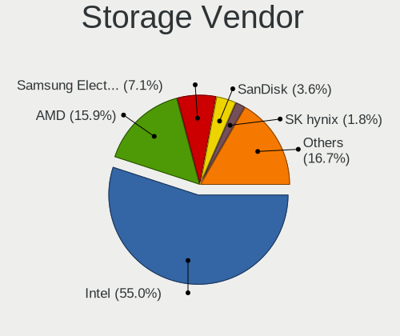

Linux Mint - Tested Hardware & Statistics
-----------------------------------------

A project to collect tested hardware configurations for Linux Mint.

Anyone can contribute to this report by the [hw-probe](https://github.com/linuxhw/hw-probe) tool:

    sudo -E hw-probe -all -upload

Please contribute! Especially if your hardware is rare.

This is a report for all computer types. See also reports for [desktops](/Dist/Linux_Mint/Desktop/README.md) and [notebooks](/Dist/Linux_Mint/Notebook/README.md).

Contents
--------

* [ Test Cases ](#test-cases)

* [ System ](#system)
  - [ OS                       ](#os)
  - [ OS Family                ](#os-family)
  - [ Kernel                   ](#kernel)
  - [ Kernel Family            ](#kernel-family)
  - [ Kernel Major Ver.        ](#kernel-major-ver)
  - [ Arch                     ](#arch)
  - [ DE                       ](#de)
  - [ Display Server           ](#display-server)
  - [ Display Manager          ](#display-manager)
  - [ OS Lang                  ](#os-lang)
  - [ Boot Mode                ](#boot-mode)
  - [ Filesystem               ](#filesystem)
  - [ Part. scheme             ](#part-scheme)
  - [ Dual Boot with Linux/BSD ](#dual-boot-with-linuxbsd)
  - [ Dual Boot (Win)          ](#dual-boot-win)

* [ Board ](#board)
  - [ Vendor                   ](#vendor)
  - [ Model                    ](#model)
  - [ Model Family             ](#model-family)
  - [ MFG Year                 ](#mfg-year)
  - [ Form Factor              ](#form-factor)
  - [ Secure Boot              ](#secure-boot)
  - [ Coreboot                 ](#coreboot)
  - [ RAM Size                 ](#ram-size)
  - [ RAM Used                 ](#ram-used)
  - [ Total Drives             ](#total-drives)
  - [ Has CD-ROM               ](#has-cd-rom)
  - [ Has Ethernet             ](#has-ethernet)
  - [ Has WiFi                 ](#has-wifi)
  - [ Has Bluetooth            ](#has-bluetooth)

* [ Location ](#location)
  - [ Country                  ](#country)
  - [ City                     ](#city)

* [ Drives ](#drives)
  - [ Drive Vendor             ](#drive-vendor)
  - [ Drive Model              ](#drive-model)
  - [ HDD Vendor               ](#hdd-vendor)
  - [ SSD Vendor               ](#ssd-vendor)
  - [ Drive Kind               ](#drive-kind)
  - [ Drive Connector          ](#drive-connector)
  - [ Drive Size               ](#drive-size)
  - [ Space Total              ](#space-total)
  - [ Space Used               ](#space-used)
  - [ Malfunc. Drives          ](#malfunc-drives)
  - [ Malfunc. Drive Vendor    ](#malfunc-drive-vendor)
  - [ Malfunc. HDD Vendor      ](#malfunc-hdd-vendor)
  - [ Malfunc. Drive Kind      ](#malfunc-drive-kind)
  - [ Failed Drives            ](#failed-drives)
  - [ Failed Drive Vendor      ](#failed-drive-vendor)
  - [ Drive Status             ](#drive-status)

* [ Storage controller ](#storage-controller)
  - [ Storage Vendor           ](#storage-vendor)
  - [ Storage Model            ](#storage-model)
  - [ Storage Kind             ](#storage-kind)

* [ Processor ](#processor)
  - [ CPU Vendor               ](#cpu-vendor)
  - [ CPU Model                ](#cpu-model)
  - [ CPU Model Family         ](#cpu-model-family)
  - [ CPU Cores                ](#cpu-cores)
  - [ CPU Sockets              ](#cpu-sockets)
  - [ CPU Threads              ](#cpu-threads)
  - [ CPU Op-Modes             ](#cpu-op-modes)
  - [ CPU Microcode            ](#cpu-microcode)
  - [ CPU Microarch            ](#cpu-microarch)

* [ Graphics ](#graphics)
  - [ GPU Vendor               ](#gpu-vendor)
  - [ GPU Model                ](#gpu-model)
  - [ GPU Combo                ](#gpu-combo)
  - [ GPU Driver               ](#gpu-driver)
  - [ GPU Memory               ](#gpu-memory)

* [ Monitor ](#monitor)
  - [ Monitor Vendor           ](#monitor-vendor)
  - [ Monitor Model            ](#monitor-model)
  - [ Monitor Resolution       ](#monitor-resolution)
  - [ Monitor Diagonal         ](#monitor-diagonal)
  - [ Monitor Width            ](#monitor-width)
  - [ Aspect Ratio             ](#aspect-ratio)
  - [ Monitor Area             ](#monitor-area)
  - [ Pixel Density            ](#pixel-density)
  - [ Multiple Monitors        ](#multiple-monitors)

* [ Network ](#network)
  - [ Net Controller Vendor    ](#net-controller-vendor)
  - [ Net Controller Model     ](#net-controller-model)
  - [ Wireless Vendor          ](#wireless-vendor)
  - [ Wireless Model           ](#wireless-model)
  - [ Ethernet Vendor          ](#ethernet-vendor)
  - [ Ethernet Model           ](#ethernet-model)
  - [ Net Controller Kind      ](#net-controller-kind)
  - [ Used Controller          ](#used-controller)
  - [ NICs                     ](#nics)
  - [ IPv6                     ](#ipv6)

* [ Bluetooth ](#bluetooth)
  - [ Bluetooth Vendor         ](#bluetooth-vendor)
  - [ Bluetooth Model          ](#bluetooth-model)

* [ Sound ](#sound)
  - [ Sound Vendor             ](#sound-vendor)
  - [ Sound Model              ](#sound-model)

* [ Memory ](#memory)
  - [ Memory Vendor            ](#memory-vendor)
  - [ Memory Model             ](#memory-model)
  - [ Memory Kind              ](#memory-kind)
  - [ Memory Form Factor       ](#memory-form-factor)
  - [ Memory Size              ](#memory-size)
  - [ Memory Speed             ](#memory-speed)

* [ Printers & scanners ](#printers--scanners)
  - [ Printer Vendor           ](#printer-vendor)
  - [ Printer Model            ](#printer-model)
  - [ Scanner Vendor           ](#scanner-vendor)
  - [ Scanner Model            ](#scanner-model)

* [ Camera ](#camera)
  - [ Camera Vendor            ](#camera-vendor)
  - [ Camera Model             ](#camera-model)

* [ Security ](#security)
  - [ Fingerprint Vendor       ](#fingerprint-vendor)
  - [ Fingerprint Model        ](#fingerprint-model)
  - [ Chipcard Vendor          ](#chipcard-vendor)
  - [ Chipcard Model           ](#chipcard-model)

* [ Unsupported ](#unsupported)
  - [ Unsupported Devices      ](#unsupported-devices)
  - [ Unsupported Device Types ](#unsupported-device-types)

Test Cases
----------

Total: 30227

| Vendor        | Model                       | Form-Factor | Probe                                                      | Date         |
|---------------|-----------------------------|-------------|------------------------------------------------------------|--------------|
| ASUSTek       | Z97-K                       | Desktop     | [2474ae00d3](https://linux-hardware.org/?probe=2474ae00d3) | Dec 24, 2023 |
| Dell          | Inspiron 5482               | Convertible | [e084484713](https://linux-hardware.org/?probe=e084484713) | Dec 24, 2023 |
| ASUSTek       | G75VW                       | Notebook    | [63fa97bd36](https://linux-hardware.org/?probe=63fa97bd36) | Dec 24, 2023 |
| Acer          | Aspire 5250                 | Notebook    | [224ca602f3](https://linux-hardware.org/?probe=224ca602f3) | Dec 24, 2023 |
| Acer          | Aspire 5750G                | Notebook    | [a12f3e5ce6](https://linux-hardware.org/?probe=a12f3e5ce6) | Dec 24, 2023 |
| Acer          | Aspire 5750G                | Notebook    | [1a31482d70](https://linux-hardware.org/?probe=1a31482d70) | Dec 24, 2023 |
| Lenovo        | Yoga 9 14ITL5 82BG          | Convertible | [234581f461](https://linux-hardware.org/?probe=234581f461) | Dec 24, 2023 |
| Dell          | Latitude E7450              | Notebook    | [6758499db8](https://linux-hardware.org/?probe=6758499db8) | Dec 24, 2023 |
| Dell          | Latitude E7450              | Notebook    | [d3eb47d0a5](https://linux-hardware.org/?probe=d3eb47d0a5) | Dec 24, 2023 |
| HP            | Unknown                     | Notebook    | [3bc06ba7d3](https://linux-hardware.org/?probe=3bc06ba7d3) | Dec 24, 2023 |
| HP            | Presario CQ61               | Notebook    | [249a217a7c](https://linux-hardware.org/?probe=249a217a7c) | Dec 24, 2023 |
| Lenovo        | V15 G4 AMN 82YU             | Notebook    | [d7518dd730](https://linux-hardware.org/?probe=d7518dd730) | Dec 24, 2023 |
| MSI           | 970 GAMING                  | Desktop     | [275aa2eb92](https://linux-hardware.org/?probe=275aa2eb92) | Dec 23, 2023 |
| Lenovo        | V15 G4 AMN 82YU             | Notebook    | [a4b5f3a556](https://linux-hardware.org/?probe=a4b5f3a556) | Dec 23, 2023 |
| ASUSTek       | PRIME B450-PLUS             | Desktop     | [a32ea319ca](https://linux-hardware.org/?probe=a32ea319ca) | Dec 23, 2023 |
| Lenovo        | Yoga 510-14AST 80S9         | Convertible | [ce31053fe2](https://linux-hardware.org/?probe=ce31053fe2) | Dec 23, 2023 |
| Acer          | Aspire ES1-572              | Notebook    | [e726ce9f63](https://linux-hardware.org/?probe=e726ce9f63) | Dec 23, 2023 |
| MSI           | PRO Z790-A WIFI             | Desktop     | [8becdfe1a4](https://linux-hardware.org/?probe=8becdfe1a4) | Dec 23, 2023 |
| Acer          | Aspire A515-55              | Notebook    | [9412d138fb](https://linux-hardware.org/?probe=9412d138fb) | Dec 23, 2023 |
| Acer          | Aspire A515-55              | Notebook    | [4166459262](https://linux-hardware.org/?probe=4166459262) | Dec 23, 2023 |
| Toshiba       | Satellite A660              | Notebook    | [d0415e05d3](https://linux-hardware.org/?probe=d0415e05d3) | Dec 23, 2023 |
| HP            | Victus by Gaming Laptop ... | Notebook    | [95adcc5c56](https://linux-hardware.org/?probe=95adcc5c56) | Dec 23, 2023 |
| Dell          | 0VHWTR A02                  | Desktop     | [86e89b6ffd](https://linux-hardware.org/?probe=86e89b6ffd) | Dec 23, 2023 |
| Lenovo        | NOK                         | Desktop     | [35841ab3ed](https://linux-hardware.org/?probe=35841ab3ed) | Dec 23, 2023 |
| Apple         | MacBookAir3,1               | Notebook    | [860a7b9b4c](https://linux-hardware.org/?probe=860a7b9b4c) | Dec 23, 2023 |
| HP            | ENVY x360 Convertible 15... | Convertible | [51eda90982](https://linux-hardware.org/?probe=51eda90982) | Dec 23, 2023 |
| Unknown       | Unknown                     | Notebook    | [006211d916](https://linux-hardware.org/?probe=006211d916) | Dec 23, 2023 |
| Lenovo        | 3115 SDK0J40697 WIN 3305... | All in one  | [69406da1d4](https://linux-hardware.org/?probe=69406da1d4) | Dec 23, 2023 |
| Dell          | 0D6H9T A00                  | Desktop     | [f6dd1b447a](https://linux-hardware.org/?probe=f6dd1b447a) | Dec 23, 2023 |
| ASUSTek       | X555LAB                     | Notebook    | [6a3b9f5bb2](https://linux-hardware.org/?probe=6a3b9f5bb2) | Dec 23, 2023 |
| MSI           | PRO Z790-A WIFI             | Desktop     | [ff13629db9](https://linux-hardware.org/?probe=ff13629db9) | Dec 23, 2023 |
| Dell          | Latitude E6540              | Notebook    | [9e3371b6b2](https://linux-hardware.org/?probe=9e3371b6b2) | Dec 23, 2023 |
| Dell          | 0NW73C A00                  | Desktop     | [5ac83b9740](https://linux-hardware.org/?probe=5ac83b9740) | Dec 23, 2023 |
| ASUSTek       | M4A89GTD-PRO                | Desktop     | [05b49062ef](https://linux-hardware.org/?probe=05b49062ef) | Dec 23, 2023 |
| HP            | Pavilion dv6                | Notebook    | [c4a6b58303](https://linux-hardware.org/?probe=c4a6b58303) | Dec 23, 2023 |
| Apple         | MacBookAir7,2               | Notebook    | [18ef14b687](https://linux-hardware.org/?probe=18ef14b687) | Dec 23, 2023 |
| HP            | ENVY x360 2-in-1 Laptop ... | Convertible | [b646451269](https://linux-hardware.org/?probe=b646451269) | Dec 23, 2023 |
| AZW           | SER V1                      | Desktop     | [73cc7b7f87](https://linux-hardware.org/?probe=73cc7b7f87) | Dec 22, 2023 |
| ASUSTek       | PRIME B450-PLUS             | Desktop     | [852693eb71](https://linux-hardware.org/?probe=852693eb71) | Dec 22, 2023 |
| HP            | Pavilion Notebook           | Notebook    | [7afecc25eb](https://linux-hardware.org/?probe=7afecc25eb) | Dec 22, 2023 |
| HP            | 84F5                        | Mini pc     | [e91c19712f](https://linux-hardware.org/?probe=e91c19712f) | Dec 22, 2023 |
| ASUSTek       | X555LJ                      | Notebook    | [8f1a82681b](https://linux-hardware.org/?probe=8f1a82681b) | Dec 22, 2023 |
| ASUSTek       | X555LJ                      | Notebook    | [44b0b8bd05](https://linux-hardware.org/?probe=44b0b8bd05) | Dec 22, 2023 |
| ASUSTek       | VivoBook_ASUSLaptop X530... | Notebook    | [3f903fafe6](https://linux-hardware.org/?probe=3f903fafe6) | Dec 22, 2023 |
| AZW           | MINI S 10                   | Desktop     | [59d6fa667d](https://linux-hardware.org/?probe=59d6fa667d) | Dec 22, 2023 |
| HP            | Laptop 15-bs0xx             | Notebook    | [e42f9ff8f6](https://linux-hardware.org/?probe=e42f9ff8f6) | Dec 22, 2023 |
| HP            | EliteBook 655 15.6 inch ... | Notebook    | [72084f8af0](https://linux-hardware.org/?probe=72084f8af0) | Dec 22, 2023 |
| MSI           | B450M PRO-VDH MAX           | Desktop     | [94462e79e4](https://linux-hardware.org/?probe=94462e79e4) | Dec 22, 2023 |
| Toshiba       | Satellite Pro C50-A-1C8     | Notebook    | [bfc1ebaf00](https://linux-hardware.org/?probe=bfc1ebaf00) | Dec 22, 2023 |
| Positivo      | W940TU                      | Notebook    | [40dff18a74](https://linux-hardware.org/?probe=40dff18a74) | Dec 22, 2023 |
| HP            | ENVY Laptop 17-ch0xxx       | Notebook    | [38a9810e94](https://linux-hardware.org/?probe=38a9810e94) | Dec 22, 2023 |
| Dell          | Latitude 5540               | Notebook    | [3716993a6e](https://linux-hardware.org/?probe=3716993a6e) | Dec 22, 2023 |
| Framework     | Laptop (13th Gen Intel C... | Notebook    | [fa4275395f](https://linux-hardware.org/?probe=fa4275395f) | Dec 22, 2023 |
| ASRock        | FM2A68M-HD+                 | Desktop     | [83fd663b68](https://linux-hardware.org/?probe=83fd663b68) | Dec 22, 2023 |
| Toshiba       | Satellite Pro L850-1L2      | Notebook    | [c3bfd150bc](https://linux-hardware.org/?probe=c3bfd150bc) | Dec 22, 2023 |
| HP            | EliteBook x360 1020 G2      | Convertible | [18fc29611b](https://linux-hardware.org/?probe=18fc29611b) | Dec 22, 2023 |
| Dell          | Inspiron 7572               | Notebook    | [b6a03a82a6](https://linux-hardware.org/?probe=b6a03a82a6) | Dec 22, 2023 |
| Lenovo        | IdeaPad 3 15IIL05 81WE      | Notebook    | [684b42a95a](https://linux-hardware.org/?probe=684b42a95a) | Dec 22, 2023 |
| Dell          | Precision M6600             | Notebook    | [5e387ee3ac](https://linux-hardware.org/?probe=5e387ee3ac) | Dec 21, 2023 |
| Dell          | 0KWVT8 A03                  | Desktop     | [82a8bc3c6e](https://linux-hardware.org/?probe=82a8bc3c6e) | Dec 21, 2023 |
| ASUSTek       | ROG STRIX X670E-E GAMING... | Desktop     | [278967cf92](https://linux-hardware.org/?probe=278967cf92) | Dec 21, 2023 |
| ASUSTek       | M3N78-VM                    | Desktop     | [bd28c77bd4](https://linux-hardware.org/?probe=bd28c77bd4) | Dec 21, 2023 |
| HP            | 876C SMVB                   | Desktop     | [c13f4eb91b](https://linux-hardware.org/?probe=c13f4eb91b) | Dec 21, 2023 |
| ASRock        | H61M-DGS R2.0               | Desktop     | [5693d09326](https://linux-hardware.org/?probe=5693d09326) | Dec 21, 2023 |
| ASUSTek       | PRIME H610M-R D4            | Desktop     | [5e7428fc75](https://linux-hardware.org/?probe=5e7428fc75) | Dec 21, 2023 |
| Toshiba       | Satellite L15-B             | Notebook    | [0b1e126b9b](https://linux-hardware.org/?probe=0b1e126b9b) | Dec 21, 2023 |
| Inter Sale... | NID-11125DE                 | Notebook    | [d65538541d](https://linux-hardware.org/?probe=d65538541d) | Dec 21, 2023 |
| Gigabyte      | GA-MA790FXT-UD5P            | Desktop     | [5fa215a8cd](https://linux-hardware.org/?probe=5fa215a8cd) | Dec 21, 2023 |
| Shenzhen M... | F7BSC                       | Desktop     | [70147072be](https://linux-hardware.org/?probe=70147072be) | Dec 21, 2023 |
| Acer          | Aspire M3970                | Desktop     | [5da3b6c46f](https://linux-hardware.org/?probe=5da3b6c46f) | Dec 21, 2023 |
| Lenovo        | ThinkPad T490 20RY0002US    | Notebook    | [95dfdb9327](https://linux-hardware.org/?probe=95dfdb9327) | Dec 21, 2023 |
| ASUSTek       | VivoBook_ASUSLaptop X421... | Notebook    | [5632b47c38](https://linux-hardware.org/?probe=5632b47c38) | Dec 21, 2023 |
| Google        | Casta                       | Notebook    | [70f6e5e978](https://linux-hardware.org/?probe=70f6e5e978) | Dec 21, 2023 |
| ASUSTek       | VX7                         | Notebook    | [df8564bf5b](https://linux-hardware.org/?probe=df8564bf5b) | Dec 21, 2023 |
| Gigabyte      | Z390 DESIGNARE-CF           | Desktop     | [680a9f5001](https://linux-hardware.org/?probe=680a9f5001) | Dec 20, 2023 |
| Lenovo        | IdeaPad S340-15APITOUCH ... | Notebook    | [0eb3eaa1c6](https://linux-hardware.org/?probe=0eb3eaa1c6) | Dec 20, 2023 |
| ASUSTek       | M4A785TD-M EVO              | Desktop     | [ae2fef5c99](https://linux-hardware.org/?probe=ae2fef5c99) | Dec 20, 2023 |
| HP            | 805D                        | Desktop     | [6768e6fc48](https://linux-hardware.org/?probe=6768e6fc48) | Dec 20, 2023 |
| ASUSTek       | PRIME B250M-A               | Desktop     | [11628f388e](https://linux-hardware.org/?probe=11628f388e) | Dec 20, 2023 |
| HP            | 1632                        | Desktop     | [e9f36a25a0](https://linux-hardware.org/?probe=e9f36a25a0) | Dec 20, 2023 |
| Pegatron      | TRUCKEE                     | Desktop     | [dbf9508eef](https://linux-hardware.org/?probe=dbf9508eef) | Dec 20, 2023 |
| Intel         | DX58SO AAE29331-701         | Desktop     | [2d58e75a01](https://linux-hardware.org/?probe=2d58e75a01) | Dec 20, 2023 |
| HP            | Laptop 15-dw3xxx            | Notebook    | [17ce825521](https://linux-hardware.org/?probe=17ce825521) | Dec 20, 2023 |
| HP            | 3047h                       | Desktop     | [8f868cea54](https://linux-hardware.org/?probe=8f868cea54) | Dec 20, 2023 |
| Dell          | Latitude 7490               | Notebook    | [058142d276](https://linux-hardware.org/?probe=058142d276) | Dec 20, 2023 |
| HP            | EliteBook 8560p             | Notebook    | [b9e00df8b5](https://linux-hardware.org/?probe=b9e00df8b5) | Dec 20, 2023 |
| HP            | 3047h                       | Desktop     | [6e6ab07000](https://linux-hardware.org/?probe=6e6ab07000) | Dec 20, 2023 |
| HP            | EliteBook 8560p             | Notebook    | [334bc9d94f](https://linux-hardware.org/?probe=334bc9d94f) | Dec 20, 2023 |
| HP            | 3047h                       | Desktop     | [a1f3ed3f68](https://linux-hardware.org/?probe=a1f3ed3f68) | Dec 20, 2023 |
| Unknown       | Unknown                     | Desktop     | [675b79ace4](https://linux-hardware.org/?probe=675b79ace4) | Dec 20, 2023 |
| Lenovo        | V15 G2 ALC Ua 82KD          | Notebook    | [870842c348](https://linux-hardware.org/?probe=870842c348) | Dec 20, 2023 |
| ASRock        | B550 Pro4                   | Desktop     | [786ded3bc9](https://linux-hardware.org/?probe=786ded3bc9) | Dec 20, 2023 |
| Gigabyte      | Z390 UD                     | Desktop     | [d2841c3b1e](https://linux-hardware.org/?probe=d2841c3b1e) | Dec 20, 2023 |
| Inter Sale... | NID-11125DE                 | Notebook    | [17af2fca66](https://linux-hardware.org/?probe=17af2fca66) | Dec 20, 2023 |
| MSI           | B150M MORTAR                | Desktop     | [d0276bd5b7](https://linux-hardware.org/?probe=d0276bd5b7) | Dec 20, 2023 |
| MSI           | 970 GAMING                  | Desktop     | [cb71670ca0](https://linux-hardware.org/?probe=cb71670ca0) | Dec 20, 2023 |
| HP            | 18E7                        | Desktop     | [fad52327eb](https://linux-hardware.org/?probe=fad52327eb) | Dec 20, 2023 |
| ASUSTek       | M3N78-VM                    | Desktop     | [5d7048af51](https://linux-hardware.org/?probe=5d7048af51) | Dec 20, 2023 |
| ASUSTek       | X550LA                      | Notebook    | [fd673bac37](https://linux-hardware.org/?probe=fd673bac37) | Dec 20, 2023 |
| Samsung       | 350V5C/351V5C/3540VC/344... | Notebook    | [5615091c1d](https://linux-hardware.org/?probe=5615091c1d) | Dec 20, 2023 |
| Dell          | Inspiron 3721               | Notebook    | [2fd8b3f8fc](https://linux-hardware.org/?probe=2fd8b3f8fc) | Dec 20, 2023 |
| ASUSTek       | ROG STRIX B550-F GAMING     | Desktop     | [84530cb3ca](https://linux-hardware.org/?probe=84530cb3ca) | Dec 20, 2023 |
| ASUSTek       | ROG STRIX Z690-F GAMING ... | Desktop     | [176468573a](https://linux-hardware.org/?probe=176468573a) | Dec 19, 2023 |
| Gigabyte      | Z77-DS3H                    | Desktop     | [6c1f758e88](https://linux-hardware.org/?probe=6c1f758e88) | Dec 19, 2023 |
| Lenovo        | ThinkPad T480s 20L8S3SW0... | Notebook    | [eebb86b95f](https://linux-hardware.org/?probe=eebb86b95f) | Dec 19, 2023 |
| HP            | EliteBook 8460p             | Notebook    | [38ac246006](https://linux-hardware.org/?probe=38ac246006) | Dec 19, 2023 |
| Gigabyte      | B85M-D3H                    | Desktop     | [1dd35fdb02](https://linux-hardware.org/?probe=1dd35fdb02) | Dec 19, 2023 |
| Lenovo        | 313F SEK0N11856 IOT 3288... | Desktop     | [1a65cf0f52](https://linux-hardware.org/?probe=1a65cf0f52) | Dec 19, 2023 |
| ASUSTek       | PRIME B450M-A               | Desktop     | [e66c224547](https://linux-hardware.org/?probe=e66c224547) | Dec 19, 2023 |
| Lenovo        | ThinkPad X1 Carbon 4th 2... | Notebook    | [da74c3a382](https://linux-hardware.org/?probe=da74c3a382) | Dec 19, 2023 |
| ECS           | Nettle2                     | Desktop     | [b6a487a1d8](https://linux-hardware.org/?probe=b6a487a1d8) | Dec 19, 2023 |
| Gigabyte      | B450M DS3H-CF               | Desktop     | [cc583aec32](https://linux-hardware.org/?probe=cc583aec32) | Dec 19, 2023 |
| MSI           | Creator 15M A10SD           | Notebook    | [5ed074ddfb](https://linux-hardware.org/?probe=5ed074ddfb) | Dec 19, 2023 |
| Standard      | SF20BA2                     | Notebook    | [431580b18d](https://linux-hardware.org/?probe=431580b18d) | Dec 19, 2023 |
| Panasonic     | CFSZ5-3                     | Notebook    | [73265b056e](https://linux-hardware.org/?probe=73265b056e) | Dec 19, 2023 |
| Apple         | MacBookPro7,1               | Notebook    | [79499893b8](https://linux-hardware.org/?probe=79499893b8) | Dec 19, 2023 |
| Acer          | Aspire M3970                | Desktop     | [5767513b0e](https://linux-hardware.org/?probe=5767513b0e) | Dec 19, 2023 |
| HP            | Unknown                     | Notebook    | [43fae5ce53](https://linux-hardware.org/?probe=43fae5ce53) | Dec 19, 2023 |
| MSI           | B450 GAMING PLUS MAX        | Desktop     | [ed64e6b1ec](https://linux-hardware.org/?probe=ed64e6b1ec) | Dec 19, 2023 |
| Intel         | DH61WW AAG23116-206         | Desktop     | [c387c14ff7](https://linux-hardware.org/?probe=c387c14ff7) | Dec 18, 2023 |
| Intel         | DH61WW AAG23116-206         | Desktop     | [a1760c437e](https://linux-hardware.org/?probe=a1760c437e) | Dec 18, 2023 |
| Acer          | TravelMate Spin P614RN-5... | Convertible | [ebf90075c5](https://linux-hardware.org/?probe=ebf90075c5) | Dec 18, 2023 |
| MSI           | MAG X570 TOMAHAWK WIFI      | Desktop     | [e4916226ac](https://linux-hardware.org/?probe=e4916226ac) | Dec 18, 2023 |
| Dell          | Latitude E6440              | Notebook    | [8d1b130773](https://linux-hardware.org/?probe=8d1b130773) | Dec 18, 2023 |
| MSI           | B560M PRO-E                 | Desktop     | [f8bcb73f0b](https://linux-hardware.org/?probe=f8bcb73f0b) | Dec 18, 2023 |
| Fujitsu       | D3161-A1 S26361-D3161-A1    | Desktop     | [985b139723](https://linux-hardware.org/?probe=985b139723) | Dec 18, 2023 |
| HP            | 1632                        | Desktop     | [db207cb310](https://linux-hardware.org/?probe=db207cb310) | Dec 18, 2023 |
| MSI           | Z77A-GD65                   | Desktop     | [a6d9b065a7](https://linux-hardware.org/?probe=a6d9b065a7) | Dec 18, 2023 |
| MSI           | B550-A PRO                  | Desktop     | [d333f0b082](https://linux-hardware.org/?probe=d333f0b082) | Dec 18, 2023 |
| ASUSTek       | H110M-D                     | Desktop     | [c26e0d3896](https://linux-hardware.org/?probe=c26e0d3896) | Dec 18, 2023 |
| Lenovo        | MAHOBAY No DPK              | All in one  | [e1acdde6d8](https://linux-hardware.org/?probe=e1acdde6d8) | Dec 18, 2023 |
| HP            | Victus by Gaming Laptop ... | Notebook    | [fd092daf92](https://linux-hardware.org/?probe=fd092daf92) | Dec 18, 2023 |
| HP            | EliteBook 8440p             | Notebook    | [4a83771100](https://linux-hardware.org/?probe=4a83771100) | Dec 18, 2023 |
| HUAWEI        | NBLB-WAX9N                  | Notebook    | [1f03d33b22](https://linux-hardware.org/?probe=1f03d33b22) | Dec 18, 2023 |
| BESSTAR Te... | UM700                       | Desktop     | [ac4adad071](https://linux-hardware.org/?probe=ac4adad071) | Dec 18, 2023 |
| Packard Be... | EasyNote TE69BM             | Notebook    | [6a4bc96f4b](https://linux-hardware.org/?probe=6a4bc96f4b) | Dec 18, 2023 |
| ASUSTek       | Z87-A                       | Desktop     | [4824537107](https://linux-hardware.org/?probe=4824537107) | Dec 18, 2023 |
| ASRock        | H61M-DGS R2.0               | Desktop     | [dc6e7e06c3](https://linux-hardware.org/?probe=dc6e7e06c3) | Dec 18, 2023 |
| ASUSTek       | Zenbook UM5302LA_UM5302L... | Notebook    | [29ee1d8ad5](https://linux-hardware.org/?probe=29ee1d8ad5) | Dec 18, 2023 |
| HP            | 8952                        | Mini pc     | [c9e359c6ee](https://linux-hardware.org/?probe=c9e359c6ee) | Dec 18, 2023 |
| Medion        | S17403                      | Notebook    | [250e479ad5](https://linux-hardware.org/?probe=250e479ad5) | Dec 18, 2023 |
| BESSTAR Te... | T3 MRD                      | Desktop     | [56e6c430f4](https://linux-hardware.org/?probe=56e6c430f4) | Dec 18, 2023 |
| BESSTAR Te... | T3 MRD                      | Desktop     | [03025f41df](https://linux-hardware.org/?probe=03025f41df) | Dec 18, 2023 |
| ASRock        | B550 Pro4                   | Desktop     | [1a4597db9e](https://linux-hardware.org/?probe=1a4597db9e) | Dec 18, 2023 |
| ASUSTek       | X550LA                      | Notebook    | [759db70e03](https://linux-hardware.org/?probe=759db70e03) | Dec 18, 2023 |
| ASUSTek       | ZenBook UX434IQ_Q407IQ      | Notebook    | [81ea786e13](https://linux-hardware.org/?probe=81ea786e13) | Dec 18, 2023 |
| Dell          | Latitude E6410              | Notebook    | [ad9c836840](https://linux-hardware.org/?probe=ad9c836840) | Dec 18, 2023 |
| MSI           | Katana GF66 11SC            | Notebook    | [96407da6d4](https://linux-hardware.org/?probe=96407da6d4) | Dec 18, 2023 |
| Dell          | 051FJ8 A00                  | Desktop     | [18f1d4c5d0](https://linux-hardware.org/?probe=18f1d4c5d0) | Dec 18, 2023 |
| MSI           | MAG X570 TOMAHAWK WIFI      | Desktop     | [2c85a450a7](https://linux-hardware.org/?probe=2c85a450a7) | Dec 18, 2023 |
| ASRock        | H61M-HP4                    | Desktop     | [05fe81411e](https://linux-hardware.org/?probe=05fe81411e) | Dec 18, 2023 |
| MSI           | Z87-G45 GAMING              | Desktop     | [e728e078f2](https://linux-hardware.org/?probe=e728e078f2) | Dec 18, 2023 |
| Microsoft     | Surface Laptop Go           | Tablet      | [b1d44e2673](https://linux-hardware.org/?probe=b1d44e2673) | Dec 17, 2023 |
| Dell          | Latitude E6400              | Notebook    | [855a8f55c4](https://linux-hardware.org/?probe=855a8f55c4) | Dec 17, 2023 |
| HP            | Compaq CQ45                 | Notebook    | [2d0f39803d](https://linux-hardware.org/?probe=2d0f39803d) | Dec 17, 2023 |
| Acer          | Aspire A315-51              | Notebook    | [4169b122de](https://linux-hardware.org/?probe=4169b122de) | Dec 17, 2023 |
| Acer          | Aspire 5920G                | Notebook    | [40545204ea](https://linux-hardware.org/?probe=40545204ea) | Dec 17, 2023 |
| Acer          | Aspire 5920G                | Notebook    | [4ace5aeebe](https://linux-hardware.org/?probe=4ace5aeebe) | Dec 17, 2023 |
| ASUSTek       | PRIME X470-PRO              | Desktop     | [294d96c3dd](https://linux-hardware.org/?probe=294d96c3dd) | Dec 17, 2023 |
| Lenovo        | ThinkPad T440p 20AWA0W9A... | Notebook    | [e97e362650](https://linux-hardware.org/?probe=e97e362650) | Dec 17, 2023 |
| Dell          | Precision 5510              | Notebook    | [d723f4a031](https://linux-hardware.org/?probe=d723f4a031) | Dec 17, 2023 |
| HUAWEI        | NBLB-WAX9N                  | Notebook    | [16ebb489d4](https://linux-hardware.org/?probe=16ebb489d4) | Dec 17, 2023 |
| HP            | Notebook                    | Notebook    | [09981b3a71](https://linux-hardware.org/?probe=09981b3a71) | Dec 17, 2023 |
| ASUSTek       | CROSSHAIR VI HERO           | Desktop     | [b595a47be1](https://linux-hardware.org/?probe=b595a47be1) | Dec 17, 2023 |
| GIADA         | Cherry Trail CR JHS60V      | Notebook    | [18734ee033](https://linux-hardware.org/?probe=18734ee033) | Dec 17, 2023 |
| Dell          | Latitude E6440              | Notebook    | [b91055b95e](https://linux-hardware.org/?probe=b91055b95e) | Dec 17, 2023 |
| Medion        | B660H7-M20                  | Desktop     | [749b3e49ca](https://linux-hardware.org/?probe=749b3e49ca) | Dec 17, 2023 |
| ASUSTek       | PRIME B550-PLUS             | Desktop     | [39c5fad7d0](https://linux-hardware.org/?probe=39c5fad7d0) | Dec 17, 2023 |
| ASUSTek       | PRIME B550-PLUS             | Desktop     | [d3ff600405](https://linux-hardware.org/?probe=d3ff600405) | Dec 17, 2023 |
| ASRock        | G41C-GS                     | Desktop     | [cea8e45a31](https://linux-hardware.org/?probe=cea8e45a31) | Dec 17, 2023 |
| ASUSTek       | X580VD                      | Notebook    | [8629995933](https://linux-hardware.org/?probe=8629995933) | Dec 17, 2023 |
| PC Special... | MP 17 Recoil Master         | Notebook    | [f199dc6e36](https://linux-hardware.org/?probe=f199dc6e36) | Dec 17, 2023 |
| ASRock        | H61M-DGS R2.0               | Desktop     | [b8bef59357](https://linux-hardware.org/?probe=b8bef59357) | Dec 17, 2023 |
| Lenovo        | IdeaPad 320-15IKB 80XL      | Notebook    | [02fb9a3f3b](https://linux-hardware.org/?probe=02fb9a3f3b) | Dec 17, 2023 |
| ASRock        | H61M-DGS R2.0               | Desktop     | [d60c1bd23e](https://linux-hardware.org/?probe=d60c1bd23e) | Dec 17, 2023 |
| ASUSTek       | TUF B450M-PRO GAMING        | Desktop     | [c6fa46e494](https://linux-hardware.org/?probe=c6fa46e494) | Dec 17, 2023 |
| ASRock        | H61M-DGS R2.0               | Desktop     | [f627f950ab](https://linux-hardware.org/?probe=f627f950ab) | Dec 17, 2023 |
| Acer          | Aspire M5-583P              | Notebook    | [34b9748756](https://linux-hardware.org/?probe=34b9748756) | Dec 17, 2023 |
| Toshiba       | PORTEGE Z20t-C              | Notebook    | [eb941689a4](https://linux-hardware.org/?probe=eb941689a4) | Dec 17, 2023 |
| Apple         | Mac-942B59F58194171B iMa... | All in one  | [4672cb8d76](https://linux-hardware.org/?probe=4672cb8d76) | Dec 17, 2023 |
| Toshiba       | Satellite C50D-C            | Notebook    | [476915f215](https://linux-hardware.org/?probe=476915f215) | Dec 17, 2023 |
| ASUSTek       | VivoBook_ASUSLaptop M160... | Notebook    | [0f49954dd1](https://linux-hardware.org/?probe=0f49954dd1) | Dec 17, 2023 |
| HP            | ProBook 455 G2              | Notebook    | [4935ac1297](https://linux-hardware.org/?probe=4935ac1297) | Dec 17, 2023 |
| HP            | 2B5B                        | Desktop     | [fb3877b170](https://linux-hardware.org/?probe=fb3877b170) | Dec 17, 2023 |
| Samsung       | RV410/RV510/S3510/E3510     | Notebook    | [be717cf064](https://linux-hardware.org/?probe=be717cf064) | Dec 16, 2023 |
| Lenovo        | V110-15IAP 80TG             | Notebook    | [8bb410ae42](https://linux-hardware.org/?probe=8bb410ae42) | Dec 16, 2023 |
| MSI           | Z97-G43                     | Desktop     | [84486f678f](https://linux-hardware.org/?probe=84486f678f) | Dec 16, 2023 |
| HP            | Pavilion Gaming Laptop 1... | Notebook    | [3324746751](https://linux-hardware.org/?probe=3324746751) | Dec 16, 2023 |
| Lenovo        | ThinkPad T14 Gen 4 21K3C... | Notebook    | [66a8c2ad4c](https://linux-hardware.org/?probe=66a8c2ad4c) | Dec 16, 2023 |
| Dell          | 08WKV3 A00                  | Desktop     | [75274d24c0](https://linux-hardware.org/?probe=75274d24c0) | Dec 16, 2023 |
| Gigabyte      | Z77-D3H                     | Desktop     | [52012e39df](https://linux-hardware.org/?probe=52012e39df) | Dec 16, 2023 |
| MSI           | Z77A-G43                    | Desktop     | [9afc3e4d49](https://linux-hardware.org/?probe=9afc3e4d49) | Dec 16, 2023 |
| Acer          | Aspire 6920                 | Notebook    | [716c31a854](https://linux-hardware.org/?probe=716c31a854) | Dec 16, 2023 |
| ASUSTek       | PRIME B450-PLUS             | Desktop     | [05f4c47ed0](https://linux-hardware.org/?probe=05f4c47ed0) | Dec 16, 2023 |
| Sony          | VGN-FW51MF_H                | Notebook    | [5cb2ea3418](https://linux-hardware.org/?probe=5cb2ea3418) | Dec 16, 2023 |
| Toshiba       | Satellite C660D             | Notebook    | [4277f53694](https://linux-hardware.org/?probe=4277f53694) | Dec 16, 2023 |
| Lenovo        | G570 20079                  | Notebook    | [7928703207](https://linux-hardware.org/?probe=7928703207) | Dec 16, 2023 |
| AMI           | Intel                       | Desktop     | [9564eaaec0](https://linux-hardware.org/?probe=9564eaaec0) | Dec 16, 2023 |
| MSI           | Z77A-G43                    | Desktop     | [25c5c9bb33](https://linux-hardware.org/?probe=25c5c9bb33) | Dec 16, 2023 |
| Dell          | 0MY764 A00                  | All in one  | [2fd4dc6486](https://linux-hardware.org/?probe=2fd4dc6486) | Dec 16, 2023 |
| Dell          | 0MY764 A00                  | All in one  | [ad39174db9](https://linux-hardware.org/?probe=ad39174db9) | Dec 16, 2023 |
| Lenovo        | ThinkPad Yoga 370 20JJ00... | Convertible | [5382e06902](https://linux-hardware.org/?probe=5382e06902) | Dec 16, 2023 |
| Dell          | Latitude E6440              | Notebook    | [bfbadf07a9](https://linux-hardware.org/?probe=bfbadf07a9) | Dec 16, 2023 |
| Dell          | Latitude E6440              | Notebook    | [bde33cad70](https://linux-hardware.org/?probe=bde33cad70) | Dec 16, 2023 |
| Dell          | Latitude E6440              | Notebook    | [5d02de18b4](https://linux-hardware.org/?probe=5d02de18b4) | Dec 16, 2023 |
| Lenovo        | ThinkPad T14s Gen 1 20T1... | Notebook    | [0121e6cb47](https://linux-hardware.org/?probe=0121e6cb47) | Dec 15, 2023 |
| ASUSTek       | VivoBook_ASUSLaptop X515... | Notebook    | [7a1a444ed0](https://linux-hardware.org/?probe=7a1a444ed0) | Dec 15, 2023 |
| HP            | 84FD                        | Desktop     | [288748c642](https://linux-hardware.org/?probe=288748c642) | Dec 15, 2023 |
| Dell          | Vostro 3525                 | Notebook    | [c9de3b068b](https://linux-hardware.org/?probe=c9de3b068b) | Dec 15, 2023 |
| MSI           | B450 TOMAHAWK MAX II        | Desktop     | [8fc6a74916](https://linux-hardware.org/?probe=8fc6a74916) | Dec 15, 2023 |
| MSI           | Z77A-GD65                   | Desktop     | [61b10e308f](https://linux-hardware.org/?probe=61b10e308f) | Dec 15, 2023 |
| HP            | 81C5 MVB                    | Desktop     | [f595f75af9](https://linux-hardware.org/?probe=f595f75af9) | Dec 15, 2023 |
| Dell          | 03NVJ6 A02                  | Desktop     | [7f5a3db82c](https://linux-hardware.org/?probe=7f5a3db82c) | Dec 15, 2023 |
| Acer          | Swift SFX14-41G             | Notebook    | [49d4000148](https://linux-hardware.org/?probe=49d4000148) | Dec 15, 2023 |
| Supermicro    | X10SAE                      | Server      | [a3dda288d1](https://linux-hardware.org/?probe=a3dda288d1) | Dec 15, 2023 |
| Acer          | Aspire 5741G                | Notebook    | [2c456f017e](https://linux-hardware.org/?probe=2c456f017e) | Dec 15, 2023 |
| Acer          | Aspire 5741G                | Notebook    | [6aed980ba9](https://linux-hardware.org/?probe=6aed980ba9) | Dec 15, 2023 |
| Dell          | Precision 5540              | Notebook    | [beae57f4bb](https://linux-hardware.org/?probe=beae57f4bb) | Dec 14, 2023 |
| Dell          | Precision M6800             | Notebook    | [c3ff8fa4c5](https://linux-hardware.org/?probe=c3ff8fa4c5) | Dec 14, 2023 |
| Lenovo        | ThinkPad SL510 28477MG      | Notebook    | [7a1dc9b889](https://linux-hardware.org/?probe=7a1dc9b889) | Dec 14, 2023 |
| ASUSTek       | TUF Gaming B650M-PLUS       | Desktop     | [a142ccc9e7](https://linux-hardware.org/?probe=a142ccc9e7) | Dec 14, 2023 |
| Timi          | TM1701                      | Notebook    | [5b3c697954](https://linux-hardware.org/?probe=5b3c697954) | Dec 14, 2023 |
| ASUSTek       | VivoBook_ASUS Laptop E40... | Notebook    | [05141b9b76](https://linux-hardware.org/?probe=05141b9b76) | Dec 14, 2023 |
| ASUSTek       | VivoBook_ASUS Laptop E40... | Notebook    | [a869524ac6](https://linux-hardware.org/?probe=a869524ac6) | Dec 14, 2023 |
| Lenovo        | ThinkPad T480s 20L8S3SW0... | Notebook    | [990fd9f312](https://linux-hardware.org/?probe=990fd9f312) | Dec 14, 2023 |
| HP            | Victus by Laptop 16-e0xx... | Notebook    | [8dd696472d](https://linux-hardware.org/?probe=8dd696472d) | Dec 14, 2023 |
| ECS           | G31T-M9                     | Desktop     | [30204f2a00](https://linux-hardware.org/?probe=30204f2a00) | Dec 14, 2023 |
| Lenovo        | ThinkPad T450 20BUS50Q16    | Notebook    | [789b2d6914](https://linux-hardware.org/?probe=789b2d6914) | Dec 14, 2023 |
| Gigabyte      | A320M-S2H-CF                | Desktop     | [eddc4eec8d](https://linux-hardware.org/?probe=eddc4eec8d) | Dec 14, 2023 |
| Acidanther... | Mac-63001698E7A34814 iMa... | All in one  | [7b96685bff](https://linux-hardware.org/?probe=7b96685bff) | Dec 14, 2023 |
| HP            | 3047h                       | Desktop     | [d7d067e46c](https://linux-hardware.org/?probe=d7d067e46c) | Dec 14, 2023 |
| HP            | Unknown                     | Notebook    | [6a46b87d41](https://linux-hardware.org/?probe=6a46b87d41) | Dec 14, 2023 |
| Biostar       | X370GT3                     | Desktop     | [b910738e8f](https://linux-hardware.org/?probe=b910738e8f) | Dec 14, 2023 |
| MSI           | B365M PRO-VDH               | Desktop     | [72a4579df1](https://linux-hardware.org/?probe=72a4579df1) | Dec 14, 2023 |
| HP            | Pavilion 17                 | Notebook    | [81e5865518](https://linux-hardware.org/?probe=81e5865518) | Dec 14, 2023 |
| Unknown       | Unknown                     | Desktop     | [7c84d77c07](https://linux-hardware.org/?probe=7c84d77c07) | Dec 14, 2023 |
| Microsoft     | Surface Pro                 | Tablet      | [1415106440](https://linux-hardware.org/?probe=1415106440) | Dec 14, 2023 |
| HP            | ZBook 15 G6                 | Notebook    | [1d935cbf02](https://linux-hardware.org/?probe=1d935cbf02) | Dec 13, 2023 |
| HP            | 15                          | Notebook    | [2343c72691](https://linux-hardware.org/?probe=2343c72691) | Dec 13, 2023 |
| HP            | ZBook 15 G6                 | Notebook    | [3deb250922](https://linux-hardware.org/?probe=3deb250922) | Dec 13, 2023 |
| Schenker      | XMG NEO (E23)               | Notebook    | [ce84d5a464](https://linux-hardware.org/?probe=ce84d5a464) | Dec 13, 2023 |
| Lenovo        | G580 20150                  | Notebook    | [c6c8d22a8e](https://linux-hardware.org/?probe=c6c8d22a8e) | Dec 13, 2023 |
| HP            | Spectre x360 2-in-1 Lapt... | Convertible | [1b81d3191b](https://linux-hardware.org/?probe=1b81d3191b) | Dec 13, 2023 |
| HP            | 82A2                        | Desktop     | [5e0e98b1ec](https://linux-hardware.org/?probe=5e0e98b1ec) | Dec 13, 2023 |
| HP            | EliteBook 655 15.6 inch ... | Notebook    | [ba6f8efad6](https://linux-hardware.org/?probe=ba6f8efad6) | Dec 13, 2023 |
| Toshiba       | Satellite Pro C50-A-1C8     | Notebook    | [a56ec48040](https://linux-hardware.org/?probe=a56ec48040) | Dec 13, 2023 |
| Toshiba       | Satellite Pro C50-A-1C8     | Notebook    | [490ceeb636](https://linux-hardware.org/?probe=490ceeb636) | Dec 13, 2023 |
| Lenovo        | 1031 SDK0J40697 WIN 3305... | Desktop     | [f04b854d78](https://linux-hardware.org/?probe=f04b854d78) | Dec 13, 2023 |
| Gigabyte      | A620I AX                    | Desktop     | [4dfc898722](https://linux-hardware.org/?probe=4dfc898722) | Dec 13, 2023 |
| Fujitsu       | LIFEBOOK U7413              | Notebook    | [088a24eb7d](https://linux-hardware.org/?probe=088a24eb7d) | Dec 13, 2023 |
| HP            | 8169                        | Desktop     | [4f4439a6fb](https://linux-hardware.org/?probe=4f4439a6fb) | Dec 13, 2023 |
| Dell          | Latitude E7240              | Notebook    | [4fcd011c61](https://linux-hardware.org/?probe=4fcd011c61) | Dec 13, 2023 |
| Apple         | Mac-942B5BF58194151B        | All in one  | [9b20467a02](https://linux-hardware.org/?probe=9b20467a02) | Dec 13, 2023 |
| Dell          | System XPS L502X            | Notebook    | [75c612f90d](https://linux-hardware.org/?probe=75c612f90d) | Dec 13, 2023 |
| MSI           | Z77A-GD65                   | Desktop     | [ce6556590b](https://linux-hardware.org/?probe=ce6556590b) | Dec 13, 2023 |
| HP            | Pavilion dv6                | Notebook    | [ebc05992b6](https://linux-hardware.org/?probe=ebc05992b6) | Dec 13, 2023 |
| Lenovo        | 1038 SDK0Q40104 WIN 3305... | Server      | [f2240b183a](https://linux-hardware.org/?probe=f2240b183a) | Dec 12, 2023 |
| Lenovo        | ThinkPad X270 20HMS0TD00    | Notebook    | [e9df2cf93b](https://linux-hardware.org/?probe=e9df2cf93b) | Dec 12, 2023 |
| MSI           | GL62M 7RD                   | Notebook    | [fd87c3c373](https://linux-hardware.org/?probe=fd87c3c373) | Dec 12, 2023 |
| Biostar       | B560MHP                     | Desktop     | [51c947f8c6](https://linux-hardware.org/?probe=51c947f8c6) | Dec 12, 2023 |
| HP            | 1497                        | Desktop     | [f2951d81c8](https://linux-hardware.org/?probe=f2951d81c8) | Dec 12, 2023 |
| HP            | 829A                        | Mini pc     | [ba2b33f645](https://linux-hardware.org/?probe=ba2b33f645) | Dec 12, 2023 |
| Lenovo        | IdeaPad S145-15IWL 81S9     | Notebook    | [74c0490d28](https://linux-hardware.org/?probe=74c0490d28) | Dec 12, 2023 |
| Pegatron      | 2AC2                        | Desktop     | [92c7121765](https://linux-hardware.org/?probe=92c7121765) | Dec 12, 2023 |
| Lenovo        | ThinkPad X250 20CM001PGE    | Notebook    | [920f198d61](https://linux-hardware.org/?probe=920f198d61) | Dec 12, 2023 |
| Inter Sale... | NID-11125DE                 | Notebook    | [373498e89a](https://linux-hardware.org/?probe=373498e89a) | Dec 12, 2023 |
| ASRock        | Z170 Extreme4               | Desktop     | [dceaa713f6](https://linux-hardware.org/?probe=dceaa713f6) | Dec 12, 2023 |
| Apple         | MacBookPro11,2              | Notebook    | [cc03da082a](https://linux-hardware.org/?probe=cc03da082a) | Dec 12, 2023 |
| ASUSTek       | VivoBook_ASUSLaptop M150... | Notebook    | [e617c5041f](https://linux-hardware.org/?probe=e617c5041f) | Dec 12, 2023 |
| ASUSTek       | TUF Gaming X570-PLUS        | Desktop     | [9aca5f97c6](https://linux-hardware.org/?probe=9aca5f97c6) | Dec 12, 2023 |
| Acer          | WG43M                       | Desktop     | [b1fcb17dea](https://linux-hardware.org/?probe=b1fcb17dea) | Dec 11, 2023 |
| Packard Be... | EasyNote MH36               | Notebook    | [9607b32c37](https://linux-hardware.org/?probe=9607b32c37) | Dec 11, 2023 |
| Dell          | Precision 7520              | Notebook    | [d0f203dcb1](https://linux-hardware.org/?probe=d0f203dcb1) | Dec 11, 2023 |
| Gigabyte      | GA-78LMT-S2P                | Desktop     | [132b7b57ba](https://linux-hardware.org/?probe=132b7b57ba) | Dec 11, 2023 |
| Unknown       | X99H                        | Desktop     | [799324c839](https://linux-hardware.org/?probe=799324c839) | Dec 11, 2023 |
| Dell          | Precision 7520              | Notebook    | [2e02455101](https://linux-hardware.org/?probe=2e02455101) | Dec 11, 2023 |
| Acer          | Aspire 5750                 | Notebook    | [584a9a153e](https://linux-hardware.org/?probe=584a9a153e) | Dec 11, 2023 |
| Shuttle       | SH55J V10                   | Desktop     | [d7ca143ac0](https://linux-hardware.org/?probe=d7ca143ac0) | Dec 11, 2023 |
| Dell          | Latitude E6540              | Notebook    | [0d56fcda0e](https://linux-hardware.org/?probe=0d56fcda0e) | Dec 11, 2023 |
| MSI           | Z170-A PRO                  | Desktop     | [8d77ff0fe8](https://linux-hardware.org/?probe=8d77ff0fe8) | Dec 11, 2023 |
| Gigabyte      | GA-78LMT-S2P                | Desktop     | [3818e85705](https://linux-hardware.org/?probe=3818e85705) | Dec 11, 2023 |
| MSI           | X470 GAMING PLUS MAX        | Desktop     | [8a8dc0ce48](https://linux-hardware.org/?probe=8a8dc0ce48) | Dec 11, 2023 |
| Acer          | Aspire A515-52G             | Notebook    | [c6ac91a53c](https://linux-hardware.org/?probe=c6ac91a53c) | Dec 11, 2023 |
| HP            | Compaq Presario CQ60        | Notebook    | [0bf86693bc](https://linux-hardware.org/?probe=0bf86693bc) | Dec 11, 2023 |
| Lenovo        | IdeaPad 3 15IIL05 81WE      | Notebook    | [dac56d16cd](https://linux-hardware.org/?probe=dac56d16cd) | Dec 11, 2023 |
| Acer          | Extensa 5630                | Notebook    | [4709657363](https://linux-hardware.org/?probe=4709657363) | Dec 11, 2023 |
| Dell          | Inspiron 5755               | Notebook    | [4b70400e52](https://linux-hardware.org/?probe=4b70400e52) | Dec 11, 2023 |
| PCWare        | IPMH61R1                    | Desktop     | [0d3a1ef029](https://linux-hardware.org/?probe=0d3a1ef029) | Dec 11, 2023 |
| ASUSTek       | Zenbook UN5401QA_UN5401Q... | Convertible | [1f61ed59d7](https://linux-hardware.org/?probe=1f61ed59d7) | Dec 10, 2023 |
| Gigabyte      | B550M AORUS ELITE           | Desktop     | [60ea2483e2](https://linux-hardware.org/?probe=60ea2483e2) | Dec 10, 2023 |
| ASUSTek       | T101HA                      | Tablet      | [350f7fc217](https://linux-hardware.org/?probe=350f7fc217) | Dec 10, 2023 |
| Acer          | Aspire A515-56              | Notebook    | [ec970d7248](https://linux-hardware.org/?probe=ec970d7248) | Dec 10, 2023 |
| Acer          | Aspire ES1-572              | Notebook    | [c66bd8de67](https://linux-hardware.org/?probe=c66bd8de67) | Dec 10, 2023 |
| ASUSTek       | M5A97 LE R2.0               | Desktop     | [322e9eb3c7](https://linux-hardware.org/?probe=322e9eb3c7) | Dec 10, 2023 |
| Dell          | Latitude E6410              | Notebook    | [0b8db8ccee](https://linux-hardware.org/?probe=0b8db8ccee) | Dec 10, 2023 |
| Apple         | MacBookAir6,2               | Notebook    | [62734db5de](https://linux-hardware.org/?probe=62734db5de) | Dec 10, 2023 |
| Casper        | *SP*                        | Notebook    | [5fb7fac59d](https://linux-hardware.org/?probe=5fb7fac59d) | Dec 10, 2023 |
| Casper        | *SP*                        | Notebook    | [5a1d880754](https://linux-hardware.org/?probe=5a1d880754) | Dec 10, 2023 |
| Lenovo        | Bantry CRB SDK0J40709 WI... | All in one  | [1acdbb1c74](https://linux-hardware.org/?probe=1acdbb1c74) | Dec 10, 2023 |
| Lenovo        | Bantry CRB SDK0J40709 WI... | All in one  | [def1d2da47](https://linux-hardware.org/?probe=def1d2da47) | Dec 10, 2023 |
| ASRock        | H81M-HDS                    | Desktop     | [6e718e8473](https://linux-hardware.org/?probe=6e718e8473) | Dec 10, 2023 |
| Acer          | Nitro AN515-54              | Notebook    | [a29797fb65](https://linux-hardware.org/?probe=a29797fb65) | Dec 10, 2023 |
| Toshiba       | PORTEGE Z930                | Notebook    | [5ad98ef7f6](https://linux-hardware.org/?probe=5ad98ef7f6) | Dec 10, 2023 |
| Lenovo        | SHARKBAY NOK                | Desktop     | [cdf1824579](https://linux-hardware.org/?probe=cdf1824579) | Dec 10, 2023 |
| HP            | ProBook 6460b               | Notebook    | [99fa9c84ca](https://linux-hardware.org/?probe=99fa9c84ca) | Dec 10, 2023 |
| Lenovo        | ThinkPad T14 Gen 2a 20XK... | Notebook    | [f91ead8a19](https://linux-hardware.org/?probe=f91ead8a19) | Dec 10, 2023 |
| MSI           | Modern 15 B7M               | Notebook    | [cc6c41e7fd](https://linux-hardware.org/?probe=cc6c41e7fd) | Dec 10, 2023 |
| ASUSTek       | Q87M-E                      | Desktop     | [9bb3c76c9f](https://linux-hardware.org/?probe=9bb3c76c9f) | Dec 10, 2023 |
| Unknown       | Unknown                     | Desktop     | [e3a3265aef](https://linux-hardware.org/?probe=e3a3265aef) | Dec 10, 2023 |
| ASUSTek       | TUF Gaming X670E-PLUS WI... | Desktop     | [eaa1ac53a4](https://linux-hardware.org/?probe=eaa1ac53a4) | Dec 10, 2023 |
| HP            | Pavilion 17                 | Notebook    | [6822e2b412](https://linux-hardware.org/?probe=6822e2b412) | Dec 10, 2023 |
| MSI           | PRO B650-P WIFI             | Desktop     | [edd17a5f0a](https://linux-hardware.org/?probe=edd17a5f0a) | Dec 10, 2023 |
| HP            | 3397                        | Desktop     | [00bdd1f8a2](https://linux-hardware.org/?probe=00bdd1f8a2) | Dec 10, 2023 |
| Lenovo        | G50-70 20351                | Notebook    | [fab1403ca7](https://linux-hardware.org/?probe=fab1403ca7) | Dec 10, 2023 |
| Acer          | Aspire A515-54              | Notebook    | [d3869522c0](https://linux-hardware.org/?probe=d3869522c0) | Dec 10, 2023 |
| Sony          | SVE1511K1EW                 | Notebook    | [34875b90c4](https://linux-hardware.org/?probe=34875b90c4) | Dec 10, 2023 |
| Gigabyte      | A520M S2H                   | Desktop     | [27101e8e16](https://linux-hardware.org/?probe=27101e8e16) | Dec 10, 2023 |
| Lenovo        | ThinkPad T14 Gen 2a 20XK... | Notebook    | [cedb8ab2b7](https://linux-hardware.org/?probe=cedb8ab2b7) | Dec 10, 2023 |
| MSI           | GS43VR 7RE                  | Notebook    | [23feee91ff](https://linux-hardware.org/?probe=23feee91ff) | Dec 10, 2023 |
| Lenovo        | ThinkPad T480 20L6S4G700    | Notebook    | [a1ebdec411](https://linux-hardware.org/?probe=a1ebdec411) | Dec 10, 2023 |
| Google        | Gallop                      | Notebook    | [83663e2906](https://linux-hardware.org/?probe=83663e2906) | Dec 09, 2023 |
| PCWare        | IPMH310G PRO                | Desktop     | [2abdb88ca3](https://linux-hardware.org/?probe=2abdb88ca3) | Dec 09, 2023 |
| HP            | EliteBook 820 G3            | Notebook    | [50335a1ca6](https://linux-hardware.org/?probe=50335a1ca6) | Dec 09, 2023 |
| Dell          | Latitude 7490               | Notebook    | [bbbf303467](https://linux-hardware.org/?probe=bbbf303467) | Dec 09, 2023 |
| BOSGAME       | DNB20 series                | Notebook    | [d825ed757b](https://linux-hardware.org/?probe=d825ed757b) | Dec 09, 2023 |
| Toshiba       | Satellite L650D             | Notebook    | [90ec46f444](https://linux-hardware.org/?probe=90ec46f444) | Dec 09, 2023 |
| MSI           | MAG B650 TOMAHAWK WIFI      | Desktop     | [09e302c4ab](https://linux-hardware.org/?probe=09e302c4ab) | Dec 09, 2023 |
| ASRock        | A520M-HDV                   | Desktop     | [c274f291c4](https://linux-hardware.org/?probe=c274f291c4) | Dec 09, 2023 |
| Toshiba       | Satellite C870D-116         | Notebook    | [78a800febe](https://linux-hardware.org/?probe=78a800febe) | Dec 09, 2023 |
| HUAWEI        | NBLB-WAX9N                  | Notebook    | [be35efa2be](https://linux-hardware.org/?probe=be35efa2be) | Dec 09, 2023 |
| MSI           | B550-A PRO                  | Desktop     | [f4033fbe79](https://linux-hardware.org/?probe=f4033fbe79) | Dec 09, 2023 |
| MSI           | H110M GAMING                | Desktop     | [c1f16cd93f](https://linux-hardware.org/?probe=c1f16cd93f) | Dec 09, 2023 |
| Unknown       | NY-02                       | Notebook    | [d894eced77](https://linux-hardware.org/?probe=d894eced77) | Dec 09, 2023 |
| Samsung       | 90X3A                       | Notebook    | [45697431c1](https://linux-hardware.org/?probe=45697431c1) | Dec 09, 2023 |
| Dell          | Latitude E6400              | Notebook    | [0f4aeac8ca](https://linux-hardware.org/?probe=0f4aeac8ca) | Dec 09, 2023 |
| Dell          | G15 5515                    | Notebook    | [d815dec1af](https://linux-hardware.org/?probe=d815dec1af) | Dec 09, 2023 |
| Wortmann      | 1220561_1470059             | Tablet      | [dd7d907141](https://linux-hardware.org/?probe=dd7d907141) | Dec 09, 2023 |
| Unknown       | Unknown                     | Notebook    | [185aa8e9fe](https://linux-hardware.org/?probe=185aa8e9fe) | Dec 09, 2023 |
| HP            | Pavilion dv8000 (ET839UA... | Notebook    | [b743ce445f](https://linux-hardware.org/?probe=b743ce445f) | Dec 09, 2023 |
| Fujitsu Si... | LIFEBOOK T5010              | Notebook    | [7a66cc4016](https://linux-hardware.org/?probe=7a66cc4016) | Dec 09, 2023 |
| Dell          | 0JCTF8 A00                  | Desktop     | [30be77ff04](https://linux-hardware.org/?probe=30be77ff04) | Dec 09, 2023 |
| HP            | 1998                        | Desktop     | [936ab51d4e](https://linux-hardware.org/?probe=936ab51d4e) | Dec 09, 2023 |
| ASRock        | AB350 Pro4                  | Desktop     | [514239398e](https://linux-hardware.org/?probe=514239398e) | Dec 09, 2023 |
| Microsoft     | Surface Pro 4               | Tablet      | [d4958d9e5e](https://linux-hardware.org/?probe=d4958d9e5e) | Dec 09, 2023 |
| Unknown       | Unknown                     | Notebook    | [f6c17cee3d](https://linux-hardware.org/?probe=f6c17cee3d) | Dec 08, 2023 |
| Medion        | B360H4-EM V1.0              | Desktop     | [a0d6ba0881](https://linux-hardware.org/?probe=a0d6ba0881) | Dec 08, 2023 |
| TECNO Mobi... | MEGABOOK T15DA              | Notebook    | [afe1407fd9](https://linux-hardware.org/?probe=afe1407fd9) | Dec 08, 2023 |
| TUXEDO        | U931                        | Notebook    | [a73533a163](https://linux-hardware.org/?probe=a73533a163) | Dec 08, 2023 |
| ASUSTek       | TUF Gaming B760M-PLUS       | Desktop     | [a6d71c281f](https://linux-hardware.org/?probe=a6d71c281f) | Dec 08, 2023 |
| Medion        | E11201                      | Notebook    | [8e7e346f7f](https://linux-hardware.org/?probe=8e7e346f7f) | Dec 08, 2023 |
| Acer          | Aspire A517-53G             | Notebook    | [11208976d5](https://linux-hardware.org/?probe=11208976d5) | Dec 08, 2023 |
| ASUSTek       | ROG STRIX B550-A GAMING     | Desktop     | [07f1a6b2f7](https://linux-hardware.org/?probe=07f1a6b2f7) | Dec 08, 2023 |
| Apple         | MacBookAir7,2               | Notebook    | [e3b462d63d](https://linux-hardware.org/?probe=e3b462d63d) | Dec 08, 2023 |
| Apple         | MacBook5,1                  | Notebook    | [e6e9d305e9](https://linux-hardware.org/?probe=e6e9d305e9) | Dec 08, 2023 |
| Lenovo        | G50-80 80E5                 | Notebook    | [d0e32e1ab3](https://linux-hardware.org/?probe=d0e32e1ab3) | Dec 08, 2023 |
| Acer          | Aspire A315-41              | Notebook    | [778176acbe](https://linux-hardware.org/?probe=778176acbe) | Dec 08, 2023 |
| Lenovo        | G50-80 80E5                 | Notebook    | [d1ad1e6658](https://linux-hardware.org/?probe=d1ad1e6658) | Dec 08, 2023 |
| MSI           | GF615M-P33                  | Desktop     | [577b12bc67](https://linux-hardware.org/?probe=577b12bc67) | Dec 08, 2023 |
| Apple         | Mac-F2268CC8                | All in one  | [d20dcc81df](https://linux-hardware.org/?probe=d20dcc81df) | Dec 08, 2023 |
| ASUSTek       | B85M-E                      | Desktop     | [0677dbe5ce](https://linux-hardware.org/?probe=0677dbe5ce) | Dec 08, 2023 |
| HP            | Pavilion dv6                | Notebook    | [e6522f1c77](https://linux-hardware.org/?probe=e6522f1c77) | Dec 08, 2023 |
| Apple         | MacBook4,1                  | Notebook    | [dfd1f871b8](https://linux-hardware.org/?probe=dfd1f871b8) | Dec 08, 2023 |
| HP            | 250 G8 Notebook PC          | Notebook    | [4efdc6d768](https://linux-hardware.org/?probe=4efdc6d768) | Dec 07, 2023 |
| Samsung       | 750XED                      | Notebook    | [5263f7ebc0](https://linux-hardware.org/?probe=5263f7ebc0) | Dec 07, 2023 |
| Lenovo        | Yoga Slim 6 14IRH8 83E0     | Notebook    | [a8b759b4a8](https://linux-hardware.org/?probe=a8b759b4a8) | Dec 07, 2023 |
| Toshiba       | Satellite S50D-A            | Notebook    | [eaa6d2bf5e](https://linux-hardware.org/?probe=eaa6d2bf5e) | Dec 07, 2023 |
| Toshiba       | Satellite S50D-A            | Notebook    | [749ddd65d7](https://linux-hardware.org/?probe=749ddd65d7) | Dec 07, 2023 |
| Shenzhen M... | F7BFD                       | Desktop     | [9a042578ee](https://linux-hardware.org/?probe=9a042578ee) | Dec 07, 2023 |
| HP            | 255 G7 Notebook PC          | Notebook    | [a39b24be90](https://linux-hardware.org/?probe=a39b24be90) | Dec 07, 2023 |
| HP            | 255 G7 Notebook PC          | Notebook    | [7da432cd55](https://linux-hardware.org/?probe=7da432cd55) | Dec 07, 2023 |
| Unknown       | NY-02                       | Notebook    | [8d1cd2ab24](https://linux-hardware.org/?probe=8d1cd2ab24) | Dec 07, 2023 |
| ASUSTek       | Z170-P                      | Desktop     | [d15f2a367c](https://linux-hardware.org/?probe=d15f2a367c) | Dec 07, 2023 |
| HP            | 3398                        | Desktop     | [7046f0cd90](https://linux-hardware.org/?probe=7046f0cd90) | Dec 07, 2023 |
| Dell          | 0NW73C A00                  | Desktop     | [4c87b0a972](https://linux-hardware.org/?probe=4c87b0a972) | Dec 07, 2023 |
| Dell          | 0WR7PY A02                  | Desktop     | [29f1aea560](https://linux-hardware.org/?probe=29f1aea560) | Dec 07, 2023 |
| MSI           | B450 TOMAHAWK               | Desktop     | [8dcf63961f](https://linux-hardware.org/?probe=8dcf63961f) | Dec 07, 2023 |
| MSI           | GF63 Thin 10SC              | Notebook    | [9c8600990d](https://linux-hardware.org/?probe=9c8600990d) | Dec 07, 2023 |
| MSI           | Z490-A PRO                  | Desktop     | [8d3648a498](https://linux-hardware.org/?probe=8d3648a498) | Dec 07, 2023 |
| Acer          | Aspire A315-51              | Notebook    | [66fc06c54d](https://linux-hardware.org/?probe=66fc06c54d) | Dec 07, 2023 |
| ASUSTek       | M4A87TD EVO                 | Desktop     | [58a4befaf3](https://linux-hardware.org/?probe=58a4befaf3) | Dec 06, 2023 |
| Intel         | Unknown                     | Desktop     | [1e70326ef4](https://linux-hardware.org/?probe=1e70326ef4) | Dec 06, 2023 |
| HP            | Laptop 15-db0xxx            | Notebook    | [8b324f5c18](https://linux-hardware.org/?probe=8b324f5c18) | Dec 06, 2023 |
| ASUSTek       | M4A88T-M/USB3               | Desktop     | [cf4258942d](https://linux-hardware.org/?probe=cf4258942d) | Dec 06, 2023 |
| Lenovo        | IdeaPad 3 15ITL05 81X8      | Notebook    | [6623cb7bdc](https://linux-hardware.org/?probe=6623cb7bdc) | Dec 06, 2023 |
| HP            | EliteBook 840 G3            | Notebook    | [c9f70274cf](https://linux-hardware.org/?probe=c9f70274cf) | Dec 06, 2023 |
| Apple         | Mac-F2268CC8                | All in one  | [38d0f75f20](https://linux-hardware.org/?probe=38d0f75f20) | Dec 06, 2023 |
| HP            | ENVY 17                     | Notebook    | [b6048f107e](https://linux-hardware.org/?probe=b6048f107e) | Dec 06, 2023 |
| ASUSTek       | K45A                        | Notebook    | [a5e618b2f9](https://linux-hardware.org/?probe=a5e618b2f9) | Dec 06, 2023 |
| ASUSTek       | K45A                        | Notebook    | [96d1051ede](https://linux-hardware.org/?probe=96d1051ede) | Dec 06, 2023 |
| ASUSTek       | M3A78-CM                    | Desktop     | [1ceb5c4792](https://linux-hardware.org/?probe=1ceb5c4792) | Dec 06, 2023 |
| ASUSTek       | M4A89GTD-PRO                | Desktop     | [086d8b6cd1](https://linux-hardware.org/?probe=086d8b6cd1) | Dec 06, 2023 |
| ASUSTek       | ROG Maximus Z790 HERO       | Desktop     | [8b1b158b97](https://linux-hardware.org/?probe=8b1b158b97) | Dec 06, 2023 |
| HP            | ZBook Firefly 16 inch G9... | Notebook    | [aa183c25d7](https://linux-hardware.org/?probe=aa183c25d7) | Dec 06, 2023 |
| BESSTAR Te... | B550                        | Desktop     | [fb50a6bd26](https://linux-hardware.org/?probe=fb50a6bd26) | Dec 06, 2023 |
| ASRock        | X570 Taichi                 | Desktop     | [6c6c722015](https://linux-hardware.org/?probe=6c6c722015) | Dec 06, 2023 |
| Gigabyte      | B650 AORUS PRO AX           | Desktop     | [0dade4f111](https://linux-hardware.org/?probe=0dade4f111) | Dec 06, 2023 |
| HP            | 8054                        | Desktop     | [d5e57e23bb](https://linux-hardware.org/?probe=d5e57e23bb) | Dec 06, 2023 |
| Lenovo        | IdeaPad Y700-15ISK 80NV     | Notebook    | [e6657bb173](https://linux-hardware.org/?probe=e6657bb173) | Dec 06, 2023 |
| GPU Compan... | GWTC116-2                   | Notebook    | [db1b3d8020](https://linux-hardware.org/?probe=db1b3d8020) | Dec 06, 2023 |
| MSI           | 2A9C                        | Desktop     | [a3fb3626d9](https://linux-hardware.org/?probe=a3fb3626d9) | Dec 06, 2023 |
| Tactus        | IOTA Flo                    | Notebook    | [a79fecbfad](https://linux-hardware.org/?probe=a79fecbfad) | Dec 06, 2023 |
| Acer          | TravelMate Spin P614RN-5... | Convertible | [8ed8e8f644](https://linux-hardware.org/?probe=8ed8e8f644) | Dec 05, 2023 |
| HP            | 245 G5 Notebook PC          | Notebook    | [f3abc9d11d](https://linux-hardware.org/?probe=f3abc9d11d) | Dec 05, 2023 |
| Lenovo        | ThinkPad E570 20H50048US    | Notebook    | [70b5d1cb69](https://linux-hardware.org/?probe=70b5d1cb69) | Dec 05, 2023 |
| HP            | Laptop 17-cp0xxx            | Notebook    | [9d4a4790f4](https://linux-hardware.org/?probe=9d4a4790f4) | Dec 05, 2023 |
| Fujitsu       | D3164-C2 S26361-D3164-C2    | Desktop     | [2c7e824ceb](https://linux-hardware.org/?probe=2c7e824ceb) | Dec 05, 2023 |
| Toshiba       | Satellite C55D-C            | Notebook    | [888584071d](https://linux-hardware.org/?probe=888584071d) | Dec 05, 2023 |
| Dell          | Inspiron 15 5510            | Notebook    | [f20f7f2563](https://linux-hardware.org/?probe=f20f7f2563) | Dec 05, 2023 |
| HP            | 3047h                       | Desktop     | [4e580a9467](https://linux-hardware.org/?probe=4e580a9467) | Dec 05, 2023 |
| Alienware     | 17                          | Notebook    | [77103bfec3](https://linux-hardware.org/?probe=77103bfec3) | Dec 05, 2023 |
| ASUSTek       | ROG STRIX Z490-G GAMING     | Desktop     | [fca34ce9bc](https://linux-hardware.org/?probe=fca34ce9bc) | Dec 05, 2023 |
| Acer          | Aspire A314-23P             | Notebook    | [ad97d6f3c6](https://linux-hardware.org/?probe=ad97d6f3c6) | Dec 05, 2023 |
| MSI           | Z490-A PRO                  | Desktop     | [443436c7ab](https://linux-hardware.org/?probe=443436c7ab) | Dec 05, 2023 |
| Lenovo        | G480                        | Notebook    | [e82d31d252](https://linux-hardware.org/?probe=e82d31d252) | Dec 05, 2023 |
| ASUSTek       | V-P7H55E                    | Desktop     | [c20a63636f](https://linux-hardware.org/?probe=c20a63636f) | Dec 05, 2023 |
| Acer          | Aspire AV15-51              | Notebook    | [2691ac3f7d](https://linux-hardware.org/?probe=2691ac3f7d) | Dec 05, 2023 |
| Apple         | MacBookPro15,1              | Notebook    | [60aacd19d6](https://linux-hardware.org/?probe=60aacd19d6) | Dec 05, 2023 |
| HP            | Spectre x360 Convertible... | Convertible | [d4ea4ffbae](https://linux-hardware.org/?probe=d4ea4ffbae) | Dec 05, 2023 |
| ASUSTek       | X751LN                      | Notebook    | [72bc3137f4](https://linux-hardware.org/?probe=72bc3137f4) | Dec 05, 2023 |
| ASRock        | H110M-DVS R3.0              | Desktop     | [21e6cb8e9b](https://linux-hardware.org/?probe=21e6cb8e9b) | Dec 05, 2023 |
| Gigabyte      | B450M DS3H-CF               | Desktop     | [f71125c80a](https://linux-hardware.org/?probe=f71125c80a) | Dec 05, 2023 |
| MSI           | MAG B550M MORTAR            | Desktop     | [d6edae5cc8](https://linux-hardware.org/?probe=d6edae5cc8) | Dec 05, 2023 |
| HP            | Victus by Gaming Laptop ... | Notebook    | [aa291d8bae](https://linux-hardware.org/?probe=aa291d8bae) | Dec 05, 2023 |
| Acer          | Aspire AV15-51              | Notebook    | [758a277d68](https://linux-hardware.org/?probe=758a277d68) | Dec 04, 2023 |
| HP            | Victus by Gaming Laptop ... | Notebook    | [faed8ef1d8](https://linux-hardware.org/?probe=faed8ef1d8) | Dec 04, 2023 |
| Apple         | MacBookAir4,2               | Notebook    | [2b7a417b76](https://linux-hardware.org/?probe=2b7a417b76) | Dec 04, 2023 |
| HP            | Laptop 15-bs0xx             | Notebook    | [efedef5a13](https://linux-hardware.org/?probe=efedef5a13) | Dec 04, 2023 |
| Lenovo        | 1038 SDK0Q40104 WIN 3305... | Server      | [1a4b0ab519](https://linux-hardware.org/?probe=1a4b0ab519) | Dec 04, 2023 |
| ASUSTek       | B121                        | Notebook    | [25eda5a74a](https://linux-hardware.org/?probe=25eda5a74a) | Dec 04, 2023 |
| Wortmann      | 1220657_1470295             | Notebook    | [74bac21281](https://linux-hardware.org/?probe=74bac21281) | Dec 04, 2023 |
| Lenovo        | ThinkPad T450 20BUS50Q16    | Notebook    | [ad47002b34](https://linux-hardware.org/?probe=ad47002b34) | Dec 04, 2023 |
| HP            | Pavilion x360 Convertibl... | Convertible | [11e2a72440](https://linux-hardware.org/?probe=11e2a72440) | Dec 04, 2023 |
| ASUSTek       | VivoBook_ASUSLaptop X705... | Notebook    | [54ecb0a8b8](https://linux-hardware.org/?probe=54ecb0a8b8) | Dec 04, 2023 |
| Medion        | MS-7848                     | Desktop     | [e13ee73f9e](https://linux-hardware.org/?probe=e13ee73f9e) | Dec 04, 2023 |
| HP            | Stream Notebook             | Notebook    | [2f50077231](https://linux-hardware.org/?probe=2f50077231) | Dec 04, 2023 |
| Dell          | Latitude E6410              | Notebook    | [65b6e47cf8](https://linux-hardware.org/?probe=65b6e47cf8) | Dec 04, 2023 |
| Lenovo        | 312D SDK0J40697 WIN 3305... | Mini pc     | [e0ac6e916d](https://linux-hardware.org/?probe=e0ac6e916d) | Dec 04, 2023 |
| ASUSTek       | TUF Gaming B560-PLUS WIF... | Desktop     | [325091c7a2](https://linux-hardware.org/?probe=325091c7a2) | Dec 04, 2023 |
| Lenovo        | 30D2 SDK0J40705 WIN 3425... | Desktop     | [ea1f25bd1d](https://linux-hardware.org/?probe=ea1f25bd1d) | Dec 04, 2023 |
| Lenovo        | 30D2 SDK0J40705 WIN 3425... | Desktop     | [d56aca7ad8](https://linux-hardware.org/?probe=d56aca7ad8) | Dec 04, 2023 |
| HP            | 81B7                        | All in one  | [424db7451d](https://linux-hardware.org/?probe=424db7451d) | Dec 04, 2023 |
| MSI           | Modern 15 B7M               | Notebook    | [f1757e8248](https://linux-hardware.org/?probe=f1757e8248) | Dec 04, 2023 |
| MSI           | B450 TOMAHAWK               | Desktop     | [001185a53f](https://linux-hardware.org/?probe=001185a53f) | Dec 04, 2023 |
| Lenovo        | ThinkPad X1 Carbon 6th 2... | Notebook    | [db9e1baffe](https://linux-hardware.org/?probe=db9e1baffe) | Dec 04, 2023 |
| AZW           | S5 V01                      | Mini pc     | [326e621078](https://linux-hardware.org/?probe=326e621078) | Dec 04, 2023 |
| HP            | Notebook                    | Notebook    | [f347c4437d](https://linux-hardware.org/?probe=f347c4437d) | Dec 04, 2023 |
| HP            | 0AECh D                     | Desktop     | [2a30f0332a](https://linux-hardware.org/?probe=2a30f0332a) | Dec 04, 2023 |
| Apple         | Mac-F2218FC8                | All in one  | [187195424f](https://linux-hardware.org/?probe=187195424f) | Dec 04, 2023 |
| Intel         | DP965LT AAD41694-207        | Desktop     | [fe8b5b0a62](https://linux-hardware.org/?probe=fe8b5b0a62) | Dec 04, 2023 |
| HP            | 0AECh D                     | Desktop     | [689f0d6876](https://linux-hardware.org/?probe=689f0d6876) | Dec 04, 2023 |
| MSI           | B450 GAMING PLUS MAX        | Desktop     | [ce304df98f](https://linux-hardware.org/?probe=ce304df98f) | Dec 04, 2023 |
| Lenovo        | ThinkPad T530 2392ASU       | Notebook    | [859f5cb215](https://linux-hardware.org/?probe=859f5cb215) | Dec 04, 2023 |
| HP            | 625                         | Notebook    | [b2a08fa60e](https://linux-hardware.org/?probe=b2a08fa60e) | Dec 04, 2023 |
| Lenovo        | IdeaPadFlex 5 14ALC7 82R... | Convertible | [0184d32d26](https://linux-hardware.org/?probe=0184d32d26) | Dec 04, 2023 |
| HP            | Laptop 15s-fq3xxx           | Notebook    | [e9d509dd95](https://linux-hardware.org/?probe=e9d509dd95) | Dec 03, 2023 |
| ASUSTek       | K54C                        | Notebook    | [8f1abfdd9a](https://linux-hardware.org/?probe=8f1abfdd9a) | Dec 03, 2023 |
| ASUSTek       | K54C                        | Notebook    | [6702d5257d](https://linux-hardware.org/?probe=6702d5257d) | Dec 03, 2023 |
| Dell          | 0HD5W2 A01                  | Desktop     | [b1b80bfd4e](https://linux-hardware.org/?probe=b1b80bfd4e) | Dec 03, 2023 |
| Gigabyte      | GA-78LMT-S2 sex             | Desktop     | [9c9a12b12c](https://linux-hardware.org/?probe=9c9a12b12c) | Dec 03, 2023 |
| Lenovo        | ThinkPad X1 Carbon Gen 1... | Notebook    | [1af4b60513](https://linux-hardware.org/?probe=1af4b60513) | Dec 03, 2023 |
| Fujitsu       | D3233-A1 S26361-D3233-A1    | Desktop     | [ace4fe2fd9](https://linux-hardware.org/?probe=ace4fe2fd9) | Dec 03, 2023 |
| HP            | Notebook                    | Notebook    | [8d58f80f77](https://linux-hardware.org/?probe=8d58f80f77) | Dec 03, 2023 |
| Dell          | Latitude E6530              | Notebook    | [514326bb46](https://linux-hardware.org/?probe=514326bb46) | Dec 03, 2023 |
| Trigkey       | Green G4 10                 | Desktop     | [bade24732d](https://linux-hardware.org/?probe=bade24732d) | Dec 03, 2023 |
| Trigkey       | Green G4 10                 | Desktop     | [b3d175cddb](https://linux-hardware.org/?probe=b3d175cddb) | Dec 03, 2023 |
| Samsung       | 350V5C/351V5C/3540VC/344... | Notebook    | [9abcd3c636](https://linux-hardware.org/?probe=9abcd3c636) | Dec 03, 2023 |
| ASUSTek       | X705UDR                     | Notebook    | [ea5c2b889d](https://linux-hardware.org/?probe=ea5c2b889d) | Dec 03, 2023 |
| Lenovo        | ThinkPad W500 40624DG       | Notebook    | [920dc046a3](https://linux-hardware.org/?probe=920dc046a3) | Dec 03, 2023 |
| HP            | Laptop 15-dw2xxx            | Notebook    | [44390c058f](https://linux-hardware.org/?probe=44390c058f) | Dec 03, 2023 |
| HP            | Laptop 15-dw2xxx            | Notebook    | [e9530a4f63](https://linux-hardware.org/?probe=e9530a4f63) | Dec 03, 2023 |
| Toshiba       | Satellite L305              | Notebook    | [a2ac14b9d1](https://linux-hardware.org/?probe=a2ac14b9d1) | Dec 03, 2023 |
| Fujitsu       | LIFEBOOK S751               | Notebook    | [a86f7ce9cc](https://linux-hardware.org/?probe=a86f7ce9cc) | Dec 03, 2023 |
| Gigabyte      | B560M DS3H V2               | Desktop     | [5412eafff1](https://linux-hardware.org/?probe=5412eafff1) | Dec 03, 2023 |
| AZW           | MINI S 10                   | Desktop     | [2775dce4a8](https://linux-hardware.org/?probe=2775dce4a8) | Dec 03, 2023 |
| AZW           | MINI S 10                   | Desktop     | [ca55c41f60](https://linux-hardware.org/?probe=ca55c41f60) | Dec 03, 2023 |
| Acer          | Aspire V3-771               | Notebook    | [28345ccbfb](https://linux-hardware.org/?probe=28345ccbfb) | Dec 02, 2023 |
| Lenovo        | ThinkPad T420 4180AP3       | Notebook    | [b517b29f25](https://linux-hardware.org/?probe=b517b29f25) | Dec 02, 2023 |
| Polaroid      | MP1464PR001                 | Notebook    | [bd3fa27cfe](https://linux-hardware.org/?probe=bd3fa27cfe) | Dec 02, 2023 |
| ASUSTek       | K56CB                       | Notebook    | [97e892b8ef](https://linux-hardware.org/?probe=97e892b8ef) | Dec 02, 2023 |
| JINGSHA       | X99-D8I                     | Desktop     | [a142726fb0](https://linux-hardware.org/?probe=a142726fb0) | Dec 02, 2023 |
| JINGSHA       | X99-D8I                     | Desktop     | [52a45bbcdb](https://linux-hardware.org/?probe=52a45bbcdb) | Dec 02, 2023 |
| Samsung       | R610                        | Notebook    | [63c97d55c8](https://linux-hardware.org/?probe=63c97d55c8) | Dec 02, 2023 |
| ASUSTek       | CROSSHAIR                   | Desktop     | [2b2a87350b](https://linux-hardware.org/?probe=2b2a87350b) | Dec 02, 2023 |
| HP            | EliteBook 840 G5            | Notebook    | [05b5607e47](https://linux-hardware.org/?probe=05b5607e47) | Dec 02, 2023 |
| Acer          | Aspire E5-771G              | Notebook    | [907744429e](https://linux-hardware.org/?probe=907744429e) | Dec 02, 2023 |
| Lenovo        | IdeaPad 100-15IBD 80QQ      | Notebook    | [3316107191](https://linux-hardware.org/?probe=3316107191) | Dec 02, 2023 |
| HP            | 3047h                       | Desktop     | [754e0de21d](https://linux-hardware.org/?probe=754e0de21d) | Dec 02, 2023 |
| Dell          | Precision 5540              | Notebook    | [b347a82e85](https://linux-hardware.org/?probe=b347a82e85) | Dec 02, 2023 |
| Dell          | Latitude 7400               | Notebook    | [acfa4488ca](https://linux-hardware.org/?probe=acfa4488ca) | Dec 02, 2023 |
| Unknown       | Unknown                     | Desktop     | [3d2c916554](https://linux-hardware.org/?probe=3d2c916554) | Dec 02, 2023 |
| MSI           | PRO B650M-A WIFI            | Desktop     | [f0bf1afdd3](https://linux-hardware.org/?probe=f0bf1afdd3) | Dec 02, 2023 |
| LG Electro... | 24V360 FAB2                 | All in one  | [d364581a07](https://linux-hardware.org/?probe=d364581a07) | Dec 02, 2023 |
| Gigabyte      | GA-E6010N                   | Desktop     | [f36369aec0](https://linux-hardware.org/?probe=f36369aec0) | Dec 02, 2023 |
| Dell          | Vostro 3525                 | Notebook    | [6d84ce1284](https://linux-hardware.org/?probe=6d84ce1284) | Dec 01, 2023 |
| Lenovo        | IdeaPad S20-30              | Notebook    | [ae69cb9115](https://linux-hardware.org/?probe=ae69cb9115) | Dec 01, 2023 |
| Dell          | Inspiron 15-3567            | Notebook    | [520e1bdfa8](https://linux-hardware.org/?probe=520e1bdfa8) | Dec 01, 2023 |
| Gigabyte      | Z270P-D3-CF                 | Desktop     | [7955929e6a](https://linux-hardware.org/?probe=7955929e6a) | Dec 01, 2023 |
| ASUSTek       | P7P55D-E                    | Desktop     | [8d95019eec](https://linux-hardware.org/?probe=8d95019eec) | Dec 01, 2023 |
| Intel         | B75                         | Desktop     | [488e28204b](https://linux-hardware.org/?probe=488e28204b) | Dec 01, 2023 |
| ASRock        | X570 Taichi                 | Desktop     | [1767ff70e0](https://linux-hardware.org/?probe=1767ff70e0) | Dec 01, 2023 |
| Dell          | Vostro 1510                 | Notebook    | [65480134bd](https://linux-hardware.org/?probe=65480134bd) | Dec 01, 2023 |
| HP            | Presario CQ43               | Notebook    | [5edf6adf85](https://linux-hardware.org/?probe=5edf6adf85) | Dec 01, 2023 |
| Lenovo        | ThinkPad P50 20EQS0VV0R     | Notebook    | [933f88f7e6](https://linux-hardware.org/?probe=933f88f7e6) | Dec 01, 2023 |
| Lenovo        | IdeaPad 100-15IBD 80QQ      | Notebook    | [20ad6cbe8e](https://linux-hardware.org/?probe=20ad6cbe8e) | Dec 01, 2023 |
| Gigabyte      | B460M DS3H V2               | Desktop     | [1f2d64879c](https://linux-hardware.org/?probe=1f2d64879c) | Dec 01, 2023 |
| ASUSTek       | VivoBook_ASUSLaptop M160... | Notebook    | [17b807be9d](https://linux-hardware.org/?probe=17b807be9d) | Dec 01, 2023 |
| Fujitsu       | LIFEBOOK A555/G             | Notebook    | [5b088fb31f](https://linux-hardware.org/?probe=5b088fb31f) | Dec 01, 2023 |
| Fujitsu       | LIFEBOOK A555/G             | Notebook    | [c0f107065e](https://linux-hardware.org/?probe=c0f107065e) | Dec 01, 2023 |
| NEC Comput... | PC-LS150BS6R                | Notebook    | [ffb64219bf](https://linux-hardware.org/?probe=ffb64219bf) | Dec 01, 2023 |
| Dell          | Latitude E6530              | Notebook    | [a9b4f4fa6c](https://linux-hardware.org/?probe=a9b4f4fa6c) | Dec 01, 2023 |
| Acer          | Aspire A715-74G             | Notebook    | [52a7a60343](https://linux-hardware.org/?probe=52a7a60343) | Dec 01, 2023 |
| HP            | 805D                        | Desktop     | [4733a9082a](https://linux-hardware.org/?probe=4733a9082a) | Dec 01, 2023 |
| Toshiba       | Satellite A215              | Notebook    | [dcde3a9390](https://linux-hardware.org/?probe=dcde3a9390) | Dec 01, 2023 |
| ASUSTek       | T100HAN                     | Notebook    | [8ffd531af0](https://linux-hardware.org/?probe=8ffd531af0) | Dec 01, 2023 |
| Medion        | E6226                       | Notebook    | [8422a61bf7](https://linux-hardware.org/?probe=8422a61bf7) | Dec 01, 2023 |
| HP            | ProBook 650 G1              | Notebook    | [a3bf52bd5d](https://linux-hardware.org/?probe=a3bf52bd5d) | Nov 30, 2023 |
| Qilive        | QW2214FR                    | Notebook    | [8daddd5057](https://linux-hardware.org/?probe=8daddd5057) | Nov 30, 2023 |
| Google        | Jinlon                      | Notebook    | [563dc8024c](https://linux-hardware.org/?probe=563dc8024c) | Nov 30, 2023 |
| Gigabyte      | H110M-H-CF                  | Desktop     | [a17de72370](https://linux-hardware.org/?probe=a17de72370) | Nov 30, 2023 |
| ASUSTek       | P8H61-M LX3 R2.0            | Desktop     | [ad8164f124](https://linux-hardware.org/?probe=ad8164f124) | Nov 30, 2023 |
| ILLEGEAR      | RAVEN SE                    | Notebook    | [3248206a01](https://linux-hardware.org/?probe=3248206a01) | Nov 30, 2023 |
| Lenovo        | NO DPK                      | Desktop     | [1ba43c09a6](https://linux-hardware.org/?probe=1ba43c09a6) | Nov 30, 2023 |
| Dell          | Latitude E5530 non-vPro     | Notebook    | [a8532d8b7b](https://linux-hardware.org/?probe=a8532d8b7b) | Nov 30, 2023 |
| Lenovo        | ThinkPad X1 Carbon 6th 2... | Notebook    | [1999f34fd0](https://linux-hardware.org/?probe=1999f34fd0) | Nov 30, 2023 |
| Lenovo        | Legion 5 15ARH05H 82B1      | Notebook    | [7f260cf5f4](https://linux-hardware.org/?probe=7f260cf5f4) | Nov 30, 2023 |
| Dell          | 0YXT71 A01                  | Desktop     | [73fb774b15](https://linux-hardware.org/?probe=73fb774b15) | Nov 30, 2023 |
| ASUSTek       | ProArt X670E-CREATOR WIF... | Desktop     | [8da975749c](https://linux-hardware.org/?probe=8da975749c) | Nov 30, 2023 |
| MSI           | PRO H610M-G DDR4            | Desktop     | [81aca77f2e](https://linux-hardware.org/?probe=81aca77f2e) | Nov 30, 2023 |
| Dell          | 0P301D A00                  | Desktop     | [0d448c331c](https://linux-hardware.org/?probe=0d448c331c) | Nov 30, 2023 |
| ASUSTek       | TUF Gaming Z690-PLUS D4     | Desktop     | [cc47b08289](https://linux-hardware.org/?probe=cc47b08289) | Nov 30, 2023 |
| HP            | Laptop 17-ca0xxx            | Notebook    | [0ab91a2ff5](https://linux-hardware.org/?probe=0ab91a2ff5) | Nov 30, 2023 |
| ILLEGEAR      | RAVEN SE                    | Notebook    | [f3b42d14f6](https://linux-hardware.org/?probe=f3b42d14f6) | Nov 30, 2023 |
| Dell          | 0Y2MRG A00                  | Desktop     | [f9ef74f243](https://linux-hardware.org/?probe=f9ef74f243) | Nov 29, 2023 |
| ASUSTek       | P8H61-MX USB3               | Desktop     | [c464dd98f8](https://linux-hardware.org/?probe=c464dd98f8) | Nov 29, 2023 |
| Lenovo        | ThinkPad T460s 20FA0046M... | Notebook    | [978ee0fa18](https://linux-hardware.org/?probe=978ee0fa18) | Nov 29, 2023 |
| ASUSTek       | PRIME B450M-A               | Desktop     | [e47384c541](https://linux-hardware.org/?probe=e47384c541) | Nov 29, 2023 |
| MSI           | Modern 15 A5M               | Notebook    | [c0e81cdc2c](https://linux-hardware.org/?probe=c0e81cdc2c) | Nov 29, 2023 |
| ASUSTek       | P8H61-MX USB3               | Desktop     | [49ff7bc16f](https://linux-hardware.org/?probe=49ff7bc16f) | Nov 29, 2023 |
| Unknown       | HX90                        | Desktop     | [e4bfb6b06a](https://linux-hardware.org/?probe=e4bfb6b06a) | Nov 29, 2023 |
| Apple         | MacBookPro7,1               | Notebook    | [a680e370dc](https://linux-hardware.org/?probe=a680e370dc) | Nov 29, 2023 |
| Apple         | MacBookPro7,1               | Notebook    | [71c73a255e](https://linux-hardware.org/?probe=71c73a255e) | Nov 29, 2023 |
| HP            | 339A                        | Desktop     | [893510e509](https://linux-hardware.org/?probe=893510e509) | Nov 29, 2023 |
| ASUSTek       | TUF Gaming B550M-PLUS       | Desktop     | [a326b802a3](https://linux-hardware.org/?probe=a326b802a3) | Nov 29, 2023 |
| Dell          | 0F896N A02                  | Desktop     | [e8f1ff0835](https://linux-hardware.org/?probe=e8f1ff0835) | Nov 29, 2023 |
| HP            | 3647h                       | Desktop     | [6133a6d503](https://linux-hardware.org/?probe=6133a6d503) | Nov 29, 2023 |
| Acer          | Aspire 4732Z                | Notebook    | [6a849535fb](https://linux-hardware.org/?probe=6a849535fb) | Nov 29, 2023 |
| Acer          | Swift SF114-34              | Notebook    | [1d9149c4e9](https://linux-hardware.org/?probe=1d9149c4e9) | Nov 28, 2023 |
| HP            | ProBook 4530s               | Notebook    | [5743a3e441](https://linux-hardware.org/?probe=5743a3e441) | Nov 28, 2023 |
| Dell          | Latitude E6540              | Notebook    | [9b16b68bbe](https://linux-hardware.org/?probe=9b16b68bbe) | Nov 28, 2023 |
| ASUSTek       | Q550LF                      | Notebook    | [c09615021b](https://linux-hardware.org/?probe=c09615021b) | Nov 28, 2023 |
| HP            | 2B3C                        | Desktop     | [022f87f538](https://linux-hardware.org/?probe=022f87f538) | Nov 28, 2023 |
| HONOR         | HLYL-WXX9                   | Notebook    | [fa6847a75b](https://linux-hardware.org/?probe=fa6847a75b) | Nov 28, 2023 |
| HP            | Presario CQ43               | Notebook    | [eaab50d59c](https://linux-hardware.org/?probe=eaab50d59c) | Nov 28, 2023 |
| MSI           | MS-B1591                    | Desktop     | [1f97b0b293](https://linux-hardware.org/?probe=1f97b0b293) | Nov 28, 2023 |
| ASRock        | B550M Pro4                  | Desktop     | [364235417e](https://linux-hardware.org/?probe=364235417e) | Nov 28, 2023 |
| Apple         | MacBookPro12,1              | Notebook    | [0bf3c142b3](https://linux-hardware.org/?probe=0bf3c142b3) | Nov 28, 2023 |
| Apple         | MacBookPro12,1              | Notebook    | [f9512696d3](https://linux-hardware.org/?probe=f9512696d3) | Nov 28, 2023 |
| MSI           | X470 GAMING PLUS MAX        | Desktop     | [39cd133974](https://linux-hardware.org/?probe=39cd133974) | Nov 28, 2023 |
| ASRock        | 960GM-GS3 FX                | Desktop     | [312461ed56](https://linux-hardware.org/?probe=312461ed56) | Nov 28, 2023 |
| Dell          | Latitude E6540              | Notebook    | [0346e7ea11](https://linux-hardware.org/?probe=0346e7ea11) | Nov 28, 2023 |
| Sony          | VPCSB1Z9E                   | Notebook    | [4eed6bb4ef](https://linux-hardware.org/?probe=4eed6bb4ef) | Nov 28, 2023 |
| ASUSTek       | Z87-WS                      | Desktop     | [f9e6179a85](https://linux-hardware.org/?probe=f9e6179a85) | Nov 28, 2023 |
| Toshiba       | Satellite L305              | Notebook    | [59abc93874](https://linux-hardware.org/?probe=59abc93874) | Nov 28, 2023 |
| MSI           | GF63 Thin 10SCXR            | Notebook    | [20e52e5c9b](https://linux-hardware.org/?probe=20e52e5c9b) | Nov 28, 2023 |
| MSI           | GF63 Thin 10SCXR            | Notebook    | [09dfe90de1](https://linux-hardware.org/?probe=09dfe90de1) | Nov 28, 2023 |
| Lenovo        | SHARKBAY 0B98401 PRO        | Desktop     | [a99472dbd3](https://linux-hardware.org/?probe=a99472dbd3) | Nov 28, 2023 |
| GPU Compan... | GWTC116-2                   | Notebook    | [3363b8258e](https://linux-hardware.org/?probe=3363b8258e) | Nov 28, 2023 |
| Gigabyte      | H61M-DS2                    | Desktop     | [cea3a3ff15](https://linux-hardware.org/?probe=cea3a3ff15) | Nov 28, 2023 |
| MSI           | MS-B1591                    | Desktop     | [d5ff2835f3](https://linux-hardware.org/?probe=d5ff2835f3) | Nov 28, 2023 |
| ASUSTek       | PRIME X670-P                | Desktop     | [1ace58fcdf](https://linux-hardware.org/?probe=1ace58fcdf) | Nov 28, 2023 |
| Dell          | 0P301D A00                  | Desktop     | [719e31cd97](https://linux-hardware.org/?probe=719e31cd97) | Nov 27, 2023 |
| Lenovo        | IdeaPad Y700-15ISK 80NV     | Notebook    | [0a4f97781c](https://linux-hardware.org/?probe=0a4f97781c) | Nov 27, 2023 |
| HP            | 250 G3                      | Notebook    | [4bb11e9f60](https://linux-hardware.org/?probe=4bb11e9f60) | Nov 27, 2023 |
| Lenovo        | ThinkPad T480 20L6S42P00    | Notebook    | [bab4b2e0cf](https://linux-hardware.org/?probe=bab4b2e0cf) | Nov 27, 2023 |
| Lenovo        | B590 20208                  | Notebook    | [fd5004acd4](https://linux-hardware.org/?probe=fd5004acd4) | Nov 27, 2023 |
| Acer          | Aspire A315-42G             | Notebook    | [bd498a1e04](https://linux-hardware.org/?probe=bd498a1e04) | Nov 27, 2023 |
| MSI           | GP60 2QE                    | Notebook    | [f45ab6d514](https://linux-hardware.org/?probe=f45ab6d514) | Nov 27, 2023 |
| Dell          | 0NW6H5 A00                  | Desktop     | [1a855ee74d](https://linux-hardware.org/?probe=1a855ee74d) | Nov 27, 2023 |
| ASUSTek       | P8Z68-V PRO GEN3            | Desktop     | [b2deb81c19](https://linux-hardware.org/?probe=b2deb81c19) | Nov 27, 2023 |
| Acer          | Aspire A315-42G             | Notebook    | [e86c1bf644](https://linux-hardware.org/?probe=e86c1bf644) | Nov 27, 2023 |
| ASUSTek       | P53E                        | Notebook    | [4ae691e974](https://linux-hardware.org/?probe=4ae691e974) | Nov 27, 2023 |
| HP            | 250 G3                      | Notebook    | [275991de58](https://linux-hardware.org/?probe=275991de58) | Nov 27, 2023 |
| Lenovo        | IdeaPad 5 15ITL05 82FG      | Notebook    | [ada466b7a0](https://linux-hardware.org/?probe=ada466b7a0) | Nov 27, 2023 |
| Dell          | Precision M4600             | Notebook    | [487510b166](https://linux-hardware.org/?probe=487510b166) | Nov 27, 2023 |
| Pegatron      | IPM41-D3                    | Desktop     | [0ce4abd06b](https://linux-hardware.org/?probe=0ce4abd06b) | Nov 27, 2023 |
| Acer          | Nitro AN515-54              | Notebook    | [e4cbe05d6d](https://linux-hardware.org/?probe=e4cbe05d6d) | Nov 27, 2023 |
| HP            | EliteBook 655 15.6 inch ... | Notebook    | [2a870ea79e](https://linux-hardware.org/?probe=2a870ea79e) | Nov 27, 2023 |
| HP            | Elite x2 1012 G1            | Notebook    | [388c6ba69d](https://linux-hardware.org/?probe=388c6ba69d) | Nov 27, 2023 |
| HP            | Pavilion dv6                | Notebook    | [5887d4ee16](https://linux-hardware.org/?probe=5887d4ee16) | Nov 27, 2023 |
| ASRock        | H61M-DGS R2.0               | Desktop     | [47b2127822](https://linux-hardware.org/?probe=47b2127822) | Nov 27, 2023 |
| Dell          | Latitude 5300 2-in-1        | Convertible | [3f5a0110eb](https://linux-hardware.org/?probe=3f5a0110eb) | Nov 27, 2023 |
| Shenzhen M... | F7BSC                       | Mini pc     | [0b30cbf2ae](https://linux-hardware.org/?probe=0b30cbf2ae) | Nov 27, 2023 |
| Dell          | Inspiron 3537               | Notebook    | [d69ca1d353](https://linux-hardware.org/?probe=d69ca1d353) | Nov 27, 2023 |
| ASRock        | Z77 Pro4                    | Desktop     | [619c36fb07](https://linux-hardware.org/?probe=619c36fb07) | Nov 27, 2023 |
| Sony          | VPCSB16FH                   | Notebook    | [9e4d687ce4](https://linux-hardware.org/?probe=9e4d687ce4) | Nov 27, 2023 |
| HP            | Laptop 15-dy5xxx            | Notebook    | [4169d58764](https://linux-hardware.org/?probe=4169d58764) | Nov 27, 2023 |
| ASUSTek       | S301LA                      | Notebook    | [a42a950602](https://linux-hardware.org/?probe=a42a950602) | Nov 27, 2023 |
| Dell          | Vostro 1510                 | Notebook    | [8cb1e628c2](https://linux-hardware.org/?probe=8cb1e628c2) | Nov 27, 2023 |
| Toshiba       | Satellite Z30-B             | Notebook    | [80f2583617](https://linux-hardware.org/?probe=80f2583617) | Nov 27, 2023 |
| Fujitsu       | LIFEBOOK U7413              | Notebook    | [b8569ba845](https://linux-hardware.org/?probe=b8569ba845) | Nov 27, 2023 |
| Acer          | Swift SFE16-43              | Notebook    | [849f368635](https://linux-hardware.org/?probe=849f368635) | Nov 27, 2023 |
| Lenovo        | ThinkPad T410 2522F25       | Notebook    | [d6988c10b5](https://linux-hardware.org/?probe=d6988c10b5) | Nov 27, 2023 |
| Lenovo        | ThinkPad T410 2522F25       | Notebook    | [aadbbad61f](https://linux-hardware.org/?probe=aadbbad61f) | Nov 27, 2023 |
| HP            | Pavilion Notebook           | Notebook    | [2ccf3a5db5](https://linux-hardware.org/?probe=2ccf3a5db5) | Nov 26, 2023 |
| Lenovo        | ThinkBook 16 G6 IRL 21KH    | Notebook    | [b605ecdf31](https://linux-hardware.org/?probe=b605ecdf31) | Nov 26, 2023 |
| Acer          | Aspire ES1-520              | Notebook    | [235bae508c](https://linux-hardware.org/?probe=235bae508c) | Nov 26, 2023 |
| Acer          | Aspire 8950G                | Notebook    | [7f8fcd90dd](https://linux-hardware.org/?probe=7f8fcd90dd) | Nov 26, 2023 |
| BESSTAR Te... | UM700 V1.0                  | Desktop     | [67225ae87e](https://linux-hardware.org/?probe=67225ae87e) | Nov 26, 2023 |
| Pegatron      | 2AC3A                       | Desktop     | [3a130c05f9](https://linux-hardware.org/?probe=3a130c05f9) | Nov 26, 2023 |
| ASUSTek       | M5A97 LE R2.0               | Desktop     | [abd8491208](https://linux-hardware.org/?probe=abd8491208) | Nov 26, 2023 |
| Lenovo        | G40-30 80FY                 | Notebook    | [6c102c1e42](https://linux-hardware.org/?probe=6c102c1e42) | Nov 26, 2023 |
| Lenovo        | ThinkPad Yoga 370 20JJS0... | Convertible | [fdfc56bb5f](https://linux-hardware.org/?probe=fdfc56bb5f) | Nov 26, 2023 |
| VALE          | Notebook Classic C170       | Notebook    | [fcb0ab721b](https://linux-hardware.org/?probe=fcb0ab721b) | Nov 26, 2023 |
| Lenovo        | ThinkPad T490 20N3S5DV0Y    | Notebook    | [c68289cf4c](https://linux-hardware.org/?probe=c68289cf4c) | Nov 26, 2023 |
| HP            | Laptop 17-cp0xxx            | Notebook    | [fe7c9a705c](https://linux-hardware.org/?probe=fe7c9a705c) | Nov 26, 2023 |
| HP            | 2820h                       | Desktop     | [b1659e17cb](https://linux-hardware.org/?probe=b1659e17cb) | Nov 26, 2023 |
| ASRock        | B550M PG Riptide            | Desktop     | [d88ceb16df](https://linux-hardware.org/?probe=d88ceb16df) | Nov 26, 2023 |
| Lenovo        | SHARKBAY NO DPK             | Desktop     | [c38359c001](https://linux-hardware.org/?probe=c38359c001) | Nov 26, 2023 |
| HP            | 245 G6 Notebook PC          | Notebook    | [1256303ece](https://linux-hardware.org/?probe=1256303ece) | Nov 26, 2023 |
| HP            | Unknown                     | Notebook    | [74afdb551a](https://linux-hardware.org/?probe=74afdb551a) | Nov 26, 2023 |
| Foxconn       | 2ABF                        | Desktop     | [875c5eb0aa](https://linux-hardware.org/?probe=875c5eb0aa) | Nov 26, 2023 |
| HP            | 245 G6 Notebook PC          | Notebook    | [0b00139036](https://linux-hardware.org/?probe=0b00139036) | Nov 26, 2023 |
| HP            | Unknown                     | Notebook    | [6d4bc0aed6](https://linux-hardware.org/?probe=6d4bc0aed6) | Nov 26, 2023 |
| ASUSTek       | X540SA                      | Notebook    | [df8b6199fc](https://linux-hardware.org/?probe=df8b6199fc) | Nov 26, 2023 |
| Gigabyte      | Z270X-Gaming SOC-CF         | Desktop     | [4631cd6f1c](https://linux-hardware.org/?probe=4631cd6f1c) | Nov 26, 2023 |
| Timi          | TM1701                      | Notebook    | [f0eb78725f](https://linux-hardware.org/?probe=f0eb78725f) | Nov 26, 2023 |
| Toshiba       | TECRA R940                  | Notebook    | [14de9f481a](https://linux-hardware.org/?probe=14de9f481a) | Nov 26, 2023 |
| ASUSTek       | PN53-G                      | Mini pc     | [0f779e5db7](https://linux-hardware.org/?probe=0f779e5db7) | Nov 26, 2023 |
| ASUSTek       | TUF Gaming B550M-PLUS       | Desktop     | [3545a1a483](https://linux-hardware.org/?probe=3545a1a483) | Nov 26, 2023 |
| Lenovo        | 3102 NOK                    | Desktop     | [817b9e98e9](https://linux-hardware.org/?probe=817b9e98e9) | Nov 26, 2023 |
| Gigabyte      | Z590 GAMING X               | Desktop     | [4b886fb042](https://linux-hardware.org/?probe=4b886fb042) | Nov 26, 2023 |
| Dell          | 0RN4PJ A01                  | Server      | [9fc2f8332a](https://linux-hardware.org/?probe=9fc2f8332a) | Nov 26, 2023 |
| Dell          | 0NW73C A00                  | Desktop     | [eef7971d44](https://linux-hardware.org/?probe=eef7971d44) | Nov 26, 2023 |
| Dell          | 0NW73C A00                  | Desktop     | [9fd25914ff](https://linux-hardware.org/?probe=9fd25914ff) | Nov 26, 2023 |
| MSI           | MS-7358 Fab D               | Desktop     | [689ffd51f0](https://linux-hardware.org/?probe=689ffd51f0) | Nov 26, 2023 |
| MSI           | B450M MORTAR TITANIUM       | Desktop     | [6e4c9833cd](https://linux-hardware.org/?probe=6e4c9833cd) | Nov 26, 2023 |
| AMI           | Aptio CRB                   | Mini pc     | [8ce722dacd](https://linux-hardware.org/?probe=8ce722dacd) | Nov 26, 2023 |
| Acer          | Aspire A515-45G             | Notebook    | [d9f708d5f2](https://linux-hardware.org/?probe=d9f708d5f2) | Nov 26, 2023 |
| AMI           | Aptio CRB                   | Mini pc     | [568b4fa435](https://linux-hardware.org/?probe=568b4fa435) | Nov 26, 2023 |
| HP            | 81C5 MVB                    | Desktop     | [90d11dd2b3](https://linux-hardware.org/?probe=90d11dd2b3) | Nov 25, 2023 |
| Gigabyte      | B550 AORUS ELITE AX V2      | Desktop     | [44dfa50d7d](https://linux-hardware.org/?probe=44dfa50d7d) | Nov 25, 2023 |
| Lenovo        | ThinkPad T580 20LAS1KA00    | Notebook    | [2cb6b8bc4c](https://linux-hardware.org/?probe=2cb6b8bc4c) | Nov 25, 2023 |
| HP            | ProBook 470 G5              | Notebook    | [58452288b1](https://linux-hardware.org/?probe=58452288b1) | Nov 25, 2023 |
| Supermicro    | X9SCL/X9SCMA                | Desktop     | [1a9a7819ce](https://linux-hardware.org/?probe=1a9a7819ce) | Nov 25, 2023 |
| HP            | Laptop 15s-eq2xxx           | Notebook    | [94927ee986](https://linux-hardware.org/?probe=94927ee986) | Nov 25, 2023 |
| ASUSTek       | Zenbook 15 UM3504DA_UM35... | Notebook    | [3b163ea99b](https://linux-hardware.org/?probe=3b163ea99b) | Nov 25, 2023 |
| ASUSTek       | PRIME B560-PLUS AC-HES      | Desktop     | [aed5686f55](https://linux-hardware.org/?probe=aed5686f55) | Nov 25, 2023 |
| Lenovo        | SHARKBAY NO DPK             | Desktop     | [b25d3c281d](https://linux-hardware.org/?probe=b25d3c281d) | Nov 25, 2023 |
| HP            | 2AE5 A01                    | Desktop     | [d23f45244b](https://linux-hardware.org/?probe=d23f45244b) | Nov 25, 2023 |
| MSI           | Modern 14 B11MOU            | Notebook    | [a3ff822987](https://linux-hardware.org/?probe=a3ff822987) | Nov 25, 2023 |
| Fujitsu       | D3161-A1 S26361-D3161-A1    | Desktop     | [29e5f23c70](https://linux-hardware.org/?probe=29e5f23c70) | Nov 25, 2023 |
| Acer          | Aspire C24-320              | All in one  | [ff2982a895](https://linux-hardware.org/?probe=ff2982a895) | Nov 25, 2023 |
| ASUSTek       | K54L                        | Notebook    | [a60f9f6279](https://linux-hardware.org/?probe=a60f9f6279) | Nov 25, 2023 |
| ASUSTek       | M32CD_A_F_K20CD_K31CD       | Desktop     | [a76eab064b](https://linux-hardware.org/?probe=a76eab064b) | Nov 25, 2023 |
| Acer          | Aspire C24-320              | All in one  | [df6b292a1c](https://linux-hardware.org/?probe=df6b292a1c) | Nov 25, 2023 |
| Dell          | G3 3590                     | Notebook    | [f009abd381](https://linux-hardware.org/?probe=f009abd381) | Nov 25, 2023 |
| HP            | Pavilion 15                 | Notebook    | [1aa46b36ee](https://linux-hardware.org/?probe=1aa46b36ee) | Nov 25, 2023 |
| RCA           | W122SC24T2                  | Tablet      | [8fcab1e292](https://linux-hardware.org/?probe=8fcab1e292) | Nov 25, 2023 |
| Acer          | Aspire 7750G                | Notebook    | [9d5b39aa8b](https://linux-hardware.org/?probe=9d5b39aa8b) | Nov 25, 2023 |
| Acer          | Aspire 7741                 | Notebook    | [d1e2c905e1](https://linux-hardware.org/?probe=d1e2c905e1) | Nov 25, 2023 |
| PC Special... | Ionico 16                   | Notebook    | [2e5bce2d86](https://linux-hardware.org/?probe=2e5bce2d86) | Nov 24, 2023 |
| ECS           | G41T-M5                     | Desktop     | [12302fb1a3](https://linux-hardware.org/?probe=12302fb1a3) | Nov 24, 2023 |
| Positivo      | S14CT01                     | Notebook    | [c1b3f4bc65](https://linux-hardware.org/?probe=c1b3f4bc65) | Nov 24, 2023 |
| ECS           | G41T-M5                     | Desktop     | [95038a0bab](https://linux-hardware.org/?probe=95038a0bab) | Nov 24, 2023 |
| MSI           | A320M PRO-VH PLUS           | Desktop     | [d781187df4](https://linux-hardware.org/?probe=d781187df4) | Nov 24, 2023 |
| MSI           | A320M PRO-VD/S              | Desktop     | [79b6cf831c](https://linux-hardware.org/?probe=79b6cf831c) | Nov 24, 2023 |
| ASUSTek       | PN53-G                      | Mini pc     | [a9474555ee](https://linux-hardware.org/?probe=a9474555ee) | Nov 24, 2023 |
| Lenovo        | V17 G3 IAP 82U1             | Notebook    | [87205535c7](https://linux-hardware.org/?probe=87205535c7) | Nov 24, 2023 |
| Lenovo        | IdeaPad S145-15IWL 81MV     | Notebook    | [3ea30bf13e](https://linux-hardware.org/?probe=3ea30bf13e) | Nov 24, 2023 |
| Lenovo        | IdeaPad S145-15IWL 81MV     | Notebook    | [8fd3c93367](https://linux-hardware.org/?probe=8fd3c93367) | Nov 24, 2023 |
| ASUSTek       | Vivobook Go E1504FA_E150... | Notebook    | [94886bc9d7](https://linux-hardware.org/?probe=94886bc9d7) | Nov 24, 2023 |
| Foxconn       | 2AB1                        | Desktop     | [1f6e992876](https://linux-hardware.org/?probe=1f6e992876) | Nov 23, 2023 |
| Gigabyte      | X570 AORUS ULTRA            | Desktop     | [4a18f0945f](https://linux-hardware.org/?probe=4a18f0945f) | Nov 23, 2023 |
| Dell          | 0HD5W2 A01                  | Desktop     | [39ece54548](https://linux-hardware.org/?probe=39ece54548) | Nov 23, 2023 |
| Dell          | 08NPPY A00                  | Desktop     | [c0c9296b6b](https://linux-hardware.org/?probe=c0c9296b6b) | Nov 23, 2023 |
| Dell          | Latitude D820               | Notebook    | [b4944d7c0a](https://linux-hardware.org/?probe=b4944d7c0a) | Nov 23, 2023 |
| MSI           | MAG Z590 TOMAHAWK WIFI      | Desktop     | [030f5d7836](https://linux-hardware.org/?probe=030f5d7836) | Nov 23, 2023 |
| Acer          | Extensa 2540                | Notebook    | [872332e774](https://linux-hardware.org/?probe=872332e774) | Nov 23, 2023 |
| Lenovo        | ThinkPad E450 20DC008DMC    | Notebook    | [56fc21d585](https://linux-hardware.org/?probe=56fc21d585) | Nov 23, 2023 |
| Avell High... | A70 MOB                     | Notebook    | [d936aa95ef](https://linux-hardware.org/?probe=d936aa95ef) | Nov 23, 2023 |
| Medion        | E6226                       | Notebook    | [d290548caf](https://linux-hardware.org/?probe=d290548caf) | Nov 23, 2023 |
| Gigabyte      | X470 AORUS ULTRA GAMING-... | Desktop     | [f34b79c5eb](https://linux-hardware.org/?probe=f34b79c5eb) | Nov 23, 2023 |
| HP            | EliteBook 840 G5            | Notebook    | [30f2717a78](https://linux-hardware.org/?probe=30f2717a78) | Nov 23, 2023 |
| HP            | EliteBook 840 G3            | Notebook    | [7a52012e4f](https://linux-hardware.org/?probe=7a52012e4f) | Nov 23, 2023 |
| Dell          | 0JC474                      | Desktop     | [c0f2f63941](https://linux-hardware.org/?probe=c0f2f63941) | Nov 23, 2023 |
| Dell          | Latitude 5400               | Notebook    | [d79c953f28](https://linux-hardware.org/?probe=d79c953f28) | Nov 23, 2023 |
| Dell          | Precision M4700             | Notebook    | [bb717e3193](https://linux-hardware.org/?probe=bb717e3193) | Nov 23, 2023 |
| Apple         | Mac-F221BEC8                | Desktop     | [b23acc09e0](https://linux-hardware.org/?probe=b23acc09e0) | Nov 23, 2023 |
| Acer          | Nitro N50-610               | Desktop     | [d51c803308](https://linux-hardware.org/?probe=d51c803308) | Nov 23, 2023 |
| Unknown       | Unknown                     | Desktop     | [b3287ea2f2](https://linux-hardware.org/?probe=b3287ea2f2) | Nov 23, 2023 |
| Apple         | Mac-F2268DC8                | All in one  | [c9e9ff9765](https://linux-hardware.org/?probe=c9e9ff9765) | Nov 23, 2023 |
| HP            | 2B2C                        | Desktop     | [406c00d62a](https://linux-hardware.org/?probe=406c00d62a) | Nov 23, 2023 |
| ASUSTek       | K54LY                       | Notebook    | [4ebc53e69c](https://linux-hardware.org/?probe=4ebc53e69c) | Nov 23, 2023 |
| Lenovo        | ThinkPad T460 20FMS57C00    | Notebook    | [467b2f3c4e](https://linux-hardware.org/?probe=467b2f3c4e) | Nov 23, 2023 |
| Lenovo        | Unknown                     | Notebook    | [2ab4754aa8](https://linux-hardware.org/?probe=2ab4754aa8) | Nov 23, 2023 |
| Lenovo        | SHARKBAY SDK0E50510 WIN     | Desktop     | [6bb22f8ebd](https://linux-hardware.org/?probe=6bb22f8ebd) | Nov 23, 2023 |
| Trigkey       | S5 V2.0                     | Mini pc     | [2c0d0a3fb3](https://linux-hardware.org/?probe=2c0d0a3fb3) | Nov 23, 2023 |
| Lenovo        | SHARKBAY SDK0E50510 WIN     | Desktop     | [5eaf549e65](https://linux-hardware.org/?probe=5eaf549e65) | Nov 23, 2023 |
| Gigabyte      | Z370 AORUS Gaming 3         | Desktop     | [1097230d3f](https://linux-hardware.org/?probe=1097230d3f) | Nov 23, 2023 |
| Gigabyte      | X570 AORUS ULTRA            | Desktop     | [0ea9603f31](https://linux-hardware.org/?probe=0ea9603f31) | Nov 23, 2023 |
| ASUSTek       | M3N78-VM                    | Desktop     | [1790fdb82e](https://linux-hardware.org/?probe=1790fdb82e) | Nov 22, 2023 |
| ASUSTek       | P5KPL-AM EPU                | Desktop     | [1a8702d13b](https://linux-hardware.org/?probe=1a8702d13b) | Nov 22, 2023 |
| ASUSTek       | TUF Gaming B550M-PLUS       | Desktop     | [1d10317040](https://linux-hardware.org/?probe=1d10317040) | Nov 22, 2023 |
| Lenovo        | Yoga Slim 7 Pro 14ACH5 O... | Notebook    | [e1375b1bca](https://linux-hardware.org/?probe=e1375b1bca) | Nov 22, 2023 |
| Lenovo        | ThinkPad X1 Carbon 6th 2... | Notebook    | [a1ff8b615f](https://linux-hardware.org/?probe=a1ff8b615f) | Nov 22, 2023 |
| ASRock        | N68-VS3 FX                  | Desktop     | [2248b23cde](https://linux-hardware.org/?probe=2248b23cde) | Nov 22, 2023 |
| Gigabyte      | B550I AORUS PRO AX          | Desktop     | [ce3c79e275](https://linux-hardware.org/?probe=ce3c79e275) | Nov 22, 2023 |
| Packard Be... | FMP55                       | Desktop     | [be803156dc](https://linux-hardware.org/?probe=be803156dc) | Nov 22, 2023 |
| Gigabyte      | F2A75M-HD2                  | Desktop     | [1370f43083](https://linux-hardware.org/?probe=1370f43083) | Nov 22, 2023 |
| Lenovo        | ThinkCentre M90p 3282B5G    | Desktop     | [6269daf388](https://linux-hardware.org/?probe=6269daf388) | Nov 22, 2023 |
| Unknown       | Unknown                     | Desktop     | [34559c1aa3](https://linux-hardware.org/?probe=34559c1aa3) | Nov 22, 2023 |
| Lenovo        | LOQ 15IRH8 82XV             | Notebook    | [6785d4e239](https://linux-hardware.org/?probe=6785d4e239) | Nov 22, 2023 |
| Fujitsu       | LIFEBOOK A530               | Notebook    | [d1351ee5be](https://linux-hardware.org/?probe=d1351ee5be) | Nov 22, 2023 |
| HP            | Pavilion dv8000 (ET839UA... | Notebook    | [5f281a926a](https://linux-hardware.org/?probe=5f281a926a) | Nov 22, 2023 |
| Google        | Bluebird                    | Notebook    | [3e2dd5433f](https://linux-hardware.org/?probe=3e2dd5433f) | Nov 22, 2023 |
| Google        | Bluebird                    | Notebook    | [d267ea0312](https://linux-hardware.org/?probe=d267ea0312) | Nov 22, 2023 |
| ASUSTek       | H97-PRO                     | Desktop     | [92e445a4fc](https://linux-hardware.org/?probe=92e445a4fc) | Nov 22, 2023 |
| ASUSTek       | VivoBook_ASUSLaptop K370... | Notebook    | [17ba2ef64a](https://linux-hardware.org/?probe=17ba2ef64a) | Nov 22, 2023 |
| HP            | 250 G7 Notebook PC          | Notebook    | [e73f1050cc](https://linux-hardware.org/?probe=e73f1050cc) | Nov 22, 2023 |
| Fujitsu       | LIFEBOOK E736               | Notebook    | [f046d0c414](https://linux-hardware.org/?probe=f046d0c414) | Nov 22, 2023 |
| Acer          | Aspire A515-56              | Notebook    | [28729f536b](https://linux-hardware.org/?probe=28729f536b) | Nov 22, 2023 |
| Acer          | Aspire A515-56              | Notebook    | [4d128b611f](https://linux-hardware.org/?probe=4d128b611f) | Nov 22, 2023 |
| Acer          | Aspire A515-56              | Notebook    | [f1adb28e44](https://linux-hardware.org/?probe=f1adb28e44) | Nov 21, 2023 |
| TUXEDO        | InfinityBook Pro Gen8 (M... | Notebook    | [4aa46817c3](https://linux-hardware.org/?probe=4aa46817c3) | Nov 21, 2023 |
| Lenovo        | LOQ 15IRH8 82XV             | Notebook    | [aa9cb9ab67](https://linux-hardware.org/?probe=aa9cb9ab67) | Nov 21, 2023 |
| Dell          | Latitude 7440               | Convertible | [2f33b08515](https://linux-hardware.org/?probe=2f33b08515) | Nov 21, 2023 |
| Gigabyte      | P67A-UD3P-B3                | Desktop     | [182a1c4293](https://linux-hardware.org/?probe=182a1c4293) | Nov 21, 2023 |
| Gigabyte      | H81M-D2V                    | Desktop     | [db14f85966](https://linux-hardware.org/?probe=db14f85966) | Nov 21, 2023 |
| Gigabyte      | H81M-D2V                    | Desktop     | [43ee7dd2b9](https://linux-hardware.org/?probe=43ee7dd2b9) | Nov 21, 2023 |
| ASRock        | H61M-VS                     | Desktop     | [b380bd45bd](https://linux-hardware.org/?probe=b380bd45bd) | Nov 21, 2023 |
| ASUSTek       | PRIME X570-PRO              | Desktop     | [936b04414c](https://linux-hardware.org/?probe=936b04414c) | Nov 21, 2023 |
| MSI           | B550-A PRO                  | Desktop     | [1a76ee51c6](https://linux-hardware.org/?probe=1a76ee51c6) | Nov 21, 2023 |
| Apple         | MacBookPro5,5               | Notebook    | [a87476e787](https://linux-hardware.org/?probe=a87476e787) | Nov 21, 2023 |
| Fujitsu       | LIFEBOOK T936               | Notebook    | [524d4c2bdd](https://linux-hardware.org/?probe=524d4c2bdd) | Nov 21, 2023 |
| Apple         | MacBookPro5,4               | Notebook    | [7045b84f52](https://linux-hardware.org/?probe=7045b84f52) | Nov 21, 2023 |
| ASRock        | A300M-STX                   | Desktop     | [b5a017b437](https://linux-hardware.org/?probe=b5a017b437) | Nov 21, 2023 |
| Gigabyte      | B450M DS3H-CF               | Desktop     | [9aabcafea9](https://linux-hardware.org/?probe=9aabcafea9) | Nov 21, 2023 |
| Samsung       | 350V5C/351V5C/3540VC/344... | Notebook    | [aeb55b832b](https://linux-hardware.org/?probe=aeb55b832b) | Nov 21, 2023 |
| Lenovo        | 3706 NOK                    | Desktop     | [217aeae75c](https://linux-hardware.org/?probe=217aeae75c) | Nov 21, 2023 |
| ASUSTek       | PRIME B450M-A II            | Desktop     | [eda4b1d020](https://linux-hardware.org/?probe=eda4b1d020) | Nov 21, 2023 |
| Panasonic     | CF-53JAWZYFG                | Notebook    | [cb1ce8efd5](https://linux-hardware.org/?probe=cb1ce8efd5) | Nov 20, 2023 |
| HP            | EliteBook 840 G3            | Notebook    | [a286df39d9](https://linux-hardware.org/?probe=a286df39d9) | Nov 20, 2023 |
| Lenovo        | 3730 SDK0T76465 WIN 3422... | Desktop     | [b95977fce2](https://linux-hardware.org/?probe=b95977fce2) | Nov 20, 2023 |
| VALE          | Notebook Classic C140       | Notebook    | [8066e591b1](https://linux-hardware.org/?probe=8066e591b1) | Nov 20, 2023 |
| VALE          | Notebook Classic C140       | Notebook    | [ac2a036a3c](https://linux-hardware.org/?probe=ac2a036a3c) | Nov 20, 2023 |
| ASUSTek       | X555YI                      | Notebook    | [4464a0ee93](https://linux-hardware.org/?probe=4464a0ee93) | Nov 20, 2023 |
| Medion        | MS-7728                     | Desktop     | [d61f69eb37](https://linux-hardware.org/?probe=d61f69eb37) | Nov 20, 2023 |
| Dell          | 0C27VV A01                  | Desktop     | [402608ffea](https://linux-hardware.org/?probe=402608ffea) | Nov 20, 2023 |
| Lenovo        | ThinkPad X1 Carbon 4th 2... | Notebook    | [3d7006e8b3](https://linux-hardware.org/?probe=3d7006e8b3) | Nov 20, 2023 |
| Acer          | Aspire A315-56              | Notebook    | [b2b85808ca](https://linux-hardware.org/?probe=b2b85808ca) | Nov 20, 2023 |
| Lenovo        | IdeaPad 3 14ALC6 82KT       | Notebook    | [7273b32790](https://linux-hardware.org/?probe=7273b32790) | Nov 20, 2023 |
| Lenovo        | 3706 NOK                    | Desktop     | [6b574437e8](https://linux-hardware.org/?probe=6b574437e8) | Nov 20, 2023 |
| HP            | Laptop 15s-du1xxx           | Notebook    | [a49d6872fd](https://linux-hardware.org/?probe=a49d6872fd) | Nov 20, 2023 |
| Gateway       | DX4885                      | Desktop     | [7336ad7d04](https://linux-hardware.org/?probe=7336ad7d04) | Nov 20, 2023 |
| Toshiba       | Satellite L755              | Notebook    | [9392b89fe2](https://linux-hardware.org/?probe=9392b89fe2) | Nov 20, 2023 |
| HP            | Pavilion dv6                | Notebook    | [7c2ae53c17](https://linux-hardware.org/?probe=7c2ae53c17) | Nov 20, 2023 |
| Toshiba       | Satellite L755              | Notebook    | [e2c96d8a97](https://linux-hardware.org/?probe=e2c96d8a97) | Nov 20, 2023 |
| ASUSTek       | ROG STRIX X670E-E GAMING... | Desktop     | [db14a6cc67](https://linux-hardware.org/?probe=db14a6cc67) | Nov 20, 2023 |
| Dell          | 088DT1 A01                  | Desktop     | [de76978dd5](https://linux-hardware.org/?probe=de76978dd5) | Nov 20, 2023 |
| Lenovo        | 3706 NOK                    | Desktop     | [75a75b4495](https://linux-hardware.org/?probe=75a75b4495) | Nov 20, 2023 |
| HP            | Laptop 17-cp0xxx            | Notebook    | [a01b705317](https://linux-hardware.org/?probe=a01b705317) | Nov 19, 2023 |
| Dell          | Latitude E5520              | Notebook    | [c8e072f47b](https://linux-hardware.org/?probe=c8e072f47b) | Nov 19, 2023 |
| Dell          | Inspiron 3583               | Notebook    | [62a9e9f64e](https://linux-hardware.org/?probe=62a9e9f64e) | Nov 19, 2023 |
| Lenovo        | ThinkPad X270 20HMS5QA00    | Notebook    | [2717711723](https://linux-hardware.org/?probe=2717711723) | Nov 19, 2023 |
| Lenovo        | IdeaPad Yoga 2 Pro 20266    | Notebook    | [8bf049bac1](https://linux-hardware.org/?probe=8bf049bac1) | Nov 19, 2023 |
| HP            | Pavilion dv6                | Notebook    | [4b2380d3ab](https://linux-hardware.org/?probe=4b2380d3ab) | Nov 19, 2023 |
| Gigabyte      | H61M-S1                     | Desktop     | [4106ef0cba](https://linux-hardware.org/?probe=4106ef0cba) | Nov 19, 2023 |
| Dell          | Latitude 5580               | Notebook    | [499c9fbac8](https://linux-hardware.org/?probe=499c9fbac8) | Nov 19, 2023 |
| MSI           | B450M-A PRO MAX             | Desktop     | [d300ce9afc](https://linux-hardware.org/?probe=d300ce9afc) | Nov 19, 2023 |
| Lenovo        | B71-80 80RJ                 | Notebook    | [88cce56690](https://linux-hardware.org/?probe=88cce56690) | Nov 19, 2023 |
| HP            | 15-AF175NR Notebook PC      | Notebook    | [2f6436a60a](https://linux-hardware.org/?probe=2f6436a60a) | Nov 19, 2023 |
| Dell          | Inspiron 3543               | Notebook    | [6246347237](https://linux-hardware.org/?probe=6246347237) | Nov 19, 2023 |
| ASUSTek       | P7P55-M                     | Desktop     | [7fd9d79c06](https://linux-hardware.org/?probe=7fd9d79c06) | Nov 19, 2023 |
| HP            | 15-AF175NR Notebook PC      | Notebook    | [5515a544e4](https://linux-hardware.org/?probe=5515a544e4) | Nov 19, 2023 |
| Dell          | Inspiron 15-5568            | Notebook    | [18712e5bfd](https://linux-hardware.org/?probe=18712e5bfd) | Nov 19, 2023 |
| Toshiba       | Satellite C660              | Notebook    | [05b2e9bd4b](https://linux-hardware.org/?probe=05b2e9bd4b) | Nov 19, 2023 |
| Lenovo        | IdeaPad U330 Touch 20268    | Notebook    | [63884f09c6](https://linux-hardware.org/?probe=63884f09c6) | Nov 19, 2023 |
| Dell          | 0HD5W2 A00                  | Desktop     | [cc99141ae2](https://linux-hardware.org/?probe=cc99141ae2) | Nov 19, 2023 |
| EPoX Compu... | nF4/nF500 DDR2: MF5-J, M... | Desktop     | [e95c5e0c3f](https://linux-hardware.org/?probe=e95c5e0c3f) | Nov 19, 2023 |
| MSI           | MPG X570 GAMING EDGE WIF... | Desktop     | [6905c5e7af](https://linux-hardware.org/?probe=6905c5e7af) | Nov 19, 2023 |
| Gigabyte      | Z590 GAMING X               | Desktop     | [6a82caaeb1](https://linux-hardware.org/?probe=6a82caaeb1) | Nov 19, 2023 |
| Dell          | 0HD5W2 A00                  | Desktop     | [ac3283c49b](https://linux-hardware.org/?probe=ac3283c49b) | Nov 19, 2023 |
| MSI           | MPG X570 GAMING EDGE WIF... | Desktop     | [3c131bcbf4](https://linux-hardware.org/?probe=3c131bcbf4) | Nov 19, 2023 |
| Apple         | MacBookPro9,2               | Notebook    | [9684410209](https://linux-hardware.org/?probe=9684410209) | Nov 19, 2023 |
| HP            | 2B47                        | Desktop     | [86e6bb9503](https://linux-hardware.org/?probe=86e6bb9503) | Nov 19, 2023 |
| HP            | 2B47                        | Desktop     | [ba5e6806fc](https://linux-hardware.org/?probe=ba5e6806fc) | Nov 19, 2023 |
| HP            | 81C9                        | Desktop     | [dd44cecca2](https://linux-hardware.org/?probe=dd44cecca2) | Nov 19, 2023 |
| ASUSTek       | ROG STRIX Z590-A GAMING ... | Desktop     | [5f08b98bab](https://linux-hardware.org/?probe=5f08b98bab) | Nov 19, 2023 |
| Dell          | 09WH54 A00                  | Desktop     | [a40c9af400](https://linux-hardware.org/?probe=a40c9af400) | Nov 18, 2023 |
| eMachines     | ET1850                      | Desktop     | [0bcca3431b](https://linux-hardware.org/?probe=0bcca3431b) | Nov 18, 2023 |
| ASUSTek       | UX31A                       | Notebook    | [31c744b241](https://linux-hardware.org/?probe=31c744b241) | Nov 18, 2023 |
| Unknown       | Unknown                     | Notebook    | [0131d7730a](https://linux-hardware.org/?probe=0131d7730a) | Nov 18, 2023 |
| Lenovo        | 3148 SDK0J40700 WIN 3258... | Desktop     | [da62fc3c21](https://linux-hardware.org/?probe=da62fc3c21) | Nov 18, 2023 |
| Samsung       | 530U3C/530U4C/532U3C        | Notebook    | [ab94da9781](https://linux-hardware.org/?probe=ab94da9781) | Nov 18, 2023 |
| Dell          | 0WMJ54 A00                  | Desktop     | [1fcea24296](https://linux-hardware.org/?probe=1fcea24296) | Nov 18, 2023 |
| ASRock        | H110M-ITX                   | Desktop     | [13cebb66ed](https://linux-hardware.org/?probe=13cebb66ed) | Nov 18, 2023 |
| Acer          | WG43M                       | Desktop     | [14b62509e7](https://linux-hardware.org/?probe=14b62509e7) | Nov 18, 2023 |
| Multilaser    | MLSH1H LINUX                | Notebook    | [5f9c8945b0](https://linux-hardware.org/?probe=5f9c8945b0) | Nov 18, 2023 |
| MSI           | PRO Z790-P WIFI             | Desktop     | [cd76caef55](https://linux-hardware.org/?probe=cd76caef55) | Nov 18, 2023 |
| RCA           | W122SC24T2                  | Tablet      | [07a7637512](https://linux-hardware.org/?probe=07a7637512) | Nov 18, 2023 |
| MSI           | MPG X570 GAMING PRO CARB... | Desktop     | [beae506a63](https://linux-hardware.org/?probe=beae506a63) | Nov 18, 2023 |
| Packard Be... | EasyNote TE69BM             | Notebook    | [43c08807a8](https://linux-hardware.org/?probe=43c08807a8) | Nov 18, 2023 |
| Dell          | Precision M4600             | Notebook    | [af124219eb](https://linux-hardware.org/?probe=af124219eb) | Nov 18, 2023 |
| Dell          | Inspiron 5558               | Notebook    | [29cde3b62e](https://linux-hardware.org/?probe=29cde3b62e) | Nov 18, 2023 |
| ASRock        | H61M-DGS R2.0               | Desktop     | [680361ada3](https://linux-hardware.org/?probe=680361ada3) | Nov 18, 2023 |
| Lenovo        | ThinkPad E15 Gen 4 21E60... | Notebook    | [743037d313](https://linux-hardware.org/?probe=743037d313) | Nov 18, 2023 |
| ASUSTek       | ROG STRIX X370-F GAMING     | Desktop     | [13c4485fff](https://linux-hardware.org/?probe=13c4485fff) | Nov 18, 2023 |
| ASUSTek       | ROG STRIX B550-I GAMING     | Desktop     | [5e4c68c7cd](https://linux-hardware.org/?probe=5e4c68c7cd) | Nov 18, 2023 |
| ASUSTek       | X553MA                      | Notebook    | [1ee7faaeb4](https://linux-hardware.org/?probe=1ee7faaeb4) | Nov 18, 2023 |
| Dell          | 00V62H A01                  | Desktop     | [dea5928ecf](https://linux-hardware.org/?probe=dea5928ecf) | Nov 18, 2023 |
| Intel         | NUC7i7BNB J31145-313        | Mini pc     | [8170c2cd32](https://linux-hardware.org/?probe=8170c2cd32) | Nov 18, 2023 |
| HP            | 2AE5 A01                    | Desktop     | [90e640454c](https://linux-hardware.org/?probe=90e640454c) | Nov 18, 2023 |
| Teclast       | F15Plus 2                   | Notebook    | [e263f987c0](https://linux-hardware.org/?probe=e263f987c0) | Nov 18, 2023 |
| ASUSTek       | H110M-K                     | Desktop     | [850a7f4e8e](https://linux-hardware.org/?probe=850a7f4e8e) | Nov 18, 2023 |
| ASRock        | X300M-STX                   | Desktop     | [c7e379951a](https://linux-hardware.org/?probe=c7e379951a) | Nov 18, 2023 |
| Unknown       | M17                         | Notebook    | [1708365bec](https://linux-hardware.org/?probe=1708365bec) | Nov 18, 2023 |
| Lenovo        | ThinkPad Edge 03282XA       | Notebook    | [c46ed26c69](https://linux-hardware.org/?probe=c46ed26c69) | Nov 18, 2023 |
| Gigabyte      | G41M-ES2L                   | Desktop     | [9ef435ea1f](https://linux-hardware.org/?probe=9ef435ea1f) | Nov 18, 2023 |
| Acer          | Aspire E1-532               | Notebook    | [8ec5ebb443](https://linux-hardware.org/?probe=8ec5ebb443) | Nov 18, 2023 |
| HP            | ProBook 430 G3              | Notebook    | [a02f6c770c](https://linux-hardware.org/?probe=a02f6c770c) | Nov 18, 2023 |
| HP            | ENVY dv6                    | Notebook    | [136bb5cac4](https://linux-hardware.org/?probe=136bb5cac4) | Nov 18, 2023 |
| ASUSTek       | ROG Zephyrus G14 GA402XY... | Notebook    | [8d3b6e85bc](https://linux-hardware.org/?probe=8d3b6e85bc) | Nov 18, 2023 |
| Toshiba       | PORTEGE Z20t-B              | Notebook    | [052540adc3](https://linux-hardware.org/?probe=052540adc3) | Nov 18, 2023 |
| HP            | Pavilion g7                 | Notebook    | [2e292ab326](https://linux-hardware.org/?probe=2e292ab326) | Nov 18, 2023 |
| HP            | Pavilion g7                 | Notebook    | [4c5b84e4bb](https://linux-hardware.org/?probe=4c5b84e4bb) | Nov 18, 2023 |
| Lenovo        | IdeaPad Y700-15ISK 80NV     | Notebook    | [088efe59ae](https://linux-hardware.org/?probe=088efe59ae) | Nov 18, 2023 |
| Dell          | Inspiron 3543               | Notebook    | [7e856f1c80](https://linux-hardware.org/?probe=7e856f1c80) | Nov 18, 2023 |
| Gateway       | FX6860                      | Desktop     | [5707b6e645](https://linux-hardware.org/?probe=5707b6e645) | Nov 18, 2023 |
| ASUSTek       | M32CD_A_F_K20CD_K31CD       | Desktop     | [76c00a164a](https://linux-hardware.org/?probe=76c00a164a) | Nov 18, 2023 |
| Multilaser    | MLSH1H LINUX                | Notebook    | [01d7e1aa14](https://linux-hardware.org/?probe=01d7e1aa14) | Nov 18, 2023 |
| MSI           | PRO Z790-P WIFI             | Desktop     | [7d24f51b79](https://linux-hardware.org/?probe=7d24f51b79) | Nov 18, 2023 |
| Lenovo        | Win8 STD MM DPK IPG         | Desktop     | [a2a900b2cd](https://linux-hardware.org/?probe=a2a900b2cd) | Nov 18, 2023 |
| Dell          | Latitude E6400              | Notebook    | [737ee5a8d3](https://linux-hardware.org/?probe=737ee5a8d3) | Nov 18, 2023 |
| Fujitsu       | LIFEBOOK U7413              | Notebook    | [62b13a5829](https://linux-hardware.org/?probe=62b13a5829) | Nov 17, 2023 |
| ASUSTek       | X550LA                      | Notebook    | [eb8b271929](https://linux-hardware.org/?probe=eb8b271929) | Nov 17, 2023 |
| Apple         | MacBookPro9,2               | Notebook    | [c120b25f0f](https://linux-hardware.org/?probe=c120b25f0f) | Nov 17, 2023 |
| HP            | Compaq Presario CQ61        | Notebook    | [51f28bbefb](https://linux-hardware.org/?probe=51f28bbefb) | Nov 17, 2023 |
| Compal        | PBL1011                     | Notebook    | [d015fafb32](https://linux-hardware.org/?probe=d015fafb32) | Nov 17, 2023 |
| HP            | ENVY dv6                    | Notebook    | [58263cedeb](https://linux-hardware.org/?probe=58263cedeb) | Nov 17, 2023 |
| Samsung       | 90X3A                       | Notebook    | [ec66e119b8](https://linux-hardware.org/?probe=ec66e119b8) | Nov 17, 2023 |
| ASUSTek       | X550LB                      | Notebook    | [12628fd298](https://linux-hardware.org/?probe=12628fd298) | Nov 17, 2023 |
| Acer          | Extensa 2540                | Notebook    | [5988d61982](https://linux-hardware.org/?probe=5988d61982) | Nov 17, 2023 |
| ASRock        | 880G Extreme3               | Desktop     | [ab090a78d0](https://linux-hardware.org/?probe=ab090a78d0) | Nov 17, 2023 |
| Lenovo        | ThinkPad X270 20HMS76D02    | Notebook    | [7da50d5ad3](https://linux-hardware.org/?probe=7da50d5ad3) | Nov 17, 2023 |
| Lenovo        | V15 G2 ITL 82KB             | Notebook    | [cdb7f0682b](https://linux-hardware.org/?probe=cdb7f0682b) | Nov 17, 2023 |
| Inter Sale... | NID-11125DE                 | Notebook    | [f5d936a4dd](https://linux-hardware.org/?probe=f5d936a4dd) | Nov 17, 2023 |
| Medion        | Akoya S4220 MD99820         | Notebook    | [e0907fd289](https://linux-hardware.org/?probe=e0907fd289) | Nov 17, 2023 |
| ECS           | A780GM-A                    | Desktop     | [ff658975f3](https://linux-hardware.org/?probe=ff658975f3) | Nov 17, 2023 |
| Google        | Liara                       | Notebook    | [0180a501ac](https://linux-hardware.org/?probe=0180a501ac) | Nov 17, 2023 |
| Gigabyte      | F2A88X-D3H                  | Desktop     | [e2a5ea1159](https://linux-hardware.org/?probe=e2a5ea1159) | Nov 17, 2023 |
| Intel         | D34010WYK H14771-304        | Desktop     | [b3c1feb070](https://linux-hardware.org/?probe=b3c1feb070) | Nov 17, 2023 |
| HP            | 1495                        | Desktop     | [9f7eca2710](https://linux-hardware.org/?probe=9f7eca2710) | Nov 17, 2023 |
| Gigabyte      | B450M DS3H-CF               | Desktop     | [0a19b07930](https://linux-hardware.org/?probe=0a19b07930) | Nov 17, 2023 |
| Dell          | Latitude 3540               | Notebook    | [85737e7d24](https://linux-hardware.org/?probe=85737e7d24) | Nov 17, 2023 |
| MSI           | Z390-A PRO                  | Desktop     | [a1020f7651](https://linux-hardware.org/?probe=a1020f7651) | Nov 17, 2023 |
| BESSTAR Te... | TH50                        | Desktop     | [2046e120cd](https://linux-hardware.org/?probe=2046e120cd) | Nov 17, 2023 |
| ASRock        | B650M PG Riptide            | Desktop     | [ce6593b1f0](https://linux-hardware.org/?probe=ce6593b1f0) | Nov 17, 2023 |
| ASUSTek       | N56VB                       | Notebook    | [3c0851b65b](https://linux-hardware.org/?probe=3c0851b65b) | Nov 17, 2023 |
| Google        | Liara                       | Notebook    | [081111241a](https://linux-hardware.org/?probe=081111241a) | Nov 16, 2023 |
| ASUSTek       | VivoBook_ASUSLaptop X170... | Notebook    | [a8dd03176b](https://linux-hardware.org/?probe=a8dd03176b) | Nov 16, 2023 |
| Lenovo        | IdeaPadFlex 5 14ALC05 82... | Convertible | [874462b3f4](https://linux-hardware.org/?probe=874462b3f4) | Nov 16, 2023 |
| Google        | Liara                       | Notebook    | [c63d296cc8](https://linux-hardware.org/?probe=c63d296cc8) | Nov 16, 2023 |
| Lenovo        | ThinkPad T450 20BUS1JD0B    | Notebook    | [9435191a4d](https://linux-hardware.org/?probe=9435191a4d) | Nov 16, 2023 |
| Dell          | 08WKV3 A00                  | Desktop     | [ded5bb92bd](https://linux-hardware.org/?probe=ded5bb92bd) | Nov 16, 2023 |
| ASUSTek       | VivoBook_ASUSLaptop X512... | Notebook    | [7813c5e090](https://linux-hardware.org/?probe=7813c5e090) | Nov 16, 2023 |
| ASUSTek       | ROG STRIX X370-F GAMING     | Desktop     | [c3f9c0424e](https://linux-hardware.org/?probe=c3f9c0424e) | Nov 16, 2023 |
| Acer          | Aspire V3-571G              | Notebook    | [63c8984ac3](https://linux-hardware.org/?probe=63c8984ac3) | Nov 16, 2023 |
| ASRock        | B550 Pro4                   | Desktop     | [72ddcbd728](https://linux-hardware.org/?probe=72ddcbd728) | Nov 16, 2023 |
| Dell          | Inspiron 5567               | Notebook    | [ae0f1ed771](https://linux-hardware.org/?probe=ae0f1ed771) | Nov 16, 2023 |
| Intel         | DQ77MK AAG39642-500         | Desktop     | [dbcccfee47](https://linux-hardware.org/?probe=dbcccfee47) | Nov 16, 2023 |
| ECS           | H77H2-EM                    | Desktop     | [20c68c0667](https://linux-hardware.org/?probe=20c68c0667) | Nov 16, 2023 |
| HP            | 339A                        | Desktop     | [5bcaa29a01](https://linux-hardware.org/?probe=5bcaa29a01) | Nov 16, 2023 |
| MSI           | 970 GAMING                  | Desktop     | [1d3516385d](https://linux-hardware.org/?probe=1d3516385d) | Nov 16, 2023 |
| Lenovo        | ThinkPad T450 20BUS1JD0B    | Notebook    | [9bff619b4f](https://linux-hardware.org/?probe=9bff619b4f) | Nov 16, 2023 |
| Lenovo        | ThinkPad E485 20KU000ACD    | Notebook    | [e03dd77d39](https://linux-hardware.org/?probe=e03dd77d39) | Nov 16, 2023 |
| ECS           | G31T-M9                     | Desktop     | [783af811f2](https://linux-hardware.org/?probe=783af811f2) | Nov 16, 2023 |
| ASUSTek       | VivoBook_ASUSLaptop X415... | Notebook    | [925c8180fc](https://linux-hardware.org/?probe=925c8180fc) | Nov 16, 2023 |
| HP            | 650                         | Notebook    | [262ff4134d](https://linux-hardware.org/?probe=262ff4134d) | Nov 16, 2023 |
| Acer          | Swift SF514-55TA            | Notebook    | [8dc1d6ce36](https://linux-hardware.org/?probe=8dc1d6ce36) | Nov 16, 2023 |
| Acer          | Swift SF514-55TA            | Notebook    | [a919a2c3a9](https://linux-hardware.org/?probe=a919a2c3a9) | Nov 16, 2023 |
| Gigabyte      | B450M DS3H-CF               | Desktop     | [d985c493bd](https://linux-hardware.org/?probe=d985c493bd) | Nov 16, 2023 |
| HP            | 1495                        | Desktop     | [9a299e543d](https://linux-hardware.org/?probe=9a299e543d) | Nov 16, 2023 |
| Alienware     | m15 R7 AMD                  | Notebook    | [90a140aa10](https://linux-hardware.org/?probe=90a140aa10) | Nov 16, 2023 |
| Gigabyte      | X570 AORUS ELITE            | Desktop     | [816dbac415](https://linux-hardware.org/?probe=816dbac415) | Nov 16, 2023 |
| Intel         | DQ77MK AAG39642-500         | Desktop     | [19d77470a5](https://linux-hardware.org/?probe=19d77470a5) | Nov 16, 2023 |
| Dell          | Precision 7520              | Notebook    | [f004d80157](https://linux-hardware.org/?probe=f004d80157) | Nov 16, 2023 |
| Gigabyte      | H61M-S1                     | Desktop     | [5c4603de9d](https://linux-hardware.org/?probe=5c4603de9d) | Nov 16, 2023 |
| HP            | EliteBook 840 G3            | Notebook    | [827e0f3b54](https://linux-hardware.org/?probe=827e0f3b54) | Nov 16, 2023 |
| HP            | ENVY 17 Leap Motion SE N... | Notebook    | [d3f96c75c3](https://linux-hardware.org/?probe=d3f96c75c3) | Nov 16, 2023 |
| MSI           | H61M-P20                    | Desktop     | [237c033c24](https://linux-hardware.org/?probe=237c033c24) | Nov 15, 2023 |
| ASUSTek       | X705UAR                     | Notebook    | [11e3d24283](https://linux-hardware.org/?probe=11e3d24283) | Nov 15, 2023 |
| HP            | ENVY 17 Leap Motion SE N... | Notebook    | [09c51af703](https://linux-hardware.org/?probe=09c51af703) | Nov 15, 2023 |
| HP            | ProBook 4320s               | Notebook    | [0da6b1026b](https://linux-hardware.org/?probe=0da6b1026b) | Nov 15, 2023 |
| ASRock        | B550M Phantom Gaming 4      | Desktop     | [2bbb1aca78](https://linux-hardware.org/?probe=2bbb1aca78) | Nov 15, 2023 |
| Medion        | Akoya S4220 MD99820         | Notebook    | [0e080c09ad](https://linux-hardware.org/?probe=0e080c09ad) | Nov 15, 2023 |
| ASUSTek       | P5KPL-AM SE                 | Desktop     | [90b6757607](https://linux-hardware.org/?probe=90b6757607) | Nov 15, 2023 |
| Acer          | Aspire ES1-572              | Notebook    | [9622b50e1e](https://linux-hardware.org/?probe=9622b50e1e) | Nov 15, 2023 |
| MSI           | B150M MORTAR                | Desktop     | [fb6bd38558](https://linux-hardware.org/?probe=fb6bd38558) | Nov 15, 2023 |
| MSI           | B150M MORTAR                | Desktop     | [78bfcd18a8](https://linux-hardware.org/?probe=78bfcd18a8) | Nov 15, 2023 |
| HP            | 1408h                       | Desktop     | [b39e21e12c](https://linux-hardware.org/?probe=b39e21e12c) | Nov 15, 2023 |
| HP            | 8105                        | Desktop     | [d77d0abf96](https://linux-hardware.org/?probe=d77d0abf96) | Nov 15, 2023 |
| HP            | 1408h                       | Desktop     | [0eafe0e468](https://linux-hardware.org/?probe=0eafe0e468) | Nov 15, 2023 |
| Sony          | SVE14A2M6EW                 | Notebook    | [9f444d1508](https://linux-hardware.org/?probe=9f444d1508) | Nov 15, 2023 |
| ASUSTek       | ASUS EXPERTBOOK P2451FA_... | Notebook    | [373b5a5156](https://linux-hardware.org/?probe=373b5a5156) | Nov 15, 2023 |
| Lenovo        | 1064 SDK0T76530 WIN 3556... | Desktop     | [0c6d21ae8f](https://linux-hardware.org/?probe=0c6d21ae8f) | Nov 15, 2023 |
| Lenovo        | ThinkPad T14s Gen 2i 20W... | Notebook    | [e42bab7bfa](https://linux-hardware.org/?probe=e42bab7bfa) | Nov 15, 2023 |
| Gigabyte      | 990FXA-UD3                  | Desktop     | [e6e07a90bf](https://linux-hardware.org/?probe=e6e07a90bf) | Nov 15, 2023 |
| Lenovo        | IdeaPad S145-15IGM 81MX     | Notebook    | [eb4b6a5c65](https://linux-hardware.org/?probe=eb4b6a5c65) | Nov 15, 2023 |
| Lenovo        | 1064 SDK0T76530 WIN 3556... | Desktop     | [58692dde45](https://linux-hardware.org/?probe=58692dde45) | Nov 15, 2023 |
| Apple         | MacBookPro7,1               | Notebook    | [90bcff6517](https://linux-hardware.org/?probe=90bcff6517) | Nov 15, 2023 |
| HP            | EliteBook 830 G5            | Notebook    | [b87f339bd3](https://linux-hardware.org/?probe=b87f339bd3) | Nov 15, 2023 |
| Lenovo        | IdeaPad S145-15IGM 81MX     | Notebook    | [339062b95b](https://linux-hardware.org/?probe=339062b95b) | Nov 15, 2023 |
| Dell          | XPS 17 9730                 | Notebook    | [27fb977584](https://linux-hardware.org/?probe=27fb977584) | Nov 15, 2023 |
| Apple         | Mac-F2238AC8                | All in one  | [3a9d6464f2](https://linux-hardware.org/?probe=3a9d6464f2) | Nov 15, 2023 |
| Acer          | Nitro AN16-51               | Notebook    | [14641b614b](https://linux-hardware.org/?probe=14641b614b) | Nov 15, 2023 |
| Lenovo        | ThinkPad T570 W10DG 20JW... | Notebook    | [ccf529e662](https://linux-hardware.org/?probe=ccf529e662) | Nov 15, 2023 |
| Fujitsu       | D3403-U1 S26361-D3403-U1    | Desktop     | [7580fdc874](https://linux-hardware.org/?probe=7580fdc874) | Nov 15, 2023 |
| Eluktronic... | MAX-15                      | Notebook    | [42c14d9b39](https://linux-hardware.org/?probe=42c14d9b39) | Nov 15, 2023 |
| Gigabyte      | Z77-DS3H                    | Desktop     | [0795f1bc4c](https://linux-hardware.org/?probe=0795f1bc4c) | Nov 15, 2023 |
| ASUSTek       | ROG STRIX B450-F GAMING     | Desktop     | [adaf0ff475](https://linux-hardware.org/?probe=adaf0ff475) | Nov 15, 2023 |
| HP            | EliteBook 8460p             | Notebook    | [2843f23ade](https://linux-hardware.org/?probe=2843f23ade) | Nov 15, 2023 |
| HP            | Notebook                    | Notebook    | [2048deb542](https://linux-hardware.org/?probe=2048deb542) | Nov 15, 2023 |
| Gigabyte      | H170-Gaming 3               | Desktop     | [ad44d7ebae](https://linux-hardware.org/?probe=ad44d7ebae) | Nov 15, 2023 |
| Dell          | Latitude 5520               | Notebook    | [a50a13d22b](https://linux-hardware.org/?probe=a50a13d22b) | Nov 14, 2023 |
| HP            | Pavilion dv3500             | Notebook    | [cdbcd71dac](https://linux-hardware.org/?probe=cdbcd71dac) | Nov 14, 2023 |
| HP            | 8918                        | Desktop     | [f1051351c4](https://linux-hardware.org/?probe=f1051351c4) | Nov 14, 2023 |
| ASUSTek       | TUF X470-PLUS GAMING        | Desktop     | [1b5d69b7ed](https://linux-hardware.org/?probe=1b5d69b7ed) | Nov 14, 2023 |
| ASRock        | Z790 PG-ITX/TB4             | Desktop     | [6a8fa4e046](https://linux-hardware.org/?probe=6a8fa4e046) | Nov 14, 2023 |
| Dell          | Inspiron 3542               | Notebook    | [3d78cda725](https://linux-hardware.org/?probe=3d78cda725) | Nov 14, 2023 |
| ASUSTek       | PRIME X670-P                | Desktop     | [2158fdddd7](https://linux-hardware.org/?probe=2158fdddd7) | Nov 14, 2023 |
| HP            | 1497                        | Desktop     | [29247c4110](https://linux-hardware.org/?probe=29247c4110) | Nov 14, 2023 |
| HP            | 2AE5 A01                    | Desktop     | [729cec323f](https://linux-hardware.org/?probe=729cec323f) | Nov 14, 2023 |
| Wortmann      | CR700                       | Notebook    | [0c5f9ff4c6](https://linux-hardware.org/?probe=0c5f9ff4c6) | Nov 14, 2023 |
| ASUSTek       | VivoBook_ASUSLaptop X415... | Notebook    | [962f65d512](https://linux-hardware.org/?probe=962f65d512) | Nov 14, 2023 |
| Lenovo        | ThinkPad X1 Yoga 2nd 20J... | Convertible | [276c70f8ef](https://linux-hardware.org/?probe=276c70f8ef) | Nov 14, 2023 |
| Acer          | Aspire E1-572P              | Notebook    | [8644bc6bf3](https://linux-hardware.org/?probe=8644bc6bf3) | Nov 14, 2023 |
| Toshiba       | Satellite C870D-116         | Notebook    | [117931b0aa](https://linux-hardware.org/?probe=117931b0aa) | Nov 14, 2023 |
| Lenovo        | ThinkPad X1 Yoga 2nd 20J... | Convertible | [43edc485b1](https://linux-hardware.org/?probe=43edc485b1) | Nov 14, 2023 |
| ASRock        | N68-VS3 FX                  | Desktop     | [4d61ab4747](https://linux-hardware.org/?probe=4d61ab4747) | Nov 14, 2023 |
| MSI           | Modern 14 B11MO             | Notebook    | [2095892205](https://linux-hardware.org/?probe=2095892205) | Nov 14, 2023 |
| Dell          | Precision 5540              | Notebook    | [dd020f9dbe](https://linux-hardware.org/?probe=dd020f9dbe) | Nov 14, 2023 |
| Dell          | 0VHWTR A02                  | Desktop     | [d8f7e591fc](https://linux-hardware.org/?probe=d8f7e591fc) | Nov 14, 2023 |
| HP            | ProBook 440 G3              | Notebook    | [bcb8afe2d9](https://linux-hardware.org/?probe=bcb8afe2d9) | Nov 14, 2023 |
| Google        | Magolor                     | Notebook    | [375ff87615](https://linux-hardware.org/?probe=375ff87615) | Nov 14, 2023 |
| HP            | ENVY x360 Convertible 15... | Convertible | [4f7bc6e075](https://linux-hardware.org/?probe=4f7bc6e075) | Nov 14, 2023 |
| Dell          | Precision 5540              | Notebook    | [a809cf8ae4](https://linux-hardware.org/?probe=a809cf8ae4) | Nov 14, 2023 |
| Google        | Magolor                     | Notebook    | [f287edf382](https://linux-hardware.org/?probe=f287edf382) | Nov 14, 2023 |
| Gigabyte      | 970A-DS3P                   | Desktop     | [81e2771eab](https://linux-hardware.org/?probe=81e2771eab) | Nov 14, 2023 |
| Lenovo        | ThinkPad E15 Gen 4 21E60... | Notebook    | [94eceff0ed](https://linux-hardware.org/?probe=94eceff0ed) | Nov 14, 2023 |
| HP            | Pavilion Notebook           | Notebook    | [1b2ee4df88](https://linux-hardware.org/?probe=1b2ee4df88) | Nov 13, 2023 |
| ASUSTek       | ROG STRIX B450-F GAMING     | Desktop     | [f77b01e069](https://linux-hardware.org/?probe=f77b01e069) | Nov 13, 2023 |
| Fujitsu       | LIFEBOOK U7413              | Notebook    | [b5ac0ee2ca](https://linux-hardware.org/?probe=b5ac0ee2ca) | Nov 13, 2023 |
| Acer          | Aspire A315-58              | Notebook    | [9c08dba7b5](https://linux-hardware.org/?probe=9c08dba7b5) | Nov 13, 2023 |
| Gigabyte      | B550M AORUS PRO-P           | Desktop     | [fe9c673ae1](https://linux-hardware.org/?probe=fe9c673ae1) | Nov 13, 2023 |
| AZW           | Speed S                     | Desktop     | [d855e4476a](https://linux-hardware.org/?probe=d855e4476a) | Nov 13, 2023 |
| AZW           | SER V1.0                    | Mini pc     | [e45684a89b](https://linux-hardware.org/?probe=e45684a89b) | Nov 13, 2023 |
| Packard Be... | EasyNote TE69BM             | Notebook    | [8a2d1a9198](https://linux-hardware.org/?probe=8a2d1a9198) | Nov 13, 2023 |
| Dell          | 08WKV3 A00                  | Desktop     | [5aecbcd1f3](https://linux-hardware.org/?probe=5aecbcd1f3) | Nov 13, 2023 |
| HP            | 2B34                        | Desktop     | [24ed29acbc](https://linux-hardware.org/?probe=24ed29acbc) | Nov 13, 2023 |
| Apple         | Mac-27ADBB7B4CEE8E61 iMa... | All in one  | [06a66f2bd2](https://linux-hardware.org/?probe=06a66f2bd2) | Nov 13, 2023 |
| ASUSTek       | ROG STRIX Z590-A GAMING ... | Desktop     | [c95bd29d3d](https://linux-hardware.org/?probe=c95bd29d3d) | Nov 13, 2023 |
| ASRock        | A520M Pro4                  | Desktop     | [4b2f246106](https://linux-hardware.org/?probe=4b2f246106) | Nov 13, 2023 |
| Samsung       | 350V5C/351V5C/3540VC/344... | Notebook    | [72639a4231](https://linux-hardware.org/?probe=72639a4231) | Nov 13, 2023 |
| Shenzhen M... | F7BSC                       | Desktop     | [dfed21c5c4](https://linux-hardware.org/?probe=dfed21c5c4) | Nov 13, 2023 |
| ASUSTek       | X580VD                      | Notebook    | [d0809a2221](https://linux-hardware.org/?probe=d0809a2221) | Nov 13, 2023 |
| Dell          | 0Y2MRG A00                  | Desktop     | [32925a6b97](https://linux-hardware.org/?probe=32925a6b97) | Nov 13, 2023 |
| Lenovo        | IdeaPadFlex 6-14IKB 81EM    | Notebook    | [ccd850e386](https://linux-hardware.org/?probe=ccd850e386) | Nov 13, 2023 |
| Lenovo        | IdeaPadFlex 6-14IKB 81EM    | Notebook    | [7da8258083](https://linux-hardware.org/?probe=7da8258083) | Nov 13, 2023 |
| Lenovo        | IdeaPad 320-15AST 80XV      | Notebook    | [c143de0389](https://linux-hardware.org/?probe=c143de0389) | Nov 13, 2023 |
| Lenovo        | ThinkBook 14 G4+ ARA 21D... | Notebook    | [47870e4c12](https://linux-hardware.org/?probe=47870e4c12) | Nov 13, 2023 |
| ASUSTek       | K54C                        | Notebook    | [a0369b192d](https://linux-hardware.org/?probe=a0369b192d) | Nov 13, 2023 |
| Toshiba       | Satellite A665D             | Notebook    | [eed03ef68f](https://linux-hardware.org/?probe=eed03ef68f) | Nov 13, 2023 |
| Lenovo        | Legion 7 16ITHg6 82K6       | Notebook    | [a9bd320fa5](https://linux-hardware.org/?probe=a9bd320fa5) | Nov 13, 2023 |
| SGIN          | M15                         | Notebook    | [6e69cd90eb](https://linux-hardware.org/?probe=6e69cd90eb) | Nov 13, 2023 |
| Lenovo        | Legion Pro 5 16ARX8 82WM    | Notebook    | [b65b59b050](https://linux-hardware.org/?probe=b65b59b050) | Nov 13, 2023 |
| Lenovo        | IdeaPad 1 15IGL7 82V7       | Notebook    | [ca10e0d0f3](https://linux-hardware.org/?probe=ca10e0d0f3) | Nov 13, 2023 |
| Acer          | Swift SF314-512             | Notebook    | [10902dfb11](https://linux-hardware.org/?probe=10902dfb11) | Nov 12, 2023 |
| Apple         | MacBookPro8,3               | Notebook    | [e9232ecc1b](https://linux-hardware.org/?probe=e9232ecc1b) | Nov 12, 2023 |
| Gigabyte      | B250M-D3H-CF                | Desktop     | [9ffde477ac](https://linux-hardware.org/?probe=9ffde477ac) | Nov 12, 2023 |
| HP            | 650                         | Notebook    | [c1ca175779](https://linux-hardware.org/?probe=c1ca175779) | Nov 12, 2023 |
| MSI           | Z490-A PRO                  | Desktop     | [1291055857](https://linux-hardware.org/?probe=1291055857) | Nov 12, 2023 |
| HP            | Spectre x2 Pro              | Notebook    | [8363c9eb12](https://linux-hardware.org/?probe=8363c9eb12) | Nov 12, 2023 |
| Lenovo        | ThinkPad T460s 20FAS0W90... | Notebook    | [ed58c31bd9](https://linux-hardware.org/?probe=ed58c31bd9) | Nov 12, 2023 |
| ASRock        | C226 WS                     | Desktop     | [7be296e07e](https://linux-hardware.org/?probe=7be296e07e) | Nov 12, 2023 |
| Lenovo        | ThinkPad T460s 20FAS0W90... | Notebook    | [8217aa4929](https://linux-hardware.org/?probe=8217aa4929) | Nov 12, 2023 |
| Dell          | 0P01GV A03                  | Desktop     | [9ae5ddcf15](https://linux-hardware.org/?probe=9ae5ddcf15) | Nov 12, 2023 |
| Lenovo        | ThinkPad X1 Carbon 6th 2... | Notebook    | [dc7f05a118](https://linux-hardware.org/?probe=dc7f05a118) | Nov 12, 2023 |
| Lenovo        | ThinkPad Edge E530 62722... | Notebook    | [a7bd543bb7](https://linux-hardware.org/?probe=a7bd543bb7) | Nov 12, 2023 |
| HP            | 84DE                        | All in one  | [880b152af1](https://linux-hardware.org/?probe=880b152af1) | Nov 12, 2023 |
| Dell          | Latitude E6540              | Notebook    | [23b7a72d1e](https://linux-hardware.org/?probe=23b7a72d1e) | Nov 12, 2023 |
| ASUSTek       | X540SA                      | Notebook    | [ff4f0ffc8c](https://linux-hardware.org/?probe=ff4f0ffc8c) | Nov 12, 2023 |
| Apple         | MacBookPro8,1               | Notebook    | [cbde46d416](https://linux-hardware.org/?probe=cbde46d416) | Nov 12, 2023 |
| Timi          | RedmiBook 15                | Notebook    | [5f0d169445](https://linux-hardware.org/?probe=5f0d169445) | Nov 12, 2023 |
| MSI           | 880GM-E41                   | Desktop     | [707f319e17](https://linux-hardware.org/?probe=707f319e17) | Nov 12, 2023 |
| Foxconn       | 2ADA                        | Desktop     | [ce581ccdbe](https://linux-hardware.org/?probe=ce581ccdbe) | Nov 12, 2023 |
| Dell          | 08WKV3 A00                  | Desktop     | [d864294cc1](https://linux-hardware.org/?probe=d864294cc1) | Nov 12, 2023 |
| AMI           | Intel                       | Notebook    | [edd354c62b](https://linux-hardware.org/?probe=edd354c62b) | Nov 12, 2023 |
| HP            | 86F3 00100                  | All in one  | [0df16591e8](https://linux-hardware.org/?probe=0df16591e8) | Nov 11, 2023 |
| MSI           | PRO X670-P WIFI             | Desktop     | [572825e302](https://linux-hardware.org/?probe=572825e302) | Nov 11, 2023 |
| Gigabyte      | 945GM-S2                    | Desktop     | [ced84ca25c](https://linux-hardware.org/?probe=ced84ca25c) | Nov 11, 2023 |
| HP            | Stream Notebook             | Notebook    | [2434e6cef4](https://linux-hardware.org/?probe=2434e6cef4) | Nov 11, 2023 |

...

See full list of test cases in the file [Test_Cases.md](</Dist/Linux_Mint/All/Test_Cases.md>).

System
------

OS
--

Installed operating systems

| Name              | Computers | Percent |
|-------------------|-----------|---------|
| Linux Mint 20.3   | 3208      | 15.48%  |
| Linux Mint 21.1   | 2739      | 13.22%  |
| Linux Mint 20.2   | 2435      | 11.75%  |
| Linux Mint 20.1   | 2266      | 10.94%  |
| Linux Mint 19.3   | 2203      | 10.63%  |
| Linux Mint 20     | 2032      | 9.81%   |
| Linux Mint 21.2   | 1886      | 9.1%    |
| Linux Mint 21     | 1484      | 7.16%   |
| Linux Mint 19.1   | 913       | 4.41%   |
| Linux Mint 19.2   | 779       | 3.76%   |
| Linux Mint 19     | 355       | 1.71%   |
| Linux Mint 18.3   | 297       | 1.43%   |
| Linux Mint 18.2   | 57        | 0.28%   |
| Linux Mint 18.1   | 24        | 0.12%   |
| Linux Mint 18     | 21        | 0.1%    |
| Linux Mint 17.3   | 9         | 0.04%   |
| Linux Mint 21.3   | 3         | 0.01%   |
| Linux Mint 21.2.0 | 2         | 0.01%   |
| Linux Mint 17.1   | 2         | 0.01%   |
| Linux Mint 17     | 2         | 0.01%   |
| Linux Mint 13     | 2         | 0.01%   |
| Linux Mint 21.2.1 | 1         | 0.005%  |
| Linux Mint 17.2   | 1         | 0.005%  |
| Linux Mint 15     | 1         | 0.005%  |

OS Family
---------

OS without a version

| Name       | Computers | Percent |
|------------|-----------|---------|
| Linux Mint | 19113     | 100%    |

Kernel
------

Version of the Linux kernel

| Version           | Computers | Percent |
|-------------------|-----------|---------|
| 5.4.0-91-generic  | 694       | 2.99%   |
| 5.15.0-56-generic | 684       | 2.94%   |
| 5.4.0-58-generic  | 524       | 2.25%   |
| 5.15.0-76-generic | 505       | 2.17%   |
| 5.4.0-74-generic  | 440       | 1.89%   |
| 5.4.0-42-generic  | 382       | 1.64%   |
| 5.15.0-58-generic | 371       | 1.6%    |
| 5.0.0-32-generic  | 348       | 1.5%    |
| 5.4.0-65-generic  | 332       | 1.43%   |
| 5.15.0-67-generic | 312       | 1.34%   |
| 5.4.0-77-generic  | 299       | 1.29%   |
| 5.15.0-60-generic | 291       | 1.25%   |
| 5.4.0-81-generic  | 284       | 1.22%   |
| 5.4.0-66-generic  | 281       | 1.21%   |
| 5.4.0-80-generic  | 273       | 1.17%   |
| 5.4.0-72-generic  | 266       | 1.14%   |
| 5.4.0-73-generic  | 255       | 1.1%    |
| 5.15.0-69-generic | 254       | 1.09%   |
| 5.4.0-100-generic | 250       | 1.08%   |
| 4.15.0-54-generic | 249       | 1.07%   |
| 5.4.0-122-generic | 247       | 1.06%   |
| 5.4.0-90-generic  | 245       | 1.05%   |
| 5.4.0-70-generic  | 244       | 1.05%   |
| 4.15.0-20-generic | 243       | 1.05%   |
| 5.4.0-88-generic  | 240       | 1.03%   |
| 5.15.0-78-generic | 239       | 1.03%   |
| 5.15.0-88-generic | 238       | 1.02%   |
| 5.4.0-107-generic | 233       | 1%      |
| 5.15.0-52-generic | 233       | 1%      |
| 5.4.0-89-generic  | 230       | 0.99%   |
| 5.4.0-26-generic  | 228       | 0.98%   |
| 5.15.0-71-generic | 222       | 0.96%   |
| 5.15.0-41-generic | 221       | 0.95%   |
| 5.4.0-109-generic | 206       | 0.89%   |
| 5.15.0-89-generic | 192       | 0.83%   |
| 5.4.0-48-generic  | 190       | 0.82%   |
| 5.15.0-73-generic | 176       | 0.76%   |
| 5.4.0-121-generic | 172       | 0.74%   |
| 5.4.0-96-generic  | 165       | 0.71%   |
| 5.15.0-48-generic | 165       | 0.71%   |

Kernel Family
-------------

Linux kernel without a distro release

| Version | Computers | Percent |
|---------|-----------|---------|
| 5.4.0   | 8898      | 43.77%  |
| 5.15.0  | 5422      | 26.67%  |
| 4.15.0  | 2058      | 10.12%  |
| 5.3.0   | 901       | 4.43%   |
| 5.0.0   | 543       | 2.67%   |
| 5.13.0  | 347       | 1.71%   |
| 6.2.0   | 310       | 1.53%   |
| 5.8.0   | 298       | 1.47%   |
| 5.11.0  | 252       | 1.24%   |
| 5.19.0  | 213       | 1.05%   |
| 4.10.0  | 90        | 0.44%   |
| 4.4.0   | 71        | 0.35%   |
| 4.18.0  | 63        | 0.31%   |
| 5.14.0  | 61        | 0.3%    |
| 4.13.0  | 59        | 0.29%   |
| 6.1.0   | 53        | 0.26%   |
| 5.10.0  | 35        | 0.17%   |
| 6.5.0   | 30        | 0.15%   |
| 4.8.0   | 29        | 0.14%   |
| 6.0.0   | 28        | 0.14%   |
| 5.17.0  | 19        | 0.09%   |
| 5.6.0   | 15        | 0.07%   |
| 5.7.1   | 10        | 0.05%   |
| 5.9.0   | 9         | 0.04%   |
| 6.4.3   | 7         | 0.03%   |
| 6.3.7   | 7         | 0.03%   |
| 6.3.4   | 6         | 0.03%   |
| 5.3.6   | 6         | 0.03%   |
| 6.0.9   | 5         | 0.02%   |
| 5.8.18  | 5         | 0.02%   |
| 5.7.0   | 5         | 0.02%   |
| 5.18.12 | 5         | 0.02%   |
| 5.16.0  | 5         | 0.02%   |
| Unknown | 5         | 0.02%   |
| 6.5.7   | 4         | 0.02%   |
| 6.4.11  | 4         | 0.02%   |
| 6.4.0   | 4         | 0.02%   |
| 6.3.5   | 4         | 0.02%   |
| 6.2.8   | 4         | 0.02%   |
| 6.2.2   | 4         | 0.02%   |

Kernel Major Ver.
-----------------

Linux kernel major version

| Version | Computers | Percent |
|---------|-----------|---------|
| 5.4     | 8915      | 43.89%  |
| 5.15    | 5453      | 26.85%  |
| 4.15    | 2061      | 10.15%  |
| 5.3     | 918       | 4.52%   |
| 5.0     | 558       | 2.75%   |
| 5.13    | 357       | 1.76%   |
| 6.2     | 339       | 1.67%   |
| 5.8     | 315       | 1.55%   |
| 5.11    | 262       | 1.29%   |
| 5.19    | 220       | 1.08%   |
| 4.10    | 90        | 0.44%   |
| 6.1     | 74        | 0.36%   |
| 4.4     | 71        | 0.35%   |
| 5.14    | 68        | 0.33%   |
| 4.18    | 66        | 0.32%   |
| 4.13    | 61        | 0.3%    |
| 5.10    | 59        | 0.29%   |
| 6.5     | 44        | 0.22%   |
| 6.0     | 43        | 0.21%   |
| 5.17    | 34        | 0.17%   |
| 6.4     | 29        | 0.14%   |
| 6.3     | 29        | 0.14%   |
| 4.8     | 29        | 0.14%   |
| 5.9     | 27        | 0.13%   |
| 5.7     | 26        | 0.13%   |
| 5.6     | 24        | 0.12%   |
| 5.18    | 17        | 0.08%   |
| 5.12    | 17        | 0.08%   |
| 5.16    | 16        | 0.08%   |
| 4.20    | 11        | 0.05%   |
| 6.6     | 9         | 0.04%   |
| 5.5     | 9         | 0.04%   |
| 5.2     | 8         | 0.04%   |
| 5.1     | 8         | 0.04%   |
| 4.19    | 7         | 0.03%   |
| Unknown | 5         | 0.02%   |
| 4.16    | 4         | 0.02%   |
| 4.11    | 4         | 0.02%   |
| 3.13    | 4         | 0.02%   |
| 4.14    | 3         | 0.01%   |

Arch
----

OS architecture (x86_64, i586, etc.)

| Name   | Computers | Percent |
|--------|-----------|---------|
| x86_64 | 18508     | 96.78%  |
| i686   | 615       | 3.22%   |

DE
--

Desktop Environment

| Name            | Computers | Percent |
|-----------------|-----------|---------|
| X-Cinnamon      | 11946     | 60.93%  |
| MATE            | 2224      | 11.34%  |
| XFCE            | 1962      | 10.01%  |
| Cinnamon        | 1612      | 8.22%   |
| Unknown         | 1303      | 6.65%   |
| GNOME           | 381       | 1.94%   |
| KDE5            | 76        | 0.39%   |
| KDE             | 42        | 0.21%   |
| i3              | 14        | 0.07%   |
| LXDE            | 11        | 0.06%   |
| Budgie          | 6         | 0.03%   |
| Pantheon        | 4         | 0.02%   |
| KDE4            | 3         | 0.02%   |
| Deepin          | 3         | 0.02%   |
| Trinity         | 2         | 0.01%   |
| qtile           | 2         | 0.01%   |
| LXQt            | 2         | 0.01%   |
| GNOME Classic   | 2         | 0.01%   |
| sway            | 1         | 0.01%   |
| openbox         | 1         | 0.01%   |
| Jwm             | 1         | 0.01%   |
| ICEWM           | 1         | 0.01%   |
| i3-with-shmlog  | 1         | 0.01%   |
| GNUstep         | 1         | 0.01%   |
| GNOME Flashback | 1         | 0.01%   |
| fluxbox         | 1         | 0.01%   |
| enlightenment   | 1         | 0.01%   |
| awesome         | 1         | 0.01%   |

Display Server
--------------

X11 or Wayland

| Name    | Computers | Percent |
|---------|-----------|---------|
| X11     | 19015     | 99.32%  |
| Tty     | 73        | 0.38%   |
| Wayland | 48        | 0.25%   |
| Unknown | 9         | 0.05%   |

Display Manager
---------------

SDDM, LightDM, etc.

| Name    | Computers | Percent |
|---------|-----------|---------|
| Unknown | 11307     | 58.06%  |
| LightDM | 5745      | 29.5%   |
| TDM     | 2213      | 11.36%  |
| MDM     | 82        | 0.42%   |
| SDDM    | 58        | 0.3%    |
| GDM     | 40        | 0.21%   |
| GDM3    | 24        | 0.12%   |
| LXDM    | 4         | 0.02%   |
| Ly      | 1         | 0.01%   |

OS Lang
-------

Language

| Lang    | Computers | Percent |
|---------|-----------|---------|
| en_US   | 5291      | 27.31%  |
| de_DE   | 2718      | 14.03%  |
| Unknown | 1693      | 8.74%   |
| pt_BR   | 1422      | 7.34%   |
| fr_FR   | 830       | 4.28%   |
| en_GB   | 811       | 4.19%   |
| ru_RU   | 806       | 4.16%   |
| C       | 673       | 3.47%   |
| it_IT   | 561       | 2.9%    |
| en_CA   | 443       | 2.29%   |
| es_ES   | 412       | 2.13%   |
| pl_PL   | 363       | 1.87%   |
| en_AU   | 323       | 1.67%   |
| nl_NL   | 212       | 1.09%   |
| en_IN   | 189       | 0.98%   |
| es_AR   | 158       | 0.82%   |
| es_MX   | 146       | 0.75%   |
| cs_CZ   | 138       | 0.71%   |
| hu_HU   | 127       | 0.66%   |
| de_AT   | 125       | 0.65%   |
| en_ZA   | 121       | 0.62%   |
| pt_PT   | 119       | 0.61%   |
| de_CH   | 107       | 0.55%   |
| ru_UA   | 92        | 0.47%   |
| tr_TR   | 83        | 0.43%   |
| fi_FI   | 80        | 0.41%   |
| sv_SE   | 79        | 0.41%   |
| fr_CA   | 77        | 0.4%    |
| sk_SK   | 67        | 0.35%   |
| en_NZ   | 67        | 0.35%   |
| es_CO   | 64        | 0.33%   |
| fr_BE   | 60        | 0.31%   |
| es_CL   | 60        | 0.31%   |
| en_IE   | 55        | 0.28%   |
| el_GR   | 52        | 0.27%   |
| zh_CN   | 46        | 0.24%   |
| uk_UA   | 43        | 0.22%   |
| nl_BE   | 42        | 0.22%   |
| en_PH   | 42        | 0.22%   |
| da_DK   | 38        | 0.2%    |

Boot Mode
---------

EFI or BIOS

| Mode | Computers | Percent |
|------|-----------|---------|
| EFI  | 10230     | 52.71%  |
| BIOS | 9177      | 47.29%  |

Filesystem
----------

Type of filesystem

| Type     | Computers | Percent |
|----------|-----------|---------|
| Ext4     | 16920     | 87.43%  |
| Unknown  | 1193      | 6.16%   |
| Overlay  | 587       | 3.03%   |
| Btrfs    | 310       | 1.6%    |
| Zfs      | 103       | 0.53%   |
| Tmpfs    | 89        | 0.46%   |
| Xfs      | 60        | 0.31%   |
| Ext3     | 42        | 0.22%   |
| Ext2     | 38        | 0.2%    |
| Aufs     | 4         | 0.02%   |
| Jfs      | 3         | 0.02%   |
| XXXXX    | 1         | 0.01%   |
| XXXX     | 1         | 0.01%   |
| Reiserfs | 1         | 0.01%   |
| ExX4     | 1         | 0.01%   |

Part. scheme
------------

Scheme of partitioning

| Type    | Computers | Percent |
|---------|-----------|---------|
| Unknown | 11439     | 58.95%  |
| GPT     | 5897      | 30.39%  |
| MBR     | 2067      | 10.65%  |

Dual Boot with Linux/BSD
------------------------

Hosting more than one Linux/BSD

| Dual boot | Computers | Percent |
|-----------|-----------|---------|
| No        | 17816     | 92.47%  |
| Yes       | 1451      | 7.53%   |

Dual Boot (Win)
---------------

Hosting Linux and Windows

| Dual boot | Computers | Percent |
|-----------|-----------|---------|
| No        | 15500     | 80.32%  |
| Yes       | 3797      | 19.68%  |

Board
-----

Vendor
------

Motherboard manufacturer

| Name                | Computers | Percent |
|---------------------|-----------|---------|
| ASUSTek Computer    | 2928      | 15.32%  |
| Hewlett-Packard     | 2906      | 15.2%   |
| Lenovo              | 2414      | 12.63%  |
| Dell                | 2229      | 11.66%  |
| Gigabyte Technology | 1274      | 6.67%   |
| Acer                | 1273      | 6.66%   |
| MSI                 | 986       | 5.16%   |
| ASRock              | 674       | 3.53%   |
| Apple               | 439       | 2.3%    |
| Toshiba             | 371       | 1.94%   |
| Intel               | 324       | 1.7%    |
| Samsung Electronics | 321       | 1.68%   |
| Unknown             | 188       | 0.98%   |
| Sony                | 186       | 0.97%   |
| Fujitsu             | 169       | 0.88%   |
| Medion              | 168       | 0.88%   |
| Positivo            | 126       | 0.66%   |
| Pegatron            | 117       | 0.61%   |
| Google              | 100       | 0.52%   |
| Foxconn             | 84        | 0.44%   |
| HUAWEI              | 83        | 0.43%   |
| Fujitsu Siemens     | 82        | 0.43%   |
| Biostar             | 81        | 0.42%   |
| Packard Bell        | 73        | 0.38%   |
| ECS                 | 71        | 0.37%   |
| Notebook            | 62        | 0.32%   |
| Microsoft           | 53        | 0.28%   |
| AMI                 | 47        | 0.25%   |
| Gateway             | 46        | 0.24%   |
| Alienware           | 46        | 0.24%   |
| AZW                 | 42        | 0.22%   |
| LG Electronics      | 37        | 0.19%   |
| eMachines           | 36        | 0.19%   |
| Chuwi               | 32        | 0.17%   |
| GPU Company         | 31        | 0.16%   |
| Timi                | 30        | 0.16%   |
| Itautec             | 30        | 0.16%   |
| BESSTAR Tech        | 28        | 0.15%   |
| Semp Toshiba        | 27        | 0.14%   |
| Supermicro          | 24        | 0.13%   |

Model
-----

Motherboard model

| Name                      | Computers | Percent |
|---------------------------|-----------|---------|
| Unknown                   | 248       | 1.3%    |
| ASUS All Series           | 159       | 0.83%   |
| HP Notebook               | 79        | 0.41%   |
| HP Pavilion g6            | 52        | 0.27%   |
| HP Pavilion dv6           | 49        | 0.26%   |
| HP Pavilion 15            | 42        | 0.22%   |
| HP Pavilion dv7           | 39        | 0.2%    |
| Dell OptiPlex 790         | 36        | 0.19%   |
| MSI MS-7693               | 34        | 0.18%   |
| Gigabyte B450M DS3H       | 34        | 0.18%   |
| Dell OptiPlex 780         | 34        | 0.18%   |
| Dell OptiPlex 7010        | 34        | 0.18%   |
| ASUS M5A78L-M/USB3        | 34        | 0.18%   |
| MSI MS-7C02               | 31        | 0.16%   |
| HP Laptop 15-bw0xx        | 31        | 0.16%   |
| ASUS PRIME A320M-K        | 31        | 0.16%   |
| Dell Latitude E6410       | 30        | 0.16%   |
| ASUS TUF Gaming X570-PLUS | 30        | 0.16%   |
| ASUS P50IJ                | 30        | 0.16%   |
| MSI MS-7B86               | 28        | 0.15%   |
| Dell OptiPlex 3020        | 28        | 0.15%   |
| Dell Inspiron 15-3567     | 28        | 0.15%   |
| MSI MS-7C56               | 27        | 0.14%   |
| MSI MS-7C37               | 27        | 0.14%   |
| Positivo Mobile           | 26        | 0.14%   |
| Dell OptiPlex 9020        | 26        | 0.14%   |
| MSI MS-7817               | 25        | 0.13%   |
| HP Pavilion Notebook      | 25        | 0.13%   |
| HP Pavilion g7            | 25        | 0.13%   |
| HP Laptop 15-bs0xx        | 25        | 0.13%   |
| Dell Latitude E6540       | 25        | 0.13%   |
| HP Compaq Elite 8300 SFF  | 24        | 0.13%   |
| HP 15                     | 24        | 0.13%   |
| Dell Latitude E6430       | 24        | 0.13%   |
| MSI MS-7721               | 23        | 0.12%   |
| Dell Latitude E6420       | 23        | 0.12%   |
| Apple MacBookPro9,2       | 23        | 0.12%   |
| Gigabyte 970A-DS3P        | 22        | 0.12%   |
| Dell OptiPlex 755         | 22        | 0.12%   |
| Dell Latitude E6400       | 22        | 0.12%   |

Model Family
------------

Motherboard model prefix

| Name                  | Computers | Percent |
|-----------------------|-----------|---------|
| Acer Aspire           | 933       | 4.88%   |
| Lenovo ThinkPad       | 920       | 4.81%   |
| Dell Inspiron         | 661       | 3.46%   |
| Dell Latitude         | 600       | 3.14%   |
| HP Pavilion           | 564       | 2.95%   |
| Lenovo IdeaPad        | 539       | 2.82%   |
| Dell OptiPlex         | 388       | 2.03%   |
| HP Laptop             | 348       | 1.82%   |
| HP Compaq             | 339       | 1.77%   |
| Toshiba Satellite     | 310       | 1.62%   |
| HP EliteBook          | 309       | 1.62%   |
| ASUS PRIME            | 281       | 1.47%   |
| HP ProBook            | 275       | 1.44%   |
| Unknown               | 248       | 1.3%    |
| Lenovo ThinkCentre    | 198       | 1.04%   |
| ASUS ROG              | 195       | 1.02%   |
| ASUS VivoBook         | 171       | 0.89%   |
| ASUS All              | 159       | 0.83%   |
| ASUS TUF              | 146       | 0.76%   |
| Dell Precision        | 145       | 0.76%   |
| Dell XPS              | 144       | 0.75%   |
| Dell Vostro           | 139       | 0.73%   |
| HP ENVY               | 105       | 0.55%   |
| ASUS M5A78L-M         | 82        | 0.43%   |
| HP Notebook           | 79        | 0.41%   |
| Fujitsu LIFEBOOK      | 79        | 0.41%   |
| Lenovo Yoga           | 78        | 0.41%   |
| HP EliteDesk          | 76        | 0.4%    |
| ASUS ZenBook          | 68        | 0.36%   |
| Acer Swift            | 67        | 0.35%   |
| Lenovo Legion         | 62        | 0.32%   |
| HP 250                | 62        | 0.32%   |
| HP ProDesk            | 61        | 0.32%   |
| Fujitsu ESPRIMO       | 58        | 0.3%    |
| Microsoft Surface     | 53        | 0.28%   |
| HP ZBook              | 52        | 0.27%   |
| Acer TravelMate       | 51        | 0.27%   |
| Packard Bell EasyNote | 50        | 0.26%   |
| Gigabyte B450M        | 50        | 0.26%   |
| ASUS P8H61-M          | 47        | 0.25%   |

MFG Year
--------

Motherboard manufacture year

| Year    | Computers | Percent |
|---------|-----------|---------|
| 2012    | 1768      | 9.25%   |
| 2011    | 1656      | 8.66%   |
| 2013    | 1527      | 7.99%   |
| 2018    | 1439      | 7.53%   |
| 2020    | 1295      | 6.78%   |
| 2019    | 1282      | 6.71%   |
| 2017    | 1193      | 6.24%   |
| 2010    | 1165      | 6.1%    |
| 2014    | 1163      | 6.08%   |
| 2021    | 1160      | 6.07%   |
| 2016    | 966       | 5.05%   |
| 2015    | 964       | 5.04%   |
| 2009    | 945       | 4.94%   |
| 2008    | 896       | 4.69%   |
| 2007    | 607       | 3.18%   |
| 2022    | 541       | 2.83%   |
| 2006    | 250       | 1.31%   |
| 2023    | 168       | 0.88%   |
| 2005    | 69        | 0.36%   |
| 2004    | 26        | 0.14%   |
| 2003    | 15        | 0.08%   |
| Unknown | 15        | 0.08%   |
| 2002    | 3         | 0.02%   |

Form Factor
-----------

Physical design of the computer

| Name        | Computers | Percent |
|-------------|-----------|---------|
| Notebook    | 10633     | 55.63%  |
| Desktop     | 7425      | 38.85%  |
| Convertible | 337       | 1.76%   |
| Mini pc     | 256       | 1.34%   |
| All in one  | 256       | 1.34%   |
| Tablet      | 144       | 0.75%   |
| Server      | 60        | 0.31%   |
| Stick pc    | 2         | 0.01%   |

Secure Boot
-----------

Enabled or disabled

| State    | Computers | Percent |
|----------|-----------|---------|
| Disabled | 17566     | 91.29%  |
| Enabled  | 1675      | 8.71%   |

Coreboot
--------

Have coreboot on board

| Used | Computers | Percent |
|------|-----------|---------|
| No   | 19000     | 99.4%   |
| Yes  | 114       | 0.6%    |

RAM Size
--------

Total RAM memory

| Size in GB      | Computers | Percent |
|-----------------|-----------|---------|
| 4.01-8.0        | 4747      | 24.42%  |
| 3.01-4.0        | 4352      | 22.39%  |
| 16.01-24.0      | 3470      | 17.85%  |
| 8.01-16.0       | 3402      | 17.5%   |
| 32.01-64.0      | 1359      | 6.99%   |
| 1.01-2.0        | 1005      | 5.17%   |
| 2.01-3.0        | 371       | 1.91%   |
| 64.01-256.0     | 321       | 1.65%   |
| 24.01-32.0      | 274       | 1.41%   |
| 0.51-1.0        | 129       | 0.66%   |
| More than 256.0 | 6         | 0.03%   |
| 0.01-0.5        | 2         | 0.01%   |

RAM Used
--------

Used RAM memory

| Used GB         | Computers | Percent |
|-----------------|-----------|---------|
| 1.01-2.0        | 8259      | 38.79%  |
| 2.01-3.0        | 5786      | 27.18%  |
| 3.01-4.0        | 2530      | 11.88%  |
| 4.01-8.0        | 2432      | 11.42%  |
| 0.51-1.0        | 1547      | 7.27%   |
| 8.01-16.0       | 533       | 2.5%    |
| 0.01-0.5        | 92        | 0.43%   |
| 16.01-24.0      | 74        | 0.35%   |
| 24.01-32.0      | 24        | 0.11%   |
| Unknown         | 7         | 0.03%   |
| 32.01-64.0      | 6         | 0.03%   |
| More than 256.0 | 1         | 0.005%  |

Total Drives
------------

Number of drives on board

| Drives  | Computers | Percent |
|---------|-----------|---------|
| 1       | 11673     | 59.15%  |
| 2       | 5096      | 25.82%  |
| 3       | 1582      | 8.02%   |
| 4       | 685       | 3.47%   |
| 5       | 313       | 1.59%   |
| 0       | 134       | 0.68%   |
| 6       | 130       | 0.66%   |
| 7       | 64        | 0.32%   |
| 8       | 28        | 0.14%   |
| 9       | 13        | 0.07%   |
| 10      | 4         | 0.02%   |
| 14      | 3         | 0.02%   |
| Unknown | 3         | 0.02%   |
| 27      | 2         | 0.01%   |
| 28      | 1         | 0.01%   |
| 22      | 1         | 0.01%   |
| 11      | 1         | 0.01%   |

Has CD-ROM
----------

Has CD-ROM on board

| Presented | Computers | Percent |
|-----------|-----------|---------|
| No        | 10132     | 52.56%  |
| Yes       | 9146      | 47.44%  |

Has Ethernet
------------

Has Ethernet on board

| Presented | Computers | Percent |
|-----------|-----------|---------|
| Yes       | 16950     | 88.49%  |
| No        | 2205      | 11.51%  |

Has WiFi
--------

Has WiFi module

| Presented | Computers | Percent |
|-----------|-----------|---------|
| Yes       | 14683     | 76.28%  |
| No        | 4567      | 23.72%  |

Has Bluetooth
-------------

Has Bluetooth module

| Presented | Computers | Percent |
|-----------|-----------|---------|
| Yes       | 10685     | 55.13%  |
| No        | 8696      | 44.87%  |

Location
--------

Country
-------

Geographic location (country)

| Country      | Computers | Percent |
|--------------|-----------|---------|
| USA          | 3191      | 16.59%  |
| Germany      | 3111      | 16.18%  |
| Brazil       | 1933      | 10.05%  |
| Russia       | 1166      | 6.06%   |
| France       | 894       | 4.65%   |
| UK           | 784       | 4.08%   |
| Italy        | 700       | 3.64%   |
| Canada       | 600       | 3.12%   |
| Spain        | 508       | 2.64%   |
| Poland       | 456       | 2.37%   |
| Netherlands  | 410       | 2.13%   |
| Australia    | 364       | 1.89%   |
| Ukraine      | 290       | 1.51%   |
| Switzerland  | 226       | 1.18%   |
| India        | 226       | 1.18%   |
| Mexico       | 221       | 1.15%   |
| Austria      | 214       | 1.11%   |
| Czechia      | 205       | 1.07%   |
| Argentina    | 199       | 1.03%   |
| Belgium      | 195       | 1.01%   |
| Sweden       | 179       | 0.93%   |
| Hungary      | 169       | 0.88%   |
| Portugal     | 166       | 0.86%   |
| Turkey       | 156       | 0.81%   |
| South Africa | 138       | 0.72%   |
| Finland      | 132       | 0.69%   |
| Greece       | 125       | 0.65%   |
| Romania      | 117       | 0.61%   |
| Slovakia     | 102       | 0.53%   |
| Colombia     | 100       | 0.52%   |
| Denmark      | 93        | 0.48%   |
| Bulgaria     | 93        | 0.48%   |
| Indonesia    | 85        | 0.44%   |
| New Zealand  | 78        | 0.41%   |
| Chile        | 77        | 0.4%    |
| Belarus      | 71        | 0.37%   |
| Norway       | 69        | 0.36%   |
| Ireland      | 68        | 0.35%   |
| Japan        | 62        | 0.32%   |
| Israel       | 56        | 0.29%   |

City
----

Geographic location (city)

| City              | Computers | Percent |
|-------------------|-----------|---------|
| Moscow            | 270       | 1.32%   |
| Berlin            | 245       | 1.2%    |
| Sao Paulo         | 215       | 1.05%   |
| Vienna            | 135       | 0.66%   |
| Paris             | 122       | 0.6%    |
| Hamburg           | 122       | 0.6%    |
| Rio de Janeiro    | 118       | 0.58%   |
| St Petersburg     | 112       | 0.55%   |
| Sydney            | 104       | 0.51%   |
| Warsaw            | 102       | 0.5%    |
| Munich            | 101       | 0.49%   |
| Milan             | 97        | 0.47%   |
| Frankfurt am Main | 93        | 0.45%   |
| Cologne           | 86        | 0.42%   |
| Kyiv              | 83        | 0.41%   |
| Amsterdam         | 80        | 0.39%   |
| Rome              | 77        | 0.38%   |
| Madrid            | 76        | 0.37%   |
| Montreal          | 71        | 0.35%   |
| Melbourne         | 70        | 0.34%   |
| Rockville         | 67        | 0.33%   |
| London            | 67        | 0.33%   |
| Chicago           | 67        | 0.33%   |
| Budapest          | 66        | 0.32%   |
| Prague            | 62        | 0.3%    |
| Helsinki          | 60        | 0.29%   |
| Curitiba          | 60        | 0.29%   |
| Toronto           | 58        | 0.28%   |
| Leipzig           | 58        | 0.28%   |
| Brisbane          | 56        | 0.27%   |
| Braslia         | 54        | 0.26%   |
| Barcelona         | 54        | 0.26%   |
| Athens            | 54        | 0.26%   |
| Zurich            | 53        | 0.26%   |
| Istanbul          | 52        | 0.25%   |
| Porto Alegre      | 51        | 0.25%   |
| Belo Horizonte    | 51        | 0.25%   |
| Stuttgart         | 48        | 0.23%   |
| Sofia             | 47        | 0.23%   |
| Mexico City       | 47        | 0.23%   |

Drives
------

Drive Vendor
------------

Hard drive vendors

| Vendor                      | Computers | Drives | Percent |
|-----------------------------|-----------|--------|---------|
| WDC                         | 4581      | 7000   | 16.39%  |
| Seagate                     | 4411      | 6650   | 15.78%  |
| Samsung Electronics         | 3868      | 5786   | 13.84%  |
| Toshiba                     | 1780      | 2290   | 6.37%   |
| Kingston                    | 1602      | 2099   | 5.73%   |
| SanDisk                     | 1395      | 1932   | 4.99%   |
| Unknown                     | 1130      | 1592   | 4.04%   |
| Crucial                     | 1089      | 1542   | 3.9%    |
| Hitachi                     | 1031      | 1319   | 3.69%   |
| Intel                       | 549       | 734    | 1.96%   |
| SK hynix                    | 512       | 585    | 1.83%   |
| HGST                        | 486       | 647    | 1.74%   |
| A-DATA Technology           | 387       | 513    | 1.38%   |
| China                       | 346       | 425    | 1.24%   |
| Micron Technology           | 320       | 408    | 1.14%   |
| Intenso                     | 215       | 286    | 0.77%   |
| Apple                       | 186       | 236    | 0.67%   |
| PNY                         | 158       | 212    | 0.57%   |
| SPCC                        | 148       | 192    | 0.53%   |
| KIOXIA                      | 146       | 172    | 0.52%   |
| Maxtor                      | 140       | 191    | 0.5%    |
| Fujitsu                     | 138       | 192    | 0.49%   |
| Phison                      | 137       | 185    | 0.49%   |
| Patriot                     | 130       | 163    | 0.47%   |
| OCZ                         | 118       | 149    | 0.42%   |
| Transcend                   | 116       | 160    | 0.42%   |
| Unknown                     | 113       | 138    | 0.4%    |
| Micron/Crucial Technology   | 112       | 182    | 0.4%    |
| Silicon Motion              | 108       | 153    | 0.39%   |
| LITEON                      | 104       | 127    | 0.37%   |
| GOODRAM                     | 94        | 127    | 0.34%   |
| JMicron Technology          | 92        | 122    | 0.33%   |
| Corsair                     | 85        | 100    | 0.3%    |
| Kingston Technology Company | 75        | 88     | 0.27%   |
| Apacer                      | 69        | 81     | 0.25%   |
| KingSpec                    | 65        | 91     | 0.23%   |
| Team                        | 63        | 87     | 0.23%   |
| Phison Electronics          | 63        | 89     | 0.23%   |
| LITEONIT                    | 60        | 69     | 0.21%   |
| Lexar                       | 58        | 72     | 0.21%   |

Drive Model
-----------

Hard drive models

| Model                                               | Computers | Percent |
|-----------------------------------------------------|-----------|---------|
| Kingston SA400S37240G 240GB SSD                     | 396       | 1.29%   |
| Samsung SSD 850 EVO 250GB                           | 233       | 0.76%   |
| Unknown MMC Card  32GB                              | 232       | 0.76%   |
| Seagate ST500DM002-1BD142 500GB                     | 228       | 0.74%   |
| Seagate ST1000LM035-1RK172 1TB                      | 222       | 0.72%   |
| Seagate ST1000LM024 HN-M101MBB 1TB                  | 219       | 0.71%   |
| Samsung SSD 860 EVO 500GB                           | 217       | 0.71%   |
| Toshiba MQ01ABD100 1TB                              | 204       | 0.67%   |
| Unknown MMC Card  64GB                              | 200       | 0.65%   |
| Kingston SA400S37480G 480GB SSD                     | 183       | 0.6%    |
| Kingston SA400S37120G 120GB SSD                     | 183       | 0.6%    |
| Samsung SSD 850 EVO 500GB                           | 170       | 0.55%   |
| Samsung SSD 860 EVO 1TB                             | 161       | 0.53%   |
| Toshiba MQ01ABF050 500GB                            | 159       | 0.52%   |
| Crucial CT500MX500SSD1 500GB                        | 151       | 0.49%   |
| Seagate ST1000DM010-2EP102 1TB                      | 150       | 0.49%   |
| Toshiba DT01ACA100 1TB                              | 147       | 0.48%   |
| Crucial CT1000MX500SSD1 1TB                         | 145       | 0.47%   |
| Seagate ST500LT012-1DG142 500GB                     | 139       | 0.45%   |
| Crucial CT240BX500SSD1 240GB                        | 137       | 0.45%   |
| Kingston SV300S37A120G 120GB SSD                    | 135       | 0.44%   |
| Unknown SD/MMC/MS PRO 128GB                         | 133       | 0.43%   |
| Seagate ST2000DM008-2FR102 2TB                      | 126       | 0.41%   |
| Toshiba MQ04ABF100 1TB                              | 125       | 0.41%   |
| Seagate ST9500325AS 500GB                           | 123       | 0.4%    |
| Samsung NVMe SSD Controller SM981/PM981/PM983 250GB | 122       | 0.4%    |
| WDC WD10EZEX-08WN4A0 1TB                            | 116       | 0.38%   |
| Unknown MMC Card  128GB                             | 115       | 0.38%   |
| Samsung SSD 860 EVO 250GB                           | 115       | 0.38%   |
| Unknown                                             | 113       | 0.37%   |
| Seagate Expansion 1TB                               | 110       | 0.36%   |
| Seagate ST3500418AS 500GB                           | 106       | 0.35%   |
| Seagate ST1000DM003-1CH162 1TB                      | 105       | 0.34%   |
| Seagate ST1000DM003-1ER162 1TB                      | 103       | 0.34%   |
| Seagate ST500LM012 HN-M500MBB 500GB                 | 101       | 0.33%   |
| WDC WDS240G2G0A-00JH30 240GB SSD                    | 99        | 0.32%   |
| SanDisk SSD PLUS 240GB                              | 99        | 0.32%   |
| HGST HTS721010A9E630 1TB                            | 98        | 0.32%   |
| Crucial CT480BX500SSD1 480GB                        | 88        | 0.29%   |
| WDC WDS500G2B0A-00SM50 500GB SSD                    | 82        | 0.27%   |

HDD Vendor
----------

Hard disk drive vendors

| Vendor              | Computers | Drives | Percent |
|---------------------|-----------|--------|---------|
| Seagate             | 4326      | 6472   | 34.67%  |
| WDC                 | 3802      | 5829   | 30.47%  |
| Toshiba             | 1479      | 1875   | 11.85%  |
| Hitachi             | 1031      | 1319   | 8.26%   |
| Samsung Electronics | 655       | 925    | 5.25%   |
| HGST                | 486       | 647    | 3.9%    |
| Unknown             | 144       | 183    | 1.15%   |
| Maxtor              | 136       | 187    | 1.09%   |
| Fujitsu             | 136       | 189    | 1.09%   |
| Apple               | 51        | 59     | 0.41%   |
| TO Exter            | 25        | 34     | 0.2%    |
| Intenso             | 19        | 24     | 0.15%   |
| ASMT                | 17        | 28     | 0.14%   |
| External            | 14        | 15     | 0.11%   |
| USB3.0              | 11        | 12     | 0.09%   |
| Hewlett-Packard     | 11        | 20     | 0.09%   |
| JMicron Technology  | 10        | 21     | 0.08%   |
| HGST HTS            | 9         | 12     | 0.07%   |
| USB                 | 8         | 9      | 0.06%   |
| ExcelStor           | 7         | 9      | 0.06%   |
| WD MediaMax         | 6         | 15     | 0.05%   |
| ASMedia             | 6         | 8      | 0.05%   |
| StoreJet            | 5         | 7      | 0.04%   |
| Pioneer             | 5         | 6      | 0.04%   |
| SAGE                | 4         | 5      | 0.03%   |
| SABRENT             | 4         | 4      | 0.03%   |
| Maxone              | 4         | 5      | 0.03%   |
| LaCie               | 4         | 4      | 0.03%   |
| Inateck             | 4         | 4      | 0.03%   |
| HPE                 | 4         | 5      | 0.03%   |
| Apricorn            | 4         | 6      | 0.03%   |
| Unknown             | 4         | 6      | 0.03%   |
| SSK                 | 3         | 3      | 0.02%   |
| KESU                | 3         | 4      | 0.02%   |
| ASMT109x            | 3         | 3      | 0.02%   |
| XrayDisk            | 2         | 4      | 0.02%   |
| TDAS                | 2         | 7      | 0.02%   |
| RSH-319             | 2         | 2      | 0.02%   |
| Maxtor 6            | 2         | 3      | 0.02%   |
| Initio              | 2         | 2      | 0.02%   |

SSD Vendor
----------

Solid state drive vendors

| Vendor              | Computers | Drives | Percent |
|---------------------|-----------|--------|---------|
| Samsung Electronics | 2056      | 2974   | 21.41%  |
| Kingston            | 1358      | 1789   | 14.14%  |
| Crucial             | 1000      | 1412   | 10.42%  |
| SanDisk             | 956       | 1316   | 9.96%   |
| WDC                 | 580       | 760    | 6.04%   |
| China               | 342       | 421    | 3.56%   |
| A-DATA Technology   | 320       | 432    | 3.33%   |
| Intel               | 213       | 278    | 2.22%   |
| Intenso             | 165       | 217    | 1.72%   |
| PNY                 | 147       | 200    | 1.53%   |
| Toshiba             | 140       | 180    | 1.46%   |
| Micron Technology   | 137       | 182    | 1.43%   |
| SPCC                | 132       | 174    | 1.37%   |
| Patriot             | 120       | 153    | 1.25%   |
| OCZ                 | 117       | 147    | 1.22%   |
| SK hynix            | 110       | 133    | 1.15%   |
| Transcend           | 104       | 140    | 1.08%   |
| LITEON              | 95        | 118    | 0.99%   |
| Apple               | 94        | 105    | 0.98%   |
| GOODRAM             | 91        | 124    | 0.95%   |
| KingSpec            | 64        | 90     | 0.67%   |
| Apacer              | 64        | 76     | 0.67%   |
| LITEONIT            | 60        | 69     | 0.62%   |
| Team                | 59        | 82     | 0.61%   |
| Corsair             | 52        | 62     | 0.54%   |
| Lexar               | 51        | 65     | 0.53%   |
| Netac               | 50        | 66     | 0.52%   |
| Plextor             | 47        | 58     | 0.49%   |
| JMicron Technology  | 45        | 55     | 0.47%   |
| Unknown             | 41        | 55     | 0.43%   |
| Hewlett-Packard     | 27        | 30     | 0.28%   |
| Seagate             | 26        | 45     | 0.27%   |
| KingDian            | 25        | 39     | 0.26%   |
| Gigabyte Technology | 24        | 38     | 0.25%   |
| Dogfish             | 24        | 30     | 0.25%   |
| ASMT                | 24        | 32     | 0.25%   |
| Verbatim            | 23        | 37     | 0.24%   |
| Leven               | 18        | 22     | 0.19%   |
| Fanxiang            | 18        | 22     | 0.19%   |
| Mushkin             | 17        | 30     | 0.18%   |

Drive Kind
----------

HDD or SSD

| Kind    | Computers | Drives | Percent |
|---------|-----------|--------|---------|
| HDD     | 10523     | 18005  | 42.16%  |
| SSD     | 8483      | 12934  | 33.99%  |
| NVMe    | 4503      | 6348   | 18.04%  |
| MMC     | 1008      | 1385   | 4.04%   |
| Unknown | 440       | 648    | 1.76%   |

Drive Connector
---------------

SATA, SAS, NVMe, etc.

| Type | Computers | Drives | Percent |
|------|-----------|--------|---------|
| SATA | 15613     | 29831  | 70.03%  |
| NVMe | 4465      | 6263   | 20.03%  |
| SAS  | 1209      | 1841   | 5.42%   |
| MMC  | 1008      | 1385   | 4.52%   |

Drive Size
----------

Size of hard drive

| Size in TB      | Computers | Drives | Percent |
|-----------------|-----------|--------|---------|
| 0.01-0.5        | 11765     | 18569  | 59.55%  |
| 0.51-1.0        | 5573      | 8289   | 28.21%  |
| 1.01-2.0        | 1419      | 2369   | 7.18%   |
| 3.01-4.0        | 396       | 699    | 2%      |
| 4.01-10.0       | 291       | 464    | 1.47%   |
| 2.01-3.0        | 270       | 441    | 1.37%   |
| 10.01-20.0      | 39        | 105    | 0.2%    |
| 0               | 2         | 2      | 0.01%   |
| More than 100.0 | 1         | 1      | 0.01%   |

Space Total
-----------

Amount of disk space available on the file system

| Size in GB     | Computers | Percent |
|----------------|-----------|---------|
| 101-250        | 5865      | 29.18%  |
| 251-500        | 4899      | 24.37%  |
| 501-1000       | 3164      | 15.74%  |
| 1001-2000      | 1683      | 8.37%   |
| 51-100         | 1333      | 6.63%   |
| More than 3000 | 1035      | 5.15%   |
| 21-50          | 728       | 3.62%   |
| 2001-3000      | 648       | 3.22%   |
| 1-20           | 593       | 2.95%   |
| Unknown        | 152       | 0.76%   |

Space Used
----------

Amount of used disk space

| Used GB        | Computers | Percent |
|----------------|-----------|---------|
| 1-20           | 5546      | 26.27%  |
| 21-50          | 4641      | 21.98%  |
| 101-250        | 3255      | 15.42%  |
| 51-100         | 3041      | 14.4%   |
| 251-500        | 1799      | 8.52%   |
| 501-1000       | 1285      | 6.09%   |
| 1001-2000      | 716       | 3.39%   |
| More than 3000 | 395       | 1.87%   |
| 2001-3000      | 284       | 1.35%   |
| Unknown        | 152       | 0.72%   |

Malfunc. Drives
---------------

Drive models with a malfunction

| Model                               | Computers | Drives | Percent |
|-------------------------------------|-----------|--------|---------|
| Seagate ST9500325AS 500GB           | 31        | 35     | 1.71%   |
| Seagate ST500DM002-1BD142 500GB     | 31        | 38     | 1.71%   |
| Seagate ST1000LM024 HN-M101MBB 1TB  | 31        | 32     | 1.71%   |
| Seagate ST3500418AS 500GB           | 23        | 27     | 1.27%   |
| Seagate ST1000LM035-1RK172 1TB      | 23        | 31     | 1.27%   |
| Seagate ST500LT012-9WS142 500GB     | 22        | 24     | 1.21%   |
| Seagate ST500LT012-1DG142 500GB     | 21        | 22     | 1.16%   |
| HGST HTS545050A7E680 500GB          | 20        | 42     | 1.1%    |
| Toshiba MQ01ABF050 500GB            | 17        | 18     | 0.94%   |
| Toshiba MQ01ABD100 1TB              | 17        | 19     | 0.94%   |
| Seagate ST500LM012 HN-M500MBB 500GB | 16        | 17     | 0.88%   |
| HGST HTS721010A9E630 1TB            | 15        | 15     | 0.83%   |
| Seagate ST31000528AS 1TB            | 13        | 15     | 0.72%   |
| Seagate ST9320325AS 320GB           | 11        | 11     | 0.61%   |
| LITEON CV8-8E128-HP 128GB SSD       | 11        | 13     | 0.61%   |
| HGST HTS725050A7E630 500GB          | 11        | 11     | 0.61%   |
| Crucial CT525MX300SSD1 528GB        | 11        | 11     | 0.61%   |
| HGST HTS541010A9E680 1TB            | 10        | 10     | 0.55%   |
| WDC WD10EARS-00Y5B1 1TB             | 8         | 8      | 0.44%   |
| Toshiba MQ04ABF100 1TB              | 8         | 8      | 0.44%   |
| Seagate ST9500420AS 500GB           | 8         | 8      | 0.44%   |
| Seagate ST9250315AS 250GB           | 8         | 8      | 0.44%   |
| Seagate ST1000DM003-9YN162 1TB      | 8         | 9      | 0.44%   |
| Hitachi HTS547550A9E384 500GB       | 8         | 8      | 0.44%   |
| WDC WD5000LPVX-22V0TT0 500GB        | 7         | 7      | 0.39%   |
| WDC WD10JPVX-22JC3T0 1TB            | 7         | 7      | 0.39%   |
| Toshiba MK7575GSX 752GB             | 7         | 7      | 0.39%   |
| Seagate ST3500320AS 500GB           | 7         | 9      | 0.39%   |
| Seagate ST1000DM003-1CH162 1TB      | 7         | 8      | 0.39%   |
| Samsung Electronics HD322HJ 320GB   | 7         | 17     | 0.39%   |
| Kingston SV300S37A120G 120GB SSD    | 7         | 7      | 0.39%   |
| Hitachi HTS547575A9E384 752GB       | 7         | 7      | 0.39%   |
| Hitachi HTS545032B9A300 320GB       | 7         | 7      | 0.39%   |
| HGST HTS545050A7E380 500GB          | 7         | 8      | 0.39%   |
| WDC WD5000AAKX-001CA0 500GB         | 6         | 7      | 0.33%   |
| WDC WD10EZEX-00BN5A0 1TB            | 6         | 7      | 0.33%   |
| Seagate ST500LM021-1KJ152 500GB     | 6         | 6      | 0.33%   |
| Seagate ST3500413AS 500GB           | 6         | 8      | 0.33%   |
| Seagate ST31000524AS 1TB            | 6         | 7      | 0.33%   |
| Seagate ST2000DM001-1CH164 2TB      | 6         | 6      | 0.33%   |

Malfunc. Drive Vendor
---------------------

Vendors of faulty drives

| Vendor              | Computers | Drives | Percent |
|---------------------|-----------|--------|---------|
| Seagate             | 515       | 604    | 29.29%  |
| WDC                 | 361       | 442    | 20.53%  |
| Hitachi             | 153       | 169    | 8.7%    |
| Toshiba             | 138       | 148    | 7.85%   |
| Samsung Electronics | 130       | 167    | 7.39%   |
| HGST                | 76        | 101    | 4.32%   |
| SanDisk             | 53        | 61     | 3.01%   |
| Kingston            | 46        | 48     | 2.62%   |
| Crucial             | 45        | 55     | 2.56%   |
| Intel               | 32        | 32     | 1.82%   |
| SK hynix            | 23        | 27     | 1.31%   |
| Maxtor              | 22        | 28     | 1.25%   |
| China               | 18        | 21     | 1.02%   |
| LITEON              | 14        | 16     | 0.8%    |
| A-DATA Technology   | 12        | 12     | 0.68%   |
| Fujitsu             | 10        | 20     | 0.57%   |
| Micron Technology   | 8         | 11     | 0.46%   |
| Apple               | 8         | 8      | 0.46%   |
| OCZ                 | 7         | 8      | 0.4%    |
| LITEONIT            | 6         | 6      | 0.34%   |
| Corsair             | 6         | 9      | 0.34%   |
| Transcend           | 5         | 5      | 0.28%   |
| Intenso             | 5         | 5      | 0.28%   |
| KingSpec            | 4         | 4      | 0.23%   |
| XPG                 | 3         | 4      | 0.17%   |
| SPCC                | 3         | 4      | 0.17%   |
| Lenovo              | 3         | 3      | 0.17%   |
| ASMT                | 3         | 4      | 0.17%   |
| SSSTC               | 2         | 2      | 0.11%   |
| PNY                 | 2         | 5      | 0.11%   |
| Plextor             | 2         | 2      | 0.11%   |
| Patriot             | 2         | 2      | 0.11%   |
| Leven               | 2         | 2      | 0.11%   |
| LDLC                | 2         | 2      | 0.11%   |
| Kingmax             | 2         | 2      | 0.11%   |
| Hewlett-Packard     | 2         | 2      | 0.11%   |
| Unknown             | 2         | 3      | 0.11%   |
| XrayDisk            | 1         | 1      | 0.06%   |
| WDC WDS2            | 1         | 1      | 0.06%   |
| USB3.0              | 1         | 1      | 0.06%   |

Malfunc. HDD Vendor
-------------------

Vendors of faulty HDD drives

| Vendor              | Computers | Drives | Percent |
|---------------------|-----------|--------|---------|
| Seagate             | 515       | 604    | 37.92%  |
| WDC                 | 346       | 424    | 25.48%  |
| Hitachi             | 153       | 169    | 11.27%  |
| Toshiba             | 132       | 141    | 9.72%   |
| Samsung Electronics | 84        | 116    | 6.19%   |
| HGST                | 76        | 101    | 5.6%    |
| Maxtor              | 22        | 28     | 1.62%   |
| Fujitsu             | 10        | 20     | 0.74%   |
| Apple               | 5         | 5      | 0.37%   |
| ASMT                | 3         | 4      | 0.22%   |
| USB3.0              | 1         | 1      | 0.07%   |
| Unknown             | 1         | 1      | 0.07%   |
| StoreJet            | 1         | 1      | 0.07%   |
| MDT                 | 1         | 1      | 0.07%   |
| JMicron Technology  | 1         | 1      | 0.07%   |
| Inateck             | 1         | 1      | 0.07%   |
| HGST HTS            | 1         | 1      | 0.07%   |
| Hewlett-Packard     | 1         | 1      | 0.07%   |
| FEASSO              | 1         | 2      | 0.07%   |
| ExcelStor           | 1         | 1      | 0.07%   |
| ASMedia             | 1         | 1      | 0.07%   |
| Unknown             | 1         | 2      | 0.07%   |

Malfunc. Drive Kind
-------------------

Kinds of faulty drives

| Kind | Computers | Drives | Percent |
|------|-----------|--------|---------|
| HDD  | 1281      | 1626   | 76.25%  |
| SSD  | 348       | 392    | 20.71%  |
| NVMe | 51        | 59     | 3.04%   |

Failed Drives
-------------

Failed drive models

| Model                                           | Computers | Drives | Percent |
|-------------------------------------------------|-----------|--------|---------|
| WDC WD5000LPVX-80V0TT0 500GB                    | 2         | 2      | 8%      |
| Toshiba DT01ACA100 1TB                          | 2         | 2      | 8%      |
| Samsung Electronics HD252HJ 250GB               | 2         | 2      | 8%      |
| WDC WD2003FYYS-18W0B0 2TB                       | 1         | 1      | 4%      |
| Toshiba THNSN5512GPU7 512GB                     | 1         | 1      | 4%      |
| Toshiba MQ01ABF032 320GB                        | 1         | 1      | 4%      |
| Toshiba MQ01ABD075 752GB                        | 1         | 1      | 4%      |
| Seagate ST9160821AS 160GB                       | 1         | 1      | 4%      |
| Seagate ST500LM012 HN-M500MBB 500GB             | 1         | 1      | 4%      |
| Seagate ST1000LM 024 HN-M101MBB 1TB             | 1         | 1      | 4%      |
| Samsung Electronics SSD 980 1TB                 | 1         | 1      | 4%      |
| Samsung Electronics MZMPC032HBCD-000H1 32GB SSD | 1         | 1      | 4%      |
| Samsung Electronics HM160HC 160GB               | 1         | 5      | 4%      |
| Samsung Electronics HD322GJ 320GB               | 1         | 1      | 4%      |
| Mushkin MKNSSDEC120GB                           | 1         | 1      | 4%      |
| Micron Technology 1100_MTFDDAV256TBN 256GB SSD  | 1         | 1      | 4%      |
| Maxtor STM3320820AS 320GB                       | 1         | 1      | 4%      |
| Hitachi HTS547550A9E384 500GB                   | 1         | 1      | 4%      |
| Hitachi HDS721050DLE630 500GB                   | 1         | 1      | 4%      |
| Hitachi HDS721050CLA362 500GB                   | 1         | 1      | 4%      |
| HGST HTS545050A7E380 500GB                      | 1         | 1      | 4%      |
| HGST HTS541010B7E610 1TB                        | 1         | 1      | 4%      |

Failed Drive Vendor
-------------------

Failed drive vendors

| Vendor              | Computers | Drives | Percent |
|---------------------|-----------|--------|---------|
| Samsung Electronics | 6         | 10     | 24%     |
| Toshiba             | 5         | 5      | 20%     |
| WDC                 | 3         | 3      | 12%     |
| Seagate             | 3         | 3      | 12%     |
| Hitachi             | 3         | 3      | 12%     |
| HGST                | 2         | 2      | 8%      |
| Mushkin             | 1         | 1      | 4%      |
| Micron Technology   | 1         | 1      | 4%      |
| Maxtor              | 1         | 1      | 4%      |

Drive Status
------------

Number of failed and malfunc. drives

| Status   | Computers | Drives | Percent |
|----------|-----------|--------|---------|
| Detected | 12243     | 25932  | 59.24%  |
| Works    | 6759      | 11281  | 32.71%  |
| Malfunc  | 1638      | 2077   | 7.93%   |
| Failed   | 25        | 29     | 0.12%   |
| Limited  | 1         | 1      | 0.005%  |

Storage controller
------------------

Storage Vendor
--------------

Storage controller vendors

| Vendor                           | Computers | Percent |
|----------------------------------|-----------|---------|
| Intel                            | 13110     | 56.78%  |
| AMD                              | 3770      | 16.33%  |
| Samsung Electronics              | 1471      | 6.37%   |
| SanDisk                          | 729       | 3.16%   |
| Nvidia                           | 431       | 1.87%   |
| SK hynix                         | 386       | 1.67%   |
| ASMedia Technology               | 347       | 1.5%    |
| Kingston Technology Company      | 326       | 1.41%   |
| Marvell Technology Group         | 277       | 1.2%    |
| Phison Electronics               | 271       | 1.17%   |
| JMicron Technology               | 269       | 1.16%   |
| Micron/Crucial Technology        | 207       | 0.9%    |
| Micron Technology                | 186       | 0.81%   |
| Toshiba America Info Systems     | 171       | 0.74%   |
| KIOXIA                           | 157       | 0.68%   |
| Silicon Motion                   | 154       | 0.67%   |
| ADATA Technology                 | 115       | 0.5%    |
| VIA Technologies                 | 110       | 0.48%   |
| Silicon Integrated Systems [SiS] | 79        | 0.34%   |
| Realtek Semiconductor            | 67        | 0.29%   |
| Union Memory (Shenzhen)          | 64        | 0.28%   |
| Solid State Storage Technology   | 43        | 0.19%   |
| Apple                            | 41        | 0.18%   |
| LSI Logic / Symbios Logic        | 40        | 0.17%   |
| Silicon Image                    | 35        | 0.15%   |
| MAXIO Technology (Hangzhou)      | 32        | 0.14%   |
| Lite-On Technology               | 30        | 0.13%   |
| Broadcom / LSI                   | 23        | 0.1%    |
| Adaptec                          | 21        | 0.09%   |
| Shenzhen Longsys Electronics     | 19        | 0.08%   |
| Seagate Technology               | 19        | 0.08%   |
| Lenovo                           | 14        | 0.06%   |
| Hewlett-Packard                  | 11        | 0.05%   |
| Integrated Technology Express    | 8         | 0.03%   |
| Yangtze Memory Technologies      | 6         | 0.03%   |
| OCZ Technology Group             | 6         | 0.03%   |
| HighPoint Technologies           | 6         | 0.03%   |
| Transcend                        | 5         | 0.02%   |
| Solidigm                         | 5         | 0.02%   |
| ULi Electronics                  | 4         | 0.02%   |

Storage Model
-------------

Storage controller models

| Model                                                                                   | Computers | Percent |
|-----------------------------------------------------------------------------------------|-----------|---------|
| AMD FCH SATA Controller [AHCI mode]                                                     | 2260      | 8.29%   |
| Intel 7 Series Chipset Family 6-port SATA Controller [AHCI mode]                        | 983       | 3.6%    |
| Intel Sunrise Point-LP SATA Controller [AHCI mode]                                      | 894       | 3.28%   |
| Intel 8 Series/C220 Series Chipset Family 6-port SATA Controller 1 [AHCI mode]          | 870       | 3.19%   |
| Intel 6 Series/C200 Series Chipset Family 6 port Mobile SATA AHCI Controller            | 709       | 2.6%    |
| Samsung NVMe SSD Controller SM981/PM981/PM983                                           | 691       | 2.53%   |
| Intel 82801 Mobile SATA Controller [RAID mode]                                          | 606       | 2.22%   |
| AMD SB7x0/SB8x0/SB9x0 SATA Controller [AHCI mode]                                       | 580       | 2.13%   |
| AMD SB7x0/SB8x0/SB9x0 IDE Controller                                                    | 534       | 1.96%   |
| Intel 6 Series/C200 Series Chipset Family 6 port Desktop SATA AHCI Controller           | 496       | 1.82%   |
| Intel 8 Series SATA Controller 1 [AHCI mode]                                            | 495       | 1.82%   |
| Intel 82801IBM/IEM (ICH9M/ICH9M-E) 4 port SATA Controller [AHCI mode]                   | 483       | 1.77%   |
| AMD 400 Series Chipset SATA Controller                                                  | 433       | 1.59%   |
| Intel Q170/Q150/B150/H170/H110/Z170/CM236 Chipset SATA Controller [AHCI Mode]           | 426       | 1.56%   |
| Intel NM10/ICH7 Family SATA Controller [IDE mode]                                       | 415       | 1.52%   |
| Intel 82801G (ICH7 Family) IDE Controller                                               | 402       | 1.47%   |
| Intel 5 Series/3400 Series Chipset 4 port SATA AHCI Controller                          | 363       | 1.33%   |
| AMD SB7x0/SB8x0/SB9x0 SATA Controller [IDE mode]                                        | 348       | 1.28%   |
| Intel 7 Series/C210 Series Chipset Family 6-port SATA Controller [AHCI mode]            | 345       | 1.27%   |
| Intel Wildcat Point-LP SATA Controller [AHCI Mode]                                      | 331       | 1.21%   |
| Samsung NVMe SSD Controller 980 (DRAM-less)                                             | 319       | 1.17%   |
| Intel Volume Management Device NVMe RAID Controller                                     | 315       | 1.16%   |
| ASMedia ASM1062 Serial ATA Controller                                                   | 313       | 1.15%   |
| Intel Celeron/Pentium Silver Processor SATA Controller                                  | 310       | 1.14%   |
| Intel 5 Series/3400 Series Chipset 6 port SATA AHCI Controller                          | 295       | 1.08%   |
| Intel 200 Series PCH SATA controller [AHCI mode]                                        | 290       | 1.06%   |
| AMD 500 Series Chipset SATA Controller                                                  | 287       | 1.05%   |
| Intel 82801HM/HEM (ICH8M/ICH8M-E) IDE Controller                                        | 275       | 1.01%   |
| Intel SATA Controller [RAID mode]                                                       | 272       | 1%      |
| Intel 82801HM/HEM (ICH8M/ICH8M-E) SATA Controller [AHCI mode]                           | 239       | 0.88%   |
| Intel 6 Series/C200 Series Chipset Family Desktop SATA Controller (IDE mode, ports 0-3) | 234       | 0.86%   |
| Intel 6 Series/C200 Series Chipset Family Desktop SATA Controller (IDE mode, ports 4-5) | 233       | 0.85%   |
| Intel Atom Processor E3800 Series SATA AHCI Controller                                  | 225       | 0.83%   |
| Intel Cannon Lake PCH SATA AHCI Controller                                              | 209       | 0.77%   |
| SanDisk Ultra 3D / WD Blue SN550 NVMe SSD                                               | 199       | 0.73%   |
| Intel Cannon Lake Mobile PCH SATA AHCI Controller                                       | 189       | 0.69%   |
| Samsung NVMe SSD Controller PM9A1/PM9A3/980PRO                                          | 187       | 0.69%   |
| Nvidia MCP61 SATA Controller                                                            | 179       | 0.66%   |
| Intel Comet Lake SATA AHCI Controller                                                   | 179       | 0.66%   |
| Intel Atom/Celeron/Pentium Processor x5-E8000/J3xxx/N3xxx Series SATA Controller        | 176       | 0.65%   |

Storage Kind
------------

Kind of storage controller (IDE, SATA, NVMe, SAS, ...)

| Kind | Computers | Percent |
|------|-----------|---------|
| SATA | 14270     | 60.18%  |
| NVMe | 4483      | 18.91%  |
| IDE  | 3457      | 14.58%  |
| RAID | 1414      | 5.96%   |
| SAS  | 50        | 0.21%   |
| SCSI | 38        | 0.16%   |

Processor
---------

CPU Vendor
----------

Processor vendors

| Vendor       | Computers | Percent |
|--------------|-----------|---------|
| Intel        | 14514     | 75.94%  |
| AMD          | 4594      | 24.04%  |
| CentaurHauls | 5         | 0.03%   |

CPU Model
---------

Processor models

| Model                                         | Computers | Percent |
|-----------------------------------------------|-----------|---------|
| Intel Core i5-7200U CPU @ 2.50GHz             | 172       | 0.9%    |
| Intel 11th Gen Core i5-1135G7 @ 2.40GHz       | 150       | 0.78%   |
| Intel Core i5-8250U CPU @ 1.60GHz             | 147       | 0.77%   |
| Intel Core i5-3210M CPU @ 2.50GHz             | 132       | 0.69%   |
| Intel Atom x5-Z8350 CPU @ 1.44GHz             | 132       | 0.69%   |
| Intel 11th Gen Core i7-1165G7 @ 2.80GHz       | 123       | 0.64%   |
| Intel Core i5-2520M CPU @ 2.50GHz             | 122       | 0.64%   |
| AMD Ryzen 5 3600 6-Core Processor             | 122       | 0.64%   |
| Intel Core i7-8550U CPU @ 1.80GHz             | 118       | 0.62%   |
| Intel Core i5-6200U CPU @ 2.30GHz             | 110       | 0.57%   |
| Intel Core i5-3470 CPU @ 3.20GHz              | 110       | 0.57%   |
| Intel Core i5-8265U CPU @ 1.60GHz             | 109       | 0.57%   |
| Intel Celeron N4020 CPU @ 1.10GHz             | 104       | 0.54%   |
| AMD Ryzen 5 3500U with Radeon Vega Mobile Gfx | 102       | 0.53%   |
| Intel Core i5-3320M CPU @ 2.60GHz             | 101       | 0.53%   |
| AMD FX-8350 Eight-Core Processor              | 100       | 0.52%   |
| Intel Core i7-8565U CPU @ 1.80GHz             | 99        | 0.52%   |
| Intel Core i5-4210U CPU @ 1.70GHz             | 99        | 0.52%   |
| Intel Core i5-2400 CPU @ 3.10GHz              | 99        | 0.52%   |
| Intel Core i7-3770 CPU @ 3.40GHz              | 93        | 0.49%   |
| Intel Celeron CPU N3060 @ 1.60GHz             | 93        | 0.49%   |
| Intel Core i7-2600 CPU @ 3.40GHz              | 92        | 0.48%   |
| AMD Ryzen 5 5500U with Radeon Graphics        | 90        | 0.47%   |
| Intel Core i5-4200U CPU @ 1.60GHz             | 89        | 0.46%   |
| Intel Core i5-6300U CPU @ 2.40GHz             | 87        | 0.45%   |
| Intel Core i5-5200U CPU @ 2.20GHz             | 87        | 0.45%   |
| Intel Core i3-6006U CPU @ 2.00GHz             | 85        | 0.44%   |
| AMD Ryzen 7 3700X 8-Core Processor            | 83        | 0.43%   |
| Intel Core i5-2450M CPU @ 2.50GHz             | 82        | 0.43%   |
| AMD FX-6300 Six-Core Processor                | 82        | 0.43%   |
| Intel Core i5-3230M CPU @ 2.60GHz             | 81        | 0.42%   |
| Intel Core i5 CPU M 520 @ 2.40GHz             | 81        | 0.42%   |
| Intel Core i3-2120 CPU @ 3.30GHz              | 81        | 0.42%   |
| Intel Core 2 Duo CPU E8400 @ 3.00GHz          | 81        | 0.42%   |
| Intel Celeron CPU N3350 @ 1.10GHz             | 81        | 0.42%   |
| Intel Core i7-8750H CPU @ 2.20GHz             | 80        | 0.42%   |
| Intel Core i7-7500U CPU @ 2.70GHz             | 75        | 0.39%   |
| Intel Core i3-5005U CPU @ 2.00GHz             | 75        | 0.39%   |
| Intel Core i5-10210U CPU @ 1.60GHz            | 74        | 0.39%   |
| Intel Core i7-7700HQ CPU @ 2.80GHz            | 71        | 0.37%   |

CPU Model Family
----------------

Processor model prefix

| Model                   | Computers | Percent |
|-------------------------|-----------|---------|
| Intel Core i5           | 4192      | 21.89%  |
| Intel Core i7           | 2932      | 15.31%  |
| Intel Core i3           | 1674      | 8.74%   |
| Intel Celeron           | 1136      | 5.93%   |
| AMD Ryzen 5             | 993       | 5.19%   |
| Intel Core 2 Duo        | 990       | 5.17%   |
| Other                   | 948       | 4.95%   |
| AMD Ryzen 7             | 680       | 3.55%   |
| Intel Pentium           | 610       | 3.19%   |
| Intel Atom              | 439       | 2.29%   |
| AMD FX                  | 394       | 2.06%   |
| Intel Xeon              | 358       | 1.87%   |
| Intel Pentium Dual-Core | 299       | 1.56%   |
| AMD Ryzen 3             | 233       | 1.22%   |
| Intel Core 2 Quad       | 222       | 1.16%   |
| AMD A6                  | 203       | 1.06%   |
| AMD A8                  | 181       | 0.95%   |
| AMD A4                  | 170       | 0.89%   |
| AMD Ryzen 9             | 166       | 0.87%   |
| Intel Pentium Dual      | 159       | 0.83%   |
| AMD A10                 | 142       | 0.74%   |
| Intel Core 2            | 139       | 0.73%   |
| AMD Phenom II X4        | 131       | 0.68%   |
| AMD Athlon 64 X2        | 116       | 0.61%   |
| AMD Athlon II X2        | 105       | 0.55%   |
| AMD E                   | 94        | 0.49%   |
| Intel Pentium Silver    | 85        | 0.44%   |
| Intel Core i9           | 83        | 0.43%   |
| Intel Genuine           | 82        | 0.43%   |
| AMD E2                  | 74        | 0.39%   |
| AMD E1                  | 68        | 0.36%   |
| AMD Athlon              | 68        | 0.36%   |
| Intel Pentium 4         | 65        | 0.34%   |
| AMD Athlon II X4        | 64        | 0.33%   |
| AMD Ryzen 5 PRO         | 51        | 0.27%   |
| AMD Turion 64 X2 Mobile | 49        | 0.26%   |
| AMD Ryzen 7 PRO         | 47        | 0.25%   |
| Intel Pentium D         | 44        | 0.23%   |
| AMD Phenom II X6        | 43        | 0.22%   |
| Intel Pentium Gold      | 37        | 0.19%   |

CPU Cores
---------

Number of processor cores

| Number  | Computers | Percent |
|---------|-----------|---------|
| 2       | 8964      | 46.79%  |
| 4       | 6409      | 33.46%  |
| 6       | 1510      | 7.88%   |
| 8       | 991       | 5.17%   |
| 1       | 582       | 3.04%   |
| 12      | 211       | 1.1%    |
| 3       | 170       | 0.89%   |
| 10      | 122       | 0.64%   |
| 16      | 76        | 0.4%    |
| 14      | 73        | 0.38%   |
| 24      | 17        | 0.09%   |
| Unknown | 9         | 0.05%   |
| 20      | 6         | 0.03%   |
| 18      | 5         | 0.03%   |
| 5       | 5         | 0.03%   |
| 36      | 2         | 0.01%   |
| 32      | 2         | 0.01%   |
| 64      | 1         | 0.01%   |
| 40      | 1         | 0.01%   |
| 22      | 1         | 0.01%   |

CPU Sockets
-----------

Number of sockets

| Number | Computers | Percent |
|--------|-----------|---------|
| 1      | 19014     | 99.48%  |
| 2      | 99        | 0.52%   |

CPU Threads
-----------

Threads per core (Hyper-Threading)

| Number  | Computers | Percent |
|---------|-----------|---------|
| 2       | 11539     | 60.29%  |
| 1       | 7589      | 39.65%  |
| Unknown | 9         | 0.05%   |
| 4       | 2         | 0.01%   |
| 8       | 1         | 0.01%   |

CPU Op-Modes
------------

CPU Operation Modes (32-bit, 64-bit)

| Op mode        | Computers | Percent |
|----------------|-----------|---------|
| 32-bit, 64-bit | 18120     | 94.15%  |
| Unknown        | 939       | 4.88%   |
| 32-bit         | 186       | 0.97%   |

CPU Microcode
-------------

Microcode number

| Number     | Computers | Percent |
|------------|-----------|---------|
| Unknown    | 1948      | 9.93%   |
| 0x206a7    | 1501      | 7.65%   |
| 0x306a9    | 1383      | 7.05%   |
| 0x306c3    | 1014      | 5.17%   |
| 0x1067a    | 944       | 4.81%   |
| 0x40651    | 528       | 2.69%   |
| 0x20655    | 458       | 2.33%   |
| 0x906ea    | 416       | 2.12%   |
| 0x406e3    | 401       | 2.04%   |
| 0x506e3    | 400       | 2.04%   |
| 0x806ea    | 371       | 1.89%   |
| 0x306d4    | 368       | 1.88%   |
| 0x806e9    | 359       | 1.83%   |
| 0x806c1    | 359       | 1.83%   |
| 0x6fd      | 351       | 1.79%   |
| 0x906e9    | 333       | 1.7%    |
| 0x806ec    | 306       | 1.56%   |
| 0x06000852 | 279       | 1.42%   |
| 0x406c4    | 266       | 1.36%   |
| 0x010000c8 | 257       | 1.31%   |
| 0x30678    | 243       | 1.24%   |
| 0x10676    | 237       | 1.21%   |
| 0x08108109 | 235       | 1.2%    |
| 0x08701021 | 223       | 1.14%   |
| 0x20652    | 219       | 1.12%   |
| 0x706a8    | 186       | 0.95%   |
| 0x06001119 | 184       | 0.94%   |
| 0x0800820d | 173       | 0.88%   |
| 0x0a50000c | 172       | 0.88%   |
| 0x6fb      | 153       | 0.78%   |
| 0x506c9    | 149       | 0.76%   |
| 0x706e5    | 148       | 0.75%   |
| 0x08600106 | 145       | 0.74%   |
| 0x06006705 | 143       | 0.73%   |
| 0x706a1    | 140       | 0.71%   |
| 0x05000119 | 137       | 0.7%    |
| 0x406c3    | 133       | 0.68%   |
| 0x08608103 | 129       | 0.66%   |
| 0x106e5    | 124       | 0.63%   |
| 0x08108102 | 109       | 0.56%   |

CPU Microarch
-------------

Microarchitecture

| Name             | Computers | Percent |
|------------------|-----------|---------|
| KabyLake         | 2251      | 11.76%  |
| Haswell          | 1726      | 9.01%   |
| SandyBridge      | 1637      | 8.55%   |
| IvyBridge        | 1524      | 7.96%   |
| Penryn           | 1273      | 6.65%   |
| Skylake          | 911       | 4.76%   |
| Westmere         | 764       | 3.99%   |
| Core             | 755       | 3.94%   |
| Silvermont       | 712       | 3.72%   |
| Zen 2            | 604       | 3.15%   |
| Zen+             | 564       | 2.95%   |
| K10              | 538       | 2.81%   |
| Piledriver       | 514       | 2.68%   |
| Zen 3            | 474       | 2.48%   |
| Unknown          | 469       | 2.45%   |
| TigerLake        | 422       | 2.2%    |
| Broadwell        | 416       | 2.17%   |
| Goldmont plus    | 340       | 1.78%   |
| Excavator        | 326       | 1.7%    |
| Zen              | 306       | 1.6%    |
| CometLake        | 301       | 1.57%   |
| IceLake          | 249       | 1.3%    |
| K8 Hammer        | 242       | 1.26%   |
| Alderlake Hybrid | 222       | 1.16%   |
| Bonnell          | 199       | 1.04%   |
| Nehalem          | 198       | 1.03%   |
| Bobcat           | 185       | 0.97%   |
| Goldmont         | 175       | 0.91%   |
| Puma             | 148       | 0.77%   |
| NetBurst         | 126       | 0.66%   |
| P6               | 111       | 0.58%   |
| K10 Llano        | 108       | 0.56%   |
| Jaguar           | 98        | 0.51%   |
| Steamroller      | 91        | 0.48%   |
| Bulldozer        | 80        | 0.42%   |
| Tremont          | 48        | 0.25%   |
| K8 & K10 hybrid  | 28        | 0.15%   |
| Gracemont        | 9         | 0.05%   |
| K6               | 5         | 0.03%   |

Graphics
--------

GPU Vendor
----------

Vendors of graphics cards

| Vendor                                       | Computers | Percent |
|----------------------------------------------|-----------|---------|
| Intel                                        | 11090     | 50.29%  |
| Nvidia                                       | 5609      | 25.44%  |
| AMD                                          | 5192      | 23.55%  |
| Silicon Integrated Systems [SiS]             | 62        | 0.28%   |
| Matrox Electronics Systems                   | 39        | 0.18%   |
| VIA Technologies                             | 36        | 0.16%   |
| ASPEED Technology                            | 9         | 0.04%   |
| ATI Technologies                             | 7         | 0.03%   |
| S3 Graphics                                  | 4         | 0.02%   |
| XGI Technology (eXtreme Graphics Innovation) | 2         | 0.01%   |

GPU Model
---------

Graphics card models

| Model                                                                                    | Computers | Percent |
|------------------------------------------------------------------------------------------|-----------|---------|
| Intel 2nd Generation Core Processor Family Integrated Graphics Controller                | 1241      | 5.43%   |
| Intel 3rd Gen Core processor Graphics Controller                                         | 890       | 3.9%    |
| Intel Haswell-ULT Integrated Graphics Controller                                         | 550       | 2.41%   |
| Intel Core Processor Integrated Graphics Controller                                      | 496       | 2.17%   |
| Intel Atom/Celeron/Pentium Processor x5-E8000/J3xxx/N3xxx Integrated Graphics Controller | 417       | 1.83%   |
| Intel Mobile 4 Series Chipset Integrated Graphics Controller                             | 406       | 1.78%   |
| Intel Skylake GT2 [HD Graphics 520]                                                      | 384       | 1.68%   |
| Intel Xeon E3-1200 v3/4th Gen Core Processor Integrated Graphics Controller              | 379       | 1.66%   |
| Intel HD Graphics 620                                                                    | 370       | 1.62%   |
| Intel UHD Graphics 620                                                                   | 365       | 1.6%    |
| AMD Picasso/Raven 2 [Radeon Vega Series / Radeon Vega Mobile Series]                     | 359       | 1.57%   |
| Intel TigerLake-LP GT2 [Iris Xe Graphics]                                                | 337       | 1.47%   |
| Intel HD Graphics 5500                                                                   | 325       | 1.42%   |
| Intel 4th Gen Core Processor Integrated Graphics Controller                              | 308       | 1.35%   |
| Intel Atom Processor Z36xxx/Z37xxx Series Graphics & Display                             | 294       | 1.29%   |
| Intel HD Graphics 530                                                                    | 283       | 1.24%   |
| Intel GeminiLake [UHD Graphics 600]                                                      | 280       | 1.23%   |
| AMD Ellesmere [Radeon RX 470/480/570/570X/580/580X/590]                                  | 263       | 1.15%   |
| Intel WhiskeyLake-U GT2 [UHD Graphics 620]                                               | 262       | 1.15%   |
| AMD Renoir [Radeon RX Vega 6 (Ryzen 4000/5000 Mobile Series)]                            | 249       | 1.09%   |
| Intel Xeon E3-1200 v2/3rd Gen Core processor Graphics Controller                         | 238       | 1.04%   |
| AMD Cezanne [Radeon Vega Series / Radeon Vega Mobile Series]                             | 224       | 0.98%   |
| Intel CoffeeLake-H GT2 [UHD Graphics 630]                                                | 218       | 0.95%   |
| Intel HD Graphics 630                                                                    | 215       | 0.94%   |
| Nvidia GK208B [GeForce GT 710]                                                           | 203       | 0.89%   |
| AMD Stoney [Radeon R2/R3/R4/R5 Graphics]                                                 | 202       | 0.88%   |
| Intel Mobile GM965/GL960 Integrated Graphics Controller (secondary)                      | 182       | 0.8%    |
| Intel Mobile GM965/GL960 Integrated Graphics Controller (primary)                        | 182       | 0.8%    |
| Intel 4 Series Chipset Integrated Graphics Controller                                    | 181       | 0.79%   |
| Nvidia GP107 [GeForce GTX 1050 Ti]                                                       | 179       | 0.78%   |
| AMD Lucienne                                                                             | 170       | 0.74%   |
| Intel CometLake-U GT2 [UHD Graphics]                                                     | 169       | 0.74%   |
| Intel Mobile 945GM/GMS/GME, 943/940GML Express Integrated Graphics Controller            | 148       | 0.65%   |
| Intel CoffeeLake-S GT2 [UHD Graphics 630]                                                | 143       | 0.63%   |
| Intel HD Graphics 500                                                                    | 137       | 0.6%    |
| AMD Raven Ridge [Radeon Vega Series / Radeon Vega Mobile Series]                         | 137       | 0.6%    |
| Nvidia GF117M [GeForce 610M/710M/810M/820M / GT 620M/625M/630M/720M]                     | 135       | 0.59%   |
| Nvidia GP108 [GeForce GT 1030]                                                           | 128       | 0.56%   |
| AMD Sun XT [Radeon HD 8670A/8670M/8690M / R5 M330 / M430 / Radeon 520 Mobile]            | 127       | 0.56%   |
| Nvidia GT218 [GeForce 210]                                                               | 125       | 0.55%   |

GPU Combo
---------

Combinations of graphics cards

| Name                | Computers | Percent |
|---------------------|-----------|---------|
| 1 x Intel           | 8490      | 44.16%  |
| 1 x AMD             | 4119      | 21.43%  |
| 1 x Nvidia          | 3476      | 18.08%  |
| Intel + Nvidia      | 1845      | 9.6%    |
| Intel + AMD         | 531       | 2.76%   |
| 2 x AMD             | 319       | 1.66%   |
| AMD + Nvidia        | 220       | 1.14%   |
| 1 x SiS             | 62        | 0.32%   |
| 2 x Nvidia          | 49        | 0.25%   |
| 1 x VIA             | 36        | 0.19%   |
| 1 x Matrox          | 29        | 0.15%   |
| Other               | 14        | 0.07%   |
| Nvidia + Matrox     | 7         | 0.04%   |
| 3 x AMD             | 5         | 0.03%   |
| 1 x ASPEED          | 5         | 0.03%   |
| Nvidia + ASPEED     | 4         | 0.02%   |
| AMD + Matrox        | 4         | 0.02%   |
| 1 x S3 Graphics     | 3         | 0.02%   |
| Nvidia + XGI        | 2         | 0.01%   |
| 2 x Intel           | 1         | 0.01%   |
| Intel + 2 x Nvidia  | 1         | 0.01%   |
| Intel + S3 Graphics | 1         | 0.01%   |
| AMD + 2 x Nvidia    | 1         | 0.01%   |

GPU Driver
----------

Free vs proprietary

| Driver      | Computers | Percent |
|-------------|-----------|---------|
| Free        | 14777     | 76.25%  |
| Proprietary | 3728      | 19.24%  |
| Unknown     | 875       | 4.51%   |

GPU Memory
----------

Total video memory

| Size in GB | Computers | Percent |
|------------|-----------|---------|
| Unknown    | 9475      | 48.35%  |
| 1.01-2.0   | 2905      | 14.82%  |
| 0.01-0.5   | 2796      | 14.27%  |
| 0.51-1.0   | 1769      | 9.03%   |
| 3.01-4.0   | 1284      | 6.55%   |
| 7.01-8.0   | 630       | 3.21%   |
| 5.01-6.0   | 401       | 2.05%   |
| 8.01-16.0  | 182       | 0.93%   |
| 2.01-3.0   | 130       | 0.66%   |
| 16.01-24.0 | 22        | 0.11%   |
| 4.01-5.0   | 3         | 0.02%   |

Monitor
-------

Monitor Vendor
--------------

Monitor vendors

| Vendor                  | Computers | Percent |
|-------------------------|-----------|---------|
| Samsung Electronics     | 2659      | 13.25%  |
| AU Optronics            | 2375      | 11.84%  |
| LG Display              | 1792      | 8.93%   |
| Chimei Innolux          | 1540      | 7.67%   |
| BOE                     | 1496      | 7.46%   |
| Goldstar                | 1076      | 5.36%   |
| Dell                    | 995       | 4.96%   |
| Hewlett-Packard         | 731       | 3.64%   |
| Acer                    | 725       | 3.61%   |
| AOC                     | 504       | 2.51%   |
| Philips                 | 448       | 2.23%   |
| BenQ                    | 436       | 2.17%   |
| Ancor Communications    | 428       | 2.13%   |
| Apple                   | 396       | 1.97%   |
| Lenovo                  | 340       | 1.69%   |
| Chi Mei Optoelectronics | 338       | 1.68%   |
| ViewSonic               | 194       | 0.97%   |
| Iiyama                  | 188       | 0.94%   |
| LG Electronics          | 187       | 0.93%   |
| Sharp                   | 178       | 0.89%   |
| Sony                    | 167       | 0.83%   |
| Unknown                 | 166       | 0.83%   |
| LG Philips              | 141       | 0.7%    |
| InfoVision              | 141       | 0.7%    |
| PANDA                   | 138       | 0.69%   |
| ASUSTek Computer        | 128       | 0.64%   |
| Eizo                    | 94        | 0.47%   |
| HannStar                | 89        | 0.44%   |
| Fujitsu Siemens         | 87        | 0.43%   |
| NEC Computers           | 80        | 0.4%    |
| Toshiba                 | 74        | 0.37%   |
| Panasonic               | 70        | 0.35%   |
| CPT                     | 66        | 0.33%   |
| Vizio                   | 56        | 0.28%   |
| MSI                     | 52        | 0.26%   |
| Sceptre Tech            | 46        | 0.23%   |
| Unknown                 | 46        | 0.23%   |
| Medion                  | 43        | 0.21%   |
| Vestel Elektronik       | 42        | 0.21%   |
| Seiko/Epson             | 40        | 0.2%    |

Monitor Model
-------------

Monitor models

| Model                                                                     | Computers | Percent |
|---------------------------------------------------------------------------|-----------|---------|
| Samsung Electronics LCD Monitor SEC5441 1366x768 309x174mm 14.0-inch      | 105       | 0.51%   |
| Chimei Innolux LCD Monitor CMN15DB 1366x768 344x193mm 15.5-inch           | 96        | 0.46%   |
| AU Optronics LCD Monitor AUO38ED 1920x1080 344x193mm 15.5-inch            | 88        | 0.42%   |
| LG Display LCD Monitor LGD02DC 1366x768 344x194mm 15.5-inch               | 86        | 0.41%   |
| AU Optronics LCD Monitor AUO71EC 1366x768 344x193mm 15.5-inch             | 65        | 0.31%   |
| AU Optronics LCD Monitor AUO21ED 1920x1080 344x194mm 15.5-inch            | 65        | 0.31%   |
| AU Optronics LCD Monitor AUO23EC 1366x768 344x193mm 15.5-inch             | 63        | 0.3%    |
| Goldstar FULL HD GSM5B55 1920x1080 480x270mm 21.7-inch                    | 61        | 0.29%   |
| AU Optronics LCD Monitor AUO22EC 1366x768 344x193mm 15.5-inch             | 58        | 0.28%   |
| Chimei Innolux LCD Monitor CMN14D4 1920x1080 309x173mm 13.9-inch          | 57        | 0.27%   |
| Chimei Innolux LCD Monitor CMN15F5 1920x1080 344x193mm 15.5-inch          | 56        | 0.27%   |
| AU Optronics LCD Monitor AUO26EC 1366x768 344x193mm 15.5-inch             | 56        | 0.27%   |
| AU Optronics LCD Monitor AUO45EC 1366x768 344x193mm 15.5-inch             | 50        | 0.24%   |
| Goldstar ULTRAWIDE GSM59F1 2560x1080 798x334mm 34.1-inch                  | 49        | 0.24%   |
| Chimei Innolux LCD Monitor CMN15E7 1920x1080 344x193mm 15.5-inch          | 48        | 0.23%   |
| Chimei Innolux LCD Monitor CMN15E6 1366x768 344x193mm 15.5-inch           | 48        | 0.23%   |
| AU Optronics LCD Monitor AUO2E3C 1366x768 309x173mm 13.9-inch             | 47        | 0.23%   |
| Unknown                                                                   | 46        | 0.22%   |
| BOE LCD Monitor BOE06A5 1366x768 344x194mm 15.5-inch                      | 45        | 0.22%   |
| Samsung Electronics C24F390 SAM0D2C 1920x1080 521x293mm 23.5-inch         | 44        | 0.21%   |
| LG Display LCD Monitor LGD033A 1366x768 344x194mm 15.5-inch               | 44        | 0.21%   |
| Chi Mei Optoelectronics LCD Monitor CMO15A7 1366x768 344x193mm 15.5-inch  | 44        | 0.21%   |
| Vestel Elektronik 32W_LCD_TV VES3700 1920x1080 706x398mm 31.9-inch        | 42        | 0.2%    |
| BOE LCD Monitor BOE0696 1366x768 309x173mm 13.9-inch                      | 40        | 0.19%   |
| Chimei Innolux LCD Monitor CMN15DC 1366x768 344x193mm 15.5-inch           | 39        | 0.19%   |
| AU Optronics LCD Monitor AUO21EC 1366x768 344x193mm 15.5-inch             | 39        | 0.19%   |
| Samsung Electronics C27F390 SAM0D32 1920x1080 598x336mm 27.0-inch         | 38        | 0.18%   |
| AU Optronics LCD Monitor AUO20EC 1366x768 344x193mm 15.5-inch             | 37        | 0.18%   |
| BOE LCD Monitor BOE06A4 1366x768 344x194mm 15.5-inch                      | 35        | 0.17%   |
| BOE LCD Monitor BOE0687 1920x1080 344x193mm 15.5-inch                     | 35        | 0.17%   |
| InfoVision LCD Monitor IVO03F4 1920x1080 309x173mm 13.9-inch              | 34        | 0.16%   |
| Chimei Innolux LCD Monitor CMN15CA 1366x768 344x193mm 15.5-inch           | 34        | 0.16%   |
| AU Optronics LCD Monitor AUO139E 1600x900 382x214mm 17.2-inch             | 34        | 0.16%   |
| AU Optronics LCD Monitor AUO313C 1366x768 309x173mm 13.9-inch             | 32        | 0.15%   |
| AU Optronics LCD Monitor AUO106C 1366x768 276x155mm 12.5-inch             | 32        | 0.15%   |
| BOE LCD Monitor BOE0812 1920x1080 344x194mm 15.5-inch                     | 31        | 0.15%   |
| LG Display LCD Monitor LGD039F 1366x768 345x194mm 15.6-inch               | 30        | 0.14%   |
| Goldstar LG IPS FULLHD GSM5AB8 1920x1080 480x270mm 21.7-inch              | 30        | 0.14%   |
| Chi Mei Optoelectronics LCD Monitor CMO1720 1920x1080 382x215mm 17.3-inch | 30        | 0.14%   |
| AU Optronics LCD Monitor AUO183C 1366x768 309x173mm 13.9-inch             | 30        | 0.14%   |

Monitor Resolution
------------------

Monitor screen resolution

| Resolution         | Computers | Percent |
|--------------------|-----------|---------|
| 1920x1080 (FHD)    | 7468      | 38.33%  |
| 1366x768 (WXGA)    | 4651      | 23.87%  |
| 1600x900 (HD+)     | 1044      | 5.36%   |
| 3840x2160 (4K)     | 893       | 4.58%   |
| 1280x1024 (SXGA)   | 694       | 3.56%   |
| 1440x900 (WXGA+)   | 600       | 3.08%   |
| 1280x800 (WXGA)    | 600       | 3.08%   |
| 1680x1050 (WSXGA+) | 585       | 3%      |
| 2560x1440 (QHD)    | 582       | 2.99%   |
| 1920x1200 (WUXGA)  | 438       | 2.25%   |
| Unknown            | 301       | 1.54%   |
| 1360x768           | 229       | 1.18%   |
| 2560x1080          | 161       | 0.83%   |
| 3440x1440          | 119       | 0.61%   |
| 3840x1080          | 111       | 0.57%   |
| 2560x1600          | 103       | 0.53%   |
| 1024x768 (XGA)     | 94        | 0.48%   |
| 1024x600           | 92        | 0.47%   |
| 2880x1800          | 67        | 0.34%   |
| 1920x540           | 60        | 0.31%   |
| 1600x1200          | 54        | 0.28%   |
| 1280x720 (HD)      | 38        | 0.2%    |
| 2736x1824          | 30        | 0.15%   |
| 2160x1440          | 30        | 0.15%   |
| 3200x1800 (QHD+)   | 21        | 0.11%   |
| 3200x1080          | 20        | 0.1%    |
| 1680x945           | 20        | 0.1%    |
| 3840x1200          | 17        | 0.09%   |
| 3600x1080          | 16        | 0.08%   |
| 3000x2000          | 16        | 0.08%   |
| 3840x2400          | 15        | 0.08%   |
| 1920x1280          | 14        | 0.07%   |
| 3072x1920          | 12        | 0.06%   |
| 1280x960           | 12        | 0.06%   |
| 5760x1080          | 11        | 0.06%   |
| 2288x1287          | 11        | 0.06%   |
| 1280x768           | 11        | 0.06%   |
| 4480x1440          | 10        | 0.05%   |
| 2256x1504          | 10        | 0.05%   |
| 3200x2000          | 9         | 0.05%   |

Monitor Diagonal
----------------

Diagonal size in inches

| Inches  | Computers | Percent |
|---------|-----------|---------|
| 15      | 5164      | 25.83%  |
| 13      | 1529      | 7.65%   |
| Unknown | 1463      | 7.32%   |
| 14      | 1418      | 7.09%   |
| 17      | 1322      | 6.61%   |
| 24      | 1275      | 6.38%   |
| 23      | 1149      | 5.75%   |
| 27      | 1128      | 5.64%   |
| 21      | 1055      | 5.28%   |
| 19      | 650       | 3.25%   |
| 18      | 516       | 2.58%   |
| 31      | 366       | 1.83%   |
| 22      | 363       | 1.82%   |
| 20      | 363       | 1.82%   |
| 12      | 327       | 1.64%   |
| 11      | 314       | 1.57%   |
| 34      | 234       | 1.17%   |
| 84      | 145       | 0.73%   |
| 16      | 133       | 0.67%   |
| 72      | 121       | 0.61%   |
| 10      | 114       | 0.57%   |
| 40      | 113       | 0.57%   |
| 32      | 100       | 0.5%    |
| 54      | 91        | 0.46%   |
| 25      | 60        | 0.3%    |
| 26      | 53        | 0.27%   |
| 46      | 33        | 0.17%   |
| 52      | 29        | 0.15%   |
| 28      | 29        | 0.15%   |
| 65      | 25        | 0.13%   |
| 48      | 23        | 0.12%   |
| 37      | 23        | 0.12%   |
| 36      | 23        | 0.12%   |
| 29      | 23        | 0.12%   |
| 39      | 19        | 0.1%    |
| 42      | 18        | 0.09%   |
| 33      | 17        | 0.09%   |
| 49      | 14        | 0.07%   |
| 74      | 12        | 0.06%   |
| 55      | 12        | 0.06%   |

Monitor Width
-------------

Physical width

| Width in mm    | Computers | Percent |
|----------------|-----------|---------|
| 301-350        | 7612      | 38.59%  |
| 501-600        | 3351      | 16.99%  |
| 401-500        | 2543      | 12.89%  |
| 351-400        | 1604      | 8.13%   |
| Unknown        | 1463      | 7.42%   |
| 201-300        | 1436      | 7.28%   |
| 601-700        | 544       | 2.76%   |
| 701-800        | 373       | 1.89%   |
| 1501-2000      | 287       | 1.46%   |
| 1001-1500      | 279       | 1.41%   |
| 801-900        | 179       | 0.91%   |
| 901-1000       | 32        | 0.16%   |
| 101-200        | 12        | 0.06%   |
| More than 2000 | 6         | 0.03%   |
| 1-100          | 2         | 0.01%   |

Aspect Ratio
------------

Proportional relationship between the width and the height

| Ratio   | Computers | Percent |
|---------|-----------|---------|
| 16/9    | 13429     | 73.14%  |
| 16/10   | 2305      | 12.55%  |
| Unknown | 1292      | 7.04%   |
| 5/4     | 618       | 3.37%   |
| 21/9    | 256       | 1.39%   |
| 4/3     | 202       | 1.1%    |
| 3/2     | 168       | 0.91%   |
| 32/9    | 33        | 0.18%   |
| 6/5     | 27        | 0.15%   |
| 1.00    | 7         | 0.04%   |
| 0.56    | 7         | 0.04%   |
| 1.96    | 5         | 0.03%   |
| 2.00    | 2         | 0.01%   |
| 0.62    | 2         | 0.01%   |
| 3.40    | 1         | 0.01%   |
| 3.20    | 1         | 0.01%   |
| 11/10   | 1         | 0.01%   |
| 0.89    | 1         | 0.01%   |
| 0.80    | 1         | 0.01%   |
| 0.75    | 1         | 0.01%   |
| 0.67    | 1         | 0.01%   |
| 0.65    | 1         | 0.01%   |

Monitor Area
------------

Area in inch

| Area in inch | Computers | Percent |
|----------------|-----------|---------|
| 101-110        | 5145      | 25.94%  |
| 201-250        | 3082      | 15.54%  |
| 81-90          | 2425      | 12.23%  |
| Unknown        | 1463      | 7.38%   |
| 151-200        | 1346      | 6.79%   |
| 301-350        | 1159      | 5.84%   |
| 121-130        | 855       | 4.31%   |
| 351-500        | 764       | 3.85%   |
| 141-150        | 708       | 3.57%   |
| 71-80          | 539       | 2.72%   |
| More than 1000 | 495       | 2.5%    |
| 251-300        | 477       | 2.4%    |
| 51-60          | 316       | 1.59%   |
| 501-1000       | 293       | 1.48%   |
| 61-70          | 280       | 1.41%   |
| 131-140        | 204       | 1.03%   |
| 41-50          | 115       | 0.58%   |
| 111-120        | 106       | 0.53%   |
| 91-100         | 49        | 0.25%   |
| 1-40           | 13        | 0.07%   |

Pixel Density
-------------

Pixels per inch

| Density       | Computers | Percent |
|---------------|-----------|---------|
| 51-100        | 6491      | 33.59%  |
| 101-120       | 5807      | 30.05%  |
| 121-160       | 4109      | 21.26%  |
| Unknown       | 1463      | 7.57%   |
| 161-240       | 696       | 3.6%    |
| 1-50          | 512       | 2.65%   |
| More than 240 | 246       | 1.27%   |

Multiple Monitors
-----------------

Total monitors connected

| Total | Computers | Percent |
|-------|-----------|---------|
| 1     | 15799     | 81.17%  |
| 2     | 2546      | 13.08%  |
| 0     | 854       | 4.39%   |
| 3     | 245       | 1.26%   |
| 4     | 17        | 0.09%   |
| 6     | 1         | 0.01%   |
| 5     | 1         | 0.01%   |

Network
-------

Net Controller Vendor
---------------------

Controller vendors

| Vendor                            | Computers | Percent |
|-----------------------------------|-----------|---------|
| Realtek Semiconductor             | 11003     | 37.35%  |
| Intel                             | 7807      | 26.5%   |
| Qualcomm Atheros                  | 3770      | 12.8%   |
| Broadcom                          | 1794      | 6.09%   |
| Ralink Technology                 | 473       | 1.61%   |
| Broadcom Limited                  | 418       | 1.42%   |
| Marvell Technology Group          | 417       | 1.42%   |
| Ralink                            | 412       | 1.4%    |
| TP-Link                           | 396       | 1.34%   |
| MediaTek                          | 345       | 1.17%   |
| Nvidia                            | 339       | 1.15%   |
| Samsung Electronics               | 161       | 0.55%   |
| ASIX Electronics                  | 140       | 0.48%   |
| Qualcomm Atheros Communications   | 115       | 0.39%   |
| Xiaomi                            | 104       | 0.35%   |
| NetGear                           | 99        | 0.34%   |
| Huawei Technologies               | 86        | 0.29%   |
| Dell                              | 79        | 0.27%   |
| D-Link                            | 78        | 0.26%   |
| D-Link System                     | 77        | 0.26%   |
| ASUSTek Computer                  | 75        | 0.25%   |
| Ericsson Business Mobile Networks | 72        | 0.24%   |
| JMicron Technology                | 70        | 0.24%   |
| Silicon Integrated Systems [SiS]  | 64        | 0.22%   |
| Sierra Wireless                   | 64        | 0.22%   |
| VIA Technologies                  | 63        | 0.21%   |
| Hewlett-Packard                   | 56        | 0.19%   |
| Qualcomm                          | 51        | 0.17%   |
| Edimax Technology                 | 51        | 0.17%   |
| Microsoft                         | 49        | 0.17%   |
| DisplayLink                       | 49        | 0.17%   |
| Motorola PCS                      | 48        | 0.16%   |
| Linksys                           | 39        | 0.13%   |
| Belkin Components                 | 39        | 0.13%   |
| Aquantia                          | 34        | 0.12%   |
| Lenovo                            | 31        | 0.11%   |
| AVM                               | 26        | 0.09%   |
| IMC Networks                      | 25        | 0.08%   |
| OPPO Electronics                  | 21        | 0.07%   |
| ICS Advent                        | 20        | 0.07%   |

Net Controller Model
--------------------

Controller models

| Model                                                                   | Computers | Percent |
|-------------------------------------------------------------------------|-----------|---------|
| Realtek RTL8111/8168/8411 PCI Express Gigabit Ethernet Controller       | 7297      | 21.2%   |
| Realtek RTL810xE PCI Express Fast Ethernet controller                   | 1643      | 4.77%   |
| Intel 82579LM Gigabit Network Connection (Lewisville)                   | 793       | 2.3%    |
| Qualcomm Atheros AR9485 Wireless Network Adapter                        | 538       | 1.56%   |
| Qualcomm Atheros QCA9377 802.11ac Wireless Network Adapter              | 525       | 1.52%   |
| Qualcomm Atheros AR9285 Wireless Network Adapter (PCI-Express)          | 525       | 1.52%   |
| Intel Wi-Fi 6 AX200                                                     | 508       | 1.48%   |
| Realtek RTL8821CE 802.11ac PCIe Wireless Network Adapter                | 471       | 1.37%   |
| Qualcomm Atheros QCA9565 / AR9565 Wireless Network Adapter              | 462       | 1.34%   |
| Intel Wireless 7260                                                     | 393       | 1.14%   |
| Intel Wireless 8265 / 8275                                              | 377       | 1.1%    |
| Intel Wireless 7265                                                     | 358       | 1.04%   |
| Realtek RTL8125 2.5GbE Controller                                       | 315       | 0.91%   |
| Realtek RTL8153 Gigabit Ethernet Adapter                                | 314       | 0.91%   |
| Intel Centrino Advanced-N 6205 [Taylor Peak]                            | 305       | 0.89%   |
| Intel Wi-Fi 6 AX201                                                     | 297       | 0.86%   |
| Intel Ethernet Connection I217-LM                                       | 277       | 0.8%    |
| Intel Wireless 3165                                                     | 269       | 0.78%   |
| Broadcom BCM4313 802.11bgn Wireless Network Adapter                     | 268       | 0.78%   |
| Intel Wireless 8260                                                     | 266       | 0.77%   |
| Intel Ethernet Connection (2) I219-V                                    | 256       | 0.74%   |
| Realtek RTL8822CE 802.11ac PCIe Wireless Network Adapter                | 251       | 0.73%   |
| Intel I211 Gigabit Network Connection                                   | 247       | 0.72%   |
| Qualcomm Atheros QCA6174 802.11ac Wireless Network Adapter              | 236       | 0.69%   |
| Qualcomm Atheros AR8151 v2.0 Gigabit Ethernet                           | 223       | 0.65%   |
| Realtek RTL8723BE PCIe Wireless Network Adapter                         | 214       | 0.62%   |
| Broadcom BCM43142 802.11b/g/n                                           | 211       | 0.61%   |
| Realtek 802.11ac NIC                                                    | 199       | 0.58%   |
| Ralink MT7601U Wireless Adapter                                         | 192       | 0.56%   |
| Intel Dual Band Wireless-AC 3168NGW [Stone Peak]                        | 188       | 0.55%   |
| Realtek RTL88x2bu [AC1200 Techkey]                                      | 187       | 0.54%   |
| Intel Cannon Lake PCH CNVi WiFi                                         | 187       | 0.54%   |
| Realtek RTL8188CE 802.11b/g/n WiFi Adapter                              | 178       | 0.52%   |
| Intel Wireless 3160                                                     | 178       | 0.52%   |
| Intel PRO/Wireless 3945ABG [Golan] Network Connection                   | 175       | 0.51%   |
| Realtek RTL-8100/8101L/8139 PCI Fast Ethernet Adapter                   | 169       | 0.49%   |
| Intel Ethernet Controller I225-V                                        | 167       | 0.49%   |
| Qualcomm Atheros AR242x / AR542x Wireless Network Adapter (PCI-Express) | 166       | 0.48%   |
| Realtek RTL8188EUS 802.11n Wireless Network Adapter                     | 165       | 0.48%   |
| Intel Cannon Point-LP CNVi [Wireless-AC]                                | 156       | 0.45%   |

Wireless Vendor
---------------

Wireless vendors

| Vendor                                | Computers | Percent |
|---------------------------------------|-----------|---------|
| Intel                                 | 5711      | 36.24%  |
| Realtek Semiconductor                 | 3042      | 19.3%   |
| Qualcomm Atheros                      | 3019      | 19.15%  |
| Broadcom                              | 1202      | 7.63%   |
| Ralink Technology                     | 473       | 3%      |
| Ralink                                | 412       | 2.61%   |
| TP-Link                               | 385       | 2.44%   |
| MediaTek                              | 311       | 1.97%   |
| Broadcom Limited                      | 246       | 1.56%   |
| Qualcomm Atheros Communications       | 115       | 0.73%   |
| NetGear                               | 98        | 0.62%   |
| D-Link                                | 76        | 0.48%   |
| ASUSTek Computer                      | 75        | 0.48%   |
| Sierra Wireless                       | 64        | 0.41%   |
| D-Link System                         | 52        | 0.33%   |
| Edimax Technology                     | 51        | 0.32%   |
| Dell                                  | 51        | 0.32%   |
| Microsoft                             | 42        | 0.27%   |
| Marvell Technology Group              | 40        | 0.25%   |
| Linksys                               | 37        | 0.23%   |
| Belkin Components                     | 36        | 0.23%   |
| AVM                                   | 26        | 0.16%   |
| IMC Networks                          | 25        | 0.16%   |
| Ericsson Business Mobile Networks     | 18        | 0.11%   |
| Qualcomm                              | 16        | 0.1%    |
| Sitecom Europe                        | 13        | 0.08%   |
| Hewlett-Packard                       | 11        | 0.07%   |
| Fibocom                               | 9         | 0.06%   |
| 802.11g Adapter [Linksys WUSB54GC v3] | 9         | 0.06%   |
| ZyDAS                                 | 8         | 0.05%   |
| Tenda                                 | 8         | 0.05%   |
| Accton Technology                     | 7         | 0.04%   |
| ZyXEL Communications                  | 6         | 0.04%   |
| TRENDnet                              | 6         | 0.04%   |
| Texas Instruments                     | 6         | 0.04%   |
| Micro Star International              | 6         | 0.04%   |
| Gemtek                                | 6         | 0.04%   |
| Mercucys                              | 4         | 0.03%   |
| Fujitsu Siemens Computers             | 4         | 0.03%   |
| Philips (or NXP)                      | 3         | 0.02%   |

Wireless Model
--------------

Wireless models

| Model                                                                   | Computers | Percent |
|-------------------------------------------------------------------------|-----------|---------|
| Qualcomm Atheros AR9485 Wireless Network Adapter                        | 538       | 3.38%   |
| Qualcomm Atheros QCA9377 802.11ac Wireless Network Adapter              | 525       | 3.3%    |
| Qualcomm Atheros AR9285 Wireless Network Adapter (PCI-Express)          | 525       | 3.3%    |
| Intel Wi-Fi 6 AX200                                                     | 508       | 3.19%   |
| Realtek RTL8821CE 802.11ac PCIe Wireless Network Adapter                | 471       | 2.96%   |
| Qualcomm Atheros QCA9565 / AR9565 Wireless Network Adapter              | 462       | 2.9%    |
| Intel Wireless 7260                                                     | 393       | 2.47%   |
| Intel Wireless 8265 / 8275                                              | 377       | 2.37%   |
| Intel Wireless 7265                                                     | 358       | 2.25%   |
| Intel Centrino Advanced-N 6205 [Taylor Peak]                            | 305       | 1.92%   |
| Intel Wi-Fi 6 AX201                                                     | 297       | 1.87%   |
| Intel Wireless 3165                                                     | 269       | 1.69%   |
| Broadcom BCM4313 802.11bgn Wireless Network Adapter                     | 268       | 1.68%   |
| Intel Wireless 8260                                                     | 266       | 1.67%   |
| Realtek RTL8822CE 802.11ac PCIe Wireless Network Adapter                | 251       | 1.58%   |
| Qualcomm Atheros QCA6174 802.11ac Wireless Network Adapter              | 236       | 1.48%   |
| Realtek RTL8723BE PCIe Wireless Network Adapter                         | 214       | 1.34%   |
| Broadcom BCM43142 802.11b/g/n                                           | 211       | 1.33%   |
| Realtek 802.11ac NIC                                                    | 199       | 1.25%   |
| Ralink MT7601U Wireless Adapter                                         | 192       | 1.21%   |
| Intel Dual Band Wireless-AC 3168NGW [Stone Peak]                        | 188       | 1.18%   |
| Realtek RTL88x2bu [AC1200 Techkey]                                      | 187       | 1.17%   |
| Intel Cannon Lake PCH CNVi WiFi                                         | 187       | 1.17%   |
| Realtek RTL8188CE 802.11b/g/n WiFi Adapter                              | 178       | 1.12%   |
| Intel Wireless 3160                                                     | 178       | 1.12%   |
| Intel PRO/Wireless 3945ABG [Golan] Network Connection                   | 175       | 1.1%    |
| Qualcomm Atheros AR242x / AR542x Wireless Network Adapter (PCI-Express) | 166       | 1.04%   |
| Realtek RTL8188EUS 802.11n Wireless Network Adapter                     | 165       | 1.04%   |
| Intel Cannon Point-LP CNVi [Wireless-AC]                                | 156       | 0.98%   |
| Intel Comet Lake PCH-LP CNVi WiFi                                       | 151       | 0.95%   |
| Realtek RTL8723DE Wireless Network Adapter                              | 146       | 0.92%   |
| MediaTek MT7921 802.11ax PCI Express Wireless Network Adapter           | 145       | 0.91%   |
| Qualcomm Atheros AR9462 Wireless Network Adapter                        | 141       | 0.89%   |
| Realtek RTL8822BE 802.11a/b/g/n/ac WiFi adapter                         | 134       | 0.84%   |
| Qualcomm Atheros AR9287 Wireless Network Adapter (PCI-Express)          | 134       | 0.84%   |
| Ralink RT3290 Wireless 802.11n 1T/1R PCIe                               | 128       | 0.8%    |
| Intel Wi-Fi 6 AX210/AX211/AX411 160MHz                                  | 124       | 0.78%   |
| Qualcomm Atheros AR928X Wireless Network Adapter (PCI-Express)          | 120       | 0.75%   |
| Intel Wireless-AC 9260                                                  | 120       | 0.75%   |
| Intel WiFi Link 5100                                                    | 120       | 0.75%   |

Ethernet Vendor
---------------

Ethernet vendors

| Vendor                                 | Computers | Percent |
|----------------------------------------|-----------|---------|
| Realtek Semiconductor                  | 9792      | 54.96%  |
| Intel                                  | 4087      | 22.94%  |
| Qualcomm Atheros                       | 1140      | 6.4%    |
| Broadcom                               | 827       | 4.64%   |
| Marvell Technology Group               | 377       | 2.12%   |
| Nvidia                                 | 338       | 1.9%    |
| Broadcom Limited                       | 180       | 1.01%   |
| ASIX Electronics                       | 140       | 0.79%   |
| Samsung Electronics                    | 114       | 0.64%   |
| Xiaomi                                 | 102       | 0.57%   |
| JMicron Technology                     | 70        | 0.39%   |
| Silicon Integrated Systems [SiS]       | 61        | 0.34%   |
| VIA Technologies                       | 60        | 0.34%   |
| Huawei Technologies                    | 53        | 0.3%    |
| DisplayLink                            | 49        | 0.28%   |
| Motorola PCS                           | 36        | 0.2%    |
| Aquantia                               | 34        | 0.19%   |
| MediaTek                               | 32        | 0.18%   |
| Qualcomm                               | 31        | 0.17%   |
| Lenovo                                 | 30        | 0.17%   |
| D-Link System                          | 25        | 0.14%   |
| Hewlett-Packard                        | 22        | 0.12%   |
| OPPO Electronics                       | 20        | 0.11%   |
| ICS Advent                             | 20        | 0.11%   |
| Google                                 | 18        | 0.1%    |
| Attansic Technology                    | 17        | 0.1%    |
| Apple                                  | 13        | 0.07%   |
| TP-Link                                | 11        | 0.06%   |
| Sundance Technology Inc / IC Plus      | 11        | 0.06%   |
| ZTE WCDMA Technologies MSM             | 8         | 0.04%   |
| T & A Mobile Phones                    | 7         | 0.04%   |
| Sony Ericsson Mobile Communications AB | 7         | 0.04%   |
| Microsoft                              | 6         | 0.03%   |
| LG Electronics                         | 6         | 0.03%   |
| HMD Global                             | 6         | 0.03%   |
| OnePlus Technology (Shenzhen)          | 5         | 0.03%   |
| Microchip Technology                   | 4         | 0.02%   |
| HTC (High Tech Computer)               | 4         | 0.02%   |
| 3Com                                   | 4         | 0.02%   |
| Spreadtrum Communications              | 3         | 0.02%   |

Ethernet Model
--------------

Ethernet models

| Model                                                             | Computers | Percent |
|-------------------------------------------------------------------|-----------|---------|
| Realtek RTL8111/8168/8411 PCI Express Gigabit Ethernet Controller | 7297      | 40.27%  |
| Realtek RTL810xE PCI Express Fast Ethernet controller             | 1643      | 9.07%   |
| Intel 82579LM Gigabit Network Connection (Lewisville)             | 793       | 4.38%   |
| Realtek RTL8125 2.5GbE Controller                                 | 315       | 1.74%   |
| Realtek RTL8153 Gigabit Ethernet Adapter                          | 314       | 1.73%   |
| Intel Ethernet Connection I217-LM                                 | 277       | 1.53%   |
| Intel Ethernet Connection (2) I219-V                              | 256       | 1.41%   |
| Intel I211 Gigabit Network Connection                             | 247       | 1.36%   |
| Qualcomm Atheros AR8151 v2.0 Gigabit Ethernet                     | 223       | 1.23%   |
| Realtek RTL-8100/8101L/8139 PCI Fast Ethernet Adapter             | 169       | 0.93%   |
| Intel Ethernet Controller I225-V                                  | 167       | 0.92%   |
| Nvidia MCP61 Ethernet                                             | 150       | 0.83%   |
| Intel 82579V Gigabit Network Connection                           | 150       | 0.83%   |
| Intel 82577LM Gigabit Network Connection                          | 149       | 0.82%   |
| Intel Ethernet Connection (7) I219-V                              | 124       | 0.68%   |
| Intel Ethernet Connection I219-LM                                 | 121       | 0.67%   |
| Intel Ethernet Connection I217-V                                  | 121       | 0.67%   |
| Intel 82567LM-3 Gigabit Network Connection                        | 117       | 0.65%   |
| Qualcomm Atheros AR8161 Gigabit Ethernet                          | 114       | 0.63%   |
| Intel Ethernet Connection I218-LM                                 | 113       | 0.62%   |
| Intel Ethernet Connection (4) I219-LM                             | 113       | 0.62%   |
| Samsung Galaxy series, misc. (tethering mode)                     | 109       | 0.6%    |
| Intel Ethernet Connection (2) I219-LM                             | 107       | 0.59%   |
| ASIX AX88179 Gigabit Ethernet                                     | 107       | 0.59%   |
| Qualcomm Atheros AR8131 Gigabit Ethernet                          | 105       | 0.58%   |
| Qualcomm Atheros AR8121/AR8113/AR8114 Gigabit or Fast Ethernet    | 105       | 0.58%   |
| Qualcomm Atheros Killer E220x Gigabit Ethernet Controller         | 100       | 0.55%   |
| Intel 82567LM Gigabit Network Connection                          | 98        | 0.54%   |
| Intel Ethernet Connection (3) I218-LM                             | 95        | 0.52%   |
| Broadcom NetXtreme BCM57765 Gigabit Ethernet PCIe                 | 95        | 0.52%   |
| Qualcomm Atheros AR8152 v2.0 Fast Ethernet                        | 87        | 0.48%   |
| Broadcom NetLink BCM57780 Gigabit Ethernet PCIe                   | 83        | 0.46%   |
| Marvell Group 88E8040 PCI-E Fast Ethernet Controller              | 82        | 0.45%   |
| Xiaomi Mi/Redmi series (RNDIS)                                    | 81        | 0.45%   |
| Broadcom NetLink BCM57785 Gigabit Ethernet PCIe                   | 81        | 0.45%   |
| Intel Ethernet Connection (2) I218-V                              | 73        | 0.4%    |
| Broadcom NetXtreme BCM5764M Gigabit Ethernet PCIe                 | 73        | 0.4%    |
| Broadcom NetXtreme BCM5761 Gigabit Ethernet PCIe                  | 73        | 0.4%    |
| Nvidia MCP79 Ethernet                                             | 69        | 0.38%   |
| Intel 82574L Gigabit Network Connection                           | 68        | 0.38%   |

Net Controller Kind
-------------------

Ethernet, WiFi or modem

| Kind     | Computers | Percent |
|----------|-----------|---------|
| Ethernet | 16930     | 52.93%  |
| WiFi     | 14677     | 45.88%  |
| Modem    | 328       | 1.03%   |
| Unknown  | 53        | 0.17%   |

Used Controller
---------------

Currently used network controller

| Kind     | Computers | Percent |
|----------|-----------|---------|
| WiFi     | 11411     | 57.03%  |
| Ethernet | 8583      | 42.9%   |
| Unknown  | 8         | 0.04%   |
| Modem    | 7         | 0.03%   |

NICs
----

Total network controllers on board

| Total | Computers | Percent |
|-------|-----------|---------|
| 2     | 10784     | 56.22%  |
| 1     | 7718      | 40.24%  |
| 0     | 360       | 1.88%   |
| 3     | 273       | 1.42%   |
| 4     | 30        | 0.16%   |
| 5     | 8         | 0.04%   |
| 6     | 4         | 0.02%   |
| 7     | 3         | 0.02%   |
| 10    | 1         | 0.01%   |

IPv6
----

IPv6 vs IPv4

| Used    | Computers | Percent |
|---------|-----------|---------|
| No      | 14971     | 76.75%  |
| Yes     | 4534      | 23.24%  |
| Unknown | 1         | 0.01%   |

Bluetooth
---------

Bluetooth Vendor
----------------

Controller vendors

| Vendor                          | Computers | Percent |
|---------------------------------|-----------|---------|
| Intel                           | 4256      | 39.29%  |
| Realtek Semiconductor           | 1313      | 12.12%  |
| Qualcomm Atheros Communications | 984       | 9.08%   |
| Cambridge Silicon Radio         | 810       | 7.48%   |
| Broadcom                        | 680       | 6.28%   |
| IMC Networks                    | 441       | 4.07%   |
| Lite-On Technology              | 433       | 4%      |
| Apple                           | 396       | 3.66%   |
| Foxconn / Hon Hai               | 334       | 3.08%   |
| Dell                            | 178       | 1.64%   |
| ASUSTek Computer                | 175       | 1.62%   |
| Hewlett-Packard                 | 147       | 1.36%   |
| Ralink                          | 128       | 1.18%   |
| Toshiba                         | 100       | 0.92%   |
| MediaTek                        | 63        | 0.58%   |
| Realtek                         | 49        | 0.45%   |
| Alps Electric                   | 39        | 0.36%   |
| Foxconn International           | 36        | 0.33%   |
| Marvell Semiconductor           | 35        | 0.32%   |
| Ralink Technology               | 33        | 0.3%    |
| TP-Link                         | 26        | 0.24%   |
| Integrated System Solution      | 20        | 0.18%   |
| Qcom                            | 14        | 0.13%   |
| Taiyo Yuden                     | 13        | 0.12%   |
| Edimax Technology               | 13        | 0.12%   |
| Chicony Electronics             | 12        | 0.11%   |
| Belkin Components               | 12        | 0.11%   |
| Askey Computer                  | 12        | 0.11%   |
| Smart Modular Technologies      | 9         | 0.08%   |
| Dynex                           | 8         | 0.07%   |
| Micro Star International        | 7         | 0.06%   |
| Unknown                         | 7         | 0.06%   |
| Opticis                         | 6         | 0.06%   |
| Fujitsu                         | 6         | 0.06%   |
| USI                             | 5         | 0.05%   |
| Logitech                        | 5         | 0.05%   |
| Conwise Technology              | 5         | 0.05%   |
| Actions                         | 5         | 0.05%   |
| Roper                           | 2         | 0.02%   |
| Primax Electronics              | 2         | 0.02%   |

Bluetooth Model
---------------

Controller models

| Model                                               | Computers | Percent |
|-----------------------------------------------------|-----------|---------|
| Intel Bluetooth wireless interface                  | 1780      | 16.41%  |
| Cambridge Silicon Radio Bluetooth Dongle (HCI mode) | 809       | 7.46%   |
| Realtek Bluetooth Radio                             | 778       | 7.17%   |
| Intel AX201 Bluetooth                               | 611       | 5.63%   |
| Intel Bluetooth 9460/9560 Jefferson Peak (JfP)      | 551       | 5.08%   |
| Intel AX200 Bluetooth                               | 476       | 4.39%   |
| Qualcomm Atheros  Bluetooth Device                  | 444       | 4.09%   |
| Realtek  Bluetooth 4.2 Adapter                      | 357       | 3.29%   |
| Intel Centrino Bluetooth Wireless Transceiver       | 201       | 1.85%   |
| Intel Wireless-AC 3168 Bluetooth                    | 182       | 1.68%   |
| Qualcomm Atheros AR3011 Bluetooth                   | 171       | 1.58%   |
| Apple Bluetooth Host Controller                     | 165       | 1.52%   |
| Qualcomm Atheros AR3012 Bluetooth 4.0               | 148       | 1.36%   |
| Lite-On Qualcomm Atheros QCA9377 Bluetooth          | 148       | 1.36%   |
| IMC Networks Bluetooth Device                       | 136       | 1.25%   |
| Intel Bluetooth Device                              | 135       | 1.24%   |
| IMC Networks Bluetooth Radio                        | 134       | 1.24%   |
| Ralink RT3290 Bluetooth                             | 128       | 1.18%   |
| Intel AX210 Bluetooth                               | 119       | 1.1%    |
| Intel Wireless-AC 9260 Bluetooth Adapter            | 116       | 1.07%   |
| Apple Bluetooth USB Host Controller                 | 105       | 0.97%   |
| Broadcom BCM20702A0 Bluetooth 4.0                   | 98        | 0.9%    |
| Qualcomm Atheros QCA61x4 Bluetooth 4.0              | 95        | 0.88%   |
| Lite-On Bluetooth Device                            | 95        | 0.88%   |
| Intel Centrino Advanced-N 6230 Bluetooth adapter    | 92        | 0.85%   |
| Foxconn / Hon Hai Bluetooth Device                  | 89        | 0.82%   |
| Realtek 802.11ac WLAN Adapter                       | 81        | 0.75%   |
| Lite-On Atheros AR3012 Bluetooth                    | 78        | 0.72%   |
| HP Broadcom 2070 Bluetooth Combo                    | 78        | 0.72%   |
| IMC Networks Wireless_Device                        | 77        | 0.71%   |
| Broadcom BCM2045B (BDC-2.1)                         | 75        | 0.69%   |
| Apple Built-in Bluetooth 2.0+EDR HCI                | 72        | 0.66%   |
| HP Bluetooth 2.0 Interface [Broadcom BCM2045]       | 63        | 0.58%   |
| Broadcom BCM2045 Bluetooth                          | 62        | 0.57%   |
| Qualcomm Atheros AR9462 Bluetooth                   | 61        | 0.56%   |
| Dell DW375 Bluetooth Module                         | 60        | 0.55%   |
| Broadcom BCM20702 Bluetooth 4.0 [ThinkPad]          | 56        | 0.52%   |
| MediaTek Wireless_Device                            | 55        | 0.51%   |
| ASUS Broadcom BCM20702A0 Bluetooth                  | 55        | 0.51%   |
| Apple Bluetooth HCI                                 | 54        | 0.5%    |

Sound
-----

Sound Vendor
------------

Sound card vendors

| Vendor                           | Computers | Percent |
|----------------------------------|-----------|---------|
| Intel                            | 13806     | 53.59%  |
| AMD                              | 5432      | 21.09%  |
| Nvidia                           | 4071      | 15.8%   |
| C-Media Electronics              | 441       | 1.71%   |
| Creative Labs                    | 194       | 0.75%   |
| Logitech                         | 181       | 0.7%    |
| Texas Instruments                | 105       | 0.41%   |
| Generalplus Technology           | 99        | 0.38%   |
| VIA Technologies                 | 84        | 0.33%   |
| JMTek                            | 82        | 0.32%   |
| Silicon Integrated Systems [SiS] | 79        | 0.31%   |
| GN Netcom                        | 77        | 0.3%    |
| Kingston Technology              | 68        | 0.26%   |
| Creative Technology              | 50        | 0.19%   |
| Plantronics                      | 48        | 0.19%   |
| ASUSTek Computer                 | 47        | 0.18%   |
| Realtek Semiconductor            | 45        | 0.17%   |
| Razer USA                        | 39        | 0.15%   |
| SteelSeries ApS                  | 38        | 0.15%   |
| Focusrite-Novation               | 36        | 0.14%   |
| Lenovo                           | 35        | 0.14%   |
| Corsair                          | 35        | 0.14%   |
| Apple                            | 26        | 0.1%    |
| Micro Star International         | 25        | 0.1%    |
| Tenx Technology                  | 23        | 0.09%   |
| Hewlett-Packard                  | 23        | 0.09%   |
| DSEA A/S                         | 20        | 0.08%   |
| Samson Technologies              | 19        | 0.07%   |
| Blue Microphones                 | 19        | 0.07%   |
| Microsoft                        | 18        | 0.07%   |
| Dell                             | 17        | 0.07%   |
| BR25                             | 16        | 0.06%   |
| Sony                             | 15        | 0.06%   |
| BEHRINGER International          | 15        | 0.06%   |
| XMOS                             | 12        | 0.05%   |
| M-Audio                          | 12        | 0.05%   |
| KTMicro                          | 11        | 0.04%   |
| Ensoniq                          | 10        | 0.04%   |
| Asahi Kasei Microsystems         | 10        | 0.04%   |
| Yamaha                           | 9         | 0.03%   |

Sound Model
-----------

Sound card models

| Model                                                                                             | Computers | Percent |
|---------------------------------------------------------------------------------------------------|-----------|---------|
| Intel 7 Series/C216 Chipset Family High Definition Audio Controller                               | 1539      | 5.01%   |
| Intel 6 Series/C200 Series Chipset Family High Definition Audio Controller                        | 1515      | 4.94%   |
| AMD Family 17h/19h HD Audio Controller                                                            | 1334      | 4.35%   |
| Intel Sunrise Point-LP HD Audio                                                                   | 1238      | 4.03%   |
| Intel 8 Series/C220 Series Chipset High Definition Audio Controller                               | 979       | 3.19%   |
| AMD SBx00 Azalia (Intel HDA)                                                                      | 965       | 3.14%   |
| Intel 5 Series/3400 Series Chipset High Definition Audio                                          | 834       | 2.72%   |
| Intel 82801I (ICH9 Family) HD Audio Controller                                                    | 733       | 2.39%   |
| Intel NM10/ICH7 Family High Definition Audio Controller                                           | 714       | 2.33%   |
| AMD FCH Azalia Controller                                                                         | 708       | 2.31%   |
| Intel Xeon E3-1200 v3/4th Gen Core Processor HD Audio Controller                                  | 707       | 2.3%    |
| AMD Renoir Radeon High Definition Audio Controller                                                | 678       | 2.21%   |
| Intel 8 Series HD Audio Controller                                                                | 557       | 1.81%   |
| Intel Haswell-ULT HD Audio Controller                                                             | 553       | 1.8%    |
| Intel 100 Series/C230 Series Chipset Family HD Audio Controller                                   | 497       | 1.62%   |
| AMD Starship/Matisse HD Audio Controller                                                          | 496       | 1.62%   |
| AMD Raven/Raven2/Fenghuang HDMI/DP Audio Controller                                               | 479       | 1.56%   |
| Intel Cannon Lake PCH cAVS                                                                        | 467       | 1.52%   |
| Intel Tiger Lake-LP Smart Sound Technology Audio Controller                                       | 421       | 1.37%   |
| Intel Broadwell-U Audio Controller                                                                | 396       | 1.29%   |
| Intel Wildcat Point-LP High Definition Audio Controller                                           | 384       | 1.25%   |
| Intel 82801H (ICH8 Family) HD Audio Controller                                                    | 345       | 1.12%   |
| AMD Kabini HDMI/DP Audio                                                                          | 341       | 1.11%   |
| Nvidia GK208 HDMI/DP Audio Controller                                                             | 338       | 1.1%    |
| Intel Celeron/Pentium Silver Processor High Definition Audio                                      | 337       | 1.1%    |
| AMD Family 17h (Models 00h-0fh) HD Audio Controller                                               | 336       | 1.09%   |
| Nvidia GP107GL High Definition Audio Controller                                                   | 313       | 1.02%   |
| Intel 200 Series PCH HD Audio                                                                     | 312       | 1.02%   |
| Intel Cannon Point-LP High Definition Audio Controller                                            | 299       | 0.97%   |
| AMD Family 15h (Models 60h-6fh) Audio Controller                                                  | 295       | 0.96%   |
| AMD Ellesmere HDMI Audio [Radeon RX 470/480 / 570/580/590]                                        | 276       | 0.9%    |
| Nvidia GF108 High Definition Audio Controller                                                     | 273       | 0.89%   |
| Nvidia High Definition Audio Controller                                                           | 265       | 0.86%   |
| AMD Oland/Hainan/Cape Verde/Pitcairn HDMI Audio [Radeon HD 7000 Series]                           | 252       | 0.82%   |
| Intel Atom Processor Z36xxx/Z37xxx Series High Definition Audio Controller                        | 251       | 0.82%   |
| Intel Atom/Celeron/Pentium Processor x5-E8000/J3xxx/N3xxx Series High Definition Audio Controller | 227       | 0.74%   |
| AMD Cedar HDMI Audio [Radeon HD 5400/6300/7300 Series]                                            | 204       | 0.66%   |
| AMD High Definition Audio Controller                                                              | 201       | 0.65%   |
| Intel 82801JI (ICH10 Family) HD Audio Controller                                                  | 200       | 0.65%   |
| Nvidia GP106 High Definition Audio Controller                                                     | 195       | 0.64%   |

Memory
------

Memory Vendor
-------------

Memory module vendors

| Vendor              | Computers | Percent |
|---------------------|-----------|---------|
| Samsung Electronics | 2110      | 20.87%  |
| SK hynix            | 1800      | 17.8%   |
| Kingston            | 1118      | 11.06%  |
| Unknown             | 988       | 9.77%   |
| Micron Technology   | 933       | 9.23%   |
| Crucial             | 616       | 6.09%   |
| Corsair             | 508       | 5.02%   |
| G.Skill             | 327       | 3.23%   |
| Elpida              | 197       | 1.95%   |
| A-DATA Technology   | 194       | 1.92%   |
| Ramaxel Technology  | 183       | 1.81%   |
| Unknown (ABCD)      | 152       | 1.5%    |
| Nanya Technology    | 132       | 1.31%   |
| Smart               | 91        | 0.9%    |
| Team                | 74        | 0.73%   |
| Unknown             | 66        | 0.65%   |
| Patriot             | 62        | 0.61%   |
| GOODRAM             | 38        | 0.38%   |
| Transcend           | 37        | 0.37%   |
| AMD                 | 28        | 0.28%   |
| Apacer              | 26        | 0.26%   |
| Teikon              | 25        | 0.25%   |
| ASint Technology    | 17        | 0.17%   |
| PNY                 | 16        | 0.16%   |
| Avant               | 16        | 0.16%   |
| Silicon Power       | 14        | 0.14%   |
| Qimonda             | 14        | 0.14%   |
| Unifosa             | 13        | 0.13%   |
| Sesame              | 13        | 0.13%   |
| Kingmax             | 12        | 0.12%   |
| Smart Brazil        | 11        | 0.11%   |
| Multilaser          | 11        | 0.11%   |
| Kllisre             | 10        | 0.1%    |
| Goldkey             | 10        | 0.1%    |
| GeIL                | 10        | 0.1%    |
| Timetec             | 9         | 0.09%   |
| CSX                 | 9         | 0.09%   |
| PUSKILL             | 8         | 0.08%   |
| High Bridge         | 7         | 0.07%   |
| SHARETRONIC         | 6         | 0.06%   |

Memory Model
------------

Memory module models

| Model                                                             | Computers | Percent |
|-------------------------------------------------------------------|-----------|---------|
| Unknown (ABCD) RAM 123456789012345678 2GB SODIMM LPDDR4 2400MT/s  | 120       | 1.11%   |
| SK hynix RAM HMA81GS6AFR8N-UH 8GB SODIMM DDR4 2667MT/s            | 86        | 0.79%   |
| SK hynix RAM HMT451S6BFR8A-PB 4GB SODIMM DDR3 1600MT/s            | 82        | 0.76%   |
| Samsung RAM M471A5244CB0-CTD 4GB SODIMM DDR4 3266MT/s             | 80        | 0.74%   |
| Samsung RAM M471B5273DH0-CH9 4GB SODIMM DDR3 1334MT/s             | 72        | 0.66%   |
| Samsung RAM M471B5173DB0-YK0 4GB SODIMM DDR3 1600MT/s             | 70        | 0.64%   |
| SK hynix RAM HMT351S6CFR8C-PB 4GB SODIMM DDR3 1600MT/s            | 67        | 0.62%   |
| Samsung RAM M471B5173QH0-YK0 4GB SODIMM DDR3 1600MT/s             | 66        | 0.61%   |
| Unknown                                                           | 66        | 0.61%   |
| SK hynix RAM HMT41GS6BFR8A-PB 8GB SODIMM DDR3 1600MT/s            | 63        | 0.58%   |
| Samsung RAM M471B5173EB0-YK0 4GB SODIMM DDR3 1600MT/s             | 62        | 0.57%   |
| Samsung RAM M471A5244CB0-CRC 4096MB SODIMM DDR4 2667MT/s          | 60        | 0.55%   |
| Samsung RAM M471A1G44AB0-CWE 8GB SODIMM DDR4 3200MT/s             | 59        | 0.54%   |
| Samsung RAM M471A5244CB0-CWE 4GB SODIMM DDR4 3200MT/s             | 57        | 0.53%   |
| SK hynix RAM HMAA1GS6CJR6N-XN 8GB SODIMM DDR4 3200MT/s            | 56        | 0.52%   |
| Samsung RAM M471B1G73QH0-YK0 8GB SODIMM DDR3 1867MT/s             | 53        | 0.49%   |
| Samsung RAM M471B5273CH0-CH9 4GB SODIMM DDR3 1334MT/s             | 52        | 0.48%   |
| Samsung RAM M471A1K43EB1-CWE 8GB SODIMM DDR4 3200MT/s             | 51        | 0.47%   |
| Samsung RAM M471A1K43CB1-CRC 8GB SODIMM DDR4 2667MT/s             | 51        | 0.47%   |
| Micron RAM 4ATF51264HZ-2G6E1 4GB SODIMM DDR4 2667MT/s             | 50        | 0.46%   |
| Samsung RAM M471B1G73DB0-YK0 8GB SODIMM DDR3 1600MT/s             | 49        | 0.45%   |
| SK hynix RAM HMT451S6AFR8A-PB 4GB SODIMM DDR3 1600MT/s            | 48        | 0.44%   |
| Samsung RAM M471A1K43DB1-CWE 8GB SODIMM DDR4 3200MT/s             | 46        | 0.42%   |
| Samsung RAM M471A1K43CB1-CTD 8GB SODIMM DDR4 2667MT/s             | 43        | 0.4%    |
| SK hynix RAM HMA81GS6DJR8N-XN 8GB SODIMM DDR4 3200MT/s            | 41        | 0.38%   |
| Corsair RAM CMK16GX4M2B3200C16 8GB DIMM DDR4 3600MT/s             | 40        | 0.37%   |
| SK hynix RAM HMA81GS6CJR8N-VK 8GB SODIMM DDR4 2667MT/s            | 37        | 0.34%   |
| SK hynix RAM HMA851S6CJR6N-VK 4GB SODIMM DDR4 2667MT/s            | 35        | 0.32%   |
| SK hynix RAM HMA81GS6JJR8N-VK 8GB SODIMM DDR4 2667MT/s            | 35        | 0.32%   |
| Samsung RAM M471B1G73EB0-YK0 8GB SODIMM DDR3 1600MT/s             | 35        | 0.32%   |
| Samsung RAM M471A1G44AB0-CWE 8GB Row Of Chips DDR4 3200MT/s       | 35        | 0.32%   |
| Micron RAM 4ATF51264HZ-3G2J1 4GB SODIMM DDR4 3200MT/s             | 35        | 0.32%   |
| Unknown RAM Module 4096MB DIMM 1333MT/s                           | 33        | 0.3%    |
| SK hynix RAM HMT41GS6AFR8A-PB 8GB SODIMM DDR3 1600MT/s            | 33        | 0.3%    |
| SK hynix RAM HMA851S6AFR6N-UH 4GB SODIMM DDR4 2667MT/s            | 33        | 0.3%    |
| Unknown (ABCD) RAM 123456789012345678 1536MB DIMM LPDDR4 2400MT/s | 32        | 0.29%   |
| Samsung RAM M471B5773CHS-CH9 2GB SODIMM DDR3 4199MT/s             | 32        | 0.29%   |
| Samsung RAM M471A1K43DB1-CTD 8GB SODIMM DDR4 2667MT/s             | 32        | 0.29%   |
| Samsung RAM M471B5273DH0-CK0 4GB SODIMM DDR3 1600MT/s             | 31        | 0.29%   |
| Unknown RAM Module 2048MB DIMM DDR2 800MT/s                       | 30        | 0.28%   |

Memory Kind
-----------

Memory module kinds

| Kind         | Computers | Percent |
|--------------|-----------|---------|
| DDR4         | 3574      | 41.18%  |
| DDR3         | 3385      | 39%     |
| DDR2         | 416       | 4.79%   |
| LPDDR4       | 371       | 4.27%   |
| SDRAM        | 266       | 3.06%   |
| Unknown      | 249       | 2.87%   |
| LPDDR3       | 168       | 1.94%   |
| DDR5         | 104       | 1.2%    |
| DDR          | 64        | 0.74%   |
| LPDDR5       | 58        | 0.67%   |
| DRAM         | 21        | 0.24%   |
| RAM          | 2         | 0.02%   |
| EEPROM       | 1         | 0.01%   |
| DDR2 FB-DIMM | 1         | 0.01%   |

Memory Form Factor
------------------

Physical design of the memory module

| Name         | Computers | Percent |
|--------------|-----------|---------|
| SODIMM       | 5166      | 59.9%   |
| DIMM         | 2884      | 33.44%  |
| Row Of Chips | 493       | 5.72%   |
| Unknown      | 35        | 0.41%   |
| Chip         | 34        | 0.39%   |
| FB-DIMM      | 9         | 0.1%    |
| RIMM         | 3         | 0.03%   |

Memory Size
-----------

Memory module size

| Size  | Computers | Percent |
|-------|-----------|---------|
| 8192  | 3560      | 37.44%  |
| 4096  | 2890      | 30.4%   |
| 2048  | 1383      | 14.55%  |
| 16384 | 1094      | 11.51%  |
| 1024  | 307       | 3.23%   |
| 32768 | 224       | 2.36%   |
| 512   | 33        | 0.35%   |
| 1536  | 6         | 0.06%   |
| 256   | 4         | 0.04%   |
| 3072  | 3         | 0.03%   |
| 49152 | 1         | 0.01%   |
| 16    | 1         | 0.01%   |
| 8     | 1         | 0.01%   |
| 1     | 1         | 0.01%   |

Memory Speed
------------

Memory module speed

| Speed   | Computers | Percent |
|---------|-----------|---------|
| 1600    | 2169      | 22.9%   |
| 3200    | 1231      | 13%     |
| 2667    | 1166      | 12.31%  |
| 1333    | 792       | 8.36%   |
| 2400    | 713       | 7.53%   |
| 2133    | 396       | 4.18%   |
| 1334    | 353       | 3.73%   |
| 667     | 231       | 2.44%   |
| 800     | 219       | 2.31%   |
| 3600    | 199       | 2.1%    |
| Unknown | 190       | 2.01%   |
| 1867    | 173       | 1.83%   |
| 1067    | 130       | 1.37%   |
| 4267    | 108       | 1.14%   |
| 3266    | 97        | 1.02%   |
| 1066    | 92        | 0.97%   |
| 4800    | 74        | 0.78%   |
| 1800    | 72        | 0.76%   |
| 3733    | 69        | 0.73%   |
| 4199    | 68        | 0.72%   |
| 3000    | 68        | 0.72%   |
| 2933    | 64        | 0.68%   |
| 1866    | 64        | 0.68%   |
| 6400    | 60        | 0.63%   |
| 3400    | 52        | 0.55%   |
| 2048    | 48        | 0.51%   |
| 2666    | 35        | 0.37%   |
| 3800    | 32        | 0.34%   |
| 3866    | 30        | 0.32%   |
| 8400    | 27        | 0.29%   |
| 3533    | 27        | 0.29%   |
| 533     | 26        | 0.27%   |
| 2800    | 25        | 0.26%   |
| 400     | 24        | 0.25%   |
| 975     | 22        | 0.23%   |
| 4266    | 21        | 0.22%   |
| 3466    | 21        | 0.22%   |
| 333     | 20        | 0.21%   |
| 3666    | 19        | 0.2%    |
| 5600    | 18        | 0.19%   |

Printers & scanners
-------------------

Printer Vendor
--------------

Printer device vendors

| Vendor                   | Computers | Percent |
|--------------------------|-----------|---------|
| Hewlett-Packard          | 248       | 34.69%  |
| Brother Industries       | 156       | 21.82%  |
| Canon                    | 115       | 16.08%  |
| Samsung Electronics      | 65        | 9.09%   |
| Seiko Epson              | 58        | 8.11%   |
| QinHeng Electronics      | 9         | 1.26%   |
| Prolific Technology      | 8         | 1.12%   |
| Kyocera                  | 8         | 1.12%   |
| Pantum                   | 7         | 0.98%   |
| Dymo-CoStar              | 6         | 0.84%   |
| Ricoh                    | 5         | 0.7%    |
| Xerox                    | 4         | 0.56%   |
| Oki Data                 | 4         | 0.56%   |
| Lexmark International    | 4         | 0.56%   |
| Panasonic (Matsushita)   | 3         | 0.42%   |
| Dell                     | 3         | 0.42%   |
| STMicroelectronics       | 2         | 0.28%   |
| Seiko Instruments        | 2         | 0.28%   |
| Zebra                    | 1         | 0.14%   |
| Sato                     | 1         | 0.14%   |
| NXP Semiconductors       | 1         | 0.14%   |
| Magic Control Technology | 1         | 0.14%   |
| Fuji Xerox               | 1         | 0.14%   |
| BIXOLON                  | 1         | 0.14%   |
| Agere Systems (Lucent)   | 1         | 0.14%   |
| Unknown                  | 1         | 0.14%   |

Printer Model
-------------

Printer device models

| Model                                                 | Computers | Percent |
|-------------------------------------------------------|-----------|---------|
| Samsung M2020 Series                                  | 12        | 1.66%   |
| HP LaserJet 1020                                      | 12        | 1.66%   |
| Samsung M2070 Series                                  | 10        | 1.39%   |
| Seiko Epson L3150 Series                              | 9         | 1.25%   |
| QinHeng CH340S                                        | 9         | 1.25%   |
| HP DeskJet 2700 series                                | 9         | 1.25%   |
| Prolific PL2305 Parallel Port                         | 8         | 1.11%   |
| HP LaserJet 1018                                      | 8         | 1.11%   |
| HP DeskJet 2620 All-in-One Printer                    | 8         | 1.11%   |
| Canon LiDE 400                                        | 8         | 1.11%   |
| Brother Printer                                       | 8         | 1.11%   |
| HP LaserJet P1005                                     | 7         | 0.97%   |
| Samsung M267x 287x Series                             | 6         | 0.83%   |
| HP LaserJet Professional P1102w                       | 6         | 0.83%   |
| HP DeskJet 3630 series                                | 6         | 0.83%   |
| HP DeskJet 2130 series                                | 6         | 0.83%   |
| HP Deskjet 2050 J510                                  | 6         | 0.83%   |
| Canon PIXMA MG2500 Series                             | 6         | 0.83%   |
| Brother HL-L2360D series                              | 6         | 0.83%   |
| Brother HL-2270DW Laser Printer                       | 6         | 0.83%   |
| Brother HL-1210W series                               | 6         | 0.83%   |
| Samsung SCX-3400 Series                               | 5         | 0.69%   |
| HP OfficeJet 5200 series                              | 5         | 0.69%   |
| HP Officejet 4620 series                              | 5         | 0.69%   |
| HP Officejet 4500 G510n-z                             | 5         | 0.69%   |
| HP LaserJet Professional P 1102w                      | 5         | 0.69%   |
| HP ENVY 5000 series                                   | 5         | 0.69%   |
| HP ENVY 4520 series                                   | 5         | 0.69%   |
| HP Deskjet 2540 series                                | 5         | 0.69%   |
| Seiko Epson L210 Series                               | 4         | 0.55%   |
| Samsung C48x Series Color Laser Multifunction Printer | 4         | 0.55%   |
| Oki Data USB Device                                   | 4         | 0.55%   |
| HP OfficeJet 3830 series                              | 4         | 0.55%   |
| HP LaserJet P1102                                     | 4         | 0.55%   |
| HP Ink Tank Wireless 410 series                       | 4         | 0.55%   |
| HP ENVY 5540 series                                   | 4         | 0.55%   |
| HP DeskJet F4200 series                               | 4         | 0.55%   |
| HP Deskjet 1000 J110 series                           | 4         | 0.55%   |
| Canon TR4500 series                                   | 4         | 0.55%   |
| Canon PIXMA MX920 Series                              | 4         | 0.55%   |

Scanner Vendor
--------------

Scanner device vendors

| Vendor                      | Computers | Percent |
|-----------------------------|-----------|---------|
| Canon                       | 107       | 61.14%  |
| Seiko Epson                 | 31        | 17.71%  |
| Hewlett-Packard             | 18        | 10.29%  |
| Mustek Systems              | 6         | 3.43%   |
| AGFA-Gevaert NV             | 4         | 2.29%   |
| Ultima Electronics          | 2         | 1.14%   |
| Acer Peripherals (now BenQ) | 2         | 1.14%   |
| UMAX                        | 1         | 0.57%   |
| Salix Technology            | 1         | 0.57%   |
| Plustek                     | 1         | 0.57%   |
| Microtek International      | 1         | 0.57%   |
| Canon Electronics           | 1         | 0.57%   |

Scanner Model
-------------

Scanner device models

| Model                                                                                 | Computers | Percent |
|---------------------------------------------------------------------------------------|-----------|---------|
| Canon CanoScan LiDE 110                                                               | 16        | 9.09%   |
| Canon CanoScan LIDE 25                                                                | 11        | 6.25%   |
| Canon CanoScan LiDE 120                                                               | 11        | 6.25%   |
| Canon CanoScan N670U/N676U/LiDE 20                                                    | 10        | 5.68%   |
| Canon CanoScan LiDE 220                                                               | 10        | 5.68%   |
| Canon CanoScan LiDE 210                                                               | 7         | 3.98%   |
| Canon CanoScan LiDE 700F                                                              | 6         | 3.41%   |
| Seiko Epson GT-X820 [Perfection V600 Photo]                                           | 5         | 2.84%   |
| Canon CanoScan LiDE 60                                                                | 5         | 2.84%   |
| Canon CanoScan LiDE 100                                                               | 5         | 2.84%   |
| Seiko Epson GT-F520/GT-F570 [Perfection 3590 PHOTO]                                   | 4         | 2.27%   |
| Mustek Systems ScanExpress 1200 UB                                                    | 4         | 2.27%   |
| Canon CanoScan LiDE 200                                                               | 4         | 2.27%   |
| Seiko Epson GT-F500/GT-F550 [Perfection 2480/2580 PHOTO]                              | 3         | 1.7%    |
| HP ScanJet 2400c                                                                      | 3         | 1.7%    |
| HP ScanJet 2200c                                                                      | 3         | 1.7%    |
| Canon CanoScan N650U/N656U                                                            | 3         | 1.7%    |
| Canon CanoScan LiDE 90                                                                | 3         | 1.7%    |
| Ultima Artec Ultima 2000 (GT6801 based)/Lifetec LT9385/ScanMagic 1200 UB Plus Scanner | 2         | 1.14%   |
| Seiko Epson GT-F730 [GT-S630/Perfection V33/V330 Photo]                               | 2         | 1.14%   |
| Seiko Epson GT-6600U [Perfection 610]                                                 | 2         | 1.14%   |
| Seiko Epson ES-D200 [GT-S50]                                                          | 2         | 1.14%   |
| Mustek Systems SNAPSCAN e22                                                           | 2         | 1.14%   |
| HP ScanJet 3800c                                                                      | 2         | 1.14%   |
| HP Scanjet 300                                                                        | 2         | 1.14%   |
| Canon CanoScan N1240U/LiDE 30                                                         | 2         | 1.14%   |
| Canon CanoScan LiDE 500F                                                              | 2         | 1.14%   |
| Canon CanoScan LiDE 50/LiDE 35/LiDE 40                                                | 2         | 1.14%   |
| Canon CanoScan 9000F Mark II                                                          | 2         | 1.14%   |
| Canon CanoScan 4400F                                                                  | 2         | 1.14%   |
| AGFA-Gevaert NV SnapScan 1212U (?)                                                    | 2         | 1.14%   |
| Acer Peripherals (now BenQ) S2W 3300U/4300U                                           | 2         | 1.14%   |
| UMAX Astra 4400/4450                                                                  | 1         | 0.57%   |
| Seiko Epson Stylus Photo RX500/510                                                    | 1         | 0.57%   |
| Seiko Epson GT-X900 [Perfection V700/V750 Photo]                                      | 1         | 0.57%   |
| Seiko Epson GT-X800 [Perfection 4990 PHOTO]                                           | 1         | 0.57%   |
| Seiko Epson GT-X770 [Perfection V500]                                                 | 1         | 0.57%   |
| Seiko Epson GT-F650 [GT-S600/Perfection V10/V100]                                     | 1         | 0.57%   |
| Seiko Epson GT-F600 [Perfection 4180]                                                 | 1         | 0.57%   |
| Seiko Epson GT-9300UF [Perfection 2400 PHOTO]                                         | 1         | 0.57%   |

Camera
------

Camera Vendor
-------------

Camera device vendors

| Vendor                                 | Computers | Percent |
|----------------------------------------|-----------|---------|
| Chicony Electronics                    | 2504      | 21.95%  |
| Microdia                               | 887       | 7.77%   |
| IMC Networks                           | 869       | 7.62%   |
| Realtek Semiconductor                  | 782       | 6.85%   |
| Logitech                               | 645       | 5.65%   |
| Sunplus Innovation Technology          | 624       | 5.47%   |
| Bison Electronics                      | 596       | 5.22%   |
| Quanta                                 | 535       | 4.69%   |
| Cheng Uei Precision Industry (Foxlink) | 487       | 4.27%   |
| Suyin                                  | 444       | 3.89%   |
| Apple                                  | 318       | 2.79%   |
| Syntek                                 | 265       | 2.32%   |
| Silicon Motion                         | 238       | 2.09%   |
| Lite-On Technology                     | 191       | 1.67%   |
| Alcor Micro                            | 183       | 1.6%    |
| Acer                                   | 164       | 1.44%   |
| Samsung Electronics                    | 136       | 1.19%   |
| Luxvisions Innotech Limited            | 135       | 1.18%   |
| Microsoft                              | 122       | 1.07%   |
| Z-Star Microelectronics                | 115       | 1.01%   |
| Ricoh                                  | 115       | 1.01%   |
| Generalplus Technology                 | 60        | 0.53%   |
| Lenovo                                 | 59        | 0.52%   |
| Importek                               | 52        | 0.46%   |
| Sonix Technology                       | 51        | 0.45%   |
| ALi                                    | 49        | 0.43%   |
| Primax Electronics                     | 41        | 0.36%   |
| icSpring                               | 40        | 0.35%   |
| SunplusIT                              | 38        | 0.33%   |
| GEMBIRD                                | 36        | 0.32%   |
| Creative Technology                    | 36        | 0.32%   |
| KYE Systems (Mouse Systems)            | 33        | 0.29%   |
| ARC International                      | 30        | 0.26%   |
| OmniVision Technologies                | 26        | 0.23%   |
| Y Media                                | 23        | 0.2%    |
| Sunplus Technology                     | 20        | 0.18%   |
| Jieli Technology                       | 20        | 0.18%   |
| DigiTech                               | 20        | 0.18%   |
| Aveo Technology                        | 20        | 0.18%   |
| MacroSilicon                           | 19        | 0.17%   |

Camera Model
------------

Camera device models

| Model                                            | Computers | Percent |
|--------------------------------------------------|-----------|---------|
| Chicony Integrated Camera                        | 373       | 3.25%   |
| Chicony HD WebCam                                | 228       | 1.99%   |
| Microdia Integrated_Webcam_HD                    | 225       | 1.96%   |
| IMC Networks USB2.0 HD UVC WebCam                | 196       | 1.71%   |
| Realtek Integrated_Webcam_HD                     | 177       | 1.54%   |
| Bison Integrated Camera                          | 175       | 1.53%   |
| IMC Networks Integrated Camera                   | 167       | 1.46%   |
| Sunplus Integrated_Webcam_HD                     | 159       | 1.39%   |
| Logitech Webcam C270                             | 151       | 1.32%   |
| Samsung Galaxy series, misc. (MTP mode)          | 133       | 1.16%   |
| Realtek USB Camera                               | 113       | 0.99%   |
| Syntek Integrated Camera                         | 106       | 0.92%   |
| Apple Built-in iSight                            | 105       | 0.92%   |
| IMC Networks USB2.0 VGA UVC WebCam               | 104       | 0.91%   |
| Chicony HP Truevision HD                         | 95        | 0.83%   |
| Microdia Integrated Webcam                       | 91        | 0.79%   |
| Chicony USB2.0 HD UVC WebCam                     | 89        | 0.78%   |
| Chicony EasyCamera                               | 85        | 0.74%   |
| Chicony HP HD Camera                             | 83        | 0.72%   |
| Quanta HD User Facing                            | 82        | 0.72%   |
| Chicony HP Truevision HD camera                  | 82        | 0.72%   |
| Chicony USB 2.0 Camera                           | 80        | 0.7%    |
| Sunplus HD WebCam                                | 78        | 0.68%   |
| Apple iPhone 5/5C/5S/6/SE/7/8/X/XR               | 76        | 0.66%   |
| Chicony HP Webcam                                | 74        | 0.65%   |
| Logitech HD Pro Webcam C920                      | 73        | 0.64%   |
| Alcor Micro USB 2.0 Camera                       | 73        | 0.64%   |
| Quanta HP TrueVision HD Camera                   | 72        | 0.63%   |
| Chicony TOSHIBA Web Camera - HD                  | 71        | 0.62%   |
| Chicony HD User Facing                           | 71        | 0.62%   |
| Cheng Uei Precision Industry (Foxlink) HP Webcam | 70        | 0.61%   |
| Microdia Webcam Vitade AF                        | 69        | 0.6%    |
| Chicony USB2.0 VGA UVC WebCam                    | 69        | 0.6%    |
| Lite-On Integrated Camera                        | 67        | 0.58%   |
| Chicony Lenovo EasyCamera                        | 67        | 0.58%   |
| Chicony VGA WebCam                               | 64        | 0.56%   |
| Apple FaceTime HD Camera                         | 64        | 0.56%   |
| Bison Lenovo EasyCamera                          | 61        | 0.53%   |
| Syntek Lenovo EasyCamera                         | 60        | 0.52%   |
| Apple FaceTime HD Camera (Built-in)              | 60        | 0.52%   |

Security
--------

Fingerprint Vendor
------------------

Fingerprint sensor vendors

| Vendor                             | Computers | Percent |
|------------------------------------|-----------|---------|
| Validity Sensors                   | 665       | 39.47%  |
| Synaptics                          | 325       | 19.29%  |
| Shenzhen Goodix Technology         | 169       | 10.03%  |
| AuthenTec                          | 155       | 9.2%    |
| Upek                               | 124       | 7.36%   |
| Elan Microelectronics              | 112       | 6.65%   |
| LighTuning Technology              | 73        | 4.33%   |
| STMicroelectronics                 | 29        | 1.72%   |
| Focal-systems.Corp                 | 9         | 0.53%   |
| HOLTEK                             | 7         | 0.42%   |
| Samsung Electronics                | 5         | 0.3%    |
| Realtek USB2.0 Finger Print Bridge | 5         | 0.3%    |
| Next Biometrics                    | 2         | 0.12%   |
| Suprema                            | 1         | 0.06%   |
| Microsoft                          | 1         | 0.06%   |
| GDMicroelectronics                 | 1         | 0.06%   |
| Futronic Technology                | 1         | 0.06%   |
| Dell                               | 1         | 0.06%   |

Fingerprint Model
-----------------

Fingerprint sensor models

| Model                                                                      | Computers | Percent |
|----------------------------------------------------------------------------|-----------|---------|
| Validity Sensors VFS495 Fingerprint Reader                                 | 146       | 8.66%   |
| Upek Biometric Touchchip/Touchstrip Fingerprint Sensor                     | 119       | 7.06%   |
| Shenzhen Goodix  FingerPrint Device                                        | 95        | 5.64%   |
| Validity Sensors VFS 5011 fingerprint sensor                               | 72        | 4.27%   |
| Synaptics Prometheus MIS Touch Fingerprint Reader                          | 72        | 4.27%   |
| Validity Sensors VFS5011 Fingerprint Reader                                | 64        | 3.8%    |
| Shenzhen Goodix Fingerprint Reader                                         | 59        | 3.5%    |
| Validity Sensors VFS471 Fingerprint Reader                                 | 58        | 3.44%   |
| Elan ELAN:Fingerprint                                                      | 56        | 3.32%   |
| Validity Sensors Synaptics WBDI                                            | 49        | 2.91%   |
| Validity Sensors Fingerprint scanner                                       | 49        | 2.91%   |
| AuthenTec AES2810                                                          | 48        | 2.85%   |
| Elan ELAN:ARM-M4                                                           | 47        | 2.79%   |
| Validity Sensors VFS491                                                    | 43        | 2.55%   |
| Synaptics Metallica MIS Touch Fingerprint Reader                           | 43        | 2.55%   |
| Validity Sensors VFS451 Fingerprint Reader                                 | 35        | 2.08%   |
| LighTuning EgisTec Touch Fingerprint Sensor                                | 34        | 2.02%   |
| Synaptics WBDI                                                             | 32        | 1.9%    |
| Synaptics  WBDI                                                            | 32        | 1.9%    |
| STMicroelectronics Fingerprint Reader                                      | 29        | 1.72%   |
| AuthenTec AES1600                                                          | 29        | 1.72%   |
| Validity Sensors Swipe Fingerprint Sensor                                  | 28        | 1.66%   |
| AuthenTec Fingerprint Sensor                                               | 27        | 1.6%    |
| Validity Sensors VFS101 Fingerprint Reader                                 | 26        | 1.54%   |
| AuthenTec AES2501 Fingerprint Sensor                                       | 26        | 1.54%   |
| Validity Sensors VFS7500 Touch Fingerprint Sensor                          | 25        | 1.48%   |
| Validity Sensors VFS301 Fingerprint Reader                                 | 23        | 1.36%   |
| Validity Sensors Synaptics VFS7552 Touch Fingerprint Sensor with PurePrint | 23        | 1.36%   |
| Synaptics Fingerprint reader [HP G6]                                       | 23        | 1.36%   |
| Synaptics UWP WBDI                                                         | 20        | 1.19%   |
| Synaptics  FS7604 Touch Fingerprint Sensor with PurePrint                  | 20        | 1.19%   |
| LighTuning ES603 Swipe Fingerprint Sensor                                  | 19        | 1.13%   |
| Synaptics Metallica MOH Touch Fingerprint Reader                           | 18        | 1.07%   |
| LighTuning Fingerprint Reader                                              | 17        | 1.01%   |
| Synaptics FS7604 Touch Fingerprint Sensor with PurePrint                   | 16        | 0.95%   |
| Shenzhen Goodix FingerPrint                                                | 15        | 0.89%   |
| Synaptics WBDI Fingerprint Reader USB 086                                  | 14        | 0.83%   |
| AuthenTec AES2550 Fingerprint Sensor                                       | 13        | 0.77%   |
| Synaptics UWP WBDI Device                                                  | 11        | 0.65%   |
| AuthenTec AES1660 Fingerprint Sensor                                       | 11        | 0.65%   |

Chipcard Vendor
---------------

Chipcard module vendors

| Vendor                            | Computers | Percent |
|-----------------------------------|-----------|---------|
| Broadcom                          | 367       | 46.16%  |
| Alcor Micro                       | 183       | 23.02%  |
| O2 Micro                          | 76        | 9.56%   |
| Upek                              | 53        | 6.67%   |
| Lenovo                            | 44        | 5.53%   |
| Gemalto (was Gemplus)             | 13        | 1.64%   |
| SCM Microsystems                  | 12        | 1.51%   |
| OmniKey                           | 10        | 1.26%   |
| Realtek Semiconductor             | 7         | 0.88%   |
| Reiner SCT Kartensysteme          | 5         | 0.63%   |
| Cherry                            | 3         | 0.38%   |
| Advanced Card Systems             | 3         | 0.38%   |
| In Focus Systems                  | 2         | 0.25%   |
| Giesecke & Devrient               | 2         | 0.25%   |
| Chicony Electronics               | 2         | 0.25%   |
| Bit4id                            | 2         | 0.25%   |
| Aladdin Knowledge Systems         | 2         | 0.25%   |
| VASCO Data Security International | 1         | 0.13%   |
| Precise Biometrics                | 1         | 0.13%   |
| NXP Semiconductors                | 1         | 0.13%   |
| Hewlett-Packard                   | 1         | 0.13%   |
| Fujitsu Siemens Computers         | 1         | 0.13%   |
| Clay Logic                        | 1         | 0.13%   |
| C3PO                              | 1         | 0.13%   |
| Aladdin R.D.                      | 1         | 0.13%   |
| Aktiv                             | 1         | 0.13%   |

Chipcard Model
--------------

Chipcard module models

| Model                                                                        | Computers | Percent |
|------------------------------------------------------------------------------|-----------|---------|
| Alcor Micro AU9540 Smartcard Reader                                          | 172       | 21.64%  |
| Broadcom BCM5880 Secure Applications Processor                               | 161       | 20.25%  |
| Broadcom BCM5880 Secure Applications Processor with fingerprint swipe sensor | 79        | 9.94%   |
| Broadcom 5880                                                                | 70        | 8.81%   |
| O2 Micro OZ776 CCID Smartcard Reader                                         | 62        | 7.8%    |
| Upek TouchChip Fingerprint Coprocessor (WBF advanced mode)                   | 53        | 6.67%   |
| Broadcom 58200                                                               | 51        | 6.42%   |
| Lenovo Integrated Smart Card Reader                                          | 44        | 5.53%   |
| O2 Micro Oz776 SmartCard Reader                                              | 14        | 1.76%   |
| Alcor Micro Watchdata W 1981                                                 | 10        | 1.26%   |
| Gemalto (was Gemplus) GemPC Twin SmartCard Reader                            | 8         | 1.01%   |
| Realtek Semiconductor Smart Card Reader Interface                            | 7         | 0.88%   |
| SCM Microsystems SCR331-LC1 / SCR3310 SmartCard Reader                       | 6         | 0.75%   |
| Broadcom BCM5880 Secure Applications Processor with fingerprint touch sensor | 6         | 0.75%   |
| OmniKey CardMan 3021 / 3121                                                  | 5         | 0.63%   |
| Gemalto (was Gemplus) Compact Smart Card Reader Writer                       | 5         | 0.63%   |
| Reiner SCT Kartensysteme cyberJack RFID basis contactless smartcard reader   | 4         | 0.5%    |
| SCM Microsystems SCR35xx Smart Card Reader                                   | 2         | 0.25%   |
| SCM Microsystems SCR3340 - ExpressCard54 Smart Card Reader                   | 2         | 0.25%   |
| OmniKey CardMan 1021                                                         | 2         | 0.25%   |
| In Focus Systems EMV Smartcard Reader                                        | 2         | 0.25%   |
| Giesecke & Devrient StarSign CUT                                             | 2         | 0.25%   |
| Chicony Electronics HP Skylab USB Smartcard Keyboard                         | 2         | 0.25%   |
| Cherry SmartCard Reader Keyboard KC 1000 SC                                  | 2         | 0.25%   |
| Aladdin Knowledge Systems Token JC                                           | 2         | 0.25%   |
| Advanced Card Systems ACR122U                                                | 2         | 0.25%   |
| VASCO Data Security International Digipass 905 SmartCard Reader              | 1         | 0.13%   |
| SCM Microsystems uTrust 3700 F CL Reader                                     | 1         | 0.13%   |
| SCM Microsystems SCR331 SmartCard Reader                                     | 1         | 0.13%   |
| Reiner SCT Kartensysteme tanJack USB                                         | 1         | 0.13%   |
| Precise Biometrics 200 MC FingerPrint and SmartCard Reader                   | 1         | 0.13%   |
| OmniKey CardMan 4321                                                         | 1         | 0.13%   |
| OmniKey CardMan 3121 (HID Technologies)                                      | 1         | 0.13%   |
| OmniKey 5422 Smartcard Reader                                                | 1         | 0.13%   |
| NXP Semiconductors PR533                                                     | 1         | 0.13%   |
| Hewlett-Packard SC Keyboard - Apollo (Liteon)                                | 1         | 0.13%   |
| Fujitsu Siemens Computers SmartCard Reader 2A                                | 1         | 0.13%   |
| Clay Logic Nitrokey Pro                                                      | 1         | 0.13%   |
| Cherry SmartTerminal XX44                                                    | 1         | 0.13%   |
| C3PO USB SMART CARD READER                                                   | 1         | 0.13%   |

Unsupported
-----------

Unsupported Devices
-------------------

Total unsupported devices on board

| Total | Computers | Percent |
|-------|-----------|---------|
| 0     | 13540     | 69.11%  |
| 1     | 4778      | 24.39%  |
| 2     | 1008      | 5.15%   |
| 3     | 184       | 0.94%   |
| 4     | 49        | 0.25%   |
| 5     | 16        | 0.08%   |
| 6     | 12        | 0.06%   |
| 7     | 3         | 0.02%   |
| 8     | 1         | 0.01%   |

Unsupported Device Types
------------------------

Types of unsupported devices

| Type                     | Computers | Percent |
|--------------------------|-----------|---------|
| Graphics card            | 1894      | 25.83%  |
| Fingerprint reader       | 1659      | 22.62%  |
| Net/wireless             | 1172      | 15.98%  |
| Chipcard                 | 744       | 10.15%  |
| Multimedia controller    | 441       | 6.01%   |
| Communication controller | 289       | 3.94%   |
| Bluetooth                | 235       | 3.2%    |
| Camera                   | 182       | 2.48%   |
| Sound                    | 138       | 1.88%   |
| Storage                  | 127       | 1.73%   |
| Unassigned class         | 86        | 1.17%   |
| Net/ethernet             | 64        | 0.87%   |
| Card reader              | 64        | 0.87%   |
| Network                  | 58        | 0.79%   |
| Modem                    | 54        | 0.74%   |
| Storage/ide              | 30        | 0.41%   |
| Flash memory             | 28        | 0.38%   |
| Storage/raid             | 27        | 0.37%   |
| Dvb card                 | 13        | 0.18%   |
| Firewire controller      | 9         | 0.12%   |
| Unclassified device      | 5         | 0.07%   |
| Tv card                  | 4         | 0.05%   |
| Wireless                 | 3         | 0.04%   |
| Storage/nvme             | 3         | 0.04%   |
| Video                    | 2         | 0.03%   |
| Storage/ata              | 2         | 0.03%   |

