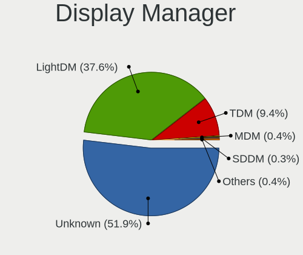
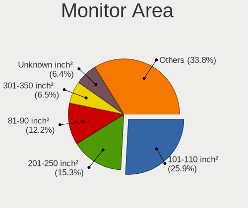
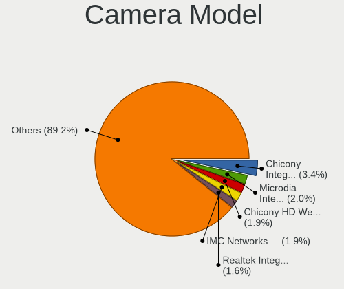

Linux Mint - Tested Hardware & Statistics
-----------------------------------------

A project to collect tested hardware configurations for Linux Mint.

Anyone can contribute to this report by the [hw-probe](https://github.com/linuxhw/hw-probe) tool:

    sudo -E hw-probe -all -upload

Please contribute! Especially if your hardware is rare.

This is a report for all computer types. See also reports for [desktops](/Dist/Linux_Mint/Desktop/README.md) and [notebooks](/Dist/Linux_Mint/Notebook/README.md).

Contents
--------

* [ Test Cases ](#test-cases)

* [ System ](#system)
  - [ OS                       ](#os)
  - [ OS Family                ](#os-family)
  - [ Kernel                   ](#kernel)
  - [ Kernel Family            ](#kernel-family)
  - [ Kernel Major Ver.        ](#kernel-major-ver)
  - [ Arch                     ](#arch)
  - [ DE                       ](#de)
  - [ Display Server           ](#display-server)
  - [ Display Manager          ](#display-manager)
  - [ OS Lang                  ](#os-lang)
  - [ Boot Mode                ](#boot-mode)
  - [ Filesystem               ](#filesystem)
  - [ Part. scheme             ](#part-scheme)
  - [ Dual Boot with Linux/BSD ](#dual-boot-with-linuxbsd)
  - [ Dual Boot (Win)          ](#dual-boot-win)

* [ Board ](#board)
  - [ Vendor                   ](#vendor)
  - [ Model                    ](#model)
  - [ Model Family             ](#model-family)
  - [ MFG Year                 ](#mfg-year)
  - [ Form Factor              ](#form-factor)
  - [ Secure Boot              ](#secure-boot)
  - [ Coreboot                 ](#coreboot)
  - [ RAM Size                 ](#ram-size)
  - [ RAM Used                 ](#ram-used)
  - [ Total Drives             ](#total-drives)
  - [ Has CD-ROM               ](#has-cd-rom)
  - [ Has Ethernet             ](#has-ethernet)
  - [ Has WiFi                 ](#has-wifi)
  - [ Has Bluetooth            ](#has-bluetooth)

* [ Location ](#location)
  - [ Country                  ](#country)
  - [ City                     ](#city)

* [ Drives ](#drives)
  - [ Drive Vendor             ](#drive-vendor)
  - [ Drive Model              ](#drive-model)
  - [ HDD Vendor               ](#hdd-vendor)
  - [ SSD Vendor               ](#ssd-vendor)
  - [ Drive Kind               ](#drive-kind)
  - [ Drive Connector          ](#drive-connector)
  - [ Drive Size               ](#drive-size)
  - [ Space Total              ](#space-total)
  - [ Space Used               ](#space-used)
  - [ Malfunc. Drives          ](#malfunc-drives)
  - [ Malfunc. Drive Vendor    ](#malfunc-drive-vendor)
  - [ Malfunc. HDD Vendor      ](#malfunc-hdd-vendor)
  - [ Malfunc. Drive Kind      ](#malfunc-drive-kind)
  - [ Failed Drives            ](#failed-drives)
  - [ Failed Drive Vendor      ](#failed-drive-vendor)
  - [ Drive Status             ](#drive-status)

* [ Storage controller ](#storage-controller)
  - [ Storage Vendor           ](#storage-vendor)
  - [ Storage Model            ](#storage-model)
  - [ Storage Kind             ](#storage-kind)

* [ Processor ](#processor)
  - [ CPU Vendor               ](#cpu-vendor)
  - [ CPU Model                ](#cpu-model)
  - [ CPU Model Family         ](#cpu-model-family)
  - [ CPU Cores                ](#cpu-cores)
  - [ CPU Sockets              ](#cpu-sockets)
  - [ CPU Threads              ](#cpu-threads)
  - [ CPU Op-Modes             ](#cpu-op-modes)
  - [ CPU Microcode            ](#cpu-microcode)
  - [ CPU Microarch            ](#cpu-microarch)

* [ Graphics ](#graphics)
  - [ GPU Vendor               ](#gpu-vendor)
  - [ GPU Model                ](#gpu-model)
  - [ GPU Combo                ](#gpu-combo)
  - [ GPU Driver               ](#gpu-driver)
  - [ GPU Memory               ](#gpu-memory)

* [ Monitor ](#monitor)
  - [ Monitor Vendor           ](#monitor-vendor)
  - [ Monitor Model            ](#monitor-model)
  - [ Monitor Resolution       ](#monitor-resolution)
  - [ Monitor Diagonal         ](#monitor-diagonal)
  - [ Monitor Width            ](#monitor-width)
  - [ Aspect Ratio             ](#aspect-ratio)
  - [ Monitor Area             ](#monitor-area)
  - [ Pixel Density            ](#pixel-density)
  - [ Multiple Monitors        ](#multiple-monitors)

* [ Network ](#network)
  - [ Net Controller Vendor    ](#net-controller-vendor)
  - [ Net Controller Model     ](#net-controller-model)
  - [ Wireless Vendor          ](#wireless-vendor)
  - [ Wireless Model           ](#wireless-model)
  - [ Ethernet Vendor          ](#ethernet-vendor)
  - [ Ethernet Model           ](#ethernet-model)
  - [ Net Controller Kind      ](#net-controller-kind)
  - [ Used Controller          ](#used-controller)
  - [ NICs                     ](#nics)
  - [ IPv6                     ](#ipv6)

* [ Bluetooth ](#bluetooth)
  - [ Bluetooth Vendor         ](#bluetooth-vendor)
  - [ Bluetooth Model          ](#bluetooth-model)

* [ Sound ](#sound)
  - [ Sound Vendor             ](#sound-vendor)
  - [ Sound Model              ](#sound-model)

* [ Memory ](#memory)
  - [ Memory Vendor            ](#memory-vendor)
  - [ Memory Model             ](#memory-model)
  - [ Memory Kind              ](#memory-kind)
  - [ Memory Form Factor       ](#memory-form-factor)
  - [ Memory Size              ](#memory-size)
  - [ Memory Speed             ](#memory-speed)

* [ Printers & scanners ](#printers--scanners)
  - [ Printer Vendor           ](#printer-vendor)
  - [ Printer Model            ](#printer-model)
  - [ Scanner Vendor           ](#scanner-vendor)
  - [ Scanner Model            ](#scanner-model)

* [ Camera ](#camera)
  - [ Camera Vendor            ](#camera-vendor)
  - [ Camera Model             ](#camera-model)

* [ Security ](#security)
  - [ Fingerprint Vendor       ](#fingerprint-vendor)
  - [ Fingerprint Model        ](#fingerprint-model)
  - [ Chipcard Vendor          ](#chipcard-vendor)
  - [ Chipcard Model           ](#chipcard-model)

* [ Unsupported ](#unsupported)
  - [ Unsupported Devices      ](#unsupported-devices)
  - [ Unsupported Device Types ](#unsupported-device-types)

Test Cases
----------

Total: 31164

| Vendor        | Model                       | Form-Factor | Probe                                                      | Date         |
|---------------|-----------------------------|-------------|------------------------------------------------------------|--------------|
| MSI           | Z77A-GD65                   | Desktop     | [42366a1fa1](https://linux-hardware.org/?probe=42366a1fa1) | Feb 02, 2024 |
| HP            | EliteBook 850 G8 Noteboo... | Notebook    | [7c65739a72](https://linux-hardware.org/?probe=7c65739a72) | Feb 02, 2024 |
| Samsung       | 550P5C/550P7C               | Notebook    | [4d9464ae33](https://linux-hardware.org/?probe=4d9464ae33) | Feb 02, 2024 |
| Intel         | X99-P4 V5.1                 | Desktop     | [092e51b68e](https://linux-hardware.org/?probe=092e51b68e) | Feb 02, 2024 |
| ASRock        | H61M-DGS R2.0               | Desktop     | [fed06b0a3c](https://linux-hardware.org/?probe=fed06b0a3c) | Feb 02, 2024 |
| Lenovo        | ThinkPad X270 W10DG 20K5... | Notebook    | [e7400919cd](https://linux-hardware.org/?probe=e7400919cd) | Feb 02, 2024 |
| Apple         | MacBook5,1                  | Notebook    | [48a998308b](https://linux-hardware.org/?probe=48a998308b) | Feb 02, 2024 |
| ASRock        | H61M-DGS R2.0               | Desktop     | [a757eacac1](https://linux-hardware.org/?probe=a757eacac1) | Feb 02, 2024 |
| Dell          | Latitude 5511               | Notebook    | [e7d3018c34](https://linux-hardware.org/?probe=e7d3018c34) | Feb 02, 2024 |
| HP            | EliteBook 850 G8 Noteboo... | Notebook    | [133d556add](https://linux-hardware.org/?probe=133d556add) | Feb 02, 2024 |
| Lenovo        | ThinkPad T15g Gen 1 20UR... | Notebook    | [e3e01bd0ff](https://linux-hardware.org/?probe=e3e01bd0ff) | Feb 02, 2024 |
| ASUSTek       | X556UQK                     | Notebook    | [24b1509f61](https://linux-hardware.org/?probe=24b1509f61) | Feb 02, 2024 |
| HP            | 15                          | Notebook    | [b99530abd5](https://linux-hardware.org/?probe=b99530abd5) | Feb 01, 2024 |
| Biostar       | A10N-9830E                  | Desktop     | [672938d127](https://linux-hardware.org/?probe=672938d127) | Feb 01, 2024 |
| HP            | 15                          | Notebook    | [874ae10280](https://linux-hardware.org/?probe=874ae10280) | Feb 01, 2024 |
| Lenovo        | IdeaPad S340-15IWL 81N8     | Notebook    | [fd7240a3ee](https://linux-hardware.org/?probe=fd7240a3ee) | Feb 01, 2024 |
| Lenovo        | IdeaPad S340-15IWL 81N8     | Notebook    | [b3b900cffa](https://linux-hardware.org/?probe=b3b900cffa) | Feb 01, 2024 |
| ASUSTek       | H110M-D                     | Desktop     | [287648c7d3](https://linux-hardware.org/?probe=287648c7d3) | Feb 01, 2024 |
| Biostar       | IH61MF-Q5                   | Desktop     | [1087f70019](https://linux-hardware.org/?probe=1087f70019) | Feb 01, 2024 |
| Lenovo        | SHARKBAY SDK0E50510 WIN     | Desktop     | [fc6230e374](https://linux-hardware.org/?probe=fc6230e374) | Feb 01, 2024 |
| Acer          | Aspire ES1-523              | Notebook    | [4344e68c86](https://linux-hardware.org/?probe=4344e68c86) | Feb 01, 2024 |
| Gigabyte      | A320M-S2H-CF                | Desktop     | [ef0de660b6](https://linux-hardware.org/?probe=ef0de660b6) | Feb 01, 2024 |
| ASUSTek       | ROG Strix G634JZ_G634JZ     | Notebook    | [4b8399084a](https://linux-hardware.org/?probe=4b8399084a) | Feb 01, 2024 |
| Acer          | Aspire A315-53              | Notebook    | [a3fde61a8b](https://linux-hardware.org/?probe=a3fde61a8b) | Feb 01, 2024 |
| HP            | 843B                        | Desktop     | [161ffc2ea0](https://linux-hardware.org/?probe=161ffc2ea0) | Feb 01, 2024 |
| Lenovo        | 36FB SDK0J40700 WIN 3258... | All in one  | [2e506e3464](https://linux-hardware.org/?probe=2e506e3464) | Feb 01, 2024 |
| MicroByte     | ezpad                       | Tablet      | [192098a0fc](https://linux-hardware.org/?probe=192098a0fc) | Feb 01, 2024 |
| MicroByte     | ezpad                       | Tablet      | [e8d8cc7618](https://linux-hardware.org/?probe=e8d8cc7618) | Feb 01, 2024 |
| ASUSTek       | GL552VW                     | Notebook    | [1579728415](https://linux-hardware.org/?probe=1579728415) | Feb 01, 2024 |
| MSI           | Z77A-GD65                   | Desktop     | [fd7e7fcc3e](https://linux-hardware.org/?probe=fd7e7fcc3e) | Feb 01, 2024 |
| Acer          | Aspire E5-722               | Notebook    | [2a4988436d](https://linux-hardware.org/?probe=2a4988436d) | Feb 01, 2024 |
| Apple         | MacBookPro11,2              | Notebook    | [92dd523802](https://linux-hardware.org/?probe=92dd523802) | Feb 01, 2024 |
| Acer          | Nitro AN515-58              | Notebook    | [84c37d0192](https://linux-hardware.org/?probe=84c37d0192) | Feb 01, 2024 |
| Gigabyte      | MZ32-AR0-00 01000100        | Server      | [3c84ba1c91](https://linux-hardware.org/?probe=3c84ba1c91) | Feb 01, 2024 |
| HP            | ENVY 14                     | Notebook    | [ffe9159226](https://linux-hardware.org/?probe=ffe9159226) | Feb 01, 2024 |
| HP            | 0B40h                       | Desktop     | [d165885fbf](https://linux-hardware.org/?probe=d165885fbf) | Feb 01, 2024 |
| Lenovo        | ThinkPad X230 Tablet 343... | Notebook    | [1c4d4deade](https://linux-hardware.org/?probe=1c4d4deade) | Feb 01, 2024 |
| Acer          | Veriton X4620G v1.0         | Desktop     | [0ce3db389e](https://linux-hardware.org/?probe=0ce3db389e) | Feb 01, 2024 |
| Lenovo        | V15 G4 AMN 82YU             | Notebook    | [7bfa72f494](https://linux-hardware.org/?probe=7bfa72f494) | Feb 01, 2024 |
| Lenovo        | V15 G4 AMN 82YU             | Notebook    | [e17ca19651](https://linux-hardware.org/?probe=e17ca19651) | Feb 01, 2024 |
| ASUSTek       | TUF Gaming X570-PLUS        | Desktop     | [f7bb58fb95](https://linux-hardware.org/?probe=f7bb58fb95) | Feb 01, 2024 |
| Apple         | MacBookPro14,1              | Notebook    | [711c97e9af](https://linux-hardware.org/?probe=711c97e9af) | Feb 01, 2024 |
| HONOR         | BBR-WAX9                    | Notebook    | [a34e642fbe](https://linux-hardware.org/?probe=a34e642fbe) | Jan 31, 2024 |
| Gigabyte      | Z87X-UD4H-CF                | Desktop     | [f2e88dc5a7](https://linux-hardware.org/?probe=f2e88dc5a7) | Jan 31, 2024 |
| Mediacom      | SmartBook 14 FullHD - SB... | Notebook    | [53d7e5ce3c](https://linux-hardware.org/?probe=53d7e5ce3c) | Jan 31, 2024 |
| HP            | Pavilion 17                 | Notebook    | [27b6494c43](https://linux-hardware.org/?probe=27b6494c43) | Jan 31, 2024 |
| ASRock        | B450M Pro4                  | Desktop     | [5a77cd3bbb](https://linux-hardware.org/?probe=5a77cd3bbb) | Jan 31, 2024 |
| Dell          | Latitude E5410              | Notebook    | [d91781267c](https://linux-hardware.org/?probe=d91781267c) | Jan 31, 2024 |
| HP            | Pavilion Laptop 15-ck0xx    | Notebook    | [573d69639e](https://linux-hardware.org/?probe=573d69639e) | Jan 31, 2024 |
| ASUSTek       | VivoBook_ASUSLaptop M160... | Notebook    | [69eca6c154](https://linux-hardware.org/?probe=69eca6c154) | Jan 31, 2024 |
| ASUSTek       | B85M-G                      | Desktop     | [c14af0c776](https://linux-hardware.org/?probe=c14af0c776) | Jan 31, 2024 |
| Acer          | Aspire A315-59              | Notebook    | [7d06efe302](https://linux-hardware.org/?probe=7d06efe302) | Jan 31, 2024 |
| Packard Be... | EasyNote LS11SB             | Notebook    | [3dcf56426c](https://linux-hardware.org/?probe=3dcf56426c) | Jan 31, 2024 |
| Lenovo        | ThinkPad T450 20BUS0EW11    | Notebook    | [f7020952b0](https://linux-hardware.org/?probe=f7020952b0) | Jan 31, 2024 |
| Lenovo        | SHARKBAY 0B98401 WIN        | Desktop     | [75d67d22e1](https://linux-hardware.org/?probe=75d67d22e1) | Jan 31, 2024 |
| Lenovo        | SHARKBAY 0B98401 WIN        | Desktop     | [19f18a7bbc](https://linux-hardware.org/?probe=19f18a7bbc) | Jan 31, 2024 |
| Acer          | Aspire E5-473               | Notebook    | [0a294c97ee](https://linux-hardware.org/?probe=0a294c97ee) | Jan 31, 2024 |
| Lenovo        | IdeaPad S145-15IWL 81MV     | Notebook    | [16922386a7](https://linux-hardware.org/?probe=16922386a7) | Jan 31, 2024 |
| ASUSTek       | TP550LA                     | Notebook    | [2fa23ece92](https://linux-hardware.org/?probe=2fa23ece92) | Jan 31, 2024 |
| HP            | EliteBook 8560p             | Notebook    | [5d0eb85b93](https://linux-hardware.org/?probe=5d0eb85b93) | Jan 31, 2024 |
| ASUSTek       | TUF Gaming B550M-PLUS       | Desktop     | [a3277bc7da](https://linux-hardware.org/?probe=a3277bc7da) | Jan 31, 2024 |
| Lenovo        | ThinkPad T430 23491R8       | Notebook    | [65c338c5ed](https://linux-hardware.org/?probe=65c338c5ed) | Jan 31, 2024 |
| Acer          | Aspire ES1-523              | Notebook    | [aece88cd9b](https://linux-hardware.org/?probe=aece88cd9b) | Jan 31, 2024 |
| Dell          | Inspiron 1520               | Notebook    | [371f061c1d](https://linux-hardware.org/?probe=371f061c1d) | Jan 31, 2024 |
| HP            | 255 G8 Notebook PC          | Notebook    | [62254b1636](https://linux-hardware.org/?probe=62254b1636) | Jan 31, 2024 |
| Acer          | Swift SFE16-43              | Notebook    | [efdafdd6fc](https://linux-hardware.org/?probe=efdafdd6fc) | Jan 30, 2024 |
| Schenker      | XMG APEX 15 MAX (E22)       | Notebook    | [cf8a09526d](https://linux-hardware.org/?probe=cf8a09526d) | Jan 30, 2024 |
| ASRock        | A320M-HDV R3.0              | Desktop     | [57e466f18c](https://linux-hardware.org/?probe=57e466f18c) | Jan 30, 2024 |
| ASRock        | X570 Phantom Gaming-ITX/... | Desktop     | [44c985b693](https://linux-hardware.org/?probe=44c985b693) | Jan 30, 2024 |
| Gigabyte      | B150N Phoenix-WIFI-CF       | Desktop     | [a8411850db](https://linux-hardware.org/?probe=a8411850db) | Jan 30, 2024 |
| ASUSTek       | P8H61-M LE/CSM R2.0         | Desktop     | [dd5bc39447](https://linux-hardware.org/?probe=dd5bc39447) | Jan 30, 2024 |
| MSI           | Z97 GAMING 7                | Desktop     | [4d77613083](https://linux-hardware.org/?probe=4d77613083) | Jan 30, 2024 |
| ASRock        | H61M-DGS R2.0               | Desktop     | [dd059e849e](https://linux-hardware.org/?probe=dd059e849e) | Jan 30, 2024 |
| Lenovo        | IdeaPad 3 14ALC6 82KT       | Notebook    | [25fe740321](https://linux-hardware.org/?probe=25fe740321) | Jan 30, 2024 |
| Acer          | Aspire E1-571               | Notebook    | [daf8c42eca](https://linux-hardware.org/?probe=daf8c42eca) | Jan 30, 2024 |
| ASUSTek       | ZenBook UX425EA_UX425EA     | Notebook    | [d78102063d](https://linux-hardware.org/?probe=d78102063d) | Jan 30, 2024 |
| Gigabyte      | H81M-S1                     | Desktop     | [0770521f11](https://linux-hardware.org/?probe=0770521f11) | Jan 30, 2024 |
| HP            | Pavilion dv6                | Notebook    | [654b331eac](https://linux-hardware.org/?probe=654b331eac) | Jan 30, 2024 |
| HP            | Pavilion dv6                | Notebook    | [69c00fe459](https://linux-hardware.org/?probe=69c00fe459) | Jan 30, 2024 |
| Toshiba       | NB250                       | Notebook    | [f6694e7f86](https://linux-hardware.org/?probe=f6694e7f86) | Jan 30, 2024 |
| Toshiba       | NB250                       | Notebook    | [635c466f5f](https://linux-hardware.org/?probe=635c466f5f) | Jan 30, 2024 |
| Dell          | 0HD5W2 A01                  | Desktop     | [fd88489b46](https://linux-hardware.org/?probe=fd88489b46) | Jan 30, 2024 |
| Chuwi         | GemiBook Plus               | Notebook    | [dd2a3f8fa2](https://linux-hardware.org/?probe=dd2a3f8fa2) | Jan 30, 2024 |
| Apple         | MacBookAir6,2               | Notebook    | [52ae0efd8e](https://linux-hardware.org/?probe=52ae0efd8e) | Jan 30, 2024 |
| HP            | Notebook                    | Notebook    | [6757d33e0e](https://linux-hardware.org/?probe=6757d33e0e) | Jan 30, 2024 |
| HP            | 1495                        | Desktop     | [4fe224eb89](https://linux-hardware.org/?probe=4fe224eb89) | Jan 30, 2024 |
| ASRock        | Z77 Pro4                    | Desktop     | [c2b82aa42c](https://linux-hardware.org/?probe=c2b82aa42c) | Jan 29, 2024 |
| MSI           | H81M-E34                    | Desktop     | [e7e4aeecac](https://linux-hardware.org/?probe=e7e4aeecac) | Jan 29, 2024 |
| Dell          | Latitude E6540              | Notebook    | [a64ea19d4b](https://linux-hardware.org/?probe=a64ea19d4b) | Jan 29, 2024 |
| Lenovo        | ThinkPad T14 Gen 2a 20XK... | Notebook    | [40e2ad53e8](https://linux-hardware.org/?probe=40e2ad53e8) | Jan 29, 2024 |
| Lenovo        | IdeaPad 330-17AST 81D7      | Notebook    | [4983e50390](https://linux-hardware.org/?probe=4983e50390) | Jan 29, 2024 |
| HP            | 3397                        | Desktop     | [552552b64a](https://linux-hardware.org/?probe=552552b64a) | Jan 29, 2024 |
| MSI           | Modern 15 B5M               | Notebook    | [af1dd03737](https://linux-hardware.org/?probe=af1dd03737) | Jan 29, 2024 |
| MSI           | Bravo 15 C7VE               | Notebook    | [1510824aee](https://linux-hardware.org/?probe=1510824aee) | Jan 29, 2024 |
| HP            | ZBook Power 15.6 inch G1... | Notebook    | [6304caec55](https://linux-hardware.org/?probe=6304caec55) | Jan 29, 2024 |
| Dell          | 0C27VV A01                  | Desktop     | [629c3cb24c](https://linux-hardware.org/?probe=629c3cb24c) | Jan 29, 2024 |
| ASUSTek       | ROG STRIX Z690-F GAMING ... | Desktop     | [6f0ef9d6df](https://linux-hardware.org/?probe=6f0ef9d6df) | Jan 29, 2024 |
| Dell          | Latitude E6410              | Notebook    | [1d71a03516](https://linux-hardware.org/?probe=1d71a03516) | Jan 29, 2024 |
| MSI           | A320M/ac                    | Desktop     | [520827d642](https://linux-hardware.org/?probe=520827d642) | Jan 29, 2024 |
| CyberPower... | Tracer II                   | Notebook    | [ca21b317a2](https://linux-hardware.org/?probe=ca21b317a2) | Jan 29, 2024 |
| HP            | EliteBook 2540p             | Notebook    | [65de0b33df](https://linux-hardware.org/?probe=65de0b33df) | Jan 29, 2024 |
| Microsoft     | Surface Book                | Tablet      | [5b19936522](https://linux-hardware.org/?probe=5b19936522) | Jan 29, 2024 |
| ASUSTek       | P5Q                         | Desktop     | [f6c91b590a](https://linux-hardware.org/?probe=f6c91b590a) | Jan 29, 2024 |
| ASUSTek       | VivoBook_ASUSLaptop X150... | Notebook    | [510f28a7d3](https://linux-hardware.org/?probe=510f28a7d3) | Jan 29, 2024 |
| HP            | Laptop 15s-fq5xxx           | Notebook    | [4ab253480b](https://linux-hardware.org/?probe=4ab253480b) | Jan 29, 2024 |
| Acer          | Aspire 5741G                | Notebook    | [9c171324e3](https://linux-hardware.org/?probe=9c171324e3) | Jan 29, 2024 |
| MSI           | MPG B560I GAMING EDGE WI... | Desktop     | [d4492753b4](https://linux-hardware.org/?probe=d4492753b4) | Jan 28, 2024 |
| Gigabyte      | X570 AORUS ULTRA            | Desktop     | [80a5fb05a8](https://linux-hardware.org/?probe=80a5fb05a8) | Jan 28, 2024 |
| Gigabyte      | X570 AORUS ULTRA            | Desktop     | [f5f922292c](https://linux-hardware.org/?probe=f5f922292c) | Jan 28, 2024 |
| Dell          | Inspiron 3583               | Notebook    | [a84cdbbf07](https://linux-hardware.org/?probe=a84cdbbf07) | Jan 28, 2024 |
| Lenovo        | B590 20208                  | Notebook    | [ea632b2785](https://linux-hardware.org/?probe=ea632b2785) | Jan 28, 2024 |
| HP            | Spectre x360 Convertible... | Convertible | [07cf5f8bcf](https://linux-hardware.org/?probe=07cf5f8bcf) | Jan 28, 2024 |
| Dell          | Latitude E6540              | Notebook    | [adb3309384](https://linux-hardware.org/?probe=adb3309384) | Jan 28, 2024 |
| Dell          | 0C27VV A01                  | Desktop     | [522198b192](https://linux-hardware.org/?probe=522198b192) | Jan 28, 2024 |
| ASUSTek       | K55VD                       | Notebook    | [099cfb3dcb](https://linux-hardware.org/?probe=099cfb3dcb) | Jan 28, 2024 |
| Medion        | M14L-256                    | Notebook    | [6bff8bee51](https://linux-hardware.org/?probe=6bff8bee51) | Jan 28, 2024 |
| ASUSTek       | T-P5G31A                    | Desktop     | [ca450a3a63](https://linux-hardware.org/?probe=ca450a3a63) | Jan 28, 2024 |
| Gigabyte      | H81M-HD3                    | Desktop     | [f6305c313c](https://linux-hardware.org/?probe=f6305c313c) | Jan 28, 2024 |
| HP            | Laptop 14s-fq0xxx           | Notebook    | [a0eeda1d5a](https://linux-hardware.org/?probe=a0eeda1d5a) | Jan 28, 2024 |
| ASUSTek       | K55A                        | Notebook    | [49e26738de](https://linux-hardware.org/?probe=49e26738de) | Jan 28, 2024 |
| Foxconn       | 2ABF                        | Desktop     | [25665edf82](https://linux-hardware.org/?probe=25665edf82) | Jan 28, 2024 |
| Lenovo        | ThinkPad T510 43142PU       | Notebook    | [e27411aa1b](https://linux-hardware.org/?probe=e27411aa1b) | Jan 28, 2024 |
| Gigabyte      | P35-DS3P                    | Desktop     | [43b4bbf15f](https://linux-hardware.org/?probe=43b4bbf15f) | Jan 28, 2024 |
| Lenovo        | ThinkPad T490 20N3S8DK00    | Notebook    | [4e9cad214e](https://linux-hardware.org/?probe=4e9cad214e) | Jan 28, 2024 |
| Apple         | Mac-F2268CC8                | All in one  | [e7553270a9](https://linux-hardware.org/?probe=e7553270a9) | Jan 28, 2024 |
| Apple         | Mac-F2268CC8                | All in one  | [86e3353605](https://linux-hardware.org/?probe=86e3353605) | Jan 28, 2024 |
| Lenovo        | SHARKBAY NOK                | Desktop     | [ce4dad557b](https://linux-hardware.org/?probe=ce4dad557b) | Jan 27, 2024 |
| ASUSTek       | ROG Zephyrus G14 GA401IV... | Notebook    | [8f0138becb](https://linux-hardware.org/?probe=8f0138becb) | Jan 27, 2024 |
| Dell          | XPS L421X                   | Notebook    | [7eab16ad73](https://linux-hardware.org/?probe=7eab16ad73) | Jan 27, 2024 |
| ASUSTek       | Vivobook Go E1504FA_E150... | Notebook    | [d8ab9529f3](https://linux-hardware.org/?probe=d8ab9529f3) | Jan 27, 2024 |
| ASUSTek       | K55VD                       | Notebook    | [d2e2ee4fa9](https://linux-hardware.org/?probe=d2e2ee4fa9) | Jan 27, 2024 |
| ASUSTek       | VivoBook_ASUSLaptop TP40... | Convertible | [b66fe97c5f](https://linux-hardware.org/?probe=b66fe97c5f) | Jan 27, 2024 |
| HP            | ProBook 6555b               | Notebook    | [53f9430f98](https://linux-hardware.org/?probe=53f9430f98) | Jan 27, 2024 |
| Acer          | Aspire A317-53              | Notebook    | [a07ae8de3f](https://linux-hardware.org/?probe=a07ae8de3f) | Jan 27, 2024 |
| Gigabyte      | X570 AORUS MASTER           | Desktop     | [f940181f19](https://linux-hardware.org/?probe=f940181f19) | Jan 27, 2024 |
| Gigabyte      | A320M-S2H V2-CF             | Desktop     | [53581eed88](https://linux-hardware.org/?probe=53581eed88) | Jan 27, 2024 |
| HP            | EliteBook 8440p             | Notebook    | [09a25eb2a2](https://linux-hardware.org/?probe=09a25eb2a2) | Jan 27, 2024 |
| Toshiba       | PORTEGE X20W-D              | Convertible | [5016f03569](https://linux-hardware.org/?probe=5016f03569) | Jan 27, 2024 |
| HP            | EliteBook 840 G3            | Notebook    | [84264495d3](https://linux-hardware.org/?probe=84264495d3) | Jan 27, 2024 |
| Lenovo        | IdeaPad Z360                | Notebook    | [4aa5d9bed9](https://linux-hardware.org/?probe=4aa5d9bed9) | Jan 27, 2024 |
| MSI           | B550-A PRO                  | Desktop     | [9690cb0096](https://linux-hardware.org/?probe=9690cb0096) | Jan 27, 2024 |
| Lenovo        | 3098 NOK                    | Desktop     | [329ce0df97](https://linux-hardware.org/?probe=329ce0df97) | Jan 27, 2024 |
| Acer          | Aspire VN7-793G             | Notebook    | [ad72ab37d3](https://linux-hardware.org/?probe=ad72ab37d3) | Jan 26, 2024 |
| INSYS         | GW1-W149                    | Notebook    | [a37edb118a](https://linux-hardware.org/?probe=a37edb118a) | Jan 26, 2024 |
| Dell          | Latitude 5440               | Notebook    | [af460e243b](https://linux-hardware.org/?probe=af460e243b) | Jan 26, 2024 |
| Gigabyte      | Z97N-WIFI                   | Desktop     | [867a17b708](https://linux-hardware.org/?probe=867a17b708) | Jan 26, 2024 |
| Notebook      | W35xSTQ_370ST               | Notebook    | [1f9e3c577b](https://linux-hardware.org/?probe=1f9e3c577b) | Jan 26, 2024 |
| Lenovo        | IdeaPad Z360                | Notebook    | [4a2c8d2c92](https://linux-hardware.org/?probe=4a2c8d2c92) | Jan 26, 2024 |
| Acer          | Aspire E5-574G              | Notebook    | [7fb3807471](https://linux-hardware.org/?probe=7fb3807471) | Jan 26, 2024 |
| Dell          | Latitude 3480               | Notebook    | [5ccc62ce95](https://linux-hardware.org/?probe=5ccc62ce95) | Jan 26, 2024 |
| ECS           | H61H2-CM                    | Desktop     | [c439ae84ce](https://linux-hardware.org/?probe=c439ae84ce) | Jan 26, 2024 |
| Dell          | 0HD5W2 A00                  | Desktop     | [9f1b82d7b4](https://linux-hardware.org/?probe=9f1b82d7b4) | Jan 26, 2024 |
| Dell          | Latitude 5520               | Notebook    | [474446918a](https://linux-hardware.org/?probe=474446918a) | Jan 26, 2024 |
| ASRock        | Z77 Extreme4                | Desktop     | [ea6ee7eaee](https://linux-hardware.org/?probe=ea6ee7eaee) | Jan 26, 2024 |
| Dell          | Latitude 3190 2-in-1        | Convertible | [540aa97aab](https://linux-hardware.org/?probe=540aa97aab) | Jan 26, 2024 |
| ASUSTek       | ROG Zephyrus G14 GA401QM... | Notebook    | [90908253dd](https://linux-hardware.org/?probe=90908253dd) | Jan 26, 2024 |
| Lenovo        | IdeaPadFlex 5 14ALC05 82... | Convertible | [c5b9b654cd](https://linux-hardware.org/?probe=c5b9b654cd) | Jan 26, 2024 |
| Gigabyte      | X570S I AORUS PRO AX        | Desktop     | [4b63897ace](https://linux-hardware.org/?probe=4b63897ace) | Jan 26, 2024 |
| Gigabyte      | A520M DS3H                  | Desktop     | [296732b4f9](https://linux-hardware.org/?probe=296732b4f9) | Jan 26, 2024 |
| ASUSTek       | TUF Gaming B560M-PLUS WI... | Desktop     | [858d0c956c](https://linux-hardware.org/?probe=858d0c956c) | Jan 26, 2024 |
| Dell          | Latitude 7490               | Notebook    | [be9a5bd794](https://linux-hardware.org/?probe=be9a5bd794) | Jan 25, 2024 |
| Biostar       | Z490GTN                     | Desktop     | [4f1869ea6a](https://linux-hardware.org/?probe=4f1869ea6a) | Jan 25, 2024 |
| ASUSTek       | VivoBook_ASUSLaptop X150... | Notebook    | [516ae40374](https://linux-hardware.org/?probe=516ae40374) | Jan 25, 2024 |
| Gigabyte      | A520M DS3H                  | Desktop     | [21d498375d](https://linux-hardware.org/?probe=21d498375d) | Jan 25, 2024 |
| HP            | 0B54h D                     | Desktop     | [9a2ca26ce0](https://linux-hardware.org/?probe=9a2ca26ce0) | Jan 25, 2024 |
| ASRock        | 775Dual-VSTA                | Desktop     | [76da6861f1](https://linux-hardware.org/?probe=76da6861f1) | Jan 25, 2024 |
| Gigabyte      | H81M-HD3                    | Desktop     | [f945084861](https://linux-hardware.org/?probe=f945084861) | Jan 25, 2024 |
| Medion        | MS-7797                     | Desktop     | [16eb1fb145](https://linux-hardware.org/?probe=16eb1fb145) | Jan 25, 2024 |
| HP            | ProBook 440 G7              | Notebook    | [47b3929229](https://linux-hardware.org/?probe=47b3929229) | Jan 25, 2024 |
| Dell          | Latitude 7490               | Notebook    | [efec84713e](https://linux-hardware.org/?probe=efec84713e) | Jan 25, 2024 |
| Dell          | Latitude 5490               | Notebook    | [7315d78b91](https://linux-hardware.org/?probe=7315d78b91) | Jan 25, 2024 |
| ECS           | H67H2-M2                    | Desktop     | [e4ad7bd4f2](https://linux-hardware.org/?probe=e4ad7bd4f2) | Jan 25, 2024 |
| ASUSTek       | P5G41T-M LX                 | Desktop     | [f37a447c10](https://linux-hardware.org/?probe=f37a447c10) | Jan 25, 2024 |
| Gigabyte      | X570 AORUS ULTRA            | Desktop     | [89d4e508fa](https://linux-hardware.org/?probe=89d4e508fa) | Jan 25, 2024 |
| Medion        | MS-7800                     | Desktop     | [15badb57d1](https://linux-hardware.org/?probe=15badb57d1) | Jan 25, 2024 |
| Lenovo        | IdeaPad S340-14IIL 81VV     | Notebook    | [d530eec023](https://linux-hardware.org/?probe=d530eec023) | Jan 25, 2024 |
| Unknown       | Unknown                     | Desktop     | [57252b99d4](https://linux-hardware.org/?probe=57252b99d4) | Jan 25, 2024 |
| ASUSTek       | M4A78LT-M                   | Desktop     | [44539fb8b1](https://linux-hardware.org/?probe=44539fb8b1) | Jan 25, 2024 |
| ASUSTek       | H97M-E                      | Desktop     | [9af2e6044e](https://linux-hardware.org/?probe=9af2e6044e) | Jan 25, 2024 |
| Apple         | MacBookAir7,2               | Notebook    | [8f3ed76279](https://linux-hardware.org/?probe=8f3ed76279) | Jan 25, 2024 |
| Gigabyte      | Z87X-D3H-CF                 | Desktop     | [5b23ab08ae](https://linux-hardware.org/?probe=5b23ab08ae) | Jan 25, 2024 |
| Lenovo        | 36D9 SDK0J40700 WIN 3258... | Desktop     | [f05b3ce6a1](https://linux-hardware.org/?probe=f05b3ce6a1) | Jan 25, 2024 |
| ASUSTek       | M4A78LT-M                   | Desktop     | [dc93e0097a](https://linux-hardware.org/?probe=dc93e0097a) | Jan 25, 2024 |
| Apple         | MacBook10,1                 | Notebook    | [da3e59958f](https://linux-hardware.org/?probe=da3e59958f) | Jan 24, 2024 |
| Dell          | Precision 7520              | Notebook    | [9d9cf5c93e](https://linux-hardware.org/?probe=9d9cf5c93e) | Jan 24, 2024 |
| HP            | 8054                        | Desktop     | [0f5623dad4](https://linux-hardware.org/?probe=0f5623dad4) | Jan 24, 2024 |
| HP            | 15 Notebook PC              | Notebook    | [0fa1b2cd9e](https://linux-hardware.org/?probe=0fa1b2cd9e) | Jan 24, 2024 |
| Dell          | Precision 7520              | Notebook    | [c0f81bad8c](https://linux-hardware.org/?probe=c0f81bad8c) | Jan 24, 2024 |
| Medion        | MS-7800                     | Desktop     | [11c02b5cbe](https://linux-hardware.org/?probe=11c02b5cbe) | Jan 24, 2024 |
| ASRock        | FM2A88X Extreme6+           | Desktop     | [806eb6a76c](https://linux-hardware.org/?probe=806eb6a76c) | Jan 24, 2024 |
| ASUSTek       | Vivobook Go E1504GA_E150... | Notebook    | [47052e9985](https://linux-hardware.org/?probe=47052e9985) | Jan 24, 2024 |
| HP            | 0B54h D                     | Desktop     | [ca946fa9f3](https://linux-hardware.org/?probe=ca946fa9f3) | Jan 24, 2024 |
| Lenovo        | IdeaPad 3 15IAU7 82RK       | Notebook    | [43807d61ce](https://linux-hardware.org/?probe=43807d61ce) | Jan 24, 2024 |
| ASRock        | A320M-HD R4.0               | Desktop     | [0020153fc0](https://linux-hardware.org/?probe=0020153fc0) | Jan 24, 2024 |
| Lenovo        | ThinkPad X1 Carbon 34604... | Notebook    | [8add6b9229](https://linux-hardware.org/?probe=8add6b9229) | Jan 24, 2024 |
| Gigabyte      | Z270-HD3P-CF                | Desktop     | [b0381cdfcc](https://linux-hardware.org/?probe=b0381cdfcc) | Jan 24, 2024 |
| Lenovo        | IdeaPad 330-17IKB 81DM      | Notebook    | [c55c6dc13f](https://linux-hardware.org/?probe=c55c6dc13f) | Jan 24, 2024 |
| HP            | ZBook Firefly 14 inch G1... | Notebook    | [0bbf1a1e3d](https://linux-hardware.org/?probe=0bbf1a1e3d) | Jan 24, 2024 |
| Gigabyte      | F2A58M-DS2                  | Desktop     | [b8fc987633](https://linux-hardware.org/?probe=b8fc987633) | Jan 24, 2024 |
| Apple         | MacBookPro11,4              | Notebook    | [c63b13e441](https://linux-hardware.org/?probe=c63b13e441) | Jan 24, 2024 |
| Clevo         | M720SRS                     | Notebook    | [c0f6248edd](https://linux-hardware.org/?probe=c0f6248edd) | Jan 24, 2024 |
| Apple         | MacBookPro11,4              | Notebook    | [f48a5f9d3c](https://linux-hardware.org/?probe=f48a5f9d3c) | Jan 24, 2024 |
| Apple         | MacBookPro11,2              | Notebook    | [0f40e8d133](https://linux-hardware.org/?probe=0f40e8d133) | Jan 24, 2024 |
| AZW           | SEi                         | Notebook    | [cc4134e14b](https://linux-hardware.org/?probe=cc4134e14b) | Jan 24, 2024 |
| HP            | 3648h                       | Desktop     | [3905de5f4f](https://linux-hardware.org/?probe=3905de5f4f) | Jan 24, 2024 |
| ASUSTek       | ROG STRIX X670E-E GAMING... | Desktop     | [93f561e2bf](https://linux-hardware.org/?probe=93f561e2bf) | Jan 24, 2024 |
| ASRock        | 970M Pro3                   | Desktop     | [1de02cbd78](https://linux-hardware.org/?probe=1de02cbd78) | Jan 24, 2024 |
| HP            | EliteBook 820 G3            | Notebook    | [abc0872688](https://linux-hardware.org/?probe=abc0872688) | Jan 24, 2024 |
| Shenzhen M... | F7BSC                       | Mini pc     | [8ee65a0454](https://linux-hardware.org/?probe=8ee65a0454) | Jan 24, 2024 |
| Fujitsu       | LIFEBOOK E780               | Notebook    | [d26e825efc](https://linux-hardware.org/?probe=d26e825efc) | Jan 23, 2024 |
| Lenovo        | SHARKBAY 31900056 WIN       | Desktop     | [454e346118](https://linux-hardware.org/?probe=454e346118) | Jan 23, 2024 |
| LDLC          | SPC-I                       | Notebook    | [518c66f608](https://linux-hardware.org/?probe=518c66f608) | Jan 23, 2024 |
| ASUSTek       | PRIME A320M-K/BR            | Desktop     | [8bf8602f25](https://linux-hardware.org/?probe=8bf8602f25) | Jan 23, 2024 |
| ASUSTek       | Vivobook Go E1504FA_E150... | Notebook    | [0ccaa8b707](https://linux-hardware.org/?probe=0ccaa8b707) | Jan 23, 2024 |
| Acer          | Aspire 5680                 | Notebook    | [0c6c1413f7](https://linux-hardware.org/?probe=0c6c1413f7) | Jan 23, 2024 |
| HP            | 3396                        | Desktop     | [066dd08de0](https://linux-hardware.org/?probe=066dd08de0) | Jan 23, 2024 |
| Apple         | MacBookPro8,1               | Notebook    | [bbacd3adf8](https://linux-hardware.org/?probe=bbacd3adf8) | Jan 23, 2024 |
| Dell          | Latitude E6430              | Notebook    | [8ca46d0333](https://linux-hardware.org/?probe=8ca46d0333) | Jan 23, 2024 |
| Lenovo        | IdeaPad 320-17ABR 80YN      | Notebook    | [9e41ae4dc7](https://linux-hardware.org/?probe=9e41ae4dc7) | Jan 23, 2024 |
| ASUSTek       | Vivobook Go E1504FA_E150... | Notebook    | [43c061d6de](https://linux-hardware.org/?probe=43c061d6de) | Jan 23, 2024 |
| HP            | 843B                        | Desktop     | [cd727d0994](https://linux-hardware.org/?probe=cd727d0994) | Jan 23, 2024 |
| Lenovo        | G710 20252                  | Notebook    | [2cbd0dd7d8](https://linux-hardware.org/?probe=2cbd0dd7d8) | Jan 23, 2024 |
| HP            | Laptop 15-dy3xxx            | Notebook    | [ddb53329c6](https://linux-hardware.org/?probe=ddb53329c6) | Jan 23, 2024 |
| Acer          | Aspire A715-74G             | Notebook    | [5692c7ee1e](https://linux-hardware.org/?probe=5692c7ee1e) | Jan 23, 2024 |
| Acer          | Aspire A715-74G             | Notebook    | [c4c4e2b5b1](https://linux-hardware.org/?probe=c4c4e2b5b1) | Jan 23, 2024 |
| AZW           | EQ MINI 10                  | Desktop     | [20e4eb84a6](https://linux-hardware.org/?probe=20e4eb84a6) | Jan 23, 2024 |
| Samsung       | 305V4A/305V5A               | Notebook    | [f5cf7e9fd4](https://linux-hardware.org/?probe=f5cf7e9fd4) | Jan 23, 2024 |
| Microsoft     | Surface Pro 2               | Tablet      | [580e41c84f](https://linux-hardware.org/?probe=580e41c84f) | Jan 22, 2024 |
| ASUSTek       | TUF Gaming X670E-PLUS WI... | Desktop     | [4781ec5f6e](https://linux-hardware.org/?probe=4781ec5f6e) | Jan 22, 2024 |
| Dell          | 0NW73C A00                  | Desktop     | [fcf03eefc9](https://linux-hardware.org/?probe=fcf03eefc9) | Jan 22, 2024 |
| Gigabyte      | Z690 UD                     | Desktop     | [bb82170d79](https://linux-hardware.org/?probe=bb82170d79) | Jan 22, 2024 |
| Intel         | X99                         | Desktop     | [e21a112a57](https://linux-hardware.org/?probe=e21a112a57) | Jan 22, 2024 |
| Dell          | 0C7195                      | Desktop     | [0efd0073c7](https://linux-hardware.org/?probe=0efd0073c7) | Jan 22, 2024 |
| Lenovo        | ThinkPad E15 Gen 4 21E60... | Notebook    | [a981e0b81f](https://linux-hardware.org/?probe=a981e0b81f) | Jan 22, 2024 |
| Dell          | 0C7195                      | Desktop     | [7ad143cb01](https://linux-hardware.org/?probe=7ad143cb01) | Jan 22, 2024 |
| Intel         | X99                         | Desktop     | [328d5cda2b](https://linux-hardware.org/?probe=328d5cda2b) | Jan 22, 2024 |
| Dell          | 0NW6H5 A00                  | Desktop     | [3249fff726](https://linux-hardware.org/?probe=3249fff726) | Jan 22, 2024 |
| Lenovo        | 102F SDK0J40697 WIN 3305... | Desktop     | [a9b6876050](https://linux-hardware.org/?probe=a9b6876050) | Jan 22, 2024 |
| Clevo         | W150ER                      | Notebook    | [ff97b73a0d](https://linux-hardware.org/?probe=ff97b73a0d) | Jan 22, 2024 |
| Clevo         | W150ER                      | Notebook    | [d477c19fae](https://linux-hardware.org/?probe=d477c19fae) | Jan 22, 2024 |
| Clevo         | W150ER                      | Notebook    | [af918f19aa](https://linux-hardware.org/?probe=af918f19aa) | Jan 22, 2024 |
| Lenovo        | ThinkPad X250 20CLS3320C    | Notebook    | [5525303ee4](https://linux-hardware.org/?probe=5525303ee4) | Jan 22, 2024 |
| MSI           | MAG Z790 TOMAHAWK WIFI      | Desktop     | [acda86de05](https://linux-hardware.org/?probe=acda86de05) | Jan 22, 2024 |
| Gigabyte      | H97-D3H-CF                  | Desktop     | [d32264b9cc](https://linux-hardware.org/?probe=d32264b9cc) | Jan 22, 2024 |
| Acer          | Swift SF314-511             | Notebook    | [c4578284c8](https://linux-hardware.org/?probe=c4578284c8) | Jan 22, 2024 |
| Toshiba       | Satellite L305              | Notebook    | [d1fc38dbc2](https://linux-hardware.org/?probe=d1fc38dbc2) | Jan 22, 2024 |
| Toshiba       | Satellite L305              | Notebook    | [10fca3d0ef](https://linux-hardware.org/?probe=10fca3d0ef) | Jan 22, 2024 |
| Dell          | XPS 15 9560                 | Notebook    | [88ca13a30b](https://linux-hardware.org/?probe=88ca13a30b) | Jan 22, 2024 |
| Dell          | XPS 15 9560                 | Notebook    | [d7498f719e](https://linux-hardware.org/?probe=d7498f719e) | Jan 22, 2024 |
| ASUSTek       | TUF Gaming X570-PLUS        | Desktop     | [369e56d5f6](https://linux-hardware.org/?probe=369e56d5f6) | Jan 22, 2024 |
| Lenovo        | IdeaPadFlex 5 14ARE05 81... | Convertible | [334d86d744](https://linux-hardware.org/?probe=334d86d744) | Jan 22, 2024 |
| ASUSTek       | TUF Gaming B650M-PLUS WI... | Desktop     | [4106997ccf](https://linux-hardware.org/?probe=4106997ccf) | Jan 21, 2024 |
| MSI           | GP72 6QF                    | Notebook    | [0cbab5c5f1](https://linux-hardware.org/?probe=0cbab5c5f1) | Jan 21, 2024 |
| HP            | 2B5B                        | Desktop     | [cdbdd68f6f](https://linux-hardware.org/?probe=cdbdd68f6f) | Jan 21, 2024 |
| ASUSTek       | B85M-G                      | Desktop     | [3941eb54fd](https://linux-hardware.org/?probe=3941eb54fd) | Jan 21, 2024 |
| HP            | ProBook 455R G6             | Notebook    | [59026d385f](https://linux-hardware.org/?probe=59026d385f) | Jan 21, 2024 |
| Lenovo        | ThinkPad X201 3323DAG       | Notebook    | [27542f7432](https://linux-hardware.org/?probe=27542f7432) | Jan 21, 2024 |
| HP            | ProBook 650 G2              | Notebook    | [9d5289d615](https://linux-hardware.org/?probe=9d5289d615) | Jan 21, 2024 |
| Samsung       | 350V5C/351V5C/3540VC/344... | Notebook    | [73c6b8874b](https://linux-hardware.org/?probe=73c6b8874b) | Jan 21, 2024 |
| Acer          | Aspire SW3-016              | Notebook    | [01ee7724e0](https://linux-hardware.org/?probe=01ee7724e0) | Jan 21, 2024 |
| ASUSTek       | SABERTOOTH 990FX R2.0       | Desktop     | [c7009d5b68](https://linux-hardware.org/?probe=c7009d5b68) | Jan 21, 2024 |
| ASUSTek       | N53Jg                       | Notebook    | [63a02d2a23](https://linux-hardware.org/?probe=63a02d2a23) | Jan 21, 2024 |
| HP            | 8055                        | Desktop     | [803d8b26db](https://linux-hardware.org/?probe=803d8b26db) | Jan 21, 2024 |
| Lenovo        | Yoga 510-14ISK 80S7         | Convertible | [ba8ae9ea01](https://linux-hardware.org/?probe=ba8ae9ea01) | Jan 21, 2024 |
| Gigabyte      | B450M DS3H-CF               | Desktop     | [cb33ee5893](https://linux-hardware.org/?probe=cb33ee5893) | Jan 21, 2024 |
| MSI           | PRO Z690-A WIFI             | Desktop     | [dc876c7ae0](https://linux-hardware.org/?probe=dc876c7ae0) | Jan 21, 2024 |
| Gigabyte      | GA-78LMT-S2P                | Desktop     | [a5aac63320](https://linux-hardware.org/?probe=a5aac63320) | Jan 20, 2024 |
| ASRock        | N68C-GS4 FX                 | Desktop     | [7903e424d9](https://linux-hardware.org/?probe=7903e424d9) | Jan 20, 2024 |
| HP            | ProBook 450 G0              | Notebook    | [18424b46c5](https://linux-hardware.org/?probe=18424b46c5) | Jan 20, 2024 |
| AZW           | SEi                         | Desktop     | [918636f649](https://linux-hardware.org/?probe=918636f649) | Jan 20, 2024 |
| Lenovo        | ThinkPad X270 W10DG 20K5... | Notebook    | [1b5e7e0d38](https://linux-hardware.org/?probe=1b5e7e0d38) | Jan 20, 2024 |
| Gigabyte      | Z97P-D3                     | Desktop     | [4ec75647b3](https://linux-hardware.org/?probe=4ec75647b3) | Jan 20, 2024 |
| ASUSTek       | PRIME B760-PLUS D4          | Desktop     | [c59142fa22](https://linux-hardware.org/?probe=c59142fa22) | Jan 20, 2024 |
| Dell          | Inspiron 16 7635 2-in-1     | Convertible | [516a41ab3d](https://linux-hardware.org/?probe=516a41ab3d) | Jan 20, 2024 |
| HP            | ProBook 6570b               | Notebook    | [a70ac4fd39](https://linux-hardware.org/?probe=a70ac4fd39) | Jan 20, 2024 |
| Dell          | Inspiron 15 3511            | Notebook    | [d79a7275ed](https://linux-hardware.org/?probe=d79a7275ed) | Jan 20, 2024 |
| Lenovo        | Z50-70 20354                | Notebook    | [3260559363](https://linux-hardware.org/?probe=3260559363) | Jan 20, 2024 |
| Gigabyte      | H61M-S2PV                   | Desktop     | [28dfa3aae0](https://linux-hardware.org/?probe=28dfa3aae0) | Jan 20, 2024 |
| ASUSTek       | VivoBook_ASUSLaptop M160... | Notebook    | [56d9c9b9a1](https://linux-hardware.org/?probe=56d9c9b9a1) | Jan 20, 2024 |
| ASUSTek       | VivoBook_ASUSLaptop X513... | Notebook    | [5797795e83](https://linux-hardware.org/?probe=5797795e83) | Jan 20, 2024 |
| Gigabyte      | A320M-S2H V2-CF             | Desktop     | [726265f666](https://linux-hardware.org/?probe=726265f666) | Jan 20, 2024 |
| Lenovo        | MAHOBAY                     | Desktop     | [9a244273aa](https://linux-hardware.org/?probe=9a244273aa) | Jan 20, 2024 |
| Gigabyte      | B550 AORUS PRO AC           | Desktop     | [b9dcb37cc9](https://linux-hardware.org/?probe=b9dcb37cc9) | Jan 20, 2024 |
| Dell          | 04GJJT A00                  | Desktop     | [aebf2d56dc](https://linux-hardware.org/?probe=aebf2d56dc) | Jan 20, 2024 |
| ASUSTek       | PRIME B650M-A WIFI II       | Desktop     | [e9c31264ef](https://linux-hardware.org/?probe=e9c31264ef) | Jan 20, 2024 |
| HP            | EliteBook x360 1030 G3      | Convertible | [2310e3c41a](https://linux-hardware.org/?probe=2310e3c41a) | Jan 20, 2024 |
| Acer          | Aspire A317-53              | Notebook    | [6c73c05ed4](https://linux-hardware.org/?probe=6c73c05ed4) | Jan 20, 2024 |
| HP            | EliteBook x360 1030 G3      | Convertible | [27fae922ff](https://linux-hardware.org/?probe=27fae922ff) | Jan 20, 2024 |
| Acer          | Aspire A317-53              | Notebook    | [7010ff7fab](https://linux-hardware.org/?probe=7010ff7fab) | Jan 20, 2024 |
| ASUSTek       | PRIME B650M-A WIFI II       | Desktop     | [1fa1595fb5](https://linux-hardware.org/?probe=1fa1595fb5) | Jan 20, 2024 |
| Gigabyte      | AX370M-Gaming 3-CF          | Desktop     | [ff5718cb34](https://linux-hardware.org/?probe=ff5718cb34) | Jan 20, 2024 |
| Gigabyte      | B450M S2H                   | Desktop     | [5333665ad1](https://linux-hardware.org/?probe=5333665ad1) | Jan 19, 2024 |
| Lenovo        | G40-80 80E4                 | Notebook    | [d03cd5d338](https://linux-hardware.org/?probe=d03cd5d338) | Jan 19, 2024 |
| Dell          | 0HD5W2 A01                  | Desktop     | [146eb01239](https://linux-hardware.org/?probe=146eb01239) | Jan 19, 2024 |
| Lenovo        | Legion 7 16ARHA7 82UH       | Notebook    | [f586c54d2c](https://linux-hardware.org/?probe=f586c54d2c) | Jan 19, 2024 |
| Pegatron      | 2ACE                        | Desktop     | [ea7d1b40f0](https://linux-hardware.org/?probe=ea7d1b40f0) | Jan 19, 2024 |
| Intel         | X99H                        | Desktop     | [3feec5f356](https://linux-hardware.org/?probe=3feec5f356) | Jan 19, 2024 |
| Apple         | MacBookAir6,2               | Notebook    | [12539bda5e](https://linux-hardware.org/?probe=12539bda5e) | Jan 19, 2024 |
| Gigabyte      | 970A-D3P                    | Desktop     | [08462b24ba](https://linux-hardware.org/?probe=08462b24ba) | Jan 19, 2024 |
| HP            | ProLiant MicroServer        | Desktop     | [81dd188b0f](https://linux-hardware.org/?probe=81dd188b0f) | Jan 19, 2024 |
| Fujitsu       | LIFEBOOK E780               | Notebook    | [e98f42d33f](https://linux-hardware.org/?probe=e98f42d33f) | Jan 19, 2024 |
| HP            | Pavilion dv7                | Notebook    | [f1d80ed16c](https://linux-hardware.org/?probe=f1d80ed16c) | Jan 19, 2024 |
| Lenovo        | IdeaPad 320-15IAP 80XR      | Notebook    | [feffbde1cd](https://linux-hardware.org/?probe=feffbde1cd) | Jan 19, 2024 |
| Lenovo        | IdeaPad 320-15IAP 80XR      | Notebook    | [68cbc15eec](https://linux-hardware.org/?probe=68cbc15eec) | Jan 19, 2024 |
| Dell          | 0Y2YM6 A00                  | Desktop     | [5cb5cb9692](https://linux-hardware.org/?probe=5cb5cb9692) | Jan 19, 2024 |
| Lenovo        | 3130 SDK0J40697 WIN 3305... | Mini pc     | [4b97ab718b](https://linux-hardware.org/?probe=4b97ab718b) | Jan 19, 2024 |
| HP            | 84EF 01100                  | All in one  | [b752ce050e](https://linux-hardware.org/?probe=b752ce050e) | Jan 19, 2024 |
| ASUSTek       | PN40                        | Mini pc     | [4ce869baf0](https://linux-hardware.org/?probe=4ce869baf0) | Jan 19, 2024 |
| Dell          | Inspiron 3542               | Notebook    | [f6f263ee45](https://linux-hardware.org/?probe=f6f263ee45) | Jan 19, 2024 |
| Lenovo        | 102F SDK0J40697 WIN 3305... | Desktop     | [27fefbcd84](https://linux-hardware.org/?probe=27fefbcd84) | Jan 19, 2024 |
| HP            | Pavilion g6                 | Notebook    | [bac27c78e2](https://linux-hardware.org/?probe=bac27c78e2) | Jan 19, 2024 |
| HP            | Pavilion g6                 | Notebook    | [30da02f122](https://linux-hardware.org/?probe=30da02f122) | Jan 19, 2024 |
| Dell          | Inspiron 3542               | Notebook    | [d5ec8d5e80](https://linux-hardware.org/?probe=d5ec8d5e80) | Jan 18, 2024 |
| BESSTAR Te... | UM700                       | Desktop     | [cf8648f144](https://linux-hardware.org/?probe=cf8648f144) | Jan 18, 2024 |
| HP            | Pavilion dv3500             | Notebook    | [907b397e09](https://linux-hardware.org/?probe=907b397e09) | Jan 18, 2024 |
| CONNEX        | L1430-PRO-SL128             | Notebook    | [668f43d066](https://linux-hardware.org/?probe=668f43d066) | Jan 18, 2024 |
| Acer          | Aspire V3-772               | Notebook    | [6c1d2a4e4d](https://linux-hardware.org/?probe=6c1d2a4e4d) | Jan 18, 2024 |
| Medion        | M14L-256                    | Notebook    | [095760429f](https://linux-hardware.org/?probe=095760429f) | Jan 18, 2024 |
| Dell          | Precision 5680              | Notebook    | [f52bddf877](https://linux-hardware.org/?probe=f52bddf877) | Jan 18, 2024 |
| Dell          | Precision 5680              | Notebook    | [2585a4f840](https://linux-hardware.org/?probe=2585a4f840) | Jan 18, 2024 |
| Packard Be... | EasyNote TE69BM             | Notebook    | [351b144553](https://linux-hardware.org/?probe=351b144553) | Jan 18, 2024 |
| Lenovo        | IdeaPad S145-15IWL 81S9     | Notebook    | [3bb54b1a3a](https://linux-hardware.org/?probe=3bb54b1a3a) | Jan 18, 2024 |
| Acer          | Aspire 5750G                | Notebook    | [5cac95825f](https://linux-hardware.org/?probe=5cac95825f) | Jan 18, 2024 |
| Sony          | VPCF120FL                   | Notebook    | [6ada0707e6](https://linux-hardware.org/?probe=6ada0707e6) | Jan 18, 2024 |
| Megaware      | MW-H55H-CM                  | Desktop     | [69700659c8](https://linux-hardware.org/?probe=69700659c8) | Jan 18, 2024 |
| HP            | Spectre x360 Convertible... | Convertible | [7c4462f4d9](https://linux-hardware.org/?probe=7c4462f4d9) | Jan 17, 2024 |
| Fujitsu Si... | LIFEBOOK T5010              | Notebook    | [dbe2ea8160](https://linux-hardware.org/?probe=dbe2ea8160) | Jan 17, 2024 |
| Acer          | Aspire A515-54              | Notebook    | [4d6487e7f5](https://linux-hardware.org/?probe=4d6487e7f5) | Jan 17, 2024 |
| ASUSTek       | X541UAK                     | Notebook    | [bd74ab2cc7](https://linux-hardware.org/?probe=bd74ab2cc7) | Jan 17, 2024 |
| HP            | Pavilion 15                 | Notebook    | [d2e6250a2b](https://linux-hardware.org/?probe=d2e6250a2b) | Jan 17, 2024 |
| HP            | Spectre x360 Convertible... | Convertible | [9880d57f1e](https://linux-hardware.org/?probe=9880d57f1e) | Jan 17, 2024 |
| Unknown       | Unknown                     | Notebook    | [6e08825a5c](https://linux-hardware.org/?probe=6e08825a5c) | Jan 17, 2024 |
| AZW           | Green G2                    | Desktop     | [5a1887a4e2](https://linux-hardware.org/?probe=5a1887a4e2) | Jan 17, 2024 |
| Lenovo        | V110-15IAP 80TG             | Notebook    | [682b5589eb](https://linux-hardware.org/?probe=682b5589eb) | Jan 17, 2024 |
| HP            | Pavilion dv7                | Notebook    | [6f1149a7b7](https://linux-hardware.org/?probe=6f1149a7b7) | Jan 17, 2024 |
| HONOR         | HLYL-WXX9                   | Notebook    | [de76a39d7b](https://linux-hardware.org/?probe=de76a39d7b) | Jan 17, 2024 |
| ASRock        | X570 Pro4                   | Desktop     | [1cd88b68af](https://linux-hardware.org/?probe=1cd88b68af) | Jan 17, 2024 |
| ASUSTek       | M2N68-AM Plus               | Desktop     | [3a65e9553a](https://linux-hardware.org/?probe=3a65e9553a) | Jan 17, 2024 |
| Lenovo        | ThinkPad T450 20BUS1JD0B    | Notebook    | [90ef42b503](https://linux-hardware.org/?probe=90ef42b503) | Jan 17, 2024 |
| ASUSTek       | M2N68-AM Plus               | Desktop     | [07dab6070f](https://linux-hardware.org/?probe=07dab6070f) | Jan 17, 2024 |
| Lenovo        | ThinkPad T450 20BUS1JD0B    | Notebook    | [a3217b640d](https://linux-hardware.org/?probe=a3217b640d) | Jan 17, 2024 |
| HP            | 8456                        | Desktop     | [73e6d4bb9f](https://linux-hardware.org/?probe=73e6d4bb9f) | Jan 17, 2024 |
| ASUSTek       | Vivobook Go E1504FA_E150... | Notebook    | [f12e5f7ddc](https://linux-hardware.org/?probe=f12e5f7ddc) | Jan 16, 2024 |
| Apple         | Mac-B809C3757DA9BB8D iMa... | All in one  | [09908101f0](https://linux-hardware.org/?probe=09908101f0) | Jan 16, 2024 |
| ASUSTek       | F1A55-M LX R2.0             | Desktop     | [465eb048fe](https://linux-hardware.org/?probe=465eb048fe) | Jan 16, 2024 |
| Lenovo        | ThinkPad T480 20L50010US    | Notebook    | [0260596a07](https://linux-hardware.org/?probe=0260596a07) | Jan 16, 2024 |
| HP            | 2AFB                        | Desktop     | [95206c1741](https://linux-hardware.org/?probe=95206c1741) | Jan 16, 2024 |
| Dell          | Latitude 7320               | Notebook    | [504564d120](https://linux-hardware.org/?probe=504564d120) | Jan 16, 2024 |
| Lenovo        | Yoga S740-14IIL 81RS        | Notebook    | [a3813e2aa2](https://linux-hardware.org/?probe=a3813e2aa2) | Jan 16, 2024 |
| HP            | 250 G5 Notebook PC          | Notebook    | [099418d854](https://linux-hardware.org/?probe=099418d854) | Jan 16, 2024 |
| Intel         | JSL MRD                     | Desktop     | [8944648e42](https://linux-hardware.org/?probe=8944648e42) | Jan 16, 2024 |
| ASUSTek       | Z10PE-D8 WS                 | Desktop     | [8fdaef549f](https://linux-hardware.org/?probe=8fdaef549f) | Jan 16, 2024 |
| Dell          | Latitude 5540               | Notebook    | [f8274c4df8](https://linux-hardware.org/?probe=f8274c4df8) | Jan 16, 2024 |
| Lenovo        | ThinkPad T580 20LAS5GE00    | Notebook    | [07609f8bbb](https://linux-hardware.org/?probe=07609f8bbb) | Jan 16, 2024 |
| Lenovo        | ThinkPad Yoga 370 20JJ00... | Convertible | [b0ea28a06c](https://linux-hardware.org/?probe=b0ea28a06c) | Jan 16, 2024 |
| Infinix       | INBOOK X1 NEO               | Notebook    | [ff730c7320](https://linux-hardware.org/?probe=ff730c7320) | Jan 16, 2024 |
| Lenovo        | B590 62743QG                | Notebook    | [53c2b981bf](https://linux-hardware.org/?probe=53c2b981bf) | Jan 16, 2024 |
| Sapphire      | PE-AM2RS690V2               | Desktop     | [c01394270c](https://linux-hardware.org/?probe=c01394270c) | Jan 16, 2024 |
| Lenovo        | G50-30 80G0                 | Notebook    | [469e8ffc49](https://linux-hardware.org/?probe=469e8ffc49) | Jan 16, 2024 |
| Lenovo        | G40-80 80E4                 | Notebook    | [b32403a45f](https://linux-hardware.org/?probe=b32403a45f) | Jan 16, 2024 |
| HP            | Victus by Gaming Laptop ... | Notebook    | [46ce0c3e7c](https://linux-hardware.org/?probe=46ce0c3e7c) | Jan 16, 2024 |
| Acer          | Aspire M5-583P              | Notebook    | [4141c83022](https://linux-hardware.org/?probe=4141c83022) | Jan 16, 2024 |
| Apple         | MacBookPro8,1               | Notebook    | [09f907ba27](https://linux-hardware.org/?probe=09f907ba27) | Jan 16, 2024 |
| Apple         | MacBookPro8,1               | Notebook    | [783cefabea](https://linux-hardware.org/?probe=783cefabea) | Jan 16, 2024 |
| Acer          | Aspire 5810T                | Notebook    | [69c2f12576](https://linux-hardware.org/?probe=69c2f12576) | Jan 16, 2024 |
| MSI           | MAG B650M MORTAR WIFI       | Desktop     | [947096fa7f](https://linux-hardware.org/?probe=947096fa7f) | Jan 16, 2024 |
| Lenovo        | 3135 SDK0J40697 WIN 3305... | Mini pc     | [e7486a8b06](https://linux-hardware.org/?probe=e7486a8b06) | Jan 16, 2024 |
| Lenovo        | 3135 SDK0J40697 WIN 3305... | Mini pc     | [81403fd0af](https://linux-hardware.org/?probe=81403fd0af) | Jan 16, 2024 |
| MSI           | Z170A GAMING M7             | Desktop     | [eeb7e9a203](https://linux-hardware.org/?probe=eeb7e9a203) | Jan 16, 2024 |
| HP            | ENVY x360 2-in-1 Laptop ... | Convertible | [73898bc92b](https://linux-hardware.org/?probe=73898bc92b) | Jan 15, 2024 |
| HP            | 2215                        | Desktop     | [29a9f5af0b](https://linux-hardware.org/?probe=29a9f5af0b) | Jan 15, 2024 |
| Lenovo        | G580 20157                  | Notebook    | [02e26b7dbe](https://linux-hardware.org/?probe=02e26b7dbe) | Jan 15, 2024 |
| Dell          | Latitude E6400              | Notebook    | [704c5e4d39](https://linux-hardware.org/?probe=704c5e4d39) | Jan 15, 2024 |
| Lenovo        | ThinkBook 15 G3 ACL 21A4    | Notebook    | [17a792c82f](https://linux-hardware.org/?probe=17a792c82f) | Jan 15, 2024 |
| ASUSTek       | PRIME A320M-K               | Desktop     | [de740b2136](https://linux-hardware.org/?probe=de740b2136) | Jan 15, 2024 |
| ASRock        | FM2A68M-HD+                 | Desktop     | [cad806dfff](https://linux-hardware.org/?probe=cad806dfff) | Jan 15, 2024 |
| ASRock        | FM2A68M-HD+                 | Desktop     | [66adaa98ac](https://linux-hardware.org/?probe=66adaa98ac) | Jan 15, 2024 |
| Lenovo        | ThinkPad X1 Carbon 7th 2... | Notebook    | [ac6ab2abea](https://linux-hardware.org/?probe=ac6ab2abea) | Jan 15, 2024 |
| ASUSTek       | N551JB                      | Notebook    | [b227f8fa88](https://linux-hardware.org/?probe=b227f8fa88) | Jan 15, 2024 |
| ASUSTek       | X580VD                      | Notebook    | [bf7addfd46](https://linux-hardware.org/?probe=bf7addfd46) | Jan 15, 2024 |
| ASUSTek       | N551JB                      | Notebook    | [46cc56760e](https://linux-hardware.org/?probe=46cc56760e) | Jan 15, 2024 |
| Intel Clie... | LAPBC710                    | Notebook    | [ad2212893b](https://linux-hardware.org/?probe=ad2212893b) | Jan 15, 2024 |
| Dell          | 0GY6Y8 A01                  | Desktop     | [bece296ba4](https://linux-hardware.org/?probe=bece296ba4) | Jan 15, 2024 |
| Dell          | 0GY6Y8 A01                  | Desktop     | [6eb80a3aae](https://linux-hardware.org/?probe=6eb80a3aae) | Jan 15, 2024 |
| ASUSTek       | M5A99X EVO                  | Desktop     | [46ceed2d83](https://linux-hardware.org/?probe=46ceed2d83) | Jan 15, 2024 |
| Lenovo        | SHARKBAY SDK0E50510 WIN     | Desktop     | [c2e79b55b4](https://linux-hardware.org/?probe=c2e79b55b4) | Jan 15, 2024 |
| Lenovo        | LOQ 16IRH8 82XW             | Notebook    | [4bebc58063](https://linux-hardware.org/?probe=4bebc58063) | Jan 15, 2024 |
| Lenovo        | LOQ 16IRH8 82XW             | Notebook    | [2eef3e875d](https://linux-hardware.org/?probe=2eef3e875d) | Jan 15, 2024 |
| Fujitsu       | D3162-A1 S26361-D3162-A1    | Desktop     | [f373d5a65c](https://linux-hardware.org/?probe=f373d5a65c) | Jan 15, 2024 |
| Onda TLC      | ONDA Oliver 15              | Notebook    | [8717f5a32d](https://linux-hardware.org/?probe=8717f5a32d) | Jan 15, 2024 |
| Apple         | MacBookAir6,2               | Notebook    | [9bf589844a](https://linux-hardware.org/?probe=9bf589844a) | Jan 14, 2024 |
| Acer          | Swift SF114-32              | Notebook    | [d57f586cff](https://linux-hardware.org/?probe=d57f586cff) | Jan 14, 2024 |
| Gigabyte      | B85M-D3PH                   | Desktop     | [48dc7c39eb](https://linux-hardware.org/?probe=48dc7c39eb) | Jan 14, 2024 |
| Unknown       | Unknown                     | Desktop     | [b9a545ad1c](https://linux-hardware.org/?probe=b9a545ad1c) | Jan 14, 2024 |
| AMI           | Intel                       | Desktop     | [b28b13aa17](https://linux-hardware.org/?probe=b28b13aa17) | Jan 14, 2024 |
| Positivo      | Harrison                    | Notebook    | [bc50c3c3ca](https://linux-hardware.org/?probe=bc50c3c3ca) | Jan 14, 2024 |
| Gigabyte      | H410M S2H V3                | Desktop     | [d8f3909453](https://linux-hardware.org/?probe=d8f3909453) | Jan 14, 2024 |
| ASRock        | B85M Pro3                   | Desktop     | [4c6a4813b0](https://linux-hardware.org/?probe=4c6a4813b0) | Jan 14, 2024 |
| Lenovo        | B590 20208                  | Notebook    | [5f1f7fc385](https://linux-hardware.org/?probe=5f1f7fc385) | Jan 14, 2024 |
| GMKtec        | NucBox K4                   | Desktop     | [4b50e01269](https://linux-hardware.org/?probe=4b50e01269) | Jan 14, 2024 |
| ASUSTek       | PRIME B550-PLUS             | Desktop     | [545b870b3f](https://linux-hardware.org/?probe=545b870b3f) | Jan 14, 2024 |
| HP            | Pavilion dv6                | Notebook    | [1a049538f1](https://linux-hardware.org/?probe=1a049538f1) | Jan 14, 2024 |
| Intel         | DP35DP AAD81073-210         | Desktop     | [690aec4d6e](https://linux-hardware.org/?probe=690aec4d6e) | Jan 14, 2024 |
| MSI           | GP62M 7REX                  | Notebook    | [23c4fd0913](https://linux-hardware.org/?probe=23c4fd0913) | Jan 14, 2024 |
| Gigabyte      | B450 AORUS M                | Desktop     | [dd179e8321](https://linux-hardware.org/?probe=dd179e8321) | Jan 14, 2024 |
| ASUSTek       | P5Q                         | Desktop     | [901ef0af3c](https://linux-hardware.org/?probe=901ef0af3c) | Jan 14, 2024 |
| Dell          | 0PU052                      | Desktop     | [0614dd448b](https://linux-hardware.org/?probe=0614dd448b) | Jan 14, 2024 |
| Gigabyte      | GA-78LMT-S2 sex             | Desktop     | [6cbbe82d77](https://linux-hardware.org/?probe=6cbbe82d77) | Jan 14, 2024 |
| MSI           | MEG X670E ACE               | Desktop     | [d60c7f1c6e](https://linux-hardware.org/?probe=d60c7f1c6e) | Jan 14, 2024 |
| Lenovo        | IdeaPad 5 14ARE05 81YM      | Notebook    | [3eb67a9840](https://linux-hardware.org/?probe=3eb67a9840) | Jan 14, 2024 |
| HP            | Laptop 17-cp0xxx            | Notebook    | [31a7b00f76](https://linux-hardware.org/?probe=31a7b00f76) | Jan 14, 2024 |
| Gigabyte      | H110M-H-CF                  | Desktop     | [b30f8df03f](https://linux-hardware.org/?probe=b30f8df03f) | Jan 14, 2024 |
| Dell          | Precision 5540              | Notebook    | [f29887c5e2](https://linux-hardware.org/?probe=f29887c5e2) | Jan 13, 2024 |
| Dell          | Latitude E6400              | Notebook    | [035c1106d9](https://linux-hardware.org/?probe=035c1106d9) | Jan 13, 2024 |
| HP            | Laptop 17-cp0xxx            | Notebook    | [21c6fac67f](https://linux-hardware.org/?probe=21c6fac67f) | Jan 13, 2024 |
| Dell          | Latitude E5440              | Notebook    | [1af18a83ab](https://linux-hardware.org/?probe=1af18a83ab) | Jan 13, 2024 |
| Lenovo        | IdeaPad Gaming 3 15ACH6 ... | Notebook    | [3717e058ac](https://linux-hardware.org/?probe=3717e058ac) | Jan 13, 2024 |
| ASUSTek       | PRIME A520M-K               | Desktop     | [98fb005bdf](https://linux-hardware.org/?probe=98fb005bdf) | Jan 13, 2024 |
| ASUSTek       | TUF Gaming B650M-PLUS WI... | Desktop     | [3b4ee6494f](https://linux-hardware.org/?probe=3b4ee6494f) | Jan 13, 2024 |
| HP            | EliteBook 830 G5            | Notebook    | [106a150b97](https://linux-hardware.org/?probe=106a150b97) | Jan 13, 2024 |
| Fujitsu       | D3162-A1 S26361-D3162-A1    | Desktop     | [e14f42ae8c](https://linux-hardware.org/?probe=e14f42ae8c) | Jan 13, 2024 |
| Dell          | 048DY8 A01                  | Desktop     | [99523f3d9e](https://linux-hardware.org/?probe=99523f3d9e) | Jan 13, 2024 |
| Lenovo        | G50-70 20351                | Notebook    | [5187db04f2](https://linux-hardware.org/?probe=5187db04f2) | Jan 13, 2024 |
| Dell          | 073MMW A00                  | Desktop     | [88f464f54c](https://linux-hardware.org/?probe=88f464f54c) | Jan 13, 2024 |
| Dell          | Latitude E6440              | Notebook    | [faec13f702](https://linux-hardware.org/?probe=faec13f702) | Jan 13, 2024 |
| Unknown       | Unknown                     | Desktop     | [38bfc4e262](https://linux-hardware.org/?probe=38bfc4e262) | Jan 13, 2024 |
| ASRock        | B450M-HDV R4.0              | Desktop     | [b98e94bfb3](https://linux-hardware.org/?probe=b98e94bfb3) | Jan 13, 2024 |
| ASUSTek       | H81M-K                      | Desktop     | [f28965133b](https://linux-hardware.org/?probe=f28965133b) | Jan 13, 2024 |
| Acer          | Aspire A515-54              | Notebook    | [62d41b2172](https://linux-hardware.org/?probe=62d41b2172) | Jan 13, 2024 |
| Acer          | Aspire A515-54              | Notebook    | [c6554a76a8](https://linux-hardware.org/?probe=c6554a76a8) | Jan 13, 2024 |
| Lenovo        | IdeaPad 530S-14ARR 81H1     | Notebook    | [4990997e50](https://linux-hardware.org/?probe=4990997e50) | Jan 13, 2024 |
| Lenovo        | SKYBAY SDK0J40709 WIN 32... | All in one  | [2d802ba751](https://linux-hardware.org/?probe=2d802ba751) | Jan 13, 2024 |
| Lenovo        | IdeaPad 100S-14IBR 80R9     | Notebook    | [a179d57e7c](https://linux-hardware.org/?probe=a179d57e7c) | Jan 13, 2024 |
| Gigabyte      | P35V7                       | Notebook    | [049bfce7ea](https://linux-hardware.org/?probe=049bfce7ea) | Jan 13, 2024 |
| Lenovo        | 3098 NOK                    | Desktop     | [2a536e2055](https://linux-hardware.org/?probe=2a536e2055) | Jan 13, 2024 |
| HP            | Spectre x360 Convertible    | Convertible | [58ca9b169a](https://linux-hardware.org/?probe=58ca9b169a) | Jan 13, 2024 |
| HP            | 8054                        | Desktop     | [cbd77d8fca](https://linux-hardware.org/?probe=cbd77d8fca) | Jan 12, 2024 |
| Acer          | Aspire V3-771               | Notebook    | [a9176efd80](https://linux-hardware.org/?probe=a9176efd80) | Jan 12, 2024 |
| HP            | ProBook 445 G7              | Notebook    | [6b3e44d0ab](https://linux-hardware.org/?probe=6b3e44d0ab) | Jan 12, 2024 |
| ECS           | G31T-M7                     | Desktop     | [254ece65d1](https://linux-hardware.org/?probe=254ece65d1) | Jan 12, 2024 |
| MSI           | H81M-P33 V2                 | Desktop     | [24387d4f46](https://linux-hardware.org/?probe=24387d4f46) | Jan 12, 2024 |
| HP            | Pavilion Gaming Laptop 1... | Notebook    | [dba8b3f332](https://linux-hardware.org/?probe=dba8b3f332) | Jan 12, 2024 |
| Acer          | Aspire V5-571               | Notebook    | [703119fa5b](https://linux-hardware.org/?probe=703119fa5b) | Jan 12, 2024 |
| Acer          | Aspire V5-571               | Notebook    | [b18cd90d9c](https://linux-hardware.org/?probe=b18cd90d9c) | Jan 12, 2024 |
| ASUSTek       | ZenBook UX450FDX_UX480FD    | Notebook    | [bb96dd4a3c](https://linux-hardware.org/?probe=bb96dd4a3c) | Jan 12, 2024 |
| Apple         | MacBookAir7,2               | Notebook    | [34e2dd985d](https://linux-hardware.org/?probe=34e2dd985d) | Jan 12, 2024 |
| Gigabyte      | Z87X-UD3H-CF                | Desktop     | [212135f3b5](https://linux-hardware.org/?probe=212135f3b5) | Jan 12, 2024 |
| HP            | 1791                        | Desktop     | [1d3cd1d0a2](https://linux-hardware.org/?probe=1d3cd1d0a2) | Jan 12, 2024 |
| Intel         | NUC12WSBi7 M63355-302       | Mini pc     | [0a521ffd8c](https://linux-hardware.org/?probe=0a521ffd8c) | Jan 12, 2024 |
| Intel         | NUC12WSBi7 M63355-302       | Mini pc     | [9920d0aef9](https://linux-hardware.org/?probe=9920d0aef9) | Jan 12, 2024 |
| HP            | Pavilion dv3500             | Notebook    | [bb0b003d81](https://linux-hardware.org/?probe=bb0b003d81) | Jan 12, 2024 |
| HP            | Laptop 15-bs0xx             | Notebook    | [ddfda4248f](https://linux-hardware.org/?probe=ddfda4248f) | Jan 12, 2024 |
| HP            | ProBook 430 G5              | Notebook    | [622adb6209](https://linux-hardware.org/?probe=622adb6209) | Jan 12, 2024 |
| Dell          | XPS 15 9560                 | Notebook    | [c509ecb300](https://linux-hardware.org/?probe=c509ecb300) | Jan 12, 2024 |
| Dell          | 0J2J3Y A00                  | Desktop     | [64716ace60](https://linux-hardware.org/?probe=64716ace60) | Jan 12, 2024 |
| ASUSTek       | ROG Strix G513RW_G513RW     | Notebook    | [2bc2a90ad1](https://linux-hardware.org/?probe=2bc2a90ad1) | Jan 12, 2024 |
| Gigabyte      | GA-78LMT-USB3               | Desktop     | [6c54137e5b](https://linux-hardware.org/?probe=6c54137e5b) | Jan 12, 2024 |
| Dell          | Latitude E6400              | Notebook    | [2059e9e8d0](https://linux-hardware.org/?probe=2059e9e8d0) | Jan 12, 2024 |
| Lenovo        | ThinkPad T440 20B7S1WJ00    | Notebook    | [215c45abef](https://linux-hardware.org/?probe=215c45abef) | Jan 11, 2024 |
| MSI           | B450M MORTAR                | Desktop     | [1d1f76da3c](https://linux-hardware.org/?probe=1d1f76da3c) | Jan 11, 2024 |
| Positivo      | S14SL01                     | Notebook    | [0dd36639d2](https://linux-hardware.org/?probe=0dd36639d2) | Jan 11, 2024 |
| ASUSTek       | ROG STRIX X370-F GAMING     | Desktop     | [4c50b7acf4](https://linux-hardware.org/?probe=4c50b7acf4) | Jan 11, 2024 |
| HP            | 0B40h                       | Desktop     | [33c3ec0511](https://linux-hardware.org/?probe=33c3ec0511) | Jan 11, 2024 |
| Fanless Mi... | Rev JSL62                   | Mini pc     | [629a19283f](https://linux-hardware.org/?probe=629a19283f) | Jan 11, 2024 |
| Dell          | Precision 5770              | Notebook    | [5c8b9a5262](https://linux-hardware.org/?probe=5c8b9a5262) | Jan 11, 2024 |
| HP            | Victus by Laptop 16-d0xx... | Notebook    | [3c3fbf4282](https://linux-hardware.org/?probe=3c3fbf4282) | Jan 11, 2024 |
| ASUSTek       | P8H67-M                     | Desktop     | [42c5ef3082](https://linux-hardware.org/?probe=42c5ef3082) | Jan 11, 2024 |
| Lenovo        | V15-ADA 82C7                | Notebook    | [e12995730c](https://linux-hardware.org/?probe=e12995730c) | Jan 11, 2024 |
| Alienware     | Area-51m R2                 | Notebook    | [de0b2e0221](https://linux-hardware.org/?probe=de0b2e0221) | Jan 11, 2024 |
| Lenovo        | ThinkPad X270 W10DG 20K5... | Notebook    | [a127ed2c69](https://linux-hardware.org/?probe=a127ed2c69) | Jan 11, 2024 |
| Foxconn       | G31MX Series                | Desktop     | [44648fbf16](https://linux-hardware.org/?probe=44648fbf16) | Jan 11, 2024 |
| Pegatron      | 2ACF                        | Desktop     | [eadd385333](https://linux-hardware.org/?probe=eadd385333) | Jan 11, 2024 |
| Dell          | Latitude E5510              | Notebook    | [a107ab666c](https://linux-hardware.org/?probe=a107ab666c) | Jan 11, 2024 |
| Toshiba       | Satellite A215              | Notebook    | [486dfc11fe](https://linux-hardware.org/?probe=486dfc11fe) | Jan 11, 2024 |
| ASUSTek       | ROG STRIX Z690-F GAMING ... | Desktop     | [353847f71a](https://linux-hardware.org/?probe=353847f71a) | Jan 11, 2024 |
| ASUSTek       | K53E                        | Notebook    | [4f36f22f3a](https://linux-hardware.org/?probe=4f36f22f3a) | Jan 11, 2024 |
| Dell          | Inspiron 5584               | Notebook    | [af34e72cd7](https://linux-hardware.org/?probe=af34e72cd7) | Jan 11, 2024 |
| HP            | 8456                        | Desktop     | [e0b67e3452](https://linux-hardware.org/?probe=e0b67e3452) | Jan 11, 2024 |
| Dell          | Inspiron 7572               | Notebook    | [19c0615c74](https://linux-hardware.org/?probe=19c0615c74) | Jan 11, 2024 |
| Dell          | Inspiron 7572               | Notebook    | [62b4f5a943](https://linux-hardware.org/?probe=62b4f5a943) | Jan 11, 2024 |
| AZW           | GK55                        | Desktop     | [ba3bdb6d4f](https://linux-hardware.org/?probe=ba3bdb6d4f) | Jan 11, 2024 |
| Acer          | Aspire M3970                | Desktop     | [cbd2c15812](https://linux-hardware.org/?probe=cbd2c15812) | Jan 11, 2024 |
| Jumper        | EZbook                      | Notebook    | [5bc5183f2a](https://linux-hardware.org/?probe=5bc5183f2a) | Jan 11, 2024 |
| HP            | Notebook                    | Notebook    | [6daa4463ed](https://linux-hardware.org/?probe=6daa4463ed) | Jan 11, 2024 |
| HP            | Notebook                    | Notebook    | [8d1036e391](https://linux-hardware.org/?probe=8d1036e391) | Jan 11, 2024 |
| ASUSTek       | PRIME B550M-A               | Desktop     | [a14291c1d2](https://linux-hardware.org/?probe=a14291c1d2) | Jan 11, 2024 |
| Foxconn       | G31MX Series                | Desktop     | [0062a4f8dd](https://linux-hardware.org/?probe=0062a4f8dd) | Jan 10, 2024 |
| Lenovo        | ThinkPad T530 2392ASU       | Notebook    | [ff2a2fe190](https://linux-hardware.org/?probe=ff2a2fe190) | Jan 10, 2024 |
| Dell          | 0JRTXX A00                  | Mini pc     | [3d30ab92ce](https://linux-hardware.org/?probe=3d30ab92ce) | Jan 10, 2024 |
| ASUSTek       | ROG STRIX X470-F GAMING     | Desktop     | [ba35c93df7](https://linux-hardware.org/?probe=ba35c93df7) | Jan 10, 2024 |
| Biostar       | B450NH                      | Desktop     | [81337c8589](https://linux-hardware.org/?probe=81337c8589) | Jan 10, 2024 |
| Wortmann      | TERRA_MOBILE_1513A          | Notebook    | [5f7f3c9d50](https://linux-hardware.org/?probe=5f7f3c9d50) | Jan 10, 2024 |
| HUAWEI        | BOHB-WAX9                   | Notebook    | [f962b901f7](https://linux-hardware.org/?probe=f962b901f7) | Jan 10, 2024 |
| HUAWEI        | BOHB-WAX9                   | Notebook    | [763d9d2018](https://linux-hardware.org/?probe=763d9d2018) | Jan 10, 2024 |
| Primux Tec... | Primux_1406F_W10            | Notebook    | [30587bf7e5](https://linux-hardware.org/?probe=30587bf7e5) | Jan 10, 2024 |
| VALE          | Notebook Classic C140       | Notebook    | [30c1b7fc87](https://linux-hardware.org/?probe=30c1b7fc87) | Jan 10, 2024 |
| Dell          | G5 5587                     | Notebook    | [a1342378d3](https://linux-hardware.org/?probe=a1342378d3) | Jan 10, 2024 |
| Acer          | Aspire A715-74G             | Notebook    | [4d6e4c3464](https://linux-hardware.org/?probe=4d6e4c3464) | Jan 10, 2024 |
| Lenovo        | ThinkPad T470 W10DG 20JN... | Notebook    | [10676b8682](https://linux-hardware.org/?probe=10676b8682) | Jan 10, 2024 |
| Dell          | Inspiron 5584               | Notebook    | [ef63a235af](https://linux-hardware.org/?probe=ef63a235af) | Jan 10, 2024 |
| ASUSTek       | M4N78                       | Desktop     | [b9b072474d](https://linux-hardware.org/?probe=b9b072474d) | Jan 10, 2024 |
| Unknown       | Unknown                     | Desktop     | [44e63ac29c](https://linux-hardware.org/?probe=44e63ac29c) | Jan 10, 2024 |
| Lenovo        | ThinkPad T560 20FH001BMD    | Notebook    | [aefb2eccb9](https://linux-hardware.org/?probe=aefb2eccb9) | Jan 09, 2024 |
| Shenzhen M... | F7BFD                       | Desktop     | [870cb76e60](https://linux-hardware.org/?probe=870cb76e60) | Jan 09, 2024 |
| Medion        | E15413                      | Notebook    | [966254cd0e](https://linux-hardware.org/?probe=966254cd0e) | Jan 09, 2024 |
| Lenovo        | G780                        | Notebook    | [a8edba4c75](https://linux-hardware.org/?probe=a8edba4c75) | Jan 09, 2024 |
| MSI           | Z170A GAMING M7             | Desktop     | [5b17acbc6b](https://linux-hardware.org/?probe=5b17acbc6b) | Jan 09, 2024 |
| Primux Tec... | Primux_1406F_W10            | Notebook    | [8df3356415](https://linux-hardware.org/?probe=8df3356415) | Jan 09, 2024 |
| Lenovo        | ThinkBook 16 G6 IRL 21KH    | Notebook    | [62b2915f0f](https://linux-hardware.org/?probe=62b2915f0f) | Jan 09, 2024 |
| Gigabyte      | GA-MA790X-UD4P              | Desktop     | [4e5951814a](https://linux-hardware.org/?probe=4e5951814a) | Jan 09, 2024 |
| Unknown       | Unknown                     | Desktop     | [11b9f14d03](https://linux-hardware.org/?probe=11b9f14d03) | Jan 09, 2024 |
| VALE          | Notebook Classic C140       | Notebook    | [6b7925c720](https://linux-hardware.org/?probe=6b7925c720) | Jan 09, 2024 |
| HP            | ENVY x360 2-in-1 Laptop ... | Convertible | [a389dc6ad6](https://linux-hardware.org/?probe=a389dc6ad6) | Jan 09, 2024 |
| Lenovo        | Legion 7 16ARHA7 82UH       | Notebook    | [66f693d85c](https://linux-hardware.org/?probe=66f693d85c) | Jan 09, 2024 |
| ASUSTek       | K52F                        | Notebook    | [0b3d88eb7e](https://linux-hardware.org/?probe=0b3d88eb7e) | Jan 09, 2024 |
| Packard Be... | EasyNote MH45               | Notebook    | [a5e8efb826](https://linux-hardware.org/?probe=a5e8efb826) | Jan 09, 2024 |
| MSI           | MPG X570 GAMING PRO CARB... | Desktop     | [a97d9690ff](https://linux-hardware.org/?probe=a97d9690ff) | Jan 09, 2024 |
| Lenovo        | Z50-70 20354                | Notebook    | [052f307ab5](https://linux-hardware.org/?probe=052f307ab5) | Jan 09, 2024 |
| HP            | ProBook 640 G8 Notebook ... | Notebook    | [7ee8b412a1](https://linux-hardware.org/?probe=7ee8b412a1) | Jan 09, 2024 |
| HP            | 83EC                        | Desktop     | [ae8e6f1556](https://linux-hardware.org/?probe=ae8e6f1556) | Jan 09, 2024 |
| HP            | ProBook 640 G8 Notebook ... | Notebook    | [8a05b3a91f](https://linux-hardware.org/?probe=8a05b3a91f) | Jan 09, 2024 |
| Dell          | 00V62H A01                  | Desktop     | [81043fcda6](https://linux-hardware.org/?probe=81043fcda6) | Jan 09, 2024 |
| ASRock        | B550 Pro4                   | Desktop     | [7472fa749a](https://linux-hardware.org/?probe=7472fa749a) | Jan 09, 2024 |
| ASUSTek       | ROG STRIX X299-E GAMING     | Desktop     | [eb6c8c66ff](https://linux-hardware.org/?probe=eb6c8c66ff) | Jan 09, 2024 |
| ASUSTek       | ROG STRIX Z370-E GAMING     | Desktop     | [282ee2ee2e](https://linux-hardware.org/?probe=282ee2ee2e) | Jan 09, 2024 |
| ASRock        | B150M-HDV                   | Desktop     | [01698aac7f](https://linux-hardware.org/?probe=01698aac7f) | Jan 09, 2024 |
| Acer          | eMachine V1.45              | Notebook    | [8438acbcc5](https://linux-hardware.org/?probe=8438acbcc5) | Jan 09, 2024 |
| ASUSTek       | ROG Zephyrus M16 GU604VZ... | Notebook    | [0b95704afe](https://linux-hardware.org/?probe=0b95704afe) | Jan 09, 2024 |
| ASUSTek       | Z87-PRO                     | Desktop     | [35ec3dca89](https://linux-hardware.org/?probe=35ec3dca89) | Jan 09, 2024 |
| Acer          | Aspire ES1-533              | Notebook    | [68d1525855](https://linux-hardware.org/?probe=68d1525855) | Jan 08, 2024 |
| HP            | ZBook Fury 15 G7 Mobile ... | Notebook    | [63d1f51ef3](https://linux-hardware.org/?probe=63d1f51ef3) | Jan 08, 2024 |
| Lenovo        | IdeaPad U160 08946JG        | Notebook    | [7ce389d44b](https://linux-hardware.org/?probe=7ce389d44b) | Jan 08, 2024 |
| Acer          | Swift SF114-34              | Notebook    | [7191ffa989](https://linux-hardware.org/?probe=7191ffa989) | Jan 08, 2024 |
| Gigabyte      | H110M-S2H-CF                | Desktop     | [6ebd1e6741](https://linux-hardware.org/?probe=6ebd1e6741) | Jan 08, 2024 |
| Gigabyte      | H110M-S2H-CF                | Desktop     | [86df18808f](https://linux-hardware.org/?probe=86df18808f) | Jan 08, 2024 |
| Dell          | 014GRG A00                  | Desktop     | [d1dff13468](https://linux-hardware.org/?probe=d1dff13468) | Jan 08, 2024 |
| Dell          | Latitude E6410              | Notebook    | [1260fc62f4](https://linux-hardware.org/?probe=1260fc62f4) | Jan 08, 2024 |
| Dell          | Latitude E7250              | Notebook    | [7bcdba680d](https://linux-hardware.org/?probe=7bcdba680d) | Jan 08, 2024 |
| Gigabyte      | P41-ES3G                    | Desktop     | [84aa0a3ab2](https://linux-hardware.org/?probe=84aa0a3ab2) | Jan 08, 2024 |
| Acer          | Nitro AN517-52              | Notebook    | [1f601b8cb0](https://linux-hardware.org/?probe=1f601b8cb0) | Jan 08, 2024 |
| Lenovo        | ThinkPad S5-S540 20B3007... | Notebook    | [9b864365c9](https://linux-hardware.org/?probe=9b864365c9) | Jan 08, 2024 |
| Lenovo        | ThinkPad X1 Yoga 3rd 20L... | Convertible | [a9279f2618](https://linux-hardware.org/?probe=a9279f2618) | Jan 08, 2024 |
| HP            | 245 14 inch G9 Notebook ... | Notebook    | [f23bf42f04](https://linux-hardware.org/?probe=f23bf42f04) | Jan 08, 2024 |
| Sony          | SVF1521G6EW                 | Notebook    | [de442d56ef](https://linux-hardware.org/?probe=de442d56ef) | Jan 08, 2024 |
| Lenovo        | ThinkPad T480 20L50011US    | Notebook    | [8ba032e1a2](https://linux-hardware.org/?probe=8ba032e1a2) | Jan 08, 2024 |
| Lenovo        | 330B SDK0T76530 WIN 3556... | Mini pc     | [65b8b86d70](https://linux-hardware.org/?probe=65b8b86d70) | Jan 08, 2024 |
| Google        | Jinlon                      | Notebook    | [1d3ce76cf8](https://linux-hardware.org/?probe=1d3ce76cf8) | Jan 08, 2024 |
| Dell          | 0WR7PY A01                  | Desktop     | [6d4f4bbf6c](https://linux-hardware.org/?probe=6d4f4bbf6c) | Jan 08, 2024 |
| Apple         | MacBookPro8,2               | Notebook    | [7423478632](https://linux-hardware.org/?probe=7423478632) | Jan 08, 2024 |
| Lenovo        | IdeaPad 330-15IKB 81DE      | Notebook    | [cde0d6ec88](https://linux-hardware.org/?probe=cde0d6ec88) | Jan 08, 2024 |
| Lenovo        | IdeaPad 330-15IKB 81DE      | Notebook    | [9bf06d0de6](https://linux-hardware.org/?probe=9bf06d0de6) | Jan 08, 2024 |
| ASRock        | Z170 Pro4S                  | Desktop     | [1c355ea1f8](https://linux-hardware.org/?probe=1c355ea1f8) | Jan 08, 2024 |
| PCBOX         | PCB-GLW2                    | Notebook    | [bfc329b172](https://linux-hardware.org/?probe=bfc329b172) | Jan 08, 2024 |
| HP            | 212B                        | Desktop     | [0bf0a4424d](https://linux-hardware.org/?probe=0bf0a4424d) | Jan 08, 2024 |
| MSI           | PRO B660-A DDR4             | Desktop     | [b147f8b75e](https://linux-hardware.org/?probe=b147f8b75e) | Jan 08, 2024 |
| ASRock        | Z170 Pro4S                  | Desktop     | [535f68cf7b](https://linux-hardware.org/?probe=535f68cf7b) | Jan 08, 2024 |
| Acer          | TravelMate P645-S           | Notebook    | [9461c8963d](https://linux-hardware.org/?probe=9461c8963d) | Jan 07, 2024 |
| ASUSTek       | X75A1                       | Notebook    | [e4594c39ae](https://linux-hardware.org/?probe=e4594c39ae) | Jan 07, 2024 |
| Lenovo        | IdeaPad 3 14ALC6 82KT       | Notebook    | [0fbaacab13](https://linux-hardware.org/?probe=0fbaacab13) | Jan 07, 2024 |
| HP            | Pavilion Laptop 15-eg3xx... | Notebook    | [61066d4150](https://linux-hardware.org/?probe=61066d4150) | Jan 07, 2024 |
| HP            | 212B                        | Desktop     | [b0867b22aa](https://linux-hardware.org/?probe=b0867b22aa) | Jan 07, 2024 |
| HP            | Pavilion 15                 | Notebook    | [006e73b8e1](https://linux-hardware.org/?probe=006e73b8e1) | Jan 07, 2024 |
| HP            | EliteBook 645 14 inch G9... | Notebook    | [f56d1e88ba](https://linux-hardware.org/?probe=f56d1e88ba) | Jan 07, 2024 |
| MSI           | B150I GAMING PRO            | Desktop     | [deead2af5c](https://linux-hardware.org/?probe=deead2af5c) | Jan 07, 2024 |
| HP            | Laptop 15-db0xxx            | Notebook    | [555b388036](https://linux-hardware.org/?probe=555b388036) | Jan 07, 2024 |
| MSI           | B150I GAMING PRO            | Desktop     | [bc1fc63e30](https://linux-hardware.org/?probe=bc1fc63e30) | Jan 07, 2024 |
| Dell          | Latitude E6410              | Notebook    | [fafcf50723](https://linux-hardware.org/?probe=fafcf50723) | Jan 07, 2024 |
| Acer          | Aspire E5-574G              | Notebook    | [a5243f518e](https://linux-hardware.org/?probe=a5243f518e) | Jan 07, 2024 |
| Lenovo        | B50-70 20384                | Notebook    | [87e302df7b](https://linux-hardware.org/?probe=87e302df7b) | Jan 07, 2024 |
| Dell          | Latitude E6410              | Notebook    | [8bff8e0dbf](https://linux-hardware.org/?probe=8bff8e0dbf) | Jan 07, 2024 |
| Lenovo        | Z70-80 80FG                 | Notebook    | [58c14daf7e](https://linux-hardware.org/?probe=58c14daf7e) | Jan 07, 2024 |
| MSI           | MS-7349                     | Desktop     | [a59b29f0fb](https://linux-hardware.org/?probe=a59b29f0fb) | Jan 07, 2024 |
| Lenovo        | IdeaPad 3 15ITL6 82H8       | Notebook    | [aabe472c22](https://linux-hardware.org/?probe=aabe472c22) | Jan 07, 2024 |
| HP            | EliteBook 2540p             | Notebook    | [5ca15a89d6](https://linux-hardware.org/?probe=5ca15a89d6) | Jan 07, 2024 |
| Fujitsu       | LIFEBOOK U938               | Notebook    | [b3dbded413](https://linux-hardware.org/?probe=b3dbded413) | Jan 07, 2024 |
| Lenovo        | Legion S7 16ARHA7 82UG      | Notebook    | [d12db9cea9](https://linux-hardware.org/?probe=d12db9cea9) | Jan 07, 2024 |
| HP            | EliteBook 840 G6            | Notebook    | [dfe9486065](https://linux-hardware.org/?probe=dfe9486065) | Jan 07, 2024 |
| Acer          | Aspire E1-570               | Notebook    | [2d9d0b5619](https://linux-hardware.org/?probe=2d9d0b5619) | Jan 07, 2024 |
| Biostar       | TZ77A                       | Desktop     | [727ef3e95b](https://linux-hardware.org/?probe=727ef3e95b) | Jan 07, 2024 |
| Lenovo        | ThinkPad E590 20NB005MUS    | Notebook    | [62ac1d9fca](https://linux-hardware.org/?probe=62ac1d9fca) | Jan 07, 2024 |
| Dell          | 0J2J3Y A00                  | Desktop     | [d702d16667](https://linux-hardware.org/?probe=d702d16667) | Jan 07, 2024 |
| ASUSTek       | K52F                        | Notebook    | [501d643868](https://linux-hardware.org/?probe=501d643868) | Jan 07, 2024 |
| HP            | Pavilion dv5                | Notebook    | [1e3def9d33](https://linux-hardware.org/?probe=1e3def9d33) | Jan 07, 2024 |
| ASRock        | A320M-HDV R3.0              | Desktop     | [64b1b511e6](https://linux-hardware.org/?probe=64b1b511e6) | Jan 07, 2024 |
| Lenovo        | ThinkPad T470 W10DG 20JN... | Notebook    | [6eaa268ce1](https://linux-hardware.org/?probe=6eaa268ce1) | Jan 07, 2024 |
| Lenovo        | ThinkPad T480 20L50063GE    | Notebook    | [25757e0471](https://linux-hardware.org/?probe=25757e0471) | Jan 07, 2024 |
| Apple         | Mac-4B682C642B45593E iMa... | All in one  | [b9883a4ef2](https://linux-hardware.org/?probe=b9883a4ef2) | Jan 06, 2024 |
| Acer          | Aspire A315-21              | Notebook    | [14528ba1f9](https://linux-hardware.org/?probe=14528ba1f9) | Jan 06, 2024 |
| Acer          | Aspire A315-21              | Notebook    | [60f51d8b49](https://linux-hardware.org/?probe=60f51d8b49) | Jan 06, 2024 |
| Samsung       | 520U4C/520U4X               | Notebook    | [989fd8d88a](https://linux-hardware.org/?probe=989fd8d88a) | Jan 06, 2024 |
| HP            | 84FD                        | Desktop     | [8add800e82](https://linux-hardware.org/?probe=8add800e82) | Jan 06, 2024 |
| HP            | EliteBook Folio 1040 G3     | Notebook    | [c33fb1df3f](https://linux-hardware.org/?probe=c33fb1df3f) | Jan 06, 2024 |
| HP            | Pavilion 17                 | Notebook    | [6bbdc3680e](https://linux-hardware.org/?probe=6bbdc3680e) | Jan 06, 2024 |
| Apple         | Mac-77EB7D7DAF985301 iMa... | All in one  | [608144447c](https://linux-hardware.org/?probe=608144447c) | Jan 06, 2024 |
| ASUSTek       | H81M-K                      | Desktop     | [e73865e1e0](https://linux-hardware.org/?probe=e73865e1e0) | Jan 06, 2024 |
| Acer          | Aspire A514-54              | Notebook    | [97b3214a42](https://linux-hardware.org/?probe=97b3214a42) | Jan 06, 2024 |
| Lenovo        | IdeaPad L340-15API 81LW     | Notebook    | [7f3dd6873f](https://linux-hardware.org/?probe=7f3dd6873f) | Jan 06, 2024 |
| HP            | EliteBook 8560p             | Notebook    | [01d2d230da](https://linux-hardware.org/?probe=01d2d230da) | Jan 06, 2024 |
| ASUSTek       | X75VC                       | Notebook    | [348451dd8f](https://linux-hardware.org/?probe=348451dd8f) | Jan 06, 2024 |
| Unknown       | MZ-B75-S                    | Desktop     | [2821ddba00](https://linux-hardware.org/?probe=2821ddba00) | Jan 06, 2024 |
| HP            | Pavilion 17                 | Notebook    | [681a177721](https://linux-hardware.org/?probe=681a177721) | Jan 06, 2024 |
| Dell          | Latitude E6320              | Notebook    | [66828af936](https://linux-hardware.org/?probe=66828af936) | Jan 06, 2024 |
| ASUSTek       | X555DG                      | Notebook    | [d63e1d3f60](https://linux-hardware.org/?probe=d63e1d3f60) | Jan 06, 2024 |
| Medion        | P7618                       | Notebook    | [fbc720e494](https://linux-hardware.org/?probe=fbc720e494) | Jan 06, 2024 |
| ASUSTek       | V241FA                      | All in one  | [dbdfec80ac](https://linux-hardware.org/?probe=dbdfec80ac) | Jan 06, 2024 |
| HP            | 8055                        | Desktop     | [d6ed47cf06](https://linux-hardware.org/?probe=d6ed47cf06) | Jan 06, 2024 |
| Gigabyte      | A320M-S2H V2-CF             | Desktop     | [454ec37034](https://linux-hardware.org/?probe=454ec37034) | Jan 06, 2024 |
| Samsung       | 350V5C/351V5C/3540VC/344... | Notebook    | [0f5ae64d19](https://linux-hardware.org/?probe=0f5ae64d19) | Jan 06, 2024 |
| HP            | 3047h                       | Desktop     | [f87ea66a75](https://linux-hardware.org/?probe=f87ea66a75) | Jan 06, 2024 |
| ASUSTek       | ASUS TUF Gaming F15 FX50... | Notebook    | [2846bd9486](https://linux-hardware.org/?probe=2846bd9486) | Jan 06, 2024 |
| Dell          | Precision 5520              | Notebook    | [1e0e2ac107](https://linux-hardware.org/?probe=1e0e2ac107) | Jan 06, 2024 |
| ASUSTek       | ASUS TUF Gaming F15 FX50... | Notebook    | [c733e5bbb6](https://linux-hardware.org/?probe=c733e5bbb6) | Jan 06, 2024 |
| Apple         | MacBookPro6,2               | Notebook    | [aefa04bfd2](https://linux-hardware.org/?probe=aefa04bfd2) | Jan 06, 2024 |
| HP            | Pavilion 14                 | Notebook    | [82550ce5ae](https://linux-hardware.org/?probe=82550ce5ae) | Jan 06, 2024 |
| Lenovo        | ThinkPad X380 Yoga 20LJS... | Convertible | [768439db71](https://linux-hardware.org/?probe=768439db71) | Jan 06, 2024 |
| Dell          | Precision 5520              | Notebook    | [4ff73a814c](https://linux-hardware.org/?probe=4ff73a814c) | Jan 05, 2024 |
| HP            | Laptop 15-gw0xxx            | Notebook    | [303ecb8cf7](https://linux-hardware.org/?probe=303ecb8cf7) | Jan 05, 2024 |
| MSI           | B450 GAMING PLUS MAX        | Desktop     | [b0e03edfbb](https://linux-hardware.org/?probe=b0e03edfbb) | Jan 05, 2024 |
| Lenovo        | Legion Y740-15IRHg 81UH     | Notebook    | [6e0b491486](https://linux-hardware.org/?probe=6e0b491486) | Jan 05, 2024 |
| Apple         | Mac-F4238CC8 PVT            | All in one  | [f4e4d2f959](https://linux-hardware.org/?probe=f4e4d2f959) | Jan 05, 2024 |
| ECS           | H81H3-WM                    | Desktop     | [6e615c9274](https://linux-hardware.org/?probe=6e615c9274) | Jan 05, 2024 |
| ASRock        | FM2A88X Extreme4+           | Desktop     | [3a9475e1ae](https://linux-hardware.org/?probe=3a9475e1ae) | Jan 05, 2024 |
| ASUSTek       | ROG STRIX X470-F GAMING     | Desktop     | [ff3bea52dc](https://linux-hardware.org/?probe=ff3bea52dc) | Jan 05, 2024 |
| Fujitsu       | LIFEBOOK U745               | Notebook    | [982fb005f2](https://linux-hardware.org/?probe=982fb005f2) | Jan 05, 2024 |
| ECS           | H81H3-WM                    | Desktop     | [9b04fb3794](https://linux-hardware.org/?probe=9b04fb3794) | Jan 05, 2024 |
| Lenovo        | ThinkPad T480 20L50000UK    | Notebook    | [8a19e590f8](https://linux-hardware.org/?probe=8a19e590f8) | Jan 05, 2024 |
| Acer          | Aspire VN7-791              | Notebook    | [f013dfcc3b](https://linux-hardware.org/?probe=f013dfcc3b) | Jan 05, 2024 |
| Gigabyte      | H410M S2H V3                | Desktop     | [85b99222c1](https://linux-hardware.org/?probe=85b99222c1) | Jan 05, 2024 |
| MSI           | MPG B550 GAMING CARBON W... | Desktop     | [09d9fc9fe5](https://linux-hardware.org/?probe=09d9fc9fe5) | Jan 05, 2024 |
| Lenovo        | ThinkPad T430s 2356LPG      | Notebook    | [2eff1355bb](https://linux-hardware.org/?probe=2eff1355bb) | Jan 05, 2024 |
| Lenovo        | ThinkPad T430s 2356LPG      | Notebook    | [e16f08a541](https://linux-hardware.org/?probe=e16f08a541) | Jan 05, 2024 |
| HP            | 1495                        | Desktop     | [90db2bac77](https://linux-hardware.org/?probe=90db2bac77) | Jan 05, 2024 |
| Dell          | Latitude E6440              | Notebook    | [4c184aed54](https://linux-hardware.org/?probe=4c184aed54) | Jan 05, 2024 |
| HP            | Laptop 15s-fq4xxx           | Notebook    | [11a2efcfc6](https://linux-hardware.org/?probe=11a2efcfc6) | Jan 05, 2024 |
| Dell          | 06YCRT A00                  | Desktop     | [c5b422a558](https://linux-hardware.org/?probe=c5b422a558) | Jan 05, 2024 |
| Lenovo        | ThinkPad T480s 20L8S35G0... | Notebook    | [80be39268b](https://linux-hardware.org/?probe=80be39268b) | Jan 05, 2024 |
| Lenovo        | ThinkPad T440s 20AQS0050... | Notebook    | [fa299aaeeb](https://linux-hardware.org/?probe=fa299aaeeb) | Jan 05, 2024 |
| Digma         | CITI 10 C404T 3G CS1047E... | Tablet      | [2a52e8068f](https://linux-hardware.org/?probe=2a52e8068f) | Jan 05, 2024 |
| ASUSTek       | B85M-E                      | Desktop     | [b0441e7d65](https://linux-hardware.org/?probe=b0441e7d65) | Jan 05, 2024 |
| ASRock        | B650M-HDV/M.2               | Desktop     | [5b48ab3a16](https://linux-hardware.org/?probe=5b48ab3a16) | Jan 05, 2024 |
| ASUSTek       | ROG STRIX B550-F GAMING     | Desktop     | [6ce7cc075c](https://linux-hardware.org/?probe=6ce7cc075c) | Jan 05, 2024 |
| ASUSTek       | H110M-A/M.2                 | Desktop     | [d80a5355a3](https://linux-hardware.org/?probe=d80a5355a3) | Jan 05, 2024 |
| ASUSTek       | 1025C                       | Notebook    | [07a95965bc](https://linux-hardware.org/?probe=07a95965bc) | Jan 05, 2024 |
| ASUSTek       | 1025C                       | Notebook    | [c373e654f1](https://linux-hardware.org/?probe=c373e654f1) | Jan 05, 2024 |
| ASUSTek       | X540NA                      | Notebook    | [5300a227eb](https://linux-hardware.org/?probe=5300a227eb) | Jan 04, 2024 |
| Foxconn       | 2ABF                        | Desktop     | [86bb3586e0](https://linux-hardware.org/?probe=86bb3586e0) | Jan 04, 2024 |
| MSI           | A320M-A PRO                 | Desktop     | [a5cb369ad3](https://linux-hardware.org/?probe=a5cb369ad3) | Jan 04, 2024 |
| Lenovo        | ThinkPad X1 Yoga 2nd 20J... | Convertible | [9eae8a5c83](https://linux-hardware.org/?probe=9eae8a5c83) | Jan 04, 2024 |
| Alienware     | 17 R4                       | Notebook    | [3cdd8a62f9](https://linux-hardware.org/?probe=3cdd8a62f9) | Jan 04, 2024 |
| Dell          | 0KV62T A00                  | Desktop     | [de56052db1](https://linux-hardware.org/?probe=de56052db1) | Jan 04, 2024 |
| Intel         | DH67CL AAG10212-210         | Desktop     | [2a3b786aa0](https://linux-hardware.org/?probe=2a3b786aa0) | Jan 04, 2024 |
| Toshiba       | Satellite L635              | Notebook    | [c32ce4ff4d](https://linux-hardware.org/?probe=c32ce4ff4d) | Jan 04, 2024 |
| ASRock        | X570 PG Velocita            | Desktop     | [1c65fe1ab0](https://linux-hardware.org/?probe=1c65fe1ab0) | Jan 04, 2024 |
| Gigabyte      | H170-D3HP-CF                | Desktop     | [3b32d8f7c3](https://linux-hardware.org/?probe=3b32d8f7c3) | Jan 04, 2024 |
| MSI           | Z170A PC MATE               | Desktop     | [9a11a14058](https://linux-hardware.org/?probe=9a11a14058) | Jan 04, 2024 |
| ASUSTek       | ROG Zephyrus G14 GA401II... | Notebook    | [36f9070500](https://linux-hardware.org/?probe=36f9070500) | Jan 04, 2024 |
| Acer          | Extensa 215-54              | Notebook    | [10583893b0](https://linux-hardware.org/?probe=10583893b0) | Jan 04, 2024 |
| Dell          | Latitude 7440               | Convertible | [c48fa797f3](https://linux-hardware.org/?probe=c48fa797f3) | Jan 04, 2024 |
| Lenovo        | ThinkPad X13 Gen 1 20T20... | Notebook    | [3c81632ec7](https://linux-hardware.org/?probe=3c81632ec7) | Jan 04, 2024 |
| NEC Comput... | PC-VK26TXZCJ                | Notebook    | [3e752c1012](https://linux-hardware.org/?probe=3e752c1012) | Jan 04, 2024 |
| HP            | 8AC1                        | Desktop     | [c530036ac7](https://linux-hardware.org/?probe=c530036ac7) | Jan 04, 2024 |
| ASUSTek       | K55A                        | Notebook    | [c40aec3f95](https://linux-hardware.org/?probe=c40aec3f95) | Jan 04, 2024 |
| Toshiba       | Satellite L50t-A            | Notebook    | [1067ec305c](https://linux-hardware.org/?probe=1067ec305c) | Jan 04, 2024 |
| Toshiba       | Satellite L50t-A            | Notebook    | [e5bd2a0ab7](https://linux-hardware.org/?probe=e5bd2a0ab7) | Jan 04, 2024 |
| ASUSTek       | ROG STRIX B550-I GAMING     | Desktop     | [121de1d27a](https://linux-hardware.org/?probe=121de1d27a) | Jan 04, 2024 |
| Intel         | NUC7i7BNB J31145-306        | Mini pc     | [7c20eb2bb0](https://linux-hardware.org/?probe=7c20eb2bb0) | Jan 04, 2024 |
| Foxconn       | 2AB1                        | Desktop     | [d71c3aba89](https://linux-hardware.org/?probe=d71c3aba89) | Jan 03, 2024 |
| ASUSTek       | PRIME A320M-K               | Desktop     | [3e6e700db5](https://linux-hardware.org/?probe=3e6e700db5) | Jan 03, 2024 |
| HP            | Stream Notebook PC 13       | Notebook    | [35597f6ed8](https://linux-hardware.org/?probe=35597f6ed8) | Jan 03, 2024 |
| Fujitsu       | LIFEBOOK U7413              | Notebook    | [b709a3069c](https://linux-hardware.org/?probe=b709a3069c) | Jan 03, 2024 |
| Dell          | Latitude 7440               | Convertible | [b25cb79b49](https://linux-hardware.org/?probe=b25cb79b49) | Jan 03, 2024 |
| ASRock        | 970M Pro3                   | Desktop     | [f96f9885ce](https://linux-hardware.org/?probe=f96f9885ce) | Jan 03, 2024 |
| MSI           | A320M PRO-VH                | Desktop     | [c83a0d34e5](https://linux-hardware.org/?probe=c83a0d34e5) | Jan 03, 2024 |
| Lenovo        | ThinkPad E580 20KTS0TF00    | Notebook    | [68e2ccb6e6](https://linux-hardware.org/?probe=68e2ccb6e6) | Jan 03, 2024 |
| ASRock        | H61M-DGS R2.0               | Desktop     | [f8fc67e9fc](https://linux-hardware.org/?probe=f8fc67e9fc) | Jan 03, 2024 |
| Foxconn       | 2AB1                        | Desktop     | [0339c6c246](https://linux-hardware.org/?probe=0339c6c246) | Jan 03, 2024 |
| Maibenben     | XiaoMai6 Plus               | Notebook    | [96ad7f78e9](https://linux-hardware.org/?probe=96ad7f78e9) | Jan 03, 2024 |
| Apple         | Mac-F2268DAE                | All in one  | [64a74fbec3](https://linux-hardware.org/?probe=64a74fbec3) | Jan 03, 2024 |
| Intel         | DH67CL AAG10212-210         | Desktop     | [539b56ef0f](https://linux-hardware.org/?probe=539b56ef0f) | Jan 03, 2024 |
| Lenovo        | G480                        | Notebook    | [e9a25c068d](https://linux-hardware.org/?probe=e9a25c068d) | Jan 03, 2024 |
| Apple         | MacBookPro7,1               | Notebook    | [476b332391](https://linux-hardware.org/?probe=476b332391) | Jan 03, 2024 |
| ASRock        | X300M-STX                   | Desktop     | [a9f024df00](https://linux-hardware.org/?probe=a9f024df00) | Jan 03, 2024 |
| ASUSTek       | PRIME A520M-K               | Desktop     | [509d8b972c](https://linux-hardware.org/?probe=509d8b972c) | Jan 03, 2024 |
| Dell          | Inspiron 3721               | Notebook    | [3d8cd6f6de](https://linux-hardware.org/?probe=3d8cd6f6de) | Jan 03, 2024 |
| MSI           | MAG B550 TOMAHAWK           | Desktop     | [5d528799c4](https://linux-hardware.org/?probe=5d528799c4) | Jan 03, 2024 |
| Lenovo        | V560 434299G                | Notebook    | [36878847e0](https://linux-hardware.org/?probe=36878847e0) | Jan 03, 2024 |
| Lenovo        | V560 434299G                | Notebook    | [915ad9a54a](https://linux-hardware.org/?probe=915ad9a54a) | Jan 02, 2024 |
| Acer          | Aspire ES1-572              | Notebook    | [3ad96238e4](https://linux-hardware.org/?probe=3ad96238e4) | Jan 02, 2024 |
| Acer          | Aspire ES1-572              | Notebook    | [65c6d98c36](https://linux-hardware.org/?probe=65c6d98c36) | Jan 02, 2024 |
| Dell          | 0VHXCD A03                  | Desktop     | [1c46ebc4c4](https://linux-hardware.org/?probe=1c46ebc4c4) | Jan 02, 2024 |
| Dell          | 00V62H A01                  | Desktop     | [814a75afd3](https://linux-hardware.org/?probe=814a75afd3) | Jan 02, 2024 |
| HP            | 84F5                        | Mini pc     | [3c416e1861](https://linux-hardware.org/?probe=3c416e1861) | Jan 02, 2024 |
| Biostar       | A320MH                      | Desktop     | [fde80defce](https://linux-hardware.org/?probe=fde80defce) | Jan 02, 2024 |
| Lenovo        | SHARKBAY SDK0E50510 WIN     | Desktop     | [c8dca6cd51](https://linux-hardware.org/?probe=c8dca6cd51) | Jan 02, 2024 |
| Lenovo        | ThinkPad X201 3626GWG       | Notebook    | [8a03c0729c](https://linux-hardware.org/?probe=8a03c0729c) | Jan 02, 2024 |
| Lenovo        | ThinkPad X201 3626GWG       | Notebook    | [4cabfd49d6](https://linux-hardware.org/?probe=4cabfd49d6) | Jan 02, 2024 |
| HP            | Pavilion 15                 | Notebook    | [398d430275](https://linux-hardware.org/?probe=398d430275) | Jan 02, 2024 |
| ASUSTek       | X75VC                       | Notebook    | [6e3608409f](https://linux-hardware.org/?probe=6e3608409f) | Jan 02, 2024 |
| Dell          | Latitude 5590               | Notebook    | [847f4fd079](https://linux-hardware.org/?probe=847f4fd079) | Jan 02, 2024 |
| Gigabyte      | AB350N-Gaming WIFI-CF       | Desktop     | [24166c136e](https://linux-hardware.org/?probe=24166c136e) | Jan 02, 2024 |
| ASUSTek       | X75VC                       | Notebook    | [c80297163a](https://linux-hardware.org/?probe=c80297163a) | Jan 02, 2024 |
| HP            | Pavilion dm4                | Notebook    | [7b2206d3e1](https://linux-hardware.org/?probe=7b2206d3e1) | Jan 02, 2024 |
| HP            | Pavilion dm4                | Notebook    | [97f8b54561](https://linux-hardware.org/?probe=97f8b54561) | Jan 02, 2024 |
| MSI           | GS65 Stealth 9SG            | Notebook    | [6f3ddca46b](https://linux-hardware.org/?probe=6f3ddca46b) | Jan 02, 2024 |
| ASUSTek       | ROG STRIX B650E-E GAMING... | Desktop     | [57a12c9041](https://linux-hardware.org/?probe=57a12c9041) | Jan 02, 2024 |
| Acer          | Aspire A515-51G             | Notebook    | [e7b0efb20a](https://linux-hardware.org/?probe=e7b0efb20a) | Jan 02, 2024 |
| MSI           | MS-B9181                    | Desktop     | [56b0ad4a01](https://linux-hardware.org/?probe=56b0ad4a01) | Jan 02, 2024 |
| ASUSTek       | Vivobook Go E1504FA_E150... | Notebook    | [83ae2c858c](https://linux-hardware.org/?probe=83ae2c858c) | Jan 01, 2024 |
| ASUSTek       | Vivobook Go E1504FA_E150... | Notebook    | [4ec973722a](https://linux-hardware.org/?probe=4ec973722a) | Jan 01, 2024 |
| Fujitsu       | LIFEBOOK E780               | Notebook    | [6606e3d150](https://linux-hardware.org/?probe=6606e3d150) | Jan 01, 2024 |
| HP            | G60                         | Notebook    | [a151a8084c](https://linux-hardware.org/?probe=a151a8084c) | Jan 01, 2024 |
| ASUSTek       | P8Z77-V LX                  | Desktop     | [148f8c250f](https://linux-hardware.org/?probe=148f8c250f) | Jan 01, 2024 |
| ASUSTek       | K52Jc                       | Notebook    | [5f0c993270](https://linux-hardware.org/?probe=5f0c993270) | Jan 01, 2024 |
| ASUSTek       | M5A99X EVO R2.0             | Desktop     | [aedbae5d00](https://linux-hardware.org/?probe=aedbae5d00) | Jan 01, 2024 |
| ASUSTek       | P8H67-M EVO                 | Desktop     | [7c95d175bb](https://linux-hardware.org/?probe=7c95d175bb) | Jan 01, 2024 |
| Gigabyte      | A320M-S2H-CF                | Desktop     | [ac00eb404d](https://linux-hardware.org/?probe=ac00eb404d) | Jan 01, 2024 |
| HP            | EliteBook 820 G1            | Notebook    | [60a0cb2296](https://linux-hardware.org/?probe=60a0cb2296) | Jan 01, 2024 |
| Gigabyte      | 970A-DS3P                   | Desktop     | [74a0ff16d4](https://linux-hardware.org/?probe=74a0ff16d4) | Jan 01, 2024 |
| Dell          | Inspiron 5379               | Notebook    | [c3c47e54db](https://linux-hardware.org/?probe=c3c47e54db) | Jan 01, 2024 |
| Unknown       | Unknown                     | Desktop     | [3be8582d82](https://linux-hardware.org/?probe=3be8582d82) | Jan 01, 2024 |
| Dell          | Inspiron 5402               | Notebook    | [388a6a9fc1](https://linux-hardware.org/?probe=388a6a9fc1) | Jan 01, 2024 |
| Microsoft     | Surface Pro 8               | Tablet      | [eca0b8e39a](https://linux-hardware.org/?probe=eca0b8e39a) | Jan 01, 2024 |
| Sony          | VPCSB1V9E                   | Notebook    | [31cb181036](https://linux-hardware.org/?probe=31cb181036) | Jan 01, 2024 |
| MSI           | B550M PRO-VDH WIFI          | Desktop     | [b1f90491ab](https://linux-hardware.org/?probe=b1f90491ab) | Jan 01, 2024 |
| Lenovo        | ThinkPad E14 Gen 2 20T7S... | Notebook    | [6a6513cf92](https://linux-hardware.org/?probe=6a6513cf92) | Jan 01, 2024 |
| ASUSTek       | X75VC                       | Notebook    | [cb47b15eb9](https://linux-hardware.org/?probe=cb47b15eb9) | Jan 01, 2024 |
| ASUSTek       | G75VW                       | Notebook    | [56e330d7bc](https://linux-hardware.org/?probe=56e330d7bc) | Dec 31, 2023 |
| ASUSTek       | TUF Gaming B650M-PLUS WI... | Desktop     | [8635d2ee55](https://linux-hardware.org/?probe=8635d2ee55) | Dec 31, 2023 |
| Acer          | Nitro AN515-55              | Notebook    | [14f7c6a9df](https://linux-hardware.org/?probe=14f7c6a9df) | Dec 31, 2023 |
| Shenzhen M... | F7BFD                       | Desktop     | [a55f5157bc](https://linux-hardware.org/?probe=a55f5157bc) | Dec 31, 2023 |
| HP            | Laptop 17-cn0xxx            | Notebook    | [b3568ff9cb](https://linux-hardware.org/?probe=b3568ff9cb) | Dec 31, 2023 |
| MSI           | PRO Z790-A WIFI             | Desktop     | [40362f198b](https://linux-hardware.org/?probe=40362f198b) | Dec 31, 2023 |
| Positivo      | POS-PIH55BXA                | Desktop     | [6ab5cb395f](https://linux-hardware.org/?probe=6ab5cb395f) | Dec 31, 2023 |
| Alienware     | 0VDT73 A00                  | Desktop     | [2a4b22a489](https://linux-hardware.org/?probe=2a4b22a489) | Dec 31, 2023 |
| Fujitsu Si... | LIFEBOOK E8410              | Notebook    | [eeba7c76f2](https://linux-hardware.org/?probe=eeba7c76f2) | Dec 31, 2023 |
| Gigabyte      | B450 AORUS M                | Desktop     | [76a4e84057](https://linux-hardware.org/?probe=76a4e84057) | Dec 31, 2023 |
| ASUSTek       | P8Z77-V LX                  | Desktop     | [109efb840b](https://linux-hardware.org/?probe=109efb840b) | Dec 31, 2023 |
| MSI           | X58 Pro-E                   | Desktop     | [59b2e1dab3](https://linux-hardware.org/?probe=59b2e1dab3) | Dec 31, 2023 |
| HP            | 84F5                        | Mini pc     | [b4c20746bb](https://linux-hardware.org/?probe=b4c20746bb) | Dec 31, 2023 |
| Dell          | Latitude E4310              | Notebook    | [10397fd191](https://linux-hardware.org/?probe=10397fd191) | Dec 31, 2023 |
| Medion        | M14L-256                    | Notebook    | [0dbbd4db74](https://linux-hardware.org/?probe=0dbbd4db74) | Dec 31, 2023 |
| ASUSTek       | P8Z77-V LX                  | Desktop     | [bb0f439fbe](https://linux-hardware.org/?probe=bb0f439fbe) | Dec 31, 2023 |
| HP            | 872E                        | Mini pc     | [5791679f5b](https://linux-hardware.org/?probe=5791679f5b) | Dec 31, 2023 |
| MSI           | 970 GAMING                  | Desktop     | [aa028d5af2](https://linux-hardware.org/?probe=aa028d5af2) | Dec 31, 2023 |
| HP            | 2AF7                        | Desktop     | [8bae22b1aa](https://linux-hardware.org/?probe=8bae22b1aa) | Dec 31, 2023 |
| Lenovo        | IdeaPad 320-14IAP 80XQ      | Notebook    | [1fedc1bf30](https://linux-hardware.org/?probe=1fedc1bf30) | Dec 31, 2023 |
| HP            | OMEN by Laptop              | Notebook    | [8b1ac4e80c](https://linux-hardware.org/?probe=8b1ac4e80c) | Dec 31, 2023 |
| HP            | 3047h                       | Desktop     | [b7a000586f](https://linux-hardware.org/?probe=b7a000586f) | Dec 31, 2023 |
| ASUSTek       | PRIME A320M-K               | Desktop     | [f45ebb1f0d](https://linux-hardware.org/?probe=f45ebb1f0d) | Dec 31, 2023 |
| ASRock        | B450M Pro4 R2.0             | Desktop     | [f70bdb7fa5](https://linux-hardware.org/?probe=f70bdb7fa5) | Dec 31, 2023 |
| ASUSTek       | ROG STRIX B650E-I GAMING... | Desktop     | [ca4a3eaa00](https://linux-hardware.org/?probe=ca4a3eaa00) | Dec 31, 2023 |
| Lenovo        | ThinkPad T480s 20L8S35G0... | Notebook    | [f2357e961c](https://linux-hardware.org/?probe=f2357e961c) | Dec 31, 2023 |
| Toshiba       | Satellite P55-B             | Notebook    | [9a1e5dc1f6](https://linux-hardware.org/?probe=9a1e5dc1f6) | Dec 31, 2023 |
| Dell          | Latitude E4300              | Notebook    | [528165bb06](https://linux-hardware.org/?probe=528165bb06) | Dec 31, 2023 |
| Dell          | Latitude E5430 non-vPro     | Notebook    | [e27c2e0ade](https://linux-hardware.org/?probe=e27c2e0ade) | Dec 31, 2023 |
| Apple         | Mac-35C5E08120C7EEAF Mac... | Mini pc     | [12c41e6a5f](https://linux-hardware.org/?probe=12c41e6a5f) | Dec 31, 2023 |
| Apple         | Mac-35C5E08120C7EEAF Mac... | Mini pc     | [c0381749ea](https://linux-hardware.org/?probe=c0381749ea) | Dec 31, 2023 |
| ASUSTek       | VivoBook_ASUSLaptop X170... | Notebook    | [9c355f1603](https://linux-hardware.org/?probe=9c355f1603) | Dec 31, 2023 |
| ASRock        | Q1900M                      | Desktop     | [67778ed569](https://linux-hardware.org/?probe=67778ed569) | Dec 31, 2023 |
| HP            | 8918                        | Desktop     | [0e8d4a626d](https://linux-hardware.org/?probe=0e8d4a626d) | Dec 31, 2023 |
| ASRock        | Z97X Killer                 | Desktop     | [9508234fa4](https://linux-hardware.org/?probe=9508234fa4) | Dec 31, 2023 |
| Microsoft     | Surface Pro                 | Tablet      | [f6c29ea729](https://linux-hardware.org/?probe=f6c29ea729) | Dec 31, 2023 |
| Dell          | Latitude E6440              | Notebook    | [f4ba63ff52](https://linux-hardware.org/?probe=f4ba63ff52) | Dec 30, 2023 |
| Dell          | 0GN6JF A01                  | Desktop     | [19456ad0cb](https://linux-hardware.org/?probe=19456ad0cb) | Dec 30, 2023 |
| Toshiba       | Satellite Pro C50-A-1C8     | Notebook    | [8b28cb5a8f](https://linux-hardware.org/?probe=8b28cb5a8f) | Dec 30, 2023 |
| Lenovo        | IdeaPad 320S-13IKB 81AK     | Notebook    | [11892aa026](https://linux-hardware.org/?probe=11892aa026) | Dec 30, 2023 |
| ASUSTek       | PN50                        | Mini pc     | [bf96c5a66e](https://linux-hardware.org/?probe=bf96c5a66e) | Dec 30, 2023 |
| ASUSTek       | PN50                        | Mini pc     | [458091606d](https://linux-hardware.org/?probe=458091606d) | Dec 30, 2023 |
| Dell          | 0GN6JF A01                  | Desktop     | [fcf352f5e9](https://linux-hardware.org/?probe=fcf352f5e9) | Dec 30, 2023 |
| Medion        | Akoya E6240T                | Notebook    | [f23e5a29d5](https://linux-hardware.org/?probe=f23e5a29d5) | Dec 30, 2023 |
| HP            | 81B4                        | Desktop     | [b596129d5d](https://linux-hardware.org/?probe=b596129d5d) | Dec 30, 2023 |
| Dell          | Latitude E7450              | Notebook    | [dd5f4a17c4](https://linux-hardware.org/?probe=dd5f4a17c4) | Dec 30, 2023 |
| ASUSTek       | TUF Gaming H670-PRO WIFI... | Desktop     | [3b26c92d22](https://linux-hardware.org/?probe=3b26c92d22) | Dec 30, 2023 |
| Microtech     | CoreBook                    | Notebook    | [f82534d32b](https://linux-hardware.org/?probe=f82534d32b) | Dec 30, 2023 |
| ASUSTek       | M5A78L-M LX3                | Desktop     | [c4b0b7c31a](https://linux-hardware.org/?probe=c4b0b7c31a) | Dec 30, 2023 |
| Samsung       | R530/R730/R540              | Notebook    | [c914756956](https://linux-hardware.org/?probe=c914756956) | Dec 30, 2023 |
| Fujitsu       | D3222-A1 S26361-D3222-A1    | Desktop     | [7e628cb2ca](https://linux-hardware.org/?probe=7e628cb2ca) | Dec 30, 2023 |
| Dell          | Latitude E6440              | Notebook    | [8c8ec73113](https://linux-hardware.org/?probe=8c8ec73113) | Dec 30, 2023 |
| ANGXUN        | X79 (INTEL Xeon E5/Corei... | Desktop     | [92d3ce2ee5](https://linux-hardware.org/?probe=92d3ce2ee5) | Dec 30, 2023 |
| HUAWEI        | KLVL-WXX9                   | Notebook    | [f8aeb2c6c3](https://linux-hardware.org/?probe=f8aeb2c6c3) | Dec 30, 2023 |
| HP            | EliteBook Folio 1040 G3     | Notebook    | [98f6888dcd](https://linux-hardware.org/?probe=98f6888dcd) | Dec 30, 2023 |
| HP            | EliteBook Folio 1040 G3     | Notebook    | [cb51f62169](https://linux-hardware.org/?probe=cb51f62169) | Dec 30, 2023 |
| Dell          | 0KV62T A02                  | Desktop     | [0722563902](https://linux-hardware.org/?probe=0722563902) | Dec 30, 2023 |
| Lenovo        | B590 20206                  | Notebook    | [d3c6913a54](https://linux-hardware.org/?probe=d3c6913a54) | Dec 30, 2023 |
| HP            | Laptop 15-dy2xxx            | Notebook    | [2a29a4613c](https://linux-hardware.org/?probe=2a29a4613c) | Dec 30, 2023 |
| Positivo      | Harrison                    | Notebook    | [bf31594bef](https://linux-hardware.org/?probe=bf31594bef) | Dec 30, 2023 |
| HP            | Laptop 15-dy2xxx            | Notebook    | [9ee9bc6de8](https://linux-hardware.org/?probe=9ee9bc6de8) | Dec 30, 2023 |
| Acer          | Aspire A517-52              | Notebook    | [0dfed3df52](https://linux-hardware.org/?probe=0dfed3df52) | Dec 30, 2023 |
| ASUSTek       | ROG STRIX B350-F GAMING     | Desktop     | [b8c7cbf672](https://linux-hardware.org/?probe=b8c7cbf672) | Dec 30, 2023 |
| Acer          | Aspire A517-52              | Notebook    | [1c4684011d](https://linux-hardware.org/?probe=1c4684011d) | Dec 30, 2023 |
| Google        | Reef                        | Notebook    | [362a174638](https://linux-hardware.org/?probe=362a174638) | Dec 30, 2023 |
| HP            | EliteBook x360 1030 G3      | Convertible | [a110775379](https://linux-hardware.org/?probe=a110775379) | Dec 29, 2023 |
| ASUSTek       | VivoBook_ASUSLaptop X513... | Notebook    | [61c1444cfc](https://linux-hardware.org/?probe=61c1444cfc) | Dec 29, 2023 |
| Lenovo        | ThinkPad X280 20KF0025US    | Notebook    | [5766ed7c57](https://linux-hardware.org/?probe=5766ed7c57) | Dec 29, 2023 |
| MSI           | 760GMA-P34                  | Desktop     | [4d6001354b](https://linux-hardware.org/?probe=4d6001354b) | Dec 29, 2023 |
| Gigabyte      | GA-78LMT-S2P                | Desktop     | [658dc99555](https://linux-hardware.org/?probe=658dc99555) | Dec 29, 2023 |
| ASUSTek       | TUF Gaming B550M-PLUS       | Desktop     | [aa1befaf25](https://linux-hardware.org/?probe=aa1befaf25) | Dec 29, 2023 |
| LG Electro... | P420-N.AE21G                | Notebook    | [3fdf04ae52](https://linux-hardware.org/?probe=3fdf04ae52) | Dec 29, 2023 |
| Intel         | NUC6i3SYB H81132-503        | Mini pc     | [c834d2e2e0](https://linux-hardware.org/?probe=c834d2e2e0) | Dec 29, 2023 |
| Dell          | Latitude E7450              | Notebook    | [0d3dc05a2d](https://linux-hardware.org/?probe=0d3dc05a2d) | Dec 29, 2023 |
| ASRock        | H310CM-HDV                  | Desktop     | [df518ecaf1](https://linux-hardware.org/?probe=df518ecaf1) | Dec 29, 2023 |
| Lenovo        | G50-80 80E5                 | Notebook    | [0e612ffdf7](https://linux-hardware.org/?probe=0e612ffdf7) | Dec 29, 2023 |
| Lenovo        | ThinkPad E580 20KTS0TF00    | Notebook    | [fe64fba0a5](https://linux-hardware.org/?probe=fe64fba0a5) | Dec 29, 2023 |
| ASUSTek       | K72JT                       | Notebook    | [51117cd448](https://linux-hardware.org/?probe=51117cd448) | Dec 29, 2023 |
| ASUSTek       | ROG STRIX B450-F GAMING ... | Desktop     | [7108d28aab](https://linux-hardware.org/?probe=7108d28aab) | Dec 29, 2023 |
| ASUSTek       | K53SV                       | Notebook    | [c285275ef1](https://linux-hardware.org/?probe=c285275ef1) | Dec 29, 2023 |
| MSI           | 760GMA-P34                  | Desktop     | [0e59657bca](https://linux-hardware.org/?probe=0e59657bca) | Dec 29, 2023 |
| MSI           | H310M PRO-VD PLUS           | Desktop     | [d7083ded0a](https://linux-hardware.org/?probe=d7083ded0a) | Dec 29, 2023 |
| ASUSTek       | ASUS EXPERTBOOK B9400CBA... | Notebook    | [f37cd9143d](https://linux-hardware.org/?probe=f37cd9143d) | Dec 29, 2023 |
| eMachines     | EMCP73VT-PM                 | Desktop     | [cd0de3ca07](https://linux-hardware.org/?probe=cd0de3ca07) | Dec 29, 2023 |
| ASRock        | Z68 Professional Gen3       | Desktop     | [730262494e](https://linux-hardware.org/?probe=730262494e) | Dec 29, 2023 |
| ASUSTek       | P5QL-E                      | Desktop     | [fb478f78b1](https://linux-hardware.org/?probe=fb478f78b1) | Dec 29, 2023 |
| Dell          | Inspiron 3584               | Notebook    | [818e96295f](https://linux-hardware.org/?probe=818e96295f) | Dec 29, 2023 |
| Apple         | Mac-77EB7D7DAF985301 iMa... | All in one  | [d1657d2b79](https://linux-hardware.org/?probe=d1657d2b79) | Dec 29, 2023 |
| MSI           | H510M PRO                   | Desktop     | [642f22170e](https://linux-hardware.org/?probe=642f22170e) | Dec 29, 2023 |
| Microsoft     | Surface Pro 3               | Tablet      | [f1b87f3d0e](https://linux-hardware.org/?probe=f1b87f3d0e) | Dec 29, 2023 |
| Gigabyte      | B450M GAMING                | Desktop     | [d91ba814ed](https://linux-hardware.org/?probe=d91ba814ed) | Dec 29, 2023 |
| HP            | 8455                        | Desktop     | [3fb91b1137](https://linux-hardware.org/?probe=3fb91b1137) | Dec 29, 2023 |
| HP            | 8455                        | Desktop     | [1cb18d157d](https://linux-hardware.org/?probe=1cb18d157d) | Dec 29, 2023 |
| T-bao         | MINI PC                     | Desktop     | [ad89280fd6](https://linux-hardware.org/?probe=ad89280fd6) | Dec 29, 2023 |
| HP            | Compaq Presario A900        | Notebook    | [e22eed28b4](https://linux-hardware.org/?probe=e22eed28b4) | Dec 29, 2023 |
| Lenovo        | SDK0F82990 WIN              | All in one  | [532a81f70f](https://linux-hardware.org/?probe=532a81f70f) | Dec 29, 2023 |
| ASUSTek       | ROG STRIX Z790-E GAMING ... | Desktop     | [6954b67b3e](https://linux-hardware.org/?probe=6954b67b3e) | Dec 29, 2023 |
| HUAWEI        | NBLB-WAX9N                  | Notebook    | [6de199d009](https://linux-hardware.org/?probe=6de199d009) | Dec 29, 2023 |
| Lenovo        | Yoga 510-14AST 80S9         | Convertible | [45be79a808](https://linux-hardware.org/?probe=45be79a808) | Dec 29, 2023 |
| Lenovo        | V145-15AST 81MT             | Notebook    | [fa95062029](https://linux-hardware.org/?probe=fa95062029) | Dec 28, 2023 |
| ASUSTek       | M5A97 R2.0                  | Desktop     | [5ec001ca66](https://linux-hardware.org/?probe=5ec001ca66) | Dec 28, 2023 |
| ASRock        | H61M-S                      | Desktop     | [2321baa69b](https://linux-hardware.org/?probe=2321baa69b) | Dec 28, 2023 |
| Unknown       | Unknown                     | Notebook    | [89a77455e5](https://linux-hardware.org/?probe=89a77455e5) | Dec 28, 2023 |
| ASRock        | H61M-S                      | Desktop     | [466863e657](https://linux-hardware.org/?probe=466863e657) | Dec 28, 2023 |
| MSI           | Z77 MPower                  | Desktop     | [54a4a451c1](https://linux-hardware.org/?probe=54a4a451c1) | Dec 28, 2023 |
| Gigabyte      | GA-MA790FXT-UD5P            | Desktop     | [e29421585d](https://linux-hardware.org/?probe=e29421585d) | Dec 28, 2023 |
| Lenovo        | ThinkPad L390 20NSS29K00    | Notebook    | [a0860fbefb](https://linux-hardware.org/?probe=a0860fbefb) | Dec 28, 2023 |
| Lenovo        | IdeaPad Gaming 3 15ARH05... | Notebook    | [5b2dd63a52](https://linux-hardware.org/?probe=5b2dd63a52) | Dec 28, 2023 |
| Positivo      | Harrison                    | Notebook    | [e12b67378a](https://linux-hardware.org/?probe=e12b67378a) | Dec 28, 2023 |
| LG Electro... | S510-X.CBCKG                | Notebook    | [41f03f323d](https://linux-hardware.org/?probe=41f03f323d) | Dec 28, 2023 |
| LG Electro... | S510-X.CBCKG                | Notebook    | [1348f972c2](https://linux-hardware.org/?probe=1348f972c2) | Dec 28, 2023 |
| Lenovo        | ThinkPad P16s Gen 2 21K9... | Notebook    | [08fc99186e](https://linux-hardware.org/?probe=08fc99186e) | Dec 28, 2023 |
| Medion        | E7220                       | Notebook    | [8a10d2f8d1](https://linux-hardware.org/?probe=8a10d2f8d1) | Dec 28, 2023 |
| Dell          | 0K216C                      | Desktop     | [203ef6afde](https://linux-hardware.org/?probe=203ef6afde) | Dec 28, 2023 |
| Fujitsu       | LIFEBOOK T902               | Notebook    | [050f6ca09e](https://linux-hardware.org/?probe=050f6ca09e) | Dec 28, 2023 |
| Unknown       | HX90                        | Desktop     | [1162cbcaa5](https://linux-hardware.org/?probe=1162cbcaa5) | Dec 28, 2023 |
| Dell          | Latitude 5510               | Notebook    | [ebe9c1f033](https://linux-hardware.org/?probe=ebe9c1f033) | Dec 28, 2023 |
| Gigabyte      | AB350M-Gaming 3-CF          | Desktop     | [550c477d53](https://linux-hardware.org/?probe=550c477d53) | Dec 28, 2023 |
| ASUSTek       | Z170-K                      | Desktop     | [87feadebd0](https://linux-hardware.org/?probe=87feadebd0) | Dec 28, 2023 |
| ASUSTek       | Z170-K                      | Desktop     | [2e68fcc0d0](https://linux-hardware.org/?probe=2e68fcc0d0) | Dec 28, 2023 |
| Acer          | Aspire V5-123               | Notebook    | [4220993372](https://linux-hardware.org/?probe=4220993372) | Dec 28, 2023 |
| MSI           | Z170A GAMING PRO CARBON     | Desktop     | [dfdfad519d](https://linux-hardware.org/?probe=dfdfad519d) | Dec 28, 2023 |
| Lenovo        | IdeaPad 5 15IAL7 82SF       | Notebook    | [da8a8d5994](https://linux-hardware.org/?probe=da8a8d5994) | Dec 28, 2023 |
| MSI           | GF65 Thin 10SDR             | Notebook    | [18a746317d](https://linux-hardware.org/?probe=18a746317d) | Dec 28, 2023 |
| HP            | 876C SMVB                   | Desktop     | [7082e52b57](https://linux-hardware.org/?probe=7082e52b57) | Dec 27, 2023 |
| ASUSTek       | Crosshair IV Formula        | Desktop     | [f426fd6d36](https://linux-hardware.org/?probe=f426fd6d36) | Dec 27, 2023 |
| Apple         | MacBookAir6,2               | Notebook    | [eaa0ff8b0c](https://linux-hardware.org/?probe=eaa0ff8b0c) | Dec 27, 2023 |
| Apple         | MacBookAir6,2               | Notebook    | [4a28e0da3c](https://linux-hardware.org/?probe=4a28e0da3c) | Dec 27, 2023 |
| MSI           | H110M PRO-VD                | Desktop     | [86eb28c296](https://linux-hardware.org/?probe=86eb28c296) | Dec 27, 2023 |
| Lenovo        | ThinkPad X1 Carbon 6th 2... | Notebook    | [3fd67d4da9](https://linux-hardware.org/?probe=3fd67d4da9) | Dec 27, 2023 |
| HUAWEI        | NBLB-WAX9N                  | Notebook    | [84bc2c3915](https://linux-hardware.org/?probe=84bc2c3915) | Dec 27, 2023 |
| Gigabyte      | B550 GAMING X V2            | Desktop     | [452b67f058](https://linux-hardware.org/?probe=452b67f058) | Dec 27, 2023 |
| MSI           | MEG X570S ACE MAX           | Desktop     | [cb4d6d8724](https://linux-hardware.org/?probe=cb4d6d8724) | Dec 27, 2023 |
| Inter Sale... | NID-11125DE                 | Notebook    | [b3e9e05ed1](https://linux-hardware.org/?probe=b3e9e05ed1) | Dec 27, 2023 |
| HP            | 3397                        | Desktop     | [de93e38762](https://linux-hardware.org/?probe=de93e38762) | Dec 27, 2023 |
| HP            | 255 G7 Notebook PC          | Notebook    | [8b217c5f35](https://linux-hardware.org/?probe=8b217c5f35) | Dec 27, 2023 |
| HP            | Laptop 17-bs0xx             | Notebook    | [07f0d2eb99](https://linux-hardware.org/?probe=07f0d2eb99) | Dec 27, 2023 |
| Dell          | G3 3590                     | Notebook    | [681f15e9c0](https://linux-hardware.org/?probe=681f15e9c0) | Dec 27, 2023 |
| Lenovo        | IdeaPad 5 15IAL7 82SF       | Notebook    | [418992da4d](https://linux-hardware.org/?probe=418992da4d) | Dec 27, 2023 |
| Dell          | Latitude E7440              | Notebook    | [6e44f58de9](https://linux-hardware.org/?probe=6e44f58de9) | Dec 27, 2023 |
| ASRock        | H61M-DGS R2.0               | Desktop     | [fd5af25b3b](https://linux-hardware.org/?probe=fd5af25b3b) | Dec 27, 2023 |
| ASUSTek       | M5A78L-M PLUS/USB3          | Desktop     | [8319279670](https://linux-hardware.org/?probe=8319279670) | Dec 27, 2023 |
| Gigabyte      | F2A68HM-S1                  | Desktop     | [dc498a88a6](https://linux-hardware.org/?probe=dc498a88a6) | Dec 27, 2023 |
| Lenovo        | IdeaPad S145-14API 81UV     | Notebook    | [bd8145e3db](https://linux-hardware.org/?probe=bd8145e3db) | Dec 27, 2023 |
| Lenovo        | G510 20238                  | Notebook    | [d91e69cc3a](https://linux-hardware.org/?probe=d91e69cc3a) | Dec 27, 2023 |
| Unknown       | Unknown                     | Notebook    | [0d550e2115](https://linux-hardware.org/?probe=0d550e2115) | Dec 27, 2023 |
| ASUSTek       | VivoBook_ASUSLaptop X150... | Notebook    | [58080b01c8](https://linux-hardware.org/?probe=58080b01c8) | Dec 27, 2023 |
| Dell          | Latitude 5400               | Notebook    | [4c2ddb74c4](https://linux-hardware.org/?probe=4c2ddb74c4) | Dec 27, 2023 |
| HP            | 3397                        | Desktop     | [d7bbeccfe9](https://linux-hardware.org/?probe=d7bbeccfe9) | Dec 27, 2023 |
| Unknown       | Unknown                     | Notebook    | [2bb2a6cd8b](https://linux-hardware.org/?probe=2bb2a6cd8b) | Dec 27, 2023 |
| MSI           | MS-B1591                    | Desktop     | [8baf11e980](https://linux-hardware.org/?probe=8baf11e980) | Dec 27, 2023 |
| ASUSTek       | K53E                        | Notebook    | [42082143bc](https://linux-hardware.org/?probe=42082143bc) | Dec 26, 2023 |
| ASRock        | B450M Pro4 R2.0             | Desktop     | [ab795ed232](https://linux-hardware.org/?probe=ab795ed232) | Dec 26, 2023 |
| Lenovo        | ThinkPad X1 Carbon 5th 2... | Notebook    | [7a0c2d1a36](https://linux-hardware.org/?probe=7a0c2d1a36) | Dec 26, 2023 |
| Gigabyte      | B75M-D3H                    | Desktop     | [c7a5f771ce](https://linux-hardware.org/?probe=c7a5f771ce) | Dec 26, 2023 |
| Acer          | Predator G9-793             | Notebook    | [cd39cff277](https://linux-hardware.org/?probe=cd39cff277) | Dec 26, 2023 |
| Acer          | Nitro ANV15-51              | Notebook    | [0e1146871b](https://linux-hardware.org/?probe=0e1146871b) | Dec 26, 2023 |
| Apple         | Mac-FC02E91DDD3FA6A4 iMa... | All in one  | [2abc54d852](https://linux-hardware.org/?probe=2abc54d852) | Dec 26, 2023 |
| Samsung       | RV411/RV511/E3511/S3511/... | Notebook    | [8b68f422dd](https://linux-hardware.org/?probe=8b68f422dd) | Dec 26, 2023 |
| Pegatron      | EVANS                       | Desktop     | [657b94df2b](https://linux-hardware.org/?probe=657b94df2b) | Dec 26, 2023 |
| PCWare        | IPMH310G PRO                | Desktop     | [c4668fe41d](https://linux-hardware.org/?probe=c4668fe41d) | Dec 26, 2023 |
| ASUSTek       | PRIME B450M-A               | Desktop     | [b93ec9563c](https://linux-hardware.org/?probe=b93ec9563c) | Dec 26, 2023 |
| Samsung       | 350V5C/351V5C/3540VC/344... | Notebook    | [ed9f6e6354](https://linux-hardware.org/?probe=ed9f6e6354) | Dec 26, 2023 |
| ASUSTek       | M5A78L-M LE/USB3            | Desktop     | [fd68915b97](https://linux-hardware.org/?probe=fd68915b97) | Dec 26, 2023 |
| Lenovo        | B51-35 80LH                 | Notebook    | [85a89b00af](https://linux-hardware.org/?probe=85a89b00af) | Dec 26, 2023 |
| MSI           | PRO B660-A DDR4             | Desktop     | [e86c539df8](https://linux-hardware.org/?probe=e86c539df8) | Dec 26, 2023 |
| Acer          | Aspire 4750                 | Notebook    | [9f4b6b970d](https://linux-hardware.org/?probe=9f4b6b970d) | Dec 26, 2023 |
| Irbis         | NB 111                      | Convertible | [195566f103](https://linux-hardware.org/?probe=195566f103) | Dec 26, 2023 |
| Gigabyte      | B560M DS3H V2               | Desktop     | [af65354320](https://linux-hardware.org/?probe=af65354320) | Dec 26, 2023 |
| HP            | Pavilion dv6                | Notebook    | [5d0a172259](https://linux-hardware.org/?probe=5d0a172259) | Dec 26, 2023 |
| Dell          | 0K240Y A02                  | Desktop     | [c9ace2ba93](https://linux-hardware.org/?probe=c9ace2ba93) | Dec 26, 2023 |
| Chuwi         | GemiBook Pro                | Notebook    | [52f704d54a](https://linux-hardware.org/?probe=52f704d54a) | Dec 26, 2023 |
| ASUSTek       | ZenBook UX433FN_UX433FN     | Notebook    | [2197c3b926](https://linux-hardware.org/?probe=2197c3b926) | Dec 26, 2023 |
| HP            | Pavilion dm4                | Notebook    | [f077672580](https://linux-hardware.org/?probe=f077672580) | Dec 25, 2023 |
| HP            | G62                         | Notebook    | [434b8aa389](https://linux-hardware.org/?probe=434b8aa389) | Dec 25, 2023 |
| HP            | 2ADE                        | Desktop     | [294857f38f](https://linux-hardware.org/?probe=294857f38f) | Dec 25, 2023 |
| Lenovo        | B590 20208                  | Notebook    | [0ae0c3dd40](https://linux-hardware.org/?probe=0ae0c3dd40) | Dec 25, 2023 |
| AZW           | MINI S 10                   | Desktop     | [fbeeeb79f5](https://linux-hardware.org/?probe=fbeeeb79f5) | Dec 25, 2023 |
| Acer          | Aspire ES1-572              | Notebook    | [64d63264dc](https://linux-hardware.org/?probe=64d63264dc) | Dec 25, 2023 |
| Acer          | Aspire ES1-572              | Notebook    | [2698d102c0](https://linux-hardware.org/?probe=2698d102c0) | Dec 25, 2023 |
| Acer          | Aspire A315-24P             | Notebook    | [7f11ff0265](https://linux-hardware.org/?probe=7f11ff0265) | Dec 25, 2023 |
| HP            | EliteBook 840 G3            | Notebook    | [c395b5cd61](https://linux-hardware.org/?probe=c395b5cd61) | Dec 25, 2023 |
| MSI           | GP60 2OD                    | Notebook    | [496ea3ab9c](https://linux-hardware.org/?probe=496ea3ab9c) | Dec 25, 2023 |
| ASUSTek       | TUF Gaming B650M-PLUS WI... | Desktop     | [a5ca58e524](https://linux-hardware.org/?probe=a5ca58e524) | Dec 25, 2023 |
| ASRock        | H61M-DGS R2.0               | Desktop     | [de35c0b58a](https://linux-hardware.org/?probe=de35c0b58a) | Dec 25, 2023 |
| Gigabyte      | 990FXA-UD7                  | Desktop     | [9bc8844164](https://linux-hardware.org/?probe=9bc8844164) | Dec 25, 2023 |
| Acer          | Extensa 2540                | Notebook    | [353ebde365](https://linux-hardware.org/?probe=353ebde365) | Dec 25, 2023 |
| ASUSTek       | CG5275                      | Desktop     | [07c6264eec](https://linux-hardware.org/?probe=07c6264eec) | Dec 25, 2023 |
| MSI           | GX70 3CC                    | Notebook    | [30d22e2d74](https://linux-hardware.org/?probe=30d22e2d74) | Dec 25, 2023 |
| ASUSTek       | ASUS TUF Gaming F15 FX50... | Notebook    | [08e2f4eacc](https://linux-hardware.org/?probe=08e2f4eacc) | Dec 25, 2023 |
| Toshiba       | Satellite L70-A             | Notebook    | [e5ed4a0805](https://linux-hardware.org/?probe=e5ed4a0805) | Dec 25, 2023 |
| Toshiba       | Satellite L70-A             | Notebook    | [7f05fe91ae](https://linux-hardware.org/?probe=7f05fe91ae) | Dec 25, 2023 |
| Apple         | MacBookPro16,2              | Notebook    | [c52e64f2ed](https://linux-hardware.org/?probe=c52e64f2ed) | Dec 25, 2023 |
| Dell          | Inspiron 3531               | Notebook    | [6f8e8606e2](https://linux-hardware.org/?probe=6f8e8606e2) | Dec 25, 2023 |
| Acer          | Aspire A515-51G             | Notebook    | [6705535031](https://linux-hardware.org/?probe=6705535031) | Dec 25, 2023 |
| Acer          | Predator PH317-53           | Notebook    | [fcc1b4896e](https://linux-hardware.org/?probe=fcc1b4896e) | Dec 25, 2023 |
| Intel         | H61                         | Desktop     | [0396f0429a](https://linux-hardware.org/?probe=0396f0429a) | Dec 24, 2023 |
| Gigabyte      | AX370M-Gaming 3-CF          | Desktop     | [c4fe258ada](https://linux-hardware.org/?probe=c4fe258ada) | Dec 24, 2023 |
| HP            | ProBook 650 G2              | Notebook    | [4d94b390ca](https://linux-hardware.org/?probe=4d94b390ca) | Dec 24, 2023 |
| Apple         | Mac-F4238CC8 PVT            | All in one  | [f76dd451a4](https://linux-hardware.org/?probe=f76dd451a4) | Dec 24, 2023 |
| HP            | 255 G7 Notebook PC          | Notebook    | [d37994124a](https://linux-hardware.org/?probe=d37994124a) | Dec 24, 2023 |
| Intel         | B75                         | Desktop     | [65bfc8c4cf](https://linux-hardware.org/?probe=65bfc8c4cf) | Dec 24, 2023 |
| Lenovo        | ThinkPad Edge E530c 3366... | Notebook    | [5267b86c06](https://linux-hardware.org/?probe=5267b86c06) | Dec 24, 2023 |
| Gigabyte      | B550 GAMING X V2            | Desktop     | [0102708c19](https://linux-hardware.org/?probe=0102708c19) | Dec 24, 2023 |
| ASUSTek       | ROG STRIX X670E-E GAMING... | Desktop     | [4b08f610ed](https://linux-hardware.org/?probe=4b08f610ed) | Dec 24, 2023 |
| Lenovo        | ThinkPad Edge E530 62722... | Notebook    | [28ab1a916a](https://linux-hardware.org/?probe=28ab1a916a) | Dec 24, 2023 |
| Gigabyte      | Z87X-UD3H-CF                | Desktop     | [736c52940a](https://linux-hardware.org/?probe=736c52940a) | Dec 24, 2023 |
| Lenovo        | Yoga 510-14AST 80S9         | Convertible | [a5ef57e596](https://linux-hardware.org/?probe=a5ef57e596) | Dec 24, 2023 |
| HP            | 1497                        | Desktop     | [c17c12a021](https://linux-hardware.org/?probe=c17c12a021) | Dec 24, 2023 |
| Lenovo        | 317E SDK0J40700 WIN 3258... | Desktop     | [2bf8854e33](https://linux-hardware.org/?probe=2bf8854e33) | Dec 24, 2023 |
| Lenovo        | ThinkPad T520 4242CW5       | Notebook    | [0bd929d735](https://linux-hardware.org/?probe=0bd929d735) | Dec 24, 2023 |
| ASUSTek       | Z97-K                       | Desktop     | [2474ae00d3](https://linux-hardware.org/?probe=2474ae00d3) | Dec 24, 2023 |
| Dell          | Inspiron 5482               | Convertible | [e084484713](https://linux-hardware.org/?probe=e084484713) | Dec 24, 2023 |
| ASUSTek       | G75VW                       | Notebook    | [63fa97bd36](https://linux-hardware.org/?probe=63fa97bd36) | Dec 24, 2023 |
| Acer          | Aspire 5250                 | Notebook    | [224ca602f3](https://linux-hardware.org/?probe=224ca602f3) | Dec 24, 2023 |
| Acer          | Aspire 5750G                | Notebook    | [a12f3e5ce6](https://linux-hardware.org/?probe=a12f3e5ce6) | Dec 24, 2023 |
| Acer          | Aspire 5750G                | Notebook    | [1a31482d70](https://linux-hardware.org/?probe=1a31482d70) | Dec 24, 2023 |
| Lenovo        | Yoga 9 14ITL5 82BG          | Convertible | [234581f461](https://linux-hardware.org/?probe=234581f461) | Dec 24, 2023 |
| Dell          | Latitude E7450              | Notebook    | [6758499db8](https://linux-hardware.org/?probe=6758499db8) | Dec 24, 2023 |
| Dell          | Latitude E7450              | Notebook    | [d3eb47d0a5](https://linux-hardware.org/?probe=d3eb47d0a5) | Dec 24, 2023 |
| HP            | Unknown                     | Notebook    | [3bc06ba7d3](https://linux-hardware.org/?probe=3bc06ba7d3) | Dec 24, 2023 |
| HP            | Presario CQ61               | Notebook    | [249a217a7c](https://linux-hardware.org/?probe=249a217a7c) | Dec 24, 2023 |
| Lenovo        | V15 G4 AMN 82YU             | Notebook    | [d7518dd730](https://linux-hardware.org/?probe=d7518dd730) | Dec 24, 2023 |
| MSI           | 970 GAMING                  | Desktop     | [275aa2eb92](https://linux-hardware.org/?probe=275aa2eb92) | Dec 23, 2023 |
| Lenovo        | V15 G4 AMN 82YU             | Notebook    | [a4b5f3a556](https://linux-hardware.org/?probe=a4b5f3a556) | Dec 23, 2023 |
| ASUSTek       | PRIME B450-PLUS             | Desktop     | [a32ea319ca](https://linux-hardware.org/?probe=a32ea319ca) | Dec 23, 2023 |
| Lenovo        | Yoga 510-14AST 80S9         | Convertible | [ce31053fe2](https://linux-hardware.org/?probe=ce31053fe2) | Dec 23, 2023 |
| Acer          | Aspire ES1-572              | Notebook    | [e726ce9f63](https://linux-hardware.org/?probe=e726ce9f63) | Dec 23, 2023 |
| MSI           | PRO Z790-A WIFI             | Desktop     | [8becdfe1a4](https://linux-hardware.org/?probe=8becdfe1a4) | Dec 23, 2023 |
| Acer          | Aspire A515-55              | Notebook    | [9412d138fb](https://linux-hardware.org/?probe=9412d138fb) | Dec 23, 2023 |
| Acer          | Aspire A515-55              | Notebook    | [4166459262](https://linux-hardware.org/?probe=4166459262) | Dec 23, 2023 |
| Toshiba       | Satellite A660              | Notebook    | [d0415e05d3](https://linux-hardware.org/?probe=d0415e05d3) | Dec 23, 2023 |
| HP            | Victus by Gaming Laptop ... | Notebook    | [95adcc5c56](https://linux-hardware.org/?probe=95adcc5c56) | Dec 23, 2023 |
| Dell          | 0VHWTR A02                  | Desktop     | [86e89b6ffd](https://linux-hardware.org/?probe=86e89b6ffd) | Dec 23, 2023 |
| Lenovo        | NOK                         | Desktop     | [35841ab3ed](https://linux-hardware.org/?probe=35841ab3ed) | Dec 23, 2023 |
| Apple         | MacBookAir3,1               | Notebook    | [860a7b9b4c](https://linux-hardware.org/?probe=860a7b9b4c) | Dec 23, 2023 |
| HP            | ENVY x360 Convertible 15... | Convertible | [51eda90982](https://linux-hardware.org/?probe=51eda90982) | Dec 23, 2023 |
| Unknown       | Unknown                     | Notebook    | [006211d916](https://linux-hardware.org/?probe=006211d916) | Dec 23, 2023 |
| Lenovo        | 3115 SDK0J40697 WIN 3305... | All in one  | [69406da1d4](https://linux-hardware.org/?probe=69406da1d4) | Dec 23, 2023 |
| Dell          | 0D6H9T A00                  | Desktop     | [f6dd1b447a](https://linux-hardware.org/?probe=f6dd1b447a) | Dec 23, 2023 |
| ASUSTek       | X555LAB                     | Notebook    | [6a3b9f5bb2](https://linux-hardware.org/?probe=6a3b9f5bb2) | Dec 23, 2023 |
| MSI           | PRO Z790-A WIFI             | Desktop     | [ff13629db9](https://linux-hardware.org/?probe=ff13629db9) | Dec 23, 2023 |
| Dell          | Latitude E6540              | Notebook    | [9e3371b6b2](https://linux-hardware.org/?probe=9e3371b6b2) | Dec 23, 2023 |
| Dell          | 0NW73C A00                  | Desktop     | [5ac83b9740](https://linux-hardware.org/?probe=5ac83b9740) | Dec 23, 2023 |
| ASUSTek       | M4A89GTD-PRO                | Desktop     | [05b49062ef](https://linux-hardware.org/?probe=05b49062ef) | Dec 23, 2023 |
| HP            | Pavilion dv6                | Notebook    | [c4a6b58303](https://linux-hardware.org/?probe=c4a6b58303) | Dec 23, 2023 |
| Apple         | MacBookAir7,2               | Notebook    | [18ef14b687](https://linux-hardware.org/?probe=18ef14b687) | Dec 23, 2023 |
| HP            | ENVY x360 2-in-1 Laptop ... | Convertible | [b646451269](https://linux-hardware.org/?probe=b646451269) | Dec 23, 2023 |
| AZW           | SER V1                      | Desktop     | [73cc7b7f87](https://linux-hardware.org/?probe=73cc7b7f87) | Dec 22, 2023 |
| ASUSTek       | PRIME B450-PLUS             | Desktop     | [852693eb71](https://linux-hardware.org/?probe=852693eb71) | Dec 22, 2023 |
| HP            | Pavilion Notebook           | Notebook    | [7afecc25eb](https://linux-hardware.org/?probe=7afecc25eb) | Dec 22, 2023 |
| HP            | 84F5                        | Mini pc     | [e91c19712f](https://linux-hardware.org/?probe=e91c19712f) | Dec 22, 2023 |
| ASUSTek       | X555LJ                      | Notebook    | [8f1a82681b](https://linux-hardware.org/?probe=8f1a82681b) | Dec 22, 2023 |
| ASUSTek       | X555LJ                      | Notebook    | [44b0b8bd05](https://linux-hardware.org/?probe=44b0b8bd05) | Dec 22, 2023 |
| ASUSTek       | VivoBook_ASUSLaptop X530... | Notebook    | [3f903fafe6](https://linux-hardware.org/?probe=3f903fafe6) | Dec 22, 2023 |
| AZW           | MINI S 10                   | Desktop     | [59d6fa667d](https://linux-hardware.org/?probe=59d6fa667d) | Dec 22, 2023 |
| HP            | Laptop 15-bs0xx             | Notebook    | [e42f9ff8f6](https://linux-hardware.org/?probe=e42f9ff8f6) | Dec 22, 2023 |
| HP            | EliteBook 655 15.6 inch ... | Notebook    | [72084f8af0](https://linux-hardware.org/?probe=72084f8af0) | Dec 22, 2023 |
| MSI           | B450M PRO-VDH MAX           | Desktop     | [94462e79e4](https://linux-hardware.org/?probe=94462e79e4) | Dec 22, 2023 |
| Toshiba       | Satellite Pro C50-A-1C8     | Notebook    | [bfc1ebaf00](https://linux-hardware.org/?probe=bfc1ebaf00) | Dec 22, 2023 |
| Positivo      | W940TU                      | Notebook    | [40dff18a74](https://linux-hardware.org/?probe=40dff18a74) | Dec 22, 2023 |
| HP            | ENVY Laptop 17-ch0xxx       | Notebook    | [38a9810e94](https://linux-hardware.org/?probe=38a9810e94) | Dec 22, 2023 |
| Dell          | Latitude 5540               | Notebook    | [3716993a6e](https://linux-hardware.org/?probe=3716993a6e) | Dec 22, 2023 |
| Framework     | Laptop (13th Gen Intel C... | Notebook    | [fa4275395f](https://linux-hardware.org/?probe=fa4275395f) | Dec 22, 2023 |
| ASRock        | FM2A68M-HD+                 | Desktop     | [83fd663b68](https://linux-hardware.org/?probe=83fd663b68) | Dec 22, 2023 |
| Toshiba       | Satellite Pro L850-1L2      | Notebook    | [c3bfd150bc](https://linux-hardware.org/?probe=c3bfd150bc) | Dec 22, 2023 |
| HP            | EliteBook x360 1020 G2      | Convertible | [18fc29611b](https://linux-hardware.org/?probe=18fc29611b) | Dec 22, 2023 |
| Dell          | Inspiron 7572               | Notebook    | [b6a03a82a6](https://linux-hardware.org/?probe=b6a03a82a6) | Dec 22, 2023 |
| Lenovo        | IdeaPad 3 15IIL05 81WE      | Notebook    | [684b42a95a](https://linux-hardware.org/?probe=684b42a95a) | Dec 22, 2023 |
| Dell          | Precision M6600             | Notebook    | [5e387ee3ac](https://linux-hardware.org/?probe=5e387ee3ac) | Dec 21, 2023 |
| Dell          | 0KWVT8 A03                  | Desktop     | [82a8bc3c6e](https://linux-hardware.org/?probe=82a8bc3c6e) | Dec 21, 2023 |
| ASUSTek       | ROG STRIX X670E-E GAMING... | Desktop     | [278967cf92](https://linux-hardware.org/?probe=278967cf92) | Dec 21, 2023 |
| ASUSTek       | M3N78-VM                    | Desktop     | [bd28c77bd4](https://linux-hardware.org/?probe=bd28c77bd4) | Dec 21, 2023 |
| HP            | 876C SMVB                   | Desktop     | [c13f4eb91b](https://linux-hardware.org/?probe=c13f4eb91b) | Dec 21, 2023 |
| ASRock        | H61M-DGS R2.0               | Desktop     | [5693d09326](https://linux-hardware.org/?probe=5693d09326) | Dec 21, 2023 |

...

See full list of test cases in the file [Test_Cases.md](</Dist/Linux_Mint/All/Test_Cases.md>).

System
------

OS
--

Installed operating systems

| Name              | Computers | Percent |
|-------------------|-----------|---------|
| Linux Mint 20.3   | 3239      | 15.15%  |
| Linux Mint 21.1   | 2770      | 12.96%  |
| Linux Mint 20.2   | 2443      | 11.43%  |
| Linux Mint 20.1   | 2271      | 10.63%  |
| Linux Mint 21.2   | 2246      | 10.51%  |
| Linux Mint 19.3   | 2210      | 10.34%  |
| Linux Mint 20     | 2038      | 9.54%   |
| Linux Mint 21     | 1495      | 6.99%   |
| Linux Mint 19.1   | 914       | 4.28%   |
| Linux Mint 19.2   | 780       | 3.65%   |
| Linux Mint 19     | 356       | 1.67%   |
| Linux Mint 18.3   | 297       | 1.39%   |
| Linux Mint 21.3   | 191       | 0.89%   |
| Linux Mint 18.2   | 57        | 0.27%   |
| Linux Mint 18.1   | 24        | 0.11%   |
| Linux Mint 18     | 21        | 0.1%    |
| Linux Mint 17.3   | 9         | 0.04%   |
| Linux Mint 21.2.0 | 3         | 0.01%   |
| Linux Mint 17.1   | 2         | 0.01%   |
| Linux Mint 17     | 2         | 0.01%   |
| Linux Mint 13     | 2         | 0.01%   |
| Linux Mint 21.2.1 | 1         | 0.005%  |
| Linux Mint 17.2   | 1         | 0.005%  |
| Linux Mint 15     | 1         | 0.005%  |

OS Family
---------

OS without a version

| Name       | Computers | Percent |
|------------|-----------|---------|
| Linux Mint | 19681     | 100%    |

Kernel
------

Version of the Linux kernel

| Version           | Computers | Percent |
|-------------------|-----------|---------|
| 5.4.0-91-generic  | 694       | 2.9%    |
| 5.15.0-56-generic | 689       | 2.88%   |
| 5.15.0-76-generic | 545       | 2.27%   |
| 5.15.0-91-generic | 533       | 2.22%   |
| 5.4.0-58-generic  | 524       | 2.19%   |
| 5.4.0-74-generic  | 443       | 1.85%   |
| 5.4.0-42-generic  | 382       | 1.59%   |
| 5.15.0-58-generic | 371       | 1.55%   |
| 5.0.0-32-generic  | 349       | 1.46%   |
| 5.4.0-65-generic  | 332       | 1.39%   |
| 5.15.0-67-generic | 312       | 1.3%    |
| 5.4.0-77-generic  | 299       | 1.25%   |
| 5.15.0-60-generic | 291       | 1.21%   |
| 5.4.0-81-generic  | 284       | 1.19%   |
| 5.4.0-66-generic  | 281       | 1.17%   |
| 5.4.0-80-generic  | 273       | 1.14%   |
| 5.4.0-72-generic  | 266       | 1.11%   |
| 5.4.0-73-generic  | 255       | 1.06%   |
| 5.15.0-69-generic | 254       | 1.06%   |
| 5.4.0-100-generic | 250       | 1.04%   |
| 4.15.0-54-generic | 249       | 1.04%   |
| 5.4.0-122-generic | 247       | 1.03%   |
| 5.4.0-90-generic  | 245       | 1.02%   |
| 5.4.0-70-generic  | 244       | 1.02%   |
| 5.15.0-88-generic | 244       | 1.02%   |
| 4.15.0-20-generic | 243       | 1.01%   |
| 5.15.0-78-generic | 241       | 1.01%   |
| 5.4.0-88-generic  | 240       | 1%      |
| 5.15.0-52-generic | 234       | 0.98%   |
| 5.4.0-107-generic | 233       | 0.97%   |
| 5.4.0-89-generic  | 230       | 0.96%   |
| 5.4.0-26-generic  | 228       | 0.95%   |
| 5.15.0-41-generic | 224       | 0.94%   |
| 5.15.0-71-generic | 222       | 0.93%   |
| 5.4.0-109-generic | 206       | 0.86%   |
| 5.15.0-89-generic | 201       | 0.84%   |
| 5.4.0-48-generic  | 190       | 0.79%   |
| 5.15.0-73-generic | 176       | 0.73%   |
| 5.4.0-121-generic | 172       | 0.72%   |
| 5.4.0-96-generic  | 165       | 0.69%   |

Kernel Family
-------------

Linux kernel without a distro release

| Version | Computers | Percent |
|---------|-----------|---------|
| 5.4.0   | 8944      | 42.7%   |
| 5.15.0  | 5860      | 27.98%  |
| 4.15.0  | 2062      | 9.85%   |
| 5.3.0   | 901       | 4.3%    |
| 5.0.0   | 544       | 2.6%    |
| 5.13.0  | 347       | 1.66%   |
| 6.2.0   | 341       | 1.63%   |
| 5.8.0   | 298       | 1.42%   |
| 5.11.0  | 252       | 1.2%    |
| 5.19.0  | 213       | 1.02%   |
| 6.5.0   | 112       | 0.53%   |
| 4.10.0  | 90        | 0.43%   |
| 4.4.0   | 71        | 0.34%   |
| 4.18.0  | 63        | 0.3%    |
| 5.14.0  | 61        | 0.29%   |
| 4.13.0  | 59        | 0.28%   |
| 6.1.0   | 56        | 0.27%   |
| 5.10.0  | 35        | 0.17%   |
| 4.8.0   | 29        | 0.14%   |
| 6.0.0   | 28        | 0.13%   |
| 5.17.0  | 19        | 0.09%   |
| 5.6.0   | 15        | 0.07%   |
| 5.7.1   | 10        | 0.05%   |
| 5.9.0   | 9         | 0.04%   |
| 6.4.3   | 7         | 0.03%   |
| 6.3.7   | 7         | 0.03%   |
| 6.3.4   | 6         | 0.03%   |
| 5.3.6   | 6         | 0.03%   |
| 6.5.7   | 5         | 0.02%   |
| 6.0.9   | 5         | 0.02%   |
| 5.8.18  | 5         | 0.02%   |
| 5.7.0   | 5         | 0.02%   |
| 5.18.12 | 5         | 0.02%   |
| 5.16.0  | 5         | 0.02%   |
| Unknown | 5         | 0.02%   |
| 6.7.0   | 4         | 0.02%   |
| 6.6.0   | 4         | 0.02%   |
| 6.4.11  | 4         | 0.02%   |
| 6.4.0   | 4         | 0.02%   |
| 6.3.5   | 4         | 0.02%   |

Kernel Major Ver.
-----------------

Linux kernel major version

| Version | Computers | Percent |
|---------|-----------|---------|
| 5.4     | 8961      | 42.82%  |
| 5.15    | 5891      | 28.15%  |
| 4.15    | 2065      | 9.87%   |
| 5.3     | 918       | 4.39%   |
| 5.0     | 559       | 2.67%   |
| 6.2     | 370       | 1.77%   |
| 5.13    | 357       | 1.71%   |
| 5.8     | 315       | 1.51%   |
| 5.11    | 262       | 1.25%   |
| 5.19    | 220       | 1.05%   |
| 6.5     | 129       | 0.62%   |
| 4.10    | 90        | 0.43%   |
| 6.1     | 77        | 0.37%   |
| 4.4     | 71        | 0.34%   |
| 5.14    | 68        | 0.32%   |
| 4.18    | 66        | 0.32%   |
| 4.13    | 61        | 0.29%   |
| 5.10    | 59        | 0.28%   |
| 6.0     | 43        | 0.21%   |
| 5.17    | 34        | 0.16%   |
| 6.4     | 29        | 0.14%   |
| 6.3     | 29        | 0.14%   |
| 4.8     | 29        | 0.14%   |
| 5.9     | 27        | 0.13%   |
| 5.7     | 26        | 0.12%   |
| 5.6     | 24        | 0.11%   |
| 5.18    | 17        | 0.08%   |
| 5.12    | 17        | 0.08%   |
| 5.16    | 16        | 0.08%   |
| 6.6     | 14        | 0.07%   |
| 4.20    | 11        | 0.05%   |
| 5.5     | 9         | 0.04%   |
| 5.2     | 8         | 0.04%   |
| 5.1     | 8         | 0.04%   |
| 4.19    | 7         | 0.03%   |
| 6.7     | 6         | 0.03%   |
| Unknown | 5         | 0.02%   |
| 4.16    | 4         | 0.02%   |
| 4.11    | 4         | 0.02%   |
| 3.13    | 4         | 0.02%   |

Arch
----

OS architecture (x86_64, i586, etc.)

| Name   | Computers | Percent |
|--------|-----------|---------|
| x86_64 | 19073     | 96.86%  |
| i686   | 618       | 3.14%   |

DE
--

Desktop Environment

| Name            | Computers | Percent |
|-----------------|-----------|---------|
| X-Cinnamon      | 12380     | 61.35%  |
| MATE            | 2280      | 11.3%   |
| XFCE            | 2025      | 10.03%  |
| Cinnamon        | 1621      | 8.03%   |
| Unknown         | 1309      | 6.49%   |
| GNOME           | 384       | 1.9%    |
| KDE5            | 77        | 0.38%   |
| KDE             | 43        | 0.21%   |
| i3              | 16        | 0.08%   |
| LXDE            | 11        | 0.05%   |
| Budgie          | 6         | 0.03%   |
| Pantheon        | 4         | 0.02%   |
| KDE4            | 3         | 0.01%   |
| Deepin          | 3         | 0.01%   |
| Trinity         | 2         | 0.01%   |
| qtile           | 2         | 0.01%   |
| LXQt            | 2         | 0.01%   |
| GNOME Classic   | 2         | 0.01%   |
| sway            | 1         | 0.005%  |
| openbox         | 1         | 0.005%  |
| Jwm             | 1         | 0.005%  |
| ICEWM           | 1         | 0.005%  |
| i3-with-shmlog  | 1         | 0.005%  |
| GNUstep         | 1         | 0.005%  |
| GNOME Flashback | 1         | 0.005%  |
| fluxbox         | 1         | 0.005%  |
| enlightenment   | 1         | 0.005%  |
| awesome         | 1         | 0.005%  |

Display Server
--------------

X11 or Wayland

| Name    | Computers | Percent |
|---------|-----------|---------|
| X11     | 19575     | 99.3%   |
| Tty     | 76        | 0.39%   |
| Wayland | 53        | 0.27%   |
| Unknown | 9         | 0.05%   |

Display Manager
---------------

SDDM, LightDM, etc.

| Name    | Computers | Percent |
|---------|-----------|---------|
| Unknown | 11537     | 57.52%  |
| LightDM | 6096      | 30.39%  |
| TDM     | 2213      | 11.03%  |
| MDM     | 82        | 0.41%   |
| SDDM    | 58        | 0.29%   |
| GDM     | 41        | 0.2%    |
| GDM3    | 25        | 0.12%   |
| LXDM    | 4         | 0.02%   |
| Ly      | 1         | 0.005%  |

OS Lang
-------

Language

| Lang    | Computers | Percent |
|---------|-----------|---------|
| en_US   | 5467      | 27.41%  |
| de_DE   | 2803      | 14.05%  |
| Unknown | 1700      | 8.52%   |
| pt_BR   | 1437      | 7.21%   |
| fr_FR   | 861       | 4.32%   |
| en_GB   | 840       | 4.21%   |
| ru_RU   | 828       | 4.15%   |
| C       | 705       | 3.53%   |
| it_IT   | 608       | 3.05%   |
| en_CA   | 455       | 2.28%   |
| es_ES   | 424       | 2.13%   |
| pl_PL   | 372       | 1.87%   |
| en_AU   | 333       | 1.67%   |
| nl_NL   | 221       | 1.11%   |
| en_IN   | 195       | 0.98%   |
| es_AR   | 160       | 0.8%    |
| es_MX   | 150       | 0.75%   |
| cs_CZ   | 139       | 0.7%    |
| hu_HU   | 131       | 0.66%   |
| de_AT   | 129       | 0.65%   |
| en_ZA   | 122       | 0.61%   |
| pt_PT   | 120       | 0.6%    |
| de_CH   | 111       | 0.56%   |
| ru_UA   | 92        | 0.46%   |
| tr_TR   | 85        | 0.43%   |
| fi_FI   | 83        | 0.42%   |
| fr_CA   | 80        | 0.4%    |
| sv_SE   | 79        | 0.4%    |
| sk_SK   | 68        | 0.34%   |
| en_NZ   | 68        | 0.34%   |
| es_CO   | 65        | 0.33%   |
| fr_BE   | 64        | 0.32%   |
| es_CL   | 64        | 0.32%   |
| en_IE   | 59        | 0.3%    |
| el_GR   | 54        | 0.27%   |
| zh_CN   | 47        | 0.24%   |
| en_PH   | 44        | 0.22%   |
| da_DK   | 44        | 0.22%   |
| uk_UA   | 43        | 0.22%   |
| nl_BE   | 43        | 0.22%   |

Boot Mode
---------

EFI or BIOS

| Mode | Computers | Percent |
|------|-----------|---------|
| EFI  | 10633     | 53.21%  |
| BIOS | 9350      | 46.79%  |

Filesystem
----------

Type of filesystem

| Type     | Computers | Percent |
|----------|-----------|---------|
| Ext4     | 17435     | 87.48%  |
| Unknown  | 1193      | 5.99%   |
| Overlay  | 608       | 3.05%   |
| Btrfs    | 318       | 1.6%    |
| Zfs      | 111       | 0.56%   |
| Tmpfs    | 107       | 0.54%   |
| Xfs      | 62        | 0.31%   |
| Ext3     | 48        | 0.24%   |
| Ext2     | 38        | 0.19%   |
| Aufs     | 4         | 0.02%   |
| Jfs      | 3         | 0.02%   |
| XXXXX    | 1         | 0.01%   |
| XXXX     | 1         | 0.01%   |
| Reiserfs | 1         | 0.01%   |
| ExX4     | 1         | 0.01%   |

Part. scheme
------------

Scheme of partitioning

| Type    | Computers | Percent |
|---------|-----------|---------|
| Unknown | 11663     | 58.36%  |
| GPT     | 6209      | 31.07%  |
| MBR     | 2112      | 10.57%  |

Dual Boot with Linux/BSD
------------------------

Hosting more than one Linux/BSD

| Dual boot | Computers | Percent |
|-----------|-----------|---------|
| No        | 18330     | 92.38%  |
| Yes       | 1513      | 7.62%   |

Dual Boot (Win)
---------------

Hosting Linux and Windows

| Dual boot | Computers | Percent |
|-----------|-----------|---------|
| No        | 15933     | 80.19%  |
| Yes       | 3937      | 19.81%  |

Board
-----

Vendor
------

Motherboard manufacturer

| Name                | Computers | Percent |
|---------------------|-----------|---------|
| ASUSTek Computer    | 3017      | 15.33%  |
| Hewlett-Packard     | 2987      | 15.18%  |
| Lenovo              | 2503      | 12.72%  |
| Dell                | 2291      | 11.64%  |
| Gigabyte Technology | 1315      | 6.68%   |
| Acer                | 1304      | 6.63%   |
| MSI                 | 1014      | 5.15%   |
| ASRock              | 694       | 3.53%   |
| Apple               | 461       | 2.34%   |
| Toshiba             | 378       | 1.92%   |
| Intel               | 334       | 1.7%    |
| Samsung Electronics | 325       | 1.65%   |
| Unknown             | 192       | 0.98%   |
| Sony                | 188       | 0.96%   |
| Fujitsu             | 173       | 0.88%   |
| Medion              | 172       | 0.87%   |
| Positivo            | 129       | 0.66%   |
| Pegatron            | 120       | 0.61%   |
| Google              | 101       | 0.51%   |
| Foxconn             | 87        | 0.44%   |
| Biostar             | 87        | 0.44%   |
| HUAWEI              | 85        | 0.43%   |
| Fujitsu Siemens     | 83        | 0.42%   |
| Packard Bell        | 75        | 0.38%   |
| ECS                 | 74        | 0.38%   |
| Notebook            | 62        | 0.32%   |
| Microsoft           | 56        | 0.28%   |
| AMI                 | 48        | 0.24%   |
| Alienware           | 48        | 0.24%   |
| AZW                 | 47        | 0.24%   |
| Gateway             | 46        | 0.23%   |
| LG Electronics      | 39        | 0.2%    |
| eMachines           | 37        | 0.19%   |
| Chuwi               | 34        | 0.17%   |
| GPU Company         | 31        | 0.16%   |
| Timi                | 30        | 0.15%   |
| Itautec             | 30        | 0.15%   |
| BESSTAR Tech        | 28        | 0.14%   |
| Semp Toshiba        | 27        | 0.14%   |
| Supermicro          | 24        | 0.12%   |

Model
-----

Motherboard model

| Name                      | Computers | Percent |
|---------------------------|-----------|---------|
| Unknown                   | 252       | 1.28%   |
| ASUS All Series           | 161       | 0.82%   |
| HP Notebook               | 81        | 0.41%   |
| HP Pavilion g6            | 53        | 0.27%   |
| HP Pavilion dv6           | 50        | 0.25%   |
| HP Pavilion 15            | 45        | 0.23%   |
| HP Pavilion dv7           | 39        | 0.2%    |
| Dell OptiPlex 790         | 36        | 0.18%   |
| Dell OptiPlex 7010        | 36        | 0.18%   |
| Dell OptiPlex 780         | 35        | 0.18%   |
| MSI MS-7693               | 34        | 0.17%   |
| Gigabyte B450M DS3H       | 34        | 0.17%   |
| ASUS M5A78L-M/USB3        | 34        | 0.17%   |
| ASUS PRIME A320M-K        | 33        | 0.17%   |
| Dell Latitude E6410       | 32        | 0.16%   |
| ASUS TUF Gaming X570-PLUS | 32        | 0.16%   |
| MSI MS-7C02               | 31        | 0.16%   |
| HP Laptop 15-bw0xx        | 31        | 0.16%   |
| ASUS P50IJ                | 30        | 0.15%   |
| Dell OptiPlex 9020        | 29        | 0.15%   |
| MSI MS-7B86               | 28        | 0.14%   |
| Dell OptiPlex 3020        | 28        | 0.14%   |
| Dell Inspiron 15-3567     | 28        | 0.14%   |
| MSI MS-7C56               | 27        | 0.14%   |
| MSI MS-7C37               | 27        | 0.14%   |
| Positivo Mobile           | 26        | 0.13%   |
| HP Laptop 15-bs0xx        | 26        | 0.13%   |
| HP Compaq Elite 8300 SFF  | 26        | 0.13%   |
| Dell Latitude E6540       | 26        | 0.13%   |
| MSI MS-7817               | 25        | 0.13%   |
| HP Pavilion Notebook      | 25        | 0.13%   |
| HP Pavilion g7            | 25        | 0.13%   |
| HP 15                     | 24        | 0.12%   |
| Dell Latitude E6430       | 24        | 0.12%   |
| Apple MacBookPro8,1       | 24        | 0.12%   |
| MSI MS-7721               | 23        | 0.12%   |
| Dell Latitude E6420       | 23        | 0.12%   |
| Apple MacBookPro9,2       | 23        | 0.12%   |
| HP Pavilion 17            | 22        | 0.11%   |
| Gigabyte A320M-S2H        | 22        | 0.11%   |

Model Family
------------

Motherboard model prefix

| Name                  | Computers | Percent |
|-----------------------|-----------|---------|
| Lenovo ThinkPad       | 954       | 4.85%   |
| Acer Aspire           | 953       | 4.84%   |
| Dell Inspiron         | 671       | 3.41%   |
| Dell Latitude         | 622       | 3.16%   |
| HP Pavilion           | 574       | 2.92%   |
| Lenovo IdeaPad        | 559       | 2.84%   |
| Dell OptiPlex         | 402       | 2.04%   |
| HP Laptop             | 356       | 1.81%   |
| HP Compaq             | 348       | 1.77%   |
| HP EliteBook          | 324       | 1.65%   |
| Toshiba Satellite     | 315       | 1.6%    |
| ASUS PRIME            | 290       | 1.47%   |
| HP ProBook            | 283       | 1.44%   |
| Unknown               | 252       | 1.28%   |
| ASUS ROG              | 212       | 1.08%   |
| Lenovo ThinkCentre    | 205       | 1.04%   |
| ASUS VivoBook         | 183       | 0.93%   |
| ASUS All              | 161       | 0.82%   |
| Dell Precision        | 154       | 0.78%   |
| ASUS TUF              | 152       | 0.77%   |
| Dell XPS              | 148       | 0.75%   |
| Dell Vostro           | 140       | 0.71%   |
| HP ENVY               | 108       | 0.55%   |
| Fujitsu LIFEBOOK      | 83        | 0.42%   |
| ASUS M5A78L-M         | 83        | 0.42%   |
| HP Notebook           | 81        | 0.41%   |
| Lenovo Yoga           | 78        | 0.4%    |
| HP EliteDesk          | 78        | 0.4%    |
| ASUS ZenBook          | 70        | 0.36%   |
| Acer Swift            | 70        | 0.36%   |
| Lenovo Legion         | 65        | 0.33%   |
| HP 250                | 63        | 0.32%   |
| HP ProDesk            | 62        | 0.32%   |
| Fujitsu ESPRIMO       | 58        | 0.29%   |
| Microsoft Surface     | 56        | 0.28%   |
| HP ZBook              | 55        | 0.28%   |
| Packard Bell EasyNote | 52        | 0.26%   |
| Gigabyte B450M        | 52        | 0.26%   |
| Acer TravelMate       | 52        | 0.26%   |
| ASUS P8H61-M          | 48        | 0.24%   |

MFG Year
--------

Motherboard manufacture year

| Year    | Computers | Percent |
|---------|-----------|---------|
| 2012    | 1793      | 9.11%   |
| 2011    | 1681      | 8.54%   |
| 2013    | 1578      | 8.02%   |
| 2018    | 1481      | 7.53%   |
| 2020    | 1343      | 6.82%   |
| 2019    | 1312      | 6.67%   |
| 2017    | 1235      | 6.28%   |
| 2021    | 1200      | 6.1%    |
| 2010    | 1197      | 6.08%   |
| 2014    | 1194      | 6.07%   |
| 2015    | 998       | 5.07%   |
| 2016    | 988       | 5.02%   |
| 2009    | 958       | 4.87%   |
| 2008    | 933       | 4.74%   |
| 2007    | 620       | 3.15%   |
| 2022    | 580       | 2.95%   |
| 2006    | 250       | 1.27%   |
| 2023    | 211       | 1.07%   |
| 2005    | 69        | 0.35%   |
| 2004    | 26        | 0.13%   |
| 2003    | 15        | 0.08%   |
| Unknown | 15        | 0.08%   |
| 2002    | 3         | 0.02%   |
| 2024    | 1         | 0.01%   |

Form Factor
-----------

Physical design of the computer

| Name        | Computers | Percent |
|-------------|-----------|---------|
| Notebook    | 10945     | 55.61%  |
| Desktop     | 7638      | 38.81%  |
| Convertible | 352       | 1.79%   |
| Mini pc     | 267       | 1.36%   |
| All in one  | 267       | 1.36%   |
| Tablet      | 149       | 0.76%   |
| Server      | 61        | 0.31%   |
| Stick pc    | 2         | 0.01%   |

Secure Boot
-----------

Enabled or disabled

| State    | Computers | Percent |
|----------|-----------|---------|
| Disabled | 18084     | 91.26%  |
| Enabled  | 1731      | 8.74%   |

Coreboot
--------

Have coreboot on board

| Used | Computers | Percent |
|------|-----------|---------|
| No   | 19567     | 99.42%  |
| Yes  | 115       | 0.58%   |

RAM Size
--------

Total RAM memory

| Size in GB      | Computers | Percent |
|-----------------|-----------|---------|
| 4.01-8.0        | 4908      | 24.52%  |
| 3.01-4.0        | 4448      | 22.22%  |
| 16.01-24.0      | 3583      | 17.9%   |
| 8.01-16.0       | 3500      | 17.48%  |
| 32.01-64.0      | 1427      | 7.13%   |
| 1.01-2.0        | 1016      | 5.08%   |
| 2.01-3.0        | 377       | 1.88%   |
| 64.01-256.0     | 334       | 1.67%   |
| 24.01-32.0      | 288       | 1.44%   |
| 0.51-1.0        | 130       | 0.65%   |
| More than 256.0 | 6         | 0.03%   |
| 0.01-0.5        | 2         | 0.01%   |

RAM Used
--------

Used RAM memory

| Used GB         | Computers | Percent |
|-----------------|-----------|---------|
| 1.01-2.0        | 8440      | 38.47%  |
| 2.01-3.0        | 6001      | 27.35%  |
| 3.01-4.0        | 2634      | 12.01%  |
| 4.01-8.0        | 2532      | 11.54%  |
| 0.51-1.0        | 1565      | 7.13%   |
| 8.01-16.0       | 561       | 2.56%   |
| 0.01-0.5        | 93        | 0.42%   |
| 16.01-24.0      | 76        | 0.35%   |
| 24.01-32.0      | 24        | 0.11%   |
| Unknown         | 7         | 0.03%   |
| 32.01-64.0      | 6         | 0.03%   |
| More than 256.0 | 1         | 0.005%  |

Total Drives
------------

Number of drives on board

| Drives  | Computers | Percent |
|---------|-----------|---------|
| 1       | 12025     | 59.18%  |
| 2       | 5249      | 25.83%  |
| 3       | 1628      | 8.01%   |
| 4       | 704       | 3.46%   |
| 5       | 321       | 1.58%   |
| 0       | 136       | 0.67%   |
| 6       | 134       | 0.66%   |
| 7       | 67        | 0.33%   |
| 8       | 28        | 0.14%   |
| 9       | 13        | 0.06%   |
| 10      | 4         | 0.02%   |
| 14      | 3         | 0.01%   |
| Unknown | 3         | 0.01%   |
| 27      | 2         | 0.01%   |
| 28      | 1         | 0.005%  |
| 22      | 1         | 0.005%  |
| 11      | 1         | 0.005%  |

Has CD-ROM
----------

Has CD-ROM on board

| Presented | Computers | Percent |
|-----------|-----------|---------|
| No        | 10567     | 53.24%  |
| Yes       | 9279      | 46.76%  |

Has Ethernet
------------

Has Ethernet on board

| Presented | Computers | Percent |
|-----------|-----------|---------|
| Yes       | 17444     | 88.44%  |
| No        | 2280      | 11.56%  |

Has WiFi
--------

Has WiFi module

| Presented | Computers | Percent |
|-----------|-----------|---------|
| Yes       | 15140     | 76.38%  |
| No        | 4681      | 23.62%  |

Has Bluetooth
-------------

Has Bluetooth module

| Presented | Computers | Percent |
|-----------|-----------|---------|
| Yes       | 11050     | 55.37%  |
| No        | 8907      | 44.63%  |

Location
--------

Country
-------

Geographic location (country)

| Country      | Computers | Percent |
|--------------|-----------|---------|
| USA          | 3301      | 16.67%  |
| Germany      | 3207      | 16.2%   |
| Brazil       | 1951      | 9.85%   |
| Russia       | 1187      | 5.99%   |
| France       | 928       | 4.69%   |
| UK           | 812       | 4.1%    |
| Italy        | 751       | 3.79%   |
| Canada       | 615       | 3.11%   |
| Spain        | 525       | 2.65%   |
| Poland       | 467       | 2.36%   |
| Netherlands  | 427       | 2.16%   |
| Australia    | 375       | 1.89%   |
| Ukraine      | 290       | 1.46%   |
| Switzerland  | 240       | 1.21%   |
| India        | 233       | 1.18%   |
| Mexico       | 227       | 1.15%   |
| Austria      | 220       | 1.11%   |
| Czechia      | 209       | 1.06%   |
| Argentina    | 202       | 1.02%   |
| Belgium      | 201       | 1.02%   |
| Sweden       | 184       | 0.93%   |
| Hungary      | 176       | 0.89%   |
| Portugal     | 168       | 0.85%   |
| Turkey       | 158       | 0.8%    |
| South Africa | 139       | 0.7%    |
| Finland      | 139       | 0.7%    |
| Greece       | 128       | 0.65%   |
| Romania      | 123       | 0.62%   |
| Slovakia     | 103       | 0.52%   |
| Colombia     | 101       | 0.51%   |
| Denmark      | 99        | 0.5%    |
| Bulgaria     | 97        | 0.49%   |
| Indonesia    | 89        | 0.45%   |
| Chile        | 82        | 0.41%   |
| New Zealand  | 80        | 0.4%    |
| Ireland      | 71        | 0.36%   |
| Belarus      | 71        | 0.36%   |
| Norway       | 70        | 0.35%   |
| Japan        | 63        | 0.32%   |
| Israel       | 59        | 0.3%    |

City
----

Geographic location (city)

| City              | Computers | Percent |
|-------------------|-----------|---------|
| Moscow            | 272       | 1.29%   |
| Berlin            | 249       | 1.18%   |
| Sao Paulo         | 218       | 1.03%   |
| Vienna            | 138       | 0.65%   |
| Paris             | 123       | 0.58%   |
| Hamburg           | 123       | 0.58%   |
| Rio de Janeiro    | 118       | 0.56%   |
| St Petersburg     | 116       | 0.55%   |
| Sydney            | 106       | 0.5%    |
| Warsaw            | 104       | 0.49%   |
| Munich            | 104       | 0.49%   |
| Milan             | 103       | 0.49%   |
| Frankfurt am Main | 94        | 0.45%   |
| Cologne           | 88        | 0.42%   |
| Rome              | 85        | 0.4%    |
| Amsterdam         | 84        | 0.4%    |
| Kyiv              | 83        | 0.39%   |
| Madrid            | 80        | 0.38%   |
| Montreal          | 76        | 0.36%   |
| Melbourne         | 74        | 0.35%   |
| Budapest          | 73        | 0.35%   |
| London            | 69        | 0.33%   |
| Rockville         | 67        | 0.32%   |
| Chicago           | 67        | 0.32%   |
| Prague            | 64        | 0.3%    |
| Helsinki          | 64        | 0.3%    |
| Toronto           | 60        | 0.28%   |
| Curitiba          | 60        | 0.28%   |
| Leipzig           | 59        | 0.28%   |
| Brisbane          | 59        | 0.28%   |
| Braslia         | 56        | 0.27%   |
| Barcelona         | 55        | 0.26%   |
| Athens            | 55        | 0.26%   |
| Zurich            | 54        | 0.26%   |
| Istanbul          | 53        | 0.25%   |
| Porto Alegre      | 52        | 0.25%   |
| Belo Horizonte    | 51        | 0.24%   |
| New York          | 50        | 0.24%   |
| Sofia             | 49        | 0.23%   |
| Stuttgart         | 48        | 0.23%   |

Drives
------

Drive Vendor
------------

Hard drive vendors

| Vendor                      | Computers | Drives | Percent |
|-----------------------------|-----------|--------|---------|
| WDC                         | 4701      | 7186   | 16.34%  |
| Seagate                     | 4512      | 6827   | 15.68%  |
| Samsung Electronics         | 4003      | 6019   | 13.91%  |
| Toshiba                     | 1817      | 2343   | 6.31%   |
| Kingston                    | 1659      | 2171   | 5.77%   |
| SanDisk                     | 1450      | 2015   | 5.04%   |
| Unknown                     | 1160      | 1686   | 4.03%   |
| Crucial                     | 1123      | 1599   | 3.9%    |
| Hitachi                     | 1046      | 1338   | 3.64%   |
| Intel                       | 570       | 762    | 1.98%   |
| SK hynix                    | 528       | 608    | 1.83%   |
| HGST                        | 496       | 661    | 1.72%   |
| A-DATA Technology           | 396       | 529    | 1.38%   |
| China                       | 356       | 439    | 1.24%   |
| Micron Technology           | 337       | 430    | 1.17%   |
| Intenso                     | 227       | 303    | 0.79%   |
| Apple                       | 200       | 255    | 0.7%    |
| PNY                         | 160       | 216    | 0.56%   |
| SPCC                        | 155       | 199    | 0.54%   |
| KIOXIA                      | 155       | 184    | 0.54%   |
| Phison                      | 142       | 192    | 0.49%   |
| Maxtor                      | 141       | 193    | 0.49%   |
| Fujitsu                     | 141       | 195    | 0.49%   |
| Patriot                     | 135       | 169    | 0.47%   |
| OCZ                         | 120       | 151    | 0.42%   |
| Transcend                   | 119       | 163    | 0.41%   |
| Unknown                     | 118       | 147    | 0.41%   |
| Micron/Crucial Technology   | 116       | 193    | 0.4%    |
| Silicon Motion              | 110       | 156    | 0.38%   |
| LITEON                      | 106       | 130    | 0.37%   |
| JMicron Technology          | 95        | 125    | 0.33%   |
| GOODRAM                     | 94        | 127    | 0.33%   |
| Corsair                     | 87        | 103    | 0.3%    |
| Kingston Technology Company | 79        | 95     | 0.27%   |
| Apacer                      | 70        | 82     | 0.24%   |
| Team                        | 66        | 91     | 0.23%   |
| Phison Electronics          | 66        | 93     | 0.23%   |
| KingSpec                    | 66        | 93     | 0.23%   |
| Netac                       | 63        | 81     | 0.22%   |
| Lexar                       | 62        | 76     | 0.22%   |

Drive Model
-----------

Hard drive models

| Model                                             | Computers | Percent |
|---------------------------------------------------|-----------|---------|
| Kingston SA400S37240G 240GB SSD                   | 416       | 1.32%   |
| Samsung SSD 850 EVO 250GB                         | 238       | 0.75%   |
| Seagate ST500DM002-1BD142 500GB                   | 236       | 0.75%   |
| Unknown MMC Card  32GB                            | 234       | 0.74%   |
| Seagate ST1000LM035-1RK172 1TB                    | 233       | 0.74%   |
| Samsung SSD 860 EVO 500GB                         | 221       | 0.7%    |
| Seagate ST1000LM024 HN-M101MBB 1TB                | 219       | 0.69%   |
| Toshiba MQ01ABD100 1TB                            | 206       | 0.65%   |
| Unknown MMC Card  64GB                            | 201       | 0.64%   |
| Kingston SA400S37480G 480GB SSD                   | 192       | 0.61%   |
| Kingston SA400S37120G 120GB SSD                   | 186       | 0.59%   |
| Samsung SSD 850 EVO 500GB                         | 173       | 0.55%   |
| Samsung SSD 860 EVO 1TB                           | 164       | 0.52%   |
| Toshiba MQ01ABF050 500GB                          | 160       | 0.51%   |
| Seagate ST1000DM010-2EP102 1TB                    | 157       | 0.5%    |
| Crucial CT500MX500SSD1 500GB                      | 154       | 0.49%   |
| Toshiba DT01ACA100 1TB                            | 150       | 0.47%   |
| Crucial CT1000MX500SSD1 1TB                       | 150       | 0.47%   |
| Seagate ST500LT012-1DG142 500GB                   | 140       | 0.44%   |
| Crucial CT240BX500SSD1 240GB                      | 138       | 0.44%   |
| Unknown SD/MMC/MS PRO 256GB                       | 136       | 0.43%   |
| Kingston SV300S37A120G 120GB SSD                  | 136       | 0.43%   |
| Samsung NVMe SSD Controller SM981/PM981/PM983 1TB | 134       | 0.42%   |
| Seagate ST2000DM008-2FR102 2TB                    | 129       | 0.41%   |
| Toshiba MQ04ABF100 1TB                            | 128       | 0.41%   |
| Seagate ST9500325AS 500GB                         | 127       | 0.4%    |
| WDC WD10EZEX-08WN4A0 1TB                          | 120       | 0.38%   |
| Unknown MMC Card  128GB                           | 118       | 0.37%   |
| Samsung SSD 860 EVO 250GB                         | 118       | 0.37%   |
| Unknown                                           | 118       | 0.37%   |
| Seagate Expansion 1TB                             | 113       | 0.36%   |
| Seagate ST3500418AS 500GB                         | 108       | 0.34%   |
| Seagate ST1000DM003-1ER162 1TB                    | 105       | 0.33%   |
| Seagate ST1000DM003-1CH162 1TB                    | 105       | 0.33%   |
| WDC WDS240G2G0A-00JH30 240GB SSD                  | 102       | 0.32%   |
| HGST HTS721010A9E630 1TB                          | 102       | 0.32%   |
| Seagate ST500LM012 HN-M500MBB 500GB               | 101       | 0.32%   |
| SanDisk SSD PLUS 240GB                            | 101       | 0.32%   |
| Crucial CT480BX500SSD1 480GB                      | 91        | 0.29%   |
| WDC WDS500G2B0A-00SM50 500GB SSD                  | 84        | 0.27%   |

HDD Vendor
----------

Hard disk drive vendors

| Vendor              | Computers | Drives | Percent |
|---------------------|-----------|--------|---------|
| Seagate             | 4426      | 6644   | 34.68%  |
| WDC                 | 3889      | 5971   | 30.47%  |
| Toshiba             | 1504      | 1910   | 11.78%  |
| Hitachi             | 1046      | 1338   | 8.2%    |
| Samsung Electronics | 662       | 938    | 5.19%   |
| HGST                | 496       | 661    | 3.89%   |
| Unknown             | 147       | 187    | 1.15%   |
| Fujitsu             | 139       | 192    | 1.09%   |
| Maxtor              | 137       | 189    | 1.07%   |
| JMicron Technology  | 56        | 77     | 0.44%   |
| Apple               | 56        | 66     | 0.44%   |
| TO Exter            | 25        | 34     | 0.2%    |
| Intenso             | 20        | 25     | 0.16%   |
| External            | 15        | 16     | 0.12%   |
| ASMT                | 13        | 26     | 0.1%    |
| Hewlett-Packard     | 11        | 22     | 0.09%   |
| HGST HTS            | 9         | 12     | 0.07%   |
| ExcelStor           | 7         | 9      | 0.05%   |
| WD MediaMax         | 6         | 15     | 0.05%   |
| ASMedia             | 6         | 8      | 0.05%   |
| StoreJet            | 5         | 7      | 0.04%   |
| HPE                 | 5         | 6      | 0.04%   |
| USB                 | 4         | 5      | 0.03%   |
| SAGE                | 4         | 5      | 0.03%   |
| SABRENT             | 4         | 4      | 0.03%   |
| Maxone              | 4         | 5      | 0.03%   |
| LaCie               | 4         | 4      | 0.03%   |
| Inateck             | 4         | 5      | 0.03%   |
| Apricorn            | 4         | 6      | 0.03%   |
| Unknown             | 4         | 6      | 0.03%   |
| USB3.0              | 3         | 3      | 0.02%   |
| SSK                 | 3         | 3      | 0.02%   |
| KESU                | 3         | 4      | 0.02%   |
| ASMT109x            | 3         | 3      | 0.02%   |
| XrayDisk            | 2         | 4      | 0.02%   |
| TDAS                | 2         | 7      | 0.02%   |
| RSH-319             | 2         | 2      | 0.02%   |
| Maxtor 6            | 2         | 3      | 0.02%   |
| Initio              | 2         | 2      | 0.02%   |
| IBM/Hitachi         | 2         | 2      | 0.02%   |

SSD Vendor
----------

Solid state drive vendors

| Vendor              | Computers | Drives | Percent |
|---------------------|-----------|--------|---------|
| Samsung Electronics | 2130      | 3095   | 21.45%  |
| Kingston            | 1401      | 1845   | 14.11%  |
| Crucial             | 1027      | 1456   | 10.34%  |
| SanDisk             | 981       | 1359   | 9.88%   |
| WDC                 | 597       | 782    | 6.01%   |
| China               | 352       | 435    | 3.55%   |
| A-DATA Technology   | 326       | 445    | 3.28%   |
| Intel               | 218       | 283    | 2.2%    |
| Intenso             | 175       | 231    | 1.76%   |
| PNY                 | 149       | 204    | 1.5%    |
| Toshiba             | 144       | 186    | 1.45%   |
| Micron Technology   | 142       | 188    | 1.43%   |
| SPCC                | 138       | 180    | 1.39%   |
| Patriot             | 124       | 158    | 1.25%   |
| OCZ                 | 119       | 149    | 1.2%    |
| SK hynix            | 117       | 140    | 1.18%   |
| Transcend           | 107       | 143    | 1.08%   |
| Apple               | 101       | 114    | 1.02%   |
| LITEON              | 97        | 121    | 0.98%   |
| Goodram             | 91        | 124    | 0.92%   |
| KingSpec            | 65        | 92     | 0.65%   |
| Apacer              | 65        | 77     | 0.65%   |
| Team                | 62        | 86     | 0.62%   |
| LITEONIT            | 60        | 69     | 0.6%    |
| Netac               | 56        | 73     | 0.56%   |
| Lexar               | 55        | 69     | 0.55%   |
| Corsair             | 53        | 64     | 0.53%   |
| Plextor             | 47        | 58     | 0.47%   |
| Unknown             | 42        | 58     | 0.42%   |
| SABRENT             | 39        | 47     | 0.39%   |
| ASMT                | 28        | 36     | 0.28%   |
| Hewlett-Packard     | 27        | 30     | 0.27%   |
| Seagate             | 26        | 45     | 0.26%   |
| KingDian            | 25        | 40     | 0.25%   |
| Gigabyte Technology | 25        | 39     | 0.25%   |
| Dogfish             | 24        | 31     | 0.24%   |
| Verbatim            | 23        | 39     | 0.23%   |
| Fanxiang            | 19        | 24     | 0.19%   |
| Leven               | 18        | 22     | 0.18%   |
| Mushkin             | 17        | 30     | 0.17%   |

Drive Kind
----------

HDD or SSD

| Kind    | Computers | Drives | Percent |
|---------|-----------|--------|---------|
| HDD     | 10764     | 18460  | 41.87%  |
| SSD     | 8756      | 13404  | 34.06%  |
| NVMe    | 4698      | 6639   | 18.28%  |
| MMC     | 1027      | 1413   | 4%      |
| Unknown | 461       | 719    | 1.79%   |

Drive Connector
---------------

SATA, SAS, NVMe, etc.

| Type | Computers | Drives | Percent |
|------|-----------|--------|---------|
| SATA | 16016     | 30650  | 69.68%  |
| NVMe | 4690      | 6604   | 20.41%  |
| SAS  | 1251      | 1968   | 5.44%   |
| MMC  | 1027      | 1413   | 4.47%   |

Drive Size
----------

Size of hard drive

| Size in TB      | Computers | Drives | Percent |
|-----------------|-----------|--------|---------|
| 0.01-0.5        | 12078     | 19114  | 59.54%  |
| 0.51-1.0        | 5697      | 8492   | 28.08%  |
| 1.01-2.0        | 1493      | 2516   | 7.36%   |
| 3.01-4.0        | 394       | 704    | 1.94%   |
| 2.01-3.0        | 293       | 473    | 1.44%   |
| 4.01-10.0       | 285       | 456    | 1.4%    |
| 10.01-20.0      | 43        | 106    | 0.21%   |
| 0               | 2         | 2      | 0.01%   |
| More than 100.0 | 1         | 1      | 0.005%  |

Space Total
-----------

Amount of disk space available on the file system

| Size in GB     | Computers | Percent |
|----------------|-----------|---------|
| 101-250        | 6038      | 29.16%  |
| 251-500        | 5043      | 24.36%  |
| 501-1000       | 3270      | 15.79%  |
| 1001-2000      | 1730      | 8.36%   |
| 51-100         | 1367      | 6.6%    |
| More than 3000 | 1067      | 5.15%   |
| 21-50          | 744       | 3.59%   |
| 2001-3000      | 670       | 3.24%   |
| 1-20           | 617       | 2.98%   |
| Unknown        | 159       | 0.77%   |

Space Used
----------

Amount of used disk space

| Used GB        | Computers | Percent |
|----------------|-----------|---------|
| 1-20           | 5677      | 26.1%   |
| 21-50          | 4769      | 21.93%  |
| 101-250        | 3357      | 15.44%  |
| 51-100         | 3148      | 14.47%  |
| 251-500        | 1863      | 8.57%   |
| 501-1000       | 1331      | 6.12%   |
| 1001-2000      | 743       | 3.42%   |
| More than 3000 | 408       | 1.88%   |
| 2001-3000      | 294       | 1.35%   |
| Unknown        | 159       | 0.73%   |

Malfunc. Drives
---------------

Drive models with a malfunction

| Model                               | Computers | Drives | Percent |
|-------------------------------------|-----------|--------|---------|
| Seagate ST9500325AS 500GB           | 34        | 38     | 1.82%   |
| Seagate ST500DM002-1BD142 500GB     | 34        | 43     | 1.82%   |
| Seagate ST1000LM024 HN-M101MBB 1TB  | 31        | 32     | 1.66%   |
| Seagate ST1000LM035-1RK172 1TB      | 24        | 32     | 1.28%   |
| Seagate ST3500418AS 500GB           | 23        | 27     | 1.23%   |
| Seagate ST500LT012-9WS142 500GB     | 22        | 24     | 1.18%   |
| Seagate ST500LT012-1DG142 500GB     | 21        | 22     | 1.12%   |
| HGST HTS545050A7E680 500GB          | 21        | 43     | 1.12%   |
| Toshiba MQ01ABD100 1TB              | 18        | 20     | 0.96%   |
| Toshiba MQ01ABF050 500GB            | 17        | 18     | 0.91%   |
| Seagate ST500LM012 HN-M500MBB 500GB | 16        | 17     | 0.86%   |
| HGST HTS721010A9E630 1TB            | 15        | 15     | 0.8%    |
| Seagate ST31000528AS 1TB            | 14        | 16     | 0.75%   |
| Seagate ST9320325AS 320GB           | 11        | 11     | 0.59%   |
| LITEON CV8-8E128-HP 128GB SSD       | 11        | 13     | 0.59%   |
| HGST HTS725050A7E630 500GB          | 11        | 11     | 0.59%   |
| Crucial CT525MX300SSD1 528GB        | 11        | 11     | 0.59%   |
| HGST HTS541010A9E680 1TB            | 10        | 10     | 0.54%   |
| Seagate ST1000DM003-9YN162 1TB      | 9         | 10     | 0.48%   |
| WDC WD10EARS-00Y5B1 1TB             | 8         | 8      | 0.43%   |
| Toshiba MQ04ABF100 1TB              | 8         | 8      | 0.43%   |
| Seagate ST9500420AS 500GB           | 8         | 8      | 0.43%   |
| Seagate ST9250315AS 250GB           | 8         | 8      | 0.43%   |
| Kingston SA400S37240G 240GB SSD     | 8         | 8      | 0.43%   |
| Hitachi HTS547550A9E384 500GB       | 8         | 8      | 0.43%   |
| HGST HTS545050A7E380 500GB          | 8         | 9      | 0.43%   |
| WDC WD5000LPVX-22V0TT0 500GB        | 7         | 7      | 0.37%   |
| WDC WD10JPVX-22JC3T0 1TB            | 7         | 7      | 0.37%   |
| Toshiba MK7575GSX 752GB             | 7         | 7      | 0.37%   |
| Seagate ST3500320AS 500GB           | 7         | 9      | 0.37%   |
| Seagate ST31000524AS 1TB            | 7         | 8      | 0.37%   |
| Seagate ST2000DM001-1CH164 2TB      | 7         | 7      | 0.37%   |
| Seagate ST1000DM003-1CH162 1TB      | 7         | 8      | 0.37%   |
| Samsung Electronics HD322HJ 320GB   | 7         | 17     | 0.37%   |
| Kingston SV300S37A120G 120GB SSD    | 7         | 7      | 0.37%   |
| Hitachi HTS547575A9E384 752GB       | 7         | 7      | 0.37%   |
| Hitachi HTS545032B9A300 320GB       | 7         | 7      | 0.37%   |
| WDC WDS240G2G0A-00JH30 240GB SSD    | 6         | 6      | 0.32%   |
| WDC WD5000AAKX-001CA0 500GB         | 6         | 7      | 0.32%   |
| WDC WD10EZEX-00BN5A0 1TB            | 6         | 7      | 0.32%   |

Malfunc. Drive Vendor
---------------------

Vendors of faulty drives

| Vendor              | Computers | Drives | Percent |
|---------------------|-----------|--------|---------|
| Seagate             | 533       | 625    | 29.38%  |
| WDC                 | 367       | 450    | 20.23%  |
| Hitachi             | 158       | 174    | 8.71%   |
| Toshiba             | 141       | 151    | 7.77%   |
| Samsung Electronics | 135       | 173    | 7.44%   |
| HGST                | 78        | 103    | 4.3%    |
| SanDisk             | 55        | 64     | 3.03%   |
| Kingston            | 49        | 51     | 2.7%    |
| Crucial             | 45        | 55     | 2.48%   |
| Intel               | 33        | 33     | 1.82%   |
| SK hynix            | 28        | 32     | 1.54%   |
| Maxtor              | 22        | 28     | 1.21%   |
| China               | 18        | 22     | 0.99%   |
| LITEON              | 14        | 16     | 0.77%   |
| A-DATA Technology   | 12        | 12     | 0.66%   |
| Fujitsu             | 10        | 20     | 0.55%   |
| Apple               | 9         | 10     | 0.5%    |
| OCZ                 | 8         | 9      | 0.44%   |
| Micron Technology   | 8         | 11     | 0.44%   |
| LITEONIT            | 6         | 6      | 0.33%   |
| Corsair             | 6         | 9      | 0.33%   |
| Transcend           | 5         | 5      | 0.28%   |
| Intenso             | 5         | 5      | 0.28%   |
| SPCC                | 4         | 5      | 0.22%   |
| KingSpec            | 4         | 4      | 0.22%   |
| XPG                 | 3         | 4      | 0.17%   |
| Patriot             | 3         | 3      | 0.17%   |
| Lenovo              | 3         | 3      | 0.17%   |
| ASMT                | 3         | 4      | 0.17%   |
| Unknown             | 3         | 4      | 0.17%   |
| SSSTC               | 2         | 2      | 0.11%   |
| PNY                 | 2         | 5      | 0.11%   |
| Plextor             | 2         | 2      | 0.11%   |
| Leven               | 2         | 2      | 0.11%   |
| LDLC                | 2         | 2      | 0.11%   |
| Kingmax             | 2         | 2      | 0.11%   |
| Hewlett-Packard     | 2         | 2      | 0.11%   |
| XrayDisk            | 1         | 1      | 0.06%   |
| WDC WDS2            | 1         | 1      | 0.06%   |
| USB3.0              | 1         | 1      | 0.06%   |

Malfunc. HDD Vendor
-------------------

Vendors of faulty HDD drives

| Vendor              | Computers | Drives | Percent |
|---------------------|-----------|--------|---------|
| Seagate             | 533       | 625    | 38.32%  |
| WDC                 | 351       | 431    | 25.23%  |
| Hitachi             | 158       | 174    | 11.36%  |
| Toshiba             | 135       | 144    | 9.71%   |
| Samsung Electronics | 85        | 118    | 6.11%   |
| HGST                | 78        | 103    | 5.61%   |
| Maxtor              | 22        | 28     | 1.58%   |
| Fujitsu             | 10        | 20     | 0.72%   |
| Apple               | 6         | 7      | 0.43%   |
| ASMT                | 2         | 3      | 0.14%   |
| Unknown             | 1         | 1      | 0.07%   |
| StoreJet            | 1         | 1      | 0.07%   |
| MDT                 | 1         | 1      | 0.07%   |
| JMicron Technology  | 1         | 1      | 0.07%   |
| Inateck             | 1         | 1      | 0.07%   |
| HGST HTS            | 1         | 1      | 0.07%   |
| Hewlett-Packard     | 1         | 1      | 0.07%   |
| FEASSO              | 1         | 2      | 0.07%   |
| ExcelStor           | 1         | 1      | 0.07%   |
| ASMedia             | 1         | 1      | 0.07%   |
| Unknown             | 1         | 2      | 0.07%   |

Malfunc. Drive Kind
-------------------

Kinds of faulty drives

| Kind | Computers | Drives | Percent |
|------|-----------|--------|---------|
| HDD  | 1313      | 1666   | 75.72%  |
| SSD  | 366       | 413    | 21.11%  |
| NVMe | 55        | 63     | 3.17%   |

Failed Drives
-------------

Failed drive models

| Model                                           | Computers | Drives | Percent |
|-------------------------------------------------|-----------|--------|---------|
| WDC WD5000LPVX-80V0TT0 500GB                    | 2         | 2      | 7.41%   |
| Toshiba DT01ACA100 1TB                          | 2         | 2      | 7.41%   |
| Samsung Electronics HD252HJ 250GB               | 2         | 2      | 7.41%   |
| WDC WD2003FYYS-18W0B0 2TB                       | 1         | 1      | 3.7%    |
| Transcend TS120GSSD220S 120GB                   | 1         | 1      | 3.7%    |
| Toshiba THNSN5512GPU7 512GB                     | 1         | 1      | 3.7%    |
| Toshiba MQ01ABF032 320GB                        | 1         | 1      | 3.7%    |
| Toshiba MQ01ABD075 752GB                        | 1         | 1      | 3.7%    |
| Seagate ST9160821AS 160GB                       | 1         | 1      | 3.7%    |
| Seagate ST500LM012 HN-M500MBB 500GB             | 1         | 1      | 3.7%    |
| Seagate ST1000LM 024 HN-M101MBB 1TB             | 1         | 1      | 3.7%    |
| Samsung Electronics SSD 980 1TB                 | 1         | 1      | 3.7%    |
| Samsung Electronics MZMPC032HBCD-000H1 32GB SSD | 1         | 1      | 3.7%    |
| Samsung Electronics HM160HC 160GB               | 1         | 5      | 3.7%    |
| Samsung Electronics HD322GJ 320GB               | 1         | 1      | 3.7%    |
| Mushkin MKNSSDEC120GB                           | 1         | 1      | 3.7%    |
| Micron Technology 1100_MTFDDAV256TBN 256GB SSD  | 1         | 1      | 3.7%    |
| Maxtor STM3320820AS 320GB                       | 1         | 1      | 3.7%    |
| JMicron Technology Tech 250GB                   | 1         | 1      | 3.7%    |
| Hitachi HTS547550A9E384 500GB                   | 1         | 1      | 3.7%    |
| Hitachi HDS721050DLE630 500GB                   | 1         | 1      | 3.7%    |
| Hitachi HDS721050CLA362 500GB                   | 1         | 1      | 3.7%    |
| HGST HTS545050A7E380 500GB                      | 1         | 1      | 3.7%    |
| HGST HTS541010B7E610 1TB                        | 1         | 1      | 3.7%    |

Failed Drive Vendor
-------------------

Failed drive vendors

| Vendor              | Computers | Drives | Percent |
|---------------------|-----------|--------|---------|
| Samsung Electronics | 6         | 10     | 22.22%  |
| Toshiba             | 5         | 5      | 18.52%  |
| WDC                 | 3         | 3      | 11.11%  |
| Seagate             | 3         | 3      | 11.11%  |
| Hitachi             | 3         | 3      | 11.11%  |
| HGST                | 2         | 2      | 7.41%   |
| Transcend           | 1         | 1      | 3.7%    |
| Mushkin             | 1         | 1      | 3.7%    |
| Micron Technology   | 1         | 1      | 3.7%    |
| Maxtor              | 1         | 1      | 3.7%    |
| JMicron Technology  | 1         | 1      | 3.7%    |

Drive Status
------------

Number of failed and malfunc. drives

| Status   | Computers | Drives | Percent |
|----------|-----------|--------|---------|
| Detected | 12510     | 26666  | 58.75%  |
| Works    | 7063      | 11795  | 33.17%  |
| Malfunc  | 1691      | 2142   | 7.94%   |
| Failed   | 27        | 31     | 0.13%   |
| Limited  | 1         | 1      | 0.005%  |

Storage controller
------------------

Storage Vendor
--------------

Storage controller vendors

| Vendor                           | Computers | Percent |
|----------------------------------|-----------|---------|
| Intel                            | 13488     | 56.59%  |
| AMD                              | 3875      | 16.26%  |
| Samsung Electronics              | 1540      | 6.46%   |
| SanDisk                          | 777       | 3.26%   |
| Nvidia                           | 437       | 1.83%   |
| SK hynix                         | 395       | 1.66%   |
| ASMedia Technology               | 360       | 1.51%   |
| Kingston Technology Company      | 343       | 1.44%   |
| Marvell Technology Group         | 287       | 1.2%    |
| Phison Electronics               | 282       | 1.18%   |
| JMicron Technology               | 274       | 1.15%   |
| Micron/Crucial Technology        | 216       | 0.91%   |
| Micron Technology                | 199       | 0.83%   |
| Toshiba America Info Systems     | 181       | 0.76%   |
| KIOXIA                           | 166       | 0.7%    |
| Silicon Motion                   | 160       | 0.67%   |
| ADATA Technology                 | 118       | 0.5%    |
| VIA Technologies                 | 112       | 0.47%   |
| Silicon Integrated Systems [SiS] | 80        | 0.34%   |
| Realtek Semiconductor            | 69        | 0.29%   |
| Union Memory (Shenzhen)          | 64        | 0.27%   |
| Solid State Storage Technology   | 43        | 0.18%   |
| Apple                            | 43        | 0.18%   |
| LSI Logic / Symbios Logic        | 40        | 0.17%   |
| MAXIO Technology (Hangzhou)      | 37        | 0.16%   |
| Silicon Image                    | 36        | 0.15%   |
| Lite-On Technology               | 30        | 0.13%   |
| Broadcom / LSI                   | 23        | 0.1%    |
| Shenzhen Longsys Electronics     | 22        | 0.09%   |
| Seagate Technology               | 22        | 0.09%   |
| Adaptec                          | 21        | 0.09%   |
| Lenovo                           | 14        | 0.06%   |
| Hewlett-Packard                  | 11        | 0.05%   |
| Integrated Technology Express    | 8         | 0.03%   |
| Yangtze Memory Technologies      | 7         | 0.03%   |
| Transcend                        | 6         | 0.03%   |
| Solidigm                         | 6         | 0.03%   |
| OCZ Technology Group             | 6         | 0.03%   |
| HighPoint Technologies           | 6         | 0.03%   |
| ULi Electronics                  | 4         | 0.02%   |

Storage Model
-------------

Storage controller models

| Model                                                                                   | Computers | Percent |
|-----------------------------------------------------------------------------------------|-----------|---------|
| AMD FCH SATA Controller [AHCI mode]                                                     | 2280      | 8.11%   |
| Intel 7 Series Chipset Family 6-port SATA Controller [AHCI mode]                        | 1008      | 3.59%   |
| Intel Sunrise Point-LP SATA Controller [AHCI mode]                                      | 920       | 3.27%   |
| Intel 8 Series/C220 Series Chipset Family 6-port SATA Controller 1 [AHCI mode]          | 901       | 3.21%   |
| Samsung NVMe SSD Controller SM981/PM981/PM983                                           | 720       | 2.56%   |
| Intel 6 Series/C200 Series Chipset Family 6 port Mobile SATA AHCI Controller            | 719       | 2.56%   |
| Intel 82801 Mobile SATA Controller [RAID mode]                                          | 624       | 2.22%   |
| AMD SB7x0/SB8x0/SB9x0 SATA Controller [AHCI mode]                                       | 587       | 2.09%   |
| AMD SB7x0/SB8x0/SB9x0 IDE Controller                                                    | 543       | 1.93%   |
| Intel 8 Series SATA Controller 1 [AHCI mode]                                            | 509       | 1.81%   |
| Intel 6 Series/C200 Series Chipset Family 6 port Desktop SATA AHCI Controller           | 506       | 1.8%    |
| Intel 82801IBM/IEM (ICH9M/ICH9M-E) 4 port SATA Controller [AHCI mode]                   | 486       | 1.73%   |
| Intel Q170/Q150/B150/H170/H110/Z170/CM236 Chipset SATA Controller [AHCI Mode]           | 446       | 1.59%   |
| AMD 400 Series Chipset SATA Controller                                                  | 442       | 1.57%   |
| Intel NM10/ICH7 Family SATA Controller [IDE mode]                                       | 420       | 1.49%   |
| Intel 82801G (ICH7 Family) IDE Controller                                               | 405       | 1.44%   |
| Intel 5 Series/3400 Series Chipset 4 port SATA AHCI Controller                          | 376       | 1.34%   |
| Intel 7 Series/C210 Series Chipset Family 6-port SATA Controller [AHCI mode]            | 358       | 1.27%   |
| AMD SB7x0/SB8x0/SB9x0 SATA Controller [IDE mode]                                        | 354       | 1.26%   |
| Intel Wildcat Point-LP SATA Controller [AHCI Mode]                                      | 337       | 1.2%    |
| Intel Volume Management Device NVMe RAID Controller                                     | 333       | 1.18%   |
| Samsung NVMe SSD Controller 980 (DRAM-less)                                             | 331       | 1.18%   |
| Intel Celeron/Pentium Silver Processor SATA Controller                                  | 323       | 1.15%   |
| ASMedia ASM1061/ASM1062 Serial ATA Controller                                           | 322       | 1.15%   |
| Intel SATA Controller [RAID mode]                                                       | 309       | 1.1%    |
| Intel 5 Series/3400 Series Chipset 6 port SATA AHCI Controller                          | 303       | 1.08%   |
| Intel 200 Series PCH SATA controller [AHCI mode]                                        | 299       | 1.06%   |
| AMD 500 Series Chipset SATA Controller                                                  | 299       | 1.06%   |
| Intel 82801HM/HEM (ICH8M/ICH8M-E) IDE Controller                                        | 279       | 0.99%   |
| Intel 82801HM/HEM (ICH8M/ICH8M-E) SATA Controller [AHCI mode]                           | 242       | 0.86%   |
| Intel 6 Series/C200 Series Chipset Family Desktop SATA Controller (IDE mode, ports 0-3) | 240       | 0.85%   |
| Intel 6 Series/C200 Series Chipset Family Desktop SATA Controller (IDE mode, ports 4-5) | 239       | 0.85%   |
| Intel Atom Processor E3800 Series SATA AHCI Controller                                  | 230       | 0.82%   |
| Intel Cannon Lake PCH SATA AHCI Controller                                              | 214       | 0.76%   |
| SanDisk Ultra 3D / WD Blue SN550 NVMe SSD                                               | 209       | 0.74%   |
| Samsung NVMe SSD Controller PM9A1/PM9A3/980PRO                                          | 203       | 0.72%   |
| Intel Cannon Lake Mobile PCH SATA AHCI Controller                                       | 193       | 0.69%   |
| Intel Comet Lake SATA AHCI Controller                                                   | 188       | 0.67%   |
| Intel Tiger Lake-LP SATA Controller                                                     | 181       | 0.64%   |
| Nvidia MCP61 SATA Controller                                                            | 180       | 0.64%   |

Storage Kind
------------

Kind of storage controller (IDE, SATA, NVMe, SAS, ...)

| Kind | Computers | Percent |
|------|-----------|---------|
| SATA | 14691     | 60.06%  |
| NVMe | 4704      | 19.23%  |
| IDE  | 3508      | 14.34%  |
| RAID | 1466      | 5.99%   |
| SAS  | 52        | 0.21%   |
| SCSI | 38        | 0.16%   |

Processor
---------

CPU Vendor
----------

Processor vendors

| Vendor       | Computers | Percent |
|--------------|-----------|---------|
| Intel        | 14948     | 75.95%  |
| AMD          | 4728      | 24.02%  |
| CentaurHauls | 5         | 0.03%   |

CPU Model
---------

Processor models

| Model                                         | Computers | Percent |
|-----------------------------------------------|-----------|---------|
| Intel Core i5-7200U CPU @ 2.50GHz             | 173       | 0.88%   |
| Intel 11th Gen Core i5-1135G7 @ 2.40GHz       | 156       | 0.79%   |
| Intel Core i5-8250U CPU @ 1.60GHz             | 153       | 0.78%   |
| Intel Core i5-3210M CPU @ 2.50GHz             | 138       | 0.7%    |
| Intel Atom x5-Z8350 CPU @ 1.44GHz             | 132       | 0.67%   |
| Intel 11th Gen Core i7-1165G7 @ 2.80GHz       | 126       | 0.64%   |
| AMD Ryzen 5 3600 6-Core Processor             | 125       | 0.63%   |
| Intel Core i5-2520M CPU @ 2.50GHz             | 124       | 0.63%   |
| Intel Core i7-8550U CPU @ 1.80GHz             | 123       | 0.62%   |
| Intel Core i5-3470 CPU @ 3.20GHz              | 117       | 0.59%   |
| Intel Core i5-8265U CPU @ 1.60GHz             | 114       | 0.58%   |
| Intel Core i5-6200U CPU @ 2.30GHz             | 112       | 0.57%   |
| Intel Celeron N4020 CPU @ 1.10GHz             | 107       | 0.54%   |
| Intel Core i5-4210U CPU @ 1.70GHz             | 104       | 0.53%   |
| Intel Core i5-3320M CPU @ 2.60GHz             | 104       | 0.53%   |
| AMD Ryzen 5 3500U with Radeon Vega Mobile Gfx | 104       | 0.53%   |
| Intel Core i7-8565U CPU @ 1.80GHz             | 102       | 0.52%   |
| AMD FX-8350 Eight-Core Processor              | 102       | 0.52%   |
| Intel Core i5-2400 CPU @ 3.10GHz              | 100       | 0.51%   |
| Intel Core i7-3770 CPU @ 3.40GHz              | 95        | 0.48%   |
| Intel Core i7-2600 CPU @ 3.40GHz              | 94        | 0.48%   |
| Intel Celeron CPU N3060 @ 1.60GHz             | 94        | 0.48%   |
| AMD Ryzen 5 5500U with Radeon Graphics        | 92        | 0.47%   |
| Intel Core i5-6300U CPU @ 2.40GHz             | 91        | 0.46%   |
| Intel Core i5-4200U CPU @ 1.60GHz             | 91        | 0.46%   |
| Intel Core i5-5200U CPU @ 2.20GHz             | 88        | 0.45%   |
| Intel Core i3-6006U CPU @ 2.00GHz             | 86        | 0.44%   |
| AMD Ryzen 7 3700X 8-Core Processor            | 86        | 0.44%   |
| Intel Core i5-3230M CPU @ 2.60GHz             | 84        | 0.43%   |
| Intel Celeron CPU N3350 @ 1.10GHz             | 84        | 0.43%   |
| Intel Core i5-2450M CPU @ 2.50GHz             | 83        | 0.42%   |
| AMD FX-6300 Six-Core Processor                | 83        | 0.42%   |
| Intel Core i5 CPU M 520 @ 2.40GHz             | 82        | 0.42%   |
| Intel Core 2 Duo CPU E8400 @ 3.00GHz          | 82        | 0.42%   |
| Intel Core i7-8750H CPU @ 2.20GHz             | 81        | 0.41%   |
| Intel Core i3-2120 CPU @ 3.30GHz              | 81        | 0.41%   |
| Intel Core i7-7700HQ CPU @ 2.80GHz            | 77        | 0.39%   |
| Intel Core i5-10210U CPU @ 1.60GHz            | 77        | 0.39%   |
| Intel Core i7-7500U CPU @ 2.70GHz             | 76        | 0.39%   |
| Intel Core i3-5005U CPU @ 2.00GHz             | 76        | 0.39%   |

CPU Model Family
----------------

Processor model prefix

| Model                   | Computers | Percent |
|-------------------------|-----------|---------|
| Intel Core i5           | 4328      | 21.95%  |
| Intel Core i7           | 3033      | 15.38%  |
| Intel Core i3           | 1724      | 8.74%   |
| Intel Celeron           | 1165      | 5.91%   |
| AMD Ryzen 5             | 1029      | 5.22%   |
| Other                   | 1005      | 5.1%    |
| Intel Core 2 Duo        | 1005      | 5.1%    |
| AMD Ryzen 7             | 711       | 3.61%   |
| Intel Pentium           | 627       | 3.18%   |
| Intel Atom              | 442       | 2.24%   |
| AMD FX                  | 401       | 2.03%   |
| Intel Xeon              | 373       | 1.89%   |
| Intel Pentium Dual-Core | 301       | 1.53%   |
| AMD Ryzen 3             | 243       | 1.23%   |
| Intel Core 2 Quad       | 226       | 1.15%   |
| AMD A6                  | 209       | 1.06%   |
| AMD A8                  | 186       | 0.94%   |
| AMD Ryzen 9             | 173       | 0.88%   |
| AMD A4                  | 171       | 0.87%   |
| Intel Pentium Dual      | 159       | 0.81%   |
| AMD A10                 | 146       | 0.74%   |
| Intel Core 2            | 140       | 0.71%   |
| AMD Phenom II X4        | 133       | 0.67%   |
| AMD Athlon 64 X2        | 118       | 0.6%    |
| AMD Athlon II X2        | 108       | 0.55%   |
| AMD E                   | 94        | 0.48%   |
| Intel Pentium Silver    | 88        | 0.45%   |
| Intel Core i9           | 85        | 0.43%   |
| Intel Genuine           | 82        | 0.42%   |
| AMD E2                  | 75        | 0.38%   |
| AMD Athlon              | 71        | 0.36%   |
| AMD E1                  | 70        | 0.36%   |
| Intel Pentium 4         | 65        | 0.33%   |
| AMD Athlon II X4        | 64        | 0.32%   |
| AMD Ryzen 5 PRO         | 54        | 0.27%   |
| AMD Turion 64 X2 Mobile | 49        | 0.25%   |
| AMD Ryzen 7 PRO         | 48        | 0.24%   |
| AMD Phenom II X6        | 45        | 0.23%   |
| Intel Pentium D         | 44        | 0.22%   |
| Intel Pentium Gold      | 37        | 0.19%   |

CPU Cores
---------

Number of processor cores

| Number  | Computers | Percent |
|---------|-----------|---------|
| 2       | 9183      | 46.56%  |
| 4       | 6612      | 33.52%  |
| 6       | 1575      | 7.98%   |
| 8       | 1032      | 5.23%   |
| 1       | 585       | 2.97%   |
| 12      | 216       | 1.1%    |
| 3       | 173       | 0.88%   |
| 10      | 138       | 0.7%    |
| 14      | 79        | 0.4%    |
| 16      | 78        | 0.4%    |
| 24      | 19        | 0.1%    |
| Unknown | 9         | 0.05%   |
| 20      | 6         | 0.03%   |
| 18      | 6         | 0.03%   |
| 5       | 5         | 0.03%   |
| 36      | 3         | 0.02%   |
| 64      | 2         | 0.01%   |
| 32      | 2         | 0.01%   |
| 40      | 1         | 0.01%   |
| 22      | 1         | 0.01%   |

CPU Sockets
-----------

Number of sockets

| Number | Computers | Percent |
|--------|-----------|---------|
| 1      | 19580     | 99.49%  |
| 2      | 101       | 0.51%   |

CPU Threads
-----------

Threads per core (Hyper-Threading)

| Number  | Computers | Percent |
|---------|-----------|---------|
| 2       | 11956     | 60.66%  |
| 1       | 7741      | 39.28%  |
| Unknown | 9         | 0.05%   |
| 4       | 2         | 0.01%   |
| 8       | 1         | 0.01%   |

CPU Op-Modes
------------

CPU Operation Modes (32-bit, 64-bit)

| Op mode        | Computers | Percent |
|----------------|-----------|---------|
| 32-bit, 64-bit | 18687     | 94.32%  |
| Unknown        | 939       | 4.74%   |
| 32-bit         | 187       | 0.94%   |

CPU Microcode
-------------

Microcode number

| Number     | Computers | Percent |
|------------|-----------|---------|
| Unknown    | 2050      | 10.15%  |
| 0x206a7    | 1524      | 7.54%   |
| 0x306a9    | 1421      | 7.03%   |
| 0x306c3    | 1047      | 5.18%   |
| 0x1067a    | 953       | 4.72%   |
| 0x40651    | 545       | 2.7%    |
| 0x20655    | 476       | 2.36%   |
| 0x906ea    | 425       | 2.1%    |
| 0x506e3    | 416       | 2.06%   |
| 0x406e3    | 412       | 2.04%   |
| 0x806ea    | 393       | 1.94%   |
| 0x306d4    | 375       | 1.86%   |
| 0x806c1    | 370       | 1.83%   |
| 0x806e9    | 368       | 1.82%   |
| 0x6fd      | 358       | 1.77%   |
| 0x906e9    | 345       | 1.71%   |
| 0x806ec    | 324       | 1.6%    |
| 0x06000852 | 283       | 1.4%    |
| 0x406c4    | 268       | 1.33%   |
| 0x010000c8 | 260       | 1.29%   |
| 0x30678    | 248       | 1.23%   |
| 0x08108109 | 242       | 1.2%    |
| 0x10676    | 240       | 1.19%   |
| 0x08701021 | 230       | 1.14%   |
| 0x20652    | 227       | 1.12%   |
| 0x706a8    | 192       | 0.95%   |
| 0x06001119 | 191       | 0.95%   |
| 0x0800820d | 176       | 0.87%   |
| 0x0a50000c | 175       | 0.87%   |
| 0x6fb      | 156       | 0.77%   |
| 0x506c9    | 156       | 0.77%   |
| 0x08600106 | 151       | 0.75%   |
| 0x706e5    | 150       | 0.74%   |
| 0x06006705 | 145       | 0.72%   |
| 0x706a1    | 144       | 0.71%   |
| 0x05000119 | 137       | 0.68%   |
| 0x406c3    | 134       | 0.66%   |
| 0x08608103 | 131       | 0.65%   |
| 0x106e5    | 126       | 0.62%   |
| 0x08108102 | 111       | 0.55%   |

CPU Microarch
-------------

Microarchitecture

| Name             | Computers | Percent |
|------------------|-----------|---------|
| KabyLake         | 2339      | 11.86%  |
| Haswell          | 1789      | 9.07%   |
| SandyBridge      | 1666      | 8.45%   |
| IvyBridge        | 1569      | 7.96%   |
| Penryn           | 1286      | 6.52%   |
| Skylake          | 945       | 4.79%   |
| Westmere         | 793       | 4.02%   |
| Core             | 767       | 3.89%   |
| Silvermont       | 722       | 3.66%   |
| Zen 2            | 628       | 3.19%   |
| Zen+             | 576       | 2.92%   |
| K10              | 547       | 2.77%   |
| Piledriver       | 525       | 2.66%   |
| Unknown          | 508       | 2.58%   |
| Zen 3            | 494       | 2.51%   |
| TigerLake        | 439       | 2.23%   |
| Broadwell        | 426       | 2.16%   |
| Goldmont plus    | 353       | 1.79%   |
| Excavator        | 334       | 1.69%   |
| CometLake        | 316       | 1.6%    |
| Zen              | 315       | 1.6%    |
| IceLake          | 252       | 1.28%   |
| Alderlake Hybrid | 245       | 1.24%   |
| K8 Hammer        | 244       | 1.24%   |
| Bonnell          | 201       | 1.02%   |
| Nehalem          | 200       | 1.01%   |
| Bobcat           | 185       | 0.94%   |
| Goldmont         | 183       | 0.93%   |
| Puma             | 150       | 0.76%   |
| NetBurst         | 126       | 0.64%   |
| P6               | 111       | 0.56%   |
| K10 Llano        | 111       | 0.56%   |
| Jaguar           | 101       | 0.51%   |
| Steamroller      | 92        | 0.47%   |
| Bulldozer        | 82        | 0.42%   |
| Tremont          | 51        | 0.26%   |
| K8 & K10 hybrid  | 28        | 0.14%   |
| Gracemont        | 13        | 0.07%   |
| K6               | 5         | 0.03%   |

Graphics
--------

GPU Vendor
----------

Vendors of graphics cards

| Vendor                                       | Computers | Percent |
|----------------------------------------------|-----------|---------|
| Intel                                        | 11442     | 50.37%  |
| Nvidia                                       | 5780      | 25.45%  |
| AMD                                          | 5330      | 23.47%  |
| Silicon Integrated Systems [SiS]             | 63        | 0.28%   |
| Matrox Electronics Systems                   | 39        | 0.17%   |
| VIA Technologies                             | 36        | 0.16%   |
| ASPEED Technology                            | 11        | 0.05%   |
| ATI Technologies                             | 7         | 0.03%   |
| S3 Graphics                                  | 4         | 0.02%   |
| XGI Technology (eXtreme Graphics Innovation) | 2         | 0.01%   |

GPU Model
---------

Graphics card models

| Model                                                                                    | Computers | Percent |
|------------------------------------------------------------------------------------------|-----------|---------|
| Intel 2nd Generation Core Processor Family Integrated Graphics Controller                | 1260      | 5.35%   |
| Intel 3rd Gen Core processor Graphics Controller                                         | 914       | 3.88%   |
| Intel Haswell-ULT Integrated Graphics Controller                                         | 570       | 2.42%   |
| Intel Core Processor Integrated Graphics Controller                                      | 516       | 2.19%   |
| Intel Atom/Celeron/Pentium Processor x5-E8000/J3xxx/N3xxx Integrated Graphics Controller | 421       | 1.79%   |
| Intel Mobile 4 Series Chipset Integrated Graphics Controller                             | 410       | 1.74%   |
| Intel Skylake GT2 [HD Graphics 520]                                                      | 399       | 1.7%    |
| Intel Xeon E3-1200 v3/4th Gen Core Processor Integrated Graphics Controller              | 389       | 1.65%   |
| Intel UHD Graphics 620                                                                   | 387       | 1.64%   |
| Intel HD Graphics 620                                                                    | 378       | 1.61%   |
| AMD Picasso/Raven 2 [Radeon Vega Series / Radeon Vega Mobile Series]                     | 369       | 1.57%   |
| Intel TigerLake-LP GT2 [Iris Xe Graphics]                                                | 348       | 1.48%   |
| Intel HD Graphics 5500                                                                   | 331       | 1.41%   |
| Intel 4th Gen Core Processor Integrated Graphics Controller                              | 317       | 1.35%   |
| Intel Atom Processor Z36xxx/Z37xxx Series Graphics & Display                             | 300       | 1.27%   |
| Intel HD Graphics 530                                                                    | 296       | 1.26%   |
| Intel GeminiLake [UHD Graphics 600]                                                      | 290       | 1.23%   |
| Intel WhiskeyLake-U GT2 [UHD Graphics 620]                                               | 273       | 1.16%   |
| AMD Ellesmere [Radeon RX 470/480/570/570X/580/580X/590]                                  | 269       | 1.14%   |
| AMD Renoir [Radeon RX Vega 6 (Ryzen 4000/5000 Mobile Series)]                            | 261       | 1.11%   |
| Intel Xeon E3-1200 v2/3rd Gen Core processor Graphics Controller                         | 248       | 1.05%   |
| AMD Cezanne [Radeon Vega Series / Radeon Vega Mobile Series]                             | 231       | 0.98%   |
| Intel HD Graphics 630                                                                    | 226       | 0.96%   |
| Intel CoffeeLake-H GT2 [UHD Graphics 630]                                                | 224       | 0.95%   |
| Nvidia GK208B [GeForce GT 710]                                                           | 211       | 0.9%    |
| AMD Stoney [Radeon R2/R3/R4/R5 Graphics]                                                 | 205       | 0.87%   |
| Nvidia GP107 [GeForce GTX 1050 Ti]                                                       | 186       | 0.79%   |
| Intel Mobile GM965/GL960 Integrated Graphics Controller (secondary)                      | 185       | 0.79%   |
| Intel Mobile GM965/GL960 Integrated Graphics Controller (primary)                        | 185       | 0.79%   |
| Intel 4 Series Chipset Integrated Graphics Controller                                    | 183       | 0.78%   |
| Intel CometLake-U GT2 [UHD Graphics]                                                     | 177       | 0.75%   |
| AMD Lucienne                                                                             | 174       | 0.74%   |
| Intel CoffeeLake-S GT2 [UHD Graphics 630]                                                | 151       | 0.64%   |
| Intel Mobile 945GM/GMS/GME, 943/940GML Express Integrated Graphics Controller            | 148       | 0.63%   |
| Intel HD Graphics 500                                                                    | 142       | 0.6%    |
| AMD Raven Ridge [Radeon Vega Series / Radeon Vega Mobile Series]                         | 142       | 0.6%    |
| Nvidia GF117M [GeForce 610M/710M/810M/820M / GT 620M/625M/630M/720M]                     | 138       | 0.59%   |
| AMD Sun XT [Radeon HD 8670A/8670M/8690M / R5 M330 / M430 / Radeon 520 Mobile]            | 132       | 0.56%   |
| Nvidia GP108 [GeForce GT 1030]                                                           | 130       | 0.55%   |
| Nvidia GT218 [GeForce 210]                                                               | 127       | 0.54%   |

GPU Combo
---------

Combinations of graphics cards

| Name                | Computers | Percent |
|---------------------|-----------|---------|
| 1 x Intel           | 8760      | 44.25%  |
| 1 x AMD             | 4224      | 21.34%  |
| 1 x Nvidia          | 3575      | 18.06%  |
| Intel + Nvidia      | 1902      | 9.61%   |
| Intel + AMD         | 544       | 2.75%   |
| 2 x AMD             | 331       | 1.67%   |
| AMD + Nvidia        | 230       | 1.16%   |
| 1 x SiS             | 63        | 0.32%   |
| 2 x Nvidia          | 51        | 0.26%   |
| 1 x VIA             | 36        | 0.18%   |
| 1 x Matrox          | 29        | 0.15%   |
| Other               | 14        | 0.07%   |
| Nvidia + Matrox     | 7         | 0.04%   |
| 1 x ASPEED          | 6         | 0.03%   |
| 3 x AMD             | 5         | 0.03%   |
| Nvidia + ASPEED     | 5         | 0.03%   |
| AMD + Matrox        | 4         | 0.02%   |
| 1 x S3 Graphics     | 3         | 0.02%   |
| Nvidia + XGI        | 2         | 0.01%   |
| Intel + 2 x Nvidia  | 2         | 0.01%   |
| 2 x Intel           | 1         | 0.01%   |
| Intel + S3 Graphics | 1         | 0.01%   |
| AMD + 2 x Nvidia    | 1         | 0.01%   |

GPU Driver
----------

Free vs proprietary

| Driver      | Computers | Percent |
|-------------|-----------|---------|
| Free        | 15225     | 76.28%  |
| Proprietary | 3840      | 19.24%  |
| Unknown     | 894       | 4.48%   |

GPU Memory
----------

Total video memory

| Size in GB | Computers | Percent |
|------------|-----------|---------|
| Unknown    | 9794      | 48.54%  |
| 1.01-2.0   | 2964      | 14.69%  |
| 0.01-0.5   | 2864      | 14.19%  |
| 0.51-1.0   | 1813      | 8.98%   |
| 3.01-4.0   | 1313      | 6.51%   |
| 7.01-8.0   | 662       | 3.28%   |
| 5.01-6.0   | 414       | 2.05%   |
| 8.01-16.0  | 193       | 0.96%   |
| 2.01-3.0   | 134       | 0.66%   |
| 16.01-24.0 | 25        | 0.12%   |
| 4.01-5.0   | 3         | 0.01%   |

Monitor
-------

Monitor Vendor
--------------

Monitor vendors

| Vendor                  | Computers | Percent |
|-------------------------|-----------|---------|
| Samsung Electronics     | 2734      | 13.22%  |
| AU Optronics            | 2435      | 11.77%  |
| LG Display              | 1841      | 8.9%    |
| Chimei Innolux          | 1591      | 7.69%   |
| BOE                     | 1558      | 7.53%   |
| Goldstar                | 1107      | 5.35%   |
| Dell                    | 1026      | 4.96%   |
| Hewlett-Packard         | 746       | 3.61%   |
| Acer                    | 745       | 3.6%    |
| AOC                     | 514       | 2.49%   |
| Philips                 | 459       | 2.22%   |
| BenQ                    | 454       | 2.2%    |
| Ancor Communications    | 448       | 2.17%   |
| Apple                   | 416       | 2.01%   |
| Lenovo                  | 354       | 1.71%   |
| Chi Mei Optoelectronics | 347       | 1.68%   |
| ViewSonic               | 198       | 0.96%   |
| Iiyama                  | 191       | 0.92%   |
| LG Electronics          | 190       | 0.92%   |
| Sharp                   | 184       | 0.89%   |
| Sony                    | 172       | 0.83%   |
| Unknown                 | 166       | 0.8%    |
| PANDA                   | 149       | 0.72%   |
| InfoVision              | 147       | 0.71%   |
| LG Philips              | 142       | 0.69%   |
| ASUSTek Computer        | 138       | 0.67%   |
| Eizo                    | 97        | 0.47%   |
| HannStar                | 90        | 0.44%   |
| Fujitsu Siemens         | 89        | 0.43%   |
| NEC Computers           | 82        | 0.4%    |
| Toshiba                 | 77        | 0.37%   |
| Panasonic               | 72        | 0.35%   |
| CPT                     | 66        | 0.32%   |
| Vizio                   | 59        | 0.29%   |
| MSI                     | 56        | 0.27%   |
| Unknown                 | 51        | 0.25%   |
| Sceptre Tech            | 49        | 0.24%   |
| Medion                  | 43        | 0.21%   |
| Vestel Elektronik       | 42        | 0.2%    |
| Seiko/Epson             | 40        | 0.19%   |

Monitor Model
-------------

Monitor models

| Model                                                                     | Computers | Percent |
|---------------------------------------------------------------------------|-----------|---------|
| Samsung Electronics LCD Monitor SEC5441 1366x768 344x194mm 15.5-inch      | 108       | 0.51%   |
| Chimei Innolux LCD Monitor CMN15DB 1366x768 344x193mm 15.5-inch           | 98        | 0.46%   |
| AU Optronics LCD Monitor AUO38ED 1920x1080 344x193mm 15.5-inch            | 90        | 0.42%   |
| LG Display LCD Monitor LGD02DC 1366x768 344x194mm 15.5-inch               | 88        | 0.41%   |
| AU Optronics LCD Monitor AUO21ED 1920x1080 344x193mm 15.5-inch            | 68        | 0.32%   |
| AU Optronics LCD Monitor AUO71EC 1366x768 344x193mm 15.5-inch             | 65        | 0.3%    |
| AU Optronics LCD Monitor AUO23EC 1366x768 344x193mm 15.5-inch             | 63        | 0.29%   |
| Goldstar FULL HD GSM5B55 1920x1080 480x270mm 21.7-inch                    | 62        | 0.29%   |
| AU Optronics LCD Monitor AUO22EC 1366x768 344x193mm 15.5-inch             | 59        | 0.28%   |
| Chimei Innolux LCD Monitor CMN15F5 1920x1080 344x193mm 15.5-inch          | 58        | 0.27%   |
| Chimei Innolux LCD Monitor CMN14D4 1920x1080 309x173mm 13.9-inch          | 57        | 0.27%   |
| AU Optronics LCD Monitor AUO26EC 1366x768 344x193mm 15.5-inch             | 57        | 0.27%   |
| Chimei Innolux LCD Monitor CMN15E7 1920x1080 344x193mm 15.5-inch          | 52        | 0.24%   |
| AU Optronics LCD Monitor AUO45EC 1366x768 340x190mm 15.3-inch             | 52        | 0.24%   |
| Unknown                                                                   | 51        | 0.24%   |
| Chimei Innolux LCD Monitor CMN15E6 1366x768 344x193mm 15.5-inch           | 50        | 0.23%   |
| Goldstar ULTRAWIDE GSM59F1 2560x1080 673x284mm 28.8-inch                  | 49        | 0.23%   |
| AU Optronics LCD Monitor AUO2E3C 1366x768 309x173mm 13.9-inch             | 47        | 0.22%   |
| LG Display LCD Monitor LGD033A 1366x768 344x194mm 15.5-inch               | 45        | 0.21%   |
| Chi Mei Optoelectronics LCD Monitor CMO15A7 1366x768 344x193mm 15.5-inch  | 45        | 0.21%   |
| BOE LCD Monitor BOE06A5 1366x768 344x194mm 15.5-inch                      | 45        | 0.21%   |
| Samsung Electronics C24F390 SAM0D2C 1920x1080 521x293mm 23.5-inch         | 44        | 0.21%   |
| Vestel Elektronik 32FHD_LCD_TV VES3700 1920x1080 700x400mm 31.7-inch      | 42        | 0.2%    |
| Chimei Innolux LCD Monitor CMN15DC 1366x768 344x193mm 15.5-inch           | 41        | 0.19%   |
| BOE LCD Monitor BOE0696 1366x768 309x173mm 13.9-inch                      | 41        | 0.19%   |
| Samsung Electronics C27F390 SAM0D32 1920x1080 598x336mm 27.0-inch         | 39        | 0.18%   |
| AU Optronics LCD Monitor AUO21EC 1366x768 344x193mm 15.5-inch             | 39        | 0.18%   |
| AU Optronics LCD Monitor AUO20EC 1366x768 344x193mm 15.5-inch             | 38        | 0.18%   |
| BOE LCD Monitor BOE0687 1920x1080 344x193mm 15.5-inch                     | 36        | 0.17%   |
| InfoVision LCD Monitor IVO03F4 1366x768 344x193mm 15.5-inch               | 35        | 0.16%   |
| BOE LCD Monitor BOE06A4 1366x768 344x194mm 15.5-inch                      | 35        | 0.16%   |
| AU Optronics LCD Monitor AUO139E 1600x900 382x214mm 17.2-inch             | 35        | 0.16%   |
| Chimei Innolux LCD Monitor CMN15CA 1366x768 344x193mm 15.5-inch           | 34        | 0.16%   |
| BOE LCD Monitor BOE0812 1920x1080 344x194mm 15.5-inch                     | 34        | 0.16%   |
| Chi Mei Optoelectronics LCD Monitor CMO1720 1920x1080 382x215mm 17.3-inch | 32        | 0.15%   |
| AU Optronics LCD Monitor AUO313C 1366x768 309x173mm 13.9-inch             | 32        | 0.15%   |
| AU Optronics LCD Monitor AUO10EC 1366x768 344x193mm 15.5-inch             | 32        | 0.15%   |
| AU Optronics LCD Monitor AUO106C 1366x768 276x155mm 12.5-inch             | 32        | 0.15%   |
| LG Display LCD Monitor LGD039F 1366x768 345x194mm 15.6-inch               | 31        | 0.15%   |
| Goldstar IPS FULLHD GSM5AB8 1920x1080 480x270mm 21.7-inch                 | 31        | 0.15%   |

Monitor Resolution
------------------

Monitor screen resolution

| Resolution         | Computers | Percent |
|--------------------|-----------|---------|
| 1920x1080 (FHD)    | 7742      | 38.57%  |
| 1366x768 (WXGA)    | 4747      | 23.65%  |
| 1600x900 (HD+)     | 1076      | 5.36%   |
| 3840x2160 (4K)     | 929       | 4.63%   |
| 1280x1024 (SXGA)   | 711       | 3.54%   |
| 1440x900 (WXGA+)   | 614       | 3.06%   |
| 1280x800 (WXGA)    | 614       | 3.06%   |
| 2560x1440 (QHD)    | 608       | 3.03%   |
| 1680x1050 (WSXGA+) | 599       | 2.98%   |
| 1920x1200 (WUXGA)  | 454       | 2.26%   |
| Unknown            | 305       | 1.52%   |
| 1360x768           | 233       | 1.16%   |
| 2560x1080          | 166       | 0.83%   |
| 3440x1440          | 129       | 0.64%   |
| 3840x1080          | 114       | 0.57%   |
| 2560x1600          | 110       | 0.55%   |
| 1024x768 (XGA)     | 96        | 0.48%   |
| 1024x600           | 93        | 0.46%   |
| 2880x1800          | 70        | 0.35%   |
| 1920x540           | 60        | 0.3%    |
| 1600x1200          | 54        | 0.27%   |
| 1280x720 (HD)      | 39        | 0.19%   |
| 2160x1440          | 33        | 0.16%   |
| 2736x1824          | 30        | 0.15%   |
| 3200x1800 (QHD+)   | 21        | 0.1%    |
| 3200x1080          | 21        | 0.1%    |
| 1680x945           | 20        | 0.1%    |
| 3840x1200          | 17        | 0.08%   |
| 3840x2400          | 16        | 0.08%   |
| 3600x1080          | 16        | 0.08%   |
| 3000x2000          | 16        | 0.08%   |
| 1920x1280          | 15        | 0.07%   |
| 3072x1920          | 12        | 0.06%   |
| 1280x960           | 12        | 0.06%   |
| 5760x1080          | 11        | 0.05%   |
| 2288x1287          | 11        | 0.05%   |
| 1280x768           | 11        | 0.05%   |
| 4480x1440          | 10        | 0.05%   |
| 3200x2000          | 10        | 0.05%   |
| 2256x1504          | 10        | 0.05%   |

Monitor Diagonal
----------------

Diagonal size in inches

| Inches  | Computers | Percent |
|---------|-----------|---------|
| 15      | 5322      | 25.83%  |
| 13      | 1582      | 7.68%   |
| Unknown | 1483      | 7.2%    |
| 14      | 1462      | 7.1%    |
| 17      | 1363      | 6.62%   |
| 24      | 1318      | 6.4%    |
| 27      | 1184      | 5.75%   |
| 23      | 1177      | 5.71%   |
| 21      | 1086      | 5.27%   |
| 19      | 657       | 3.19%   |
| 18      | 533       | 2.59%   |
| 31      | 382       | 1.85%   |
| 20      | 375       | 1.82%   |
| 22      | 371       | 1.8%    |
| 12      | 340       | 1.65%   |
| 11      | 317       | 1.54%   |
| 34      | 246       | 1.19%   |
| 84      | 147       | 0.71%   |
| 16      | 143       | 0.69%   |
| 72      | 124       | 0.6%    |
| 10      | 115       | 0.56%   |
| 40      | 114       | 0.55%   |
| 32      | 104       | 0.5%    |
| 54      | 97        | 0.47%   |
| 25      | 61        | 0.3%    |
| 26      | 56        | 0.27%   |
| 46      | 34        | 0.17%   |
| 52      | 29        | 0.14%   |
| 28      | 29        | 0.14%   |
| 65      | 24        | 0.12%   |
| 36      | 24        | 0.12%   |
| 48      | 23        | 0.11%   |
| 37      | 23        | 0.11%   |
| 29      | 23        | 0.11%   |
| 42      | 20        | 0.1%    |
| 39      | 19        | 0.09%   |
| 33      | 17        | 0.08%   |
| 49      | 16        | 0.08%   |
| 60      | 14        | 0.07%   |
| 35      | 14        | 0.07%   |

Monitor Width
-------------

Physical width

| Width in mm    | Computers | Percent |
|----------------|-----------|---------|
| 301-350        | 7858      | 38.65%  |
| 501-600        | 3476      | 17.1%   |
| 401-500        | 2613      | 12.85%  |
| 351-400        | 1642      | 8.08%   |
| Unknown        | 1483      | 7.29%   |
| 201-300        | 1480      | 7.28%   |
| 601-700        | 564       | 2.77%   |
| 701-800        | 390       | 1.92%   |
| 1501-2000      | 298       | 1.47%   |
| 1001-1500      | 289       | 1.42%   |
| 801-900        | 182       | 0.9%    |
| 901-1000       | 35        | 0.17%   |
| 101-200        | 12        | 0.06%   |
| More than 2000 | 6         | 0.03%   |
| 1-100          | 2         | 0.01%   |

Aspect Ratio
------------

Proportional relationship between the width and the height

| Ratio   | Computers | Percent |
|---------|-----------|---------|
| 16/9    | 13871     | 73.29%  |
| 16/10   | 2371      | 12.53%  |
| Unknown | 1307      | 6.91%   |
| 5/4     | 634       | 3.35%   |
| 21/9    | 271       | 1.43%   |
| 4/3     | 204       | 1.08%   |
| 3/2     | 173       | 0.91%   |
| 32/9    | 36        | 0.19%   |
| 6/5     | 28        | 0.15%   |
| 1.00    | 7         | 0.04%   |
| 0.56    | 7         | 0.04%   |
| 1.96    | 5         | 0.03%   |
| 2.00    | 2         | 0.01%   |
| 0.62    | 2         | 0.01%   |
| 3.40    | 1         | 0.01%   |
| 3.20    | 1         | 0.01%   |
| 11/10   | 1         | 0.01%   |
| 0.89    | 1         | 0.01%   |
| 0.80    | 1         | 0.01%   |
| 0.75    | 1         | 0.01%   |
| 0.67    | 1         | 0.01%   |
| 0.65    | 1         | 0.01%   |

Monitor Area
------------

Area in inch

| Area in inch | Computers | Percent |
|----------------|-----------|---------|
| 101-110        | 5303      | 25.94%  |
| 201-250        | 3173      | 15.52%  |
| 81-90          | 2500      | 12.23%  |
| Unknown        | 1483      | 7.25%   |
| 151-200        | 1373      | 6.72%   |
| 301-350        | 1218      | 5.96%   |
| 121-130        | 881       | 4.31%   |
| 351-500        | 798       | 3.9%    |
| 141-150        | 734       | 3.59%   |
| 71-80          | 562       | 2.75%   |
| More than 1000 | 513       | 2.51%   |
| 251-300        | 494       | 2.42%   |
| 51-60          | 319       | 1.56%   |
| 501-1000       | 302       | 1.48%   |
| 61-70          | 292       | 1.43%   |
| 131-140        | 206       | 1.01%   |
| 41-50          | 116       | 0.57%   |
| 111-120        | 116       | 0.57%   |
| 91-100         | 49        | 0.24%   |
| 1-40           | 13        | 0.06%   |

Pixel Density
-------------

Pixels per inch

| Density       | Computers | Percent |
|---------------|-----------|---------|
| 51-100        | 6688      | 33.58%  |
| 101-120       | 5955      | 29.9%   |
| 121-160       | 4274      | 21.46%  |
| Unknown       | 1483      | 7.45%   |
| 161-240       | 732       | 3.68%   |
| 1-50          | 526       | 2.64%   |
| More than 240 | 256       | 1.29%   |

Multiple Monitors
-----------------

Total monitors connected

| Total | Computers | Percent |
|-------|-----------|---------|
| 1     | 16279     | 81.2%   |
| 2     | 2626      | 13.1%   |
| 0     | 873       | 4.35%   |
| 3     | 250       | 1.25%   |
| 4     | 17        | 0.08%   |
| 6     | 1         | 0.005%  |
| 5     | 1         | 0.005%  |

Network
-------

Net Controller Vendor
---------------------

Controller vendors

| Vendor                            | Computers | Percent |
|-----------------------------------|-----------|---------|
| Realtek Semiconductor             | 11295     | 37.25%  |
| Intel                             | 8077      | 26.64%  |
| Qualcomm Atheros                  | 3870      | 12.76%  |
| Broadcom                          | 1843      | 6.08%   |
| Ralink Technology                 | 483       | 1.59%   |
| Broadcom Limited                  | 425       | 1.4%    |
| Marvell Technology Group          | 424       | 1.4%    |
| Ralink                            | 416       | 1.37%   |
| TP-Link                           | 405       | 1.34%   |
| MediaTek                          | 376       | 1.24%   |
| Nvidia                            | 343       | 1.13%   |
| Samsung Electronics               | 164       | 0.54%   |
| ASIX Electronics                  | 144       | 0.47%   |
| Qualcomm Atheros Communications   | 118       | 0.39%   |
| Xiaomi                            | 110       | 0.36%   |
| NetGear                           | 101       | 0.33%   |
| Huawei Technologies               | 89        | 0.29%   |
| Dell                              | 84        | 0.28%   |
| D-Link                            | 81        | 0.27%   |
| D-Link System                     | 79        | 0.26%   |
| ASUSTek Computer                  | 76        | 0.25%   |
| Ericsson Business Mobile Networks | 74        | 0.24%   |
| JMicron Technology                | 73        | 0.24%   |
| Sierra Wireless                   | 71        | 0.23%   |
| Silicon Integrated Systems [SiS]  | 65        | 0.21%   |
| VIA Technologies                  | 63        | 0.21%   |
| Hewlett-Packard                   | 59        | 0.19%   |
| Qualcomm                          | 52        | 0.17%   |
| Motorola PCS                      | 52        | 0.17%   |
| Edimax Technology                 | 52        | 0.17%   |
| DisplayLink                       | 52        | 0.17%   |
| Microsoft                         | 49        | 0.16%   |
| Linksys                           | 42        | 0.14%   |
| Belkin Components                 | 40        | 0.13%   |
| Aquantia                          | 34        | 0.11%   |
| Lenovo                            | 32        | 0.11%   |
| AVM                               | 28        | 0.09%   |
| IMC Networks                      | 26        | 0.09%   |
| OPPO Electronics                  | 21        | 0.07%   |
| ICS Advent                        | 20        | 0.07%   |

Net Controller Model
--------------------

Controller models

| Model                                                                   | Computers | Percent |
|-------------------------------------------------------------------------|-----------|---------|
| Realtek RTL8111/8168/8211/8411 PCI Express Gigabit Ethernet Controller  | 7482      | 21.1%   |
| Realtek RTL810xE PCI Express Fast Ethernet controller                   | 1671      | 4.71%   |
| Intel 82579LM Gigabit Network Connection (Lewisville)                   | 812       | 2.29%   |
| Qualcomm Atheros AR9485 Wireless Network Adapter                        | 550       | 1.55%   |
| Qualcomm Atheros QCA9377 802.11ac Wireless Network Adapter              | 545       | 1.54%   |
| Qualcomm Atheros AR9285 Wireless Network Adapter (PCI-Express)          | 536       | 1.51%   |
| Intel Wi-Fi 6 AX200                                                     | 527       | 1.49%   |
| Realtek RTL8821CE 802.11ac PCIe Wireless Network Adapter                | 485       | 1.37%   |
| Qualcomm Atheros QCA9565 / AR9565 Wireless Network Adapter              | 471       | 1.33%   |
| Intel Wireless 7260                                                     | 403       | 1.14%   |
| Intel Wireless 8265 / 8275                                              | 398       | 1.12%   |
| Intel Wireless 7265                                                     | 367       | 1.04%   |
| Realtek RTL8125 2.5GbE Controller                                       | 333       | 0.94%   |
| Realtek RTL8153 Gigabit Ethernet Adapter                                | 321       | 0.91%   |
| Intel Centrino Advanced-N 6205 [Taylor Peak]                            | 312       | 0.88%   |
| Intel Wi-Fi 6 AX201                                                     | 307       | 0.87%   |
| Intel Ethernet Connection I217-LM                                       | 286       | 0.81%   |
| Intel Wireless 8260                                                     | 279       | 0.79%   |
| Broadcom BCM4313 802.11bgn Wireless Network Adapter                     | 278       | 0.78%   |
| Intel Wireless 3165                                                     | 275       | 0.78%   |
| Intel Ethernet Connection (2) I219-V                                    | 264       | 0.74%   |
| Realtek RTL8822CE 802.11ac PCIe Wireless Network Adapter                | 257       | 0.72%   |
| Intel I211 Gigabit Network Connection                                   | 254       | 0.72%   |
| Qualcomm Atheros QCA6174 802.11ac Wireless Network Adapter              | 243       | 0.69%   |
| Qualcomm Atheros AR8151 v2.0 Gigabit Ethernet                           | 228       | 0.64%   |
| Realtek RTL8723BE PCIe Wireless Network Adapter                         | 218       | 0.61%   |
| Broadcom BCM43142 802.11b/g/n                                           | 218       | 0.61%   |
| Realtek 802.11ac NIC                                                    | 209       | 0.59%   |
| Realtek RTL88x2bu [AC1200 Techkey]                                      | 196       | 0.55%   |
| Ralink MT7601U Wireless Adapter                                         | 193       | 0.54%   |
| Intel Dual Band Wireless-AC 3168NGW [Stone Peak]                        | 193       | 0.54%   |
| Intel Cannon Lake PCH CNVi WiFi                                         | 190       | 0.54%   |
| Intel Wireless 3160                                                     | 180       | 0.51%   |
| Realtek RTL8188CE 802.11b/g/n WiFi Adapter                              | 179       | 0.5%    |
| Intel Ethernet Controller I225-V                                        | 179       | 0.5%    |
| Intel PRO/Wireless 3945ABG [Golan] Network Connection                   | 177       | 0.5%    |
| Realtek RTL-8100/8101L/8139 PCI Fast Ethernet Adapter                   | 171       | 0.48%   |
| Realtek RTL8188EUS 802.11n Wireless Network Adapter                     | 168       | 0.47%   |
| Qualcomm Atheros AR242x / AR542x Wireless Network Adapter (PCI-Express) | 167       | 0.47%   |
| Intel Cannon Point-LP CNVi [Wireless-AC]                                | 163       | 0.46%   |

Wireless Vendor
---------------

Wireless vendors

| Vendor                                | Computers | Percent |
|---------------------------------------|-----------|---------|
| Intel                                 | 5915      | 36.41%  |
| Realtek Semiconductor                 | 3129      | 19.26%  |
| Qualcomm Atheros                      | 3090      | 19.02%  |
| Broadcom                              | 1239      | 7.63%   |
| Ralink Technology                     | 483       | 2.97%   |
| Ralink                                | 416       | 2.56%   |
| TP-Link                               | 394       | 2.43%   |
| MediaTek                              | 342       | 2.11%   |
| Broadcom Limited                      | 253       | 1.56%   |
| Qualcomm Atheros Communications       | 118       | 0.73%   |
| NetGear                               | 100       | 0.62%   |
| D-Link                                | 79        | 0.49%   |
| ASUSTek Computer                      | 76        | 0.47%   |
| Sierra Wireless                       | 71        | 0.44%   |
| D-Link System                         | 54        | 0.33%   |
| Edimax Technology                     | 52        | 0.32%   |
| Microsoft                             | 42        | 0.26%   |
| Marvell Technology Group              | 42        | 0.26%   |
| Dell                                  | 42        | 0.26%   |
| Linksys                               | 40        | 0.25%   |
| Belkin Components                     | 37        | 0.23%   |
| AVM                                   | 28        | 0.17%   |
| IMC Networks                          | 26        | 0.16%   |
| Ericsson Business Mobile Networks     | 18        | 0.11%   |
| Qualcomm                              | 17        | 0.1%    |
| Sitecom Europe                        | 13        | 0.08%   |
| Hewlett-Packard                       | 12        | 0.07%   |
| Fibocom                               | 10        | 0.06%   |
| 802.11g Adapter [Linksys WUSB54GC v3] | 9         | 0.06%   |
| ZyDAS                                 | 8         | 0.05%   |
| Tenda                                 | 8         | 0.05%   |
| Accton Technology                     | 7         | 0.04%   |
| ZyXEL Communications                  | 6         | 0.04%   |
| TRENDnet                              | 6         | 0.04%   |
| Texas Instruments                     | 6         | 0.04%   |
| Micro Star International              | 6         | 0.04%   |
| Gemtek                                | 6         | 0.04%   |
| Mercucys                              | 5         | 0.03%   |
| Fujitsu Siemens Computers             | 4         | 0.02%   |
| Philips (or NXP)                      | 3         | 0.02%   |

Wireless Model
--------------

Wireless models

| Model                                                                   | Computers | Percent |
|-------------------------------------------------------------------------|-----------|---------|
| Qualcomm Atheros AR9485 Wireless Network Adapter                        | 550       | 3.35%   |
| Qualcomm Atheros QCA9377 802.11ac Wireless Network Adapter              | 545       | 3.32%   |
| Qualcomm Atheros AR9285 Wireless Network Adapter (PCI-Express)          | 536       | 3.27%   |
| Intel Wi-Fi 6 AX200                                                     | 527       | 3.21%   |
| Realtek RTL8821CE 802.11ac PCIe Wireless Network Adapter                | 485       | 2.96%   |
| Qualcomm Atheros QCA9565 / AR9565 Wireless Network Adapter              | 471       | 2.87%   |
| Intel Wireless 7260                                                     | 403       | 2.46%   |
| Intel Wireless 8265 / 8275                                              | 398       | 2.43%   |
| Intel Wireless 7265                                                     | 367       | 2.24%   |
| Intel Centrino Advanced-N 6205 [Taylor Peak]                            | 312       | 1.9%    |
| Intel Wi-Fi 6 AX201                                                     | 307       | 1.87%   |
| Intel Wireless 8260                                                     | 279       | 1.7%    |
| Broadcom BCM4313 802.11bgn Wireless Network Adapter                     | 278       | 1.69%   |
| Intel Wireless 3165                                                     | 275       | 1.68%   |
| Realtek RTL8822CE 802.11ac PCIe Wireless Network Adapter                | 257       | 1.57%   |
| Qualcomm Atheros QCA6174 802.11ac Wireless Network Adapter              | 243       | 1.48%   |
| Realtek RTL8723BE PCIe Wireless Network Adapter                         | 218       | 1.33%   |
| Broadcom BCM43142 802.11b/g/n                                           | 218       | 1.33%   |
| Realtek 802.11ac NIC                                                    | 209       | 1.27%   |
| Realtek RTL88x2bu [AC1200 Techkey]                                      | 196       | 1.19%   |
| Ralink MT7601U Wireless Adapter                                         | 193       | 1.18%   |
| Intel Dual Band Wireless-AC 3168NGW [Stone Peak]                        | 193       | 1.18%   |
| Intel Cannon Lake PCH CNVi WiFi                                         | 190       | 1.16%   |
| Intel Wireless 3160                                                     | 180       | 1.1%    |
| Realtek RTL8188CE 802.11b/g/n WiFi Adapter                              | 179       | 1.09%   |
| Intel PRO/Wireless 3945ABG [Golan] Network Connection                   | 177       | 1.08%   |
| Realtek RTL8188EUS 802.11n Wireless Network Adapter                     | 168       | 1.02%   |
| Qualcomm Atheros AR242x / AR542x Wireless Network Adapter (PCI-Express) | 167       | 1.02%   |
| Intel Cannon Point-LP CNVi [Wireless-AC]                                | 163       | 0.99%   |
| Intel Comet Lake PCH-LP CNVi WiFi                                       | 159       | 0.97%   |
| MediaTek MT7921 802.11ax PCI Express Wireless Network Adapter           | 154       | 0.94%   |
| Realtek RTL8723DE Wireless Network Adapter                              | 147       | 0.9%    |
| Qualcomm Atheros AR9462 Wireless Network Adapter                        | 144       | 0.88%   |
| Realtek RTL8822BE 802.11a/b/g/n/ac WiFi adapter                         | 139       | 0.85%   |
| Qualcomm Atheros AR9287 Wireless Network Adapter (PCI-Express)          | 139       | 0.85%   |
| Intel Wi-Fi 6E(802.11ax) AX210/AX1675* 2x2 [Typhoon Peak]               | 133       | 0.81%   |
| Ralink RT3290 Wireless 802.11n 1T/1R PCIe                               | 129       | 0.79%   |
| Intel Alder Lake-P PCH CNVi WiFi                                        | 126       | 0.77%   |
| Intel Wi-Fi 5(802.11ac) Wireless-AC 9x6x [Thunder Peak]                 | 122       | 0.74%   |
| Qualcomm Atheros AR928X Wireless Network Adapter (PCI-Express)          | 121       | 0.74%   |

Ethernet Vendor
---------------

Ethernet vendors

| Vendor                                 | Computers | Percent |
|----------------------------------------|-----------|---------|
| Realtek Semiconductor                  | 10042     | 54.67%  |
| Intel                                  | 4242      | 23.1%   |
| Qualcomm Atheros                       | 1180      | 6.42%   |
| Broadcom                               | 847       | 4.61%   |
| Marvell Technology Group               | 382       | 2.08%   |
| Nvidia                                 | 342       | 1.86%   |
| Broadcom Limited                       | 180       | 0.98%   |
| Samsung Electronics                    | 160       | 0.87%   |
| ASIX Electronics                       | 144       | 0.78%   |
| Xiaomi                                 | 108       | 0.59%   |
| JMicron Technology                     | 73        | 0.4%    |
| Silicon Integrated Systems [SiS]       | 62        | 0.34%   |
| VIA Technologies                       | 60        | 0.33%   |
| Huawei Technologies                    | 55        | 0.3%    |
| DisplayLink                            | 52        | 0.28%   |
| Motorola PCS                           | 40        | 0.22%   |
| Aquantia                               | 34        | 0.19%   |
| MediaTek                               | 32        | 0.17%   |
| Qualcomm                               | 31        | 0.17%   |
| Lenovo                                 | 30        | 0.16%   |
| D-Link System                          | 25        | 0.14%   |
| Hewlett-Packard                        | 23        | 0.13%   |
| OPPO Electronics                       | 20        | 0.11%   |
| ICS Advent                             | 20        | 0.11%   |
| Google                                 | 19        | 0.1%    |
| Attansic Technology                    | 18        | 0.1%    |
| Apple                                  | 13        | 0.07%   |
| TP-Link                                | 11        | 0.06%   |
| Sundance Technology Inc / IC Plus      | 11        | 0.06%   |
| ZTE WCDMA Technologies MSM             | 8         | 0.04%   |
| T & A Mobile Phones                    | 8         | 0.04%   |
| Sony Ericsson Mobile Communications AB | 7         | 0.04%   |
| Microsoft                              | 6         | 0.03%   |
| LG Electronics                         | 6         | 0.03%   |
| HMD Global                             | 6         | 0.03%   |
| OnePlus Technology (Shenzhen)          | 5         | 0.03%   |
| Novatel Wireless                       | 4         | 0.02%   |
| Microchip Technology                   | 4         | 0.02%   |
| HTC (High Tech Computer)               | 4         | 0.02%   |
| 3Com                                   | 4         | 0.02%   |

Ethernet Model
--------------

Ethernet models

| Model                                                                  | Computers | Percent |
|------------------------------------------------------------------------|-----------|---------|
| Realtek RTL8111/8168/8211/8411 PCI Express Gigabit Ethernet Controller | 7482      | 40.05%  |
| Realtek RTL810xE PCI Express Fast Ethernet controller                  | 1671      | 8.94%   |
| Intel 82579LM Gigabit Network Connection (Lewisville)                  | 812       | 4.35%   |
| Realtek RTL8125 2.5GbE Controller                                      | 333       | 1.78%   |
| Realtek RTL8153 Gigabit Ethernet Adapter                               | 321       | 1.72%   |
| Intel Ethernet Connection I217-LM                                      | 286       | 1.53%   |
| Intel Ethernet Connection (2) I219-V                                   | 264       | 1.41%   |
| Intel I211 Gigabit Network Connection                                  | 254       | 1.36%   |
| Qualcomm Atheros AR8151 v2.0 Gigabit Ethernet                          | 228       | 1.22%   |
| Intel Ethernet Controller I225-V                                       | 179       | 0.96%   |
| Realtek RTL-8100/8101L/8139 PCI Fast Ethernet Adapter                  | 171       | 0.92%   |
| Intel 82577LM Gigabit Network Connection                               | 158       | 0.85%   |
| Intel 82579V Gigabit Network Connection                                | 152       | 0.81%   |
| Nvidia MCP61 Ethernet                                                  | 150       | 0.8%    |
| Intel Ethernet Connection I217-V                                       | 129       | 0.69%   |
| Intel Ethernet Connection I219-LM                                      | 128       | 0.69%   |
| Intel Ethernet Connection (4) I219-LM                                  | 125       | 0.67%   |
| Intel Ethernet Connection (7) I219-V                                   | 124       | 0.66%   |
| Qualcomm Atheros AR8161 Gigabit Ethernet                               | 120       | 0.64%   |
| Intel 82567LM-3 Gigabit Network Connection                             | 119       | 0.64%   |
| Intel Ethernet Connection I218-LM                                      | 117       | 0.63%   |
| Samsung Galaxy series, misc. (tethering mode)                          | 111       | 0.59%   |
| Qualcomm Atheros AR8131 Gigabit Ethernet                               | 111       | 0.59%   |
| Intel Ethernet Connection (2) I219-LM                                  | 111       | 0.59%   |
| ASIX AX88179 Gigabit Ethernet                                          | 110       | 0.59%   |
| Qualcomm Atheros AR8121/AR8113/AR8114 Gigabit or Fast Ethernet         | 107       | 0.57%   |
| Qualcomm Atheros Killer E220x Gigabit Ethernet Controller              | 103       | 0.55%   |
| Intel 82567LM Gigabit Network Connection                               | 99        | 0.53%   |
| Intel Ethernet Connection (3) I218-LM                                  | 98        | 0.52%   |
| Broadcom NetXtreme BCM57765 Gigabit Ethernet PCIe                      | 98        | 0.52%   |
| Qualcomm Atheros AR8152 v2.0 Fast Ethernet                             | 88        | 0.47%   |
| Xiaomi Mi/Redmi series (RNDIS)                                         | 87        | 0.47%   |
| Marvell Group 88E8040 PCI-E Fast Ethernet Controller                   | 83        | 0.44%   |
| Broadcom NetLink BCM57785 Gigabit Ethernet PCIe                        | 83        | 0.44%   |
| Broadcom NetLink BCM57780 Gigabit Ethernet PCIe                        | 83        | 0.44%   |
| Broadcom NetXtreme BCM5761 Gigabit Ethernet PCIe                       | 76        | 0.41%   |
| Broadcom NetXtreme BCM5764M Gigabit Ethernet PCIe                      | 75        | 0.4%    |
| Intel Ethernet Connection (2) I218-V                                   | 73        | 0.39%   |
| Nvidia MCP79 Ethernet                                                  | 71        | 0.38%   |
| Intel Ethernet Connection (4) I219-V                                   | 69        | 0.37%   |

Net Controller Kind
-------------------

Ethernet, WiFi or modem

| Kind     | Computers | Percent |
|----------|-----------|---------|
| Ethernet | 17422     | 52.92%  |
| WiFi     | 15136     | 45.98%  |
| Modem    | 309       | 0.94%   |
| Unknown  | 55        | 0.17%   |

Used Controller
---------------

Currently used network controller

| Kind     | Computers | Percent |
|----------|-----------|---------|
| WiFi     | 11767     | 57.13%  |
| Ethernet | 8819      | 42.82%  |
| Unknown  | 8         | 0.04%   |
| Modem    | 2         | 0.01%   |

NICs
----

Total network controllers on board

| Total | Computers | Percent |
|-------|-----------|---------|
| 2     | 11101     | 56.21%  |
| 1     | 7956      | 40.28%  |
| 0     | 371       | 1.88%   |
| 3     | 276       | 1.4%    |
| 4     | 30        | 0.15%   |
| 5     | 8         | 0.04%   |
| 6     | 4         | 0.02%   |
| 7     | 3         | 0.02%   |
| 10    | 1         | 0.01%   |

IPv6
----

IPv6 vs IPv4

| Used    | Computers | Percent |
|---------|-----------|---------|
| No      | 15367     | 76.49%  |
| Yes     | 4721      | 23.5%   |
| Unknown | 1         | 0.005%  |

Bluetooth
---------

Bluetooth Vendor
----------------

Controller vendors

| Vendor                          | Computers | Percent |
|---------------------------------|-----------|---------|
| Intel                           | 4420      | 39.45%  |
| Realtek Semiconductor           | 1354      | 12.08%  |
| Qualcomm Atheros Communications | 1010      | 9.01%   |
| Cambridge Silicon Radio         | 827       | 7.38%   |
| Broadcom                        | 696       | 6.21%   |
| IMC Networks                    | 461       | 4.11%   |
| Lite-On Technology              | 445       | 3.97%   |
| Apple                           | 414       | 3.7%    |
| Foxconn / Hon Hai               | 352       | 3.14%   |
| Dell                            | 181       | 1.62%   |
| ASUSTek Computer                | 178       | 1.59%   |
| Hewlett-Packard                 | 151       | 1.35%   |
| Ralink                          | 129       | 1.15%   |
| Toshiba                         | 101       | 0.9%    |
| MediaTek                        | 71        | 0.63%   |
| Realtek                         | 49        | 0.44%   |
| Alps Electric                   | 39        | 0.35%   |
| Marvell Semiconductor           | 38        | 0.34%   |
| Foxconn International           | 38        | 0.34%   |
| Ralink Technology               | 33        | 0.29%   |
| TP-Link                         | 30        | 0.27%   |
| Integrated System Solution      | 20        | 0.18%   |
| Edimax Technology               | 15        | 0.13%   |
| Taiyo Yuden                     | 14        | 0.12%   |
| Qcom                            | 14        | 0.12%   |
| Askey Computer                  | 14        | 0.12%   |
| Belkin Components               | 13        | 0.12%   |
| Chicony Electronics             | 12        | 0.11%   |
| Smart Modular Technologies      | 9         | 0.08%   |
| Dynex                           | 8         | 0.07%   |
| Unknown                         | 8         | 0.07%   |
| Micro Star International        | 7         | 0.06%   |
| USI                             | 6         | 0.05%   |
| Opticis                         | 6         | 0.05%   |
| Fujitsu                         | 6         | 0.05%   |
| Actions                         | 6         | 0.05%   |
| Logitech                        | 5         | 0.04%   |
| Conwise Technology              | 5         | 0.04%   |
| Roper                           | 2         | 0.02%   |
| Primax Electronics              | 2         | 0.02%   |

Bluetooth Model
---------------

Controller models

| Model                                               | Computers | Percent |
|-----------------------------------------------------|-----------|---------|
| Intel Bluetooth wireless interface                  | 1840      | 16.41%  |
| Realtek Bluetooth Radio                             | 899       | 8.02%   |
| Cambridge Silicon Radio Bluetooth Dongle (HCI mode) | 826       | 7.36%   |
| Intel AX201 Bluetooth                               | 639       | 5.7%    |
| Intel Bluetooth 9460/9560 Jefferson Peak (JfP)      | 574       | 5.12%   |
| Intel AX200 Bluetooth                               | 495       | 4.41%   |
| Qualcomm Atheros  Bluetooth Device                  | 463       | 4.13%   |
| Realtek  Bluetooth 4.2 Adapter                      | 362       | 3.23%   |
| Intel Bluetooth Device                              | 240       | 2.14%   |
| Intel Centrino Bluetooth Wireless Transceiver       | 206       | 1.84%   |
| Intel Wireless-AC 3168 Bluetooth                    | 187       | 1.67%   |
| Apple Bluetooth Host Controller                     | 174       | 1.55%   |
| Qualcomm Atheros AR3011 Bluetooth                   | 172       | 1.53%   |
| Lite-On Qualcomm Atheros QCA9377 Bluetooth          | 154       | 1.37%   |
| Qualcomm Atheros AR3012 Bluetooth 4.0               | 152       | 1.36%   |
| IMC Networks Bluetooth Radio                        | 138       | 1.23%   |
| IMC Networks Bluetooth Device                       | 137       | 1.22%   |
| Ralink RT3290 Bluetooth                             | 129       | 1.15%   |
| Intel AX210 Bluetooth                               | 128       | 1.14%   |
| Intel Wireless-AC 9260 Bluetooth Adapter            | 118       | 1.05%   |
| Apple Bluetooth USB Host Controller                 | 112       | 1%      |
| Broadcom BCM20702A0 Bluetooth 4.0                   | 100       | 0.89%   |
| Lite-On Bluetooth Device                            | 97        | 0.86%   |
| Qualcomm Atheros QCA61x4 Bluetooth 4.0              | 96        | 0.86%   |
| Foxconn / Hon Hai Bluetooth Device                  | 92        | 0.82%   |
| IMC Networks Wireless_Device                        | 89        | 0.79%   |
| Foxconn / Hon Hai Wireless_Device                   | 87        | 0.78%   |
| HP Broadcom 2070 Bluetooth Combo                    | 82        | 0.73%   |
| Broadcom BCM2045B (BDC-2.1)                         | 79        | 0.7%    |
| Lite-On Atheros AR3012 Bluetooth                    | 78        | 0.7%    |
| Apple Built-in Bluetooth 2.0+EDR HCI                | 73        | 0.65%   |
| MediaTek Wireless_Device                            | 63        | 0.56%   |
| HP Bluetooth 2.0 Interface [Broadcom BCM2045]       | 63        | 0.56%   |
| Qualcomm Atheros AR9462 Bluetooth                   | 62        | 0.55%   |
| Dell DW375 Bluetooth Module                         | 62        | 0.55%   |
| Broadcom BCM2045 Bluetooth                          | 62        | 0.55%   |
| Broadcom BCM20702 Bluetooth 4.0 [ThinkPad]          | 60        | 0.53%   |
| ASUS Broadcom BCM20702A0 Bluetooth                  | 55        | 0.49%   |
| Apple Bluetooth HCI                                 | 55        | 0.49%   |
| Realtek Bluetooth Radio                             | 49        | 0.44%   |

Sound
-----

Sound Vendor
------------

Sound card vendors

| Vendor                                       | Computers | Percent |
|----------------------------------------------|-----------|---------|
| Intel                                        | 14234     | 53.59%  |
| AMD                                          | 5582      | 21.01%  |
| Nvidia                                       | 4214      | 15.86%  |
| C-Media Electronics                          | 459       | 1.73%   |
| Creative Labs                                | 196       | 0.74%   |
| Logitech                                     | 192       | 0.72%   |
| Texas Instruments                            | 109       | 0.41%   |
| Generalplus Technology                       | 102       | 0.38%   |
| JMTek                                        | 86        | 0.32%   |
| VIA Technologies                             | 84        | 0.32%   |
| GN Netcom                                    | 82        | 0.31%   |
| Silicon Integrated Systems [SiS]             | 80        | 0.3%    |
| Kingston Technology                          | 70        | 0.26%   |
| ASUSTek Computer                             | 53        | 0.2%    |
| Creative Technology                          | 52        | 0.2%    |
| Plantronics                                  | 48        | 0.18%   |
| Realtek Semiconductor                        | 45        | 0.17%   |
| Razer USA                                    | 41        | 0.15%   |
| SteelSeries ApS                              | 39        | 0.15%   |
| Lenovo                                       | 36        | 0.14%   |
| Focusrite-Novation                           | 36        | 0.14%   |
| Corsair                                      | 36        | 0.14%   |
| Apple                                        | 27        | 0.1%    |
| Micro Star International                     | 26        | 0.1%    |
| Tenx Technology                              | 24        | 0.09%   |
| Hewlett-Packard                              | 24        | 0.09%   |
| Blue Microphones                             | 20        | 0.08%   |
| Samson Technologies                          | 19        | 0.07%   |
| KTMicro                                      | 19        | 0.07%   |
| Microsoft                                    | 18        | 0.07%   |
| Sennheiser Communications                    | 17        | 0.06%   |
| Dell                                         | 17        | 0.06%   |
| BR23                                         | 17        | 0.06%   |
| Sony                                         | 15        | 0.06%   |
| BEHRINGER International                      | 15        | 0.06%   |
| M-Audio                                      | 13        | 0.05%   |
| XMOS                                         | 12        | 0.05%   |
| Zoran Co. Personal Media Division (Nogatech) | 10        | 0.04%   |
| Yamaha                                       | 10        | 0.04%   |
| SAVITECH                                     | 10        | 0.04%   |

Sound Model
-----------

Sound card models

| Model                                                                                             | Computers | Percent |
|---------------------------------------------------------------------------------------------------|-----------|---------|
| Intel 7 Series/C216 Chipset Family High Definition Audio Controller                               | 1583      | 5%      |
| Intel 6 Series/C200 Series Chipset Family High Definition Audio Controller                        | 1543      | 4.87%   |
| AMD Family 17h/19h HD Audio Controller                                                            | 1403      | 4.43%   |
| Intel Sunrise Point-LP HD Audio                                                                   | 1287      | 4.06%   |
| Intel 8 Series/C220 Series Chipset High Definition Audio Controller                               | 1015      | 3.21%   |
| AMD SBx00 Azalia (Intel HDA)                                                                      | 979       | 3.09%   |
| Intel 5 Series/3400 Series Chipset High Definition Audio                                          | 862       | 2.72%   |
| Intel 82801I (ICH9 Family) HD Audio Controller                                                    | 740       | 2.34%   |
| Intel Xeon E3-1200 v3/4th Gen Core Processor HD Audio Controller                                  | 729       | 2.3%    |
| AMD FCH Azalia Controller                                                                         | 724       | 2.29%   |
| Intel NM10/ICH7 Family High Definition Audio Controller                                           | 721       | 2.28%   |
| AMD Renoir Radeon High Definition Audio Controller                                                | 711       | 2.25%   |
| Intel 8 Series HD Audio Controller                                                                | 577       | 1.82%   |
| Intel Haswell-ULT HD Audio Controller                                                             | 573       | 1.81%   |
| Intel 100 Series/C230 Series Chipset Family HD Audio Controller                                   | 519       | 1.64%   |
| AMD Starship/Matisse HD Audio Controller                                                          | 510       | 1.61%   |
| AMD Raven/Raven2/Fenghuang HDMI/DP Audio Controller                                               | 494       | 1.56%   |
| Intel Cannon Lake PCH cAVS                                                                        | 479       | 1.51%   |
| Intel Tiger Lake-LP Smart Sound Technology Audio Controller                                       | 438       | 1.38%   |
| Intel Broadwell-U Audio Controller                                                                | 403       | 1.27%   |
| Intel Wildcat Point-LP High Definition Audio Controller                                           | 391       | 1.23%   |
| Intel Celeron/Pentium Silver Processor High Definition Audio                                      | 350       | 1.11%   |
| Intel 82801H (ICH8 Family) HD Audio Controller                                                    | 350       | 1.11%   |
| AMD Kabini HDMI/DP Audio                                                                          | 349       | 1.1%    |
| Nvidia GK208 HDMI/DP Audio Controller                                                             | 347       | 1.1%    |
| AMD Family 17h (Models 00h-0fh) HD Audio Controller                                               | 342       | 1.08%   |
| Nvidia GP107GL High Definition Audio Controller                                                   | 324       | 1.02%   |
| Intel 200 Series PCH HD Audio                                                                     | 321       | 1.01%   |
| Intel Cannon Point-LP High Definition Audio Controller                                            | 313       | 0.99%   |
| AMD Family 15h (Models 60h-6fh) Audio Controller                                                  | 303       | 0.96%   |
| AMD Ellesmere HDMI Audio [Radeon RX 470/480 / 570/580/590]                                        | 286       | 0.9%    |
| Nvidia GF108 High Definition Audio Controller                                                     | 282       | 0.89%   |
| Nvidia High Definition Audio Controller                                                           | 276       | 0.87%   |
| Intel Atom Processor Z36xxx/Z37xxx Series High Definition Audio Controller                        | 257       | 0.81%   |
| AMD Oland/Hainan/Cape Verde/Pitcairn HDMI Audio [Radeon HD 7000 Series]                           | 254       | 0.8%    |
| Intel Atom/Celeron/Pentium Processor x5-E8000/J3xxx/N3xxx Series High Definition Audio Controller | 230       | 0.73%   |
| AMD Cedar HDMI Audio [Radeon HD 5400/6300/7300 Series]                                            | 208       | 0.66%   |
| Intel Comet Lake PCH-LP cAVS                                                                      | 204       | 0.64%   |
| Intel 82801JI (ICH10 Family) HD Audio Controller                                                  | 204       | 0.64%   |
| AMD High Definition Audio Controller                                                              | 204       | 0.64%   |

Memory
------

Memory Vendor
-------------

Memory module vendors

| Vendor              | Computers | Percent |
|---------------------|-----------|---------|
| Samsung Electronics | 2202      | 20.94%  |
| SK hynix            | 1879      | 17.87%  |
| Kingston            | 1154      | 10.97%  |
| Unknown             | 1010      | 9.61%   |
| Micron Technology   | 981       | 9.33%   |
| Crucial             | 642       | 6.11%   |
| Corsair             | 535       | 5.09%   |
| G.Skill             | 335       | 3.19%   |
| Elpida              | 210       | 2%      |
| A-DATA Technology   | 198       | 1.88%   |
| Ramaxel Technology  | 191       | 1.82%   |
| Unknown (ABCD)      | 160       | 1.52%   |
| Nanya Technology    | 135       | 1.28%   |
| Smart               | 91        | 0.87%   |
| Team                | 78        | 0.74%   |
| Unknown             | 72        | 0.68%   |
| Patriot             | 64        | 0.61%   |
| GOODRAM             | 39        | 0.37%   |
| Transcend           | 37        | 0.35%   |
| Apacer              | 28        | 0.27%   |
| AMD                 | 28        | 0.27%   |
| Teikon              | 25        | 0.24%   |
| ASint Technology    | 18        | 0.17%   |
| PNY                 | 17        | 0.16%   |
| Avant               | 16        | 0.15%   |
| Silicon Power       | 14        | 0.13%   |
| Qimonda             | 14        | 0.13%   |
| Unifosa             | 13        | 0.12%   |
| Sesame              | 13        | 0.12%   |
| Kingmax             | 13        | 0.12%   |
| Smart Brazil        | 11        | 0.1%    |
| Multilaser          | 11        | 0.1%    |
| Timetec             | 10        | 0.1%    |
| Kllisre             | 10        | 0.1%    |
| Goldkey             | 10        | 0.1%    |
| GeIL                | 10        | 0.1%    |
| PUSKILL             | 9         | 0.09%   |
| CSX                 | 9         | 0.09%   |
| Qumo                | 7         | 0.07%   |
| High Bridge         | 7         | 0.07%   |

Memory Model
------------

Memory module models

| Model                                                               | Computers | Percent |
|---------------------------------------------------------------------|-----------|---------|
| Unknown (ABCD) RAM 123456789012345678 2048MB SODIMM LPDDR4 2400MT/s | 127       | 1.13%   |
| SK hynix RAM HMT451S6BFR8A-PB 4GB SODIMM DDR3 1600MT/s              | 91        | 0.81%   |
| SK hynix RAM HMA81GS6AFR8N-UH 8GB SODIMM DDR4 2667MT/s              | 90        | 0.8%    |
| Samsung RAM M471A5244CB0-CTD 4096MB SODIMM DDR4 3266MT/s            | 84        | 0.74%   |
| Samsung RAM M471B5273DH0-CH9 4GB SODIMM DDR3 1334MT/s               | 74        | 0.66%   |
| Unknown                                                             | 72        | 0.64%   |
| Samsung RAM M471B5173QH0-YK0 4096MB SODIMM DDR3 1600MT/s            | 71        | 0.63%   |
| Samsung RAM M471B5173DB0-YK0 4GB SODIMM DDR3 1600MT/s               | 71        | 0.63%   |
| SK hynix RAM HMT351S6CFR8C-PB 4GB SODIMM DDR3 1600MT/s              | 70        | 0.62%   |
| Samsung RAM M471B5173EB0-YK0 4GB SODIMM DDR3 1600MT/s               | 66        | 0.59%   |
| SK hynix RAM HMT41GS6BFR8A-PB 8GB SODIMM DDR3 1600MT/s              | 64        | 0.57%   |
| Samsung RAM M471A5244CB0-CRC 4GB SODIMM DDR4 2667MT/s               | 62        | 0.55%   |
| Samsung RAM M471A5244CB0-CWE 4GB SODIMM DDR4 3200MT/s               | 60        | 0.53%   |
| Samsung RAM M471A1G44AB0-CWE 8GB SODIMM DDR4 3200MT/s               | 59        | 0.52%   |
| SK hynix RAM HMAA1GS6CJR6N-XN 8GB SODIMM DDR4 3200MT/s              | 58        | 0.51%   |
| Samsung RAM M471B1G73QH0-YK0 8GB SODIMM DDR3 1600MT/s               | 55        | 0.49%   |
| Samsung RAM M471A1K43EB1-CWE 8GB SODIMM DDR4 3200MT/s               | 54        | 0.48%   |
| Samsung RAM M471A1K43CB1-CRC 8GB SODIMM DDR4 2667MT/s               | 54        | 0.48%   |
| Samsung RAM M471B5273CH0-CH9 4GB SODIMM DDR3 1334MT/s               | 52        | 0.46%   |
| SK hynix RAM HMT451S6AFR8A-PB 4GB SODIMM DDR3 1600MT/s              | 50        | 0.44%   |
| Samsung RAM M471B1G73DB0-YK0 8GB SODIMM DDR3 1600MT/s               | 50        | 0.44%   |
| Micron RAM 4ATF51264HZ-2G6E1 4GB SODIMM DDR4 2667MT/s               | 50        | 0.44%   |
| Samsung RAM M471A1K43DB1-CWE 8GB SODIMM DDR4 3200MT/s               | 47        | 0.42%   |
| Samsung RAM M471A1K43CB1-CTD 8GB SODIMM DDR4 2667MT/s               | 44        | 0.39%   |
| SK hynix RAM HMA81GS6DJR8N-XN 8GB SODIMM DDR4 3200MT/s              | 41        | 0.36%   |
| Corsair RAM CMK16GX4M2B3200C16 8GB DIMM DDR4 3600MT/s               | 41        | 0.36%   |
| SK hynix RAM HMA81GS6CJR8N-VK 8GB SODIMM DDR4 2667MT/s              | 39        | 0.35%   |
| SK hynix RAM HMA851S6CJR6N-VK 4GB SODIMM DDR4 2667MT/s              | 37        | 0.33%   |
| Micron RAM 4ATF51264HZ-3G2J1 4GB SODIMM DDR4 3200MT/s               | 37        | 0.33%   |
| SK hynix RAM HMA81GS6JJR8N-VK 8GB SODIMM DDR4 2667MT/s              | 36        | 0.32%   |
| Samsung RAM M471A1G44AB0-CWE 8GB Row Of Chips DDR4 3200MT/s         | 36        | 0.32%   |
| SK hynix RAM HMA851S6AFR6N-UH 4GB SODIMM DDR4 2667MT/s              | 35        | 0.31%   |
| Samsung RAM M471B1G73EB0-YK0 8GB SODIMM DDR3 1600MT/s               | 35        | 0.31%   |
| Samsung RAM M471A1K43DB1-CTD 8GB SODIMM DDR4 2667MT/s               | 35        | 0.31%   |
| SK hynix RAM HMT41GS6AFR8A-PB 8GB SODIMM DDR3 1600MT/s              | 34        | 0.3%    |
| Unknown RAM Module 4096MB DIMM 1333MT/s                             | 33        | 0.29%   |
| Unknown (ABCD) RAM 123456789012345678 2GB DIMM LPDDR4 2400MT/s      | 33        | 0.29%   |
| Samsung RAM M471B5773CHS-CH9 2048MB SODIMM DDR3 4199MT/s            | 32        | 0.28%   |
| Samsung RAM M471B5273DH0-CK0 4GB SODIMM DDR3 1600MT/s               | 32        | 0.28%   |
| Micron RAM 4ATF1G64HZ-3G2E1 8GB SODIMM DDR4 3200MT/s                | 31        | 0.27%   |

Memory Kind
-----------

Memory module kinds

| Kind         | Computers | Percent |
|--------------|-----------|---------|
| DDR4         | 3727      | 41.25%  |
| DDR3         | 3507      | 38.81%  |
| DDR2         | 423       | 4.68%   |
| LPDDR4       | 390       | 4.32%   |
| SDRAM        | 272       | 3.01%   |
| Unknown      | 255       | 2.82%   |
| LPDDR3       | 176       | 1.95%   |
| DDR5         | 125       | 1.38%   |
| LPDDR5       | 71        | 0.79%   |
| DDR          | 64        | 0.71%   |
| DRAM         | 22        | 0.24%   |
| RAM          | 2         | 0.02%   |
| EEPROM       | 1         | 0.01%   |
| DDR2 FB-DIMM | 1         | 0.01%   |

Memory Form Factor
------------------

Physical design of the memory module

| Name         | Computers | Percent |
|--------------|-----------|---------|
| SODIMM       | 5379      | 59.91%  |
| DIMM         | 2996      | 33.37%  |
| Row Of Chips | 519       | 5.78%   |
| Chip         | 36        | 0.4%    |
| Unknown      | 36        | 0.4%    |
| FB-DIMM      | 9         | 0.1%    |
| RIMM         | 4         | 0.04%   |

Memory Size
-----------

Memory module size

| Size  | Computers | Percent |
|-------|-----------|---------|
| 8192  | 3711      | 37.5%   |
| 4096  | 2980      | 30.11%  |
| 2048  | 1433      | 14.48%  |
| 16384 | 1171      | 11.83%  |
| 1024  | 312       | 3.15%   |
| 32768 | 239       | 2.41%   |
| 512   | 34        | 0.34%   |
| 1536  | 6         | 0.06%   |
| 256   | 4         | 0.04%   |
| 3072  | 3         | 0.03%   |
| 49152 | 1         | 0.01%   |
| 16    | 1         | 0.01%   |
| 8     | 1         | 0.01%   |
| 1     | 1         | 0.01%   |

Memory Speed
------------

Memory module speed

| Speed   | Computers | Percent |
|---------|-----------|---------|
| 1600    | 2251      | 22.86%  |
| 3200    | 1288      | 13.08%  |
| 2667    | 1224      | 12.43%  |
| 1333    | 814       | 8.26%   |
| 2400    | 734       | 7.45%   |
| 2133    | 416       | 4.22%   |
| 1334    | 364       | 3.7%    |
| 667     | 235       | 2.39%   |
| 800     | 222       | 2.25%   |
| 3600    | 203       | 2.06%   |
| Unknown | 195       | 1.98%   |
| 1867    | 179       | 1.82%   |
| 1067    | 134       | 1.36%   |
| 4267    | 112       | 1.14%   |
| 3266    | 102       | 1.04%   |
| 1066    | 94        | 0.95%   |
| 4800    | 86        | 0.87%   |
| 3733    | 74        | 0.75%   |
| 1800    | 74        | 0.75%   |
| 4199    | 70        | 0.71%   |
| 6400    | 69        | 0.7%    |
| 1866    | 66        | 0.67%   |
| 2933    | 63        | 0.64%   |
| 3000    | 61        | 0.62%   |
| 2048    | 50        | 0.51%   |
| 3800    | 46        | 0.47%   |
| 3400    | 45        | 0.46%   |
| 2666    | 41        | 0.42%   |
| 3866    | 31        | 0.31%   |
| 8400    | 29        | 0.29%   |
| 3533    | 28        | 0.28%   |
| 533     | 26        | 0.26%   |
| 400     | 24        | 0.24%   |
| 5600    | 23        | 0.23%   |
| 4266    | 23        | 0.23%   |
| 975     | 22        | 0.22%   |
| 333     | 22        | 0.22%   |
| 3466    | 21        | 0.21%   |
| 2800    | 21        | 0.21%   |
| 3666    | 19        | 0.19%   |

Printers & scanners
-------------------

Printer Vendor
--------------

Printer device vendors

| Vendor                   | Computers | Percent |
|--------------------------|-----------|---------|
| Hewlett-Packard          | 252       | 34.43%  |
| Brother Industries       | 157       | 21.45%  |
| Canon                    | 119       | 16.26%  |
| Samsung Electronics      | 67        | 9.15%   |
| Seiko Epson              | 64        | 8.74%   |
| QinHeng Electronics      | 9         | 1.23%   |
| Prolific Technology      | 8         | 1.09%   |
| Kyocera                  | 8         | 1.09%   |
| Pantum                   | 7         | 0.96%   |
| Dymo-CoStar              | 6         | 0.82%   |
| Ricoh                    | 5         | 0.68%   |
| Xerox                    | 4         | 0.55%   |
| Oki Data                 | 4         | 0.55%   |
| Lexmark International    | 4         | 0.55%   |
| Panasonic (Matsushita)   | 3         | 0.41%   |
| Dell                     | 3         | 0.41%   |
| STMicroelectronics       | 2         | 0.27%   |
| Seiko Instruments        | 2         | 0.27%   |
| Zebra                    | 1         | 0.14%   |
| Sato                     | 1         | 0.14%   |
| NXP Semiconductors       | 1         | 0.14%   |
| Magic Control Technology | 1         | 0.14%   |
| Fuji Xerox               | 1         | 0.14%   |
| BIXOLON                  | 1         | 0.14%   |
| Agere Systems (Lucent)   | 1         | 0.14%   |
| Unknown                  | 1         | 0.14%   |

Printer Model
-------------

Printer device models

| Model                            | Computers | Percent |
|----------------------------------|-----------|---------|
| HP LaserJet 1020                 | 13        | 1.76%   |
| Samsung M2020 Series             | 12        | 1.62%   |
| Samsung M2070 Series             | 10        | 1.35%   |
| Seiko Epson L3150 Series         | 9         | 1.22%   |
| QinHeng CH340S                   | 9         | 1.22%   |
| HP DeskJet 2700 series           | 9         | 1.22%   |
| Canon LiDE 400                   | 9         | 1.22%   |
| Brother Printer                  | 9         | 1.22%   |
| Prolific PL2305 Parallel Port    | 8         | 1.08%   |
| HP LaserJet P1005                | 8         | 1.08%   |
| HP LaserJet 1018                 | 8         | 1.08%   |
| HP DeskJet 2600 series           | 8         | 1.08%   |
| Samsung M267x 287x Series        | 6         | 0.81%   |
| HP LaserJet Professional P1102w  | 6         | 0.81%   |
| HP DeskJet 3630 series           | 6         | 0.81%   |
| HP DeskJet 2130 series           | 6         | 0.81%   |
| HP Deskjet 2050 J510             | 6         | 0.81%   |
| Canon PIXMA MG2500 Series        | 6         | 0.81%   |
| Brother HL-L2360D series         | 6         | 0.81%   |
| Brother HL-2270DW Laser Printer  | 6         | 0.81%   |
| Brother HL-1210W series          | 6         | 0.81%   |
| Samsung SCX-3400 Series          | 5         | 0.68%   |
| HP OfficeJet 5200 series         | 5         | 0.68%   |
| HP Officejet 4620 series         | 5         | 0.68%   |
| HP Officejet 4500 G510n-z        | 5         | 0.68%   |
| HP LaserJet Professional P 1102w | 5         | 0.68%   |
| HP ENVY 5540 series              | 5         | 0.68%   |
| HP ENVY 5000 series              | 5         | 0.68%   |
| HP ENVY 4520 series              | 5         | 0.68%   |
| HP Deskjet 2540 series           | 5         | 0.68%   |
| Seiko Epson L210 Series          | 4         | 0.54%   |
| Samsung C48x Series              | 4         | 0.54%   |
| Oki Data USB Device              | 4         | 0.54%   |
| HP OfficeJet 4650 series         | 4         | 0.54%   |
| HP OfficeJet 3830 series         | 4         | 0.54%   |
| HP LaserJet P1102                | 4         | 0.54%   |
| HP Ink Tank Wireless 410 series  | 4         | 0.54%   |
| HP DeskJet F4200 series          | 4         | 0.54%   |
| HP Deskjet 1000 J110 series      | 4         | 0.54%   |
| Canon TR4500 series              | 4         | 0.54%   |

Scanner Vendor
--------------

Scanner device vendors

| Vendor                      | Computers | Percent |
|-----------------------------|-----------|---------|
| Canon                       | 109       | 61.24%  |
| Seiko Epson                 | 31        | 17.42%  |
| Hewlett-Packard             | 19        | 10.67%  |
| Mustek Systems              | 6         | 3.37%   |
| AGFA-Gevaert NV             | 4         | 2.25%   |
| Ultima Electronics          | 2         | 1.12%   |
| Acer Peripherals (now BenQ) | 2         | 1.12%   |
| UMAX                        | 1         | 0.56%   |
| Salix Technology            | 1         | 0.56%   |
| Plustek                     | 1         | 0.56%   |
| Microtek International      | 1         | 0.56%   |
| Canon Electronics           | 1         | 0.56%   |

Scanner Model
-------------

Scanner device models

| Model                                                                                 | Computers | Percent |
|---------------------------------------------------------------------------------------|-----------|---------|
| Canon CanoScan LiDE 110                                                               | 16        | 8.94%   |
| Canon CanoScan LIDE 25                                                                | 12        | 6.7%    |
| Canon CanoScan LiDE 120                                                               | 11        | 6.15%   |
| Canon CanoScan N670U/N676U/LiDE 20                                                    | 10        | 5.59%   |
| Canon CanoScan LiDE 220                                                               | 10        | 5.59%   |
| Canon CanoScan LiDE 210                                                               | 7         | 3.91%   |
| Canon CanoScan LiDE 700F                                                              | 6         | 3.35%   |
| Canon CanoScan LiDE 60                                                                | 6         | 3.35%   |
| Seiko Epson GT-X820 [Perfection V600 Photo]                                           | 5         | 2.79%   |
| Canon CanoScan LiDE 100                                                               | 5         | 2.79%   |
| Seiko Epson GT-F520/GT-F570 [Perfection 3590 PHOTO]                                   | 4         | 2.23%   |
| Mustek Systems ScanExpress 1200 UB                                                    | 4         | 2.23%   |
| Canon CanoScan LiDE 200                                                               | 4         | 2.23%   |
| Seiko Epson GT-F500/GT-F550 [Perfection 2480/2580 PHOTO]                              | 3         | 1.68%   |
| HP Scanjet 300                                                                        | 3         | 1.68%   |
| HP ScanJet 2400c                                                                      | 3         | 1.68%   |
| HP ScanJet 2200c                                                                      | 3         | 1.68%   |
| Canon CanoScan N650U/N656U                                                            | 3         | 1.68%   |
| Canon CanoScan LiDE 90                                                                | 3         | 1.68%   |
| Ultima Artec Ultima 2000 (GT6801 based)/Lifetec LT9385/ScanMagic 1200 UB Plus Scanner | 2         | 1.12%   |
| Seiko Epson GT-F730 [GT-S630/Perfection V33/V330 Photo]                               | 2         | 1.12%   |
| Seiko Epson GT-6600U [Perfection 610]                                                 | 2         | 1.12%   |
| Seiko Epson ES-D200 [GT-S50]                                                          | 2         | 1.12%   |
| Mustek Systems SNAPSCAN e22                                                           | 2         | 1.12%   |
| HP ScanJet 3800c                                                                      | 2         | 1.12%   |
| Canon CanoScan N1240U/LiDE 30                                                         | 2         | 1.12%   |
| Canon CanoScan LiDE 500F                                                              | 2         | 1.12%   |
| Canon CanoScan LiDE 50/LiDE 35/LiDE 40                                                | 2         | 1.12%   |
| Canon CanoScan 9000F Mark II                                                          | 2         | 1.12%   |
| Canon CanoScan 4400F                                                                  | 2         | 1.12%   |
| AGFA-Gevaert NV SnapScan 1212U (?)                                                    | 2         | 1.12%   |
| Acer Peripherals (now BenQ) S2W 3300U/4300U                                           | 2         | 1.12%   |
| UMAX Astra 4400/4450                                                                  | 1         | 0.56%   |
| Seiko Epson Stylus Photo RX500/510                                                    | 1         | 0.56%   |
| Seiko Epson GT-X900 [Perfection V700/V750 Photo]                                      | 1         | 0.56%   |
| Seiko Epson GT-X800 [Perfection 4990 PHOTO]                                           | 1         | 0.56%   |
| Seiko Epson GT-X770 [Perfection V500]                                                 | 1         | 0.56%   |
| Seiko Epson GT-F650 [GT-S600/Perfection V10/V100]                                     | 1         | 0.56%   |
| Seiko Epson GT-F600 [Perfection 4180]                                                 | 1         | 0.56%   |
| Seiko Epson GT-9300UF [Perfection 2400 PHOTO]                                         | 1         | 0.56%   |

Camera
------

Camera Vendor
-------------

Camera device vendors

| Vendor                                 | Computers | Percent |
|----------------------------------------|-----------|---------|
| Chicony Electronics                    | 2585      | 21.98%  |
| Microdia                               | 915       | 7.78%   |
| IMC Networks                           | 893       | 7.59%   |
| Realtek Semiconductor                  | 802       | 6.82%   |
| Logitech                               | 667       | 5.67%   |
| Sunplus Innovation Technology          | 642       | 5.46%   |
| Quanta                                 | 551       | 4.69%   |
| Bison Electronics                      | 539       | 4.58%   |
| Cheng Uei Precision Industry (Foxlink) | 500       | 4.25%   |
| Suyin                                  | 449       | 3.82%   |
| Apple                                  | 330       | 2.81%   |
| Syntek                                 | 278       | 2.36%   |
| Silicon Motion                         | 241       | 2.05%   |
| Acer                                   | 241       | 2.05%   |
| Lite-On Technology                     | 197       | 1.68%   |
| Alcor Micro                            | 188       | 1.6%    |
| Samsung Electronics                    | 142       | 1.21%   |
| Luxvisions Innotech Limited            | 142       | 1.21%   |
| Microsoft                              | 127       | 1.08%   |
| Ricoh                                  | 118       | 1%      |
| Z-Star Microelectronics                | 116       | 0.99%   |
| Lenovo                                 | 63        | 0.54%   |
| Generalplus Technology                 | 61        | 0.52%   |
| Sonix Technology                       | 56        | 0.48%   |
| Importek                               | 55        | 0.47%   |
| ALi                                    | 49        | 0.42%   |
| Primax Electronics                     | 42        | 0.36%   |
| USB Camera                             | 41        | 0.35%   |
| GEMBIRD                                | 38        | 0.32%   |
| Creative Technology                    | 36        | 0.31%   |
| SunplusIT                              | 32        | 0.27%   |
| KYE Systems (Mouse Systems)            | 32        | 0.27%   |
| ARC International                      | 31        | 0.26%   |
| OmniVision Technologies                | 28        | 0.24%   |
| Y Media                                | 23        | 0.2%    |
| MacroSilicon                           | 21        | 0.18%   |
| Jieli Technology                       | 21        | 0.18%   |
| DigiTech                               | 21        | 0.18%   |
| Sunplus Technology                     | 20        | 0.17%   |
| Aveo Technology                        | 20        | 0.17%   |

Camera Model
------------

Camera device models

| Model                                            | Computers | Percent |
|--------------------------------------------------|-----------|---------|
| Chicony Integrated Camera                        | 387       | 3.27%   |
| Chicony HD WebCam                                | 254       | 2.15%   |
| Microdia Integrated_Webcam_HD                    | 233       | 1.97%   |
| IMC Networks USB2.0 HD UVC WebCam                | 201       | 1.7%    |
| Realtek Integrated_Webcam_HD                     | 197       | 1.67%   |
| IMC Networks Integrated Camera                   | 174       | 1.47%   |
| Sunplus Integrated_Webcam_HD                     | 161       | 1.36%   |
| Logitech Webcam C270                             | 155       | 1.31%   |
| Bison Integrated Camera                          | 149       | 1.26%   |
| Samsung Galaxy series, misc. (MTP mode)          | 139       | 1.18%   |
| Realtek USB Camera                               | 119       | 1.01%   |
| Syntek Integrated Camera                         | 114       | 0.96%   |
| Apple Built-in iSight                            | 109       | 0.92%   |
| IMC Networks USB2.0 VGA UVC WebCam               | 105       | 0.89%   |
| Chicony HP Truevision HD                         | 96        | 0.81%   |
| Microdia Integrated Webcam                       | 94        | 0.8%    |
| Chicony USB2.0 HD UVC WebCam                     | 92        | 0.78%   |
| Chicony USB 2.0 Camera                           | 91        | 0.77%   |
| Quanta HD User Facing                            | 87        | 0.74%   |
| Chicony HP Truevision HD camera                  | 87        | 0.74%   |
| Chicony EasyCamera                               | 87        | 0.74%   |
| Chicony HP HD Camera                             | 86        | 0.73%   |
| Sunplus HD WebCam                                | 81        | 0.69%   |
| Logitech HD Pro Webcam C920                      | 81        | 0.69%   |
| Microdia USB 2.0 Camera                          | 80        | 0.68%   |
| Apple iPhone 5/5C/5S/6/SE/7/8/X/XR               | 78        | 0.66%   |
| Alcor Micro USB 2.0 Camera                       | 77        | 0.65%   |
| Chicony HP Webcam                                | 76        | 0.64%   |
| Chicony HD User Facing                           | 75        | 0.63%   |
| Quanta HP TrueVision HD Camera                   | 73        | 0.62%   |
| Microdia Webcam Vitade AF                        | 73        | 0.62%   |
| Chicony TOSHIBA Web Camera - HD                  | 73        | 0.62%   |
| Cheng Uei Precision Industry (Foxlink) HP Webcam | 72        | 0.61%   |
| Chicony Lenovo EasyCamera                        | 71        | 0.6%    |
| Chicony USB2.0 VGA UVC WebCam                    | 70        | 0.59%   |
| Bison Lenovo EasyCamera                          | 70        | 0.59%   |
| Lite-On Integrated Camera                        | 68        | 0.58%   |
| Chicony VGA Webcam                               | 66        | 0.56%   |
| Apple FaceTime HD Camera                         | 66        | 0.56%   |
| Syntek Lenovo EasyCamera                         | 64        | 0.54%   |

Security
--------

Fingerprint Vendor
------------------

Fingerprint sensor vendors

| Vendor                             | Computers | Percent |
|------------------------------------|-----------|---------|
| Validity Sensors                   | 691       | 39.62%  |
| Synaptics                          | 343       | 19.67%  |
| Shenzhen Goodix Technology         | 170       | 9.75%   |
| AuthenTec                          | 159       | 9.12%   |
| Upek                               | 127       | 7.28%   |
| Elan Microelectronics              | 114       | 6.54%   |
| LighTuning Technology              | 77        | 4.42%   |
| STMicroelectronics                 | 29        | 1.66%   |
| Focal-systems.Corp                 | 10        | 0.57%   |
| HOLTEK                             | 6         | 0.34%   |
| Samsung Electronics                | 5         | 0.29%   |
| Realtek USB2.0 Finger Print Bridge | 5         | 0.29%   |
| Next Biometrics                    | 2         | 0.11%   |
| Suprema                            | 1         | 0.06%   |
| Microsoft                          | 1         | 0.06%   |
| GDMicroelectronics                 | 1         | 0.06%   |
| Futronic Technology                | 1         | 0.06%   |
| FocalTech                          | 1         | 0.06%   |
| Dell                               | 1         | 0.06%   |

Fingerprint Model
-----------------

Fingerprint sensor models

| Model                                                                      | Computers | Percent |
|----------------------------------------------------------------------------|-----------|---------|
| Validity Sensors VFS495 Fingerprint Reader                                 | 154       | 8.83%   |
| Upek Biometric Touchchip/Touchstrip Fingerprint Sensor                     | 122       | 7%      |
| Shenzhen Goodix  Fingerprint Device                                        | 96        | 5.5%    |
| Synaptics Prometheus MIS Touch Fingerprint Reader                          | 76        | 4.36%   |
| Validity Sensors VFS 5011 fingerprint sensor                               | 74        | 4.24%   |
| Validity Sensors VFS5011 Fingerprint Reader                                | 66        | 3.78%   |
| Shenzhen Goodix Fingerprint Reader                                         | 59        | 3.38%   |
| Elan ELAN:Fingerprint                                                      | 59        | 3.38%   |
| Validity Sensors VFS471 Fingerprint Reader                                 | 58        | 3.33%   |
| Validity Sensors Synaptics WBDI                                            | 52        | 2.98%   |
| Validity Sensors Fingerprint scanner                                       | 50        | 2.87%   |
| Synaptics Metallica MIS Touch Fingerprint Reader                           | 49        | 2.81%   |
| AuthenTec AES2810                                                          | 48        | 2.75%   |
| Elan ELAN:ARM-M4                                                           | 46        | 2.64%   |
| Validity Sensors VFS491                                                    | 44        | 2.52%   |
| Validity Sensors VFS451 Fingerprint Reader                                 | 37        | 2.12%   |
| LighTuning EgisTec Touch Fingerprint Sensor                                | 36        | 2.06%   |
| Synaptics WBDI                                                             | 32        | 1.83%   |
| Synaptics  WBDI                                                            | 32        | 1.83%   |
| Validity Sensors Swipe Fingerprint Sensor                                  | 30        | 1.72%   |
| AuthenTec AES1600                                                          | 30        | 1.72%   |
| STMicroelectronics Fingerprint Reader                                      | 29        | 1.66%   |
| AuthenTec Fingerprint Sensor                                               | 28        | 1.61%   |
| AuthenTec AES2501 Fingerprint Sensor                                       | 27        | 1.55%   |
| Validity Sensors VFS101 Fingerprint Reader                                 | 26        | 1.49%   |
| Validity Sensors Synaptics VFS7552 Touch Fingerprint Sensor with PurePrint | 26        | 1.49%   |
| Validity Sensors VFS7500 Touch Fingerprint Sensor                          | 25        | 1.43%   |
| Validity Sensors VFS301 Fingerprint Reader                                 | 24        | 1.38%   |
| Synaptics Fingerprint reader [HP G6]                                       | 24        | 1.38%   |
| Synaptics UWP WBDI                                                         | 22        | 1.26%   |
| Synaptics  FS7604 Touch Fingerprint Sensor with PurePrint                  | 21        | 1.2%    |
| LighTuning ES603 Swipe Fingerprint Sensor                                  | 20        | 1.15%   |
| Synaptics Metallica MOH Touch Fingerprint Reader                           | 19        | 1.09%   |
| Synaptics FS7604 Touch Fingerprint Sensor with PurePrint                   | 19        | 1.09%   |
| LighTuning Fingerprint Reader                                              | 18        | 1.03%   |
| Shenzhen Goodix FingerPrint                                                | 15        | 0.86%   |
| Synaptics WBDI Fingerprint Reader USB 086                                  | 14        | 0.8%    |
| AuthenTec AES2550 Fingerprint Sensor                                       | 14        | 0.8%    |
| Synaptics UWP WBDI Device                                                  | 11        | 0.63%   |
| AuthenTec AES1660 Fingerprint Sensor                                       | 11        | 0.63%   |

Chipcard Vendor
---------------

Chipcard module vendors

| Vendor                            | Computers | Percent |
|-----------------------------------|-----------|---------|
| Broadcom                          | 386       | 46.28%  |
| Alcor Micro                       | 196       | 23.5%   |
| O2 Micro                          | 77        | 9.23%   |
| Upek                              | 56        | 6.71%   |
| Lenovo                            | 44        | 5.28%   |
| SCM Microsystems                  | 13        | 1.56%   |
| Gemalto (was Gemplus)             | 13        | 1.56%   |
| OmniKey                           | 10        | 1.2%    |
| Realtek Semiconductor             | 7         | 0.84%   |
| Reiner SCT Kartensysteme          | 6         | 0.72%   |
| Advanced Card Systems             | 4         | 0.48%   |
| Cherry                            | 3         | 0.36%   |
| In Focus Systems                  | 2         | 0.24%   |
| Giesecke & Devrient               | 2         | 0.24%   |
| Chicony Electronics               | 2         | 0.24%   |
| Bit4id                            | 2         | 0.24%   |
| Aladdin Knowledge Systems         | 2         | 0.24%   |
| VASCO Data Security International | 1         | 0.12%   |
| Precise Biometrics                | 1         | 0.12%   |
| NXP Semiconductors                | 1         | 0.12%   |
| Hewlett-Packard                   | 1         | 0.12%   |
| Fujitsu Siemens Computers         | 1         | 0.12%   |
| Clay Logic                        | 1         | 0.12%   |
| C3PO                              | 1         | 0.12%   |
| Aladdin R.D.                      | 1         | 0.12%   |
| Aktiv                             | 1         | 0.12%   |

Chipcard Model
--------------

Chipcard module models

| Model                                                                        | Computers | Percent |
|------------------------------------------------------------------------------|-----------|---------|
| Alcor Micro AU9540 Smartcard Reader                                          | 184       | 22.06%  |
| Broadcom BCM5880 Secure Applications Processor                               | 166       | 19.9%   |
| Broadcom BCM5880 Secure Applications Processor with fingerprint swipe sensor | 80        | 9.59%   |
| Broadcom 5880                                                                | 76        | 9.11%   |
| O2 Micro OZ776 CCID Smartcard Reader                                         | 63        | 7.55%   |
| Broadcom 58200                                                               | 58        | 6.95%   |
| Upek TouchChip Fingerprint Coprocessor (WBF advanced mode)                   | 56        | 6.71%   |
| Lenovo Integrated Smart Card Reader                                          | 44        | 5.28%   |
| O2 Micro Oz776 SmartCard Reader                                              | 14        | 1.68%   |
| Alcor Micro Watchdata W 1981                                                 | 11        | 1.32%   |
| Gemalto (was Gemplus) GemPC Twin SmartCard Reader                            | 8         | 0.96%   |
| Realtek Semiconductor Smart Card Reader Interface                            | 7         | 0.84%   |
| SCM Microsystems SCR331-LC1 / SCR3310 SmartCard Reader                       | 6         | 0.72%   |
| Broadcom BCM5880 Secure Applications Processor with fingerprint touch sensor | 6         | 0.72%   |
| Reiner SCT Kartensysteme cyberJack RFID basis contactless smartcard reader   | 5         | 0.6%    |
| OmniKey CardMan 3021 / 3121                                                  | 5         | 0.6%    |
| Gemalto (was Gemplus) Compact Smart Card Reader Writer                       | 5         | 0.6%    |
| SCM Microsystems SCR3340 - ExpressCard54 Smart Card Reader                   | 3         | 0.36%   |
| SCM Microsystems SCR35xx Smart Card Reader                                   | 2         | 0.24%   |
| OmniKey CardMan 1021                                                         | 2         | 0.24%   |
| In Focus Systems EMV Smartcard Reader                                        | 2         | 0.24%   |
| Giesecke & Devrient StarSign CUT                                             | 2         | 0.24%   |
| Chicony Electronics HP Skylab USB Smartcard Keyboard                         | 2         | 0.24%   |
| Cherry SmartCard Reader Keyboard KC 1000 SC                                  | 2         | 0.24%   |
| Aladdin Knowledge Systems Token JC                                           | 2         | 0.24%   |
| Advanced Card Systems ACR38 SmartCard Reader                                 | 2         | 0.24%   |
| Advanced Card Systems ACR122U                                                | 2         | 0.24%   |
| VASCO Data Security International Digipass 905 SmartCard Reader              | 1         | 0.12%   |
| SCM Microsystems uTrust 3700 F CL Reader                                     | 1         | 0.12%   |
| SCM Microsystems SCR331 SmartCard Reader                                     | 1         | 0.12%   |
| Reiner SCT Kartensysteme tanJack USB                                         | 1         | 0.12%   |
| Precise Biometrics 200 MC FingerPrint and SmartCard Reader                   | 1         | 0.12%   |
| OmniKey CardMan 4321                                                         | 1         | 0.12%   |
| OmniKey CardMan 3121 (HID Technologies)                                      | 1         | 0.12%   |
| OmniKey 5422 Smartcard Reader                                                | 1         | 0.12%   |
| NXP Semiconductors PR533                                                     | 1         | 0.12%   |
| Hewlett-Packard SC Keyboard - Apollo (Liteon)                                | 1         | 0.12%   |
| Fujitsu Siemens Computers SmartCard Reader 2A                                | 1         | 0.12%   |
| Clay Logic Nitrokey Pro                                                      | 1         | 0.12%   |
| Cherry SmartTerminal XX44                                                    | 1         | 0.12%   |

Unsupported
-----------

Unsupported Devices
-------------------

Total unsupported devices on board

| Total | Computers | Percent |
|-------|-----------|---------|
| 0     | 14006     | 69.42%  |
| 1     | 4887      | 24.22%  |
| 2     | 1011      | 5.01%   |
| 3     | 189       | 0.94%   |
| 4     | 49        | 0.24%   |
| 5     | 17        | 0.08%   |
| 6     | 12        | 0.06%   |
| 7     | 3         | 0.01%   |
| 8     | 1         | 0.005%  |

Unsupported Device Types
------------------------

Types of unsupported devices

| Type                     | Computers | Percent |
|--------------------------|-----------|---------|
| Graphics card            | 1844      | 24.69%  |
| Fingerprint reader       | 1718      | 23%     |
| Net/wireless             | 1202      | 16.09%  |
| Chipcard                 | 782       | 10.47%  |
| Multimedia controller    | 456       | 6.1%    |
| Communication controller | 295       | 3.95%   |
| Bluetooth                | 241       | 3.23%   |
| Camera                   | 194       | 2.6%    |
| Sound                    | 142       | 1.9%    |
| Storage                  | 129       | 1.73%   |
| Unassigned class         | 91        | 1.22%   |
| Card reader              | 65        | 0.87%   |
| Net/ethernet             | 64        | 0.86%   |
| Network                  | 62        | 0.83%   |
| Modem                    | 55        | 0.74%   |
| Storage/ide              | 31        | 0.41%   |
| Storage/raid             | 29        | 0.39%   |
| Flash memory             | 29        | 0.39%   |
| Dvb card                 | 13        | 0.17%   |
| Firewire controller      | 9         | 0.12%   |
| Unclassified device      | 5         | 0.07%   |
| Tv card                  | 4         | 0.05%   |
| Wireless                 | 3         | 0.04%   |
| Storage/nvme             | 3         | 0.04%   |
| Video                    | 2         | 0.03%   |
| Storage/ata              | 2         | 0.03%   |

