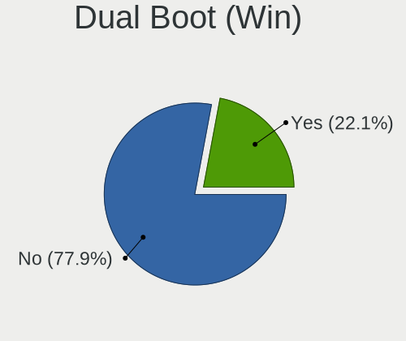
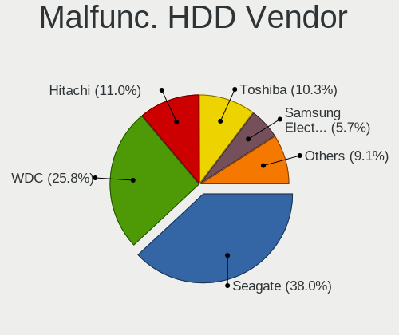

Linux Mint - Tested Hardware & Statistics
-----------------------------------------

A project to collect tested hardware configurations for Linux Mint.

Anyone can contribute to this report by the [hw-probe](https://github.com/linuxhw/hw-probe) tool:

    sudo -E hw-probe -all -upload

Please contribute! Especially if your hardware is rare.

This is a report for all computer types. See also reports for [desktops](/Dist/Linux_Mint/Desktop/README.md) and [notebooks](/Dist/Linux_Mint/Notebook/README.md).

Contents
--------

* [ Test Cases ](#test-cases)

* [ System ](#system)
  - [ OS                       ](#os)
  - [ OS Family                ](#os-family)
  - [ Kernel                   ](#kernel)
  - [ Kernel Family            ](#kernel-family)
  - [ Kernel Major Ver.        ](#kernel-major-ver)
  - [ Arch                     ](#arch)
  - [ DE                       ](#de)
  - [ Display Server           ](#display-server)
  - [ Display Manager          ](#display-manager)
  - [ OS Lang                  ](#os-lang)
  - [ Boot Mode                ](#boot-mode)
  - [ Filesystem               ](#filesystem)
  - [ Part. scheme             ](#part-scheme)
  - [ Dual Boot with Linux/BSD ](#dual-boot-with-linuxbsd)
  - [ Dual Boot (Win)          ](#dual-boot-win)

* [ Board ](#board)
  - [ Vendor                   ](#vendor)
  - [ Model                    ](#model)
  - [ Model Family             ](#model-family)
  - [ MFG Year                 ](#mfg-year)
  - [ Form Factor              ](#form-factor)
  - [ Secure Boot              ](#secure-boot)
  - [ Coreboot                 ](#coreboot)
  - [ RAM Size                 ](#ram-size)
  - [ RAM Used                 ](#ram-used)
  - [ Total Drives             ](#total-drives)
  - [ Has CD-ROM               ](#has-cd-rom)
  - [ Has Ethernet             ](#has-ethernet)
  - [ Has WiFi                 ](#has-wifi)
  - [ Has Bluetooth            ](#has-bluetooth)

* [ Location ](#location)
  - [ Country                  ](#country)
  - [ City                     ](#city)

* [ Drives ](#drives)
  - [ Drive Vendor             ](#drive-vendor)
  - [ Drive Model              ](#drive-model)
  - [ HDD Vendor               ](#hdd-vendor)
  - [ SSD Vendor               ](#ssd-vendor)
  - [ Drive Kind               ](#drive-kind)
  - [ Drive Connector          ](#drive-connector)
  - [ Drive Size               ](#drive-size)
  - [ Space Total              ](#space-total)
  - [ Space Used               ](#space-used)
  - [ Malfunc. Drives          ](#malfunc-drives)
  - [ Malfunc. Drive Vendor    ](#malfunc-drive-vendor)
  - [ Malfunc. HDD Vendor      ](#malfunc-hdd-vendor)
  - [ Malfunc. Drive Kind      ](#malfunc-drive-kind)
  - [ Failed Drives            ](#failed-drives)
  - [ Failed Drive Vendor      ](#failed-drive-vendor)
  - [ Drive Status             ](#drive-status)

* [ Storage controller ](#storage-controller)
  - [ Storage Vendor           ](#storage-vendor)
  - [ Storage Model            ](#storage-model)
  - [ Storage Kind             ](#storage-kind)

* [ Processor ](#processor)
  - [ CPU Vendor               ](#cpu-vendor)
  - [ CPU Model                ](#cpu-model)
  - [ CPU Model Family         ](#cpu-model-family)
  - [ CPU Cores                ](#cpu-cores)
  - [ CPU Sockets              ](#cpu-sockets)
  - [ CPU Threads              ](#cpu-threads)
  - [ CPU Op-Modes             ](#cpu-op-modes)
  - [ CPU Microcode            ](#cpu-microcode)
  - [ CPU Microarch            ](#cpu-microarch)

* [ Graphics ](#graphics)
  - [ GPU Vendor               ](#gpu-vendor)
  - [ GPU Model                ](#gpu-model)
  - [ GPU Combo                ](#gpu-combo)
  - [ GPU Driver               ](#gpu-driver)
  - [ GPU Memory               ](#gpu-memory)

* [ Monitor ](#monitor)
  - [ Monitor Vendor           ](#monitor-vendor)
  - [ Monitor Model            ](#monitor-model)
  - [ Monitor Resolution       ](#monitor-resolution)
  - [ Monitor Diagonal         ](#monitor-diagonal)
  - [ Monitor Width            ](#monitor-width)
  - [ Aspect Ratio             ](#aspect-ratio)
  - [ Monitor Area             ](#monitor-area)
  - [ Pixel Density            ](#pixel-density)
  - [ Multiple Monitors        ](#multiple-monitors)

* [ Network ](#network)
  - [ Net Controller Vendor    ](#net-controller-vendor)
  - [ Net Controller Model     ](#net-controller-model)
  - [ Wireless Vendor          ](#wireless-vendor)
  - [ Wireless Model           ](#wireless-model)
  - [ Ethernet Vendor          ](#ethernet-vendor)
  - [ Ethernet Model           ](#ethernet-model)
  - [ Net Controller Kind      ](#net-controller-kind)
  - [ Used Controller          ](#used-controller)
  - [ NICs                     ](#nics)
  - [ IPv6                     ](#ipv6)

* [ Bluetooth ](#bluetooth)
  - [ Bluetooth Vendor         ](#bluetooth-vendor)
  - [ Bluetooth Model          ](#bluetooth-model)

* [ Sound ](#sound)
  - [ Sound Vendor             ](#sound-vendor)
  - [ Sound Model              ](#sound-model)

* [ Memory ](#memory)
  - [ Memory Vendor            ](#memory-vendor)
  - [ Memory Model             ](#memory-model)
  - [ Memory Kind              ](#memory-kind)
  - [ Memory Form Factor       ](#memory-form-factor)
  - [ Memory Size              ](#memory-size)
  - [ Memory Speed             ](#memory-speed)

* [ Printers & scanners ](#printers--scanners)
  - [ Printer Vendor           ](#printer-vendor)
  - [ Printer Model            ](#printer-model)
  - [ Scanner Vendor           ](#scanner-vendor)
  - [ Scanner Model            ](#scanner-model)

* [ Camera ](#camera)
  - [ Camera Vendor            ](#camera-vendor)
  - [ Camera Model             ](#camera-model)

* [ Security ](#security)
  - [ Fingerprint Vendor       ](#fingerprint-vendor)
  - [ Fingerprint Model        ](#fingerprint-model)
  - [ Chipcard Vendor          ](#chipcard-vendor)
  - [ Chipcard Model           ](#chipcard-model)

* [ Unsupported ](#unsupported)
  - [ Unsupported Devices      ](#unsupported-devices)
  - [ Unsupported Device Types ](#unsupported-device-types)

Test Cases
----------

Total: 27337

| Vendor        | Model                       | Form-Factor | Probe                                                      | Date         |
|---------------|-----------------------------|-------------|------------------------------------------------------------|--------------|
| ASRock        | H61M-DGS R2.0               | Desktop     | [6af1365446](https://linux-hardware.org/?probe=6af1365446) | Aug 12, 2023 |
| ASRock        | H61M-DGS R2.0               | Desktop     | [70e9fe8cdb](https://linux-hardware.org/?probe=70e9fe8cdb) | Aug 12, 2023 |
| Apple         | Mac-F2268DAE                | All in one  | [cec4c72ebb](https://linux-hardware.org/?probe=cec4c72ebb) | Aug 12, 2023 |
| Gigabyte      | F2A88XN-WIFI                | Desktop     | [8ba1a47cc3](https://linux-hardware.org/?probe=8ba1a47cc3) | Aug 12, 2023 |
| Gigabyte      | F2A88XN-WIFI                | Desktop     | [adb95a05c5](https://linux-hardware.org/?probe=adb95a05c5) | Aug 12, 2023 |
| Multilaser    | PC024                       | Notebook    | [3311e26ac5](https://linux-hardware.org/?probe=3311e26ac5) | Aug 12, 2023 |
| HP            | ProLiant ML350 G5           | Desktop     | [e9e8c3e5a7](https://linux-hardware.org/?probe=e9e8c3e5a7) | Aug 12, 2023 |
| Mini PC       | Rev JSL5 DDR4               | Mini pc     | [ec7b05c868](https://linux-hardware.org/?probe=ec7b05c868) | Aug 12, 2023 |
| Dell          | Inspiron 5558               | Notebook    | [5bb31ccda3](https://linux-hardware.org/?probe=5bb31ccda3) | Aug 12, 2023 |
| Lenovo        | ThinkPad X1 Carbon 6th 2... | Notebook    | [53c81d6d36](https://linux-hardware.org/?probe=53c81d6d36) | Aug 12, 2023 |
| HP            | Notebook                    | Notebook    | [de8a0230c4](https://linux-hardware.org/?probe=de8a0230c4) | Aug 11, 2023 |
| Dell          | Inspiron 5559               | Notebook    | [f3e1bb3812](https://linux-hardware.org/?probe=f3e1bb3812) | Aug 11, 2023 |
| Apple         | MacBookPro14,2              | Notebook    | [8b0d028b37](https://linux-hardware.org/?probe=8b0d028b37) | Aug 11, 2023 |
| Gigabyte      | B450 AORUS M                | Desktop     | [f4a323eb82](https://linux-hardware.org/?probe=f4a323eb82) | Aug 11, 2023 |
| Dell          | 0KV3RP A00                  | Desktop     | [47c45a45e5](https://linux-hardware.org/?probe=47c45a45e5) | Aug 11, 2023 |
| Gigabyte      | A520M DS3H AC               | Desktop     | [c53eeb4caf](https://linux-hardware.org/?probe=c53eeb4caf) | Aug 11, 2023 |
| HP            | 339A                        | Desktop     | [2ecbd957da](https://linux-hardware.org/?probe=2ecbd957da) | Aug 11, 2023 |
| Gigabyte      | P67A-UD3P-B3                | Desktop     | [a1c6469145](https://linux-hardware.org/?probe=a1c6469145) | Aug 11, 2023 |
| HP            | 250 G3                      | Notebook    | [6ba303bc6b](https://linux-hardware.org/?probe=6ba303bc6b) | Aug 11, 2023 |
| HP            | Laptop 17-cp1xxx            | Notebook    | [ac523f4e3b](https://linux-hardware.org/?probe=ac523f4e3b) | Aug 11, 2023 |
| Fujitsu Si... | AMILO Xa 1526               | Notebook    | [0a1e2a7f23](https://linux-hardware.org/?probe=0a1e2a7f23) | Aug 11, 2023 |
| Fujitsu Si... | AMILO Xa 1526               | Notebook    | [742b085257](https://linux-hardware.org/?probe=742b085257) | Aug 11, 2023 |
| MSI           | MPG X570 GAMING PRO CARB... | Desktop     | [f711709f3f](https://linux-hardware.org/?probe=f711709f3f) | Aug 11, 2023 |
| HP            | Pavilion dv6                | Notebook    | [1689b3fd44](https://linux-hardware.org/?probe=1689b3fd44) | Aug 11, 2023 |
| Leader        | SC404PRO                    | Notebook    | [6f24ee5e0c](https://linux-hardware.org/?probe=6f24ee5e0c) | Aug 11, 2023 |
| HP            | 84DE                        | All in one  | [bdd2e74d54](https://linux-hardware.org/?probe=bdd2e74d54) | Aug 11, 2023 |
| MSI           | H310M PRO-VD                | Desktop     | [f542bb8447](https://linux-hardware.org/?probe=f542bb8447) | Aug 10, 2023 |
| Acer          | Aspire E1-731               | Notebook    | [b75a766ee9](https://linux-hardware.org/?probe=b75a766ee9) | Aug 10, 2023 |
| ASUSTek       | P8Z68-V                     | Desktop     | [cff11cda6f](https://linux-hardware.org/?probe=cff11cda6f) | Aug 10, 2023 |
| MSI           | B450M PRO-M2 MAX            | Desktop     | [07e0bad7da](https://linux-hardware.org/?probe=07e0bad7da) | Aug 10, 2023 |
| ASUSTek       | PRIME A320M-K               | Desktop     | [67414922e3](https://linux-hardware.org/?probe=67414922e3) | Aug 10, 2023 |
| ASUSTek       | VivoBook_ASUSLaptop X515... | Notebook    | [24629e2553](https://linux-hardware.org/?probe=24629e2553) | Aug 10, 2023 |
| ASRock        | H61M-DGS R2.0               | Desktop     | [4f05b77547](https://linux-hardware.org/?probe=4f05b77547) | Aug 10, 2023 |
| Lenovo        | ThinkBook 16p Gen 2 20YM    | Notebook    | [82dde7d058](https://linux-hardware.org/?probe=82dde7d058) | Aug 10, 2023 |
| Gigabyte      | B365M H                     | Desktop     | [b23c1e6e73](https://linux-hardware.org/?probe=b23c1e6e73) | Aug 10, 2023 |
| Fujitsu       | LIFEBOOK A530               | Notebook    | [05e64e3a0a](https://linux-hardware.org/?probe=05e64e3a0a) | Aug 10, 2023 |
| HP            | ZBook Studio 16 inch G9 ... | Notebook    | [e1462f1e3a](https://linux-hardware.org/?probe=e1462f1e3a) | Aug 10, 2023 |
| Toshiba       | Satellite C660              | Notebook    | [26597d8a51](https://linux-hardware.org/?probe=26597d8a51) | Aug 10, 2023 |
| Lenovo        | IdeaPad 320-15AST 80XV      | Notebook    | [0caf17e079](https://linux-hardware.org/?probe=0caf17e079) | Aug 10, 2023 |
| AMI           | T3 MRD                      | Desktop     | [7a77a54bfd](https://linux-hardware.org/?probe=7a77a54bfd) | Aug 10, 2023 |
| Fujitsu Si... | AMILO Xa 1526               | Notebook    | [a3b9be2f56](https://linux-hardware.org/?probe=a3b9be2f56) | Aug 10, 2023 |
| ASUSTek       | GRYPHON Z87                 | Desktop     | [0638b1c2dd](https://linux-hardware.org/?probe=0638b1c2dd) | Aug 10, 2023 |
| ASUSTek       | GRYPHON Z87                 | Desktop     | [ff98e5f807](https://linux-hardware.org/?probe=ff98e5f807) | Aug 10, 2023 |
| ASUSTek       | VivoBook_ASUSLaptop X170... | Notebook    | [75b55100a9](https://linux-hardware.org/?probe=75b55100a9) | Aug 10, 2023 |
| Dell          | Precision 5540              | Notebook    | [e68fee1e24](https://linux-hardware.org/?probe=e68fee1e24) | Aug 10, 2023 |
| HP            | EliteBook 8740w             | Notebook    | [69a5fc6981](https://linux-hardware.org/?probe=69a5fc6981) | Aug 10, 2023 |
| Lenovo        | IdeaPad 530S-14ARR 81H1     | Notebook    | [cec1060cd6](https://linux-hardware.org/?probe=cec1060cd6) | Aug 10, 2023 |
| Gigabyte      | G31M-ES2L                   | Desktop     | [1e856f651d](https://linux-hardware.org/?probe=1e856f651d) | Aug 09, 2023 |
| Gigabyte      | B560M AORUS ELITE           | Desktop     | [e315608a65](https://linux-hardware.org/?probe=e315608a65) | Aug 09, 2023 |
| ASUSTek       | ZenBook UX534FTC_UX534FT    | Notebook    | [26b98e8740](https://linux-hardware.org/?probe=26b98e8740) | Aug 09, 2023 |
| ASRock        | Z77 Extreme4                | Desktop     | [aadaab77db](https://linux-hardware.org/?probe=aadaab77db) | Aug 09, 2023 |
| HP            | Victus by Gaming Laptop ... | Notebook    | [8b57037d50](https://linux-hardware.org/?probe=8b57037d50) | Aug 09, 2023 |
| Dell          | 06FW8M A06                  | Server      | [aa643edf66](https://linux-hardware.org/?probe=aa643edf66) | Aug 09, 2023 |
| Apple         | MacBookPro15,4              | Notebook    | [f63c9ffab9](https://linux-hardware.org/?probe=f63c9ffab9) | Aug 09, 2023 |
| Wortmann      | TERRA_MOBILE_1749           | Notebook    | [3986ff4298](https://linux-hardware.org/?probe=3986ff4298) | Aug 09, 2023 |
| HP            | EliteBook 830 G8 Noteboo... | Notebook    | [2f7f77225a](https://linux-hardware.org/?probe=2f7f77225a) | Aug 09, 2023 |
| HP            | EliteBook 840 G2            | Notebook    | [90291816a0](https://linux-hardware.org/?probe=90291816a0) | Aug 09, 2023 |
| Lenovo        | IdeaPadFlex 5 16ALC7 82R... | Convertible | [11cf6b0c98](https://linux-hardware.org/?probe=11cf6b0c98) | Aug 09, 2023 |
| ASUSTek       | ZenBook UX534FTC_UX534FT    | Notebook    | [68eb21c824](https://linux-hardware.org/?probe=68eb21c824) | Aug 09, 2023 |
| Lenovo        | IdeaPadFlex 5 16ALC7 82R... | Convertible | [1e3f49e3a0](https://linux-hardware.org/?probe=1e3f49e3a0) | Aug 09, 2023 |
| Lenovo        | IdeaPadFlex 5 16ALC7 82R... | Convertible | [2f32ca43ee](https://linux-hardware.org/?probe=2f32ca43ee) | Aug 09, 2023 |
| HP            | ProBook 4740s               | Notebook    | [1c56daf13e](https://linux-hardware.org/?probe=1c56daf13e) | Aug 09, 2023 |
| MSI           | Z97-G43                     | Desktop     | [b6edd8931f](https://linux-hardware.org/?probe=b6edd8931f) | Aug 09, 2023 |
| MSI           | B350 GAMING PLUS            | Desktop     | [4d7fbea818](https://linux-hardware.org/?probe=4d7fbea818) | Aug 09, 2023 |
| Gigabyte      | Z370M D3H-CF                | Desktop     | [9326dd9736](https://linux-hardware.org/?probe=9326dd9736) | Aug 09, 2023 |
| HP            | 2000                        | Notebook    | [fa62a90143](https://linux-hardware.org/?probe=fa62a90143) | Aug 09, 2023 |
| HP            | 255 G5                      | Notebook    | [d4adfe0ead](https://linux-hardware.org/?probe=d4adfe0ead) | Aug 09, 2023 |
| ASUSTek       | P8H67-M LX                  | Desktop     | [62d3166469](https://linux-hardware.org/?probe=62d3166469) | Aug 09, 2023 |
| ASUSTek       | ROG Zephyrus G15 GA503RM... | Notebook    | [5a4c9f0e5a](https://linux-hardware.org/?probe=5a4c9f0e5a) | Aug 09, 2023 |
| Gigabyte      | F2A88X-D3H                  | Desktop     | [7b0c19a9a2](https://linux-hardware.org/?probe=7b0c19a9a2) | Aug 09, 2023 |
| ASUSTek       | TUF Gaming X570-PLUS_BR     | Desktop     | [0b1144add1](https://linux-hardware.org/?probe=0b1144add1) | Aug 09, 2023 |
| HP            | Laptop 15-bw0xx             | Notebook    | [f23d951287](https://linux-hardware.org/?probe=f23d951287) | Aug 09, 2023 |
| HP            | Laptop 15-bw0xx             | Notebook    | [ff36238822](https://linux-hardware.org/?probe=ff36238822) | Aug 09, 2023 |
| Dell          | Inspiron 15-7568            | Notebook    | [745ebb5475](https://linux-hardware.org/?probe=745ebb5475) | Aug 09, 2023 |
| Gigabyte      | F2A88X-D3H                  | Desktop     | [f0d580edb4](https://linux-hardware.org/?probe=f0d580edb4) | Aug 09, 2023 |
| Lenovo        | IdeaPad 530S-14ARR 81H1     | Notebook    | [33beb40ea6](https://linux-hardware.org/?probe=33beb40ea6) | Aug 09, 2023 |
| Exo           | Smart Serie LT              | Notebook    | [08d7c1d923](https://linux-hardware.org/?probe=08d7c1d923) | Aug 09, 2023 |
| Sony          | VJF151                      | Notebook    | [b2768a0abf](https://linux-hardware.org/?probe=b2768a0abf) | Aug 09, 2023 |
| Biostar       | X370GT3                     | Desktop     | [6c4e484a34](https://linux-hardware.org/?probe=6c4e484a34) | Aug 09, 2023 |
| ASRock        | Z77 Extreme4                | Desktop     | [dace48c9ec](https://linux-hardware.org/?probe=dace48c9ec) | Aug 09, 2023 |
| ASRock        | Z77 Extreme4                | Desktop     | [e4c0e430b2](https://linux-hardware.org/?probe=e4c0e430b2) | Aug 09, 2023 |
| Lenovo        | ThinkPad T460 20FMA00F00    | Notebook    | [4bd13ae71d](https://linux-hardware.org/?probe=4bd13ae71d) | Aug 09, 2023 |
| Gigabyte      | B85M-DS3H                   | Desktop     | [950bc73be5](https://linux-hardware.org/?probe=950bc73be5) | Aug 09, 2023 |
| Itautec       | ST 4273 ST-4273 Custom 0... | Desktop     | [2e2f861c7c](https://linux-hardware.org/?probe=2e2f861c7c) | Aug 09, 2023 |
| Dell          | Inspiron 5584               | Notebook    | [33e964d1d6](https://linux-hardware.org/?probe=33e964d1d6) | Aug 09, 2023 |
| ASUSTek       | PRIME B450-PLUS             | Desktop     | [691838cd8c](https://linux-hardware.org/?probe=691838cd8c) | Aug 09, 2023 |
| Lenovo        | ThinkPad E595 20NFCTO1WW    | Notebook    | [4f4c3a2b96](https://linux-hardware.org/?probe=4f4c3a2b96) | Aug 08, 2023 |
| ASUSTek       | VivoBook_ASUSLaptop X170... | Notebook    | [f48f680274](https://linux-hardware.org/?probe=f48f680274) | Aug 08, 2023 |
| Acer          | Aspire 8930                 | Notebook    | [1a39769fb2](https://linux-hardware.org/?probe=1a39769fb2) | Aug 08, 2023 |
| HP            | 255 G5                      | Notebook    | [b38a912e23](https://linux-hardware.org/?probe=b38a912e23) | Aug 08, 2023 |
| HP            | ZBook 15 G2                 | Notebook    | [cb340460b6](https://linux-hardware.org/?probe=cb340460b6) | Aug 08, 2023 |
| ASRock        | H61M-HVGS                   | Desktop     | [f78ce03ad4](https://linux-hardware.org/?probe=f78ce03ad4) | Aug 08, 2023 |
| ASRock        | H61M-HVGS                   | Desktop     | [60d9dcfa89](https://linux-hardware.org/?probe=60d9dcfa89) | Aug 08, 2023 |
| Lenovo        | IdeaPad 330-15IKB 81DC      | Notebook    | [f6b63d9967](https://linux-hardware.org/?probe=f6b63d9967) | Aug 08, 2023 |
| ASUSTek       | 1001P                       | Notebook    | [b4326c3c45](https://linux-hardware.org/?probe=b4326c3c45) | Aug 08, 2023 |
| Lenovo        | IdeaPad Slim 5 16IRL8 82... | Notebook    | [179beade50](https://linux-hardware.org/?probe=179beade50) | Aug 08, 2023 |
| HP            | Unknown                     | Notebook    | [567a10ceb2](https://linux-hardware.org/?probe=567a10ceb2) | Aug 08, 2023 |
| Lenovo        | 3136 SDK0J40700 WIN 3258... | Mini pc     | [1a0f72e2d0](https://linux-hardware.org/?probe=1a0f72e2d0) | Aug 08, 2023 |
| MSI           | MAG B550M MORTAR            | Desktop     | [6c50235cbc](https://linux-hardware.org/?probe=6c50235cbc) | Aug 08, 2023 |
| HP            | Laptop 15-bs0xx             | Notebook    | [2a7e23b825](https://linux-hardware.org/?probe=2a7e23b825) | Aug 08, 2023 |
| MSI           | Z270 PC MATE                | Desktop     | [aa107173a1](https://linux-hardware.org/?probe=aa107173a1) | Aug 08, 2023 |
| HP            | Pavilion x360 Convertibl... | Convertible | [f03a19e65b](https://linux-hardware.org/?probe=f03a19e65b) | Aug 08, 2023 |
| ASUSTek       | P5G41T-M                    | Desktop     | [9eccce625b](https://linux-hardware.org/?probe=9eccce625b) | Aug 08, 2023 |
| MSI           | MAG B550 TOMAHAWK           | Desktop     | [1ad6abed83](https://linux-hardware.org/?probe=1ad6abed83) | Aug 08, 2023 |
| Dell          | XPS L501X                   | Notebook    | [60a937133c](https://linux-hardware.org/?probe=60a937133c) | Aug 08, 2023 |
| HP            | Pavilion 17                 | Notebook    | [4833cfdbd8](https://linux-hardware.org/?probe=4833cfdbd8) | Aug 08, 2023 |
| MSI           | PRO Z790-P WIFI DDR4        | Desktop     | [a79335e604](https://linux-hardware.org/?probe=a79335e604) | Aug 07, 2023 |
| ASRock        | Z97 Extreme4                | Desktop     | [27c70b528b](https://linux-hardware.org/?probe=27c70b528b) | Aug 07, 2023 |
| Dell          | 0X2MKR A00                  | All in one  | [101fc74a47](https://linux-hardware.org/?probe=101fc74a47) | Aug 07, 2023 |
| ASUSTek       | ROG Flow X13 GV301QE_GV3... | Notebook    | [c1062b9705](https://linux-hardware.org/?probe=c1062b9705) | Aug 07, 2023 |
| HP            | Elite x2 1012 G1            | Notebook    | [fea0f58ed5](https://linux-hardware.org/?probe=fea0f58ed5) | Aug 07, 2023 |
| ASUSTek       | M5A78L-M/USB3               | Desktop     | [e703e9ae63](https://linux-hardware.org/?probe=e703e9ae63) | Aug 07, 2023 |
| Gigabyte      | B550 AORUS ELITE V2         | Desktop     | [ef73e2e520](https://linux-hardware.org/?probe=ef73e2e520) | Aug 07, 2023 |
| Dell          | Latitude 7490               | Notebook    | [e7738263f7](https://linux-hardware.org/?probe=e7738263f7) | Aug 07, 2023 |
| Dell          | Latitude 7490               | Notebook    | [a3b95f2fc2](https://linux-hardware.org/?probe=a3b95f2fc2) | Aug 07, 2023 |
| Dell          | Vostro 1700                 | Notebook    | [009c767dae](https://linux-hardware.org/?probe=009c767dae) | Aug 07, 2023 |
| MSI           | A520M-A PRO                 | Desktop     | [009a1819fa](https://linux-hardware.org/?probe=009a1819fa) | Aug 07, 2023 |
| ASUSTek       | ROG Flow X13 GV301QE_GV3... | Notebook    | [46a7513850](https://linux-hardware.org/?probe=46a7513850) | Aug 07, 2023 |
| Wortmann      | TERRA_MOBILE_1749           | Notebook    | [22624fbda5](https://linux-hardware.org/?probe=22624fbda5) | Aug 07, 2023 |
| Acer          | Aspire V3-771               | Notebook    | [ebdbffb7da](https://linux-hardware.org/?probe=ebdbffb7da) | Aug 07, 2023 |
| Lenovo        | IdeaPad 100-15IBY 80MJ      | Notebook    | [6601d0d136](https://linux-hardware.org/?probe=6601d0d136) | Aug 07, 2023 |
| HP            | EliteBook 8470p             | Notebook    | [62d3a8d08d](https://linux-hardware.org/?probe=62d3a8d08d) | Aug 07, 2023 |
| Acer          | Aspire 5734Z                | Notebook    | [158671d9c9](https://linux-hardware.org/?probe=158671d9c9) | Aug 07, 2023 |
| Fujitsu       | D3162-A1 S26361-D3162-A1    | Desktop     | [cb5a99b4fb](https://linux-hardware.org/?probe=cb5a99b4fb) | Aug 07, 2023 |
| HP            | 3397                        | Desktop     | [3cf9a90333](https://linux-hardware.org/?probe=3cf9a90333) | Aug 07, 2023 |
| ASUSTek       | VivoBook_ASUSLaptop M140... | Notebook    | [bd036e1e65](https://linux-hardware.org/?probe=bd036e1e65) | Aug 07, 2023 |
| Supermicro    | X10DRiB                     | Server      | [aeb76679f7](https://linux-hardware.org/?probe=aeb76679f7) | Aug 07, 2023 |
| ASUSTek       | N552VX                      | Notebook    | [1c616233ca](https://linux-hardware.org/?probe=1c616233ca) | Aug 07, 2023 |
| Medion        | M14L-256                    | Notebook    | [7d0a8921dc](https://linux-hardware.org/?probe=7d0a8921dc) | Aug 07, 2023 |
| ASUSTek       | N76VM                       | Notebook    | [083980d0fb](https://linux-hardware.org/?probe=083980d0fb) | Aug 07, 2023 |
| HP            | 212B                        | Desktop     | [b7de4a2b0a](https://linux-hardware.org/?probe=b7de4a2b0a) | Aug 07, 2023 |
| Gigabyte      | AB350M-DS3H-CF              | Desktop     | [db512d60d0](https://linux-hardware.org/?probe=db512d60d0) | Aug 07, 2023 |
| MSI           | B450 TOMAHAWK MAX           | Desktop     | [31c3da5150](https://linux-hardware.org/?probe=31c3da5150) | Aug 07, 2023 |
| Lenovo        | ThinkPad E15 Gen 3 20YGC... | Notebook    | [804851c490](https://linux-hardware.org/?probe=804851c490) | Aug 07, 2023 |
| Acer          | Predator PT515-51           | Notebook    | [e08b7b4cd8](https://linux-hardware.org/?probe=e08b7b4cd8) | Aug 07, 2023 |
| Unknown       | Unknown                     | Desktop     | [e2427beca2](https://linux-hardware.org/?probe=e2427beca2) | Aug 07, 2023 |
| Dell          | 0NW6H5 A00                  | Desktop     | [f8511d64fc](https://linux-hardware.org/?probe=f8511d64fc) | Aug 07, 2023 |
| MSI           | 970A-G43                    | Desktop     | [68384da884](https://linux-hardware.org/?probe=68384da884) | Aug 06, 2023 |
| HP            | EliteBook 8570p             | Notebook    | [99635bf61d](https://linux-hardware.org/?probe=99635bf61d) | Aug 06, 2023 |
| Gigabyte      | EP35-DS4                    | Desktop     | [761d545a1e](https://linux-hardware.org/?probe=761d545a1e) | Aug 06, 2023 |
| ASRock        | H61M-DGS R2.0               | Desktop     | [032b99ac4f](https://linux-hardware.org/?probe=032b99ac4f) | Aug 06, 2023 |
| Gigabyte      | B450M GAMING                | Desktop     | [570d622bb5](https://linux-hardware.org/?probe=570d622bb5) | Aug 06, 2023 |
| Lenovo        | ThinkCentre M57 6072BJU     | Desktop     | [9c0231c0f3](https://linux-hardware.org/?probe=9c0231c0f3) | Aug 06, 2023 |
| Dell          | Latitude E7270              | Notebook    | [e7209c4bb7](https://linux-hardware.org/?probe=e7209c4bb7) | Aug 06, 2023 |
| Dell          | Latitude E5520              | Notebook    | [132e7834f7](https://linux-hardware.org/?probe=132e7834f7) | Aug 06, 2023 |
| ASUSTek       | N76VM                       | Notebook    | [80d45ff242](https://linux-hardware.org/?probe=80d45ff242) | Aug 06, 2023 |
| Gigabyte      | H81M-S2H                    | Desktop     | [247f361473](https://linux-hardware.org/?probe=247f361473) | Aug 06, 2023 |
| MSI           | Z490-A PRO                  | Desktop     | [151339db32](https://linux-hardware.org/?probe=151339db32) | Aug 06, 2023 |
| Unknown       | Unknown                     | Notebook    | [66dd893ce8](https://linux-hardware.org/?probe=66dd893ce8) | Aug 06, 2023 |
| Fujitsu Si... | AMILO Xa 1526               | Notebook    | [3d49205e68](https://linux-hardware.org/?probe=3d49205e68) | Aug 06, 2023 |
| Gigabyte      | AB350M-DS3H-CF              | Desktop     | [4a97a86dd8](https://linux-hardware.org/?probe=4a97a86dd8) | Aug 06, 2023 |
| Acer          | AO756                       | Notebook    | [60475c9d52](https://linux-hardware.org/?probe=60475c9d52) | Aug 06, 2023 |
| Teclast       | F7S                         | Notebook    | [a844443394](https://linux-hardware.org/?probe=a844443394) | Aug 06, 2023 |
| Gigabyte      | Z590 GAMING X               | Desktop     | [a8c865c9bb](https://linux-hardware.org/?probe=a8c865c9bb) | Aug 06, 2023 |
| Dell          | XPS 15 9575                 | Convertible | [4b72b07cd1](https://linux-hardware.org/?probe=4b72b07cd1) | Aug 06, 2023 |
| Lenovo        | ThinkPad T430 2349DS5       | Notebook    | [763d98ad86](https://linux-hardware.org/?probe=763d98ad86) | Aug 06, 2023 |
| Dell          | Inspiron 5584               | Notebook    | [7a4e005f77](https://linux-hardware.org/?probe=7a4e005f77) | Aug 06, 2023 |
| Apple         | MacBookPro9,2               | Notebook    | [7eb29a371d](https://linux-hardware.org/?probe=7eb29a371d) | Aug 06, 2023 |
| ASUSTek       | S301LA                      | Notebook    | [cc5477fc6b](https://linux-hardware.org/?probe=cc5477fc6b) | Aug 05, 2023 |
| ASUSTek       | Z87-PRO                     | Desktop     | [9d39447e43](https://linux-hardware.org/?probe=9d39447e43) | Aug 05, 2023 |
| HP            | 1588h                       | Desktop     | [1e041c2365](https://linux-hardware.org/?probe=1e041c2365) | Aug 05, 2023 |
| MSI           | Z490-A PRO                  | Desktop     | [0698c83c6e](https://linux-hardware.org/?probe=0698c83c6e) | Aug 05, 2023 |
| MSI           | PRO B550M-VC WIFI           | Desktop     | [f1727289ea](https://linux-hardware.org/?probe=f1727289ea) | Aug 05, 2023 |
| Acer          | Aspire E5-572G              | Notebook    | [846dce7b1b](https://linux-hardware.org/?probe=846dce7b1b) | Aug 05, 2023 |
| Multilaser    | PC024                       | Notebook    | [85a4bdd497](https://linux-hardware.org/?probe=85a4bdd497) | Aug 05, 2023 |
| Mediacom      | SmartBook 130 FullHD - M... | Notebook    | [3aa51361ae](https://linux-hardware.org/?probe=3aa51361ae) | Aug 05, 2023 |
| Gigabyte      | Z590 GAMING X               | Desktop     | [231ad3947e](https://linux-hardware.org/?probe=231ad3947e) | Aug 05, 2023 |
| Acer          | Aspire TC-895 V:1.0         | Desktop     | [85d2740423](https://linux-hardware.org/?probe=85d2740423) | Aug 05, 2023 |
| Lenovo        | 100w Gen 3 82HY             | Notebook    | [3feb7899d2](https://linux-hardware.org/?probe=3feb7899d2) | Aug 05, 2023 |
| MSI           | A68HM GRENADE               | Desktop     | [a186d8863f](https://linux-hardware.org/?probe=a186d8863f) | Aug 05, 2023 |
| Acer          | Aspire A715-72G             | Notebook    | [c95d1a55cd](https://linux-hardware.org/?probe=c95d1a55cd) | Aug 05, 2023 |
| Teclast       | F7S                         | Notebook    | [71ab18cda5](https://linux-hardware.org/?probe=71ab18cda5) | Aug 05, 2023 |
| HUAWEI        | HVY-WXX9                    | Notebook    | [9f813efccc](https://linux-hardware.org/?probe=9f813efccc) | Aug 05, 2023 |
| Lenovo        | IdeaPad 3 14ALC6 82KT       | Notebook    | [349326315f](https://linux-hardware.org/?probe=349326315f) | Aug 05, 2023 |
| Lenovo        | ThinkBook 14 G4+ ARA 21D... | Notebook    | [a089f6ff62](https://linux-hardware.org/?probe=a089f6ff62) | Aug 05, 2023 |
| Notebook      | NP5x_NP6x_NP7xRNJ_RNH       | Notebook    | [f4f8099774](https://linux-hardware.org/?probe=f4f8099774) | Aug 05, 2023 |
| Acer          | AS E5-523G                  | Notebook    | [b37e833d1e](https://linux-hardware.org/?probe=b37e833d1e) | Aug 05, 2023 |
| Dell          | Latitude E5500              | Notebook    | [95ddcb321c](https://linux-hardware.org/?probe=95ddcb321c) | Aug 05, 2023 |
| Dell          | 0K83V0 A00                  | Desktop     | [e8fbfe7be1](https://linux-hardware.org/?probe=e8fbfe7be1) | Aug 05, 2023 |
| Acer          | Swift SF514-54GT            | Notebook    | [12ee4ed8f6](https://linux-hardware.org/?probe=12ee4ed8f6) | Aug 05, 2023 |
| Acer          | Swift SF514-54GT            | Notebook    | [5a2ed78e49](https://linux-hardware.org/?probe=5a2ed78e49) | Aug 05, 2023 |
| Apple         | Mac-F2218EA9                | All in one  | [bbbbdcdcb6](https://linux-hardware.org/?probe=bbbbdcdcb6) | Aug 05, 2023 |
| Gigabyte      | GA-880GMA-UD2H              | Desktop     | [9ffeb0adcd](https://linux-hardware.org/?probe=9ffeb0adcd) | Aug 04, 2023 |
| ASUSTek       | P8H61-M LE/USB3             | Desktop     | [4a2c7a9f15](https://linux-hardware.org/?probe=4a2c7a9f15) | Aug 04, 2023 |
| Gigabyte      | GA-880GMA-UD2H              | Desktop     | [2886f9202b](https://linux-hardware.org/?probe=2886f9202b) | Aug 04, 2023 |
| Lenovo        | SKYBAY SDK0J40705 WIN 34... | Desktop     | [e3fd0f4808](https://linux-hardware.org/?probe=e3fd0f4808) | Aug 04, 2023 |
| ASUSTek       | TUF Gaming X570-PLUS        | Desktop     | [15826fe271](https://linux-hardware.org/?probe=15826fe271) | Aug 04, 2023 |
| Lenovo        | Yoga 7 14ARB7 82QF          | Convertible | [2a54f1c8ce](https://linux-hardware.org/?probe=2a54f1c8ce) | Aug 04, 2023 |
| Gigabyte      | RC14UD                      | Notebook    | [6ad0758102](https://linux-hardware.org/?probe=6ad0758102) | Aug 04, 2023 |
| ASRock        | 4CoreDual-SATA2             | Desktop     | [6495cadf19](https://linux-hardware.org/?probe=6495cadf19) | Aug 04, 2023 |
| MSI           | Z490-A PRO                  | Desktop     | [71e97069b6](https://linux-hardware.org/?probe=71e97069b6) | Aug 04, 2023 |
| Lenovo        | ThinkPad L450 20DSS00M00    | Notebook    | [e9f9c0e216](https://linux-hardware.org/?probe=e9f9c0e216) | Aug 04, 2023 |
| Gigabyte      | H81M-S2H                    | Desktop     | [f74b524df1](https://linux-hardware.org/?probe=f74b524df1) | Aug 04, 2023 |
| Fujitsu       | FMVS75MWP                   | Notebook    | [506a18b94f](https://linux-hardware.org/?probe=506a18b94f) | Aug 04, 2023 |
| ASUSTek       | P5G41T-M LX3                | Desktop     | [f82f03bf86](https://linux-hardware.org/?probe=f82f03bf86) | Aug 04, 2023 |
| ASUSTek       | B85-PRO GAMER               | Desktop     | [d4bb94e07e](https://linux-hardware.org/?probe=d4bb94e07e) | Aug 04, 2023 |
| ASRock        | Z97 Extreme4                | Desktop     | [4252e9a028](https://linux-hardware.org/?probe=4252e9a028) | Aug 04, 2023 |
| Gigabyte      | AB350M-DS3H-CF              | Desktop     | [2b5c5c52e8](https://linux-hardware.org/?probe=2b5c5c52e8) | Aug 04, 2023 |
| Dell          | Inspiron 15 3511            | Notebook    | [3cd247313d](https://linux-hardware.org/?probe=3cd247313d) | Aug 04, 2023 |
| Acer          | Aspire V5-572P              | Notebook    | [1d27d25f8d](https://linux-hardware.org/?probe=1d27d25f8d) | Aug 03, 2023 |
| PC Special... | Ionico 16                   | Notebook    | [0839bbc721](https://linux-hardware.org/?probe=0839bbc721) | Aug 03, 2023 |
| ASUSTek       | H97M-E                      | Desktop     | [5636598221](https://linux-hardware.org/?probe=5636598221) | Aug 03, 2023 |
| Sony          | SVF1521G1EW                 | Notebook    | [b46b664a9e](https://linux-hardware.org/?probe=b46b664a9e) | Aug 03, 2023 |
| Dell          | Latitude 5480               | Notebook    | [c52baac4e0](https://linux-hardware.org/?probe=c52baac4e0) | Aug 03, 2023 |
| MSI           | B550M PRO-VDH WIFI          | Desktop     | [f29d0b0571](https://linux-hardware.org/?probe=f29d0b0571) | Aug 03, 2023 |
| MSI           | B550M PRO-VDH WIFI          | Desktop     | [1db8a01118](https://linux-hardware.org/?probe=1db8a01118) | Aug 03, 2023 |
| Lenovo        | ThinkPad T400 6475R1G       | Notebook    | [481e1aa044](https://linux-hardware.org/?probe=481e1aa044) | Aug 03, 2023 |
| OEM           | B75 Ver:1.44                | Desktop     | [6dcf79b752](https://linux-hardware.org/?probe=6dcf79b752) | Aug 03, 2023 |
| Apple         | Mac-F2218EA9                | All in one  | [8799099410](https://linux-hardware.org/?probe=8799099410) | Aug 03, 2023 |
| ASUSTek       | B85-PRO GAMER               | Desktop     | [e888742592](https://linux-hardware.org/?probe=e888742592) | Aug 03, 2023 |
| Fujitsu       | D3501-A1 S26361-D3501-A1    | Desktop     | [38f7c8653b](https://linux-hardware.org/?probe=38f7c8653b) | Aug 03, 2023 |
| Gigabyte      | B450 GAMING X               | Desktop     | [bb292f568a](https://linux-hardware.org/?probe=bb292f568a) | Aug 03, 2023 |
| ASUSTek       | VivoBook_ASUSLaptop X170... | Notebook    | [7d86876920](https://linux-hardware.org/?probe=7d86876920) | Aug 03, 2023 |
| Lenovo        | ThinkPad P51s 20HCS0660Y    | Notebook    | [6e8234ed89](https://linux-hardware.org/?probe=6e8234ed89) | Aug 03, 2023 |
| Panasonic     | CF-31WBLAXLM                | Notebook    | [580b017d88](https://linux-hardware.org/?probe=580b017d88) | Aug 03, 2023 |
| Acer          | Aspire 5733                 | Notebook    | [f09853c0ed](https://linux-hardware.org/?probe=f09853c0ed) | Aug 03, 2023 |
| Lenovo        | IdeaPad 3 15ADA05 81W1      | Notebook    | [9171e8e6b9](https://linux-hardware.org/?probe=9171e8e6b9) | Aug 03, 2023 |
| HP            | ENVY 17                     | Notebook    | [ef244ad969](https://linux-hardware.org/?probe=ef244ad969) | Aug 02, 2023 |
| Lenovo        | ThinkCentre M91p 4518A4M    | Desktop     | [04f8c42dba](https://linux-hardware.org/?probe=04f8c42dba) | Aug 02, 2023 |
| HP            | Pavilion Laptop 15-eg0xx... | Notebook    | [101e2e7e7e](https://linux-hardware.org/?probe=101e2e7e7e) | Aug 02, 2023 |
| HP            | Pavilion Laptop 15-eg0xx... | Notebook    | [16cafd9d32](https://linux-hardware.org/?probe=16cafd9d32) | Aug 02, 2023 |
| Lenovo        | ThinkPad X1 Carbon Gen 9... | Notebook    | [cf7cad0e02](https://linux-hardware.org/?probe=cf7cad0e02) | Aug 02, 2023 |
| ASRock        | 775Dual-VSTA                | Desktop     | [7241233996](https://linux-hardware.org/?probe=7241233996) | Aug 02, 2023 |
| Medion        | X681X                       | Notebook    | [8209a37737](https://linux-hardware.org/?probe=8209a37737) | Aug 02, 2023 |
| Positivo      | Q232B                       | Notebook    | [006d77a18c](https://linux-hardware.org/?probe=006d77a18c) | Aug 02, 2023 |
| Gigabyte      | GA-990FXA-UD3               | Desktop     | [8395f61392](https://linux-hardware.org/?probe=8395f61392) | Aug 02, 2023 |
| ASUSTek       | P5B-VM SE                   | Desktop     | [d5bb32f2de](https://linux-hardware.org/?probe=d5bb32f2de) | Aug 02, 2023 |
| Dell          | 0NKW6Y A01                  | Desktop     | [6bae407930](https://linux-hardware.org/?probe=6bae407930) | Aug 02, 2023 |
| Lenovo        | ThinkPad T480 20L5001BUS    | Notebook    | [b340a9e075](https://linux-hardware.org/?probe=b340a9e075) | Aug 02, 2023 |
| Dell          | Latitude 7280               | Notebook    | [40a53f89cf](https://linux-hardware.org/?probe=40a53f89cf) | Aug 02, 2023 |
| HP            | Pavilion dv5                | Notebook    | [58b4ce4ff9](https://linux-hardware.org/?probe=58b4ce4ff9) | Aug 02, 2023 |
| ASUSTek       | P5B                         | Desktop     | [a918b28119](https://linux-hardware.org/?probe=a918b28119) | Aug 02, 2023 |
| Gigabyte      | H81M-H                      | Desktop     | [8c4c50cef9](https://linux-hardware.org/?probe=8c4c50cef9) | Aug 02, 2023 |
| Toshiba       | Satellite C660              | Notebook    | [5e74aca4e7](https://linux-hardware.org/?probe=5e74aca4e7) | Aug 02, 2023 |
| ASUSTek       | VivoBook_ASUSLaptop X160... | Notebook    | [4a6b173235](https://linux-hardware.org/?probe=4a6b173235) | Aug 01, 2023 |
| Acer          | Aspire ES1-521              | Notebook    | [127d7abd32](https://linux-hardware.org/?probe=127d7abd32) | Aug 01, 2023 |
| Gateway       | DX4840                      | Desktop     | [7268035f51](https://linux-hardware.org/?probe=7268035f51) | Aug 01, 2023 |
| Gigabyte      | H81M-S2H                    | Desktop     | [0e5d30b504](https://linux-hardware.org/?probe=0e5d30b504) | Aug 01, 2023 |
| ASUSTek       | P8H61-M LX3 PLUS R2.0       | Desktop     | [00311486d2](https://linux-hardware.org/?probe=00311486d2) | Aug 01, 2023 |
| Lenovo        | ThinkPad X250 20CM001PGE    | Notebook    | [9c5503cd84](https://linux-hardware.org/?probe=9c5503cd84) | Aug 01, 2023 |
| Acer          | Aspire ES1-311              | Notebook    | [6f59479d87](https://linux-hardware.org/?probe=6f59479d87) | Aug 01, 2023 |
| HP            | Pavilion 15                 | Notebook    | [c66316cd62](https://linux-hardware.org/?probe=c66316cd62) | Aug 01, 2023 |
| Lenovo        | IdeaPad 320-15AST 80XV      | Notebook    | [c74f4bde19](https://linux-hardware.org/?probe=c74f4bde19) | Aug 01, 2023 |
| Dell          | Latitude E6440              | Notebook    | [57ce920c06](https://linux-hardware.org/?probe=57ce920c06) | Aug 01, 2023 |
| HP            | 339A                        | Desktop     | [782fefbccd](https://linux-hardware.org/?probe=782fefbccd) | Aug 01, 2023 |
| Medion        | E5214                       | Notebook    | [98cb0db418](https://linux-hardware.org/?probe=98cb0db418) | Aug 01, 2023 |
| Lenovo        | 3188 SDK0J40709 WIN 3259... | Desktop     | [59e7f97f2d](https://linux-hardware.org/?probe=59e7f97f2d) | Aug 01, 2023 |
| Fujitsu       | D3222-A1 S26361-D3222-A1    | Desktop     | [22e8927934](https://linux-hardware.org/?probe=22e8927934) | Aug 01, 2023 |
| Fujitsu       | D3222-A1 S26361-D3222-A1    | Desktop     | [046b3ffe68](https://linux-hardware.org/?probe=046b3ffe68) | Aug 01, 2023 |
| HP            | Pavilion 15                 | Notebook    | [1ad3dc2f1b](https://linux-hardware.org/?probe=1ad3dc2f1b) | Aug 01, 2023 |
| ASRock        | B450M Pro4 R2.0             | Desktop     | [244a32825d](https://linux-hardware.org/?probe=244a32825d) | Aug 01, 2023 |
| Teclast       | Tbolt 10 DG                 | Notebook    | [cd75496056](https://linux-hardware.org/?probe=cd75496056) | Aug 01, 2023 |
| HP            | Unknown                     | Notebook    | [a4d8377dfa](https://linux-hardware.org/?probe=a4d8377dfa) | Aug 01, 2023 |
| Itautec       | Infoway a7420               | Notebook    | [da7459a0ea](https://linux-hardware.org/?probe=da7459a0ea) | Aug 01, 2023 |
| ASUSTek       | P8H67-M PRO                 | Desktop     | [1090d19a71](https://linux-hardware.org/?probe=1090d19a71) | Aug 01, 2023 |
| ASUSTek       | P8H67-M PRO                 | Desktop     | [49e503da8e](https://linux-hardware.org/?probe=49e503da8e) | Aug 01, 2023 |
| HUAWEI        | HVY-WXX9                    | Notebook    | [39774f9f5d](https://linux-hardware.org/?probe=39774f9f5d) | Aug 01, 2023 |
| HP            | Compaq 6910p                | Notebook    | [6720872cd9](https://linux-hardware.org/?probe=6720872cd9) | Aug 01, 2023 |
| ASRock        | 970M Pro3                   | Desktop     | [567efcf41e](https://linux-hardware.org/?probe=567efcf41e) | Aug 01, 2023 |
| Gigabyte      | B650 AORUS PRO AX           | Desktop     | [a8627dac81](https://linux-hardware.org/?probe=a8627dac81) | Aug 01, 2023 |
| Gigabyte      | F2A68HM-H                   | Desktop     | [08e1a2a1e1](https://linux-hardware.org/?probe=08e1a2a1e1) | Aug 01, 2023 |
| ASUSTek       | P8H67-M                     | Desktop     | [7bebd786bd](https://linux-hardware.org/?probe=7bebd786bd) | Aug 01, 2023 |
| HUAWEI        | BOHB-WAX9                   | Notebook    | [7486c0a60b](https://linux-hardware.org/?probe=7486c0a60b) | Jul 31, 2023 |
| ASUSTek       | M5A78L-M/USB3               | Desktop     | [d58cf2a585](https://linux-hardware.org/?probe=d58cf2a585) | Jul 31, 2023 |
| Dell          | Latitude 7640               | Notebook    | [ddb87f6cdb](https://linux-hardware.org/?probe=ddb87f6cdb) | Jul 31, 2023 |
| Dell          | 0D8M0M A00                  | Desktop     | [3ac6740883](https://linux-hardware.org/?probe=3ac6740883) | Jul 31, 2023 |
| Acer          | Aspire R5-471T              | Notebook    | [443869016d](https://linux-hardware.org/?probe=443869016d) | Jul 31, 2023 |
| HP            | Pavilion 14                 | Notebook    | [313aedd888](https://linux-hardware.org/?probe=313aedd888) | Jul 31, 2023 |
| Wortmann      | CR700                       | Notebook    | [2f3379e14e](https://linux-hardware.org/?probe=2f3379e14e) | Jul 31, 2023 |
| Toshiba       | Satellite S855              | Notebook    | [d7d26e7de3](https://linux-hardware.org/?probe=d7d26e7de3) | Jul 31, 2023 |
| HP            | Laptop 17-bs0xx             | Notebook    | [49dac3f2d9](https://linux-hardware.org/?probe=49dac3f2d9) | Jul 31, 2023 |
| ASUSTek       | PRIME B550M-A               | Desktop     | [c7f6e64888](https://linux-hardware.org/?probe=c7f6e64888) | Jul 31, 2023 |
| HP            | Laptop 17-bs0xx             | Notebook    | [aca7e14a0e](https://linux-hardware.org/?probe=aca7e14a0e) | Jul 31, 2023 |
| Apple         | Mac-DB15BD556843C820 iMa... | All in one  | [ec04257798](https://linux-hardware.org/?probe=ec04257798) | Jul 31, 2023 |
| System76      | Thelio Mira thelio-mira-... | Desktop     | [685230003a](https://linux-hardware.org/?probe=685230003a) | Jul 31, 2023 |
| HP            | ProBook 4720s               | Notebook    | [f1e4220c67](https://linux-hardware.org/?probe=f1e4220c67) | Jul 31, 2023 |
| Lenovo        | V15-IGL 82C3                | Notebook    | [6c0a6fff0a](https://linux-hardware.org/?probe=6c0a6fff0a) | Jul 31, 2023 |
| ASRock        | ALiveSATA2-GLAN             | Desktop     | [3c4fbfa426](https://linux-hardware.org/?probe=3c4fbfa426) | Jul 31, 2023 |
| HP            | 8924 0101                   | All in one  | [e2fa4d7d10](https://linux-hardware.org/?probe=e2fa4d7d10) | Jul 31, 2023 |
| HP            | Pavilion g7                 | Notebook    | [51997a6e91](https://linux-hardware.org/?probe=51997a6e91) | Jul 31, 2023 |
| Unknown       | Phitronics N68C-M           | Desktop     | [0c596c95da](https://linux-hardware.org/?probe=0c596c95da) | Jul 31, 2023 |
| HP            | Laptop 15-bs0xx             | Notebook    | [0b157cd8f7](https://linux-hardware.org/?probe=0b157cd8f7) | Jul 31, 2023 |
| Dell          | Vostro 1510                 | Notebook    | [8e49dde20d](https://linux-hardware.org/?probe=8e49dde20d) | Jul 31, 2023 |
| HP            | Laptop 17-cp0xxx            | Notebook    | [e8b1218a57](https://linux-hardware.org/?probe=e8b1218a57) | Jul 31, 2023 |
| Dell          | Vostro 1510                 | Notebook    | [8d6d8b9243](https://linux-hardware.org/?probe=8d6d8b9243) | Jul 31, 2023 |
| Dell          | Vostro 1510                 | Notebook    | [13e9f3fa3c](https://linux-hardware.org/?probe=13e9f3fa3c) | Jul 31, 2023 |
| Lenovo        | ThinkPad T460 20FMA00F00    | Notebook    | [9268d1c4f9](https://linux-hardware.org/?probe=9268d1c4f9) | Jul 30, 2023 |
| I-Life Dig... | ZED Air CX7                 | Notebook    | [2c897f0413](https://linux-hardware.org/?probe=2c897f0413) | Jul 30, 2023 |
| Lenovo        | IdeaPad 520-15IKB 81BF      | Notebook    | [8de1f944a7](https://linux-hardware.org/?probe=8de1f944a7) | Jul 30, 2023 |
| Intel         | DG41WV AAE90316-102         | Desktop     | [fa7d425224](https://linux-hardware.org/?probe=fa7d425224) | Jul 30, 2023 |
| Acer          | Aspire 5741G                | Notebook    | [3c56ffebcb](https://linux-hardware.org/?probe=3c56ffebcb) | Jul 30, 2023 |
| ASUSTek       | P8Z77-V LX                  | Desktop     | [80ab0f5cd2](https://linux-hardware.org/?probe=80ab0f5cd2) | Jul 30, 2023 |
| Dell          | 0M863N A00                  | Desktop     | [3c403d83cc](https://linux-hardware.org/?probe=3c403d83cc) | Jul 30, 2023 |
| Gigabyte      | B450 I AORUS PRO WIFI-CF    | Desktop     | [63017a7eb1](https://linux-hardware.org/?probe=63017a7eb1) | Jul 30, 2023 |
| ASUSTek       | SABERTOOTH 990FX            | Desktop     | [4070a9350d](https://linux-hardware.org/?probe=4070a9350d) | Jul 30, 2023 |
| Lenovo        | V15 G3 IAP 82TT             | Notebook    | [6ec734b217](https://linux-hardware.org/?probe=6ec734b217) | Jul 30, 2023 |
| Acer          | Aspire A315-56              | Notebook    | [522c7e4381](https://linux-hardware.org/?probe=522c7e4381) | Jul 30, 2023 |
| ASUSTek       | PN40                        | Mini pc     | [9336495f4e](https://linux-hardware.org/?probe=9336495f4e) | Jul 30, 2023 |
| Lenovo        | ThinkPad T470s 20HGS0DT0... | Notebook    | [bd0d0f2888](https://linux-hardware.org/?probe=bd0d0f2888) | Jul 30, 2023 |
| HUAWEI        | BOM-WXX9                    | Notebook    | [583bc42f4e](https://linux-hardware.org/?probe=583bc42f4e) | Jul 30, 2023 |
| Lenovo        | 36EB SDK0J40700 WIN 3258... | Desktop     | [2c1deb7640](https://linux-hardware.org/?probe=2c1deb7640) | Jul 30, 2023 |
| Dell          | Latitude 3510               | Notebook    | [8bfe0fe5fb](https://linux-hardware.org/?probe=8bfe0fe5fb) | Jul 30, 2023 |
| Unknown       | Unknown                     | Notebook    | [b5f5ef27a8](https://linux-hardware.org/?probe=b5f5ef27a8) | Jul 30, 2023 |
| Medion        | E5214                       | Notebook    | [d1c634ee07](https://linux-hardware.org/?probe=d1c634ee07) | Jul 30, 2023 |
| Dell          | Latitude E5570              | Notebook    | [1f9be76313](https://linux-hardware.org/?probe=1f9be76313) | Jul 30, 2023 |
| Dell          | Latitude E5430 non-vPro     | Notebook    | [3daec696c7](https://linux-hardware.org/?probe=3daec696c7) | Jul 30, 2023 |
| Intel         | NUC11TNBv7 K87766-404       | Mini pc     | [9a5567fb0b](https://linux-hardware.org/?probe=9a5567fb0b) | Jul 30, 2023 |
| Dell          | Latitude E5520              | Notebook    | [09aa4e35c4](https://linux-hardware.org/?probe=09aa4e35c4) | Jul 30, 2023 |
| ASRock        | 4CoreDual-SATA2             | Desktop     | [44438ab71e](https://linux-hardware.org/?probe=44438ab71e) | Jul 30, 2023 |
| Lenovo        | ThinkPad T430 2344BZU       | Notebook    | [f7f737c592](https://linux-hardware.org/?probe=f7f737c592) | Jul 30, 2023 |
| Lenovo        | ThinkPad T430 2344BZU       | Notebook    | [d9c960b2b7](https://linux-hardware.org/?probe=d9c960b2b7) | Jul 30, 2023 |
| HP            | EliteBook 840 G5            | Notebook    | [c3101b6a76](https://linux-hardware.org/?probe=c3101b6a76) | Jul 30, 2023 |
| HP            | EliteBook 840 G5            | Notebook    | [915938d446](https://linux-hardware.org/?probe=915938d446) | Jul 30, 2023 |
| Acer          | Aspire A315-42              | Notebook    | [3d1aebd069](https://linux-hardware.org/?probe=3d1aebd069) | Jul 30, 2023 |
| Lenovo        | ThinkCentre M91p 4518A4M    | Desktop     | [2ba45b1cfa](https://linux-hardware.org/?probe=2ba45b1cfa) | Jul 30, 2023 |
| MSI           | MAG B550 TOMAHAWK           | Desktop     | [1d7b13f2e9](https://linux-hardware.org/?probe=1d7b13f2e9) | Jul 30, 2023 |
| Unknown       | GSUO H61V10C                | Desktop     | [9fd25cd0ba](https://linux-hardware.org/?probe=9fd25cd0ba) | Jul 29, 2023 |
| ASUSTek       | H81M-PLUS                   | Desktop     | [fde88e808d](https://linux-hardware.org/?probe=fde88e808d) | Jul 29, 2023 |
| ASUSTek       | M2N68-AM Plus               | Desktop     | [c980146db6](https://linux-hardware.org/?probe=c980146db6) | Jul 29, 2023 |
| Dell          | G5 5590                     | Notebook    | [2745b35776](https://linux-hardware.org/?probe=2745b35776) | Jul 29, 2023 |
| ASUSTek       | M2N68-AM Plus               | Desktop     | [a9a2ac74bc](https://linux-hardware.org/?probe=a9a2ac74bc) | Jul 29, 2023 |
| Lenovo        | G500s 20245                 | Notebook    | [eff9350e7f](https://linux-hardware.org/?probe=eff9350e7f) | Jul 29, 2023 |
| HP            | ZBook Fury 16 G9 Mobile ... | Notebook    | [2b50e2b375](https://linux-hardware.org/?probe=2b50e2b375) | Jul 29, 2023 |
| Acer          | Swift SF314-56              | Notebook    | [f4d6e0b148](https://linux-hardware.org/?probe=f4d6e0b148) | Jul 29, 2023 |
| MSI           | GT70 2PE                    | Notebook    | [d0ef2177c3](https://linux-hardware.org/?probe=d0ef2177c3) | Jul 29, 2023 |
| MSI           | GT70 2PE                    | Notebook    | [bc059e2204](https://linux-hardware.org/?probe=bc059e2204) | Jul 29, 2023 |
| ASRock        | H61M-DGS R2.0               | Desktop     | [9d6da42aec](https://linux-hardware.org/?probe=9d6da42aec) | Jul 29, 2023 |
| Acer          | Swift SF315-52G             | Notebook    | [413fcf8114](https://linux-hardware.org/?probe=413fcf8114) | Jul 29, 2023 |
| VANT          | MOOVE15_2023                | Notebook    | [6943d341c4](https://linux-hardware.org/?probe=6943d341c4) | Jul 29, 2023 |
| Lenovo        | C205                        | All in one  | [e0a01bba61](https://linux-hardware.org/?probe=e0a01bba61) | Jul 29, 2023 |
| Acer          | Swift SF314-56              | Notebook    | [63a49ff6dd](https://linux-hardware.org/?probe=63a49ff6dd) | Jul 29, 2023 |
| Gigabyte      | H97-D3H-CF                  | Desktop     | [a294c01e5d](https://linux-hardware.org/?probe=a294c01e5d) | Jul 29, 2023 |
| HP            | Pavilion dv5                | Notebook    | [d52d0f879a](https://linux-hardware.org/?probe=d52d0f879a) | Jul 29, 2023 |
| ASUSTek       | PRIME B450-PLUS             | Desktop     | [fecdf7e593](https://linux-hardware.org/?probe=fecdf7e593) | Jul 29, 2023 |
| Acer          | Aspire A315-42              | Notebook    | [02d2d041f8](https://linux-hardware.org/?probe=02d2d041f8) | Jul 29, 2023 |
| Gigabyte      | F2A88X-D3H                  | Desktop     | [8e5c19146b](https://linux-hardware.org/?probe=8e5c19146b) | Jul 29, 2023 |
| Lenovo        | ThinkPad T520 4243JA1       | Notebook    | [410cebaba3](https://linux-hardware.org/?probe=410cebaba3) | Jul 28, 2023 |
| ASUSTek       | X555LJ                      | Notebook    | [690e49362b](https://linux-hardware.org/?probe=690e49362b) | Jul 28, 2023 |
| HP            | EliteBook 820 G4            | Notebook    | [63a72ed445](https://linux-hardware.org/?probe=63a72ed445) | Jul 28, 2023 |
| HP            | 1825                        | Desktop     | [7bd4e99efa](https://linux-hardware.org/?probe=7bd4e99efa) | Jul 28, 2023 |
| Acer          | Aspire 5810T                | Notebook    | [2d141d703d](https://linux-hardware.org/?probe=2d141d703d) | Jul 28, 2023 |
| ASUSTek       | P5G41T-M LX3                | Desktop     | [356e8a0637](https://linux-hardware.org/?probe=356e8a0637) | Jul 28, 2023 |
| Acer          | Aspire A515-52G             | Notebook    | [2ba77ece3b](https://linux-hardware.org/?probe=2ba77ece3b) | Jul 28, 2023 |
| Lenovo        | ThinkPad E15 Gen 4 21ED0... | Notebook    | [b9b1a625ee](https://linux-hardware.org/?probe=b9b1a625ee) | Jul 28, 2023 |
| HP            | Laptop 15s-eq2xxx           | Notebook    | [8fee6296fe](https://linux-hardware.org/?probe=8fee6296fe) | Jul 28, 2023 |
| Chuwi         | Hi10 X                      | Tablet      | [dac7c62216](https://linux-hardware.org/?probe=dac7c62216) | Jul 28, 2023 |
| Digitron      | G31T-M7                     | Desktop     | [7b926165d9](https://linux-hardware.org/?probe=7b926165d9) | Jul 28, 2023 |
| Acer          | Aspire V3-771               | Notebook    | [4abc91d2fb](https://linux-hardware.org/?probe=4abc91d2fb) | Jul 28, 2023 |
| Lenovo        | ThinkPad W541 20EFS00N00    | Notebook    | [c9f80b56fc](https://linux-hardware.org/?probe=c9f80b56fc) | Jul 28, 2023 |
| Lenovo        | IdeaPad 3 17IML05 81WC      | Notebook    | [79acef5aba](https://linux-hardware.org/?probe=79acef5aba) | Jul 28, 2023 |
| HP            | 829D                        | Desktop     | [35b5c3a375](https://linux-hardware.org/?probe=35b5c3a375) | Jul 28, 2023 |
| Lenovo        | MAHOBAY NOK                 | Desktop     | [ffb2276d18](https://linux-hardware.org/?probe=ffb2276d18) | Jul 28, 2023 |
| Lenovo        | G40-45 80E1                 | Notebook    | [27af99ec54](https://linux-hardware.org/?probe=27af99ec54) | Jul 28, 2023 |
| TUXEDO        | Unknown                     | Notebook    | [9c46ee9f93](https://linux-hardware.org/?probe=9c46ee9f93) | Jul 28, 2023 |
| Lenovo        | No DPK                      | Desktop     | [c6af16725d](https://linux-hardware.org/?probe=c6af16725d) | Jul 28, 2023 |
| HP            | EliteBook 845 G8 Noteboo... | Notebook    | [dc2835b589](https://linux-hardware.org/?probe=dc2835b589) | Jul 28, 2023 |
| Lenovo        | ThinkPad T460 20FMS22905    | Notebook    | [f95fe4ced5](https://linux-hardware.org/?probe=f95fe4ced5) | Jul 28, 2023 |
| HP            | Laptop 17-cp1xxx            | Notebook    | [29a0a48515](https://linux-hardware.org/?probe=29a0a48515) | Jul 28, 2023 |
| Samsung       | 340XAA/350XAA/550XAA        | Notebook    | [8ca0357bf1](https://linux-hardware.org/?probe=8ca0357bf1) | Jul 28, 2023 |
| Google        | Reef                        | Notebook    | [96774077fc](https://linux-hardware.org/?probe=96774077fc) | Jul 28, 2023 |
| PC Special... | Ionico 16                   | Notebook    | [86d9ab8b73](https://linux-hardware.org/?probe=86d9ab8b73) | Jul 28, 2023 |
| PC Special... | Ionico 16                   | Notebook    | [6ea424234a](https://linux-hardware.org/?probe=6ea424234a) | Jul 28, 2023 |
| HP            | Pavilion 17                 | Notebook    | [eb4d13c329](https://linux-hardware.org/?probe=eb4d13c329) | Jul 28, 2023 |
| Intel         | NUC12WSBi5 M46425-303       | Mini pc     | [59465fec90](https://linux-hardware.org/?probe=59465fec90) | Jul 28, 2023 |
| Alienware     | m17 R4                      | Notebook    | [eece2da9ed](https://linux-hardware.org/?probe=eece2da9ed) | Jul 27, 2023 |
| Gigabyte      | GA-890GPA-UD3H              | Desktop     | [04fcfe86e9](https://linux-hardware.org/?probe=04fcfe86e9) | Jul 27, 2023 |
| Lenovo        | MIIX 320-10ICR 80XF         | Tablet      | [01110b1f21](https://linux-hardware.org/?probe=01110b1f21) | Jul 27, 2023 |
| HP            | EliteBook 840 G3            | Notebook    | [b464dbd11c](https://linux-hardware.org/?probe=b464dbd11c) | Jul 27, 2023 |
| Acer          | Aspire 5810T                | Notebook    | [9b7b328324](https://linux-hardware.org/?probe=9b7b328324) | Jul 27, 2023 |
| Acer          | Spin SP111-31               | Convertible | [003fa350a2](https://linux-hardware.org/?probe=003fa350a2) | Jul 27, 2023 |
| Lenovo        | ThinkPad T480 20L6S55L00    | Notebook    | [5b3742984b](https://linux-hardware.org/?probe=5b3742984b) | Jul 27, 2023 |
| Lenovo        | ThinkPad L15 Gen 2 20X30... | Notebook    | [9c8b9571d9](https://linux-hardware.org/?probe=9c8b9571d9) | Jul 27, 2023 |
| HP            | EliteBook 845 G8 Noteboo... | Notebook    | [ac68775946](https://linux-hardware.org/?probe=ac68775946) | Jul 27, 2023 |
| HP            | EliteBook 8540w             | Notebook    | [d91f2ff8ba](https://linux-hardware.org/?probe=d91f2ff8ba) | Jul 27, 2023 |
| Gigabyte      | H110-D3A-CF                 | Desktop     | [87a06556a6](https://linux-hardware.org/?probe=87a06556a6) | Jul 27, 2023 |
| ASUSTek       | M5A78L-M LE                 | Desktop     | [b7c8e3ad22](https://linux-hardware.org/?probe=b7c8e3ad22) | Jul 27, 2023 |
| ASUSTek       | P8H67-M PRO                 | Desktop     | [a9c6664e68](https://linux-hardware.org/?probe=a9c6664e68) | Jul 27, 2023 |
| Lenovo        | ThinkPad E15 Gen 4 21ED0... | Notebook    | [9970afb7db](https://linux-hardware.org/?probe=9970afb7db) | Jul 27, 2023 |
| Dell          | 0W7JN5 A01                  | Server      | [8f86e6220c](https://linux-hardware.org/?probe=8f86e6220c) | Jul 27, 2023 |
| Dell          | 0W7JN5 A01                  | Server      | [568da91aee](https://linux-hardware.org/?probe=568da91aee) | Jul 27, 2023 |
| ASRock        | H61M-DGS R2.0               | Desktop     | [0a92529b68](https://linux-hardware.org/?probe=0a92529b68) | Jul 27, 2023 |
| Gigabyte      | GA-MA790XT-UD4P             | Desktop     | [63e4d8c8d4](https://linux-hardware.org/?probe=63e4d8c8d4) | Jul 27, 2023 |
| ASRock        | A320M-HD                    | Desktop     | [26e141980a](https://linux-hardware.org/?probe=26e141980a) | Jul 27, 2023 |
| Intel         | H55                         | Desktop     | [83f249e836](https://linux-hardware.org/?probe=83f249e836) | Jul 27, 2023 |
| Acer          | Aspire A515-56              | Notebook    | [7c716b6ab0](https://linux-hardware.org/?probe=7c716b6ab0) | Jul 27, 2023 |
| Multilaser    | PC024                       | Notebook    | [fa5b5a3146](https://linux-hardware.org/?probe=fa5b5a3146) | Jul 27, 2023 |
| HP            | 1497                        | Desktop     | [370799b635](https://linux-hardware.org/?probe=370799b635) | Jul 26, 2023 |
| ASRock        | H61M-HVS                    | Desktop     | [ac730fa4ed](https://linux-hardware.org/?probe=ac730fa4ed) | Jul 26, 2023 |
| ASRock        | H61M-HVS                    | Desktop     | [57d93857f1](https://linux-hardware.org/?probe=57d93857f1) | Jul 26, 2023 |
| HP            | Laptop 17-cp0xxx            | Notebook    | [79ea58e0d1](https://linux-hardware.org/?probe=79ea58e0d1) | Jul 26, 2023 |
| HP            | 806A                        | Desktop     | [e188cb594c](https://linux-hardware.org/?probe=e188cb594c) | Jul 26, 2023 |
| HP            | 87A4 10100                  | All in one  | [99d5e60209](https://linux-hardware.org/?probe=99d5e60209) | Jul 26, 2023 |
| PC Special... | Ionico 16                   | Notebook    | [5c91300246](https://linux-hardware.org/?probe=5c91300246) | Jul 26, 2023 |
| Gigabyte      | B550M DS3H                  | Desktop     | [4b0210f463](https://linux-hardware.org/?probe=4b0210f463) | Jul 26, 2023 |
| Gigabyte      | B550M DS3H                  | Desktop     | [5d7532050c](https://linux-hardware.org/?probe=5d7532050c) | Jul 26, 2023 |
| ASUSTek       | P5G41T-M                    | Desktop     | [355fadbc12](https://linux-hardware.org/?probe=355fadbc12) | Jul 26, 2023 |
| Gigabyte      | GA-M56S-S3                  | Desktop     | [cf57b5785a](https://linux-hardware.org/?probe=cf57b5785a) | Jul 26, 2023 |
| Gigabyte      | Z77X-D3H                    | Desktop     | [80c9076b8b](https://linux-hardware.org/?probe=80c9076b8b) | Jul 25, 2023 |
| ASUSTek       | M5A78L-M/USB3               | Desktop     | [865eacc7bb](https://linux-hardware.org/?probe=865eacc7bb) | Jul 25, 2023 |
| ASUSTek       | H61M-E                      | Desktop     | [849a99d897](https://linux-hardware.org/?probe=849a99d897) | Jul 25, 2023 |
| Unknown       | HX90                        | Desktop     | [ba2a06600a](https://linux-hardware.org/?probe=ba2a06600a) | Jul 25, 2023 |
| Apple         | MacBookPro5,2               | Notebook    | [e367e06cac](https://linux-hardware.org/?probe=e367e06cac) | Jul 25, 2023 |
| Acer          | Aspire 5560                 | Notebook    | [edd90996c4](https://linux-hardware.org/?probe=edd90996c4) | Jul 25, 2023 |
| MSI           | GL75 Leopard 10SFR          | Notebook    | [8b976f0d08](https://linux-hardware.org/?probe=8b976f0d08) | Jul 25, 2023 |
| Dell          | Inspiron 5570               | Notebook    | [fb125d5fcb](https://linux-hardware.org/?probe=fb125d5fcb) | Jul 25, 2023 |
| ECT           | ONE GAMING Laptop Carry ... | Notebook    | [335aad489c](https://linux-hardware.org/?probe=335aad489c) | Jul 25, 2023 |
| Positivo      | S14SL01                     | Notebook    | [7ee0f7e8d1](https://linux-hardware.org/?probe=7ee0f7e8d1) | Jul 25, 2023 |
| Lenovo        | Yoga S740-14IIL 81RS        | Notebook    | [e46d04faa8](https://linux-hardware.org/?probe=e46d04faa8) | Jul 25, 2023 |
| Lenovo        | Yoga S740-14IIL 81RS        | Notebook    | [0b7f69aaf6](https://linux-hardware.org/?probe=0b7f69aaf6) | Jul 25, 2023 |
| ASUSTek       | X540LJ                      | Notebook    | [798cadd754](https://linux-hardware.org/?probe=798cadd754) | Jul 25, 2023 |
| Lenovo        | ThinkPad T430 2347H91       | Notebook    | [0ed3c4bc6a](https://linux-hardware.org/?probe=0ed3c4bc6a) | Jul 25, 2023 |
| Compaq        | Presario CQ-23              | Notebook    | [b78363eeaf](https://linux-hardware.org/?probe=b78363eeaf) | Jul 25, 2023 |
| ASUSTek       | P8B75-M LE                  | Desktop     | [b30f6c221b](https://linux-hardware.org/?probe=b30f6c221b) | Jul 25, 2023 |
| HP            | Pavilion dv8000 (ET839UA... | Notebook    | [562e6e1026](https://linux-hardware.org/?probe=562e6e1026) | Jul 25, 2023 |
| Apple         | Mac-F221BEC8                | Desktop     | [8d712af013](https://linux-hardware.org/?probe=8d712af013) | Jul 25, 2023 |
| Lenovo        | 364F SDK0J40700 WIN 3258... | Desktop     | [ac63d4a30c](https://linux-hardware.org/?probe=ac63d4a30c) | Jul 25, 2023 |
| Dell          | 0X501H A00                  | Desktop     | [407c19b590](https://linux-hardware.org/?probe=407c19b590) | Jul 24, 2023 |
| HP            | Pavilion Gaming Laptop 1... | Notebook    | [2ca3c71f4a](https://linux-hardware.org/?probe=2ca3c71f4a) | Jul 24, 2023 |
| Gigabyte      | GA-880GM-UD2H               | Desktop     | [5be0e1a212](https://linux-hardware.org/?probe=5be0e1a212) | Jul 24, 2023 |
| ASUSTek       | VivoBook_ASUSLaptop E210... | Notebook    | [f4f494d289](https://linux-hardware.org/?probe=f4f494d289) | Jul 24, 2023 |
| Acer          | Aspire E1-571               | Notebook    | [24b5ed47e3](https://linux-hardware.org/?probe=24b5ed47e3) | Jul 24, 2023 |
| Gigabyte      | B560M AORUS ELITE           | Desktop     | [8f1677af63](https://linux-hardware.org/?probe=8f1677af63) | Jul 24, 2023 |
| Gigabyte      | Z690 AORUS ELITE AX         | Desktop     | [a3284cc458](https://linux-hardware.org/?probe=a3284cc458) | Jul 24, 2023 |
| Teclast       | F15Plus 2                   | Notebook    | [53d02a90b1](https://linux-hardware.org/?probe=53d02a90b1) | Jul 24, 2023 |
| Lenovo        | V15 G2 ALC 82KD             | Notebook    | [ffb1e25ac0](https://linux-hardware.org/?probe=ffb1e25ac0) | Jul 24, 2023 |
| ASRock        | B550M-C                     | Desktop     | [faf557738b](https://linux-hardware.org/?probe=faf557738b) | Jul 24, 2023 |
| Lenovo        | IdeaPadFlex 5 14ABR8 82X... | Convertible | [fe7c41d88a](https://linux-hardware.org/?probe=fe7c41d88a) | Jul 24, 2023 |
| ASRock        | B550M-C                     | Desktop     | [fb855f74ff](https://linux-hardware.org/?probe=fb855f74ff) | Jul 24, 2023 |
| Lenovo        | SHARKBAY SDK0E50510 WIN     | Desktop     | [156d74ec26](https://linux-hardware.org/?probe=156d74ec26) | Jul 24, 2023 |
| Dell          | Inspiron 5570               | Notebook    | [3d08e59ce3](https://linux-hardware.org/?probe=3d08e59ce3) | Jul 24, 2023 |
| Dell          | Latitude 2110               | Notebook    | [05a7868709](https://linux-hardware.org/?probe=05a7868709) | Jul 24, 2023 |
| Intel         | NUC11TNBv7 K87766-404       | Mini pc     | [48ac49a195](https://linux-hardware.org/?probe=48ac49a195) | Jul 24, 2023 |
| Acer          | Aspire V5-572P              | Notebook    | [2033b22202](https://linux-hardware.org/?probe=2033b22202) | Jul 24, 2023 |
| Acer          | Aspire V5-572P              | Notebook    | [47b219049e](https://linux-hardware.org/?probe=47b219049e) | Jul 24, 2023 |
| ASRock        | B450M Pro4                  | Desktop     | [73886dba95](https://linux-hardware.org/?probe=73886dba95) | Jul 24, 2023 |
| Samsung       | DeskTop System              | Desktop     | [c1d4c8efb2](https://linux-hardware.org/?probe=c1d4c8efb2) | Jul 24, 2023 |
| Fujitsu       | LIFEBOOK A530               | Notebook    | [8c0fa80a0e](https://linux-hardware.org/?probe=8c0fa80a0e) | Jul 24, 2023 |
| Acer          | Aspire A715-74G             | Notebook    | [b27862dc34](https://linux-hardware.org/?probe=b27862dc34) | Jul 24, 2023 |
| ASUSTek       | VivoBook_ASUSLaptop X403... | Notebook    | [9fa1cd70a3](https://linux-hardware.org/?probe=9fa1cd70a3) | Jul 24, 2023 |
| ASRock        | H61M-DGS R2.0               | Desktop     | [d78b20715a](https://linux-hardware.org/?probe=d78b20715a) | Jul 24, 2023 |
| LG Electro... | R490-G.BR51P1               | Notebook    | [eecedbc045](https://linux-hardware.org/?probe=eecedbc045) | Jul 24, 2023 |
| MSI           | B450M-A PRO MAX             | Desktop     | [5d16b13584](https://linux-hardware.org/?probe=5d16b13584) | Jul 24, 2023 |
| Dell          | Inspiron 5481               | Convertible | [f3a416bc4b](https://linux-hardware.org/?probe=f3a416bc4b) | Jul 23, 2023 |
| Gigabyte      | Z170X-UD5-CF                | Desktop     | [83ac887605](https://linux-hardware.org/?probe=83ac887605) | Jul 23, 2023 |
| HP            | ProBook 635 Aero G8 Note... | Notebook    | [ff5392a180](https://linux-hardware.org/?probe=ff5392a180) | Jul 23, 2023 |
| ASUSTek       | PRIME A320M-K               | Desktop     | [fc09bdf7bb](https://linux-hardware.org/?probe=fc09bdf7bb) | Jul 23, 2023 |
| Unknown       | HX90                        | Desktop     | [25aeb91b82](https://linux-hardware.org/?probe=25aeb91b82) | Jul 23, 2023 |
| Gigabyte      | B550M AORUS ELITE           | Desktop     | [42d8ff9a34](https://linux-hardware.org/?probe=42d8ff9a34) | Jul 23, 2023 |
| Toshiba       | Satellite S55-A             | Notebook    | [af52c268cd](https://linux-hardware.org/?probe=af52c268cd) | Jul 23, 2023 |
| Dell          | 0F373D A00                  | Desktop     | [fd337bb7ab](https://linux-hardware.org/?probe=fd337bb7ab) | Jul 23, 2023 |
| Dell          | 0F373D A00                  | Desktop     | [026854a02c](https://linux-hardware.org/?probe=026854a02c) | Jul 23, 2023 |
| ASUSTek       | X555LAB                     | Notebook    | [0e40daefd2](https://linux-hardware.org/?probe=0e40daefd2) | Jul 23, 2023 |
| Acer          | Aspire V3-772               | Notebook    | [06eca9873d](https://linux-hardware.org/?probe=06eca9873d) | Jul 23, 2023 |
| Samsung       | 350V5C/351V5C/3540VC/344... | Notebook    | [10e8c0d4ad](https://linux-hardware.org/?probe=10e8c0d4ad) | Jul 23, 2023 |
| HP            | Pavilion Laptop 15-eh1xx... | Notebook    | [a700c95a0f](https://linux-hardware.org/?probe=a700c95a0f) | Jul 23, 2023 |
| ASUSTek       | B400A                       | Notebook    | [fa112861d2](https://linux-hardware.org/?probe=fa112861d2) | Jul 23, 2023 |
| ASUSTek       | P8B75-M LE                  | Desktop     | [5215522010](https://linux-hardware.org/?probe=5215522010) | Jul 23, 2023 |
| MSI           | X570-A PRO                  | Desktop     | [e5f595daf8](https://linux-hardware.org/?probe=e5f595daf8) | Jul 23, 2023 |
| MSI           | X570-A PRO                  | Desktop     | [5ab7441e06](https://linux-hardware.org/?probe=5ab7441e06) | Jul 22, 2023 |
| Gigabyte      | G33M-S2                     | Desktop     | [cf3b586958](https://linux-hardware.org/?probe=cf3b586958) | Jul 22, 2023 |
| Gigabyte      | G33M-S2                     | Desktop     | [ce4d4f4137](https://linux-hardware.org/?probe=ce4d4f4137) | Jul 22, 2023 |
| Dell          | 09KPNV A00                  | Desktop     | [1adb0ad898](https://linux-hardware.org/?probe=1adb0ad898) | Jul 22, 2023 |
| HP            | ENVY x360 2-in-1 Laptop ... | Convertible | [17c61c9ced](https://linux-hardware.org/?probe=17c61c9ced) | Jul 22, 2023 |
| Gigabyte      | 990FXA-UD7                  | Desktop     | [3600f5bc63](https://linux-hardware.org/?probe=3600f5bc63) | Jul 22, 2023 |
| Samsung       | 340XAA/350XAA/550XAA        | Notebook    | [c361b3b1ac](https://linux-hardware.org/?probe=c361b3b1ac) | Jul 22, 2023 |
| Apple         | MacBook5,1                  | Notebook    | [83d48bc8eb](https://linux-hardware.org/?probe=83d48bc8eb) | Jul 22, 2023 |
| Gateway       | NV57H                       | Notebook    | [3209dcf267](https://linux-hardware.org/?probe=3209dcf267) | Jul 22, 2023 |
| Gateway       | NV57H                       | Notebook    | [35dac8980f](https://linux-hardware.org/?probe=35dac8980f) | Jul 22, 2023 |
| HP            | 2AA6 PVT                    | Desktop     | [de8572b8cf](https://linux-hardware.org/?probe=de8572b8cf) | Jul 22, 2023 |
| Apple         | Mac-F4238CC8 PVT            | All in one  | [ce4d5128af](https://linux-hardware.org/?probe=ce4d5128af) | Jul 22, 2023 |
| Intel         | NUC11TNBv7 K87766-404       | Mini pc     | [723915cfda](https://linux-hardware.org/?probe=723915cfda) | Jul 22, 2023 |
| Dell          | 0NW6H5 A00                  | Desktop     | [25ab3b442b](https://linux-hardware.org/?probe=25ab3b442b) | Jul 22, 2023 |
| Lenovo        | IdeaPadFlex 5-1570 81CA     | Convertible | [0a0be134bb](https://linux-hardware.org/?probe=0a0be134bb) | Jul 22, 2023 |
| Lenovo        | 3111 NOK                    | Desktop     | [d1793854b3](https://linux-hardware.org/?probe=d1793854b3) | Jul 22, 2023 |
| Acer          | Aspire VN7-571G             | Notebook    | [9cb2aaa7da](https://linux-hardware.org/?probe=9cb2aaa7da) | Jul 22, 2023 |
| ASUSTek       | Z97-A-USB31                 | Desktop     | [e1a7b869aa](https://linux-hardware.org/?probe=e1a7b869aa) | Jul 22, 2023 |
| ASUSTek       | Zenbook UM5302TA_UM5302T... | Notebook    | [c06811057a](https://linux-hardware.org/?probe=c06811057a) | Jul 22, 2023 |
| Lenovo        | ThinkCentre M57 6087D44     | Desktop     | [2bf0872f6a](https://linux-hardware.org/?probe=2bf0872f6a) | Jul 21, 2023 |
| Lenovo        | B590 20208                  | Notebook    | [41f2b0b599](https://linux-hardware.org/?probe=41f2b0b599) | Jul 21, 2023 |
| Intel         | H61                         | Desktop     | [5a977f0aa9](https://linux-hardware.org/?probe=5a977f0aa9) | Jul 21, 2023 |
| Lenovo        | IdeaPad 3 14ITL05 81X7      | Notebook    | [04c15ec0eb](https://linux-hardware.org/?probe=04c15ec0eb) | Jul 21, 2023 |
| Acer          | Aspire VN7-571G             | Notebook    | [d517bf7f3b](https://linux-hardware.org/?probe=d517bf7f3b) | Jul 21, 2023 |
| Gigabyte      | F2A88X-D3H                  | Desktop     | [77e4930b14](https://linux-hardware.org/?probe=77e4930b14) | Jul 21, 2023 |
| Dell          | Latitude E6540              | Notebook    | [706be0ab49](https://linux-hardware.org/?probe=706be0ab49) | Jul 21, 2023 |
| HP            | ProBook 470 G2              | Notebook    | [b7fc9c0c1a](https://linux-hardware.org/?probe=b7fc9c0c1a) | Jul 21, 2023 |
| Gigabyte      | PA65-UD3-B3                 | Desktop     | [fc4238904c](https://linux-hardware.org/?probe=fc4238904c) | Jul 21, 2023 |
| MSI           | MPG B550 GAMING PLUS        | Desktop     | [16423d4124](https://linux-hardware.org/?probe=16423d4124) | Jul 21, 2023 |
| MSI           | H61M-P31/W8                 | Desktop     | [7313dd64c7](https://linux-hardware.org/?probe=7313dd64c7) | Jul 21, 2023 |
| Gigabyte      | 970A-DS3P                   | Desktop     | [566421a903](https://linux-hardware.org/?probe=566421a903) | Jul 21, 2023 |
| Gigabyte      | AB350-Gaming 3-CF           | Desktop     | [19d3473310](https://linux-hardware.org/?probe=19d3473310) | Jul 21, 2023 |
| MSI           | Z87-G43 GAMING              | Desktop     | [99dadfd3f5](https://linux-hardware.org/?probe=99dadfd3f5) | Jul 21, 2023 |
| ASUSTek       | VivoBook_ASUS Laptop X50... | Notebook    | [3db32d6c63](https://linux-hardware.org/?probe=3db32d6c63) | Jul 21, 2023 |
| Lenovo        | Win8 Pro DPK TPG            | Desktop     | [6b8d5cb0c1](https://linux-hardware.org/?probe=6b8d5cb0c1) | Jul 21, 2023 |
| HP            | ENVY x360 Convertible 15... | Convertible | [a0951bb353](https://linux-hardware.org/?probe=a0951bb353) | Jul 21, 2023 |
| Apple         | MacBookPro11,4              | Notebook    | [cce59a7f72](https://linux-hardware.org/?probe=cce59a7f72) | Jul 21, 2023 |
| Lenovo        | SHARKBAY SDK0E50510 PRO     | Desktop     | [97f8d99cd9](https://linux-hardware.org/?probe=97f8d99cd9) | Jul 21, 2023 |
| Gigabyte      | 970A-DS3P                   | Desktop     | [be9d638406](https://linux-hardware.org/?probe=be9d638406) | Jul 21, 2023 |
| Unknown       | 1.0                         | Desktop     | [4cb2129904](https://linux-hardware.org/?probe=4cb2129904) | Jul 21, 2023 |
| HP            | Laptop 17-cp0xxx            | Notebook    | [0b18f9835b](https://linux-hardware.org/?probe=0b18f9835b) | Jul 21, 2023 |
| ASUSTek       | Z170-A                      | Desktop     | [8cc4789f9b](https://linux-hardware.org/?probe=8cc4789f9b) | Jul 21, 2023 |
| Lenovo        | MIIX 320-10ICR 80XF         | Tablet      | [d7fe8ef207](https://linux-hardware.org/?probe=d7fe8ef207) | Jul 20, 2023 |
| ASUSTek       | PRIME B450-PLUS             | Desktop     | [1ee2e5b63d](https://linux-hardware.org/?probe=1ee2e5b63d) | Jul 20, 2023 |
| Toshiba       | Satellite A135              | Notebook    | [5bd6d0c2d8](https://linux-hardware.org/?probe=5bd6d0c2d8) | Jul 20, 2023 |
| ASUSTek       | TUF Gaming B560-PLUS WIF... | Desktop     | [5bfb20e968](https://linux-hardware.org/?probe=5bfb20e968) | Jul 20, 2023 |
| Intel         | DH67BL AAG10189-209         | Desktop     | [8065e7b83a](https://linux-hardware.org/?probe=8065e7b83a) | Jul 20, 2023 |
| Apple         | MacBookPro11,3              | Notebook    | [fcfe4df4c1](https://linux-hardware.org/?probe=fcfe4df4c1) | Jul 20, 2023 |
| MSI           | CR700                       | Notebook    | [5cde06d6b9](https://linux-hardware.org/?probe=5cde06d6b9) | Jul 20, 2023 |
| MSI           | CR700                       | Notebook    | [2b2e403f78](https://linux-hardware.org/?probe=2b2e403f78) | Jul 20, 2023 |
| Acer          | Aspire A317-53              | Notebook    | [d8e84157ab](https://linux-hardware.org/?probe=d8e84157ab) | Jul 20, 2023 |
| HP            | Elite x2 1012 G1            | Notebook    | [78f66f7c03](https://linux-hardware.org/?probe=78f66f7c03) | Jul 20, 2023 |
| Gigabyte      | Z77M-D3H-MVP                | Desktop     | [83b0b1f0c2](https://linux-hardware.org/?probe=83b0b1f0c2) | Jul 20, 2023 |
| Lenovo        | IdeaPad 530S-14ARR 81H1     | Notebook    | [a05f11a6b4](https://linux-hardware.org/?probe=a05f11a6b4) | Jul 20, 2023 |
| Lenovo        | IdeaPad 3 14ALC6 82KT       | Notebook    | [39ea43d323](https://linux-hardware.org/?probe=39ea43d323) | Jul 20, 2023 |
| Lenovo        | ThinkPad L15 Gen 2 20X30... | Notebook    | [a8f79a71f7](https://linux-hardware.org/?probe=a8f79a71f7) | Jul 20, 2023 |
| Intel         | NUC5i7RYB H73774-102        | Mini pc     | [047fe62056](https://linux-hardware.org/?probe=047fe62056) | Jul 20, 2023 |
| ASUSTek       | TUF Gaming B550M-PLUS       | Desktop     | [aad0018c0e](https://linux-hardware.org/?probe=aad0018c0e) | Jul 20, 2023 |
| Lenovo        | IdeaPad 530S-14ARR 81H1     | Notebook    | [2e18524ef0](https://linux-hardware.org/?probe=2e18524ef0) | Jul 20, 2023 |
| Lenovo        | 3716 SDK0R32862 WIN 3258... | Desktop     | [4d512121a4](https://linux-hardware.org/?probe=4d512121a4) | Jul 20, 2023 |
| AVITA         | NS14A6                      | Notebook    | [594afbeb74](https://linux-hardware.org/?probe=594afbeb74) | Jul 19, 2023 |
| AMI           | Intel                       | Convertible | [896ed95f63](https://linux-hardware.org/?probe=896ed95f63) | Jul 19, 2023 |
| Fujitsu       | D3501-A1 S26361-D3501-A1    | Desktop     | [ceda2054b7](https://linux-hardware.org/?probe=ceda2054b7) | Jul 19, 2023 |
| ASUSTek       | PN50-E1                     | Mini pc     | [def74bc1c9](https://linux-hardware.org/?probe=def74bc1c9) | Jul 19, 2023 |
| HP            | 18E4                        | Desktop     | [4668ecbc61](https://linux-hardware.org/?probe=4668ecbc61) | Jul 19, 2023 |
| Acer          | AN515-44                    | Notebook    | [171bd20f26](https://linux-hardware.org/?probe=171bd20f26) | Jul 19, 2023 |
| Gateway       | NV55C                       | Notebook    | [a87e93c2a7](https://linux-hardware.org/?probe=a87e93c2a7) | Jul 19, 2023 |
| Dell          | Inspiron N4050              | Notebook    | [42ddc0425b](https://linux-hardware.org/?probe=42ddc0425b) | Jul 19, 2023 |
| ASUSTek       | ROG STRIX B450-F GAMING     | Desktop     | [805d981913](https://linux-hardware.org/?probe=805d981913) | Jul 19, 2023 |
| Gigabyte      | Z97X-Gaming 3               | Desktop     | [3da3da07e9](https://linux-hardware.org/?probe=3da3da07e9) | Jul 19, 2023 |
| Chuwi         | CoreBook                    | Notebook    | [816be37c03](https://linux-hardware.org/?probe=816be37c03) | Jul 19, 2023 |
| Unknown       | Unknown                     | Desktop     | [5aebab18d6](https://linux-hardware.org/?probe=5aebab18d6) | Jul 19, 2023 |
| Acer          | AN515-44                    | Notebook    | [c40876ce5f](https://linux-hardware.org/?probe=c40876ce5f) | Jul 19, 2023 |
| Fujitsu       | D3501-A1 S26361-D3501-A1    | Desktop     | [2986780209](https://linux-hardware.org/?probe=2986780209) | Jul 19, 2023 |
| Fujitsu       | LIFEBOOK A512               | Notebook    | [adc2f71c13](https://linux-hardware.org/?probe=adc2f71c13) | Jul 19, 2023 |
| HP            | Compaq 6510b (KE135ET#AB... | Notebook    | [5f123a3842](https://linux-hardware.org/?probe=5f123a3842) | Jul 19, 2023 |
| Dell          | Latitude 5330               | Convertible | [45ca5a9872](https://linux-hardware.org/?probe=45ca5a9872) | Jul 19, 2023 |
| Lenovo        | ThinkPad X390 20Q1S0HE00    | Notebook    | [9f95f31702](https://linux-hardware.org/?probe=9f95f31702) | Jul 19, 2023 |
| Dell          | 02YRK5 A03                  | Desktop     | [a1f7c7f053](https://linux-hardware.org/?probe=a1f7c7f053) | Jul 19, 2023 |
| ASUSTek       | STRIX Z270H GAMING          | Desktop     | [97c2950df7](https://linux-hardware.org/?probe=97c2950df7) | Jul 19, 2023 |
| Gigabyte      | B75-D3V                     | Desktop     | [ad01a23df5](https://linux-hardware.org/?probe=ad01a23df5) | Jul 19, 2023 |
| Lenovo        | G50-70 20351                | Notebook    | [a55acd567e](https://linux-hardware.org/?probe=a55acd567e) | Jul 19, 2023 |
| Acer          | Aspire A515-47              | Notebook    | [d2ed305ac1](https://linux-hardware.org/?probe=d2ed305ac1) | Jul 19, 2023 |
| Dell          | 0FDY5C A00                  | Desktop     | [62a75d2633](https://linux-hardware.org/?probe=62a75d2633) | Jul 19, 2023 |
| MSI           | MAG Z590 TORPEDO            | Desktop     | [73bad4fbb8](https://linux-hardware.org/?probe=73bad4fbb8) | Jul 19, 2023 |
| Dell          | 0NW6H5 A00                  | Desktop     | [ca19ff4ba2](https://linux-hardware.org/?probe=ca19ff4ba2) | Jul 18, 2023 |
| HP            | ProBook 6550b               | Notebook    | [93a086f0e1](https://linux-hardware.org/?probe=93a086f0e1) | Jul 18, 2023 |
| Positivo      | W942SW_SW1                  | Notebook    | [f8f65185cd](https://linux-hardware.org/?probe=f8f65185cd) | Jul 18, 2023 |
| ECS           | GeForce7050M-M              | Desktop     | [fc26acb7f8](https://linux-hardware.org/?probe=fc26acb7f8) | Jul 18, 2023 |
| MACHINIST     | E5 MR9A PRO MAX V1.1        | Desktop     | [b3d68108a2](https://linux-hardware.org/?probe=b3d68108a2) | Jul 18, 2023 |
| Dell          | Latitude 5480               | Notebook    | [2db18c20d1](https://linux-hardware.org/?probe=2db18c20d1) | Jul 18, 2023 |
| ASUSTek       | VivoBook_ASUSLaptop M650... | Notebook    | [8ce3a9560a](https://linux-hardware.org/?probe=8ce3a9560a) | Jul 18, 2023 |
| Dell          | Inspiron 15-3567            | Notebook    | [4b0ce11ac5](https://linux-hardware.org/?probe=4b0ce11ac5) | Jul 18, 2023 |
| Dell          | Inspiron 15-3567            | Notebook    | [4f7745f5de](https://linux-hardware.org/?probe=4f7745f5de) | Jul 18, 2023 |
| MACHINIST     | E5 MR9A PRO MAX V1.1        | Desktop     | [fbb58d4f7c](https://linux-hardware.org/?probe=fbb58d4f7c) | Jul 18, 2023 |
| Lenovo        | IdeaPad 320-17ABR 80YN      | Notebook    | [17c6866da9](https://linux-hardware.org/?probe=17c6866da9) | Jul 18, 2023 |
| Foxconn       | A74MX-S/A74MX-K             | Desktop     | [90a2c4e2d0](https://linux-hardware.org/?probe=90a2c4e2d0) | Jul 18, 2023 |
| Dell          | Latitude E5510              | Notebook    | [3b006db4ec](https://linux-hardware.org/?probe=3b006db4ec) | Jul 18, 2023 |
| Dell          | Latitude 5480               | Notebook    | [30aaaf3ba8](https://linux-hardware.org/?probe=30aaaf3ba8) | Jul 18, 2023 |
| HP            | ProBook 6570b               | Notebook    | [0a74371e23](https://linux-hardware.org/?probe=0a74371e23) | Jul 18, 2023 |
| ASRock        | H370M Pro4                  | Desktop     | [7682b57f64](https://linux-hardware.org/?probe=7682b57f64) | Jul 18, 2023 |
| HP            | Laptop 15-dw1xxx            | Notebook    | [1efe34d39a](https://linux-hardware.org/?probe=1efe34d39a) | Jul 18, 2023 |
| Lenovo        | ThinkPad P1 Gen 4i 20Y4S... | Notebook    | [2f730cccf1](https://linux-hardware.org/?probe=2f730cccf1) | Jul 18, 2023 |
| Pegatron      | 2AC2                        | Desktop     | [ca392ce4f9](https://linux-hardware.org/?probe=ca392ce4f9) | Jul 18, 2023 |
| Lenovo        | IdeaPad S145-15IWL 81S9     | Notebook    | [4cdb03ec24](https://linux-hardware.org/?probe=4cdb03ec24) | Jul 18, 2023 |
| Gigabyte      | A520I AC                    | Desktop     | [6b2d9fd82f](https://linux-hardware.org/?probe=6b2d9fd82f) | Jul 18, 2023 |
| Multilaser    | PC024                       | Notebook    | [b1220586b0](https://linux-hardware.org/?probe=b1220586b0) | Jul 18, 2023 |
| HP            | ENVY Notebook               | Notebook    | [6851019f20](https://linux-hardware.org/?probe=6851019f20) | Jul 17, 2023 |
| HP            | 2B18                        | Desktop     | [4f4a235f08](https://linux-hardware.org/?probe=4f4a235f08) | Jul 17, 2023 |
| Lenovo        | V15 G4 AMN 82YU             | Notebook    | [b5e1bfb09d](https://linux-hardware.org/?probe=b5e1bfb09d) | Jul 17, 2023 |
| Lenovo        | V15 G4 AMN 82YU             | Notebook    | [bc8992d98a](https://linux-hardware.org/?probe=bc8992d98a) | Jul 17, 2023 |
| ASUSTek       | T101HA                      | Tablet      | [c75f0b8a63](https://linux-hardware.org/?probe=c75f0b8a63) | Jul 17, 2023 |
| Lenovo        | IdeaPad 510-15ISK 80SR      | Notebook    | [958f57fd27](https://linux-hardware.org/?probe=958f57fd27) | Jul 17, 2023 |
| Multilaser    | PC024                       | Notebook    | [04c0168bce](https://linux-hardware.org/?probe=04c0168bce) | Jul 17, 2023 |
| Thomson       | X15I5-8TU512                | Notebook    | [f2d5a7b0d5](https://linux-hardware.org/?probe=f2d5a7b0d5) | Jul 17, 2023 |
| Multilaser    | PC204                       | Notebook    | [35e4b7c5c9](https://linux-hardware.org/?probe=35e4b7c5c9) | Jul 17, 2023 |
| ASUSTek       | VivoBook_ASUSLaptop X415... | Notebook    | [73cb939cd2](https://linux-hardware.org/?probe=73cb939cd2) | Jul 17, 2023 |
| Gigabyte      | H310M H                     | Desktop     | [06451fbeab](https://linux-hardware.org/?probe=06451fbeab) | Jul 17, 2023 |
| ASRock        | H170 Pro4S                  | Desktop     | [e1a51f73cc](https://linux-hardware.org/?probe=e1a51f73cc) | Jul 17, 2023 |
| Intel         | NUC5i5RYB H40999-507        | Mini pc     | [0c759b98c4](https://linux-hardware.org/?probe=0c759b98c4) | Jul 17, 2023 |
| Lenovo        | ThinkPad X240 20AMS07T00    | Notebook    | [0c460a8007](https://linux-hardware.org/?probe=0c460a8007) | Jul 17, 2023 |
| Toshiba       | Satellite L755              | Notebook    | [5bb24e4fff](https://linux-hardware.org/?probe=5bb24e4fff) | Jul 17, 2023 |
| ASUSTek       | TUF X299 MARK 2             | Desktop     | [db1e3d03e2](https://linux-hardware.org/?probe=db1e3d03e2) | Jul 17, 2023 |
| MSI           | MEG X570S ACE MAX           | Desktop     | [e6141dfd65](https://linux-hardware.org/?probe=e6141dfd65) | Jul 17, 2023 |
| Lenovo        | 36EB SDK0J40700 WIN 3258... | Desktop     | [3aae0336e1](https://linux-hardware.org/?probe=3aae0336e1) | Jul 17, 2023 |
| Acer          | Aspire A315-43              | Notebook    | [f440759b5b](https://linux-hardware.org/?probe=f440759b5b) | Jul 17, 2023 |
| Acer          | Aspire A315-43              | Notebook    | [2e7199aa1a](https://linux-hardware.org/?probe=2e7199aa1a) | Jul 17, 2023 |
| Samsung       | DeskTop System              | Desktop     | [715ff16efc](https://linux-hardware.org/?probe=715ff16efc) | Jul 17, 2023 |
| MSI           | B550-A PRO                  | Desktop     | [185329f8bc](https://linux-hardware.org/?probe=185329f8bc) | Jul 17, 2023 |
| Digibras      | NH4CU53                     | Notebook    | [14efcb6869](https://linux-hardware.org/?probe=14efcb6869) | Jul 17, 2023 |
| ASUSTek       | VivoBook_ASUSLaptop M160... | Notebook    | [12b07f78a0](https://linux-hardware.org/?probe=12b07f78a0) | Jul 17, 2023 |
| Dell          | Latitude E6420              | Notebook    | [7006e50178](https://linux-hardware.org/?probe=7006e50178) | Jul 17, 2023 |
| Lenovo        | IdeaPadFlex 5 14ARE05 81... | Convertible | [a7b3a60ef2](https://linux-hardware.org/?probe=a7b3a60ef2) | Jul 17, 2023 |
| HP            | Laptop 15-dw1xxx            | Notebook    | [9ba8529960](https://linux-hardware.org/?probe=9ba8529960) | Jul 17, 2023 |
| Acer          | TDPS05 R3700                | Desktop     | [78a7951688](https://linux-hardware.org/?probe=78a7951688) | Jul 17, 2023 |
| MSI           | MAG B550 TOMAHAWK MAX WI... | Desktop     | [873ac7ddf1](https://linux-hardware.org/?probe=873ac7ddf1) | Jul 17, 2023 |
| Dell          | Inspiron 3593               | Notebook    | [0f3b6cf344](https://linux-hardware.org/?probe=0f3b6cf344) | Jul 16, 2023 |
| MSI           | H110M GAMING                | Desktop     | [92d9042c75](https://linux-hardware.org/?probe=92d9042c75) | Jul 16, 2023 |
| MSI           | H110M GAMING                | Desktop     | [2367d795f2](https://linux-hardware.org/?probe=2367d795f2) | Jul 16, 2023 |
| Acer          | Aspire 5920                 | Notebook    | [f574cf0363](https://linux-hardware.org/?probe=f574cf0363) | Jul 16, 2023 |
| Acer          | Aspire A317-53              | Notebook    | [9dd235116d](https://linux-hardware.org/?probe=9dd235116d) | Jul 16, 2023 |
| Intel         | powered classmate PC        | Notebook    | [fc6b28eb14](https://linux-hardware.org/?probe=fc6b28eb14) | Jul 16, 2023 |
| Lenovo        | ThinkPad X240 20AMA04FIV    | Notebook    | [e16d9ae667](https://linux-hardware.org/?probe=e16d9ae667) | Jul 16, 2023 |
| ASUSTek       | X555LAB                     | Notebook    | [85fcb1e2f0](https://linux-hardware.org/?probe=85fcb1e2f0) | Jul 16, 2023 |
| Toshiba       | Satellite P500              | Notebook    | [c72cbade9e](https://linux-hardware.org/?probe=c72cbade9e) | Jul 16, 2023 |
| Digma         | EVE 15 C413 ES5059EW        | Notebook    | [8898bab875](https://linux-hardware.org/?probe=8898bab875) | Jul 16, 2023 |
| HP            | Spectre x360 2-in-1 Lapt... | Convertible | [b47ea6f250](https://linux-hardware.org/?probe=b47ea6f250) | Jul 16, 2023 |
| Dell          | 02YYK5 A01                  | Desktop     | [4ad55cf9da](https://linux-hardware.org/?probe=4ad55cf9da) | Jul 16, 2023 |
| ASUSTek       | P8Z77-V LX2                 | Desktop     | [21950296b4](https://linux-hardware.org/?probe=21950296b4) | Jul 16, 2023 |
| Acer          | Aspire A315-43              | Notebook    | [9a14a53c9c](https://linux-hardware.org/?probe=9a14a53c9c) | Jul 16, 2023 |
| HP            | EliteBook 8440p             | Notebook    | [bf92089000](https://linux-hardware.org/?probe=bf92089000) | Jul 16, 2023 |
| ASUSTek       | N76VM                       | Notebook    | [b00f20954a](https://linux-hardware.org/?probe=b00f20954a) | Jul 16, 2023 |
| Dell          | Vostro 5470                 | Notebook    | [0e3bc07183](https://linux-hardware.org/?probe=0e3bc07183) | Jul 16, 2023 |
| Acer          | Aspire 5750                 | Notebook    | [e46208d592](https://linux-hardware.org/?probe=e46208d592) | Jul 16, 2023 |
| Gigabyte      | A520I AC                    | Desktop     | [aa37608316](https://linux-hardware.org/?probe=aa37608316) | Jul 16, 2023 |
| Digma         | EVE 15 C413 ES5059EW        | Notebook    | [c3f684db9d](https://linux-hardware.org/?probe=c3f684db9d) | Jul 16, 2023 |
| ASUSTek       | ZenBook UX425QA_UM425QA     | Notebook    | [35f3837811](https://linux-hardware.org/?probe=35f3837811) | Jul 16, 2023 |
| Dell          | 08WXMX A02                  | Desktop     | [7d6238272f](https://linux-hardware.org/?probe=7d6238272f) | Jul 15, 2023 |
| Acer          | Aspire V3-771               | Notebook    | [75d9ed2095](https://linux-hardware.org/?probe=75d9ed2095) | Jul 15, 2023 |
| ASRock        | A320M-HDV R3.0              | Desktop     | [8e41b4b86d](https://linux-hardware.org/?probe=8e41b4b86d) | Jul 15, 2023 |
| Lenovo        | ThinkPad T440p 20AWS1200... | Notebook    | [0c4b8e49f8](https://linux-hardware.org/?probe=0c4b8e49f8) | Jul 15, 2023 |
| Lenovo        | B590 20208                  | Notebook    | [47ef0bfa06](https://linux-hardware.org/?probe=47ef0bfa06) | Jul 15, 2023 |
| Gigabyte      | B650M AORUS ELITE AX        | Desktop     | [649fb482b4](https://linux-hardware.org/?probe=649fb482b4) | Jul 15, 2023 |
| Gigabyte      | B650M AORUS ELITE AX        | Desktop     | [b84898fc8a](https://linux-hardware.org/?probe=b84898fc8a) | Jul 15, 2023 |
| Sony          | VPCEA2JFX                   | Notebook    | [f5fd470d10](https://linux-hardware.org/?probe=f5fd470d10) | Jul 15, 2023 |
| Lenovo        | ThinkPad Yoga 370 20JJS0... | Convertible | [9e7edc892d](https://linux-hardware.org/?probe=9e7edc892d) | Jul 15, 2023 |
| HP            | Pavilion 15                 | Notebook    | [95f81cdf21](https://linux-hardware.org/?probe=95f81cdf21) | Jul 15, 2023 |
| HP            | 15                          | Notebook    | [73b0c0312f](https://linux-hardware.org/?probe=73b0c0312f) | Jul 15, 2023 |
| ASUSTek       | P8Z68-V PRO GEN3            | Desktop     | [6758dfb731](https://linux-hardware.org/?probe=6758dfb731) | Jul 15, 2023 |
| ASUSTek       | 970 PRO GAMING/AURA         | Desktop     | [e8f1a169a1](https://linux-hardware.org/?probe=e8f1a169a1) | Jul 15, 2023 |
| Lenovo        | ThinkPad X240 20AMS07T00    | Notebook    | [8ce6db48b9](https://linux-hardware.org/?probe=8ce6db48b9) | Jul 15, 2023 |
| POWERX        | G41                         | Desktop     | [70a6d4e6bf](https://linux-hardware.org/?probe=70a6d4e6bf) | Jul 15, 2023 |
| Lenovo        | 3098 SDK0E50510 WIN         | Desktop     | [01550c5b66](https://linux-hardware.org/?probe=01550c5b66) | Jul 15, 2023 |
| Lenovo        | 3098 SDK0E50510 WIN         | Desktop     | [2d8d666772](https://linux-hardware.org/?probe=2d8d666772) | Jul 15, 2023 |
| ASUSTek       | ASUS BR1100FKA BR1100FKA    | Convertible | [6a5cb8b78c](https://linux-hardware.org/?probe=6a5cb8b78c) | Jul 15, 2023 |
| ASUSTek       | ASUS BR1100FKA BR1100FKA    | Convertible | [0f3a9fb307](https://linux-hardware.org/?probe=0f3a9fb307) | Jul 15, 2023 |
| HP            | Pavilion dv7                | Notebook    | [e983b50085](https://linux-hardware.org/?probe=e983b50085) | Jul 15, 2023 |
| HUAWEI        | BOM-WXX9                    | Notebook    | [31ae047fcf](https://linux-hardware.org/?probe=31ae047fcf) | Jul 14, 2023 |
| Lenovo        | IdeaPad 320-15AST 80XV      | Notebook    | [20e49aa241](https://linux-hardware.org/?probe=20e49aa241) | Jul 14, 2023 |
| Intel         | JSL MRD                     | Desktop     | [83febcc3b7](https://linux-hardware.org/?probe=83febcc3b7) | Jul 14, 2023 |
| Lenovo        | IdeaPad Gaming 3 15IAH7 ... | Notebook    | [bcf8e9f2c3](https://linux-hardware.org/?probe=bcf8e9f2c3) | Jul 14, 2023 |
| Lenovo        | 7X02CTO1WW                  | Server      | [47fe0dacdd](https://linux-hardware.org/?probe=47fe0dacdd) | Jul 14, 2023 |
| ASUSTek       | PN53-G                      | Mini pc     | [a945d4d417](https://linux-hardware.org/?probe=a945d4d417) | Jul 14, 2023 |
| ASUSTek       | PN53-G                      | Mini pc     | [1c568b626c](https://linux-hardware.org/?probe=1c568b626c) | Jul 14, 2023 |
| MSI           | MPG X570 GAMING PRO CARB... | Desktop     | [2be21e12f5](https://linux-hardware.org/?probe=2be21e12f5) | Jul 14, 2023 |
| ASUSTek       | ROG STRIX X370-F GAMING     | Desktop     | [67d2492c01](https://linux-hardware.org/?probe=67d2492c01) | Jul 14, 2023 |
| Dell          | 0T656F A02                  | Desktop     | [9455dc5a07](https://linux-hardware.org/?probe=9455dc5a07) | Jul 14, 2023 |
| ASUSTek       | ROG STRIX X370-F GAMING     | Desktop     | [8e63dc029e](https://linux-hardware.org/?probe=8e63dc029e) | Jul 14, 2023 |
| HP            | Laptop 15s-fq2xxx           | Notebook    | [25bd8ff761](https://linux-hardware.org/?probe=25bd8ff761) | Jul 14, 2023 |
| Dell          | Latitude E6540              | Notebook    | [736ecfd882](https://linux-hardware.org/?probe=736ecfd882) | Jul 14, 2023 |
| Dell          | Latitude 5480               | Notebook    | [c74dc748f5](https://linux-hardware.org/?probe=c74dc748f5) | Jul 14, 2023 |
| Lenovo        | IdeaPad S145-14AST 81ST     | Notebook    | [dfe9381867](https://linux-hardware.org/?probe=dfe9381867) | Jul 14, 2023 |
| HP            | Pavilion HDX9000            | Notebook    | [34940122a6](https://linux-hardware.org/?probe=34940122a6) | Jul 14, 2023 |
| Lenovo        | IdeaPadFlex 5 14ARE05 81... | Convertible | [b229b37085](https://linux-hardware.org/?probe=b229b37085) | Jul 14, 2023 |
| MSI           | H510M-A PRO                 | Desktop     | [718dc0f09e](https://linux-hardware.org/?probe=718dc0f09e) | Jul 14, 2023 |
| HP            | Victus by Laptop 16-e0xx... | Notebook    | [2b75a3a2b7](https://linux-hardware.org/?probe=2b75a3a2b7) | Jul 13, 2023 |
| Biostar       | A960D+V2                    | Desktop     | [2896f9267c](https://linux-hardware.org/?probe=2896f9267c) | Jul 13, 2023 |
| Acer          | Aspire 5749                 | Notebook    | [fc6d20a364](https://linux-hardware.org/?probe=fc6d20a364) | Jul 13, 2023 |
| AIR           | CX30500                     | Notebook    | [ee0b27d980](https://linux-hardware.org/?probe=ee0b27d980) | Jul 13, 2023 |
| Lenovo        | ThinkCentre M90p 3853W1B    | Desktop     | [72b02c6cc1](https://linux-hardware.org/?probe=72b02c6cc1) | Jul 13, 2023 |
| Fujitsu       | LIFEBOOK A530               | Notebook    | [da70565d12](https://linux-hardware.org/?probe=da70565d12) | Jul 13, 2023 |
| ASUSTek       | PN50-E1                     | Mini pc     | [d7d01a7da5](https://linux-hardware.org/?probe=d7d01a7da5) | Jul 13, 2023 |
| Positivo      | POS-EAA75DE                 | Desktop     | [3307527ada](https://linux-hardware.org/?probe=3307527ada) | Jul 13, 2023 |
| Gigabyte      | B760M DS3H DDR4             | Desktop     | [74ef14c05b](https://linux-hardware.org/?probe=74ef14c05b) | Jul 13, 2023 |
| Gigabyte      | B760M DS3H DDR4             | Desktop     | [b937fd31a8](https://linux-hardware.org/?probe=b937fd31a8) | Jul 13, 2023 |
| Dell          | 03NVJ6 A01                  | Desktop     | [b575153979](https://linux-hardware.org/?probe=b575153979) | Jul 13, 2023 |
| Dell          | 03NVJ6 A01                  | Desktop     | [05e8a2652e](https://linux-hardware.org/?probe=05e8a2652e) | Jul 13, 2023 |
| Dell          | 04YP6J A03                  | Desktop     | [55d6cad717](https://linux-hardware.org/?probe=55d6cad717) | Jul 13, 2023 |
| Apple         | MacBookPro11,2              | Notebook    | [c8c9b5b235](https://linux-hardware.org/?probe=c8c9b5b235) | Jul 13, 2023 |
| Apple         | MacBookPro11,2              | Notebook    | [599008ed1f](https://linux-hardware.org/?probe=599008ed1f) | Jul 13, 2023 |
| ASUSTek       | M5A78L-M LX PLUS            | Desktop     | [b2756cbab5](https://linux-hardware.org/?probe=b2756cbab5) | Jul 13, 2023 |
| MSI           | B360M PRO-VDH               | Desktop     | [d37d431806](https://linux-hardware.org/?probe=d37d431806) | Jul 13, 2023 |
| HP            | Unknown                     | Notebook    | [e36ee407e4](https://linux-hardware.org/?probe=e36ee407e4) | Jul 12, 2023 |
| Dell          | Vostro 1720                 | Notebook    | [1092a09130](https://linux-hardware.org/?probe=1092a09130) | Jul 12, 2023 |
| Panasonic     | CF-S10CDHEDM                | Notebook    | [55204a29c3](https://linux-hardware.org/?probe=55204a29c3) | Jul 12, 2023 |
| Acer          | Swift SF515-51T             | Notebook    | [9f8a8c63e6](https://linux-hardware.org/?probe=9f8a8c63e6) | Jul 12, 2023 |
| Dell          | Inspiron 7520               | Notebook    | [6e41d5db2d](https://linux-hardware.org/?probe=6e41d5db2d) | Jul 12, 2023 |
| HP            | EliteBook 745 G2            | Notebook    | [8f732d599e](https://linux-hardware.org/?probe=8f732d599e) | Jul 12, 2023 |
| ASUSTek       | VivoBook_ASUSLaptop X509... | Notebook    | [d16093199e](https://linux-hardware.org/?probe=d16093199e) | Jul 12, 2023 |
| Lenovo        | G550 2958                   | Notebook    | [3be8a7bcff](https://linux-hardware.org/?probe=3be8a7bcff) | Jul 12, 2023 |
| HP            | Laptop 17-ak0xx             | Notebook    | [19b530567f](https://linux-hardware.org/?probe=19b530567f) | Jul 12, 2023 |
| ASUSTek       | P8H61-M LX2 R2.0            | Desktop     | [38facb34d4](https://linux-hardware.org/?probe=38facb34d4) | Jul 12, 2023 |
| MSI           | MEG X570S ACE MAX           | Desktop     | [a6e0425c53](https://linux-hardware.org/?probe=a6e0425c53) | Jul 12, 2023 |
| Positivo      | Donatello                   | Notebook    | [c9740822e6](https://linux-hardware.org/?probe=c9740822e6) | Jul 12, 2023 |
| Gigabyte      | F2A78M-D3H                  | Desktop     | [aaabeff261](https://linux-hardware.org/?probe=aaabeff261) | Jul 12, 2023 |
| HP            | Elite x2 1012 G1            | Notebook    | [09f6949e95](https://linux-hardware.org/?probe=09f6949e95) | Jul 12, 2023 |
| Acer          | Aspire A515-52G             | Notebook    | [639eb4733c](https://linux-hardware.org/?probe=639eb4733c) | Jul 12, 2023 |
| Dell          | XPS 12 9Q23                 | Notebook    | [5fb9db838e](https://linux-hardware.org/?probe=5fb9db838e) | Jul 12, 2023 |
| Lenovo        | ThinkPad T560 20FHA03TGE    | Notebook    | [1dbf924d0e](https://linux-hardware.org/?probe=1dbf924d0e) | Jul 12, 2023 |
| ASUSTek       | ROG CROSSHAIR VIII HERO     | Desktop     | [f99bab3454](https://linux-hardware.org/?probe=f99bab3454) | Jul 12, 2023 |
| ASUSTek       | PRIME H610M-R D4            | Desktop     | [f7e7c29964](https://linux-hardware.org/?probe=f7e7c29964) | Jul 12, 2023 |
| Lenovo        | G550 2958                   | Notebook    | [be3dc3329e](https://linux-hardware.org/?probe=be3dc3329e) | Jul 12, 2023 |
| Dell          | Inspiron 15-7579            | Notebook    | [cc7135762e](https://linux-hardware.org/?probe=cc7135762e) | Jul 12, 2023 |
| Dell          | 0J3C2F A00                  | Desktop     | [b3770db2e8](https://linux-hardware.org/?probe=b3770db2e8) | Jul 12, 2023 |
| ASUSTek       | A88XM-E                     | Desktop     | [e951c1d4f4](https://linux-hardware.org/?probe=e951c1d4f4) | Jul 12, 2023 |
| Dell          | G3 3590                     | Notebook    | [adf89d2bba](https://linux-hardware.org/?probe=adf89d2bba) | Jul 12, 2023 |
| ASUSTek       | P53E                        | Notebook    | [e8081090a3](https://linux-hardware.org/?probe=e8081090a3) | Jul 12, 2023 |
| Dell          | XPS 15 9530                 | Notebook    | [d78fb6bdd4](https://linux-hardware.org/?probe=d78fb6bdd4) | Jul 12, 2023 |
| ASUSTek       | PRIME B450M-A               | Desktop     | [8857b11281](https://linux-hardware.org/?probe=8857b11281) | Jul 11, 2023 |
| ASUSTek       | ZenBook UX433FN_UX433FN     | Notebook    | [a78428eb21](https://linux-hardware.org/?probe=a78428eb21) | Jul 11, 2023 |
| HP            | ENVY x360 Convertible 15... | Convertible | [780b45ac53](https://linux-hardware.org/?probe=780b45ac53) | Jul 11, 2023 |
| Gigabyte      | 990FXA-UD7                  | Desktop     | [c489c76cf6](https://linux-hardware.org/?probe=c489c76cf6) | Jul 11, 2023 |
| HP            | 806A                        | Desktop     | [2e3d0da353](https://linux-hardware.org/?probe=2e3d0da353) | Jul 11, 2023 |
| Acer          | Extensa 7630G               | Notebook    | [47c7ddbf85](https://linux-hardware.org/?probe=47c7ddbf85) | Jul 11, 2023 |
| Unknown       | 1.0                         | Desktop     | [73e4a885a4](https://linux-hardware.org/?probe=73e4a885a4) | Jul 11, 2023 |
| Thomson       | GEN15C8SL256                | Notebook    | [5820f59f33](https://linux-hardware.org/?probe=5820f59f33) | Jul 11, 2023 |
| ASUSTek       | M4A78                       | Desktop     | [d9adfecb80](https://linux-hardware.org/?probe=d9adfecb80) | Jul 11, 2023 |
| Acer          | Aspire V3-771               | Notebook    | [057560f5ad](https://linux-hardware.org/?probe=057560f5ad) | Jul 11, 2023 |
| HP            | Pavilion dv7                | Notebook    | [6567f960df](https://linux-hardware.org/?probe=6567f960df) | Jul 11, 2023 |
| Supermicro    | X10DRiB                     | Server      | [51cfc64cff](https://linux-hardware.org/?probe=51cfc64cff) | Jul 11, 2023 |
| HP            | 8267 A01                    | Mini pc     | [442a7f8911](https://linux-hardware.org/?probe=442a7f8911) | Jul 11, 2023 |
| ASRock        | X570 Pro4                   | Desktop     | [db34bf69af](https://linux-hardware.org/?probe=db34bf69af) | Jul 11, 2023 |
| ASRock        | X570 Pro4                   | Desktop     | [059cda8a87](https://linux-hardware.org/?probe=059cda8a87) | Jul 11, 2023 |
| ASRock        | H97 Performance             | Desktop     | [3d8cc4b423](https://linux-hardware.org/?probe=3d8cc4b423) | Jul 11, 2023 |
| MSI           | PRO H610M-G DDR4            | Desktop     | [4ff789de3b](https://linux-hardware.org/?probe=4ff789de3b) | Jul 11, 2023 |
| Lenovo        | IdeaPad Z570 10249UU        | Notebook    | [4179167c95](https://linux-hardware.org/?probe=4179167c95) | Jul 11, 2023 |
| OEM           | B75 Ver:1.41                | Desktop     | [68c3f1b61c](https://linux-hardware.org/?probe=68c3f1b61c) | Jul 11, 2023 |
| ASUSTek       | ZenBook UX431FA             | Notebook    | [09edc8f932](https://linux-hardware.org/?probe=09edc8f932) | Jul 11, 2023 |
| Compumax C... | ONIX-CEL-0001               | Notebook    | [bd1c8f9529](https://linux-hardware.org/?probe=bd1c8f9529) | Jul 11, 2023 |
| MSI           | H310M PRO-VD                | Desktop     | [c44f642440](https://linux-hardware.org/?probe=c44f642440) | Jul 10, 2023 |
| Gigabyte      | AB350-Gaming 3-CF           | Desktop     | [2550dd8d80](https://linux-hardware.org/?probe=2550dd8d80) | Jul 10, 2023 |
| AZW           | GT-R                        | Notebook    | [889125958a](https://linux-hardware.org/?probe=889125958a) | Jul 10, 2023 |
| Gigabyte      | F2A68HM-H                   | Desktop     | [e22f8030d3](https://linux-hardware.org/?probe=e22f8030d3) | Jul 10, 2023 |
| Foxconn       | 2ABF                        | Desktop     | [0cc7523fc4](https://linux-hardware.org/?probe=0cc7523fc4) | Jul 10, 2023 |
| Intel         | DG31PR AAD97573-205         | Desktop     | [0095feba57](https://linux-hardware.org/?probe=0095feba57) | Jul 10, 2023 |
| Panasonic     | CF-C1BD06EFG                | Notebook    | [3b5ab4416a](https://linux-hardware.org/?probe=3b5ab4416a) | Jul 10, 2023 |
| Intel         | DG31PR AAD97573-205         | Desktop     | [6b4434fd14](https://linux-hardware.org/?probe=6b4434fd14) | Jul 10, 2023 |
| Dell          | Inspiron 3593               | Notebook    | [4f417282b5](https://linux-hardware.org/?probe=4f417282b5) | Jul 10, 2023 |
| Lenovo        | ThinkPad T470 W10DG 20JN... | Notebook    | [56de408d31](https://linux-hardware.org/?probe=56de408d31) | Jul 10, 2023 |
| Thomson       | GEN15C8SL256                | Notebook    | [e6959db4b4](https://linux-hardware.org/?probe=e6959db4b4) | Jul 10, 2023 |
| HP            | EliteBook 745 G2            | Notebook    | [572e346587](https://linux-hardware.org/?probe=572e346587) | Jul 10, 2023 |
| Dell          | 0D28YY A00                  | Desktop     | [ee9a84f03a](https://linux-hardware.org/?probe=ee9a84f03a) | Jul 10, 2023 |
| ASRock        | B550 Phantom Gaming 4       | Desktop     | [45f9180fd5](https://linux-hardware.org/?probe=45f9180fd5) | Jul 10, 2023 |
| Gigabyte      | Z390 GAMING X-CF            | Desktop     | [ca812ae8ad](https://linux-hardware.org/?probe=ca812ae8ad) | Jul 10, 2023 |
| MSI           | H81M-E33                    | Desktop     | [804d078deb](https://linux-hardware.org/?probe=804d078deb) | Jul 10, 2023 |
| ASRock        | H61M-DGS R2.0               | Desktop     | [deb72736da](https://linux-hardware.org/?probe=deb72736da) | Jul 10, 2023 |
| Acer          | Extensa 5635Z               | Notebook    | [4967fbddb9](https://linux-hardware.org/?probe=4967fbddb9) | Jul 10, 2023 |
| ASUSTek       | F2A85-M PRO                 | Desktop     | [57cc83ff44](https://linux-hardware.org/?probe=57cc83ff44) | Jul 10, 2023 |
| Toshiba       | Satellite C850-1MN          | Notebook    | [dc54b6905e](https://linux-hardware.org/?probe=dc54b6905e) | Jul 10, 2023 |
| Shenzhen M... | F7BAA                       | Desktop     | [29c15fc4d2](https://linux-hardware.org/?probe=29c15fc4d2) | Jul 10, 2023 |
| Gigabyte      | B650 AORUS ELITE AX         | Desktop     | [957c1976c6](https://linux-hardware.org/?probe=957c1976c6) | Jul 10, 2023 |
| Dell          | 0J3C2F A00                  | Desktop     | [d7d8d93ac1](https://linux-hardware.org/?probe=d7d8d93ac1) | Jul 10, 2023 |
| HP            | 2820h                       | Desktop     | [ecbafa25c0](https://linux-hardware.org/?probe=ecbafa25c0) | Jul 10, 2023 |
| HP            | 2820h                       | Desktop     | [9d4f48820d](https://linux-hardware.org/?probe=9d4f48820d) | Jul 10, 2023 |
| Dell          | 055H3G A01                  | Desktop     | [d6f1aa8c73](https://linux-hardware.org/?probe=d6f1aa8c73) | Jul 10, 2023 |
| ASUSTek       | ROG STRIX X670E-F GAMING... | Desktop     | [dd3e1598ee](https://linux-hardware.org/?probe=dd3e1598ee) | Jul 10, 2023 |
| HP            | Notebook                    | Notebook    | [9242935b2b](https://linux-hardware.org/?probe=9242935b2b) | Jul 10, 2023 |
| Gigabyte      | GA-78LMT-S2PT               | Desktop     | [6a55de667a](https://linux-hardware.org/?probe=6a55de667a) | Jul 09, 2023 |
| Gigabyte      | F2A88XM-D3HP                | Desktop     | [232f38592b](https://linux-hardware.org/?probe=232f38592b) | Jul 09, 2023 |
| Lenovo        | V15 G2 ALC 82KD             | Notebook    | [919d1fc65b](https://linux-hardware.org/?probe=919d1fc65b) | Jul 09, 2023 |
| Samsung       | 350V5C/351V5C/3540VC/344... | Notebook    | [215d2135b3](https://linux-hardware.org/?probe=215d2135b3) | Jul 09, 2023 |
| ASRock        | B450M/ac                    | Desktop     | [615c5aefda](https://linux-hardware.org/?probe=615c5aefda) | Jul 09, 2023 |
| ASRock        | B450M/ac                    | Desktop     | [2bd9dce21e](https://linux-hardware.org/?probe=2bd9dce21e) | Jul 09, 2023 |
| Samsung       | 340XAA/350XAA/550XAA        | Notebook    | [ccc541ee78](https://linux-hardware.org/?probe=ccc541ee78) | Jul 09, 2023 |
| Lenovo        | ThinkPad T520 42435JG       | Notebook    | [1e41ad8e38](https://linux-hardware.org/?probe=1e41ad8e38) | Jul 09, 2023 |
| Lenovo        | IdeaPad Pro 5 16ARP8 83A... | Notebook    | [acdb08441f](https://linux-hardware.org/?probe=acdb08441f) | Jul 09, 2023 |
| Packard Be... | EasyNote TE11HC             | Notebook    | [9b40832f50](https://linux-hardware.org/?probe=9b40832f50) | Jul 09, 2023 |
| HP            | EliteBook 840 G5            | Notebook    | [8a798fe917](https://linux-hardware.org/?probe=8a798fe917) | Jul 09, 2023 |
| HP            | 806A                        | Desktop     | [7fa783e9b5](https://linux-hardware.org/?probe=7fa783e9b5) | Jul 09, 2023 |
| MSI           | PRO B760M-A WIFI DDR4       | Desktop     | [b44c0d94f4](https://linux-hardware.org/?probe=b44c0d94f4) | Jul 09, 2023 |
| Intel         | NUC5i5RYB H40999-507        | Mini pc     | [37e116e5da](https://linux-hardware.org/?probe=37e116e5da) | Jul 09, 2023 |
| Gigabyte      | H410M S2H V2                | Desktop     | [dfc7f7a309](https://linux-hardware.org/?probe=dfc7f7a309) | Jul 09, 2023 |
| HP            | 18E7                        | Desktop     | [8157fe83c7](https://linux-hardware.org/?probe=8157fe83c7) | Jul 09, 2023 |
| Samsung       | R780                        | Notebook    | [20ca919523](https://linux-hardware.org/?probe=20ca919523) | Jul 09, 2023 |
| Samsung       | R780                        | Notebook    | [c5fb0ee6aa](https://linux-hardware.org/?probe=c5fb0ee6aa) | Jul 09, 2023 |
| HP            | Compaq Presario C700        | Notebook    | [32659f379c](https://linux-hardware.org/?probe=32659f379c) | Jul 09, 2023 |
| MSI           | MPG Z490 GAMING CARBON W... | Desktop     | [84e16d3238](https://linux-hardware.org/?probe=84e16d3238) | Jul 09, 2023 |
| Dell          | XPS 15 9530                 | Notebook    | [513a03f793](https://linux-hardware.org/?probe=513a03f793) | Jul 08, 2023 |
| ASUSTek       | ROG Maximus XII HERO        | Desktop     | [9e724ecc72](https://linux-hardware.org/?probe=9e724ecc72) | Jul 08, 2023 |
| ASRock        | H97 Performance             | Desktop     | [8058c54fb2](https://linux-hardware.org/?probe=8058c54fb2) | Jul 08, 2023 |
| ASRock        | H97 Performance             | Desktop     | [6994d9f579](https://linux-hardware.org/?probe=6994d9f579) | Jul 08, 2023 |
| Fujitsu       | D3162-A1 S26361-D3162-A1    | Desktop     | [6965fec932](https://linux-hardware.org/?probe=6965fec932) | Jul 08, 2023 |
| Fujitsu       | D3162-A1 S26361-D3162-A1    | Desktop     | [4e6e8dc45b](https://linux-hardware.org/?probe=4e6e8dc45b) | Jul 08, 2023 |
| Dell          | Latitude E6220              | Notebook    | [d853b49fc7](https://linux-hardware.org/?probe=d853b49fc7) | Jul 08, 2023 |
| HP            | 82A1                        | Desktop     | [2db1718d8f](https://linux-hardware.org/?probe=2db1718d8f) | Jul 08, 2023 |
| ASRock        | B450M/ac                    | Desktop     | [879d6f36b7](https://linux-hardware.org/?probe=879d6f36b7) | Jul 08, 2023 |
| ASUSTek       | PRIME Z390-P                | Desktop     | [018447554a](https://linux-hardware.org/?probe=018447554a) | Jul 08, 2023 |
| Shenzhen M... | F7BAA                       | Desktop     | [aa3a981cb3](https://linux-hardware.org/?probe=aa3a981cb3) | Jul 08, 2023 |
| ASUSTek       | ROG STRIX B350-F GAMING     | Desktop     | [62a68429a2](https://linux-hardware.org/?probe=62a68429a2) | Jul 08, 2023 |
| Acer          | Swift SF515-51T             | Notebook    | [9a9c9af000](https://linux-hardware.org/?probe=9a9c9af000) | Jul 08, 2023 |
| Toshiba       | PORTEGE M700                | Notebook    | [6a67dec7ab](https://linux-hardware.org/?probe=6a67dec7ab) | Jul 08, 2023 |
| ASRock        | B450M/ac                    | Desktop     | [42fcff00ee](https://linux-hardware.org/?probe=42fcff00ee) | Jul 08, 2023 |
| HP            | Laptop 15z-ef3xxx           | Notebook    | [13c53198f6](https://linux-hardware.org/?probe=13c53198f6) | Jul 08, 2023 |
| MSI           | B550M PRO-VDH               | Desktop     | [220629a068](https://linux-hardware.org/?probe=220629a068) | Jul 08, 2023 |
| Toshiba       | PORTEGE M700                | Notebook    | [b735ddd9a6](https://linux-hardware.org/?probe=b735ddd9a6) | Jul 08, 2023 |
| HP            | 82A1                        | Desktop     | [1bab189e8d](https://linux-hardware.org/?probe=1bab189e8d) | Jul 08, 2023 |
| HP            | ProBook 650 G1              | Notebook    | [9b8d05afca](https://linux-hardware.org/?probe=9b8d05afca) | Jul 08, 2023 |
| Google        | Reef                        | Notebook    | [b3e829aa01](https://linux-hardware.org/?probe=b3e829aa01) | Jul 08, 2023 |
| MSI           | MPG X570 GAMING PRO CARB... | Desktop     | [4a761f6a66](https://linux-hardware.org/?probe=4a761f6a66) | Jul 08, 2023 |
| Compaq        | Presario CQ-14              | Desktop     | [9ce9813d5a](https://linux-hardware.org/?probe=9ce9813d5a) | Jul 08, 2023 |
| Medion        | MS-7633                     | Desktop     | [c559387c2a](https://linux-hardware.org/?probe=c559387c2a) | Jul 07, 2023 |
| Gigabyte      | F2A88XM-D3HP                | Desktop     | [dcf9122a68](https://linux-hardware.org/?probe=dcf9122a68) | Jul 07, 2023 |
| ASRock        | A75M-HVS                    | Desktop     | [a0359f0f09](https://linux-hardware.org/?probe=a0359f0f09) | Jul 07, 2023 |
| ASRock        | A75M-HVS                    | Desktop     | [83bbe4315f](https://linux-hardware.org/?probe=83bbe4315f) | Jul 07, 2023 |
| Acer          | AS VN7-571G                 | Notebook    | [7e0ceb9818](https://linux-hardware.org/?probe=7e0ceb9818) | Jul 07, 2023 |
| ASUSTek       | ROG STRIX X370-F GAMING     | Desktop     | [6c2a9192bb](https://linux-hardware.org/?probe=6c2a9192bb) | Jul 07, 2023 |
| Dell          | Latitude 7490               | Notebook    | [3734a0a9bf](https://linux-hardware.org/?probe=3734a0a9bf) | Jul 07, 2023 |
| Gigabyte      | Z170-HD3P-CF                | Desktop     | [f56d4aa99c](https://linux-hardware.org/?probe=f56d4aa99c) | Jul 07, 2023 |
| Thomson       | N15C4SL128                  | Notebook    | [96909a5157](https://linux-hardware.org/?probe=96909a5157) | Jul 07, 2023 |
| HP            | Stream Laptop 14-cb1XX      | Notebook    | [883185ea85](https://linux-hardware.org/?probe=883185ea85) | Jul 07, 2023 |
| Apple         | MacBookPro11,4              | Notebook    | [4ea2a95674](https://linux-hardware.org/?probe=4ea2a95674) | Jul 07, 2023 |
| Apple         | Mac-942B5BF58194151B        | All in one  | [f86a92b9af](https://linux-hardware.org/?probe=f86a92b9af) | Jul 07, 2023 |
| HP            | 876C SMVB                   | Desktop     | [eaef6e0f22](https://linux-hardware.org/?probe=eaef6e0f22) | Jul 07, 2023 |
| Timi          | RedmiBook 16                | Notebook    | [dbb5eb75b8](https://linux-hardware.org/?probe=dbb5eb75b8) | Jul 07, 2023 |
| Toshiba       | PORTEGE R30-C               | Notebook    | [f07f4d423b](https://linux-hardware.org/?probe=f07f4d423b) | Jul 07, 2023 |
| Supermicro    | X9DAi                       | Desktop     | [952f122742](https://linux-hardware.org/?probe=952f122742) | Jul 07, 2023 |
| Supermicro    | X10DRiB                     | Server      | [511180c026](https://linux-hardware.org/?probe=511180c026) | Jul 07, 2023 |
| Supermicro    | X10DRiB                     | Server      | [170f476b6d](https://linux-hardware.org/?probe=170f476b6d) | Jul 07, 2023 |
| Lenovo        | ThinkPad L15 Gen 2 20X30... | Notebook    | [25bf789962](https://linux-hardware.org/?probe=25bf789962) | Jul 07, 2023 |
| Lenovo        | ThinkPad L15 Gen 2 20X30... | Notebook    | [a9e9fe8243](https://linux-hardware.org/?probe=a9e9fe8243) | Jul 07, 2023 |
| Lenovo        | IdeaCentre B320             | Desktop     | [58bb7cf40a](https://linux-hardware.org/?probe=58bb7cf40a) | Jul 07, 2023 |
| ASUSTek       | G73Jw                       | Notebook    | [79053de50e](https://linux-hardware.org/?probe=79053de50e) | Jul 07, 2023 |
| Acer          | Mammoth                     | Notebook    | [2cac6d75d0](https://linux-hardware.org/?probe=2cac6d75d0) | Jul 07, 2023 |
| ASRock        | B450M Pro4                  | Desktop     | [0cf69756eb](https://linux-hardware.org/?probe=0cf69756eb) | Jul 07, 2023 |
| ASRock        | B450M Pro4                  | Desktop     | [f3de0bc2a0](https://linux-hardware.org/?probe=f3de0bc2a0) | Jul 07, 2023 |
| Dell          | Inspiron N4030              | Notebook    | [7fca58229c](https://linux-hardware.org/?probe=7fca58229c) | Jul 07, 2023 |
| Dell          | Latitude D430               | Notebook    | [46dfd1e1ba](https://linux-hardware.org/?probe=46dfd1e1ba) | Jul 07, 2023 |
| HP            | 8906 SMVB                   | Desktop     | [804e22a102](https://linux-hardware.org/?probe=804e22a102) | Jul 06, 2023 |
| MSI           | GP70 2QF                    | Notebook    | [5d6c0e9b23](https://linux-hardware.org/?probe=5d6c0e9b23) | Jul 06, 2023 |
| Apple         | Mac-BE088AF8C5EB4FA2 iMa... | All in one  | [c4421f6f50](https://linux-hardware.org/?probe=c4421f6f50) | Jul 06, 2023 |
| Dell          | Inspiron 15-3552            | Notebook    | [2584019194](https://linux-hardware.org/?probe=2584019194) | Jul 06, 2023 |
| ASUSTek       | X75VC                       | Notebook    | [636145e5c0](https://linux-hardware.org/?probe=636145e5c0) | Jul 06, 2023 |
| Gigabyte      | B85M-HD3                    | Desktop     | [43034103ef](https://linux-hardware.org/?probe=43034103ef) | Jul 06, 2023 |
| ASUSTek       | Strix GL504GM_GL504GM       | Notebook    | [b482f282a5](https://linux-hardware.org/?probe=b482f282a5) | Jul 06, 2023 |
| Gigabyte      | A520M K V2                  | Desktop     | [7d81f81cce](https://linux-hardware.org/?probe=7d81f81cce) | Jul 06, 2023 |
| ASRock        | H61M-DGS R2.0               | Desktop     | [1da9260d6a](https://linux-hardware.org/?probe=1da9260d6a) | Jul 06, 2023 |
| HP            | 255 G7 Notebook PC          | Notebook    | [12a6839453](https://linux-hardware.org/?probe=12a6839453) | Jul 06, 2023 |
| Lenovo        | ThinkPad T470 W10DG 20JN... | Notebook    | [bbce89859f](https://linux-hardware.org/?probe=bbce89859f) | Jul 06, 2023 |
| HP            | Laptop                      | Notebook    | [30a1d8ec1c](https://linux-hardware.org/?probe=30a1d8ec1c) | Jul 06, 2023 |
| Gigabyte      | X58A-UD3R                   | Desktop     | [5d220b19fd](https://linux-hardware.org/?probe=5d220b19fd) | Jul 06, 2023 |
| Acer          | Aspire 5749                 | Notebook    | [c4bea06a7d](https://linux-hardware.org/?probe=c4bea06a7d) | Jul 06, 2023 |
| HP            | 240 G7 Notebook PC          | Notebook    | [9a3f397986](https://linux-hardware.org/?probe=9a3f397986) | Jul 06, 2023 |
| ASUSTek       | ROG STRIX B350-F GAMING     | Desktop     | [4cbea103d2](https://linux-hardware.org/?probe=4cbea103d2) | Jul 05, 2023 |
| Lenovo        | G405                        | Notebook    | [2246272bf6](https://linux-hardware.org/?probe=2246272bf6) | Jul 05, 2023 |
| ASRock        | X399 Phantom Gaming 6       | Desktop     | [a2728115f2](https://linux-hardware.org/?probe=a2728115f2) | Jul 05, 2023 |
| HP            | 250 G5 Notebook PC          | Notebook    | [99c60820c5](https://linux-hardware.org/?probe=99c60820c5) | Jul 05, 2023 |
| Thomson       | N15C4SL128                  | Notebook    | [8ba4bb3685](https://linux-hardware.org/?probe=8ba4bb3685) | Jul 05, 2023 |
| Gigabyte      | B450M DS3H V2               | Desktop     | [4cf6a2bc14](https://linux-hardware.org/?probe=4cf6a2bc14) | Jul 05, 2023 |
| Acer          | Aspire Z24-890              | All in one  | [d988a440f0](https://linux-hardware.org/?probe=d988a440f0) | Jul 05, 2023 |
| Sony          | SVF1521B4E                  | Notebook    | [31ca39bf23](https://linux-hardware.org/?probe=31ca39bf23) | Jul 05, 2023 |
| HUAWEI        | BOD-WXX9                    | Notebook    | [8121ccc8a9](https://linux-hardware.org/?probe=8121ccc8a9) | Jul 05, 2023 |
| Lenovo        | G500s 20245                 | Notebook    | [f5f96d51ed](https://linux-hardware.org/?probe=f5f96d51ed) | Jul 05, 2023 |
| ASUSTek       | VivoBook_ASUSLaptop X515... | Notebook    | [d8206bf6c6](https://linux-hardware.org/?probe=d8206bf6c6) | Jul 05, 2023 |
| Dell          | 0D6H9T A00                  | Desktop     | [03aae0870c](https://linux-hardware.org/?probe=03aae0870c) | Jul 05, 2023 |
| Lenovo        | C205                        | All in one  | [04e0a62210](https://linux-hardware.org/?probe=04e0a62210) | Jul 05, 2023 |
| HUAWEI        | BOD-WXX9                    | Notebook    | [656b411052](https://linux-hardware.org/?probe=656b411052) | Jul 05, 2023 |
| ASUSTek       | TP300LA                     | Notebook    | [7821a5e0e6](https://linux-hardware.org/?probe=7821a5e0e6) | Jul 05, 2023 |
| Acer          | Aspire Z24-890              | All in one  | [4397540a82](https://linux-hardware.org/?probe=4397540a82) | Jul 05, 2023 |
| ASUSTek       | X556UR                      | Notebook    | [79d8c96e3c](https://linux-hardware.org/?probe=79d8c96e3c) | Jul 05, 2023 |
| ASUSTek       | PRIME B350-PLUS             | Desktop     | [3e2bd561bd](https://linux-hardware.org/?probe=3e2bd561bd) | Jul 05, 2023 |
| MSI           | MEG X570S ACE MAX           | Desktop     | [d05d869af1](https://linux-hardware.org/?probe=d05d869af1) | Jul 05, 2023 |
| MSI           | B550-A PRO                  | Desktop     | [2fcf89fb6d](https://linux-hardware.org/?probe=2fcf89fb6d) | Jul 05, 2023 |
| Lenovo        | Yoga 510-14ISK 80UK         | Notebook    | [7a1c9a74b9](https://linux-hardware.org/?probe=7a1c9a74b9) | Jul 05, 2023 |
| Dell          | Latitude E6540              | Notebook    | [17ec85df62](https://linux-hardware.org/?probe=17ec85df62) | Jul 05, 2023 |
| Dell          | Latitude D430               | Notebook    | [004fc360af](https://linux-hardware.org/?probe=004fc360af) | Jul 05, 2023 |
| Lenovo        | 30D0 SDK0J40700 WIN 3258... | Desktop     | [b24c1d471d](https://linux-hardware.org/?probe=b24c1d471d) | Jul 04, 2023 |
| Lenovo        | ThinkPad Edge E530 32597... | Notebook    | [42d57cae0c](https://linux-hardware.org/?probe=42d57cae0c) | Jul 04, 2023 |
| Lenovo        | ThinkPad Edge E530 32597... | Notebook    | [5c31a4138d](https://linux-hardware.org/?probe=5c31a4138d) | Jul 04, 2023 |
| ASUSTek       | ZenBook Q536FD_Q536FD       | Convertible | [7aceebbfe6](https://linux-hardware.org/?probe=7aceebbfe6) | Jul 04, 2023 |
| ASUSTek       | PRIME B350-PLUS             | Desktop     | [5de6281012](https://linux-hardware.org/?probe=5de6281012) | Jul 04, 2023 |
| Lenovo        | ThinkPad W520 4270CTO       | Notebook    | [16400ce569](https://linux-hardware.org/?probe=16400ce569) | Jul 04, 2023 |
| Dell          | Latitude E6510              | Notebook    | [1f9e94e1cf](https://linux-hardware.org/?probe=1f9e94e1cf) | Jul 04, 2023 |
| ASUSTek       | P5G41T-M LX3                | Desktop     | [8287d6e8e3](https://linux-hardware.org/?probe=8287d6e8e3) | Jul 04, 2023 |
| Gigabyte      | 990XA-UD3                   | Desktop     | [848887207a](https://linux-hardware.org/?probe=848887207a) | Jul 04, 2023 |
| Apple         | MacBookPro12,1              | Notebook    | [75dc3bfda0](https://linux-hardware.org/?probe=75dc3bfda0) | Jul 04, 2023 |
| ASUSTek       | ASUS TUF Gaming A15 FA50... | Notebook    | [a889efa719](https://linux-hardware.org/?probe=a889efa719) | Jul 04, 2023 |
| Multicom N... | Multicom Talisa U235        | Tablet      | [155825a56a](https://linux-hardware.org/?probe=155825a56a) | Jul 04, 2023 |
| MSI           | 880GMA-E35                  | Desktop     | [27caceabea](https://linux-hardware.org/?probe=27caceabea) | Jul 04, 2023 |
| ASUSTek       | N76VM                       | Notebook    | [4ea34c4ac0](https://linux-hardware.org/?probe=4ea34c4ac0) | Jul 04, 2023 |
| ASUSTek       | VivoBook_ASUSLaptop M760... | Notebook    | [9f4c8a84be](https://linux-hardware.org/?probe=9f4c8a84be) | Jul 04, 2023 |
| Dell          | 0C2XKD A00                  | Desktop     | [cea3144140](https://linux-hardware.org/?probe=cea3144140) | Jul 03, 2023 |
| MSI           | GP70 2QF                    | Notebook    | [a8ffe05f9f](https://linux-hardware.org/?probe=a8ffe05f9f) | Jul 03, 2023 |
| ASUSTek       | P8P67 LE                    | Desktop     | [2296d2e846](https://linux-hardware.org/?probe=2296d2e846) | Jul 03, 2023 |
| Multilaser    | M8WPlus                     | Tablet      | [d2ebf8fad9](https://linux-hardware.org/?probe=d2ebf8fad9) | Jul 03, 2023 |
| Gigabyte      | F2A88XM-D3HP                | Desktop     | [7149043163](https://linux-hardware.org/?probe=7149043163) | Jul 03, 2023 |
| Acer          | Aspire M3910                | Desktop     | [837d0f7852](https://linux-hardware.org/?probe=837d0f7852) | Jul 03, 2023 |
| Gigabyte      | H81M-S2H                    | Desktop     | [cf3da29bba](https://linux-hardware.org/?probe=cf3da29bba) | Jul 03, 2023 |
| HP            | ProBook 4740s               | Notebook    | [c920d177db](https://linux-hardware.org/?probe=c920d177db) | Jul 03, 2023 |
| Fujitsu       | D3432-A1 S26361-D3432-A1    | Desktop     | [8b5a73fa21](https://linux-hardware.org/?probe=8b5a73fa21) | Jul 03, 2023 |
| Toshiba       | Satellite C660              | Notebook    | [3e88dd8cd6](https://linux-hardware.org/?probe=3e88dd8cd6) | Jul 03, 2023 |
| HP            | Unknown                     | Notebook    | [8a69558bf4](https://linux-hardware.org/?probe=8a69558bf4) | Jul 03, 2023 |
| ASUSTek       | ROG STRIX B450-F GAMING ... | Desktop     | [117a651e12](https://linux-hardware.org/?probe=117a651e12) | Jul 03, 2023 |
| ASRock        | H61M-DGS R2.0               | Desktop     | [8cfc5cebd5](https://linux-hardware.org/?probe=8cfc5cebd5) | Jul 03, 2023 |
| Intel         | H55                         | Desktop     | [1ed1ee7e20](https://linux-hardware.org/?probe=1ed1ee7e20) | Jul 03, 2023 |
| Sony          | SVF1521B4E                  | Notebook    | [ad4f5c5d91](https://linux-hardware.org/?probe=ad4f5c5d91) | Jul 03, 2023 |
| Dell          | Vostro 1220                 | Notebook    | [293d95dec2](https://linux-hardware.org/?probe=293d95dec2) | Jul 03, 2023 |
| ASUSTek       | A88XM-A                     | Desktop     | [cfaaea2608](https://linux-hardware.org/?probe=cfaaea2608) | Jul 03, 2023 |
| Unknown       | Unknown                     | Notebook    | [849c84499e](https://linux-hardware.org/?probe=849c84499e) | Jul 03, 2023 |
| Intel         | H61                         | Desktop     | [f18dd431c3](https://linux-hardware.org/?probe=f18dd431c3) | Jul 03, 2023 |
| HUAWEI        | NBLK-WAX9X                  | Notebook    | [9ebec4e811](https://linux-hardware.org/?probe=9ebec4e811) | Jul 03, 2023 |
| HP            | ENVY Laptop 17-bw0xxx       | Notebook    | [ec124a24af](https://linux-hardware.org/?probe=ec124a24af) | Jul 02, 2023 |
| HP            | Pavilion dv7                | Notebook    | [7882337b7c](https://linux-hardware.org/?probe=7882337b7c) | Jul 02, 2023 |
| Acer          | FX58M                       | Desktop     | [44e563ac2a](https://linux-hardware.org/?probe=44e563ac2a) | Jul 02, 2023 |
| Google        | Relm                        | Notebook    | [ef72648bb6](https://linux-hardware.org/?probe=ef72648bb6) | Jul 02, 2023 |
| Multicom N... | Multicom Talisa U235        | Tablet      | [6b9216eef4](https://linux-hardware.org/?probe=6b9216eef4) | Jul 02, 2023 |
| Dell          | Latitude E6320              | Notebook    | [6f9335ddfd](https://linux-hardware.org/?probe=6f9335ddfd) | Jul 02, 2023 |
| Acer          | FX58M                       | Desktop     | [69f3a5d4fb](https://linux-hardware.org/?probe=69f3a5d4fb) | Jul 02, 2023 |
| ECS           | GeForce7050M-M              | Desktop     | [7ca7d27dfe](https://linux-hardware.org/?probe=7ca7d27dfe) | Jul 02, 2023 |
| Acer          | Aspire ES1-571              | Notebook    | [08bf46431e](https://linux-hardware.org/?probe=08bf46431e) | Jul 02, 2023 |
| HP            | ZBook 15 G2                 | Notebook    | [c85bb607d4](https://linux-hardware.org/?probe=c85bb607d4) | Jul 02, 2023 |
| HP            | Pavilion 15                 | Notebook    | [2febd058ee](https://linux-hardware.org/?probe=2febd058ee) | Jul 02, 2023 |
| Multicom N... | Multicom Talisa U235        | Tablet      | [dba19e3fa3](https://linux-hardware.org/?probe=dba19e3fa3) | Jul 02, 2023 |
| Gigabyte      | 970A-DS3P                   | Desktop     | [fc58264275](https://linux-hardware.org/?probe=fc58264275) | Jul 02, 2023 |
| MSI           | 970 GAMING                  | Desktop     | [0260c066be](https://linux-hardware.org/?probe=0260c066be) | Jul 02, 2023 |
| Cincoze       | DX-1000.01.001              | Desktop     | [696453bbab](https://linux-hardware.org/?probe=696453bbab) | Jul 02, 2023 |
| Dell          | 0TY565                      | Desktop     | [98f290cadd](https://linux-hardware.org/?probe=98f290cadd) | Jul 02, 2023 |
| ASUSTek       | X556UQK                     | Notebook    | [b4560fc1c1](https://linux-hardware.org/?probe=b4560fc1c1) | Jul 02, 2023 |
| HP            | ProBook 6560b               | Notebook    | [3cce4feac3](https://linux-hardware.org/?probe=3cce4feac3) | Jul 02, 2023 |
| Apple         | MacBookPro6,2               | Notebook    | [57674c0fc8](https://linux-hardware.org/?probe=57674c0fc8) | Jul 02, 2023 |
| MSI           | GP70 2QF                    | Notebook    | [993cc6ebac](https://linux-hardware.org/?probe=993cc6ebac) | Jul 02, 2023 |
| Lenovo        | G550 2958                   | Notebook    | [d895cb5a47](https://linux-hardware.org/?probe=d895cb5a47) | Jul 02, 2023 |
| ASRock        | H110 Pro BTC+               | Desktop     | [6be7ea1b48](https://linux-hardware.org/?probe=6be7ea1b48) | Jul 02, 2023 |
| Lenovo        | G550 2958                   | Notebook    | [e408b71b8c](https://linux-hardware.org/?probe=e408b71b8c) | Jul 01, 2023 |
| Gigabyte      | B550 AORUS ELITE V2         | Desktop     | [7429ccb00c](https://linux-hardware.org/?probe=7429ccb00c) | Jul 01, 2023 |
| Intel         | H61                         | Desktop     | [5b18122404](https://linux-hardware.org/?probe=5b18122404) | Jul 01, 2023 |
| Intel         | H61                         | Desktop     | [4664a58c9b](https://linux-hardware.org/?probe=4664a58c9b) | Jul 01, 2023 |
| HP            | ENVY x360 Convertible 15... | Convertible | [62348550bc](https://linux-hardware.org/?probe=62348550bc) | Jul 01, 2023 |
| Unknown       | Unknown                     | Notebook    | [8b4c8e0e14](https://linux-hardware.org/?probe=8b4c8e0e14) | Jul 01, 2023 |
| ASUSTek       | ROG STRIX B660-F GAMING ... | Desktop     | [4f7a6ff110](https://linux-hardware.org/?probe=4f7a6ff110) | Jul 01, 2023 |
| ASUSTek       | V-P7H55E                    | Desktop     | [79d631563a](https://linux-hardware.org/?probe=79d631563a) | Jul 01, 2023 |
| ASRock        | B450M Pro4                  | Desktop     | [88b0de8666](https://linux-hardware.org/?probe=88b0de8666) | Jul 01, 2023 |
| HP            | Stream Notebook PC 11       | Notebook    | [c1e18957a4](https://linux-hardware.org/?probe=c1e18957a4) | Jul 01, 2023 |
| Acer          | Swift SF314-42              | Notebook    | [c5820f8068](https://linux-hardware.org/?probe=c5820f8068) | Jul 01, 2023 |
| PCChips       | P17G ECS                    | Desktop     | [c1181f8ae7](https://linux-hardware.org/?probe=c1181f8ae7) | Jul 01, 2023 |
| Samsung       | 350V5C/351V5C/3540VC/344... | Notebook    | [f923d36676](https://linux-hardware.org/?probe=f923d36676) | Jul 01, 2023 |
| HUAWEI        | BOM-WXX9                    | Notebook    | [13c1e56ca9](https://linux-hardware.org/?probe=13c1e56ca9) | Jul 01, 2023 |
| Gigabyte      | Z490 VISION D               | Desktop     | [97ebc05877](https://linux-hardware.org/?probe=97ebc05877) | Jul 01, 2023 |
| Infinix       | INBOOK X2 PLUS              | Notebook    | [9a74f19725](https://linux-hardware.org/?probe=9a74f19725) | Jul 01, 2023 |
| Gigabyte      | Z490 VISION D               | Desktop     | [06d9033522](https://linux-hardware.org/?probe=06d9033522) | Jul 01, 2023 |
| Dell          | 0YXT71 A00                  | Desktop     | [031599c8b1](https://linux-hardware.org/?probe=031599c8b1) | Jul 01, 2023 |
| Lenovo        | IdeaPad 1 15ADA7 82R1       | Notebook    | [585ee2564e](https://linux-hardware.org/?probe=585ee2564e) | Jul 01, 2023 |
| Gigabyte      | F2A88XM-D3HP                | Desktop     | [d184311046](https://linux-hardware.org/?probe=d184311046) | Jul 01, 2023 |
| Acer          | FRS780M                     | Desktop     | [3066c1772f](https://linux-hardware.org/?probe=3066c1772f) | Jul 01, 2023 |
| Acer          | FRS780M                     | Desktop     | [4f8ad26557](https://linux-hardware.org/?probe=4f8ad26557) | Jul 01, 2023 |
| ASUSTek       | X553MA                      | Notebook    | [969994628c](https://linux-hardware.org/?probe=969994628c) | Jun 30, 2023 |
| ASUSTek       | X553MA                      | Notebook    | [53a5b9567e](https://linux-hardware.org/?probe=53a5b9567e) | Jun 30, 2023 |
| HP            | Pavilion dv6                | Notebook    | [9e3a0f3a0b](https://linux-hardware.org/?probe=9e3a0f3a0b) | Jun 30, 2023 |
| Gigabyte      | B650 AORUS PRO AX           | Desktop     | [f8ced52649](https://linux-hardware.org/?probe=f8ced52649) | Jun 30, 2023 |
| Intel         | X99 V1.x                    | Desktop     | [8e4ce021b1](https://linux-hardware.org/?probe=8e4ce021b1) | Jun 30, 2023 |
| Fujitsu       | LIFEBOOK P771               | Notebook    | [9d6575a3aa](https://linux-hardware.org/?probe=9d6575a3aa) | Jun 30, 2023 |
| HP            | Pavilion g6                 | Notebook    | [5d632e53c6](https://linux-hardware.org/?probe=5d632e53c6) | Jun 30, 2023 |
| MSI           | Z390-A PRO                  | Desktop     | [7c3ce62039](https://linux-hardware.org/?probe=7c3ce62039) | Jun 30, 2023 |
| HP            | EliteBook 820 G2            | Notebook    | [c99236ef84](https://linux-hardware.org/?probe=c99236ef84) | Jun 30, 2023 |
| ASUSTek       | H81M-R                      | Desktop     | [83cd667719](https://linux-hardware.org/?probe=83cd667719) | Jun 30, 2023 |
| ASRock        | 775Dual-VSTA                | Desktop     | [7ddc95bb2f](https://linux-hardware.org/?probe=7ddc95bb2f) | Jun 30, 2023 |
| MSI           | B450-A PRO MAX              | Desktop     | [2fe05dff41](https://linux-hardware.org/?probe=2fe05dff41) | Jun 30, 2023 |
| ASUSTek       | N76VM                       | Notebook    | [df79346cd4](https://linux-hardware.org/?probe=df79346cd4) | Jun 30, 2023 |
| Acer          | Aspire E5-575               | Notebook    | [602d134940](https://linux-hardware.org/?probe=602d134940) | Jun 30, 2023 |
| MSI           | B450-A PRO MAX              | Desktop     | [5199efd89e](https://linux-hardware.org/?probe=5199efd89e) | Jun 30, 2023 |
| ASUSTek       | F1A75-V EVO                 | Desktop     | [b59f4f203c](https://linux-hardware.org/?probe=b59f4f203c) | Jun 30, 2023 |
| Acer          | Aspire A315-56              | Notebook    | [3a814856ae](https://linux-hardware.org/?probe=3a814856ae) | Jun 30, 2023 |
| Gigabyte      | H81M-S2H                    | Desktop     | [fe8b1af179](https://linux-hardware.org/?probe=fe8b1af179) | Jun 30, 2023 |
| HP            | EliteBook 8760w             | Notebook    | [470630eb65](https://linux-hardware.org/?probe=470630eb65) | Jun 30, 2023 |
| Dell          | Latitude E6540              | Notebook    | [a526c901ee](https://linux-hardware.org/?probe=a526c901ee) | Jun 30, 2023 |
| Intel         | B75                         | Desktop     | [73d881c953](https://linux-hardware.org/?probe=73d881c953) | Jun 30, 2023 |
| UMAX          | VisionBook-N12R             | Notebook    | [6144190349](https://linux-hardware.org/?probe=6144190349) | Jun 30, 2023 |
| Gigabyte      | GA-MA770-UD3                | Desktop     | [03b1ea3bfa](https://linux-hardware.org/?probe=03b1ea3bfa) | Jun 30, 2023 |
| ASUSTek       | PRIME A320M-K               | Desktop     | [ec846958c9](https://linux-hardware.org/?probe=ec846958c9) | Jun 30, 2023 |
| ASUSTek       | PRIME A320M-K               | Desktop     | [310342d290](https://linux-hardware.org/?probe=310342d290) | Jun 30, 2023 |
| Dell          | 0NW6H5 A00                  | Desktop     | [593512053f](https://linux-hardware.org/?probe=593512053f) | Jun 30, 2023 |
| VALE          | Notebook Slim S132          | Notebook    | [3e381e10f7](https://linux-hardware.org/?probe=3e381e10f7) | Jun 30, 2023 |
| ASUSTek       | N76VM                       | Notebook    | [d770e894db](https://linux-hardware.org/?probe=d770e894db) | Jun 30, 2023 |
| ASUSTek       | PRIME Z370-A II             | Desktop     | [5907f43d41](https://linux-hardware.org/?probe=5907f43d41) | Jun 30, 2023 |
| Lenovo        | G50-30 80G0                 | Notebook    | [3c1007547d](https://linux-hardware.org/?probe=3c1007547d) | Jun 30, 2023 |
| Dell          | Latitude E4310              | Notebook    | [725b89a524](https://linux-hardware.org/?probe=725b89a524) | Jun 30, 2023 |
| Positivo      | S14CT01                     | Notebook    | [b70845bd08](https://linux-hardware.org/?probe=b70845bd08) | Jun 29, 2023 |
| Intel         | X99 V1.x                    | Desktop     | [1c7ef9ef35](https://linux-hardware.org/?probe=1c7ef9ef35) | Jun 29, 2023 |
| MSI           | GT70                        | Notebook    | [7471aab8f7](https://linux-hardware.org/?probe=7471aab8f7) | Jun 29, 2023 |
| PCWare        | IPMH61R3                    | Desktop     | [e190259144](https://linux-hardware.org/?probe=e190259144) | Jun 29, 2023 |
| Gigabyte      | H81M-S2PH                   | Desktop     | [d0ec676a22](https://linux-hardware.org/?probe=d0ec676a22) | Jun 29, 2023 |
| Lenovo        | IdeaPad 1 14AMN7 82VF       | Notebook    | [c44fba1fa2](https://linux-hardware.org/?probe=c44fba1fa2) | Jun 29, 2023 |
| Sony          | VGN-FE41M                   | Notebook    | [3bc894dc99](https://linux-hardware.org/?probe=3bc894dc99) | Jun 29, 2023 |
| Dell          | Inspiron 1440               | Notebook    | [ed9bcaecd2](https://linux-hardware.org/?probe=ed9bcaecd2) | Jun 29, 2023 |
| ASUSTek       | X541UAK                     | Notebook    | [83d0d28a2a](https://linux-hardware.org/?probe=83d0d28a2a) | Jun 29, 2023 |
| HP            | ProBook 450 G3              | Notebook    | [8f7b4c61c0](https://linux-hardware.org/?probe=8f7b4c61c0) | Jun 29, 2023 |
| Gigabyte      | B450 AORUS ELITE            | Desktop     | [ddb283952b](https://linux-hardware.org/?probe=ddb283952b) | Jun 29, 2023 |
| Dell          | 0T656F A02                  | Desktop     | [bf4264c797](https://linux-hardware.org/?probe=bf4264c797) | Jun 29, 2023 |
| Lenovo        | G50-30 80G0                 | Notebook    | [1e33cadd37](https://linux-hardware.org/?probe=1e33cadd37) | Jun 29, 2023 |
| HP            | ENVY x360 Convertible 15... | Convertible | [81868a0214](https://linux-hardware.org/?probe=81868a0214) | Jun 29, 2023 |
| Dell          | 0D28YY A03                  | Desktop     | [9c056f8643](https://linux-hardware.org/?probe=9c056f8643) | Jun 29, 2023 |
| ASUSTek       | P7H55-M LX                  | Desktop     | [8a0d6c1825](https://linux-hardware.org/?probe=8a0d6c1825) | Jun 29, 2023 |
| Acer          | Swift SF313-53              | Notebook    | [17ea716a87](https://linux-hardware.org/?probe=17ea716a87) | Jun 29, 2023 |
| Intel         | DG41RQ AAE54511-205         | Desktop     | [0e896bc137](https://linux-hardware.org/?probe=0e896bc137) | Jun 29, 2023 |
| Acer          | Aspire V5-572P              | Notebook    | [1a28142960](https://linux-hardware.org/?probe=1a28142960) | Jun 28, 2023 |
| Dell          | Inspiron 15-3552            | Notebook    | [6197072395](https://linux-hardware.org/?probe=6197072395) | Jun 28, 2023 |
| ASUSTek       | VivoBook_ASUSLaptop X415... | Notebook    | [5819c72f02](https://linux-hardware.org/?probe=5819c72f02) | Jun 28, 2023 |
| Gigabyte      | 970A-DS3P                   | Desktop     | [3ef19cf418](https://linux-hardware.org/?probe=3ef19cf418) | Jun 28, 2023 |
| MSI           | H110M GAMING                | Desktop     | [23de26f1b2](https://linux-hardware.org/?probe=23de26f1b2) | Jun 28, 2023 |
| MSI           | MAG Z390 TOMAHAWK           | Desktop     | [49f05e412e](https://linux-hardware.org/?probe=49f05e412e) | Jun 28, 2023 |
| Dell          | Inspiron N5010              | Notebook    | [5683980090](https://linux-hardware.org/?probe=5683980090) | Jun 28, 2023 |
| ASRock        | Z97 Extreme4                | Desktop     | [b1e629bc3c](https://linux-hardware.org/?probe=b1e629bc3c) | Jun 28, 2023 |
| ASUSTek       | ROG STRIX X370-F GAMING     | Desktop     | [793ee1e44c](https://linux-hardware.org/?probe=793ee1e44c) | Jun 28, 2023 |
| MSI           | MAG Z390 TOMAHAWK           | Desktop     | [5c049dc792](https://linux-hardware.org/?probe=5c049dc792) | Jun 28, 2023 |
| MSI           | PRO B760M-A WIFI DDR4       | Desktop     | [7f5dfae0db](https://linux-hardware.org/?probe=7f5dfae0db) | Jun 28, 2023 |
| Gigabyte      | H81M-S2H                    | Desktop     | [9cb1b45a65](https://linux-hardware.org/?probe=9cb1b45a65) | Jun 28, 2023 |
| HP            | ProBook 450 G2              | Notebook    | [2b47aff042](https://linux-hardware.org/?probe=2b47aff042) | Jun 28, 2023 |
| HP            | ProBook 450 G2              | Notebook    | [dc758ef355](https://linux-hardware.org/?probe=dc758ef355) | Jun 28, 2023 |
| Dell          | 0XJ5V0 A03                  | Desktop     | [a1595a590c](https://linux-hardware.org/?probe=a1595a590c) | Jun 28, 2023 |
| HP            | 250 G3                      | Notebook    | [90647a4b33](https://linux-hardware.org/?probe=90647a4b33) | Jun 28, 2023 |
| Lenovo        | IdeaPad Gaming 3 15IMH05... | Notebook    | [f64ccf77fb](https://linux-hardware.org/?probe=f64ccf77fb) | Jun 28, 2023 |
| HUAWEI        | MACHC-WAX9                  | Notebook    | [a5dd94faa7](https://linux-hardware.org/?probe=a5dd94faa7) | Jun 28, 2023 |
| Acer          | Aspire 4349                 | Notebook    | [9064db77e4](https://linux-hardware.org/?probe=9064db77e4) | Jun 28, 2023 |
| Acer          | Aspire A515-56              | Notebook    | [78b59f70ff](https://linux-hardware.org/?probe=78b59f70ff) | Jun 28, 2023 |

...

See full list of test cases in the file [Test_Cases.md](</Dist/Linux_Mint/All/Test_Cases.md>).

System
------

OS
--

Installed operating systems

| Name              | Computers | Percent |
|-------------------|-----------|---------|
| Linux Mint 20.3   | 3102      | 16.59%  |
| Linux Mint 21.1   | 2563      | 13.71%  |
| Linux Mint 20.2   | 2412      | 12.9%   |
| Linux Mint 20.1   | 2255      | 12.06%  |
| Linux Mint 19.3   | 2189      | 11.71%  |
| Linux Mint 20     | 2013      | 10.77%  |
| Linux Mint 21     | 1413      | 7.56%   |
| Linux Mint 19.1   | 911       | 4.87%   |
| Linux Mint 19.2   | 776       | 4.15%   |
| Linux Mint 19     | 355       | 1.9%    |
| Linux Mint 21.2   | 296       | 1.58%   |
| Linux Mint 18.3   | 293       | 1.57%   |
| Linux Mint 18.2   | 55        | 0.29%   |
| Linux Mint 18.1   | 24        | 0.13%   |
| Linux Mint 18     | 21        | 0.11%   |
| Linux Mint 17.3   | 9         | 0.05%   |
| Linux Mint 21.2.0 | 2         | 0.01%   |
| Linux Mint 17.1   | 2         | 0.01%   |
| Linux Mint 17     | 2         | 0.01%   |
| Linux Mint 13     | 2         | 0.01%   |
| Linux Mint 17.2   | 1         | 0.01%   |
| Linux Mint 15     | 1         | 0.01%   |

OS Family
---------

OS without a version

| Name       | Computers | Percent |
|------------|-----------|---------|
| Linux Mint | 17295     | 100%    |

Kernel
------

Version of the Linux kernel

| Version           | Computers | Percent |
|-------------------|-----------|---------|
| 5.4.0-91-generic  | 688       | 3.29%   |
| 5.15.0-56-generic | 661       | 3.16%   |
| 5.4.0-58-generic  | 519       | 2.48%   |
| 5.4.0-74-generic  | 436       | 2.08%   |
| 5.4.0-42-generic  | 382       | 1.82%   |
| 5.15.0-58-generic | 371       | 1.77%   |
| 5.0.0-32-generic  | 346       | 1.65%   |
| 5.4.0-65-generic  | 332       | 1.59%   |
| 5.15.0-67-generic | 311       | 1.49%   |
| 5.15.0-76-generic | 309       | 1.48%   |
| 5.4.0-77-generic  | 299       | 1.43%   |
| 5.15.0-60-generic | 287       | 1.37%   |
| 5.4.0-81-generic  | 284       | 1.36%   |
| 5.4.0-66-generic  | 281       | 1.34%   |
| 5.4.0-80-generic  | 273       | 1.3%    |
| 5.4.0-72-generic  | 266       | 1.27%   |
| 5.4.0-73-generic  | 255       | 1.22%   |
| 5.15.0-69-generic | 253       | 1.21%   |
| 5.4.0-100-generic | 250       | 1.19%   |
| 5.4.0-122-generic | 247       | 1.18%   |
| 4.15.0-54-generic | 247       | 1.18%   |
| 5.4.0-90-generic  | 245       | 1.17%   |
| 5.4.0-70-generic  | 244       | 1.17%   |
| 4.15.0-20-generic | 243       | 1.16%   |
| 5.4.0-88-generic  | 240       | 1.15%   |
| 5.4.0-107-generic | 233       | 1.11%   |
| 5.15.0-52-generic | 232       | 1.11%   |
| 5.4.0-89-generic  | 230       | 1.1%    |
| 5.4.0-26-generic  | 225       | 1.07%   |
| 5.15.0-71-generic | 222       | 1.06%   |
| 5.15.0-41-generic | 210       | 1%      |
| 5.4.0-109-generic | 206       | 0.98%   |
| 5.15.0-78-generic | 202       | 0.96%   |
| 5.4.0-48-generic  | 190       | 0.91%   |
| 5.15.0-73-generic | 173       | 0.83%   |
| 5.4.0-121-generic | 172       | 0.82%   |
| 5.4.0-96-generic  | 165       | 0.79%   |
| 5.15.0-48-generic | 164       | 0.78%   |
| 5.15.0-47-generic | 163       | 0.78%   |
| 5.15.0-72-generic | 159       | 0.76%   |

Kernel Family
-------------

Linux kernel without a distro release

| Version | Computers | Percent |
|---------|-----------|---------|
| 5.4.0   | 8766      | 47.7%   |
| 5.15.0  | 3994      | 21.73%  |
| 4.15.0  | 2048      | 11.14%  |
| 5.3.0   | 901       | 4.9%    |
| 5.0.0   | 539       | 2.93%   |
| 5.13.0  | 346       | 1.88%   |
| 5.8.0   | 298       | 1.62%   |
| 5.11.0  | 252       | 1.37%   |
| 5.19.0  | 212       | 1.15%   |
| 4.10.0  | 90        | 0.49%   |
| 4.4.0   | 70        | 0.38%   |
| 4.18.0  | 63        | 0.34%   |
| 5.14.0  | 60        | 0.33%   |
| 4.13.0  | 59        | 0.32%   |
| 6.2.0   | 42        | 0.23%   |
| 5.10.0  | 34        | 0.19%   |
| 6.1.0   | 31        | 0.17%   |
| 6.0.0   | 27        | 0.15%   |
| 4.8.0   | 27        | 0.15%   |
| 5.17.0  | 18        | 0.1%    |
| 5.6.0   | 15        | 0.08%   |
| 5.7.1   | 10        | 0.05%   |
| 5.9.0   | 9         | 0.05%   |
| 6.3.7   | 7         | 0.04%   |
| 6.4.3   | 6         | 0.03%   |
| 6.3.4   | 6         | 0.03%   |
| 5.3.6   | 6         | 0.03%   |
| 6.0.9   | 5         | 0.03%   |
| 5.8.18  | 5         | 0.03%   |
| 5.7.0   | 5         | 0.03%   |
| 5.18.12 | 5         | 0.03%   |
| 5.16.0  | 5         | 0.03%   |
| Unknown | 5         | 0.03%   |
| 6.2.8   | 4         | 0.02%   |
| 6.2.2   | 4         | 0.02%   |
| 6.1.4   | 4         | 0.02%   |
| 5.9.8   | 4         | 0.02%   |
| 5.9.1   | 4         | 0.02%   |
| 5.5.0   | 4         | 0.02%   |
| 5.4.1   | 4         | 0.02%   |

Kernel Major Ver.
-----------------

Linux kernel major version

| Version | Computers | Percent |
|---------|-----------|---------|
| 5.4     | 8782      | 47.83%  |
| 5.15    | 4025      | 21.92%  |
| 4.15    | 2051      | 11.17%  |
| 5.3     | 918       | 5%      |
| 5.0     | 554       | 3.02%   |
| 5.13    | 356       | 1.94%   |
| 5.8     | 315       | 1.72%   |
| 5.11    | 262       | 1.43%   |
| 5.19    | 219       | 1.19%   |
| 4.10    | 90        | 0.49%   |
| 4.4     | 70        | 0.38%   |
| 6.2     | 69        | 0.38%   |
| 5.14    | 67        | 0.36%   |
| 4.18    | 66        | 0.36%   |
| 4.13    | 61        | 0.33%   |
| 5.10    | 58        | 0.32%   |
| 6.1     | 51        | 0.28%   |
| 6.0     | 41        | 0.22%   |
| 5.17    | 33        | 0.18%   |
| 5.9     | 27        | 0.15%   |
| 4.8     | 27        | 0.15%   |
| 5.7     | 26        | 0.14%   |
| 6.3     | 24        | 0.13%   |
| 5.6     | 23        | 0.13%   |
| 6.4     | 17        | 0.09%   |
| 5.18    | 17        | 0.09%   |
| 5.12    | 17        | 0.09%   |
| 5.16    | 16        | 0.09%   |
| 4.20    | 11        | 0.06%   |
| 5.5     | 9         | 0.05%   |
| 5.2     | 8         | 0.04%   |
| 5.1     | 8         | 0.04%   |
| 4.19    | 7         | 0.04%   |
| Unknown | 5         | 0.03%   |
| 4.16    | 4         | 0.02%   |
| 4.11    | 4         | 0.02%   |
| 3.13    | 4         | 0.02%   |
| 4.14    | 3         | 0.02%   |
| 4.12    | 3         | 0.02%   |
| 3.19    | 3         | 0.02%   |

Arch
----

OS architecture (x86_64, i586, etc.)

| Name   | Computers | Percent |
|--------|-----------|---------|
| x86_64 | 16692     | 96.46%  |
| i686   | 613       | 3.54%   |

DE
--

Desktop Environment

| Name            | Computers | Percent |
|-----------------|-----------|---------|
| X-Cinnamon      | 10562     | 59.46%  |
| MATE            | 2034      | 11.45%  |
| XFCE            | 1776      | 10%     |
| Cinnamon        | 1581      | 8.9%    |
| Unknown         | 1287      | 7.25%   |
| GNOME           | 358       | 2.02%   |
| KDE5            | 69        | 0.39%   |
| KDE             | 40        | 0.23%   |
| i3              | 13        | 0.07%   |
| LXDE            | 11        | 0.06%   |
| Budgie          | 5         | 0.03%   |
| Pantheon        | 4         | 0.02%   |
| KDE4            | 3         | 0.02%   |
| Deepin          | 3         | 0.02%   |
| Trinity         | 2         | 0.01%   |
| qtile           | 2         | 0.01%   |
| LXQt            | 2         | 0.01%   |
| GNOME Classic   | 2         | 0.01%   |
| openbox         | 1         | 0.01%   |
| Jwm             | 1         | 0.01%   |
| ICEWM           | 1         | 0.01%   |
| i3-with-shmlog  | 1         | 0.01%   |
| GNUstep         | 1         | 0.01%   |
| GNOME Flashback | 1         | 0.01%   |
| fluxbox         | 1         | 0.01%   |
| enlightenment   | 1         | 0.01%   |

Display Server
--------------

X11 or Wayland

| Name    | Computers | Percent |
|---------|-----------|---------|
| X11     | 17213     | 99.38%  |
| Tty     | 58        | 0.33%   |
| Wayland | 41        | 0.24%   |
| Unknown | 9         | 0.05%   |

Display Manager
---------------

SDDM, LightDM, etc.

| Name    | Computers | Percent |
|---------|-----------|---------|
| Unknown | 10373     | 58.84%  |
| LightDM | 4844      | 27.48%  |
| TDM     | 2213      | 12.55%  |
| MDM     | 82        | 0.47%   |
| SDDM    | 52        | 0.29%   |
| GDM     | 40        | 0.23%   |
| GDM3    | 21        | 0.12%   |
| LXDM    | 4         | 0.02%   |
| Ly      | 1         | 0.01%   |

OS Lang
-------

Language

| Lang    | Computers | Percent |
|---------|-----------|---------|
| en_US   | 4672      | 26.63%  |
| de_DE   | 2465      | 14.05%  |
| Unknown | 1679      | 9.57%   |
| pt_BR   | 1311      | 7.47%   |
| fr_FR   | 756       | 4.31%   |
| ru_RU   | 749       | 4.27%   |
| en_GB   | 731       | 4.17%   |
| C       | 585       | 3.33%   |
| it_IT   | 476       | 2.71%   |
| en_CA   | 403       | 2.3%    |
| es_ES   | 373       | 2.13%   |
| pl_PL   | 331       | 1.89%   |
| en_AU   | 278       | 1.58%   |
| nl_NL   | 195       | 1.11%   |
| en_IN   | 173       | 0.99%   |
| es_AR   | 144       | 0.82%   |
| cs_CZ   | 132       | 0.75%   |
| es_MX   | 130       | 0.74%   |
| hu_HU   | 115       | 0.66%   |
| de_AT   | 113       | 0.64%   |
| en_ZA   | 112       | 0.64%   |
| pt_PT   | 107       | 0.61%   |
| de_CH   | 92        | 0.52%   |
| ru_UA   | 87        | 0.5%    |
| sv_SE   | 72        | 0.41%   |
| fi_FI   | 71        | 0.4%    |
| fr_CA   | 69        | 0.39%   |
| tr_TR   | 68        | 0.39%   |
| en_NZ   | 61        | 0.35%   |
| sk_SK   | 60        | 0.34%   |
| es_CL   | 54        | 0.31%   |
| es_CO   | 51        | 0.29%   |
| fr_BE   | 50        | 0.28%   |
| en_IE   | 49        | 0.28%   |
| el_GR   | 49        | 0.28%   |
| zh_CN   | 42        | 0.24%   |
| uk_UA   | 41        | 0.23%   |
| nl_BE   | 38        | 0.22%   |
| en_PH   | 37        | 0.21%   |
| da_DK   | 34        | 0.19%   |

Boot Mode
---------

EFI or BIOS

| Mode | Computers | Percent |
|------|-----------|---------|
| EFI  | 8924      | 50.85%  |
| BIOS | 8625      | 49.15%  |

Filesystem
----------

Type of filesystem

| Type     | Computers | Percent |
|----------|-----------|---------|
| Ext4     | 15286     | 87.28%  |
| Unknown  | 1193      | 6.81%   |
| Overlay  | 517       | 2.95%   |
| Btrfs    | 279       | 1.59%   |
| Zfs      | 74        | 0.42%   |
| Xfs      | 49        | 0.28%   |
| Ext3     | 37        | 0.21%   |
| Ext2     | 35        | 0.2%    |
| Tmpfs    | 32        | 0.18%   |
| Aufs     | 4         | 0.02%   |
| Jfs      | 3         | 0.02%   |
| XXXXX    | 1         | 0.01%   |
| XXXX     | 1         | 0.01%   |
| Reiserfs | 1         | 0.01%   |
| ExX4     | 1         | 0.01%   |

Part. scheme
------------

Scheme of partitioning

| Type    | Computers | Percent |
|---------|-----------|---------|
| Unknown | 10528     | 59.95%  |
| GPT     | 5072      | 28.88%  |
| MBR     | 1960      | 11.16%  |

Dual Boot with Linux/BSD
------------------------

Hosting more than one Linux/BSD

| Dual boot | Computers | Percent |
|-----------|-----------|---------|
| No        | 16130     | 92.5%   |
| Yes       | 1307      | 7.5%    |

Dual Boot (Win)
---------------

Hosting Linux and Windows

| Dual boot | Computers | Percent |
|-----------|-----------|---------|
| No        | 14075     | 80.6%   |
| Yes       | 3387      | 19.4%   |

Board
-----

Vendor
------

Motherboard manufacturer

| Name                | Computers | Percent |
|---------------------|-----------|---------|
| ASUSTek Computer    | 2660      | 15.38%  |
| Hewlett-Packard     | 2633      | 15.22%  |
| Lenovo              | 2153      | 12.45%  |
| Dell                | 2030      | 11.74%  |
| Acer                | 1175      | 6.79%   |
| Gigabyte Technology | 1172      | 6.78%   |
| MSI                 | 868       | 5.02%   |
| ASRock              | 623       | 3.6%    |
| Apple               | 377       | 2.18%   |
| Toshiba             | 334       | 1.93%   |
| Intel               | 305       | 1.76%   |
| Samsung Electronics | 297       | 1.72%   |
| Sony                | 170       | 0.98%   |
| Unknown             | 161       | 0.93%   |
| Medion              | 156       | 0.9%    |
| Fujitsu             | 150       | 0.87%   |
| Positivo            | 120       | 0.69%   |
| Pegatron            | 110       | 0.64%   |
| Google              | 87        | 0.5%    |
| Foxconn             | 81        | 0.47%   |
| Fujitsu Siemens     | 78        | 0.45%   |
| Biostar             | 76        | 0.44%   |
| HUAWEI              | 70        | 0.4%    |
| Packard Bell        | 65        | 0.38%   |
| ECS                 | 64        | 0.37%   |
| Notebook            | 58        | 0.34%   |
| Microsoft           | 46        | 0.27%   |
| Gateway             | 42        | 0.24%   |
| AMI                 | 42        | 0.24%   |
| Alienware           | 39        | 0.23%   |
| LG Electronics      | 34        | 0.2%    |
| eMachines           | 34        | 0.2%    |
| Itautec             | 30        | 0.17%   |
| Semp Toshiba        | 27        | 0.16%   |
| GPU Company         | 27        | 0.16%   |
| Chuwi               | 26        | 0.15%   |
| AZW                 | 26        | 0.15%   |
| Timi                | 24        | 0.14%   |
| OEM                 | 24        | 0.14%   |
| Supermicro          | 22        | 0.13%   |

Model
-----

Motherboard model

| Name                      | Computers | Percent |
|---------------------------|-----------|---------|
| Unknown                   | 216       | 1.25%   |
| ASUS All Series           | 142       | 0.82%   |
| HP Notebook               | 72        | 0.42%   |
| HP Pavilion g6            | 49        | 0.28%   |
| HP Pavilion dv6           | 45        | 0.26%   |
| HP Pavilion 15            | 42        | 0.24%   |
| HP Pavilion dv7           | 37        | 0.21%   |
| Dell OptiPlex 790         | 33        | 0.19%   |
| Gigabyte B450M DS3H       | 32        | 0.19%   |
| Dell OptiPlex 780         | 32        | 0.19%   |
| Dell OptiPlex 7010        | 32        | 0.19%   |
| MSI MS-7693               | 31        | 0.18%   |
| HP Laptop 15-bw0xx        | 30        | 0.17%   |
| ASUS P50IJ                | 30        | 0.17%   |
| ASUS M5A78L-M/USB3        | 30        | 0.17%   |
| ASUS TUF Gaming X570-PLUS | 29        | 0.17%   |
| ASUS PRIME A320M-K        | 29        | 0.17%   |
| MSI MS-7C56               | 26        | 0.15%   |
| Dell Inspiron 15-3567     | 26        | 0.15%   |
| Positivo Mobile           | 25        | 0.14%   |
| MSI MS-7C37               | 25        | 0.14%   |
| MSI MS-7C02               | 24        | 0.14%   |
| MSI MS-7817               | 24        | 0.14%   |
| Dell OptiPlex 3020        | 24        | 0.14%   |
| Dell Latitude E6410       | 24        | 0.14%   |
| MSI MS-7B86               | 23        | 0.13%   |
| HP Laptop 15-bs0xx        | 23        | 0.13%   |
| MSI MS-7721               | 22        | 0.13%   |
| HP Compaq Elite 8300 SFF  | 22        | 0.13%   |
| HP 15                     | 22        | 0.13%   |
| Dell Latitude E6430       | 22        | 0.13%   |
| Dell Latitude E6420       | 22        | 0.13%   |
| HP Pavilion Notebook      | 21        | 0.12%   |
| HP Pavilion g7            | 21        | 0.12%   |
| Gigabyte 970A-DS3P        | 21        | 0.12%   |
| Dell OptiPlex 9020        | 21        | 0.12%   |
| Dell OptiPlex 755         | 21        | 0.12%   |
| Apple MacBookPro9,2       | 21        | 0.12%   |
| Dell Latitude E6540       | 20        | 0.12%   |
| Dell Inspiron 1545        | 20        | 0.12%   |

Model Family
------------

Motherboard model prefix

| Name                  | Computers | Percent |
|-----------------------|-----------|---------|
| Acer Aspire           | 862       | 4.98%   |
| Lenovo ThinkPad       | 822       | 4.75%   |
| Dell Inspiron         | 627       | 3.63%   |
| HP Pavilion           | 526       | 3.04%   |
| Dell Latitude         | 524       | 3.03%   |
| Lenovo IdeaPad        | 480       | 2.78%   |
| Dell OptiPlex         | 347       | 2.01%   |
| HP Compaq             | 315       | 1.82%   |
| HP Laptop             | 313       | 1.81%   |
| Toshiba Satellite     | 282       | 1.63%   |
| HP EliteBook          | 282       | 1.63%   |
| HP ProBook            | 251       | 1.45%   |
| ASUS PRIME            | 248       | 1.43%   |
| Unknown               | 216       | 1.25%   |
| Lenovo ThinkCentre    | 175       | 1.01%   |
| ASUS ROG              | 163       | 0.94%   |
| ASUS VivoBook         | 143       | 0.83%   |
| ASUS All              | 142       | 0.82%   |
| Dell Precision        | 132       | 0.76%   |
| Dell Vostro           | 130       | 0.75%   |
| ASUS TUF              | 129       | 0.75%   |
| Dell XPS              | 128       | 0.74%   |
| HP ENVY               | 98        | 0.57%   |
| ASUS M5A78L-M         | 76        | 0.44%   |
| HP Notebook           | 72        | 0.42%   |
| Lenovo Yoga           | 70        | 0.4%    |
| Fujitsu LIFEBOOK      | 70        | 0.4%    |
| HP EliteDesk          | 63        | 0.36%   |
| HP 250                | 58        | 0.34%   |
| ASUS ZenBook          | 58        | 0.34%   |
| Acer Swift            | 58        | 0.34%   |
| HP ProDesk            | 50        | 0.29%   |
| Fujitsu ESPRIMO       | 50        | 0.29%   |
| Acer TravelMate       | 49        | 0.28%   |
| HP ZBook              | 47        | 0.27%   |
| Microsoft Surface     | 46        | 0.27%   |
| Gigabyte B450M        | 46        | 0.27%   |
| ASUS P8H61-M          | 46        | 0.27%   |
| Packard Bell EasyNote | 45        | 0.26%   |
| Lenovo Legion         | 45        | 0.26%   |

MFG Year
--------

Motherboard manufacture year

| Year    | Computers | Percent |
|---------|-----------|---------|
| 2012    | 1618      | 9.36%   |
| 2011    | 1530      | 8.85%   |
| 2013    | 1388      | 8.03%   |
| 2018    | 1298      | 7.51%   |
| 2020    | 1179      | 6.82%   |
| 2019    | 1174      | 6.79%   |
| 2017    | 1090      | 6.3%    |
| 2010    | 1090      | 6.3%    |
| 2014    | 1043      | 6.03%   |
| 2021    | 1001      | 5.79%   |
| 2015    | 892       | 5.16%   |
| 2016    | 890       | 5.15%   |
| 2009    | 880       | 5.09%   |
| 2008    | 844       | 4.88%   |
| 2007    | 574       | 3.32%   |
| 2022    | 383       | 2.21%   |
| 2006    | 238       | 1.38%   |
| 2005    | 69        | 0.4%    |
| 2023    | 58        | 0.34%   |
| 2004    | 26        | 0.15%   |
| 2003    | 14        | 0.08%   |
| Unknown | 13        | 0.08%   |
| 2002    | 3         | 0.02%   |

Form Factor
-----------

Physical design of the computer

| Name        | Computers | Percent |
|-------------|-----------|---------|
| Notebook    | 9642      | 55.75%  |
| Desktop     | 6735      | 38.94%  |
| Convertible | 292       | 1.69%   |
| All in one  | 221       | 1.28%   |
| Mini pc     | 217       | 1.25%   |
| Tablet      | 129       | 0.75%   |
| Server      | 57        | 0.33%   |
| Stick pc    | 2         | 0.01%   |

Secure Boot
-----------

Enabled or disabled

| State    | Computers | Percent |
|----------|-----------|---------|
| Disabled | 15905     | 91.37%  |
| Enabled  | 1503      | 8.63%   |

Coreboot
--------

Have coreboot on board

| Used | Computers | Percent |
|------|-----------|---------|
| No   | 17198     | 99.43%  |
| Yes  | 98        | 0.57%   |

RAM Size
--------

Total RAM memory

| Size in GB      | Computers | Percent |
|-----------------|-----------|---------|
| 4.01-8.0        | 4258      | 24.24%  |
| 3.01-4.0        | 4046      | 23.03%  |
| 8.01-16.0       | 3110      | 17.7%   |
| 16.01-24.0      | 3082      | 17.54%  |
| 32.01-64.0      | 1146      | 6.52%   |
| 1.01-2.0        | 962       | 5.48%   |
| 2.01-3.0        | 347       | 1.98%   |
| 64.01-256.0     | 268       | 1.53%   |
| 24.01-32.0      | 214       | 1.22%   |
| 0.51-1.0        | 128       | 0.73%   |
| More than 256.0 | 5         | 0.03%   |
| 0.01-0.5        | 2         | 0.01%   |

RAM Used
--------

Used RAM memory

| Used GB         | Computers | Percent |
|-----------------|-----------|---------|
| 1.01-2.0        | 7621      | 39.62%  |
| 2.01-3.0        | 5131      | 26.68%  |
| 3.01-4.0        | 2257      | 11.73%  |
| 4.01-8.0        | 2097      | 10.9%   |
| 0.51-1.0        | 1492      | 7.76%   |
| 8.01-16.0       | 454       | 2.36%   |
| 0.01-0.5        | 93        | 0.48%   |
| 16.01-24.0      | 57        | 0.3%    |
| 24.01-32.0      | 19        | 0.1%    |
| Unknown         | 7         | 0.04%   |
| 32.01-64.0      | 5         | 0.03%   |
| More than 256.0 | 1         | 0.01%   |

Total Drives
------------

Number of drives on board

| Drives  | Computers | Percent |
|---------|-----------|---------|
| 1       | 10548     | 59.13%  |
| 2       | 4627      | 25.94%  |
| 3       | 1422      | 7.97%   |
| 4       | 619       | 3.47%   |
| 5       | 281       | 1.58%   |
| 0       | 121       | 0.68%   |
| 6       | 113       | 0.63%   |
| 7       | 56        | 0.31%   |
| 8       | 26        | 0.15%   |
| 9       | 11        | 0.06%   |
| 10      | 4         | 0.02%   |
| 14      | 3         | 0.02%   |
| Unknown | 3         | 0.02%   |
| 27      | 2         | 0.01%   |
| 28      | 1         | 0.01%   |
| 22      | 1         | 0.01%   |

Has CD-ROM
----------

Has CD-ROM on board

| Presented | Computers | Percent |
|-----------|-----------|---------|
| No        | 9067      | 52%     |
| Yes       | 8370      | 48%     |

Has Ethernet
------------

Has Ethernet on board

| Presented | Computers | Percent |
|-----------|-----------|---------|
| Yes       | 15408     | 88.89%  |
| No        | 1926      | 11.11%  |

Has WiFi
--------

Has WiFi module

| Presented | Computers | Percent |
|-----------|-----------|---------|
| Yes       | 13209     | 75.85%  |
| No        | 4206      | 24.15%  |

Has Bluetooth
-------------

Has Bluetooth module

| Presented | Computers | Percent |
|-----------|-----------|---------|
| Yes       | 9491      | 54.15%  |
| No        | 8037      | 45.85%  |

Location
--------

Country
-------

Geographic location (country)

| Country      | Computers | Percent |
|--------------|-----------|---------|
| USA          | 2863      | 16.46%  |
| Germany      | 2813      | 16.17%  |
| Brazil       | 1803      | 10.36%  |
| Russia       | 1096      | 6.3%    |
| France       | 812       | 4.67%   |
| UK           | 702       | 4.04%   |
| Italy        | 590       | 3.39%   |
| Canada       | 540       | 3.1%    |
| Spain        | 466       | 2.68%   |
| Poland       | 416       | 2.39%   |
| Netherlands  | 372       | 2.14%   |
| Australia    | 316       | 1.82%   |
| Ukraine      | 281       | 1.62%   |
| India        | 208       | 1.2%    |
| Switzerland  | 195       | 1.12%   |
| Mexico       | 195       | 1.12%   |
| Czechia      | 190       | 1.09%   |
| Austria      | 189       | 1.09%   |
| Argentina    | 177       | 1.02%   |
| Belgium      | 173       | 0.99%   |
| Sweden       | 162       | 0.93%   |
| Hungary      | 150       | 0.86%   |
| Portugal     | 146       | 0.84%   |
| Turkey       | 137       | 0.79%   |
| South Africa | 128       | 0.74%   |
| Greece       | 117       | 0.67%   |
| Finland      | 117       | 0.67%   |
| Romania      | 106       | 0.61%   |
| Slovakia     | 87        | 0.5%    |
| Bulgaria     | 85        | 0.49%   |
| Colombia     | 84        | 0.48%   |
| Denmark      | 81        | 0.47%   |
| Indonesia    | 72        | 0.41%   |
| New Zealand  | 71        | 0.41%   |
| Chile        | 69        | 0.4%    |
| Norway       | 66        | 0.38%   |
| Belarus      | 65        | 0.37%   |
| Ireland      | 62        | 0.36%   |
| Japan        | 53        | 0.3%    |
| Israel       | 53        | 0.3%    |

City
----

Geographic location (city)

| City              | Computers | Percent |
|-------------------|-----------|---------|
| Moscow            | 253       | 1.37%   |
| Berlin            | 224       | 1.21%   |
| Sao Paulo         | 198       | 1.07%   |
| Vienna            | 115       | 0.62%   |
| Rio de Janeiro    | 114       | 0.62%   |
| Paris             | 111       | 0.6%    |
| Hamburg           | 109       | 0.59%   |
| St Petersburg     | 108       | 0.58%   |
| Munich            | 94        | 0.51%   |
| Warsaw            | 92        | 0.5%    |
| Sydney            | 88        | 0.48%   |
| Frankfurt am Main | 87        | 0.47%   |
| Milan             | 81        | 0.44%   |
| Kyiv              | 81        | 0.44%   |
| Amsterdam         | 76        | 0.41%   |
| Madrid            | 73        | 0.39%   |
| Cologne           | 70        | 0.38%   |
| Rome              | 68        | 0.37%   |
| Rockville         | 67        | 0.36%   |
| Montreal          | 63        | 0.34%   |
| London            | 63        | 0.34%   |
| Chicago           | 60        | 0.32%   |
| Budapest          | 59        | 0.32%   |
| Melbourne         | 58        | 0.31%   |
| Prague            | 57        | 0.31%   |
| Curitiba          | 55        | 0.3%    |
| Helsinki          | 54        | 0.29%   |
| Leipzig           | 52        | 0.28%   |
| Toronto           | 51        | 0.28%   |
| Athens            | 51        | 0.28%   |
| Porto Alegre      | 50        | 0.27%   |
| Barcelona         | 50        | 0.27%   |
| Belo Horizonte    | 49        | 0.26%   |
| Braslia         | 48        | 0.26%   |
| Zurich            | 47        | 0.25%   |
| Brisbane          | 47        | 0.25%   |
| Stuttgart         | 45        | 0.24%   |
| Istanbul          | 45        | 0.24%   |
| Sofia             | 44        | 0.24%   |
| Mexico City       | 42        | 0.23%   |

Drives
------

Drive Vendor
------------

Hard drive vendors

| Vendor                    | Computers | Drives | Percent |
|---------------------------|-----------|--------|---------|
| WDC                       | 4202      | 6422   | 16.65%  |
| Seagate                   | 4086      | 6146   | 16.19%  |
| Samsung Electronics       | 3461      | 5136   | 13.72%  |
| Toshiba                   | 1644      | 2085   | 6.52%   |
| Kingston                  | 1444      | 1893   | 5.72%   |
| SanDisk                   | 1248      | 1716   | 4.95%   |
| Unknown                   | 1023      | 1421   | 4.05%   |
| Hitachi                   | 967       | 1229   | 3.83%   |
| Crucial                   | 926       | 1304   | 3.67%   |
| Intel                     | 491       | 657    | 1.95%   |
| HGST                      | 462       | 615    | 1.83%   |
| SK hynix                  | 455       | 519    | 1.8%    |
| A-DATA Technology         | 357       | 472    | 1.41%   |
| China                     | 300       | 371    | 1.19%   |
| Micron Technology         | 259       | 330    | 1.03%   |
| Intenso                   | 185       | 246    | 0.73%   |
| Apple                     | 160       | 205    | 0.63%   |
| PNY                       | 141       | 175    | 0.56%   |
| Maxtor                    | 135       | 186    | 0.54%   |
| SPCC                      | 132       | 174    | 0.52%   |
| Fujitsu                   | 131       | 173    | 0.52%   |
| Phison                    | 128       | 176    | 0.51%   |
| KIOXIA                    | 121       | 144    | 0.48%   |
| Patriot                   | 116       | 147    | 0.46%   |
| OCZ                       | 112       | 142    | 0.44%   |
| Transcend                 | 105       | 144    | 0.42%   |
| Unknown                   | 98        | 118    | 0.39%   |
| LITEON                    | 95        | 117    | 0.38%   |
| Silicon Motion            | 93        | 133    | 0.37%   |
| GOODRAM                   | 88        | 118    | 0.35%   |
| JMicron Technology        | 85        | 112    | 0.34%   |
| Corsair                   | 80        | 94     | 0.32%   |
| Micron/Crucial Technology | 77        | 122    | 0.31%   |
| Apacer                    | 63        | 73     | 0.25%   |
| KingSpec                  | 61        | 85     | 0.24%   |
| LITEONIT                  | 59        | 68     | 0.23%   |
| Team                      | 54        | 73     | 0.21%   |
| Netac                     | 51        | 66     | 0.2%    |
| Plextor                   | 49        | 63     | 0.19%   |
| Lexar                     | 49        | 61     | 0.19%   |

Drive Model
-----------

Hard drive models

| Model                                               | Computers | Percent |
|-----------------------------------------------------|-----------|---------|
| Kingston SA400S37240G 240GB SSD                     | 368       | 1.33%   |
| Unknown MMC Card  32GB                              | 215       | 0.78%   |
| Samsung SSD 850 EVO 250GB                           | 211       | 0.76%   |
| Seagate ST500DM002-1BD142 500GB                     | 210       | 0.76%   |
| Seagate ST1000LM024 HN-M101MBB 1TB                  | 208       | 0.75%   |
| Seagate ST1000LM035-1RK172 1TB                      | 207       | 0.75%   |
| Samsung SSD 860 EVO 500GB                           | 202       | 0.73%   |
| Toshiba MQ01ABD100 1TB                              | 192       | 0.69%   |
| Unknown MMC Card  64GB                              | 180       | 0.65%   |
| Kingston SA400S37120G 120GB SSD                     | 171       | 0.62%   |
| Kingston SA400S37480G 480GB SSD                     | 166       | 0.6%    |
| Samsung SSD 850 EVO 500GB                           | 155       | 0.56%   |
| Toshiba MQ01ABF050 500GB                            | 143       | 0.52%   |
| Seagate ST1000DM010-2EP102 1TB                      | 143       | 0.52%   |
| Toshiba DT01ACA100 1TB                              | 137       | 0.49%   |
| Samsung SSD 860 EVO 1TB                             | 137       | 0.49%   |
| Kingston SV300S37A120G 120GB SSD                    | 126       | 0.46%   |
| Seagate ST500LT012-1DG142 500GB                     | 124       | 0.45%   |
| Crucial CT500MX500SSD1 500GB                        | 123       | 0.44%   |
| Crucial CT1000MX500SSD1 1TB                         | 122       | 0.44%   |
| Crucial CT240BX500SSD1 240GB                        | 121       | 0.44%   |
| Seagate ST9500325AS 500GB                           | 115       | 0.42%   |
| Unknown SD/MMC/MS PRO 128GB                         | 113       | 0.41%   |
| Toshiba MQ04ABF100 1TB                              | 113       | 0.41%   |
| Unknown MMC Card  128GB                             | 108       | 0.39%   |
| Seagate ST2000DM008-2FR102 2TB                      | 108       | 0.39%   |
| Samsung SSD 860 EVO 250GB                           | 106       | 0.38%   |
| Seagate Expansion 1TB                               | 105       | 0.38%   |
| WDC WD10EZEX-08WN4A0 1TB                            | 102       | 0.37%   |
| Seagate ST3500418AS 500GB                           | 99        | 0.36%   |
| Seagate ST1000DM003-1CH162 1TB                      | 98        | 0.35%   |
| Unknown                                             | 98        | 0.35%   |
| Seagate ST500LM012 HN-M500MBB 500GB                 | 94        | 0.34%   |
| WDC WDS240G2G0A-00JH30 240GB SSD                    | 93        | 0.34%   |
| SanDisk SSD PLUS 240GB                              | 93        | 0.34%   |
| Seagate ST1000DM003-1ER162 1TB                      | 92        | 0.33%   |
| HGST HTS721010A9E630 1TB                            | 92        | 0.33%   |
| Samsung NVMe SSD Controller SM981/PM981/PM983 500GB | 85        | 0.31%   |
| Samsung NVMe SSD Drive 500GB                        | 81        | 0.29%   |
| WDC WDS500G2B0A-00SM50 500GB SSD                    | 79        | 0.29%   |

HDD Vendor
----------

Hard disk drive vendors

| Vendor              | Computers | Drives | Percent |
|---------------------|-----------|--------|---------|
| Seagate             | 4014      | 5986   | 34.6%   |
| WDC                 | 3490      | 5354   | 30.08%  |
| Toshiba             | 1369      | 1717   | 11.8%   |
| Hitachi             | 967       | 1229   | 8.34%   |
| Samsung Electronics | 622       | 877    | 5.36%   |
| HGST                | 462       | 615    | 3.98%   |
| Maxtor              | 131       | 182    | 1.13%   |
| Fujitsu             | 129       | 170    | 1.11%   |
| Unknown             | 124       | 158    | 1.07%   |
| JMicron Technology  | 52        | 72     | 0.45%   |
| Apple               | 46        | 53     | 0.4%    |
| ASMT                | 34        | 50     | 0.29%   |
| Intenso             | 18        | 22     | 0.16%   |
| ASMedia             | 15        | 17     | 0.13%   |
| External            | 14        | 15     | 0.12%   |
| USB3.0              | 10        | 11     | 0.09%   |
| Hewlett-Packard     | 9         | 13     | 0.08%   |
| HGST HTS            | 7         | 10     | 0.06%   |
| ExcelStor           | 7         | 9      | 0.06%   |
| WD MediaMax         | 6         | 15     | 0.05%   |
| Pioneer             | 5         | 6      | 0.04%   |
| PHD 3.0             | 5         | 6      | 0.04%   |
| USB                 | 4         | 5      | 0.03%   |
| HPE                 | 4         | 5      | 0.03%   |
| SABRENT             | 3         | 3      | 0.03%   |
| Maxone              | 3         | 3      | 0.03%   |
| LaCie               | 3         | 3      | 0.03%   |
| KESU                | 3         | 4      | 0.03%   |
| ASMT109x            | 3         | 3      | 0.03%   |
| Apricorn            | 3         | 5      | 0.03%   |
| Unknown             | 3         | 5      | 0.03%   |
| SSK                 | 2         | 2      | 0.02%   |
| RSH-319             | 2         | 2      | 0.02%   |
| Maxtor 6            | 2         | 3      | 0.02%   |
| Initio              | 2         | 2      | 0.02%   |
| Inateck             | 2         | 2      | 0.02%   |
| IBM/Hitachi         | 2         | 2      | 0.02%   |
| HGST HUS            | 2         | 2      | 0.02%   |
| China               | 2         | 2      | 0.02%   |
| WD_BLACK            | 1         | 1      | 0.01%   |

SSD Vendor
----------

Solid state drive vendors

| Vendor              | Computers | Drives | Percent |
|---------------------|-----------|--------|---------|
| Samsung Electronics | 1858      | 2656   | 21.58%  |
| Kingston            | 1236      | 1628   | 14.36%  |
| SanDisk             | 883       | 1211   | 10.26%  |
| Crucial             | 855       | 1207   | 9.93%   |
| WDC                 | 533       | 696    | 6.19%   |
| A-DATA Technology   | 299       | 400    | 3.47%   |
| China               | 296       | 367    | 3.44%   |
| Intel               | 199       | 263    | 2.31%   |
| Intenso             | 143       | 188    | 1.66%   |
| PNY                 | 131       | 164    | 1.52%   |
| Toshiba             | 126       | 159    | 1.46%   |
| Micron Technology   | 121       | 158    | 1.41%   |
| SPCC                | 120       | 161    | 1.39%   |
| OCZ                 | 111       | 140    | 1.29%   |
| Patriot             | 108       | 139    | 1.25%   |
| SK hynix            | 99        | 121    | 1.15%   |
| Transcend           | 95        | 126    | 1.1%    |
| LITEON              | 88        | 110    | 1.02%   |
| GOODRAM             | 86        | 116    | 1%      |
| Apple               | 77        | 88     | 0.89%   |
| KingSpec            | 60        | 84     | 0.7%    |
| LITEONIT            | 59        | 68     | 0.69%   |
| Apacer              | 59        | 69     | 0.69%   |
| Team                | 51        | 69     | 0.59%   |
| Corsair             | 51        | 61     | 0.59%   |
| Lexar               | 46        | 58     | 0.53%   |
| Netac               | 45        | 59     | 0.52%   |
| Plextor             | 44        | 55     | 0.51%   |
| Unknown             | 39        | 50     | 0.45%   |
| Hewlett-Packard     | 25        | 28     | 0.29%   |
| TO Exter            | 24        | 32     | 0.28%   |
| Seagate             | 24        | 42     | 0.28%   |
| KingDian            | 24        | 35     | 0.28%   |
| Gigabyte Technology | 22        | 36     | 0.26%   |
| Verbatim            | 21        | 33     | 0.24%   |
| Dogfish             | 21        | 27     | 0.24%   |
| Mushkin             | 15        | 28     | 0.17%   |
| Leven               | 15        | 19     | 0.17%   |
| KingFast            | 15        | 15     | 0.17%   |
| AMD                 | 15        | 16     | 0.17%   |

Drive Kind
----------

HDD or SSD

| Kind    | Computers | Drives | Percent |
|---------|-----------|--------|---------|
| HDD     | 9767      | 16667  | 43.33%  |
| SSD     | 7634      | 11550  | 33.87%  |
| NVMe    | 3820      | 5327   | 16.95%  |
| MMC     | 928       | 1255   | 4.12%   |
| Unknown | 390       | 571    | 1.73%   |

Drive Connector
---------------

SATA, SAS, NVMe, etc.

| Type | Computers | Drives | Percent |
|------|-----------|--------|---------|
| SATA | 14298     | 27231  | 71.19%  |
| NVMe | 3792      | 5266   | 18.88%  |
| SAS  | 1067      | 1618   | 5.31%   |
| MMC  | 928       | 1255   | 4.62%   |

Drive Size
----------

Size of hard drive

| Size in TB      | Computers | Drives | Percent |
|-----------------|-----------|--------|---------|
| 0.01-0.5        | 10843     | 17091  | 60.1%   |
| 0.51-1.0        | 5083      | 7530   | 28.17%  |
| 1.01-2.0        | 1244      | 2110   | 6.9%    |
| 3.01-4.0        | 336       | 602    | 1.86%   |
| 4.01-10.0       | 254       | 404    | 1.41%   |
| 2.01-3.0        | 246       | 396    | 1.36%   |
| 10.01-20.0      | 33        | 81     | 0.18%   |
| 0               | 2         | 2      | 0.01%   |
| More than 100.0 | 1         | 1      | 0.01%   |

Space Total
-----------

Amount of disk space available on the file system

| Size in GB     | Computers | Percent |
|----------------|-----------|---------|
| 101-250        | 5349      | 29.42%  |
| 251-500        | 4449      | 24.47%  |
| 501-1000       | 2840      | 15.62%  |
| 1001-2000      | 1505      | 8.28%   |
| 51-100         | 1228      | 6.76%   |
| More than 3000 | 911       | 5.01%   |
| 21-50          | 681       | 3.75%   |
| 2001-3000      | 579       | 3.18%   |
| 1-20           | 514       | 2.83%   |
| Unknown        | 123       | 0.68%   |

Space Used
----------

Amount of used disk space

| Used GB        | Computers | Percent |
|----------------|-----------|---------|
| 1-20           | 5114      | 26.82%  |
| 21-50          | 4173      | 21.88%  |
| 101-250        | 2899      | 15.2%   |
| 51-100         | 2742      | 14.38%  |
| 251-500        | 1624      | 8.52%   |
| 501-1000       | 1158      | 6.07%   |
| 1001-2000      | 637       | 3.34%   |
| More than 3000 | 348       | 1.82%   |
| 2001-3000      | 252       | 1.32%   |
| Unknown        | 123       | 0.64%   |

Malfunc. Drives
---------------

Drive models with a malfunction

| Model                               | Computers | Drives | Percent |
|-------------------------------------|-----------|--------|---------|
| Seagate ST9500325AS 500GB           | 30        | 34     | 1.82%   |
| Seagate ST500DM002-1BD142 500GB     | 28        | 31     | 1.7%    |
| Seagate ST1000LM024 HN-M101MBB 1TB  | 28        | 29     | 1.7%    |
| Seagate ST1000LM035-1RK172 1TB      | 22        | 30     | 1.34%   |
| Seagate ST500LT012-9WS142 500GB     | 20        | 22     | 1.21%   |
| Seagate ST3500418AS 500GB           | 20        | 22     | 1.21%   |
| HGST HTS545050A7E680 500GB          | 20        | 42     | 1.21%   |
| Toshiba MQ01ABD100 1TB              | 17        | 19     | 1.03%   |
| Seagate ST500LT012-1DG142 500GB     | 17        | 18     | 1.03%   |
| Seagate ST500LM012 HN-M500MBB 500GB | 15        | 16     | 0.91%   |
| HGST HTS721010A9E630 1TB            | 13        | 13     | 0.79%   |
| Toshiba MQ01ABF050 500GB            | 12        | 13     | 0.73%   |
| Seagate ST9320325AS 320GB           | 11        | 11     | 0.67%   |
| HGST HTS725050A7E630 500GB          | 11        | 11     | 0.67%   |
| Seagate ST31000528AS 1TB            | 10        | 12     | 0.61%   |
| HGST HTS541010A9E680 1TB            | 10        | 10     | 0.61%   |
| LITEON CV8-8E128-HP 128GB SSD       | 9         | 11     | 0.55%   |
| Crucial CT525MX300SSD1 528GB        | 9         | 9      | 0.55%   |
| WDC WD10EARS-00Y5B1 1TB             | 8         | 8      | 0.49%   |
| Seagate ST9500420AS 500GB           | 8         | 8      | 0.49%   |
| Seagate ST9250315AS 250GB           | 8         | 8      | 0.49%   |
| Seagate ST1000DM003-9YN162 1TB      | 8         | 9      | 0.49%   |
| WDC WD5000LPVX-22V0TT0 500GB        | 7         | 7      | 0.43%   |
| WDC WD10JPVX-22JC3T0 1TB            | 7         | 7      | 0.43%   |
| Toshiba MQ04ABF100 1TB              | 7         | 7      | 0.43%   |
| Toshiba MK7575GSX 752GB             | 7         | 7      | 0.43%   |
| Seagate ST3500320AS 500GB           | 7         | 9      | 0.43%   |
| Samsung Electronics HD322HJ 320GB   | 7         | 15     | 0.43%   |
| Kingston SV300S37A120G 120GB SSD    | 7         | 7      | 0.43%   |
| Hitachi HTS547575A9E384 752GB       | 7         | 7      | 0.43%   |
| Hitachi HTS547550A9E384 500GB       | 7         | 7      | 0.43%   |
| HGST HTS545050A7E380 500GB          | 7         | 8      | 0.43%   |
| Seagate ST3500413AS 500GB           | 6         | 8      | 0.36%   |
| Seagate ST31000524AS 1TB            | 6         | 7      | 0.36%   |
| Seagate ST2000DM001-1CH164 2TB      | 6         | 6      | 0.36%   |
| SanDisk SSD PLUS 240GB              | 6         | 6      | 0.36%   |
| Samsung Electronics HD502HI 500GB   | 6         | 6      | 0.36%   |
| Hitachi HTS725050A9A364 500GB       | 6         | 7      | 0.36%   |
| Hitachi HTS545050B9A300 500GB       | 6         | 7      | 0.36%   |
| Hitachi HTS545050A7E380 500GB       | 6         | 6      | 0.36%   |

Malfunc. Drive Vendor
---------------------

Vendors of faulty drives

| Vendor              | Computers | Drives | Percent |
|---------------------|-----------|--------|---------|
| Seagate             | 471       | 549    | 29.51%  |
| WDC                 | 323       | 399    | 20.24%  |
| Hitachi             | 141       | 155    | 8.83%   |
| Toshiba             | 126       | 135    | 7.89%   |
| Samsung Electronics | 119       | 153    | 7.46%   |
| HGST                | 74        | 99     | 4.64%   |
| SanDisk             | 50        | 58     | 3.13%   |
| Kingston            | 43        | 45     | 2.69%   |
| Crucial             | 39        | 49     | 2.44%   |
| Intel               | 29        | 29     | 1.82%   |
| Maxtor              | 21        | 27     | 1.32%   |
| SK hynix            | 18        | 22     | 1.13%   |
| China               | 14        | 16     | 0.88%   |
| LITEON              | 11        | 13     | 0.69%   |
| A-DATA Technology   | 11        | 11     | 0.69%   |
| Fujitsu             | 10        | 15     | 0.63%   |
| OCZ                 | 7         | 8      | 0.44%   |
| Micron Technology   | 7         | 10     | 0.44%   |
| LITEONIT            | 6         | 6      | 0.38%   |
| Corsair             | 6         | 9      | 0.38%   |
| Transcend           | 5         | 5      | 0.31%   |
| Apple               | 5         | 5      | 0.31%   |
| KingSpec            | 4         | 4      | 0.25%   |
| Intenso             | 4         | 4      | 0.25%   |
| XPG                 | 3         | 4      | 0.19%   |
| SPCC                | 3         | 4      | 0.19%   |
| Lenovo              | 3         | 3      | 0.19%   |
| SSSTC               | 2         | 2      | 0.13%   |
| PNY                 | 2         | 3      | 0.13%   |
| Plextor             | 2         | 2      | 0.13%   |
| Patriot             | 2         | 2      | 0.13%   |
| Leven               | 2         | 2      | 0.13%   |
| LDLC                | 2         | 2      | 0.13%   |
| Kingmax             | 2         | 2      | 0.13%   |
| Hewlett-Packard     | 2         | 2      | 0.13%   |
| ASMT                | 2         | 3      | 0.13%   |
| WDC WDS2            | 1         | 1      | 0.06%   |
| USB3.0              | 1         | 1      | 0.06%   |
| Unknown             | 1         | 1      | 0.06%   |
| TrekStor            | 1         | 1      | 0.06%   |

Malfunc. HDD Vendor
-------------------

Vendors of faulty HDD drives

| Vendor              | Computers | Drives | Percent |
|---------------------|-----------|--------|---------|
| Seagate             | 471       | 549    | 38.08%  |
| WDC                 | 309       | 382    | 24.98%  |
| Hitachi             | 141       | 155    | 11.4%   |
| Toshiba             | 120       | 128    | 9.7%    |
| Samsung Electronics | 77        | 106    | 6.22%   |
| HGST                | 74        | 99     | 5.98%   |
| Maxtor              | 21        | 27     | 1.7%    |
| Fujitsu             | 10        | 15     | 0.81%   |
| Apple               | 3         | 3      | 0.24%   |
| USB3.0              | 1         | 1      | 0.08%   |
| Unknown             | 1         | 1      | 0.08%   |
| MDT                 | 1         | 1      | 0.08%   |
| JMicron Technology  | 1         | 1      | 0.08%   |
| HGST HTS            | 1         | 1      | 0.08%   |
| Hewlett-Packard     | 1         | 1      | 0.08%   |
| FEASSO              | 1         | 2      | 0.08%   |
| ExcelStor           | 1         | 1      | 0.08%   |
| ASMT                | 1         | 1      | 0.08%   |
| ASMedia             | 1         | 1      | 0.08%   |
| Unknown             | 1         | 2      | 0.08%   |

Malfunc. Drive Kind
-------------------

Kinds of faulty drives

| Kind | Computers | Drives | Percent |
|------|-----------|--------|---------|
| HDD  | 1168      | 1477   | 76.54%  |
| SSD  | 313       | 354    | 20.51%  |
| NVMe | 45        | 53     | 2.95%   |

Failed Drives
-------------

Failed drive models

| Model                                          | Computers | Drives | Percent |
|------------------------------------------------|-----------|--------|---------|
| WDC WD5000LPVX-80V0TT0 500GB                   | 2         | 2      | 9.52%   |
| Toshiba DT01ACA100 1TB                         | 2         | 2      | 9.52%   |
| Samsung Electronics HD252HJ 250GB              | 2         | 2      | 9.52%   |
| WDC WD2003FYYS-18W0B0 2TB                      | 1         | 1      | 4.76%   |
| Toshiba THNSN5512GPU7 512GB                    | 1         | 1      | 4.76%   |
| Toshiba MQ01ABF032 320GB                       | 1         | 1      | 4.76%   |
| Toshiba MQ01ABD075 752GB                       | 1         | 1      | 4.76%   |
| Seagate ST9160821AS 160GB                      | 1         | 1      | 4.76%   |
| Seagate ST500LM012 HN-M500MBB 500GB            | 1         | 1      | 4.76%   |
| Seagate ST1000LM 024 HN-M101MBB 1TB            | 1         | 1      | 4.76%   |
| Samsung Electronics SSD 980 1TB                | 1         | 1      | 4.76%   |
| Samsung Electronics HD322GJ 320GB              | 1         | 1      | 4.76%   |
| Micron Technology 1100_MTFDDAV256TBN 256GB SSD | 1         | 1      | 4.76%   |
| Hitachi HTS547550A9E384 500GB                  | 1         | 1      | 4.76%   |
| Hitachi HDS721050DLE630 500GB                  | 1         | 1      | 4.76%   |
| Hitachi HDS721050CLA362 500GB                  | 1         | 1      | 4.76%   |
| HGST HTS545050A7E380 500GB                     | 1         | 1      | 4.76%   |
| HGST HTS541010B7E610 1TB                       | 1         | 1      | 4.76%   |

Failed Drive Vendor
-------------------

Failed drive vendors

| Vendor              | Computers | Drives | Percent |
|---------------------|-----------|--------|---------|
| Toshiba             | 5         | 5      | 23.81%  |
| Samsung Electronics | 4         | 4      | 19.05%  |
| WDC                 | 3         | 3      | 14.29%  |
| Seagate             | 3         | 3      | 14.29%  |
| Hitachi             | 3         | 3      | 14.29%  |
| HGST                | 2         | 2      | 9.52%   |
| Micron Technology   | 1         | 1      | 4.76%   |

Drive Status
------------

Number of failed and malfunc. drives

| Status   | Computers | Drives | Percent |
|----------|-----------|--------|---------|
| Detected | 11198     | 23487  | 59.89%  |
| Works    | 5989      | 9977   | 32.03%  |
| Malfunc  | 1488      | 1884   | 7.96%   |
| Failed   | 21        | 21     | 0.11%   |
| Limited  | 1         | 1      | 0.01%   |

Storage controller
------------------

Storage Vendor
--------------

Storage controller vendors

| Vendor                           | Computers | Percent |
|----------------------------------|-----------|---------|
| Intel                            | 11938     | 57.57%  |
| AMD                              | 3410      | 16.45%  |
| Samsung Electronics              | 1266      | 6.11%   |
| SanDisk                          | 625       | 3.01%   |
| Nvidia                           | 404       | 1.95%   |
| SK hynix                         | 340       | 1.64%   |
| ASMedia Technology               | 309       | 1.49%   |
| Kingston Technology Company      | 263       | 1.27%   |
| JMicron Technology               | 257       | 1.24%   |
| Marvell Technology Group         | 253       | 1.22%   |
| Phison Electronics               | 228       | 1.1%    |
| Toshiba America Info Systems     | 156       | 0.75%   |
| Micron/Crucial Technology        | 150       | 0.72%   |
| Micron Technology                | 140       | 0.68%   |
| Silicon Motion                   | 131       | 0.63%   |
| KIOXIA                           | 130       | 0.63%   |
| VIA Technologies                 | 107       | 0.52%   |
| ADATA Technology                 | 98        | 0.47%   |
| Silicon Integrated Systems [SiS] | 79        | 0.38%   |
| Union Memory (Shenzhen)          | 60        | 0.29%   |
| Realtek Semiconductor            | 60        | 0.29%   |
| Apple                            | 37        | 0.18%   |
| Solid State Storage Technology   | 36        | 0.17%   |
| LSI Logic / Symbios Logic        | 36        | 0.17%   |
| Silicon Image                    | 31        | 0.15%   |
| Lite-On Technology               | 28        | 0.14%   |
| Broadcom / LSI                   | 22        | 0.11%   |
| Adaptec                          | 20        | 0.1%    |
| MAXIO Technology (Hangzhou)      | 17        | 0.08%   |
| Shenzhen Longsys Electronics     | 14        | 0.07%   |
| Seagate Technology               | 14        | 0.07%   |
| Lenovo                           | 13        | 0.06%   |
| Hewlett-Packard                  | 11        | 0.05%   |
| Integrated Technology Express    | 7         | 0.03%   |
| HighPoint Technologies           | 6         | 0.03%   |
| Transcend                        | 5         | 0.02%   |
| OCZ Technology Group             | 5         | 0.02%   |
| Yangtze Memory Technologies      | 4         | 0.02%   |
| ULi Electronics                  | 4         | 0.02%   |
| Lite-On IT Corp. / Plextor       | 3         | 0.01%   |

Storage Model
-------------

Storage controller models

| Model                                                                                   | Computers | Percent |
|-----------------------------------------------------------------------------------------|-----------|---------|
| AMD FCH SATA Controller [AHCI mode]                                                     | 2044      | 8.3%    |
| Intel 7 Series Chipset Family 6-port SATA Controller [AHCI mode]                        | 912       | 3.7%    |
| Intel Sunrise Point-LP SATA Controller [AHCI mode]                                      | 807       | 3.28%   |
| Intel 8 Series/C220 Series Chipset Family 6-port SATA Controller 1 [AHCI mode]          | 776       | 3.15%   |
| Intel 6 Series/C200 Series Chipset Family 6 port Mobile SATA AHCI Controller            | 637       | 2.59%   |
| Samsung NVMe SSD Controller SM981/PM981/PM983                                           | 607       | 2.46%   |
| Intel 82801 Mobile SATA Controller [RAID mode]                                          | 551       | 2.24%   |
| AMD SB7x0/SB8x0/SB9x0 SATA Controller [AHCI mode]                                       | 548       | 2.22%   |
| AMD SB7x0/SB8x0/SB9x0 IDE Controller                                                    | 499       | 2.03%   |
| Intel 8 Series SATA Controller 1 [AHCI mode]                                            | 459       | 1.86%   |
| Intel 6 Series/C200 Series Chipset Family 6 port Desktop SATA AHCI Controller           | 458       | 1.86%   |
| Intel 82801IBM/IEM (ICH9M/ICH9M-E) 4 port SATA Controller [AHCI mode]                   | 455       | 1.85%   |
| Intel NM10/ICH7 Family SATA Controller [IDE mode]                                       | 395       | 1.6%    |
| Intel 82801G (ICH7 Family) IDE Controller                                               | 381       | 1.55%   |
| AMD 400 Series Chipset SATA Controller                                                  | 379       | 1.54%   |
| Intel Q170/Q150/B150/H170/H110/Z170/CM236 Chipset SATA Controller [AHCI Mode]           | 375       | 1.52%   |
| Intel 5 Series/3400 Series Chipset 4 port SATA AHCI Controller                          | 338       | 1.37%   |
| AMD SB7x0/SB8x0/SB9x0 SATA Controller [IDE mode]                                        | 324       | 1.32%   |
| Intel 7 Series/C210 Series Chipset Family 6-port SATA Controller [AHCI mode]            | 321       | 1.3%    |
| Intel Wildcat Point-LP SATA Controller [AHCI Mode]                                      | 298       | 1.21%   |
| Intel Celeron/Pentium Silver Processor SATA Controller                                  | 279       | 1.13%   |
| Samsung NVMe SSD Controller 980                                                         | 277       | 1.12%   |
| Intel 5 Series/3400 Series Chipset 6 port SATA AHCI Controller                          | 277       | 1.12%   |
| ASMedia ASM1062 Serial ATA Controller                                                   | 277       | 1.12%   |
| Intel 82801HM/HEM (ICH8M/ICH8M-E) IDE Controller                                        | 264       | 1.07%   |
| Intel Volume Management Device NVMe RAID Controller                                     | 263       | 1.07%   |
| Intel 200 Series PCH SATA controller [AHCI mode]                                        | 260       | 1.06%   |
| Intel SATA Controller [RAID mode]                                                       | 241       | 0.98%   |
| AMD 500 Series Chipset SATA Controller                                                  | 233       | 0.95%   |
| Intel 82801HM/HEM (ICH8M/ICH8M-E) SATA Controller [AHCI mode]                           | 229       | 0.93%   |
| Intel 6 Series/C200 Series Chipset Family Desktop SATA Controller (IDE mode, ports 0-3) | 220       | 0.89%   |
| Intel 6 Series/C200 Series Chipset Family Desktop SATA Controller (IDE mode, ports 4-5) | 219       | 0.89%   |
| Intel Atom Processor E3800 Series SATA AHCI Controller                                  | 208       | 0.84%   |
| Intel Cannon Lake PCH SATA AHCI Controller                                              | 182       | 0.74%   |
| SanDisk WD Blue SN550 NVMe SSD                                                          | 179       | 0.73%   |
| Nvidia MCP61 SATA Controller                                                            | 173       | 0.7%    |
| Intel Cannon Lake Mobile PCH SATA AHCI Controller                                       | 172       | 0.7%    |
| Intel Atom/Celeron/Pentium Processor x5-E8000/J3xxx/N3xxx Series SATA Controller        | 163       | 0.66%   |
| Intel Comet Lake SATA AHCI Controller                                                   | 155       | 0.63%   |
| Samsung NVMe SSD Controller PM9A1/PM9A3/980PRO                                          | 154       | 0.63%   |

Storage Kind
------------

Kind of storage controller (IDE, SATA, NVMe, SAS, ...)

| Kind | Computers | Percent |
|------|-----------|---------|
| SATA | 12936     | 60.58%  |
| NVMe | 3810      | 17.84%  |
| IDE  | 3285      | 15.38%  |
| RAID | 1243      | 5.82%   |
| SAS  | 45        | 0.21%   |
| SCSI | 35        | 0.16%   |

Processor
---------

CPU Vendor
----------

Processor vendors

| Vendor       | Computers | Percent |
|--------------|-----------|---------|
| Intel        | 13165     | 76.12%  |
| AMD          | 4125      | 23.85%  |
| CentaurHauls | 5         | 0.03%   |

CPU Model
---------

Processor models

| Model                                         | Computers | Percent |
|-----------------------------------------------|-----------|---------|
| Intel Core i5-7200U CPU @ 2.50GHz             | 150       | 0.87%   |
| Intel 11th Gen Core i5-1135G7 @ 2.40GHz       | 139       | 0.8%    |
| Intel Core i5-8250U CPU @ 1.60GHz             | 133       | 0.77%   |
| Intel Core i5-3210M CPU @ 2.50GHz             | 124       | 0.72%   |
| Intel Atom x5-Z8350 CPU @ 1.44GHz             | 123       | 0.71%   |
| Intel Core i5-2520M CPU @ 2.50GHz             | 113       | 0.65%   |
| Intel 11th Gen Core i7-1165G7 @ 2.80GHz       | 109       | 0.63%   |
| Intel Core i5-3470 CPU @ 3.20GHz              | 105       | 0.61%   |
| AMD Ryzen 5 3600 6-Core Processor             | 104       | 0.6%    |
| Intel Core i7-8550U CPU @ 1.80GHz             | 102       | 0.59%   |
| Intel Core i5-6200U CPU @ 2.30GHz             | 100       | 0.58%   |
| Intel Core i5-3320M CPU @ 2.60GHz             | 99        | 0.57%   |
| Intel Core i5-8265U CPU @ 1.60GHz             | 98        | 0.57%   |
| Intel Core i7-8565U CPU @ 1.80GHz             | 96        | 0.55%   |
| AMD Ryzen 5 3500U with Radeon Vega Mobile Gfx | 93        | 0.54%   |
| AMD FX-8350 Eight-Core Processor              | 93        | 0.54%   |
| Intel Core i5-2400 CPU @ 3.10GHz              | 91        | 0.52%   |
| Intel Celeron N4020 CPU @ 1.10GHz             | 91        | 0.52%   |
| Intel Core i5-4210U CPU @ 1.70GHz             | 87        | 0.5%    |
| Intel Celeron CPU N3060 @ 1.60GHz             | 87        | 0.5%    |
| Intel Core i7-3770 CPU @ 3.40GHz              | 83        | 0.48%   |
| Intel Core i7-2600 CPU @ 3.40GHz              | 82        | 0.47%   |
| Intel Core i5-4200U CPU @ 1.60GHz             | 81        | 0.47%   |
| Intel Core i5-5200U CPU @ 2.20GHz             | 78        | 0.45%   |
| AMD Ryzen 7 3700X 8-Core Processor            | 78        | 0.45%   |
| Intel Core i7-8750H CPU @ 2.20GHz             | 77        | 0.44%   |
| Intel Core i3-6006U CPU @ 2.00GHz             | 77        | 0.44%   |
| Intel Core i3-2120 CPU @ 3.30GHz              | 77        | 0.44%   |
| Intel Core i5-6300U CPU @ 2.40GHz             | 76        | 0.44%   |
| Intel Core i5-3230M CPU @ 2.60GHz             | 76        | 0.44%   |
| AMD Ryzen 5 5500U with Radeon Graphics        | 76        | 0.44%   |
| AMD FX-6300 Six-Core Processor                | 76        | 0.44%   |
| Intel Core i5-2450M CPU @ 2.50GHz             | 75        | 0.43%   |
| Intel Core 2 Duo CPU E8400 @ 3.00GHz          | 74        | 0.43%   |
| Intel Core i5 CPU M 520 @ 2.40GHz             | 73        | 0.42%   |
| Intel Celeron CPU N3350 @ 1.10GHz             | 70        | 0.4%    |
| Intel Core i3-5005U CPU @ 2.00GHz             | 69        | 0.4%    |
| Intel Core i7-7500U CPU @ 2.70GHz             | 68        | 0.39%   |
| Intel Core i5-10210U CPU @ 1.60GHz            | 67        | 0.39%   |
| Intel Celeron CPU N2840 @ 2.16GHz             | 67        | 0.39%   |

CPU Model Family
----------------

Processor model prefix

| Model                   | Computers | Percent |
|-------------------------|-----------|---------|
| Intel Core i5           | 3769      | 21.75%  |
| Intel Core i7           | 2648      | 15.28%  |
| Intel Core i3           | 1543      | 8.91%   |
| Intel Celeron           | 1038      | 5.99%   |
| Intel Core 2 Duo        | 929       | 5.36%   |
| AMD Ryzen 5             | 858       | 4.95%   |
| Other                   | 749       | 4.32%   |
| AMD Ryzen 7             | 576       | 3.32%   |
| Intel Pentium           | 572       | 3.3%    |
| Intel Atom              | 417       | 2.41%   |
| AMD FX                  | 372       | 2.15%   |
| Intel Xeon              | 332       | 1.92%   |
| Intel Pentium Dual-Core | 291       | 1.68%   |
| AMD Ryzen 3             | 212       | 1.22%   |
| Intel Core 2 Quad       | 204       | 1.18%   |
| AMD A6                  | 181       | 1.04%   |
| AMD A8                  | 166       | 0.96%   |
| AMD A4                  | 158       | 0.91%   |
| Intel Pentium Dual      | 152       | 0.88%   |
| AMD Ryzen 9             | 135       | 0.78%   |
| Intel Core 2            | 133       | 0.77%   |
| AMD A10                 | 129       | 0.74%   |
| AMD Phenom II X4        | 120       | 0.69%   |
| AMD Athlon 64 X2        | 109       | 0.63%   |
| AMD Athlon II X2        | 97        | 0.56%   |
| AMD E                   | 89        | 0.51%   |
| Intel Genuine           | 80        | 0.46%   |
| Intel Pentium Silver    | 76        | 0.44%   |
| Intel Core i9           | 72        | 0.42%   |
| AMD E2                  | 66        | 0.38%   |
| AMD E1                  | 63        | 0.36%   |
| AMD Athlon II X4        | 63        | 0.36%   |
| AMD Athlon              | 62        | 0.36%   |
| Intel Pentium 4         | 61        | 0.35%   |
| AMD Turion 64 X2 Mobile | 47        | 0.27%   |
| AMD Ryzen 7 PRO         | 44        | 0.25%   |
| Intel Pentium D         | 43        | 0.25%   |
| AMD Phenom II X6        | 42        | 0.24%   |
| AMD Ryzen 5 PRO         | 40        | 0.23%   |
| Intel Pentium Gold      | 35        | 0.2%    |

CPU Cores
---------

Number of processor cores

| Number  | Computers | Percent |
|---------|-----------|---------|
| 2       | 8271      | 47.72%  |
| 4       | 5777      | 33.33%  |
| 6       | 1321      | 7.62%   |
| 8       | 841       | 4.85%   |
| 1       | 565       | 3.26%   |
| 12      | 164       | 0.95%   |
| 3       | 159       | 0.92%   |
| 10      | 82        | 0.47%   |
| 16      | 64        | 0.37%   |
| 14      | 50        | 0.29%   |
| 24      | 10        | 0.06%   |
| Unknown | 9         | 0.05%   |
| 20      | 6         | 0.03%   |
| 18      | 5         | 0.03%   |
| 5       | 5         | 0.03%   |
| 32      | 2         | 0.01%   |
| 64      | 1         | 0.01%   |
| 40      | 1         | 0.01%   |
| 36      | 1         | 0.01%   |

CPU Sockets
-----------

Number of sockets

| Number | Computers | Percent |
|--------|-----------|---------|
| 1      | 17199     | 99.44%  |
| 2      | 96        | 0.56%   |

CPU Threads
-----------

Threads per core (Hyper-Threading)

| Number  | Computers | Percent |
|---------|-----------|---------|
| 2       | 10305     | 59.5%   |
| 1       | 7002      | 40.43%  |
| Unknown | 9         | 0.05%   |
| 4       | 2         | 0.01%   |
| 8       | 1         | 0.01%   |

CPU Op-Modes
------------

CPU Operation Modes (32-bit, 64-bit)

| Op mode        | Computers | Percent |
|----------------|-----------|---------|
| 32-bit, 64-bit | 16302     | 93.55%  |
| Unknown        | 939       | 5.39%   |
| 32-bit         | 185       | 1.06%   |

CPU Microcode
-------------

Microcode number

| Number     | Computers | Percent |
|------------|-----------|---------|
| Unknown    | 1612      | 9.1%    |
| 0x206a7    | 1386      | 7.83%   |
| 0x306a9    | 1276      | 7.2%    |
| 0x306c3    | 912       | 5.15%   |
| 0x1067a    | 886       | 5%      |
| 0x40651    | 486       | 2.74%   |
| 0x20655    | 424       | 2.39%   |
| 0x906ea    | 380       | 2.15%   |
| 0x406e3    | 368       | 2.08%   |
| 0x506e3    | 359       | 2.03%   |
| 0x6fd      | 339       | 1.91%   |
| 0x306d4    | 336       | 1.9%    |
| 0x806c1    | 333       | 1.88%   |
| 0x806ea    | 330       | 1.86%   |
| 0x806e9    | 323       | 1.82%   |
| 0x906e9    | 296       | 1.67%   |
| 0x806ec    | 281       | 1.59%   |
| 0x06000852 | 262       | 1.48%   |
| 0x406c4    | 252       | 1.42%   |
| 0x010000c8 | 236       | 1.33%   |
| 0x30678    | 232       | 1.31%   |
| 0x10676    | 225       | 1.27%   |
| 0x08108109 | 212       | 1.2%    |
| 0x20652    | 206       | 1.16%   |
| 0x08701021 | 203       | 1.15%   |
| 0x06001119 | 171       | 0.97%   |
| 0x706a8    | 166       | 0.94%   |
| 0x0800820d | 158       | 0.89%   |
| 0x0a50000c | 154       | 0.87%   |
| 0x6fb      | 144       | 0.81%   |
| 0x506c9    | 139       | 0.78%   |
| 0x706e5    | 138       | 0.78%   |
| 0x08600106 | 134       | 0.76%   |
| 0x05000119 | 131       | 0.74%   |
| 0x706a1    | 128       | 0.72%   |
| 0x06006705 | 125       | 0.71%   |
| 0x406c3    | 121       | 0.68%   |
| 0x106e5    | 117       | 0.66%   |
| 0x08608103 | 110       | 0.62%   |
| 0x08108102 | 101       | 0.57%   |

CPU Microarch
-------------

Microarchitecture

| Name             | Computers | Percent |
|------------------|-----------|---------|
| KabyLake         | 2010      | 11.6%   |
| Haswell          | 1558      | 8.99%   |
| SandyBridge      | 1499      | 8.65%   |
| IvyBridge        | 1406      | 8.11%   |
| Penryn           | 1191      | 6.87%   |
| Skylake          | 816       | 4.71%   |
| Core             | 729       | 4.21%   |
| Westmere         | 712       | 4.11%   |
| Silvermont       | 663       | 3.83%   |
| Zen 2            | 544       | 3.14%   |
| Zen+             | 516       | 2.98%   |
| K10              | 503       | 2.9%    |
| Piledriver       | 482       | 2.78%   |
| Zen 3            | 371       | 2.14%   |
| Broadwell        | 370       | 2.14%   |
| TigerLake        | 369       | 2.13%   |
| Unknown          | 334       | 1.93%   |
| Goldmont plus    | 305       | 1.76%   |
| Zen              | 290       | 1.67%   |
| Excavator        | 290       | 1.67%   |
| CometLake        | 265       | 1.53%   |
| K8 Hammer        | 232       | 1.34%   |
| IceLake          | 217       | 1.25%   |
| Bonnell          | 194       | 1.12%   |
| Nehalem          | 183       | 1.06%   |
| Bobcat           | 178       | 1.03%   |
| Goldmont         | 156       | 0.9%    |
| Alderlake Hybrid | 152       | 0.88%   |
| Puma             | 133       | 0.77%   |
| NetBurst         | 121       | 0.7%    |
| P6               | 110       | 0.63%   |
| K10 Llano        | 101       | 0.58%   |
| Jaguar           | 91        | 0.53%   |
| Steamroller      | 85        | 0.49%   |
| Bulldozer        | 76        | 0.44%   |
| Tremont          | 39        | 0.23%   |
| K8 & K10 hybrid  | 28        | 0.16%   |
| K6               | 5         | 0.03%   |
| Gracemont        | 2         | 0.01%   |

Graphics
--------

GPU Vendor
----------

Vendors of graphics cards

| Vendor                                       | Computers | Percent |
|----------------------------------------------|-----------|---------|
| Intel                                        | 10031     | 50.36%  |
| Nvidia                                       | 5060      | 25.41%  |
| AMD                                          | 4671      | 23.45%  |
| Silicon Integrated Systems [SiS]             | 62        | 0.31%   |
| Matrox Electronics Systems                   | 37        | 0.19%   |
| VIA Technologies                             | 35        | 0.18%   |
| ASPEED Technology                            | 9         | 0.05%   |
| ATI Technologies                             | 6         | 0.03%   |
| S3 Graphics                                  | 4         | 0.02%   |
| XGI Technology (eXtreme Graphics Innovation) | 2         | 0.01%   |

GPU Model
---------

Graphics card models

| Model                                                                                    | Computers | Percent |
|------------------------------------------------------------------------------------------|-----------|---------|
| Intel 2nd Generation Core Processor Family Integrated Graphics Controller                | 1136      | 5.5%    |
| Intel 3rd Gen Core processor Graphics Controller                                         | 821       | 3.97%   |
| Intel Haswell-ULT Integrated Graphics Controller                                         | 505       | 2.44%   |
| Intel Core Processor Integrated Graphics Controller                                      | 459       | 2.22%   |
| Intel Atom/Celeron/Pentium Processor x5-E8000/J3xxx/N3xxx Integrated Graphics Controller | 387       | 1.87%   |
| Intel Mobile 4 Series Chipset Integrated Graphics Controller                             | 382       | 1.85%   |
| Intel Skylake GT2 [HD Graphics 520]                                                      | 347       | 1.68%   |
| Intel Xeon E3-1200 v3/4th Gen Core Processor Integrated Graphics Controller              | 329       | 1.59%   |
| Intel HD Graphics 620                                                                    | 328       | 1.59%   |
| AMD Picasso/Raven 2 [Radeon Vega Series / Radeon Vega Mobile Series]                     | 327       | 1.58%   |
| Intel UHD Graphics 620                                                                   | 318       | 1.54%   |
| Intel TigerLake-LP GT2 [Iris Xe Graphics]                                                | 298       | 1.44%   |
| Intel HD Graphics 5500                                                                   | 292       | 1.41%   |
| Intel 4th Gen Core Processor Integrated Graphics Controller                              | 285       | 1.38%   |
| Intel Atom Processor Z36xxx/Z37xxx Series Graphics & Display                             | 275       | 1.33%   |
| Intel HD Graphics 530                                                                    | 249       | 1.2%    |
| Intel GeminiLake [UHD Graphics 600]                                                      | 249       | 1.2%    |
| AMD Ellesmere [Radeon RX 470/480/570/570X/580/580X/590]                                  | 241       | 1.17%   |
| Intel WhiskeyLake-U GT2 [UHD Graphics 620]                                               | 240       | 1.16%   |
| AMD Renoir                                                                               | 231       | 1.12%   |
| Intel Xeon E3-1200 v2/3rd Gen Core processor Graphics Controller                         | 224       | 1.08%   |
| Intel CoffeeLake-H GT2 [UHD Graphics 630]                                                | 204       | 0.99%   |
| Nvidia GK208B [GeForce GT 710]                                                           | 190       | 0.92%   |
| Intel HD Graphics 630                                                                    | 190       | 0.92%   |
| AMD Cezanne [Radeon Vega Series / Radeon Vega Mobile Series]                             | 181       | 0.88%   |
| Intel Mobile GM965/GL960 Integrated Graphics Controller (secondary)                      | 178       | 0.86%   |
| Intel Mobile GM965/GL960 Integrated Graphics Controller (primary)                        | 178       | 0.86%   |
| AMD Stoney [Radeon R2/R3/R4/R5 Graphics]                                                 | 177       | 0.86%   |
| Intel 4 Series Chipset Integrated Graphics Controller                                    | 171       | 0.83%   |
| Nvidia GP107 [GeForce GTX 1050 Ti]                                                       | 168       | 0.81%   |
| Intel CometLake-U GT2 [UHD Graphics]                                                     | 153       | 0.74%   |
| Intel Mobile 945GM/GMS/GME, 943/940GML Express Integrated Graphics Controller            | 145       | 0.7%    |
| AMD Lucienne                                                                             | 143       | 0.69%   |
| Intel CoffeeLake-S GT2 [UHD Graphics 630]                                                | 128       | 0.62%   |
| AMD Raven Ridge [Radeon Vega Series / Radeon Vega Mobile Series]                         | 128       | 0.62%   |
| Nvidia GT218 [GeForce 210]                                                               | 124       | 0.6%    |
| Nvidia GF117M [GeForce 610M/710M/810M/820M / GT 620M/625M/630M/720M]                     | 123       | 0.6%    |
| Intel HD Graphics 500                                                                    | 120       | 0.58%   |
| AMD Sun XT [Radeon HD 8670A/8670M/8690M / R5 M330 / M430 / Radeon 520 Mobile]            | 119       | 0.58%   |
| Nvidia GP108 [GeForce GT 1030]                                                           | 113       | 0.55%   |

GPU Combo
---------

Combinations of graphics cards

| Name                | Computers | Percent |
|---------------------|-----------|---------|
| 1 x Intel           | 7683      | 44.18%  |
| 1 x AMD             | 3724      | 21.42%  |
| 1 x Nvidia          | 3159      | 18.17%  |
| Intel + Nvidia      | 1666      | 9.58%   |
| Intel + AMD         | 481       | 2.77%   |
| 2 x AMD             | 289       | 1.66%   |
| AMD + Nvidia        | 171       | 0.98%   |
| 1 x SiS             | 62        | 0.36%   |
| 2 x Nvidia          | 45        | 0.26%   |
| 1 x VIA             | 35        | 0.2%    |
| 1 x Matrox          | 29        | 0.17%   |
| Other               | 13        | 0.07%   |
| 3 x AMD             | 5         | 0.03%   |
| Nvidia + Matrox     | 5         | 0.03%   |
| 1 x ASPEED          | 5         | 0.03%   |
| Nvidia + ASPEED     | 4         | 0.02%   |
| AMD + Matrox        | 4         | 0.02%   |
| 1 x S3 Graphics     | 3         | 0.02%   |
| Nvidia + XGI        | 2         | 0.01%   |
| 2 x Intel           | 1         | 0.01%   |
| Intel + 2 x Nvidia  | 1         | 0.01%   |
| Intel + S3 Graphics | 1         | 0.01%   |
| AMD + 2 x Nvidia    | 1         | 0.01%   |

GPU Driver
----------

Free vs proprietary

| Driver      | Computers | Percent |
|-------------|-----------|---------|
| Free        | 13365     | 76.24%  |
| Proprietary | 3372      | 19.23%  |
| Unknown     | 794       | 4.53%   |

GPU Memory
----------

Total video memory

| Size in GB | Computers | Percent |
|------------|-----------|---------|
| Unknown    | 8490      | 47.87%  |
| 1.01-2.0   | 2697      | 15.21%  |
| 0.01-0.5   | 2561      | 14.44%  |
| 0.51-1.0   | 1637      | 9.23%   |
| 3.01-4.0   | 1187      | 6.69%   |
| 7.01-8.0   | 536       | 3.02%   |
| 5.01-6.0   | 350       | 1.97%   |
| 8.01-16.0  | 142       | 0.8%    |
| 2.01-3.0   | 118       | 0.67%   |
| 16.01-24.0 | 15        | 0.08%   |
| 4.01-5.0   | 3         | 0.02%   |

Monitor
-------

Monitor Vendor
--------------

Monitor vendors

| Vendor                  | Computers | Percent |
|-------------------------|-----------|---------|
| Samsung Electronics     | 2401      | 13.28%  |
| AU Optronics            | 2167      | 11.99%  |
| LG Display              | 1644      | 9.1%    |
| Chimei Innolux          | 1368      | 7.57%   |
| BOE                     | 1306      | 7.23%   |
| Goldstar                | 983       | 5.44%   |
| Dell                    | 895       | 4.95%   |
| Acer                    | 653       | 3.61%   |
| Hewlett-Packard         | 642       | 3.55%   |
| AOC                     | 457       | 2.53%   |
| Philips                 | 395       | 2.19%   |
| Ancor Communications    | 390       | 2.16%   |
| BenQ                    | 389       | 2.15%   |
| Apple                   | 340       | 1.88%   |
| Chi Mei Optoelectronics | 313       | 1.73%   |
| Lenovo                  | 302       | 1.67%   |
| LG Electronics          | 183       | 1.01%   |
| ViewSonic               | 171       | 0.95%   |
| Iiyama                  | 168       | 0.93%   |
| Unknown                 | 161       | 0.89%   |
| Sharp                   | 157       | 0.87%   |
| Sony                    | 149       | 0.82%   |
| LG Philips              | 137       | 0.76%   |
| PANDA                   | 125       | 0.69%   |
| InfoVision              | 121       | 0.67%   |
| ASUSTek Computer        | 110       | 0.61%   |
| HannStar                | 86        | 0.48%   |
| Eizo                    | 84        | 0.46%   |
| Fujitsu Siemens         | 76        | 0.42%   |
| NEC Computers           | 73        | 0.4%    |
| Toshiba                 | 71        | 0.39%   |
| CPT                     | 64        | 0.35%   |
| Panasonic               | 60        | 0.33%   |
| Vizio                   | 51        | 0.28%   |
| Sceptre Tech            | 42        | 0.23%   |
| MSI                     | 41        | 0.23%   |
| Medion                  | 41        | 0.23%   |
| Vestel Elektronik       | 40        | 0.22%   |
| Unknown                 | 40        | 0.22%   |
| Seiko/Epson             | 37        | 0.2%    |

Monitor Model
-------------

Monitor models

| Model                                                                    | Computers | Percent |
|--------------------------------------------------------------------------|-----------|---------|
| Samsung Electronics LCD Monitor SEC5441 1366x768 344x194mm 15.5-inch     | 101       | 0.54%   |
| Chimei Innolux LCD Monitor CMN15DB 1366x768 344x193mm 15.5-inch          | 92        | 0.49%   |
| AU Optronics LCD Monitor AUO38ED 1920x1080 344x193mm 15.5-inch           | 82        | 0.44%   |
| LG Display LCD Monitor LGD02DC 1366x768 344x194mm 15.5-inch              | 77        | 0.41%   |
| AU Optronics LCD Monitor AUO21ED 1920x1080 344x194mm 15.5-inch           | 62        | 0.33%   |
| AU Optronics LCD Monitor AUO23EC 1366x768 344x193mm 15.5-inch            | 60        | 0.32%   |
| AU Optronics LCD Monitor AUO71EC 1366x768 344x193mm 15.5-inch            | 58        | 0.31%   |
| Goldstar FULL HD GSM5B55 1920x1080 480x270mm 21.7-inch                   | 56        | 0.3%    |
| Chimei Innolux LCD Monitor CMN15F5 1920x1080 344x193mm 15.5-inch         | 52        | 0.28%   |
| AU Optronics LCD Monitor AUO22EC 1366x768 344x193mm 15.5-inch            | 52        | 0.28%   |
| Chimei Innolux LCD Monitor CMN14D4 1920x1080 309x173mm 13.9-inch         | 51        | 0.27%   |
| AU Optronics LCD Monitor AUO26EC 1366x768 344x193mm 15.5-inch            | 50        | 0.27%   |
| Goldstar ULTRAWIDE GSM59F1 2560x1080 673x284mm 28.8-inch                 | 45        | 0.24%   |
| AU Optronics LCD Monitor AUO45EC 1366x768 344x193mm 15.5-inch            | 45        | 0.24%   |
| BOE LCD Monitor BOE06A5 1366x768 344x194mm 15.5-inch                     | 44        | 0.24%   |
| LG Display LCD Monitor LGD033A 1366x768 344x194mm 15.5-inch              | 42        | 0.22%   |
| Chi Mei Optoelectronics LCD Monitor CMO15A7 1366x768 344x193mm 15.5-inch | 42        | 0.22%   |
| Chimei Innolux LCD Monitor CMN15E7 1920x1080 344x193mm 15.5-inch         | 41        | 0.22%   |
| AU Optronics LCD Monitor AUO2E3C 1366x768 309x173mm 13.9-inch            | 41        | 0.22%   |
| Vestel Elektronik 42 FHD_LCD-TV VES3700 1920x540                         | 40        | 0.21%   |
| Samsung Electronics C24F390 SAM0D2C 1920x1080 521x293mm 23.5-inch        | 40        | 0.21%   |
| Chimei Innolux LCD Monitor CMN15E6 1366x768 344x193mm 15.5-inch          | 40        | 0.21%   |
| Unknown                                                                  | 40        | 0.21%   |
| BOE LCD Monitor BOE0696 1366x768 309x173mm 13.9-inch                     | 38        | 0.2%    |
| AU Optronics LCD Monitor AUO21EC 1366x768 344x193mm 15.5-inch            | 38        | 0.2%    |
| InfoVision LCD Monitor IVO03F4 1024x600 223x125mm 10.1-inch              | 34        | 0.18%   |
| Chimei Innolux LCD Monitor CMN15DC 1366x768 344x193mm 15.5-inch          | 34        | 0.18%   |
| AU Optronics LCD Monitor AUO20EC 1366x768 344x193mm 15.5-inch            | 34        | 0.18%   |
| BOE LCD Monitor BOE0687 1920x1080 344x193mm 15.5-inch                    | 33        | 0.18%   |
| AU Optronics LCD Monitor AUO313C 1366x768 309x173mm 13.9-inch            | 32        | 0.17%   |
| Samsung Electronics C27F390 SAM0D32 1920x1080 598x336mm 27.0-inch        | 31        | 0.17%   |
| Goldstar LG IPS FULLHD GSM5AB8 1920x1080 480x270mm 21.7-inch             | 30        | 0.16%   |
| Chimei Innolux LCD Monitor CMN15CA 1366x768 344x193mm 15.5-inch          | 30        | 0.16%   |
| AU Optronics LCD Monitor AUO139E 1600x900 382x214mm 17.2-inch            | 30        | 0.16%   |
| AU Optronics LCD Monitor AUO106C 1366x768 277x156mm 12.5-inch            | 30        | 0.16%   |
| BOE LCD Monitor BOE06A4 1366x768 344x194mm 15.5-inch                     | 29        | 0.16%   |
| AU Optronics LCD Monitor AUO183C 1366x768 309x173mm 13.9-inch            | 29        | 0.16%   |
| BOE LCD Monitor BOE0812 1920x1080 344x194mm 15.5-inch                    | 28        | 0.15%   |
| LG Display LCD Monitor LGD046F 1920x1080 344x194mm 15.5-inch             | 27        | 0.14%   |
| LG Display LCD Monitor LGD039F 1366x768 345x194mm 15.6-inch              | 27        | 0.14%   |

Monitor Resolution
------------------

Monitor screen resolution

| Resolution         | Computers | Percent |
|--------------------|-----------|---------|
| 1920x1080 (FHD)    | 6625      | 37.67%  |
| 1366x768 (WXGA)    | 4280      | 24.34%  |
| 1600x900 (HD+)     | 963       | 5.48%   |
| 3840x2160 (4K)     | 773       | 4.4%    |
| 1280x1024 (SXGA)   | 648       | 3.68%   |
| 1280x800 (WXGA)    | 564       | 3.21%   |
| 1440x900 (WXGA+)   | 547       | 3.11%   |
| 1680x1050 (WSXGA+) | 546       | 3.1%    |
| 2560x1440 (QHD)    | 495       | 2.81%   |
| 1920x1200 (WUXGA)  | 377       | 2.14%   |
| Unknown            | 294       | 1.67%   |
| 1360x768           | 209       | 1.19%   |
| 2560x1080          | 149       | 0.85%   |
| 3840x1080          | 104       | 0.59%   |
| 3440x1440          | 95        | 0.54%   |
| 1024x768 (XGA)     | 90        | 0.51%   |
| 1024x600           | 90        | 0.51%   |
| 2560x1600          | 84        | 0.48%   |
| 1920x540           | 57        | 0.32%   |
| 2880x1800          | 53        | 0.3%    |
| 1600x1200          | 51        | 0.29%   |
| 1280x720 (HD)      | 34        | 0.19%   |
| 2160x1440          | 27        | 0.15%   |
| 2736x1824          | 25        | 0.14%   |
| 3200x1080          | 20        | 0.11%   |
| 1680x945           | 19        | 0.11%   |
| 3200x1800 (QHD+)   | 18        | 0.1%    |
| 3840x1200          | 17        | 0.1%    |
| 3600x1080          | 16        | 0.09%   |
| 3000x2000          | 14        | 0.08%   |
| 3840x2400          | 13        | 0.07%   |
| 5760x1080          | 11        | 0.06%   |
| 3072x1920          | 11        | 0.06%   |
| 1280x960           | 11        | 0.06%   |
| 4480x1440          | 10        | 0.06%   |
| 2256x1504          | 10        | 0.06%   |
| 1920x1280          | 10        | 0.06%   |
| 1280x768           | 10        | 0.06%   |
| 5120x1440          | 8         | 0.05%   |
| 3520x1080          | 8         | 0.05%   |

Monitor Diagonal
----------------

Diagonal size in inches

| Inches  | Computers | Percent |
|---------|-----------|---------|
| 15      | 4686      | 26.04%  |
| Unknown | 1396      | 7.76%   |
| 13      | 1358      | 7.55%   |
| 14      | 1284      | 7.13%   |
| 17      | 1203      | 6.68%   |
| 24      | 1113      | 6.18%   |
| 23      | 1039      | 5.77%   |
| 27      | 968       | 5.38%   |
| 21      | 945       | 5.25%   |
| 19      | 591       | 3.28%   |
| 18      | 470       | 2.61%   |
| 20      | 337       | 1.87%   |
| 22      | 335       | 1.86%   |
| 31      | 314       | 1.74%   |
| 12      | 290       | 1.61%   |
| 11      | 282       | 1.57%   |
| 34      | 201       | 1.12%   |
| 84      | 126       | 0.7%    |
| 72      | 109       | 0.61%   |
| 10      | 108       | 0.6%    |
| 16      | 103       | 0.57%   |
| 40      | 98        | 0.54%   |
| 32      | 91        | 0.51%   |
| 54      | 73        | 0.41%   |
| 25      | 57        | 0.32%   |
| 26      | 53        | 0.29%   |
| 46      | 29        | 0.16%   |
| 52      | 26        | 0.14%   |
| 28      | 24        | 0.13%   |
| 48      | 21        | 0.12%   |
| 36      | 20        | 0.11%   |
| 65      | 19        | 0.11%   |
| 47      | 19        | 0.11%   |
| 37      | 19        | 0.11%   |
| 29      | 18        | 0.1%    |
| 39      | 17        | 0.09%   |
| 33      | 15        | 0.08%   |
| 42      | 14        | 0.08%   |
| 35      | 11        | 0.06%   |
| 74      | 10        | 0.06%   |

Monitor Width
-------------

Physical width

| Width in mm    | Computers | Percent |
|----------------|-----------|---------|
| 301-350        | 6876      | 38.7%   |
| 501-600        | 2963      | 16.68%  |
| 401-500        | 2309      | 13%     |
| 351-400        | 1458      | 8.21%   |
| Unknown        | 1396      | 7.86%   |
| 201-300        | 1284      | 7.23%   |
| 601-700        | 467       | 2.63%   |
| 701-800        | 327       | 1.84%   |
| 1501-2000      | 254       | 1.43%   |
| 1001-1500      | 236       | 1.33%   |
| 801-900        | 154       | 0.87%   |
| 901-1000       | 26        | 0.15%   |
| 101-200        | 11        | 0.06%   |
| More than 2000 | 3         | 0.02%   |
| 1-100          | 2         | 0.01%   |

Aspect Ratio
------------

Proportional relationship between the width and the height

| Ratio   | Computers | Percent |
|---------|-----------|---------|
| 16/9    | 12057     | 72.78%  |
| 16/10   | 2059      | 12.43%  |
| Unknown | 1246      | 7.52%   |
| 5/4     | 569       | 3.43%   |
| 21/9    | 220       | 1.33%   |
| 4/3     | 193       | 1.17%   |
| 3/2     | 152       | 0.92%   |
| 32/9    | 26        | 0.16%   |
| 6/5     | 25        | 0.15%   |
| 1.96    | 5         | 0.03%   |
| 1.00    | 4         | 0.02%   |
| 0.62    | 2         | 0.01%   |
| 3.40    | 1         | 0.01%   |
| 3.20    | 1         | 0.01%   |
| 2.00    | 1         | 0.01%   |
| 11/10   | 1         | 0.01%   |
| 0.80    | 1         | 0.01%   |
| 0.75    | 1         | 0.01%   |
| 0.67    | 1         | 0.01%   |
| 0.56    | 1         | 0.01%   |

Monitor Area
------------

Area in inch

| Area in inch | Computers | Percent |
|----------------|-----------|---------|
| 101-110        | 4662      | 26.1%   |
| 201-250        | 2777      | 15.55%  |
| 81-90          | 2176      | 12.18%  |
| Unknown        | 1396      | 7.82%   |
| 151-200        | 1221      | 6.84%   |
| 301-350        | 1002      | 5.61%   |
| 121-130        | 767       | 4.29%   |
| 351-500        | 662       | 3.71%   |
| 141-150        | 649       | 3.63%   |
| 71-80          | 480       | 2.69%   |
| More than 1000 | 419       | 2.35%   |
| 251-300        | 414       | 2.32%   |
| 51-60          | 284       | 1.59%   |
| 501-1000       | 259       | 1.45%   |
| 61-70          | 249       | 1.39%   |
| 131-140        | 187       | 1.05%   |
| 41-50          | 109       | 0.61%   |
| 111-120        | 90        | 0.5%    |
| 91-100         | 46        | 0.26%   |
| 1-40           | 12        | 0.07%   |

Pixel Density
-------------

Pixels per inch

| Density       | Computers | Percent |
|---------------|-----------|---------|
| 51-100        | 5870      | 33.72%  |
| 101-120       | 5282      | 30.34%  |
| 121-160       | 3609      | 20.73%  |
| Unknown       | 1396      | 8.02%   |
| 161-240       | 592       | 3.4%    |
| 1-50          | 449       | 2.58%   |
| More than 240 | 211       | 1.21%   |

Multiple Monitors
-----------------

Total monitors connected

| Total | Computers | Percent |
|-------|-----------|---------|
| 1     | 14310     | 81.31%  |
| 2     | 2286      | 12.99%  |
| 0     | 777       | 4.41%   |
| 3     | 211       | 1.2%    |
| 4     | 15        | 0.09%   |
| 5     | 1         | 0.01%   |

Network
-------

Net Controller Vendor
---------------------

Controller vendors

| Vendor                            | Computers | Percent |
|-----------------------------------|-----------|---------|
| Realtek Semiconductor             | 9956      | 37.29%  |
| Intel                             | 6968      | 26.1%   |
| Qualcomm Atheros                  | 3501      | 13.11%  |
| Broadcom                          | 1657      | 6.21%   |
| Ralink Technology                 | 444       | 1.66%   |
| Marvell Technology Group          | 397       | 1.49%   |
| Broadcom Limited                  | 386       | 1.45%   |
| Ralink                            | 380       | 1.42%   |
| TP-Link                           | 355       | 1.33%   |
| Nvidia                            | 321       | 1.2%    |
| MediaTek                          | 257       | 0.96%   |
| Samsung Electronics               | 146       | 0.55%   |
| ASIX Electronics                  | 121       | 0.45%   |
| Qualcomm Atheros Communications   | 105       | 0.39%   |
| Xiaomi                            | 89        | 0.33%   |
| NetGear                           | 89        | 0.33%   |
| Huawei Technologies               | 83        | 0.31%   |
| D-Link                            | 72        | 0.27%   |
| Ericsson Business Mobile Networks | 70        | 0.26%   |
| ASUSTek Computer                  | 70        | 0.26%   |
| D-Link System                     | 69        | 0.26%   |
| Dell                              | 68        | 0.25%   |
| JMicron Technology                | 67        | 0.25%   |
| Silicon Integrated Systems [SiS]  | 64        | 0.24%   |
| VIA Technologies                  | 62        | 0.23%   |
| Sierra Wireless                   | 54        | 0.2%    |
| Hewlett-Packard                   | 49        | 0.18%   |
| Qualcomm                          | 48        | 0.18%   |
| Edimax Technology                 | 47        | 0.18%   |
| Microsoft                         | 43        | 0.16%   |
| Belkin Components                 | 39        | 0.15%   |
| Motorola PCS                      | 38        | 0.14%   |
| DisplayLink                       | 36        | 0.13%   |
| Linksys                           | 35        | 0.13%   |
| Aquantia                          | 31        | 0.12%   |
| Lenovo                            | 25        | 0.09%   |
| IMC Networks                      | 25        | 0.09%   |
| AVM                               | 20        | 0.07%   |
| ICS Advent                        | 19        | 0.07%   |
| OPPO Electronics                  | 17        | 0.06%   |

Net Controller Model
--------------------

Controller models

| Model                                                                   | Computers | Percent |
|-------------------------------------------------------------------------|-----------|---------|
| Realtek RTL8111/8168/8411 PCI Express Gigabit Ethernet Controller       | 6642      | 21.32%  |
| Realtek RTL810xE PCI Express Fast Ethernet controller                   | 1519      | 4.88%   |
| Intel 82579LM Gigabit Network Connection (Lewisville)                   | 731       | 2.35%   |
| Qualcomm Atheros AR9485 Wireless Network Adapter                        | 501       | 1.61%   |
| Qualcomm Atheros AR9285 Wireless Network Adapter (PCI-Express)          | 499       | 1.6%    |
| Qualcomm Atheros QCA9377 802.11ac Wireless Network Adapter              | 490       | 1.57%   |
| Intel Wi-Fi 6 AX200                                                     | 447       | 1.44%   |
| Qualcomm Atheros QCA9565 / AR9565 Wireless Network Adapter              | 429       | 1.38%   |
| Realtek RTL8821CE 802.11ac PCIe Wireless Network Adapter                | 420       | 1.35%   |
| Intel Wireless 7260                                                     | 366       | 1.18%   |
| Intel Wireless 8265 / 8275                                              | 320       | 1.03%   |
| Intel Wireless 7265                                                     | 320       | 1.03%   |
| Intel Centrino Advanced-N 6205 [Taylor Peak]                            | 282       | 0.91%   |
| Realtek RTL8153 Gigabit Ethernet Adapter                                | 275       | 0.88%   |
| Intel Wi-Fi 6 AX201                                                     | 259       | 0.83%   |
| Broadcom BCM4313 802.11bgn Wireless Network Adapter                     | 249       | 0.8%    |
| Intel Wireless 3165                                                     | 246       | 0.79%   |
| Realtek RTL8125 2.5GbE Controller                                       | 243       | 0.78%   |
| Intel Ethernet Connection (2) I219-V                                    | 237       | 0.76%   |
| Intel Ethernet Connection I217-LM                                       | 234       | 0.75%   |
| Intel Wireless 8260                                                     | 231       | 0.74%   |
| Realtek RTL8822CE 802.11ac PCIe Wireless Network Adapter                | 229       | 0.74%   |
| Intel I211 Gigabit Network Connection                                   | 227       | 0.73%   |
| Qualcomm Atheros QCA6174 802.11ac Wireless Network Adapter              | 216       | 0.69%   |
| Qualcomm Atheros AR8151 v2.0 Gigabit Ethernet                           | 204       | 0.65%   |
| Broadcom BCM43142 802.11b/g/n                                           | 197       | 0.63%   |
| Realtek RTL8723BE PCIe Wireless Network Adapter                         | 190       | 0.61%   |
| Ralink MT7601U Wireless Adapter                                         | 181       | 0.58%   |
| Realtek 802.11ac NIC                                                    | 179       | 0.57%   |
| Intel Dual Band Wireless-AC 3168NGW [Stone Peak]                        | 170       | 0.55%   |
| Intel Cannon Lake PCH CNVi WiFi                                         | 170       | 0.55%   |
| Intel PRO/Wireless 3945ABG [Golan] Network Connection                   | 169       | 0.54%   |
| Realtek RTL88x2bu [AC1200 Techkey]                                      | 164       | 0.53%   |
| Realtek RTL-8100/8101L/8139 PCI Fast Ethernet Adapter                   | 164       | 0.53%   |
| Realtek RTL8188CE 802.11b/g/n WiFi Adapter                              | 162       | 0.52%   |
| Qualcomm Atheros AR242x / AR542x Wireless Network Adapter (PCI-Express) | 159       | 0.51%   |
| Intel Wireless 3160                                                     | 159       | 0.51%   |
| Realtek RTL8188EUS 802.11n Wireless Network Adapter                     | 147       | 0.47%   |
| Intel Cannon Point-LP CNVi [Wireless-AC]                                | 146       | 0.47%   |
| Nvidia MCP61 Ethernet                                                   | 145       | 0.47%   |

Wireless Vendor
---------------

Wireless vendors

| Vendor                                | Computers | Percent |
|---------------------------------------|-----------|---------|
| Intel                                 | 5064      | 35.75%  |
| Qualcomm Atheros                      | 2811      | 19.84%  |
| Realtek Semiconductor                 | 2716      | 19.17%  |
| Broadcom                              | 1108      | 7.82%   |
| Ralink Technology                     | 444       | 3.13%   |
| Ralink                                | 380       | 2.68%   |
| TP-Link                               | 345       | 2.44%   |
| MediaTek                              | 224       | 1.58%   |
| Broadcom Limited                      | 220       | 1.55%   |
| Qualcomm Atheros Communications       | 105       | 0.74%   |
| NetGear                               | 88        | 0.62%   |
| D-Link                                | 70        | 0.49%   |
| ASUSTek Computer                      | 70        | 0.49%   |
| Sierra Wireless                       | 54        | 0.38%   |
| Edimax Technology                     | 47        | 0.33%   |
| D-Link System                         | 47        | 0.33%   |
| Microsoft                             | 37        | 0.26%   |
| Belkin Components                     | 36        | 0.25%   |
| Marvell Technology Group              | 35        | 0.25%   |
| Dell                                  | 35        | 0.25%   |
| Linksys                               | 33        | 0.23%   |
| IMC Networks                          | 25        | 0.18%   |
| AVM                                   | 20        | 0.14%   |
| Ericsson Business Mobile Networks     | 18        | 0.13%   |
| Qualcomm                              | 14        | 0.1%    |
| Sitecom Europe                        | 12        | 0.08%   |
| Hewlett-Packard                       | 9         | 0.06%   |
| 802.11g Adapter [Linksys WUSB54GC v3] | 9         | 0.06%   |
| Fibocom                               | 8         | 0.06%   |
| ZyDAS                                 | 7         | 0.05%   |
| Accton Technology                     | 7         | 0.05%   |
| TRENDnet                              | 6         | 0.04%   |
| Texas Instruments                     | 6         | 0.04%   |
| Micro Star International              | 6         | 0.04%   |
| Gemtek                                | 6         | 0.04%   |
| ZyXEL Communications                  | 5         | 0.04%   |
| Fujitsu Siemens Computers             | 4         | 0.03%   |
| Philips (or NXP)                      | 3         | 0.02%   |
| Mercucys                              | 3         | 0.02%   |
| Z-Com                                 | 2         | 0.01%   |

Wireless Model
--------------

Wireless models

| Model                                                                   | Computers | Percent |
|-------------------------------------------------------------------------|-----------|---------|
| Qualcomm Atheros AR9485 Wireless Network Adapter                        | 501       | 3.5%    |
| Qualcomm Atheros AR9285 Wireless Network Adapter (PCI-Express)          | 499       | 3.49%   |
| Qualcomm Atheros QCA9377 802.11ac Wireless Network Adapter              | 490       | 3.42%   |
| Intel Wi-Fi 6 AX200                                                     | 447       | 3.12%   |
| Qualcomm Atheros QCA9565 / AR9565 Wireless Network Adapter              | 429       | 3%      |
| Realtek RTL8821CE 802.11ac PCIe Wireless Network Adapter                | 420       | 2.93%   |
| Intel Wireless 7260                                                     | 366       | 2.56%   |
| Intel Wireless 8265 / 8275                                              | 320       | 2.24%   |
| Intel Wireless 7265                                                     | 320       | 2.24%   |
| Intel Centrino Advanced-N 6205 [Taylor Peak]                            | 282       | 1.97%   |
| Intel Wi-Fi 6 AX201                                                     | 259       | 1.81%   |
| Broadcom BCM4313 802.11bgn Wireless Network Adapter                     | 249       | 1.74%   |
| Intel Wireless 3165                                                     | 246       | 1.72%   |
| Intel Wireless 8260                                                     | 231       | 1.61%   |
| Realtek RTL8822CE 802.11ac PCIe Wireless Network Adapter                | 229       | 1.6%    |
| Qualcomm Atheros QCA6174 802.11ac Wireless Network Adapter              | 216       | 1.51%   |
| Broadcom BCM43142 802.11b/g/n                                           | 197       | 1.38%   |
| Realtek RTL8723BE PCIe Wireless Network Adapter                         | 190       | 1.33%   |
| Ralink MT7601U Wireless Adapter                                         | 181       | 1.26%   |
| Realtek 802.11ac NIC                                                    | 179       | 1.25%   |
| Intel Dual Band Wireless-AC 3168NGW [Stone Peak]                        | 170       | 1.19%   |
| Intel Cannon Lake PCH CNVi WiFi                                         | 170       | 1.19%   |
| Intel PRO/Wireless 3945ABG [Golan] Network Connection                   | 169       | 1.18%   |
| Realtek RTL88x2bu [AC1200 Techkey]                                      | 164       | 1.15%   |
| Realtek RTL8188CE 802.11b/g/n WiFi Adapter                              | 162       | 1.13%   |
| Qualcomm Atheros AR242x / AR542x Wireless Network Adapter (PCI-Express) | 159       | 1.11%   |
| Intel Wireless 3160                                                     | 159       | 1.11%   |
| Realtek RTL8188EUS 802.11n Wireless Network Adapter                     | 147       | 1.03%   |
| Intel Cannon Point-LP CNVi [Wireless-AC]                                | 146       | 1.02%   |
| Intel Comet Lake PCH-LP CNVi WiFi                                       | 138       | 0.96%   |
| Realtek RTL8723DE Wireless Network Adapter                              | 133       | 0.93%   |
| Qualcomm Atheros AR9462 Wireless Network Adapter                        | 131       | 0.92%   |
| Realtek RTL8822BE 802.11a/b/g/n/ac WiFi adapter                         | 123       | 0.86%   |
| MediaTek MT7921 802.11ax PCI Express Wireless Network Adapter           | 118       | 0.82%   |
| Ralink RT3290 Wireless 802.11n 1T/1R PCIe                               | 117       | 0.82%   |
| Qualcomm Atheros AR9287 Wireless Network Adapter (PCI-Express)          | 115       | 0.8%    |
| Qualcomm Atheros AR928X Wireless Network Adapter (PCI-Express)          | 113       | 0.79%   |
| Intel WiFi Link 5100                                                    | 113       | 0.79%   |
| Intel Wireless-AC 9260                                                  | 108       | 0.75%   |
| Intel Centrino Advanced-N 6200                                          | 106       | 0.74%   |

Ethernet Vendor
---------------

Ethernet vendors

| Vendor                                 | Computers | Percent |
|----------------------------------------|-----------|---------|
| Realtek Semiconductor                  | 8893      | 54.88%  |
| Intel                                  | 3663      | 22.6%   |
| Qualcomm Atheros                       | 1054      | 6.5%    |
| Broadcom                               | 756       | 4.67%   |
| Marvell Technology Group               | 362       | 2.23%   |
| Nvidia                                 | 320       | 1.97%   |
| Broadcom Limited                       | 173       | 1.07%   |
| ASIX Electronics                       | 121       | 0.75%   |
| Samsung Electronics                    | 105       | 0.65%   |
| Xiaomi                                 | 87        | 0.54%   |
| JMicron Technology                     | 67        | 0.41%   |
| Silicon Integrated Systems [SiS]       | 61        | 0.38%   |
| VIA Technologies                       | 59        | 0.36%   |
| Huawei Technologies                    | 51        | 0.31%   |
| DisplayLink                            | 36        | 0.22%   |
| MediaTek                               | 31        | 0.19%   |
| Aquantia                               | 31        | 0.19%   |
| Qualcomm                               | 30        | 0.19%   |
| Motorola PCS                           | 26        | 0.16%   |
| Lenovo                                 | 25        | 0.15%   |
| D-Link System                          | 22        | 0.14%   |
| ICS Advent                             | 19        | 0.12%   |
| Hewlett-Packard                        | 18        | 0.11%   |
| Google                                 | 17        | 0.1%    |
| Attansic Technology                    | 17        | 0.1%    |
| OPPO Electronics                       | 16        | 0.1%    |
| Sundance Technology Inc / IC Plus      | 11        | 0.07%   |
| Apple                                  | 11        | 0.07%   |
| TP-Link                                | 10        | 0.06%   |
| ZTE WCDMA Technologies MSM             | 8         | 0.05%   |
| Tenda                                  | 8         | 0.05%   |
| T & A Mobile Phones                    | 7         | 0.04%   |
| Sony Ericsson Mobile Communications AB | 6         | 0.04%   |
| Microsoft                              | 6         | 0.04%   |
| LG Electronics                         | 6         | 0.04%   |
| HMD Global                             | 6         | 0.04%   |
| OnePlus Technology (Shenzhen)          | 4         | 0.02%   |
| Microchip Technology                   | 4         | 0.02%   |
| HTC (High Tech Computer)               | 4         | 0.02%   |
| 3Com                                   | 4         | 0.02%   |

Ethernet Model
--------------

Ethernet models

| Model                                                             | Computers | Percent |
|-------------------------------------------------------------------|-----------|---------|
| Realtek RTL8111/8168/8411 PCI Express Gigabit Ethernet Controller | 6642      | 40.33%  |
| Realtek RTL810xE PCI Express Fast Ethernet controller             | 1519      | 9.22%   |
| Intel 82579LM Gigabit Network Connection (Lewisville)             | 731       | 4.44%   |
| Realtek RTL8153 Gigabit Ethernet Adapter                          | 275       | 1.67%   |
| Realtek RTL8125 2.5GbE Controller                                 | 243       | 1.48%   |
| Intel Ethernet Connection (2) I219-V                              | 237       | 1.44%   |
| Intel Ethernet Connection I217-LM                                 | 234       | 1.42%   |
| Intel I211 Gigabit Network Connection                             | 227       | 1.38%   |
| Qualcomm Atheros AR8151 v2.0 Gigabit Ethernet                     | 204       | 1.24%   |
| Realtek RTL-8100/8101L/8139 PCI Fast Ethernet Adapter             | 164       | 1%      |
| Nvidia MCP61 Ethernet                                             | 145       | 0.88%   |
| Intel 82579V Gigabit Network Connection                           | 142       | 0.86%   |
| Intel 82577LM Gigabit Network Connection                          | 135       | 0.82%   |
| Intel Ethernet Controller I225-V                                  | 133       | 0.81%   |
| Intel Ethernet Connection I217-V                                  | 111       | 0.67%   |
| Intel Ethernet Connection (7) I219-V                              | 110       | 0.67%   |
| Intel 82567LM-3 Gigabit Network Connection                        | 110       | 0.67%   |
| Intel Ethernet Connection I218-LM                                 | 109       | 0.66%   |
| Intel Ethernet Connection I219-LM                                 | 107       | 0.65%   |
| Qualcomm Atheros AR8161 Gigabit Ethernet                          | 105       | 0.64%   |
| Samsung Galaxy series, misc. (tethering mode)                     | 100       | 0.61%   |
| Qualcomm Atheros AR8131 Gigabit Ethernet                          | 99        | 0.6%    |
| Qualcomm Atheros AR8121/AR8113/AR8114 Gigabit or Fast Ethernet    | 98        | 0.6%    |
| Intel Ethernet Connection (4) I219-LM                             | 92        | 0.56%   |
| ASIX AX88179 Gigabit Ethernet                                     | 92        | 0.56%   |
| Qualcomm Atheros Killer E220x Gigabit Ethernet Controller         | 88        | 0.53%   |
| Intel Ethernet Connection (2) I219-LM                             | 87        | 0.53%   |
| Intel 82567LM Gigabit Network Connection                          | 87        | 0.53%   |
| Intel Ethernet Connection (3) I218-LM                             | 83        | 0.5%    |
| Qualcomm Atheros AR8152 v2.0 Fast Ethernet                        | 81        | 0.49%   |
| Broadcom NetXtreme BCM57765 Gigabit Ethernet PCIe                 | 81        | 0.49%   |
| Marvell Group 88E8040 PCI-E Fast Ethernet Controller              | 80        | 0.49%   |
| Broadcom NetLink BCM57780 Gigabit Ethernet PCIe                   | 76        | 0.46%   |
| Xiaomi Mi/Redmi series (RNDIS)                                    | 73        | 0.44%   |
| Broadcom NetLink BCM57785 Gigabit Ethernet PCIe                   | 73        | 0.44%   |
| Intel Ethernet Connection (2) I218-V                              | 69        | 0.42%   |
| Broadcom NetXtreme BCM5764M Gigabit Ethernet PCIe                 | 64        | 0.39%   |
| Nvidia MCP79 Ethernet                                             | 62        | 0.38%   |
| Intel 82574L Gigabit Network Connection                           | 62        | 0.38%   |
| Broadcom NetXtreme BCM5761 Gigabit Ethernet PCIe                  | 62        | 0.38%   |

Net Controller Kind
-------------------

Ethernet, WiFi or modem

| Kind     | Computers | Percent |
|----------|-----------|---------|
| Ethernet | 15391     | 53.15%  |
| WiFi     | 13205     | 45.6%   |
| Modem    | 312       | 1.08%   |
| Unknown  | 50        | 0.17%   |

Used Controller
---------------

Currently used network controller

| Kind     | Computers | Percent |
|----------|-----------|---------|
| WiFi     | 10282     | 56.81%  |
| Ethernet | 7804      | 43.12%  |
| Unknown  | 8         | 0.04%   |
| Modem    | 6         | 0.03%   |

NICs
----

Total network controllers on board

| Total | Computers | Percent |
|-------|-----------|---------|
| 2     | 9770      | 56.3%   |
| 1     | 6976      | 40.2%   |
| 0     | 323       | 1.86%   |
| 3     | 240       | 1.38%   |
| 4     | 30        | 0.17%   |
| 5     | 7         | 0.04%   |
| 6     | 4         | 0.02%   |
| 7     | 3         | 0.02%   |
| 10    | 1         | 0.01%   |

IPv6
----

IPv6 vs IPv4

| Used    | Computers | Percent |
|---------|-----------|---------|
| No      | 13752     | 77.98%  |
| Yes     | 3882      | 22.01%  |
| Unknown | 1         | 0.01%   |

Bluetooth
---------

Bluetooth Vendor
----------------

Controller vendors

| Vendor                          | Computers | Percent |
|---------------------------------|-----------|---------|
| Intel                           | 3716      | 38.66%  |
| Realtek Semiconductor           | 1159      | 12.06%  |
| Qualcomm Atheros Communications | 912       | 9.49%   |
| Cambridge Silicon Radio         | 736       | 7.66%   |
| Broadcom                        | 631       | 6.57%   |
| Lite-On Technology              | 406       | 4.22%   |
| IMC Networks                    | 384       | 4%      |
| Apple                           | 336       | 3.5%    |
| Foxconn / Hon Hai               | 281       | 2.92%   |
| Dell                            | 163       | 1.7%    |
| ASUSTek Computer                | 158       | 1.64%   |
| Hewlett-Packard                 | 135       | 1.4%    |
| Ralink                          | 117       | 1.22%   |
| Toshiba                         | 90        | 0.94%   |
| MediaTek                        | 43        | 0.45%   |
| Realtek                         | 40        | 0.42%   |
| Alps Electric                   | 36        | 0.37%   |
| Foxconn International           | 35        | 0.36%   |
| Ralink Technology               | 31        | 0.32%   |
| Marvell Semiconductor           | 31        | 0.32%   |
| TP-Link                         | 21        | 0.22%   |
| Integrated System Solution      | 18        | 0.19%   |
| Taiyo Yuden                     | 13        | 0.14%   |
| Qcom                            | 13        | 0.14%   |
| Chicony Electronics             | 12        | 0.12%   |
| Edimax Technology               | 11        | 0.11%   |
| Belkin Components               | 11        | 0.11%   |
| Smart Modular Technologies      | 9         | 0.09%   |
| Askey Computer                  | 9         | 0.09%   |
| Micro Star International        | 7         | 0.07%   |
| Dynex                           | 7         | 0.07%   |
| Conwise Technology              | 5         | 0.05%   |
| Unknown                         | 5         | 0.05%   |
| Opticis                         | 4         | 0.04%   |
| Logitech                        | 4         | 0.04%   |
| Fujitsu                         | 4         | 0.04%   |
| USI                             | 3         | 0.03%   |
| Primax Electronics              | 2         | 0.02%   |
| Motorola PCS                    | 2         | 0.02%   |
| Sitecom Europe                  | 1         | 0.01%   |

Bluetooth Model
---------------

Controller models

| Model                                               | Computers | Percent |
|-----------------------------------------------------|-----------|---------|
| Intel Bluetooth wireless interface                  | 1584      | 16.46%  |
| Cambridge Silicon Radio Bluetooth Dongle (HCI mode) | 735       | 7.64%   |
| Realtek Bluetooth Radio                             | 694       | 7.21%   |
| Intel AX201 Bluetooth                               | 519       | 5.39%   |
| Intel Bluetooth 9460/9560 Jefferson Peak (JfP)      | 497       | 5.17%   |
| Intel AX200 Bluetooth                               | 417       | 4.33%   |
| Qualcomm Atheros  Bluetooth Device                  | 412       | 4.28%   |
| Realtek  Bluetooth 4.2 Adapter                      | 329       | 3.42%   |
| Intel Centrino Bluetooth Wireless Transceiver       | 179       | 1.86%   |
| Intel Wireless-AC 3168 Bluetooth                    | 163       | 1.69%   |
| Qualcomm Atheros AR3011 Bluetooth                   | 159       | 1.65%   |
| Qualcomm Atheros AR3012 Bluetooth 4.0               | 140       | 1.46%   |
| Lite-On Qualcomm Atheros QCA9377 Bluetooth          | 140       | 1.46%   |
| Apple Bluetooth Host Controller                     | 128       | 1.33%   |
| IMC Networks Bluetooth Device                       | 125       | 1.3%    |
| Ralink RT3290 Bluetooth                             | 117       | 1.22%   |
| IMC Networks Bluetooth Radio                        | 116       | 1.21%   |
| Intel Wireless-AC 9260 Bluetooth Adapter            | 105       | 1.09%   |
| Apple Bluetooth USB Host Controller                 | 99        | 1.03%   |
| Broadcom BCM20702A0 Bluetooth 4.0                   | 90        | 0.94%   |
| Intel AX210 Bluetooth                               | 89        | 0.93%   |
| Lite-On Bluetooth Device                            | 88        | 0.91%   |
| Intel Centrino Advanced-N 6230 Bluetooth adapter    | 86        | 0.89%   |
| Qualcomm Atheros QCA61x4 Bluetooth 4.0              | 85        | 0.88%   |
| Foxconn / Hon Hai Bluetooth Device                  | 83        | 0.86%   |
| Intel Bluetooth Device                              | 82        | 0.85%   |
| Lite-On Atheros AR3012 Bluetooth                    | 76        | 0.79%   |
| HP Broadcom 2070 Bluetooth Combo                    | 70        | 0.73%   |
| Broadcom BCM2045B (BDC-2.1)                         | 66        | 0.69%   |
| HP Bluetooth 2.0 Interface [Broadcom BCM2045]       | 59        | 0.61%   |
| Apple Built-in Bluetooth 2.0+EDR HCI                | 59        | 0.61%   |
| Dell DW375 Bluetooth Module                         | 56        | 0.58%   |
| Qualcomm Atheros AR9462 Bluetooth                   | 55        | 0.57%   |
| IMC Networks Wireless_Device                        | 55        | 0.57%   |
| Broadcom BCM2045 Bluetooth                          | 55        | 0.57%   |
| Broadcom BCM20702 Bluetooth 4.0 [ThinkPad]          | 54        | 0.56%   |
| Apple Bluetooth HCI                                 | 50        | 0.52%   |
| ASUS Broadcom BCM20702A0 Bluetooth                  | 48        | 0.5%    |
| Realtek RTL8821A Bluetooth                          | 45        | 0.47%   |
| Broadcom BCM43142A0 Bluetooth 4.0                   | 45        | 0.47%   |

Sound
-----

Sound Vendor
------------

Sound card vendors

| Vendor                           | Computers | Percent |
|----------------------------------|-----------|---------|
| Intel                            | 12501     | 53.91%  |
| AMD                              | 4878      | 21.04%  |
| Nvidia                           | 3649      | 15.74%  |
| C-Media Electronics              | 398       | 1.72%   |
| Creative Labs                    | 175       | 0.75%   |
| Logitech                         | 167       | 0.72%   |
| Texas Instruments                | 90        | 0.39%   |
| Generalplus Technology           | 82        | 0.35%   |
| VIA Technologies                 | 81        | 0.35%   |
| Silicon Integrated Systems [SiS] | 79        | 0.34%   |
| JMTek                            | 74        | 0.32%   |
| GN Netcom                        | 64        | 0.28%   |
| Kingston Technology              | 58        | 0.25%   |
| Creative Technology              | 47        | 0.2%    |
| Plantronics                      | 44        | 0.19%   |
| Realtek Semiconductor            | 38        | 0.16%   |
| Razer USA                        | 35        | 0.15%   |
| ASUSTek Computer                 | 32        | 0.14%   |
| SteelSeries ApS                  | 30        | 0.13%   |
| Corsair                          | 30        | 0.13%   |
| Lenovo                           | 29        | 0.13%   |
| Focusrite-Novation               | 26        | 0.11%   |
| Apple                            | 24        | 0.1%    |
| Hewlett-Packard                  | 22        | 0.09%   |
| Tenx Technology                  | 21        | 0.09%   |
| Samson Technologies              | 19        | 0.08%   |
| Microsoft                        | 17        | 0.07%   |
| Sennheiser Communications        | 15        | 0.06%   |
| Micro Star International         | 15        | 0.06%   |
| Dell                             | 15        | 0.06%   |
| Jieli Technology                 | 13        | 0.06%   |
| Blue Microphones                 | 13        | 0.06%   |
| BEHRINGER International          | 13        | 0.06%   |
| Sony                             | 12        | 0.05%   |
| M-Audio                          | 12        | 0.05%   |
| XMOS                             | 11        | 0.05%   |
| Yamaha                           | 9         | 0.04%   |
| Trust                            | 9         | 0.04%   |
| Ensoniq                          | 9         | 0.04%   |
| Asahi Kasei Microsystems         | 9         | 0.04%   |

Sound Model
-----------

Sound card models

| Model                                                                                             | Computers | Percent |
|---------------------------------------------------------------------------------------------------|-----------|---------|
| Intel 7 Series/C216 Chipset Family High Definition Audio Controller                               | 1417      | 5.14%   |
| Intel 6 Series/C200 Series Chipset Family High Definition Audio Controller                        | 1388      | 5.03%   |
| AMD Family 17h/19h HD Audio Controller                                                            | 1126      | 4.08%   |
| Intel Sunrise Point-LP HD Audio                                                                   | 1099      | 3.98%   |
| AMD SBx00 Azalia (Intel HDA)                                                                      | 910       | 3.3%    |
| Intel 8 Series/C220 Series Chipset High Definition Audio Controller                               | 869       | 3.15%   |
| Intel 5 Series/3400 Series Chipset High Definition Audio                                          | 776       | 2.81%   |
| Intel 82801I (ICH9 Family) HD Audio Controller                                                    | 693       | 2.51%   |
| Intel NM10/ICH7 Family High Definition Audio Controller                                           | 682       | 2.47%   |
| AMD FCH Azalia Controller                                                                         | 654       | 2.37%   |
| Intel Xeon E3-1200 v3/4th Gen Core Processor HD Audio Controller                                  | 625       | 2.27%   |
| AMD Renoir Radeon High Definition Audio Controller                                                | 572       | 2.07%   |
| Intel 8 Series HD Audio Controller                                                                | 510       | 1.85%   |
| Intel Haswell-ULT HD Audio Controller                                                             | 507       | 1.84%   |
| Intel 100 Series/C230 Series Chipset Family HD Audio Controller                                   | 441       | 1.6%    |
| AMD Raven/Raven2/Fenghuang HDMI/DP Audio Controller                                               | 438       | 1.59%   |
| AMD Starship/Matisse HD Audio Controller                                                          | 430       | 1.56%   |
| Intel Cannon Lake PCH cAVS                                                                        | 418       | 1.51%   |
| Intel Tiger Lake-LP Smart Sound Technology Audio Controller                                       | 368       | 1.33%   |
| Intel Broadwell-U Audio Controller                                                                | 355       | 1.29%   |
| Intel Wildcat Point-LP High Definition Audio Controller                                           | 344       | 1.25%   |
| Intel 82801H (ICH8 Family) HD Audio Controller                                                    | 332       | 1.2%    |
| AMD Family 17h (Models 00h-0fh) HD Audio Controller                                               | 317       | 1.15%   |
| Nvidia GK208 HDMI/DP Audio Controller                                                             | 312       | 1.13%   |
| AMD Kabini HDMI/DP Audio                                                                          | 310       | 1.12%   |
| Intel Celeron/Pentium Silver Processor High Definition Audio                                      | 302       | 1.09%   |
| Nvidia GP107GL High Definition Audio Controller                                                   | 287       | 1.04%   |
| Intel 200 Series PCH HD Audio                                                                     | 277       | 1%      |
| Intel Cannon Point-LP High Definition Audio Controller                                            | 274       | 0.99%   |
| AMD Family 15h (Models 60h-6fh) Audio Controller                                                  | 266       | 0.96%   |
| AMD Ellesmere HDMI Audio [Radeon RX 470/480 / 570/580/590]                                        | 252       | 0.91%   |
| Nvidia High Definition Audio Controller                                                           | 250       | 0.91%   |
| Nvidia GF108 High Definition Audio Controller                                                     | 246       | 0.89%   |
| Intel Atom Processor Z36xxx/Z37xxx Series High Definition Audio Controller                        | 234       | 0.85%   |
| AMD Oland/Hainan/Cape Verde/Pitcairn HDMI Audio [Radeon HD 7000 Series]                           | 231       | 0.84%   |
| Intel Atom/Celeron/Pentium Processor x5-E8000/J3xxx/N3xxx Series High Definition Audio Controller | 211       | 0.76%   |
| AMD Cedar HDMI Audio [Radeon HD 5400/6300/7300 Series]                                            | 193       | 0.7%    |
| Nvidia GP106 High Definition Audio Controller                                                     | 184       | 0.67%   |
| Intel 82801JI (ICH10 Family) HD Audio Controller                                                  | 184       | 0.67%   |
| Intel Comet Lake PCH-LP cAVS                                                                      | 178       | 0.65%   |

Memory
------

Memory Vendor
-------------

Memory module vendors

| Vendor              | Computers | Percent |
|---------------------|-----------|---------|
| Samsung Electronics | 1883      | 20.89%  |
| SK hynix            | 1588      | 17.61%  |
| Kingston            | 1006      | 11.16%  |
| Unknown             | 919       | 10.19%  |
| Micron Technology   | 823       | 9.13%   |
| Crucial             | 543       | 6.02%   |
| Corsair             | 451       | 5%      |
| G.Skill             | 283       | 3.14%   |
| A-DATA Technology   | 175       | 1.94%   |
| Elpida              | 170       | 1.89%   |
| Ramaxel Technology  | 169       | 1.87%   |
| Unknown (ABCD)      | 131       | 1.45%   |
| Nanya Technology    | 117       | 1.3%    |
| Smart               | 85        | 0.94%   |
| Team                | 67        | 0.74%   |
| Patriot             | 56        | 0.62%   |
| Unknown             | 51        | 0.57%   |
| GOODRAM             | 35        | 0.39%   |
| Transcend           | 33        | 0.37%   |
| AMD                 | 25        | 0.28%   |
| Teikon              | 24        | 0.27%   |
| Apacer              | 24        | 0.27%   |
| PNY                 | 16        | 0.18%   |
| ASint Technology    | 16        | 0.18%   |
| Avant               | 15        | 0.17%   |
| Sesame              | 13        | 0.14%   |
| Qimonda             | 13        | 0.14%   |
| Unifosa             | 12        | 0.13%   |
| Kingmax             | 12        | 0.13%   |
| Smart Brazil        | 11        | 0.12%   |
| Silicon Power       | 11        | 0.12%   |
| Kllisre             | 10        | 0.11%   |
| Multilaser          | 9         | 0.1%    |
| GeIL                | 9         | 0.1%    |
| Goldkey             | 8         | 0.09%   |
| Timetec             | 7         | 0.08%   |
| Qumo                | 6         | 0.07%   |
| PUSKILL             | 6         | 0.07%   |
| High Bridge         | 6         | 0.07%   |
| fef5                | 6         | 0.07%   |

Memory Model
------------

Memory module models

| Model                                                            | Computers | Percent |
|------------------------------------------------------------------|-----------|---------|
| Unknown (ABCD) RAM 123456789012345678 2GB SODIMM LPDDR4 2400MT/s | 104       | 1.07%   |
| SK hynix RAM HMT451S6BFR8A-PB 4GB SODIMM DDR3 1600MT/s           | 83        | 0.86%   |
| SK hynix RAM HMA81GS6AFR8N-UH 8GB SODIMM DDR4 2667MT/s           | 78        | 0.8%    |
| Samsung RAM M471A5244CB0-CTD 4GB SODIMM DDR4 3266MT/s            | 74        | 0.76%   |
| Samsung RAM M471B5273DH0-CH9 4GB SODIMM DDR3 1334MT/s            | 66        | 0.68%   |
| Samsung RAM M471B5173QH0-YK0 4096MB SODIMM DDR3 1600MT/s         | 63        | 0.65%   |
| Samsung RAM M471B5173DB0-YK0 4GB SODIMM DDR3 1600MT/s            | 63        | 0.65%   |
| SK hynix RAM HMT351S6CFR8C-PB 4GB SODIMM DDR3 1600MT/s           | 60        | 0.62%   |
| Samsung RAM M471B5173EB0-YK0 4GB SODIMM DDR3 1600MT/s            | 60        | 0.62%   |
| SK hynix RAM HMT41GS6BFR8A-PB 8GB SODIMM DDR3 1600MT/s           | 59        | 0.61%   |
| Samsung RAM M471A5244CB0-CRC 4GB SODIMM DDR4 2667MT/s            | 54        | 0.56%   |
| Samsung RAM M471A1G44AB0-CWE 8GB SODIMM DDR4 3200MT/s            | 52        | 0.54%   |
| SK hynix RAM HMAA1GS6CJR6N-XN 8GB SODIMM DDR4 3200MT/s           | 51        | 0.53%   |
| Samsung RAM M471A5244CB0-CWE 4GB SODIMM DDR4 3200MT/s            | 51        | 0.53%   |
| Unknown                                                          | 51        | 0.53%   |
| Samsung RAM M471B5273CH0-CH9 4GB SODIMM DDR3 1334MT/s            | 50        | 0.52%   |
| SK hynix RAM HMT451S6AFR8A-PB 4GB SODIMM DDR3 1600MT/s           | 47        | 0.48%   |
| Micron RAM 4ATF51264HZ-2G6E1 4GB SODIMM DDR4 2667MT/s            | 47        | 0.48%   |
| Samsung RAM M471A1K43CB1-CRC 8GB SODIMM DDR4 2667MT/s            | 45        | 0.46%   |
| Samsung RAM M471B1G73QH0-YK0 8GB SODIMM DDR3 1867MT/s            | 44        | 0.45%   |
| Samsung RAM M471B1G73DB0-YK0 8GB SODIMM DDR3 1600MT/s            | 43        | 0.44%   |
| Samsung RAM M471A1K43DB1-CWE 8192MB SODIMM DDR4 3200MT/s         | 42        | 0.43%   |
| Samsung RAM M471A1K43EB1-CWE 8GB SODIMM DDR4 3200MT/s            | 41        | 0.42%   |
| Samsung RAM M471A1K43CB1-CTD 8GB SODIMM DDR4 2667MT/s            | 38        | 0.39%   |
| SK hynix RAM HMA81GS6DJR8N-XN 8GB SODIMM DDR4 3200MT/s           | 36        | 0.37%   |
| SK hynix RAM HMA81GS6CJR8N-VK 8GB SODIMM DDR4 2667MT/s           | 36        | 0.37%   |
| Corsair RAM CMK16GX4M2B3200C16 8GB DIMM DDR4 3600MT/s            | 36        | 0.37%   |
| Samsung RAM M471B1G73EB0-YK0 8GB SODIMM DDR3 1600MT/s            | 33        | 0.34%   |
| Micron RAM 4ATF51264HZ-3G2J1 4GB SODIMM DDR4 3200MT/s            | 33        | 0.34%   |
| Unknown RAM Module 4096MB DIMM 1333MT/s                          | 32        | 0.33%   |
| Samsung RAM M471A1G44AB0-CWE 8GB Row Of Chips DDR4 3200MT/s      | 32        | 0.33%   |
| SK hynix RAM HMA81GS6JJR8N-VK 8GB SODIMM DDR4 2667MT/s           | 31        | 0.32%   |
| Samsung RAM M471B5273DH0-CK0 4GB SODIMM DDR3 1600MT/s            | 31        | 0.32%   |
| Unknown RAM Module 2048MB DIMM DDR2 800MT/s                      | 30        | 0.31%   |
| SK hynix RAM HMA851S6AFR6N-UH 4096MB SODIMM DDR4 2667MT/s        | 30        | 0.31%   |
| Samsung RAM M471B5773CHS-CH9 2048MB SODIMM DDR3 4199MT/s         | 30        | 0.31%   |
| Unknown RAM Module 2048MB SODIMM DDR2 667MT/s                    | 29        | 0.3%    |
| SK hynix RAM HMA851S6CJR6N-VK 4GB SODIMM DDR4 2667MT/s           | 29        | 0.3%    |
| SK hynix RAM HMT351S6EFR8A-PB 4GB SODIMM DDR3 1600MT/s           | 28        | 0.29%   |
| Samsung RAM M471A1K43DB1-CTD 8GB SODIMM DDR4 2667MT/s            | 28        | 0.29%   |

Memory Kind
-----------

Memory module kinds

| Kind         | Computers | Percent |
|--------------|-----------|---------|
| DDR4         | 3152      | 40.66%  |
| DDR3         | 3080      | 39.73%  |
| DDR2         | 396       | 5.11%   |
| LPDDR4       | 318       | 4.1%    |
| SDRAM        | 252       | 3.25%   |
| Unknown      | 231       | 2.98%   |
| LPDDR3       | 146       | 1.88%   |
| DDR5         | 62        | 0.8%    |
| DDR          | 60        | 0.77%   |
| LPDDR5       | 32        | 0.41%   |
| DRAM         | 20        | 0.26%   |
| RAM          | 2         | 0.03%   |
| EEPROM       | 1         | 0.01%   |
| DDR2 FB-DIMM | 1         | 0.01%   |

Memory Form Factor
------------------

Physical design of the memory module

| Name         | Computers | Percent |
|--------------|-----------|---------|
| SODIMM       | 4604      | 59.87%  |
| DIMM         | 2601      | 33.82%  |
| Row Of Chips | 411       | 5.34%   |
| Chip         | 31        | 0.4%    |
| Unknown      | 31        | 0.4%    |
| FB-DIMM      | 9         | 0.12%   |
| RIMM         | 3         | 0.04%   |

Memory Size
-----------

Memory module size

| Size  | Computers | Percent |
|-------|-----------|---------|
| 8192  | 3135      | 36.98%  |
| 4096  | 2617      | 30.87%  |
| 2048  | 1277      | 15.06%  |
| 16384 | 936       | 11.04%  |
| 1024  | 291       | 3.43%   |
| 32768 | 175       | 2.06%   |
| 512   | 33        | 0.39%   |
| 1536  | 5         | 0.06%   |
| 256   | 4         | 0.05%   |
| 3072  | 1         | 0.01%   |
| 16    | 1         | 0.01%   |
| 8     | 1         | 0.01%   |
| 1     | 1         | 0.01%   |

Memory Speed
------------

Memory module speed

| Speed   | Computers | Percent |
|---------|-----------|---------|
| 1600    | 1981      | 23.47%  |
| 2667    | 1051      | 12.45%  |
| 3200    | 1016      | 12.04%  |
| 1333    | 716       | 8.48%   |
| 2400    | 658       | 7.79%   |
| 2133    | 354       | 4.19%   |
| 1334    | 326       | 3.86%   |
| 667     | 215       | 2.55%   |
| 800     | 209       | 2.48%   |
| 3600    | 183       | 2.17%   |
| Unknown | 179       | 2.12%   |
| 1867    | 151       | 1.79%   |
| 1067    | 118       | 1.4%    |
| 3266    | 100       | 1.18%   |
| 4267    | 92        | 1.09%   |
| 1066    | 88        | 1.04%   |
| 4199    | 64        | 0.76%   |
| 1800    | 64        | 0.76%   |
| 3000    | 61        | 0.72%   |
| 1866    | 59        | 0.7%    |
| 2933    | 53        | 0.63%   |
| 4800    | 52        | 0.62%   |
| 2048    | 45        | 0.53%   |
| 3400    | 41        | 0.49%   |
| 3733    | 40        | 0.47%   |
| 6400    | 33        | 0.39%   |
| 2666    | 30        | 0.36%   |
| 3800    | 27        | 0.32%   |
| 8400    | 25        | 0.3%    |
| 533     | 25        | 0.3%    |
| 400     | 24        | 0.28%   |
| 3866    | 23        | 0.27%   |
| 3533    | 23        | 0.27%   |
| 2800    | 23        | 0.27%   |
| 975     | 22        | 0.26%   |
| 3466    | 21        | 0.25%   |
| 333     | 20        | 0.24%   |
| 4266    | 15        | 0.18%   |
| 3666    | 14        | 0.17%   |
| 1639    | 14        | 0.17%   |

Printers & scanners
-------------------

Printer Vendor
--------------

Printer device vendors

| Vendor                   | Computers | Percent |
|--------------------------|-----------|---------|
| Hewlett-Packard          | 230       | 35.49%  |
| Brother Industries       | 136       | 20.99%  |
| Canon                    | 105       | 16.2%   |
| Samsung Electronics      | 58        | 8.95%   |
| Seiko Epson              | 52        | 8.02%   |
| QinHeng Electronics      | 9         | 1.39%   |
| Prolific Technology      | 8         | 1.23%   |
| Kyocera                  | 8         | 1.23%   |
| Dymo-CoStar              | 6         | 0.93%   |
| Xerox                    | 4         | 0.62%   |
| Ricoh                    | 4         | 0.62%   |
| Pantum                   | 4         | 0.62%   |
| Lexmark International    | 4         | 0.62%   |
| Panasonic (Matsushita)   | 3         | 0.46%   |
| Oki Data                 | 3         | 0.46%   |
| Dell                     | 3         | 0.46%   |
| Seiko Instruments        | 2         | 0.31%   |
| Zebra                    | 1         | 0.15%   |
| STMicroelectronics       | 1         | 0.15%   |
| Sato                     | 1         | 0.15%   |
| NXP Semiconductors       | 1         | 0.15%   |
| Magic Control Technology | 1         | 0.15%   |
| Fuji Xerox               | 1         | 0.15%   |
| BIXOLON                  | 1         | 0.15%   |
| Agere Systems (Lucent)   | 1         | 0.15%   |
| Unknown                  | 1         | 0.15%   |

Printer Model
-------------

Printer device models

| Model                                                 | Computers | Percent |
|-------------------------------------------------------|-----------|---------|
| Samsung M2020 Series                                  | 10        | 1.53%   |
| HP LaserJet 1020                                      | 10        | 1.53%   |
| Samsung M2070 Series                                  | 9         | 1.38%   |
| QinHeng CH340S                                        | 9         | 1.38%   |
| Prolific PL2305 Parallel Port                         | 8         | 1.22%   |
| Seiko Epson ET-2710 Series                            | 7         | 1.07%   |
| HP LaserJet 1018                                      | 7         | 1.07%   |
| HP DeskJet 2700 series                                | 7         | 1.07%   |
| HP DeskJet 2620 All-in-One Printer                    | 7         | 1.07%   |
| Canon LiDE 400                                        | 7         | 1.07%   |
| Brother Printer                                       | 7         | 1.07%   |
| HP LaserJet Professional P1102w                       | 6         | 0.92%   |
| HP DeskJet 3630 series                                | 6         | 0.92%   |
| HP Deskjet 2050 J510                                  | 6         | 0.92%   |
| Canon PIXMA MG2500 Series                             | 6         | 0.92%   |
| Samsung SCX-3400 Series                               | 5         | 0.76%   |
| HP OfficeJet 5200 series                              | 5         | 0.76%   |
| HP Officejet 4620 series                              | 5         | 0.76%   |
| HP Officejet 4500 G510n-z                             | 5         | 0.76%   |
| HP LaserJet Professional P 1102w                      | 5         | 0.76%   |
| HP LaserJet P1005                                     | 5         | 0.76%   |
| HP ENVY 5000 series                                   | 5         | 0.76%   |
| HP ENVY 4520 series                                   | 5         | 0.76%   |
| HP Deskjet 2540 series                                | 5         | 0.76%   |
| HP DeskJet 2130 series                                | 5         | 0.76%   |
| Brother HL-L2360D series                              | 5         | 0.76%   |
| Brother HL-1210W series                               | 5         | 0.76%   |
| Seiko Epson L210 Series                               | 4         | 0.61%   |
| Samsung M267x 287x Series                             | 4         | 0.61%   |
| Samsung C48x Series Color Laser Multifunction Printer | 4         | 0.61%   |
| HP OfficeJet 3830 series                              | 4         | 0.61%   |
| HP LaserJet P1102                                     | 4         | 0.61%   |
| HP Ink Tank Wireless 410 series                       | 4         | 0.61%   |
| HP DeskJet F4200 series                               | 4         | 0.61%   |
| HP Deskjet 1000 J110 series                           | 4         | 0.61%   |
| Canon PIXMA MX920 Series                              | 4         | 0.61%   |
| Brother MFC-J497DW                                    | 4         | 0.61%   |
| Brother HL-L2340D series                              | 4         | 0.61%   |
| Brother HL-2270DW Laser Printer                       | 4         | 0.61%   |
| Brother HL-1110 series                                | 4         | 0.61%   |

Scanner Vendor
--------------

Scanner device vendors

| Vendor                      | Computers | Percent |
|-----------------------------|-----------|---------|
| Canon                       | 101       | 61.21%  |
| Seiko Epson                 | 29        | 17.58%  |
| Hewlett-Packard             | 18        | 10.91%  |
| Mustek Systems              | 6         | 3.64%   |
| AGFA-Gevaert NV             | 3         | 1.82%   |
| Ultima Electronics          | 2         | 1.21%   |
| Acer Peripherals (now BenQ) | 2         | 1.21%   |
| UMAX                        | 1         | 0.61%   |
| Salix Technology            | 1         | 0.61%   |
| Microtek International      | 1         | 0.61%   |
| Canon Electronics           | 1         | 0.61%   |

Scanner Model
-------------

Scanner device models

| Model                                                                                 | Computers | Percent |
|---------------------------------------------------------------------------------------|-----------|---------|
| Canon CanoScan LiDE 110                                                               | 14        | 8.43%   |
| Canon CanoScan LIDE 25                                                                | 11        | 6.63%   |
| Canon CanoScan LiDE 120                                                               | 11        | 6.63%   |
| Canon CanoScan N670U/N676U/LiDE 20                                                    | 9         | 5.42%   |
| Canon CanoScan LiDE 220                                                               | 9         | 5.42%   |
| Canon CanoScan LiDE 210                                                               | 7         | 4.22%   |
| Canon CanoScan LiDE 700F                                                              | 6         | 3.61%   |
| Canon CanoScan LiDE 60                                                                | 5         | 3.01%   |
| Canon CanoScan LiDE 100                                                               | 5         | 3.01%   |
| Seiko Epson GT-X820 [Perfection V600 Photo]                                           | 4         | 2.41%   |
| Seiko Epson GT-F520/GT-F570 [Perfection 3590 PHOTO]                                   | 4         | 2.41%   |
| Mustek Systems ScanExpress 1200 UB                                                    | 4         | 2.41%   |
| Canon CanoScan LiDE 200                                                               | 4         | 2.41%   |
| Seiko Epson GT-F500/GT-F550 [Perfection 2480/2580 PHOTO]                              | 3         | 1.81%   |
| HP ScanJet 2400c                                                                      | 3         | 1.81%   |
| HP ScanJet 2200c                                                                      | 3         | 1.81%   |
| Canon CanoScan N650U/N656U                                                            | 3         | 1.81%   |
| Canon CanoScan LiDE 90                                                                | 3         | 1.81%   |
| Ultima Artec Ultima 2000 (GT6801 based)/Lifetec LT9385/ScanMagic 1200 UB Plus Scanner | 2         | 1.2%    |
| Seiko Epson GT-F730 [GT-S630/Perfection V33/V330 Photo]                               | 2         | 1.2%    |
| Seiko Epson GT-6600U [Perfection 610]                                                 | 2         | 1.2%    |
| Seiko Epson ES-D200 [GT-S50]                                                          | 2         | 1.2%    |
| Mustek Systems SNAPSCAN e22                                                           | 2         | 1.2%    |
| HP ScanJet 3800c                                                                      | 2         | 1.2%    |
| HP Scanjet 300                                                                        | 2         | 1.2%    |
| Canon CanoScan N1240U/LiDE 30                                                         | 2         | 1.2%    |
| Canon CanoScan LiDE 50/LiDE 35/LiDE 40                                                | 2         | 1.2%    |
| Canon CanoScan 9000F Mark II                                                          | 2         | 1.2%    |
| AGFA-Gevaert NV SnapScan 1212U (?)                                                    | 2         | 1.2%    |
| Acer Peripherals (now BenQ) S2W 3300U/4300U                                           | 2         | 1.2%    |
| UMAX Astra 4400/4450                                                                  | 1         | 0.6%    |
| Seiko Epson Stylus Photo RX500/510                                                    | 1         | 0.6%    |
| Seiko Epson GT-X900 [Perfection V700/V750 Photo]                                      | 1         | 0.6%    |
| Seiko Epson GT-X800 [Perfection 4990 PHOTO]                                           | 1         | 0.6%    |
| Seiko Epson GT-X770 [Perfection V500]                                                 | 1         | 0.6%    |
| Seiko Epson GT-F650 [GT-S600/Perfection V10/V100]                                     | 1         | 0.6%    |
| Seiko Epson GT-F600 [Perfection 4180]                                                 | 1         | 0.6%    |
| Seiko Epson GT-9300UF [Perfection 2400 PHOTO]                                         | 1         | 0.6%    |
| Seiko Epson GT-8400UF [Perfection 1670/1670 PHOTO]                                    | 1         | 0.6%    |
| Seiko Epson GT-8300UF [Perfection 1660 PHOTO]                                         | 1         | 0.6%    |

Camera
------

Camera Vendor
-------------

Camera device vendors

| Vendor                                 | Computers | Percent |
|----------------------------------------|-----------|---------|
| Chicony Electronics                    | 2271      | 22.13%  |
| Microdia                               | 803       | 7.83%   |
| IMC Networks                           | 776       | 7.56%   |
| Realtek Semiconductor                  | 704       | 6.86%   |
| Logitech                               | 573       | 5.58%   |
| Sunplus Innovation Technology          | 559       | 5.45%   |
| Quanta                                 | 477       | 4.65%   |
| Bison Electronics                      | 449       | 4.38%   |
| Cheng Uei Precision Industry (Foxlink) | 448       | 4.37%   |
| Suyin                                  | 405       | 3.95%   |
| Apple                                  | 270       | 2.63%   |
| Syntek                                 | 246       | 2.4%    |
| Acer                                   | 235       | 2.29%   |
| Silicon Motion                         | 216       | 2.11%   |
| Lite-On Technology                     | 176       | 1.72%   |
| Alcor Micro                            | 169       | 1.65%   |
| Samsung Electronics                    | 129       | 1.26%   |
| Microsoft                              | 115       | 1.12%   |
| Luxvisions Innotech Limited            | 114       | 1.11%   |
| Z-Star Microelectronics                | 104       | 1.01%   |
| Ricoh                                  | 100       | 0.97%   |
| Lenovo                                 | 55        | 0.54%   |
| Generalplus Technology                 | 55        | 0.54%   |
| Importek                               | 49        | 0.48%   |
| ALi                                    | 44        | 0.43%   |
| Sonix Technology                       | 39        | 0.38%   |
| Primax Electronics                     | 37        | 0.36%   |
| icSpring                               | 34        | 0.33%   |
| GEMBIRD                                | 34        | 0.33%   |
| Creative Technology                    | 31        | 0.3%    |
| KYE Systems (Mouse Systems)            | 29        | 0.28%   |
| ARC International                      | 26        | 0.25%   |
| OmniVision Technologies                | 24        | 0.23%   |
| Y Media                                | 21        | 0.2%    |
| DigiTech                               | 20        | 0.19%   |
| SunplusIT                              | 19        | 0.19%   |
| Jieli Technology                       | 19        | 0.19%   |
| Aveo Technology                        | 19        | 0.19%   |
| Sunplus Technology                     | 17        | 0.17%   |
| MacroSilicon                           | 16        | 0.16%   |

Camera Model
------------

Camera device models

| Model                                            | Computers | Percent |
|--------------------------------------------------|-----------|---------|
| Chicony Integrated Camera                        | 330       | 3.2%    |
| Chicony HD WebCam                                | 238       | 2.31%   |
| Microdia Integrated_Webcam_HD                    | 207       | 2.01%   |
| IMC Networks USB2.0 HD UVC WebCam                | 175       | 1.7%    |
| Realtek Integrated_Webcam_HD                     | 161       | 1.56%   |
| Sunplus Integrated_Webcam_HD                     | 148       | 1.44%   |
| IMC Networks Integrated Camera                   | 144       | 1.4%    |
| Logitech Webcam C270                             | 133       | 1.29%   |
| Samsung Galaxy series, misc. (MTP mode)          | 126       | 1.22%   |
| IMC Networks USB2.0 VGA UVC WebCam               | 95        | 0.92%   |
| Syntek Integrated Camera                         | 94        | 0.91%   |
| Acer Integrated Camera                           | 91        | 0.88%   |
| Apple Built-in iSight                            | 88        | 0.85%   |
| Realtek USB Camera                               | 83        | 0.81%   |
| Chicony HP TrueVision HD                         | 83        | 0.81%   |
| Microdia Integrated Webcam                       | 80        | 0.78%   |
| Chicony USB2.0 HD UVC WebCam                     | 80        | 0.78%   |
| Chicony HP HD Camera                             | 80        | 0.78%   |
| Sunplus HD WebCam                                | 77        | 0.75%   |
| Chicony EasyCamera                               | 76        | 0.74%   |
| Bison Integrated Camera                          | 75        | 0.73%   |
| Chicony HP TrueVision HD Camera                  | 74        | 0.72%   |
| Chicony USB 2.0 Camera                           | 73        | 0.71%   |
| Quanta HD User Facing                            | 71        | 0.69%   |
| Alcor Micro USB 2.0 Camera                       | 71        | 0.69%   |
| Chicony HP Webcam                                | 69        | 0.67%   |
| Cheng Uei Precision Industry (Foxlink) HP Webcam | 68        | 0.66%   |
| Quanta HP TrueVision HD Camera                   | 67        | 0.65%   |
| Logitech HD Pro Webcam C920                      | 67        | 0.65%   |
| Chicony HD User Facing                           | 66        | 0.64%   |
| Apple iPhone 5/5C/5S/6/SE/7/8/X                  | 65        | 0.63%   |
| Chicony USB2.0 VGA UVC WebCam                    | 64        | 0.62%   |
| Microdia Webcam Vitade AF                        | 62        | 0.6%    |
| Lite-On Integrated Camera                        | 61        | 0.59%   |
| Chicony Lenovo EasyCamera                        | 61        | 0.59%   |
| Chicony VGA Webcam                               | 60        | 0.58%   |
| Chicony TOSHIBA Web Camera - HD                  | 60        | 0.58%   |
| Microdia USB 2.0 Camera                          | 59        | 0.57%   |
| Syntek Lenovo EasyCamera                         | 57        | 0.55%   |
| Bison BisonCam, NB Pro                           | 55        | 0.53%   |

Security
--------

Fingerprint Vendor
------------------

Fingerprint sensor vendors

| Vendor                             | Computers | Percent |
|------------------------------------|-----------|---------|
| Validity Sensors                   | 601       | 39.83%  |
| Synaptics                          | 282       | 18.69%  |
| Shenzhen Goodix Technology         | 146       | 9.68%   |
| AuthenTec                          | 144       | 9.54%   |
| Upek                               | 113       | 7.49%   |
| Elan Microelectronics              | 96        | 6.36%   |
| LighTuning Technology              | 71        | 4.71%   |
| STMicroelectronics                 | 27        | 1.79%   |
| Focal-systems.Corp                 | 9         | 0.6%    |
| Samsung Electronics                | 5         | 0.33%   |
| HOLTEK                             | 5         | 0.33%   |
| Realtek USB2.0 Finger Print Bridge | 3         | 0.2%    |
| Next Biometrics                    | 2         | 0.13%   |
| Suprema                            | 1         | 0.07%   |
| Microsoft                          | 1         | 0.07%   |
| GDMicroelectronics                 | 1         | 0.07%   |
| Futronic Technology                | 1         | 0.07%   |
| Dell                               | 1         | 0.07%   |

Fingerprint Model
-----------------

Fingerprint sensor models

| Model                                                                      | Computers | Percent |
|----------------------------------------------------------------------------|-----------|---------|
| Validity Sensors VFS495 Fingerprint Reader                                 | 131       | 8.68%   |
| Upek Biometric Touchchip/Touchstrip Fingerprint Sensor                     | 109       | 7.22%   |
| Shenzhen Goodix  Fingerprint Device                                        | 82        | 5.43%   |
| Validity Sensors VFS 5011 fingerprint sensor                               | 68        | 4.51%   |
| Synaptics Prometheus MIS Touch Fingerprint Reader                          | 64        | 4.24%   |
| Validity Sensors VFS5011 Fingerprint Reader                                | 57        | 3.78%   |
| Validity Sensors VFS471 Fingerprint Reader                                 | 51        | 3.38%   |
| Shenzhen Goodix Fingerprint Reader                                         | 50        | 3.31%   |
| Elan ELAN:Fingerprint                                                      | 44        | 2.92%   |
| Validity Sensors Fingerprint scanner                                       | 43        | 2.85%   |
| Elan ELAN:ARM-M4                                                           | 43        | 2.85%   |
| AuthenTec AES2810                                                          | 43        | 2.85%   |
| Validity Sensors VFS491                                                    | 41        | 2.72%   |
| Validity Sensors Synaptics WBDI                                            | 41        | 2.72%   |
| Validity Sensors VFS451 Fingerprint Reader                                 | 34        | 2.25%   |
| Synaptics Metallica MIS Touch Fingerprint Reader                           | 32        | 2.12%   |
| LighTuning EgisTec Touch Fingerprint Sensor                                | 32        | 2.12%   |
| Synaptics  WBDI                                                            | 29        | 1.92%   |
| AuthenTec AES1600                                                          | 29        | 1.92%   |
| STMicroelectronics Fingerprint Reader                                      | 27        | 1.79%   |
| Validity Sensors Swipe Fingerprint Sensor                                  | 26        | 1.72%   |
| Synaptics WBDI                                                             | 26        | 1.72%   |
| Synaptics UWP WBDI                                                         | 26        | 1.72%   |
| AuthenTec AES2501 Fingerprint Sensor                                       | 25        | 1.66%   |
| AuthenTec Fingerprint Sensor                                               | 24        | 1.59%   |
| Validity Sensors VFS301 Fingerprint Reader                                 | 23        | 1.52%   |
| Validity Sensors VFS101 Fingerprint Reader                                 | 22        | 1.46%   |
| Validity Sensors VFS7500 Touch Fingerprint Sensor                          | 21        | 1.39%   |
| Validity Sensors Synaptics VFS7552 Touch Fingerprint Sensor with PurePrint | 21        | 1.39%   |
| Synaptics Fingerprint reader [HP G6]                                       | 21        | 1.39%   |
| Synaptics  FS7604 Touch Fingerprint Sensor with PurePrint                  | 20        | 1.33%   |
| LighTuning ES603 Swipe Fingerprint Sensor                                  | 19        | 1.26%   |
| LighTuning Fingerprint Reader                                              | 17        | 1.13%   |
| Synaptics Metallica MOH Touch Fingerprint Reader                           | 16        | 1.06%   |
| Shenzhen Goodix FingerPrint                                                | 14        | 0.93%   |
| AuthenTec AES2550 Fingerprint Sensor                                       | 13        | 0.86%   |
| Synaptics FS7604 Touch Fingerprint Sensor with PurePrint                   | 12        | 0.8%    |
| Synaptics WBDI Fingerprint Reader USB 086                                  | 11        | 0.73%   |
| Validity Sensors VFS Fingerprint sensor                                    | 10        | 0.66%   |
| Synaptics UWP WBDI Device                                                  | 9         | 0.6%    |

Chipcard Vendor
---------------

Chipcard module vendors

| Vendor                            | Computers | Percent |
|-----------------------------------|-----------|---------|
| Broadcom                          | 321       | 45.02%  |
| Alcor Micro                       | 167       | 23.42%  |
| O2 Micro                          | 68        | 9.54%   |
| Upek                              | 50        | 7.01%   |
| Lenovo                            | 42        | 5.89%   |
| Gemalto (was Gemplus)             | 12        | 1.68%   |
| SCM Microsystems                  | 11        | 1.54%   |
| OmniKey                           | 10        | 1.4%    |
| Realtek Semiconductor             | 6         | 0.84%   |
| Reiner SCT Kartensysteme          | 3         | 0.42%   |
| Cherry                            | 3         | 0.42%   |
| In Focus Systems                  | 2         | 0.28%   |
| Giesecke & Devrient               | 2         | 0.28%   |
| Chicony Electronics               | 2         | 0.28%   |
| BIT4ID                            | 2         | 0.28%   |
| Aladdin Knowledge Systems         | 2         | 0.28%   |
| VASCO Data Security International | 1         | 0.14%   |
| Precise Biometrics                | 1         | 0.14%   |
| NXP Semiconductors                | 1         | 0.14%   |
| Hewlett-Packard                   | 1         | 0.14%   |
| Fujitsu Siemens Computers         | 1         | 0.14%   |
| Clay Logic                        | 1         | 0.14%   |
| C3PO                              | 1         | 0.14%   |
| Aladdin R.D.                      | 1         | 0.14%   |
| Aktiv                             | 1         | 0.14%   |
| Advanced Card Systems             | 1         | 0.14%   |

Chipcard Model
--------------

Chipcard module models

| Model                                                                        | Computers | Percent |
|------------------------------------------------------------------------------|-----------|---------|
| Alcor Micro AU9540 Smartcard Reader                                          | 157       | 22.02%  |
| Broadcom BCM5880 Secure Applications Processor                               | 147       | 20.62%  |
| Broadcom BCM5880 Secure Applications Processor with fingerprint swipe sensor | 68        | 9.54%   |
| Broadcom 5880                                                                | 62        | 8.7%    |
| O2 Micro OZ776 CCID Smartcard Reader                                         | 55        | 7.71%   |
| Upek TouchChip Fingerprint Coprocessor (WBF advanced mode)                   | 50        | 7.01%   |
| Lenovo Integrated Smart Card Reader                                          | 42        | 5.89%   |
| Broadcom 58200                                                               | 40        | 5.61%   |
| O2 Micro Oz776 SmartCard Reader                                              | 13        | 1.82%   |
| Alcor Micro Watchdata W 1981                                                 | 9         | 1.26%   |
| Gemalto (was Gemplus) GemPC Twin SmartCard Reader                            | 7         | 0.98%   |
| SCM Microsystems SCR331-LC1 / SCR3310 SmartCard Reader                       | 6         | 0.84%   |
| Realtek Semiconductor Smart Card Reader Interface                            | 6         | 0.84%   |
| OmniKey CardMan 3021 / 3121                                                  | 5         | 0.7%    |
| Gemalto (was Gemplus) Compact Smart Card Reader Writer                       | 5         | 0.7%    |
| Broadcom BCM5880 Secure Applications Processor with fingerprint touch sensor | 4         | 0.56%   |
| SCM Microsystems SCR35xx Smart Card Reader                                   | 2         | 0.28%   |
| SCM Microsystems SCR3340 - ExpressCard54 Smart Card Reader                   | 2         | 0.28%   |
| Reiner SCT Kartensysteme cyberJack RFID basis contactless smartcard reader   | 2         | 0.28%   |
| OmniKey CardMan 1021                                                         | 2         | 0.28%   |
| In Focus Systems EMV Smartcard Reader                                        | 2         | 0.28%   |
| Giesecke & Devrient StarSign CUT                                             | 2         | 0.28%   |
| Chicony Electronics HP Skylab USB Smartcard Keyboard                         | 2         | 0.28%   |
| Cherry SmartCard Reader Keyboard KC 1000 SC                                  | 2         | 0.28%   |
| Aladdin Knowledge Systems Token JC                                           | 2         | 0.28%   |
| VASCO Data Security International Digipass 905 SmartCard Reader              | 1         | 0.14%   |
| SCM Microsystems SCR331 SmartCard Reader                                     | 1         | 0.14%   |
| Reiner SCT Kartensysteme tanJack USB                                         | 1         | 0.14%   |
| Precise Biometrics 200 MC FingerPrint and SmartCard Reader                   | 1         | 0.14%   |
| OmniKey CardMan 4321                                                         | 1         | 0.14%   |
| OmniKey CardMan 3121 (HID Technologies)                                      | 1         | 0.14%   |
| OmniKey 5422 Smartcard Reader                                                | 1         | 0.14%   |
| NXP Semiconductors PR533                                                     | 1         | 0.14%   |
| Hewlett-Packard SC Keyboard - Apollo (Liteon)                                | 1         | 0.14%   |
| Fujitsu Siemens Computers SmartCard Reader 2A                                | 1         | 0.14%   |
| Clay Logic Nitrokey Pro                                                      | 1         | 0.14%   |
| Cherry SmartTerminal XX44                                                    | 1         | 0.14%   |
| C3PO USB SMART CARD READER                                                   | 1         | 0.14%   |
| Bit4id miniLector-s                                                          | 1         | 0.14%   |
| BIT4ID miniLector EVO                                                        | 1         | 0.14%   |

Unsupported
-----------

Unsupported Devices
-------------------

Total unsupported devices on board

| Total | Computers | Percent |
|-------|-----------|---------|
| 0     | 12366     | 69.79%  |
| 1     | 4206      | 23.74%  |
| 2     | 917       | 5.18%   |
| 3     | 156       | 0.88%   |
| 4     | 45        | 0.25%   |
| 5     | 16        | 0.09%   |
| 6     | 9         | 0.05%   |
| 7     | 3         | 0.02%   |
| 8     | 1         | 0.01%   |

Unsupported Device Types
------------------------

Types of unsupported devices

| Type                     | Computers | Percent |
|--------------------------|-----------|---------|
| Graphics card            | 1630      | 25.08%  |
| Fingerprint reader       | 1488      | 22.89%  |
| Net/wireless             | 1050      | 16.15%  |
| Chipcard                 | 667       | 10.26%  |
| Multimedia controller    | 383       | 5.89%   |
| Communication controller | 278       | 4.28%   |
| Bluetooth                | 209       | 3.22%   |
| Camera                   | 147       | 2.26%   |
| Sound                    | 123       | 1.89%   |
| Storage                  | 116       | 1.78%   |
| Unassigned class         | 78        | 1.2%    |
| Card reader              | 58        | 0.89%   |
| Net/ethernet             | 56        | 0.86%   |
| Network                  | 53        | 0.82%   |
| Modem                    | 53        | 0.82%   |
| Storage/ide              | 27        | 0.42%   |
| Flash memory             | 27        | 0.42%   |
| Storage/raid             | 24        | 0.37%   |
| Dvb card                 | 12        | 0.18%   |
| Firewire controller      | 7         | 0.11%   |
| Unclassified device      | 4         | 0.06%   |
| Tv card                  | 4         | 0.06%   |
| Storage/nvme             | 3         | 0.05%   |
| Storage/ata              | 2         | 0.03%   |
| Wireless                 | 1         | 0.02%   |

