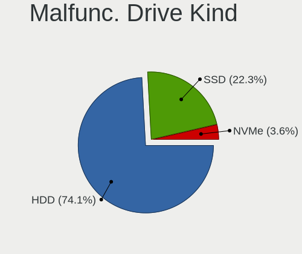
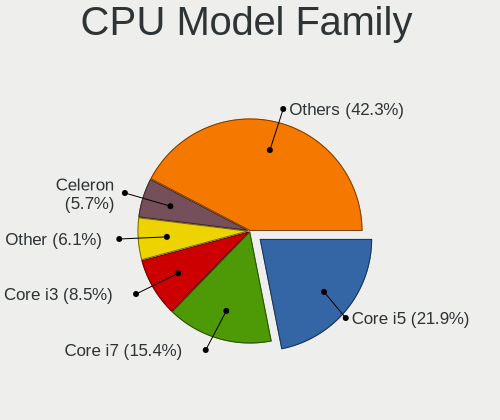
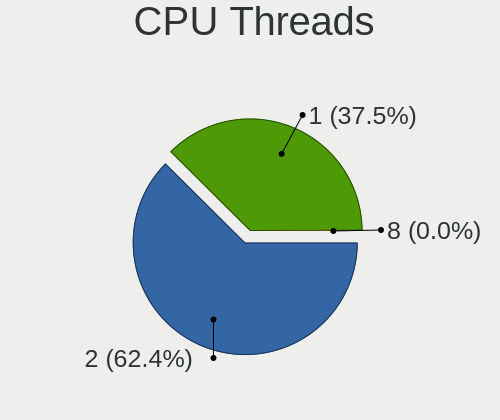
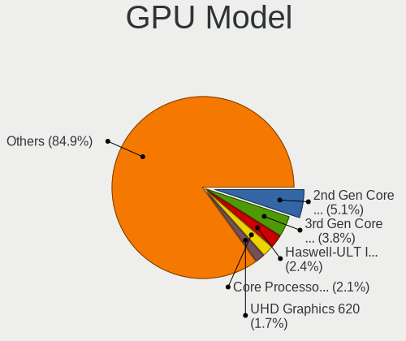
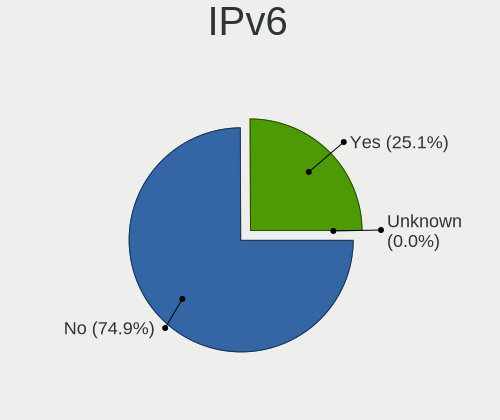

Linux Mint - Tested Hardware & Statistics
-----------------------------------------

A project to collect tested hardware configurations for Linux Mint.

Anyone can contribute to this report by the [hw-probe](https://github.com/linuxhw/hw-probe) tool:

    sudo -E hw-probe -all -upload

Please contribute! Especially if your hardware is rare.

This is a report for all computer types. See also reports for [desktops](/Dist/Linux_Mint/Desktop/README.md) and [notebooks](/Dist/Linux_Mint/Notebook/README.md).

Contents
--------

* [ Test Cases ](#test-cases)

* [ System ](#system)
  - [ OS                       ](#os)
  - [ OS Family                ](#os-family)
  - [ Kernel                   ](#kernel)
  - [ Kernel Family            ](#kernel-family)
  - [ Kernel Major Ver.        ](#kernel-major-ver)
  - [ Arch                     ](#arch)
  - [ DE                       ](#de)
  - [ Display Server           ](#display-server)
  - [ Display Manager          ](#display-manager)
  - [ OS Lang                  ](#os-lang)
  - [ Boot Mode                ](#boot-mode)
  - [ Filesystem               ](#filesystem)
  - [ Part. scheme             ](#part-scheme)
  - [ Dual Boot with Linux/BSD ](#dual-boot-with-linuxbsd)
  - [ Dual Boot (Win)          ](#dual-boot-win)

* [ Board ](#board)
  - [ Vendor                   ](#vendor)
  - [ Model                    ](#model)
  - [ Model Family             ](#model-family)
  - [ MFG Year                 ](#mfg-year)
  - [ Form Factor              ](#form-factor)
  - [ Secure Boot              ](#secure-boot)
  - [ Coreboot                 ](#coreboot)
  - [ RAM Size                 ](#ram-size)
  - [ RAM Used                 ](#ram-used)
  - [ Total Drives             ](#total-drives)
  - [ Has CD-ROM               ](#has-cd-rom)
  - [ Has Ethernet             ](#has-ethernet)
  - [ Has WiFi                 ](#has-wifi)
  - [ Has Bluetooth            ](#has-bluetooth)

* [ Location ](#location)
  - [ Country                  ](#country)
  - [ City                     ](#city)

* [ Drives ](#drives)
  - [ Drive Vendor             ](#drive-vendor)
  - [ Drive Model              ](#drive-model)
  - [ HDD Vendor               ](#hdd-vendor)
  - [ SSD Vendor               ](#ssd-vendor)
  - [ Drive Kind               ](#drive-kind)
  - [ Drive Connector          ](#drive-connector)
  - [ Drive Size               ](#drive-size)
  - [ Space Total              ](#space-total)
  - [ Space Used               ](#space-used)
  - [ Malfunc. Drives          ](#malfunc-drives)
  - [ Malfunc. Drive Vendor    ](#malfunc-drive-vendor)
  - [ Malfunc. HDD Vendor      ](#malfunc-hdd-vendor)
  - [ Malfunc. Drive Kind      ](#malfunc-drive-kind)
  - [ Failed Drives            ](#failed-drives)
  - [ Failed Drive Vendor      ](#failed-drive-vendor)
  - [ Drive Status             ](#drive-status)

* [ Storage controller ](#storage-controller)
  - [ Storage Vendor           ](#storage-vendor)
  - [ Storage Model            ](#storage-model)
  - [ Storage Kind             ](#storage-kind)

* [ Processor ](#processor)
  - [ CPU Vendor               ](#cpu-vendor)
  - [ CPU Model                ](#cpu-model)
  - [ CPU Model Family         ](#cpu-model-family)
  - [ CPU Cores                ](#cpu-cores)
  - [ CPU Sockets              ](#cpu-sockets)
  - [ CPU Threads              ](#cpu-threads)
  - [ CPU Op-Modes             ](#cpu-op-modes)
  - [ CPU Microcode            ](#cpu-microcode)
  - [ CPU Microarch            ](#cpu-microarch)

* [ Graphics ](#graphics)
  - [ GPU Vendor               ](#gpu-vendor)
  - [ GPU Model                ](#gpu-model)
  - [ GPU Combo                ](#gpu-combo)
  - [ GPU Driver               ](#gpu-driver)
  - [ GPU Memory               ](#gpu-memory)

* [ Monitor ](#monitor)
  - [ Monitor Vendor           ](#monitor-vendor)
  - [ Monitor Model            ](#monitor-model)
  - [ Monitor Resolution       ](#monitor-resolution)
  - [ Monitor Diagonal         ](#monitor-diagonal)
  - [ Monitor Width            ](#monitor-width)
  - [ Aspect Ratio             ](#aspect-ratio)
  - [ Monitor Area             ](#monitor-area)
  - [ Pixel Density            ](#pixel-density)
  - [ Multiple Monitors        ](#multiple-monitors)

* [ Network ](#network)
  - [ Net Controller Vendor    ](#net-controller-vendor)
  - [ Net Controller Model     ](#net-controller-model)
  - [ Wireless Vendor          ](#wireless-vendor)
  - [ Wireless Model           ](#wireless-model)
  - [ Ethernet Vendor          ](#ethernet-vendor)
  - [ Ethernet Model           ](#ethernet-model)
  - [ Net Controller Kind      ](#net-controller-kind)
  - [ Used Controller          ](#used-controller)
  - [ NICs                     ](#nics)
  - [ IPv6                     ](#ipv6)

* [ Bluetooth ](#bluetooth)
  - [ Bluetooth Vendor         ](#bluetooth-vendor)
  - [ Bluetooth Model          ](#bluetooth-model)

* [ Sound ](#sound)
  - [ Sound Vendor             ](#sound-vendor)
  - [ Sound Model              ](#sound-model)

* [ Memory ](#memory)
  - [ Memory Vendor            ](#memory-vendor)
  - [ Memory Model             ](#memory-model)
  - [ Memory Kind              ](#memory-kind)
  - [ Memory Form Factor       ](#memory-form-factor)
  - [ Memory Size              ](#memory-size)
  - [ Memory Speed             ](#memory-speed)

* [ Printers & scanners ](#printers--scanners)
  - [ Printer Vendor           ](#printer-vendor)
  - [ Printer Model            ](#printer-model)
  - [ Scanner Vendor           ](#scanner-vendor)
  - [ Scanner Model            ](#scanner-model)

* [ Camera ](#camera)
  - [ Camera Vendor            ](#camera-vendor)
  - [ Camera Model             ](#camera-model)

* [ Security ](#security)
  - [ Fingerprint Vendor       ](#fingerprint-vendor)
  - [ Fingerprint Model        ](#fingerprint-model)
  - [ Chipcard Vendor          ](#chipcard-vendor)
  - [ Chipcard Model           ](#chipcard-model)

* [ Unsupported ](#unsupported)
  - [ Unsupported Devices      ](#unsupported-devices)
  - [ Unsupported Device Types ](#unsupported-device-types)

Test Cases
----------

Total: 24497

| Vendor        | Model                       | Form-Factor | Probe                                                      | Date         |
|---------------|-----------------------------|-------------|------------------------------------------------------------|--------------|
| ASUSTek       | P8Z77-V LX                  | Desktop     | [ecd633a350](https://linux-hardware.org/?probe=ecd633a350) | Apr 01, 2023 |
| Biostar       | A740G M2+                   | Desktop     | [182d84f68a](https://linux-hardware.org/?probe=182d84f68a) | Apr 01, 2023 |
| Acer          | H11H4-AI V:1.0              | Desktop     | [d5337ce0e3](https://linux-hardware.org/?probe=d5337ce0e3) | Apr 01, 2023 |
| HP            | 8431                        | All in one  | [577af5a471](https://linux-hardware.org/?probe=577af5a471) | Apr 01, 2023 |
| AZW           | Green G3                    | Desktop     | [a987d9a5c1](https://linux-hardware.org/?probe=a987d9a5c1) | Apr 01, 2023 |
| ASRock        | H470M-STX                   | Desktop     | [c1f349f579](https://linux-hardware.org/?probe=c1f349f579) | Apr 01, 2023 |
| Acer          | Nitro AN517-54              | Notebook    | [82d28ac7c0](https://linux-hardware.org/?probe=82d28ac7c0) | Apr 01, 2023 |
| Lenovo        | G50-45 80E3                 | Notebook    | [059e2e5858](https://linux-hardware.org/?probe=059e2e5858) | Apr 01, 2023 |
| Acer          | Aspire A515-56              | Notebook    | [a959d79d84](https://linux-hardware.org/?probe=a959d79d84) | Apr 01, 2023 |
| Gigabyte      | GA-MA785GM-US2H             | Desktop     | [e9fe5cb307](https://linux-hardware.org/?probe=e9fe5cb307) | Apr 01, 2023 |
| ASUSTek       | SABERTOOTH 990FX R2.0       | Desktop     | [d80d075b91](https://linux-hardware.org/?probe=d80d075b91) | Apr 01, 2023 |
| Acer          | Aspire A515-56              | Notebook    | [db53e1a333](https://linux-hardware.org/?probe=db53e1a333) | Apr 01, 2023 |
| HP            | 18E7                        | Desktop     | [98319f4504](https://linux-hardware.org/?probe=98319f4504) | Apr 01, 2023 |
| Lenovo        | IdeaPad L340-15IRH Gamin... | Notebook    | [27fbf62ba0](https://linux-hardware.org/?probe=27fbf62ba0) | Apr 01, 2023 |
| Dell          | 0GY6Y8 A03                  | Desktop     | [7754565ec1](https://linux-hardware.org/?probe=7754565ec1) | Apr 01, 2023 |
| Dell          | Latitude E7470              | Notebook    | [ee66bc49a5](https://linux-hardware.org/?probe=ee66bc49a5) | Apr 01, 2023 |
| Valve         | Jupiter                     | Notebook    | [816e9cb6f6](https://linux-hardware.org/?probe=816e9cb6f6) | Apr 01, 2023 |
| Lenovo        | IdeaPad Gaming 3 15ACH6 ... | Notebook    | [0a028a43f8](https://linux-hardware.org/?probe=0a028a43f8) | Apr 01, 2023 |
| HP            | Pavilion x2 Detachable      | Notebook    | [363d925d25](https://linux-hardware.org/?probe=363d925d25) | Apr 01, 2023 |
| ASUSTek       | X556UAK                     | Notebook    | [24f79c68f6](https://linux-hardware.org/?probe=24f79c68f6) | Mar 31, 2023 |
| Apple         | Mac-942B5BF58194151B        | All in one  | [d9a7a6ccf6](https://linux-hardware.org/?probe=d9a7a6ccf6) | Mar 31, 2023 |
| Positivo      | S14CT01                     | Notebook    | [a47919fcc4](https://linux-hardware.org/?probe=a47919fcc4) | Mar 31, 2023 |
| MSI           | Z170A KRAIT GAMING 3X       | Desktop     | [672242513c](https://linux-hardware.org/?probe=672242513c) | Mar 31, 2023 |
| ASUSTek       | A58M-A/BR                   | Desktop     | [90724dc86e](https://linux-hardware.org/?probe=90724dc86e) | Mar 31, 2023 |
| Acer          | Aspire E5-571               | Notebook    | [45887eb5f3](https://linux-hardware.org/?probe=45887eb5f3) | Mar 31, 2023 |
| MSI           | B450 TOMAHAWK MAX II        | Desktop     | [a89c429c84](https://linux-hardware.org/?probe=a89c429c84) | Mar 31, 2023 |
| Acer          | TravelMate 8172Z            | Notebook    | [10cc090653](https://linux-hardware.org/?probe=10cc090653) | Mar 31, 2023 |
| Apple         | Mac-F4238CC8 PVT            | All in one  | [c767575f27](https://linux-hardware.org/?probe=c767575f27) | Mar 31, 2023 |
| Gigabyte      | X570 I AORUS PRO WIFI       | Desktop     | [871b458080](https://linux-hardware.org/?probe=871b458080) | Mar 31, 2023 |
| Fujitsu Si... | AMILO A Series              | Notebook    | [e551dfea34](https://linux-hardware.org/?probe=e551dfea34) | Mar 31, 2023 |
| HP            | EliteBook 2530p (KR059AV... | Notebook    | [e7f9bce466](https://linux-hardware.org/?probe=e7f9bce466) | Mar 31, 2023 |
| Gigabyte      | B450 GAMING X               | Desktop     | [495c58a5c6](https://linux-hardware.org/?probe=495c58a5c6) | Mar 31, 2023 |
| Gigabyte      | A320M-S2H-CF                | Desktop     | [1c982255fa](https://linux-hardware.org/?probe=1c982255fa) | Mar 31, 2023 |
| ASRock        | FM2A55M-DGS                 | Desktop     | [3ab2e2c720](https://linux-hardware.org/?probe=3ab2e2c720) | Mar 31, 2023 |
| Gigabyte      | B460M AORUS ELITE           | Desktop     | [87145cd4b2](https://linux-hardware.org/?probe=87145cd4b2) | Mar 31, 2023 |
| Apple         | Mac-BE088AF8C5EB4FA2 iMa... | All in one  | [19b2ae81ff](https://linux-hardware.org/?probe=19b2ae81ff) | Mar 31, 2023 |
| HP            | EliteBook 1040 14 inch G... | Notebook    | [488dc3a686](https://linux-hardware.org/?probe=488dc3a686) | Mar 31, 2023 |
| Dell          | Inspiron 5567               | Notebook    | [fe5578a96e](https://linux-hardware.org/?probe=fe5578a96e) | Mar 31, 2023 |
| HP            | EliteBook 1040 14 inch G... | Notebook    | [bf1af4af46](https://linux-hardware.org/?probe=bf1af4af46) | Mar 31, 2023 |
| Dell          | Latitude 7490               | Notebook    | [06928c624b](https://linux-hardware.org/?probe=06928c624b) | Mar 31, 2023 |
| ASUSTek       | N552VX                      | Notebook    | [cacf95c277](https://linux-hardware.org/?probe=cacf95c277) | Mar 30, 2023 |
| ASRock        | A320M-HDV R4.0              | Desktop     | [f5e2675cdd](https://linux-hardware.org/?probe=f5e2675cdd) | Mar 30, 2023 |
| HP            | Pavilion Laptop 15-cw1xx... | Notebook    | [f5db7a6030](https://linux-hardware.org/?probe=f5db7a6030) | Mar 30, 2023 |
| Dell          | 072T6D A01                  | Server      | [be75097d0f](https://linux-hardware.org/?probe=be75097d0f) | Mar 30, 2023 |
| Apple         | Mac-F65AE981FFA204ED Mac... | Mini pc     | [7edc7c9f47](https://linux-hardware.org/?probe=7edc7c9f47) | Mar 30, 2023 |
| Lenovo        | Flex 2-14 20404             | Notebook    | [f24b481b5b](https://linux-hardware.org/?probe=f24b481b5b) | Mar 30, 2023 |
| HP            | 339A                        | Desktop     | [8f484ab259](https://linux-hardware.org/?probe=8f484ab259) | Mar 30, 2023 |
| Sony          | SVF1521C2EW                 | Notebook    | [978ae8afac](https://linux-hardware.org/?probe=978ae8afac) | Mar 30, 2023 |
| Acer          | Aspire A515-52G             | Notebook    | [8f357ff3e8](https://linux-hardware.org/?probe=8f357ff3e8) | Mar 30, 2023 |
| Fujitsu       | LIFEBOOK E781               | Notebook    | [581f3f6547](https://linux-hardware.org/?probe=581f3f6547) | Mar 30, 2023 |
| Foxconn       | ETON                        | Desktop     | [52e92b5803](https://linux-hardware.org/?probe=52e92b5803) | Mar 30, 2023 |
| HP            | Laptop 15s-fq2xxx           | Notebook    | [f78b6ab8c5](https://linux-hardware.org/?probe=f78b6ab8c5) | Mar 30, 2023 |
| HP            | Pavilion Laptop 15-cs1xx... | Notebook    | [c68415cbb6](https://linux-hardware.org/?probe=c68415cbb6) | Mar 30, 2023 |
| ECS           | H81H3-WM                    | Desktop     | [cbf3d55d63](https://linux-hardware.org/?probe=cbf3d55d63) | Mar 30, 2023 |
| Google        | Dragonair                   | Notebook    | [3f9f70991f](https://linux-hardware.org/?probe=3f9f70991f) | Mar 30, 2023 |
| MSI           | Z97 PC Mate                 | Desktop     | [1e3ec03234](https://linux-hardware.org/?probe=1e3ec03234) | Mar 30, 2023 |
| MSI           | Z97 PC Mate                 | Desktop     | [fe068bd78d](https://linux-hardware.org/?probe=fe068bd78d) | Mar 30, 2023 |
| Lenovo        | Unknown                     | Notebook    | [04d5f7141a](https://linux-hardware.org/?probe=04d5f7141a) | Mar 30, 2023 |
| HP            | Laptop 15-dy2xxx            | Notebook    | [50f1a552d8](https://linux-hardware.org/?probe=50f1a552d8) | Mar 30, 2023 |
| HUAWEI        | BOHB-WAX9                   | Notebook    | [6ade0ea04f](https://linux-hardware.org/?probe=6ade0ea04f) | Mar 30, 2023 |
| Lenovo        | SKYBAY SDK0J40705 WIN 34... | Desktop     | [936e8b10c5](https://linux-hardware.org/?probe=936e8b10c5) | Mar 30, 2023 |
| MSI           | B550-A PRO                  | Desktop     | [b4a4247459](https://linux-hardware.org/?probe=b4a4247459) | Mar 29, 2023 |
| ASUSTek       | ZenBook UX431FAC_UX431FA    | Notebook    | [60e9294662](https://linux-hardware.org/?probe=60e9294662) | Mar 29, 2023 |
| Notebook      | N8xxEP6                     | Notebook    | [bb4ab60dc1](https://linux-hardware.org/?probe=bb4ab60dc1) | Mar 29, 2023 |
| ASUSTek       | M4A79 Deluxe                | Desktop     | [59c5a88b80](https://linux-hardware.org/?probe=59c5a88b80) | Mar 29, 2023 |
| Dell          | 0V52N7 A00                  | Server      | [0d03906a97](https://linux-hardware.org/?probe=0d03906a97) | Mar 29, 2023 |
| ASUSTek       | M5A97 R2.0                  | Desktop     | [7483952d78](https://linux-hardware.org/?probe=7483952d78) | Mar 29, 2023 |
| Lenovo        | 3111 NOK                    | Desktop     | [f6004f6817](https://linux-hardware.org/?probe=f6004f6817) | Mar 29, 2023 |
| ASUSTek       | P7P55D-E                    | Desktop     | [3db646f782](https://linux-hardware.org/?probe=3db646f782) | Mar 29, 2023 |
| ASRock        | B550M Pro4                  | Desktop     | [a78f53a6b4](https://linux-hardware.org/?probe=a78f53a6b4) | Mar 29, 2023 |
| ASUSTek       | F7L                         | Notebook    | [8d6f90f843](https://linux-hardware.org/?probe=8d6f90f843) | Mar 29, 2023 |
| HP            | Laptop 17-by0xxx            | Notebook    | [89a0332dfd](https://linux-hardware.org/?probe=89a0332dfd) | Mar 29, 2023 |
| ASRock        | B550M Pro4                  | Desktop     | [a4c3b109dc](https://linux-hardware.org/?probe=a4c3b109dc) | Mar 29, 2023 |
| ASUSTek       | F7L                         | Notebook    | [cdc5ab3b8a](https://linux-hardware.org/?probe=cdc5ab3b8a) | Mar 29, 2023 |
| HP            | 806A                        | Desktop     | [477b1e2d83](https://linux-hardware.org/?probe=477b1e2d83) | Mar 29, 2023 |
| Lenovo        | ThinkPad T460p 20HYSJKDO... | Notebook    | [1d24c2743f](https://linux-hardware.org/?probe=1d24c2743f) | Mar 29, 2023 |
| Samsung       | 370E4K                      | Notebook    | [68e9294ac9](https://linux-hardware.org/?probe=68e9294ac9) | Mar 29, 2023 |
| Daten Tecn... | DQ77PRO                     | Desktop     | [86885bfc03](https://linux-hardware.org/?probe=86885bfc03) | Mar 29, 2023 |
| HUAWEI        | BOHK-WAX9X                  | Notebook    | [3836173aad](https://linux-hardware.org/?probe=3836173aad) | Mar 29, 2023 |
| ASUSTek       | ZenBook UX463FL_UX463FL     | Convertible | [2798c67b5c](https://linux-hardware.org/?probe=2798c67b5c) | Mar 29, 2023 |
| Clevo         | W150HNM/W170HN              | Notebook    | [8a86bbf31c](https://linux-hardware.org/?probe=8a86bbf31c) | Mar 29, 2023 |
| Lenovo        | 3111 NOK                    | Desktop     | [6ef94ade27](https://linux-hardware.org/?probe=6ef94ade27) | Mar 29, 2023 |
| HOUTER        | IPMH61R1                    | Desktop     | [bcabc2573c](https://linux-hardware.org/?probe=bcabc2573c) | Mar 29, 2023 |
| HUAWEI        | BOHK-WAX9X                  | Notebook    | [46a8636dfd](https://linux-hardware.org/?probe=46a8636dfd) | Mar 29, 2023 |
| HP            | 2B3E                        | All in one  | [c87eebfd5f](https://linux-hardware.org/?probe=c87eebfd5f) | Mar 29, 2023 |
| HP            | Mini 1103                   | Notebook    | [f28121cfc6](https://linux-hardware.org/?probe=f28121cfc6) | Mar 29, 2023 |
| Gigabyte      | GA-MA790FXT-UD5P            | Desktop     | [452a3fa4a8](https://linux-hardware.org/?probe=452a3fa4a8) | Mar 29, 2023 |
| Acer          | H11H4-AI V:1.0              | Desktop     | [4266c0287d](https://linux-hardware.org/?probe=4266c0287d) | Mar 29, 2023 |
| Apple         | MacBookPro8,3               | Notebook    | [90fadbf903](https://linux-hardware.org/?probe=90fadbf903) | Mar 28, 2023 |
| HP            | 3398                        | Desktop     | [ed9f84a231](https://linux-hardware.org/?probe=ed9f84a231) | Mar 28, 2023 |
| Dell          | Latitude 3520               | Notebook    | [a175e08fce](https://linux-hardware.org/?probe=a175e08fce) | Mar 28, 2023 |
| Dell          | Latitude 3520               | Notebook    | [9c7a9b9282](https://linux-hardware.org/?probe=9c7a9b9282) | Mar 28, 2023 |
| HP            | ProBook 640 G1              | Notebook    | [c9ac2eb353](https://linux-hardware.org/?probe=c9ac2eb353) | Mar 28, 2023 |
| Lenovo        | ThinkPad X1 Carbon 7th 2... | Notebook    | [78e2b83e31](https://linux-hardware.org/?probe=78e2b83e31) | Mar 28, 2023 |
| HP            | 0AACh                       | Desktop     | [43dbfddd1b](https://linux-hardware.org/?probe=43dbfddd1b) | Mar 28, 2023 |
| Dell          | G3 3579                     | Notebook    | [55b5db4326](https://linux-hardware.org/?probe=55b5db4326) | Mar 28, 2023 |
| Unknown       | Unknown                     | Notebook    | [d89991a0f3](https://linux-hardware.org/?probe=d89991a0f3) | Mar 28, 2023 |
| ASUSTek       | N61Jq                       | Notebook    | [0ca1f04770](https://linux-hardware.org/?probe=0ca1f04770) | Mar 28, 2023 |
| Apple         | MacBookPro5,1               | Notebook    | [b06257fd9c](https://linux-hardware.org/?probe=b06257fd9c) | Mar 28, 2023 |
| Sony          | SVF1521C2EW                 | Notebook    | [2bafb0a0e4](https://linux-hardware.org/?probe=2bafb0a0e4) | Mar 28, 2023 |
| Gigabyte      | X58A-UD3R                   | Desktop     | [74d9c5e704](https://linux-hardware.org/?probe=74d9c5e704) | Mar 28, 2023 |
| Apple         | MacBookPro5,1               | Notebook    | [3a0d77d195](https://linux-hardware.org/?probe=3a0d77d195) | Mar 28, 2023 |
| ASUSTek       | A88XM-A                     | Desktop     | [405e95a907](https://linux-hardware.org/?probe=405e95a907) | Mar 28, 2023 |
| Gigabyte      | X470 AORUS GAMING 7 WIFI... | Desktop     | [9c9e155f84](https://linux-hardware.org/?probe=9c9e155f84) | Mar 28, 2023 |
| Lenovo        | IdeaPad S145-14IWL          | Notebook    | [91f36f67a4](https://linux-hardware.org/?probe=91f36f67a4) | Mar 28, 2023 |
| ASUSTek       | ROG STRIX Z390-F GAMING     | Desktop     | [611b42e6fd](https://linux-hardware.org/?probe=611b42e6fd) | Mar 28, 2023 |
| Dell          | Inspiron N5110              | Notebook    | [2b09d1f769](https://linux-hardware.org/?probe=2b09d1f769) | Mar 28, 2023 |
| Unknown       | Unknown                     | Notebook    | [be297867f3](https://linux-hardware.org/?probe=be297867f3) | Mar 28, 2023 |
| Intel         | NUC7i5BNB J31144-314        | Mini pc     | [a43e1a0769](https://linux-hardware.org/?probe=a43e1a0769) | Mar 27, 2023 |
| Lenovo        | Legion 5 15ACH6H 82JU       | Notebook    | [08e7388619](https://linux-hardware.org/?probe=08e7388619) | Mar 27, 2023 |
| HP            | Elite x2 1012 G2 Tablet     | Tablet      | [6df6d52151](https://linux-hardware.org/?probe=6df6d52151) | Mar 27, 2023 |
| HP            | Elite x2 1012 G2 Tablet     | Tablet      | [0963882502](https://linux-hardware.org/?probe=0963882502) | Mar 27, 2023 |
| Dell          | Inspiron 5735               | Notebook    | [823a6ece98](https://linux-hardware.org/?probe=823a6ece98) | Mar 27, 2023 |
| ASUSTek       | X45A                        | Notebook    | [a0401520d5](https://linux-hardware.org/?probe=a0401520d5) | Mar 27, 2023 |
| ASUSTek       | X45A                        | Notebook    | [dbe8e77436](https://linux-hardware.org/?probe=dbe8e77436) | Mar 27, 2023 |
| Acer          | Aspire 7745G                | Notebook    | [9303cda87a](https://linux-hardware.org/?probe=9303cda87a) | Mar 27, 2023 |
| MSI           | MPG B550 GAMING PLUS        | Desktop     | [011d1b8bf7](https://linux-hardware.org/?probe=011d1b8bf7) | Mar 27, 2023 |
| Dell          | XPS 15 9530                 | Notebook    | [c5a3b374a7](https://linux-hardware.org/?probe=c5a3b374a7) | Mar 27, 2023 |
| ASUSTek       | H110-PLUS                   | Desktop     | [b108ebc14f](https://linux-hardware.org/?probe=b108ebc14f) | Mar 27, 2023 |
| Dell          | XPS 13 7390                 | Notebook    | [aaeb6059a2](https://linux-hardware.org/?probe=aaeb6059a2) | Mar 27, 2023 |
| Dell          | 0200DY A02                  | Desktop     | [4f8515b9ed](https://linux-hardware.org/?probe=4f8515b9ed) | Mar 27, 2023 |
| ASUSTek       | M5A97 EVO R2.0              | Desktop     | [9f3138d8d5](https://linux-hardware.org/?probe=9f3138d8d5) | Mar 27, 2023 |
| Haier         | S15                         | Notebook    | [a75654fe8a](https://linux-hardware.org/?probe=a75654fe8a) | Mar 27, 2023 |
| ASRock        | AM1B-ITX                    | Desktop     | [e5dc5f70ac](https://linux-hardware.org/?probe=e5dc5f70ac) | Mar 27, 2023 |
| ASUSTek       | N3150I-C                    | Desktop     | [6c977806a1](https://linux-hardware.org/?probe=6c977806a1) | Mar 27, 2023 |
| MSI           | PRO B660-A DDR4             | Desktop     | [6a882b7826](https://linux-hardware.org/?probe=6a882b7826) | Mar 27, 2023 |
| HP            | ProBook 6550b               | Notebook    | [4629264a10](https://linux-hardware.org/?probe=4629264a10) | Mar 27, 2023 |
| Gigabyte      | GA-970A-UD3                 | Desktop     | [8a713b663d](https://linux-hardware.org/?probe=8a713b663d) | Mar 27, 2023 |
| Samsung       | N150P/N210P/N220P           | Notebook    | [70d943698c](https://linux-hardware.org/?probe=70d943698c) | Mar 27, 2023 |
| HP            | EliteBook 840 G5            | Notebook    | [405ce5a9c8](https://linux-hardware.org/?probe=405ce5a9c8) | Mar 27, 2023 |
| Acer          | TravelMate P653-M           | Notebook    | [625243d39f](https://linux-hardware.org/?probe=625243d39f) | Mar 26, 2023 |
| Toshiba       | Satellite C55t-C            | Notebook    | [758abe1fb4](https://linux-hardware.org/?probe=758abe1fb4) | Mar 26, 2023 |
| Dell          | Latitude E7450              | Notebook    | [523d3dc9fa](https://linux-hardware.org/?probe=523d3dc9fa) | Mar 26, 2023 |
| Huanan        | X99-F8 GAMING V5.0          | Desktop     | [922d8a7941](https://linux-hardware.org/?probe=922d8a7941) | Mar 26, 2023 |
| Gigabyte      | MRHM3AP                     | Desktop     | [27ac802035](https://linux-hardware.org/?probe=27ac802035) | Mar 26, 2023 |
| Gigabyte      | H67MA-USB3-B3               | Desktop     | [ae3d30a042](https://linux-hardware.org/?probe=ae3d30a042) | Mar 26, 2023 |
| Gigabyte      | H67MA-USB3-B3               | Desktop     | [b31a6f01f6](https://linux-hardware.org/?probe=b31a6f01f6) | Mar 26, 2023 |
| MSI           | A68HM-E33 V2                | Desktop     | [1531761af6](https://linux-hardware.org/?probe=1531761af6) | Mar 26, 2023 |
| HP            | Pavilion dv7                | Notebook    | [6ae381093b](https://linux-hardware.org/?probe=6ae381093b) | Mar 26, 2023 |
| Fujitsu Si... | AMILO A Series              | Notebook    | [58391da932](https://linux-hardware.org/?probe=58391da932) | Mar 26, 2023 |
| Lenovo        | ThinkPad T520 4243RP3       | Notebook    | [38fa314d2f](https://linux-hardware.org/?probe=38fa314d2f) | Mar 26, 2023 |
| Dell          | 0VHRW1 A03                  | Desktop     | [9aa3215de8](https://linux-hardware.org/?probe=9aa3215de8) | Mar 26, 2023 |
| Acer          | Aspire 7741                 | Notebook    | [176930d8ed](https://linux-hardware.org/?probe=176930d8ed) | Mar 26, 2023 |
| Apple         | MacBookPro5,1               | Notebook    | [10eec43a14](https://linux-hardware.org/?probe=10eec43a14) | Mar 26, 2023 |
| HP            | 620                         | Notebook    | [550c23f9a3](https://linux-hardware.org/?probe=550c23f9a3) | Mar 26, 2023 |
| ASUSTek       | M2N68-AM Plus               | Desktop     | [e274c03773](https://linux-hardware.org/?probe=e274c03773) | Mar 26, 2023 |
| Acer          | Aspire 7741                 | Notebook    | [d41b865ed2](https://linux-hardware.org/?probe=d41b865ed2) | Mar 26, 2023 |
| ASUSTek       | T100HAN                     | Notebook    | [c1f3b9658c](https://linux-hardware.org/?probe=c1f3b9658c) | Mar 26, 2023 |
| Gigabyte      | G5 KF                       | Notebook    | [5275b7d43a](https://linux-hardware.org/?probe=5275b7d43a) | Mar 26, 2023 |
| Lenovo        | SHARKBAY NOK                | Desktop     | [74cf067852](https://linux-hardware.org/?probe=74cf067852) | Mar 26, 2023 |
| Gigabyte      | G5 KF                       | Notebook    | [9dd2faffb3](https://linux-hardware.org/?probe=9dd2faffb3) | Mar 26, 2023 |
| ASUSTek       | T100HAN                     | Notebook    | [3f74c992e7](https://linux-hardware.org/?probe=3f74c992e7) | Mar 26, 2023 |
| HUAWEI        | BOD-WXX9                    | Notebook    | [bee83a6b50](https://linux-hardware.org/?probe=bee83a6b50) | Mar 26, 2023 |
| Dell          | 0VHRW1 A03                  | Desktop     | [129c2be9aa](https://linux-hardware.org/?probe=129c2be9aa) | Mar 26, 2023 |
| Dell          | Inspiron N5110              | Notebook    | [8fde777c54](https://linux-hardware.org/?probe=8fde777c54) | Mar 26, 2023 |
| ASUSTek       | PRIME B365M-A               | Desktop     | [83fb0eaf6e](https://linux-hardware.org/?probe=83fb0eaf6e) | Mar 26, 2023 |
| Dell          | Latitude 3590               | Notebook    | [5d1ac262f4](https://linux-hardware.org/?probe=5d1ac262f4) | Mar 26, 2023 |
| HP            | 0B54h D                     | Desktop     | [3edc678017](https://linux-hardware.org/?probe=3edc678017) | Mar 26, 2023 |
| Shenzhen M... | HX90G                       | Desktop     | [b6bd6cab94](https://linux-hardware.org/?probe=b6bd6cab94) | Mar 26, 2023 |
| Acer          | Aspire A515-43              | Notebook    | [1812fe9a19](https://linux-hardware.org/?probe=1812fe9a19) | Mar 26, 2023 |
| Acer          | Aspire A515-43              | Notebook    | [a302d93972](https://linux-hardware.org/?probe=a302d93972) | Mar 26, 2023 |
| ASUSTek       | E200HA                      | Notebook    | [5dfef9c764](https://linux-hardware.org/?probe=5dfef9c764) | Mar 26, 2023 |
| Lenovo        | Y520-15IKBN 80WK            | Notebook    | [8a6705ba5a](https://linux-hardware.org/?probe=8a6705ba5a) | Mar 26, 2023 |
| Lenovo        | Y520-15IKBN 80WK            | Notebook    | [d1427e69b3](https://linux-hardware.org/?probe=d1427e69b3) | Mar 26, 2023 |
| ASUSTek       | X55U                        | Notebook    | [764682127e](https://linux-hardware.org/?probe=764682127e) | Mar 26, 2023 |
| HP            | ProBook 430 G6              | Notebook    | [cd14b86548](https://linux-hardware.org/?probe=cd14b86548) | Mar 25, 2023 |
| ASUSTek       | Maximus VIII GENE           | Desktop     | [71ba42d727](https://linux-hardware.org/?probe=71ba42d727) | Mar 25, 2023 |
| ASUSTek       | Maximus VIII GENE           | Desktop     | [33ba03aebe](https://linux-hardware.org/?probe=33ba03aebe) | Mar 25, 2023 |
| ASUSTek       | P5G41T-M LX2/GB             | Desktop     | [8f04388ab5](https://linux-hardware.org/?probe=8f04388ab5) | Mar 25, 2023 |
| Lenovo        | ThinkPad E15 Gen 4 21EES... | Notebook    | [79c876bced](https://linux-hardware.org/?probe=79c876bced) | Mar 25, 2023 |
| Fujitsu       | D3220-A1 S26361-D3220-A1    | Desktop     | [cb325c06e8](https://linux-hardware.org/?probe=cb325c06e8) | Mar 25, 2023 |
| Dell          | Latitude 5520               | Notebook    | [47372d09fe](https://linux-hardware.org/?probe=47372d09fe) | Mar 25, 2023 |
| Dell          | Latitude 5520               | Notebook    | [0c69ef5724](https://linux-hardware.org/?probe=0c69ef5724) | Mar 25, 2023 |
| HP            | Laptop 15-dw3xxx            | Notebook    | [3b8cd70b69](https://linux-hardware.org/?probe=3b8cd70b69) | Mar 25, 2023 |
| HP            | Pavilion Laptop 14-ce3xx... | Notebook    | [1ea635d2a0](https://linux-hardware.org/?probe=1ea635d2a0) | Mar 25, 2023 |
| MSI           | H81M-P33                    | Desktop     | [0944bc82b9](https://linux-hardware.org/?probe=0944bc82b9) | Mar 25, 2023 |
| MSI           | PRO B660-A DDR4             | Desktop     | [ef9408ce57](https://linux-hardware.org/?probe=ef9408ce57) | Mar 25, 2023 |
| Medion        | E6214                       | Notebook    | [0dd02b9353](https://linux-hardware.org/?probe=0dd02b9353) | Mar 25, 2023 |
| Intel         | D2700DC AAG32420-602        | Desktop     | [0d20e81321](https://linux-hardware.org/?probe=0d20e81321) | Mar 25, 2023 |
| Lenovo        | ThinkPad E15 Gen 4 21EES... | Notebook    | [257fa4c383](https://linux-hardware.org/?probe=257fa4c383) | Mar 25, 2023 |
| Toshiba       | KIRA                        | Notebook    | [e96de49ce8](https://linux-hardware.org/?probe=e96de49ce8) | Mar 25, 2023 |
| Toshiba       | Satellite L50D-B            | Notebook    | [d2ce6bb555](https://linux-hardware.org/?probe=d2ce6bb555) | Mar 25, 2023 |
| Lenovo        | SHARKBAY NOK                | Desktop     | [df8f872445](https://linux-hardware.org/?probe=df8f872445) | Mar 25, 2023 |
| Acer          | Aspire E1-572G              | Notebook    | [cef20904d7](https://linux-hardware.org/?probe=cef20904d7) | Mar 25, 2023 |
| MSI           | MEG X570S ACE MAX           | Desktop     | [3a32e79b17](https://linux-hardware.org/?probe=3a32e79b17) | Mar 25, 2023 |
| Acer          | Aspire 7736                 | Notebook    | [af392f60cc](https://linux-hardware.org/?probe=af392f60cc) | Mar 25, 2023 |
| Acer          | Aspire 7736                 | Notebook    | [bbe13d4e0b](https://linux-hardware.org/?probe=bbe13d4e0b) | Mar 25, 2023 |
| ASUSTek       | SABERTOOTH Z77              | Desktop     | [d5d190db2f](https://linux-hardware.org/?probe=d5d190db2f) | Mar 25, 2023 |
| AZW           | Green G3                    | Desktop     | [a0789502ab](https://linux-hardware.org/?probe=a0789502ab) | Mar 25, 2023 |
| HP            | Pavilion dv6                | Notebook    | [29a94d3d9e](https://linux-hardware.org/?probe=29a94d3d9e) | Mar 25, 2023 |
| HP            | Pavilion dv6                | Notebook    | [c3a6c3f669](https://linux-hardware.org/?probe=c3a6c3f669) | Mar 25, 2023 |
| ASRock        | X99 Professional Gaming ... | Desktop     | [1cafadad17](https://linux-hardware.org/?probe=1cafadad17) | Mar 25, 2023 |
| ASRock        | X99 Professional Gaming ... | Desktop     | [38cead30d5](https://linux-hardware.org/?probe=38cead30d5) | Mar 25, 2023 |
| Lenovo        | ThinkPad X1 Yoga 2nd 20J... | Convertible | [5b3d7995b2](https://linux-hardware.org/?probe=5b3d7995b2) | Mar 25, 2023 |
| AZW           | Green G3                    | Desktop     | [7dcacb9c15](https://linux-hardware.org/?probe=7dcacb9c15) | Mar 24, 2023 |
| AXDIA Inte... | myBook PRO14 SE V2          | Notebook    | [0e604dc9d0](https://linux-hardware.org/?probe=0e604dc9d0) | Mar 24, 2023 |
| Samsung       | 950QDB                      | Convertible | [cf8d7b5959](https://linux-hardware.org/?probe=cf8d7b5959) | Mar 24, 2023 |
| HP            | 0AACh                       | Desktop     | [2a1f96ca8d](https://linux-hardware.org/?probe=2a1f96ca8d) | Mar 24, 2023 |
| HP            | EliteBook 840 G5            | Notebook    | [4e8606a29d](https://linux-hardware.org/?probe=4e8606a29d) | Mar 24, 2023 |
| Dell          | XPS 15 9550                 | Notebook    | [b6bb271247](https://linux-hardware.org/?probe=b6bb271247) | Mar 24, 2023 |
| ASUSTek       | K52Jr                       | Notebook    | [a88997ecfd](https://linux-hardware.org/?probe=a88997ecfd) | Mar 24, 2023 |
| Acer          | Aspire R5-471T              | Notebook    | [a08f9a9f41](https://linux-hardware.org/?probe=a08f9a9f41) | Mar 24, 2023 |
| ASUSTek       | M4A78T-E                    | Desktop     | [a820ffe411](https://linux-hardware.org/?probe=a820ffe411) | Mar 24, 2023 |
| Dell          | 040DDP A01                  | Desktop     | [0d62bf0ea8](https://linux-hardware.org/?probe=0d62bf0ea8) | Mar 24, 2023 |
| Gigabyte      | GA-890FXA-UD5               | Desktop     | [5fccdb098d](https://linux-hardware.org/?probe=5fccdb098d) | Mar 24, 2023 |
| Gigabyte      | H170-D3H-CF                 | Desktop     | [0bcd7ee5e8](https://linux-hardware.org/?probe=0bcd7ee5e8) | Mar 24, 2023 |
| Toshiba       | Satellite C855-12N          | Notebook    | [cb9692876c](https://linux-hardware.org/?probe=cb9692876c) | Mar 24, 2023 |
| HP            | 304Ah                       | Desktop     | [43990fede2](https://linux-hardware.org/?probe=43990fede2) | Mar 24, 2023 |
| Samsung       | 300E4A/300E5A/300E7A        | Notebook    | [d77c81e9e3](https://linux-hardware.org/?probe=d77c81e9e3) | Mar 24, 2023 |
| ASUSTek       | H110M-E/M.2                 | Desktop     | [177089e2e0](https://linux-hardware.org/?probe=177089e2e0) | Mar 24, 2023 |
| Gigabyte      | B450M DS3H-CF               | Desktop     | [81273bd2b0](https://linux-hardware.org/?probe=81273bd2b0) | Mar 24, 2023 |
| Gigabyte      | B450M DS3H-CF               | Desktop     | [2db2fb4a5a](https://linux-hardware.org/?probe=2db2fb4a5a) | Mar 24, 2023 |
| Gigabyte      | B450M DS3H-CF               | Desktop     | [79cbdbc9c1](https://linux-hardware.org/?probe=79cbdbc9c1) | Mar 24, 2023 |
| Lenovo        | ThinkBook 15 G3 ACL 21A4    | Notebook    | [2f1e23e614](https://linux-hardware.org/?probe=2f1e23e614) | Mar 24, 2023 |
| ASUSTek       | ROG STRIX Z390-F GAMING     | Desktop     | [ec6fdc917b](https://linux-hardware.org/?probe=ec6fdc917b) | Mar 24, 2023 |
| Microsoft     | Surface Book 2              | Tablet      | [4eceaeb7c1](https://linux-hardware.org/?probe=4eceaeb7c1) | Mar 24, 2023 |
| ASUSTek       | ROG STRIX B650E-I GAMING... | Desktop     | [1e549ae67e](https://linux-hardware.org/?probe=1e549ae67e) | Mar 24, 2023 |
| ReachingTe... | DreamQuest Pro 2022         | Mini pc     | [696a898cd2](https://linux-hardware.org/?probe=696a898cd2) | Mar 24, 2023 |
| Gigabyte      | Z97X-UD5H-BK                | Desktop     | [9d4137f8ea](https://linux-hardware.org/?probe=9d4137f8ea) | Mar 23, 2023 |
| Lenovo        | ThinkPad Edge E530 62722... | Notebook    | [479f7f7a25](https://linux-hardware.org/?probe=479f7f7a25) | Mar 23, 2023 |
| Dell          | 0P01GV A03                  | Desktop     | [e4d1155524](https://linux-hardware.org/?probe=e4d1155524) | Mar 23, 2023 |
| HP            | Pavilion 15                 | Notebook    | [6c184935d3](https://linux-hardware.org/?probe=6c184935d3) | Mar 23, 2023 |
| HP            | Pavilion dv7                | Notebook    | [c0cec2e941](https://linux-hardware.org/?probe=c0cec2e941) | Mar 23, 2023 |
| MSI           | A68HM-E33 V2                | Desktop     | [973daceeaa](https://linux-hardware.org/?probe=973daceeaa) | Mar 23, 2023 |
| MSI           | GP72 7RE                    | Notebook    | [729f2297cb](https://linux-hardware.org/?probe=729f2297cb) | Mar 23, 2023 |
| Intel         | DH87RL AAG74240-401         | Desktop     | [3465e562e8](https://linux-hardware.org/?probe=3465e562e8) | Mar 23, 2023 |
| ASUSTek       | P5KC                        | Desktop     | [3c4c536325](https://linux-hardware.org/?probe=3c4c536325) | Mar 23, 2023 |
| ASUSTek       | PRIME H510M-E               | Desktop     | [fc5894dcb4](https://linux-hardware.org/?probe=fc5894dcb4) | Mar 23, 2023 |
| Lenovo        | ThinkPad P1 Gen 5 21DC00... | Notebook    | [b286fb0216](https://linux-hardware.org/?probe=b286fb0216) | Mar 23, 2023 |
| Gigabyte      | G1.Sniper A88X-CF           | Desktop     | [ea6d900647](https://linux-hardware.org/?probe=ea6d900647) | Mar 23, 2023 |
| Gigabyte      | G1.Sniper A88X-CF           | Desktop     | [86d12b640c](https://linux-hardware.org/?probe=86d12b640c) | Mar 23, 2023 |
| Lenovo        | G580                        | Notebook    | [367ed9241a](https://linux-hardware.org/?probe=367ed9241a) | Mar 23, 2023 |
| MSI           | MEG X570S ACE MAX           | Desktop     | [528ed2d3af](https://linux-hardware.org/?probe=528ed2d3af) | Mar 23, 2023 |
| ASUSTek       | VivoBook_ASUSLaptop E203... | Notebook    | [036c2c771c](https://linux-hardware.org/?probe=036c2c771c) | Mar 23, 2023 |
| ASUSTek       | VivoBook_ASUSLaptop X415... | Notebook    | [fe3c64d71e](https://linux-hardware.org/?probe=fe3c64d71e) | Mar 23, 2023 |
| Samsung       | 530U3C/530U4C/532U3C        | Notebook    | [64c4a47e0e](https://linux-hardware.org/?probe=64c4a47e0e) | Mar 23, 2023 |
| MSI           | A68HM-E33 V2                | Desktop     | [2b00f56890](https://linux-hardware.org/?probe=2b00f56890) | Mar 23, 2023 |
| Lenovo        | ThinkPad L15 Gen 2 20X30... | Notebook    | [74be0519cc](https://linux-hardware.org/?probe=74be0519cc) | Mar 22, 2023 |
| Lenovo        | G580                        | Notebook    | [6ee526d77a](https://linux-hardware.org/?probe=6ee526d77a) | Mar 22, 2023 |
| ASUSTek       | H110M-E/M.2                 | Desktop     | [78b4f9cbbd](https://linux-hardware.org/?probe=78b4f9cbbd) | Mar 22, 2023 |
| Dell          | Latitude 5480               | Notebook    | [5886784510](https://linux-hardware.org/?probe=5886784510) | Mar 22, 2023 |
| Dell          | Inspiron 1750               | Notebook    | [007a0b3bb7](https://linux-hardware.org/?probe=007a0b3bb7) | Mar 22, 2023 |
| ASUSTek       | ROG STRIX B550-A GAMING     | Desktop     | [0c587f1f7f](https://linux-hardware.org/?probe=0c587f1f7f) | Mar 22, 2023 |
| Getac         | B300-X                      | Notebook    | [82ea6e2287](https://linux-hardware.org/?probe=82ea6e2287) | Mar 22, 2023 |
| Acer          | Aspire M1930                | Desktop     | [228747d646](https://linux-hardware.org/?probe=228747d646) | Mar 22, 2023 |
| Lenovo        | ThinkStation S20 4157E92    | Desktop     | [db2bde56b1](https://linux-hardware.org/?probe=db2bde56b1) | Mar 22, 2023 |
| ASUSTek       | ZenBook UX463FL_UX463FL     | Convertible | [662189c6fc](https://linux-hardware.org/?probe=662189c6fc) | Mar 22, 2023 |
| Unknown       | Unknown                     | Desktop     | [de1dd4e459](https://linux-hardware.org/?probe=de1dd4e459) | Mar 22, 2023 |
| Unknown       | Unknown                     | Desktop     | [33ebf18165](https://linux-hardware.org/?probe=33ebf18165) | Mar 22, 2023 |
| Acer          | Aspire R5-471T              | Notebook    | [1970e6ac31](https://linux-hardware.org/?probe=1970e6ac31) | Mar 22, 2023 |
| MSI           | MEG X570 ACE                | Desktop     | [c2bab115eb](https://linux-hardware.org/?probe=c2bab115eb) | Mar 22, 2023 |
| Lenovo        | ThinkPad E15 Gen 3 20YG0... | Notebook    | [e664e55602](https://linux-hardware.org/?probe=e664e55602) | Mar 22, 2023 |
| Lenovo        | ThinkPad E15 Gen 3 20YG0... | Notebook    | [e7a984f733](https://linux-hardware.org/?probe=e7a984f733) | Mar 22, 2023 |
| Lenovo        | G50-80 80E5                 | Notebook    | [f6ad6626ff](https://linux-hardware.org/?probe=f6ad6626ff) | Mar 22, 2023 |
| Gigabyte      | B150M-D3H-CF                | Desktop     | [866008d461](https://linux-hardware.org/?probe=866008d461) | Mar 22, 2023 |
| HP            | Pavilion dv4                | Notebook    | [20adc36857](https://linux-hardware.org/?probe=20adc36857) | Mar 22, 2023 |
| Gigabyte      | A320M-S2H-CF                | Desktop     | [2e6307252f](https://linux-hardware.org/?probe=2e6307252f) | Mar 22, 2023 |
| Lenovo        | ThinkPad X121e 3045A63      | Notebook    | [f4830d41d6](https://linux-hardware.org/?probe=f4830d41d6) | Mar 21, 2023 |
| Acer          | Aspire ES1-512              | Notebook    | [901b9b1b6b](https://linux-hardware.org/?probe=901b9b1b6b) | Mar 21, 2023 |
| ASUSTek       | M5A99FX PRO R2.0            | Desktop     | [8c50d5ae87](https://linux-hardware.org/?probe=8c50d5ae87) | Mar 21, 2023 |
| Toshiba       | Satellite C50-A             | Notebook    | [2a448ff4d4](https://linux-hardware.org/?probe=2a448ff4d4) | Mar 21, 2023 |
| Unknown       | Unknown                     | Notebook    | [31ee1d66d8](https://linux-hardware.org/?probe=31ee1d66d8) | Mar 21, 2023 |
| HP            | Pavilion g6                 | Notebook    | [abd4bb0963](https://linux-hardware.org/?probe=abd4bb0963) | Mar 21, 2023 |
| HP            | Pavilion g6                 | Notebook    | [4dcebf6a41](https://linux-hardware.org/?probe=4dcebf6a41) | Mar 21, 2023 |
| Dell          | 0XCR8D A00                  | Desktop     | [e86eb83730](https://linux-hardware.org/?probe=e86eb83730) | Mar 21, 2023 |
| Gigabyte      | Z77X-D3H                    | Desktop     | [aab84f14ed](https://linux-hardware.org/?probe=aab84f14ed) | Mar 21, 2023 |
| Acer          | Aspire 5253                 | Notebook    | [56b1138062](https://linux-hardware.org/?probe=56b1138062) | Mar 21, 2023 |
| Acer          | Aspire 5253                 | Notebook    | [1fe782c379](https://linux-hardware.org/?probe=1fe782c379) | Mar 21, 2023 |
| ASUSTek       | A68HM-K                     | Desktop     | [7c5033ad07](https://linux-hardware.org/?probe=7c5033ad07) | Mar 20, 2023 |
| MSI           | Katana GF76 11UE            | Notebook    | [bacac82182](https://linux-hardware.org/?probe=bacac82182) | Mar 20, 2023 |
| HP            | EliteBook 8440p             | Notebook    | [0ec744551c](https://linux-hardware.org/?probe=0ec744551c) | Mar 20, 2023 |
| Dell          | Latitude E6520              | Notebook    | [82f97b14f4](https://linux-hardware.org/?probe=82f97b14f4) | Mar 20, 2023 |
| HUAWEI        | HVY-WXX9                    | Notebook    | [fba4a165e3](https://linux-hardware.org/?probe=fba4a165e3) | Mar 20, 2023 |
| Dell          | Latitude E6520              | Notebook    | [7f92514d4e](https://linux-hardware.org/?probe=7f92514d4e) | Mar 20, 2023 |
| Dell          | 03NVJ6 A01                  | Desktop     | [2060b57720](https://linux-hardware.org/?probe=2060b57720) | Mar 20, 2023 |
| HP            | ProBook 470 G5              | Notebook    | [8335a6ae9b](https://linux-hardware.org/?probe=8335a6ae9b) | Mar 20, 2023 |
| Medion        | MS-7797                     | Desktop     | [180b0242e8](https://linux-hardware.org/?probe=180b0242e8) | Mar 20, 2023 |
| Lenovo        | ThinkBook 15 G4 ABA 21DL    | Notebook    | [ade941e14d](https://linux-hardware.org/?probe=ade941e14d) | Mar 20, 2023 |
| Google        | Sand                        | Notebook    | [cac2f4493e](https://linux-hardware.org/?probe=cac2f4493e) | Mar 20, 2023 |
| Gigabyte      | B360 AORUS GAMING 3 WIFI... | Desktop     | [e897657a4e](https://linux-hardware.org/?probe=e897657a4e) | Mar 20, 2023 |
| HP            | Elite x2 G4                 | Tablet      | [d49cba4016](https://linux-hardware.org/?probe=d49cba4016) | Mar 20, 2023 |
| Lenovo        | Yoga Duet 7 13ITL6 82MA     | Tablet      | [0fb09c29cb](https://linux-hardware.org/?probe=0fb09c29cb) | Mar 20, 2023 |
| Gigabyte      | B450M DS3H-CF               | Desktop     | [1bad88b80e](https://linux-hardware.org/?probe=1bad88b80e) | Mar 20, 2023 |
| Dell          | 0KWVT8 A00                  | Desktop     | [b15061e252](https://linux-hardware.org/?probe=b15061e252) | Mar 20, 2023 |
| HP            | 18E9                        | Desktop     | [2cc6071591](https://linux-hardware.org/?probe=2cc6071591) | Mar 20, 2023 |
| ASRock        | A320M-HDV R4.0              | Desktop     | [db7d70cd41](https://linux-hardware.org/?probe=db7d70cd41) | Mar 20, 2023 |
| HP            | Laptop 17-cp0xxx            | Notebook    | [2611e4ac10](https://linux-hardware.org/?probe=2611e4ac10) | Mar 20, 2023 |
| ASUSTek       | Maximus Extreme             | Desktop     | [c6215ec2f3](https://linux-hardware.org/?probe=c6215ec2f3) | Mar 20, 2023 |
| HP            | EliteBook 8560p             | Notebook    | [c990bd18a4](https://linux-hardware.org/?probe=c990bd18a4) | Mar 20, 2023 |
| Dell          | XPS MXC062                  | Notebook    | [a1913f3e4a](https://linux-hardware.org/?probe=a1913f3e4a) | Mar 20, 2023 |
| Dell          | Inspiron 7537               | Notebook    | [2f49af2368](https://linux-hardware.org/?probe=2f49af2368) | Mar 20, 2023 |
| ASUSTek       | CROSSHAIR VI HERO           | Desktop     | [42290142fb](https://linux-hardware.org/?probe=42290142fb) | Mar 19, 2023 |
| HP            | 806A                        | Desktop     | [573fdc1908](https://linux-hardware.org/?probe=573fdc1908) | Mar 19, 2023 |
| HP            | ENVY x360 2-in-1 Laptop ... | Convertible | [29a6043fa7](https://linux-hardware.org/?probe=29a6043fa7) | Mar 19, 2023 |
| Fujitsu Si... | LIFEBOOK S7110              | Notebook    | [ba879b76da](https://linux-hardware.org/?probe=ba879b76da) | Mar 19, 2023 |
| Dell          | Vostro 3501                 | Notebook    | [d6eab8fd1d](https://linux-hardware.org/?probe=d6eab8fd1d) | Mar 19, 2023 |
| Fujitsu Si... | LIFEBOOK S7110              | Notebook    | [547559d982](https://linux-hardware.org/?probe=547559d982) | Mar 19, 2023 |
| HP            | ProBook 430 G4              | Notebook    | [6c83c2a089](https://linux-hardware.org/?probe=6c83c2a089) | Mar 19, 2023 |
| Lenovo        | G50-30 80G0                 | Notebook    | [255de14ecc](https://linux-hardware.org/?probe=255de14ecc) | Mar 19, 2023 |
| ASUSTek       | ROG STRIX Z590-F GAMING ... | Desktop     | [3500d84a8e](https://linux-hardware.org/?probe=3500d84a8e) | Mar 19, 2023 |
| Apple         | Mac-942B5BF58194151B        | All in one  | [87e3ca6a56](https://linux-hardware.org/?probe=87e3ca6a56) | Mar 19, 2023 |
| HP            | Notebook                    | Notebook    | [85e86b10d3](https://linux-hardware.org/?probe=85e86b10d3) | Mar 19, 2023 |
| ASRock        | B450M Pro4                  | Desktop     | [81e36f47be](https://linux-hardware.org/?probe=81e36f47be) | Mar 19, 2023 |
| HP            | Laptop 14-dq0xxx            | Notebook    | [0486774825](https://linux-hardware.org/?probe=0486774825) | Mar 19, 2023 |
| MSI           | PRO B660M-A DDR4            | Desktop     | [149e050820](https://linux-hardware.org/?probe=149e050820) | Mar 19, 2023 |
| Lenovo        | ThinkPad T410 2518A3G       | Notebook    | [eb61c430a6](https://linux-hardware.org/?probe=eb61c430a6) | Mar 19, 2023 |
| Lenovo        | ThinkPad T410 2518A3G       | Notebook    | [b09af2bf7d](https://linux-hardware.org/?probe=b09af2bf7d) | Mar 19, 2023 |
| MSI           | Katana GF76 11UE            | Notebook    | [b357741a4b](https://linux-hardware.org/?probe=b357741a4b) | Mar 19, 2023 |
| Juana Mans... | SF20GM7                     | Notebook    | [708f22e8d7](https://linux-hardware.org/?probe=708f22e8d7) | Mar 19, 2023 |
| ASUSTek       | M5A78L-M LX3                | Desktop     | [fdedfdf220](https://linux-hardware.org/?probe=fdedfdf220) | Mar 19, 2023 |
| HP            | Pavilion dv7                | Notebook    | [d42628a0e9](https://linux-hardware.org/?probe=d42628a0e9) | Mar 19, 2023 |
| HP            | Pavilion Sleekbook 15 PC    | Notebook    | [28092bd4a4](https://linux-hardware.org/?probe=28092bd4a4) | Mar 19, 2023 |
| Schenker      | VISION 15 (SVS15E21)        | Notebook    | [c88d5f831a](https://linux-hardware.org/?probe=c88d5f831a) | Mar 19, 2023 |
| HP            | Pavilion Sleekbook 14 PC    | Notebook    | [964d71f3f2](https://linux-hardware.org/?probe=964d71f3f2) | Mar 19, 2023 |
| Dell          | 0HY9JP A00                  | Desktop     | [3d56af3ce1](https://linux-hardware.org/?probe=3d56af3ce1) | Mar 19, 2023 |
| HP            | 0AA8h                       | Desktop     | [fecbec6708](https://linux-hardware.org/?probe=fecbec6708) | Mar 19, 2023 |
| Dell          | 0KWVT8 A03                  | Desktop     | [06cc7499e0](https://linux-hardware.org/?probe=06cc7499e0) | Mar 19, 2023 |
| Gigabyte      | Z270M-D3H-CF                | Desktop     | [6e6c326058](https://linux-hardware.org/?probe=6e6c326058) | Mar 18, 2023 |
| HP            | 250 G5 Notebook PC          | Notebook    | [4a4c44f0dd](https://linux-hardware.org/?probe=4a4c44f0dd) | Mar 18, 2023 |
| Lenovo        | 3111 SDK0J40697 WIN 3305... | Mini pc     | [baa64255ca](https://linux-hardware.org/?probe=baa64255ca) | Mar 18, 2023 |
| Gigabyte      | Z270M-D3H-CF                | Desktop     | [1a93d601d7](https://linux-hardware.org/?probe=1a93d601d7) | Mar 18, 2023 |
| Gigabyte      | 990FXA-UD7                  | Desktop     | [faab19eb56](https://linux-hardware.org/?probe=faab19eb56) | Mar 18, 2023 |
| Intel         | DP55WB AAE64798-205         | Desktop     | [a76d46bf92](https://linux-hardware.org/?probe=a76d46bf92) | Mar 18, 2023 |
| Dell          | Inspiron 1120               | Notebook    | [d864592854](https://linux-hardware.org/?probe=d864592854) | Mar 18, 2023 |
| ASUSTek       | PRIME A320M-K               | Desktop     | [fda0ab85e6](https://linux-hardware.org/?probe=fda0ab85e6) | Mar 18, 2023 |
| Foxconn       | ALOE                        | Desktop     | [5b3b117c06](https://linux-hardware.org/?probe=5b3b117c06) | Mar 18, 2023 |
| Gigabyte      | GB-BRR7H-4800               | Desktop     | [5a70cf923e](https://linux-hardware.org/?probe=5a70cf923e) | Mar 18, 2023 |
| Acer          | Aspire 8930                 | Notebook    | [46b84b6b7d](https://linux-hardware.org/?probe=46b84b6b7d) | Mar 18, 2023 |
| ASUSTek       | ROG STRIX B650-A GAMING ... | Desktop     | [d7d5c10d9b](https://linux-hardware.org/?probe=d7d5c10d9b) | Mar 18, 2023 |
| Apple         | Mac-4BC72D62AD45599E Mac... | Mini pc     | [3d01b5328f](https://linux-hardware.org/?probe=3d01b5328f) | Mar 18, 2023 |
| Samsung       | 940XFG                      | Notebook    | [566a4046f6](https://linux-hardware.org/?probe=566a4046f6) | Mar 18, 2023 |
| Lenovo        | MAHOBAY NOK                 | Desktop     | [04ba5a6790](https://linux-hardware.org/?probe=04ba5a6790) | Mar 18, 2023 |
| Lenovo        | MAHOBAY NOK                 | Desktop     | [fcbb054633](https://linux-hardware.org/?probe=fcbb054633) | Mar 18, 2023 |
| AZW           | U59                         | Desktop     | [76be282df9](https://linux-hardware.org/?probe=76be282df9) | Mar 18, 2023 |
| HP            | 250 G8 Notebook PC          | Notebook    | [aade64a567](https://linux-hardware.org/?probe=aade64a567) | Mar 18, 2023 |
| HP            | 250 G8 Notebook PC          | Notebook    | [db16a820b3](https://linux-hardware.org/?probe=db16a820b3) | Mar 18, 2023 |
| ASUSTek       | M5A97 R2.0                  | Desktop     | [cd8dd26e2d](https://linux-hardware.org/?probe=cd8dd26e2d) | Mar 17, 2023 |
| Samsung       | 550XDA                      | Notebook    | [210e5d9e14](https://linux-hardware.org/?probe=210e5d9e14) | Mar 17, 2023 |
| HP            | 250 G8 Notebook PC          | Notebook    | [aa1530ca30](https://linux-hardware.org/?probe=aa1530ca30) | Mar 17, 2023 |
| Gigabyte      | B450 AORUS M                | Desktop     | [79a285d86b](https://linux-hardware.org/?probe=79a285d86b) | Mar 17, 2023 |
| MSI           | MPG Z490 GAMING EDGE WIF... | Desktop     | [4f8bd2d95e](https://linux-hardware.org/?probe=4f8bd2d95e) | Mar 17, 2023 |
| ASUSTek       | P5G41T-M LX2/GB             | Desktop     | [d9ac37a2da](https://linux-hardware.org/?probe=d9ac37a2da) | Mar 17, 2023 |
| Positivo      | POS-EIH61CE SIM             | Desktop     | [19a69ab150](https://linux-hardware.org/?probe=19a69ab150) | Mar 17, 2023 |
| AMI           | Intel                       | Desktop     | [491d2cca9d](https://linux-hardware.org/?probe=491d2cca9d) | Mar 17, 2023 |
| Gigabyte      | Z68A-D3H-B3                 | Desktop     | [dfd6e0e620](https://linux-hardware.org/?probe=dfd6e0e620) | Mar 17, 2023 |
| HP            | ProBook 6570b               | Notebook    | [f5c9cd8419](https://linux-hardware.org/?probe=f5c9cd8419) | Mar 17, 2023 |
| Dell          | 0T10XW A00                  | Desktop     | [ba56245418](https://linux-hardware.org/?probe=ba56245418) | Mar 17, 2023 |
| Lenovo        | Yoga S740-14IIL 81RS        | Notebook    | [e4eb6f31af](https://linux-hardware.org/?probe=e4eb6f31af) | Mar 17, 2023 |
| Apple         | MacBookPro11,1              | Notebook    | [b56e51e40b](https://linux-hardware.org/?probe=b56e51e40b) | Mar 17, 2023 |
| ASUSTek       | ROG Strix G533QM_G533QM     | Notebook    | [14f30effbe](https://linux-hardware.org/?probe=14f30effbe) | Mar 17, 2023 |
| Lenovo        | G40-80 80E4                 | Notebook    | [70b2fab92b](https://linux-hardware.org/?probe=70b2fab92b) | Mar 17, 2023 |
| AZW           | Green G3                    | Desktop     | [cabe11ead0](https://linux-hardware.org/?probe=cabe11ead0) | Mar 17, 2023 |
| Lenovo        | IdeaPad 3 15IGL05 81WQ      | Notebook    | [49bb337156](https://linux-hardware.org/?probe=49bb337156) | Mar 17, 2023 |
| Lenovo        | IdeaPad 520-15IKB 81BF      | Notebook    | [d762fe2bf3](https://linux-hardware.org/?probe=d762fe2bf3) | Mar 17, 2023 |
| HP            | Laptop 15-dw0xxx            | Notebook    | [f52bd099e3](https://linux-hardware.org/?probe=f52bd099e3) | Mar 17, 2023 |
| Lenovo        | IdeaPad 3 15ALC6 82KU       | Notebook    | [7df2952615](https://linux-hardware.org/?probe=7df2952615) | Mar 17, 2023 |
| Dell          | Latitude 5400               | Notebook    | [ad4f5d5a60](https://linux-hardware.org/?probe=ad4f5d5a60) | Mar 17, 2023 |
| Dell          | G5 5590                     | Notebook    | [9686d438e6](https://linux-hardware.org/?probe=9686d438e6) | Mar 17, 2023 |
| ASRock        | FM2A88X+ BTC                | Desktop     | [a9b10b44a8](https://linux-hardware.org/?probe=a9b10b44a8) | Mar 17, 2023 |
| ASRock        | FM2A88X+ BTC                | Desktop     | [45c8edfa30](https://linux-hardware.org/?probe=45c8edfa30) | Mar 17, 2023 |
| Samsung       | R519/R719                   | Notebook    | [9e1cdf3582](https://linux-hardware.org/?probe=9e1cdf3582) | Mar 17, 2023 |
| ASUSTek       | K61IC                       | Notebook    | [045474725b](https://linux-hardware.org/?probe=045474725b) | Mar 17, 2023 |
| ASRock        | B450M Pro4                  | Desktop     | [a0fd9e4138](https://linux-hardware.org/?probe=a0fd9e4138) | Mar 16, 2023 |
| Apple         | MacBook8,1                  | Notebook    | [a3ef4e5a56](https://linux-hardware.org/?probe=a3ef4e5a56) | Mar 16, 2023 |
| HP            | Laptop 15-dy1xxx            | Notebook    | [63893daa0f](https://linux-hardware.org/?probe=63893daa0f) | Mar 16, 2023 |
| HP            | ProLiant DL360 G5           | Server      | [9861151d08](https://linux-hardware.org/?probe=9861151d08) | Mar 16, 2023 |
| Inventec      | D CLASS A02                 | Desktop     | [6b0555ac0f](https://linux-hardware.org/?probe=6b0555ac0f) | Mar 16, 2023 |
| Dell          | 0K9T56 A00                  | All in one  | [39994acde2](https://linux-hardware.org/?probe=39994acde2) | Mar 16, 2023 |
| HP            | 805A                        | Desktop     | [fd97efb317](https://linux-hardware.org/?probe=fd97efb317) | Mar 16, 2023 |
| Intel         | X99 V1.0                    | Desktop     | [1e1b3b6542](https://linux-hardware.org/?probe=1e1b3b6542) | Mar 16, 2023 |
| HP            | Pavilion Sleekbook 15 PC    | Notebook    | [e5ec1e2903](https://linux-hardware.org/?probe=e5ec1e2903) | Mar 16, 2023 |
| Pegatron      | 2AB5                        | Desktop     | [09fdb4daa2](https://linux-hardware.org/?probe=09fdb4daa2) | Mar 16, 2023 |
| Lenovo        | Unknown                     | Notebook    | [8bdf0bf41b](https://linux-hardware.org/?probe=8bdf0bf41b) | Mar 16, 2023 |
| Lenovo        | ThinkPad Edge E530 62722... | Notebook    | [fac1a255b7](https://linux-hardware.org/?probe=fac1a255b7) | Mar 16, 2023 |
| Acer          | FX58M                       | Desktop     | [ffc55de046](https://linux-hardware.org/?probe=ffc55de046) | Mar 16, 2023 |
| Acer          | Predator PO3-630            | Desktop     | [07ac5c2647](https://linux-hardware.org/?probe=07ac5c2647) | Mar 16, 2023 |
| Apple         | MacBookPro12,1              | Notebook    | [c6f835ae33](https://linux-hardware.org/?probe=c6f835ae33) | Mar 16, 2023 |
| HP            | Pavilion dv8000 (ET839UA... | Notebook    | [ae37b87da6](https://linux-hardware.org/?probe=ae37b87da6) | Mar 16, 2023 |
| ASUSTek       | VivoBook_ASUSLaptop X712... | Notebook    | [684375b9a0](https://linux-hardware.org/?probe=684375b9a0) | Mar 16, 2023 |
| Foxconn       | 2AB1                        | Desktop     | [ca561adb8b](https://linux-hardware.org/?probe=ca561adb8b) | Mar 16, 2023 |
| Dell          | XPS 15 9520                 | Notebook    | [b4d62a4f2a](https://linux-hardware.org/?probe=b4d62a4f2a) | Mar 15, 2023 |
| Lenovo        | ThinkPad T470 W10DG 20JN... | Notebook    | [90b20cc9a1](https://linux-hardware.org/?probe=90b20cc9a1) | Mar 15, 2023 |
| Lenovo        | IdeaPad 320-15IKB 80XL      | Notebook    | [46d1e1d803](https://linux-hardware.org/?probe=46d1e1d803) | Mar 15, 2023 |
| Lenovo        | IdeaPad 320-15IKB 80XL      | Notebook    | [b110af35d5](https://linux-hardware.org/?probe=b110af35d5) | Mar 15, 2023 |
| HP            | Laptop 15-da0xxx            | Notebook    | [ccd15bcfae](https://linux-hardware.org/?probe=ccd15bcfae) | Mar 15, 2023 |
| ASRock        | N68C-S UCC                  | Desktop     | [9fcdcbd033](https://linux-hardware.org/?probe=9fcdcbd033) | Mar 15, 2023 |
| ASRock        | N68C-S UCC                  | Desktop     | [a2630bc693](https://linux-hardware.org/?probe=a2630bc693) | Mar 15, 2023 |
| Google        | Rabbid                      | Notebook    | [621762ceec](https://linux-hardware.org/?probe=621762ceec) | Mar 15, 2023 |
| Gigabyte      | Z68A-D3H-B3                 | Desktop     | [13234c0f6d](https://linux-hardware.org/?probe=13234c0f6d) | Mar 15, 2023 |
| HP            | Pavilion Sleekbook 15 PC    | Notebook    | [8272edb058](https://linux-hardware.org/?probe=8272edb058) | Mar 15, 2023 |
| HP            | Presario CQ62               | Notebook    | [de3f9781c1](https://linux-hardware.org/?probe=de3f9781c1) | Mar 15, 2023 |
| Samsung       | 550P5C/550P7C               | Notebook    | [1cf7cdcd75](https://linux-hardware.org/?probe=1cf7cdcd75) | Mar 15, 2023 |
| Dell          | 03NVJ6 A02                  | Desktop     | [b5281b4ba4](https://linux-hardware.org/?probe=b5281b4ba4) | Mar 15, 2023 |
| HP            | Presario CQ62               | Notebook    | [7067f4d820](https://linux-hardware.org/?probe=7067f4d820) | Mar 15, 2023 |
| ASUSTek       | TUF Gaming X570-PLUS        | Desktop     | [dfe0b34f8b](https://linux-hardware.org/?probe=dfe0b34f8b) | Mar 15, 2023 |
| Intel         | JSL MRD                     | Desktop     | [c381bdf142](https://linux-hardware.org/?probe=c381bdf142) | Mar 15, 2023 |
| Dell          | Inspiron 5559               | Notebook    | [966cfad104](https://linux-hardware.org/?probe=966cfad104) | Mar 15, 2023 |
| MSI           | Z97 PC Mate                 | Desktop     | [5b00c07288](https://linux-hardware.org/?probe=5b00c07288) | Mar 15, 2023 |
| HP            | 21D0                        | Desktop     | [9b7d2f0a4f](https://linux-hardware.org/?probe=9b7d2f0a4f) | Mar 15, 2023 |
| ASUSTek       | N61Jq                       | Notebook    | [706eca5e8a](https://linux-hardware.org/?probe=706eca5e8a) | Mar 15, 2023 |
| ASRock        | X470 Master SLI             | Desktop     | [06141a871e](https://linux-hardware.org/?probe=06141a871e) | Mar 15, 2023 |
| BESSTAR Te... | JB9                         | Desktop     | [169b9f8bab](https://linux-hardware.org/?probe=169b9f8bab) | Mar 15, 2023 |
| Lenovo        | Yoga 7 14ARB7 82QF          | Convertible | [a1fd7807c6](https://linux-hardware.org/?probe=a1fd7807c6) | Mar 15, 2023 |
| Dell          | Inspiron 5559               | Notebook    | [2aa85f401e](https://linux-hardware.org/?probe=2aa85f401e) | Mar 15, 2023 |
| ASUSTek       | UX32A                       | Notebook    | [05121bc6af](https://linux-hardware.org/?probe=05121bc6af) | Mar 15, 2023 |
| Lenovo        | MIIX 310-10ICR 80SG         | Tablet      | [6219b24b47](https://linux-hardware.org/?probe=6219b24b47) | Mar 15, 2023 |
| MSI           | B550-A PRO                  | Desktop     | [117ca7e4ef](https://linux-hardware.org/?probe=117ca7e4ef) | Mar 15, 2023 |
| Dell          | Precision M3800             | Notebook    | [4c945c1a11](https://linux-hardware.org/?probe=4c945c1a11) | Mar 15, 2023 |
| Standard      | SF20BA                      | Notebook    | [e85dc022b5](https://linux-hardware.org/?probe=e85dc022b5) | Mar 15, 2023 |
| Lenovo        | ThinkCentre M58 7360C12     | Desktop     | [04ef67f0f8](https://linux-hardware.org/?probe=04ef67f0f8) | Mar 15, 2023 |
| Toshiba       | PORTEGE Z30t-C              | Notebook    | [7098d7537b](https://linux-hardware.org/?probe=7098d7537b) | Mar 15, 2023 |
| Lenovo        | ThinkCentre M58 7360C12     | Desktop     | [82c42e8e76](https://linux-hardware.org/?probe=82c42e8e76) | Mar 15, 2023 |
| ASUSTek       | VivoBook_ASUSLaptop X712... | Notebook    | [c1f62d3ed5](https://linux-hardware.org/?probe=c1f62d3ed5) | Mar 15, 2023 |
| Gigabyte      | Z68XP-UD4                   | Desktop     | [404f1199e2](https://linux-hardware.org/?probe=404f1199e2) | Mar 15, 2023 |
| ASUSTek       | PRIME Z270-A                | Desktop     | [1451ae2f05](https://linux-hardware.org/?probe=1451ae2f05) | Mar 15, 2023 |
| Lenovo        | ThinkPad X230 2325BA3       | Notebook    | [45533fd7eb](https://linux-hardware.org/?probe=45533fd7eb) | Mar 14, 2023 |
| HP            | Laptop 17-cp2xxx            | Notebook    | [ddfcba1265](https://linux-hardware.org/?probe=ddfcba1265) | Mar 14, 2023 |
| HP            | Notebook                    | Notebook    | [de2e2f370b](https://linux-hardware.org/?probe=de2e2f370b) | Mar 14, 2023 |
| ASUSTek       | PRIME Z270-A                | Desktop     | [26971576bb](https://linux-hardware.org/?probe=26971576bb) | Mar 14, 2023 |
| MSI           | X370 GAMING PRO CARBON      | Desktop     | [867aa61b78](https://linux-hardware.org/?probe=867aa61b78) | Mar 14, 2023 |
| Dell          | Latitude 5580               | Notebook    | [819b5d8dc2](https://linux-hardware.org/?probe=819b5d8dc2) | Mar 14, 2023 |
| MSI           | B450M PRO-VDH V2            | Desktop     | [342fc7ec97](https://linux-hardware.org/?probe=342fc7ec97) | Mar 14, 2023 |
| ECS           | A55F-M4                     | Desktop     | [eaee63c0f9](https://linux-hardware.org/?probe=eaee63c0f9) | Mar 14, 2023 |
| MSI           | B450M PRO-VDH V2            | Desktop     | [056353c290](https://linux-hardware.org/?probe=056353c290) | Mar 14, 2023 |
| ECS           | A55F-M4                     | Desktop     | [667ab38865](https://linux-hardware.org/?probe=667ab38865) | Mar 14, 2023 |
| Dell          | 042P49 A00                  | Desktop     | [8912f590e3](https://linux-hardware.org/?probe=8912f590e3) | Mar 14, 2023 |
| ASUSTek       | ROG Strix G513RW_G513RW     | Notebook    | [97fe8661ed](https://linux-hardware.org/?probe=97fe8661ed) | Mar 14, 2023 |
| Medion        | E14303                      | Notebook    | [bcd7d12004](https://linux-hardware.org/?probe=bcd7d12004) | Mar 14, 2023 |
| Acer          | Aspire E5-571G              | Notebook    | [be4f604d4f](https://linux-hardware.org/?probe=be4f604d4f) | Mar 14, 2023 |
| Acer          | Aspire E5-571G              | Notebook    | [4094f2a910](https://linux-hardware.org/?probe=4094f2a910) | Mar 14, 2023 |
| BESSTAR Te... | JB9                         | Desktop     | [8e1a662f53](https://linux-hardware.org/?probe=8e1a662f53) | Mar 14, 2023 |
| MSI           | MAG B560M MORTAR WIFI       | Desktop     | [942d1f4c2c](https://linux-hardware.org/?probe=942d1f4c2c) | Mar 14, 2023 |
| TUXEDO        | Aura 15 Gen1                | Notebook    | [9331f6026e](https://linux-hardware.org/?probe=9331f6026e) | Mar 14, 2023 |
| ASUSTek       | CROSSHAIR VI HERO           | Desktop     | [e836500efa](https://linux-hardware.org/?probe=e836500efa) | Mar 14, 2023 |
| Lenovo        | IdeaPad 5 15ARE05 81YQ      | Notebook    | [b3e091147a](https://linux-hardware.org/?probe=b3e091147a) | Mar 14, 2023 |
| MSI           | MAG B560M MORTAR WIFI       | Desktop     | [3222c6ea63](https://linux-hardware.org/?probe=3222c6ea63) | Mar 14, 2023 |
| Medion        | E14303                      | Notebook    | [6343eb16c7](https://linux-hardware.org/?probe=6343eb16c7) | Mar 14, 2023 |
| Lenovo        | Legion 5 15ACH6H 82JU       | Notebook    | [167f6c0b46](https://linux-hardware.org/?probe=167f6c0b46) | Mar 14, 2023 |
| Lenovo        | ThinkPad T430 2349SAJ       | Notebook    | [a0b7b2a17d](https://linux-hardware.org/?probe=a0b7b2a17d) | Mar 14, 2023 |
| Dell          | Latitude E6430              | Notebook    | [fec667360c](https://linux-hardware.org/?probe=fec667360c) | Mar 14, 2023 |
| Gigabyte      | A320M-S2H-CF                | Desktop     | [4b0af487e9](https://linux-hardware.org/?probe=4b0af487e9) | Mar 14, 2023 |
| Gigabyte      | A320M-S2H-CF                | Desktop     | [729bfdc60d](https://linux-hardware.org/?probe=729bfdc60d) | Mar 14, 2023 |
| Dell          | Inspiron 5767               | Notebook    | [b7c8484508](https://linux-hardware.org/?probe=b7c8484508) | Mar 14, 2023 |
| RDP           | ThinBook 1010               | Notebook    | [fe650dfe16](https://linux-hardware.org/?probe=fe650dfe16) | Mar 14, 2023 |
| Dell          | Inspiron 14 5410            | Notebook    | [54ff309c3d](https://linux-hardware.org/?probe=54ff309c3d) | Mar 14, 2023 |
| Acer          | Aspire 5749                 | Notebook    | [8b7cc3d191](https://linux-hardware.org/?probe=8b7cc3d191) | Mar 14, 2023 |
| ASUSTek       | ROG STRIX B550-A GAMING     | Desktop     | [cd389d99a0](https://linux-hardware.org/?probe=cd389d99a0) | Mar 14, 2023 |
| Lenovo        | G50-45 80E3                 | Notebook    | [e0cde77238](https://linux-hardware.org/?probe=e0cde77238) | Mar 14, 2023 |
| Lenovo        | ThinkPad E14 Gen 3 20Y70... | Notebook    | [088325b0d3](https://linux-hardware.org/?probe=088325b0d3) | Mar 14, 2023 |
| Lenovo        | ThinkPad X301 2776LEG       | Notebook    | [7b0df25d34](https://linux-hardware.org/?probe=7b0df25d34) | Mar 14, 2023 |
| Lenovo        | ThinkPad X301 2776LEG       | Notebook    | [65fe38f62e](https://linux-hardware.org/?probe=65fe38f62e) | Mar 14, 2023 |
| Acer          | Swift SF114-34              | Notebook    | [aee5d96875](https://linux-hardware.org/?probe=aee5d96875) | Mar 14, 2023 |
| HP            | Laptop 17-cp2xxx            | Notebook    | [20111a6b57](https://linux-hardware.org/?probe=20111a6b57) | Mar 14, 2023 |
| Lenovo        | MAHOBAY Win8 Pro DPK TPG    | Desktop     | [631e225bab](https://linux-hardware.org/?probe=631e225bab) | Mar 14, 2023 |
| HP            | Pavilion Laptop 15-ck0xx    | Notebook    | [d9f9e09a41](https://linux-hardware.org/?probe=d9f9e09a41) | Mar 14, 2023 |
| Acer          | Aspire 5749                 | Notebook    | [cfd610357f](https://linux-hardware.org/?probe=cfd610357f) | Mar 14, 2023 |
| Lenovo        | ThinkPad T490s 20NX002SG... | Notebook    | [aa5eb19101](https://linux-hardware.org/?probe=aa5eb19101) | Mar 13, 2023 |
| Intel Clie... | LAPBC510                    | Notebook    | [db4cfccb50](https://linux-hardware.org/?probe=db4cfccb50) | Mar 13, 2023 |
| HP            | Pavilion Laptop 15-ck0xx    | Notebook    | [be16fd4aab](https://linux-hardware.org/?probe=be16fd4aab) | Mar 13, 2023 |
| Medion        | BTDD-TI                     | All in one  | [07fb1d3304](https://linux-hardware.org/?probe=07fb1d3304) | Mar 13, 2023 |
| Dell          | Latitude 7290               | Notebook    | [576b8aa32a](https://linux-hardware.org/?probe=576b8aa32a) | Mar 13, 2023 |
| ASRock        | B550M-HDV                   | Desktop     | [2b942e22c2](https://linux-hardware.org/?probe=2b942e22c2) | Mar 13, 2023 |
| ASRock        | B550M-HDV                   | Desktop     | [e2379c1008](https://linux-hardware.org/?probe=e2379c1008) | Mar 13, 2023 |
| Acer          | Aspire A315-24P             | Notebook    | [b9cfb4b900](https://linux-hardware.org/?probe=b9cfb4b900) | Mar 13, 2023 |
| ASUSTek       | Z87-K                       | Desktop     | [4edc1a61c3](https://linux-hardware.org/?probe=4edc1a61c3) | Mar 13, 2023 |
| Acer          | Aspire A315-24P             | Notebook    | [fba21e619d](https://linux-hardware.org/?probe=fba21e619d) | Mar 13, 2023 |
| Acer          | EM61SM/EM61PM               | Desktop     | [9c746ee546](https://linux-hardware.org/?probe=9c746ee546) | Mar 13, 2023 |
| Lenovo        | ThinkPad T460 20FMS0700A    | Notebook    | [0298b20ac9](https://linux-hardware.org/?probe=0298b20ac9) | Mar 13, 2023 |
| Dell          | Inspiron N4050              | Notebook    | [3b1827fe4f](https://linux-hardware.org/?probe=3b1827fe4f) | Mar 13, 2023 |
| HP            | ProLiant DL360 G5           | Server      | [8c344866da](https://linux-hardware.org/?probe=8c344866da) | Mar 13, 2023 |
| ASUSTek       | M3N-HT DELUXE               | Desktop     | [daa247b93e](https://linux-hardware.org/?probe=daa247b93e) | Mar 13, 2023 |
| Dell          | XPS 15 7590                 | Notebook    | [1c0dfc08d6](https://linux-hardware.org/?probe=1c0dfc08d6) | Mar 13, 2023 |
| Lenovo        | ThinkBook 14 G2 ITL 20VD    | Notebook    | [5fc0403ac3](https://linux-hardware.org/?probe=5fc0403ac3) | Mar 13, 2023 |
| ASUSTek       | M3A78-CM                    | Desktop     | [7271007b96](https://linux-hardware.org/?probe=7271007b96) | Mar 13, 2023 |
| Gigabyte      | X670E AORUS MASTER          | Desktop     | [73d5ba11c5](https://linux-hardware.org/?probe=73d5ba11c5) | Mar 13, 2023 |
| Gigabyte      | B450 AORUS M                | Desktop     | [94a2a9b97a](https://linux-hardware.org/?probe=94a2a9b97a) | Mar 13, 2023 |
| Shenzhen M... | F7BFC                       | Desktop     | [cf05b7a6e7](https://linux-hardware.org/?probe=cf05b7a6e7) | Mar 13, 2023 |
| Gear          | Geranium                    | Notebook    | [8567411d91](https://linux-hardware.org/?probe=8567411d91) | Mar 13, 2023 |
| Gear          | Geranium                    | Notebook    | [1303244018](https://linux-hardware.org/?probe=1303244018) | Mar 13, 2023 |
| ASUSTek       | ASUS BR1100FKA BR1100FKA... | Convertible | [475474380c](https://linux-hardware.org/?probe=475474380c) | Mar 13, 2023 |
| Dell          | XPS 15 7590                 | Notebook    | [b67749d31c](https://linux-hardware.org/?probe=b67749d31c) | Mar 13, 2023 |
| Intel         | DH55TC AAE70932-302         | Desktop     | [1ca0e70d0e](https://linux-hardware.org/?probe=1ca0e70d0e) | Mar 13, 2023 |
| Dell          | 0Y2MRG A00                  | Desktop     | [12120178de](https://linux-hardware.org/?probe=12120178de) | Mar 13, 2023 |
| AZW           | Green G3                    | Desktop     | [6f19e0234a](https://linux-hardware.org/?probe=6f19e0234a) | Mar 13, 2023 |
| AXIOO         | Mybook 14E                  | Notebook    | [1b6c10d1d8](https://linux-hardware.org/?probe=1b6c10d1d8) | Mar 13, 2023 |
| Gigabyte      | F2A78M-DS2                  | Desktop     | [659e2861d9](https://linux-hardware.org/?probe=659e2861d9) | Mar 13, 2023 |
| ASUSTek       | X551MA                      | Notebook    | [37b002e8ec](https://linux-hardware.org/?probe=37b002e8ec) | Mar 12, 2023 |
| Fujitsu       | D2912-A1 S26361-D2912-A1    | Desktop     | [a7105953c2](https://linux-hardware.org/?probe=a7105953c2) | Mar 12, 2023 |
| Apple         | MacBookPro11,5              | Notebook    | [09d3cb5314](https://linux-hardware.org/?probe=09d3cb5314) | Mar 12, 2023 |
| Acer          | Aspire VN7-791              | Notebook    | [ca10594901](https://linux-hardware.org/?probe=ca10594901) | Mar 12, 2023 |
| HP            | 872E                        | Mini pc     | [b35e56ca28](https://linux-hardware.org/?probe=b35e56ca28) | Mar 12, 2023 |
| ASUSTek       | ROG STRIX B550-A GAMING     | Desktop     | [1e0274aed9](https://linux-hardware.org/?probe=1e0274aed9) | Mar 12, 2023 |
| ZOTAC         | ZBOX-CI622/CI642/CI662NA... | Mini pc     | [d1765ebd98](https://linux-hardware.org/?probe=d1765ebd98) | Mar 12, 2023 |
| ASUSTek       | ROG STRIX B550-A GAMING     | Desktop     | [8efb3d3950](https://linux-hardware.org/?probe=8efb3d3950) | Mar 12, 2023 |
| ASUSTek       | Maximus V FORMULA           | Desktop     | [9aecd96100](https://linux-hardware.org/?probe=9aecd96100) | Mar 12, 2023 |
| ASUSTek       | N550JK                      | Notebook    | [bb5d069d90](https://linux-hardware.org/?probe=bb5d069d90) | Mar 12, 2023 |
| Google        | Reks                        | Notebook    | [56296236c5](https://linux-hardware.org/?probe=56296236c5) | Mar 12, 2023 |
| Acer          | aspire5740                  | Notebook    | [d5e64f31d4](https://linux-hardware.org/?probe=d5e64f31d4) | Mar 12, 2023 |
| ASUSTek       | PRIME H510M-E               | Desktop     | [cf5cbabe11](https://linux-hardware.org/?probe=cf5cbabe11) | Mar 12, 2023 |
| Google        | Electro                     | Notebook    | [86cbc9d907](https://linux-hardware.org/?probe=86cbc9d907) | Mar 12, 2023 |
| Acer          | FX58M                       | Desktop     | [5974103b03](https://linux-hardware.org/?probe=5974103b03) | Mar 12, 2023 |
| Lenovo        | ThinkPad T480s 20L8S2AX0... | Notebook    | [d6854dc15a](https://linux-hardware.org/?probe=d6854dc15a) | Mar 12, 2023 |
| Gigabyte      | Q87M-D2H                    | Desktop     | [0c699c2214](https://linux-hardware.org/?probe=0c699c2214) | Mar 12, 2023 |
| Compal        | JHL90 REFERENCE             | Notebook    | [702a5939d3](https://linux-hardware.org/?probe=702a5939d3) | Mar 12, 2023 |
| Lenovo        | IdeaPad 5 Pro 14ACN6 82L... | Notebook    | [c14956dd2d](https://linux-hardware.org/?probe=c14956dd2d) | Mar 12, 2023 |
| ASUSTek       | P8B75-M LE                  | Desktop     | [cb6d3a8371](https://linux-hardware.org/?probe=cb6d3a8371) | Mar 12, 2023 |
| Dell          | Inspiron N5110              | Notebook    | [5949721a87](https://linux-hardware.org/?probe=5949721a87) | Mar 12, 2023 |
| Lenovo        | IdeaPad 330-15IKB 81DE      | Notebook    | [e4e5c5674c](https://linux-hardware.org/?probe=e4e5c5674c) | Mar 12, 2023 |
| Dell          | XPS 13 9350                 | Notebook    | [ad078c5445](https://linux-hardware.org/?probe=ad078c5445) | Mar 12, 2023 |
| Dell          | Latitude E5570              | Notebook    | [494b8e3615](https://linux-hardware.org/?probe=494b8e3615) | Mar 12, 2023 |
| ASUSTek       | CROSSHAIR VI HERO           | Desktop     | [17431ae177](https://linux-hardware.org/?probe=17431ae177) | Mar 12, 2023 |
| Acer          | E946GZ                      | Desktop     | [9b79cd2b84](https://linux-hardware.org/?probe=9b79cd2b84) | Mar 12, 2023 |
| Acer          | Aspire 5920                 | Notebook    | [f6c972404c](https://linux-hardware.org/?probe=f6c972404c) | Mar 12, 2023 |
| Dell          | Inspiron 5570               | Notebook    | [f6da200721](https://linux-hardware.org/?probe=f6da200721) | Mar 11, 2023 |
| ASUSTek       | PRIME A320M-K               | Desktop     | [2a40386fb8](https://linux-hardware.org/?probe=2a40386fb8) | Mar 11, 2023 |
| Lenovo        | ThinkStation S30 056847U    | Desktop     | [c63ba2d1d4](https://linux-hardware.org/?probe=c63ba2d1d4) | Mar 11, 2023 |
| Intel         | DH55TC AAE70932-302         | Desktop     | [5c2b9bb8b7](https://linux-hardware.org/?probe=5c2b9bb8b7) | Mar 11, 2023 |
| ASUSTek       | M2N-E                       | Desktop     | [9e3eabb730](https://linux-hardware.org/?probe=9e3eabb730) | Mar 11, 2023 |
| Lenovo        | IdeaPad 3 15ADA05 81W1      | Notebook    | [73fe7fd06e](https://linux-hardware.org/?probe=73fe7fd06e) | Mar 11, 2023 |
| Dell          | Latitude E6440              | Notebook    | [e5ba284442](https://linux-hardware.org/?probe=e5ba284442) | Mar 11, 2023 |
| Dynabook      | Satellite Pro C50-E-11H     | Notebook    | [1a37e14422](https://linux-hardware.org/?probe=1a37e14422) | Mar 11, 2023 |
| MSI           | 2AE0                        | Desktop     | [dba335076c](https://linux-hardware.org/?probe=dba335076c) | Mar 11, 2023 |
| Intel         | H61                         | Desktop     | [0a38ec61cc](https://linux-hardware.org/?probe=0a38ec61cc) | Mar 11, 2023 |
| Dell          | Precision M6600             | Notebook    | [9d5e2f1e01](https://linux-hardware.org/?probe=9d5e2f1e01) | Mar 11, 2023 |
| Acer          | Aspire 5333                 | Notebook    | [214db069e4](https://linux-hardware.org/?probe=214db069e4) | Mar 11, 2023 |
| ASUSTek       | CROSSHAIR VI HERO           | Desktop     | [278b9e10a7](https://linux-hardware.org/?probe=278b9e10a7) | Mar 11, 2023 |
| Dell          | Inspiron 5570               | Notebook    | [56e5783575](https://linux-hardware.org/?probe=56e5783575) | Mar 11, 2023 |
| HP            | 18E5                        | Desktop     | [d94d167f13](https://linux-hardware.org/?probe=d94d167f13) | Mar 11, 2023 |
| HP            | Laptop 17-cn2xxx            | Notebook    | [239832f304](https://linux-hardware.org/?probe=239832f304) | Mar 11, 2023 |
| Lenovo        | G505 20240                  | Notebook    | [201f4fc780](https://linux-hardware.org/?probe=201f4fc780) | Mar 11, 2023 |
| Toshiba       | Satellite Pro L300          | Notebook    | [7c5e811612](https://linux-hardware.org/?probe=7c5e811612) | Mar 11, 2023 |
| Gigabyte      | Q87M-D2H                    | Desktop     | [ca2f0853bf](https://linux-hardware.org/?probe=ca2f0853bf) | Mar 11, 2023 |
| HP            | 2215                        | Desktop     | [08b781f792](https://linux-hardware.org/?probe=08b781f792) | Mar 11, 2023 |
| Lenovo        | ThinkPad T410 252223U       | Notebook    | [9b43c6f551](https://linux-hardware.org/?probe=9b43c6f551) | Mar 11, 2023 |
| HP            | 2215                        | Desktop     | [4690f4f17a](https://linux-hardware.org/?probe=4690f4f17a) | Mar 11, 2023 |
| Apple         | Mac-FC02E91DDD3FA6A4 iMa... | All in one  | [46c1d399ac](https://linux-hardware.org/?probe=46c1d399ac) | Mar 11, 2023 |
| Gigabyte      | Z590 AORUS ELITE            | Desktop     | [790a51e99f](https://linux-hardware.org/?probe=790a51e99f) | Mar 11, 2023 |
| Dell          | XPS 13 9370                 | Notebook    | [1760dd91cc](https://linux-hardware.org/?probe=1760dd91cc) | Mar 11, 2023 |
| HP            | 2B52                        | Desktop     | [c705beb5ae](https://linux-hardware.org/?probe=c705beb5ae) | Mar 11, 2023 |
| Pegatron      | H36Y                        | Notebook    | [1757156f40](https://linux-hardware.org/?probe=1757156f40) | Mar 11, 2023 |
| Acer          | Aspire M5400                | Desktop     | [39dde8de71](https://linux-hardware.org/?probe=39dde8de71) | Mar 11, 2023 |
| Intel         | X99H                        | Desktop     | [a89ad204c8](https://linux-hardware.org/?probe=a89ad204c8) | Mar 11, 2023 |
| Supermicro    | X8DTU                       | Server      | [6012de6351](https://linux-hardware.org/?probe=6012de6351) | Mar 10, 2023 |
| ASUSTek       | H110M-R                     | Desktop     | [2409dc15b4](https://linux-hardware.org/?probe=2409dc15b4) | Mar 10, 2023 |
| Positivo      | POS-PIB150DT                | Desktop     | [0842fc186b](https://linux-hardware.org/?probe=0842fc186b) | Mar 10, 2023 |
| Lenovo        | ThinkStation S30 056851U    | Desktop     | [290eb98bed](https://linux-hardware.org/?probe=290eb98bed) | Mar 10, 2023 |
| Dell          | Precision 7520              | Notebook    | [406f37cb3d](https://linux-hardware.org/?probe=406f37cb3d) | Mar 10, 2023 |
| AZW           | Green G3                    | Desktop     | [340a0549d8](https://linux-hardware.org/?probe=340a0549d8) | Mar 10, 2023 |
| Lenovo        | ThinkPad X220 4286CTO       | Notebook    | [5a047f08f4](https://linux-hardware.org/?probe=5a047f08f4) | Mar 10, 2023 |
| Dell          | Latitude E6530              | Notebook    | [70b72984bc](https://linux-hardware.org/?probe=70b72984bc) | Mar 10, 2023 |
| Lenovo        | ThinkPad Edge E530 62722... | Notebook    | [da07981235](https://linux-hardware.org/?probe=da07981235) | Mar 10, 2023 |
| Lenovo        | ThinkPad Edge E530 62722... | Notebook    | [6e55c3caff](https://linux-hardware.org/?probe=6e55c3caff) | Mar 10, 2023 |
| Microsoft     | Surface Book 2              | Tablet      | [1d2354de01](https://linux-hardware.org/?probe=1d2354de01) | Mar 10, 2023 |
| ASRock        | 960GM-GS3 FX                | Desktop     | [0ff4f2d904](https://linux-hardware.org/?probe=0ff4f2d904) | Mar 10, 2023 |
| Gigabyte      | X470 AORUS ULTRA GAMING-... | Desktop     | [c59f1b8832](https://linux-hardware.org/?probe=c59f1b8832) | Mar 10, 2023 |
| Lenovo        | IdeaPad 320-15IAP 80XR      | Notebook    | [c02ccacd98](https://linux-hardware.org/?probe=c02ccacd98) | Mar 10, 2023 |
| Dell          | 0RN4PJ A01                  | Server      | [a7c222100e](https://linux-hardware.org/?probe=a7c222100e) | Mar 10, 2023 |
| ASUSTek       | T100HAN                     | Notebook    | [b4046bce15](https://linux-hardware.org/?probe=b4046bce15) | Mar 10, 2023 |
| Acer          | Aspire M5400                | Desktop     | [09984fa907](https://linux-hardware.org/?probe=09984fa907) | Mar 10, 2023 |
| Microsoft     | Surface Book 3              | Tablet      | [e2b8ea3f14](https://linux-hardware.org/?probe=e2b8ea3f14) | Mar 10, 2023 |
| ZOTAC         | ZBOX-CI622/CI642/CI662NA... | Mini pc     | [3c074e17ea](https://linux-hardware.org/?probe=3c074e17ea) | Mar 10, 2023 |
| Lenovo        | IdeaPad 5 14ALC05 82LM      | Notebook    | [93b31111ef](https://linux-hardware.org/?probe=93b31111ef) | Mar 10, 2023 |
| ASUSTek       | P5K                         | Desktop     | [e936aa1681](https://linux-hardware.org/?probe=e936aa1681) | Mar 10, 2023 |
| Dell          | 0XR1GT A00                  | Desktop     | [c8ee51395b](https://linux-hardware.org/?probe=c8ee51395b) | Mar 10, 2023 |
| Gigabyte      | Z370N WIFI-CF               | Desktop     | [0fb1309bff](https://linux-hardware.org/?probe=0fb1309bff) | Mar 10, 2023 |
| ASUSTek       | TUF Gaming X570-PRO         | Desktop     | [87c282ab21](https://linux-hardware.org/?probe=87c282ab21) | Mar 09, 2023 |
| Dell          | 0XR1GT A00                  | Desktop     | [97a24bc755](https://linux-hardware.org/?probe=97a24bc755) | Mar 09, 2023 |
| Dell          | Latitude E7470              | Notebook    | [51b40c1604](https://linux-hardware.org/?probe=51b40c1604) | Mar 09, 2023 |
| Lenovo        | IdeaPad 310-15IKB 80TV      | Notebook    | [5b98ac00da](https://linux-hardware.org/?probe=5b98ac00da) | Mar 09, 2023 |
| Toshiba       | Satellite A665              | Notebook    | [c3865bd8a4](https://linux-hardware.org/?probe=c3865bd8a4) | Mar 09, 2023 |
| Gigabyte      | Z97X-UD5H-BK                | Desktop     | [ac703f5ade](https://linux-hardware.org/?probe=ac703f5ade) | Mar 09, 2023 |
| ASRock        | H87M Pro4                   | Desktop     | [49a012cecd](https://linux-hardware.org/?probe=49a012cecd) | Mar 09, 2023 |
| Lenovo        | IdeaPad 5 15ALC05 82LN      | Notebook    | [03ca2d1b27](https://linux-hardware.org/?probe=03ca2d1b27) | Mar 09, 2023 |
| HP            | Pavilion 15                 | Notebook    | [80a4b9038d](https://linux-hardware.org/?probe=80a4b9038d) | Mar 09, 2023 |
| Lenovo        | IdeaPad 5 15ALC05 82LN      | Notebook    | [607adcc4d1](https://linux-hardware.org/?probe=607adcc4d1) | Mar 09, 2023 |
| Google        | Reks                        | Notebook    | [f877db79d3](https://linux-hardware.org/?probe=f877db79d3) | Mar 09, 2023 |
| Acer          | Aspire A715-76              | Notebook    | [c0c0d5447d](https://linux-hardware.org/?probe=c0c0d5447d) | Mar 09, 2023 |
| Lenovo        | IdeaPad Y580                | Notebook    | [cc2d7d8a95](https://linux-hardware.org/?probe=cc2d7d8a95) | Mar 09, 2023 |
| HP            | 802F                        | Desktop     | [8dc424549c](https://linux-hardware.org/?probe=8dc424549c) | Mar 09, 2023 |
| Gigabyte      | Z370M D3H-CF                | Desktop     | [69f4444885](https://linux-hardware.org/?probe=69f4444885) | Mar 09, 2023 |
| Microsoft     | Surface Book 2              | Tablet      | [4d293da8b1](https://linux-hardware.org/?probe=4d293da8b1) | Mar 09, 2023 |
| Medion        | E15302                      | Notebook    | [e4dbaf4893](https://linux-hardware.org/?probe=e4dbaf4893) | Mar 09, 2023 |
| HP            | EliteBook 840 G6            | Notebook    | [140991f223](https://linux-hardware.org/?probe=140991f223) | Mar 09, 2023 |
| AZW           | GTR V02                     | Desktop     | [06b17c5206](https://linux-hardware.org/?probe=06b17c5206) | Mar 09, 2023 |
| ASUSTek       | K54LY                       | Notebook    | [a846675d7f](https://linux-hardware.org/?probe=a846675d7f) | Mar 09, 2023 |
| Sony          | SVE1713A6EW                 | Notebook    | [2e35a44a14](https://linux-hardware.org/?probe=2e35a44a14) | Mar 09, 2023 |
| Sony          | SVE1713A6EW                 | Notebook    | [cd8cfd3af0](https://linux-hardware.org/?probe=cd8cfd3af0) | Mar 09, 2023 |
| HP            | 3396                        | Desktop     | [276cd0de54](https://linux-hardware.org/?probe=276cd0de54) | Mar 09, 2023 |
| Lenovo        | SHARKBAY 0B98401 WIN        | Desktop     | [7d43250ce4](https://linux-hardware.org/?probe=7d43250ce4) | Mar 09, 2023 |
| Lenovo        | SHARKBAY 0B98401 WIN        | Desktop     | [dfc8681a45](https://linux-hardware.org/?probe=dfc8681a45) | Mar 09, 2023 |
| Lenovo        | SHARKBAY 0B98401 WIN        | Desktop     | [b7f03a8a6d](https://linux-hardware.org/?probe=b7f03a8a6d) | Mar 09, 2023 |
| HP            | Laptop 15-bs0xx             | Notebook    | [cb6d927114](https://linux-hardware.org/?probe=cb6d927114) | Mar 09, 2023 |
| ASUSTek       | TUF Gaming B550-PLUS WIF... | Desktop     | [6328a68180](https://linux-hardware.org/?probe=6328a68180) | Mar 09, 2023 |
| Pegatron      | H36Y                        | Notebook    | [8d9c3ebbc8](https://linux-hardware.org/?probe=8d9c3ebbc8) | Mar 09, 2023 |
| Dell          | 018D1Y A00                  | Desktop     | [fbb65f4a4e](https://linux-hardware.org/?probe=fbb65f4a4e) | Mar 09, 2023 |
| Lenovo        | ThinkPad X1 Yoga 3rd 20L... | Convertible | [135d0d7806](https://linux-hardware.org/?probe=135d0d7806) | Mar 09, 2023 |
| Apple         | Mac-8ED6AF5B48C039E1 Mac... | Mini pc     | [88fc9d4d39](https://linux-hardware.org/?probe=88fc9d4d39) | Mar 09, 2023 |
| Acer          | Aspire R5-471T              | Notebook    | [ae0d1cc32c](https://linux-hardware.org/?probe=ae0d1cc32c) | Mar 09, 2023 |
| Gigabyte      | 990FXA-UD7                  | Desktop     | [b88a423e30](https://linux-hardware.org/?probe=b88a423e30) | Mar 09, 2023 |
| Lenovo        | ThinkPad X1 Yoga 3rd 20L... | Convertible | [0093249208](https://linux-hardware.org/?probe=0093249208) | Mar 09, 2023 |
| ZOTAC         | ZBOX-CI622/CI642/CI662NA... | Mini pc     | [6e2ab72871](https://linux-hardware.org/?probe=6e2ab72871) | Mar 09, 2023 |
| Acer          | Aspire 7250                 | Notebook    | [026f2228a3](https://linux-hardware.org/?probe=026f2228a3) | Mar 08, 2023 |
| HP            | EliteBook 840 G2            | Notebook    | [b4621990a6](https://linux-hardware.org/?probe=b4621990a6) | Mar 08, 2023 |
| ASUSTek       | A68HM-K                     | Desktop     | [12fa2455f7](https://linux-hardware.org/?probe=12fa2455f7) | Mar 08, 2023 |
| Samsung       | 350V5C/351V5C/3540VC/344... | Notebook    | [cc67f30d28](https://linux-hardware.org/?probe=cc67f30d28) | Mar 08, 2023 |
| HP            | 8433 11                     | Desktop     | [95f33803c0](https://linux-hardware.org/?probe=95f33803c0) | Mar 08, 2023 |
| Samsung       | 350V5C/351V5C/3540VC/344... | Notebook    | [82fee79835](https://linux-hardware.org/?probe=82fee79835) | Mar 08, 2023 |
| Dell          | 0N826N A03                  | Desktop     | [b411046bb4](https://linux-hardware.org/?probe=b411046bb4) | Mar 08, 2023 |
| MSI           | MAG Z690 TOMAHAWK WIFI D... | Desktop     | [519310d05f](https://linux-hardware.org/?probe=519310d05f) | Mar 08, 2023 |
| Dell          | 0N826N A03                  | Desktop     | [d4d9bac596](https://linux-hardware.org/?probe=d4d9bac596) | Mar 08, 2023 |
| ASUSTek       | H110M-K                     | Desktop     | [f69aaa84ed](https://linux-hardware.org/?probe=f69aaa84ed) | Mar 08, 2023 |
| MSI           | GT60 2OC/2OD                | Notebook    | [72eed5b458](https://linux-hardware.org/?probe=72eed5b458) | Mar 08, 2023 |
| Lenovo        | ThinkPad T500 2241BU3       | Notebook    | [6cd14d1366](https://linux-hardware.org/?probe=6cd14d1366) | Mar 08, 2023 |
| Fujitsu       | D2679-B1 S26361-D2679-Bx... | Desktop     | [79459b8b4b](https://linux-hardware.org/?probe=79459b8b4b) | Mar 08, 2023 |
| Acer          | Aspire A515-45              | Notebook    | [3089c37fd4](https://linux-hardware.org/?probe=3089c37fd4) | Mar 08, 2023 |
| Apple         | MacBookPro9,2               | Notebook    | [fd7b9981e8](https://linux-hardware.org/?probe=fd7b9981e8) | Mar 08, 2023 |
| AZW           | Green G3                    | Desktop     | [1151601daa](https://linux-hardware.org/?probe=1151601daa) | Mar 08, 2023 |
| Lenovo        | ThinkCentre M91p 4524CB9    | Desktop     | [a56b16b410](https://linux-hardware.org/?probe=a56b16b410) | Mar 08, 2023 |
| Dell          | 03NVJ6 A02                  | Desktop     | [34696138fe](https://linux-hardware.org/?probe=34696138fe) | Mar 08, 2023 |
| Gigabyte      | 970A-DS3P FX                | Desktop     | [1ef5bb11d6](https://linux-hardware.org/?probe=1ef5bb11d6) | Mar 08, 2023 |
| Dell          | Vostro 3550                 | Notebook    | [30d171ddbc](https://linux-hardware.org/?probe=30d171ddbc) | Mar 08, 2023 |
| Gigabyte      | 970A-DS3P FX                | Desktop     | [0bad20c48c](https://linux-hardware.org/?probe=0bad20c48c) | Mar 08, 2023 |
| Fujitsu       | D3162-A1 S26361-D3162-A1    | Desktop     | [43bdb7e444](https://linux-hardware.org/?probe=43bdb7e444) | Mar 08, 2023 |
| ASUSTek       | ROG Maximus X HERO          | Desktop     | [d52a175b61](https://linux-hardware.org/?probe=d52a175b61) | Mar 07, 2023 |
| Dell          | G15 5515                    | Notebook    | [fc1b55ddc1](https://linux-hardware.org/?probe=fc1b55ddc1) | Mar 07, 2023 |
| ASUSTek       | ZenBook UX363EA_UX363EA     | Convertible | [4630034dbc](https://linux-hardware.org/?probe=4630034dbc) | Mar 07, 2023 |
| Lenovo        | ThinkCentre M91p 4524B61    | Desktop     | [ed46b4c885](https://linux-hardware.org/?probe=ed46b4c885) | Mar 07, 2023 |
| Lenovo        | ThinkCentre M91p 4524B61    | Desktop     | [87a3321cf9](https://linux-hardware.org/?probe=87a3321cf9) | Mar 07, 2023 |
| Lenovo        | ThinkPad T520 42435JG       | Notebook    | [cc83a62c0e](https://linux-hardware.org/?probe=cc83a62c0e) | Mar 07, 2023 |
| Fujitsu       | D3183-A1 S26361-D3183-A1    | Desktop     | [781f2a13a2](https://linux-hardware.org/?probe=781f2a13a2) | Mar 07, 2023 |
| HP            | 0AA8h                       | Desktop     | [6552e8b371](https://linux-hardware.org/?probe=6552e8b371) | Mar 07, 2023 |
| Wortmann      | CR700                       | Notebook    | [a48e22ffc5](https://linux-hardware.org/?probe=a48e22ffc5) | Mar 07, 2023 |
| Gigabyte      | Q87M-D2H                    | Desktop     | [e6a1c90404](https://linux-hardware.org/?probe=e6a1c90404) | Mar 07, 2023 |
| Lenovo        | Yoga Slim 7 Carbon 14ACN... | Notebook    | [c3476001d3](https://linux-hardware.org/?probe=c3476001d3) | Mar 07, 2023 |
| Lenovo        | ThinkPad T430 234424P       | Notebook    | [f9d41f9054](https://linux-hardware.org/?probe=f9d41f9054) | Mar 07, 2023 |
| Lenovo        | Z50-70 20354                | Notebook    | [16e57996c0](https://linux-hardware.org/?probe=16e57996c0) | Mar 07, 2023 |
| Dell          | 0FP406 A03                  | Desktop     | [66bc551d35](https://linux-hardware.org/?probe=66bc551d35) | Mar 07, 2023 |
| Dell          | 0D441T A03                  | Desktop     | [1563e26ae3](https://linux-hardware.org/?probe=1563e26ae3) | Mar 07, 2023 |
| Dell          | 0D441T A03                  | Desktop     | [44b690055c](https://linux-hardware.org/?probe=44b690055c) | Mar 07, 2023 |
| MSI           | GT60 2OC/2OD                | Notebook    | [d595ae284e](https://linux-hardware.org/?probe=d595ae284e) | Mar 07, 2023 |
| Dell          | Inspiron 15-3567            | Notebook    | [ff582d0370](https://linux-hardware.org/?probe=ff582d0370) | Mar 07, 2023 |
| Lenovo        | IdeaPad 5 Pro 14ITL6 82L... | Notebook    | [c6737dc34b](https://linux-hardware.org/?probe=c6737dc34b) | Mar 07, 2023 |
| Apple         | Mac-942B59F58194171B iMa... | All in one  | [081ecd2050](https://linux-hardware.org/?probe=081ecd2050) | Mar 07, 2023 |
| Gigabyte      | Z690 GAMING X               | Desktop     | [b8dc3dd82b](https://linux-hardware.org/?probe=b8dc3dd82b) | Mar 07, 2023 |
| VIT           | P1400                       | Notebook    | [3d31270e0d](https://linux-hardware.org/?probe=3d31270e0d) | Mar 07, 2023 |
| VIT           | P1400                       | Notebook    | [bed6aed6fa](https://linux-hardware.org/?probe=bed6aed6fa) | Mar 07, 2023 |
| ASUSTek       | VivoBook_ASUSLaptop X712... | Notebook    | [f9051d6bc7](https://linux-hardware.org/?probe=f9051d6bc7) | Mar 07, 2023 |
| Dell          | Vostro 3550                 | Notebook    | [cb9468fb01](https://linux-hardware.org/?probe=cb9468fb01) | Mar 07, 2023 |
| Lenovo        | ThinkPad T500 2241BU3       | Notebook    | [da7eb1619d](https://linux-hardware.org/?probe=da7eb1619d) | Mar 07, 2023 |
| Acer          | H11H4-AI V:1.0              | Desktop     | [ff1a57749f](https://linux-hardware.org/?probe=ff1a57749f) | Mar 07, 2023 |
| Acer          | H11H4-AI V:1.0              | Desktop     | [37f7cabb58](https://linux-hardware.org/?probe=37f7cabb58) | Mar 07, 2023 |
| Insyde        | CherryTrail                 | Notebook    | [a9eae507a9](https://linux-hardware.org/?probe=a9eae507a9) | Mar 07, 2023 |
| Acer          | Aspire E5-575G              | Notebook    | [fd8c378fda](https://linux-hardware.org/?probe=fd8c378fda) | Mar 07, 2023 |
| ASUSTek       | ASUS P1512CEA_P1512CEA      | Notebook    | [ef2488509b](https://linux-hardware.org/?probe=ef2488509b) | Mar 06, 2023 |
| ASUSTek       | X556UAK                     | Notebook    | [51f2084195](https://linux-hardware.org/?probe=51f2084195) | Mar 06, 2023 |
| Google        | Droid                       | Notebook    | [f6cca75d35](https://linux-hardware.org/?probe=f6cca75d35) | Mar 06, 2023 |
| Dell          | 0K6VXP A00                  | Mini pc     | [838825a42b](https://linux-hardware.org/?probe=838825a42b) | Mar 06, 2023 |
| ASUSTek       | M4A785TD-V EVO              | Desktop     | [0763378218](https://linux-hardware.org/?probe=0763378218) | Mar 06, 2023 |
| Digibras      | NH4CU03                     | Notebook    | [ff8a1d6dc3](https://linux-hardware.org/?probe=ff8a1d6dc3) | Mar 06, 2023 |
| Samsung       | 350V5C/351V5C/3540VC/344... | Notebook    | [28dd9d3ce4](https://linux-hardware.org/?probe=28dd9d3ce4) | Mar 06, 2023 |
| ASUSTek       | Maximus V GENE              | Desktop     | [f06cb79be8](https://linux-hardware.org/?probe=f06cb79be8) | Mar 06, 2023 |
| ASUSTek       | Z97-A                       | Desktop     | [6bc7428949](https://linux-hardware.org/?probe=6bc7428949) | Mar 06, 2023 |
| HP            | Pavilion 15                 | Notebook    | [047897713a](https://linux-hardware.org/?probe=047897713a) | Mar 06, 2023 |
| HP            | EliteBook x360 830 G6       | Convertible | [114bc4ee0c](https://linux-hardware.org/?probe=114bc4ee0c) | Mar 06, 2023 |
| MSI           | B450 TOMAHAWK MAX           | Desktop     | [0d202dc031](https://linux-hardware.org/?probe=0d202dc031) | Mar 06, 2023 |
| Lenovo        | IdeaPad Gaming 3 15ACH6 ... | Notebook    | [20fbc926fd](https://linux-hardware.org/?probe=20fbc926fd) | Mar 06, 2023 |
| ASUSTek       | UX32LA                      | Notebook    | [3432e951dd](https://linux-hardware.org/?probe=3432e951dd) | Mar 06, 2023 |
| Apple         | Mac-8ED6AF5B48C039E1 Mac... | Mini pc     | [2973ba9319](https://linux-hardware.org/?probe=2973ba9319) | Mar 06, 2023 |
| Dell          | 0Y2K8N A01                  | Desktop     | [a7a9f81898](https://linux-hardware.org/?probe=a7a9f81898) | Mar 06, 2023 |
| Lenovo        | ThinkBook 15 G4 ABA 21DL    | Notebook    | [0c9fa56b91](https://linux-hardware.org/?probe=0c9fa56b91) | Mar 06, 2023 |
| Notebook      | N2x0WU                      | Notebook    | [4948392f03](https://linux-hardware.org/?probe=4948392f03) | Mar 06, 2023 |
| Lenovo        | ThinkBook 15 G4 ABA 21DL    | Notebook    | [8a9052463a](https://linux-hardware.org/?probe=8a9052463a) | Mar 06, 2023 |
| Gigabyte      | Q87M-D2H                    | Desktop     | [f7c65531a7](https://linux-hardware.org/?probe=f7c65531a7) | Mar 06, 2023 |
| Intel         | NUC8i7HVB J68196-502        | Mini pc     | [b2b79c4b50](https://linux-hardware.org/?probe=b2b79c4b50) | Mar 06, 2023 |
| Dell          | Inspiron N5110              | Notebook    | [9f822520ac](https://linux-hardware.org/?probe=9f822520ac) | Mar 06, 2023 |
| Intel         | NUC11ATBC4 M53051-400       | Mini pc     | [54bf43684c](https://linux-hardware.org/?probe=54bf43684c) | Mar 06, 2023 |
| ASUSTek       | SABERTOOTH 990FX R2.0       | Desktop     | [896ab1f527](https://linux-hardware.org/?probe=896ab1f527) | Mar 06, 2023 |
| ASUSTek       | SABERTOOTH 990FX R2.0       | Desktop     | [0328fa718e](https://linux-hardware.org/?probe=0328fa718e) | Mar 06, 2023 |
| Fujitsu Si... | STYLISTIC ST6012            | Notebook    | [0d9314f673](https://linux-hardware.org/?probe=0d9314f673) | Mar 06, 2023 |
| Lenovo        | G50-80 80E5                 | Notebook    | [75dab4cddf](https://linux-hardware.org/?probe=75dab4cddf) | Mar 06, 2023 |
| AZW           | Green G3                    | Desktop     | [7c139adb84](https://linux-hardware.org/?probe=7c139adb84) | Mar 05, 2023 |
| Dell          | Vostro 3550                 | Notebook    | [973f97d171](https://linux-hardware.org/?probe=973f97d171) | Mar 05, 2023 |
| Acer          | Aspire E5-575               | Notebook    | [f96ac1e48c](https://linux-hardware.org/?probe=f96ac1e48c) | Mar 05, 2023 |
| Packard Be... | FIH57                       | Desktop     | [06cd872d9b](https://linux-hardware.org/?probe=06cd872d9b) | Mar 05, 2023 |
| ASRock        | 970M Pro3                   | Desktop     | [2728efea53](https://linux-hardware.org/?probe=2728efea53) | Mar 05, 2023 |
| HP            | EliteBook 6930p             | Notebook    | [6757b860c8](https://linux-hardware.org/?probe=6757b860c8) | Mar 05, 2023 |
| ASRock        | 970M Pro3                   | Desktop     | [7235211822](https://linux-hardware.org/?probe=7235211822) | Mar 05, 2023 |
| Acer          | Aspire 6530G                | Notebook    | [a4077c8432](https://linux-hardware.org/?probe=a4077c8432) | Mar 05, 2023 |
| Dell          | 03NVJ6 A02                  | Desktop     | [80e769b994](https://linux-hardware.org/?probe=80e769b994) | Mar 05, 2023 |
| Gigabyte      | P41-ES3G                    | Desktop     | [ae657140ba](https://linux-hardware.org/?probe=ae657140ba) | Mar 05, 2023 |
| HP            | ENVY 17                     | Notebook    | [ce2278a2e4](https://linux-hardware.org/?probe=ce2278a2e4) | Mar 05, 2023 |
| ASUSTek       | X551MA                      | Notebook    | [b77e06361b](https://linux-hardware.org/?probe=b77e06361b) | Mar 05, 2023 |
| HP            | EliteBook 8540w             | Notebook    | [e57a377381](https://linux-hardware.org/?probe=e57a377381) | Mar 05, 2023 |
| Gigabyte      | H370M D3H GSM-CF            | Desktop     | [3f37f83f5a](https://linux-hardware.org/?probe=3f37f83f5a) | Mar 05, 2023 |
| HUAWEI        | HVY-WXX9                    | Notebook    | [3a5736dc70](https://linux-hardware.org/?probe=3a5736dc70) | Mar 05, 2023 |
| Inventec      | Z CLASS A02                 | Desktop     | [7b5d4c040b](https://linux-hardware.org/?probe=7b5d4c040b) | Mar 05, 2023 |
| Lenovo        | ThinkPad X201 3626A18       | Notebook    | [cc7f8e563c](https://linux-hardware.org/?probe=cc7f8e563c) | Mar 05, 2023 |
| ASUSTek       | N71Vg                       | Notebook    | [4d83fda5ba](https://linux-hardware.org/?probe=4d83fda5ba) | Mar 05, 2023 |
| Lenovo        | ThinkPad X270 20HMS4EC0D    | Notebook    | [108c90e7f7](https://linux-hardware.org/?probe=108c90e7f7) | Mar 05, 2023 |
| Lenovo        | IdeaPad L340-15IRH Gamin... | Notebook    | [65006682e6](https://linux-hardware.org/?probe=65006682e6) | Mar 05, 2023 |
| Dell          | Latitude E5520              | Notebook    | [61926ecac7](https://linux-hardware.org/?probe=61926ecac7) | Mar 05, 2023 |
| Fujitsu       | D3161-A1 S26361-D3161-A1    | Desktop     | [984e6241f5](https://linux-hardware.org/?probe=984e6241f5) | Mar 05, 2023 |
| Lenovo        | IdeaPad 330-15IKB 81DE      | Notebook    | [44f2d8c604](https://linux-hardware.org/?probe=44f2d8c604) | Mar 05, 2023 |
| HP            | ENVY x360 2-in-1 Laptop ... | Convertible | [6bc2b17970](https://linux-hardware.org/?probe=6bc2b17970) | Mar 05, 2023 |
| HP            | Laptop 15-bw0xx             | Notebook    | [207c68b81e](https://linux-hardware.org/?probe=207c68b81e) | Mar 05, 2023 |
| Lenovo        | ThinkPad L14 Gen 3 21C1C... | Notebook    | [c22b30c734](https://linux-hardware.org/?probe=c22b30c734) | Mar 05, 2023 |
| Lenovo        | ThinkPad T61 64607EU        | Notebook    | [8d8f8b6853](https://linux-hardware.org/?probe=8d8f8b6853) | Mar 04, 2023 |
| Toshiba       | Satellite C660              | Notebook    | [d1ada89fd6](https://linux-hardware.org/?probe=d1ada89fd6) | Mar 04, 2023 |
| Exo           | Smart Serie M               | Notebook    | [99c93d693a](https://linux-hardware.org/?probe=99c93d693a) | Mar 04, 2023 |
| Acer          | Nitro N50-600 V:1.1         | Desktop     | [1e09dd1123](https://linux-hardware.org/?probe=1e09dd1123) | Mar 04, 2023 |
| ASUSTek       | Zenbook UM3402YA_UM3402Y... | Notebook    | [d70aeca173](https://linux-hardware.org/?probe=d70aeca173) | Mar 04, 2023 |
| Dell          | 0P01GV A03                  | Desktop     | [b53bbf2061](https://linux-hardware.org/?probe=b53bbf2061) | Mar 04, 2023 |
| Intel         | NUC5i7RYB H73774-105        | Mini pc     | [5fc04421a5](https://linux-hardware.org/?probe=5fc04421a5) | Mar 04, 2023 |
| Apple         | Mac-F2238AC8                | All in one  | [e4bb0c3535](https://linux-hardware.org/?probe=e4bb0c3535) | Mar 04, 2023 |
| Lenovo        | MAHOBAY                     | Desktop     | [ce017b1c51](https://linux-hardware.org/?probe=ce017b1c51) | Mar 04, 2023 |
| Microsoft     | Surface Book 2              | Tablet      | [501711e362](https://linux-hardware.org/?probe=501711e362) | Mar 04, 2023 |
| Acer          | Aspire 5935                 | Notebook    | [f76641318f](https://linux-hardware.org/?probe=f76641318f) | Mar 04, 2023 |
| Lenovo        | ThinkPad T460 20FMS0700A    | Notebook    | [86f9a722e7](https://linux-hardware.org/?probe=86f9a722e7) | Mar 04, 2023 |
| Lenovo        | ThinkPad T460 20FMS0700A    | Notebook    | [04e55fea70](https://linux-hardware.org/?probe=04e55fea70) | Mar 04, 2023 |
| Lenovo        | MAHOBAY                     | Desktop     | [03f1de3c62](https://linux-hardware.org/?probe=03f1de3c62) | Mar 04, 2023 |
| ASUSTek       | A8V-X                       | Desktop     | [f821079a04](https://linux-hardware.org/?probe=f821079a04) | Mar 04, 2023 |
| Dell          | Latitude E6230              | Notebook    | [f8bcaec866](https://linux-hardware.org/?probe=f8bcaec866) | Mar 04, 2023 |
| MSI           | GF72 8RD                    | Notebook    | [54eb266d2a](https://linux-hardware.org/?probe=54eb266d2a) | Mar 04, 2023 |
| LG Electro... | 17Z90Q-G.AA79G              | Notebook    | [a5c8c40830](https://linux-hardware.org/?probe=a5c8c40830) | Mar 04, 2023 |
| HP            | 255 G8 Notebook PC          | Notebook    | [0c76255503](https://linux-hardware.org/?probe=0c76255503) | Mar 04, 2023 |
| HP            | 0AA0h                       | Desktop     | [657f888891](https://linux-hardware.org/?probe=657f888891) | Mar 04, 2023 |
| Dell          | Studio XPS 1647             | Notebook    | [484c629656](https://linux-hardware.org/?probe=484c629656) | Mar 04, 2023 |
| Lenovo        | ThinkPad T420 4236Q23       | Notebook    | [2aa5383e7e](https://linux-hardware.org/?probe=2aa5383e7e) | Mar 04, 2023 |
| Medion        | E6214                       | Notebook    | [dc4be82c47](https://linux-hardware.org/?probe=dc4be82c47) | Mar 04, 2023 |
| ASRock        | G41M-GS3                    | Desktop     | [388f28c258](https://linux-hardware.org/?probe=388f28c258) | Mar 04, 2023 |
| Medion        | E6214                       | Notebook    | [9a211d6d85](https://linux-hardware.org/?probe=9a211d6d85) | Mar 04, 2023 |
| ASRock        | B75 Pro3-M                  | Desktop     | [3574e6c0f8](https://linux-hardware.org/?probe=3574e6c0f8) | Mar 04, 2023 |
| ASUSTek       | PRIME A320M-K               | Desktop     | [f725604d9b](https://linux-hardware.org/?probe=f725604d9b) | Mar 04, 2023 |
| Lenovo        | ThinkPad T14s Gen 3 21CQ... | Notebook    | [8051ef372d](https://linux-hardware.org/?probe=8051ef372d) | Mar 04, 2023 |
| Dell          | Inspiron 1120               | Notebook    | [41f23e384c](https://linux-hardware.org/?probe=41f23e384c) | Mar 04, 2023 |
| ASUSTek       | P5G41-M LX2/GB              | Desktop     | [b00bb9faf9](https://linux-hardware.org/?probe=b00bb9faf9) | Mar 04, 2023 |
| Dell          | Inspiron 5566               | Notebook    | [a067a3c4a6](https://linux-hardware.org/?probe=a067a3c4a6) | Mar 04, 2023 |
| ASUSTek       | ROG STRIX B550-F GAMING     | Desktop     | [9627dbdadf](https://linux-hardware.org/?probe=9627dbdadf) | Mar 04, 2023 |
| ASUSTek       | G750JS                      | Notebook    | [43c8398586](https://linux-hardware.org/?probe=43c8398586) | Mar 04, 2023 |
| Acer          | Swift SF314-42              | Notebook    | [b9a0465659](https://linux-hardware.org/?probe=b9a0465659) | Mar 04, 2023 |
| Gigabyte      | Z77P-D3                     | Desktop     | [8c0488a140](https://linux-hardware.org/?probe=8c0488a140) | Mar 04, 2023 |
| ASUSTek       | M5A97 R2.0                  | Desktop     | [a04a4550d5](https://linux-hardware.org/?probe=a04a4550d5) | Mar 04, 2023 |
| Gigabyte      | Z77P-D3                     | Desktop     | [6258e45123](https://linux-hardware.org/?probe=6258e45123) | Mar 04, 2023 |
| Exo           | Smart Serie M               | Notebook    | [e7b817f5ed](https://linux-hardware.org/?probe=e7b817f5ed) | Mar 04, 2023 |
| ASUSTek       | P8B75-M LE                  | Desktop     | [b5b5f89ca1](https://linux-hardware.org/?probe=b5b5f89ca1) | Mar 04, 2023 |
| ASRock        | N68-VS3 FX                  | Desktop     | [abb62fe86f](https://linux-hardware.org/?probe=abb62fe86f) | Mar 04, 2023 |
| ASRock        | N68-VS3 FX                  | Desktop     | [3c2ed7f053](https://linux-hardware.org/?probe=3c2ed7f053) | Mar 04, 2023 |
| Lenovo        | ThinkPad T430 234424P       | Notebook    | [54a25c6e4b](https://linux-hardware.org/?probe=54a25c6e4b) | Mar 04, 2023 |
| Alienware     | 07W25T A00                  | Desktop     | [6f86fcca87](https://linux-hardware.org/?probe=6f86fcca87) | Mar 04, 2023 |
| AMI           | Aptio CRB                   | Mini pc     | [ae8045e8dd](https://linux-hardware.org/?probe=ae8045e8dd) | Mar 04, 2023 |
| ASUSTek       | VivoBook_ASUSLaptop X515... | Notebook    | [6f7e8084e5](https://linux-hardware.org/?probe=6f7e8084e5) | Mar 04, 2023 |
| ASUSTek       | G750JS                      | Notebook    | [a75616082d](https://linux-hardware.org/?probe=a75616082d) | Mar 03, 2023 |
| ASUSTek       | E200HA                      | Notebook    | [46a16afb4b](https://linux-hardware.org/?probe=46a16afb4b) | Mar 03, 2023 |
| Gigabyte      | P41-ES3G                    | Desktop     | [dfd94da97c](https://linux-hardware.org/?probe=dfd94da97c) | Mar 03, 2023 |
| Gigabyte      | B450 AORUS M                | Desktop     | [3603a535a3](https://linux-hardware.org/?probe=3603a535a3) | Mar 03, 2023 |
| Lenovo        | ThinkPad X240 20AMS2EH00    | Notebook    | [11d225cddb](https://linux-hardware.org/?probe=11d225cddb) | Mar 03, 2023 |
| Gigabyte      | B450 AORUS M                | Desktop     | [b43557ffd3](https://linux-hardware.org/?probe=b43557ffd3) | Mar 03, 2023 |
| HP            | ENVY 15                     | Notebook    | [9ceefd9a22](https://linux-hardware.org/?probe=9ceefd9a22) | Mar 03, 2023 |
| HP            | ENVY x360 2-in-1 Laptop ... | Convertible | [2b3717d781](https://linux-hardware.org/?probe=2b3717d781) | Mar 03, 2023 |
| Gigabyte      | Q87M-D2H                    | Desktop     | [d647248880](https://linux-hardware.org/?probe=d647248880) | Mar 03, 2023 |
| ASUSTek       | STRIX H270I GAMING          | Desktop     | [2ff7fe6634](https://linux-hardware.org/?probe=2ff7fe6634) | Mar 03, 2023 |
| Gigabyte      | Q87M-D2H                    | Desktop     | [d5940a6492](https://linux-hardware.org/?probe=d5940a6492) | Mar 03, 2023 |
| Dell          | Inspiron 15-3567            | Notebook    | [aefdf1040c](https://linux-hardware.org/?probe=aefdf1040c) | Mar 03, 2023 |
| Lenovo        | IdeaPad Gaming 3 15IMH05... | Notebook    | [3cec8a7abc](https://linux-hardware.org/?probe=3cec8a7abc) | Mar 03, 2023 |
| Acer          | Aspire A317-53              | Notebook    | [f097b7866e](https://linux-hardware.org/?probe=f097b7866e) | Mar 03, 2023 |
| HP            | Pavilion dv7                | Notebook    | [03734dccd2](https://linux-hardware.org/?probe=03734dccd2) | Mar 03, 2023 |
| Lenovo        | IdeaPad 320-17ABR 80YN      | Notebook    | [25f45efbc1](https://linux-hardware.org/?probe=25f45efbc1) | Mar 03, 2023 |
| Acer          | TravelMate 5744Z            | Notebook    | [a0475b1021](https://linux-hardware.org/?probe=a0475b1021) | Mar 03, 2023 |
| ASUSTek       | X551MA                      | Notebook    | [608c8a42da](https://linux-hardware.org/?probe=608c8a42da) | Mar 03, 2023 |
| Acer          | Aspire E1-572G              | Notebook    | [ea6b0313eb](https://linux-hardware.org/?probe=ea6b0313eb) | Mar 03, 2023 |
| Gigabyte      | 970A-DS3P                   | Desktop     | [fc28c47011](https://linux-hardware.org/?probe=fc28c47011) | Mar 03, 2023 |
| HP            | Laptop 17-cp1xxx            | Notebook    | [295adf4a68](https://linux-hardware.org/?probe=295adf4a68) | Mar 03, 2023 |
| ASUSTek       | X551MA                      | Notebook    | [fa55d9fb5c](https://linux-hardware.org/?probe=fa55d9fb5c) | Mar 03, 2023 |
| Apple         | MacBookAir6,2               | Notebook    | [f791caa732](https://linux-hardware.org/?probe=f791caa732) | Mar 03, 2023 |
| Lenovo        | IdeaPad Gaming 3 15IMH05... | Notebook    | [219f16372b](https://linux-hardware.org/?probe=219f16372b) | Mar 03, 2023 |
| Apple         | MacBookAir6,2               | Notebook    | [0b39498d52](https://linux-hardware.org/?probe=0b39498d52) | Mar 03, 2023 |
| Acer          | Aspire M5-583P              | Notebook    | [146d73338c](https://linux-hardware.org/?probe=146d73338c) | Mar 03, 2023 |
| HP            | 8265                        | Desktop     | [a48871b59c](https://linux-hardware.org/?probe=a48871b59c) | Mar 03, 2023 |
| Gigabyte      | Z77P-D3                     | Desktop     | [3cabf6cbe4](https://linux-hardware.org/?probe=3cabf6cbe4) | Mar 03, 2023 |
| Lenovo        | ThinkPad X270 20HMS10600    | Notebook    | [4bab3eb831](https://linux-hardware.org/?probe=4bab3eb831) | Mar 03, 2023 |
| Lenovo        | ThinkPad L15 Gen 2 20X30... | Notebook    | [cacb713046](https://linux-hardware.org/?probe=cacb713046) | Mar 02, 2023 |
| GMK           | NucBox2                     | Notebook    | [84af5a7d53](https://linux-hardware.org/?probe=84af5a7d53) | Mar 02, 2023 |
| Lenovo        | ThinkPad T510 4384WAN       | Notebook    | [469dbdaecd](https://linux-hardware.org/?probe=469dbdaecd) | Mar 02, 2023 |
| NEWSMAY       | Unknown                     | Desktop     | [6f978c3a04](https://linux-hardware.org/?probe=6f978c3a04) | Mar 02, 2023 |
| Lenovo        | ThinkPad T510 4384WAN       | Notebook    | [9989b470b6](https://linux-hardware.org/?probe=9989b470b6) | Mar 02, 2023 |
| Lenovo        | V15 G2 ALC 82KD             | Notebook    | [117d283b7a](https://linux-hardware.org/?probe=117d283b7a) | Mar 02, 2023 |
| Dell          | 018D1Y A00                  | Desktop     | [5af7b05e04](https://linux-hardware.org/?probe=5af7b05e04) | Mar 02, 2023 |
| Lenovo        | ThinkPad W550s 20E2CTO1W... | Notebook    | [38cea0b708](https://linux-hardware.org/?probe=38cea0b708) | Mar 02, 2023 |
| HP            | 255 15.6 inch G9 Noteboo... | Notebook    | [84952fb39a](https://linux-hardware.org/?probe=84952fb39a) | Mar 02, 2023 |
| MSI           | MS-7250                     | Desktop     | [5127fbfef5](https://linux-hardware.org/?probe=5127fbfef5) | Mar 02, 2023 |
| Lenovo        | ThinkPad X230 2325SSV       | Notebook    | [2bbac81a6c](https://linux-hardware.org/?probe=2bbac81a6c) | Mar 02, 2023 |
| ASUSTek       | X580VD                      | Notebook    | [f4b107fbf3](https://linux-hardware.org/?probe=f4b107fbf3) | Mar 02, 2023 |
| Lenovo        | ThinkPad X230 2325SSV       | Notebook    | [feca4c7fe9](https://linux-hardware.org/?probe=feca4c7fe9) | Mar 02, 2023 |
| Dell          | 0T656F A01                  | Desktop     | [189bea23b3](https://linux-hardware.org/?probe=189bea23b3) | Mar 02, 2023 |
| MSI           | PRO H610M-G DDR4            | Desktop     | [8ecbea06f8](https://linux-hardware.org/?probe=8ecbea06f8) | Mar 02, 2023 |
| A-DATA Tec... | XENIAXe15TI7G11GXELX        | Notebook    | [c3113c9da6](https://linux-hardware.org/?probe=c3113c9da6) | Mar 02, 2023 |
| A-DATA Tec... | XENIAXe15TI7G11GXELX        | Notebook    | [73efff8199](https://linux-hardware.org/?probe=73efff8199) | Mar 02, 2023 |
| HP            | Laptop 17-by0xxx            | Notebook    | [362a7b3d33](https://linux-hardware.org/?probe=362a7b3d33) | Mar 02, 2023 |
| Supermicro    | X7SPA-H                     | Desktop     | [819c636b52](https://linux-hardware.org/?probe=819c636b52) | Mar 01, 2023 |
| Acer          | TravelMate 7750             | Notebook    | [662d8ec690](https://linux-hardware.org/?probe=662d8ec690) | Mar 01, 2023 |
| ASRock        | Q1900M Pro3                 | Desktop     | [ef9e90045e](https://linux-hardware.org/?probe=ef9e90045e) | Mar 01, 2023 |
| BESSTAR Te... | UM700                       | Desktop     | [5f8e33221f](https://linux-hardware.org/?probe=5f8e33221f) | Mar 01, 2023 |
| Toshiba       | Satellite S70-A             | Notebook    | [0e707bb14d](https://linux-hardware.org/?probe=0e707bb14d) | Mar 01, 2023 |
| HP            | 0AACh                       | Desktop     | [96cfb59fc8](https://linux-hardware.org/?probe=96cfb59fc8) | Mar 01, 2023 |
| Gigabyte      | B450M S2H                   | Desktop     | [37b9893751](https://linux-hardware.org/?probe=37b9893751) | Mar 01, 2023 |
| ASUSTek       | F70SL                       | Notebook    | [5870cf8326](https://linux-hardware.org/?probe=5870cf8326) | Mar 01, 2023 |
| Gigabyte      | Z590 GAMING X               | Desktop     | [7b8fea51fd](https://linux-hardware.org/?probe=7b8fea51fd) | Mar 01, 2023 |
| Gigabyte      | GB-BRR7H-4800               | Desktop     | [07743ae087](https://linux-hardware.org/?probe=07743ae087) | Mar 01, 2023 |
| AZW           | Green G3                    | Desktop     | [a61945bed4](https://linux-hardware.org/?probe=a61945bed4) | Mar 01, 2023 |
| AZW           | Green G3                    | Desktop     | [594d9a8b54](https://linux-hardware.org/?probe=594d9a8b54) | Mar 01, 2023 |
| Gigabyte      | Q87M-D2H                    | Desktop     | [f0134fccab](https://linux-hardware.org/?probe=f0134fccab) | Mar 01, 2023 |
| ASUSTek       | PRIME Z270-A                | Desktop     | [25c46b6f70](https://linux-hardware.org/?probe=25c46b6f70) | Mar 01, 2023 |
| Acer          | Aspire 5733                 | Notebook    | [b1744130eb](https://linux-hardware.org/?probe=b1744130eb) | Mar 01, 2023 |
| MSI           | H110M PRO-VH                | Desktop     | [9b0b5b79f0](https://linux-hardware.org/?probe=9b0b5b79f0) | Mar 01, 2023 |
| Gigabyte      | B450M DS3H-CF               | Desktop     | [52522a762d](https://linux-hardware.org/?probe=52522a762d) | Feb 28, 2023 |
| Acer          | Aspire E5-571G              | Notebook    | [fc0bc59c04](https://linux-hardware.org/?probe=fc0bc59c04) | Feb 28, 2023 |
| ASUSTek       | P8H61-M LX3 PLUS R2.0       | Desktop     | [2b434f0b1d](https://linux-hardware.org/?probe=2b434f0b1d) | Feb 28, 2023 |
| Lenovo        | ThinkPad T460 20FMS0700A    | Notebook    | [89a11e0826](https://linux-hardware.org/?probe=89a11e0826) | Feb 28, 2023 |
| Lenovo        | ThinkPad T430 2349KDG       | Notebook    | [ea95af537c](https://linux-hardware.org/?probe=ea95af537c) | Feb 28, 2023 |
| Dell          | Inspiron N5010              | Notebook    | [a1a44c0054](https://linux-hardware.org/?probe=a1a44c0054) | Feb 28, 2023 |
| Lenovo        | ThinkPad T460 20FMS0700A    | Notebook    | [c45e0040f7](https://linux-hardware.org/?probe=c45e0040f7) | Feb 28, 2023 |
| Lenovo        | ThinkPad T460 20FMS78014    | Notebook    | [6fb2d54abe](https://linux-hardware.org/?probe=6fb2d54abe) | Feb 28, 2023 |
| Gigabyte      | AERO 15-X9                  | Notebook    | [18d00993bf](https://linux-hardware.org/?probe=18d00993bf) | Feb 28, 2023 |
| HP            | ENVY x360 2-in-1 Laptop ... | Convertible | [9c65dcac2b](https://linux-hardware.org/?probe=9c65dcac2b) | Feb 28, 2023 |
| Lenovo        | ThinkBook 14 G3 ACL 21A2    | Notebook    | [470d9f4591](https://linux-hardware.org/?probe=470d9f4591) | Feb 28, 2023 |
| AZW           | Speed S                     | Desktop     | [e44ff0faf0](https://linux-hardware.org/?probe=e44ff0faf0) | Feb 28, 2023 |
| ASUSTek       | P8H61-M LX                  | Desktop     | [5721cbc403](https://linux-hardware.org/?probe=5721cbc403) | Feb 28, 2023 |
| ASUSTek       | E202SA                      | Notebook    | [bccde0c9a5](https://linux-hardware.org/?probe=bccde0c9a5) | Feb 28, 2023 |
| BESSTAR Te... | UM250 V1.0                  | Desktop     | [2ef76c6dff](https://linux-hardware.org/?probe=2ef76c6dff) | Feb 28, 2023 |
| HP            | Laptop 15-gw0xxx            | Notebook    | [e05606240c](https://linux-hardware.org/?probe=e05606240c) | Feb 28, 2023 |
| Dell          | Inspiron N5110              | Notebook    | [e35a1076a1](https://linux-hardware.org/?probe=e35a1076a1) | Feb 28, 2023 |
| Biostar       | H81MLV3                     | Desktop     | [ccba1a8217](https://linux-hardware.org/?probe=ccba1a8217) | Feb 28, 2023 |
| Gigabyte      | Q87M-D2H                    | Desktop     | [c2eff23772](https://linux-hardware.org/?probe=c2eff23772) | Feb 28, 2023 |
| Lenovo        | Yoga 7 15ITL5 82BJ          | Convertible | [7d60e37ac0](https://linux-hardware.org/?probe=7d60e37ac0) | Feb 28, 2023 |
| Dell          | Inspiron N5110              | Notebook    | [5a6d88e081](https://linux-hardware.org/?probe=5a6d88e081) | Feb 28, 2023 |
| HP            | 240 G4 Notebook PC          | Notebook    | [02744836e7](https://linux-hardware.org/?probe=02744836e7) | Feb 28, 2023 |
| ASRock        | Z97 Pro3                    | Desktop     | [506d56faff](https://linux-hardware.org/?probe=506d56faff) | Feb 28, 2023 |
| Toshiba       | Satellite S70-A             | Notebook    | [7e849f93ca](https://linux-hardware.org/?probe=7e849f93ca) | Feb 28, 2023 |
| Acer          | Aspire 5750G                | Notebook    | [34b5806bcf](https://linux-hardware.org/?probe=34b5806bcf) | Feb 28, 2023 |
| Foxconn       | 2ABF                        | Desktop     | [ad46fcc88d](https://linux-hardware.org/?probe=ad46fcc88d) | Feb 28, 2023 |
| Intel Clie... | LAPRC510                    | Notebook    | [6d9a8edb0c](https://linux-hardware.org/?probe=6d9a8edb0c) | Feb 28, 2023 |
| Acer          | Aspire A715-76              | Notebook    | [b9f52dc0f3](https://linux-hardware.org/?probe=b9f52dc0f3) | Feb 27, 2023 |
| HP            | Pavilion dv6                | Notebook    | [a19aa34db7](https://linux-hardware.org/?probe=a19aa34db7) | Feb 27, 2023 |
| Gigabyte      | H61M-S1                     | Desktop     | [ee8e20d95e](https://linux-hardware.org/?probe=ee8e20d95e) | Feb 27, 2023 |
| Dell          | XPS 15 7590                 | Notebook    | [e1777784ac](https://linux-hardware.org/?probe=e1777784ac) | Feb 27, 2023 |
| PCWare        | IPMH61R2                    | Desktop     | [52a17bf9c1](https://linux-hardware.org/?probe=52a17bf9c1) | Feb 27, 2023 |
| HP            | 3047h                       | Desktop     | [db6be92c4f](https://linux-hardware.org/?probe=db6be92c4f) | Feb 27, 2023 |
| Dell          | 0D6H9T A00                  | Desktop     | [70bdf485da](https://linux-hardware.org/?probe=70bdf485da) | Feb 27, 2023 |
| Dell          | XPS 13 9360                 | Notebook    | [08cdbe3442](https://linux-hardware.org/?probe=08cdbe3442) | Feb 27, 2023 |
| HP            | ENVY Laptop 17-cr0xxx       | Notebook    | [3f0d63ab15](https://linux-hardware.org/?probe=3f0d63ab15) | Feb 27, 2023 |
| ASUSTek       | VivoBook_ASUS Laptop X50... | Notebook    | [05d3c9f96c](https://linux-hardware.org/?probe=05d3c9f96c) | Feb 27, 2023 |
| ASUSTek       | VivoBook_ASUS Laptop X50... | Notebook    | [f70d3317a2](https://linux-hardware.org/?probe=f70d3317a2) | Feb 27, 2023 |
| ASRock        | Z97 Pro3                    | Desktop     | [626e67df35](https://linux-hardware.org/?probe=626e67df35) | Feb 27, 2023 |
| Cincoze       | DX-1000.01.001              | Desktop     | [64496d4ab7](https://linux-hardware.org/?probe=64496d4ab7) | Feb 27, 2023 |
| Gigabyte      | H97-HD3                     | Desktop     | [bb2cac1486](https://linux-hardware.org/?probe=bb2cac1486) | Feb 27, 2023 |
| ASUSTek       | E402MA                      | Notebook    | [c49b50f583](https://linux-hardware.org/?probe=c49b50f583) | Feb 27, 2023 |
| ASUSTek       | E402MA                      | Notebook    | [4083a9232f](https://linux-hardware.org/?probe=4083a9232f) | Feb 27, 2023 |
| HP            | Pavilion TS 14              | Notebook    | [37296c42c3](https://linux-hardware.org/?probe=37296c42c3) | Feb 27, 2023 |
| HP            | ENVY x360 Convertible 13... | Convertible | [17429e7813](https://linux-hardware.org/?probe=17429e7813) | Feb 27, 2023 |
| Dell          | 0XHGV1 A00                  | Desktop     | [75249be116](https://linux-hardware.org/?probe=75249be116) | Feb 27, 2023 |
| Gigabyte      | H87M-D3H                    | Desktop     | [3c50af5218](https://linux-hardware.org/?probe=3c50af5218) | Feb 27, 2023 |
| Apple         | MacBookAir6,2               | Notebook    | [0fb60ed4e2](https://linux-hardware.org/?probe=0fb60ed4e2) | Feb 27, 2023 |
| Gigabyte      | B650 GAMING X AX            | Desktop     | [c2b3e01a45](https://linux-hardware.org/?probe=c2b3e01a45) | Feb 27, 2023 |
| Lenovo        | ThinkPad Edge E540 20C60... | Notebook    | [8de57c03d5](https://linux-hardware.org/?probe=8de57c03d5) | Feb 27, 2023 |
| Dell          | Latitude E5440              | Notebook    | [25cf039ffd](https://linux-hardware.org/?probe=25cf039ffd) | Feb 27, 2023 |
| ASUSTek       | X751LK                      | Notebook    | [ba7e4e84ff](https://linux-hardware.org/?probe=ba7e4e84ff) | Feb 27, 2023 |
| Dell          | Latitude E5440              | Notebook    | [5546f00169](https://linux-hardware.org/?probe=5546f00169) | Feb 26, 2023 |
| Gigabyte      | G41MT-S2                    | Desktop     | [7f72d6bba7](https://linux-hardware.org/?probe=7f72d6bba7) | Feb 26, 2023 |
| Cincoze       | DX-1000.01.001              | Desktop     | [7923f1dc21](https://linux-hardware.org/?probe=7923f1dc21) | Feb 26, 2023 |
| Gigabyte      | X670E AORUS MASTER          | Desktop     | [589b06afc1](https://linux-hardware.org/?probe=589b06afc1) | Feb 26, 2023 |
| HP            | 430                         | Notebook    | [f90c967f06](https://linux-hardware.org/?probe=f90c967f06) | Feb 26, 2023 |
| ASUSTek       | TUF Gaming B550M-PLUS WI... | Desktop     | [9b2a57b7d2](https://linux-hardware.org/?probe=9b2a57b7d2) | Feb 26, 2023 |
| Dell          | 0RN4PJ A01                  | Server      | [8bd95e51d2](https://linux-hardware.org/?probe=8bd95e51d2) | Feb 26, 2023 |
| Lenovo        | MAHOBAY NO DPK              | Desktop     | [310a65baea](https://linux-hardware.org/?probe=310a65baea) | Feb 26, 2023 |
| Lenovo        | IdeaPad 3 15IML05 81WR      | Notebook    | [b19a229c5c](https://linux-hardware.org/?probe=b19a229c5c) | Feb 26, 2023 |
| Acer          | Aspire V3-371               | Notebook    | [0855d319b4](https://linux-hardware.org/?probe=0855d319b4) | Feb 26, 2023 |
| ASUSTek       | EB1035                      | All in one  | [1ba71d8407](https://linux-hardware.org/?probe=1ba71d8407) | Feb 26, 2023 |
| Dell          | Latitude E5450              | Notebook    | [62ce48db27](https://linux-hardware.org/?probe=62ce48db27) | Feb 26, 2023 |
| ASUSTek       | X540NA                      | Notebook    | [8bca0d4eb5](https://linux-hardware.org/?probe=8bca0d4eb5) | Feb 26, 2023 |
| HP            | 8643 SMVB                   | Desktop     | [4f36e23485](https://linux-hardware.org/?probe=4f36e23485) | Feb 26, 2023 |
| Samsung       | N150P                       | Notebook    | [436f0b863b](https://linux-hardware.org/?probe=436f0b863b) | Feb 26, 2023 |
| HP            | 3397                        | Desktop     | [a1840ee53d](https://linux-hardware.org/?probe=a1840ee53d) | Feb 26, 2023 |
| Gigabyte      | Q87M-D2H                    | Desktop     | [ee31b8fa71](https://linux-hardware.org/?probe=ee31b8fa71) | Feb 26, 2023 |
| ASUSTek       | M5A97 R2.0                  | Desktop     | [a758475e11](https://linux-hardware.org/?probe=a758475e11) | Feb 26, 2023 |
| HP            | ProBook 470 G1              | Notebook    | [8044704386](https://linux-hardware.org/?probe=8044704386) | Feb 26, 2023 |
| Dell          | 0K6VXP A00                  | Mini pc     | [9357168131](https://linux-hardware.org/?probe=9357168131) | Feb 26, 2023 |
| Dell          | 0NKW6Y A01                  | Desktop     | [62e7760c7a](https://linux-hardware.org/?probe=62e7760c7a) | Feb 26, 2023 |
| FIC           | PTM33 PCB                   | Desktop     | [b70b076cda](https://linux-hardware.org/?probe=b70b076cda) | Feb 26, 2023 |
| HP            | Notebook                    | Notebook    | [06dba3c8b3](https://linux-hardware.org/?probe=06dba3c8b3) | Feb 26, 2023 |
| Lenovo        | IdeaPad 3 15IGL05 82BU      | Notebook    | [75e601b927](https://linux-hardware.org/?probe=75e601b927) | Feb 26, 2023 |
| Dell          | Inspiron 16 5620            | Notebook    | [1b83626bdf](https://linux-hardware.org/?probe=1b83626bdf) | Feb 26, 2023 |
| Direkt-Tek    | DTLAPY133-1                 | Notebook    | [df87b3b645](https://linux-hardware.org/?probe=df87b3b645) | Feb 26, 2023 |
| Dell          | XPS L701X                   | Notebook    | [ad6ca78b72](https://linux-hardware.org/?probe=ad6ca78b72) | Feb 26, 2023 |
| ASUSTek       | T100HAN                     | Notebook    | [bde9736ffd](https://linux-hardware.org/?probe=bde9736ffd) | Feb 26, 2023 |
| ASRock        | H61M-DGS R2.0               | Desktop     | [630c0e41b1](https://linux-hardware.org/?probe=630c0e41b1) | Feb 25, 2023 |
| GPU Compan... | GWTC116-2                   | Notebook    | [1475770a2a](https://linux-hardware.org/?probe=1475770a2a) | Feb 25, 2023 |
| Acer          | Aspire A715-42G             | Notebook    | [c7ef2b6e58](https://linux-hardware.org/?probe=c7ef2b6e58) | Feb 25, 2023 |
| HP            | 250 G3                      | Notebook    | [6a3d2238ba](https://linux-hardware.org/?probe=6a3d2238ba) | Feb 25, 2023 |
| HP            | Pavilion Gaming Laptop 1... | Notebook    | [3aae5788cf](https://linux-hardware.org/?probe=3aae5788cf) | Feb 25, 2023 |
| Medion        | Akoya E6412T                | Notebook    | [9859dd29a7](https://linux-hardware.org/?probe=9859dd29a7) | Feb 25, 2023 |
| Gigabyte      | B250M-D3H-CF                | Desktop     | [de180bd339](https://linux-hardware.org/?probe=de180bd339) | Feb 25, 2023 |
| MSI           | X570-A PRO                  | Desktop     | [922ba2355e](https://linux-hardware.org/?probe=922ba2355e) | Feb 25, 2023 |
| Lenovo        | V130-15IKB 81HN             | Notebook    | [9ac60693d9](https://linux-hardware.org/?probe=9ac60693d9) | Feb 25, 2023 |
| HP            | Laptop 15s-eq2xxx           | Notebook    | [3142c6a90c](https://linux-hardware.org/?probe=3142c6a90c) | Feb 25, 2023 |
| Gigabyte      | GA-78LMT-USB3 R2 sex        | Desktop     | [585e02a6dc](https://linux-hardware.org/?probe=585e02a6dc) | Feb 25, 2023 |
| ASUSTek       | PRIME A520M-A II            | Desktop     | [8e913f4c3e](https://linux-hardware.org/?probe=8e913f4c3e) | Feb 25, 2023 |
| HP            | 3047h                       | Desktop     | [8f7d5acf1f](https://linux-hardware.org/?probe=8f7d5acf1f) | Feb 25, 2023 |
| ASUSTek       | T100HAN                     | Notebook    | [fd75fdb59f](https://linux-hardware.org/?probe=fd75fdb59f) | Feb 25, 2023 |
| MSI           | Modern 14 B10MW             | Notebook    | [4f9e90413b](https://linux-hardware.org/?probe=4f9e90413b) | Feb 25, 2023 |
| ASUSTek       | PRIME H610M-R D4            | Desktop     | [3f2e38e322](https://linux-hardware.org/?probe=3f2e38e322) | Feb 25, 2023 |
| Lenovo        | SHARKBAY SDK0E50510 WIN     | Desktop     | [32453b16fb](https://linux-hardware.org/?probe=32453b16fb) | Feb 25, 2023 |
| Acer          | Aspire E1-572G              | Notebook    | [438df492a0](https://linux-hardware.org/?probe=438df492a0) | Feb 25, 2023 |
| Gigabyte      | B75M-HD3                    | Desktop     | [29b1432f2c](https://linux-hardware.org/?probe=29b1432f2c) | Feb 25, 2023 |
| HP            | 2AA2                        | Desktop     | [b9411eadb7](https://linux-hardware.org/?probe=b9411eadb7) | Feb 25, 2023 |
| Gigabyte      | G41MT-S2                    | Desktop     | [d81c35b55b](https://linux-hardware.org/?probe=d81c35b55b) | Feb 25, 2023 |
| HP            | ENVY 17                     | Notebook    | [08db7a8be2](https://linux-hardware.org/?probe=08db7a8be2) | Feb 25, 2023 |
| HP            | ENVY 17                     | Notebook    | [0ad15a7e01](https://linux-hardware.org/?probe=0ad15a7e01) | Feb 25, 2023 |
| ASUSTek       | A88XM-A                     | Desktop     | [dff66700c0](https://linux-hardware.org/?probe=dff66700c0) | Feb 25, 2023 |
| Samsung       | RV415/RV515                 | Notebook    | [23c0509d46](https://linux-hardware.org/?probe=23c0509d46) | Feb 25, 2023 |
| Lenovo        | ThinkPad T460 20FMS78014    | Notebook    | [4eb96e5571](https://linux-hardware.org/?probe=4eb96e5571) | Feb 25, 2023 |
| HP            | Pavilion Gaming Laptop 1... | Notebook    | [c85bd630f0](https://linux-hardware.org/?probe=c85bd630f0) | Feb 25, 2023 |
| ASRock        | N68-GS4 FX R2.0             | Desktop     | [6d03ea4905](https://linux-hardware.org/?probe=6d03ea4905) | Feb 24, 2023 |
| Apple         | MacBookPro5,5               | Notebook    | [faf8e8fcc4](https://linux-hardware.org/?probe=faf8e8fcc4) | Feb 24, 2023 |
| Dell          | 08HPGT A02                  | Desktop     | [69288a8011](https://linux-hardware.org/?probe=69288a8011) | Feb 24, 2023 |
| Lenovo        | SHARKBAY SDK0E50510 WIN     | Desktop     | [cbadc857a2](https://linux-hardware.org/?probe=cbadc857a2) | Feb 24, 2023 |
| PCWare        | IPMH61R2                    | Desktop     | [eda674b9a5](https://linux-hardware.org/?probe=eda674b9a5) | Feb 24, 2023 |
| HP            | EliteBook Folio 9470m       | Notebook    | [8cc1fdf5b4](https://linux-hardware.org/?probe=8cc1fdf5b4) | Feb 24, 2023 |
| HP            | Compaq 6715s (KE061ET#AB... | Notebook    | [ba0a8c88a7](https://linux-hardware.org/?probe=ba0a8c88a7) | Feb 24, 2023 |
| Lenovo        | ThinkPad T15g Gen 2i 20Y... | Notebook    | [faeee1c46c](https://linux-hardware.org/?probe=faeee1c46c) | Feb 24, 2023 |
| ASRock        | H670M Pro RS                | Desktop     | [91bcaa987c](https://linux-hardware.org/?probe=91bcaa987c) | Feb 24, 2023 |
| Lenovo        | G50-80 80E5                 | Notebook    | [759b3114be](https://linux-hardware.org/?probe=759b3114be) | Feb 24, 2023 |
| Dell          | Latitude 5490               | Notebook    | [ccde867e7d](https://linux-hardware.org/?probe=ccde867e7d) | Feb 24, 2023 |
| ASRock        | Q1900-ITX                   | Desktop     | [4ed48d952c](https://linux-hardware.org/?probe=4ed48d952c) | Feb 24, 2023 |
| HP            | ProLiant MicroServer        | Desktop     | [f91140d700](https://linux-hardware.org/?probe=f91140d700) | Feb 24, 2023 |
| Acer          | Aspire E1-572G              | Notebook    | [39bfe03a28](https://linux-hardware.org/?probe=39bfe03a28) | Feb 24, 2023 |
| MSI           | PRO B660M-A DDR4            | Desktop     | [66b104fc61](https://linux-hardware.org/?probe=66b104fc61) | Feb 24, 2023 |
| HP            | ProLiant MicroServer        | Desktop     | [7233b168b4](https://linux-hardware.org/?probe=7233b168b4) | Feb 24, 2023 |
| Gigabyte      | Q87M-D2H                    | Desktop     | [dde739ae8a](https://linux-hardware.org/?probe=dde739ae8a) | Feb 24, 2023 |
| MSI           | PRO B660M-A DDR4            | Desktop     | [9398719812](https://linux-hardware.org/?probe=9398719812) | Feb 24, 2023 |
| Dell          | Precision M4600             | Notebook    | [901a8de667](https://linux-hardware.org/?probe=901a8de667) | Feb 24, 2023 |
| ASUSTek       | M5A97 R2.0                  | Desktop     | [c34909b191](https://linux-hardware.org/?probe=c34909b191) | Feb 24, 2023 |
| Acer          | Aspire 5732Z                | Notebook    | [2cb9f58eae](https://linux-hardware.org/?probe=2cb9f58eae) | Feb 24, 2023 |
| Lenovo        | ThinkPad T460 20FMS78014    | Notebook    | [1a7328ecb9](https://linux-hardware.org/?probe=1a7328ecb9) | Feb 24, 2023 |
| Positivo      | Q464C-O                     | Notebook    | [cda1faecb1](https://linux-hardware.org/?probe=cda1faecb1) | Feb 24, 2023 |
| HP            | 1497                        | Desktop     | [478a5730f6](https://linux-hardware.org/?probe=478a5730f6) | Feb 23, 2023 |
| HP            | Pavilion Laptop 15-cs3xx... | Notebook    | [a8fbcbec0e](https://linux-hardware.org/?probe=a8fbcbec0e) | Feb 23, 2023 |
| ASUSTek       | PRIME B450-PLUS             | Desktop     | [d93c7d5661](https://linux-hardware.org/?probe=d93c7d5661) | Feb 23, 2023 |
| ASUSTek       | PRIME B450-PLUS             | Desktop     | [7cdbd101a4](https://linux-hardware.org/?probe=7cdbd101a4) | Feb 23, 2023 |
| Toshiba       | Satellite C70D-B            | Notebook    | [0c69e8ef9b](https://linux-hardware.org/?probe=0c69e8ef9b) | Feb 23, 2023 |
| ASUSTek       | ROG STRIX B450-F GAMING     | Desktop     | [142a12ded0](https://linux-hardware.org/?probe=142a12ded0) | Feb 23, 2023 |
| Toshiba       | Satellite C70D-B            | Notebook    | [bcae8ff254](https://linux-hardware.org/?probe=bcae8ff254) | Feb 23, 2023 |
| Apple         | Mac-942B5BF58194151B        | All in one  | [dfded02e75](https://linux-hardware.org/?probe=dfded02e75) | Feb 23, 2023 |
| Dell          | Latitude 5530               | Notebook    | [dbbcb7502c](https://linux-hardware.org/?probe=dbbcb7502c) | Feb 23, 2023 |
| Dell          | Latitude 5530               | Notebook    | [d620cdcce0](https://linux-hardware.org/?probe=d620cdcce0) | Feb 23, 2023 |
| ASUSTek       | X553MA                      | Notebook    | [09df6de7db](https://linux-hardware.org/?probe=09df6de7db) | Feb 23, 2023 |
| Dell          | Latitude 3420               | Notebook    | [86fd73d1e3](https://linux-hardware.org/?probe=86fd73d1e3) | Feb 23, 2023 |
| Lenovo        | ThinkPad T460 20FMS78014    | Notebook    | [5d98aa89cd](https://linux-hardware.org/?probe=5d98aa89cd) | Feb 23, 2023 |
| ASUSTek       | SABERTOOTH 990FX R2.0       | Desktop     | [455b0e1401](https://linux-hardware.org/?probe=455b0e1401) | Feb 23, 2023 |
| Medion        | E6214                       | Notebook    | [601f9c64cf](https://linux-hardware.org/?probe=601f9c64cf) | Feb 23, 2023 |
| Gigabyte      | H81M-S2H                    | Desktop     | [c3d9b18f7c](https://linux-hardware.org/?probe=c3d9b18f7c) | Feb 23, 2023 |
| Samsung       | 700Z3A/700Z4A/700Z5A/700... | Notebook    | [fe07c5db6d](https://linux-hardware.org/?probe=fe07c5db6d) | Feb 23, 2023 |
| HP            | 18E6                        | Desktop     | [294fa26b04](https://linux-hardware.org/?probe=294fa26b04) | Feb 23, 2023 |
| MSI           | GE63VR 7RF                  | Notebook    | [b9aeb1ce18](https://linux-hardware.org/?probe=b9aeb1ce18) | Feb 23, 2023 |
| HP            | 2ADE                        | Desktop     | [b4309c2b06](https://linux-hardware.org/?probe=b4309c2b06) | Feb 23, 2023 |
| HP            | Laptop 15-da0xxx            | Notebook    | [78c0de43af](https://linux-hardware.org/?probe=78c0de43af) | Feb 23, 2023 |
| ASUSTek       | M3N78-VM                    | Desktop     | [246492391c](https://linux-hardware.org/?probe=246492391c) | Feb 23, 2023 |
| HP            | Pavilion 15                 | Notebook    | [48439104ea](https://linux-hardware.org/?probe=48439104ea) | Feb 23, 2023 |
| HP            | 0AA8h                       | Desktop     | [8bb60bdebb](https://linux-hardware.org/?probe=8bb60bdebb) | Feb 22, 2023 |
| Positivo      | Q464C                       | Notebook    | [1b08f16a08](https://linux-hardware.org/?probe=1b08f16a08) | Feb 22, 2023 |
| Dell          | Inspiron 5565               | Notebook    | [d88dce11ff](https://linux-hardware.org/?probe=d88dce11ff) | Feb 22, 2023 |
| PCWare        | IPMH61R2                    | Desktop     | [f02c3d5895](https://linux-hardware.org/?probe=f02c3d5895) | Feb 22, 2023 |
| Dell          | Inspiron N5110              | Notebook    | [9b00bf7704](https://linux-hardware.org/?probe=9b00bf7704) | Feb 22, 2023 |
| ASUSTek       | ROG STRIX B450-F GAMING     | Desktop     | [06138e952c](https://linux-hardware.org/?probe=06138e952c) | Feb 22, 2023 |
| ASUSTek       | VivoBook_ASUSLaptop X509... | Notebook    | [0dba794459](https://linux-hardware.org/?probe=0dba794459) | Feb 22, 2023 |
| AWOW          | NY PC BOX                   | Mini pc     | [3e9e7c877c](https://linux-hardware.org/?probe=3e9e7c877c) | Feb 22, 2023 |
| HP            | EliteBook 820 G4            | Notebook    | [de79cbb975](https://linux-hardware.org/?probe=de79cbb975) | Feb 22, 2023 |
| Google        | Astronaut                   | Notebook    | [71e8582f54](https://linux-hardware.org/?probe=71e8582f54) | Feb 22, 2023 |
| Google        | Astronaut                   | Notebook    | [4949e50dad](https://linux-hardware.org/?probe=4949e50dad) | Feb 22, 2023 |
| Unknown       | Unknown                     | Notebook    | [68e0988789](https://linux-hardware.org/?probe=68e0988789) | Feb 22, 2023 |
| Sony          | SVE1713A6EW                 | Notebook    | [55d2085f4b](https://linux-hardware.org/?probe=55d2085f4b) | Feb 22, 2023 |
| Lenovo        | G50-80 80E5                 | Notebook    | [d196877f8d](https://linux-hardware.org/?probe=d196877f8d) | Feb 22, 2023 |
| Dell          | 0WMJ54 A01                  | Desktop     | [e7175cb8fe](https://linux-hardware.org/?probe=e7175cb8fe) | Feb 22, 2023 |
| HUAWEI        | CREF-XX                     | Notebook    | [e523c006bf](https://linux-hardware.org/?probe=e523c006bf) | Feb 22, 2023 |
| Sony          | VGN-NW11S_T                 | Notebook    | [ee3de294d6](https://linux-hardware.org/?probe=ee3de294d6) | Feb 22, 2023 |
| ASUSTek       | PRIME H610M-R D4            | Desktop     | [2993295e62](https://linux-hardware.org/?probe=2993295e62) | Feb 22, 2023 |
| Foxconn       | Lucknow                     | Desktop     | [3ca9a4f66e](https://linux-hardware.org/?probe=3ca9a4f66e) | Feb 22, 2023 |
| Lenovo        | G50-80 80E5                 | Notebook    | [9485c15a78](https://linux-hardware.org/?probe=9485c15a78) | Feb 22, 2023 |
| Lenovo        | ThinkPad X1 Carbon 5th 2... | Notebook    | [d47bf72cc8](https://linux-hardware.org/?probe=d47bf72cc8) | Feb 22, 2023 |
| HP            | Laptop 15-ef1xxx            | Notebook    | [0897c4ed73](https://linux-hardware.org/?probe=0897c4ed73) | Feb 22, 2023 |
| ASRock        | 970A-G                      | Desktop     | [80648218db](https://linux-hardware.org/?probe=80648218db) | Feb 22, 2023 |
| HP            | ENVY 17                     | Notebook    | [f705060f1e](https://linux-hardware.org/?probe=f705060f1e) | Feb 22, 2023 |
| HP            | ENVY 17                     | Notebook    | [bf86e7904b](https://linux-hardware.org/?probe=bf86e7904b) | Feb 22, 2023 |
| Gateway       | NV79                        | Notebook    | [e66a3dc233](https://linux-hardware.org/?probe=e66a3dc233) | Feb 22, 2023 |
| ASUSTek       | ROG STRIX B550-A GAMING     | Desktop     | [0d0a828b39](https://linux-hardware.org/?probe=0d0a828b39) | Feb 22, 2023 |
| ASUSTek       | TUF B450-PLUS GAMING        | Desktop     | [29673d3e8f](https://linux-hardware.org/?probe=29673d3e8f) | Feb 22, 2023 |
| MSI           | PRO B650M-A WIFI            | Desktop     | [cd66af8994](https://linux-hardware.org/?probe=cd66af8994) | Feb 21, 2023 |
| Acer          | TravelMate P256-MG          | Notebook    | [4dbdb229c5](https://linux-hardware.org/?probe=4dbdb229c5) | Feb 21, 2023 |
| ASUSTek       | PRIME H610M-R D4            | Desktop     | [c23f2f53ed](https://linux-hardware.org/?probe=c23f2f53ed) | Feb 21, 2023 |
| Lenovo        | ThinkPad T520 4243RP3       | Notebook    | [06f3b4eece](https://linux-hardware.org/?probe=06f3b4eece) | Feb 21, 2023 |
| HP            | 250 G3                      | Notebook    | [638d8fa72b](https://linux-hardware.org/?probe=638d8fa72b) | Feb 21, 2023 |
| HP            | 250 G3                      | Notebook    | [eaf1a8a9ca](https://linux-hardware.org/?probe=eaf1a8a9ca) | Feb 21, 2023 |

...

See full list of test cases in the file [Test_Cases.md](</Dist/Linux_Mint/All/Test_Cases.md>).

System
------

OS
--

Installed operating systems

| Name            | Computers | Percent |
|-----------------|-----------|---------|
| Linux Mint 20.3 | 2945      | 17.54%  |
| Linux Mint 20.2 | 2387      | 14.22%  |
| Linux Mint 20.1 | 2242      | 13.35%  |
| Linux Mint 19.3 | 2173      | 12.94%  |
| Linux Mint 20   | 1995      | 11.88%  |
| Linux Mint 21.1 | 1309      | 7.8%    |
| Linux Mint 21   | 1306      | 7.78%   |
| Linux Mint 19.1 | 908       | 5.41%   |
| Linux Mint 19.2 | 771       | 4.59%   |
| Linux Mint 19   | 352       | 2.1%    |
| Linux Mint 18.3 | 286       | 1.7%    |
| Linux Mint 18.2 | 54        | 0.32%   |
| Linux Mint 18.1 | 24        | 0.14%   |
| Linux Mint 18   | 21        | 0.13%   |
| Linux Mint 17.3 | 9         | 0.05%   |
| Linux Mint 17.1 | 2         | 0.01%   |
| Linux Mint 17   | 2         | 0.01%   |
| Linux Mint 13   | 2         | 0.01%   |
| Linux Mint 17.2 | 1         | 0.01%   |
| Linux Mint 15   | 1         | 0.01%   |

OS Family
---------

OS without a version

| Name       | Computers | Percent |
|------------|-----------|---------|
| Linux Mint | 15585     | 100%    |

Kernel
------

Version of the Linux kernel

| Version           | Computers | Percent |
|-------------------|-----------|---------|
| 5.4.0-91-generic  | 681       | 3.64%   |
| 5.15.0-56-generic | 533       | 2.85%   |
| 5.4.0-58-generic  | 514       | 2.74%   |
| 5.4.0-74-generic  | 432       | 2.31%   |
| 5.4.0-42-generic  | 382       | 2.04%   |
| 5.15.0-58-generic | 360       | 1.92%   |
| 5.0.0-32-generic  | 346       | 1.85%   |
| 5.4.0-65-generic  | 332       | 1.77%   |
| 5.4.0-77-generic  | 299       | 1.6%    |
| 5.15.0-67-generic | 297       | 1.59%   |
| 5.4.0-81-generic  | 284       | 1.52%   |
| 5.15.0-60-generic | 283       | 1.51%   |
| 5.4.0-66-generic  | 280       | 1.49%   |
| 5.4.0-80-generic  | 273       | 1.46%   |
| 5.4.0-72-generic  | 266       | 1.42%   |
| 5.4.0-73-generic  | 254       | 1.36%   |
| 5.4.0-100-generic | 250       | 1.33%   |
| 5.4.0-122-generic | 246       | 1.31%   |
| 5.4.0-90-generic  | 245       | 1.31%   |
| 5.4.0-70-generic  | 244       | 1.3%    |
| 4.15.0-20-generic | 243       | 1.3%    |
| 4.15.0-54-generic | 242       | 1.29%   |
| 5.4.0-88-generic  | 238       | 1.27%   |
| 5.4.0-107-generic | 233       | 1.24%   |
| 5.4.0-89-generic  | 230       | 1.23%   |
| 5.15.0-52-generic | 229       | 1.22%   |
| 5.4.0-26-generic  | 220       | 1.17%   |
| 5.4.0-109-generic | 205       | 1.09%   |
| 5.15.0-41-generic | 196       | 1.05%   |
| 5.4.0-48-generic  | 190       | 1.01%   |
| 5.4.0-121-generic | 172       | 0.92%   |
| 5.4.0-96-generic  | 165       | 0.88%   |
| 5.15.0-48-generic | 163       | 0.87%   |
| 5.15.0-47-generic | 163       | 0.87%   |
| 5.15.0-46-generic | 157       | 0.84%   |
| 5.4.0-84-generic  | 155       | 0.83%   |
| 5.3.0-46-generic  | 153       | 0.82%   |
| 5.4.0-104-generic | 143       | 0.76%   |
| 5.4.0-52-generic  | 142       | 0.76%   |
| 4.15.0-46-generic | 141       | 0.75%   |

Kernel Family
-------------

Linux kernel without a distro release

| Version | Computers | Percent |
|---------|-----------|---------|
| 5.4.0   | 8583      | 51.93%  |
| 5.15.0  | 2596      | 15.71%  |
| 4.15.0  | 2032      | 12.29%  |
| 5.3.0   | 901       | 5.45%   |
| 5.0.0   | 538       | 3.25%   |
| 5.13.0  | 346       | 2.09%   |
| 5.8.0   | 298       | 1.8%    |
| 5.11.0  | 251       | 1.52%   |
| 5.19.0  | 97        | 0.59%   |
| 4.10.0  | 88        | 0.53%   |
| 4.4.0   | 70        | 0.42%   |
| 4.18.0  | 63        | 0.38%   |
| 4.13.0  | 59        | 0.36%   |
| 5.14.0  | 58        | 0.35%   |
| 5.10.0  | 34        | 0.21%   |
| 4.8.0   | 26        | 0.16%   |
| 6.0.0   | 24        | 0.15%   |
| 5.17.0  | 16        | 0.1%    |
| 5.6.0   | 15        | 0.09%   |
| 6.1.0   | 11        | 0.07%   |
| 5.7.1   | 10        | 0.06%   |
| 5.9.0   | 9         | 0.05%   |
| 5.3.6   | 6         | 0.04%   |
| 5.8.18  | 5         | 0.03%   |
| 5.7.0   | 5         | 0.03%   |
| 5.18.12 | 5         | 0.03%   |
| 5.16.0  | 5         | 0.03%   |
| Unknown | 5         | 0.03%   |
| 6.2.2   | 4         | 0.02%   |
| 6.0.9   | 4         | 0.02%   |
| 5.9.8   | 4         | 0.02%   |
| 5.9.1   | 4         | 0.02%   |
| 5.5.0   | 4         | 0.02%   |
| 5.4.1   | 4         | 0.02%   |
| 5.17.5  | 4         | 0.02%   |
| 5.12.0  | 4         | 0.02%   |
| 5.10.4  | 4         | 0.02%   |
| 5.0.9   | 4         | 0.02%   |
| 4.11.0  | 4         | 0.02%   |
| 3.13.0  | 4         | 0.02%   |

Kernel Major Ver.
-----------------

Linux kernel major version

| Version | Computers | Percent |
|---------|-----------|---------|
| 5.4     | 8599      | 52.06%  |
| 5.15    | 2627      | 15.9%   |
| 4.15    | 2035      | 12.32%  |
| 5.3     | 918       | 5.56%   |
| 5.0     | 553       | 3.35%   |
| 5.13    | 356       | 2.16%   |
| 5.8     | 315       | 1.91%   |
| 5.11    | 261       | 1.58%   |
| 5.19    | 104       | 0.63%   |
| 4.10    | 88        | 0.53%   |
| 4.4     | 70        | 0.42%   |
| 4.18    | 66        | 0.4%    |
| 5.14    | 65        | 0.39%   |
| 4.13    | 61        | 0.37%   |
| 5.10    | 58        | 0.35%   |
| 6.0     | 36        | 0.22%   |
| 5.17    | 30        | 0.18%   |
| 6.1     | 28        | 0.17%   |
| 5.9     | 27        | 0.16%   |
| 5.7     | 26        | 0.16%   |
| 4.8     | 26        | 0.16%   |
| 5.6     | 23        | 0.14%   |
| 6.2     | 18        | 0.11%   |
| 5.18    | 17        | 0.1%    |
| 5.12    | 17        | 0.1%    |
| 5.16    | 16        | 0.1%    |
| 4.20    | 11        | 0.07%   |
| 5.5     | 9         | 0.05%   |
| 5.2     | 8         | 0.05%   |
| 5.1     | 8         | 0.05%   |
| 4.19    | 7         | 0.04%   |
| Unknown | 5         | 0.03%   |
| 4.16    | 4         | 0.02%   |
| 4.11    | 4         | 0.02%   |
| 3.13    | 4         | 0.02%   |
| 4.14    | 3         | 0.02%   |
| 4.12    | 3         | 0.02%   |
| 3.19    | 3         | 0.02%   |
| 4.17    | 2         | 0.01%   |
| 3.2     | 2         | 0.01%   |

Arch
----

OS architecture (x86_64, i586, etc.)

| Name   | Computers | Percent |
|--------|-----------|---------|
| x86_64 | 14983     | 96.08%  |
| i686   | 612       | 3.92%   |

DE
--

Desktop Environment

| Name            | Computers | Percent |
|-----------------|-----------|---------|
| X-Cinnamon      | 9329      | 58.25%  |
| MATE            | 1834      | 11.45%  |
| Cinnamon        | 1547      | 9.66%   |
| XFCE            | 1542      | 9.63%   |
| Unknown         | 1280      | 7.99%   |
| GNOME           | 342       | 2.14%   |
| KDE5            | 52        | 0.32%   |
| KDE             | 40        | 0.25%   |
| i3              | 11        | 0.07%   |
| LXDE            | 10        | 0.06%   |
| Pantheon        | 4         | 0.02%   |
| Budgie          | 4         | 0.02%   |
| KDE4            | 3         | 0.02%   |
| Deepin          | 3         | 0.02%   |
| Trinity         | 2         | 0.01%   |
| qtile           | 2         | 0.01%   |
| LXQt            | 2         | 0.01%   |
| GNOME Classic   | 2         | 0.01%   |
| openbox         | 1         | 0.01%   |
| ICEWM           | 1         | 0.01%   |
| i3-with-shmlog  | 1         | 0.01%   |
| GNUstep         | 1         | 0.01%   |
| GNOME Flashback | 1         | 0.01%   |
| enlightenment   | 1         | 0.01%   |

Display Server
--------------

X11 or Wayland

| Name    | Computers | Percent |
|---------|-----------|---------|
| X11     | 15511     | 99.39%  |
| Tty     | 54        | 0.35%   |
| Wayland | 32        | 0.21%   |
| Unknown | 9         | 0.06%   |

Display Manager
---------------

SDDM, LightDM, etc.

| Name    | Computers | Percent |
|---------|-----------|---------|
| Unknown | 9530      | 59.97%  |
| LightDM | 3964      | 24.94%  |
| TDM     | 2213      | 13.93%  |
| MDM     | 82        | 0.52%   |
| SDDM    | 44        | 0.28%   |
| GDM     | 39        | 0.25%   |
| GDM3    | 14        | 0.09%   |
| LXDM    | 4         | 0.03%   |
| Ly      | 1         | 0.01%   |

OS Lang
-------

Language

| Lang    | Computers | Percent |
|---------|-----------|---------|
| en_US   | 4155      | 26.27%  |
| de_DE   | 2200      | 13.91%  |
| Unknown | 1672      | 10.57%  |
| pt_BR   | 1199      | 7.58%   |
| ru_RU   | 683       | 4.32%   |
| fr_FR   | 646       | 4.08%   |
| en_GB   | 643       | 4.07%   |
| C       | 509       | 3.22%   |
| it_IT   | 430       | 2.72%   |
| en_CA   | 353       | 2.23%   |
| es_ES   | 339       | 2.14%   |
| pl_PL   | 303       | 1.92%   |
| en_AU   | 250       | 1.58%   |
| nl_NL   | 173       | 1.09%   |
| en_IN   | 152       | 0.96%   |
| es_AR   | 126       | 0.8%    |
| cs_CZ   | 118       | 0.75%   |
| es_MX   | 110       | 0.7%    |
| hu_HU   | 102       | 0.64%   |
| en_ZA   | 102       | 0.64%   |
| pt_PT   | 101       | 0.64%   |
| de_AT   | 95        | 0.6%    |
| ru_UA   | 85        | 0.54%   |
| de_CH   | 78        | 0.49%   |
| sv_SE   | 65        | 0.41%   |
| fi_FI   | 60        | 0.38%   |
| fr_CA   | 59        | 0.37%   |
| tr_TR   | 56        | 0.35%   |
| en_NZ   | 55        | 0.35%   |
| sk_SK   | 54        | 0.34%   |
| es_CL   | 48        | 0.3%    |
| fr_BE   | 46        | 0.29%   |
| en_IE   | 45        | 0.28%   |
| es_CO   | 44        | 0.28%   |
| el_GR   | 44        | 0.28%   |
| zh_CN   | 39        | 0.25%   |
| uk_UA   | 37        | 0.23%   |
| nl_BE   | 36        | 0.23%   |
| bg_BG   | 34        | 0.21%   |
| en_PH   | 32        | 0.2%    |

Boot Mode
---------

EFI or BIOS

| Mode | Computers | Percent |
|------|-----------|---------|
| BIOS | 8048      | 50.95%  |
| EFI  | 7748      | 49.05%  |

Filesystem
----------

Type of filesystem

| Type     | Computers | Percent |
|----------|-----------|---------|
| Ext4     | 13740     | 87.05%  |
| Unknown  | 1193      | 7.56%   |
| Overlay  | 448       | 2.84%   |
| Btrfs    | 241       | 1.53%   |
| Zfs      | 42        | 0.27%   |
| Xfs      | 42        | 0.27%   |
| Ext3     | 34        | 0.22%   |
| Ext2     | 33        | 0.21%   |
| Aufs     | 4         | 0.03%   |
| Jfs      | 3         | 0.02%   |
| XXXXX    | 1         | 0.01%   |
| Tmpfs    | 1         | 0.01%   |
| Reiserfs | 1         | 0.01%   |
| ExX4     | 1         | 0.01%   |

Part. scheme
------------

Scheme of partitioning

| Type    | Computers | Percent |
|---------|-----------|---------|
| Unknown | 9693      | 61.29%  |
| GPT     | 4276      | 27.04%  |
| MBR     | 1846      | 11.67%  |

Dual Boot with Linux/BSD
------------------------

Hosting more than one Linux/BSD

| Dual boot | Computers | Percent |
|-----------|-----------|---------|
| No        | 14565     | 92.73%  |
| Yes       | 1142      | 7.27%   |

Dual Boot (Win)
---------------

Hosting Linux and Windows

| Dual boot | Computers | Percent |
|-----------|-----------|---------|
| No        | 12741     | 80.99%  |
| Yes       | 2990      | 19.01%  |

Board
-----

Vendor
------

Motherboard manufacturer

| Name                | Computers | Percent |
|---------------------|-----------|---------|
| ASUSTek Computer    | 2386      | 15.31%  |
| Hewlett-Packard     | 2378      | 15.26%  |
| Lenovo              | 1927      | 12.36%  |
| Dell                | 1850      | 11.87%  |
| Acer                | 1057      | 6.78%   |
| Gigabyte Technology | 1052      | 6.75%   |
| MSI                 | 763       | 4.9%    |
| ASRock              | 574       | 3.68%   |
| Apple               | 331       | 2.12%   |
| Toshiba             | 310       | 1.99%   |
| Samsung Electronics | 277       | 1.78%   |
| Intel               | 276       | 1.77%   |
| Sony                | 152       | 0.98%   |
| Unknown             | 141       | 0.9%    |
| Medion              | 140       | 0.9%    |
| Fujitsu             | 130       | 0.83%   |
| Positivo            | 110       | 0.71%   |
| Pegatron            | 105       | 0.67%   |
| Google              | 80        | 0.51%   |
| Fujitsu Siemens     | 76        | 0.49%   |
| Foxconn             | 74        | 0.47%   |
| Biostar             | 70        | 0.45%   |
| ECS                 | 62        | 0.4%    |
| Packard Bell        | 61        | 0.39%   |
| Notebook            | 56        | 0.36%   |
| HUAWEI              | 56        | 0.36%   |
| Microsoft           | 42        | 0.27%   |
| Gateway             | 37        | 0.24%   |
| Alienware           | 35        | 0.22%   |
| AMI                 | 34        | 0.22%   |
| LG Electronics      | 32        | 0.21%   |
| eMachines           | 31        | 0.2%    |
| Semp Toshiba        | 27        | 0.17%   |
| Itautec             | 27        | 0.17%   |
| AZW                 | 24        | 0.15%   |
| GPU Company         | 23        | 0.15%   |
| Chuwi               | 23        | 0.15%   |
| Timi                | 21        | 0.13%   |
| PCWare              | 20        | 0.13%   |
| Digibras            | 20        | 0.13%   |

Model
-----

Motherboard model

| Name                      | Computers | Percent |
|---------------------------|-----------|---------|
| Unknown                   | 190       | 1.22%   |
| ASUS All Series           | 131       | 0.84%   |
| HP Notebook               | 65        | 0.42%   |
| HP Pavilion g6            | 45        | 0.29%   |
| HP Pavilion dv6           | 41        | 0.26%   |
| HP Pavilion 15            | 36        | 0.23%   |
| HP Pavilion dv7           | 35        | 0.22%   |
| Dell OptiPlex 790         | 31        | 0.2%    |
| HP Laptop 15-bw0xx        | 30        | 0.19%   |
| Dell OptiPlex 780         | 30        | 0.19%   |
| ASUS P50IJ                | 30        | 0.19%   |
| Dell OptiPlex 7010        | 29        | 0.19%   |
| MSI MS-7693               | 28        | 0.18%   |
| ASUS M5A78L-M/USB3        | 28        | 0.18%   |
| Gigabyte B450M DS3H       | 27        | 0.17%   |
| ASUS PRIME A320M-K        | 26        | 0.17%   |
| Positivo Mobile           | 25        | 0.16%   |
| ASUS TUF Gaming X570-PLUS | 25        | 0.16%   |
| Dell Inspiron 15-3567     | 24        | 0.15%   |
| MSI MS-7C37               | 22        | 0.14%   |
| MSI MS-7C02               | 22        | 0.14%   |
| MSI MS-7817               | 22        | 0.14%   |
| HP Laptop 15-bs0xx        | 22        | 0.14%   |
| MSI MS-7C56               | 21        | 0.13%   |
| MSI MS-7721               | 21        | 0.13%   |
| Dell Latitude E6420       | 21        | 0.13%   |
| HP 15                     | 20        | 0.13%   |
| Dell OptiPlex 755         | 20        | 0.13%   |
| Dell OptiPlex 3020        | 20        | 0.13%   |
| Dell Latitude E6430       | 20        | 0.13%   |
| Dell Latitude E6410       | 20        | 0.13%   |
| Dell Inspiron 1545        | 20        | 0.13%   |
| MSI MS-7B86               | 19        | 0.12%   |
| HP Pavilion Notebook      | 19        | 0.12%   |
| HP Pavilion g7            | 19        | 0.12%   |
| HP Compaq Elite 8300 SFF  | 19        | 0.12%   |
| Dell OptiPlex 9020        | 19        | 0.12%   |
| Dell OptiPlex 3010        | 19        | 0.12%   |
| Apple MacBookPro9,2       | 19        | 0.12%   |
| Dell OptiPlex 390         | 18        | 0.12%   |

Model Family
------------

Motherboard model prefix

| Name                  | Computers | Percent |
|-----------------------|-----------|---------|
| Acer Aspire           | 778       | 4.99%   |
| Lenovo ThinkPad       | 741       | 4.75%   |
| Dell Inspiron         | 592       | 3.8%    |
| HP Pavilion           | 479       | 3.07%   |
| Dell Latitude         | 461       | 2.96%   |
| Lenovo IdeaPad        | 433       | 2.78%   |
| Dell OptiPlex         | 317       | 2.03%   |
| HP Compaq             | 288       | 1.85%   |
| HP Laptop             | 285       | 1.83%   |
| Toshiba Satellite     | 262       | 1.68%   |
| HP EliteBook          | 246       | 1.58%   |
| HP ProBook            | 234       | 1.5%    |
| ASUS PRIME            | 223       | 1.43%   |
| Unknown               | 190       | 1.22%   |
| Lenovo ThinkCentre    | 152       | 0.98%   |
| ASUS All              | 131       | 0.84%   |
| ASUS ROG              | 128       | 0.82%   |
| Dell Vostro           | 118       | 0.76%   |
| ASUS VivoBook         | 117       | 0.75%   |
| Dell Precision        | 116       | 0.74%   |
| ASUS TUF              | 115       | 0.74%   |
| Dell XPS              | 111       | 0.71%   |
| HP ENVY               | 89        | 0.57%   |
| ASUS M5A78L-M         | 70        | 0.45%   |
| HP Notebook           | 65        | 0.42%   |
| Fujitsu LIFEBOOK      | 62        | 0.4%    |
| Lenovo Yoga           | 60        | 0.38%   |
| HP EliteDesk          | 58        | 0.37%   |
| HP 250                | 53        | 0.34%   |
| Acer Swift            | 49        | 0.31%   |
| ASUS ZenBook          | 46        | 0.3%    |
| HP ProDesk            | 44        | 0.28%   |
| HP ZBook              | 43        | 0.28%   |
| Acer TravelMate       | 43        | 0.28%   |
| Microsoft Surface     | 42        | 0.27%   |
| Fujitsu ESPRIMO       | 42        | 0.27%   |
| Packard Bell EasyNote | 41        | 0.26%   |
| ASUS P8H61-M          | 41        | 0.26%   |
| ASUS M5A97            | 40        | 0.26%   |
| Lenovo Legion         | 38        | 0.24%   |

MFG Year
--------

Motherboard manufacture year

| Year    | Computers | Percent |
|---------|-----------|---------|
| 2012    | 1486      | 9.53%   |
| 2011    | 1406      | 9.02%   |
| 2013    | 1265      | 8.12%   |
| 2018    | 1173      | 7.53%   |
| 2019    | 1057      | 6.78%   |
| 2020    | 1054      | 6.76%   |
| 2010    | 994       | 6.38%   |
| 2017    | 984       | 6.31%   |
| 2014    | 938       | 6.02%   |
| 2021    | 840       | 5.39%   |
| 2015    | 814       | 5.22%   |
| 2016    | 810       | 5.2%    |
| 2009    | 805       | 5.17%   |
| 2008    | 804       | 5.16%   |
| 2007    | 531       | 3.41%   |
| 2022    | 258       | 1.66%   |
| 2006    | 231       | 1.48%   |
| 2005    | 68        | 0.44%   |
| 2004    | 26        | 0.17%   |
| 2003    | 14        | 0.09%   |
| Unknown | 13        | 0.08%   |
| 2023    | 11        | 0.07%   |
| 2002    | 3         | 0.02%   |

Form Factor
-----------

Physical design of the computer

| Name        | Computers | Percent |
|-------------|-----------|---------|
| Notebook    | 8699      | 55.82%  |
| Desktop     | 6083      | 39.03%  |
| Convertible | 251       | 1.61%   |
| Mini pc     | 193       | 1.24%   |
| All in one  | 193       | 1.24%   |
| Tablet      | 114       | 0.73%   |
| Server      | 50        | 0.32%   |
| Stick pc    | 2         | 0.01%   |

Secure Boot
-----------

Enabled or disabled

| State    | Computers | Percent |
|----------|-----------|---------|
| Disabled | 14301     | 91.24%  |
| Enabled  | 1373      | 8.76%   |

Coreboot
--------

Have coreboot on board

| Used | Computers | Percent |
|------|-----------|---------|
| No   | 15495     | 99.42%  |
| Yes  | 91        | 0.58%   |

RAM Size
--------

Total RAM memory

| Size in GB      | Computers | Percent |
|-----------------|-----------|---------|
| 4.01-8.0        | 3793      | 23.99%  |
| 3.01-4.0        | 3725      | 23.56%  |
| 8.01-16.0       | 2810      | 17.78%  |
| 16.01-24.0      | 2743      | 17.35%  |
| 32.01-64.0      | 978       | 6.19%   |
| 1.01-2.0        | 914       | 5.78%   |
| 2.01-3.0        | 325       | 2.06%   |
| 64.01-256.0     | 212       | 1.34%   |
| 24.01-32.0      | 178       | 1.13%   |
| 0.51-1.0        | 124       | 0.78%   |
| More than 256.0 | 4         | 0.03%   |
| 0.01-0.5        | 2         | 0.01%   |

RAM Used
--------

Used RAM memory

| Used GB         | Computers | Percent |
|-----------------|-----------|---------|
| 1.01-2.0        | 6985      | 40.41%  |
| 2.01-3.0        | 4503      | 26.05%  |
| 3.01-4.0        | 1982      | 11.47%  |
| 4.01-8.0        | 1843      | 10.66%  |
| 0.51-1.0        | 1431      | 8.28%   |
| 8.01-16.0       | 382       | 2.21%   |
| 0.01-0.5        | 91        | 0.53%   |
| 16.01-24.0      | 43        | 0.25%   |
| 24.01-32.0      | 15        | 0.09%   |
| Unknown         | 7         | 0.04%   |
| 32.01-64.0      | 3         | 0.02%   |
| More than 256.0 | 1         | 0.01%   |

Total Drives
------------

Number of drives on board

| Drives  | Computers | Percent |
|---------|-----------|---------|
| 1       | 9531      | 59.39%  |
| 2       | 4164      | 25.95%  |
| 3       | 1257      | 7.83%   |
| 4       | 545       | 3.4%    |
| 5       | 243       | 1.51%   |
| 0       | 117       | 0.73%   |
| 6       | 96        | 0.6%    |
| 7       | 50        | 0.31%   |
| 8       | 22        | 0.14%   |
| 9       | 11        | 0.07%   |
| 10      | 4         | 0.02%   |
| 14      | 3         | 0.02%   |
| Unknown | 3         | 0.02%   |
| 27      | 2         | 0.01%   |
| 22      | 1         | 0.01%   |

Has CD-ROM
----------

Has CD-ROM on board

| Presented | Computers | Percent |
|-----------|-----------|---------|
| No        | 8046      | 51.22%  |
| Yes       | 7663      | 48.78%  |

Has Ethernet
------------

Has Ethernet on board

| Presented | Computers | Percent |
|-----------|-----------|---------|
| Yes       | 13938     | 89.22%  |
| No        | 1684      | 10.78%  |

Has WiFi
--------

Has WiFi module

| Presented | Computers | Percent |
|-----------|-----------|---------|
| Yes       | 11865     | 75.65%  |
| No        | 3820      | 24.35%  |

Has Bluetooth
-------------

Has Bluetooth module

| Presented | Computers | Percent |
|-----------|-----------|---------|
| Yes       | 8467      | 53.62%  |
| No        | 7323      | 46.38%  |

Location
--------

Country
-------

Geographic location (country)

| Country      | Computers | Percent |
|--------------|-----------|---------|
| USA          | 2583      | 16.48%  |
| Germany      | 2509      | 16.01%  |
| Brazil       | 1674      | 10.68%  |
| Russia       | 1031      | 6.58%   |
| France       | 702       | 4.48%   |
| UK           | 618       | 3.94%   |
| Italy        | 530       | 3.38%   |
| Canada       | 480       | 3.06%   |
| Spain        | 423       | 2.7%    |
| Poland       | 378       | 2.41%   |
| Netherlands  | 327       | 2.09%   |
| Australia    | 288       | 1.84%   |
| Ukraine      | 272       | 1.74%   |
| India        | 184       | 1.17%   |
| Switzerland  | 172       | 1.1%    |
| Mexico       | 168       | 1.07%   |
| Austria      | 167       | 1.07%   |
| Czechia      | 166       | 1.06%   |
| Belgium      | 163       | 1.04%   |
| Argentina    | 156       | 1%      |
| Sweden       | 138       | 0.88%   |
| Portugal     | 136       | 0.87%   |
| Hungary      | 132       | 0.84%   |
| South Africa | 117       | 0.75%   |
| Turkey       | 115       | 0.73%   |
| Greece       | 104       | 0.66%   |
| Finland      | 101       | 0.64%   |
| Romania      | 88        | 0.56%   |
| Slovakia     | 80        | 0.51%   |
| Bulgaria     | 80        | 0.51%   |
| Colombia     | 73        | 0.47%   |
| Denmark      | 72        | 0.46%   |
| New Zealand  | 65        | 0.41%   |
| Indonesia    | 63        | 0.4%    |
| Chile        | 61        | 0.39%   |
| Belarus      | 61        | 0.39%   |
| Ireland      | 57        | 0.36%   |
| Norway       | 56        | 0.36%   |
| Israel       | 48        | 0.31%   |
| Japan        | 46        | 0.29%   |

City
----

Geographic location (city)

| City              | Computers | Percent |
|-------------------|-----------|---------|
| Moscow            | 240       | 1.45%   |
| Berlin            | 203       | 1.22%   |
| Sao Paulo         | 189       | 1.14%   |
| Vienna            | 104       | 0.63%   |
| St Petersburg     | 104       | 0.63%   |
| Rio de Janeiro    | 100       | 0.6%    |
| Hamburg           | 99        | 0.6%    |
| Paris             | 94        | 0.57%   |
| Munich            | 82        | 0.49%   |
| Frankfurt am Main | 80        | 0.48%   |
| Warsaw            | 79        | 0.48%   |
| Sydney            | 78        | 0.47%   |
| Kyiv              | 78        | 0.47%   |
| Milan             | 77        | 0.46%   |
| Madrid            | 67        | 0.4%    |
| Rockville         | 66        | 0.4%    |
| Amsterdam         | 62        | 0.37%   |
| Cologne           | 61        | 0.37%   |
| Rome              | 58        | 0.35%   |
| London            | 58        | 0.35%   |
| Chicago           | 58        | 0.35%   |
| Montreal          | 54        | 0.33%   |
| Melbourne         | 54        | 0.33%   |
| Budapest          | 51        | 0.31%   |
| Prague            | 48        | 0.29%   |
| Curitiba          | 48        | 0.29%   |
| Barcelona         | 48        | 0.29%   |
| Athens            | 48        | 0.29%   |
| Porto Alegre      | 47        | 0.28%   |
| Leipzig           | 46        | 0.28%   |
| Braslia         | 46        | 0.28%   |
| Toronto           | 45        | 0.27%   |
| Stuttgart         | 45        | 0.27%   |
| Helsinki          | 45        | 0.27%   |
| Belo Horizonte    | 43        | 0.26%   |
| Zurich            | 42        | 0.25%   |
| Sofia             | 39        | 0.24%   |
| Brisbane          | 39        | 0.24%   |
| Istanbul          | 38        | 0.23%   |
| Mexico City       | 37        | 0.22%   |

Drives
------

Drive Vendor
------------

Hard drive vendors

| Vendor                    | Computers | Drives | Percent |
|---------------------------|-----------|--------|---------|
| WDC                       | 3841      | 5828   | 16.99%  |
| Seagate                   | 3744      | 5556   | 16.56%  |
| Samsung Electronics       | 3086      | 4528   | 13.65%  |
| Toshiba                   | 1509      | 1889   | 6.68%   |
| Kingston                  | 1290      | 1672   | 5.71%   |
| SanDisk                   | 1077      | 1466   | 4.77%   |
| Unknown                   | 933       | 1278   | 4.13%   |
| Hitachi                   | 888       | 1126   | 3.93%   |
| Crucial                   | 819       | 1136   | 3.62%   |
| Intel                     | 430       | 575    | 1.9%    |
| HGST                      | 428       | 574    | 1.89%   |
| SK hynix                  | 388       | 446    | 1.72%   |
| A-DATA Technology         | 315       | 417    | 1.39%   |
| China                     | 247       | 305    | 1.09%   |
| Micron Technology         | 219       | 278    | 0.97%   |
| Intenso                   | 163       | 211    | 0.72%   |
| Apple                     | 135       | 171    | 0.6%    |
| Maxtor                    | 130       | 179    | 0.58%   |
| Fujitsu                   | 126       | 164    | 0.56%   |
| Phison                    | 123       | 169    | 0.54%   |
| PNY                       | 119       | 147    | 0.53%   |
| SPCC                      | 113       | 150    | 0.5%    |
| OCZ                       | 107       | 136    | 0.47%   |
| Patriot                   | 103       | 132    | 0.46%   |
| KIOXIA                    | 100       | 120    | 0.44%   |
| Transcend                 | 96        | 130    | 0.42%   |
| LITEON                    | 84        | 104    | 0.37%   |
| Silicon Motion            | 80        | 112    | 0.35%   |
| GOODRAM                   | 79        | 103    | 0.35%   |
| Corsair                   | 78        | 89     | 0.35%   |
| Unknown                   | 75        | 92     | 0.33%   |
| JMicron Technology        | 73        | 94     | 0.32%   |
| LITEONIT                  | 56        | 65     | 0.25%   |
| Apacer                    | 55        | 63     | 0.24%   |
| Micron/Crucial Technology | 53        | 76     | 0.23%   |
| KingSpec                  | 53        | 72     | 0.23%   |
| Plextor                   | 47        | 60     | 0.21%   |
| Netac                     | 46        | 58     | 0.2%    |
| Lexar                     | 46        | 56     | 0.2%    |
| Team                      | 45        | 56     | 0.2%    |

Drive Model
-----------

Hard drive models

| Model                               | Computers | Percent |
|-------------------------------------|-----------|---------|
| Kingston SA400S37240G 240GB SSD     | 324       | 1.31%   |
| Unknown MMC Card  32GB              | 204       | 0.82%   |
| Seagate ST500DM002-1BD142 500GB     | 195       | 0.79%   |
| Seagate ST1000LM024 HN-M101MBB 1TB  | 190       | 0.77%   |
| Seagate ST1000LM035-1RK172 1TB      | 189       | 0.76%   |
| Samsung SSD 850 EVO 250GB           | 187       | 0.76%   |
| Samsung SSD 860 EVO 500GB           | 185       | 0.75%   |
| Toshiba MQ01ABD100 1TB              | 171       | 0.69%   |
| Unknown MMC Card  64GB              | 165       | 0.67%   |
| Kingston SA400S37120G 120GB SSD     | 154       | 0.62%   |
| Kingston SA400S37480G 480GB SSD     | 145       | 0.59%   |
| Samsung SSD 850 EVO 500GB           | 137       | 0.55%   |
| Toshiba MQ01ABF050 500GB            | 136       | 0.55%   |
| Toshiba DT01ACA100 1TB              | 126       | 0.51%   |
| Seagate ST1000DM010-2EP102 1TB      | 125       | 0.5%    |
| Samsung SSD 860 EVO 1TB             | 125       | 0.5%    |
| Seagate ST500LT012-1DG142 500GB     | 117       | 0.47%   |
| Kingston SV300S37A120G 120GB SSD    | 116       | 0.47%   |
| Crucial CT500MX500SSD1 500GB        | 114       | 0.46%   |
| Crucial CT240BX500SSD1 240GB        | 110       | 0.44%   |
| Seagate ST9500325AS 500GB           | 109       | 0.44%   |
| Crucial CT1000MX500SSD1 1TB         | 109       | 0.44%   |
| Toshiba MQ04ABF100 1TB              | 100       | 0.4%    |
| Unknown SD/MMC/MS PRO 64GB          | 99        | 0.4%    |
| Samsung SSD 860 EVO 250GB           | 99        | 0.4%    |
| Unknown MMC Card  128GB             | 97        | 0.39%   |
| WDC WD10EZEX-08WN4A0 1TB            | 96        | 0.39%   |
| Seagate Expansion+ 2TB              | 93        | 0.38%   |
| Seagate ST2000DM008-2FR102 2TB      | 91        | 0.37%   |
| Seagate ST1000DM003-1CH162 1TB      | 91        | 0.37%   |
| Seagate ST3500418AS 500GB           | 89        | 0.36%   |
| Seagate ST500LM012 HN-M500MBB 500GB | 87        | 0.35%   |
| SanDisk SSD PLUS 240GB              | 87        | 0.35%   |
| WDC WDS240G2G0A-00JH30 240GB SSD    | 86        | 0.35%   |
| HGST HTS721010A9E630 1TB            | 85        | 0.34%   |
| Samsung NVMe SSD Drive 500GB        | 81        | 0.33%   |
| Seagate ST1000DM003-1ER162 1TB      | 78        | 0.32%   |
| Unknown                             | 75        | 0.3%    |
| HGST HTS545050A7E680 500GB          | 72        | 0.29%   |
| WDC WDS500G2B0A-00SM50 500GB SSD    | 71        | 0.29%   |

HDD Vendor
----------

Hard disk drive vendors

| Vendor              | Computers | Drives | Percent |
|---------------------|-----------|--------|---------|
| Seagate             | 3683      | 5419   | 34.62%  |
| WDC                 | 3195      | 4876   | 30.04%  |
| Toshiba             | 1263      | 1566   | 11.87%  |
| Hitachi             | 888       | 1126   | 8.35%   |
| Samsung Electronics | 588       | 822    | 5.53%   |
| HGST                | 428       | 574    | 4.02%   |
| Maxtor              | 126       | 175    | 1.18%   |
| Fujitsu             | 124       | 161    | 1.17%   |
| Unknown             | 108       | 138    | 1.02%   |
| Apple               | 41        | 47     | 0.39%   |
| ASMT                | 32        | 49     | 0.3%    |
| SABRENT             | 30        | 37     | 0.28%   |
| Intenso             | 14        | 16     | 0.13%   |
| USB3.0              | 10        | 11     | 0.09%   |
| JMicron Technology  | 10        | 15     | 0.09%   |
| ASMedia             | 10        | 12     | 0.09%   |
| HGST HTS            | 7         | 10     | 0.07%   |
| Hewlett-Packard     | 7         | 11     | 0.07%   |
| ExcelStor           | 7         | 9      | 0.07%   |
| WD MediaMax         | 6         | 14     | 0.06%   |
| Pioneer             | 5         | 6      | 0.05%   |
| USB                 | 4         | 4      | 0.04%   |
| PHD 3.0             | 4         | 5      | 0.04%   |
| SAGE                | 3         | 4      | 0.03%   |
| KESU                | 3         | 4      | 0.03%   |
| HPE                 | 3         | 4      | 0.03%   |
| ASMT109x            | 3         | 3      | 0.03%   |
| Apricorn            | 3         | 5      | 0.03%   |
| RSH-319             | 2         | 2      | 0.02%   |
| Maxtor 6            | 2         | 3      | 0.02%   |
| Maxone              | 2         | 2      | 0.02%   |
| IBM/Hitachi         | 2         | 2      | 0.02%   |
| HGST HUS            | 2         | 2      | 0.02%   |
| Unknown             | 2         | 4      | 0.02%   |
| USB 3.0             | 1         | 4      | 0.01%   |
| TrueNAS             | 1         | 3      | 0.01%   |
| TANDBERG            | 1         | 1      | 0.01%   |
| Synology            | 1         | 1      | 0.01%   |
| Storeva             | 1         | 1      | 0.01%   |
| SILICONMOTION       | 1         | 2      | 0.01%   |

SSD Vendor
----------

Solid state drive vendors

| Vendor              | Computers | Drives | Percent |
|---------------------|-----------|--------|---------|
| Samsung Electronics | 1658      | 2359   | 21.58%  |
| Kingston            | 1100      | 1434   | 14.32%  |
| SanDisk             | 792       | 1083   | 10.31%  |
| Crucial             | 764       | 1068   | 9.95%   |
| WDC                 | 488       | 631    | 6.35%   |
| A-DATA Technology   | 263       | 353    | 3.42%   |
| China               | 245       | 303    | 3.19%   |
| Intel               | 180       | 240    | 2.34%   |
| Intenso             | 127       | 165    | 1.65%   |
| Toshiba             | 110       | 138    | 1.43%   |
| PNY                 | 110       | 137    | 1.43%   |
| OCZ                 | 106       | 134    | 1.38%   |
| Micron Technology   | 106       | 138    | 1.38%   |
| SPCC                | 103       | 139    | 1.34%   |
| Patriot             | 97        | 126    | 1.26%   |
| SK hynix            | 90        | 111    | 1.17%   |
| Transcend           | 87        | 114    | 1.13%   |
| LITEON              | 79        | 99     | 1.03%   |
| GOODRAM             | 77        | 101    | 1%      |
| Apple               | 64        | 73     | 0.83%   |
| LITEONIT            | 56        | 65     | 0.73%   |
| KingSpec            | 52        | 71     | 0.68%   |
| Apacer              | 51        | 59     | 0.66%   |
| Corsair             | 50        | 57     | 0.65%   |
| Lexar               | 43        | 53     | 0.56%   |
| Team                | 42        | 53     | 0.55%   |
| Plextor             | 42        | 52     | 0.55%   |
| Netac               | 41        | 52     | 0.53%   |
| JMicron Technology  | 34        | 42     | 0.44%   |
| Unknown             | 31        | 42     | 0.4%    |
| TO Exter            | 24        | 32     | 0.31%   |
| Seagate             | 23        | 37     | 0.3%    |
| KingDian            | 22        | 32     | 0.29%   |
| Hewlett-Packard     | 21        | 24     | 0.27%   |
| Dogfish             | 20        | 26     | 0.26%   |
| Gigabyte Technology | 19        | 31     | 0.25%   |
| Leven               | 15        | 19     | 0.2%    |
| AMD                 | 15        | 16     | 0.2%    |
| Mushkin             | 14        | 26     | 0.18%   |
| Teclast             | 13        | 14     | 0.17%   |

Drive Kind
----------

HDD or SSD

| Kind    | Computers | Drives | Percent |
|---------|-----------|--------|---------|
| HDD     | 8968      | 15167  | 44.42%  |
| SSD     | 6819      | 10242  | 33.77%  |
| NVMe    | 3211      | 4388   | 15.9%   |
| MMC     | 842       | 1125   | 4.17%   |
| Unknown | 351       | 499    | 1.74%   |

Drive Connector
---------------

SATA, SAS, NVMe, etc.

| Type | Computers | Drives | Percent |
|------|-----------|--------|---------|
| SATA | 13000     | 24543  | 72.34%  |
| NVMe | 3200      | 4358   | 17.81%  |
| SAS  | 928       | 1395   | 5.16%   |
| MMC  | 842       | 1125   | 4.69%   |

Drive Size
----------

Size of hard drive

| Size in TB      | Computers | Drives | Percent |
|-----------------|-----------|--------|---------|
| 0.01-0.5        | 9922      | 15581  | 60.54%  |
| 0.51-1.0        | 4497      | 6550   | 27.44%  |
| 1.01-2.0        | 1191      | 1978   | 7.27%   |
| 3.01-4.0        | 288       | 515    | 1.76%   |
| 2.01-3.0        | 243       | 376    | 1.48%   |
| 4.01-10.0       | 217       | 351    | 1.32%   |
| 10.01-20.0      | 24        | 50     | 0.15%   |
| More than 100.0 | 4         | 6      | 0.02%   |
| 0               | 2         | 2      | 0.01%   |

Space Total
-----------

Amount of disk space available on the file system

| Size in GB     | Computers | Percent |
|----------------|-----------|---------|
| 101-250        | 4830      | 29.57%  |
| 251-500        | 4025      | 24.64%  |
| 501-1000       | 2532      | 15.5%   |
| 1001-2000      | 1338      | 8.19%   |
| 51-100         | 1138      | 6.97%   |
| More than 3000 | 780       | 4.78%   |
| 21-50          | 626       | 3.83%   |
| 2001-3000      | 519       | 3.18%   |
| 1-20           | 444       | 2.72%   |
| Unknown        | 103       | 0.63%   |

Space Used
----------

Amount of used disk space

| Used GB        | Computers | Percent |
|----------------|-----------|---------|
| 1-20           | 4685      | 27.34%  |
| 21-50          | 3744      | 21.85%  |
| 101-250        | 2601      | 15.18%  |
| 51-100         | 2464      | 14.38%  |
| 251-500        | 1427      | 8.33%   |
| 501-1000       | 1027      | 5.99%   |
| 1001-2000      | 566       | 3.3%    |
| More than 3000 | 296       | 1.73%   |
| 2001-3000      | 224       | 1.31%   |
| Unknown        | 103       | 0.6%    |

Malfunc. Drives
---------------

Drive models with a malfunction

| Model                               | Computers | Drives | Percent |
|-------------------------------------|-----------|--------|---------|
| Seagate ST1000LM024 HN-M101MBB 1TB  | 27        | 28     | 1.88%   |
| Seagate ST9500325AS 500GB           | 26        | 30     | 1.81%   |
| Seagate ST500DM002-1BD142 500GB     | 26        | 26     | 1.81%   |
| Seagate ST1000LM035-1RK172 1TB      | 20        | 27     | 1.39%   |
| HGST HTS545050A7E680 500GB          | 19        | 40     | 1.32%   |
| Seagate ST500LT012-9WS142 500GB     | 18        | 19     | 1.25%   |
| Seagate ST3500418AS 500GB           | 18        | 20     | 1.25%   |
| Seagate ST500LT012-1DG142 500GB     | 16        | 17     | 1.11%   |
| Seagate ST500LM012 HN-M500MBB 500GB | 14        | 15     | 0.98%   |
| Toshiba MQ01ABF050 500GB            | 12        | 13     | 0.84%   |
| Toshiba MQ01ABD100 1TB              | 12        | 14     | 0.84%   |
| HGST HTS721010A9E630 1TB            | 12        | 12     | 0.84%   |
| HGST HTS725050A7E630 500GB          | 10        | 10     | 0.7%    |
| Seagate ST9320325AS 320GB           | 9         | 9      | 0.63%   |
| Seagate ST31000528AS 1TB            | 9         | 11     | 0.63%   |
| LITEON CV8-8E128-HP 128GB SSD       | 9         | 11     | 0.63%   |
| HGST HTS541010A9E680 1TB            | 9         | 9      | 0.63%   |
| Crucial CT525MX300SSD1 528GB        | 9         | 9      | 0.63%   |
| Seagate ST9500420AS 500GB           | 8         | 8      | 0.56%   |
| Seagate ST9250315AS 250GB           | 8         | 8      | 0.56%   |
| Seagate ST1000DM003-9YN162 1TB      | 8         | 9      | 0.56%   |
| Toshiba MQ04ABF100 1TB              | 7         | 7      | 0.49%   |
| Toshiba MK7575GSX 752GB             | 7         | 7      | 0.49%   |
| Hitachi HTS547575A9E384 752GB       | 7         | 7      | 0.49%   |
| HGST HTS545050A7E380 500GB          | 7         | 8      | 0.49%   |
| WDC WD10JPVX-22JC3T0 1TB            | 6         | 6      | 0.42%   |
| WDC WD10EARS-00Y5B1 1TB             | 6         | 6      | 0.42%   |
| Seagate ST3500320AS 500GB           | 6         | 8      | 0.42%   |
| Seagate ST31000524AS 1TB            | 6         | 7      | 0.42%   |
| SanDisk SSD PLUS 240GB              | 6         | 6      | 0.42%   |
| Kingston SV300S37A120G 120GB SSD    | 6         | 6      | 0.42%   |
| WDC WDS240G2G0A-00JH30 240GB SSD    | 5         | 5      | 0.35%   |
| WDC WD5000LPVX-22V0TT0 500GB        | 5         | 5      | 0.35%   |
| WDC WD10EZEX-00BN5A0 1TB            | 5         | 6      | 0.35%   |
| Toshiba MK3265GSX 320GB             | 5         | 5      | 0.35%   |
| Seagate ST9250410AS 250GB           | 5         | 5      | 0.35%   |
| Seagate ST3500413AS 500GB           | 5         | 7      | 0.35%   |
| Seagate ST3250318AS 250GB           | 5         | 6      | 0.35%   |
| Seagate ST2000DM001-9YN164 2TB      | 5         | 5      | 0.35%   |
| Seagate ST2000DM001-1CH164 2TB      | 5         | 5      | 0.35%   |

Malfunc. Drive Vendor
---------------------

Vendors of faulty drives

| Vendor              | Computers | Drives | Percent |
|---------------------|-----------|--------|---------|
| Seagate             | 432       | 500    | 31.06%  |
| WDC                 | 272       | 335    | 19.55%  |
| Hitachi             | 119       | 131    | 8.55%   |
| Toshiba             | 113       | 121    | 8.12%   |
| Samsung Electronics | 97        | 121    | 6.97%   |
| HGST                | 68        | 92     | 4.89%   |
| SanDisk             | 46        | 53     | 3.31%   |
| Kingston            | 36        | 37     | 2.59%   |
| Crucial             | 33        | 42     | 2.37%   |
| Intel               | 25        | 25     | 1.8%    |
| Maxtor              | 20        | 26     | 1.44%   |
| SK hynix            | 15        | 18     | 1.08%   |
| China               | 10        | 11     | 0.72%   |
| LITEON              | 9         | 11     | 0.65%   |
| Fujitsu             | 9         | 12     | 0.65%   |
| A-DATA Technology   | 9         | 9      | 0.65%   |
| OCZ                 | 7         | 8      | 0.5%    |
| Micron Technology   | 7         | 10     | 0.5%    |
| LITEONIT            | 6         | 6      | 0.43%   |
| Corsair             | 6         | 9      | 0.43%   |
| Transcend           | 4         | 4      | 0.29%   |
| Apple               | 4         | 4      | 0.29%   |
| SPCC                | 3         | 4      | 0.22%   |
| Lenovo              | 3         | 3      | 0.22%   |
| KingSpec            | 3         | 3      | 0.22%   |
| Intenso             | 3         | 3      | 0.22%   |
| XPG                 | 2         | 3      | 0.14%   |
| Plextor             | 2         | 2      | 0.14%   |
| Leven               | 2         | 2      | 0.14%   |
| LDLC                | 2         | 2      | 0.14%   |
| Kingmax             | 2         | 2      | 0.14%   |
| Hewlett-Packard     | 2         | 2      | 0.14%   |
| WDC WDS2            | 1         | 1      | 0.07%   |
| USB3.0              | 1         | 1      | 0.07%   |
| Unknown             | 1         | 1      | 0.07%   |
| TrekStor            | 1         | 1      | 0.07%   |
| Team                | 1         | 1      | 0.07%   |
| SSSTC               | 1         | 1      | 0.07%   |
| s60                 | 1         | 1      | 0.07%   |
| PNY                 | 1         | 2      | 0.07%   |

Malfunc. HDD Vendor
-------------------

Vendors of faulty HDD drives

| Vendor              | Computers | Drives | Percent |
|---------------------|-----------|--------|---------|
| Seagate             | 432       | 500    | 39.38%  |
| WDC                 | 261       | 323    | 23.79%  |
| Hitachi             | 119       | 131    | 10.85%  |
| Toshiba             | 108       | 115    | 9.85%   |
| Samsung Electronics | 69        | 91     | 6.29%   |
| HGST                | 68        | 92     | 6.2%    |
| Maxtor              | 20        | 26     | 1.82%   |
| Fujitsu             | 9         | 12     | 0.82%   |
| Apple               | 2         | 2      | 0.18%   |
| USB3.0              | 1         | 1      | 0.09%   |
| Unknown             | 1         | 1      | 0.09%   |
| JMicron Technology  | 1         | 1      | 0.09%   |
| HGST HTS            | 1         | 1      | 0.09%   |
| Hewlett-Packard     | 1         | 1      | 0.09%   |
| FEASSO              | 1         | 2      | 0.09%   |
| ExcelStor           | 1         | 1      | 0.09%   |
| ASMedia             | 1         | 1      | 0.09%   |
| Unknown             | 1         | 2      | 0.09%   |

Malfunc. Drive Kind
-------------------

Kinds of faulty drives

| Kind | Computers | Drives | Percent |
|------|-----------|--------|---------|
| HDD  | 1034      | 1303   | 77.92%  |
| SSD  | 263       | 296    | 19.82%  |
| NVMe | 30        | 35     | 2.26%   |

Failed Drives
-------------

Failed drive models

| Model                                          | Computers | Drives | Percent |
|------------------------------------------------|-----------|--------|---------|
| WDC WD5000LPVX-80V0TT0 500GB                   | 2         | 2      | 9.52%   |
| Toshiba DT01ACA100 1TB                         | 2         | 2      | 9.52%   |
| Samsung Electronics HD252HJ 250GB              | 2         | 2      | 9.52%   |
| WDC WD2003FYYS-18W0B0 2TB                      | 1         | 1      | 4.76%   |
| Toshiba THNSN5512GPU7 512GB                    | 1         | 1      | 4.76%   |
| Toshiba MQ01ABF032 320GB                       | 1         | 1      | 4.76%   |
| Toshiba MQ01ABD075 752GB                       | 1         | 1      | 4.76%   |
| Seagate ST9160821AS 160GB                      | 1         | 1      | 4.76%   |
| Seagate ST500LM012 HN-M500MBB 500GB            | 1         | 1      | 4.76%   |
| Seagate ST1000LM 024 HN-M101MBB 1TB            | 1         | 1      | 4.76%   |
| Samsung Electronics SSD 980 1TB                | 1         | 1      | 4.76%   |
| Samsung Electronics HD322GJ 320GB              | 1         | 1      | 4.76%   |
| Micron Technology 1100_MTFDDAV256TBN 256GB SSD | 1         | 1      | 4.76%   |
| Hitachi HTS547550A9E384 500GB                  | 1         | 1      | 4.76%   |
| Hitachi HDS721050DLE630 500GB                  | 1         | 1      | 4.76%   |
| Hitachi HDS721050CLA362 500GB                  | 1         | 1      | 4.76%   |
| HGST HTS545050A7E380 500GB                     | 1         | 1      | 4.76%   |
| HGST HTS541010B7E610 1TB                       | 1         | 1      | 4.76%   |

Failed Drive Vendor
-------------------

Failed drive vendors

| Vendor              | Computers | Drives | Percent |
|---------------------|-----------|--------|---------|
| Toshiba             | 5         | 5      | 23.81%  |
| Samsung Electronics | 4         | 4      | 19.05%  |
| WDC                 | 3         | 3      | 14.29%  |
| Seagate             | 3         | 3      | 14.29%  |
| Hitachi             | 3         | 3      | 14.29%  |
| HGST                | 2         | 2      | 9.52%   |
| Micron Technology   | 1         | 1      | 4.76%   |

Drive Status
------------

Number of failed and malfunc. drives

| Status   | Computers | Drives | Percent |
|----------|-----------|--------|---------|
| Detected | 10224     | 21074  | 60.92%  |
| Works    | 5238      | 8691   | 31.21%  |
| Malfunc  | 1299      | 1634   | 7.74%   |
| Failed   | 21        | 21     | 0.13%   |
| Limited  | 1         | 1      | 0.01%   |

Storage controller
------------------

Storage Vendor
--------------

Storage controller vendors

| Vendor                           | Computers | Percent |
|----------------------------------|-----------|---------|
| Intel                            | 10821     | 58.52%  |
| AMD                              | 3063      | 16.56%  |
| Samsung Electronics              | 1077      | 5.82%   |
| SanDisk                          | 509       | 2.75%   |
| Nvidia                           | 377       | 2.04%   |
| SK hynix                         | 283       | 1.53%   |
| ASMedia Technology               | 262       | 1.42%   |
| Marvell Technology Group         | 231       | 1.25%   |
| JMicron Technology               | 228       | 1.23%   |
| Kingston Technology Company      | 213       | 1.15%   |
| Phison Electronics               | 206       | 1.11%   |
| Toshiba America Info Systems     | 145       | 0.78%   |
| Micron Technology                | 115       | 0.62%   |
| Silicon Motion                   | 111       | 0.6%    |
| Micron/Crucial Technology        | 108       | 0.58%   |
| KIOXIA                           | 107       | 0.58%   |
| VIA Technologies                 | 96        | 0.52%   |
| ADATA Technology                 | 86        | 0.47%   |
| Silicon Integrated Systems [SiS] | 77        | 0.42%   |
| Union Memory (Shenzhen)          | 54        | 0.29%   |
| Realtek Semiconductor            | 51        | 0.28%   |
| Solid State Storage Technology   | 33        | 0.18%   |
| LSI Logic / Symbios Logic        | 30        | 0.16%   |
| Apple                            | 30        | 0.16%   |
| Silicon Image                    | 26        | 0.14%   |
| Lite-On Technology               | 24        | 0.13%   |
| Broadcom / LSI                   | 21        | 0.11%   |
| Adaptec                          | 14        | 0.08%   |
| Lenovo                           | 12        | 0.06%   |
| Seagate Technology               | 11        | 0.06%   |
| Hewlett-Packard                  | 10        | 0.05%   |
| Shenzhen Longsys Electronics     | 9         | 0.05%   |
| MAXIO Technology (Hangzhou)      | 7         | 0.04%   |
| Integrated Technology Express    | 7         | 0.04%   |
| Transcend                        | 5         | 0.03%   |
| OCZ Technology Group             | 5         | 0.03%   |
| ULi Electronics                  | 4         | 0.02%   |
| Yangtze Memory Technologies      | 3         | 0.02%   |
| Lite-On IT Corp. / Plextor       | 3         | 0.02%   |
| HighPoint Technologies           | 3         | 0.02%   |

Storage Model
-------------

Storage controller models

| Model                                                                                   | Computers | Percent |
|-----------------------------------------------------------------------------------------|-----------|---------|
| AMD FCH SATA Controller [AHCI mode]                                                     | 1837      | 8.33%   |
| Intel 7 Series Chipset Family 6-port SATA Controller [AHCI mode]                        | 828       | 3.75%   |
| Intel Sunrise Point-LP SATA Controller [AHCI mode]                                      | 731       | 3.31%   |
| Intel 8 Series/C220 Series Chipset Family 6-port SATA Controller 1 [AHCI mode]          | 693       | 3.14%   |
| Intel 6 Series/C200 Series Chipset Family 6 port Mobile SATA AHCI Controller            | 594       | 2.69%   |
| Samsung NVMe SSD Controller SM981/PM981/PM983                                           | 536       | 2.43%   |
| AMD SB7x0/SB8x0/SB9x0 SATA Controller [AHCI mode]                                       | 501       | 2.27%   |
| Intel 82801 Mobile SATA Controller [RAID mode]                                          | 500       | 2.27%   |
| AMD SB7x0/SB8x0/SB9x0 IDE Controller                                                    | 455       | 2.06%   |
| Intel 82801IBM/IEM (ICH9M/ICH9M-E) 4 port SATA Controller [AHCI mode]                   | 425       | 1.93%   |
| Intel 8 Series SATA Controller 1 [AHCI mode]                                            | 414       | 1.88%   |
| Intel 6 Series/C200 Series Chipset Family 6 port Desktop SATA AHCI Controller           | 413       | 1.87%   |
| Intel NM10/ICH7 Family SATA Controller [IDE mode]                                       | 378       | 1.71%   |
| Intel 82801G (ICH7 Family) IDE Controller                                               | 363       | 1.65%   |
| AMD 400 Series Chipset SATA Controller                                                  | 334       | 1.51%   |
| Intel Q170/Q150/B150/H170/H110/Z170/CM236 Chipset SATA Controller [AHCI Mode]           | 333       | 1.51%   |
| Intel 5 Series/3400 Series Chipset 4 port SATA AHCI Controller                          | 311       | 1.41%   |
| AMD SB7x0/SB8x0/SB9x0 SATA Controller [IDE mode]                                        | 296       | 1.34%   |
| Intel 7 Series/C210 Series Chipset Family 6-port SATA Controller [AHCI mode]            | 291       | 1.32%   |
| Intel Wildcat Point-LP SATA Controller [AHCI Mode]                                      | 262       | 1.19%   |
| Intel 5 Series/3400 Series Chipset 6 port SATA AHCI Controller                          | 248       | 1.12%   |
| Intel Celeron/Pentium Silver Processor SATA Controller                                  | 240       | 1.09%   |
| Intel 82801HM/HEM (ICH8M/ICH8M-E) IDE Controller                                        | 240       | 1.09%   |
| ASMedia ASM1062 Serial ATA Controller                                                   | 239       | 1.08%   |
| Samsung NVMe SSD Controller 980                                                         | 238       | 1.08%   |
| Intel 200 Series PCH SATA controller [AHCI mode]                                        | 233       | 1.06%   |
| Intel Volume Management Device NVMe RAID Controller                                     | 219       | 0.99%   |
| Intel SATA Controller [RAID mode]                                                       | 215       | 0.97%   |
| Intel 82801HM/HEM (ICH8M/ICH8M-E) SATA Controller [AHCI mode]                           | 208       | 0.94%   |
| Intel 6 Series/C200 Series Chipset Family Desktop SATA Controller (IDE mode, ports 0-3) | 207       | 0.94%   |
| Intel 6 Series/C200 Series Chipset Family Desktop SATA Controller (IDE mode, ports 4-5) | 206       | 0.93%   |
| AMD 500 Series Chipset SATA Controller                                                  | 192       | 0.87%   |
| Intel Atom Processor E3800 Series SATA AHCI Controller                                  | 191       | 0.87%   |
| Nvidia MCP61 SATA Controller                                                            | 164       | 0.74%   |
| Intel Cannon Lake PCH SATA AHCI Controller                                              | 162       | 0.73%   |
| Intel Cannon Lake Mobile PCH SATA AHCI Controller                                       | 157       | 0.71%   |
| Intel Atom/Celeron/Pentium Processor x5-E8000/J3xxx/N3xxx Series SATA Controller        | 154       | 0.7%    |
| SanDisk WD Blue SN550 NVMe SSD                                                          | 149       | 0.68%   |
| Intel Comet Lake SATA AHCI Controller                                                   | 139       | 0.63%   |
| Intel SSD 660P Series                                                                   | 133       | 0.6%    |

Storage Kind
------------

Kind of storage controller (IDE, SATA, NVMe, SAS, ...)

| Kind | Computers | Percent |
|------|-----------|---------|
| SATA | 11651     | 60.93%  |
| NVMe | 3218      | 16.83%  |
| IDE  | 3072      | 16.07%  |
| RAID | 1110      | 5.81%   |
| SAS  | 40        | 0.21%   |
| SCSI | 30        | 0.16%   |

Processor
---------

CPU Vendor
----------

Processor vendors

| Vendor       | Computers | Percent |
|--------------|-----------|---------|
| Intel        | 11899     | 76.35%  |
| AMD          | 3682      | 23.63%  |
| CentaurHauls | 4         | 0.03%   |

CPU Model
---------

Processor models

| Model                                         | Computers | Percent |
|-----------------------------------------------|-----------|---------|
| Intel Core i5-7200U CPU @ 2.50GHz             | 137       | 0.88%   |
| Intel 11th Gen Core i5-1135G7 @ 2.40GHz       | 124       | 0.79%   |
| Intel Core i5-8250U CPU @ 1.60GHz             | 121       | 0.77%   |
| Intel Core i5-3210M CPU @ 2.50GHz             | 118       | 0.76%   |
| Intel Atom x5-Z8350 CPU @ 1.44GHz             | 107       | 0.69%   |
| Intel Core i5-2520M CPU @ 2.50GHz             | 103       | 0.66%   |
| Intel 11th Gen Core i7-1165G7 @ 2.80GHz       | 102       | 0.65%   |
| Intel Core i7-8550U CPU @ 1.80GHz             | 97        | 0.62%   |
| Intel Core i5-3470 CPU @ 3.20GHz              | 96        | 0.61%   |
| Intel Core i5-3320M CPU @ 2.60GHz             | 89        | 0.57%   |
| AMD Ryzen 5 3600 6-Core Processor             | 89        | 0.57%   |
| AMD Ryzen 5 3500U with Radeon Vega Mobile Gfx | 89        | 0.57%   |
| Intel Core i5-8265U CPU @ 1.60GHz             | 88        | 0.56%   |
| AMD FX-8350 Eight-Core Processor              | 88        | 0.56%   |
| Intel Core i7-8565U CPU @ 1.80GHz             | 87        | 0.56%   |
| Intel Core i5-6200U CPU @ 2.30GHz             | 85        | 0.54%   |
| Intel Core i5-2400 CPU @ 3.10GHz              | 84        | 0.54%   |
| Intel Celeron CPU N3060 @ 1.60GHz             | 83        | 0.53%   |
| Intel Core i5-4210U CPU @ 1.70GHz             | 82        | 0.53%   |
| Intel Core i7-3770 CPU @ 3.40GHz              | 77        | 0.49%   |
| Intel Celeron N4020 CPU @ 1.10GHz             | 74        | 0.47%   |
| Intel Core i7-8750H CPU @ 2.20GHz             | 72        | 0.46%   |
| Intel Core i7-2600 CPU @ 3.40GHz              | 71        | 0.45%   |
| Intel Core i3-6006U CPU @ 2.00GHz             | 71        | 0.45%   |
| AMD FX-6300 Six-Core Processor                | 70        | 0.45%   |
| Intel Core i5-2450M CPU @ 2.50GHz             | 69        | 0.44%   |
| Intel Core 2 Duo CPU E8400 @ 3.00GHz          | 68        | 0.44%   |
| AMD Ryzen 7 3700X 8-Core Processor            | 68        | 0.44%   |
| Intel Core i5-6300U CPU @ 2.40GHz             | 67        | 0.43%   |
| Intel Core i5-4200U CPU @ 1.60GHz             | 67        | 0.43%   |
| Intel Core i3-2120 CPU @ 3.30GHz              | 67        | 0.43%   |
| Intel Core i5-3230M CPU @ 2.60GHz             | 66        | 0.42%   |
| Intel Core i5-5200U CPU @ 2.20GHz             | 65        | 0.42%   |
| Intel Core i5 CPU M 520 @ 2.40GHz             | 62        | 0.4%    |
| Intel Core i3-5005U CPU @ 2.00GHz             | 62        | 0.4%    |
| Intel Core i5-10210U CPU @ 1.60GHz            | 61        | 0.39%   |
| Intel Celeron CPU N3350 @ 1.10GHz             | 61        | 0.39%   |
| Intel Core i7-7500U CPU @ 2.70GHz             | 60        | 0.38%   |
| Intel Core i7-6700HQ CPU @ 2.60GHz            | 60        | 0.38%   |
| Intel Celeron CPU N2840 @ 2.16GHz             | 60        | 0.38%   |

CPU Model Family
----------------

Processor model prefix

| Model                   | Computers | Percent |
|-------------------------|-----------|---------|
| Intel Core i5           | 3385      | 21.69%  |
| Intel Core i7           | 2384      | 15.27%  |
| Intel Core i3           | 1396      | 8.94%   |
| Intel Celeron           | 933       | 5.98%   |
| Intel Core 2 Duo        | 865       | 5.54%   |
| AMD Ryzen 5             | 735       | 4.71%   |
| Other                   | 599       | 3.84%   |
| Intel Pentium           | 527       | 3.38%   |
| AMD Ryzen 7             | 489       | 3.13%   |
| Intel Atom              | 390       | 2.5%    |
| AMD FX                  | 351       | 2.25%   |
| Intel Xeon              | 308       | 1.97%   |
| Intel Pentium Dual-Core | 268       | 1.72%   |
| Intel Core 2 Quad       | 194       | 1.24%   |
| AMD Ryzen 3             | 186       | 1.19%   |
| AMD A6                  | 164       | 1.05%   |
| AMD A8                  | 157       | 1.01%   |
| AMD A4                  | 150       | 0.96%   |
| Intel Pentium Dual      | 146       | 0.94%   |
| Intel Core 2            | 128       | 0.82%   |
| AMD A10                 | 118       | 0.76%   |
| AMD Ryzen 9             | 105       | 0.67%   |
| AMD Athlon 64 X2        | 105       | 0.67%   |
| AMD Phenom II X4        | 98        | 0.63%   |
| AMD Athlon II X2        | 91        | 0.58%   |
| Intel Genuine           | 78        | 0.5%    |
| AMD E                   | 74        | 0.47%   |
| Intel Pentium Silver    | 72        | 0.46%   |
| Intel Core i9           | 64        | 0.41%   |
| AMD E2                  | 63        | 0.4%    |
| AMD Athlon II X4        | 61        | 0.39%   |
| Intel Pentium 4         | 60        | 0.38%   |
| AMD E1                  | 60        | 0.38%   |
| AMD Athlon              | 53        | 0.34%   |
| AMD Turion 64 X2 Mobile | 45        | 0.29%   |
| Intel Pentium D         | 43        | 0.28%   |
| AMD Phenom II X6        | 38        | 0.24%   |
| AMD Ryzen 7 PRO         | 36        | 0.23%   |
| AMD Ryzen 5 PRO         | 36        | 0.23%   |
| Intel Celeron M         | 32        | 0.21%   |

CPU Cores
---------

Number of processor cores

| Number  | Computers | Percent |
|---------|-----------|---------|
| 2       | 7563      | 48.43%  |
| 4       | 5210      | 33.36%  |
| 6       | 1149      | 7.36%   |
| 8       | 709       | 4.54%   |
| 1       | 542       | 3.47%   |
| 3       | 146       | 0.93%   |
| 12      | 134       | 0.86%   |
| 10      | 53        | 0.34%   |
| 16      | 46        | 0.29%   |
| 14      | 34        | 0.22%   |
| Unknown | 9         | 0.06%   |
| 24      | 6         | 0.04%   |
| 20      | 5         | 0.03%   |
| 18      | 3         | 0.02%   |
| 5       | 3         | 0.02%   |
| 64      | 1         | 0.01%   |
| 40      | 1         | 0.01%   |
| 36      | 1         | 0.01%   |
| 32      | 1         | 0.01%   |

CPU Sockets
-----------

Number of sockets

| Number | Computers | Percent |
|--------|-----------|---------|
| 1      | 15495     | 99.42%  |
| 2      | 90        | 0.58%   |

CPU Threads
-----------

Threads per core (Hyper-Threading)

| Number  | Computers | Percent |
|---------|-----------|---------|
| 2       | 9165      | 58.72%  |
| 1       | 6431      | 41.2%   |
| Unknown | 9         | 0.06%   |
| 4       | 2         | 0.01%   |
| 8       | 1         | 0.01%   |

CPU Op-Modes
------------

CPU Operation Modes (32-bit, 64-bit)

| Op mode        | Computers | Percent |
|----------------|-----------|---------|
| 32-bit, 64-bit | 14591     | 92.85%  |
| Unknown        | 938       | 5.97%   |
| 32-bit         | 185       | 1.18%   |

CPU Microcode
-------------

Microcode number

| Number     | Computers | Percent |
|------------|-----------|---------|
| Unknown    | 1423      | 8.93%   |
| 0x206a7    | 1273      | 7.99%   |
| 0x306a9    | 1159      | 7.27%   |
| 0x1067a    | 828       | 5.2%    |
| 0x306c3    | 822       | 5.16%   |
| 0x40651    | 440       | 2.76%   |
| 0x20655    | 389       | 2.44%   |
| 0x906ea    | 350       | 2.2%    |
| 0x406e3    | 327       | 2.05%   |
| 0x6fd      | 316       | 1.98%   |
| 0x506e3    | 315       | 1.98%   |
| 0x806ea    | 305       | 1.91%   |
| 0x806c1    | 298       | 1.87%   |
| 0x306d4    | 296       | 1.86%   |
| 0x806e9    | 294       | 1.84%   |
| 0x906e9    | 265       | 1.66%   |
| 0x806ec    | 253       | 1.59%   |
| 0x06000852 | 247       | 1.55%   |
| 0x406c4    | 228       | 1.43%   |
| 0x010000c8 | 218       | 1.37%   |
| 0x30678    | 210       | 1.32%   |
| 0x10676    | 210       | 1.32%   |
| 0x08108109 | 190       | 1.19%   |
| 0x20652    | 186       | 1.17%   |
| 0x08701021 | 180       | 1.13%   |
| 0x06001119 | 161       | 1.01%   |
| 0x0800820d | 142       | 0.89%   |
| 0x706a8    | 139       | 0.87%   |
| 0x6fb      | 134       | 0.84%   |
| 0x0a50000c | 131       | 0.82%   |
| 0x506c9    | 129       | 0.81%   |
| 0x08600106 | 122       | 0.77%   |
| 0x05000119 | 120       | 0.75%   |
| 0x706a1    | 117       | 0.73%   |
| 0x706e5    | 116       | 0.73%   |
| 0x406c3    | 115       | 0.72%   |
| 0x06006705 | 110       | 0.69%   |
| 0x106e5    | 105       | 0.66%   |
| 0x08108102 | 96        | 0.6%    |
| 0x6f6      | 93        | 0.58%   |

CPU Microarch
-------------

Microarchitecture

| Name             | Computers | Percent |
|------------------|-----------|---------|
| KabyLake         | 1817      | 11.64%  |
| Haswell          | 1402      | 8.98%   |
| SandyBridge      | 1380      | 8.84%   |
| IvyBridge        | 1279      | 8.2%    |
| Penryn           | 1114      | 7.14%   |
| Skylake          | 719       | 4.61%   |
| Core             | 680       | 4.36%   |
| Westmere         | 650       | 4.17%   |
| Silvermont       | 610       | 3.91%   |
| Zen 2            | 486       | 3.11%   |
| Zen+             | 470       | 3.01%   |
| K10              | 461       | 2.95%   |
| Piledriver       | 455       | 2.92%   |
| Broadwell        | 324       | 2.08%   |
| TigerLake        | 322       | 2.06%   |
| Zen 3            | 286       | 1.83%   |
| Excavator        | 267       | 1.71%   |
| Goldmont plus    | 262       | 1.68%   |
| Zen              | 259       | 1.66%   |
| Unknown          | 238       | 1.53%   |
| CometLake        | 232       | 1.49%   |
| K8 Hammer        | 222       | 1.42%   |
| Bonnell          | 189       | 1.21%   |
| IceLake          | 183       | 1.17%   |
| Nehalem          | 160       | 1.03%   |
| Bobcat           | 160       | 1.03%   |
| Goldmont         | 143       | 0.92%   |
| Puma             | 120       | 0.77%   |
| NetBurst         | 120       | 0.77%   |
| P6               | 110       | 0.7%    |
| K10 Llano        | 94        | 0.6%    |
| Alderlake Hybrid | 94        | 0.6%    |
| Jaguar           | 84        | 0.54%   |
| Steamroller      | 78        | 0.5%    |
| Bulldozer        | 72        | 0.46%   |
| Tremont          | 31        | 0.2%    |
| K8 & K10 hybrid  | 27        | 0.17%   |
| K6               | 5         | 0.03%   |

Graphics
--------

GPU Vendor
----------

Vendors of graphics cards

| Vendor                                       | Computers | Percent |
|----------------------------------------------|-----------|---------|
| Intel                                        | 9040      | 50.4%   |
| Nvidia                                       | 4560      | 25.43%  |
| AMD                                          | 4190      | 23.36%  |
| Silicon Integrated Systems [SiS]             | 61        | 0.34%   |
| Matrox Electronics Systems                   | 33        | 0.18%   |
| VIA Technologies                             | 32        | 0.18%   |
| ASPEED Technology                            | 8         | 0.04%   |
| ATI Technologies                             | 5         | 0.03%   |
| S3 Graphics                                  | 4         | 0.02%   |
| XGI Technology (eXtreme Graphics Innovation) | 2         | 0.01%   |

GPU Model
---------

Graphics card models

| Model                                                                                    | Computers | Percent |
|------------------------------------------------------------------------------------------|-----------|---------|
| Intel 2nd Generation Core Processor Family Integrated Graphics Controller                | 1051      | 5.64%   |
| Intel 3rd Gen Core processor Graphics Controller                                         | 743       | 3.99%   |
| Intel Haswell-ULT Integrated Graphics Controller                                         | 458       | 2.46%   |
| Intel Core Processor Integrated Graphics Controller                                      | 418       | 2.24%   |
| Intel Mobile 4 Series Chipset Integrated Graphics Controller                             | 360       | 1.93%   |
| Intel Atom/Celeron/Pentium Processor x5-E8000/J3xxx/N3xxx Integrated Graphics Controller | 357       | 1.92%   |
| Intel Skylake GT2 [HD Graphics 520]                                                      | 306       | 1.64%   |
| AMD Picasso/Raven 2 [Radeon Vega Series / Radeon Vega Mobile Series]                     | 297       | 1.59%   |
| Intel Xeon E3-1200 v3/4th Gen Core Processor Integrated Graphics Controller              | 296       | 1.59%   |
| Intel HD Graphics 620                                                                    | 295       | 1.58%   |
| Intel UHD Graphics 620                                                                   | 289       | 1.55%   |
| Intel TigerLake-LP GT2 [Iris Xe Graphics]                                                | 261       | 1.4%    |
| Intel HD Graphics 5500                                                                   | 259       | 1.39%   |
| Intel 4th Gen Core Processor Integrated Graphics Controller                              | 257       | 1.38%   |
| Intel Atom Processor Z36xxx/Z37xxx Series Graphics & Display                             | 252       | 1.35%   |
| Intel HD Graphics 530                                                                    | 221       | 1.19%   |
| AMD Renoir                                                                               | 215       | 1.15%   |
| Intel WhiskeyLake-U GT2 [UHD Graphics 620]                                               | 214       | 1.15%   |
| AMD Ellesmere [Radeon RX 470/480/570/570X/580/580X/590]                                  | 212       | 1.14%   |
| Intel GeminiLake [UHD Graphics 600]                                                      | 210       | 1.13%   |
| Intel Xeon E3-1200 v2/3rd Gen Core processor Graphics Controller                         | 205       | 1.1%    |
| Intel CoffeeLake-H GT2 [UHD Graphics 630]                                                | 190       | 1.02%   |
| Nvidia GK208B [GeForce GT 710]                                                           | 172       | 0.92%   |
| Intel HD Graphics 630                                                                    | 164       | 0.88%   |
| AMD Stoney [Radeon R2/R3/R4/R5 Graphics]                                                 | 161       | 0.86%   |
| Intel 4 Series Chipset Integrated Graphics Controller                                    | 160       | 0.86%   |
| Intel Mobile GM965/GL960 Integrated Graphics Controller (secondary)                      | 159       | 0.85%   |
| Intel Mobile GM965/GL960 Integrated Graphics Controller (primary)                        | 159       | 0.85%   |
| Nvidia GP107 [GeForce GTX 1050 Ti]                                                       | 154       | 0.83%   |
| Intel Mobile 945GM/GMS/GME, 943/940GML Express Integrated Graphics Controller            | 142       | 0.76%   |
| AMD Cezanne [Radeon Vega Series / Radeon Vega Mobile Series]                             | 141       | 0.76%   |
| Intel CometLake-U GT2 [UHD Graphics]                                                     | 139       | 0.75%   |
| Intel CoffeeLake-S GT2 [UHD Graphics 630]                                                | 116       | 0.62%   |
| AMD Raven Ridge [Radeon Vega Series / Radeon Vega Mobile Series]                         | 116       | 0.62%   |
| Nvidia GT218 [GeForce 210]                                                               | 115       | 0.62%   |
| AMD Lucienne                                                                             | 111       | 0.6%    |
| Intel HD Graphics 500                                                                    | 109       | 0.59%   |
| Nvidia GF117M [GeForce 610M/710M/810M/820M / GT 620M/625M/630M/720M]                     | 108       | 0.58%   |
| AMD Sun XT [Radeon HD 8670A/8670M/8690M / R5 M330 / M430 / Radeon 520 Mobile]            | 105       | 0.56%   |
| Nvidia GP108 [GeForce GT 1030]                                                           | 99        | 0.53%   |

GPU Combo
---------

Combinations of graphics cards

| Name                | Computers | Percent |
|---------------------|-----------|---------|
| 1 x Intel           | 6919      | 44.16%  |
| 1 x AMD             | 3347      | 21.36%  |
| 1 x Nvidia          | 2859      | 18.25%  |
| Intel + Nvidia      | 1507      | 9.62%   |
| Intel + AMD         | 436       | 2.78%   |
| 2 x AMD             | 264       | 1.68%   |
| AMD + Nvidia        | 136       | 0.87%   |
| 1 x SiS             | 61        | 0.39%   |
| 2 x Nvidia          | 41        | 0.26%   |
| 1 x VIA             | 32        | 0.2%    |
| 1 x Matrox          | 25        | 0.16%   |
| Other               | 13        | 0.08%   |
| Nvidia + Matrox     | 5         | 0.03%   |
| 1 x ASPEED          | 5         | 0.03%   |
| 3 x AMD             | 4         | 0.03%   |
| AMD + Matrox        | 4         | 0.03%   |
| 1 x S3 Graphics     | 3         | 0.02%   |
| Nvidia + ASPEED     | 3         | 0.02%   |
| Nvidia + XGI        | 2         | 0.01%   |
| Intel + 2 x Nvidia  | 1         | 0.01%   |
| Intel + S3 Graphics | 1         | 0.01%   |
| AMD + 2 x Nvidia    | 1         | 0.01%   |

GPU Driver
----------

Free vs proprietary

| Driver      | Computers | Percent |
|-------------|-----------|---------|
| Free        | 12007     | 76.01%  |
| Proprietary | 3041      | 19.25%  |
| Unknown     | 748       | 4.74%   |

GPU Memory
----------

Total video memory

| Size in GB | Computers | Percent |
|------------|-----------|---------|
| Unknown    | 7565      | 47.36%  |
| 1.01-2.0   | 2513      | 15.73%  |
| 0.01-0.5   | 2331      | 14.59%  |
| 0.51-1.0   | 1500      | 9.39%   |
| 3.01-4.0   | 1077      | 6.74%   |
| 7.01-8.0   | 457       | 2.86%   |
| 5.01-6.0   | 309       | 1.93%   |
| 2.01-3.0   | 109       | 0.68%   |
| 8.01-16.0  | 100       | 0.63%   |
| 16.01-24.0 | 11        | 0.07%   |
| 4.01-5.0   | 2         | 0.01%   |

Monitor
-------

Monitor Vendor
--------------

Monitor vendors

| Vendor                  | Computers | Percent |
|-------------------------|-----------|---------|
| Samsung Electronics     | 2160      | 13.32%  |
| AU Optronics            | 1967      | 12.13%  |
| LG Display              | 1479      | 9.12%   |
| Chimei Innolux          | 1204      | 7.43%   |
| BOE                     | 1148      | 7.08%   |
| Goldstar                | 871       | 5.37%   |
| Dell                    | 787       | 4.85%   |
| Acer                    | 583       | 3.6%    |
| Hewlett-Packard         | 576       | 3.55%   |
| AOC                     | 411       | 2.54%   |
| Philips                 | 366       | 2.26%   |
| Ancor Communications    | 354       | 2.18%   |
| BenQ                    | 347       | 2.14%   |
| Apple                   | 295       | 1.82%   |
| Chi Mei Optoelectronics | 284       | 1.75%   |
| Lenovo                  | 267       | 1.65%   |
| LG Electronics          | 176       | 1.09%   |
| Unknown                 | 155       | 0.96%   |
| ViewSonic               | 153       | 0.94%   |
| Iiyama                  | 148       | 0.91%   |
| Sharp                   | 141       | 0.87%   |
| Sony                    | 139       | 0.86%   |
| LG Philips              | 131       | 0.81%   |
| PANDA                   | 112       | 0.69%   |
| InfoVision              | 109       | 0.67%   |
| ASUSTek Computer        | 97        | 0.6%    |
| HannStar                | 80        | 0.49%   |
| Eizo                    | 77        | 0.47%   |
| NEC Computers           | 71        | 0.44%   |
| Fujitsu Siemens         | 68        | 0.42%   |
| Toshiba                 | 65        | 0.4%    |
| CPT                     | 63        | 0.39%   |
| Panasonic               | 57        | 0.35%   |
| Vizio                   | 44        | 0.27%   |
| Medion                  | 41        | 0.25%   |
| Unknown                 | 37        | 0.23%   |
| Seiko/Epson             | 36        | 0.22%   |
| Sceptre Tech            | 36        | 0.22%   |
| InnoLux Display         | 32        | 0.2%    |
| LGD                     | 30        | 0.19%   |

Monitor Model
-------------

Monitor models

| Model                                                                    | Computers | Percent |
|--------------------------------------------------------------------------|-----------|---------|
| Samsung Electronics LCD Monitor SEC5441 1366x768 344x194mm 15.5-inch     | 90        | 0.54%   |
| Chimei Innolux LCD Monitor CMN15DB 1366x768 344x193mm 15.5-inch          | 83        | 0.5%    |
| AU Optronics LCD Monitor AUO38ED 1920x1080 344x193mm 15.5-inch           | 74        | 0.44%   |
| LG Display LCD Monitor LGD02DC 1366x768 344x194mm 15.5-inch              | 70        | 0.42%   |
| AU Optronics LCD Monitor AUO23EC 1366x768 344x193mm 15.5-inch            | 57        | 0.34%   |
| AU Optronics LCD Monitor AUO21ED 1920x1080 344x194mm 15.5-inch           | 56        | 0.33%   |
| AU Optronics LCD Monitor AUO71EC 1366x768 344x193mm 15.5-inch            | 55        | 0.33%   |
| AU Optronics LCD Monitor AUO22EC 1366x768 344x193mm 15.5-inch            | 50        | 0.3%    |
| Goldstar FULL HD GSM5B55 1920x1080 480x270mm 21.7-inch                   | 49        | 0.29%   |
| AU Optronics LCD Monitor AUO26EC 1366x768 344x193mm 15.5-inch            | 47        | 0.28%   |
| Chimei Innolux LCD Monitor CMN14D4 1920x1080 309x173mm 13.9-inch         | 45        | 0.27%   |
| BOE LCD Monitor BOE06A5 1366x768 344x194mm 15.5-inch                     | 43        | 0.26%   |
| Chimei Innolux LCD Monitor CMN15F5 1920x1080 344x193mm 15.5-inch         | 42        | 0.25%   |
| AU Optronics LCD Monitor AUO45EC 1366x768 344x193mm 15.5-inch            | 42        | 0.25%   |
| Chi Mei Optoelectronics LCD Monitor CMO15A7 1366x768 344x193mm 15.5-inch | 40        | 0.24%   |
| LG Display LCD Monitor LGD033A 1366x768 344x194mm 15.5-inch              | 39        | 0.23%   |
| Goldstar ULTRAWIDE GSM59F1 2560x1080 673x284mm 28.8-inch                 | 38        | 0.23%   |
| AU Optronics LCD Monitor AUO2E3C 1366x768 309x173mm 13.9-inch            | 38        | 0.23%   |
| Chimei Innolux LCD Monitor CMN15E6 1366x768 344x193mm 15.5-inch          | 37        | 0.22%   |
| Unknown                                                                  | 37        | 0.22%   |
| Samsung Electronics C24F390 SAM0D2C 1920x1080 521x293mm 23.5-inch        | 36        | 0.21%   |
| AU Optronics LCD Monitor AUO21EC 1366x768 344x193mm 15.5-inch            | 36        | 0.21%   |
| Chimei Innolux LCD Monitor CMN15E7 1920x1080 344x193mm 15.5-inch         | 35        | 0.21%   |
| BOE LCD Monitor BOE0696 1366x768 309x173mm 13.9-inch                     | 35        | 0.21%   |
| InfoVision LCD Monitor IVO03F4 1920x1080 344x193mm 15.5-inch             | 34        | 0.2%    |
| Chimei Innolux LCD Monitor CMN15DC 1366x768 344x193mm 15.5-inch          | 34        | 0.2%    |
| BOE LCD Monitor BOE0687 1920x1080 344x193mm 15.5-inch                    | 31        | 0.18%   |
| AU Optronics LCD Monitor AUO20EC 1366x768 344x193mm 15.5-inch            | 31        | 0.18%   |
| AU Optronics LCD Monitor AUO313C 1366x768 309x173mm 13.9-inch            | 30        | 0.18%   |
| Vestel Elektronik 55UHD_LCD_TV VES3700 3840x2160 1872x1053mm 84.6-inch   | 29        | 0.17%   |
| Samsung Electronics C27F390 SAM0D32 1920x1080 598x336mm 27.0-inch        | 29        | 0.17%   |
| AU Optronics LCD Monitor AUO183C 1366x768 309x173mm 13.9-inch            | 28        | 0.17%   |
| Goldstar IPS FULLHD GSM5AB8 1920x1080 480x270mm 21.7-inch                | 27        | 0.16%   |
| AU Optronics LCD Monitor AUO40EC 1366x768 344x193mm 15.5-inch            | 27        | 0.16%   |
| AU Optronics LCD Monitor AUO139E 1600x900 382x214mm 17.2-inch            | 27        | 0.16%   |
| AU Optronics LCD Monitor AUO106C 1366x768 276x155mm 12.5-inch            | 26        | 0.16%   |
| BOE LCD Monitor BOE0812 1920x1080 344x194mm 15.5-inch                    | 25        | 0.15%   |
| AU Optronics LCD Monitor AUO235C 1366x768 256x144mm 11.6-inch            | 25        | 0.15%   |
| LG Display LCD Monitor LGD039F 1366x768 345x194mm 15.6-inch              | 24        | 0.14%   |
| Lenovo LCD Monitor LEN40B0 1366x768 344x194mm 15.5-inch                  | 24        | 0.14%   |

Monitor Resolution
------------------

Monitor screen resolution

| Resolution         | Computers | Percent |
|--------------------|-----------|---------|
| 1920x1080 (FHD)    | 5855      | 37.06%  |
| 1366x768 (WXGA)    | 3901      | 24.69%  |
| 1600x900 (HD+)     | 878       | 5.56%   |
| 3840x2160 (4K)     | 674       | 4.27%   |
| 1280x1024 (SXGA)   | 612       | 3.87%   |
| 1280x800 (WXGA)    | 530       | 3.35%   |
| 1680x1050 (WSXGA+) | 509       | 3.22%   |
| 1440x900 (WXGA+)   | 508       | 3.22%   |
| 2560x1440 (QHD)    | 420       | 2.66%   |
| 1920x1200 (WUXGA)  | 326       | 2.06%   |
| Unknown            | 277       | 1.75%   |
| 1360x768           | 197       | 1.25%   |
| 2560x1080          | 132       | 0.84%   |
| 3840x1080          | 92        | 0.58%   |
| 1024x600           | 88        | 0.56%   |
| 1024x768 (XGA)     | 83        | 0.53%   |
| 3440x1440          | 69        | 0.44%   |
| 2560x1600          | 62        | 0.39%   |
| 1920x540           | 49        | 0.31%   |
| 1600x1200          | 48        | 0.3%    |
| 2880x1800          | 35        | 0.22%   |
| 1280x720 (HD)      | 30        | 0.19%   |
| 2160x1440          | 26        | 0.16%   |
| 2736x1824          | 22        | 0.14%   |
| 3200x1080          | 20        | 0.13%   |
| 3200x1800 (QHD+)   | 18        | 0.11%   |
| 1680x945           | 17        | 0.11%   |
| 3600x1080          | 16        | 0.1%    |
| 3840x1200          | 15        | 0.09%   |
| 3000x2000          | 13        | 0.08%   |
| 5760x1080          | 11        | 0.07%   |
| 4480x1440          | 10        | 0.06%   |
| 3840x2400          | 10        | 0.06%   |
| 1280x960           | 10        | 0.06%   |
| 1280x768           | 10        | 0.06%   |
| 3072x1920          | 9         | 0.06%   |
| 2256x1504          | 9         | 0.06%   |
| 5120x1440          | 8         | 0.05%   |
| 3520x1080          | 8         | 0.05%   |
| 3286x1080          | 8         | 0.05%   |

Monitor Diagonal
----------------

Diagonal size in inches

| Inches  | Computers | Percent |
|---------|-----------|---------|
| 15      | 4238      | 26.27%  |
| Unknown | 1330      | 8.24%   |
| 13      | 1222      | 7.57%   |
| 14      | 1117      | 6.92%   |
| 17      | 1094      | 6.78%   |
| 24      | 966       | 5.99%   |
| 23      | 919       | 5.7%    |
| 21      | 832       | 5.16%   |
| 27      | 813       | 5.04%   |
| 19      | 535       | 3.32%   |
| 18      | 435       | 2.7%    |
| 22      | 320       | 1.98%   |
| 20      | 309       | 1.92%   |
| 31      | 281       | 1.74%   |
| 12      | 266       | 1.65%   |
| 11      | 255       | 1.58%   |
| 34      | 165       | 1.02%   |
| 10      | 107       | 0.66%   |
| 84      | 106       | 0.66%   |
| 72      | 98        | 0.61%   |
| 40      | 89        | 0.55%   |
| 32      | 89        | 0.55%   |
| 16      | 74        | 0.46%   |
| 54      | 62        | 0.38%   |
| 25      | 52        | 0.32%   |
| 26      | 44        | 0.27%   |
| 46      | 26        | 0.16%   |
| 52      | 21        | 0.13%   |
| 28      | 19        | 0.12%   |
| 65      | 18        | 0.11%   |
| 48      | 18        | 0.11%   |
| 36      | 18        | 0.11%   |
| 47      | 16        | 0.1%    |
| 37      | 16        | 0.1%    |
| 39      | 15        | 0.09%   |
| 33      | 15        | 0.09%   |
| 29      | 14        | 0.09%   |
| 42      | 12        | 0.07%   |
| 74      | 10        | 0.06%   |
| 60      | 9         | 0.06%   |

Monitor Width
-------------

Physical width

| Width in mm    | Computers | Percent |
|----------------|-----------|---------|
| 301-350        | 6175      | 38.74%  |
| 501-600        | 2577      | 16.17%  |
| 401-500        | 2080      | 13.05%  |
| Unknown        | 1330      | 8.34%   |
| 351-400        | 1309      | 8.21%   |
| 201-300        | 1170      | 7.34%   |
| 601-700        | 413       | 2.59%   |
| 701-800        | 287       | 1.8%    |
| 1501-2000      | 222       | 1.39%   |
| 1001-1500      | 205       | 1.29%   |
| 801-900        | 133       | 0.83%   |
| 901-1000       | 22        | 0.14%   |
| 101-200        | 10        | 0.06%   |
| More than 2000 | 3         | 0.02%   |
| 1-100          | 2         | 0.01%   |

Aspect Ratio
------------

Proportional relationship between the width and the height

| Ratio   | Computers | Percent |
|---------|-----------|---------|
| 16/9    | 10758     | 72.28%  |
| 16/10   | 1845      | 12.4%   |
| Unknown | 1194      | 8.02%   |
| 5/4     | 536       | 3.6%    |
| 4/3     | 180       | 1.21%   |
| 21/9    | 178       | 1.2%    |
| 3/2     | 133       | 0.89%   |
| 6/5     | 24        | 0.16%   |
| 32/9    | 18        | 0.12%   |
| 1.96    | 5         | 0.03%   |
| 1.00    | 4         | 0.03%   |
| 3.20    | 1         | 0.01%   |
| 2.00    | 1         | 0.01%   |
| 11/10   | 1         | 0.01%   |
| 0.80    | 1         | 0.01%   |
| 0.75    | 1         | 0.01%   |
| 0.67    | 1         | 0.01%   |
| 0.62    | 1         | 0.01%   |
| 0.56    | 1         | 0.01%   |

Monitor Area
------------

Area in inch

| Area in inch | Computers | Percent |
|----------------|-----------|---------|
| 101-110        | 4217      | 26.33%  |
| 201-250        | 2460      | 15.36%  |
| 81-90          | 1915      | 11.96%  |
| Unknown        | 1330      | 8.31%   |
| 151-200        | 1115      | 6.96%   |
| 301-350        | 842       | 5.26%   |
| 121-130        | 687       | 4.29%   |
| 141-150        | 609       | 3.8%    |
| 351-500        | 579       | 3.62%   |
| 71-80          | 439       | 2.74%   |
| More than 1000 | 368       | 2.3%    |
| 251-300        | 357       | 2.23%   |
| 51-60          | 256       | 1.6%    |
| 61-70          | 229       | 1.43%   |
| 501-1000       | 225       | 1.41%   |
| 131-140        | 164       | 1.02%   |
| 41-50          | 108       | 0.67%   |
| 111-120        | 60        | 0.37%   |
| 91-100         | 42        | 0.26%   |
| 1-40           | 11        | 0.07%   |

Pixel Density
-------------

Pixels per inch

| Density       | Computers | Percent |
|---------------|-----------|---------|
| 51-100        | 5279      | 33.79%  |
| 101-120       | 4751      | 30.41%  |
| 121-160       | 3172      | 20.3%   |
| Unknown       | 1330      | 8.51%   |
| 161-240       | 506       | 3.24%   |
| 1-50          | 407       | 2.6%    |
| More than 240 | 179       | 1.15%   |

Multiple Monitors
-----------------

Total monitors connected

| Total | Computers | Percent |
|-------|-----------|---------|
| 1     | 12891     | 81.33%  |
| 2     | 2042      | 12.88%  |
| 0     | 732       | 4.62%   |
| 3     | 173       | 1.09%   |
| 4     | 12        | 0.08%   |

Network
-------

Net Controller Vendor
---------------------

Controller vendors

| Vendor                            | Computers | Percent |
|-----------------------------------|-----------|---------|
| Realtek Semiconductor             | 8973      | 37.26%  |
| Intel                             | 6227      | 25.86%  |
| Qualcomm Atheros                  | 3238      | 13.45%  |
| Broadcom                          | 1501      | 6.23%   |
| Ralink Technology                 | 418       | 1.74%   |
| Marvell Technology Group          | 376       | 1.56%   |
| Ralink                            | 356       | 1.48%   |
| Broadcom Limited                  | 354       | 1.47%   |
| TP-Link                           | 303       | 1.26%   |
| Nvidia                            | 300       | 1.25%   |
| MediaTek                          | 188       | 0.78%   |
| Samsung Electronics               | 123       | 0.51%   |
| ASIX Electronics                  | 104       | 0.43%   |
| Qualcomm Atheros Communications   | 97        | 0.4%    |
| Xiaomi                            | 86        | 0.36%   |
| NetGear                           | 79        | 0.33%   |
| Huawei Technologies               | 75        | 0.31%   |
| D-Link                            | 67        | 0.28%   |
| D-Link System                     | 64        | 0.27%   |
| Dell                              | 63        | 0.26%   |
| ASUSTek Computer                  | 62        | 0.26%   |
| Silicon Integrated Systems [SiS]  | 61        | 0.25%   |
| JMicron Technology                | 60        | 0.25%   |
| VIA Technologies                  | 57        | 0.24%   |
| Ericsson Business Mobile Networks | 56        | 0.23%   |
| Sierra Wireless                   | 49        | 0.2%    |
| Hewlett-Packard                   | 44        | 0.18%   |
| Edimax Technology                 | 42        | 0.17%   |
| Microsoft                         | 39        | 0.16%   |
| Qualcomm                          | 37        | 0.15%   |
| Motorola PCS                      | 37        | 0.15%   |
| Belkin Components                 | 35        | 0.15%   |
| DisplayLink                       | 33        | 0.14%   |
| Linksys                           | 29        | 0.12%   |
| IMC Networks                      | 24        | 0.1%    |
| Aquantia                          | 22        | 0.09%   |
| Lenovo                            | 20        | 0.08%   |
| AVM                               | 17        | 0.07%   |
| Attansic Technology               | 17        | 0.07%   |
| ICS Advent                        | 16        | 0.07%   |

Net Controller Model
--------------------

Controller models

| Model                                                                   | Computers | Percent |
|-------------------------------------------------------------------------|-----------|---------|
| Realtek RTL8111/8168/8411 PCI Express Gigabit Ethernet Controller       | 5992      | 21.36%  |
| Realtek RTL810xE PCI Express Fast Ethernet controller                   | 1405      | 5.01%   |
| Intel 82579LM Gigabit Network Connection (Lewisville)                   | 670       | 2.39%   |
| Qualcomm Atheros AR9285 Wireless Network Adapter (PCI-Express)          | 472       | 1.68%   |
| Qualcomm Atheros AR9485 Wireless Network Adapter                        | 467       | 1.66%   |
| Qualcomm Atheros QCA9377 802.11ac Wireless Network Adapter              | 443       | 1.58%   |
| Intel Wi-Fi 6 AX200                                                     | 410       | 1.46%   |
| Qualcomm Atheros QCA9565 / AR9565 Wireless Network Adapter              | 398       | 1.42%   |
| Realtek RTL8821CE 802.11ac PCIe Wireless Network Adapter                | 363       | 1.29%   |
| Intel Wireless 7260                                                     | 328       | 1.17%   |
| Intel Wireless 8265 / 8275                                              | 289       | 1.03%   |
| Intel Wireless 7265                                                     | 287       | 1.02%   |
| Intel Centrino Advanced-N 6205 [Taylor Peak]                            | 252       | 0.9%    |
| Realtek RTL8153 Gigabit Ethernet Adapter                                | 249       | 0.89%   |
| Broadcom BCM4313 802.11bgn Wireless Network Adapter                     | 232       | 0.83%   |
| Intel Wireless 3165                                                     | 228       | 0.81%   |
| Intel Wi-Fi 6 AX201                                                     | 227       | 0.81%   |
| Intel Ethernet Connection (2) I219-V                                    | 210       | 0.75%   |
| Intel Wireless 8260                                                     | 206       | 0.73%   |
| Intel Ethernet Connection I217-LM                                       | 205       | 0.73%   |
| Intel I211 Gigabit Network Connection                                   | 203       | 0.72%   |
| Realtek RTL8125 2.5GbE Controller                                       | 198       | 0.71%   |
| Realtek RTL8822CE 802.11ac PCIe Wireless Network Adapter                | 193       | 0.69%   |
| Qualcomm Atheros QCA6174 802.11ac Wireless Network Adapter              | 192       | 0.68%   |
| Qualcomm Atheros AR8151 v2.0 Gigabit Ethernet                           | 188       | 0.67%   |
| Broadcom BCM43142 802.11b/g/n                                           | 174       | 0.62%   |
| Realtek RTL8723BE PCIe Wireless Network Adapter                         | 173       | 0.62%   |
| Ralink MT7601U Wireless Adapter                                         | 168       | 0.6%    |
| Realtek RTL-8100/8101L/8139 PCI Fast Ethernet Adapter                   | 162       | 0.58%   |
| Intel Cannon Lake PCH CNVi WiFi                                         | 161       | 0.57%   |
| Intel PRO/Wireless 3945ABG [Golan] Network Connection                   | 160       | 0.57%   |
| Qualcomm Atheros AR242x / AR542x Wireless Network Adapter (PCI-Express) | 154       | 0.55%   |
| Intel Dual Band Wireless-AC 3168NGW [Stone Peak]                        | 153       | 0.55%   |
| Realtek 802.11ac NIC                                                    | 151       | 0.54%   |
| Realtek RTL8188CE 802.11b/g/n WiFi Adapter                              | 148       | 0.53%   |
| Intel Wireless 3160                                                     | 143       | 0.51%   |
| Realtek RTL88x2bu [AC1200 Techkey]                                      | 141       | 0.5%    |
| Nvidia MCP61 Ethernet                                                   | 137       | 0.49%   |
| Realtek RTL8188EUS 802.11n Wireless Network Adapter                     | 130       | 0.46%   |
| Intel Cannon Point-LP CNVi [Wireless-AC]                                | 128       | 0.46%   |

Wireless Vendor
---------------

Wireless vendors

| Vendor                                | Computers | Percent |
|---------------------------------------|-----------|---------|
| Intel                                 | 4523      | 35.6%   |
| Qualcomm Atheros                      | 2596      | 20.43%  |
| Realtek Semiconductor                 | 2402      | 18.9%   |
| Broadcom                              | 997       | 7.85%   |
| Ralink Technology                     | 418       | 3.29%   |
| Ralink                                | 356       | 2.8%    |
| TP-Link                               | 296       | 2.33%   |
| Broadcom Limited                      | 205       | 1.61%   |
| MediaTek                              | 158       | 1.24%   |
| Qualcomm Atheros Communications       | 97        | 0.76%   |
| NetGear                               | 78        | 0.61%   |
| D-Link                                | 65        | 0.51%   |
| ASUSTek Computer                      | 62        | 0.49%   |
| Sierra Wireless                       | 49        | 0.39%   |
| D-Link System                         | 43        | 0.34%   |
| Edimax Technology                     | 42        | 0.33%   |
| Marvell Technology Group              | 35        | 0.28%   |
| Microsoft                             | 33        | 0.26%   |
| Belkin Components                     | 33        | 0.26%   |
| Dell                                  | 32        | 0.25%   |
| Linksys                               | 27        | 0.21%   |
| IMC Networks                          | 24        | 0.19%   |
| AVM                                   | 17        | 0.13%   |
| Sitecom Europe                        | 12        | 0.09%   |
| Hewlett-Packard                       | 9         | 0.07%   |
| 802.11g Adapter [Linksys WUSB54GC v3] | 9         | 0.07%   |
| Qualcomm                              | 8         | 0.06%   |
| ZyDAS                                 | 7         | 0.06%   |
| TRENDnet                              | 6         | 0.05%   |
| Gemtek                                | 6         | 0.05%   |
| Fibocom                               | 6         | 0.05%   |
| Texas Instruments                     | 5         | 0.04%   |
| Micro Star International              | 5         | 0.04%   |
| Accton Technology                     | 5         | 0.04%   |
| Tenda                                 | 4         | 0.03%   |
| ZyXEL Communications                  | 3         | 0.02%   |
| Philips (or NXP)                      | 3         | 0.02%   |
| Mercucys                              | 3         | 0.02%   |
| Fujitsu Siemens Computers             | 3         | 0.02%   |
| Xiaomi                                | 2         | 0.02%   |

Wireless Model
--------------

Wireless models

| Model                                                                   | Computers | Percent |
|-------------------------------------------------------------------------|-----------|---------|
| Qualcomm Atheros AR9285 Wireless Network Adapter (PCI-Express)          | 472       | 3.68%   |
| Qualcomm Atheros AR9485 Wireless Network Adapter                        | 467       | 3.64%   |
| Qualcomm Atheros QCA9377 802.11ac Wireless Network Adapter              | 443       | 3.45%   |
| Intel Wi-Fi 6 AX200                                                     | 410       | 3.19%   |
| Qualcomm Atheros QCA9565 / AR9565 Wireless Network Adapter              | 398       | 3.1%    |
| Realtek RTL8821CE 802.11ac PCIe Wireless Network Adapter                | 363       | 2.83%   |
| Intel Wireless 7260                                                     | 328       | 2.55%   |
| Intel Wireless 8265 / 8275                                              | 289       | 2.25%   |
| Intel Wireless 7265                                                     | 287       | 2.24%   |
| Intel Centrino Advanced-N 6205 [Taylor Peak]                            | 252       | 1.96%   |
| Broadcom BCM4313 802.11bgn Wireless Network Adapter                     | 232       | 1.81%   |
| Intel Wireless 3165                                                     | 228       | 1.78%   |
| Intel Wi-Fi 6 AX201                                                     | 227       | 1.77%   |
| Intel Wireless 8260                                                     | 206       | 1.6%    |
| Realtek RTL8822CE 802.11ac PCIe Wireless Network Adapter                | 193       | 1.5%    |
| Qualcomm Atheros QCA6174 802.11ac Wireless Network Adapter              | 192       | 1.5%    |
| Broadcom BCM43142 802.11b/g/n                                           | 174       | 1.36%   |
| Realtek RTL8723BE PCIe Wireless Network Adapter                         | 173       | 1.35%   |
| Ralink MT7601U Wireless Adapter                                         | 168       | 1.31%   |
| Intel Cannon Lake PCH CNVi WiFi                                         | 161       | 1.25%   |
| Intel PRO/Wireless 3945ABG [Golan] Network Connection                   | 160       | 1.25%   |
| Qualcomm Atheros AR242x / AR542x Wireless Network Adapter (PCI-Express) | 154       | 1.2%    |
| Intel Dual Band Wireless-AC 3168NGW [Stone Peak]                        | 153       | 1.19%   |
| Realtek 802.11ac NIC                                                    | 151       | 1.18%   |
| Realtek RTL8188CE 802.11b/g/n WiFi Adapter                              | 148       | 1.15%   |
| Intel Wireless 3160                                                     | 143       | 1.11%   |
| Realtek RTL88x2bu [AC1200 Techkey]                                      | 141       | 1.1%    |
| Realtek RTL8188EUS 802.11n Wireless Network Adapter                     | 130       | 1.01%   |
| Intel Cannon Point-LP CNVi [Wireless-AC]                                | 128       | 1%      |
| Intel Comet Lake PCH-LP CNVi WiFi                                       | 127       | 0.99%   |
| Realtek RTL8723DE Wireless Network Adapter                              | 124       | 0.97%   |
| Qualcomm Atheros AR9462 Wireless Network Adapter                        | 117       | 0.91%   |
| Realtek RTL8822BE 802.11a/b/g/n/ac WiFi adapter                         | 116       | 0.9%    |
| Ralink RT3290 Wireless 802.11n 1T/1R PCIe                               | 106       | 0.83%   |
| Qualcomm Atheros AR928X Wireless Network Adapter (PCI-Express)          | 106       | 0.83%   |
| Qualcomm Atheros AR9287 Wireless Network Adapter (PCI-Express)          | 106       | 0.83%   |
| Intel WiFi Link 5100                                                    | 105       | 0.82%   |
| Intel Centrino Ultimate-N 6300                                          | 96        | 0.75%   |
| Intel Centrino Wireless-N 2230                                          | 94        | 0.73%   |
| Intel Centrino Advanced-N 6200                                          | 93        | 0.72%   |

Ethernet Vendor
---------------

Ethernet vendors

| Vendor                                 | Computers | Percent |
|----------------------------------------|-----------|---------|
| Realtek Semiconductor                  | 8048      | 54.85%  |
| Intel                                  | 3257      | 22.2%   |
| Qualcomm Atheros                       | 981       | 6.69%   |
| Broadcom                               | 692       | 4.72%   |
| Marvell Technology Group               | 341       | 2.32%   |
| Nvidia                                 | 299       | 2.04%   |
| Broadcom Limited                       | 156       | 1.06%   |
| Samsung Electronics                    | 119       | 0.81%   |
| ASIX Electronics                       | 104       | 0.71%   |
| Xiaomi                                 | 84        | 0.57%   |
| JMicron Technology                     | 60        | 0.41%   |
| Silicon Integrated Systems [SiS]       | 59        | 0.4%    |
| VIA Technologies                       | 54        | 0.37%   |
| Huawei Technologies                    | 47        | 0.32%   |
| DisplayLink                            | 33        | 0.22%   |
| MediaTek                               | 29        | 0.2%    |
| Qualcomm                               | 26        | 0.18%   |
| Motorola PCS                           | 25        | 0.17%   |
| Aquantia                               | 22        | 0.15%   |
| D-Link System                          | 21        | 0.14%   |
| Lenovo                                 | 20        | 0.14%   |
| Attansic Technology                    | 17        | 0.12%   |
| ICS Advent                             | 16        | 0.11%   |
| Hewlett-Packard                        | 14        | 0.1%    |
| Google                                 | 12        | 0.08%   |
| OPPO Electronics                       | 11        | 0.07%   |
| Sundance Technology Inc / IC Plus      | 10        | 0.07%   |
| Apple                                  | 9         | 0.06%   |
| TP-Link                                | 7         | 0.05%   |
| ZTE WCDMA Technologies MSM             | 6         | 0.04%   |
| Sony Ericsson Mobile Communications AB | 6         | 0.04%   |
| Microsoft                              | 6         | 0.04%   |
| LG Electronics                         | 6         | 0.04%   |
| HMD Global                             | 6         | 0.04%   |
| T & A Mobile Phones                    | 5         | 0.03%   |
| OnePlus Technology (Shenzhen)          | 4         | 0.03%   |
| Microchip Technology                   | 4         | 0.03%   |
| HTC (High Tech Computer)               | 4         | 0.03%   |
| 3Com                                   | 4         | 0.03%   |
| Spreadtrum Communications              | 3         | 0.02%   |

Ethernet Model
--------------

Ethernet models

| Model                                                             | Computers | Percent |
|-------------------------------------------------------------------|-----------|---------|
| Realtek RTL8111/8168/8411 PCI Express Gigabit Ethernet Controller | 5992      | 40.21%  |
| Realtek RTL810xE PCI Express Fast Ethernet controller             | 1405      | 9.43%   |
| Intel 82579LM Gigabit Network Connection (Lewisville)             | 670       | 4.5%    |
| Realtek RTL8153 Gigabit Ethernet Adapter                          | 249       | 1.67%   |
| Intel Ethernet Connection (2) I219-V                              | 210       | 1.41%   |
| Intel Ethernet Connection I217-LM                                 | 205       | 1.38%   |
| Intel I211 Gigabit Network Connection                             | 203       | 1.36%   |
| Realtek RTL8125 2.5GbE Controller                                 | 198       | 1.33%   |
| Qualcomm Atheros AR8151 v2.0 Gigabit Ethernet                     | 188       | 1.26%   |
| Realtek RTL-8100/8101L/8139 PCI Fast Ethernet Adapter             | 162       | 1.09%   |
| Nvidia MCP61 Ethernet                                             | 137       | 0.92%   |
| Intel 82579V Gigabit Network Connection                           | 125       | 0.84%   |
| Intel 82577LM Gigabit Network Connection                          | 118       | 0.79%   |
| Intel 82567LM-3 Gigabit Network Connection                        | 103       | 0.69%   |
| Intel Ethernet Connection I217-V                                  | 101       | 0.68%   |
| Intel Ethernet Connection (7) I219-V                              | 101       | 0.68%   |
| Intel Ethernet Controller I225-V                                  | 100       | 0.67%   |
| Intel Ethernet Connection I218-LM                                 | 100       | 0.67%   |
| Qualcomm Atheros AR8161 Gigabit Ethernet                          | 96        | 0.64%   |
| Qualcomm Atheros AR8121/AR8113/AR8114 Gigabit or Fast Ethernet    | 96        | 0.64%   |
| Intel Ethernet Connection I219-LM                                 | 95        | 0.64%   |
| Qualcomm Atheros AR8131 Gigabit Ethernet                          | 90        | 0.6%    |
| Samsung Galaxy series, misc. (tethering mode)                     | 86        | 0.58%   |
| Intel 82567LM Gigabit Network Connection                          | 85        | 0.57%   |
| Qualcomm Atheros Killer E220x Gigabit Ethernet Controller         | 79        | 0.53%   |
| Marvell Group 88E8040 PCI-E Fast Ethernet Controller              | 77        | 0.52%   |
| ASIX AX88179 Gigabit Ethernet                                     | 75        | 0.5%    |
| Qualcomm Atheros AR8152 v2.0 Fast Ethernet                        | 74        | 0.5%    |
| Intel Ethernet Connection (4) I219-LM                             | 74        | 0.5%    |
| Intel Ethernet Connection (3) I218-LM                             | 74        | 0.5%    |
| Intel Ethernet Connection (2) I219-LM                             | 74        | 0.5%    |
| Broadcom NetXtreme BCM57765 Gigabit Ethernet PCIe                 | 74        | 0.5%    |
| Xiaomi Mi/Redmi series (RNDIS)                                    | 70        | 0.47%   |
| Broadcom NetLink BCM57780 Gigabit Ethernet PCIe                   | 70        | 0.47%   |
| Broadcom NetLink BCM57785 Gigabit Ethernet PCIe                   | 67        | 0.45%   |
| Intel Ethernet Connection (2) I218-V                              | 65        | 0.44%   |
| Broadcom NetXtreme BCM5764M Gigabit Ethernet PCIe                 | 58        | 0.39%   |
| Intel 82574L Gigabit Network Connection                           | 56        | 0.38%   |
| Qualcomm Atheros QCA8171 Gigabit Ethernet                         | 55        | 0.37%   |
| Nvidia MCP79 Ethernet                                             | 55        | 0.37%   |

Net Controller Kind
-------------------

Ethernet, WiFi or modem

| Kind     | Computers | Percent |
|----------|-----------|---------|
| Ethernet | 13923     | 53.35%  |
| WiFi     | 11864     | 45.46%  |
| Modem    | 263       | 1.01%   |
| Unknown  | 47        | 0.18%   |

Used Controller
---------------

Currently used network controller

| Kind     | Computers | Percent |
|----------|-----------|---------|
| WiFi     | 9230      | 56.67%  |
| Ethernet | 7047      | 43.27%  |
| Unknown  | 7         | 0.04%   |
| Modem    | 2         | 0.01%   |

NICs
----

Total network controllers on board

| Total | Computers | Percent |
|-------|-----------|---------|
| 2     | 8836      | 56.53%  |
| 1     | 6253      | 40%     |
| 0     | 292       | 1.87%   |
| 3     | 213       | 1.36%   |
| 4     | 25        | 0.16%   |
| 5     | 6         | 0.04%   |
| 6     | 4         | 0.03%   |
| 7     | 3         | 0.02%   |

IPv6
----

IPv6 vs IPv4

| Used    | Computers | Percent |
|---------|-----------|---------|
| No      | 12649     | 79.66%  |
| Yes     | 3228      | 20.33%  |
| Unknown | 1         | 0.01%   |

Bluetooth
---------

Bluetooth Vendor
----------------

Controller vendors

| Vendor                          | Computers | Percent |
|---------------------------------|-----------|---------|
| Intel                           | 3296      | 38.46%  |
| Realtek Semiconductor           | 1006      | 11.74%  |
| Qualcomm Atheros Communications | 841       | 9.81%   |
| Cambridge Silicon Radio         | 667       | 7.78%   |
| Broadcom                        | 582       | 6.79%   |
| Lite-On Technology              | 363       | 4.24%   |
| IMC Networks                    | 335       | 3.91%   |
| Apple                           | 300       | 3.5%    |
| Foxconn / Hon Hai               | 231       | 2.7%    |
| Dell                            | 152       | 1.77%   |
| ASUSTek Computer                | 146       | 1.7%    |
| Hewlett-Packard                 | 130       | 1.52%   |
| Ralink                          | 106       | 1.24%   |
| Toshiba                         | 83        | 0.97%   |
| Foxconn International           | 33        | 0.39%   |
| Alps Electric                   | 33        | 0.39%   |
| Realtek                         | 32        | 0.37%   |
| Marvell Semiconductor           | 31        | 0.36%   |
| Ralink Technology               | 30        | 0.35%   |
| MediaTek                        | 30        | 0.35%   |
| Integrated System Solution      | 17        | 0.2%    |
| TP-Link                         | 12        | 0.14%   |
| Taiyo Yuden                     | 12        | 0.14%   |
| Qcom                            | 12        | 0.14%   |
| Edimax Technology               | 11        | 0.13%   |
| Chicony Electronics             | 11        | 0.13%   |
| Belkin Components               | 10        | 0.12%   |
| Smart Modular Technologies      | 8         | 0.09%   |
| Dynex                           | 7         | 0.08%   |
| Askey Computer                  | 7         | 0.08%   |
| Micro Star International        | 5         | 0.06%   |
| Conwise Technology              | 5         | 0.06%   |
| Logitech                        | 3         | 0.04%   |
| Fujitsu                         | 3         | 0.04%   |
| Primax Electronics              | 2         | 0.02%   |
| Opticis                         | 2         | 0.02%   |
| Motorola PCS                    | 2         | 0.02%   |
| Unknown                         | 2         | 0.02%   |
| USI                             | 1         | 0.01%   |
| Sitecom Europe                  | 1         | 0.01%   |

Bluetooth Model
---------------

Controller models

| Model                                               | Computers | Percent |
|-----------------------------------------------------|-----------|---------|
| Intel Bluetooth wireless interface                  | 1431      | 16.68%  |
| Cambridge Silicon Radio Bluetooth Dongle (HCI mode) | 666       | 7.76%   |
| Realtek Bluetooth Radio                             | 577       | 6.73%   |
| Intel AX201 Bluetooth                               | 451       | 5.26%   |
| Intel Bluetooth 9460/9560 Jefferson Peak (JfP)      | 450       | 5.25%   |
| Intel AX200 Bluetooth                               | 382       | 4.45%   |
| Qualcomm Atheros  Bluetooth Device                  | 374       | 4.36%   |
| Realtek  Bluetooth 4.2 Adapter                      | 307       | 3.58%   |
| Intel Centrino Bluetooth Wireless Transceiver       | 159       | 1.85%   |
| Qualcomm Atheros AR3011 Bluetooth                   | 150       | 1.75%   |
| Intel Wireless-AC 3168 Bluetooth                    | 148       | 1.73%   |
| Qualcomm Atheros AR3012 Bluetooth 4.0               | 134       | 1.56%   |
| Lite-On Qualcomm Atheros QCA9377 Bluetooth          | 130       | 1.52%   |
| Apple Bluetooth Host Controller                     | 123       | 1.43%   |
| IMC Networks Bluetooth Device                       | 111       | 1.29%   |
| Ralink RT3290 Bluetooth                             | 106       | 1.24%   |
| IMC Networks Bluetooth Radio                        | 101       | 1.18%   |
| Intel Wireless-AC 9260 Bluetooth Adapter            | 89        | 1.04%   |
| Lite-On Bluetooth Device                            | 81        | 0.94%   |
| Broadcom BCM20702A0 Bluetooth 4.0                   | 81        | 0.94%   |
| Apple Bluetooth USB Host Controller                 | 80        | 0.93%   |
| Intel Centrino Advanced-N 6230 Bluetooth adapter    | 79        | 0.92%   |
| Qualcomm Atheros QCA61x4 Bluetooth 4.0              | 75        | 0.87%   |
| Foxconn / Hon Hai Bluetooth Device                  | 72        | 0.84%   |
| Intel AX210 Bluetooth                               | 69        | 0.8%    |
| Lite-On Atheros AR3012 Bluetooth                    | 67        | 0.78%   |
| HP Broadcom 2070 Bluetooth Combo                    | 67        | 0.78%   |
| Broadcom BCM2045B (BDC-2.1)                         | 60        | 0.7%    |
| HP Bluetooth 2.0 Interface [Broadcom BCM2045]       | 57        | 0.66%   |
| Qualcomm Atheros AR9462 Bluetooth                   | 52        | 0.61%   |
| Broadcom BCM2045 Bluetooth                          | 51        | 0.59%   |
| Apple Built-in Bluetooth 2.0+EDR HCI                | 51        | 0.59%   |
| Dell DW375 Bluetooth Module                         | 50        | 0.58%   |
| Broadcom BCM20702 Bluetooth 4.0 [ThinkPad]          | 50        | 0.58%   |
| Apple Bluetooth HCI                                 | 46        | 0.54%   |
| ASUS Broadcom BCM20702A0 Bluetooth                  | 45        | 0.52%   |
| Intel Bluetooth Device                              | 43        | 0.5%    |
| Broadcom BCM43142A0 Bluetooth 4.0                   | 41        | 0.48%   |
| IMC Networks Wireless_Device                        | 40        | 0.47%   |
| Realtek RTL8821A Bluetooth                          | 39        | 0.45%   |

Sound
-----

Sound Vendor
------------

Sound card vendors

| Vendor                           | Computers | Percent |
|----------------------------------|-----------|---------|
| Intel                            | 11294     | 54.24%  |
| AMD                              | 4366      | 20.97%  |
| Nvidia                           | 3267      | 15.69%  |
| C-Media Electronics              | 356       | 1.71%   |
| Creative Labs                    | 166       | 0.8%    |
| Logitech                         | 144       | 0.69%   |
| Texas Instruments                | 83        | 0.4%    |
| Silicon Integrated Systems [SiS] | 77        | 0.37%   |
| VIA Technologies                 | 74        | 0.36%   |
| JMTek                            | 71        | 0.34%   |
| Generalplus Technology           | 71        | 0.34%   |
| GN Netcom                        | 57        | 0.27%   |
| Kingston Technology              | 51        | 0.24%   |
| Creative Technology              | 43        | 0.21%   |
| Plantronics                      | 39        | 0.19%   |
| Realtek Semiconductor            | 36        | 0.17%   |
| Razer USA                        | 31        | 0.15%   |
| SteelSeries ApS                  | 27        | 0.13%   |
| Focusrite-Novation               | 26        | 0.12%   |
| Corsair                          | 25        | 0.12%   |
| Lenovo                           | 24        | 0.12%   |
| ASUSTek Computer                 | 20        | 0.1%    |
| Tenx Technology                  | 19        | 0.09%   |
| Apple                            | 19        | 0.09%   |
| Microsoft                        | 17        | 0.08%   |
| Samson Technologies              | 16        | 0.08%   |
| Hewlett-Packard                  | 16        | 0.08%   |
| Sennheiser Communications        | 15        | 0.07%   |
| M-Audio                          | 12        | 0.06%   |
| BEHRINGER International          | 12        | 0.06%   |
| Sony                             | 11        | 0.05%   |
| Dell                             | 11        | 0.05%   |
| BR36                             | 10        | 0.05%   |
| Yamaha                           | 9         | 0.04%   |
| XMOS                             | 9         | 0.04%   |
| Ensoniq                          | 9         | 0.04%   |
| Blue Microphones                 | 9         | 0.04%   |
| Micro Star International         | 8         | 0.04%   |
| KTMicro                          | 8         | 0.04%   |
| Trust                            | 7         | 0.03%   |

Sound Model
-----------

Sound card models

| Model                                                                                             | Computers | Percent |
|---------------------------------------------------------------------------------------------------|-----------|---------|
| Intel 7 Series/C216 Chipset Family High Definition Audio Controller                               | 1288      | 5.21%   |
| Intel 6 Series/C200 Series Chipset Family High Definition Audio Controller                        | 1279      | 5.17%   |
| Intel Sunrise Point-LP HD Audio                                                                   | 988       | 4%      |
| AMD Family 17h/19h HD Audio Controller                                                            | 953       | 3.86%   |
| AMD SBx00 Azalia (Intel HDA)                                                                      | 837       | 3.39%   |
| Intel 8 Series/C220 Series Chipset High Definition Audio Controller                               | 775       | 3.13%   |
| Intel 5 Series/3400 Series Chipset High Definition Audio                                          | 704       | 2.85%   |
| Intel NM10/ICH7 Family High Definition Audio Controller                                           | 659       | 2.67%   |
| Intel 82801I (ICH9 Family) HD Audio Controller                                                    | 648       | 2.62%   |
| AMD FCH Azalia Controller                                                                         | 609       | 2.46%   |
| Intel Xeon E3-1200 v3/4th Gen Core Processor HD Audio Controller                                  | 563       | 2.28%   |
| AMD Renoir Radeon High Definition Audio Controller                                                | 477       | 1.93%   |
| Intel 8 Series HD Audio Controller                                                                | 461       | 1.86%   |
| Intel Haswell-ULT HD Audio Controller                                                             | 458       | 1.85%   |
| AMD Raven/Raven2/Fenghuang HDMI/DP Audio Controller                                               | 397       | 1.61%   |
| Intel 100 Series/C230 Series Chipset Family HD Audio Controller                                   | 394       | 1.59%   |
| Intel Cannon Lake PCH cAVS                                                                        | 382       | 1.55%   |
| AMD Starship/Matisse HD Audio Controller                                                          | 362       | 1.46%   |
| Intel Tiger Lake-LP Smart Sound Technology Audio Controller                                       | 321       | 1.3%    |
| Intel Broadwell-U Audio Controller                                                                | 312       | 1.26%   |
| Intel Wildcat Point-LP High Definition Audio Controller                                           | 304       | 1.23%   |
| Intel 82801H (ICH8 Family) HD Audio Controller                                                    | 302       | 1.22%   |
| AMD Family 17h (Models 00h-0fh) HD Audio Controller                                               | 286       | 1.16%   |
| AMD Kabini HDMI/DP Audio                                                                          | 283       | 1.14%   |
| Nvidia GK208 HDMI/DP Audio Controller                                                             | 278       | 1.12%   |
| Nvidia GP107GL High Definition Audio Controller                                                   | 268       | 1.08%   |
| Intel Celeron/Pentium Silver Processor High Definition Audio                                      | 260       | 1.05%   |
| Intel 200 Series PCH HD Audio                                                                     | 247       | 1%      |
| Intel Cannon Point-LP High Definition Audio Controller                                            | 245       | 0.99%   |
| AMD Family 15h (Models 60h-6fh) Audio Controller                                                  | 245       | 0.99%   |
| Nvidia GF108 High Definition Audio Controller                                                     | 230       | 0.93%   |
| Nvidia High Definition Audio Controller                                                           | 229       | 0.93%   |
| AMD Ellesmere HDMI Audio [Radeon RX 470/480 / 570/580/590]                                        | 218       | 0.88%   |
| AMD Oland/Hainan/Cape Verde/Pitcairn HDMI Audio [Radeon HD 7000 Series]                           | 214       | 0.87%   |
| Intel Atom Processor Z36xxx/Z37xxx Series High Definition Audio Controller                        | 213       | 0.86%   |
| Intel Atom/Celeron/Pentium Processor x5-E8000/J3xxx/N3xxx Series High Definition Audio Controller | 201       | 0.81%   |
| AMD Cedar HDMI Audio [Radeon HD 5400/6300/7300 Series]                                            | 179       | 0.72%   |
| Intel 82801JI (ICH10 Family) HD Audio Controller                                                  | 167       | 0.68%   |
| Intel Comet Lake PCH-LP cAVS                                                                      | 163       | 0.66%   |
| Nvidia GP106 High Definition Audio Controller                                                     | 160       | 0.65%   |

Memory
------

Memory Vendor
-------------

Memory module vendors

| Vendor              | Computers | Percent |
|---------------------|-----------|---------|
| Samsung Electronics | 1670      | 21%     |
| SK hynix            | 1373      | 17.27%  |
| Kingston            | 892       | 11.22%  |
| Unknown             | 838       | 10.54%  |
| Micron Technology   | 716       | 9%      |
| Crucial             | 472       | 5.94%   |
| Corsair             | 394       | 4.95%   |
| G.Skill             | 247       | 3.11%   |
| Elpida              | 158       | 1.99%   |
| Ramaxel Technology  | 156       | 1.96%   |
| A-DATA Technology   | 153       | 1.92%   |
| Nanya Technology    | 109       | 1.37%   |
| Unknown (ABCD)      | 108       | 1.36%   |
| Smart               | 78        | 0.98%   |
| Team                | 56        | 0.7%    |
| Patriot             | 52        | 0.65%   |
| Unknown             | 38        | 0.48%   |
| GOODRAM             | 30        | 0.38%   |
| Transcend           | 29        | 0.36%   |
| Teikon              | 24        | 0.3%    |
| Apacer              | 23        | 0.29%   |
| AMD                 | 22        | 0.28%   |
| ASint Technology    | 16        | 0.2%    |
| PNY                 | 14        | 0.18%   |
| Sesame              | 12        | 0.15%   |
| Qimonda             | 12        | 0.15%   |
| Avant               | 12        | 0.15%   |
| Unifosa             | 11        | 0.14%   |
| Kingmax             | 11        | 0.14%   |
| Smart Brazil        | 10        | 0.13%   |
| Silicon Power       | 10        | 0.13%   |
| Kllisre             | 10        | 0.13%   |
| Multilaser          | 8         | 0.1%    |
| Goldkey             | 8         | 0.1%    |
| GeIL                | 8         | 0.1%    |
| fef5                | 6         | 0.08%   |
| CSX                 | 6         | 0.08%   |
| Timetec             | 5         | 0.06%   |
| SHARETRONIC         | 5         | 0.06%   |
| Qumo                | 5         | 0.06%   |

Memory Model
------------

Memory module models

| Model                                                            | Computers | Percent |
|------------------------------------------------------------------|-----------|---------|
| Unknown (ABCD) RAM 123456789012345678 2GB SODIMM LPDDR4 2400MT/s | 84        | 0.98%   |
| SK hynix RAM HMT451S6BFR8A-PB 4GB SODIMM DDR3 1600MT/s           | 75        | 0.88%   |
| Samsung RAM M471A5244CB0-CTD 4GB SODIMM DDR4 3266MT/s            | 72        | 0.84%   |
| SK hynix RAM HMA81GS6AFR8N-UH 8GB SODIMM DDR4 2667MT/s           | 68        | 0.8%    |
| Samsung RAM M471B5273DH0-CH9 4GB SODIMM DDR3 1334MT/s            | 62        | 0.73%   |
| Samsung RAM M471B5173DB0-YK0 4GB SODIMM DDR3 1600MT/s            | 57        | 0.67%   |
| Samsung RAM M471B5173EB0-YK0 4GB SODIMM DDR3 1600MT/s            | 56        | 0.65%   |
| SK hynix RAM HMT41GS6BFR8A-PB 8GB SODIMM DDR3 1600MT/s           | 54        | 0.63%   |
| Samsung RAM M471B5173QH0-YK0 4GB SODIMM DDR3 1600MT/s            | 54        | 0.63%   |
| Samsung RAM M471B5273CH0-CH9 4GB SODIMM DDR3 1334MT/s            | 47        | 0.55%   |
| Samsung RAM M471A5244CB0-CRC 4GB SODIMM DDR4 2667MT/s            | 47        | 0.55%   |
| Samsung RAM M471A1G44AB0-CWE 8GB SODIMM DDR4 3200MT/s            | 47        | 0.55%   |
| SK hynix RAM HMT351S6CFR8C-PB 4GB SODIMM DDR3 1600MT/s           | 45        | 0.53%   |
| Samsung RAM M471A1K43CB1-CRC 8GB SODIMM DDR4 2667MT/s            | 44        | 0.51%   |
| Samsung RAM M471A5244CB0-CWE 4GB SODIMM DDR4 3200MT/s            | 42        | 0.49%   |
| Micron RAM 4ATF51264HZ-2G6E1 4GB SODIMM DDR4 2667MT/s            | 42        | 0.49%   |
| SK hynix RAM HMT451S6AFR8A-PB 4GB SODIMM DDR3 1600MT/s           | 41        | 0.48%   |
| SK hynix RAM HMAA1GS6CJR6N-XN 8GB SODIMM DDR4 3200MT/s           | 41        | 0.48%   |
| Samsung RAM M471B1G73QH0-YK0 8GB SODIMM DDR3 1867MT/s            | 41        | 0.48%   |
| Samsung RAM M471A1K43DB1-CWE 8GB SODIMM DDR4 3200MT/s            | 41        | 0.48%   |
| Unknown                                                          | 38        | 0.44%   |
| Samsung RAM M471B1G73DB0-YK0 8GB SODIMM DDR3 1600MT/s            | 37        | 0.43%   |
| SK hynix RAM HMA81GS6CJR8N-VK 8GB SODIMM DDR4 2667MT/s           | 35        | 0.41%   |
| Samsung RAM M471A1K43EB1-CWE 8GB SODIMM DDR4 3200MT/s            | 33        | 0.39%   |
| Samsung RAM M471A1K43CB1-CTD 8GB SODIMM DDR4 2667MT/s            | 33        | 0.39%   |
| Unknown RAM Module 4096MB DIMM 1333MT/s                          | 32        | 0.37%   |
| SK hynix RAM HMA81GS6DJR8N-XN 8GB SODIMM DDR4 3200MT/s           | 32        | 0.37%   |
| Micron RAM 4ATF51264HZ-3G2J1 4GB SODIMM DDR4 3200MT/s            | 31        | 0.36%   |
| Unknown RAM Module 2048MB SODIMM DDR2 667MT/s                    | 29        | 0.34%   |
| Unknown RAM Module 2048MB DIMM DDR2 800MT/s                      | 29        | 0.34%   |
| SK hynix RAM HMA851S6AFR6N-UH 4GB SODIMM DDR4 2667MT/s           | 29        | 0.34%   |
| Samsung RAM M471B1G73EB0-YK0 8GB SODIMM DDR3 1600MT/s            | 28        | 0.33%   |
| Samsung RAM M471A1G44AB0-CWE 8GB Row Of Chips DDR4 3200MT/s      | 28        | 0.33%   |
| Corsair RAM CMK16GX4M2B3200C16 8GB DIMM DDR4 3600MT/s            | 28        | 0.33%   |
| Samsung RAM M471B5273DH0-CK0 4GB SODIMM DDR3 1600MT/s            | 27        | 0.32%   |
| Micron RAM 8ATF1G64HZ-2G6E1 8GB SODIMM DDR4 2667MT/s             | 26        | 0.3%    |
| SK hynix RAM HMT351S6EFR8A-PB 4GB SODIMM DDR3 1600MT/s           | 25        | 0.29%   |
| Samsung RAM M471B5773CHS-CH9 2GB SODIMM DDR3 4199MT/s            | 25        | 0.29%   |
| Samsung RAM M471A1K43DB1-CTD 8GB SODIMM DDR4 2667MT/s            | 25        | 0.29%   |
| Unknown (ABCD) RAM 123456789012345678 1GB DIMM DDR3 2400MT/s     | 24        | 0.28%   |

Memory Kind
-----------

Memory module kinds

| Kind         | Computers | Percent |
|--------------|-----------|---------|
| DDR3         | 2755      | 40.34%  |
| DDR4         | 2751      | 40.28%  |
| DDR2         | 355       | 5.2%    |
| LPDDR4       | 269       | 3.94%   |
| SDRAM        | 224       | 3.28%   |
| Unknown      | 217       | 3.18%   |
| LPDDR3       | 132       | 1.93%   |
| DDR          | 59        | 0.86%   |
| DDR5         | 31        | 0.45%   |
| DRAM         | 19        | 0.28%   |
| LPDDR5       | 14        | 0.21%   |
| RAM          | 2         | 0.03%   |
| DDR2 FB-DIMM | 1         | 0.01%   |

Memory Form Factor
------------------

Physical design of the memory module

| Name         | Computers | Percent |
|--------------|-----------|---------|
| SODIMM       | 4052      | 59.85%  |
| DIMM         | 2310      | 34.12%  |
| Row Of Chips | 340       | 5.02%   |
| Chip         | 29        | 0.43%   |
| Unknown      | 28        | 0.41%   |
| FB-DIMM      | 8         | 0.12%   |
| RIMM         | 3         | 0.04%   |

Memory Size
-----------

Memory module size

| Size  | Computers | Percent |
|-------|-----------|---------|
| 8192  | 2666      | 35.92%  |
| 4096  | 2391      | 32.22%  |
| 2048  | 1161      | 15.64%  |
| 16384 | 759       | 10.23%  |
| 1024  | 268       | 3.61%   |
| 32768 | 135       | 1.82%   |
| 512   | 31        | 0.42%   |
| 1536  | 4         | 0.05%   |
| 256   | 4         | 0.05%   |
| 3072  | 1         | 0.01%   |
| 16    | 1         | 0.01%   |
| 8     | 1         | 0.01%   |

Memory Speed
------------

Memory module speed

| Speed   | Computers | Percent |
|---------|-----------|---------|
| 1600    | 1787      | 24.03%  |
| 2667    | 930       | 12.5%   |
| 3200    | 844       | 11.35%  |
| 1333    | 645       | 8.67%   |
| 2400    | 581       | 7.81%   |
| 2133    | 321       | 4.32%   |
| 1334    | 299       | 4.02%   |
| 667     | 191       | 2.57%   |
| 800     | 190       | 2.55%   |
| Unknown | 164       | 2.2%    |
| 3600    | 149       | 2%      |
| 1867    | 136       | 1.83%   |
| 1067    | 104       | 1.4%    |
| 3266    | 100       | 1.34%   |
| 4267    | 76        | 1.02%   |
| 1066    | 75        | 1.01%   |
| 3000    | 62        | 0.83%   |
| 4199    | 57        | 0.77%   |
| 1866    | 54        | 0.73%   |
| 2933    | 47        | 0.63%   |
| 3400    | 42        | 0.56%   |
| 2048    | 40        | 0.54%   |
| 3466    | 38        | 0.51%   |
| 4800    | 33        | 0.44%   |
| 3733    | 33        | 0.44%   |
| 1800    | 32        | 0.43%   |
| 2666    | 28        | 0.38%   |
| 3800    | 25        | 0.34%   |
| 8400    | 23        | 0.31%   |
| 400     | 23        | 0.31%   |
| 533     | 22        | 0.3%    |
| 2800    | 21        | 0.28%   |
| 975     | 20        | 0.27%   |
| 3866    | 19        | 0.26%   |
| 333     | 19        | 0.26%   |
| 6400    | 14        | 0.19%   |
| 4266    | 13        | 0.17%   |
| 1639    | 12        | 0.16%   |
| 3666    | 10        | 0.13%   |
| 1648    | 10        | 0.13%   |

Printers & scanners
-------------------

Printer Vendor
--------------

Printer device vendors

| Vendor                   | Computers | Percent |
|--------------------------|-----------|---------|
| Hewlett-Packard          | 207       | 35.63%  |
| Brother Industries       | 122       | 21%     |
| Canon                    | 98        | 16.87%  |
| Samsung Electronics      | 51        | 8.78%   |
| Seiko Epson              | 46        | 7.92%   |
| QinHeng Electronics      | 8         | 1.38%   |
| Prolific Technology      | 7         | 1.2%    |
| Kyocera                  | 7         | 1.2%    |
| Dymo-CoStar              | 4         | 0.69%   |
| Xerox                    | 3         | 0.52%   |
| Ricoh                    | 3         | 0.52%   |
| Pantum                   | 3         | 0.52%   |
| Panasonic (Matsushita)   | 3         | 0.52%   |
| Oki Data                 | 3         | 0.52%   |
| Lexmark International    | 3         | 0.52%   |
| Dell                     | 3         | 0.52%   |
| Seiko Instruments        | 2         | 0.34%   |
| STMicroelectronics       | 1         | 0.17%   |
| Sato                     | 1         | 0.17%   |
| NXP Semiconductors       | 1         | 0.17%   |
| Magic Control Technology | 1         | 0.17%   |
| Fuji Xerox               | 1         | 0.17%   |
| BIXOLON                  | 1         | 0.17%   |
| Agere Systems (Lucent)   | 1         | 0.17%   |
| Unknown                  | 1         | 0.17%   |

Printer Model
-------------

Printer device models

| Model                              | Computers | Percent |
|------------------------------------|-----------|---------|
| Samsung M2020 Series               | 9         | 1.53%   |
| QinHeng CH340S                     | 8         | 1.36%   |
| HP LaserJet 1020                   | 8         | 1.36%   |
| Seiko Epson ET-2710 Series         | 7         | 1.19%   |
| Samsung M2070 Series               | 7         | 1.19%   |
| Prolific PL2305 Parallel Port      | 7         | 1.19%   |
| Brother Printer                    | 7         | 1.19%   |
| HP LaserJet Professional P1102w    | 6         | 1.02%   |
| HP LaserJet 1018                   | 6         | 1.02%   |
| HP DeskJet 2600 series             | 6         | 1.02%   |
| HP Deskjet 2050 J510               | 6         | 1.02%   |
| Canon PIXMA MG2500 Series          | 6         | 1.02%   |
| Samsung SCX-3400 Series            | 5         | 0.85%   |
| HP OfficeJet 5200 series           | 5         | 0.85%   |
| HP Officejet 4620 series           | 5         | 0.85%   |
| HP Officejet 4500 G510n-z          | 5         | 0.85%   |
| HP LaserJet P1005                  | 5         | 0.85%   |
| HP ENVY 5000 series                | 5         | 0.85%   |
| HP ENVY 4520 series                | 5         | 0.85%   |
| HP DeskJet 3630 series             | 5         | 0.85%   |
| HP DeskJet 2700 series             | 5         | 0.85%   |
| HP Deskjet 2540 series             | 5         | 0.85%   |
| Canon LiDE 400                     | 5         | 0.85%   |
| Brother HL-L2360D series           | 5         | 0.85%   |
| Samsung C48x Series                | 4         | 0.68%   |
| HP OfficeJet 3830 series           | 4         | 0.68%   |
| HP LaserJet Professional P 1102w   | 4         | 0.68%   |
| HP Ink Tank Wireless 410 series    | 4         | 0.68%   |
| HP DeskJet F4200 series            | 4         | 0.68%   |
| HP DeskJet 2130 series             | 4         | 0.68%   |
| HP Deskjet 1000 J110 series        | 4         | 0.68%   |
| Canon PIXMA MX920 Series           | 4         | 0.68%   |
| Brother HL-1110 series             | 4         | 0.68%   |
| Brother DCP-7055 scanner/printer   | 4         | 0.68%   |
| Seiko Epson WF-3520 Series         | 3         | 0.51%   |
| Seiko Epson L210 Series            | 3         | 0.51%   |
| Samsung M267x 287x Series          | 3         | 0.51%   |
| Panasonic (Matsushita) KX-MB1500RU | 3         | 0.51%   |
| Oki Data USB Device                | 3         | 0.51%   |
| HP OfficeJet Pro 8020 series       | 3         | 0.51%   |

Scanner Vendor
--------------

Scanner device vendors

| Vendor                      | Computers | Percent |
|-----------------------------|-----------|---------|
| Canon                       | 89        | 59.33%  |
| Seiko Epson                 | 29        | 19.33%  |
| Hewlett-Packard             | 17        | 11.33%  |
| Mustek Systems              | 4         | 2.67%   |
| AGFA-Gevaert NV             | 3         | 2%      |
| Ultima Electronics          | 2         | 1.33%   |
| Acer Peripherals (now BenQ) | 2         | 1.33%   |
| UMAX                        | 1         | 0.67%   |
| Salix Technology            | 1         | 0.67%   |
| Microtek International      | 1         | 0.67%   |
| Canon Electronics           | 1         | 0.67%   |

Scanner Model
-------------

Scanner device models

| Model                                                                                 | Computers | Percent |
|---------------------------------------------------------------------------------------|-----------|---------|
| Canon CanoScan LiDE 110                                                               | 14        | 9.27%   |
| Canon CanoScan LIDE 25                                                                | 10        | 6.62%   |
| Canon CanoScan N670U/N676U/LiDE 20                                                    | 9         | 5.96%   |
| Canon CanoScan LiDE 120                                                               | 9         | 5.96%   |
| Canon CanoScan LiDE 700F                                                              | 6         | 3.97%   |
| Canon CanoScan LiDE 220                                                               | 6         | 3.97%   |
| Canon CanoScan LiDE 210                                                               | 6         | 3.97%   |
| Seiko Epson GT-X820 [Perfection V600 Photo]                                           | 4         | 2.65%   |
| Seiko Epson GT-F520/GT-F570 [Perfection 3590 PHOTO]                                   | 4         | 2.65%   |
| Canon CanoScan LiDE 60                                                                | 4         | 2.65%   |
| Canon CanoScan LiDE 100                                                               | 4         | 2.65%   |
| Seiko Epson GT-F500/GT-F550 [Perfection 2480/2580 PHOTO]                              | 3         | 1.99%   |
| HP ScanJet 2400c                                                                      | 3         | 1.99%   |
| Canon CanoScan N650U/N656U                                                            | 3         | 1.99%   |
| Canon CanoScan LiDE 90                                                                | 3         | 1.99%   |
| Ultima Artec Ultima 2000 (GT6801 based)/Lifetec LT9385/ScanMagic 1200 UB Plus Scanner | 2         | 1.32%   |
| Seiko Epson GT-F730 [GT-S630/Perfection V33/V330 Photo]                               | 2         | 1.32%   |
| Seiko Epson GT-6600U [Perfection 610]                                                 | 2         | 1.32%   |
| Seiko Epson ES-D200 [GT-S50]                                                          | 2         | 1.32%   |
| Mustek Systems SNAPSCAN e22                                                           | 2         | 1.32%   |
| Mustek Systems ScanExpress 1200 UB                                                    | 2         | 1.32%   |
| HP ScanJet 3800c                                                                      | 2         | 1.32%   |
| HP Scanjet 300                                                                        | 2         | 1.32%   |
| HP ScanJet 2200c                                                                      | 2         | 1.32%   |
| Canon CanoScan N1240U/LiDE 30                                                         | 2         | 1.32%   |
| Canon CanoScan LiDE 50/LiDE 35/LiDE 40                                                | 2         | 1.32%   |
| Canon CanoScan 9000F Mark II                                                          | 2         | 1.32%   |
| AGFA-Gevaert NV SnapScan 1212U (?)                                                    | 2         | 1.32%   |
| Acer Peripherals (now BenQ) S2W 3300U/4300U                                           | 2         | 1.32%   |
| UMAX Astra 4400/4450                                                                  | 1         | 0.66%   |
| Seiko Epson Stylus Photo RX500/510                                                    | 1         | 0.66%   |
| Seiko Epson GT-X900 [Perfection V700/V750 Photo]                                      | 1         | 0.66%   |
| Seiko Epson GT-X800 [Perfection 4990 PHOTO]                                           | 1         | 0.66%   |
| Seiko Epson GT-X770 [Perfection V500]                                                 | 1         | 0.66%   |
| Seiko Epson GT-F650 [GT-S600/Perfection V10/V100]                                     | 1         | 0.66%   |
| Seiko Epson GT-F600 [Perfection 4180]                                                 | 1         | 0.66%   |
| Seiko Epson GT-9300UF [Perfection 2400 PHOTO]                                         | 1         | 0.66%   |
| Seiko Epson GT-8400UF [Perfection 1670/1670 PHOTO]                                    | 1         | 0.66%   |
| Seiko Epson GT-8300UF [Perfection 1660 PHOTO]                                         | 1         | 0.66%   |
| Seiko Epson GT-8200U/GT-8200UF [Perfection 1650/1650 PHOTO]                           | 1         | 0.66%   |

Camera
------

Camera Vendor
-------------

Camera device vendors

| Vendor                                 | Computers | Percent |
|----------------------------------------|-----------|---------|
| Chicony Electronics                    | 2039      | 22.13%  |
| Microdia                               | 723       | 7.85%   |
| IMC Networks                           | 689       | 7.48%   |
| Realtek Semiconductor                  | 650       | 7.06%   |
| Acer                                   | 522       | 5.67%   |
| Logitech                               | 512       | 5.56%   |
| Sunplus Innovation Technology          | 504       | 5.47%   |
| Quanta                                 | 411       | 4.46%   |
| Cheng Uei Precision Industry (Foxlink) | 404       | 4.39%   |
| Suyin                                  | 379       | 4.11%   |
| Apple                                  | 241       | 2.62%   |
| Syntek                                 | 220       | 2.39%   |
| Silicon Motion                         | 201       | 2.18%   |
| Lite-On Technology                     | 166       | 1.8%    |
| Alcor Micro                            | 155       | 1.68%   |
| Samsung Electronics                    | 124       | 1.35%   |
| Microsoft                              | 101       | 1.1%    |
| Bison Electronics                      | 100       | 1.09%   |
| Z-Star Microelectronics                | 96        | 1.04%   |
| Ricoh                                  | 93        | 1.01%   |
| Luxvisions Innotech Limited            | 90        | 0.98%   |
| Generalplus Technology                 | 51        | 0.55%   |
| Lenovo                                 | 50        | 0.54%   |
| Importek                               | 45        | 0.49%   |
| ALi                                    | 39        | 0.42%   |
| Primax Electronics                     | 33        | 0.36%   |
| GEMBIRD                                | 33        | 0.36%   |
| KYE Systems (Mouse Systems)            | 29        | 0.31%   |
| Sonix Technology                       | 28        | 0.3%    |
| Creative Technology                    | 27        | 0.29%   |
| USB Camera                             | 25        | 0.27%   |
| SunplusIT                              | 24        | 0.26%   |
| ARC International                      | 24        | 0.26%   |
| OmniVision Technologies                | 21        | 0.23%   |
| DigiTech                               | 19        | 0.21%   |
| Aveo Technology                        | 19        | 0.21%   |
| Jieli Technology                       | 17        | 0.18%   |
| Sunplus Technology                     | 15        | 0.16%   |
| Arkmicro Technologies                  | 15        | 0.16%   |
| LG Electronics                         | 14        | 0.15%   |

Camera Model
------------

Camera device models

| Model                                            | Computers | Percent |
|--------------------------------------------------|-----------|---------|
| Chicony Integrated Camera                        | 295       | 3.19%   |
| Chicony HD WebCam                                | 212       | 2.29%   |
| Microdia Integrated_Webcam_HD                    | 189       | 2.04%   |
| Realtek Integrated_Webcam_HD                     | 164       | 1.77%   |
| IMC Networks USB2.0 HD UVC WebCam                | 146       | 1.58%   |
| Sunplus Integrated_Webcam_HD                     | 133       | 1.44%   |
| IMC Networks Integrated Camera                   | 130       | 1.4%    |
| Samsung Galaxy A5 (MTP)                          | 121       | 1.31%   |
| Logitech Webcam C270                             | 120       | 1.3%    |
| Acer Integrated Camera                           | 106       | 1.15%   |
| IMC Networks USB2.0 VGA UVC WebCam               | 84        | 0.91%   |
| Syntek Integrated Camera                         | 82        | 0.89%   |
| Apple Built-in iSight                            | 77        | 0.83%   |
| Chicony HP Truevision HD                         | 75        | 0.81%   |
| Chicony USB2.0 HD UVC WebCam                     | 74        | 0.8%    |
| Microdia Integrated Webcam                       | 73        | 0.79%   |
| Acer Lenovo EasyCamera                           | 72        | 0.78%   |
| Chicony EasyCamera                               | 71        | 0.77%   |
| Chicony HP HD Camera                             | 70        | 0.76%   |
| Chicony USB 2.0 Camera                           | 69        | 0.75%   |
| Cheng Uei Precision Industry (Foxlink) HP Webcam | 66        | 0.71%   |
| Chicony HP Webcam                                | 64        | 0.69%   |
| Quanta VGA WebCam                                | 63        | 0.68%   |
| Chicony HP TrueVision HD Camera                  | 63        | 0.68%   |
| Sunplus HD WebCam                                | 62        | 0.67%   |
| Apple iPhone 5/5C/5S/6/SE/7/8/X                  | 62        | 0.67%   |
| Logitech HD Pro Webcam C920                      | 61        | 0.66%   |
| Chicony Lenovo EasyCamera                        | 59        | 0.64%   |
| Microdia Webcam Vitade AF                        | 58        | 0.63%   |
| Realtek USB Camera                               | 57        | 0.62%   |
| Quanta HP TrueVision HD Camera                   | 57        | 0.62%   |
| Quanta HD User Facing                            | 57        | 0.62%   |
| Chicony HD User Facing                           | 57        | 0.62%   |
| Microdia USB 2.0 Camera                          | 56        | 0.61%   |
| Lite-On Integrated Camera                        | 56        | 0.61%   |
| Chicony TOSHIBA Web Camera - HD                  | 53        | 0.57%   |
| Acer EasyCamera                                  | 53        | 0.57%   |
| Syntek Lenovo EasyCamera                         | 52        | 0.56%   |
| Chicony VGA WebCam                               | 52        | 0.56%   |
| Chicony USB2.0 VGA UVC WebCam                    | 52        | 0.56%   |

Security
--------

Fingerprint Vendor
------------------

Fingerprint sensor vendors

| Vendor                     | Computers | Percent |
|----------------------------|-----------|---------|
| Validity Sensors           | 544       | 40.42%  |
| Synaptics                  | 247       | 18.35%  |
| AuthenTec                  | 131       | 9.73%   |
| Shenzhen Goodix Technology | 124       | 9.21%   |
| Upek                       | 107       | 7.95%   |
| Elan Microelectronics      | 83        | 6.17%   |
| LighTuning Technology      | 64        | 4.75%   |
| STMicroelectronics         | 24        | 1.78%   |
| Focal-systems.Corp         | 7         | 0.52%   |
| Samsung Electronics        | 5         | 0.37%   |
| HOLTEK                     | 4         | 0.3%    |
| Next Biometrics            | 2         | 0.15%   |
| Suprema                    | 1         | 0.07%   |
| Microsoft                  | 1         | 0.07%   |
| GDMicroelectronics         | 1         | 0.07%   |
| Futronic Technology        | 1         | 0.07%   |

Fingerprint Model
-----------------

Fingerprint sensor models

| Model                                                                      | Computers | Percent |
|----------------------------------------------------------------------------|-----------|---------|
| Validity Sensors VFS495 Fingerprint Reader                                 | 117       | 8.69%   |
| Upek Biometric Touchchip/Touchstrip Fingerprint Sensor                     | 103       | 7.65%   |
| Shenzhen Goodix  Fingerprint Device                                        | 68        | 5.05%   |
| Validity Sensors VFS 5011 fingerprint sensor                               | 60        | 4.46%   |
| Synaptics Prometheus MIS Touch Fingerprint Reader                          | 57        | 4.23%   |
| Validity Sensors VFS5011 Fingerprint Reader                                | 55        | 4.09%   |
| Validity Sensors VFS471 Fingerprint Reader                                 | 48        | 3.57%   |
| Shenzhen Goodix Fingerprint Reader                                         | 43        | 3.19%   |
| AuthenTec AES2810                                                          | 42        | 3.12%   |
| Elan ELAN:Fingerprint                                                      | 41        | 3.05%   |
| Validity Sensors Fingerprint scanner                                       | 40        | 2.97%   |
| Validity Sensors VFS491                                                    | 37        | 2.75%   |
| Validity Sensors Synaptics WBDI                                            | 36        | 2.67%   |
| Elan ELAN:ARM-M4                                                           | 33        | 2.45%   |
| Validity Sensors VFS451 Fingerprint Reader                                 | 30        | 2.23%   |
| LighTuning EgisTec Touch Fingerprint Sensor                                | 27        | 2.01%   |
| AuthenTec AES1600                                                          | 27        | 2.01%   |
| Synaptics  WBDI                                                            | 26        | 1.93%   |
| Synaptics Metallica MIS Touch Fingerprint Reader                           | 26        | 1.93%   |
| Validity Sensors Swipe Fingerprint Sensor                                  | 24        | 1.78%   |
| Synaptics WBDI                                                             | 24        | 1.78%   |
| Synaptics UWP WBDI                                                         | 24        | 1.78%   |
| STMicroelectronics Fingerprint Reader                                      | 24        | 1.78%   |
| Validity Sensors VFS301 Fingerprint Reader                                 | 21        | 1.56%   |
| Synaptics  VFS7552 Touch Fingerprint Sensor with PurePrint                 | 21        | 1.56%   |
| AuthenTec AES2501 Fingerprint Sensor                                       | 21        | 1.56%   |
| AuthenTec Fingerprint Sensor                                               | 20        | 1.49%   |
| Validity Sensors VFS7500 Touch Fingerprint Sensor                          | 19        | 1.41%   |
| Validity Sensors VFS101 Fingerprint Reader                                 | 19        | 1.41%   |
| Validity Sensors Synaptics VFS7552 Touch Fingerprint Sensor with PurePrint | 18        | 1.34%   |
| LighTuning ES603 Swipe Fingerprint Sensor                                  | 18        | 1.34%   |
| Synaptics  FS7604 Touch Fingerprint Sensor with PurePrint                  | 16        | 1.19%   |
| Synaptics Metallica MOH Touch Fingerprint Reader                           | 16        | 1.19%   |
| LighTuning Fingerprint Reader                                              | 16        | 1.19%   |
| Shenzhen Goodix FingerPrint                                                | 13        | 0.97%   |
| AuthenTec AES2550 Fingerprint Sensor                                       | 12        | 0.89%   |
| Synaptics WBDI Fingerprint Reader USB 086                                  | 10        | 0.74%   |
| Validity Sensors VFS Fingerprint sensor                                    | 9         | 0.67%   |
| Elan fingerprint sensor [FeinTech FPS00200]                                | 9         | 0.67%   |
| Synaptics FS7604 Touch Fingerprint Sensor with PurePrint                   | 8         | 0.59%   |

Chipcard Vendor
---------------

Chipcard module vendors

| Vendor                            | Computers | Percent |
|-----------------------------------|-----------|---------|
| Broadcom                          | 285       | 45.02%  |
| Alcor Micro                       | 147       | 23.22%  |
| O2 Micro                          | 60        | 9.48%   |
| Upek                              | 42        | 6.64%   |
| Lenovo                            | 40        | 6.32%   |
| Gemalto (was Gemplus)             | 12        | 1.9%    |
| SCM Microsystems                  | 10        | 1.58%   |
| OmniKey                           | 7         | 1.11%   |
| Realtek Semiconductor             | 6         | 0.95%   |
| Reiner SCT Kartensysteme          | 3         | 0.47%   |
| In Focus Systems                  | 2         | 0.32%   |
| Giesecke & Devrient               | 2         | 0.32%   |
| Chicony Electronics               | 2         | 0.32%   |
| Cherry                            | 2         | 0.32%   |
| Aladdin Knowledge Systems         | 2         | 0.32%   |
| VASCO Data Security International | 1         | 0.16%   |
| Precise Biometrics                | 1         | 0.16%   |
| NXP Semiconductors                | 1         | 0.16%   |
| Hewlett-Packard                   | 1         | 0.16%   |
| Fujitsu Siemens Computers         | 1         | 0.16%   |
| Clay Logic                        | 1         | 0.16%   |
| C3PO                              | 1         | 0.16%   |
| Bit4id                            | 1         | 0.16%   |
| Aladdin R.D.                      | 1         | 0.16%   |
| Aktiv                             | 1         | 0.16%   |
| Advanced Card Systems             | 1         | 0.16%   |

Chipcard Model
--------------

Chipcard module models

| Model                                                                        | Computers | Percent |
|------------------------------------------------------------------------------|-----------|---------|
| Alcor Micro AU9540 Smartcard Reader                                          | 137       | 21.64%  |
| Broadcom BCM5880 Secure Applications Processor                               | 133       | 21.01%  |
| Broadcom BCM5880 Secure Applications Processor with fingerprint swipe sensor | 64        | 10.11%  |
| Broadcom 5880                                                                | 54        | 8.53%   |
| O2 Micro OZ776 CCID Smartcard Reader                                         | 48        | 7.58%   |
| Upek TouchChip Fingerprint Coprocessor (WBF advanced mode)                   | 42        | 6.64%   |
| Lenovo Integrated Smart Card Reader                                          | 40        | 6.32%   |
| Broadcom 58200                                                               | 30        | 4.74%   |
| O2 Micro Oz776 SmartCard Reader                                              | 12        | 1.9%    |
| Alcor Micro Watchdata W 1981                                                 | 9         | 1.42%   |
| Gemalto (was Gemplus) GemPC Twin SmartCard Reader                            | 7         | 1.11%   |
| Realtek Semiconductor Smart Card Reader Interface                            | 6         | 0.95%   |
| SCM Microsystems SCR331-LC1 / SCR3310 SmartCard Reader                       | 5         | 0.79%   |
| Gemalto (was Gemplus) Compact Smart Card Reader Writer                       | 5         | 0.79%   |
| Broadcom BCM5880 Secure Applications Processor with fingerprint touch sensor | 4         | 0.63%   |
| OmniKey CardMan 3021 / 3121                                                  | 3         | 0.47%   |
| SCM Microsystems SCR35xx Smart Card Reader                                   | 2         | 0.32%   |
| SCM Microsystems SCR3340 - ExpressCard54 Smart Card Reader                   | 2         | 0.32%   |
| Reiner SCT Kartensysteme cyberJack RFID basis contactless smartcard reader   | 2         | 0.32%   |
| OmniKey CardMan 1021                                                         | 2         | 0.32%   |
| In Focus Systems EMV Smartcard Reader                                        | 2         | 0.32%   |
| Giesecke & Devrient StarSign CUT                                             | 2         | 0.32%   |
| Chicony Electronics HP Skylab USB Smartcard Keyboard                         | 2         | 0.32%   |
| Aladdin Knowledge Systems Token JC                                           | 2         | 0.32%   |
| VASCO Data Security International Digipass 905 SmartCard Reader              | 1         | 0.16%   |
| SCM Microsystems SCR331 SmartCard Reader                                     | 1         | 0.16%   |
| Reiner SCT Kartensysteme tanJack USB                                         | 1         | 0.16%   |
| Precise Biometrics 200 MC FingerPrint and SmartCard Reader                   | 1         | 0.16%   |
| OmniKey CardMan 4321                                                         | 1         | 0.16%   |
| OmniKey 5422 Smartcard Reader                                                | 1         | 0.16%   |
| NXP Semiconductors PR533                                                     | 1         | 0.16%   |
| Hewlett-Packard SC Keyboard - Apollo (Liteon)                                | 1         | 0.16%   |
| Fujitsu Siemens Computers SmartCard Reader 2A                                | 1         | 0.16%   |
| Clay Logic Nitrokey Pro                                                      | 1         | 0.16%   |
| Cherry SmartTerminal XX44                                                    | 1         | 0.16%   |
| Cherry SmartCard Reader Keyboard KC 1000 SC                                  | 1         | 0.16%   |
| C3PO USB SMART CARD READER                                                   | 1         | 0.16%   |
| Bit4id miniLector-s                                                          | 1         | 0.16%   |
| Alcor Micro EMV Smartcard Reader                                             | 1         | 0.16%   |
| Aladdin R.D. JaCarta                                                         | 1         | 0.16%   |

Unsupported
-----------

Unsupported Devices
-------------------

Total unsupported devices on board

| Total | Computers | Percent |
|-------|-----------|---------|
| 0     | 11149     | 69.91%  |
| 1     | 3741      | 23.46%  |
| 2     | 843       | 5.29%   |
| 3     | 146       | 0.92%   |
| 4     | 43        | 0.27%   |
| 5     | 14        | 0.09%   |
| 6     | 9         | 0.06%   |
| 7     | 2         | 0.01%   |

Unsupported Device Types
------------------------

Types of unsupported devices

| Type                     | Computers | Percent |
|--------------------------|-----------|---------|
| Graphics card            | 1539      | 26.24%  |
| Fingerprint reader       | 1326      | 22.61%  |
| Net/wireless             | 934       | 15.92%  |
| Chipcard                 | 590       | 10.06%  |
| Multimedia controller    | 329       | 5.61%   |
| Communication controller | 259       | 4.42%   |
| Bluetooth                | 185       | 3.15%   |
| Camera                   | 114       | 1.94%   |
| Sound                    | 110       | 1.88%   |
| Storage                  | 105       | 1.79%   |
| Unassigned class         | 74        | 1.26%   |
| Card reader              | 53        | 0.9%    |
| Modem                    | 50        | 0.85%   |
| Net/ethernet             | 49        | 0.84%   |
| Network                  | 48        | 0.82%   |
| Flash memory             | 25        | 0.43%   |
| Storage/raid             | 22        | 0.38%   |
| Storage/ide              | 22        | 0.38%   |
| Dvb card                 | 11        | 0.19%   |
| Firewire controller      | 6         | 0.1%    |
| Unclassified device      | 4         | 0.07%   |
| Tv card                  | 4         | 0.07%   |
| Storage/nvme             | 3         | 0.05%   |
| Storage/ata              | 2         | 0.03%   |
| Wireless                 | 1         | 0.02%   |

