Linux Mint - Tested Hardware & Statistics (Desktops)
----------------------------------------------------

A project to collect tested hardware configurations for Linux Mint.

Anyone can contribute to this report by the [hw-probe](https://github.com/linuxhw/hw-probe) tool:

    sudo -E hw-probe -all -upload

Please contribute! Especially if your hardware is rare.

Contents
--------

* [ Test Cases ](#test-cases)

* [ System ](#system)
  - [ OS                       ](#os)
  - [ OS Family                ](#os-family)
  - [ Kernel                   ](#kernel)
  - [ Kernel Family            ](#kernel-family)
  - [ Kernel Major Ver.        ](#kernel-major-ver)
  - [ Arch                     ](#arch)
  - [ DE                       ](#de)
  - [ Display Server           ](#display-server)
  - [ Display Manager          ](#display-manager)
  - [ OS Lang                  ](#os-lang)
  - [ Boot Mode                ](#boot-mode)
  - [ Filesystem               ](#filesystem)
  - [ Part. scheme             ](#part-scheme)
  - [ Dual Boot with Linux/BSD ](#dual-boot-with-linuxbsd)
  - [ Dual Boot (Win)          ](#dual-boot-win)

* [ Board ](#board)
  - [ Vendor                   ](#vendor)
  - [ Model                    ](#model)
  - [ Model Family             ](#model-family)
  - [ MFG Year                 ](#mfg-year)
  - [ Form Factor              ](#form-factor)
  - [ Secure Boot              ](#secure-boot)
  - [ Coreboot                 ](#coreboot)
  - [ RAM Size                 ](#ram-size)
  - [ RAM Used                 ](#ram-used)
  - [ Total Drives             ](#total-drives)
  - [ Has CD-ROM               ](#has-cd-rom)
  - [ Has Ethernet             ](#has-ethernet)
  - [ Has WiFi                 ](#has-wifi)
  - [ Has Bluetooth            ](#has-bluetooth)

* [ Location ](#location)
  - [ Country                  ](#country)
  - [ City                     ](#city)

* [ Drives ](#drives)
  - [ Drive Vendor             ](#drive-vendor)
  - [ Drive Model              ](#drive-model)
  - [ HDD Vendor               ](#hdd-vendor)
  - [ SSD Vendor               ](#ssd-vendor)
  - [ Drive Kind               ](#drive-kind)
  - [ Drive Connector          ](#drive-connector)
  - [ Drive Size               ](#drive-size)
  - [ Space Total              ](#space-total)
  - [ Space Used               ](#space-used)
  - [ Malfunc. Drives          ](#malfunc-drives)
  - [ Malfunc. Drive Vendor    ](#malfunc-drive-vendor)
  - [ Malfunc. HDD Vendor      ](#malfunc-hdd-vendor)
  - [ Malfunc. Drive Kind      ](#malfunc-drive-kind)
  - [ Failed Drives            ](#failed-drives)
  - [ Failed Drive Vendor      ](#failed-drive-vendor)
  - [ Drive Status             ](#drive-status)

* [ Storage controller ](#storage-controller)
  - [ Storage Vendor           ](#storage-vendor)
  - [ Storage Model            ](#storage-model)
  - [ Storage Kind             ](#storage-kind)

* [ Processor ](#processor)
  - [ CPU Vendor               ](#cpu-vendor)
  - [ CPU Model                ](#cpu-model)
  - [ CPU Model Family         ](#cpu-model-family)
  - [ CPU Cores                ](#cpu-cores)
  - [ CPU Sockets              ](#cpu-sockets)
  - [ CPU Threads              ](#cpu-threads)
  - [ CPU Op-Modes             ](#cpu-op-modes)
  - [ CPU Microcode            ](#cpu-microcode)
  - [ CPU Microarch            ](#cpu-microarch)

* [ Graphics ](#graphics)
  - [ GPU Vendor               ](#gpu-vendor)
  - [ GPU Model                ](#gpu-model)
  - [ GPU Combo                ](#gpu-combo)
  - [ GPU Driver               ](#gpu-driver)
  - [ GPU Memory               ](#gpu-memory)

* [ Monitor ](#monitor)
  - [ Monitor Vendor           ](#monitor-vendor)
  - [ Monitor Model            ](#monitor-model)
  - [ Monitor Resolution       ](#monitor-resolution)
  - [ Monitor Diagonal         ](#monitor-diagonal)
  - [ Monitor Width            ](#monitor-width)
  - [ Aspect Ratio             ](#aspect-ratio)
  - [ Monitor Area             ](#monitor-area)
  - [ Pixel Density            ](#pixel-density)
  - [ Multiple Monitors        ](#multiple-monitors)

* [ Network ](#network)
  - [ Net Controller Vendor    ](#net-controller-vendor)
  - [ Net Controller Model     ](#net-controller-model)
  - [ Wireless Vendor          ](#wireless-vendor)
  - [ Wireless Model           ](#wireless-model)
  - [ Ethernet Vendor          ](#ethernet-vendor)
  - [ Ethernet Model           ](#ethernet-model)
  - [ Net Controller Kind      ](#net-controller-kind)
  - [ Used Controller          ](#used-controller)
  - [ NICs                     ](#nics)
  - [ IPv6                     ](#ipv6)

* [ Bluetooth ](#bluetooth)
  - [ Bluetooth Vendor         ](#bluetooth-vendor)
  - [ Bluetooth Model          ](#bluetooth-model)

* [ Sound ](#sound)
  - [ Sound Vendor             ](#sound-vendor)
  - [ Sound Model              ](#sound-model)

* [ Memory ](#memory)
  - [ Memory Vendor            ](#memory-vendor)
  - [ Memory Model             ](#memory-model)
  - [ Memory Kind              ](#memory-kind)
  - [ Memory Form Factor       ](#memory-form-factor)
  - [ Memory Size              ](#memory-size)
  - [ Memory Speed             ](#memory-speed)

* [ Printers & scanners ](#printers--scanners)
  - [ Printer Vendor           ](#printer-vendor)
  - [ Printer Model            ](#printer-model)
  - [ Scanner Vendor           ](#scanner-vendor)
  - [ Scanner Model            ](#scanner-model)

* [ Camera ](#camera)
  - [ Camera Vendor            ](#camera-vendor)
  - [ Camera Model             ](#camera-model)

* [ Security ](#security)
  - [ Fingerprint Vendor       ](#fingerprint-vendor)
  - [ Fingerprint Model        ](#fingerprint-model)
  - [ Chipcard Vendor          ](#chipcard-vendor)
  - [ Chipcard Model           ](#chipcard-model)

* [ Unsupported ](#unsupported)
  - [ Unsupported Devices      ](#unsupported-devices)
  - [ Unsupported Device Types ](#unsupported-device-types)

Test Cases
----------

Total: 18755

| Vendor        | Model                       | Probe                                                      | Date         |
|---------------|-----------------------------|------------------------------------------------------------|--------------|
| ASUSTek       | A68HM-PLUS                  | [e85d4f34e4](https://linux-hardware.org/?probe=e85d4f34e4) | Jan 03, 2026 |
| AZW           | EQ V1.0                     | [f32045dbee](https://linux-hardware.org/?probe=f32045dbee) | Jan 03, 2026 |
| AZW           | EQ V1.0                     | [878db0f602](https://linux-hardware.org/?probe=878db0f602) | Jan 03, 2026 |
| ASUSTek       | PRIME A320M-K               | [4efb8a6f7b](https://linux-hardware.org/?probe=4efb8a6f7b) | Jan 03, 2026 |
| ASRock        | H81M-HDS                    | [8f5c33a6b5](https://linux-hardware.org/?probe=8f5c33a6b5) | Jan 03, 2026 |
| Gigabyte      | B460M DS3H AC               | [7b64769457](https://linux-hardware.org/?probe=7b64769457) | Jan 03, 2026 |
| Dell          | 0JP3NX A01                  | [0908bc3e7e](https://linux-hardware.org/?probe=0908bc3e7e) | Jan 03, 2026 |
| MSI           | PRO B660M-A DDR4            | [72e427ba57](https://linux-hardware.org/?probe=72e427ba57) | Jan 03, 2026 |
| ASUSTek       | ROG STRIX Z890-F GAMING ... | [2a4cd20a6b](https://linux-hardware.org/?probe=2a4cd20a6b) | Jan 03, 2026 |
| Lenovo        | 102F SDK0J40705 WIN 3425... | [924ff8981c](https://linux-hardware.org/?probe=924ff8981c) | Jan 03, 2026 |
| Gigabyte      | B860I AORUS PRO ICE         | [488c9ccfe9](https://linux-hardware.org/?probe=488c9ccfe9) | Jan 02, 2026 |
| ASRock        | Q1900M                      | [36792da906](https://linux-hardware.org/?probe=36792da906) | Jan 02, 2026 |
| Biostar       | A960D+                      | [66444ef6bd](https://linux-hardware.org/?probe=66444ef6bd) | Jan 02, 2026 |
| Biostar       | A960D+                      | [aa14b41ca3](https://linux-hardware.org/?probe=aa14b41ca3) | Jan 02, 2026 |
| ASRock        | Q1900M                      | [3cd59d93de](https://linux-hardware.org/?probe=3cd59d93de) | Jan 02, 2026 |
| Lenovo        | 3102 SDK0J40697 WIN 3305... | [994e6a0feb](https://linux-hardware.org/?probe=994e6a0feb) | Jan 02, 2026 |
| Intel         | DP55WB AAE64798-205         | [af9b6f3c3e](https://linux-hardware.org/?probe=af9b6f3c3e) | Jan 02, 2026 |
| ASUSTek       | PRIME B550M-A WIFI II       | [91662ecf8c](https://linux-hardware.org/?probe=91662ecf8c) | Jan 02, 2026 |
| MSI           | H110M PRO-D                 | [3958c48062](https://linux-hardware.org/?probe=3958c48062) | Jan 02, 2026 |
| MSI           | B450-A PRO MAX              | [214b81f9d4](https://linux-hardware.org/?probe=214b81f9d4) | Jan 02, 2026 |
| Gigabyte      | F2A68HM-H                   | [7fd27fbe40](https://linux-hardware.org/?probe=7fd27fbe40) | Jan 02, 2026 |
| MSI           | Z170A KRAIT GAMING          | [0afb370a03](https://linux-hardware.org/?probe=0afb370a03) | Jan 02, 2026 |
| MSI           | B450 TOMAHAWK MAX           | [100bec76e1](https://linux-hardware.org/?probe=100bec76e1) | Jan 02, 2026 |
| Gigabyte      | B850 GAMING WIFI6           | [418e88fe0e](https://linux-hardware.org/?probe=418e88fe0e) | Jan 02, 2026 |
| Pegatron      | JESSE                       | [50c33bc9e3](https://linux-hardware.org/?probe=50c33bc9e3) | Jan 02, 2026 |
| Lenovo        | 312A NOK                    | [1d06f13854](https://linux-hardware.org/?probe=1d06f13854) | Jan 02, 2026 |
| MSI           | B450 GAMING PRO CARBON A... | [0cb584d957](https://linux-hardware.org/?probe=0cb584d957) | Jan 02, 2026 |
| ABIT          | A-S78H                      | [dd0fa485ad](https://linux-hardware.org/?probe=dd0fa485ad) | Jan 01, 2026 |
| ABIT          | A-S78H                      | [ac34044240](https://linux-hardware.org/?probe=ac34044240) | Jan 01, 2026 |
| MSI           | MAG B550 TOMAHAWK           | [23939c8b2e](https://linux-hardware.org/?probe=23939c8b2e) | Dec 31, 2025 |
| ASUSTek       | G15DK                       | [743689918b](https://linux-hardware.org/?probe=743689918b) | Dec 31, 2025 |
| MSI           | MPG Z490 GAMING PLUS        | [ae37109e73](https://linux-hardware.org/?probe=ae37109e73) | Dec 31, 2025 |
| MSI           | MAG B550 TOMAHAWK           | [42573ea25d](https://linux-hardware.org/?probe=42573ea25d) | Dec 31, 2025 |
| ASUSTek       | Z87-A                       | [98dee05ef3](https://linux-hardware.org/?probe=98dee05ef3) | Dec 31, 2025 |
| Dell          | 0HHV7N A00                  | [5175808401](https://linux-hardware.org/?probe=5175808401) | Dec 31, 2025 |
| ASUSTek       | TUF Gaming B650M-PLUS WI... | [601bf37381](https://linux-hardware.org/?probe=601bf37381) | Dec 31, 2025 |
| GEEKOM        | A5                          | [c838604840](https://linux-hardware.org/?probe=c838604840) | Dec 31, 2025 |
| ASUSTek       | G15DK                       | [da745da3ae](https://linux-hardware.org/?probe=da745da3ae) | Dec 31, 2025 |
| ASUSTek       | A68HM-K                     | [727b0ea931](https://linux-hardware.org/?probe=727b0ea931) | Dec 31, 2025 |
| ASUSTek       | A68HM-K                     | [7396e506dc](https://linux-hardware.org/?probe=7396e506dc) | Dec 31, 2025 |
| Gigabyte      | Z87MX-D3H-CF                | [acb845dae5](https://linux-hardware.org/?probe=acb845dae5) | Dec 31, 2025 |
| ASUSTek       | G15DK                       | [834b55ff0b](https://linux-hardware.org/?probe=834b55ff0b) | Dec 31, 2025 |
| Dell          | 0HHV7N A00                  | [1be14a35fb](https://linux-hardware.org/?probe=1be14a35fb) | Dec 31, 2025 |
| Dell          | 0VRWRC A00                  | [856253a21a](https://linux-hardware.org/?probe=856253a21a) | Dec 31, 2025 |
| ASRock        | 990FX Killer                | [992e82d628](https://linux-hardware.org/?probe=992e82d628) | Dec 31, 2025 |
| ASRock        | 990FX Killer                | [d27b76793d](https://linux-hardware.org/?probe=d27b76793d) | Dec 31, 2025 |
| MSI           | B450M PRO-VDH MAX           | [200f1027dc](https://linux-hardware.org/?probe=200f1027dc) | Dec 31, 2025 |
| Unknown       | Unknown                     | [a86b4abd40](https://linux-hardware.org/?probe=a86b4abd40) | Dec 31, 2025 |
| HP            | 3031h                       | [802b5cd39b](https://linux-hardware.org/?probe=802b5cd39b) | Dec 31, 2025 |
| MSI           | MAG X870 TOMAHAWK WIFI      | [653ac800ef](https://linux-hardware.org/?probe=653ac800ef) | Dec 31, 2025 |
| AFOX          | B550-MA-V4                  | [1b50ecfef0](https://linux-hardware.org/?probe=1b50ecfef0) | Dec 31, 2025 |
| Lenovo        | ThinkCentre M90 5474AE9     | [5fb2a43c33](https://linux-hardware.org/?probe=5fb2a43c33) | Dec 31, 2025 |
| Intel         | H81                         | [026b93dd4c](https://linux-hardware.org/?probe=026b93dd4c) | Dec 31, 2025 |
| Acer          | Predator PO3-650            | [a10cd55f90](https://linux-hardware.org/?probe=a10cd55f90) | Dec 31, 2025 |
| MSI           | H410M PRO                   | [8e0b33c304](https://linux-hardware.org/?probe=8e0b33c304) | Dec 30, 2025 |
| Dell          | 0X501H A02                  | [cc3ddc1dc4](https://linux-hardware.org/?probe=cc3ddc1dc4) | Dec 30, 2025 |
| ASUSTek       | TUF Gaming X570-PLUS        | [3e937d7f8b](https://linux-hardware.org/?probe=3e937d7f8b) | Dec 30, 2025 |
| MSI           | Z590-A PRO                  | [bdba8fe5a3](https://linux-hardware.org/?probe=bdba8fe5a3) | Dec 30, 2025 |
| RealBom       | RB-P101G                    | [19739d8f88](https://linux-hardware.org/?probe=19739d8f88) | Dec 30, 2025 |
| Gigabyte      | B450 AORUS M                | [b6c60922ed](https://linux-hardware.org/?probe=b6c60922ed) | Dec 30, 2025 |
| Dell          | 00V62H A00                  | [b284550c31](https://linux-hardware.org/?probe=b284550c31) | Dec 30, 2025 |
| ASUSTek       | PRIME Z270-P                | [67fcc1f07f](https://linux-hardware.org/?probe=67fcc1f07f) | Dec 30, 2025 |
| MSI           | H310M PRO-VDH PLUS          | [92f6ee03fd](https://linux-hardware.org/?probe=92f6ee03fd) | Dec 30, 2025 |
| Dell          | 0N826N A01                  | [1060b6119d](https://linux-hardware.org/?probe=1060b6119d) | Dec 30, 2025 |
| MSI           | B250I GAMING PRO AC         | [63204cfa38](https://linux-hardware.org/?probe=63204cfa38) | Dec 30, 2025 |
| HP            | 1825                        | [054e025d8d](https://linux-hardware.org/?probe=054e025d8d) | Dec 30, 2025 |
| Intel         | H110                        | [329a7cfb8a](https://linux-hardware.org/?probe=329a7cfb8a) | Dec 30, 2025 |
| ASUSTek       | Z87-DELUXE/DUAL             | [33a916eecb](https://linux-hardware.org/?probe=33a916eecb) | Dec 30, 2025 |
| Dell          | 0Y7WYT A00                  | [1a23749d47](https://linux-hardware.org/?probe=1a23749d47) | Dec 30, 2025 |
| Dell          | 0Y7WYT A00                  | [c4eb6f4152](https://linux-hardware.org/?probe=c4eb6f4152) | Dec 30, 2025 |
| ASRock        | B650E Taichi Lite           | [70790c7363](https://linux-hardware.org/?probe=70790c7363) | Dec 29, 2025 |
| ASRock        | FM2A58M-VG3+ R2.0           | [d1337229da](https://linux-hardware.org/?probe=d1337229da) | Dec 29, 2025 |
| ASUSTek       | P6X58D-E                    | [4c38693371](https://linux-hardware.org/?probe=4c38693371) | Dec 29, 2025 |
| MSI           | Z170A KRAIT GAMING          | [88c4c47e8a](https://linux-hardware.org/?probe=88c4c47e8a) | Dec 29, 2025 |
| ASUSTek       | M5A97                       | [e49c753cdf](https://linux-hardware.org/?probe=e49c753cdf) | Dec 29, 2025 |
| Dell          | 0N826N A01                  | [8786cbb890](https://linux-hardware.org/?probe=8786cbb890) | Dec 29, 2025 |
| MSI           | Boston                      | [de93c9b60b](https://linux-hardware.org/?probe=de93c9b60b) | Dec 29, 2025 |
| Dell          | 0GXM1W A00                  | [925e1b2900](https://linux-hardware.org/?probe=925e1b2900) | Dec 29, 2025 |
| MSI           | B550-A PRO                  | [9dc0d67be0](https://linux-hardware.org/?probe=9dc0d67be0) | Dec 29, 2025 |
| MSI           | Boston                      | [eed6eb3599](https://linux-hardware.org/?probe=eed6eb3599) | Dec 29, 2025 |
| ASUSTek       | TUF Gaming B550-PLUS        | [0dadaeb2f1](https://linux-hardware.org/?probe=0dadaeb2f1) | Dec 29, 2025 |
| Gigabyte      | 970A-DS3P                   | [957d64f235](https://linux-hardware.org/?probe=957d64f235) | Dec 29, 2025 |
| ASRock        | X570 Creator                | [e68d2ef6e3](https://linux-hardware.org/?probe=e68d2ef6e3) | Dec 29, 2025 |
| Gigabyte      | B365M HD3                   | [d3ccf18a7c](https://linux-hardware.org/?probe=d3ccf18a7c) | Dec 29, 2025 |
| ASRock        | H570 Phantom Gaming 4       | [7ac24d13b7](https://linux-hardware.org/?probe=7ac24d13b7) | Dec 29, 2025 |
| ASUSTek       | Z87-PRO                     | [2205e7dfb9](https://linux-hardware.org/?probe=2205e7dfb9) | Dec 29, 2025 |
| Gigabyte      | X870E AORUS MASTER X3D I... | [5e2afa243c](https://linux-hardware.org/?probe=5e2afa243c) | Dec 29, 2025 |
| ASRock        | H310CM-HDV                  | [25f0a879bb](https://linux-hardware.org/?probe=25f0a879bb) | Dec 29, 2025 |
| Dell          | 0XHGV1 A00                  | [14d0598c9f](https://linux-hardware.org/?probe=14d0598c9f) | Dec 29, 2025 |
| Gigabyte      | Z390 GAMING X-CF            | [484a38530c](https://linux-hardware.org/?probe=484a38530c) | Dec 29, 2025 |
| ASRock        | H81M-DGS                    | [249213ea6d](https://linux-hardware.org/?probe=249213ea6d) | Dec 28, 2025 |
| HP            | 2B2C                        | [e6c2763b40](https://linux-hardware.org/?probe=e6c2763b40) | Dec 28, 2025 |
| Lenovo        | NO DPK                      | [915c6d7ae9](https://linux-hardware.org/?probe=915c6d7ae9) | Dec 28, 2025 |
| Gigabyte      | Z87MX-D3H-CF                | [0158aba4e7](https://linux-hardware.org/?probe=0158aba4e7) | Dec 28, 2025 |
| Unknown       | AD18                        | [6e02243bdc](https://linux-hardware.org/?probe=6e02243bdc) | Dec 28, 2025 |
| ASUSTek       | M5A97 EVO R2.0              | [3eedef0714](https://linux-hardware.org/?probe=3eedef0714) | Dec 28, 2025 |
| ASUSTek       | PRIME Z270M-PLUS            | [8fa27e3177](https://linux-hardware.org/?probe=8fa27e3177) | Dec 28, 2025 |
| MSI           | Z390-A PRO                  | [513aafd69e](https://linux-hardware.org/?probe=513aafd69e) | Dec 28, 2025 |
| Pegatron      | JESSE                       | [7a2622878d](https://linux-hardware.org/?probe=7a2622878d) | Dec 28, 2025 |
| Lenovo        | NO DPK                      | [ad1e0b46f2](https://linux-hardware.org/?probe=ad1e0b46f2) | Dec 28, 2025 |
| Gigabyte      | P35-DS4                     | [f3700cb1d1](https://linux-hardware.org/?probe=f3700cb1d1) | Dec 28, 2025 |
| MSI           | B760 GAMING PLUS WIFI       | [ee5da75386](https://linux-hardware.org/?probe=ee5da75386) | Dec 28, 2025 |
| ASUSTek       | PRIME X570-PRO              | [6842845677](https://linux-hardware.org/?probe=6842845677) | Dec 28, 2025 |
| Gigabyte      | B75M-D3H                    | [88daf55520](https://linux-hardware.org/?probe=88daf55520) | Dec 28, 2025 |
| ASRock        | X870E Taichi Lite           | [0ff807e542](https://linux-hardware.org/?probe=0ff807e542) | Dec 28, 2025 |
| MSI           | PRO B650-P WIFI             | [1a0b00e6ba](https://linux-hardware.org/?probe=1a0b00e6ba) | Dec 28, 2025 |
| HP            | 89B5 A                      | [0cb50748a6](https://linux-hardware.org/?probe=0cb50748a6) | Dec 28, 2025 |
| HP            | 0B4Ch D                     | [af9297c022](https://linux-hardware.org/?probe=af9297c022) | Dec 28, 2025 |
| Gigabyte      | Z68AP-D3                    | [ae23d81823](https://linux-hardware.org/?probe=ae23d81823) | Dec 27, 2025 |
| ASUSTek       | PRIME Z270-P                | [8afee6bed7](https://linux-hardware.org/?probe=8afee6bed7) | Dec 27, 2025 |
| ASRock        | Z97 Extreme6                | [b6322b1c6d](https://linux-hardware.org/?probe=b6322b1c6d) | Dec 27, 2025 |
| ASUSTek       | P7P55-M                     | [f084fcefd3](https://linux-hardware.org/?probe=f084fcefd3) | Dec 27, 2025 |
| Gigabyte      | B450M DS3H V2               | [7510c413c1](https://linux-hardware.org/?probe=7510c413c1) | Dec 27, 2025 |
| Dell          | 0D24M8 A00                  | [32872e0cb0](https://linux-hardware.org/?probe=32872e0cb0) | Dec 27, 2025 |
| Dell          | 0D24M8 A00                  | [e043ceccd2](https://linux-hardware.org/?probe=e043ceccd2) | Dec 27, 2025 |
| Gigabyte      | H610M H V3 DDR4             | [6ee508bfca](https://linux-hardware.org/?probe=6ee508bfca) | Dec 27, 2025 |
| MSI           | B350M PRO-VDH               | [2a2132624a](https://linux-hardware.org/?probe=2a2132624a) | Dec 27, 2025 |
| Gigabyte      | H610M H V3 DDR4             | [d7a82c7195](https://linux-hardware.org/?probe=d7a82c7195) | Dec 27, 2025 |
| Gigabyte      | X870 EAGLE WIFI7            | [4a0a6edc2e](https://linux-hardware.org/?probe=4a0a6edc2e) | Dec 27, 2025 |
| HP            | 8D37 A                      | [48bb5372e0](https://linux-hardware.org/?probe=48bb5372e0) | Dec 27, 2025 |
| HP            | 2AE5 A01                    | [731d1231b6](https://linux-hardware.org/?probe=731d1231b6) | Dec 27, 2025 |
| MSI           | X570-A PRO                  | [2a4224c91a](https://linux-hardware.org/?probe=2a4224c91a) | Dec 27, 2025 |
| Dell          | 055H3G A01                  | [ac800f988f](https://linux-hardware.org/?probe=ac800f988f) | Dec 27, 2025 |
| Gigabyte      | P55M-UD2                    | [1f36f1a991](https://linux-hardware.org/?probe=1f36f1a991) | Dec 27, 2025 |
| Unknown       | AD18                        | [6bc892c67c](https://linux-hardware.org/?probe=6bc892c67c) | Dec 27, 2025 |
| Gigabyte      | B760M DS3H DDR4             | [a9afe65be3](https://linux-hardware.org/?probe=a9afe65be3) | Dec 27, 2025 |
| MSI           | B450-A PRO MAX              | [e08227724b](https://linux-hardware.org/?probe=e08227724b) | Dec 26, 2025 |
| ASUSTek       | ROG STRIX Z690-A GAMING ... | [b9ba9e68cf](https://linux-hardware.org/?probe=b9ba9e68cf) | Dec 26, 2025 |
| ASUSTek       | PRIME B450M-K II            | [d43c4b9a1d](https://linux-hardware.org/?probe=d43c4b9a1d) | Dec 26, 2025 |
| MSI           | MS-B9201                    | [c1f3097568](https://linux-hardware.org/?probe=c1f3097568) | Dec 26, 2025 |
| ASUSTek       | B150-PLUS                   | [bb93d580a6](https://linux-hardware.org/?probe=bb93d580a6) | Dec 26, 2025 |
| ASUSTek       | L1N64-SLI WS                | [cb8e0c63e0](https://linux-hardware.org/?probe=cb8e0c63e0) | Dec 26, 2025 |
| Gigabyte      | B450 AORUS M                | [6779b5d22c](https://linux-hardware.org/?probe=6779b5d22c) | Dec 26, 2025 |
| Dell          | 05GD68 A00                  | [cb1bcd5a3b](https://linux-hardware.org/?probe=cb1bcd5a3b) | Dec 26, 2025 |
| ASUSTek       | L1N64-SLI WS                | [609c7ef70f](https://linux-hardware.org/?probe=609c7ef70f) | Dec 26, 2025 |
| ASUSTek       | TUF Gaming Z690-PLUS WIF... | [782e98d27f](https://linux-hardware.org/?probe=782e98d27f) | Dec 26, 2025 |
| Gigabyte      | GA-MA785GM-US2H             | [2b3c916175](https://linux-hardware.org/?probe=2b3c916175) | Dec 26, 2025 |
| Gigabyte      | 970A-DS3P                   | [00bc455187](https://linux-hardware.org/?probe=00bc455187) | Dec 26, 2025 |
| Lenovo        | ThinkCentre M90 5474AE9     | [888b8ba895](https://linux-hardware.org/?probe=888b8ba895) | Dec 25, 2025 |
| Pegatron      | Narra6                      | [076f17ae87](https://linux-hardware.org/?probe=076f17ae87) | Dec 25, 2025 |
| Pegatron      | Narra6                      | [3c0ab5fb7e](https://linux-hardware.org/?probe=3c0ab5fb7e) | Dec 25, 2025 |
| ASUSTek       | M3N78-EM                    | [ccc9b64704](https://linux-hardware.org/?probe=ccc9b64704) | Dec 25, 2025 |
| Medion        | MS-7848                     | [c03b042850](https://linux-hardware.org/?probe=c03b042850) | Dec 25, 2025 |
| Unknown       | Unknown                     | [c7dcabbf37](https://linux-hardware.org/?probe=c7dcabbf37) | Dec 25, 2025 |
| Packard Be... | WMCP78M                     | [6003686ab6](https://linux-hardware.org/?probe=6003686ab6) | Dec 25, 2025 |
| ASUSTek       | PRIME X570-P                | [2642ebd588](https://linux-hardware.org/?probe=2642ebd588) | Dec 25, 2025 |
| ASUSTek       | P8H77-V LE                  | [77dbe5ff6e](https://linux-hardware.org/?probe=77dbe5ff6e) | Dec 25, 2025 |
| ASUSTek       | PRIME Z890-P WIFI           | [b7b8a23137](https://linux-hardware.org/?probe=b7b8a23137) | Dec 25, 2025 |
| Intel         | H61                         | [a996c59bd4](https://linux-hardware.org/?probe=a996c59bd4) | Dec 25, 2025 |
| AMI           | Intel                       | [9a83e70f35](https://linux-hardware.org/?probe=9a83e70f35) | Dec 25, 2025 |
| Unknown       | Unknown                     | [ce1bbd12ea](https://linux-hardware.org/?probe=ce1bbd12ea) | Dec 25, 2025 |
| Gigabyte      | 970A-DS3P                   | [2b9dfa203a](https://linux-hardware.org/?probe=2b9dfa203a) | Dec 25, 2025 |
| Dell          | 088DT1 A01                  | [1db4677a03](https://linux-hardware.org/?probe=1db4677a03) | Dec 25, 2025 |
| HP            | 3031h                       | [3962981a17](https://linux-hardware.org/?probe=3962981a17) | Dec 24, 2025 |
| Dell          | 0654JC A01                  | [064b189587](https://linux-hardware.org/?probe=064b189587) | Dec 24, 2025 |
| ASRock        | B450M Pro4                  | [0095e1e988](https://linux-hardware.org/?probe=0095e1e988) | Dec 24, 2025 |
| ASRock        | FM2A58M-VG3+ R2.0           | [387fe2526f](https://linux-hardware.org/?probe=387fe2526f) | Dec 24, 2025 |
| Dell          | 0WR7PY A02                  | [4e06c7f08d](https://linux-hardware.org/?probe=4e06c7f08d) | Dec 24, 2025 |
| Dell          | 0WR7PY A02                  | [01202b1034](https://linux-hardware.org/?probe=01202b1034) | Dec 24, 2025 |
| Gigabyte      | B365M H                     | [eb2a3672ba](https://linux-hardware.org/?probe=eb2a3672ba) | Dec 24, 2025 |
| ASUSTek       | PRIME H610M-R D4            | [59296ba561](https://linux-hardware.org/?probe=59296ba561) | Dec 24, 2025 |
| Fujitsu       | D3062-A1 S26361-D3062-A1    | [b53001f3d4](https://linux-hardware.org/?probe=b53001f3d4) | Dec 24, 2025 |
| Gigabyte      | H81M-DS2                    | [48f1ce3c05](https://linux-hardware.org/?probe=48f1ce3c05) | Dec 24, 2025 |
| Gigabyte      | B550M AORUS ELITE           | [8494135d97](https://linux-hardware.org/?probe=8494135d97) | Dec 24, 2025 |
| ASRock        | A320M-HDV                   | [86d49ad070](https://linux-hardware.org/?probe=86d49ad070) | Dec 24, 2025 |
| Gigabyte      | P55-UD4                     | [31bd93e2c3](https://linux-hardware.org/?probe=31bd93e2c3) | Dec 24, 2025 |
| HP            | 1998                        | [d5d612603e](https://linux-hardware.org/?probe=d5d612603e) | Dec 24, 2025 |
| ASUSTek       | PRIME B850-PLUS             | [d8510441d9](https://linux-hardware.org/?probe=d8510441d9) | Dec 24, 2025 |
| ASUSTek       | Maximus III Extreme         | [94cfec9183](https://linux-hardware.org/?probe=94cfec9183) | Dec 24, 2025 |
| ASUSTek       | P8H61-M LE/CSM R2.0         | [f600576ddf](https://linux-hardware.org/?probe=f600576ddf) | Dec 24, 2025 |
| ASRock        | 970 Extreme4                | [f72c7d8e07](https://linux-hardware.org/?probe=f72c7d8e07) | Dec 24, 2025 |
| Dell          | 09M8Y8 A01                  | [d2c6f7c2cb](https://linux-hardware.org/?probe=d2c6f7c2cb) | Dec 24, 2025 |
| Dell          | 08WKV3 A00                  | [c3d3ad27be](https://linux-hardware.org/?probe=c3d3ad27be) | Dec 23, 2025 |
| ASUSTek       | PRIME B550M-A WIFI II       | [168a53a632](https://linux-hardware.org/?probe=168a53a632) | Dec 23, 2025 |
| Pegatron      | 2AED                        | [aae571285d](https://linux-hardware.org/?probe=aae571285d) | Dec 23, 2025 |
| Lenovo        | SHARKBAY SDK0E50510 WIN     | [168ac048d3](https://linux-hardware.org/?probe=168ac048d3) | Dec 23, 2025 |
| ASRock        | FM2A88X Extreme6+           | [36c825a858](https://linux-hardware.org/?probe=36c825a858) | Dec 23, 2025 |
| Fujitsu       | D3222-A1 S26361-D3222-A1    | [9f2b36af2c](https://linux-hardware.org/?probe=9f2b36af2c) | Dec 23, 2025 |
| Fujitsu       | D3531-A1 S26361-D3531-A1    | [9c01661068](https://linux-hardware.org/?probe=9c01661068) | Dec 23, 2025 |
| MSI           | MPG X870E CARBON WIFI       | [5b798d9208](https://linux-hardware.org/?probe=5b798d9208) | Dec 23, 2025 |
| HP            | 212B                        | [3e479a7863](https://linux-hardware.org/?probe=3e479a7863) | Dec 23, 2025 |
| ASRock        | H470M-STX                   | [27ae8222ae](https://linux-hardware.org/?probe=27ae8222ae) | Dec 23, 2025 |
| MSI           | MS-B9201                    | [073c6c6fb5](https://linux-hardware.org/?probe=073c6c6fb5) | Dec 23, 2025 |
| Biostar       | B550MH                      | [2d5d0b4455](https://linux-hardware.org/?probe=2d5d0b4455) | Dec 23, 2025 |
| ASRock        | B560M-HDV R3.0              | [19919a8d47](https://linux-hardware.org/?probe=19919a8d47) | Dec 23, 2025 |
| ASUSTek       | ROG CROSSHAIR VI EXTREME    | [4e0b681199](https://linux-hardware.org/?probe=4e0b681199) | Dec 23, 2025 |
| Gigabyte      | 970A-DS3P                   | [974926e98e](https://linux-hardware.org/?probe=974926e98e) | Dec 23, 2025 |
| Fujitsu       | D3513-A1 S26361-D3513-A1    | [01489ce15d](https://linux-hardware.org/?probe=01489ce15d) | Dec 23, 2025 |
| Dell          | 0307N2 A00                  | [8a35a85d3e](https://linux-hardware.org/?probe=8a35a85d3e) | Dec 22, 2025 |
| Intel         | H61                         | [52c95e8022](https://linux-hardware.org/?probe=52c95e8022) | Dec 22, 2025 |
| Gigabyte      | Z790 AORUS ELITE AX-W       | [62bc3060b1](https://linux-hardware.org/?probe=62bc3060b1) | Dec 22, 2025 |
| ASRock        | H81M-DGS R2.0               | [e593af4fd7](https://linux-hardware.org/?probe=e593af4fd7) | Dec 22, 2025 |
| ASRock        | Q1900M                      | [1100b57280](https://linux-hardware.org/?probe=1100b57280) | Dec 22, 2025 |
| ASUSTek       | M5A97 R2.0                  | [3339d2bb15](https://linux-hardware.org/?probe=3339d2bb15) | Dec 22, 2025 |
| Gateway       | SX2110GA                    | [a73dd2f633](https://linux-hardware.org/?probe=a73dd2f633) | Dec 22, 2025 |
| Gigabyte      | P35-DS4                     | [38ce53e2a7](https://linux-hardware.org/?probe=38ce53e2a7) | Dec 22, 2025 |
| Gigabyte      | AX370-Gaming 5              | [cf2d5e45d3](https://linux-hardware.org/?probe=cf2d5e45d3) | Dec 22, 2025 |
| Dell          | 04JGCK A00                  | [e7aa2bd08f](https://linux-hardware.org/?probe=e7aa2bd08f) | Dec 22, 2025 |
| ASUSTek       | TUF Gaming X570-PLUS        | [b1c636859c](https://linux-hardware.org/?probe=b1c636859c) | Dec 22, 2025 |
| MSI           | B450M MORTAR MAX            | [b9e4df4e42](https://linux-hardware.org/?probe=b9e4df4e42) | Dec 22, 2025 |
| Gigabyte      | Z590 AORUS PRO AX           | [3136522eeb](https://linux-hardware.org/?probe=3136522eeb) | Dec 22, 2025 |
| ASUSTek       | ROG Maximus X HERO          | [aead8644db](https://linux-hardware.org/?probe=aead8644db) | Dec 22, 2025 |
| ASRock        | Q1900M                      | [1891eaf3a1](https://linux-hardware.org/?probe=1891eaf3a1) | Dec 22, 2025 |
| Intel         | D54250WYK H13922-303        | [968f5b03c0](https://linux-hardware.org/?probe=968f5b03c0) | Dec 21, 2025 |
| ASUSTek       | M5A78L-M LX V2              | [b555d275d6](https://linux-hardware.org/?probe=b555d275d6) | Dec 21, 2025 |
| Gigabyte      | Z87MX-D3H-CF                | [e67351a037](https://linux-hardware.org/?probe=e67351a037) | Dec 21, 2025 |
| ASUSTek       | TUF Gaming Z590-PLUS        | [f321f55847](https://linux-hardware.org/?probe=f321f55847) | Dec 21, 2025 |
| ASUSTek       | TUF B450-PLUS GAMING        | [f64eb4d70f](https://linux-hardware.org/?probe=f64eb4d70f) | Dec 21, 2025 |
| ASRock        | Z77 Extreme4                | [9d81dbc864](https://linux-hardware.org/?probe=9d81dbc864) | Dec 21, 2025 |
| MSI           | X470 GAMING PRO             | [5131d5f28a](https://linux-hardware.org/?probe=5131d5f28a) | Dec 21, 2025 |
| ASUSTek       | ROG STRIX B450-F GAMING ... | [dbe104a22b](https://linux-hardware.org/?probe=dbe104a22b) | Dec 21, 2025 |
| ASUSTek       | TUF Gaming B650M-E WIFI     | [bcb57ff80c](https://linux-hardware.org/?probe=bcb57ff80c) | Dec 21, 2025 |
| ASUSTek       | P8H77-V LE                  | [efe0e66fee](https://linux-hardware.org/?probe=efe0e66fee) | Dec 21, 2025 |
| ASUSTek       | TUF Gaming B650-PLUS WIF... | [8d1f5e130f](https://linux-hardware.org/?probe=8d1f5e130f) | Dec 21, 2025 |
| Dell          | 05GD68 A00                  | [3fd8abb596](https://linux-hardware.org/?probe=3fd8abb596) | Dec 21, 2025 |
| MSI           | MAG B850 TOMAHAWK MAX WI... | [6dd37a9a9c](https://linux-hardware.org/?probe=6dd37a9a9c) | Dec 21, 2025 |
| MSI           | H410M-A PRO                 | [896e1f4d85](https://linux-hardware.org/?probe=896e1f4d85) | Dec 21, 2025 |
| MSI           | MPG X870E CARBON WIFI       | [c13534a1ba](https://linux-hardware.org/?probe=c13534a1ba) | Dec 21, 2025 |
| Gigabyte      | B550M DS3H                  | [f82ab28f2c](https://linux-hardware.org/?probe=f82ab28f2c) | Dec 20, 2025 |
| ASUSTek       | M5A99X EVO R2.0             | [7760c29926](https://linux-hardware.org/?probe=7760c29926) | Dec 20, 2025 |
| ASRock        | 970 Extreme4                | [0ce7088307](https://linux-hardware.org/?probe=0ce7088307) | Dec 20, 2025 |
| Unknown       | Unknown                     | [6cfd603b81](https://linux-hardware.org/?probe=6cfd603b81) | Dec 20, 2025 |
| Dell          | 0M017G A00                  | [eccf10eb31](https://linux-hardware.org/?probe=eccf10eb31) | Dec 20, 2025 |
| ASRock        | Z77 Extreme4                | [4fe4e5afb6](https://linux-hardware.org/?probe=4fe4e5afb6) | Dec 20, 2025 |
| ASUSTek       | PRIME B840M-A WIFI          | [e5b8b152c1](https://linux-hardware.org/?probe=e5b8b152c1) | Dec 20, 2025 |
| Unknown       | Unknown                     | [d67f4bc75d](https://linux-hardware.org/?probe=d67f4bc75d) | Dec 20, 2025 |
| ASUSTek       | ROG STRIX B550-A GAMING     | [264fff5569](https://linux-hardware.org/?probe=264fff5569) | Dec 20, 2025 |
| Gigabyte      | Z690 GAMING X DDR4          | [264f8035e4](https://linux-hardware.org/?probe=264f8035e4) | Dec 20, 2025 |
| ASRock        | B460M Steel Legend          | [176f88f86e](https://linux-hardware.org/?probe=176f88f86e) | Dec 20, 2025 |
| Unknown       | Unknown                     | [de7e838d75](https://linux-hardware.org/?probe=de7e838d75) | Dec 20, 2025 |
| ASUSTek       | TUF Gaming B550M-PLUS       | [a4500bee01](https://linux-hardware.org/?probe=a4500bee01) | Dec 20, 2025 |
| Gigabyte      | Z390 AORUS PRO WIFI-CF      | [7e6f582647](https://linux-hardware.org/?probe=7e6f582647) | Dec 20, 2025 |
| Gigabyte      | B650 GAMING X AX V2         | [c1851fc457](https://linux-hardware.org/?probe=c1851fc457) | Dec 20, 2025 |
| Dell          | 0XJ8C4 A00                  | [160ee8dbbf](https://linux-hardware.org/?probe=160ee8dbbf) | Dec 20, 2025 |
| Gigabyte      | B550I AORUS PRO AX          | [f70ee4c49c](https://linux-hardware.org/?probe=f70ee4c49c) | Dec 20, 2025 |
| Biostar       | G31-M7 TE                   | [f4bfa72320](https://linux-hardware.org/?probe=f4bfa72320) | Dec 20, 2025 |
| Biostar       | G31-M7 TE                   | [760cd7abcb](https://linux-hardware.org/?probe=760cd7abcb) | Dec 20, 2025 |
| Gigabyte      | B85M-HD3G                   | [18b31ddfcf](https://linux-hardware.org/?probe=18b31ddfcf) | Dec 19, 2025 |
| MSI           | H410M-A PRO                 | [d089897af9](https://linux-hardware.org/?probe=d089897af9) | Dec 19, 2025 |
| ASUSTek       | M5A97 R2.0                  | [b7a62f52d2](https://linux-hardware.org/?probe=b7a62f52d2) | Dec 19, 2025 |
| Alienware     | 0VDT73 A00                  | [90c2d8a5b4](https://linux-hardware.org/?probe=90c2d8a5b4) | Dec 19, 2025 |
| Gigabyte      | H61M-DS2                    | [68c15421b7](https://linux-hardware.org/?probe=68c15421b7) | Dec 19, 2025 |
| HP            | 0B4Ch D                     | [9240b24fc5](https://linux-hardware.org/?probe=9240b24fc5) | Dec 19, 2025 |
| Dell          | 088DT1 A01                  | [db92b8f9f4](https://linux-hardware.org/?probe=db92b8f9f4) | Dec 19, 2025 |
| HP            | 3048h                       | [1a94d7854a](https://linux-hardware.org/?probe=1a94d7854a) | Dec 19, 2025 |
| MSI           | MAG X570 TOMAHAWK WIFI      | [fc122e006e](https://linux-hardware.org/?probe=fc122e006e) | Dec 19, 2025 |
| Gigabyte      | B450 AORUS PRO WIFI-CF      | [1cebc4e9bd](https://linux-hardware.org/?probe=1cebc4e9bd) | Dec 19, 2025 |
| MSI           | PRO H610M-G DDR4            | [c7b7c143a0](https://linux-hardware.org/?probe=c7b7c143a0) | Dec 18, 2025 |
| ASUSTek       | Maximus II Formula          | [658e5ce24d](https://linux-hardware.org/?probe=658e5ce24d) | Dec 18, 2025 |
| AZW           | Speed S                     | [286b90df26](https://linux-hardware.org/?probe=286b90df26) | Dec 18, 2025 |
| AZW           | Speed S                     | [4c22f71c01](https://linux-hardware.org/?probe=4c22f71c01) | Dec 18, 2025 |
| ASRock        | B450 Pro4                   | [b696230f9b](https://linux-hardware.org/?probe=b696230f9b) | Dec 18, 2025 |
| ASUSTek       | P8H61-M LE                  | [abe879fb9f](https://linux-hardware.org/?probe=abe879fb9f) | Dec 18, 2025 |
| Gigabyte      | B450M H                     | [b63e8691f3](https://linux-hardware.org/?probe=b63e8691f3) | Dec 18, 2025 |
| ASRock        | B450M-HDV R4.0              | [7d7c75559c](https://linux-hardware.org/?probe=7d7c75559c) | Dec 18, 2025 |
| ASUSTek       | PRIME Z790-P WIFI           | [53abfb4079](https://linux-hardware.org/?probe=53abfb4079) | Dec 18, 2025 |
| ASUSTek       | P8H61-M LX3 R2.0            | [f1a68cdc46](https://linux-hardware.org/?probe=f1a68cdc46) | Dec 18, 2025 |
| Lenovo        | Bantry CRB SDK0J40700 WI... | [c7bffe2198](https://linux-hardware.org/?probe=c7bffe2198) | Dec 17, 2025 |
| MSI           | B150M BAZOOKA               | [79a530c56f](https://linux-hardware.org/?probe=79a530c56f) | Dec 17, 2025 |
| ASRock        | X570 Taichi Razer Editio... | [ac7e72c6cc](https://linux-hardware.org/?probe=ac7e72c6cc) | Dec 17, 2025 |
| ASUSTek       | PRIME B550-PLUS             | [c731052035](https://linux-hardware.org/?probe=c731052035) | Dec 17, 2025 |
| ASUSTek       | TUF Gaming B550M-E          | [df3602e76a](https://linux-hardware.org/?probe=df3602e76a) | Dec 17, 2025 |
| HP            | 1497                        | [5c5ccb5a9c](https://linux-hardware.org/?probe=5c5ccb5a9c) | Dec 17, 2025 |
| HP            | 8D37 A                      | [90f682525a](https://linux-hardware.org/?probe=90f682525a) | Dec 17, 2025 |
| Daten Tecn... | DH61MXV                     | [d65dd23aab](https://linux-hardware.org/?probe=d65dd23aab) | Dec 17, 2025 |
| Gigabyte      | B150M-D2V-CF                | [f75e5f986d](https://linux-hardware.org/?probe=f75e5f986d) | Dec 17, 2025 |
| Lenovo        | 3717 SDK0J40700 WIN 3258... | [01286f8137](https://linux-hardware.org/?probe=01286f8137) | Dec 17, 2025 |
| MSI           | H310M PRO-D                 | [ead1ff4e74](https://linux-hardware.org/?probe=ead1ff4e74) | Dec 17, 2025 |
| Dell          | 0VD5HY A07                  | [21519d351e](https://linux-hardware.org/?probe=21519d351e) | Dec 17, 2025 |
| ASRock        | A520M-HDV                   | [44afc16392](https://linux-hardware.org/?probe=44afc16392) | Dec 17, 2025 |
| Dell          | 0VD5HY A07                  | [59f6372820](https://linux-hardware.org/?probe=59f6372820) | Dec 17, 2025 |
| Unknown       | Unknown                     | [c3b4bd0aae](https://linux-hardware.org/?probe=c3b4bd0aae) | Dec 16, 2025 |
| HP            | 3397                        | [7deb053b0b](https://linux-hardware.org/?probe=7deb053b0b) | Dec 16, 2025 |
| Gigabyte      | X870 EAGLE WIFI7            | [0512ce287c](https://linux-hardware.org/?probe=0512ce287c) | Dec 16, 2025 |
| Medion        | MS-7667                     | [367ed7c1d5](https://linux-hardware.org/?probe=367ed7c1d5) | Dec 16, 2025 |
| Foxconn       | 2ADA                        | [49fd8a8261](https://linux-hardware.org/?probe=49fd8a8261) | Dec 16, 2025 |
| Gigabyte      | X99-UD4P-CF                 | [a51bfff036](https://linux-hardware.org/?probe=a51bfff036) | Dec 16, 2025 |
| HP            | 8266                        | [777cd8ce20](https://linux-hardware.org/?probe=777cd8ce20) | Dec 16, 2025 |
| Gigabyte      | B450 AORUS PRO WIFI-CF      | [acfc001d37](https://linux-hardware.org/?probe=acfc001d37) | Dec 16, 2025 |
| HC Technol... | HCAR5000-MI                 | [897f4b5b7a](https://linux-hardware.org/?probe=897f4b5b7a) | Dec 16, 2025 |
| MSI           | Z97 PC Mate                 | [217d5de07c](https://linux-hardware.org/?probe=217d5de07c) | Dec 15, 2025 |
| Lenovo        | 3708 SDK0J40700 WIN 3258... | [19472084e7](https://linux-hardware.org/?probe=19472084e7) | Dec 15, 2025 |
| MSI           | B360M BAZOOKA               | [a0a014ed6e](https://linux-hardware.org/?probe=a0a014ed6e) | Dec 15, 2025 |
| Dell          | 0VHWTR A01                  | [5a1952a0bd](https://linux-hardware.org/?probe=5a1952a0bd) | Dec 15, 2025 |
| HP            | 1497                        | [aa2e95decf](https://linux-hardware.org/?probe=aa2e95decf) | Dec 14, 2025 |
| Acer          | Predator G5920              | [3f96719a93](https://linux-hardware.org/?probe=3f96719a93) | Dec 14, 2025 |
| ASUSTek       | PRIME B350M-A               | [0ca103872b](https://linux-hardware.org/?probe=0ca103872b) | Dec 14, 2025 |
| Lenovo        | SHARKBAY SDK0E50510 WIN     | [ed2a3a7661](https://linux-hardware.org/?probe=ed2a3a7661) | Dec 14, 2025 |
| Dell          | 0D8XDK A01                  | [7c947e9858](https://linux-hardware.org/?probe=7c947e9858) | Dec 14, 2025 |
| ASUSTek       | H81M2                       | [5eaf47f034](https://linux-hardware.org/?probe=5eaf47f034) | Dec 14, 2025 |
| Dell          | 0D6H9T A00                  | [fea5885991](https://linux-hardware.org/?probe=fea5885991) | Dec 14, 2025 |
| Gigabyte      | Z690 AORUS ELITE DDR4       | [ac6efd3b98](https://linux-hardware.org/?probe=ac6efd3b98) | Dec 14, 2025 |
| Fujitsu       | D3161-A1 S26361-D3161-A1    | [fec1063eda](https://linux-hardware.org/?probe=fec1063eda) | Dec 14, 2025 |
| Lenovo        | 1048 SDK0T08861 WIN 3305... | [a4989eea28](https://linux-hardware.org/?probe=a4989eea28) | Dec 14, 2025 |
| ASRock        | H61M-VG3                    | [8de142a061](https://linux-hardware.org/?probe=8de142a061) | Dec 14, 2025 |
| Foxconn       | 2ADA                        | [834be6c4ad](https://linux-hardware.org/?probe=834be6c4ad) | Dec 14, 2025 |
| MSI           | Z87-G41 PC Mate             | [e800fc774b](https://linux-hardware.org/?probe=e800fc774b) | Dec 13, 2025 |
| Dell          | 00V62H A00                  | [c583dc8823](https://linux-hardware.org/?probe=c583dc8823) | Dec 13, 2025 |
| ASUSTek       | H97M-E                      | [36e88521db](https://linux-hardware.org/?probe=36e88521db) | Dec 13, 2025 |
| Gigabyte      | J3455N-D3H                  | [e43cf62916](https://linux-hardware.org/?probe=e43cf62916) | Dec 13, 2025 |
| Unknown       | Unknown                     | [524341ceca](https://linux-hardware.org/?probe=524341ceca) | Dec 13, 2025 |
| Foxconn       | 2ABF                        | [600d3645b5](https://linux-hardware.org/?probe=600d3645b5) | Dec 13, 2025 |
| Shuttle       | FH61 v1.0                   | [f10a63afaa](https://linux-hardware.org/?probe=f10a63afaa) | Dec 13, 2025 |
| ANGXUN        | X99 V1.0                    | [e1b55a494a](https://linux-hardware.org/?probe=e1b55a494a) | Dec 13, 2025 |
| Dell          | 09KPNV A00                  | [3e3cec6946](https://linux-hardware.org/?probe=3e3cec6946) | Dec 13, 2025 |
| Dell          | 09KPNV A00                  | [873590398b](https://linux-hardware.org/?probe=873590398b) | Dec 13, 2025 |
| AZW           | EQ V1.0                     | [acd7d603ba](https://linux-hardware.org/?probe=acd7d603ba) | Dec 13, 2025 |
| ASRock        | X870E Nova WiFi             | [a4b9786c4a](https://linux-hardware.org/?probe=a4b9786c4a) | Dec 13, 2025 |
| MSI           | MAG B650 TOMAHAWK WIFI      | [426fbdf971](https://linux-hardware.org/?probe=426fbdf971) | Dec 13, 2025 |
| MSI           | PRO B660M-A WIFI DDR4       | [24ddab7edf](https://linux-hardware.org/?probe=24ddab7edf) | Dec 13, 2025 |
| Fujitsu       | D3161-A1 S26361-D3161-A1    | [853f6f74e2](https://linux-hardware.org/?probe=853f6f74e2) | Dec 13, 2025 |
| Gigabyte      | A520M K V2                  | [e5f9a5a456](https://linux-hardware.org/?probe=e5f9a5a456) | Dec 13, 2025 |
| Dell          | 0GDG8Y A00                  | [140e39dc69](https://linux-hardware.org/?probe=140e39dc69) | Dec 13, 2025 |
| ASUSTek       | P5KPL-AM IN/ROEM/SI         | [001adb5c62](https://linux-hardware.org/?probe=001adb5c62) | Dec 13, 2025 |
| MSI           | MPG Z390 GAMING EDGE AC     | [ce5583c159](https://linux-hardware.org/?probe=ce5583c159) | Dec 13, 2025 |
| ASUSTek       | PRIME B550M-A AC            | [94688ba53b](https://linux-hardware.org/?probe=94688ba53b) | Dec 13, 2025 |
| Dell          | 0VD92X A00                  | [3d6e789cca](https://linux-hardware.org/?probe=3d6e789cca) | Dec 13, 2025 |
| ASUSTek       | PRIME B550M-A AC            | [8a3022ff72](https://linux-hardware.org/?probe=8a3022ff72) | Dec 13, 2025 |
| ASUSTek       | Pro WS TRX50-SAGE WIFI      | [0e908f2887](https://linux-hardware.org/?probe=0e908f2887) | Dec 12, 2025 |
| ASUSTek       | Rampage II Extreme          | [46989a6ed3](https://linux-hardware.org/?probe=46989a6ed3) | Dec 12, 2025 |
| ASRock        | H610M-HDV/M.2               | [123a120dbd](https://linux-hardware.org/?probe=123a120dbd) | Dec 12, 2025 |
| Dell          | 0GM819                      | [93a55c92f1](https://linux-hardware.org/?probe=93a55c92f1) | Dec 12, 2025 |
| Intel         | DG31PR AAD97573-205         | [e2dd66c4ee](https://linux-hardware.org/?probe=e2dd66c4ee) | Dec 12, 2025 |
| Intel         | DG31PR AAD97573-205         | [ba7f5e0a5d](https://linux-hardware.org/?probe=ba7f5e0a5d) | Dec 12, 2025 |
| MSI           | MAG X670E TOMAHAWK WIFI     | [d408860ae8](https://linux-hardware.org/?probe=d408860ae8) | Dec 12, 2025 |
| Shuttle       | FH61 v1.0                   | [92ad2a4e40](https://linux-hardware.org/?probe=92ad2a4e40) | Dec 12, 2025 |
| Intel         | DB75EN AAG39650-302         | [a5fc16054d](https://linux-hardware.org/?probe=a5fc16054d) | Dec 12, 2025 |
| ASUSTek       | P10S-M WS Series            | [bd38923462](https://linux-hardware.org/?probe=bd38923462) | Dec 12, 2025 |
| MSI           | Z97 PC Mate                 | [4eb9656ea1](https://linux-hardware.org/?probe=4eb9656ea1) | Dec 12, 2025 |
| Unknown       | 1.0                         | [326b32ede3](https://linux-hardware.org/?probe=326b32ede3) | Dec 12, 2025 |
| Acer          | PRO565AM4-M9                | [519c222b60](https://linux-hardware.org/?probe=519c222b60) | Dec 12, 2025 |
| Shenzhen M... | F7BFD                       | [77a7b898af](https://linux-hardware.org/?probe=77a7b898af) | Dec 12, 2025 |
| Gigabyte      | B550M K                     | [758ea36ada](https://linux-hardware.org/?probe=758ea36ada) | Dec 12, 2025 |
| Gigabyte      | Z68X-UD3R-B3                | [366f654d8e](https://linux-hardware.org/?probe=366f654d8e) | Dec 12, 2025 |
| MSI           | MAG B550 TOMAHAWK MAX WI... | [e47f94963b](https://linux-hardware.org/?probe=e47f94963b) | Dec 12, 2025 |
| MSI           | B360M BAZOOKA               | [cd078ec75d](https://linux-hardware.org/?probe=cd078ec75d) | Dec 12, 2025 |
| ASUSTek       | PRIME A320M-K               | [4a5b00ff49](https://linux-hardware.org/?probe=4a5b00ff49) | Dec 12, 2025 |
| HP            | 8906 SMVB                   | [f09c9dff1a](https://linux-hardware.org/?probe=f09c9dff1a) | Dec 12, 2025 |
| HP            | ProLiant ML310e Gen8 v2     | [281a8cddf4](https://linux-hardware.org/?probe=281a8cddf4) | Dec 11, 2025 |
| HP            | 8433 11                     | [f43153d7da](https://linux-hardware.org/?probe=f43153d7da) | Dec 11, 2025 |
| ASUSTek       | B150M-C                     | [1fa28a35ba](https://linux-hardware.org/?probe=1fa28a35ba) | Dec 11, 2025 |
| ASRock        | B650E Taichi Lite           | [6b4dc00297](https://linux-hardware.org/?probe=6b4dc00297) | Dec 11, 2025 |
| Gigabyte      | G41M-Combo                  | [b6daa2fff5](https://linux-hardware.org/?probe=b6daa2fff5) | Dec 11, 2025 |
| ASUSTek       | TUF Gaming A620M-PLUS WI... | [28825dc189](https://linux-hardware.org/?probe=28825dc189) | Dec 11, 2025 |
| HP            | 3032h                       | [7160f6541f](https://linux-hardware.org/?probe=7160f6541f) | Dec 11, 2025 |
| ASUSTek       | H170-PRO                    | [3001810a89](https://linux-hardware.org/?probe=3001810a89) | Dec 11, 2025 |
| Gigabyte      | B460M DS3H AC               | [efeda61bad](https://linux-hardware.org/?probe=efeda61bad) | Dec 11, 2025 |
| MSI           | Z97 GAMING 5                | [9ea9bce953](https://linux-hardware.org/?probe=9ea9bce953) | Dec 11, 2025 |
| Dell          | 0D28YY A02                  | [8d87bb4f0f](https://linux-hardware.org/?probe=8d87bb4f0f) | Dec 10, 2025 |
| Dell          | 0D28YY A02                  | [93af888e2a](https://linux-hardware.org/?probe=93af888e2a) | Dec 10, 2025 |
| MSI           | MAG B850 TOMAHAWK MAX WI... | [c20c648e18](https://linux-hardware.org/?probe=c20c648e18) | Dec 10, 2025 |
| ASRock        | B550M Phantom Gaming 4      | [d942ac89cc](https://linux-hardware.org/?probe=d942ac89cc) | Dec 10, 2025 |
| Gigabyte      | A520M S2H                   | [f73dc71766](https://linux-hardware.org/?probe=f73dc71766) | Dec 10, 2025 |
| ASRock        | B550M Steel Legend          | [f1f74a7b58](https://linux-hardware.org/?probe=f1f74a7b58) | Dec 10, 2025 |
| ASRock        | B550M Steel Legend          | [6e784d90cd](https://linux-hardware.org/?probe=6e784d90cd) | Dec 10, 2025 |
| Gateway       | SX2110GA                    | [9e5b2eeaac](https://linux-hardware.org/?probe=9e5b2eeaac) | Dec 10, 2025 |
| Gigabyte      | Z87X-UD4H-CF                | [acb539eb48](https://linux-hardware.org/?probe=acb539eb48) | Dec 10, 2025 |
| Gigabyte      | Z170-Gaming K3-CF           | [2b89830147](https://linux-hardware.org/?probe=2b89830147) | Dec 10, 2025 |
| Biostar       | TA785G3+                    | [ca0f7b62bc](https://linux-hardware.org/?probe=ca0f7b62bc) | Dec 10, 2025 |
| MSI           | B350M PRO-VDH               | [743906caf5](https://linux-hardware.org/?probe=743906caf5) | Dec 10, 2025 |
| ASUSTek       | TUF Gaming B550M-PLUS       | [52267ac3ee](https://linux-hardware.org/?probe=52267ac3ee) | Dec 10, 2025 |
| MSI           | MPG X570 GAMING PLUS        | [2181f5485b](https://linux-hardware.org/?probe=2181f5485b) | Dec 10, 2025 |
| ASUSTek       | B760M-AYW WIFI              | [10d837c012](https://linux-hardware.org/?probe=10d837c012) | Dec 10, 2025 |
| TGT           | H61-T V1.0                  | [48ed4fe8db](https://linux-hardware.org/?probe=48ed4fe8db) | Dec 10, 2025 |
| ASUSTek       | M2N-TE                      | [e5386b7876](https://linux-hardware.org/?probe=e5386b7876) | Dec 09, 2025 |
| Gigabyte      | B550I AORUS PRO AX          | [a8df37bcde](https://linux-hardware.org/?probe=a8df37bcde) | Dec 09, 2025 |
| Intel         | DG41RQ AAE54511-203         | [33e8f7db1b](https://linux-hardware.org/?probe=33e8f7db1b) | Dec 09, 2025 |
| ASUSTek       | SABERTOOTH X79              | [d427e55fe7](https://linux-hardware.org/?probe=d427e55fe7) | Dec 09, 2025 |
| MSI           | B350 PC MATE                | [c793e5d96c](https://linux-hardware.org/?probe=c793e5d96c) | Dec 08, 2025 |
| Gigabyte      | Z790 AORUS ELITE AX         | [e7f8fac6c9](https://linux-hardware.org/?probe=e7f8fac6c9) | Dec 08, 2025 |
| Unknown       | Unknown                     | [91f3504ab7](https://linux-hardware.org/?probe=91f3504ab7) | Dec 08, 2025 |
| ASRock        | B250M Pro4                  | [b4f4d54d5d](https://linux-hardware.org/?probe=b4f4d54d5d) | Dec 08, 2025 |
| Medion        | MS-7708                     | [38b37b9f0f](https://linux-hardware.org/?probe=38b37b9f0f) | Dec 08, 2025 |
| ASUSTek       | SABERTOOTH X79              | [4a2fc0acbe](https://linux-hardware.org/?probe=4a2fc0acbe) | Dec 08, 2025 |
| Gigabyte      | B550M AORUS ELITE           | [7a5f779434](https://linux-hardware.org/?probe=7a5f779434) | Dec 08, 2025 |
| Gigabyte      | B450M S2H V2                | [64f4291aae](https://linux-hardware.org/?probe=64f4291aae) | Dec 08, 2025 |
| ASUSTek       | G11CD                       | [36a39c0343](https://linux-hardware.org/?probe=36a39c0343) | Dec 08, 2025 |
| Gigabyte      | B450M S2H V2                | [50f50152c7](https://linux-hardware.org/?probe=50f50152c7) | Dec 08, 2025 |
| Gigabyte      | X870E AORUS PRO ICE         | [de348a620f](https://linux-hardware.org/?probe=de348a620f) | Dec 07, 2025 |
| Lenovo        | 3102 SDK0J40697 WIN 3305... | [81ec785df6](https://linux-hardware.org/?probe=81ec785df6) | Dec 07, 2025 |
| ASUSTek       | P8H77-I                     | [3a193e56ca](https://linux-hardware.org/?probe=3a193e56ca) | Dec 07, 2025 |
| Dell          | 0T7D40 A01                  | [4e283b28a6](https://linux-hardware.org/?probe=4e283b28a6) | Dec 07, 2025 |
| MSI           | H310M PRO-M2 PLUS           | [031ab40b9a](https://linux-hardware.org/?probe=031ab40b9a) | Dec 07, 2025 |
| HP            | 2B2C                        | [01191c30e9](https://linux-hardware.org/?probe=01191c30e9) | Dec 07, 2025 |
| Lenovo        | SHARKBAY 0B98401 WIN        | [70f88a9b1d](https://linux-hardware.org/?probe=70f88a9b1d) | Dec 07, 2025 |
| HP            | 1494                        | [9aa75036e5](https://linux-hardware.org/?probe=9aa75036e5) | Dec 07, 2025 |
| ASUSTek       | Z170 PRO GAMING             | [19e3f0c5c0](https://linux-hardware.org/?probe=19e3f0c5c0) | Dec 07, 2025 |
| HP            | 0A80h                       | [b5fac4c2b0](https://linux-hardware.org/?probe=b5fac4c2b0) | Dec 07, 2025 |
| Lenovo        | 30D2 SDK0J40705 WIN 3425... | [a6fda2589c](https://linux-hardware.org/?probe=a6fda2589c) | Dec 07, 2025 |
| ASUSTek       | PRIME B650M-K               | [cf1fe41c18](https://linux-hardware.org/?probe=cf1fe41c18) | Dec 07, 2025 |
| MSI           | Z270 PC MATE                | [688c502294](https://linux-hardware.org/?probe=688c502294) | Dec 07, 2025 |
| ASRock        | H310CM-DVS                  | [47dda4aa8c](https://linux-hardware.org/?probe=47dda4aa8c) | Dec 07, 2025 |
| ASUSTek       | H170-PRO                    | [2e48ff8e90](https://linux-hardware.org/?probe=2e48ff8e90) | Dec 07, 2025 |
| ASRock        | FM2A88X Extreme6+           | [77be3fe550](https://linux-hardware.org/?probe=77be3fe550) | Dec 07, 2025 |
| AZW           | SER9                        | [0d40ddcb95](https://linux-hardware.org/?probe=0d40ddcb95) | Dec 07, 2025 |
| AZW           | SER9                        | [ec1d9ca43e](https://linux-hardware.org/?probe=ec1d9ca43e) | Dec 07, 2025 |
| HP            | 3047h                       | [e8545755c8](https://linux-hardware.org/?probe=e8545755c8) | Dec 07, 2025 |
| HP            | 8169                        | [fde575655d](https://linux-hardware.org/?probe=fde575655d) | Dec 07, 2025 |
| HP            | 1905                        | [079262efe3](https://linux-hardware.org/?probe=079262efe3) | Dec 07, 2025 |
| HP            | 82B4                        | [9b348dac20](https://linux-hardware.org/?probe=9b348dac20) | Dec 07, 2025 |
| Gigabyte      | X870E AORUS PRO ICE         | [6981bedde2](https://linux-hardware.org/?probe=6981bedde2) | Dec 07, 2025 |
| ASUSTek       | PRIME X470-PRO              | [3cb10357be](https://linux-hardware.org/?probe=3cb10357be) | Dec 06, 2025 |
| Gigabyte      | GA-78LMT-USB3               | [cad419425c](https://linux-hardware.org/?probe=cad419425c) | Dec 06, 2025 |
| Gigabyte      | B760 GAMING X DDR4          | [c9bfb959b9](https://linux-hardware.org/?probe=c9bfb959b9) | Dec 06, 2025 |
| MSI           | Z270 GAMING PRO CARBON      | [d185dbbc12](https://linux-hardware.org/?probe=d185dbbc12) | Dec 06, 2025 |
| ASUSTek       | H110M-D                     | [7aca5e8d74](https://linux-hardware.org/?probe=7aca5e8d74) | Dec 06, 2025 |
| MSI           | MEG Z690 ACE                | [22d4da1d55](https://linux-hardware.org/?probe=22d4da1d55) | Dec 06, 2025 |
| Gigabyte      | B550 AORUS ELITE V2         | [6681a5584d](https://linux-hardware.org/?probe=6681a5584d) | Dec 06, 2025 |
| AZW           | Gemini T34                  | [5064a650fb](https://linux-hardware.org/?probe=5064a650fb) | Dec 06, 2025 |
| ASUSTek       | PRIME B650-PLUS             | [f30ec875b0](https://linux-hardware.org/?probe=f30ec875b0) | Dec 06, 2025 |
| ASRock        | X370 Taichi                 | [0e6fc09408](https://linux-hardware.org/?probe=0e6fc09408) | Dec 06, 2025 |
| Dell          | 0VRWRC A00                  | [83258aaf39](https://linux-hardware.org/?probe=83258aaf39) | Dec 06, 2025 |
| AOpen         | i77QMt-DS R1.02 55DE9100... | [667f020c77](https://linux-hardware.org/?probe=667f020c77) | Dec 06, 2025 |
| Gigabyte      | H97-HD3                     | [744eab22a5](https://linux-hardware.org/?probe=744eab22a5) | Dec 06, 2025 |
| ASRock        | B650 Pro RS                 | [5a8a5dcd5b](https://linux-hardware.org/?probe=5a8a5dcd5b) | Dec 06, 2025 |
| MSI           | H310M PRO-VDH PLUS          | [d683377567](https://linux-hardware.org/?probe=d683377567) | Dec 06, 2025 |
| ASRock        | B650 Pro RS                 | [47fd578f71](https://linux-hardware.org/?probe=47fd578f71) | Dec 06, 2025 |
| MSI           | MPG B550 GAMING PLUS        | [f109cd9c36](https://linux-hardware.org/?probe=f109cd9c36) | Dec 06, 2025 |
| Dell          | 0WPMFG A00                  | [d033d26511](https://linux-hardware.org/?probe=d033d26511) | Dec 06, 2025 |
| ASRock        | X370 Killer SLI             | [458461c57d](https://linux-hardware.org/?probe=458461c57d) | Dec 06, 2025 |
| ASUSTek       | P9X79 PRO                   | [fb25fe1df9](https://linux-hardware.org/?probe=fb25fe1df9) | Dec 06, 2025 |
| MSI           | 2AE0                        | [0b7afc03f3](https://linux-hardware.org/?probe=0b7afc03f3) | Dec 06, 2025 |
| MSI           | PRO B850-P WIFI             | [eaac1e89e6](https://linux-hardware.org/?probe=eaac1e89e6) | Dec 06, 2025 |
| Gigabyte      | Z68X-UD3H-B3                | [4be53a7e2c](https://linux-hardware.org/?probe=4be53a7e2c) | Dec 06, 2025 |
| ASRock        | H110M-HDV                   | [d8ae0629b5](https://linux-hardware.org/?probe=d8ae0629b5) | Dec 06, 2025 |
| ASUSTek       | PRIME H610M-CS D4           | [9f0adef507](https://linux-hardware.org/?probe=9f0adef507) | Dec 06, 2025 |
| ASRock        | B450 Steel Legend           | [5ae08ad5d8](https://linux-hardware.org/?probe=5ae08ad5d8) | Dec 06, 2025 |
| MSI           | B550-A PRO                  | [6f03feaa7e](https://linux-hardware.org/?probe=6f03feaa7e) | Dec 06, 2025 |
| SZMZ          | B75-H                       | [15cdde6c25](https://linux-hardware.org/?probe=15cdde6c25) | Dec 06, 2025 |
| Dell          | 0VD92X A00                  | [68d56feb28](https://linux-hardware.org/?probe=68d56feb28) | Dec 06, 2025 |
| Foxconn       | NETBOX NT-425/525 Ver       | [2fd9ca3045](https://linux-hardware.org/?probe=2fd9ca3045) | Dec 06, 2025 |
| ASRock        | Z68 Extreme4 Gen3           | [f0dd054ab1](https://linux-hardware.org/?probe=f0dd054ab1) | Dec 06, 2025 |
| Gigabyte      | Z790 AORUS ELITE AX         | [6ff1f06b52](https://linux-hardware.org/?probe=6ff1f06b52) | Dec 06, 2025 |
| ASRock        | A320M-HDV                   | [8edcb1cb11](https://linux-hardware.org/?probe=8edcb1cb11) | Dec 06, 2025 |
| Gigabyte      | Z590 AORUS PRO AX           | [0a1e6c8d68](https://linux-hardware.org/?probe=0a1e6c8d68) | Dec 06, 2025 |
| MSI           | P45 Neo3                    | [95d1954b04](https://linux-hardware.org/?probe=95d1954b04) | Dec 06, 2025 |
| ASUSTek       | TUF Gaming X570-PLUS        | [1b8eeb212f](https://linux-hardware.org/?probe=1b8eeb212f) | Dec 06, 2025 |
| MSI           | B450 TOMAHAWK               | [4a2ea085a2](https://linux-hardware.org/?probe=4a2ea085a2) | Dec 06, 2025 |
| Gigabyte      | B850M GAMING X WIFI6E       | [05284642d8](https://linux-hardware.org/?probe=05284642d8) | Dec 06, 2025 |
| ASUSTek       | PRIME B660M-A D4            | [eaa1aed2dc](https://linux-hardware.org/?probe=eaa1aed2dc) | Dec 06, 2025 |
| Lenovo        | SHARKBAY 0B98401 PRO        | [557e72b286](https://linux-hardware.org/?probe=557e72b286) | Dec 05, 2025 |
| Gigabyte      | Z87X-UD4H-CF                | [df2ab8ec4b](https://linux-hardware.org/?probe=df2ab8ec4b) | Dec 05, 2025 |
| HP            | 1497                        | [48b345b4ac](https://linux-hardware.org/?probe=48b345b4ac) | Dec 05, 2025 |
| ASRock        | FM2A88X Extreme6+           | [029cef7e33](https://linux-hardware.org/?probe=029cef7e33) | Dec 05, 2025 |
| ASUSTek       | M3A79-T DELUXE              | [963f57272b](https://linux-hardware.org/?probe=963f57272b) | Dec 05, 2025 |
| ASUSTek       | ROG STRIX Z490-F GAMING     | [ad35045f6c](https://linux-hardware.org/?probe=ad35045f6c) | Dec 05, 2025 |
| ASUSTek       | PRIME B450M-A               | [da7acda3eb](https://linux-hardware.org/?probe=da7acda3eb) | Dec 05, 2025 |
| ASUSTek       | TUF Gaming B550M-PLUS       | [76bcf66e25](https://linux-hardware.org/?probe=76bcf66e25) | Dec 05, 2025 |
| ASUSTek       | PRIME B550M-A WIFI II       | [edf5920d23](https://linux-hardware.org/?probe=edf5920d23) | Dec 05, 2025 |
| ASUSTek       | P5SD2-VM                    | [815e1d491b](https://linux-hardware.org/?probe=815e1d491b) | Dec 05, 2025 |
| ASUSTek       | P5SD2-VM                    | [243c6ee32b](https://linux-hardware.org/?probe=243c6ee32b) | Dec 04, 2025 |
| Gigabyte      | A520M K                     | [663916c0ea](https://linux-hardware.org/?probe=663916c0ea) | Dec 04, 2025 |
| ASRock        | X570 Steel Legend           | [b74f30b971](https://linux-hardware.org/?probe=b74f30b971) | Dec 04, 2025 |
| Medion        | MS-7728                     | [cdad6c057c](https://linux-hardware.org/?probe=cdad6c057c) | Dec 04, 2025 |
| Fujitsu       | D3632-A1 S26361-D3632-A1    | [2aa8b2036b](https://linux-hardware.org/?probe=2aa8b2036b) | Dec 04, 2025 |
| ASUSTek       | H110M-A/M.2                 | [69d0621d97](https://linux-hardware.org/?probe=69d0621d97) | Dec 04, 2025 |
| ASUSTek       | B150-PLUS                   | [68a24df616](https://linux-hardware.org/?probe=68a24df616) | Dec 04, 2025 |
| Dell          | 07KY25 A01                  | [fbee8c0021](https://linux-hardware.org/?probe=fbee8c0021) | Dec 04, 2025 |
| ASUSTek       | TUF Z370-PLUS GAMING        | [23b341a7cf](https://linux-hardware.org/?probe=23b341a7cf) | Dec 04, 2025 |
| ASUSTek       | TUF H310M-PLUS GAMING/BR    | [cd9b138293](https://linux-hardware.org/?probe=cd9b138293) | Dec 04, 2025 |
| ASUSTek       | ROG STRIX X470-F GAMING     | [d276eb195b](https://linux-hardware.org/?probe=d276eb195b) | Dec 04, 2025 |
| ASRock        | B550 Phantom Gaming 4       | [12d89c0c13](https://linux-hardware.org/?probe=12d89c0c13) | Dec 04, 2025 |
| ASUSTek       | TUF H310M-PLUS GAMING/BR    | [0b0a0fee90](https://linux-hardware.org/?probe=0b0a0fee90) | Dec 04, 2025 |
| ASUSTek       | P5G41T-M LX2/GB             | [2352f69ef7](https://linux-hardware.org/?probe=2352f69ef7) | Dec 03, 2025 |
| ASUSTek       | TUF Gaming B550M-PLUS       | [38c9488612](https://linux-hardware.org/?probe=38c9488612) | Dec 03, 2025 |
| ASUSTek       | TUF Gaming X570-PRO         | [b4758e0e43](https://linux-hardware.org/?probe=b4758e0e43) | Dec 03, 2025 |
| MSI           | X370 GAMING PLUS            | [58324c7063](https://linux-hardware.org/?probe=58324c7063) | Dec 03, 2025 |
| HP            | 1790                        | [12de4752fb](https://linux-hardware.org/?probe=12de4752fb) | Dec 03, 2025 |
| Gigabyte      | B450 AORUS M                | [a9482642a1](https://linux-hardware.org/?probe=a9482642a1) | Dec 03, 2025 |
| Intel         | B75                         | [b20bad20e5](https://linux-hardware.org/?probe=b20bad20e5) | Dec 03, 2025 |
| ASUSTek       | M5A88-M EVO                 | [ab83e6295d](https://linux-hardware.org/?probe=ab83e6295d) | Dec 03, 2025 |
| Gigabyte      | B550I AORUS PRO AX          | [7ae4bb579e](https://linux-hardware.org/?probe=7ae4bb579e) | Dec 03, 2025 |
| Lenovo        | 30BE SDK0J40697 WIN 3305... | [31081eed21](https://linux-hardware.org/?probe=31081eed21) | Dec 03, 2025 |
| ASUSTek       | A78M-A                      | [34a3f8be11](https://linux-hardware.org/?probe=34a3f8be11) | Dec 03, 2025 |
| ASUSTek       | M5A78L-M LX                 | [49c3e35726](https://linux-hardware.org/?probe=49c3e35726) | Dec 03, 2025 |
| HP            | 18E7                        | [eb504e9ccd](https://linux-hardware.org/?probe=eb504e9ccd) | Dec 03, 2025 |
| Lenovo        | 312A SDK0J40697 WIN 3305... | [90bade8c8d](https://linux-hardware.org/?probe=90bade8c8d) | Dec 03, 2025 |
| Lenovo        | SHARKBAY NOK                | [22f84c0960](https://linux-hardware.org/?probe=22f84c0960) | Dec 03, 2025 |
| Dell          | 0XJ8C4 A00                  | [39863498e6](https://linux-hardware.org/?probe=39863498e6) | Dec 03, 2025 |
| ASUSTek       | PRIME B365M-A               | [baa7021f9e](https://linux-hardware.org/?probe=baa7021f9e) | Dec 03, 2025 |
| Pegatron      | Benicia                     | [7cd2a02f33](https://linux-hardware.org/?probe=7cd2a02f33) | Dec 03, 2025 |
| MSI           | PRO B550M-VC WIFI           | [f97cde147e](https://linux-hardware.org/?probe=f97cde147e) | Dec 03, 2025 |
| ASUSTek       | TUF Z370-PRO GAMING         | [eef0c88ecd](https://linux-hardware.org/?probe=eef0c88ecd) | Dec 03, 2025 |
| ASRock        | B650M PG Lightning          | [1d453feedd](https://linux-hardware.org/?probe=1d453feedd) | Dec 02, 2025 |
| ASUSTek       | TUF Gaming X570-PLUS        | [9182681230](https://linux-hardware.org/?probe=9182681230) | Dec 02, 2025 |
| MSI           | P45 Neo3                    | [a37e7e62eb](https://linux-hardware.org/?probe=a37e7e62eb) | Dec 02, 2025 |
| ASRock        | A320M-HDV                   | [faf4b591a4](https://linux-hardware.org/?probe=faf4b591a4) | Dec 02, 2025 |
| ASRock        | X670E PG Lightning          | [36abda7b06](https://linux-hardware.org/?probe=36abda7b06) | Dec 02, 2025 |
| Intel         | DG41RQ AAE54511-203         | [1545e82a1b](https://linux-hardware.org/?probe=1545e82a1b) | Dec 02, 2025 |
| Dell          | 0R849J A01                  | [a3e43b8fdb](https://linux-hardware.org/?probe=a3e43b8fdb) | Dec 02, 2025 |
| ASUSTek       | Pro WS TRX50-SAGE WIFI      | [29ed559dbd](https://linux-hardware.org/?probe=29ed559dbd) | Dec 02, 2025 |
| ASRock        | H61M/U3S3                   | [cdfa4436fa](https://linux-hardware.org/?probe=cdfa4436fa) | Dec 02, 2025 |
| Gigabyte      | B550 AORUS ELITE V2         | [a88cb122f0](https://linux-hardware.org/?probe=a88cb122f0) | Dec 02, 2025 |
| MSI           | B550-A PRO                  | [8e257637d1](https://linux-hardware.org/?probe=8e257637d1) | Dec 02, 2025 |
| Fujitsu       | D3513-A1 S26361-D3513-A1    | [c3192a4fb6](https://linux-hardware.org/?probe=c3192a4fb6) | Dec 02, 2025 |
| Fujitsu       | D3513-A1 S26361-D3513-A1    | [ee61c06bf7](https://linux-hardware.org/?probe=ee61c06bf7) | Dec 02, 2025 |
| Unknown       | Unknown                     | [9abca8c361](https://linux-hardware.org/?probe=9abca8c361) | Dec 02, 2025 |
| ASUSTek       | G11CD-K                     | [2aa067ffdf](https://linux-hardware.org/?probe=2aa067ffdf) | Dec 02, 2025 |
| ASUSTek       | ROG STRIX B360-G GAMING     | [22618d3b6c](https://linux-hardware.org/?probe=22618d3b6c) | Dec 02, 2025 |
| MSI           | MAG X870 TOMAHAWK WIFI      | [ee1a908c2a](https://linux-hardware.org/?probe=ee1a908c2a) | Dec 02, 2025 |
| Dell          | 0FDY5C A00                  | [89d73bb559](https://linux-hardware.org/?probe=89d73bb559) | Dec 02, 2025 |
| ASRock        | X570 Creator                | [e8761c4b90](https://linux-hardware.org/?probe=e8761c4b90) | Dec 02, 2025 |
| MSI           | MPG X870E CARBON WIFI       | [50962e3f4a](https://linux-hardware.org/?probe=50962e3f4a) | Dec 02, 2025 |
| Gigabyte      | GA-970A-UD3                 | [f20b2aabf9](https://linux-hardware.org/?probe=f20b2aabf9) | Dec 02, 2025 |
| HP            | 8056                        | [d7eaa4132a](https://linux-hardware.org/?probe=d7eaa4132a) | Dec 01, 2025 |
| Gigabyte      | X670 AORUS ELITE AX         | [b5adc310fb](https://linux-hardware.org/?probe=b5adc310fb) | Dec 01, 2025 |
| ASUSTek       | ROG STRIX X570-E GAMING     | [495c51e043](https://linux-hardware.org/?probe=495c51e043) | Dec 01, 2025 |
| Gigabyte      | B660 GAMING X DDR4          | [f52e8ade60](https://linux-hardware.org/?probe=f52e8ade60) | Dec 01, 2025 |
| Fujitsu Si... | D2608-A1 S26361-D2608-A1    | [64adaebd69](https://linux-hardware.org/?probe=64adaebd69) | Dec 01, 2025 |
| ASUSTek       | Z97-PRO                     | [f0c7d89443](https://linux-hardware.org/?probe=f0c7d89443) | Dec 01, 2025 |
| ASUSTek       | Z97-PRO                     | [c20f900e04](https://linux-hardware.org/?probe=c20f900e04) | Dec 01, 2025 |
| ASUSTek       | ROG STRIX B650E-I GAMING... | [3777d6b826](https://linux-hardware.org/?probe=3777d6b826) | Dec 01, 2025 |
| Gigabyte      | B450M K-CF                  | [dfdbd031e2](https://linux-hardware.org/?probe=dfdbd031e2) | Dec 01, 2025 |
| Intel         | X99-H9S V1.21               | [697deffcbd](https://linux-hardware.org/?probe=697deffcbd) | Dec 01, 2025 |
| Intel         | X99-H9S V1.21               | [5af4125ebe](https://linux-hardware.org/?probe=5af4125ebe) | Dec 01, 2025 |
| MSI           | H310M PRO-VDH PLUS          | [588451649c](https://linux-hardware.org/?probe=588451649c) | Dec 01, 2025 |
| MSI           | Z370 TOMAHAWK               | [1899d75b60](https://linux-hardware.org/?probe=1899d75b60) | Dec 01, 2025 |
| ASUSTek       | P8H67-M PRO                 | [b20bfa7edc](https://linux-hardware.org/?probe=b20bfa7edc) | Dec 01, 2025 |
| Pegatron      | 2ACF                        | [78d574c758](https://linux-hardware.org/?probe=78d574c758) | Dec 01, 2025 |
| Dell          | 03NVJ6 A01                  | [7acd5bb9d0](https://linux-hardware.org/?probe=7acd5bb9d0) | Dec 01, 2025 |
| Dell          | 03NVJ6 A01                  | [7171be6dfd](https://linux-hardware.org/?probe=7171be6dfd) | Dec 01, 2025 |
| ASUSTek       | PRIME Z790-A WIFI           | [a78be84ed6](https://linux-hardware.org/?probe=a78be84ed6) | Dec 01, 2025 |
| Shenzhen M... | F7BFD                       | [8f366782d7](https://linux-hardware.org/?probe=8f366782d7) | Nov 30, 2025 |
| ASRock        | B460 Pro4                   | [44b441deb0](https://linux-hardware.org/?probe=44b441deb0) | Nov 30, 2025 |
| Gigabyte      | B450 AORUS ELITE            | [2c0a8aa3a7](https://linux-hardware.org/?probe=2c0a8aa3a7) | Nov 30, 2025 |
| Gigabyte      | A520M DS3H V2               | [71ca339ec8](https://linux-hardware.org/?probe=71ca339ec8) | Nov 30, 2025 |
| Gigabyte      | B660 GAMING X DDR4          | [f73babd0ab](https://linux-hardware.org/?probe=f73babd0ab) | Nov 30, 2025 |
| ASUSTek       | Maximus IX FORMULA          | [24156b30c4](https://linux-hardware.org/?probe=24156b30c4) | Nov 30, 2025 |
| ASUSTek       | M5A78L-M/USB3               | [4faaf4e292](https://linux-hardware.org/?probe=4faaf4e292) | Nov 30, 2025 |
| ASUSTek       | P8Z77-V LX                  | [7fb23e2906](https://linux-hardware.org/?probe=7fb23e2906) | Nov 30, 2025 |
| MSI           | MPG X670E CARBON WIFI       | [5830707879](https://linux-hardware.org/?probe=5830707879) | Nov 30, 2025 |
| Dell          | 0XCR8D A03                  | [84712f100a](https://linux-hardware.org/?probe=84712f100a) | Nov 30, 2025 |
| HP            | 3398                        | [39ceccf650](https://linux-hardware.org/?probe=39ceccf650) | Nov 30, 2025 |
| Gigabyte      | B550M K                     | [4d21930213](https://linux-hardware.org/?probe=4d21930213) | Nov 30, 2025 |
| Acer          | RS780DV                     | [24a0eca58e](https://linux-hardware.org/?probe=24a0eca58e) | Nov 30, 2025 |
| ASUSTek       | A88XM-A/USB                 | [334a095a6a](https://linux-hardware.org/?probe=334a095a6a) | Nov 29, 2025 |
| Dell          | 0P096C A00                  | [116936a6a0](https://linux-hardware.org/?probe=116936a6a0) | Nov 29, 2025 |
| Gigabyte      | Z170-Gaming K3-CF           | [684d55183e](https://linux-hardware.org/?probe=684d55183e) | Nov 29, 2025 |
| ASUSTek       | TUF Gaming A620M-PLUS       | [ade415fb83](https://linux-hardware.org/?probe=ade415fb83) | Nov 29, 2025 |
| GEEKOM        | A8                          | [50d8a3d0ec](https://linux-hardware.org/?probe=50d8a3d0ec) | Nov 29, 2025 |
| Gigabyte      | A520I AC                    | [a0ea9c645f](https://linux-hardware.org/?probe=a0ea9c645f) | Nov 29, 2025 |
| Gigabyte      | A520I AC                    | [1525ff5787](https://linux-hardware.org/?probe=1525ff5787) | Nov 29, 2025 |
| Lenovo        | 7834                        | [75ae5150f1](https://linux-hardware.org/?probe=75ae5150f1) | Nov 29, 2025 |
| HP            | 82FE 11                     | [bf1d7277dd](https://linux-hardware.org/?probe=bf1d7277dd) | Nov 28, 2025 |
| ASUSTek       | PRIME B550-PLUS             | [5a41125ab4](https://linux-hardware.org/?probe=5a41125ab4) | Nov 28, 2025 |
| Dell          | 0XCR8D A01                  | [e075cb6a94](https://linux-hardware.org/?probe=e075cb6a94) | Nov 28, 2025 |
| Dell          | 05XGC8 A00                  | [54c77ff5f9](https://linux-hardware.org/?probe=54c77ff5f9) | Nov 28, 2025 |
| Intel         | B75                         | [fd8b49791f](https://linux-hardware.org/?probe=fd8b49791f) | Nov 28, 2025 |
| ASRock        | H610M-HDV/M.2               | [61c2456b61](https://linux-hardware.org/?probe=61c2456b61) | Nov 28, 2025 |
| Gigabyte      | Z170-HD3P-CF                | [46028a4540](https://linux-hardware.org/?probe=46028a4540) | Nov 28, 2025 |
| ASUSTek       | PRIME B365-PLUS             | [533dab3435](https://linux-hardware.org/?probe=533dab3435) | Nov 28, 2025 |
| ASUSTek       | PRIME B365-PLUS             | [cf4b2bdff0](https://linux-hardware.org/?probe=cf4b2bdff0) | Nov 28, 2025 |
| Gigabyte      | X570 AORUS ELITE            | [ad32a8b3c3](https://linux-hardware.org/?probe=ad32a8b3c3) | Nov 28, 2025 |
| ASUSTek       | PRIME Z370-P                | [182bd2fd58](https://linux-hardware.org/?probe=182bd2fd58) | Nov 28, 2025 |
| Gigabyte      | Z170N-WIFI-CF               | [7bbc0bb4b3](https://linux-hardware.org/?probe=7bbc0bb4b3) | Nov 28, 2025 |
| ASRock        | X870 Steel Legend WiFi      | [3b4b86409b](https://linux-hardware.org/?probe=3b4b86409b) | Nov 28, 2025 |
| Gigabyte      | B450 AORUS ELITE            | [faf126a0c9](https://linux-hardware.org/?probe=faf126a0c9) | Nov 28, 2025 |
| Gigabyte      | Z170-HD3P-CF                | [13752f5872](https://linux-hardware.org/?probe=13752f5872) | Nov 27, 2025 |
| HP            | 802E                        | [4a03873fd6](https://linux-hardware.org/?probe=4a03873fd6) | Nov 27, 2025 |
| ASUSTek       | PRIME B450M-A               | [00fa29af58](https://linux-hardware.org/?probe=00fa29af58) | Nov 27, 2025 |
| Intel         | DN2820FYK H24582-204        | [72fd3eb992](https://linux-hardware.org/?probe=72fd3eb992) | Nov 27, 2025 |
| HP            | 1825                        | [2a901d5cca](https://linux-hardware.org/?probe=2a901d5cca) | Nov 27, 2025 |
| Medion        | MS-7658                     | [9db658a2ad](https://linux-hardware.org/?probe=9db658a2ad) | Nov 27, 2025 |
| Medion        | MS-7658                     | [96ab3f55cf](https://linux-hardware.org/?probe=96ab3f55cf) | Nov 27, 2025 |
| ASUSTek       | PRIME H510M-E               | [1826cac2b3](https://linux-hardware.org/?probe=1826cac2b3) | Nov 27, 2025 |
| Dell          | 0KWVT8 A03                  | [2beb7d96cc](https://linux-hardware.org/?probe=2beb7d96cc) | Nov 27, 2025 |
| Fujitsu       | D3230-A1 S26361-D3230-A1    | [c481f171a9](https://linux-hardware.org/?probe=c481f171a9) | Nov 27, 2025 |
| ASUSTek       | X99-A II                    | [bce4fb87ab](https://linux-hardware.org/?probe=bce4fb87ab) | Nov 27, 2025 |
| Dell          | 0GXM1W A01                  | [a53766f4c4](https://linux-hardware.org/?probe=a53766f4c4) | Nov 27, 2025 |
| Hardkernel    | ODROID-H4                   | [87c9945f8d](https://linux-hardware.org/?probe=87c9945f8d) | Nov 27, 2025 |
| MACHINIST     | X99-MR9S V6.2               | [e307ab50be](https://linux-hardware.org/?probe=e307ab50be) | Nov 27, 2025 |
| Acer          | PRO565AM4-M9                | [4126b10cbe](https://linux-hardware.org/?probe=4126b10cbe) | Nov 27, 2025 |
| ASRock        | X870 Steel Legend WiFi      | [2348b578d0](https://linux-hardware.org/?probe=2348b578d0) | Nov 27, 2025 |
| Lenovo        | Bantry CRB SDK0J40705 WI... | [0cc21bb99f](https://linux-hardware.org/?probe=0cc21bb99f) | Nov 27, 2025 |
| Lenovo        | ThinkCentre M91 4518E4U     | [fd367117dc](https://linux-hardware.org/?probe=fd367117dc) | Nov 26, 2025 |
| ASUSTek       | PRIME B450M-A II            | [3bf72c1fdb](https://linux-hardware.org/?probe=3bf72c1fdb) | Nov 26, 2025 |
| Dell          | 0XCR8D A01                  | [459ef4db6f](https://linux-hardware.org/?probe=459ef4db6f) | Nov 26, 2025 |
| ASUSTek       | X99-A II                    | [c6047db4de](https://linux-hardware.org/?probe=c6047db4de) | Nov 26, 2025 |
| Gigabyte      | B650 EAGLE AX               | [38d51a8f7e](https://linux-hardware.org/?probe=38d51a8f7e) | Nov 26, 2025 |
| ASRock        | B450 Gaming-ITX/ac          | [f70bd46450](https://linux-hardware.org/?probe=f70bd46450) | Nov 26, 2025 |
| Unknown       | Unknown                     | [1e30b308be](https://linux-hardware.org/?probe=1e30b308be) | Nov 26, 2025 |
| Unknown       | Unknown                     | [b7f2b39b4b](https://linux-hardware.org/?probe=b7f2b39b4b) | Nov 26, 2025 |
| ASUSTek       | GL10DH                      | [d60c92ff25](https://linux-hardware.org/?probe=d60c92ff25) | Nov 26, 2025 |
| ASUSTek       | Maximus VII HERO            | [27284d69d2](https://linux-hardware.org/?probe=27284d69d2) | Nov 26, 2025 |
| Pegatron      | Benicia                     | [5903cfa887](https://linux-hardware.org/?probe=5903cfa887) | Nov 26, 2025 |
| Dell          | Dimension E521              | [68b80a6518](https://linux-hardware.org/?probe=68b80a6518) | Nov 26, 2025 |
| ASUSTek       | PRIME B450-PLUS             | [07ee3c243e](https://linux-hardware.org/?probe=07ee3c243e) | Nov 26, 2025 |
| ASUSTek       | Maximus VII HERO            | [825ba7ab8a](https://linux-hardware.org/?probe=825ba7ab8a) | Nov 26, 2025 |
| Foxconn       | 2ABF                        | [b726855b9a](https://linux-hardware.org/?probe=b726855b9a) | Nov 26, 2025 |
| Gigabyte      | X570 AORUS ELITE            | [7527d6c3df](https://linux-hardware.org/?probe=7527d6c3df) | Nov 26, 2025 |
| HP            | 885F A                      | [7c868fc923](https://linux-hardware.org/?probe=7c868fc923) | Nov 26, 2025 |
| MSI           | MAG X870 TOMAHAWK WIFI      | [b1318b9f28](https://linux-hardware.org/?probe=b1318b9f28) | Nov 26, 2025 |
| HP            | 8594                        | [627149481e](https://linux-hardware.org/?probe=627149481e) | Nov 26, 2025 |
| System76      | Thelio Mira thelio-mira-... | [d78db4ae99](https://linux-hardware.org/?probe=d78db4ae99) | Nov 26, 2025 |
| ASUSTek       | Rampage IV EXTREME          | [1da6908dbc](https://linux-hardware.org/?probe=1da6908dbc) | Nov 25, 2025 |
| ASUSTek       | Rampage IV EXTREME          | [e7274448a7](https://linux-hardware.org/?probe=e7274448a7) | Nov 25, 2025 |
| MSI           | MAG X570 TOMAHAWK WIFI      | [c84fa07c13](https://linux-hardware.org/?probe=c84fa07c13) | Nov 25, 2025 |
| Dell          | 0C27VV A01                  | [90ba608bd5](https://linux-hardware.org/?probe=90ba608bd5) | Nov 25, 2025 |
| Dell          | 0KWVT8 A03                  | [95395bac21](https://linux-hardware.org/?probe=95395bac21) | Nov 25, 2025 |
| Intel         | H61                         | [90fd73df52](https://linux-hardware.org/?probe=90fd73df52) | Nov 25, 2025 |
| ASUSTek       | PRIME B350M-E               | [8eab91607d](https://linux-hardware.org/?probe=8eab91607d) | Nov 25, 2025 |
| Dell          | 0M858N A01                  | [efc53d3b4a](https://linux-hardware.org/?probe=efc53d3b4a) | Nov 25, 2025 |
| TGT           | H61-T V1.0                  | [183f2b661e](https://linux-hardware.org/?probe=183f2b661e) | Nov 25, 2025 |
| ASUSTek       | P8H61-M LE/CSM R2.0         | [3bbbfdd5b3](https://linux-hardware.org/?probe=3bbbfdd5b3) | Nov 25, 2025 |
| TGT           | H61-T V1.0                  | [ac69feb3f2](https://linux-hardware.org/?probe=ac69feb3f2) | Nov 25, 2025 |
| Gigabyte      | EX58-UD3R                   | [f70f693f8a](https://linux-hardware.org/?probe=f70f693f8a) | Nov 24, 2025 |
| ASUSTek       | PRIME B450M-A II            | [1d450a51aa](https://linux-hardware.org/?probe=1d450a51aa) | Nov 24, 2025 |
| Dell          | 0M858N A01                  | [ca615d865e](https://linux-hardware.org/?probe=ca615d865e) | Nov 24, 2025 |
| Gigabyte      | B660 GAMING X DDR4          | [e7c920af31](https://linux-hardware.org/?probe=e7c920af31) | Nov 24, 2025 |
| ASUSTek       | A85XM-A                     | [ae5ae7c9ce](https://linux-hardware.org/?probe=ae5ae7c9ce) | Nov 24, 2025 |
| ASUSTek       | P8Z77-M                     | [c70e4f583e](https://linux-hardware.org/?probe=c70e4f583e) | Nov 24, 2025 |
| Medion        | B560H6-EM2                  | [5c1dc800e5](https://linux-hardware.org/?probe=5c1dc800e5) | Nov 24, 2025 |
| HP            | 1495                        | [a87d65b41e](https://linux-hardware.org/?probe=a87d65b41e) | Nov 24, 2025 |
| ASUSTek       | P5G41T-M LX                 | [cc3375401c](https://linux-hardware.org/?probe=cc3375401c) | Nov 24, 2025 |
| ASUSTek       | M5A99X EVO R2.0             | [430f1fdbf7](https://linux-hardware.org/?probe=430f1fdbf7) | Nov 24, 2025 |
| ASUSTek       | ROG STRIX Z690-F GAMING ... | [9247c83ccd](https://linux-hardware.org/?probe=9247c83ccd) | Nov 24, 2025 |
| MSI           | MPG B550 GAMING PLUS        | [b1f9a616ec](https://linux-hardware.org/?probe=b1f9a616ec) | Nov 24, 2025 |
| Inventec      | Z CLASS A02                 | [b47b4c6566](https://linux-hardware.org/?probe=b47b4c6566) | Nov 24, 2025 |
| Intel         | DQ67SW AAG12527-309         | [1bcb211456](https://linux-hardware.org/?probe=1bcb211456) | Nov 24, 2025 |
| Lenovo        | Bantry CRB SDK0J40700 WI... | [efce2b6f9c](https://linux-hardware.org/?probe=efce2b6f9c) | Nov 24, 2025 |
| Gigabyte      | 970A-DS3P                   | [6e3928fe78](https://linux-hardware.org/?probe=6e3928fe78) | Nov 24, 2025 |
| Lenovo        | Bantry CRB SDK0J40700 WI... | [96ff035080](https://linux-hardware.org/?probe=96ff035080) | Nov 24, 2025 |
| ASUSTek       | M2N-MX SE Plus              | [5fd80e821a](https://linux-hardware.org/?probe=5fd80e821a) | Nov 24, 2025 |
| MSI           | B150M BAZOOKA               | [99b0b45976](https://linux-hardware.org/?probe=99b0b45976) | Nov 24, 2025 |
| Acer          | Aspire X3990                | [c41ade2326](https://linux-hardware.org/?probe=c41ade2326) | Nov 23, 2025 |
| Supermicro    | X8SAX                       | [f54e9df500](https://linux-hardware.org/?probe=f54e9df500) | Nov 23, 2025 |
| BESSTAR Te... | UM700                       | [152378bd36](https://linux-hardware.org/?probe=152378bd36) | Nov 23, 2025 |
| Dell          | 0D24M8 A01                  | [75aa04a1ce](https://linux-hardware.org/?probe=75aa04a1ce) | Nov 23, 2025 |
| Gigabyte      | B650M DS3H                  | [bb1996845e](https://linux-hardware.org/?probe=bb1996845e) | Nov 23, 2025 |
| MSI           | Z170A KRAIT GAMING          | [9eebe46a91](https://linux-hardware.org/?probe=9eebe46a91) | Nov 23, 2025 |
| ASUSTek       | M2N-MX SE Plus              | [2c7b852bbb](https://linux-hardware.org/?probe=2c7b852bbb) | Nov 23, 2025 |
| ASUSTek       | TUF Gaming B650-PLUS WIF... | [6ba657f6bc](https://linux-hardware.org/?probe=6ba657f6bc) | Nov 23, 2025 |
| ASUSTek       | PRIME Z690-P WIFI D4        | [a3c8ed59b1](https://linux-hardware.org/?probe=a3c8ed59b1) | Nov 23, 2025 |
| Gigabyte      | Z170X-UD3-CF                | [b41be0ff68](https://linux-hardware.org/?probe=b41be0ff68) | Nov 23, 2025 |
| ASUSTek       | A68HM-K                     | [8dcaaef299](https://linux-hardware.org/?probe=8dcaaef299) | Nov 22, 2025 |
| MSI           | Z77A-GD65                   | [b2bc2e359d](https://linux-hardware.org/?probe=b2bc2e359d) | Nov 22, 2025 |
| Dell          | 0RY007                      | [36b7ff2025](https://linux-hardware.org/?probe=36b7ff2025) | Nov 22, 2025 |
| Lenovo        | 3106 SDK0J40697 WIN 3305... | [fd922f5f3f](https://linux-hardware.org/?probe=fd922f5f3f) | Nov 22, 2025 |
| ASUSTek       | PRIME X470-PRO              | [951220653d](https://linux-hardware.org/?probe=951220653d) | Nov 22, 2025 |
| Acer          | Aspire XC-605               | [3877cf8851](https://linux-hardware.org/?probe=3877cf8851) | Nov 22, 2025 |
| Unknown       | P43R1600Twins-WiFi          | [e63fa40f93](https://linux-hardware.org/?probe=e63fa40f93) | Nov 22, 2025 |
| ASUSTek       | P8Z77-V LX                  | [0cfe33e87a](https://linux-hardware.org/?probe=0cfe33e87a) | Nov 22, 2025 |
| Dell          | 08NPPY A00                  | [dcc640bca8](https://linux-hardware.org/?probe=dcc640bca8) | Nov 22, 2025 |
| Gigabyte      | H77M-D3H                    | [1b7db0531d](https://linux-hardware.org/?probe=1b7db0531d) | Nov 22, 2025 |
| ASUSTek       | ROG STRIX B760-A GAMING ... | [74777278ad](https://linux-hardware.org/?probe=74777278ad) | Nov 22, 2025 |
| ASUSTek       | PRIME H310M-K R2.0          | [f904ad061c](https://linux-hardware.org/?probe=f904ad061c) | Nov 22, 2025 |
| Medion        | B560H6-EM2                  | [0ffea443c2](https://linux-hardware.org/?probe=0ffea443c2) | Nov 22, 2025 |
| ASUSTek       | M4A89TD PRO USB3            | [f382111e45](https://linux-hardware.org/?probe=f382111e45) | Nov 22, 2025 |
| MSI           | MAG B550M BAZOOKA           | [ec56617fc6](https://linux-hardware.org/?probe=ec56617fc6) | Nov 22, 2025 |
| System76      | Thelio Major thelio-majo... | [8ff11d5aab](https://linux-hardware.org/?probe=8ff11d5aab) | Nov 22, 2025 |
| Gigabyte      | 970A-DS3P                   | [3a5571e2d3](https://linux-hardware.org/?probe=3a5571e2d3) | Nov 22, 2025 |
| Dell          | 0WR7PY A03                  | [02a97000f0](https://linux-hardware.org/?probe=02a97000f0) | Nov 22, 2025 |
| Dell          | 05GD68 A00                  | [9271475fbf](https://linux-hardware.org/?probe=9271475fbf) | Nov 22, 2025 |
| ASUSTek       | H81M-PLUS                   | [e7675ac2ed](https://linux-hardware.org/?probe=e7675ac2ed) | Nov 22, 2025 |
| ASRock        | P67 Pro3                    | [5f6a07f1ae](https://linux-hardware.org/?probe=5f6a07f1ae) | Nov 21, 2025 |
| Dell          | 08NPPY A00                  | [b524926cdd](https://linux-hardware.org/?probe=b524926cdd) | Nov 21, 2025 |
| MSI           | MAG B550M BAZOOKA           | [73d5e88c14](https://linux-hardware.org/?probe=73d5e88c14) | Nov 21, 2025 |
| Dell          | 08NPPY A00                  | [592a9fda4d](https://linux-hardware.org/?probe=592a9fda4d) | Nov 21, 2025 |
| Medion        | MS-7667                     | [1da7b1f20b](https://linux-hardware.org/?probe=1da7b1f20b) | Nov 21, 2025 |
| Medion        | MS-7667                     | [bf10489cd0](https://linux-hardware.org/?probe=bf10489cd0) | Nov 21, 2025 |
| Lenovo        | 3141 SDK0J40700 WIN 3258... | [35686120a7](https://linux-hardware.org/?probe=35686120a7) | Nov 21, 2025 |
| ASUSTek       | B760M-AYW WIFI              | [064f4af248](https://linux-hardware.org/?probe=064f4af248) | Nov 21, 2025 |
| ASUSTek       | M4A87TD/USB3                | [f8690d89ec](https://linux-hardware.org/?probe=f8690d89ec) | Nov 21, 2025 |
| Lenovo        | 3141 SDK0J40700 WIN 3258... | [992e875fb2](https://linux-hardware.org/?probe=992e875fb2) | Nov 21, 2025 |
| Intel         | DQ67SW AAG12527-306         | [0935c78fcf](https://linux-hardware.org/?probe=0935c78fcf) | Nov 21, 2025 |
| ASUSTek       | M5A78L-M LE                 | [2e86cc7748](https://linux-hardware.org/?probe=2e86cc7748) | Nov 20, 2025 |
| Dell          | 08NPPY A00                  | [8b810fefe3](https://linux-hardware.org/?probe=8b810fefe3) | Nov 20, 2025 |
| Gigabyte      | B85M-D3H                    | [3ab12fe1b7](https://linux-hardware.org/?probe=3ab12fe1b7) | Nov 20, 2025 |
| HP            | 2B29                        | [4ca37e9d90](https://linux-hardware.org/?probe=4ca37e9d90) | Nov 20, 2025 |
| ASUSTek       | ROG CROSSHAIR X670E GENE    | [17e8067692](https://linux-hardware.org/?probe=17e8067692) | Nov 20, 2025 |
| ASUSTek       | PRIME X570-P                | [1e07dccbd1](https://linux-hardware.org/?probe=1e07dccbd1) | Nov 20, 2025 |
| MSI           | 970 GAMING                  | [3ea9f3d94d](https://linux-hardware.org/?probe=3ea9f3d94d) | Nov 19, 2025 |
| Fujitsu       | D3313-B1 S26361-D3313-B1    | [936855b617](https://linux-hardware.org/?probe=936855b617) | Nov 19, 2025 |
| MSI           | H110M PRO-VH PLUS           | [a8a10f6f7f](https://linux-hardware.org/?probe=a8a10f6f7f) | Nov 19, 2025 |
| Dell          | 0HD5W2 A01                  | [51fe0c9764](https://linux-hardware.org/?probe=51fe0c9764) | Nov 19, 2025 |
| Gigabyte      | B660 GAMING X DDR4          | [bec134f202](https://linux-hardware.org/?probe=bec134f202) | Nov 19, 2025 |
| MSI           | H110M PRO-VH PLUS           | [6333333a47](https://linux-hardware.org/?probe=6333333a47) | Nov 19, 2025 |
| MSI           | B550M PRO-VDH               | [ad94d72f82](https://linux-hardware.org/?probe=ad94d72f82) | Nov 19, 2025 |
| ASUSTek       | Z170-AR                     | [3f12b6f4ab](https://linux-hardware.org/?probe=3f12b6f4ab) | Nov 19, 2025 |
| ASUSTek       | H97-PLUS                    | [32073acf6f](https://linux-hardware.org/?probe=32073acf6f) | Nov 19, 2025 |
| MSI           | B75MA-E33                   | [5bde8c8702](https://linux-hardware.org/?probe=5bde8c8702) | Nov 19, 2025 |
| Dell          | 0GY6Y8 A00                  | [db0c888acb](https://linux-hardware.org/?probe=db0c888acb) | Nov 18, 2025 |
| ECS           | H61H2-M2                    | [77f9a1308b](https://linux-hardware.org/?probe=77f9a1308b) | Nov 18, 2025 |
| Biostar       | A58MD                       | [9388c72e6d](https://linux-hardware.org/?probe=9388c72e6d) | Nov 18, 2025 |
| ASUSTek       | TUF Gaming X570-PLUS        | [67154d4c6d](https://linux-hardware.org/?probe=67154d4c6d) | Nov 18, 2025 |
| ASUSTek       | ROG STRIX X870-F GAMING ... | [dbd68d52d0](https://linux-hardware.org/?probe=dbd68d52d0) | Nov 18, 2025 |
| ASUSTek       | Z170-P                      | [28b665ca6e](https://linux-hardware.org/?probe=28b665ca6e) | Nov 18, 2025 |
| Gigabyte      | X570 AORUS ELITE            | [19ad141b52](https://linux-hardware.org/?probe=19ad141b52) | Nov 18, 2025 |
| Dell          | 0KV3RP A00                  | [56a44a7e46](https://linux-hardware.org/?probe=56a44a7e46) | Nov 18, 2025 |
| ASUSTek       | PRIME B550M-A WIFI II       | [d7ef0cd5ce](https://linux-hardware.org/?probe=d7ef0cd5ce) | Nov 18, 2025 |
| MSI           | 970 GAMING                  | [7f2144ed0e](https://linux-hardware.org/?probe=7f2144ed0e) | Nov 18, 2025 |
| Gigabyte      | X570S UD                    | [31acd9e699](https://linux-hardware.org/?probe=31acd9e699) | Nov 17, 2025 |
| Gigabyte      | B550M AORUS ELITE           | [8028599791](https://linux-hardware.org/?probe=8028599791) | Nov 17, 2025 |
| Dell          | 0GXM1W A00                  | [e830e03e1c](https://linux-hardware.org/?probe=e830e03e1c) | Nov 17, 2025 |
| MSI           | B560M-A PRO                 | [4a90045325](https://linux-hardware.org/?probe=4a90045325) | Nov 17, 2025 |
| TYAN Compu... | D2568 S26361-D2568-A10      | [6b64d39ec5](https://linux-hardware.org/?probe=6b64d39ec5) | Nov 17, 2025 |
| AZW           | GK55                        | [d3241b24f0](https://linux-hardware.org/?probe=d3241b24f0) | Nov 17, 2025 |
| MSI           | B75MA-E33                   | [80cec93cf8](https://linux-hardware.org/?probe=80cec93cf8) | Nov 17, 2025 |
| ASUSTek       | PRIME A320M-K               | [64f7df090b](https://linux-hardware.org/?probe=64f7df090b) | Nov 17, 2025 |
| Fujitsu       | D3220-A1 S26361-D3220-A1    | [8afecd57c9](https://linux-hardware.org/?probe=8afecd57c9) | Nov 16, 2025 |
| AZW           | SER V1.0                    | [0e5eb2f8da](https://linux-hardware.org/?probe=0e5eb2f8da) | Nov 16, 2025 |
| ASRock        | P67 Professional            | [6b75aaa57a](https://linux-hardware.org/?probe=6b75aaa57a) | Nov 16, 2025 |
| ASUSTek       | P8H61-M LE/USB3             | [b25f612579](https://linux-hardware.org/?probe=b25f612579) | Nov 16, 2025 |
| ASUSTek       | TUF Gaming B650M-E WIFI     | [1f85b9af5c](https://linux-hardware.org/?probe=1f85b9af5c) | Nov 16, 2025 |
| Unknown       | Unknown                     | [330b6045ea](https://linux-hardware.org/?probe=330b6045ea) | Nov 16, 2025 |
| MSI           | B250M MORTAR                | [0baf9cb0a8](https://linux-hardware.org/?probe=0baf9cb0a8) | Nov 16, 2025 |
| Fujitsu       | D3230-A1 S26361-D3230-A1    | [620141a908](https://linux-hardware.org/?probe=620141a908) | Nov 16, 2025 |
| ASRock        | A320M-HDV R3.0              | [934c014409](https://linux-hardware.org/?probe=934c014409) | Nov 16, 2025 |
| ASUSTek       | P8H77-V LE                  | [9dbeddee6a](https://linux-hardware.org/?probe=9dbeddee6a) | Nov 15, 2025 |
| ASUSTek       | ROG Maximus Z690 HERO       | [8cf12829c5](https://linux-hardware.org/?probe=8cf12829c5) | Nov 15, 2025 |
| ASRock        | A520M-HVS                   | [84724d5dfc](https://linux-hardware.org/?probe=84724d5dfc) | Nov 15, 2025 |
| ASRock        | 870 Extreme3                | [81f8c45a2f](https://linux-hardware.org/?probe=81f8c45a2f) | Nov 15, 2025 |
| ASRock        | P67 Professional            | [2065ab45ee](https://linux-hardware.org/?probe=2065ab45ee) | Nov 15, 2025 |
| Lenovo        | 367D 31900058 STD           | [149529ce81](https://linux-hardware.org/?probe=149529ce81) | Nov 15, 2025 |
| ASUSTek       | M5A88-M EVO                 | [038967c3b7](https://linux-hardware.org/?probe=038967c3b7) | Nov 15, 2025 |
| ASUSTek       | PRIME Z270-P                | [c56250ac34](https://linux-hardware.org/?probe=c56250ac34) | Nov 15, 2025 |
| Biostar       | A58MD                       | [05bc781def](https://linux-hardware.org/?probe=05bc781def) | Nov 15, 2025 |
| Acer          | Veriton M4620G v1.0         | [3bef1d4ddb](https://linux-hardware.org/?probe=3bef1d4ddb) | Nov 15, 2025 |
| Medion        | MS-7797                     | [97caeaae2b](https://linux-hardware.org/?probe=97caeaae2b) | Nov 15, 2025 |
| MSI           | B85M-E45                    | [14ce9a3a6a](https://linux-hardware.org/?probe=14ce9a3a6a) | Nov 15, 2025 |
| Acer          | Veriton M4620G v1.0         | [4ef1d432bb](https://linux-hardware.org/?probe=4ef1d432bb) | Nov 15, 2025 |
| Shenzhen M... | F7BFC                       | [154c37fe20](https://linux-hardware.org/?probe=154c37fe20) | Nov 15, 2025 |
| MSI           | MAG X870 TOMAHAWK WIFI      | [6e581e838f](https://linux-hardware.org/?probe=6e581e838f) | Nov 15, 2025 |
| Gigabyte      | M68MT-S2                    | [1fae0e73bc](https://linux-hardware.org/?probe=1fae0e73bc) | Nov 15, 2025 |
| Dell          | 06D7TR A00                  | [3d97437b73](https://linux-hardware.org/?probe=3d97437b73) | Nov 15, 2025 |
| ASUSTek       | P5N-E SLI                   | [402ba109bd](https://linux-hardware.org/?probe=402ba109bd) | Nov 14, 2025 |
| Gigabyte      | 970A-DS3P                   | [01315a8b39](https://linux-hardware.org/?probe=01315a8b39) | Nov 14, 2025 |
| OEM           | B75                         | [cb8d963d81](https://linux-hardware.org/?probe=cb8d963d81) | Nov 14, 2025 |
| HP            | 1850                        | [97a46ff6f9](https://linux-hardware.org/?probe=97a46ff6f9) | Nov 14, 2025 |
| HP            | 3397                        | [49bec51be0](https://linux-hardware.org/?probe=49bec51be0) | Nov 14, 2025 |
| Gigabyte      | B450M DS3H WIFI-CF          | [a780a752ed](https://linux-hardware.org/?probe=a780a752ed) | Nov 14, 2025 |
| ASUSTek       | A78M-E                      | [11264a3d44](https://linux-hardware.org/?probe=11264a3d44) | Nov 14, 2025 |
| AZW           | GTR V21                     | [f3bf254495](https://linux-hardware.org/?probe=f3bf254495) | Nov 14, 2025 |
| Gigabyte      | X399 AORUS XTREME-CF        | [2c13341d04](https://linux-hardware.org/?probe=2c13341d04) | Nov 14, 2025 |
| Intel         | B75                         | [f6d0587f92](https://linux-hardware.org/?probe=f6d0587f92) | Nov 13, 2025 |
| ASUSTek       | PRIME B760M-A AX6           | [85dcf6f0e2](https://linux-hardware.org/?probe=85dcf6f0e2) | Nov 13, 2025 |
| MSI           | MPG B550 GAMING PLUS        | [a32f528d07](https://linux-hardware.org/?probe=a32f528d07) | Nov 13, 2025 |
| MSI           | MPG B550 GAMING PLUS        | [b35653ed0e](https://linux-hardware.org/?probe=b35653ed0e) | Nov 13, 2025 |
| ASUSTek       | P5KPL-AM SE                 | [856ff1d89b](https://linux-hardware.org/?probe=856ff1d89b) | Nov 13, 2025 |
| Medion        | MS-7800                     | [4924d106fe](https://linux-hardware.org/?probe=4924d106fe) | Nov 13, 2025 |
| Unknown       | Unknown                     | [4ec47cae1f](https://linux-hardware.org/?probe=4ec47cae1f) | Nov 13, 2025 |
| ASUSTek       | P8H77-V                     | [5fc710d370](https://linux-hardware.org/?probe=5fc710d370) | Nov 13, 2025 |
| ASUSTek       | Z170-AR                     | [02f948e343](https://linux-hardware.org/?probe=02f948e343) | Nov 13, 2025 |
| MSI           | Z270-A PRO                  | [fba84a83da](https://linux-hardware.org/?probe=fba84a83da) | Nov 12, 2025 |
| Gigabyte      | H81M-H                      | [75d95d58d5](https://linux-hardware.org/?probe=75d95d58d5) | Nov 12, 2025 |
| Acer          | Aspire X3470                | [988f7ae359](https://linux-hardware.org/?probe=988f7ae359) | Nov 12, 2025 |
| ASRock        | J4125B-ITX                  | [e10877a3bb](https://linux-hardware.org/?probe=e10877a3bb) | Nov 12, 2025 |
| ASUSTek       | PRIME B250M-C               | [c366671f4a](https://linux-hardware.org/?probe=c366671f4a) | Nov 12, 2025 |
| Shenzhen M... | AHBNB OEM                   | [5f124f1e63](https://linux-hardware.org/?probe=5f124f1e63) | Nov 12, 2025 |
| BESSTAR Te... | UM350                       | [9b35fbd6aa](https://linux-hardware.org/?probe=9b35fbd6aa) | Nov 12, 2025 |
| HP            | 1589                        | [19c4d5ef56](https://linux-hardware.org/?probe=19c4d5ef56) | Nov 12, 2025 |
| Gigabyte      | H110M-D2P-WG-CF             | [9cb95d9e27](https://linux-hardware.org/?probe=9cb95d9e27) | Nov 12, 2025 |
| ASRock        | J4125B-ITX                  | [046c23f11f](https://linux-hardware.org/?probe=046c23f11f) | Nov 12, 2025 |
| Gigabyte      | H81M-H                      | [f10ad59815](https://linux-hardware.org/?probe=f10ad59815) | Nov 12, 2025 |
| ASRock        | X99X Killer                 | [51e7d78b33](https://linux-hardware.org/?probe=51e7d78b33) | Nov 11, 2025 |
| Lenovo        | ThinkServer TS140           | [b5115714ae](https://linux-hardware.org/?probe=b5115714ae) | Nov 11, 2025 |
| Dell          | 07PR60 A00                  | [642dc3970e](https://linux-hardware.org/?probe=642dc3970e) | Nov 11, 2025 |
| ASUSTek       | B85-PRO GAMER               | [708b85ef33](https://linux-hardware.org/?probe=708b85ef33) | Nov 11, 2025 |
| MSI           | MS-B9201                    | [1aeeeeb62b](https://linux-hardware.org/?probe=1aeeeeb62b) | Nov 11, 2025 |
| Unknown       | Intel X79                   | [3d33068029](https://linux-hardware.org/?probe=3d33068029) | Nov 11, 2025 |
| Unknown       | 1.0                         | [df65951cec](https://linux-hardware.org/?probe=df65951cec) | Nov 11, 2025 |
| Dell          | 0NW6H5 A00                  | [32911d27cb](https://linux-hardware.org/?probe=32911d27cb) | Nov 11, 2025 |
| Dell          | 07PR60 A00                  | [3fd3e8384a](https://linux-hardware.org/?probe=3fd3e8384a) | Nov 11, 2025 |
| ASUSTek       | PRIME Z690-P WIFI D4        | [ffd08252e6](https://linux-hardware.org/?probe=ffd08252e6) | Nov 11, 2025 |
| Foxconn       | 2A8C                        | [801e4af1f3](https://linux-hardware.org/?probe=801e4af1f3) | Nov 10, 2025 |
| Lenovo        | SHARKBAY NOK                | [5abf31ef63](https://linux-hardware.org/?probe=5abf31ef63) | Nov 10, 2025 |
| Unknown       | Intel X79                   | [e420eba484](https://linux-hardware.org/?probe=e420eba484) | Nov 10, 2025 |
| Medion        | MS-7633                     | [c1e8daf06e](https://linux-hardware.org/?probe=c1e8daf06e) | Nov 10, 2025 |
| ASUSTek       | PRIME Z590-P                | [4b36d2cbb0](https://linux-hardware.org/?probe=4b36d2cbb0) | Nov 10, 2025 |
| ASUSTek       | PRIME H270-PRO              | [1efc935440](https://linux-hardware.org/?probe=1efc935440) | Nov 10, 2025 |
| Dell          | 0VNP2H A00                  | [106601decd](https://linux-hardware.org/?probe=106601decd) | Nov 10, 2025 |
| Gigabyte      | GA-78LMT-USB3               | [d3c397c14b](https://linux-hardware.org/?probe=d3c397c14b) | Nov 10, 2025 |
| Gigabyte      | 945GZM-S2                   | [d854cd3746](https://linux-hardware.org/?probe=d854cd3746) | Nov 10, 2025 |
| ASUSTek       | P8Z68-V LX                  | [5744149469](https://linux-hardware.org/?probe=5744149469) | Nov 10, 2025 |
| Lenovo        | Bantry CRB SDK0J40705 WI... | [e70cbf658b](https://linux-hardware.org/?probe=e70cbf658b) | Nov 10, 2025 |
| Intel         | A320M-I                     | [4d66863c39](https://linux-hardware.org/?probe=4d66863c39) | Nov 10, 2025 |
| ASUSTek       | ProArt Z890-CREATOR WIFI    | [71ec346d8d](https://linux-hardware.org/?probe=71ec346d8d) | Nov 10, 2025 |
| ASUSTek       | ROG STRIX B550-F GAMING ... | [f0da29d0fe](https://linux-hardware.org/?probe=f0da29d0fe) | Nov 09, 2025 |
| HP            | 18E7                        | [9645414710](https://linux-hardware.org/?probe=9645414710) | Nov 09, 2025 |
| Gigabyte      | G31M-ES2L                   | [0fed3a64c9](https://linux-hardware.org/?probe=0fed3a64c9) | Nov 09, 2025 |
| Gigabyte      | G31M-ES2L                   | [2649e52f00](https://linux-hardware.org/?probe=2649e52f00) | Nov 09, 2025 |
| ASUSTek       | ET2020I                     | [0d821697a3](https://linux-hardware.org/?probe=0d821697a3) | Nov 09, 2025 |
| ASUSTek       | P8B75-M LX PLUS             | [69381e51df](https://linux-hardware.org/?probe=69381e51df) | Nov 09, 2025 |
| Gigabyte      | GA-970A-D3                  | [eeda992672](https://linux-hardware.org/?probe=eeda992672) | Nov 09, 2025 |
| Pegatron      | 2ACD                        | [7073289e87](https://linux-hardware.org/?probe=7073289e87) | Nov 09, 2025 |
| ASUSTek       | M3N78-VM                    | [9be3ef5ddf](https://linux-hardware.org/?probe=9be3ef5ddf) | Nov 09, 2025 |
| ASUSTek       | PRIME X570-PRO              | [3515666434](https://linux-hardware.org/?probe=3515666434) | Nov 09, 2025 |
| ASUSTek       | B450M-DRAGON                | [015dd4c7ea](https://linux-hardware.org/?probe=015dd4c7ea) | Nov 08, 2025 |
| ASUSTek       | PRIME Z390-P                | [30224f4acb](https://linux-hardware.org/?probe=30224f4acb) | Nov 08, 2025 |
| ASUSTek       | PRIME Z590-P WIFI           | [7c61a9d89e](https://linux-hardware.org/?probe=7c61a9d89e) | Nov 08, 2025 |
| Gigabyte      | H410M S2H                   | [cf9b49c08f](https://linux-hardware.org/?probe=cf9b49c08f) | Nov 08, 2025 |
| ASUSTek       | ROG STRIX X570-E GAMING ... | [ae7f3600cb](https://linux-hardware.org/?probe=ae7f3600cb) | Nov 08, 2025 |
| ASUSTek       | PRIME H610M-R D4            | [2415af2fa6](https://linux-hardware.org/?probe=2415af2fa6) | Nov 08, 2025 |
| ASUSTek       | M5A78L-M LX                 | [baf3650202](https://linux-hardware.org/?probe=baf3650202) | Nov 08, 2025 |
| Gigabyte      | H110M-H-CF                  | [0b41ad9567](https://linux-hardware.org/?probe=0b41ad9567) | Nov 08, 2025 |
| Gigabyte      | H110M-H-CF                  | [fb1f21aa7d](https://linux-hardware.org/?probe=fb1f21aa7d) | Nov 08, 2025 |
| MACHINIST     | X99-MR9S V6.2               | [b58ee4884b](https://linux-hardware.org/?probe=b58ee4884b) | Nov 08, 2025 |
| Gigabyte      | A520M K V2                  | [08afcd7926](https://linux-hardware.org/?probe=08afcd7926) | Nov 08, 2025 |
| ASUSTek       | H81M-K                      | [537bbea8d3](https://linux-hardware.org/?probe=537bbea8d3) | Nov 08, 2025 |
| ASUSTek       | ROG Maximus XI EXTREME      | [9a595b085b](https://linux-hardware.org/?probe=9a595b085b) | Nov 08, 2025 |
| ASUSTek       | P5Q DELUXE                  | [9a2b09b218](https://linux-hardware.org/?probe=9a2b09b218) | Nov 08, 2025 |
| AMD           | A88                         | [1f10921a08](https://linux-hardware.org/?probe=1f10921a08) | Nov 08, 2025 |
| Packard Be... | EG43M                       | [41f0558358](https://linux-hardware.org/?probe=41f0558358) | Nov 07, 2025 |
| MSI           | B450 GAMING PRO CARBON A... | [0350df4e32](https://linux-hardware.org/?probe=0350df4e32) | Nov 07, 2025 |
| ASUSTek       | Pro B550M-C                 | [546d37aa84](https://linux-hardware.org/?probe=546d37aa84) | Nov 07, 2025 |
| ASUSTek       | ROG STRIX B550-E GAMING     | [6693bb54a1](https://linux-hardware.org/?probe=6693bb54a1) | Nov 07, 2025 |
| MSI           | B860M GAMING PLUS WIFI      | [916c613be3](https://linux-hardware.org/?probe=916c613be3) | Nov 07, 2025 |
| ASRock        | B650M PG Lightning WiFi     | [9d94085b37](https://linux-hardware.org/?probe=9d94085b37) | Nov 07, 2025 |
| ASRock        | B650M PG Lightning WiFi     | [7c01901386](https://linux-hardware.org/?probe=7c01901386) | Nov 07, 2025 |
| ASUSTek       | TUF Gaming B660M-PLUS WI... | [adf7edefc2](https://linux-hardware.org/?probe=adf7edefc2) | Nov 07, 2025 |
| ASRock        | X570 Pro4                   | [a6ca554685](https://linux-hardware.org/?probe=a6ca554685) | Nov 06, 2025 |
| Gigabyte      | P75-D3                      | [03a91d7366](https://linux-hardware.org/?probe=03a91d7366) | Nov 06, 2025 |
| ASUSTek       | Z170I PRO GAMING            | [446f8d02d2](https://linux-hardware.org/?probe=446f8d02d2) | Nov 06, 2025 |
| MSI           | B450 GAMING PLUS            | [bec288299b](https://linux-hardware.org/?probe=bec288299b) | Nov 06, 2025 |
| Dell          | 0XHGV1 A01                  | [db20b3cb71](https://linux-hardware.org/?probe=db20b3cb71) | Nov 06, 2025 |
| Gigabyte      | E350N WIN8                  | [39e40a518f](https://linux-hardware.org/?probe=39e40a518f) | Nov 06, 2025 |
| ASUSTek       | P5QL-CM                     | [c958648fcf](https://linux-hardware.org/?probe=c958648fcf) | Nov 06, 2025 |
| HP            | 0B4Ch D                     | [40b9a356b2](https://linux-hardware.org/?probe=40b9a356b2) | Nov 06, 2025 |
| HP            | 0B4Ch D                     | [1e68f98450](https://linux-hardware.org/?probe=1e68f98450) | Nov 06, 2025 |
| ASRock        | 970 Pro3 R2.0               | [39d87f7038](https://linux-hardware.org/?probe=39d87f7038) | Nov 06, 2025 |
| ASUSTek       | TUF Z390-PLUS GAMING        | [e105506774](https://linux-hardware.org/?probe=e105506774) | Nov 06, 2025 |
| HP            | 0AECh D                     | [7b4eecc421](https://linux-hardware.org/?probe=7b4eecc421) | Nov 06, 2025 |
| Gigabyte      | B650 EAGLE AX               | [d1efa39c4f](https://linux-hardware.org/?probe=d1efa39c4f) | Nov 06, 2025 |
| Gigabyte      | B650 EAGLE AX               | [f5ed2011ba](https://linux-hardware.org/?probe=f5ed2011ba) | Nov 06, 2025 |
| Gigabyte      | P55-UD3R                    | [0a722febb8](https://linux-hardware.org/?probe=0a722febb8) | Nov 06, 2025 |
| MSI           | H97M-G43                    | [c88601f730](https://linux-hardware.org/?probe=c88601f730) | Nov 05, 2025 |
| Intel         | DZ68DB AAG27985-103         | [79896c1988](https://linux-hardware.org/?probe=79896c1988) | Nov 05, 2025 |
| Packard Be... | EG43M                       | [47dfb865a4](https://linux-hardware.org/?probe=47dfb865a4) | Nov 05, 2025 |
| MSI           | MAG Z890 TOMAHAWK WIFI      | [e2c77b5cb0](https://linux-hardware.org/?probe=e2c77b5cb0) | Nov 05, 2025 |
| Gigabyte      | Z270-Gaming 3               | [282191a5e1](https://linux-hardware.org/?probe=282191a5e1) | Nov 05, 2025 |
| ASUSTek       | ET2020I                     | [5de839b24d](https://linux-hardware.org/?probe=5de839b24d) | Nov 05, 2025 |
| ASUSTek       | TUF Gaming X570-PLUS        | [49da8198f8](https://linux-hardware.org/?probe=49da8198f8) | Nov 05, 2025 |
| MACHINIST     | X99 PR9                     | [1306dba6a7](https://linux-hardware.org/?probe=1306dba6a7) | Nov 05, 2025 |
| ASUSTek       | ROG CROSSHAIR X670E HERO    | [400cb20542](https://linux-hardware.org/?probe=400cb20542) | Nov 05, 2025 |
| Foxconn       | G41MX/G41MX-K 2.0 1.0       | [a140788444](https://linux-hardware.org/?probe=a140788444) | Nov 05, 2025 |
| Dell          | 0YXG0N A00                  | [f00e040774](https://linux-hardware.org/?probe=f00e040774) | Nov 05, 2025 |
| Medion        | B560H6-EM                   | [9288722ecf](https://linux-hardware.org/?probe=9288722ecf) | Nov 05, 2025 |
| Fujitsu Si... | D2594-A1 S26361-D2594-A1    | [fbba371855](https://linux-hardware.org/?probe=fbba371855) | Nov 05, 2025 |
| ASUSTek       | P8H61-M LE/CSM R2.0         | [e946f442d4](https://linux-hardware.org/?probe=e946f442d4) | Nov 05, 2025 |
| Dell          | 0GY6Y8 A02                  | [e38a9c280c](https://linux-hardware.org/?probe=e38a9c280c) | Nov 05, 2025 |
| MSI           | 2AE0                        | [b57576e6cb](https://linux-hardware.org/?probe=b57576e6cb) | Nov 04, 2025 |
| Gigabyte      | P55-UD3R                    | [88fc4f4c10](https://linux-hardware.org/?probe=88fc4f4c10) | Nov 04, 2025 |
| Dell          | 0HHV7N A00                  | [b85946d88e](https://linux-hardware.org/?probe=b85946d88e) | Nov 04, 2025 |
| MSI           | MAG X870 TOMAHAWK WIFI      | [6322da645a](https://linux-hardware.org/?probe=6322da645a) | Nov 04, 2025 |
| HP            | 3397                        | [23d85947e6](https://linux-hardware.org/?probe=23d85947e6) | Nov 04, 2025 |
| HP            | 3397                        | [8887659176](https://linux-hardware.org/?probe=8887659176) | Nov 04, 2025 |
| Acer          | Aspire XC-866 V:2.0         | [7d176898cb](https://linux-hardware.org/?probe=7d176898cb) | Nov 04, 2025 |
| MSI           | B450I GAMING PLUS MAX WI... | [271ecdffdd](https://linux-hardware.org/?probe=271ecdffdd) | Nov 04, 2025 |
| HP            | 828A                        | [0b7f75460a](https://linux-hardware.org/?probe=0b7f75460a) | Nov 04, 2025 |
| Gigabyte      | B760I AORUS PRO DDR4        | [2c2d58e066](https://linux-hardware.org/?probe=2c2d58e066) | Nov 03, 2025 |
| Gigabyte      | X570 AORUS ELITE WIFI       | [41bfad97ec](https://linux-hardware.org/?probe=41bfad97ec) | Nov 03, 2025 |
| HP            | 8056                        | [054501371a](https://linux-hardware.org/?probe=054501371a) | Nov 03, 2025 |
| ASRock        | A320M-HDV R4.0              | [d6f820e452](https://linux-hardware.org/?probe=d6f820e452) | Nov 03, 2025 |
| MSI           | MPG X570 GAMING PRO CARB... | [a20ebee6df](https://linux-hardware.org/?probe=a20ebee6df) | Nov 03, 2025 |
| MSI           | A320M-A PRO                 | [e9a96786b9](https://linux-hardware.org/?probe=e9a96786b9) | Nov 03, 2025 |
| ASUSTek       | P8H77-M                     | [a9c5632748](https://linux-hardware.org/?probe=a9c5632748) | Nov 03, 2025 |
| ASUSTek       | P8H77-M                     | [f781785cf1](https://linux-hardware.org/?probe=f781785cf1) | Nov 03, 2025 |
| Dell          | 0HD5W2 A00                  | [08995e3ce8](https://linux-hardware.org/?probe=08995e3ce8) | Nov 03, 2025 |
| ASUSTek       | PRIME B360M-A               | [3995244bde](https://linux-hardware.org/?probe=3995244bde) | Nov 03, 2025 |
| Gigabyte      | 970A-DS3P                   | [fa4e2f78d1](https://linux-hardware.org/?probe=fa4e2f78d1) | Nov 03, 2025 |
| Gigabyte      | B760M D3HP DDR4             | [a4295e02df](https://linux-hardware.org/?probe=a4295e02df) | Nov 03, 2025 |
| MSI           | B550M PRO-VDH WIFI          | [f55bd3e706](https://linux-hardware.org/?probe=f55bd3e706) | Nov 03, 2025 |
| MSI           | Z270-A PRO                  | [6f9fbc7b13](https://linux-hardware.org/?probe=6f9fbc7b13) | Nov 02, 2025 |
| Medion        | MS-7708                     | [4e10b8aeec](https://linux-hardware.org/?probe=4e10b8aeec) | Nov 02, 2025 |
| Lenovo        | SDK0J40700 WIN              | [e0f461ab8a](https://linux-hardware.org/?probe=e0f461ab8a) | Nov 02, 2025 |
| ASUSTek       | PRIME X870-P WIFI           | [da2a4778dc](https://linux-hardware.org/?probe=da2a4778dc) | Nov 02, 2025 |
| ASUSTek       | P8B75-M LX PLUS             | [86cea39d39](https://linux-hardware.org/?probe=86cea39d39) | Nov 02, 2025 |
| ASUSTek       | PRIME A320M-K               | [c8daf9da85](https://linux-hardware.org/?probe=c8daf9da85) | Nov 02, 2025 |
| Lenovo        | 3106 SDK0J40700 WIN 3258... | [a249a7a4e0](https://linux-hardware.org/?probe=a249a7a4e0) | Nov 02, 2025 |
| ASUSTek       | PRIME A320M-K               | [4aed74daeb](https://linux-hardware.org/?probe=4aed74daeb) | Nov 02, 2025 |
| Acer          | Veriton N4620G              | [a371fe048e](https://linux-hardware.org/?probe=a371fe048e) | Nov 02, 2025 |
| MSI           | PRO H610M-E DDR4            | [8b9f40a412](https://linux-hardware.org/?probe=8b9f40a412) | Nov 02, 2025 |
| Gigabyte      | B850I AORUS PRO             | [95947eb86d](https://linux-hardware.org/?probe=95947eb86d) | Nov 02, 2025 |
| ASUSTek       | H97-PLUS                    | [8b9c4b6aa8](https://linux-hardware.org/?probe=8b9c4b6aa8) | Nov 02, 2025 |
| ASRock        | B550 Phantom Gaming 4/ac    | [126e27810d](https://linux-hardware.org/?probe=126e27810d) | Nov 02, 2025 |
| ASRock        | X300-ITX                    | [adafc9c380](https://linux-hardware.org/?probe=adafc9c380) | Nov 02, 2025 |
| Lenovo        | 3148 SDK0J40700 WIN 3258... | [3258798d2d](https://linux-hardware.org/?probe=3258798d2d) | Nov 02, 2025 |
| ASRock        | 960GM/U3S3 FX               | [04723dd30b](https://linux-hardware.org/?probe=04723dd30b) | Nov 02, 2025 |
| ASUSTek       | P5P43TD PRO                 | [498988c4c4](https://linux-hardware.org/?probe=498988c4c4) | Nov 02, 2025 |
| Gigabyte      | GA-990FXA-UD5               | [eb2aafa3f5](https://linux-hardware.org/?probe=eb2aafa3f5) | Nov 02, 2025 |
| ASUSTek       | PRIME A320M-K               | [e26cd484b4](https://linux-hardware.org/?probe=e26cd484b4) | Nov 01, 2025 |
| ASUSTek       | PRIME B550M-A               | [15cc0edaaf](https://linux-hardware.org/?probe=15cc0edaaf) | Nov 01, 2025 |
| Fujitsu       | D3230-A1 S26361-D3230-A1    | [ba8522d308](https://linux-hardware.org/?probe=ba8522d308) | Nov 01, 2025 |
| Lenovo        | MAHOBAY NOK                 | [0498d716ef](https://linux-hardware.org/?probe=0498d716ef) | Nov 01, 2025 |
| Gigabyte      | B760 DS3H DDR4              | [28dd10d423](https://linux-hardware.org/?probe=28dd10d423) | Nov 01, 2025 |
| Gigabyte      | H61M-DS2 DVI                | [3481b320e8](https://linux-hardware.org/?probe=3481b320e8) | Nov 01, 2025 |
| pentinof      | itmcag                      | [250e1a22ba](https://linux-hardware.org/?probe=250e1a22ba) | Nov 01, 2025 |
| Google        | Guado                       | [a4745fc68c](https://linux-hardware.org/?probe=a4745fc68c) | Nov 01, 2025 |
| Intel         | JSL MRD                     | [39f8c0ede7](https://linux-hardware.org/?probe=39f8c0ede7) | Nov 01, 2025 |
| Acer          | Aspire TC-605               | [4856a3fc64](https://linux-hardware.org/?probe=4856a3fc64) | Nov 01, 2025 |
| ASUSTek       | Z790 GAMING WIFI7           | [2519e642c5](https://linux-hardware.org/?probe=2519e642c5) | Nov 01, 2025 |
| Gigabyte      | X870 GAMING X WIFI7         | [5511852525](https://linux-hardware.org/?probe=5511852525) | Nov 01, 2025 |
| MSI           | B550-A PRO                  | [0bd53985f6](https://linux-hardware.org/?probe=0bd53985f6) | Nov 01, 2025 |
| ASRock        | A520M-HVS                   | [cf776eb80d](https://linux-hardware.org/?probe=cf776eb80d) | Nov 01, 2025 |
| Acer          | Aspire X3990                | [470aa0c0c4](https://linux-hardware.org/?probe=470aa0c0c4) | Nov 01, 2025 |
| Pegatron      | 2AD5                        | [af0536768f](https://linux-hardware.org/?probe=af0536768f) | Nov 01, 2025 |
| HP            | 0B4Ch D                     | [edd4299394](https://linux-hardware.org/?probe=edd4299394) | Nov 01, 2025 |
| ASRock        | B450M Pro4-F                | [df6811c424](https://linux-hardware.org/?probe=df6811c424) | Oct 31, 2025 |
| HP            | 8767 A                      | [c26e005a59](https://linux-hardware.org/?probe=c26e005a59) | Oct 31, 2025 |
| MSI           | B85M-P33 V2                 | [52e699bebb](https://linux-hardware.org/?probe=52e699bebb) | Oct 31, 2025 |
| Intel         | JSL MRD                     | [3c93dd715f](https://linux-hardware.org/?probe=3c93dd715f) | Oct 31, 2025 |
| Dell          | 0PXWHK A00                  | [b4081c8690](https://linux-hardware.org/?probe=b4081c8690) | Oct 31, 2025 |
| ASUSTek       | A88XM-PLUS                  | [9d005fba95](https://linux-hardware.org/?probe=9d005fba95) | Oct 31, 2025 |
| Acer          | FG43D                       | [7edd158250](https://linux-hardware.org/?probe=7edd158250) | Oct 31, 2025 |
| ASRock        | H61M-VG4                    | [63238a832e](https://linux-hardware.org/?probe=63238a832e) | Oct 31, 2025 |
| ASUSTek       | P6T DELUXE V2               | [aec82c7fde](https://linux-hardware.org/?probe=aec82c7fde) | Oct 31, 2025 |
| MSI           | MAG X870 TOMAHAWK WIFI      | [62e997d51c](https://linux-hardware.org/?probe=62e997d51c) | Oct 31, 2025 |
| Gigabyte      | Z790 AORUS ELITE X WIFI7    | [d9d91f99c1](https://linux-hardware.org/?probe=d9d91f99c1) | Oct 31, 2025 |
| Dell          | 0YXG0N A00                  | [ab6da9d318](https://linux-hardware.org/?probe=ab6da9d318) | Oct 31, 2025 |
| Dell          | 0DF42J A00                  | [1f2c58621a](https://linux-hardware.org/?probe=1f2c58621a) | Oct 31, 2025 |
| Lenovo        | 3141 SDK0J40700 WIN 3258... | [feb7999d4c](https://linux-hardware.org/?probe=feb7999d4c) | Oct 31, 2025 |
| Dell          | 04YP6J A03                  | [a0ff7c7a2a](https://linux-hardware.org/?probe=a0ff7c7a2a) | Oct 30, 2025 |
| Gigabyte      | Z77-D3H                     | [25df3a136f](https://linux-hardware.org/?probe=25df3a136f) | Oct 30, 2025 |
| Intel         | X99                         | [5a218ed564](https://linux-hardware.org/?probe=5a218ed564) | Oct 30, 2025 |
| Gigabyte      | Z77-D3H                     | [419f9d6df0](https://linux-hardware.org/?probe=419f9d6df0) | Oct 30, 2025 |
| Gigabyte      | G31M-ES2L                   | [b391cd11a3](https://linux-hardware.org/?probe=b391cd11a3) | Oct 30, 2025 |
| MSI           | Z370 GAMING PLUS            | [20384ef0af](https://linux-hardware.org/?probe=20384ef0af) | Oct 30, 2025 |
| ASRock        | X58 Extreme                 | [7fb1924f3a](https://linux-hardware.org/?probe=7fb1924f3a) | Oct 30, 2025 |
| Gigabyte      | A320M-S2H-CF                | [abd56b7f73](https://linux-hardware.org/?probe=abd56b7f73) | Oct 30, 2025 |
| Alienware     | 0RF96M A02                  | [c3529c1759](https://linux-hardware.org/?probe=c3529c1759) | Oct 30, 2025 |
| HP            | 0B4Ch D                     | [77fc6642c2](https://linux-hardware.org/?probe=77fc6642c2) | Oct 30, 2025 |
| HP            | 2B34                        | [e4f84c4125](https://linux-hardware.org/?probe=e4f84c4125) | Oct 30, 2025 |
| Gigabyte      | Z97P-D3                     | [71d76f81a5](https://linux-hardware.org/?probe=71d76f81a5) | Oct 30, 2025 |
| Gigabyte      | Z97P-D3                     | [87483b539a](https://linux-hardware.org/?probe=87483b539a) | Oct 30, 2025 |
| ASUSTek       | P9X79                       | [6ada81f7e9](https://linux-hardware.org/?probe=6ada81f7e9) | Oct 29, 2025 |
| ASUSTek       | P8Z77-V LX                  | [e3df412b9f](https://linux-hardware.org/?probe=e3df412b9f) | Oct 29, 2025 |
| MSI           | MS-7369                     | [96b9d51a6a](https://linux-hardware.org/?probe=96b9d51a6a) | Oct 29, 2025 |
| Acer          | Aspire XC600 v1.0           | [ec58b1d62a](https://linux-hardware.org/?probe=ec58b1d62a) | Oct 29, 2025 |
| MSI           | Z77A-GD65                   | [4c8d727756](https://linux-hardware.org/?probe=4c8d727756) | Oct 29, 2025 |
| HP            | 18E7                        | [b850c9fbac](https://linux-hardware.org/?probe=b850c9fbac) | Oct 29, 2025 |
| Foxconn       | 2ABF                        | [0af3820cfa](https://linux-hardware.org/?probe=0af3820cfa) | Oct 29, 2025 |
| pentinof      | itmcag                      | [3e2c59527b](https://linux-hardware.org/?probe=3e2c59527b) | Oct 29, 2025 |
| MSI           | X470 GAMING PLUS MAX        | [ff4e78194c](https://linux-hardware.org/?probe=ff4e78194c) | Oct 29, 2025 |
| Gigabyte      | GA-990FXA-UD3               | [3fb02f75da](https://linux-hardware.org/?probe=3fb02f75da) | Oct 29, 2025 |
| ASRock        | B550 Phantom Gaming 4/ac    | [fd4109be2c](https://linux-hardware.org/?probe=fd4109be2c) | Oct 29, 2025 |
| Dell          | 00V62H A01                  | [1076e4a6ba](https://linux-hardware.org/?probe=1076e4a6ba) | Oct 29, 2025 |
| Foxconn       | G31MXP FAB:1.1              | [5a51f7c824](https://linux-hardware.org/?probe=5a51f7c824) | Oct 28, 2025 |
| Gigabyte      | B660 GAMING X DDR4          | [a251bdefc3](https://linux-hardware.org/?probe=a251bdefc3) | Oct 28, 2025 |
| HP            | 876C SMVB                   | [6e1ebfb596](https://linux-hardware.org/?probe=6e1ebfb596) | Oct 28, 2025 |
| ASUSTek       | PRIME B350M-A               | [e7457c30f3](https://linux-hardware.org/?probe=e7457c30f3) | Oct 28, 2025 |
| ASUSTek       | Rampage Formula             | [8b13f59d7e](https://linux-hardware.org/?probe=8b13f59d7e) | Oct 28, 2025 |
| MSI           | MAG B550 TOMAHAWK MAX WI... | [339441c511](https://linux-hardware.org/?probe=339441c511) | Oct 28, 2025 |
| Dell          | 0XCR8D A02                  | [e4aaac1229](https://linux-hardware.org/?probe=e4aaac1229) | Oct 28, 2025 |
| Gigabyte      | Z370 AORUS Gaming K3-CF     | [93e8d29928](https://linux-hardware.org/?probe=93e8d29928) | Oct 28, 2025 |
| ASUSTek       | P7H55-M PRO                 | [f583c5127c](https://linux-hardware.org/?probe=f583c5127c) | Oct 28, 2025 |
| Gigabyte      | B450M DS3H-CF               | [c6ba010045](https://linux-hardware.org/?probe=c6ba010045) | Oct 27, 2025 |
| Acer          | Veriton N4620G              | [4ad4b974d4](https://linux-hardware.org/?probe=4ad4b974d4) | Oct 27, 2025 |
| Dell          | 0WMJ54 A01                  | [ae2a9d30ee](https://linux-hardware.org/?probe=ae2a9d30ee) | Oct 27, 2025 |
| Dell          | 0PC5F7 A02                  | [d9dfff441f](https://linux-hardware.org/?probe=d9dfff441f) | Oct 27, 2025 |
| MSI           | MPG Z390 GAMING PLUS        | [95c371d33a](https://linux-hardware.org/?probe=95c371d33a) | Oct 27, 2025 |
| ASRock        | M3A785GM-LE/128M            | [3bd4c7a673](https://linux-hardware.org/?probe=3bd4c7a673) | Oct 27, 2025 |
| Gigabyte      | Z87X-UD4H-CF                | [e3be115879](https://linux-hardware.org/?probe=e3be115879) | Oct 27, 2025 |
| Dell          | 0CT103 A03                  | [35ce61a399](https://linux-hardware.org/?probe=35ce61a399) | Oct 27, 2025 |
| MSI           | PRO B850-P WIFI             | [97323e794c](https://linux-hardware.org/?probe=97323e794c) | Oct 27, 2025 |
| ASUSTek       | TUF Gaming B660M-PLUS WI... | [51c8a79c10](https://linux-hardware.org/?probe=51c8a79c10) | Oct 27, 2025 |
| Gigabyte      | H77M-D3H                    | [7313efc9e0](https://linux-hardware.org/?probe=7313efc9e0) | Oct 27, 2025 |
| Dell          | 0R849J A03                  | [fc1aef4901](https://linux-hardware.org/?probe=fc1aef4901) | Oct 27, 2025 |
| Gigabyte      | B550 GAMING X V2            | [8beb425b9b](https://linux-hardware.org/?probe=8beb425b9b) | Oct 27, 2025 |
| Gigabyte      | B550 AORUS ELITE V2         | [e75481277d](https://linux-hardware.org/?probe=e75481277d) | Oct 26, 2025 |
| Dell          | 0VRWRC A00                  | [ead4185b27](https://linux-hardware.org/?probe=ead4185b27) | Oct 26, 2025 |
| Dell          | 0FG47G A02                  | [d984c0310e](https://linux-hardware.org/?probe=d984c0310e) | Oct 26, 2025 |
| ASUSTek       | TUF B450M-PLUS GAMING       | [afb9814f3d](https://linux-hardware.org/?probe=afb9814f3d) | Oct 26, 2025 |
| Gigabyte      | P55-UD3L                    | [270a1fbb73](https://linux-hardware.org/?probe=270a1fbb73) | Oct 26, 2025 |
| ASUSTek       | GRYPHON Z87                 | [8a3a176bbc](https://linux-hardware.org/?probe=8a3a176bbc) | Oct 26, 2025 |
| MSI           | MAG B850 TOMAHAWK MAX WI... | [921644a23b](https://linux-hardware.org/?probe=921644a23b) | Oct 26, 2025 |
| Gigabyte      | AB350M-DS3H V2-CF           | [5c5a1ab83c](https://linux-hardware.org/?probe=5c5a1ab83c) | Oct 26, 2025 |
| Dell          | 0C0YYY A00                  | [11f4fe3b6d](https://linux-hardware.org/?probe=11f4fe3b6d) | Oct 26, 2025 |
| MSI           | B450M PRO-VDH MAX           | [288e9690ff](https://linux-hardware.org/?probe=288e9690ff) | Oct 26, 2025 |
| MSI           | MAG B850 TOMAHAWK MAX WI... | [cd37a85072](https://linux-hardware.org/?probe=cd37a85072) | Oct 26, 2025 |
| ASRock        | A620I Lightning WiFi        | [65c13bac45](https://linux-hardware.org/?probe=65c13bac45) | Oct 25, 2025 |
| ASUSTek       | PRIME B350-PLUS             | [4f837f2e98](https://linux-hardware.org/?probe=4f837f2e98) | Oct 25, 2025 |
| Gigabyte      | G41MT-S2PT                  | [73a20fedac](https://linux-hardware.org/?probe=73a20fedac) | Oct 25, 2025 |
| MSI           | MAG B850 TOMAHAWK MAX WI... | [58df56a561](https://linux-hardware.org/?probe=58df56a561) | Oct 25, 2025 |
| Gigabyte      | Z370 HD3-OP-CF              | [a98835e992](https://linux-hardware.org/?probe=a98835e992) | Oct 25, 2025 |
| Medion        | H81H3-EM2 H81EM2W08.215     | [268f060a3c](https://linux-hardware.org/?probe=268f060a3c) | Oct 25, 2025 |
| ASRock        | M3A785GM-LE/128M            | [57beea7478](https://linux-hardware.org/?probe=57beea7478) | Oct 25, 2025 |
| MSI           | B150 GAMING M3              | [c8fff91163](https://linux-hardware.org/?probe=c8fff91163) | Oct 25, 2025 |
| Lenovo        | ThinkCentre M58 6258WJE     | [1b8b6ee944](https://linux-hardware.org/?probe=1b8b6ee944) | Oct 25, 2025 |
| ASUSTek       | M5A78L-M/USB3               | [cb195b6ea5](https://linux-hardware.org/?probe=cb195b6ea5) | Oct 25, 2025 |
| QIYIDA        | ED4 V1.1                    | [ba0b5466b4](https://linux-hardware.org/?probe=ba0b5466b4) | Oct 25, 2025 |
| ECS           | H77H2-EM                    | [8d4738790b](https://linux-hardware.org/?probe=8d4738790b) | Oct 25, 2025 |
| Acer          | Aspire XC-105               | [093deb4076](https://linux-hardware.org/?probe=093deb4076) | Oct 25, 2025 |
| MSI           | B450M PRO-VDH MAX           | [492060ebf6](https://linux-hardware.org/?probe=492060ebf6) | Oct 25, 2025 |
| HP            | 1495                        | [33bfd2e476](https://linux-hardware.org/?probe=33bfd2e476) | Oct 25, 2025 |
| Intel         | H61                         | [7e2e3fe947](https://linux-hardware.org/?probe=7e2e3fe947) | Oct 25, 2025 |
| Gigabyte      | X570 AORUS PRO              | [ea235e152b](https://linux-hardware.org/?probe=ea235e152b) | Oct 25, 2025 |
| ASRock        | FM2A55M-HD+                 | [0cebc68002](https://linux-hardware.org/?probe=0cebc68002) | Oct 24, 2025 |
| Foxconn       | 946 7MA Series              | [dcf36dc1e7](https://linux-hardware.org/?probe=dcf36dc1e7) | Oct 24, 2025 |
| Foxconn       | 946 7MA Series              | [2f835c7f03](https://linux-hardware.org/?probe=2f835c7f03) | Oct 24, 2025 |
| Gigabyte      | B550M DS3H                  | [3e299badf2](https://linux-hardware.org/?probe=3e299badf2) | Oct 24, 2025 |
| Unknown       | Unknown                     | [e71ab0c85f](https://linux-hardware.org/?probe=e71ab0c85f) | Oct 24, 2025 |
| Dell          | 0YXG0N A00                  | [8152e61cc1](https://linux-hardware.org/?probe=8152e61cc1) | Oct 24, 2025 |
| Gigabyte      | B550M K                     | [f4f22bf7b8](https://linux-hardware.org/?probe=f4f22bf7b8) | Oct 24, 2025 |
| ASRock        | B850M Pro RS                | [dd908574fb](https://linux-hardware.org/?probe=dd908574fb) | Oct 24, 2025 |
| HP            | 18E5                        | [103b61be73](https://linux-hardware.org/?probe=103b61be73) | Oct 24, 2025 |
| Gigabyte      | B450 AORUS ELITE V2         | [2b763d8c1f](https://linux-hardware.org/?probe=2b763d8c1f) | Oct 24, 2025 |
| Fujitsu       | D3500-A1 S26361-D3500-A1    | [4d4558b246](https://linux-hardware.org/?probe=4d4558b246) | Oct 24, 2025 |
| Gigabyte      | H310M S2H                   | [954bf14de1](https://linux-hardware.org/?probe=954bf14de1) | Oct 24, 2025 |
| Unknown       | Unknown                     | [717c975aef](https://linux-hardware.org/?probe=717c975aef) | Oct 24, 2025 |
| Gigabyte      | GA-MA69VM-S2                | [1702e15b08](https://linux-hardware.org/?probe=1702e15b08) | Oct 24, 2025 |
| MSI           | MPG B550 GAMING CARBON W... | [544df1f371](https://linux-hardware.org/?probe=544df1f371) | Oct 24, 2025 |

...

See full list of test cases in the file [Test_Cases.md](</Dist/Linux_Mint/Desktop/Test_Cases.md>).

System
------

OS
--

Installed operating systems

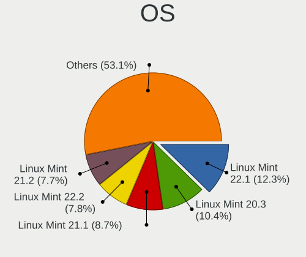

| Name              | Desktops | Percent |
|-------------------|----------|---------|
| Linux Mint 22.1   | 1583     | 12.32%  |
| Linux Mint 20.3   | 1331     | 10.36%  |
| Linux Mint 21.1   | 1116     | 8.68%   |
| Linux Mint 22.2   | 1006     | 7.83%   |
| Linux Mint 21.2   | 987      | 7.68%   |
| Linux Mint 21.3   | 973      | 7.57%   |
| Linux Mint 20.1   | 939      | 7.31%   |
| Linux Mint 20.2   | 932      | 7.25%   |
| Linux Mint 19.3   | 884      | 6.88%   |
| Linux Mint 20     | 820      | 6.38%   |
| Linux Mint 22     | 635      | 4.94%   |
| Linux Mint 21     | 553      | 4.3%    |
| Linux Mint 19.1   | 408      | 3.17%   |
| Linux Mint 19.2   | 325      | 2.53%   |
| Linux Mint 19     | 156      | 1.21%   |
| Linux Mint 18.3   | 138      | 1.07%   |
| Linux Mint 18.2   | 32       | 0.25%   |
| Linux Mint 18.1   | 12       | 0.09%   |
| Linux Mint 18     | 10       | 0.08%   |
| Linux Mint 17.3   | 5        | 0.04%   |
| Linux Mint 22.3   | 3        | 0.02%   |
| Linux Mint 17.1   | 2        | 0.02%   |
| Linux Mint 21.2.1 | 1        | 0.01%   |
| Linux Mint 21.2.0 | 1        | 0.01%   |
| Linux Mint 13     | 1        | 0.01%   |

OS Family
---------

OS without a version

| Name       | Desktops | Percent |
|------------|----------|---------|
| Linux Mint | 11721    | 100%    |

Kernel
------

Version of the Linux kernel

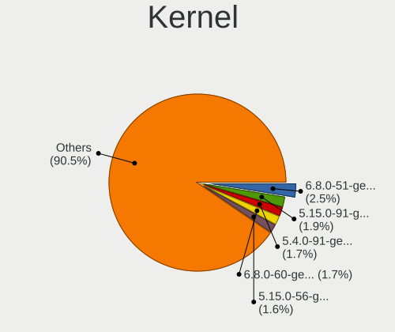

| Version           | Desktops | Percent |
|-------------------|----------|---------|
| 6.8.0-51-generic  | 373      | 2.55%   |
| 5.15.0-91-generic | 282      | 1.93%   |
| 5.4.0-91-generic  | 249      | 1.7%    |
| 6.8.0-60-generic  | 248      | 1.7%    |
| 5.15.0-56-generic | 241      | 1.65%   |
| 5.15.0-76-generic | 218      | 1.49%   |
| 5.4.0-58-generic  | 213      | 1.46%   |
| 6.14.0-29-generic | 170      | 1.16%   |
| 6.14.0-33-generic | 162      | 1.11%   |
| 5.4.0-74-generic  | 151      | 1.03%   |
| 5.4.0-42-generic  | 150      | 1.03%   |
| 5.4.0-65-generic  | 149      | 1.02%   |
| 5.15.0-58-generic | 137      | 0.94%   |
| 6.8.0-79-generic  | 135      | 0.92%   |
| 6.14.0-37-generic | 133      | 0.91%   |
| 5.4.0-77-generic  | 132      | 0.9%    |
| 5.15.0-67-generic | 130      | 0.89%   |
| 5.15.0-60-generic | 126      | 0.86%   |
| 6.14.0-36-generic | 125      | 0.85%   |
| 6.8.0-71-generic  | 120      | 0.82%   |
| 6.8.0-55-generic  | 119      | 0.81%   |
| 5.4.0-81-generic  | 115      | 0.79%   |
| 5.0.0-32-generic  | 114      | 0.78%   |
| 5.4.0-72-generic  | 113      | 0.77%   |
| 5.4.0-66-generic  | 112      | 0.77%   |
| 6.8.0-63-generic  | 111      | 0.76%   |
| 5.4.0-88-generic  | 111      | 0.76%   |
| 4.15.0-54-generic | 111      | 0.76%   |
| 6.8.0-52-generic  | 109      | 0.75%   |
| 6.8.0-58-generic  | 106      | 0.72%   |
| 5.4.0-122-generic | 106      | 0.72%   |
| 5.4.0-90-generic  | 105      | 0.72%   |
| 5.4.0-70-generic  | 105      | 0.72%   |
| 5.15.0-78-generic | 105      | 0.72%   |
| 6.8.0-57-generic  | 102      | 0.7%    |
| 5.4.0-73-generic  | 102      | 0.7%    |
| 4.15.0-20-generic | 102      | 0.7%    |
| 5.4.0-107-generic | 101      | 0.69%   |
| 5.15.0-69-generic | 100      | 0.68%   |
| 5.4.0-80-generic  | 99       | 0.68%   |

Kernel Family
-------------

Linux kernel without a distro release

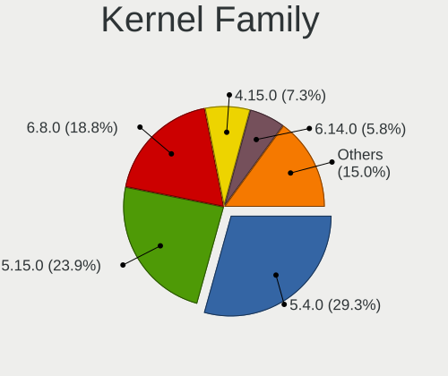

| Version | Desktops | Percent |
|---------|----------|---------|
| 5.4.0   | 3676     | 29.3%   |
| 5.15.0  | 2995     | 23.87%  |
| 6.8.0   | 2354     | 18.76%  |
| 4.15.0  | 912      | 7.27%   |
| 6.14.0  | 730      | 5.82%   |
| 5.3.0   | 355      | 2.83%   |
| 6.5.0   | 208      | 1.66%   |
| 5.0.0   | 193      | 1.54%   |
| 6.2.0   | 140      | 1.12%   |
| 5.13.0  | 130      | 1.04%   |
| 6.11.0  | 107      | 0.85%   |
| 5.8.0   | 100      | 0.8%    |
| 5.19.0  | 85       | 0.68%   |
| 5.11.0  | 73       | 0.58%   |
| 4.4.0   | 36       | 0.29%   |
| 4.10.0  | 36       | 0.29%   |
| 4.13.0  | 27       | 0.22%   |
| 4.18.0  | 23       | 0.18%   |
| 6.1.0   | 17       | 0.14%   |
| 4.8.0   | 17       | 0.14%   |
| 5.14.0  | 12       | 0.1%    |
| 6.0.0   | 9        | 0.07%   |
| 5.17.0  | 6        | 0.05%   |
| 6.15.5  | 5        | 0.04%   |
| 6.12.3  | 5        | 0.04%   |
| 5.9.0   | 5        | 0.04%   |
| 5.10.0  | 5        | 0.04%   |
| 6.4.11  | 4        | 0.03%   |
| 6.15.0  | 4        | 0.03%   |
| 5.3.6   | 4        | 0.03%   |
| 6.7.3   | 3        | 0.02%   |
| 6.4.0   | 3        | 0.02%   |
| 6.3.7   | 3        | 0.02%   |
| 6.3.4   | 3        | 0.02%   |
| 6.2.12  | 3        | 0.02%   |
| 6.14.4  | 3        | 0.02%   |
| 6.13.7  | 3        | 0.02%   |
| 5.4.1   | 3        | 0.02%   |
| 5.16.0  | 3        | 0.02%   |
| 5.12.0  | 3        | 0.02%   |

Kernel Major Ver.
-----------------

Linux kernel major version

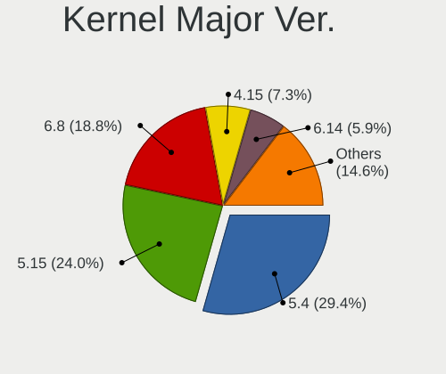

| Version | Desktops | Percent |
|---------|----------|---------|
| 5.4     | 3683     | 29.38%  |
| 5.15    | 3005     | 23.97%  |
| 6.8     | 2357     | 18.8%   |
| 4.15    | 913      | 7.28%   |
| 6.14    | 741      | 5.91%   |
| 5.3     | 361      | 2.88%   |
| 6.5     | 216      | 1.72%   |
| 5.0     | 204      | 1.63%   |
| 6.2     | 151      | 1.2%    |
| 5.13    | 133      | 1.06%   |
| 6.11    | 110      | 0.88%   |
| 5.8     | 104      | 0.83%   |
| 5.19    | 89       | 0.71%   |
| 5.11    | 79       | 0.63%   |
| 4.4     | 36       | 0.29%   |
| 4.10    | 36       | 0.29%   |
| 4.13    | 28       | 0.22%   |
| 6.1     | 25       | 0.2%    |
| 4.18    | 24       | 0.19%   |
| 4.8     | 17       | 0.14%   |
| 6.12    | 14       | 0.11%   |
| 6.0     | 14       | 0.11%   |
| 5.10    | 14       | 0.11%   |
| 5.14    | 13       | 0.1%    |
| 5.17    | 12       | 0.1%    |
| 6.4     | 11       | 0.09%   |
| 6.3     | 11       | 0.09%   |
| 6.15    | 11       | 0.09%   |
| 6.6     | 10       | 0.08%   |
| 6.13    | 9        | 0.07%   |
| 6.9     | 8        | 0.06%   |
| 6.17    | 8        | 0.06%   |
| 5.9     | 8        | 0.06%   |
| 5.7     | 8        | 0.06%   |
| 4.20    | 8        | 0.06%   |
| 6.7     | 7        | 0.06%   |
| 6.10    | 7        | 0.06%   |
| 5.16    | 6        | 0.05%   |
| 5.12    | 5        | 0.04%   |
| 6.16    | 4        | 0.03%   |

Arch
----

OS architecture (x86_64, i586, etc.)

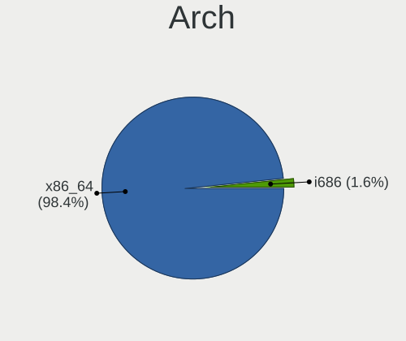

| Name   | Desktops | Percent |
|--------|----------|---------|
| x86_64 | 11534    | 98.35%  |
| i686   | 193      | 1.65%   |

DE
--

Desktop Environment

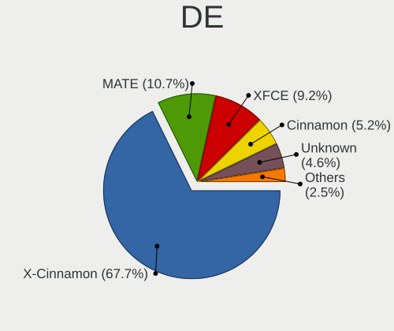

| Name            | Desktops | Percent |
|-----------------|----------|---------|
| X-Cinnamon      | 8128     | 67.72%  |
| MATE            | 1286     | 10.71%  |
| XFCE            | 1100     | 9.17%   |
| Cinnamon        | 628      | 5.23%   |
| Unknown         | 554      | 4.62%   |
| GNOME           | 177      | 1.47%   |
| KDE5            | 65       | 0.54%   |
| KDE             | 26       | 0.22%   |
| LXDE            | 10       | 0.08%   |
| i3              | 8        | 0.07%   |
| Budgie          | 3        | 0.02%   |
| Pantheon        | 2        | 0.02%   |
| LXQt            | 2        | 0.02%   |
| KDE4            | 2        | 0.02%   |
| ICEWM           | 2        | 0.02%   |
| Trinity         | 1        | 0.01%   |
| sway            | 1        | 0.01%   |
| qtile           | 1        | 0.01%   |
| Hyprland        | 1        | 0.01%   |
| GNOME Flashback | 1        | 0.01%   |
| GNOME Classic   | 1        | 0.01%   |
| fluxbox         | 1        | 0.01%   |
| enlightenment   | 1        | 0.01%   |
| bspwm           | 1        | 0.01%   |

Display Server
--------------

X11 or Wayland

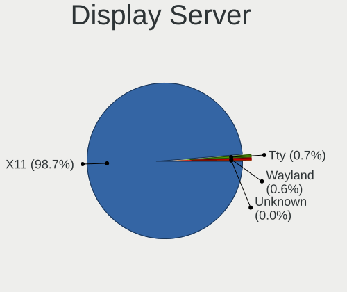

| Name    | Desktops | Percent |
|---------|----------|---------|
| X11     | 11598    | 98.7%   |
| Tty     | 78       | 0.66%   |
| Wayland | 72       | 0.61%   |
| Unknown | 3        | 0.03%   |

Display Manager
---------------

SDDM, LightDM, etc.

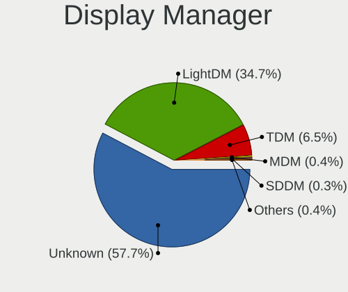

| Name    | Desktops | Percent |
|---------|----------|---------|
| Unknown | 6895     | 57.7%   |
| LightDM | 4145     | 34.69%  |
| TDM     | 782      | 6.54%   |
| MDM     | 43       | 0.36%   |
| SDDM    | 41       | 0.34%   |
| GDM3    | 25       | 0.21%   |
| GDM     | 16       | 0.13%   |
| LXDM    | 2        | 0.02%   |

OS Lang
-------

Language

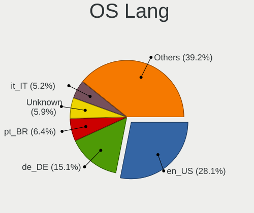

| Lang    | Desktops | Percent |
|---------|----------|---------|
| en_US   | 3330     | 28.08%  |
| de_DE   | 1792     | 15.11%  |
| pt_BR   | 762      | 6.43%   |
| Unknown | 703      | 5.93%   |
| it_IT   | 619      | 5.22%   |
| en_GB   | 545      | 4.6%    |
| fr_FR   | 543      | 4.58%   |
| ru_RU   | 415      | 3.5%    |
| C       | 347      | 2.93%   |
| en_CA   | 340      | 2.87%   |
| en_AU   | 259      | 2.18%   |
| es_ES   | 239      | 2.02%   |
| pl_PL   | 201      | 1.69%   |
| nl_NL   | 147      | 1.24%   |
| es_AR   | 108      | 0.91%   |
| de_AT   | 98       | 0.83%   |
| hu_HU   | 82       | 0.69%   |
| cs_CZ   | 80       | 0.67%   |
| es_MX   | 72       | 0.61%   |
| de_CH   | 69       | 0.58%   |
| en_IN   | 65       | 0.55%   |
| pt_PT   | 61       | 0.51%   |
| en_ZA   | 61       | 0.51%   |
| fi_FI   | 59       | 0.5%    |
| tr_TR   | 49       | 0.41%   |
| en_NZ   | 46       | 0.39%   |
| sv_SE   | 43       | 0.36%   |
| ru_UA   | 41       | 0.35%   |
| fr_CA   | 39       | 0.33%   |
| fr_BE   | 36       | 0.3%    |
| es_VE   | 36       | 0.3%    |
| sk_SK   | 35       | 0.3%    |
| es_CO   | 33       | 0.28%   |
| nl_BE   | 32       | 0.27%   |
| es_CL   | 32       | 0.27%   |
| en_IE   | 30       | 0.25%   |
| da_DK   | 29       | 0.24%   |
| el_GR   | 28       | 0.24%   |
| ja_JP   | 27       | 0.23%   |
| en_PH   | 26       | 0.22%   |

Boot Mode
---------

EFI or BIOS

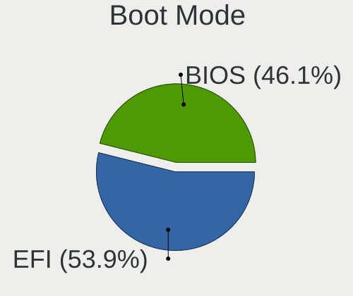

| Mode | Desktops | Percent |
|------|----------|---------|
| EFI  | 6442     | 53.91%  |
| BIOS | 5508     | 46.09%  |

Filesystem
----------

Type of filesystem

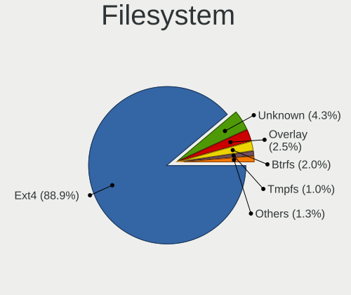

| Type    | Desktops | Percent |
|---------|----------|---------|
| Ext4    | 10556    | 88.89%  |
| Unknown | 509      | 4.29%   |
| Overlay | 295      | 2.48%   |
| Btrfs   | 240      | 2.02%   |
| Tmpfs   | 120      | 1.01%   |
| Zfs     | 55       | 0.46%   |
| Xfs     | 45       | 0.38%   |
| Ext3    | 26       | 0.22%   |
| Ext2    | 23       | 0.19%   |
| Jfs     | 3        | 0.03%   |
| Aufs    | 2        | 0.02%   |
| XXXX    | 1        | 0.01%   |

Part. scheme
------------

Scheme of partitioning

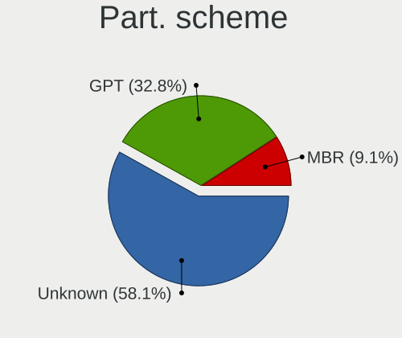

| Type    | Desktops | Percent |
|---------|----------|---------|
| Unknown | 6933     | 58.08%  |
| GPT     | 3914     | 32.79%  |
| MBR     | 1090     | 9.13%   |

Dual Boot with Linux/BSD
------------------------

Hosting more than one Linux/BSD

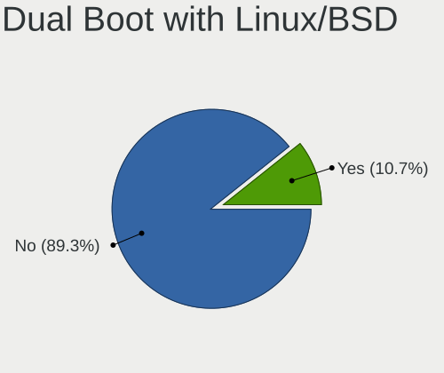

| Dual boot | Desktops | Percent |
|-----------|----------|---------|
| No        | 10592    | 89.29%  |
| Yes       | 1270     | 10.71%  |

Dual Boot (Win)
---------------

Hosting Linux and Windows

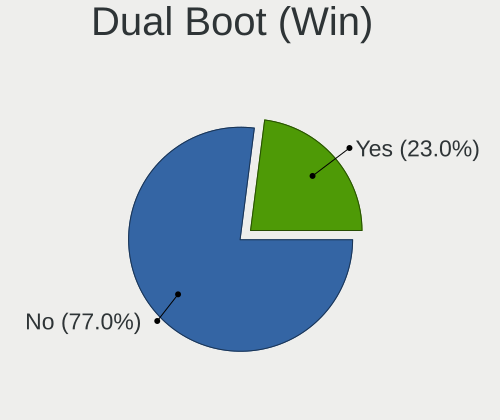

| Dual boot | Desktops | Percent |
|-----------|----------|---------|
| No        | 9154     | 77.02%  |
| Yes       | 2731     | 22.98%  |

Board
-----

Vendor
------

Motherboard manufacturer

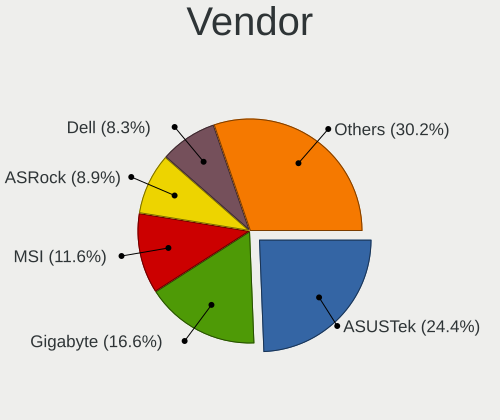

| Name                                 | Desktops | Percent |
|--------------------------------------|----------|---------|
| ASUSTek Computer                     | 2857     | 24.38%  |
| Gigabyte Technology                  | 1940     | 16.55%  |
| MSI                                  | 1362     | 11.62%  |
| ASRock                               | 1044     | 8.91%   |
| Dell                                 | 973      | 8.3%    |
| Hewlett-Packard                      | 914      | 7.8%    |
| Lenovo                               | 428      | 3.65%   |
| Intel                                | 328      | 2.8%    |
| Unknown                              | 195      | 1.66%   |
| Acer                                 | 194      | 1.66%   |
| Pegatron                             | 147      | 1.25%   |
| Fujitsu                              | 131      | 1.12%   |
| Biostar                              | 119      | 1.02%   |
| Foxconn                              | 118      | 1.01%   |
| Medion                               | 93       | 0.79%   |
| ECS                                  | 92       | 0.78%   |
| Positivo                             | 53       | 0.45%   |
| AZW                                  | 50       | 0.43%   |
| Fujitsu Siemens                      | 39       | 0.33%   |
| BESSTAR Tech                         | 29       | 0.25%   |
| AMI                                  | 28       | 0.24%   |
| Shuttle                              | 27       | 0.23%   |
| Apple                                | 26       | 0.22%   |
| PCWare                               | 24       | 0.2%    |
| Packard Bell                         | 24       | 0.2%    |
| Shenzhen Meigao Electronic Equipment | 22       | 0.19%   |
| Gateway                              | 22       | 0.19%   |
| Alienware                            | 22       | 0.19%   |
| OEM                                  | 21       | 0.18%   |
| MACHINIST                            | 21       | 0.18%   |
| GEEKOM                               | 20       | 0.17%   |
| Huanan                               | 17       | 0.15%   |
| eMachines                            | 16       | 0.14%   |
| Supermicro                           | 15       | 0.13%   |
| AMD                                  | 15       | 0.13%   |
| Semp Toshiba                         | 14       | 0.12%   |
| Inventec                             | 13       | 0.11%   |
| Itautec                              | 10       | 0.09%   |
| Megaware                             | 8        | 0.07%   |
| PCChips                              | 6        | 0.05%   |

Model
-----

Motherboard model

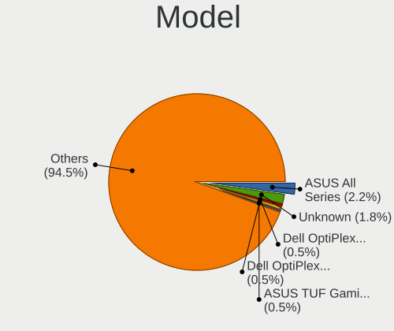

| Name                         | Desktops | Percent |
|------------------------------|----------|---------|
| ASUS All Series              | 254      | 2.17%   |
| Unknown                      | 214      | 1.83%   |
| Dell OptiPlex 7010           | 64       | 0.55%   |
| Dell OptiPlex 9020           | 59       | 0.5%    |
| ASUS TUF Gaming X570-PLUS    | 53       | 0.45%   |
| MSI MS-7C56                  | 51       | 0.44%   |
| MSI MS-7C02                  | 47       | 0.4%    |
| Gigabyte B450M DS3H          | 46       | 0.39%   |
| ASUS PRIME A320M-K           | 46       | 0.39%   |
| Dell OptiPlex 780            | 45       | 0.38%   |
| MSI MS-7B86                  | 43       | 0.37%   |
| Dell OptiPlex 790            | 43       | 0.37%   |
| MSI MS-7693                  | 42       | 0.36%   |
| ASUS M5A78L-M/USB3           | 42       | 0.36%   |
| MSI MS-7C91                  | 40       | 0.34%   |
| Dell OptiPlex 3020           | 40       | 0.34%   |
| MSI MS-7C37                  | 39       | 0.33%   |
| Intel H61                    | 38       | 0.32%   |
| HP Compaq Elite 8300 SFF     | 35       | 0.3%    |
| Gigabyte 970A-DS3P           | 35       | 0.3%    |
| MSI MS-7817                  | 33       | 0.28%   |
| HP Compaq 8200 Elite SFF PC  | 31       | 0.26%   |
| MSI MS-7C95                  | 29       | 0.25%   |
| HP EliteDesk 800 G1 SFF      | 29       | 0.25%   |
| Gigabyte A320M-S2H           | 29       | 0.25%   |
| Dell OptiPlex 3050           | 29       | 0.25%   |
| MSI MS-7721                  | 28       | 0.24%   |
| Dell OptiPlex 990            | 27       | 0.23%   |
| Dell OptiPlex 755            | 27       | 0.23%   |
| ASUS ROG STRIX B450-F GAMING | 27       | 0.23%   |
| ASUS M5A97 R2.0              | 26       | 0.22%   |
| MSI MS-7C52                  | 25       | 0.21%   |
| Gigabyte B550 AORUS ELITE V2 | 25       | 0.21%   |
| Dell OptiPlex 7050           | 25       | 0.21%   |
| ASUS TUF Gaming B550M-PLUS   | 25       | 0.21%   |
| ASUS PRIME B450M-A           | 25       | 0.21%   |
| MSI MS-7B79                  | 24       | 0.2%    |
| Dell OptiPlex 7040           | 24       | 0.2%    |
| Dell OptiPlex 3010           | 24       | 0.2%    |
| ASUS ROG STRIX B550-F GAMING | 24       | 0.2%    |

Model Family
------------

Motherboard model prefix

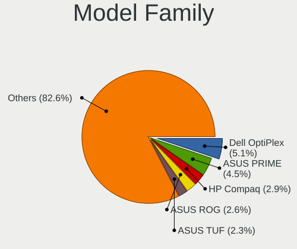

| Name                   | Desktops | Percent |
|------------------------|----------|---------|
| Dell OptiPlex          | 603      | 5.14%   |
| ASUS PRIME             | 532      | 4.54%   |
| HP Compaq              | 335      | 2.86%   |
| ASUS ROG               | 304      | 2.59%   |
| ASUS TUF               | 269      | 2.3%    |
| Lenovo ThinkCentre     | 267      | 2.28%   |
| ASUS All               | 254      | 2.17%   |
| Unknown                | 214      | 1.83%   |
| HP EliteDesk           | 132      | 1.13%   |
| Acer Aspire            | 126      | 1.07%   |
| Dell Inspiron          | 120      | 1.02%   |
| Dell Precision         | 106      | 0.9%    |
| ASUS M5A78L-M          | 106      | 0.9%    |
| Fujitsu ESPRIMO        | 103      | 0.88%   |
| HP ProDesk             | 97       | 0.83%   |
| Gigabyte B450M         | 84       | 0.72%   |
| Gigabyte B450          | 70       | 0.6%    |
| Gigabyte B550          | 63       | 0.54%   |
| ASUS P8H61-M           | 62       | 0.53%   |
| Gigabyte X570          | 59       | 0.5%    |
| Lenovo IdeaCentre      | 57       | 0.49%   |
| ASUS M5A97             | 55       | 0.47%   |
| ASRock B450M           | 52       | 0.44%   |
| MSI MS-7C56            | 51       | 0.44%   |
| HP Pavilion            | 49       | 0.42%   |
| Gigabyte B550M         | 48       | 0.41%   |
| Dell XPS               | 48       | 0.41%   |
| MSI MS-7C02            | 47       | 0.4%    |
| Acer Veriton           | 47       | 0.4%    |
| Gigabyte GA-78LMT-USB3 | 44       | 0.38%   |
| MSI MS-7B86            | 43       | 0.37%   |
| MSI MS-7693            | 42       | 0.36%   |
| Intel H61              | 41       | 0.35%   |
| MSI MS-7C91            | 40       | 0.34%   |
| Gigabyte Z390          | 40       | 0.34%   |
| ASUS SABERTOOTH        | 40       | 0.34%   |
| MSI MS-7C37            | 39       | 0.33%   |
| Gigabyte A320M-S2H     | 39       | 0.33%   |
| Gigabyte 970A-DS3P     | 37       | 0.32%   |
| ASRock B450            | 37       | 0.32%   |

MFG Year
--------

Motherboard manufacture year

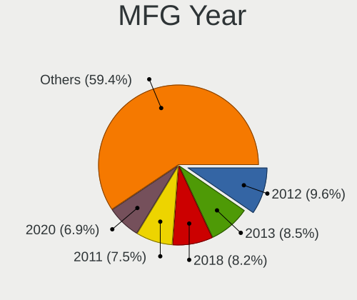

| Year    | Desktops | Percent |
|---------|----------|---------|
| 2012    | 1121     | 9.56%   |
| 2013    | 992      | 8.46%   |
| 2018    | 960      | 8.19%   |
| 2011    | 877      | 7.48%   |
| 2020    | 810      | 6.91%   |
| 2014    | 759      | 6.48%   |
| 2019    | 689      | 5.88%   |
| 2009    | 689      | 5.88%   |
| 2017    | 610      | 5.2%    |
| 2010    | 609      | 5.2%    |
| 2021    | 528      | 4.5%    |
| 2015    | 519      | 4.43%   |
| 2022    | 457      | 3.9%    |
| 2016    | 453      | 3.86%   |
| 2008    | 442      | 3.77%   |
| 2007    | 359      | 3.06%   |
| 2023    | 323      | 2.76%   |
| 2024    | 237      | 2.02%   |
| 2006    | 150      | 1.28%   |
| 2025    | 66       | 0.56%   |
| 2005    | 37       | 0.32%   |
| 2004    | 15       | 0.13%   |
| 2003    | 12       | 0.1%    |
| Unknown | 4        | 0.03%   |
| 2002    | 3        | 0.03%   |

Form Factor
-----------

Physical design of the computer

| Name    | Desktops | Percent |
|---------|----------|---------|
| Desktop | 11721    | 100%    |

Secure Boot
-----------

Enabled or disabled

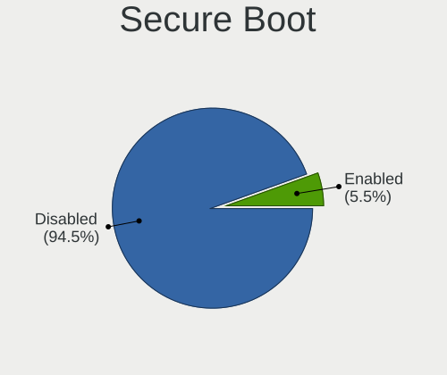

| State    | Desktops | Percent |
|----------|----------|---------|
| Disabled | 11144    | 94.52%  |
| Enabled  | 646      | 5.48%   |

Coreboot
--------

Have coreboot on board

| Used | Desktops | Percent |
|------|----------|---------|
| No   | 11713    | 99.93%  |
| Yes  | 8        | 0.07%   |

RAM Size
--------

Total RAM memory

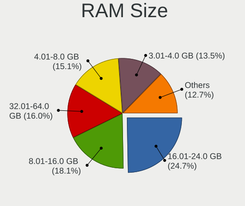

| Size in GB      | Desktops | Percent |
|-----------------|----------|---------|
| 16.01-24.0      | 2959     | 24.7%   |
| 8.01-16.0       | 2163     | 18.05%  |
| 32.01-64.0      | 1913     | 15.97%  |
| 4.01-8.0        | 1808     | 15.09%  |
| 3.01-4.0        | 1621     | 13.53%  |
| 64.01-256.0     | 583      | 4.87%   |
| 24.01-32.0      | 445      | 3.71%   |
| 1.01-2.0        | 303      | 2.53%   |
| 2.01-3.0        | 143      | 1.19%   |
| 0.51-1.0        | 34       | 0.28%   |
| More than 256.0 | 9        | 0.08%   |
| 0.01-0.5        | 1        | 0.01%   |

RAM Used
--------

Used RAM memory

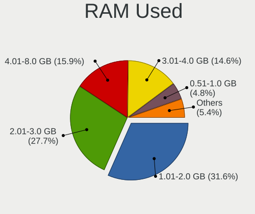

| Used GB     | Desktops | Percent |
|-------------|----------|---------|
| 1.01-2.0    | 4196     | 31.62%  |
| 2.01-3.0    | 3674     | 27.68%  |
| 4.01-8.0    | 2111     | 15.91%  |
| 3.01-4.0    | 1939     | 14.61%  |
| 0.51-1.0    | 639      | 4.82%   |
| 8.01-16.0   | 547      | 4.12%   |
| 16.01-24.0  | 83       | 0.63%   |
| 24.01-32.0  | 33       | 0.25%   |
| 0.01-0.5    | 24       | 0.18%   |
| 32.01-64.0  | 19       | 0.14%   |
| 64.01-256.0 | 3        | 0.02%   |
| Unknown     | 3        | 0.02%   |

Total Drives
------------

Number of drives on board

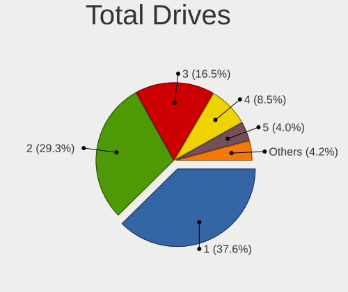

| Drives  | Desktops | Percent |
|---------|----------|---------|
| 1       | 4611     | 37.61%  |
| 2       | 3595     | 29.33%  |
| 3       | 2020     | 16.48%  |
| 4       | 1036     | 8.45%   |
| 5       | 486      | 3.96%   |
| 6       | 233      | 1.9%    |
| 7       | 112      | 0.91%   |
| 0       | 60       | 0.49%   |
| 8       | 49       | 0.4%    |
| 9       | 21       | 0.17%   |
| 10      | 12       | 0.1%    |
| 12      | 5        | 0.04%   |
| 11      | 5        | 0.04%   |
| 14      | 4        | 0.03%   |
| 13      | 4        | 0.03%   |
| 22      | 2        | 0.02%   |
| 28      | 1        | 0.01%   |
| 17      | 1        | 0.01%   |
| 15      | 1        | 0.01%   |
| Unknown | 1        | 0.01%   |

Has CD-ROM
----------

Has CD-ROM on board

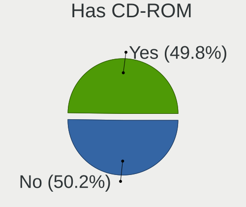

| Presented | Desktops | Percent |
|-----------|----------|---------|
| No        | 5958     | 50.23%  |
| Yes       | 5904     | 49.77%  |

Has Ethernet
------------

Has Ethernet on board

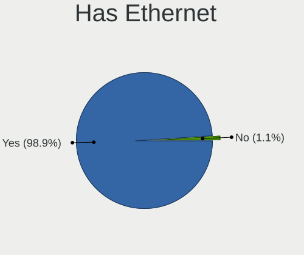

| Presented | Desktops | Percent |
|-----------|----------|---------|
| Yes       | 11598    | 98.93%  |
| No        | 125      | 1.07%   |

Has WiFi
--------

Has WiFi module

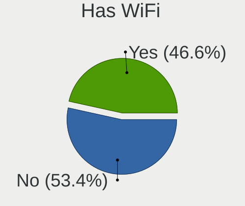

| Presented | Desktops | Percent |
|-----------|----------|---------|
| No        | 6366     | 53.44%  |
| Yes       | 5547     | 46.56%  |

Has Bluetooth
-------------

Has Bluetooth module

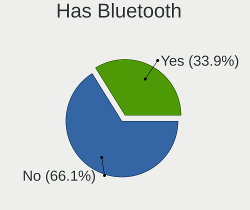

| Presented | Desktops | Percent |
|-----------|----------|---------|
| No        | 7887     | 66.13%  |
| Yes       | 4039     | 33.87%  |

Location
--------

Country
-------

Geographic location (country)

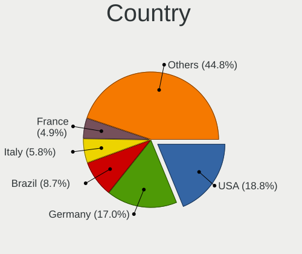

| Country      | Desktops | Percent |
|--------------|----------|---------|
| USA          | 2212     | 18.78%  |
| Germany      | 1998     | 16.97%  |
| Brazil       | 1024     | 8.69%   |
| Italy        | 685      | 5.82%   |
| France       | 578      | 4.91%   |
| Russia       | 553      | 4.7%    |
| UK           | 525      | 4.46%   |
| Canada       | 440      | 3.74%   |
| Spain        | 298      | 2.53%   |
| Australia    | 278      | 2.36%   |
| Netherlands  | 249      | 2.11%   |
| Poland       | 239      | 2.03%   |
| Austria      | 152      | 1.29%   |
| Switzerland  | 132      | 1.12%   |
| Argentina    | 126      | 1.07%   |
| Ukraine      | 121      | 1.03%   |
| Sweden       | 111      | 0.94%   |
| Czechia      | 110      | 0.93%   |
| Belgium      | 110      | 0.93%   |
| Mexico       | 106      | 0.9%    |
| Hungary      | 104      | 0.88%   |
| Finland      | 86       | 0.73%   |
| India        | 79       | 0.67%   |
| Portugal     | 75       | 0.64%   |
| Turkey       | 69       | 0.59%   |
| South Africa | 69       | 0.59%   |
| Greece       | 68       | 0.58%   |
| Denmark      | 61       | 0.52%   |
| Romania      | 54       | 0.46%   |
| New Zealand  | 52       | 0.44%   |
| Norway       | 49       | 0.42%   |
| Slovakia     | 46       | 0.39%   |
| Japan        | 46       | 0.39%   |
| Colombia     | 45       | 0.38%   |
| Chile        | 42       | 0.36%   |
| Bulgaria     | 42       | 0.36%   |
| Indonesia    | 40       | 0.34%   |
| Venezuela    | 39       | 0.33%   |
| Ireland      | 37       | 0.31%   |
| Serbia       | 33       | 0.28%   |

City
----

Geographic location (city)

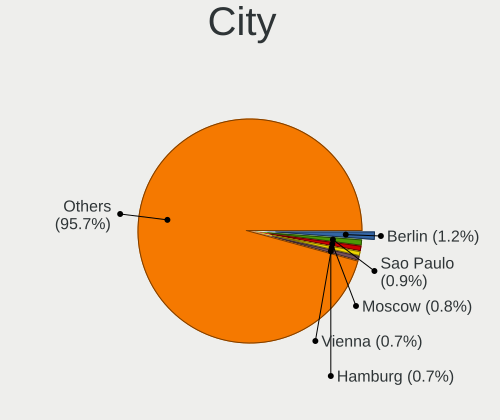

| City              | Desktops | Percent |
|-------------------|----------|---------|
| Berlin            | 151      | 1.2%    |
| Sao Paulo         | 112      | 0.89%   |
| Moscow            | 100      | 0.8%    |
| Vienna            | 88       | 0.7%    |
| Hamburg           | 85       | 0.68%   |
| Rome              | 82       | 0.65%   |
| Sydney            | 80       | 0.64%   |
| Milan             | 78       | 0.62%   |
| Rio de Janeiro    | 67       | 0.53%   |
| Munich            | 62       | 0.49%   |
| Warsaw            | 58       | 0.46%   |
| Paris             | 57       | 0.45%   |
| Amsterdam         | 57       | 0.45%   |
| Melbourne         | 54       | 0.43%   |
| Frankfurt am Main | 54       | 0.43%   |
| Montreal          | 48       | 0.38%   |
| Cologne           | 48       | 0.38%   |
| St Petersburg     | 47       | 0.37%   |
| Budapest          | 47       | 0.37%   |
| Madrid            | 46       | 0.37%   |
| Brisbane          | 45       | 0.36%   |
| New York          | 41       | 0.33%   |
| London            | 41       | 0.33%   |
| Chicago           | 39       | 0.31%   |
| Helsinki          | 38       | 0.3%    |
| Brasília         | 38       | 0.3%    |
| Leipzig           | 36       | 0.29%   |
| Toronto           | 33       | 0.26%   |
| Los Angeles       | 33       | 0.26%   |
| Seattle           | 32       | 0.25%   |
| Milano            | 32       | 0.25%   |
| Athens            | 31       | 0.25%   |
| Vancouver         | 30       | 0.24%   |
| Perth             | 30       | 0.24%   |
| Stockholm         | 29       | 0.23%   |
| Prague            | 29       | 0.23%   |
| Stuttgart         | 28       | 0.22%   |
| Nuremberg         | 28       | 0.22%   |
| Kyiv              | 27       | 0.21%   |
| Barcelona         | 27       | 0.21%   |

Drives
------

Drive Vendor
------------

Hard drive vendors

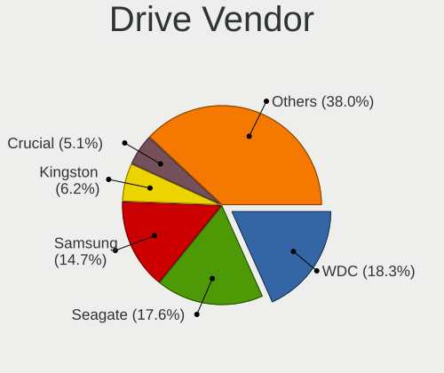

| Vendor                      | Desktops | Drives | Percent |
|-----------------------------|----------|--------|---------|
| WDC                         | 3998     | 6847   | 18.3%   |
| Seagate                     | 3836     | 6459   | 17.56%  |
| Samsung Electronics         | 3216     | 5688   | 14.72%  |
| Kingston                    | 1364     | 1900   | 6.24%   |
| Crucial                     | 1122     | 1664   | 5.14%   |
| SanDisk                     | 1058     | 1549   | 4.84%   |
| Toshiba                     | 938      | 1293   | 4.29%   |
| Hitachi                     | 675      | 903    | 3.09%   |
| A-DATA Technology           | 308      | 412    | 1.41%   |
| China                       | 282      | 354    | 1.29%   |
| Unknown                     | 263      | 501    | 1.2%    |
| Intenso                     | 236      | 329    | 1.08%   |
| Intel                       | 235      | 326    | 1.08%   |
| Micron/Crucial Technology   | 194      | 371    | 0.89%   |
| HGST                        | 173      | 272    | 0.79%   |
| Maxtor                      | 170      | 239    | 0.78%   |
| PNY                         | 161      | 243    | 0.74%   |
| SPCC                        | 153      | 201    | 0.7%    |
| Patriot                     | 144      | 181    | 0.66%   |
| SK hynix                    | 135      | 174    | 0.62%   |
| Phison Electronics          | 130      | 187    | 0.6%    |
| Kingston Technology Company | 130      | 188    | 0.6%    |
| Micron Technology           | 126      | 162    | 0.58%   |
| Silicon Motion              | 106      | 153    | 0.49%   |
| Phison                      | 102      | 141    | 0.47%   |
| OCZ                         | 102      | 127    | 0.47%   |
| Lexar                       | 100      | 139    | 0.46%   |
| Corsair                     | 91       | 108    | 0.42%   |
| MAXIO Technology (Hangzhou) | 88       | 135    | 0.4%    |
| Transcend                   | 82       | 119    | 0.38%   |
| Team                        | 82       | 116    | 0.38%   |
| GOODRAM                     | 77       | 105    | 0.35%   |
| JMicron Technology          | 74       | 94     | 0.34%   |
| Unknown                     | 67       | 97     | 0.31%   |
| Realtek Semiconductor       | 65       | 88     | 0.3%    |
| ADATA Technology            | 56       | 86     | 0.26%   |
| Fanxiang                    | 54       | 69     | 0.25%   |
| ASMT                        | 51       | 89     | 0.23%   |
| Netac                       | 50       | 81     | 0.23%   |
| Hewlett-Packard             | 47       | 65     | 0.22%   |

Drive Model
-----------

Hard drive models

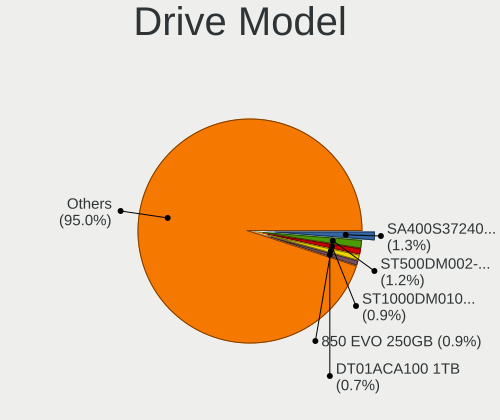

| Model                                              | Desktops | Percent |
|----------------------------------------------------|----------|---------|
| Kingston SA400S37240G 240GB SSD                    | 323      | 1.26%   |
| Seagate ST500DM002-1BD142 500GB                    | 313      | 1.22%   |
| Seagate ST1000DM010-2EP102 1TB                     | 233      | 0.91%   |
| Samsung SSD 850 EVO 250GB                          | 221      | 0.86%   |
| Toshiba DT01ACA100 1TB                             | 190      | 0.74%   |
| Samsung SSD 860 EVO 500GB                          | 189      | 0.74%   |
| Seagate ST2000DM008-2FR102 2TB                     | 187      | 0.73%   |
| Samsung NVMe SSD Controller SM981/PM981/PM983 1TB  | 186      | 0.73%   |
| Kingston SA400S37480G 480GB SSD                    | 178      | 0.7%    |
| WDC WD10EZEX-08WN4A0 1TB                           | 175      | 0.68%   |
| Crucial CT1000MX500SSD1 1TB                        | 153      | 0.6%    |
| Samsung SSD 860 EVO 1TB                            | 150      | 0.59%   |
| Kingston SA400S37120G 120GB SSD                    | 150      | 0.59%   |
| Seagate ST1000DM003-1CH162 1TB                     | 148      | 0.58%   |
| Samsung SSD 850 EVO 500GB                          | 142      | 0.56%   |
| Seagate ST1000DM003-1ER162 1TB                     | 139      | 0.54%   |
| Crucial CT500MX500SSD1 500GB                       | 138      | 0.54%   |
| Kingston SV300S37A120G 120GB SSD                   | 133      | 0.52%   |
| Seagate ST3500418AS 500GB                          | 128      | 0.5%    |
| Samsung SSD 860 EVO 250GB                          | 117      | 0.46%   |
| Crucial CT240BX500SSD1 240GB                       | 113      | 0.44%   |
| Samsung SSD 870 EVO 1TB                            | 107      | 0.42%   |
| Seagate ST4000DM004-2CV104 4TB                     | 103      | 0.4%    |
| WDC WD10EZEX-00BN5A0 1TB                           | 102      | 0.4%    |
| Unknown SD/MMC/MS PRO 2GB                          | 97       | 0.38%   |
| Seagate ST2000DM006-2DM164 2TB                     | 95       | 0.37%   |
| Toshiba HDWD110 1TB                                | 93       | 0.36%   |
| Seagate ST2000DM001-1ER164 2TB                     | 91       | 0.36%   |
| WDC WD20EZRZ-00Z5HB0 2TB                           | 89       | 0.35%   |
| Seagate ST31000528AS 1TB                           | 89       | 0.35%   |
| Micron/Crucial P2 NVMe PCIe SSD 2TB                | 86       | 0.34%   |
| Toshiba DT01ACA050 500GB                           | 83       | 0.32%   |
| Seagate Expansion 2TB                              | 83       | 0.32%   |
| Crucial CT1000BX500SSD1 1TB                        | 83       | 0.32%   |
| WDC WDS240G2G0A-00JH30 240GB SSD                   | 82       | 0.32%   |
| Seagate ST31000524AS 1TB                           | 81       | 0.32%   |
| SanDisk NVMe SSD Drive 1TB                         | 81       | 0.32%   |
| Samsung NVMe SSD Controller PM9A1/PM9A3/980PRO 1TB | 80       | 0.31%   |
| Crucial CT480BX500SSD1 480GB                       | 78       | 0.3%    |
| Seagate ST2000DM001-1CH164 2TB                     | 77       | 0.3%    |

HDD Vendor
----------

Hard disk drive vendors

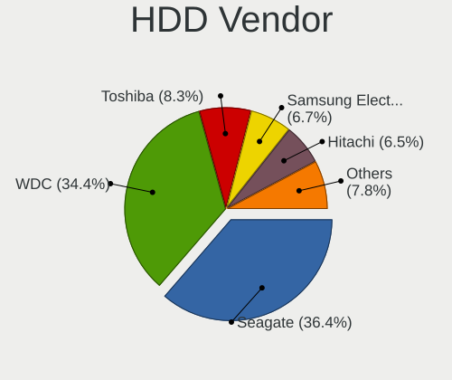

| Vendor              | Desktops | Drives | Percent |
|---------------------|----------|--------|---------|
| Seagate             | 3753     | 6261   | 36.35%  |
| WDC                 | 3551     | 5979   | 34.4%   |
| Toshiba             | 852      | 1171   | 8.25%   |
| Samsung Electronics | 690      | 1003   | 6.68%   |
| Hitachi             | 675      | 903    | 6.54%   |
| HGST                | 173      | 272    | 1.68%   |
| Maxtor              | 166      | 235    | 1.61%   |
| Unknown             | 115      | 147    | 1.11%   |
| JMicron Technology  | 44       | 61     | 0.43%   |
| Fujitsu             | 37       | 61     | 0.36%   |
| Intenso             | 35       | 42     | 0.34%   |
| ASMT                | 30       | 62     | 0.29%   |
| TO Exter            | 22       | 32     | 0.21%   |
| Hewlett-Packard     | 15       | 27     | 0.15%   |
| Apple               | 13       | 15     | 0.13%   |
| ASMedia             | 11       | 13     | 0.11%   |
| WD MediaMax         | 10       | 19     | 0.1%    |
| SABRENT             | 10       | 32     | 0.1%    |
| ExcelStor           | 10       | 12     | 0.1%    |
| External            | 9        | 9      | 0.09%   |
| USB3.0              | 8        | 9      | 0.08%   |
| Unknown             | 7        | 11     | 0.07%   |
| T-FORCE             | 6        | 8      | 0.06%   |
| HPE                 | 6        | 7      | 0.06%   |
| Maxone              | 4        | 6      | 0.04%   |
| LaCie               | 4        | 4      | 0.04%   |
| Inateck             | 4        | 6      | 0.04%   |
| HGST HTS            | 4        | 5      | 0.04%   |
| USB                 | 3        | 4      | 0.03%   |
| RSH-319             | 3        | 4      | 0.03%   |
| Min Yi U            | 3        | 3      | 0.03%   |
| MARVELL             | 3        | 4      | 0.03%   |
| ASMT109x            | 3        | 3      | 0.03%   |
| ASM                 | 3        | 29     | 0.03%   |
| TPH01203000GB       | 2        | 2      | 0.02%   |
| TerraMas            | 2        | 22     | 0.02%   |
| TDAS                | 2        | 7      | 0.02%   |
| Synology            | 2        | 2      | 0.02%   |
| StoreJet            | 2        | 2      | 0.02%   |
| SSK                 | 2        | 2      | 0.02%   |

SSD Vendor
----------

Solid state drive vendors

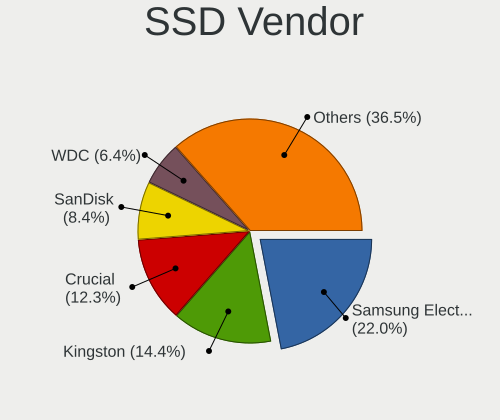

| Vendor              | Desktops | Drives | Percent |
|---------------------|----------|--------|---------|
| Samsung Electronics | 1725     | 2745   | 21.97%  |
| Kingston            | 1134     | 1553   | 14.45%  |
| Crucial             | 969      | 1420   | 12.34%  |
| SanDisk             | 657      | 936    | 8.37%   |
| WDC                 | 499      | 703    | 6.36%   |
| China               | 275      | 346    | 3.5%    |
| A-DATA Technology   | 241      | 330    | 3.07%   |
| Intenso             | 178      | 241    | 2.27%   |
| PNY                 | 148      | 226    | 1.89%   |
| SPCC                | 129      | 172    | 1.64%   |
| Intel               | 127      | 163    | 1.62%   |
| Patriot             | 123      | 158    | 1.57%   |
| OCZ                 | 101      | 125    | 1.29%   |
| Micron Technology   | 77       | 106    | 0.98%   |
| Transcend           | 73       | 100    | 0.93%   |
| GOODRAM             | 73       | 99     | 0.93%   |
| Toshiba             | 71       | 93     | 0.9%    |
| Team                | 66       | 93     | 0.84%   |
| Lexar               | 60       | 91     | 0.76%   |
| Corsair             | 55       | 66     | 0.7%    |
| SK hynix            | 49       | 60     | 0.62%   |
| KingSpec            | 42       | 74     | 0.54%   |
| Apacer              | 42       | 50     | 0.54%   |
| Netac               | 40       | 66     | 0.51%   |
| Unknown             | 38       | 54     | 0.48%   |
| Fanxiang            | 36       | 46     | 0.46%   |
| Seagate             | 32       | 48     | 0.41%   |
| Plextor             | 32       | 39     | 0.41%   |
| LITEON              | 31       | 35     | 0.39%   |
| Verbatim            | 30       | 39     | 0.38%   |
| Gigabyte Technology | 27       | 39     | 0.34%   |
| Hewlett-Packard     | 24       | 28     | 0.31%   |
| SABRENT             | 23       | 24     | 0.29%   |
| Leven               | 17       | 19     | 0.22%   |
| AMD                 | 17       | 20     | 0.22%   |
| Mushkin             | 16       | 19     | 0.2%    |
| LITEONIT            | 16       | 16     | 0.2%    |
| Emtec               | 16       | 24     | 0.2%    |
| ASMT                | 16       | 22     | 0.2%    |
| KingDian            | 15       | 23     | 0.19%   |

Drive Kind
----------

HDD or SSD

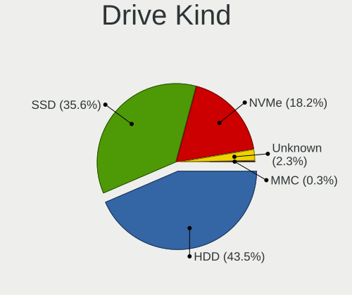

| Kind    | Desktops | Drives | Percent |
|---------|----------|--------|---------|
| HDD     | 7890     | 16537  | 43.54%  |
| SSD     | 6455     | 11136  | 35.62%  |
| NVMe    | 3296     | 5790   | 18.19%  |
| Unknown | 422      | 706    | 2.33%   |
| MMC     | 59       | 85     | 0.33%   |

Drive Connector
---------------

SATA, SAS, NVMe, etc.

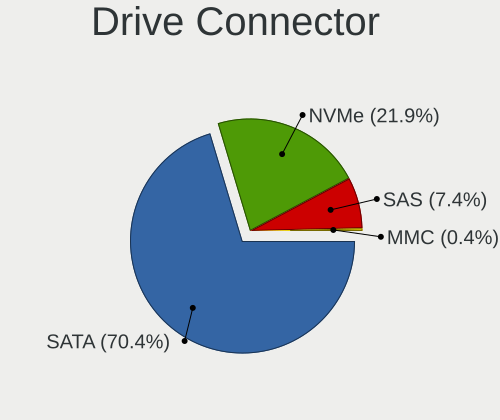

| Type | Desktops | Drives | Percent |
|------|----------|--------|---------|
| SATA | 10568    | 26421  | 70.36%  |
| NVMe | 3284     | 5722   | 21.87%  |
| SAS  | 1108     | 2026   | 7.38%   |
| MMC  | 59       | 85     | 0.39%   |

Drive Size
----------

Size of hard drive

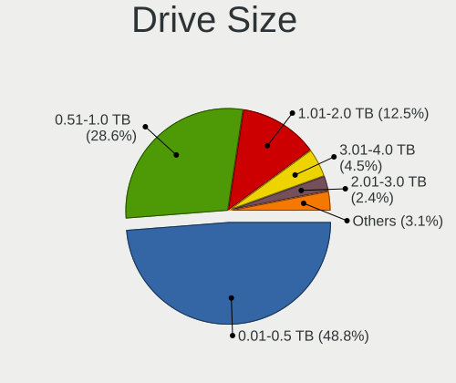

| Size in TB | Desktops | Drives | Percent |
|------------|----------|--------|---------|
| 0.01-0.5   | 7667     | 14202  | 48.78%  |
| 0.51-1.0   | 4500     | 7356   | 28.63%  |
| 1.01-2.0   | 1972     | 3372   | 12.55%  |
| 3.01-4.0   | 715      | 1242   | 4.55%   |
| 2.01-3.0   | 383      | 599    | 2.44%   |
| 4.01-10.0  | 379      | 685    | 2.41%   |
| 10.01-20.0 | 95       | 203    | 0.6%    |
| 20.01-50.0 | 6        | 12     | 0.04%   |
| 0          | 2        | 2      | 0.01%   |

Space Total
-----------

Amount of disk space available on the file system

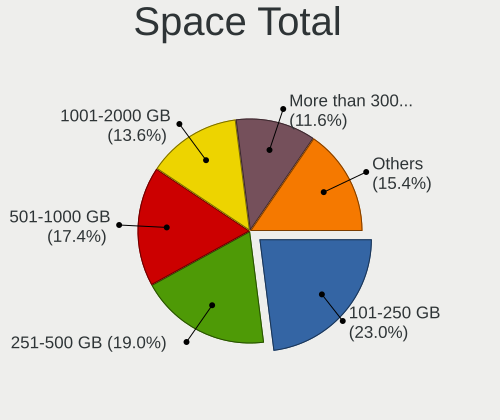

| Size in GB     | Desktops | Percent |
|----------------|----------|---------|
| 101-250        | 2882     | 23%     |
| 251-500        | 2381     | 19%     |
| 501-1000       | 2174     | 17.35%  |
| 1001-2000      | 1704     | 13.6%   |
| More than 3000 | 1454     | 11.61%  |
| 2001-3000      | 791      | 6.31%   |
| 51-100         | 555      | 4.43%   |
| 1-20           | 259      | 2.07%   |
| 21-50          | 242      | 1.93%   |
| Unknown        | 87       | 0.69%   |

Space Used
----------

Amount of used disk space

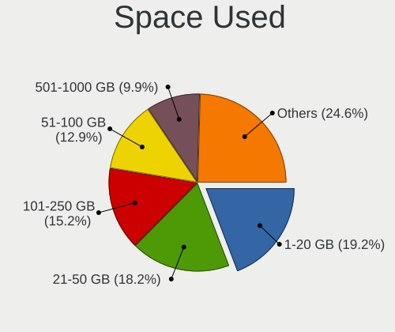

| Used GB        | Desktops | Percent |
|----------------|----------|---------|
| 1-20           | 2515     | 19.2%   |
| 21-50          | 2389     | 18.24%  |
| 101-250        | 1989     | 15.19%  |
| 51-100         | 1695     | 12.94%  |
| 501-1000       | 1291     | 9.86%   |
| 251-500        | 1281     | 9.78%   |
| 1001-2000      | 904      | 6.9%    |
| More than 3000 | 583      | 4.45%   |
| 2001-3000      | 363      | 2.77%   |
| Unknown        | 87       | 0.66%   |

Malfunc. Drives
---------------

Drive models with a malfunction

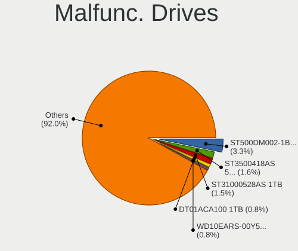

| Model                               | Desktops | Drives | Percent |
|-------------------------------------|----------|--------|---------|
| Seagate ST500DM002-1BD142 500GB     | 50       | 76     | 3.26%   |
| Seagate ST3500418AS 500GB           | 25       | 29     | 1.63%   |
| Seagate ST31000528AS 1TB            | 23       | 25     | 1.5%    |
| Toshiba DT01ACA100 1TB              | 13       | 15     | 0.85%   |
| WDC WD10EARS-00Y5B1 1TB             | 12       | 12     | 0.78%   |
| Seagate ST31000524AS 1TB            | 12       | 17     | 0.78%   |
| Seagate ST1000DM003-1ER162 1TB      | 12       | 13     | 0.78%   |
| Toshiba DT01ACA050 500GB            | 11       | 11     | 0.72%   |
| Seagate ST2000DL003-9VT166 2TB      | 11       | 12     | 0.72%   |
| Seagate ST1000DM010-2EP102 1TB      | 11       | 13     | 0.72%   |
| Seagate ST1000DM003-1CH162 1TB      | 11       | 12     | 0.72%   |
| Crucial CT525MX300SSD1 528GB        | 11       | 11     | 0.72%   |
| WDC WD5000AAKX-001CA0 500GB         | 9        | 10     | 0.59%   |
| Seagate ST9500325AS 500GB           | 9        | 9      | 0.59%   |
| Seagate ST2000DM001-1CH164 2TB      | 9        | 9      | 0.59%   |
| Seagate ST1000DM003-9YN162 1TB      | 9        | 11     | 0.59%   |
| Kingston SA400S37240G 240GB SSD     | 9        | 10     | 0.59%   |
| Hitachi HDS721010CLA332 1TB         | 9        | 9      | 0.59%   |
| WDC WD30EFRX-68EUZN0 3TB            | 8        | 8      | 0.52%   |
| WDC WD20EARS-00MVWB0 2TB            | 8        | 8      | 0.52%   |
| Seagate ST3500413AS 500GB           | 8        | 10     | 0.52%   |
| Seagate ST3500320AS 500GB           | 8        | 10     | 0.52%   |
| Seagate ST2000DM008-2FR102 2TB      | 8        | 9      | 0.52%   |
| Samsung Electronics SSD 870 EVO 1TB | 8        | 9      | 0.52%   |
| Samsung Electronics HD501LJ 500GB   | 8        | 14     | 0.52%   |
| Samsung Electronics HD322HJ 320GB   | 8        | 24     | 0.52%   |
| WDC WDS240G2G0A-00JH30 240GB SSD    | 7        | 7      | 0.46%   |
| WDC WD20EFRX-68EUZN0 2TB            | 7        | 10     | 0.46%   |
| WDC WD10EZEX-00BN5A0 1TB            | 7        | 8      | 0.46%   |
| Seagate ST3250318AS 250GB           | 7        | 8      | 0.46%   |
| Samsung Electronics SSD 980 1TB     | 7        | 7      | 0.46%   |
| Samsung Electronics HD502HI 500GB   | 7        | 7      | 0.46%   |
| WDC WD5000AAKX-60U6AA0 500GB        | 6        | 6      | 0.39%   |
| WDC WD3200AAJS-00L7A0 320GB         | 6        | 6      | 0.39%   |
| Seagate ST500LT012-1DG142 500GB     | 6        | 6      | 0.39%   |
| Seagate ST2000DM006-2DM164 2TB      | 6        | 7      | 0.39%   |
| Seagate ST2000DM001-9YN164 2TB      | 6        | 6      | 0.39%   |
| Seagate ST2000DM001-1ER164 2TB      | 6        | 7      | 0.39%   |
| Seagate ST1500DL003-9VT16L 1TB      | 6        | 6      | 0.39%   |
| Samsung Electronics HD154UI 1TB     | 6        | 7      | 0.39%   |

Malfunc. Drive Vendor
---------------------

Vendors of faulty drives

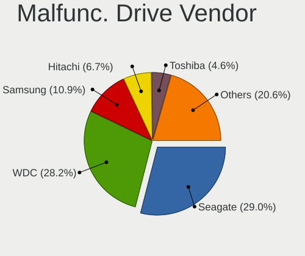

| Vendor              | Desktops | Drives | Percent |
|---------------------|----------|--------|---------|
| Seagate             | 426      | 532    | 28.98%  |
| WDC                 | 414      | 502    | 28.16%  |
| Samsung Electronics | 160      | 203    | 10.88%  |
| Hitachi             | 99       | 114    | 6.73%   |
| Toshiba             | 68       | 72     | 4.63%   |
| Crucial             | 39       | 41     | 2.65%   |
| Kingston            | 38       | 41     | 2.59%   |
| Maxtor              | 33       | 39     | 2.24%   |
| SanDisk             | 28       | 32     | 1.9%    |
| Intel               | 17       | 17     | 1.16%   |
| HGST                | 12       | 15     | 0.82%   |
| A-DATA Technology   | 11       | 11     | 0.75%   |
| OCZ                 | 9        | 10     | 0.61%   |
| Intenso             | 9        | 10     | 0.61%   |
| Corsair             | 9        | 12     | 0.61%   |
| China               | 8        | 9      | 0.54%   |
| SPCC                | 5        | 6      | 0.34%   |
| Micron Technology   | 5        | 7      | 0.34%   |
| Transcend           | 4        | 4      | 0.27%   |
| SK hynix            | 4        | 5      | 0.27%   |
| Patriot             | 4        | 4      | 0.27%   |
| XPG                 | 3        | 4      | 0.2%    |
| LITEONIT            | 3        | 3      | 0.2%    |
| Leven               | 3        | 4      | 0.2%    |
| Verbatim            | 2        | 3      | 0.14%   |
| TPH01203000GB       | 2        | 2      | 0.14%   |
| Plextor             | 2        | 2      | 0.14%   |
| Neo                 | 2        | 2      | 0.14%   |
| LITEON              | 2        | 2      | 0.14%   |
| Lexar               | 2        | 2      | 0.14%   |
| LDLC                | 2        | 2      | 0.14%   |
| Kingmax             | 2        | 2      | 0.14%   |
| Hewlett-Packard     | 2        | 2      | 0.14%   |
| ExcelStor           | 2        | 2      | 0.14%   |
| ASMT                | 2        | 3      | 0.14%   |
| ASMedia             | 2        | 2      | 0.14%   |
| Apple               | 2        | 3      | 0.14%   |
| ZADAK               | 1        | 1      | 0.07%   |
| XrayDisk            | 1        | 1      | 0.07%   |
| X12                 | 1        | 1      | 0.07%   |

Malfunc. HDD Vendor
-------------------

Vendors of faulty HDD drives

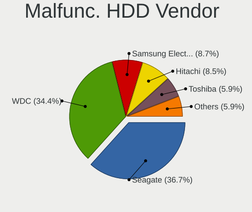

| Vendor              | Desktops | Drives | Percent |
|---------------------|----------|--------|---------|
| Seagate             | 426      | 532    | 36.69%  |
| WDC                 | 399      | 484    | 34.37%  |
| Samsung Electronics | 101      | 136    | 8.7%    |
| Hitachi             | 99       | 114    | 8.53%   |
| Toshiba             | 68       | 72     | 5.86%   |
| Maxtor              | 33       | 39     | 2.84%   |
| HGST                | 12       | 15     | 1.03%   |
| TPH01203000GB       | 2        | 2      | 0.17%   |
| Hewlett-Packard     | 2        | 2      | 0.17%   |
| ExcelStor           | 2        | 2      | 0.17%   |
| ASMT                | 2        | 3      | 0.17%   |
| ASMedia             | 2        | 2      | 0.17%   |
| Apple               | 2        | 3      | 0.17%   |
| WD MediaMax         | 1        | 1      | 0.09%   |
| USB3.0              | 1        | 1      | 0.09%   |
| Unknown             | 1        | 1      | 0.09%   |
| StoreJet            | 1        | 1      | 0.09%   |
| SABRENT             | 1        | 1      | 0.09%   |
| Min Yi U            | 1        | 1      | 0.09%   |
| MDT                 | 1        | 1      | 0.09%   |
| Intenso             | 1        | 1      | 0.09%   |
| Fujitsu             | 1        | 2      | 0.09%   |
| FEASSO              | 1        | 2      | 0.09%   |
| Unknown             | 1        | 2      | 0.09%   |

Malfunc. Drive Kind
-------------------

Kinds of faulty drives

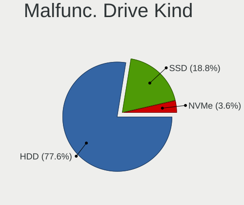

| Kind | Desktops | Drives | Percent |
|------|----------|--------|---------|
| HDD  | 1054     | 1420   | 77.56%  |
| SSD  | 256      | 288    | 18.84%  |
| NVMe | 49       | 56     | 3.61%   |

Failed Drives
-------------

Failed drive models

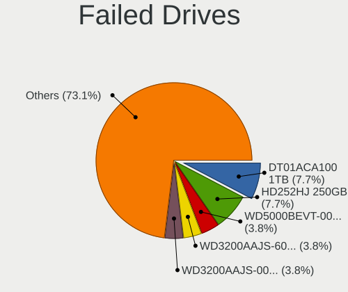

| Model                                       | Desktops | Drives | Percent |
|---------------------------------------------|----------|--------|---------|
| Toshiba DT01ACA100 1TB                      | 2        | 2      | 7.69%   |
| Samsung Electronics HD252HJ 250GB           | 2        | 2      | 7.69%   |
| WDC WD5000BEVT-00ZAT0 500GB                 | 1        | 1      | 3.85%   |
| WDC WD3200AAJS-60Z0A0 320GB                 | 1        | 1      | 3.85%   |
| WDC WD3200AAJS-00YZCA0 320GB                | 1        | 1      | 3.85%   |
| WDC WD30EZRS-11J99B1 3TB                    | 1        | 1      | 3.85%   |
| WD MediaMax WL1000GSA1672 1TB               | 1        | 1      | 3.85%   |
| Transcend TS120GSSD220S 120GB               | 1        | 1      | 3.85%   |
| Toshiba MQ01ABD100 1TB                      | 1        | 1      | 3.85%   |
| Toshiba HDWD130 3TB                         | 1        | 1      | 3.85%   |
| SK hynix BC501 NVMe Solid State Drive 512GB | 1        | 1      | 3.85%   |
| Seagate ST500DM002-1BD142 500GB             | 1        | 1      | 3.85%   |
| Seagate ST3500630NS 500GB                   | 1        | 1      | 3.85%   |
| Seagate ST32000542AS 2TB                    | 1        | 1      | 3.85%   |
| Seagate ST31500541AS 1TB                    | 1        | 1      | 3.85%   |
| Seagate ST31500341AS 1TB                    | 1        | 1      | 3.85%   |
| Samsung Electronics SSD 980 1TB             | 1        | 1      | 3.85%   |
| Samsung Electronics HD322GJ 320GB           | 1        | 1      | 3.85%   |
| Mushkin MKNSSDEC120GB                       | 1        | 1      | 3.85%   |
| Maxtor STM3320820AS 320GB                   | 1        | 1      | 3.85%   |
| Hitachi HDS721050DLE630 500GB               | 1        | 1      | 3.85%   |
| Hitachi HDS721050CLA662 500GB               | 1        | 1      | 3.85%   |
| Hitachi HDS721050CLA362 500GB               | 1        | 1      | 3.85%   |
| HGST HTS541010A9E680 1TB                    | 1        | 1      | 3.85%   |

Failed Drive Vendor
-------------------

Failed drive vendors

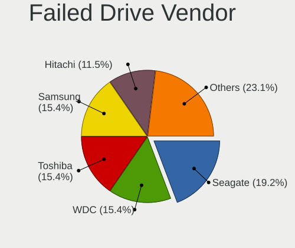

| Vendor              | Desktops | Drives | Percent |
|---------------------|----------|--------|---------|
| Seagate             | 5        | 5      | 19.23%  |
| WDC                 | 4        | 4      | 15.38%  |
| Toshiba             | 4        | 4      | 15.38%  |
| Samsung Electronics | 4        | 4      | 15.38%  |
| Hitachi             | 3        | 3      | 11.54%  |
| WD MediaMax         | 1        | 1      | 3.85%   |
| Transcend           | 1        | 1      | 3.85%   |
| SK hynix            | 1        | 1      | 3.85%   |
| Mushkin             | 1        | 1      | 3.85%   |
| Maxtor              | 1        | 1      | 3.85%   |
| HGST                | 1        | 1      | 3.85%   |

Drive Status
------------

Number of failed and malfunc. drives

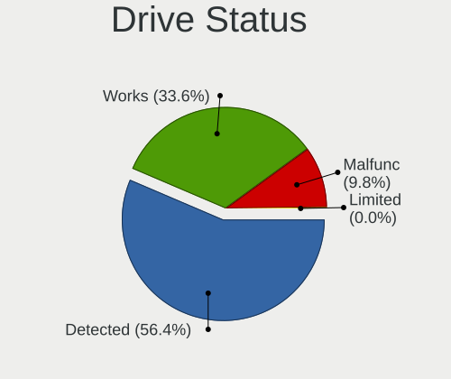

| Status   | Desktops | Drives | Percent |
|----------|----------|--------|---------|
| Detected | 7498     | 22252  | 56.42%  |
| Works    | 4463     | 10210  | 33.58%  |
| Malfunc  | 1302     | 1764   | 9.8%    |
| Failed   | 25       | 26     | 0.19%   |
| Limited  | 1        | 2      | 0.01%   |

Storage controller
------------------

Storage Vendor
--------------

Storage controller vendors

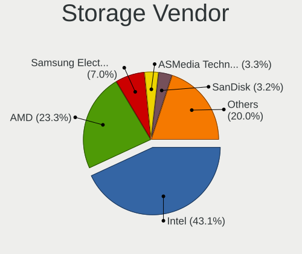

| Vendor                           | Desktops | Percent |
|----------------------------------|----------|---------|
| Intel                            | 7284     | 43.12%  |
| AMD                              | 3936     | 23.3%   |
| Samsung Electronics              | 1187     | 7.03%   |
| ASMedia Technology               | 565      | 3.34%   |
| SanDisk                          | 549      | 3.25%   |
| Kingston Technology Company      | 374      | 2.21%   |
| Marvell Technology Group         | 365      | 2.16%   |
| JMicron Technology               | 365      | 2.16%   |
| Nvidia                           | 358      | 2.12%   |
| Micron/Crucial Technology        | 350      | 2.07%   |
| Phison Electronics               | 333      | 1.97%   |
| Silicon Motion                   | 159      | 0.94%   |
| ADATA Technology                 | 140      | 0.83%   |
| MAXIO Technology (Hangzhou)      | 135      | 0.8%    |
| VIA Technologies                 | 112      | 0.66%   |
| Realtek Semiconductor            | 96       | 0.57%   |
| SK hynix                         | 84       | 0.5%    |
| Micron Technology                | 63       | 0.37%   |
| Shenzhen Longsys Electronics     | 61       | 0.36%   |
| Silicon Image                    | 38       | 0.22%   |
| Seagate Technology               | 38       | 0.22%   |
| LSI Logic / Symbios Logic        | 38       | 0.22%   |
| KIOXIA                           | 35       | 0.21%   |
| Toshiba America Info Systems     | 31       | 0.18%   |
| Adaptec                          | 28       | 0.17%   |
| Broadcom / LSI                   | 24       | 0.14%   |
| Transcend                        | 15       | 0.09%   |
| INNOGRIT                         | 13       | 0.08%   |
| Silicon Integrated Systems [SiS] | 12       | 0.07%   |
| Netac Technology                 | 11       | 0.07%   |
| Hosin Global Electronics         | 11       | 0.07%   |
| Lite-On Technology               | 9        | 0.05%   |
| Integrated Technology Express    | 9        | 0.05%   |
| Union Memory (Shenzhen)          | 6        | 0.04%   |
| Biwin Storage Technology         | 6        | 0.04%   |
| Yangtze Memory Technologies      | 5        | 0.03%   |
| Solid State Storage Technology   | 5        | 0.03%   |
| HighPoint Technologies           | 5        | 0.03%   |
| Shenzhen Wodposit Electronics    | 4        | 0.02%   |
| Shenzhen Techwinsemi Technology  | 4        | 0.02%   |

Storage Model
-------------

Storage controller models

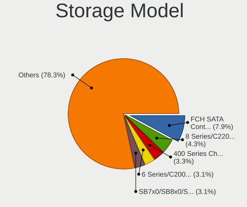

| Model                                                                                   | Desktops | Percent |
|-----------------------------------------------------------------------------------------|----------|---------|
| AMD FCH SATA Controller [AHCI mode]                                                     | 1675     | 7.9%    |
| Intel 8 Series/C220 Series Chipset Family 6-port SATA Controller 1 [AHCI mode]          | 916      | 4.32%   |
| AMD 400 Series Chipset SATA Controller                                                  | 697      | 3.29%   |
| Intel 6 Series/C200 Series Chipset Family 6 port Desktop SATA AHCI Controller           | 666      | 3.14%   |
| AMD SB7x0/SB8x0/SB9x0 IDE Controller                                                    | 648      | 3.06%   |
| AMD 500 Series Chipset SATA Controller                                                  | 601      | 2.84%   |
| Samsung NVMe SSD Controller SM981/PM981/PM983                                           | 565      | 2.67%   |
| Intel Q170/Q150/B150/H170/H110/Z170/CM236 Chipset SATA Controller [AHCI Mode]           | 559      | 2.64%   |
| AMD SB7x0/SB8x0/SB9x0 SATA Controller [AHCI mode]                                       | 531      | 2.51%   |
| Intel 7 Series/C210 Series Chipset Family 6-port SATA Controller [AHCI mode]            | 510      | 2.41%   |
| ASMedia ASM1061/ASM1062 Serial ATA Controller                                           | 486      | 2.29%   |
| Intel NM10/ICH7 Family SATA Controller [IDE mode]                                       | 484      | 2.28%   |
| Intel 200 Series PCH SATA controller [AHCI mode]                                        | 458      | 2.16%   |
| Intel SATA Controller [RAID mode]                                                       | 454      | 2.14%   |
| AMD SB7x0/SB8x0/SB9x0 SATA Controller [IDE mode]                                        | 428      | 2.02%   |
| AMD 600 Series Chipset SATA Controller                                                  | 374      | 1.76%   |
| Intel 82801G (ICH7 Family) IDE Controller                                               | 371      | 1.75%   |
| Intel Cannon Lake PCH SATA AHCI Controller                                              | 336      | 1.59%   |
| Intel 6 Series/C200 Series Chipset Family Desktop SATA Controller (IDE mode, ports 4-5) | 306      | 1.44%   |
| Intel 6 Series/C200 Series Chipset Family Desktop SATA Controller (IDE mode, ports 0-3) | 306      | 1.44%   |
| Samsung NVMe SSD Controller PM9A1/PM9A3/980PRO                                          | 224      | 1.06%   |
| Nvidia MCP61 SATA Controller                                                            | 206      | 0.97%   |
| AMD A320 Chipset SATA Controller [AHCI mode]                                            | 200      | 0.94%   |
| Intel 9 Series Chipset Family SATA Controller [AHCI Mode]                               | 198      | 0.93%   |
| Intel Alder Lake-S PCH SATA Controller [AHCI Mode]                                      | 191      | 0.9%    |
| JMicron JMB363 SATA/IDE Controller                                                      | 190      | 0.9%    |
| Micron/Crucial P2 [Nick P2] / P3 / P3 Plus NVMe PCIe SSD (DRAM-less)                    | 176      | 0.83%   |
| Nvidia MCP61 IDE                                                                        | 166      | 0.78%   |
| AMD 300 Series Chipset SATA Controller                                                  | 166      | 0.78%   |
| Samsung NVMe SSD Controller 980 (DRAM-less)                                             | 155      | 0.73%   |
| Samsung NVMe SSD Controller S4LV008[Pascal]                                             | 145      | 0.68%   |
| Intel 500 Series Chipset Family SATA AHCI Controller                                    | 145      | 0.68%   |
| Intel Raptor Lake SATA AHCI Controller                                                  | 133      | 0.63%   |
| Intel 82801I (ICH9 Family) 2 port SATA Controller [IDE mode]                            | 133      | 0.63%   |
| Intel 4 Series Chipset PT IDER Controller                                               | 131      | 0.62%   |
| Samsung NVMe SSD Controller SM961/PM961/SM963                                           | 129      | 0.61%   |
| Phison E12 NVMe Controller                                                              | 129      | 0.61%   |
| Intel 82801JI (ICH10 Family) 4 port SATA IDE Controller #1                              | 129      | 0.61%   |
| Intel 5 Series/3400 Series Chipset 6 port SATA AHCI Controller                          | 129      | 0.61%   |
| Intel 82801JI (ICH10 Family) SATA AHCI Controller                                       | 126      | 0.59%   |

Storage Kind
------------

Kind of storage controller (IDE, SATA, NVMe, SAS, ...)

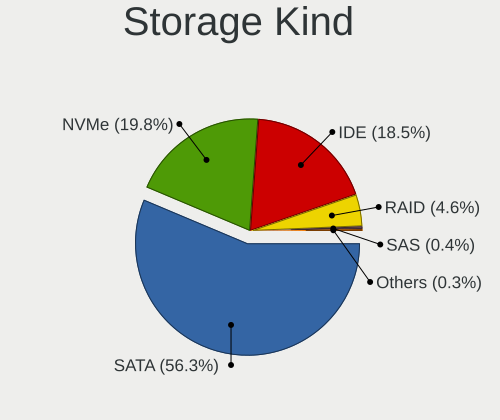

| Kind | Desktops | Percent |
|------|----------|---------|
| SATA | 9336     | 56.34%  |
| NVMe | 3287     | 19.84%  |
| IDE  | 3073     | 18.55%  |
| RAID | 763      | 4.6%    |
| SAS  | 64       | 0.39%   |
| SCSI | 47       | 0.28%   |

Processor
---------

CPU Vendor
----------

Processor vendors

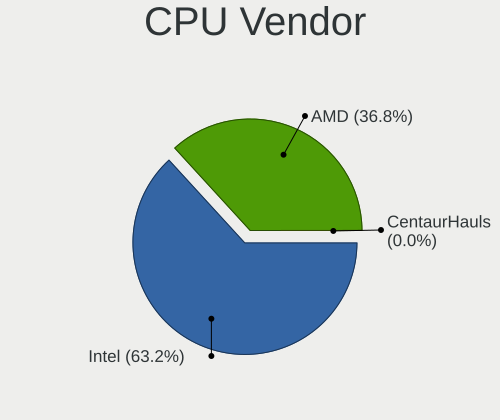

| Vendor       | Desktops | Percent |
|--------------|----------|---------|
| Intel        | 7408     | 63.2%   |
| AMD          | 4311     | 36.78%  |
| CentaurHauls | 2        | 0.02%   |

CPU Model
---------

Processor models

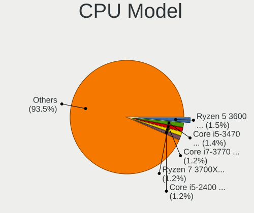

| Model                                       | Desktops | Percent |
|---------------------------------------------|----------|---------|
| AMD Ryzen 5 3600 6-Core Processor           | 181      | 1.54%   |
| Intel Core i5-3470 CPU @ 3.20GHz            | 162      | 1.37%   |
| Intel Core i7-3770 CPU @ 3.40GHz            | 147      | 1.25%   |
| AMD Ryzen 7 3700X 8-Core Processor          | 141      | 1.2%    |
| Intel Core i5-2400 CPU @ 3.10GHz            | 139      | 1.18%   |
| AMD FX-8350 Eight-Core Processor            | 128      | 1.09%   |
| Intel Core i7-2600 CPU @ 3.40GHz            | 121      | 1.03%   |
| AMD Ryzen 5 5600G with Radeon Graphics      | 115      | 0.98%   |
| Intel Core i7-4790 CPU @ 3.60GHz            | 114      | 0.97%   |
| AMD Ryzen 5 5600X 6-Core Processor          | 110      | 0.93%   |
| AMD FX-6300 Six-Core Processor              | 107      | 0.91%   |
| Intel Core i5-6500 CPU @ 3.20GHz            | 106      | 0.9%    |
| Intel Core i3-2120 CPU @ 3.30GHz            | 102      | 0.87%   |
| Intel Core 2 Duo CPU E8400 @ 3.00GHz        | 102      | 0.87%   |
| AMD Ryzen 7 5800X 8-Core Processor          | 100      | 0.85%   |
| Intel Core i5-4570 CPU @ 3.20GHz            | 97       | 0.82%   |
| AMD Ryzen 5 2600 Six-Core Processor         | 93       | 0.79%   |
| Intel Core i5-4590 CPU @ 3.30GHz            | 90       | 0.76%   |
| Intel Core i7-6700 CPU @ 3.40GHz            | 87       | 0.74%   |
| Intel Core i7-4790K CPU @ 4.00GHz           | 87       | 0.74%   |
| Intel Core i7-4770 CPU @ 3.40GHz            | 87       | 0.74%   |
| AMD Ryzen 7 5700G with Radeon Graphics      | 87       | 0.74%   |
| Intel Core i3-3220 CPU @ 3.30GHz            | 86       | 0.73%   |
| AMD Ryzen 9 5900X 12-Core Processor         | 85       | 0.72%   |
| AMD Ryzen 5 1600 Six-Core Processor         | 80       | 0.68%   |
| Intel Core 2 Quad CPU Q6600 @ 2.40GHz       | 79       | 0.67%   |
| AMD Ryzen 7 2700X Eight-Core Processor      | 78       | 0.66%   |
| Intel Core i3-2100 CPU @ 3.10GHz            | 76       | 0.64%   |
| Intel Core i5 CPU 650 @ 3.20GHz             | 75       | 0.64%   |
| Intel Core i5-4460 CPU @ 3.20GHz            | 74       | 0.63%   |
| Intel Core 2 Duo CPU E7500 @ 2.93GHz        | 73       | 0.62%   |
| Intel Core i7-7700K CPU @ 4.20GHz           | 68       | 0.58%   |
| Intel Core i7-8700 CPU @ 3.20GHz            | 64       | 0.54%   |
| Intel Core i7-6700K CPU @ 4.00GHz           | 62       | 0.53%   |
| Intel Core i7-7700 CPU @ 3.60GHz            | 60       | 0.51%   |
| AMD Ryzen 3 3200G with Radeon Vega Graphics | 60       | 0.51%   |
| AMD Ryzen 3 2200G with Radeon Vega Graphics | 60       | 0.51%   |
| AMD Ryzen 5 3400G with Radeon Vega Graphics | 59       | 0.5%    |
| Intel Core i5-2500 CPU @ 3.30GHz            | 57       | 0.48%   |
| Intel Core i5-8400 CPU @ 2.80GHz            | 56       | 0.47%   |

CPU Model Family
----------------

Processor model prefix

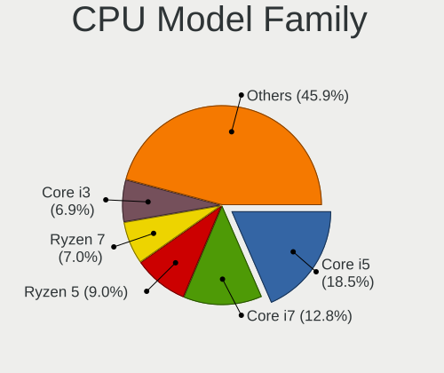

| Model                   | Desktops | Percent |
|-------------------------|----------|---------|
| Intel Core i5           | 2173     | 18.47%  |
| Intel Core i7           | 1512     | 12.85%  |
| AMD Ryzen 5             | 1055     | 8.96%   |
| AMD Ryzen 7             | 823      | 6.99%   |
| Intel Core i3           | 808      | 6.87%   |
| AMD FX                  | 515      | 4.38%   |
| Other                   | 486      | 4.13%   |
| Intel Xeon              | 483      | 4.1%    |
| Intel Core 2 Duo        | 398      | 3.38%   |
| AMD Ryzen 9             | 357      | 3.03%   |
| Intel Celeron           | 301      | 2.56%   |
| Intel Core 2 Quad       | 282      | 2.4%    |
| Intel Pentium           | 275      | 2.34%   |
| Intel Pentium Dual-Core | 206      | 1.75%   |
| AMD Ryzen 3             | 180      | 1.53%   |
| AMD Phenom II X4        | 162      | 1.38%   |
| AMD Athlon II X2        | 139      | 1.18%   |
| AMD A8                  | 125      | 1.06%   |
| Intel Core i9           | 118      | 1%      |
| AMD Athlon 64 X2        | 118      | 1%      |
| AMD A10                 | 111      | 0.94%   |
| AMD Athlon II X4        | 75       | 0.64%   |
| Intel Atom              | 74       | 0.63%   |
| AMD A6                  | 73       | 0.62%   |
| Intel Pentium Dual      | 72       | 0.61%   |
| Intel Core 2            | 70       | 0.59%   |
| AMD A4                  | 70       | 0.59%   |
| AMD Phenom II X6        | 69       | 0.59%   |
| Intel Pentium 4         | 61       | 0.52%   |
| AMD Athlon              | 54       | 0.46%   |
| Intel Pentium D         | 49       | 0.42%   |
| AMD Phenom              | 44       | 0.37%   |
| AMD Ryzen 5 PRO         | 42       | 0.36%   |
| AMD Athlon II X3        | 32       | 0.27%   |
| AMD Sempron             | 31       | 0.26%   |
| AMD Athlon X4           | 30       | 0.25%   |
| Intel Pentium Gold      | 29       | 0.25%   |
| AMD Ryzen Threadripper  | 25       | 0.21%   |
| AMD Phenom II X2        | 25       | 0.21%   |
| Intel Core              | 20       | 0.17%   |

CPU Cores
---------

Number of processor cores

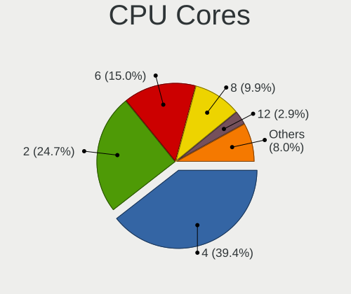

| Number  | Desktops | Percent |
|---------|----------|---------|
| 4       | 4648     | 39.45%  |
| 2       | 2912     | 24.71%  |
| 6       | 1766     | 14.99%  |
| 8       | 1169     | 9.92%   |
| 12      | 341      | 2.89%   |
| 1       | 260      | 2.21%   |
| 3       | 206      | 1.75%   |
| 16      | 190      | 1.61%   |
| 10      | 110      | 0.93%   |
| 14      | 63       | 0.53%   |
| 24      | 48       | 0.41%   |
| 20      | 36       | 0.31%   |
| 18      | 11       | 0.09%   |
| Unknown | 9        | 0.08%   |
| 32      | 5        | 0.04%   |
| 36      | 3        | 0.03%   |
| 28      | 2        | 0.02%   |
| 22      | 2        | 0.02%   |
| 64      | 1        | 0.01%   |
| 5       | 1        | 0.01%   |

CPU Sockets
-----------

Number of sockets

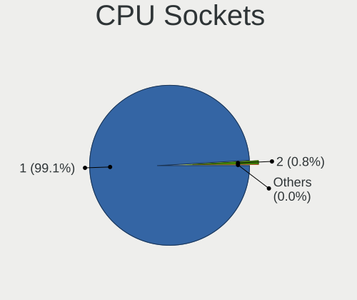

| Number | Desktops | Percent |
|--------|----------|---------|
| 1      | 11613    | 99.07%  |
| 2      | 94       | 0.8%    |
| 20     | 9        | 0.08%   |
| 24     | 2        | 0.02%   |
| 14     | 2        | 0.02%   |
| 4      | 2        | 0.02%   |

CPU Threads
-----------

Threads per core (Hyper-Threading)

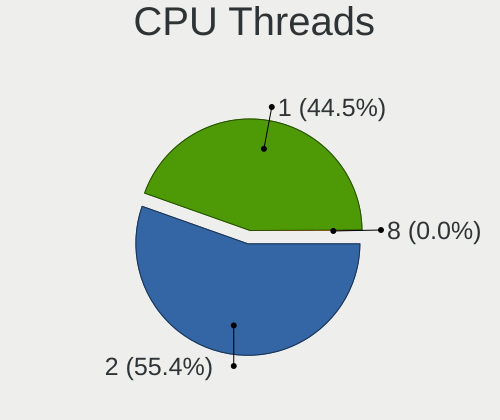

| Number  | Desktops | Percent |
|---------|----------|---------|
| 2       | 6515     | 55.42%  |
| 1       | 5230     | 44.49%  |
| Unknown | 9        | 0.08%   |
| 8       | 1        | 0.01%   |

CPU Op-Modes
------------

CPU Operation Modes (32-bit, 64-bit)

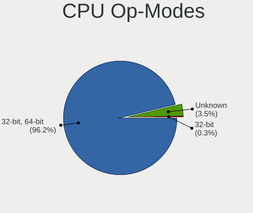

| Op mode        | Desktops | Percent |
|----------------|----------|---------|
| 32-bit, 64-bit | 11346    | 96.24%  |
| Unknown        | 409      | 3.47%   |
| 32-bit         | 34       | 0.29%   |

CPU Microcode
-------------

Microcode number

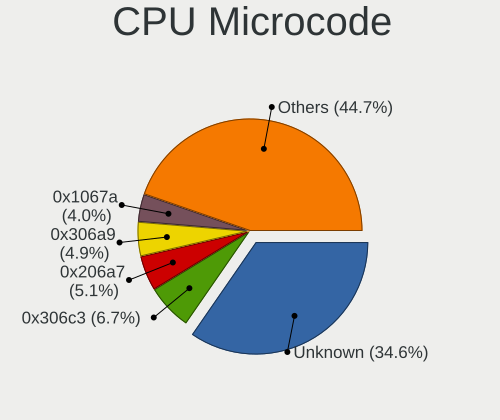

| Number     | Desktops | Percent |
|------------|----------|---------|
| Unknown    | 4202     | 34.63%  |
| 0x306c3    | 809      | 6.67%   |
| 0x206a7    | 616      | 5.08%   |
| 0x306a9    | 600      | 4.94%   |
| 0x1067a    | 486      | 4%      |
| 0x506e3    | 336      | 2.77%   |
| 0x06000852 | 303      | 2.5%    |
| 0x08701021 | 250      | 2.06%   |
| 0x010000c8 | 240      | 1.98%   |
| 0x906e9    | 224      | 1.85%   |
| 0x906ea    | 221      | 1.82%   |
| 0x0800820d | 204      | 1.68%   |
| 0x6fb      | 132      | 1.09%   |
| 0x06001119 | 124      | 1.02%   |
| 0x6fd      | 116      | 0.96%   |
| 0x08108109 | 105      | 0.87%   |
| 0xa0655    | 90       | 0.74%   |
| 0x08701013 | 87       | 0.72%   |
| 0x10676    | 84       | 0.69%   |
| 0x010000db | 84       | 0.69%   |
| 0x106e5    | 82       | 0.68%   |
| 0x0600063e | 82       | 0.68%   |
| 0xa0653    | 81       | 0.67%   |
| 0x20655    | 76       | 0.63%   |
| 0x08001138 | 74       | 0.61%   |
| 0x906ed    | 72       | 0.59%   |
| 0x0a50000d | 66       | 0.54%   |
| 0xa0671    | 64       | 0.53%   |
| 0x90672    | 61       | 0.5%    |
| 0x306f2    | 61       | 0.5%    |
| 0x20652    | 59       | 0.49%   |
| 0x06003106 | 59       | 0.49%   |
| 0x08101016 | 57       | 0.47%   |
| 0x0a601203 | 56       | 0.46%   |
| 0x0a50000c | 55       | 0.45%   |
| 0x0a201016 | 53       | 0.44%   |
| 0x0a20120a | 51       | 0.42%   |
| 0x010000dc | 50       | 0.41%   |
| 0x106a5    | 49       | 0.4%    |
| 0x08001137 | 48       | 0.4%    |

CPU Microarch
-------------

Microarchitecture

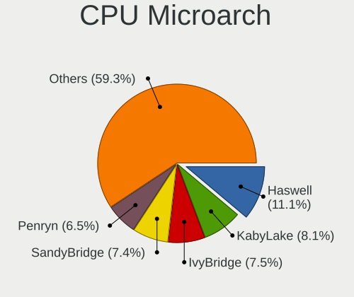

| Name              | Desktops | Percent |
|-------------------|----------|---------|
| Haswell           | 1310     | 11.12%  |
| KabyLake          | 959      | 8.14%   |
| IvyBridge         | 889      | 7.55%   |
| SandyBridge       | 869      | 7.38%   |
| Penryn            | 762      | 6.47%   |
| Zen 3             | 706      | 6%      |
| Zen 2             | 618      | 5.25%   |
| K10               | 598      | 5.08%   |
| Unknown           | 595      | 5.05%   |
| Piledriver        | 578      | 4.91%   |
| Skylake           | 556      | 4.72%   |
| Zen+              | 450      | 3.82%   |
| Core              | 379      | 3.22%   |
| Zen               | 322      | 2.73%   |
| Alderlake Hybrid  | 275      | 2.34%   |
| CometLake         | 259      | 2.2%    |
| Westmere          | 224      | 1.9%    |
| Nehalem           | 205      | 1.74%   |
| K8 Hammer         | 168      | 1.43%   |
| NetBurst          | 126      | 1.07%   |
| Steamroller       | 115      | 0.98%   |
| Bulldozer         | 108      | 0.92%   |
| Silvermont        | 96       | 0.82%   |
| Excavator         | 81       | 0.69%   |
| Icelake           | 72       | 0.61%   |
| K10 Llano         | 59       | 0.5%    |
| Broadwell         | 59       | 0.5%    |
| Goldmont plus     | 57       | 0.48%   |
| Gracemont         | 52       | 0.44%   |
| Bonnell           | 47       | 0.4%    |
| Bobcat            | 45       | 0.38%   |
| Goldmont          | 36       | 0.31%   |
| Jaguar            | 31       | 0.26%   |
| Tremont           | 28       | 0.24%   |
| Puma              | 19       | 0.16%   |
| TigerLake         | 11       | 0.09%   |
| Lunarlake Hybrid  | 7        | 0.06%   |
| K6                | 4        | 0.03%   |
| Meteorlake Hybrid | 1        | 0.01%   |

Graphics
--------

GPU Vendor
----------

Vendors of graphics cards

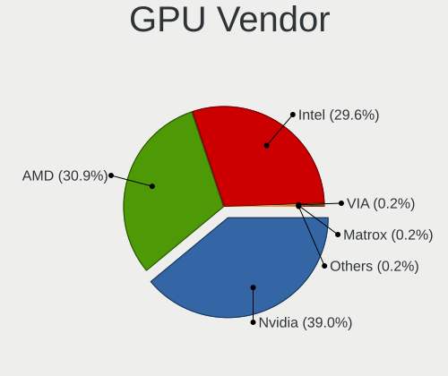

| Vendor                                       | Desktops | Percent |
|----------------------------------------------|----------|---------|
| Nvidia                                       | 4928     | 38.99%  |
| AMD                                          | 3903     | 30.88%  |
| Intel                                        | 3743     | 29.61%  |
| VIA Technologies                             | 22       | 0.17%   |
| Matrox Electronics Systems                   | 21       | 0.17%   |
| Silicon Integrated Systems [SiS]             | 8        | 0.06%   |
| ATI Technologies                             | 7        | 0.06%   |
| S3 Graphics                                  | 3        | 0.02%   |
| ASPEED Technology                            | 3        | 0.02%   |
| XGI Technology (eXtreme Graphics Innovation) | 2        | 0.02%   |

GPU Model
---------

Graphics card models

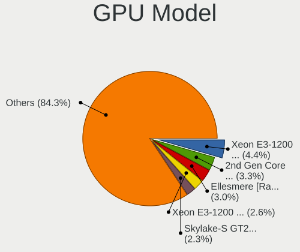

| Model                                                                       | Desktops | Percent |
|-----------------------------------------------------------------------------|----------|---------|
| Intel Xeon E3-1200 v3/4th Gen Core Processor Integrated Graphics Controller | 582      | 4.45%   |
| Intel 2nd Generation Core Processor Family Integrated Graphics Controller   | 436      | 3.33%   |
| AMD Ellesmere [Radeon RX 470/480/570/570X/580/580X/590]                     | 393      | 3%      |
| Intel Xeon E3-1200 v2/3rd Gen Core processor Graphics Controller            | 342      | 2.61%   |
| Intel Skylake-S GT2 [HD Graphics 530]                                       | 295      | 2.25%   |
| Nvidia GK208B [GeForce GT 710]                                              | 287      | 2.19%   |
| Nvidia GP107 [GeForce GTX 1050 Ti]                                          | 251      | 1.92%   |
| Intel 4 Series Chipset Integrated Graphics Controller                       | 238      | 1.82%   |
| Intel CoffeeLake-S GT2 [UHD Graphics 630]                                   | 234      | 1.79%   |
| AMD Raphael                                                                 | 207      | 1.58%   |
| Nvidia GP108 [GeForce GT 1030]                                              | 186      | 1.42%   |
| AMD Cezanne [Radeon Vega Series / Radeon Vega Mobile Series]                | 178      | 1.36%   |
| Nvidia GP106 [GeForce GTX 1060 6GB]                                         | 172      | 1.31%   |
| Intel Kaby Lake-S GT2 [HD Graphics 630]                                     | 169      | 1.29%   |
| Nvidia GT218 [GeForce 210]                                                  | 168      | 1.28%   |
| AMD Cedar [Radeon HD 5000/6000/7350/8350 Series]                            | 164      | 1.25%   |
| AMD Picasso/Raven 2 [Radeon Vega Series / Radeon Vega Mobile Series]        | 139      | 1.06%   |
| Nvidia GA106 [GeForce RTX 3060 Lite Hash Rate]                              | 137      | 1.05%   |
| Intel 82G33/G31 Express Integrated Graphics Controller                      | 125      | 0.96%   |
| Intel 4th Generation Core Processor Family Integrated Graphics Controller   | 123      | 0.94%   |
| Intel IvyBridge GT2 [HD Graphics 4000]                                      | 118      | 0.9%    |
| AMD Caicos [Radeon HD 6450/7450/8450 / R5 230 OEM]                          | 118      | 0.9%    |
| Nvidia GM107 [GeForce GTX 750 Ti]                                           | 111      | 0.85%   |
| Nvidia GK208B [GeForce GT 730]                                              | 110      | 0.84%   |
| Nvidia GP104 [GeForce GTX 1070]                                             | 107      | 0.82%   |
| AMD Navi 23 [Radeon RX 6600/6600 XT/6600M]                                  | 106      | 0.81%   |
| AMD Raven Ridge [Radeon Vega Series / Radeon Vega Mobile Series]            | 105      | 0.8%    |
| Intel CometLake-S GT2 [UHD Graphics 630]                                    | 104      | 0.79%   |
| Intel Core Processor Integrated Graphics Controller                         | 99       | 0.76%   |
| Nvidia TU117 [GeForce GTX 1650]                                             | 98       | 0.75%   |
| Nvidia GM204 [GeForce GTX 970]                                              | 96       | 0.73%   |
| AMD Granite Ridge [Radeon Graphics]                                         | 95       | 0.73%   |
| Nvidia GF119 [GeForce GT 610]                                               | 94       | 0.72%   |
| AMD RS780L [Radeon 3000]                                                    | 93       | 0.71%   |
| Nvidia TU116 [GeForce GTX 1660 SUPER]                                       | 92       | 0.7%    |
| Nvidia GM206 [GeForce GTX 960]                                              | 92       | 0.7%    |
| Nvidia GP107 [GeForce GTX 1050]                                             | 89       | 0.68%   |
| AMD Navi 10 [Radeon RX 5600 OEM/5600 XT / 5700/5700 XT]                     | 85       | 0.65%   |
| AMD Lexa PRO [Radeon 540/540X/550/550X / RX 540X/550/550X]                  | 83       | 0.63%   |
| AMD Navi 22 [Radeon RX 6700/6700 XT/6750 XT / 6800M/6850M XT]               | 76       | 0.58%   |

GPU Combo
---------

Combinations of graphics cards

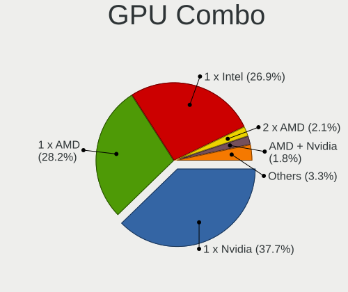

| Name                 | Desktops | Percent |
|----------------------|----------|---------|
| 1 x Nvidia           | 4485     | 37.73%  |
| 1 x AMD              | 3353     | 28.2%   |
| 1 x Intel            | 3198     | 26.9%   |
| 2 x AMD              | 245      | 2.06%   |
| AMD + Nvidia         | 212      | 1.78%   |
| Intel + Nvidia       | 166      | 1.4%    |
| Intel + AMD          | 97       | 0.82%   |
| 2 x Nvidia           | 51       | 0.43%   |
| 1 x VIA              | 22       | 0.19%   |
| 1 x Matrox           | 19       | 0.16%   |
| 2 x Intel            | 13       | 0.11%   |
| 1 x SiS              | 8        | 0.07%   |
| 3 x AMD              | 4        | 0.03%   |
| Nvidia + ASPEED      | 3        | 0.03%   |
| 1 x S3 Graphics      | 2        | 0.02%   |
| Nvidia + XGI         | 2        | 0.02%   |
| Intel + 2 x Nvidia   | 2        | 0.02%   |
| 2 x Intel + 1 x AMD  | 1        | 0.01%   |
| Nvidia + Matrox      | 1        | 0.01%   |
| Intel + S3 Graphics  | 1        | 0.01%   |
| 1 x AMD + 4 x Nvidia | 1        | 0.01%   |
| AMD + 2 x Nvidia     | 1        | 0.01%   |
| AMD + Matrox         | 1        | 0.01%   |

GPU Driver
----------

Free vs proprietary

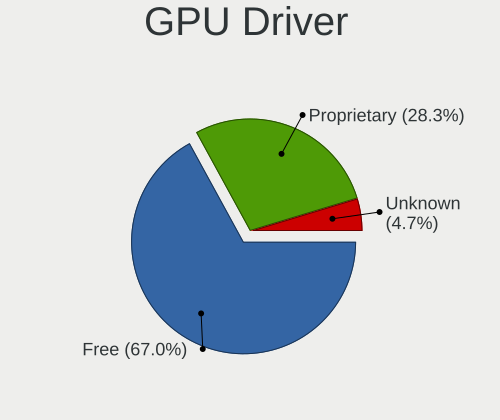

| Driver      | Desktops | Percent |
|-------------|----------|---------|
| Free        | 8019     | 67.04%  |
| Proprietary | 3382     | 28.27%  |
| Unknown     | 561      | 4.69%   |

GPU Memory
----------

Total video memory

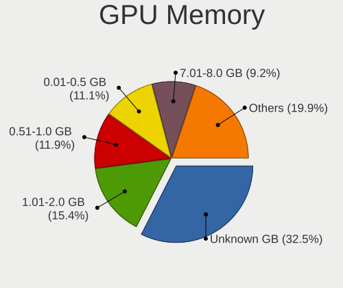

| Size in GB     | Desktops | Percent |
|----------------|----------|---------|
| Unknown        | 3933     | 32.5%   |
| 1.01-2.0       | 1865     | 15.41%  |
| 0.51-1.0       | 1441     | 11.91%  |
| 0.01-0.5       | 1342     | 11.09%  |
| 7.01-8.0       | 1115     | 9.21%   |
| 3.01-4.0       | 1050     | 8.68%   |
| 8.01-16.0      | 630      | 5.21%   |
| 5.01-6.0       | 472      | 3.9%    |
| 2.01-3.0       | 137      | 1.13%   |
| 16.01-24.0     | 101      | 0.83%   |
| 4.01-5.0       | 8        | 0.07%   |
| 24.01-32.0     | 6        | 0.05%   |
| More than 64.0 | 1        | 0.01%   |
| 32.01-64.0     | 1        | 0.01%   |

Monitor
-------

Monitor Vendor
--------------

Monitor vendors

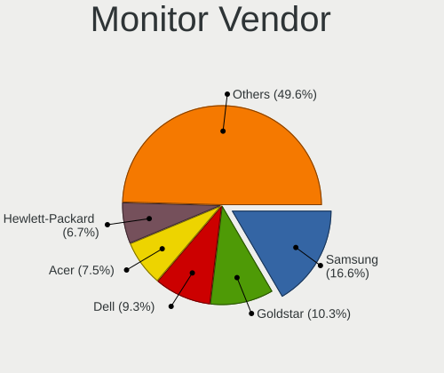

| Vendor               | Desktops | Percent |
|----------------------|----------|---------|
| Samsung Electronics  | 2068     | 16.57%  |
| Goldstar             | 1291     | 10.35%  |
| Dell                 | 1160     | 9.3%    |
| Acer                 | 937      | 7.51%   |
| Hewlett-Packard      | 838      | 6.72%   |
| AOC                  | 629      | 5.04%   |
| Ancor Communications | 547      | 4.38%   |
| BenQ                 | 538      | 4.31%   |
| Philips              | 534      | 4.28%   |
| Iiyama               | 265      | 2.12%   |
| ASUSTek Computer     | 258      | 2.07%   |
| Unknown              | 248      | 1.99%   |
| ViewSonic            | 242      | 1.94%   |
| LG Electronics       | 213      | 1.71%   |
| Lenovo               | 184      | 1.47%   |
| Sony                 | 141      | 1.13%   |
| Eizo                 | 120      | 0.96%   |
| MSI                  | 113      | 0.91%   |
| Fujitsu Siemens      | 104      | 0.83%   |
| NEC Computers        | 83       | 0.67%   |
| HannStar             | 79       | 0.63%   |
| Sceptre Tech         | 75       | 0.6%    |
| Vizio                | 74       | 0.59%   |
| Unknown              | 70       | 0.56%   |
| Medion               | 65       | 0.52%   |
| Gigabyte Technology  | 61       | 0.49%   |
| Toshiba              | 56       | 0.45%   |
| Panasonic            | 48       | 0.38%   |
| Vestel Elektronik    | 47       | 0.38%   |
| Hitachi              | 40       | 0.32%   |
| HKC                  | 35       | 0.28%   |
| Unknown (XXX)        | 34       | 0.27%   |
| Insignia             | 34       | 0.27%   |
| Mi                   | 30       | 0.24%   |
| RTK                  | 29       | 0.23%   |
| Idek Iiyama          | 29       | 0.23%   |
| Sharp                | 28       | 0.22%   |
| AUS                  | 25       | 0.2%    |
| MStar                | 24       | 0.19%   |
| Compal               | 24       | 0.19%   |

Monitor Model
-------------

Monitor models

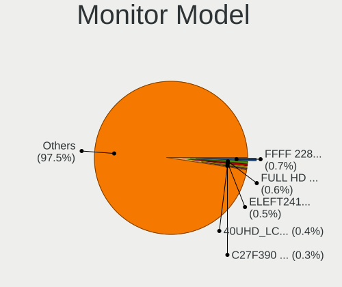

| Model                                                                 | Desktops | Percent |
|-----------------------------------------------------------------------|----------|---------|
| Unknown LCD Monitor FFFF 2288x1287 2550x2550mm 142.0-inch             | 89       | 0.67%   |
| Goldstar FULL HD GSM5B55 1920x1080 480x270mm 21.7-inch                | 75       | 0.56%   |
| Unknown                                                               | 70       | 0.53%   |
| Vestel Elektronik 40UHD_LCD_TV VES3700 3840x2160 880x500mm 39.8-inch  | 47       | 0.35%   |
| Samsung Electronics C27F390 SAM0D32 1920x1080 598x336mm 27.0-inch     | 46       | 0.35%   |
| Ancor Communications ASUS VS247 ACI249A 1920x1080 521x293mm 23.5-inch | 44       | 0.33%   |
| Goldstar LG ULTRAWIDE GSM59F1 2560x1080 670x280mm 28.6-inch           | 43       | 0.32%   |
| Samsung Electronics C24F390 SAM0D2C 1920x1080 521x293mm 23.5-inch     | 42       | 0.32%   |
| AOC 27G2G4 AOC2702 1920x1080 598x336mm 27.0-inch                      | 36       | 0.27%   |
| Goldstar LG IPS FULLHD GSM5AB8 1920x1080 480x270mm 21.7-inch          | 29       | 0.22%   |
| Dell U2412M DELA07A 1920x1200 518x324mm 24.1-inch                     | 27       | 0.2%    |
| Samsung Electronics S24F350 SAM0D20 1920x1080 521x293mm 23.5-inch     | 26       | 0.2%    |
| Ancor Communications ASUS VS228 ACI22FD 1920x1080 476x268mm 21.5-inch | 26       | 0.2%    |
| Ancor Communications VE247 ACI2493 1920x1080 530x300mm 24.0-inch      | 25       | 0.19%   |
| Goldstar HDR WFHD GSM7714 2560x1080 798x334mm 34.1-inch               | 24       | 0.18%   |
| BenQ GW2480 BNQ78E7 1920x1080 527x296mm 23.8-inch                     | 24       | 0.18%   |
| Philips PHL 243V7 PHLC155 1920x1080 527x296mm 23.8-inch               | 21       | 0.16%   |
| Goldstar HD GSM5ACB 1366x768 410x230mm 18.5-inch                      | 21       | 0.16%   |
| Philips PHL 243V5 PHLC0D1 1920x1080 521x293mm 23.5-inch               | 20       | 0.15%   |
| Goldstar W1943 GSM4BAD 1360x768 406x229mm 18.4-inch                   | 20       | 0.15%   |
| AOC 24G2W1G3 AOC2402 1920x1080 527x296mm 23.8-inch                    | 20       | 0.15%   |
| Samsung Electronics S24D330 SAM0D92 1920x1080 531x299mm 24.0-inch     | 19       | 0.14%   |
| Ancor Communications VS248 ACI2498 1920x1080 531x299mm 24.0-inch      | 19       | 0.14%   |
| Samsung Electronics U28E590 SAM0C4D 3840x2160 607x345mm 27.5-inch     | 18       | 0.14%   |
| Philips PHL 273V7 PHLC156 1920x1080 598x336mm 27.0-inch               | 18       | 0.14%   |
| MStar Demo MST0030 1920x1080 708x398mm 32.0-inch                      | 18       | 0.14%   |
| MSI Optix MAG27CQ MSI1462 2560x1440 597x336mm 27.0-inch               | 18       | 0.14%   |
| Hewlett-Packard 24f HPN3545 1920x1080 527x296mm 23.8-inch             | 18       | 0.14%   |
| Goldstar HDR 4K GSM7707 3840x2160 600x340mm 27.2-inch                 | 18       | 0.14%   |
| Goldstar HDR 4K GSM7706 3840x2160 600x340mm 27.2-inch                 | 18       | 0.14%   |
| AOC G2460 AOC2460 1920x1080 531x299mm 24.0-inch                       | 18       | 0.14%   |
| Goldstar ULTRAWIDE GSM76F9 2560x1080 531x298mm 24.0-inch              | 17       | 0.13%   |
| BenQ GL2450H BNQ78A7 1920x1080 531x298mm 24.0-inch                    | 17       | 0.13%   |
| Ancor Communications ASUS VP228 ACI22C3 1920x1080 476x268mm 21.5-inch | 17       | 0.13%   |
| Sceptre Tech Sceptre F24 SPT09AB 1920x1080 530x290mm 23.8-inch        | 16       | 0.12%   |
| Samsung Electronics S24D300 SAM0B43 1920x1080 531x299mm 24.0-inch     | 16       | 0.12%   |
| Panasonic TV MEIA296 1920x1080 698x392mm 31.5-inch                    | 16       | 0.12%   |
| Goldstar Ultra HD GSM5B09 3840x2160 600x340mm 27.2-inch               | 16       | 0.12%   |
| BenQ GW2270 BNQ78DB 1920x1080 476x268mm 21.5-inch                     | 16       | 0.12%   |
| BenQ GL2460 BNQ78CE 1920x1080 531x299mm 24.0-inch                     | 16       | 0.12%   |

Monitor Resolution
------------------

Monitor screen resolution

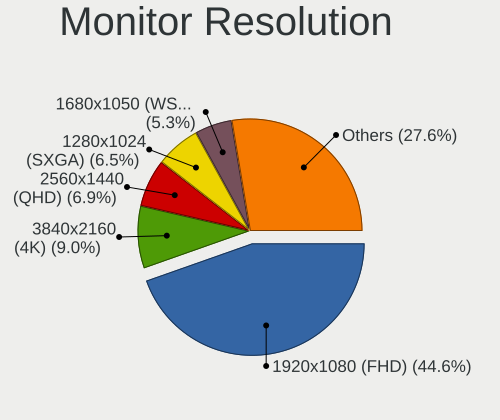

| Resolution         | Desktops | Percent |
|--------------------|----------|---------|
| 1920x1080 (FHD)    | 5445     | 44.61%  |
| 3840x2160 (4K)     | 1100     | 9.01%   |
| 2560x1440 (QHD)    | 844      | 6.91%   |
| 1280x1024 (SXGA)   | 791      | 6.48%   |
| 1680x1050 (WSXGA+) | 653      | 5.35%   |
| 1366x768 (WXGA)    | 513      | 4.2%    |
| 1440x900 (WXGA+)   | 446      | 3.65%   |
| 1920x1200 (WUXGA)  | 353      | 2.89%   |
| 1600x900 (HD+)     | 346      | 2.83%   |
| Unknown            | 301      | 2.47%   |
| 1360x768           | 227      | 1.86%   |
| 3440x1440          | 226      | 1.85%   |
| 2560x1080          | 161      | 1.32%   |
| 3840x1080          | 141      | 1.16%   |
| 1024x768 (XGA)     | 94       | 0.77%   |
| 2288x1287          | 93       | 0.76%   |
| 1920x540           | 65       | 0.53%   |
| 1600x1200          | 56       | 0.46%   |
| 1280x720 (HD)      | 41       | 0.34%   |
| 3200x1080          | 22       | 0.18%   |
| 2560x1600          | 19       | 0.16%   |
| 3840x1200          | 16       | 0.13%   |
| 3600x1080          | 16       | 0.13%   |
| 5760x1080          | 12       | 0.1%    |
| 3840x1600          | 11       | 0.09%   |
| 1280x960           | 11       | 0.09%   |
| 4480x1440          | 10       | 0.08%   |
| 2048x1152          | 10       | 0.08%   |
| 1280x768           | 10       | 0.08%   |
| 5120x1440          | 7        | 0.06%   |
| 3520x1080          | 7        | 0.06%   |
| 3360x1050          | 7        | 0.06%   |
| 3286x1080          | 7        | 0.06%   |
| 1152x864           | 7        | 0.06%   |
| 3360x1080          | 6        | 0.05%   |
| 2160x1440          | 6        | 0.05%   |
| 1280x800 (WXGA)    | 6        | 0.05%   |
| 5120x1080          | 5        | 0.04%   |
| 3280x1080          | 5        | 0.04%   |
| 3120x1050          | 5        | 0.04%   |

Monitor Diagonal
----------------

Diagonal size in inches

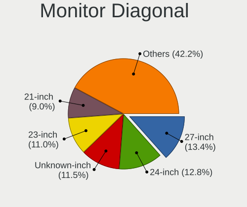

| Inches  | Desktops | Percent |
|---------|----------|---------|
| 27      | 1671     | 13.44%  |
| 24      | 1595     | 12.83%  |
| Unknown | 1429     | 11.5%   |
| 23      | 1370     | 11.02%  |
| 21      | 1123     | 9.03%   |
| 19      | 746      | 6%      |
| 31      | 635      | 5.11%   |
| 18      | 532      | 4.28%   |
| 22      | 459      | 3.69%   |
| 20      | 411      | 3.31%   |
| 17      | 378      | 3.04%   |
| 34      | 311      | 2.5%    |
| 84      | 186      | 1.5%    |
| 15      | 184      | 1.48%   |
| 32      | 158      | 1.27%   |
| 54      | 119      | 0.96%   |
| 40      | 116      | 0.93%   |
| 72      | 103      | 0.83%   |
| 142     | 89       | 0.72%   |
| 25      | 82       | 0.66%   |
| 26      | 54       | 0.43%   |
| 63      | 51       | 0.41%   |
| 48      | 43       | 0.35%   |
| 28      | 43       | 0.35%   |
| 46      | 41       | 0.33%   |
| 65      | 36       | 0.29%   |
| 52      | 35       | 0.28%   |
| 42      | 33       | 0.27%   |
| 16      | 32       | 0.26%   |
| 29      | 29       | 0.23%   |
| 74      | 27       | 0.22%   |
| 49      | 25       | 0.2%    |
| 37      | 24       | 0.19%   |
| 43      | 23       | 0.19%   |
| 39      | 23       | 0.19%   |
| 33      | 20       | 0.16%   |
| 36      | 18       | 0.14%   |
| 12      | 18       | 0.14%   |
| 47      | 17       | 0.14%   |
| 35      | 13       | 0.1%    |

Monitor Width
-------------

Physical width

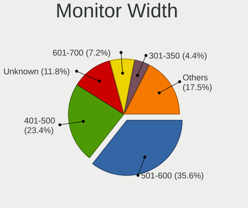

| Width in mm    | Desktops | Percent |
|----------------|----------|---------|
| 501-600        | 4295     | 35.61%  |
| 401-500        | 2819     | 23.37%  |
| Unknown        | 1429     | 11.85%  |
| 601-700        | 873      | 7.24%   |
| 301-350        | 535      | 4.44%   |
| 701-800        | 500      | 4.15%   |
| 351-400        | 467      | 3.87%   |
| 1001-1500      | 427      | 3.54%   |
| 1501-2000      | 330      | 2.74%   |
| 801-900        | 189      | 1.57%   |
| More than 2000 | 90       | 0.75%   |
| 901-1000       | 65       | 0.54%   |
| 201-300        | 40       | 0.33%   |
| 101-200        | 1        | 0.01%   |

Aspect Ratio
------------

Proportional relationship between the width and the height

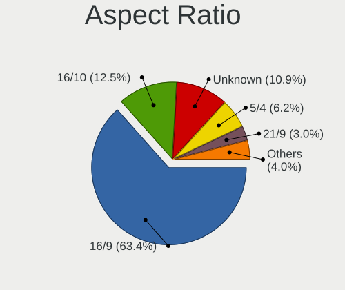

| Ratio   | Desktops | Percent |
|---------|----------|---------|
| 16/9    | 7301     | 63.42%  |
| 16/10   | 1436     | 12.47%  |
| Unknown | 1256     | 10.91%  |
| 5/4     | 710      | 6.17%   |
| 21/9    | 348      | 3.02%   |
| 4/3     | 205      | 1.78%   |
| 1.00    | 90       | 0.78%   |
| 3/2     | 64       | 0.56%   |
| 32/9    | 60       | 0.52%   |
| 6/5     | 26       | 0.23%   |
| 1.96    | 7        | 0.06%   |
| 3.20    | 2        | 0.02%   |
| 2.00    | 2        | 0.02%   |
| 0.89    | 2        | 0.02%   |
| 2.12    | 1        | 0.01%   |
| 11/10   | 1        | 0.01%   |
| 0.62    | 1        | 0.01%   |
| 0.57    | 1        | 0.01%   |

Monitor Area
------------

Area in inch²

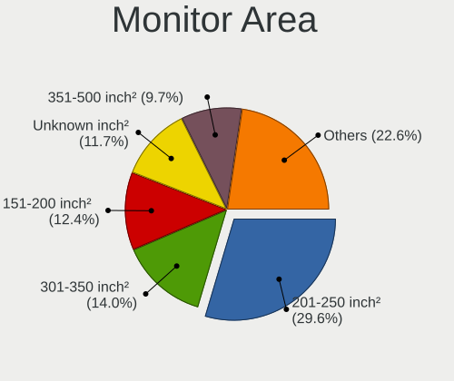

| Area in inch² | Desktops | Percent |
|----------------|----------|---------|
| 201-250        | 3606     | 29.58%  |
| 301-350        | 1703     | 13.97%  |
| 151-200        | 1511     | 12.4%   |
| Unknown        | 1429     | 11.72%  |
| 351-500        | 1180     | 9.68%   |
| 141-150        | 745      | 6.11%   |
| More than 1000 | 718      | 5.89%   |
| 251-300        | 620      | 5.09%   |
| 501-1000       | 376      | 3.08%   |
| 101-110        | 166      | 1.36%   |
| 131-140        | 49       | 0.4%    |
| 111-120        | 30       | 0.25%   |
| 71-80          | 20       | 0.16%   |
| 121-130        | 12       | 0.1%    |
| 81-90          | 11       | 0.09%   |
| 91-100         | 8        | 0.07%   |
| 51-60          | 3        | 0.02%   |
| 61-70          | 1        | 0.01%   |
| 41-50          | 1        | 0.01%   |
| 1-40           | 1        | 0.01%   |

Pixel Density
-------------

Pixels per inch

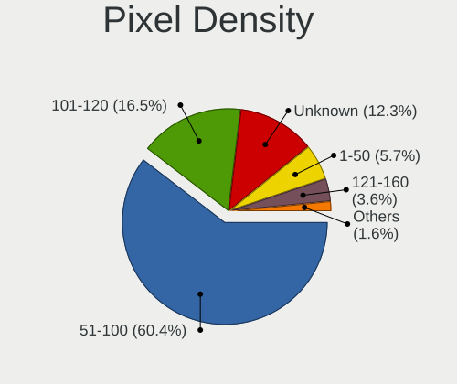

| Density       | Desktops | Percent |
|---------------|----------|---------|
| 51-100        | 7043     | 60.43%  |
| 101-120       | 1921     | 16.48%  |
| Unknown       | 1429     | 12.26%  |
| 1-50          | 662      | 5.68%   |
| 121-160       | 418      | 3.59%   |
| 161-240       | 181      | 1.55%   |
| More than 240 | 1        | 0.01%   |

Multiple Monitors
-----------------

Total monitors connected

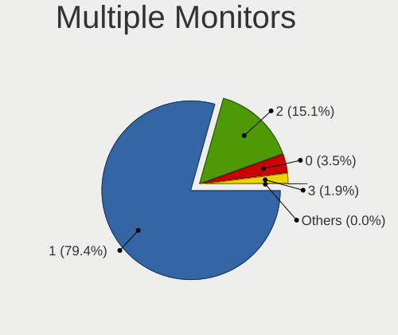

| Total | Desktops | Percent |
|-------|----------|---------|
| 1     | 9484     | 79.36%  |
| 2     | 1809     | 15.14%  |
| 0     | 416      | 3.48%   |
| 3     | 226      | 1.89%   |
| 4     | 14       | 0.12%   |
| 6     | 1        | 0.01%   |
| 5     | 1        | 0.01%   |

Network
-------

Net Controller Vendor
---------------------

Controller vendors

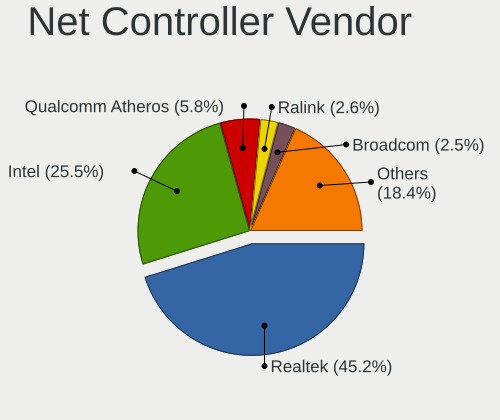

| Vendor                            | Desktops | Percent |
|-----------------------------------|----------|---------|
| Realtek Semiconductor             | 7655     | 45.17%  |
| Intel                             | 4330     | 25.55%  |
| Qualcomm Atheros                  | 977      | 5.76%   |
| Ralink Technology                 | 440      | 2.6%    |
| Broadcom                          | 430      | 2.54%   |
| TP-Link                           | 419      | 2.47%   |
| MediaTek                          | 387      | 2.28%   |
| Nvidia                            | 290      | 1.71%   |
| Ralink                            | 219      | 1.29%   |
| Marvell Technology Group          | 123      | 0.73%   |
| Samsung Electronics               | 121      | 0.71%   |
| Qualcomm Atheros Communications   | 112      | 0.66%   |
| Broadcom Limited                  | 99       | 0.58%   |
| NetGear                           | 98       | 0.58%   |
| D-Link                            | 95       | 0.56%   |
| ASUSTek Computer                  | 84       | 0.5%    |
| D-Link System                     | 83       | 0.49%   |
| Microsoft                         | 72       | 0.42%   |
| Aquantia                          | 63       | 0.37%   |
| Xiaomi                            | 57       | 0.34%   |
| VIA Technologies                  | 51       | 0.3%    |
| ASIX Electronics                  | 49       | 0.29%   |
| Linksys                           | 47       | 0.28%   |
| IMC Networks                      | 37       | 0.22%   |
| Edimax Technology                 | 37       | 0.22%   |
| Motorola PCS                      | 34       | 0.2%    |
| AVM                               | 34       | 0.2%    |
| Belkin Components                 | 33       | 0.19%   |
| Qualcomm Technologies             | 30       | 0.18%   |
| Huawei Technologies               | 30       | 0.18%   |
| Qualcomm                          | 24       | 0.14%   |
| DisplayLink                       | 19       | 0.11%   |
| OPPO Electronics                  | 17       | 0.1%    |
| Sitecom Europe                    | 14       | 0.08%   |
| Sundance Technology Inc / IC Plus | 13       | 0.08%   |
| Mercucys                          | 12       | 0.07%   |
| Google                            | 12       | 0.07%   |
| Arduino SA                        | 12       | 0.07%   |
| ZyDAS                             | 9        | 0.05%   |
| Tenda                             | 9        | 0.05%   |

Net Controller Model
--------------------

Controller models

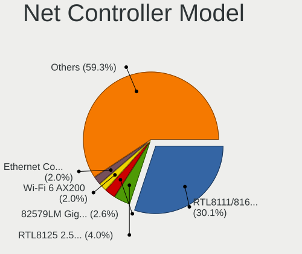

| Model                                                                  | Desktops | Percent |
|------------------------------------------------------------------------|----------|---------|
| Realtek RTL8111/8168/8211/8411 PCI Express Gigabit Ethernet Controller | 5772     | 30.06%  |
| Realtek RTL8125 2.5GbE Controller                                      | 769      | 4.01%   |
| Intel 82579LM Gigabit Network Connection (Lewisville)                  | 504      | 2.63%   |
| Intel Wi-Fi 6 AX200                                                    | 387      | 2.02%   |
| Intel Ethernet Connection (2) I219-V                                   | 384      | 2%      |
| Intel I211 Gigabit Network Connection                                  | 372      | 1.94%   |
| Realtek RTL810xE PCI Express Fast Ethernet controller                  | 305      | 1.59%   |
| Intel Ethernet Connection I217-LM                                      | 294      | 1.53%   |
| Intel Ethernet Controller I225-V                                       | 289      | 1.51%   |
| Realtek 802.11ac NIC                                                   | 216      | 1.13%   |
| Ralink MT7601U Wireless Adapter                                        | 187      | 0.97%   |
| Realtek RTL88x2bu [AC1200 Techkey]                                     | 183      | 0.95%   |
| Intel Ethernet Connection (7) I219-V                                   | 178      | 0.93%   |
| Intel Wi-Fi 6E(802.11ax) AX210/AX1675* 2x2 [Typhoon Peak]              | 176      | 0.92%   |
| Nvidia MCP61 Ethernet                                                  | 173      | 0.9%    |
| Realtek RTL8821CE 802.11ac PCIe Wireless Network Adapter               | 166      | 0.86%   |
| Intel Dual Band Wireless-AC 3168NGW [Stone Peak]                       | 157      | 0.82%   |
| Intel 82579V Gigabit Network Connection                                | 157      | 0.82%   |
| Intel 82567LM-3 Gigabit Network Connection                             | 153      | 0.8%    |
| Realtek RTL8188EUS 802.11n Wireless Network Adapter                    | 151      | 0.79%   |
| MediaTek MT7922 802.11ax PCI Express Wireless Network Adapter          | 147      | 0.77%   |
| Intel Ethernet Connection I217-V                                       | 139      | 0.72%   |
| Intel Ethernet Connection (2) I219-LM                                  | 123      | 0.64%   |
| Realtek RTL-8100/8101L/8139 PCI Fast Ethernet Adapter                  | 117      | 0.61%   |
| Intel Ethernet Connection (2) I218-V                                   | 116      | 0.6%    |
| Intel Wi-Fi 5(802.11ac) Wireless-AC 9x6x [Thunder Peak]                | 108      | 0.56%   |
| Samsung Galaxy series, misc. (tethering mode)                          | 98       | 0.51%   |
| Qualcomm Atheros Killer E220x Gigabit Ethernet Controller              | 96       | 0.5%    |
| Qualcomm Atheros AR9485 Wireless Network Adapter                       | 95       | 0.49%   |
| Realtek RTL8153 Gigabit Ethernet Adapter                               | 93       | 0.48%   |
| Qualcomm Atheros AR9271 802.11n                                        | 91       | 0.47%   |
| TP-Link TL-WN823N v2/v3 [Realtek RTL8192EU]                            | 89       | 0.46%   |
| Intel 82574L Gigabit Network Connection                                | 83       | 0.43%   |
| Qualcomm Atheros AR8151 v2.0 Gigabit Ethernet                          | 80       | 0.42%   |
| Intel Wireless 7260                                                    | 80       | 0.42%   |
| Intel Ethernet Controller I226-V                                       | 79       | 0.41%   |
| Intel Wireless 3165                                                    | 76       | 0.4%    |
| Intel Wireless 7265                                                    | 74       | 0.39%   |
| Intel Cannon Lake PCH CNVi WiFi                                        | 74       | 0.39%   |
| Ralink RT5370 Wireless Adapter                                         | 73       | 0.38%   |

Wireless Vendor
---------------

Wireless vendors

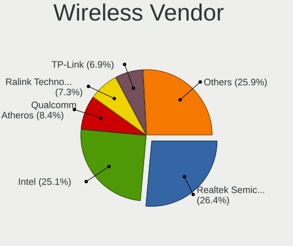

| Vendor                                | Desktops | Percent |
|---------------------------------------|----------|---------|
| Realtek Semiconductor                 | 1584     | 26.43%  |
| Intel                                 | 1502     | 25.06%  |
| Qualcomm Atheros                      | 503      | 8.39%   |
| Ralink Technology                     | 440      | 7.34%   |
| TP-Link                               | 415      | 6.92%   |
| MediaTek                              | 320      | 5.34%   |
| Ralink                                | 219      | 3.65%   |
| Broadcom                              | 163      | 2.72%   |
| Qualcomm Atheros Communications       | 112      | 1.87%   |
| NetGear                               | 98       | 1.63%   |
| D-Link                                | 93       | 1.55%   |
| ASUSTek Computer                      | 83       | 1.38%   |
| Microsoft                             | 70       | 1.17%   |
| D-Link System                         | 53       | 0.88%   |
| Linksys                               | 47       | 0.78%   |
| IMC Networks                          | 37       | 0.62%   |
| Edimax Technology                     | 37       | 0.62%   |
| AVM                                   | 34       | 0.57%   |
| Belkin Components                     | 28       | 0.47%   |
| Broadcom Limited                      | 25       | 0.42%   |
| Sitecom Europe                        | 14       | 0.23%   |
| Mercucys                              | 12       | 0.2%    |
| ZyDAS                                 | 9        | 0.15%   |
| Tenda                                 | 9        | 0.15%   |
| 802.11g Adapter [Linksys WUSB54GC v3] | 8        | 0.13%   |
| Texas Instruments                     | 7        | 0.12%   |
| Realtek                               | 6        | 0.1%    |
| Marvell Technology Group              | 6        | 0.1%    |
| Gemtek                                | 6        | 0.1%    |
| ZyXEL Communications                  | 5        | 0.08%   |
| Accton Technology                     | 5        | 0.08%   |
| ZTopInc                               | 4        | 0.07%   |
| Micro Star International              | 4        | 0.07%   |
| BUFFALO                               | 4        | 0.07%   |
| Z-Com                                 | 3        | 0.05%   |
| TRENDnet                              | 3        | 0.05%   |
| Qualcomm Technologies                 | 3        | 0.05%   |
| Wacom                                 | 2        | 0.03%   |
| VIA Technologies                      | 2        | 0.03%   |
| Samsung Electronics                   | 2        | 0.03%   |

Wireless Model
--------------

Wireless models

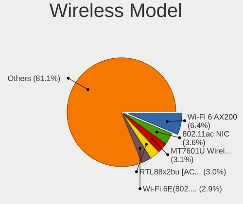

| Model                                                          | Desktops | Percent |
|----------------------------------------------------------------|----------|---------|
| Intel Wi-Fi 6 AX200                                            | 387      | 6.37%   |
| Realtek 802.11ac NIC                                           | 216      | 3.55%   |
| Ralink MT7601U Wireless Adapter                                | 187      | 3.08%   |
| Realtek RTL88x2bu [AC1200 Techkey]                             | 183      | 3.01%   |
| Intel Wi-Fi 6E(802.11ax) AX210/AX1675* 2x2 [Typhoon Peak]      | 176      | 2.9%    |
| Realtek RTL8821CE 802.11ac PCIe Wireless Network Adapter       | 166      | 2.73%   |
| Intel Dual Band Wireless-AC 3168NGW [Stone Peak]               | 157      | 2.58%   |
| Realtek RTL8188EUS 802.11n Wireless Network Adapter            | 151      | 2.48%   |
| MediaTek MT7922 802.11ax PCI Express Wireless Network Adapter  | 126      | 2.07%   |
| Intel Wi-Fi 5(802.11ac) Wireless-AC 9x6x [Thunder Peak]        | 108      | 1.78%   |
| Qualcomm Atheros AR9485 Wireless Network Adapter               | 95       | 1.56%   |
| Qualcomm Atheros AR9271 802.11n                                | 91       | 1.5%    |
| TP-Link TL-WN823N v2/v3 [Realtek RTL8192EU]                    | 89       | 1.46%   |
| Intel Wireless 7260                                            | 80       | 1.32%   |
| Intel Wireless 3165                                            | 76       | 1.25%   |
| Intel Wireless 7265                                            | 74       | 1.22%   |
| Intel Cannon Lake PCH CNVi WiFi                                | 74       | 1.22%   |
| Ralink RT5370 Wireless Adapter                                 | 73       | 1.2%    |
| MediaTek MT7921K (RZ608) Wi-Fi 6E 80MHz                        | 73       | 1.2%    |
| Ralink RT2870/RT3070 Wireless Adapter                          | 72       | 1.18%   |
| Realtek RTL8192CU 802.11n WLAN Adapter                         | 69       | 1.14%   |
| Realtek RTL8188FTV 802.11b/g/n 1T1R 2.4G WLAN Adapter          | 68       | 1.12%   |
| Intel 700 Series Chipset CNVi WiFi                             | 64       | 1.05%   |
| Realtek RTL8192EU 802.11b/g/n WLAN Adapter                     | 61       | 1%      |
| Broadcom BCM4360 802.11ac Dual Band Wireless Network Adapter   | 60       | 0.99%   |
| Realtek RTL8188CUS 802.11n WLAN Adapter                        | 59       | 0.97%   |
| Intel Wireless 8260                                            | 55       | 0.9%    |
| Qualcomm Atheros AR93xx Wireless Network Adapter               | 50       | 0.82%   |
| Realtek RTL8192EE PCIe Wireless Network Adapter                | 46       | 0.76%   |
| Qualcomm Atheros AR9287 Wireless Network Adapter (PCI-Express) | 46       | 0.76%   |
| Intel Alder Lake-S PCH CNVi WiFi                               | 46       | 0.76%   |
| TP-Link AC600 wireless Realtek RTL8811AU [Archer T2U Nano]     | 45       | 0.74%   |
| TP-Link TL-WN722N v2/v3 [Realtek RTL8188EUS]                   | 44       | 0.72%   |
| TP-Link 802.11ac WLAN Adapter                                  | 43       | 0.71%   |
| Realtek RTL8821AE 802.11ac PCIe Wireless Network Adapter       | 43       | 0.71%   |
| Microsoft Xbox 360 Wireless Adapter                            | 43       | 0.71%   |
| Realtek RTL8812AE 802.11ac PCIe Wireless Network Adapter       | 41       | 0.67%   |
| Realtek RTL8192CE PCIe Wireless Network Adapter                | 41       | 0.67%   |
| Qualcomm Atheros QCA9565 / AR9565 Wireless Network Adapter     | 39       | 0.64%   |
| TP-Link Archer T3U [Realtek RTL8812BU]                         | 38       | 0.63%   |

Ethernet Vendor
---------------

Ethernet vendors

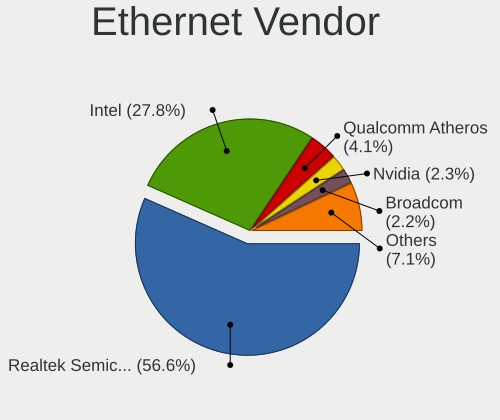

| Vendor                                 | Desktops | Percent |
|----------------------------------------|----------|---------|
| Realtek Semiconductor                  | 7101     | 56.62%  |
| Intel                                  | 3481     | 27.75%  |
| Qualcomm Atheros                       | 511      | 4.07%   |
| Nvidia                                 | 290      | 2.31%   |
| Broadcom                               | 272      | 2.17%   |
| Samsung Electronics                    | 119      | 0.95%   |
| Marvell Technology Group               | 118      | 0.94%   |
| Broadcom Limited                       | 74       | 0.59%   |
| Aquantia                               | 63       | 0.5%    |
| MediaTek                               | 62       | 0.49%   |
| Xiaomi                                 | 56       | 0.45%   |
| ASIX Electronics                       | 49       | 0.39%   |
| VIA Technologies                       | 48       | 0.38%   |
| Motorola PCS                           | 34       | 0.27%   |
| D-Link System                          | 30       | 0.24%   |
| Qualcomm Technologies                  | 27       | 0.22%   |
| Qualcomm                               | 24       | 0.19%   |
| Huawei Technologies                    | 19       | 0.15%   |
| DisplayLink                            | 19       | 0.15%   |
| OPPO Electronics                       | 17       | 0.14%   |
| Sundance Technology Inc / IC Plus      | 13       | 0.1%    |
| Google                                 | 12       | 0.1%    |
| Silicon Integrated Systems [SiS]       | 8        | 0.06%   |
| T & A Mobile Phones                    | 6        | 0.05%   |
| LG Electronics                         | 6        | 0.05%   |
| Sony Ericsson Mobile Communications AB | 5        | 0.04%   |
| JMicron Technology                     | 5        | 0.04%   |
| Apple                                  | 5        | 0.04%   |
| ZTE WCDMA Technologies MSM             | 4        | 0.03%   |
| TP-Link                                | 4        | 0.03%   |
| Spreadtrum Communications              | 4        | 0.03%   |
| Belkin Components                      | 4        | 0.03%   |
| Suzhou Motorcomm Electronic Technology | 3        | 0.02%   |
| Mellanox Technologies                  | 3        | 0.02%   |
| ICS Advent                             | 3        | 0.02%   |
| ADMtek                                 | 3        | 0.02%   |
| 3Com                                   | 3        | 0.02%   |
| OnePlus Technology (Shenzhen)          | 2        | 0.02%   |
| NetXen Incorporated                    | 2        | 0.02%   |
| National Semiconductor                 | 2        | 0.02%   |

Ethernet Model
--------------

Ethernet models

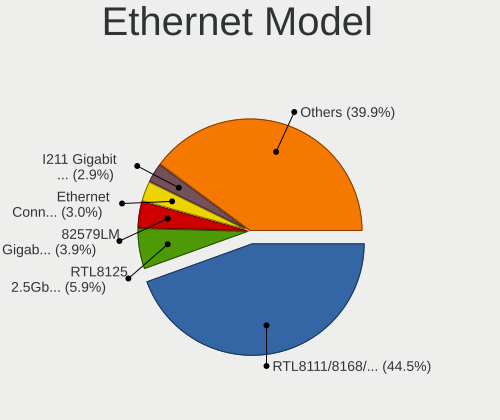

| Model                                                                  | Desktops | Percent |
|------------------------------------------------------------------------|----------|---------|
| Realtek RTL8111/8168/8211/8411 PCI Express Gigabit Ethernet Controller | 5772     | 44.49%  |
| Realtek RTL8125 2.5GbE Controller                                      | 769      | 5.93%   |
| Intel 82579LM Gigabit Network Connection (Lewisville)                  | 504      | 3.88%   |
| Intel Ethernet Connection (2) I219-V                                   | 384      | 2.96%   |
| Intel I211 Gigabit Network Connection                                  | 372      | 2.87%   |
| Realtek RTL810xE PCI Express Fast Ethernet controller                  | 305      | 2.35%   |
| Intel Ethernet Connection I217-LM                                      | 294      | 2.27%   |
| Intel Ethernet Controller I225-V                                       | 289      | 2.23%   |
| Intel Ethernet Connection (7) I219-V                                   | 178      | 1.37%   |
| Nvidia MCP61 Ethernet                                                  | 173      | 1.33%   |
| Intel 82579V Gigabit Network Connection                                | 157      | 1.21%   |
| Intel 82567LM-3 Gigabit Network Connection                             | 153      | 1.18%   |
| Intel Ethernet Connection I217-V                                       | 139      | 1.07%   |
| Intel Ethernet Connection (2) I219-LM                                  | 123      | 0.95%   |
| Realtek RTL-8100/8101L/8139 PCI Fast Ethernet Adapter                  | 117      | 0.9%    |
| Intel Ethernet Connection (2) I218-V                                   | 116      | 0.89%   |
| Samsung Galaxy series, misc. (tethering mode)                          | 98       | 0.76%   |
| Qualcomm Atheros Killer E220x Gigabit Ethernet Controller              | 96       | 0.74%   |
| Realtek RTL8153 Gigabit Ethernet Adapter                               | 93       | 0.72%   |
| Intel 82574L Gigabit Network Connection                                | 83       | 0.64%   |
| Qualcomm Atheros AR8151 v2.0 Gigabit Ethernet                          | 80       | 0.62%   |
| Intel Ethernet Controller I226-V                                       | 79       | 0.61%   |
| Marvell Group 88E8056 PCI-E Gigabit Ethernet Controller                | 67       | 0.52%   |
| Qualcomm Atheros AR8161 Gigabit Ethernet                               | 63       | 0.49%   |
| Intel 82566DM-2 Gigabit Network Connection                             | 61       | 0.47%   |
| Intel Ethernet Connection (7) I219-LM                                  | 59       | 0.45%   |
| Realtek RTL8169 PCI Gigabit Ethernet Controller                        | 55       | 0.42%   |
| Realtek RTL8126 5GbE Controller                                        | 53       | 0.41%   |
| Broadcom NetXtreme BCM5761 Gigabit Ethernet PCIe                       | 50       | 0.39%   |
| Intel 82578DM Gigabit Network Connection                               | 48       | 0.37%   |
| Qualcomm Atheros AR8121/AR8113/AR8114 Gigabit or Fast Ethernet         | 47       | 0.36%   |
| Xiaomi Mi/Redmi series (RNDIS)                                         | 43       | 0.33%   |
| Intel I210 Gigabit Network Connection                                  | 43       | 0.33%   |
| Intel 82578DC Gigabit Network Connection                               | 39       | 0.3%    |
| Broadcom NetXtreme BCM5754 Gigabit Ethernet PCI Express                | 38       | 0.29%   |
| Intel Ethernet Connection (5) I219-LM                                  | 36       | 0.28%   |
| ASIX AX88179 Gigabit Ethernet                                          | 36       | 0.28%   |
| Qualcomm Atheros Killer E2400 Gigabit Ethernet Controller              | 35       | 0.27%   |
| Nvidia MCP77 Ethernet                                                  | 35       | 0.27%   |
| Broadcom NetXtreme BCM5764M Gigabit Ethernet PCIe                      | 35       | 0.27%   |

Net Controller Kind
-------------------

Ethernet, WiFi or modem

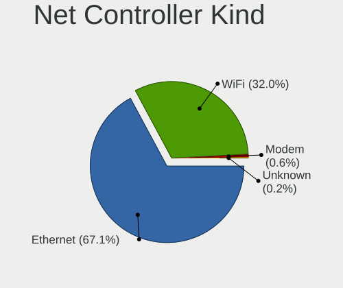

| Kind     | Desktops | Percent |
|----------|----------|---------|
| Ethernet | 11599    | 67.15%  |
| WiFi     | 5530     | 32.01%  |
| Modem    | 106      | 0.61%   |
| Unknown  | 39       | 0.23%   |

Used Controller
---------------

Currently used network controller

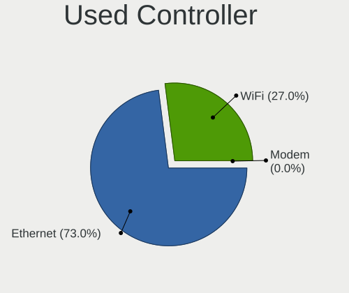

| Kind     | Desktops | Percent |
|----------|----------|---------|
| Ethernet | 8929     | 72.99%  |
| WiFi     | 3302     | 26.99%  |
| Unknown  | 2        | 0.02%   |
| Modem    | 1        | 0.01%   |

NICs
----

Total network controllers on board

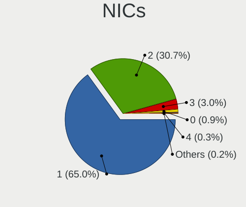

| Total | Desktops | Percent |
|-------|----------|---------|
| 1     | 7675     | 65%     |
| 2     | 3619     | 30.65%  |
| 3     | 353      | 2.99%   |
| 0     | 101      | 0.86%   |
| 4     | 35       | 0.3%    |
| 5     | 16       | 0.14%   |
| 6     | 4        | 0.03%   |
| 7     | 2        | 0.02%   |
| 10    | 1        | 0.01%   |
| 8     | 1        | 0.01%   |

IPv6
----

IPv6 vs IPv4

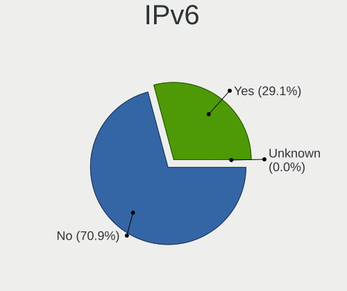

| Used    | Desktops | Percent |
|---------|----------|---------|
| No      | 8474     | 70.85%  |
| Yes     | 3485     | 29.14%  |
| Unknown | 1        | 0.01%   |

Bluetooth
---------

Bluetooth Vendor
----------------

Controller vendors

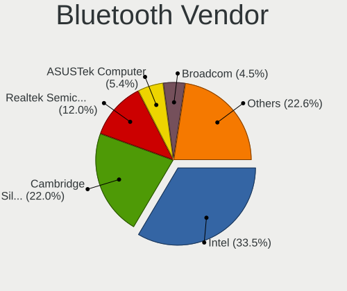

| Vendor                          | Desktops | Percent |
|---------------------------------|----------|---------|
| Intel                           | 1403     | 33.5%   |
| Cambridge Silicon Radio         | 923      | 22.04%  |
| Realtek Semiconductor           | 501      | 11.96%  |
| ASUSTek Computer                | 225      | 5.37%   |
| Broadcom                        | 190      | 4.54%   |
| IMC Networks                    | 180      | 4.3%    |
| MediaTek                        | 176      | 4.2%    |
| Qualcomm Atheros Communications | 127      | 3.03%   |
| Foxconn / Hon Hai               | 107      | 2.55%   |
| TP-Link                         | 90       | 2.15%   |
| Lite-On Technology              | 35       | 0.84%   |
| Unknown                         | 32       | 0.76%   |
| Apple                           | 31       | 0.74%   |
| Integrated System Solution      | 24       | 0.57%   |
| Actions                         | 19       | 0.45%   |
| Edimax Technology               | 17       | 0.41%   |
| Belkin Components               | 16       | 0.38%   |
| Realtek                         | 11       | 0.26%   |
| Conwise Technology              | 9        | 0.21%   |
| Ralink                          | 8        | 0.19%   |
| Dell                            | 7        | 0.17%   |
| Hewlett-Packard                 | 6        | 0.14%   |
| Dynex                           | 6        | 0.14%   |
| Mercucys                        | 5        | 0.12%   |
| Logitech                        | 5        | 0.12%   |
| Micro Star International        | 4        | 0.1%    |
| HTC (High Tech Computer)        | 4        | 0.1%    |
| AICSemi                         | 4        | 0.1%    |
| Roper                           | 3        | 0.07%   |
| SiW                             | 2        | 0.05%   |
| Sitecom Europe                  | 2        | 0.05%   |
| SINO WEALTH                     | 2        | 0.05%   |
| Motorola PCS                    | 2        | 0.05%   |
| Kensington                      | 2        | 0.05%   |
| Primax Electronics              | 1        | 0.02%   |
| Plugable                        | 1        | 0.02%   |
| Opticis                         | 1        | 0.02%   |
| Mobile Action Technology        | 1        | 0.02%   |
| Microsoft                       | 1        | 0.02%   |
| Fujitsu Siemens Computers       | 1        | 0.02%   |

Bluetooth Model
---------------

Controller models

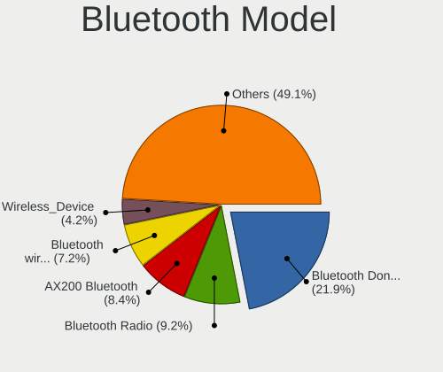

| Model                                                 | Desktops | Percent |
|-------------------------------------------------------|----------|---------|
| Cambridge Silicon Radio Bluetooth Dongle (HCI mode)   | 922      | 21.95%  |
| Realtek Bluetooth Radio                               | 386      | 9.19%   |
| Intel AX200 Bluetooth                                 | 352      | 8.38%   |
| Intel Bluetooth wireless interface                    | 304      | 7.24%   |
| MediaTek Wireless_Device                              | 176      | 4.19%   |
| Intel AX210 Bluetooth                                 | 164      | 3.9%    |
| Intel Wireless-AC 3168 Bluetooth                      | 151      | 3.59%   |
| Intel AX201 Bluetooth                                 | 119      | 2.83%   |
| Broadcom BCM20702A0 Bluetooth 4.0                     | 111      | 2.64%   |
| Intel Wireless-AC 9260 Bluetooth Adapter              | 106      | 2.52%   |
| Intel Bluetooth Device                                | 95       | 2.26%   |
| Intel Bluetooth 9460/9560 Jefferson Peak (JfP)        | 93       | 2.21%   |
| TP-Link TP-T@- UB500 Adapter                          | 90       | 2.14%   |
| IMC Networks Bluetooth Radio                          | 89       | 2.12%   |
| ASUS Broadcom BCM20702A0 Bluetooth                    | 78       | 1.86%   |
| IMC Networks Wireless_Device                          | 76       | 1.81%   |
| ASUS ASUS USB-BT500                                   | 69       | 1.64%   |
| Foxconn / Hon Hai Wireless_Device                     | 58       | 1.38%   |
| Realtek  Bluetooth 4.2 Adapter                        | 54       | 1.29%   |
| Qualcomm Atheros  Bluetooth Device                    | 43       | 1.02%   |
| Foxconn / Hon Hai Bluetooth Device                    | 42       | 1%      |
| Qualcomm Atheros AR3011 Bluetooth                     | 36       | 0.86%   |
| Unknown                                               | 32       | 0.76%   |
| Realtek Bluetooth 5.3 Radio                           | 27       | 0.64%   |
| Intel Centrino Bluetooth Wireless Transceiver         | 22       | 0.52%   |
| ASUS Bluetooth Radio                                  | 22       | 0.52%   |
| Realtek Bluetooth 5.4 Radio                           | 19       | 0.45%   |
| Lite-On Bluetooth Device                              | 19       | 0.45%   |
| Actions general adapter                               | 19       | 0.45%   |
| ASUS BCM20702A0                                       | 18       | 0.43%   |
| Qualcomm Atheros Bluetooth USB Host Controller        | 17       | 0.4%    |
| Qualcomm Atheros AR9462 Bluetooth                     | 17       | 0.4%    |
| Integrated System Solution KY-BT100 Bluetooth Adapter | 16       | 0.38%   |
| Broadcom BCM2045 Bluetooth                            | 15       | 0.36%   |
| Realtek RTL8821A Bluetooth                            | 14       | 0.33%   |
| ASUS Qualcomm Bluetooth 4.1                           | 13       | 0.31%   |
| Realtek Bluetooth Radio                               | 11       | 0.26%   |
| Qualcomm Atheros QCA61x4 Bluetooth 4.0                | 11       | 0.26%   |
| Edimax Bluetooth Device                               | 11       | 0.26%   |
| ASUS Broadcom BCM20702 Single-Chip Bluetooth 4.0 + LE | 11       | 0.26%   |

Sound
-----

Sound Vendor
------------

Sound card vendors

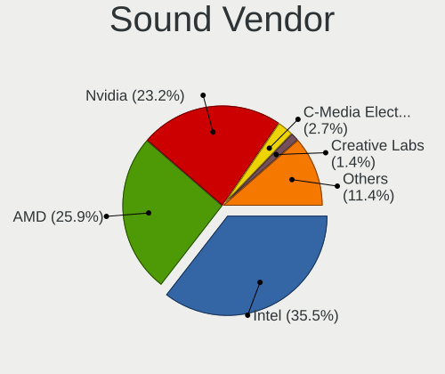

| Vendor                                       | Desktops | Percent |
|----------------------------------------------|----------|---------|
| Intel                                        | 7115     | 35.51%  |
| AMD                                          | 5182     | 25.86%  |
| Nvidia                                       | 4646     | 23.18%  |
| C-Media Electronics                          | 534      | 2.66%   |
| Creative Labs                                | 272      | 1.36%   |
| Logitech                                     | 230      | 1.15%   |
| Texas Instruments                            | 120      | 0.6%    |
| Generalplus Technology                       | 109      | 0.54%   |
| ASUSTek Computer                             | 107      | 0.53%   |
| JMTek                                        | 94       | 0.47%   |
| Razer USA                                    | 80       | 0.4%    |
| Kingston Technology                          | 79       | 0.39%   |
| SteelSeries ApS                              | 75       | 0.37%   |
| VIA Technologies                             | 73       | 0.36%   |
| Micro Star International                     | 73       | 0.36%   |
| Creative Technology                          | 67       | 0.33%   |
| GN Netcom                                    | 66       | 0.33%   |
| Focusrite-Novation                           | 59       | 0.29%   |
| Zoran Co. Personal Media Division (Nogatech) | 49       | 0.24%   |
| Corsair                                      | 49       | 0.24%   |
| Tenx Technology                              | 41       | 0.2%    |
| Hewlett-Packard                              | 36       | 0.18%   |
| Plantronics                                  | 33       | 0.16%   |
| KTMicro                                      | 29       | 0.14%   |
| Realtek Semiconductor                        | 28       | 0.14%   |
| Jieli Technology                             | 27       | 0.13%   |
| Blue Microphones                             | 26       | 0.13%   |
| Sony                                         | 25       | 0.12%   |
| Samson Technologies                          | 23       | 0.11%   |
| M-Audio                                      | 21       | 0.1%    |
| Dell                                         | 21       | 0.1%    |
| DSEA A/S                                     | 20       | 0.1%    |
| BEHRINGER International                      | 18       | 0.09%   |
| ASRock                                       | 17       | 0.08%   |
| Yamaha                                       | 16       | 0.08%   |
| Trust                                        | 16       | 0.08%   |
| XMOS                                         | 15       | 0.07%   |
| Unknown                                      | 14       | 0.07%   |
| Thesycon Systemsoftware & Consulting         | 13       | 0.06%   |
| Giga-Byte Technology                         | 13       | 0.06%   |

Sound Model
-----------

Sound card models

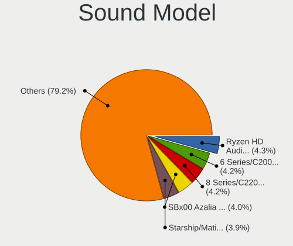

| Model                                                                             | Desktops | Percent |
|-----------------------------------------------------------------------------------|----------|---------|
| AMD Ryzen HD Audio Controller                                                     | 1021     | 4.33%   |
| Intel 6 Series/C200 Series Chipset Family High Definition Audio Controller        | 995      | 4.22%   |
| Intel 8 Series/C220 Series Chipset High Definition Audio Controller               | 994      | 4.22%   |
| AMD SBx00 Azalia (Intel HDA)                                                      | 954      | 4.05%   |
| AMD Starship/Matisse HD Audio Controller                                          | 931      | 3.95%   |
| Intel Xeon E3-1200 v3/4th Gen Core Processor HD Audio Controller                  | 639      | 2.71%   |
| Intel 7 Series/C216 Chipset Family High Definition Audio Controller               | 636      | 2.7%    |
| Intel 100 Series/C230 Series Chipset Family HD Audio Controller                   | 580      | 2.46%   |
| Intel 200 Series PCH HD Audio                                                     | 503      | 2.13%   |
| Intel NM10/ICH7 Family High Definition Audio Controller                           | 495      | 2.1%    |
| AMD Family 17h (Models 00h-0fh) HD Audio Controller                               | 471      | 2%      |
| AMD Ellesmere HDMI Audio [Radeon RX 470/480 / 570/580/590]                        | 443      | 1.88%   |
| Nvidia GK208 HDMI/DP Audio Controller                                             | 438      | 1.86%   |
| AMD FCH Azalia Controller                                                         | 409      | 1.73%   |
| Intel Cannon Lake PCH cAVS                                                        | 364      | 1.54%   |
| AMD Renoir/Cezanne HDMI/DP Audio Controller                                       | 363      | 1.54%   |
| AMD Radeon High Definition Audio Controller                                       | 356      | 1.51%   |
| Nvidia GP107GL High Definition Audio Controller                                   | 342      | 1.45%   |
| AMD Oland/Hainan/Cape Verde/Pitcairn HDMI Audio [Radeon HD 7000 Series]           | 328      | 1.39%   |
| AMD Navi 21/23 HDMI/DP Audio Controller                                           | 293      | 1.24%   |
| Intel 82801JI (ICH10 Family) HD Audio Controller                                  | 282      | 1.2%    |
| Intel 5 Series/3400 Series Chipset High Definition Audio                          | 269      | 1.14%   |
| Nvidia GP106 High Definition Audio Controller                                     | 246      | 1.04%   |
| Nvidia High Definition Audio Controller                                           | 243      | 1.03%   |
| AMD Raven/Raven2/Fenghuang HDMI/DP Audio Controller                               | 243      | 1.03%   |
| Nvidia TU116 High Definition Audio Controller                                     | 221      | 0.94%   |
| Intel 82801I (ICH9 Family) HD Audio Controller                                    | 219      | 0.93%   |
| Nvidia GP104 High Definition Audio Controller                                     | 210      | 0.89%   |
| Intel 9 Series Chipset Family HD Audio Controller                                 | 203      | 0.86%   |
| Nvidia GA104 High Definition Audio Controller                                     | 201      | 0.85%   |
| Nvidia MCP61 High Definition Audio                                                | 199      | 0.84%   |
| Nvidia GM107 High Definition Audio Controller [GeForce 940MX]                     | 198      | 0.84%   |
| AMD Baffin HDMI/DP Audio [Radeon RX 550 640SP / RX 560/560X]                      | 195      | 0.83%   |
| Nvidia GF108 High Definition Audio Controller                                     | 189      | 0.8%    |
| Intel Alder Lake-S HD Audio Controller                                            | 189      | 0.8%    |
| AMD Cedar HDMI Audio [Radeon HD 5400/6300/7300 Series]                            | 188      | 0.8%    |
| Nvidia GP108 High Definition Audio Controller                                     | 186      | 0.79%   |
| AMD Caicos HDMI Audio [Radeon HD 6450 / 7450/8450/8490 OEM / R5 230/235/235X OEM] | 186      | 0.79%   |
| Nvidia GA106 High Definition Audio Controller                                     | 173      | 0.73%   |
| Intel 82801JD/DO (ICH10 Family) HD Audio Controller                               | 169      | 0.72%   |

Memory
------

Memory Vendor
-------------

Memory module vendors

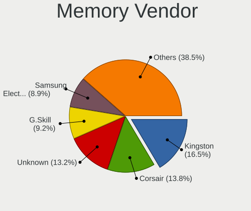

| Vendor                       | Desktops | Percent |
|------------------------------|----------|---------|
| Kingston                     | 991      | 16.46%  |
| Corsair                      | 828      | 13.75%  |
| Unknown                      | 795      | 13.21%  |
| G.Skill                      | 554      | 9.2%    |
| Samsung Electronics          | 534      | 8.87%   |
| SK hynix                     | 505      | 8.39%   |
| Crucial                      | 469      | 7.79%   |
| Micron Technology            | 280      | 4.65%   |
| A-DATA Technology            | 122      | 2.03%   |
| Team                         | 110      | 1.83%   |
| Unknown                      | 101      | 1.68%   |
| Nanya Technology             | 74       | 1.23%   |
| Patriot                      | 70       | 1.16%   |
| Ramaxel Technology           | 58       | 0.96%   |
| Elpida                       | 36       | 0.6%    |
| GOODRAM                      | 33       | 0.55%   |
| Unknown (ABCD)               | 30       | 0.5%    |
| Transcend                    | 23       | 0.38%   |
| Apacer                       | 23       | 0.38%   |
| AMD                          | 23       | 0.38%   |
| PNY                          | 18       | 0.3%    |
| GeIL                         | 17       | 0.28%   |
| Smart                        | 16       | 0.27%   |
| Unifosa                      | 15       | 0.25%   |
| Silicon Power                | 14       | 0.23%   |
| Kingmax                      | 14       | 0.23%   |
| Sesame                       | 8        | 0.13%   |
| Patriot Memory (PDP Systems) | 8        | 0.13%   |
| Multilaser                   | 8        | 0.13%   |
| Kllisre                      | 8        | 0.13%   |
| Avant                        | 8        | 0.13%   |
| Wilk Elektronik              | 7        | 0.12%   |
| Unknown (0x0E9D)             | 7        | 0.12%   |
| Teikon                       | 7        | 0.12%   |
| Qimonda                      | 7        | 0.12%   |
| Patriot Memory               | 7        | 0.12%   |
| Lexar Co Limited             | 6        | 0.1%    |
| Lexar                        | 6        | 0.1%    |
| Atermiter                    | 6        | 0.1%    |
| ASint Technology             | 6        | 0.1%    |

Memory Model
------------

Memory module models

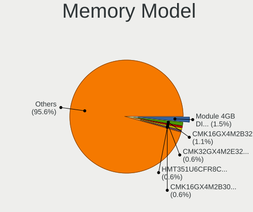

| Model                                                          | Desktops | Percent |
|----------------------------------------------------------------|----------|---------|
| Unknown                                                        | 101      | 1.54%   |
| Corsair RAM CMK16GX4M2B3200C16 8GB DIMM DDR4 3600MT/s          | 73       | 1.11%   |
| Corsair RAM CMK32GX4M2E3200C16 16GB DIMM DDR4 3600MT/s         | 39       | 0.59%   |
| SK hynix RAM HMT351U6CFR8C-PB 4GB DIMM DDR3 1800MT/s           | 38       | 0.58%   |
| Corsair RAM CMK16GX4M2B3000C15 8GB DIMM DDR4 3600MT/s          | 37       | 0.56%   |
| Unknown RAM Module 4096MB DIMM 1333MT/s                        | 33       | 0.5%    |
| Kingston RAM KHX3200C16D4/8GX 8GB DIMM DDR4 3733MT/s           | 33       | 0.5%    |
| G.Skill RAM F4-3200C16-8GVKB 8GB DIMM DDR4 4000MT/s            | 33       | 0.5%    |
| Unknown RAM Module 2048MB DIMM DDR2 800MT/s                    | 31       | 0.47%   |
| Unknown RAM Module 4GB DIMM 1333MT/s                           | 30       | 0.46%   |
| Unknown RAM Module 2GB DIMM DDR2 800MT/s                       | 30       | 0.46%   |
| Unknown (ABCD) RAM 123456789012345678 2GB DIMM LPDDR4 2133MT/s | 30       | 0.46%   |
| Micron RAM 8JTF51264AZ-1G6E1 4GB DIMM DDR3 1600MT/s            | 30       | 0.46%   |
| Kingston RAM KHX1600C10D3/8G 8GB DIMM DDR3 2133MT/s            | 30       | 0.46%   |
| G.Skill RAM F4-3200C16-16GVK 16GB DIMM DDR4 3600MT/s           | 30       | 0.46%   |
| G.Skill RAM F4-3200C16-8GIS 8GB DIMM DDR4 3600MT/s             | 29       | 0.44%   |
| SK hynix RAM HMT351U6EFR8C-PB 4GB DIMM DDR3 1600MT/s           | 27       | 0.41%   |
| Kingston RAM KF3200C16D4/16GX 16GB DIMM DDR4 3733MT/s          | 26       | 0.4%    |
| Samsung RAM M378B5173QH0-CK0 4GB DIMM DDR3                     | 25       | 0.38%   |
| Kingston RAM KHX2666C16/8G 8GiB DIMM DDR4 3466MT/s             | 25       | 0.38%   |
| Crucial RAM BLS8G3D1609DS1S00. 8GB DIMM DDR3 1800MT/s          | 25       | 0.38%   |
| Corsair RAM CMK32GX4M2B3200C16 16GB DIMM DDR4 3800MT/s         | 24       | 0.37%   |
| Unknown RAM Module 4096MB DIMM DDR3 1333MT/s                   | 23       | 0.35%   |
| G.Skill RAM F4-3000C16-8GISB 8GB DIMM DDR4 3200MT/s            | 23       | 0.35%   |
| Unknown RAM Module 2048MB DIMM 1333MT/s                        | 22       | 0.34%   |
| Kingston RAM KHX1600C9D3/4GX 4GB DIMM DDR3 1867MT/s            | 22       | 0.34%   |
| Kingston RAM KF3200C16D4/8GX 8GiB DIMM DDR4 3600MT/s           | 22       | 0.34%   |
| Corsair RAM CMZ8GX3M2A1600C9 4GB DIMM SDRAM 1800MT/s           | 22       | 0.34%   |
| Unknown RAM Module 4GB DIMM DDR3 1333MT/s                      | 21       | 0.32%   |
| Unknown RAM Module 2048MB DIMM SDRAM                           | 21       | 0.32%   |
| Team RAM TEAMGROUP-UD4-3200 8GB DIMM DDR4 3800MT/s             | 21       | 0.32%   |
| SK hynix RAM HMT451U6AFR8C-PB 4GB DIMM DDR3 1600MT/s           | 21       | 0.32%   |
| Samsung RAM M378B5273DH0-CH9 4GB DIMM DDR3 2133MT/s            | 21       | 0.32%   |
| Team RAM TEAMGROUP-UD4-3200 8GB DIMM DDR4 3733MT/s             | 20       | 0.31%   |
| G.Skill RAM F4-3200C16-16GIS 16GB DIMM DDR4 3600MT/s           | 20       | 0.31%   |
| Corsair RAM CMK32GX4M2D3600C18 16GB DIMM DDR4 3800MT/s         | 20       | 0.31%   |
| Patriot RAM 3200 C16 Series 8GB DIMM DDR4 3600MT/s             | 19       | 0.29%   |
| Kingston RAM KHX1866C10D3/8G 8GB DIMM DDR3 1867MT/s            | 19       | 0.29%   |
| Kingston RAM 99U5584-005.A00LF 4GB DIMM DDR3 1600MT/s          | 19       | 0.29%   |
| Corsair RAM CMK16GX4M2D3600C18 8GB DIMM DDR4 4000MT/s          | 19       | 0.29%   |

Memory Kind
-----------

Memory module kinds

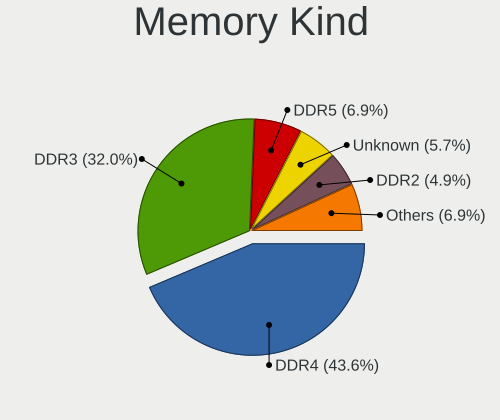

| Kind         | Desktops | Percent |
|--------------|----------|---------|
| DDR4         | 2315     | 43.62%  |
| DDR3         | 1700     | 32.03%  |
| DDR5         | 364      | 6.86%   |
| Unknown      | 302      | 5.69%   |
| DDR2         | 262      | 4.94%   |
| SDRAM        | 250      | 4.71%   |
| DDR          | 56       | 1.06%   |
| LPDDR4       | 38       | 0.72%   |
| LPDDR5       | 7        | 0.13%   |
| DRAM         | 6        | 0.11%   |
| LPDDR3       | 4        | 0.08%   |
| DDR2 FB-DIMM | 3        | 0.06%   |

Memory Form Factor
------------------

Physical design of the memory module

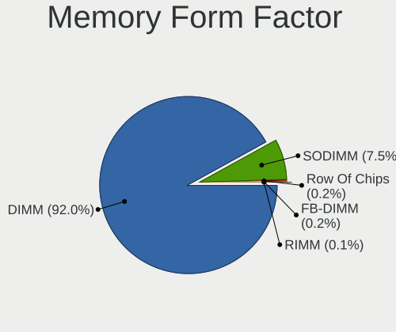

| Name         | Desktops | Percent |
|--------------|----------|---------|
| DIMM         | 4778     | 91.97%  |
| SODIMM       | 390      | 7.51%   |
| Row Of Chips | 10       | 0.19%   |
| FB-DIMM      | 10       | 0.19%   |
| RIMM         | 7        | 0.13%   |

Memory Size
-----------

Memory module size

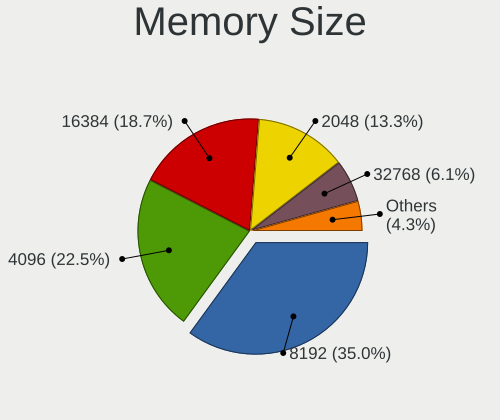

| Size  | Desktops | Percent |
|-------|----------|---------|
| 8192  | 2002     | 35.02%  |
| 4096  | 1287     | 22.52%  |
| 16384 | 1071     | 18.74%  |
| 2048  | 758      | 13.26%  |
| 32768 | 350      | 6.12%   |
| 1024  | 181      | 3.17%   |
| 512   | 26       | 0.45%   |
| 49152 | 19       | 0.33%   |
| 24576 | 10       | 0.17%   |
| 65536 | 6        | 0.1%    |
| 1536  | 2        | 0.03%   |
| 256   | 2        | 0.03%   |
| 3072  | 1        | 0.02%   |
| 16    | 1        | 0.02%   |

Memory Speed
------------

Memory module speed

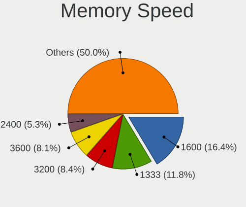

| Speed   | Desktops | Percent |
|---------|----------|---------|
| 1600    | 964      | 16.37%  |
| 1333    | 693      | 11.77%  |
| 3200    | 492      | 8.35%   |
| 3600    | 479      | 8.13%   |
| 2400    | 315      | 5.35%   |
| 2133    | 296      | 5.03%   |
| 2667    | 287      | 4.87%   |
| 800     | 213      | 3.62%   |
| 667     | 136      | 2.31%   |
| 6000    | 128      | 2.17%   |
| 3733    | 127      | 2.16%   |
| 3800    | 116      | 1.97%   |
| 1800    | 113      | 1.92%   |
| 1866    | 106      | 1.8%    |
| Unknown | 104      | 1.77%   |
| 1867    | 90       | 1.53%   |
| 3000    | 82       | 1.39%   |
| 2666    | 82       | 1.39%   |
| 4000    | 75       | 1.27%   |
| 3400    | 72       | 1.22%   |
| 5600    | 66       | 1.12%   |
| 1066    | 65       | 1.1%    |
| 2933    | 58       | 0.98%   |
| 4800    | 53       | 0.9%    |
| 3466    | 47       | 0.8%    |
| 6400    | 39       | 0.66%   |
| 2800    | 33       | 0.56%   |
| 1067    | 29       | 0.49%   |
| 3266    | 26       | 0.44%   |
| 2000    | 23       | 0.39%   |
| 400     | 23       | 0.39%   |
| 6200    | 21       | 0.36%   |
| 3866    | 20       | 0.34%   |
| 333     | 20       | 0.34%   |
| 12800   | 19       | 0.32%   |
| 1334    | 19       | 0.32%   |
| 3933    | 18       | 0.31%   |
| 3066    | 18       | 0.31%   |
| 2733    | 18       | 0.31%   |
| 2048    | 17       | 0.29%   |

Printers & scanners
-------------------

Printer Vendor
--------------

Printer device vendors

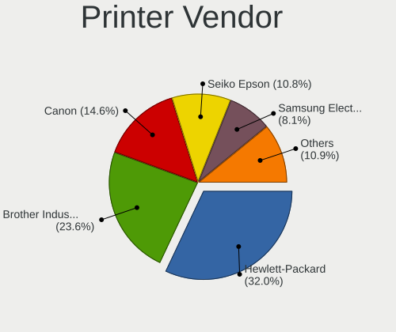

| Vendor                   | Desktops | Percent |
|--------------------------|----------|---------|
| Hewlett-Packard          | 258      | 32.01%  |
| Brother Industries       | 190      | 23.57%  |
| Canon                    | 118      | 14.64%  |
| Seiko Epson              | 87       | 10.79%  |
| Samsung Electronics      | 65       | 8.06%   |
| Prolific Technology      | 11       | 1.36%   |
| Dymo-CoStar              | 11       | 1.36%   |
| QinHeng Electronics      | 9        | 1.12%   |
| Pantum                   | 7        | 0.87%   |
| Xerox                    | 6        | 0.74%   |
| Ricoh                    | 6        | 0.74%   |
| Lexmark International    | 5        | 0.62%   |
| Oki Data                 | 4        | 0.5%    |
| Kyocera                  | 4        | 0.5%    |
| Zebra                    | 3        | 0.37%   |
| STMicroelectronics       | 3        | 0.37%   |
| Seiko Instruments        | 3        | 0.37%   |
| Panasonic (Matsushita)   | 3        | 0.37%   |
| Dell                     | 2        | 0.25%   |
| Zhuhai Poskey Technology | 1        | 0.12%   |
| Sharp                    | 1        | 0.12%   |
| Sato                     | 1        | 0.12%   |
| NXP Semiconductors       | 1        | 0.12%   |
| Magic Control Technology | 1        | 0.12%   |
| iDPRT                    | 1        | 0.12%   |
| Graphtec America         | 1        | 0.12%   |
| Fuji Xerox               | 1        | 0.12%   |
| Apple                    | 1        | 0.12%   |
| Agere Systems (Lucent)   | 1        | 0.12%   |
| Unknown                  | 1        | 0.12%   |

Printer Model
-------------

Printer device models

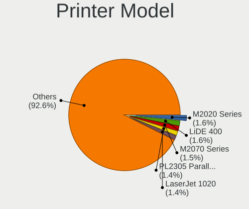

| Model                                | Desktops | Percent |
|--------------------------------------|----------|---------|
| Samsung M2020 Series                 | 13       | 1.6%    |
| Canon LiDE 400                       | 13       | 1.6%    |
| Samsung M2070 Series                 | 12       | 1.48%   |
| Prolific PL2305 Parallel Port        | 11       | 1.35%   |
| HP LaserJet 1020                     | 11       | 1.35%   |
| HP DeskJet 2700 series               | 10       | 1.23%   |
| QinHeng CH340S                       | 9        | 1.11%   |
| HP DeskJet 2600 series               | 9        | 1.11%   |
| Brother Printer                      | 9        | 1.11%   |
| Brother HL-2270DW Laser Printer      | 9        | 1.11%   |
| HP LaserJet P1005                    | 8        | 0.98%   |
| Seiko Epson ET-2810 Series           | 7        | 0.86%   |
| Seiko Epson ET-2710 Series           | 7        | 0.86%   |
| HP LaserJet Professional P1102w      | 7        | 0.86%   |
| HP ENVY 5540 series                  | 7        | 0.86%   |
| HP Deskjet 2540 series               | 7        | 0.86%   |
| Brother HL-L2360D series             | 7        | 0.86%   |
| HP OfficeJet 5200 series             | 6        | 0.74%   |
| HP LaserJet P1102                    | 6        | 0.74%   |
| HP ENVY 5000 series                  | 6        | 0.74%   |
| Canon PIXMA MX920 Series             | 6        | 0.74%   |
| Canon LiDE 300                       | 6        | 0.74%   |
| Brother HL-L2340D series             | 6        | 0.74%   |
| Seiko Epson L210 Series              | 5        | 0.62%   |
| Samsung C48x Series                  | 5        | 0.62%   |
| HP Officejet 4500 G510n-z            | 5        | 0.62%   |
| HP OfficeJet 3830 series             | 5        | 0.62%   |
| HP LaserJet 1018                     | 5        | 0.62%   |
| HP DeskJet F4200 series              | 5        | 0.62%   |
| HP DeskJet 3700 series               | 5        | 0.62%   |
| HP DeskJet 3630 series               | 5        | 0.62%   |
| HP Deskjet 2050 J510                 | 5        | 0.62%   |
| Brother HL-3140CW series             | 5        | 0.62%   |
| Brother HL-1210W series              | 5        | 0.62%   |
| Brother DCP-7055 scanner/printer     | 5        | 0.62%   |
| Brother DCP-7030                     | 5        | 0.62%   |
| Seiko Epson Printer                  | 4        | 0.49%   |
| Samsung SCX-4300 Series              | 4        | 0.49%   |
| Samsung SCX-3400 Series              | 4        | 0.49%   |
| Samsung ML-1640 Series Laser Printer | 4        | 0.49%   |

Scanner Vendor
--------------

Scanner device vendors

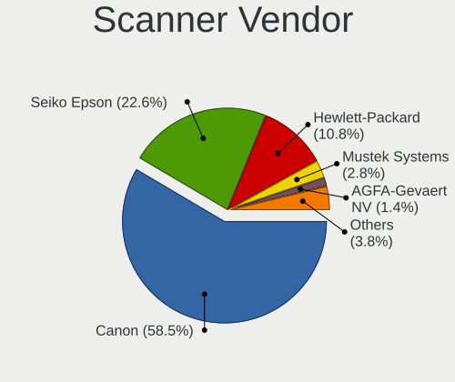

| Vendor                      | Desktops | Percent |
|-----------------------------|----------|---------|
| Canon                       | 124      | 58.49%  |
| Seiko Epson                 | 48       | 22.64%  |
| Hewlett-Packard             | 23       | 10.85%  |
| Mustek Systems              | 6        | 2.83%   |
| AGFA-Gevaert NV             | 3        | 1.42%   |
| Ultima Electronics          | 2        | 0.94%   |
| Acer Peripherals (now BenQ) | 2        | 0.94%   |
| UMAX                        | 1        | 0.47%   |
| Salix Technology            | 1        | 0.47%   |
| Plustek                     | 1        | 0.47%   |
| Microtek International      | 1        | 0.47%   |

Scanner Model
-------------

Scanner device models

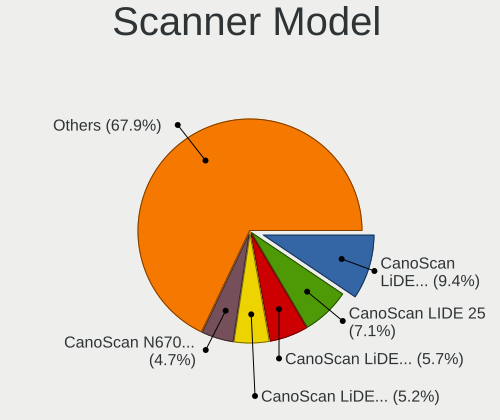

| Model                                                                                 | Desktops | Percent |
|---------------------------------------------------------------------------------------|----------|---------|
| Canon CanoScan LiDE 110                                                               | 20       | 9.43%   |
| Canon CanoScan LIDE 25                                                                | 15       | 7.08%   |
| Canon CanoScan LiDE 220                                                               | 12       | 5.66%   |
| Canon CanoScan LiDE 210                                                               | 11       | 5.19%   |
| Canon CanoScan N670U/N676U/LiDE 20                                                    | 10       | 4.72%   |
| Seiko Epson GT-X820 [Perfection V600 Photo]                                           | 8        | 3.77%   |
| Canon CanoScan LiDE 60                                                                | 8        | 3.77%   |
| Canon CanoScan LiDE 120                                                               | 8        | 3.77%   |
| Seiko Epson Perfection V37/V370                                                       | 7        | 3.3%    |
| Canon CanoScan N1240U/LiDE 30                                                         | 5        | 2.36%   |
| Canon CanoScan LiDE 700F                                                              | 5        | 2.36%   |
| Canon CanoScan LiDE 200                                                               | 5        | 2.36%   |
| Canon CanoScan LiDE 100                                                               | 5        | 2.36%   |
| Seiko Epson GT-F650 [GT-S600/Perfection V10/V100]                                     | 4        | 1.89%   |
| Seiko Epson GT-F520/GT-F570 [Perfection 3590 PHOTO]                                   | 4        | 1.89%   |
| Mustek Systems ScanExpress 1200 UB                                                    | 4        | 1.89%   |
| Canon CanoScan LiDE 90                                                                | 4        | 1.89%   |
| Canon CanoScan LiDE 50/LiDE 35/LiDE 40                                                | 4        | 1.89%   |
| Seiko Epson GT-F730 [GT-S630/Perfection V33/V330 Photo]                               | 3        | 1.42%   |
| Seiko Epson GT-F500/GT-F550 [Perfection 2480/2580 PHOTO]                              | 3        | 1.42%   |
| HP HP Scanjet 300                                                                     | 3        | 1.42%   |
| Ultima Artec Ultima 2000 (GT6801 based)/Lifetec LT9385/ScanMagic 1200 UB Plus Scanner | 2        | 0.94%   |
| Seiko Epson GT-9300UF [Perfection 2400 PHOTO]                                         | 2        | 0.94%   |
| Seiko Epson GT-6600U [Perfection 610]                                                 | 2        | 0.94%   |
| Seiko Epson ES-D200 [GT-S50]                                                          | 2        | 0.94%   |
| Mustek Systems SNAPSCAN e22                                                           | 2        | 0.94%   |
| HP ScanJet G3010                                                                      | 2        | 0.94%   |
| HP ScanJet 3800c                                                                      | 2        | 0.94%   |
| HP Scanjet 3000                                                                       | 2        | 0.94%   |
| HP ScanJet 2400c                                                                      | 2        | 0.94%   |
| HP ScanJet 2200c                                                                      | 2        | 0.94%   |
| Canon CanoScan N650U/N656U                                                            | 2        | 0.94%   |
| Canon CanoScan LiDE 70                                                                | 2        | 0.94%   |
| Canon CanoScan LiDE 500F                                                              | 2        | 0.94%   |
| Canon CanoScan 9000F Mark II                                                          | 2        | 0.94%   |
| Acer Peripherals (now BenQ) S2W 3300U/4300U                                           | 2        | 0.94%   |
| UMAX Astra 4400/4450                                                                  | 1        | 0.47%   |
| Seiko Epson Stylus Photo RX500/510                                                    | 1        | 0.47%   |
| Seiko Epson GT-X900 [Perfection V700/V750 Photo]                                      | 1        | 0.47%   |
| Seiko Epson GT-X800 [Perfection 4990 PHOTO]                                           | 1        | 0.47%   |

Camera
------

Camera Vendor
-------------

Camera device vendors

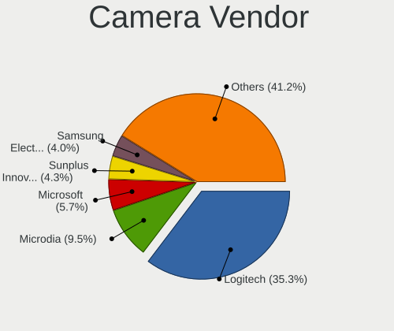

| Vendor                        | Desktops | Percent |
|-------------------------------|----------|---------|
| Logitech                      | 820      | 35.34%  |
| Microdia                      | 220      | 9.48%   |
| Microsoft                     | 132      | 5.69%   |
| Sunplus Innovation Technology | 99       | 4.27%   |
| Samsung Electronics           | 93       | 4.01%   |
| Generalplus Technology        | 71       | 3.06%   |
| Chicony Electronics           | 64       | 2.76%   |
| Z-Star Microelectronics       | 51       | 2.2%    |
| Apple                         | 51       | 2.2%    |
| Realtek Semiconductor         | 46       | 1.98%   |
| Creative Technology           | 42       | 1.81%   |
| KYE Systems (Mouse Systems)   | 41       | 1.77%   |
| ARC International             | 39       | 1.68%   |
| GEMBIRD                       | 36       | 1.55%   |
| MacroSilicon                  | 33       | 1.42%   |
| Aveo Technology               | 23       | 0.99%   |
| Jieli Technology              | 21       | 0.91%   |
| IMC Networks                  | 19       | 0.82%   |
| Cubeternet                    | 19       | 0.82%   |
| eMeet                         | 18       | 0.78%   |
| Arkmicro Technologies         | 18       | 0.78%   |
| Trust                         | 17       | 0.73%   |
| Sonix Technology              | 17       | 0.73%   |
| Alcor Micro                   | 14       | 0.6%    |
| Hewlett-Packard               | 13       | 0.56%   |
| SunplusIT                     | 12       | 0.52%   |
| Genesys Logic                 | 12       | 0.52%   |
| webcam                        | 11       | 0.47%   |
| Novatek Microelectronics      | 10       | 0.43%   |
| Guillemot                     | 10       | 0.43%   |
| AVerMedia Technologies        | 10       | 0.43%   |
| Pixart Imaging                | 9        | 0.39%   |
| LG Electronics                | 9        | 0.39%   |
| Huawei Technologies           | 9        | 0.39%   |
| Philips (or NXP)              | 8        | 0.34%   |
| Lenovo                        | 8        | 0.34%   |
| WaveRider Communications      | 7        | 0.3%    |
| Razer USA                     | 7        | 0.3%    |
| Silicon Motion                | 6        | 0.26%   |
| SHENZHEN EMEET TECHNOLOGY     | 6        | 0.26%   |

Camera Model
------------

Camera device models

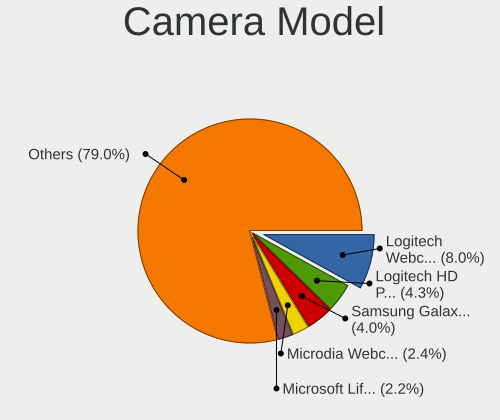

| Model                                                 | Desktops | Percent |
|-------------------------------------------------------|----------|---------|
| Logitech Webcam C270                                  | 187      | 8.04%   |
| Logitech HD Pro Webcam C920                           | 99       | 4.25%   |
| Samsung Galaxy series, misc. (MTP mode)               | 93       | 4%      |
| Microdia Webcam Vitade AF                             | 57       | 2.45%   |
| Microsoft LifeCam HD-3000                             | 52       | 2.23%   |
| Logitech HD Webcam C525                               | 52       | 2.23%   |
| Apple iPhone 5/5C/5S/6/SE/7/8/X                       | 48       | 2.06%   |
| Microdia USB 2.0 Camera                               | 46       | 1.98%   |
| Logitech C922 Pro Stream Webcam                       | 43       | 1.85%   |
| Sunplus Full HD webcam                                | 41       | 1.76%   |
| Logitech C920 PRO HD Webcam                           | 41       | 1.76%   |
| Generalplus GENERAL WEBCAM                            | 40       | 1.72%   |
| ARC International Camera                              | 39       | 1.68%   |
| Logitech Webcam C310                                  | 37       | 1.59%   |
| Logitech Webcam C170                                  | 37       | 1.59%   |
| Microdia Camera                                       | 29       | 1.25%   |
| Sunplus Integrated Camera                             | 27       | 1.16%   |
| Logitech HD Webcam C615                               | 25       | 1.07%   |
| Microdia Sonix USB 2.0 Camera                         | 22       | 0.95%   |
| Generalplus 808 Camera #9 (web-cam mode)              | 22       | 0.95%   |
| MacroSilicon USB Video                                | 21       | 0.9%    |
| Logitech Webcam C930e                                 | 21       | 0.9%    |
| Logitech BRIO Ultra HD Webcam                         | 21       | 0.9%    |
| Z-Star Venus USB2.0 Camera                            | 19       | 0.82%   |
| GEMBIRD Generic UVC 1.00 camera [AppoTech AX2311]     | 19       | 0.82%   |
| Jieli USB PHY 2.0                                     | 18       | 0.77%   |
| Microsoft LifeCam Studio                              | 17       | 0.73%   |
| Microdia CyberTrack H7                                | 17       | 0.73%   |
| Logitech Logitech Webcam C925e                        | 17       | 0.73%   |
| Realtek FULL HD 1080P Webcam                          | 16       | 0.69%   |
| Logitech Webcam C210                                  | 16       | 0.69%   |
| Logitech StreamCam                                    | 16       | 0.69%   |
| Logitech QuickCam Pro 9000                            | 16       | 0.69%   |
| Microsoft LifeCam Cinema                              | 15       | 0.64%   |
| Chicony HP High Definition 1MP Webcam                 | 15       | 0.64%   |
| Microdia Integrated Camera                            | 14       | 0.6%    |
| Logitech HD Webcam C910                               | 14       | 0.6%    |
| KYE Systems (Mouse Systems) USB 2.0 HD1080P PC Camera | 14       | 0.6%    |
| GEMBIRD USB2.0 PC CAMERA                              | 14       | 0.6%    |
| Arkmicro USB2.0 PC CAMERA                             | 14       | 0.6%    |

Security
--------

Fingerprint Vendor
------------------

Fingerprint sensor vendors

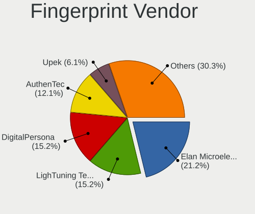

| Vendor                     | Desktops | Percent |
|----------------------------|----------|---------|
| Elan Microelectronics      | 7        | 21.21%  |
| LighTuning Technology      | 5        | 15.15%  |
| DigitalPersona             | 5        | 15.15%  |
| AuthenTec                  | 4        | 12.12%  |
| Upek                       | 2        | 6.06%   |
| Synaptics                  | 2        | 6.06%   |
| STMicroelectronics         | 2        | 6.06%   |
| Microsoft                  | 2        | 6.06%   |
| ZKSoftware                 | 1        | 3.03%   |
| Suprema                    | 1        | 3.03%   |
| Shenzhen Goodix Technology | 1        | 3.03%   |
| Dell                       | 1        | 3.03%   |

Fingerprint Model
-----------------

Fingerprint sensor models

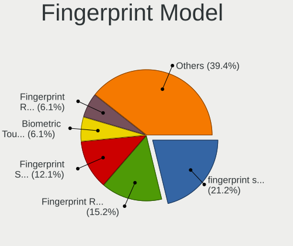

| Model                                                     | Desktops | Percent |
|-----------------------------------------------------------|----------|---------|
| Elan fingerprint sensor [FeinTech FPS00200]               | 7        | 21.21%  |
| DigitalPersona Fingerprint Reader                         | 5        | 15.15%  |
| LighTuning Fingerprint Sensor                             | 4        | 12.12%  |
| Upek Biometric Touchchip/Touchstrip Fingerprint Sensor    | 2        | 6.06%   |
| STMicroelectronics Fingerprint Reader                     | 2        | 6.06%   |
| Microsoft Fingerprint Reader                              | 2        | 6.06%   |
| AuthenTec AES1600                                         | 2        | 6.06%   |
| ZKSoftware ZK4500 Fingerprint Reader                      | 1        | 3.03%   |
| Synaptics  WBDI Fingerprint Reader - USB 052              | 1        | 3.03%   |
| Synaptics  FS7604 Touch Fingerprint Sensor with PurePrint | 1        | 3.03%   |
| Suprema SUP-SFR400(A) BioMini Fingerprint Reader          | 1        | 3.03%   |
| Shenzhen Goodix  Fingerprint Device                       | 1        | 3.03%   |
| LighTuning ES603 Swipe Fingerprint Sensor                 | 1        | 3.03%   |
| Dell MS819 Wired Mouse With Fingerprint Reader            | 1        | 3.03%   |
| AuthenTec AES2550 Fingerprint Sensor                      | 1        | 3.03%   |
| AuthenTec AES2501 Fingerprint Sensor                      | 1        | 3.03%   |

Chipcard Vendor
---------------

Chipcard module vendors

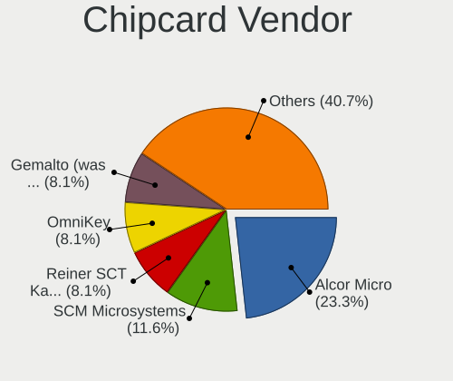

| Vendor                            | Desktops | Percent |
|-----------------------------------|----------|---------|
| Alcor Micro                       | 20       | 23.26%  |
| SCM Microsystems                  | 10       | 11.63%  |
| Reiner SCT Kartensysteme          | 7        | 8.14%   |
| OmniKey                           | 7        | 8.14%   |
| Gemalto (was Gemplus)             | 7        | 8.14%   |
| Realtek Semiconductor             | 5        | 5.81%   |
| VASCO Data Security International | 4        | 4.65%   |
| Advanced Card Systems             | 4        | 4.65%   |
| Aktiv                             | 3        | 3.49%   |
| Chicony Electronics               | 2        | 2.33%   |
| Cherry                            | 2        | 2.33%   |
| Bit4id                            | 2        | 2.33%   |
| Aladdin R.D.                      | 2        | 2.33%   |
| Aladdin Knowledge Systems         | 2        | 2.33%   |
| Precise Biometrics                | 1        | 1.16%   |
| Microchip Technology              | 1        | 1.16%   |
| Kobil Systems                     | 1        | 1.16%   |
| In Focus Systems                  | 1        | 1.16%   |
| Hewlett-Packard                   | 1        | 1.16%   |
| Giesecke & Devrient               | 1        | 1.16%   |
| Fujitsu Siemens Computers         | 1        | 1.16%   |
| Clay Logic                        | 1        | 1.16%   |
| Alcorlink                         | 1        | 1.16%   |

Chipcard Model
--------------

Chipcard module models

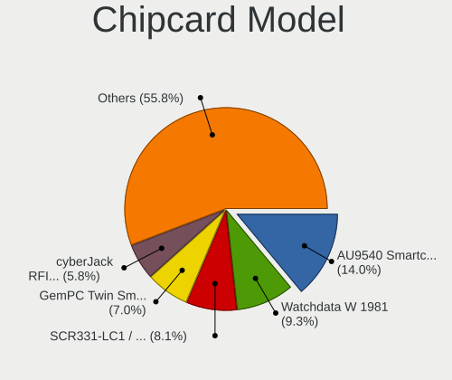

| Model                                                                      | Desktops | Percent |
|----------------------------------------------------------------------------|----------|---------|
| Alcor Micro AU9540 Smartcard Reader                                        | 12       | 13.95%  |
| Alcor Micro Watchdata W 1981                                               | 8        | 9.3%    |
| SCM Microsystems SCR331-LC1 / SCR3310 SmartCard Reader                     | 7        | 8.14%   |
| Gemalto (was Gemplus) GemPC Twin SmartCard Reader                          | 6        | 6.98%   |
| Reiner SCT Kartensysteme cyberJack RFID basis contactless smartcard reader | 5        | 5.81%   |
| Realtek Semiconductor Smart Card Reader Interface                          | 5        | 5.81%   |
| VASCO Data Security International Digipass 905 SmartCard Reader            | 4        | 4.65%   |
| OmniKey CardMan 3021 / 3121                                                | 4        | 4.65%   |
| Aktiv Rutoken lite                                                         | 3        | 3.49%   |
| SCM Microsystems uTrust 3700 F CL Reader                                   | 2        | 2.33%   |
| Reiner SCT Kartensysteme tanJack USB                                       | 2        | 2.33%   |
| OmniKey CardMan 3121 (HID Technologies)                                    | 2        | 2.33%   |
| Chicony Electronics HP Skylab USB Smartcard Keyboard                       | 2        | 2.33%   |
| Aladdin R.D. JaCarta                                                       | 2        | 2.33%   |
| Aladdin Knowledge Systems Token JC                                         | 2        | 2.33%   |
| Advanced Card Systems ACR38 SmartCard Reader                               | 2        | 2.33%   |
| Advanced Card Systems ACR122U                                              | 2        | 2.33%   |
| SCM Microsystems SCR331 SmartCard Reader                                   | 1        | 1.16%   |
| Precise Biometrics 200 MC FingerPrint and SmartCard Reader                 | 1        | 1.16%   |
| OmniKey CardMan 1021                                                       | 1        | 1.16%   |
| Microchip Technology SMSC USX101x Reader                                   | 1        | 1.16%   |
| Kobil Systems Smart Token                                                  | 1        | 1.16%   |
| In Focus Systems EMV Smartcard Reader                                      | 1        | 1.16%   |
| Hewlett-Packard SC Keyboard - Apollo (Liteon)                              | 1        | 1.16%   |
| Giesecke & Devrient Chipcard Reader                                        | 1        | 1.16%   |
| Gemalto (was Gemplus) GemCore SIM Pro Smart Card Reader                    | 1        | 1.16%   |
| Fujitsu Siemens Computers SmartCard Reader 2A                              | 1        | 1.16%   |
| Clay Logic Nitrokey Pro                                                    | 1        | 1.16%   |
| Cherry SmartCard Reader Keyboard KC 1000 SC                                | 1        | 1.16%   |
| Cherry KC 1000 SC Z                                                        | 1        | 1.16%   |
| Bit4id miniLector-s                                                        | 1        | 1.16%   |
| Bit4id miniLector EVO                                                      | 1        | 1.16%   |
| Alcorlink EMV Smartcard Reader                                             | 1        | 1.16%   |

Unsupported
-----------

Unsupported Devices
-------------------

Total unsupported devices on board

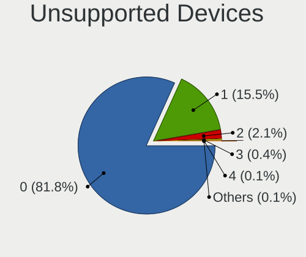

| Total | Desktops | Percent |
|-------|----------|---------|
| 0     | 9839     | 81.77%  |
| 1     | 1863     | 15.48%  |
| 2     | 256      | 2.13%   |
| 3     | 47       | 0.39%   |
| 4     | 13       | 0.11%   |
| 5     | 8        | 0.07%   |
| 6     | 5        | 0.04%   |
| 8     | 1        | 0.01%   |

Unsupported Device Types
------------------------

Types of unsupported devices

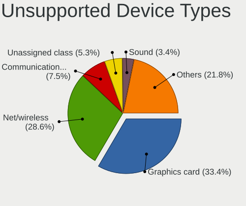

| Type                     | Desktops | Percent |
|--------------------------|----------|---------|
| Graphics card            | 832      | 33.43%  |
| Net/wireless             | 712      | 28.61%  |
| Communication controller | 187      | 7.51%   |
| Unassigned class         | 131      | 5.26%   |
| Sound                    | 85       | 3.42%   |
| Multimedia controller    | 85       | 3.42%   |
| Net/ethernet             | 60       | 2.41%   |
| Chipcard                 | 60       | 2.41%   |
| Bluetooth                | 58       | 2.33%   |
| Network                  | 57       | 2.29%   |
| Storage/raid             | 40       | 1.61%   |
| Card reader              | 39       | 1.57%   |
| Camera                   | 37       | 1.49%   |
| Fingerprint reader       | 30       | 1.21%   |
| Storage/ide              | 26       | 1.04%   |
| Modem                    | 15       | 0.6%    |
| Dvb card                 | 13       | 0.52%   |
| Firewire controller      | 8        | 0.32%   |
| Unclassified device      | 3        | 0.12%   |
| Tv card                  | 3        | 0.12%   |
| Storage/ata              | 3        | 0.12%   |
| Video                    | 2        | 0.08%   |
| Storage/nvme             | 2        | 0.08%   |
| Storage                  | 1        | 0.04%   |

