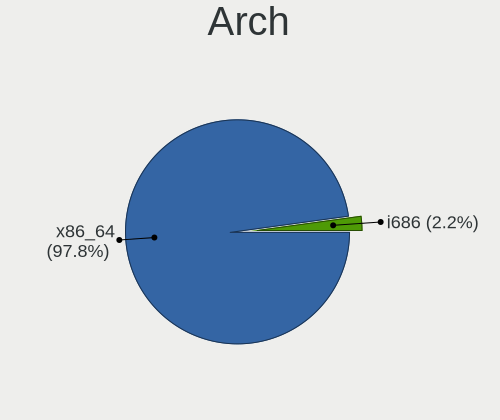
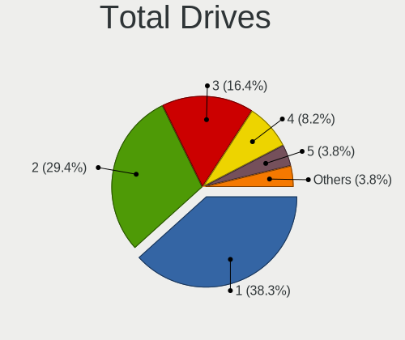
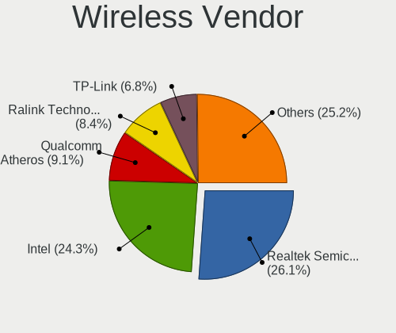
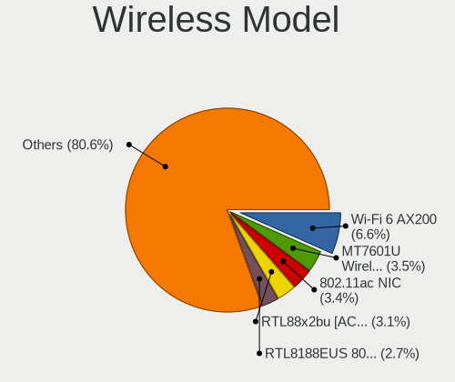
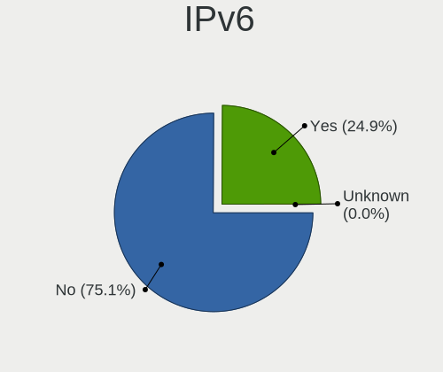

Linux Mint - Tested Hardware & Statistics (Desktops)
----------------------------------------------------

A project to collect tested hardware configurations for Linux Mint.

Anyone can contribute to this report by the [hw-probe](https://github.com/linuxhw/hw-probe) tool:

    sudo -E hw-probe -all -upload

Please contribute! Especially if your hardware is rare.

Contents
--------

* [ Test Cases ](#test-cases)

* [ System ](#system)
  - [ OS                       ](#os)
  - [ OS Family                ](#os-family)
  - [ Kernel                   ](#kernel)
  - [ Kernel Family            ](#kernel-family)
  - [ Kernel Major Ver.        ](#kernel-major-ver)
  - [ Arch                     ](#arch)
  - [ DE                       ](#de)
  - [ Display Server           ](#display-server)
  - [ Display Manager          ](#display-manager)
  - [ OS Lang                  ](#os-lang)
  - [ Boot Mode                ](#boot-mode)
  - [ Filesystem               ](#filesystem)
  - [ Part. scheme             ](#part-scheme)
  - [ Dual Boot with Linux/BSD ](#dual-boot-with-linuxbsd)
  - [ Dual Boot (Win)          ](#dual-boot-win)

* [ Board ](#board)
  - [ Vendor                   ](#vendor)
  - [ Model                    ](#model)
  - [ Model Family             ](#model-family)
  - [ MFG Year                 ](#mfg-year)
  - [ Form Factor              ](#form-factor)
  - [ Secure Boot              ](#secure-boot)
  - [ Coreboot                 ](#coreboot)
  - [ RAM Size                 ](#ram-size)
  - [ RAM Used                 ](#ram-used)
  - [ Total Drives             ](#total-drives)
  - [ Has CD-ROM               ](#has-cd-rom)
  - [ Has Ethernet             ](#has-ethernet)
  - [ Has WiFi                 ](#has-wifi)
  - [ Has Bluetooth            ](#has-bluetooth)

* [ Location ](#location)
  - [ Country                  ](#country)
  - [ City                     ](#city)

* [ Drives ](#drives)
  - [ Drive Vendor             ](#drive-vendor)
  - [ Drive Model              ](#drive-model)
  - [ HDD Vendor               ](#hdd-vendor)
  - [ SSD Vendor               ](#ssd-vendor)
  - [ Drive Kind               ](#drive-kind)
  - [ Drive Connector          ](#drive-connector)
  - [ Drive Size               ](#drive-size)
  - [ Space Total              ](#space-total)
  - [ Space Used               ](#space-used)
  - [ Malfunc. Drives          ](#malfunc-drives)
  - [ Malfunc. Drive Vendor    ](#malfunc-drive-vendor)
  - [ Malfunc. HDD Vendor      ](#malfunc-hdd-vendor)
  - [ Malfunc. Drive Kind      ](#malfunc-drive-kind)
  - [ Failed Drives            ](#failed-drives)
  - [ Failed Drive Vendor      ](#failed-drive-vendor)
  - [ Drive Status             ](#drive-status)

* [ Storage controller ](#storage-controller)
  - [ Storage Vendor           ](#storage-vendor)
  - [ Storage Model            ](#storage-model)
  - [ Storage Kind             ](#storage-kind)

* [ Processor ](#processor)
  - [ CPU Vendor               ](#cpu-vendor)
  - [ CPU Model                ](#cpu-model)
  - [ CPU Model Family         ](#cpu-model-family)
  - [ CPU Cores                ](#cpu-cores)
  - [ CPU Sockets              ](#cpu-sockets)
  - [ CPU Threads              ](#cpu-threads)
  - [ CPU Op-Modes             ](#cpu-op-modes)
  - [ CPU Microcode            ](#cpu-microcode)
  - [ CPU Microarch            ](#cpu-microarch)

* [ Graphics ](#graphics)
  - [ GPU Vendor               ](#gpu-vendor)
  - [ GPU Model                ](#gpu-model)
  - [ GPU Combo                ](#gpu-combo)
  - [ GPU Driver               ](#gpu-driver)
  - [ GPU Memory               ](#gpu-memory)

* [ Monitor ](#monitor)
  - [ Monitor Vendor           ](#monitor-vendor)
  - [ Monitor Model            ](#monitor-model)
  - [ Monitor Resolution       ](#monitor-resolution)
  - [ Monitor Diagonal         ](#monitor-diagonal)
  - [ Monitor Width            ](#monitor-width)
  - [ Aspect Ratio             ](#aspect-ratio)
  - [ Monitor Area             ](#monitor-area)
  - [ Pixel Density            ](#pixel-density)
  - [ Multiple Monitors        ](#multiple-monitors)

* [ Network ](#network)
  - [ Net Controller Vendor    ](#net-controller-vendor)
  - [ Net Controller Model     ](#net-controller-model)
  - [ Wireless Vendor          ](#wireless-vendor)
  - [ Wireless Model           ](#wireless-model)
  - [ Ethernet Vendor          ](#ethernet-vendor)
  - [ Ethernet Model           ](#ethernet-model)
  - [ Net Controller Kind      ](#net-controller-kind)
  - [ Used Controller          ](#used-controller)
  - [ NICs                     ](#nics)
  - [ IPv6                     ](#ipv6)

* [ Bluetooth ](#bluetooth)
  - [ Bluetooth Vendor         ](#bluetooth-vendor)
  - [ Bluetooth Model          ](#bluetooth-model)

* [ Sound ](#sound)
  - [ Sound Vendor             ](#sound-vendor)
  - [ Sound Model              ](#sound-model)

* [ Memory ](#memory)
  - [ Memory Vendor            ](#memory-vendor)
  - [ Memory Model             ](#memory-model)
  - [ Memory Kind              ](#memory-kind)
  - [ Memory Form Factor       ](#memory-form-factor)
  - [ Memory Size              ](#memory-size)
  - [ Memory Speed             ](#memory-speed)

* [ Printers & scanners ](#printers--scanners)
  - [ Printer Vendor           ](#printer-vendor)
  - [ Printer Model            ](#printer-model)
  - [ Scanner Vendor           ](#scanner-vendor)
  - [ Scanner Model            ](#scanner-model)

* [ Camera ](#camera)
  - [ Camera Vendor            ](#camera-vendor)
  - [ Camera Model             ](#camera-model)

* [ Security ](#security)
  - [ Fingerprint Vendor       ](#fingerprint-vendor)
  - [ Fingerprint Model        ](#fingerprint-model)
  - [ Chipcard Vendor          ](#chipcard-vendor)
  - [ Chipcard Model           ](#chipcard-model)

* [ Unsupported ](#unsupported)
  - [ Unsupported Devices      ](#unsupported-devices)
  - [ Unsupported Device Types ](#unsupported-device-types)

Test Cases
----------

Total: 12093

| Vendor        | Model                       | Probe                                                      | Date         |
|---------------|-----------------------------|------------------------------------------------------------|--------------|
| ASUSTek       | Z97-K                       | [2474ae00d3](https://linux-hardware.org/?probe=2474ae00d3) | Dec 24, 2023 |
| MSI           | 970 GAMING                  | [275aa2eb92](https://linux-hardware.org/?probe=275aa2eb92) | Dec 23, 2023 |
| ASUSTek       | PRIME B450-PLUS             | [a32ea319ca](https://linux-hardware.org/?probe=a32ea319ca) | Dec 23, 2023 |
| MSI           | PRO Z790-A WIFI             | [8becdfe1a4](https://linux-hardware.org/?probe=8becdfe1a4) | Dec 23, 2023 |
| Dell          | 0VHWTR A02                  | [86e89b6ffd](https://linux-hardware.org/?probe=86e89b6ffd) | Dec 23, 2023 |
| Lenovo        | NOK                         | [35841ab3ed](https://linux-hardware.org/?probe=35841ab3ed) | Dec 23, 2023 |
| Dell          | 0D6H9T A00                  | [f6dd1b447a](https://linux-hardware.org/?probe=f6dd1b447a) | Dec 23, 2023 |
| MSI           | PRO Z790-A WIFI             | [ff13629db9](https://linux-hardware.org/?probe=ff13629db9) | Dec 23, 2023 |
| Dell          | 0NW73C A00                  | [5ac83b9740](https://linux-hardware.org/?probe=5ac83b9740) | Dec 23, 2023 |
| ASUSTek       | M4A89GTD-PRO                | [05b49062ef](https://linux-hardware.org/?probe=05b49062ef) | Dec 23, 2023 |
| AZW           | SER V1                      | [73cc7b7f87](https://linux-hardware.org/?probe=73cc7b7f87) | Dec 22, 2023 |
| ASUSTek       | PRIME B450-PLUS             | [852693eb71](https://linux-hardware.org/?probe=852693eb71) | Dec 22, 2023 |
| AZW           | MINI S 10                   | [59d6fa667d](https://linux-hardware.org/?probe=59d6fa667d) | Dec 22, 2023 |
| MSI           | B450M PRO-VDH MAX           | [94462e79e4](https://linux-hardware.org/?probe=94462e79e4) | Dec 22, 2023 |
| ASRock        | FM2A68M-HD+                 | [83fd663b68](https://linux-hardware.org/?probe=83fd663b68) | Dec 22, 2023 |
| Dell          | 0KWVT8 A03                  | [82a8bc3c6e](https://linux-hardware.org/?probe=82a8bc3c6e) | Dec 21, 2023 |
| ASUSTek       | ROG STRIX X670E-E GAMING... | [278967cf92](https://linux-hardware.org/?probe=278967cf92) | Dec 21, 2023 |
| ASUSTek       | M3N78-VM                    | [bd28c77bd4](https://linux-hardware.org/?probe=bd28c77bd4) | Dec 21, 2023 |
| HP            | 876C SMVB                   | [c13f4eb91b](https://linux-hardware.org/?probe=c13f4eb91b) | Dec 21, 2023 |
| ASRock        | H61M-DGS R2.0               | [5693d09326](https://linux-hardware.org/?probe=5693d09326) | Dec 21, 2023 |
| ASUSTek       | PRIME H610M-R D4            | [5e7428fc75](https://linux-hardware.org/?probe=5e7428fc75) | Dec 21, 2023 |
| Gigabyte      | GA-MA790FXT-UD5P            | [5fa215a8cd](https://linux-hardware.org/?probe=5fa215a8cd) | Dec 21, 2023 |
| Shenzhen M... | F7BSC                       | [70147072be](https://linux-hardware.org/?probe=70147072be) | Dec 21, 2023 |
| Acer          | Aspire M3970                | [5da3b6c46f](https://linux-hardware.org/?probe=5da3b6c46f) | Dec 21, 2023 |
| Gigabyte      | Z390 DESIGNARE-CF           | [680a9f5001](https://linux-hardware.org/?probe=680a9f5001) | Dec 20, 2023 |
| ASUSTek       | M4A785TD-M EVO              | [ae2fef5c99](https://linux-hardware.org/?probe=ae2fef5c99) | Dec 20, 2023 |
| HP            | 805D                        | [6768e6fc48](https://linux-hardware.org/?probe=6768e6fc48) | Dec 20, 2023 |
| ASUSTek       | PRIME B250M-A               | [11628f388e](https://linux-hardware.org/?probe=11628f388e) | Dec 20, 2023 |
| HP            | 1632                        | [e9f36a25a0](https://linux-hardware.org/?probe=e9f36a25a0) | Dec 20, 2023 |
| Pegatron      | TRUCKEE                     | [dbf9508eef](https://linux-hardware.org/?probe=dbf9508eef) | Dec 20, 2023 |
| Intel         | DX58SO AAE29331-701         | [2d58e75a01](https://linux-hardware.org/?probe=2d58e75a01) | Dec 20, 2023 |
| HP            | 3047h                       | [8f868cea54](https://linux-hardware.org/?probe=8f868cea54) | Dec 20, 2023 |
| HP            | 3047h                       | [6e6ab07000](https://linux-hardware.org/?probe=6e6ab07000) | Dec 20, 2023 |
| HP            | 3047h                       | [a1f3ed3f68](https://linux-hardware.org/?probe=a1f3ed3f68) | Dec 20, 2023 |
| Unknown       | Unknown                     | [675b79ace4](https://linux-hardware.org/?probe=675b79ace4) | Dec 20, 2023 |
| ASRock        | B550 Pro4                   | [786ded3bc9](https://linux-hardware.org/?probe=786ded3bc9) | Dec 20, 2023 |
| Gigabyte      | Z390 UD                     | [d2841c3b1e](https://linux-hardware.org/?probe=d2841c3b1e) | Dec 20, 2023 |
| MSI           | B150M MORTAR                | [d0276bd5b7](https://linux-hardware.org/?probe=d0276bd5b7) | Dec 20, 2023 |
| MSI           | 970 GAMING                  | [cb71670ca0](https://linux-hardware.org/?probe=cb71670ca0) | Dec 20, 2023 |
| HP            | 18E7                        | [fad52327eb](https://linux-hardware.org/?probe=fad52327eb) | Dec 20, 2023 |
| ASUSTek       | M3N78-VM                    | [5d7048af51](https://linux-hardware.org/?probe=5d7048af51) | Dec 20, 2023 |
| ASUSTek       | ROG STRIX B550-F GAMING     | [84530cb3ca](https://linux-hardware.org/?probe=84530cb3ca) | Dec 20, 2023 |
| ASUSTek       | ROG STRIX Z690-F GAMING ... | [176468573a](https://linux-hardware.org/?probe=176468573a) | Dec 19, 2023 |
| Gigabyte      | Z77-DS3H                    | [6c1f758e88](https://linux-hardware.org/?probe=6c1f758e88) | Dec 19, 2023 |
| Gigabyte      | B85M-D3H                    | [1dd35fdb02](https://linux-hardware.org/?probe=1dd35fdb02) | Dec 19, 2023 |
| Lenovo        | 313F SEK0N11856 IOT 3288... | [1a65cf0f52](https://linux-hardware.org/?probe=1a65cf0f52) | Dec 19, 2023 |
| ASUSTek       | PRIME B450M-A               | [e66c224547](https://linux-hardware.org/?probe=e66c224547) | Dec 19, 2023 |
| ECS           | Nettle2                     | [b6a487a1d8](https://linux-hardware.org/?probe=b6a487a1d8) | Dec 19, 2023 |
| Gigabyte      | B450M DS3H-CF               | [cc583aec32](https://linux-hardware.org/?probe=cc583aec32) | Dec 19, 2023 |
| Acer          | Aspire M3970                | [5767513b0e](https://linux-hardware.org/?probe=5767513b0e) | Dec 19, 2023 |
| MSI           | B450 GAMING PLUS MAX        | [ed64e6b1ec](https://linux-hardware.org/?probe=ed64e6b1ec) | Dec 19, 2023 |
| Intel         | DH61WW AAG23116-206         | [c387c14ff7](https://linux-hardware.org/?probe=c387c14ff7) | Dec 18, 2023 |
| Intel         | DH61WW AAG23116-206         | [a1760c437e](https://linux-hardware.org/?probe=a1760c437e) | Dec 18, 2023 |
| MSI           | MAG X570 TOMAHAWK WIFI      | [e4916226ac](https://linux-hardware.org/?probe=e4916226ac) | Dec 18, 2023 |
| MSI           | B560M PRO-E                 | [f8bcb73f0b](https://linux-hardware.org/?probe=f8bcb73f0b) | Dec 18, 2023 |
| Fujitsu       | D3161-A1 S26361-D3161-A1    | [985b139723](https://linux-hardware.org/?probe=985b139723) | Dec 18, 2023 |
| HP            | 1632                        | [db207cb310](https://linux-hardware.org/?probe=db207cb310) | Dec 18, 2023 |
| MSI           | Z77A-GD65                   | [a6d9b065a7](https://linux-hardware.org/?probe=a6d9b065a7) | Dec 18, 2023 |
| MSI           | B550-A PRO                  | [d333f0b082](https://linux-hardware.org/?probe=d333f0b082) | Dec 18, 2023 |
| ASUSTek       | H110M-D                     | [c26e0d3896](https://linux-hardware.org/?probe=c26e0d3896) | Dec 18, 2023 |
| BESSTAR Te... | UM700                       | [ac4adad071](https://linux-hardware.org/?probe=ac4adad071) | Dec 18, 2023 |
| ASUSTek       | Z87-A                       | [4824537107](https://linux-hardware.org/?probe=4824537107) | Dec 18, 2023 |
| ASRock        | H61M-DGS R2.0               | [dc6e7e06c3](https://linux-hardware.org/?probe=dc6e7e06c3) | Dec 18, 2023 |
| BESSTAR Te... | T3 MRD                      | [56e6c430f4](https://linux-hardware.org/?probe=56e6c430f4) | Dec 18, 2023 |
| BESSTAR Te... | T3 MRD                      | [03025f41df](https://linux-hardware.org/?probe=03025f41df) | Dec 18, 2023 |
| ASRock        | B550 Pro4                   | [1a4597db9e](https://linux-hardware.org/?probe=1a4597db9e) | Dec 18, 2023 |
| Dell          | 051FJ8 A00                  | [18f1d4c5d0](https://linux-hardware.org/?probe=18f1d4c5d0) | Dec 18, 2023 |
| MSI           | MAG X570 TOMAHAWK WIFI      | [2c85a450a7](https://linux-hardware.org/?probe=2c85a450a7) | Dec 18, 2023 |
| ASRock        | H61M-HP4                    | [05fe81411e](https://linux-hardware.org/?probe=05fe81411e) | Dec 18, 2023 |
| MSI           | Z87-G45 GAMING              | [e728e078f2](https://linux-hardware.org/?probe=e728e078f2) | Dec 18, 2023 |
| ASUSTek       | PRIME X470-PRO              | [294d96c3dd](https://linux-hardware.org/?probe=294d96c3dd) | Dec 17, 2023 |
| ASUSTek       | CROSSHAIR VI HERO           | [b595a47be1](https://linux-hardware.org/?probe=b595a47be1) | Dec 17, 2023 |
| Medion        | B660H7-M20                  | [749b3e49ca](https://linux-hardware.org/?probe=749b3e49ca) | Dec 17, 2023 |
| ASUSTek       | PRIME B550-PLUS             | [39c5fad7d0](https://linux-hardware.org/?probe=39c5fad7d0) | Dec 17, 2023 |
| ASUSTek       | PRIME B550-PLUS             | [d3ff600405](https://linux-hardware.org/?probe=d3ff600405) | Dec 17, 2023 |
| ASRock        | G41C-GS                     | [cea8e45a31](https://linux-hardware.org/?probe=cea8e45a31) | Dec 17, 2023 |
| ASRock        | H61M-DGS R2.0               | [b8bef59357](https://linux-hardware.org/?probe=b8bef59357) | Dec 17, 2023 |
| ASRock        | H61M-DGS R2.0               | [d60c1bd23e](https://linux-hardware.org/?probe=d60c1bd23e) | Dec 17, 2023 |
| ASUSTek       | TUF B450M-PRO GAMING        | [c6fa46e494](https://linux-hardware.org/?probe=c6fa46e494) | Dec 17, 2023 |
| ASRock        | H61M-DGS R2.0               | [f627f950ab](https://linux-hardware.org/?probe=f627f950ab) | Dec 17, 2023 |
| HP            | 2B5B                        | [fb3877b170](https://linux-hardware.org/?probe=fb3877b170) | Dec 17, 2023 |
| MSI           | Z97-G43                     | [84486f678f](https://linux-hardware.org/?probe=84486f678f) | Dec 16, 2023 |
| Dell          | 08WKV3 A00                  | [75274d24c0](https://linux-hardware.org/?probe=75274d24c0) | Dec 16, 2023 |
| Gigabyte      | Z77-D3H                     | [52012e39df](https://linux-hardware.org/?probe=52012e39df) | Dec 16, 2023 |
| MSI           | Z77A-G43                    | [9afc3e4d49](https://linux-hardware.org/?probe=9afc3e4d49) | Dec 16, 2023 |
| ASUSTek       | PRIME B450-PLUS             | [05f4c47ed0](https://linux-hardware.org/?probe=05f4c47ed0) | Dec 16, 2023 |
| AMI           | Intel                       | [9564eaaec0](https://linux-hardware.org/?probe=9564eaaec0) | Dec 16, 2023 |
| MSI           | Z77A-G43                    | [25c5c9bb33](https://linux-hardware.org/?probe=25c5c9bb33) | Dec 16, 2023 |
| HP            | 84FD                        | [288748c642](https://linux-hardware.org/?probe=288748c642) | Dec 15, 2023 |
| MSI           | B450 TOMAHAWK MAX II        | [8fc6a74916](https://linux-hardware.org/?probe=8fc6a74916) | Dec 15, 2023 |
| MSI           | Z77A-GD65                   | [61b10e308f](https://linux-hardware.org/?probe=61b10e308f) | Dec 15, 2023 |
| HP            | 81C5 MVB                    | [f595f75af9](https://linux-hardware.org/?probe=f595f75af9) | Dec 15, 2023 |
| Dell          | 03NVJ6 A02                  | [7f5a3db82c](https://linux-hardware.org/?probe=7f5a3db82c) | Dec 15, 2023 |
| ASUSTek       | TUF Gaming B650M-PLUS       | [a142ccc9e7](https://linux-hardware.org/?probe=a142ccc9e7) | Dec 14, 2023 |
| ECS           | G31T-M9                     | [30204f2a00](https://linux-hardware.org/?probe=30204f2a00) | Dec 14, 2023 |
| Gigabyte      | A320M-S2H-CF                | [eddc4eec8d](https://linux-hardware.org/?probe=eddc4eec8d) | Dec 14, 2023 |
| HP            | 3047h                       | [d7d067e46c](https://linux-hardware.org/?probe=d7d067e46c) | Dec 14, 2023 |
| Biostar       | X370GT3                     | [b910738e8f](https://linux-hardware.org/?probe=b910738e8f) | Dec 14, 2023 |
| MSI           | B365M PRO-VDH               | [72a4579df1](https://linux-hardware.org/?probe=72a4579df1) | Dec 14, 2023 |
| Unknown       | Unknown                     | [7c84d77c07](https://linux-hardware.org/?probe=7c84d77c07) | Dec 14, 2023 |
| HP            | 82A2                        | [5e0e98b1ec](https://linux-hardware.org/?probe=5e0e98b1ec) | Dec 13, 2023 |
| Lenovo        | 1031 SDK0J40697 WIN 3305... | [f04b854d78](https://linux-hardware.org/?probe=f04b854d78) | Dec 13, 2023 |
| Gigabyte      | A620I AX                    | [4dfc898722](https://linux-hardware.org/?probe=4dfc898722) | Dec 13, 2023 |
| HP            | 8169                        | [4f4439a6fb](https://linux-hardware.org/?probe=4f4439a6fb) | Dec 13, 2023 |
| MSI           | Z77A-GD65                   | [ce6556590b](https://linux-hardware.org/?probe=ce6556590b) | Dec 13, 2023 |
| Biostar       | B560MHP                     | [51c947f8c6](https://linux-hardware.org/?probe=51c947f8c6) | Dec 12, 2023 |
| HP            | 1497                        | [f2951d81c8](https://linux-hardware.org/?probe=f2951d81c8) | Dec 12, 2023 |
| Pegatron      | 2AC2                        | [92c7121765](https://linux-hardware.org/?probe=92c7121765) | Dec 12, 2023 |
| ASRock        | Z170 Extreme4               | [dceaa713f6](https://linux-hardware.org/?probe=dceaa713f6) | Dec 12, 2023 |
| ASUSTek       | TUF Gaming X570-PLUS        | [9aca5f97c6](https://linux-hardware.org/?probe=9aca5f97c6) | Dec 12, 2023 |
| Acer          | WG43M                       | [b1fcb17dea](https://linux-hardware.org/?probe=b1fcb17dea) | Dec 11, 2023 |
| Gigabyte      | GA-78LMT-S2P                | [132b7b57ba](https://linux-hardware.org/?probe=132b7b57ba) | Dec 11, 2023 |
| Unknown       | X99H                        | [799324c839](https://linux-hardware.org/?probe=799324c839) | Dec 11, 2023 |
| Shuttle       | SH55J V10                   | [d7ca143ac0](https://linux-hardware.org/?probe=d7ca143ac0) | Dec 11, 2023 |
| MSI           | Z170-A PRO                  | [8d77ff0fe8](https://linux-hardware.org/?probe=8d77ff0fe8) | Dec 11, 2023 |
| Gigabyte      | GA-78LMT-S2P                | [3818e85705](https://linux-hardware.org/?probe=3818e85705) | Dec 11, 2023 |
| MSI           | X470 GAMING PLUS MAX        | [8a8dc0ce48](https://linux-hardware.org/?probe=8a8dc0ce48) | Dec 11, 2023 |
| PCWare        | IPMH61R1                    | [0d3a1ef029](https://linux-hardware.org/?probe=0d3a1ef029) | Dec 11, 2023 |
| Gigabyte      | B550M AORUS ELITE           | [60ea2483e2](https://linux-hardware.org/?probe=60ea2483e2) | Dec 10, 2023 |
| ASUSTek       | M5A97 LE R2.0               | [322e9eb3c7](https://linux-hardware.org/?probe=322e9eb3c7) | Dec 10, 2023 |
| ASRock        | H81M-HDS                    | [6e718e8473](https://linux-hardware.org/?probe=6e718e8473) | Dec 10, 2023 |
| Lenovo        | SHARKBAY NOK                | [cdf1824579](https://linux-hardware.org/?probe=cdf1824579) | Dec 10, 2023 |
| ASUSTek       | Q87M-E                      | [9bb3c76c9f](https://linux-hardware.org/?probe=9bb3c76c9f) | Dec 10, 2023 |
| Unknown       | Unknown                     | [e3a3265aef](https://linux-hardware.org/?probe=e3a3265aef) | Dec 10, 2023 |
| ASUSTek       | TUF Gaming X670E-PLUS WI... | [eaa1ac53a4](https://linux-hardware.org/?probe=eaa1ac53a4) | Dec 10, 2023 |
| MSI           | PRO B650-P WIFI             | [edd17a5f0a](https://linux-hardware.org/?probe=edd17a5f0a) | Dec 10, 2023 |
| HP            | 3397                        | [00bdd1f8a2](https://linux-hardware.org/?probe=00bdd1f8a2) | Dec 10, 2023 |
| Gigabyte      | A520M S2H                   | [27101e8e16](https://linux-hardware.org/?probe=27101e8e16) | Dec 10, 2023 |
| PCWare        | IPMH310G PRO                | [2abdb88ca3](https://linux-hardware.org/?probe=2abdb88ca3) | Dec 09, 2023 |
| MSI           | MAG B650 TOMAHAWK WIFI      | [09e302c4ab](https://linux-hardware.org/?probe=09e302c4ab) | Dec 09, 2023 |
| ASRock        | A520M-HDV                   | [c274f291c4](https://linux-hardware.org/?probe=c274f291c4) | Dec 09, 2023 |
| MSI           | B550-A PRO                  | [f4033fbe79](https://linux-hardware.org/?probe=f4033fbe79) | Dec 09, 2023 |
| MSI           | H110M GAMING                | [c1f16cd93f](https://linux-hardware.org/?probe=c1f16cd93f) | Dec 09, 2023 |
| Dell          | 0JCTF8 A00                  | [30be77ff04](https://linux-hardware.org/?probe=30be77ff04) | Dec 09, 2023 |
| HP            | 1998                        | [936ab51d4e](https://linux-hardware.org/?probe=936ab51d4e) | Dec 09, 2023 |
| ASRock        | AB350 Pro4                  | [514239398e](https://linux-hardware.org/?probe=514239398e) | Dec 09, 2023 |
| Medion        | B360H4-EM V1.0              | [a0d6ba0881](https://linux-hardware.org/?probe=a0d6ba0881) | Dec 08, 2023 |
| ASUSTek       | TUF Gaming B760M-PLUS       | [a6d71c281f](https://linux-hardware.org/?probe=a6d71c281f) | Dec 08, 2023 |
| ASUSTek       | ROG STRIX B550-A GAMING     | [07f1a6b2f7](https://linux-hardware.org/?probe=07f1a6b2f7) | Dec 08, 2023 |
| MSI           | GF615M-P33                  | [577b12bc67](https://linux-hardware.org/?probe=577b12bc67) | Dec 08, 2023 |
| ASUSTek       | B85M-E                      | [0677dbe5ce](https://linux-hardware.org/?probe=0677dbe5ce) | Dec 08, 2023 |
| Shenzhen M... | F7BFD                       | [9a042578ee](https://linux-hardware.org/?probe=9a042578ee) | Dec 07, 2023 |
| ASUSTek       | Z170-P                      | [d15f2a367c](https://linux-hardware.org/?probe=d15f2a367c) | Dec 07, 2023 |
| HP            | 3398                        | [7046f0cd90](https://linux-hardware.org/?probe=7046f0cd90) | Dec 07, 2023 |
| Dell          | 0NW73C A00                  | [4c87b0a972](https://linux-hardware.org/?probe=4c87b0a972) | Dec 07, 2023 |
| Dell          | 0WR7PY A02                  | [29f1aea560](https://linux-hardware.org/?probe=29f1aea560) | Dec 07, 2023 |
| MSI           | B450 TOMAHAWK               | [8dcf63961f](https://linux-hardware.org/?probe=8dcf63961f) | Dec 07, 2023 |
| MSI           | Z490-A PRO                  | [8d3648a498](https://linux-hardware.org/?probe=8d3648a498) | Dec 07, 2023 |
| ASUSTek       | M4A87TD EVO                 | [58a4befaf3](https://linux-hardware.org/?probe=58a4befaf3) | Dec 06, 2023 |
| Intel         | Unknown                     | [1e70326ef4](https://linux-hardware.org/?probe=1e70326ef4) | Dec 06, 2023 |
| ASUSTek       | M4A88T-M/USB3               | [cf4258942d](https://linux-hardware.org/?probe=cf4258942d) | Dec 06, 2023 |
| ASUSTek       | M3A78-CM                    | [1ceb5c4792](https://linux-hardware.org/?probe=1ceb5c4792) | Dec 06, 2023 |
| ASUSTek       | M4A89GTD-PRO                | [086d8b6cd1](https://linux-hardware.org/?probe=086d8b6cd1) | Dec 06, 2023 |
| ASUSTek       | ROG Maximus Z790 HERO       | [8b1b158b97](https://linux-hardware.org/?probe=8b1b158b97) | Dec 06, 2023 |
| BESSTAR Te... | B550                        | [fb50a6bd26](https://linux-hardware.org/?probe=fb50a6bd26) | Dec 06, 2023 |
| ASRock        | X570 Taichi                 | [6c6c722015](https://linux-hardware.org/?probe=6c6c722015) | Dec 06, 2023 |
| Gigabyte      | B650 AORUS PRO AX           | [0dade4f111](https://linux-hardware.org/?probe=0dade4f111) | Dec 06, 2023 |
| HP            | 8054                        | [d5e57e23bb](https://linux-hardware.org/?probe=d5e57e23bb) | Dec 06, 2023 |
| MSI           | 2A9C                        | [a3fb3626d9](https://linux-hardware.org/?probe=a3fb3626d9) | Dec 06, 2023 |
| Fujitsu       | D3164-C2 S26361-D3164-C2    | [2c7e824ceb](https://linux-hardware.org/?probe=2c7e824ceb) | Dec 05, 2023 |
| HP            | 3047h                       | [4e580a9467](https://linux-hardware.org/?probe=4e580a9467) | Dec 05, 2023 |
| ASUSTek       | ROG STRIX Z490-G GAMING     | [fca34ce9bc](https://linux-hardware.org/?probe=fca34ce9bc) | Dec 05, 2023 |
| MSI           | Z490-A PRO                  | [443436c7ab](https://linux-hardware.org/?probe=443436c7ab) | Dec 05, 2023 |
| ASUSTek       | V-P7H55E                    | [c20a63636f](https://linux-hardware.org/?probe=c20a63636f) | Dec 05, 2023 |
| ASRock        | H110M-DVS R3.0              | [21e6cb8e9b](https://linux-hardware.org/?probe=21e6cb8e9b) | Dec 05, 2023 |
| Gigabyte      | B450M DS3H-CF               | [f71125c80a](https://linux-hardware.org/?probe=f71125c80a) | Dec 05, 2023 |
| MSI           | MAG B550M MORTAR            | [d6edae5cc8](https://linux-hardware.org/?probe=d6edae5cc8) | Dec 05, 2023 |
| Medion        | MS-7848                     | [e13ee73f9e](https://linux-hardware.org/?probe=e13ee73f9e) | Dec 04, 2023 |
| ASUSTek       | TUF Gaming B560-PLUS WIF... | [325091c7a2](https://linux-hardware.org/?probe=325091c7a2) | Dec 04, 2023 |
| Lenovo        | 30D2 SDK0J40705 WIN 3425... | [ea1f25bd1d](https://linux-hardware.org/?probe=ea1f25bd1d) | Dec 04, 2023 |
| Lenovo        | 30D2 SDK0J40705 WIN 3425... | [d56aca7ad8](https://linux-hardware.org/?probe=d56aca7ad8) | Dec 04, 2023 |
| MSI           | B450 TOMAHAWK               | [001185a53f](https://linux-hardware.org/?probe=001185a53f) | Dec 04, 2023 |
| HP            | 0AECh D                     | [2a30f0332a](https://linux-hardware.org/?probe=2a30f0332a) | Dec 04, 2023 |
| Intel         | DP965LT AAD41694-207        | [fe8b5b0a62](https://linux-hardware.org/?probe=fe8b5b0a62) | Dec 04, 2023 |
| HP            | 0AECh D                     | [689f0d6876](https://linux-hardware.org/?probe=689f0d6876) | Dec 04, 2023 |
| MSI           | B450 GAMING PLUS MAX        | [ce304df98f](https://linux-hardware.org/?probe=ce304df98f) | Dec 04, 2023 |
| Dell          | 0HD5W2 A01                  | [b1b80bfd4e](https://linux-hardware.org/?probe=b1b80bfd4e) | Dec 03, 2023 |
| Gigabyte      | GA-78LMT-S2 sex             | [9c9a12b12c](https://linux-hardware.org/?probe=9c9a12b12c) | Dec 03, 2023 |
| Fujitsu       | D3233-A1 S26361-D3233-A1    | [ace4fe2fd9](https://linux-hardware.org/?probe=ace4fe2fd9) | Dec 03, 2023 |
| Trigkey       | Green G4 10                 | [bade24732d](https://linux-hardware.org/?probe=bade24732d) | Dec 03, 2023 |
| Trigkey       | Green G4 10                 | [b3d175cddb](https://linux-hardware.org/?probe=b3d175cddb) | Dec 03, 2023 |
| Gigabyte      | B560M DS3H V2               | [5412eafff1](https://linux-hardware.org/?probe=5412eafff1) | Dec 03, 2023 |
| AZW           | MINI S 10                   | [2775dce4a8](https://linux-hardware.org/?probe=2775dce4a8) | Dec 03, 2023 |
| AZW           | MINI S 10                   | [ca55c41f60](https://linux-hardware.org/?probe=ca55c41f60) | Dec 03, 2023 |
| JINGSHA       | X99-D8I                     | [a142726fb0](https://linux-hardware.org/?probe=a142726fb0) | Dec 02, 2023 |
| JINGSHA       | X99-D8I                     | [52a45bbcdb](https://linux-hardware.org/?probe=52a45bbcdb) | Dec 02, 2023 |
| ASUSTek       | CROSSHAIR                   | [2b2a87350b](https://linux-hardware.org/?probe=2b2a87350b) | Dec 02, 2023 |
| HP            | 3047h                       | [754e0de21d](https://linux-hardware.org/?probe=754e0de21d) | Dec 02, 2023 |
| Unknown       | Unknown                     | [3d2c916554](https://linux-hardware.org/?probe=3d2c916554) | Dec 02, 2023 |
| MSI           | PRO B650M-A WIFI            | [f0bf1afdd3](https://linux-hardware.org/?probe=f0bf1afdd3) | Dec 02, 2023 |
| Gigabyte      | GA-E6010N                   | [f36369aec0](https://linux-hardware.org/?probe=f36369aec0) | Dec 02, 2023 |
| Gigabyte      | Z270P-D3-CF                 | [7955929e6a](https://linux-hardware.org/?probe=7955929e6a) | Dec 01, 2023 |
| ASUSTek       | P7P55D-E                    | [8d95019eec](https://linux-hardware.org/?probe=8d95019eec) | Dec 01, 2023 |
| Intel         | B75                         | [488e28204b](https://linux-hardware.org/?probe=488e28204b) | Dec 01, 2023 |
| ASRock        | X570 Taichi                 | [1767ff70e0](https://linux-hardware.org/?probe=1767ff70e0) | Dec 01, 2023 |
| Gigabyte      | B460M DS3H V2               | [1f2d64879c](https://linux-hardware.org/?probe=1f2d64879c) | Dec 01, 2023 |
| HP            | 805D                        | [4733a9082a](https://linux-hardware.org/?probe=4733a9082a) | Dec 01, 2023 |
| Gigabyte      | H110M-H-CF                  | [a17de72370](https://linux-hardware.org/?probe=a17de72370) | Nov 30, 2023 |
| ASUSTek       | P8H61-M LX3 R2.0            | [ad8164f124](https://linux-hardware.org/?probe=ad8164f124) | Nov 30, 2023 |
| Lenovo        | NO DPK                      | [1ba43c09a6](https://linux-hardware.org/?probe=1ba43c09a6) | Nov 30, 2023 |
| Dell          | 0YXT71 A01                  | [73fb774b15](https://linux-hardware.org/?probe=73fb774b15) | Nov 30, 2023 |
| ASUSTek       | ProArt X670E-CREATOR WIF... | [8da975749c](https://linux-hardware.org/?probe=8da975749c) | Nov 30, 2023 |
| MSI           | PRO H610M-G DDR4            | [81aca77f2e](https://linux-hardware.org/?probe=81aca77f2e) | Nov 30, 2023 |
| Dell          | 0P301D A00                  | [0d448c331c](https://linux-hardware.org/?probe=0d448c331c) | Nov 30, 2023 |
| ASUSTek       | TUF Gaming Z690-PLUS D4     | [cc47b08289](https://linux-hardware.org/?probe=cc47b08289) | Nov 30, 2023 |
| Dell          | 0Y2MRG A00                  | [f9ef74f243](https://linux-hardware.org/?probe=f9ef74f243) | Nov 29, 2023 |
| ASUSTek       | P8H61-MX USB3               | [c464dd98f8](https://linux-hardware.org/?probe=c464dd98f8) | Nov 29, 2023 |
| ASUSTek       | PRIME B450M-A               | [e47384c541](https://linux-hardware.org/?probe=e47384c541) | Nov 29, 2023 |
| ASUSTek       | P8H61-MX USB3               | [49ff7bc16f](https://linux-hardware.org/?probe=49ff7bc16f) | Nov 29, 2023 |
| Unknown       | HX90                        | [e4bfb6b06a](https://linux-hardware.org/?probe=e4bfb6b06a) | Nov 29, 2023 |
| HP            | 339A                        | [893510e509](https://linux-hardware.org/?probe=893510e509) | Nov 29, 2023 |
| ASUSTek       | TUF Gaming B550M-PLUS       | [a326b802a3](https://linux-hardware.org/?probe=a326b802a3) | Nov 29, 2023 |
| Dell          | 0F896N A02                  | [e8f1ff0835](https://linux-hardware.org/?probe=e8f1ff0835) | Nov 29, 2023 |
| HP            | 3647h                       | [6133a6d503](https://linux-hardware.org/?probe=6133a6d503) | Nov 29, 2023 |
| HP            | 2B3C                        | [022f87f538](https://linux-hardware.org/?probe=022f87f538) | Nov 28, 2023 |
| MSI           | MS-B1591                    | [1f97b0b293](https://linux-hardware.org/?probe=1f97b0b293) | Nov 28, 2023 |
| ASRock        | B550M Pro4                  | [364235417e](https://linux-hardware.org/?probe=364235417e) | Nov 28, 2023 |
| MSI           | X470 GAMING PLUS MAX        | [39cd133974](https://linux-hardware.org/?probe=39cd133974) | Nov 28, 2023 |
| ASRock        | 960GM-GS3 FX                | [312461ed56](https://linux-hardware.org/?probe=312461ed56) | Nov 28, 2023 |
| ASUSTek       | Z87-WS                      | [f9e6179a85](https://linux-hardware.org/?probe=f9e6179a85) | Nov 28, 2023 |
| Lenovo        | SHARKBAY 0B98401 PRO        | [a99472dbd3](https://linux-hardware.org/?probe=a99472dbd3) | Nov 28, 2023 |
| Gigabyte      | H61M-DS2                    | [cea3a3ff15](https://linux-hardware.org/?probe=cea3a3ff15) | Nov 28, 2023 |
| MSI           | MS-B1591                    | [d5ff2835f3](https://linux-hardware.org/?probe=d5ff2835f3) | Nov 28, 2023 |
| ASUSTek       | PRIME X670-P                | [1ace58fcdf](https://linux-hardware.org/?probe=1ace58fcdf) | Nov 28, 2023 |
| Dell          | 0P301D A00                  | [719e31cd97](https://linux-hardware.org/?probe=719e31cd97) | Nov 27, 2023 |
| Dell          | 0NW6H5 A00                  | [1a855ee74d](https://linux-hardware.org/?probe=1a855ee74d) | Nov 27, 2023 |
| ASUSTek       | P8Z68-V PRO GEN3            | [b2deb81c19](https://linux-hardware.org/?probe=b2deb81c19) | Nov 27, 2023 |
| Pegatron      | IPM41-D3                    | [0ce4abd06b](https://linux-hardware.org/?probe=0ce4abd06b) | Nov 27, 2023 |
| ASRock        | H61M-DGS R2.0               | [47b2127822](https://linux-hardware.org/?probe=47b2127822) | Nov 27, 2023 |
| ASRock        | Z77 Pro4                    | [619c36fb07](https://linux-hardware.org/?probe=619c36fb07) | Nov 27, 2023 |
| BESSTAR Te... | UM700 V1.0                  | [67225ae87e](https://linux-hardware.org/?probe=67225ae87e) | Nov 26, 2023 |
| Pegatron      | 2AC3A                       | [3a130c05f9](https://linux-hardware.org/?probe=3a130c05f9) | Nov 26, 2023 |
| ASUSTek       | M5A97 LE R2.0               | [abd8491208](https://linux-hardware.org/?probe=abd8491208) | Nov 26, 2023 |
| HP            | 2820h                       | [b1659e17cb](https://linux-hardware.org/?probe=b1659e17cb) | Nov 26, 2023 |
| ASRock        | B550M PG Riptide            | [d88ceb16df](https://linux-hardware.org/?probe=d88ceb16df) | Nov 26, 2023 |
| Lenovo        | SHARKBAY NO DPK             | [c38359c001](https://linux-hardware.org/?probe=c38359c001) | Nov 26, 2023 |
| Foxconn       | 2ABF                        | [875c5eb0aa](https://linux-hardware.org/?probe=875c5eb0aa) | Nov 26, 2023 |
| Gigabyte      | Z270X-Gaming SOC-CF         | [4631cd6f1c](https://linux-hardware.org/?probe=4631cd6f1c) | Nov 26, 2023 |
| ASUSTek       | TUF Gaming B550M-PLUS       | [3545a1a483](https://linux-hardware.org/?probe=3545a1a483) | Nov 26, 2023 |
| Lenovo        | 3102 NOK                    | [817b9e98e9](https://linux-hardware.org/?probe=817b9e98e9) | Nov 26, 2023 |
| Gigabyte      | Z590 GAMING X               | [4b886fb042](https://linux-hardware.org/?probe=4b886fb042) | Nov 26, 2023 |
| Dell          | 0NW73C A00                  | [eef7971d44](https://linux-hardware.org/?probe=eef7971d44) | Nov 26, 2023 |
| Dell          | 0NW73C A00                  | [9fd25914ff](https://linux-hardware.org/?probe=9fd25914ff) | Nov 26, 2023 |
| MSI           | MS-7358 Fab D               | [689ffd51f0](https://linux-hardware.org/?probe=689ffd51f0) | Nov 26, 2023 |
| MSI           | B450M MORTAR TITANIUM       | [6e4c9833cd](https://linux-hardware.org/?probe=6e4c9833cd) | Nov 26, 2023 |
| HP            | 81C5 MVB                    | [90d11dd2b3](https://linux-hardware.org/?probe=90d11dd2b3) | Nov 25, 2023 |
| Gigabyte      | B550 AORUS ELITE AX V2      | [44dfa50d7d](https://linux-hardware.org/?probe=44dfa50d7d) | Nov 25, 2023 |
| Supermicro    | X9SCL/X9SCMA                | [1a9a7819ce](https://linux-hardware.org/?probe=1a9a7819ce) | Nov 25, 2023 |
| ASUSTek       | PRIME B560-PLUS AC-HES      | [aed5686f55](https://linux-hardware.org/?probe=aed5686f55) | Nov 25, 2023 |
| Lenovo        | SHARKBAY NO DPK             | [b25d3c281d](https://linux-hardware.org/?probe=b25d3c281d) | Nov 25, 2023 |
| HP            | 2AE5 A01                    | [d23f45244b](https://linux-hardware.org/?probe=d23f45244b) | Nov 25, 2023 |
| Fujitsu       | D3161-A1 S26361-D3161-A1    | [29e5f23c70](https://linux-hardware.org/?probe=29e5f23c70) | Nov 25, 2023 |
| ASUSTek       | M32CD_A_F_K20CD_K31CD       | [a76eab064b](https://linux-hardware.org/?probe=a76eab064b) | Nov 25, 2023 |
| ECS           | G41T-M5                     | [12302fb1a3](https://linux-hardware.org/?probe=12302fb1a3) | Nov 24, 2023 |
| ECS           | G41T-M5                     | [95038a0bab](https://linux-hardware.org/?probe=95038a0bab) | Nov 24, 2023 |
| MSI           | A320M PRO-VH PLUS           | [d781187df4](https://linux-hardware.org/?probe=d781187df4) | Nov 24, 2023 |
| MSI           | A320M PRO-VD/S              | [79b6cf831c](https://linux-hardware.org/?probe=79b6cf831c) | Nov 24, 2023 |
| Foxconn       | 2AB1                        | [1f6e992876](https://linux-hardware.org/?probe=1f6e992876) | Nov 23, 2023 |
| Gigabyte      | X570 AORUS ULTRA            | [4a18f0945f](https://linux-hardware.org/?probe=4a18f0945f) | Nov 23, 2023 |
| Dell          | 0HD5W2 A01                  | [39ece54548](https://linux-hardware.org/?probe=39ece54548) | Nov 23, 2023 |
| Dell          | 08NPPY A00                  | [c0c9296b6b](https://linux-hardware.org/?probe=c0c9296b6b) | Nov 23, 2023 |
| MSI           | MAG Z590 TOMAHAWK WIFI      | [030f5d7836](https://linux-hardware.org/?probe=030f5d7836) | Nov 23, 2023 |
| Gigabyte      | X470 AORUS ULTRA GAMING-... | [f34b79c5eb](https://linux-hardware.org/?probe=f34b79c5eb) | Nov 23, 2023 |
| Dell          | 0JC474                      | [c0f2f63941](https://linux-hardware.org/?probe=c0f2f63941) | Nov 23, 2023 |
| Apple         | Mac-F221BEC8                | [b23acc09e0](https://linux-hardware.org/?probe=b23acc09e0) | Nov 23, 2023 |
| Acer          | Nitro N50-610               | [d51c803308](https://linux-hardware.org/?probe=d51c803308) | Nov 23, 2023 |
| Unknown       | Unknown                     | [b3287ea2f2](https://linux-hardware.org/?probe=b3287ea2f2) | Nov 23, 2023 |
| HP            | 2B2C                        | [406c00d62a](https://linux-hardware.org/?probe=406c00d62a) | Nov 23, 2023 |
| Lenovo        | SHARKBAY SDK0E50510 WIN     | [6bb22f8ebd](https://linux-hardware.org/?probe=6bb22f8ebd) | Nov 23, 2023 |
| Lenovo        | SHARKBAY SDK0E50510 WIN     | [5eaf549e65](https://linux-hardware.org/?probe=5eaf549e65) | Nov 23, 2023 |
| Gigabyte      | Z370 AORUS Gaming 3         | [1097230d3f](https://linux-hardware.org/?probe=1097230d3f) | Nov 23, 2023 |
| Gigabyte      | X570 AORUS ULTRA            | [0ea9603f31](https://linux-hardware.org/?probe=0ea9603f31) | Nov 23, 2023 |
| ASUSTek       | M3N78-VM                    | [1790fdb82e](https://linux-hardware.org/?probe=1790fdb82e) | Nov 22, 2023 |
| ASUSTek       | P5KPL-AM EPU                | [1a8702d13b](https://linux-hardware.org/?probe=1a8702d13b) | Nov 22, 2023 |
| ASUSTek       | TUF Gaming B550M-PLUS       | [1d10317040](https://linux-hardware.org/?probe=1d10317040) | Nov 22, 2023 |
| ASRock        | N68-VS3 FX                  | [2248b23cde](https://linux-hardware.org/?probe=2248b23cde) | Nov 22, 2023 |
| Gigabyte      | B550I AORUS PRO AX          | [ce3c79e275](https://linux-hardware.org/?probe=ce3c79e275) | Nov 22, 2023 |
| Packard Be... | FMP55                       | [be803156dc](https://linux-hardware.org/?probe=be803156dc) | Nov 22, 2023 |
| Gigabyte      | F2A75M-HD2                  | [1370f43083](https://linux-hardware.org/?probe=1370f43083) | Nov 22, 2023 |
| Lenovo        | ThinkCentre M90p 3282B5G    | [6269daf388](https://linux-hardware.org/?probe=6269daf388) | Nov 22, 2023 |
| Unknown       | Unknown                     | [34559c1aa3](https://linux-hardware.org/?probe=34559c1aa3) | Nov 22, 2023 |
| ASUSTek       | H97-PRO                     | [92e445a4fc](https://linux-hardware.org/?probe=92e445a4fc) | Nov 22, 2023 |
| Gigabyte      | P67A-UD3P-B3                | [182a1c4293](https://linux-hardware.org/?probe=182a1c4293) | Nov 21, 2023 |
| Gigabyte      | H81M-D2V                    | [db14f85966](https://linux-hardware.org/?probe=db14f85966) | Nov 21, 2023 |
| Gigabyte      | H81M-D2V                    | [43ee7dd2b9](https://linux-hardware.org/?probe=43ee7dd2b9) | Nov 21, 2023 |
| ASRock        | H61M-VS                     | [b380bd45bd](https://linux-hardware.org/?probe=b380bd45bd) | Nov 21, 2023 |
| ASUSTek       | PRIME X570-PRO              | [936b04414c](https://linux-hardware.org/?probe=936b04414c) | Nov 21, 2023 |
| MSI           | B550-A PRO                  | [1a76ee51c6](https://linux-hardware.org/?probe=1a76ee51c6) | Nov 21, 2023 |
| ASRock        | A300M-STX                   | [b5a017b437](https://linux-hardware.org/?probe=b5a017b437) | Nov 21, 2023 |
| Gigabyte      | B450M DS3H-CF               | [9aabcafea9](https://linux-hardware.org/?probe=9aabcafea9) | Nov 21, 2023 |
| Lenovo        | 3706 NOK                    | [217aeae75c](https://linux-hardware.org/?probe=217aeae75c) | Nov 21, 2023 |
| ASUSTek       | PRIME B450M-A II            | [eda4b1d020](https://linux-hardware.org/?probe=eda4b1d020) | Nov 21, 2023 |
| Lenovo        | 3730 SDK0T76465 WIN 3422... | [b95977fce2](https://linux-hardware.org/?probe=b95977fce2) | Nov 20, 2023 |
| Medion        | MS-7728                     | [d61f69eb37](https://linux-hardware.org/?probe=d61f69eb37) | Nov 20, 2023 |
| Dell          | 0C27VV A01                  | [402608ffea](https://linux-hardware.org/?probe=402608ffea) | Nov 20, 2023 |
| Lenovo        | 3706 NOK                    | [6b574437e8](https://linux-hardware.org/?probe=6b574437e8) | Nov 20, 2023 |
| Gateway       | DX4885                      | [7336ad7d04](https://linux-hardware.org/?probe=7336ad7d04) | Nov 20, 2023 |
| ASUSTek       | ROG STRIX X670E-E GAMING... | [db14a6cc67](https://linux-hardware.org/?probe=db14a6cc67) | Nov 20, 2023 |
| Dell          | 088DT1 A01                  | [de76978dd5](https://linux-hardware.org/?probe=de76978dd5) | Nov 20, 2023 |
| Lenovo        | 3706 NOK                    | [75a75b4495](https://linux-hardware.org/?probe=75a75b4495) | Nov 20, 2023 |
| Gigabyte      | H61M-S1                     | [4106ef0cba](https://linux-hardware.org/?probe=4106ef0cba) | Nov 19, 2023 |
| MSI           | B450M-A PRO MAX             | [d300ce9afc](https://linux-hardware.org/?probe=d300ce9afc) | Nov 19, 2023 |
| ASUSTek       | P7P55-M                     | [7fd9d79c06](https://linux-hardware.org/?probe=7fd9d79c06) | Nov 19, 2023 |
| Dell          | 0HD5W2 A00                  | [cc99141ae2](https://linux-hardware.org/?probe=cc99141ae2) | Nov 19, 2023 |
| EPoX Compu... | nF4/nF500 DDR2: MF5-J, M... | [e95c5e0c3f](https://linux-hardware.org/?probe=e95c5e0c3f) | Nov 19, 2023 |
| MSI           | MPG X570 GAMING EDGE WIF... | [6905c5e7af](https://linux-hardware.org/?probe=6905c5e7af) | Nov 19, 2023 |
| Gigabyte      | Z590 GAMING X               | [6a82caaeb1](https://linux-hardware.org/?probe=6a82caaeb1) | Nov 19, 2023 |
| Dell          | 0HD5W2 A00                  | [ac3283c49b](https://linux-hardware.org/?probe=ac3283c49b) | Nov 19, 2023 |
| MSI           | MPG X570 GAMING EDGE WIF... | [3c131bcbf4](https://linux-hardware.org/?probe=3c131bcbf4) | Nov 19, 2023 |
| HP            | 2B47                        | [86e6bb9503](https://linux-hardware.org/?probe=86e6bb9503) | Nov 19, 2023 |
| HP            | 2B47                        | [ba5e6806fc](https://linux-hardware.org/?probe=ba5e6806fc) | Nov 19, 2023 |
| HP            | 81C9                        | [dd44cecca2](https://linux-hardware.org/?probe=dd44cecca2) | Nov 19, 2023 |
| ASUSTek       | ROG STRIX Z590-A GAMING ... | [5f08b98bab](https://linux-hardware.org/?probe=5f08b98bab) | Nov 19, 2023 |
| Dell          | 09WH54 A00                  | [a40c9af400](https://linux-hardware.org/?probe=a40c9af400) | Nov 18, 2023 |
| eMachines     | ET1850                      | [0bcca3431b](https://linux-hardware.org/?probe=0bcca3431b) | Nov 18, 2023 |
| Lenovo        | 3148 SDK0J40700 WIN 3258... | [da62fc3c21](https://linux-hardware.org/?probe=da62fc3c21) | Nov 18, 2023 |
| Dell          | 0WMJ54 A00                  | [1fcea24296](https://linux-hardware.org/?probe=1fcea24296) | Nov 18, 2023 |
| ASRock        | H110M-ITX                   | [13cebb66ed](https://linux-hardware.org/?probe=13cebb66ed) | Nov 18, 2023 |
| Acer          | WG43M                       | [14b62509e7](https://linux-hardware.org/?probe=14b62509e7) | Nov 18, 2023 |
| MSI           | PRO Z790-P WIFI             | [cd76caef55](https://linux-hardware.org/?probe=cd76caef55) | Nov 18, 2023 |
| MSI           | MPG X570 GAMING PRO CARB... | [beae506a63](https://linux-hardware.org/?probe=beae506a63) | Nov 18, 2023 |
| ASRock        | H61M-DGS R2.0               | [680361ada3](https://linux-hardware.org/?probe=680361ada3) | Nov 18, 2023 |
| ASUSTek       | ROG STRIX X370-F GAMING     | [13c4485fff](https://linux-hardware.org/?probe=13c4485fff) | Nov 18, 2023 |
| ASUSTek       | ROG STRIX B550-I GAMING     | [5e4c68c7cd](https://linux-hardware.org/?probe=5e4c68c7cd) | Nov 18, 2023 |
| Dell          | 00V62H A01                  | [dea5928ecf](https://linux-hardware.org/?probe=dea5928ecf) | Nov 18, 2023 |
| HP            | 2AE5 A01                    | [90e640454c](https://linux-hardware.org/?probe=90e640454c) | Nov 18, 2023 |
| ASUSTek       | H110M-K                     | [850a7f4e8e](https://linux-hardware.org/?probe=850a7f4e8e) | Nov 18, 2023 |
| ASRock        | X300M-STX                   | [c7e379951a](https://linux-hardware.org/?probe=c7e379951a) | Nov 18, 2023 |
| Gigabyte      | G41M-ES2L                   | [9ef435ea1f](https://linux-hardware.org/?probe=9ef435ea1f) | Nov 18, 2023 |
| Gateway       | FX6860                      | [5707b6e645](https://linux-hardware.org/?probe=5707b6e645) | Nov 18, 2023 |
| ASUSTek       | M32CD_A_F_K20CD_K31CD       | [76c00a164a](https://linux-hardware.org/?probe=76c00a164a) | Nov 18, 2023 |
| MSI           | PRO Z790-P WIFI             | [7d24f51b79](https://linux-hardware.org/?probe=7d24f51b79) | Nov 18, 2023 |
| Lenovo        | Win8 STD MM DPK IPG         | [a2a900b2cd](https://linux-hardware.org/?probe=a2a900b2cd) | Nov 18, 2023 |
| ASRock        | 880G Extreme3               | [ab090a78d0](https://linux-hardware.org/?probe=ab090a78d0) | Nov 17, 2023 |
| ECS           | A780GM-A                    | [ff658975f3](https://linux-hardware.org/?probe=ff658975f3) | Nov 17, 2023 |
| Gigabyte      | F2A88X-D3H                  | [e2a5ea1159](https://linux-hardware.org/?probe=e2a5ea1159) | Nov 17, 2023 |
| Intel         | D34010WYK H14771-304        | [b3c1feb070](https://linux-hardware.org/?probe=b3c1feb070) | Nov 17, 2023 |
| HP            | 1495                        | [9f7eca2710](https://linux-hardware.org/?probe=9f7eca2710) | Nov 17, 2023 |
| Gigabyte      | B450M DS3H-CF               | [0a19b07930](https://linux-hardware.org/?probe=0a19b07930) | Nov 17, 2023 |
| MSI           | Z390-A PRO                  | [a1020f7651](https://linux-hardware.org/?probe=a1020f7651) | Nov 17, 2023 |
| BESSTAR Te... | TH50                        | [2046e120cd](https://linux-hardware.org/?probe=2046e120cd) | Nov 17, 2023 |
| ASRock        | B650M PG Riptide            | [ce6593b1f0](https://linux-hardware.org/?probe=ce6593b1f0) | Nov 17, 2023 |
| Dell          | 08WKV3 A00                  | [ded5bb92bd](https://linux-hardware.org/?probe=ded5bb92bd) | Nov 16, 2023 |
| ASUSTek       | ROG STRIX X370-F GAMING     | [c3f9c0424e](https://linux-hardware.org/?probe=c3f9c0424e) | Nov 16, 2023 |
| ASRock        | B550 Pro4                   | [72ddcbd728](https://linux-hardware.org/?probe=72ddcbd728) | Nov 16, 2023 |
| Intel         | DQ77MK AAG39642-500         | [dbcccfee47](https://linux-hardware.org/?probe=dbcccfee47) | Nov 16, 2023 |
| ECS           | H77H2-EM                    | [20c68c0667](https://linux-hardware.org/?probe=20c68c0667) | Nov 16, 2023 |
| HP            | 339A                        | [5bcaa29a01](https://linux-hardware.org/?probe=5bcaa29a01) | Nov 16, 2023 |
| MSI           | 970 GAMING                  | [1d3516385d](https://linux-hardware.org/?probe=1d3516385d) | Nov 16, 2023 |
| ECS           | G31T-M9                     | [783af811f2](https://linux-hardware.org/?probe=783af811f2) | Nov 16, 2023 |
| Gigabyte      | B450M DS3H-CF               | [d985c493bd](https://linux-hardware.org/?probe=d985c493bd) | Nov 16, 2023 |
| HP            | 1495                        | [9a299e543d](https://linux-hardware.org/?probe=9a299e543d) | Nov 16, 2023 |
| Gigabyte      | X570 AORUS ELITE            | [816dbac415](https://linux-hardware.org/?probe=816dbac415) | Nov 16, 2023 |
| Intel         | DQ77MK AAG39642-500         | [19d77470a5](https://linux-hardware.org/?probe=19d77470a5) | Nov 16, 2023 |
| Gigabyte      | H61M-S1                     | [5c4603de9d](https://linux-hardware.org/?probe=5c4603de9d) | Nov 16, 2023 |
| MSI           | H61M-P20                    | [237c033c24](https://linux-hardware.org/?probe=237c033c24) | Nov 15, 2023 |
| ASRock        | B550M Phantom Gaming 4      | [2bbb1aca78](https://linux-hardware.org/?probe=2bbb1aca78) | Nov 15, 2023 |
| ASUSTek       | P5KPL-AM SE                 | [90b6757607](https://linux-hardware.org/?probe=90b6757607) | Nov 15, 2023 |
| MSI           | B150M MORTAR                | [fb6bd38558](https://linux-hardware.org/?probe=fb6bd38558) | Nov 15, 2023 |
| MSI           | B150M MORTAR                | [78bfcd18a8](https://linux-hardware.org/?probe=78bfcd18a8) | Nov 15, 2023 |
| HP            | 1408h                       | [b39e21e12c](https://linux-hardware.org/?probe=b39e21e12c) | Nov 15, 2023 |
| HP            | 8105                        | [d77d0abf96](https://linux-hardware.org/?probe=d77d0abf96) | Nov 15, 2023 |
| HP            | 1408h                       | [0eafe0e468](https://linux-hardware.org/?probe=0eafe0e468) | Nov 15, 2023 |
| Lenovo        | 1064 SDK0T76530 WIN 3556... | [0c6d21ae8f](https://linux-hardware.org/?probe=0c6d21ae8f) | Nov 15, 2023 |
| Gigabyte      | 990FXA-UD3                  | [e6e07a90bf](https://linux-hardware.org/?probe=e6e07a90bf) | Nov 15, 2023 |
| Lenovo        | 1064 SDK0T76530 WIN 3556... | [58692dde45](https://linux-hardware.org/?probe=58692dde45) | Nov 15, 2023 |
| Fujitsu       | D3403-U1 S26361-D3403-U1    | [7580fdc874](https://linux-hardware.org/?probe=7580fdc874) | Nov 15, 2023 |
| Gigabyte      | Z77-DS3H                    | [0795f1bc4c](https://linux-hardware.org/?probe=0795f1bc4c) | Nov 15, 2023 |
| ASUSTek       | ROG STRIX B450-F GAMING     | [adaf0ff475](https://linux-hardware.org/?probe=adaf0ff475) | Nov 15, 2023 |
| Gigabyte      | H170-Gaming 3               | [ad44d7ebae](https://linux-hardware.org/?probe=ad44d7ebae) | Nov 15, 2023 |
| HP            | 8918                        | [f1051351c4](https://linux-hardware.org/?probe=f1051351c4) | Nov 14, 2023 |
| ASUSTek       | TUF X470-PLUS GAMING        | [1b5d69b7ed](https://linux-hardware.org/?probe=1b5d69b7ed) | Nov 14, 2023 |
| ASRock        | Z790 PG-ITX/TB4             | [6a8fa4e046](https://linux-hardware.org/?probe=6a8fa4e046) | Nov 14, 2023 |
| ASUSTek       | PRIME X670-P                | [2158fdddd7](https://linux-hardware.org/?probe=2158fdddd7) | Nov 14, 2023 |
| HP            | 1497                        | [29247c4110](https://linux-hardware.org/?probe=29247c4110) | Nov 14, 2023 |
| HP            | 2AE5 A01                    | [729cec323f](https://linux-hardware.org/?probe=729cec323f) | Nov 14, 2023 |
| ASRock        | N68-VS3 FX                  | [4d61ab4747](https://linux-hardware.org/?probe=4d61ab4747) | Nov 14, 2023 |
| Dell          | 0VHWTR A02                  | [d8f7e591fc](https://linux-hardware.org/?probe=d8f7e591fc) | Nov 14, 2023 |
| Gigabyte      | 970A-DS3P                   | [81e2771eab](https://linux-hardware.org/?probe=81e2771eab) | Nov 14, 2023 |
| ASUSTek       | ROG STRIX B450-F GAMING     | [f77b01e069](https://linux-hardware.org/?probe=f77b01e069) | Nov 13, 2023 |
| Gigabyte      | B550M AORUS PRO-P           | [fe9c673ae1](https://linux-hardware.org/?probe=fe9c673ae1) | Nov 13, 2023 |
| AZW           | Speed S                     | [d855e4476a](https://linux-hardware.org/?probe=d855e4476a) | Nov 13, 2023 |
| Dell          | 08WKV3 A00                  | [5aecbcd1f3](https://linux-hardware.org/?probe=5aecbcd1f3) | Nov 13, 2023 |
| HP            | 2B34                        | [24ed29acbc](https://linux-hardware.org/?probe=24ed29acbc) | Nov 13, 2023 |
| ASUSTek       | ROG STRIX Z590-A GAMING ... | [c95bd29d3d](https://linux-hardware.org/?probe=c95bd29d3d) | Nov 13, 2023 |
| ASRock        | A520M Pro4                  | [4b2f246106](https://linux-hardware.org/?probe=4b2f246106) | Nov 13, 2023 |
| Shenzhen M... | F7BSC                       | [dfed21c5c4](https://linux-hardware.org/?probe=dfed21c5c4) | Nov 13, 2023 |
| Dell          | 0Y2MRG A00                  | [32925a6b97](https://linux-hardware.org/?probe=32925a6b97) | Nov 13, 2023 |
| Gigabyte      | B250M-D3H-CF                | [9ffde477ac](https://linux-hardware.org/?probe=9ffde477ac) | Nov 12, 2023 |
| MSI           | Z490-A PRO                  | [1291055857](https://linux-hardware.org/?probe=1291055857) | Nov 12, 2023 |
| ASRock        | C226 WS                     | [7be296e07e](https://linux-hardware.org/?probe=7be296e07e) | Nov 12, 2023 |
| Dell          | 0P01GV A03                  | [9ae5ddcf15](https://linux-hardware.org/?probe=9ae5ddcf15) | Nov 12, 2023 |
| MSI           | 880GM-E41                   | [707f319e17](https://linux-hardware.org/?probe=707f319e17) | Nov 12, 2023 |
| Foxconn       | 2ADA                        | [ce581ccdbe](https://linux-hardware.org/?probe=ce581ccdbe) | Nov 12, 2023 |
| Dell          | 08WKV3 A00                  | [d864294cc1](https://linux-hardware.org/?probe=d864294cc1) | Nov 12, 2023 |
| MSI           | PRO X670-P WIFI             | [572825e302](https://linux-hardware.org/?probe=572825e302) | Nov 11, 2023 |
| Gigabyte      | 945GM-S2                    | [ced84ca25c](https://linux-hardware.org/?probe=ced84ca25c) | Nov 11, 2023 |
| Dell          | 0M5DCD A00                  | [559e6bb7f9](https://linux-hardware.org/?probe=559e6bb7f9) | Nov 11, 2023 |
| Fujitsu       | D3403-U1 S26361-D3403-U1    | [f7eccdf840](https://linux-hardware.org/?probe=f7eccdf840) | Nov 11, 2023 |
| Fujitsu       | D3432-A1 S26361-D3432-A1    | [cb0839803a](https://linux-hardware.org/?probe=cb0839803a) | Nov 11, 2023 |
| ASUSTek       | B85M-E                      | [584c9e1aea](https://linux-hardware.org/?probe=584c9e1aea) | Nov 11, 2023 |
| ASUSTek       | PRIME A320M-E               | [36bbafb1f9](https://linux-hardware.org/?probe=36bbafb1f9) | Nov 11, 2023 |
| Dell          | 096JG8 A00                  | [ec0522f739](https://linux-hardware.org/?probe=ec0522f739) | Nov 11, 2023 |
| Dell          | 0J3C2F A02                  | [5a8dbb1fe8](https://linux-hardware.org/?probe=5a8dbb1fe8) | Nov 11, 2023 |
| Dell          | 0DF42J A00                  | [ffafb4f791](https://linux-hardware.org/?probe=ffafb4f791) | Nov 11, 2023 |
| Pegatron      | Maureen                     | [e0c211d925](https://linux-hardware.org/?probe=e0c211d925) | Nov 11, 2023 |
| ASUSTek       | PRIME B550M-A               | [e0a76f750b](https://linux-hardware.org/?probe=e0a76f750b) | Nov 10, 2023 |
| Gigabyte      | Z170X-Gaming 3              | [20b6ed3f62](https://linux-hardware.org/?probe=20b6ed3f62) | Nov 10, 2023 |
| ASUSTek       | ROG STRIX B550-XE GAMING... | [3b4f0e52cf](https://linux-hardware.org/?probe=3b4f0e52cf) | Nov 10, 2023 |
| ASUSTek       | ROG STRIX B550-XE GAMING... | [ea0ea2dcff](https://linux-hardware.org/?probe=ea0ea2dcff) | Nov 10, 2023 |
| Gigabyte      | 990FXA-UD3                  | [89b0efe7ed](https://linux-hardware.org/?probe=89b0efe7ed) | Nov 10, 2023 |
| ASUSTek       | PRIME H310-PLUS             | [4e064613e4](https://linux-hardware.org/?probe=4e064613e4) | Nov 10, 2023 |
| Lenovo        | NOK                         | [6964dd3654](https://linux-hardware.org/?probe=6964dd3654) | Nov 10, 2023 |
| HP            | 3397                        | [83e88e81bf](https://linux-hardware.org/?probe=83e88e81bf) | Nov 10, 2023 |
| ASUSTek       | TUF Gaming B650-PLUS WIF... | [c2d982c2dd](https://linux-hardware.org/?probe=c2d982c2dd) | Nov 10, 2023 |
| ASUSTek       | PRIME X370-PRO              | [fd132476fe](https://linux-hardware.org/?probe=fd132476fe) | Nov 09, 2023 |
| Gigabyte      | B550M S2H                   | [b748728f16](https://linux-hardware.org/?probe=b748728f16) | Nov 09, 2023 |
| Gigabyte      | EP45T-UD3R                  | [0940fc528f](https://linux-hardware.org/?probe=0940fc528f) | Nov 09, 2023 |
| ASUSTek       | PRIME A320M-E               | [51c5522570](https://linux-hardware.org/?probe=51c5522570) | Nov 09, 2023 |
| Intel         | H61                         | [138c553c5a](https://linux-hardware.org/?probe=138c553c5a) | Nov 09, 2023 |
| Gigabyte      | B550M S2H                   | [92f4499514](https://linux-hardware.org/?probe=92f4499514) | Nov 09, 2023 |
| Gigabyte      | A520M S2H                   | [701d46485b](https://linux-hardware.org/?probe=701d46485b) | Nov 09, 2023 |
| HP            | 8265                        | [5b7bd431d9](https://linux-hardware.org/?probe=5b7bd431d9) | Nov 09, 2023 |
| Gigabyte      | H61M-S1                     | [bb13a5b1c7](https://linux-hardware.org/?probe=bb13a5b1c7) | Nov 09, 2023 |
| HP            | 8918                        | [78d4c02ff8](https://linux-hardware.org/?probe=78d4c02ff8) | Nov 09, 2023 |
| Lenovo        | 3106 SDK0J40700 WIN 3258... | [95cf0f4ff0](https://linux-hardware.org/?probe=95cf0f4ff0) | Nov 08, 2023 |
| MSI           | B360M PRO-VDH               | [536865249c](https://linux-hardware.org/?probe=536865249c) | Nov 08, 2023 |
| Gigabyte      | 970A-DS3P                   | [a85275f120](https://linux-hardware.org/?probe=a85275f120) | Nov 08, 2023 |
| MSI           | B450 GAMING PLUS MAX        | [02d9552d15](https://linux-hardware.org/?probe=02d9552d15) | Nov 07, 2023 |
| HP            | 8299                        | [6defd75203](https://linux-hardware.org/?probe=6defd75203) | Nov 07, 2023 |
| ASUSTek       | TUF Gaming B450-PLUS II     | [72e1e18d98](https://linux-hardware.org/?probe=72e1e18d98) | Nov 07, 2023 |
| MSI           | MPG Z490 GAMING PLUS        | [fbcc1627f8](https://linux-hardware.org/?probe=fbcc1627f8) | Nov 07, 2023 |
| ASUSTek       | B85M-E                      | [844ccdb050](https://linux-hardware.org/?probe=844ccdb050) | Nov 07, 2023 |
| ASRock        | H61M-DGS R2.0               | [a202d5b0c6](https://linux-hardware.org/?probe=a202d5b0c6) | Nov 07, 2023 |
| ASRock        | B450 Gaming K4              | [d37874f2dd](https://linux-hardware.org/?probe=d37874f2dd) | Nov 07, 2023 |
| HP            | 1495                        | [9bc696067b](https://linux-hardware.org/?probe=9bc696067b) | Nov 06, 2023 |
| NZXT          | N7 B550                     | [082ee28ba2](https://linux-hardware.org/?probe=082ee28ba2) | Nov 06, 2023 |
| ECS           | A890GXM-A2                  | [0b51da062f](https://linux-hardware.org/?probe=0b51da062f) | Nov 06, 2023 |
| ASUSTek       | ROG Maximus XI HERO         | [a642f476da](https://linux-hardware.org/?probe=a642f476da) | Nov 06, 2023 |
| MSI           | B450M MORTAR TITANIUM       | [a22610f17c](https://linux-hardware.org/?probe=a22610f17c) | Nov 06, 2023 |
| Unknown       | HX90                        | [bc832d475f](https://linux-hardware.org/?probe=bc832d475f) | Nov 06, 2023 |
| Unknown       | HX90                        | [91269ec2b8](https://linux-hardware.org/?probe=91269ec2b8) | Nov 06, 2023 |
| ASUSTek       | TUF Gaming B450-PLUS II     | [9e50325ddd](https://linux-hardware.org/?probe=9e50325ddd) | Nov 06, 2023 |
| Gigabyte      | B560M AORUS PRO AX          | [04327aa85c](https://linux-hardware.org/?probe=04327aa85c) | Nov 06, 2023 |
| HP            | 198E                        | [f1d1b6839f](https://linux-hardware.org/?probe=f1d1b6839f) | Nov 05, 2023 |
| Dell          | 042P49 A02                  | [b8808915ed](https://linux-hardware.org/?probe=b8808915ed) | Nov 05, 2023 |
| MSI           | Z77 MPower                  | [9a199b462a](https://linux-hardware.org/?probe=9a199b462a) | Nov 05, 2023 |
| ASUSTek       | ROG STRIX X670E-E GAMING... | [f48ca40214](https://linux-hardware.org/?probe=f48ca40214) | Nov 05, 2023 |
| ASUSTek       | PRIME J4005I-C              | [76b89da142](https://linux-hardware.org/?probe=76b89da142) | Nov 05, 2023 |
| Alienware     | 0N43JM A01                  | [7bd0e03c1b](https://linux-hardware.org/?probe=7bd0e03c1b) | Nov 05, 2023 |
| ASUSTek       | ROG STRIX B650E-E GAMING... | [60f590c96c](https://linux-hardware.org/?probe=60f590c96c) | Nov 05, 2023 |
| ASUSTek       | Maximus IX FORMULA          | [45e65903ff](https://linux-hardware.org/?probe=45e65903ff) | Nov 04, 2023 |
| Gigabyte      | H510M S2H V2                | [29fc753f1e](https://linux-hardware.org/?probe=29fc753f1e) | Nov 04, 2023 |
| Unknown       | Unknown                     | [f1e059fa93](https://linux-hardware.org/?probe=f1e059fa93) | Nov 04, 2023 |
| HP            | 21D0                        | [160964fbab](https://linux-hardware.org/?probe=160964fbab) | Nov 04, 2023 |
| HP            | 8767 A                      | [307b4eb17b](https://linux-hardware.org/?probe=307b4eb17b) | Nov 04, 2023 |
| ASUSTek       | TUF Gaming B550-PLUS        | [e6f4957064](https://linux-hardware.org/?probe=e6f4957064) | Nov 04, 2023 |
| ASUSTek       | ROG STRIX X370-F GAMING     | [03f8b26adb](https://linux-hardware.org/?probe=03f8b26adb) | Nov 04, 2023 |
| Gigabyte      | 945GM-S2                    | [f71f764594](https://linux-hardware.org/?probe=f71f764594) | Nov 04, 2023 |
| HP            | 8767 A                      | [a9d65549d2](https://linux-hardware.org/?probe=a9d65549d2) | Nov 04, 2023 |
| ECS           | A890GXM-A2                  | [3e5d819c23](https://linux-hardware.org/?probe=3e5d819c23) | Nov 03, 2023 |
| ECS           | A890GXM-A2                  | [9fb5c6d4d3](https://linux-hardware.org/?probe=9fb5c6d4d3) | Nov 03, 2023 |
| Gigabyte      | H510M S2H V2                | [2d4845b6b9](https://linux-hardware.org/?probe=2d4845b6b9) | Nov 03, 2023 |
| ASUSTek       | PRIME Z370-A                | [ae66cf41f9](https://linux-hardware.org/?probe=ae66cf41f9) | Nov 03, 2023 |
| ASUSTek       | PRIME Z370-A                | [92b484d86d](https://linux-hardware.org/?probe=92b484d86d) | Nov 03, 2023 |
| HP            | 843B                        | [8fdaf74414](https://linux-hardware.org/?probe=8fdaf74414) | Nov 03, 2023 |
| HP            | 843B                        | [ba22079238](https://linux-hardware.org/?probe=ba22079238) | Nov 03, 2023 |
| HP            | 21D0                        | [c634d51a77](https://linux-hardware.org/?probe=c634d51a77) | Nov 03, 2023 |
| ASUSTek       | G20AJ                       | [f9942dbf89](https://linux-hardware.org/?probe=f9942dbf89) | Nov 03, 2023 |
| Medion        | MS-7848                     | [ced5528ea5](https://linux-hardware.org/?probe=ced5528ea5) | Nov 03, 2023 |
| ASUSTek       | G20AJ                       | [ca1a60e2df](https://linux-hardware.org/?probe=ca1a60e2df) | Nov 02, 2023 |
| Dell          | 096JG8 A00                  | [eb001cdbf5](https://linux-hardware.org/?probe=eb001cdbf5) | Nov 02, 2023 |
| ASRock        | 990FX Extreme3              | [ad8e4a9dae](https://linux-hardware.org/?probe=ad8e4a9dae) | Nov 02, 2023 |
| AMI           | Intel                       | [8685e22886](https://linux-hardware.org/?probe=8685e22886) | Nov 01, 2023 |
| HP            | 822A                        | [59c055e360](https://linux-hardware.org/?probe=59c055e360) | Nov 01, 2023 |
| ASRock        | B450M Steel Legend          | [ebfb135726](https://linux-hardware.org/?probe=ebfb135726) | Nov 01, 2023 |
| ASUSTek       | PRIME X570-P                | [f54d8e7dea](https://linux-hardware.org/?probe=f54d8e7dea) | Nov 01, 2023 |
| ASUSTek       | CROSSHAIR VI HERO           | [4fc590fe55](https://linux-hardware.org/?probe=4fc590fe55) | Nov 01, 2023 |
| ASUSTek       | ROG STRIX X370-F GAMING     | [bbbdb78ae3](https://linux-hardware.org/?probe=bbbdb78ae3) | Nov 01, 2023 |
| Dell          | 0RF705                      | [b287691e11](https://linux-hardware.org/?probe=b287691e11) | Nov 01, 2023 |
| ASUSTek       | PRIME X570-P                | [9a2f1f7750](https://linux-hardware.org/?probe=9a2f1f7750) | Nov 01, 2023 |
| MSI           | MAG Z390 TOMAHAWK           | [a31e5e0862](https://linux-hardware.org/?probe=a31e5e0862) | Nov 01, 2023 |
| HP            | 1497                        | [0fd6a908fe](https://linux-hardware.org/?probe=0fd6a908fe) | Nov 01, 2023 |
| AMI           | Intel                       | [fa89237919](https://linux-hardware.org/?probe=fa89237919) | Nov 01, 2023 |
| MSI           | B450M PRO-VDH MAX           | [d73c8ca742](https://linux-hardware.org/?probe=d73c8ca742) | Nov 01, 2023 |
| Sapphire      | PE-AM2RS690V2               | [2b2de28f02](https://linux-hardware.org/?probe=2b2de28f02) | Nov 01, 2023 |
| MSI           | B550 GAMING GEN3            | [bd3efc9d84](https://linux-hardware.org/?probe=bd3efc9d84) | Nov 01, 2023 |
| Medion        | MS-7800                     | [8ebfbd5941](https://linux-hardware.org/?probe=8ebfbd5941) | Nov 01, 2023 |
| ASUSTek       | B85M-E                      | [6709fd475b](https://linux-hardware.org/?probe=6709fd475b) | Nov 01, 2023 |
| MSI           | H110M ECO                   | [d2f60e8bc9](https://linux-hardware.org/?probe=d2f60e8bc9) | Nov 01, 2023 |
| HP            | 2B2C                        | [1ed40f19d9](https://linux-hardware.org/?probe=1ed40f19d9) | Nov 01, 2023 |
| MSI           | Z87-G45 GAMING              | [962f4ccb9e](https://linux-hardware.org/?probe=962f4ccb9e) | Oct 31, 2023 |
| AMD           | A88K                        | [963e38ef9a](https://linux-hardware.org/?probe=963e38ef9a) | Oct 31, 2023 |
| Gigabyte      | B450M S2H                   | [d099ae69e8](https://linux-hardware.org/?probe=d099ae69e8) | Oct 31, 2023 |
| Gigabyte      | Z370 AORUS Gaming 3         | [d2072a9949](https://linux-hardware.org/?probe=d2072a9949) | Oct 31, 2023 |
| ASUSTek       | TUF Gaming B550-PLUS        | [16c9a49c7d](https://linux-hardware.org/?probe=16c9a49c7d) | Oct 31, 2023 |
| ASUSTek       | P8H67-M EVO                 | [64a6524677](https://linux-hardware.org/?probe=64a6524677) | Oct 31, 2023 |
| Gigabyte      | Z97P-D3                     | [cf26456a24](https://linux-hardware.org/?probe=cf26456a24) | Oct 31, 2023 |
| Gigabyte      | Z97-D3H-CF                  | [56e4a560bc](https://linux-hardware.org/?probe=56e4a560bc) | Oct 31, 2023 |
| ASRock        | B450M Pro4                  | [3880922e48](https://linux-hardware.org/?probe=3880922e48) | Oct 31, 2023 |
| ASUSTek       | TUF Gaming B550-PLUS        | [25aa8e9401](https://linux-hardware.org/?probe=25aa8e9401) | Oct 31, 2023 |
| ASUSTek       | P8H67-M LE                  | [d4a5c11db9](https://linux-hardware.org/?probe=d4a5c11db9) | Oct 31, 2023 |
| ASUSTek       | SABERTOOTH Z97 MARK 2/US... | [95a0ff1bb1](https://linux-hardware.org/?probe=95a0ff1bb1) | Oct 31, 2023 |
| Intel         | H311 DS3 V1.0               | [2eabffe817](https://linux-hardware.org/?probe=2eabffe817) | Oct 31, 2023 |
| ASUSTek       | H81M-C/BR                   | [b92870ed6a](https://linux-hardware.org/?probe=b92870ed6a) | Oct 31, 2023 |
| ASUSTek       | PRIME X570-PRO              | [0251ada092](https://linux-hardware.org/?probe=0251ada092) | Oct 30, 2023 |
| Cincoze       | DX-1000.01.001              | [fb33e90b93](https://linux-hardware.org/?probe=fb33e90b93) | Oct 30, 2023 |
| ASUSTek       | B85M-G                      | [e4b4cf1229](https://linux-hardware.org/?probe=e4b4cf1229) | Oct 30, 2023 |
| MSI           | B560M PRO-VDH WIFI          | [a2faa2b06a](https://linux-hardware.org/?probe=a2faa2b06a) | Oct 30, 2023 |
| ASUSTek       | TUF Gaming B550M-PLUS       | [28ddca3b76](https://linux-hardware.org/?probe=28ddca3b76) | Oct 30, 2023 |
| MSI           | Z87-G45 GAMING              | [731cb3b152](https://linux-hardware.org/?probe=731cb3b152) | Oct 30, 2023 |
| MSI           | Z490-A PRO                  | [449c0df691](https://linux-hardware.org/?probe=449c0df691) | Oct 30, 2023 |
| ASRockRack    | C236 WS                     | [1e6fea20e9](https://linux-hardware.org/?probe=1e6fea20e9) | Oct 30, 2023 |
| ASRock        | H61M-DGS R2.0               | [d8bd0d7795](https://linux-hardware.org/?probe=d8bd0d7795) | Oct 30, 2023 |
| Gigabyte      | F2A88X-D3H                  | [aa9ef029e5](https://linux-hardware.org/?probe=aa9ef029e5) | Oct 30, 2023 |
| ASRock        | G41M-VS3                    | [908b330ba2](https://linux-hardware.org/?probe=908b330ba2) | Oct 29, 2023 |
| ASUSTek       | Z87-DELUXE                  | [00b15965c5](https://linux-hardware.org/?probe=00b15965c5) | Oct 29, 2023 |
| Biostar       | H610MH                      | [82198b27e1](https://linux-hardware.org/?probe=82198b27e1) | Oct 29, 2023 |
| Foxconn       | 2ADA                        | [ce19056aa6](https://linux-hardware.org/?probe=ce19056aa6) | Oct 29, 2023 |
| MSI           | B450 TOMAHAWK MAX II        | [67a61bc860](https://linux-hardware.org/?probe=67a61bc860) | Oct 29, 2023 |
| ASUSTek       | M4N72-E                     | [199a901e5c](https://linux-hardware.org/?probe=199a901e5c) | Oct 29, 2023 |
| Fujitsu       | D3222-A1 S26361-D3222-A1    | [db992da5fa](https://linux-hardware.org/?probe=db992da5fa) | Oct 28, 2023 |
| HP            | 8918                        | [12336ce9fe](https://linux-hardware.org/?probe=12336ce9fe) | Oct 28, 2023 |
| ASRock        | Z97 Killer                  | [b26c6bcd4b](https://linux-hardware.org/?probe=b26c6bcd4b) | Oct 28, 2023 |
| ASUSTek       | P8H67-M EVO                 | [a4bed1729d](https://linux-hardware.org/?probe=a4bed1729d) | Oct 28, 2023 |
| Gigabyte      | 970A-DS3P                   | [e9d377b8cd](https://linux-hardware.org/?probe=e9d377b8cd) | Oct 28, 2023 |
| Dell          | 08NPPY A01                  | [62bc2b3e7a](https://linux-hardware.org/?probe=62bc2b3e7a) | Oct 28, 2023 |
| HC Technol... | HCAR5000-MI                 | [0c3d1e964a](https://linux-hardware.org/?probe=0c3d1e964a) | Oct 27, 2023 |
| Fujitsu       | D3501-A1 S26361-D3501-A1    | [637a5897b7](https://linux-hardware.org/?probe=637a5897b7) | Oct 27, 2023 |
| Dell          | 040DDP A01                  | [6d081e2627](https://linux-hardware.org/?probe=6d081e2627) | Oct 27, 2023 |
| HP            | 8399                        | [35351ed170](https://linux-hardware.org/?probe=35351ed170) | Oct 27, 2023 |
| MSI           | Z170A PC MATE               | [e76ead66bc](https://linux-hardware.org/?probe=e76ead66bc) | Oct 27, 2023 |
| ASUSTek       | CM6850                      | [b6819e8599](https://linux-hardware.org/?probe=b6819e8599) | Oct 27, 2023 |
| Dell          | 0NW6H5 A00                  | [95858bf436](https://linux-hardware.org/?probe=95858bf436) | Oct 26, 2023 |
| Dell          | 0RY007                      | [56af1be7cc](https://linux-hardware.org/?probe=56af1be7cc) | Oct 26, 2023 |
| Gigabyte      | 945GM-S2                    | [baaa212a39](https://linux-hardware.org/?probe=baaa212a39) | Oct 26, 2023 |
| MSI           | B450M MORTAR MAX            | [ab3b2be8f5](https://linux-hardware.org/?probe=ab3b2be8f5) | Oct 26, 2023 |
| MSI           | B450M MORTAR MAX            | [8f83740c8d](https://linux-hardware.org/?probe=8f83740c8d) | Oct 26, 2023 |
| MSI           | MAG Z390 TOMAHAWK           | [0a305499ef](https://linux-hardware.org/?probe=0a305499ef) | Oct 26, 2023 |
| ASUSTek       | ROG STRIX X670E-E GAMING... | [8926585836](https://linux-hardware.org/?probe=8926585836) | Oct 26, 2023 |
| ASUSTek       | P5K-V                       | [d49d2a9835](https://linux-hardware.org/?probe=d49d2a9835) | Oct 26, 2023 |
| Dell          | 0N4YC8 A00                  | [f54b1a097e](https://linux-hardware.org/?probe=f54b1a097e) | Oct 26, 2023 |
| Gigabyte      | B560M DS3H V2               | [b66ca0672b](https://linux-hardware.org/?probe=b66ca0672b) | Oct 25, 2023 |
| Gigabyte      | B560M DS3H V2               | [64908ddca3](https://linux-hardware.org/?probe=64908ddca3) | Oct 25, 2023 |
| Intel         | JSL MRD                     | [4cf2468a9c](https://linux-hardware.org/?probe=4cf2468a9c) | Oct 25, 2023 |
| MSI           | H81M-P33                    | [f59a3c2021](https://linux-hardware.org/?probe=f59a3c2021) | Oct 25, 2023 |
| ASUSTek       | Leonite2                    | [f2ac570d7b](https://linux-hardware.org/?probe=f2ac570d7b) | Oct 25, 2023 |
| Intel         | DX79TO AAG28805-401         | [75e8f73b6a](https://linux-hardware.org/?probe=75e8f73b6a) | Oct 25, 2023 |
| Gigabyte      | B550M AORUS ELITE           | [138843c6dc](https://linux-hardware.org/?probe=138843c6dc) | Oct 25, 2023 |
| Gigabyte      | 945GM-S2                    | [259ddccf1b](https://linux-hardware.org/?probe=259ddccf1b) | Oct 25, 2023 |
| ASUSTek       | ROG STRIX B760-I GAMING ... | [e0dc5536a8](https://linux-hardware.org/?probe=e0dc5536a8) | Oct 25, 2023 |
| ASUSTek       | P5KPL-AM IN/ROEM/SI         | [56826e6464](https://linux-hardware.org/?probe=56826e6464) | Oct 25, 2023 |
| ASUSTek       | P5KPL-AM IN/ROEM/SI         | [b4e2c4d9b6](https://linux-hardware.org/?probe=b4e2c4d9b6) | Oct 25, 2023 |
| Gigabyte      | 990FXA-UD7                  | [eb3960a181](https://linux-hardware.org/?probe=eb3960a181) | Oct 25, 2023 |
| ASRock        | H87M Pro4                   | [64ba15c5e5](https://linux-hardware.org/?probe=64ba15c5e5) | Oct 24, 2023 |
| ASRock        | H87M Pro4                   | [4677d3d0b8](https://linux-hardware.org/?probe=4677d3d0b8) | Oct 24, 2023 |
| Gigabyte      | A320M-S2H-CF                | [3b5b639e73](https://linux-hardware.org/?probe=3b5b639e73) | Oct 24, 2023 |
| Gigabyte      | Z97X-Gaming 3               | [279929b8c5](https://linux-hardware.org/?probe=279929b8c5) | Oct 24, 2023 |
| Gigabyte      | B560M AORUS ELITE           | [61d3768e3f](https://linux-hardware.org/?probe=61d3768e3f) | Oct 24, 2023 |
| Dell          | 0200DY A01                  | [9b6ccf43a5](https://linux-hardware.org/?probe=9b6ccf43a5) | Oct 24, 2023 |
| Gigabyte      | A520I AC                    | [fc82aed364](https://linux-hardware.org/?probe=fc82aed364) | Oct 23, 2023 |
| Intel         | H61 V124                    | [2405df9db3](https://linux-hardware.org/?probe=2405df9db3) | Oct 23, 2023 |
| HP            | 81C9                        | [39a3586ed1](https://linux-hardware.org/?probe=39a3586ed1) | Oct 23, 2023 |
| HP            | 8876 11                     | [e7f8609b12](https://linux-hardware.org/?probe=e7f8609b12) | Oct 23, 2023 |
| Lenovo        | 364A SDK0J40700 WIN 3258... | [48de72a7a6](https://linux-hardware.org/?probe=48de72a7a6) | Oct 23, 2023 |
| ASRock        | H61M-DGS R2.0               | [24d1406cad](https://linux-hardware.org/?probe=24d1406cad) | Oct 23, 2023 |
| ASUSTek       | ROG STRIX X570-E GAMING     | [d3e630e86d](https://linux-hardware.org/?probe=d3e630e86d) | Oct 23, 2023 |
| MSI           | B450M PRO-VDH MAX           | [b981ef3e39](https://linux-hardware.org/?probe=b981ef3e39) | Oct 23, 2023 |
| Dell          | 09KPNV A00                  | [e7d2257726](https://linux-hardware.org/?probe=e7d2257726) | Oct 23, 2023 |
| AZW           | BT3 X                       | [c1e3c10fc4](https://linux-hardware.org/?probe=c1e3c10fc4) | Oct 23, 2023 |
| AZW           | BT3 X                       | [78328e112b](https://linux-hardware.org/?probe=78328e112b) | Oct 23, 2023 |
| Gigabyte      | B550 AORUS ELITE V2         | [948da1d335](https://linux-hardware.org/?probe=948da1d335) | Oct 22, 2023 |
| ASUSTek       | PRIME B450M-K II            | [4123085fec](https://linux-hardware.org/?probe=4123085fec) | Oct 22, 2023 |
| Gigabyte      | B550M DS3H                  | [8bfba005ad](https://linux-hardware.org/?probe=8bfba005ad) | Oct 22, 2023 |
| Gigabyte      | B550M DS3H                  | [6677da99ae](https://linux-hardware.org/?probe=6677da99ae) | Oct 22, 2023 |
| Lenovo        | 364A SDK0J40700 WIN 3258... | [8a9d0ba0e6](https://linux-hardware.org/?probe=8a9d0ba0e6) | Oct 22, 2023 |
| Gigabyte      | A320M-S2H-CF                | [b3113ef419](https://linux-hardware.org/?probe=b3113ef419) | Oct 22, 2023 |
| Unknown       | GB01                        | [5c0f72d3f0](https://linux-hardware.org/?probe=5c0f72d3f0) | Oct 22, 2023 |
| Gigabyte      | GA-78LMT-USB3 R2 sex        | [588ad7e7ef](https://linux-hardware.org/?probe=588ad7e7ef) | Oct 22, 2023 |
| ASUSTek       | ROG Maximus XI HERO         | [ec2248edc2](https://linux-hardware.org/?probe=ec2248edc2) | Oct 22, 2023 |
| Gigabyte      | Z490 VISION D               | [fb9dd530e9](https://linux-hardware.org/?probe=fb9dd530e9) | Oct 21, 2023 |
| Acer          | Aspire M3450                | [7bbabe59d7](https://linux-hardware.org/?probe=7bbabe59d7) | Oct 21, 2023 |
| MSI           | MAG B550M MORTAR WIFI       | [d3298d136b](https://linux-hardware.org/?probe=d3298d136b) | Oct 21, 2023 |
| MSI           | H81M-P33                    | [04b9d686b6](https://linux-hardware.org/?probe=04b9d686b6) | Oct 21, 2023 |
| MSI           | B550-A PRO                  | [8db756bae3](https://linux-hardware.org/?probe=8db756bae3) | Oct 21, 2023 |
| Gigabyte      | B75M-D3H                    | [eb8522ff13](https://linux-hardware.org/?probe=eb8522ff13) | Oct 21, 2023 |
| ASUSTek       | ROG STRIX B550-A GAMING     | [87212fc8b1](https://linux-hardware.org/?probe=87212fc8b1) | Oct 21, 2023 |
| ASUSTek       | PRIME A320M-K               | [57a08b87d8](https://linux-hardware.org/?probe=57a08b87d8) | Oct 21, 2023 |
| ASRock        | B650E PG Riptide WiFi       | [24304767eb](https://linux-hardware.org/?probe=24304767eb) | Oct 21, 2023 |
| ASRock        | FM2A68M-HD+                 | [aed5514f95](https://linux-hardware.org/?probe=aed5514f95) | Oct 21, 2023 |
| ASRock        | FM2A68M-HD+                 | [4aa0e3a887](https://linux-hardware.org/?probe=4aa0e3a887) | Oct 21, 2023 |
| ASUSTek       | ROG Maximus XI HERO         | [07a0ae59da](https://linux-hardware.org/?probe=07a0ae59da) | Oct 21, 2023 |
| HP            | 2215                        | [d244e54a96](https://linux-hardware.org/?probe=d244e54a96) | Oct 21, 2023 |
| Dell          | 0RY007                      | [084ad13415](https://linux-hardware.org/?probe=084ad13415) | Oct 21, 2023 |
| Gigabyte      | B75M-D3H                    | [deb1dc3eaa](https://linux-hardware.org/?probe=deb1dc3eaa) | Oct 21, 2023 |
| Acer          | Aspire M3450                | [f1c898ed29](https://linux-hardware.org/?probe=f1c898ed29) | Oct 21, 2023 |
| Dell          | 0KC9NP A01                  | [c38e54817a](https://linux-hardware.org/?probe=c38e54817a) | Oct 20, 2023 |
| Packard Be... | IMEDIA S2380                | [905b7ea7f0](https://linux-hardware.org/?probe=905b7ea7f0) | Oct 20, 2023 |
| ASUSTek       | H81M-E                      | [6577940606](https://linux-hardware.org/?probe=6577940606) | Oct 20, 2023 |
| ASUSTek       | H81M-E                      | [86b16af8d5](https://linux-hardware.org/?probe=86b16af8d5) | Oct 20, 2023 |
| Dell          | 0KV3RP A00                  | [aa258ef607](https://linux-hardware.org/?probe=aa258ef607) | Oct 20, 2023 |
| ASRock        | Q1900-ITX                   | [d4d8b74595](https://linux-hardware.org/?probe=d4d8b74595) | Oct 20, 2023 |
| MSI           | MPG Z490 GAMING EDGE WIF... | [b50515e464](https://linux-hardware.org/?probe=b50515e464) | Oct 20, 2023 |
| MSI           | H510M-A PRO                 | [f927a69d11](https://linux-hardware.org/?probe=f927a69d11) | Oct 20, 2023 |
| Gigabyte      | Z97X-Gaming 3               | [7cd181ad3b](https://linux-hardware.org/?probe=7cd181ad3b) | Oct 20, 2023 |
| Dell          | 0XCR8D A03                  | [84eb6ce25e](https://linux-hardware.org/?probe=84eb6ce25e) | Oct 20, 2023 |
| MSI           | MS-7309                     | [2d1eefe4be](https://linux-hardware.org/?probe=2d1eefe4be) | Oct 19, 2023 |
| ASUSTek       | ROG Maximus XI HERO         | [95c5dfe865](https://linux-hardware.org/?probe=95c5dfe865) | Oct 19, 2023 |
| Fujitsu       | D3432-A1 S26361-D3432-A1    | [87d2e5945b](https://linux-hardware.org/?probe=87d2e5945b) | Oct 19, 2023 |
| Dell          | 073MMW A02                  | [1c1ea56be3](https://linux-hardware.org/?probe=1c1ea56be3) | Oct 19, 2023 |
| ASUSTek       | M4A78LT-M                   | [cc8d1f7fb2](https://linux-hardware.org/?probe=cc8d1f7fb2) | Oct 19, 2023 |
| MSI           | MPG Z490 GAMING EDGE WIF... | [b7f7dc5f46](https://linux-hardware.org/?probe=b7f7dc5f46) | Oct 19, 2023 |
| Pegatron      | Benicia                     | [c8ec5c8db0](https://linux-hardware.org/?probe=c8ec5c8db0) | Oct 19, 2023 |
| Fujitsu Si... | D2828-A1 S26361-D2828-A1    | [c04e21ae93](https://linux-hardware.org/?probe=c04e21ae93) | Oct 19, 2023 |
| Pegatron      | 2AC2                        | [d8eafcf145](https://linux-hardware.org/?probe=d8eafcf145) | Oct 19, 2023 |
| Pegatron      | 2AC2                        | [bc37a84914](https://linux-hardware.org/?probe=bc37a84914) | Oct 19, 2023 |
| ASUSTek       | PRIME B550M-A WIFI II       | [8f7a837f4f](https://linux-hardware.org/?probe=8f7a837f4f) | Oct 19, 2023 |
| ASUSTek       | PRIME B450M-A               | [ad5d949eba](https://linux-hardware.org/?probe=ad5d949eba) | Oct 19, 2023 |
| MSI           | Z590-A PRO                  | [804682ff68](https://linux-hardware.org/?probe=804682ff68) | Oct 19, 2023 |
| Gigabyte      | B450M DS3H WIFI-CF          | [9998c3eea0](https://linux-hardware.org/?probe=9998c3eea0) | Oct 19, 2023 |
| MSI           | MAG B650 TOMAHAWK WIFI      | [1748fce718](https://linux-hardware.org/?probe=1748fce718) | Oct 18, 2023 |
| ASUSTek       | PRIME Z370-P                | [aa01fa43ac](https://linux-hardware.org/?probe=aa01fa43ac) | Oct 18, 2023 |
| Lenovo        | 364A SDK0J40700 WIN 3258... | [070de2c38f](https://linux-hardware.org/?probe=070de2c38f) | Oct 18, 2023 |
| MSI           | H77MA-G43                   | [b741ca0ecc](https://linux-hardware.org/?probe=b741ca0ecc) | Oct 18, 2023 |
| EPSON DIRE... | MR4400E                     | [3c07bfb5a0](https://linux-hardware.org/?probe=3c07bfb5a0) | Oct 18, 2023 |
| Dell          | 0NKW6Y A02                  | [5810a2ef0a](https://linux-hardware.org/?probe=5810a2ef0a) | Oct 17, 2023 |
| Dell          | 0NKW6Y A02                  | [ad07e33f54](https://linux-hardware.org/?probe=ad07e33f54) | Oct 17, 2023 |
| ASUSTek       | PRIME B360-PLUS             | [c9f674352d](https://linux-hardware.org/?probe=c9f674352d) | Oct 17, 2023 |
| ASRock        | A320M-HD                    | [27d26a4a15](https://linux-hardware.org/?probe=27d26a4a15) | Oct 17, 2023 |
| ASUSTek       | P5K-V                       | [ca8e1433c5](https://linux-hardware.org/?probe=ca8e1433c5) | Oct 17, 2023 |
| ASRock        | X570 Phantom Gaming 4       | [78e9e09f46](https://linux-hardware.org/?probe=78e9e09f46) | Oct 17, 2023 |
| Pegatron      | IPM41-D3                    | [54150823a1](https://linux-hardware.org/?probe=54150823a1) | Oct 17, 2023 |
| Pegatron      | IPM41-D3                    | [e567a72b4c](https://linux-hardware.org/?probe=e567a72b4c) | Oct 17, 2023 |
| Dell          | 09KPNV A00                  | [f739f7caf6](https://linux-hardware.org/?probe=f739f7caf6) | Oct 17, 2023 |
| EPSON DIRE... | MR4400E                     | [8559cb634e](https://linux-hardware.org/?probe=8559cb634e) | Oct 17, 2023 |
| MSI           | B450 TOMAHAWK MAX           | [c2191c4438](https://linux-hardware.org/?probe=c2191c4438) | Oct 17, 2023 |
| ASUSTek       | H61M-A/BR                   | [c615f7ee38](https://linux-hardware.org/?probe=c615f7ee38) | Oct 17, 2023 |
| ASUSTek       | X500MA                      | [2ffe0522e1](https://linux-hardware.org/?probe=2ffe0522e1) | Oct 17, 2023 |
| Gigabyte      | B550M AORUS PRO-P           | [61c4ebff0f](https://linux-hardware.org/?probe=61c4ebff0f) | Oct 16, 2023 |
| ASRock        | B550 Steel Legend           | [dba8d15f50](https://linux-hardware.org/?probe=dba8d15f50) | Oct 16, 2023 |
| Intel         | H61                         | [2bd77947d1](https://linux-hardware.org/?probe=2bd77947d1) | Oct 16, 2023 |
| Gigabyte      | B450M DS3H WIFI-CF          | [5b226d6424](https://linux-hardware.org/?probe=5b226d6424) | Oct 16, 2023 |
| Gigabyte      | Z790 AORUS ELITE AX         | [7edc965933](https://linux-hardware.org/?probe=7edc965933) | Oct 16, 2023 |
| Lenovo        | SHARKBAY NOK                | [084e18e78d](https://linux-hardware.org/?probe=084e18e78d) | Oct 15, 2023 |
| HP            | 8055                        | [5fe9038a50](https://linux-hardware.org/?probe=5fe9038a50) | Oct 15, 2023 |
| Pegatron      | 2ACD                        | [45315e3a0c](https://linux-hardware.org/?probe=45315e3a0c) | Oct 15, 2023 |
| Gigabyte      | GA-78LMT-USB3 x.x           | [066851473c](https://linux-hardware.org/?probe=066851473c) | Oct 15, 2023 |
| HP            | 8055                        | [8a74853b61](https://linux-hardware.org/?probe=8a74853b61) | Oct 15, 2023 |
| MSI           | B450M PRO-M2                | [d6e1f3c3b8](https://linux-hardware.org/?probe=d6e1f3c3b8) | Oct 15, 2023 |
| HP            | 212B                        | [8a59414060](https://linux-hardware.org/?probe=8a59414060) | Oct 15, 2023 |
| MSI           | B450M PRO-M2                | [c99b37a865](https://linux-hardware.org/?probe=c99b37a865) | Oct 15, 2023 |
| Shuttle       | FD37V10                     | [929e944dd3](https://linux-hardware.org/?probe=929e944dd3) | Oct 15, 2023 |
| Shuttle       | FD37V10                     | [d9043c11bd](https://linux-hardware.org/?probe=d9043c11bd) | Oct 15, 2023 |
| Gigabyte      | B85M-D3H                    | [3fca075f42](https://linux-hardware.org/?probe=3fca075f42) | Oct 15, 2023 |
| ASUSTek       | ROG STRIX B450-I GAMING     | [b9f47c0a25](https://linux-hardware.org/?probe=b9f47c0a25) | Oct 15, 2023 |
| Dell          | 0NW6H5 A00                  | [54a3d7c0ea](https://linux-hardware.org/?probe=54a3d7c0ea) | Oct 15, 2023 |
| ONDA          | H110CD3 VER1.01             | [df23b03be3](https://linux-hardware.org/?probe=df23b03be3) | Oct 15, 2023 |
| ECS           | G31T-M                      | [8f11ce9a6a](https://linux-hardware.org/?probe=8f11ce9a6a) | Oct 15, 2023 |
| Unknown       | Unknown                     | [b45f1baf7a](https://linux-hardware.org/?probe=b45f1baf7a) | Oct 14, 2023 |
| BESSTAR Te... | UM250 V1.0                  | [b4697a227f](https://linux-hardware.org/?probe=b4697a227f) | Oct 14, 2023 |
| MSI           | MAG B550 TORPEDO            | [2bb3baf0f6](https://linux-hardware.org/?probe=2bb3baf0f6) | Oct 14, 2023 |
| MSI           | MPG X570 GAMING PLUS        | [eaf16e3ac3](https://linux-hardware.org/?probe=eaf16e3ac3) | Oct 14, 2023 |
| ASUSTek       | PRIME A320M-K               | [e44d1b7e3c](https://linux-hardware.org/?probe=e44d1b7e3c) | Oct 14, 2023 |
| ASRock        | H55M-LE                     | [444d608969](https://linux-hardware.org/?probe=444d608969) | Oct 14, 2023 |
| Gigabyte      | Z97N-WIFI                   | [560c190c99](https://linux-hardware.org/?probe=560c190c99) | Oct 14, 2023 |
| ASUSTek       | ROG STRIX B660-F GAMING ... | [618fcf6a1e](https://linux-hardware.org/?probe=618fcf6a1e) | Oct 14, 2023 |
| Gigabyte      | B450M GAMING                | [4280b509c6](https://linux-hardware.org/?probe=4280b509c6) | Oct 14, 2023 |
| ASUSTek       | PRIME B450M-A II            | [4ba8548e96](https://linux-hardware.org/?probe=4ba8548e96) | Oct 14, 2023 |
| Gigabyte      | B450M GAMING                | [06aa8e692c](https://linux-hardware.org/?probe=06aa8e692c) | Oct 14, 2023 |
| Dell          | 0WR7PY A02                  | [bcdb61bd85](https://linux-hardware.org/?probe=bcdb61bd85) | Oct 14, 2023 |
| Intel         | DH55HC AAE70933-501         | [447110886e](https://linux-hardware.org/?probe=447110886e) | Oct 14, 2023 |
| Gigabyte      | Z170M-D3H-CF                | [c090855f1d](https://linux-hardware.org/?probe=c090855f1d) | Oct 13, 2023 |
| Unknown       | MZ-B75-S                    | [6d58c79c33](https://linux-hardware.org/?probe=6d58c79c33) | Oct 13, 2023 |
| ASUSTek       | M5A78L-M LX3                | [88f08528f7](https://linux-hardware.org/?probe=88f08528f7) | Oct 13, 2023 |
| ASRock        | H61M-DGS R2.0               | [8ca3e29982](https://linux-hardware.org/?probe=8ca3e29982) | Oct 13, 2023 |
| Gigabyte      | AX370M-Gaming 3-CF          | [dbc150b2b5](https://linux-hardware.org/?probe=dbc150b2b5) | Oct 13, 2023 |
| MSI           | B350 GAMING PRO CARBON      | [f164204da9](https://linux-hardware.org/?probe=f164204da9) | Oct 12, 2023 |
| Gigabyte      | EX58-EXTREME                | [662889cd52](https://linux-hardware.org/?probe=662889cd52) | Oct 12, 2023 |
| Gigabyte      | B250M-DS3H-CF               | [99092f3766](https://linux-hardware.org/?probe=99092f3766) | Oct 12, 2023 |
| Gigabyte      | B250M-DS3H-CF               | [0723750e07](https://linux-hardware.org/?probe=0723750e07) | Oct 12, 2023 |
| Lenovo        | 36D9 SDK0J40700 WIN 3258... | [0400bae582](https://linux-hardware.org/?probe=0400bae582) | Oct 12, 2023 |
| ASRock        | A320M-HD R4.0               | [1b1dd0c7fd](https://linux-hardware.org/?probe=1b1dd0c7fd) | Oct 12, 2023 |
| Dell          | 00V62H A01                  | [4957e141ac](https://linux-hardware.org/?probe=4957e141ac) | Oct 12, 2023 |
| HP            | 82F2                        | [6a5c62ec30](https://linux-hardware.org/?probe=6a5c62ec30) | Oct 12, 2023 |
| HP            | 82F2                        | [ebf3c3339a](https://linux-hardware.org/?probe=ebf3c3339a) | Oct 12, 2023 |
| MSI           | PRO B650M-A WIFI            | [d20a5d2c71](https://linux-hardware.org/?probe=d20a5d2c71) | Oct 12, 2023 |
| ASUSTek       | Z87-K                       | [55af6adcc5](https://linux-hardware.org/?probe=55af6adcc5) | Oct 11, 2023 |
| HP            | 81C9                        | [279889bb45](https://linux-hardware.org/?probe=279889bb45) | Oct 11, 2023 |
| HP            | 8437                        | [ac8d6773a3](https://linux-hardware.org/?probe=ac8d6773a3) | Oct 11, 2023 |
| Gigabyte      | B550M AORUS ELITE           | [a6e6952b42](https://linux-hardware.org/?probe=a6e6952b42) | Oct 11, 2023 |
| Foxconn       | 2AB1                        | [d30d9f59a8](https://linux-hardware.org/?probe=d30d9f59a8) | Oct 11, 2023 |
| Gigabyte      | Z68MA-D2H-B3                | [a646cc1cc1](https://linux-hardware.org/?probe=a646cc1cc1) | Oct 10, 2023 |
| Gigabyte      | Z68MA-D2H-B3                | [d731fb0868](https://linux-hardware.org/?probe=d731fb0868) | Oct 10, 2023 |
| Gigabyte      | Z97P-D3                     | [e8d34cd0b9](https://linux-hardware.org/?probe=e8d34cd0b9) | Oct 10, 2023 |
| Gigabyte      | H81M-S2V                    | [bad4423bfe](https://linux-hardware.org/?probe=bad4423bfe) | Oct 10, 2023 |
| ASRock        | X570 Phantom Gaming 4       | [24e0ada60a](https://linux-hardware.org/?probe=24e0ada60a) | Oct 10, 2023 |
| ASUSTek       | M5A78L-M/USB3               | [ec66d208a0](https://linux-hardware.org/?probe=ec66d208a0) | Oct 10, 2023 |
| Gigabyte      | Z690 UD DDR4                | [8b0cd9f9f7](https://linux-hardware.org/?probe=8b0cd9f9f7) | Oct 10, 2023 |
| NF-M2S        | ABIT                        | [d34c0b839e](https://linux-hardware.org/?probe=d34c0b839e) | Oct 09, 2023 |
| MSI           | PRO B660-A DDR4             | [8c734131f3](https://linux-hardware.org/?probe=8c734131f3) | Oct 09, 2023 |
| ASRock        | H97 Anniversary             | [c9e7861ff4](https://linux-hardware.org/?probe=c9e7861ff4) | Oct 09, 2023 |
| Dell          | 0WMJ54 A01                  | [58b4471d7e](https://linux-hardware.org/?probe=58b4471d7e) | Oct 09, 2023 |
| ASUSTek       | P5B                         | [c572658076](https://linux-hardware.org/?probe=c572658076) | Oct 09, 2023 |
| MSI           | MAG B660M MORTAR WIFI       | [51302ad94d](https://linux-hardware.org/?probe=51302ad94d) | Oct 09, 2023 |
| MACHINIST     | E5-MR9A V1.0                | [4be00bee3e](https://linux-hardware.org/?probe=4be00bee3e) | Oct 09, 2023 |
| ASRock        | A320M-HD R4.0               | [84fc58ce28](https://linux-hardware.org/?probe=84fc58ce28) | Oct 08, 2023 |
| Intel         | DG41WV AAE90316-102         | [c666aa6077](https://linux-hardware.org/?probe=c666aa6077) | Oct 08, 2023 |
| ASUSTek       | H81M-A/BR                   | [b580accff5](https://linux-hardware.org/?probe=b580accff5) | Oct 08, 2023 |
| MACHINIST     | E5-MR9A V1.0                | [68e7f53229](https://linux-hardware.org/?probe=68e7f53229) | Oct 08, 2023 |
| ASUSTek       | B85M-G                      | [b87a632a3b](https://linux-hardware.org/?probe=b87a632a3b) | Oct 08, 2023 |
| Gigabyte      | Z170-HD3P-CF                | [fb4e034718](https://linux-hardware.org/?probe=fb4e034718) | Oct 08, 2023 |
| HP            | 18E7                        | [ec69c74dde](https://linux-hardware.org/?probe=ec69c74dde) | Oct 08, 2023 |
| ASRock        | Z77 Extreme4                | [e1cfe6d474](https://linux-hardware.org/?probe=e1cfe6d474) | Oct 08, 2023 |
| MSI           | X58 Pro-E                   | [939bfb5fe4](https://linux-hardware.org/?probe=939bfb5fe4) | Oct 08, 2023 |
| MSI           | X58 Pro-E                   | [fcf3cf909a](https://linux-hardware.org/?probe=fcf3cf909a) | Oct 08, 2023 |
| MSI           | MAG B660M MORTAR WIFI       | [dbeecdf3ee](https://linux-hardware.org/?probe=dbeecdf3ee) | Oct 08, 2023 |
| HP            | 81C9                        | [9c1de82ad4](https://linux-hardware.org/?probe=9c1de82ad4) | Oct 08, 2023 |
| Dell          | 0TTDMJ A00                  | [9dd974d98f](https://linux-hardware.org/?probe=9dd974d98f) | Oct 07, 2023 |
| Fujitsu       | D3432-A1 S26361-D3432-A1    | [100eb19d44](https://linux-hardware.org/?probe=100eb19d44) | Oct 07, 2023 |
| ASUSTek       | BM1AF_BP1AF_BM6AF           | [bad5263013](https://linux-hardware.org/?probe=bad5263013) | Oct 07, 2023 |
| HP            | 158A                        | [c2cb1b9180](https://linux-hardware.org/?probe=c2cb1b9180) | Oct 07, 2023 |
| HP            | 21D0                        | [2a90ec5b5a](https://linux-hardware.org/?probe=2a90ec5b5a) | Oct 07, 2023 |
| MSI           | MPG Z390 GAMING PLUS        | [c2dac7521b](https://linux-hardware.org/?probe=c2dac7521b) | Oct 07, 2023 |
| Dell          | 0PU052                      | [c32b862792](https://linux-hardware.org/?probe=c32b862792) | Oct 07, 2023 |
| Foxconn       | 2AB1                        | [718bd3f802](https://linux-hardware.org/?probe=718bd3f802) | Oct 07, 2023 |
| Gigabyte      | A520M K V2                  | [839ad0c4b6](https://linux-hardware.org/?probe=839ad0c4b6) | Oct 07, 2023 |
| Gigabyte      | A520M K V2                  | [f3e7c14b62](https://linux-hardware.org/?probe=f3e7c14b62) | Oct 07, 2023 |
| ASUSTek       | M5A88-V EVO                 | [58f48d2153](https://linux-hardware.org/?probe=58f48d2153) | Oct 07, 2023 |
| ASUSTek       | B85M-G                      | [dbe9a8352b](https://linux-hardware.org/?probe=dbe9a8352b) | Oct 07, 2023 |
| Dell          | 0NW6H5 A00                  | [665a7ff2eb](https://linux-hardware.org/?probe=665a7ff2eb) | Oct 06, 2023 |
| Pegatron      | 2AC2                        | [34169e1b27](https://linux-hardware.org/?probe=34169e1b27) | Oct 06, 2023 |
| Lenovo        | 364F SDK0J40700 WIN 3258... | [dcc7e8da51](https://linux-hardware.org/?probe=dcc7e8da51) | Oct 06, 2023 |
| ASUSTek       | P8H77-M PRO                 | [355bc3fdfc](https://linux-hardware.org/?probe=355bc3fdfc) | Oct 06, 2023 |
| Gigabyte      | GA-A75M-S2V                 | [3da2ab0f79](https://linux-hardware.org/?probe=3da2ab0f79) | Oct 06, 2023 |
| Gigabyte      | B450 I AORUS PRO WIFI-CF    | [8ad2fc1fd8](https://linux-hardware.org/?probe=8ad2fc1fd8) | Oct 06, 2023 |
| Unknown       | Unknown                     | [dd213b27e1](https://linux-hardware.org/?probe=dd213b27e1) | Oct 06, 2023 |
| Unknown       | 1.0                         | [f0cef2eaac](https://linux-hardware.org/?probe=f0cef2eaac) | Oct 06, 2023 |
| Lenovo        | 3148 SDK0J40700 WIN 3258... | [06814a2a87](https://linux-hardware.org/?probe=06814a2a87) | Oct 06, 2023 |
| Gigabyte      | GA-A75M-S2V                 | [aa3a892278](https://linux-hardware.org/?probe=aa3a892278) | Oct 05, 2023 |
| ASUSTek       | M5A78L-M/USB3               | [a2df1f8024](https://linux-hardware.org/?probe=a2df1f8024) | Oct 05, 2023 |
| ASUSTek       | M4A78T-E                    | [2eadbdec5d](https://linux-hardware.org/?probe=2eadbdec5d) | Oct 05, 2023 |
| ASUSTek       | TUF Gaming X570-PLUS        | [d5b22876c6](https://linux-hardware.org/?probe=d5b22876c6) | Oct 04, 2023 |
| Gigabyte      | B560M AORUS ELITE           | [80010c71e1](https://linux-hardware.org/?probe=80010c71e1) | Oct 04, 2023 |
| ASUSTek       | Z87-K                       | [60f9987e7d](https://linux-hardware.org/?probe=60f9987e7d) | Oct 04, 2023 |
| ASRock        | Z97 Extreme4                | [eec7dacbba](https://linux-hardware.org/?probe=eec7dacbba) | Oct 04, 2023 |
| ASUSTek       | PRIME H610M-R D4            | [9272efa028](https://linux-hardware.org/?probe=9272efa028) | Oct 04, 2023 |
| Gigabyte      | GA-MA790XT-UD4P             | [dcdb58537e](https://linux-hardware.org/?probe=dcdb58537e) | Oct 04, 2023 |
| Acer          | Aspire G7760                | [a6d77a2162](https://linux-hardware.org/?probe=a6d77a2162) | Oct 04, 2023 |
| HP            | 18E7                        | [13028106c6](https://linux-hardware.org/?probe=13028106c6) | Oct 04, 2023 |
| HP            | 1905                        | [c4c0e2e0b9](https://linux-hardware.org/?probe=c4c0e2e0b9) | Oct 04, 2023 |
| ASRock        | B450M Pro4                  | [67198e4902](https://linux-hardware.org/?probe=67198e4902) | Oct 04, 2023 |
| ASUSTek       | PRIME B550-PLUS             | [9e62c6ffa3](https://linux-hardware.org/?probe=9e62c6ffa3) | Oct 03, 2023 |
| ASUSTek       | ROG STRIX Z690-F GAMING ... | [8d69a9df41](https://linux-hardware.org/?probe=8d69a9df41) | Oct 03, 2023 |
| Gigabyte      | A320M-S2H-CF                | [ae9334124d](https://linux-hardware.org/?probe=ae9334124d) | Oct 03, 2023 |
| Gigabyte      | 945GM-S2                    | [a445c2511c](https://linux-hardware.org/?probe=a445c2511c) | Oct 03, 2023 |
| Gigabyte      | 945GM-S2                    | [49cddeaaea](https://linux-hardware.org/?probe=49cddeaaea) | Oct 03, 2023 |
| ASUSTek       | M5A78L-M/USB3               | [f289b8e738](https://linux-hardware.org/?probe=f289b8e738) | Oct 03, 2023 |
| Dell          | 0NK5PH A00                  | [acf4a7170d](https://linux-hardware.org/?probe=acf4a7170d) | Oct 03, 2023 |
| Pegatron      | 2AC2                        | [847357e51f](https://linux-hardware.org/?probe=847357e51f) | Oct 03, 2023 |
| Intel         | H61                         | [977f3d58ab](https://linux-hardware.org/?probe=977f3d58ab) | Oct 03, 2023 |
| Medion        | MS-7713                     | [511fe2eef1](https://linux-hardware.org/?probe=511fe2eef1) | Oct 02, 2023 |
| HP            | 3397                        | [d147b43cb6](https://linux-hardware.org/?probe=d147b43cb6) | Oct 02, 2023 |
| Gigabyte      | H77M-D3H                    | [1d1c00db51](https://linux-hardware.org/?probe=1d1c00db51) | Oct 02, 2023 |
| Dell          | 0WMJ54 A01                  | [479028c9e5](https://linux-hardware.org/?probe=479028c9e5) | Oct 02, 2023 |
| ASUSTek       | P5K-V                       | [899f52c343](https://linux-hardware.org/?probe=899f52c343) | Oct 02, 2023 |
| Gigabyte      | Z170-HD3P-CF                | [7a0bb156df](https://linux-hardware.org/?probe=7a0bb156df) | Oct 02, 2023 |
| Dell          | 0J3C2F A00                  | [b08d3ee33c](https://linux-hardware.org/?probe=b08d3ee33c) | Oct 02, 2023 |
| Dell          | 0Y2K8N A01                  | [21d6bfc066](https://linux-hardware.org/?probe=21d6bfc066) | Oct 02, 2023 |
| ASUSTek       | A88XM-A/USB                 | [5a154d10af](https://linux-hardware.org/?probe=5a154d10af) | Oct 01, 2023 |
| MSI           | MAG Z790 TOMAHAWK WIFI      | [4869929ae9](https://linux-hardware.org/?probe=4869929ae9) | Oct 01, 2023 |
| ASRock        | H61M-DGS R2.0               | [44eaf9c58d](https://linux-hardware.org/?probe=44eaf9c58d) | Oct 01, 2023 |
| ASUSTek       | A55BM-K                     | [532e0b0654](https://linux-hardware.org/?probe=532e0b0654) | Sep 30, 2023 |
| ASRock        | B75 Pro3-M                  | [05c68ef556](https://linux-hardware.org/?probe=05c68ef556) | Sep 30, 2023 |
| ASRock        | H61M-DGS R2.0               | [6074f655ad](https://linux-hardware.org/?probe=6074f655ad) | Sep 30, 2023 |
| ASUSTek       | P8H77-M PRO                 | [63c99972d1](https://linux-hardware.org/?probe=63c99972d1) | Sep 30, 2023 |
| Unknown       | Phitronics N68C-M           | [72b5c903d3](https://linux-hardware.org/?probe=72b5c903d3) | Sep 30, 2023 |
| ASUSTek       | P5B                         | [cb521fc290](https://linux-hardware.org/?probe=cb521fc290) | Sep 29, 2023 |
| Dell          | 0Y2K8N A01                  | [46ac9f9904](https://linux-hardware.org/?probe=46ac9f9904) | Sep 29, 2023 |
| Intel         | D33217CK G76541-302         | [d1aab6a8d0](https://linux-hardware.org/?probe=d1aab6a8d0) | Sep 29, 2023 |
| MSI           | MAG B650 TOMAHAWK WIFI      | [f79a27e406](https://linux-hardware.org/?probe=f79a27e406) | Sep 29, 2023 |
| MSI           | MAG B550M MORTAR            | [ed0e5eee5a](https://linux-hardware.org/?probe=ed0e5eee5a) | Sep 29, 2023 |
| ASUSTek       | PRIME B450M-A II            | [0e4e90fac1](https://linux-hardware.org/?probe=0e4e90fac1) | Sep 29, 2023 |
| Lenovo        | 312A SDK0J40697 WIN 3305... | [7c8b825512](https://linux-hardware.org/?probe=7c8b825512) | Sep 29, 2023 |
| Fujitsu       | D3222-A1 S26361-D3222-A1    | [a40dc4964e](https://linux-hardware.org/?probe=a40dc4964e) | Sep 28, 2023 |
| Biostar       | B450MH                      | [e932e22b99](https://linux-hardware.org/?probe=e932e22b99) | Sep 28, 2023 |
| HP            | 843C                        | [4af4a9e798](https://linux-hardware.org/?probe=4af4a9e798) | Sep 28, 2023 |
| ASUSTek       | TUF Gaming B450-PLUS II     | [1f3c152dc3](https://linux-hardware.org/?probe=1f3c152dc3) | Sep 28, 2023 |
| Gigabyte      | F2A88X-D3H                  | [13e1dcb2be](https://linux-hardware.org/?probe=13e1dcb2be) | Sep 28, 2023 |
| HP            | 8265                        | [2ae07c2008](https://linux-hardware.org/?probe=2ae07c2008) | Sep 28, 2023 |
| Intel         | X99H                        | [d5390cf599](https://linux-hardware.org/?probe=d5390cf599) | Sep 28, 2023 |
| Positivo      | POS-RIH470EM 11179450       | [cf8e3e73bb](https://linux-hardware.org/?probe=cf8e3e73bb) | Sep 27, 2023 |
| HP            | 2ADE                        | [b701a5c589](https://linux-hardware.org/?probe=b701a5c589) | Sep 27, 2023 |
| HP            | 3398                        | [fed07fc26f](https://linux-hardware.org/?probe=fed07fc26f) | Sep 27, 2023 |
| HP            | 3398                        | [5f4cd7d05b](https://linux-hardware.org/?probe=5f4cd7d05b) | Sep 27, 2023 |
| ASUSTek       | PRIME B450M-A II            | [8e70938939](https://linux-hardware.org/?probe=8e70938939) | Sep 27, 2023 |
| Gigabyte      | B550 GAMING X V2            | [d656cacdd8](https://linux-hardware.org/?probe=d656cacdd8) | Sep 26, 2023 |
| AZW           | Green G2                    | [cb9b97f24b](https://linux-hardware.org/?probe=cb9b97f24b) | Sep 26, 2023 |
| ASUSTek       | Rampage IV EXTREME          | [def181c0e4](https://linux-hardware.org/?probe=def181c0e4) | Sep 26, 2023 |
| ASUSTek       | PRIME B450M-A II            | [d94b85c889](https://linux-hardware.org/?probe=d94b85c889) | Sep 26, 2023 |
| ASRock        | H61M-DGS R2.0               | [5ace4ce0ad](https://linux-hardware.org/?probe=5ace4ce0ad) | Sep 26, 2023 |
| Gigabyte      | GA-MA790XT-UD4P             | [3e59f9341a](https://linux-hardware.org/?probe=3e59f9341a) | Sep 26, 2023 |
| ASRock        | H61M-HVS                    | [44c939ded2](https://linux-hardware.org/?probe=44c939ded2) | Sep 26, 2023 |
| ASRock        | H61M-HVS                    | [79309ad820](https://linux-hardware.org/?probe=79309ad820) | Sep 26, 2023 |
| BESSTAR Te... | UM700                       | [efd53d662d](https://linux-hardware.org/?probe=efd53d662d) | Sep 25, 2023 |
| ASUSTek       | P7P55D LE                   | [f47493454f](https://linux-hardware.org/?probe=f47493454f) | Sep 25, 2023 |
| ASUSTek       | H81I-PLUS                   | [e7a6f47b2f](https://linux-hardware.org/?probe=e7a6f47b2f) | Sep 25, 2023 |
| ASUSTek       | H81I-PLUS                   | [8b10c3ad64](https://linux-hardware.org/?probe=8b10c3ad64) | Sep 25, 2023 |
| HP            | 2ADE                        | [ec7d683b49](https://linux-hardware.org/?probe=ec7d683b49) | Sep 25, 2023 |
| Gigabyte      | H310M M.2 x.x               | [69cccf347a](https://linux-hardware.org/?probe=69cccf347a) | Sep 25, 2023 |
| HP            | 0B4Ch D                     | [8aeccd1d55](https://linux-hardware.org/?probe=8aeccd1d55) | Sep 25, 2023 |
| Gigabyte      | 970A-DS3P                   | [6dc2bcb097](https://linux-hardware.org/?probe=6dc2bcb097) | Sep 25, 2023 |
| ASUSTek       | P8H77-M PRO                 | [3afc2a0804](https://linux-hardware.org/?probe=3afc2a0804) | Sep 24, 2023 |
| Foxconn       | H67MP-S/-V/H67MP            | [67b0050938](https://linux-hardware.org/?probe=67b0050938) | Sep 24, 2023 |
| ASUSTek       | PRIME X370-PRO              | [da4274c691](https://linux-hardware.org/?probe=da4274c691) | Sep 24, 2023 |
| HP            | 18E7                        | [6257920a37](https://linux-hardware.org/?probe=6257920a37) | Sep 24, 2023 |
| HP            | 843B                        | [4e11e8ae1a](https://linux-hardware.org/?probe=4e11e8ae1a) | Sep 24, 2023 |
| MSI           | B550-A PRO                  | [3fce945550](https://linux-hardware.org/?probe=3fce945550) | Sep 23, 2023 |
| Lenovo        | 364F SDK0J40700 WIN 3258... | [de5a55aa7b](https://linux-hardware.org/?probe=de5a55aa7b) | Sep 23, 2023 |
| ASRock        | N68C-GS FX                  | [f1d9cc16ad](https://linux-hardware.org/?probe=f1d9cc16ad) | Sep 23, 2023 |
| HP            | 81C9                        | [12bbb1608c](https://linux-hardware.org/?probe=12bbb1608c) | Sep 23, 2023 |
| HP            | 1494                        | [bb1123c49e](https://linux-hardware.org/?probe=bb1123c49e) | Sep 23, 2023 |
| BESSTAR Te... | HM80                        | [909cdffc4d](https://linux-hardware.org/?probe=909cdffc4d) | Sep 23, 2023 |
| HP            | 2B34                        | [101780dee0](https://linux-hardware.org/?probe=101780dee0) | Sep 23, 2023 |
| MSI           | B460M PRO-VDH               | [c5429120bb](https://linux-hardware.org/?probe=c5429120bb) | Sep 23, 2023 |
| HP            | 1494                        | [0e1ff4e8d5](https://linux-hardware.org/?probe=0e1ff4e8d5) | Sep 23, 2023 |
| ASRock        | Z68 Pro3                    | [6f9b69be0e](https://linux-hardware.org/?probe=6f9b69be0e) | Sep 22, 2023 |
| Gigabyte      | B550 AORUS PRO V2           | [c545236a4c](https://linux-hardware.org/?probe=c545236a4c) | Sep 22, 2023 |
| ASUSTek       | PRIME X370-PRO              | [759b15046b](https://linux-hardware.org/?probe=759b15046b) | Sep 22, 2023 |
| ASRock        | B450 Pro4                   | [667afb7552](https://linux-hardware.org/?probe=667afb7552) | Sep 22, 2023 |
| HP            | 1998                        | [f2c4af4cb6](https://linux-hardware.org/?probe=f2c4af4cb6) | Sep 22, 2023 |
| HP            | 1998                        | [ef51f7d583](https://linux-hardware.org/?probe=ef51f7d583) | Sep 22, 2023 |
| Gigabyte      | GA-880GMA-UD2H              | [20d494d943](https://linux-hardware.org/?probe=20d494d943) | Sep 22, 2023 |
| Gigabyte      | GA-880GMA-UD2H              | [6e8c507d61](https://linux-hardware.org/?probe=6e8c507d61) | Sep 22, 2023 |
| ASUSTek       | PRIME B365M-A               | [17bbb23241](https://linux-hardware.org/?probe=17bbb23241) | Sep 22, 2023 |
| Dell          | 0Y2MRG A00                  | [c5880f7fa9](https://linux-hardware.org/?probe=c5880f7fa9) | Sep 22, 2023 |
| Gigabyte      | F2A88X-D3H                  | [106ba73af5](https://linux-hardware.org/?probe=106ba73af5) | Sep 22, 2023 |
| ASRock        | Z68 Pro3                    | [19c8215a05](https://linux-hardware.org/?probe=19c8215a05) | Sep 22, 2023 |
| ASRock        | H61M-DGS R2.0               | [96847f97e6](https://linux-hardware.org/?probe=96847f97e6) | Sep 21, 2023 |
| ASRock        | H310M-HDV                   | [0ac59e2ff6](https://linux-hardware.org/?probe=0ac59e2ff6) | Sep 21, 2023 |
| ASUSTek       | PRIME X670E-PRO WIFI        | [f87766b547](https://linux-hardware.org/?probe=f87766b547) | Sep 21, 2023 |
| HP            | 0B40h                       | [b9c00a29ab](https://linux-hardware.org/?probe=b9c00a29ab) | Sep 21, 2023 |
| ASUSTek       | PRIME B450M-A II            | [459e666cd3](https://linux-hardware.org/?probe=459e666cd3) | Sep 21, 2023 |
| Dell          | 08WKV3 A00                  | [55942db040](https://linux-hardware.org/?probe=55942db040) | Sep 21, 2023 |
| Unknown       | Unknown                     | [043be725eb](https://linux-hardware.org/?probe=043be725eb) | Sep 21, 2023 |
| Intel         | H55                         | [03693f8574](https://linux-hardware.org/?probe=03693f8574) | Sep 21, 2023 |
| ASUSTek       | PRIME B450M-A II            | [dfb78764ea](https://linux-hardware.org/?probe=dfb78764ea) | Sep 20, 2023 |
| ASRock        | Z270 Extreme4               | [0df72a698a](https://linux-hardware.org/?probe=0df72a698a) | Sep 20, 2023 |
| Intel         | DG31PR AAD97573-205         | [a25329cfdb](https://linux-hardware.org/?probe=a25329cfdb) | Sep 20, 2023 |
| ASUSTek       | P7H55-M SI                  | [26648aff1a](https://linux-hardware.org/?probe=26648aff1a) | Sep 20, 2023 |
| Acer          | EG43M                       | [77e78183b9](https://linux-hardware.org/?probe=77e78183b9) | Sep 20, 2023 |
| ASUSTek       | PRIME X570-PRO              | [8b6f78da91](https://linux-hardware.org/?probe=8b6f78da91) | Sep 20, 2023 |
| Dell          | 00V62H A01                  | [71d11373aa](https://linux-hardware.org/?probe=71d11373aa) | Sep 20, 2023 |
| MSI           | B350M MORTAR                | [b19e745af2](https://linux-hardware.org/?probe=b19e745af2) | Sep 19, 2023 |
| wpc           | zrd616                      | [f218d73abb](https://linux-hardware.org/?probe=f218d73abb) | Sep 19, 2023 |
| Gigabyte      | B550 AORUS ELITE V2         | [c7ab5c00f8](https://linux-hardware.org/?probe=c7ab5c00f8) | Sep 19, 2023 |
| Gigabyte      | A320M-S2H-CF                | [717867b71c](https://linux-hardware.org/?probe=717867b71c) | Sep 19, 2023 |
| ASUSTek       | P5KPL-AM SE                 | [7273c8eb2e](https://linux-hardware.org/?probe=7273c8eb2e) | Sep 19, 2023 |
| Lenovo        | 312A SDK0J40697 WIN 3305... | [49963f0f8a](https://linux-hardware.org/?probe=49963f0f8a) | Sep 19, 2023 |
| ASRock        | 880GMH/U3S3                 | [8b16ba21ae](https://linux-hardware.org/?probe=8b16ba21ae) | Sep 19, 2023 |
| ASRock        | B450 Steel Legend           | [b294855348](https://linux-hardware.org/?probe=b294855348) | Sep 19, 2023 |
| Dell          | 06CV2N A01                  | [da4e39cb06](https://linux-hardware.org/?probe=da4e39cb06) | Sep 19, 2023 |
| ASUSTek       | P5K-E                       | [233a59e640](https://linux-hardware.org/?probe=233a59e640) | Sep 18, 2023 |
| HP            | 82F2                        | [e4fe8b67fc](https://linux-hardware.org/?probe=e4fe8b67fc) | Sep 18, 2023 |
| ASUSTek       | P5KPL-AM SE                 | [9a7a68b69f](https://linux-hardware.org/?probe=9a7a68b69f) | Sep 18, 2023 |
| Unknown       | Unknown                     | [77f967302f](https://linux-hardware.org/?probe=77f967302f) | Sep 18, 2023 |
| MSI           | PRO B550M-VC WIFI           | [53009e9a02](https://linux-hardware.org/?probe=53009e9a02) | Sep 18, 2023 |
| MSI           | MAG B550 TOMAHAWK           | [f6b5fab580](https://linux-hardware.org/?probe=f6b5fab580) | Sep 18, 2023 |
| Unknown       | Unknown                     | [2d2ec7d22c](https://linux-hardware.org/?probe=2d2ec7d22c) | Sep 18, 2023 |
| Alienware     | 07W25T A00                  | [8a56672ca9](https://linux-hardware.org/?probe=8a56672ca9) | Sep 18, 2023 |
| Unknown       | Unknown                     | [faa59f7ab3](https://linux-hardware.org/?probe=faa59f7ab3) | Sep 18, 2023 |
| MSI           | MPG Z590 GAMING FORCE       | [0ac4289831](https://linux-hardware.org/?probe=0ac4289831) | Sep 18, 2023 |
| Lenovo        | 30D2 SDK0J40705 WIN 3425... | [4a0a0d006c](https://linux-hardware.org/?probe=4a0a0d006c) | Sep 17, 2023 |
| ASUSTek       | EB1501P                     | [70cb61d1dc](https://linux-hardware.org/?probe=70cb61d1dc) | Sep 17, 2023 |
| MSI           | MPG Z390 GAMING EDGE AC     | [a0ba042279](https://linux-hardware.org/?probe=a0ba042279) | Sep 17, 2023 |
| Foxconn       | 2AB1                        | [d259729a06](https://linux-hardware.org/?probe=d259729a06) | Sep 16, 2023 |
| Gigabyte      | EP45T-DS3                   | [0e22b4fe1d](https://linux-hardware.org/?probe=0e22b4fe1d) | Sep 16, 2023 |
| ASUSTek       | ROG STRIX Z390-F GAMING     | [293bc3eab9](https://linux-hardware.org/?probe=293bc3eab9) | Sep 16, 2023 |
| HP            | 0B54h D                     | [f5259ad0b1](https://linux-hardware.org/?probe=f5259ad0b1) | Sep 16, 2023 |
| HP            | 2ADE                        | [5b1bf011de](https://linux-hardware.org/?probe=5b1bf011de) | Sep 16, 2023 |
| Dell          | 0Y56T3 A01                  | [0ecd730eca](https://linux-hardware.org/?probe=0ecd730eca) | Sep 16, 2023 |
| MSI           | MPG Z590 GAMING PLUS        | [cfa86cec4f](https://linux-hardware.org/?probe=cfa86cec4f) | Sep 15, 2023 |
| ASRock        | B450 Pro4                   | [b3d56132ec](https://linux-hardware.org/?probe=b3d56132ec) | Sep 15, 2023 |
| Dell          | 0F896N A02                  | [f893a6292d](https://linux-hardware.org/?probe=f893a6292d) | Sep 15, 2023 |
| Gigabyte      | B450 AORUS M                | [119acd8c0d](https://linux-hardware.org/?probe=119acd8c0d) | Sep 15, 2023 |
| MSI           | MAG B550M MORTAR            | [2ba464818a](https://linux-hardware.org/?probe=2ba464818a) | Sep 15, 2023 |
| Gigabyte      | B550M AORUS ELITE           | [cbe7fd494b](https://linux-hardware.org/?probe=cbe7fd494b) | Sep 14, 2023 |
| ASUSTek       | M2N-E SLI                   | [21e27c3e56](https://linux-hardware.org/?probe=21e27c3e56) | Sep 14, 2023 |
| Foxconn       | H67MP-S/-V/H67MP            | [9df835f343](https://linux-hardware.org/?probe=9df835f343) | Sep 14, 2023 |
| Lenovo        | 312A SDK0J40697 WIN 3305... | [877e70bb6f](https://linux-hardware.org/?probe=877e70bb6f) | Sep 14, 2023 |
| Unknown       | Unknown                     | [f3ebb86644](https://linux-hardware.org/?probe=f3ebb86644) | Sep 13, 2023 |
| ASUSTek       | PRIME B550-PLUS             | [775b7ba530](https://linux-hardware.org/?probe=775b7ba530) | Sep 13, 2023 |
| ASUSTek       | Leonite2                    | [6e387e015f](https://linux-hardware.org/?probe=6e387e015f) | Sep 13, 2023 |
| Dell          | 07T4MC A06                  | [393a33da8c](https://linux-hardware.org/?probe=393a33da8c) | Sep 12, 2023 |
| Gigabyte      | Z77-DS3H                    | [bfe7424686](https://linux-hardware.org/?probe=bfe7424686) | Sep 11, 2023 |
| HP            | 18E7                        | [a553a173be](https://linux-hardware.org/?probe=a553a173be) | Sep 11, 2023 |
| Cincoze       | DX-1000.01.001              | [561f581c95](https://linux-hardware.org/?probe=561f581c95) | Sep 11, 2023 |
| ASRock        | B450 Pro4                   | [6ced8d357d](https://linux-hardware.org/?probe=6ced8d357d) | Sep 11, 2023 |
| Intel         | DG31PR AAD97573-205         | [486d89ed3a](https://linux-hardware.org/?probe=486d89ed3a) | Sep 11, 2023 |
| Lenovo        | MAHOBAY NO DPK              | [7f5f0fccd0](https://linux-hardware.org/?probe=7f5f0fccd0) | Sep 11, 2023 |
| HP            | 1632                        | [5f095c2346](https://linux-hardware.org/?probe=5f095c2346) | Sep 11, 2023 |
| Gigabyte      | B550I AORUS PRO AX          | [9b6033dd39](https://linux-hardware.org/?probe=9b6033dd39) | Sep 10, 2023 |
| MSI           | MAG B560 TORPEDO            | [5828591d02](https://linux-hardware.org/?probe=5828591d02) | Sep 10, 2023 |
| MSI           | 2A9C                        | [2416e50c09](https://linux-hardware.org/?probe=2416e50c09) | Sep 10, 2023 |
| Dell          | 07T4MC A06                  | [ec26895704](https://linux-hardware.org/?probe=ec26895704) | Sep 10, 2023 |
| Unknown       | Unknown                     | [bc06d42fa2](https://linux-hardware.org/?probe=bc06d42fa2) | Sep 10, 2023 |
| Unknown       | Unknown                     | [2f9aef143e](https://linux-hardware.org/?probe=2f9aef143e) | Sep 10, 2023 |
| ASRock        | H61M-DGS R2.0               | [7512caafc3](https://linux-hardware.org/?probe=7512caafc3) | Sep 09, 2023 |
| Gigabyte      | 990FXA-UD3                  | [8ce4063e5b](https://linux-hardware.org/?probe=8ce4063e5b) | Sep 09, 2023 |
| HP            | 18E7                        | [26c9e200d8](https://linux-hardware.org/?probe=26c9e200d8) | Sep 09, 2023 |
| ASUSTek       | PRIME B760M-K D4            | [4e97e7f757](https://linux-hardware.org/?probe=4e97e7f757) | Sep 09, 2023 |
| HP            | 802F                        | [55c261e6d1](https://linux-hardware.org/?probe=55c261e6d1) | Sep 08, 2023 |
| MSI           | B350M MORTAR                | [8a9ac77214](https://linux-hardware.org/?probe=8a9ac77214) | Sep 08, 2023 |
| MSI           | FM2-A85XMA-E35              | [ea1d2d5910](https://linux-hardware.org/?probe=ea1d2d5910) | Sep 08, 2023 |
| ASUSTek       | M4A78T-E                    | [cd885cee58](https://linux-hardware.org/?probe=cd885cee58) | Sep 08, 2023 |
| Dell          | 04Y8V0 A02                  | [aa2d2a4c29](https://linux-hardware.org/?probe=aa2d2a4c29) | Sep 08, 2023 |
| ASUSTek       | H87-PLUS                    | [9cbcec0d39](https://linux-hardware.org/?probe=9cbcec0d39) | Sep 08, 2023 |
| Gigabyte      | B550 AORUS ELITE V2         | [81c167f9f9](https://linux-hardware.org/?probe=81c167f9f9) | Sep 08, 2023 |
| Dell          | 0F896N A02                  | [5d295c0d33](https://linux-hardware.org/?probe=5d295c0d33) | Sep 08, 2023 |
| ECS           | BSWI-D2                     | [0bf71b9f12](https://linux-hardware.org/?probe=0bf71b9f12) | Sep 08, 2023 |
| HP            | 81C9                        | [177d24b85a](https://linux-hardware.org/?probe=177d24b85a) | Sep 07, 2023 |
| Gigabyte      | 970A-DS3P                   | [e7bb031798](https://linux-hardware.org/?probe=e7bb031798) | Sep 07, 2023 |
| MSI           | B450 TOMAHAWK MAX           | [36a4c33de8](https://linux-hardware.org/?probe=36a4c33de8) | Sep 07, 2023 |
| Unknown       | Unknown                     | [b0fccd6eb5](https://linux-hardware.org/?probe=b0fccd6eb5) | Sep 07, 2023 |
| Gateway       | IPISB-VR                    | [4bed351eee](https://linux-hardware.org/?probe=4bed351eee) | Sep 07, 2023 |
| ASRock        | 775Dual-VSTA                | [05af667eb0](https://linux-hardware.org/?probe=05af667eb0) | Sep 07, 2023 |
| Gigabyte      | X470 AORUS ULTRA GAMING-... | [67934ce24a](https://linux-hardware.org/?probe=67934ce24a) | Sep 07, 2023 |
| Lenovo        | NOK                         | [30f2c89249](https://linux-hardware.org/?probe=30f2c89249) | Sep 07, 2023 |
| Dell          | 0Y2MRG A00                  | [34ae665da1](https://linux-hardware.org/?probe=34ae665da1) | Sep 07, 2023 |
| Lenovo        | 3704 SDK0R32862 WIN 3258... | [907edde95a](https://linux-hardware.org/?probe=907edde95a) | Sep 07, 2023 |
| HP            | 18E5                        | [b0210e782a](https://linux-hardware.org/?probe=b0210e782a) | Sep 07, 2023 |
| ASRock        | Z87 Pro4                    | [89b861e771](https://linux-hardware.org/?probe=89b861e771) | Sep 06, 2023 |
| HP            | 81B3                        | [b04c59ca3e](https://linux-hardware.org/?probe=b04c59ca3e) | Sep 06, 2023 |
| Dell          | 0HMX8D A01                  | [48fa151690](https://linux-hardware.org/?probe=48fa151690) | Sep 06, 2023 |
| Gigabyte      | B75M-D3H                    | [8d4c48dd2f](https://linux-hardware.org/?probe=8d4c48dd2f) | Sep 06, 2023 |
| HP            | 21F5                        | [af9bc6bde6](https://linux-hardware.org/?probe=af9bc6bde6) | Sep 06, 2023 |
| Biostar       | G31-M7 TE                   | [2ef74da3f9](https://linux-hardware.org/?probe=2ef74da3f9) | Sep 06, 2023 |
| Dell          | 0F3KHR A00                  | [21a1983dcc](https://linux-hardware.org/?probe=21a1983dcc) | Sep 06, 2023 |
| Unknown       | Unknown                     | [7fd153d869](https://linux-hardware.org/?probe=7fd153d869) | Sep 06, 2023 |
| Unknown       | Unknown                     | [6508e8eeb8](https://linux-hardware.org/?probe=6508e8eeb8) | Sep 06, 2023 |
| ASRock        | H61M-DGS R2.0               | [69a1288adb](https://linux-hardware.org/?probe=69a1288adb) | Sep 06, 2023 |
| ASRock        | H61M-DGS R2.0               | [f00617a2cf](https://linux-hardware.org/?probe=f00617a2cf) | Sep 06, 2023 |
| Dell          | 0Y2MRG A00                  | [ad6d3dd867](https://linux-hardware.org/?probe=ad6d3dd867) | Sep 06, 2023 |
| Gigabyte      | H410M H V3                  | [c7bdf1cee6](https://linux-hardware.org/?probe=c7bdf1cee6) | Sep 06, 2023 |
| AZW           | U59                         | [0971b3ceb2](https://linux-hardware.org/?probe=0971b3ceb2) | Sep 06, 2023 |
| Foxconn       | 2AB1                        | [bf3a43c945](https://linux-hardware.org/?probe=bf3a43c945) | Sep 06, 2023 |
| Fujitsu       | D3501-A1 S26361-D3501-A1    | [7c51242294](https://linux-hardware.org/?probe=7c51242294) | Sep 06, 2023 |
| HP            | 81C9                        | [e80c7bf9d5](https://linux-hardware.org/?probe=e80c7bf9d5) | Sep 05, 2023 |
| ASUSTek       | M3N78-VM                    | [0e8a4a2220](https://linux-hardware.org/?probe=0e8a4a2220) | Sep 05, 2023 |
| Gigabyte      | 970A-DS3P                   | [4322b8da26](https://linux-hardware.org/?probe=4322b8da26) | Sep 05, 2023 |
| HP            | 1497                        | [66bc78bedb](https://linux-hardware.org/?probe=66bc78bedb) | Sep 05, 2023 |
| MSI           | Z270 GAMING PRO CARBON      | [6644f7f91e](https://linux-hardware.org/?probe=6644f7f91e) | Sep 05, 2023 |
| MSI           | P55-GD65                    | [2b514a72b1](https://linux-hardware.org/?probe=2b514a72b1) | Sep 05, 2023 |
| MSI           | PRO B760M-G DDR4            | [a8f42a3c96](https://linux-hardware.org/?probe=a8f42a3c96) | Sep 05, 2023 |
| Foxconn       | 2AB1                        | [5c43d49876](https://linux-hardware.org/?probe=5c43d49876) | Sep 05, 2023 |
| Gigabyte      | H310M H                     | [47b2450a3e](https://linux-hardware.org/?probe=47b2450a3e) | Sep 05, 2023 |
| Gigabyte      | 970A-DS3P                   | [8a98029595](https://linux-hardware.org/?probe=8a98029595) | Sep 05, 2023 |
| ASUSTek       | TALAS                       | [094153c6f4](https://linux-hardware.org/?probe=094153c6f4) | Sep 04, 2023 |
| Dell          | 06D7TR A02                  | [a99e7ffcb1](https://linux-hardware.org/?probe=a99e7ffcb1) | Sep 04, 2023 |
| HP            | 2ADE                        | [f7b01f93c4](https://linux-hardware.org/?probe=f7b01f93c4) | Sep 04, 2023 |
| ASUSTek       | M5A97 R2.0                  | [39c78902f1](https://linux-hardware.org/?probe=39c78902f1) | Sep 04, 2023 |
| MACHINIST     | X99-K9 V2.0                 | [3462791aa1](https://linux-hardware.org/?probe=3462791aa1) | Sep 04, 2023 |
| Dell          | 0773VG A00                  | [426a2f4142](https://linux-hardware.org/?probe=426a2f4142) | Sep 04, 2023 |
| ASRock        | H61M-DGS R2.0               | [3edb7718df](https://linux-hardware.org/?probe=3edb7718df) | Sep 04, 2023 |
| Dell          | 0M6C7G A00                  | [8645b925c9](https://linux-hardware.org/?probe=8645b925c9) | Sep 04, 2023 |
| Hardkernel    | ODROID-H3                   | [30f66c7581](https://linux-hardware.org/?probe=30f66c7581) | Sep 04, 2023 |
| MSI           | B360M BAZOOKA               | [bdb68056ae](https://linux-hardware.org/?probe=bdb68056ae) | Sep 04, 2023 |
| Lenovo        | ThinkCentre M58p 7484AEF    | [ccffd7e998](https://linux-hardware.org/?probe=ccffd7e998) | Sep 04, 2023 |
| ASUSTek       | M5A78L-M/USB3               | [d8b388ed5f](https://linux-hardware.org/?probe=d8b388ed5f) | Sep 03, 2023 |
| Dell          | 0VHWTR A02                  | [be2e4d0e02](https://linux-hardware.org/?probe=be2e4d0e02) | Sep 03, 2023 |
| ASUSTek       | ROG STRIX X670E-A GAMING... | [ca5351b378](https://linux-hardware.org/?probe=ca5351b378) | Sep 03, 2023 |
| Gigabyte      | H310M H                     | [ab3739f4e8](https://linux-hardware.org/?probe=ab3739f4e8) | Sep 03, 2023 |
| Dell          | 096JG8 A01                  | [eaac06d18a](https://linux-hardware.org/?probe=eaac06d18a) | Sep 03, 2023 |
| MSI           | Z270 GAMING PRO CARBON      | [43a2fbe118](https://linux-hardware.org/?probe=43a2fbe118) | Sep 02, 2023 |
| ASUSTek       | PRIME B550M-A               | [70f99195d8](https://linux-hardware.org/?probe=70f99195d8) | Sep 02, 2023 |
| ASUSTek       | P5P43TD                     | [f21550a5b3](https://linux-hardware.org/?probe=f21550a5b3) | Sep 02, 2023 |
| Gigabyte      | X299 UD4 Pro-CF             | [48c352470d](https://linux-hardware.org/?probe=48c352470d) | Sep 02, 2023 |
| ASRock        | B450 Gaming-ITX/ac          | [b9765f73b1](https://linux-hardware.org/?probe=b9765f73b1) | Sep 02, 2023 |
| Hardkernel    | ODROID-H3                   | [33a04d3a73](https://linux-hardware.org/?probe=33a04d3a73) | Sep 02, 2023 |
| Positivo      | POS-EIH610EX 11189814       | [e6a9006a72](https://linux-hardware.org/?probe=e6a9006a72) | Sep 01, 2023 |
| MSI           | B450 TOMAHAWK               | [0cfb9de0cf](https://linux-hardware.org/?probe=0cfb9de0cf) | Sep 01, 2023 |
| HP            | 3397                        | [181c80a502](https://linux-hardware.org/?probe=181c80a502) | Sep 01, 2023 |
| Fujitsu       | D3501-A1 S26361-D3501-A1    | [e7a06bde4e](https://linux-hardware.org/?probe=e7a06bde4e) | Sep 01, 2023 |
| Positivo      | POS-EIH610EX 11189814       | [e222369e70](https://linux-hardware.org/?probe=e222369e70) | Sep 01, 2023 |
| HP            | 339A                        | [e4423b3eb7](https://linux-hardware.org/?probe=e4423b3eb7) | Sep 01, 2023 |
| Gigabyte      | B560M AORUS PRO AX          | [2180bc1b72](https://linux-hardware.org/?probe=2180bc1b72) | Sep 01, 2023 |
| MSI           | Z390-A PRO                  | [183c66be85](https://linux-hardware.org/?probe=183c66be85) | Sep 01, 2023 |
| Lenovo        | 30D2 SDK0J40705 WIN 3425... | [6434195348](https://linux-hardware.org/?probe=6434195348) | Sep 01, 2023 |
| ASUSTek       | A68HM-PLUS                  | [6f84a1d68f](https://linux-hardware.org/?probe=6f84a1d68f) | Sep 01, 2023 |
| Gigabyte      | X570 UD                     | [17e3dd86e8](https://linux-hardware.org/?probe=17e3dd86e8) | Sep 01, 2023 |
| Foxconn       | 2AB1                        | [c140c2b911](https://linux-hardware.org/?probe=c140c2b911) | Sep 01, 2023 |
| Dell          | 0P01GV A03                  | [ef4d28f614](https://linux-hardware.org/?probe=ef4d28f614) | Aug 31, 2023 |
| MSI           | X299 SLI PLUS               | [572982299a](https://linux-hardware.org/?probe=572982299a) | Aug 31, 2023 |
| ASUSTek       | H81M-K                      | [4b7cee7673](https://linux-hardware.org/?probe=4b7cee7673) | Aug 31, 2023 |
| MSI           | B360M BAZOOKA               | [7d7d03eb25](https://linux-hardware.org/?probe=7d7d03eb25) | Aug 31, 2023 |
| Lenovo        | 3716 SDK0R32862 WIN 3258... | [0464aa909a](https://linux-hardware.org/?probe=0464aa909a) | Aug 31, 2023 |
| HP            | 843B                        | [472228092a](https://linux-hardware.org/?probe=472228092a) | Aug 31, 2023 |
| MSI           | X470 GAMING PRO             | [408707e9e6](https://linux-hardware.org/?probe=408707e9e6) | Aug 31, 2023 |
| MSI           | X470 GAMING PRO             | [b00577f6ea](https://linux-hardware.org/?probe=b00577f6ea) | Aug 31, 2023 |
| Dell          | 08WKV3 A00                  | [31138e2c0a](https://linux-hardware.org/?probe=31138e2c0a) | Aug 31, 2023 |
| ASUSTek       | P6T6 WS REVOLUTION          | [cff4daa814](https://linux-hardware.org/?probe=cff4daa814) | Aug 30, 2023 |
| Gigabyte      | X570 AORUS ULTRA            | [c5469a2eaf](https://linux-hardware.org/?probe=c5469a2eaf) | Aug 30, 2023 |

...

See full list of test cases in the file [Test_Cases.md](</Dist/Linux_Mint/Desktop/Test_Cases.md>).

System
------

OS
--

Installed operating systems

| Name              | Desktops | Percent |
|-------------------|----------|---------|
| Linux Mint 20.3   | 1253     | 15.44%  |
| Linux Mint 21.1   | 1033     | 12.73%  |
| Linux Mint 20.1   | 923      | 11.37%  |
| Linux Mint 20.2   | 917      | 11.3%   |
| Linux Mint 19.3   | 872      | 10.74%  |
| Linux Mint 20     | 802      | 9.88%   |
| Linux Mint 21.2   | 725      | 8.93%   |
| Linux Mint 21     | 510      | 6.28%   |
| Linux Mint 19.1   | 404      | 4.98%   |
| Linux Mint 19.2   | 324      | 3.99%   |
| Linux Mint 19     | 154      | 1.9%    |
| Linux Mint 18.3   | 136      | 1.68%   |
| Linux Mint 18.2   | 32       | 0.39%   |
| Linux Mint 18.1   | 12       | 0.15%   |
| Linux Mint 18     | 10       | 0.12%   |
| Linux Mint 17.3   | 5        | 0.06%   |
| Linux Mint 17.1   | 2        | 0.02%   |
| Linux Mint 21.3   | 1        | 0.01%   |
| Linux Mint 21.2.1 | 1        | 0.01%   |
| Linux Mint 13     | 1        | 0.01%   |

OS Family
---------

OS without a version

| Name       | Desktops | Percent |
|------------|----------|---------|
| Linux Mint | 7425     | 100%    |

Kernel
------

Version of the Linux kernel

| Version           | Desktops | Percent |
|-------------------|----------|---------|
| 5.4.0-91-generic  | 240      | 2.6%    |
| 5.15.0-56-generic | 227      | 2.46%   |
| 5.4.0-58-generic  | 213      | 2.31%   |
| 5.15.0-76-generic | 188      | 2.04%   |
| 5.4.0-74-generic  | 150      | 1.63%   |
| 5.4.0-42-generic  | 149      | 1.61%   |
| 5.4.0-65-generic  | 148      | 1.6%    |
| 5.15.0-58-generic | 136      | 1.47%   |
| 5.4.0-77-generic  | 132      | 1.43%   |
| 5.15.0-67-generic | 128      | 1.39%   |
| 5.15.0-60-generic | 125      | 1.35%   |
| 5.4.0-81-generic  | 115      | 1.25%   |
| 5.0.0-32-generic  | 114      | 1.24%   |
| 5.4.0-72-generic  | 113      | 1.22%   |
| 5.4.0-88-generic  | 112      | 1.21%   |
| 5.4.0-66-generic  | 112      | 1.21%   |
| 4.15.0-54-generic | 109      | 1.18%   |
| 5.4.0-90-generic  | 105      | 1.14%   |
| 5.4.0-70-generic  | 105      | 1.14%   |
| 5.4.0-122-generic | 105      | 1.14%   |
| 5.4.0-107-generic | 104      | 1.13%   |
| 5.15.0-78-generic | 103      | 1.12%   |
| 5.4.0-73-generic  | 102      | 1.11%   |
| 4.15.0-20-generic | 102      | 1.11%   |
| 5.15.0-69-generic | 100      | 1.08%   |
| 5.4.0-80-generic  | 98       | 1.06%   |
| 5.15.0-88-generic | 92       | 1%      |
| 5.4.0-89-generic  | 91       | 0.99%   |
| 5.15.0-52-generic | 91       | 0.99%   |
| 5.15.0-71-generic | 90       | 0.98%   |
| 5.4.0-100-generic | 89       | 0.96%   |
| 5.4.0-26-generic  | 85       | 0.92%   |
| 5.15.0-89-generic | 82       | 0.89%   |
| 5.4.0-109-generic | 80       | 0.87%   |
| 5.4.0-48-generic  | 76       | 0.82%   |
| 5.4.0-121-generic | 75       | 0.81%   |
| 5.15.0-41-generic | 74       | 0.8%    |
| 4.15.0-46-generic | 70       | 0.76%   |
| 5.15.0-91-generic | 69       | 0.75%   |
| 5.15.0-86-generic | 67       | 0.73%   |

Kernel Family
-------------

Linux kernel without a distro release

| Version | Desktops | Percent |
|---------|----------|---------|
| 5.4.0   | 3570     | 45.01%  |
| 5.15.0  | 2021     | 25.48%  |
| 4.15.0  | 902      | 11.37%  |
| 5.3.0   | 355      | 4.48%   |
| 5.0.0   | 192      | 2.42%   |
| 5.13.0  | 125      | 1.58%   |
| 6.2.0   | 120      | 1.51%   |
| 5.8.0   | 99       | 1.25%   |
| 5.19.0  | 86       | 1.08%   |
| 5.11.0  | 72       | 0.91%   |
| 4.4.0   | 36       | 0.45%   |
| 4.10.0  | 36       | 0.45%   |
| 4.13.0  | 26       | 0.33%   |
| 4.18.0  | 23       | 0.29%   |
| 4.8.0   | 17       | 0.21%   |
| 6.1.0   | 15       | 0.19%   |
| 5.14.0  | 12       | 0.15%   |
| 6.0.0   | 9        | 0.11%   |
| 6.5.0   | 7        | 0.09%   |
| 5.17.0  | 6        | 0.08%   |
| 5.9.0   | 5        | 0.06%   |
| 5.10.0  | 5        | 0.06%   |
| 6.4.11  | 4        | 0.05%   |
| 5.3.6   | 4        | 0.05%   |
| 6.4.0   | 3        | 0.04%   |
| 6.3.7   | 3        | 0.04%   |
| 6.3.4   | 3        | 0.04%   |
| 6.2.12  | 3        | 0.04%   |
| 5.4.1   | 3        | 0.04%   |
| 5.16.0  | 3        | 0.04%   |
| 5.12.0  | 3        | 0.04%   |
| 5.0.9   | 3        | 0.04%   |
| 4.20.17 | 3        | 0.04%   |
| 4.11.0  | 3        | 0.04%   |
| 6.6.4   | 2        | 0.03%   |
| 6.5.7   | 2        | 0.03%   |
| 6.5.3   | 2        | 0.03%   |
| 6.4.10  | 2        | 0.03%   |
| 6.3.9   | 2        | 0.03%   |
| 6.2.8   | 2        | 0.03%   |

Kernel Major Ver.
-----------------

Linux kernel major version

| Version | Desktops | Percent |
|---------|----------|---------|
| 5.4     | 3577     | 45.13%  |
| 5.15    | 2031     | 25.62%  |
| 4.15    | 903      | 11.39%  |
| 5.3     | 361      | 4.55%   |
| 5.0     | 203      | 2.56%   |
| 6.2     | 131      | 1.65%   |
| 5.13    | 128      | 1.61%   |
| 5.8     | 103      | 1.3%    |
| 5.19    | 89       | 1.12%   |
| 5.11    | 78       | 0.98%   |
| 4.4     | 36       | 0.45%   |
| 4.10    | 36       | 0.45%   |
| 4.13    | 27       | 0.34%   |
| 4.18    | 24       | 0.3%    |
| 6.1     | 22       | 0.28%   |
| 4.8     | 17       | 0.21%   |
| 5.10    | 14       | 0.18%   |
| 6.5     | 13       | 0.16%   |
| 6.0     | 13       | 0.16%   |
| 5.17    | 13       | 0.16%   |
| 5.14    | 13       | 0.16%   |
| 6.4     | 11       | 0.14%   |
| 6.3     | 10       | 0.13%   |
| 5.9     | 8        | 0.1%    |
| 5.7     | 8        | 0.1%    |
| 4.20    | 8        | 0.1%    |
| 6.6     | 6        | 0.08%   |
| 5.16    | 6        | 0.08%   |
| 5.12    | 5        | 0.06%   |
| 5.18    | 4        | 0.05%   |
| 5.6     | 3        | 0.04%   |
| 5.5     | 3        | 0.04%   |
| 5.2     | 3        | 0.04%   |
| 4.14    | 3        | 0.04%   |
| 4.11    | 3        | 0.04%   |
| 4.19    | 2        | 0.03%   |
| 4.16    | 2        | 0.03%   |
| 4.12    | 2        | 0.03%   |
| 3.19    | 2        | 0.03%   |
| 3.13    | 2        | 0.03%   |

Arch
----

OS architecture (x86_64, i586, etc.)

| Name   | Desktops | Percent |
|--------|----------|---------|
| x86_64 | 7238     | 97.4%   |
| i686   | 193      | 2.6%    |

DE
--

Desktop Environment

| Name            | Desktops | Percent |
|-----------------|----------|---------|
| X-Cinnamon      | 4685     | 61.3%   |
| MATE            | 960      | 12.56%  |
| XFCE            | 657      | 8.6%    |
| Cinnamon        | 584      | 7.64%   |
| Unknown         | 538      | 7.04%   |
| GNOME           | 137      | 1.79%   |
| KDE5            | 34       | 0.44%   |
| KDE             | 23       | 0.3%    |
| LXDE            | 7        | 0.09%   |
| i3              | 3        | 0.04%   |
| Budgie          | 3        | 0.04%   |
| Pantheon        | 2        | 0.03%   |
| KDE4            | 2        | 0.03%   |
| Trinity         | 1        | 0.01%   |
| sway            | 1        | 0.01%   |
| qtile           | 1        | 0.01%   |
| LXQt            | 1        | 0.01%   |
| ICEWM           | 1        | 0.01%   |
| GNOME Flashback | 1        | 0.01%   |
| GNOME Classic   | 1        | 0.01%   |
| enlightenment   | 1        | 0.01%   |

Display Server
--------------

X11 or Wayland

| Name    | Desktops | Percent |
|---------|----------|---------|
| X11     | 7373     | 99.1%   |
| Tty     | 44       | 0.59%   |
| Wayland | 20       | 0.27%   |
| Unknown | 3        | 0.04%   |

Display Manager
---------------

SDDM, LightDM, etc.

| Name    | Desktops | Percent |
|---------|----------|---------|
| Unknown | 4738     | 62.73%  |
| LightDM | 1950     | 25.82%  |
| TDM     | 775      | 10.26%  |
| MDM     | 42       | 0.56%   |
| SDDM    | 26       | 0.34%   |
| GDM     | 15       | 0.2%    |
| GDM3    | 5        | 0.07%   |
| LXDM    | 2        | 0.03%   |

OS Lang
-------

Language

| Lang    | Desktops | Percent |
|---------|----------|---------|
| en_US   | 1983     | 26.32%  |
| de_DE   | 1092     | 14.49%  |
| Unknown | 690      | 9.16%   |
| pt_BR   | 570      | 7.56%   |
| fr_FR   | 334      | 4.43%   |
| en_GB   | 320      | 4.25%   |
| ru_RU   | 315      | 4.18%   |
| it_IT   | 243      | 3.22%   |
| en_CA   | 196      | 2.6%    |
| C       | 194      | 2.57%   |
| es_ES   | 174      | 2.31%   |
| en_AU   | 151      | 2%      |
| pl_PL   | 135      | 1.79%   |
| nl_NL   | 94       | 1.25%   |
| es_AR   | 77       | 1.02%   |
| cs_CZ   | 51       | 0.68%   |
| pt_PT   | 49       | 0.65%   |
| hu_HU   | 48       | 0.64%   |
| de_AT   | 48       | 0.64%   |
| es_MX   | 47       | 0.62%   |
| ru_UA   | 40       | 0.53%   |
| fi_FI   | 39       | 0.52%   |
| en_IN   | 38       | 0.5%    |
| en_ZA   | 36       | 0.48%   |
| de_CH   | 34       | 0.45%   |
| sv_SE   | 31       | 0.41%   |
| sk_SK   | 31       | 0.41%   |
| fr_CA   | 28       | 0.37%   |
| en_NZ   | 27       | 0.36%   |
| fr_BE   | 26       | 0.35%   |
| tr_TR   | 23       | 0.31%   |
| es_VE   | 22       | 0.29%   |
| es_CO   | 21       | 0.28%   |
| es_CL   | 21       | 0.28%   |
| uk_UA   | 20       | 0.27%   |
| nl_BE   | 19       | 0.25%   |
| en_PH   | 19       | 0.25%   |
| el_GR   | 19       | 0.25%   |
| en_IE   | 18       | 0.24%   |
| ja_JP   | 15       | 0.2%    |

Boot Mode
---------

EFI or BIOS

| Mode | Desktops | Percent |
|------|----------|---------|
| BIOS | 4281     | 56.61%  |
| EFI  | 3281     | 43.39%  |

Filesystem
----------

Type of filesystem

| Type    | Desktops | Percent |
|---------|----------|---------|
| Ext4    | 6567     | 87.07%  |
| Unknown | 512      | 6.79%   |
| Btrfs   | 160      | 2.12%   |
| Overlay | 158      | 2.09%   |
| Zfs     | 36       | 0.48%   |
| Tmpfs   | 36       | 0.48%   |
| Xfs     | 30       | 0.4%    |
| Ext2    | 20       | 0.27%   |
| Ext3    | 18       | 0.24%   |
| Jfs     | 2        | 0.03%   |
| Aufs    | 2        | 0.03%   |
| XXXX    | 1        | 0.01%   |

Part. scheme
------------

Scheme of partitioning

| Type    | Desktops | Percent |
|---------|----------|---------|
| Unknown | 4809     | 63.78%  |
| GPT     | 1853     | 24.58%  |
| MBR     | 878      | 11.64%  |

Dual Boot with Linux/BSD
------------------------

Hosting more than one Linux/BSD

| Dual boot | Desktops | Percent |
|-----------|----------|---------|
| No        | 6759     | 90.06%  |
| Yes       | 746      | 9.94%   |

Dual Boot (Win)
---------------

Hosting Linux and Windows

| Dual boot | Desktops | Percent |
|-----------|----------|---------|
| No        | 5963     | 79.33%  |
| Yes       | 1554     | 20.67%  |

Board
-----

Vendor
------

Motherboard manufacturer

| Name                                 | Desktops | Percent |
|--------------------------------------|----------|---------|
| ASUSTek Computer                     | 1785     | 24.04%  |
| Gigabyte Technology                  | 1253     | 16.88%  |
| MSI                                  | 808      | 10.88%  |
| ASRock                               | 674      | 9.08%   |
| Dell                                 | 616      | 8.3%    |
| Hewlett-Packard                      | 591      | 7.96%   |
| Lenovo                               | 271      | 3.65%   |
| Intel                                | 209      | 2.81%   |
| Acer                                 | 134      | 1.8%    |
| Pegatron                             | 109      | 1.47%   |
| Unknown                              | 106      | 1.43%   |
| Foxconn                              | 83       | 1.12%   |
| Biostar                              | 81       | 1.09%   |
| Fujitsu                              | 77       | 1.04%   |
| ECS                                  | 71       | 0.96%   |
| Medion                               | 59       | 0.79%   |
| Positivo                             | 37       | 0.5%    |
| Fujitsu Siemens                      | 29       | 0.39%   |
| AZW                                  | 24       | 0.32%   |
| PCWare                               | 22       | 0.3%    |
| BESSTAR Tech                         | 21       | 0.28%   |
| Gateway                              | 20       | 0.27%   |
| Apple                                | 20       | 0.27%   |
| Shuttle                              | 19       | 0.26%   |
| AMI                                  | 16       | 0.22%   |
| Packard Bell                         | 15       | 0.2%    |
| OEM                                  | 15       | 0.2%    |
| eMachines                            | 13       | 0.18%   |
| Semp Toshiba                         | 12       | 0.16%   |
| AMD                                  | 12       | 0.16%   |
| Alienware                            | 12       | 0.16%   |
| Inventec                             | 11       | 0.15%   |
| Huanan                               | 11       | 0.15%   |
| Supermicro                           | 10       | 0.13%   |
| Itautec                              | 9        | 0.12%   |
| Megaware                             | 7        | 0.09%   |
| Shenzhen Meigao Electronic Equipment | 6        | 0.08%   |
| PCChips                              | 6        | 0.08%   |
| MACHINIST                            | 5        | 0.07%   |
| ABIT                                 | 5        | 0.07%   |

Model
-----

Motherboard model

| Name                         | Desktops | Percent |
|------------------------------|----------|---------|
| ASUS All Series              | 158      | 2.13%   |
| Unknown                      | 119      | 1.6%    |
| Dell OptiPlex 790            | 36       | 0.48%   |
| MSI MS-7693                  | 34       | 0.46%   |
| Gigabyte B450M DS3H          | 34       | 0.46%   |
| Dell OptiPlex 780            | 34       | 0.46%   |
| Dell OptiPlex 7010           | 34       | 0.46%   |
| ASUS M5A78L-M/USB3           | 34       | 0.46%   |
| MSI MS-7C02                  | 31       | 0.42%   |
| ASUS PRIME A320M-K           | 31       | 0.42%   |
| ASUS TUF Gaming X570-PLUS    | 30       | 0.4%    |
| MSI MS-7B86                  | 28       | 0.38%   |
| Dell OptiPlex 3020           | 28       | 0.38%   |
| MSI MS-7C56                  | 27       | 0.36%   |
| MSI MS-7C37                  | 27       | 0.36%   |
| Dell OptiPlex 9020           | 26       | 0.35%   |
| MSI MS-7817                  | 25       | 0.34%   |
| HP Compaq Elite 8300 SFF     | 24       | 0.32%   |
| MSI MS-7721                  | 23       | 0.31%   |
| Gigabyte 970A-DS3P           | 22       | 0.3%    |
| Dell OptiPlex 755            | 22       | 0.3%    |
| Gigabyte A320M-S2H           | 21       | 0.28%   |
| ASUS ROG STRIX B450-F GAMING | 21       | 0.28%   |
| MSI MS-7C91                  | 20       | 0.27%   |
| Dell OptiPlex 990            | 20       | 0.27%   |
| Dell OptiPlex 3010           | 20       | 0.27%   |
| ASUS M5A97 R2.0              | 20       | 0.27%   |
| Intel H61                    | 19       | 0.26%   |
| HP EliteDesk 800 G1 SFF      | 19       | 0.26%   |
| HP Compaq 8200 Elite SFF PC  | 19       | 0.26%   |
| MSI MS-7641                  | 18       | 0.24%   |
| Dell OptiPlex 390            | 18       | 0.24%   |
| ASUS M5A78L-M PLUS/USB3      | 18       | 0.24%   |
| ASRock B450M Pro4            | 18       | 0.24%   |
| MSI MS-7B79                  | 17       | 0.23%   |
| Intel H55                    | 16       | 0.22%   |
| Dell OptiPlex 745            | 16       | 0.22%   |
| ASUS SABERTOOTH 990FX R2.0   | 16       | 0.22%   |
| HP Compaq Pro 6300 SFF       | 15       | 0.2%    |
| Gigabyte B450 AORUS ELITE    | 15       | 0.2%    |

Model Family
------------

Motherboard model prefix

| Name                   | Desktops | Percent |
|------------------------|----------|---------|
| Dell OptiPlex          | 383      | 5.16%   |
| ASUS PRIME             | 281      | 3.78%   |
| HP Compaq              | 250      | 3.37%   |
| Lenovo ThinkCentre     | 176      | 2.37%   |
| ASUS All               | 158      | 2.13%   |
| ASUS ROG               | 156      | 2.1%    |
| ASUS TUF               | 121      | 1.63%   |
| Unknown                | 119      | 1.6%    |
| Acer Aspire            | 92       | 1.24%   |
| ASUS M5A78L-M          | 82       | 1.1%    |
| Dell Inspiron          | 78       | 1.05%   |
| HP EliteDesk           | 71       | 0.96%   |
| Dell Precision         | 65       | 0.88%   |
| HP ProDesk             | 58       | 0.78%   |
| Fujitsu ESPRIMO        | 58       | 0.78%   |
| Gigabyte B450M         | 50       | 0.67%   |
| ASUS P8H61-M           | 47       | 0.63%   |
| Gigabyte B450          | 44       | 0.59%   |
| ASUS M5A97             | 43       | 0.58%   |
| Lenovo IdeaCentre      | 36       | 0.48%   |
| Gigabyte GA-78LMT-USB3 | 36       | 0.48%   |
| ASRock B450M           | 35       | 0.47%   |
| MSI MS-7693            | 34       | 0.46%   |
| Gigabyte X570          | 34       | 0.46%   |
| ASUS SABERTOOTH        | 34       | 0.46%   |
| MSI MS-7C02            | 31       | 0.42%   |
| HP Pavilion            | 31       | 0.42%   |
| Gigabyte B550          | 30       | 0.4%    |
| Dell XPS               | 30       | 0.4%    |
| MSI MS-7B86            | 28       | 0.38%   |
| Gigabyte A320M-S2H     | 28       | 0.38%   |
| MSI MS-7C56            | 27       | 0.36%   |
| MSI MS-7C37            | 27       | 0.36%   |
| Acer Veriton           | 26       | 0.35%   |
| MSI MS-7817            | 25       | 0.34%   |
| Dell Vostro            | 25       | 0.34%   |
| Gigabyte 970A-DS3P     | 24       | 0.32%   |
| MSI MS-7721            | 23       | 0.31%   |
| Gigabyte B550M         | 23       | 0.31%   |
| ASRock B450            | 23       | 0.31%   |

MFG Year
--------

Motherboard manufacture year

| Year    | Desktops | Percent |
|---------|----------|---------|
| 2012    | 801      | 10.79%  |
| 2011    | 653      | 8.79%   |
| 2018    | 649      | 8.74%   |
| 2013    | 624      | 8.4%    |
| 2014    | 493      | 6.64%   |
| 2009    | 490      | 6.6%    |
| 2020    | 485      | 6.53%   |
| 2010    | 460      | 6.2%    |
| 2019    | 417      | 5.62%   |
| 2017    | 408      | 5.49%   |
| 2008    | 347      | 4.67%   |
| 2015    | 314      | 4.23%   |
| 2016    | 300      | 4.04%   |
| 2007    | 292      | 3.93%   |
| 2021    | 284      | 3.82%   |
| 2022    | 169      | 2.28%   |
| 2006    | 133      | 1.79%   |
| 2023    | 40       | 0.54%   |
| 2005    | 34       | 0.46%   |
| 2004    | 14       | 0.19%   |
| 2003    | 12       | 0.16%   |
| 2002    | 3        | 0.04%   |
| Unknown | 3        | 0.04%   |

Form Factor
-----------

Physical design of the computer

| Name    | Desktops | Percent |
|---------|----------|---------|
| Desktop | 7425     | 100%    |

Secure Boot
-----------

Enabled or disabled

| State    | Desktops | Percent |
|----------|----------|---------|
| Disabled | 7188     | 96.43%  |
| Enabled  | 266      | 3.57%   |

Coreboot
--------

Have coreboot on board

| Used | Desktops | Percent |
|------|----------|---------|
| No   | 7422     | 99.96%  |
| Yes  | 3        | 0.04%   |

RAM Size
--------

Total RAM memory

| Size in GB      | Desktops | Percent |
|-----------------|----------|---------|
| 16.01-24.0      | 1794     | 23.63%  |
| 8.01-16.0       | 1516     | 19.97%  |
| 3.01-4.0        | 1292     | 17.02%  |
| 4.01-8.0        | 1250     | 16.47%  |
| 32.01-64.0      | 914      | 12.04%  |
| 1.01-2.0        | 271      | 3.57%   |
| 64.01-256.0     | 233      | 3.07%   |
| 24.01-32.0      | 166      | 2.19%   |
| 2.01-3.0        | 117      | 1.54%   |
| 0.51-1.0        | 34       | 0.45%   |
| More than 256.0 | 3        | 0.04%   |
| 0.01-0.5        | 1        | 0.01%   |

RAM Used
--------

Used RAM memory

| Used GB    | Desktops | Percent |
|------------|----------|---------|
| 1.01-2.0   | 3079     | 36.57%  |
| 2.01-3.0   | 2270     | 26.96%  |
| 4.01-8.0   | 1109     | 13.17%  |
| 3.01-4.0   | 1046     | 12.42%  |
| 0.51-1.0   | 559      | 6.64%   |
| 8.01-16.0  | 268      | 3.18%   |
| 16.01-24.0 | 43       | 0.51%   |
| 0.01-0.5   | 23       | 0.27%   |
| 24.01-32.0 | 17       | 0.2%    |
| 32.01-64.0 | 3        | 0.04%   |
| Unknown    | 3        | 0.04%   |

Total Drives
------------

Number of drives on board

| Drives  | Desktops | Percent |
|---------|----------|---------|
| 1       | 3047     | 39.19%  |
| 2       | 2271     | 29.21%  |
| 3       | 1250     | 16.08%  |
| 4       | 637      | 8.19%   |
| 5       | 295      | 3.79%   |
| 6       | 124      | 1.6%    |
| 7       | 61       | 0.78%   |
| 0       | 40       | 0.51%   |
| 8       | 27       | 0.35%   |
| 9       | 12       | 0.15%   |
| 10      | 4        | 0.05%   |
| 14      | 2        | 0.03%   |
| 28      | 1        | 0.01%   |
| 22      | 1        | 0.01%   |
| 11      | 1        | 0.01%   |
| Unknown | 1        | 0.01%   |

Has CD-ROM
----------

Has CD-ROM on board

| Presented | Desktops | Percent |
|-----------|----------|---------|
| Yes       | 4171     | 55.44%  |
| No        | 3353     | 44.56%  |

Has Ethernet
------------

Has Ethernet on board

| Presented | Desktops | Percent |
|-----------|----------|---------|
| Yes       | 7339     | 98.82%  |
| No        | 88       | 1.18%   |

Has WiFi
--------

Has WiFi module

| Presented | Desktops | Percent |
|-----------|----------|---------|
| No        | 4224     | 55.94%  |
| Yes       | 3327     | 44.06%  |

Has Bluetooth
-------------

Has Bluetooth module

| Presented | Desktops | Percent |
|-----------|----------|---------|
| No        | 5405     | 71.49%  |
| Yes       | 2155     | 28.51%  |

Location
--------

Country
-------

Geographic location (country)

| Country      | Desktops | Percent |
|--------------|----------|---------|
| USA          | 1343     | 18%     |
| Germany      | 1226     | 16.43%  |
| Brazil       | 786      | 10.54%  |
| Russia       | 448      | 6.01%   |
| France       | 352      | 4.72%   |
| UK           | 313      | 4.2%    |
| Italy        | 274      | 3.67%   |
| Canada       | 270      | 3.62%   |
| Spain        | 204      | 2.73%   |
| Netherlands  | 168      | 2.25%   |
| Australia    | 168      | 2.25%   |
| Poland       | 161      | 2.16%   |
| Ukraine      | 118      | 1.58%   |
| Argentina    | 90       | 1.21%   |
| Belgium      | 79       | 1.06%   |
| Switzerland  | 76       | 1.02%   |
| Austria      | 76       | 1.02%   |
| Czechia      | 70       | 0.94%   |
| Sweden       | 69       | 0.92%   |
| Mexico       | 64       | 0.86%   |
| Hungary      | 60       | 0.8%    |
| Portugal     | 54       | 0.72%   |
| Finland      | 54       | 0.72%   |
| India        | 46       | 0.62%   |
| Greece       | 45       | 0.6%    |
| South Africa | 43       | 0.58%   |
| Turkey       | 39       | 0.52%   |
| Romania      | 39       | 0.52%   |
| Slovakia     | 37       | 0.5%    |
| Denmark      | 35       | 0.47%   |
| Colombia     | 33       | 0.44%   |
| Japan        | 32       | 0.43%   |
| New Zealand  | 30       | 0.4%    |
| Belarus      | 30       | 0.4%    |
| Chile        | 27       | 0.36%   |
| Norway       | 26       | 0.35%   |
| Venezuela    | 25       | 0.34%   |
| Serbia       | 24       | 0.32%   |
| Bulgaria     | 24       | 0.32%   |
| Philippines  | 21       | 0.28%   |

City
----

Geographic location (city)

| City              | Desktops | Percent |
|-------------------|----------|---------|
| Sao Paulo         | 90       | 1.13%   |
| Berlin            | 85       | 1.07%   |
| Moscow            | 83       | 1.04%   |
| Hamburg           | 54       | 0.68%   |
| Rio de Janeiro    | 53       | 0.66%   |
| Vienna            | 46       | 0.58%   |
| Sydney            | 43       | 0.54%   |
| Paris             | 40       | 0.5%    |
| Munich            | 39       | 0.49%   |
| Amsterdam         | 39       | 0.49%   |
| St Petersburg     | 37       | 0.46%   |
| Frankfurt am Main | 36       | 0.45%   |
| Cologne           | 36       | 0.45%   |
| Warsaw            | 35       | 0.44%   |
| Rome              | 34       | 0.43%   |
| Madrid            | 34       | 0.43%   |
| Montreal          | 33       | 0.41%   |
| London            | 30       | 0.38%   |
| Kyiv              | 27       | 0.34%   |
| Brisbane          | 27       | 0.34%   |
| Chicago           | 26       | 0.33%   |
| Melbourne         | 25       | 0.31%   |
| Leipzig           | 25       | 0.31%   |
| New York          | 24       | 0.3%    |
| Budapest          | 24       | 0.3%    |
| Braslia         | 23       | 0.29%   |
| Toronto           | 22       | 0.28%   |
| Milan             | 22       | 0.28%   |
| Helsinki          | 21       | 0.26%   |
| Athens            | 21       | 0.26%   |
| Vancouver         | 20       | 0.25%   |
| Perth             | 20       | 0.25%   |
| Stockholm         | 19       | 0.24%   |
| Porto Alegre      | 19       | 0.24%   |
| Dresden           | 19       | 0.24%   |
| Dsseldorf       | 18       | 0.23%   |
| Curitiba          | 18       | 0.23%   |
| Belgrade          | 18       | 0.23%   |
| Barcelona         | 18       | 0.23%   |
| Mexico City       | 17       | 0.21%   |

Drives
------

Drive Vendor
------------

Hard drive vendors

| Vendor                      | Desktops | Drives | Percent |
|-----------------------------|----------|--------|---------|
| WDC                         | 2732     | 4628   | 20.26%  |
| Seagate                     | 2644     | 4415   | 19.61%  |
| Samsung Electronics         | 1937     | 3211   | 14.37%  |
| Kingston                    | 853      | 1193   | 6.33%   |
| Toshiba                     | 615      | 850    | 4.56%   |
| Crucial                     | 593      | 863    | 4.4%    |
| SanDisk                     | 577      | 839    | 4.28%   |
| Hitachi                     | 527      | 705    | 3.91%   |
| A-DATA Technology           | 189      | 257    | 1.4%    |
| China                       | 173      | 209    | 1.28%   |
| Intel                       | 158      | 222    | 1.17%   |
| Unknown                     | 147      | 254    | 1.09%   |
| Maxtor                      | 138      | 189    | 1.02%   |
| HGST                        | 128      | 183    | 0.95%   |
| Intenso                     | 122      | 169    | 0.9%    |
| PNY                         | 93       | 135    | 0.69%   |
| Patriot                     | 81       | 97     | 0.6%    |
| SPCC                        | 79       | 108    | 0.59%   |
| Phison                      | 76       | 108    | 0.56%   |
| OCZ                         | 75       | 95     | 0.56%   |
| Micron/Crucial Technology   | 72       | 128    | 0.53%   |
| Silicon Motion              | 68       | 101    | 0.5%    |
| SK hynix                    | 60       | 75     | 0.45%   |
| Corsair                     | 60       | 74     | 0.45%   |
| Micron Technology           | 58       | 75     | 0.43%   |
| Transcend                   | 54       | 82     | 0.4%    |
| GOODRAM                     | 47       | 63     | 0.35%   |
| JMicron Technology          | 40       | 56     | 0.3%    |
| Team                        | 37       | 59     | 0.27%   |
| Phison Electronics          | 36       | 51     | 0.27%   |
| Kingston Technology Company | 35       | 41     | 0.26%   |
| Apacer                      | 35       | 41     | 0.26%   |
| Unknown                     | 34       | 50     | 0.25%   |
| XPG                         | 31       | 43     | 0.23%   |
| Fujitsu                     | 31       | 42     | 0.23%   |
| Realtek Semiconductor       | 29       | 41     | 0.22%   |
| Lexar                       | 29       | 38     | 0.22%   |
| KingSpec                    | 29       | 48     | 0.22%   |
| Plextor                     | 28       | 38     | 0.21%   |
| ASMT                        | 28       | 42     | 0.21%   |

Drive Model
-----------

Hard drive models

| Model                                               | Desktops | Percent |
|-----------------------------------------------------|----------|---------|
| Seagate ST500DM002-1BD142 500GB                     | 220      | 1.41%   |
| Kingston SA400S37240G 240GB SSD                     | 211      | 1.35%   |
| Samsung SSD 850 EVO 250GB                           | 155      | 0.99%   |
| Seagate ST1000DM010-2EP102 1TB                      | 149      | 0.95%   |
| Toshiba DT01ACA100 1TB                              | 143      | 0.91%   |
| Seagate ST2000DM008-2FR102 2TB                      | 125      | 0.8%    |
| Samsung SSD 860 EVO 500GB                           | 123      | 0.79%   |
| WDC WD10EZEX-08WN4A0 1TB                            | 116      | 0.74%   |
| Kingston SA400S37120G 120GB SSD                     | 109      | 0.7%    |
| Seagate ST1000DM003-1CH162 1TB                      | 103      | 0.66%   |
| Seagate ST3500418AS 500GB                           | 100      | 0.64%   |
| Seagate ST1000DM003-1ER162 1TB                      | 99       | 0.63%   |
| Samsung SSD 850 EVO 500GB                           | 99       | 0.63%   |
| Kingston SV300S37A120G 120GB SSD                    | 96       | 0.61%   |
| Samsung SSD 860 EVO 1TB                             | 94       | 0.6%    |
| Kingston SA400S37480G 480GB SSD                     | 88       | 0.56%   |
| Samsung NVMe SSD Controller SM981/PM981/PM983 250GB | 84       | 0.54%   |
| Crucial CT1000MX500SSD1 1TB                         | 84       | 0.54%   |
| Crucial CT240BX500SSD1 240GB                        | 81       | 0.52%   |
| Crucial CT500MX500SSD1 500GB                        | 80       | 0.51%   |
| Seagate ST2000DM006-2DM164 2TB                      | 73       | 0.47%   |
| Samsung SSD 860 EVO 250GB                           | 73       | 0.47%   |
| WDC WD10EZEX-00BN5A0 1TB                            | 70       | 0.45%   |
| Seagate ST31000528AS 1TB                            | 67       | 0.43%   |
| Toshiba HDWD110 1TB                                 | 64       | 0.41%   |
| Unknown SD/MMC/MS PRO 128GB                         | 61       | 0.39%   |
| Seagate ST2000DM001-1ER164 2TB                      | 61       | 0.39%   |
| Seagate Expansion 1TB                               | 61       | 0.39%   |
| Seagate ST31000524AS 1TB                            | 60       | 0.38%   |
| WDC WD20EZRZ-00Z5HB0 2TB                            | 59       | 0.38%   |
| Seagate ST4000DM004-2CV104 4TB                      | 59       | 0.38%   |
| Samsung NVMe SSD Drive 500GB                        | 57       | 0.36%   |
| WDC WDS240G2G0A-00JH30 240GB SSD                    | 55       | 0.35%   |
| SanDisk SSD PLUS 240GB                              | 54       | 0.35%   |
| Toshiba DT01ACA050 500GB                            | 53       | 0.34%   |
| Seagate ST2000DM001-1CH164 2TB                      | 53       | 0.34%   |
| Toshiba DT01ACA200 2TB                              | 51       | 0.33%   |
| Seagate ST3500413AS 500GB                           | 50       | 0.32%   |
| Seagate ST1000DM003-1SB102 1TB                      | 47       | 0.3%    |
| Samsung SSD 840 EVO 250GB                           | 47       | 0.3%    |

HDD Vendor
----------

Hard disk drive vendors

| Vendor              | Desktops | Drives | Percent |
|---------------------|----------|--------|---------|
| Seagate             | 2592     | 4288   | 36.02%  |
| WDC                 | 2452     | 4113   | 34.07%  |
| Toshiba             | 570      | 780    | 7.92%   |
| Samsung Electronics | 535      | 768    | 7.43%   |
| Hitachi             | 527      | 705    | 7.32%   |
| Maxtor              | 135      | 186    | 1.88%   |
| HGST                | 128      | 183    | 1.78%   |
| Unknown             | 71       | 93     | 0.99%   |
| Fujitsu             | 30       | 41     | 0.42%   |
| Intenso             | 16       | 21     | 0.22%   |
| TO Exter            | 15       | 22     | 0.21%   |
| ASMT                | 12       | 22     | 0.17%   |
| Hewlett-Packard     | 10       | 16     | 0.14%   |
| ExcelStor           | 7        | 9      | 0.1%    |
| WD MediaMax         | 6        | 15     | 0.08%   |
| JMicron Technology  | 6        | 16     | 0.08%   |
| External            | 6        | 6      | 0.08%   |
| ASMedia             | 6        | 8      | 0.08%   |
| StoreJet            | 5        | 7      | 0.07%   |
| Apple               | 5        | 5      | 0.07%   |
| USB3.0              | 4        | 4      | 0.06%   |
| Pioneer             | 4        | 5      | 0.06%   |
| HPE                 | 4        | 5      | 0.06%   |
| Unknown             | 4        | 6      | 0.06%   |
| USB                 | 3        | 4      | 0.04%   |
| Maxone              | 3        | 4      | 0.04%   |
| LaCie               | 3        | 3      | 0.04%   |
| HGST HTS            | 3        | 4      | 0.04%   |
| ASMT109x            | 3        | 3      | 0.04%   |
| TDAS                | 2        | 7      | 0.03%   |
| SAGE                | 2        | 2      | 0.03%   |
| SABRENT             | 2        | 2      | 0.03%   |
| RSH-319             | 2        | 2      | 0.03%   |
| Maxtor 6            | 2        | 3      | 0.03%   |
| KESU                | 2        | 3      | 0.03%   |
| Inateck             | 2        | 2      | 0.03%   |
| China               | 2        | 2      | 0.03%   |
| USB 3.0             | 1        | 4      | 0.01%   |
| TANDBERG            | 1        | 1      | 0.01%   |
| Synology            | 1        | 1      | 0.01%   |

SSD Vendor
----------

Solid state drive vendors

| Vendor              | Desktops | Drives | Percent |
|---------------------|----------|--------|---------|
| Samsung Electronics | 1035     | 1614   | 22.09%  |
| Kingston            | 733      | 1020   | 15.64%  |
| Crucial             | 543      | 780    | 11.59%  |
| SanDisk             | 430      | 605    | 9.18%   |
| WDC                 | 312      | 426    | 6.66%   |
| China               | 170      | 206    | 3.63%   |
| A-DATA Technology   | 153      | 210    | 3.27%   |
| Intenso             | 89       | 119    | 1.9%    |
| PNY                 | 85       | 126    | 1.81%   |
| Intel               | 84       | 109    | 1.79%   |
| Patriot             | 75       | 91     | 1.6%    |
| OCZ                 | 74       | 93     | 1.58%   |
| SPCC                | 70       | 98     | 1.49%   |
| Transcend           | 49       | 69     | 1.05%   |
| GOODRAM             | 45       | 61     | 0.96%   |
| Toshiba             | 43       | 57     | 0.92%   |
| Micron Technology   | 41       | 56     | 0.87%   |
| Corsair             | 40       | 49     | 0.85%   |
| Team                | 35       | 56     | 0.75%   |
| Apacer              | 32       | 38     | 0.68%   |
| KingSpec            | 28       | 47     | 0.6%    |
| Lexar               | 27       | 36     | 0.58%   |
| Plextor             | 25       | 32     | 0.53%   |
| SK hynix            | 23       | 27     | 0.49%   |
| Unknown             | 21       | 31     | 0.45%   |
| JMicron Technology  | 19       | 23     | 0.41%   |
| LITEON              | 18       | 20     | 0.38%   |
| Seagate             | 17       | 32     | 0.36%   |
| ASMT                | 14       | 18     | 0.3%    |
| Verbatim            | 13       | 16     | 0.28%   |
| Netac               | 12       | 19     | 0.26%   |
| KingDian            | 12       | 17     | 0.26%   |
| Gigabyte Technology | 12       | 22     | 0.26%   |
| Fanxiang            | 12       | 15     | 0.26%   |
| Mushkin             | 11       | 14     | 0.23%   |
| Leven               | 11       | 11     | 0.23%   |
| Hewlett-Packard     | 11       | 13     | 0.23%   |
| Emtec               | 11       | 14     | 0.23%   |
| AMD                 | 11       | 12     | 0.23%   |
| LITEONIT            | 10       | 10     | 0.21%   |

Drive Kind
----------

HDD or SSD

| Kind    | Desktops | Drives | Percent |
|---------|----------|--------|---------|
| HDD     | 5433     | 11386  | 48.86%  |
| SSD     | 3903     | 6590   | 35.1%   |
| NVMe    | 1512     | 2406   | 13.6%   |
| Unknown | 232      | 361    | 2.09%   |
| MMC     | 39       | 58     | 0.35%   |

Drive Connector
---------------

SATA, SAS, NVMe, etc.

| Type | Desktops | Drives | Percent |
|------|----------|--------|---------|
| SATA | 6950     | 17333  | 76.17%  |
| NVMe | 1500     | 2374   | 16.44%  |
| SAS  | 635      | 1036   | 6.96%   |
| MMC  | 39       | 58     | 0.43%   |

Drive Size
----------

Size of hard drive

| Size in TB      | Desktops | Drives | Percent |
|-----------------|----------|--------|---------|
| 0.01-0.5        | 5248     | 9722   | 51.37%  |
| 0.51-1.0        | 2930     | 4779   | 28.68%  |
| 1.01-2.0        | 1129     | 1912   | 11.05%  |
| 3.01-4.0        | 360      | 632    | 3.52%   |
| 2.01-3.0        | 268      | 435    | 2.62%   |
| 4.01-10.0       | 240      | 389    | 2.35%   |
| 10.01-20.0      | 38       | 104    | 0.37%   |
| 0               | 2        | 2      | 0.02%   |
| More than 100.0 | 1        | 1      | 0.01%   |

Space Total
-----------

Amount of disk space available on the file system

| Size in GB     | Desktops | Percent |
|----------------|----------|---------|
| 101-250        | 1940     | 24.46%  |
| 251-500        | 1531     | 19.3%   |
| 501-1000       | 1318     | 16.62%  |
| 1001-2000      | 994      | 12.53%  |
| More than 3000 | 840      | 10.59%  |
| 2001-3000      | 482      | 6.08%   |
| 51-100         | 419      | 5.28%   |
| 21-50          | 188      | 2.37%   |
| 1-20           | 156      | 1.97%   |
| Unknown        | 64       | 0.81%   |

Space Used
----------

Amount of used disk space

| Used GB        | Desktops | Percent |
|----------------|----------|---------|
| 1-20           | 1709     | 20.6%   |
| 21-50          | 1530     | 18.44%  |
| 101-250        | 1243     | 14.98%  |
| 51-100         | 1082     | 13.04%  |
| 251-500        | 804      | 9.69%   |
| 501-1000       | 774      | 9.33%   |
| 1001-2000      | 530      | 6.39%   |
| More than 3000 | 337      | 4.06%   |
| 2001-3000      | 223      | 2.69%   |
| Unknown        | 64       | 0.77%   |

Malfunc. Drives
---------------

Drive models with a malfunction

| Model                               | Desktops | Drives | Percent |
|-------------------------------------|----------|--------|---------|
| Seagate ST500DM002-1BD142 500GB     | 30       | 37     | 3.16%   |
| Seagate ST3500418AS 500GB           | 20       | 24     | 2.11%   |
| Seagate ST31000528AS 1TB            | 12       | 14     | 1.26%   |
| WDC WD10EARS-00Y5B1 1TB             | 8        | 8      | 0.84%   |
| Crucial CT525MX300SSD1 528GB        | 8        | 8      | 0.84%   |
| Seagate ST3500320AS 500GB           | 7        | 9      | 0.74%   |
| Seagate ST1000DM003-9YN162 1TB      | 7        | 8      | 0.74%   |
| Seagate ST1000DM003-1CH162 1TB      | 7        | 8      | 0.74%   |
| Samsung Electronics HD322HJ 320GB   | 7        | 17     | 0.74%   |
| WDC WD5000AAKX-001CA0 500GB         | 6        | 7      | 0.63%   |
| WDC WD10EZEX-00BN5A0 1TB            | 6        | 7      | 0.63%   |
| Seagate ST31000524AS 1TB            | 6        | 7      | 0.63%   |
| Seagate ST2000DM001-1CH164 2TB      | 6        | 6      | 0.63%   |
| Samsung Electronics HD502HI 500GB   | 6        | 6      | 0.63%   |
| WDC WD5000AAKX-60U6AA0 500GB        | 5        | 5      | 0.53%   |
| Toshiba DT01ACA100 1TB              | 5        | 6      | 0.53%   |
| Toshiba DT01ACA050 500GB            | 5        | 5      | 0.53%   |
| Seagate ST3500413AS 500GB           | 5        | 7      | 0.53%   |
| Seagate ST3250318AS 250GB           | 5        | 6      | 0.53%   |
| Seagate ST31500341AS 1TB            | 5        | 6      | 0.53%   |
| Seagate ST2000DM001-9YN164 2TB      | 5        | 5      | 0.53%   |
| Seagate ST2000DL003-9VT166 2TB      | 5        | 6      | 0.53%   |
| Seagate ST1500DL003-9VT16L 1TB      | 5        | 5      | 0.53%   |
| Seagate ST1000DM003-1ER162 1TB      | 5        | 6      | 0.53%   |
| Samsung Electronics HD103UJ 1TB     | 5        | 5      | 0.53%   |
| WDC WDS240G2G0A-00JH30 240GB SSD    | 4        | 4      | 0.42%   |
| WDC WD5000AAKX-08ERMA0 500GB        | 4        | 4      | 0.42%   |
| WDC WD5000AAKS-00A7B0 500GB         | 4        | 4      | 0.42%   |
| WDC WD40EFRX-68WT0N0 4TB            | 4        | 7      | 0.42%   |
| WDC WD3200AAJS-00L7A0 320GB         | 4        | 4      | 0.42%   |
| WDC WD30EFRX-68EUZN0 3TB            | 4        | 4      | 0.42%   |
| WDC WD20EFRX-68EUZN0 2TB            | 4        | 7      | 0.42%   |
| WDC WD20EARX-00PASB0 2TB            | 4        | 4      | 0.42%   |
| WDC WD10EALS-00Z8A0 1TB             | 4        | 4      | 0.42%   |
| WDC WD1002FAEX-00Z3A0 1TB           | 4        | 4      | 0.42%   |
| Seagate ST9500325AS 500GB           | 4        | 4      | 0.42%   |
| Seagate ST500LT012-1DG142 500GB     | 4        | 4      | 0.42%   |
| Seagate ST500LM012 HN-M500MBB 500GB | 4        | 4      | 0.42%   |
| Seagate ST320LT012-1DG14C 320GB     | 4        | 4      | 0.42%   |
| Seagate ST31000333AS 1TB            | 4        | 4      | 0.42%   |

Malfunc. Drive Vendor
---------------------

Vendors of faulty drives

| Vendor              | Desktops | Drives | Percent |
|---------------------|----------|--------|---------|
| Seagate             | 271      | 335    | 30.21%  |
| WDC                 | 256      | 323    | 28.54%  |
| Samsung Electronics | 102      | 130    | 11.37%  |
| Hitachi             | 67       | 79     | 7.47%   |
| Toshiba             | 30       | 31     | 3.34%   |
| Crucial             | 25       | 26     | 2.79%   |
| Maxtor              | 22       | 28     | 2.45%   |
| SanDisk             | 18       | 20     | 2.01%   |
| Kingston            | 18       | 20     | 2.01%   |
| Intel               | 10       | 10     | 1.11%   |
| HGST                | 6        | 6      | 0.67%   |
| Corsair             | 6        | 9      | 0.67%   |
| OCZ                 | 5        | 6      | 0.56%   |
| Intenso             | 5        | 5      | 0.56%   |
| China               | 5        | 6      | 0.56%   |
| A-DATA Technology   | 5        | 5      | 0.56%   |
| SPCC                | 3        | 4      | 0.33%   |
| Micron Technology   | 3        | 4      | 0.33%   |
| XPG                 | 2        | 3      | 0.22%   |
| Transcend           | 2        | 2      | 0.22%   |
| SK hynix            | 2        | 2      | 0.22%   |
| Plextor             | 2        | 2      | 0.22%   |
| LITEONIT            | 2        | 2      | 0.22%   |
| Leven               | 2        | 2      | 0.22%   |
| LDLC                | 2        | 2      | 0.22%   |
| Kingmax             | 2        | 2      | 0.22%   |
| ASMT                | 2        | 3      | 0.22%   |
| XrayDisk            | 1        | 1      | 0.11%   |
| USB3.0              | 1        | 1      | 0.11%   |
| Unknown             | 1        | 1      | 0.11%   |
| tecmiyo             | 1        | 1      | 0.11%   |
| Team                | 1        | 1      | 0.11%   |
| StoreJet            | 1        | 1      | 0.11%   |
| s60                 | 1        | 1      | 0.11%   |
| PNY                 | 1        | 3      | 0.11%   |
| Patriot             | 1        | 1      | 0.11%   |
| Neo                 | 1        | 1      | 0.11%   |
| Mushkin             | 1        | 1      | 0.11%   |
| MDT                 | 1        | 1      | 0.11%   |
| LITEON              | 1        | 1      | 0.11%   |

Malfunc. HDD Vendor
-------------------

Vendors of faulty HDD drives

| Vendor              | Desktops | Drives | Percent |
|---------------------|----------|--------|---------|
| Seagate             | 271      | 335    | 37.07%  |
| WDC                 | 248      | 312    | 33.93%  |
| Samsung Electronics | 75       | 99     | 10.26%  |
| Hitachi             | 67       | 79     | 9.17%   |
| Toshiba             | 30       | 31     | 4.1%    |
| Maxtor              | 22       | 28     | 3.01%   |
| HGST                | 6        | 6      | 0.82%   |
| ASMT                | 2        | 3      | 0.27%   |
| USB3.0              | 1        | 1      | 0.14%   |
| Unknown             | 1        | 1      | 0.14%   |
| StoreJet            | 1        | 1      | 0.14%   |
| MDT                 | 1        | 1      | 0.14%   |
| Hewlett-Packard     | 1        | 1      | 0.14%   |
| Fujitsu             | 1        | 2      | 0.14%   |
| FEASSO              | 1        | 2      | 0.14%   |
| ExcelStor           | 1        | 1      | 0.14%   |
| ASMedia             | 1        | 1      | 0.14%   |
| Unknown             | 1        | 2      | 0.14%   |

Malfunc. Drive Kind
-------------------

Kinds of faulty drives

| Kind | Desktops | Drives | Percent |
|------|----------|--------|---------|
| HDD  | 660      | 906    | 79.9%   |
| SSD  | 142      | 159    | 17.19%  |
| NVMe | 24       | 29     | 2.91%   |

Failed Drives
-------------

Failed drive models

| Model                             | Desktops | Drives | Percent |
|-----------------------------------|----------|--------|---------|
| Toshiba DT01ACA100 1TB            | 2        | 2      | 20%     |
| Samsung Electronics HD252HJ 250GB | 2        | 2      | 20%     |
| Samsung Electronics SSD 980 1TB   | 1        | 1      | 10%     |
| Samsung Electronics HD322GJ 320GB | 1        | 1      | 10%     |
| Mushkin MKNSSDEC120GB             | 1        | 1      | 10%     |
| Maxtor STM3320820AS 320GB         | 1        | 1      | 10%     |
| Hitachi HDS721050DLE630 500GB     | 1        | 1      | 10%     |
| Hitachi HDS721050CLA362 500GB     | 1        | 1      | 10%     |

Failed Drive Vendor
-------------------

Failed drive vendors

| Vendor              | Desktops | Drives | Percent |
|---------------------|----------|--------|---------|
| Samsung Electronics | 4        | 4      | 40%     |
| Toshiba             | 2        | 2      | 20%     |
| Hitachi             | 2        | 2      | 20%     |
| Mushkin             | 1        | 1      | 10%     |
| Maxtor              | 1        | 1      | 10%     |

Drive Status
------------

Number of failed and malfunc. drives

| Status   | Desktops | Drives | Percent |
|----------|----------|--------|---------|
| Detected | 5007     | 14189  | 60.39%  |
| Works    | 2476     | 5508   | 29.86%  |
| Malfunc  | 798      | 1094   | 9.62%   |
| Failed   | 10       | 10     | 0.12%   |

Storage controller
------------------

Storage Vendor
--------------

Storage controller vendors

| Vendor                           | Desktops | Percent |
|----------------------------------|----------|---------|
| Intel                            | 4703     | 46.86%  |
| AMD                              | 2347     | 23.39%  |
| Samsung Electronics              | 575      | 5.73%   |
| ASMedia Technology               | 334      | 3.33%   |
| Nvidia                           | 298      | 2.97%   |
| Marvell Technology Group         | 258      | 2.57%   |
| JMicron Technology               | 258      | 2.57%   |
| SanDisk                          | 234      | 2.33%   |
| Kingston Technology Company      | 163      | 1.62%   |
| Phison Electronics               | 161      | 1.6%    |
| Micron/Crucial Technology        | 131      | 1.31%   |
| Silicon Motion                   | 96       | 0.96%   |
| VIA Technologies                 | 90       | 0.9%    |
| ADATA Technology                 | 69       | 0.69%   |
| Realtek Semiconductor            | 45       | 0.45%   |
| SK hynix                         | 35       | 0.35%   |
| Silicon Image                    | 28       | 0.28%   |
| LSI Logic / Symbios Logic        | 28       | 0.28%   |
| MAXIO Technology (Hangzhou)      | 20       | 0.2%    |
| Adaptec                          | 20       | 0.2%    |
| Micron Technology                | 19       | 0.19%   |
| Toshiba America Info Systems     | 15       | 0.15%   |
| Broadcom / LSI                   | 14       | 0.14%   |
| Seagate Technology               | 13       | 0.13%   |
| KIOXIA                           | 13       | 0.13%   |
| Silicon Integrated Systems [SiS] | 11       | 0.11%   |
| Lite-On Technology               | 9        | 0.09%   |
| Integrated Technology Express    | 8        | 0.08%   |
| Shenzhen Longsys Electronics     | 5        | 0.05%   |
| HighPoint Technologies           | 5        | 0.05%   |
| Union Memory (Shenzhen)          | 4        | 0.04%   |
| Transcend                        | 4        | 0.04%   |
| ULi Electronics                  | 3        | 0.03%   |
| OCZ Technology Group             | 3        | 0.03%   |
| Hewlett-Packard                  | 3        | 0.03%   |
| Lite-On IT Corp. / Plextor       | 2        | 0.02%   |
| INNOGRIT                         | 2        | 0.02%   |
| TenaFe                           | 1        | 0.01%   |
| Sony                             | 1        | 0.01%   |
| Solid State Storage Technology   | 1        | 0.01%   |

Storage Model
-------------

Storage controller models

| Model                                                                                   | Desktops | Percent |
|-----------------------------------------------------------------------------------------|----------|---------|
| AMD FCH SATA Controller [AHCI mode]                                                     | 1131     | 8.65%   |
| Intel 8 Series/C220 Series Chipset Family 6-port SATA Controller 1 [AHCI mode]          | 569      | 4.35%   |
| AMD SB7x0/SB8x0/SB9x0 IDE Controller                                                    | 490      | 3.75%   |
| Intel 6 Series/C200 Series Chipset Family 6 port Desktop SATA AHCI Controller           | 462      | 3.53%   |
| AMD 400 Series Chipset SATA Controller                                                  | 433      | 3.31%   |
| Intel NM10/ICH7 Family SATA Controller [IDE mode]                                       | 400      | 3.06%   |
| AMD SB7x0/SB8x0/SB9x0 SATA Controller [AHCI mode]                                       | 395      | 3.02%   |
| Samsung NVMe SSD Controller SM981/PM981/PM983                                           | 342      | 2.62%   |
| Intel Q170/Q150/B150/H170/H110/Z170/CM236 Chipset SATA Controller [AHCI Mode]           | 342      | 2.62%   |
| Intel 7 Series/C210 Series Chipset Family 6-port SATA Controller [AHCI mode]            | 340      | 2.6%    |
| AMD SB7x0/SB8x0/SB9x0 SATA Controller [IDE mode]                                        | 330      | 2.52%   |
| Intel 82801G (ICH7 Family) IDE Controller                                               | 307      | 2.35%   |
| ASMedia ASM1062 Serial ATA Controller                                                   | 300      | 2.3%    |
| AMD 500 Series Chipset SATA Controller                                                  | 283      | 2.17%   |
| Intel 200 Series PCH SATA controller [AHCI mode]                                        | 275      | 2.1%    |
| Intel SATA Controller [RAID mode]                                                       | 256      | 1.96%   |
| Intel 6 Series/C200 Series Chipset Family Desktop SATA Controller (IDE mode, ports 4-5) | 233      | 1.78%   |
| Intel 6 Series/C200 Series Chipset Family Desktop SATA Controller (IDE mode, ports 0-3) | 233      | 1.78%   |
| Intel Cannon Lake PCH SATA AHCI Controller                                              | 184      | 1.41%   |
| Nvidia MCP61 SATA Controller                                                            | 179      | 1.37%   |
| Nvidia MCP61 IDE                                                                        | 145      | 1.11%   |
| AMD FCH SATA Controller D                                                               | 138      | 1.06%   |
| JMicron JMB363 SATA/IDE Controller                                                      | 132      | 1.01%   |
| Intel 9 Series Chipset Family SATA Controller [AHCI Mode]                               | 129      | 0.99%   |
| AMD 300 Series Chipset SATA Controller                                                  | 108      | 0.83%   |
| Intel 4 Series Chipset PT IDER Controller                                               | 104      | 0.8%    |
| Intel 82801I (ICH9 Family) 2 port SATA Controller [IDE mode]                            | 103      | 0.79%   |
| Intel 5 Series/3400 Series Chipset 6 port SATA AHCI Controller                          | 96       | 0.73%   |
| Intel 500 Series Chipset Family SATA AHCI Controller                                    | 94       | 0.72%   |
| Intel 5 Series/3400 Series Chipset 4 port SATA IDE Controller                           | 93       | 0.71%   |
| Samsung NVMe SSD Controller PM9A1/PM9A3/980PRO                                          | 91       | 0.7%    |
| Intel 82801JI (ICH10 Family) SATA AHCI Controller                                       | 91       | 0.7%    |
| Intel 82801JI (ICH10 Family) 4 port SATA IDE Controller #1                              | 87       | 0.67%   |
| Intel 5 Series/3400 Series Chipset 2 port SATA IDE Controller                           | 87       | 0.67%   |
| Intel 82801JI (ICH10 Family) 2 port SATA IDE Controller #2                              | 81       | 0.62%   |
| Phison E12 NVMe Controller                                                              | 80       | 0.61%   |
| Micron/Crucial P2 [Nick P2] / P3 / P3 Plus NVMe PCIe SSD (DRAM-less)                    | 79       | 0.6%    |
| Samsung NVMe SSD Controller 980 (DRAM-less)                                             | 77       | 0.59%   |
| AMD FCH IDE Controller                                                                  | 76       | 0.58%   |
| JMicron JMB368 IDE controller                                                           | 75       | 0.57%   |

Storage Kind
------------

Kind of storage controller (IDE, SATA, NVMe, SAS, ...)

| Kind | Desktops | Percent |
|------|----------|---------|
| SATA | 5656     | 56.12%  |
| IDE  | 2386     | 23.67%  |
| NVMe | 1511     | 14.99%  |
| RAID | 448      | 4.44%   |
| SAS  | 42       | 0.42%   |
| SCSI | 36       | 0.36%   |

Processor
---------

CPU Vendor
----------

Processor vendors

| Vendor       | Desktops | Percent |
|--------------|----------|---------|
| Intel        | 4801     | 64.66%  |
| AMD          | 2622     | 35.31%  |
| CentaurHauls | 2        | 0.03%   |

CPU Model
---------

Processor models

| Model                                       | Desktops | Percent |
|---------------------------------------------|----------|---------|
| AMD Ryzen 5 3600 6-Core Processor           | 122      | 1.63%   |
| Intel Core i5-3470 CPU @ 3.20GHz            | 110      | 1.47%   |
| AMD FX-8350 Eight-Core Processor            | 100      | 1.34%   |
| Intel Core i5-2400 CPU @ 3.10GHz            | 98       | 1.31%   |
| Intel Core i7-3770 CPU @ 3.40GHz            | 90       | 1.21%   |
| Intel Core i7-2600 CPU @ 3.40GHz            | 88       | 1.18%   |
| AMD Ryzen 7 3700X 8-Core Processor          | 83       | 1.11%   |
| AMD FX-6300 Six-Core Processor              | 82       | 1.1%    |
| Intel Core 2 Duo CPU E8400 @ 3.00GHz        | 81       | 1.09%   |
| Intel Core i3-2120 CPU @ 3.30GHz            | 80       | 1.07%   |
| Intel Core i7-4790 CPU @ 3.60GHz            | 67       | 0.9%    |
| Intel Core i3-3220 CPU @ 3.30GHz            | 65       | 0.87%   |
| AMD Ryzen 5 1600 Six-Core Processor         | 65       | 0.87%   |
| Intel Core i5-4590 CPU @ 3.30GHz            | 63       | 0.84%   |
| Intel Core 2 Quad CPU Q6600 @ 2.40GHz       | 62       | 0.83%   |
| Intel Core i5-6500 CPU @ 3.20GHz            | 61       | 0.82%   |
| Intel Core i5-4570 CPU @ 3.20GHz            | 61       | 0.82%   |
| Intel Core i5 CPU 650 @ 3.20GHz             | 60       | 0.8%    |
| Intel Core 2 Duo CPU E7500 @ 2.93GHz        | 58       | 0.78%   |
| AMD Ryzen 5 2600 Six-Core Processor         | 56       | 0.75%   |
| Intel Core i3-2100 CPU @ 3.10GHz            | 55       | 0.74%   |
| AMD Ryzen 5 5600X 6-Core Processor          | 54       | 0.72%   |
| AMD Ryzen 5 5600G with Radeon Graphics      | 54       | 0.72%   |
| Intel Core i7-4790K CPU @ 4.00GHz           | 53       | 0.71%   |
| Intel Core i7-4770 CPU @ 3.40GHz            | 51       | 0.68%   |
| AMD Ryzen 7 2700X Eight-Core Processor      | 49       | 0.66%   |
| AMD Ryzen 3 2200G with Radeon Vega Graphics | 49       | 0.66%   |
| Intel Core i7-6700 CPU @ 3.40GHz            | 45       | 0.6%    |
| AMD Ryzen 7 5800X 8-Core Processor          | 44       | 0.59%   |
| AMD Ryzen 3 3200G with Radeon Vega Graphics | 42       | 0.56%   |
| Intel Core i5-4460 CPU @ 3.20GHz            | 41       | 0.55%   |
| AMD Ryzen 7 5700G with Radeon Graphics      | 41       | 0.55%   |
| AMD Ryzen 5 3400G with Radeon Vega Graphics | 40       | 0.54%   |
| Intel Core i7-7700K CPU @ 4.20GHz           | 37       | 0.5%    |
| Intel Core i7-6700K CPU @ 4.00GHz           | 37       | 0.5%    |
| Intel Core i7-8700 CPU @ 3.20GHz            | 36       | 0.48%   |
| AMD Ryzen 9 3900X 12-Core Processor         | 36       | 0.48%   |
| Intel Core i5-7400 CPU @ 3.00GHz            | 35       | 0.47%   |
| Intel Core i5-4440 CPU @ 3.10GHz            | 35       | 0.47%   |
| Intel Core i5-2500 CPU @ 3.30GHz            | 35       | 0.47%   |

CPU Model Family
----------------

Processor model prefix

| Model                   | Desktops | Percent |
|-------------------------|----------|---------|
| Intel Core i5           | 1369     | 18.37%  |
| Intel Core i7           | 914      | 12.26%  |
| AMD Ryzen 5             | 568      | 7.62%   |
| Intel Core i3           | 545      | 7.31%   |
| AMD FX                  | 389      | 5.22%   |
| AMD Ryzen 7             | 363      | 4.87%   |
| Intel Core 2 Duo        | 313      | 4.2%    |
| Intel Xeon              | 303      | 4.07%   |
| Intel Celeron           | 226      | 3.03%   |
| Intel Core 2 Quad       | 218      | 2.92%   |
| Intel Pentium           | 207      | 2.78%   |
| Other                   | 186      | 2.5%    |
| Intel Pentium Dual-Core | 161      | 2.16%   |
| AMD Ryzen 3             | 135      | 1.81%   |
| AMD Phenom II X4        | 131      | 1.76%   |
| AMD Ryzen 9             | 127      | 1.7%    |
| AMD Athlon II X2        | 105      | 1.41%   |
| AMD Athlon 64 X2        | 101      | 1.36%   |
| AMD A8                  | 81       | 1.09%   |
| AMD A10                 | 67       | 0.9%    |
| Intel Pentium Dual      | 65       | 0.87%   |
| AMD Athlon II X4        | 64       | 0.86%   |
| Intel Atom              | 59       | 0.79%   |
| Intel Pentium 4         | 58       | 0.78%   |
| Intel Core i9           | 57       | 0.76%   |
| Intel Core 2            | 57       | 0.76%   |
| AMD A4                  | 57       | 0.76%   |
| AMD A6                  | 55       | 0.74%   |
| Intel Pentium D         | 44       | 0.59%   |
| AMD Phenom II X6        | 43       | 0.58%   |
| AMD Athlon              | 42       | 0.56%   |
| AMD Phenom              | 32       | 0.43%   |
| AMD Sempron             | 28       | 0.38%   |
| AMD Athlon II X3        | 26       | 0.35%   |
| Intel Pentium Gold      | 25       | 0.34%   |
| AMD Ryzen 5 PRO         | 25       | 0.34%   |
| AMD Athlon X4           | 24       | 0.32%   |
| AMD Phenom II X2        | 19       | 0.25%   |
| AMD Ryzen Threadripper  | 16       | 0.21%   |
| AMD Athlon 64           | 14       | 0.19%   |

CPU Cores
---------

Number of processor cores

| Number  | Desktops | Percent |
|---------|----------|---------|
| 4       | 3058     | 40.98%  |
| 2       | 2185     | 29.28%  |
| 6       | 953      | 12.77%  |
| 8       | 562      | 7.53%   |
| 1       | 235      | 3.15%   |
| 3       | 166      | 2.22%   |
| 12      | 148      | 1.98%   |
| 16      | 65       | 0.87%   |
| 10      | 46       | 0.62%   |
| 24      | 12       | 0.16%   |
| 14      | 10       | 0.13%   |
| Unknown | 9        | 0.12%   |
| 18      | 5        | 0.07%   |
| 20      | 3        | 0.04%   |
| 32      | 2        | 0.03%   |
| 64      | 1        | 0.01%   |
| 22      | 1        | 0.01%   |
| 5       | 1        | 0.01%   |

CPU Sockets
-----------

Number of sockets

| Number | Desktops | Percent |
|--------|----------|---------|
| 1      | 7363     | 99.16%  |
| 2      | 62       | 0.84%   |

CPU Threads
-----------

Threads per core (Hyper-Threading)

| Number  | Desktops | Percent |
|---------|----------|---------|
| 2       | 3775     | 50.69%  |
| 1       | 3662     | 49.17%  |
| Unknown | 9        | 0.12%   |
| 8       | 1        | 0.01%   |

CPU Op-Modes
------------

CPU Operation Modes (32-bit, 64-bit)

| Op mode        | Desktops | Percent |
|----------------|----------|---------|
| 32-bit, 64-bit | 7049     | 94.1%   |
| Unknown        | 408      | 5.45%   |
| 32-bit         | 34       | 0.45%   |

CPU Microcode
-------------

Microcode number

| Number     | Desktops | Percent |
|------------|----------|---------|
| Unknown    | 821      | 10.72%  |
| 0x306c3    | 697      | 9.1%    |
| 0x206a7    | 549      | 7.17%   |
| 0x306a9    | 515      | 6.73%   |
| 0x1067a    | 447      | 5.84%   |
| 0x06000852 | 278      | 3.63%   |
| 0x506e3    | 277      | 3.62%   |
| 0x08701021 | 223      | 2.91%   |
| 0x010000c8 | 213      | 2.78%   |
| 0x906e9    | 202      | 2.64%   |
| 0x906ea    | 187      | 2.44%   |
| 0x0800820d | 172      | 2.25%   |
| 0x6fb      | 115      | 1.5%    |
| 0x06001119 | 112      | 1.46%   |
| 0x6fd      | 108      | 1.41%   |
| 0x08108109 | 91       | 1.19%   |
| 0xa0655    | 81       | 1.06%   |
| 0x08701013 | 81       | 1.06%   |
| 0x10676    | 79       | 1.03%   |
| 0x010000db | 77       | 1.01%   |
| 0x106e5    | 75       | 0.98%   |
| 0x0600063e | 72       | 0.94%   |
| 0x20655    | 70       | 0.91%   |
| 0xa0653    | 68       | 0.89%   |
| 0x906ed    | 61       | 0.8%    |
| 0x08001138 | 59       | 0.77%   |
| 0xa0671    | 57       | 0.74%   |
| 0x06003106 | 55       | 0.72%   |
| 0x20652    | 51       | 0.67%   |
| 0x306f2    | 50       | 0.65%   |
| 0x0a201016 | 50       | 0.65%   |
| 0x0a50000d | 49       | 0.64%   |
| 0x0a50000c | 49       | 0.64%   |
| 0x90672    | 47       | 0.61%   |
| 0x08101016 | 46       | 0.6%    |
| 0x106a5    | 45       | 0.59%   |
| 0x08001137 | 43       | 0.56%   |
| 0x206c2    | 42       | 0.55%   |
| 0x03000027 | 42       | 0.55%   |
| 0x0a20120a | 41       | 0.54%   |

CPU Microarch
-------------

Microarchitecture

| Name             | Desktops | Percent |
|------------------|----------|---------|
| Haswell          | 809      | 10.85%  |
| SandyBridge      | 624      | 8.37%   |
| IvyBridge        | 591      | 7.93%   |
| Penryn           | 590      | 7.91%   |
| KabyLake         | 565      | 7.58%   |
| K10              | 464      | 6.22%   |
| Piledriver       | 431      | 5.78%   |
| Zen 2            | 389      | 5.22%   |
| Skylake          | 326      | 4.37%   |
| Core             | 315      | 4.23%   |
| Zen+             | 305      | 4.09%   |
| Zen 3            | 281      | 3.77%   |
| Zen              | 236      | 3.17%   |
| Westmere         | 172      | 2.31%   |
| CometLake        | 170      | 2.28%   |
| K8 Hammer        | 144      | 1.93%   |
| Unknown          | 141      | 1.89%   |
| Nehalem          | 139      | 1.86%   |
| NetBurst         | 118      | 1.58%   |
| Bulldozer        | 79       | 1.06%   |
| Steamroller      | 73       | 0.98%   |
| Silvermont       | 68       | 0.91%   |
| Alderlake Hybrid | 62       | 0.83%   |
| Excavator        | 60       | 0.8%    |
| K10 Llano        | 45       | 0.6%    |
| Goldmont plus    | 41       | 0.55%   |
| Bonnell          | 39       | 0.52%   |
| Bobcat           | 35       | 0.47%   |
| Icelake          | 34       | 0.46%   |
| Goldmont         | 26       | 0.35%   |
| Jaguar           | 21       | 0.28%   |
| Broadwell        | 19       | 0.25%   |
| Tremont          | 16       | 0.21%   |
| Puma             | 11       | 0.15%   |
| TigerLake        | 8        | 0.11%   |
| K6               | 4        | 0.05%   |
| Gracemont        | 4        | 0.05%   |

Graphics
--------

GPU Vendor
----------

Vendors of graphics cards

| Vendor                                       | Desktops | Percent |
|----------------------------------------------|----------|---------|
| Nvidia                                       | 3057     | 38.68%  |
| Intel                                        | 2440     | 30.87%  |
| AMD                                          | 2350     | 29.74%  |
| VIA Technologies                             | 20       | 0.25%   |
| Matrox Electronics Systems                   | 15       | 0.19%   |
| Silicon Integrated Systems [SiS]             | 8        | 0.1%    |
| ATI Technologies                             | 6        | 0.08%   |
| S3 Graphics                                  | 3        | 0.04%   |
| XGI Technology (eXtreme Graphics Innovation) | 2        | 0.03%   |
| ASPEED Technology                            | 2        | 0.03%   |

GPU Model
---------

Graphics card models

| Model                                                                       | Desktops | Percent |
|-----------------------------------------------------------------------------|----------|---------|
| Intel Xeon E3-1200 v3/4th Gen Core Processor Integrated Graphics Controller | 370      | 4.55%   |
| Intel 2nd Generation Core Processor Family Integrated Graphics Controller   | 321      | 3.94%   |
| AMD Ellesmere [Radeon RX 470/480/570/570X/580/580X/590]                     | 249      | 3.06%   |
| Intel Xeon E3-1200 v2/3rd Gen Core processor Graphics Controller            | 233      | 2.86%   |
| Nvidia GK208B [GeForce GT 710]                                              | 200      | 2.46%   |
| Intel 4 Series Chipset Integrated Graphics Controller                       | 180      | 2.21%   |
| Nvidia GP107 [GeForce GTX 1050 Ti]                                          | 177      | 2.17%   |
| Intel HD Graphics 530                                                       | 172      | 2.11%   |
| Nvidia GP108 [GeForce GT 1030]                                              | 128      | 1.57%   |
| Nvidia GT218 [GeForce 210]                                                  | 123      | 1.51%   |
| Intel CoffeeLake-S GT2 [UHD Graphics 630]                                   | 122      | 1.5%    |
| AMD Cedar [Radeon HD 5000/6000/7350/8350 Series]                            | 114      | 1.4%    |
| Nvidia GP106 [GeForce GTX 1060 6GB]                                         | 110      | 1.35%   |
| Intel 82G33/G31 Express Integrated Graphics Controller                      | 106      | 1.3%    |
| Intel HD Graphics 630                                                       | 104      | 1.28%   |
| AMD Picasso/Raven 2 [Radeon Vega Series / Radeon Vega Mobile Series]        | 93       | 1.14%   |
| AMD Caicos [Radeon HD 6450/7450/8450 / R5 230 OEM]                          | 91       | 1.12%   |
| AMD Cezanne [Radeon Vega Series / Radeon Vega Mobile Series]                | 85       | 1.04%   |
| Intel Core Processor Integrated Graphics Controller                         | 79       | 0.97%   |
| AMD RS780L [Radeon 3000]                                                    | 77       | 0.95%   |
| AMD Raven Ridge [Radeon Vega Series / Radeon Vega Mobile Series]            | 77       | 0.95%   |
| Nvidia GK208B [GeForce GT 730]                                              | 74       | 0.91%   |
| Intel 4th Generation Core Processor Family Integrated Graphics Controller   | 74       | 0.91%   |
| Nvidia GM107 [GeForce GTX 750 Ti]                                           | 73       | 0.9%    |
| Intel IvyBridge GT2 [HD Graphics 4000]                                      | 69       | 0.85%   |
| Intel CometLake-S GT2 [UHD Graphics 630]                                    | 69       | 0.85%   |
| Nvidia GM206 [GeForce GTX 960]                                              | 66       | 0.81%   |
| Nvidia GP104 [GeForce GTX 1070]                                             | 65       | 0.8%    |
| Nvidia GF119 [GeForce GT 610]                                               | 63       | 0.77%   |
| Nvidia GM204 [GeForce GTX 970]                                              | 62       | 0.76%   |
| Nvidia TU117 [GeForce GTX 1650]                                             | 60       | 0.74%   |
| Nvidia GP107 [GeForce GTX 1050]                                             | 55       | 0.68%   |
| Nvidia TU116 [GeForce GTX 1660 SUPER]                                       | 54       | 0.66%   |
| AMD Navi 10 [Radeon RX 5600 OEM/5600 XT / 5700/5700 XT]                     | 52       | 0.64%   |
| Intel 82945G/GZ Integrated Graphics Controller                              | 51       | 0.63%   |
| AMD Lexa PRO [Radeon 540/540X/550/550X / RX 540X/550/550X]                  | 44       | 0.54%   |
| Nvidia C61 [GeForce 7025 / nForce 630a]                                     | 43       | 0.53%   |
| Nvidia GP104 [GeForce GTX 1080]                                             | 42       | 0.52%   |
| AMD Baffin [Radeon RX 460/560D / Pro 450/455/460/555/555X/560/560X]         | 42       | 0.52%   |
| Nvidia GF108 [GeForce GT 730]                                               | 41       | 0.5%    |

GPU Combo
---------

Combinations of graphics cards

| Name                | Desktops | Percent |
|---------------------|----------|---------|
| 1 x Nvidia          | 2868     | 38.13%  |
| 1 x AMD             | 2136     | 28.4%   |
| 1 x Intel           | 2134     | 28.37%  |
| 2 x AMD             | 102      | 1.36%   |
| Intel + Nvidia      | 75       | 1%      |
| AMD + Nvidia        | 68       | 0.9%    |
| Intel + AMD         | 48       | 0.64%   |
| 2 x Nvidia          | 35       | 0.47%   |
| 1 x VIA             | 20       | 0.27%   |
| 1 x Matrox          | 14       | 0.19%   |
| 1 x SiS             | 8        | 0.11%   |
| 3 x AMD             | 4        | 0.05%   |
| 1 x S3 Graphics     | 2        | 0.03%   |
| Nvidia + XGI        | 2        | 0.03%   |
| Nvidia + ASPEED     | 2        | 0.03%   |
| Nvidia + Matrox     | 1        | 0.01%   |
| Intel + 2 x Nvidia  | 1        | 0.01%   |
| Intel + S3 Graphics | 1        | 0.01%   |

GPU Driver
----------

Free vs proprietary

| Driver      | Desktops | Percent |
|-------------|----------|---------|
| Free        | 4996     | 65.9%   |
| Proprietary | 2249     | 29.67%  |
| Unknown     | 336      | 4.43%   |

GPU Memory
----------

Total video memory

| Size in GB | Desktops | Percent |
|------------|----------|---------|
| Unknown    | 2445     | 31.87%  |
| 1.01-2.0   | 1345     | 17.53%  |
| 0.51-1.0   | 1054     | 13.74%  |
| 0.01-0.5   | 994      | 12.96%  |
| 3.01-4.0   | 699      | 9.11%   |
| 7.01-8.0   | 552      | 7.19%   |
| 5.01-6.0   | 292      | 3.81%   |
| 8.01-16.0  | 170      | 2.22%   |
| 2.01-3.0   | 97       | 1.26%   |
| 16.01-24.0 | 21       | 0.27%   |
| 4.01-5.0   | 3        | 0.04%   |

Monitor
-------

Monitor Vendor
--------------

Monitor vendors

| Vendor               | Desktops | Percent |
|----------------------|----------|---------|
| Samsung Electronics  | 1309     | 16.85%  |
| Goldstar             | 810      | 10.43%  |
| Dell                 | 709      | 9.13%   |
| Acer                 | 596      | 7.67%   |
| Hewlett-Packard      | 543      | 6.99%   |
| AOC                  | 409      | 5.26%   |
| Ancor Communications | 360      | 4.63%   |
| BenQ                 | 345      | 4.44%   |
| Philips              | 340      | 4.38%   |
| LG Electronics       | 182      | 2.34%   |
| ViewSonic            | 158      | 2.03%   |
| Unknown              | 151      | 1.94%   |
| Iiyama               | 144      | 1.85%   |
| ASUSTek Computer     | 105      | 1.35%   |
| Lenovo               | 95       | 1.22%   |
| Sony                 | 94       | 1.21%   |
| Eizo                 | 80       | 1.03%   |
| Fujitsu Siemens      | 70       | 0.9%    |
| NEC Computers        | 68       | 0.88%   |
| HannStar             | 52       | 0.67%   |
| Vizio                | 44       | 0.57%   |
| Unknown              | 44       | 0.57%   |
| Sceptre Tech         | 36       | 0.46%   |
| Medion               | 36       | 0.46%   |
| MSI                  | 35       | 0.45%   |
| Toshiba              | 34       | 0.44%   |
| Panasonic            | 29       | 0.37%   |
| Vestel Elektronik    | 28       | 0.36%   |
| Idek Iiyama          | 25       | 0.32%   |
| Sharp                | 21       | 0.27%   |
| Hitachi              | 20       | 0.26%   |
| AUS                  | 20       | 0.26%   |
| Insignia             | 19       | 0.24%   |
| Gigabyte Technology  | 18       | 0.23%   |
| FUS                  | 17       | 0.22%   |
| Plain Tree Systems   | 16       | 0.21%   |
| Packard Bell         | 16       | 0.21%   |
| Unknown (XXX)        | 15       | 0.19%   |
| RTK                  | 15       | 0.19%   |
| HKC                  | 15       | 0.19%   |

Monitor Model
-------------

Monitor models

| Model                                                                 | Desktops | Percent |
|-----------------------------------------------------------------------|----------|---------|
| Unknown                                                               | 44       | 0.53%   |
| Goldstar FULL HD GSM5B55 1920x1080 480x270mm 21.7-inch                | 39       | 0.47%   |
| Goldstar ULTRAWIDE GSM59F1 2560x1080 798x334mm 34.1-inch              | 32       | 0.38%   |
| Samsung Electronics C24F390 SAM0D2C 1920x1080 521x293mm 23.5-inch     | 29       | 0.35%   |
| Vestel Elektronik 32W_LCD_TV VES3700 1920x1080 706x398mm 31.9-inch    | 28       | 0.34%   |
| Samsung Electronics C27F390 SAM0D32 1920x1080 598x336mm 27.0-inch     | 25       | 0.3%    |
| Ancor Communications ASUS VS247 ACI249A 1920x1080 521x293mm 23.5-inch | 23       | 0.28%   |
| Goldstar LG IPS FULLHD GSM5AB8 1920x1080 480x270mm 21.7-inch          | 21       | 0.25%   |
| Dell U2412M DELA07A 1920x1200 518x324mm 24.1-inch                     | 19       | 0.23%   |
| Goldstar W1943 GSM4BAD 1360x768 406x229mm 18.4-inch                   | 17       | 0.2%    |
| Goldstar HD GSM5ACB 1366x768 410x230mm 18.5-inch                      | 17       | 0.2%    |
| Ancor Communications ASUS VS228 ACI22FD 1920x1080 480x270mm 21.7-inch | 16       | 0.19%   |
| Unknown LCD Monitor SAMSUNG 1920x1080                                 | 15       | 0.18%   |
| BenQ GW2480 BNQ78E7 1920x1080 527x296mm 23.8-inch                     | 15       | 0.18%   |
| AOC 27V2G5 AOC2702 1920x1080 598x336mm 27.0-inch                      | 15       | 0.18%   |
| Samsung Electronics S24F350 SAM0D20 1920x1080 521x293mm 23.5-inch     | 14       | 0.17%   |
| Philips PHL 243V5 PHLC0D1 1920x1080 521x293mm 23.5-inch               | 13       | 0.16%   |
| Goldstar ULTRAWIDE GSM76F9 2560x1080 531x298mm 24.0-inch              | 13       | 0.16%   |
| Ancor Communications VS248 ACI2498 1920x1080 531x299mm 24.0-inch      | 13       | 0.16%   |
| Philips PHL 243V7 PHLC155 1920x1080 527x296mm 23.8-inch               | 12       | 0.14%   |
| Goldstar IPS FULLHD GSM5AB6 1920x1080 480x270mm 21.7-inch             | 12       | 0.14%   |
| Goldstar HDR WFHD GSM7714 2560x1080 798x334mm 34.1-inch               | 12       | 0.14%   |
| BenQ GL2450H BNQ78A7 1920x1080 530x300mm 24.0-inch                    | 12       | 0.14%   |
| AOC 2470W AOC2470 1920x1080 521x293mm 23.5-inch                       | 12       | 0.14%   |
| Unknown LCD Monitor SAMSUNG                                           | 11       | 0.13%   |
| LG Electronics LCD Monitor LG ULTRAWIDE 2560x1080                     | 11       | 0.13%   |
| LG Electronics LCD Monitor LG TV 1920x1080                            | 11       | 0.13%   |
| Goldstar 2D FHD TV GSM59C6 1920x1080 509x286mm 23.0-inch              | 11       | 0.13%   |
| AOC F19 AOC1900 1366x768 410x230mm 18.5-inch                          | 11       | 0.13%   |
| AOC 2460 AOC2460 1920x1080 531x299mm 24.0-inch                        | 11       | 0.13%   |
| Ancor Communications ASUS VP228 ACI22C3 1920x1080 476x268mm 21.5-inch | 11       | 0.13%   |
| Samsung Electronics SyncMaster SAM0598 1360x768 410x230mm 18.5-inch   | 10       | 0.12%   |
| Samsung Electronics SyncMaster SAM03E5 1680x1050 474x296mm 22.0-inch  | 10       | 0.12%   |
| Samsung Electronics SyncMaster SAM0364 1360x768 344x194mm 15.5-inch   | 10       | 0.12%   |
| Samsung Electronics SyncMaster SAM027F 1680x1050 474x296mm 22.0-inch  | 10       | 0.12%   |
| Samsung Electronics S24F350 SAM0D21 1920x1080 521x293mm 23.5-inch     | 10       | 0.12%   |
| Samsung Electronics S24D330 SAM0D92 1920x1080 531x299mm 24.0-inch     | 10       | 0.12%   |
| Samsung Electronics S24D300 SAM0B43 1920x1080 531x299mm 24.0-inch     | 10       | 0.12%   |
| Samsung Electronics S22D300 SAM0B3F 1920x1080 477x268mm 21.5-inch     | 10       | 0.12%   |
| Samsung Electronics LCD Monitor SyncMaster                            | 10       | 0.12%   |

Monitor Resolution
------------------

Monitor screen resolution

| Resolution         | Desktops | Percent |
|--------------------|----------|---------|
| 1920x1080 (FHD)    | 3339     | 43.49%  |
| 1280x1024 (SXGA)   | 602      | 7.84%   |
| 3840x2160 (4K)     | 539      | 7.02%   |
| 1680x1050 (WSXGA+) | 459      | 5.98%   |
| 1366x768 (WXGA)    | 380      | 4.95%   |
| 2560x1440 (QHD)    | 379      | 4.94%   |
| 1440x900 (WXGA+)   | 318      | 4.14%   |
| Unknown            | 265      | 3.45%   |
| 1600x900 (HD+)     | 250      | 3.26%   |
| 1920x1200 (WUXGA)  | 223      | 2.9%    |
| 1360x768           | 180      | 2.34%   |
| 2560x1080          | 106      | 1.38%   |
| 3840x1080          | 99       | 1.29%   |
| 3440x1440          | 92       | 1.2%    |
| 1024x768 (XGA)     | 68       | 0.89%   |
| 1600x1200          | 48       | 0.63%   |
| 1920x540           | 39       | 0.51%   |
| 1280x720 (HD)      | 28       | 0.36%   |
| 3200x1080          | 19       | 0.25%   |
| 3600x1080          | 15       | 0.2%    |
| 3840x1200          | 14       | 0.18%   |
| 2560x1600          | 13       | 0.17%   |
| 5760x1080          | 10       | 0.13%   |
| 1280x960           | 10       | 0.13%   |
| 4480x1440          | 9        | 0.12%   |
| 2288x1287          | 8        | 0.1%    |
| 2048x1152          | 8        | 0.1%    |
| 5120x1440          | 7        | 0.09%   |
| 3840x1600          | 7        | 0.09%   |
| 3520x1080          | 7        | 0.09%   |
| 3360x1050          | 7        | 0.09%   |
| 1280x768           | 7        | 0.09%   |
| 1152x864           | 7        | 0.09%   |
| 3286x1080          | 6        | 0.08%   |
| 5120x1080          | 5        | 0.07%   |
| 3360x1080          | 5        | 0.07%   |
| 3280x1080          | 5        | 0.07%   |
| 2560x1024          | 5        | 0.07%   |
| 1280x800 (WXGA)    | 5        | 0.07%   |
| 3120x1050          | 4        | 0.05%   |

Monitor Diagonal
----------------

Diagonal size in inches

| Inches  | Desktops | Percent |
|---------|----------|---------|
| Unknown | 1217     | 15.82%  |
| 24      | 908      | 11.8%   |
| 23      | 836      | 10.87%  |
| 27      | 829      | 10.77%  |
| 21      | 756      | 9.83%   |
| 19      | 533      | 6.93%   |
| 18      | 375      | 4.87%   |
| 22      | 305      | 3.96%   |
| 20      | 296      | 3.85%   |
| 17      | 285      | 3.7%    |
| 31      | 257      | 3.34%   |
| 34      | 164      | 2.13%   |
| 15      | 130      | 1.69%   |
| 84      | 102      | 1.33%   |
| 40      | 78       | 1.01%   |
| 72      | 70       | 0.91%   |
| 32      | 70       | 0.91%   |
| 54      | 66       | 0.86%   |
| 25      | 42       | 0.55%   |
| 26      | 29       | 0.38%   |
| 46      | 27       | 0.35%   |
| 16      | 23       | 0.3%    |
| 52      | 20       | 0.26%   |
| 28      | 19       | 0.25%   |
| 65      | 18       | 0.23%   |
| 37      | 18       | 0.23%   |
| 48      | 17       | 0.22%   |
| 29      | 16       | 0.21%   |
| 36      | 14       | 0.18%   |
| 42      | 13       | 0.17%   |
| 39      | 13       | 0.17%   |
| 33      | 13       | 0.17%   |
| 12      | 13       | 0.17%   |
| 55      | 9        | 0.12%   |
| 47      | 9        | 0.12%   |
| 35      | 9        | 0.12%   |
| 13      | 9        | 0.12%   |
| 74      | 8        | 0.1%    |
| 60      | 8        | 0.1%    |
| 38      | 8        | 0.1%    |

Monitor Width
-------------

Physical width

| Width in mm    | Desktops | Percent |
|----------------|----------|---------|
| 501-600        | 2397     | 31.98%  |
| 401-500        | 1928     | 25.72%  |
| Unknown        | 1217     | 16.24%  |
| 301-350        | 390      | 5.2%    |
| 601-700        | 383      | 5.11%   |
| 351-400        | 350      | 4.67%   |
| 701-800        | 259      | 3.46%   |
| 1001-1500      | 201      | 2.68%   |
| 1501-2000      | 188      | 2.51%   |
| 801-900        | 128      | 1.71%   |
| 201-300        | 27       | 0.36%   |
| 901-1000       | 22       | 0.29%   |
| More than 2000 | 5        | 0.07%   |

Aspect Ratio
------------

Proportional relationship between the width and the height

| Ratio   | Desktops | Percent |
|---------|----------|---------|
| 16/9    | 4226     | 58.53%  |
| Unknown | 1096     | 15.18%  |
| 16/10   | 936      | 12.96%  |
| 5/4     | 527      | 7.3%    |
| 21/9    | 180      | 2.49%   |
| 4/3     | 156      | 2.16%   |
| 3/2     | 41       | 0.57%   |
| 6/5     | 22       | 0.3%    |
| 32/9    | 22       | 0.3%    |
| 1.00    | 6        | 0.08%   |
| 1.96    | 4        | 0.06%   |
| 2.00    | 2        | 0.03%   |
| 3.20    | 1        | 0.01%   |
| 11/10   | 1        | 0.01%   |

Monitor Area
------------

Area in inch

| Area in inch | Desktops | Percent |
|----------------|----------|---------|
| 201-250        | 2260     | 29.89%  |
| Unknown        | 1217     | 16.1%   |
| 151-200        | 1059     | 14.01%  |
| 301-350        | 845      | 11.18%  |
| 141-150        | 548      | 7.25%   |
| 351-500        | 536      | 7.09%   |
| 251-300        | 339      | 4.48%   |
| More than 1000 | 332      | 4.39%   |
| 501-1000       | 210      | 2.78%   |
| 101-110        | 113      | 1.49%   |
| 131-140        | 41       | 0.54%   |
| 111-120        | 24       | 0.32%   |
| 71-80          | 14       | 0.19%   |
| 121-130        | 8        | 0.11%   |
| 81-90          | 7        | 0.09%   |
| 91-100         | 6        | 0.08%   |
| 51-60          | 1        | 0.01%   |

Pixel Density
-------------

Pixels per inch

| Density | Desktops | Percent |
|---------|----------|---------|
| 51-100  | 4318     | 59.44%  |
| Unknown | 1217     | 16.75%  |
| 101-120 | 1117     | 15.38%  |
| 1-50    | 335      | 4.61%   |
| 121-160 | 197      | 2.71%   |
| 161-240 | 81       | 1.11%   |

Multiple Monitors
-----------------

Total monitors connected

| Total | Desktops | Percent |
|-------|----------|---------|
| 1     | 6067     | 80.06%  |
| 2     | 1052     | 13.88%  |
| 0     | 332      | 4.38%   |
| 3     | 114      | 1.5%    |
| 4     | 11       | 0.15%   |
| 6     | 1        | 0.01%   |
| 5     | 1        | 0.01%   |

Network
-------

Net Controller Vendor
---------------------

Controller vendors

| Vendor                                 | Desktops | Percent |
|----------------------------------------|----------|---------|
| Realtek Semiconductor                  | 4733     | 44.63%  |
| Intel                                  | 2614     | 24.65%  |
| Qualcomm Atheros                       | 688      | 6.49%   |
| Ralink Technology                      | 333      | 3.14%   |
| Broadcom                               | 305      | 2.88%   |
| TP-Link                                | 245      | 2.31%   |
| Nvidia                                 | 240      | 2.26%   |
| Ralink                                 | 167      | 1.57%   |
| MediaTek                               | 105      | 0.99%   |
| Marvell Technology Group               | 89       | 0.84%   |
| Qualcomm Atheros Communications        | 85       | 0.8%    |
| Broadcom Limited                       | 75       | 0.71%   |
| NetGear                                | 70       | 0.66%   |
| D-Link System                          | 67       | 0.63%   |
| Samsung Electronics                    | 63       | 0.59%   |
| D-Link                                 | 56       | 0.53%   |
| ASUSTek Computer                       | 54       | 0.51%   |
| VIA Technologies                       | 48       | 0.45%   |
| Xiaomi                                 | 39       | 0.37%   |
| Microsoft                              | 36       | 0.34%   |
| ASIX Electronics                       | 34       | 0.32%   |
| Aquantia                               | 32       | 0.3%    |
| Linksys                                | 30       | 0.28%   |
| Huawei Technologies                    | 27       | 0.25%   |
| IMC Networks                           | 25       | 0.24%   |
| Belkin Components                      | 25       | 0.24%   |
| Edimax Technology                      | 24       | 0.23%   |
| Motorola PCS                           | 21       | 0.2%    |
| AVM                                    | 20       | 0.19%   |
| Qualcomm                               | 15       | 0.14%   |
| Sundance Technology Inc / IC Plus      | 11       | 0.1%    |
| DisplayLink                            | 11       | 0.1%    |
| Sitecom Europe                         | 9        | 0.08%   |
| Tenda                                  | 8        | 0.08%   |
| OPPO Electronics                       | 8        | 0.08%   |
| Silicon Integrated Systems [SiS]       | 7        | 0.07%   |
| Microchip Technology                   | 7        | 0.07%   |
| Sony Ericsson Mobile Communications AB | 6        | 0.06%   |
| Google                                 | 6        | 0.06%   |
| Gemtek                                 | 6        | 0.06%   |

Net Controller Model
--------------------

Controller models

| Model                                                             | Desktops | Percent |
|-------------------------------------------------------------------|----------|---------|
| Realtek RTL8111/8168/8411 PCI Express Gigabit Ethernet Controller | 3728     | 31.47%  |
| Intel 82579LM Gigabit Network Connection (Lewisville)             | 357      | 3.01%   |
| Realtek RTL8125 2.5GbE Controller                                 | 270      | 2.28%   |
| Intel Ethernet Connection (2) I219-V                              | 246      | 2.08%   |
| Intel I211 Gigabit Network Connection                             | 241      | 2.03%   |
| Intel Wi-Fi 6 AX200                                               | 235      | 1.98%   |
| Realtek RTL810xE PCI Express Fast Ethernet controller             | 225      | 1.9%    |
| Intel Ethernet Connection I217-LM                                 | 164      | 1.38%   |
| Nvidia MCP61 Ethernet                                             | 150      | 1.27%   |
| Ralink MT7601U Wireless Adapter                                   | 145      | 1.22%   |
| Intel Ethernet Controller I225-V                                  | 143      | 1.21%   |
| Realtek 802.11ac NIC                                              | 123      | 1.04%   |
| Intel 82567LM-3 Gigabit Network Connection                        | 116      | 0.98%   |
| Realtek RTL88x2bu [AC1200 Techkey]                                | 112      | 0.95%   |
| Intel Ethernet Connection (7) I219-V                              | 112      | 0.95%   |
| Realtek RTL-8100/8101L/8139 PCI Fast Ethernet Adapter             | 104      | 0.88%   |
| Realtek RTL8188EUS 802.11n Wireless Network Adapter               | 103      | 0.87%   |
| Intel 82579V Gigabit Network Connection                           | 103      | 0.87%   |
| Intel Dual Band Wireless-AC 3168NGW [Stone Peak]                  | 96       | 0.81%   |
| Intel Ethernet Connection I217-V                                  | 92       | 0.78%   |
| Realtek RTL8821CE 802.11ac PCIe Wireless Network Adapter          | 75       | 0.63%   |
| Intel Wi-Fi 6 AX210/AX211/AX411 160MHz                            | 72       | 0.61%   |
| Intel Ethernet Connection (2) I218-V                              | 72       | 0.61%   |
| Qualcomm Atheros AR9271 802.11n                                   | 68       | 0.57%   |
| Intel Ethernet Connection (2) I219-LM                             | 68       | 0.57%   |
| Intel Wireless-AC 9260                                            | 65       | 0.55%   |
| Qualcomm Atheros AR9485 Wireless Network Adapter                  | 64       | 0.54%   |
| Qualcomm Atheros Killer E220x Gigabit Ethernet Controller         | 61       | 0.51%   |
| Qualcomm Atheros AR8151 v2.0 Gigabit Ethernet                     | 59       | 0.5%    |
| Ralink RT5370 Wireless Adapter                                    | 57       | 0.48%   |
| TP-Link TL-WN823N v2/v3 [Realtek RTL8192EU]                       | 56       | 0.47%   |
| Intel 82574L Gigabit Network Connection                           | 56       | 0.47%   |
| Realtek RTL8192CU 802.11n WLAN Adapter                            | 54       | 0.46%   |
| Ralink RT2870/RT3070 Wireless Adapter                             | 54       | 0.46%   |
| Samsung Galaxy series, misc. (tethering mode)                     | 50       | 0.42%   |
| Realtek RTL8188FTV 802.11b/g/n 1T1R 2.4G WLAN Adapter             | 49       | 0.41%   |
| Marvell Group 88E8056 PCI-E Gigabit Ethernet Controller           | 49       | 0.41%   |
| Intel 82566DM-2 Gigabit Network Connection                        | 49       | 0.41%   |
| Intel Wireless 3165                                               | 48       | 0.41%   |
| Intel Cannon Lake PCH CNVi WiFi                                   | 47       | 0.4%    |

Wireless Vendor
---------------

Wireless vendors

| Vendor                                | Desktops | Percent |
|---------------------------------------|----------|---------|
| Realtek Semiconductor                 | 938      | 25.88%  |
| Intel                                 | 845      | 23.32%  |
| Qualcomm Atheros                      | 347      | 9.58%   |
| Ralink Technology                     | 333      | 9.19%   |
| TP-Link                               | 243      | 6.71%   |
| Ralink                                | 167      | 4.61%   |
| Broadcom                              | 104      | 2.87%   |
| MediaTek                              | 88       | 2.43%   |
| Qualcomm Atheros Communications       | 85       | 2.35%   |
| NetGear                               | 70       | 1.93%   |
| D-Link                                | 55       | 1.52%   |
| ASUSTek Computer                      | 54       | 1.49%   |
| D-Link System                         | 42       | 1.16%   |
| Microsoft                             | 36       | 0.99%   |
| Linksys                               | 30       | 0.83%   |
| IMC Networks                          | 25       | 0.69%   |
| Edimax Technology                     | 24       | 0.66%   |
| Belkin Components                     | 22       | 0.61%   |
| AVM                                   | 20       | 0.55%   |
| Broadcom Limited                      | 15       | 0.41%   |
| Sitecom Europe                        | 9        | 0.25%   |
| Tenda                                 | 8        | 0.22%   |
| Gemtek                                | 6        | 0.17%   |
| ZyDAS                                 | 5        | 0.14%   |
| Texas Instruments                     | 5        | 0.14%   |
| 802.11g Adapter [Linksys WUSB54GC v3] | 5        | 0.14%   |
| ZyXEL Communications                  | 4        | 0.11%   |
| Marvell Technology Group              | 4        | 0.11%   |
| Accton Technology                     | 4        | 0.11%   |
| TRENDnet                              | 3        | 0.08%   |
| Mercucys                              | 3        | 0.08%   |
| Z-Com                                 | 2        | 0.06%   |
| Wacom                                 | 2        | 0.06%   |
| VIA Technologies                      | 2        | 0.06%   |
| Samsung Electronics                   | 2        | 0.06%   |
| Micro Star International              | 2        | 0.06%   |
| Guillemot                             | 2        | 0.06%   |
| Xiaomi                                | 1        | 0.03%   |
| Sagem                                 | 1        | 0.03%   |
| PLANEX                                | 1        | 0.03%   |

Wireless Model
--------------

Wireless models

| Model                                                          | Desktops | Percent |
|----------------------------------------------------------------|----------|---------|
| Intel Wi-Fi 6 AX200                                            | 235      | 6.39%   |
| Ralink MT7601U Wireless Adapter                                | 145      | 3.94%   |
| Realtek 802.11ac NIC                                           | 123      | 3.34%   |
| Realtek RTL88x2bu [AC1200 Techkey]                             | 112      | 3.04%   |
| Realtek RTL8188EUS 802.11n Wireless Network Adapter            | 103      | 2.8%    |
| Intel Dual Band Wireless-AC 3168NGW [Stone Peak]               | 96       | 2.61%   |
| Realtek RTL8821CE 802.11ac PCIe Wireless Network Adapter       | 75       | 2.04%   |
| Intel Wi-Fi 6 AX210/AX211/AX411 160MHz                         | 72       | 1.96%   |
| Qualcomm Atheros AR9271 802.11n                                | 68       | 1.85%   |
| Intel Wireless-AC 9260                                         | 65       | 1.77%   |
| Qualcomm Atheros AR9485 Wireless Network Adapter               | 64       | 1.74%   |
| Ralink RT5370 Wireless Adapter                                 | 57       | 1.55%   |
| TP-Link TL-WN823N v2/v3 [Realtek RTL8192EU]                    | 56       | 1.52%   |
| Realtek RTL8192CU 802.11n WLAN Adapter                         | 54       | 1.47%   |
| Ralink RT2870/RT3070 Wireless Adapter                          | 54       | 1.47%   |
| Realtek RTL8188FTV 802.11b/g/n 1T1R 2.4G WLAN Adapter          | 49       | 1.33%   |
| Intel Wireless 3165                                            | 48       | 1.3%    |
| Intel Cannon Lake PCH CNVi WiFi                                | 47       | 1.28%   |
| Realtek RTL8192EU 802.11b/g/n WLAN Adapter                     | 44       | 1.2%    |
| Intel Wireless 7265                                            | 43       | 1.17%   |
| Intel Wireless 7260                                            | 43       | 1.17%   |
| Realtek RTL8188CUS 802.11n WLAN Adapter                        | 38       | 1.03%   |
| Qualcomm Atheros AR93xx Wireless Network Adapter               | 38       | 1.03%   |
| Broadcom BCM4360 802.11ac Dual Band Wireless Network Adapter   | 38       | 1.03%   |
| MediaTek MT7921K (RZ608) Wi-Fi 6E 80MHz                        | 35       | 0.95%   |
| Intel Wireless 8260                                            | 35       | 0.95%   |
| Qualcomm Atheros AR9287 Wireless Network Adapter (PCI-Express) | 34       | 0.92%   |
| TP-Link TL-WN722N v2/v3 [Realtek RTL8188EUS]                   | 31       | 0.84%   |
| Intel Alder Lake-S PCH CNVi WiFi                               | 30       | 0.82%   |
| Qualcomm Atheros AR9285 Wireless Network Adapter (PCI-Express) | 29       | 0.79%   |
| Ralink RT5390 Wireless 802.11n 1T/1R PCIe                      | 27       | 0.73%   |
| Ralink RT2561/RT61 802.11g PCI                                 | 27       | 0.73%   |
| Realtek RTL8192EE PCIe Wireless Network Adapter                | 26       | 0.71%   |
| Realtek RTL8192CE PCIe Wireless Network Adapter                | 26       | 0.71%   |
| Qualcomm Atheros AR9227 Wireless Network Adapter               | 26       | 0.71%   |
| Realtek RTL8821AE 802.11ac PCIe Wireless Network Adapter       | 25       | 0.68%   |
| Realtek RTL8812AE 802.11ac PCIe Wireless Network Adapter       | 25       | 0.68%   |
| Microsoft Xbox 360 Wireless Adapter                            | 25       | 0.68%   |
| Intel Comet Lake PCH CNVi WiFi                                 | 25       | 0.68%   |
| Qualcomm Atheros AR5212/5213/2414 Wireless Network Adapter     | 24       | 0.65%   |

Ethernet Vendor
---------------

Ethernet vendors

| Vendor                                 | Desktops | Percent |
|----------------------------------------|----------|---------|
| Realtek Semiconductor                  | 4376     | 55.67%  |
| Intel                                  | 2141     | 27.24%  |
| Qualcomm Atheros                       | 365      | 4.64%   |
| Nvidia                                 | 240      | 3.05%   |
| Broadcom                               | 203      | 2.58%   |
| Marvell Technology Group               | 85       | 1.08%   |
| Broadcom Limited                       | 60       | 0.76%   |
| Samsung Electronics                    | 50       | 0.64%   |
| VIA Technologies                       | 45       | 0.57%   |
| Xiaomi                                 | 38       | 0.48%   |
| ASIX Electronics                       | 34       | 0.43%   |
| Aquantia                               | 32       | 0.41%   |
| D-Link System                          | 25       | 0.32%   |
| MediaTek                               | 17       | 0.22%   |
| Motorola PCS                           | 16       | 0.2%    |
| Huawei Technologies                    | 16       | 0.2%    |
| Qualcomm                               | 13       | 0.17%   |
| Sundance Technology Inc / IC Plus      | 11       | 0.14%   |
| DisplayLink                            | 11       | 0.14%   |
| OPPO Electronics                       | 8        | 0.1%    |
| Silicon Integrated Systems [SiS]       | 7        | 0.09%   |
| Google                                 | 6        | 0.08%   |
| Sony Ericsson Mobile Communications AB | 5        | 0.06%   |
| ZTE WCDMA Technologies MSM             | 4        | 0.05%   |
| LG Electronics                         | 4        | 0.05%   |
| Apple                                  | 4        | 0.05%   |
| JMicron Technology                     | 3        | 0.04%   |
| ICS Advent                             | 3        | 0.04%   |
| 3Com                                   | 3        | 0.04%   |
| TP-Link                                | 2        | 0.03%   |
| Spreadtrum Communications              | 2        | 0.03%   |
| OnePlus Technology (Shenzhen)          | 2        | 0.03%   |
| Microchip Technology                   | 2        | 0.03%   |
| Mellanox Technologies                  | 2        | 0.03%   |
| HTC (High Tech Computer)               | 2        | 0.03%   |
| Belkin Components                      | 2        | 0.03%   |
| ADMtek                                 | 2        | 0.03%   |
| vivo                                   | 1        | 0.01%   |
| ULi Electronics                        | 1        | 0.01%   |
| Trendchip Technologies                 | 1        | 0.01%   |

Ethernet Model
--------------

Ethernet models

| Model                                                             | Desktops | Percent |
|-------------------------------------------------------------------|----------|---------|
| Realtek RTL8111/8168/8411 PCI Express Gigabit Ethernet Controller | 3728     | 46.25%  |
| Intel 82579LM Gigabit Network Connection (Lewisville)             | 357      | 4.43%   |
| Realtek RTL8125 2.5GbE Controller                                 | 270      | 3.35%   |
| Intel Ethernet Connection (2) I219-V                              | 246      | 3.05%   |
| Intel I211 Gigabit Network Connection                             | 241      | 2.99%   |
| Realtek RTL810xE PCI Express Fast Ethernet controller             | 225      | 2.79%   |
| Intel Ethernet Connection I217-LM                                 | 164      | 2.03%   |
| Nvidia MCP61 Ethernet                                             | 150      | 1.86%   |
| Intel Ethernet Controller I225-V                                  | 143      | 1.77%   |
| Intel 82567LM-3 Gigabit Network Connection                        | 116      | 1.44%   |
| Intel Ethernet Connection (7) I219-V                              | 112      | 1.39%   |
| Realtek RTL-8100/8101L/8139 PCI Fast Ethernet Adapter             | 104      | 1.29%   |
| Intel 82579V Gigabit Network Connection                           | 103      | 1.28%   |
| Intel Ethernet Connection I217-V                                  | 92       | 1.14%   |
| Intel Ethernet Connection (2) I218-V                              | 72       | 0.89%   |
| Intel Ethernet Connection (2) I219-LM                             | 68       | 0.84%   |
| Qualcomm Atheros Killer E220x Gigabit Ethernet Controller         | 61       | 0.76%   |
| Qualcomm Atheros AR8151 v2.0 Gigabit Ethernet                     | 59       | 0.73%   |
| Intel 82574L Gigabit Network Connection                           | 56       | 0.69%   |
| Samsung Galaxy series, misc. (tethering mode)                     | 50       | 0.62%   |
| Marvell Group 88E8056 PCI-E Gigabit Ethernet Controller           | 49       | 0.61%   |
| Intel 82566DM-2 Gigabit Network Connection                        | 49       | 0.61%   |
| Realtek RTL8169 PCI Gigabit Ethernet Controller                   | 43       | 0.53%   |
| Qualcomm Atheros AR8161 Gigabit Ethernet                          | 42       | 0.52%   |
| Intel 82578DM Gigabit Network Connection                          | 41       | 0.51%   |
| Realtek RTL8153 Gigabit Ethernet Adapter                          | 40       | 0.5%    |
| Qualcomm Atheros AR8121/AR8113/AR8114 Gigabit or Fast Ethernet    | 39       | 0.48%   |
| Broadcom NetXtreme BCM5761 Gigabit Ethernet PCIe                  | 39       | 0.48%   |
| Broadcom NetXtreme BCM5754 Gigabit Ethernet PCI Express           | 32       | 0.4%    |
| VIA VT6102/VT6103 [Rhine-II]                                      | 31       | 0.38%   |
| Xiaomi Mi/Redmi series (RNDIS)                                    | 29       | 0.36%   |
| Qualcomm Atheros AR8131 Gigabit Ethernet                          | 26       | 0.32%   |
| Qualcomm Atheros Attansic L1 Gigabit Ethernet                     | 25       | 0.31%   |
| Realtek RTL-8110SC/8169SC Gigabit Ethernet                        | 23       | 0.29%   |
| Qualcomm Atheros AR8152 v2.0 Fast Ethernet                        | 23       | 0.29%   |
| Intel 82578DC Gigabit Network Connection                          | 23       | 0.29%   |
| ASIX AX88179 Gigabit Ethernet                                     | 23       | 0.29%   |
| Qualcomm Atheros QCA8171 Gigabit Ethernet                         | 22       | 0.27%   |
| Nvidia MCP77 Ethernet                                             | 22       | 0.27%   |
| Broadcom NetLink BCM57781 Gigabit Ethernet PCIe                   | 22       | 0.27%   |

Net Controller Kind
-------------------

Ethernet, WiFi or modem

| Kind     | Desktops | Percent |
|----------|----------|---------|
| Ethernet | 7340     | 68.17%  |
| WiFi     | 3321     | 30.84%  |
| Modem    | 77       | 0.72%   |
| Unknown  | 29       | 0.27%   |

Used Controller
---------------

Currently used network controller

| Kind     | Desktops | Percent |
|----------|----------|---------|
| Ethernet | 5722     | 73.75%  |
| WiFi     | 2029     | 26.15%  |
| Modem    | 5        | 0.06%   |
| Unknown  | 3        | 0.04%   |

NICs
----

Total network controllers on board

| Total | Desktops | Percent |
|-------|----------|---------|
| 1     | 5150     | 68.88%  |
| 2     | 2045     | 27.35%  |
| 3     | 184      | 2.46%   |
| 0     | 70       | 0.94%   |
| 4     | 16       | 0.21%   |
| 5     | 8        | 0.11%   |
| 7     | 2        | 0.03%   |
| 10    | 1        | 0.01%   |
| 6     | 1        | 0.01%   |

IPv6
----

IPv6 vs IPv4

| Used    | Desktops | Percent |
|---------|----------|---------|
| No      | 5826     | 77.07%  |
| Yes     | 1732     | 22.91%  |
| Unknown | 1        | 0.01%   |

Bluetooth
---------

Bluetooth Vendor
----------------

Controller vendors

| Vendor                          | Desktops | Percent |
|---------------------------------|----------|---------|
| Intel                           | 762      | 34.42%  |
| Cambridge Silicon Radio         | 648      | 29.27%  |
| Realtek Semiconductor           | 204      | 9.21%   |
| Broadcom                        | 141      | 6.37%   |
| ASUSTek Computer                | 126      | 5.69%   |
| Qualcomm Atheros Communications | 73       | 3.3%    |
| MediaTek                        | 44       | 1.99%   |
| IMC Networks                    | 41       | 1.85%   |
| TP-Link                         | 23       | 1.04%   |
| Lite-On Technology              | 22       | 0.99%   |
| Apple                           | 21       | 0.95%   |
| Integrated System Solution      | 20       | 0.9%    |
| Foxconn / Hon Hai               | 13       | 0.59%   |
| Belkin Components               | 11       | 0.5%    |
| Edimax Technology               | 7        | 0.32%   |
| Ralink                          | 6        | 0.27%   |
| Dynex                           | 5        | 0.23%   |
| Dell                            | 5        | 0.23%   |
| Conwise Technology              | 5        | 0.23%   |
| Realtek                         | 4        | 0.18%   |
| Micro Star International        | 4        | 0.18%   |
| Logitech                        | 4        | 0.18%   |
| Unknown                         | 4        | 0.18%   |
| Hewlett-Packard                 | 3        | 0.14%   |
| Roper                           | 2        | 0.09%   |
| Motorola PCS                    | 2        | 0.09%   |
| Kensington                      | 2        | 0.09%   |
| Actions                         | 2        | 0.09%   |
| Sitecom Europe                  | 1        | 0.05%   |
| SINO WEALTH                     | 1        | 0.05%   |
| Primax Electronics              | 1        | 0.05%   |
| Plugable                        | 1        | 0.05%   |
| Microsoft                       | 1        | 0.05%   |
| HTC (High Tech Computer)        | 1        | 0.05%   |
| Fujitsu Siemens Computers       | 1        | 0.05%   |
| D-Link System                   | 1        | 0.05%   |
| D-Link                          | 1        | 0.05%   |
| Cypress Semiconductor           | 1        | 0.05%   |

Bluetooth Model
---------------

Controller models

| Model                                                 | Desktops | Percent |
|-------------------------------------------------------|----------|---------|
| Cambridge Silicon Radio Bluetooth Dongle (HCI mode)   | 647      | 29.13%  |
| Intel AX200 Bluetooth                                 | 210      | 9.46%   |
| Intel Bluetooth wireless interface                    | 180      | 8.1%    |
| Realtek Bluetooth Radio                               | 154      | 6.93%   |
| Intel Wireless-AC 3168 Bluetooth                      | 92       | 4.14%   |
| Broadcom BCM20702A0 Bluetooth 4.0                     | 81       | 3.65%   |
| Intel AX210 Bluetooth                                 | 67       | 3.02%   |
| Intel Wireless-AC 9260 Bluetooth Adapter              | 64       | 2.88%   |
| Intel AX201 Bluetooth                                 | 61       | 2.75%   |
| Intel Bluetooth 9460/9560 Jefferson Peak (JfP)        | 58       | 2.61%   |
| ASUS Broadcom BCM20702A0 Bluetooth                    | 53       | 2.39%   |
| MediaTek Wireless_Device                              | 44       | 1.98%   |
| Realtek  Bluetooth 4.2 Adapter                        | 38       | 1.71%   |
| ASUS ASUS USB-BT500                                   | 26       | 1.17%   |
| TP-Link TP-Cdj+ UB5A Adapter                          | 23       | 1.04%   |
| Qualcomm Atheros AR3011 Bluetooth                     | 23       | 1.04%   |
| IMC Networks Bluetooth Radio                          | 22       | 0.99%   |
| Qualcomm Atheros  Bluetooth Device                    | 18       | 0.81%   |
| Intel Bluetooth Device                                | 17       | 0.77%   |
| Intel Centrino Bluetooth Wireless Transceiver         | 15       | 0.68%   |
| Broadcom BCM2045 Bluetooth                            | 14       | 0.63%   |
| ASUS BCM20702A0                                       | 14       | 0.63%   |
| Lite-On Bluetooth Device                              | 13       | 0.59%   |
| Integrated System Solution KY-BT100 Bluetooth Adapter | 13       | 0.59%   |
| ASUS Bluetooth Radio                                  | 12       | 0.54%   |
| Qualcomm Atheros Bluetooth USB Host Controller        | 11       | 0.5%    |
| Foxconn / Hon Hai Wireless_Device                     | 11       | 0.5%    |
| Qualcomm Atheros AR9462 Bluetooth                     | 10       | 0.45%   |
| ASUS Qualcomm Bluetooth 4.1                           | 9        | 0.41%   |
| Qualcomm Atheros QCA61x4 Bluetooth 4.0                | 8        | 0.36%   |
| IMC Networks Wireless_Device                          | 8        | 0.36%   |
| Apple Built-in Bluetooth 2.0+EDR HCI                  | 8        | 0.36%   |
| Realtek Bluetooth 5.1 Radio                           | 7        | 0.32%   |
| Lite-On Qualcomm Atheros QCA9377 Bluetooth            | 7        | 0.32%   |
| Integrated System Solution Bluetooth Device           | 7        | 0.32%   |
| Broadcom BCM92046DG-CL1ROM Bluetooth 2.1 Adapter      | 7        | 0.32%   |
| Ralink RT3290 Bluetooth                               | 6        | 0.27%   |
| IMC Networks Bluetooth Device                         | 6        | 0.27%   |
| Apple Bluetooth Host Controller                       | 6        | 0.27%   |
| Realtek 802.11ac WLAN Adapter                         | 5        | 0.23%   |

Sound
-----

Sound Vendor
------------

Sound card vendors

| Vendor                           | Desktops | Percent |
|----------------------------------|----------|---------|
| Intel                            | 4555     | 37.46%  |
| AMD                              | 3119     | 25.65%  |
| Nvidia                           | 2823     | 23.22%  |
| C-Media Electronics              | 325      | 2.67%   |
| Creative Labs                    | 191      | 1.57%   |
| Logitech                         | 119      | 0.98%   |
| Texas Instruments                | 72       | 0.59%   |
| VIA Technologies                 | 65       | 0.53%   |
| Generalplus Technology           | 64       | 0.53%   |
| JMTek                            | 49       | 0.4%    |
| Kingston Technology              | 47       | 0.39%   |
| ASUSTek Computer                 | 40       | 0.33%   |
| GN Netcom                        | 38       | 0.31%   |
| Creative Technology              | 38       | 0.31%   |
| Razer USA                        | 29       | 0.24%   |
| SteelSeries ApS                  | 27       | 0.22%   |
| Focusrite-Novation               | 27       | 0.22%   |
| Corsair                          | 26       | 0.21%   |
| Micro Star International         | 23       | 0.19%   |
| Plantronics                      | 21       | 0.17%   |
| Tenx Technology                  | 17       | 0.14%   |
| Blue Microphones                 | 16       | 0.13%   |
| Samson Technologies              | 15       | 0.12%   |
| Realtek Semiconductor            | 14       | 0.12%   |
| DSEA A/S                         | 14       | 0.12%   |
| Silicon Integrated Systems [SiS] | 11       | 0.09%   |
| M-Audio                          | 11       | 0.09%   |
| Dell                             | 11       | 0.09%   |
| BEHRINGER International          | 11       | 0.09%   |
| XMOS                             | 10       | 0.08%   |
| KTMicro                          | 10       | 0.08%   |
| Sony                             | 9        | 0.07%   |
| Ensoniq                          | 9        | 0.07%   |
| SAVITECH                         | 8        | 0.07%   |
| Microsoft                        | 8        | 0.07%   |
| BR25                             | 8        | 0.07%   |
| Asahi Kasei Microsystems         | 8        | 0.07%   |
| Yamaha                           | 7        | 0.06%   |
| Syntek                           | 6        | 0.05%   |
| Nordic Semiconductor ASA         | 6        | 0.05%   |

Sound Model
-----------

Sound card models

| Model                                                                             | Desktops | Percent |
|-----------------------------------------------------------------------------------|----------|---------|
| AMD SBx00 Azalia (Intel HDA)                                                      | 720      | 5.1%    |
| Intel 6 Series/C200 Series Chipset Family High Definition Audio Controller        | 706      | 5%      |
| Intel 8 Series/C220 Series Chipset High Definition Audio Controller               | 611      | 4.33%   |
| AMD Starship/Matisse HD Audio Controller                                          | 495      | 3.51%   |
| Intel 7 Series/C216 Chipset Family High Definition Audio Controller               | 417      | 2.95%   |
| Intel NM10/ICH7 Family High Definition Audio Controller                           | 408      | 2.89%   |
| Intel Xeon E3-1200 v3/4th Gen Core Processor HD Audio Controller                  | 402      | 2.85%   |
| AMD Family 17h/19h HD Audio Controller                                            | 394      | 2.79%   |
| Intel 100 Series/C230 Series Chipset Family HD Audio Controller                   | 350      | 2.48%   |
| AMD Family 17h (Models 00h-0fh) HD Audio Controller                               | 333      | 2.36%   |
| Nvidia GK208 HDMI/DP Audio Controller                                             | 300      | 2.13%   |
| Intel 200 Series PCH HD Audio                                                     | 296      | 2.1%    |
| AMD FCH Azalia Controller                                                         | 282      | 2%      |
| AMD Ellesmere HDMI Audio [Radeon RX 470/480 / 570/580/590]                        | 262      | 1.86%   |
| AMD Oland/Hainan/Cape Verde/Pitcairn HDMI Audio [Radeon HD 7000 Series]           | 234      | 1.66%   |
| Nvidia GP107GL High Definition Audio Controller                                   | 230      | 1.63%   |
| Intel 5 Series/3400 Series Chipset High Definition Audio                          | 201      | 1.42%   |
| Intel Cannon Lake PCH cAVS                                                        | 198      | 1.4%    |
| Intel 82801JI (ICH10 Family) HD Audio Controller                                  | 194      | 1.37%   |
| Nvidia High Definition Audio Controller                                           | 178      | 1.26%   |
| Nvidia MCP61 High Definition Audio                                                | 174      | 1.23%   |
| Intel 82801I (ICH9 Family) HD Audio Controller                                    | 173      | 1.23%   |
| AMD Raven/Raven2/Fenghuang HDMI/DP Audio Controller                               | 170      | 1.2%    |
| AMD Renoir Radeon High Definition Audio Controller                                | 152      | 1.08%   |
| Nvidia GP106 High Definition Audio Controller                                     | 151      | 1.07%   |
| Nvidia TU116 High Definition Audio Controller                                     | 138      | 0.98%   |
| Nvidia GF108 High Definition Audio Controller                                     | 132      | 0.94%   |
| Intel 9 Series Chipset Family HD Audio Controller                                 | 131      | 0.93%   |
| AMD Caicos HDMI Audio [Radeon HD 6450 / 7450/8450/8490 OEM / R5 230/235/235X OEM] | 131      | 0.93%   |
| AMD Baffin HDMI/DP Audio [Radeon RX 550 640SP / RX 560/560X]                      | 130      | 0.92%   |
| Intel 82801JD/DO (ICH10 Family) HD Audio Controller                               | 129      | 0.91%   |
| Nvidia GP108 High Definition Audio Controller                                     | 128      | 0.91%   |
| Nvidia GP104 High Definition Audio Controller                                     | 128      | 0.91%   |
| AMD Cedar HDMI Audio [Radeon HD 5400/6300/7300 Series]                            | 127      | 0.9%    |
| Nvidia GM107 High Definition Audio Controller [GeForce 940MX]                     | 124      | 0.88%   |
| AMD Navi 21/23 HDMI/DP Audio Controller                                           | 117      | 0.83%   |
| Nvidia GF119 HDMI Audio Controller                                                | 96       | 0.68%   |
| Nvidia GK107 HDMI Audio Controller                                                | 95       | 0.67%   |
| Nvidia TU106 High Definition Audio Controller                                     | 89       | 0.63%   |
| Nvidia GM206 High Definition Audio Controller                                     | 87       | 0.62%   |

Memory
------

Memory Vendor
-------------

Memory module vendors

| Vendor              | Desktops | Percent |
|---------------------|----------|---------|
| Kingston            | 582      | 16.74%  |
| Unknown             | 549      | 15.79%  |
| Corsair             | 418      | 12.03%  |
| SK hynix            | 315      | 9.06%   |
| Samsung Electronics | 303      | 8.72%   |
| Crucial             | 301      | 8.66%   |
| G.Skill             | 286      | 8.23%   |
| Micron Technology   | 135      | 3.88%   |
| A-DATA Technology   | 70       | 2.01%   |
| Team                | 58       | 1.67%   |
| Nanya Technology    | 51       | 1.47%   |
| Patriot             | 44       | 1.27%   |
| Unknown             | 32       | 0.92%   |
| Ramaxel Technology  | 28       | 0.81%   |
| Elpida              | 24       | 0.69%   |
| GOODRAM             | 22       | 0.63%   |
| Unknown (ABCD)      | 19       | 0.55%   |
| AMD                 | 19       | 0.55%   |
| Transcend           | 18       | 0.52%   |
| Smart               | 12       | 0.35%   |
| Kingmax             | 12       | 0.35%   |
| Unifosa             | 11       | 0.32%   |
| GeIL                | 10       | 0.29%   |
| PNY                 | 9        | 0.26%   |
| Apacer              | 9        | 0.26%   |
| Silicon Power       | 7        | 0.2%    |
| Teikon              | 5        | 0.14%   |
| Sesame              | 5        | 0.14%   |
| OCZ                 | 5        | 0.14%   |
| Multilaser          | 5        | 0.14%   |
| Avant               | 5        | 0.14%   |
| Atermiter           | 5        | 0.14%   |
| Wilk Elektronik     | 4        | 0.12%   |
| TakeMS              | 4        | 0.12%   |
| Qimonda             | 4        | 0.12%   |
| Kllisre             | 4        | 0.12%   |
| CSX                 | 4        | 0.12%   |
| V-Color             | 3        | 0.09%   |
| Unknown (0x8551)    | 3        | 0.09%   |
| Ramos Technology    | 3        | 0.09%   |

Memory Model
------------

Memory module models

| Model                                                             | Desktops | Percent |
|-------------------------------------------------------------------|----------|---------|
| Corsair RAM CMK16GX4M2B3200C16 8GB DIMM DDR4 3600MT/s             | 40       | 1.05%   |
| Unknown RAM Module 4096MB DIMM 1333MT/s                           | 33       | 0.87%   |
| Unknown                                                           | 32       | 0.84%   |
| Unknown RAM Module 2048MB DIMM DDR2 800MT/s                       | 30       | 0.79%   |
| Corsair RAM CMK16GX4M2B3000C15 8GB DIMM DDR4 3533MT/s             | 24       | 0.63%   |
| Unknown RAM Module 4096MB DIMM DDR3 1333MT/s                      | 23       | 0.6%    |
| SK hynix RAM HMT351U6CFR8C-PB 4GB DIMM DDR3 1800MT/s              | 22       | 0.58%   |
| Kingston RAM KHX3200C16D4/8GX 8GB DIMM DDR4 3733MT/s              | 22       | 0.58%   |
| Unknown RAM Module 2048MB DIMM SDRAM                              | 21       | 0.55%   |
| Unknown RAM Module 2048MB DIMM 1333MT/s                           | 21       | 0.55%   |
| Kingston RAM KHX1600C10D3/8G 4GB DIMM DDR3 1648MT/s               | 21       | 0.55%   |
| G.Skill RAM F4-3200C16-8GVKB 8GB DIMM DDR4 3866MT/s               | 21       | 0.55%   |
| G.Skill RAM F4-3200C16-16GVK 16GB DIMM DDR4 3600MT/s              | 21       | 0.55%   |
| Unknown (ABCD) RAM 123456789012345678 1536MB DIMM LPDDR4 2400MT/s | 19       | 0.5%    |
| Micron RAM 8JTF51264AZ-1G6E1 4GB DIMM DDR3 1600MT/s               | 19       | 0.5%    |
| Unknown RAM Module 8192MB DIMM DDR3 1333MT/s                      | 18       | 0.47%   |
| Crucial RAM BLS8G3D1609DS1S00. 8GB DIMM DDR3 1800MT/s             | 18       | 0.47%   |
| Unknown RAM Module 8192MB DIMM DDR3 1600MT/s                      | 17       | 0.45%   |
| SK hynix RAM HMT451U6AFR8C-PB 4GB DIMM DDR3 1600MT/s              | 16       | 0.42%   |
| Kingston RAM KHX1866C10D3/8G 8GB DIMM DDR3 2133MT/s               | 16       | 0.42%   |
| Kingston RAM KHX1600C9D3/4GX 4GB DIMM DDR3 1600MT/s               | 16       | 0.42%   |
| Kingston RAM KF3200C16D4/16GX 16GB DIMM DDR4 3200MT/s             | 16       | 0.42%   |
| G.Skill RAM F4-3200C16-8GIS 8192MB DIMM DDR4 3200MT/s             | 16       | 0.42%   |
| Unknown RAM Module 2048MB DIMM 800MT/s                            | 15       | 0.39%   |
| Samsung RAM M378B5273DH0-CH9 4GB DIMM DDR3 2133MT/s               | 14       | 0.37%   |
| Patriot RAM 3200 C16 Series 16GB DIMM DDR4 3600MT/s               | 14       | 0.37%   |
| Corsair RAM CMZ8GX3M2A1600C9 4GB DIMM DDR3 1800MT/s               | 14       | 0.37%   |
| Unknown RAM Module 2GB DIMM DDR2 800MT/s                          | 13       | 0.34%   |
| Samsung RAM M378B5173QH0-CK0 4GB DIMM DDR3 1600MT/s               | 13       | 0.34%   |
| Kingston RAM 99U5584-005.A00LF 4GB DIMM DDR3 1600MT/s             | 13       | 0.34%   |
| Unknown RAM Module 4GB DIMM 1333MT/s                              | 12       | 0.31%   |
| Unknown RAM Module 4096MB DIMM 1600MT/s                           | 12       | 0.31%   |
| Unknown RAM Module 2048MB DIMM DDR2 667MT/s                       | 12       | 0.31%   |
| Team RAM TEAMGROUP-UD4-3200 16GB DIMM DDR4 3800MT/s               | 12       | 0.31%   |
| Kingston RAM KHX2666C16/8G 8GB DIMM DDR4 3466MT/s                 | 12       | 0.31%   |
| Kingston RAM KHX2400C15/8G 8GB DIMM DDR4 3400MT/s                 | 12       | 0.31%   |
| Kingston RAM KHX1866C10D3/4G 4GB DIMM DDR3 1923MT/s               | 12       | 0.31%   |
| Corsair RAM CMK32GX4M2E3200C16 16GB DIMM DDR4 3534MT/s            | 12       | 0.31%   |
| Unknown RAM Module 4096MB DIMM DDR3 1600MT/s                      | 11       | 0.29%   |
| Unknown RAM Module 2048MB DIMM DDR 1333MT/s                       | 11       | 0.29%   |

Memory Kind
-----------

Memory module kinds

| Kind         | Desktops | Percent |
|--------------|----------|---------|
| DDR4         | 1273     | 41.77%  |
| DDR3         | 1105     | 36.25%  |
| Unknown      | 217      | 7.12%   |
| DDR2         | 191      | 6.27%   |
| SDRAM        | 148      | 4.86%   |
| DDR5         | 46       | 1.51%   |
| DDR          | 40       | 1.31%   |
| LPDDR4       | 24       | 0.79%   |
| DRAM         | 2        | 0.07%   |
| LPDDR3       | 1        | 0.03%   |
| DDR2 FB-DIMM | 1        | 0.03%   |

Memory Form Factor
------------------

Physical design of the memory module

| Name         | Desktops | Percent |
|--------------|----------|---------|
| DIMM         | 2795     | 93.48%  |
| SODIMM       | 181      | 6.05%   |
| FB-DIMM      | 8        | 0.27%   |
| Row Of Chips | 3        | 0.1%    |
| RIMM         | 3        | 0.1%    |

Memory Size
-----------

Memory module size

| Size  | Desktops | Percent |
|-------|----------|---------|
| 8192  | 1191     | 36.11%  |
| 4096  | 852      | 25.83%  |
| 2048  | 549      | 16.65%  |
| 16384 | 419      | 12.7%   |
| 1024  | 136      | 4.12%   |
| 32768 | 126      | 3.82%   |
| 512   | 20       | 0.61%   |
| 1536  | 2        | 0.06%   |
| 256   | 2        | 0.06%   |
| 16    | 1        | 0.03%   |

Memory Speed
------------

Memory module speed

| Speed   | Desktops | Percent |
|---------|----------|---------|
| 1600    | 602      | 17.74%  |
| 1333    | 496      | 14.62%  |
| 3200    | 269      | 7.93%   |
| 2400    | 201      | 5.92%   |
| 3600    | 197      | 5.81%   |
| 2133    | 155      | 4.57%   |
| 800     | 151      | 4.45%   |
| 2667    | 142      | 4.19%   |
| 667     | 103      | 3.04%   |
| 1867    | 78       | 2.3%    |
| Unknown | 78       | 2.3%    |
| 1800    | 72       | 2.12%   |
| 3000    | 63       | 1.86%   |
| 2933    | 60       | 1.77%   |
| 3733    | 59       | 1.74%   |
| 1866    | 57       | 1.68%   |
| 3400    | 52       | 1.53%   |
| 1066    | 35       | 1.03%   |
| 2666    | 34       | 1%      |
| 3800    | 32       | 0.94%   |
| 3866    | 30       | 0.88%   |
| 3533    | 27       | 0.8%    |
| 2800    | 23       | 0.68%   |
| 3466    | 21       | 0.62%   |
| 1067    | 20       | 0.59%   |
| 400     | 20       | 0.59%   |
| 4800    | 19       | 0.56%   |
| 3666    | 19       | 0.56%   |
| 3266    | 16       | 0.47%   |
| 1334    | 14       | 0.41%   |
| 3534    | 13       | 0.38%   |
| 2733    | 12       | 0.35%   |
| 333     | 12       | 0.35%   |
| 2048    | 11       | 0.32%   |
| 2000    | 11       | 0.32%   |
| 1648    | 10       | 0.29%   |
| 5600    | 9        | 0.27%   |
| 1639    | 9        | 0.27%   |
| 6000    | 8        | 0.24%   |
| 533     | 8        | 0.24%   |

Printers & scanners
-------------------

Printer Vendor
--------------

Printer device vendors

| Vendor                   | Desktops | Percent |
|--------------------------|----------|---------|
| Hewlett-Packard          | 193      | 35.22%  |
| Brother Industries       | 128      | 23.36%  |
| Canon                    | 80       | 14.6%   |
| Seiko Epson              | 48       | 8.76%   |
| Samsung Electronics      | 43       | 7.85%   |
| QinHeng Electronics      | 7        | 1.28%   |
| Pantum                   | 7        | 1.28%   |
| Prolific Technology      | 6        | 1.09%   |
| Dymo-CoStar              | 6        | 1.09%   |
| Ricoh                    | 5        | 0.91%   |
| Xerox                    | 4        | 0.73%   |
| Panasonic (Matsushita)   | 3        | 0.55%   |
| Seiko Instruments        | 2        | 0.36%   |
| Oki Data                 | 2        | 0.36%   |
| Lexmark International    | 2        | 0.36%   |
| Kyocera                  | 2        | 0.36%   |
| Dell                     | 2        | 0.36%   |
| Zebra                    | 1        | 0.18%   |
| STMicroelectronics       | 1        | 0.18%   |
| Sato                     | 1        | 0.18%   |
| NXP Semiconductors       | 1        | 0.18%   |
| Magic Control Technology | 1        | 0.18%   |
| Fuji Xerox               | 1        | 0.18%   |
| Agere Systems (Lucent)   | 1        | 0.18%   |
| Unknown                  | 1        | 0.18%   |

Printer Model
-------------

Printer device models

| Model                                                 | Desktops | Percent |
|-------------------------------------------------------|----------|---------|
| HP LaserJet 1020                                      | 9        | 1.63%   |
| Samsung M2070 Series                                  | 8        | 1.45%   |
| Samsung M2020 Series                                  | 8        | 1.45%   |
| HP DeskJet 2620 All-in-One Printer                    | 8        | 1.45%   |
| Brother Printer                                       | 8        | 1.45%   |
| QinHeng CH340S                                        | 7        | 1.27%   |
| HP LaserJet P1005                                     | 7        | 1.27%   |
| Canon LiDE 400                                        | 7        | 1.27%   |
| Prolific PL2305 Parallel Port                         | 6        | 1.09%   |
| HP LaserJet Professional P1102w                       | 6        | 1.09%   |
| Brother HL-L2360D series                              | 6        | 1.09%   |
| Brother HL-2270DW Laser Printer                       | 6        | 1.09%   |
| Seiko Epson L3150 Series                              | 5        | 0.91%   |
| HP OfficeJet 5200 series                              | 5        | 0.91%   |
| HP Officejet 4500 G510n-z                             | 5        | 0.91%   |
| HP LaserJet 1018                                      | 5        | 0.91%   |
| Seiko Epson L210 Series                               | 4        | 0.72%   |
| Samsung SCX-3400 Series                               | 4        | 0.72%   |
| Samsung C48x Series Color Laser Multifunction Printer | 4        | 0.72%   |
| HP Officejet 4620 series                              | 4        | 0.72%   |
| HP LaserJet Professional P 1102w                      | 4        | 0.72%   |
| HP LaserJet P1102                                     | 4        | 0.72%   |
| HP ENVY 5540 series                                   | 4        | 0.72%   |
| HP ENVY 5000 series                                   | 4        | 0.72%   |
| HP DeskJet F4200 series                               | 4        | 0.72%   |
| HP DeskJet 2700 series                                | 4        | 0.72%   |
| HP DeskJet 2130 series                                | 4        | 0.72%   |
| HP Deskjet 2050 J510                                  | 4        | 0.72%   |
| Brother HL-1210W series                               | 4        | 0.72%   |
| Brother DCP-7055 scanner/printer                      | 4        | 0.72%   |
| Seiko Epson L3110 Series                              | 3        | 0.54%   |
| Panasonic (Matsushita) KX-MB1500RU                    | 3        | 0.54%   |
| HP OfficeJet Pro 69                                   | 3        | 0.54%   |
| HP LaserJet P2014                                     | 3        | 0.54%   |
| HP HP OfficeJet Pro 8020 series                       | 3        | 0.54%   |
| HP ENVY 6000 series                                   | 3        | 0.54%   |
| HP ENVY 4520 series                                   | 3        | 0.54%   |
| HP DeskJet 3630 series                                | 3        | 0.54%   |
| HP Deskjet 2540 series                                | 3        | 0.54%   |
| Canon TR4500 series                                   | 3        | 0.54%   |

Scanner Vendor
--------------

Scanner device vendors

| Vendor                      | Desktops | Percent |
|-----------------------------|----------|---------|
| Canon                       | 84       | 57.93%  |
| Seiko Epson                 | 29       | 20%     |
| Hewlett-Packard             | 15       | 10.34%  |
| Mustek Systems              | 6        | 4.14%   |
| AGFA-Gevaert NV             | 3        | 2.07%   |
| Ultima Electronics          | 2        | 1.38%   |
| Acer Peripherals (now BenQ) | 2        | 1.38%   |
| UMAX                        | 1        | 0.69%   |
| Salix Technology            | 1        | 0.69%   |
| Plustek                     | 1        | 0.69%   |
| Microtek International      | 1        | 0.69%   |

Scanner Model
-------------

Scanner device models

| Model                                                                                 | Desktops | Percent |
|---------------------------------------------------------------------------------------|----------|---------|
| Canon CanoScan LiDE 110                                                               | 13       | 8.97%   |
| Canon CanoScan LIDE 25                                                                | 10       | 6.9%    |
| Canon CanoScan N670U/N676U/LiDE 20                                                    | 8        | 5.52%   |
| Canon CanoScan LiDE 120                                                               | 8        | 5.52%   |
| Canon CanoScan LiDE 220                                                               | 7        | 4.83%   |
| Canon CanoScan LiDE 210                                                               | 7        | 4.83%   |
| Canon CanoScan LiDE 60                                                                | 5        | 3.45%   |
| Seiko Epson GT-X820 [Perfection V600 Photo]                                           | 4        | 2.76%   |
| Seiko Epson GT-F520/GT-F570 [Perfection 3590 PHOTO]                                   | 4        | 2.76%   |
| Mustek Systems ScanExpress 1200 UB                                                    | 4        | 2.76%   |
| Canon CanoScan LiDE 700F                                                              | 4        | 2.76%   |
| Canon CanoScan LiDE 200                                                               | 4        | 2.76%   |
| Seiko Epson GT-F500/GT-F550 [Perfection 2480/2580 PHOTO]                              | 3        | 2.07%   |
| Canon CanoScan LiDE 90                                                                | 3        | 2.07%   |
| Canon CanoScan LiDE 100                                                               | 3        | 2.07%   |
| Ultima Artec Ultima 2000 (GT6801 based)/Lifetec LT9385/ScanMagic 1200 UB Plus Scanner | 2        | 1.38%   |
| Seiko Epson GT-F730 [GT-S630/Perfection V33/V330 Photo]                               | 2        | 1.38%   |
| Seiko Epson GT-6600U [Perfection 610]                                                 | 2        | 1.38%   |
| Seiko Epson ES-D200 [GT-S50]                                                          | 2        | 1.38%   |
| Mustek Systems SNAPSCAN e22                                                           | 2        | 1.38%   |
| HP ScanJet 3800c                                                                      | 2        | 1.38%   |
| HP Scanjet 300                                                                        | 2        | 1.38%   |
| HP ScanJet 2400c                                                                      | 2        | 1.38%   |
| HP ScanJet 2200c                                                                      | 2        | 1.38%   |
| Canon CanoScan N650U/N656U                                                            | 2        | 1.38%   |
| Canon CanoScan N1240U/LiDE 30                                                         | 2        | 1.38%   |
| Canon CanoScan LiDE 50/LiDE 35/LiDE 40                                                | 2        | 1.38%   |
| Canon CanoScan 9000F Mark II                                                          | 2        | 1.38%   |
| Acer Peripherals (now BenQ) S2W 3300U/4300U                                           | 2        | 1.38%   |
| UMAX Astra 4400/4450                                                                  | 1        | 0.69%   |
| Seiko Epson Stylus Photo RX500/510                                                    | 1        | 0.69%   |
| Seiko Epson GT-X800 [Perfection 4990 PHOTO]                                           | 1        | 0.69%   |
| Seiko Epson GT-X770 [Perfection V500]                                                 | 1        | 0.69%   |
| Seiko Epson GT-F650 [GT-S600/Perfection V10/V100]                                     | 1        | 0.69%   |
| Seiko Epson GT-F600 [Perfection 4180]                                                 | 1        | 0.69%   |
| Seiko Epson GT-9300UF [Perfection 2400 PHOTO]                                         | 1        | 0.69%   |
| Seiko Epson GT-8700/GT-8700F [Perfection 1640SU/1640SU PHOTO]                         | 1        | 0.69%   |
| Seiko Epson GT-8400UF [Perfection 1670/1670 PHOTO]                                    | 1        | 0.69%   |
| Seiko Epson GT-8300UF [Perfection 1660 PHOTO]                                         | 1        | 0.69%   |
| Seiko Epson GT-8200U/GT-8200UF [Perfection 1650/1650 PHOTO]                           | 1        | 0.69%   |

Camera
------

Camera Vendor
-------------

Camera device vendors

| Vendor                                 | Desktops | Percent |
|----------------------------------------|----------|---------|
| Logitech                               | 516      | 34.54%  |
| Microdia                               | 141      | 9.44%   |
| Microsoft                              | 99       | 6.63%   |
| Samsung Electronics                    | 70       | 4.69%   |
| Sunplus Innovation Technology          | 53       | 3.55%   |
| Generalplus Technology                 | 47       | 3.15%   |
| Z-Star Microelectronics                | 42       | 2.81%   |
| Chicony Electronics                    | 42       | 2.81%   |
| Realtek Semiconductor                  | 32       | 2.14%   |
| Creative Technology                    | 31       | 2.07%   |
| Apple                                  | 30       | 2.01%   |
| KYE Systems (Mouse Systems)            | 29       | 1.94%   |
| GEMBIRD                                | 26       | 1.74%   |
| ARC International                      | 23       | 1.54%   |
| Aveo Technology                        | 19       | 1.27%   |
| IMC Networks                           | 17       | 1.14%   |
| MacroSilicon                           | 15       | 1%      |
| Arkmicro Technologies                  | 14       | 0.94%   |
| Cubeternet                             | 13       | 0.87%   |
| Jieli Technology                       | 12       | 0.8%    |
| Sonix Technology                       | 11       | 0.74%   |
| Genesys Logic                          | 11       | 0.74%   |
| Trust                                  | 9        | 0.6%    |
| LG Electronics                         | 9        | 0.6%    |
| Guillemot                              | 9        | 0.6%    |
| Alcor Micro                            | 9        | 0.6%    |
| Hewlett-Packard                        | 8        | 0.54%   |
| Philips (or NXP)                       | 7        | 0.47%   |
| Pixart Imaging                         | 6        | 0.4%    |
| Novatek Microelectronics               | 6        | 0.4%    |
| Huawei Technologies                    | 6        | 0.4%    |
| HDR webcam                             | 6        | 0.4%    |
| AVerMedia Technologies                 | 6        | 0.4%    |
| SunplusIT                              | 5        | 0.33%   |
| Silicon Motion                         | 5        | 0.33%   |
| eMeet                                  | 5        | 0.33%   |
| WaveRider Communications               | 4        | 0.27%   |
| SHENZHEN EMEET TECHNOLOGY              | 4        | 0.27%   |
| HD USB Camera                          | 4        | 0.27%   |
| Cheng Uei Precision Industry (Foxlink) | 4        | 0.27%   |

Camera Model
------------

Camera device models

| Model                                             | Desktops | Percent |
|---------------------------------------------------|----------|---------|
| Logitech Webcam C270                              | 126      | 8.41%   |
| Samsung Galaxy series, misc. (MTP mode)           | 70       | 4.67%   |
| Logitech HD Pro Webcam C920                       | 54       | 3.6%    |
| Microsoft LifeCam HD-3000                         | 42       | 2.8%    |
| Microdia Webcam Vitade AF                         | 39       | 2.6%    |
| Logitech HD Webcam C525                           | 31       | 2.07%   |
| Logitech Webcam C310                              | 29       | 1.93%   |
| Apple iPhone 5/5C/5S/6/SE/7/8/X/XR                | 29       | 1.93%   |
| Microdia USB Camera                               | 28       | 1.87%   |
| Logitech Webcam C170                              | 27       | 1.8%    |
| Generalplus GENERAL WEBCAM                        | 26       | 1.73%   |
| ARC International Camera                          | 23       | 1.53%   |
| Microdia Camera                                   | 21       | 1.4%    |
| Logitech C922 Pro Stream Webcam                   | 21       | 1.4%    |
| Logitech C920 PRO HD Webcam                       | 20       | 1.33%   |
| Logitech HD Webcam C615                           | 19       | 1.27%   |
| Sunplus WEBCAM ESSENTIELB W1                      | 16       | 1.07%   |
| Microdia Sonix USB 2.0 Camera                     | 16       | 1.07%   |
| Z-Star Venus USB2.0 Camera                        | 15       | 1%      |
| Microdia USB 2.0 Camera                           | 15       | 1%      |
| Generalplus 808 Camera #9 (web-cam mode)          | 15       | 1%      |
| Sunplus FHD Camera Microphone                     | 14       | 0.93%   |
| Realtek FULL HD 1080P Webcam                      | 14       | 0.93%   |
| Logitech Webcam C930e                             | 14       | 0.93%   |
| Logitech Webcam C210                              | 14       | 0.93%   |
| Logitech Logitech Webcam C925e                    | 14       | 0.93%   |
| Logitech BRIO Ultra HD Webcam                     | 14       | 0.93%   |
| GEMBIRD Generic UVC 1.00 camera [AppoTech AX2311] | 13       | 0.87%   |
| Chicony HP High Definition 1MP Webcam             | 13       | 0.87%   |
| Jieli USB PHY 2.0                                 | 12       | 0.8%    |
| IMC Networks XHC Camera                           | 12       | 0.8%    |
| Microsoft LifeCam Cinema                          | 11       | 0.73%   |
| Logitech QuickCam Pro 9000                        | 11       | 0.73%   |
| Microsoft LifeCam HD-5000                         | 10       | 0.67%   |
| MacroSilicon USB Video                            | 10       | 0.67%   |
| GEMBIRD USB2.0 PC CAMERA                          | 10       | 0.67%   |
| Microdia Integrated Camera                        | 9        | 0.6%    |
| Logitech StreamCam                                | 9        | 0.6%    |
| Logitech HD Webcam C510                           | 9        | 0.6%    |
| KYE Systems (Mouse Systems) Genius Webcam         | 9        | 0.6%    |

Security
--------

Fingerprint Vendor
------------------

Fingerprint sensor vendors

| Vendor                     | Desktops | Percent |
|----------------------------|----------|---------|
| Elan Microelectronics      | 4        | 26.67%  |
| STMicroelectronics         | 2        | 13.33%  |
| LighTuning Technology      | 2        | 13.33%  |
| AuthenTec                  | 2        | 13.33%  |
| Upek                       | 1        | 6.67%   |
| Synaptics                  | 1        | 6.67%   |
| Shenzhen Goodix Technology | 1        | 6.67%   |
| Microsoft                  | 1        | 6.67%   |
| Dell                       | 1        | 6.67%   |

Fingerprint Model
-----------------

Fingerprint sensor models

| Model                                                  | Desktops | Percent |
|--------------------------------------------------------|----------|---------|
| Elan fingerprint sensor [FeinTech FPS00200]            | 4        | 26.67%  |
| STMicroelectronics Fingerprint Reader                  | 2        | 13.33%  |
| LighTuning Fingerprint Sensor                          | 2        | 13.33%  |
| Upek Biometric Touchchip/Touchstrip Fingerprint Sensor | 1        | 6.67%   |
| Synaptics  WBDI Fingerprint Reader - USB 052           | 1        | 6.67%   |
| Shenzhen Goodix  Fingerprint Device                    | 1        | 6.67%   |
| Microsoft Fingerprint Reader                           | 1        | 6.67%   |
| Dell MS819 Wired Mouse With Fingerprint Reader         | 1        | 6.67%   |
| AuthenTec AES2550 Fingerprint Sensor                   | 1        | 6.67%   |
| AuthenTec AES1600                                      | 1        | 6.67%   |

Chipcard Vendor
---------------

Chipcard module vendors

| Vendor                            | Desktops | Percent |
|-----------------------------------|----------|---------|
| Alcor Micro                       | 14       | 29.17%  |
| SCM Microsystems                  | 5        | 10.42%  |
| OmniKey                           | 5        | 10.42%  |
| Gemalto (was Gemplus)             | 5        | 10.42%  |
| Advanced Card Systems             | 3        | 6.25%   |
| Reiner SCT Kartensysteme          | 2        | 4.17%   |
| Realtek Semiconductor             | 2        | 4.17%   |
| Chicony Electronics               | 2        | 4.17%   |
| VASCO Data Security International | 1        | 2.08%   |
| Precise Biometrics                | 1        | 2.08%   |
| In Focus Systems                  | 1        | 2.08%   |
| Hewlett-Packard                   | 1        | 2.08%   |
| Giesecke & Devrient               | 1        | 2.08%   |
| Fujitsu Siemens Computers         | 1        | 2.08%   |
| Bit4id                            | 1        | 2.08%   |
| Aladdin R.D.                      | 1        | 2.08%   |
| Aladdin Knowledge Systems         | 1        | 2.08%   |
| Aktiv                             | 1        | 2.08%   |

Chipcard Model
--------------

Chipcard module models

| Model                                                                      | Desktops | Percent |
|----------------------------------------------------------------------------|----------|---------|
| Alcor Micro Watchdata W 1981                                               | 7        | 14.58%  |
| Alcor Micro AU9540 Smartcard Reader                                        | 7        | 14.58%  |
| Gemalto (was Gemplus) GemPC Twin SmartCard Reader                          | 5        | 10.42%  |
| SCM Microsystems SCR331-LC1 / SCR3310 SmartCard Reader                     | 3        | 6.25%   |
| OmniKey CardMan 3021 / 3121                                                | 3        | 6.25%   |
| Realtek Semiconductor Smart Card Reader Interface                          | 2        | 4.17%   |
| Chicony Electronics HP Skylab USB Smartcard Keyboard                       | 2        | 4.17%   |
| Advanced Card Systems ACR122U                                              | 2        | 4.17%   |
| VASCO Data Security International Digipass 905 SmartCard Reader            | 1        | 2.08%   |
| SCM Microsystems uTrust 3700 F CL Reader                                   | 1        | 2.08%   |
| SCM Microsystems SCR331 SmartCard Reader                                   | 1        | 2.08%   |
| Reiner SCT Kartensysteme tanJack USB                                       | 1        | 2.08%   |
| Reiner SCT Kartensysteme cyberJack RFID basis contactless smartcard reader | 1        | 2.08%   |
| Precise Biometrics 200 MC FingerPrint and SmartCard Reader                 | 1        | 2.08%   |
| OmniKey CardMan 3121 (HID Technologies)                                    | 1        | 2.08%   |
| OmniKey CardMan 1021                                                       | 1        | 2.08%   |
| In Focus Systems EMV Smartcard Reader                                      | 1        | 2.08%   |
| Hewlett-Packard SC Keyboard - Apollo (Liteon)                              | 1        | 2.08%   |
| Giesecke & Devrient StarSign CUT                                           | 1        | 2.08%   |
| Fujitsu Siemens Computers SmartCard Reader 2A                              | 1        | 2.08%   |
| Bit4id miniLector-s                                                        | 1        | 2.08%   |
| Aladdin R.D. JaCarta                                                       | 1        | 2.08%   |
| Aladdin Knowledge Systems Token JC                                         | 1        | 2.08%   |
| Aktiv Rutoken lite                                                         | 1        | 2.08%   |
| Advanced Card Systems ACR38 SmartCard Reader                               | 1        | 2.08%   |

Unsupported
-----------

Unsupported Devices
-------------------

Total unsupported devices on board

| Total | Desktops | Percent |
|-------|----------|---------|
| 0     | 6201     | 81.41%  |
| 1     | 1182     | 15.52%  |
| 2     | 180      | 2.36%   |
| 3     | 34       | 0.45%   |
| 4     | 11       | 0.14%   |
| 5     | 6        | 0.08%   |
| 6     | 3        | 0.04%   |

Unsupported Device Types
------------------------

Types of unsupported devices

| Type                     | Desktops | Percent |
|--------------------------|----------|---------|
| Graphics card            | 554      | 33.9%   |
| Net/wireless             | 463      | 28.34%  |
| Communication controller | 152      | 9.3%    |
| Multimedia controller    | 64       | 3.92%   |
| Unassigned class         | 62       | 3.79%   |
| Sound                    | 57       | 3.49%   |
| Bluetooth                | 38       | 2.33%   |
| Network                  | 35       | 2.14%   |
| Chipcard                 | 33       | 2.02%   |
| Camera                   | 30       | 1.84%   |
| Net/ethernet             | 28       | 1.71%   |
| Storage/raid             | 25       | 1.53%   |
| Card reader              | 23       | 1.41%   |
| Storage/ide              | 21       | 1.29%   |
| Modem                    | 13       | 0.8%    |
| Fingerprint reader       | 12       | 0.73%   |
| Dvb card                 | 8        | 0.49%   |
| Firewire controller      | 5        | 0.31%   |
| Unclassified device      | 3        | 0.18%   |
| Video                    | 2        | 0.12%   |
| Tv card                  | 2        | 0.12%   |
| Storage/nvme             | 2        | 0.12%   |
| Storage/ata              | 2        | 0.12%   |

